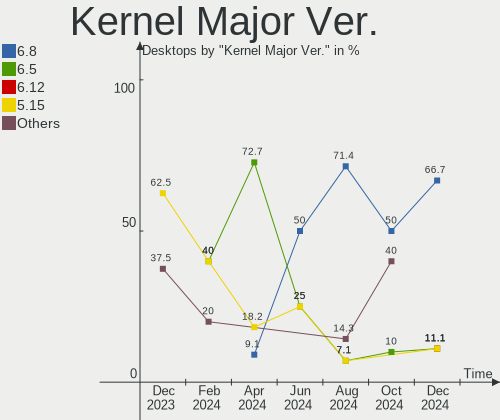
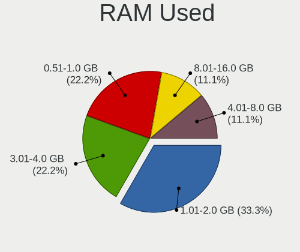
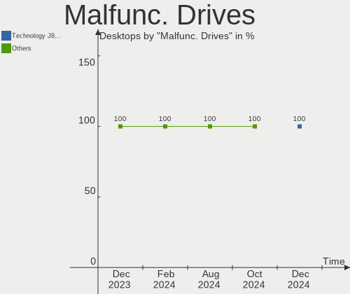
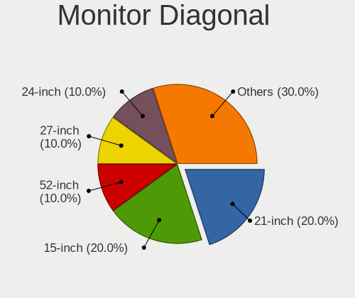
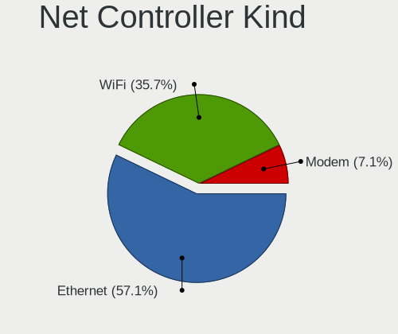
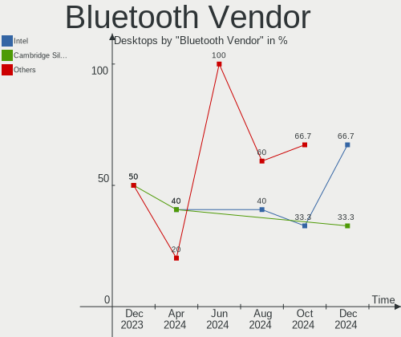
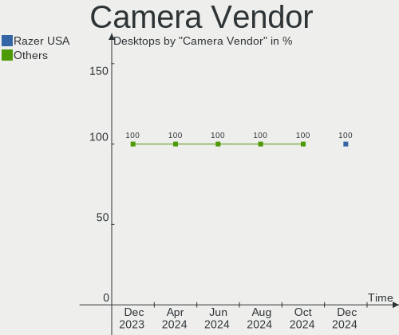

Lubuntu - Hardware Trends (Desktops)
------------------------------------

A project to identify most popular hardware characteristics and track their change
over time based on data collected by Linux users at https://Linux-Hardware.org.

Anyone can contribute to this report by the [hw-probe](https://github.com/linuxhw/hw-probe) tool:

    sudo -E hw-probe -all -upload

This report is for one last month. Overall report since the beginning of time: [TestDays](https://github.com/linuxhw/TestDays)

Period: Mar, 2023.

Contents
--------

* [ System ](#system)
  - [ OS                       ](#os)
  - [ OS Family                ](#os-family)
  - [ Kernel                   ](#kernel)
  - [ Kernel Family            ](#kernel-family)
  - [ Kernel Major Ver.        ](#kernel-major-ver)
  - [ Arch                     ](#arch)
  - [ DE                       ](#de)
  - [ Display Server           ](#display-server)
  - [ Display Manager          ](#display-manager)
  - [ OS Lang                  ](#os-lang)
  - [ Boot Mode                ](#boot-mode)
  - [ Filesystem               ](#filesystem)
  - [ Part. scheme             ](#part-scheme)
  - [ Dual Boot with Linux/BSD ](#dual-boot-with-linuxbsd)
  - [ Dual Boot (Win)          ](#dual-boot-win)

* [ Board ](#board)
  - [ Vendor                   ](#vendor)
  - [ Model                    ](#model)
  - [ Model Family             ](#model-family)
  - [ MFG Year                 ](#mfg-year)
  - [ Form Factor              ](#form-factor)
  - [ Secure Boot              ](#secure-boot)
  - [ Coreboot                 ](#coreboot)
  - [ RAM Size                 ](#ram-size)
  - [ RAM Used                 ](#ram-used)
  - [ Total Drives             ](#total-drives)
  - [ Has CD-ROM               ](#has-cd-rom)
  - [ Has Ethernet             ](#has-ethernet)
  - [ Has WiFi                 ](#has-wifi)
  - [ Has Bluetooth            ](#has-bluetooth)

* [ Location ](#location)
  - [ Country                  ](#country)
  - [ City                     ](#city)

* [ Drives ](#drives)
  - [ Drive Vendor             ](#drive-vendor)
  - [ Drive Model              ](#drive-model)
  - [ HDD Vendor               ](#hdd-vendor)
  - [ SSD Vendor               ](#ssd-vendor)
  - [ Drive Kind               ](#drive-kind)
  - [ Drive Connector          ](#drive-connector)
  - [ Drive Size               ](#drive-size)
  - [ Space Total              ](#space-total)
  - [ Space Used               ](#space-used)
  - [ Malfunc. Drives          ](#malfunc-drives)
  - [ Malfunc. Drive Vendor    ](#malfunc-drive-vendor)
  - [ Malfunc. HDD Vendor      ](#malfunc-hdd-vendor)
  - [ Malfunc. Drive Kind      ](#malfunc-drive-kind)
  - [ Failed Drives            ](#failed-drives)
  - [ Failed Drive Vendor      ](#failed-drive-vendor)
  - [ Drive Status             ](#drive-status)

* [ Storage controller ](#storage-controller)
  - [ Storage Vendor           ](#storage-vendor)
  - [ Storage Model            ](#storage-model)
  - [ Storage Kind             ](#storage-kind)

* [ Processor ](#processor)
  - [ CPU Vendor               ](#cpu-vendor)
  - [ CPU Model                ](#cpu-model)
  - [ CPU Model Family         ](#cpu-model-family)
  - [ CPU Cores                ](#cpu-cores)
  - [ CPU Sockets              ](#cpu-sockets)
  - [ CPU Threads              ](#cpu-threads)
  - [ CPU Op-Modes             ](#cpu-op-modes)
  - [ CPU Microcode            ](#cpu-microcode)
  - [ CPU Microarch            ](#cpu-microarch)

* [ Graphics ](#graphics)
  - [ GPU Vendor               ](#gpu-vendor)
  - [ GPU Model                ](#gpu-model)
  - [ GPU Combo                ](#gpu-combo)
  - [ GPU Driver               ](#gpu-driver)
  - [ GPU Memory               ](#gpu-memory)

* [ Monitor ](#monitor)
  - [ Monitor Vendor           ](#monitor-vendor)
  - [ Monitor Model            ](#monitor-model)
  - [ Monitor Resolution       ](#monitor-resolution)
  - [ Monitor Diagonal         ](#monitor-diagonal)
  - [ Monitor Width            ](#monitor-width)
  - [ Aspect Ratio             ](#aspect-ratio)
  - [ Monitor Area             ](#monitor-area)
  - [ Pixel Density            ](#pixel-density)
  - [ Multiple Monitors        ](#multiple-monitors)

* [ Network ](#network)
  - [ Net Controller Vendor    ](#net-controller-vendor)
  - [ Net Controller Model     ](#net-controller-model)
  - [ Wireless Vendor          ](#wireless-vendor)
  - [ Wireless Model           ](#wireless-model)
  - [ Ethernet Vendor          ](#ethernet-vendor)
  - [ Ethernet Model           ](#ethernet-model)
  - [ Net Controller Kind      ](#net-controller-kind)
  - [ Used Controller          ](#used-controller)
  - [ NICs                     ](#nics)
  - [ IPv6                     ](#ipv6)

* [ Bluetooth ](#bluetooth)
  - [ Bluetooth Vendor         ](#bluetooth-vendor)
  - [ Bluetooth Model          ](#bluetooth-model)

* [ Sound ](#sound)
  - [ Sound Vendor             ](#sound-vendor)
  - [ Sound Model              ](#sound-model)

* [ Memory ](#memory)
  - [ Memory Vendor            ](#memory-vendor)
  - [ Memory Model             ](#memory-model)
  - [ Memory Kind              ](#memory-kind)
  - [ Memory Form Factor       ](#memory-form-factor)
  - [ Memory Size              ](#memory-size)
  - [ Memory Speed             ](#memory-speed)

* [ Printers & scanners ](#printers--scanners)
  - [ Printer Vendor           ](#printer-vendor)
  - [ Printer Model            ](#printer-model)
  - [ Scanner Vendor           ](#scanner-vendor)
  - [ Scanner Model            ](#scanner-model)

* [ Camera ](#camera)
  - [ Camera Vendor            ](#camera-vendor)
  - [ Camera Model             ](#camera-model)

* [ Security ](#security)
  - [ Fingerprint Vendor       ](#fingerprint-vendor)
  - [ Fingerprint Model        ](#fingerprint-model)
  - [ Chipcard Vendor          ](#chipcard-vendor)
  - [ Chipcard Model           ](#chipcard-model)

* [ Unsupported ](#unsupported)
  - [ Unsupported Devices      ](#unsupported-devices)
  - [ Unsupported Device Types ](#unsupported-device-types)

System
------

OS
--

Installed operating systems

| Name          | Desktops | Percent |
|---------------|----------|---------|
| Lubuntu 22.04 | 10       | 66.67%  |
| Lubuntu 18.04 | 3        | 20%     |
| Lubuntu 22.10 | 2        | 13.33%  |

OS Family
---------

OS without a version

| Name    | Desktops | Percent |
|---------|----------|---------|
| Lubuntu | 15       | 100%    |

Kernel
------

Version of the Linux kernel

| Version              | Desktops | Percent |
|----------------------|----------|---------|
| 5.19.0-35-generic    | 3        | 20%     |
| 5.15.0-67-generic    | 3        | 20%     |
| 5.15.0-60-generic    | 2        | 13.33%  |
| 4.15.0-206-generic   | 2        | 13.33%  |
| 6.2.8-x64v3-xanmod1  | 1        | 6.67%   |
| 6.2.6-060206-generic | 1        | 6.67%   |
| 6.0.14               | 1        | 6.67%   |
| 5.4.0-84-generic     | 1        | 6.67%   |
| 5.19.0-32-generic    | 1        | 6.67%   |

Kernel Family
-------------

Linux kernel without a distro release

| Version | Desktops | Percent |
|---------|----------|---------|
| 5.15.0  | 5        | 33.33%  |
| 5.19.0  | 4        | 26.67%  |
| 4.15.0  | 2        | 13.33%  |
| 6.2.8   | 1        | 6.67%   |
| 6.2.6   | 1        | 6.67%   |
| 6.0.14  | 1        | 6.67%   |
| 5.4.0   | 1        | 6.67%   |

Kernel Major Ver.
-----------------

Linux kernel major version

| Version | Desktops | Percent |
|---------|----------|---------|
| 5.15    | 5        | 33.33%  |
| 5.19    | 4        | 26.67%  |
| 6.2     | 2        | 13.33%  |
| 4.15    | 2        | 13.33%  |
| 6.0     | 1        | 6.67%   |
| 5.4     | 1        | 6.67%   |

Arch
----

OS architecture (x86_64, i586, etc.)

| Name   | Desktops | Percent |
|--------|----------|---------|
| x86_64 | 13       | 86.67%  |
| i686   | 2        | 13.33%  |

DE
--

Desktop Environment

| Name | Desktops | Percent |
|------|----------|---------|
| LXQt | 12       | 80%     |
| LXDE | 3        | 20%     |

Display Server
--------------

X11 or Wayland

| Name | Desktops | Percent |
|------|----------|---------|
| X11  | 14       | 93.33%  |
| Tty  | 1        | 6.67%   |

Display Manager
---------------

SDDM, LightDM, etc.

| Name    | Desktops | Percent |
|---------|----------|---------|
| SDDM    | 11       | 73.33%  |
| LightDM | 3        | 20%     |
| Unknown | 1        | 6.67%   |

OS Lang
-------

Language

| Lang  | Desktops | Percent |
|-------|----------|---------|
| en_US | 4        | 26.67%  |
| fr_FR | 2        | 13.33%  |
| es_ES | 2        | 13.33%  |
| es_AR | 2        | 13.33%  |
| zh_TW | 1        | 6.67%   |
| pt_BR | 1        | 6.67%   |
| it_IT | 1        | 6.67%   |
| es_PE | 1        | 6.67%   |
| de_DE | 1        | 6.67%   |

Boot Mode
---------

EFI or BIOS

| Mode | Desktops | Percent |
|------|----------|---------|
| BIOS | 10       | 66.67%  |
| EFI  | 5        | 33.33%  |

Filesystem
----------

Type of filesystem

| Type | Desktops | Percent |
|------|----------|---------|
| Ext4 | 14       | 93.33%  |
| Ext3 | 1        | 6.67%   |

Part. scheme
------------

Scheme of partitioning

| Type    | Desktops | Percent |
|---------|----------|---------|
| MBR     | 8        | 53.33%  |
| GPT     | 5        | 33.33%  |
| Unknown | 2        | 13.33%  |

Dual Boot with Linux/BSD
------------------------

Hosting more than one Linux/BSD

| Dual boot | Desktops | Percent |
|-----------|----------|---------|
| No        | 13       | 86.67%  |
| Yes       | 2        | 13.33%  |

Dual Boot (Win)
---------------

Hosting Linux and Windows

| Dual boot | Desktops | Percent |
|-----------|----------|---------|
| No        | 10       | 66.67%  |
| Yes       | 5        | 33.33%  |

Board
-----

Vendor
------

Motherboard manufacturer

| Name                | Desktops | Percent |
|---------------------|----------|---------|
| ASRock              | 5        | 33.33%  |
| Pegatron            | 2        | 13.33%  |
| Gigabyte Technology | 2        | 13.33%  |
| YANYU               | 1        | 6.67%   |
| Positivo            | 1        | 6.67%   |
| MSI                 | 1        | 6.67%   |
| Intel               | 1        | 6.67%   |
| BANGHO              | 1        | 6.67%   |
| ASUSTek Computer    | 1        | 6.67%   |

Model
-----

Motherboard model

| Name                        | Desktops | Percent |
|-----------------------------|----------|---------|
| YANYU ITX-S192              | 1        | 6.67%   |
| Positivo P5VD2-MX           | 1        | 6.67%   |
| Pegatron NC689AA-ABA s3700y | 1        | 6.67%   |
| Pegatron h8-1350ef          | 1        | 6.67%   |
| MSI MS-7C56                 | 1        | 6.67%   |
| Intel X79 V2.72A            | 1        | 6.67%   |
| Gigabyte GB-BMCE-5105       | 1        | 6.67%   |
| Gigabyte B360M-DS3H         | 1        | 6.67%   |
| BANGHO LITE E34             | 1        | 6.67%   |
| ASUS A7N8X-E                | 1        | 6.67%   |
| ASRock Z87 Extreme4         | 1        | 6.67%   |
| ASRock N68-GS4/USB3 FX      | 1        | 6.67%   |
| ASRock H110M-HDV            | 1        | 6.67%   |
| ASRock G41M-VS3             | 1        | 6.67%   |
| ASRock G31M-S               | 1        | 6.67%   |

Model Family
------------

Motherboard model prefix

| Name                  | Desktops | Percent |
|-----------------------|----------|---------|
| YANYU ITX-S192        | 1        | 6.67%   |
| Positivo P5VD2-MX     | 1        | 6.67%   |
| Pegatron NC689AA-ABA  | 1        | 6.67%   |
| Pegatron h8-1350ef    | 1        | 6.67%   |
| MSI MS-7C56           | 1        | 6.67%   |
| Intel X79             | 1        | 6.67%   |
| Gigabyte GB-BMCE-5105 | 1        | 6.67%   |
| Gigabyte B360M-DS3H   | 1        | 6.67%   |
| BANGHO LITE           | 1        | 6.67%   |
| ASUS A7N8X-E          | 1        | 6.67%   |
| ASRock Z87            | 1        | 6.67%   |
| ASRock N68-GS4        | 1        | 6.67%   |
| ASRock H110M-HDV      | 1        | 6.67%   |
| ASRock G41M-VS3       | 1        | 6.67%   |
| ASRock G31M-S         | 1        | 6.67%   |

MFG Year
--------

Motherboard manufacture year

| Year | Desktops | Percent |
|------|----------|---------|
| 2018 | 3        | 20%     |
| 2008 | 2        | 13.33%  |
| 2021 | 1        | 6.67%   |
| 2020 | 1        | 6.67%   |
| 2019 | 1        | 6.67%   |
| 2015 | 1        | 6.67%   |
| 2014 | 1        | 6.67%   |
| 2013 | 1        | 6.67%   |
| 2012 | 1        | 6.67%   |
| 2010 | 1        | 6.67%   |
| 2007 | 1        | 6.67%   |
| 2004 | 1        | 6.67%   |

Form Factor
-----------

Physical design of the computer

| Name    | Desktops | Percent |
|---------|----------|---------|
| Desktop | 15       | 100%    |

Secure Boot
-----------

Enabled or disabled

| State    | Desktops | Percent |
|----------|----------|---------|
| Disabled | 15       | 100%    |

Coreboot
--------

Have coreboot on board

| Used | Desktops | Percent |
|------|----------|---------|
| No   | 15       | 100%    |

RAM Size
--------

Total RAM memory

| Size in GB  | Desktops | Percent |
|-------------|----------|---------|
| 3.01-4.0    | 4        | 26.67%  |
| 2.01-3.0    | 3        | 20%     |
| 4.01-8.0    | 2        | 13.33%  |
| 16.01-24.0  | 2        | 13.33%  |
| 32.01-64.0  | 1        | 6.67%   |
| 64.01-256.0 | 1        | 6.67%   |
| 8.01-16.0   | 1        | 6.67%   |
| 0.51-1.0    | 1        | 6.67%   |

RAM Used
--------

Used RAM memory

| Used GB  | Desktops | Percent |
|----------|----------|---------|
| 1.01-2.0 | 6        | 40%     |
| 0.51-1.0 | 5        | 33.33%  |
| 2.01-3.0 | 3        | 20%     |
| 4.01-8.0 | 1        | 6.67%   |

Total Drives
------------

Number of drives on board

| Drives | Desktops | Percent |
|--------|----------|---------|
| 1      | 7        | 46.67%  |
| 2      | 6        | 40%     |
| 12     | 1        | 6.67%   |
| 3      | 1        | 6.67%   |

Has CD-ROM
----------

Has CD-ROM on board

| Presented | Desktops | Percent |
|-----------|----------|---------|
| No        | 8        | 53.33%  |
| Yes       | 7        | 46.67%  |

Has Ethernet
------------

Has Ethernet on board

| Presented | Desktops | Percent |
|-----------|----------|---------|
| Yes       | 15       | 100%    |

Has WiFi
--------

Has WiFi module

| Presented | Desktops | Percent |
|-----------|----------|---------|
| No        | 8        | 53.33%  |
| Yes       | 7        | 46.67%  |

Has Bluetooth
-------------

Has Bluetooth module

| Presented | Desktops | Percent |
|-----------|----------|---------|
| No        | 14       | 93.33%  |
| Yes       | 1        | 6.67%   |

Location
--------

Country
-------

Geographic location (country)

| Country   | Desktops | Percent |
|-----------|----------|---------|
| Spain     | 2        | 13.33%  |
| Germany   | 2        | 13.33%  |
| France    | 2        | 13.33%  |
| Argentina | 2        | 13.33%  |
| USA       | 1        | 6.67%   |
| Taiwan    | 1        | 6.67%   |
| Poland    | 1        | 6.67%   |
| Peru      | 1        | 6.67%   |
| Italy     | 1        | 6.67%   |
| Iran      | 1        | 6.67%   |
| Brazil    | 1        | 6.67%   |

City
----

Geographic location (city)

| City               | Desktops | Percent |
|--------------------|----------|---------|
| Toulouse           | 1        | 6.67%   |
| Torrejón de Ardoz | 1        | 6.67%   |
| Tehran             | 1        | 6.67%   |
| Taipei             | 1        | 6.67%   |
| St Louis           | 1        | 6.67%   |
| Sao Paulo          | 1        | 6.67%   |
| Paris              | 1        | 6.67%   |
| Lima               | 1        | 6.67%   |
| Krakow             | 1        | 6.67%   |
| Koenigswinter      | 1        | 6.67%   |
| Huelva             | 1        | 6.67%   |
| Goya               | 1        | 6.67%   |
| Eberbach           | 1        | 6.67%   |
| Corrientes         | 1        | 6.67%   |
| Castenaso          | 1        | 6.67%   |

Drives
------

Drive Vendor
------------

Hard drive vendors

| Vendor                    | Desktops | Drives | Percent |
|---------------------------|----------|--------|---------|
| WDC                       | 5        | 11     | 20.83%  |
| Seagate                   | 4        | 7      | 16.67%  |
| Samsung Electronics       | 4        | 5      | 16.67%  |
| Kingston                  | 2        | 2      | 8.33%   |
| Hitachi                   | 2        | 2      | 8.33%   |
| China                     | 2        | 2      | 8.33%   |
| SanDisk                   | 1        | 1      | 4.17%   |
| Micron/Crucial Technology | 1        | 1      | 4.17%   |
| Maxtor                    | 1        | 1      | 4.17%   |
| Crucial                   | 1        | 1      | 4.17%   |
| BR                        | 1        | 1      | 4.17%   |

Drive Model
-----------

Hard drive models

| Model                                | Desktops | Percent |
|--------------------------------------|----------|---------|
| Seagate ST1000DM010-2EP102 1TB       | 2        | 6.25%   |
| Kingston SA400S37240G 240GB SSD      | 2        | 6.25%   |
| WDC WDS240G2G0A-00JH30 240GB SSD     | 1        | 3.13%   |
| WDC WD60EFRX-68L0BN1 6TB             | 1        | 3.13%   |
| WDC WD5000AAVS-00ZTB0 500GB          | 1        | 3.13%   |
| WDC WD3200AAJS-65M0A0 320GB          | 1        | 3.13%   |
| WDC WD3200AAJS-00L7A0 320GB          | 1        | 3.13%   |
| WDC WD2003FYYS-02W0B0 2TB            | 1        | 3.13%   |
| WDC WD10SPZX-08Z10 1TB               | 1        | 3.13%   |
| WDC WD10S21X-24R1BT0-SSHD-8GB        | 1        | 3.13%   |
| WDC WD1002FAEX-00Z3A0 1TB            | 1        | 3.13%   |
| WDC PC SN530 SDBPNPZ-256G-1114 256GB | 1        | 3.13%   |
| Seagate ST8000NM0045-1RL112 8TB      | 1        | 3.13%   |
| Seagate ST3200826AS 200GB            | 1        | 3.13%   |
| Seagate ST1000LM035-1RK172 1TB       | 1        | 3.13%   |
| Seagate ST1000LM024 HN-M101MBB 1TB   | 1        | 3.13%   |
| SanDisk DF4032  32GB                 | 1        | 3.13%   |
| Samsung SSD 970 EVO Plus 500GB       | 1        | 3.13%   |
| Samsung SSD 950 PRO 512GB            | 1        | 3.13%   |
| Samsung SSD 860 EVO 500GB            | 1        | 3.13%   |
| Samsung SP1614C 160GB                | 1        | 3.13%   |
| Samsung HD502IJ 500GB                | 1        | 3.13%   |
| Micron/Crucial CT1000P5PSSD8 1TB     | 1        | 3.13%   |
| Maxtor STM3320613AS 320GB            | 1        | 3.13%   |
| Hitachi HDT721010SLA360 1TB          | 1        | 3.13%   |
| Hitachi HDS723020BLA642 2TB          | 1        | 3.13%   |
| Crucial CT1000P3SSD8 1TB             | 1        | 3.13%   |
| China SSD 120GB                      | 1        | 3.13%   |
| China 120GB SSD                      | 1        | 3.13%   |
| BR SSD 32G                           | 1        | 3.13%   |

HDD Vendor
----------

Hard disk drive vendors

| Vendor              | Desktops | Drives | Percent |
|---------------------|----------|--------|---------|
| WDC                 | 4        | 9      | 33.33%  |
| Seagate             | 4        | 7      | 33.33%  |
| Hitachi             | 2        | 2      | 16.67%  |
| Samsung Electronics | 1        | 2      | 8.33%   |
| Maxtor              | 1        | 1      | 8.33%   |

SSD Vendor
----------

Solid state drive vendors

| Vendor              | Desktops | Drives | Percent |
|---------------------|----------|--------|---------|
| Kingston            | 2        | 2      | 28.57%  |
| China               | 2        | 2      | 28.57%  |
| WDC                 | 1        | 1      | 14.29%  |
| Samsung Electronics | 1        | 1      | 14.29%  |
| BR                  | 1        | 1      | 14.29%  |

Drive Kind
----------

HDD or SSD

| Kind | Desktops | Drives | Percent |
|------|----------|--------|---------|
| HDD  | 10       | 21     | 45.45%  |
| SSD  | 7        | 7      | 31.82%  |
| NVMe | 4        | 5      | 18.18%  |
| MMC  | 1        | 1      | 4.55%   |

Drive Connector
---------------

SATA, SAS, NVMe, etc.

| Type | Desktops | Drives | Percent |
|------|----------|--------|---------|
| SATA | 14       | 28     | 73.68%  |
| NVMe | 4        | 5      | 21.05%  |
| MMC  | 1        | 1      | 5.26%   |

Drive Size
----------

Size of hard drive

| Size in TB | Desktops | Drives | Percent |
|------------|----------|--------|---------|
| 0.01-0.5   | 12       | 14     | 60%     |
| 0.51-1.0   | 5        | 9      | 25%     |
| 1.01-2.0   | 2        | 2      | 10%     |
| 4.01-10.0  | 1        | 3      | 5%      |

Space Total
-----------

Amount of disk space available on the file system

| Size in GB | Desktops | Percent |
|------------|----------|---------|
| 251-500    | 4        | 26.67%  |
| 101-250    | 4        | 26.67%  |
| 21-50      | 3        | 20%     |
| 1001-2000  | 3        | 20%     |
| 51-100     | 1        | 6.67%   |

Space Used
----------

Amount of used disk space

| Used GB   | Desktops | Percent |
|-----------|----------|---------|
| 1-20      | 7        | 46.67%  |
| 21-50     | 3        | 20%     |
| 51-100    | 2        | 13.33%  |
| 251-500   | 1        | 6.67%   |
| 101-250   | 1        | 6.67%   |
| 1001-2000 | 1        | 6.67%   |

Malfunc. Drives
---------------

Drive models with a malfunction

| Model                              | Desktops | Drives | Percent |
|------------------------------------|----------|--------|---------|
| WDC WD60EFRX-68L0BN1 6TB           | 1        | 2      | 16.67%  |
| WDC WD2003FYYS-02W0B0 2TB          | 1        | 1      | 16.67%  |
| WDC WD10SPZX-08Z10 1TB             | 1        | 1      | 16.67%  |
| WDC WD1002FAEX-00Z3A0 1TB          | 1        | 1      | 16.67%  |
| Seagate ST1000LM024 HN-M101MBB 1TB | 1        | 2      | 16.67%  |
| Samsung Electronics HD502IJ 500GB  | 1        | 1      | 16.67%  |

Malfunc. Drive Vendor
---------------------

Vendors of faulty drives

| Vendor              | Desktops | Drives | Percent |
|---------------------|----------|--------|---------|
| WDC                 | 2        | 5      | 50%     |
| Seagate             | 1        | 2      | 25%     |
| Samsung Electronics | 1        | 1      | 25%     |

Malfunc. HDD Vendor
-------------------

Vendors of faulty HDD drives

| Vendor              | Desktops | Drives | Percent |
|---------------------|----------|--------|---------|
| WDC                 | 2        | 5      | 50%     |
| Seagate             | 1        | 2      | 25%     |
| Samsung Electronics | 1        | 1      | 25%     |

Malfunc. Drive Kind
-------------------

Kinds of faulty drives

| Kind | Desktops | Drives | Percent |
|------|----------|--------|---------|
| HDD  | 3        | 8      | 100%    |

Failed Drives
-------------

Failed drive models

Zero info for selected period =(

Failed Drive Vendor
-------------------

Failed drive vendors

Zero info for selected period =(

Drive Status
------------

Number of failed and malfunc. drives

| Status   | Desktops | Drives | Percent |
|----------|----------|--------|---------|
| Works    | 9        | 16     | 47.37%  |
| Detected | 7        | 10     | 36.84%  |
| Malfunc  | 3        | 8      | 15.79%  |

Storage controller
------------------

Storage Vendor
--------------

Storage controller vendors

| Vendor                    | Desktops | Percent |
|---------------------------|----------|---------|
| Intel                     | 10       | 41.67%  |
| Nvidia                    | 3        | 12.5%   |
| Samsung Electronics       | 2        | 8.33%   |
| Micron/Crucial Technology | 2        | 8.33%   |
| VIA Technologies          | 1        | 4.17%   |
| Silicon Image             | 1        | 4.17%   |
| SanDisk                   | 1        | 4.17%   |
| Marvell Technology Group  | 1        | 4.17%   |
| LSI Logic / Symbios Logic | 1        | 4.17%   |
| ASMedia Technology        | 1        | 4.17%   |
| AMD                       | 1        | 4.17%   |

Storage Model
-------------

Storage controller models

| Model                                                                          | Desktops | Percent |
|--------------------------------------------------------------------------------|----------|---------|
| Nvidia MCP61 SATA Controller                                                   | 2        | 6.9%    |
| Nvidia MCP61 IDE                                                               | 2        | 6.9%    |
| Intel NM10/ICH7 Family SATA Controller [IDE mode]                              | 2        | 6.9%    |
| Intel 82801G (ICH7 Family) IDE Controller                                      | 2        | 6.9%    |
| VIA VT82C586A/B/VT82C686/A/B/VT823x/A/C PIPC Bus Master IDE                    | 1        | 3.45%   |
| VIA Serial ATA Controller                                                      | 1        | 3.45%   |
| Silicon Image SiI 3112 [SATALink/SATARaid] Serial ATA Controller               | 1        | 3.45%   |
| SanDisk WD Blue SN550 NVMe SSD                                                 | 1        | 3.45%   |
| Samsung NVMe SSD Controller SM981/PM981/PM983                                  | 1        | 3.45%   |
| Samsung NVMe SSD Controller SM951/PM951                                        | 1        | 3.45%   |
| Nvidia nForce2 IDE                                                             | 1        | 3.45%   |
| Micron/Crucial P5 Plus NVMe PCIe SSD                                           | 1        | 3.45%   |
| Micron/Crucial P2 NVMe PCIe SSD                                                | 1        | 3.45%   |
| Marvell Group 88SE9215 PCIe 2.0 x1 4-port SATA 6 Gb/s Controller               | 1        | 3.45%   |
| LSI Logic / Symbios Logic SAS2008 PCI-Express Fusion-MPT SAS-2 [Falcon]        | 1        | 3.45%   |
| Intel Q170/Q150/B150/H170/H110/Z170/CM236 Chipset SATA Controller [AHCI Mode]  | 1        | 3.45%   |
| Intel Jasper Lake SATA AHCI Controller                                         | 1        | 3.45%   |
| Intel Celeron N3350/Pentium N4200/Atom E3900 Series SATA AHCI Controller       | 1        | 3.45%   |
| Intel Cannon Lake PCH SATA AHCI Controller                                     | 1        | 3.45%   |
| Intel C600/X79 series chipset 6-Port SATA AHCI Controller                      | 1        | 3.45%   |
| Intel Atom Processor E3800 Series SATA AHCI Controller                         | 1        | 3.45%   |
| Intel 8 Series/C220 Series Chipset Family 6-port SATA Controller 1 [AHCI mode] | 1        | 3.45%   |
| Intel 7 Series/C210 Series Chipset Family 6-port SATA Controller [AHCI mode]   | 1        | 3.45%   |
| ASMedia ASM1062 Serial ATA Controller                                          | 1        | 3.45%   |
| AMD 500 Series Chipset SATA Controller                                         | 1        | 3.45%   |

Storage Kind
------------

Kind of storage controller (IDE, SATA, NVMe, SAS, ...)

| Kind | Desktops | Percent |
|------|----------|---------|
| SATA | 9        | 42.86%  |
| IDE  | 6        | 28.57%  |
| NVMe | 4        | 19.05%  |
| RAID | 1        | 4.76%   |
| SAS  | 1        | 4.76%   |

Processor
---------

CPU Vendor
----------

Processor vendors

| Vendor | Desktops | Percent |
|--------|----------|---------|
| Intel  | 11       | 73.33%  |
| AMD    | 4        | 26.67%  |

CPU Model
---------

Processor models

| Model                                       | Desktops | Percent |
|---------------------------------------------|----------|---------|
| Intel Xeon CPU E5-2630 v2 @ 2.60GHz         | 1        | 6.67%   |
| Intel Pentium Dual-Core CPU E5300 @ 2.60GHz | 1        | 6.67%   |
| Intel Pentium D CPU 2.80GHz                 | 1        | 6.67%   |
| Intel Core i7-4770K CPU @ 3.50GHz           | 1        | 6.67%   |
| Intel Core i5-8400 CPU @ 2.80GHz            | 1        | 6.67%   |
| Intel Core i5-6500 CPU @ 3.20GHz            | 1        | 6.67%   |
| Intel Core i5-2320 CPU @ 3.00GHz            | 1        | 6.67%   |
| Intel Core 2 Duo CPU E4600 @ 2.40GHz        | 1        | 6.67%   |
| Intel Celeron N5105 @ 2.00GHz               | 1        | 6.67%   |
| Intel Celeron CPU N3350 @ 1.10GHz           | 1        | 6.67%   |
| Intel Celeron CPU J1900 @ 1.99GHz           | 1        | 6.67%   |
| AMD Ryzen 7 5700G with Radeon Graphics      | 1        | 6.67%   |
| AMD Athlon XP 3200+                         | 1        | 6.67%   |
| AMD Athlon II X4 645 Processor              | 1        | 6.67%   |
| AMD Athlon 64 X2 Dual Core Processor 5000+  | 1        | 6.67%   |

CPU Model Family
----------------

Processor model prefix

| Model                   | Desktops | Percent |
|-------------------------|----------|---------|
| Intel Core i5           | 3        | 20%     |
| Intel Celeron           | 3        | 20%     |
| Intel Xeon              | 1        | 6.67%   |
| Intel Pentium Dual-Core | 1        | 6.67%   |
| Intel Pentium D         | 1        | 6.67%   |
| Intel Core i7           | 1        | 6.67%   |
| Intel Core 2 Duo        | 1        | 6.67%   |
| AMD Ryzen 7             | 1        | 6.67%   |
| AMD Athlon XP           | 1        | 6.67%   |
| AMD Athlon II X4        | 1        | 6.67%   |
| AMD Athlon 64 X2        | 1        | 6.67%   |

CPU Cores
---------

Number of processor cores

| Number | Desktops | Percent |
|--------|----------|---------|
| 4      | 6        | 40%     |
| 2      | 5        | 33.33%  |
| 6      | 2        | 13.33%  |
| 8      | 1        | 6.67%   |
| 1      | 1        | 6.67%   |

CPU Sockets
-----------

Number of sockets

| Number | Desktops | Percent |
|--------|----------|---------|
| 1      | 15       | 100%    |

CPU Threads
-----------

Threads per core (Hyper-Threading)

| Number | Desktops | Percent |
|--------|----------|---------|
| 1      | 12       | 80%     |
| 2      | 3        | 20%     |

CPU Op-Modes
------------

CPU Operation Modes (32-bit, 64-bit)

| Op mode        | Desktops | Percent |
|----------------|----------|---------|
| 32-bit, 64-bit | 14       | 93.33%  |
| 32-bit         | 1        | 6.67%   |

CPU Microcode
-------------

Microcode number

| Number     | Desktops | Percent |
|------------|----------|---------|
| Unknown    | 6        | 40%     |
| 0xf64      | 1        | 6.67%   |
| 0x906ea    | 1        | 6.67%   |
| 0x906c0    | 1        | 6.67%   |
| 0x6fd      | 1        | 6.67%   |
| 0x506c9    | 1        | 6.67%   |
| 0x306e4    | 1        | 6.67%   |
| 0x30679    | 1        | 6.67%   |
| 0x206a7    | 1        | 6.67%   |
| 0x010000c8 | 1        | 6.67%   |

CPU Microarch
-------------

Microarchitecture

| Name        | Desktops | Percent |
|-------------|----------|---------|
| Zen 3       | 1        | 6.67%   |
| Tremont     | 1        | 6.67%   |
| Skylake     | 1        | 6.67%   |
| Silvermont  | 1        | 6.67%   |
| SandyBridge | 1        | 6.67%   |
| Penryn      | 1        | 6.67%   |
| NetBurst    | 1        | 6.67%   |
| KabyLake    | 1        | 6.67%   |
| K8 Hammer   | 1        | 6.67%   |
| K6          | 1        | 6.67%   |
| K10         | 1        | 6.67%   |
| IvyBridge   | 1        | 6.67%   |
| Haswell     | 1        | 6.67%   |
| Goldmont    | 1        | 6.67%   |
| Core        | 1        | 6.67%   |

Graphics
--------

GPU Vendor
----------

Vendors of graphics cards

| Vendor | Desktops | Percent |
|--------|----------|---------|
| Nvidia | 8        | 42.11%  |
| Intel  | 7        | 36.84%  |
| AMD    | 4        | 21.05%  |

GPU Model
---------

Graphics card models

| Model                                                        | Desktops | Percent |
|--------------------------------------------------------------|----------|---------|
| Nvidia GP108 [GeForce GT 1030]                               | 1        | 5.26%   |
| Nvidia GP107GL [Quadro P600]                                 | 1        | 5.26%   |
| Nvidia GP107 [GeForce GTX 1050 Ti]                           | 1        | 5.26%   |
| Nvidia GM107 [GeForce GTX 750 Ti]                            | 1        | 5.26%   |
| Nvidia GK208B [GeForce GT 720]                               | 1        | 5.26%   |
| Nvidia G73 [GeForce 7600 GS AGP]                             | 1        | 5.26%   |
| Nvidia C61 [GeForce 7025 / nForce 630a]                      | 1        | 5.26%   |
| Nvidia C61 [GeForce 6150SE nForce 430]                       | 1        | 5.26%   |
| Intel JasperLake [UHD Graphics]                              | 1        | 5.26%   |
| Intel HD Graphics 530                                        | 1        | 5.26%   |
| Intel HD Graphics 500                                        | 1        | 5.26%   |
| Intel CoffeeLake-S GT2 [UHD Graphics 630]                    | 1        | 5.26%   |
| Intel Atom Processor Z36xxx/Z37xxx Series Graphics & Display | 1        | 5.26%   |
| Intel 82G33/G31 Express Integrated Graphics Controller       | 1        | 5.26%   |
| Intel 4 Series Chipset Integrated Graphics Controller        | 1        | 5.26%   |
| AMD Cezanne [Radeon Vega Series / Radeon Vega Mobile Series] | 1        | 5.26%   |
| AMD Cedar [Radeon HD 5000/6000/7350/8350 Series]             | 1        | 5.26%   |
| AMD Caicos PRO [Radeon HD 7450]                              | 1        | 5.26%   |
| AMD 3D Rage PRO PCI                                          | 1        | 5.26%   |

GPU Combo
---------

Combinations of graphics cards

| Name           | Desktops | Percent |
|----------------|----------|---------|
| 1 x Nvidia     | 5        | 33.33%  |
| 1 x Intel      | 5        | 33.33%  |
| AMD + Nvidia   | 2        | 13.33%  |
| 1 x AMD        | 2        | 13.33%  |
| Intel + Nvidia | 1        | 6.67%   |

GPU Driver
----------

Free vs proprietary

| Driver      | Desktops | Percent |
|-------------|----------|---------|
| Free        | 12       | 80%     |
| Proprietary | 3        | 20%     |

GPU Memory
----------

Total video memory

| Size in GB | Desktops | Percent |
|------------|----------|---------|
| Unknown    | 7        | 46.67%  |
| 0.01-0.5   | 3        | 20%     |
| 1.01-2.0   | 2        | 13.33%  |
| 0.51-1.0   | 2        | 13.33%  |
| 3.01-4.0   | 1        | 6.67%   |

Monitor
-------

Monitor Vendor
--------------

Monitor vendors

| Vendor              | Desktops | Percent |
|---------------------|----------|---------|
| Samsung Electronics | 2        | 16.67%  |
| Acer                | 2        | 16.67%  |
| Westinghouse        | 1        | 8.33%   |
| Unknown (ADA)       | 1        | 8.33%   |
| Jean                | 1        | 8.33%   |
| Iiyama              | 1        | 8.33%   |
| Goldstar            | 1        | 8.33%   |
| Fujitsu Siemens     | 1        | 8.33%   |
| BenQ                | 1        | 8.33%   |
| AOpen               | 1        | 8.33%   |

Monitor Model
-------------

Monitor models

| Model                                                             | Desktops | Percent |
|-------------------------------------------------------------------|----------|---------|
| Westinghouse LCM-22w2 WDE2202 1680x1050 473x296mm 22.0-inch       | 1        | 7.69%   |
| Unknown (ADA) LCD Monitor ADA0004 1280x800 150x100mm 7.1-inch     | 1        | 7.69%   |
| Samsung Electronics S27B350 SAM08DC 1920x1080 598x336mm 27.0-inch | 1        | 7.69%   |
| Samsung Electronics C27R500 SAM0F9D 1920x1080 598x336mm 27.0-inch | 1        | 7.69%   |
| Jean JT178x4 JEN0DB2 1280x1024 338x270mm 17.0-inch                | 1        | 7.69%   |
| Iiyama AX3818UTC IVM3848 1024x768 304x228mm 15.0-inch             | 1        | 7.69%   |
| Goldstar W1943 GSM4BAD 1360x768 406x229mm 18.4-inch               | 1        | 7.69%   |
| Goldstar HD GSM5ACD 1366x768 410x230mm 18.5-inch                  | 1        | 7.69%   |
| Fujitsu Siemens W19-1 FUS0594 1440x900 410x256mm 19.0-inch        | 1        | 7.69%   |
| BenQ G922HDAL BNQ784C 1366x768 410x230mm 18.5-inch                | 1        | 7.69%   |
| AOpen 24CH3Y AOP0712 1920x1080 527x296mm 23.8-inch                | 1        | 7.69%   |
| Acer X223W ACR0009 1680x1050 473x296mm 22.0-inch                  | 1        | 7.69%   |
| Acer G257HU ACR0416 2560x1440 552x311mm 24.9-inch                 | 1        | 7.69%   |

Monitor Resolution
------------------

Monitor screen resolution

| Resolution         | Desktops | Percent |
|--------------------|----------|---------|
| 1920x1080 (FHD)    | 3        | 23.08%  |
| 1680x1050 (WSXGA+) | 2        | 15.38%  |
| 1366x768 (WXGA)    | 2        | 15.38%  |
| 2560x1440 (QHD)    | 1        | 7.69%   |
| 1440x900 (WXGA+)   | 1        | 7.69%   |
| 1360x768           | 1        | 7.69%   |
| 1280x800 (WXGA)    | 1        | 7.69%   |
| 1280x1024 (SXGA)   | 1        | 7.69%   |
| 1024x768 (XGA)     | 1        | 7.69%   |

Monitor Diagonal
----------------

Diagonal size in inches

| Inches | Desktops | Percent |
|--------|----------|---------|
| 27     | 2        | 16.67%  |
| 22     | 2        | 16.67%  |
| 18     | 2        | 16.67%  |
| 24     | 1        | 8.33%   |
| 23     | 1        | 8.33%   |
| 19     | 1        | 8.33%   |
| 17     | 1        | 8.33%   |
| 15     | 1        | 8.33%   |
| 7      | 1        | 8.33%   |

Monitor Width
-------------

Physical width

| Width in mm | Desktops | Percent |
|-------------|----------|---------|
| 401-500     | 5        | 41.67%  |
| 501-600     | 4        | 33.33%  |
| 301-350     | 2        | 16.67%  |
| 101-200     | 1        | 8.33%   |

Aspect Ratio
------------

Proportional relationship between the width and the height

| Ratio | Desktops | Percent |
|-------|----------|---------|
| 16/9  | 6        | 50%     |
| 16/10 | 3        | 25%     |
| 5/4   | 1        | 8.33%   |
| 4/3   | 1        | 8.33%   |
| 3/2   | 1        | 8.33%   |

Monitor Area
------------

Area in inch²

| Area in inch² | Desktops | Percent |
|----------------|----------|---------|
| 201-250        | 3        | 25%     |
| 141-150        | 3        | 25%     |
| 301-350        | 2        | 16.67%  |
| 1-40           | 1        | 8.33%   |
| 251-300        | 1        | 8.33%   |
| 151-200        | 1        | 8.33%   |
| 101-110        | 1        | 8.33%   |

Pixel Density
-------------

Pixels per inch

| Density | Desktops | Percent |
|---------|----------|---------|
| 51-100  | 10       | 83.33%  |
| 161-240 | 1        | 8.33%   |
| 101-120 | 1        | 8.33%   |

Multiple Monitors
-----------------

Total monitors connected

| Total | Desktops | Percent |
|-------|----------|---------|
| 1     | 13       | 86.67%  |
| 2     | 1        | 6.67%   |
| 0     | 1        | 6.67%   |

Network
-------

Net Controller Vendor
---------------------

Controller vendors

| Vendor                   | Desktops | Percent |
|--------------------------|----------|---------|
| Realtek Semiconductor    | 9        | 34.62%  |
| Nvidia                   | 3        | 11.54%  |
| Intel                    | 3        | 11.54%  |
| Qualcomm Atheros         | 2        | 7.69%   |
| VIA Technologies         | 1        | 3.85%   |
| Texas Instruments        | 1        | 3.85%   |
| Ralink                   | 1        | 3.85%   |
| NetGear                  | 1        | 3.85%   |
| Marvell Technology Group | 1        | 3.85%   |
| ICS Advent               | 1        | 3.85%   |
| Huawei Technologies      | 1        | 3.85%   |
| Edimax Technology        | 1        | 3.85%   |
| Broadcom                 | 1        | 3.85%   |

Net Controller Model
--------------------

Controller models

| Model                                                             | Desktops | Percent |
|-------------------------------------------------------------------|----------|---------|
| Realtek RTL8111/8168/8411 PCI Express Gigabit Ethernet Controller | 6        | 22.22%  |
| Nvidia MCP61 Ethernet                                             | 2        | 7.41%   |
| VIA VT6102/VT6103 [Rhine-II]                                      | 1        | 3.7%    |
| Texas Instruments CC2531 ZigBee                                   | 1        | 3.7%    |
| Realtek RTL88x2bu [AC1200 Techkey]                                | 1        | 3.7%    |
| Realtek RTL810xE PCI Express Fast Ethernet controller             | 1        | 3.7%    |
| Realtek RTL-8100/8101L/8139 PCI Fast Ethernet Adapter             | 1        | 3.7%    |
| Realtek 802.11ac NIC                                              | 1        | 3.7%    |
| Ralink RT5390 Wireless 802.11n 1T/1R PCIe                         | 1        | 3.7%    |
| Qualcomm Atheros AR8161 Gigabit Ethernet                          | 1        | 3.7%    |
| Qualcomm Atheros AR8152 v2.0 Fast Ethernet                        | 1        | 3.7%    |
| Nvidia nForce2 Ethernet Controller                                | 1        | 3.7%    |
| NetGear WG111v2 54 Mbps Wireless [RealTek RTL8187L]               | 1        | 3.7%    |
| Marvell Group 88E8001 Gigabit Ethernet Controller                 | 1        | 3.7%    |
| Intel Wireless 3165                                               | 1        | 3.7%    |
| Intel I211 Gigabit Network Connection                             | 1        | 3.7%    |
| Intel Ethernet Connection I217-V                                  | 1        | 3.7%    |
| ICS Advent USB 10/100 LAN                                         | 1        | 3.7%    |
| Huawei ANA-NX9                                                    | 1        | 3.7%    |
| Edimax EW-7711UTn nLite Wireless Adapter [Ralink RT2870]          | 1        | 3.7%    |
| Broadcom BCM4312 802.11b/g LP-PHY                                 | 1        | 3.7%    |

Wireless Vendor
---------------

Wireless vendors

| Vendor                | Desktops | Percent |
|-----------------------|----------|---------|
| Realtek Semiconductor | 2        | 28.57%  |
| Ralink                | 1        | 14.29%  |
| NetGear               | 1        | 14.29%  |
| Intel                 | 1        | 14.29%  |
| Edimax Technology     | 1        | 14.29%  |
| Broadcom              | 1        | 14.29%  |

Wireless Model
--------------

Wireless models

| Model                                                    | Desktops | Percent |
|----------------------------------------------------------|----------|---------|
| Realtek RTL88x2bu [AC1200 Techkey]                       | 1        | 14.29%  |
| Realtek 802.11ac NIC                                     | 1        | 14.29%  |
| Ralink RT5390 Wireless 802.11n 1T/1R PCIe                | 1        | 14.29%  |
| NetGear WG111v2 54 Mbps Wireless [RealTek RTL8187L]      | 1        | 14.29%  |
| Intel Wireless 3165                                      | 1        | 14.29%  |
| Edimax EW-7711UTn nLite Wireless Adapter [Ralink RT2870] | 1        | 14.29%  |
| Broadcom BCM4312 802.11b/g LP-PHY                        | 1        | 14.29%  |

Ethernet Vendor
---------------

Ethernet vendors

| Vendor                   | Desktops | Percent |
|--------------------------|----------|---------|
| Realtek Semiconductor    | 7        | 38.89%  |
| Nvidia                   | 3        | 16.67%  |
| Qualcomm Atheros         | 2        | 11.11%  |
| Intel                    | 2        | 11.11%  |
| VIA Technologies         | 1        | 5.56%   |
| Marvell Technology Group | 1        | 5.56%   |
| ICS Advent               | 1        | 5.56%   |
| Huawei Technologies      | 1        | 5.56%   |

Ethernet Model
--------------

Ethernet models

| Model                                                             | Desktops | Percent |
|-------------------------------------------------------------------|----------|---------|
| Realtek RTL8111/8168/8411 PCI Express Gigabit Ethernet Controller | 6        | 31.58%  |
| Nvidia MCP61 Ethernet                                             | 2        | 10.53%  |
| VIA VT6102/VT6103 [Rhine-II]                                      | 1        | 5.26%   |
| Realtek RTL810xE PCI Express Fast Ethernet controller             | 1        | 5.26%   |
| Realtek RTL-8100/8101L/8139 PCI Fast Ethernet Adapter             | 1        | 5.26%   |
| Qualcomm Atheros AR8161 Gigabit Ethernet                          | 1        | 5.26%   |
| Qualcomm Atheros AR8152 v2.0 Fast Ethernet                        | 1        | 5.26%   |
| Nvidia nForce2 Ethernet Controller                                | 1        | 5.26%   |
| Marvell Group 88E8001 Gigabit Ethernet Controller                 | 1        | 5.26%   |
| Intel I211 Gigabit Network Connection                             | 1        | 5.26%   |
| Intel Ethernet Connection I217-V                                  | 1        | 5.26%   |
| ICS Advent USB 10/100 LAN                                         | 1        | 5.26%   |
| Huawei ANA-NX9                                                    | 1        | 5.26%   |

Net Controller Kind
-------------------

Ethernet, WiFi or modem

| Kind     | Desktops | Percent |
|----------|----------|---------|
| Ethernet | 15       | 65.22%  |
| WiFi     | 7        | 30.43%  |
| Modem    | 1        | 4.35%   |

Used Controller
---------------

Currently used network controller

| Kind     | Desktops | Percent |
|----------|----------|---------|
| Ethernet | 11       | 68.75%  |
| WiFi     | 5        | 31.25%  |

NICs
----

Total network controllers on board

| Total | Desktops | Percent |
|-------|----------|---------|
| 1     | 10       | 66.67%  |
| 2     | 4        | 26.67%  |
| 3     | 1        | 6.67%   |

IPv6
----

IPv6 vs IPv4

| Used | Desktops | Percent |
|------|----------|---------|
| No   | 11       | 73.33%  |
| Yes  | 4        | 26.67%  |

Bluetooth
---------

Bluetooth Vendor
----------------

Controller vendors

| Vendor | Desktops | Percent |
|--------|----------|---------|
| Intel  | 1        | 100%    |

Bluetooth Model
---------------

Controller models

| Model                              | Desktops | Percent |
|------------------------------------|----------|---------|
| Intel Bluetooth wireless interface | 1        | 100%    |

Sound
-----

Sound Vendor
------------

Sound card vendors

| Vendor           | Desktops | Percent |
|------------------|----------|---------|
| Intel            | 9        | 40.91%  |
| Nvidia           | 8        | 36.36%  |
| AMD              | 3        | 13.64%  |
| VIA Technologies | 2        | 9.09%   |

Sound Model
-----------

Sound card models

| Model                                                                             | Desktops | Percent |
|-----------------------------------------------------------------------------------|----------|---------|
| Nvidia MCP61 High Definition Audio                                                | 2        | 8.33%   |
| Nvidia GP107GL High Definition Audio Controller                                   | 2        | 8.33%   |
| Intel NM10/ICH7 Family High Definition Audio Controller                           | 2        | 8.33%   |
| VIA Technologies VX900/VT8xxx High Definition Audio Controller                    | 1        | 4.17%   |
| VIA Technologies VT1720/24 [Envy24PT/HT] PCI Multi-Channel Audio Controller       | 1        | 4.17%   |
| Nvidia nForce2 AC97 Audio Controler (MCP)                                         | 1        | 4.17%   |
| Nvidia nForce Audio Processing Unit                                               | 1        | 4.17%   |
| Nvidia GP108 High Definition Audio Controller                                     | 1        | 4.17%   |
| Nvidia GM107 High Definition Audio Controller [GeForce 940MX]                     | 1        | 4.17%   |
| Nvidia GK208 HDMI/DP Audio Controller                                             | 1        | 4.17%   |
| Intel Jasper Lake HD Audio                                                        | 1        | 4.17%   |
| Intel Celeron N3350/Pentium N4200/Atom E3900 Series Audio Cluster                 | 1        | 4.17%   |
| Intel Cannon Lake PCH cAVS                                                        | 1        | 4.17%   |
| Intel C600/X79 series chipset High Definition Audio Controller                    | 1        | 4.17%   |
| Intel Atom Processor Z36xxx/Z37xxx Series High Definition Audio Controller        | 1        | 4.17%   |
| Intel 7 Series/C216 Chipset Family High Definition Audio Controller               | 1        | 4.17%   |
| Intel 100 Series/C230 Series Chipset Family HD Audio Controller                   | 1        | 4.17%   |
| AMD Renoir Radeon High Definition Audio Controller                                | 1        | 4.17%   |
| AMD Family 17h/19h HD Audio Controller                                            | 1        | 4.17%   |
| AMD Cedar HDMI Audio [Radeon HD 5400/6300/7300 Series]                            | 1        | 4.17%   |
| AMD Caicos HDMI Audio [Radeon HD 6450 / 7450/8450/8490 OEM / R5 230/235/235X OEM] | 1        | 4.17%   |

Memory
------

Memory Vendor
-------------

Memory module vendors

| Vendor              | Desktops | Percent |
|---------------------|----------|---------|
| Unknown             | 3        | 23.08%  |
| Unknown             | 2        | 15.38%  |
| Unknown (ABCD)      | 1        | 7.69%   |
| Transcend           | 1        | 7.69%   |
| Silicon Power       | 1        | 7.69%   |
| Samsung Electronics | 1        | 7.69%   |
| Micron Technology   | 1        | 7.69%   |
| Kingston            | 1        | 7.69%   |
| Crucial             | 1        | 7.69%   |
| Corsair             | 1        | 7.69%   |

Memory Model
------------

Memory module models

| Model                                                        | Desktops | Percent |
|--------------------------------------------------------------|----------|---------|
| Unknown                                                      | 2        | 14.29%  |
| Unknown RAM Module 512MB DIMM DRAM                           | 1        | 7.14%   |
| Unknown RAM Module 2GB DIMM DDR2 533MT/s                     | 1        | 7.14%   |
| Unknown RAM Module 1GB DIMM SDRAM                            | 1        | 7.14%   |
| Unknown RAM Module 1024MB DIMM DRAM                          | 1        | 7.14%   |
| Unknown (ABCD) RAM 123456789012345678 1GB DIMM DDR3 2400MT/s | 1        | 7.14%   |
| Transcend RAM JM1333KLN-2G 2048MB DIMM 1333MT/s              | 1        | 7.14%   |
| Silicon Power RAM DCLT4GN128S 4096MB DIMM 1600MT/s           | 1        | 7.14%   |
| Samsung RAM M393B5170GB0 4GB DIMM DDR3 1866MT/s              | 1        | 7.14%   |
| Micron RAM 16JTF51264AZ-1G6M1 4GB DIMM DDR3 1600MT/s         | 1        | 7.14%   |
| Kingston RAM KHX2400C15/8G 8GB DIMM DDR4 3400MT/s            | 1        | 7.14%   |
| Crucial RAM CT16G4SFRA32A.C8FE 16GB SODIMM DDR4 3200MT/s     | 1        | 7.14%   |
| Corsair RAM CMY16GX3M2A1600C9 8GB DIMM DDR3 2133MT/s         | 1        | 7.14%   |

Memory Kind
-----------

Memory module kinds

| Kind   | Desktops | Percent |
|--------|----------|---------|
| DDR3   | 6        | 50%     |
| DDR4   | 2        | 16.67%  |
| SDRAM  | 1        | 8.33%   |
| LPDDR4 | 1        | 8.33%   |
| DRAM   | 1        | 8.33%   |
| DDR2   | 1        | 8.33%   |

Memory Form Factor
------------------

Physical design of the memory module

| Name   | Desktops | Percent |
|--------|----------|---------|
| DIMM   | 10       | 90.91%  |
| SODIMM | 1        | 9.09%   |

Memory Size
-----------

Memory module size

| Size  | Desktops | Percent |
|-------|----------|---------|
| 4096  | 4        | 28.57%  |
| 2048  | 3        | 21.43%  |
| 16384 | 2        | 14.29%  |
| 8192  | 2        | 14.29%  |
| 1024  | 2        | 14.29%  |
| 512   | 1        | 7.14%   |

Memory Speed
------------

Memory module speed

| Speed   | Desktops | Percent |
|---------|----------|---------|
| 1600    | 3        | 23.08%  |
| 1866    | 2        | 15.38%  |
| Unknown | 2        | 15.38%  |
| 3400    | 1        | 7.69%   |
| 3200    | 1        | 7.69%   |
| 2400    | 1        | 7.69%   |
| 2133    | 1        | 7.69%   |
| 1333    | 1        | 7.69%   |
| 533     | 1        | 7.69%   |

Printers & scanners
-------------------

Printer Vendor
--------------

Printer device vendors

| Vendor                | Desktops | Percent |
|-----------------------|----------|---------|
| Lexmark International | 1        | 100%    |

Printer Model
-------------

Printer device models

| Model                             | Desktops | Percent |
|-----------------------------------|----------|---------|
| Lexmark International Z33 Printer | 1        | 100%    |

Scanner Vendor
--------------

Scanner device vendors

Zero info for selected period =(

Scanner Model
-------------

Scanner device models

Zero info for selected period =(

Camera
------

Camera Vendor
-------------

Camera device vendors

| Vendor                 | Desktops | Percent |
|------------------------|----------|---------|
| Generalplus Technology | 1        | 100%    |

Camera Model
------------

Camera device models

| Model                                    | Desktops | Percent |
|------------------------------------------|----------|---------|
| Generalplus 808 Camera #9 (web-cam mode) | 1        | 100%    |

Security
--------

Fingerprint Vendor
------------------

Fingerprint sensor vendors

Zero info for selected period =(

Fingerprint Model
-----------------

Fingerprint sensor models

Zero info for selected period =(

Chipcard Vendor
---------------

Chipcard module vendors

Zero info for selected period =(

Chipcard Model
--------------

Chipcard module models

Zero info for selected period =(

Unsupported
-----------

Unsupported Devices
-------------------

Total unsupported devices on board

| Total | Desktops | Percent |
|-------|----------|---------|
| 0     | 11       | 73.33%  |
| 2     | 2        | 13.33%  |
| 3     | 1        | 6.67%   |
| 1     | 1        | 6.67%   |

Unsupported Device Types
------------------------

Types of unsupported devices

| Type                     | Desktops | Percent |
|--------------------------|----------|---------|
| Sound                    | 2        | 28.57%  |
| Net/wireless             | 1        | 14.29%  |
| Net/ethernet             | 1        | 14.29%  |
| Multimedia controller    | 1        | 14.29%  |
| Graphics card            | 1        | 14.29%  |
| Communication controller | 1        | 14.29%  |

