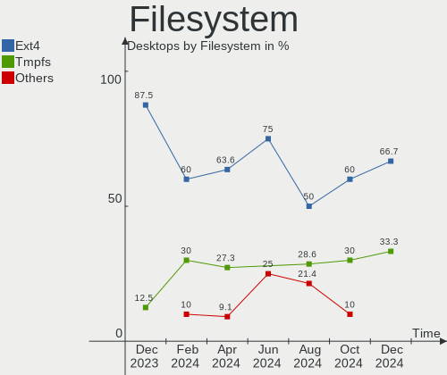
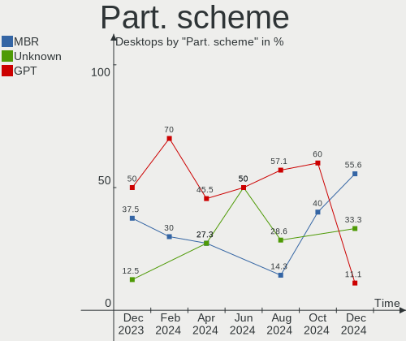
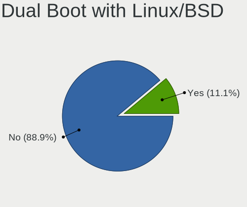
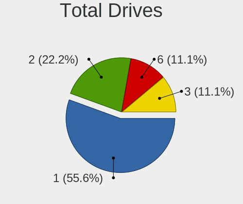
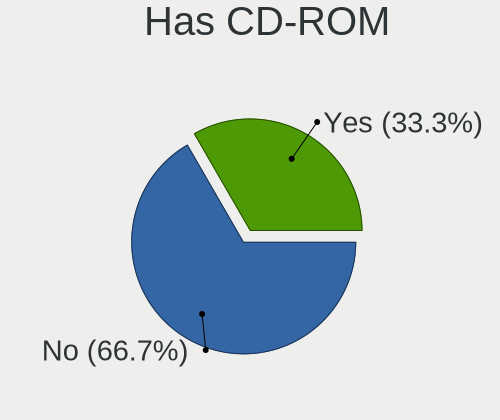
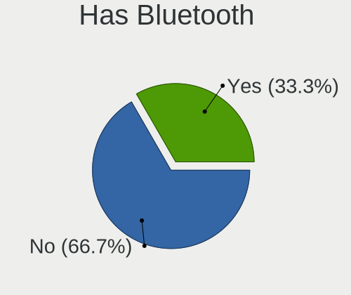
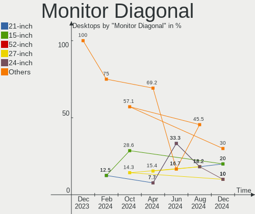
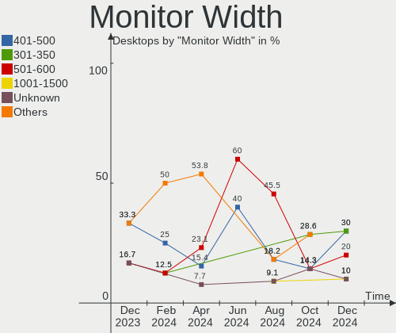
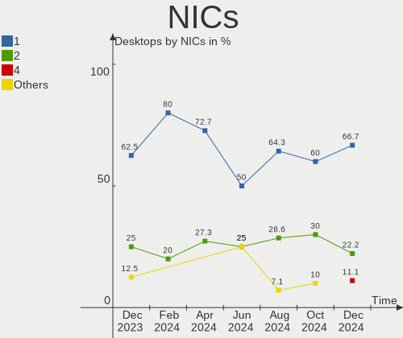
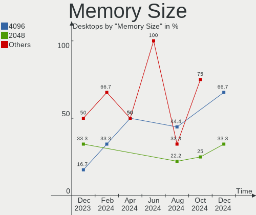

Lubuntu - Hardware Trends (Desktops)
------------------------------------

A project to identify most popular hardware characteristics and track their change
over time based on data collected by Linux users at https://Linux-Hardware.org.

Anyone can contribute to this report by the [hw-probe](https://github.com/linuxhw/hw-probe) tool:

    sudo -E hw-probe -all -upload

This report is for one last month. Overall report since the beginning of time: [TestDays](https://github.com/linuxhw/TestDays)

Period: Jan, 2024.

Contents
--------

* [ System ](#system)
  - [ OS                       ](#os)
  - [ OS Family                ](#os-family)
  - [ Kernel                   ](#kernel)
  - [ Kernel Family            ](#kernel-family)
  - [ Kernel Major Ver.        ](#kernel-major-ver)
  - [ Arch                     ](#arch)
  - [ DE                       ](#de)
  - [ Display Server           ](#display-server)
  - [ Display Manager          ](#display-manager)
  - [ OS Lang                  ](#os-lang)
  - [ Boot Mode                ](#boot-mode)
  - [ Filesystem               ](#filesystem)
  - [ Part. scheme             ](#part-scheme)
  - [ Dual Boot with Linux/BSD ](#dual-boot-with-linuxbsd)
  - [ Dual Boot (Win)          ](#dual-boot-win)

* [ Board ](#board)
  - [ Vendor                   ](#vendor)
  - [ Model                    ](#model)
  - [ Model Family             ](#model-family)
  - [ MFG Year                 ](#mfg-year)
  - [ Form Factor              ](#form-factor)
  - [ Secure Boot              ](#secure-boot)
  - [ Coreboot                 ](#coreboot)
  - [ RAM Size                 ](#ram-size)
  - [ RAM Used                 ](#ram-used)
  - [ Total Drives             ](#total-drives)
  - [ Has CD-ROM               ](#has-cd-rom)
  - [ Has Ethernet             ](#has-ethernet)
  - [ Has WiFi                 ](#has-wifi)
  - [ Has Bluetooth            ](#has-bluetooth)

* [ Location ](#location)
  - [ Country                  ](#country)
  - [ City                     ](#city)

* [ Drives ](#drives)
  - [ Drive Vendor             ](#drive-vendor)
  - [ Drive Model              ](#drive-model)
  - [ HDD Vendor               ](#hdd-vendor)
  - [ SSD Vendor               ](#ssd-vendor)
  - [ Drive Kind               ](#drive-kind)
  - [ Drive Connector          ](#drive-connector)
  - [ Drive Size               ](#drive-size)
  - [ Space Total              ](#space-total)
  - [ Space Used               ](#space-used)
  - [ Malfunc. Drives          ](#malfunc-drives)
  - [ Malfunc. Drive Vendor    ](#malfunc-drive-vendor)
  - [ Malfunc. HDD Vendor      ](#malfunc-hdd-vendor)
  - [ Malfunc. Drive Kind      ](#malfunc-drive-kind)
  - [ Failed Drives            ](#failed-drives)
  - [ Failed Drive Vendor      ](#failed-drive-vendor)
  - [ Drive Status             ](#drive-status)

* [ Storage controller ](#storage-controller)
  - [ Storage Vendor           ](#storage-vendor)
  - [ Storage Model            ](#storage-model)
  - [ Storage Kind             ](#storage-kind)

* [ Processor ](#processor)
  - [ CPU Vendor               ](#cpu-vendor)
  - [ CPU Model                ](#cpu-model)
  - [ CPU Model Family         ](#cpu-model-family)
  - [ CPU Cores                ](#cpu-cores)
  - [ CPU Sockets              ](#cpu-sockets)
  - [ CPU Threads              ](#cpu-threads)
  - [ CPU Op-Modes             ](#cpu-op-modes)
  - [ CPU Microcode            ](#cpu-microcode)
  - [ CPU Microarch            ](#cpu-microarch)

* [ Graphics ](#graphics)
  - [ GPU Vendor               ](#gpu-vendor)
  - [ GPU Model                ](#gpu-model)
  - [ GPU Combo                ](#gpu-combo)
  - [ GPU Driver               ](#gpu-driver)
  - [ GPU Memory               ](#gpu-memory)

* [ Monitor ](#monitor)
  - [ Monitor Vendor           ](#monitor-vendor)
  - [ Monitor Model            ](#monitor-model)
  - [ Monitor Resolution       ](#monitor-resolution)
  - [ Monitor Diagonal         ](#monitor-diagonal)
  - [ Monitor Width            ](#monitor-width)
  - [ Aspect Ratio             ](#aspect-ratio)
  - [ Monitor Area             ](#monitor-area)
  - [ Pixel Density            ](#pixel-density)
  - [ Multiple Monitors        ](#multiple-monitors)

* [ Network ](#network)
  - [ Net Controller Vendor    ](#net-controller-vendor)
  - [ Net Controller Model     ](#net-controller-model)
  - [ Wireless Vendor          ](#wireless-vendor)
  - [ Wireless Model           ](#wireless-model)
  - [ Ethernet Vendor          ](#ethernet-vendor)
  - [ Ethernet Model           ](#ethernet-model)
  - [ Net Controller Kind      ](#net-controller-kind)
  - [ Used Controller          ](#used-controller)
  - [ NICs                     ](#nics)
  - [ IPv6                     ](#ipv6)

* [ Bluetooth ](#bluetooth)
  - [ Bluetooth Vendor         ](#bluetooth-vendor)
  - [ Bluetooth Model          ](#bluetooth-model)

* [ Sound ](#sound)
  - [ Sound Vendor             ](#sound-vendor)
  - [ Sound Model              ](#sound-model)

* [ Memory ](#memory)
  - [ Memory Vendor            ](#memory-vendor)
  - [ Memory Model             ](#memory-model)
  - [ Memory Kind              ](#memory-kind)
  - [ Memory Form Factor       ](#memory-form-factor)
  - [ Memory Size              ](#memory-size)
  - [ Memory Speed             ](#memory-speed)

* [ Printers & scanners ](#printers--scanners)
  - [ Printer Vendor           ](#printer-vendor)
  - [ Printer Model            ](#printer-model)
  - [ Scanner Vendor           ](#scanner-vendor)
  - [ Scanner Model            ](#scanner-model)

* [ Camera ](#camera)
  - [ Camera Vendor            ](#camera-vendor)
  - [ Camera Model             ](#camera-model)

* [ Security ](#security)
  - [ Fingerprint Vendor       ](#fingerprint-vendor)
  - [ Fingerprint Model        ](#fingerprint-model)
  - [ Chipcard Vendor          ](#chipcard-vendor)
  - [ Chipcard Model           ](#chipcard-model)

* [ Unsupported ](#unsupported)
  - [ Unsupported Devices      ](#unsupported-devices)
  - [ Unsupported Device Types ](#unsupported-device-types)

System
------

OS
--

Installed operating systems

| Name          | Desktops | Percent |
|---------------|----------|---------|
| Lubuntu 22.04 | 8        | 53.33%  |
| Lubuntu 23.10 | 4        | 26.67%  |
| Lubuntu 23.04 | 2        | 13.33%  |
| Lubuntu 20.04 | 1        | 6.67%   |

OS Family
---------

OS without a version

| Name    | Desktops | Percent |
|---------|----------|---------|
| Lubuntu | 15       | 100%    |

Kernel
------

Version of the Linux kernel

| Version           | Desktops | Percent |
|-------------------|----------|---------|
| 6.5.0-14-generic  | 8        | 53.33%  |
| 6.2.0-39-generic  | 3        | 20%     |
| 5.15.0-91-generic | 2        | 13.33%  |
| 6.7.0-custom      | 1        | 6.67%   |
| 6.5.0-9-generic   | 1        | 6.67%   |

Kernel Family
-------------

Linux kernel without a distro release

| Version | Desktops | Percent |
|---------|----------|---------|
| 6.5.0   | 9        | 60%     |
| 6.2.0   | 3        | 20%     |
| 5.15.0  | 2        | 13.33%  |
| 6.7.0   | 1        | 6.67%   |

Kernel Major Ver.
-----------------

Linux kernel major version

| Version | Desktops | Percent |
|---------|----------|---------|
| 6.5     | 9        | 60%     |
| 6.2     | 3        | 20%     |
| 5.15    | 2        | 13.33%  |
| 6.7     | 1        | 6.67%   |

Arch
----

OS architecture (x86_64, i586, etc.)

| Name   | Desktops | Percent |
|--------|----------|---------|
| x86_64 | 15       | 100%    |

DE
--

Desktop Environment

| Name | Desktops | Percent |
|------|----------|---------|
| LXQt | 14       | 93.33%  |
| LXDE | 1        | 6.67%   |

Display Server
--------------

X11 or Wayland

| Name | Desktops | Percent |
|------|----------|---------|
| X11  | 14       | 93.33%  |
| Tty  | 1        | 6.67%   |

Display Manager
---------------

SDDM, LightDM, etc.

| Name    | Desktops | Percent |
|---------|----------|---------|
| SDDM    | 10       | 66.67%  |
| LightDM | 2        | 13.33%  |
| Unknown | 2        | 13.33%  |
| GDM3    | 1        | 6.67%   |

OS Lang
-------

Language

| Lang  | Desktops | Percent |
|-------|----------|---------|
| en_US | 4        | 26.67%  |
| it_IT | 2        | 13.33%  |
| fr_FR | 2        | 13.33%  |
| sv_SE | 1        | 6.67%   |
| es_EC | 1        | 6.67%   |
| es_CR | 1        | 6.67%   |
| en_GB | 1        | 6.67%   |
| en_CA | 1        | 6.67%   |
| de_DE | 1        | 6.67%   |
| C     | 1        | 6.67%   |

Boot Mode
---------

EFI or BIOS

| Mode | Desktops | Percent |
|------|----------|---------|
| BIOS | 14       | 93.33%  |
| EFI  | 1        | 6.67%   |

Filesystem
----------

Type of filesystem

| Type  | Desktops | Percent |
|-------|----------|---------|
| Ext4  | 10       | 66.67%  |
| Tmpfs | 5        | 33.33%  |

Part. scheme
------------

Scheme of partitioning

| Type    | Desktops | Percent |
|---------|----------|---------|
| GPT     | 9        | 60%     |
| MBR     | 4        | 26.67%  |
| Unknown | 2        | 13.33%  |

Dual Boot with Linux/BSD
------------------------

Hosting more than one Linux/BSD

| Dual boot | Desktops | Percent |
|-----------|----------|---------|
| No        | 11       | 73.33%  |
| Yes       | 4        | 26.67%  |

Dual Boot (Win)
---------------

Hosting Linux and Windows

| Dual boot | Desktops | Percent |
|-----------|----------|---------|
| No        | 9        | 60%     |
| Yes       | 6        | 40%     |

Board
-----

Vendor
------

Motherboard manufacturer

| Name                | Desktops | Percent |
|---------------------|----------|---------|
| ASUSTek Computer    | 4        | 26.67%  |
| Dell                | 3        | 20%     |
| Foxconn             | 2        | 13.33%  |
| ZOTAC               | 1        | 6.67%   |
| Lenovo              | 1        | 6.67%   |
| Koloe               | 1        | 6.67%   |
| Intel               | 1        | 6.67%   |
| Hewlett-Packard     | 1        | 6.67%   |
| Gigabyte Technology | 1        | 6.67%   |

Model
-----

Motherboard model

| Name                                | Desktops | Percent |
|-------------------------------------|----------|---------|
| ZOTAC NM10                          | 1        | 6.67%   |
| Lenovo ThinkCentre M710s 10M8S4XQ00 | 1        | 6.67%   |
| Koloe Thurley                       | 1        | 6.67%   |
| Intel H61                           | 1        | 6.67%   |
| HP Compaq Elite 8300 SFF            | 1        | 6.67%   |
| Gigabyte H110M-H                    | 1        | 6.67%   |
| Foxconn Pro 3125 Microtower PC      | 1        | 6.67%   |
| Foxconn G41MXP/G41MXP-V             | 1        | 6.67%   |
| Dell XPS 8930                       | 1        | 6.67%   |
| Dell Precision WorkStation T5500    | 1        | 6.67%   |
| Dell Inspiron 560s                  | 1        | 6.67%   |
| ASUS SABERTOOTH 990FX               | 1        | 6.67%   |
| ASUS PRIME B250-PLUS                | 1        | 6.67%   |
| ASUS M5A97 LE R2.0                  | 1        | 6.67%   |
| ASUS M2N32-SLI DELUXE               | 1        | 6.67%   |

Model Family
------------

Motherboard model prefix

| Name               | Desktops | Percent |
|--------------------|----------|---------|
| ZOTAC NM10         | 1        | 6.67%   |
| Lenovo ThinkCentre | 1        | 6.67%   |
| Koloe Thurley      | 1        | 6.67%   |
| Intel H61          | 1        | 6.67%   |
| HP Compaq          | 1        | 6.67%   |
| Gigabyte H110M-H   | 1        | 6.67%   |
| Foxconn Pro        | 1        | 6.67%   |
| Foxconn G41MXP     | 1        | 6.67%   |
| Dell XPS           | 1        | 6.67%   |
| Dell Precision     | 1        | 6.67%   |
| Dell Inspiron      | 1        | 6.67%   |
| ASUS SABERTOOTH    | 1        | 6.67%   |
| ASUS PRIME         | 1        | 6.67%   |
| ASUS M5A97         | 1        | 6.67%   |
| ASUS M2N32-SLI     | 1        | 6.67%   |

MFG Year
--------

Motherboard manufacture year

| Year | Desktops | Percent |
|------|----------|---------|
| 2010 | 5        | 33.33%  |
| 2017 | 3        | 20%     |
| 2016 | 2        | 13.33%  |
| 2012 | 2        | 13.33%  |
| 2019 | 1        | 6.67%   |
| 2011 | 1        | 6.67%   |
| 2006 | 1        | 6.67%   |

Form Factor
-----------

Physical design of the computer

| Name    | Desktops | Percent |
|---------|----------|---------|
| Desktop | 15       | 100%    |

Secure Boot
-----------

Enabled or disabled

| State    | Desktops | Percent |
|----------|----------|---------|
| Disabled | 15       | 100%    |

Coreboot
--------

Have coreboot on board

| Used | Desktops | Percent |
|------|----------|---------|
| No   | 15       | 100%    |

RAM Size
--------

Total RAM memory

| Size in GB | Desktops | Percent |
|------------|----------|---------|
| 3.01-4.0   | 6        | 40%     |
| 16.01-24.0 | 5        | 33.33%  |
| 32.01-64.0 | 2        | 13.33%  |
| 4.01-8.0   | 1        | 6.67%   |
| 24.01-32.0 | 1        | 6.67%   |

RAM Used
--------

Used RAM memory

| Used GB    | Desktops | Percent |
|------------|----------|---------|
| 1.01-2.0   | 6        | 40%     |
| 2.01-3.0   | 3        | 20%     |
| 4.01-8.0   | 2        | 13.33%  |
| 3.01-4.0   | 2        | 13.33%  |
| 16.01-24.0 | 1        | 6.67%   |
| 8.01-16.0  | 1        | 6.67%   |

Total Drives
------------

Number of drives on board

| Drives | Desktops | Percent |
|--------|----------|---------|
| 2      | 5        | 33.33%  |
| 1      | 5        | 33.33%  |
| 3      | 3        | 20%     |
| 5      | 1        | 6.67%   |
| 4      | 1        | 6.67%   |

Has CD-ROM
----------

Has CD-ROM on board

| Presented | Desktops | Percent |
|-----------|----------|---------|
| Yes       | 10       | 66.67%  |
| No        | 5        | 33.33%  |

Has Ethernet
------------

Has Ethernet on board

| Presented | Desktops | Percent |
|-----------|----------|---------|
| Yes       | 15       | 100%    |

Has WiFi
--------

Has WiFi module

| Presented | Desktops | Percent |
|-----------|----------|---------|
| Yes       | 8        | 53.33%  |
| No        | 7        | 46.67%  |

Has Bluetooth
-------------

Has Bluetooth module

| Presented | Desktops | Percent |
|-----------|----------|---------|
| No        | 12       | 80%     |
| Yes       | 3        | 20%     |

Location
--------

Country
-------

Geographic location (country)

| Country    | Desktops | Percent |
|------------|----------|---------|
| USA        | 2        | 13.33%  |
| Italy      | 2        | 13.33%  |
| France     | 2        | 13.33%  |
| UK         | 1        | 6.67%   |
| Sweden     | 1        | 6.67%   |
| Iran       | 1        | 6.67%   |
| Germany    | 1        | 6.67%   |
| Finland    | 1        | 6.67%   |
| Ecuador    | 1        | 6.67%   |
| Costa Rica | 1        | 6.67%   |
| Canada     | 1        | 6.67%   |
| Brazil     | 1        | 6.67%   |

City
----

Geographic location (city)

| City                 | Desktops | Percent |
|----------------------|----------|---------|
| Turin                | 1        | 6.67%   |
| Tehran               | 1        | 6.67%   |
| Stockholm            | 1        | 6.67%   |
| Seevetal             | 1        | 6.67%   |
| Sao José dos Campos | 1        | 6.67%   |
| Pantin               | 1        | 6.67%   |
| Painesville          | 1        | 6.67%   |
| New Orleans          | 1        | 6.67%   |
| Helsinki             | 1        | 6.67%   |
| Guayaquil            | 1        | 6.67%   |
| Grecia               | 1        | 6.67%   |
| Edmonton             | 1        | 6.67%   |
| Castres              | 1        | 6.67%   |
| Botticino            | 1        | 6.67%   |
| Barnet               | 1        | 6.67%   |

Drives
------

Drive Vendor
------------

Hard drive vendors

| Vendor                       | Desktops | Drives | Percent |
|------------------------------|----------|--------|---------|
| Seagate                      | 7        | 9      | 25%     |
| WDC                          | 5        | 6      | 17.86%  |
| Samsung Electronics          | 5        | 6      | 17.86%  |
| Kingston                     | 2        | 3      | 7.14%   |
| Shenzhen Longsys Electronics | 1        | 1      | 3.57%   |
| SanDisk                      | 1        | 1      | 3.57%   |
| Phison                       | 1        | 1      | 3.57%   |
| KINGBANK                     | 1        | 1      | 3.57%   |
| Hitachi                      | 1        | 1      | 3.57%   |
| HGST                         | 1        | 1      | 3.57%   |
| Crucial                      | 1        | 1      | 3.57%   |
| BR                           | 1        | 1      | 3.57%   |
| Apacer                       | 1        | 1      | 3.57%   |

Drive Model
-----------

Hard drive models

| Model                                   | Desktops | Percent |
|-----------------------------------------|----------|---------|
| Samsung SSD 870 QVO 1TB                 | 2        | 6.06%   |
| WDC WD5000AAKX-75U6AA0 500GB            | 1        | 3.03%   |
| WDC WD5000AAKX-00ERMA0 500GB            | 1        | 3.03%   |
| WDC WD20PURZ-85GU6Y0 2TB                | 1        | 3.03%   |
| WDC WD20EARS-00S8B1 2TB                 | 1        | 3.03%   |
| WDC WD10EZEX-08WN4A0 1TB                | 1        | 3.03%   |
| WDC WD Blue SA510 M.2 2280 1000GB       | 1        | 3.03%   |
| Shenzhen Longsys Kingmax PCIe SSD 256GB | 1        | 3.03%   |
| Seagate ST500DM002-1BD142 500GB         | 1        | 3.03%   |
| Seagate ST3500418AS 500GB               | 1        | 3.03%   |
| Seagate ST3320820AS 320GB               | 1        | 3.03%   |
| Seagate ST3320418AS 320GB               | 1        | 3.03%   |
| Seagate ST3200826AS 200GB               | 1        | 3.03%   |
| Seagate ST3000DM001-1CH166 3TB          | 1        | 3.03%   |
| Seagate ST2000DM001-1ER164 2TB          | 1        | 3.03%   |
| Seagate ST2000DM001-1CH164 2TB          | 1        | 3.03%   |
| Seagate ST1000DM010-2EP102 1TB          | 1        | 3.03%   |
| SanDisk SD8SN8U128G 128GB SSD           | 1        | 3.03%   |
| Samsung SSD 830 Series 256GB            | 1        | 3.03%   |
| Samsung PSSD T7 2TB                     | 1        | 3.03%   |
| Samsung PSSD T7 1TB                     | 1        | 3.03%   |
| Samsung MZ7TY128HDHP-000L1 128GB SSD    | 1        | 3.03%   |
| Phison Sabrent Rocket Q 1TB             | 1        | 3.03%   |
| Kingston SA400S37960G 960GB SSD         | 1        | 3.03%   |
| Kingston SA400S37480G 480GB SSD         | 1        | 3.03%   |
| Kingston SA400S37240G 240GB SSD         | 1        | 3.03%   |
| KINGBANK KP330 480GB                    | 1        | 3.03%   |
| Hitachi HDS721010CLA332 1TB             | 1        | 3.03%   |
| HGST HTS721010A9E630 1TB                | 1        | 3.03%   |
| Crucial CT2000MX500SSD1 2TB             | 1        | 3.03%   |
| BR 32G                                  | 1        | 3.03%   |
| Apacer AS350 120GB SSD                  | 1        | 3.03%   |

HDD Vendor
----------

Hard disk drive vendors

| Vendor  | Desktops | Drives | Percent |
|---------|----------|--------|---------|
| Seagate | 7        | 9      | 53.85%  |
| WDC     | 4        | 5      | 30.77%  |
| Hitachi | 1        | 1      | 7.69%   |
| HGST    | 1        | 1      | 7.69%   |

SSD Vendor
----------

Solid state drive vendors

| Vendor              | Desktops | Drives | Percent |
|---------------------|----------|--------|---------|
| Samsung Electronics | 5        | 5      | 41.67%  |
| Kingston            | 2        | 3      | 16.67%  |
| WDC                 | 1        | 1      | 8.33%   |
| SanDisk             | 1        | 1      | 8.33%   |
| KINGBANK            | 1        | 1      | 8.33%   |
| Crucial             | 1        | 1      | 8.33%   |
| Apacer              | 1        | 1      | 8.33%   |

Drive Kind
----------

HDD or SSD

| Kind    | Desktops | Drives | Percent |
|---------|----------|--------|---------|
| HDD     | 10       | 16     | 43.48%  |
| SSD     | 9        | 13     | 39.13%  |
| NVMe    | 3        | 3      | 13.04%  |
| Unknown | 1        | 1      | 4.35%   |

Drive Connector
---------------

SATA, SAS, NVMe, etc.

| Type | Desktops | Drives | Percent |
|------|----------|--------|---------|
| SATA | 15       | 29     | 83.33%  |
| NVMe | 2        | 2      | 11.11%  |
| SAS  | 1        | 2      | 5.56%   |

Drive Size
----------

Size of hard drive

| Size in TB | Desktops | Drives | Percent |
|------------|----------|--------|---------|
| 0.01-0.5   | 10       | 14     | 45.45%  |
| 0.51-1.0   | 7        | 9      | 31.82%  |
| 1.01-2.0   | 4        | 5      | 18.18%  |
| 2.01-3.0   | 1        | 1      | 4.55%   |

Space Total
-----------

Amount of disk space available on the file system

| Size in GB | Desktops | Percent |
|------------|----------|---------|
| 251-500    | 5        | 33.33%  |
| 501-1000   | 5        | 33.33%  |
| 101-250    | 2        | 13.33%  |
| 1001-2000  | 2        | 13.33%  |
| 1-20       | 1        | 6.67%   |

Space Used
----------

Amount of used disk space

| Used GB  | Desktops | Percent |
|----------|----------|---------|
| 21-50    | 5        | 33.33%  |
| 1-20     | 3        | 20%     |
| 101-250  | 2        | 13.33%  |
| 501-1000 | 2        | 13.33%  |
| 51-100   | 2        | 13.33%  |
| 251-500  | 1        | 6.67%   |

Malfunc. Drives
---------------

Drive models with a malfunction

| Model                           | Desktops | Drives | Percent |
|---------------------------------|----------|--------|---------|
| WDC WD5000AAKX-00ERMA0 500GB    | 1        | 1      | 25%     |
| Seagate ST500DM002-1BD142 500GB | 1        | 1      | 25%     |
| Seagate ST3200826AS 200GB       | 1        | 1      | 25%     |
| Seagate ST1000DM010-2EP102 1TB  | 1        | 1      | 25%     |

Malfunc. Drive Vendor
---------------------

Vendors of faulty drives

| Vendor  | Desktops | Drives | Percent |
|---------|----------|--------|---------|
| Seagate | 2        | 3      | 66.67%  |
| WDC     | 1        | 1      | 33.33%  |

Malfunc. HDD Vendor
-------------------

Vendors of faulty HDD drives

| Vendor  | Desktops | Drives | Percent |
|---------|----------|--------|---------|
| Seagate | 2        | 3      | 66.67%  |
| WDC     | 1        | 1      | 33.33%  |

Malfunc. Drive Kind
-------------------

Kinds of faulty drives

| Kind | Desktops | Drives | Percent |
|------|----------|--------|---------|
| HDD  | 3        | 4      | 100%    |

Failed Drives
-------------

Failed drive models

Zero info for selected period =(

Failed Drive Vendor
-------------------

Failed drive vendors

Zero info for selected period =(

Drive Status
------------

Number of failed and malfunc. drives

| Status   | Desktops | Drives | Percent |
|----------|----------|--------|---------|
| Detected | 7        | 16     | 41.18%  |
| Works    | 7        | 13     | 41.18%  |
| Malfunc  | 3        | 4      | 17.65%  |

Storage controller
------------------

Storage Vendor
--------------

Storage controller vendors

| Vendor                       | Desktops | Percent |
|------------------------------|----------|---------|
| Intel                        | 11       | 55%     |
| AMD                          | 3        | 15%     |
| Silicon Image                | 2        | 10%     |
| Shenzhen Longsys Electronics | 1        | 5%      |
| Phison Electronics           | 1        | 5%      |
| Nvidia                       | 1        | 5%      |
| JMicron Technology           | 1        | 5%      |

Storage Model
-------------

Storage controller models

| Model                                                                                                              | Desktops | Percent |
|--------------------------------------------------------------------------------------------------------------------|----------|---------|
| AMD SB7x0/SB8x0/SB9x0 SATA Controller [AHCI mode]                                                                  | 3        | 13.64%  |
| Intel 82801JI (ICH10 Family) SATA AHCI Controller                                                                  | 2        | 9.09%   |
| Intel 200 Series PCH SATA controller [AHCI mode]                                                                   | 2        | 9.09%   |
| Silicon Image SiI 3132 Serial ATA Raid II Controller                                                               | 1        | 4.55%   |
| Silicon Image SiI 3114 [SATALink/SATARaid] Serial ATA Controller                                                   | 1        | 4.55%   |
| Shenzhen Longsys FORESEE XP1000 / Lexar Professional CFexpress Type B Gold series, NM620 PCIe NVME SSD (DRAM-less) | 1        | 4.55%   |
| Phison E12 NVMe Controller                                                                                         | 1        | 4.55%   |
| Nvidia MCP55 SATA Controller                                                                                       | 1        | 4.55%   |
| Nvidia MCP55 IDE                                                                                                   | 1        | 4.55%   |
| JMicron JMB362 SATA Controller                                                                                     | 1        | 4.55%   |
| Intel SATA Controller [RAID mode]                                                                                  | 1        | 4.55%   |
| Intel Q170/Q150/B150/H170/H110/Z170/CM236 Chipset SATA Controller [AHCI Mode]                                      | 1        | 4.55%   |
| Intel NM10/ICH7 Family SATA Controller [IDE mode]                                                                  | 1        | 4.55%   |
| Intel NM10/ICH7 Family SATA Controller [AHCI mode]                                                                 | 1        | 4.55%   |
| Intel 82801JI (ICH10 Family) 4 port SATA IDE Controller #1                                                         | 1        | 4.55%   |
| Intel 82801G (ICH7 Family) IDE Controller                                                                          | 1        | 4.55%   |
| Intel 7 Series/C210 Series Chipset Family 6-port SATA Controller [AHCI mode]                                       | 1        | 4.55%   |
| Intel 6 Series/C200 Series Chipset Family 6 port Desktop SATA AHCI Controller                                      | 1        | 4.55%   |

Storage Kind
------------

Kind of storage controller (IDE, SATA, NVMe, SAS, ...)

| Kind | Desktops | Percent |
|------|----------|---------|
| SATA | 11       | 57.89%  |
| RAID | 3        | 15.79%  |
| IDE  | 3        | 15.79%  |
| NVMe | 2        | 10.53%  |

Processor
---------

CPU Vendor
----------

Processor vendors

| Vendor | Desktops | Percent |
|--------|----------|---------|
| Intel  | 11       | 73.33%  |
| AMD    | 4        | 26.67%  |

CPU Model
---------

Processor models

| Model                                       | Desktops | Percent |
|---------------------------------------------|----------|---------|
| Intel Pentium CPU G4400 @ 3.30GHz           | 2        | 13.33%  |
| Intel Xeon CPU E5620 @ 2.40GHz              | 1        | 6.67%   |
| Intel Pentium Dual-Core CPU E5700 @ 3.00GHz | 1        | 6.67%   |
| Intel Core i7-8700 CPU @ 3.20GHz            | 1        | 6.67%   |
| Intel Core i7-7700 CPU @ 3.60GHz            | 1        | 6.67%   |
| Intel Core i7-3770S CPU @ 3.10GHz           | 1        | 6.67%   |
| Intel Core i7 CPU 920 @ 2.67GHz             | 1        | 6.67%   |
| Intel Core i5-3570 CPU @ 3.40GHz            | 1        | 6.67%   |
| Intel Celeron CPU 450 @ 2.20GHz             | 1        | 6.67%   |
| Intel Atom CPU D525 @ 1.80GHz               | 1        | 6.67%   |
| AMD Phenom II X6 1090T Processor            | 1        | 6.67%   |
| AMD FX-8320 Eight-Core Processor            | 1        | 6.67%   |
| AMD Athlon II X4 635 Processor              | 1        | 6.67%   |
| AMD Athlon 64 X2 Dual Core Processor 6000+  | 1        | 6.67%   |

CPU Model Family
----------------

Processor model prefix

| Model                   | Desktops | Percent |
|-------------------------|----------|---------|
| Intel Core i7           | 4        | 26.67%  |
| Intel Pentium           | 2        | 13.33%  |
| Intel Xeon              | 1        | 6.67%   |
| Intel Pentium Dual-Core | 1        | 6.67%   |
| Intel Core i5           | 1        | 6.67%   |
| Intel Celeron           | 1        | 6.67%   |
| Intel Atom              | 1        | 6.67%   |
| AMD Phenom II X6        | 1        | 6.67%   |
| AMD FX                  | 1        | 6.67%   |
| AMD Athlon II X4        | 1        | 6.67%   |
| AMD Athlon 64 X2        | 1        | 6.67%   |

CPU Cores
---------

Number of processor cores

| Number | Desktops | Percent |
|--------|----------|---------|
| 4      | 6        | 40%     |
| 2      | 5        | 33.33%  |
| 6      | 2        | 13.33%  |
| 8      | 1        | 6.67%   |
| 1      | 1        | 6.67%   |

CPU Sockets
-----------

Number of sockets

| Number | Desktops | Percent |
|--------|----------|---------|
| 1      | 14       | 93.33%  |
| 2      | 1        | 6.67%   |

CPU Threads
-----------

Threads per core (Hyper-Threading)

| Number | Desktops | Percent |
|--------|----------|---------|
| 1      | 8        | 53.33%  |
| 2      | 7        | 46.67%  |

CPU Op-Modes
------------

CPU Operation Modes (32-bit, 64-bit)

| Op mode        | Desktops | Percent |
|----------------|----------|---------|
| 32-bit, 64-bit | 15       | 100%    |

CPU Microcode
-------------

Microcode number

| Number     | Desktops | Percent |
|------------|----------|---------|
| Unknown    | 12       | 80%     |
| 0x206c2    | 1        | 6.67%   |
| 0x06000852 | 1        | 6.67%   |
| 0x010000c8 | 1        | 6.67%   |

CPU Microarch
-------------

Microarchitecture

| Name       | Desktops | Percent |
|------------|----------|---------|
| Skylake    | 2        | 13.33%  |
| KabyLake   | 2        | 13.33%  |
| K10        | 2        | 13.33%  |
| IvyBridge  | 2        | 13.33%  |
| Westmere   | 1        | 6.67%   |
| Piledriver | 1        | 6.67%   |
| Penryn     | 1        | 6.67%   |
| Nehalem    | 1        | 6.67%   |
| K8 Hammer  | 1        | 6.67%   |
| Core       | 1        | 6.67%   |
| Bonnell    | 1        | 6.67%   |

Graphics
--------

GPU Vendor
----------

Vendors of graphics cards

| Vendor | Desktops | Percent |
|--------|----------|---------|
| Nvidia | 7        | 43.75%  |
| Intel  | 7        | 43.75%  |
| AMD    | 2        | 12.5%   |

GPU Model
---------

Graphics card models

| Model                                                            | Desktops | Percent |
|------------------------------------------------------------------|----------|---------|
| Intel HD Graphics 510                                            | 2        | 12.5%   |
| Intel 4 Series Chipset Integrated Graphics Controller            | 2        | 12.5%   |
| Nvidia TU116 [GeForce GTX 1660]                                  | 1        | 6.25%   |
| Nvidia GT218 [ION]                                               | 1        | 6.25%   |
| Nvidia GP106 [GeForce GTX 1060 6GB]                              | 1        | 6.25%   |
| Nvidia GK208B [GeForce GT 710]                                   | 1        | 6.25%   |
| Nvidia GF119 [GeForce GT 610]                                    | 1        | 6.25%   |
| Nvidia GF114 [GeForce GTX 560 Ti]                                | 1        | 6.25%   |
| Nvidia G98 [Quadro NVS 295]                                      | 1        | 6.25%   |
| Intel Xeon E3-1200 v2/3rd Gen Core processor Graphics Controller | 1        | 6.25%   |
| Intel IvyBridge GT2 [HD Graphics 4000]                           | 1        | 6.25%   |
| Intel CoffeeLake-S GT2 [UHD Graphics 630]                        | 1        | 6.25%   |
| AMD RS780L [Radeon 3000]                                         | 1        | 6.25%   |
| AMD Cape Verde XT [Radeon HD 7770/8760 / R7 250X]                | 1        | 6.25%   |

GPU Combo
---------

Combinations of graphics cards

| Name       | Desktops | Percent |
|------------|----------|---------|
| 1 x Nvidia | 7        | 46.67%  |
| 1 x Intel  | 6        | 40%     |
| 1 x AMD    | 2        | 13.33%  |

GPU Driver
----------

Free vs proprietary

| Driver      | Desktops | Percent |
|-------------|----------|---------|
| Free        | 13       | 86.67%  |
| Proprietary | 2        | 13.33%  |

GPU Memory
----------

Total video memory

| Size in GB | Desktops | Percent |
|------------|----------|---------|
| Unknown    | 7        | 46.67%  |
| 0.01-0.5   | 3        | 20%     |
| 5.01-6.0   | 2        | 13.33%  |
| 0.51-1.0   | 2        | 13.33%  |
| 1.01-2.0   | 1        | 6.67%   |

Monitor
-------

Monitor Vendor
--------------

Monitor vendors

| Vendor              | Desktops | Percent |
|---------------------|----------|---------|
| Samsung Electronics | 3        | 21.43%  |
| Goldstar            | 3        | 21.43%  |
| Dell                | 3        | 21.43%  |
| Sony                | 1        | 7.14%   |
| Sceptre Tech        | 1        | 7.14%   |
| Lenovo              | 1        | 7.14%   |
| Fujitsu Siemens     | 1        | 7.14%   |
| Unknown             | 1        | 7.14%   |

Monitor Model
-------------

Monitor models

| Model                                                                | Desktops | Percent |
|----------------------------------------------------------------------|----------|---------|
| Sony TV *00 SNY7C04 3840x2160 1085x610mm 49.0-inch                   | 1        | 6.67%   |
| Sceptre Tech N43 SPT110C 3840x2160 575x323mm 26.0-inch               | 1        | 6.67%   |
| Samsung Electronics SyncMaster SAM05FF 1600x900 443x249mm 20.0-inch  | 1        | 6.67%   |
| Samsung Electronics LCD Monitor SAM0A76 1280x720 949x543mm 43.0-inch | 1        | 6.67%   |
| Samsung Electronics LCD Monitor SAM07BC 1360x768                     | 1        | 6.67%   |
| Lenovo LEN T2454pA LEN60C9 1920x1080 518x324mm 24.1-inch             | 1        | 6.67%   |
| Goldstar W1742 GSM44A2 1440x900 410x256mm 19.0-inch                  | 1        | 6.67%   |
| Goldstar M2280D GSM57B9 1920x1080 598x336mm 27.0-inch                | 1        | 6.67%   |
| Goldstar FHD GSM5BC6 1920x1080 480x270mm 21.7-inch                   | 1        | 6.67%   |
| Fujitsu Siemens D22W-1T FUS079A 1680x1050 474x296mm 22.0-inch        | 1        | 6.67%   |
| Fujitsu Siemens B22W-5 ECO FUS07C4 1680x1050 474x296mm 22.0-inch     | 1        | 6.67%   |
| Dell P2311H DEL4067 1920x1080 509x286mm 23.0-inch                    | 1        | 6.67%   |
| Dell P1914S DELF04B 1280x1024 376x301mm 19.0-inch                    | 1        | 6.67%   |
| Dell E193FP DEL700E 1280x1024 338x270mm 17.0-inch                    | 1        | 6.67%   |
| Unknown                                                              | 1        | 6.67%   |

Monitor Resolution
------------------

Monitor screen resolution

| Resolution         | Desktops | Percent |
|--------------------|----------|---------|
| 1920x1080 (FHD)    | 5        | 35.71%  |
| 3840x2160 (4K)     | 2        | 14.29%  |
| 1280x1024 (SXGA)   | 2        | 14.29%  |
| 1680x1050 (WSXGA+) | 1        | 7.14%   |
| 1600x900 (HD+)     | 1        | 7.14%   |
| 1440x900 (WXGA+)   | 1        | 7.14%   |
| 1360x768           | 1        | 7.14%   |
| 1280x720 (HD)      | 1        | 7.14%   |

Monitor Diagonal
----------------

Diagonal size in inches

| Inches  | Desktops | Percent |
|---------|----------|---------|
| 19      | 3        | 21.43%  |
| 65      | 1        | 7.14%   |
| 43      | 1        | 7.14%   |
| 31      | 1        | 7.14%   |
| 27      | 1        | 7.14%   |
| 26      | 1        | 7.14%   |
| 24      | 1        | 7.14%   |
| 23      | 1        | 7.14%   |
| 22      | 1        | 7.14%   |
| 21      | 1        | 7.14%   |
| 20      | 1        | 7.14%   |
| Unknown | 1        | 7.14%   |

Monitor Width
-------------

Physical width

| Width in mm | Desktops | Percent |
|-------------|----------|---------|
| 501-600     | 4        | 28.57%  |
| 401-500     | 4        | 28.57%  |
| 351-400     | 2        | 14.29%  |
| 601-700     | 1        | 7.14%   |
| 1001-1500   | 1        | 7.14%   |
| 901-1000    | 1        | 7.14%   |
| Unknown     | 1        | 7.14%   |

Aspect Ratio
------------

Proportional relationship between the width and the height

| Ratio   | Desktops | Percent |
|---------|----------|---------|
| 16/9    | 8        | 57.14%  |
| 16/10   | 3        | 21.43%  |
| 5/4     | 2        | 14.29%  |
| Unknown | 1        | 7.14%   |

Monitor Area
------------

Area in inch²

| Area in inch² | Desktops | Percent |
|----------------|----------|---------|
| 151-200        | 4        | 28.57%  |
| 201-250        | 3        | 21.43%  |
| 251-300        | 2        | 14.29%  |
| More than 1000 | 1        | 7.14%   |
| 351-500        | 1        | 7.14%   |
| 301-350        | 1        | 7.14%   |
| 501-1000       | 1        | 7.14%   |
| Unknown        | 1        | 7.14%   |

Pixel Density
-------------

Pixels per inch

| Density | Desktops | Percent |
|---------|----------|---------|
| 51-100  | 9        | 64.29%  |
| 1-50    | 2        | 14.29%  |
| 161-240 | 1        | 7.14%   |
| 101-120 | 1        | 7.14%   |
| Unknown | 1        | 7.14%   |

Multiple Monitors
-----------------

Total monitors connected

| Total | Desktops | Percent |
|-------|----------|---------|
| 1     | 14       | 93.33%  |
| 2     | 1        | 6.67%   |

Network
-------

Net Controller Vendor
---------------------

Controller vendors

| Vendor                                | Desktops | Percent |
|---------------------------------------|----------|---------|
| Realtek Semiconductor                 | 12       | 50%     |
| Intel                                 | 3        | 12.5%   |
| Qualcomm Atheros                      | 2        | 8.33%   |
| TP-Link                               | 1        | 4.17%   |
| Samsung Electronics                   | 1        | 4.17%   |
| Ralink Technology                     | 1        | 4.17%   |
| Nvidia                                | 1        | 4.17%   |
| D-Link                                | 1        | 4.17%   |
| Broadcom                              | 1        | 4.17%   |
| 802.11g Adapter [Linksys WUSB54GC v3] | 1        | 4.17%   |

Net Controller Model
--------------------

Controller models

| Model                                                                                               | Desktops | Percent |
|-----------------------------------------------------------------------------------------------------|----------|---------|
| Realtek RTL8111/8168/8211/8411 PCI Express Gigabit Ethernet Controller                              | 7        | 25.93%  |
| Realtek RTL810xE PCI Express Fast Ethernet controller                                               | 2        | 7.41%   |
| TP-Link 802.11ac WLAN Adapter                                                                       | 1        | 3.7%    |
| Samsung Galaxy series, misc. (tethering mode)                                                       | 1        | 3.7%    |
| Realtek RTL88x2bu [AC1200 Techkey]                                                                  | 1        | 3.7%    |
| Realtek RTL8187 Wireless Adapter                                                                    | 1        | 3.7%    |
| Realtek RTL8153 Gigabit Ethernet Adapter                                                            | 1        | 3.7%    |
| Realtek RTL8125 2.5GbE Controller                                                                   | 1        | 3.7%    |
| Realtek RTL-8110SC/8169SC Gigabit Ethernet                                                          | 1        | 3.7%    |
| Ralink MT7601U Wireless Adapter                                                                     | 1        | 3.7%    |
| Qualcomm Atheros QCA6174 802.11ac Wireless Network Adapter                                          | 1        | 3.7%    |
| Qualcomm Atheros Killer E2400 Gigabit Ethernet Controller                                           | 1        | 3.7%    |
| Qualcomm Atheros AR8131 Gigabit Ethernet                                                            | 1        | 3.7%    |
| Nvidia MCP55 Ethernet                                                                               | 1        | 3.7%    |
| Intel Wi-Fi 6 AX200                                                                                 | 1        | 3.7%    |
| Intel Centrino Advanced-N 6235                                                                      | 1        | 3.7%    |
| Intel 82579LM Gigabit Network Connection (Lewisville)                                               | 1        | 3.7%    |
| D-Link DWA-171 AC600 DB Wireless Adapter(rev.A1) [Realtek RTL8811AU]                                | 1        | 3.7%    |
| Broadcom NetXtreme BCM5761 Gigabit Ethernet PCIe                                                    | 1        | 3.7%    |
| 802.11g Adapter [Linksys WUSB54GC v3] WUSB100 v2 RangePlus Wireless Network Adapter [Ralink RT3070] | 1        | 3.7%    |

Wireless Vendor
---------------

Wireless vendors

| Vendor                                | Desktops | Percent |
|---------------------------------------|----------|---------|
| Realtek Semiconductor                 | 2        | 22.22%  |
| Intel                                 | 2        | 22.22%  |
| TP-Link                               | 1        | 11.11%  |
| Ralink Technology                     | 1        | 11.11%  |
| Qualcomm Atheros                      | 1        | 11.11%  |
| D-Link                                | 1        | 11.11%  |
| 802.11g Adapter [Linksys WUSB54GC v3] | 1        | 11.11%  |

Wireless Model
--------------

Wireless models

| Model                                                                                               | Desktops | Percent |
|-----------------------------------------------------------------------------------------------------|----------|---------|
| TP-Link 802.11ac WLAN Adapter                                                                       | 1        | 11.11%  |
| Realtek RTL88x2bu [AC1200 Techkey]                                                                  | 1        | 11.11%  |
| Realtek RTL8187 Wireless Adapter                                                                    | 1        | 11.11%  |
| Ralink MT7601U Wireless Adapter                                                                     | 1        | 11.11%  |
| Qualcomm Atheros QCA6174 802.11ac Wireless Network Adapter                                          | 1        | 11.11%  |
| Intel Wi-Fi 6 AX200                                                                                 | 1        | 11.11%  |
| Intel Centrino Advanced-N 6235                                                                      | 1        | 11.11%  |
| D-Link DWA-171 AC600 DB Wireless Adapter(rev.A1) [Realtek RTL8811AU]                                | 1        | 11.11%  |
| 802.11g Adapter [Linksys WUSB54GC v3] WUSB100 v2 RangePlus Wireless Network Adapter [Ralink RT3070] | 1        | 11.11%  |

Ethernet Vendor
---------------

Ethernet vendors

| Vendor                | Desktops | Percent |
|-----------------------|----------|---------|
| Realtek Semiconductor | 11       | 64.71%  |
| Qualcomm Atheros      | 2        | 11.76%  |
| Samsung Electronics   | 1        | 5.88%   |
| Nvidia                | 1        | 5.88%   |
| Intel                 | 1        | 5.88%   |
| Broadcom              | 1        | 5.88%   |

Ethernet Model
--------------

Ethernet models

| Model                                                                  | Desktops | Percent |
|------------------------------------------------------------------------|----------|---------|
| Realtek RTL8111/8168/8211/8411 PCI Express Gigabit Ethernet Controller | 7        | 38.89%  |
| Realtek RTL810xE PCI Express Fast Ethernet controller                  | 2        | 11.11%  |
| Samsung Galaxy series, misc. (tethering mode)                          | 1        | 5.56%   |
| Realtek RTL8153 Gigabit Ethernet Adapter                               | 1        | 5.56%   |
| Realtek RTL8125 2.5GbE Controller                                      | 1        | 5.56%   |
| Realtek RTL-8110SC/8169SC Gigabit Ethernet                             | 1        | 5.56%   |
| Qualcomm Atheros Killer E2400 Gigabit Ethernet Controller              | 1        | 5.56%   |
| Qualcomm Atheros AR8131 Gigabit Ethernet                               | 1        | 5.56%   |
| Nvidia MCP55 Ethernet                                                  | 1        | 5.56%   |
| Intel 82579LM Gigabit Network Connection (Lewisville)                  | 1        | 5.56%   |
| Broadcom NetXtreme BCM5761 Gigabit Ethernet PCIe                       | 1        | 5.56%   |

Net Controller Kind
-------------------

Ethernet, WiFi or modem

| Kind     | Desktops | Percent |
|----------|----------|---------|
| Ethernet | 15       | 65.22%  |
| WiFi     | 8        | 34.78%  |

Used Controller
---------------

Currently used network controller

| Kind     | Desktops | Percent |
|----------|----------|---------|
| Ethernet | 10       | 62.5%   |
| WiFi     | 6        | 37.5%   |

NICs
----

Total network controllers on board

| Total | Desktops | Percent |
|-------|----------|---------|
| 1     | 10       | 66.67%  |
| 2     | 5        | 33.33%  |

IPv6
----

IPv6 vs IPv4

| Used | Desktops | Percent |
|------|----------|---------|
| No   | 13       | 86.67%  |
| Yes  | 2        | 13.33%  |

Bluetooth
---------

Bluetooth Vendor
----------------

Controller vendors

| Vendor                          | Desktops | Percent |
|---------------------------------|----------|---------|
| Intel                           | 2        | 66.67%  |
| Qualcomm Atheros Communications | 1        | 33.33%  |

Bluetooth Model
---------------

Controller models

| Model                                         | Desktops | Percent |
|-----------------------------------------------|----------|---------|
| Qualcomm Atheros  Bluetooth Device            | 1        | 33.33%  |
| Intel Centrino Bluetooth Wireless Transceiver | 1        | 33.33%  |
| Intel AX200 Bluetooth                         | 1        | 33.33%  |

Sound
-----

Sound Vendor
------------

Sound card vendors

| Vendor              | Desktops | Percent |
|---------------------|----------|---------|
| Intel               | 11       | 50%     |
| Nvidia              | 6        | 27.27%  |
| AMD                 | 3        | 13.64%  |
| JMTek               | 1        | 4.55%   |
| C-Media Electronics | 1        | 4.55%   |

Sound Model
-----------

Sound card models

| Model                                                                      | Desktops | Percent |
|----------------------------------------------------------------------------|----------|---------|
| Intel 82801JI (ICH10 Family) HD Audio Controller                           | 3        | 12.5%   |
| Intel 200 Series PCH HD Audio                                              | 3        | 12.5%   |
| AMD SBx00 Azalia (Intel HDA)                                               | 3        | 12.5%   |
| Intel NM10/ICH7 Family High Definition Audio Controller                    | 2        | 8.33%   |
| Nvidia TU116 High Definition Audio Controller                              | 1        | 4.17%   |
| Nvidia MCP55 High Definition Audio                                         | 1        | 4.17%   |
| Nvidia High Definition Audio Controller                                    | 1        | 4.17%   |
| Nvidia GP106 High Definition Audio Controller                              | 1        | 4.17%   |
| Nvidia GK208 HDMI/DP Audio Controller                                      | 1        | 4.17%   |
| Nvidia GF119 HDMI Audio Controller                                         | 1        | 4.17%   |
| Nvidia GF114 HDMI Audio Controller                                         | 1        | 4.17%   |
| JMTek CM383-80864                                                          | 1        | 4.17%   |
| Intel 7 Series/C216 Chipset Family High Definition Audio Controller        | 1        | 4.17%   |
| Intel 6 Series/C200 Series Chipset Family High Definition Audio Controller | 1        | 4.17%   |
| Intel 100 Series/C230 Series Chipset Family HD Audio Controller            | 1        | 4.17%   |
| C-Media Electronics Audio Adapter (Unitek Y-247A)                          | 1        | 4.17%   |
| AMD Oland/Hainan/Cape Verde/Pitcairn HDMI Audio [Radeon HD 7000 Series]    | 1        | 4.17%   |

Memory
------

Memory Vendor
-------------

Memory module vendors

| Vendor              | Desktops | Percent |
|---------------------|----------|---------|
| Unknown             | 2        | 18.18%  |
| Samsung Electronics | 2        | 18.18%  |
| A-DATA Technology   | 2        | 18.18%  |
| Ramaxel Technology  | 1        | 9.09%   |
| Nanya Technology    | 1        | 9.09%   |
| Micron Technology   | 1        | 9.09%   |
| Kingston            | 1        | 9.09%   |
| Crucial             | 1        | 9.09%   |

Memory Model
------------

Memory module models

| Model                                                   | Desktops | Percent |
|---------------------------------------------------------|----------|---------|
| Unknown RAM Module 2GB SODIMM DDR2 667MT/s              | 1        | 7.14%   |
| Unknown RAM Module 1GB DIMM 800MT/s                     | 1        | 7.14%   |
| Samsung RAM M393B5773CH0-CH9 2GB DIMM DDR3 1333MT/s     | 1        | 7.14%   |
| Samsung RAM M393B1K70BH1-CH9 8GB DIMM DDR3 1333MT/s     | 1        | 7.14%   |
| Samsung RAM M378B5673EH1-CH9 2GB DIMM DDR3 1333MT/s     | 1        | 7.14%   |
| Ramaxel RAM RMUA5110ME78HAF-2666 8GB DIMM DDR4 2667MT/s | 1        | 7.14%   |
| Nanya RAM NT4GC64B8HB0NF-CG 4096MB DIMM DDR3 1333MT/s   | 1        | 7.14%   |
| Micron RAM 8KTF51264AZ-1G6E1 4GB DIMM DDR3 1600MT/s     | 1        | 7.14%   |
| Micron RAM 8JTF51264AZ-1G6E1 4GB DIMM DDR3 1600MT/s     | 1        | 7.14%   |
| Micron RAM 16JTF1G64AZ-1G6E1 8GB DIMM DDR3 1600MT/s     | 1        | 7.14%   |
| Kingston RAM HX424C15FB/8 8GB DIMM DDR4 2400MT/s        | 1        | 7.14%   |
| Crucial RAM CT102464BD160B.C16 8GB DIMM DDR3 1600MT/s   | 1        | 7.14%   |
| A-DATA RAM Module 4GB DIMM DDR4 2133MT/s                | 1        | 7.14%   |
| A-DATA RAM Module 4GB DIMM 1600MT/s                     | 1        | 7.14%   |

Memory Kind
-----------

Memory module kinds

| Kind    | Desktops | Percent |
|---------|----------|---------|
| DDR3    | 4        | 33.33%  |
| DDR4    | 3        | 25%     |
| SDRAM   | 2        | 16.67%  |
| Unknown | 2        | 16.67%  |
| DDR2    | 1        | 8.33%   |

Memory Form Factor
------------------

Physical design of the memory module

| Name   | Desktops | Percent |
|--------|----------|---------|
| DIMM   | 9        | 90%     |
| SODIMM | 1        | 10%     |

Memory Size
-----------

Memory module size

| Size | Desktops | Percent |
|------|----------|---------|
| 8192 | 5        | 38.46%  |
| 4096 | 4        | 30.77%  |
| 2048 | 3        | 23.08%  |
| 1024 | 1        | 7.69%   |

Memory Speed
------------

Memory module speed

| Speed | Desktops | Percent |
|-------|----------|---------|
| 1600  | 3        | 30%     |
| 1333  | 2        | 20%     |
| 2667  | 1        | 10%     |
| 2400  | 1        | 10%     |
| 2133  | 1        | 10%     |
| 800   | 1        | 10%     |
| 667   | 1        | 10%     |

Printers & scanners
-------------------

Printer Vendor
--------------

Printer device vendors

| Vendor             | Desktops | Percent |
|--------------------|----------|---------|
| Brother Industries | 1        | 100%    |

Printer Model
-------------

Printer device models

| Model                  | Desktops | Percent |
|------------------------|----------|---------|
| Brother HL-2230 series | 1        | 100%    |

Scanner Vendor
--------------

Scanner device vendors

Zero info for selected period =(

Scanner Model
-------------

Scanner device models

Zero info for selected period =(

Camera
------

Camera Vendor
-------------

Camera device vendors

Zero info for selected period =(

Camera Model
------------

Camera device models

Zero info for selected period =(

Security
--------

Fingerprint Vendor
------------------

Fingerprint sensor vendors

Zero info for selected period =(

Fingerprint Model
-----------------

Fingerprint sensor models

Zero info for selected period =(

Chipcard Vendor
---------------

Chipcard module vendors

Zero info for selected period =(

Chipcard Model
--------------

Chipcard module models

Zero info for selected period =(

Unsupported
-----------

Unsupported Devices
-------------------

Total unsupported devices on board

| Total | Desktops | Percent |
|-------|----------|---------|
| 0     | 13       | 86.67%  |
| 1     | 2        | 13.33%  |

Unsupported Device Types
------------------------

Types of unsupported devices

| Type         | Desktops | Percent |
|--------------|----------|---------|
| Net/wireless | 2        | 100%    |

