Lubuntu - Hardware Trends (Notebooks)
-------------------------------------

A project to identify most popular hardware characteristics and track their change
over time based on data collected by Linux users at https://Linux-Hardware.org.

Anyone can contribute to this report by the [hw-probe](https://github.com/linuxhw/hw-probe) tool:

    sudo -E hw-probe -all -upload

This report is for one last month. Overall report since the beginning of time: [TestDays](https://github.com/linuxhw/TestDays)

Period: Dec, 2025.

Contents
--------

* [ System ](#system)
  - [ OS                       ](#os)
  - [ OS Family                ](#os-family)
  - [ Kernel                   ](#kernel)
  - [ Kernel Family            ](#kernel-family)
  - [ Kernel Major Ver.        ](#kernel-major-ver)
  - [ Arch                     ](#arch)
  - [ DE                       ](#de)
  - [ Display Server           ](#display-server)
  - [ Display Manager          ](#display-manager)
  - [ OS Lang                  ](#os-lang)
  - [ Boot Mode                ](#boot-mode)
  - [ Filesystem               ](#filesystem)
  - [ Part. scheme             ](#part-scheme)
  - [ Dual Boot with Linux/BSD ](#dual-boot-with-linuxbsd)
  - [ Dual Boot (Win)          ](#dual-boot-win)

* [ Board ](#board)
  - [ Vendor                   ](#vendor)
  - [ Model                    ](#model)
  - [ Model Family             ](#model-family)
  - [ MFG Year                 ](#mfg-year)
  - [ Form Factor              ](#form-factor)
  - [ Secure Boot              ](#secure-boot)
  - [ Coreboot                 ](#coreboot)
  - [ RAM Size                 ](#ram-size)
  - [ RAM Used                 ](#ram-used)
  - [ Total Drives             ](#total-drives)
  - [ Has CD-ROM               ](#has-cd-rom)
  - [ Has Ethernet             ](#has-ethernet)
  - [ Has WiFi                 ](#has-wifi)
  - [ Has Bluetooth            ](#has-bluetooth)

* [ Location ](#location)
  - [ Country                  ](#country)
  - [ City                     ](#city)

* [ Drives ](#drives)
  - [ Drive Vendor             ](#drive-vendor)
  - [ Drive Model              ](#drive-model)
  - [ HDD Vendor               ](#hdd-vendor)
  - [ SSD Vendor               ](#ssd-vendor)
  - [ Drive Kind               ](#drive-kind)
  - [ Drive Connector          ](#drive-connector)
  - [ Drive Size               ](#drive-size)
  - [ Space Total              ](#space-total)
  - [ Space Used               ](#space-used)
  - [ Malfunc. Drives          ](#malfunc-drives)
  - [ Malfunc. Drive Vendor    ](#malfunc-drive-vendor)
  - [ Malfunc. HDD Vendor      ](#malfunc-hdd-vendor)
  - [ Malfunc. Drive Kind      ](#malfunc-drive-kind)
  - [ Failed Drives            ](#failed-drives)
  - [ Failed Drive Vendor      ](#failed-drive-vendor)
  - [ Drive Status             ](#drive-status)

* [ Storage controller ](#storage-controller)
  - [ Storage Vendor           ](#storage-vendor)
  - [ Storage Model            ](#storage-model)
  - [ Storage Kind             ](#storage-kind)

* [ Processor ](#processor)
  - [ CPU Vendor               ](#cpu-vendor)
  - [ CPU Model                ](#cpu-model)
  - [ CPU Model Family         ](#cpu-model-family)
  - [ CPU Cores                ](#cpu-cores)
  - [ CPU Sockets              ](#cpu-sockets)
  - [ CPU Threads              ](#cpu-threads)
  - [ CPU Op-Modes             ](#cpu-op-modes)
  - [ CPU Microcode            ](#cpu-microcode)
  - [ CPU Microarch            ](#cpu-microarch)

* [ Graphics ](#graphics)
  - [ GPU Vendor               ](#gpu-vendor)
  - [ GPU Model                ](#gpu-model)
  - [ GPU Combo                ](#gpu-combo)
  - [ GPU Driver               ](#gpu-driver)
  - [ GPU Memory               ](#gpu-memory)

* [ Monitor ](#monitor)
  - [ Monitor Vendor           ](#monitor-vendor)
  - [ Monitor Model            ](#monitor-model)
  - [ Monitor Resolution       ](#monitor-resolution)
  - [ Monitor Diagonal         ](#monitor-diagonal)
  - [ Monitor Width            ](#monitor-width)
  - [ Aspect Ratio             ](#aspect-ratio)
  - [ Monitor Area             ](#monitor-area)
  - [ Pixel Density            ](#pixel-density)
  - [ Multiple Monitors        ](#multiple-monitors)

* [ Network ](#network)
  - [ Net Controller Vendor    ](#net-controller-vendor)
  - [ Net Controller Model     ](#net-controller-model)
  - [ Wireless Vendor          ](#wireless-vendor)
  - [ Wireless Model           ](#wireless-model)
  - [ Ethernet Vendor          ](#ethernet-vendor)
  - [ Ethernet Model           ](#ethernet-model)
  - [ Net Controller Kind      ](#net-controller-kind)
  - [ Used Controller          ](#used-controller)
  - [ NICs                     ](#nics)
  - [ IPv6                     ](#ipv6)

* [ Bluetooth ](#bluetooth)
  - [ Bluetooth Vendor         ](#bluetooth-vendor)
  - [ Bluetooth Model          ](#bluetooth-model)

* [ Sound ](#sound)
  - [ Sound Vendor             ](#sound-vendor)
  - [ Sound Model              ](#sound-model)

* [ Memory ](#memory)
  - [ Memory Vendor            ](#memory-vendor)
  - [ Memory Model             ](#memory-model)
  - [ Memory Kind              ](#memory-kind)
  - [ Memory Form Factor       ](#memory-form-factor)
  - [ Memory Size              ](#memory-size)
  - [ Memory Speed             ](#memory-speed)

* [ Printers & scanners ](#printers--scanners)
  - [ Printer Vendor           ](#printer-vendor)
  - [ Printer Model            ](#printer-model)
  - [ Scanner Vendor           ](#scanner-vendor)
  - [ Scanner Model            ](#scanner-model)

* [ Camera ](#camera)
  - [ Camera Vendor            ](#camera-vendor)
  - [ Camera Model             ](#camera-model)

* [ Security ](#security)
  - [ Fingerprint Vendor       ](#fingerprint-vendor)
  - [ Fingerprint Model        ](#fingerprint-model)
  - [ Chipcard Vendor          ](#chipcard-vendor)
  - [ Chipcard Model           ](#chipcard-model)

* [ Unsupported ](#unsupported)
  - [ Unsupported Devices      ](#unsupported-devices)
  - [ Unsupported Device Types ](#unsupported-device-types)

System
------

OS
--

Installed operating systems

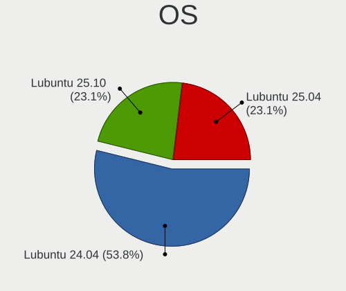

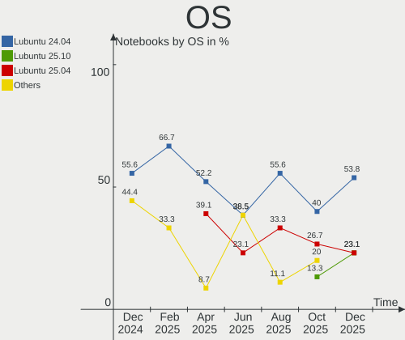

| Name          | Notebooks | Percent |
|---------------|-----------|---------|
| Lubuntu 24.04 | 7         | 53.85%  |
| Lubuntu 25.10 | 3         | 23.08%  |
| Lubuntu 25.04 | 3         | 23.08%  |

OS Family
---------

OS without a version

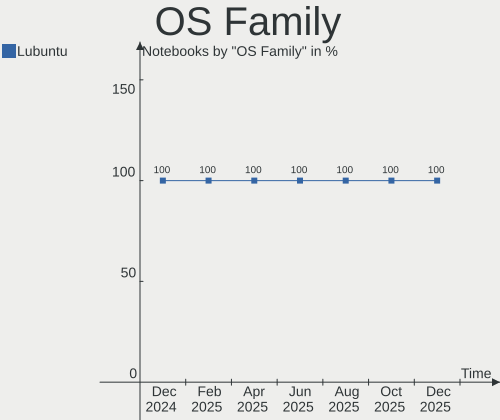

| Name    | Notebooks | Percent |
|---------|-----------|---------|
| Lubuntu | 13        | 100%    |

Kernel
------

Version of the Linux kernel

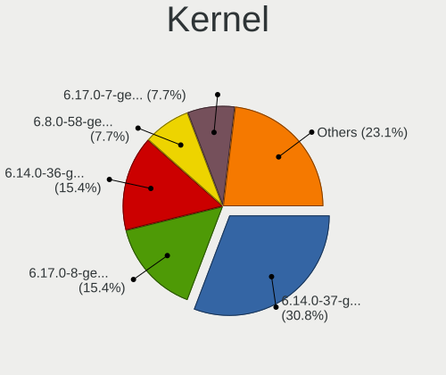

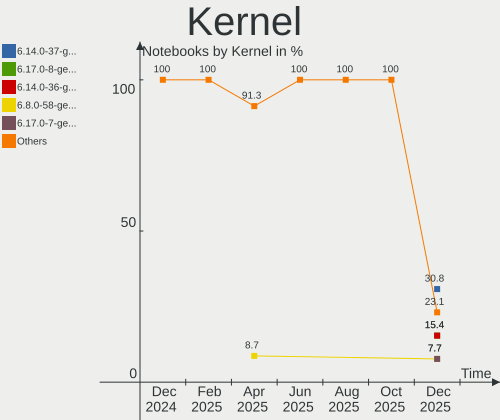

| Version            | Notebooks | Percent |
|--------------------|-----------|---------|
| 6.14.0-37-generic  | 4         | 30.77%  |
| 6.17.0-8-generic   | 2         | 15.38%  |
| 6.14.0-36-generic  | 2         | 15.38%  |
| 6.8.0-58-generic   | 1         | 7.69%   |
| 6.17.0-7-generic   | 1         | 7.69%   |
| 6.14.0-28-generic  | 1         | 7.69%   |
| 6.14.0-15-generic  | 1         | 7.69%   |
| 5.15.0-107-generic | 1         | 7.69%   |

Kernel Family
-------------

Linux kernel without a distro release

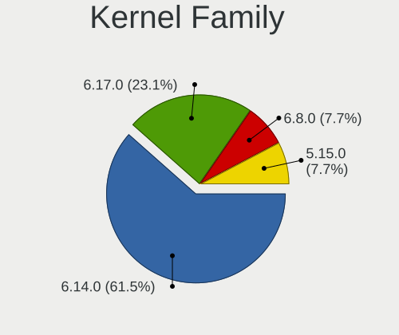

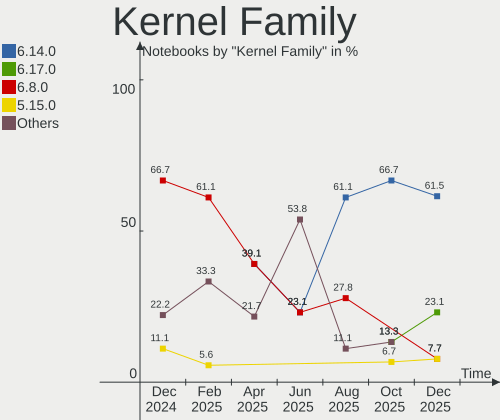

| Version | Notebooks | Percent |
|---------|-----------|---------|
| 6.14.0  | 8         | 61.54%  |
| 6.17.0  | 3         | 23.08%  |
| 6.8.0   | 1         | 7.69%   |
| 5.15.0  | 1         | 7.69%   |

Kernel Major Ver.
-----------------

Linux kernel major version

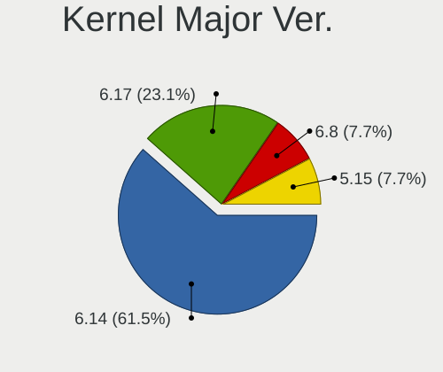

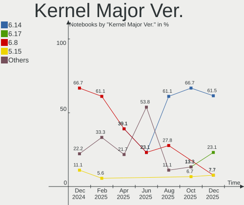

| Version | Notebooks | Percent |
|---------|-----------|---------|
| 6.14    | 8         | 61.54%  |
| 6.17    | 3         | 23.08%  |
| 6.8     | 1         | 7.69%   |
| 5.15    | 1         | 7.69%   |

Arch
----

OS architecture (x86_64, i586, etc.)

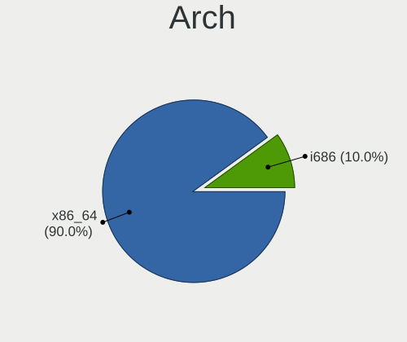

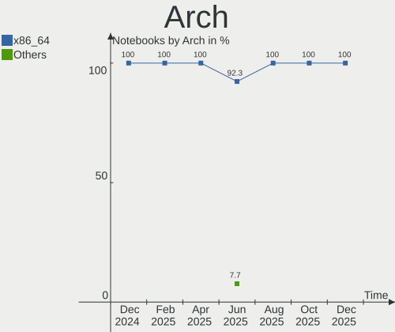

| Name   | Notebooks | Percent |
|--------|-----------|---------|
| x86_64 | 13        | 100%    |

DE
--

Desktop Environment

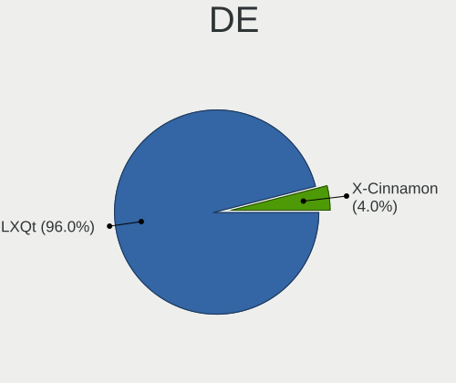

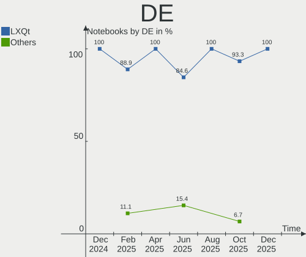

| Name | Notebooks | Percent |
|------|-----------|---------|
| LXQt | 13        | 100%    |

Display Server
--------------

X11 or Wayland

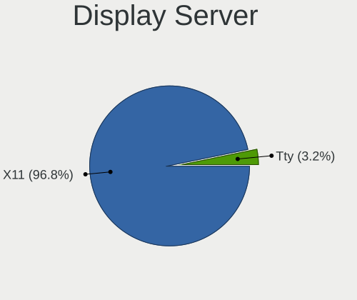

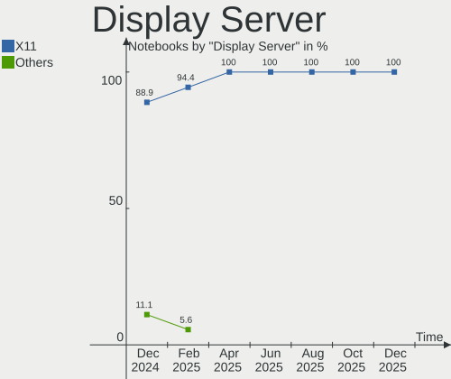

| Name | Notebooks | Percent |
|------|-----------|---------|
| X11  | 13        | 100%    |

Display Manager
---------------

SDDM, LightDM, etc.

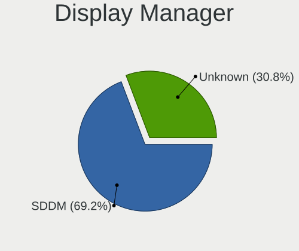

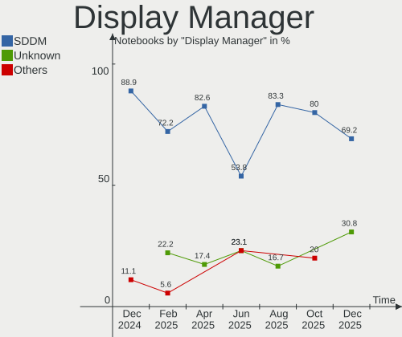

| Name    | Notebooks | Percent |
|---------|-----------|---------|
| SDDM    | 9         | 69.23%  |
| Unknown | 4         | 30.77%  |

OS Lang
-------

Language

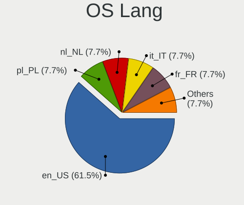

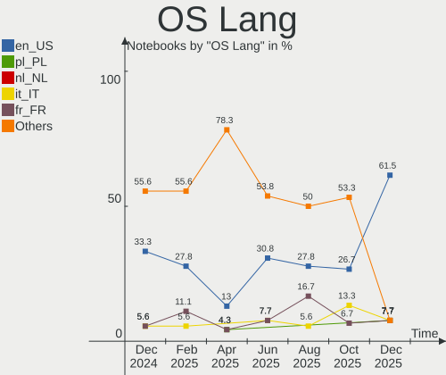

| Lang  | Notebooks | Percent |
|-------|-----------|---------|
| en_US | 8         | 61.54%  |
| pl_PL | 1         | 7.69%   |
| nl_NL | 1         | 7.69%   |
| it_IT | 1         | 7.69%   |
| fr_FR | 1         | 7.69%   |
| en_CA | 1         | 7.69%   |

Boot Mode
---------

EFI or BIOS

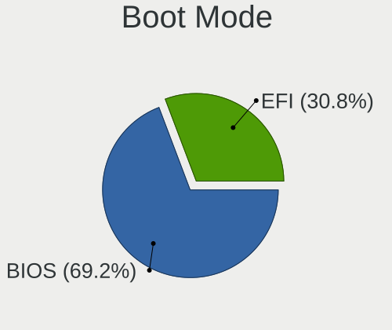

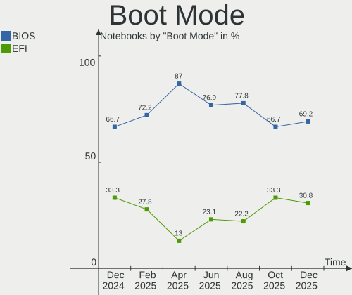

| Mode | Notebooks | Percent |
|------|-----------|---------|
| BIOS | 9         | 69.23%  |
| EFI  | 4         | 30.77%  |

Filesystem
----------

Type of filesystem

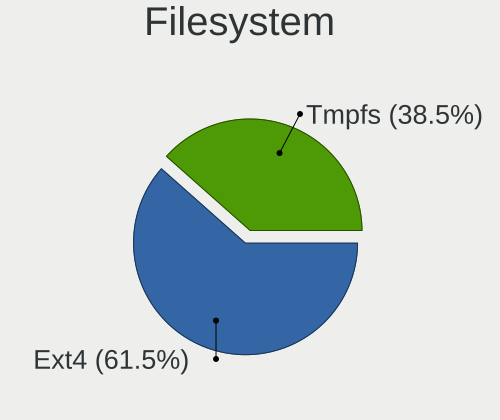

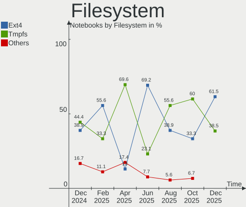

| Type  | Notebooks | Percent |
|-------|-----------|---------|
| Ext4  | 8         | 61.54%  |
| Tmpfs | 5         | 38.46%  |

Part. scheme
------------

Scheme of partitioning

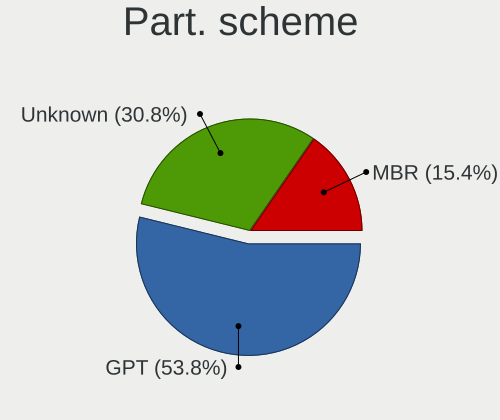

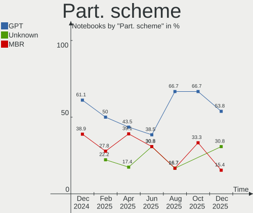

| Type    | Notebooks | Percent |
|---------|-----------|---------|
| GPT     | 7         | 53.85%  |
| Unknown | 4         | 30.77%  |
| MBR     | 2         | 15.38%  |

Dual Boot with Linux/BSD
------------------------

Hosting more than one Linux/BSD

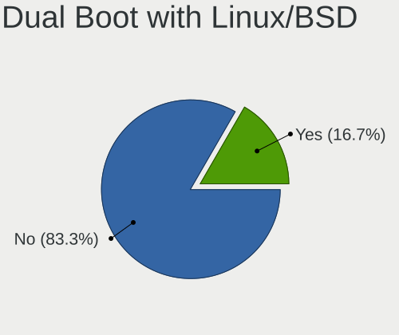

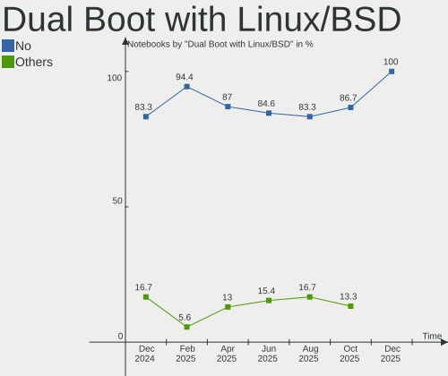

| Dual boot | Notebooks | Percent |
|-----------|-----------|---------|
| No        | 13        | 100%    |

Dual Boot (Win)
---------------

Hosting Linux and Windows

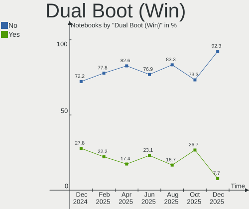

| Dual boot | Notebooks | Percent |
|-----------|-----------|---------|
| No        | 12        | 92.31%  |
| Yes       | 1         | 7.69%   |

Board
-----

Vendor
------

Motherboard manufacturer

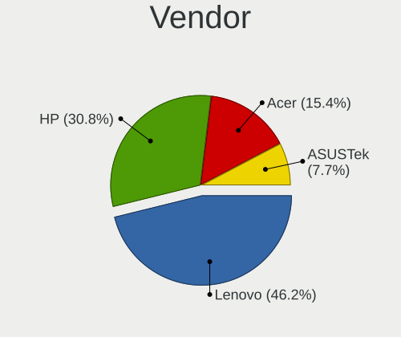

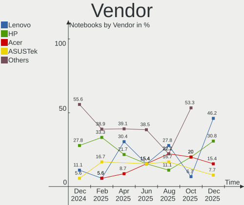

| Name             | Notebooks | Percent |
|------------------|-----------|---------|
| Lenovo           | 6         | 46.15%  |
| Hewlett-Packard  | 4         | 30.77%  |
| Acer             | 2         | 15.38%  |
| ASUSTek Computer | 1         | 7.69%   |

Model
-----

Motherboard model

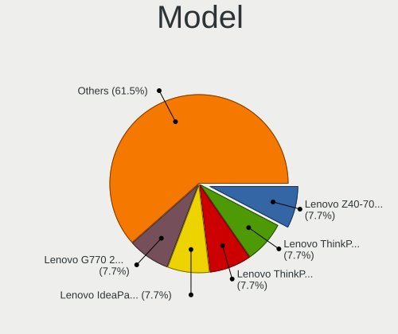

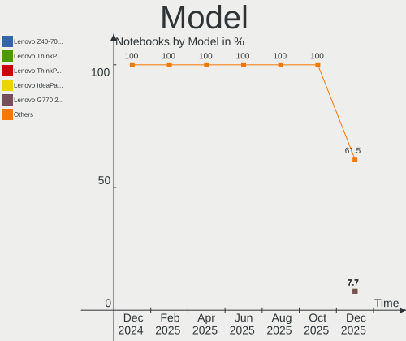

| Name                            | Notebooks | Percent |
|---------------------------------|-----------|---------|
| Lenovo Z40-70 20366             | 1         | 7.69%   |
| Lenovo ThinkPad W520 42763JU    | 1         | 7.69%   |
| Lenovo ThinkPad E595 20NFCTO1WW | 1         | 7.69%   |
| Lenovo IdeaPad 1 14IAU7 82QC    | 1         | 7.69%   |
| Lenovo G770 20089               | 1         | 7.69%   |
| Lenovo B50-10 80QR              | 1         | 7.69%   |
| HP ZBook 15 G5                  | 1         | 7.69%   |
| HP Pavilion dv7                 | 1         | 7.69%   |
| HP Laptop 17z-ca200             | 1         | 7.69%   |
| HP Laptop 17-cp2xxx             | 1         | 7.69%   |
| ASUS UX21E                      | 1         | 7.69%   |
| Acer Aspire V7-582PG            | 1         | 7.69%   |
| Acer Aspire E5-575G             | 1         | 7.69%   |

Model Family
------------

Motherboard model prefix

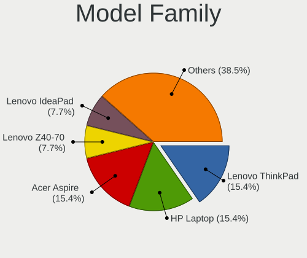

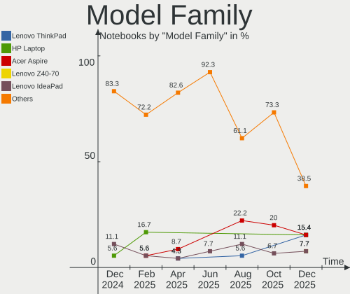

| Name            | Notebooks | Percent |
|-----------------|-----------|---------|
| Lenovo ThinkPad | 2         | 15.38%  |
| HP Laptop       | 2         | 15.38%  |
| Acer Aspire     | 2         | 15.38%  |
| Lenovo Z40-70   | 1         | 7.69%   |
| Lenovo IdeaPad  | 1         | 7.69%   |
| Lenovo G770     | 1         | 7.69%   |
| Lenovo B50-10   | 1         | 7.69%   |
| HP ZBook        | 1         | 7.69%   |
| HP Pavilion     | 1         | 7.69%   |
| ASUS UX21E      | 1         | 7.69%   |

MFG Year
--------

Motherboard manufacture year

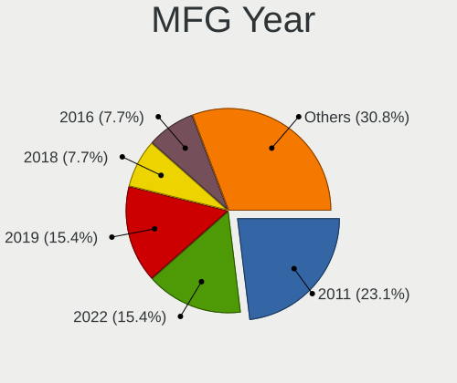

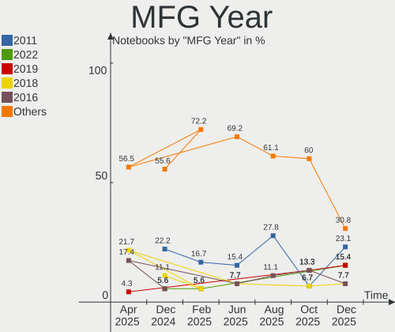

| Year | Notebooks | Percent |
|------|-----------|---------|
| 2011 | 3         | 23.08%  |
| 2022 | 2         | 15.38%  |
| 2019 | 2         | 15.38%  |
| 2018 | 1         | 7.69%   |
| 2016 | 1         | 7.69%   |
| 2015 | 1         | 7.69%   |
| 2014 | 1         | 7.69%   |
| 2013 | 1         | 7.69%   |
| 2008 | 1         | 7.69%   |

Form Factor
-----------

Physical design of the computer

| Name     | Notebooks | Percent |
|----------|-----------|---------|
| Notebook | 13        | 100%    |

Secure Boot
-----------

Enabled or disabled

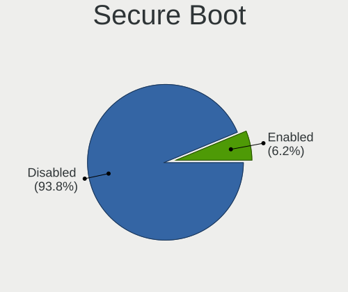

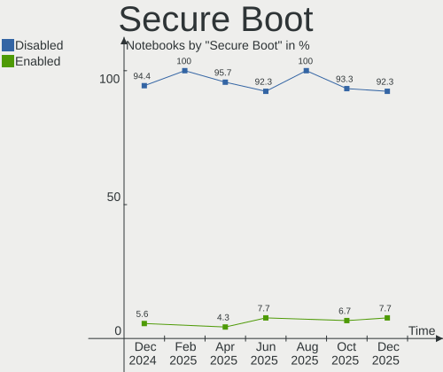

| State    | Notebooks | Percent |
|----------|-----------|---------|
| Disabled | 12        | 92.31%  |
| Enabled  | 1         | 7.69%   |

Coreboot
--------

Have coreboot on board

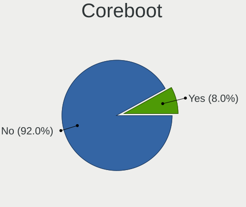

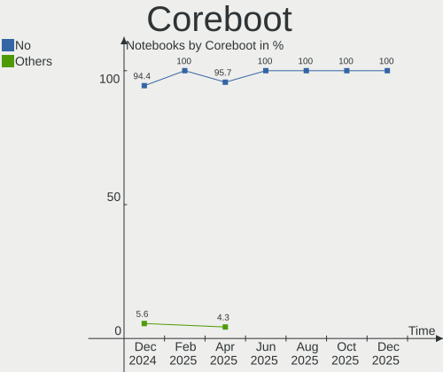

| Used | Notebooks | Percent |
|------|-----------|---------|
| No   | 13        | 100%    |

RAM Size
--------

Total RAM memory

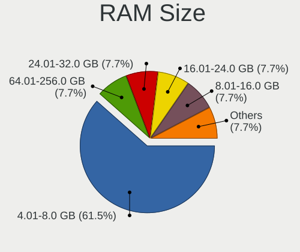

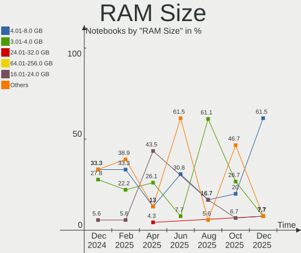

| Size in GB  | Notebooks | Percent |
|-------------|-----------|---------|
| 4.01-8.0    | 8         | 61.54%  |
| 3.01-4.0    | 1         | 7.69%   |
| 24.01-32.0  | 1         | 7.69%   |
| 64.01-256.0 | 1         | 7.69%   |
| 16.01-24.0  | 1         | 7.69%   |
| 8.01-16.0   | 1         | 7.69%   |

RAM Used
--------

Used RAM memory

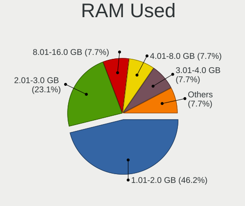

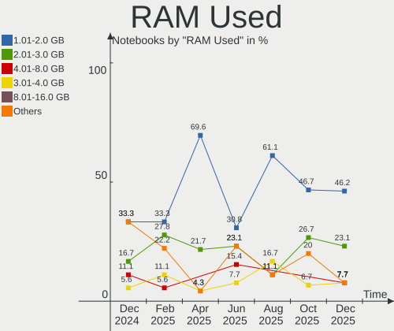

| Used GB   | Notebooks | Percent |
|-----------|-----------|---------|
| 1.01-2.0  | 6         | 46.15%  |
| 2.01-3.0  | 3         | 23.08%  |
| 4.01-8.0  | 1         | 7.69%   |
| 3.01-4.0  | 1         | 7.69%   |
| 8.01-16.0 | 1         | 7.69%   |
| 0.51-1.0  | 1         | 7.69%   |

Total Drives
------------

Number of drives on board

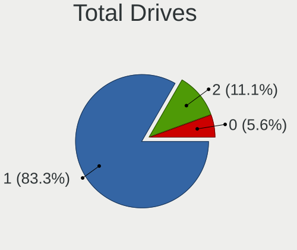

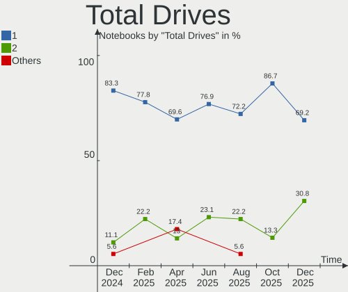

| Drives | Notebooks | Percent |
|--------|-----------|---------|
| 1      | 9         | 69.23%  |
| 2      | 4         | 30.77%  |

Has CD-ROM
----------

Has CD-ROM on board

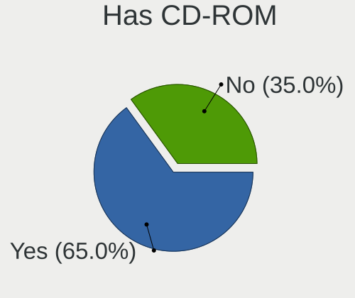

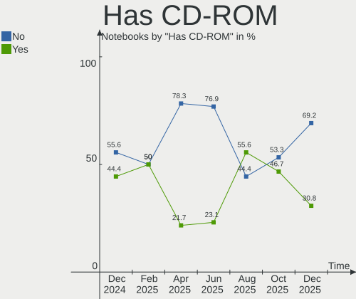

| Presented | Notebooks | Percent |
|-----------|-----------|---------|
| No        | 9         | 69.23%  |
| Yes       | 4         | 30.77%  |

Has Ethernet
------------

Has Ethernet on board

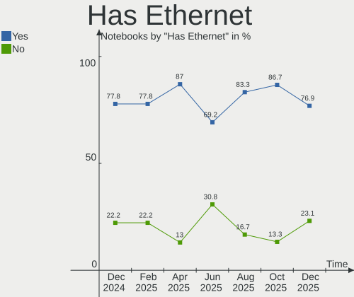

| Presented | Notebooks | Percent |
|-----------|-----------|---------|
| Yes       | 10        | 76.92%  |
| No        | 3         | 23.08%  |

Has WiFi
--------

Has WiFi module

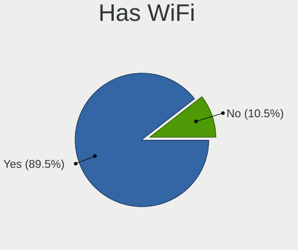

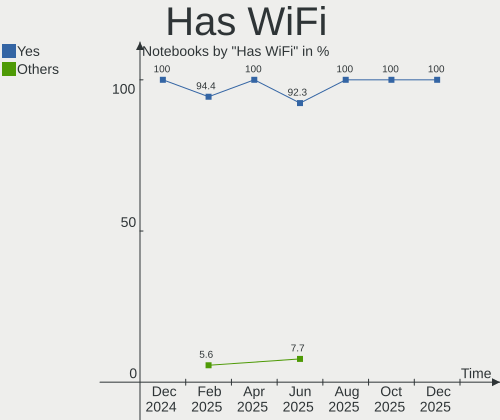

| Presented | Notebooks | Percent |
|-----------|-----------|---------|
| Yes       | 13        | 100%    |

Has Bluetooth
-------------

Has Bluetooth module

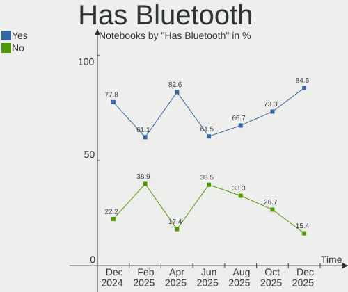

| Presented | Notebooks | Percent |
|-----------|-----------|---------|
| Yes       | 11        | 84.62%  |
| No        | 2         | 15.38%  |

Location
--------

Country
-------

Geographic location (country)

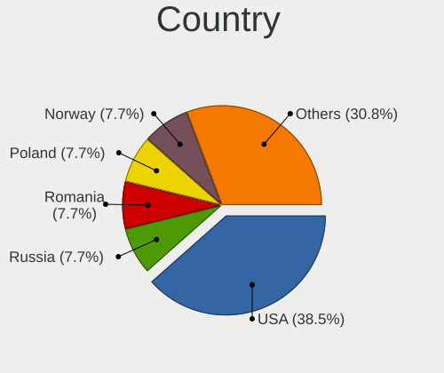

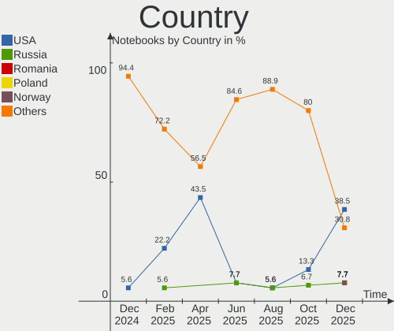

| Country | Notebooks | Percent |
|---------|-----------|---------|
| USA     | 5         | 38.46%  |
| Russia  | 1         | 7.69%   |
| Romania | 1         | 7.69%   |
| Poland  | 1         | 7.69%   |
| Norway  | 1         | 7.69%   |
| Italy   | 1         | 7.69%   |
| India   | 1         | 7.69%   |
| France  | 1         | 7.69%   |
| Canada  | 1         | 7.69%   |

City
----

Geographic location (city)

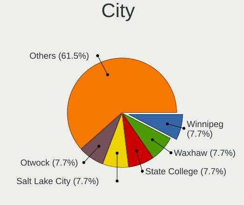

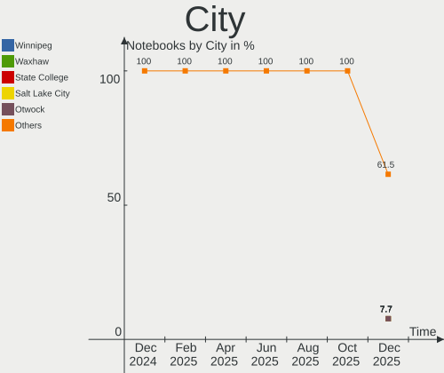

| City                      | Notebooks | Percent |
|---------------------------|-----------|---------|
| Winnipeg                  | 1         | 7.69%   |
| Waxhaw                    | 1         | 7.69%   |
| State College             | 1         | 7.69%   |
| Salt Lake City            | 1         | 7.69%   |
| Otwock                    | 1         | 7.69%   |
| Moscow                    | 1         | 7.69%   |
| Monroe                    | 1         | 7.69%   |
| Milan                     | 1         | 7.69%   |
| Lucknow                   | 1         | 7.69%   |
| La Chapelle-des-Fougeretz | 1         | 7.69%   |
| Iasi                      | 1         | 7.69%   |
| Holen                     | 1         | 7.69%   |
| Charleston                | 1         | 7.69%   |

Drives
------

Drive Vendor
------------

Hard drive vendors

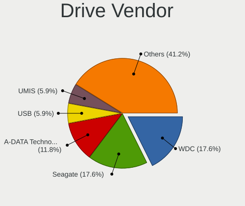

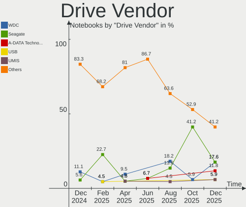

| Vendor              | Notebooks | Drives | Percent |
|---------------------|-----------|--------|---------|
| WDC                 | 3         | 3      | 17.65%  |
| Seagate             | 3         | 4      | 17.65%  |
| A-DATA Technology   | 2         | 2      | 11.76%  |
| USB                 | 1         | 1      | 5.88%   |
| UMIS                | 1         | 1      | 5.88%   |
| Toshiba             | 1         | 1      | 5.88%   |
| SPCC                | 1         | 1      | 5.88%   |
| SK hynix            | 1         | 1      | 5.88%   |
| Sandisk             | 1         | 1      | 5.88%   |
| Samsung Electronics | 1         | 1      | 5.88%   |
| KIOXIA              | 1         | 1      | 5.88%   |
| HGST                | 1         | 1      | 5.88%   |

Drive Model
-----------

Hard drive models

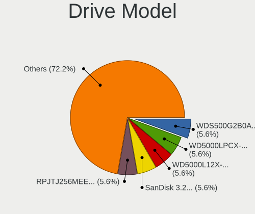

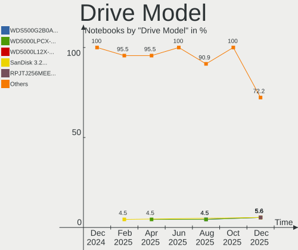

| Model                             | Notebooks | Percent |
|-----------------------------------|-----------|---------|
| WDC WDS500G2B0A-00SM50 500GB      | 1         | 5.56%   |
| WDC WD5000LPCX-24VHAT0 500GB      | 1         | 5.56%   |
| WDC WD5000L12X-21UJGT0 516GB      | 1         | 5.56%   |
| USB SanDisk 3.2Gen1 496GB         | 1         | 5.56%   |
| UMIS RPJTJ256MEE1OWX 256GB        | 1         | 5.56%   |
| Toshiba MQ04ABD200 2TB            | 1         | 5.56%   |
| SPCC Solid State Disk 256GB       | 1         | 5.56%   |
| SK hynix HFM512GDHTNG-8710B 512GB | 1         | 5.56%   |
| Seagate ST9500420ASG 500GB        | 1         | 5.56%   |
| Seagate ST9500325AS 500GB         | 1         | 5.56%   |
| Seagate ST500LM000-SSHD-8GB       | 1         | 5.56%   |
| Seagate Expansion 2TB             | 1         | 5.56%   |
| Sandisk WD_BLACK SN770 1TB        | 1         | 5.56%   |
| Samsung SSD 860 EVO 1TB           | 1         | 5.56%   |
| KIOXIA KBG60ZNV256G 256GB         | 1         | 5.56%   |
| HGST HTS725050A7E630 500GB        | 1         | 5.56%   |
| A-DATA XPG EX500 500GB SSD        | 1         | 5.56%   |
| A-DATA XM11 128GB SSD             | 1         | 5.56%   |

HDD Vendor
----------

Hard disk drive vendors

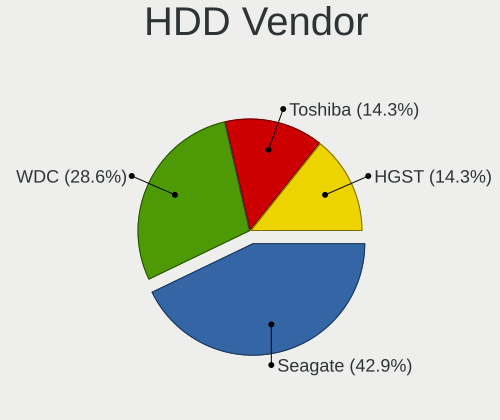

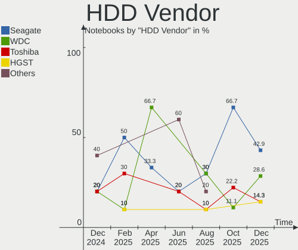

| Vendor  | Notebooks | Drives | Percent |
|---------|-----------|--------|---------|
| Seagate | 3         | 4      | 42.86%  |
| WDC     | 2         | 2      | 28.57%  |
| Toshiba | 1         | 1      | 14.29%  |
| HGST    | 1         | 1      | 14.29%  |

SSD Vendor
----------

Solid state drive vendors

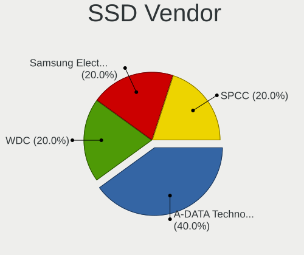

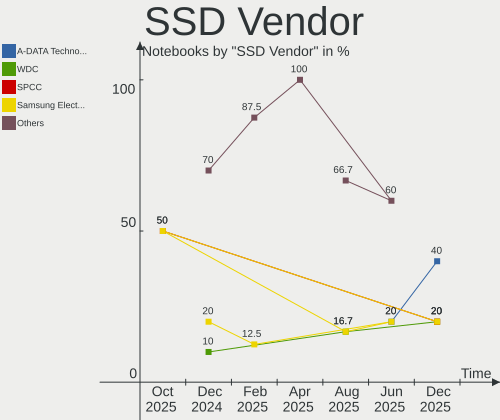

| Vendor              | Notebooks | Drives | Percent |
|---------------------|-----------|--------|---------|
| A-DATA Technology   | 2         | 2      | 40%     |
| WDC                 | 1         | 1      | 20%     |
| SPCC                | 1         | 1      | 20%     |
| Samsung Electronics | 1         | 1      | 20%     |

Drive Kind
----------

HDD or SSD

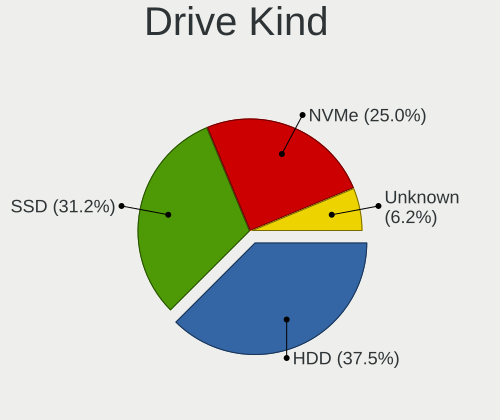

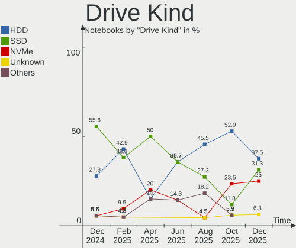

| Kind    | Notebooks | Drives | Percent |
|---------|-----------|--------|---------|
| HDD     | 6         | 8      | 37.5%   |
| SSD     | 5         | 5      | 31.25%  |
| NVMe    | 4         | 4      | 25%     |
| Unknown | 1         | 1      | 6.25%   |

Drive Connector
---------------

SATA, SAS, NVMe, etc.

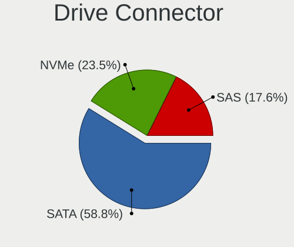

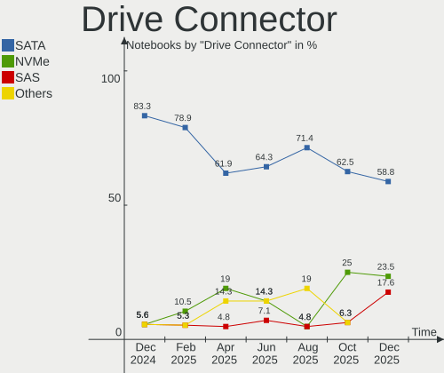

| Type | Notebooks | Drives | Percent |
|------|-----------|--------|---------|
| SATA | 10        | 11     | 58.82%  |
| NVMe | 4         | 4      | 23.53%  |
| SAS  | 3         | 3      | 17.65%  |

Drive Size
----------

Size of hard drive

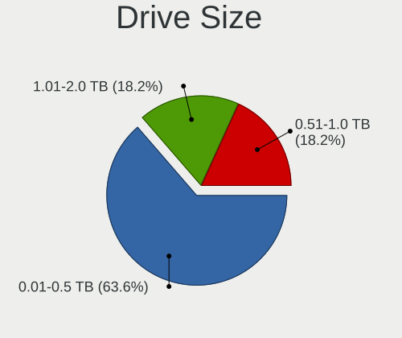

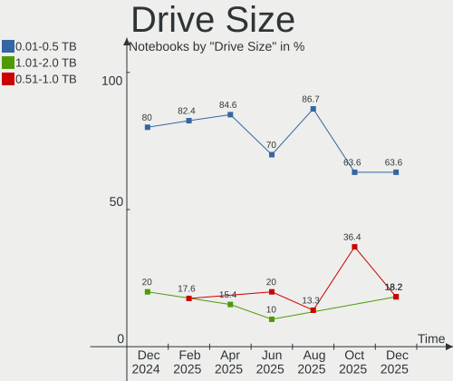

| Size in TB | Notebooks | Drives | Percent |
|------------|-----------|--------|---------|
| 0.01-0.5   | 7         | 9      | 63.64%  |
| 1.01-2.0   | 2         | 2      | 18.18%  |
| 0.51-1.0   | 2         | 2      | 18.18%  |

Space Total
-----------

Amount of disk space available on the file system

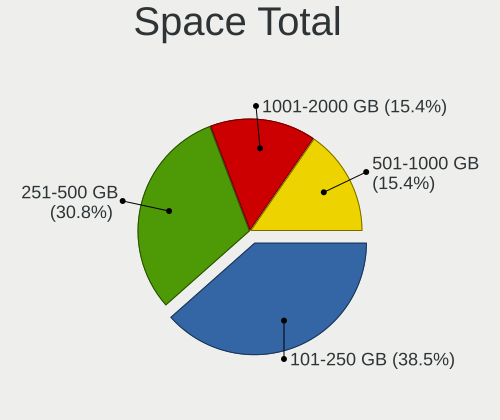

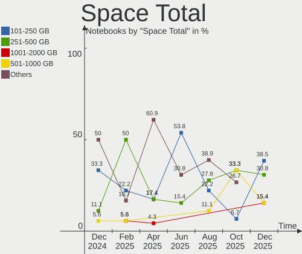

| Size in GB | Notebooks | Percent |
|------------|-----------|---------|
| 101-250    | 5         | 38.46%  |
| 251-500    | 4         | 30.77%  |
| 1001-2000  | 2         | 15.38%  |
| 501-1000   | 2         | 15.38%  |

Space Used
----------

Amount of used disk space

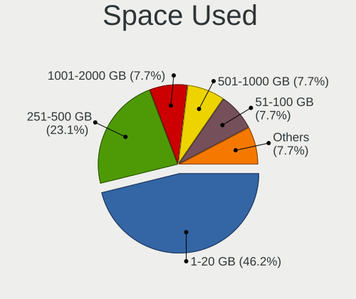

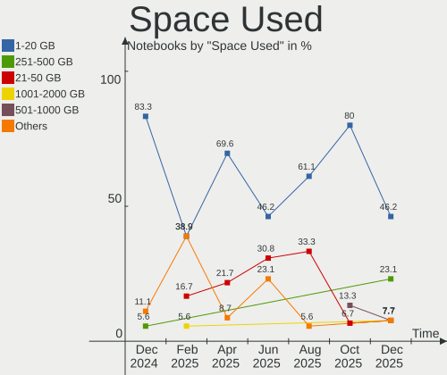

| Used GB   | Notebooks | Percent |
|-----------|-----------|---------|
| 1-20      | 6         | 46.15%  |
| 251-500   | 3         | 23.08%  |
| 21-50     | 1         | 7.69%   |
| 1001-2000 | 1         | 7.69%   |
| 501-1000  | 1         | 7.69%   |
| 51-100    | 1         | 7.69%   |

Malfunc. Drives
---------------

Drive models with a malfunction

Zero info for selected period =(

Malfunc. Drive Vendor
---------------------

Vendors of faulty drives

Zero info for selected period =(

Malfunc. HDD Vendor
-------------------

Vendors of faulty HDD drives

Zero info for selected period =(

Malfunc. Drive Kind
-------------------

Kinds of faulty drives

Zero info for selected period =(

Failed Drives
-------------

Failed drive models

Zero info for selected period =(

Failed Drive Vendor
-------------------

Failed drive vendors

Zero info for selected period =(

Drive Status
------------

Number of failed and malfunc. drives

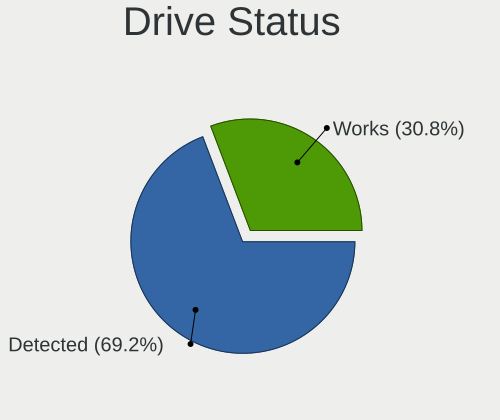

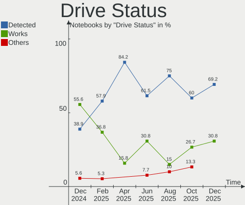

| Status   | Notebooks | Drives | Percent |
|----------|-----------|--------|---------|
| Detected | 9         | 13     | 69.23%  |
| Works    | 4         | 5      | 30.77%  |

Storage controller
------------------

Storage Vendor
--------------

Storage controller vendors

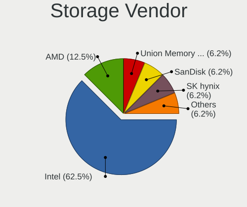

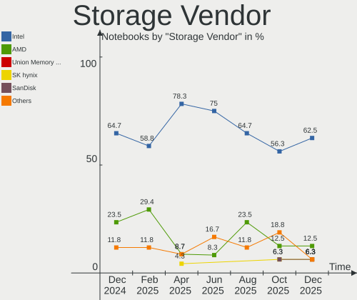

| Vendor                  | Notebooks | Percent |
|-------------------------|-----------|---------|
| Intel                   | 10        | 62.5%   |
| AMD                     | 2         | 12.5%   |
| Union Memory (Shenzhen) | 1         | 6.25%   |
| SK hynix                | 1         | 6.25%   |
| SanDisk                 | 1         | 6.25%   |
| KIOXIA                  | 1         | 6.25%   |

Storage Model
-------------

Storage controller models

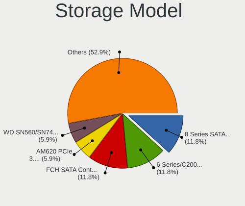

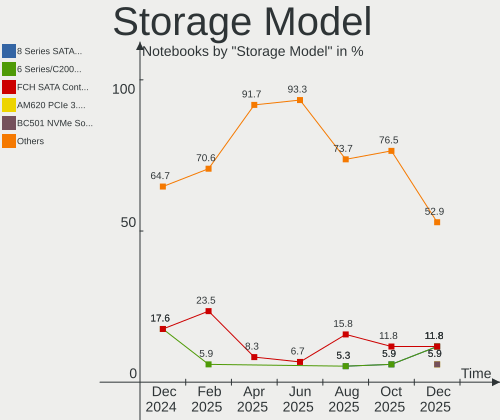

| Model                                                                                  | Notebooks | Percent |
|----------------------------------------------------------------------------------------|-----------|---------|
| Intel 8 Series SATA Controller 1 [AHCI mode]                                           | 2         | 11.76%  |
| Intel 6 Series/C200 Series Chipset Family 6 port Mobile SATA AHCI Controller           | 2         | 11.76%  |
| AMD FCH SATA Controller [AHCI mode]                                                    | 2         | 11.76%  |
| Union Memory (Shenzhen) AM620 PCIe 3.0 NVMe SSD 256GB                                  | 1         | 5.88%   |
| SK hynix BC501 NVMe Solid State Drive                                                  | 1         | 5.88%   |
| SanDisk WD SN560/SN740/SN770/SN5000 NVMe SSD                                           | 1         | 5.88%   |
| KIOXIA NVMe SSD Controller BG6 (DRAM-less)                                             | 1         | 5.88%   |
| Intel Sunrise Point-LP SATA Controller [AHCI mode]                                     | 1         | 5.88%   |
| Intel Cannon Lake Mobile PCH SATA AHCI Controller                                      | 1         | 5.88%   |
| Intel Atom Processor E3800 Series SATA AHCI Controller                                 | 1         | 5.88%   |
| Intel Alder Lake-P SATA AHCI Controller                                                | 1         | 5.88%   |
| Intel 82801IBM/IEM (ICH9M/ICH9M-E) 4 port SATA Controller [AHCI mode]                  | 1         | 5.88%   |
| Intel 6 Series/C200 Series Chipset Family Mobile SATA Controller (IDE mode, ports 4-5) | 1         | 5.88%   |
| Intel 6 Series/C200 Series Chipset Family Mobile SATA Controller (IDE mode, ports 0-3) | 1         | 5.88%   |

Storage Kind
------------

Kind of storage controller (IDE, SATA, NVMe, SAS, ...)

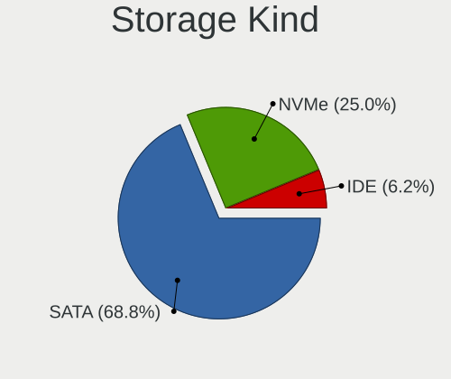

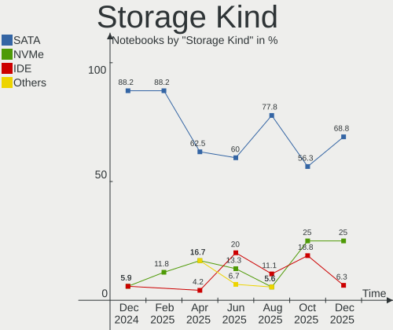

| Kind | Notebooks | Percent |
|------|-----------|---------|
| SATA | 11        | 68.75%  |
| NVMe | 4         | 25%     |
| IDE  | 1         | 6.25%   |

Processor
---------

CPU Vendor
----------

Processor vendors

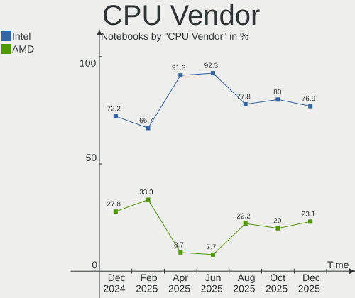

| Vendor | Notebooks | Percent |
|--------|-----------|---------|
| Intel  | 10        | 76.92%  |
| AMD    | 3         | 23.08%  |

CPU Model
---------

Processor models

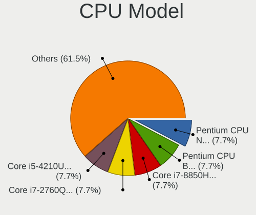

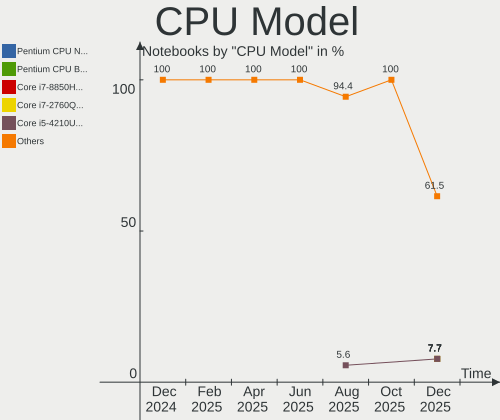

| Model                                         | Notebooks | Percent |
|-----------------------------------------------|-----------|---------|
| Intel Pentium CPU N3540 @ 2.16GHz             | 1         | 7.69%   |
| Intel Pentium CPU B960 @ 2.20GHz              | 1         | 7.69%   |
| Intel Core i7-8850H CPU @ 2.60GHz             | 1         | 7.69%   |
| Intel Core i7-2760QM CPU @ 2.40GHz            | 1         | 7.69%   |
| Intel Core i5-4210U CPU @ 1.70GHz             | 1         | 7.69%   |
| Intel Core i5-4200U CPU @ 1.60GHz             | 1         | 7.69%   |
| Intel Core i5-2467M CPU @ 1.60GHz             | 1         | 7.69%   |
| Intel Core i3-6006U CPU @ 2.00GHz             | 1         | 7.69%   |
| Intel Core 2 Duo CPU P8600 @ 2.40GHz          | 1         | 7.69%   |
| Intel 12th Gen Core i3-1215U                  | 1         | 7.69%   |
| AMD Ryzen 7 3700U with Radeon Vega Mobile Gfx | 1         | 7.69%   |
| AMD Ryzen 5 7520U with Radeon Graphics        | 1         | 7.69%   |
| AMD Athlon Gold 3150U with Radeon Graphics    | 1         | 7.69%   |

CPU Model Family
----------------

Processor model prefix

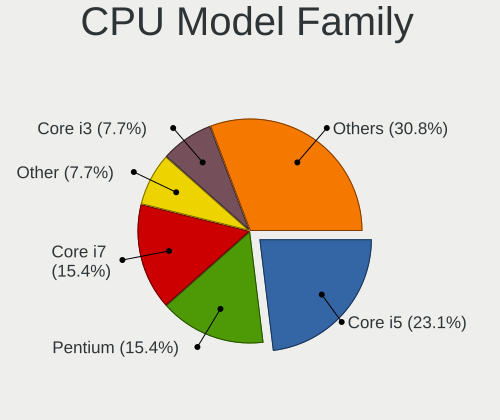

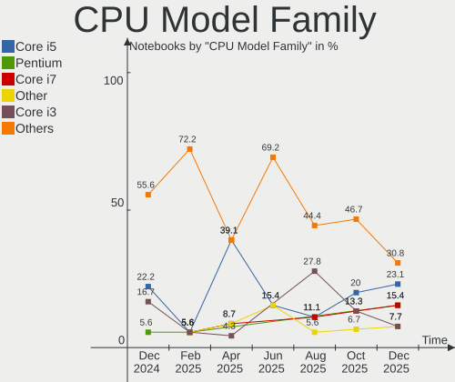

| Model            | Notebooks | Percent |
|------------------|-----------|---------|
| Intel Core i5    | 3         | 23.08%  |
| Intel Pentium    | 2         | 15.38%  |
| Intel Core i7    | 2         | 15.38%  |
| Other            | 1         | 7.69%   |
| Intel Core i3    | 1         | 7.69%   |
| Intel Core 2 Duo | 1         | 7.69%   |
| AMD Ryzen 7      | 1         | 7.69%   |
| AMD Ryzen 5      | 1         | 7.69%   |
| AMD Athlon       | 1         | 7.69%   |

CPU Cores
---------

Number of processor cores

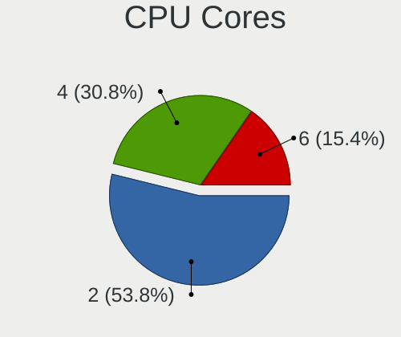

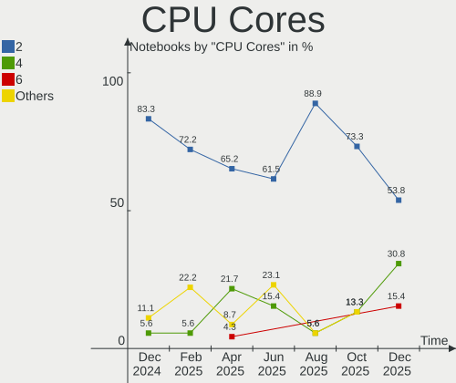

| Number | Notebooks | Percent |
|--------|-----------|---------|
| 2      | 7         | 53.85%  |
| 4      | 4         | 30.77%  |
| 6      | 2         | 15.38%  |

CPU Sockets
-----------

Number of sockets

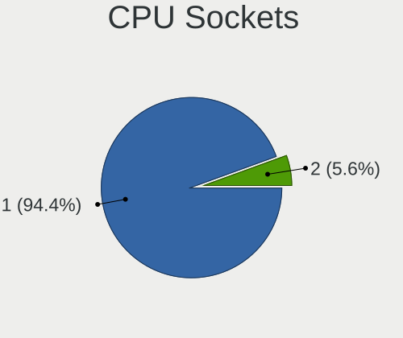

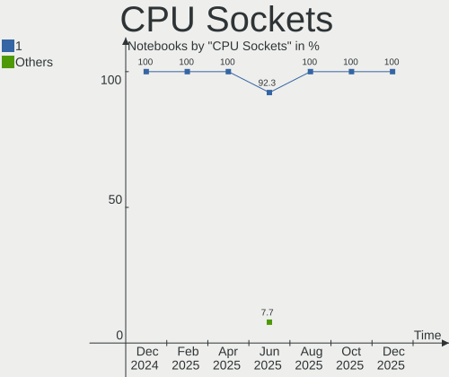

| Number | Notebooks | Percent |
|--------|-----------|---------|
| 1      | 13        | 100%    |

CPU Threads
-----------

Threads per core (Hyper-Threading)

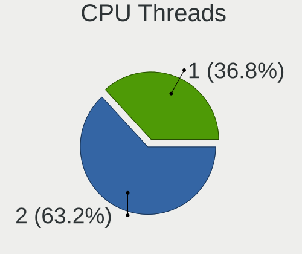

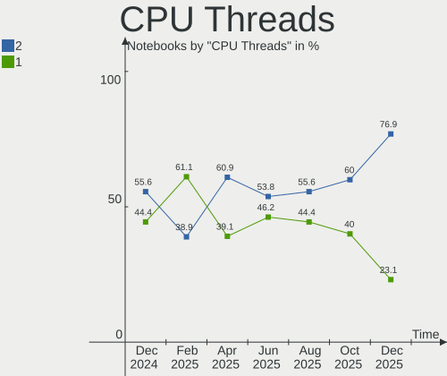

| Number | Notebooks | Percent |
|--------|-----------|---------|
| 2      | 10        | 76.92%  |
| 1      | 3         | 23.08%  |

CPU Op-Modes
------------

CPU Operation Modes (32-bit, 64-bit)

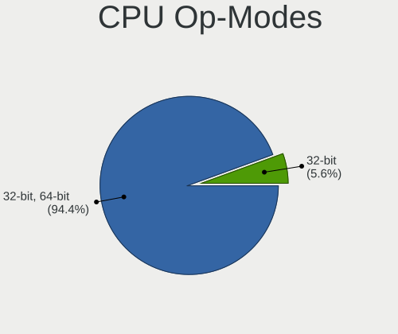

| Op mode        | Notebooks | Percent |
|----------------|-----------|---------|
| 32-bit, 64-bit | 13        | 100%    |

CPU Microcode
-------------

Microcode number

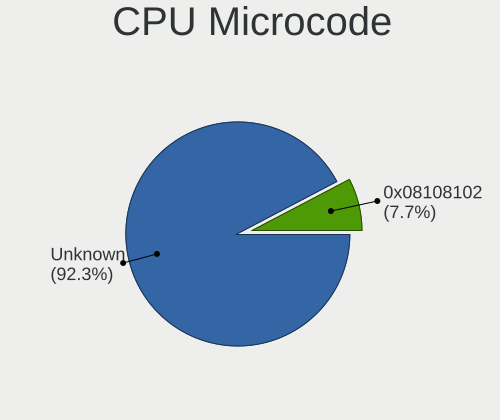

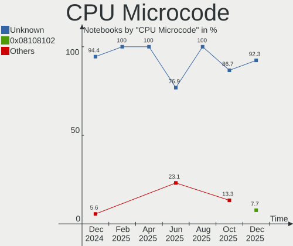

| Number     | Notebooks | Percent |
|------------|-----------|---------|
| Unknown    | 12        | 92.31%  |
| 0x08108102 | 1         | 7.69%   |

CPU Microarch
-------------

Microarchitecture

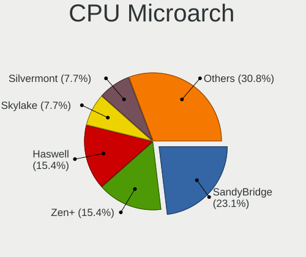

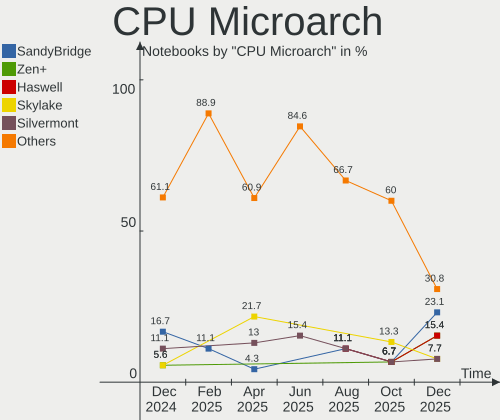

| Name             | Notebooks | Percent |
|------------------|-----------|---------|
| SandyBridge      | 3         | 23.08%  |
| Zen+             | 2         | 15.38%  |
| Haswell          | 2         | 15.38%  |
| Skylake          | 1         | 7.69%   |
| Silvermont       | 1         | 7.69%   |
| Penryn           | 1         | 7.69%   |
| KabyLake         | 1         | 7.69%   |
| Alderlake Hybrid | 1         | 7.69%   |
| Unknown          | 1         | 7.69%   |

Graphics
--------

GPU Vendor
----------

Vendors of graphics cards

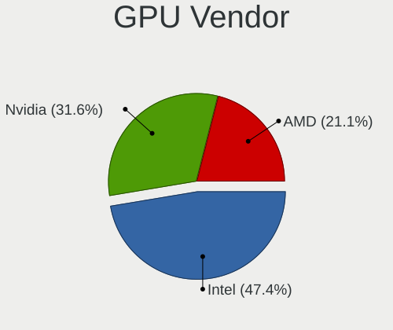

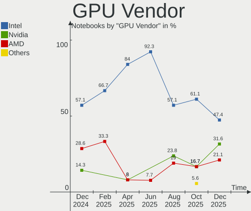

| Vendor | Notebooks | Percent |
|--------|-----------|---------|
| Intel  | 9         | 47.37%  |
| Nvidia | 6         | 31.58%  |
| AMD    | 4         | 21.05%  |

GPU Model
---------

Graphics card models

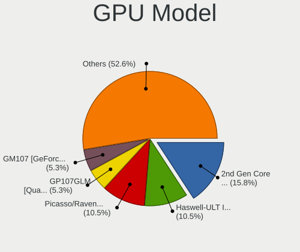

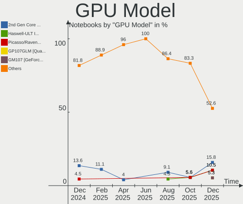

| Model                                                                     | Notebooks | Percent |
|---------------------------------------------------------------------------|-----------|---------|
| Intel 2nd Generation Core Processor Family Integrated Graphics Controller | 3         | 15.79%  |
| Intel Haswell-ULT Integrated Graphics Controller                          | 2         | 10.53%  |
| AMD Picasso/Raven 2 [Radeon Vega Series / Radeon Vega Mobile Series]      | 2         | 10.53%  |
| Nvidia GP107GLM [Quadro P2000 Mobile]                                     | 1         | 5.26%   |
| Nvidia GM107 [GeForce 940MX]                                              | 1         | 5.26%   |
| Nvidia GK107M [GeForce GT 750M]                                           | 1         | 5.26%   |
| Nvidia GF117M [GeForce 610M/710M/810M/820M / GT 620M/625M/630M/720M]      | 1         | 5.26%   |
| Nvidia GF108GLM [Quadro 1000M]                                            | 1         | 5.26%   |
| Nvidia G96CM [GeForce 9600M GT]                                           | 1         | 5.26%   |
| Intel Skylake-U GT2 [HD Graphics 520]                                     | 1         | 5.26%   |
| Intel CoffeeLake-H GT2 [UHD Graphics 630]                                 | 1         | 5.26%   |
| Intel Atom Processor Z36xxx/Z37xxx Series Graphics & Display              | 1         | 5.26%   |
| Intel Alder Lake-UP3 GT1 [UHD Graphics]                                   | 1         | 5.26%   |
| AMD Whistler [Radeon HD 6630M/6650M/6750M/7670M/7690M]                    | 1         | 5.26%   |
| AMD Mendocino [Radeon 610M]                                               | 1         | 5.26%   |

GPU Combo
---------

Combinations of graphics cards

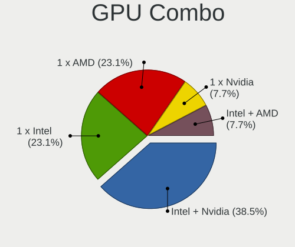

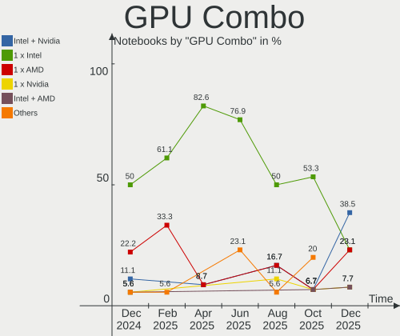

| Name           | Notebooks | Percent |
|----------------|-----------|---------|
| Intel + Nvidia | 5         | 38.46%  |
| 1 x Intel      | 3         | 23.08%  |
| 1 x AMD        | 3         | 23.08%  |
| 1 x Nvidia     | 1         | 7.69%   |
| Intel + AMD    | 1         | 7.69%   |

GPU Driver
----------

Free vs proprietary

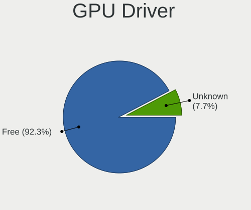

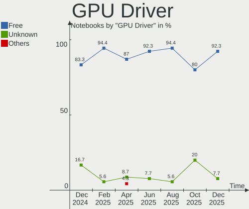

| Driver  | Notebooks | Percent |
|---------|-----------|---------|
| Free    | 12        | 92.31%  |
| Unknown | 1         | 7.69%   |

GPU Memory
----------

Total video memory

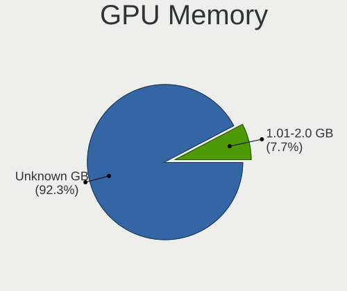

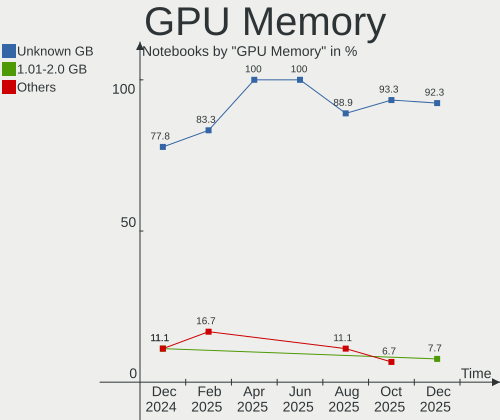

| Size in GB | Notebooks | Percent |
|------------|-----------|---------|
| Unknown    | 12        | 92.31%  |
| 1.01-2.0   | 1         | 7.69%   |

Monitor
-------

Monitor Vendor
--------------

Monitor vendors

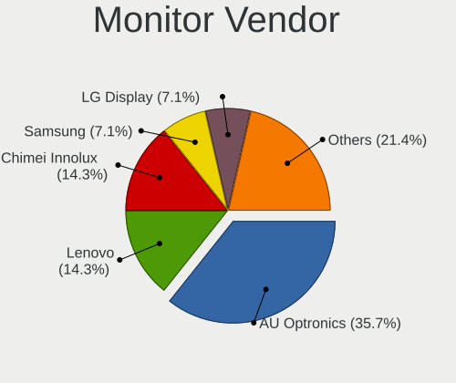

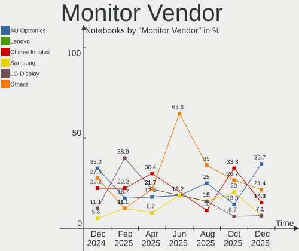

| Vendor              | Notebooks | Percent |
|---------------------|-----------|---------|
| AU Optronics        | 5         | 35.71%  |
| Lenovo              | 2         | 14.29%  |
| Chimei Innolux      | 2         | 14.29%  |
| Samsung Electronics | 1         | 7.14%   |
| LG Display          | 1         | 7.14%   |
| Goldstar            | 1         | 7.14%   |
| CPT                 | 1         | 7.14%   |
| BOE                 | 1         | 7.14%   |

Monitor Model
-------------

Monitor models

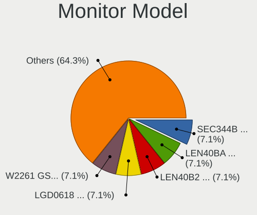

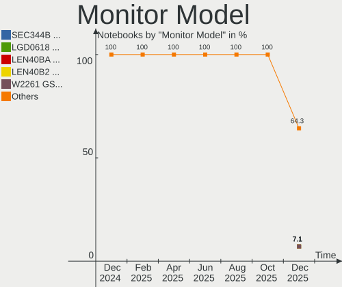

| Model                                                                | Notebooks | Percent |
|----------------------------------------------------------------------|-----------|---------|
| Samsung Electronics LCD Monitor SEC344B 1440x900 367x230mm 17.1-inch | 1         | 7.14%   |
| LG Display LCD Monitor LGD0618 1920x1080 344x194mm 15.5-inch         | 1         | 7.14%   |
| Lenovo LCD Monitor LEN40BA 1920x1080 344x194mm 15.5-inch             | 1         | 7.14%   |
| Lenovo LCD Monitor LEN40B2 1920x1080 344x193mm 15.5-inch             | 1         | 7.14%   |
| Goldstar W2261 GSM56CF 1920x1080 477x268mm 21.5-inch                 | 1         | 7.14%   |
| CPT P116NWR1 R2 COR0489 1366x768 256x144mm 11.6-inch                 | 1         | 7.14%   |
| Chimei Innolux LCD Monitor CMN1745 1600x900 382x214mm 17.2-inch      | 1         | 7.14%   |
| Chimei Innolux LCD Monitor CMN15DB 1366x768 344x193mm 15.5-inch      | 1         | 7.14%   |
| BOE LCD Monitor BOE08F2 1920x1080 310x174mm 14.0-inch                | 1         | 7.14%   |
| AU Optronics LCD Monitor AUO9C92 1600x900 382x215mm 17.3-inch        | 1         | 7.14%   |
| AU Optronics LCD Monitor AUO70EC 1366x768 344x193mm 15.5-inch        | 1         | 7.14%   |
| AU Optronics LCD Monitor AUO163D 1920x1080 309x173mm 13.9-inch       | 1         | 7.14%   |
| AU Optronics LCD Monitor AUO139E 1600x900 382x214mm 17.2-inch        | 1         | 7.14%   |
| AU Optronics LCD Monitor AUO12ED 1920x1080 344x193mm 15.5-inch       | 1         | 7.14%   |

Monitor Resolution
------------------

Monitor screen resolution

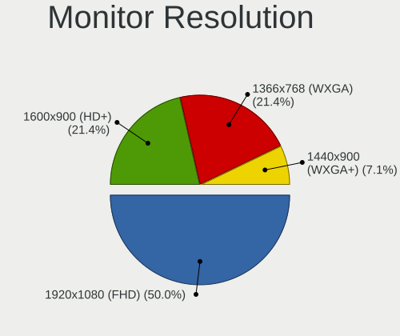

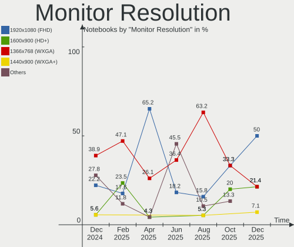

| Resolution       | Notebooks | Percent |
|------------------|-----------|---------|
| 1920x1080 (FHD)  | 7         | 50%     |
| 1600x900 (HD+)   | 3         | 21.43%  |
| 1366x768 (WXGA)  | 3         | 21.43%  |
| 1440x900 (WXGA+) | 1         | 7.14%   |

Monitor Diagonal
----------------

Diagonal size in inches

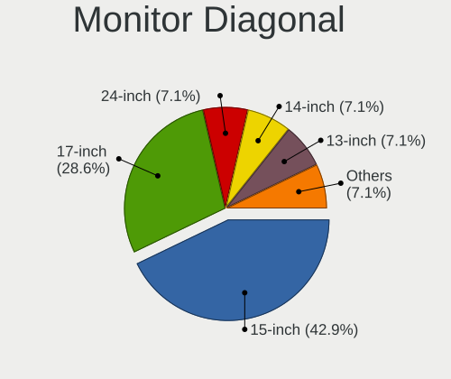

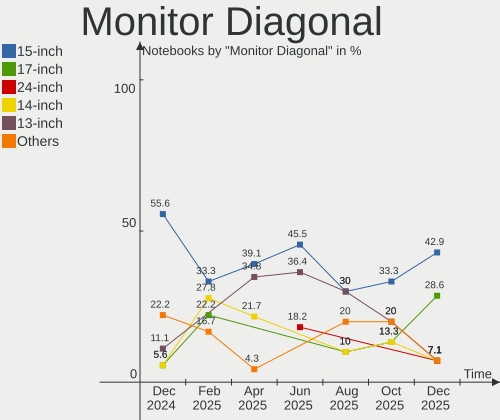

| Inches | Notebooks | Percent |
|--------|-----------|---------|
| 15     | 6         | 42.86%  |
| 17     | 4         | 28.57%  |
| 24     | 1         | 7.14%   |
| 14     | 1         | 7.14%   |
| 13     | 1         | 7.14%   |
| 11     | 1         | 7.14%   |

Monitor Width
-------------

Physical width

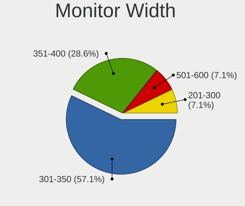

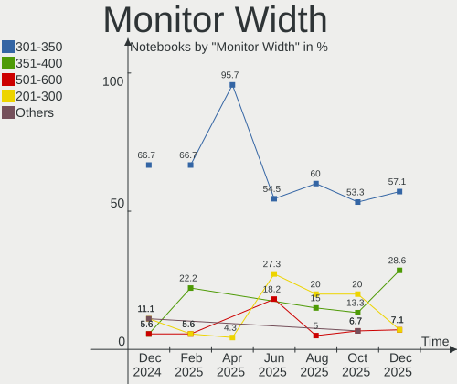

| Width in mm | Notebooks | Percent |
|-------------|-----------|---------|
| 301-350     | 8         | 57.14%  |
| 351-400     | 4         | 28.57%  |
| 501-600     | 1         | 7.14%   |
| 201-300     | 1         | 7.14%   |

Aspect Ratio
------------

Proportional relationship between the width and the height

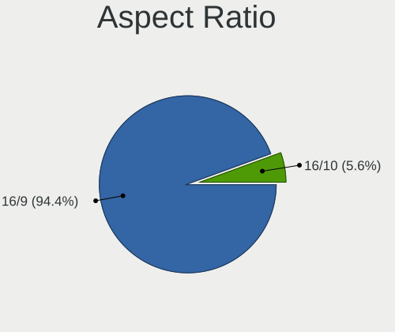

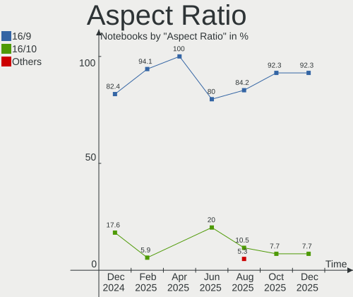

| Ratio | Notebooks | Percent |
|-------|-----------|---------|
| 16/9  | 12        | 92.31%  |
| 16/10 | 1         | 7.69%   |

Monitor Area
------------

Area in inch²

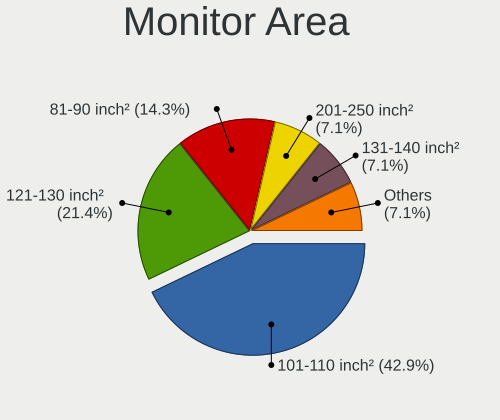

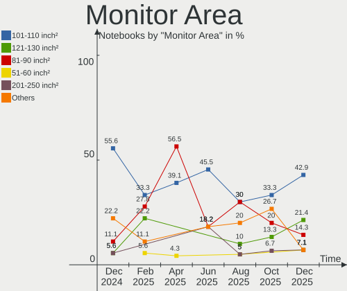

| Area in inch² | Notebooks | Percent |
|----------------|-----------|---------|
| 101-110        | 6         | 42.86%  |
| 121-130        | 3         | 21.43%  |
| 81-90          | 2         | 14.29%  |
| 51-60          | 1         | 7.14%   |
| 201-250        | 1         | 7.14%   |
| 131-140        | 1         | 7.14%   |

Pixel Density
-------------

Pixels per inch

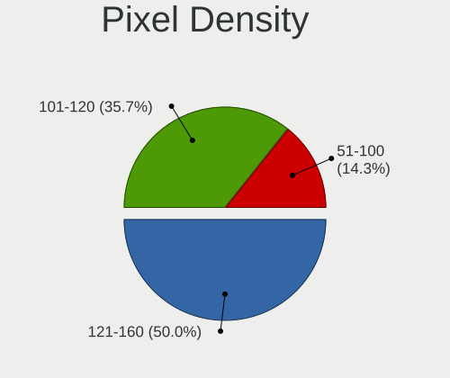

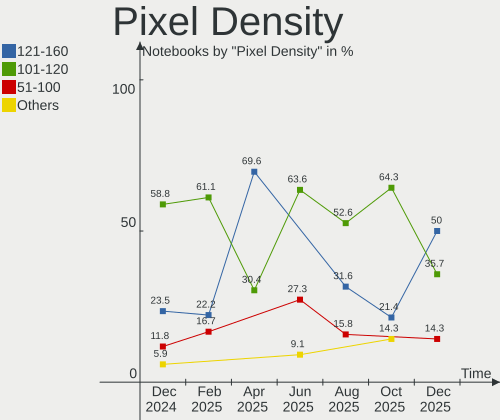

| Density | Notebooks | Percent |
|---------|-----------|---------|
| 121-160 | 7         | 50%     |
| 101-120 | 5         | 35.71%  |
| 51-100  | 2         | 14.29%  |

Multiple Monitors
-----------------

Total monitors connected

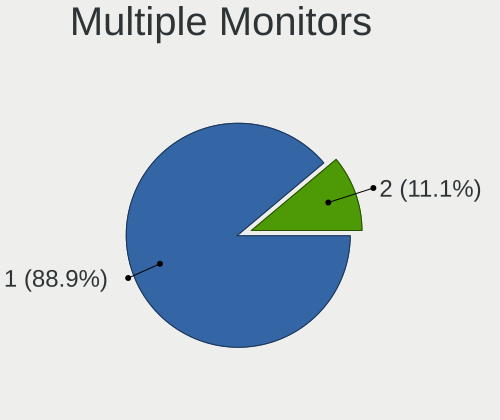

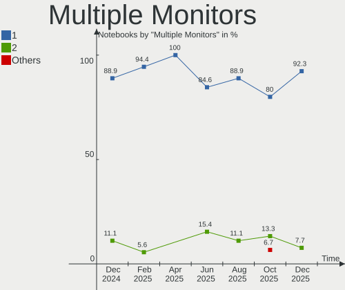

| Total | Notebooks | Percent |
|-------|-----------|---------|
| 1     | 12        | 92.31%  |
| 2     | 1         | 7.69%   |

Network
-------

Net Controller Vendor
---------------------

Controller vendors

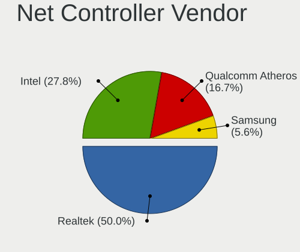

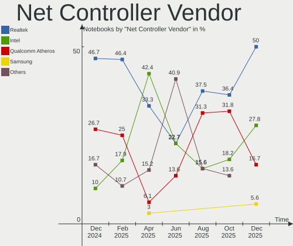

| Vendor                | Notebooks | Percent |
|-----------------------|-----------|---------|
| Realtek Semiconductor | 9         | 50%     |
| Intel                 | 5         | 27.78%  |
| Qualcomm Atheros      | 3         | 16.67%  |
| Samsung Electronics   | 1         | 5.56%   |

Net Controller Model
--------------------

Controller models

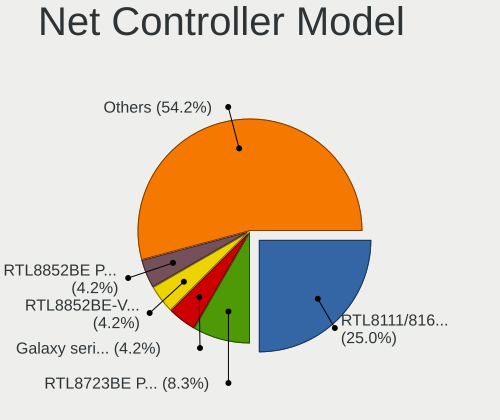

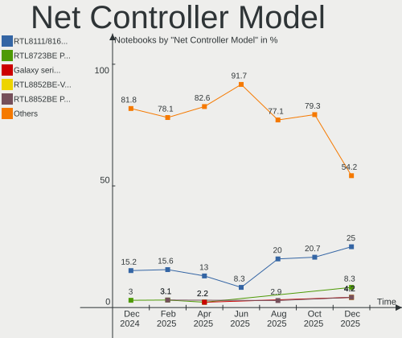

| Model                                                                  | Notebooks | Percent |
|------------------------------------------------------------------------|-----------|---------|
| Realtek RTL8111/8168/8211/8411 PCI Express Gigabit Ethernet Controller | 6         | 25%     |
| Realtek RTL8723BE PCIe Wireless Network Adapter                        | 2         | 8.33%   |
| Samsung Galaxy series, misc. (tethering mode)                          | 1         | 4.17%   |
| Realtek RTL8852BE-VT PCIe 802.11ax Wireless Network Controller         | 1         | 4.17%   |
| Realtek RTL8852BE PCIe 802.11ax Wireless Network Controller            | 1         | 4.17%   |
| Realtek RTL8822CE 802.11ac PCIe Wireless Network Adapter               | 1         | 4.17%   |
| Realtek RTL810xE PCI Express Fast Ethernet controller                  | 1         | 4.17%   |
| Qualcomm Atheros QCA9377 802.11ac Wireless Network Adapter             | 1         | 4.17%   |
| Qualcomm Atheros AR9485 Wireless Network Adapter                       | 1         | 4.17%   |
| Qualcomm Atheros AR9285 Wireless Network Adapter (PCI-Express)         | 1         | 4.17%   |
| Qualcomm Atheros AR8152 v2.0 Fast Ethernet                             | 1         | 4.17%   |
| Intel Wireless 7260                                                    | 1         | 4.17%   |
| Intel Wi-Fi 5(802.11ac) Wireless-AC 9x6x [Thunder Peak]                | 1         | 4.17%   |
| Intel PRO/Wireless 5100 AGN [Shiloh] Network Connection                | 1         | 4.17%   |
| Intel Ethernet Connection (7) I219-LM                                  | 1         | 4.17%   |
| Intel Centrino Advanced-N 6205 [Taylor Peak]                           | 1         | 4.17%   |
| Intel Cannon Lake PCH CNVi WiFi                                        | 1         | 4.17%   |
| Intel 82579LM Gigabit Network Connection (Lewisville)                  | 1         | 4.17%   |

Wireless Vendor
---------------

Wireless vendors

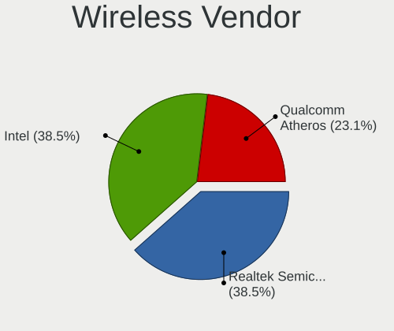

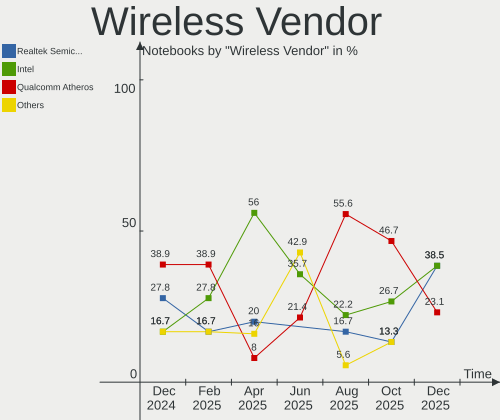

| Vendor                | Notebooks | Percent |
|-----------------------|-----------|---------|
| Realtek Semiconductor | 5         | 38.46%  |
| Intel                 | 5         | 38.46%  |
| Qualcomm Atheros      | 3         | 23.08%  |

Wireless Model
--------------

Wireless models

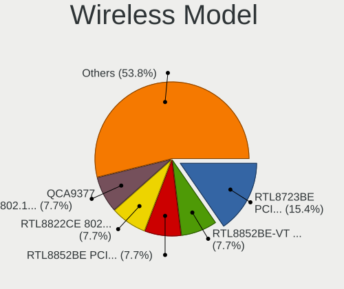

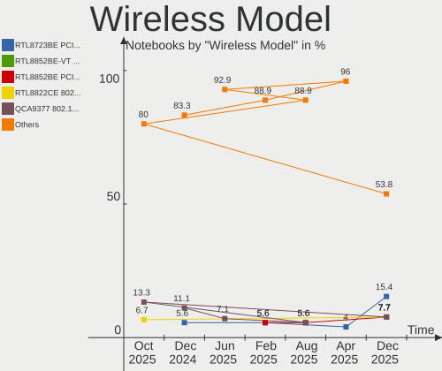

| Model                                                          | Notebooks | Percent |
|----------------------------------------------------------------|-----------|---------|
| Realtek RTL8723BE PCIe Wireless Network Adapter                | 2         | 15.38%  |
| Realtek RTL8852BE-VT PCIe 802.11ax Wireless Network Controller | 1         | 7.69%   |
| Realtek RTL8852BE PCIe 802.11ax Wireless Network Controller    | 1         | 7.69%   |
| Realtek RTL8822CE 802.11ac PCIe Wireless Network Adapter       | 1         | 7.69%   |
| Qualcomm Atheros QCA9377 802.11ac Wireless Network Adapter     | 1         | 7.69%   |
| Qualcomm Atheros AR9485 Wireless Network Adapter               | 1         | 7.69%   |
| Qualcomm Atheros AR9285 Wireless Network Adapter (PCI-Express) | 1         | 7.69%   |
| Intel Wireless 7260                                            | 1         | 7.69%   |
| Intel Wi-Fi 5(802.11ac) Wireless-AC 9x6x [Thunder Peak]        | 1         | 7.69%   |
| Intel PRO/Wireless 5100 AGN [Shiloh] Network Connection        | 1         | 7.69%   |
| Intel Centrino Advanced-N 6205 [Taylor Peak]                   | 1         | 7.69%   |
| Intel Cannon Lake PCH CNVi WiFi                                | 1         | 7.69%   |

Ethernet Vendor
---------------

Ethernet vendors

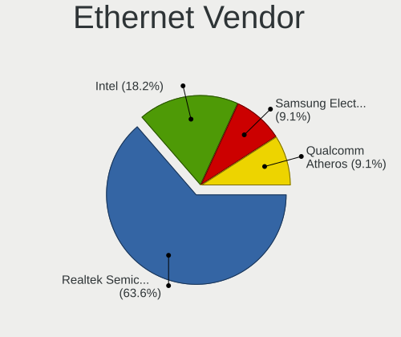

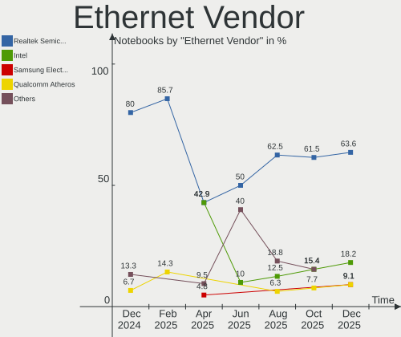

| Vendor                | Notebooks | Percent |
|-----------------------|-----------|---------|
| Realtek Semiconductor | 7         | 63.64%  |
| Intel                 | 2         | 18.18%  |
| Samsung Electronics   | 1         | 9.09%   |
| Qualcomm Atheros      | 1         | 9.09%   |

Ethernet Model
--------------

Ethernet models

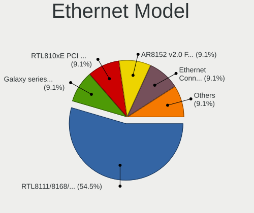

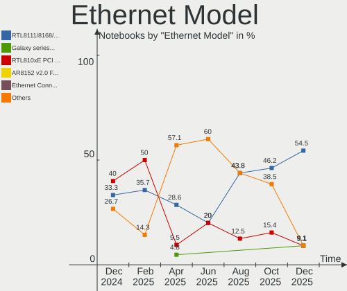

| Model                                                                  | Notebooks | Percent |
|------------------------------------------------------------------------|-----------|---------|
| Realtek RTL8111/8168/8211/8411 PCI Express Gigabit Ethernet Controller | 6         | 54.55%  |
| Samsung Galaxy series, misc. (tethering mode)                          | 1         | 9.09%   |
| Realtek RTL810xE PCI Express Fast Ethernet controller                  | 1         | 9.09%   |
| Qualcomm Atheros AR8152 v2.0 Fast Ethernet                             | 1         | 9.09%   |
| Intel Ethernet Connection (7) I219-LM                                  | 1         | 9.09%   |
| Intel 82579LM Gigabit Network Connection (Lewisville)                  | 1         | 9.09%   |

Net Controller Kind
-------------------

Ethernet, WiFi or modem

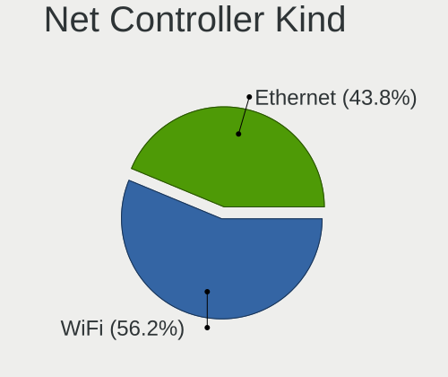

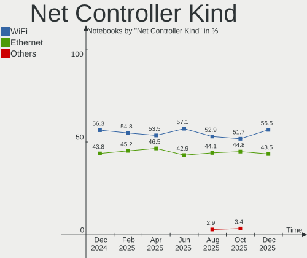

| Kind     | Notebooks | Percent |
|----------|-----------|---------|
| WiFi     | 13        | 56.52%  |
| Ethernet | 10        | 43.48%  |

Used Controller
---------------

Currently used network controller

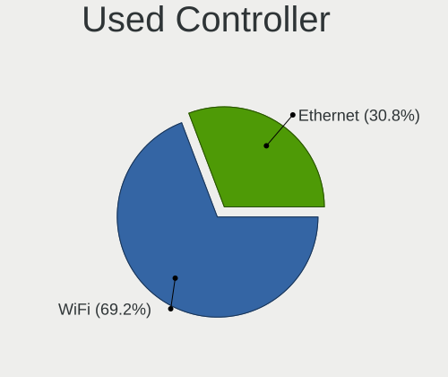

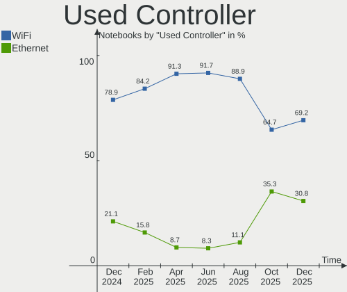

| Kind     | Notebooks | Percent |
|----------|-----------|---------|
| WiFi     | 9         | 69.23%  |
| Ethernet | 4         | 30.77%  |

NICs
----

Total network controllers on board

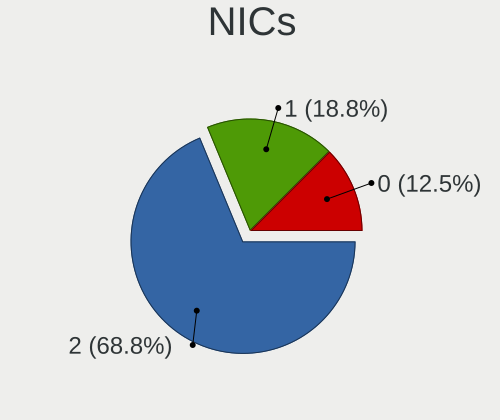

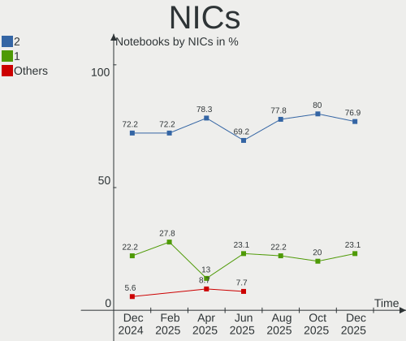

| Total | Notebooks | Percent |
|-------|-----------|---------|
| 2     | 10        | 76.92%  |
| 1     | 3         | 23.08%  |

IPv6
----

IPv6 vs IPv4

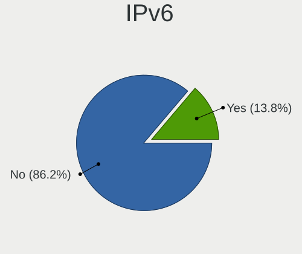

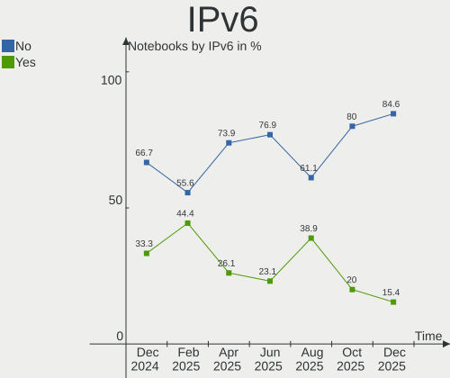

| Used | Notebooks | Percent |
|------|-----------|---------|
| No   | 11        | 84.62%  |
| Yes  | 2         | 15.38%  |

Bluetooth
---------

Bluetooth Vendor
----------------

Controller vendors

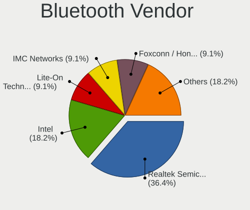

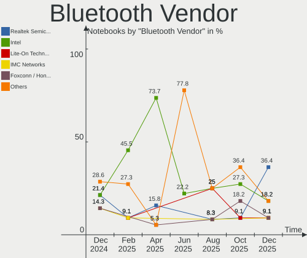

| Vendor                | Notebooks | Percent |
|-----------------------|-----------|---------|
| Realtek Semiconductor | 4         | 36.36%  |
| Intel                 | 2         | 18.18%  |
| Lite-On Technology    | 1         | 9.09%   |
| IMC Networks          | 1         | 9.09%   |
| Foxconn / Hon Hai     | 1         | 9.09%   |
| Chicony Electronics   | 1         | 9.09%   |
| Broadcom              | 1         | 9.09%   |

Bluetooth Model
---------------

Controller models

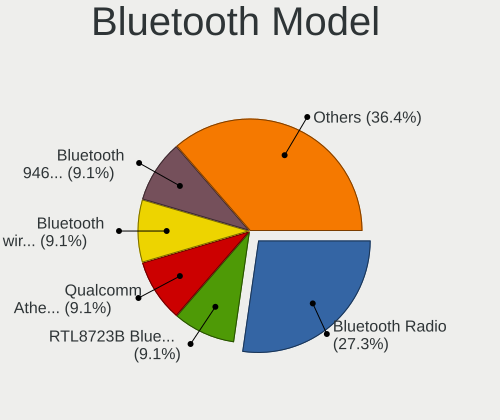

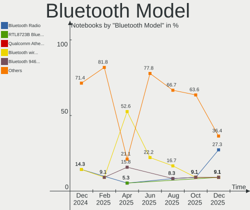

| Model                                             | Notebooks | Percent |
|---------------------------------------------------|-----------|---------|
| Realtek Bluetooth Radio                           | 3         | 27.27%  |
| Realtek RTL8723B Bluetooth                        | 1         | 9.09%   |
| Lite-On Qualcomm Atheros QCA9377 Bluetooth        | 1         | 9.09%   |
| Intel Bluetooth wireless interface                | 1         | 9.09%   |
| Intel Bluetooth 9460/9560 Jefferson Peak (JfP)    | 1         | 9.09%   |
| IMC Networks Atheros AR3012 Bluetooth 4.0 Adapter | 1         | 9.09%   |
| Foxconn / Hon Hai Broadcom Bluetooth 2.1 Device   | 1         | 9.09%   |
| Chicony Bluetooth (RTL8723BE)                     | 1         | 9.09%   |
| Broadcom BCM2045B (BDC-2.1)                       | 1         | 9.09%   |

Sound
-----

Sound Vendor
------------

Sound card vendors

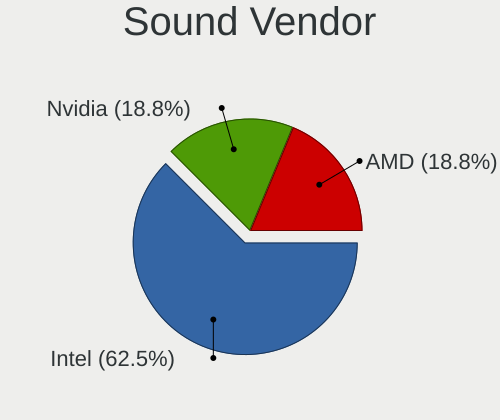

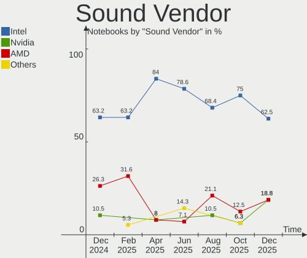

| Vendor | Notebooks | Percent |
|--------|-----------|---------|
| Intel  | 10        | 62.5%   |
| Nvidia | 3         | 18.75%  |
| AMD    | 3         | 18.75%  |

Sound Model
-----------

Sound card models

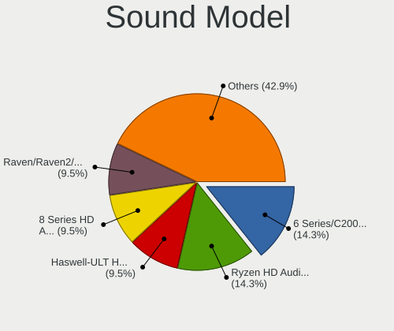

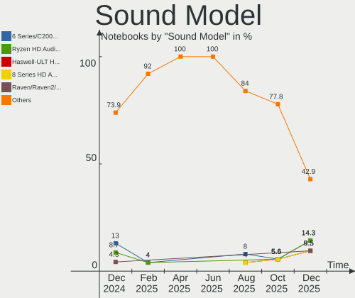

| Model                                                                      | Notebooks | Percent |
|----------------------------------------------------------------------------|-----------|---------|
| Intel 6 Series/C200 Series Chipset Family High Definition Audio Controller | 3         | 14.29%  |
| AMD Ryzen HD Audio Controller                                              | 3         | 14.29%  |
| Intel Haswell-ULT HD Audio Controller                                      | 2         | 9.52%   |
| Intel 8 Series HD Audio Controller                                         | 2         | 9.52%   |
| AMD Raven/Raven2/Fenghuang HDMI/DP Audio Controller                        | 2         | 9.52%   |
| Nvidia GP107GL High Definition Audio Controller                            | 1         | 4.76%   |
| Nvidia GM107 High Definition Audio Controller [GeForce 940MX]              | 1         | 4.76%   |
| Nvidia GF108 High Definition Audio Controller                              | 1         | 4.76%   |
| Intel Sunrise Point-LP HD Audio                                            | 1         | 4.76%   |
| Intel Cannon Lake PCH cAVS                                                 | 1         | 4.76%   |
| Intel Atom Processor Z36xxx/Z37xxx Series High Definition Audio Controller | 1         | 4.76%   |
| Intel Alder Lake PCH-P High Definition Audio Controller                    | 1         | 4.76%   |
| Intel 82801I (ICH9 Family) HD Audio Controller                             | 1         | 4.76%   |
| AMD Radeon High Definition Audio Controller                                | 1         | 4.76%   |

Memory
------

Memory Vendor
-------------

Memory module vendors

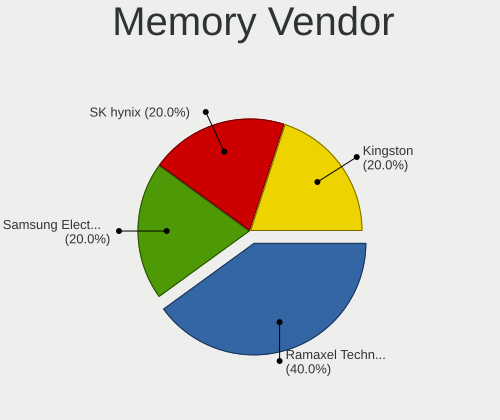

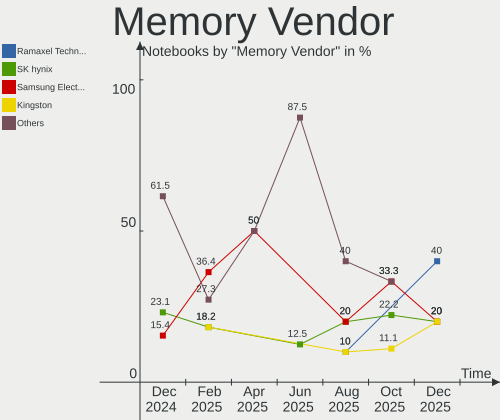

| Vendor              | Notebooks | Percent |
|---------------------|-----------|---------|
| Ramaxel Technology  | 2         | 40%     |
| SK hynix            | 1         | 20%     |
| Samsung Electronics | 1         | 20%     |
| Kingston            | 1         | 20%     |

Memory Model
------------

Memory module models

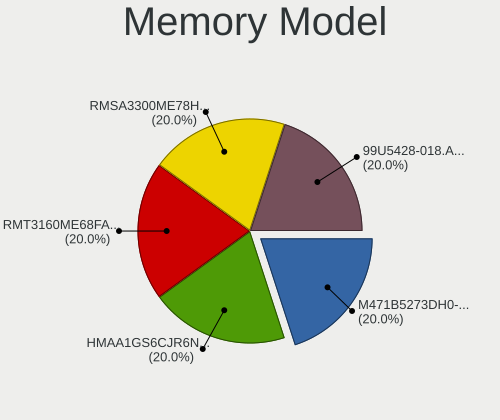

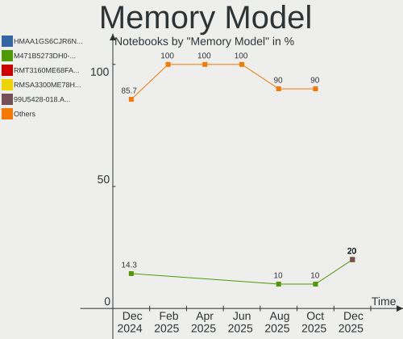

| Model                                                        | Notebooks | Percent |
|--------------------------------------------------------------|-----------|---------|
| SK hynix RAM HMAA1GS6CJR6N-XN 8GB Row Of Chips DDR4 3200MT/s | 1         | 20%     |
| Samsung RAM M471B5273DH0-CH9 4GB SODIMM DDR3 1600MT/s        | 1         | 20%     |
| Ramaxel RAM RMT3160ME68FAF1600 8GB SODIMM DDR3 1600MT/s      | 1         | 20%     |
| Ramaxel RAM RMSA3300ME78HBF-2666 16GB SODIMM DDR4 2667MT/s   | 1         | 20%     |
| Kingston RAM 99U5428-018.A00LF 8GB SODIMM DDR3 1600MT/s      | 1         | 20%     |

Memory Kind
-----------

Memory module kinds

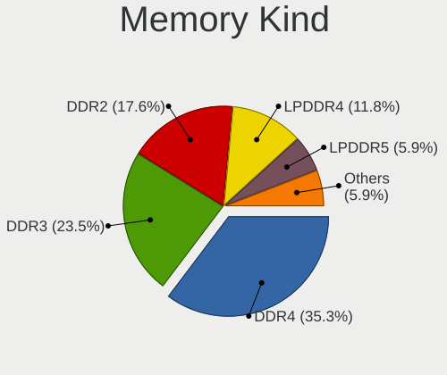

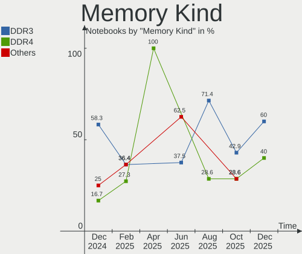

| Kind | Notebooks | Percent |
|------|-----------|---------|
| DDR3 | 3         | 60%     |
| DDR4 | 2         | 40%     |

Memory Form Factor
------------------

Physical design of the memory module

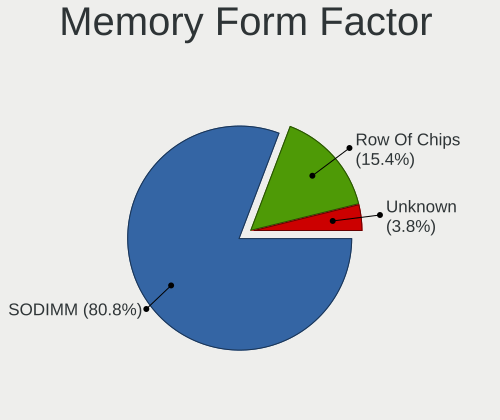

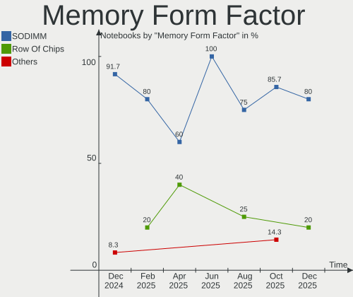

| Name         | Notebooks | Percent |
|--------------|-----------|---------|
| SODIMM       | 4         | 80%     |
| Row Of Chips | 1         | 20%     |

Memory Size
-----------

Memory module size

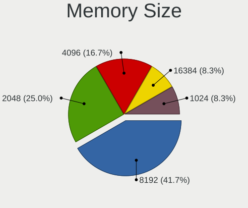

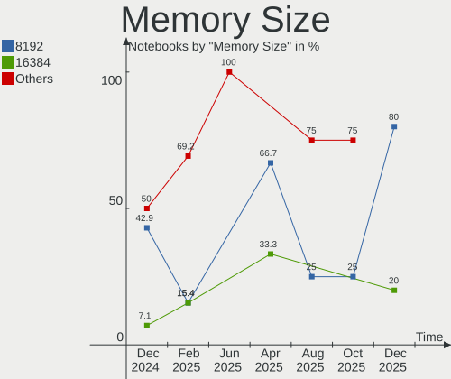

| Size  | Notebooks | Percent |
|-------|-----------|---------|
| 8192  | 4         | 80%     |
| 16384 | 1         | 20%     |

Memory Speed
------------

Memory module speed

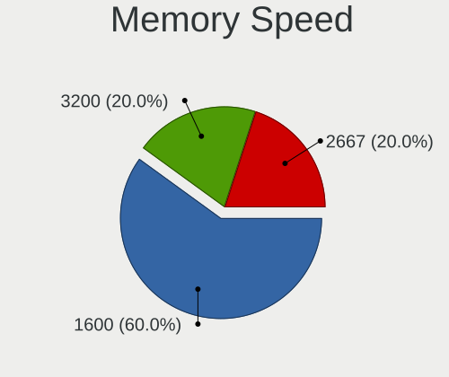

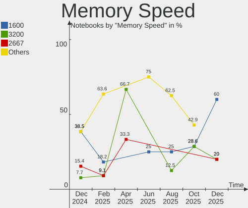

| Speed | Notebooks | Percent |
|-------|-----------|---------|
| 1600  | 3         | 60%     |
| 3200  | 1         | 20%     |
| 2667  | 1         | 20%     |

Printers & scanners
-------------------

Printer Vendor
--------------

Printer device vendors

Zero info for selected period =(

Printer Model
-------------

Printer device models

Zero info for selected period =(

Scanner Vendor
--------------

Scanner device vendors

Zero info for selected period =(

Scanner Model
-------------

Scanner device models

Zero info for selected period =(

Camera
------

Camera Vendor
-------------

Camera device vendors

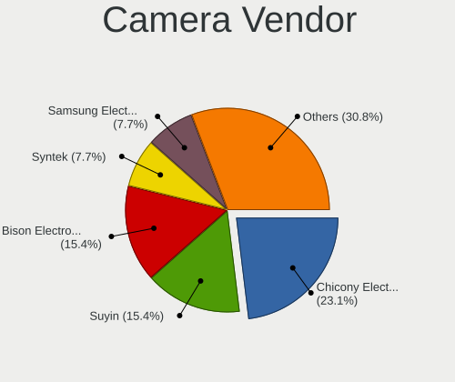

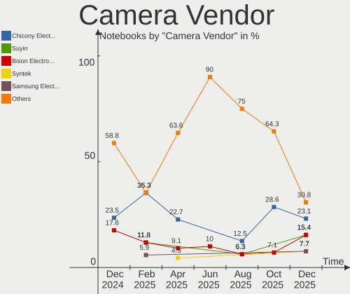

| Vendor                      | Notebooks | Percent |
|-----------------------------|-----------|---------|
| Chicony Electronics         | 3         | 23.08%  |
| Suyin                       | 2         | 15.38%  |
| Bison Electronics           | 2         | 15.38%  |
| Syntek                      | 1         | 7.69%   |
| Samsung Electronics         | 1         | 7.69%   |
| Quanta                      | 1         | 7.69%   |
| Luxvisions Innotech Limited | 1         | 7.69%   |
| Logitech                    | 1         | 7.69%   |
| IMC Networks                | 1         | 7.69%   |

Camera Model
------------

Camera device models

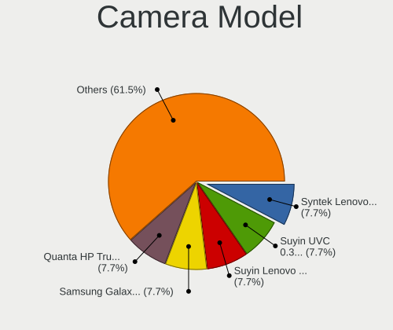

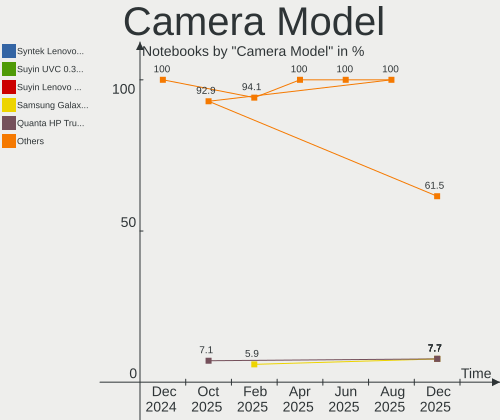

| Model                                                | Notebooks | Percent |
|------------------------------------------------------|-----------|---------|
| Syntek Lenovo EasyCamera                             | 1         | 7.69%   |
| Suyin UVC 0.3M Webcam                                | 1         | 7.69%   |
| Suyin Lenovo EasyCamera                              | 1         | 7.69%   |
| Samsung Galaxy series, misc. (MTP mode)              | 1         | 7.69%   |
| Quanta HP TrueVision HD Camera                       | 1         | 7.69%   |
| Luxvisions Innotech Limited HP True Vision HD Camera | 1         | 7.69%   |
| Logitech HP Webcam                                   | 1         | 7.69%   |
| IMC Networks Integrated Camera                       | 1         | 7.69%   |
| Chicony Lenovo Integrated Camera (0.3MP)             | 1         | 7.69%   |
| Chicony HD WebCam (Acer)                             | 1         | 7.69%   |
| Chicony HD WebCam                                    | 1         | 7.69%   |
| Bison Lenovo EasyCamera                              | 1         | 7.69%   |
| Bison Integrated Camera                              | 1         | 7.69%   |

Security
--------

Fingerprint Vendor
------------------

Fingerprint sensor vendors

| Vendor | Notebooks | Percent |
|--------|-----------|---------|
| Upek   | 1         | 100%    |

Fingerprint Model
-----------------

Fingerprint sensor models

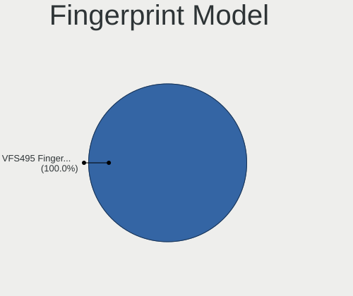

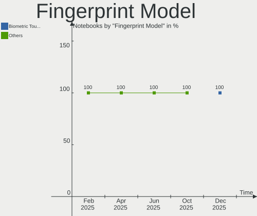

| Model                                                  | Notebooks | Percent |
|--------------------------------------------------------|-----------|---------|
| Upek Biometric Touchchip/Touchstrip Fingerprint Sensor | 1         | 100%    |

Chipcard Vendor
---------------

Chipcard module vendors

Zero info for selected period =(

Chipcard Model
--------------

Chipcard module models

Zero info for selected period =(

Unsupported
-----------

Unsupported Devices
-------------------

Total unsupported devices on board

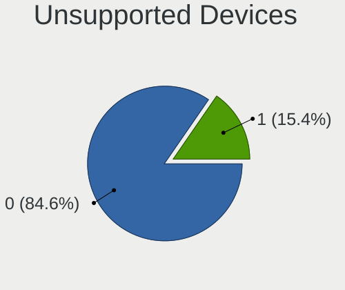

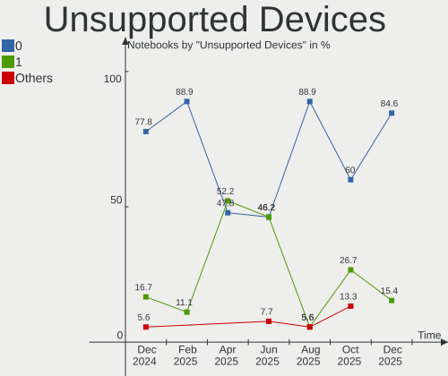

| Total | Notebooks | Percent |
|-------|-----------|---------|
| 0     | 11        | 84.62%  |
| 1     | 2         | 15.38%  |

Unsupported Device Types
------------------------

Types of unsupported devices

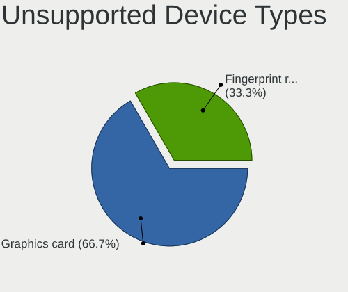

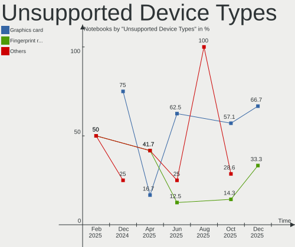

| Type               | Notebooks | Percent |
|--------------------|-----------|---------|
| Graphics card      | 2         | 66.67%  |
| Fingerprint reader | 1         | 33.33%  |

