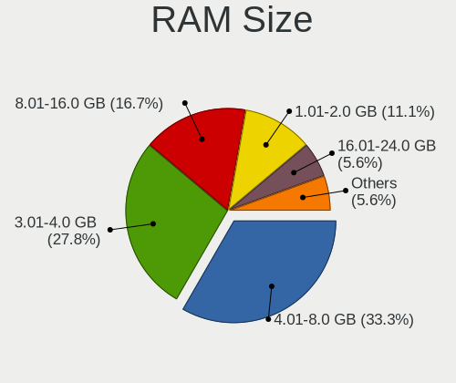
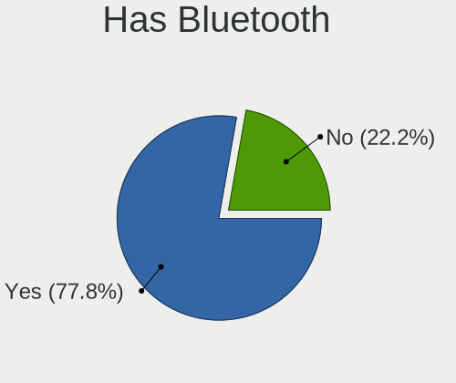
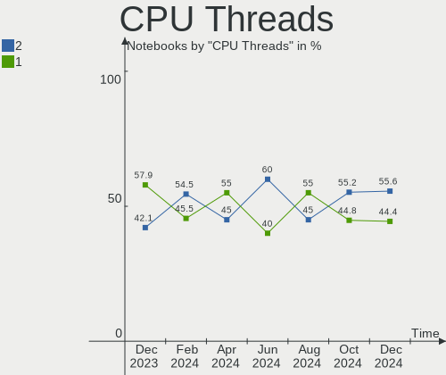
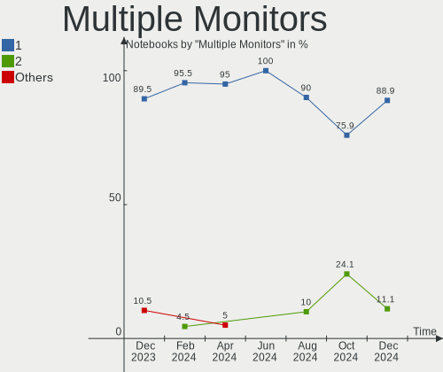
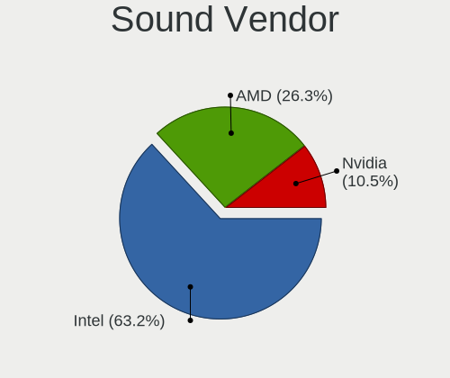

Lubuntu - Hardware Trends (Notebooks)
-------------------------------------

A project to identify most popular hardware characteristics and track their change
over time based on data collected by Linux users at https://Linux-Hardware.org.

Anyone can contribute to this report by the [hw-probe](https://github.com/linuxhw/hw-probe) tool:

    sudo -E hw-probe -all -upload

This report is for one last month. Overall report since the beginning of time: [TestDays](https://github.com/linuxhw/TestDays)

Period: Jul, 2023.

Contents
--------

* [ System ](#system)
  - [ OS                       ](#os)
  - [ OS Family                ](#os-family)
  - [ Kernel                   ](#kernel)
  - [ Kernel Family            ](#kernel-family)
  - [ Kernel Major Ver.        ](#kernel-major-ver)
  - [ Arch                     ](#arch)
  - [ DE                       ](#de)
  - [ Display Server           ](#display-server)
  - [ Display Manager          ](#display-manager)
  - [ OS Lang                  ](#os-lang)
  - [ Boot Mode                ](#boot-mode)
  - [ Filesystem               ](#filesystem)
  - [ Part. scheme             ](#part-scheme)
  - [ Dual Boot with Linux/BSD ](#dual-boot-with-linuxbsd)
  - [ Dual Boot (Win)          ](#dual-boot-win)

* [ Board ](#board)
  - [ Vendor                   ](#vendor)
  - [ Model                    ](#model)
  - [ Model Family             ](#model-family)
  - [ MFG Year                 ](#mfg-year)
  - [ Form Factor              ](#form-factor)
  - [ Secure Boot              ](#secure-boot)
  - [ Coreboot                 ](#coreboot)
  - [ RAM Size                 ](#ram-size)
  - [ RAM Used                 ](#ram-used)
  - [ Total Drives             ](#total-drives)
  - [ Has CD-ROM               ](#has-cd-rom)
  - [ Has Ethernet             ](#has-ethernet)
  - [ Has WiFi                 ](#has-wifi)
  - [ Has Bluetooth            ](#has-bluetooth)

* [ Location ](#location)
  - [ Country                  ](#country)
  - [ City                     ](#city)

* [ Drives ](#drives)
  - [ Drive Vendor             ](#drive-vendor)
  - [ Drive Model              ](#drive-model)
  - [ HDD Vendor               ](#hdd-vendor)
  - [ SSD Vendor               ](#ssd-vendor)
  - [ Drive Kind               ](#drive-kind)
  - [ Drive Connector          ](#drive-connector)
  - [ Drive Size               ](#drive-size)
  - [ Space Total              ](#space-total)
  - [ Space Used               ](#space-used)
  - [ Malfunc. Drives          ](#malfunc-drives)
  - [ Malfunc. Drive Vendor    ](#malfunc-drive-vendor)
  - [ Malfunc. HDD Vendor      ](#malfunc-hdd-vendor)
  - [ Malfunc. Drive Kind      ](#malfunc-drive-kind)
  - [ Failed Drives            ](#failed-drives)
  - [ Failed Drive Vendor      ](#failed-drive-vendor)
  - [ Drive Status             ](#drive-status)

* [ Storage controller ](#storage-controller)
  - [ Storage Vendor           ](#storage-vendor)
  - [ Storage Model            ](#storage-model)
  - [ Storage Kind             ](#storage-kind)

* [ Processor ](#processor)
  - [ CPU Vendor               ](#cpu-vendor)
  - [ CPU Model                ](#cpu-model)
  - [ CPU Model Family         ](#cpu-model-family)
  - [ CPU Cores                ](#cpu-cores)
  - [ CPU Sockets              ](#cpu-sockets)
  - [ CPU Threads              ](#cpu-threads)
  - [ CPU Op-Modes             ](#cpu-op-modes)
  - [ CPU Microcode            ](#cpu-microcode)
  - [ CPU Microarch            ](#cpu-microarch)

* [ Graphics ](#graphics)
  - [ GPU Vendor               ](#gpu-vendor)
  - [ GPU Model                ](#gpu-model)
  - [ GPU Combo                ](#gpu-combo)
  - [ GPU Driver               ](#gpu-driver)
  - [ GPU Memory               ](#gpu-memory)

* [ Monitor ](#monitor)
  - [ Monitor Vendor           ](#monitor-vendor)
  - [ Monitor Model            ](#monitor-model)
  - [ Monitor Resolution       ](#monitor-resolution)
  - [ Monitor Diagonal         ](#monitor-diagonal)
  - [ Monitor Width            ](#monitor-width)
  - [ Aspect Ratio             ](#aspect-ratio)
  - [ Monitor Area             ](#monitor-area)
  - [ Pixel Density            ](#pixel-density)
  - [ Multiple Monitors        ](#multiple-monitors)

* [ Network ](#network)
  - [ Net Controller Vendor    ](#net-controller-vendor)
  - [ Net Controller Model     ](#net-controller-model)
  - [ Wireless Vendor          ](#wireless-vendor)
  - [ Wireless Model           ](#wireless-model)
  - [ Ethernet Vendor          ](#ethernet-vendor)
  - [ Ethernet Model           ](#ethernet-model)
  - [ Net Controller Kind      ](#net-controller-kind)
  - [ Used Controller          ](#used-controller)
  - [ NICs                     ](#nics)
  - [ IPv6                     ](#ipv6)

* [ Bluetooth ](#bluetooth)
  - [ Bluetooth Vendor         ](#bluetooth-vendor)
  - [ Bluetooth Model          ](#bluetooth-model)

* [ Sound ](#sound)
  - [ Sound Vendor             ](#sound-vendor)
  - [ Sound Model              ](#sound-model)

* [ Memory ](#memory)
  - [ Memory Vendor            ](#memory-vendor)
  - [ Memory Model             ](#memory-model)
  - [ Memory Kind              ](#memory-kind)
  - [ Memory Form Factor       ](#memory-form-factor)
  - [ Memory Size              ](#memory-size)
  - [ Memory Speed             ](#memory-speed)

* [ Printers & scanners ](#printers--scanners)
  - [ Printer Vendor           ](#printer-vendor)
  - [ Printer Model            ](#printer-model)
  - [ Scanner Vendor           ](#scanner-vendor)
  - [ Scanner Model            ](#scanner-model)

* [ Camera ](#camera)
  - [ Camera Vendor            ](#camera-vendor)
  - [ Camera Model             ](#camera-model)

* [ Security ](#security)
  - [ Fingerprint Vendor       ](#fingerprint-vendor)
  - [ Fingerprint Model        ](#fingerprint-model)
  - [ Chipcard Vendor          ](#chipcard-vendor)
  - [ Chipcard Model           ](#chipcard-model)

* [ Unsupported ](#unsupported)
  - [ Unsupported Devices      ](#unsupported-devices)
  - [ Unsupported Device Types ](#unsupported-device-types)

System
------

OS
--

Installed operating systems

| Name          | Notebooks | Percent |
|---------------|-----------|---------|
| Lubuntu 22.04 | 10        | 55.56%  |
| Lubuntu 23.04 | 4         | 22.22%  |
| Lubuntu 22.10 | 1         | 5.56%   |
| Lubuntu 20.04 | 1         | 5.56%   |
| Lubuntu 18.04 | 1         | 5.56%   |
| Lubuntu 13.04 | 1         | 5.56%   |

OS Family
---------

OS without a version

| Name    | Notebooks | Percent |
|---------|-----------|---------|
| Lubuntu | 18        | 100%    |

Kernel
------

Version of the Linux kernel

| Version           | Notebooks | Percent |
|-------------------|-----------|---------|
| 5.19.0-46-generic | 4         | 22.22%  |
| 6.2.0-20-generic  | 2         | 11.11%  |
| 5.19.0-50-generic | 2         | 11.11%  |
| 5.15.0-76-generic | 2         | 11.11%  |
| 6.2.0-25-generic  | 1         | 5.56%   |
| 6.2.0-24-generic  | 1         | 5.56%   |
| 5.4.0-150-generic | 1         | 5.56%   |
| 5.4.0-132-generic | 1         | 5.56%   |
| 5.19.0-45-generic | 1         | 5.56%   |
| 5.19.0-32-generic | 1         | 5.56%   |
| 5.19.0-15-generic | 1         | 5.56%   |
| 3.1.10-6-ac100    | 1         | 5.56%   |

Kernel Family
-------------

Linux kernel without a distro release

| Version | Notebooks | Percent |
|---------|-----------|---------|
| 5.19.0  | 9         | 50%     |
| 6.2.0   | 4         | 22.22%  |
| 5.4.0   | 2         | 11.11%  |
| 5.15.0  | 2         | 11.11%  |
| 3.1.10  | 1         | 5.56%   |

Kernel Major Ver.
-----------------

Linux kernel major version

| Version | Notebooks | Percent |
|---------|-----------|---------|
| 5.19    | 9         | 50%     |
| 6.2     | 4         | 22.22%  |
| 5.4     | 2         | 11.11%  |
| 5.15    | 2         | 11.11%  |
| 3.1     | 1         | 5.56%   |

Arch
----

OS architecture (x86_64, i586, etc.)

| Name   | Notebooks | Percent |
|--------|-----------|---------|
| x86_64 | 17        | 94.44%  |
| armv7l | 1         | 5.56%   |

DE
--

Desktop Environment

| Name | Notebooks | Percent |
|------|-----------|---------|
| LXQt | 13        | 72.22%  |
| LXDE | 4         | 22.22%  |
| KDE5 | 1         | 5.56%   |

Display Server
--------------

X11 or Wayland

| Name | Notebooks | Percent |
|------|-----------|---------|
| X11  | 17        | 94.44%  |
| Tty  | 1         | 5.56%   |

Display Manager
---------------

SDDM, LightDM, etc.

| Name    | Notebooks | Percent |
|---------|-----------|---------|
| SDDM    | 11        | 61.11%  |
| LightDM | 3         | 16.67%  |
| Unknown | 3         | 16.67%  |
| GDM3    | 1         | 5.56%   |

OS Lang
-------

Language

| Lang  | Notebooks | Percent |
|-------|-----------|---------|
| en_US | 7         | 38.89%  |
| ru_RU | 2         | 11.11%  |
| fr_FR | 2         | 11.11%  |
| C     | 2         | 11.11%  |
| pt_BR | 1         | 5.56%   |
| es_MX | 1         | 5.56%   |
| en_IE | 1         | 5.56%   |
| de_DE | 1         | 5.56%   |
| da_DK | 1         | 5.56%   |

Boot Mode
---------

EFI or BIOS

| Mode | Notebooks | Percent |
|------|-----------|---------|
| EFI  | 10        | 55.56%  |
| BIOS | 8         | 44.44%  |

Filesystem
----------

Type of filesystem

| Type    | Notebooks | Percent |
|---------|-----------|---------|
| Ext4    | 14        | 77.78%  |
| Tmpfs   | 2         | 11.11%  |
| Overlay | 2         | 11.11%  |

Part. scheme
------------

Scheme of partitioning

| Type    | Notebooks | Percent |
|---------|-----------|---------|
| GPT     | 10        | 55.56%  |
| MBR     | 4         | 22.22%  |
| Unknown | 4         | 22.22%  |

Dual Boot with Linux/BSD
------------------------

Hosting more than one Linux/BSD

| Dual boot | Notebooks | Percent |
|-----------|-----------|---------|
| No        | 14        | 77.78%  |
| Yes       | 4         | 22.22%  |

Dual Boot (Win)
---------------

Hosting Linux and Windows

| Dual boot | Notebooks | Percent |
|-----------|-----------|---------|
| No        | 13        | 72.22%  |
| Yes       | 5         | 27.78%  |

Board
-----

Vendor
------

Motherboard manufacturer

| Name             | Notebooks | Percent |
|------------------|-----------|---------|
| Dell             | 5         | 27.78%  |
| Acer             | 4         | 22.22%  |
| Lenovo           | 2         | 11.11%  |
| Hewlett-Packard  | 2         | 11.11%  |
| LG Electronics   | 1         | 5.56%   |
| Google           | 1         | 5.56%   |
| Fujitsu          | 1         | 5.56%   |
| ASUSTek Computer | 1         | 5.56%   |
| Unknown          | 1         | 5.56%   |

Model
-----

Motherboard model

| Name                         | Notebooks | Percent |
|------------------------------|-----------|---------|
| LG 15Z90N-U.ARS5U1           | 1         | 5.56%   |
| Lenovo ThinkPad T61 7659WCN  | 1         | 5.56%   |
| Lenovo ThinkPad T430 2349G7G | 1         | 5.56%   |
| HP ProBook 4525s             | 1         | 5.56%   |
| HP 255 G2                    | 1         | 5.56%   |
| Google Pyro                  | 1         | 5.56%   |
| Fujitsu FMVNC4BC4            | 1         | 5.56%   |
| Dell Latitude 5290           | 1         | 5.56%   |
| Dell Inspiron N5110          | 1         | 5.56%   |
| Dell Inspiron 5576           | 1         | 5.56%   |
| Dell Inspiron 1520           | 1         | 5.56%   |
| Dell Inspiron 13-5378        | 1         | 5.56%   |
| ASUS ROG Strix G733QR_G733QR | 1         | 5.56%   |
| Acer Swift SFE16-42          | 1         | 5.56%   |
| Acer Aspire SW3-013          | 1         | 5.56%   |
| Acer Aspire E5-523G          | 1         | 5.56%   |
| Acer Aspire E1-771           | 1         | 5.56%   |
| Unknown                      | 1         | 5.56%   |

Model Family
------------

Motherboard model prefix

| Name               | Notebooks | Percent |
|--------------------|-----------|---------|
| Dell Inspiron      | 4         | 22.22%  |
| Acer Aspire        | 3         | 16.67%  |
| Lenovo ThinkPad    | 2         | 11.11%  |
| LG 15Z90N-U.ARS5U1 | 1         | 5.56%   |
| HP ProBook         | 1         | 5.56%   |
| HP 255             | 1         | 5.56%   |
| Google Pyro        | 1         | 5.56%   |
| Fujitsu FMVNC4BC4  | 1         | 5.56%   |
| Dell Latitude      | 1         | 5.56%   |
| ASUS ROG           | 1         | 5.56%   |
| Acer Swift         | 1         | 5.56%   |
| Unknown            | 1         | 5.56%   |

MFG Year
--------

Motherboard manufacture year

| Year    | Notebooks | Percent |
|---------|-----------|---------|
| 2007    | 3         | 16.67%  |
| 2016    | 2         | 11.11%  |
| 2013    | 2         | 11.11%  |
| 2023    | 1         | 5.56%   |
| 2022    | 1         | 5.56%   |
| 2021    | 1         | 5.56%   |
| 2020    | 1         | 5.56%   |
| 2019    | 1         | 5.56%   |
| 2017    | 1         | 5.56%   |
| 2015    | 1         | 5.56%   |
| 2012    | 1         | 5.56%   |
| 2011    | 1         | 5.56%   |
| 2010    | 1         | 5.56%   |
| Unknown | 1         | 5.56%   |

Form Factor
-----------

Physical design of the computer

| Name     | Notebooks | Percent |
|----------|-----------|---------|
| Notebook | 18        | 100%    |

Secure Boot
-----------

Enabled or disabled

| State    | Notebooks | Percent |
|----------|-----------|---------|
| Disabled | 17        | 94.44%  |
| Enabled  | 1         | 5.56%   |

Coreboot
--------

Have coreboot on board

| Used | Notebooks | Percent |
|------|-----------|---------|
| No   | 17        | 94.44%  |
| Yes  | 1         | 5.56%   |

RAM Size
--------

Total RAM memory

| Size in GB | Notebooks | Percent |
|------------|-----------|---------|
| 4.01-8.0   | 4         | 22.22%  |
| 1.01-2.0   | 4         | 22.22%  |
| 3.01-4.0   | 3         | 16.67%  |
| 8.01-16.0  | 3         | 16.67%  |
| 32.01-64.0 | 2         | 11.11%  |
| 16.01-24.0 | 1         | 5.56%   |
| 0.01-0.5   | 1         | 5.56%   |

RAM Used
--------

Used RAM memory

| Used GB    | Notebooks | Percent |
|------------|-----------|---------|
| 2.01-3.0   | 5         | 27.78%  |
| 1.01-2.0   | 4         | 22.22%  |
| 0.51-1.0   | 3         | 16.67%  |
| 4.01-8.0   | 2         | 11.11%  |
| 3.01-4.0   | 1         | 5.56%   |
| 16.01-24.0 | 1         | 5.56%   |
| 8.01-16.0  | 1         | 5.56%   |
| Unknown    | 1         | 5.56%   |

Total Drives
------------

Number of drives on board

| Drives | Notebooks | Percent |
|--------|-----------|---------|
| 1      | 12        | 66.67%  |
| 2      | 6         | 33.33%  |

Has CD-ROM
----------

Has CD-ROM on board

| Presented | Notebooks | Percent |
|-----------|-----------|---------|
| Yes       | 9         | 50%     |
| No        | 9         | 50%     |

Has Ethernet
------------

Has Ethernet on board

| Presented | Notebooks | Percent |
|-----------|-----------|---------|
| Yes       | 12        | 66.67%  |
| No        | 6         | 33.33%  |

Has WiFi
--------

Has WiFi module

| Presented | Notebooks | Percent |
|-----------|-----------|---------|
| Yes       | 17        | 94.44%  |
| No        | 1         | 5.56%   |

Has Bluetooth
-------------

Has Bluetooth module

| Presented | Notebooks | Percent |
|-----------|-----------|---------|
| Yes       | 15        | 83.33%  |
| No        | 3         | 16.67%  |

Location
--------

Country
-------

Geographic location (country)

| Country      | Notebooks | Percent |
|--------------|-----------|---------|
| USA          | 4         | 22.22%  |
| Russia       | 2         | 11.11%  |
| France       | 2         | 11.11%  |
| Brazil       | 2         | 11.11%  |
| South Africa | 1         | 5.56%   |
| Mexico       | 1         | 5.56%   |
| Israel       | 1         | 5.56%   |
| Ireland      | 1         | 5.56%   |
| Indonesia    | 1         | 5.56%   |
| India        | 1         | 5.56%   |
| Germany      | 1         | 5.56%   |
| Denmark      | 1         | 5.56%   |

City
----

Geographic location (city)

| City                | Notebooks | Percent |
|---------------------|-----------|---------|
| Brasília           | 2         | 11.11%  |
| Trabuco Canyon      | 1         | 5.56%   |
| Tolyatti            | 1         | 5.56%   |
| Saint-Jean-le-Blanc | 1         | 5.56%   |
| Mumbai              | 1         | 5.56%   |
| Monterrey           | 1         | 5.56%   |
| Lipetsk             | 1         | 5.56%   |
| Lattes              | 1         | 5.56%   |
| Jakarta             | 1         | 5.56%   |
| Houston             | 1         | 5.56%   |
| Holstebro           | 1         | 5.56%   |
| Hod HaSharon        | 1         | 5.56%   |
| Flanders            | 1         | 5.56%   |
| Escondido           | 1         | 5.56%   |
| Durban              | 1         | 5.56%   |
| Craughwell          | 1         | 5.56%   |
| Bonn                | 1         | 5.56%   |

Drives
------

Drive Vendor
------------

Hard drive vendors

| Vendor              | Notebooks | Drives | Percent |
|---------------------|-----------|--------|---------|
| SK hynix            | 3         | 3      | 13.04%  |
| Samsung Electronics | 3         | 3      | 13.04%  |
| WDC                 | 2         | 2      | 8.7%    |
| Toshiba             | 2         | 2      | 8.7%    |
| Kingston            | 2         | 2      | 8.7%    |
| Unknown             | 2         | 2      | 8.7%    |
| WALRAM              | 1         | 1      | 4.35%   |
| Unknown             | 1         | 1      | 4.35%   |
| Transcend           | 1         | 1      | 4.35%   |
| Seagate             | 1         | 1      | 4.35%   |
| SanDisk             | 1         | 1      | 4.35%   |
| Micron Technology   | 1         | 1      | 4.35%   |
| KingSpec            | 1         | 1      | 4.35%   |
| JMicron Technology  | 1         | 1      | 4.35%   |
| Hitachi             | 1         | 1      | 4.35%   |

Drive Model
-----------

Hard drive models

| Model                                         | Notebooks | Percent |
|-----------------------------------------------|-----------|---------|
| Unknown                                       | 2         | 8.7%    |
| WDC WD5000BPVT-75HXZT1 500GB                  | 1         | 4.35%   |
| WDC WD10JPVX-22JC3T0 1TB                      | 1         | 4.35%   |
| WALRAM SSD 240G                               | 1         | 4.35%   |
| Unknown MMC Card  16GB                        | 1         | 4.35%   |
| Transcend TS256GSSD720 256GB                  | 1         | 4.35%   |
| Toshiba MQ01ABD100 1TB                        | 1         | 4.35%   |
| Toshiba MK2556GSY 250GB                       | 1         | 4.35%   |
| SK hynix HFS256GD9TNG-L2A0A 256GB             | 1         | 4.35%   |
| SK hynix HFM001TD3JX013N 1TB                  | 1         | 4.35%   |
| SK hynix HBG4e  32GB                          | 1         | 4.35%   |
| Seagate ST1000LM035-1RK172 1TB                | 1         | 4.35%   |
| SanDisk DF4032  32GB                          | 1         | 4.35%   |
| Samsung SSD 840 PRO Series 128GB              | 1         | 4.35%   |
| Samsung NVMe SSD Controller SM951/PM951 128GB | 1         | 4.35%   |
| Samsung HM160HI 160GB                         | 1         | 4.35%   |
| Micron 3400_MTFDKBA1T0TFH 1TB                 | 1         | 4.35%   |
| Kingston SA400S37240G 240GB SSD               | 1         | 4.35%   |
| Kingston RBU-SNS8152S3128GG2 128GB SSD        | 1         | 4.35%   |
| KingSpec NT-2TB SSD                           | 1         | 4.35%   |
| JMicron Generic 512GB                         | 1         | 4.35%   |
| Hitachi HTS725050A7E630 500GB                 | 1         | 4.35%   |

HDD Vendor
----------

Hard disk drive vendors

| Vendor              | Notebooks | Drives | Percent |
|---------------------|-----------|--------|---------|
| WDC                 | 2         | 2      | 25%     |
| Toshiba             | 2         | 2      | 25%     |
| Seagate             | 1         | 1      | 12.5%   |
| Samsung Electronics | 1         | 1      | 12.5%   |
| JMicron Technology  | 1         | 1      | 12.5%   |
| Hitachi             | 1         | 1      | 12.5%   |

SSD Vendor
----------

Solid state drive vendors

| Vendor              | Notebooks | Drives | Percent |
|---------------------|-----------|--------|---------|
| Kingston            | 2         | 2      | 33.33%  |
| WALRAM              | 1         | 1      | 16.67%  |
| Transcend           | 1         | 1      | 16.67%  |
| Samsung Electronics | 1         | 1      | 16.67%  |
| KingSpec            | 1         | 1      | 16.67%  |

Drive Kind
----------

HDD or SSD

| Kind | Notebooks | Drives | Percent |
|------|-----------|--------|---------|
| HDD  | 8         | 8      | 36.36%  |
| SSD  | 6         | 6      | 27.27%  |
| MMC  | 5         | 5      | 22.73%  |
| NVMe | 3         | 4      | 13.64%  |

Drive Connector
---------------

SATA, SAS, NVMe, etc.

| Type | Notebooks | Drives | Percent |
|------|-----------|--------|---------|
| SATA | 12        | 13     | 57.14%  |
| MMC  | 5         | 5      | 23.81%  |
| NVMe | 3         | 4      | 14.29%  |
| SAS  | 1         | 1      | 4.76%   |

Drive Size
----------

Size of hard drive

| Size in TB | Notebooks | Drives | Percent |
|------------|-----------|--------|---------|
| 0.01-0.5   | 9         | 9      | 64.29%  |
| 0.51-1.0   | 4         | 4      | 28.57%  |
| 1.01-2.0   | 1         | 1      | 7.14%   |

Space Total
-----------

Amount of disk space available on the file system

| Size in GB | Notebooks | Percent |
|------------|-----------|---------|
| 101-250    | 6         | 33.33%  |
| 1-20       | 4         | 22.22%  |
| 251-500    | 3         | 16.67%  |
| 501-1000   | 3         | 16.67%  |
| 21-50      | 1         | 5.56%   |
| 2001-3000  | 1         | 5.56%   |

Space Used
----------

Amount of used disk space

| Used GB   | Notebooks | Percent |
|-----------|-----------|---------|
| 1-20      | 8         | 44.44%  |
| 101-250   | 4         | 22.22%  |
| 21-50     | 2         | 11.11%  |
| 251-500   | 1         | 5.56%   |
| 2001-3000 | 1         | 5.56%   |
| 501-1000  | 1         | 5.56%   |
| 51-100    | 1         | 5.56%   |

Malfunc. Drives
---------------

Drive models with a malfunction

| Model                          | Notebooks | Drives | Percent |
|--------------------------------|-----------|--------|---------|
| WDC WD5000BPVT-75HXZT1 500GB   | 1         | 1      | 25%     |
| Transcend TS256GSSD720 256GB   | 1         | 1      | 25%     |
| Toshiba MK2556GSY 250GB        | 1         | 1      | 25%     |
| Seagate ST1000LM035-1RK172 1TB | 1         | 1      | 25%     |

Malfunc. Drive Vendor
---------------------

Vendors of faulty drives

| Vendor    | Notebooks | Drives | Percent |
|-----------|-----------|--------|---------|
| WDC       | 1         | 1      | 25%     |
| Transcend | 1         | 1      | 25%     |
| Toshiba   | 1         | 1      | 25%     |
| Seagate   | 1         | 1      | 25%     |

Malfunc. HDD Vendor
-------------------

Vendors of faulty HDD drives

| Vendor  | Notebooks | Drives | Percent |
|---------|-----------|--------|---------|
| WDC     | 1         | 1      | 33.33%  |
| Toshiba | 1         | 1      | 33.33%  |
| Seagate | 1         | 1      | 33.33%  |

Malfunc. Drive Kind
-------------------

Kinds of faulty drives

| Kind | Notebooks | Drives | Percent |
|------|-----------|--------|---------|
| HDD  | 3         | 3      | 75%     |
| SSD  | 1         | 1      | 25%     |

Failed Drives
-------------

Failed drive models

Zero info for selected period =(

Failed Drive Vendor
-------------------

Failed drive vendors

Zero info for selected period =(

Drive Status
------------

Number of failed and malfunc. drives

| Status   | Notebooks | Drives | Percent |
|----------|-----------|--------|---------|
| Detected | 9         | 11     | 45%     |
| Works    | 7         | 8      | 35%     |
| Malfunc  | 4         | 4      | 20%     |

Storage controller
------------------

Storage Vendor
--------------

Storage controller vendors

| Vendor              | Notebooks | Percent |
|---------------------|-----------|---------|
| Intel               | 8         | 47.06%  |
| AMD                 | 4         | 23.53%  |
| SK hynix            | 2         | 11.76%  |
| Samsung Electronics | 1         | 5.88%   |
| Micron Technology   | 1         | 5.88%   |
| ASMedia Technology  | 1         | 5.88%   |

Storage Model
-------------

Storage controller models

| Model                                                                        | Notebooks | Percent |
|------------------------------------------------------------------------------|-----------|---------|
| AMD FCH SATA Controller [AHCI mode]                                          | 3         | 15%     |
| Intel 82801HM/HEM (ICH8M/ICH8M-E) IDE Controller                             | 2         | 10%     |
| Intel 7 Series Chipset Family 6-port SATA Controller [AHCI mode]             | 2         | 10%     |
| SK hynix PC601 NVMe Solid State Drive                                        | 1         | 5%      |
| SK hynix Gold P31/BC711/PC711 NVMe Solid State Drive                         | 1         | 5%      |
| Samsung NVMe SSD Controller SM951/PM951                                      | 1         | 5%      |
| Micron 3400 NVMe SSD [Hendrix]                                               | 1         | 5%      |
| Intel Sunrise Point-LP SATA Controller [AHCI mode]                           | 1         | 5%      |
| Intel 82801HM/HEM (ICH8M/ICH8M-E) SATA Controller [IDE mode]                 | 1         | 5%      |
| Intel 82801HM/HEM (ICH8M/ICH8M-E) SATA Controller [AHCI mode]                | 1         | 5%      |
| Intel 82801GBM/GHM (ICH7-M Family) SATA Controller [AHCI mode]               | 1         | 5%      |
| Intel 82801G (ICH7 Family) IDE Controller                                    | 1         | 5%      |
| Intel 82801 Mobile SATA Controller [RAID mode]                               | 1         | 5%      |
| Intel 6 Series/C200 Series Chipset Family 6 port Mobile SATA AHCI Controller | 1         | 5%      |
| ASMedia ASM1062 Serial ATA Controller                                        | 1         | 5%      |
| AMD SB7x0/SB8x0/SB9x0 SATA Controller [IDE mode]                             | 1         | 5%      |

Storage Kind
------------

Kind of storage controller (IDE, SATA, NVMe, SAS, ...)

| Kind | Notebooks | Percent |
|------|-----------|---------|
| SATA | 10        | 58.82%  |
| NVMe | 3         | 17.65%  |
| IDE  | 3         | 17.65%  |
| RAID | 1         | 5.88%   |

Processor
---------

CPU Vendor
----------

Processor vendors

| Vendor  | Notebooks | Percent |
|---------|-----------|---------|
| Intel   | 11        | 61.11%  |
| AMD     | 6         | 33.33%  |
| Unknown | 1         | 5.56%   |

CPU Model
---------

Processor models

| Model                                           | Notebooks | Percent |
|-------------------------------------------------|-----------|---------|
| Intel Core i7-7500U CPU @ 2.70GHz               | 1         | 5.56%   |
| Intel Core i7-3520M CPU @ 2.90GHz               | 1         | 5.56%   |
| Intel Core i5-7300U CPU @ 2.60GHz               | 1         | 5.56%   |
| Intel Core i5-2410M CPU @ 2.30GHz               | 1         | 5.56%   |
| Intel Core i5-1035G7 CPU @ 1.20GHz              | 1         | 5.56%   |
| Intel Core i3-3110M CPU @ 2.40GHz               | 1         | 5.56%   |
| Intel Core 2 Duo CPU T7300 @ 2.00GHz            | 1         | 5.56%   |
| Intel Core 2 Duo CPU T5450 @ 1.66GHz            | 1         | 5.56%   |
| Intel Core 2 CPU T5500 @ 1.66GHz                | 1         | 5.56%   |
| Intel Celeron CPU N3450 @ 1.10GHz               | 1         | 5.56%   |
| Intel Atom CPU Z3735F @ 1.33GHz                 | 1         | 5.56%   |
| AMD Ryzen 9 5900HX with Radeon Graphics         | 1         | 5.56%   |
| AMD Ryzen 7 7735U with Radeon Graphics          | 1         | 5.56%   |
| AMD E2-3800 APU with Radeon HD Graphics         | 1         | 5.56%   |
| AMD Athlon II P320 Dual-Core Processor          | 1         | 5.56%   |
| AMD A6-9210 RADEON R4, 5 COMPUTE CORES 2C+3G    | 1         | 5.56%   |
| AMD A10-9630P RADEON R5, 10 COMPUTE CORES 4C+6G | 1         | 5.56%   |
|                                                 | 1         | 5.56%   |

CPU Model Family
----------------

Processor model prefix

| Model            | Notebooks | Percent |
|------------------|-----------|---------|
| Intel Core i5    | 3         | 16.67%  |
| Intel Core i7    | 2         | 11.11%  |
| Intel Core 2 Duo | 2         | 11.11%  |
| Other            | 1         | 5.56%   |
| Intel Core i3    | 1         | 5.56%   |
| Intel Core 2     | 1         | 5.56%   |
| Intel Celeron    | 1         | 5.56%   |
| Intel Atom       | 1         | 5.56%   |
| AMD Ryzen 9      | 1         | 5.56%   |
| AMD Ryzen 7      | 1         | 5.56%   |
| AMD E2           | 1         | 5.56%   |
| AMD Athlon II    | 1         | 5.56%   |
| AMD A6           | 1         | 5.56%   |
| AMD A10          | 1         | 5.56%   |

CPU Cores
---------

Number of processor cores

| Number | Notebooks | Percent |
|--------|-----------|---------|
| 2      | 12        | 66.67%  |
| 4      | 4         | 22.22%  |
| 8      | 2         | 11.11%  |

CPU Sockets
-----------

Number of sockets

| Number | Notebooks | Percent |
|--------|-----------|---------|
| 1      | 17        | 94.44%  |
| 2      | 1         | 5.56%   |

CPU Threads
-----------

Threads per core (Hyper-Threading)

| Number | Notebooks | Percent |
|--------|-----------|---------|
| 2      | 9         | 50%     |
| 1      | 9         | 50%     |

CPU Op-Modes
------------

CPU Operation Modes (32-bit, 64-bit)

| Op mode        | Notebooks | Percent |
|----------------|-----------|---------|
| 32-bit, 64-bit | 17        | 94.44%  |
| Unknown        | 1         | 5.56%   |

CPU Microcode
-------------

Microcode number

| Number     | Notebooks | Percent |
|------------|-----------|---------|
| Unknown    | 7         | 38.89%  |
| 0x806e9    | 1         | 5.56%   |
| 0x6fb      | 1         | 5.56%   |
| 0x506c9    | 1         | 5.56%   |
| 0x306a9    | 1         | 5.56%   |
| 0x30678    | 1         | 5.56%   |
| 0x206a7    | 1         | 5.56%   |
| 0x0a50000b | 1         | 5.56%   |
| 0x0a404102 | 1         | 5.56%   |
| 0x0700010f | 1         | 5.56%   |
| 0x06006704 | 1         | 5.56%   |
| 0x010000c8 | 1         | 5.56%   |

CPU Microarch
-------------

Microarchitecture

| Name        | Notebooks | Percent |
|-------------|-----------|---------|
| Core        | 3         | 16.67%  |
| KabyLake    | 2         | 11.11%  |
| IvyBridge   | 2         | 11.11%  |
| Excavator   | 2         | 11.11%  |
| Unknown     | 2         | 11.11%  |
| Zen 3       | 1         | 5.56%   |
| Silvermont  | 1         | 5.56%   |
| SandyBridge | 1         | 5.56%   |
| K10         | 1         | 5.56%   |
| Jaguar      | 1         | 5.56%   |
| IceLake     | 1         | 5.56%   |
| Goldmont    | 1         | 5.56%   |

Graphics
--------

GPU Vendor
----------

Vendors of graphics cards

| Vendor | Notebooks | Percent |
|--------|-----------|---------|
| Intel  | 10        | 47.62%  |
| AMD    | 6         | 28.57%  |
| Nvidia | 5         | 23.81%  |

GPU Model
---------

Graphics card models

| Model                                                                         | Notebooks | Percent |
|-------------------------------------------------------------------------------|-----------|---------|
| Intel HD Graphics 620                                                         | 2         | 8%      |
| Intel 3rd Gen Core processor Graphics Controller                              | 2         | 8%      |
| Nvidia GF117M [GeForce 610M/710M/810M/820M / GT 620M/625M/630M/720M]          | 1         | 4%      |
| Nvidia GF108M [NVS 5400M]                                                     | 1         | 4%      |
| Nvidia GF108M [GeForce GT 525M]                                               | 1         | 4%      |
| Nvidia GA104M [GeForce RTX 3070 Mobile / Max-Q]                               | 1         | 4%      |
| Nvidia G84M [GeForce 8600M GT]                                                | 1         | 4%      |
| Intel Mobile GM965/GL960 Integrated Graphics Controller (secondary)           | 1         | 4%      |
| Intel Mobile GM965/GL960 Integrated Graphics Controller (primary)             | 1         | 4%      |
| Intel Mobile 945GM/GMS/GME, 943/940GML Express Integrated Graphics Controller | 1         | 4%      |
| Intel Mobile 945GM/GMS, 943/940GML Express Integrated Graphics Controller     | 1         | 4%      |
| Intel Iris Plus Graphics G7                                                   | 1         | 4%      |
| Intel HD Graphics 500                                                         | 1         | 4%      |
| Intel Atom Processor Z36xxx/Z37xxx Series Graphics & Display                  | 1         | 4%      |
| Intel 2nd Generation Core Processor Family Integrated Graphics Controller     | 1         | 4%      |
| AMD Wani [Radeon R5/R6/R7 Graphics]                                           | 1         | 4%      |
| AMD Sun XT [Radeon HD 8670A/8670M/8690M / R5 M330 / M430 / Radeon 520 Mobile] | 1         | 4%      |
| AMD Stoney [Radeon R2/R3/R4/R5 Graphics]                                      | 1         | 4%      |
| AMD RS880M [Mobility Radeon HD 4225/4250]                                     | 1         | 4%      |
| AMD Rembrandt [Radeon 680M]                                                   | 1         | 4%      |
| AMD Kabini [Radeon HD 8280 / R3 Series]                                       | 1         | 4%      |
| AMD Cezanne [Radeon Vega Series / Radeon Vega Mobile Series]                  | 1         | 4%      |
| AMD Baffin [Radeon RX 460/560D / Pro 450/455/460/555/555X/560/560X]           | 1         | 4%      |

GPU Combo
---------

Combinations of graphics cards

| Name           | Notebooks | Percent |
|----------------|-----------|---------|
| 1 x Intel      | 6         | 33.33%  |
| Intel + Nvidia | 3         | 16.67%  |
| 1 x AMD        | 3         | 16.67%  |
| Other          | 2         | 11.11%  |
| 2 x AMD        | 2         | 11.11%  |
| 1 x Nvidia     | 1         | 5.56%   |
| AMD + Nvidia   | 1         | 5.56%   |

GPU Driver
----------

Free vs proprietary

| Driver      | Notebooks | Percent |
|-------------|-----------|---------|
| Free        | 15        | 83.33%  |
| Proprietary | 2         | 11.11%  |
| Unknown     | 1         | 5.56%   |

GPU Memory
----------

Total video memory

| Size in GB | Notebooks | Percent |
|------------|-----------|---------|
| Unknown    | 11        | 61.11%  |
| 0.01-0.5   | 4         | 22.22%  |
| 0.51-1.0   | 2         | 11.11%  |
| 1.01-2.0   | 1         | 5.56%   |

Monitor
-------

Monitor Vendor
--------------

Monitor vendors

| Vendor              | Notebooks | Percent |
|---------------------|-----------|---------|
| LG Display          | 6         | 33.33%  |
| AU Optronics        | 3         | 16.67%  |
| Samsung Electronics | 2         | 11.11%  |
| Sharp               | 1         | 5.56%   |
| Lenovo              | 1         | 5.56%   |
| Goldstar            | 1         | 5.56%   |
| Chimei Innolux      | 1         | 5.56%   |
| BOE                 | 1         | 5.56%   |
| ASUSTek Computer    | 1         | 5.56%   |
| Acer                | 1         | 5.56%   |

Monitor Model
-------------

Monitor models

| Model                                                                 | Notebooks | Percent |
|-----------------------------------------------------------------------|-----------|---------|
| Sharp LQ173M1JW04 SHP14E1 1920x1080 382x215mm 17.3-inch               | 1         | 5.26%   |
| Samsung Electronics LCD Monitor SEC3157 1280x800 303x190mm 14.1-inch  | 1         | 5.26%   |
| Samsung Electronics LCD Monitor SDC416B 3840x2400 344x215mm 16.0-inch | 1         | 5.26%   |
| LG Display LP156WH2-TLRA LGD026B 1366x768 344x194mm 15.5-inch         | 1         | 5.26%   |
| LG Display LCD Monitor LGD0645 1920x1080 344x194mm 15.5-inch          | 1         | 5.26%   |
| LG Display LCD Monitor LGD0506 1366x768 344x194mm 15.5-inch           | 1         | 5.26%   |
| LG Display LCD Monitor LGD0395 1366x768 344x194mm 15.5-inch           | 1         | 5.26%   |
| LG Display LCD Monitor LGD0362 1600x900 309x174mm 14.0-inch           | 1         | 5.26%   |
| LG Display LCD Monitor LGD02DC 1366x768 344x194mm 15.5-inch           | 1         | 5.26%   |
| Lenovo LCD Monitor LEN4031 1280x800 303x190mm 14.1-inch               | 1         | 5.26%   |
| Goldstar E2241 GSM581A 1920x1080 477x268mm 21.5-inch                  | 1         | 5.26%   |
| Goldstar E2241 GSM5818 1920x1080 477x268mm 21.5-inch                  | 1         | 5.26%   |
| Chimei Innolux LCD Monitor CMN1138 1366x768 256x144mm 11.6-inch       | 1         | 5.26%   |
| BOE LCD Monitor BOE06A7 1920x1080 294x165mm 13.3-inch                 | 1         | 5.26%   |
| AU Optronics LCD Monitor AUO38ED 1920x1080 344x193mm 15.5-inch        | 1         | 5.26%   |
| AU Optronics LCD Monitor AUO159E 1600x900 382x214mm 17.2-inch         | 1         | 5.26%   |
| AU Optronics LCD Monitor AUO106C 1366x768 277x156mm 12.5-inch         | 1         | 5.26%   |
| ASUSTek Computer MB16A AUS164B 1920x1080 344x194mm 15.5-inch          | 1         | 5.26%   |
| Acer AL1707 A ACRAD46 1280x1024 338x270mm 17.0-inch                   | 1         | 5.26%   |

Monitor Resolution
------------------

Monitor screen resolution

| Resolution       | Notebooks | Percent |
|------------------|-----------|---------|
| 1366x768 (WXGA)  | 6         | 35.29%  |
| 1920x1080 (FHD)  | 5         | 29.41%  |
| 1600x900 (HD+)   | 2         | 11.76%  |
| 3840x2400        | 1         | 5.88%   |
| 1440x900 (WXGA+) | 1         | 5.88%   |
| 1280x800 (WXGA)  | 1         | 5.88%   |
| 1280x1024 (SXGA) | 1         | 5.88%   |

Monitor Diagonal
----------------

Diagonal size in inches

| Inches | Notebooks | Percent |
|--------|-----------|---------|
| 15     | 7         | 38.89%  |
| 17     | 3         | 16.67%  |
| 14     | 3         | 16.67%  |
| 21     | 1         | 5.56%   |
| 16     | 1         | 5.56%   |
| 13     | 1         | 5.56%   |
| 12     | 1         | 5.56%   |
| 11     | 1         | 5.56%   |

Monitor Width
-------------

Physical width

| Width in mm | Notebooks | Percent |
|-------------|-----------|---------|
| 301-350     | 11        | 64.71%  |
| 201-300     | 3         | 17.65%  |
| 351-400     | 2         | 11.76%  |
| 401-500     | 1         | 5.88%   |

Aspect Ratio
------------

Proportional relationship between the width and the height

| Ratio | Notebooks | Percent |
|-------|-----------|---------|
| 16/9  | 12        | 75%     |
| 16/10 | 3         | 18.75%  |
| 5/4   | 1         | 6.25%   |

Monitor Area
------------

Area in inch²

| Area in inch² | Notebooks | Percent |
|----------------|-----------|---------|
| 101-110        | 7         | 38.89%  |
| 81-90          | 3         | 16.67%  |
| 121-130        | 2         | 11.11%  |
| 71-80          | 1         | 5.56%   |
| 61-70          | 1         | 5.56%   |
| 51-60          | 1         | 5.56%   |
| 201-250        | 1         | 5.56%   |
| 141-150        | 1         | 5.56%   |
| 111-120        | 1         | 5.56%   |

Pixel Density
-------------

Pixels per inch

| Density       | Notebooks | Percent |
|---------------|-----------|---------|
| 101-120       | 8         | 47.06%  |
| 121-160       | 6         | 35.29%  |
| More than 240 | 1         | 5.88%   |
| 161-240       | 1         | 5.88%   |
| 51-100        | 1         | 5.88%   |

Multiple Monitors
-----------------

Total monitors connected

| Total | Notebooks | Percent |
|-------|-----------|---------|
| 1     | 14        | 77.78%  |
| 2     | 2         | 11.11%  |
| 3     | 1         | 5.56%   |
| 0     | 1         | 5.56%   |

Network
-------

Net Controller Vendor
---------------------

Controller vendors

| Vendor                   | Notebooks | Percent |
|--------------------------|-----------|---------|
| Intel                    | 7         | 28%     |
| Realtek Semiconductor    | 6         | 24%     |
| Qualcomm Atheros         | 6         | 24%     |
| Broadcom                 | 2         | 8%      |
| Samsung Electronics      | 1         | 4%      |
| Micro Star International | 1         | 4%      |
| MediaTek                 | 1         | 4%      |
| Marvell Technology Group | 1         | 4%      |

Net Controller Model
--------------------

Controller models

| Model                                                                   | Notebooks | Percent |
|-------------------------------------------------------------------------|-----------|---------|
| Realtek RTL8111/8168/8411 PCI Express Gigabit Ethernet Controller       | 4         | 13.33%  |
| Realtek RTL810xE PCI Express Fast Ethernet controller                   | 2         | 6.67%   |
| Qualcomm Atheros QCA9565 / AR9565 Wireless Network Adapter              | 2         | 6.67%   |
| Qualcomm Atheros QCA9377 802.11ac Wireless Network Adapter              | 2         | 6.67%   |
| Samsung Galaxy series, misc. (tethering mode)                           | 1         | 3.33%   |
| Qualcomm Atheros AR9285 Wireless Network Adapter (PCI-Express)          | 1         | 3.33%   |
| Qualcomm Atheros AR8151 v2.0 Gigabit Ethernet                           | 1         | 3.33%   |
| Qualcomm Atheros AR242x / AR542x Wireless Network Adapter (PCI-Express) | 1         | 3.33%   |
| Micro Star International 802.11 n WLAN                                  | 1         | 3.33%   |
| MediaTek MT7922 802.11ax PCI Express Wireless Network Adapter           | 1         | 3.33%   |
| Marvell Group 88E8055 PCI-E Gigabit Ethernet Controller                 | 1         | 3.33%   |
| Intel Wireless-AC 9260                                                  | 1         | 3.33%   |
| Intel Wireless 8265 / 8275                                              | 1         | 3.33%   |
| Intel Wireless 7265                                                     | 1         | 3.33%   |
| Intel Wi-Fi 6 AX200                                                     | 1         | 3.33%   |
| Intel PRO/Wireless 4965 AG or AGN [Kedron] Network Connection           | 1         | 3.33%   |
| Intel Ice Lake-LP PCH CNVi WiFi                                         | 1         | 3.33%   |
| Intel Ethernet Connection (4) I219-LM                                   | 1         | 3.33%   |
| Intel Centrino Advanced-N 6205 [Taylor Peak]                            | 1         | 3.33%   |
| Intel 82579LM Gigabit Network Connection (Lewisville)                   | 1         | 3.33%   |
| Intel 82566MM Gigabit Network Connection                                | 1         | 3.33%   |
| Broadcom BCM4401-B0 100Base-TX                                          | 1         | 3.33%   |
| Broadcom BCM4312 802.11b/g LP-PHY                                       | 1         | 3.33%   |
| Broadcom BCM4311 802.11b/g WLAN                                         | 1         | 3.33%   |

Wireless Vendor
---------------

Wireless vendors

| Vendor                   | Notebooks | Percent |
|--------------------------|-----------|---------|
| Intel                    | 7         | 41.18%  |
| Qualcomm Atheros         | 6         | 35.29%  |
| Broadcom                 | 2         | 11.76%  |
| Micro Star International | 1         | 5.88%   |
| MediaTek                 | 1         | 5.88%   |

Wireless Model
--------------

Wireless models

| Model                                                                   | Notebooks | Percent |
|-------------------------------------------------------------------------|-----------|---------|
| Qualcomm Atheros QCA9565 / AR9565 Wireless Network Adapter              | 2         | 11.76%  |
| Qualcomm Atheros QCA9377 802.11ac Wireless Network Adapter              | 2         | 11.76%  |
| Qualcomm Atheros AR9285 Wireless Network Adapter (PCI-Express)          | 1         | 5.88%   |
| Qualcomm Atheros AR242x / AR542x Wireless Network Adapter (PCI-Express) | 1         | 5.88%   |
| Micro Star International 802.11 n WLAN                                  | 1         | 5.88%   |
| MediaTek MT7922 802.11ax PCI Express Wireless Network Adapter           | 1         | 5.88%   |
| Intel Wireless-AC 9260                                                  | 1         | 5.88%   |
| Intel Wireless 8265 / 8275                                              | 1         | 5.88%   |
| Intel Wireless 7265                                                     | 1         | 5.88%   |
| Intel Wi-Fi 6 AX200                                                     | 1         | 5.88%   |
| Intel PRO/Wireless 4965 AG or AGN [Kedron] Network Connection           | 1         | 5.88%   |
| Intel Ice Lake-LP PCH CNVi WiFi                                         | 1         | 5.88%   |
| Intel Centrino Advanced-N 6205 [Taylor Peak]                            | 1         | 5.88%   |
| Broadcom BCM4312 802.11b/g LP-PHY                                       | 1         | 5.88%   |
| Broadcom BCM4311 802.11b/g WLAN                                         | 1         | 5.88%   |

Ethernet Vendor
---------------

Ethernet vendors

| Vendor                   | Notebooks | Percent |
|--------------------------|-----------|---------|
| Realtek Semiconductor    | 6         | 46.15%  |
| Intel                    | 3         | 23.08%  |
| Samsung Electronics      | 1         | 7.69%   |
| Qualcomm Atheros         | 1         | 7.69%   |
| Marvell Technology Group | 1         | 7.69%   |
| Broadcom                 | 1         | 7.69%   |

Ethernet Model
--------------

Ethernet models

| Model                                                             | Notebooks | Percent |
|-------------------------------------------------------------------|-----------|---------|
| Realtek RTL8111/8168/8411 PCI Express Gigabit Ethernet Controller | 4         | 30.77%  |
| Realtek RTL810xE PCI Express Fast Ethernet controller             | 2         | 15.38%  |
| Samsung Galaxy series, misc. (tethering mode)                     | 1         | 7.69%   |
| Qualcomm Atheros AR8151 v2.0 Gigabit Ethernet                     | 1         | 7.69%   |
| Marvell Group 88E8055 PCI-E Gigabit Ethernet Controller           | 1         | 7.69%   |
| Intel Ethernet Connection (4) I219-LM                             | 1         | 7.69%   |
| Intel 82579LM Gigabit Network Connection (Lewisville)             | 1         | 7.69%   |
| Intel 82566MM Gigabit Network Connection                          | 1         | 7.69%   |
| Broadcom BCM4401-B0 100Base-TX                                    | 1         | 7.69%   |

Net Controller Kind
-------------------

Ethernet, WiFi or modem

| Kind     | Notebooks | Percent |
|----------|-----------|---------|
| WiFi     | 17        | 58.62%  |
| Ethernet | 12        | 41.38%  |

Used Controller
---------------

Currently used network controller

| Kind     | Notebooks | Percent |
|----------|-----------|---------|
| WiFi     | 14        | 77.78%  |
| Ethernet | 4         | 22.22%  |

NICs
----

Total network controllers on board

| Total | Notebooks | Percent |
|-------|-----------|---------|
| 2     | 12        | 66.67%  |
| 1     | 4         | 22.22%  |
| 0     | 2         | 11.11%  |

IPv6
----

IPv6 vs IPv4

| Used | Notebooks | Percent |
|------|-----------|---------|
| No   | 13        | 72.22%  |
| Yes  | 5         | 27.78%  |

Bluetooth
---------

Bluetooth Vendor
----------------

Controller vendors

| Vendor                          | Notebooks | Percent |
|---------------------------------|-----------|---------|
| Intel                           | 5         | 33.33%  |
| Qualcomm Atheros Communications | 3         | 20%     |
| Lite-On Technology              | 2         | 13.33%  |
| Broadcom                        | 2         | 13.33%  |
| Micro Star International        | 1         | 6.67%   |
| Hewlett-Packard                 | 1         | 6.67%   |
| Foxconn / Hon Hai               | 1         | 6.67%   |

Bluetooth Model
---------------

Controller models

| Model                                            | Notebooks | Percent |
|--------------------------------------------------|-----------|---------|
| Qualcomm Atheros  Bluetooth Device               | 2         | 13.33%  |
| Intel Bluetooth wireless interface               | 2         | 13.33%  |
| Qualcomm Atheros AR3011 Bluetooth                | 1         | 6.67%   |
| Micro Star International Bluetooth Device        | 1         | 6.67%   |
| Lite-On Qualcomm Atheros QCA9377 Bluetooth       | 1         | 6.67%   |
| Lite-On Atheros AR3012 Bluetooth                 | 1         | 6.67%   |
| Intel Wireless-AC 9260 Bluetooth Adapter         | 1         | 6.67%   |
| Intel AX201 Bluetooth                            | 1         | 6.67%   |
| Intel AX200 Bluetooth                            | 1         | 6.67%   |
| HP Broadcom 2070 Bluetooth Combo                 | 1         | 6.67%   |
| Foxconn / Hon Hai Wireless_Device                | 1         | 6.67%   |
| Broadcom BCM20702 Bluetooth 4.0 [ThinkPad]       | 1         | 6.67%   |
| Broadcom BCM2045B (BDC-2) [Bluetooth Controller] | 1         | 6.67%   |

Sound
-----

Sound Vendor
------------

Sound card vendors

| Vendor | Notebooks | Percent |
|--------|-----------|---------|
| Intel  | 10        | 52.63%  |
| AMD    | 6         | 31.58%  |
| Nvidia | 3         | 15.79%  |

Sound Model
-----------

Sound card models

| Model                                                                      | Notebooks | Percent |
|----------------------------------------------------------------------------|-----------|---------|
| Nvidia GF108 High Definition Audio Controller                              | 2         | 8%      |
| Intel Sunrise Point-LP HD Audio                                            | 2         | 8%      |
| Intel 82801H (ICH8 Family) HD Audio Controller                             | 2         | 8%      |
| Intel 7 Series/C216 Chipset Family High Definition Audio Controller        | 2         | 8%      |
| AMD Kabini HDMI/DP Audio                                                   | 2         | 8%      |
| AMD Family 17h/19h HD Audio Controller                                     | 2         | 8%      |
| AMD Family 15h (Models 60h-6fh) Audio Controller                           | 2         | 8%      |
| Nvidia GA104 High Definition Audio Controller                              | 1         | 4%      |
| Intel NM10/ICH7 Family High Definition Audio Controller                    | 1         | 4%      |
| Intel Ice Lake-LP Smart Sound Technology Audio Controller                  | 1         | 4%      |
| Intel Celeron N3350/Pentium N4200/Atom E3900 Series Audio Cluster          | 1         | 4%      |
| Intel 6 Series/C200 Series Chipset Family High Definition Audio Controller | 1         | 4%      |
| AMD SBx00 Azalia (Intel HDA)                                               | 1         | 4%      |
| AMD RS880 HDMI Audio [Radeon HD 4200 Series]                               | 1         | 4%      |
| AMD Renoir Radeon High Definition Audio Controller                         | 1         | 4%      |
| AMD Rembrandt Radeon High Definition Audio Controller                      | 1         | 4%      |
| AMD High Definition Audio Controller                                       | 1         | 4%      |
| AMD FCH Azalia Controller                                                  | 1         | 4%      |

Memory
------

Memory Vendor
-------------

Memory module vendors

| Vendor              | Notebooks | Percent |
|---------------------|-----------|---------|
| SK hynix            | 3         | 20%     |
| Samsung Electronics | 3         | 20%     |
| Unknown             | 2         | 13.33%  |
| Kingston            | 2         | 13.33%  |
| Teikon              | 1         | 6.67%   |
| Ramaxel Technology  | 1         | 6.67%   |
| Micron Technology   | 1         | 6.67%   |
| fef5                | 1         | 6.67%   |
| Crucial             | 1         | 6.67%   |

Memory Model
------------

Memory module models

| Model                                                      | Notebooks | Percent |
|------------------------------------------------------------|-----------|---------|
| Unknown RAM Module 2GB SODIMM DDR3 1333MT/s                | 1         | 6.67%   |
| Unknown RAM Module 1GB SODIMM DDR2 667MT/s                 | 1         | 6.67%   |
| Teikon RAM TMA81GS6AFR8N-UHSC 8GB SODIMM DDR4 2400MT/s     | 1         | 6.67%   |
| SK hynix RAM HMT41GS6AFR8A-PB 8GB SODIMM DDR3 1600MT/s     | 1         | 6.67%   |
| SK hynix RAM HMA81GS6AFR8N-UH 8GB SODIMM DDR4 2667MT/s     | 1         | 6.67%   |
| SK hynix RAM H9JCNNNCP3MLYR-N6E 4GB SODIMM LPDDR5 6400MT/s | 1         | 6.67%   |
| Samsung RAM M471B5273DH0-CH9 4GB SODIMM DDR3 1334MT/s      | 1         | 6.67%   |
| Samsung RAM M471A2G43AB2-CWE 16GB SODIMM DDR4 3200MT/s     | 1         | 6.67%   |
| Samsung RAM K4F8E304HB-MGCJ 1GB LPDDR4 2400MT/s            | 1         | 6.67%   |
| Ramaxel RAM RMT1970ED48E8F1333 2GB SODIMM DDR3 1333MT/s    | 1         | 6.67%   |
| Micron RAM 16KTF51264HZ-1G6M1 4GB SODIMM DDR3 1600MT/s     | 1         | 6.67%   |
| Kingston RAM ACR24D4S7S8MB-8 8GB SODIMM DDR4 2400MT/s      | 1         | 6.67%   |
| Kingston RAM 99U5663-001.A00G 16GB SODIMM DDR4 2400MT/s    | 1         | 6.67%   |
| fef5 RAM K4F8E304HB-MGCJ 1GB 2400MT/s                      | 1         | 6.67%   |
| Crucial RAM CT8G4SFS824A.C8FAD1 8GB SODIMM DDR4 2400MT/s   | 1         | 6.67%   |

Memory Kind
-----------

Memory module kinds

| Kind    | Notebooks | Percent |
|---------|-----------|---------|
| DDR4    | 5         | 35.71%  |
| DDR3    | 5         | 35.71%  |
| LPDDR5  | 1         | 7.14%   |
| LPDDR4  | 1         | 7.14%   |
| DDR2    | 1         | 7.14%   |
| Unknown | 1         | 7.14%   |

Memory Form Factor
------------------

Physical design of the memory module

| Name    | Notebooks | Percent |
|---------|-----------|---------|
| SODIMM  | 12        | 92.31%  |
| Unknown | 1         | 7.69%   |

Memory Size
-----------

Memory module size

| Size  | Notebooks | Percent |
|-------|-----------|---------|
| 8192  | 6         | 46.15%  |
| 16384 | 2         | 15.38%  |
| 2048  | 2         | 15.38%  |
| 1024  | 2         | 15.38%  |
| 4096  | 1         | 7.69%   |

Memory Speed
------------

Memory module speed

| Speed | Notebooks | Percent |
|-------|-----------|---------|
| 2400  | 5         | 35.71%  |
| 1600  | 2         | 14.29%  |
| 1333  | 2         | 14.29%  |
| 6400  | 1         | 7.14%   |
| 3200  | 1         | 7.14%   |
| 2667  | 1         | 7.14%   |
| 1334  | 1         | 7.14%   |
| 667   | 1         | 7.14%   |

Printers & scanners
-------------------

Printer Vendor
--------------

Printer device vendors

Zero info for selected period =(

Printer Model
-------------

Printer device models

Zero info for selected period =(

Scanner Vendor
--------------

Scanner device vendors

Zero info for selected period =(

Scanner Model
-------------

Scanner device models

Zero info for selected period =(

Camera
------

Camera Vendor
-------------

Camera device vendors

| Vendor                                 | Notebooks | Percent |
|----------------------------------------|-----------|---------|
| Realtek Semiconductor                  | 4         | 30.77%  |
| Sunplus Innovation Technology          | 3         | 23.08%  |
| Chicony Electronics                    | 3         | 23.08%  |
| Quanta                                 | 1         | 7.69%   |
| Microdia                               | 1         | 7.69%   |
| Cheng Uei Precision Industry (Foxlink) | 1         | 7.69%   |

Camera Model
------------

Camera device models

| Model                                         | Notebooks | Percent |
|-----------------------------------------------|-----------|---------|
| Sunplus Integrated_Webcam_HD                  | 1         | 7.69%   |
| Sunplus HD WebCam                             | 1         | 7.69%   |
| Sunplus Dell HD Webcam                        | 1         | 7.69%   |
| Realtek USB Camera                            | 1         | 7.69%   |
| Realtek Integrated_Webcam_HD                  | 1         | 7.69%   |
| Realtek Integrated Webcam HD                  | 1         | 7.69%   |
| Realtek HP Truevision HD integrated webcam    | 1         | 7.69%   |
| Quanta Acer FHD User Facing                   | 1         | 7.69%   |
| Microdia Webcam Vitade AF                     | 1         | 7.69%   |
| Chicony thinkpad t430s camera                 | 1         | 7.69%   |
| Chicony Integrated Camera                     | 1         | 7.69%   |
| Chicony HD WebCam                             | 1         | 7.69%   |
| Cheng Uei Precision Industry (Foxlink) Webcam | 1         | 7.69%   |

Security
--------

Fingerprint Vendor
------------------

Fingerprint sensor vendors

Zero info for selected period =(

Fingerprint Model
-----------------

Fingerprint sensor models

Zero info for selected period =(

Chipcard Vendor
---------------

Chipcard module vendors

| Vendor   | Notebooks | Percent |
|----------|-----------|---------|
| Upek     | 1         | 50%     |
| Broadcom | 1         | 50%     |

Chipcard Model
--------------

Chipcard module models

| Model                                                      | Notebooks | Percent |
|------------------------------------------------------------|-----------|---------|
| Upek TouchChip Fingerprint Coprocessor (WBF advanced mode) | 1         | 50%     |
| Broadcom 5880                                              | 1         | 50%     |

Unsupported
-----------

Unsupported Devices
-------------------

Total unsupported devices on board

| Total | Notebooks | Percent |
|-------|-----------|---------|
| 0     | 16        | 88.89%  |
| 1     | 2         | 11.11%  |

Unsupported Device Types
------------------------

Types of unsupported devices

| Type     | Notebooks | Percent |
|----------|-----------|---------|
| Chipcard | 2         | 100%    |

