Lubuntu - Hardware Trends (Notebooks)
-------------------------------------

A project to identify most popular hardware characteristics and track their change
over time based on data collected by Linux users at https://Linux-Hardware.org.

Anyone can contribute to this report by the [hw-probe](https://github.com/linuxhw/hw-probe) tool:

    sudo -E hw-probe -all -upload

This report is for one last month. Overall report since the beginning of time: [TestCoverage](https://github.com/linuxhw/TestCoverage)

Period: Aug, 2022.

Contents
--------

* [ System ](#system)
  - [ OS                       ](#os)
  - [ OS Family                ](#os-family)
  - [ Kernel                   ](#kernel)
  - [ Kernel Family            ](#kernel-family)
  - [ Kernel Major Ver.        ](#kernel-major-ver)
  - [ Arch                     ](#arch)
  - [ DE                       ](#de)
  - [ Display Server           ](#display-server)
  - [ Display Manager          ](#display-manager)
  - [ OS Lang                  ](#os-lang)
  - [ Boot Mode                ](#boot-mode)
  - [ Filesystem               ](#filesystem)
  - [ Part. scheme             ](#part-scheme)
  - [ Dual Boot with Linux/BSD ](#dual-boot-with-linuxbsd)
  - [ Dual Boot (Win)          ](#dual-boot-win)

* [ Board ](#board)
  - [ Vendor                   ](#vendor)
  - [ Model                    ](#model)
  - [ Model Family             ](#model-family)
  - [ MFG Year                 ](#mfg-year)
  - [ Form Factor              ](#form-factor)
  - [ Secure Boot              ](#secure-boot)
  - [ Coreboot                 ](#coreboot)
  - [ RAM Size                 ](#ram-size)
  - [ RAM Used                 ](#ram-used)
  - [ Total Drives             ](#total-drives)
  - [ Has CD-ROM               ](#has-cd-rom)
  - [ Has Ethernet             ](#has-ethernet)
  - [ Has WiFi                 ](#has-wifi)
  - [ Has Bluetooth            ](#has-bluetooth)

* [ Location ](#location)
  - [ Country                  ](#country)
  - [ City                     ](#city)

* [ Drives ](#drives)
  - [ Drive Vendor             ](#drive-vendor)
  - [ Drive Model              ](#drive-model)
  - [ HDD Vendor               ](#hdd-vendor)
  - [ SSD Vendor               ](#ssd-vendor)
  - [ Drive Kind               ](#drive-kind)
  - [ Drive Connector          ](#drive-connector)
  - [ Drive Size               ](#drive-size)
  - [ Space Total              ](#space-total)
  - [ Space Used               ](#space-used)
  - [ Malfunc. Drives          ](#malfunc-drives)
  - [ Malfunc. Drive Vendor    ](#malfunc-drive-vendor)
  - [ Malfunc. HDD Vendor      ](#malfunc-hdd-vendor)
  - [ Malfunc. Drive Kind      ](#malfunc-drive-kind)
  - [ Failed Drives            ](#failed-drives)
  - [ Failed Drive Vendor      ](#failed-drive-vendor)
  - [ Drive Status             ](#drive-status)

* [ Storage controller ](#storage-controller)
  - [ Storage Vendor           ](#storage-vendor)
  - [ Storage Model            ](#storage-model)
  - [ Storage Kind             ](#storage-kind)

* [ Processor ](#processor)
  - [ CPU Vendor               ](#cpu-vendor)
  - [ CPU Model                ](#cpu-model)
  - [ CPU Model Family         ](#cpu-model-family)
  - [ CPU Cores                ](#cpu-cores)
  - [ CPU Sockets              ](#cpu-sockets)
  - [ CPU Threads              ](#cpu-threads)
  - [ CPU Op-Modes             ](#cpu-op-modes)
  - [ CPU Microcode            ](#cpu-microcode)
  - [ CPU Microarch            ](#cpu-microarch)

* [ Graphics ](#graphics)
  - [ GPU Vendor               ](#gpu-vendor)
  - [ GPU Model                ](#gpu-model)
  - [ GPU Combo                ](#gpu-combo)
  - [ GPU Driver               ](#gpu-driver)
  - [ GPU Memory               ](#gpu-memory)

* [ Monitor ](#monitor)
  - [ Monitor Vendor           ](#monitor-vendor)
  - [ Monitor Model            ](#monitor-model)
  - [ Monitor Resolution       ](#monitor-resolution)
  - [ Monitor Diagonal         ](#monitor-diagonal)
  - [ Monitor Width            ](#monitor-width)
  - [ Aspect Ratio             ](#aspect-ratio)
  - [ Monitor Area             ](#monitor-area)
  - [ Pixel Density            ](#pixel-density)
  - [ Multiple Monitors        ](#multiple-monitors)

* [ Network ](#network)
  - [ Net Controller Vendor    ](#net-controller-vendor)
  - [ Net Controller Model     ](#net-controller-model)
  - [ Wireless Vendor          ](#wireless-vendor)
  - [ Wireless Model           ](#wireless-model)
  - [ Ethernet Vendor          ](#ethernet-vendor)
  - [ Ethernet Model           ](#ethernet-model)
  - [ Net Controller Kind      ](#net-controller-kind)
  - [ Used Controller          ](#used-controller)
  - [ NICs                     ](#nics)
  - [ IPv6                     ](#ipv6)

* [ Bluetooth ](#bluetooth)
  - [ Bluetooth Vendor         ](#bluetooth-vendor)
  - [ Bluetooth Model          ](#bluetooth-model)

* [ Sound ](#sound)
  - [ Sound Vendor             ](#sound-vendor)
  - [ Sound Model              ](#sound-model)

* [ Memory ](#memory)
  - [ Memory Vendor            ](#memory-vendor)
  - [ Memory Model             ](#memory-model)
  - [ Memory Kind              ](#memory-kind)
  - [ Memory Form Factor       ](#memory-form-factor)
  - [ Memory Size              ](#memory-size)
  - [ Memory Speed             ](#memory-speed)

* [ Printers & scanners ](#printers--scanners)
  - [ Printer Vendor           ](#printer-vendor)
  - [ Printer Model            ](#printer-model)
  - [ Scanner Vendor           ](#scanner-vendor)
  - [ Scanner Model            ](#scanner-model)

* [ Camera ](#camera)
  - [ Camera Vendor            ](#camera-vendor)
  - [ Camera Model             ](#camera-model)

* [ Security ](#security)
  - [ Fingerprint Vendor       ](#fingerprint-vendor)
  - [ Fingerprint Model        ](#fingerprint-model)
  - [ Chipcard Vendor          ](#chipcard-vendor)
  - [ Chipcard Model           ](#chipcard-model)

* [ Unsupported ](#unsupported)
  - [ Unsupported Devices      ](#unsupported-devices)
  - [ Unsupported Device Types ](#unsupported-device-types)

System
------

OS
--

Installed operating systems

| Name          | Notebooks | Percent |
|---------------|-----------|---------|
| Lubuntu 22.04 | 13        | 81.25%  |
| Lubuntu 20.04 | 2         | 12.5%   |
| Lubuntu 18.04 | 1         | 6.25%   |

OS Family
---------

OS without a version

| Name    | Notebooks | Percent |
|---------|-----------|---------|
| Lubuntu | 16        | 100%    |

Kernel
------

Version of the Linux kernel

| Version               | Notebooks | Percent |
|-----------------------|-----------|---------|
| 5.15.0-46-generic     | 7         | 43.75%  |
| 5.15.0-43-generic     | 4         | 25%     |
| 5.15.0-41-generic     | 2         | 12.5%   |
| 5.19.0-051900-generic | 1         | 6.25%   |
| 5.15.0-25-generic     | 1         | 6.25%   |
| 4.15.0-188-generic    | 1         | 6.25%   |

Kernel Family
-------------

Linux kernel without a distro release

| Version | Notebooks | Percent |
|---------|-----------|---------|
| 5.15.0  | 14        | 87.5%   |
| 5.19.0  | 1         | 6.25%   |
| 4.15.0  | 1         | 6.25%   |

Kernel Major Ver.
-----------------

Linux kernel major version

| Version | Notebooks | Percent |
|---------|-----------|---------|
| 5.15    | 14        | 87.5%   |
| 5.19    | 1         | 6.25%   |
| 4.15    | 1         | 6.25%   |

Arch
----

OS architecture (x86_64, i586, etc.)

| Name   | Notebooks | Percent |
|--------|-----------|---------|
| x86_64 | 16        | 100%    |

DE
--

Desktop Environment

| Name | Notebooks | Percent |
|------|-----------|---------|
| LXQt | 15        | 93.75%  |
| LXDE | 1         | 6.25%   |

Display Server
--------------

X11 or Wayland

| Name | Notebooks | Percent |
|------|-----------|---------|
| X11  | 15        | 93.75%  |
| Tty  | 1         | 6.25%   |

Display Manager
---------------

SDDM, LightDM, etc.

| Name    | Notebooks | Percent |
|---------|-----------|---------|
| SDDM    | 14        | 87.5%   |
| Unknown | 2         | 12.5%   |

OS Lang
-------

Language

| Lang  | Notebooks | Percent |
|-------|-----------|---------|
| en_US | 4         | 25%     |
| pt_BR | 3         | 18.75%  |
| nl_BE | 1         | 6.25%   |
| fr_FR | 1         | 6.25%   |
| es_ES | 1         | 6.25%   |
| es_AR | 1         | 6.25%   |
| en_PH | 1         | 6.25%   |
| en_GB | 1         | 6.25%   |
| en_AG | 1         | 6.25%   |
| el_GR | 1         | 6.25%   |
| de_DE | 1         | 6.25%   |

Boot Mode
---------

EFI or BIOS

| Mode | Notebooks | Percent |
|------|-----------|---------|
| BIOS | 12        | 75%     |
| EFI  | 4         | 25%     |

Filesystem
----------

Type of filesystem

| Type | Notebooks | Percent |
|------|-----------|---------|
| Ext4 | 15        | 93.75%  |
| Xfs  | 1         | 6.25%   |

Part. scheme
------------

Scheme of partitioning

| Type    | Notebooks | Percent |
|---------|-----------|---------|
| Unknown | 6         | 37.5%   |
| MBR     | 5         | 31.25%  |
| GPT     | 5         | 31.25%  |

Dual Boot with Linux/BSD
------------------------

Hosting more than one Linux/BSD

| Dual boot | Notebooks | Percent |
|-----------|-----------|---------|
| No        | 16        | 100%    |

Dual Boot (Win)
---------------

Hosting Linux and Windows

| Dual boot | Notebooks | Percent |
|-----------|-----------|---------|
| No        | 13        | 81.25%  |
| Yes       | 3         | 18.75%  |

Board
-----

Vendor
------

Motherboard manufacturer

| Name            | Notebooks | Percent |
|-----------------|-----------|---------|
| Hewlett-Packard | 3         | 18.75%  |
| Dell            | 3         | 18.75%  |
| Lenovo          | 2         | 12.5%   |
| Standard        | 1         | 6.25%   |
| Prestigio       | 1         | 6.25%   |
| OEM             | 1         | 6.25%   |
| Intel           | 1         | 6.25%   |
| IFSA            | 1         | 6.25%   |
| Apple           | 1         | 6.25%   |
| Acer            | 1         | 6.25%   |
| Unknown         | 1         | 6.25%   |

Model
-----

Motherboard model

| Name                                | Notebooks | Percent |
|-------------------------------------|-----------|---------|
| Unknown                             | 2         | 12.5%   |
| Standard AHV                        | 1         | 6.25%   |
| Prestigio PSB141C01BFH              | 1         | 6.25%   |
| Lenovo IdeaPad 330-15IKB Touch 81DJ | 1         | 6.25%   |
| Lenovo B590 20208                   | 1         | 6.25%   |
| Intel Infoway                       | 1         | 6.25%   |
| IFSA Positivo BGH                   | 1         | 6.25%   |
| HP ProBook 450 G6                   | 1         | 6.25%   |
| HP 240 G8 Notebook PC               | 1         | 6.25%   |
| HP 15 Notebook PC                   | 1         | 6.25%   |
| Dell Vostro 3360                    | 1         | 6.25%   |
| Dell Precision 3510                 | 1         | 6.25%   |
| Dell Inspiron 11-3168               | 1         | 6.25%   |
| Apple MacBook7,1                    | 1         | 6.25%   |
| Acer Aspire 7250G                   | 1         | 6.25%   |

Model Family
------------

Motherboard model prefix

| Name                   | Notebooks | Percent |
|------------------------|-----------|---------|
| Unknown                | 2         | 12.5%   |
| Standard AHV           | 1         | 6.25%   |
| Prestigio PSB141C01BFH | 1         | 6.25%   |
| Lenovo IdeaPad         | 1         | 6.25%   |
| Lenovo B590            | 1         | 6.25%   |
| Intel Infoway          | 1         | 6.25%   |
| IFSA Positivo          | 1         | 6.25%   |
| HP ProBook             | 1         | 6.25%   |
| HP 240                 | 1         | 6.25%   |
| HP 15                  | 1         | 6.25%   |
| Dell Vostro            | 1         | 6.25%   |
| Dell Precision         | 1         | 6.25%   |
| Dell Inspiron          | 1         | 6.25%   |
| Apple MacBook7         | 1         | 6.25%   |
| Acer Aspire            | 1         | 6.25%   |

MFG Year
--------

Motherboard manufacture year

| Year | Notebooks | Percent |
|------|-----------|---------|
| 2012 | 3         | 18.75%  |
| 2021 | 2         | 12.5%   |
| 2015 | 2         | 12.5%   |
| 2011 | 2         | 12.5%   |
| 2020 | 1         | 6.25%   |
| 2018 | 1         | 6.25%   |
| 2017 | 1         | 6.25%   |
| 2016 | 1         | 6.25%   |
| 2014 | 1         | 6.25%   |
| 2010 | 1         | 6.25%   |
| 2008 | 1         | 6.25%   |

Form Factor
-----------

Physical design of the computer

| Name     | Notebooks | Percent |
|----------|-----------|---------|
| Notebook | 16        | 100%    |

Secure Boot
-----------

Enabled or disabled

| State    | Notebooks | Percent |
|----------|-----------|---------|
| Disabled | 15        | 93.75%  |
| Enabled  | 1         | 6.25%   |

Coreboot
--------

Have coreboot on board

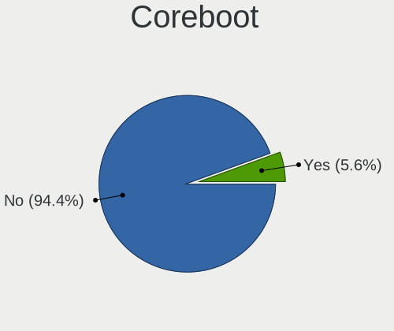

| Used | Notebooks | Percent |
|------|-----------|---------|
| No   | 16        | 100%    |

RAM Size
--------

Total RAM memory

| Size in GB | Notebooks | Percent |
|------------|-----------|---------|
| 4.01-8.0   | 5         | 31.25%  |
| 3.01-4.0   | 3         | 18.75%  |
| 1.01-2.0   | 3         | 18.75%  |
| 8.01-16.0  | 2         | 12.5%   |
| 32.01-64.0 | 1         | 6.25%   |
| 2.01-3.0   | 1         | 6.25%   |
| 16.01-24.0 | 1         | 6.25%   |

RAM Used
--------

Used RAM memory

| Used GB  | Notebooks | Percent |
|----------|-----------|---------|
| 1.01-2.0 | 8         | 50%     |
| 0.51-1.0 | 5         | 31.25%  |
| 4.01-8.0 | 2         | 12.5%   |
| 3.01-4.0 | 1         | 6.25%   |

Total Drives
------------

Number of drives on board

| Drives | Notebooks | Percent |
|--------|-----------|---------|
| 1      | 13        | 81.25%  |
| 2      | 3         | 18.75%  |

Has CD-ROM
----------

Has CD-ROM on board

| Presented | Notebooks | Percent |
|-----------|-----------|---------|
| No        | 10        | 62.5%   |
| Yes       | 6         | 37.5%   |

Has Ethernet
------------

Has Ethernet on board

| Presented | Notebooks | Percent |
|-----------|-----------|---------|
| Yes       | 13        | 81.25%  |
| No        | 3         | 18.75%  |

Has WiFi
--------

Has WiFi module

| Presented | Notebooks | Percent |
|-----------|-----------|---------|
| Yes       | 15        | 93.75%  |
| No        | 1         | 6.25%   |

Has Bluetooth
-------------

Has Bluetooth module

| Presented | Notebooks | Percent |
|-----------|-----------|---------|
| Yes       | 9         | 56.25%  |
| No        | 7         | 43.75%  |

Location
--------

Country
-------

Geographic location (country)

| Country     | Notebooks | Percent |
|-------------|-----------|---------|
| Brazil      | 3         | 18.75%  |
| USA         | 2         | 12.5%   |
| Russia      | 2         | 12.5%   |
| Argentina   | 2         | 12.5%   |
| UK          | 1         | 6.25%   |
| Philippines | 1         | 6.25%   |
| Indonesia   | 1         | 6.25%   |
| Greece      | 1         | 6.25%   |
| Germany     | 1         | 6.25%   |
| France      | 1         | 6.25%   |
| Belgium     | 1         | 6.25%   |

City
----

Geographic location (city)

| City         | Notebooks | Percent |
|--------------|-----------|---------|
| Yoshkar-Ola  | 1         | 6.25%   |
| Volzhskiy    | 1         | 6.25%   |
| Thessaloniki | 1         | 6.25%   |
| Sao Paulo    | 1         | 6.25%   |
| Quezon City  | 1         | 6.25%   |
| Porto Alegre | 1         | 6.25%   |
| Novo Gama    | 1         | 6.25%   |
| Newtown      | 1         | 6.25%   |
| Medford      | 1         | 6.25%   |
| Maipu        | 1         | 6.25%   |
| Kissenbruck  | 1         | 6.25%   |
| Ghent        | 1         | 6.25%   |
| Blackburn    | 1         | 6.25%   |
| Bekasi       | 1         | 6.25%   |
| Beauce       | 1         | 6.25%   |
| Avellaneda   | 1         | 6.25%   |

Drives
------

Drive Vendor
------------

Hard drive vendors

| Vendor              | Notebooks | Drives | Percent |
|---------------------|-----------|--------|---------|
| WDC                 | 3         | 3      | 17.65%  |
| Toshiba             | 2         | 2      | 11.76%  |
| Samsung Electronics | 2         | 2      | 11.76%  |
| Crucial             | 2         | 2      | 11.76%  |
| SPCC                | 1         | 1      | 5.88%   |
| Seagate             | 1         | 1      | 5.88%   |
| SanDisk             | 1         | 1      | 5.88%   |
| Micron Technology   | 1         | 1      | 5.88%   |
| Leqixiang           | 1         | 1      | 5.88%   |
| KINGPOWER           | 1         | 1      | 5.88%   |
| Intel               | 1         | 1      | 5.88%   |
| HUSKY               | 1         | 1      | 5.88%   |

Drive Model
-----------

Hard drive models

| Model                                    | Notebooks | Percent |
|------------------------------------------|-----------|---------|
| Toshiba MQ01ABF050 500GB                 | 2         | 11.76%  |
| Crucial CT240BX500SSD1 240GB             | 2         | 11.76%  |
| WDC WD5000LPCX-60VHAT0 500GB             | 1         | 5.88%   |
| WDC WD10SPZX-24Z10 1TB                   | 1         | 5.88%   |
| WDC PC SN520 SDAPNUW-256G-1006 256GB     | 1         | 5.88%   |
| SPCC Solid State Disk 120GB              | 1         | 5.88%   |
| Seagate ST320LT007-9ZV142 320GB          | 1         | 5.88%   |
| SanDisk DF4032  32GB                     | 1         | 5.88%   |
| Samsung HM320II 320GB                    | 1         | 5.88%   |
| Samsung HM121HI 120GB                    | 1         | 5.88%   |
| Micron MTFDDAV256MBF-1AN15ABHA 256GB SSD | 1         | 5.88%   |
| Leqixiang SSD 1TB                        | 1         | 5.88%   |
| KINGPOWER 2242 16GB SSD                  | 1         | 5.88%   |
| Intel SSDPEKNU512GZH 512GB               | 1         | 5.88%   |
| HUSKY SSD 256GB                          | 1         | 5.88%   |

HDD Vendor
----------

Hard disk drive vendors

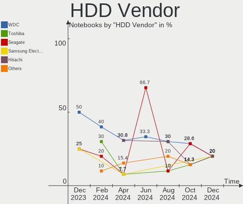

| Vendor              | Notebooks | Drives | Percent |
|---------------------|-----------|--------|---------|
| WDC                 | 2         | 2      | 28.57%  |
| Toshiba             | 2         | 2      | 28.57%  |
| Samsung Electronics | 2         | 2      | 28.57%  |
| Seagate             | 1         | 1      | 14.29%  |

SSD Vendor
----------

Solid state drive vendors

| Vendor            | Notebooks | Drives | Percent |
|-------------------|-----------|--------|---------|
| Crucial           | 2         | 2      | 28.57%  |
| SPCC              | 1         | 1      | 14.29%  |
| Micron Technology | 1         | 1      | 14.29%  |
| Leqixiang         | 1         | 1      | 14.29%  |
| KINGPOWER         | 1         | 1      | 14.29%  |
| HUSKY             | 1         | 1      | 14.29%  |

Drive Kind
----------

HDD or SSD

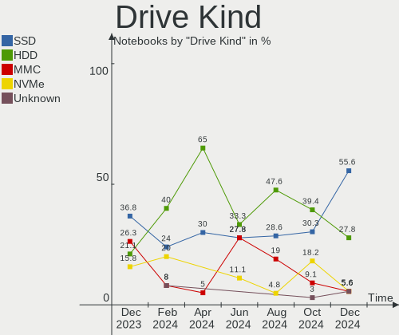

| Kind | Notebooks | Drives | Percent |
|------|-----------|--------|---------|
| SSD  | 7         | 7      | 41.18%  |
| HDD  | 7         | 7      | 41.18%  |
| NVMe | 2         | 2      | 11.76%  |
| MMC  | 1         | 1      | 5.88%   |

Drive Connector
---------------

SATA, SAS, NVMe, etc.

| Type | Notebooks | Drives | Percent |
|------|-----------|--------|---------|
| SATA | 14        | 14     | 82.35%  |
| NVMe | 2         | 2      | 11.76%  |
| MMC  | 1         | 1      | 5.88%   |

Drive Size
----------

Size of hard drive

| Size in TB | Notebooks | Drives | Percent |
|------------|-----------|--------|---------|
| 0.01-0.5   | 12        | 12     | 85.71%  |
| 0.51-1.0   | 2         | 2      | 14.29%  |

Space Total
-----------

Amount of disk space available on the file system

| Size in GB | Notebooks | Percent |
|------------|-----------|---------|
| 251-500    | 6         | 37.5%   |
| 101-250    | 5         | 31.25%  |
| 1-20       | 2         | 12.5%   |
| 51-100     | 2         | 12.5%   |
| 501-1000   | 1         | 6.25%   |

Space Used
----------

Amount of used disk space

| Used GB | Notebooks | Percent |
|---------|-----------|---------|
| 1-20    | 10        | 62.5%   |
| 21-50   | 3         | 18.75%  |
| 101-250 | 2         | 12.5%   |
| 51-100  | 1         | 6.25%   |

Malfunc. Drives
---------------

Drive models with a malfunction

| Model                             | Notebooks | Drives | Percent |
|-----------------------------------|-----------|--------|---------|
| Toshiba MQ01ABF050 500GB          | 1         | 1      | 33.33%  |
| Seagate ST320LT007-9ZV142 320GB   | 1         | 1      | 33.33%  |
| Samsung Electronics HM121HI 120GB | 1         | 1      | 33.33%  |

Malfunc. Drive Vendor
---------------------

Vendors of faulty drives

| Vendor              | Notebooks | Drives | Percent |
|---------------------|-----------|--------|---------|
| Toshiba             | 1         | 1      | 33.33%  |
| Seagate             | 1         | 1      | 33.33%  |
| Samsung Electronics | 1         | 1      | 33.33%  |

Malfunc. HDD Vendor
-------------------

Vendors of faulty HDD drives

| Vendor              | Notebooks | Drives | Percent |
|---------------------|-----------|--------|---------|
| Toshiba             | 1         | 1      | 33.33%  |
| Seagate             | 1         | 1      | 33.33%  |
| Samsung Electronics | 1         | 1      | 33.33%  |

Malfunc. Drive Kind
-------------------

Kinds of faulty drives

| Kind | Notebooks | Drives | Percent |
|------|-----------|--------|---------|
| HDD  | 3         | 3      | 100%    |

Failed Drives
-------------

Failed drive models

Zero info for selected period =(

Failed Drive Vendor
-------------------

Failed drive vendors

Zero info for selected period =(

Drive Status
------------

Number of failed and malfunc. drives

| Status   | Notebooks | Drives | Percent |
|----------|-----------|--------|---------|
| Works    | 7         | 8      | 43.75%  |
| Detected | 6         | 6      | 37.5%   |
| Malfunc  | 3         | 3      | 18.75%  |

Storage controller
------------------

Storage Vendor
--------------

Storage controller vendors

| Vendor  | Notebooks | Percent |
|---------|-----------|---------|
| Intel   | 13        | 81.25%  |
| SanDisk | 1         | 6.25%   |
| Nvidia  | 1         | 6.25%   |
| AMD     | 1         | 6.25%   |

Storage Model
-------------

Storage controller models

| Model                                                                            | Notebooks | Percent |
|----------------------------------------------------------------------------------|-----------|---------|
| Intel Atom/Celeron/Pentium Processor x5-E8000/J3xxx/N3xxx Series SATA Controller | 2         | 10.53%  |
| Intel 7 Series Chipset Family 6-port SATA Controller [AHCI mode]                 | 2         | 10.53%  |
| SanDisk WD Blue SN500 / PC SN520 NVMe SSD                                        | 1         | 5.26%   |
| Nvidia MCP89 SATA Controller (AHCI mode)                                         | 1         | 5.26%   |
| Intel Volume Management Device NVMe RAID Controller                              | 1         | 5.26%   |
| Intel Tiger Lake-LP SATA Controller                                              | 1         | 5.26%   |
| Intel Sunrise Point-LP SATA Controller [AHCI mode]                               | 1         | 5.26%   |
| Intel SATA Controller [RAID mode]                                                | 1         | 5.26%   |
| Intel Non-Volatile memory controller                                             | 1         | 5.26%   |
| Intel NM10/ICH7 Family SATA Controller [AHCI mode]                               | 1         | 5.26%   |
| Intel Comet Lake SATA AHCI Controller                                            | 1         | 5.26%   |
| Intel Cannon Point-LP SATA Controller [AHCI Mode]                                | 1         | 5.26%   |
| Intel Atom Processor E3800 Series SATA AHCI Controller                           | 1         | 5.26%   |
| Intel 82801HM/HEM (ICH8M/ICH8M-E) SATA Controller [AHCI mode]                    | 1         | 5.26%   |
| Intel 82801HM/HEM (ICH8M/ICH8M-E) IDE Controller                                 | 1         | 5.26%   |
| Intel 6 Series/C200 Series Chipset Family 6 port Mobile SATA AHCI Controller     | 1         | 5.26%   |
| AMD SB7x0/SB8x0/SB9x0 SATA Controller [AHCI mode]                                | 1         | 5.26%   |

Storage Kind
------------

Kind of storage controller (IDE, SATA, NVMe, SAS, ...)

| Kind | Notebooks | Percent |
|------|-----------|---------|
| SATA | 14        | 73.68%  |
| RAID | 2         | 10.53%  |
| NVMe | 2         | 10.53%  |
| IDE  | 1         | 5.26%   |

Processor
---------

CPU Vendor
----------

Processor vendors

| Vendor | Notebooks | Percent |
|--------|-----------|---------|
| Intel  | 15        | 93.75%  |
| AMD    | 1         | 6.25%   |

CPU Model
---------

Processor models

| Model                                   | Notebooks | Percent |
|-----------------------------------------|-----------|---------|
| Intel Pentium CPU N3710 @ 1.60GHz       | 2         | 12.5%   |
| Intel Core i7-6820HQ CPU @ 2.70GHz      | 1         | 6.25%   |
| Intel Core i7-2620M CPU @ 2.70GHz       | 1         | 6.25%   |
| Intel Core i5-8265U CPU @ 1.60GHz       | 1         | 6.25%   |
| Intel Core i5-8250U CPU @ 1.60GHz       | 1         | 6.25%   |
| Intel Core i5-10210U CPU @ 1.60GHz      | 1         | 6.25%   |
| Intel Core i3-2367M CPU @ 1.40GHz       | 1         | 6.25%   |
| Intel Core i3-2348M CPU @ 2.30GHz       | 1         | 6.25%   |
| Intel Core 2 Duo CPU T7500 @ 2.20GHz    | 1         | 6.25%   |
| Intel Core 2 Duo CPU P8600 @ 2.40GHz    | 1         | 6.25%   |
| Intel Celeron CPU N2807 @ 1.58GHz       | 1         | 6.25%   |
| Intel Atom x5-Z8350 CPU @ 1.44GHz       | 1         | 6.25%   |
| Intel Atom CPU N455 @ 1.66GHz           | 1         | 6.25%   |
| Intel 11th Gen Core i5-1135G7 @ 2.40GHz | 1         | 6.25%   |
| AMD E-450 APU with Radeon HD Graphics   | 1         | 6.25%   |

CPU Model Family
----------------

Processor model prefix

| Model            | Notebooks | Percent |
|------------------|-----------|---------|
| Intel Core i5    | 3         | 18.75%  |
| Intel Pentium    | 2         | 12.5%   |
| Intel Core i7    | 2         | 12.5%   |
| Intel Core i3    | 2         | 12.5%   |
| Intel Core 2 Duo | 2         | 12.5%   |
| Intel Atom       | 2         | 12.5%   |
| Other            | 1         | 6.25%   |
| Intel Celeron    | 1         | 6.25%   |
| AMD E            | 1         | 6.25%   |

CPU Cores
---------

Number of processor cores

| Number | Notebooks | Percent |
|--------|-----------|---------|
| 4      | 8         | 50%     |
| 2      | 7         | 43.75%  |
| 1      | 1         | 6.25%   |

CPU Sockets
-----------

Number of sockets

| Number | Notebooks | Percent |
|--------|-----------|---------|
| 1      | 16        | 100%    |

CPU Threads
-----------

Threads per core (Hyper-Threading)

| Number | Notebooks | Percent |
|--------|-----------|---------|
| 2      | 9         | 56.25%  |
| 1      | 7         | 43.75%  |

CPU Op-Modes
------------

CPU Operation Modes (32-bit, 64-bit)

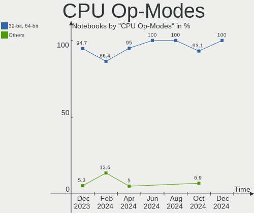

| Op mode        | Notebooks | Percent |
|----------------|-----------|---------|
| 32-bit, 64-bit | 16        | 100%    |

CPU Microcode
-------------

Microcode number

| Number     | Notebooks | Percent |
|------------|-----------|---------|
| Unknown    | 6         | 37.5%   |
| 0x206a7    | 2         | 12.5%   |
| 0x806ec    | 1         | 6.25%   |
| 0x806ea    | 1         | 6.25%   |
| 0x806c1    | 1         | 6.25%   |
| 0x6fa      | 1         | 6.25%   |
| 0x506e3    | 1         | 6.25%   |
| 0x30678    | 1         | 6.25%   |
| 0x106ca    | 1         | 6.25%   |
| 0x05000119 | 1         | 6.25%   |

CPU Microarch
-------------

Microarchitecture

| Name        | Notebooks | Percent |
|-------------|-----------|---------|
| Silvermont  | 4         | 25%     |
| SandyBridge | 3         | 18.75%  |
| KabyLake    | 3         | 18.75%  |
| TigerLake   | 1         | 6.25%   |
| Skylake     | 1         | 6.25%   |
| Penryn      | 1         | 6.25%   |
| Core        | 1         | 6.25%   |
| Bonnell     | 1         | 6.25%   |
| Bobcat      | 1         | 6.25%   |

Graphics
--------

GPU Vendor
----------

Vendors of graphics cards

| Vendor | Notebooks | Percent |
|--------|-----------|---------|
| Intel  | 14        | 82.35%  |
| AMD    | 2         | 11.76%  |
| Nvidia | 1         | 5.88%   |

GPU Model
---------

Graphics card models

| Model                                                                                    | Notebooks | Percent |
|------------------------------------------------------------------------------------------|-----------|---------|
| Intel Atom/Celeron/Pentium Processor x5-E8000/J3xxx/N3xxx Integrated Graphics Controller | 3         | 15.79%  |
| Intel 2nd Generation Core Processor Family Integrated Graphics Controller                | 3         | 15.79%  |
| Nvidia MCP89 [GeForce 320M]                                                              | 1         | 5.26%   |
| Intel WhiskeyLake-U GT2 [UHD Graphics 620]                                               | 1         | 5.26%   |
| Intel UHD Graphics 620                                                                   | 1         | 5.26%   |
| Intel TigerLake-LP GT2 [Iris Xe Graphics]                                                | 1         | 5.26%   |
| Intel Mobile GM965/GL960 Integrated Graphics Controller (secondary)                      | 1         | 5.26%   |
| Intel Mobile GM965/GL960 Integrated Graphics Controller (primary)                        | 1         | 5.26%   |
| Intel HD Graphics 530                                                                    | 1         | 5.26%   |
| Intel CometLake-U GT2 [UHD Graphics]                                                     | 1         | 5.26%   |
| Intel Atom Processor Z36xxx/Z37xxx Series Graphics & Display                             | 1         | 5.26%   |
| Intel Atom Processor D4xx/D5xx/N4xx/N5xx Integrated Graphics Controller                  | 1         | 5.26%   |
| AMD Wrestler [Radeon HD 6320]                                                            | 1         | 5.26%   |
| AMD Seymour [Radeon HD 6400M/7400M Series]                                               | 1         | 5.26%   |
| AMD Cape Verde PRO / Venus LE / Tropo PRO-L [Radeon HD 8830M / R7 250 / R7 M465X]        | 1         | 5.26%   |

GPU Combo
---------

Combinations of graphics cards

| Name        | Notebooks | Percent |
|-------------|-----------|---------|
| 1 x Intel   | 13        | 81.25%  |
| 2 x AMD     | 1         | 6.25%   |
| 1 x Nvidia  | 1         | 6.25%   |
| Intel + AMD | 1         | 6.25%   |

GPU Driver
----------

Free vs proprietary

| Driver | Notebooks | Percent |
|--------|-----------|---------|
| Free   | 16        | 100%    |

GPU Memory
----------

Total video memory

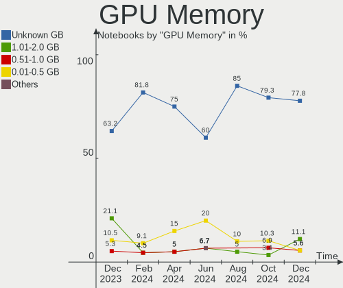

| Size in GB | Notebooks | Percent |
|------------|-----------|---------|
| Unknown    | 13        | 81.25%  |
| 1.01-2.0   | 2         | 12.5%   |
| 0.01-0.5   | 1         | 6.25%   |

Monitor
-------

Monitor Vendor
--------------

Monitor vendors

| Vendor              | Notebooks | Percent |
|---------------------|-----------|---------|
| AU Optronics        | 5         | 27.78%  |
| LG Display          | 2         | 11.11%  |
| BOE                 | 2         | 11.11%  |
| Apple               | 2         | 11.11%  |
| Samsung Electronics | 1         | 5.56%   |
| JDI                 | 1         | 5.56%   |
| HKC                 | 1         | 5.56%   |
| Goldstar            | 1         | 5.56%   |
| CPT                 | 1         | 5.56%   |
| Chimei Innolux      | 1         | 5.56%   |
| Acer                | 1         | 5.56%   |

Monitor Model
-------------

Monitor models

| Model                                                                | Notebooks | Percent |
|----------------------------------------------------------------------|-----------|---------|
| AU Optronics LCD Monitor AUO10EC 1366x768 344x193mm 15.5-inch        | 2         | 11.11%  |
| Samsung Electronics LCD Monitor SEC3152 1366x768 344x194mm 15.5-inch | 1         | 5.56%   |
| LG Display LCD Monitor LGD034C 1366x768 293x165mm 13.2-inch          | 1         | 5.56%   |
| LG Display LCD Monitor LGD02E9 1366x768 309x174mm 14.0-inch          | 1         | 5.56%   |
| JDI LCD Monitor JDI422A 3000x2000 293x196mm 13.9-inch                | 1         | 5.56%   |
| HKC LCD Monitor HKC36BB 1366x768 309x174mm 14.0-inch                 | 1         | 5.56%   |
| Goldstar E1940 GSM4BD6 1360x768 406x229mm 18.4-inch                  | 1         | 5.56%   |
| CPT LCD Monitor CPT1415 1280x800 331x207mm 15.4-inch                 | 1         | 5.56%   |
| Chimei Innolux LCD Monitor CMN14C9 1920x1080 309x173mm 13.9-inch     | 1         | 5.56%   |
| BOE LCD Monitor BOE076E 1366x768 344x194mm 15.5-inch                 | 1         | 5.56%   |
| BOE LCD Monitor BOE0632 1920x1080 344x194mm 15.5-inch                | 1         | 5.56%   |
| AU Optronics LCD Monitor AUO139E 1600x900 382x214mm 17.2-inch        | 1         | 5.56%   |
| AU Optronics LCD Monitor AUO10DC 1366x768 222x125mm 10.0-inch        | 1         | 5.56%   |
| AU Optronics LCD Monitor AUO105C 1366x768 256x144mm 11.6-inch        | 1         | 5.56%   |
| Apple LCD Monitor APP9CD3 1528x1222 197x148mm 9.7-inch               | 1         | 5.56%   |
| Apple LCD Monitor APP9CBE 1280x800 286x179mm 13.3-inch               | 1         | 5.56%   |
| Acer V206HQLB ACR051A 1366x768 434x236mm 19.4-inch                   | 1         | 5.56%   |

Monitor Resolution
------------------

Monitor screen resolution

| Resolution      | Notebooks | Percent |
|-----------------|-----------|---------|
| 1366x768 (WXGA) | 10        | 55.56%  |
| 1920x1080 (FHD) | 2         | 11.11%  |
| 1280x800 (WXGA) | 2         | 11.11%  |
| 3000x2000       | 1         | 5.56%   |
| 1600x900 (HD+)  | 1         | 5.56%   |
| 1528x1222       | 1         | 5.56%   |
| 1360x768        | 1         | 5.56%   |

Monitor Diagonal
----------------

Diagonal size in inches

| Inches | Notebooks | Percent |
|--------|-----------|---------|
| 15     | 6         | 33.33%  |
| 13     | 4         | 22.22%  |
| 14     | 2         | 11.11%  |
| 19     | 1         | 5.56%   |
| 18     | 1         | 5.56%   |
| 17     | 1         | 5.56%   |
| 11     | 1         | 5.56%   |
| 10     | 1         | 5.56%   |
| 9      | 1         | 5.56%   |

Monitor Width
-------------

Physical width

| Width in mm | Notebooks | Percent |
|-------------|-----------|---------|
| 301-350     | 9         | 50%     |
| 201-300     | 5         | 27.78%  |
| 401-500     | 2         | 11.11%  |
| 351-400     | 1         | 5.56%   |
| 101-200     | 1         | 5.56%   |

Aspect Ratio
------------

Proportional relationship between the width and the height

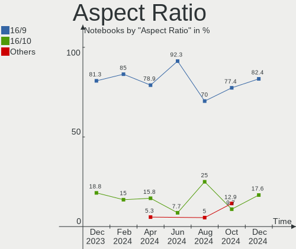

| Ratio | Notebooks | Percent |
|-------|-----------|---------|
| 16/9  | 13        | 76.47%  |
| 16/10 | 2         | 11.76%  |
| 4/3   | 1         | 5.88%   |
| 3/2   | 1         | 5.88%   |

Monitor Area
------------

Area in inch²

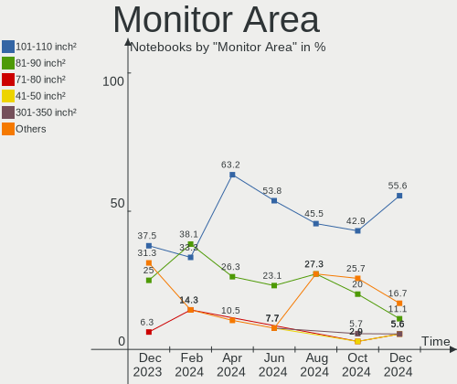

| Area in inch² | Notebooks | Percent |
|----------------|-----------|---------|
| 101-110        | 6         | 33.33%  |
| 81-90          | 5         | 27.78%  |
| 41-50          | 2         | 11.11%  |
| 71-80          | 1         | 5.56%   |
| 51-60          | 1         | 5.56%   |
| 151-200        | 1         | 5.56%   |
| 141-150        | 1         | 5.56%   |
| 121-130        | 1         | 5.56%   |

Pixel Density
-------------

Pixels per inch

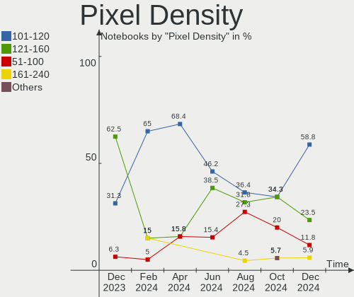

| Density       | Notebooks | Percent |
|---------------|-----------|---------|
| 101-120       | 9         | 50%     |
| 121-160       | 4         | 22.22%  |
| 51-100        | 3         | 16.67%  |
| More than 240 | 1         | 5.56%   |
| 161-240       | 1         | 5.56%   |

Multiple Monitors
-----------------

Total monitors connected

| Total | Notebooks | Percent |
|-------|-----------|---------|
| 1     | 14        | 87.5%   |
| 2     | 2         | 12.5%   |

Network
-------

Net Controller Vendor
---------------------

Controller vendors

| Vendor                   | Notebooks | Percent |
|--------------------------|-----------|---------|
| Realtek Semiconductor    | 11        | 45.83%  |
| Qualcomm Atheros         | 4         | 16.67%  |
| Intel                    | 3         | 12.5%   |
| Ralink Technology        | 1         | 4.17%   |
| Nvidia                   | 1         | 4.17%   |
| Microsoft                | 1         | 4.17%   |
| Marvell Technology Group | 1         | 4.17%   |
| JMicron Technology       | 1         | 4.17%   |
| Broadcom                 | 1         | 4.17%   |

Net Controller Model
--------------------

Controller models

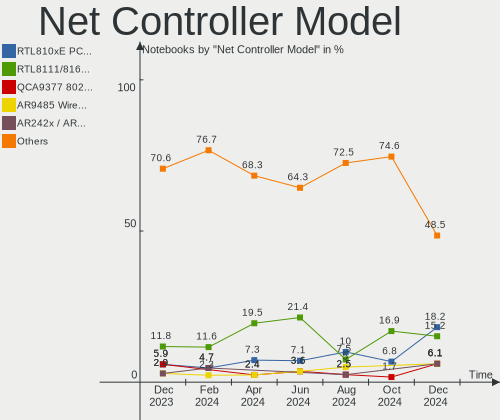

| Model                                                             | Notebooks | Percent |
|-------------------------------------------------------------------|-----------|---------|
| Realtek RTL8111/8168/8411 PCI Express Gigabit Ethernet Controller | 4         | 13.33%  |
| Realtek RTL8153 Gigabit Ethernet Adapter                          | 2         | 6.67%   |
| Realtek RTL810xE PCI Express Fast Ethernet controller             | 2         | 6.67%   |
| Realtek RTL8822CE 802.11ac PCIe Wireless Network Adapter          | 1         | 3.33%   |
| Realtek RTL8821CE 802.11ac PCIe Wireless Network Adapter          | 1         | 3.33%   |
| Realtek RTL8723BE PCIe Wireless Network Adapter                   | 1         | 3.33%   |
| Realtek RTL8188EE Wireless Network Adapter                        | 1         | 3.33%   |
| Realtek RTL8188CE 802.11b/g/n WiFi Adapter                        | 1         | 3.33%   |
| Realtek RTL8187B Wireless 802.11g 54Mbps Network Adapter          | 1         | 3.33%   |
| Ralink MT7610U ("Archer T2U" 2.4G+5G WLAN Adapter                 | 1         | 3.33%   |
| Qualcomm Atheros QCA9565 / AR9565 Wireless Network Adapter        | 1         | 3.33%   |
| Qualcomm Atheros QCA9377 802.11ac Wireless Network Adapter        | 1         | 3.33%   |
| Qualcomm Atheros AR9485 Wireless Network Adapter                  | 1         | 3.33%   |
| Qualcomm Atheros AR9462 Wireless Network Adapter                  | 1         | 3.33%   |
| Qualcomm Atheros AR8161 Gigabit Ethernet                          | 1         | 3.33%   |
| Qualcomm Atheros AR8152 v2.0 Fast Ethernet                        | 1         | 3.33%   |
| Nvidia MCP89 Ethernet                                             | 1         | 3.33%   |
| Microsoft Xbox 360 Wireless Adapter                               | 1         | 3.33%   |
| Marvell Group 88E8055 PCI-E Gigabit Ethernet Controller           | 1         | 3.33%   |
| JMicron JMC250 PCI Express Gigabit Ethernet Controller            | 1         | 3.33%   |
| Intel Wireless 8260                                               | 1         | 3.33%   |
| Intel Ethernet Connection (2) I219-LM                             | 1         | 3.33%   |
| Intel Centrino Wireless-N 2230                                    | 1         | 3.33%   |
| Intel Cannon Point-LP CNVi [Wireless-AC]                          | 1         | 3.33%   |
| Broadcom BCM43224 802.11a/b/g/n                                   | 1         | 3.33%   |

Wireless Vendor
---------------

Wireless vendors

| Vendor                | Notebooks | Percent |
|-----------------------|-----------|---------|
| Realtek Semiconductor | 6         | 37.5%   |
| Qualcomm Atheros      | 4         | 25%     |
| Intel                 | 3         | 18.75%  |
| Ralink Technology     | 1         | 6.25%   |
| Microsoft             | 1         | 6.25%   |
| Broadcom              | 1         | 6.25%   |

Wireless Model
--------------

Wireless models

| Model                                                      | Notebooks | Percent |
|------------------------------------------------------------|-----------|---------|
| Realtek RTL8822CE 802.11ac PCIe Wireless Network Adapter   | 1         | 6.25%   |
| Realtek RTL8821CE 802.11ac PCIe Wireless Network Adapter   | 1         | 6.25%   |
| Realtek RTL8723BE PCIe Wireless Network Adapter            | 1         | 6.25%   |
| Realtek RTL8188EE Wireless Network Adapter                 | 1         | 6.25%   |
| Realtek RTL8188CE 802.11b/g/n WiFi Adapter                 | 1         | 6.25%   |
| Realtek RTL8187B Wireless 802.11g 54Mbps Network Adapter   | 1         | 6.25%   |
| Ralink MT7610U ("Archer T2U" 2.4G+5G WLAN Adapter          | 1         | 6.25%   |
| Qualcomm Atheros QCA9565 / AR9565 Wireless Network Adapter | 1         | 6.25%   |
| Qualcomm Atheros QCA9377 802.11ac Wireless Network Adapter | 1         | 6.25%   |
| Qualcomm Atheros AR9485 Wireless Network Adapter           | 1         | 6.25%   |
| Qualcomm Atheros AR9462 Wireless Network Adapter           | 1         | 6.25%   |
| Microsoft Xbox 360 Wireless Adapter                        | 1         | 6.25%   |
| Intel Wireless 8260                                        | 1         | 6.25%   |
| Intel Centrino Wireless-N 2230                             | 1         | 6.25%   |
| Intel Cannon Point-LP CNVi [Wireless-AC]                   | 1         | 6.25%   |
| Broadcom BCM43224 802.11a/b/g/n                            | 1         | 6.25%   |

Ethernet Vendor
---------------

Ethernet vendors

| Vendor                   | Notebooks | Percent |
|--------------------------|-----------|---------|
| Realtek Semiconductor    | 8         | 57.14%  |
| Qualcomm Atheros         | 2         | 14.29%  |
| Nvidia                   | 1         | 7.14%   |
| Marvell Technology Group | 1         | 7.14%   |
| JMicron Technology       | 1         | 7.14%   |
| Intel                    | 1         | 7.14%   |

Ethernet Model
--------------

Ethernet models

| Model                                                             | Notebooks | Percent |
|-------------------------------------------------------------------|-----------|---------|
| Realtek RTL8111/8168/8411 PCI Express Gigabit Ethernet Controller | 4         | 28.57%  |
| Realtek RTL8153 Gigabit Ethernet Adapter                          | 2         | 14.29%  |
| Realtek RTL810xE PCI Express Fast Ethernet controller             | 2         | 14.29%  |
| Qualcomm Atheros AR8161 Gigabit Ethernet                          | 1         | 7.14%   |
| Qualcomm Atheros AR8152 v2.0 Fast Ethernet                        | 1         | 7.14%   |
| Nvidia MCP89 Ethernet                                             | 1         | 7.14%   |
| Marvell Group 88E8055 PCI-E Gigabit Ethernet Controller           | 1         | 7.14%   |
| JMicron JMC250 PCI Express Gigabit Ethernet Controller            | 1         | 7.14%   |
| Intel Ethernet Connection (2) I219-LM                             | 1         | 7.14%   |

Net Controller Kind
-------------------

Ethernet, WiFi or modem

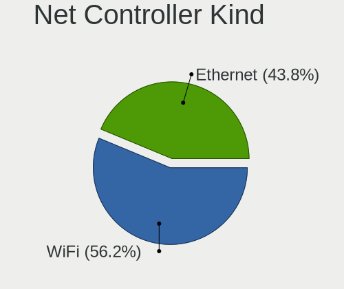

| Kind     | Notebooks | Percent |
|----------|-----------|---------|
| WiFi     | 15        | 53.57%  |
| Ethernet | 13        | 46.43%  |

Used Controller
---------------

Currently used network controller

| Kind     | Notebooks | Percent |
|----------|-----------|---------|
| WiFi     | 12        | 75%     |
| Ethernet | 4         | 25%     |

NICs
----

Total network controllers on board

| Total | Notebooks | Percent |
|-------|-----------|---------|
| 2     | 11        | 68.75%  |
| 1     | 3         | 18.75%  |
| 0     | 2         | 12.5%   |

IPv6
----

IPv6 vs IPv4

| Used | Notebooks | Percent |
|------|-----------|---------|
| No   | 13        | 81.25%  |
| Yes  | 3         | 18.75%  |

Bluetooth
---------

Bluetooth Vendor
----------------

Controller vendors

| Vendor                          | Notebooks | Percent |
|---------------------------------|-----------|---------|
| Realtek Semiconductor           | 3         | 33.33%  |
| Qualcomm Atheros Communications | 2         | 22.22%  |
| Intel                           | 2         | 22.22%  |
| Syntek                          | 1         | 11.11%  |
| Apple                           | 1         | 11.11%  |

Bluetooth Model
---------------

Controller models

| Model                                          | Notebooks | Percent |
|------------------------------------------------|-----------|---------|
| Realtek Bluetooth Radio                        | 2         | 22.22%  |
| Qualcomm Atheros  Bluetooth Device             | 2         | 22.22%  |
| Syntek 802.11g + Bluetooth Wireless Adapter    | 1         | 11.11%  |
| Realtek RTL8723B Bluetooth                     | 1         | 11.11%  |
| Intel Bluetooth wireless interface             | 1         | 11.11%  |
| Intel Bluetooth 9460/9560 Jefferson Peak (JfP) | 1         | 11.11%  |
| Apple Bluetooth Host Controller                | 1         | 11.11%  |

Sound
-----

Sound Vendor
------------

Sound card vendors

| Vendor | Notebooks | Percent |
|--------|-----------|---------|
| Intel  | 13        | 86.67%  |
| Nvidia | 1         | 6.67%   |
| AMD    | 1         | 6.67%   |

Sound Model
-----------

Sound card models

| Model                                                                                             | Notebooks | Percent |
|---------------------------------------------------------------------------------------------------|-----------|---------|
| Intel Atom/Celeron/Pentium Processor x5-E8000/J3xxx/N3xxx Series High Definition Audio Controller | 2         | 12.5%   |
| Intel 7 Series/C216 Chipset Family High Definition Audio Controller                               | 2         | 12.5%   |
| Nvidia MCP89 High Definition Audio                                                                | 1         | 6.25%   |
| Intel Tiger Lake-LP Smart Sound Technology Audio Controller                                       | 1         | 6.25%   |
| Intel Sunrise Point-LP HD Audio                                                                   | 1         | 6.25%   |
| Intel NM10/ICH7 Family High Definition Audio Controller                                           | 1         | 6.25%   |
| Intel Comet Lake PCH-LP cAVS                                                                      | 1         | 6.25%   |
| Intel Cannon Point-LP High Definition Audio Controller                                            | 1         | 6.25%   |
| Intel Atom Processor Z36xxx/Z37xxx Series High Definition Audio Controller                        | 1         | 6.25%   |
| Intel 82801H (ICH8 Family) HD Audio Controller                                                    | 1         | 6.25%   |
| Intel 6 Series/C200 Series Chipset Family High Definition Audio Controller                        | 1         | 6.25%   |
| Intel 100 Series/C230 Series Chipset Family HD Audio Controller                                   | 1         | 6.25%   |
| AMD Wrestler HDMI Audio                                                                           | 1         | 6.25%   |
| AMD SBx00 Azalia (Intel HDA)                                                                      | 1         | 6.25%   |

Memory
------

Memory Vendor
-------------

Memory module vendors

| Vendor              | Notebooks | Percent |
|---------------------|-----------|---------|
| Samsung Electronics | 5         | 41.67%  |
| Unknown             | 2         | 16.67%  |
| Nanya Technology    | 2         | 16.67%  |
| Ramaxel Technology  | 1         | 8.33%   |
| Novatech            | 1         | 8.33%   |
| Elpida              | 1         | 8.33%   |

Memory Model
------------

Memory module models

| Model                                                     | Notebooks | Percent |
|-----------------------------------------------------------|-----------|---------|
| Unknown RAM Module 2GB SODIMM DDR3 667MT/s                | 1         | 7.69%   |
| Unknown RAM Module 2GB SODIMM DDR2 667MT/s                | 1         | 7.69%   |
| Unknown RAM Module 1GB SODIMM DDR2 667MT/s                | 1         | 7.69%   |
| Samsung RAM Module 8192MB SODIMM DDR4 2667MT/s            | 1         | 7.69%   |
| Samsung RAM Module 32GB SODIMM DDR4 3200MT/s              | 1         | 7.69%   |
| Samsung RAM M471A5244CB0-CRC 4GB SODIMM DDR4 2667MT/s     | 1         | 7.69%   |
| Samsung RAM M471A1K43EB1-CWE 8GB SODIMM DDR4 3200MT/s     | 1         | 7.69%   |
| Samsung RAM M471A1K43BB0-CPB 8GB SODIMM DDR4 2133MT/s     | 1         | 7.69%   |
| Ramaxel RAM RMSA3260ME78HAF-2666 8GB SODIMM DDR4 2667MT/s | 1         | 7.69%   |
| Novatech RAM N3S02H1600E-L R0 2GB SODIMM DDR3 1333MT/s    | 1         | 7.69%   |
| Nanya RAM NT4GC64B8HG0NS-DI 4GB SODIMM DDR3 1600MT/s      | 1         | 7.69%   |
| Nanya RAM NT2GC64B88B0NS-CG 2GB SODIMM DDR3 1334MT/s      | 1         | 7.69%   |
| Elpida RAM EBJ41UF8BCS0-DJ-F 4GB SODIMM DDR3 1334MT/s     | 1         | 7.69%   |

Memory Kind
-----------

Memory module kinds

| Kind | Notebooks | Percent |
|------|-----------|---------|
| DDR4 | 5         | 50%     |
| DDR3 | 4         | 40%     |
| DDR2 | 1         | 10%     |

Memory Form Factor
------------------

Physical design of the memory module

| Name   | Notebooks | Percent |
|--------|-----------|---------|
| SODIMM | 10        | 100%    |

Memory Size
-----------

Memory module size

| Size  | Notebooks | Percent |
|-------|-----------|---------|
| 8192  | 4         | 30.77%  |
| 2048  | 4         | 30.77%  |
| 4096  | 3         | 23.08%  |
| 32768 | 1         | 7.69%   |
| 1024  | 1         | 7.69%   |

Memory Speed
------------

Memory module speed

| Speed | Notebooks | Percent |
|-------|-----------|---------|
| 3200  | 2         | 20%     |
| 2667  | 2         | 20%     |
| 667   | 2         | 20%     |
| 2133  | 1         | 10%     |
| 1600  | 1         | 10%     |
| 1334  | 1         | 10%     |
| 1333  | 1         | 10%     |

Printers & scanners
-------------------

Printer Vendor
--------------

Printer device vendors

Zero info for selected period =(

Printer Model
-------------

Printer device models

Zero info for selected period =(

Scanner Vendor
--------------

Scanner device vendors

Zero info for selected period =(

Scanner Model
-------------

Scanner device models

Zero info for selected period =(

Camera
------

Camera Vendor
-------------

Camera device vendors

| Vendor                                 | Notebooks | Percent |
|----------------------------------------|-----------|---------|
| Realtek Semiconductor                  | 2         | 16.67%  |
| Chicony Electronics                    | 2         | 16.67%  |
| Alcor Micro                            | 2         | 16.67%  |
| Sunplus Innovation Technology          | 1         | 8.33%   |
| Microdia                               | 1         | 8.33%   |
| Lite-On Technology                     | 1         | 8.33%   |
| Cubeternet                             | 1         | 8.33%   |
| Cheng Uei Precision Industry (Foxlink) | 1         | 8.33%   |
| ALi                                    | 1         | 8.33%   |

Camera Model
------------

Camera device models

| Model                                                          | Notebooks | Percent |
|----------------------------------------------------------------|-----------|---------|
| Alcor Micro USB 2.0 Camera                                     | 2         | 16.67%  |
| Sunplus Integrated_Webcam_HD                                   | 1         | 8.33%   |
| Realtek Integrated_Webcam_HD                                   | 1         | 8.33%   |
| Realtek EasyCamera                                             | 1         | 8.33%   |
| Microdia Integrated Webcam                                     | 1         | 8.33%   |
| Lite-On HP HD Camera                                           | 1         | 8.33%   |
| Cubeternet GL-UPC822 UVC WebCam                                | 1         | 8.33%   |
| Chicony Integrated Camera                                      | 1         | 8.33%   |
| Chicony HP Webcam                                              | 1         | 8.33%   |
| Cheng Uei Precision Industry (Foxlink) HP TrueVision HD Camera | 1         | 8.33%   |
| ALi WebCam                                                     | 1         | 8.33%   |

Security
--------

Fingerprint Vendor
------------------

Fingerprint sensor vendors

| Vendor    | Notebooks | Percent |
|-----------|-----------|---------|
| Upek      | 1         | 50%     |
| Synaptics | 1         | 50%     |

Fingerprint Model
-----------------

Fingerprint sensor models

| Model                                                      | Notebooks | Percent |
|------------------------------------------------------------|-----------|---------|
| Upek Biometric Touchchip/Touchstrip Fingerprint Sensor     | 1         | 50%     |
| Synaptics  VFS7552 Touch Fingerprint Sensor with PurePrint | 1         | 50%     |

Chipcard Vendor
---------------

Chipcard module vendors

| Vendor   | Notebooks | Percent |
|----------|-----------|---------|
| Broadcom | 1         | 100%    |

Chipcard Model
--------------

Chipcard module models

| Model         | Notebooks | Percent |
|---------------|-----------|---------|
| Broadcom 5880 | 1         | 100%    |

Unsupported
-----------

Unsupported Devices
-------------------

Total unsupported devices on board

| Total | Notebooks | Percent |
|-------|-----------|---------|
| 0     | 12        | 75%     |
| 1     | 4         | 25%     |

Unsupported Device Types
------------------------

Types of unsupported devices

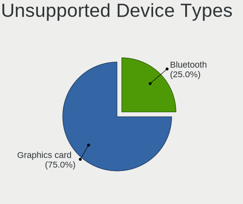

| Type               | Notebooks | Percent |
|--------------------|-----------|---------|
| Fingerprint reader | 2         | 50%     |
| Chipcard           | 1         | 25%     |
| Bluetooth          | 1         | 25%     |

