Lubuntu - Hardware Trends (Notebooks)
-------------------------------------

A project to identify most popular hardware characteristics and track their change
over time based on data collected by Linux users at https://Linux-Hardware.org.

Anyone can contribute to this report by the [hw-probe](https://github.com/linuxhw/hw-probe) tool:

    sudo -E hw-probe -all -upload

This report is for one last month. Overall report since the beginning of time: [TestCoverage](https://github.com/linuxhw/TestCoverage)

Period: Jun, 2022.

Contents
--------

* [ System ](#system)
  - [ OS                       ](#os)
  - [ OS Family                ](#os-family)
  - [ Kernel                   ](#kernel)
  - [ Kernel Family            ](#kernel-family)
  - [ Kernel Major Ver.        ](#kernel-major-ver)
  - [ Arch                     ](#arch)
  - [ DE                       ](#de)
  - [ Display Server           ](#display-server)
  - [ Display Manager          ](#display-manager)
  - [ OS Lang                  ](#os-lang)
  - [ Boot Mode                ](#boot-mode)
  - [ Filesystem               ](#filesystem)
  - [ Part. scheme             ](#part-scheme)
  - [ Dual Boot with Linux/BSD ](#dual-boot-with-linuxbsd)
  - [ Dual Boot (Win)          ](#dual-boot-win)

* [ Board ](#board)
  - [ Vendor                   ](#vendor)
  - [ Model                    ](#model)
  - [ Model Family             ](#model-family)
  - [ MFG Year                 ](#mfg-year)
  - [ Form Factor              ](#form-factor)
  - [ Secure Boot              ](#secure-boot)
  - [ Coreboot                 ](#coreboot)
  - [ RAM Size                 ](#ram-size)
  - [ RAM Used                 ](#ram-used)
  - [ Total Drives             ](#total-drives)
  - [ Has CD-ROM               ](#has-cd-rom)
  - [ Has Ethernet             ](#has-ethernet)
  - [ Has WiFi                 ](#has-wifi)
  - [ Has Bluetooth            ](#has-bluetooth)

* [ Location ](#location)
  - [ Country                  ](#country)
  - [ City                     ](#city)

* [ Drives ](#drives)
  - [ Drive Vendor             ](#drive-vendor)
  - [ Drive Model              ](#drive-model)
  - [ HDD Vendor               ](#hdd-vendor)
  - [ SSD Vendor               ](#ssd-vendor)
  - [ Drive Kind               ](#drive-kind)
  - [ Drive Connector          ](#drive-connector)
  - [ Drive Size               ](#drive-size)
  - [ Space Total              ](#space-total)
  - [ Space Used               ](#space-used)
  - [ Malfunc. Drives          ](#malfunc-drives)
  - [ Malfunc. Drive Vendor    ](#malfunc-drive-vendor)
  - [ Malfunc. HDD Vendor      ](#malfunc-hdd-vendor)
  - [ Malfunc. Drive Kind      ](#malfunc-drive-kind)
  - [ Failed Drives            ](#failed-drives)
  - [ Failed Drive Vendor      ](#failed-drive-vendor)
  - [ Drive Status             ](#drive-status)

* [ Storage controller ](#storage-controller)
  - [ Storage Vendor           ](#storage-vendor)
  - [ Storage Model            ](#storage-model)
  - [ Storage Kind             ](#storage-kind)

* [ Processor ](#processor)
  - [ CPU Vendor               ](#cpu-vendor)
  - [ CPU Model                ](#cpu-model)
  - [ CPU Model Family         ](#cpu-model-family)
  - [ CPU Cores                ](#cpu-cores)
  - [ CPU Sockets              ](#cpu-sockets)
  - [ CPU Threads              ](#cpu-threads)
  - [ CPU Op-Modes             ](#cpu-op-modes)
  - [ CPU Microcode            ](#cpu-microcode)
  - [ CPU Microarch            ](#cpu-microarch)

* [ Graphics ](#graphics)
  - [ GPU Vendor               ](#gpu-vendor)
  - [ GPU Model                ](#gpu-model)
  - [ GPU Combo                ](#gpu-combo)
  - [ GPU Driver               ](#gpu-driver)
  - [ GPU Memory               ](#gpu-memory)

* [ Monitor ](#monitor)
  - [ Monitor Vendor           ](#monitor-vendor)
  - [ Monitor Model            ](#monitor-model)
  - [ Monitor Resolution       ](#monitor-resolution)
  - [ Monitor Diagonal         ](#monitor-diagonal)
  - [ Monitor Width            ](#monitor-width)
  - [ Aspect Ratio             ](#aspect-ratio)
  - [ Monitor Area             ](#monitor-area)
  - [ Pixel Density            ](#pixel-density)
  - [ Multiple Monitors        ](#multiple-monitors)

* [ Network ](#network)
  - [ Net Controller Vendor    ](#net-controller-vendor)
  - [ Net Controller Model     ](#net-controller-model)
  - [ Wireless Vendor          ](#wireless-vendor)
  - [ Wireless Model           ](#wireless-model)
  - [ Ethernet Vendor          ](#ethernet-vendor)
  - [ Ethernet Model           ](#ethernet-model)
  - [ Net Controller Kind      ](#net-controller-kind)
  - [ Used Controller          ](#used-controller)
  - [ NICs                     ](#nics)
  - [ IPv6                     ](#ipv6)

* [ Bluetooth ](#bluetooth)
  - [ Bluetooth Vendor         ](#bluetooth-vendor)
  - [ Bluetooth Model          ](#bluetooth-model)

* [ Sound ](#sound)
  - [ Sound Vendor             ](#sound-vendor)
  - [ Sound Model              ](#sound-model)

* [ Memory ](#memory)
  - [ Memory Vendor            ](#memory-vendor)
  - [ Memory Model             ](#memory-model)
  - [ Memory Kind              ](#memory-kind)
  - [ Memory Form Factor       ](#memory-form-factor)
  - [ Memory Size              ](#memory-size)
  - [ Memory Speed             ](#memory-speed)

* [ Printers & scanners ](#printers--scanners)
  - [ Printer Vendor           ](#printer-vendor)
  - [ Printer Model            ](#printer-model)
  - [ Scanner Vendor           ](#scanner-vendor)
  - [ Scanner Model            ](#scanner-model)

* [ Camera ](#camera)
  - [ Camera Vendor            ](#camera-vendor)
  - [ Camera Model             ](#camera-model)

* [ Security ](#security)
  - [ Fingerprint Vendor       ](#fingerprint-vendor)
  - [ Fingerprint Model        ](#fingerprint-model)
  - [ Chipcard Vendor          ](#chipcard-vendor)
  - [ Chipcard Model           ](#chipcard-model)

* [ Unsupported ](#unsupported)
  - [ Unsupported Devices      ](#unsupported-devices)
  - [ Unsupported Device Types ](#unsupported-device-types)

System
------

OS
--

Installed operating systems

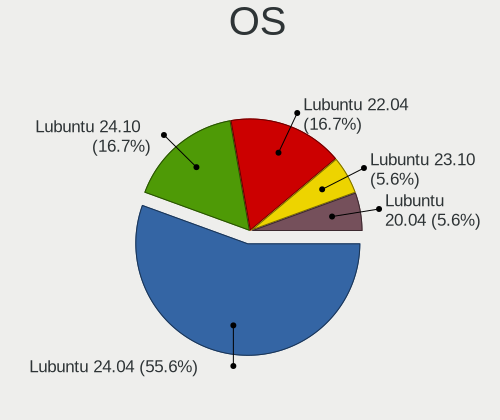

| Name          | Notebooks | Percent |
|---------------|-----------|---------|
| Lubuntu 22.04 | 12        | 66.67%  |
| Lubuntu 21.10 | 3         | 16.67%  |
| Lubuntu 21.04 | 1         | 5.56%   |
| Lubuntu 20.04 | 1         | 5.56%   |
| Lubuntu 18.04 | 1         | 5.56%   |

OS Family
---------

OS without a version

| Name    | Notebooks | Percent |
|---------|-----------|---------|
| Lubuntu | 18        | 100%    |

Kernel
------

Version of the Linux kernel

| Version               | Notebooks | Percent |
|-----------------------|-----------|---------|
| 5.15.0-40-generic     | 2         | 11.11%  |
| 5.15.0-37-generic     | 2         | 11.11%  |
| 5.15.0-35-generic     | 2         | 11.11%  |
| 5.15.0-30-generic     | 2         | 11.11%  |
| 5.4.0-113-generic     | 1         | 5.56%   |
| 5.18.0-051800-generic | 1         | 5.56%   |
| 5.15.0-39-generic     | 1         | 5.56%   |
| 5.15.0-33-generic     | 1         | 5.56%   |
| 5.15.0-25-generic     | 1         | 5.56%   |
| 5.13.0-52-generic     | 1         | 5.56%   |
| 5.13.0-48-generic     | 1         | 5.56%   |
| 5.13.0-35-generic     | 1         | 5.56%   |
| 5.11.0-49-generic     | 1         | 5.56%   |
| 4.15.0-180-generic    | 1         | 5.56%   |

Kernel Family
-------------

Linux kernel without a distro release

| Version | Notebooks | Percent |
|---------|-----------|---------|
| 5.15.0  | 11        | 61.11%  |
| 5.13.0  | 3         | 16.67%  |
| 5.4.0   | 1         | 5.56%   |
| 5.18.0  | 1         | 5.56%   |
| 5.11.0  | 1         | 5.56%   |
| 4.15.0  | 1         | 5.56%   |

Kernel Major Ver.
-----------------

Linux kernel major version

| Version | Notebooks | Percent |
|---------|-----------|---------|
| 5.15    | 11        | 61.11%  |
| 5.13    | 3         | 16.67%  |
| 5.4     | 1         | 5.56%   |
| 5.18    | 1         | 5.56%   |
| 5.11    | 1         | 5.56%   |
| 4.15    | 1         | 5.56%   |

Arch
----

OS architecture (x86_64, i586, etc.)

| Name   | Notebooks | Percent |
|--------|-----------|---------|
| x86_64 | 17        | 94.44%  |
| i686   | 1         | 5.56%   |

DE
--

Desktop Environment

| Name   | Notebooks | Percent |
|--------|-----------|---------|
| LXQt   | 16        | 88.89%  |
| LXDE   | 1         | 5.56%   |
| Budgie | 1         | 5.56%   |

Display Server
--------------

X11 or Wayland

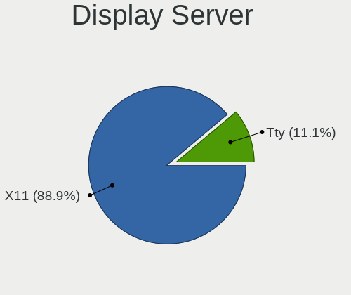

| Name | Notebooks | Percent |
|------|-----------|---------|
| X11  | 18        | 100%    |

Display Manager
---------------

SDDM, LightDM, etc.

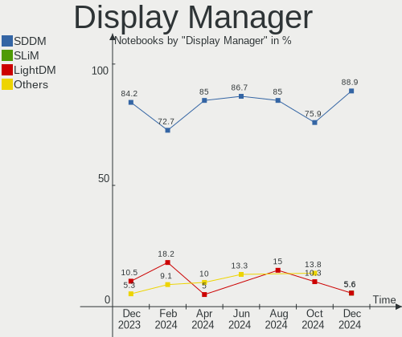

| Name    | Notebooks | Percent |
|---------|-----------|---------|
| SDDM    | 15        | 83.33%  |
| LightDM | 2         | 11.11%  |
| GDM     | 1         | 5.56%   |

OS Lang
-------

Language

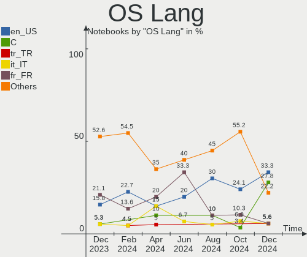

| Lang  | Notebooks | Percent |
|-------|-----------|---------|
| en_US | 5         | 27.78%  |
| fr_FR | 4         | 22.22%  |
| pt_BR | 3         | 16.67%  |
| en_GB | 2         | 11.11%  |
| nl_BE | 1         | 5.56%   |
| es_ES | 1         | 5.56%   |
| de_DE | 1         | 5.56%   |
| C     | 1         | 5.56%   |

Boot Mode
---------

EFI or BIOS

| Mode | Notebooks | Percent |
|------|-----------|---------|
| BIOS | 12        | 66.67%  |
| EFI  | 6         | 33.33%  |

Filesystem
----------

Type of filesystem

| Type    | Notebooks | Percent |
|---------|-----------|---------|
| Ext4    | 17        | 94.44%  |
| Overlay | 1         | 5.56%   |

Part. scheme
------------

Scheme of partitioning

| Type    | Notebooks | Percent |
|---------|-----------|---------|
| Unknown | 8         | 44.44%  |
| GPT     | 6         | 33.33%  |
| MBR     | 4         | 22.22%  |

Dual Boot with Linux/BSD
------------------------

Hosting more than one Linux/BSD

| Dual boot | Notebooks | Percent |
|-----------|-----------|---------|
| No        | 17        | 94.44%  |
| Yes       | 1         | 5.56%   |

Dual Boot (Win)
---------------

Hosting Linux and Windows

| Dual boot | Notebooks | Percent |
|-----------|-----------|---------|
| No        | 13        | 72.22%  |
| Yes       | 5         | 27.78%  |

Board
-----

Vendor
------

Motherboard manufacturer

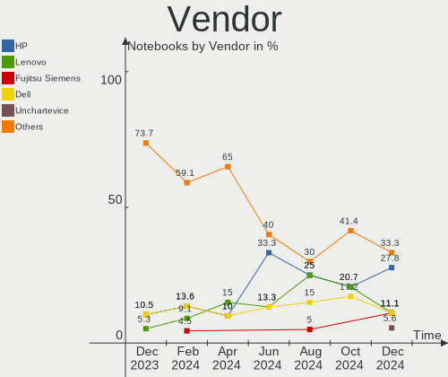

| Name             | Notebooks | Percent |
|------------------|-----------|---------|
| Hewlett-Packard  | 5         | 27.78%  |
| ASUSTek Computer | 3         | 16.67%  |
| Dell             | 2         | 11.11%  |
| Apple            | 2         | 11.11%  |
| Sony             | 1         | 5.56%   |
| MSI              | 1         | 5.56%   |
| Lenovo           | 1         | 5.56%   |
| Intel            | 1         | 5.56%   |
| Google           | 1         | 5.56%   |
| Gateway          | 1         | 5.56%   |

Model
-----

Motherboard model

| Name                        | Notebooks | Percent |
|-----------------------------|-----------|---------|
| Sony VGN-SZ71WN_C           | 1         | 5.56%   |
| MSI VR630                   | 1         | 5.56%   |
| Lenovo Yoga 710-11IKB 80V6  | 1         | 5.56%   |
| Intel Infoway               | 1         | 5.56%   |
| HP ProBook 640 G1           | 1         | 5.56%   |
| HP Pavilion Sleekbook 15 PC | 1         | 5.56%   |
| HP Pavilion g6              | 1         | 5.56%   |
| HP Notebook                 | 1         | 5.56%   |
| HP G62                      | 1         | 5.56%   |
| Google Bobba360             | 1         | 5.56%   |
| Gateway Sonic-C             | 1         | 5.56%   |
| Dell Studio 1537            | 1         | 5.56%   |
| Dell Latitude XT            | 1         | 5.56%   |
| ASUS N56VZ                  | 1         | 5.56%   |
| ASUS E403SA                 | 1         | 5.56%   |
| ASUS 1000H                  | 1         | 5.56%   |
| Apple MacBookPro8,1         | 1         | 5.56%   |
| Apple MacBookPro10,1        | 1         | 5.56%   |

Model Family
------------

Motherboard model prefix

| Name               | Notebooks | Percent |
|--------------------|-----------|---------|
| HP Pavilion        | 2         | 11.11%  |
| Sony VGN-SZ71WN    | 1         | 5.56%   |
| MSI VR630          | 1         | 5.56%   |
| Lenovo Yoga        | 1         | 5.56%   |
| Intel Infoway      | 1         | 5.56%   |
| HP ProBook         | 1         | 5.56%   |
| HP Notebook        | 1         | 5.56%   |
| HP G62             | 1         | 5.56%   |
| Google Bobba360    | 1         | 5.56%   |
| Gateway Sonic-C    | 1         | 5.56%   |
| Dell Studio        | 1         | 5.56%   |
| Dell Latitude      | 1         | 5.56%   |
| ASUS N56VZ         | 1         | 5.56%   |
| ASUS E403SA        | 1         | 5.56%   |
| ASUS 1000H         | 1         | 5.56%   |
| Apple MacBookPro8  | 1         | 5.56%   |
| Apple MacBookPro10 | 1         | 5.56%   |

MFG Year
--------

Motherboard manufacture year

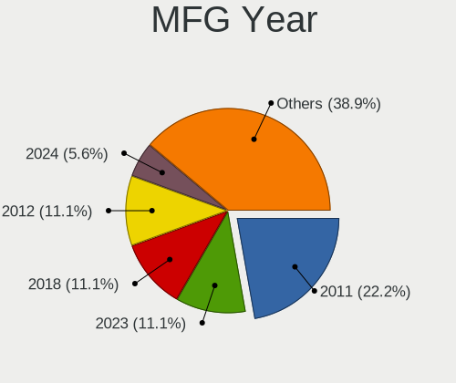

| Year | Notebooks | Percent |
|------|-----------|---------|
| 2008 | 4         | 22.22%  |
| 2015 | 2         | 11.11%  |
| 2012 | 2         | 11.11%  |
| 2011 | 2         | 11.11%  |
| 2010 | 2         | 11.11%  |
| 2007 | 2         | 11.11%  |
| 2022 | 1         | 5.56%   |
| 2018 | 1         | 5.56%   |
| 2016 | 1         | 5.56%   |
| 2013 | 1         | 5.56%   |

Form Factor
-----------

Physical design of the computer

| Name     | Notebooks | Percent |
|----------|-----------|---------|
| Notebook | 18        | 100%    |

Secure Boot
-----------

Enabled or disabled

| State    | Notebooks | Percent |
|----------|-----------|---------|
| Disabled | 17        | 94.44%  |
| Enabled  | 1         | 5.56%   |

Coreboot
--------

Have coreboot on board

| Used | Notebooks | Percent |
|------|-----------|---------|
| No   | 16        | 88.89%  |
| Yes  | 2         | 11.11%  |

RAM Size
--------

Total RAM memory

| Size in GB | Notebooks | Percent |
|------------|-----------|---------|
| 4.01-8.0   | 7         | 38.89%  |
| 3.01-4.0   | 6         | 33.33%  |
| 2.01-3.0   | 4         | 22.22%  |
| 1.01-2.0   | 1         | 5.56%   |

RAM Used
--------

Used RAM memory

| Used GB  | Notebooks | Percent |
|----------|-----------|---------|
| 0.51-1.0 | 8         | 44.44%  |
| 1.01-2.0 | 7         | 38.89%  |
| 2.01-3.0 | 2         | 11.11%  |
| 0.01-0.5 | 1         | 5.56%   |

Total Drives
------------

Number of drives on board

| Drives | Notebooks | Percent |
|--------|-----------|---------|
| 1      | 17        | 94.44%  |
| 2      | 1         | 5.56%   |

Has CD-ROM
----------

Has CD-ROM on board

| Presented | Notebooks | Percent |
|-----------|-----------|---------|
| Yes       | 11        | 61.11%  |
| No        | 7         | 38.89%  |

Has Ethernet
------------

Has Ethernet on board

| Presented | Notebooks | Percent |
|-----------|-----------|---------|
| Yes       | 16        | 88.89%  |
| No        | 2         | 11.11%  |

Has WiFi
--------

Has WiFi module

| Presented | Notebooks | Percent |
|-----------|-----------|---------|
| Yes       | 17        | 94.44%  |
| No        | 1         | 5.56%   |

Has Bluetooth
-------------

Has Bluetooth module

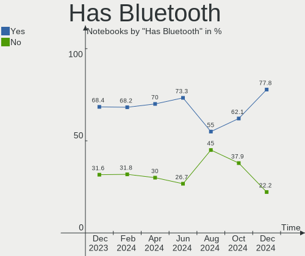

| Presented | Notebooks | Percent |
|-----------|-----------|---------|
| Yes       | 12        | 66.67%  |
| No        | 6         | 33.33%  |

Location
--------

Country
-------

Geographic location (country)

| Country  | Notebooks | Percent |
|----------|-----------|---------|
| France   | 4         | 22.22%  |
| Brazil   | 3         | 16.67%  |
| USA      | 2         | 11.11%  |
| Ukraine  | 1         | 5.56%   |
| UK       | 1         | 5.56%   |
| Sweden   | 1         | 5.56%   |
| Spain    | 1         | 5.56%   |
| Portugal | 1         | 5.56%   |
| Germany  | 1         | 5.56%   |
| Canada   | 1         | 5.56%   |
| Belgium  | 1         | 5.56%   |
| Belarus  | 1         | 5.56%   |

City
----

Geographic location (city)

| City                 | Notebooks | Percent |
|----------------------|-----------|---------|
| Paris                | 3         | 16.67%  |
| Wolfhagen            | 1         | 5.56%   |
| Vitebsk              | 1         | 5.56%   |
| Stockholm            | 1         | 5.56%   |
| Shildon              | 1         | 5.56%   |
| Roswell              | 1         | 5.56%   |
| Rio de Janeiro       | 1         | 5.56%   |
| Portland             | 1         | 5.56%   |
| Oshawa               | 1         | 5.56%   |
| Novo Gama            | 1         | 5.56%   |
| Mieuxce              | 1         | 5.56%   |
| Lisbon               | 1         | 5.56%   |
| Kyiv                 | 1         | 5.56%   |
| Hoogstraten          | 1         | 5.56%   |
| Fortaleza            | 1         | 5.56%   |
| el Prat de Llobregat | 1         | 5.56%   |

Drives
------

Drive Vendor
------------

Hard drive vendors

| Vendor              | Notebooks | Drives | Percent |
|---------------------|-----------|--------|---------|
| Hitachi             | 3         | 3      | 16.67%  |
| WDC                 | 2         | 2      | 11.11%  |
| Unknown             | 2         | 2      | 11.11%  |
| Toshiba             | 2         | 2      | 11.11%  |
| Seagate             | 2         | 2      | 11.11%  |
| Apacer              | 2         | 2      | 11.11%  |
| Teclast             | 1         | 1      | 5.56%   |
| SK hynix            | 1         | 1      | 5.56%   |
| Samsung Electronics | 1         | 1      | 5.56%   |
| Lenovo              | 1         | 1      | 5.56%   |
| A-DATA Technology   | 1         | 1      | 5.56%   |

Drive Model
-----------

Hard drive models

| Model                                 | Notebooks | Percent |
|---------------------------------------|-----------|---------|
| WDC WD3200BEVT-22ZCT0 320GB           | 1         | 5.56%   |
| WDC WD10JPVX-60JC3T0 1TB              | 1         | 5.56%   |
| Unknown DA4032  32GB                  | 1         | 5.56%   |
| Unknown CGND3R  64GB                  | 1         | 5.56%   |
| Toshiba MK8009GAH 80GB                | 1         | 5.56%   |
| Toshiba DT01ABA100V 1TB               | 1         | 5.56%   |
| Teclast 240GB A800 SSD                | 1         | 5.56%   |
| SK hynix HFS128G39MND-3310A 128GB SSD | 1         | 5.56%   |
| Seagate ST9320325ASG 320GB            | 1         | 5.56%   |
| Seagate ST1000LM024 HN-M101MBB 1TB    | 1         | 5.56%   |
| Samsung HM121HI 120GB                 | 1         | 5.56%   |
| Lenovo SSD SL700 480G                 | 1         | 5.56%   |
| Hitachi HTS723232A7A364 320GB         | 1         | 5.56%   |
| Hitachi HTS545050A7E380 500GB         | 1         | 5.56%   |
| Hitachi HTS543232L9A300 320GB         | 1         | 5.56%   |
| Apacer AS350 256GB SSD                | 1         | 5.56%   |
| Apacer 16GB SATA Flash Drive SSD      | 1         | 5.56%   |
| A-DATA SU740 1TB SSD                  | 1         | 5.56%   |

HDD Vendor
----------

Hard disk drive vendors

| Vendor              | Notebooks | Drives | Percent |
|---------------------|-----------|--------|---------|
| Hitachi             | 3         | 3      | 30%     |
| WDC                 | 2         | 2      | 20%     |
| Toshiba             | 2         | 2      | 20%     |
| Seagate             | 2         | 2      | 20%     |
| Samsung Electronics | 1         | 1      | 10%     |

SSD Vendor
----------

Solid state drive vendors

| Vendor            | Notebooks | Drives | Percent |
|-------------------|-----------|--------|---------|
| Apacer            | 2         | 2      | 33.33%  |
| Teclast           | 1         | 1      | 16.67%  |
| SK hynix          | 1         | 1      | 16.67%  |
| Lenovo            | 1         | 1      | 16.67%  |
| A-DATA Technology | 1         | 1      | 16.67%  |

Drive Kind
----------

HDD or SSD

| Kind | Notebooks | Drives | Percent |
|------|-----------|--------|---------|
| HDD  | 10        | 10     | 55.56%  |
| SSD  | 6         | 6      | 33.33%  |
| MMC  | 2         | 2      | 11.11%  |

Drive Connector
---------------

SATA, SAS, NVMe, etc.

| Type | Notebooks | Drives | Percent |
|------|-----------|--------|---------|
| SATA | 16        | 16     | 88.89%  |
| MMC  | 2         | 2      | 11.11%  |

Drive Size
----------

Size of hard drive

| Size in TB | Notebooks | Drives | Percent |
|------------|-----------|--------|---------|
| 0.01-0.5   | 12        | 12     | 75%     |
| 0.51-1.0   | 4         | 4      | 25%     |

Space Total
-----------

Amount of disk space available on the file system

| Size in GB | Notebooks | Percent |
|------------|-----------|---------|
| 251-500    | 4         | 22.22%  |
| 101-250    | 4         | 22.22%  |
| 501-1000   | 3         | 16.67%  |
| 51-100     | 3         | 16.67%  |
| 21-50      | 2         | 11.11%  |
| 1-20       | 2         | 11.11%  |

Space Used
----------

Amount of used disk space

| Used GB | Notebooks | Percent |
|---------|-----------|---------|
| 1-20    | 13        | 72.22%  |
| 21-50   | 4         | 22.22%  |
| 251-500 | 1         | 5.56%   |

Malfunc. Drives
---------------

Drive models with a malfunction

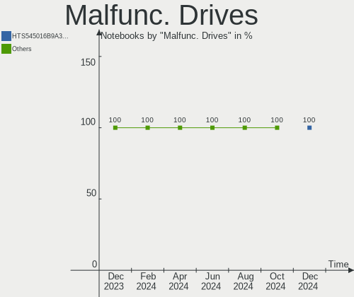

| Model                              | Notebooks | Drives | Percent |
|------------------------------------|-----------|--------|---------|
| Seagate ST1000LM024 HN-M101MBB 1TB | 1         | 1      | 20%     |
| Samsung Electronics HM121HI 120GB  | 1         | 1      | 20%     |
| Hitachi HTS723232A7A364 320GB      | 1         | 1      | 20%     |
| Hitachi HTS545050A7E380 500GB      | 1         | 1      | 20%     |
| Apacer 16GB SATA Flash Drive SSD   | 1         | 1      | 20%     |

Malfunc. Drive Vendor
---------------------

Vendors of faulty drives

| Vendor              | Notebooks | Drives | Percent |
|---------------------|-----------|--------|---------|
| Hitachi             | 2         | 2      | 40%     |
| Seagate             | 1         | 1      | 20%     |
| Samsung Electronics | 1         | 1      | 20%     |
| Apacer              | 1         | 1      | 20%     |

Malfunc. HDD Vendor
-------------------

Vendors of faulty HDD drives

| Vendor              | Notebooks | Drives | Percent |
|---------------------|-----------|--------|---------|
| Hitachi             | 2         | 2      | 50%     |
| Seagate             | 1         | 1      | 25%     |
| Samsung Electronics | 1         | 1      | 25%     |

Malfunc. Drive Kind
-------------------

Kinds of faulty drives

| Kind | Notebooks | Drives | Percent |
|------|-----------|--------|---------|
| HDD  | 4         | 4      | 80%     |
| SSD  | 1         | 1      | 20%     |

Failed Drives
-------------

Failed drive models

Zero info for selected period =(

Failed Drive Vendor
-------------------

Failed drive vendors

Zero info for selected period =(

Drive Status
------------

Number of failed and malfunc. drives

| Status   | Notebooks | Drives | Percent |
|----------|-----------|--------|---------|
| Detected | 9         | 9      | 50%     |
| Malfunc  | 5         | 5      | 27.78%  |
| Works    | 4         | 4      | 22.22%  |

Storage controller
------------------

Storage Vendor
--------------

Storage controller vendors

| Vendor | Notebooks | Percent |
|--------|-----------|---------|
| Intel  | 11        | 68.75%  |
| AMD    | 4         | 25%     |
| Nvidia | 1         | 6.25%   |

Storage Model
-------------

Storage controller models

| Model                                                                          | Notebooks | Percent |
|--------------------------------------------------------------------------------|-----------|---------|
| Intel 7 Series Chipset Family 6-port SATA Controller [AHCI mode]               | 3         | 15.79%  |
| Intel 82801HM/HEM (ICH8M/ICH8M-E) IDE Controller                               | 2         | 10.53%  |
| AMD FCH SATA Controller [AHCI mode]                                            | 2         | 10.53%  |
| Nvidia nForce SATA Controller                                                  | 1         | 5.26%   |
| Intel Sunrise Point-LP SATA Controller [AHCI mode]                             | 1         | 5.26%   |
| Intel 82801IBM/IEM (ICH9M/ICH9M-E) 4 port SATA Controller [AHCI mode]          | 1         | 5.26%   |
| Intel 82801HM/HEM (ICH8M/ICH8M-E) SATA Controller [IDE mode]                   | 1         | 5.26%   |
| Intel 82801HM/HEM (ICH8M/ICH8M-E) SATA Controller [AHCI mode]                  | 1         | 5.26%   |
| Intel 82801GBM/GHM (ICH7-M Family) SATA Controller [IDE mode]                  | 1         | 5.26%   |
| Intel 82801GBM/GHM (ICH7-M Family) SATA Controller [AHCI mode]                 | 1         | 5.26%   |
| Intel 82801G (ICH7 Family) IDE Controller                                      | 1         | 5.26%   |
| Intel 8 Series/C220 Series Chipset Family 6-port SATA Controller 1 [AHCI mode] | 1         | 5.26%   |
| Intel 6 Series/C200 Series Chipset Family 6 port Mobile SATA AHCI Controller   | 1         | 5.26%   |
| AMD SB7x0/SB8x0/SB9x0 SATA Controller [AHCI mode]                              | 1         | 5.26%   |
| AMD SB600 IDE                                                                  | 1         | 5.26%   |

Storage Kind
------------

Kind of storage controller (IDE, SATA, NVMe, SAS, ...)

| Kind | Notebooks | Percent |
|------|-----------|---------|
| SATA | 13        | 72.22%  |
| IDE  | 5         | 27.78%  |

Processor
---------

CPU Vendor
----------

Processor vendors

| Vendor | Notebooks | Percent |
|--------|-----------|---------|
| Intel  | 14        | 77.78%  |
| AMD    | 4         | 22.22%  |

CPU Model
---------

Processor models

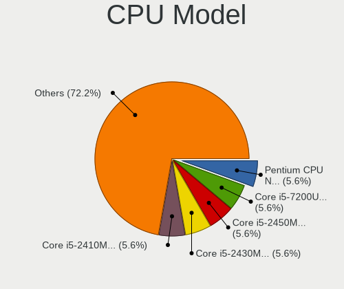

| Model                                           | Notebooks | Percent |
|-------------------------------------------------|-----------|---------|
| Intel Pentium CPU 987 @ 1.50GHz                 | 1         | 5.56%   |
| Intel Core i7-4600M CPU @ 2.90GHz               | 1         | 5.56%   |
| Intel Core i7-3615QM CPU @ 2.30GHz              | 1         | 5.56%   |
| Intel Core i7-3610QM CPU @ 2.30GHz              | 1         | 5.56%   |
| Intel Core i5-7Y54 CPU @ 1.20GHz                | 1         | 5.56%   |
| Intel Core i5-2415M CPU @ 2.30GHz               | 1         | 5.56%   |
| Intel Core 2 Duo CPU U7700 @ 1.33GHz            | 1         | 5.56%   |
| Intel Core 2 Duo CPU T9300 @ 2.50GHz            | 1         | 5.56%   |
| Intel Core 2 Duo CPU T7500 @ 2.20GHz            | 1         | 5.56%   |
| Intel Core 2 Duo CPU P8400 @ 2.26GHz            | 1         | 5.56%   |
| Intel Core 2 CPU T7200 @ 2.00GHz                | 1         | 5.56%   |
| Intel Celeron N4020 CPU @ 1.10GHz               | 1         | 5.56%   |
| Intel Celeron CPU N3150 @ 1.60GHz               | 1         | 5.56%   |
| Intel Atom CPU N270 @ 1.60GHz                   | 1         | 5.56%   |
| AMD Phenom II N830 Triple-Core Processor        | 1         | 5.56%   |
| AMD Athlon X2 Dual-Core QL-62                   | 1         | 5.56%   |
| AMD A6-4400M APU with Radeon HD Graphics        | 1         | 5.56%   |
| AMD A10-9600P RADEON R5, 10 COMPUTE CORES 4C+6G | 1         | 5.56%   |

CPU Model Family
----------------

Processor model prefix

| Model            | Notebooks | Percent |
|------------------|-----------|---------|
| Intel Core 2 Duo | 4         | 22.22%  |
| Intel Core i7    | 3         | 16.67%  |
| Intel Core i5    | 2         | 11.11%  |
| Intel Celeron    | 2         | 11.11%  |
| Intel Pentium    | 1         | 5.56%   |
| Intel Core 2     | 1         | 5.56%   |
| Intel Atom       | 1         | 5.56%   |
| AMD Phenom II    | 1         | 5.56%   |
| AMD Athlon X2    | 1         | 5.56%   |
| AMD A6           | 1         | 5.56%   |
| AMD A10          | 1         | 5.56%   |

CPU Cores
---------

Number of processor cores

| Number | Notebooks | Percent |
|--------|-----------|---------|
| 2      | 12        | 66.67%  |
| 4      | 3         | 16.67%  |
| 1      | 2         | 11.11%  |
| 3      | 1         | 5.56%   |

CPU Sockets
-----------

Number of sockets

| Number | Notebooks | Percent |
|--------|-----------|---------|
| 1      | 18        | 100%    |

CPU Threads
-----------

Threads per core (Hyper-Threading)

| Number | Notebooks | Percent |
|--------|-----------|---------|
| 1      | 10        | 55.56%  |
| 2      | 8         | 44.44%  |

CPU Op-Modes
------------

CPU Operation Modes (32-bit, 64-bit)

| Op mode        | Notebooks | Percent |
|----------------|-----------|---------|
| 32-bit, 64-bit | 17        | 94.44%  |
| 32-bit         | 1         | 5.56%   |

CPU Microcode
-------------

Microcode number

| Number     | Notebooks | Percent |
|------------|-----------|---------|
| Unknown    | 5         | 27.78%  |
| 0x306a9    | 2         | 11.11%  |
| 0x206a7    | 2         | 11.11%  |
| 0x806e9    | 1         | 5.56%   |
| 0x6fa      | 1         | 5.56%   |
| 0x6f6      | 1         | 5.56%   |
| 0x406c3    | 1         | 5.56%   |
| 0x306c3    | 1         | 5.56%   |
| 0x106c2    | 1         | 5.56%   |
| 0x0600611a | 1         | 5.56%   |
| 0x06001116 | 1         | 5.56%   |
| 0x010000c8 | 1         | 5.56%   |

CPU Microarch
-------------

Microarchitecture

| Name            | Notebooks | Percent |
|-----------------|-----------|---------|
| Core            | 3         | 16.67%  |
| SandyBridge     | 2         | 11.11%  |
| Penryn          | 2         | 11.11%  |
| IvyBridge       | 2         | 11.11%  |
| Silvermont      | 1         | 5.56%   |
| Piledriver      | 1         | 5.56%   |
| KabyLake        | 1         | 5.56%   |
| K8 & K10 hybrid | 1         | 5.56%   |
| K10             | 1         | 5.56%   |
| Haswell         | 1         | 5.56%   |
| Goldmont plus   | 1         | 5.56%   |
| Excavator       | 1         | 5.56%   |
| Bonnell         | 1         | 5.56%   |

Graphics
--------

GPU Vendor
----------

Vendors of graphics cards

| Vendor | Notebooks | Percent |
|--------|-----------|---------|
| Intel  | 11        | 57.89%  |
| AMD    | 5         | 26.32%  |
| Nvidia | 3         | 15.79%  |

GPU Model
---------

Graphics card models

| Model                                                                                    | Notebooks | Percent |
|------------------------------------------------------------------------------------------|-----------|---------|
| Intel Mobile GM965/GL960 Integrated Graphics Controller (secondary)                      | 2         | 8.33%   |
| Intel Mobile GM965/GL960 Integrated Graphics Controller (primary)                        | 2         | 8.33%   |
| Intel 3rd Gen Core processor Graphics Controller                                         | 2         | 8.33%   |
| Intel 2nd Generation Core Processor Family Integrated Graphics Controller                | 2         | 8.33%   |
| Nvidia GK107M [GeForce GT 650M]                                                          | 1         | 4.17%   |
| Nvidia G73M [GeForce Go 7600]                                                            | 1         | 4.17%   |
| Nvidia C77 [GeForce 9100M G]                                                             | 1         | 4.17%   |
| Intel Mobile 945GSE Express Integrated Graphics Controller                               | 1         | 4.17%   |
| Intel Mobile 945GM/GMS/GME, 943/940GML Express Integrated Graphics Controller            | 1         | 4.17%   |
| Intel HD Graphics 615                                                                    | 1         | 4.17%   |
| Intel GeminiLake [UHD Graphics 600]                                                      | 1         | 4.17%   |
| Intel Atom/Celeron/Pentium Processor x5-E8000/J3xxx/N3xxx Integrated Graphics Controller | 1         | 4.17%   |
| Intel 4th Gen Core Processor Integrated Graphics Controller                              | 1         | 4.17%   |
| AMD Wani [Radeon R5/R6/R7 Graphics]                                                      | 1         | 4.17%   |
| AMD Trinity 2 [Radeon HD 7520G]                                                          | 1         | 4.17%   |
| AMD Topaz XT [Radeon R7 M260/M265 / M340/M360 / M440/M445 / 530/535 / 620/625 Mobile]    | 1         | 4.17%   |
| AMD Thames [Radeon HD 7500M/7600M Series]                                                | 1         | 4.17%   |
| AMD RV620/M82 [Mobility Radeon HD 3450/3470]                                             | 1         | 4.17%   |
| AMD RS880M [Mobility Radeon HD 4225/4250]                                                | 1         | 4.17%   |
| AMD RS600M [Radeon Xpress 1250]                                                          | 1         | 4.17%   |

GPU Combo
---------

Combinations of graphics cards

| Name           | Notebooks | Percent |
|----------------|-----------|---------|
| 1 x Intel      | 9         | 50%     |
| 1 x AMD        | 3         | 16.67%  |
| 2 x AMD        | 2         | 11.11%  |
| 1 x Nvidia     | 2         | 11.11%  |
| Other          | 1         | 5.56%   |
| Intel + Nvidia | 1         | 5.56%   |

GPU Driver
----------

Free vs proprietary

| Driver | Notebooks | Percent |
|--------|-----------|---------|
| Free   | 18        | 100%    |

GPU Memory
----------

Total video memory

| Size in GB | Notebooks | Percent |
|------------|-----------|---------|
| Unknown    | 13        | 72.22%  |
| 0.01-0.5   | 4         | 22.22%  |
| 1.01-2.0   | 1         | 5.56%   |

Monitor
-------

Monitor Vendor
--------------

Monitor vendors

| Vendor              | Notebooks | Percent |
|---------------------|-----------|---------|
| LG Display          | 3         | 16.67%  |
| Chimei Innolux      | 3         | 16.67%  |
| AU Optronics        | 3         | 16.67%  |
| Samsung Electronics | 2         | 11.11%  |
| CPT                 | 2         | 11.11%  |
| Apple               | 2         | 11.11%  |
| Unknown             | 1         | 5.56%   |
| HannStar            | 1         | 5.56%   |
| BOE                 | 1         | 5.56%   |

Monitor Model
-------------

Monitor models

| Model                                                                 | Notebooks | Percent |
|-----------------------------------------------------------------------|-----------|---------|
| LG Display LCD Monitor LGD0384 1366x768 344x194mm 15.5-inch           | 2         | 11.11%  |
| CPT LCD Monitor CPT1415 1280x800 331x207mm 15.4-inch                  | 2         | 11.11%  |
| Unknown LCD Monitor FFFF 2288x1287 2550x2550mm 142.0-inch             | 1         | 5.56%   |
| Samsung Electronics LCD Monitor SEC4750 1680x1050 365x228mm 16.9-inch | 1         | 5.56%   |
| Samsung Electronics LCD Monitor SEC304C 1366x768 353x198mm 15.9-inch  | 1         | 5.56%   |
| LG Display LCD Monitor LGD02D9 1920x1080 344x194mm 15.5-inch          | 1         | 5.56%   |
| HannStar LCD Monitor HSD03E9 1024x600 220x129mm 10.0-inch             | 1         | 5.56%   |
| Chimei Innolux LCD Monitor CMN15AB 1366x768 344x194mm 15.5-inch       | 1         | 5.56%   |
| Chimei Innolux LCD Monitor CMN1493 1366x768 309x173mm 13.9-inch       | 1         | 5.56%   |
| Chimei Innolux LCD Monitor CMN1137 1920x1080 256x144mm 11.6-inch      | 1         | 5.56%   |
| BOE NV116WHM-T16 BOE0956 1366x768 256x144mm 11.6-inch                 | 1         | 5.56%   |
| AU Optronics LCD Monitor AUO8114 1280x800 261x163mm 12.1-inch         | 1         | 5.56%   |
| AU Optronics LCD Monitor AUO38ED 1920x1080 344x193mm 15.5-inch        | 1         | 5.56%   |
| AU Optronics LCD Monitor AUO333C 1366x768 309x173mm 13.9-inch         | 1         | 5.56%   |
| Apple LCD Monitor APP9CC3 1280x800 286x179mm 13.3-inch                | 1         | 5.56%   |
| Apple Color LCD APPA00F 2880x1800 331x207mm 15.4-inch                 | 1         | 5.56%   |

Monitor Resolution
------------------

Monitor screen resolution

| Resolution         | Notebooks | Percent |
|--------------------|-----------|---------|
| 1366x768 (WXGA)    | 6         | 33.33%  |
| 1920x1080 (FHD)    | 4         | 22.22%  |
| 1280x800 (WXGA)    | 4         | 22.22%  |
| 2880x1800          | 1         | 5.56%   |
| 2288x1287          | 1         | 5.56%   |
| 1680x1050 (WSXGA+) | 1         | 5.56%   |
| 1024x600           | 1         | 5.56%   |

Monitor Diagonal
----------------

Diagonal size in inches

| Inches | Notebooks | Percent |
|--------|-----------|---------|
| 15     | 9         | 50%     |
| 13     | 2         | 11.11%  |
| 11     | 2         | 11.11%  |
| 142    | 1         | 5.56%   |
| 16     | 1         | 5.56%   |
| 14     | 1         | 5.56%   |
| 12     | 1         | 5.56%   |
| 10     | 1         | 5.56%   |

Monitor Width
-------------

Physical width

| Width in mm    | Notebooks | Percent |
|----------------|-----------|---------|
| 301-350        | 10        | 55.56%  |
| 201-300        | 5         | 27.78%  |
| 351-400        | 2         | 11.11%  |
| More than 2000 | 1         | 5.56%   |

Aspect Ratio
------------

Proportional relationship between the width and the height

| Ratio | Notebooks | Percent |
|-------|-----------|---------|
| 16/9  | 11        | 61.11%  |
| 16/10 | 6         | 33.33%  |
| 1.00  | 1         | 5.56%   |

Monitor Area
------------

Area in inch²

| Area in inch² | Notebooks | Percent |
|----------------|-----------|---------|
| 101-110        | 9         | 50%     |
| 81-90          | 3         | 16.67%  |
| 51-60          | 2         | 11.11%  |
| More than 1000 | 1         | 5.56%   |
| 61-70          | 1         | 5.56%   |
| 41-50          | 1         | 5.56%   |
| 121-130        | 1         | 5.56%   |

Pixel Density
-------------

Pixels per inch

| Density | Notebooks | Percent |
|---------|-----------|---------|
| 101-120 | 7         | 38.89%  |
| 121-160 | 4         | 22.22%  |
| 51-100  | 4         | 22.22%  |
| 161-240 | 2         | 11.11%  |
| 1-50    | 1         | 5.56%   |

Multiple Monitors
-----------------

Total monitors connected

| Total | Notebooks | Percent |
|-------|-----------|---------|
| 1     | 17        | 94.44%  |
| 2     | 1         | 5.56%   |

Network
-------

Net Controller Vendor
---------------------

Controller vendors

| Vendor                          | Notebooks | Percent |
|---------------------------------|-----------|---------|
| Realtek Semiconductor           | 7         | 22.58%  |
| Qualcomm Atheros                | 6         | 19.35%  |
| Intel                           | 5         | 16.13%  |
| Broadcom                        | 5         | 16.13%  |
| Ralink                          | 2         | 6.45%   |
| Marvell Technology Group        | 2         | 6.45%   |
| Broadcom Limited                | 2         | 6.45%   |
| Qualcomm Atheros Communications | 1         | 3.23%   |
| Qualcomm                        | 1         | 3.23%   |

Net Controller Model
--------------------

Controller models

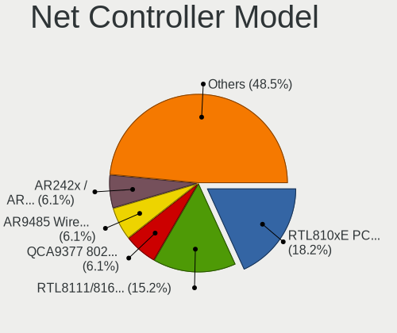

| Model                                                             | Notebooks | Percent |
|-------------------------------------------------------------------|-----------|---------|
| Realtek RTL810xE PCI Express Fast Ethernet controller             | 4         | 11.43%  |
| Ralink RT2790 Wireless 802.11n 1T/2R PCIe                         | 2         | 5.71%   |
| Qualcomm Atheros AR9485 Wireless Network Adapter                  | 2         | 5.71%   |
| Marvell Group 88E8055 PCI-E Gigabit Ethernet Controller           | 2         | 5.71%   |
| Realtek RTL8723BE PCIe Wireless Network Adapter                   | 1         | 2.86%   |
| Realtek RTL8187B Wireless 802.11g 54Mbps Network Adapter          | 1         | 2.86%   |
| Realtek RTL8152 Fast Ethernet Adapter                             | 1         | 2.86%   |
| Realtek RTL8111/8168/8411 PCI Express Gigabit Ethernet Controller | 1         | 2.86%   |
| Qualcomm Redmi 9T                                                 | 1         | 2.86%   |
| Qualcomm Atheros QCA6174 802.11ac Wireless Network Adapter        | 1         | 2.86%   |
| Qualcomm Atheros UB94                                             | 1         | 2.86%   |
| Qualcomm Atheros AR9462 Wireless Network Adapter                  | 1         | 2.86%   |
| Qualcomm Atheros AR8161 Gigabit Ethernet                          | 1         | 2.86%   |
| Qualcomm Atheros AR8121/AR8113/AR8114 Gigabit or Fast Ethernet    | 1         | 2.86%   |
| Intel Wireless 7260                                               | 1         | 2.86%   |
| Intel WiFi Link 5100                                              | 1         | 2.86%   |
| Intel PRO/Wireless 4965 AG or AGN [Kedron] Network Connection     | 1         | 2.86%   |
| Intel PRO/Wireless 3945ABG [Golan] Network Connection             | 1         | 2.86%   |
| Intel Ethernet Connection I217-V                                  | 1         | 2.86%   |
| Intel Centrino Wireless-N 2230                                    | 1         | 2.86%   |
| Intel 82573L Gigabit Ethernet Controller                          | 1         | 2.86%   |
| Broadcom NetXtreme BCM57786 Gigabit Ethernet PCIe                 | 1         | 2.86%   |
| Broadcom NetXtreme BCM57765 Gigabit Ethernet PCIe                 | 1         | 2.86%   |
| Broadcom NetXtreme BCM5756ME Gigabit Ethernet PCI Express         | 1         | 2.86%   |
| Broadcom NetLink BCM5784M Gigabit Ethernet PCIe                   | 1         | 2.86%   |
| Broadcom Limited BCM4331 802.11a/b/g/n                            | 1         | 2.86%   |
| Broadcom Limited BCM4311 802.11a/b/g                              | 1         | 2.86%   |
| Broadcom BCM4331 802.11a/b/g/n                                    | 1         | 2.86%   |
| Broadcom BCM4313 802.11bgn Wireless Network Adapter               | 1         | 2.86%   |

Wireless Vendor
---------------

Wireless vendors

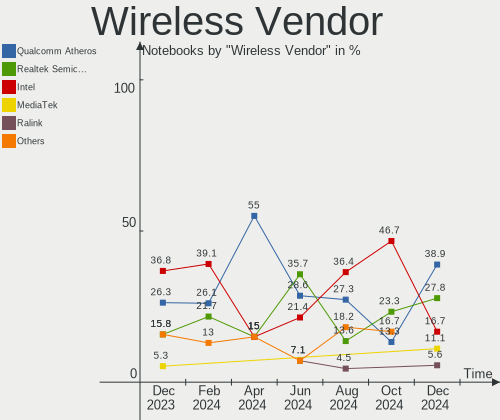

| Vendor                          | Notebooks | Percent |
|---------------------------------|-----------|---------|
| Intel                           | 5         | 27.78%  |
| Qualcomm Atheros                | 4         | 22.22%  |
| Realtek Semiconductor           | 2         | 11.11%  |
| Ralink                          | 2         | 11.11%  |
| Broadcom Limited                | 2         | 11.11%  |
| Broadcom                        | 2         | 11.11%  |
| Qualcomm Atheros Communications | 1         | 5.56%   |

Wireless Model
--------------

Wireless models

| Model                                                         | Notebooks | Percent |
|---------------------------------------------------------------|-----------|---------|
| Ralink RT2790 Wireless 802.11n 1T/2R PCIe                     | 2         | 11.11%  |
| Qualcomm Atheros AR9485 Wireless Network Adapter              | 2         | 11.11%  |
| Realtek RTL8723BE PCIe Wireless Network Adapter               | 1         | 5.56%   |
| Realtek RTL8187B Wireless 802.11g 54Mbps Network Adapter      | 1         | 5.56%   |
| Qualcomm Atheros QCA6174 802.11ac Wireless Network Adapter    | 1         | 5.56%   |
| Qualcomm Atheros UB94                                         | 1         | 5.56%   |
| Qualcomm Atheros AR9462 Wireless Network Adapter              | 1         | 5.56%   |
| Intel Wireless 7260                                           | 1         | 5.56%   |
| Intel WiFi Link 5100                                          | 1         | 5.56%   |
| Intel PRO/Wireless 4965 AG or AGN [Kedron] Network Connection | 1         | 5.56%   |
| Intel PRO/Wireless 3945ABG [Golan] Network Connection         | 1         | 5.56%   |
| Intel Centrino Wireless-N 2230                                | 1         | 5.56%   |
| Broadcom Limited BCM4331 802.11a/b/g/n                        | 1         | 5.56%   |
| Broadcom Limited BCM4311 802.11a/b/g                          | 1         | 5.56%   |
| Broadcom BCM4331 802.11a/b/g/n                                | 1         | 5.56%   |
| Broadcom BCM4313 802.11bgn Wireless Network Adapter           | 1         | 5.56%   |

Ethernet Vendor
---------------

Ethernet vendors

| Vendor                   | Notebooks | Percent |
|--------------------------|-----------|---------|
| Realtek Semiconductor    | 6         | 35.29%  |
| Broadcom                 | 4         | 23.53%  |
| Qualcomm Atheros         | 2         | 11.76%  |
| Marvell Technology Group | 2         | 11.76%  |
| Intel                    | 2         | 11.76%  |
| Qualcomm                 | 1         | 5.88%   |

Ethernet Model
--------------

Ethernet models

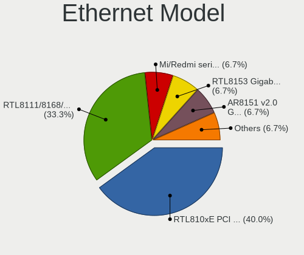

| Model                                                             | Notebooks | Percent |
|-------------------------------------------------------------------|-----------|---------|
| Realtek RTL810xE PCI Express Fast Ethernet controller             | 4         | 23.53%  |
| Marvell Group 88E8055 PCI-E Gigabit Ethernet Controller           | 2         | 11.76%  |
| Realtek RTL8152 Fast Ethernet Adapter                             | 1         | 5.88%   |
| Realtek RTL8111/8168/8411 PCI Express Gigabit Ethernet Controller | 1         | 5.88%   |
| Qualcomm Redmi 9T                                                 | 1         | 5.88%   |
| Qualcomm Atheros AR8161 Gigabit Ethernet                          | 1         | 5.88%   |
| Qualcomm Atheros AR8121/AR8113/AR8114 Gigabit or Fast Ethernet    | 1         | 5.88%   |
| Intel Ethernet Connection I217-V                                  | 1         | 5.88%   |
| Intel 82573L Gigabit Ethernet Controller                          | 1         | 5.88%   |
| Broadcom NetXtreme BCM57786 Gigabit Ethernet PCIe                 | 1         | 5.88%   |
| Broadcom NetXtreme BCM57765 Gigabit Ethernet PCIe                 | 1         | 5.88%   |
| Broadcom NetXtreme BCM5756ME Gigabit Ethernet PCI Express         | 1         | 5.88%   |
| Broadcom NetLink BCM5784M Gigabit Ethernet PCIe                   | 1         | 5.88%   |

Net Controller Kind
-------------------

Ethernet, WiFi or modem

| Kind     | Notebooks | Percent |
|----------|-----------|---------|
| WiFi     | 17        | 51.52%  |
| Ethernet | 16        | 48.48%  |

Used Controller
---------------

Currently used network controller

| Kind     | Notebooks | Percent |
|----------|-----------|---------|
| WiFi     | 13        | 72.22%  |
| Ethernet | 5         | 27.78%  |

NICs
----

Total network controllers on board

| Total | Notebooks | Percent |
|-------|-----------|---------|
| 2     | 14        | 77.78%  |
| 1     | 3         | 16.67%  |
| 0     | 1         | 5.56%   |

IPv6
----

IPv6 vs IPv4

| Used | Notebooks | Percent |
|------|-----------|---------|
| No   | 11        | 61.11%  |
| Yes  | 7         | 38.89%  |

Bluetooth
---------

Bluetooth Vendor
----------------

Controller vendors

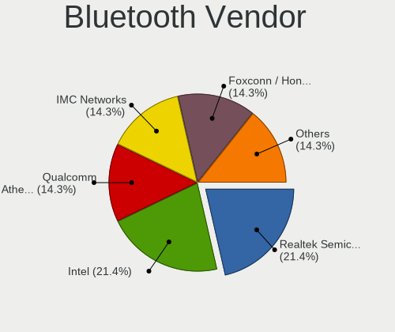

| Vendor                          | Notebooks | Percent |
|---------------------------------|-----------|---------|
| Qualcomm Atheros Communications | 2         | 15.38%  |
| Intel                           | 2         | 15.38%  |
| Apple                           | 2         | 15.38%  |
| Realtek Semiconductor           | 1         | 7.69%   |
| IMC Networks                    | 1         | 7.69%   |
| Dell                            | 1         | 7.69%   |
| Cambridge Silicon Radio         | 1         | 7.69%   |
| Broadcom                        | 1         | 7.69%   |
| ASUSTek Computer                | 1         | 7.69%   |
| Alps Electric                   | 1         | 7.69%   |

Bluetooth Model
---------------

Controller models

| Model                                               | Notebooks | Percent |
|-----------------------------------------------------|-----------|---------|
| Apple Bluetooth Host Controller                     | 2         | 15.38%  |
| Realtek Bluetooth Radio                             | 1         | 7.69%   |
| Qualcomm Atheros QCA61x4 Bluetooth 4.0              | 1         | 7.69%   |
| Qualcomm Atheros Bluetooth                          | 1         | 7.69%   |
| Intel Centrino Bluetooth Wireless Transceiver       | 1         | 7.69%   |
| Intel Bluetooth wireless interface                  | 1         | 7.69%   |
| IMC Networks Atheros AR3012 Bluetooth               | 1         | 7.69%   |
| Dell Wireless 360 Bluetooth                         | 1         | 7.69%   |
| Cambridge Silicon Radio Bluetooth Dongle (HCI mode) | 1         | 7.69%   |
| Broadcom BCM2070 Bluetooth 2.1 + EDR                | 1         | 7.69%   |
| ASUS Broadcom Bluetooth 2.1                         | 1         | 7.69%   |
| Alps Electric Bluetooth Adapter                     | 1         | 7.69%   |

Sound
-----

Sound Vendor
------------

Sound card vendors

| Vendor | Notebooks | Percent |
|--------|-----------|---------|
| Intel  | 13        | 65%     |
| AMD    | 5         | 25%     |
| Nvidia | 2         | 10%     |

Sound Model
-----------

Sound card models

| Model                                                                                             | Notebooks | Percent |
|---------------------------------------------------------------------------------------------------|-----------|---------|
| Intel 7 Series/C216 Chipset Family High Definition Audio Controller                               | 3         | 12.5%   |
| Intel NM10/ICH7 Family High Definition Audio Controller                                           | 2         | 8.33%   |
| Intel 82801H (ICH8 Family) HD Audio Controller                                                    | 2         | 8.33%   |
| AMD SBx00 Azalia (Intel HDA)                                                                      | 2         | 8.33%   |
| Nvidia MCP72XE/MCP72P/MCP78U/MCP78S High Definition Audio                                         | 1         | 4.17%   |
| Nvidia GK107 HDMI Audio Controller                                                                | 1         | 4.17%   |
| Intel Xeon E3-1200 v3/4th Gen Core Processor HD Audio Controller                                  | 1         | 4.17%   |
| Intel Sunrise Point-LP HD Audio                                                                   | 1         | 4.17%   |
| Intel Celeron/Pentium Silver Processor High Definition Audio                                      | 1         | 4.17%   |
| Intel Atom/Celeron/Pentium Processor x5-E8000/J3xxx/N3xxx Series High Definition Audio Controller | 1         | 4.17%   |
| Intel 82801I (ICH9 Family) HD Audio Controller                                                    | 1         | 4.17%   |
| Intel 8 Series/C220 Series Chipset High Definition Audio Controller                               | 1         | 4.17%   |
| Intel 6 Series/C200 Series Chipset Family High Definition Audio Controller                        | 1         | 4.17%   |
| AMD Trinity HDMI Audio Controller                                                                 | 1         | 4.17%   |
| AMD RV620 HDMI Audio [Radeon HD 3450/3470/3550/3570]                                              | 1         | 4.17%   |
| AMD RS880 HDMI Audio [Radeon HD 4200 Series]                                                      | 1         | 4.17%   |
| AMD Kabini HDMI/DP Audio                                                                          | 1         | 4.17%   |
| AMD FCH Azalia Controller                                                                         | 1         | 4.17%   |
| AMD Family 15h (Models 60h-6fh) Audio Controller                                                  | 1         | 4.17%   |

Memory
------

Memory Vendor
-------------

Memory module vendors

| Vendor              | Notebooks | Percent |
|---------------------|-----------|---------|
| SK hynix            | 5         | 33.33%  |
| Unknown             | 4         | 26.67%  |
| Samsung Electronics | 2         | 13.33%  |
| Micron Technology   | 2         | 13.33%  |
| Smart               | 1         | 6.67%   |
| HMD                 | 1         | 6.67%   |

Memory Model
------------

Memory module models

| Model                                                        | Notebooks | Percent |
|--------------------------------------------------------------|-----------|---------|
| SK hynix RAM HMT351S6CFR8C-PB 4GB SODIMM DDR3 1600MT/s       | 3         | 15.79%  |
| Unknown RAM Module 2GB SODIMM DDR2 667MT/s                   | 2         | 10.53%  |
| Unknown RAM Module 4GB SODIMM DDR3 800MT/s                   | 1         | 5.26%   |
| Unknown RAM Module 2GB SODIMM DDR3 1600MT/s                  | 1         | 5.26%   |
| Unknown RAM Module 1GB SODIMM DDR2 667MT/s                   | 1         | 5.26%   |
| Smart RAM SH564128FJ8NWRNSQG 4GB SODIMM DDR3 1600MT/s        | 1         | 5.26%   |
| SK hynix RAM HMT425S6AFR6A-PB 2GB SODIMM DDR3 1600MT/s       | 1         | 5.26%   |
| SK hynix RAM HMT351S6EFR8C-PB 4GB SODIMM DDR3 1600MT/s       | 1         | 5.26%   |
| SK hynix RAM HMT351S6BFR8C-H9 4GB SODIMM DDR3 1333MT/s       | 1         | 5.26%   |
| SK hynix RAM HMT125S6TFR8C-H9 2048MB SODIMM DDR3 1334MT/s    | 1         | 5.26%   |
| SK hynix RAM HMA425S6AFR6N-TF 2GB SODIMM DDR4 1866MT/s       | 1         | 5.26%   |
| Samsung RAM Module 2GB SODIMM DDR3 1333MT/s                  | 1         | 5.26%   |
| Samsung RAM K4E6E304EB-EGCF 4GB Row Of Chips LPDDR3 1867MT/s | 1         | 5.26%   |
| Micron RAM 4ATF51264HZ-2G3B1 4GB SODIMM DDR4 2400MT/s        | 1         | 5.26%   |
| Micron RAM 16KTF51264HZ-1G6M1 4GB SODIMM DDR3 1600MT/s       | 1         | 5.26%   |
| HMD RAM HMDN304GU648D1B9C 4GB SODIMM DDR3 1333MT/s           | 1         | 5.26%   |

Memory Kind
-----------

Memory module kinds

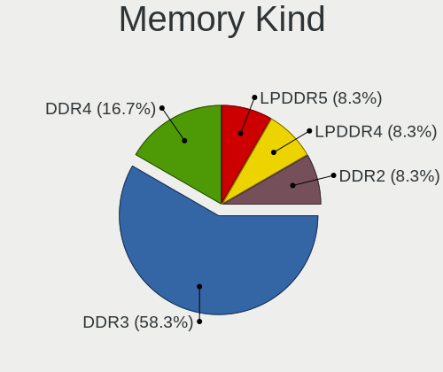

| Kind   | Notebooks | Percent |
|--------|-----------|---------|
| DDR3   | 8         | 66.67%  |
| DDR2   | 2         | 16.67%  |
| LPDDR3 | 1         | 8.33%   |
| DDR4   | 1         | 8.33%   |

Memory Form Factor
------------------

Physical design of the memory module

| Name         | Notebooks | Percent |
|--------------|-----------|---------|
| SODIMM       | 11        | 91.67%  |
| Row Of Chips | 1         | 8.33%   |

Memory Size
-----------

Memory module size

| Size | Notebooks | Percent |
|------|-----------|---------|
| 4096 | 8         | 53.33%  |
| 2048 | 6         | 40%     |
| 1024 | 1         | 6.67%   |

Memory Speed
------------

Memory module speed

| Speed | Notebooks | Percent |
|-------|-----------|---------|
| 1600  | 6         | 37.5%   |
| 1333  | 3         | 18.75%  |
| 667   | 2         | 12.5%   |
| 2400  | 1         | 6.25%   |
| 1867  | 1         | 6.25%   |
| 1866  | 1         | 6.25%   |
| 1334  | 1         | 6.25%   |
| 800   | 1         | 6.25%   |

Printers & scanners
-------------------

Printer Vendor
--------------

Printer device vendors

Zero info for selected period =(

Printer Model
-------------

Printer device models

Zero info for selected period =(

Scanner Vendor
--------------

Scanner device vendors

Zero info for selected period =(

Scanner Model
-------------

Scanner device models

Zero info for selected period =(

Camera
------

Camera Vendor
-------------

Camera device vendors

| Vendor                                 | Notebooks | Percent |
|----------------------------------------|-----------|---------|
| Chicony Electronics                    | 3         | 23.08%  |
| Realtek Semiconductor                  | 2         | 15.38%  |
| Apple                                  | 2         | 15.38%  |
| Suyin                                  | 1         | 7.69%   |
| Sunplus Innovation Technology          | 1         | 7.69%   |
| Ricoh                                  | 1         | 7.69%   |
| Microdia                               | 1         | 7.69%   |
| IMC Networks                           | 1         | 7.69%   |
| Cheng Uei Precision Industry (Foxlink) | 1         | 7.69%   |

Camera Model
------------

Camera device models

| Model                                               | Notebooks | Percent |
|-----------------------------------------------------|-----------|---------|
| Realtek USB Camera                                  | 2         | 14.29%  |
| Suyin HP TrueVision HD                              | 1         | 7.14%   |
| Sunplus Asus Webcam                                 | 1         | 7.14%   |
| Ricoh Visual Communication Camera VGP-VCC7 [R5U870] | 1         | 7.14%   |
| Microdia HP Webcam-50                               | 1         | 7.14%   |
| IMC Networks EasyCamera                             | 1         | 7.14%   |
| Chicony HP Truevision HD                            | 1         | 7.14%   |
| Chicony HD WebCam                                   | 1         | 7.14%   |
| Chicony 5MP World Facing                            | 1         | 7.14%   |
| Chicony 2.0M UVC Webcam / CNF7129                   | 1         | 7.14%   |
| Cheng Uei Precision Industry (Foxlink) HP HD Webcam | 1         | 7.14%   |
| Apple FaceTime HD Camera (Built-in)                 | 1         | 7.14%   |
| Apple FaceTime HD Camera                            | 1         | 7.14%   |

Security
--------

Fingerprint Vendor
------------------

Fingerprint sensor vendors

| Vendor             | Notebooks | Percent |
|--------------------|-----------|---------|
| Validity Sensors   | 1         | 33.33%  |
| Upek               | 1         | 33.33%  |
| STMicroelectronics | 1         | 33.33%  |

Fingerprint Model
-----------------

Fingerprint sensor models

| Model                                                  | Notebooks | Percent |
|--------------------------------------------------------|-----------|---------|
| Validity Sensors VFS495 Fingerprint Reader             | 1         | 33.33%  |
| Upek Biometric Touchchip/Touchstrip Fingerprint Sensor | 1         | 33.33%  |
| STMicroelectronics Fingerprint Reader                  | 1         | 33.33%  |

Chipcard Vendor
---------------

Chipcard module vendors

Zero info for selected period =(

Chipcard Model
--------------

Chipcard module models

Zero info for selected period =(

Unsupported
-----------

Unsupported Devices
-------------------

Total unsupported devices on board

| Total | Notebooks | Percent |
|-------|-----------|---------|
| 0     | 13        | 72.22%  |
| 1     | 5         | 27.78%  |

Unsupported Device Types
------------------------

Types of unsupported devices

| Type               | Notebooks | Percent |
|--------------------|-----------|---------|
| Fingerprint reader | 3         | 60%     |
| Net/ethernet       | 1         | 20%     |
| Graphics card      | 1         | 20%     |

