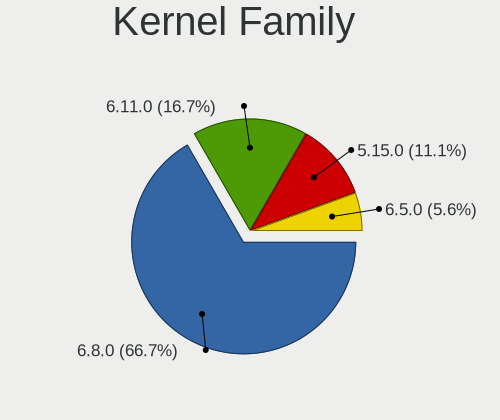
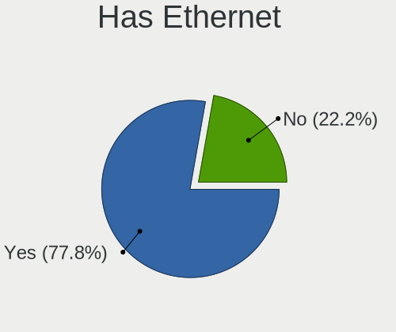
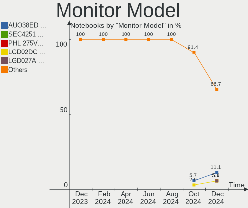
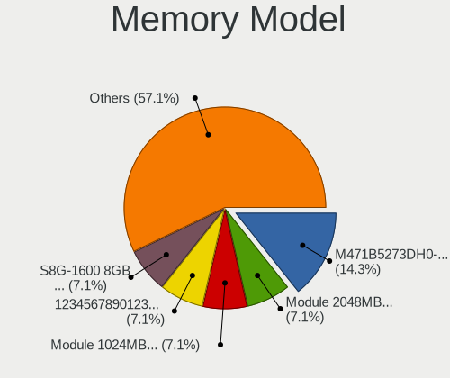
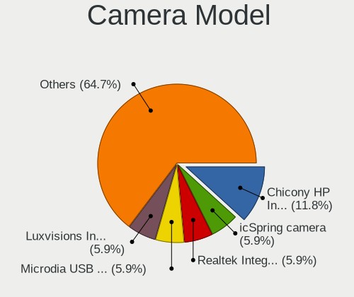

Lubuntu - Hardware Trends (Notebooks)
-------------------------------------

A project to identify most popular hardware characteristics and track their change
over time based on data collected by Linux users at https://Linux-Hardware.org.

Anyone can contribute to this report by the [hw-probe](https://github.com/linuxhw/hw-probe) tool:

    sudo -E hw-probe -all -upload

This report is for one last month. Overall report since the beginning of time: [TestCoverage](https://github.com/linuxhw/TestCoverage)

Period: Nov, 2022.

Contents
--------

* [ System ](#system)
  - [ OS                       ](#os)
  - [ OS Family                ](#os-family)
  - [ Kernel                   ](#kernel)
  - [ Kernel Family            ](#kernel-family)
  - [ Kernel Major Ver.        ](#kernel-major-ver)
  - [ Arch                     ](#arch)
  - [ DE                       ](#de)
  - [ Display Server           ](#display-server)
  - [ Display Manager          ](#display-manager)
  - [ OS Lang                  ](#os-lang)
  - [ Boot Mode                ](#boot-mode)
  - [ Filesystem               ](#filesystem)
  - [ Part. scheme             ](#part-scheme)
  - [ Dual Boot with Linux/BSD ](#dual-boot-with-linuxbsd)
  - [ Dual Boot (Win)          ](#dual-boot-win)

* [ Board ](#board)
  - [ Vendor                   ](#vendor)
  - [ Model                    ](#model)
  - [ Model Family             ](#model-family)
  - [ MFG Year                 ](#mfg-year)
  - [ Form Factor              ](#form-factor)
  - [ Secure Boot              ](#secure-boot)
  - [ Coreboot                 ](#coreboot)
  - [ RAM Size                 ](#ram-size)
  - [ RAM Used                 ](#ram-used)
  - [ Total Drives             ](#total-drives)
  - [ Has CD-ROM               ](#has-cd-rom)
  - [ Has Ethernet             ](#has-ethernet)
  - [ Has WiFi                 ](#has-wifi)
  - [ Has Bluetooth            ](#has-bluetooth)

* [ Location ](#location)
  - [ Country                  ](#country)
  - [ City                     ](#city)

* [ Drives ](#drives)
  - [ Drive Vendor             ](#drive-vendor)
  - [ Drive Model              ](#drive-model)
  - [ HDD Vendor               ](#hdd-vendor)
  - [ SSD Vendor               ](#ssd-vendor)
  - [ Drive Kind               ](#drive-kind)
  - [ Drive Connector          ](#drive-connector)
  - [ Drive Size               ](#drive-size)
  - [ Space Total              ](#space-total)
  - [ Space Used               ](#space-used)
  - [ Malfunc. Drives          ](#malfunc-drives)
  - [ Malfunc. Drive Vendor    ](#malfunc-drive-vendor)
  - [ Malfunc. HDD Vendor      ](#malfunc-hdd-vendor)
  - [ Malfunc. Drive Kind      ](#malfunc-drive-kind)
  - [ Failed Drives            ](#failed-drives)
  - [ Failed Drive Vendor      ](#failed-drive-vendor)
  - [ Drive Status             ](#drive-status)

* [ Storage controller ](#storage-controller)
  - [ Storage Vendor           ](#storage-vendor)
  - [ Storage Model            ](#storage-model)
  - [ Storage Kind             ](#storage-kind)

* [ Processor ](#processor)
  - [ CPU Vendor               ](#cpu-vendor)
  - [ CPU Model                ](#cpu-model)
  - [ CPU Model Family         ](#cpu-model-family)
  - [ CPU Cores                ](#cpu-cores)
  - [ CPU Sockets              ](#cpu-sockets)
  - [ CPU Threads              ](#cpu-threads)
  - [ CPU Op-Modes             ](#cpu-op-modes)
  - [ CPU Microcode            ](#cpu-microcode)
  - [ CPU Microarch            ](#cpu-microarch)

* [ Graphics ](#graphics)
  - [ GPU Vendor               ](#gpu-vendor)
  - [ GPU Model                ](#gpu-model)
  - [ GPU Combo                ](#gpu-combo)
  - [ GPU Driver               ](#gpu-driver)
  - [ GPU Memory               ](#gpu-memory)

* [ Monitor ](#monitor)
  - [ Monitor Vendor           ](#monitor-vendor)
  - [ Monitor Model            ](#monitor-model)
  - [ Monitor Resolution       ](#monitor-resolution)
  - [ Monitor Diagonal         ](#monitor-diagonal)
  - [ Monitor Width            ](#monitor-width)
  - [ Aspect Ratio             ](#aspect-ratio)
  - [ Monitor Area             ](#monitor-area)
  - [ Pixel Density            ](#pixel-density)
  - [ Multiple Monitors        ](#multiple-monitors)

* [ Network ](#network)
  - [ Net Controller Vendor    ](#net-controller-vendor)
  - [ Net Controller Model     ](#net-controller-model)
  - [ Wireless Vendor          ](#wireless-vendor)
  - [ Wireless Model           ](#wireless-model)
  - [ Ethernet Vendor          ](#ethernet-vendor)
  - [ Ethernet Model           ](#ethernet-model)
  - [ Net Controller Kind      ](#net-controller-kind)
  - [ Used Controller          ](#used-controller)
  - [ NICs                     ](#nics)
  - [ IPv6                     ](#ipv6)

* [ Bluetooth ](#bluetooth)
  - [ Bluetooth Vendor         ](#bluetooth-vendor)
  - [ Bluetooth Model          ](#bluetooth-model)

* [ Sound ](#sound)
  - [ Sound Vendor             ](#sound-vendor)
  - [ Sound Model              ](#sound-model)

* [ Memory ](#memory)
  - [ Memory Vendor            ](#memory-vendor)
  - [ Memory Model             ](#memory-model)
  - [ Memory Kind              ](#memory-kind)
  - [ Memory Form Factor       ](#memory-form-factor)
  - [ Memory Size              ](#memory-size)
  - [ Memory Speed             ](#memory-speed)

* [ Printers & scanners ](#printers--scanners)
  - [ Printer Vendor           ](#printer-vendor)
  - [ Printer Model            ](#printer-model)
  - [ Scanner Vendor           ](#scanner-vendor)
  - [ Scanner Model            ](#scanner-model)

* [ Camera ](#camera)
  - [ Camera Vendor            ](#camera-vendor)
  - [ Camera Model             ](#camera-model)

* [ Security ](#security)
  - [ Fingerprint Vendor       ](#fingerprint-vendor)
  - [ Fingerprint Model        ](#fingerprint-model)
  - [ Chipcard Vendor          ](#chipcard-vendor)
  - [ Chipcard Model           ](#chipcard-model)

* [ Unsupported ](#unsupported)
  - [ Unsupported Devices      ](#unsupported-devices)
  - [ Unsupported Device Types ](#unsupported-device-types)

System
------

OS
--

Installed operating systems

| Name          | Notebooks | Percent |
|---------------|-----------|---------|
| Lubuntu 22.04 | 14        | 56%     |
| Lubuntu 22.10 | 4         | 16%     |
| Lubuntu 20.04 | 4         | 16%     |
| Lubuntu 18.10 | 2         | 8%      |
| Lubuntu 21.04 | 1         | 4%      |

OS Family
---------

OS without a version

| Name    | Notebooks | Percent |
|---------|-----------|---------|
| Lubuntu | 25        | 100%    |

Kernel
------

Version of the Linux kernel

| Version           | Notebooks | Percent |
|-------------------|-----------|---------|
| 5.15.0-53-generic | 6         | 24%     |
| 5.15.0-52-generic | 5         | 20%     |
| 5.19.0-23-generic | 4         | 16%     |
| 5.4.0-131-generic | 2         | 8%      |
| 4.18.0-10-generic | 2         | 8%      |
| 5.15.0-54-generic | 1         | 4%      |
| 5.15.0-50-generic | 1         | 4%      |
| 5.15.0-43-generic | 1         | 4%      |
| 5.15.0-41-generic | 1         | 4%      |
| 5.14.0-1040-oem   | 1         | 4%      |
| 5.11.0-38-generic | 1         | 4%      |

Kernel Family
-------------

Linux kernel without a distro release

| Version | Notebooks | Percent |
|---------|-----------|---------|
| 5.15.0  | 15        | 60%     |
| 5.19.0  | 4         | 16%     |
| 5.4.0   | 2         | 8%      |
| 4.18.0  | 2         | 8%      |
| 5.14.0  | 1         | 4%      |
| 5.11.0  | 1         | 4%      |

Kernel Major Ver.
-----------------

Linux kernel major version

| Version | Notebooks | Percent |
|---------|-----------|---------|
| 5.15    | 15        | 60%     |
| 5.19    | 4         | 16%     |
| 5.4     | 2         | 8%      |
| 4.18    | 2         | 8%      |
| 5.14    | 1         | 4%      |
| 5.11    | 1         | 4%      |

Arch
----

OS architecture (x86_64, i586, etc.)

| Name   | Notebooks | Percent |
|--------|-----------|---------|
| x86_64 | 23        | 92%     |
| i686   | 2         | 8%      |

DE
--

Desktop Environment

| Name       | Notebooks | Percent |
|------------|-----------|---------|
| LXQt       | 24        | 96%     |
| X-Cinnamon | 1         | 4%      |

Display Server
--------------

X11 or Wayland

| Name | Notebooks | Percent |
|------|-----------|---------|
| X11  | 24        | 96%     |
| Tty  | 1         | 4%      |

Display Manager
---------------

SDDM, LightDM, etc.

| Name    | Notebooks | Percent |
|---------|-----------|---------|
| SDDM    | 19        | 76%     |
| LightDM | 3         | 12%     |
| Unknown | 2         | 8%      |
| GDM3    | 1         | 4%      |

OS Lang
-------

Language

| Lang  | Notebooks | Percent |
|-------|-----------|---------|
| en_US | 6         | 24%     |
| it_IT | 4         | 16%     |
| fr_FR | 2         | 8%      |
| de_DE | 2         | 8%      |
| cs_CZ | 2         | 8%      |
| tr_TR | 1         | 4%      |
| ru_RU | 1         | 4%      |
| pl_PL | 1         | 4%      |
| fr_CA | 1         | 4%      |
| es_AR | 1         | 4%      |
| en_GB | 1         | 4%      |
| en_CA | 1         | 4%      |
| en_AG | 1         | 4%      |
| aa_DJ | 1         | 4%      |

Boot Mode
---------

EFI or BIOS

| Mode | Notebooks | Percent |
|------|-----------|---------|
| BIOS | 15        | 60%     |
| EFI  | 10        | 40%     |

Filesystem
----------

Type of filesystem

| Type    | Notebooks | Percent |
|---------|-----------|---------|
| Ext4    | 24        | 96%     |
| Overlay | 1         | 4%      |

Part. scheme
------------

Scheme of partitioning

| Type    | Notebooks | Percent |
|---------|-----------|---------|
| GPT     | 16        | 64%     |
| MBR     | 5         | 20%     |
| Unknown | 4         | 16%     |

Dual Boot with Linux/BSD
------------------------

Hosting more than one Linux/BSD

| Dual boot | Notebooks | Percent |
|-----------|-----------|---------|
| No        | 22        | 88%     |
| Yes       | 3         | 12%     |

Dual Boot (Win)
---------------

Hosting Linux and Windows

| Dual boot | Notebooks | Percent |
|-----------|-----------|---------|
| No        | 18        | 72%     |
| Yes       | 7         | 28%     |

Board
-----

Vendor
------

Motherboard manufacturer

| Name                | Notebooks | Percent |
|---------------------|-----------|---------|
| Hewlett-Packard     | 7         | 28%     |
| ASUSTek Computer    | 3         | 12%     |
| Toshiba             | 2         | 8%      |
| Lenovo              | 2         | 8%      |
| Fujitsu             | 2         | 8%      |
| Dell                | 2         | 8%      |
| Acer                | 2         | 8%      |
| Samsung Electronics | 1         | 4%      |
| Pretech             | 1         | 4%      |
| Positivo            | 1         | 4%      |
| GPU Company         | 1         | 4%      |
| Unknown             | 1         | 4%      |

Model
-----

Motherboard model

| Name                                       | Notebooks | Percent |
|--------------------------------------------|-----------|---------|
| HP 620                                     | 2         | 8%      |
| Fujitsu LIFEBOOK A3510                     | 2         | 8%      |
| Toshiba Satellite Pro S500                 | 1         | 4%      |
| Toshiba Satellite L15-B                    | 1         | 4%      |
| Samsung 300V3A/300V4A/300V5A/200A4B/200A5B | 1         | 4%      |
| Pretech EVE 1801 3G ES1049EG               | 1         | 4%      |
| Positivo i500pro                           | 1         | 4%      |
| Lenovo V145-15AST 81MT                     | 1         | 4%      |
| Lenovo G50-45 80E3                         | 1         | 4%      |
| HP ProBook 450 15.6 inch G9 Notebook PC    | 1         | 4%      |
| HP ProBook 430 G7                          | 1         | 4%      |
| HP Pavilion g6                             | 1         | 4%      |
| HP EliteBook 850 G5                        | 1         | 4%      |
| HP 250 G7 Notebook PC                      | 1         | 4%      |
| GPU Company GWTC116-2                      | 1         | 4%      |
| Dell Latitude E6520                        | 1         | 4%      |
| Dell Inspiron 15-3552                      | 1         | 4%      |
| ASUS T100TA                                | 1         | 4%      |
| ASUS K70IO                                 | 1         | 4%      |
| ASUS K55A                                  | 1         | 4%      |
| Acer AOD255E                               | 1         | 4%      |
| Acer AO722                                 | 1         | 4%      |
| Unknown                                    | 1         | 4%      |

Model Family
------------

Motherboard model prefix

| Name                  | Notebooks | Percent |
|-----------------------|-----------|---------|
| Toshiba Satellite     | 2         | 8%      |
| HP ProBook            | 2         | 8%      |
| HP 620                | 2         | 8%      |
| Fujitsu LIFEBOOK      | 2         | 8%      |
| Samsung 300V3A        | 1         | 4%      |
| Pretech EVE           | 1         | 4%      |
| Positivo i500pro      | 1         | 4%      |
| Lenovo V145-15AST     | 1         | 4%      |
| Lenovo G50-45         | 1         | 4%      |
| HP Pavilion           | 1         | 4%      |
| HP EliteBook          | 1         | 4%      |
| HP 250                | 1         | 4%      |
| GPU Company GWTC116-2 | 1         | 4%      |
| Dell Latitude         | 1         | 4%      |
| Dell Inspiron         | 1         | 4%      |
| ASUS T100TA           | 1         | 4%      |
| ASUS K70IO            | 1         | 4%      |
| ASUS K55A             | 1         | 4%      |
| Acer AOD255E          | 1         | 4%      |
| Acer AO722            | 1         | 4%      |
| Unknown               | 1         | 4%      |

MFG Year
--------

Motherboard manufacture year

| Year | Notebooks | Percent |
|------|-----------|---------|
| 2011 | 4         | 16%     |
| 2010 | 4         | 16%     |
| 2020 | 3         | 12%     |
| 2018 | 3         | 12%     |
| 2021 | 2         | 8%      |
| 2015 | 2         | 8%      |
| 2013 | 2         | 8%      |
| 2022 | 1         | 4%      |
| 2016 | 1         | 4%      |
| 2014 | 1         | 4%      |
| 2012 | 1         | 4%      |
| 2009 | 1         | 4%      |

Form Factor
-----------

Physical design of the computer

| Name     | Notebooks | Percent |
|----------|-----------|---------|
| Notebook | 25        | 100%    |

Secure Boot
-----------

Enabled or disabled

| State    | Notebooks | Percent |
|----------|-----------|---------|
| Disabled | 23        | 92%     |
| Enabled  | 2         | 8%      |

Coreboot
--------

Have coreboot on board

| Used | Notebooks | Percent |
|------|-----------|---------|
| No   | 25        | 100%    |

RAM Size
--------

Total RAM memory

| Size in GB | Notebooks | Percent |
|------------|-----------|---------|
| 4.01-8.0   | 7         | 28%     |
| 3.01-4.0   | 7         | 28%     |
| 8.01-16.0  | 4         | 16%     |
| 1.01-2.0   | 3         | 12%     |
| 2.01-3.0   | 2         | 8%      |
| 32.01-64.0 | 1         | 4%      |
| 0.51-1.0   | 1         | 4%      |

RAM Used
--------

Used RAM memory

| Used GB  | Notebooks | Percent |
|----------|-----------|---------|
| 1.01-2.0 | 12        | 48%     |
| 2.01-3.0 | 6         | 24%     |
| 0.51-1.0 | 5         | 20%     |
| 3.01-4.0 | 2         | 8%      |

Total Drives
------------

Number of drives on board

| Drives | Notebooks | Percent |
|--------|-----------|---------|
| 1      | 22        | 88%     |
| 2      | 3         | 12%     |

Has CD-ROM
----------

Has CD-ROM on board

| Presented | Notebooks | Percent |
|-----------|-----------|---------|
| No        | 15        | 60%     |
| Yes       | 10        | 40%     |

Has Ethernet
------------

Has Ethernet on board

| Presented | Notebooks | Percent |
|-----------|-----------|---------|
| Yes       | 19        | 76%     |
| No        | 6         | 24%     |

Has WiFi
--------

Has WiFi module

| Presented | Notebooks | Percent |
|-----------|-----------|---------|
| Yes       | 24        | 96%     |
| No        | 1         | 4%      |

Has Bluetooth
-------------

Has Bluetooth module

| Presented | Notebooks | Percent |
|-----------|-----------|---------|
| Yes       | 16        | 64%     |
| No        | 9         | 36%     |

Location
--------

Country
-------

Geographic location (country)

| Country     | Notebooks | Percent |
|-------------|-----------|---------|
| Italy       | 4         | 16%     |
| Germany     | 4         | 16%     |
| USA         | 2         | 8%      |
| Poland      | 2         | 8%      |
| France      | 2         | 8%      |
| Czechia     | 2         | 8%      |
| Canada      | 2         | 8%      |
| UK          | 1         | 4%      |
| Turkey      | 1         | 4%      |
| Russia      | 1         | 4%      |
| Norway      | 1         | 4%      |
| Netherlands | 1         | 4%      |
| Indonesia   | 1         | 4%      |
| Argentina   | 1         | 4%      |

City
----

Geographic location (city)

| City                      | Notebooks | Percent |
|---------------------------|-----------|---------|
| Chomutov                  | 2         | 8%      |
| Zawiercie                 | 1         | 4%      |
| Verona                    | 1         | 4%      |
| Seez                      | 1         | 4%      |
| Saint-Raymond-de-Portneuf | 1         | 4%      |
| Richmond Hill             | 1         | 4%      |
| Plan-dAups-Sainte-Baume   | 1         | 4%      |
| Nuremberg                 | 1         | 4%      |
| Novi                      | 1         | 4%      |
| New Florence              | 1         | 4%      |
| Naples                    | 1         | 4%      |
| Munich                    | 1         | 4%      |
| Melhus                    | 1         | 4%      |
| Malang                    | 1         | 4%      |
| London                    | 1         | 4%      |
| Kazan’                  | 1         | 4%      |
| Ituzaingo                 | 1         | 4%      |
| Gdansk                    | 1         | 4%      |
| Frankfurt am Main         | 1         | 4%      |
| Fehmarn                   | 1         | 4%      |
| Cesano Maderno            | 1         | 4%      |
| Cameri                    | 1         | 4%      |
| Ankara                    | 1         | 4%      |
| Amsterdam                 | 1         | 4%      |

Drives
------

Drive Vendor
------------

Hard drive vendors

| Vendor              | Notebooks | Drives | Percent |
|---------------------|-----------|--------|---------|
| Toshiba             | 4         | 4      | 14.81%  |
| Seagate             | 4         | 4      | 14.81%  |
| Samsung Electronics | 4         | 4      | 14.81%  |
| Unknown             | 3         | 3      | 11.11%  |
| WDC                 | 2         | 2      | 7.41%   |
| SanDisk             | 2         | 2      | 7.41%   |
| Hitachi             | 2         | 2      | 7.41%   |
| Teclast             | 1         | 1      | 3.7%    |
| QGEEM               | 1         | 1      | 3.7%    |
| Kingston            | 1         | 1      | 3.7%    |
| GOODRAM             | 1         | 1      | 3.7%    |
| Crucial             | 1         | 1      | 3.7%    |
| China               | 1         | 1      | 3.7%    |

Drive Model
-----------

Hard drive models

| Model                                | Notebooks | Percent |
|--------------------------------------|-----------|---------|
| Toshiba MK5061GSYN 500GB             | 2         | 7.41%   |
| Seagate ST9500325AS 500GB            | 2         | 7.41%   |
| WDC WD5000LPCX-24C6HT0 500GB         | 1         | 3.7%    |
| WDC WD1600BEVT-22A23T0 160GB         | 1         | 3.7%    |
| Unknown SEM64G  64GB                 | 1         | 3.7%    |
| Unknown SC64G  64GB                  | 1         | 3.7%    |
| Unknown Biwin  64GB                  | 1         | 3.7%    |
| Toshiba THNSNJ128GMCU 128GB SSD      | 1         | 3.7%    |
| Toshiba MQ01ABD100 1TB               | 1         | 3.7%    |
| Teclast BD256GB SHCB-2280 SSD        | 1         | 3.7%    |
| Seagate ST500LM030-1RK17D 500GB      | 1         | 3.7%    |
| Seagate ST1000LM024 HN-M101MBB 1TB   | 1         | 3.7%    |
| SanDisk SD8SNAT-256G-1006 256GB SSD  | 1         | 3.7%    |
| SanDisk DF4032  32GB                 | 1         | 3.7%    |
| Samsung MZVLQ512HALU-00007 512GB     | 1         | 3.7%    |
| Samsung MZVLQ256HAJD-000H1 256GB     | 1         | 3.7%    |
| Samsung MZVLB1T0HBLR-000L2 1TB       | 1         | 3.7%    |
| Samsung MZ7LN256HAJQ-000L2 256GB SSD | 1         | 3.7%    |
| QGEEM Disk 250GB                     | 1         | 3.7%    |
| Kingston SNVS500G 500GB              | 1         | 3.7%    |
| Hitachi HTS547575A9E384 752GB        | 1         | 3.7%    |
| Hitachi HTS545032B9A300 320GB        | 1         | 3.7%    |
| GOODRAM SSDPR-CL100-120-G3 120GB     | 1         | 3.7%    |
| Crucial CT500MX500SSD1 500GB         | 1         | 3.7%    |
| China ESA3SMN2HTH4BQ480GB            | 1         | 3.7%    |

HDD Vendor
----------

Hard disk drive vendors

| Vendor  | Notebooks | Drives | Percent |
|---------|-----------|--------|---------|
| Seagate | 4         | 4      | 36.36%  |
| Toshiba | 3         | 3      | 27.27%  |
| WDC     | 2         | 2      | 18.18%  |
| Hitachi | 2         | 2      | 18.18%  |

SSD Vendor
----------

Solid state drive vendors

| Vendor              | Notebooks | Drives | Percent |
|---------------------|-----------|--------|---------|
| Toshiba             | 1         | 1      | 16.67%  |
| Teclast             | 1         | 1      | 16.67%  |
| SanDisk             | 1         | 1      | 16.67%  |
| Samsung Electronics | 1         | 1      | 16.67%  |
| GOODRAM             | 1         | 1      | 16.67%  |
| Crucial             | 1         | 1      | 16.67%  |

Drive Kind
----------

HDD or SSD

| Kind    | Notebooks | Drives | Percent |
|---------|-----------|--------|---------|
| HDD     | 11        | 11     | 42.31%  |
| SSD     | 6         | 6      | 23.08%  |
| NVMe    | 4         | 4      | 15.38%  |
| MMC     | 3         | 4      | 11.54%  |
| Unknown | 2         | 2      | 7.69%   |

Drive Connector
---------------

SATA, SAS, NVMe, etc.

| Type | Notebooks | Drives | Percent |
|------|-----------|--------|---------|
| SATA | 18        | 18     | 69.23%  |
| NVMe | 4         | 4      | 15.38%  |
| MMC  | 3         | 4      | 11.54%  |
| SAS  | 1         | 1      | 3.85%   |

Drive Size
----------

Size of hard drive

| Size in TB | Notebooks | Drives | Percent |
|------------|-----------|--------|---------|
| 0.01-0.5   | 14        | 14     | 82.35%  |
| 0.51-1.0   | 3         | 3      | 17.65%  |

Space Total
-----------

Amount of disk space available on the file system

| Size in GB | Notebooks | Percent |
|------------|-----------|---------|
| 251-500    | 10        | 40%     |
| 101-250    | 6         | 24%     |
| 51-100     | 4         | 16%     |
| 1-20       | 2         | 8%      |
| 501-1000   | 2         | 8%      |
| 21-50      | 1         | 4%      |

Space Used
----------

Amount of used disk space

| Used GB | Notebooks | Percent |
|---------|-----------|---------|
| 1-20    | 16        | 64%     |
| 21-50   | 7         | 28%     |
| 251-500 | 2         | 8%      |

Malfunc. Drives
---------------

Drive models with a malfunction

Zero info for selected period =(

Malfunc. Drive Vendor
---------------------

Vendors of faulty drives

Zero info for selected period =(

Malfunc. HDD Vendor
-------------------

Vendors of faulty HDD drives

Zero info for selected period =(

Malfunc. Drive Kind
-------------------

Kinds of faulty drives

Zero info for selected period =(

Failed Drives
-------------

Failed drive models

Zero info for selected period =(

Failed Drive Vendor
-------------------

Failed drive vendors

Zero info for selected period =(

Drive Status
------------

Number of failed and malfunc. drives

| Status   | Notebooks | Drives | Percent |
|----------|-----------|--------|---------|
| Detected | 15        | 16     | 57.69%  |
| Works    | 11        | 11     | 42.31%  |

Storage controller
------------------

Storage Vendor
--------------

Storage controller vendors

| Vendor                      | Notebooks | Percent |
|-----------------------------|-----------|---------|
| Intel                       | 18        | 69.23%  |
| Samsung Electronics         | 3         | 11.54%  |
| AMD                         | 3         | 11.54%  |
| Nvidia                      | 1         | 3.85%   |
| Kingston Technology Company | 1         | 3.85%   |

Storage Model
-------------

Storage controller models

| Model                                                                                  | Notebooks | Percent |
|----------------------------------------------------------------------------------------|-----------|---------|
| Intel 7 Series Chipset Family 6-port SATA Controller [AHCI mode]                       | 3         | 11.11%  |
| Samsung NVMe SSD Controller 980                                                        | 2         | 7.41%   |
| Intel Ice Lake-LP SATA Controller [AHCI mode]                                          | 2         | 7.41%   |
| Intel Celeron/Pentium Silver Processor SATA Controller                                 | 2         | 7.41%   |
| Intel 82801IBM/IEM (ICH9M/ICH9M-E) 4 port SATA Controller [AHCI mode]                  | 2         | 7.41%   |
| AMD FCH SATA Controller [AHCI mode]                                                    | 2         | 7.41%   |
| Samsung NVMe SSD Controller SM981/PM981/PM983                                          | 1         | 3.7%    |
| Nvidia MCP79 AHCI Controller                                                           | 1         | 3.7%    |
| Kingston Company Company Non-Volatile memory controller                                | 1         | 3.7%    |
| Intel Sunrise Point-LP SATA Controller [AHCI mode]                                     | 1         | 3.7%    |
| Intel NM10/ICH7 Family SATA Controller [AHCI mode]                                     | 1         | 3.7%    |
| Intel Comet Lake SATA AHCI Controller                                                  | 1         | 3.7%    |
| Intel Atom/Celeron/Pentium Processor x5-E8000/J3xxx/N3xxx Series SATA Controller       | 1         | 3.7%    |
| Intel Atom Processor E3800 Series SATA AHCI Controller                                 | 1         | 3.7%    |
| Intel 82801 Mobile SATA Controller [RAID mode]                                         | 1         | 3.7%    |
| Intel 6 Series/C200 Series Chipset Family Mobile SATA Controller (IDE mode, ports 4-5) | 1         | 3.7%    |
| Intel 6 Series/C200 Series Chipset Family Mobile SATA Controller (IDE mode, ports 0-3) | 1         | 3.7%    |
| Intel 6 Series/C200 Series Chipset Family 6 port Mobile SATA AHCI Controller           | 1         | 3.7%    |
| Intel 5 Series/3400 Series Chipset 4 port SATA AHCI Controller                         | 1         | 3.7%    |
| AMD SB7x0/SB8x0/SB9x0 SATA Controller [AHCI mode]                                      | 1         | 3.7%    |

Storage Kind
------------

Kind of storage controller (IDE, SATA, NVMe, SAS, ...)

| Kind | Notebooks | Percent |
|------|-----------|---------|
| SATA | 20        | 76.92%  |
| NVMe | 4         | 15.38%  |
| RAID | 1         | 3.85%   |
| IDE  | 1         | 3.85%   |

Processor
---------

CPU Vendor
----------

Processor vendors

| Vendor | Notebooks | Percent |
|--------|-----------|---------|
| Intel  | 22        | 88%     |
| AMD    | 3         | 12%     |

CPU Model
---------

Processor models

| Model                                        | Notebooks | Percent |
|----------------------------------------------|-----------|---------|
| Intel Celeron Dual-Core CPU T3000 @ 1.80GHz  | 2         | 8%      |
| Intel Pentium CPU N3710 @ 1.60GHz            | 1         | 4%      |
| Intel Pentium CPU 2020M @ 2.40GHz            | 1         | 4%      |
| Intel Core i5-8265U CPU @ 1.60GHz            | 1         | 4%      |
| Intel Core i5-8250U CPU @ 1.60GHz            | 1         | 4%      |
| Intel Core i5-2450M CPU @ 2.50GHz            | 1         | 4%      |
| Intel Core i5-1035G1 CPU @ 1.00GHz           | 1         | 4%      |
| Intel Core i3-2350M CPU @ 2.30GHz            | 1         | 4%      |
| Intel Core i3-2330M CPU @ 2.20GHz            | 1         | 4%      |
| Intel Core i3-2310M CPU @ 2.10GHz            | 1         | 4%      |
| Intel Core i3-10110U CPU @ 2.10GHz           | 1         | 4%      |
| Intel Core i3-1005G1 CPU @ 1.20GHz           | 1         | 4%      |
| Intel Core i3 CPU M 370 @ 2.40GHz            | 1         | 4%      |
| Intel Core 2 Duo CPU T6500 @ 2.10GHz         | 1         | 4%      |
| Intel Celeron N4120 CPU @ 1.10GHz            | 1         | 4%      |
| Intel Celeron N4020 CPU @ 1.10GHz            | 1         | 4%      |
| Intel Celeron CPU N2840 @ 2.16GHz            | 1         | 4%      |
| Intel Atom x5-Z8300 CPU @ 1.44GHz            | 1         | 4%      |
| Intel Atom CPU Z3775 @ 1.46GHz               | 1         | 4%      |
| Intel Atom CPU N455 @ 1.66GHz                | 1         | 4%      |
| Intel 12th Gen Core i7-1255U                 | 1         | 4%      |
| AMD E1-6010 APU with AMD Radeon R2 Graphics  | 1         | 4%      |
| AMD C-60 APU with Radeon HD Graphics         | 1         | 4%      |
| AMD A4-9125 RADEON R3, 4 COMPUTE CORES 2C+2G | 1         | 4%      |

CPU Model Family
----------------

Processor model prefix

| Model                   | Notebooks | Percent |
|-------------------------|-----------|---------|
| Intel Core i3           | 6         | 24%     |
| Intel Core i5           | 4         | 16%     |
| Intel Celeron           | 3         | 12%     |
| Intel Atom              | 3         | 12%     |
| Intel Pentium           | 2         | 8%      |
| Intel Celeron Dual-Core | 2         | 8%      |
| Other                   | 1         | 4%      |
| Intel Core 2 Duo        | 1         | 4%      |
| AMD E1                  | 1         | 4%      |
| AMD C-60                | 1         | 4%      |
| AMD A4                  | 1         | 4%      |

CPU Cores
---------

Number of processor cores

| Number | Notebooks | Percent |
|--------|-----------|---------|
| 2      | 16        | 64%     |
| 4      | 7         | 28%     |
| 10     | 1         | 4%      |
| 1      | 1         | 4%      |

CPU Sockets
-----------

Number of sockets

| Number | Notebooks | Percent |
|--------|-----------|---------|
| 1      | 25        | 100%    |

CPU Threads
-----------

Threads per core (Hyper-Threading)

| Number | Notebooks | Percent |
|--------|-----------|---------|
| 1      | 13        | 52%     |
| 2      | 12        | 48%     |

CPU Op-Modes
------------

CPU Operation Modes (32-bit, 64-bit)

| Op mode        | Notebooks | Percent |
|----------------|-----------|---------|
| 32-bit, 64-bit | 25        | 100%    |

CPU Microcode
-------------

Microcode number

| Number     | Notebooks | Percent |
|------------|-----------|---------|
| Unknown    | 7         | 28%     |
| 0x1067a    | 3         | 12%     |
| 0x706e5    | 2         | 8%      |
| 0x30678    | 2         | 8%      |
| 0x906a4    | 1         | 4%      |
| 0x806ec    | 1         | 4%      |
| 0x806eb    | 1         | 4%      |
| 0x806ea    | 1         | 4%      |
| 0x706a8    | 1         | 4%      |
| 0x406c3    | 1         | 4%      |
| 0x306a9    | 1         | 4%      |
| 0x206a7    | 1         | 4%      |
| 0x106ca    | 1         | 4%      |
| 0x06006705 | 1         | 4%      |
| 0x05000119 | 1         | 4%      |

CPU Microarch
-------------

Microarchitecture

| Name             | Notebooks | Percent |
|------------------|-----------|---------|
| Silvermont       | 4         | 16%     |
| SandyBridge      | 4         | 16%     |
| Penryn           | 3         | 12%     |
| KabyLake         | 3         | 12%     |
| IceLake          | 2         | 8%      |
| Goldmont plus    | 2         | 8%      |
| Westmere         | 1         | 4%      |
| Puma             | 1         | 4%      |
| IvyBridge        | 1         | 4%      |
| Excavator        | 1         | 4%      |
| Bonnell          | 1         | 4%      |
| Bobcat           | 1         | 4%      |
| Alderlake Hybrid | 1         | 4%      |

Graphics
--------

GPU Vendor
----------

Vendors of graphics cards

| Vendor | Notebooks | Percent |
|--------|-----------|---------|
| Intel  | 21        | 77.78%  |
| AMD    | 4         | 14.81%  |
| Nvidia | 2         | 7.41%   |

GPU Model
---------

Graphics card models

| Model                                                                                    | Notebooks | Percent |
|------------------------------------------------------------------------------------------|-----------|---------|
| Intel 2nd Generation Core Processor Family Integrated Graphics Controller                | 4         | 14.81%  |
| Intel Mobile 4 Series Chipset Integrated Graphics Controller                             | 2         | 7.41%   |
| Intel Iris Plus Graphics G1 (Ice Lake)                                                   | 2         | 7.41%   |
| Intel GeminiLake [UHD Graphics 600]                                                      | 2         | 7.41%   |
| Intel Atom/Celeron/Pentium Processor x5-E8000/J3xxx/N3xxx Integrated Graphics Controller | 2         | 7.41%   |
| Intel Atom Processor Z36xxx/Z37xxx Series Graphics & Display                             | 2         | 7.41%   |
| Nvidia GF119M [GeForce GT 520MX]                                                         | 1         | 3.7%    |
| Nvidia G96CM [GeForce GT 120M]                                                           | 1         | 3.7%    |
| Intel WhiskeyLake-U GT2 [UHD Graphics 620]                                               | 1         | 3.7%    |
| Intel UHD Graphics 620                                                                   | 1         | 3.7%    |
| Intel Core Processor Integrated Graphics Controller                                      | 1         | 3.7%    |
| Intel CometLake-U GT2 [UHD Graphics]                                                     | 1         | 3.7%    |
| Intel Atom Processor D4xx/D5xx/N4xx/N5xx Integrated Graphics Controller                  | 1         | 3.7%    |
| Intel Alder Lake-UP3 GT2 [Iris Xe Graphics]                                              | 1         | 3.7%    |
| Intel 3rd Gen Core processor Graphics Controller                                         | 1         | 3.7%    |
| AMD Wrestler [Radeon HD 6290]                                                            | 1         | 3.7%    |
| AMD Thames [Radeon HD 7500M/7600M Series]                                                | 1         | 3.7%    |
| AMD Stoney [Radeon R2/R3/R4/R5 Graphics]                                                 | 1         | 3.7%    |
| AMD Mullins [Radeon R2 Graphics]                                                         | 1         | 3.7%    |

GPU Combo
---------

Combinations of graphics cards

| Name           | Notebooks | Percent |
|----------------|-----------|---------|
| 1 x Intel      | 19        | 76%     |
| 1 x AMD        | 3         | 12%     |
| 1 x Nvidia     | 1         | 4%      |
| Intel + Nvidia | 1         | 4%      |
| Intel + AMD    | 1         | 4%      |

GPU Driver
----------

Free vs proprietary

| Driver | Notebooks | Percent |
|--------|-----------|---------|
| Free   | 25        | 100%    |

GPU Memory
----------

Total video memory

| Size in GB | Notebooks | Percent |
|------------|-----------|---------|
| Unknown    | 22        | 88%     |
| 0.01-0.5   | 2         | 8%      |
| 0.51-1.0   | 1         | 4%      |

Monitor
-------

Monitor Vendor
--------------

Monitor vendors

| Vendor                  | Notebooks | Percent |
|-------------------------|-----------|---------|
| LG Display              | 7         | 30.43%  |
| Chimei Innolux          | 3         | 13.04%  |
| Chi Mei Optoelectronics | 3         | 13.04%  |
| BOE                     | 3         | 13.04%  |
| AU Optronics            | 3         | 13.04%  |
| Samsung Electronics     | 2         | 8.7%    |
| GJX                     | 1         | 4.35%   |
| CPT                     | 1         | 4.35%   |

Monitor Model
-------------

Monitor models

| Model                                                                    | Notebooks | Percent |
|--------------------------------------------------------------------------|-----------|---------|
| LG Display LCD Monitor LGD02AD 1366x768 344x194mm 15.5-inch              | 2         | 8.7%    |
| Samsung Electronics LCD Monitor SEC324A 1366x768 344x194mm 15.5-inch     | 1         | 4.35%   |
| Samsung Electronics LCD Monitor SAM0DFB 3840x2160 1872x1053mm 84.6-inch  | 1         | 4.35%   |
| LG Display LCD Monitor LGD0680 1920x1080 344x194mm 15.5-inch             | 1         | 4.35%   |
| LG Display LCD Monitor LGD05CE 1920x1080 344x194mm 15.5-inch             | 1         | 4.35%   |
| LG Display LCD Monitor LGD0468 1366x768 344x194mm 15.5-inch              | 1         | 4.35%   |
| LG Display LCD Monitor LGD0456 1366x768 344x194mm 15.5-inch              | 1         | 4.35%   |
| LG Display LCD Monitor LGD02DC 1366x768 344x194mm 15.5-inch              | 1         | 4.35%   |
| GJX LCD Monitor GJX075C 1366x768 256x144mm 11.6-inch                     | 1         | 4.35%   |
| CPT LCD Monitor CPTD003 1920x1080 309x174mm 14.0-inch                    | 1         | 4.35%   |
| Chimei Innolux LCD Monitor CMN15E7 1920x1080 344x193mm 15.5-inch         | 1         | 4.35%   |
| Chimei Innolux LCD Monitor CMN1394 1366x768 293x165mm 13.2-inch          | 1         | 4.35%   |
| Chimei Innolux LCD Monitor CMN1128 1366x768 256x144mm 11.6-inch          | 1         | 4.35%   |
| Chi Mei Optoelectronics LCD Monitor CMO15A7 1366x768 344x193mm 15.5-inch | 1         | 4.35%   |
| Chi Mei Optoelectronics LCD Monitor CMO15A3 1366x768 344x193mm 15.5-inch | 1         | 4.35%   |
| Chi Mei Optoelectronics LCD Monitor CMO1018 1024x600 222x125mm 10.0-inch | 1         | 4.35%   |
| BOE LCD Monitor BOE09D8 1920x1080 344x194mm 15.5-inch                    | 1         | 4.35%   |
| BOE LCD Monitor BOE06A5 1366x768 344x194mm 15.5-inch                     | 1         | 4.35%   |
| BOE LCD Monitor BOE0675 1366x768 344x194mm 15.5-inch                     | 1         | 4.35%   |
| AU Optronics LCD Monitor AUO325C 1366x768 256x144mm 11.6-inch            | 1         | 4.35%   |
| AU Optronics LCD Monitor AUO183C 1366x768 309x173mm 13.9-inch            | 1         | 4.35%   |
| AU Optronics LCD Monitor AUO109E 1600x900 382x214mm 17.2-inch            | 1         | 4.35%   |

Monitor Resolution
------------------

Monitor screen resolution

| Resolution      | Notebooks | Percent |
|-----------------|-----------|---------|
| 1366x768 (WXGA) | 15        | 65.22%  |
| 1920x1080 (FHD) | 5         | 21.74%  |
| 3840x2160 (4K)  | 1         | 4.35%   |
| 1600x900 (HD+)  | 1         | 4.35%   |
| 1024x600        | 1         | 4.35%   |

Monitor Diagonal
----------------

Diagonal size in inches

| Inches | Notebooks | Percent |
|--------|-----------|---------|
| 15     | 14        | 60.87%  |
| 11     | 3         | 13.04%  |
| 13     | 2         | 8.7%    |
| 84     | 1         | 4.35%   |
| 17     | 1         | 4.35%   |
| 14     | 1         | 4.35%   |
| 10     | 1         | 4.35%   |

Monitor Width
-------------

Physical width

| Width in mm | Notebooks | Percent |
|-------------|-----------|---------|
| 301-350     | 16        | 69.57%  |
| 201-300     | 5         | 21.74%  |
| 351-400     | 1         | 4.35%   |
| 1501-2000   | 1         | 4.35%   |

Aspect Ratio
------------

Proportional relationship between the width and the height

| Ratio | Notebooks | Percent |
|-------|-----------|---------|
| 16/9  | 22        | 100%    |

Monitor Area
------------

Area in inch²

| Area in inch² | Notebooks | Percent |
|----------------|-----------|---------|
| 101-110        | 14        | 60.87%  |
| 51-60          | 3         | 13.04%  |
| 81-90          | 2         | 8.7%    |
| More than 1000 | 1         | 4.35%   |
| 71-80          | 1         | 4.35%   |
| 41-50          | 1         | 4.35%   |
| 121-130        | 1         | 4.35%   |

Pixel Density
-------------

Pixels per inch

| Density | Notebooks | Percent |
|---------|-----------|---------|
| 101-120 | 12        | 52.17%  |
| 121-160 | 8         | 34.78%  |
| 51-100  | 3         | 13.04%  |

Multiple Monitors
-----------------

Total monitors connected

| Total | Notebooks | Percent |
|-------|-----------|---------|
| 1     | 24        | 96%     |
| 2     | 1         | 4%      |

Network
-------

Net Controller Vendor
---------------------

Controller vendors

| Vendor                          | Notebooks | Percent |
|---------------------------------|-----------|---------|
| Realtek Semiconductor           | 17        | 42.5%   |
| Intel                           | 10        | 25%     |
| Qualcomm Atheros                | 7         | 17.5%   |
| Broadcom                        | 2         | 5%      |
| Samsung Electronics             | 1         | 2.5%    |
| Ralink Technology               | 1         | 2.5%    |
| Qualcomm Atheros Communications | 1         | 2.5%    |
| Huawei Technologies             | 1         | 2.5%    |

Net Controller Model
--------------------

Controller models

| Model                                                             | Notebooks | Percent |
|-------------------------------------------------------------------|-----------|---------|
| Realtek RTL8111/8168/8411 PCI Express Gigabit Ethernet Controller | 10        | 20.83%  |
| Realtek RTL8821CE 802.11ac PCIe Wireless Network Adapter          | 3         | 6.25%   |
| Realtek RTL810xE PCI Express Fast Ethernet controller             | 3         | 6.25%   |
| Realtek RTL8191SEvA Wireless LAN Controller                       | 2         | 4.17%   |
| Qualcomm Atheros QCA9565 / AR9565 Wireless Network Adapter        | 2         | 4.17%   |
| Qualcomm Atheros AR9485 Wireless Network Adapter                  | 2         | 4.17%   |
| Qualcomm Atheros AR9285 Wireless Network Adapter (PCI-Express)    | 2         | 4.17%   |
| Intel Ice Lake-LP PCH CNVi WiFi                                   | 2         | 4.17%   |
| Intel 82579LM Gigabit Network Connection (Lewisville)             | 2         | 4.17%   |
| Samsung GT-I9070 (network tethering, USB debugging enabled)       | 1         | 2.08%   |
| Realtek RTL8723BE PCIe Wireless Network Adapter                   | 1         | 2.08%   |
| Realtek Realtek Network controller                                | 1         | 2.08%   |
| Realtek 802.11n WLAN Adapter                                      | 1         | 2.08%   |
| Realtek 802.11n                                                   | 1         | 2.08%   |
| Ralink RT2870/RT3070 Wireless Adapter                             | 1         | 2.08%   |
| Qualcomm Atheros AR9271 802.11n                                   | 1         | 2.08%   |
| Qualcomm Atheros AR8152 v2.0 Fast Ethernet                        | 1         | 2.08%   |
| Qualcomm Atheros AR8152 v1.1 Fast Ethernet                        | 1         | 2.08%   |
| Intel Wireless 8265 / 8275                                        | 1         | 2.08%   |
| Intel PRODUCT_MODEM                                               | 1         | 2.08%   |
| Intel Ethernet Connection (4) I219-V                              | 1         | 2.08%   |
| Intel Comet Lake PCH-LP CNVi WiFi                                 | 1         | 2.08%   |
| Intel Centrino Wireless-N 130                                     | 1         | 2.08%   |
| Intel Centrino Wireless-N 1000 [Condor Peak]                      | 1         | 2.08%   |
| Intel Centrino Advanced-N 6235                                    | 1         | 2.08%   |
| Intel 82577LC Gigabit Network Connection                          | 1         | 2.08%   |
| Huawei SNE-LX1                                                    | 1         | 2.08%   |
| Broadcom BCM43228 802.11a/b/g/n                                   | 1         | 2.08%   |
| Broadcom BCM4313 802.11bgn Wireless Network Adapter               | 1         | 2.08%   |

Wireless Vendor
---------------

Wireless vendors

| Vendor                          | Notebooks | Percent |
|---------------------------------|-----------|---------|
| Realtek Semiconductor           | 9         | 33.33%  |
| Intel                           | 8         | 29.63%  |
| Qualcomm Atheros                | 6         | 22.22%  |
| Broadcom                        | 2         | 7.41%   |
| Ralink Technology               | 1         | 3.7%    |
| Qualcomm Atheros Communications | 1         | 3.7%    |

Wireless Model
--------------

Wireless models

| Model                                                          | Notebooks | Percent |
|----------------------------------------------------------------|-----------|---------|
| Realtek RTL8821CE 802.11ac PCIe Wireless Network Adapter       | 3         | 11.11%  |
| Realtek RTL8191SEvA Wireless LAN Controller                    | 2         | 7.41%   |
| Qualcomm Atheros QCA9565 / AR9565 Wireless Network Adapter     | 2         | 7.41%   |
| Qualcomm Atheros AR9485 Wireless Network Adapter               | 2         | 7.41%   |
| Qualcomm Atheros AR9285 Wireless Network Adapter (PCI-Express) | 2         | 7.41%   |
| Intel Ice Lake-LP PCH CNVi WiFi                                | 2         | 7.41%   |
| Realtek RTL8723BE PCIe Wireless Network Adapter                | 1         | 3.7%    |
| Realtek Realtek Network controller                             | 1         | 3.7%    |
| Realtek 802.11n WLAN Adapter                                   | 1         | 3.7%    |
| Realtek 802.11n                                                | 1         | 3.7%    |
| Ralink RT2870/RT3070 Wireless Adapter                          | 1         | 3.7%    |
| Qualcomm Atheros AR9271 802.11n                                | 1         | 3.7%    |
| Intel Wireless 8265 / 8275                                     | 1         | 3.7%    |
| Intel PRODUCT_MODEM                                            | 1         | 3.7%    |
| Intel Comet Lake PCH-LP CNVi WiFi                              | 1         | 3.7%    |
| Intel Centrino Wireless-N 130                                  | 1         | 3.7%    |
| Intel Centrino Wireless-N 1000 [Condor Peak]                   | 1         | 3.7%    |
| Intel Centrino Advanced-N 6235                                 | 1         | 3.7%    |
| Broadcom BCM43228 802.11a/b/g/n                                | 1         | 3.7%    |
| Broadcom BCM4313 802.11bgn Wireless Network Adapter            | 1         | 3.7%    |

Ethernet Vendor
---------------

Ethernet vendors

| Vendor                | Notebooks | Percent |
|-----------------------|-----------|---------|
| Realtek Semiconductor | 13        | 61.9%   |
| Intel                 | 4         | 19.05%  |
| Qualcomm Atheros      | 2         | 9.52%   |
| Samsung Electronics   | 1         | 4.76%   |
| Huawei Technologies   | 1         | 4.76%   |

Ethernet Model
--------------

Ethernet models

| Model                                                             | Notebooks | Percent |
|-------------------------------------------------------------------|-----------|---------|
| Realtek RTL8111/8168/8411 PCI Express Gigabit Ethernet Controller | 10        | 47.62%  |
| Realtek RTL810xE PCI Express Fast Ethernet controller             | 3         | 14.29%  |
| Intel 82579LM Gigabit Network Connection (Lewisville)             | 2         | 9.52%   |
| Samsung GT-I9070 (network tethering, USB debugging enabled)       | 1         | 4.76%   |
| Qualcomm Atheros AR8152 v2.0 Fast Ethernet                        | 1         | 4.76%   |
| Qualcomm Atheros AR8152 v1.1 Fast Ethernet                        | 1         | 4.76%   |
| Intel Ethernet Connection (4) I219-V                              | 1         | 4.76%   |
| Intel 82577LC Gigabit Network Connection                          | 1         | 4.76%   |
| Huawei SNE-LX1                                                    | 1         | 4.76%   |

Net Controller Kind
-------------------

Ethernet, WiFi or modem

| Kind     | Notebooks | Percent |
|----------|-----------|---------|
| WiFi     | 24        | 55.81%  |
| Ethernet | 19        | 44.19%  |

Used Controller
---------------

Currently used network controller

| Kind     | Notebooks | Percent |
|----------|-----------|---------|
| WiFi     | 18        | 81.82%  |
| Ethernet | 4         | 18.18%  |

NICs
----

Total network controllers on board

| Total | Notebooks | Percent |
|-------|-----------|---------|
| 2     | 19        | 76%     |
| 1     | 3         | 12%     |
| 0     | 3         | 12%     |

IPv6
----

IPv6 vs IPv4

| Used | Notebooks | Percent |
|------|-----------|---------|
| No   | 19        | 76%     |
| Yes  | 6         | 24%     |

Bluetooth
---------

Bluetooth Vendor
----------------

Controller vendors

| Vendor                          | Notebooks | Percent |
|---------------------------------|-----------|---------|
| Intel                           | 6         | 37.5%   |
| Realtek Semiconductor           | 3         | 18.75%  |
| Toshiba                         | 2         | 12.5%   |
| Qualcomm Atheros Communications | 2         | 12.5%   |
| Hewlett-Packard                 | 1         | 6.25%   |
| Cambridge Silicon Radio         | 1         | 6.25%   |
| Broadcom                        | 1         | 6.25%   |

Bluetooth Model
---------------

Controller models

| Model                                               | Notebooks | Percent |
|-----------------------------------------------------|-----------|---------|
| Realtek Bluetooth Radio                             | 3         | 18.75%  |
| Intel Bluetooth 9460/9560 Jefferson Peak (JfP)      | 2         | 12.5%   |
| Toshiba Integrated Bluetooth HCI                    | 1         | 6.25%   |
| Toshiba Bluetooth Radio                             | 1         | 6.25%   |
| Qualcomm Atheros  Bluetooth Device                  | 1         | 6.25%   |
| Qualcomm Atheros AR3012 Bluetooth 4.0               | 1         | 6.25%   |
| Intel Centrino Bluetooth Wireless Transceiver       | 1         | 6.25%   |
| Intel Centrino Advanced-N 6230 Bluetooth adapter    | 1         | 6.25%   |
| Intel Bluetooth wireless interface                  | 1         | 6.25%   |
| Intel AX201 Bluetooth                               | 1         | 6.25%   |
| HP Broadcom 2070 Bluetooth Combo                    | 1         | 6.25%   |
| Cambridge Silicon Radio Bluetooth Dongle (HCI mode) | 1         | 6.25%   |
| Broadcom HP Portable Valentine                      | 1         | 6.25%   |

Sound
-----

Sound Vendor
------------

Sound card vendors

| Vendor | Notebooks | Percent |
|--------|-----------|---------|
| Intel  | 19        | 82.61%  |
| AMD    | 3         | 13.04%  |
| Nvidia | 1         | 4.35%   |

Sound Model
-----------

Sound card models

| Model                                                                                             | Notebooks | Percent |
|---------------------------------------------------------------------------------------------------|-----------|---------|
| Intel 7 Series/C216 Chipset Family High Definition Audio Controller                               | 3         | 11.54%  |
| Intel Ice Lake-LP Smart Sound Technology Audio Controller                                         | 2         | 7.69%   |
| Intel Celeron/Pentium Silver Processor High Definition Audio                                      | 2         | 7.69%   |
| Intel 82801I (ICH9 Family) HD Audio Controller                                                    | 2         | 7.69%   |
| Intel 6 Series/C200 Series Chipset Family High Definition Audio Controller                        | 2         | 7.69%   |
| Nvidia MCP79 High Definition Audio                                                                | 1         | 3.85%   |
| Intel Sunrise Point-LP HD Audio                                                                   | 1         | 3.85%   |
| Intel NM10/ICH7 Family High Definition Audio Controller                                           | 1         | 3.85%   |
| Intel Comet Lake PCH-LP cAVS                                                                      | 1         | 3.85%   |
| Intel Cannon Point-LP High Definition Audio Controller                                            | 1         | 3.85%   |
| Intel Atom/Celeron/Pentium Processor x5-E8000/J3xxx/N3xxx Series High Definition Audio Controller | 1         | 3.85%   |
| Intel Atom Processor Z36xxx/Z37xxx Series High Definition Audio Controller                        | 1         | 3.85%   |
| Intel Alder Lake PCH-P High Definition Audio Controller                                           | 1         | 3.85%   |
| Intel 5 Series/3400 Series Chipset High Definition Audio                                          | 1         | 3.85%   |
| AMD Wrestler HDMI Audio                                                                           | 1         | 3.85%   |
| AMD SBx00 Azalia (Intel HDA)                                                                      | 1         | 3.85%   |
| AMD Kabini HDMI/DP Audio                                                                          | 1         | 3.85%   |
| AMD High Definition Audio Controller                                                              | 1         | 3.85%   |
| AMD FCH Azalia Controller                                                                         | 1         | 3.85%   |
| AMD Family 15h (Models 60h-6fh) Audio Controller                                                  | 1         | 3.85%   |

Memory
------

Memory Vendor
-------------

Memory module vendors

| Vendor              | Notebooks | Percent |
|---------------------|-----------|---------|
| Samsung Electronics | 4         | 21.05%  |
| Unknown             | 3         | 15.79%  |
| SK hynix            | 2         | 10.53%  |
| Micron Technology   | 2         | 10.53%  |
| Crucial             | 2         | 10.53%  |
| Unknown (ABCD)      | 1         | 5.26%   |
| Kingston            | 1         | 5.26%   |
| GOODRAM             | 1         | 5.26%   |
| AMD                 | 1         | 5.26%   |
| A-DATA Technology   | 1         | 5.26%   |
| Unknown             | 1         | 5.26%   |

Memory Model
------------

Memory module models

| Model                                                            | Notebooks | Percent |
|------------------------------------------------------------------|-----------|---------|
| Unknown RAM Module 2048MB SODIMM DDR3 1333MT/s                   | 1         | 5.26%   |
| Unknown RAM Module 1GB SODIMM DDR3 1066MT/s                      | 1         | 5.26%   |
| Unknown RAM Module 1024MB SODIMM DDR3 667MT/s                    | 1         | 5.26%   |
| Unknown (ABCD) RAM 123456789012345678 2GB SODIMM LPDDR4 2400MT/s | 1         | 5.26%   |
| SK hynix RAM Module 8192MB SODIMM DDR4 2400MT/s                  | 1         | 5.26%   |
| SK hynix RAM Module 2GB SODIMM DDR3 1600MT/s                     | 1         | 5.26%   |
| Samsung RAM Module 8192MB SODIMM DDR4 2400MT/s                   | 1         | 5.26%   |
| Samsung RAM M471B5773DH0-CH9 2GB SODIMM DDR3 1600MT/s            | 1         | 5.26%   |
| Samsung RAM M471A5244CB0-CTD 4GB SODIMM DDR4 3266MT/s            | 1         | 5.26%   |
| Samsung RAM M471A1K43DB1-CWE 8192MB SODIMM DDR4 3200MT/s         | 1         | 5.26%   |
| Micron RAM Module 8GB SODIMM DDR4 3200MT/s                       | 1         | 5.26%   |
| Micron RAM 4ATF1G64HZ-3G2E1 8GB SODIMM DDR4 3200MT/s             | 1         | 5.26%   |
| Kingston RAM Module 2GB SODIMM SDRAM 2048MT/s                    | 1         | 5.26%   |
| GOODRAM RAM GR2666S464L19S/8G 8192MB SODIMM DDR4 2667MT/s        | 1         | 5.26%   |
| Crucial RAM CT16G4SFRA32A.C16FN 16GB SODIMM DDR4 3200MT/s        | 1         | 5.26%   |
| Crucial RAM CT102464BF160B.C16 8GB SODIMM DDR3 1600MT/s          | 1         | 5.26%   |
| AMD RAM R538G1601S2S 8GB SODIMM DDR3 1600MT/s                    | 1         | 5.26%   |
| A-DATA RAM Module 16GB SODIMM DDR4 3200MT/s                      | 1         | 5.26%   |
| Unknown                                                          | 1         | 5.26%   |

Memory Kind
-----------

Memory module kinds

| Kind   | Notebooks | Percent |
|--------|-----------|---------|
| DDR4   | 7         | 43.75%  |
| DDR3   | 7         | 43.75%  |
| SDRAM  | 1         | 6.25%   |
| LPDDR4 | 1         | 6.25%   |

Memory Form Factor
------------------

Physical design of the memory module

| Name   | Notebooks | Percent |
|--------|-----------|---------|
| SODIMM | 16        | 100%    |

Memory Size
-----------

Memory module size

| Size  | Notebooks | Percent |
|-------|-----------|---------|
| 8192  | 9         | 52.94%  |
| 2048  | 3         | 17.65%  |
| 4096  | 2         | 11.76%  |
| 1024  | 2         | 11.76%  |
| 16384 | 1         | 5.88%   |

Memory Speed
------------

Memory module speed

| Speed | Notebooks | Percent |
|-------|-----------|---------|
| 3200  | 4         | 25%     |
| 1600  | 3         | 18.75%  |
| 2400  | 2         | 12.5%   |
| 1066  | 2         | 12.5%   |
| 3266  | 1         | 6.25%   |
| 2667  | 1         | 6.25%   |
| 2048  | 1         | 6.25%   |
| 1333  | 1         | 6.25%   |
| 667   | 1         | 6.25%   |

Printers & scanners
-------------------

Printer Vendor
--------------

Printer device vendors

Zero info for selected period =(

Printer Model
-------------

Printer device models

Zero info for selected period =(

Scanner Vendor
--------------

Scanner device vendors

Zero info for selected period =(

Scanner Model
-------------

Scanner device models

Zero info for selected period =(

Camera
------

Camera Vendor
-------------

Camera device vendors

| Vendor                                 | Notebooks | Percent |
|----------------------------------------|-----------|---------|
| Chicony Electronics                    | 8         | 38.1%   |
| Microdia                               | 3         | 14.29%  |
| Cheng Uei Precision Industry (Foxlink) | 2         | 9.52%   |
| ALi                                    | 2         | 9.52%   |
| Syntek                                 | 1         | 4.76%   |
| Sunplus Innovation Technology          | 1         | 4.76%   |
| Silicon Motion                         | 1         | 4.76%   |
| Realtek Semiconductor                  | 1         | 4.76%   |
| Lite-On Technology                     | 1         | 4.76%   |
| Acer                                   | 1         | 4.76%   |

Camera Model
------------

Camera device models

| Model                                                                      | Notebooks | Percent |
|----------------------------------------------------------------------------|-----------|---------|
| Chicony FJ Camera                                                          | 2         | 9.52%   |
| Syntek HD WebCam                                                           | 1         | 4.76%   |
| Sunplus Laptop Integrated Webcam FHD                                       | 1         | 4.76%   |
| Silicon Motion WebCam SCB-1100N                                            | 1         | 4.76%   |
| Realtek Integrated_Webcam_HD                                               | 1         | 4.76%   |
| Microdia Lenovo EasyCamera                                                 | 1         | 4.76%   |
| Microdia Hy-HD-Camera                                                      | 1         | 4.76%   |
| Microdia HP Webcam-50                                                      | 1         | 4.76%   |
| Lite-On HP Webcam                                                          | 1         | 4.76%   |
| Chicony UVC 1.00 device HD UVC WebCam                                      | 1         | 4.76%   |
| Chicony USB2.0 UVC WebCam                                                  | 1         | 4.76%   |
| Chicony USB 2.0 Camera                                                     | 1         | 4.76%   |
| Chicony TOSHIBA Web Camera - HD                                            | 1         | 4.76%   |
| Chicony HP HD Camera                                                       | 1         | 4.76%   |
| Chicony 2.0M UVC Webcam / CNF7129                                          | 1         | 4.76%   |
| Cheng Uei Precision Industry (Foxlink) HP Wide Vision HD Integrated Webcam | 1         | 4.76%   |
| Cheng Uei Precision Industry (Foxlink) HP HD Camera                        | 1         | 4.76%   |
| ALi WebCam                                                                 | 1         | 4.76%   |
| ALi Gateway Webcam                                                         | 1         | 4.76%   |
| Acer EasyCamera                                                            | 1         | 4.76%   |

Security
--------

Fingerprint Vendor
------------------

Fingerprint sensor vendors

| Vendor    | Notebooks | Percent |
|-----------|-----------|---------|
| AuthenTec | 1         | 100%    |

Fingerprint Model
-----------------

Fingerprint sensor models

| Model                        | Notebooks | Percent |
|------------------------------|-----------|---------|
| AuthenTec Fingerprint Sensor | 1         | 100%    |

Chipcard Vendor
---------------

Chipcard module vendors

| Vendor   | Notebooks | Percent |
|----------|-----------|---------|
| Broadcom | 1         | 100%    |

Chipcard Model
--------------

Chipcard module models

| Model                                          | Notebooks | Percent |
|------------------------------------------------|-----------|---------|
| Broadcom BCM5880 Secure Applications Processor | 1         | 100%    |

Unsupported
-----------

Unsupported Devices
-------------------

Total unsupported devices on board

| Total | Notebooks | Percent |
|-------|-----------|---------|
| 0     | 20        | 80%     |
| 1     | 4         | 16%     |
| 2     | 1         | 4%      |

Unsupported Device Types
------------------------

Types of unsupported devices

| Type               | Notebooks | Percent |
|--------------------|-----------|---------|
| Storage            | 1         | 16.67%  |
| Net/wireless       | 1         | 16.67%  |
| Graphics card      | 1         | 16.67%  |
| Fingerprint reader | 1         | 16.67%  |
| Chipcard           | 1         | 16.67%  |
| Camera             | 1         | 16.67%  |

