Lubuntu - Hardware Trends (Notebooks)
-------------------------------------

A project to identify most popular hardware characteristics and track their change
over time based on data collected by Linux users at https://Linux-Hardware.org.

Anyone can contribute to this report by the [hw-probe](https://github.com/linuxhw/hw-probe) tool:

    sudo -E hw-probe -all -upload

This report is for one last month. Overall report since the beginning of time: [TestDays](https://github.com/linuxhw/TestDays)

Period: Jun, 2023.

Contents
--------

* [ System ](#system)
  - [ OS                       ](#os)
  - [ OS Family                ](#os-family)
  - [ Kernel                   ](#kernel)
  - [ Kernel Family            ](#kernel-family)
  - [ Kernel Major Ver.        ](#kernel-major-ver)
  - [ Arch                     ](#arch)
  - [ DE                       ](#de)
  - [ Display Server           ](#display-server)
  - [ Display Manager          ](#display-manager)
  - [ OS Lang                  ](#os-lang)
  - [ Boot Mode                ](#boot-mode)
  - [ Filesystem               ](#filesystem)
  - [ Part. scheme             ](#part-scheme)
  - [ Dual Boot with Linux/BSD ](#dual-boot-with-linuxbsd)
  - [ Dual Boot (Win)          ](#dual-boot-win)

* [ Board ](#board)
  - [ Vendor                   ](#vendor)
  - [ Model                    ](#model)
  - [ Model Family             ](#model-family)
  - [ MFG Year                 ](#mfg-year)
  - [ Form Factor              ](#form-factor)
  - [ Secure Boot              ](#secure-boot)
  - [ Coreboot                 ](#coreboot)
  - [ RAM Size                 ](#ram-size)
  - [ RAM Used                 ](#ram-used)
  - [ Total Drives             ](#total-drives)
  - [ Has CD-ROM               ](#has-cd-rom)
  - [ Has Ethernet             ](#has-ethernet)
  - [ Has WiFi                 ](#has-wifi)
  - [ Has Bluetooth            ](#has-bluetooth)

* [ Location ](#location)
  - [ Country                  ](#country)
  - [ City                     ](#city)

* [ Drives ](#drives)
  - [ Drive Vendor             ](#drive-vendor)
  - [ Drive Model              ](#drive-model)
  - [ HDD Vendor               ](#hdd-vendor)
  - [ SSD Vendor               ](#ssd-vendor)
  - [ Drive Kind               ](#drive-kind)
  - [ Drive Connector          ](#drive-connector)
  - [ Drive Size               ](#drive-size)
  - [ Space Total              ](#space-total)
  - [ Space Used               ](#space-used)
  - [ Malfunc. Drives          ](#malfunc-drives)
  - [ Malfunc. Drive Vendor    ](#malfunc-drive-vendor)
  - [ Malfunc. HDD Vendor      ](#malfunc-hdd-vendor)
  - [ Malfunc. Drive Kind      ](#malfunc-drive-kind)
  - [ Failed Drives            ](#failed-drives)
  - [ Failed Drive Vendor      ](#failed-drive-vendor)
  - [ Drive Status             ](#drive-status)

* [ Storage controller ](#storage-controller)
  - [ Storage Vendor           ](#storage-vendor)
  - [ Storage Model            ](#storage-model)
  - [ Storage Kind             ](#storage-kind)

* [ Processor ](#processor)
  - [ CPU Vendor               ](#cpu-vendor)
  - [ CPU Model                ](#cpu-model)
  - [ CPU Model Family         ](#cpu-model-family)
  - [ CPU Cores                ](#cpu-cores)
  - [ CPU Sockets              ](#cpu-sockets)
  - [ CPU Threads              ](#cpu-threads)
  - [ CPU Op-Modes             ](#cpu-op-modes)
  - [ CPU Microcode            ](#cpu-microcode)
  - [ CPU Microarch            ](#cpu-microarch)

* [ Graphics ](#graphics)
  - [ GPU Vendor               ](#gpu-vendor)
  - [ GPU Model                ](#gpu-model)
  - [ GPU Combo                ](#gpu-combo)
  - [ GPU Driver               ](#gpu-driver)
  - [ GPU Memory               ](#gpu-memory)

* [ Monitor ](#monitor)
  - [ Monitor Vendor           ](#monitor-vendor)
  - [ Monitor Model            ](#monitor-model)
  - [ Monitor Resolution       ](#monitor-resolution)
  - [ Monitor Diagonal         ](#monitor-diagonal)
  - [ Monitor Width            ](#monitor-width)
  - [ Aspect Ratio             ](#aspect-ratio)
  - [ Monitor Area             ](#monitor-area)
  - [ Pixel Density            ](#pixel-density)
  - [ Multiple Monitors        ](#multiple-monitors)

* [ Network ](#network)
  - [ Net Controller Vendor    ](#net-controller-vendor)
  - [ Net Controller Model     ](#net-controller-model)
  - [ Wireless Vendor          ](#wireless-vendor)
  - [ Wireless Model           ](#wireless-model)
  - [ Ethernet Vendor          ](#ethernet-vendor)
  - [ Ethernet Model           ](#ethernet-model)
  - [ Net Controller Kind      ](#net-controller-kind)
  - [ Used Controller          ](#used-controller)
  - [ NICs                     ](#nics)
  - [ IPv6                     ](#ipv6)

* [ Bluetooth ](#bluetooth)
  - [ Bluetooth Vendor         ](#bluetooth-vendor)
  - [ Bluetooth Model          ](#bluetooth-model)

* [ Sound ](#sound)
  - [ Sound Vendor             ](#sound-vendor)
  - [ Sound Model              ](#sound-model)

* [ Memory ](#memory)
  - [ Memory Vendor            ](#memory-vendor)
  - [ Memory Model             ](#memory-model)
  - [ Memory Kind              ](#memory-kind)
  - [ Memory Form Factor       ](#memory-form-factor)
  - [ Memory Size              ](#memory-size)
  - [ Memory Speed             ](#memory-speed)

* [ Printers & scanners ](#printers--scanners)
  - [ Printer Vendor           ](#printer-vendor)
  - [ Printer Model            ](#printer-model)
  - [ Scanner Vendor           ](#scanner-vendor)
  - [ Scanner Model            ](#scanner-model)

* [ Camera ](#camera)
  - [ Camera Vendor            ](#camera-vendor)
  - [ Camera Model             ](#camera-model)

* [ Security ](#security)
  - [ Fingerprint Vendor       ](#fingerprint-vendor)
  - [ Fingerprint Model        ](#fingerprint-model)
  - [ Chipcard Vendor          ](#chipcard-vendor)
  - [ Chipcard Model           ](#chipcard-model)

* [ Unsupported ](#unsupported)
  - [ Unsupported Devices      ](#unsupported-devices)
  - [ Unsupported Device Types ](#unsupported-device-types)

System
------

OS
--

Installed operating systems

| Name          | Notebooks | Percent |
|---------------|-----------|---------|
| Lubuntu 22.04 | 11        | 57.89%  |
| Lubuntu 23.04 | 4         | 21.05%  |
| Lubuntu 20.04 | 2         | 10.53%  |
| Lubuntu 22.10 | 1         | 5.26%   |
| Lubuntu 18.04 | 1         | 5.26%   |

OS Family
---------

OS without a version

| Name    | Notebooks | Percent |
|---------|-----------|---------|
| Lubuntu | 19        | 100%    |

Kernel
------

Version of the Linux kernel

| Version           | Notebooks | Percent |
|-------------------|-----------|---------|
| 5.19.0-43-generic | 5         | 26.32%  |
| 5.15.0-73-generic | 3         | 15.79%  |
| 6.2.0-24-generic  | 2         | 10.53%  |
| 6.2.0-23-generic  | 2         | 10.53%  |
| 5.4.0-150-generic | 2         | 10.53%  |
| 5.19.0-45-generic | 2         | 10.53%  |
| 5.19.0-32-generic | 1         | 5.26%   |
| 5.15.0-75-generic | 1         | 5.26%   |
| 5.11.0-27-generic | 1         | 5.26%   |

Kernel Family
-------------

Linux kernel without a distro release

| Version | Notebooks | Percent |
|---------|-----------|---------|
| 5.19.0  | 8         | 42.11%  |
| 6.2.0   | 4         | 21.05%  |
| 5.15.0  | 4         | 21.05%  |
| 5.4.0   | 2         | 10.53%  |
| 5.11.0  | 1         | 5.26%   |

Kernel Major Ver.
-----------------

Linux kernel major version

| Version | Notebooks | Percent |
|---------|-----------|---------|
| 5.19    | 8         | 42.11%  |
| 6.2     | 4         | 21.05%  |
| 5.15    | 4         | 21.05%  |
| 5.4     | 2         | 10.53%  |
| 5.11    | 1         | 5.26%   |

Arch
----

OS architecture (x86_64, i586, etc.)

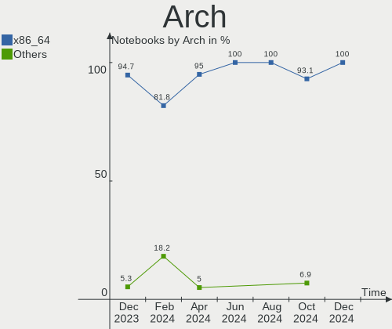

| Name   | Notebooks | Percent |
|--------|-----------|---------|
| x86_64 | 18        | 94.74%  |
| i686   | 1         | 5.26%   |

DE
--

Desktop Environment

| Name | Notebooks | Percent |
|------|-----------|---------|
| LXQt | 18        | 94.74%  |
| LXDE | 1         | 5.26%   |

Display Server
--------------

X11 or Wayland

| Name | Notebooks | Percent |
|------|-----------|---------|
| X11  | 19        | 100%    |

Display Manager
---------------

SDDM, LightDM, etc.

| Name    | Notebooks | Percent |
|---------|-----------|---------|
| SDDM    | 15        | 78.95%  |
| LightDM | 2         | 10.53%  |
| GDM3    | 1         | 5.26%   |
| Unknown | 1         | 5.26%   |

OS Lang
-------

Language

| Lang  | Notebooks | Percent |
|-------|-----------|---------|
| en_US | 7         | 36.84%  |
| en_GB | 4         | 21.05%  |
| ru_RU | 2         | 10.53%  |
| pt_BR | 1         | 5.26%   |
| fr_FR | 1         | 5.26%   |
| es_MX | 1         | 5.26%   |
| en_CA | 1         | 5.26%   |
| en_AG | 1         | 5.26%   |
| de_DE | 1         | 5.26%   |

Boot Mode
---------

EFI or BIOS

| Mode | Notebooks | Percent |
|------|-----------|---------|
| BIOS | 12        | 63.16%  |
| EFI  | 7         | 36.84%  |

Filesystem
----------

Type of filesystem

| Type    | Notebooks | Percent |
|---------|-----------|---------|
| Ext4    | 12        | 63.16%  |
| Tmpfs   | 6         | 31.58%  |
| Overlay | 1         | 5.26%   |

Part. scheme
------------

Scheme of partitioning

| Type    | Notebooks | Percent |
|---------|-----------|---------|
| GPT     | 10        | 52.63%  |
| MBR     | 8         | 42.11%  |
| Unknown | 1         | 5.26%   |

Dual Boot with Linux/BSD
------------------------

Hosting more than one Linux/BSD

| Dual boot | Notebooks | Percent |
|-----------|-----------|---------|
| No        | 15        | 78.95%  |
| Yes       | 4         | 21.05%  |

Dual Boot (Win)
---------------

Hosting Linux and Windows

| Dual boot | Notebooks | Percent |
|-----------|-----------|---------|
| No        | 10        | 52.63%  |
| Yes       | 9         | 47.37%  |

Board
-----

Vendor
------

Motherboard manufacturer

| Name             | Notebooks | Percent |
|------------------|-----------|---------|
| Hewlett-Packard  | 5         | 26.32%  |
| Lenovo           | 3         | 15.79%  |
| Dell             | 3         | 15.79%  |
| Sony             | 2         | 10.53%  |
| TrekStor         | 1         | 5.26%   |
| Toshiba          | 1         | 5.26%   |
| eMachines        | 1         | 5.26%   |
| AXIOO            | 1         | 5.26%   |
| ASUSTek Computer | 1         | 5.26%   |
| Acer             | 1         | 5.26%   |

Model
-----

Motherboard model

| Name                                   | Notebooks | Percent |
|----------------------------------------|-----------|---------|
| TrekStor SurfTab wintron 7.0 ST70416-6 | 1         | 5.26%   |
| Toshiba Satellite P200                 | 1         | 5.26%   |
| Sony VPCEH2E1R                         | 1         | 5.26%   |
| Sony VPCEB37FD                         | 1         | 5.26%   |
| Lenovo Z70-80 80FG                     | 1         | 5.26%   |
| Lenovo ThinkPad X201 3249CTO           | 1         | 5.26%   |
| Lenovo IdeaPad Y580                    | 1         | 5.26%   |
| HP ProBook 650 G3                      | 1         | 5.26%   |
| HP Laptop 15-da0xxx                    | 1         | 5.26%   |
| HP EliteBook 840 G3                    | 1         | 5.26%   |
| HP EliteBook 2530p                     | 1         | 5.26%   |
| HP 240 G3                              | 1         | 5.26%   |
| eMachines eME443                       | 1         | 5.26%   |
| Dell Vostro 3700                       | 1         | 5.26%   |
| Dell Precision 3570                    | 1         | 5.26%   |
| Dell Inspiron 3501                     | 1         | 5.26%   |
| AXIOO SlimBook 11                      | 1         | 5.26%   |
| ASUS 1011CX                            | 1         | 5.26%   |
| Acer Aspire 7741                       | 1         | 5.26%   |

Model Family
------------

Motherboard model prefix

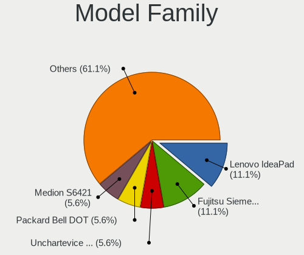

| Name              | Notebooks | Percent |
|-------------------|-----------|---------|
| HP EliteBook      | 2         | 10.53%  |
| TrekStor SurfTab  | 1         | 5.26%   |
| Toshiba Satellite | 1         | 5.26%   |
| Sony VPCEH2E1R    | 1         | 5.26%   |
| Sony VPCEB37FD    | 1         | 5.26%   |
| Lenovo Z70-80     | 1         | 5.26%   |
| Lenovo ThinkPad   | 1         | 5.26%   |
| Lenovo IdeaPad    | 1         | 5.26%   |
| HP ProBook        | 1         | 5.26%   |
| HP Laptop         | 1         | 5.26%   |
| HP 240            | 1         | 5.26%   |
| eMachines eME443  | 1         | 5.26%   |
| Dell Vostro       | 1         | 5.26%   |
| Dell Precision    | 1         | 5.26%   |
| Dell Inspiron     | 1         | 5.26%   |
| AXIOO SlimBook    | 1         | 5.26%   |
| ASUS 1011CX       | 1         | 5.26%   |
| Acer Aspire       | 1         | 5.26%   |

MFG Year
--------

Motherboard manufacture year

| Year | Notebooks | Percent |
|------|-----------|---------|
| 2010 | 4         | 21.05%  |
| 2016 | 2         | 10.53%  |
| 2014 | 2         | 10.53%  |
| 2012 | 2         | 10.53%  |
| 2011 | 2         | 10.53%  |
| 2022 | 1         | 5.26%   |
| 2021 | 1         | 5.26%   |
| 2020 | 1         | 5.26%   |
| 2018 | 1         | 5.26%   |
| 2015 | 1         | 5.26%   |
| 2008 | 1         | 5.26%   |
| 2007 | 1         | 5.26%   |

Form Factor
-----------

Physical design of the computer

| Name     | Notebooks | Percent |
|----------|-----------|---------|
| Notebook | 19        | 100%    |

Secure Boot
-----------

Enabled or disabled

| State    | Notebooks | Percent |
|----------|-----------|---------|
| Disabled | 18        | 94.74%  |
| Enabled  | 1         | 5.26%   |

Coreboot
--------

Have coreboot on board

| Used | Notebooks | Percent |
|------|-----------|---------|
| No   | 19        | 100%    |

RAM Size
--------

Total RAM memory

| Size in GB | Notebooks | Percent |
|------------|-----------|---------|
| 4.01-8.0   | 9         | 47.37%  |
| 3.01-4.0   | 3         | 15.79%  |
| 1.01-2.0   | 3         | 15.79%  |
| 32.01-64.0 | 1         | 5.26%   |
| 16.01-24.0 | 1         | 5.26%   |
| 8.01-16.0  | 1         | 5.26%   |
| 0.51-1.0   | 1         | 5.26%   |

RAM Used
--------

Used RAM memory

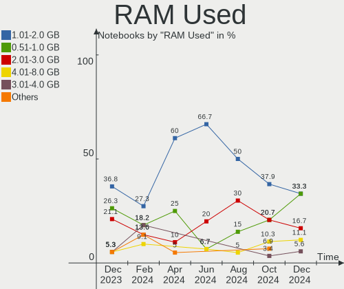

| Used GB  | Notebooks | Percent |
|----------|-----------|---------|
| 1.01-2.0 | 7         | 36.84%  |
| 2.01-3.0 | 5         | 26.32%  |
| 0.51-1.0 | 3         | 15.79%  |
| 4.01-8.0 | 2         | 10.53%  |
| 3.01-4.0 | 1         | 5.26%   |
| 0.01-0.5 | 1         | 5.26%   |

Total Drives
------------

Number of drives on board

| Drives | Notebooks | Percent |
|--------|-----------|---------|
| 1      | 13        | 68.42%  |
| 3      | 3         | 15.79%  |
| 2      | 3         | 15.79%  |

Has CD-ROM
----------

Has CD-ROM on board

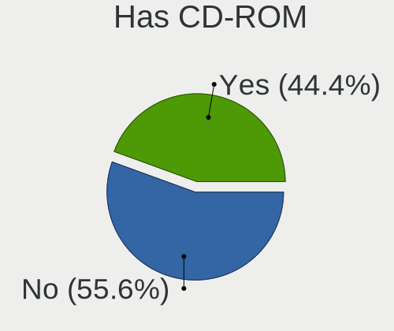

| Presented | Notebooks | Percent |
|-----------|-----------|---------|
| No        | 10        | 52.63%  |
| Yes       | 9         | 47.37%  |

Has Ethernet
------------

Has Ethernet on board

| Presented | Notebooks | Percent |
|-----------|-----------|---------|
| Yes       | 17        | 89.47%  |
| No        | 2         | 10.53%  |

Has WiFi
--------

Has WiFi module

| Presented | Notebooks | Percent |
|-----------|-----------|---------|
| Yes       | 17        | 89.47%  |
| No        | 2         | 10.53%  |

Has Bluetooth
-------------

Has Bluetooth module

| Presented | Notebooks | Percent |
|-----------|-----------|---------|
| Yes       | 12        | 63.16%  |
| No        | 7         | 36.84%  |

Location
--------

Country
-------

Geographic location (country)

| Country   | Notebooks | Percent |
|-----------|-----------|---------|
| Russia    | 3         | 15.79%  |
| Italy     | 3         | 15.79%  |
| Germany   | 3         | 15.79%  |
| UK        | 2         | 10.53%  |
| USA       | 1         | 5.26%   |
| Mexico    | 1         | 5.26%   |
| Indonesia | 1         | 5.26%   |
| France    | 1         | 5.26%   |
| Finland   | 1         | 5.26%   |
| Czechia   | 1         | 5.26%   |
| Canada    | 1         | 5.26%   |
| Brazil    | 1         | 5.26%   |

City
----

Geographic location (city)

| City             | Notebooks | Percent |
|------------------|-----------|---------|
| Rome             | 2         | 10.53%  |
| Vesilahti        | 1         | 5.26%   |
| Tizayuca         | 1         | 5.26%   |
| Titisee-Neustadt | 1         | 5.26%   |
| Patrang          | 1         | 5.26%   |
| Nizhny Tagil     | 1         | 5.26%   |
| Moscow           | 1         | 5.26%   |
| Marataizes       | 1         | 5.26%   |
| Manchester       | 1         | 5.26%   |
| Kall             | 1         | 5.26%   |
| Hradec Králové | 1         | 5.26%   |
| Houston          | 1         | 5.26%   |
| Dijon            | 1         | 5.26%   |
| Croydon          | 1         | 5.26%   |
| Coquitlam        | 1         | 5.26%   |
| Carrara          | 1         | 5.26%   |
| Buzuluk          | 1         | 5.26%   |
| Bad Wildungen    | 1         | 5.26%   |

Drives
------

Drive Vendor
------------

Hard drive vendors

| Vendor              | Notebooks | Drives | Percent |
|---------------------|-----------|--------|---------|
| Seagate             | 5         | 5      | 20%     |
| WDC                 | 4         | 4      | 16%     |
| Unknown             | 3         | 3      | 12%     |
| Samsung Electronics | 3         | 4      | 12%     |
| Kingston            | 3         | 3      | 12%     |
| Toshiba             | 2         | 2      | 8%      |
| Apacer              | 2         | 2      | 8%      |
| Solid State Storage | 1         | 1      | 4%      |
| SanDisk             | 1         | 1      | 4%      |
| HGST                | 1         | 2      | 4%      |

Drive Model
-----------

Hard drive models

| Model                                              | Notebooks | Percent |
|----------------------------------------------------|-----------|---------|
| WDC WDS500G2B0A 500GB SSD                          | 1         | 4%      |
| WDC WD3200BPVT-22JJ5T0 320GB                       | 1         | 4%      |
| WDC WD3200BEVT-80A0RT0 320GB                       | 1         | 4%      |
| WDC WD10SPSX-00A6WT0 1TB                           | 1         | 4%      |
| Unknown SC200  197GB                               | 1         | 4%      |
| Unknown MMC Card  16GB                             | 1         | 4%      |
| Unknown MMC Card  128GB                            | 1         | 4%      |
| Toshiba THNSN5256GPUK 256GB                        | 1         | 4%      |
| Toshiba MK2529GSG 250GB                            | 1         | 4%      |
| Solid State Storage CL1-3D256-Q11 NVMe SSSTC 256GB | 1         | 4%      |
| Seagate ST500LT012-1DG142 500GB                    | 1         | 4%      |
| Seagate ST500LM012 HN-M500MBB 500GB                | 1         | 4%      |
| Seagate ST2000LM015-2E8174 2TB                     | 1         | 4%      |
| Seagate ST1000LM014-SSHD-8GB                       | 1         | 4%      |
| Seagate Expansion 1TB                              | 1         | 4%      |
| SanDisk SD7SN6S-256G-1006 256GB SSD                | 1         | 4%      |
| Samsung SSD 980 1TB                                | 1         | 4%      |
| Samsung SSD 970 EVO Plus 2TB                       | 1         | 4%      |
| Samsung SSD 840 Series 120GB                       | 1         | 4%      |
| Kingston SV300S37A240G 240GB SSD                   | 1         | 4%      |
| Kingston SV300S37A120G 120GB SSD                   | 1         | 4%      |
| Kingston SA400S37480G 480GB SSD                    | 1         | 4%      |
| HGST HTE721010A9E630 1TB                           | 1         | 4%      |
| Apacer AST280 120GB SSD                            | 1         | 4%      |
| Apacer AS340 240GB SSD                             | 1         | 4%      |

HDD Vendor
----------

Hard disk drive vendors

| Vendor  | Notebooks | Drives | Percent |
|---------|-----------|--------|---------|
| Seagate | 5         | 5      | 50%     |
| WDC     | 3         | 3      | 30%     |
| Toshiba | 1         | 1      | 10%     |
| HGST    | 1         | 2      | 10%     |

SSD Vendor
----------

Solid state drive vendors

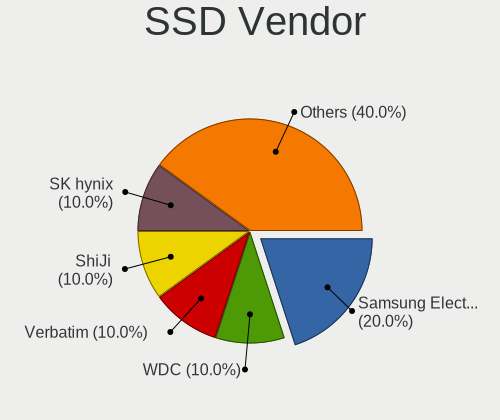

| Vendor              | Notebooks | Drives | Percent |
|---------------------|-----------|--------|---------|
| Kingston            | 3         | 3      | 37.5%   |
| Apacer              | 2         | 2      | 25%     |
| WDC                 | 1         | 1      | 12.5%   |
| SanDisk             | 1         | 1      | 12.5%   |
| Samsung Electronics | 1         | 1      | 12.5%   |

Drive Kind
----------

HDD or SSD

| Kind | Notebooks | Drives | Percent |
|------|-----------|--------|---------|
| HDD  | 9         | 11     | 37.5%   |
| SSD  | 8         | 8      | 33.33%  |
| NVMe | 4         | 5      | 16.67%  |
| MMC  | 3         | 3      | 12.5%   |

Drive Connector
---------------

SATA, SAS, NVMe, etc.

| Type | Notebooks | Drives | Percent |
|------|-----------|--------|---------|
| SATA | 15        | 18     | 65.22%  |
| NVMe | 4         | 5      | 17.39%  |
| MMC  | 3         | 3      | 13.04%  |
| SAS  | 1         | 1      | 4.35%   |

Drive Size
----------

Size of hard drive

| Size in TB | Notebooks | Drives | Percent |
|------------|-----------|--------|---------|
| 0.01-0.5   | 13        | 13     | 72.22%  |
| 0.51-1.0   | 4         | 5      | 22.22%  |
| 1.01-2.0   | 1         | 1      | 5.56%   |

Space Total
-----------

Amount of disk space available on the file system

| Size in GB     | Notebooks | Percent |
|----------------|-----------|---------|
| 101-250        | 5         | 26.32%  |
| 251-500        | 3         | 15.79%  |
| 1-20           | 3         | 15.79%  |
| 51-100         | 3         | 15.79%  |
| More than 3000 | 2         | 10.53%  |
| 21-50          | 1         | 5.26%   |
| 1001-2000      | 1         | 5.26%   |
| 501-1000       | 1         | 5.26%   |

Space Used
----------

Amount of used disk space

| Used GB        | Notebooks | Percent |
|----------------|-----------|---------|
| 21-50          | 5         | 26.32%  |
| 1-20           | 5         | 26.32%  |
| 51-100         | 3         | 15.79%  |
| 101-250        | 2         | 10.53%  |
| More than 3000 | 1         | 5.26%   |
| 251-500        | 1         | 5.26%   |
| 1001-2000      | 1         | 5.26%   |
| 501-1000       | 1         | 5.26%   |

Malfunc. Drives
---------------

Drive models with a malfunction

| Model                           | Notebooks | Drives | Percent |
|---------------------------------|-----------|--------|---------|
| WDC WD3200BPVT-22JJ5T0 320GB    | 1         | 1      | 50%     |
| Seagate ST500LT012-1DG142 500GB | 1         | 1      | 50%     |

Malfunc. Drive Vendor
---------------------

Vendors of faulty drives

| Vendor  | Notebooks | Drives | Percent |
|---------|-----------|--------|---------|
| WDC     | 1         | 1      | 50%     |
| Seagate | 1         | 1      | 50%     |

Malfunc. HDD Vendor
-------------------

Vendors of faulty HDD drives

| Vendor  | Notebooks | Drives | Percent |
|---------|-----------|--------|---------|
| WDC     | 1         | 1      | 50%     |
| Seagate | 1         | 1      | 50%     |

Malfunc. Drive Kind
-------------------

Kinds of faulty drives

| Kind | Notebooks | Drives | Percent |
|------|-----------|--------|---------|
| HDD  | 2         | 2      | 100%    |

Failed Drives
-------------

Failed drive models

Zero info for selected period =(

Failed Drive Vendor
-------------------

Failed drive vendors

Zero info for selected period =(

Drive Status
------------

Number of failed and malfunc. drives

| Status   | Notebooks | Drives | Percent |
|----------|-----------|--------|---------|
| Detected | 10        | 15     | 47.62%  |
| Works    | 9         | 10     | 42.86%  |
| Malfunc  | 2         | 2      | 9.52%   |

Storage controller
------------------

Storage Vendor
--------------

Storage controller vendors

| Vendor                         | Notebooks | Percent |
|--------------------------------|-----------|---------|
| Intel                          | 16        | 76.19%  |
| Samsung Electronics            | 2         | 9.52%   |
| Toshiba America Info Systems   | 1         | 4.76%   |
| Solid State Storage Technology | 1         | 4.76%   |
| AMD                            | 1         | 4.76%   |

Storage Model
-------------

Storage controller models

| Model                                                                        | Notebooks | Percent |
|------------------------------------------------------------------------------|-----------|---------|
| Intel Sunrise Point-LP SATA Controller [AHCI mode]                           | 2         | 8.7%    |
| Intel 5 Series/3400 Series Chipset 6 port SATA AHCI Controller               | 2         | 8.7%    |
| Intel 5 Series/3400 Series Chipset 4 port SATA AHCI Controller               | 2         | 8.7%    |
| Toshiba America Info Systems XG4 NVMe SSD Controller                         | 1         | 4.35%   |
| Solid State Storage CL1-3D256-Q11 NVMe SSD M.2                               | 1         | 4.35%   |
| Samsung NVMe SSD Controller SM981/PM981/PM983                                | 1         | 4.35%   |
| Samsung NVMe SSD Controller 980                                              | 1         | 4.35%   |
| Intel Wildcat Point-LP SATA Controller [AHCI Mode]                           | 1         | 4.35%   |
| Intel Volume Management Device NVMe RAID Controller                          | 1         | 4.35%   |
| Intel Tiger Lake-LP SATA Controller                                          | 1         | 4.35%   |
| Intel NM10/ICH7 Family SATA Controller [AHCI mode]                           | 1         | 4.35%   |
| Intel Celeron/Pentium Silver Processor SATA Controller                       | 1         | 4.35%   |
| Intel Atom Processor E3800 Series SATA AHCI Controller                       | 1         | 4.35%   |
| Intel 82801IBM/IEM (ICH9M/ICH9M-E) 4 port SATA Controller [AHCI mode]        | 1         | 4.35%   |
| Intel 82801HM/HEM (ICH8M/ICH8M-E) SATA Controller [AHCI mode]                | 1         | 4.35%   |
| Intel 82801HM/HEM (ICH8M/ICH8M-E) IDE Controller                             | 1         | 4.35%   |
| Intel 82801 Mobile SATA Controller [RAID mode]                               | 1         | 4.35%   |
| Intel 7 Series Chipset Family 6-port SATA Controller [AHCI mode]             | 1         | 4.35%   |
| Intel 6 Series/C200 Series Chipset Family 6 port Mobile SATA AHCI Controller | 1         | 4.35%   |
| AMD SB7x0/SB8x0/SB9x0 SATA Controller [AHCI mode]                            | 1         | 4.35%   |

Storage Kind
------------

Kind of storage controller (IDE, SATA, NVMe, SAS, ...)

| Kind | Notebooks | Percent |
|------|-----------|---------|
| SATA | 16        | 69.57%  |
| NVMe | 4         | 17.39%  |
| RAID | 2         | 8.7%    |
| IDE  | 1         | 4.35%   |

Processor
---------

CPU Vendor
----------

Processor vendors

| Vendor | Notebooks | Percent |
|--------|-----------|---------|
| Intel  | 18        | 94.74%  |
| AMD    | 1         | 5.26%   |

CPU Model
---------

Processor models

| Model                                   | Notebooks | Percent |
|-----------------------------------------|-----------|---------|
| Intel Core i5 CPU M 460 @ 2.53GHz       | 3         | 15.79%  |
| Intel Pentium Dual CPU T2310 @ 1.46GHz  | 1         | 5.26%   |
| Intel Pentium CPU B950 @ 2.10GHz        | 1         | 5.26%   |
| Intel Core i7-8550U CPU @ 1.80GHz       | 1         | 5.26%   |
| Intel Core i5-7200U CPU @ 2.50GHz       | 1         | 5.26%   |
| Intel Core i5-6300U CPU @ 2.40GHz       | 1         | 5.26%   |
| Intel Core i5-5200U CPU @ 2.20GHz       | 1         | 5.26%   |
| Intel Core i5-3210M CPU @ 2.50GHz       | 1         | 5.26%   |
| Intel Core i5 CPU M 560 @ 2.67GHz       | 1         | 5.26%   |
| Intel Core 2 Duo CPU L9600 @ 2.13GHz    | 1         | 5.26%   |
| Intel Celeron N4020 CPU @ 1.10GHz       | 1         | 5.26%   |
| Intel Celeron CPU N2830 @ 2.16GHz       | 1         | 5.26%   |
| Intel Atom CPU Z3735G @ 1.33GHz         | 1         | 5.26%   |
| Intel Atom CPU N2600 @ 1.60GHz          | 1         | 5.26%   |
| Intel 12th Gen Core i7-1255U            | 1         | 5.26%   |
| Intel 11th Gen Core i3-1115G4 @ 3.00GHz | 1         | 5.26%   |
| AMD C-50 Processor                      | 1         | 5.26%   |

CPU Model Family
----------------

Processor model prefix

| Model              | Notebooks | Percent |
|--------------------|-----------|---------|
| Intel Core i5      | 8         | 42.11%  |
| Other              | 2         | 10.53%  |
| Intel Celeron      | 2         | 10.53%  |
| Intel Atom         | 2         | 10.53%  |
| Intel Pentium Dual | 1         | 5.26%   |
| Intel Pentium      | 1         | 5.26%   |
| Intel Core i7      | 1         | 5.26%   |
| Intel Core 2 Duo   | 1         | 5.26%   |
| AMD C-50           | 1         | 5.26%   |

CPU Cores
---------

Number of processor cores

| Number | Notebooks | Percent |
|--------|-----------|---------|
| 2      | 16        | 84.21%  |
| 4      | 2         | 10.53%  |
| 10     | 1         | 5.26%   |

CPU Sockets
-----------

Number of sockets

| Number | Notebooks | Percent |
|--------|-----------|---------|
| 1      | 19        | 100%    |

CPU Threads
-----------

Threads per core (Hyper-Threading)

| Number | Notebooks | Percent |
|--------|-----------|---------|
| 2      | 12        | 63.16%  |
| 1      | 7         | 36.84%  |

CPU Op-Modes
------------

CPU Operation Modes (32-bit, 64-bit)

| Op mode        | Notebooks | Percent |
|----------------|-----------|---------|
| 32-bit, 64-bit | 18        | 94.74%  |
| 32-bit         | 1         | 5.26%   |

CPU Microcode
-------------

Microcode number

| Number  | Notebooks | Percent |
|---------|-----------|---------|
| Unknown | 9         | 47.37%  |
| 0x20655 | 2         | 10.53%  |
| 0x906a4 | 1         | 5.26%   |
| 0x806ea | 1         | 5.26%   |
| 0x6fd   | 1         | 5.26%   |
| 0x406e3 | 1         | 5.26%   |
| 0x306a9 | 1         | 5.26%   |
| 0x30678 | 1         | 5.26%   |
| 0x30661 | 1         | 5.26%   |
| 0x206a7 | 1         | 5.26%   |

CPU Microarch
-------------

Microarchitecture

| Name             | Notebooks | Percent |
|------------------|-----------|---------|
| Westmere         | 4         | 21.05%  |
| Silvermont       | 2         | 10.53%  |
| KabyLake         | 2         | 10.53%  |
| TigerLake        | 1         | 5.26%   |
| Skylake          | 1         | 5.26%   |
| SandyBridge      | 1         | 5.26%   |
| Penryn           | 1         | 5.26%   |
| IvyBridge        | 1         | 5.26%   |
| Goldmont plus    | 1         | 5.26%   |
| Core             | 1         | 5.26%   |
| Broadwell        | 1         | 5.26%   |
| Bonnell          | 1         | 5.26%   |
| Bobcat           | 1         | 5.26%   |
| Alderlake Hybrid | 1         | 5.26%   |

Graphics
--------

GPU Vendor
----------

Vendors of graphics cards

| Vendor | Notebooks | Percent |
|--------|-----------|---------|
| Intel  | 17        | 73.91%  |
| Nvidia | 4         | 17.39%  |
| AMD    | 2         | 8.7%    |

GPU Model
---------

Graphics card models

| Model                                                                     | Notebooks | Percent |
|---------------------------------------------------------------------------|-----------|---------|
| Intel Core Processor Integrated Graphics Controller                       | 3         | 12.5%   |
| Intel Atom Processor Z36xxx/Z37xxx Series Graphics & Display              | 2         | 8.33%   |
| Nvidia TU117GLM [T550 Laptop GPU]                                         | 1         | 4.17%   |
| Nvidia GT216M [GeForce GT 330M]                                           | 1         | 4.17%   |
| Nvidia GM108M [GeForce MX130]                                             | 1         | 4.17%   |
| Nvidia GK107M [GeForce GTX 660M]                                          | 1         | 4.17%   |
| Intel UHD Graphics 620                                                    | 1         | 4.17%   |
| Intel Tiger Lake-LP GT2 [UHD Graphics G4]                                 | 1         | 4.17%   |
| Intel Skylake GT2 [HD Graphics 520]                                       | 1         | 4.17%   |
| Intel Mobile GM965/GL960 Integrated Graphics Controller (secondary)       | 1         | 4.17%   |
| Intel Mobile GM965/GL960 Integrated Graphics Controller (primary)         | 1         | 4.17%   |
| Intel Mobile 4 Series Chipset Integrated Graphics Controller              | 1         | 4.17%   |
| Intel HD Graphics 620                                                     | 1         | 4.17%   |
| Intel HD Graphics 5500                                                    | 1         | 4.17%   |
| Intel GeminiLake [UHD Graphics 600]                                       | 1         | 4.17%   |
| Intel Atom Processor D2xxx/N2xxx Integrated Graphics Controller           | 1         | 4.17%   |
| Intel Alder Lake-UP3 GT2 [Iris Xe Graphics]                               | 1         | 4.17%   |
| Intel 3rd Gen Core processor Graphics Controller                          | 1         | 4.17%   |
| Intel 2nd Generation Core Processor Family Integrated Graphics Controller | 1         | 4.17%   |
| AMD Wrestler [Radeon HD 6250]                                             | 1         | 4.17%   |
| AMD Madison [Mobility Radeon HD 5650/5750 / 6530M/6550M]                  | 1         | 4.17%   |

GPU Combo
---------

Combinations of graphics cards

| Name           | Notebooks | Percent |
|----------------|-----------|---------|
| 1 x Intel      | 13        | 68.42%  |
| Intel + Nvidia | 4         | 21.05%  |
| 1 x AMD        | 2         | 10.53%  |

GPU Driver
----------

Free vs proprietary

| Driver | Notebooks | Percent |
|--------|-----------|---------|
| Free   | 19        | 100%    |

GPU Memory
----------

Total video memory

| Size in GB | Notebooks | Percent |
|------------|-----------|---------|
| Unknown    | 16        | 84.21%  |
| 3.01-4.0   | 1         | 5.26%   |
| 1.01-2.0   | 1         | 5.26%   |
| 0.51-1.0   | 1         | 5.26%   |

Monitor
-------

Monitor Vendor
--------------

Monitor vendors

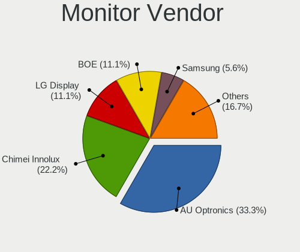

| Vendor              | Notebooks | Percent |
|---------------------|-----------|---------|
| AU Optronics        | 6         | 31.58%  |
| LG Display          | 3         | 15.79%  |
| Samsung Electronics | 2         | 10.53%  |
| BOE                 | 2         | 10.53%  |
| Lenovo              | 1         | 5.26%   |
| HannStar            | 1         | 5.26%   |
| Dell                | 1         | 5.26%   |
| Chimei Innolux      | 1         | 5.26%   |
| BenQ                | 1         | 5.26%   |
| Acer                | 1         | 5.26%   |

Monitor Model
-------------

Monitor models

| Model                                                                | Notebooks | Percent |
|----------------------------------------------------------------------|-----------|---------|
| Samsung Electronics LCD Monitor SEC3847 1440x900 367x230mm 17.1-inch | 1         | 5.26%   |
| Samsung Electronics LCD Monitor SEC3253 1366x768 344x194mm 15.5-inch | 1         | 5.26%   |
| LG Display LCD Monitor LGD0469 1920x1080 382x215mm 17.3-inch         | 1         | 5.26%   |
| LG Display LCD Monitor LGD033A 1366x768 344x194mm 15.5-inch          | 1         | 5.26%   |
| LG Display LCD Monitor LGD0288 1600x900 382x215mm 17.3-inch          | 1         | 5.26%   |
| Lenovo LCD Monitor LEN4011 1280x800 260x170mm 12.2-inch              | 1         | 5.26%   |
| HannStar HSD100IFW4A HSD03EE 1024x600 220x129mm 10.0-inch            | 1         | 5.26%   |
| Dell S2721HSX DEL4202 1920x1080 598x336mm 27.0-inch                  | 1         | 5.26%   |
| Chimei Innolux LCD Monitor CMN1499 1366x768 309x174mm 14.0-inch      | 1         | 5.26%   |
| BOE LCD Monitor BOE093E 1920x1080 344x194mm 15.5-inch                | 1         | 5.26%   |
| BOE LCD Monitor BOE0771 1366x768 256x144mm 11.6-inch                 | 1         | 5.26%   |
| BenQ BenQG2222HDL BNQ785A 1920x1080 478x269mm 21.6-inch              | 1         | 5.26%   |
| AU Optronics LCD Monitor AUOEB83 1920x1080 344x194mm 15.5-inch       | 1         | 5.26%   |
| AU Optronics LCD Monitor AUO9314 1280x800 261x163mm 12.1-inch        | 1         | 5.26%   |
| AU Optronics LCD Monitor AUO38ED 1920x1080 344x193mm 15.5-inch       | 1         | 5.26%   |
| AU Optronics LCD Monitor AUO35ED 1920x1080 344x193mm 15.5-inch       | 1         | 5.26%   |
| AU Optronics LCD Monitor AUO26EC 1366x768 344x193mm 15.5-inch        | 1         | 5.26%   |
| AU Optronics LCD Monitor AUO123D 1920x1080 309x173mm 13.9-inch       | 1         | 5.26%   |
| Acer P221W ACR0016 1680x1050 474x296mm 22.0-inch                     | 1         | 5.26%   |

Monitor Resolution
------------------

Monitor screen resolution

| Resolution         | Notebooks | Percent |
|--------------------|-----------|---------|
| 1920x1080 (FHD)    | 6         | 35.29%  |
| 1366x768 (WXGA)    | 5         | 29.41%  |
| 1280x800 (WXGA)    | 2         | 11.76%  |
| 1680x1050 (WSXGA+) | 1         | 5.88%   |
| 1600x900 (HD+)     | 1         | 5.88%   |
| 1440x900 (WXGA+)   | 1         | 5.88%   |
| 1024x600           | 1         | 5.88%   |

Monitor Diagonal
----------------

Diagonal size in inches

| Inches | Notebooks | Percent |
|--------|-----------|---------|
| 15     | 7         | 36.84%  |
| 17     | 3         | 15.79%  |
| 12     | 2         | 10.53%  |
| 27     | 1         | 5.26%   |
| 22     | 1         | 5.26%   |
| 21     | 1         | 5.26%   |
| 14     | 1         | 5.26%   |
| 13     | 1         | 5.26%   |
| 11     | 1         | 5.26%   |
| 10     | 1         | 5.26%   |

Monitor Width
-------------

Physical width

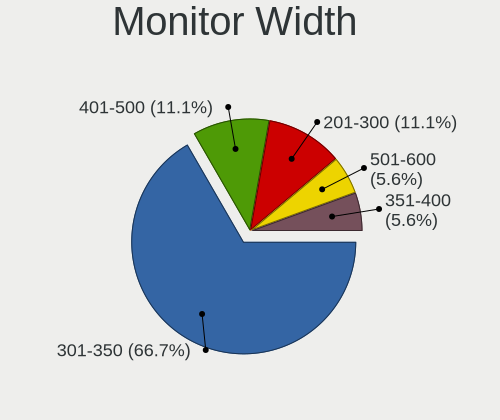

| Width in mm | Notebooks | Percent |
|-------------|-----------|---------|
| 301-350     | 9         | 47.37%  |
| 201-300     | 4         | 21.05%  |
| 351-400     | 3         | 15.79%  |
| 401-500     | 2         | 10.53%  |
| 501-600     | 1         | 5.26%   |

Aspect Ratio
------------

Proportional relationship between the width and the height

| Ratio | Notebooks | Percent |
|-------|-----------|---------|
| 16/9  | 13        | 76.47%  |
| 16/10 | 3         | 17.65%  |
| 3/2   | 1         | 5.88%   |

Monitor Area
------------

Area in inch²

| Area in inch² | Notebooks | Percent |
|----------------|-----------|---------|
| 101-110        | 7         | 36.84%  |
| 81-90          | 2         | 10.53%  |
| 61-70          | 2         | 10.53%  |
| 201-250        | 2         | 10.53%  |
| 121-130        | 2         | 10.53%  |
| 51-60          | 1         | 5.26%   |
| 41-50          | 1         | 5.26%   |
| 301-350        | 1         | 5.26%   |
| 131-140        | 1         | 5.26%   |

Pixel Density
-------------

Pixels per inch

| Density | Notebooks | Percent |
|---------|-----------|---------|
| 121-160 | 9         | 47.37%  |
| 101-120 | 7         | 36.84%  |
| 51-100  | 3         | 15.79%  |

Multiple Monitors
-----------------

Total monitors connected

| Total | Notebooks | Percent |
|-------|-----------|---------|
| 1     | 16        | 84.21%  |
| 2     | 3         | 15.79%  |

Network
-------

Net Controller Vendor
---------------------

Controller vendors

| Vendor                   | Notebooks | Percent |
|--------------------------|-----------|---------|
| Realtek Semiconductor    | 10        | 29.41%  |
| Intel                    | 8         | 23.53%  |
| Qualcomm Atheros         | 6         | 17.65%  |
| Broadcom                 | 4         | 11.76%  |
| Xiaomi                   | 1         | 2.94%   |
| Ralink                   | 1         | 2.94%   |
| QinHeng Electronics      | 1         | 2.94%   |
| Marvell Technology Group | 1         | 2.94%   |
| Dresden Elektronik       | 1         | 2.94%   |
| Attansic Technology      | 1         | 2.94%   |

Net Controller Model
--------------------

Controller models

| Model                                                                          | Notebooks | Percent |
|--------------------------------------------------------------------------------|-----------|---------|
| Realtek RTL8111/8168/8411 PCI Express Gigabit Ethernet Controller              | 5         | 12.2%   |
| Realtek RTL810xE PCI Express Fast Ethernet controller                          | 2         | 4.88%   |
| Qualcomm Atheros AR9285 Wireless Network Adapter (PCI-Express)                 | 2         | 4.88%   |
| Broadcom BCM4313 802.11bgn Wireless Network Adapter                            | 2         | 4.88%   |
| Xiaomi Mi/Redmi series (RNDIS + ADB)                                           | 1         | 2.44%   |
| Realtek RTL88x2bu [AC1200 Techkey]                                             | 1         | 2.44%   |
| Realtek RTL8821CE 802.11ac PCIe Wireless Network Adapter                       | 1         | 2.44%   |
| Realtek RTL8192EU 802.11b/g/n WLAN Adapter                                     | 1         | 2.44%   |
| Realtek RTL8187B Wireless 802.11g 54Mbps Network Adapter                       | 1         | 2.44%   |
| Realtek RTL8153 Gigabit Ethernet Adapter                                       | 1         | 2.44%   |
| Realtek 802.11n WLAN Adapter                                                   | 1         | 2.44%   |
| Ralink RT3290 Wireless 802.11n 1T/1R PCIe                                      | 1         | 2.44%   |
| Qualcomm Atheros QCA9377 802.11ac Wireless Network Adapter                     | 1         | 2.44%   |
| Qualcomm Atheros AR9287 Wireless Network Adapter (PCI-Express)                 | 1         | 2.44%   |
| Qualcomm Atheros AR8161 Gigabit Ethernet                                       | 1         | 2.44%   |
| Qualcomm Atheros AR8152 v2.0 Fast Ethernet                                     | 1         | 2.44%   |
| Qualcomm Atheros AR242x / AR542x Wireless Network Adapter (PCI-Express)        | 1         | 2.44%   |
| QinHeng USB Single Serial                                                      | 1         | 2.44%   |
| Marvell Group Yukon Optima 88E8059 [PCIe Gigabit Ethernet Controller with AVB] | 1         | 2.44%   |
| Intel Wireless 8260                                                            | 1         | 2.44%   |
| Intel Wireless 7265                                                            | 1         | 2.44%   |
| Intel Wireless 3160                                                            | 1         | 2.44%   |
| Intel Ethernet Connection I219-LM                                              | 1         | 2.44%   |
| Intel Ethernet Connection (4) I219-V                                           | 1         | 2.44%   |
| Intel Ethernet Connection (16) I219-LM                                         | 1         | 2.44%   |
| Intel Centrino Wireless-N 2200                                                 | 1         | 2.44%   |
| Intel Centrino Wireless-N 1000 [Condor Peak]                                   | 1         | 2.44%   |
| Intel Alder Lake-P PCH CNVi WiFi                                               | 1         | 2.44%   |
| Intel 82577LM Gigabit Network Connection                                       | 1         | 2.44%   |
| Intel 82567LM Gigabit Network Connection                                       | 1         | 2.44%   |
| Dresden Elektronik ZigBee gateway [ConBee II]                                  | 1         | 2.44%   |
| Broadcom NetLink BCM57780 Gigabit Ethernet PCIe                                | 1         | 2.44%   |
| Broadcom BCM4312 802.11b/g LP-PHY                                              | 1         | 2.44%   |
| Attansic AR8152 v2.0 Fast Ethernet                                             | 1         | 2.44%   |

Wireless Vendor
---------------

Wireless vendors

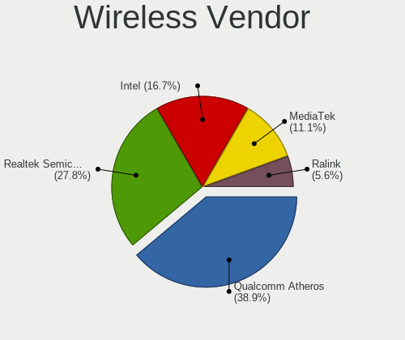

| Vendor                | Notebooks | Percent |
|-----------------------|-----------|---------|
| Intel                 | 6         | 31.58%  |
| Qualcomm Atheros      | 5         | 26.32%  |
| Realtek Semiconductor | 4         | 21.05%  |
| Broadcom              | 3         | 15.79%  |
| Ralink                | 1         | 5.26%   |

Wireless Model
--------------

Wireless models

| Model                                                                   | Notebooks | Percent |
|-------------------------------------------------------------------------|-----------|---------|
| Qualcomm Atheros AR9285 Wireless Network Adapter (PCI-Express)          | 2         | 10%     |
| Broadcom BCM4313 802.11bgn Wireless Network Adapter                     | 2         | 10%     |
| Realtek RTL88x2bu [AC1200 Techkey]                                      | 1         | 5%      |
| Realtek RTL8821CE 802.11ac PCIe Wireless Network Adapter                | 1         | 5%      |
| Realtek RTL8192EU 802.11b/g/n WLAN Adapter                              | 1         | 5%      |
| Realtek RTL8187B Wireless 802.11g 54Mbps Network Adapter                | 1         | 5%      |
| Realtek 802.11n WLAN Adapter                                            | 1         | 5%      |
| Ralink RT3290 Wireless 802.11n 1T/1R PCIe                               | 1         | 5%      |
| Qualcomm Atheros QCA9377 802.11ac Wireless Network Adapter              | 1         | 5%      |
| Qualcomm Atheros AR9287 Wireless Network Adapter (PCI-Express)          | 1         | 5%      |
| Qualcomm Atheros AR242x / AR542x Wireless Network Adapter (PCI-Express) | 1         | 5%      |
| Intel Wireless 8260                                                     | 1         | 5%      |
| Intel Wireless 7265                                                     | 1         | 5%      |
| Intel Wireless 3160                                                     | 1         | 5%      |
| Intel Centrino Wireless-N 2200                                          | 1         | 5%      |
| Intel Centrino Wireless-N 1000 [Condor Peak]                            | 1         | 5%      |
| Intel Alder Lake-P PCH CNVi WiFi                                        | 1         | 5%      |
| Broadcom BCM4312 802.11b/g LP-PHY                                       | 1         | 5%      |

Ethernet Vendor
---------------

Ethernet vendors

| Vendor                   | Notebooks | Percent |
|--------------------------|-----------|---------|
| Realtek Semiconductor    | 8         | 42.11%  |
| Intel                    | 5         | 26.32%  |
| Qualcomm Atheros         | 2         | 10.53%  |
| Xiaomi                   | 1         | 5.26%   |
| Marvell Technology Group | 1         | 5.26%   |
| Broadcom                 | 1         | 5.26%   |
| Attansic Technology      | 1         | 5.26%   |

Ethernet Model
--------------

Ethernet models

| Model                                                                          | Notebooks | Percent |
|--------------------------------------------------------------------------------|-----------|---------|
| Realtek RTL8111/8168/8411 PCI Express Gigabit Ethernet Controller              | 5         | 26.32%  |
| Realtek RTL810xE PCI Express Fast Ethernet controller                          | 2         | 10.53%  |
| Xiaomi Mi/Redmi series (RNDIS + ADB)                                           | 1         | 5.26%   |
| Realtek RTL8153 Gigabit Ethernet Adapter                                       | 1         | 5.26%   |
| Qualcomm Atheros AR8161 Gigabit Ethernet                                       | 1         | 5.26%   |
| Qualcomm Atheros AR8152 v2.0 Fast Ethernet                                     | 1         | 5.26%   |
| Marvell Group Yukon Optima 88E8059 [PCIe Gigabit Ethernet Controller with AVB] | 1         | 5.26%   |
| Intel Ethernet Connection I219-LM                                              | 1         | 5.26%   |
| Intel Ethernet Connection (4) I219-V                                           | 1         | 5.26%   |
| Intel Ethernet Connection (16) I219-LM                                         | 1         | 5.26%   |
| Intel 82577LM Gigabit Network Connection                                       | 1         | 5.26%   |
| Intel 82567LM Gigabit Network Connection                                       | 1         | 5.26%   |
| Broadcom NetLink BCM57780 Gigabit Ethernet PCIe                                | 1         | 5.26%   |
| Attansic AR8152 v2.0 Fast Ethernet                                             | 1         | 5.26%   |

Net Controller Kind
-------------------

Ethernet, WiFi or modem

| Kind     | Notebooks | Percent |
|----------|-----------|---------|
| WiFi     | 18        | 48.65%  |
| Ethernet | 17        | 45.95%  |
| Modem    | 2         | 5.41%   |

Used Controller
---------------

Currently used network controller

| Kind     | Notebooks | Percent |
|----------|-----------|---------|
| WiFi     | 12        | 66.67%  |
| Ethernet | 6         | 33.33%  |

NICs
----

Total network controllers on board

| Total | Notebooks | Percent |
|-------|-----------|---------|
| 2     | 16        | 84.21%  |
| 0     | 2         | 10.53%  |
| 1     | 1         | 5.26%   |

IPv6
----

IPv6 vs IPv4

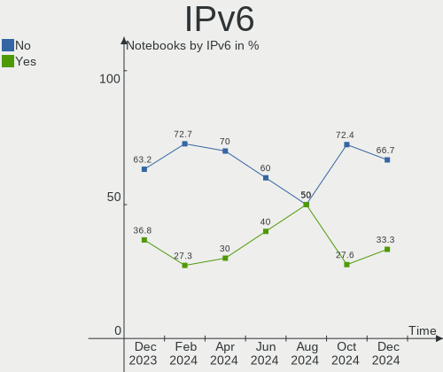

| Used | Notebooks | Percent |
|------|-----------|---------|
| No   | 14        | 73.68%  |
| Yes  | 5         | 26.32%  |

Bluetooth
---------

Bluetooth Vendor
----------------

Controller vendors

| Vendor                          | Notebooks | Percent |
|---------------------------------|-----------|---------|
| Intel                           | 3         | 25%     |
| Qualcomm Atheros Communications | 2         | 16.67%  |
| Realtek Semiconductor           | 1         | 8.33%   |
| Ralink                          | 1         | 8.33%   |
| Lite-On Technology              | 1         | 8.33%   |
| Hewlett-Packard                 | 1         | 8.33%   |
| Foxconn / Hon Hai               | 1         | 8.33%   |
| Dell                            | 1         | 8.33%   |
| Broadcom                        | 1         | 8.33%   |

Bluetooth Model
---------------

Controller models

| Model                                                                               | Notebooks | Percent |
|-------------------------------------------------------------------------------------|-----------|---------|
| Intel Bluetooth wireless interface                                                  | 2         | 16.67%  |
| Realtek  Bluetooth 4.2 Adapter                                                      | 1         | 8.33%   |
| Ralink RT3290 Bluetooth                                                             | 1         | 8.33%   |
| Qualcomm Atheros  Bluetooth Device                                                  | 1         | 8.33%   |
| Qualcomm Atheros AR3011 Bluetooth                                                   | 1         | 8.33%   |
| Lite-On BCM20702A0                                                                  | 1         | 8.33%   |
| Intel Bluetooth Device                                                              | 1         | 8.33%   |
| HP Bluetooth 2.0 Interface [Broadcom BCM2045]                                       | 1         | 8.33%   |
| Foxconn / Hon Hai Foxconn T77H114 BCM2070 [Single-Chip Bluetooth 2.1 + EDR Adapter] | 1         | 8.33%   |
| Dell Wireless 365 Bluetooth                                                         | 1         | 8.33%   |
| Broadcom BCM2045B (BDC-2.1)                                                         | 1         | 8.33%   |

Sound
-----

Sound Vendor
------------

Sound card vendors

| Vendor    | Notebooks | Percent |
|-----------|-----------|---------|
| Intel     | 17        | 80.95%  |
| AMD       | 2         | 9.52%   |
| Nvidia    | 1         | 4.76%   |
| GN Netcom | 1         | 4.76%   |

Sound Model
-----------

Sound card models

| Model                                                                      | Notebooks | Percent |
|----------------------------------------------------------------------------|-----------|---------|
| Intel 5 Series/3400 Series Chipset High Definition Audio                   | 4         | 18.18%  |
| Intel Sunrise Point-LP HD Audio                                            | 3         | 13.64%  |
| Nvidia GT216 HDMI Audio Controller                                         | 1         | 4.55%   |
| Intel Wildcat Point-LP High Definition Audio Controller                    | 1         | 4.55%   |
| Intel Tiger Lake-LP Smart Sound Technology Audio Controller                | 1         | 4.55%   |
| Intel NM10/ICH7 Family High Definition Audio Controller                    | 1         | 4.55%   |
| Intel Celeron/Pentium Silver Processor High Definition Audio               | 1         | 4.55%   |
| Intel Broadwell-U Audio Controller                                         | 1         | 4.55%   |
| Intel Atom Processor Z36xxx/Z37xxx Series High Definition Audio Controller | 1         | 4.55%   |
| Intel Alder Lake PCH-P High Definition Audio Controller                    | 1         | 4.55%   |
| Intel 82801I (ICH9 Family) HD Audio Controller                             | 1         | 4.55%   |
| Intel 82801H (ICH8 Family) HD Audio Controller                             | 1         | 4.55%   |
| Intel 7 Series/C216 Chipset Family High Definition Audio Controller        | 1         | 4.55%   |
| Intel 6 Series/C200 Series Chipset Family High Definition Audio Controller | 1         | 4.55%   |
| GN Netcom Jabra BIZ 2400 USB                                               | 1         | 4.55%   |
| AMD SBx00 Azalia (Intel HDA)                                               | 1         | 4.55%   |
| AMD Redwood HDMI Audio [Radeon HD 5000 Series]                             | 1         | 4.55%   |

Memory
------

Memory Vendor
-------------

Memory module vendors

| Vendor              | Notebooks | Percent |
|---------------------|-----------|---------|
| Unknown             | 4         | 30.77%  |
| SK hynix            | 3         | 23.08%  |
| Samsung Electronics | 2         | 15.38%  |
| Unknown (ABCD)      | 1         | 7.69%   |
| Micron Technology   | 1         | 7.69%   |
| Elpida              | 1         | 7.69%   |
| Crucial             | 1         | 7.69%   |

Memory Model
------------

Memory module models

| Model                                                            | Notebooks | Percent |
|------------------------------------------------------------------|-----------|---------|
| Unknown RAM Module 4GB SODIMM DDR3                               | 1         | 7.14%   |
| Unknown RAM Module 2GB SODIMM DDR3                               | 1         | 7.14%   |
| Unknown RAM Module 2048MB SODIMM DDR3 800MT/s                    | 1         | 7.14%   |
| Unknown RAM Module 1024MB SODIMM DDR2 533MT/s                    | 1         | 7.14%   |
| Unknown (ABCD) RAM 123456789012345678 3GB SODIMM LPDDR4 2400MT/s | 1         | 7.14%   |
| SK hynix RAM HMT41GS6BFR8A-PB 8GB SODIMM DDR3 1333MT/s           | 1         | 7.14%   |
| SK hynix RAM HMT351S6CFR8C-PB 4GB SODIMM DDR3 1600MT/s           | 1         | 7.14%   |
| SK hynix RAM HMAA1GS6CJR6N-XN 8GB SODIMM DDR4 3200MT/s           | 1         | 7.14%   |
| Samsung RAM Module 8GB SODIMM DDR4 2133MT/s                      | 1         | 7.14%   |
| Samsung RAM M471B5273DH0-CK0 4GB SODIMM DDR3 1600MT/s            | 1         | 7.14%   |
| Micron RAM Module 8GB SODIMM DDR4 2133MT/s                       | 1         | 7.14%   |
| Elpida RAM EBJ20UF8BDU0-GN-F 2GB SODIMM DDR3 1600MT/s            | 1         | 7.14%   |
| Elpida RAM BA92-09719A 2GB SODIMM DDR3 1334MT/s                  | 1         | 7.14%   |
| Crucial RAM CT16G48C40S5.M8A1 16GB SODIMM DDR5 4800MT/s          | 1         | 7.14%   |

Memory Kind
-----------

Memory module kinds

| Kind   | Notebooks | Percent |
|--------|-----------|---------|
| DDR3   | 6         | 50%     |
| DDR4   | 3         | 25%     |
| LPDDR4 | 1         | 8.33%   |
| DDR5   | 1         | 8.33%   |
| DDR2   | 1         | 8.33%   |

Memory Form Factor
------------------

Physical design of the memory module

| Name   | Notebooks | Percent |
|--------|-----------|---------|
| SODIMM | 12        | 100%    |

Memory Size
-----------

Memory module size

| Size  | Notebooks | Percent |
|-------|-----------|---------|
| 8192  | 5         | 41.67%  |
| 2048  | 3         | 25%     |
| 4096  | 2         | 16.67%  |
| 16384 | 1         | 8.33%   |
| 1024  | 1         | 8.33%   |

Memory Speed
------------

Memory module speed

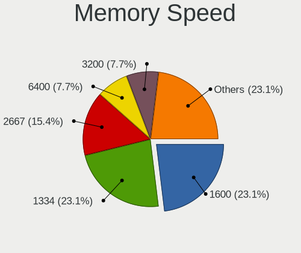

| Speed   | Notebooks | Percent |
|---------|-----------|---------|
| 2133    | 2         | 15.38%  |
| 1600    | 2         | 15.38%  |
| Unknown | 2         | 15.38%  |
| 4800    | 1         | 7.69%   |
| 3200    | 1         | 7.69%   |
| 2400    | 1         | 7.69%   |
| 1334    | 1         | 7.69%   |
| 1333    | 1         | 7.69%   |
| 800     | 1         | 7.69%   |
| 533     | 1         | 7.69%   |

Printers & scanners
-------------------

Printer Vendor
--------------

Printer device vendors

Zero info for selected period =(

Printer Model
-------------

Printer device models

Zero info for selected period =(

Scanner Vendor
--------------

Scanner device vendors

Zero info for selected period =(

Scanner Model
-------------

Scanner device models

Zero info for selected period =(

Camera
------

Camera Vendor
-------------

Camera device vendors

| Vendor                | Notebooks | Percent |
|-----------------------|-----------|---------|
| Microdia              | 4         | 26.67%  |
| Chicony Electronics   | 4         | 26.67%  |
| Lite-On Technology    | 2         | 13.33%  |
| IMC Networks          | 2         | 13.33%  |
| Syntek                | 1         | 6.67%   |
| Realtek Semiconductor | 1         | 6.67%   |
| ALi                   | 1         | 6.67%   |

Camera Model
------------

Camera device models

| Model                                     | Notebooks | Percent |
|-------------------------------------------|-----------|---------|
| Chicony HP TrueVision HD Camera           | 2         | 13.33%  |
| Syntek Lenovo EasyCamera                  | 1         | 6.67%   |
| Realtek USB2.0 camera                     | 1         | 6.67%   |
| Microdia USB 2.0 Camera                   | 1         | 6.67%   |
| Microdia Sony Visual Communication Camera | 1         | 6.67%   |
| Microdia Integrated_Webcam_HD             | 1         | 6.67%   |
| Microdia Integrated_Webcam_FHD            | 1         | 6.67%   |
| Lite-On HP HD Webcam                      | 1         | 6.67%   |
| Lite-On HP HD Camera                      | 1         | 6.67%   |
| IMC Networks USB 2.0 UVC VGA WebCam       | 1         | 6.67%   |
| IMC Networks Lenovo EasyCamera            | 1         | 6.67%   |
| Chicony USB 2.0 Camera                    | 1         | 6.67%   |
| Chicony CKA7227                           | 1         | 6.67%   |
| ALi Gateway Webcam                        | 1         | 6.67%   |

Security
--------

Fingerprint Vendor
------------------

Fingerprint sensor vendors

| Vendor           | Notebooks | Percent |
|------------------|-----------|---------|
| Validity Sensors | 1         | 50%     |
| Upek             | 1         | 50%     |

Fingerprint Model
-----------------

Fingerprint sensor models

| Model                                                  | Notebooks | Percent |
|--------------------------------------------------------|-----------|---------|
| Validity Sensors VFS495 Fingerprint Reader             | 1         | 50%     |
| Upek Biometric Touchchip/Touchstrip Fingerprint Sensor | 1         | 50%     |

Chipcard Vendor
---------------

Chipcard module vendors

| Vendor   | Notebooks | Percent |
|----------|-----------|---------|
| Broadcom | 1         | 100%    |

Chipcard Model
--------------

Chipcard module models

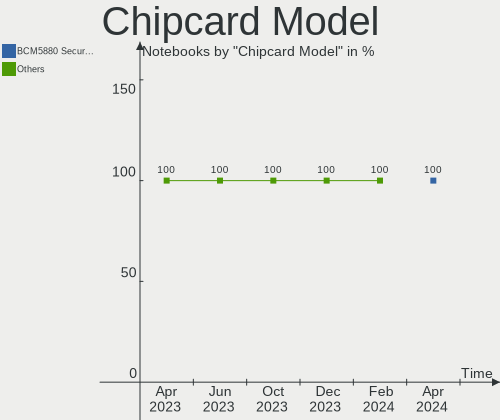

| Model          | Notebooks | Percent |
|----------------|-----------|---------|
| Broadcom 58200 | 1         | 100%    |

Unsupported
-----------

Unsupported Devices
-------------------

Total unsupported devices on board

| Total | Notebooks | Percent |
|-------|-----------|---------|
| 0     | 11        | 57.89%  |
| 1     | 7         | 36.84%  |
| 2     | 1         | 5.26%   |

Unsupported Device Types
------------------------

Types of unsupported devices

| Type               | Notebooks | Percent |
|--------------------|-----------|---------|
| Net/wireless       | 3         | 25%     |
| Bluetooth          | 3         | 25%     |
| Fingerprint reader | 2         | 16.67%  |
| Graphics card      | 1         | 8.33%   |
| Dvb card           | 1         | 8.33%   |
| Chipcard           | 1         | 8.33%   |
| Camera             | 1         | 8.33%   |

