Lubuntu - Hardware Trends (Notebooks)
-------------------------------------

A project to identify most popular hardware characteristics and track their change
over time based on data collected by Linux users at https://Linux-Hardware.org.

Anyone can contribute to this report by the [hw-probe](https://github.com/linuxhw/hw-probe) tool:

    sudo -E hw-probe -all -upload

This report is for one last month. Overall report since the beginning of time: [TestCoverage](https://github.com/linuxhw/TestCoverage)

Period: Jan, 2023.

Contents
--------

* [ System ](#system)
  - [ OS                       ](#os)
  - [ OS Family                ](#os-family)
  - [ Kernel                   ](#kernel)
  - [ Kernel Family            ](#kernel-family)
  - [ Kernel Major Ver.        ](#kernel-major-ver)
  - [ Arch                     ](#arch)
  - [ DE                       ](#de)
  - [ Display Server           ](#display-server)
  - [ Display Manager          ](#display-manager)
  - [ OS Lang                  ](#os-lang)
  - [ Boot Mode                ](#boot-mode)
  - [ Filesystem               ](#filesystem)
  - [ Part. scheme             ](#part-scheme)
  - [ Dual Boot with Linux/BSD ](#dual-boot-with-linuxbsd)
  - [ Dual Boot (Win)          ](#dual-boot-win)

* [ Board ](#board)
  - [ Vendor                   ](#vendor)
  - [ Model                    ](#model)
  - [ Model Family             ](#model-family)
  - [ MFG Year                 ](#mfg-year)
  - [ Form Factor              ](#form-factor)
  - [ Secure Boot              ](#secure-boot)
  - [ Coreboot                 ](#coreboot)
  - [ RAM Size                 ](#ram-size)
  - [ RAM Used                 ](#ram-used)
  - [ Total Drives             ](#total-drives)
  - [ Has CD-ROM               ](#has-cd-rom)
  - [ Has Ethernet             ](#has-ethernet)
  - [ Has WiFi                 ](#has-wifi)
  - [ Has Bluetooth            ](#has-bluetooth)

* [ Location ](#location)
  - [ Country                  ](#country)
  - [ City                     ](#city)

* [ Drives ](#drives)
  - [ Drive Vendor             ](#drive-vendor)
  - [ Drive Model              ](#drive-model)
  - [ HDD Vendor               ](#hdd-vendor)
  - [ SSD Vendor               ](#ssd-vendor)
  - [ Drive Kind               ](#drive-kind)
  - [ Drive Connector          ](#drive-connector)
  - [ Drive Size               ](#drive-size)
  - [ Space Total              ](#space-total)
  - [ Space Used               ](#space-used)
  - [ Malfunc. Drives          ](#malfunc-drives)
  - [ Malfunc. Drive Vendor    ](#malfunc-drive-vendor)
  - [ Malfunc. HDD Vendor      ](#malfunc-hdd-vendor)
  - [ Malfunc. Drive Kind      ](#malfunc-drive-kind)
  - [ Failed Drives            ](#failed-drives)
  - [ Failed Drive Vendor      ](#failed-drive-vendor)
  - [ Drive Status             ](#drive-status)

* [ Storage controller ](#storage-controller)
  - [ Storage Vendor           ](#storage-vendor)
  - [ Storage Model            ](#storage-model)
  - [ Storage Kind             ](#storage-kind)

* [ Processor ](#processor)
  - [ CPU Vendor               ](#cpu-vendor)
  - [ CPU Model                ](#cpu-model)
  - [ CPU Model Family         ](#cpu-model-family)
  - [ CPU Cores                ](#cpu-cores)
  - [ CPU Sockets              ](#cpu-sockets)
  - [ CPU Threads              ](#cpu-threads)
  - [ CPU Op-Modes             ](#cpu-op-modes)
  - [ CPU Microcode            ](#cpu-microcode)
  - [ CPU Microarch            ](#cpu-microarch)

* [ Graphics ](#graphics)
  - [ GPU Vendor               ](#gpu-vendor)
  - [ GPU Model                ](#gpu-model)
  - [ GPU Combo                ](#gpu-combo)
  - [ GPU Driver               ](#gpu-driver)
  - [ GPU Memory               ](#gpu-memory)

* [ Monitor ](#monitor)
  - [ Monitor Vendor           ](#monitor-vendor)
  - [ Monitor Model            ](#monitor-model)
  - [ Monitor Resolution       ](#monitor-resolution)
  - [ Monitor Diagonal         ](#monitor-diagonal)
  - [ Monitor Width            ](#monitor-width)
  - [ Aspect Ratio             ](#aspect-ratio)
  - [ Monitor Area             ](#monitor-area)
  - [ Pixel Density            ](#pixel-density)
  - [ Multiple Monitors        ](#multiple-monitors)

* [ Network ](#network)
  - [ Net Controller Vendor    ](#net-controller-vendor)
  - [ Net Controller Model     ](#net-controller-model)
  - [ Wireless Vendor          ](#wireless-vendor)
  - [ Wireless Model           ](#wireless-model)
  - [ Ethernet Vendor          ](#ethernet-vendor)
  - [ Ethernet Model           ](#ethernet-model)
  - [ Net Controller Kind      ](#net-controller-kind)
  - [ Used Controller          ](#used-controller)
  - [ NICs                     ](#nics)
  - [ IPv6                     ](#ipv6)

* [ Bluetooth ](#bluetooth)
  - [ Bluetooth Vendor         ](#bluetooth-vendor)
  - [ Bluetooth Model          ](#bluetooth-model)

* [ Sound ](#sound)
  - [ Sound Vendor             ](#sound-vendor)
  - [ Sound Model              ](#sound-model)

* [ Memory ](#memory)
  - [ Memory Vendor            ](#memory-vendor)
  - [ Memory Model             ](#memory-model)
  - [ Memory Kind              ](#memory-kind)
  - [ Memory Form Factor       ](#memory-form-factor)
  - [ Memory Size              ](#memory-size)
  - [ Memory Speed             ](#memory-speed)

* [ Printers & scanners ](#printers--scanners)
  - [ Printer Vendor           ](#printer-vendor)
  - [ Printer Model            ](#printer-model)
  - [ Scanner Vendor           ](#scanner-vendor)
  - [ Scanner Model            ](#scanner-model)

* [ Camera ](#camera)
  - [ Camera Vendor            ](#camera-vendor)
  - [ Camera Model             ](#camera-model)

* [ Security ](#security)
  - [ Fingerprint Vendor       ](#fingerprint-vendor)
  - [ Fingerprint Model        ](#fingerprint-model)
  - [ Chipcard Vendor          ](#chipcard-vendor)
  - [ Chipcard Model           ](#chipcard-model)

* [ Unsupported ](#unsupported)
  - [ Unsupported Devices      ](#unsupported-devices)
  - [ Unsupported Device Types ](#unsupported-device-types)

System
------

OS
--

Installed operating systems

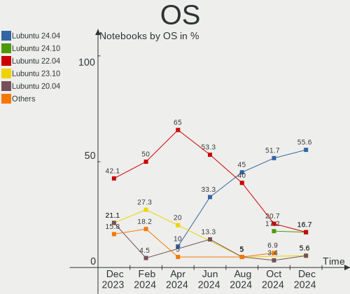

| Name          | Notebooks | Percent |
|---------------|-----------|---------|
| Lubuntu 22.04 | 19        | 76%     |
| Lubuntu 22.10 | 2         | 8%      |
| Lubuntu 21.04 | 1         | 4%      |
| Lubuntu 20.10 | 1         | 4%      |
| Lubuntu 20.04 | 1         | 4%      |
| Lubuntu 18.04 | 1         | 4%      |

OS Family
---------

OS without a version

| Name    | Notebooks | Percent |
|---------|-----------|---------|
| Lubuntu | 25        | 100%    |

Kernel
------

Version of the Linux kernel

| Version            | Notebooks | Percent |
|--------------------|-----------|---------|
| 5.15.0-58-generic  | 6         | 24%     |
| 5.15.0-56-generic  | 5         | 20%     |
| 5.15.0-57-generic  | 3         | 12%     |
| 5.15.0-43-generic  | 3         | 12%     |
| 6.1.6-custom       | 1         | 4%      |
| 5.8.0-25-generic   | 1         | 4%      |
| 5.4.0-136-generic  | 1         | 4%      |
| 5.19.0-21-generic  | 1         | 4%      |
| 5.15.0-47-generic  | 1         | 4%      |
| 5.15.0-25-generic  | 1         | 4%      |
| 5.11.0-38-generic  | 1         | 4%      |
| 4.15.0-202-generic | 1         | 4%      |

Kernel Family
-------------

Linux kernel without a distro release

| Version | Notebooks | Percent |
|---------|-----------|---------|
| 5.15.0  | 19        | 76%     |
| 6.1.6   | 1         | 4%      |
| 5.8.0   | 1         | 4%      |
| 5.4.0   | 1         | 4%      |
| 5.19.0  | 1         | 4%      |
| 5.11.0  | 1         | 4%      |
| 4.15.0  | 1         | 4%      |

Kernel Major Ver.
-----------------

Linux kernel major version

| Version | Notebooks | Percent |
|---------|-----------|---------|
| 5.15    | 19        | 76%     |
| 6.1     | 1         | 4%      |
| 5.8     | 1         | 4%      |
| 5.4     | 1         | 4%      |
| 5.19    | 1         | 4%      |
| 5.11    | 1         | 4%      |
| 4.15    | 1         | 4%      |

Arch
----

OS architecture (x86_64, i586, etc.)

| Name   | Notebooks | Percent |
|--------|-----------|---------|
| x86_64 | 24        | 96%     |
| i686   | 1         | 4%      |

DE
--

Desktop Environment

| Name       | Notebooks | Percent |
|------------|-----------|---------|
| LXQt       | 22        | 88%     |
| LXDE       | 2         | 8%      |
| X-Cinnamon | 1         | 4%      |

Display Server
--------------

X11 or Wayland

| Name | Notebooks | Percent |
|------|-----------|---------|
| X11  | 25        | 100%    |

Display Manager
---------------

SDDM, LightDM, etc.

| Name    | Notebooks | Percent |
|---------|-----------|---------|
| SDDM    | 20        | 80%     |
| LightDM | 3         | 12%     |
| Unknown | 2         | 8%      |

OS Lang
-------

Language

| Lang   | Notebooks | Percent |
|--------|-----------|---------|
| fr_FR  | 5         | 20%     |
| en_US  | 4         | 16%     |
| it_IT  | 2         | 8%      |
| en_AG  | 2         | 8%      |
| de_DE  | 2         | 8%      |
| C      | 2         | 8%      |
| ru_RU  | 1         | 4%      |
| nl_BE  | 1         | 4%      |
| lzh_TW | 1         | 4%      |
| hu_HU  | 1         | 4%      |
| es_ES  | 1         | 4%      |
| es_EC  | 1         | 4%      |
| es_CR  | 1         | 4%      |
| cs_CZ  | 1         | 4%      |

Boot Mode
---------

EFI or BIOS

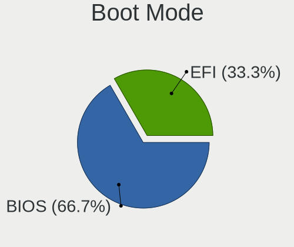

| Mode | Notebooks | Percent |
|------|-----------|---------|
| BIOS | 19        | 76%     |
| EFI  | 6         | 24%     |

Filesystem
----------

Type of filesystem

| Type    | Notebooks | Percent |
|---------|-----------|---------|
| Ext4    | 24        | 96%     |
| Overlay | 1         | 4%      |

Part. scheme
------------

Scheme of partitioning

| Type    | Notebooks | Percent |
|---------|-----------|---------|
| GPT     | 12        | 48%     |
| MBR     | 10        | 40%     |
| Unknown | 3         | 12%     |

Dual Boot with Linux/BSD
------------------------

Hosting more than one Linux/BSD

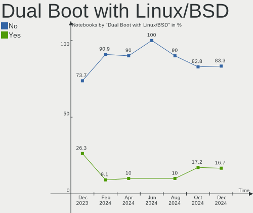

| Dual boot | Notebooks | Percent |
|-----------|-----------|---------|
| No        | 22        | 88%     |
| Yes       | 3         | 12%     |

Dual Boot (Win)
---------------

Hosting Linux and Windows

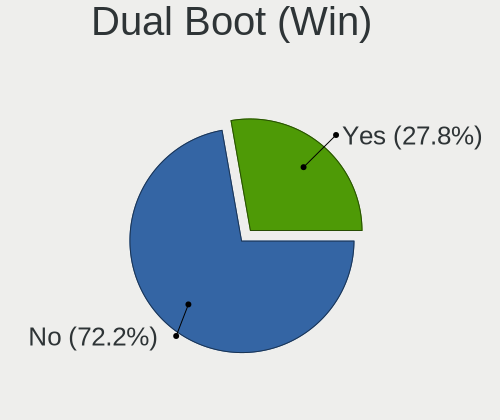

| Dual boot | Notebooks | Percent |
|-----------|-----------|---------|
| No        | 18        | 72%     |
| Yes       | 7         | 28%     |

Board
-----

Vendor
------

Motherboard manufacturer

| Name             | Notebooks | Percent |
|------------------|-----------|---------|
| ASUSTek Computer | 5         | 20%     |
| Acer             | 5         | 20%     |
| Lenovo           | 4         | 16%     |
| Intel            | 2         | 8%      |
| Hewlett-Packard  | 2         | 8%      |
| Google           | 2         | 8%      |
| Toshiba          | 1         | 4%      |
| Thomson          | 1         | 4%      |
| Fujitsu Siemens  | 1         | 4%      |
| Dell             | 1         | 4%      |
| Alienware        | 1         | 4%      |

Model
-----

Motherboard model

| Name                                   | Notebooks | Percent |
|----------------------------------------|-----------|---------|
| Toshiba Satellite Pro S500             | 1         | 4%      |
| Thomson N14C4WH64                      | 1         | 4%      |
| Lenovo ThinkPad X220 4291H82           | 1         | 4%      |
| Lenovo ThinkPad P14s Gen 2a 21A1S00D00 | 1         | 4%      |
| Lenovo G505s 20255                     | 1         | 4%      |
| Lenovo G50-30 80G0                     | 1         | 4%      |
| Intel powered classmate PC             | 1         | 4%      |
| HP Laptop 15-da0xxx                    | 1         | 4%      |
| HP Compaq 6510b (GM108UC#AB0)          | 1         | 4%      |
| Google Celes                           | 1         | 4%      |
| Google Candy                           | 1         | 4%      |
| Fujitsu Siemens AMILO Si 2636          | 1         | 4%      |
| Dell Latitude E6410                    | 1         | 4%      |
| ASUS W5Fe                              | 1         | 4%      |
| ASUS T100TA                            | 1         | 4%      |
| ASUS F8SG                              | 1         | 4%      |
| ASUS F50SV                             | 1         | 4%      |
| ASUS 1011PX                            | 1         | 4%      |
| Alienware 15 R3                        | 1         | 4%      |
| Acer Swift SF314-54G                   | 1         | 4%      |
| Acer Aspire SW3-013                    | 1         | 4%      |
| Acer Aspire One 721                    | 1         | 4%      |
| Acer Aspire ES1-711                    | 1         | 4%      |
| Acer Aspire E5-573                     | 1         | 4%      |
| Unknown                                | 1         | 4%      |

Model Family
------------

Motherboard model prefix

| Name                  | Notebooks | Percent |
|-----------------------|-----------|---------|
| Acer Aspire           | 4         | 16%     |
| Lenovo ThinkPad       | 2         | 8%      |
| Toshiba Satellite     | 1         | 4%      |
| Thomson N14C4WH64     | 1         | 4%      |
| Lenovo G505s          | 1         | 4%      |
| Lenovo G50-30         | 1         | 4%      |
| Intel powered         | 1         | 4%      |
| HP Laptop             | 1         | 4%      |
| HP Compaq             | 1         | 4%      |
| Google Celes          | 1         | 4%      |
| Google Candy          | 1         | 4%      |
| Fujitsu Siemens AMILO | 1         | 4%      |
| Dell Latitude         | 1         | 4%      |
| ASUS W5Fe             | 1         | 4%      |
| ASUS T100TA           | 1         | 4%      |
| ASUS F8SG             | 1         | 4%      |
| ASUS F50SV            | 1         | 4%      |
| ASUS 1011PX           | 1         | 4%      |
| Alienware 15          | 1         | 4%      |
| Acer Swift            | 1         | 4%      |
| Unknown               | 1         | 4%      |

MFG Year
--------

Motherboard manufacture year

| Year | Notebooks | Percent |
|------|-----------|---------|
| 2011 | 4         | 16%     |
| 2021 | 2         | 8%      |
| 2020 | 2         | 8%      |
| 2015 | 2         | 8%      |
| 2014 | 2         | 8%      |
| 2013 | 2         | 8%      |
| 2010 | 2         | 8%      |
| 2009 | 2         | 8%      |
| 2008 | 2         | 8%      |
| 2022 | 1         | 4%      |
| 2019 | 1         | 4%      |
| 2018 | 1         | 4%      |
| 2016 | 1         | 4%      |
| 2007 | 1         | 4%      |

Form Factor
-----------

Physical design of the computer

| Name     | Notebooks | Percent |
|----------|-----------|---------|
| Notebook | 25        | 100%    |

Secure Boot
-----------

Enabled or disabled

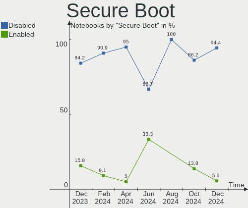

| State    | Notebooks | Percent |
|----------|-----------|---------|
| Disabled | 24        | 96%     |
| Enabled  | 1         | 4%      |

Coreboot
--------

Have coreboot on board

| Used | Notebooks | Percent |
|------|-----------|---------|
| No   | 23        | 92%     |
| Yes  | 2         | 8%      |

RAM Size
--------

Total RAM memory

| Size in GB | Notebooks | Percent |
|------------|-----------|---------|
| 3.01-4.0   | 12        | 48%     |
| 1.01-2.0   | 5         | 20%     |
| 4.01-8.0   | 3         | 12%     |
| 2.01-3.0   | 2         | 8%      |
| 32.01-64.0 | 1         | 4%      |
| 16.01-24.0 | 1         | 4%      |
| 8.01-16.0  | 1         | 4%      |

RAM Used
--------

Used RAM memory

| Used GB  | Notebooks | Percent |
|----------|-----------|---------|
| 1.01-2.0 | 12        | 48%     |
| 0.51-1.0 | 8         | 32%     |
| 3.01-4.0 | 3         | 12%     |
| 2.01-3.0 | 2         | 8%      |

Total Drives
------------

Number of drives on board

| Drives | Notebooks | Percent |
|--------|-----------|---------|
| 1      | 21        | 84%     |
| 2      | 3         | 12%     |
| 3      | 1         | 4%      |

Has CD-ROM
----------

Has CD-ROM on board

| Presented | Notebooks | Percent |
|-----------|-----------|---------|
| No        | 14        | 56%     |
| Yes       | 11        | 44%     |

Has Ethernet
------------

Has Ethernet on board

| Presented | Notebooks | Percent |
|-----------|-----------|---------|
| Yes       | 19        | 76%     |
| No        | 6         | 24%     |

Has WiFi
--------

Has WiFi module

| Presented | Notebooks | Percent |
|-----------|-----------|---------|
| Yes       | 23        | 92%     |
| No        | 2         | 8%      |

Has Bluetooth
-------------

Has Bluetooth module

| Presented | Notebooks | Percent |
|-----------|-----------|---------|
| Yes       | 16        | 64%     |
| No        | 9         | 36%     |

Location
--------

Country
-------

Geographic location (country)

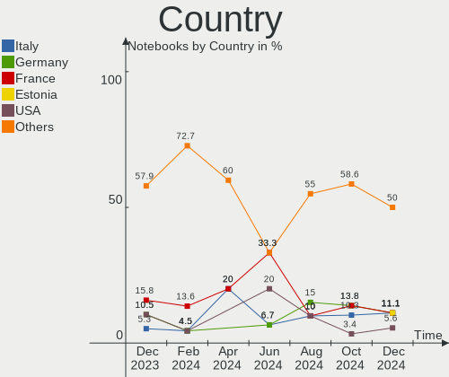

| Country     | Notebooks | Percent |
|-------------|-----------|---------|
| France      | 5         | 20%     |
| Germany     | 3         | 12%     |
| Ukraine     | 2         | 8%      |
| Spain       | 2         | 8%      |
| Italy       | 2         | 8%      |
| Belgium     | 2         | 8%      |
| USA         | 1         | 4%      |
| Taiwan      | 1         | 4%      |
| Russia      | 1         | 4%      |
| Netherlands | 1         | 4%      |
| Latvia      | 1         | 4%      |
| Ecuador     | 1         | 4%      |
| Czechia     | 1         | 4%      |
| Costa Rica  | 1         | 4%      |
| Armenia     | 1         | 4%      |

City
----

Geographic location (city)

| City                     | Notebooks | Percent |
|--------------------------|-----------|---------|
| Ghent                    | 2         | 8%      |
| Yerevan                  | 1         | 4%      |
| West Stockbridge         | 1         | 4%      |
| Warendorf                | 1         | 4%      |
| Taipei                   | 1         | 4%      |
| Santiago de Compostela   | 1         | 4%      |
| Saint-Martin-Lacaussade  | 1         | 4%      |
| Rio Segundo              | 1         | 4%      |
| Riga                     | 1         | 4%      |
| Quito                    | 1         | 4%      |
| Prague                   | 1         | 4%      |
| Paris                    | 1         | 4%      |
| Novosibirsk              | 1         | 4%      |
| Mukacheve                | 1         | 4%      |
| Milan                    | 1         | 4%      |
| Mannheim                 | 1         | 4%      |
| Madrid                   | 1         | 4%      |
| Leiden                   | 1         | 4%      |
| La Rochelle              | 1         | 4%      |
| Kyiv                     | 1         | 4%      |
| Geislingen an der Steige | 1         | 4%      |
| Canelli                  | 1         | 4%      |
| Bourg-Saint-Maurice      | 1         | 4%      |
| Ambazac                  | 1         | 4%      |

Drives
------

Drive Vendor
------------

Hard drive vendors

| Vendor                    | Notebooks | Drives | Percent |
|---------------------------|-----------|--------|---------|
| Unknown                   | 5         | 5      | 19.23%  |
| Seagate                   | 4         | 4      | 15.38%  |
| WDC                       | 3         | 4      | 11.54%  |
| Hitachi                   | 3         | 3      | 11.54%  |
| Toshiba                   | 2         | 2      | 7.69%   |
| Samsung Electronics       | 2         | 2      | 7.69%   |
| Kingston                  | 2         | 2      | 7.69%   |
| SK hynix                  | 1         | 1      | 3.85%   |
| ShanDianZhe               | 1         | 1      | 3.85%   |
| Micron/Crucial Technology | 1         | 1      | 3.85%   |
| HGST                      | 1         | 1      | 3.85%   |
| A-DATA Technology         | 1         | 1      | 3.85%   |

Drive Model
-----------

Hard drive models

| Model                                | Notebooks | Percent |
|--------------------------------------|-----------|---------|
| Kingston SA400S37240G 240GB SSD      | 2         | 7.41%   |
| WDC WDS500G2B0C-00PXH0 500GB         | 1         | 3.7%    |
| WDC WD5000LPVX-22V0TT0 500GB         | 1         | 3.7%    |
| WDC WD2500BEVS-22UST0 250GB          | 1         | 3.7%    |
| WDC WD10SPZX-21Z10T0 1TB             | 1         | 3.7%    |
| Unknown SEM64G  64GB                 | 1         | 3.7%    |
| Unknown MMC Card  64GB               | 1         | 3.7%    |
| Unknown MMC Card  32GB               | 1         | 3.7%    |
| Unknown MMC Card  16GB               | 1         | 3.7%    |
| Unknown DA4064  64GB                 | 1         | 3.7%    |
| Toshiba MQ01ABD050 500GB             | 1         | 3.7%    |
| Toshiba MK2576GSX 250GB              | 1         | 3.7%    |
| SK hynix SKHynix_HFS001TDE9X081N 1TB | 1         | 3.7%    |
| ShanDianZhe 512G                     | 1         | 3.7%    |
| Seagate ST9500325AS 500GB            | 1         | 3.7%    |
| Seagate ST500LT012-1DG142 500GB      | 1         | 3.7%    |
| Seagate ST1000LM048-2E7172 1TB       | 1         | 3.7%    |
| Seagate ST1000LM024 HN-M101MBB 1TB   | 1         | 3.7%    |
| Samsung SSD 850 EVO 250GB            | 1         | 3.7%    |
| Samsung SSD 830 Series 512GB         | 1         | 3.7%    |
| Micron/Crucial CT500P5PSSD8 500GB    | 1         | 3.7%    |
| Hitachi HTS722080K9SA00 80GB         | 1         | 3.7%    |
| Hitachi HTS545032B9A300 320GB        | 1         | 3.7%    |
| Hitachi HTS543225A7A384 250GB        | 1         | 3.7%    |
| HGST HTS721010A9E630 1TB             | 1         | 3.7%    |
| A-DATA SU650 480GB SSD               | 1         | 3.7%    |

HDD Vendor
----------

Hard disk drive vendors

| Vendor  | Notebooks | Drives | Percent |
|---------|-----------|--------|---------|
| Seagate | 4         | 4      | 30.77%  |
| WDC     | 3         | 3      | 23.08%  |
| Hitachi | 3         | 3      | 23.08%  |
| Toshiba | 2         | 2      | 15.38%  |
| HGST    | 1         | 1      | 7.69%   |

SSD Vendor
----------

Solid state drive vendors

| Vendor              | Notebooks | Drives | Percent |
|---------------------|-----------|--------|---------|
| Samsung Electronics | 2         | 2      | 40%     |
| Kingston            | 2         | 2      | 40%     |
| A-DATA Technology   | 1         | 1      | 20%     |

Drive Kind
----------

HDD or SSD

| Kind    | Notebooks | Drives | Percent |
|---------|-----------|--------|---------|
| HDD     | 13        | 13     | 48.15%  |
| MMC     | 5         | 5      | 18.52%  |
| SSD     | 5         | 5      | 18.52%  |
| NVMe    | 3         | 3      | 11.11%  |
| Unknown | 1         | 1      | 3.7%    |

Drive Connector
---------------

SATA, SAS, NVMe, etc.

| Type | Notebooks | Drives | Percent |
|------|-----------|--------|---------|
| SATA | 19        | 19     | 70.37%  |
| MMC  | 5         | 5      | 18.52%  |
| NVMe | 3         | 3      | 11.11%  |

Drive Size
----------

Size of hard drive

| Size in TB | Notebooks | Drives | Percent |
|------------|-----------|--------|---------|
| 0.01-0.5   | 13        | 13     | 72.22%  |
| 0.51-1.0   | 5         | 5      | 27.78%  |

Space Total
-----------

Amount of disk space available on the file system

| Size in GB | Notebooks | Percent |
|------------|-----------|---------|
| 101-250    | 8         | 32%     |
| 251-500    | 7         | 28%     |
| 51-100     | 4         | 16%     |
| 1-20       | 3         | 12%     |
| 21-50      | 2         | 8%      |
| 501-1000   | 1         | 4%      |

Space Used
----------

Amount of used disk space

| Used GB | Notebooks | Percent |
|---------|-----------|---------|
| 1-20    | 13        | 52%     |
| 21-50   | 6         | 24%     |
| 51-100  | 4         | 16%     |
| 251-500 | 1         | 4%      |
| 101-250 | 1         | 4%      |

Malfunc. Drives
---------------

Drive models with a malfunction

| Model                              | Notebooks | Drives | Percent |
|------------------------------------|-----------|--------|---------|
| Seagate ST500LT012-1DG142 500GB    | 1         | 1      | 33.33%  |
| Seagate ST1000LM024 HN-M101MBB 1TB | 1         | 1      | 33.33%  |
| Hitachi HTS722080K9SA00 80GB       | 1         | 1      | 33.33%  |

Malfunc. Drive Vendor
---------------------

Vendors of faulty drives

| Vendor  | Notebooks | Drives | Percent |
|---------|-----------|--------|---------|
| Seagate | 2         | 2      | 66.67%  |
| Hitachi | 1         | 1      | 33.33%  |

Malfunc. HDD Vendor
-------------------

Vendors of faulty HDD drives

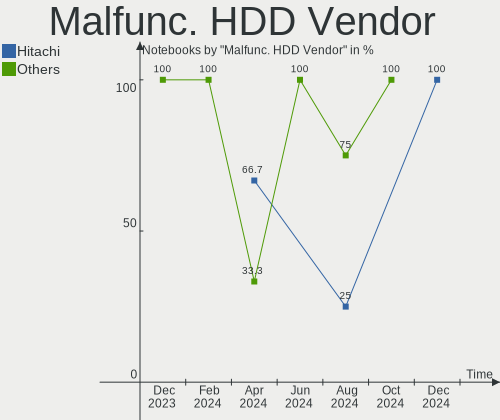

| Vendor  | Notebooks | Drives | Percent |
|---------|-----------|--------|---------|
| Seagate | 2         | 2      | 66.67%  |
| Hitachi | 1         | 1      | 33.33%  |

Malfunc. Drive Kind
-------------------

Kinds of faulty drives

| Kind | Notebooks | Drives | Percent |
|------|-----------|--------|---------|
| HDD  | 3         | 3      | 100%    |

Failed Drives
-------------

Failed drive models

Zero info for selected period =(

Failed Drive Vendor
-------------------

Failed drive vendors

Zero info for selected period =(

Drive Status
------------

Number of failed and malfunc. drives

| Status   | Notebooks | Drives | Percent |
|----------|-----------|--------|---------|
| Detected | 15        | 16     | 60%     |
| Works    | 7         | 8      | 28%     |
| Malfunc  | 3         | 3      | 12%     |

Storage controller
------------------

Storage Vendor
--------------

Storage controller vendors

| Vendor                           | Notebooks | Percent |
|----------------------------------|-----------|---------|
| Intel                            | 17        | 70.83%  |
| AMD                              | 2         | 8.33%   |
| SK hynix                         | 1         | 4.17%   |
| Silicon Integrated Systems [SiS] | 1         | 4.17%   |
| Silicon Image                    | 1         | 4.17%   |
| SanDisk                          | 1         | 4.17%   |
| Micron/Crucial Technology        | 1         | 4.17%   |

Storage Model
-------------

Storage controller models

| Model                                                                         | Notebooks | Percent |
|-------------------------------------------------------------------------------|-----------|---------|
| Intel 82801HM/HEM (ICH8M/ICH8M-E) SATA Controller [AHCI mode]                 | 3         | 10.34%  |
| Intel 82801HM/HEM (ICH8M/ICH8M-E) IDE Controller                              | 3         | 10.34%  |
| Intel NM10/ICH7 Family SATA Controller [AHCI mode]                            | 2         | 6.9%    |
| Intel Celeron N3350/Pentium N4200/Atom E3900 Series SATA AHCI Controller      | 2         | 6.9%    |
| Intel Atom Processor E3800 Series SATA AHCI Controller                        | 2         | 6.9%    |
| SK hynix Gold P31/PC711 NVMe Solid State Drive                                | 1         | 3.45%   |
| Silicon Integrated Systems [SiS] SATA Controller / IDE mode                   | 1         | 3.45%   |
| Silicon Integrated Systems [SiS] 5513 IDE Controller                          | 1         | 3.45%   |
| Silicon Image SiI 3531 [SATALink/SATARaid] Serial ATA Controller              | 1         | 3.45%   |
| SanDisk WD Blue SN550 NVMe SSD                                                | 1         | 3.45%   |
| Micron/Crucial P5 Plus NVMe PCIe SSD                                          | 1         | 3.45%   |
| Intel Sunrise Point-LP SATA Controller [AHCI mode]                            | 1         | 3.45%   |
| Intel Q170/Q150/B150/H170/H110/Z170/CM236 Chipset SATA Controller [AHCI Mode] | 1         | 3.45%   |
| Intel Celeron/Pentium Silver Processor SATA Controller                        | 1         | 3.45%   |
| Intel 82801GBM/GHM (ICH7-M Family) SATA Controller [IDE mode]                 | 1         | 3.45%   |
| Intel 82801G (ICH7 Family) IDE Controller                                     | 1         | 3.45%   |
| Intel 82801 Mobile SATA Controller [RAID mode]                                | 1         | 3.45%   |
| Intel 8 Series SATA Controller 1 [AHCI mode]                                  | 1         | 3.45%   |
| Intel 6 Series/C200 Series Chipset Family 6 port Mobile SATA AHCI Controller  | 1         | 3.45%   |
| Intel 5 Series/3400 Series Chipset 4 port SATA AHCI Controller                | 1         | 3.45%   |
| AMD SB7x0/SB8x0/SB9x0 SATA Controller [AHCI mode]                             | 1         | 3.45%   |
| AMD FCH SATA Controller [IDE mode]                                            | 1         | 3.45%   |

Storage Kind
------------

Kind of storage controller (IDE, SATA, NVMe, SAS, ...)

| Kind | Notebooks | Percent |
|------|-----------|---------|
| SATA | 17        | 62.96%  |
| IDE  | 5         | 18.52%  |
| NVMe | 3         | 11.11%  |
| RAID | 2         | 7.41%   |

Processor
---------

CPU Vendor
----------

Processor vendors

| Vendor | Notebooks | Percent |
|--------|-----------|---------|
| Intel  | 22        | 88%     |
| AMD    | 3         | 12%     |

CPU Model
---------

Processor models

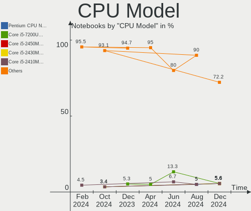

| Model                                      | Notebooks | Percent |
|--------------------------------------------|-----------|---------|
| Intel Core 2 Duo CPU T7250 @ 2.00GHz       | 2         | 8%      |
| Intel Core i7-7700HQ CPU @ 2.80GHz         | 1         | 4%      |
| Intel Core i5-8250U CPU @ 1.60GHz          | 1         | 4%      |
| Intel Core i5-2520M CPU @ 2.50GHz          | 1         | 4%      |
| Intel Core i5 CPU M 560 @ 2.67GHz          | 1         | 4%      |
| Intel Core i3-4005U CPU @ 1.70GHz          | 1         | 4%      |
| Intel Core i3 CPU M 370 @ 2.40GHz          | 1         | 4%      |
| Intel Core 2 Duo CPU T8100 @ 2.10GHz       | 1         | 4%      |
| Intel Core 2 Duo CPU P7350 @ 2.00GHz       | 1         | 4%      |
| Intel Core 2 CPU T5500 @ 1.66GHz           | 1         | 4%      |
| Intel Celeron N4000 CPU @ 1.10GHz          | 1         | 4%      |
| Intel Celeron CPU N3350 @ 1.10GHz          | 1         | 4%      |
| Intel Celeron CPU N3060 @ 1.60GHz          | 1         | 4%      |
| Intel Celeron CPU N2940 @ 1.83GHz          | 1         | 4%      |
| Intel Celeron CPU N2840 @ 2.16GHz          | 1         | 4%      |
| Intel Celeron CPU N2830 @ 2.16GHz          | 1         | 4%      |
| Intel Celeron CPU J3455 @ 1.50GHz          | 1         | 4%      |
| Intel Atom CPU Z3775 @ 1.46GHz             | 1         | 4%      |
| Intel Atom CPU Z3735F @ 1.33GHz            | 1         | 4%      |
| Intel Atom CPU N570 @ 1.66GHz              | 1         | 4%      |
| Intel Atom CPU N450 @ 1.66GHz              | 1         | 4%      |
| AMD Ryzen 7 PRO 5850U with Radeon Graphics | 1         | 4%      |
| AMD Athlon II Neo K125 Processor           | 1         | 4%      |
| AMD A8-4500M APU with Radeon HD Graphics   | 1         | 4%      |

CPU Model Family
----------------

Processor model prefix

| Model             | Notebooks | Percent |
|-------------------|-----------|---------|
| Intel Celeron     | 7         | 28%     |
| Intel Core 2 Duo  | 4         | 16%     |
| Intel Atom        | 4         | 16%     |
| Intel Core i5     | 3         | 12%     |
| Intel Core i3     | 2         | 8%      |
| Intel Core i7     | 1         | 4%      |
| Intel Core 2      | 1         | 4%      |
| AMD Ryzen 7 PRO   | 1         | 4%      |
| AMD Athlon II Neo | 1         | 4%      |
| AMD A8            | 1         | 4%      |

CPU Cores
---------

Number of processor cores

| Number | Notebooks | Percent |
|--------|-----------|---------|
| 2      | 16        | 64%     |
| 4      | 6         | 24%     |
| 1      | 2         | 8%      |
| 8      | 1         | 4%      |

CPU Sockets
-----------

Number of sockets

| Number | Notebooks | Percent |
|--------|-----------|---------|
| 1      | 25        | 100%    |

CPU Threads
-----------

Threads per core (Hyper-Threading)

| Number | Notebooks | Percent |
|--------|-----------|---------|
| 1      | 15        | 60%     |
| 2      | 10        | 40%     |

CPU Op-Modes
------------

CPU Operation Modes (32-bit, 64-bit)

| Op mode        | Notebooks | Percent |
|----------------|-----------|---------|
| 32-bit, 64-bit | 25        | 100%    |

CPU Microcode
-------------

Microcode number

| Number     | Notebooks | Percent |
|------------|-----------|---------|
| Unknown    | 12        | 48%     |
| 0x6fd      | 2         | 8%      |
| 0x30678    | 2         | 8%      |
| 0x806ea    | 1         | 4%      |
| 0x706a1    | 1         | 4%      |
| 0x506c9    | 1         | 4%      |
| 0x406c4    | 1         | 4%      |
| 0x20655    | 1         | 4%      |
| 0x106ca    | 1         | 4%      |
| 0x0a50000c | 1         | 4%      |
| 0x06001119 | 1         | 4%      |
| 0x010000c8 | 1         | 4%      |

CPU Microarch
-------------

Microarchitecture

| Name          | Notebooks | Percent |
|---------------|-----------|---------|
| Silvermont    | 6         | 24%     |
| Core          | 3         | 12%     |
| Westmere      | 2         | 8%      |
| Penryn        | 2         | 8%      |
| KabyLake      | 2         | 8%      |
| Goldmont      | 2         | 8%      |
| Bonnell       | 2         | 8%      |
| Zen 3         | 1         | 4%      |
| SandyBridge   | 1         | 4%      |
| Piledriver    | 1         | 4%      |
| K10           | 1         | 4%      |
| Haswell       | 1         | 4%      |
| Goldmont plus | 1         | 4%      |

Graphics
--------

GPU Vendor
----------

Vendors of graphics cards

| Vendor | Notebooks | Percent |
|--------|-----------|---------|
| Intel  | 19        | 70.37%  |
| Nvidia | 5         | 18.52%  |
| AMD    | 3         | 11.11%  |

GPU Model
---------

Graphics card models

| Model                                                                                    | Notebooks | Percent |
|------------------------------------------------------------------------------------------|-----------|---------|
| Intel Atom Processor Z36xxx/Z37xxx Series Graphics & Display                             | 5         | 16.13%  |
| Intel Mobile GM965/GL960 Integrated Graphics Controller (secondary)                      | 2         | 6.45%   |
| Intel Mobile GM965/GL960 Integrated Graphics Controller (primary)                        | 2         | 6.45%   |
| Intel HD Graphics 500                                                                    | 2         | 6.45%   |
| Intel Atom Processor D4xx/D5xx/N4xx/N5xx Integrated Graphics Controller                  | 2         | 6.45%   |
| Nvidia GT218M [NVS 3100M]                                                                | 1         | 3.23%   |
| Nvidia GP108M [GeForce MX150]                                                            | 1         | 3.23%   |
| Nvidia GP106BM [GeForce GTX 1060 Mobile 6GB]                                             | 1         | 3.23%   |
| Nvidia G96CM [GeForce GT 120M]                                                           | 1         | 3.23%   |
| Nvidia G86M [GeForce 9300M G]                                                            | 1         | 3.23%   |
| Intel UHD Graphics 620                                                                   | 1         | 3.23%   |
| Intel Mobile 945GM/GMS/GME, 943/940GML Express Integrated Graphics Controller            | 1         | 3.23%   |
| Intel Mobile 945GM/GMS, 943/940GML Express Integrated Graphics Controller                | 1         | 3.23%   |
| Intel HD Graphics 630                                                                    | 1         | 3.23%   |
| Intel Haswell-ULT Integrated Graphics Controller                                         | 1         | 3.23%   |
| Intel GeminiLake [UHD Graphics 600]                                                      | 1         | 3.23%   |
| Intel Core Processor Integrated Graphics Controller                                      | 1         | 3.23%   |
| Intel Atom/Celeron/Pentium Processor x5-E8000/J3xxx/N3xxx Integrated Graphics Controller | 1         | 3.23%   |
| Intel 2nd Generation Core Processor Family Integrated Graphics Controller                | 1         | 3.23%   |
| AMD Trinity [Radeon HD 7640G]                                                            | 1         | 3.23%   |
| AMD Sun PRO [Radeon HD 8570A/8570M]                                                      | 1         | 3.23%   |
| AMD RS880M [Mobility Radeon HD 4225/4250]                                                | 1         | 3.23%   |
| AMD Cezanne [Radeon Vega Series / Radeon Vega Mobile Series]                             | 1         | 3.23%   |

GPU Combo
---------

Combinations of graphics cards

| Name           | Notebooks | Percent |
|----------------|-----------|---------|
| 1 x Intel      | 17        | 68%     |
| 1 x Nvidia     | 4         | 16%     |
| 1 x AMD        | 2         | 8%      |
| 2 x AMD        | 1         | 4%      |
| Intel + Nvidia | 1         | 4%      |

GPU Driver
----------

Free vs proprietary

| Driver      | Notebooks | Percent |
|-------------|-----------|---------|
| Free        | 23        | 92%     |
| Proprietary | 1         | 4%      |
| Unknown     | 1         | 4%      |

GPU Memory
----------

Total video memory

| Size in GB | Notebooks | Percent |
|------------|-----------|---------|
| Unknown    | 18        | 72%     |
| 0.01-0.5   | 3         | 12%     |
| 5.01-6.0   | 1         | 4%      |
| 3.01-4.0   | 1         | 4%      |
| 1.01-2.0   | 1         | 4%      |
| 0.51-1.0   | 1         | 4%      |

Monitor
-------

Monitor Vendor
--------------

Monitor vendors

| Vendor                  | Notebooks | Percent |
|-------------------------|-----------|---------|
| LG Display              | 5         | 21.74%  |
| AU Optronics            | 5         | 21.74%  |
| BOE                     | 3         | 13.04%  |
| CPT                     | 2         | 8.7%    |
| Samsung Electronics     | 1         | 4.35%   |
| LG Philips              | 1         | 4.35%   |
| Lenovo                  | 1         | 4.35%   |
| Hewlett-Packard         | 1         | 4.35%   |
| Goldstar                | 1         | 4.35%   |
| CS_                     | 1         | 4.35%   |
| Chi Mei Optoelectronics | 1         | 4.35%   |
| AOC                     | 1         | 4.35%   |

Monitor Model
-------------

Monitor models

| Model                                                                    | Notebooks | Percent |
|--------------------------------------------------------------------------|-----------|---------|
| Samsung Electronics LCD Monitor SEC3130 1024x600 223x125mm 10.1-inch     | 1         | 4.35%   |
| LG Philips LCD Monitor LPL1101 1280x800 304x190mm 14.1-inch              | 1         | 4.35%   |
| LG Display LCD Monitor LGD0599 1920x1080 309x174mm 14.0-inch             | 1         | 4.35%   |
| LG Display LCD Monitor LGD049B 1920x1080 344x194mm 15.5-inch             | 1         | 4.35%   |
| LG Display LCD Monitor LGD039F 1366x768 345x194mm 15.6-inch              | 1         | 4.35%   |
| LG Display LCD Monitor LGD02D8 1366x768 277x156mm 12.5-inch              | 1         | 4.35%   |
| LG Display LCD Monitor LGD0257 1440x900 304x190mm 14.1-inch              | 1         | 4.35%   |
| Lenovo LCD Monitor LEN4031 1280x800 303x190mm 14.1-inch                  | 1         | 4.35%   |
| Hewlett-Packard 24mq HPN366F 2560x1440 527x296mm 23.8-inch               | 1         | 4.35%   |
| Goldstar FULL HD GSM5BDF 1920x1080 480x270mm 21.7-inch                   | 1         | 4.35%   |
| CS_ LCD Monitor CS_5211 1366x768 518x333mm 24.2-inch                     | 1         | 4.35%   |
| CPT LCD Monitor CPT1C85 1366x768 222x125mm 10.0-inch                     | 1         | 4.35%   |
| CPT LCD Monitor CPT1B5A 1280x800 261x163mm 12.1-inch                     | 1         | 4.35%   |
| Chi Mei Optoelectronics LCD Monitor CMO1425 1280x800 303x190mm 14.1-inch | 1         | 4.35%   |
| BOE LCD Monitor BOE07DB 1920x1080 309x174mm 14.0-inch                    | 1         | 4.35%   |
| BOE LCD Monitor BOE06A4 1366x768 344x194mm 15.5-inch                     | 1         | 4.35%   |
| BOE LCD Monitor BOE0623 1366x768 256x144mm 11.6-inch                     | 1         | 4.35%   |
| AU Optronics LCD Monitor AUO41EC 1366x768 344x193mm 15.5-inch            | 1         | 4.35%   |
| AU Optronics LCD Monitor AUO40EC 1366x768 344x193mm 15.5-inch            | 1         | 4.35%   |
| AU Optronics LCD Monitor AUO235C 1366x768 256x144mm 11.6-inch            | 1         | 4.35%   |
| AU Optronics LCD Monitor AUO205C 1366x768 256x144mm 11.6-inch            | 1         | 4.35%   |
| AU Optronics LCD Monitor AUO119E 1600x900 382x214mm 17.2-inch            | 1         | 4.35%   |
| AOC 2070W AOC2070 1600x900 434x236mm 19.4-inch                           | 1         | 4.35%   |

Monitor Resolution
------------------

Monitor screen resolution

| Resolution       | Notebooks | Percent |
|------------------|-----------|---------|
| 1366x768 (WXGA)  | 9         | 39.13%  |
| 1920x1080 (FHD)  | 5         | 21.74%  |
| 1280x800 (WXGA)  | 4         | 17.39%  |
| 1600x900 (HD+)   | 2         | 8.7%    |
| 2560x1440 (QHD)  | 1         | 4.35%   |
| 1440x900 (WXGA+) | 1         | 4.35%   |
| 1024x600         | 1         | 4.35%   |

Monitor Diagonal
----------------

Diagonal size in inches

| Inches | Notebooks | Percent |
|--------|-----------|---------|
| 14     | 6         | 26.09%  |
| 15     | 5         | 21.74%  |
| 11     | 3         | 13.04%  |
| 24     | 2         | 8.7%    |
| 12     | 2         | 8.7%    |
| 10     | 2         | 8.7%    |
| 21     | 1         | 4.35%   |
| 19     | 1         | 4.35%   |
| 17     | 1         | 4.35%   |

Monitor Width
-------------

Physical width

| Width in mm | Notebooks | Percent |
|-------------|-----------|---------|
| 301-350     | 11        | 47.83%  |
| 201-300     | 7         | 30.43%  |
| 501-600     | 2         | 8.7%    |
| 401-500     | 2         | 8.7%    |
| 351-400     | 1         | 4.35%   |

Aspect Ratio
------------

Proportional relationship between the width and the height

| Ratio | Notebooks | Percent |
|-------|-----------|---------|
| 16/9  | 14        | 70%     |
| 16/10 | 6         | 30%     |

Monitor Area
------------

Area in inch²

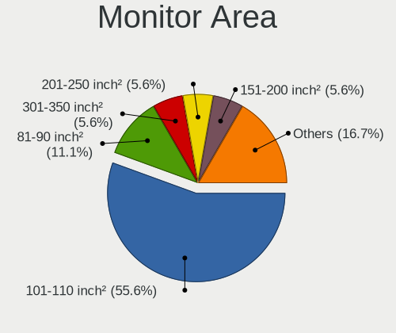

| Area in inch² | Notebooks | Percent |
|----------------|-----------|---------|
| 81-90          | 6         | 26.09%  |
| 101-110        | 5         | 21.74%  |
| 51-60          | 3         | 13.04%  |
| 61-70          | 2         | 8.7%    |
| 41-50          | 2         | 8.7%    |
| 201-250        | 2         | 8.7%    |
| 251-300        | 1         | 4.35%   |
| 151-200        | 1         | 4.35%   |
| 121-130        | 1         | 4.35%   |

Pixel Density
-------------

Pixels per inch

| Density | Notebooks | Percent |
|---------|-----------|---------|
| 121-160 | 10        | 45.45%  |
| 101-120 | 9         | 40.91%  |
| 51-100  | 3         | 13.64%  |

Multiple Monitors
-----------------

Total monitors connected

| Total | Notebooks | Percent |
|-------|-----------|---------|
| 1     | 21        | 84%     |
| 2     | 3         | 12%     |
| 0     | 1         | 4%      |

Network
-------

Net Controller Vendor
---------------------

Controller vendors

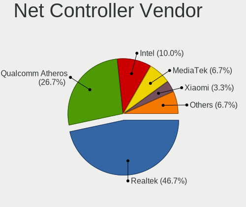

| Vendor                   | Notebooks | Percent |
|--------------------------|-----------|---------|
| Intel                    | 10        | 27.78%  |
| Realtek Semiconductor    | 9         | 25%     |
| Qualcomm Atheros         | 8         | 22.22%  |
| ASIX Electronics         | 2         | 5.56%   |
| TP-Link                  | 1         | 2.78%   |
| Qualcomm                 | 1         | 2.78%   |
| Marvell Technology Group | 1         | 2.78%   |
| JMicron Technology       | 1         | 2.78%   |
| Broadcom Limited         | 1         | 2.78%   |
| Broadcom                 | 1         | 2.78%   |
| Attansic Technology      | 1         | 2.78%   |

Net Controller Model
--------------------

Controller models

| Model                                                             | Notebooks | Percent |
|-------------------------------------------------------------------|-----------|---------|
| Realtek RTL8111/8168/8411 PCI Express Gigabit Ethernet Controller | 6         | 13.64%  |
| Realtek RTL8723BE PCIe Wireless Network Adapter                   | 2         | 4.55%   |
| Qualcomm Atheros AR928X Wireless Network Adapter (PCI-Express)    | 2         | 4.55%   |
| Qualcomm Atheros AR9285 Wireless Network Adapter (PCI-Express)    | 2         | 4.55%   |
| Intel Wireless 7265                                               | 2         | 4.55%   |
| Intel PRO/Wireless 4965 AG or AGN [Kedron] Network Connection     | 2         | 4.55%   |
| ASIX AX88179 Gigabit Ethernet                                     | 2         | 4.55%   |
| TP-Link AC600 wireless Realtek RTL8811AU [Archer T2U Nano]        | 1         | 2.27%   |
| Realtek RTL8852AE 802.11ax PCIe Wireless Network Adapter          | 1         | 2.27%   |
| Realtek RTL8723DE Wireless Network Adapter                        | 1         | 2.27%   |
| Realtek RTL8152 Fast Ethernet Adapter                             | 1         | 2.27%   |
| Realtek RTL-8100/8101L/8139 PCI Fast Ethernet Adapter             | 1         | 2.27%   |
| Realtek 802.11n WLAN Adapter                                      | 1         | 2.27%   |
| Qualcomm Atheros QCA9377 802.11ac Wireless Network Adapter        | 1         | 2.27%   |
| Qualcomm Atheros QCA8172 Fast Ethernet                            | 1         | 2.27%   |
| Qualcomm Atheros QCA6174 802.11ac Wireless Network Adapter        | 1         | 2.27%   |
| Qualcomm Atheros Killer E2500 Gigabit Ethernet Controller         | 1         | 2.27%   |
| Qualcomm Atheros AR9485 Wireless Network Adapter                  | 1         | 2.27%   |
| Qualcomm Atheros AR8151 v1.0 Gigabit Ethernet                     | 1         | 2.27%   |
| Qualcomm Android                                                  | 1         | 2.27%   |
| Marvell Group 88E8055 PCI-E Gigabit Ethernet Controller           | 1         | 2.27%   |
| JMicron JMC260 PCI Express Fast Ethernet Controller               | 1         | 2.27%   |
| Intel Wireless 7260                                               | 1         | 2.27%   |
| Intel Wireless 3165                                               | 1         | 2.27%   |
| Intel PRO/Wireless 3945ABG [Golan] Network Connection             | 1         | 2.27%   |
| Intel Centrino Advanced-N 6205 [Taylor Peak]                      | 1         | 2.27%   |
| Intel Centrino Advanced-N 6200                                    | 1         | 2.27%   |
| Intel 82579LM Gigabit Network Connection (Lewisville)             | 1         | 2.27%   |
| Intel 82577LM Gigabit Network Connection                          | 1         | 2.27%   |
| Intel 82577LC Gigabit Network Connection                          | 1         | 2.27%   |
| Broadcom Limited NetLink BCM5787M Gigabit Ethernet PCI Express    | 1         | 2.27%   |
| Broadcom BCM43225 802.11b/g/n                                     | 1         | 2.27%   |
| Attansic AR8152 v2.0 Fast Ethernet                                | 1         | 2.27%   |

Wireless Vendor
---------------

Wireless vendors

| Vendor                | Notebooks | Percent |
|-----------------------|-----------|---------|
| Intel                 | 9         | 39.13%  |
| Qualcomm Atheros      | 7         | 30.43%  |
| Realtek Semiconductor | 5         | 21.74%  |
| TP-Link               | 1         | 4.35%   |
| Broadcom              | 1         | 4.35%   |

Wireless Model
--------------

Wireless models

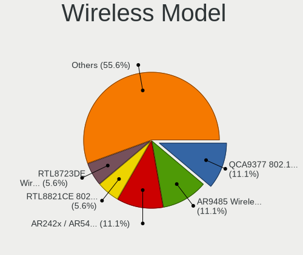

| Model                                                          | Notebooks | Percent |
|----------------------------------------------------------------|-----------|---------|
| Realtek RTL8723BE PCIe Wireless Network Adapter                | 2         | 8.7%    |
| Qualcomm Atheros AR928X Wireless Network Adapter (PCI-Express) | 2         | 8.7%    |
| Qualcomm Atheros AR9285 Wireless Network Adapter (PCI-Express) | 2         | 8.7%    |
| Intel Wireless 7265                                            | 2         | 8.7%    |
| Intel PRO/Wireless 4965 AG or AGN [Kedron] Network Connection  | 2         | 8.7%    |
| TP-Link AC600 wireless Realtek RTL8811AU [Archer T2U Nano]     | 1         | 4.35%   |
| Realtek RTL8852AE 802.11ax PCIe Wireless Network Adapter       | 1         | 4.35%   |
| Realtek RTL8723DE Wireless Network Adapter                     | 1         | 4.35%   |
| Realtek 802.11n WLAN Adapter                                   | 1         | 4.35%   |
| Qualcomm Atheros QCA9377 802.11ac Wireless Network Adapter     | 1         | 4.35%   |
| Qualcomm Atheros QCA6174 802.11ac Wireless Network Adapter     | 1         | 4.35%   |
| Qualcomm Atheros AR9485 Wireless Network Adapter               | 1         | 4.35%   |
| Intel Wireless 7260                                            | 1         | 4.35%   |
| Intel Wireless 3165                                            | 1         | 4.35%   |
| Intel PRO/Wireless 3945ABG [Golan] Network Connection          | 1         | 4.35%   |
| Intel Centrino Advanced-N 6205 [Taylor Peak]                   | 1         | 4.35%   |
| Intel Centrino Advanced-N 6200                                 | 1         | 4.35%   |
| Broadcom BCM43225 802.11b/g/n                                  | 1         | 4.35%   |

Ethernet Vendor
---------------

Ethernet vendors

| Vendor                   | Notebooks | Percent |
|--------------------------|-----------|---------|
| Realtek Semiconductor    | 8         | 38.1%   |
| Qualcomm Atheros         | 3         | 14.29%  |
| Intel                    | 3         | 14.29%  |
| ASIX Electronics         | 2         | 9.52%   |
| Qualcomm                 | 1         | 4.76%   |
| Marvell Technology Group | 1         | 4.76%   |
| JMicron Technology       | 1         | 4.76%   |
| Broadcom Limited         | 1         | 4.76%   |
| Attansic Technology      | 1         | 4.76%   |

Ethernet Model
--------------

Ethernet models

| Model                                                             | Notebooks | Percent |
|-------------------------------------------------------------------|-----------|---------|
| Realtek RTL8111/8168/8411 PCI Express Gigabit Ethernet Controller | 6         | 28.57%  |
| ASIX AX88179 Gigabit Ethernet                                     | 2         | 9.52%   |
| Realtek RTL8152 Fast Ethernet Adapter                             | 1         | 4.76%   |
| Realtek RTL-8100/8101L/8139 PCI Fast Ethernet Adapter             | 1         | 4.76%   |
| Qualcomm Atheros QCA8172 Fast Ethernet                            | 1         | 4.76%   |
| Qualcomm Atheros Killer E2500 Gigabit Ethernet Controller         | 1         | 4.76%   |
| Qualcomm Atheros AR8151 v1.0 Gigabit Ethernet                     | 1         | 4.76%   |
| Qualcomm Android                                                  | 1         | 4.76%   |
| Marvell Group 88E8055 PCI-E Gigabit Ethernet Controller           | 1         | 4.76%   |
| JMicron JMC260 PCI Express Fast Ethernet Controller               | 1         | 4.76%   |
| Intel 82579LM Gigabit Network Connection (Lewisville)             | 1         | 4.76%   |
| Intel 82577LM Gigabit Network Connection                          | 1         | 4.76%   |
| Intel 82577LC Gigabit Network Connection                          | 1         | 4.76%   |
| Broadcom Limited NetLink BCM5787M Gigabit Ethernet PCI Express    | 1         | 4.76%   |
| Attansic AR8152 v2.0 Fast Ethernet                                | 1         | 4.76%   |

Net Controller Kind
-------------------

Ethernet, WiFi or modem

| Kind     | Notebooks | Percent |
|----------|-----------|---------|
| WiFi     | 23        | 53.49%  |
| Ethernet | 20        | 46.51%  |

Used Controller
---------------

Currently used network controller

| Kind     | Notebooks | Percent |
|----------|-----------|---------|
| WiFi     | 19        | 76%     |
| Ethernet | 6         | 24%     |

NICs
----

Total network controllers on board

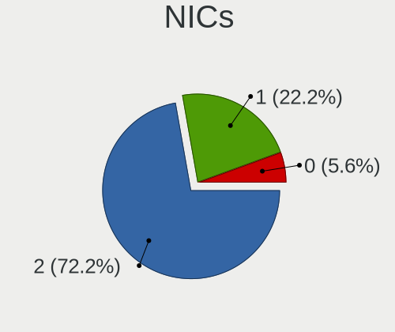

| Total | Notebooks | Percent |
|-------|-----------|---------|
| 2     | 15        | 60%     |
| 1     | 6         | 24%     |
| 0     | 3         | 12%     |
| 3     | 1         | 4%      |

IPv6
----

IPv6 vs IPv4

| Used | Notebooks | Percent |
|------|-----------|---------|
| No   | 23        | 92%     |
| Yes  | 2         | 8%      |

Bluetooth
---------

Bluetooth Vendor
----------------

Controller vendors

| Vendor                          | Notebooks | Percent |
|---------------------------------|-----------|---------|
| Realtek Semiconductor           | 4         | 25%     |
| Intel                           | 4         | 25%     |
| Qualcomm Atheros Communications | 2         | 12.5%   |
| Toshiba                         | 1         | 6.25%   |
| Lite-On Technology              | 1         | 6.25%   |
| Hewlett-Packard                 | 1         | 6.25%   |
| Foxconn / Hon Hai               | 1         | 6.25%   |
| Broadcom                        | 1         | 6.25%   |
| ASUSTek Computer                | 1         | 6.25%   |

Bluetooth Model
---------------

Controller models

| Model                                         | Notebooks | Percent |
|-----------------------------------------------|-----------|---------|
| Intel Bluetooth wireless interface            | 4         | 25%     |
| Realtek Bluetooth Radio                       | 2         | 12.5%   |
| Toshiba Integrated Bluetooth HCI              | 1         | 6.25%   |
| Realtek RTL8723B Bluetooth                    | 1         | 6.25%   |
| Realtek  Bluetooth 4.2 Adapter                | 1         | 6.25%   |
| Qualcomm Atheros  Bluetooth Device            | 1         | 6.25%   |
| Qualcomm Atheros AR3012 Bluetooth 4.0         | 1         | 6.25%   |
| Lite-On Bluetooth Device                      | 1         | 6.25%   |
| HP Bluetooth 2.0 Interface [Broadcom BCM2045] | 1         | 6.25%   |
| Foxconn / Hon Hai Acer Bluetooth module       | 1         | 6.25%   |
| Broadcom BCM2045B (BDC-2.1)                   | 1         | 6.25%   |
| ASUS BT-183 Bluetooth 2.0+EDR adapter         | 1         | 6.25%   |

Sound
-----

Sound Vendor
------------

Sound card vendors

| Vendor              | Notebooks | Percent |
|---------------------|-----------|---------|
| Intel               | 19        | 73.08%  |
| AMD                 | 3         | 11.54%  |
| Nvidia              | 2         | 7.69%   |
| QinHeng Electronics | 1         | 3.85%   |
| EGO SYStems         | 1         | 3.85%   |

Sound Model
-----------

Sound card models

| Model                                                                                             | Notebooks | Percent |
|---------------------------------------------------------------------------------------------------|-----------|---------|
| Intel NM10/ICH7 Family High Definition Audio Controller                                           | 3         | 10%     |
| Intel Atom Processor Z36xxx/Z37xxx Series High Definition Audio Controller                        | 3         | 10%     |
| Intel 82801H (ICH8 Family) HD Audio Controller                                                    | 3         | 10%     |
| Intel Celeron N3350/Pentium N4200/Atom E3900 Series Audio Cluster                                 | 2         | 6.67%   |
| Intel 5 Series/3400 Series Chipset High Definition Audio                                          | 2         | 6.67%   |
| QinHeng Electronics CH345 MIDI adapter                                                            | 1         | 3.33%   |
| Nvidia High Definition Audio Controller                                                           | 1         | 3.33%   |
| Nvidia GP106 High Definition Audio Controller                                                     | 1         | 3.33%   |
| Intel Sunrise Point-LP HD Audio                                                                   | 1         | 3.33%   |
| Intel Haswell-ULT HD Audio Controller                                                             | 1         | 3.33%   |
| Intel CM238 HD Audio Controller                                                                   | 1         | 3.33%   |
| Intel Celeron/Pentium Silver Processor High Definition Audio                                      | 1         | 3.33%   |
| Intel Atom/Celeron/Pentium Processor x5-E8000/J3xxx/N3xxx Series High Definition Audio Controller | 1         | 3.33%   |
| Intel 8 Series HD Audio Controller                                                                | 1         | 3.33%   |
| Intel 6 Series/C200 Series Chipset Family High Definition Audio Controller                        | 1         | 3.33%   |
| EGO SYStems U46                                                                                   | 1         | 3.33%   |
| AMD Trinity HDMI Audio Controller                                                                 | 1         | 3.33%   |
| AMD SBx00 Azalia (Intel HDA)                                                                      | 1         | 3.33%   |
| AMD RS880 HDMI Audio [Radeon HD 4200 Series]                                                      | 1         | 3.33%   |
| AMD Renoir Radeon High Definition Audio Controller                                                | 1         | 3.33%   |
| AMD FCH Azalia Controller                                                                         | 1         | 3.33%   |
| AMD Family 17h/19h HD Audio Controller                                                            | 1         | 3.33%   |

Memory
------

Memory Vendor
-------------

Memory module vendors

| Vendor              | Notebooks | Percent |
|---------------------|-----------|---------|
| Samsung Electronics | 5         | 38.46%  |
| Unknown             | 2         | 15.38%  |
| Unknown (ABCD)      | 1         | 7.69%   |
| Transcend           | 1         | 7.69%   |
| SK hynix            | 1         | 7.69%   |
| Nanya Technology    | 1         | 7.69%   |
| Micron Technology   | 1         | 7.69%   |
| Kingston            | 1         | 7.69%   |

Memory Model
------------

Memory module models

| Model                                                            | Notebooks | Percent |
|------------------------------------------------------------------|-----------|---------|
| Unknown RAM Module 1GB SODIMM DDR3 1066MT/s                      | 1         | 7.14%   |
| Unknown RAM Module 1GB SODIMM DDR2 667MT/s                       | 1         | 7.14%   |
| Unknown (ABCD) RAM 123456789012345678 2GB SODIMM LPDDR4 2400MT/s | 1         | 7.14%   |
| Transcend RAM JM800QSU-2G 2GB SODIMM DDR2 975MT/s                | 1         | 7.14%   |
| SK hynix RAM HMT451S6AFR8A-PB 4096MB SODIMM DDR3 1600MT/s        | 1         | 7.14%   |
| SK hynix RAM HMT425S6AFR6A-PB 2GB SODIMM DDR3 1600MT/s           | 1         | 7.14%   |
| Samsung RAM M471B5673FH0-CH9 2GB SODIMM DDR3 1334MT/s            | 1         | 7.14%   |
| Samsung RAM M471A5244CB0-CTD 4GB SODIMM DDR4 3266MT/s            | 1         | 7.14%   |
| Samsung RAM M471A2G44AM0-CWE 16GB SODIMM DDR4 3200MT/s           | 1         | 7.14%   |
| Samsung RAM K4E8E324EB-EGCF 2GB LPDDR3 1867MT/s                  | 1         | 7.14%   |
| Samsung RAM DDR3 1600 8G 8GB SODIMM DDR3 1600MT/s                | 1         | 7.14%   |
| Nanya RAM NT2GC64B88B0NS-CG 2GB SODIMM DDR3 1334MT/s             | 1         | 7.14%   |
| Micron RAM 4ATF51264HZ-2G6E1 4GB SODIMM DDR4 2667MT/s            | 1         | 7.14%   |
| Kingston RAM ACR16D3LS1KFG/4G 4GB SODIMM DDR3 1600MT/s           | 1         | 7.14%   |

Memory Kind
-----------

Memory module kinds

| Kind   | Notebooks | Percent |
|--------|-----------|---------|
| DDR3   | 6         | 46.15%  |
| DDR4   | 3         | 23.08%  |
| SDRAM  | 1         | 7.69%   |
| LPDDR4 | 1         | 7.69%   |
| LPDDR3 | 1         | 7.69%   |
| DDR2   | 1         | 7.69%   |

Memory Form Factor
------------------

Physical design of the memory module

| Name    | Notebooks | Percent |
|---------|-----------|---------|
| SODIMM  | 12        | 92.31%  |
| Unknown | 1         | 7.69%   |

Memory Size
-----------

Memory module size

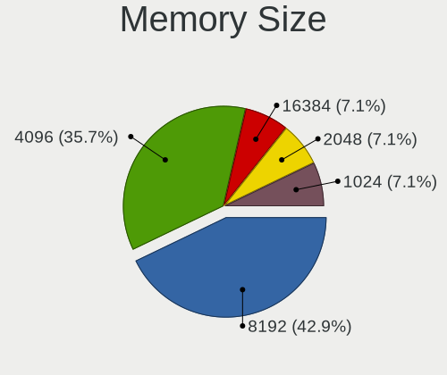

| Size  | Notebooks | Percent |
|-------|-----------|---------|
| 2048  | 5         | 35.71%  |
| 4096  | 4         | 28.57%  |
| 8192  | 2         | 14.29%  |
| 1024  | 2         | 14.29%  |
| 16384 | 1         | 7.14%   |

Memory Speed
------------

Memory module speed

| Speed | Notebooks | Percent |
|-------|-----------|---------|
| 1600  | 3         | 23.08%  |
| 1334  | 2         | 15.38%  |
| 3266  | 1         | 7.69%   |
| 3200  | 1         | 7.69%   |
| 2667  | 1         | 7.69%   |
| 2400  | 1         | 7.69%   |
| 1867  | 1         | 7.69%   |
| 1066  | 1         | 7.69%   |
| 975   | 1         | 7.69%   |
| 667   | 1         | 7.69%   |

Printers & scanners
-------------------

Printer Vendor
--------------

Printer device vendors

| Vendor          | Notebooks | Percent |
|-----------------|-----------|---------|
| Hewlett-Packard | 1         | 50%     |
| Canon           | 1         | 50%     |

Printer Model
-------------

Printer device models

| Model             | Notebooks | Percent |
|-------------------|-----------|---------|
| HP LaserJet P1102 | 1         | 50%     |
| Canon MF3110      | 1         | 50%     |

Scanner Vendor
--------------

Scanner device vendors

Zero info for selected period =(

Scanner Model
-------------

Scanner device models

Zero info for selected period =(

Camera
------

Camera Vendor
-------------

Camera device vendors

| Vendor                        | Notebooks | Percent |
|-------------------------------|-----------|---------|
| Chicony Electronics           | 7         | 35%     |
| Realtek Semiconductor         | 3         | 15%     |
| Suyin                         | 2         | 10%     |
| Sunplus Innovation Technology | 2         | 10%     |
| Y Media                       | 1         | 5%      |
| Syntek                        | 1         | 5%      |
| Quanta                        | 1         | 5%      |
| Logitech                      | 1         | 5%      |
| IMC Networks                  | 1         | 5%      |
| Acer                          | 1         | 5%      |

Camera Model
------------

Camera device models

| Model                                    | Notebooks | Percent |
|------------------------------------------|-----------|---------|
| Y Media USB Camera                       | 1         | 5%      |
| Syntek Sonix USB 2.0 Camera              | 1         | 5%      |
| Suyin Intel Webcam                       | 1         | 5%      |
| Suyin Integrated_Webcam_HD               | 1         | 5%      |
| Sunplus HD WebCam                        | 1         | 5%      |
| Sunplus HD User Facing                   | 1         | 5%      |
| Realtek USB Camera                       | 1         | 5%      |
| Realtek Lenovo EasyCamera                | 1         | 5%      |
| Realtek Integrated Webcam HD             | 1         | 5%      |
| Quanta HP Webcam                         | 1         | 5%      |
| Logitech HD Pro Webcam C920              | 1         | 5%      |
| IMC Networks USB 2.0 UVC VGA WebCam      | 1         | 5%      |
| Chicony VGA Webcam                       | 1         | 5%      |
| Chicony USB2.0 UVC WebCam                | 1         | 5%      |
| Chicony Lenovo Integrated Camera (0.3MP) | 1         | 5%      |
| Chicony Integrated Camera                | 1         | 5%      |
| Chicony 720p HD Camera                   | 1         | 5%      |
| Chicony 2.0M UVC Webcam / CNF7129        | 1         | 5%      |
| Chicony 1.3M Webcam                      | 1         | 5%      |
| Acer Lenovo EasyCamera                   | 1         | 5%      |

Security
--------

Fingerprint Vendor
------------------

Fingerprint sensor vendors

| Vendor                | Notebooks | Percent |
|-----------------------|-----------|---------|
| AuthenTec             | 3         | 60%     |
| Upek                  | 1         | 20%     |
| LighTuning Technology | 1         | 20%     |

Fingerprint Model
-----------------

Fingerprint sensor models

| Model                                                  | Notebooks | Percent |
|--------------------------------------------------------|-----------|---------|
| Upek Biometric Touchchip/Touchstrip Fingerprint Sensor | 1         | 20%     |
| LighTuning EgisTec Touch Fingerprint Sensor            | 1         | 20%     |
| AuthenTec Fingerprint Sensor                           | 1         | 20%     |
| AuthenTec AES2501 Fingerprint Sensor                   | 1         | 20%     |
| AuthenTec AES1600                                      | 1         | 20%     |

Chipcard Vendor
---------------

Chipcard module vendors

| Vendor      | Notebooks | Percent |
|-------------|-----------|---------|
| Broadcom    | 1         | 50%     |
| Alcor Micro | 1         | 50%     |

Chipcard Model
--------------

Chipcard module models

| Model                                          | Notebooks | Percent |
|------------------------------------------------|-----------|---------|
| Broadcom BCM5880 Secure Applications Processor | 1         | 50%     |
| Alcor Micro AU9540 Smartcard Reader            | 1         | 50%     |

Unsupported
-----------

Unsupported Devices
-------------------

Total unsupported devices on board

| Total | Notebooks | Percent |
|-------|-----------|---------|
| 0     | 17        | 68%     |
| 1     | 6         | 24%     |
| 2     | 2         | 8%      |

Unsupported Device Types
------------------------

Types of unsupported devices

| Type               | Notebooks | Percent |
|--------------------|-----------|---------|
| Fingerprint reader | 5         | 50%     |
| Chipcard           | 2         | 20%     |
| Graphics card      | 1         | 10%     |
| Dvb card           | 1         | 10%     |
| Camera             | 1         | 10%     |

