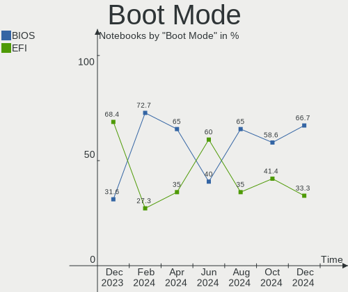
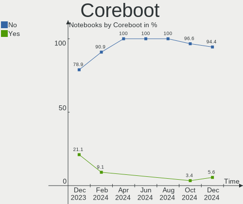
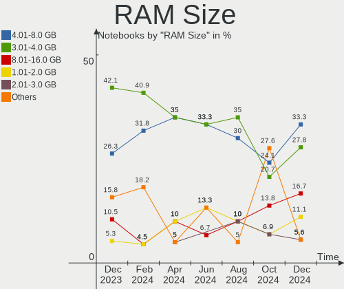
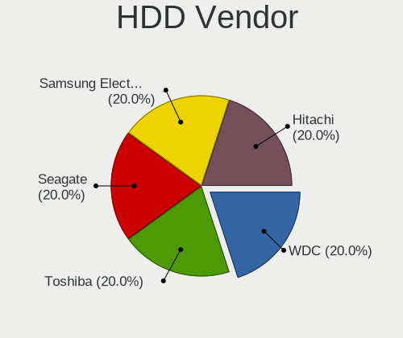
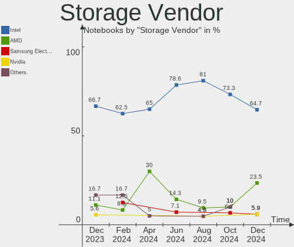
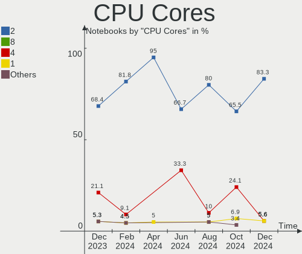
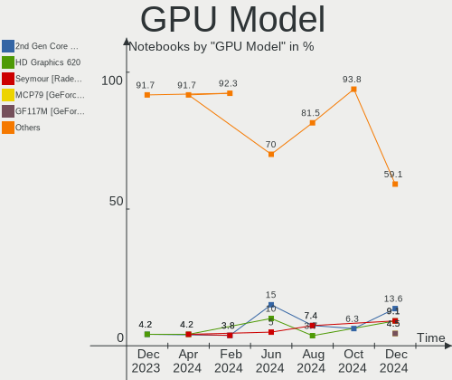
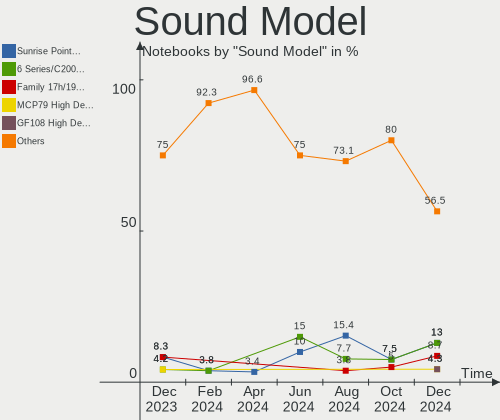
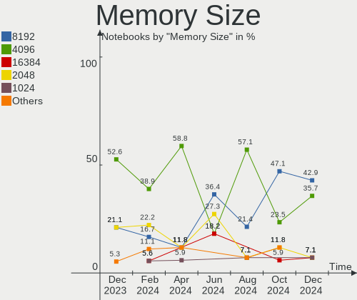

Lubuntu - Hardware Trends (Notebooks)
-------------------------------------

A project to identify most popular hardware characteristics and track their change
over time based on data collected by Linux users at https://Linux-Hardware.org.

Anyone can contribute to this report by the [hw-probe](https://github.com/linuxhw/hw-probe) tool:

    sudo -E hw-probe -all -upload

This report is for one last month. Overall report since the beginning of time: [TestDays](https://github.com/linuxhw/TestDays)

Period: Jan, 2024.

Contents
--------

* [ System ](#system)
  - [ OS                       ](#os)
  - [ OS Family                ](#os-family)
  - [ Kernel                   ](#kernel)
  - [ Kernel Family            ](#kernel-family)
  - [ Kernel Major Ver.        ](#kernel-major-ver)
  - [ Arch                     ](#arch)
  - [ DE                       ](#de)
  - [ Display Server           ](#display-server)
  - [ Display Manager          ](#display-manager)
  - [ OS Lang                  ](#os-lang)
  - [ Boot Mode                ](#boot-mode)
  - [ Filesystem               ](#filesystem)
  - [ Part. scheme             ](#part-scheme)
  - [ Dual Boot with Linux/BSD ](#dual-boot-with-linuxbsd)
  - [ Dual Boot (Win)          ](#dual-boot-win)

* [ Board ](#board)
  - [ Vendor                   ](#vendor)
  - [ Model                    ](#model)
  - [ Model Family             ](#model-family)
  - [ MFG Year                 ](#mfg-year)
  - [ Form Factor              ](#form-factor)
  - [ Secure Boot              ](#secure-boot)
  - [ Coreboot                 ](#coreboot)
  - [ RAM Size                 ](#ram-size)
  - [ RAM Used                 ](#ram-used)
  - [ Total Drives             ](#total-drives)
  - [ Has CD-ROM               ](#has-cd-rom)
  - [ Has Ethernet             ](#has-ethernet)
  - [ Has WiFi                 ](#has-wifi)
  - [ Has Bluetooth            ](#has-bluetooth)

* [ Location ](#location)
  - [ Country                  ](#country)
  - [ City                     ](#city)

* [ Drives ](#drives)
  - [ Drive Vendor             ](#drive-vendor)
  - [ Drive Model              ](#drive-model)
  - [ HDD Vendor               ](#hdd-vendor)
  - [ SSD Vendor               ](#ssd-vendor)
  - [ Drive Kind               ](#drive-kind)
  - [ Drive Connector          ](#drive-connector)
  - [ Drive Size               ](#drive-size)
  - [ Space Total              ](#space-total)
  - [ Space Used               ](#space-used)
  - [ Malfunc. Drives          ](#malfunc-drives)
  - [ Malfunc. Drive Vendor    ](#malfunc-drive-vendor)
  - [ Malfunc. HDD Vendor      ](#malfunc-hdd-vendor)
  - [ Malfunc. Drive Kind      ](#malfunc-drive-kind)
  - [ Failed Drives            ](#failed-drives)
  - [ Failed Drive Vendor      ](#failed-drive-vendor)
  - [ Drive Status             ](#drive-status)

* [ Storage controller ](#storage-controller)
  - [ Storage Vendor           ](#storage-vendor)
  - [ Storage Model            ](#storage-model)
  - [ Storage Kind             ](#storage-kind)

* [ Processor ](#processor)
  - [ CPU Vendor               ](#cpu-vendor)
  - [ CPU Model                ](#cpu-model)
  - [ CPU Model Family         ](#cpu-model-family)
  - [ CPU Cores                ](#cpu-cores)
  - [ CPU Sockets              ](#cpu-sockets)
  - [ CPU Threads              ](#cpu-threads)
  - [ CPU Op-Modes             ](#cpu-op-modes)
  - [ CPU Microcode            ](#cpu-microcode)
  - [ CPU Microarch            ](#cpu-microarch)

* [ Graphics ](#graphics)
  - [ GPU Vendor               ](#gpu-vendor)
  - [ GPU Model                ](#gpu-model)
  - [ GPU Combo                ](#gpu-combo)
  - [ GPU Driver               ](#gpu-driver)
  - [ GPU Memory               ](#gpu-memory)

* [ Monitor ](#monitor)
  - [ Monitor Vendor           ](#monitor-vendor)
  - [ Monitor Model            ](#monitor-model)
  - [ Monitor Resolution       ](#monitor-resolution)
  - [ Monitor Diagonal         ](#monitor-diagonal)
  - [ Monitor Width            ](#monitor-width)
  - [ Aspect Ratio             ](#aspect-ratio)
  - [ Monitor Area             ](#monitor-area)
  - [ Pixel Density            ](#pixel-density)
  - [ Multiple Monitors        ](#multiple-monitors)

* [ Network ](#network)
  - [ Net Controller Vendor    ](#net-controller-vendor)
  - [ Net Controller Model     ](#net-controller-model)
  - [ Wireless Vendor          ](#wireless-vendor)
  - [ Wireless Model           ](#wireless-model)
  - [ Ethernet Vendor          ](#ethernet-vendor)
  - [ Ethernet Model           ](#ethernet-model)
  - [ Net Controller Kind      ](#net-controller-kind)
  - [ Used Controller          ](#used-controller)
  - [ NICs                     ](#nics)
  - [ IPv6                     ](#ipv6)

* [ Bluetooth ](#bluetooth)
  - [ Bluetooth Vendor         ](#bluetooth-vendor)
  - [ Bluetooth Model          ](#bluetooth-model)

* [ Sound ](#sound)
  - [ Sound Vendor             ](#sound-vendor)
  - [ Sound Model              ](#sound-model)

* [ Memory ](#memory)
  - [ Memory Vendor            ](#memory-vendor)
  - [ Memory Model             ](#memory-model)
  - [ Memory Kind              ](#memory-kind)
  - [ Memory Form Factor       ](#memory-form-factor)
  - [ Memory Size              ](#memory-size)
  - [ Memory Speed             ](#memory-speed)

* [ Printers & scanners ](#printers--scanners)
  - [ Printer Vendor           ](#printer-vendor)
  - [ Printer Model            ](#printer-model)
  - [ Scanner Vendor           ](#scanner-vendor)
  - [ Scanner Model            ](#scanner-model)

* [ Camera ](#camera)
  - [ Camera Vendor            ](#camera-vendor)
  - [ Camera Model             ](#camera-model)

* [ Security ](#security)
  - [ Fingerprint Vendor       ](#fingerprint-vendor)
  - [ Fingerprint Model        ](#fingerprint-model)
  - [ Chipcard Vendor          ](#chipcard-vendor)
  - [ Chipcard Model           ](#chipcard-model)

* [ Unsupported ](#unsupported)
  - [ Unsupported Devices      ](#unsupported-devices)
  - [ Unsupported Device Types ](#unsupported-device-types)

System
------

OS
--

Installed operating systems

| Name          | Notebooks | Percent |
|---------------|-----------|---------|
| Lubuntu 22.04 | 13        | 61.9%   |
| Lubuntu 23.10 | 5         | 23.81%  |
| Lubuntu 20.04 | 2         | 9.52%   |
| Lubuntu 21.04 | 1         | 4.76%   |

OS Family
---------

OS without a version

| Name    | Notebooks | Percent |
|---------|-----------|---------|
| Lubuntu | 21        | 100%    |

Kernel
------

Version of the Linux kernel

| Version               | Notebooks | Percent |
|-----------------------|-----------|---------|
| 6.5.0-14-generic      | 5         | 23.81%  |
| 6.2.0-39-generic      | 4         | 19.05%  |
| 5.15.0-91-generic     | 3         | 14.29%  |
| 6.5.0-9-generic       | 1         | 4.76%   |
| 6.5.0-15-generic      | 1         | 4.76%   |
| 6.2.0-26-generic      | 1         | 4.76%   |
| 6.2.0-060200-generic  | 1         | 4.76%   |
| 5.4.0-169-generic     | 1         | 4.76%   |
| 5.19.0-32-generic     | 1         | 4.76%   |
| 5.19.0-051900-generic | 1         | 4.76%   |
| 5.15.0-92-generic     | 1         | 4.76%   |
| 5.11.0-49-generic     | 1         | 4.76%   |

Kernel Family
-------------

Linux kernel without a distro release

| Version | Notebooks | Percent |
|---------|-----------|---------|
| 6.5.0   | 7         | 33.33%  |
| 6.2.0   | 6         | 28.57%  |
| 5.15.0  | 4         | 19.05%  |
| 5.19.0  | 2         | 9.52%   |
| 5.4.0   | 1         | 4.76%   |
| 5.11.0  | 1         | 4.76%   |

Kernel Major Ver.
-----------------

Linux kernel major version

| Version | Notebooks | Percent |
|---------|-----------|---------|
| 6.5     | 7         | 33.33%  |
| 6.2     | 6         | 28.57%  |
| 5.15    | 4         | 19.05%  |
| 5.19    | 2         | 9.52%   |
| 5.4     | 1         | 4.76%   |
| 5.11    | 1         | 4.76%   |

Arch
----

OS architecture (x86_64, i586, etc.)

| Name   | Notebooks | Percent |
|--------|-----------|---------|
| x86_64 | 21        | 100%    |

DE
--

Desktop Environment

| Name | Notebooks | Percent |
|------|-----------|---------|
| LXQt | 20        | 95.24%  |
| LXDE | 1         | 4.76%   |

Display Server
--------------

X11 or Wayland

| Name | Notebooks | Percent |
|------|-----------|---------|
| X11  | 20        | 95.24%  |
| Tty  | 1         | 4.76%   |

Display Manager
---------------

SDDM, LightDM, etc.

| Name    | Notebooks | Percent |
|---------|-----------|---------|
| SDDM    | 13        | 61.9%   |
| Unknown | 5         | 23.81%  |
| LightDM | 2         | 9.52%   |
| GDM3    | 1         | 4.76%   |

OS Lang
-------

Language

| Lang  | Notebooks | Percent |
|-------|-----------|---------|
| en_US | 7         | 33.33%  |
| pt_BR | 2         | 9.52%   |
| fr_FR | 2         | 9.52%   |
| es_CL | 2         | 9.52%   |
| C     | 2         | 9.52%   |
| ro_RO | 1         | 4.76%   |
| it_IT | 1         | 4.76%   |
| es_MX | 1         | 4.76%   |
| es_EC | 1         | 4.76%   |
| en_GB | 1         | 4.76%   |
| de_DE | 1         | 4.76%   |

Boot Mode
---------

EFI or BIOS

| Mode | Notebooks | Percent |
|------|-----------|---------|
| BIOS | 16        | 76.19%  |
| EFI  | 5         | 23.81%  |

Filesystem
----------

Type of filesystem

| Type    | Notebooks | Percent |
|---------|-----------|---------|
| Ext4    | 10        | 47.62%  |
| Tmpfs   | 9         | 42.86%  |
| Overlay | 2         | 9.52%   |

Part. scheme
------------

Scheme of partitioning

| Type    | Notebooks | Percent |
|---------|-----------|---------|
| GPT     | 9         | 42.86%  |
| MBR     | 7         | 33.33%  |
| Unknown | 5         | 23.81%  |

Dual Boot with Linux/BSD
------------------------

Hosting more than one Linux/BSD

| Dual boot | Notebooks | Percent |
|-----------|-----------|---------|
| No        | 19        | 90.48%  |
| Yes       | 2         | 9.52%   |

Dual Boot (Win)
---------------

Hosting Linux and Windows

| Dual boot | Notebooks | Percent |
|-----------|-----------|---------|
| No        | 18        | 85.71%  |
| Yes       | 3         | 14.29%  |

Board
-----

Vendor
------

Motherboard manufacturer

| Name             | Notebooks | Percent |
|------------------|-----------|---------|
| Lenovo           | 7         | 33.33%  |
| Acer             | 3         | 14.29%  |
| Hewlett-Packard  | 2         | 9.52%   |
| ASUSTek Computer | 2         | 9.52%   |
| Packard Bell     | 1         | 4.76%   |
| ODM              | 1         | 4.76%   |
| iRU              | 1         | 4.76%   |
| Google           | 1         | 4.76%   |
| Fujitsu Siemens  | 1         | 4.76%   |
| Digibras         | 1         | 4.76%   |
| Dell             | 1         | 4.76%   |

Model
-----

Motherboard model

| Name                                 | Notebooks | Percent |
|--------------------------------------|-----------|---------|
| Packard Bell EasyNote LM85           | 1         | 4.76%   |
| Lenovo V310-15ISK 80SY               | 1         | 4.76%   |
| Lenovo ThinkPad T60p 20078JU         | 1         | 4.76%   |
| Lenovo ThinkPad T430 23477C7         | 1         | 4.76%   |
| Lenovo ThinkPad SL 2746F2G           | 1         | 4.76%   |
| Lenovo ThinkPad Edge E530c 33664CG   | 1         | 4.76%   |
| Lenovo IdeaPad S145-14API 81UV       | 1         | 4.76%   |
| Lenovo G575 20081                    | 1         | 4.76%   |
| iRU 15TLI                            | 1         | 4.76%   |
| HP Notebook                          | 1         | 4.76%   |
| HP 240 G6 Notebook PC                | 1         | 4.76%   |
| Google Electro                       | 1         | 4.76%   |
| Fujitsu Siemens ESPRIMO Mobile V5535 | 1         | 4.76%   |
| Digibras NH4CU03                     | 1         | 4.76%   |
| Dell Inspiron N5010                  | 1         | 4.76%   |
| ASUS ZenBook UX325SA_UM325SA         | 1         | 4.76%   |
| ASUS K53U                            | 1         | 4.76%   |
| Acer Swift SF314-43                  | 1         | 4.76%   |
| Acer Aspire ES1-520                  | 1         | 4.76%   |
| Acer Aspire E1-572G                  | 1         | 4.76%   |
| Unknown                              | 1         | 4.76%   |

Model Family
------------

Motherboard model prefix

| Name                    | Notebooks | Percent |
|-------------------------|-----------|---------|
| Lenovo ThinkPad         | 4         | 19.05%  |
| Acer Aspire             | 2         | 9.52%   |
| Packard Bell EasyNote   | 1         | 4.76%   |
| Lenovo V310-15ISK       | 1         | 4.76%   |
| Lenovo IdeaPad          | 1         | 4.76%   |
| Lenovo G575             | 1         | 4.76%   |
| iRU 15TLI               | 1         | 4.76%   |
| HP Notebook             | 1         | 4.76%   |
| HP 240                  | 1         | 4.76%   |
| Google Electro          | 1         | 4.76%   |
| Fujitsu Siemens ESPRIMO | 1         | 4.76%   |
| Digibras NH4CU03        | 1         | 4.76%   |
| Dell Inspiron           | 1         | 4.76%   |
| ASUS ZenBook            | 1         | 4.76%   |
| ASUS K53U               | 1         | 4.76%   |
| Acer Swift              | 1         | 4.76%   |
| Unknown                 | 1         | 4.76%   |

MFG Year
--------

Motherboard manufacture year

| Year    | Notebooks | Percent |
|---------|-----------|---------|
| 2021    | 2         | 9.52%   |
| 2013    | 2         | 9.52%   |
| 2012    | 2         | 9.52%   |
| 2011    | 2         | 9.52%   |
| 2010    | 2         | 9.52%   |
| 2008    | 2         | 9.52%   |
| 2023    | 1         | 4.76%   |
| 2022    | 1         | 4.76%   |
| 2019    | 1         | 4.76%   |
| 2017    | 1         | 4.76%   |
| 2016    | 1         | 4.76%   |
| 2015    | 1         | 4.76%   |
| 2007    | 1         | 4.76%   |
| 2006    | 1         | 4.76%   |
| Unknown | 1         | 4.76%   |

Form Factor
-----------

Physical design of the computer

| Name     | Notebooks | Percent |
|----------|-----------|---------|
| Notebook | 21        | 100%    |

Secure Boot
-----------

Enabled or disabled

| State    | Notebooks | Percent |
|----------|-----------|---------|
| Disabled | 21        | 100%    |

Coreboot
--------

Have coreboot on board

| Used | Notebooks | Percent |
|------|-----------|---------|
| No   | 20        | 95.24%  |
| Yes  | 1         | 4.76%   |

RAM Size
--------

Total RAM memory

| Size in GB | Notebooks | Percent |
|------------|-----------|---------|
| 3.01-4.0   | 7         | 33.33%  |
| 4.01-8.0   | 6         | 28.57%  |
| 8.01-16.0  | 4         | 19.05%  |
| 1.01-2.0   | 2         | 9.52%   |
| 2.01-3.0   | 1         | 4.76%   |
| 16.01-24.0 | 1         | 4.76%   |

RAM Used
--------

Used RAM memory

| Used GB  | Notebooks | Percent |
|----------|-----------|---------|
| 1.01-2.0 | 10        | 47.62%  |
| 2.01-3.0 | 6         | 28.57%  |
| 0.51-1.0 | 3         | 14.29%  |
| 4.01-8.0 | 1         | 4.76%   |
| 3.01-4.0 | 1         | 4.76%   |

Total Drives
------------

Number of drives on board

| Drives | Notebooks | Percent |
|--------|-----------|---------|
| 1      | 19        | 90.48%  |
| 2      | 2         | 9.52%   |

Has CD-ROM
----------

Has CD-ROM on board

| Presented | Notebooks | Percent |
|-----------|-----------|---------|
| Yes       | 12        | 57.14%  |
| No        | 9         | 42.86%  |

Has Ethernet
------------

Has Ethernet on board

| Presented | Notebooks | Percent |
|-----------|-----------|---------|
| Yes       | 17        | 80.95%  |
| No        | 4         | 19.05%  |

Has WiFi
--------

Has WiFi module

| Presented | Notebooks | Percent |
|-----------|-----------|---------|
| Yes       | 21        | 100%    |

Has Bluetooth
-------------

Has Bluetooth module

| Presented | Notebooks | Percent |
|-----------|-----------|---------|
| Yes       | 13        | 61.9%   |
| No        | 8         | 38.1%   |

Location
--------

Country
-------

Geographic location (country)

| Country   | Notebooks | Percent |
|-----------|-----------|---------|
| USA       | 2         | 9.52%   |
| Russia    | 2         | 9.52%   |
| Italy     | 2         | 9.52%   |
| Germany   | 2         | 9.52%   |
| France    | 2         | 9.52%   |
| Chile     | 2         | 9.52%   |
| Brazil    | 2         | 9.52%   |
| UK        | 1         | 4.76%   |
| Romania   | 1         | 4.76%   |
| Pakistan  | 1         | 4.76%   |
| Guam      | 1         | 4.76%   |
| Ecuador   | 1         | 4.76%   |
| Canada    | 1         | 4.76%   |
| Argentina | 1         | 4.76%   |

City
----

Geographic location (city)

| City       | Notebooks | Percent |
|------------|-----------|---------|
| Santiago   | 2         | 9.52%   |
| Weslaco    | 1         | 4.76%   |
| Vitória   | 1         | 4.76%   |
| Toronto    | 1         | 4.76%   |
| Saratov    | 1         | 4.76%   |
| Rennes     | 1         | 4.76%   |
| Rawalpindi | 1         | 4.76%   |
| Paris      | 1         | 4.76%   |
| Nuremberg  | 1         | 4.76%   |
| Milan      | 1         | 4.76%   |
| Lübeck    | 1         | 4.76%   |
| La Plata   | 1         | 4.76%   |
| Irkutsk    | 1         | 4.76%   |
| Hagåtña  | 1         | 4.76%   |
| Hackney    | 1         | 4.76%   |
| Guayaquil  | 1         | 4.76%   |
| Genoa      | 1         | 4.76%   |
| Formosa    | 1         | 4.76%   |
| Cumming    | 1         | 4.76%   |
| Constanța | 1         | 4.76%   |

Drives
------

Drive Vendor
------------

Hard drive vendors

| Vendor              | Notebooks | Drives | Percent |
|---------------------|-----------|--------|---------|
| Samsung Electronics | 4         | 4      | 19.05%  |
| WDC                 | 3         | 3      | 14.29%  |
| Toshiba             | 3         | 3      | 14.29%  |
| Kingston            | 3         | 3      | 14.29%  |
| Unknown             | 1         | 1      | 4.76%   |
| SK hynix            | 1         | 1      | 4.76%   |
| Seagate             | 1         | 1      | 4.76%   |
| SanDisk             | 1         | 1      | 4.76%   |
| Lexar               | 1         | 1      | 4.76%   |
| Hitachi             | 1         | 1      | 4.76%   |
| Crucial             | 1         | 1      | 4.76%   |
| Unknown             | 1         | 1      | 4.76%   |

Drive Model
-----------

Hard drive models

| Model                            | Notebooks | Percent |
|----------------------------------|-----------|---------|
| WDC WD2500BEVS-22UST0 250GB      | 1         | 4.76%   |
| WDC WD10SPZX-24Z10 1TB           | 1         | 4.76%   |
| WDC WD10JPVX-60JC3T0 1TB         | 1         | 4.76%   |
| Unknown MMC Card  32GB           | 1         | 4.76%   |
| Toshiba MQ01ABD100 1TB           | 1         | 4.76%   |
| Toshiba MQ01ABD050 500GB         | 1         | 4.76%   |
| Toshiba MK1237GSX 120GB          | 1         | 4.76%   |
| SK hynix HFM512GD3JX013N 512GB   | 1         | 4.76%   |
| Seagate ST500LM021-1KJ152 500GB  | 1         | 4.76%   |
| SanDisk SSD PLUS 480GB           | 1         | 4.76%   |
| Samsung SSD 870 EVO 2TB          | 1         | 4.76%   |
| Samsung SSD 850 EVO mSATA 250GB  | 1         | 4.76%   |
| Samsung HM501II 500GB            | 1         | 4.76%   |
| Samsung HM320II 320GB            | 1         | 4.76%   |
| Lexar SSD 512GB                  | 1         | 4.76%   |
| Kingston SV300S37A120G 120GB SSD | 1         | 4.76%   |
| Kingston SA400S37240G 240GB SSD  | 1         | 4.76%   |
| Kingston OM8SEP4512Q-AA 512GB    | 1         | 4.76%   |
| Hitachi HTS543232A7A384 320GB    | 1         | 4.76%   |
| Crucial CT250MX500SSD1 250GB     | 1         | 4.76%   |
| Unknown                          | 1         | 4.76%   |

HDD Vendor
----------

Hard disk drive vendors

| Vendor              | Notebooks | Drives | Percent |
|---------------------|-----------|--------|---------|
| WDC                 | 3         | 3      | 30%     |
| Toshiba             | 3         | 3      | 30%     |
| Samsung Electronics | 2         | 2      | 20%     |
| Seagate             | 1         | 1      | 10%     |
| Hitachi             | 1         | 1      | 10%     |

SSD Vendor
----------

Solid state drive vendors

| Vendor              | Notebooks | Drives | Percent |
|---------------------|-----------|--------|---------|
| Samsung Electronics | 2         | 2      | 25%     |
| Kingston            | 2         | 2      | 25%     |
| SanDisk             | 1         | 1      | 12.5%   |
| Lexar               | 1         | 1      | 12.5%   |
| Crucial             | 1         | 1      | 12.5%   |
| Unknown             | 1         | 1      | 12.5%   |

Drive Kind
----------

HDD or SSD

| Kind | Notebooks | Drives | Percent |
|------|-----------|--------|---------|
| HDD  | 10        | 10     | 47.62%  |
| SSD  | 8         | 8      | 38.1%   |
| NVMe | 2         | 2      | 9.52%   |
| MMC  | 1         | 1      | 4.76%   |

Drive Connector
---------------

SATA, SAS, NVMe, etc.

| Type | Notebooks | Drives | Percent |
|------|-----------|--------|---------|
| SATA | 18        | 18     | 85.71%  |
| NVMe | 2         | 2      | 9.52%   |
| MMC  | 1         | 1      | 4.76%   |

Drive Size
----------

Size of hard drive

| Size in TB | Notebooks | Drives | Percent |
|------------|-----------|--------|---------|
| 0.01-0.5   | 12        | 12     | 66.67%  |
| 0.51-1.0   | 5         | 5      | 27.78%  |
| 1.01-2.0   | 1         | 1      | 5.56%   |

Space Total
-----------

Amount of disk space available on the file system

| Size in GB | Notebooks | Percent |
|------------|-----------|---------|
| 101-250    | 8         | 38.1%   |
| 251-500    | 7         | 33.33%  |
| 501-1000   | 2         | 9.52%   |
| 21-50      | 1         | 4.76%   |
| 1-20       | 1         | 4.76%   |
| 51-100     | 1         | 4.76%   |
| Unknown    | 1         | 4.76%   |

Space Used
----------

Amount of used disk space

| Used GB  | Notebooks | Percent |
|----------|-----------|---------|
| 1-20     | 8         | 38.1%   |
| 21-50    | 5         | 23.81%  |
| 51-100   | 3         | 14.29%  |
| 101-250  | 2         | 9.52%   |
| 251-500  | 1         | 4.76%   |
| 501-1000 | 1         | 4.76%   |
| Unknown  | 1         | 4.76%   |

Malfunc. Drives
---------------

Drive models with a malfunction

| Model                    | Notebooks | Drives | Percent |
|--------------------------|-----------|--------|---------|
| Toshiba MQ01ABD050 500GB | 1         | 1      | 100%    |

Malfunc. Drive Vendor
---------------------

Vendors of faulty drives

| Vendor  | Notebooks | Drives | Percent |
|---------|-----------|--------|---------|
| Toshiba | 1         | 1      | 100%    |

Malfunc. HDD Vendor
-------------------

Vendors of faulty HDD drives

| Vendor  | Notebooks | Drives | Percent |
|---------|-----------|--------|---------|
| Toshiba | 1         | 1      | 100%    |

Malfunc. Drive Kind
-------------------

Kinds of faulty drives

| Kind | Notebooks | Drives | Percent |
|------|-----------|--------|---------|
| HDD  | 1         | 1      | 100%    |

Failed Drives
-------------

Failed drive models

Zero info for selected period =(

Failed Drive Vendor
-------------------

Failed drive vendors

Zero info for selected period =(

Drive Status
------------

Number of failed and malfunc. drives

| Status   | Notebooks | Drives | Percent |
|----------|-----------|--------|---------|
| Detected | 13        | 13     | 61.9%   |
| Works    | 7         | 7      | 33.33%  |
| Malfunc  | 1         | 1      | 4.76%   |

Storage controller
------------------

Storage Vendor
--------------

Storage controller vendors

| Vendor                           | Notebooks | Percent |
|----------------------------------|-----------|---------|
| Intel                            | 13        | 61.9%   |
| AMD                              | 5         | 23.81%  |
| SK hynix                         | 1         | 4.76%   |
| Silicon Integrated Systems [SiS] | 1         | 4.76%   |
| Kingston Technology Company      | 1         | 4.76%   |

Storage Model
-------------

Storage controller models

| Model                                                                            | Notebooks | Percent |
|----------------------------------------------------------------------------------|-----------|---------|
| Intel 7 Series Chipset Family 6-port SATA Controller [AHCI mode]                 | 3         | 12%     |
| AMD FCH SATA Controller [AHCI mode]                                              | 3         | 12%     |
| SK hynix Gold P31/BC711/PC711 NVMe Solid State Drive                             | 1         | 4%      |
| Silicon Integrated Systems [SiS] SATA Controller / IDE mode                      | 1         | 4%      |
| Silicon Integrated Systems [SiS] 5513 IDE Controller                             | 1         | 4%      |
| Kingston Company OM8SEP4 Design-In PCIe 4 NVMe SSD (TLC) (DRAM-less)             | 1         | 4%      |
| Intel Tiger Lake-LP SATA Controller                                              | 1         | 4%      |
| Intel Sunrise Point-LP SATA Controller [AHCI mode]                               | 1         | 4%      |
| Intel Celeron/Pentium Silver Processor SATA Controller                           | 1         | 4%      |
| Intel Atom/Celeron/Pentium Processor x5-E8000/J3xxx/N3xxx Series SATA Controller | 1         | 4%      |
| Intel 82801IBM/IEM (ICH9M/ICH9M-E) 4 port SATA Controller [AHCI mode]            | 1         | 4%      |
| Intel 82801HM/HEM (ICH8M/ICH8M-E) SATA Controller [AHCI mode]                    | 1         | 4%      |
| Intel 82801HM/HEM (ICH8M/ICH8M-E) IDE Controller                                 | 1         | 4%      |
| Intel 82801GBM/GHM (ICH7-M Family) SATA Controller [AHCI mode]                   | 1         | 4%      |
| Intel 82801G (ICH7 Family) IDE Controller                                        | 1         | 4%      |
| Intel 8 Series SATA Controller 1 [AHCI mode]                                     | 1         | 4%      |
| Intel 5 Series/3400 Series Chipset 6 port SATA AHCI Controller                   | 1         | 4%      |
| Intel 5 Series/3400 Series Chipset 4 port SATA AHCI Controller                   | 1         | 4%      |
| AMD SB7x0/SB8x0/SB9x0 SATA Controller [IDE mode]                                 | 1         | 4%      |
| AMD SB7x0/SB8x0/SB9x0 SATA Controller [AHCI mode]                                | 1         | 4%      |
| AMD SB7x0/SB8x0/SB9x0 IDE Controller                                             | 1         | 4%      |

Storage Kind
------------

Kind of storage controller (IDE, SATA, NVMe, SAS, ...)

| Kind | Notebooks | Percent |
|------|-----------|---------|
| SATA | 18        | 75%     |
| IDE  | 4         | 16.67%  |
| NVMe | 2         | 8.33%   |

Processor
---------

CPU Vendor
----------

Processor vendors

| Vendor | Notebooks | Percent |
|--------|-----------|---------|
| Intel  | 15        | 71.43%  |
| AMD    | 6         | 28.57%  |

CPU Model
---------

Processor models

| Model                                       | Notebooks | Percent |
|---------------------------------------------|-----------|---------|
| Intel Pentium CPU P6200 @ 2.13GHz           | 1         | 4.76%   |
| Intel Pentium CPU N3710 @ 1.60GHz           | 1         | 4.76%   |
| Intel Core i7-3632QM CPU @ 2.20GHz          | 1         | 4.76%   |
| Intel Core i7-3610QM CPU @ 2.30GHz          | 1         | 4.76%   |
| Intel Core i5-4200U CPU @ 1.60GHz           | 1         | 4.76%   |
| Intel Core i3-6006U CPU @ 2.00GHz           | 1         | 4.76%   |
| Intel Core i3-3217U CPU @ 1.80GHz           | 1         | 4.76%   |
| Intel Core i3 CPU M 350 @ 2.27GHz           | 1         | 4.76%   |
| Intel Core 2 Duo CPU T5870 @ 2.00GHz        | 1         | 4.76%   |
| Intel Core 2 Duo CPU T5850 @ 2.16GHz        | 1         | 4.76%   |
| Intel Core 2 CPU T7600 @ 2.33GHz            | 1         | 4.76%   |
| Intel Celeron N4000 CPU @ 1.10GHz           | 1         | 4.76%   |
| Intel Celeron Dual-Core CPU T3000 @ 1.80GHz | 1         | 4.76%   |
| Intel Celeron CPU N3350 @ 1.10GHz           | 1         | 4.76%   |
| Intel 11th Gen Core i5-1135G7 @ 2.40GHz     | 1         | 4.76%   |
| AMD Ryzen 7 5800U with Radeon Graphics      | 1         | 4.76%   |
| AMD Ryzen 7 5700U with Radeon Graphics      | 1         | 4.76%   |
| AMD E-300 APU with Radeon HD Graphics       | 1         | 4.76%   |
| AMD C-60 APU with Radeon HD Graphics        | 1         | 4.76%   |
| AMD A4-5000 APU with Radeon HD Graphics     | 1         | 4.76%   |
| AMD 3020e with Radeon Graphics              | 1         | 4.76%   |

CPU Model Family
----------------

Processor model prefix

| Model                   | Notebooks | Percent |
|-------------------------|-----------|---------|
| Intel Core i3           | 3         | 14.29%  |
| Other                   | 2         | 9.52%   |
| Intel Pentium           | 2         | 9.52%   |
| Intel Core i7           | 2         | 9.52%   |
| Intel Core 2 Duo        | 2         | 9.52%   |
| Intel Celeron           | 2         | 9.52%   |
| AMD Ryzen 7             | 2         | 9.52%   |
| Intel Core i5           | 1         | 4.76%   |
| Intel Core 2            | 1         | 4.76%   |
| Intel Celeron Dual-Core | 1         | 4.76%   |
| AMD E                   | 1         | 4.76%   |
| AMD C-60                | 1         | 4.76%   |
| AMD A4                  | 1         | 4.76%   |

CPU Cores
---------

Number of processor cores

| Number | Notebooks | Percent |
|--------|-----------|---------|
| 2      | 14        | 66.67%  |
| 4      | 5         | 23.81%  |
| 8      | 2         | 9.52%   |

CPU Sockets
-----------

Number of sockets

| Number | Notebooks | Percent |
|--------|-----------|---------|
| 1      | 21        | 100%    |

CPU Threads
-----------

Threads per core (Hyper-Threading)

| Number | Notebooks | Percent |
|--------|-----------|---------|
| 1      | 12        | 57.14%  |
| 2      | 9         | 42.86%  |

CPU Op-Modes
------------

CPU Operation Modes (32-bit, 64-bit)

| Op mode        | Notebooks | Percent |
|----------------|-----------|---------|
| 32-bit, 64-bit | 21        | 100%    |

CPU Microcode
-------------

Microcode number

| Number     | Notebooks | Percent |
|------------|-----------|---------|
| Unknown    | 14        | 66.67%  |
| 0x306a9    | 2         | 9.52%   |
| 0x6fd      | 1         | 4.76%   |
| 0x0a50000c | 1         | 4.76%   |
| 0x08608104 | 1         | 4.76%   |
| 0x05000119 | 1         | 4.76%   |
| 0x00000000 | 1         | 4.76%   |

CPU Microarch
-------------

Microarchitecture

| Name          | Notebooks | Percent |
|---------------|-----------|---------|
| IvyBridge     | 3         | 14.29%  |
| Core          | 3         | 14.29%  |
| Westmere      | 2         | 9.52%   |
| Bobcat        | 2         | 9.52%   |
| Zen 3         | 1         | 4.76%   |
| Zen           | 1         | 4.76%   |
| TigerLake     | 1         | 4.76%   |
| Skylake       | 1         | 4.76%   |
| Silvermont    | 1         | 4.76%   |
| Penryn        | 1         | 4.76%   |
| Jaguar        | 1         | 4.76%   |
| Haswell       | 1         | 4.76%   |
| Goldmont plus | 1         | 4.76%   |
| Goldmont      | 1         | 4.76%   |
| Unknown       | 1         | 4.76%   |

Graphics
--------

GPU Vendor
----------

Vendors of graphics cards

| Vendor                           | Notebooks | Percent |
|----------------------------------|-----------|---------|
| Intel                            | 12        | 54.55%  |
| AMD                              | 9         | 40.91%  |
| Silicon Integrated Systems [SiS] | 1         | 4.55%   |

GPU Model
---------

Graphics card models

| Model                                                                                    | Notebooks | Percent |
|------------------------------------------------------------------------------------------|-----------|---------|
| Intel 3rd Gen Core processor Graphics Controller                                         | 3         | 13.04%  |
| Silicon Integrated Systems [SiS] 771/671 PCIE VGA Display Adapter                        | 1         | 4.35%   |
| Intel TigerLake-LP GT2 [Iris Xe Graphics]                                                | 1         | 4.35%   |
| Intel Mobile GM965/GL960 Integrated Graphics Controller (secondary)                      | 1         | 4.35%   |
| Intel Mobile GM965/GL960 Integrated Graphics Controller (primary)                        | 1         | 4.35%   |
| Intel Mobile 4 Series Chipset Integrated Graphics Controller                             | 1         | 4.35%   |
| Intel HD Graphics 520                                                                    | 1         | 4.35%   |
| Intel HD Graphics 500                                                                    | 1         | 4.35%   |
| Intel Haswell-ULT Integrated Graphics Controller                                         | 1         | 4.35%   |
| Intel GeminiLake [UHD Graphics 600]                                                      | 1         | 4.35%   |
| Intel Core Processor Integrated Graphics Controller                                      | 1         | 4.35%   |
| Intel Atom/Celeron/Pentium Processor x5-E8000/J3xxx/N3xxx Integrated Graphics Controller | 1         | 4.35%   |
| AMD Wrestler [Radeon HD 6310]                                                            | 1         | 4.35%   |
| AMD Wrestler [Radeon HD 6290]                                                            | 1         | 4.35%   |
| AMD Sun XT [Radeon HD 8670A/8670M/8690M / R5 M330 / M430 / Radeon 520 Mobile]            | 1         | 4.35%   |
| AMD RV530/M56 GL [Mobility FireGL V5200]                                                 | 1         | 4.35%   |
| AMD Robson CE [Radeon HD 6370M/7370M]                                                    | 1         | 4.35%   |
| AMD Picasso/Raven 2 [Radeon Vega Series / Radeon Vega Mobile Series]                     | 1         | 4.35%   |
| AMD Lucienne                                                                             | 1         | 4.35%   |
| AMD Kabini [Radeon HD 8330]                                                              | 1         | 4.35%   |
| AMD Cezanne [Radeon Vega Series / Radeon Vega Mobile Series]                             | 1         | 4.35%   |

GPU Combo
---------

Combinations of graphics cards

| Name        | Notebooks | Percent |
|-------------|-----------|---------|
| 1 x Intel   | 10        | 47.62%  |
| 1 x AMD     | 8         | 38.1%   |
| Other       | 1         | 4.76%   |
| 1 x SiS     | 1         | 4.76%   |
| Intel + AMD | 1         | 4.76%   |

GPU Driver
----------

Free vs proprietary

| Driver  | Notebooks | Percent |
|---------|-----------|---------|
| Free    | 20        | 95.24%  |
| Unknown | 1         | 4.76%   |

GPU Memory
----------

Total video memory

| Size in GB | Notebooks | Percent |
|------------|-----------|---------|
| Unknown    | 16        | 76.19%  |
| 0.01-0.5   | 4         | 19.05%  |
| 0.51-1.0   | 1         | 4.76%   |

Monitor
-------

Monitor Vendor
--------------

Monitor vendors

| Vendor              | Notebooks | Percent |
|---------------------|-----------|---------|
| AU Optronics        | 5         | 23.81%  |
| Samsung Electronics | 3         | 14.29%  |
| LG Display          | 3         | 14.29%  |
| Chimei Innolux      | 3         | 14.29%  |
| BOE                 | 3         | 14.29%  |
| Lenovo              | 2         | 9.52%   |
| MTD                 | 1         | 4.76%   |
| Dell                | 1         | 4.76%   |

Monitor Model
-------------

Monitor models

| Model                                                                 | Notebooks | Percent |
|-----------------------------------------------------------------------|-----------|---------|
| Samsung Electronics LCD Monitor SEC324C 1600x900 310x174mm 14.0-inch  | 1         | 4.55%   |
| Samsung Electronics LCD Monitor SDC4158 1920x1080 294x165mm 13.3-inch | 1         | 4.55%   |
| Samsung Electronics LCD Monitor SAM7108 3840x1600 700x390mm 31.5-inch | 1         | 4.55%   |
| MTD LCD Monitor MTD0001 1280x800 303x190mm 14.1-inch                  | 1         | 4.55%   |
| LG Display LCD Monitor LGD0385 1366x768 309x174mm 14.0-inch           | 1         | 4.55%   |
| LG Display LCD Monitor LGD033B 1366x768 344x194mm 15.5-inch           | 1         | 4.55%   |
| LG Display LCD Monitor LGD02DC 1366x768 344x194mm 15.5-inch           | 1         | 4.55%   |
| Lenovo LCD Monitor LEN4050 1280x800 331x207mm 15.4-inch               | 1         | 4.55%   |
| Lenovo LCD Monitor LEN4022 1400x1050 287x215mm 14.1-inch              | 1         | 4.55%   |
| Dell P2317H DEL40F4 1920x1080 509x286mm 23.0-inch                     | 1         | 4.55%   |
| Chimei Innolux LCD Monitor CMN15C6 1366x768 344x193mm 15.5-inch       | 1         | 4.55%   |
| Chimei Innolux LCD Monitor CMN14D6 1366x768 309x173mm 13.9-inch       | 1         | 4.55%   |
| Chimei Innolux LCD Monitor CMN14D4 1920x1080 309x173mm 13.9-inch      | 1         | 4.55%   |
| BOE LCD Monitor BOE0700 1920x1080 344x194mm 15.5-inch                 | 1         | 4.55%   |
| BOE LCD Monitor BOE0700 1920x1080 340x190mm 15.3-inch                 | 1         | 4.55%   |
| BOE LCD Monitor BOE06A4 1366x768 344x194mm 15.5-inch                  | 1         | 4.55%   |
| BOE LCD Monitor BOE061D 1366x768 309x173mm 13.9-inch                  | 1         | 4.55%   |
| AU Optronics LCD Monitor AUO48EC 1366x768 344x193mm 15.5-inch         | 1         | 4.55%   |
| AU Optronics LCD Monitor AUO2E3C 1366x768 309x173mm 13.9-inch         | 1         | 4.55%   |
| AU Optronics LCD Monitor AUO26EC 1366x768 344x193mm 15.5-inch         | 1         | 4.55%   |
| AU Optronics LCD Monitor AUO22EC 1366x768 344x193mm 15.5-inch         | 1         | 4.55%   |
| AU Optronics LCD Monitor AUO145C 1366x768 256x144mm 11.6-inch         | 1         | 4.55%   |

Monitor Resolution
------------------

Monitor screen resolution

| Resolution      | Notebooks | Percent |
|-----------------|-----------|---------|
| 1366x768 (WXGA) | 12        | 60%     |
| 1920x1080 (FHD) | 3         | 15%     |
| 1280x800 (WXGA) | 2         | 10%     |
| 3840x1600       | 1         | 5%      |
| 1600x900 (HD+)  | 1         | 5%      |
| 1400x1050       | 1         | 5%      |

Monitor Diagonal
----------------

Diagonal size in inches

| Inches | Notebooks | Percent |
|--------|-----------|---------|
| 15     | 10        | 47.62%  |
| 13     | 5         | 23.81%  |
| 14     | 3         | 14.29%  |
| 43     | 1         | 4.76%   |
| 23     | 1         | 4.76%   |
| 11     | 1         | 4.76%   |

Monitor Width
-------------

Physical width

| Width in mm | Notebooks | Percent |
|-------------|-----------|---------|
| 301-350     | 15        | 71.43%  |
| 201-300     | 3         | 14.29%  |
| 501-600     | 1         | 4.76%   |
| 351-400     | 1         | 4.76%   |
| 901-1000    | 1         | 4.76%   |

Aspect Ratio
------------

Proportional relationship between the width and the height

| Ratio | Notebooks | Percent |
|-------|-----------|---------|
| 16/9  | 16        | 84.21%  |
| 16/10 | 2         | 10.53%  |
| 4/3   | 1         | 5.26%   |

Monitor Area
------------

Area in inch²

| Area in inch² | Notebooks | Percent |
|----------------|-----------|---------|
| 101-110        | 10        | 45.45%  |
| 81-90          | 6         | 27.27%  |
| 91-100         | 2         | 9.09%   |
| 71-80          | 1         | 4.55%   |
| 51-60          | 1         | 4.55%   |
| 201-250        | 1         | 4.55%   |
| 501-1000       | 1         | 4.55%   |

Pixel Density
-------------

Pixels per inch

| Density | Notebooks | Percent |
|---------|-----------|---------|
| 101-120 | 12        | 57.14%  |
| 121-160 | 4         | 19.05%  |
| 51-100  | 4         | 19.05%  |
| 161-240 | 1         | 4.76%   |

Multiple Monitors
-----------------

Total monitors connected

| Total | Notebooks | Percent |
|-------|-----------|---------|
| 1     | 18        | 85.71%  |
| 2     | 2         | 9.52%   |
| 0     | 1         | 4.76%   |

Network
-------

Net Controller Vendor
---------------------

Controller vendors

| Vendor                           | Notebooks | Percent |
|----------------------------------|-----------|---------|
| Realtek Semiconductor            | 10        | 31.25%  |
| Qualcomm Atheros                 | 8         | 25%     |
| Intel                            | 6         | 18.75%  |
| Broadcom                         | 3         | 9.38%   |
| Silicon Integrated Systems [SiS] | 1         | 3.13%   |
| MediaTek                         | 1         | 3.13%   |
| DisplayLink                      | 1         | 3.13%   |
| ASUSTek Computer                 | 1         | 3.13%   |
| ASIX Electronics                 | 1         | 3.13%   |

Net Controller Model
--------------------

Controller models

| Model                                                                   | Notebooks | Percent |
|-------------------------------------------------------------------------|-----------|---------|
| Realtek RTL8111/8168/8211/8411 PCI Express Gigabit Ethernet Controller  | 7         | 16.28%  |
| Realtek RTL810xE PCI Express Fast Ethernet controller                   | 3         | 6.98%   |
| Qualcomm Atheros QCA9565 / AR9565 Wireless Network Adapter              | 2         | 4.65%   |
| Qualcomm Atheros QCA9377 802.11ac Wireless Network Adapter              | 2         | 4.65%   |
| Qualcomm Atheros AR9285 Wireless Network Adapter (PCI-Express)          | 2         | 4.65%   |
| Qualcomm Atheros AR242x / AR542x Wireless Network Adapter (PCI-Express) | 2         | 4.65%   |
| Intel Wireless 7265                                                     | 2         | 4.65%   |
| Silicon Integrated Systems [SiS] 191 Gigabit Ethernet Adapter           | 1         | 2.33%   |
| Realtek RTL88x2bu [AC1200 Techkey]                                      | 1         | 2.33%   |
| Realtek RTL8723DE Wireless Network Adapter                              | 1         | 2.33%   |
| Realtek RTL8723BE PCIe Wireless Network Adapter                         | 1         | 2.33%   |
| Realtek RTL8188EE Wireless Network Adapter                              | 1         | 2.33%   |
| Realtek RTL8187B Wireless 802.11g 54Mbps Network Adapter                | 1         | 2.33%   |
| Realtek 802.11ac NIC                                                    | 1         | 2.33%   |
| Qualcomm Atheros AR8152 v2.0 Fast Ethernet                              | 1         | 2.33%   |
| MediaTek MT7921 802.11ax PCI Express Wireless Network Adapter           | 1         | 2.33%   |
| Intel Wireless 8265 / 8275                                              | 1         | 2.33%   |
| Intel PRO/Wireless 3945ABG [Golan] Network Connection                   | 1         | 2.33%   |
| Intel Ethernet Connection (13) I219-V                                   | 1         | 2.33%   |
| Intel Centrino Wireless-N 2230                                          | 1         | 2.33%   |
| Intel Centrino Advanced-N 6205 [Taylor Peak]                            | 1         | 2.33%   |
| Intel 82579LM Gigabit Network Connection (Lewisville)                   | 1         | 2.33%   |
| Intel 82573L Gigabit Ethernet Controller                                | 1         | 2.33%   |
| DisplayLink Dell Universal Dock D6000                                   | 1         | 2.33%   |
| Broadcom NetXtreme BCM57786 Gigabit Ethernet PCIe                       | 1         | 2.33%   |
| Broadcom NetLink BCM57780 Gigabit Ethernet PCIe                         | 1         | 2.33%   |
| Broadcom BCM43225 802.11b/g/n                                           | 1         | 2.33%   |
| Broadcom BCM4313 802.11bgn Wireless Network Adapter                     | 1         | 2.33%   |
| ASUS Realtek 8188EUS [USB-N10 Nano]                                     | 1         | 2.33%   |
| ASIX AX88178A                                                           | 1         | 2.33%   |

Wireless Vendor
---------------

Wireless vendors

| Vendor                | Notebooks | Percent |
|-----------------------|-----------|---------|
| Qualcomm Atheros      | 8         | 34.78%  |
| Intel                 | 6         | 26.09%  |
| Realtek Semiconductor | 5         | 21.74%  |
| Broadcom              | 2         | 8.7%    |
| MediaTek              | 1         | 4.35%   |
| ASUSTek Computer      | 1         | 4.35%   |

Wireless Model
--------------

Wireless models

| Model                                                                   | Notebooks | Percent |
|-------------------------------------------------------------------------|-----------|---------|
| Qualcomm Atheros QCA9565 / AR9565 Wireless Network Adapter              | 2         | 8.33%   |
| Qualcomm Atheros QCA9377 802.11ac Wireless Network Adapter              | 2         | 8.33%   |
| Qualcomm Atheros AR9285 Wireless Network Adapter (PCI-Express)          | 2         | 8.33%   |
| Qualcomm Atheros AR242x / AR542x Wireless Network Adapter (PCI-Express) | 2         | 8.33%   |
| Intel Wireless 7265                                                     | 2         | 8.33%   |
| Realtek RTL88x2bu [AC1200 Techkey]                                      | 1         | 4.17%   |
| Realtek RTL8723DE Wireless Network Adapter                              | 1         | 4.17%   |
| Realtek RTL8723BE PCIe Wireless Network Adapter                         | 1         | 4.17%   |
| Realtek RTL8188EE Wireless Network Adapter                              | 1         | 4.17%   |
| Realtek RTL8187B Wireless 802.11g 54Mbps Network Adapter                | 1         | 4.17%   |
| Realtek 802.11ac NIC                                                    | 1         | 4.17%   |
| MediaTek MT7921 802.11ax PCI Express Wireless Network Adapter           | 1         | 4.17%   |
| Intel Wireless 8265 / 8275                                              | 1         | 4.17%   |
| Intel PRO/Wireless 3945ABG [Golan] Network Connection                   | 1         | 4.17%   |
| Intel Centrino Wireless-N 2230                                          | 1         | 4.17%   |
| Intel Centrino Advanced-N 6205 [Taylor Peak]                            | 1         | 4.17%   |
| Broadcom BCM43225 802.11b/g/n                                           | 1         | 4.17%   |
| Broadcom BCM4313 802.11bgn Wireless Network Adapter                     | 1         | 4.17%   |
| ASUS Realtek 8188EUS [USB-N10 Nano]                                     | 1         | 4.17%   |

Ethernet Vendor
---------------

Ethernet vendors

| Vendor                           | Notebooks | Percent |
|----------------------------------|-----------|---------|
| Realtek Semiconductor            | 10        | 52.63%  |
| Intel                            | 3         | 15.79%  |
| Broadcom                         | 2         | 10.53%  |
| Silicon Integrated Systems [SiS] | 1         | 5.26%   |
| Qualcomm Atheros                 | 1         | 5.26%   |
| DisplayLink                      | 1         | 5.26%   |
| ASIX Electronics                 | 1         | 5.26%   |

Ethernet Model
--------------

Ethernet models

| Model                                                                  | Notebooks | Percent |
|------------------------------------------------------------------------|-----------|---------|
| Realtek RTL8111/8168/8211/8411 PCI Express Gigabit Ethernet Controller | 7         | 36.84%  |
| Realtek RTL810xE PCI Express Fast Ethernet controller                  | 3         | 15.79%  |
| Silicon Integrated Systems [SiS] 191 Gigabit Ethernet Adapter          | 1         | 5.26%   |
| Qualcomm Atheros AR8152 v2.0 Fast Ethernet                             | 1         | 5.26%   |
| Intel Ethernet Connection (13) I219-V                                  | 1         | 5.26%   |
| Intel 82579LM Gigabit Network Connection (Lewisville)                  | 1         | 5.26%   |
| Intel 82573L Gigabit Ethernet Controller                               | 1         | 5.26%   |
| DisplayLink Dell Universal Dock D6000                                  | 1         | 5.26%   |
| Broadcom NetXtreme BCM57786 Gigabit Ethernet PCIe                      | 1         | 5.26%   |
| Broadcom NetLink BCM57780 Gigabit Ethernet PCIe                        | 1         | 5.26%   |
| ASIX AX88178A                                                          | 1         | 5.26%   |

Net Controller Kind
-------------------

Ethernet, WiFi or modem

| Kind     | Notebooks | Percent |
|----------|-----------|---------|
| WiFi     | 21        | 55.26%  |
| Ethernet | 17        | 44.74%  |

Used Controller
---------------

Currently used network controller

| Kind     | Notebooks | Percent |
|----------|-----------|---------|
| WiFi     | 18        | 90%     |
| Ethernet | 2         | 10%     |

NICs
----

Total network controllers on board

| Total | Notebooks | Percent |
|-------|-----------|---------|
| 2     | 15        | 71.43%  |
| 1     | 5         | 23.81%  |
| 0     | 1         | 4.76%   |

IPv6
----

IPv6 vs IPv4

| Used | Notebooks | Percent |
|------|-----------|---------|
| No   | 11        | 52.38%  |
| Yes  | 10        | 47.62%  |

Bluetooth
---------

Bluetooth Vendor
----------------

Controller vendors

| Vendor                          | Notebooks | Percent |
|---------------------------------|-----------|---------|
| Intel                           | 4         | 30.77%  |
| Lite-On Technology              | 3         | 23.08%  |
| Realtek Semiconductor           | 2         | 15.38%  |
| Qualcomm Atheros Communications | 2         | 15.38%  |
| Broadcom                        | 2         | 15.38%  |

Bluetooth Model
---------------

Controller models

| Model                                              | Notebooks | Percent |
|----------------------------------------------------|-----------|---------|
| Intel Bluetooth wireless interface                 | 3         | 23.08%  |
| Qualcomm Atheros  Bluetooth Device                 | 2         | 15.38%  |
| Lite-On Atheros AR3012 Bluetooth                   | 2         | 15.38%  |
| Realtek  Bluetooth 4.2 Adapter                     | 1         | 7.69%   |
| Realtek Bluetooth Radio                            | 1         | 7.69%   |
| Lite-On Wireless_Device                            | 1         | 7.69%   |
| Intel Centrino Bluetooth Wireless Transceiver      | 1         | 7.69%   |
| Broadcom BCM2045B (BDC-2.1) [Bluetooth Controller] | 1         | 7.69%   |
| Broadcom BCM2045B (BDC-2) [Bluetooth Controller]   | 1         | 7.69%   |

Sound
-----

Sound Vendor
------------

Sound card vendors

| Vendor                           | Notebooks | Percent |
|----------------------------------|-----------|---------|
| Intel                            | 14        | 60.87%  |
| AMD                              | 7         | 30.43%  |
| Silicon Integrated Systems [SiS] | 1         | 4.35%   |
| Plantronics                      | 1         | 4.35%   |

Sound Model
-----------

Sound card models

| Model                                                                                             | Notebooks | Percent |
|---------------------------------------------------------------------------------------------------|-----------|---------|
| Intel 7 Series/C216 Chipset Family High Definition Audio Controller                               | 3         | 10.34%  |
| AMD Family 17h/19h HD Audio Controller                                                            | 3         | 10.34%  |
| Intel 5 Series/3400 Series Chipset High Definition Audio                                          | 2         | 6.9%    |
| AMD SBx00 Azalia (Intel HDA)                                                                      | 2         | 6.9%    |
| AMD Renoir Radeon High Definition Audio Controller                                                | 2         | 6.9%    |
| Silicon Integrated Systems [SiS] Azalia Audio Controller                                          | 1         | 3.45%   |
| Plantronics DA45                                                                                  | 1         | 3.45%   |
| Intel Tiger Lake-LP Smart Sound Technology Audio Controller                                       | 1         | 3.45%   |
| Intel Sunrise Point-LP HD Audio                                                                   | 1         | 3.45%   |
| Intel NM10/ICH7 Family High Definition Audio Controller                                           | 1         | 3.45%   |
| Intel Haswell-ULT HD Audio Controller                                                             | 1         | 3.45%   |
| Intel Celeron/Pentium Silver Processor High Definition Audio                                      | 1         | 3.45%   |
| Intel Celeron N3350/Pentium N4200/Atom E3900 Series Audio Cluster                                 | 1         | 3.45%   |
| Intel Atom/Celeron/Pentium Processor x5-E8000/J3xxx/N3xxx Series High Definition Audio Controller | 1         | 3.45%   |
| Intel 82801I (ICH9 Family) HD Audio Controller                                                    | 1         | 3.45%   |
| Intel 82801H (ICH8 Family) HD Audio Controller                                                    | 1         | 3.45%   |
| Intel 8 Series HD Audio Controller                                                                | 1         | 3.45%   |
| AMD Wrestler HDMI Audio                                                                           | 1         | 3.45%   |
| AMD Raven/Raven2/Fenghuang HDMI/DP Audio Controller                                               | 1         | 3.45%   |
| AMD Kabini HDMI/DP Audio                                                                          | 1         | 3.45%   |
| AMD FCH Azalia Controller                                                                         | 1         | 3.45%   |
| AMD Cedar HDMI Audio [Radeon HD 5400/6300/7300 Series]                                            | 1         | 3.45%   |

Memory
------

Memory Vendor
-------------

Memory module vendors

| Vendor              | Notebooks | Percent |
|---------------------|-----------|---------|
| Samsung Electronics | 4         | 30.77%  |
| SK hynix            | 2         | 15.38%  |
| Unknown             | 1         | 7.69%   |
| Teikon              | 1         | 7.69%   |
| Smart               | 1         | 7.69%   |
| Ramaxel Technology  | 1         | 7.69%   |
| Kingston            | 1         | 7.69%   |
| G.Skill             | 1         | 7.69%   |
| Unknown             | 1         | 7.69%   |

Memory Model
------------

Memory module models

| Model                                                         | Notebooks | Percent |
|---------------------------------------------------------------|-----------|---------|
| Unknown RAM Module 2GB SODIMM DRAM                            | 1         | 7.69%   |
| Teikon RAM TMT451S6BFR8A-PBHJ 4GB SODIMM DDR3 1600MT/s        | 1         | 7.69%   |
| Smart RAM SH564568FH8NZPHSCR 2GB SODIMM DDR3 1334MT/s         | 1         | 7.69%   |
| SK hynix RAM HMT451S6BFR8A-PB 4GB SODIMM DDR3 1600MT/s        | 1         | 7.69%   |
| SK hynix RAM H9HCNNNCPMMLXR-NEE 8192MB SODIMM LPDDR4 4266MT/s | 1         | 7.69%   |
| Samsung RAM M471B5773DH0-CH9 2GB SODIMM DDR3 1600MT/s         | 1         | 7.69%   |
| Samsung RAM M471B5273EB0-YK0 4096MB SODIMM DDR3 1600MT/s      | 1         | 7.69%   |
| Samsung RAM M471A5244CB0-CTD 4096MB SODIMM DDR4 3266MT/s      | 1         | 7.69%   |
| Samsung RAM K4UBE3D4AA-MGCR 8GB SODIMM LPDDR4 4266MT/s        | 1         | 7.69%   |
| Ramaxel RAM RMT3160ED58E9W1600 4096MB SODIMM DDR3 1600MT/s    | 1         | 7.69%   |
| Kingston RAM ACR16D3LS1KBG/4G 4GB SODIMM DDR3 1600MT/s        | 1         | 7.69%   |
| G.Skill RAM F3-1600C10-8GSQ 8GB SODIMM DDR3 1600MT/s          | 1         | 7.69%   |
| Unknown                                                       | 1         | 7.69%   |

Memory Kind
-----------

Memory module kinds

| Kind   | Notebooks | Percent |
|--------|-----------|---------|
| DDR3   | 5         | 50%     |
| LPDDR4 | 2         | 20%     |
| DDR4   | 2         | 20%     |
| DRAM   | 1         | 10%     |

Memory Form Factor
------------------

Physical design of the memory module

| Name   | Notebooks | Percent |
|--------|-----------|---------|
| SODIMM | 10        | 100%    |

Memory Size
-----------

Memory module size

| Size  | Notebooks | Percent |
|-------|-----------|---------|
| 4096  | 5         | 45.45%  |
| 8192  | 3         | 27.27%  |
| 2048  | 2         | 18.18%  |
| 16384 | 1         | 9.09%   |

Memory Speed
------------

Memory module speed

| Speed   | Notebooks | Percent |
|---------|-----------|---------|
| 1600    | 5         | 45.45%  |
| 4266    | 2         | 18.18%  |
| 3266    | 1         | 9.09%   |
| 3200    | 1         | 9.09%   |
| 1334    | 1         | 9.09%   |
| Unknown | 1         | 9.09%   |

Printers & scanners
-------------------

Printer Vendor
--------------

Printer device vendors

Zero info for selected period =(

Printer Model
-------------

Printer device models

Zero info for selected period =(

Scanner Vendor
--------------

Scanner device vendors

Zero info for selected period =(

Scanner Model
-------------

Scanner device models

Zero info for selected period =(

Camera
------

Camera Vendor
-------------

Camera device vendors

| Vendor                                 | Notebooks | Percent |
|----------------------------------------|-----------|---------|
| Chicony Electronics                    | 7         | 35%     |
| Realtek Semiconductor                  | 2         | 10%     |
| Quanta                                 | 2         | 10%     |
| IMC Networks                           | 2         | 10%     |
| Alcor Micro                            | 2         | 10%     |
| Microdia                               | 1         | 5%      |
| Lenovo                                 | 1         | 5%      |
| Google                                 | 1         | 5%      |
| Cheng Uei Precision Industry (Foxlink) | 1         | 5%      |
| Acer                                   | 1         | 5%      |

Camera Model
------------

Camera device models

| Model                                                   | Notebooks | Percent |
|---------------------------------------------------------|-----------|---------|
| Chicony HD WebCam                                       | 2         | 10%     |
| Realtek USB Camera                                      | 1         | 5%      |
| Realtek 5M WebCam                                       | 1         | 5%      |
| Quanta HP TrueVision HD Camera                          | 1         | 5%      |
| Quanta HD User Facing                                   | 1         | 5%      |
| Microdia 1.3 MPixel Integrated Webcam                   | 1         | 5%      |
| Lenovo Integrated Camera                                | 1         | 5%      |
| IMC Networks USB2.0 HD UVC WebCam                       | 1         | 5%      |
| IMC Networks Integrated Camera                          | 1         | 5%      |
| Google Nexus/Pixel Device (MTP + debug)                 | 1         | 5%      |
| Chicony VGA Webcam                                      | 1         | 5%      |
| Chicony USB 2.0 Camera                                  | 1         | 5%      |
| Chicony Integrated Camera [ThinkPad]                    | 1         | 5%      |
| Chicony EasyCamera                                      | 1         | 5%      |
| Chicony CNF8111                                         | 1         | 5%      |
| Cheng Uei Precision Industry (Foxlink) HP TrueVision HD | 1         | 5%      |
| Alcor Micro ASUS USB2.0 WebCam                          | 1         | 5%      |
| Alcor Micro Acer Integrated Webcam                      | 1         | 5%      |
| Acer Lenovo Integrated Webcam                           | 1         | 5%      |

Security
--------

Fingerprint Vendor
------------------

Fingerprint sensor vendors

| Vendor             | Notebooks | Percent |
|--------------------|-----------|---------|
| Validity Sensors   | 1         | 50%     |
| STMicroelectronics | 1         | 50%     |

Fingerprint Model
-----------------

Fingerprint sensor models

| Model                                       | Notebooks | Percent |
|---------------------------------------------|-----------|---------|
| Validity Sensors VFS5011 Fingerprint Reader | 1         | 50%     |
| STMicroelectronics Fingerprint Reader       | 1         | 50%     |

Chipcard Vendor
---------------

Chipcard module vendors

| Vendor | Notebooks | Percent |
|--------|-----------|---------|
| Lenovo | 1         | 100%    |

Chipcard Model
--------------

Chipcard module models

| Model                               | Notebooks | Percent |
|-------------------------------------|-----------|---------|
| Lenovo Integrated Smart Card Reader | 1         | 100%    |

Unsupported
-----------

Unsupported Devices
-------------------

Total unsupported devices on board

| Total | Notebooks | Percent |
|-------|-----------|---------|
| 0     | 17        | 80.95%  |
| 1     | 4         | 19.05%  |

Unsupported Device Types
------------------------

Types of unsupported devices

| Type               | Notebooks | Percent |
|--------------------|-----------|---------|
| Fingerprint reader | 2         | 50%     |
| Graphics card      | 1         | 25%     |
| Chipcard           | 1         | 25%     |

