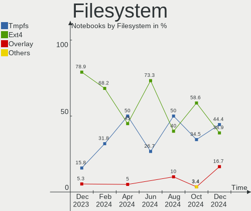
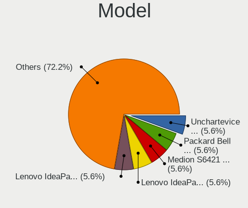
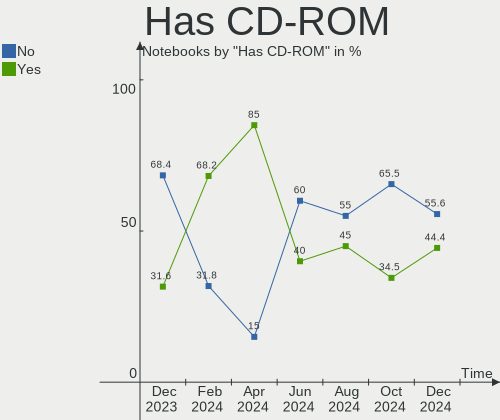
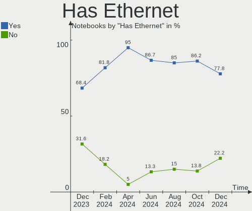
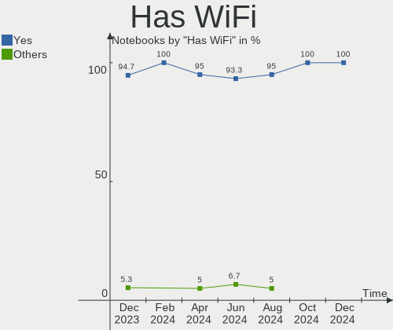
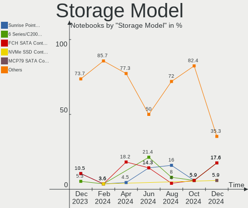
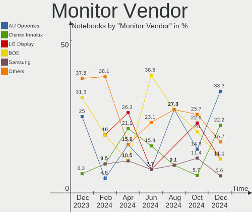
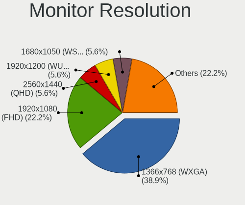
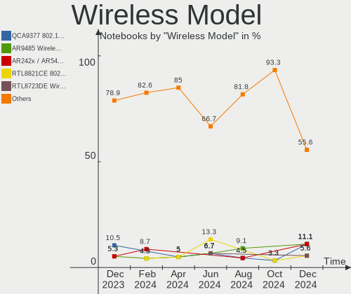
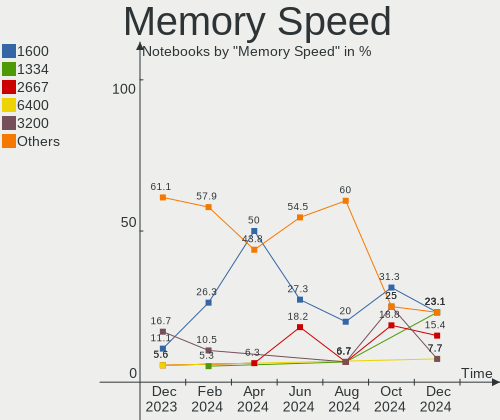

Lubuntu - Hardware Trends (Notebooks)
-------------------------------------

A project to identify most popular hardware characteristics and track their change
over time based on data collected by Linux users at https://Linux-Hardware.org.

Anyone can contribute to this report by the [hw-probe](https://github.com/linuxhw/hw-probe) tool:

    sudo -E hw-probe -all -upload

This report is for one last month. Overall report since the beginning of time: [TestDays](https://github.com/linuxhw/TestDays)

Period: May, 2023.

Contents
--------

* [ System ](#system)
  - [ OS                       ](#os)
  - [ OS Family                ](#os-family)
  - [ Kernel                   ](#kernel)
  - [ Kernel Family            ](#kernel-family)
  - [ Kernel Major Ver.        ](#kernel-major-ver)
  - [ Arch                     ](#arch)
  - [ DE                       ](#de)
  - [ Display Server           ](#display-server)
  - [ Display Manager          ](#display-manager)
  - [ OS Lang                  ](#os-lang)
  - [ Boot Mode                ](#boot-mode)
  - [ Filesystem               ](#filesystem)
  - [ Part. scheme             ](#part-scheme)
  - [ Dual Boot with Linux/BSD ](#dual-boot-with-linuxbsd)
  - [ Dual Boot (Win)          ](#dual-boot-win)

* [ Board ](#board)
  - [ Vendor                   ](#vendor)
  - [ Model                    ](#model)
  - [ Model Family             ](#model-family)
  - [ MFG Year                 ](#mfg-year)
  - [ Form Factor              ](#form-factor)
  - [ Secure Boot              ](#secure-boot)
  - [ Coreboot                 ](#coreboot)
  - [ RAM Size                 ](#ram-size)
  - [ RAM Used                 ](#ram-used)
  - [ Total Drives             ](#total-drives)
  - [ Has CD-ROM               ](#has-cd-rom)
  - [ Has Ethernet             ](#has-ethernet)
  - [ Has WiFi                 ](#has-wifi)
  - [ Has Bluetooth            ](#has-bluetooth)

* [ Location ](#location)
  - [ Country                  ](#country)
  - [ City                     ](#city)

* [ Drives ](#drives)
  - [ Drive Vendor             ](#drive-vendor)
  - [ Drive Model              ](#drive-model)
  - [ HDD Vendor               ](#hdd-vendor)
  - [ SSD Vendor               ](#ssd-vendor)
  - [ Drive Kind               ](#drive-kind)
  - [ Drive Connector          ](#drive-connector)
  - [ Drive Size               ](#drive-size)
  - [ Space Total              ](#space-total)
  - [ Space Used               ](#space-used)
  - [ Malfunc. Drives          ](#malfunc-drives)
  - [ Malfunc. Drive Vendor    ](#malfunc-drive-vendor)
  - [ Malfunc. HDD Vendor      ](#malfunc-hdd-vendor)
  - [ Malfunc. Drive Kind      ](#malfunc-drive-kind)
  - [ Failed Drives            ](#failed-drives)
  - [ Failed Drive Vendor      ](#failed-drive-vendor)
  - [ Drive Status             ](#drive-status)

* [ Storage controller ](#storage-controller)
  - [ Storage Vendor           ](#storage-vendor)
  - [ Storage Model            ](#storage-model)
  - [ Storage Kind             ](#storage-kind)

* [ Processor ](#processor)
  - [ CPU Vendor               ](#cpu-vendor)
  - [ CPU Model                ](#cpu-model)
  - [ CPU Model Family         ](#cpu-model-family)
  - [ CPU Cores                ](#cpu-cores)
  - [ CPU Sockets              ](#cpu-sockets)
  - [ CPU Threads              ](#cpu-threads)
  - [ CPU Op-Modes             ](#cpu-op-modes)
  - [ CPU Microcode            ](#cpu-microcode)
  - [ CPU Microarch            ](#cpu-microarch)

* [ Graphics ](#graphics)
  - [ GPU Vendor               ](#gpu-vendor)
  - [ GPU Model                ](#gpu-model)
  - [ GPU Combo                ](#gpu-combo)
  - [ GPU Driver               ](#gpu-driver)
  - [ GPU Memory               ](#gpu-memory)

* [ Monitor ](#monitor)
  - [ Monitor Vendor           ](#monitor-vendor)
  - [ Monitor Model            ](#monitor-model)
  - [ Monitor Resolution       ](#monitor-resolution)
  - [ Monitor Diagonal         ](#monitor-diagonal)
  - [ Monitor Width            ](#monitor-width)
  - [ Aspect Ratio             ](#aspect-ratio)
  - [ Monitor Area             ](#monitor-area)
  - [ Pixel Density            ](#pixel-density)
  - [ Multiple Monitors        ](#multiple-monitors)

* [ Network ](#network)
  - [ Net Controller Vendor    ](#net-controller-vendor)
  - [ Net Controller Model     ](#net-controller-model)
  - [ Wireless Vendor          ](#wireless-vendor)
  - [ Wireless Model           ](#wireless-model)
  - [ Ethernet Vendor          ](#ethernet-vendor)
  - [ Ethernet Model           ](#ethernet-model)
  - [ Net Controller Kind      ](#net-controller-kind)
  - [ Used Controller          ](#used-controller)
  - [ NICs                     ](#nics)
  - [ IPv6                     ](#ipv6)

* [ Bluetooth ](#bluetooth)
  - [ Bluetooth Vendor         ](#bluetooth-vendor)
  - [ Bluetooth Model          ](#bluetooth-model)

* [ Sound ](#sound)
  - [ Sound Vendor             ](#sound-vendor)
  - [ Sound Model              ](#sound-model)

* [ Memory ](#memory)
  - [ Memory Vendor            ](#memory-vendor)
  - [ Memory Model             ](#memory-model)
  - [ Memory Kind              ](#memory-kind)
  - [ Memory Form Factor       ](#memory-form-factor)
  - [ Memory Size              ](#memory-size)
  - [ Memory Speed             ](#memory-speed)

* [ Printers & scanners ](#printers--scanners)
  - [ Printer Vendor           ](#printer-vendor)
  - [ Printer Model            ](#printer-model)
  - [ Scanner Vendor           ](#scanner-vendor)
  - [ Scanner Model            ](#scanner-model)

* [ Camera ](#camera)
  - [ Camera Vendor            ](#camera-vendor)
  - [ Camera Model             ](#camera-model)

* [ Security ](#security)
  - [ Fingerprint Vendor       ](#fingerprint-vendor)
  - [ Fingerprint Model        ](#fingerprint-model)
  - [ Chipcard Vendor          ](#chipcard-vendor)
  - [ Chipcard Model           ](#chipcard-model)

* [ Unsupported ](#unsupported)
  - [ Unsupported Devices      ](#unsupported-devices)
  - [ Unsupported Device Types ](#unsupported-device-types)

System
------

OS
--

Installed operating systems

| Name          | Notebooks | Percent |
|---------------|-----------|---------|
| Lubuntu 22.04 | 16        | 72.73%  |
| Lubuntu 23.04 | 3         | 13.64%  |
| Lubuntu 22.10 | 3         | 13.64%  |

OS Family
---------

OS without a version

| Name    | Notebooks | Percent |
|---------|-----------|---------|
| Lubuntu | 22        | 100%    |

Kernel
------

Version of the Linux kernel

| Version           | Notebooks | Percent |
|-------------------|-----------|---------|
| 5.19.0-41-generic | 9         | 40.91%  |
| 6.2.0-20-generic  | 3         | 13.64%  |
| 5.19.0-42-generic | 3         | 13.64%  |
| 5.15.0-71-generic | 3         | 13.64%  |
| 5.15.0-25-generic | 2         | 9.09%   |
| 5.15.0-73-generic | 1         | 4.55%   |
| 5.15.0-72-generic | 1         | 4.55%   |

Kernel Family
-------------

Linux kernel without a distro release

| Version | Notebooks | Percent |
|---------|-----------|---------|
| 5.19.0  | 12        | 54.55%  |
| 5.15.0  | 7         | 31.82%  |
| 6.2.0   | 3         | 13.64%  |

Kernel Major Ver.
-----------------

Linux kernel major version

| Version | Notebooks | Percent |
|---------|-----------|---------|
| 5.19    | 12        | 54.55%  |
| 5.15    | 7         | 31.82%  |
| 6.2     | 3         | 13.64%  |

Arch
----

OS architecture (x86_64, i586, etc.)

| Name   | Notebooks | Percent |
|--------|-----------|---------|
| x86_64 | 22        | 100%    |

DE
--

Desktop Environment

| Name | Notebooks | Percent |
|------|-----------|---------|
| LXQt | 22        | 100%    |

Display Server
--------------

X11 or Wayland

| Name | Notebooks | Percent |
|------|-----------|---------|
| X11  | 22        | 100%    |

Display Manager
---------------

SDDM, LightDM, etc.

| Name    | Notebooks | Percent |
|---------|-----------|---------|
| SDDM    | 20        | 90.91%  |
| LightDM | 1         | 4.55%   |
| Unknown | 1         | 4.55%   |

OS Lang
-------

Language

| Lang  | Notebooks | Percent |
|-------|-----------|---------|
| en_US | 8         | 36.36%  |
| en_GB | 3         | 13.64%  |
| pt_BR | 2         | 9.09%   |
| tr_TR | 1         | 4.55%   |
| sk_SK | 1         | 4.55%   |
| nl_BE | 1         | 4.55%   |
| it_IT | 1         | 4.55%   |
| fr_FR | 1         | 4.55%   |
| fr_CA | 1         | 4.55%   |
| es_CO | 1         | 4.55%   |
| en_AU | 1         | 4.55%   |
| de_DE | 1         | 4.55%   |

Boot Mode
---------

EFI or BIOS

| Mode | Notebooks | Percent |
|------|-----------|---------|
| BIOS | 12        | 54.55%  |
| EFI  | 10        | 45.45%  |

Filesystem
----------

Type of filesystem

| Type  | Notebooks | Percent |
|-------|-----------|---------|
| Ext4  | 17        | 77.27%  |
| Tmpfs | 5         | 22.73%  |

Part. scheme
------------

Scheme of partitioning

| Type    | Notebooks | Percent |
|---------|-----------|---------|
| GPT     | 16        | 72.73%  |
| MBR     | 5         | 22.73%  |
| Unknown | 1         | 4.55%   |

Dual Boot with Linux/BSD
------------------------

Hosting more than one Linux/BSD

| Dual boot | Notebooks | Percent |
|-----------|-----------|---------|
| No        | 19        | 86.36%  |
| Yes       | 3         | 13.64%  |

Dual Boot (Win)
---------------

Hosting Linux and Windows

| Dual boot | Notebooks | Percent |
|-----------|-----------|---------|
| No        | 17        | 77.27%  |
| Yes       | 5         | 22.73%  |

Board
-----

Vendor
------

Motherboard manufacturer

| Name                | Notebooks | Percent |
|---------------------|-----------|---------|
| Lenovo              | 3         | 13.64%  |
| Hewlett-Packard     | 3         | 13.64%  |
| Dell                | 3         | 13.64%  |
| Samsung Electronics | 2         | 9.09%   |
| Unknown             | 2         | 9.09%   |
| Toshiba             | 1         | 4.55%   |
| Medion              | 1         | 4.55%   |
| Mediacom            | 1         | 4.55%   |
| Intel               | 1         | 4.55%   |
| HUAWEI              | 1         | 4.55%   |
| Hampoo              | 1         | 4.55%   |
| Google              | 1         | 4.55%   |
| ASUSTek Computer    | 1         | 4.55%   |
| Apple               | 1         | 4.55%   |

Model
-----

Motherboard model

| Name                                  | Notebooks | Percent |
|---------------------------------------|-----------|---------|
| Unknown                               | 2         | 9.09%   |
| Toshiba Satellite Radius P55W-B       | 1         | 4.55%   |
| Samsung N150/N210/N220                | 1         | 4.55%   |
| Samsung 530XBB                        | 1         | 4.55%   |
| Medion Akoya P6660 MD99790            | 1         | 4.55%   |
| Mediacom SmartBook 14 FullHD - SB14UC | 1         | 4.55%   |
| Lenovo ThinkPad T400 276522G          | 1         | 4.55%   |
| Lenovo Legion 5 15ACH6 82JW           | 1         | 4.55%   |
| Lenovo IdeaPad 500-15ISK 80NT         | 1         | 4.55%   |
| Intel Infoway                         | 1         | 4.55%   |
| HUAWEI KLVL-WXXW                      | 1         | 4.55%   |
| HP x2 210                             | 1         | 4.55%   |
| HP ProBook 650 G3                     | 1         | 4.55%   |
| HP Notebook                           | 1         | 4.55%   |
| Hampoo SurfTab duo W1 10.1 (VT4)      | 1         | 4.55%   |
| Google Glimmer                        | 1         | 4.55%   |
| Dell XPS 13 9305                      | 1         | 4.55%   |
| Dell Latitude E6520                   | 1         | 4.55%   |
| Dell Latitude E6430                   | 1         | 4.55%   |
| ASUS X450CC                           | 1         | 4.55%   |
| Apple MacBook4,1                      | 1         | 4.55%   |

Model Family
------------

Motherboard model prefix

| Name               | Notebooks | Percent |
|--------------------|-----------|---------|
| Dell Latitude      | 2         | 9.09%   |
| Unknown            | 2         | 9.09%   |
| Toshiba Satellite  | 1         | 4.55%   |
| Samsung N150       | 1         | 4.55%   |
| Samsung 530XBB     | 1         | 4.55%   |
| Medion Akoya       | 1         | 4.55%   |
| Mediacom SmartBook | 1         | 4.55%   |
| Lenovo ThinkPad    | 1         | 4.55%   |
| Lenovo Legion      | 1         | 4.55%   |
| Lenovo IdeaPad     | 1         | 4.55%   |
| Intel Infoway      | 1         | 4.55%   |
| HUAWEI KLVL-WXXW   | 1         | 4.55%   |
| HP x2              | 1         | 4.55%   |
| HP ProBook         | 1         | 4.55%   |
| HP Notebook        | 1         | 4.55%   |
| Hampoo SurfTab     | 1         | 4.55%   |
| Google Glimmer     | 1         | 4.55%   |
| Dell XPS           | 1         | 4.55%   |
| ASUS X450CC        | 1         | 4.55%   |
| Apple MacBook4     | 1         | 4.55%   |

MFG Year
--------

Motherboard manufacture year

| Year | Notebooks | Percent |
|------|-----------|---------|
| 2015 | 5         | 22.73%  |
| 2021 | 3         | 13.64%  |
| 2008 | 3         | 13.64%  |
| 2022 | 2         | 9.09%   |
| 2016 | 2         | 9.09%   |
| 2023 | 1         | 4.55%   |
| 2019 | 1         | 4.55%   |
| 2014 | 1         | 4.55%   |
| 2013 | 1         | 4.55%   |
| 2012 | 1         | 4.55%   |
| 2011 | 1         | 4.55%   |
| 2010 | 1         | 4.55%   |

Form Factor
-----------

Physical design of the computer

| Name     | Notebooks | Percent |
|----------|-----------|---------|
| Notebook | 22        | 100%    |

Secure Boot
-----------

Enabled or disabled

| State    | Notebooks | Percent |
|----------|-----------|---------|
| Disabled | 22        | 100%    |

Coreboot
--------

Have coreboot on board

| Used | Notebooks | Percent |
|------|-----------|---------|
| No   | 21        | 95.45%  |
| Yes  | 1         | 4.55%   |

RAM Size
--------

Total RAM memory

| Size in GB | Notebooks | Percent |
|------------|-----------|---------|
| 4.01-8.0   | 7         | 31.82%  |
| 1.01-2.0   | 5         | 22.73%  |
| 3.01-4.0   | 4         | 18.18%  |
| 8.01-16.0  | 4         | 18.18%  |
| 2.01-3.0   | 1         | 4.55%   |
| 16.01-24.0 | 1         | 4.55%   |

RAM Used
--------

Used RAM memory

| Used GB  | Notebooks | Percent |
|----------|-----------|---------|
| 1.01-2.0 | 11        | 50%     |
| 0.51-1.0 | 5         | 22.73%  |
| 2.01-3.0 | 4         | 18.18%  |
| 4.01-8.0 | 2         | 9.09%   |

Total Drives
------------

Number of drives on board

| Drives | Notebooks | Percent |
|--------|-----------|---------|
| 1      | 17        | 77.27%  |
| 2      | 5         | 22.73%  |

Has CD-ROM
----------

Has CD-ROM on board

| Presented | Notebooks | Percent |
|-----------|-----------|---------|
| No        | 13        | 59.09%  |
| Yes       | 9         | 40.91%  |

Has Ethernet
------------

Has Ethernet on board

| Presented | Notebooks | Percent |
|-----------|-----------|---------|
| Yes       | 14        | 63.64%  |
| No        | 8         | 36.36%  |

Has WiFi
--------

Has WiFi module

| Presented | Notebooks | Percent |
|-----------|-----------|---------|
| Yes       | 19        | 86.36%  |
| No        | 3         | 13.64%  |

Has Bluetooth
-------------

Has Bluetooth module

| Presented | Notebooks | Percent |
|-----------|-----------|---------|
| Yes       | 14        | 63.64%  |
| No        | 8         | 36.36%  |

Location
--------

Country
-------

Geographic location (country)

| Country     | Notebooks | Percent |
|-------------|-----------|---------|
| USA         | 4         | 18.18%  |
| Germany     | 4         | 18.18%  |
| Brazil      | 2         | 9.09%   |
| UK          | 1         | 4.55%   |
| Turkey      | 1         | 4.55%   |
| Slovakia    | 1         | 4.55%   |
| Pakistan    | 1         | 4.55%   |
| Netherlands | 1         | 4.55%   |
| Italy       | 1         | 4.55%   |
| France      | 1         | 4.55%   |
| Finland     | 1         | 4.55%   |
| Colombia    | 1         | 4.55%   |
| Canada      | 1         | 4.55%   |
| Belgium     | 1         | 4.55%   |
| Australia   | 1         | 4.55%   |

City
----

Geographic location (city)

| City             | Notebooks | Percent |
|------------------|-----------|---------|
| Vrbov            | 1         | 4.55%   |
| Swansea          | 1         | 4.55%   |
| Paris            | 1         | 4.55%   |
| Oxnard           | 1         | 4.55%   |
| Novo Gama        | 1         | 4.55%   |
| Monheim am Rhein | 1         | 4.55%   |
| Milano           | 1         | 4.55%   |
| Mechelen         | 1         | 4.55%   |
| Madrid           | 1         | 4.55%   |
| Louisville       | 1         | 4.55%   |
| Karachi          | 1         | 4.55%   |
| Joao Pessoa      | 1         | 4.55%   |
| Helsinki         | 1         | 4.55%   |
| Eugene           | 1         | 4.55%   |
| Düsseldorf      | 1         | 4.55%   |
| Buffalo          | 1         | 4.55%   |
| Bryson           | 1         | 4.55%   |
| Bruhl            | 1         | 4.55%   |
| Berlin           | 1         | 4.55%   |
| Antalya          | 1         | 4.55%   |
| Amsterdam        | 1         | 4.55%   |
| Adelaide         | 1         | 4.55%   |

Drives
------

Drive Vendor
------------

Hard drive vendors

| Vendor              | Notebooks | Drives | Percent |
|---------------------|-----------|--------|---------|
| Unknown             | 7         | 8      | 26.92%  |
| WDC                 | 3         | 3      | 11.54%  |
| Seagate             | 3         | 3      | 11.54%  |
| Samsung Electronics | 3         | 3      | 11.54%  |
| Toshiba             | 2         | 2      | 7.69%   |
| Hitachi             | 2         | 2      | 7.69%   |
| XrayDisk            | 1         | 1      | 3.85%   |
| SPCC                | 1         | 1      | 3.85%   |
| Silicon Motion      | 1         | 1      | 3.85%   |
| Netac               | 1         | 1      | 3.85%   |
| Hewlett-Packard     | 1         | 1      | 3.85%   |
| China               | 1         | 1      | 3.85%   |

Drive Model
-----------

Hard drive models

| Model                                | Notebooks | Percent |
|--------------------------------------|-----------|---------|
| Unknown NCard  32GB                  | 2         | 7.41%   |
| Unknown MMC Card  32GB               | 2         | 7.41%   |
| XrayDisk 128GB                       | 1         | 3.7%    |
| WDC WD5000LPVX-60V0TT0 500GB         | 1         | 3.7%    |
| WDC WD3200BEKT-75PVMT1 320GB         | 1         | 3.7%    |
| WDC PC SN730 SDBPNTY-512G-1101 512GB | 1         | 3.7%    |
| Unknown SD128  128GB                 | 1         | 3.7%    |
| Unknown SC256  256GB                 | 1         | 3.7%    |
| Unknown MMC Card  64GB               | 1         | 3.7%    |
| Unknown MMC Card  16GB               | 1         | 3.7%    |
| Toshiba THNSN5256GPUK 256GB          | 1         | 3.7%    |
| Toshiba MQ02ABD100H 1TB              | 1         | 3.7%    |
| SPCC M.2 SSD 512GB                   | 1         | 3.7%    |
| Silicon Motion PCIe-8 SSD 512GB      | 1         | 3.7%    |
| Seagate ST9250827AS 250GB            | 1         | 3.7%    |
| Seagate ST1000LM024 HN-M101MBB 1TB   | 1         | 3.7%    |
| Seagate Expansion Desk 4TB           | 1         | 3.7%    |
| Samsung SSD 970 EVO Plus 1TB         | 1         | 3.7%    |
| Samsung SSD 850 EVO 120GB            | 1         | 3.7%    |
| Samsung HM121HI 120GB                | 1         | 3.7%    |
| Netac SSD 128GB                      | 1         | 3.7%    |
| Hitachi HTS547575A9E384 752GB        | 1         | 3.7%    |
| Hitachi HTS542516K9SA00 160GB        | 1         | 3.7%    |
| HP SSD S700 500GB                    | 1         | 3.7%    |
| China ESA3SMD2PSPB120GB              | 1         | 3.7%    |

HDD Vendor
----------

Hard disk drive vendors

| Vendor              | Notebooks | Drives | Percent |
|---------------------|-----------|--------|---------|
| Seagate             | 3         | 3      | 33.33%  |
| WDC                 | 2         | 2      | 22.22%  |
| Hitachi             | 2         | 2      | 22.22%  |
| Toshiba             | 1         | 1      | 11.11%  |
| Samsung Electronics | 1         | 1      | 11.11%  |

SSD Vendor
----------

Solid state drive vendors

| Vendor              | Notebooks | Drives | Percent |
|---------------------|-----------|--------|---------|
| SPCC                | 1         | 1      | 25%     |
| Samsung Electronics | 1         | 1      | 25%     |
| Netac               | 1         | 1      | 25%     |
| Hewlett-Packard     | 1         | 1      | 25%     |

Drive Kind
----------

HDD or SSD

| Kind    | Notebooks | Drives | Percent |
|---------|-----------|--------|---------|
| HDD     | 8         | 9      | 32%     |
| MMC     | 7         | 8      | 28%     |
| NVMe    | 4         | 4      | 16%     |
| SSD     | 4         | 4      | 16%     |
| Unknown | 2         | 2      | 8%      |

Drive Connector
---------------

SATA, SAS, NVMe, etc.

| Type | Notebooks | Drives | Percent |
|------|-----------|--------|---------|
| SATA | 14        | 14     | 53.85%  |
| MMC  | 7         | 8      | 26.92%  |
| NVMe | 4         | 4      | 15.38%  |
| SAS  | 1         | 1      | 3.85%   |

Drive Size
----------

Size of hard drive

| Size in TB | Notebooks | Drives | Percent |
|------------|-----------|--------|---------|
| 0.01-0.5   | 8         | 8      | 61.54%  |
| 0.51-1.0   | 4         | 4      | 30.77%  |
| 3.01-4.0   | 1         | 1      | 7.69%   |

Space Total
-----------

Amount of disk space available on the file system

| Size in GB | Notebooks | Percent |
|------------|-----------|---------|
| 101-250    | 8         | 36.36%  |
| 251-500    | 3         | 13.64%  |
| 21-50      | 3         | 13.64%  |
| 1-20       | 3         | 13.64%  |
| 501-1000   | 3         | 13.64%  |
| 51-100     | 2         | 9.09%   |

Space Used
----------

Amount of used disk space

| Used GB | Notebooks | Percent |
|---------|-----------|---------|
| 1-20    | 11        | 50%     |
| 51-100  | 6         | 27.27%  |
| 21-50   | 2         | 9.09%   |
| 101-250 | 2         | 9.09%   |
| 251-500 | 1         | 4.55%   |

Malfunc. Drives
---------------

Drive models with a malfunction

| Model                              | Notebooks | Drives | Percent |
|------------------------------------|-----------|--------|---------|
| Seagate ST9250827AS 250GB          | 1         | 1      | 33.33%  |
| Seagate ST1000LM024 HN-M101MBB 1TB | 1         | 1      | 33.33%  |
| Samsung Electronics HM121HI 120GB  | 1         | 1      | 33.33%  |

Malfunc. Drive Vendor
---------------------

Vendors of faulty drives

| Vendor              | Notebooks | Drives | Percent |
|---------------------|-----------|--------|---------|
| Seagate             | 2         | 2      | 66.67%  |
| Samsung Electronics | 1         | 1      | 33.33%  |

Malfunc. HDD Vendor
-------------------

Vendors of faulty HDD drives

| Vendor              | Notebooks | Drives | Percent |
|---------------------|-----------|--------|---------|
| Seagate             | 2         | 2      | 66.67%  |
| Samsung Electronics | 1         | 1      | 33.33%  |

Malfunc. Drive Kind
-------------------

Kinds of faulty drives

| Kind | Notebooks | Drives | Percent |
|------|-----------|--------|---------|
| HDD  | 3         | 3      | 100%    |

Failed Drives
-------------

Failed drive models

Zero info for selected period =(

Failed Drive Vendor
-------------------

Failed drive vendors

Zero info for selected period =(

Drive Status
------------

Number of failed and malfunc. drives

| Status   | Notebooks | Drives | Percent |
|----------|-----------|--------|---------|
| Detected | 13        | 16     | 54.17%  |
| Works    | 8         | 8      | 33.33%  |
| Malfunc  | 3         | 3      | 12.5%   |

Storage controller
------------------

Storage Vendor
--------------

Storage controller vendors

| Vendor                       | Notebooks | Percent |
|------------------------------|-----------|---------|
| Intel                        | 14        | 70%     |
| AMD                          | 2         | 10%     |
| Toshiba America Info Systems | 1         | 5%      |
| Silicon Motion               | 1         | 5%      |
| SanDisk                      | 1         | 5%      |
| Samsung Electronics          | 1         | 5%      |

Storage Model
-------------

Storage controller models

| Model                                                                                  | Notebooks | Percent |
|----------------------------------------------------------------------------------------|-----------|---------|
| Intel Sunrise Point-LP SATA Controller [AHCI mode]                                     | 3         | 13.04%  |
| Intel Celeron/Pentium Silver Processor SATA Controller                                 | 3         | 13.04%  |
| Intel 82801HM/HEM (ICH8M/ICH8M-E) SATA Controller [AHCI mode]                          | 2         | 8.7%    |
| Intel 82801HM/HEM (ICH8M/ICH8M-E) IDE Controller                                       | 2         | 8.7%    |
| Intel 7 Series Chipset Family 6-port SATA Controller [AHCI mode]                       | 2         | 8.7%    |
| AMD FCH SATA Controller [AHCI mode]                                                    | 2         | 8.7%    |
| Toshiba America Info Systems XG4 NVMe SSD Controller                                   | 1         | 4.35%   |
| Silicon Motion Non-Volatile memory controller                                          | 1         | 4.35%   |
| SanDisk WD Black SN750 / PC SN730 NVMe SSD                                             | 1         | 4.35%   |
| Samsung NVMe SSD Controller SM981/PM981/PM983                                          | 1         | 4.35%   |
| Intel Wildcat Point-LP SATA Controller [AHCI Mode]                                     | 1         | 4.35%   |
| Intel NM10/ICH7 Family SATA Controller [AHCI mode]                                     | 1         | 4.35%   |
| Intel 82801IBM/IEM (ICH9M/ICH9M-E) 4 port SATA Controller [AHCI mode]                  | 1         | 4.35%   |
| Intel 6 Series/C200 Series Chipset Family Mobile SATA Controller (IDE mode, ports 4-5) | 1         | 4.35%   |
| Intel 6 Series/C200 Series Chipset Family Mobile SATA Controller (IDE mode, ports 0-3) | 1         | 4.35%   |

Storage Kind
------------

Kind of storage controller (IDE, SATA, NVMe, SAS, ...)

| Kind | Notebooks | Percent |
|------|-----------|---------|
| SATA | 15        | 68.18%  |
| NVMe | 4         | 18.18%  |
| IDE  | 3         | 13.64%  |

Processor
---------

CPU Vendor
----------

Processor vendors

| Vendor | Notebooks | Percent |
|--------|-----------|---------|
| Intel  | 19        | 86.36%  |
| AMD    | 3         | 13.64%  |

CPU Model
---------

Processor models

| Model                                   | Notebooks | Percent |
|-----------------------------------------|-----------|---------|
| Intel Atom x5-Z8300 CPU @ 1.44GHz       | 3         | 13.64%  |
| Intel Core i7-5500U CPU @ 2.40GHz       | 1         | 4.55%   |
| Intel Core i5-7200U CPU @ 2.50GHz       | 1         | 4.55%   |
| Intel Core i5-6200U CPU @ 2.30GHz       | 1         | 4.55%   |
| Intel Core i5-3337U CPU @ 1.80GHz       | 1         | 4.55%   |
| Intel Core i5-3230M CPU @ 2.60GHz       | 1         | 4.55%   |
| Intel Core i3-6100U CPU @ 2.30GHz       | 1         | 4.55%   |
| Intel Core i3-2330M CPU @ 2.20GHz       | 1         | 4.55%   |
| Intel Core 2 Duo CPU T8300 @ 2.40GHz    | 1         | 4.55%   |
| Intel Core 2 Duo CPU T7500 @ 2.20GHz    | 1         | 4.55%   |
| Intel Core 2 Duo CPU P8600 @ 2.40GHz    | 1         | 4.55%   |
| Intel Celeron N4100 CPU @ 1.10GHz       | 1         | 4.55%   |
| Intel Celeron N4020C CPU @ 1.10GHz      | 1         | 4.55%   |
| Intel Celeron N4000 CPU @ 1.10GHz       | 1         | 4.55%   |
| Intel Celeron CPU N2940 @ 1.83GHz       | 1         | 4.55%   |
| Intel Atom CPU N450 @ 1.66GHz           | 1         | 4.55%   |
| Intel 11th Gen Core i5-1135G7 @ 2.40GHz | 1         | 4.55%   |
| AMD Ryzen 7 5800H with Radeon Graphics  | 1         | 4.55%   |
| AMD Ryzen 7 5700U with Radeon Graphics  | 1         | 4.55%   |
| AMD A6-5200 APU with Radeon HD Graphics | 1         | 4.55%   |

CPU Model Family
----------------

Processor model prefix

| Model            | Notebooks | Percent |
|------------------|-----------|---------|
| Intel Core i5    | 4         | 18.18%  |
| Intel Celeron    | 4         | 18.18%  |
| Intel Atom       | 4         | 18.18%  |
| Intel Core 2 Duo | 3         | 13.64%  |
| Intel Core i3    | 2         | 9.09%   |
| AMD Ryzen 7      | 2         | 9.09%   |
| Other            | 1         | 4.55%   |
| Intel Core i7    | 1         | 4.55%   |
| AMD A6           | 1         | 4.55%   |

CPU Cores
---------

Number of processor cores

| Number | Notebooks | Percent |
|--------|-----------|---------|
| 2      | 12        | 54.55%  |
| 4      | 7         | 31.82%  |
| 8      | 2         | 9.09%   |
| 1      | 1         | 4.55%   |

CPU Sockets
-----------

Number of sockets

| Number | Notebooks | Percent |
|--------|-----------|---------|
| 1      | 22        | 100%    |

CPU Threads
-----------

Threads per core (Hyper-Threading)

| Number | Notebooks | Percent |
|--------|-----------|---------|
| 2      | 11        | 50%     |
| 1      | 11        | 50%     |

CPU Op-Modes
------------

CPU Operation Modes (32-bit, 64-bit)

| Op mode        | Notebooks | Percent |
|----------------|-----------|---------|
| 32-bit, 64-bit | 22        | 100%    |

CPU Microcode
-------------

Microcode number

| Number     | Notebooks | Percent |
|------------|-----------|---------|
| Unknown    | 12        | 54.55%  |
| 0x406c3    | 2         | 9.09%   |
| 0x306a9    | 2         | 9.09%   |
| 0x806c1    | 1         | 4.55%   |
| 0x706a8    | 1         | 4.55%   |
| 0x706a1    | 1         | 4.55%   |
| 0x406e3    | 1         | 4.55%   |
| 0x306d4    | 1         | 4.55%   |
| 0x0a50000c | 1         | 4.55%   |

CPU Microarch
-------------

Microarchitecture

| Name          | Notebooks | Percent |
|---------------|-----------|---------|
| Silvermont    | 4         | 18.18%  |
| Goldmont plus | 3         | 13.64%  |
| Skylake       | 2         | 9.09%   |
| Penryn        | 2         | 9.09%   |
| IvyBridge     | 2         | 9.09%   |
| Zen 3         | 1         | 4.55%   |
| TigerLake     | 1         | 4.55%   |
| SandyBridge   | 1         | 4.55%   |
| KabyLake      | 1         | 4.55%   |
| Jaguar        | 1         | 4.55%   |
| Core          | 1         | 4.55%   |
| Broadwell     | 1         | 4.55%   |
| Bonnell       | 1         | 4.55%   |
| Unknown       | 1         | 4.55%   |

Graphics
--------

GPU Vendor
----------

Vendors of graphics cards

| Vendor | Notebooks | Percent |
|--------|-----------|---------|
| Intel  | 19        | 70.37%  |
| AMD    | 5         | 18.52%  |
| Nvidia | 3         | 11.11%  |

GPU Model
---------

Graphics card models

| Model                                                                                    | Notebooks | Percent |
|------------------------------------------------------------------------------------------|-----------|---------|
| Intel GeminiLake [UHD Graphics 600]                                                      | 3         | 10.34%  |
| Intel Atom/Celeron/Pentium Processor x5-E8000/J3xxx/N3xxx Integrated Graphics Controller | 3         | 10.34%  |
| Intel Skylake GT2 [HD Graphics 520]                                                      | 2         | 6.9%    |
| Intel Mobile GM965/GL960 Integrated Graphics Controller (secondary)                      | 2         | 6.9%    |
| Intel Mobile GM965/GL960 Integrated Graphics Controller (primary)                        | 2         | 6.9%    |
| Intel 3rd Gen Core processor Graphics Controller                                         | 2         | 6.9%    |
| Nvidia GM108M [GeForce 930M]                                                             | 1         | 3.45%   |
| Nvidia GF117M [GeForce 610M/710M/810M/820M / GT 620M/625M/630M/720M]                     | 1         | 3.45%   |
| Nvidia GA107BM [GeForce RTX 3050 Ti Mobile]                                              | 1         | 3.45%   |
| Intel TigerLake-LP GT2 [Iris Xe Graphics]                                                | 1         | 3.45%   |
| Intel Mobile 4 Series Chipset Integrated Graphics Controller                             | 1         | 3.45%   |
| Intel HD Graphics 620                                                                    | 1         | 3.45%   |
| Intel HD Graphics 5500                                                                   | 1         | 3.45%   |
| Intel Atom Processor Z36xxx/Z37xxx Series Graphics & Display                             | 1         | 3.45%   |
| Intel Atom Processor D4xx/D5xx/N4xx/N5xx Integrated Graphics Controller                  | 1         | 3.45%   |
| Intel 2nd Generation Core Processor Family Integrated Graphics Controller                | 1         | 3.45%   |
| AMD Topaz XT [Radeon R7 M260/M265 / M340/M360 / M440/M445 / 530/535 / 620/625 Mobile]    | 1         | 3.45%   |
| AMD RV620/M82 [Mobility Radeon HD 3450/3470]                                             | 1         | 3.45%   |
| AMD Lucienne                                                                             | 1         | 3.45%   |
| AMD Kabini [Radeon HD 8400 / R3 Series]                                                  | 1         | 3.45%   |
| AMD Cezanne [Radeon Vega Series / Radeon Vega Mobile Series]                             | 1         | 3.45%   |

GPU Combo
---------

Combinations of graphics cards

| Name           | Notebooks | Percent |
|----------------|-----------|---------|
| 1 x Intel      | 15        | 68.18%  |
| Intel + Nvidia | 2         | 9.09%   |
| Intel + AMD    | 2         | 9.09%   |
| 1 x AMD        | 2         | 9.09%   |
| AMD + Nvidia   | 1         | 4.55%   |

GPU Driver
----------

Free vs proprietary

| Driver      | Notebooks | Percent |
|-------------|-----------|---------|
| Free        | 20        | 90.91%  |
| Proprietary | 1         | 4.55%   |
| Unknown     | 1         | 4.55%   |

GPU Memory
----------

Total video memory

| Size in GB | Notebooks | Percent |
|------------|-----------|---------|
| Unknown    | 19        | 86.36%  |
| 1.01-2.0   | 2         | 9.09%   |
| 0.01-0.5   | 1         | 4.55%   |

Monitor
-------

Monitor Vendor
--------------

Monitor vendors

| Vendor                  | Notebooks | Percent |
|-------------------------|-----------|---------|
| AU Optronics            | 4         | 19.05%  |
| BOE                     | 3         | 14.29%  |
| Samsung Electronics     | 2         | 9.52%   |
| LG Display              | 2         | 9.52%   |
| Chimei Innolux          | 2         | 9.52%   |
| Sony                    | 1         | 4.76%   |
| PANDA                   | 1         | 4.76%   |
| Lenovo                  | 1         | 4.76%   |
| InnoLux Display         | 1         | 4.76%   |
| InfoVision              | 1         | 4.76%   |
| CPT                     | 1         | 4.76%   |
| Chi Mei Optoelectronics | 1         | 4.76%   |
| Apple                   | 1         | 4.76%   |

Monitor Model
-------------

Monitor models

| Model                                                                    | Notebooks | Percent |
|--------------------------------------------------------------------------|-----------|---------|
| Sony TV SNY5803 1360x768                                                 | 1         | 4.76%   |
| Samsung Electronics LCD Monitor SEC3649 1366x768 309x174mm 14.0-inch     | 1         | 4.76%   |
| Samsung Electronics LCD Monitor SAM0F13 3840x2160 950x540mm 43.0-inch    | 1         | 4.76%   |
| PANDA LCD Monitor NCP0004 1920x1080 294x165mm 13.3-inch                  | 1         | 4.76%   |
| LG Display LCD Monitor LGD04A7 1920x1080 344x194mm 15.5-inch             | 1         | 4.76%   |
| LG Display LCD Monitor LGD02DF 1600x900 310x174mm 14.0-inch              | 1         | 4.76%   |
| Lenovo LCD Monitor LEN4033 1440x900 304x190mm 14.1-inch                  | 1         | 4.76%   |
| InnoLux Display BT101IW03V1 INL000D 1024x600 222x125mm 10.0-inch         | 1         | 4.76%   |
| InfoVision LCD Monitor IVO0489 1366x768 256x144mm 11.6-inch              | 1         | 4.76%   |
| CPT LCD Monitor CPT1415 1280x800 331x207mm 15.4-inch                     | 1         | 4.76%   |
| Chimei Innolux LCD Monitor CMN15CA 1366x768 344x193mm 15.5-inch          | 1         | 4.76%   |
| Chimei Innolux LCD Monitor CMN15C4 1920x1080 344x193mm 15.5-inch         | 1         | 4.76%   |
| Chi Mei Optoelectronics LCD Monitor CMO15A3 1366x768 344x193mm 15.5-inch | 1         | 4.76%   |
| BOE LCD Monitor BOE0918 1920x1080 309x174mm 14.0-inch                    | 1         | 4.76%   |
| BOE LCD Monitor BOE0877 1920x1080 309x173mm 13.9-inch                    | 1         | 4.76%   |
| BOE LCD Monitor BOE0635 1920x1080 309x173mm 13.9-inch                    | 1         | 4.76%   |
| AU Optronics LCD Monitor AUOB69B 1920x1080 344x193mm 15.5-inch           | 1         | 4.76%   |
| AU Optronics LCD Monitor AUO5B2D 1920x1080 293x162mm 13.2-inch           | 1         | 4.76%   |
| AU Optronics LCD Monitor AUO35ED 1920x1080 344x193mm 15.5-inch           | 1         | 4.76%   |
| AU Optronics LCD Monitor AUO18D4 1280x800 216x135mm 10.0-inch            | 1         | 4.76%   |
| Apple LCD Monitor APP9C5F 1280x800 286x179mm 13.3-inch                   | 1         | 4.76%   |

Monitor Resolution
------------------

Monitor screen resolution

| Resolution       | Notebooks | Percent |
|------------------|-----------|---------|
| 1920x1080 (FHD)  | 9         | 42.86%  |
| 1366x768 (WXGA)  | 4         | 19.05%  |
| 1280x800 (WXGA)  | 3         | 14.29%  |
| 3840x2160 (4K)   | 1         | 4.76%   |
| 1600x900 (HD+)   | 1         | 4.76%   |
| 1440x900 (WXGA+) | 1         | 4.76%   |
| 1360x768         | 1         | 4.76%   |
| 1024x600         | 1         | 4.76%   |

Monitor Diagonal
----------------

Diagonal size in inches

| Inches | Notebooks | Percent |
|--------|-----------|---------|
| 15     | 8         | 38.1%   |
| 13     | 5         | 23.81%  |
| 14     | 4         | 19.05%  |
| 10     | 2         | 9.52%   |
| 84     | 1         | 4.76%   |
| 72     | 1         | 4.76%   |

Monitor Width
-------------

Physical width

| Width in mm | Notebooks | Percent |
|-------------|-----------|---------|
| 301-350     | 14        | 66.67%  |
| 201-300     | 5         | 23.81%  |
| 1501-2000   | 2         | 9.52%   |

Aspect Ratio
------------

Proportional relationship between the width and the height

| Ratio | Notebooks | Percent |
|-------|-----------|---------|
| 16/9  | 16        | 80%     |
| 16/10 | 4         | 20%     |

Monitor Area
------------

Area in inch²

| Area in inch² | Notebooks | Percent |
|----------------|-----------|---------|
| 101-110        | 8         | 38.1%   |
| 81-90          | 7         | 33.33%  |
| More than 1000 | 2         | 9.52%   |
| 71-80          | 2         | 9.52%   |
| 41-50          | 2         | 9.52%   |

Pixel Density
-------------

Pixels per inch

| Density | Notebooks | Percent |
|---------|-----------|---------|
| 121-160 | 10        | 47.62%  |
| 101-120 | 5         | 23.81%  |
| 51-100  | 3         | 14.29%  |
| 161-240 | 2         | 9.52%   |
| 1-50    | 1         | 4.76%   |

Multiple Monitors
-----------------

Total monitors connected

| Total | Notebooks | Percent |
|-------|-----------|---------|
| 1     | 20        | 90.91%  |
| 2     | 1         | 4.55%   |
| 0     | 1         | 4.55%   |

Network
-------

Net Controller Vendor
---------------------

Controller vendors

| Vendor                   | Notebooks | Percent |
|--------------------------|-----------|---------|
| Intel                    | 12        | 42.86%  |
| Realtek Semiconductor    | 7         | 25%     |
| Marvell Technology Group | 3         | 10.71%  |
| Qualcomm Atheros         | 2         | 7.14%   |
| Broadcom                 | 2         | 7.14%   |
| OPPO Electronics         | 1         | 3.57%   |
| ASIX Electronics         | 1         | 3.57%   |

Net Controller Model
--------------------

Controller models

| Model                                                             | Notebooks | Percent |
|-------------------------------------------------------------------|-----------|---------|
| Realtek RTL8111/8168/8411 PCI Express Gigabit Ethernet Controller | 4         | 12.12%  |
| Intel Wireless 7265                                               | 2         | 6.06%   |
| Intel Wireless 3165                                               | 2         | 6.06%   |
| Intel 82579LM Gigabit Network Connection (Lewisville)             | 2         | 6.06%   |
| Realtek RTL8852AE 802.11ax PCIe Wireless Network Adapter          | 1         | 3.03%   |
| Realtek RTL8821CE 802.11ac PCIe Wireless Network Adapter          | 1         | 3.03%   |
| Realtek RTL8188EE Wireless Network Adapter                        | 1         | 3.03%   |
| Realtek RTL8187B Wireless 802.11g 54Mbps Network Adapter          | 1         | 3.03%   |
| Realtek RTL810xE PCI Express Fast Ethernet controller             | 1         | 3.03%   |
| Qualcomm Atheros AR9485 Wireless Network Adapter                  | 1         | 3.03%   |
| Qualcomm Atheros AR9285 Wireless Network Adapter (PCI-Express)    | 1         | 3.03%   |
| OPPO SM8350-MTP _SN:1518BD09                                      | 1         | 3.03%   |
| Marvell Group 88E8058 PCI-E Gigabit Ethernet Controller           | 1         | 3.03%   |
| Marvell Group 88E8055 PCI-E Gigabit Ethernet Controller           | 1         | 3.03%   |
| Marvell Group 88E8040 PCI-E Fast Ethernet Controller              | 1         | 3.03%   |
| Intel Wireless-AC 9260                                            | 1         | 3.03%   |
| Intel Wireless 7260                                               | 1         | 3.03%   |
| Intel Wi-Fi 6 AX200                                               | 1         | 3.03%   |
| Intel Ultimate N WiFi Link 5300                                   | 1         | 3.03%   |
| Intel Gemini Lake PCH CNVi WiFi                                   | 1         | 3.03%   |
| Intel Ethernet Connection (4) I219-V                              | 1         | 3.03%   |
| Intel Dual Band Wireless-AC 3165 Plus Bluetooth                   | 1         | 3.03%   |
| Intel Centrino Ultimate-N 6300                                    | 1         | 3.03%   |
| Intel 82567LM Gigabit Network Connection                          | 1         | 3.03%   |
| Broadcom BCM43228 802.11a/b/g/n                                   | 1         | 3.03%   |
| Broadcom BCM4321 802.11a/b/g/n                                    | 1         | 3.03%   |
| ASIX AX88179 Gigabit Ethernet                                     | 1         | 3.03%   |

Wireless Vendor
---------------

Wireless vendors

| Vendor                | Notebooks | Percent |
|-----------------------|-----------|---------|
| Intel                 | 11        | 57.89%  |
| Realtek Semiconductor | 4         | 21.05%  |
| Qualcomm Atheros      | 2         | 10.53%  |
| Broadcom              | 2         | 10.53%  |

Wireless Model
--------------

Wireless models

| Model                                                          | Notebooks | Percent |
|----------------------------------------------------------------|-----------|---------|
| Intel Wireless 7265                                            | 2         | 10.53%  |
| Intel Wireless 3165                                            | 2         | 10.53%  |
| Realtek RTL8852AE 802.11ax PCIe Wireless Network Adapter       | 1         | 5.26%   |
| Realtek RTL8821CE 802.11ac PCIe Wireless Network Adapter       | 1         | 5.26%   |
| Realtek RTL8188EE Wireless Network Adapter                     | 1         | 5.26%   |
| Realtek RTL8187B Wireless 802.11g 54Mbps Network Adapter       | 1         | 5.26%   |
| Qualcomm Atheros AR9485 Wireless Network Adapter               | 1         | 5.26%   |
| Qualcomm Atheros AR9285 Wireless Network Adapter (PCI-Express) | 1         | 5.26%   |
| Intel Wireless-AC 9260                                         | 1         | 5.26%   |
| Intel Wireless 7260                                            | 1         | 5.26%   |
| Intel Wi-Fi 6 AX200                                            | 1         | 5.26%   |
| Intel Ultimate N WiFi Link 5300                                | 1         | 5.26%   |
| Intel Gemini Lake PCH CNVi WiFi                                | 1         | 5.26%   |
| Intel Dual Band Wireless-AC 3165 Plus Bluetooth                | 1         | 5.26%   |
| Intel Centrino Ultimate-N 6300                                 | 1         | 5.26%   |
| Broadcom BCM43228 802.11a/b/g/n                                | 1         | 5.26%   |
| Broadcom BCM4321 802.11a/b/g/n                                 | 1         | 5.26%   |

Ethernet Vendor
---------------

Ethernet vendors

| Vendor                   | Notebooks | Percent |
|--------------------------|-----------|---------|
| Realtek Semiconductor    | 5         | 35.71%  |
| Intel                    | 4         | 28.57%  |
| Marvell Technology Group | 3         | 21.43%  |
| OPPO Electronics         | 1         | 7.14%   |
| ASIX Electronics         | 1         | 7.14%   |

Ethernet Model
--------------

Ethernet models

| Model                                                             | Notebooks | Percent |
|-------------------------------------------------------------------|-----------|---------|
| Realtek RTL8111/8168/8411 PCI Express Gigabit Ethernet Controller | 4         | 28.57%  |
| Intel 82579LM Gigabit Network Connection (Lewisville)             | 2         | 14.29%  |
| Realtek RTL810xE PCI Express Fast Ethernet controller             | 1         | 7.14%   |
| OPPO SM8350-MTP _SN:1518BD09                                      | 1         | 7.14%   |
| Marvell Group 88E8058 PCI-E Gigabit Ethernet Controller           | 1         | 7.14%   |
| Marvell Group 88E8055 PCI-E Gigabit Ethernet Controller           | 1         | 7.14%   |
| Marvell Group 88E8040 PCI-E Fast Ethernet Controller              | 1         | 7.14%   |
| Intel Ethernet Connection (4) I219-V                              | 1         | 7.14%   |
| Intel 82567LM Gigabit Network Connection                          | 1         | 7.14%   |
| ASIX AX88179 Gigabit Ethernet                                     | 1         | 7.14%   |

Net Controller Kind
-------------------

Ethernet, WiFi or modem

| Kind     | Notebooks | Percent |
|----------|-----------|---------|
| WiFi     | 19        | 57.58%  |
| Ethernet | 14        | 42.42%  |

Used Controller
---------------

Currently used network controller

| Kind     | Notebooks | Percent |
|----------|-----------|---------|
| WiFi     | 17        | 77.27%  |
| Ethernet | 5         | 22.73%  |

NICs
----

Total network controllers on board

| Total | Notebooks | Percent |
|-------|-----------|---------|
| 2     | 11        | 50%     |
| 1     | 8         | 36.36%  |
| 0     | 3         | 13.64%  |

IPv6
----

IPv6 vs IPv4

| Used | Notebooks | Percent |
|------|-----------|---------|
| No   | 14        | 63.64%  |
| Yes  | 8         | 36.36%  |

Bluetooth
---------

Bluetooth Vendor
----------------

Controller vendors

| Vendor                  | Notebooks | Percent |
|-------------------------|-----------|---------|
| Intel                   | 8         | 57.14%  |
| Realtek Semiconductor   | 2         | 14.29%  |
| IMC Networks            | 1         | 7.14%   |
| Cambridge Silicon Radio | 1         | 7.14%   |
| Broadcom                | 1         | 7.14%   |
| Apple                   | 1         | 7.14%   |

Bluetooth Model
---------------

Controller models

| Model                                               | Notebooks | Percent |
|-----------------------------------------------------|-----------|---------|
| Intel Bluetooth wireless interface                  | 6         | 42.86%  |
| Realtek Bluetooth Radio                             | 2         | 14.29%  |
| Intel Bluetooth 9460/9560 Jefferson Peak (JfP)      | 1         | 7.14%   |
| Intel AX200 Bluetooth                               | 1         | 7.14%   |
| IMC Networks Atheros AR3012 Bluetooth 4.0 Adapter   | 1         | 7.14%   |
| Cambridge Silicon Radio Bluetooth Dongle (HCI mode) | 1         | 7.14%   |
| Broadcom BCM2045B (BDC-2.1) [Bluetooth Controller]  | 1         | 7.14%   |
| Apple Bluetooth HCI                                 | 1         | 7.14%   |

Sound
-----

Sound Vendor
------------

Sound card vendors

| Vendor | Notebooks | Percent |
|--------|-----------|---------|
| Intel  | 16        | 80%     |
| AMD    | 3         | 15%     |
| Nvidia | 1         | 5%      |

Sound Model
-----------

Sound card models

| Model                                                                      | Notebooks | Percent |
|----------------------------------------------------------------------------|-----------|---------|
| Intel Sunrise Point-LP HD Audio                                            | 3         | 13.64%  |
| Intel Celeron/Pentium Silver Processor High Definition Audio               | 3         | 13.64%  |
| Intel 82801H (ICH8 Family) HD Audio Controller                             | 2         | 9.09%   |
| Intel 7 Series/C216 Chipset Family High Definition Audio Controller        | 2         | 9.09%   |
| Nvidia Audio device                                                        | 1         | 4.55%   |
| Intel Wildcat Point-LP High Definition Audio Controller                    | 1         | 4.55%   |
| Intel Tiger Lake-LP Smart Sound Technology Audio Controller                | 1         | 4.55%   |
| Intel NM10/ICH7 Family High Definition Audio Controller                    | 1         | 4.55%   |
| Intel Broadwell-U Audio Controller                                         | 1         | 4.55%   |
| Intel Atom Processor Z36xxx/Z37xxx Series High Definition Audio Controller | 1         | 4.55%   |
| Intel 82801I (ICH9 Family) HD Audio Controller                             | 1         | 4.55%   |
| Intel 6 Series/C200 Series Chipset Family High Definition Audio Controller | 1         | 4.55%   |
| AMD Renoir Radeon High Definition Audio Controller                         | 1         | 4.55%   |
| AMD Kabini HDMI/DP Audio                                                   | 1         | 4.55%   |
| AMD FCH Azalia Controller                                                  | 1         | 4.55%   |
| AMD Family 17h/19h HD Audio Controller                                     | 1         | 4.55%   |

Memory
------

Memory Vendor
-------------

Memory module vendors

| Vendor            | Notebooks | Percent |
|-------------------|-----------|---------|
| Unknown           | 3         | 18.75%  |
| SK hynix          | 3         | 18.75%  |
| Micron Technology | 3         | 18.75%  |
| Unknown (ABCD)    | 2         | 12.5%   |
| Kingston          | 2         | 12.5%   |
| Elpida            | 2         | 12.5%   |
| Nanya Technology  | 1         | 6.25%   |

Memory Model
------------

Memory module models

| Model                                                            | Notebooks | Percent |
|------------------------------------------------------------------|-----------|---------|
| Unknown (ABCD) RAM 123456789012345678 2GB SODIMM LPDDR4 2400MT/s | 2         | 11.76%  |
| Unknown RAM Module 2GB SODIMM DDR3 1066MT/s                      | 1         | 5.88%   |
| Unknown RAM Module 2GB SODIMM DDR2 667MT/s                       | 1         | 5.88%   |
| Unknown RAM Module 1GB SODIMM DDR2 667MT/s                       | 1         | 5.88%   |
| Unknown RAM Module 1GB Row Of Chips LPDDR4 4267MT/s              | 1         | 5.88%   |
| SK hynix RAM Module 2GB DIMM DDR3 1600MT/s                       | 1         | 5.88%   |
| SK hynix RAM HMT451S6BFR8A-PB 4GB SODIMM DDR3 1600MT/s           | 1         | 5.88%   |
| SK hynix RAM HMAA1GS6CJR6N-XN 8GB SODIMM DDR4 3200MT/s           | 1         | 5.88%   |
| Nanya RAM NT4GC64B8HG0NS-DI 4GB SODIMM DDR3 1600MT/s             | 1         | 5.88%   |
| Micron RAM Module 8GB SODIMM DDR4 2133MT/s                       | 1         | 5.88%   |
| Micron RAM 8JTF5264HZ-1G6D1 4GB SODIMM DDR3 1600MT/s             | 1         | 5.88%   |
| Micron RAM 4ATF1G64HZ-3G2E1 8GB Row Of Chips DDR4 3200MT/s       | 1         | 5.88%   |
| Kingston RAM TSB16D3LS1KFG/4G 4GB SODIMM DDR3 1600MT/s           | 1         | 5.88%   |
| Kingston RAM 9905428-001.B00LF 2GB SODIMM DDR3 1066MT/s          | 1         | 5.88%   |
| Elpida RAM EBJ40UG8EFU0-GN-F 4GB SODIMM DDR3 1600MT/s            | 1         | 5.88%   |
| Elpida RAM EBJ21UE8BAU0-AE-E 2GB SODIMM DDR3 1067MT/s            | 1         | 5.88%   |

Memory Kind
-----------

Memory module kinds

| Kind   | Notebooks | Percent |
|--------|-----------|---------|
| DDR3   | 7         | 50%     |
| LPDDR4 | 3         | 21.43%  |
| DDR4   | 3         | 21.43%  |
| DDR2   | 1         | 7.14%   |

Memory Form Factor
------------------

Physical design of the memory module

| Name         | Notebooks | Percent |
|--------------|-----------|---------|
| SODIMM       | 11        | 78.57%  |
| Row Of Chips | 2         | 14.29%  |
| DIMM         | 1         | 7.14%   |

Memory Size
-----------

Memory module size

| Size | Notebooks | Percent |
|------|-----------|---------|
| 8192 | 5         | 33.33%  |
| 4096 | 4         | 26.67%  |
| 2048 | 4         | 26.67%  |
| 1024 | 2         | 13.33%  |

Memory Speed
------------

Memory module speed

| Speed | Notebooks | Percent |
|-------|-----------|---------|
| 1600  | 5         | 33.33%  |
| 3200  | 2         | 13.33%  |
| 2400  | 2         | 13.33%  |
| 1066  | 2         | 13.33%  |
| 4267  | 1         | 6.67%   |
| 2133  | 1         | 6.67%   |
| 1067  | 1         | 6.67%   |
| 667   | 1         | 6.67%   |

Printers & scanners
-------------------

Printer Vendor
--------------

Printer device vendors

Zero info for selected period =(

Printer Model
-------------

Printer device models

Zero info for selected period =(

Scanner Vendor
--------------

Scanner device vendors

Zero info for selected period =(

Scanner Model
-------------

Scanner device models

Zero info for selected period =(

Camera
------

Camera Vendor
-------------

Camera device vendors

| Vendor                        | Notebooks | Percent |
|-------------------------------|-----------|---------|
| Realtek Semiconductor         | 2         | 13.33%  |
| Microdia                      | 2         | 13.33%  |
| Bison Electronics             | 2         | 13.33%  |
| Z-Star Microelectronics       | 1         | 6.67%   |
| Syntek                        | 1         | 6.67%   |
| Suyin                         | 1         | 6.67%   |
| Sunplus Innovation Technology | 1         | 6.67%   |
| Silicon Motion                | 1         | 6.67%   |
| Lite-On Technology            | 1         | 6.67%   |
| icSpring                      | 1         | 6.67%   |
| BKX-Usb2.0 2MP Camera         | 1         | 6.67%   |
| Alcor Micro                   | 1         | 6.67%   |

Camera Model
------------

Camera device models

| Model                                       | Notebooks | Percent |
|---------------------------------------------|-----------|---------|
| Z-Star Webcam                               | 1         | 6.67%   |
| Syntek Integrated Camera                    | 1         | 6.67%   |
| Suyin HP Webcam                             | 1         | 6.67%   |
| Sunplus Laptop Integrated Webcam FHD        | 1         | 6.67%   |
| Silicon Motion Web Camera                   | 1         | 6.67%   |
| Realtek Built-In Video Camera               | 1         | 6.67%   |
| Realtek Asus laptop camera                  | 1         | 6.67%   |
| Microdia Integrated_Webcam_HD               | 1         | 6.67%   |
| Microdia Integrated Webcam                  | 1         | 6.67%   |
| Lite-On HP HD Camera                        | 1         | 6.67%   |
| icSpring camera                             | 1         | 6.67%   |
| BKX-Usb2.0 2MP Camera BKX-Usb2.0 2MP Camera | 1         | 6.67%   |
| Bison Lenovo EasyCamera                     | 1         | 6.67%   |
| Bison Chromebook HD Camera                  | 1         | 6.67%   |
| Alcor Micro USB 2.0 Camera                  | 1         | 6.67%   |

Security
--------

Fingerprint Vendor
------------------

Fingerprint sensor vendors

| Vendor                     | Notebooks | Percent |
|----------------------------|-----------|---------|
| Validity Sensors           | 1         | 25%     |
| Shenzhen Goodix Technology | 1         | 25%     |
| Samsung Electronics        | 1         | 25%     |
| AuthenTec                  | 1         | 25%     |

Fingerprint Model
-----------------

Fingerprint sensor models

| Model                                      | Notebooks | Percent |
|--------------------------------------------|-----------|---------|
| Validity Sensors VFS495 Fingerprint Reader | 1         | 25%     |
| Shenzhen Goodix  Fingerprint Device        | 1         | 25%     |
| Samsung Fingerprint Device                 | 1         | 25%     |
| AuthenTec AES2810                          | 1         | 25%     |

Chipcard Vendor
---------------

Chipcard module vendors

| Vendor                | Notebooks | Percent |
|-----------------------|-----------|---------|
| Gemalto (was Gemplus) | 1         | 50%     |
| Broadcom              | 1         | 50%     |

Chipcard Model
--------------

Chipcard module models

| Model                                            | Notebooks | Percent |
|--------------------------------------------------|-----------|---------|
| Gemalto (was Gemplus) GemPC Key SmartCard Reader | 1         | 50%     |
| Broadcom BCM5880 Secure Applications Processor   | 1         | 50%     |

Unsupported
-----------

Unsupported Devices
-------------------

Total unsupported devices on board

| Total | Notebooks | Percent |
|-------|-----------|---------|
| 0     | 16        | 72.73%  |
| 1     | 4         | 18.18%  |
| 4     | 1         | 4.55%   |
| 2     | 1         | 4.55%   |

Unsupported Device Types
------------------------

Types of unsupported devices

| Type               | Notebooks | Percent |
|--------------------|-----------|---------|
| Fingerprint reader | 3         | 42.86%  |
| Storage            | 1         | 14.29%  |
| Graphics card      | 1         | 14.29%  |
| Chipcard           | 1         | 14.29%  |
| Camera             | 1         | 14.29%  |

