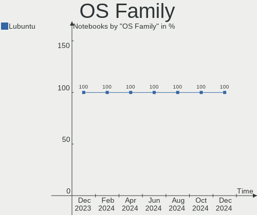
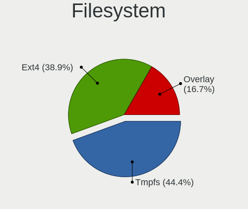
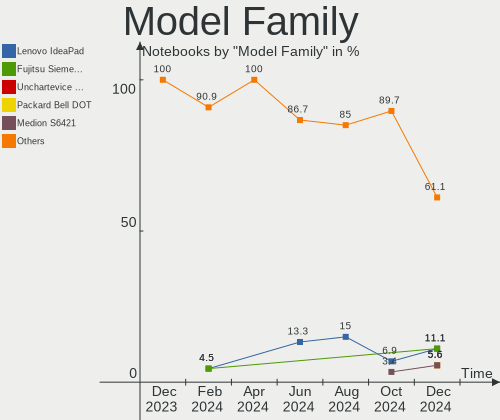
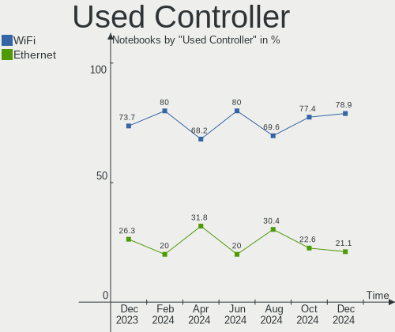
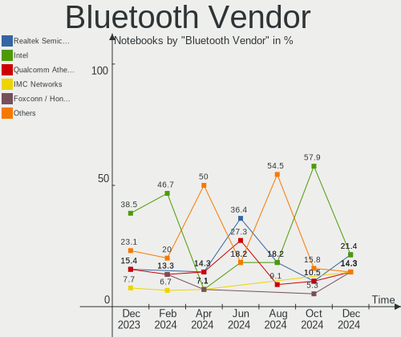

Lubuntu - Hardware Trends (Notebooks)
-------------------------------------

A project to identify most popular hardware characteristics and track their change
over time based on data collected by Linux users at https://Linux-Hardware.org.

Anyone can contribute to this report by the [hw-probe](https://github.com/linuxhw/hw-probe) tool:

    sudo -E hw-probe -all -upload

This report is for one last month. Overall report since the beginning of time: [TestCoverage](https://github.com/linuxhw/TestCoverage)

Period: Jul, 2022.

Contents
--------

* [ System ](#system)
  - [ OS                       ](#os)
  - [ OS Family                ](#os-family)
  - [ Kernel                   ](#kernel)
  - [ Kernel Family            ](#kernel-family)
  - [ Kernel Major Ver.        ](#kernel-major-ver)
  - [ Arch                     ](#arch)
  - [ DE                       ](#de)
  - [ Display Server           ](#display-server)
  - [ Display Manager          ](#display-manager)
  - [ OS Lang                  ](#os-lang)
  - [ Boot Mode                ](#boot-mode)
  - [ Filesystem               ](#filesystem)
  - [ Part. scheme             ](#part-scheme)
  - [ Dual Boot with Linux/BSD ](#dual-boot-with-linuxbsd)
  - [ Dual Boot (Win)          ](#dual-boot-win)

* [ Board ](#board)
  - [ Vendor                   ](#vendor)
  - [ Model                    ](#model)
  - [ Model Family             ](#model-family)
  - [ MFG Year                 ](#mfg-year)
  - [ Form Factor              ](#form-factor)
  - [ Secure Boot              ](#secure-boot)
  - [ Coreboot                 ](#coreboot)
  - [ RAM Size                 ](#ram-size)
  - [ RAM Used                 ](#ram-used)
  - [ Total Drives             ](#total-drives)
  - [ Has CD-ROM               ](#has-cd-rom)
  - [ Has Ethernet             ](#has-ethernet)
  - [ Has WiFi                 ](#has-wifi)
  - [ Has Bluetooth            ](#has-bluetooth)

* [ Location ](#location)
  - [ Country                  ](#country)
  - [ City                     ](#city)

* [ Drives ](#drives)
  - [ Drive Vendor             ](#drive-vendor)
  - [ Drive Model              ](#drive-model)
  - [ HDD Vendor               ](#hdd-vendor)
  - [ SSD Vendor               ](#ssd-vendor)
  - [ Drive Kind               ](#drive-kind)
  - [ Drive Connector          ](#drive-connector)
  - [ Drive Size               ](#drive-size)
  - [ Space Total              ](#space-total)
  - [ Space Used               ](#space-used)
  - [ Malfunc. Drives          ](#malfunc-drives)
  - [ Malfunc. Drive Vendor    ](#malfunc-drive-vendor)
  - [ Malfunc. HDD Vendor      ](#malfunc-hdd-vendor)
  - [ Malfunc. Drive Kind      ](#malfunc-drive-kind)
  - [ Failed Drives            ](#failed-drives)
  - [ Failed Drive Vendor      ](#failed-drive-vendor)
  - [ Drive Status             ](#drive-status)

* [ Storage controller ](#storage-controller)
  - [ Storage Vendor           ](#storage-vendor)
  - [ Storage Model            ](#storage-model)
  - [ Storage Kind             ](#storage-kind)

* [ Processor ](#processor)
  - [ CPU Vendor               ](#cpu-vendor)
  - [ CPU Model                ](#cpu-model)
  - [ CPU Model Family         ](#cpu-model-family)
  - [ CPU Cores                ](#cpu-cores)
  - [ CPU Sockets              ](#cpu-sockets)
  - [ CPU Threads              ](#cpu-threads)
  - [ CPU Op-Modes             ](#cpu-op-modes)
  - [ CPU Microcode            ](#cpu-microcode)
  - [ CPU Microarch            ](#cpu-microarch)

* [ Graphics ](#graphics)
  - [ GPU Vendor               ](#gpu-vendor)
  - [ GPU Model                ](#gpu-model)
  - [ GPU Combo                ](#gpu-combo)
  - [ GPU Driver               ](#gpu-driver)
  - [ GPU Memory               ](#gpu-memory)

* [ Monitor ](#monitor)
  - [ Monitor Vendor           ](#monitor-vendor)
  - [ Monitor Model            ](#monitor-model)
  - [ Monitor Resolution       ](#monitor-resolution)
  - [ Monitor Diagonal         ](#monitor-diagonal)
  - [ Monitor Width            ](#monitor-width)
  - [ Aspect Ratio             ](#aspect-ratio)
  - [ Monitor Area             ](#monitor-area)
  - [ Pixel Density            ](#pixel-density)
  - [ Multiple Monitors        ](#multiple-monitors)

* [ Network ](#network)
  - [ Net Controller Vendor    ](#net-controller-vendor)
  - [ Net Controller Model     ](#net-controller-model)
  - [ Wireless Vendor          ](#wireless-vendor)
  - [ Wireless Model           ](#wireless-model)
  - [ Ethernet Vendor          ](#ethernet-vendor)
  - [ Ethernet Model           ](#ethernet-model)
  - [ Net Controller Kind      ](#net-controller-kind)
  - [ Used Controller          ](#used-controller)
  - [ NICs                     ](#nics)
  - [ IPv6                     ](#ipv6)

* [ Bluetooth ](#bluetooth)
  - [ Bluetooth Vendor         ](#bluetooth-vendor)
  - [ Bluetooth Model          ](#bluetooth-model)

* [ Sound ](#sound)
  - [ Sound Vendor             ](#sound-vendor)
  - [ Sound Model              ](#sound-model)

* [ Memory ](#memory)
  - [ Memory Vendor            ](#memory-vendor)
  - [ Memory Model             ](#memory-model)
  - [ Memory Kind              ](#memory-kind)
  - [ Memory Form Factor       ](#memory-form-factor)
  - [ Memory Size              ](#memory-size)
  - [ Memory Speed             ](#memory-speed)

* [ Printers & scanners ](#printers--scanners)
  - [ Printer Vendor           ](#printer-vendor)
  - [ Printer Model            ](#printer-model)
  - [ Scanner Vendor           ](#scanner-vendor)
  - [ Scanner Model            ](#scanner-model)

* [ Camera ](#camera)
  - [ Camera Vendor            ](#camera-vendor)
  - [ Camera Model             ](#camera-model)

* [ Security ](#security)
  - [ Fingerprint Vendor       ](#fingerprint-vendor)
  - [ Fingerprint Model        ](#fingerprint-model)
  - [ Chipcard Vendor          ](#chipcard-vendor)
  - [ Chipcard Model           ](#chipcard-model)

* [ Unsupported ](#unsupported)
  - [ Unsupported Devices      ](#unsupported-devices)
  - [ Unsupported Device Types ](#unsupported-device-types)

System
------

OS
--

Installed operating systems

| Name          | Notebooks | Percent |
|---------------|-----------|---------|
| Lubuntu 22.04 | 7         | 38.89%  |
| Lubuntu 20.04 | 5         | 27.78%  |
| Lubuntu 18.04 | 5         | 27.78%  |
| Lubuntu 12.04 | 1         | 5.56%   |

OS Family
---------

OS without a version

| Name    | Notebooks | Percent |
|---------|-----------|---------|
| Lubuntu | 18        | 100%    |

Kernel
------

Version of the Linux kernel

| Version            | Notebooks | Percent |
|--------------------|-----------|---------|
| 5.15.0-41-generic  | 6         | 33.33%  |
| 5.15.0-43-generic  | 2         | 11.11%  |
| 4.15.0-189-generic | 2         | 11.11%  |
| 4.15.0-188-generic | 2         | 11.11%  |
| 5.15.0-40-generic  | 1         | 5.56%   |
| 5.15.0-35-generic  | 1         | 5.56%   |
| 5.15.0-25-generic  | 1         | 5.56%   |
| 5.13.0-30-generic  | 1         | 5.56%   |
| 4.15.0-167-generic | 1         | 5.56%   |
| 3.13.0-185-generic | 1         | 5.56%   |

Kernel Family
-------------

Linux kernel without a distro release

| Version | Notebooks | Percent |
|---------|-----------|---------|
| 5.15.0  | 11        | 61.11%  |
| 4.15.0  | 5         | 27.78%  |
| 5.13.0  | 1         | 5.56%   |
| 3.13.0  | 1         | 5.56%   |

Kernel Major Ver.
-----------------

Linux kernel major version

| Version | Notebooks | Percent |
|---------|-----------|---------|
| 5.15    | 11        | 61.11%  |
| 4.15    | 5         | 27.78%  |
| 5.13    | 1         | 5.56%   |
| 3.13    | 1         | 5.56%   |

Arch
----

OS architecture (x86_64, i586, etc.)

| Name   | Notebooks | Percent |
|--------|-----------|---------|
| x86_64 | 14        | 77.78%  |
| i686   | 4         | 22.22%  |

DE
--

Desktop Environment

| Name       | Notebooks | Percent |
|------------|-----------|---------|
| LXQt       | 11        | 61.11%  |
| LXDE       | 5         | 27.78%  |
| X-Cinnamon | 1         | 5.56%   |
| GNOME      | 1         | 5.56%   |

Display Server
--------------

X11 or Wayland

| Name | Notebooks | Percent |
|------|-----------|---------|
| X11  | 18        | 100%    |

Display Manager
---------------

SDDM, LightDM, etc.

| Name    | Notebooks | Percent |
|---------|-----------|---------|
| SDDM    | 9         | 50%     |
| LightDM | 5         | 27.78%  |
| Unknown | 3         | 16.67%  |
| GDM3    | 1         | 5.56%   |

OS Lang
-------

Language

| Lang    | Notebooks | Percent |
|---------|-----------|---------|
| en_US   | 6         | 33.33%  |
| de_DE   | 3         | 16.67%  |
| en_GB   | 2         | 11.11%  |
| pl_PL   | 1         | 5.56%   |
| it_IT   | 1         | 5.56%   |
| fr_FR   | 1         | 5.56%   |
| es_ES   | 1         | 5.56%   |
| es_CL   | 1         | 5.56%   |
| es_BO   | 1         | 5.56%   |
| Unknown | 1         | 5.56%   |

Boot Mode
---------

EFI or BIOS

| Mode | Notebooks | Percent |
|------|-----------|---------|
| BIOS | 14        | 77.78%  |
| EFI  | 4         | 22.22%  |

Filesystem
----------

Type of filesystem

| Type  | Notebooks | Percent |
|-------|-----------|---------|
| Ext4  | 17        | 94.44%  |
| Btrfs | 1         | 5.56%   |

Part. scheme
------------

Scheme of partitioning

| Type    | Notebooks | Percent |
|---------|-----------|---------|
| Unknown | 13        | 72.22%  |
| MBR     | 3         | 16.67%  |
| GPT     | 2         | 11.11%  |

Dual Boot with Linux/BSD
------------------------

Hosting more than one Linux/BSD

| Dual boot | Notebooks | Percent |
|-----------|-----------|---------|
| No        | 16        | 88.89%  |
| Yes       | 2         | 11.11%  |

Dual Boot (Win)
---------------

Hosting Linux and Windows

| Dual boot | Notebooks | Percent |
|-----------|-----------|---------|
| No        | 12        | 66.67%  |
| Yes       | 6         | 33.33%  |

Board
-----

Vendor
------

Motherboard manufacturer

| Name                | Notebooks | Percent |
|---------------------|-----------|---------|
| Lenovo              | 3         | 16.67%  |
| Hewlett-Packard     | 3         | 16.67%  |
| Toshiba             | 2         | 11.11%  |
| Dell                | 2         | 11.11%  |
| Standard            | 1         | 5.56%   |
| Sony                | 1         | 5.56%   |
| Samsung Electronics | 1         | 5.56%   |
| Nokia               | 1         | 5.56%   |
| Google              | 1         | 5.56%   |
| Fujitsu             | 1         | 5.56%   |
| Chuwi               | 1         | 5.56%   |
| ASUSTek Computer    | 1         | 5.56%   |

Model
-----

Motherboard model

| Name                           | Notebooks | Percent |
|--------------------------------|-----------|---------|
| Toshiba Satellite A300         | 1         | 5.56%   |
| Toshiba NB250                  | 1         | 5.56%   |
| Standard AHV                   | 1         | 5.56%   |
| Sony VPCEB15FM                 | 1         | 5.56%   |
| Samsung N130                   | 1         | 5.56%   |
| Nokia Booklet 3G               | 1         | 5.56%   |
| Lenovo IdeaPad S145-15IGM 81MX | 1         | 5.56%   |
| Lenovo IdeaPad 330-15IKB 81DC  | 1         | 5.56%   |
| Lenovo G50-30 80G0             | 1         | 5.56%   |
| HP Presario CQ56               | 1         | 5.56%   |
| HP Laptop 17-cn0xxx            | 1         | 5.56%   |
| HP 245 G2                      | 1         | 5.56%   |
| Google Celes                   | 1         | 5.56%   |
| Fujitsu LIFEBOOK AH531         | 1         | 5.56%   |
| Dell XPS M1330                 | 1         | 5.56%   |
| Dell Inspiron N5010            | 1         | 5.56%   |
| Chuwi GemiBook Pro             | 1         | 5.56%   |
| ASUS 900                       | 1         | 5.56%   |

Model Family
------------

Motherboard model prefix

| Name              | Notebooks | Percent |
|-------------------|-----------|---------|
| Lenovo IdeaPad    | 2         | 11.11%  |
| Toshiba Satellite | 1         | 5.56%   |
| Toshiba NB250     | 1         | 5.56%   |
| Standard AHV      | 1         | 5.56%   |
| Sony VPCEB15FM    | 1         | 5.56%   |
| Samsung N130      | 1         | 5.56%   |
| Nokia Booklet     | 1         | 5.56%   |
| Lenovo G50-30     | 1         | 5.56%   |
| HP Presario       | 1         | 5.56%   |
| HP Laptop         | 1         | 5.56%   |
| HP 245            | 1         | 5.56%   |
| Google Celes      | 1         | 5.56%   |
| Fujitsu LIFEBOOK  | 1         | 5.56%   |
| Dell XPS          | 1         | 5.56%   |
| Dell Inspiron     | 1         | 5.56%   |
| Chuwi GemiBook    | 1         | 5.56%   |
| ASUS 900          | 1         | 5.56%   |

MFG Year
--------

Motherboard manufacture year

| Year | Notebooks | Percent |
|------|-----------|---------|
| 2010 | 4         | 22.22%  |
| 2008 | 3         | 16.67%  |
| 2021 | 2         | 11.11%  |
| 2009 | 2         | 11.11%  |
| 2020 | 1         | 5.56%   |
| 2019 | 1         | 5.56%   |
| 2018 | 1         | 5.56%   |
| 2014 | 1         | 5.56%   |
| 2013 | 1         | 5.56%   |
| 2012 | 1         | 5.56%   |
| 2011 | 1         | 5.56%   |

Form Factor
-----------

Physical design of the computer

| Name     | Notebooks | Percent |
|----------|-----------|---------|
| Notebook | 18        | 100%    |

Secure Boot
-----------

Enabled or disabled

| State    | Notebooks | Percent |
|----------|-----------|---------|
| Disabled | 16        | 88.89%  |
| Enabled  | 2         | 11.11%  |

Coreboot
--------

Have coreboot on board

| Used | Notebooks | Percent |
|------|-----------|---------|
| No   | 17        | 94.44%  |
| Yes  | 1         | 5.56%   |

RAM Size
--------

Total RAM memory

| Size in GB | Notebooks | Percent |
|------------|-----------|---------|
| 3.01-4.0   | 7         | 38.89%  |
| 0.51-1.0   | 5         | 27.78%  |
| 4.01-8.0   | 3         | 16.67%  |
| 2.01-3.0   | 2         | 11.11%  |
| 16.01-24.0 | 1         | 5.56%   |

RAM Used
--------

Used RAM memory

| Used GB  | Notebooks | Percent |
|----------|-----------|---------|
| 1.01-2.0 | 7         | 38.89%  |
| 2.01-3.0 | 5         | 27.78%  |
| 0.51-1.0 | 3         | 16.67%  |
| 0.01-0.5 | 2         | 11.11%  |
| Unknown  | 1         | 5.56%   |

Total Drives
------------

Number of drives on board

| Drives | Notebooks | Percent |
|--------|-----------|---------|
| 1      | 15        | 83.33%  |
| 2      | 3         | 16.67%  |

Has CD-ROM
----------

Has CD-ROM on board

| Presented | Notebooks | Percent |
|-----------|-----------|---------|
| Yes       | 9         | 50%     |
| No        | 9         | 50%     |

Has Ethernet
------------

Has Ethernet on board

| Presented | Notebooks | Percent |
|-----------|-----------|---------|
| Yes       | 14        | 77.78%  |
| No        | 4         | 22.22%  |

Has WiFi
--------

Has WiFi module

| Presented | Notebooks | Percent |
|-----------|-----------|---------|
| Yes       | 18        | 100%    |

Has Bluetooth
-------------

Has Bluetooth module

| Presented | Notebooks | Percent |
|-----------|-----------|---------|
| Yes       | 11        | 61.11%  |
| No        | 7         | 38.89%  |

Location
--------

Country
-------

Geographic location (country)

| Country   | Notebooks | Percent |
|-----------|-----------|---------|
| Germany   | 4         | 22.22%  |
| USA       | 3         | 16.67%  |
| UK        | 2         | 11.11%  |
| Vietnam   | 1         | 5.56%   |
| Russia    | 1         | 5.56%   |
| Poland    | 1         | 5.56%   |
| Italy     | 1         | 5.56%   |
| France    | 1         | 5.56%   |
| Egypt     | 1         | 5.56%   |
| Chile     | 1         | 5.56%   |
| Bolivia   | 1         | 5.56%   |
| Argentina | 1         | 5.56%   |

City
----

Geographic location (city)

| City                   | Notebooks | Percent |
|------------------------|-----------|---------|
| Cossington             | 2         | 11.11%  |
| Strzyzow               | 1         | 5.56%   |
| Southampton            | 1         | 5.56%   |
| South Burlington       | 1         | 5.56%   |
| Santiago               | 1         | 5.56%   |
| Rossano Veneto         | 1         | 5.56%   |
| Münster               | 1         | 5.56%   |
| Moscow                 | 1         | 5.56%   |
| Montigny-le-Bretonneux | 1         | 5.56%   |
| Maipu                  | 1         | 5.56%   |
| La Paz                 | 1         | 5.56%   |
| Ho Chi Minh City       | 1         | 5.56%   |
| Giessen                | 1         | 5.56%   |
| Castrop-Rauxel         | 1         | 5.56%   |
| Cairo                  | 1         | 5.56%   |
| Bloomington            | 1         | 5.56%   |
| Battenberg             | 1         | 5.56%   |

Drives
------

Drive Vendor
------------

Hard drive vendors

| Vendor              | Notebooks | Drives | Percent |
|---------------------|-----------|--------|---------|
| Toshiba             | 4         | 4      | 21.05%  |
| WDC                 | 2         | 2      | 10.53%  |
| Unknown             | 2         | 2      | 10.53%  |
| Samsung Electronics | 2         | 2      | 10.53%  |
| Hitachi             | 2         | 2      | 10.53%  |
| W800S               | 1         | 1      | 5.26%   |
| SPCC                | 1         | 1      | 5.26%   |
| SK hynix            | 1         | 1      | 5.26%   |
| HGST                | 1         | 1      | 5.26%   |
| Crucial             | 1         | 1      | 5.26%   |
| China               | 1         | 1      | 5.26%   |
| ASUS-PHISON         | 1         | 1      | 5.26%   |

Drive Model
-----------

Hard drive models

| Model                         | Notebooks | Percent |
|-------------------------------|-----------|---------|
| WDC WD3200BEVT-75A23T0 320GB  | 1         | 5.26%   |
| WDC WD10SPZX-24Z10T0 1TB      | 1         | 5.26%   |
| W800S 256GB SSD               | 1         | 5.26%   |
| Unknown MMC Card  32GB        | 1         | 5.26%   |
| Unknown DA4064  64GB          | 1         | 5.26%   |
| Toshiba MK2565GSXV 250GB      | 1         | 5.26%   |
| Toshiba MK2546GSX 250GB       | 1         | 5.26%   |
| Toshiba MK1646GSX 160GB       | 1         | 5.26%   |
| Toshiba MK1235GSL 120GB       | 1         | 5.26%   |
| SPCC Solid State Disk 120GB   | 1         | 5.26%   |
| SK hynix NVMe SSD Drive 256GB | 1         | 5.26%   |
| Samsung SSD 840 Series 120GB  | 1         | 5.26%   |
| Samsung NVMe SSD Drive 512GB  | 1         | 5.26%   |
| Hitachi HTS545032B9SA00 320GB | 1         | 5.26%   |
| Hitachi HTS545032B9A300 320GB | 1         | 5.26%   |
| HGST HTS545050A7E680 500GB    | 1         | 5.26%   |
| Crucial CT240BX500SSD1 240GB  | 1         | 5.26%   |
| China SH00R480GB SSD          | 1         | 5.26%   |
| ASUS-PHISON SSD 16GB          | 1         | 5.26%   |

HDD Vendor
----------

Hard disk drive vendors

| Vendor  | Notebooks | Drives | Percent |
|---------|-----------|--------|---------|
| Toshiba | 4         | 4      | 44.44%  |
| WDC     | 2         | 2      | 22.22%  |
| Hitachi | 2         | 2      | 22.22%  |
| HGST    | 1         | 1      | 11.11%  |

SSD Vendor
----------

Solid state drive vendors

| Vendor              | Notebooks | Drives | Percent |
|---------------------|-----------|--------|---------|
| W800S               | 1         | 1      | 16.67%  |
| SPCC                | 1         | 1      | 16.67%  |
| Samsung Electronics | 1         | 1      | 16.67%  |
| Crucial             | 1         | 1      | 16.67%  |
| China               | 1         | 1      | 16.67%  |
| ASUS-PHISON         | 1         | 1      | 16.67%  |

Drive Kind
----------

HDD or SSD

| Kind | Notebooks | Drives | Percent |
|------|-----------|--------|---------|
| HDD  | 9         | 9      | 47.37%  |
| SSD  | 6         | 6      | 31.58%  |
| MMC  | 2         | 2      | 10.53%  |
| NVMe | 2         | 2      | 10.53%  |

Drive Connector
---------------

SATA, SAS, NVMe, etc.

| Type | Notebooks | Drives | Percent |
|------|-----------|--------|---------|
| SATA | 15        | 15     | 78.95%  |
| NVMe | 2         | 2      | 10.53%  |
| MMC  | 2         | 2      | 10.53%  |

Drive Size
----------

Size of hard drive

| Size in TB | Notebooks | Drives | Percent |
|------------|-----------|--------|---------|
| 0.01-0.5   | 14        | 14     | 93.33%  |
| 0.51-1.0   | 1         | 1      | 6.67%   |

Space Total
-----------

Amount of disk space available on the file system

| Size in GB | Notebooks | Percent |
|------------|-----------|---------|
| 251-500    | 6         | 33.33%  |
| 101-250    | 6         | 33.33%  |
| 1-20       | 2         | 11.11%  |
| 51-100     | 2         | 11.11%  |
| 21-50      | 1         | 5.56%   |
| 501-1000   | 1         | 5.56%   |

Space Used
----------

Amount of used disk space

| Used GB | Notebooks | Percent |
|---------|-----------|---------|
| 1-20    | 10        | 55.56%  |
| 21-50   | 6         | 33.33%  |
| 101-250 | 1         | 5.56%   |
| 51-100  | 1         | 5.56%   |

Malfunc. Drives
---------------

Drive models with a malfunction

| Model                         | Notebooks | Drives | Percent |
|-------------------------------|-----------|--------|---------|
| WDC WD3200BEVT-75A23T0 320GB  | 1         | 1      | 50%     |
| Hitachi HTS545032B9A300 320GB | 1         | 1      | 50%     |

Malfunc. Drive Vendor
---------------------

Vendors of faulty drives

| Vendor  | Notebooks | Drives | Percent |
|---------|-----------|--------|---------|
| WDC     | 1         | 1      | 50%     |
| Hitachi | 1         | 1      | 50%     |

Malfunc. HDD Vendor
-------------------

Vendors of faulty HDD drives

| Vendor  | Notebooks | Drives | Percent |
|---------|-----------|--------|---------|
| WDC     | 1         | 1      | 50%     |
| Hitachi | 1         | 1      | 50%     |

Malfunc. Drive Kind
-------------------

Kinds of faulty drives

| Kind | Notebooks | Drives | Percent |
|------|-----------|--------|---------|
| HDD  | 2         | 2      | 100%    |

Failed Drives
-------------

Failed drive models

Zero info for selected period =(

Failed Drive Vendor
-------------------

Failed drive vendors

Zero info for selected period =(

Drive Status
------------

Number of failed and malfunc. drives

| Status   | Notebooks | Drives | Percent |
|----------|-----------|--------|---------|
| Detected | 15        | 16     | 83.33%  |
| Malfunc  | 2         | 2      | 11.11%  |
| Works    | 1         | 1      | 5.56%   |

Storage controller
------------------

Storage Vendor
--------------

Storage controller vendors

| Vendor              | Notebooks | Percent |
|---------------------|-----------|---------|
| Intel               | 16        | 84.21%  |
| SK hynix            | 1         | 5.26%   |
| Samsung Electronics | 1         | 5.26%   |
| AMD                 | 1         | 5.26%   |

Storage Model
-------------

Storage controller models

| Model                                                                        | Notebooks | Percent |
|------------------------------------------------------------------------------|-----------|---------|
| Intel 82801HM/HEM (ICH8M/ICH8M-E) SATA Controller [AHCI mode]                | 2         | 9.09%   |
| Intel 82801HM/HEM (ICH8M/ICH8M-E) IDE Controller                             | 2         | 9.09%   |
| Intel 6 Series/C200 Series Chipset Family 6 port Mobile SATA AHCI Controller | 2         | 9.09%   |
| SK hynix BC501 NVMe Solid State Drive                                        | 1         | 4.55%   |
| Samsung NVMe SSD Controller 980                                              | 1         | 4.55%   |
| Intel Volume Management Device NVMe RAID Controller                          | 1         | 4.55%   |
| Intel US15W/US15X/US15L/UL11L SCH [Poulsbo] IDE Controller                   | 1         | 4.55%   |
| Intel Tiger Lake-LP SATA Controller                                          | 1         | 4.55%   |
| Intel Sunrise Point-LP SATA Controller [AHCI mode]                           | 1         | 4.55%   |
| Intel NM10/ICH7 Family SATA Controller [AHCI mode]                           | 1         | 4.55%   |
| Intel Jasper Lake SATA AHCI Controller                                       | 1         | 4.55%   |
| Intel Celeron/Pentium Silver Processor SATA Controller                       | 1         | 4.55%   |
| Intel Atom Processor E3800 Series SATA AHCI Controller                       | 1         | 4.55%   |
| Intel 82801IBM/IEM (ICH9M/ICH9M-E) 4 port SATA Controller [AHCI mode]        | 1         | 4.55%   |
| Intel 82801GBM/GHM (ICH7-M Family) SATA Controller [IDE mode]                | 1         | 4.55%   |
| Intel 82801FBM (ICH6M) SATA Controller                                       | 1         | 4.55%   |
| Intel 5 Series/3400 Series Chipset 6 port SATA AHCI Controller               | 1         | 4.55%   |
| Intel 5 Series/3400 Series Chipset 4 port SATA AHCI Controller               | 1         | 4.55%   |
| AMD FCH SATA Controller [AHCI mode]                                          | 1         | 4.55%   |

Storage Kind
------------

Kind of storage controller (IDE, SATA, NVMe, SAS, ...)

| Kind | Notebooks | Percent |
|------|-----------|---------|
| SATA | 14        | 63.64%  |
| IDE  | 5         | 22.73%  |
| NVMe | 2         | 9.09%   |
| RAID | 1         | 4.55%   |

Processor
---------

CPU Vendor
----------

Processor vendors

| Vendor | Notebooks | Percent |
|--------|-----------|---------|
| Intel  | 17        | 94.44%  |
| AMD    | 1         | 5.56%   |

CPU Model
---------

Processor models

| Model                                       | Notebooks | Percent |
|---------------------------------------------|-----------|---------|
| Intel Pentium Dual-Core CPU T4500 @ 2.30GHz | 1         | 5.56%   |
| Intel Core i7-2620M CPU @ 2.70GHz           | 1         | 5.56%   |
| Intel Core i5-7200U CPU @ 2.50GHz           | 1         | 5.56%   |
| Intel Core i5-2410M CPU @ 2.30GHz           | 1         | 5.56%   |
| Intel Core i5 CPU M 520 @ 2.40GHz           | 1         | 5.56%   |
| Intel Core i3 CPU M 380 @ 2.53GHz           | 1         | 5.56%   |
| Intel Core 2 Duo CPU T5550 @ 1.83GHz        | 1         | 5.56%   |
| Intel Core 2 Duo CPU T5450 @ 1.66GHz        | 1         | 5.56%   |
| Intel Celeron N5100 @ 1.10GHz               | 1         | 5.56%   |
| Intel Celeron N4000 CPU @ 1.10GHz           | 1         | 5.56%   |
| Intel Celeron M processor 900MHz            | 1         | 5.56%   |
| Intel Celeron CPU N3060 @ 1.60GHz           | 1         | 5.56%   |
| Intel Celeron CPU N2830 @ 2.16GHz           | 1         | 5.56%   |
| Intel Atom CPU Z530 @ 1.60GHz               | 1         | 5.56%   |
| Intel Atom CPU N455 @ 1.66GHz               | 1         | 5.56%   |
| Intel Atom CPU N270 @ 1.60GHz               | 1         | 5.56%   |
| Intel 11th Gen Core i3-1125G4 @ 2.00GHz     | 1         | 5.56%   |
| AMD E1-2100 APU with Radeon HD Graphics     | 1         | 5.56%   |

CPU Model Family
----------------

Processor model prefix

| Model                   | Notebooks | Percent |
|-------------------------|-----------|---------|
| Intel Celeron           | 4         | 22.22%  |
| Intel Core i5           | 3         | 16.67%  |
| Intel Atom              | 3         | 16.67%  |
| Intel Core 2 Duo        | 2         | 11.11%  |
| Other                   | 1         | 5.56%   |
| Intel Pentium Dual-Core | 1         | 5.56%   |
| Intel Core i7           | 1         | 5.56%   |
| Intel Core i3           | 1         | 5.56%   |
| Intel Celeron M         | 1         | 5.56%   |
| AMD E1                  | 1         | 5.56%   |

CPU Cores
---------

Number of processor cores

| Number | Notebooks | Percent |
|--------|-----------|---------|
| 2      | 12        | 66.67%  |
| 1      | 4         | 22.22%  |
| 4      | 2         | 11.11%  |

CPU Sockets
-----------

Number of sockets

| Number | Notebooks | Percent |
|--------|-----------|---------|
| 1      | 18        | 100%    |

CPU Threads
-----------

Threads per core (Hyper-Threading)

| Number | Notebooks | Percent |
|--------|-----------|---------|
| 2      | 9         | 50%     |
| 1      | 9         | 50%     |

CPU Op-Modes
------------

CPU Operation Modes (32-bit, 64-bit)

| Op mode        | Notebooks | Percent |
|----------------|-----------|---------|
| 32-bit, 64-bit | 15        | 83.33%  |
| 32-bit         | 3         | 16.67%  |

CPU Microcode
-------------

Microcode number

| Number     | Notebooks | Percent |
|------------|-----------|---------|
| Unknown    | 3         | 16.67%  |
| 0x6fd      | 2         | 11.11%  |
| 0x20655    | 2         | 11.11%  |
| 0x106c2    | 2         | 11.11%  |
| 0x906c0    | 1         | 5.56%   |
| 0x806e9    | 1         | 5.56%   |
| 0x806c1    | 1         | 5.56%   |
| 0x6d8      | 1         | 5.56%   |
| 0x406c4    | 1         | 5.56%   |
| 0x206a7    | 1         | 5.56%   |
| 0x106ca    | 1         | 5.56%   |
| 0x1067a    | 1         | 5.56%   |
| 0x0700010f | 1         | 5.56%   |

CPU Microarch
-------------

Microarchitecture

| Name          | Notebooks | Percent |
|---------------|-----------|---------|
| Bonnell       | 3         | 16.67%  |
| Westmere      | 2         | 11.11%  |
| Silvermont    | 2         | 11.11%  |
| SandyBridge   | 2         | 11.11%  |
| Core          | 2         | 11.11%  |
| Tremont       | 1         | 5.56%   |
| TigerLake     | 1         | 5.56%   |
| Penryn        | 1         | 5.56%   |
| P6            | 1         | 5.56%   |
| KabyLake      | 1         | 5.56%   |
| Jaguar        | 1         | 5.56%   |
| Goldmont plus | 1         | 5.56%   |

Graphics
--------

GPU Vendor
----------

Vendors of graphics cards

| Vendor | Notebooks | Percent |
|--------|-----------|---------|
| Intel  | 17        | 89.47%  |
| Nvidia | 1         | 5.26%   |
| AMD    | 1         | 5.26%   |

GPU Model
---------

Graphics card models

| Model                                                                                    | Notebooks | Percent |
|------------------------------------------------------------------------------------------|-----------|---------|
| Intel Mobile GM965/GL960 Integrated Graphics Controller (secondary)                      | 2         | 9.09%   |
| Intel Mobile GM965/GL960 Integrated Graphics Controller (primary)                        | 2         | 9.09%   |
| Intel Core Processor Integrated Graphics Controller                                      | 2         | 9.09%   |
| Intel 2nd Generation Core Processor Family Integrated Graphics Controller                | 2         | 9.09%   |
| Nvidia GM108M [GeForce MX110]                                                            | 1         | 4.55%   |
| Intel US15W/US15X SCH [Poulsbo] Graphics Controller                                      | 1         | 4.55%   |
| Intel Tiger Lake UHD Graphics                                                            | 1         | 4.55%   |
| Intel Mobile 945GSE Express Integrated Graphics Controller                               | 1         | 4.55%   |
| Intel Mobile 945GM/GMS/GME, 943/940GML Express Integrated Graphics Controller            | 1         | 4.55%   |
| Intel Mobile 915GM/GMS/910GML Express Graphics Controller                                | 1         | 4.55%   |
| Intel Mobile 4 Series Chipset Integrated Graphics Controller                             | 1         | 4.55%   |
| Intel JasperLake [UHD Graphics]                                                          | 1         | 4.55%   |
| Intel HD Graphics 620                                                                    | 1         | 4.55%   |
| Intel GeminiLake [UHD Graphics 600]                                                      | 1         | 4.55%   |
| Intel Atom/Celeron/Pentium Processor x5-E8000/J3xxx/N3xxx Integrated Graphics Controller | 1         | 4.55%   |
| Intel Atom Processor Z36xxx/Z37xxx Series Graphics & Display                             | 1         | 4.55%   |
| Intel Atom Processor D4xx/D5xx/N4xx/N5xx Integrated Graphics Controller                  | 1         | 4.55%   |
| AMD Kabini [Radeon HD 8210]                                                              | 1         | 4.55%   |

GPU Combo
---------

Combinations of graphics cards

| Name           | Notebooks | Percent |
|----------------|-----------|---------|
| 1 x Intel      | 16        | 88.89%  |
| Intel + Nvidia | 1         | 5.56%   |
| 1 x AMD        | 1         | 5.56%   |

GPU Driver
----------

Free vs proprietary

| Driver | Notebooks | Percent |
|--------|-----------|---------|
| Free   | 18        | 100%    |

GPU Memory
----------

Total video memory

| Size in GB | Notebooks | Percent |
|------------|-----------|---------|
| Unknown    | 12        | 66.67%  |
| 0.01-0.5   | 4         | 22.22%  |
| 1.01-2.0   | 2         | 11.11%  |

Monitor
-------

Monitor Vendor
--------------

Monitor vendors

| Vendor              | Notebooks | Percent |
|---------------------|-----------|---------|
| LG Display          | 5         | 31.25%  |
| Chimei Innolux      | 4         | 25%     |
| Samsung Electronics | 2         | 12.5%   |
| AU Optronics        | 2         | 12.5%   |
| Toshiba             | 1         | 6.25%   |
| HannStar            | 1         | 6.25%   |
| CPT                 | 1         | 6.25%   |

Monitor Model
-------------

Monitor models

| Model                                                                | Notebooks | Percent |
|----------------------------------------------------------------------|-----------|---------|
| Toshiba LCD Monitor LCD2306 1280x800 287x180mm 13.3-inch             | 1         | 6.25%   |
| Samsung Electronics LCD Monitor SEC5541 1366x768 344x193mm 15.5-inch | 1         | 6.25%   |
| Samsung Electronics LCD Monitor SEC544E 1024x600 223x125mm 10.1-inch | 1         | 6.25%   |
| LG Display LCD Monitor LGD044B 1366x768 344x194mm 15.5-inch          | 1         | 6.25%   |
| LG Display LCD Monitor LGD0386 1366x768 309x174mm 14.0-inch          | 1         | 6.25%   |
| LG Display LCD Monitor LGD02E9 1366x768 309x174mm 14.0-inch          | 1         | 6.25%   |
| LG Display LCD Monitor LGD02DC 1366x768 344x194mm 15.5-inch          | 1         | 6.25%   |
| LG Display LCD Monitor LGD02CF 1366x768 344x194mm 15.5-inch          | 1         | 6.25%   |
| HannStar HSD101PFW2 HSD03E9 1024x600 222x125mm 10.0-inch             | 1         | 6.25%   |
| CPT LCD Monitor CPT1401 1280x800 331x207mm 15.4-inch                 | 1         | 6.25%   |
| Chimei Innolux P140ZKA-BZ1 CMN8C02 2160x1440 296x197mm 14.0-inch     | 1         | 6.25%   |
| Chimei Innolux LCD Monitor CMN176F 1920x1080 381x214mm 17.2-inch     | 1         | 6.25%   |
| Chimei Innolux LCD Monitor CMN15E6 1366x768 344x193mm 15.5-inch      | 1         | 6.25%   |
| Chimei Innolux LCD Monitor CMN15D5 1920x1080 344x193mm 15.5-inch     | 1         | 6.25%   |
| AU Optronics LCD Monitor AUO235C 1366x768 256x144mm 11.6-inch        | 1         | 6.25%   |
| AU Optronics LCD Monitor AUO11D5 1280x720 222x125mm 10.0-inch        | 1         | 6.25%   |

Monitor Resolution
------------------

Monitor screen resolution

| Resolution      | Notebooks | Percent |
|-----------------|-----------|---------|
| 1366x768 (WXGA) | 8         | 50%     |
| 1920x1080 (FHD) | 2         | 12.5%   |
| 1280x800 (WXGA) | 2         | 12.5%   |
| 1024x600        | 2         | 12.5%   |
| 2160x1440       | 1         | 6.25%   |
| 1280x720 (HD)   | 1         | 6.25%   |

Monitor Diagonal
----------------

Diagonal size in inches

| Inches | Notebooks | Percent |
|--------|-----------|---------|
| 15     | 7         | 43.75%  |
| 14     | 3         | 18.75%  |
| 10     | 3         | 18.75%  |
| 17     | 1         | 6.25%   |
| 13     | 1         | 6.25%   |
| 11     | 1         | 6.25%   |

Monitor Width
-------------

Physical width

| Width in mm | Notebooks | Percent |
|-------------|-----------|---------|
| 301-350     | 9         | 56.25%  |
| 201-300     | 6         | 37.5%   |
| 351-400     | 1         | 6.25%   |

Aspect Ratio
------------

Proportional relationship between the width and the height

| Ratio | Notebooks | Percent |
|-------|-----------|---------|
| 16/9  | 13        | 81.25%  |
| 16/10 | 2         | 12.5%   |
| 3/2   | 1         | 6.25%   |

Monitor Area
------------

Area in inch²

| Area in inch² | Notebooks | Percent |
|----------------|-----------|---------|
| 101-110        | 7         | 43.75%  |
| 81-90          | 4         | 25%     |
| 41-50          | 3         | 18.75%  |
| 51-60          | 1         | 6.25%   |
| 121-130        | 1         | 6.25%   |

Pixel Density
-------------

Pixels per inch

| Density | Notebooks | Percent |
|---------|-----------|---------|
| 101-120 | 10        | 62.5%   |
| 121-160 | 4         | 25%     |
| 161-240 | 1         | 6.25%   |
| 51-100  | 1         | 6.25%   |

Multiple Monitors
-----------------

Total monitors connected

| Total | Notebooks | Percent |
|-------|-----------|---------|
| 1     | 18        | 100%    |

Network
-------

Net Controller Vendor
---------------------

Controller vendors

| Vendor                   | Notebooks | Percent |
|--------------------------|-----------|---------|
| Realtek Semiconductor    | 11        | 36.67%  |
| Qualcomm Atheros         | 7         | 23.33%  |
| Intel                    | 6         | 20%     |
| Marvell Technology Group | 2         | 6.67%   |
| Samsung Electronics      | 1         | 3.33%   |
| MediaTek                 | 1         | 3.33%   |
| JMicron Technology       | 1         | 3.33%   |
| Broadcom Limited         | 1         | 3.33%   |

Net Controller Model
--------------------

Controller models

| Model                                                                          | Notebooks | Percent |
|--------------------------------------------------------------------------------|-----------|---------|
| Realtek RTL810xE PCI Express Fast Ethernet controller                          | 5         | 15.15%  |
| Realtek RTL8111/8168/8411 PCI Express Gigabit Ethernet Controller              | 3         | 9.09%   |
| Qualcomm Atheros AR9285 Wireless Network Adapter (PCI-Express)                 | 3         | 9.09%   |
| Realtek RTL8821CE 802.11ac PCIe Wireless Network Adapter                       | 2         | 6.06%   |
| Intel PRO/Wireless 3945ABG [Golan] Network Connection                          | 2         | 6.06%   |
| Samsung Galaxy series, misc. (tethering mode)                                  | 1         | 3.03%   |
| Realtek RTL8723BE PCIe Wireless Network Adapter                                | 1         | 3.03%   |
| Realtek RTL8191SEvA Wireless LAN Controller                                    | 1         | 3.03%   |
| Realtek RTL8188CE 802.11b/g/n WiFi Adapter                                     | 1         | 3.03%   |
| Qualcomm Atheros QCA9565 / AR9565 Wireless Network Adapter                     | 1         | 3.03%   |
| Qualcomm Atheros QCA9377 802.11ac Wireless Network Adapter                     | 1         | 3.03%   |
| Qualcomm Atheros Attansic L2 Fast Ethernet                                     | 1         | 3.03%   |
| Qualcomm Atheros AR928X Wireless Network Adapter (PCI-Express)                 | 1         | 3.03%   |
| Qualcomm Atheros AR242x / AR542x Wireless Network Adapter (PCI-Express)        | 1         | 3.03%   |
| MediaTek moto e(6) plus                                                        | 1         | 3.03%   |
| Marvell Group Yukon Optima 88E8059 [PCIe Gigabit Ethernet Controller with AVB] | 1         | 3.03%   |
| Marvell Group 88E8040T PCI-E Fast Ethernet Controller                          | 1         | 3.03%   |
| JMicron JMC250 PCI Express Gigabit Ethernet Controller                         | 1         | 3.03%   |
| Intel Wireless 7265                                                            | 1         | 3.03%   |
| Intel Wireless 3165                                                            | 1         | 3.03%   |
| Intel Centrino Wireless-N 1030 [Rainbow Peak]                                  | 1         | 3.03%   |
| Intel Centrino Wireless-N 1000 [Condor Peak]                                   | 1         | 3.03%   |
| Broadcom Limited NetLink BCM5906M Fast Ethernet PCI Express                    | 1         | 3.03%   |

Wireless Vendor
---------------

Wireless vendors

| Vendor                | Notebooks | Percent |
|-----------------------|-----------|---------|
| Qualcomm Atheros      | 7         | 38.89%  |
| Intel                 | 6         | 33.33%  |
| Realtek Semiconductor | 5         | 27.78%  |

Wireless Model
--------------

Wireless models

| Model                                                                   | Notebooks | Percent |
|-------------------------------------------------------------------------|-----------|---------|
| Qualcomm Atheros AR9285 Wireless Network Adapter (PCI-Express)          | 3         | 16.67%  |
| Realtek RTL8821CE 802.11ac PCIe Wireless Network Adapter                | 2         | 11.11%  |
| Intel PRO/Wireless 3945ABG [Golan] Network Connection                   | 2         | 11.11%  |
| Realtek RTL8723BE PCIe Wireless Network Adapter                         | 1         | 5.56%   |
| Realtek RTL8191SEvA Wireless LAN Controller                             | 1         | 5.56%   |
| Realtek RTL8188CE 802.11b/g/n WiFi Adapter                              | 1         | 5.56%   |
| Qualcomm Atheros QCA9565 / AR9565 Wireless Network Adapter              | 1         | 5.56%   |
| Qualcomm Atheros QCA9377 802.11ac Wireless Network Adapter              | 1         | 5.56%   |
| Qualcomm Atheros AR928X Wireless Network Adapter (PCI-Express)          | 1         | 5.56%   |
| Qualcomm Atheros AR242x / AR542x Wireless Network Adapter (PCI-Express) | 1         | 5.56%   |
| Intel Wireless 7265                                                     | 1         | 5.56%   |
| Intel Wireless 3165                                                     | 1         | 5.56%   |
| Intel Centrino Wireless-N 1030 [Rainbow Peak]                           | 1         | 5.56%   |
| Intel Centrino Wireless-N 1000 [Condor Peak]                            | 1         | 5.56%   |

Ethernet Vendor
---------------

Ethernet vendors

| Vendor                   | Notebooks | Percent |
|--------------------------|-----------|---------|
| Realtek Semiconductor    | 8         | 53.33%  |
| Marvell Technology Group | 2         | 13.33%  |
| Samsung Electronics      | 1         | 6.67%   |
| Qualcomm Atheros         | 1         | 6.67%   |
| MediaTek                 | 1         | 6.67%   |
| JMicron Technology       | 1         | 6.67%   |
| Broadcom Limited         | 1         | 6.67%   |

Ethernet Model
--------------

Ethernet models

| Model                                                                          | Notebooks | Percent |
|--------------------------------------------------------------------------------|-----------|---------|
| Realtek RTL810xE PCI Express Fast Ethernet controller                          | 5         | 33.33%  |
| Realtek RTL8111/8168/8411 PCI Express Gigabit Ethernet Controller              | 3         | 20%     |
| Samsung Galaxy series, misc. (tethering mode)                                  | 1         | 6.67%   |
| Qualcomm Atheros Attansic L2 Fast Ethernet                                     | 1         | 6.67%   |
| MediaTek moto e(6) plus                                                        | 1         | 6.67%   |
| Marvell Group Yukon Optima 88E8059 [PCIe Gigabit Ethernet Controller with AVB] | 1         | 6.67%   |
| Marvell Group 88E8040T PCI-E Fast Ethernet Controller                          | 1         | 6.67%   |
| JMicron JMC250 PCI Express Gigabit Ethernet Controller                         | 1         | 6.67%   |
| Broadcom Limited NetLink BCM5906M Fast Ethernet PCI Express                    | 1         | 6.67%   |

Net Controller Kind
-------------------

Ethernet, WiFi or modem

| Kind     | Notebooks | Percent |
|----------|-----------|---------|
| WiFi     | 18        | 56.25%  |
| Ethernet | 14        | 43.75%  |

Used Controller
---------------

Currently used network controller

| Kind     | Notebooks | Percent |
|----------|-----------|---------|
| WiFi     | 12        | 70.59%  |
| Ethernet | 5         | 29.41%  |

NICs
----

Total network controllers on board

| Total | Notebooks | Percent |
|-------|-----------|---------|
| 2     | 13        | 72.22%  |
| 1     | 5         | 27.78%  |

IPv6
----

IPv6 vs IPv4

| Used | Notebooks | Percent |
|------|-----------|---------|
| No   | 15        | 83.33%  |
| Yes  | 3         | 16.67%  |

Bluetooth
---------

Bluetooth Vendor
----------------

Controller vendors

| Vendor                          | Notebooks | Percent |
|---------------------------------|-----------|---------|
| Realtek Semiconductor           | 3         | 27.27%  |
| Intel                           | 3         | 27.27%  |
| Qualcomm Atheros Communications | 2         | 18.18%  |
| Toshiba                         | 1         | 9.09%   |
| Foxconn / Hon Hai               | 1         | 9.09%   |
| Dell                            | 1         | 9.09%   |

Bluetooth Model
---------------

Controller models

| Model                                                                               | Notebooks | Percent |
|-------------------------------------------------------------------------------------|-----------|---------|
| Realtek Bluetooth Radio                                                             | 2         | 18.18%  |
| Qualcomm Atheros  Bluetooth Device                                                  | 2         | 18.18%  |
| Intel Bluetooth wireless interface                                                  | 2         | 18.18%  |
| Toshiba Integrated Bluetooth HCI                                                    | 1         | 9.09%   |
| Realtek RTL8723B Bluetooth                                                          | 1         | 9.09%   |
| Intel Bluetooth Device                                                              | 1         | 9.09%   |
| Foxconn / Hon Hai Foxconn T77H114 BCM2070 [Single-Chip Bluetooth 2.1 + EDR Adapter] | 1         | 9.09%   |
| Dell Wireless 355 Bluetooth                                                         | 1         | 9.09%   |

Sound
-----

Sound Vendor
------------

Sound card vendors

| Vendor | Notebooks | Percent |
|--------|-----------|---------|
| Intel  | 17        | 94.44%  |
| AMD    | 1         | 5.56%   |

Sound Model
-----------

Sound card models

| Model                                                                                             | Notebooks | Percent |
|---------------------------------------------------------------------------------------------------|-----------|---------|
| Intel NM10/ICH7 Family High Definition Audio Controller                                           | 2         | 10.53%  |
| Intel 82801H (ICH8 Family) HD Audio Controller                                                    | 2         | 10.53%  |
| Intel 6 Series/C200 Series Chipset Family High Definition Audio Controller                        | 2         | 10.53%  |
| Intel 5 Series/3400 Series Chipset High Definition Audio                                          | 2         | 10.53%  |
| Intel US15W/US15X/US15L/UL11L SCH [Poulsbo] HD Audio Controller                                   | 1         | 5.26%   |
| Intel Tiger Lake-LP Smart Sound Technology Audio Controller                                       | 1         | 5.26%   |
| Intel Sunrise Point-LP HD Audio                                                                   | 1         | 5.26%   |
| Intel Jasper Lake HD Audio                                                                        | 1         | 5.26%   |
| Intel Celeron/Pentium Silver Processor High Definition Audio                                      | 1         | 5.26%   |
| Intel Atom/Celeron/Pentium Processor x5-E8000/J3xxx/N3xxx Series High Definition Audio Controller | 1         | 5.26%   |
| Intel Atom Processor Z36xxx/Z37xxx Series High Definition Audio Controller                        | 1         | 5.26%   |
| Intel 82801I (ICH9 Family) HD Audio Controller                                                    | 1         | 5.26%   |
| Intel 82801FB/FBM/FR/FW/FRW (ICH6 Family) High Definition Audio Controller                        | 1         | 5.26%   |
| AMD Kabini HDMI/DP Audio                                                                          | 1         | 5.26%   |
| AMD FCH Azalia Controller                                                                         | 1         | 5.26%   |

Memory
------

Memory Vendor
-------------

Memory module vendors

| Vendor              | Notebooks | Percent |
|---------------------|-----------|---------|
| Unknown             | 5         | 35.71%  |
| SK hynix            | 4         | 28.57%  |
| Samsung Electronics | 3         | 21.43%  |
| Nanya Technology    | 1         | 7.14%   |
| Micron Technology   | 1         | 7.14%   |

Memory Model
------------

Memory module models

| Model                                                          | Notebooks | Percent |
|----------------------------------------------------------------|-----------|---------|
| Unknown RAM Module 4GB SODIMM DDR3                             | 1         | 6.67%   |
| Unknown RAM Module 1GB SODIMM DDR2 533MT/s                     | 1         | 6.67%   |
| Unknown RAM Module 1GB SODIMM DDR2                             | 1         | 6.67%   |
| Unknown RAM Module 1024MB SODIMM DDR2 667MT/s                  | 1         | 6.67%   |
| Unknown RAM Module 1024MB SODIMM DDR2 400MT/s                  | 1         | 6.67%   |
| SK hynix RAM HYMP125S64CR8-S6 2GB SODIMM DDR2 800MT/s          | 1         | 6.67%   |
| SK hynix RAM HYMP125S64CP8-S6 2GB SODIMM DDR 800MT/s           | 1         | 6.67%   |
| SK hynix RAM HYMP112S64CR6-S6 1024MB SODIMM DDR2 800MT/s       | 1         | 6.67%   |
| SK hynix RAM HMT41GS6AFR8A-PB 8GB SODIMM DDR3 1600MT/s         | 1         | 6.67%   |
| SK hynix RAM HMA851S6AFR6N-UH 4GB SODIMM DDR4 2667MT/s         | 1         | 6.67%   |
| Samsung RAM M471B5173DB0-YK0 4GB SODIMM DDR3 1600MT/s          | 1         | 6.67%   |
| Samsung RAM M471B2873FHS-CH9 1024MB SODIMM DDR3 1334MT/s       | 1         | 6.67%   |
| Samsung RAM K4E8E324EB-EGCF 2GB LPDDR3 1867MT/s                | 1         | 6.67%   |
| Nanya RAM NT2GC64B88B0NS-CG 2GB SODIMM DDR3 1334MT/s           | 1         | 6.67%   |
| Micron RAM 53E1G32D4NQ-046WTE 4GB Row Of Chips LPDDR4 3200MT/s | 1         | 6.67%   |

Memory Kind
-----------

Memory module kinds

| Kind   | Notebooks | Percent |
|--------|-----------|---------|
| DDR2   | 6         | 46.15%  |
| DDR3   | 4         | 30.77%  |
| LPDDR4 | 2         | 15.38%  |
| LPDDR3 | 1         | 7.69%   |

Memory Form Factor
------------------

Physical design of the memory module

| Name         | Notebooks | Percent |
|--------------|-----------|---------|
| SODIMM       | 11        | 84.62%  |
| Row Of Chips | 1         | 7.69%   |
| Unknown      | 1         | 7.69%   |

Memory Size
-----------

Memory module size

| Size | Notebooks | Percent |
|------|-----------|---------|
| 4096 | 5         | 33.33%  |
| 1024 | 5         | 33.33%  |
| 2048 | 4         | 26.67%  |
| 8192 | 1         | 6.67%   |

Memory Speed
------------

Memory module speed

| Speed   | Notebooks | Percent |
|---------|-----------|---------|
| 1600    | 2         | 15.38%  |
| Unknown | 2         | 15.38%  |
| 3200    | 1         | 7.69%   |
| 2667    | 1         | 7.69%   |
| 1867    | 1         | 7.69%   |
| 1334    | 1         | 7.69%   |
| 975     | 1         | 7.69%   |
| 800     | 1         | 7.69%   |
| 667     | 1         | 7.69%   |
| 533     | 1         | 7.69%   |
| 400     | 1         | 7.69%   |

Printers & scanners
-------------------

Printer Vendor
--------------

Printer device vendors

Zero info for selected period =(

Printer Model
-------------

Printer device models

Zero info for selected period =(

Scanner Vendor
--------------

Scanner device vendors

Zero info for selected period =(

Scanner Model
-------------

Scanner device models

Zero info for selected period =(

Camera
------

Camera Vendor
-------------

Camera device vendors

| Vendor                                 | Notebooks | Percent |
|----------------------------------------|-----------|---------|
| Chicony Electronics                    | 6         | 37.5%   |
| Microdia                               | 5         | 31.25%  |
| Z-Star Microelectronics                | 1         | 6.25%   |
| Luxvisions Innotech Limited            | 1         | 6.25%   |
| IMC Networks                           | 1         | 6.25%   |
| Genesys Logic                          | 1         | 6.25%   |
| Cheng Uei Precision Industry (Foxlink) | 1         | 6.25%   |

Camera Model
------------

Camera device models

| Model                                                | Notebooks | Percent |
|------------------------------------------------------|-----------|---------|
| Microdia Webcam                                      | 2         | 12.5%   |
| Chicony USB 2.0 Camera                               | 2         | 12.5%   |
| Z-Star Webcam                                        | 1         | 6.25%   |
| Microdia Lenovo EasyCamera                           | 1         | 6.25%   |
| Microdia Amcrest AWC2198 USB Webcam                  | 1         | 6.25%   |
| Microdia 1.3 MPixel Integrated Webcam                | 1         | 6.25%   |
| Luxvisions Innotech Limited HP TrueVision HD Camera  | 1         | 6.25%   |
| IMC Networks EasyCamera                              | 1         | 6.25%   |
| Genesys Logic USB 2.0 Camera                         | 1         | 6.25%   |
| Chicony Integrated Camera                            | 1         | 6.25%   |
| Chicony HP Truevision HD camera                      | 1         | 6.25%   |
| Chicony Fujitsu Integrated Camera                    | 1         | 6.25%   |
| Chicony 720p HD Camera                               | 1         | 6.25%   |
| Cheng Uei Precision Industry (Foxlink) HP Webcam-101 | 1         | 6.25%   |

Security
--------

Fingerprint Vendor
------------------

Fingerprint sensor vendors

| Vendor             | Notebooks | Percent |
|--------------------|-----------|---------|
| STMicroelectronics | 1         | 100%    |

Fingerprint Model
-----------------

Fingerprint sensor models

| Model                                 | Notebooks | Percent |
|---------------------------------------|-----------|---------|
| STMicroelectronics Fingerprint Reader | 1         | 100%    |

Chipcard Vendor
---------------

Chipcard module vendors

Zero info for selected period =(

Chipcard Model
--------------

Chipcard module models

Zero info for selected period =(

Unsupported
-----------

Unsupported Devices
-------------------

Total unsupported devices on board

| Total | Notebooks | Percent |
|-------|-----------|---------|
| 0     | 14        | 77.78%  |
| 1     | 4         | 22.22%  |

Unsupported Device Types
------------------------

Types of unsupported devices

| Type               | Notebooks | Percent |
|--------------------|-----------|---------|
| Net/wireless       | 2         | 50%     |
| Storage            | 1         | 25%     |
| Fingerprint reader | 1         | 25%     |

