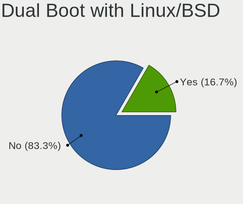
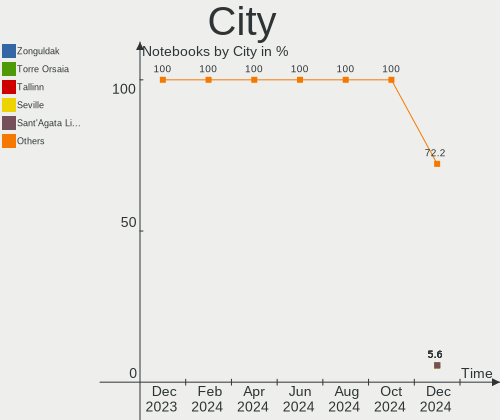
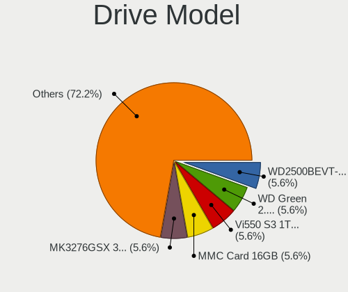
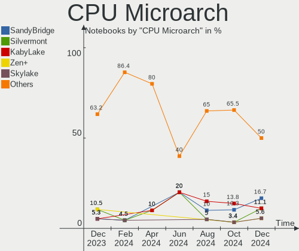
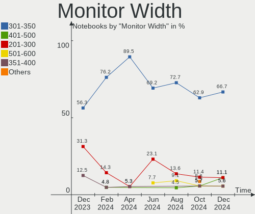
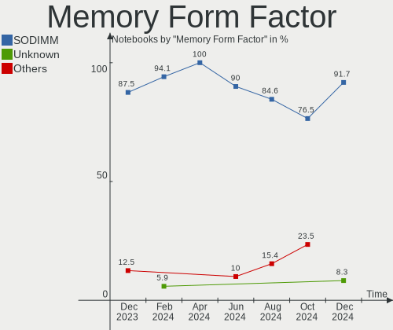

Lubuntu - Hardware Trends (Notebooks)
-------------------------------------

A project to identify most popular hardware characteristics and track their change
over time based on data collected by Linux users at https://Linux-Hardware.org.

Anyone can contribute to this report by the [hw-probe](https://github.com/linuxhw/hw-probe) tool:

    sudo -E hw-probe -all -upload

This report is for one last month. Overall report since the beginning of time: [TestDays](https://github.com/linuxhw/TestDays)

Period: Dec, 2024.

Contents
--------

* [ System ](#system)
  - [ OS                       ](#os)
  - [ OS Family                ](#os-family)
  - [ Kernel                   ](#kernel)
  - [ Kernel Family            ](#kernel-family)
  - [ Kernel Major Ver.        ](#kernel-major-ver)
  - [ Arch                     ](#arch)
  - [ DE                       ](#de)
  - [ Display Server           ](#display-server)
  - [ Display Manager          ](#display-manager)
  - [ OS Lang                  ](#os-lang)
  - [ Boot Mode                ](#boot-mode)
  - [ Filesystem               ](#filesystem)
  - [ Part. scheme             ](#part-scheme)
  - [ Dual Boot with Linux/BSD ](#dual-boot-with-linuxbsd)
  - [ Dual Boot (Win)          ](#dual-boot-win)

* [ Board ](#board)
  - [ Vendor                   ](#vendor)
  - [ Model                    ](#model)
  - [ Model Family             ](#model-family)
  - [ MFG Year                 ](#mfg-year)
  - [ Form Factor              ](#form-factor)
  - [ Secure Boot              ](#secure-boot)
  - [ Coreboot                 ](#coreboot)
  - [ RAM Size                 ](#ram-size)
  - [ RAM Used                 ](#ram-used)
  - [ Total Drives             ](#total-drives)
  - [ Has CD-ROM               ](#has-cd-rom)
  - [ Has Ethernet             ](#has-ethernet)
  - [ Has WiFi                 ](#has-wifi)
  - [ Has Bluetooth            ](#has-bluetooth)

* [ Location ](#location)
  - [ Country                  ](#country)
  - [ City                     ](#city)

* [ Drives ](#drives)
  - [ Drive Vendor             ](#drive-vendor)
  - [ Drive Model              ](#drive-model)
  - [ HDD Vendor               ](#hdd-vendor)
  - [ SSD Vendor               ](#ssd-vendor)
  - [ Drive Kind               ](#drive-kind)
  - [ Drive Connector          ](#drive-connector)
  - [ Drive Size               ](#drive-size)
  - [ Space Total              ](#space-total)
  - [ Space Used               ](#space-used)
  - [ Malfunc. Drives          ](#malfunc-drives)
  - [ Malfunc. Drive Vendor    ](#malfunc-drive-vendor)
  - [ Malfunc. HDD Vendor      ](#malfunc-hdd-vendor)
  - [ Malfunc. Drive Kind      ](#malfunc-drive-kind)
  - [ Failed Drives            ](#failed-drives)
  - [ Failed Drive Vendor      ](#failed-drive-vendor)
  - [ Drive Status             ](#drive-status)

* [ Storage controller ](#storage-controller)
  - [ Storage Vendor           ](#storage-vendor)
  - [ Storage Model            ](#storage-model)
  - [ Storage Kind             ](#storage-kind)

* [ Processor ](#processor)
  - [ CPU Vendor               ](#cpu-vendor)
  - [ CPU Model                ](#cpu-model)
  - [ CPU Model Family         ](#cpu-model-family)
  - [ CPU Cores                ](#cpu-cores)
  - [ CPU Sockets              ](#cpu-sockets)
  - [ CPU Threads              ](#cpu-threads)
  - [ CPU Op-Modes             ](#cpu-op-modes)
  - [ CPU Microcode            ](#cpu-microcode)
  - [ CPU Microarch            ](#cpu-microarch)

* [ Graphics ](#graphics)
  - [ GPU Vendor               ](#gpu-vendor)
  - [ GPU Model                ](#gpu-model)
  - [ GPU Combo                ](#gpu-combo)
  - [ GPU Driver               ](#gpu-driver)
  - [ GPU Memory               ](#gpu-memory)

* [ Monitor ](#monitor)
  - [ Monitor Vendor           ](#monitor-vendor)
  - [ Monitor Model            ](#monitor-model)
  - [ Monitor Resolution       ](#monitor-resolution)
  - [ Monitor Diagonal         ](#monitor-diagonal)
  - [ Monitor Width            ](#monitor-width)
  - [ Aspect Ratio             ](#aspect-ratio)
  - [ Monitor Area             ](#monitor-area)
  - [ Pixel Density            ](#pixel-density)
  - [ Multiple Monitors        ](#multiple-monitors)

* [ Network ](#network)
  - [ Net Controller Vendor    ](#net-controller-vendor)
  - [ Net Controller Model     ](#net-controller-model)
  - [ Wireless Vendor          ](#wireless-vendor)
  - [ Wireless Model           ](#wireless-model)
  - [ Ethernet Vendor          ](#ethernet-vendor)
  - [ Ethernet Model           ](#ethernet-model)
  - [ Net Controller Kind      ](#net-controller-kind)
  - [ Used Controller          ](#used-controller)
  - [ NICs                     ](#nics)
  - [ IPv6                     ](#ipv6)

* [ Bluetooth ](#bluetooth)
  - [ Bluetooth Vendor         ](#bluetooth-vendor)
  - [ Bluetooth Model          ](#bluetooth-model)

* [ Sound ](#sound)
  - [ Sound Vendor             ](#sound-vendor)
  - [ Sound Model              ](#sound-model)

* [ Memory ](#memory)
  - [ Memory Vendor            ](#memory-vendor)
  - [ Memory Model             ](#memory-model)
  - [ Memory Kind              ](#memory-kind)
  - [ Memory Form Factor       ](#memory-form-factor)
  - [ Memory Size              ](#memory-size)
  - [ Memory Speed             ](#memory-speed)

* [ Printers & scanners ](#printers--scanners)
  - [ Printer Vendor           ](#printer-vendor)
  - [ Printer Model            ](#printer-model)
  - [ Scanner Vendor           ](#scanner-vendor)
  - [ Scanner Model            ](#scanner-model)

* [ Camera ](#camera)
  - [ Camera Vendor            ](#camera-vendor)
  - [ Camera Model             ](#camera-model)

* [ Security ](#security)
  - [ Fingerprint Vendor       ](#fingerprint-vendor)
  - [ Fingerprint Model        ](#fingerprint-model)
  - [ Chipcard Vendor          ](#chipcard-vendor)
  - [ Chipcard Model           ](#chipcard-model)

* [ Unsupported ](#unsupported)
  - [ Unsupported Devices      ](#unsupported-devices)
  - [ Unsupported Device Types ](#unsupported-device-types)

System
------

OS
--

Installed operating systems

| Name          | Notebooks | Percent |
|---------------|-----------|---------|
| Lubuntu 24.04 | 10        | 55.56%  |
| Lubuntu 24.10 | 3         | 16.67%  |
| Lubuntu 22.04 | 3         | 16.67%  |
| Lubuntu 23.10 | 1         | 5.56%   |
| Lubuntu 20.04 | 1         | 5.56%   |

OS Family
---------

OS without a version

| Name    | Notebooks | Percent |
|---------|-----------|---------|
| Lubuntu | 18        | 100%    |

Kernel
------

Version of the Linux kernel

| Version            | Notebooks | Percent |
|--------------------|-----------|---------|
| 6.8.0-51-generic   | 6         | 33.33%  |
| 6.8.0-41-generic   | 3         | 16.67%  |
| 6.8.0-49-generic   | 2         | 11.11%  |
| 6.11.0-9-generic   | 2         | 11.11%  |
| 6.8.0-50-generic   | 1         | 5.56%   |
| 6.5.0-9-generic    | 1         | 5.56%   |
| 6.11.0-12-generic  | 1         | 5.56%   |
| 5.15.0-130-generic | 1         | 5.56%   |
| 5.15.0-126-generic | 1         | 5.56%   |

Kernel Family
-------------

Linux kernel without a distro release

| Version | Notebooks | Percent |
|---------|-----------|---------|
| 6.8.0   | 12        | 66.67%  |
| 6.11.0  | 3         | 16.67%  |
| 5.15.0  | 2         | 11.11%  |
| 6.5.0   | 1         | 5.56%   |

Kernel Major Ver.
-----------------

Linux kernel major version

| Version | Notebooks | Percent |
|---------|-----------|---------|
| 6.8     | 12        | 66.67%  |
| 6.11    | 3         | 16.67%  |
| 5.15    | 2         | 11.11%  |
| 6.5     | 1         | 5.56%   |

Arch
----

OS architecture (x86_64, i586, etc.)

| Name   | Notebooks | Percent |
|--------|-----------|---------|
| x86_64 | 18        | 100%    |

DE
--

Desktop Environment

| Name | Notebooks | Percent |
|------|-----------|---------|
| LXQt | 18        | 100%    |

Display Server
--------------

X11 or Wayland

| Name | Notebooks | Percent |
|------|-----------|---------|
| X11  | 16        | 88.89%  |
| Tty  | 2         | 11.11%  |

Display Manager
---------------

SDDM, LightDM, etc.

| Name    | Notebooks | Percent |
|---------|-----------|---------|
| SDDM    | 16        | 88.89%  |
| SLiM    | 1         | 5.56%   |
| LightDM | 1         | 5.56%   |

OS Lang
-------

Language

| Lang  | Notebooks | Percent |
|-------|-----------|---------|
| en_US | 6         | 33.33%  |
| C     | 5         | 27.78%  |
| tr_TR | 1         | 5.56%   |
| it_IT | 1         | 5.56%   |
| fr_FR | 1         | 5.56%   |
| et_EE | 1         | 5.56%   |
| en_GB | 1         | 5.56%   |
| en_CA | 1         | 5.56%   |
| an_ES | 1         | 5.56%   |

Boot Mode
---------

EFI or BIOS

| Mode | Notebooks | Percent |
|------|-----------|---------|
| BIOS | 12        | 66.67%  |
| EFI  | 6         | 33.33%  |

Filesystem
----------

Type of filesystem

| Type    | Notebooks | Percent |
|---------|-----------|---------|
| Tmpfs   | 8         | 44.44%  |
| Ext4    | 7         | 38.89%  |
| Overlay | 3         | 16.67%  |

Part. scheme
------------

Scheme of partitioning

| Type | Notebooks | Percent |
|------|-----------|---------|
| GPT  | 11        | 61.11%  |
| MBR  | 7         | 38.89%  |

Dual Boot with Linux/BSD
------------------------

Hosting more than one Linux/BSD

| Dual boot | Notebooks | Percent |
|-----------|-----------|---------|
| No        | 15        | 83.33%  |
| Yes       | 3         | 16.67%  |

Dual Boot (Win)
---------------

Hosting Linux and Windows

| Dual boot | Notebooks | Percent |
|-----------|-----------|---------|
| No        | 13        | 72.22%  |
| Yes       | 5         | 27.78%  |

Board
-----

Vendor
------

Motherboard manufacturer

| Name             | Notebooks | Percent |
|------------------|-----------|---------|
| Hewlett-Packard  | 5         | 27.78%  |
| Lenovo           | 2         | 11.11%  |
| Fujitsu Siemens  | 2         | 11.11%  |
| Dell             | 2         | 11.11%  |
| Unchartevice     | 1         | 5.56%   |
| Packard Bell     | 1         | 5.56%   |
| Medion           | 1         | 5.56%   |
| Google           | 1         | 5.56%   |
| Fujitsu          | 1         | 5.56%   |
| ASUSTek Computer | 1         | 5.56%   |
| Unknown          | 1         | 5.56%   |

Model
-----

Motherboard model

| Name                                     | Notebooks | Percent |
|------------------------------------------|-----------|---------|
| Unchartevice 6540                        | 1         | 5.56%   |
| Packard Bell DOT S                       | 1         | 5.56%   |
| Medion S6421 MD60703                     | 1         | 5.56%   |
| Lenovo IdeaPad S405 9802                 | 1         | 5.56%   |
| Lenovo IdeaPad 330-15IKB 81FD            | 1         | 5.56%   |
| HP Pavilion g7                           | 1         | 5.56%   |
| HP Notebook                              | 1         | 5.56%   |
| HP Laptop 15-db0xxx                      | 1         | 5.56%   |
| HP EliteBook 835 13 inch G10 Notebook PC | 1         | 5.56%   |
| HP 2000                                  | 1         | 5.56%   |
| Google Candy                             | 1         | 5.56%   |
| Fujitsu Siemens ESPRIMO Mobile V6555     | 1         | 5.56%   |
| Fujitsu Siemens ESPRIMO Mobile V6535     | 1         | 5.56%   |
| Fujitsu LIFEBOOK AH531                   | 1         | 5.56%   |
| Dell System XPS 15Z                      | 1         | 5.56%   |
| Dell Inspiron 15-3567                    | 1         | 5.56%   |
| ASUS X550CL                              | 1         | 5.56%   |
| Unknown                                  | 1         | 5.56%   |

Model Family
------------

Motherboard model prefix

| Name                    | Notebooks | Percent |
|-------------------------|-----------|---------|
| Lenovo IdeaPad          | 2         | 11.11%  |
| Fujitsu Siemens ESPRIMO | 2         | 11.11%  |
| Unchartevice 6540       | 1         | 5.56%   |
| Packard Bell DOT        | 1         | 5.56%   |
| Medion S6421            | 1         | 5.56%   |
| HP Pavilion             | 1         | 5.56%   |
| HP Notebook             | 1         | 5.56%   |
| HP Laptop               | 1         | 5.56%   |
| HP EliteBook            | 1         | 5.56%   |
| HP 2000                 | 1         | 5.56%   |
| Google Candy            | 1         | 5.56%   |
| Fujitsu LIFEBOOK        | 1         | 5.56%   |
| Dell System             | 1         | 5.56%   |
| Dell Inspiron           | 1         | 5.56%   |
| ASUS X550CL             | 1         | 5.56%   |
| Unknown                 | 1         | 5.56%   |

MFG Year
--------

Motherboard manufacture year

| Year | Notebooks | Percent |
|------|-----------|---------|
| 2011 | 4         | 22.22%  |
| 2023 | 2         | 11.11%  |
| 2018 | 2         | 11.11%  |
| 2012 | 2         | 11.11%  |
| 2024 | 1         | 5.56%   |
| 2022 | 1         | 5.56%   |
| 2017 | 1         | 5.56%   |
| 2016 | 1         | 5.56%   |
| 2015 | 1         | 5.56%   |
| 2013 | 1         | 5.56%   |
| 2009 | 1         | 5.56%   |
| 2008 | 1         | 5.56%   |

Form Factor
-----------

Physical design of the computer

| Name     | Notebooks | Percent |
|----------|-----------|---------|
| Notebook | 18        | 100%    |

Secure Boot
-----------

Enabled or disabled

| State    | Notebooks | Percent |
|----------|-----------|---------|
| Disabled | 17        | 94.44%  |
| Enabled  | 1         | 5.56%   |

Coreboot
--------

Have coreboot on board

| Used | Notebooks | Percent |
|------|-----------|---------|
| No   | 17        | 94.44%  |
| Yes  | 1         | 5.56%   |

RAM Size
--------

Total RAM memory

| Size in GB | Notebooks | Percent |
|------------|-----------|---------|
| 4.01-8.0   | 6         | 33.33%  |
| 3.01-4.0   | 5         | 27.78%  |
| 8.01-16.0  | 3         | 16.67%  |
| 1.01-2.0   | 2         | 11.11%  |
| 2.01-3.0   | 1         | 5.56%   |
| 16.01-24.0 | 1         | 5.56%   |

RAM Used
--------

Used RAM memory

| Used GB  | Notebooks | Percent |
|----------|-----------|---------|
| 1.01-2.0 | 6         | 33.33%  |
| 0.51-1.0 | 6         | 33.33%  |
| 2.01-3.0 | 3         | 16.67%  |
| 4.01-8.0 | 2         | 11.11%  |
| 3.01-4.0 | 1         | 5.56%   |

Total Drives
------------

Number of drives on board

| Drives | Notebooks | Percent |
|--------|-----------|---------|
| 1      | 15        | 83.33%  |
| 2      | 2         | 11.11%  |
| 0      | 1         | 5.56%   |

Has CD-ROM
----------

Has CD-ROM on board

| Presented | Notebooks | Percent |
|-----------|-----------|---------|
| No        | 10        | 55.56%  |
| Yes       | 8         | 44.44%  |

Has Ethernet
------------

Has Ethernet on board

| Presented | Notebooks | Percent |
|-----------|-----------|---------|
| Yes       | 14        | 77.78%  |
| No        | 4         | 22.22%  |

Has WiFi
--------

Has WiFi module

| Presented | Notebooks | Percent |
|-----------|-----------|---------|
| Yes       | 18        | 100%    |

Has Bluetooth
-------------

Has Bluetooth module

| Presented | Notebooks | Percent |
|-----------|-----------|---------|
| Yes       | 14        | 77.78%  |
| No        | 4         | 22.22%  |

Location
--------

Country
-------

Geographic location (country)

| Country   | Notebooks | Percent |
|-----------|-----------|---------|
| Italy     | 2         | 11.11%  |
| Germany   | 2         | 11.11%  |
| France    | 2         | 11.11%  |
| Estonia   | 2         | 11.11%  |
| USA       | 1         | 5.56%   |
| UK        | 1         | 5.56%   |
| Turkey    | 1         | 5.56%   |
| Spain     | 1         | 5.56%   |
| Portugal  | 1         | 5.56%   |
| Finland   | 1         | 5.56%   |
| Canada    | 1         | 5.56%   |
| Brazil    | 1         | 5.56%   |
| Belgium   | 1         | 5.56%   |
| Argentina | 1         | 5.56%   |

City
----

Geographic location (city)

| City                    | Notebooks | Percent |
|-------------------------|-----------|---------|
| Zonguldak               | 1         | 5.56%   |
| Torre Orsaia            | 1         | 5.56%   |
| Tallinn                 | 1         | 5.56%   |
| Seville                 | 1         | 5.56%   |
| Sant'Agata Li Battiati  | 1         | 5.56%   |
| San Antonio             | 1         | 5.56%   |
| Rakvere                 | 1         | 5.56%   |
| Póvoa de Varzim        | 1         | 5.56%   |
| Ottawa                  | 1         | 5.56%   |
| Montbonnot-Saint-Martin | 1         | 5.56%   |
| Montauroux              | 1         | 5.56%   |
| Hof                     | 1         | 5.56%   |
| Helsinki                | 1         | 5.56%   |
| Curitiba                | 1         | 5.56%   |
| Cologne                 | 1         | 5.56%   |
| Buenos Aires            | 1         | 5.56%   |
| Brussels                | 1         | 5.56%   |
| Bridgwater              | 1         | 5.56%   |

Drives
------

Drive Vendor
------------

Hard drive vendors

| Vendor              | Notebooks | Drives | Percent |
|---------------------|-----------|--------|---------|
| Samsung Electronics | 4         | 4      | 22.22%  |
| WDC                 | 2         | 2      | 11.11%  |
| Verbatim            | 1         | 1      | 5.56%   |
| Unknown             | 1         | 2      | 5.56%   |
| Toshiba             | 1         | 1      | 5.56%   |
| SK hynix            | 1         | 1      | 5.56%   |
| ShiJi               | 1         | 1      | 5.56%   |
| Seagate             | 1         | 1      | 5.56%   |
| ORICO               | 1         | 1      | 5.56%   |
| Leven               | 1         | 1      | 5.56%   |
| Kingston            | 1         | 1      | 5.56%   |
| Hitachi             | 1         | 1      | 5.56%   |
| EDILOCA             | 1         | 1      | 5.56%   |
| Crucial             | 1         | 1      | 5.56%   |

Drive Model
-----------

Hard drive models

| Model                                 | Notebooks | Percent |
|---------------------------------------|-----------|---------|
| WDC WD2500BEVT-75ZCT2 250GB           | 1         | 5.56%   |
| WDC WD Green 2.5 240GB SSD            | 1         | 5.56%   |
| Verbatim Vi550 S3 1TB SSD             | 1         | 5.56%   |
| Unknown MMC Card  16GB                | 1         | 5.56%   |
| Toshiba MK3276GSX 320GB               | 1         | 5.56%   |
| SK hynix HFS256G32TND-N210A 256GB SSD | 1         | 5.56%   |
| ShiJi SSD 256GB                       | 1         | 5.56%   |
| Seagate Expansion 1TB                 | 1         | 5.56%   |
| Samsung MZVL4512HBLU-00BH1 512GB      | 1         | 5.56%   |
| Samsung MZNLN256HAJQ-000H1 256GB SSD  | 1         | 5.56%   |
| Samsung MZNLN256HAJQ-00000 256GB SSD  | 1         | 5.56%   |
| Samsung HM160HI 160GB                 | 1         | 5.56%   |
| ORICO 128GB                           | 1         | 5.56%   |
| Leven JAJS300M240C 240GB SSD          | 1         | 5.56%   |
| Kingston SA400S37480G 480GB SSD       | 1         | 5.56%   |
| Hitachi HTS545016B9A300 160GB         | 1         | 5.56%   |
| EDILOCA ES106 1TB SSD                 | 1         | 5.56%   |
| Crucial CT240BX500SSD1 240GB          | 1         | 5.56%   |

HDD Vendor
----------

Hard disk drive vendors

| Vendor              | Notebooks | Drives | Percent |
|---------------------|-----------|--------|---------|
| WDC                 | 1         | 1      | 20%     |
| Toshiba             | 1         | 1      | 20%     |
| Seagate             | 1         | 1      | 20%     |
| Samsung Electronics | 1         | 1      | 20%     |
| Hitachi             | 1         | 1      | 20%     |

SSD Vendor
----------

Solid state drive vendors

| Vendor              | Notebooks | Drives | Percent |
|---------------------|-----------|--------|---------|
| Samsung Electronics | 2         | 2      | 20%     |
| WDC                 | 1         | 1      | 10%     |
| Verbatim            | 1         | 1      | 10%     |
| SK hynix            | 1         | 1      | 10%     |
| ShiJi               | 1         | 1      | 10%     |
| Leven               | 1         | 1      | 10%     |
| Kingston            | 1         | 1      | 10%     |
| EDILOCA             | 1         | 1      | 10%     |
| Crucial             | 1         | 1      | 10%     |

Drive Kind
----------

HDD or SSD

| Kind    | Notebooks | Drives | Percent |
|---------|-----------|--------|---------|
| SSD     | 10        | 10     | 55.56%  |
| HDD     | 5         | 5      | 27.78%  |
| MMC     | 1         | 2      | 5.56%   |
| NVMe    | 1         | 1      | 5.56%   |
| Unknown | 1         | 1      | 5.56%   |

Drive Connector
---------------

SATA, SAS, NVMe, etc.

| Type | Notebooks | Drives | Percent |
|------|-----------|--------|---------|
| SATA | 15        | 15     | 83.33%  |
| SAS  | 1         | 1      | 5.56%   |
| NVMe | 1         | 1      | 5.56%   |
| MMC  | 1         | 2      | 5.56%   |

Drive Size
----------

Size of hard drive

| Size in TB | Notebooks | Drives | Percent |
|------------|-----------|--------|---------|
| 0.01-0.5   | 12        | 12     | 80%     |
| 0.51-1.0   | 3         | 3      | 20%     |

Space Total
-----------

Amount of disk space available on the file system

| Size in GB     | Notebooks | Percent |
|----------------|-----------|---------|
| 101-250        | 6         | 33.33%  |
| 21-50          | 3         | 16.67%  |
| 1-20           | 3         | 16.67%  |
| 251-500        | 2         | 11.11%  |
| 51-100         | 2         | 11.11%  |
| More than 3000 | 1         | 5.56%   |
| 501-1000       | 1         | 5.56%   |

Space Used
----------

Amount of used disk space

| Used GB   | Notebooks | Percent |
|-----------|-----------|---------|
| 1-20      | 15        | 83.33%  |
| 251-500   | 1         | 5.56%   |
| 2001-3000 | 1         | 5.56%   |
| 51-100    | 1         | 5.56%   |

Malfunc. Drives
---------------

Drive models with a malfunction

| Model                         | Notebooks | Drives | Percent |
|-------------------------------|-----------|--------|---------|
| Hitachi HTS545016B9A300 160GB | 1         | 1      | 100%    |

Malfunc. Drive Vendor
---------------------

Vendors of faulty drives

| Vendor  | Notebooks | Drives | Percent |
|---------|-----------|--------|---------|
| Hitachi | 1         | 1      | 100%    |

Malfunc. HDD Vendor
-------------------

Vendors of faulty HDD drives

| Vendor  | Notebooks | Drives | Percent |
|---------|-----------|--------|---------|
| Hitachi | 1         | 1      | 100%    |

Malfunc. Drive Kind
-------------------

Kinds of faulty drives

| Kind | Notebooks | Drives | Percent |
|------|-----------|--------|---------|
| HDD  | 1         | 1      | 100%    |

Failed Drives
-------------

Failed drive models

Zero info for selected period =(

Failed Drive Vendor
-------------------

Failed drive vendors

Zero info for selected period =(

Drive Status
------------

Number of failed and malfunc. drives

| Status   | Notebooks | Drives | Percent |
|----------|-----------|--------|---------|
| Works    | 10        | 10     | 55.56%  |
| Detected | 7         | 8      | 38.89%  |
| Malfunc  | 1         | 1      | 5.56%   |

Storage controller
------------------

Storage Vendor
--------------

Storage controller vendors

| Vendor              | Notebooks | Percent |
|---------------------|-----------|---------|
| Intel               | 11        | 64.71%  |
| AMD                 | 4         | 23.53%  |
| Samsung Electronics | 1         | 5.88%   |
| Nvidia              | 1         | 5.88%   |

Storage Model
-------------

Storage controller models

| Model                                                                            | Notebooks | Percent |
|----------------------------------------------------------------------------------|-----------|---------|
| Intel Sunrise Point-LP SATA Controller [AHCI mode]                               | 3         | 17.65%  |
| Intel 6 Series/C200 Series Chipset Family 6 port Mobile SATA AHCI Controller     | 3         | 17.65%  |
| AMD FCH SATA Controller [AHCI mode]                                              | 3         | 17.65%  |
| Samsung NVMe SSD Controller PM9B1 (DRAM-less)                                    | 1         | 5.88%   |
| Nvidia MCP79 SATA Controller                                                     | 1         | 5.88%   |
| Intel NM10/ICH7 Family SATA Controller [AHCI mode]                               | 1         | 5.88%   |
| Intel Celeron/Pentium Silver Processor SATA Controller                           | 1         | 5.88%   |
| Intel Atom/Celeron/Pentium Processor x5-E8000/J3xxx/N3xxx Series SATA Controller | 1         | 5.88%   |
| Intel 82801IBM/IEM (ICH9M/ICH9M-E) 4 port SATA Controller [AHCI mode]            | 1         | 5.88%   |
| Intel 7 Series Chipset Family 6-port SATA Controller [AHCI mode]                 | 1         | 5.88%   |
| AMD SB7x0/SB8x0/SB9x0 SATA Controller [AHCI mode]                                | 1         | 5.88%   |

Storage Kind
------------

Kind of storage controller (IDE, SATA, NVMe, SAS, ...)

| Kind | Notebooks | Percent |
|------|-----------|---------|
| SATA | 15        | 88.24%  |
| NVMe | 1         | 5.88%   |
| IDE  | 1         | 5.88%   |

Processor
---------

CPU Vendor
----------

Processor vendors

| Vendor | Notebooks | Percent |
|--------|-----------|---------|
| Intel  | 13        | 72.22%  |
| AMD    | 5         | 27.78%  |

CPU Model
---------

Processor models

| Model                                         | Notebooks | Percent |
|-----------------------------------------------|-----------|---------|
| Intel Pentium CPU N3700 @ 1.60GHz             | 1         | 5.56%   |
| Intel Core i5-7200U CPU @ 2.50GHz             | 1         | 5.56%   |
| Intel Core i5-2450M CPU @ 2.50GHz             | 1         | 5.56%   |
| Intel Core i5-2430M CPU @ 2.40GHz             | 1         | 5.56%   |
| Intel Core i5-2410M CPU @ 2.30GHz             | 1         | 5.56%   |
| Intel Core i3-7020U CPU @ 2.30GHz             | 1         | 5.56%   |
| Intel Core i3-6006U CPU @ 2.00GHz             | 1         | 5.56%   |
| Intel Core i3-3217U CPU @ 1.80GHz             | 1         | 5.56%   |
| Intel Core 2 Duo CPU T8100 @ 2.10GHz          | 1         | 5.56%   |
| Intel Core 2 Duo CPU T5870 @ 2.00GHz          | 1         | 5.56%   |
| Intel Celeron N4020C CPU @ 1.10GHz            | 1         | 5.56%   |
| Intel Celeron CPU N2840 @ 2.16GHz             | 1         | 5.56%   |
| Intel Atom CPU N2600 @ 1.60GHz                | 1         | 5.56%   |
| AMD Ryzen 7 PRO 7840U w/ Radeon 780M Graphics | 1         | 5.56%   |
| AMD Ryzen 3 3250U with Radeon Graphics        | 1         | 5.56%   |
| AMD E-350 Processor                           | 1         | 5.56%   |
| AMD A4-9125 RADEON R3, 4 COMPUTE CORES 2C+2G  | 1         | 5.56%   |
| AMD A4-4355M APU with Radeon HD Graphics      | 1         | 5.56%   |

CPU Model Family
----------------

Processor model prefix

| Model            | Notebooks | Percent |
|------------------|-----------|---------|
| Intel Core i5    | 4         | 22.22%  |
| Intel Core i3    | 3         | 16.67%  |
| Intel Core 2 Duo | 2         | 11.11%  |
| Intel Celeron    | 2         | 11.11%  |
| AMD A4           | 2         | 11.11%  |
| Intel Pentium    | 1         | 5.56%   |
| Intel Atom       | 1         | 5.56%   |
| AMD Ryzen 7 PRO  | 1         | 5.56%   |
| AMD Ryzen 3      | 1         | 5.56%   |
| AMD E            | 1         | 5.56%   |

CPU Cores
---------

Number of processor cores

| Number | Notebooks | Percent |
|--------|-----------|---------|
| 2      | 15        | 83.33%  |
| 8      | 1         | 5.56%   |
| 4      | 1         | 5.56%   |
| 1      | 1         | 5.56%   |

CPU Sockets
-----------

Number of sockets

| Number | Notebooks | Percent |
|--------|-----------|---------|
| 1      | 18        | 100%    |

CPU Threads
-----------

Threads per core (Hyper-Threading)

| Number | Notebooks | Percent |
|--------|-----------|---------|
| 2      | 10        | 55.56%  |
| 1      | 8         | 44.44%  |

CPU Op-Modes
------------

CPU Operation Modes (32-bit, 64-bit)

| Op mode        | Notebooks | Percent |
|----------------|-----------|---------|
| 32-bit, 64-bit | 18        | 100%    |

CPU Microcode
-------------

Microcode number

| Number  | Notebooks | Percent |
|---------|-----------|---------|
| Unknown | 17        | 94.44%  |
| 0x10676 | 1         | 5.56%   |

CPU Microarch
-------------

Microarchitecture

| Name          | Notebooks | Percent |
|---------------|-----------|---------|
| SandyBridge   | 3         | 16.67%  |
| Silvermont    | 2         | 11.11%  |
| KabyLake      | 2         | 11.11%  |
| Zen+          | 1         | 5.56%   |
| Skylake       | 1         | 5.56%   |
| Piledriver    | 1         | 5.56%   |
| Penryn        | 1         | 5.56%   |
| IvyBridge     | 1         | 5.56%   |
| Goldmont plus | 1         | 5.56%   |
| Excavator     | 1         | 5.56%   |
| Core          | 1         | 5.56%   |
| Bonnell       | 1         | 5.56%   |
| Bobcat        | 1         | 5.56%   |
| Unknown       | 1         | 5.56%   |

Graphics
--------

GPU Vendor
----------

Vendors of graphics cards

| Vendor | Notebooks | Percent |
|--------|-----------|---------|
| Intel  | 12        | 57.14%  |
| AMD    | 6         | 28.57%  |
| Nvidia | 3         | 14.29%  |

GPU Model
---------

Graphics card models

| Model                                                                                    | Notebooks | Percent |
|------------------------------------------------------------------------------------------|-----------|---------|
| Intel 2nd Generation Core Processor Family Integrated Graphics Controller                | 3         | 13.64%  |
| Intel HD Graphics 620                                                                    | 2         | 9.09%   |
| AMD Seymour [Radeon HD 6400M/7400M Series]                                               | 2         | 9.09%   |
| Nvidia MCP79 [GeForce 8200M G]                                                           | 1         | 4.55%   |
| Nvidia GF117M [GeForce 610M/710M/810M/820M / GT 620M/625M/630M/720M]                     | 1         | 4.55%   |
| Nvidia GF108M [GeForce GT 525M]                                                          | 1         | 4.55%   |
| Intel Skylake GT2 [HD Graphics 520]                                                      | 1         | 4.55%   |
| Intel Mobile 4 Series Chipset Integrated Graphics Controller                             | 1         | 4.55%   |
| Intel GeminiLake [UHD Graphics 600]                                                      | 1         | 4.55%   |
| Intel Atom/Celeron/Pentium Processor x5-E8000/J3xxx/N3xxx Integrated Graphics Controller | 1         | 4.55%   |
| Intel Atom Processor Z36xxx/Z37xxx Series Graphics & Display                             | 1         | 4.55%   |
| Intel Atom Processor D2xxx/N2xxx Integrated Graphics Controller                          | 1         | 4.55%   |
| Intel 3rd Gen Core processor Graphics Controller                                         | 1         | 4.55%   |
| AMD Wrestler [Radeon HD 6310]                                                            | 1         | 4.55%   |
| AMD Trinity 2 [Radeon HD 7400G]                                                          | 1         | 4.55%   |
| AMD Stoney [Radeon R2/R3/R4/R5 Graphics]                                                 | 1         | 4.55%   |
| AMD Picasso/Raven 2 [Radeon Vega Series / Radeon Vega Mobile Series]                     | 1         | 4.55%   |
| AMD Phoenix1                                                                             | 1         | 4.55%   |

GPU Combo
---------

Combinations of graphics cards

| Name           | Notebooks | Percent |
|----------------|-----------|---------|
| 1 x Intel      | 9         | 50%     |
| 1 x AMD        | 4         | 22.22%  |
| Intel + Nvidia | 2         | 11.11%  |
| 2 x AMD        | 1         | 5.56%   |
| 1 x Nvidia     | 1         | 5.56%   |
| Intel + AMD    | 1         | 5.56%   |

GPU Driver
----------

Free vs proprietary

| Driver  | Notebooks | Percent |
|---------|-----------|---------|
| Free    | 15        | 83.33%  |
| Unknown | 3         | 16.67%  |

GPU Memory
----------

Total video memory

| Size in GB | Notebooks | Percent |
|------------|-----------|---------|
| Unknown    | 14        | 77.78%  |
| 1.01-2.0   | 2         | 11.11%  |
| 0.51-1.0   | 1         | 5.56%   |
| 0.01-0.5   | 1         | 5.56%   |

Monitor
-------

Monitor Vendor
--------------

Monitor vendors

| Vendor              | Notebooks | Percent |
|---------------------|-----------|---------|
| AU Optronics        | 6         | 33.33%  |
| Chimei Innolux      | 4         | 22.22%  |
| LG Display          | 2         | 11.11%  |
| BOE                 | 2         | 11.11%  |
| Samsung Electronics | 1         | 5.56%   |
| Philips             | 1         | 5.56%   |
| Hewlett-Packard     | 1         | 5.56%   |
| Dell                | 1         | 5.56%   |

Monitor Model
-------------

Monitor models

| Model                                                                | Notebooks | Percent |
|----------------------------------------------------------------------|-----------|---------|
| AU Optronics LCD Monitor AUO38ED 1920x1080 344x193mm 15.5-inch       | 2         | 11.11%  |
| Samsung Electronics LCD Monitor SEC4251 1366x768 344x194mm 15.5-inch | 1         | 5.56%   |
| Philips PHL 275V8 PHLC293 2560x1440 597x336mm 27.0-inch              | 1         | 5.56%   |
| LG Display LCD Monitor LGD02DC 1366x768 344x194mm 15.5-inch          | 1         | 5.56%   |
| LG Display LCD Monitor LGD027A 1600x900 382x215mm 17.3-inch          | 1         | 5.56%   |
| Hewlett-Packard w19b/w19e HWP26A0 1440x900 410x256mm 19.0-inch       | 1         | 5.56%   |
| Dell P2217 DELD099 1680x1050 474x296mm 22.0-inch                     | 1         | 5.56%   |
| Chimei Innolux LCD Monitor CMN15DB 1366x768 344x193mm 15.5-inch      | 1         | 5.56%   |
| Chimei Innolux LCD Monitor CMN15CA 1366x768 344x193mm 15.5-inch      | 1         | 5.56%   |
| Chimei Innolux LCD Monitor CMN1476 1366x768 309x174mm 14.0-inch      | 1         | 5.56%   |
| Chimei Innolux LCD Monitor CMN13C6 1920x1200 286x178mm 13.3-inch     | 1         | 5.56%   |
| BOE LCD Monitor BOE07C9 1920x1080 309x173mm 13.9-inch                | 1         | 5.56%   |
| BOE LCD Monitor BOE0671 1366x768 344x194mm 15.5-inch                 | 1         | 5.56%   |
| AU Optronics LCD Monitor AUO8174 1280x800 331x207mm 15.4-inch        | 1         | 5.56%   |
| AU Optronics LCD Monitor AUO61D2 1024x600 222x125mm 10.0-inch        | 1         | 5.56%   |
| AU Optronics LCD Monitor AUO30ED 1920x1080 344x193mm 15.5-inch       | 1         | 5.56%   |
| AU Optronics LCD Monitor AUO20EC 1366x768 344x193mm 15.5-inch        | 1         | 5.56%   |

Monitor Resolution
------------------

Monitor screen resolution

| Resolution         | Notebooks | Percent |
|--------------------|-----------|---------|
| 1366x768 (WXGA)    | 7         | 38.89%  |
| 1920x1080 (FHD)    | 4         | 22.22%  |
| 2560x1440 (QHD)    | 1         | 5.56%   |
| 1920x1200 (WUXGA)  | 1         | 5.56%   |
| 1680x1050 (WSXGA+) | 1         | 5.56%   |
| 1600x900 (HD+)     | 1         | 5.56%   |
| 1440x900 (WXGA+)   | 1         | 5.56%   |
| 1280x800 (WXGA)    | 1         | 5.56%   |
| 1024x600           | 1         | 5.56%   |

Monitor Diagonal
----------------

Diagonal size in inches

| Inches | Notebooks | Percent |
|--------|-----------|---------|
| 15     | 10        | 55.56%  |
| 13     | 2         | 11.11%  |
| 27     | 1         | 5.56%   |
| 22     | 1         | 5.56%   |
| 19     | 1         | 5.56%   |
| 17     | 1         | 5.56%   |
| 14     | 1         | 5.56%   |
| 10     | 1         | 5.56%   |

Monitor Width
-------------

Physical width

| Width in mm | Notebooks | Percent |
|-------------|-----------|---------|
| 301-350     | 12        | 66.67%  |
| 401-500     | 2         | 11.11%  |
| 201-300     | 2         | 11.11%  |
| 501-600     | 1         | 5.56%   |
| 351-400     | 1         | 5.56%   |

Aspect Ratio
------------

Proportional relationship between the width and the height

| Ratio | Notebooks | Percent |
|-------|-----------|---------|
| 16/9  | 14        | 82.35%  |
| 16/10 | 3         | 17.65%  |

Monitor Area
------------

Area in inch²

| Area in inch² | Notebooks | Percent |
|----------------|-----------|---------|
| 101-110        | 10        | 55.56%  |
| 81-90          | 2         | 11.11%  |
| 71-80          | 1         | 5.56%   |
| 41-50          | 1         | 5.56%   |
| 301-350        | 1         | 5.56%   |
| 201-250        | 1         | 5.56%   |
| 151-200        | 1         | 5.56%   |
| 121-130        | 1         | 5.56%   |

Pixel Density
-------------

Pixels per inch

| Density | Notebooks | Percent |
|---------|-----------|---------|
| 101-120 | 10        | 58.82%  |
| 121-160 | 4         | 23.53%  |
| 51-100  | 2         | 11.76%  |
| 161-240 | 1         | 5.88%   |

Multiple Monitors
-----------------

Total monitors connected

| Total | Notebooks | Percent |
|-------|-----------|---------|
| 1     | 16        | 88.89%  |
| 2     | 2         | 11.11%  |

Network
-------

Net Controller Vendor
---------------------

Controller vendors

| Vendor                | Notebooks | Percent |
|-----------------------|-----------|---------|
| Realtek Semiconductor | 14        | 46.67%  |
| Qualcomm Atheros      | 8         | 26.67%  |
| Intel                 | 3         | 10%     |
| MediaTek              | 2         | 6.67%   |
| Xiaomi                | 1         | 3.33%   |
| Ralink                | 1         | 3.33%   |
| Nvidia                | 1         | 3.33%   |

Net Controller Model
--------------------

Controller models

| Model                                                                   | Notebooks | Percent |
|-------------------------------------------------------------------------|-----------|---------|
| Realtek RTL810xE PCI Express Fast Ethernet controller                   | 6         | 18.18%  |
| Realtek RTL8111/8168/8211/8411 PCI Express Gigabit Ethernet Controller  | 5         | 15.15%  |
| Qualcomm Atheros QCA9377 802.11ac Wireless Network Adapter              | 2         | 6.06%   |
| Qualcomm Atheros AR9485 Wireless Network Adapter                        | 2         | 6.06%   |
| Qualcomm Atheros AR242x / AR542x Wireless Network Adapter (PCI-Express) | 2         | 6.06%   |
| Xiaomi Mi/Redmi series (RNDIS)                                          | 1         | 3.03%   |
| Realtek RTL8821CE 802.11ac PCIe Wireless Network Adapter                | 1         | 3.03%   |
| Realtek RTL8723DE Wireless Network Adapter                              | 1         | 3.03%   |
| Realtek RTL8723BU 802.11b/g/n WLAN Adapter                              | 1         | 3.03%   |
| Realtek RTL8723BE PCIe Wireless Network Adapter                         | 1         | 3.03%   |
| Realtek RTL8188CE 802.11b/g/n WiFi Adapter                              | 1         | 3.03%   |
| Realtek RTL8153 Gigabit Ethernet Adapter                                | 1         | 3.03%   |
| Ralink RT5390 Wireless 802.11n 1T/1R PCIe                               | 1         | 3.03%   |
| Qualcomm Atheros QCA9565 / AR9565 Wireless Network Adapter              | 1         | 3.03%   |
| Qualcomm Atheros AR8151 v2.0 Gigabit Ethernet                           | 1         | 3.03%   |
| Nvidia MCP79 Ethernet                                                   | 1         | 3.03%   |
| MediaTek MT7922 802.11ax PCI Express Wireless Network Adapter           | 1         | 3.03%   |
| MediaTek MT7630e 802.11bgn Wireless Network Adapter                     | 1         | 3.03%   |
| Intel Wireless 7260                                                     | 1         | 3.03%   |
| Intel Dual Band Wireless-AC 3165 Plus Bluetooth                         | 1         | 3.03%   |
| Intel Centrino Advanced-N 6230 [Rainbow Peak]                           | 1         | 3.03%   |

Wireless Vendor
---------------

Wireless vendors

| Vendor                | Notebooks | Percent |
|-----------------------|-----------|---------|
| Qualcomm Atheros      | 7         | 38.89%  |
| Realtek Semiconductor | 5         | 27.78%  |
| Intel                 | 3         | 16.67%  |
| MediaTek              | 2         | 11.11%  |
| Ralink                | 1         | 5.56%   |

Wireless Model
--------------

Wireless models

| Model                                                                   | Notebooks | Percent |
|-------------------------------------------------------------------------|-----------|---------|
| Qualcomm Atheros QCA9377 802.11ac Wireless Network Adapter              | 2         | 11.11%  |
| Qualcomm Atheros AR9485 Wireless Network Adapter                        | 2         | 11.11%  |
| Qualcomm Atheros AR242x / AR542x Wireless Network Adapter (PCI-Express) | 2         | 11.11%  |
| Realtek RTL8821CE 802.11ac PCIe Wireless Network Adapter                | 1         | 5.56%   |
| Realtek RTL8723DE Wireless Network Adapter                              | 1         | 5.56%   |
| Realtek RTL8723BU 802.11b/g/n WLAN Adapter                              | 1         | 5.56%   |
| Realtek RTL8723BE PCIe Wireless Network Adapter                         | 1         | 5.56%   |
| Realtek RTL8188CE 802.11b/g/n WiFi Adapter                              | 1         | 5.56%   |
| Ralink RT5390 Wireless 802.11n 1T/1R PCIe                               | 1         | 5.56%   |
| Qualcomm Atheros QCA9565 / AR9565 Wireless Network Adapter              | 1         | 5.56%   |
| MediaTek MT7922 802.11ax PCI Express Wireless Network Adapter           | 1         | 5.56%   |
| MediaTek MT7630e 802.11bgn Wireless Network Adapter                     | 1         | 5.56%   |
| Intel Wireless 7260                                                     | 1         | 5.56%   |
| Intel Dual Band Wireless-AC 3165 Plus Bluetooth                         | 1         | 5.56%   |
| Intel Centrino Advanced-N 6230 [Rainbow Peak]                           | 1         | 5.56%   |

Ethernet Vendor
---------------

Ethernet vendors

| Vendor                | Notebooks | Percent |
|-----------------------|-----------|---------|
| Realtek Semiconductor | 12        | 80%     |
| Xiaomi                | 1         | 6.67%   |
| Qualcomm Atheros      | 1         | 6.67%   |
| Nvidia                | 1         | 6.67%   |

Ethernet Model
--------------

Ethernet models

| Model                                                                  | Notebooks | Percent |
|------------------------------------------------------------------------|-----------|---------|
| Realtek RTL810xE PCI Express Fast Ethernet controller                  | 6         | 40%     |
| Realtek RTL8111/8168/8211/8411 PCI Express Gigabit Ethernet Controller | 5         | 33.33%  |
| Xiaomi Mi/Redmi series (RNDIS)                                         | 1         | 6.67%   |
| Realtek RTL8153 Gigabit Ethernet Adapter                               | 1         | 6.67%   |
| Qualcomm Atheros AR8151 v2.0 Gigabit Ethernet                          | 1         | 6.67%   |
| Nvidia MCP79 Ethernet                                                  | 1         | 6.67%   |

Net Controller Kind
-------------------

Ethernet, WiFi or modem

| Kind     | Notebooks | Percent |
|----------|-----------|---------|
| WiFi     | 18        | 56.25%  |
| Ethernet | 14        | 43.75%  |

Used Controller
---------------

Currently used network controller

| Kind     | Notebooks | Percent |
|----------|-----------|---------|
| WiFi     | 15        | 78.95%  |
| Ethernet | 4         | 21.05%  |

NICs
----

Total network controllers on board

| Total | Notebooks | Percent |
|-------|-----------|---------|
| 2     | 13        | 72.22%  |
| 1     | 4         | 22.22%  |
| 0     | 1         | 5.56%   |

IPv6
----

IPv6 vs IPv4

| Used | Notebooks | Percent |
|------|-----------|---------|
| No   | 12        | 66.67%  |
| Yes  | 6         | 33.33%  |

Bluetooth
---------

Bluetooth Vendor
----------------

Controller vendors

| Vendor                          | Notebooks | Percent |
|---------------------------------|-----------|---------|
| Realtek Semiconductor           | 3         | 21.43%  |
| Intel                           | 3         | 21.43%  |
| Qualcomm Atheros Communications | 2         | 14.29%  |
| IMC Networks                    | 2         | 14.29%  |
| Foxconn / Hon Hai               | 2         | 14.29%  |
| MediaTek                        | 1         | 7.14%   |
| Cambridge Silicon Radio         | 1         | 7.14%   |

Bluetooth Model
---------------

Controller models

| Model                                               | Notebooks | Percent |
|-----------------------------------------------------|-----------|---------|
| Realtek Bluetooth Radio                             | 2         | 14.29%  |
| Intel Bluetooth wireless interface                  | 2         | 14.29%  |
| IMC Networks Bluetooth Device                       | 2         | 14.29%  |
| Realtek  Bluetooth 4.2 Adapter                      | 1         | 7.14%   |
| Qualcomm Atheros  Bluetooth Device                  | 1         | 7.14%   |
| Qualcomm Atheros AR3012 Bluetooth 4.0               | 1         | 7.14%   |
| MediaTek Wireless_Device                            | 1         | 7.14%   |
| Intel Centrino Advanced-N 6230 Bluetooth adapter    | 1         | 7.14%   |
| Foxconn / Hon Hai BT                                | 1         | 7.14%   |
| Foxconn / Hon Hai Bluetooth USB Host Controller     | 1         | 7.14%   |
| Cambridge Silicon Radio Bluetooth Dongle (HCI mode) | 1         | 7.14%   |

Sound
-----

Sound Vendor
------------

Sound card vendors

| Vendor | Notebooks | Percent |
|--------|-----------|---------|
| Intel  | 12        | 63.16%  |
| AMD    | 5         | 26.32%  |
| Nvidia | 2         | 10.53%  |

Sound Model
-----------

Sound card models

| Model                                                                                             | Notebooks | Percent |
|---------------------------------------------------------------------------------------------------|-----------|---------|
| Intel Sunrise Point-LP HD Audio                                                                   | 3         | 13.04%  |
| Intel 6 Series/C200 Series Chipset Family High Definition Audio Controller                        | 3         | 13.04%  |
| AMD Family 17h/19h/1ah HD Audio Controller                                                        | 2         | 8.7%    |
| Nvidia MCP79 High Definition Audio                                                                | 1         | 4.35%   |
| Nvidia GF108 High Definition Audio Controller                                                     | 1         | 4.35%   |
| Intel NM10/ICH7 Family High Definition Audio Controller                                           | 1         | 4.35%   |
| Intel Celeron/Pentium Silver Processor High Definition Audio                                      | 1         | 4.35%   |
| Intel Atom/Celeron/Pentium Processor x5-E8000/J3xxx/N3xxx Series High Definition Audio Controller | 1         | 4.35%   |
| Intel Atom Processor Z36xxx/Z37xxx Series High Definition Audio Controller                        | 1         | 4.35%   |
| Intel 82801I (ICH9 Family) HD Audio Controller                                                    | 1         | 4.35%   |
| Intel 7 Series/C216 Chipset Family High Definition Audio Controller                               | 1         | 4.35%   |
| AMD Trinity HDMI Audio Controller                                                                 | 1         | 4.35%   |
| AMD SBx00 Azalia (Intel HDA)                                                                      | 1         | 4.35%   |
| AMD Rembrandt Radeon High Definition Audio Controller                                             | 1         | 4.35%   |
| AMD Raven/Raven2/Fenghuang HDMI/DP Audio Controller                                               | 1         | 4.35%   |
| AMD High Definition Audio Controller                                                              | 1         | 4.35%   |
| AMD FCH Azalia Controller                                                                         | 1         | 4.35%   |
| AMD Family 15h (Models 60h-6fh) Audio Controller                                                  | 1         | 4.35%   |

Memory
------

Memory Vendor
-------------

Memory module vendors

| Vendor              | Notebooks | Percent |
|---------------------|-----------|---------|
| SK hynix            | 3         | 23.08%  |
| Samsung Electronics | 2         | 15.38%  |
| Elpida              | 2         | 15.38%  |
| Unknown (ABCD)      | 1         | 7.69%   |
| Unknown             | 1         | 7.69%   |
| Timetec             | 1         | 7.69%   |
| Smart Brazil        | 1         | 7.69%   |
| Quadratica          | 1         | 7.69%   |
| Unknown             | 1         | 7.69%   |

Memory Model
------------

Memory module models

| Model                                                            | Notebooks | Percent |
|------------------------------------------------------------------|-----------|---------|
| Samsung RAM M471B5273DH0-CH9 4GB SODIMM DDR3 1334MT/s            | 2         | 14.29%  |
| Unknown RAM Module 2048MB SODIMM DDR2 667MT/s                    | 1         | 7.14%   |
| Unknown RAM Module 1024MB SODIMM DDR2 667MT/s                    | 1         | 7.14%   |
| Unknown (ABCD) RAM 123456789012345678 2GB SODIMM LPDDR3 2400MT/s | 1         | 7.14%   |
| Timetec RAM S8G-1600 8GB SODIMM DDR3 1600MT/s                    | 1         | 7.14%   |
| Smart Brazil RAM SMS4TDC3C0K0446SCG 4GB SODIMM DDR4 2667MT/s     | 1         | 7.14%   |
| SK hynix RAM Module 4GB LPDDR5 6400MT/s                          | 1         | 7.14%   |
| SK hynix RAM HMT451S6BFR8A-PB 4GB SODIMM DDR3 1600MT/s           | 1         | 7.14%   |
| SK hynix RAM HMT41GS6AFR8A-PB 8GB SODIMM DDR3 2667MT/s           | 1         | 7.14%   |
| Quadratica RAM QDEC4S008G2618SEC 8GB SODIMM DDR4 2133MT/s        | 1         | 7.14%   |
| Elpida RAM EBJ41UF8BCS0-DJ-F 4GB SODIMM DDR3 1334MT/s            | 1         | 7.14%   |
| Elpida RAM EBJ40UG8EFU0 4GB SODIMM DDR3 1600MT/s                 | 1         | 7.14%   |
| Unknown                                                          | 1         | 7.14%   |

Memory Kind
-----------

Memory module kinds

| Kind   | Notebooks | Percent |
|--------|-----------|---------|
| DDR3   | 7         | 58.33%  |
| DDR4   | 2         | 16.67%  |
| LPDDR5 | 1         | 8.33%   |
| LPDDR4 | 1         | 8.33%   |
| DDR2   | 1         | 8.33%   |

Memory Form Factor
------------------

Physical design of the memory module

| Name    | Notebooks | Percent |
|---------|-----------|---------|
| SODIMM  | 11        | 91.67%  |
| Unknown | 1         | 8.33%   |

Memory Size
-----------

Memory module size

| Size  | Notebooks | Percent |
|-------|-----------|---------|
| 8192  | 6         | 42.86%  |
| 4096  | 5         | 35.71%  |
| 16384 | 1         | 7.14%   |
| 2048  | 1         | 7.14%   |
| 1024  | 1         | 7.14%   |

Memory Speed
------------

Memory module speed

| Speed | Notebooks | Percent |
|-------|-----------|---------|
| 1600  | 3         | 23.08%  |
| 1334  | 3         | 23.08%  |
| 2667  | 2         | 15.38%  |
| 6400  | 1         | 7.69%   |
| 3200  | 1         | 7.69%   |
| 2400  | 1         | 7.69%   |
| 2133  | 1         | 7.69%   |
| 667   | 1         | 7.69%   |

Printers & scanners
-------------------

Printer Vendor
--------------

Printer device vendors

Zero info for selected period =(

Printer Model
-------------

Printer device models

Zero info for selected period =(

Scanner Vendor
--------------

Scanner device vendors

Zero info for selected period =(

Scanner Model
-------------

Scanner device models

Zero info for selected period =(

Camera
------

Camera Vendor
-------------

Camera device vendors

| Vendor                                 | Notebooks | Percent |
|----------------------------------------|-----------|---------|
| Chicony Electronics                    | 4         | 23.53%  |
| Bison Electronics                      | 3         | 17.65%  |
| IMC Networks                           | 2         | 11.76%  |
| Cheng Uei Precision Industry (Foxlink) | 2         | 11.76%  |
| Realtek Semiconductor                  | 1         | 5.88%   |
| Microdia                               | 1         | 5.88%   |
| Luxvisions Innotech Limited            | 1         | 5.88%   |
| Importek                               | 1         | 5.88%   |
| icSpring                               | 1         | 5.88%   |
| ALi                                    | 1         | 5.88%   |

Camera Model
------------

Camera device models

| Model                                                   | Notebooks | Percent |
|---------------------------------------------------------|-----------|---------|
| Chicony HP Integrated Webcam                            | 2         | 11.76%  |
| Realtek Integrated Webcam                               | 1         | 5.88%   |
| Microdia USB Camera                                     | 1         | 5.88%   |
| Luxvisions Innotech Limited HP 5MP Camera               | 1         | 5.88%   |
| Importek NBcam MU018ASA                                 | 1         | 5.88%   |
| IMC Networks Lenovo EasyCamera                          | 1         | 5.88%   |
| IMC Networks HP TrueVision HD Camera                    | 1         | 5.88%   |
| icSpring camera                                         | 1         | 5.88%   |
| Chicony USB2.0 HD UVC WebCam                            | 1         | 5.88%   |
| Chicony Fujitsu Integrated Camera                       | 1         | 5.88%   |
| Cheng Uei Precision Industry (Foxlink) HP Truevision HD | 1         | 5.88%   |
| Cheng Uei Precision Industry (Foxlink) FM13FF-82        | 1         | 5.88%   |
| Bison Laptop_Integrated_Webcam_2HDM                     | 1         | 5.88%   |
| Bison HD Webcam                                         | 1         | 5.88%   |
| Bison EasyCamera                                        | 1         | 5.88%   |
| ALi WebCam                                              | 1         | 5.88%   |

Security
--------

Fingerprint Vendor
------------------

Fingerprint sensor vendors

Zero info for selected period =(

Fingerprint Model
-----------------

Fingerprint sensor models

Zero info for selected period =(

Chipcard Vendor
---------------

Chipcard module vendors

Zero info for selected period =(

Chipcard Model
--------------

Chipcard module models

Zero info for selected period =(

Unsupported
-----------

Unsupported Devices
-------------------

Total unsupported devices on board

| Total | Notebooks | Percent |
|-------|-----------|---------|
| 0     | 14        | 77.78%  |
| 1     | 3         | 16.67%  |
| 2     | 1         | 5.56%   |

Unsupported Device Types
------------------------

Types of unsupported devices

| Type          | Notebooks | Percent |
|---------------|-----------|---------|
| Graphics card | 3         | 75%     |
| Bluetooth     | 1         | 25%     |

