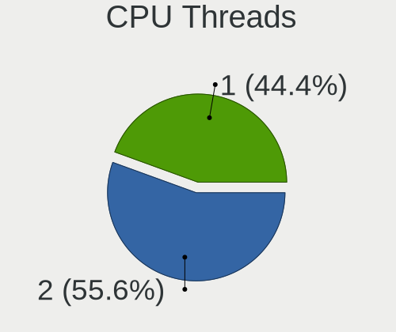
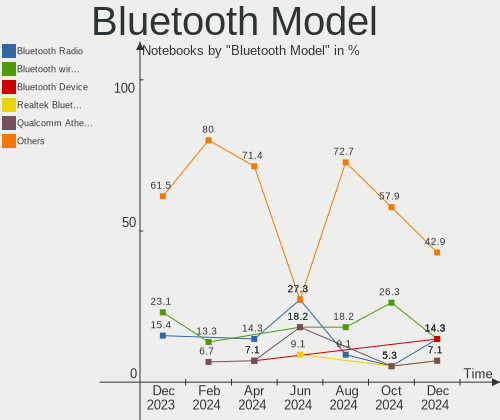
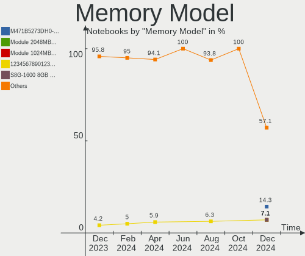
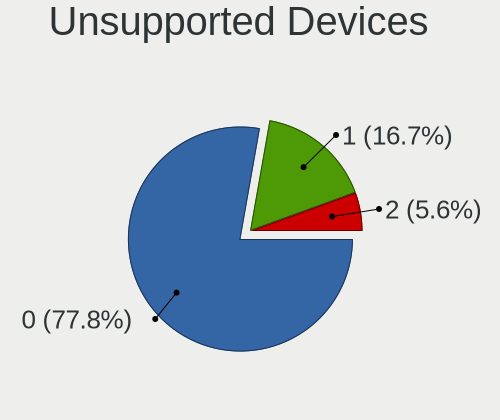
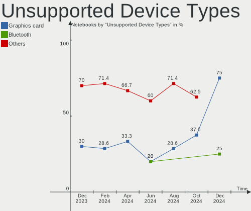

Lubuntu - Hardware Trends (Notebooks)
-------------------------------------

A project to identify most popular hardware characteristics and track their change
over time based on data collected by Linux users at https://Linux-Hardware.org.

Anyone can contribute to this report by the [hw-probe](https://github.com/linuxhw/hw-probe) tool:

    sudo -E hw-probe -all -upload

This report is for one last month. Overall report since the beginning of time: [TestCoverage](https://github.com/linuxhw/TestCoverage)

Period: Sep, 2022.

Contents
--------

* [ System ](#system)
  - [ OS                       ](#os)
  - [ OS Family                ](#os-family)
  - [ Kernel                   ](#kernel)
  - [ Kernel Family            ](#kernel-family)
  - [ Kernel Major Ver.        ](#kernel-major-ver)
  - [ Arch                     ](#arch)
  - [ DE                       ](#de)
  - [ Display Server           ](#display-server)
  - [ Display Manager          ](#display-manager)
  - [ OS Lang                  ](#os-lang)
  - [ Boot Mode                ](#boot-mode)
  - [ Filesystem               ](#filesystem)
  - [ Part. scheme             ](#part-scheme)
  - [ Dual Boot with Linux/BSD ](#dual-boot-with-linuxbsd)
  - [ Dual Boot (Win)          ](#dual-boot-win)

* [ Board ](#board)
  - [ Vendor                   ](#vendor)
  - [ Model                    ](#model)
  - [ Model Family             ](#model-family)
  - [ MFG Year                 ](#mfg-year)
  - [ Form Factor              ](#form-factor)
  - [ Secure Boot              ](#secure-boot)
  - [ Coreboot                 ](#coreboot)
  - [ RAM Size                 ](#ram-size)
  - [ RAM Used                 ](#ram-used)
  - [ Total Drives             ](#total-drives)
  - [ Has CD-ROM               ](#has-cd-rom)
  - [ Has Ethernet             ](#has-ethernet)
  - [ Has WiFi                 ](#has-wifi)
  - [ Has Bluetooth            ](#has-bluetooth)

* [ Location ](#location)
  - [ Country                  ](#country)
  - [ City                     ](#city)

* [ Drives ](#drives)
  - [ Drive Vendor             ](#drive-vendor)
  - [ Drive Model              ](#drive-model)
  - [ HDD Vendor               ](#hdd-vendor)
  - [ SSD Vendor               ](#ssd-vendor)
  - [ Drive Kind               ](#drive-kind)
  - [ Drive Connector          ](#drive-connector)
  - [ Drive Size               ](#drive-size)
  - [ Space Total              ](#space-total)
  - [ Space Used               ](#space-used)
  - [ Malfunc. Drives          ](#malfunc-drives)
  - [ Malfunc. Drive Vendor    ](#malfunc-drive-vendor)
  - [ Malfunc. HDD Vendor      ](#malfunc-hdd-vendor)
  - [ Malfunc. Drive Kind      ](#malfunc-drive-kind)
  - [ Failed Drives            ](#failed-drives)
  - [ Failed Drive Vendor      ](#failed-drive-vendor)
  - [ Drive Status             ](#drive-status)

* [ Storage controller ](#storage-controller)
  - [ Storage Vendor           ](#storage-vendor)
  - [ Storage Model            ](#storage-model)
  - [ Storage Kind             ](#storage-kind)

* [ Processor ](#processor)
  - [ CPU Vendor               ](#cpu-vendor)
  - [ CPU Model                ](#cpu-model)
  - [ CPU Model Family         ](#cpu-model-family)
  - [ CPU Cores                ](#cpu-cores)
  - [ CPU Sockets              ](#cpu-sockets)
  - [ CPU Threads              ](#cpu-threads)
  - [ CPU Op-Modes             ](#cpu-op-modes)
  - [ CPU Microcode            ](#cpu-microcode)
  - [ CPU Microarch            ](#cpu-microarch)

* [ Graphics ](#graphics)
  - [ GPU Vendor               ](#gpu-vendor)
  - [ GPU Model                ](#gpu-model)
  - [ GPU Combo                ](#gpu-combo)
  - [ GPU Driver               ](#gpu-driver)
  - [ GPU Memory               ](#gpu-memory)

* [ Monitor ](#monitor)
  - [ Monitor Vendor           ](#monitor-vendor)
  - [ Monitor Model            ](#monitor-model)
  - [ Monitor Resolution       ](#monitor-resolution)
  - [ Monitor Diagonal         ](#monitor-diagonal)
  - [ Monitor Width            ](#monitor-width)
  - [ Aspect Ratio             ](#aspect-ratio)
  - [ Monitor Area             ](#monitor-area)
  - [ Pixel Density            ](#pixel-density)
  - [ Multiple Monitors        ](#multiple-monitors)

* [ Network ](#network)
  - [ Net Controller Vendor    ](#net-controller-vendor)
  - [ Net Controller Model     ](#net-controller-model)
  - [ Wireless Vendor          ](#wireless-vendor)
  - [ Wireless Model           ](#wireless-model)
  - [ Ethernet Vendor          ](#ethernet-vendor)
  - [ Ethernet Model           ](#ethernet-model)
  - [ Net Controller Kind      ](#net-controller-kind)
  - [ Used Controller          ](#used-controller)
  - [ NICs                     ](#nics)
  - [ IPv6                     ](#ipv6)

* [ Bluetooth ](#bluetooth)
  - [ Bluetooth Vendor         ](#bluetooth-vendor)
  - [ Bluetooth Model          ](#bluetooth-model)

* [ Sound ](#sound)
  - [ Sound Vendor             ](#sound-vendor)
  - [ Sound Model              ](#sound-model)

* [ Memory ](#memory)
  - [ Memory Vendor            ](#memory-vendor)
  - [ Memory Model             ](#memory-model)
  - [ Memory Kind              ](#memory-kind)
  - [ Memory Form Factor       ](#memory-form-factor)
  - [ Memory Size              ](#memory-size)
  - [ Memory Speed             ](#memory-speed)

* [ Printers & scanners ](#printers--scanners)
  - [ Printer Vendor           ](#printer-vendor)
  - [ Printer Model            ](#printer-model)
  - [ Scanner Vendor           ](#scanner-vendor)
  - [ Scanner Model            ](#scanner-model)

* [ Camera ](#camera)
  - [ Camera Vendor            ](#camera-vendor)
  - [ Camera Model             ](#camera-model)

* [ Security ](#security)
  - [ Fingerprint Vendor       ](#fingerprint-vendor)
  - [ Fingerprint Model        ](#fingerprint-model)
  - [ Chipcard Vendor          ](#chipcard-vendor)
  - [ Chipcard Model           ](#chipcard-model)

* [ Unsupported ](#unsupported)
  - [ Unsupported Devices      ](#unsupported-devices)
  - [ Unsupported Device Types ](#unsupported-device-types)

System
------

OS
--

Installed operating systems

| Name          | Notebooks | Percent |
|---------------|-----------|---------|
| Lubuntu 22.04 | 13        | 81.25%  |
| Lubuntu 20.04 | 3         | 18.75%  |

OS Family
---------

OS without a version

| Name    | Notebooks | Percent |
|---------|-----------|---------|
| Lubuntu | 16        | 100%    |

Kernel
------

Version of the Linux kernel

| Version           | Notebooks | Percent |
|-------------------|-----------|---------|
| 5.15.0-47-generic | 5         | 31.25%  |
| 5.15.0-46-generic | 3         | 18.75%  |
| 5.15.0-48-generic | 2         | 12.5%   |
| 5.15.0-43-generic | 2         | 12.5%   |
| 5.4.0-54-generic  | 1         | 6.25%   |
| 5.19.8-xanmod1    | 1         | 6.25%   |
| 5.15.0-30-generic | 1         | 6.25%   |
| 5.15.0-25-generic | 1         | 6.25%   |

Kernel Family
-------------

Linux kernel without a distro release

| Version | Notebooks | Percent |
|---------|-----------|---------|
| 5.15.0  | 14        | 87.5%   |
| 5.4.0   | 1         | 6.25%   |
| 5.19.8  | 1         | 6.25%   |

Kernel Major Ver.
-----------------

Linux kernel major version

| Version | Notebooks | Percent |
|---------|-----------|---------|
| 5.15    | 14        | 87.5%   |
| 5.4     | 1         | 6.25%   |
| 5.19    | 1         | 6.25%   |

Arch
----

OS architecture (x86_64, i586, etc.)

| Name   | Notebooks | Percent |
|--------|-----------|---------|
| x86_64 | 16        | 100%    |

DE
--

Desktop Environment

| Name | Notebooks | Percent |
|------|-----------|---------|
| LXQt | 16        | 100%    |

Display Server
--------------

X11 or Wayland

| Name | Notebooks | Percent |
|------|-----------|---------|
| X11  | 16        | 100%    |

Display Manager
---------------

SDDM, LightDM, etc.

| Name    | Notebooks | Percent |
|---------|-----------|---------|
| SDDM    | 14        | 87.5%   |
| LightDM | 1         | 6.25%   |
| Unknown | 1         | 6.25%   |

OS Lang
-------

Language

| Lang  | Notebooks | Percent |
|-------|-----------|---------|
| en_US | 6         | 37.5%   |
| en_GB | 3         | 18.75%  |
| pt_BR | 2         | 12.5%   |
| fi_FI | 1         | 6.25%   |
| es_MX | 1         | 6.25%   |
| es_ES | 1         | 6.25%   |
| en_AG | 1         | 6.25%   |
| C     | 1         | 6.25%   |

Boot Mode
---------

EFI or BIOS

| Mode | Notebooks | Percent |
|------|-----------|---------|
| BIOS | 10        | 62.5%   |
| EFI  | 6         | 37.5%   |

Filesystem
----------

Type of filesystem

| Type    | Notebooks | Percent |
|---------|-----------|---------|
| Ext4    | 14        | 87.5%   |
| Overlay | 1         | 6.25%   |
| Ext2    | 1         | 6.25%   |

Part. scheme
------------

Scheme of partitioning

| Type    | Notebooks | Percent |
|---------|-----------|---------|
| Unknown | 8         | 50%     |
| GPT     | 6         | 37.5%   |
| MBR     | 2         | 12.5%   |

Dual Boot with Linux/BSD
------------------------

Hosting more than one Linux/BSD

| Dual boot | Notebooks | Percent |
|-----------|-----------|---------|
| No        | 14        | 87.5%   |
| Yes       | 2         | 12.5%   |

Dual Boot (Win)
---------------

Hosting Linux and Windows

| Dual boot | Notebooks | Percent |
|-----------|-----------|---------|
| No        | 14        | 87.5%   |
| Yes       | 2         | 12.5%   |

Board
-----

Vendor
------

Motherboard manufacturer

| Name             | Notebooks | Percent |
|------------------|-----------|---------|
| Lenovo           | 6         | 37.5%   |
| Dell             | 2         | 12.5%   |
| ASUSTek Computer | 2         | 12.5%   |
| Star Labs        | 1         | 6.25%   |
| Sony             | 1         | 6.25%   |
| Packard Bell     | 1         | 6.25%   |
| Hewlett-Packard  | 1         | 6.25%   |
| Gateway          | 1         | 6.25%   |
| Unknown          | 1         | 6.25%   |

Model
-----

Motherboard model

| Name                                     | Notebooks | Percent |
|------------------------------------------|-----------|---------|
| Star Labs Lite                           | 1         | 6.25%   |
| Sony SVE14A2V1EW                         | 1         | 6.25%   |
| Packard Bell EasyNote TS44HR             | 1         | 6.25%   |
| Lenovo Z70-80 80FG                       | 1         | 6.25%   |
| Lenovo ThinkPad X1 Carbon 2nd 20A8S0WE02 | 1         | 6.25%   |
| Lenovo ThinkPad T430 2342A19             | 1         | 6.25%   |
| Lenovo ThinkPad E550 20DF00CUFR          | 1         | 6.25%   |
| Lenovo IdeaPad Slim 1-14AST-05 81VS      | 1         | 6.25%   |
| Lenovo IdeaPad L340-15IRH Gaming 81LK    | 1         | 6.25%   |
| HP ProBook 4730s                         | 1         | 6.25%   |
| Gateway NE46R                            | 1         | 6.25%   |
| Dell XPS L322X                           | 1         | 6.25%   |
| Dell Inspiron 11-3168                    | 1         | 6.25%   |
| ASUS X451CA                              | 1         | 6.25%   |
| ASUS 1201N                               | 1         | 6.25%   |
| Unknown                                  | 1         | 6.25%   |

Model Family
------------

Motherboard model prefix

| Name                  | Notebooks | Percent |
|-----------------------|-----------|---------|
| Lenovo ThinkPad       | 3         | 18.75%  |
| Lenovo IdeaPad        | 2         | 12.5%   |
| Star Labs Lite        | 1         | 6.25%   |
| Sony SVE14A2V1EW      | 1         | 6.25%   |
| Packard Bell EasyNote | 1         | 6.25%   |
| Lenovo Z70-80         | 1         | 6.25%   |
| HP ProBook            | 1         | 6.25%   |
| Gateway NE46R         | 1         | 6.25%   |
| Dell XPS              | 1         | 6.25%   |
| Dell Inspiron         | 1         | 6.25%   |
| ASUS X451CA           | 1         | 6.25%   |
| ASUS 1201N            | 1         | 6.25%   |
| Unknown               | 1         | 6.25%   |

MFG Year
--------

Motherboard manufacture year

| Year | Notebooks | Percent |
|------|-----------|---------|
| 2014 | 3         | 18.75%  |
| 2012 | 3         | 18.75%  |
| 2019 | 2         | 12.5%   |
| 2013 | 2         | 12.5%   |
| 2011 | 2         | 12.5%   |
| 2021 | 1         | 6.25%   |
| 2020 | 1         | 6.25%   |
| 2015 | 1         | 6.25%   |
| 2010 | 1         | 6.25%   |

Form Factor
-----------

Physical design of the computer

| Name     | Notebooks | Percent |
|----------|-----------|---------|
| Notebook | 16        | 100%    |

Secure Boot
-----------

Enabled or disabled

| State    | Notebooks | Percent |
|----------|-----------|---------|
| Disabled | 16        | 100%    |

Coreboot
--------

Have coreboot on board

| Used | Notebooks | Percent |
|------|-----------|---------|
| No   | 16        | 100%    |

RAM Size
--------

Total RAM memory

| Size in GB | Notebooks | Percent |
|------------|-----------|---------|
| 4.01-8.0   | 7         | 43.75%  |
| 3.01-4.0   | 3         | 18.75%  |
| 2.01-3.0   | 2         | 12.5%   |
| 8.01-16.0  | 2         | 12.5%   |
| 16.01-24.0 | 1         | 6.25%   |
| 1.01-2.0   | 1         | 6.25%   |

RAM Used
--------

Used RAM memory

| Used GB  | Notebooks | Percent |
|----------|-----------|---------|
| 1.01-2.0 | 7         | 43.75%  |
| 2.01-3.0 | 4         | 25%     |
| 3.01-4.0 | 2         | 12.5%   |
| 0.51-1.0 | 2         | 12.5%   |
| 4.01-8.0 | 1         | 6.25%   |

Total Drives
------------

Number of drives on board

| Drives | Notebooks | Percent |
|--------|-----------|---------|
| 1      | 11        | 68.75%  |
| 2      | 4         | 25%     |
| 0      | 1         | 6.25%   |

Has CD-ROM
----------

Has CD-ROM on board

| Presented | Notebooks | Percent |
|-----------|-----------|---------|
| No        | 9         | 56.25%  |
| Yes       | 7         | 43.75%  |

Has Ethernet
------------

Has Ethernet on board

| Presented | Notebooks | Percent |
|-----------|-----------|---------|
| Yes       | 12        | 75%     |
| No        | 4         | 25%     |

Has WiFi
--------

Has WiFi module

| Presented | Notebooks | Percent |
|-----------|-----------|---------|
| Yes       | 16        | 100%    |

Has Bluetooth
-------------

Has Bluetooth module

| Presented | Notebooks | Percent |
|-----------|-----------|---------|
| Yes       | 12        | 75%     |
| No        | 4         | 25%     |

Location
--------

Country
-------

Geographic location (country)

| Country     | Notebooks | Percent |
|-------------|-----------|---------|
| USA         | 3         | 18.75%  |
| UK          | 3         | 18.75%  |
| Brazil      | 2         | 12.5%   |
| Vietnam     | 1         | 6.25%   |
| Spain       | 1         | 6.25%   |
| Netherlands | 1         | 6.25%   |
| Mexico      | 1         | 6.25%   |
| Kenya       | 1         | 6.25%   |
| Indonesia   | 1         | 6.25%   |
| Finland     | 1         | 6.25%   |
| Belgium     | 1         | 6.25%   |

City
----

Geographic location (city)

| City         | Notebooks | Percent |
|--------------|-----------|---------|
| Yorkville    | 1         | 6.25%   |
| Surabaya     | 1         | 6.25%   |
| Runcorn      | 1         | 6.25%   |
| Porto Alegre | 1         | 6.25%   |
| Nairobi      | 1         | 6.25%   |
| Millville    | 1         | 6.25%   |
| Menen        | 1         | 6.25%   |
| Hengelo      | 1         | 6.25%   |
| Helsinki     | 1         | 6.25%   |
| Hanoi        | 1         | 6.25%   |
| Exeter       | 1         | 6.25%   |
| Croydon      | 1         | 6.25%   |
| Chalco       | 1         | 6.25%   |
| Cambridge    | 1         | 6.25%   |
| Brasília    | 1         | 6.25%   |
| Barcelona    | 1         | 6.25%   |

Drives
------

Drive Vendor
------------

Hard drive vendors

| Vendor              | Notebooks | Drives | Percent |
|---------------------|-----------|--------|---------|
| Unknown             | 3         | 5      | 17.65%  |
| Toshiba             | 3         | 3      | 17.65%  |
| Seagate             | 3         | 3      | 17.65%  |
| WDC                 | 2         | 2      | 11.76%  |
| Kingston            | 2         | 2      | 11.76%  |
| UMIS                | 1         | 1      | 5.88%   |
| Star                | 1         | 1      | 5.88%   |
| SanDisk             | 1         | 1      | 5.88%   |
| Samsung Electronics | 1         | 1      | 5.88%   |

Drive Model
-----------

Hard drive models

| Model                             | Notebooks | Percent |
|-----------------------------------|-----------|---------|
| WDC WDS500G2B0A 500GB SSD         | 1         | 5.26%   |
| WDC WD3200BPVT-22JJ5T0 320GB      | 1         | 5.26%   |
| Unknown SD/MMC/MS PRO 2GB         | 1         | 5.26%   |
| Unknown SC64G  64GB               | 1         | 5.26%   |
| Unknown MMC64G  64GB              | 1         | 5.26%   |
| Unknown ISOCOM  64GB              | 1         | 5.26%   |
| Unknown ASTC  8GB                 | 1         | 5.26%   |
| UMIS RPFTJ256PDD2MWX 256GB        | 1         | 5.26%   |
| Toshiba THNSNJ128GCSY 128GB SSD   | 1         | 5.26%   |
| Toshiba MQ01ABF050 500GB          | 1         | 5.26%   |
| Toshiba MK3261GSYN 320GB          | 1         | 5.26%   |
| Star Drive SATA SSD 240GB         | 1         | 5.26%   |
| Seagate ST9500325AS 500GB         | 1         | 5.26%   |
| Seagate ST320LT020-9YG142 320GB   | 1         | 5.26%   |
| Seagate ST1000LM014-SSHD-8GB      | 1         | 5.26%   |
| SanDisk SD6SN1M128G1002 128GB SSD | 1         | 5.26%   |
| Samsung SSD 850 EVO 250GB         | 1         | 5.26%   |
| Kingston SA400S37240GB SSD        | 1         | 5.26%   |
| Kingston SA400S37240G 240GB SSD   | 1         | 5.26%   |

HDD Vendor
----------

Hard disk drive vendors

| Vendor  | Notebooks | Drives | Percent |
|---------|-----------|--------|---------|
| Seagate | 3         | 3      | 42.86%  |
| Toshiba | 2         | 2      | 28.57%  |
| WDC     | 1         | 1      | 14.29%  |
| Unknown | 1         | 1      | 14.29%  |

SSD Vendor
----------

Solid state drive vendors

| Vendor              | Notebooks | Drives | Percent |
|---------------------|-----------|--------|---------|
| Kingston            | 2         | 2      | 28.57%  |
| WDC                 | 1         | 1      | 14.29%  |
| Toshiba             | 1         | 1      | 14.29%  |
| Star                | 1         | 1      | 14.29%  |
| SanDisk             | 1         | 1      | 14.29%  |
| Samsung Electronics | 1         | 1      | 14.29%  |

Drive Kind
----------

HDD or SSD

| Kind | Notebooks | Drives | Percent |
|------|-----------|--------|---------|
| SSD  | 7         | 7      | 38.89%  |
| HDD  | 7         | 7      | 38.89%  |
| MMC  | 3         | 4      | 16.67%  |
| NVMe | 1         | 1      | 5.56%   |

Drive Connector
---------------

SATA, SAS, NVMe, etc.

| Type | Notebooks | Drives | Percent |
|------|-----------|--------|---------|
| SATA | 12        | 13     | 70.59%  |
| MMC  | 3         | 4      | 17.65%  |
| SAS  | 1         | 1      | 5.88%   |
| NVMe | 1         | 1      | 5.88%   |

Drive Size
----------

Size of hard drive

| Size in TB | Notebooks | Drives | Percent |
|------------|-----------|--------|---------|
| 0.01-0.5   | 13        | 13     | 92.86%  |
| 0.51-1.0   | 1         | 1      | 7.14%   |

Space Total
-----------

Amount of disk space available on the file system

| Size in GB | Notebooks | Percent |
|------------|-----------|---------|
| 101-250    | 9         | 56.25%  |
| 251-500    | 4         | 25%     |
| 1-20       | 1         | 6.25%   |
| 501-1000   | 1         | 6.25%   |
| 51-100     | 1         | 6.25%   |

Space Used
----------

Amount of used disk space

| Used GB | Notebooks | Percent |
|---------|-----------|---------|
| 21-50   | 7         | 43.75%  |
| 1-20    | 4         | 25%     |
| 101-250 | 3         | 18.75%  |
| 251-500 | 1         | 6.25%   |
| 51-100  | 1         | 6.25%   |

Malfunc. Drives
---------------

Drive models with a malfunction

| Model                           | Notebooks | Drives | Percent |
|---------------------------------|-----------|--------|---------|
| Seagate ST9500325AS 500GB       | 1         | 1      | 50%     |
| Seagate ST320LT020-9YG142 320GB | 1         | 1      | 50%     |

Malfunc. Drive Vendor
---------------------

Vendors of faulty drives

| Vendor  | Notebooks | Drives | Percent |
|---------|-----------|--------|---------|
| Seagate | 2         | 2      | 100%    |

Malfunc. HDD Vendor
-------------------

Vendors of faulty HDD drives

| Vendor  | Notebooks | Drives | Percent |
|---------|-----------|--------|---------|
| Seagate | 2         | 2      | 100%    |

Malfunc. Drive Kind
-------------------

Kinds of faulty drives

| Kind | Notebooks | Drives | Percent |
|------|-----------|--------|---------|
| HDD  | 2         | 2      | 100%    |

Failed Drives
-------------

Failed drive models

Zero info for selected period =(

Failed Drive Vendor
-------------------

Failed drive vendors

Zero info for selected period =(

Drive Status
------------

Number of failed and malfunc. drives

| Status   | Notebooks | Drives | Percent |
|----------|-----------|--------|---------|
| Detected | 11        | 14     | 68.75%  |
| Works    | 3         | 3      | 18.75%  |
| Malfunc  | 2         | 2      | 12.5%   |

Storage controller
------------------

Storage Vendor
--------------

Storage controller vendors

| Vendor                  | Notebooks | Percent |
|-------------------------|-----------|---------|
| Intel                   | 14        | 82.35%  |
| Union Memory (Shenzhen) | 1         | 5.88%   |
| Nvidia                  | 1         | 5.88%   |
| AMD                     | 1         | 5.88%   |

Storage Model
-------------

Storage controller models

| Model                                                                            | Notebooks | Percent |
|----------------------------------------------------------------------------------|-----------|---------|
| Intel 7 Series Chipset Family 6-port SATA Controller [AHCI mode]                 | 4         | 22.22%  |
| Intel Wildcat Point-LP SATA Controller [AHCI Mode]                               | 2         | 11.11%  |
| Intel 6 Series/C200 Series Chipset Family 6 port Mobile SATA AHCI Controller     | 2         | 11.11%  |
| Union Memory (Shenzhen) Non-Volatile memory controller                           | 1         | 5.56%   |
| Nvidia MCP79 SATA Controller                                                     | 1         | 5.56%   |
| Intel Celeron/Pentium Silver Processor SATA Controller                           | 1         | 5.56%   |
| Intel Celeron N3350/Pentium N4200/Atom E3900 Series SATA AHCI Controller         | 1         | 5.56%   |
| Intel Cannon Lake Mobile PCH SATA AHCI Controller                                | 1         | 5.56%   |
| Intel Atom/Celeron/Pentium Processor x5-E8000/J3xxx/N3xxx Series SATA Controller | 1         | 5.56%   |
| Intel 8 Series SATA Controller 1 [AHCI mode]                                     | 1         | 5.56%   |
| Intel 7 Series Chipset Family 4-port SATA Controller [IDE mode]                  | 1         | 5.56%   |
| Intel 7 Series Chipset Family 2-port SATA Controller [IDE mode]                  | 1         | 5.56%   |
| AMD FCH SATA Controller [AHCI mode]                                              | 1         | 5.56%   |

Storage Kind
------------

Kind of storage controller (IDE, SATA, NVMe, SAS, ...)

| Kind | Notebooks | Percent |
|------|-----------|---------|
| SATA | 14        | 82.35%  |
| IDE  | 2         | 11.76%  |
| NVMe | 1         | 5.88%   |

Processor
---------

CPU Vendor
----------

Processor vendors

| Vendor | Notebooks | Percent |
|--------|-----------|---------|
| Intel  | 15        | 93.75%  |
| AMD    | 1         | 6.25%   |

CPU Model
---------

Processor models

| Model                                         | Notebooks | Percent |
|-----------------------------------------------|-----------|---------|
| Intel Core i5-5200U CPU @ 2.20GHz             | 2         | 12.5%   |
| Intel Pentium Silver N5000 CPU @ 1.10GHz      | 1         | 6.25%   |
| Intel Pentium CPU N3710 @ 1.60GHz             | 1         | 6.25%   |
| Intel Core i7-4600U CPU @ 2.10GHz             | 1         | 6.25%   |
| Intel Core i7-3537U CPU @ 2.00GHz             | 1         | 6.25%   |
| Intel Core i5-9300HF CPU @ 2.40GHz            | 1         | 6.25%   |
| Intel Core i5-3320M CPU @ 2.60GHz             | 1         | 6.25%   |
| Intel Core i5-3210M CPU @ 2.50GHz             | 1         | 6.25%   |
| Intel Core i3-2375M CPU @ 1.50GHz             | 1         | 6.25%   |
| Intel Core i3-2310M CPU @ 2.10GHz             | 1         | 6.25%   |
| Intel Celeron CPU N3450 @ 1.10GHz             | 1         | 6.25%   |
| Intel Celeron CPU B815 @ 1.60GHz              | 1         | 6.25%   |
| Intel Celeron CPU 1005M @ 1.90GHz             | 1         | 6.25%   |
| Intel Atom CPU 330 @ 1.60GHz                  | 1         | 6.25%   |
| AMD A6-9220e RADEON R4, 5 COMPUTE CORES 2C+3G | 1         | 6.25%   |

CPU Model Family
----------------

Processor model prefix

| Model                | Notebooks | Percent |
|----------------------|-----------|---------|
| Intel Core i5        | 5         | 31.25%  |
| Intel Celeron        | 3         | 18.75%  |
| Intel Core i7        | 2         | 12.5%   |
| Intel Core i3        | 2         | 12.5%   |
| Intel Pentium Silver | 1         | 6.25%   |
| Intel Pentium        | 1         | 6.25%   |
| Intel Atom           | 1         | 6.25%   |
| AMD A6               | 1         | 6.25%   |

CPU Cores
---------

Number of processor cores

| Number | Notebooks | Percent |
|--------|-----------|---------|
| 2      | 12        | 75%     |
| 4      | 4         | 25%     |

CPU Sockets
-----------

Number of sockets

| Number | Notebooks | Percent |
|--------|-----------|---------|
| 1      | 16        | 100%    |

CPU Threads
-----------

Threads per core (Hyper-Threading)

| Number | Notebooks | Percent |
|--------|-----------|---------|
| 2      | 10        | 62.5%   |
| 1      | 6         | 37.5%   |

CPU Op-Modes
------------

CPU Operation Modes (32-bit, 64-bit)

| Op mode        | Notebooks | Percent |
|----------------|-----------|---------|
| 32-bit, 64-bit | 16        | 100%    |

CPU Microcode
-------------

Microcode number

| Number     | Notebooks | Percent |
|------------|-----------|---------|
| Unknown    | 8         | 50%     |
| 0x306a9    | 2         | 12.5%   |
| 0x206a7    | 2         | 12.5%   |
| 0x906ed    | 1         | 6.25%   |
| 0x706a1    | 1         | 6.25%   |
| 0x506c9    | 1         | 6.25%   |
| 0x06006705 | 1         | 6.25%   |

CPU Microarch
-------------

Microarchitecture

| Name          | Notebooks | Percent |
|---------------|-----------|---------|
| IvyBridge     | 4         | 25%     |
| SandyBridge   | 3         | 18.75%  |
| Broadwell     | 2         | 12.5%   |
| Silvermont    | 1         | 6.25%   |
| KabyLake      | 1         | 6.25%   |
| Haswell       | 1         | 6.25%   |
| Goldmont plus | 1         | 6.25%   |
| Goldmont      | 1         | 6.25%   |
| Excavator     | 1         | 6.25%   |
| Bonnell       | 1         | 6.25%   |

Graphics
--------

GPU Vendor
----------

Vendors of graphics cards

| Vendor | Notebooks | Percent |
|--------|-----------|---------|
| Intel  | 13        | 68.42%  |
| AMD    | 4         | 21.05%  |
| Nvidia | 2         | 10.53%  |

GPU Model
---------

Graphics card models

| Model                                                                                    | Notebooks | Percent |
|------------------------------------------------------------------------------------------|-----------|---------|
| Intel 3rd Gen Core processor Graphics Controller                                         | 4         | 21.05%  |
| Intel 2nd Generation Core Processor Family Integrated Graphics Controller                | 3         | 15.79%  |
| Intel HD Graphics 5500                                                                   | 2         | 10.53%  |
| Nvidia GP107M [GeForce GTX 1050 3 GB Max-Q]                                              | 1         | 5.26%   |
| Nvidia C79 [GeForce 9400M / ION]                                                         | 1         | 5.26%   |
| Intel HD Graphics 500                                                                    | 1         | 5.26%   |
| Intel Haswell-ULT Integrated Graphics Controller                                         | 1         | 5.26%   |
| Intel GeminiLake [UHD Graphics 605]                                                      | 1         | 5.26%   |
| Intel Atom/Celeron/Pentium Processor x5-E8000/J3xxx/N3xxx Integrated Graphics Controller | 1         | 5.26%   |
| AMD Thames [Radeon HD 7500M/7600M Series]                                                | 1         | 5.26%   |
| AMD Stoney [Radeon R2/R3/R4/R5 Graphics]                                                 | 1         | 5.26%   |
| AMD Seymour [Radeon HD 6400M/7400M Series]                                               | 1         | 5.26%   |
| AMD Opal XT [Radeon R7 M265/M365X/M465]                                                  | 1         | 5.26%   |

GPU Combo
---------

Combinations of graphics cards

| Name        | Notebooks | Percent |
|-------------|-----------|---------|
| 1 x Intel   | 10        | 62.5%   |
| Intel + AMD | 3         | 18.75%  |
| 1 x Nvidia  | 2         | 12.5%   |
| 1 x AMD     | 1         | 6.25%   |

GPU Driver
----------

Free vs proprietary

| Driver      | Notebooks | Percent |
|-------------|-----------|---------|
| Free        | 14        | 87.5%   |
| Proprietary | 2         | 12.5%   |

GPU Memory
----------

Total video memory

| Size in GB | Notebooks | Percent |
|------------|-----------|---------|
| Unknown    | 13        | 81.25%  |
| 0.01-0.5   | 2         | 12.5%   |
| 2.01-3.0   | 1         | 6.25%   |

Monitor
-------

Monitor Vendor
--------------

Monitor vendors

| Vendor              | Notebooks | Percent |
|---------------------|-----------|---------|
| LG Display          | 4         | 18.18%  |
| Chimei Innolux      | 4         | 18.18%  |
| AU Optronics        | 4         | 18.18%  |
| Samsung Electronics | 2         | 9.09%   |
| ViewSonic           | 1         | 4.55%   |
| PANDA               | 1         | 4.55%   |
| JVC                 | 1         | 4.55%   |
| HannStar Display    | 1         | 4.55%   |
| Goldstar            | 1         | 4.55%   |
| Dell                | 1         | 4.55%   |
| BOE                 | 1         | 4.55%   |
| BenQ                | 1         | 4.55%   |

Monitor Model
-------------

Monitor models

| Model                                                                | Notebooks | Percent |
|----------------------------------------------------------------------|-----------|---------|
| ViewSonic VA2932 SERIES VSCFF3B 2560x1080 673x284mm 28.8-inch        | 1         | 4.55%   |
| Samsung Electronics SyncMaster SAM052A 1920x1080 510x287mm 23.0-inch | 1         | 4.55%   |
| Samsung Electronics LCD Monitor SEC3254 1600x900 367x230mm 17.1-inch | 1         | 4.55%   |
| PANDA LC116LF3L03 NCP000A 1920x1080 256x144mm 11.6-inch              | 1         | 4.55%   |
| LG Display LCD Monitor LGD0469 1920x1080 382x215mm 17.3-inch         | 1         | 4.55%   |
| LG Display LCD Monitor LGD0419 2560x1440 310x174mm 14.0-inch         | 1         | 4.55%   |
| LG Display LCD Monitor LGD033F 1366x768 310x174mm 14.0-inch          | 1         | 4.55%   |
| LG Display LCD Monitor LGD0335 1366x768 310x174mm 14.0-inch          | 1         | 4.55%   |
| JVC FPDEUFY2 JVC221F 1920x1080                                       | 1         | 4.55%   |
| HannStar Display LCD Monitor HSD121PHW1 1366x768                     | 1         | 4.55%   |
| Goldstar E1940 GSM4BD6 1360x768 406x229mm 18.4-inch                  | 1         | 4.55%   |
| Dell P2319H DELD0D7 1920x1080 509x286mm 23.0-inch                    | 1         | 4.55%   |
| Chimei Innolux LCD Monitor CMN15E7 1920x1080 344x193mm 15.5-inch     | 1         | 4.55%   |
| Chimei Innolux LCD Monitor CMN1470 1366x768 309x174mm 14.0-inch      | 1         | 4.55%   |
| Chimei Innolux LCD Monitor CMN1345 1920x1080 294x165mm 13.3-inch     | 1         | 4.55%   |
| Chimei Innolux LCD Monitor CMN1132 1366x768 256x144mm 11.6-inch      | 1         | 4.55%   |
| BOE LCD Monitor BOE075A 1366x768 309x173mm 13.9-inch                 | 1         | 4.55%   |
| BenQ BenQG2222HDL BNQ785A 1920x1080 478x269mm 21.6-inch              | 1         | 4.55%   |
| AU Optronics LCD Monitor AUO36ED 1920x1080 344x193mm 15.5-inch       | 1         | 4.55%   |
| AU Optronics LCD Monitor AUO26EC 1366x768 344x193mm 15.5-inch        | 1         | 4.55%   |
| AU Optronics LCD Monitor AUO183C 1366x768 309x173mm 13.9-inch        | 1         | 4.55%   |
| AU Optronics LCD Monitor AUO105C 1366x768 256x144mm 11.6-inch        | 1         | 4.55%   |

Monitor Resolution
------------------

Monitor screen resolution

| Resolution      | Notebooks | Percent |
|-----------------|-----------|---------|
| 1366x768 (WXGA) | 9         | 45%     |
| 1920x1080 (FHD) | 7         | 35%     |
| 2560x1440 (QHD) | 1         | 5%      |
| 2560x1080       | 1         | 5%      |
| 1600x900 (HD+)  | 1         | 5%      |
| 1360x768        | 1         | 5%      |

Monitor Diagonal
----------------

Diagonal size in inches

| Inches  | Notebooks | Percent |
|---------|-----------|---------|
| 14      | 4         | 18.18%  |
| 15      | 3         | 13.64%  |
| 13      | 3         | 13.64%  |
| 11      | 3         | 13.64%  |
| 23      | 2         | 9.09%   |
| 17      | 2         | 9.09%   |
| Unknown | 2         | 9.09%   |
| 28      | 1         | 4.55%   |
| 21      | 1         | 4.55%   |
| 18      | 1         | 4.55%   |

Monitor Width
-------------

Physical width

| Width in mm | Notebooks | Percent |
|-------------|-----------|---------|
| 301-350     | 9         | 40.91%  |
| 201-300     | 4         | 18.18%  |
| 501-600     | 2         | 9.09%   |
| 401-500     | 2         | 9.09%   |
| 351-400     | 2         | 9.09%   |
| Unknown     | 2         | 9.09%   |
| 601-700     | 1         | 4.55%   |

Aspect Ratio
------------

Proportional relationship between the width and the height

| Ratio   | Notebooks | Percent |
|---------|-----------|---------|
| 16/9    | 14        | 82.35%  |
| 21/9    | 1         | 5.88%   |
| 16/10   | 1         | 5.88%   |
| Unknown | 1         | 5.88%   |

Monitor Area
------------

Area in inch²

| Area in inch² | Notebooks | Percent |
|----------------|-----------|---------|
| 81-90          | 6         | 27.27%  |
| 51-60          | 3         | 13.64%  |
| 201-250        | 3         | 13.64%  |
| 101-110        | 3         | 13.64%  |
| Unknown        | 2         | 9.09%   |
| 71-80          | 1         | 4.55%   |
| 251-300        | 1         | 4.55%   |
| 141-150        | 1         | 4.55%   |
| 131-140        | 1         | 4.55%   |
| 121-130        | 1         | 4.55%   |

Pixel Density
-------------

Pixels per inch

| Density | Notebooks | Percent |
|---------|-----------|---------|
| 101-120 | 8         | 36.36%  |
| 121-160 | 5         | 22.73%  |
| 51-100  | 4         | 18.18%  |
| 161-240 | 3         | 13.64%  |
| Unknown | 2         | 9.09%   |

Multiple Monitors
-----------------

Total monitors connected

| Total | Notebooks | Percent |
|-------|-----------|---------|
| 1     | 11        | 68.75%  |
| 2     | 4         | 25%     |
| 3     | 1         | 6.25%   |

Network
-------

Net Controller Vendor
---------------------

Controller vendors

| Vendor                | Notebooks | Percent |
|-----------------------|-----------|---------|
| Realtek Semiconductor | 10        | 37.04%  |
| Intel                 | 8         | 29.63%  |
| Qualcomm Atheros      | 6         | 22.22%  |
| TP-Link               | 1         | 3.7%    |
| Microsoft             | 1         | 3.7%    |
| Broadcom              | 1         | 3.7%    |

Net Controller Model
--------------------

Controller models

| Model                                                             | Notebooks | Percent |
|-------------------------------------------------------------------|-----------|---------|
| Realtek RTL8111/8168/8411 PCI Express Gigabit Ethernet Controller | 5         | 16.67%  |
| Qualcomm Atheros AR9485 Wireless Network Adapter                  | 2         | 6.67%   |
| Intel Wireless 3160                                               | 2         | 6.67%   |
| TP-Link UE300 10/100/1000 LAN (ethernet mode) [Realtek RTL8153]   | 1         | 3.33%   |
| Realtek RTL8822CE 802.11ac PCIe Wireless Network Adapter          | 1         | 3.33%   |
| Realtek RTL8191SEvA Wireless LAN Controller                       | 1         | 3.33%   |
| Realtek RTL8188EUS 802.11n Wireless Network Adapter               | 1         | 3.33%   |
| Realtek RTL810xE PCI Express Fast Ethernet controller             | 1         | 3.33%   |
| Realtek 802.11n WLAN Adapter                                      | 1         | 3.33%   |
| Qualcomm Atheros QCA9565 / AR9565 Wireless Network Adapter        | 1         | 3.33%   |
| Qualcomm Atheros AR9287 Wireless Network Adapter (PCI-Express)    | 1         | 3.33%   |
| Qualcomm Atheros AR9285 Wireless Network Adapter (PCI-Express)    | 1         | 3.33%   |
| Qualcomm Atheros AR8132 Fast Ethernet                             | 1         | 3.33%   |
| Microsoft Xbox 360 Wireless Adapter                               | 1         | 3.33%   |
| Intel Wireless 7260                                               | 1         | 3.33%   |
| Intel Gemini Lake PCH CNVi WiFi                                   | 1         | 3.33%   |
| Intel Ethernet Connection I218-LM                                 | 1         | 3.33%   |
| Intel Ethernet Connection (3) I218-V                              | 1         | 3.33%   |
| Intel Centrino Wireless-N 2230                                    | 1         | 3.33%   |
| Intel Centrino Advanced-N 6235                                    | 1         | 3.33%   |
| Intel Centrino Advanced-N 6205 [Taylor Peak]                      | 1         | 3.33%   |
| Intel Cannon Lake PCH CNVi WiFi                                   | 1         | 3.33%   |
| Intel 82579LM Gigabit Network Connection (Lewisville)             | 1         | 3.33%   |
| Broadcom NetLink BCM57785 Gigabit Ethernet PCIe                   | 1         | 3.33%   |

Wireless Vendor
---------------

Wireless vendors

| Vendor                | Notebooks | Percent |
|-----------------------|-----------|---------|
| Intel                 | 8         | 44.44%  |
| Qualcomm Atheros      | 5         | 27.78%  |
| Realtek Semiconductor | 4         | 22.22%  |
| Microsoft             | 1         | 5.56%   |

Wireless Model
--------------

Wireless models

| Model                                                          | Notebooks | Percent |
|----------------------------------------------------------------|-----------|---------|
| Qualcomm Atheros AR9485 Wireless Network Adapter               | 2         | 11.11%  |
| Intel Wireless 3160                                            | 2         | 11.11%  |
| Realtek RTL8822CE 802.11ac PCIe Wireless Network Adapter       | 1         | 5.56%   |
| Realtek RTL8191SEvA Wireless LAN Controller                    | 1         | 5.56%   |
| Realtek RTL8188EUS 802.11n Wireless Network Adapter            | 1         | 5.56%   |
| Realtek 802.11n WLAN Adapter                                   | 1         | 5.56%   |
| Qualcomm Atheros QCA9565 / AR9565 Wireless Network Adapter     | 1         | 5.56%   |
| Qualcomm Atheros AR9287 Wireless Network Adapter (PCI-Express) | 1         | 5.56%   |
| Qualcomm Atheros AR9285 Wireless Network Adapter (PCI-Express) | 1         | 5.56%   |
| Microsoft Xbox 360 Wireless Adapter                            | 1         | 5.56%   |
| Intel Wireless 7260                                            | 1         | 5.56%   |
| Intel Gemini Lake PCH CNVi WiFi                                | 1         | 5.56%   |
| Intel Centrino Wireless-N 2230                                 | 1         | 5.56%   |
| Intel Centrino Advanced-N 6235                                 | 1         | 5.56%   |
| Intel Centrino Advanced-N 6205 [Taylor Peak]                   | 1         | 5.56%   |
| Intel Cannon Lake PCH CNVi WiFi                                | 1         | 5.56%   |

Ethernet Vendor
---------------

Ethernet vendors

| Vendor                | Notebooks | Percent |
|-----------------------|-----------|---------|
| Realtek Semiconductor | 6         | 50%     |
| Intel                 | 3         | 25%     |
| TP-Link               | 1         | 8.33%   |
| Qualcomm Atheros      | 1         | 8.33%   |
| Broadcom              | 1         | 8.33%   |

Ethernet Model
--------------

Ethernet models

| Model                                                             | Notebooks | Percent |
|-------------------------------------------------------------------|-----------|---------|
| Realtek RTL8111/8168/8411 PCI Express Gigabit Ethernet Controller | 5         | 41.67%  |
| TP-Link UE300 10/100/1000 LAN (ethernet mode) [Realtek RTL8153]   | 1         | 8.33%   |
| Realtek RTL810xE PCI Express Fast Ethernet controller             | 1         | 8.33%   |
| Qualcomm Atheros AR8132 Fast Ethernet                             | 1         | 8.33%   |
| Intel Ethernet Connection I218-LM                                 | 1         | 8.33%   |
| Intel Ethernet Connection (3) I218-V                              | 1         | 8.33%   |
| Intel 82579LM Gigabit Network Connection (Lewisville)             | 1         | 8.33%   |
| Broadcom NetLink BCM57785 Gigabit Ethernet PCIe                   | 1         | 8.33%   |

Net Controller Kind
-------------------

Ethernet, WiFi or modem

| Kind     | Notebooks | Percent |
|----------|-----------|---------|
| WiFi     | 16        | 57.14%  |
| Ethernet | 12        | 42.86%  |

Used Controller
---------------

Currently used network controller

| Kind     | Notebooks | Percent |
|----------|-----------|---------|
| WiFi     | 12        | 75%     |
| Ethernet | 4         | 25%     |

NICs
----

Total network controllers on board

| Total | Notebooks | Percent |
|-------|-----------|---------|
| 2     | 11        | 68.75%  |
| 1     | 4         | 25%     |
| 0     | 1         | 6.25%   |

IPv6
----

IPv6 vs IPv4

| Used | Notebooks | Percent |
|------|-----------|---------|
| No   | 14        | 87.5%   |
| Yes  | 2         | 12.5%   |

Bluetooth
---------

Bluetooth Vendor
----------------

Controller vendors

| Vendor                          | Notebooks | Percent |
|---------------------------------|-----------|---------|
| Intel                           | 7         | 53.85%  |
| Realtek Semiconductor           | 2         | 15.38%  |
| Qualcomm Atheros Communications | 2         | 15.38%  |
| Broadcom                        | 1         | 7.69%   |
| ASUSTek Computer                | 1         | 7.69%   |

Bluetooth Model
---------------

Controller models

| Model                                          | Notebooks | Percent |
|------------------------------------------------|-----------|---------|
| Intel Bluetooth wireless interface             | 3         | 23.08%  |
| Realtek Bluetooth Radio                        | 2         | 15.38%  |
| Intel Centrino Bluetooth Wireless Transceiver  | 2         | 15.38%  |
| Intel Bluetooth 9460/9560 Jefferson Peak (JfP) | 2         | 15.38%  |
| Qualcomm Atheros  Bluetooth Device             | 1         | 7.69%   |
| Qualcomm Atheros AR3011 Bluetooth              | 1         | 7.69%   |
| Broadcom BCM20702 Bluetooth 4.0 [ThinkPad]     | 1         | 7.69%   |
| ASUS BT-270 Bluetooth Adapter                  | 1         | 7.69%   |

Sound
-----

Sound Vendor
------------

Sound card vendors

| Vendor            | Notebooks | Percent |
|-------------------|-----------|---------|
| Intel             | 14        | 73.68%  |
| Nvidia            | 2         | 10.53%  |
| Texas Instruments | 1         | 5.26%   |
| JMTek             | 1         | 5.26%   |
| AMD               | 1         | 5.26%   |

Sound Model
-----------

Sound card models

| Model                                                                                             | Notebooks | Percent |
|---------------------------------------------------------------------------------------------------|-----------|---------|
| Intel 7 Series/C216 Chipset Family High Definition Audio Controller                               | 5         | 21.74%  |
| Intel Wildcat Point-LP High Definition Audio Controller                                           | 2         | 8.7%    |
| Intel Broadwell-U Audio Controller                                                                | 2         | 8.7%    |
| Intel 6 Series/C200 Series Chipset Family High Definition Audio Controller                        | 2         | 8.7%    |
| Texas Instruments PCM2902 Audio Codec                                                             | 1         | 4.35%   |
| Nvidia MCP79 High Definition Audio                                                                | 1         | 4.35%   |
| Nvidia GP107GL High Definition Audio Controller                                                   | 1         | 4.35%   |
| JMTek USB PnP Audio Device                                                                        | 1         | 4.35%   |
| Intel Haswell-ULT HD Audio Controller                                                             | 1         | 4.35%   |
| Intel Celeron/Pentium Silver Processor High Definition Audio                                      | 1         | 4.35%   |
| Intel Celeron N3350/Pentium N4200/Atom E3900 Series Audio Cluster                                 | 1         | 4.35%   |
| Intel Cannon Lake PCH cAVS                                                                        | 1         | 4.35%   |
| Intel Atom/Celeron/Pentium Processor x5-E8000/J3xxx/N3xxx Series High Definition Audio Controller | 1         | 4.35%   |
| Intel 8 Series HD Audio Controller                                                                | 1         | 4.35%   |
| AMD High Definition Audio Controller                                                              | 1         | 4.35%   |
| AMD Family 15h (Models 60h-6fh) Audio Controller                                                  | 1         | 4.35%   |

Memory
------

Memory Vendor
-------------

Memory module vendors

| Vendor              | Notebooks | Percent |
|---------------------|-----------|---------|
| SK hynix            | 3         | 25%     |
| Unknown (ABCD)      | 2         | 16.67%  |
| Samsung Electronics | 2         | 16.67%  |
| A-DATA Technology   | 2         | 16.67%  |
| Micron Technology   | 1         | 8.33%   |
| Kingston            | 1         | 8.33%   |
| Corsair             | 1         | 8.33%   |

Memory Model
------------

Memory module models

| Model                                                            | Notebooks | Percent |
|------------------------------------------------------------------|-----------|---------|
| Unknown (ABCD) RAM 123456789012345678 1GB SODIMM LPDDR4 2400MT/s | 2         | 16.67%  |
| SK hynix RAM HT5SMRAP 4GB SODIMM DDR3 1600MT/s                   | 1         | 8.33%   |
| SK hynix RAM HMT41GS6BFR8A-PB 8GB SODIMM DDR3 1600MT/s           | 1         | 8.33%   |
| SK hynix RAM HMT325S6CFR8C-PB 2048MB SODIMM DDR3 1600MT/s        | 1         | 8.33%   |
| Samsung RAM M471B5173DB0-YK0 4GB SODIMM DDR3 1600MT/s            | 1         | 8.33%   |
| Samsung RAM M4 70T5663QZ3-CF7 2GB SODIMM DDR2 2048MT/s           | 1         | 8.33%   |
| Micron RAM 4ATF51264HZ-372J1 4GB Row Of Chips DDR4 1866MT/s      | 1         | 8.33%   |
| Kingston RAM ACR128X64D3S1333C9 1GB SODIMM DDR3 1333MT/s         | 1         | 8.33%   |
| Corsair RAM CMSX16GX4M1A2666C18 16GB SODIMM DDR4 2667MT/s        | 1         | 8.33%   |
| A-DATA RAM AO1L16BC4R1-BQSS 4GB SODIMM DDR3 1600MT/s             | 1         | 8.33%   |
| A-DATA RAM ADOVE1A0834E 1GB SODIMM SDRAM 2048MT/s                | 1         | 8.33%   |

Memory Kind
-----------

Memory module kinds

| Kind   | Notebooks | Percent |
|--------|-----------|---------|
| DDR3   | 4         | 44.44%  |
| LPDDR4 | 2         | 22.22%  |
| DDR4   | 2         | 22.22%  |
| SDRAM  | 1         | 11.11%  |

Memory Form Factor
------------------

Physical design of the memory module

| Name         | Notebooks | Percent |
|--------------|-----------|---------|
| SODIMM       | 8         | 88.89%  |
| Row Of Chips | 1         | 11.11%  |

Memory Size
-----------

Memory module size

| Size  | Notebooks | Percent |
|-------|-----------|---------|
| 4096  | 6         | 50%     |
| 2048  | 2         | 16.67%  |
| 1024  | 2         | 16.67%  |
| 16384 | 1         | 8.33%   |
| 8192  | 1         | 8.33%   |

Memory Speed
------------

Memory module speed

| Speed | Notebooks | Percent |
|-------|-----------|---------|
| 1600  | 4         | 40%     |
| 2400  | 2         | 20%     |
| 2667  | 1         | 10%     |
| 2048  | 1         | 10%     |
| 1866  | 1         | 10%     |
| 1333  | 1         | 10%     |

Printers & scanners
-------------------

Printer Vendor
--------------

Printer device vendors

Zero info for selected period =(

Printer Model
-------------

Printer device models

Zero info for selected period =(

Scanner Vendor
--------------

Scanner device vendors

Zero info for selected period =(

Scanner Model
-------------

Scanner device models

Zero info for selected period =(

Camera
------

Camera Vendor
-------------

Camera device vendors

| Vendor                        | Notebooks | Percent |
|-------------------------------|-----------|---------|
| Chicony Electronics           | 5         | 33.33%  |
| Syntek                        | 2         | 13.33%  |
| Sunplus Innovation Technology | 2         | 13.33%  |
| Alcor Micro                   | 2         | 13.33%  |
| Suyin                         | 1         | 6.67%   |
| Realtek Semiconductor         | 1         | 6.67%   |
| Microdia                      | 1         | 6.67%   |
| Acer                          | 1         | 6.67%   |

Camera Model
------------

Camera device models

| Model                                 | Notebooks | Percent |
|---------------------------------------|-----------|---------|
| Chicony Integrated Camera             | 3         | 20%     |
| Syntek USB2.0 Camera                  | 1         | 6.67%   |
| Syntek Lenovo EasyCamera              | 1         | 6.67%   |
| Suyin 1.3M HD WebCam                  | 1         | 6.67%   |
| Sunplus Integrated_Webcam_HD          | 1         | 6.67%   |
| Sunplus HD WebCam                     | 1         | 6.67%   |
| Realtek USB2.0 HD UVC WebCam          | 1         | 6.67%   |
| Microdia 1.3 MPixel Integrated Webcam | 1         | 6.67%   |
| Chicony Integrated HP HD Webcam       | 1         | 6.67%   |
| Chicony EasyCamera                    | 1         | 6.67%   |
| Alcor Micro USB2.0 Camera             | 1         | 6.67%   |
| Alcor Micro USB 2.0 Camera            | 1         | 6.67%   |
| Acer Lenovo Integrated Webcam         | 1         | 6.67%   |

Security
--------

Fingerprint Vendor
------------------

Fingerprint sensor vendors

| Vendor           | Notebooks | Percent |
|------------------|-----------|---------|
| Validity Sensors | 3         | 100%    |

Fingerprint Model
-----------------

Fingerprint sensor models

| Model                                        | Notebooks | Percent |
|----------------------------------------------|-----------|---------|
| Validity Sensors VFS5011 Fingerprint Reader  | 1         | 33.33%  |
| Validity Sensors VFS471 Fingerprint Reader   | 1         | 33.33%  |
| Validity Sensors VFS 5011 fingerprint sensor | 1         | 33.33%  |

Chipcard Vendor
---------------

Chipcard module vendors

Zero info for selected period =(

Chipcard Model
--------------

Chipcard module models

Zero info for selected period =(

Unsupported
-----------

Unsupported Devices
-------------------

Total unsupported devices on board

| Total | Notebooks | Percent |
|-------|-----------|---------|
| 0     | 12        | 75%     |
| 1     | 4         | 25%     |

Unsupported Device Types
------------------------

Types of unsupported devices

| Type               | Notebooks | Percent |
|--------------------|-----------|---------|
| Fingerprint reader | 3         | 75%     |
| Bluetooth          | 1         | 25%     |

