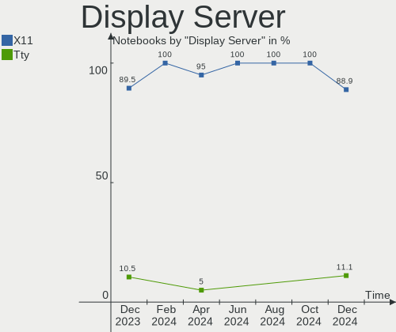
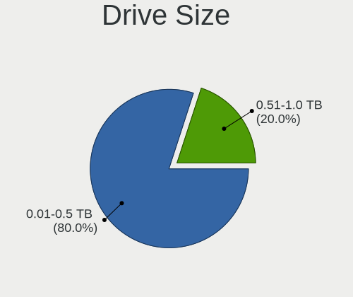
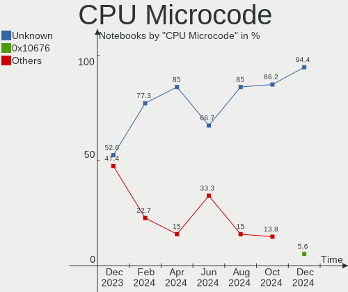
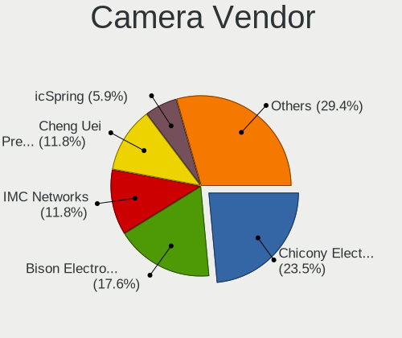
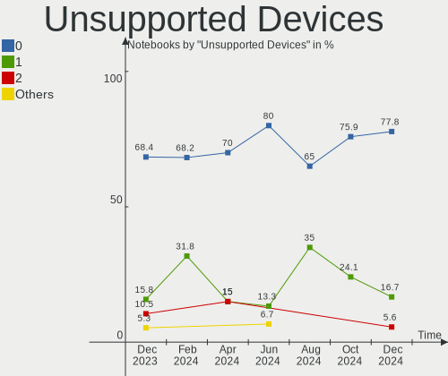

Lubuntu - Hardware Trends (Notebooks)
-------------------------------------

A project to identify most popular hardware characteristics and track their change
over time based on data collected by Linux users at https://Linux-Hardware.org.

Anyone can contribute to this report by the [hw-probe](https://github.com/linuxhw/hw-probe) tool:

    sudo -E hw-probe -all -upload

This report is for one last month. Overall report since the beginning of time: [TestDays](https://github.com/linuxhw/TestDays)

Period: Feb, 2023.

Contents
--------

* [ System ](#system)
  - [ OS                       ](#os)
  - [ OS Family                ](#os-family)
  - [ Kernel                   ](#kernel)
  - [ Kernel Family            ](#kernel-family)
  - [ Kernel Major Ver.        ](#kernel-major-ver)
  - [ Arch                     ](#arch)
  - [ DE                       ](#de)
  - [ Display Server           ](#display-server)
  - [ Display Manager          ](#display-manager)
  - [ OS Lang                  ](#os-lang)
  - [ Boot Mode                ](#boot-mode)
  - [ Filesystem               ](#filesystem)
  - [ Part. scheme             ](#part-scheme)
  - [ Dual Boot with Linux/BSD ](#dual-boot-with-linuxbsd)
  - [ Dual Boot (Win)          ](#dual-boot-win)

* [ Board ](#board)
  - [ Vendor                   ](#vendor)
  - [ Model                    ](#model)
  - [ Model Family             ](#model-family)
  - [ MFG Year                 ](#mfg-year)
  - [ Form Factor              ](#form-factor)
  - [ Secure Boot              ](#secure-boot)
  - [ Coreboot                 ](#coreboot)
  - [ RAM Size                 ](#ram-size)
  - [ RAM Used                 ](#ram-used)
  - [ Total Drives             ](#total-drives)
  - [ Has CD-ROM               ](#has-cd-rom)
  - [ Has Ethernet             ](#has-ethernet)
  - [ Has WiFi                 ](#has-wifi)
  - [ Has Bluetooth            ](#has-bluetooth)

* [ Location ](#location)
  - [ Country                  ](#country)
  - [ City                     ](#city)

* [ Drives ](#drives)
  - [ Drive Vendor             ](#drive-vendor)
  - [ Drive Model              ](#drive-model)
  - [ HDD Vendor               ](#hdd-vendor)
  - [ SSD Vendor               ](#ssd-vendor)
  - [ Drive Kind               ](#drive-kind)
  - [ Drive Connector          ](#drive-connector)
  - [ Drive Size               ](#drive-size)
  - [ Space Total              ](#space-total)
  - [ Space Used               ](#space-used)
  - [ Malfunc. Drives          ](#malfunc-drives)
  - [ Malfunc. Drive Vendor    ](#malfunc-drive-vendor)
  - [ Malfunc. HDD Vendor      ](#malfunc-hdd-vendor)
  - [ Malfunc. Drive Kind      ](#malfunc-drive-kind)
  - [ Failed Drives            ](#failed-drives)
  - [ Failed Drive Vendor      ](#failed-drive-vendor)
  - [ Drive Status             ](#drive-status)

* [ Storage controller ](#storage-controller)
  - [ Storage Vendor           ](#storage-vendor)
  - [ Storage Model            ](#storage-model)
  - [ Storage Kind             ](#storage-kind)

* [ Processor ](#processor)
  - [ CPU Vendor               ](#cpu-vendor)
  - [ CPU Model                ](#cpu-model)
  - [ CPU Model Family         ](#cpu-model-family)
  - [ CPU Cores                ](#cpu-cores)
  - [ CPU Sockets              ](#cpu-sockets)
  - [ CPU Threads              ](#cpu-threads)
  - [ CPU Op-Modes             ](#cpu-op-modes)
  - [ CPU Microcode            ](#cpu-microcode)
  - [ CPU Microarch            ](#cpu-microarch)

* [ Graphics ](#graphics)
  - [ GPU Vendor               ](#gpu-vendor)
  - [ GPU Model                ](#gpu-model)
  - [ GPU Combo                ](#gpu-combo)
  - [ GPU Driver               ](#gpu-driver)
  - [ GPU Memory               ](#gpu-memory)

* [ Monitor ](#monitor)
  - [ Monitor Vendor           ](#monitor-vendor)
  - [ Monitor Model            ](#monitor-model)
  - [ Monitor Resolution       ](#monitor-resolution)
  - [ Monitor Diagonal         ](#monitor-diagonal)
  - [ Monitor Width            ](#monitor-width)
  - [ Aspect Ratio             ](#aspect-ratio)
  - [ Monitor Area             ](#monitor-area)
  - [ Pixel Density            ](#pixel-density)
  - [ Multiple Monitors        ](#multiple-monitors)

* [ Network ](#network)
  - [ Net Controller Vendor    ](#net-controller-vendor)
  - [ Net Controller Model     ](#net-controller-model)
  - [ Wireless Vendor          ](#wireless-vendor)
  - [ Wireless Model           ](#wireless-model)
  - [ Ethernet Vendor          ](#ethernet-vendor)
  - [ Ethernet Model           ](#ethernet-model)
  - [ Net Controller Kind      ](#net-controller-kind)
  - [ Used Controller          ](#used-controller)
  - [ NICs                     ](#nics)
  - [ IPv6                     ](#ipv6)

* [ Bluetooth ](#bluetooth)
  - [ Bluetooth Vendor         ](#bluetooth-vendor)
  - [ Bluetooth Model          ](#bluetooth-model)

* [ Sound ](#sound)
  - [ Sound Vendor             ](#sound-vendor)
  - [ Sound Model              ](#sound-model)

* [ Memory ](#memory)
  - [ Memory Vendor            ](#memory-vendor)
  - [ Memory Model             ](#memory-model)
  - [ Memory Kind              ](#memory-kind)
  - [ Memory Form Factor       ](#memory-form-factor)
  - [ Memory Size              ](#memory-size)
  - [ Memory Speed             ](#memory-speed)

* [ Printers & scanners ](#printers--scanners)
  - [ Printer Vendor           ](#printer-vendor)
  - [ Printer Model            ](#printer-model)
  - [ Scanner Vendor           ](#scanner-vendor)
  - [ Scanner Model            ](#scanner-model)

* [ Camera ](#camera)
  - [ Camera Vendor            ](#camera-vendor)
  - [ Camera Model             ](#camera-model)

* [ Security ](#security)
  - [ Fingerprint Vendor       ](#fingerprint-vendor)
  - [ Fingerprint Model        ](#fingerprint-model)
  - [ Chipcard Vendor          ](#chipcard-vendor)
  - [ Chipcard Model           ](#chipcard-model)

* [ Unsupported ](#unsupported)
  - [ Unsupported Devices      ](#unsupported-devices)
  - [ Unsupported Device Types ](#unsupported-device-types)

System
------

OS
--

Installed operating systems

| Name          | Notebooks | Percent |
|---------------|-----------|---------|
| Lubuntu 22.04 | 15        | 62.5%   |
| Lubuntu 22.10 | 5         | 20.83%  |
| Lubuntu 20.04 | 4         | 16.67%  |

OS Family
---------

OS without a version

| Name    | Notebooks | Percent |
|---------|-----------|---------|
| Lubuntu | 24        | 100%    |

Kernel
------

Version of the Linux kernel

| Version               | Notebooks | Percent |
|-----------------------|-----------|---------|
| 5.15.0-60-generic     | 7         | 29.17%  |
| 5.19.0-31-generic     | 3         | 12.5%   |
| 5.15.0-58-generic     | 3         | 12.5%   |
| 5.15.0-43-generic     | 2         | 8.33%   |
| 6.2.0-custom          | 1         | 4.17%   |
| 6.1.12-060112-generic | 1         | 4.17%   |
| 5.4.0-91-generic      | 1         | 4.17%   |
| 5.4.0-81-generic      | 1         | 4.17%   |
| 5.4.0-139-generic     | 1         | 4.17%   |
| 5.19.0-21-generic     | 1         | 4.17%   |
| 5.15.0-58-lowlatency  | 1         | 4.17%   |
| 5.15.0-56-generic     | 1         | 4.17%   |
| 5.15.0-25-generic     | 1         | 4.17%   |

Kernel Family
-------------

Linux kernel without a distro release

| Version | Notebooks | Percent |
|---------|-----------|---------|
| 5.15.0  | 15        | 62.5%   |
| 5.19.0  | 4         | 16.67%  |
| 5.4.0   | 3         | 12.5%   |
| 6.2.0   | 1         | 4.17%   |
| 6.1.12  | 1         | 4.17%   |

Kernel Major Ver.
-----------------

Linux kernel major version

| Version | Notebooks | Percent |
|---------|-----------|---------|
| 5.15    | 15        | 62.5%   |
| 5.19    | 4         | 16.67%  |
| 5.4     | 3         | 12.5%   |
| 6.2     | 1         | 4.17%   |
| 6.1     | 1         | 4.17%   |

Arch
----

OS architecture (x86_64, i586, etc.)

| Name   | Notebooks | Percent |
|--------|-----------|---------|
| x86_64 | 24        | 100%    |

DE
--

Desktop Environment

| Name       | Notebooks | Percent |
|------------|-----------|---------|
| LXQt       | 22        | 91.67%  |
| X-Cinnamon | 1         | 4.17%   |
| LXDE       | 1         | 4.17%   |

Display Server
--------------

X11 or Wayland

| Name | Notebooks | Percent |
|------|-----------|---------|
| X11  | 23        | 95.83%  |
| Tty  | 1         | 4.17%   |

Display Manager
---------------

SDDM, LightDM, etc.

| Name    | Notebooks | Percent |
|---------|-----------|---------|
| SDDM    | 20        | 83.33%  |
| LightDM | 2         | 8.33%   |
| GDM     | 1         | 4.17%   |
| Unknown | 1         | 4.17%   |

OS Lang
-------

Language

| Lang  | Notebooks | Percent |
|-------|-----------|---------|
| en_US | 12        | 50%     |
| C     | 3         | 12.5%   |
| pt_BR | 2         | 8.33%   |
| fr_FR | 2         | 8.33%   |
| pl_PL | 1         | 4.17%   |
| it_IT | 1         | 4.17%   |
| es_CR | 1         | 4.17%   |
| en_AG | 1         | 4.17%   |
| de_DE | 1         | 4.17%   |

Boot Mode
---------

EFI or BIOS

| Mode | Notebooks | Percent |
|------|-----------|---------|
| BIOS | 13        | 54.17%  |
| EFI  | 11        | 45.83%  |

Filesystem
----------

Type of filesystem

| Type    | Notebooks | Percent |
|---------|-----------|---------|
| Ext4    | 20        | 83.33%  |
| Overlay | 4         | 16.67%  |

Part. scheme
------------

Scheme of partitioning

| Type    | Notebooks | Percent |
|---------|-----------|---------|
| GPT     | 15        | 62.5%   |
| MBR     | 8         | 33.33%  |
| Unknown | 1         | 4.17%   |

Dual Boot with Linux/BSD
------------------------

Hosting more than one Linux/BSD

| Dual boot | Notebooks | Percent |
|-----------|-----------|---------|
| No        | 23        | 95.83%  |
| Yes       | 1         | 4.17%   |

Dual Boot (Win)
---------------

Hosting Linux and Windows

| Dual boot | Notebooks | Percent |
|-----------|-----------|---------|
| Yes       | 12        | 50%     |
| No        | 12        | 50%     |

Board
-----

Vendor
------

Motherboard manufacturer

| Name            | Notebooks | Percent |
|-----------------|-----------|---------|
| Lenovo          | 8         | 33.33%  |
| Acer            | 5         | 20.83%  |
| Toshiba         | 2         | 8.33%   |
| Hewlett-Packard | 2         | 8.33%   |
| Positivo        | 1         | 4.17%   |
| Mediacom        | 1         | 4.17%   |
| HUAWEI          | 1         | 4.17%   |
| Getac           | 1         | 4.17%   |
| Dell            | 1         | 4.17%   |
| Apple           | 1         | 4.17%   |
| Unknown         | 1         | 4.17%   |

Model
-----

Motherboard model

| Name                                  | Notebooks | Percent |
|---------------------------------------|-----------|---------|
| Toshiba Satellite L650                | 1         | 4.17%   |
| Toshiba Satellite C55D-A              | 1         | 4.17%   |
| Positivo Q232A                        | 1         | 4.17%   |
| Mediacom SmartBook 14 FullHD - SB14UC | 1         | 4.17%   |
| Lenovo ThinkPad X240 20AMS0RR00       | 1         | 4.17%   |
| Lenovo ThinkPad X230 Tablet 3437CTO   | 1         | 4.17%   |
| Lenovo ThinkPad X201 3626AL3          | 1         | 4.17%   |
| Lenovo ThinkPad L520 5015AH2          | 1         | 4.17%   |
| Lenovo IdeaPad S340-15IWL 81N8        | 1         | 4.17%   |
| Lenovo IdeaPad 100S-14IBR 80R9        | 1         | 4.17%   |
| Lenovo IdeaPad 1 14IGL7 82V6          | 1         | 4.17%   |
| Lenovo G505s 20255                    | 1         | 4.17%   |
| HUAWEI KLVD-WXX9                      | 1         | 4.17%   |
| HP Pavilion 17                        | 1         | 4.17%   |
| HP Notebook                           | 1         | 4.17%   |
| Getac V200-X                          | 1         | 4.17%   |
| Dell Inspiron 1525                    | 1         | 4.17%   |
| Apple MacBookPro8,1                   | 1         | 4.17%   |
| Acer TravelMate P253                  | 1         | 4.17%   |
| Acer Extensa 2540                     | 1         | 4.17%   |
| Acer Aspire E5-411G                   | 1         | 4.17%   |
| Acer Aspire A515-45                   | 1         | 4.17%   |
| Acer AO756                            | 1         | 4.17%   |
| Unknown                               | 1         | 4.17%   |

Model Family
------------

Motherboard model prefix

| Name               | Notebooks | Percent |
|--------------------|-----------|---------|
| Lenovo ThinkPad    | 4         | 16.67%  |
| Lenovo IdeaPad     | 3         | 12.5%   |
| Toshiba Satellite  | 2         | 8.33%   |
| Acer Aspire        | 2         | 8.33%   |
| Positivo Q232A     | 1         | 4.17%   |
| Mediacom SmartBook | 1         | 4.17%   |
| Lenovo G505s       | 1         | 4.17%   |
| HUAWEI KLVD-WXX9   | 1         | 4.17%   |
| HP Pavilion        | 1         | 4.17%   |
| HP Notebook        | 1         | 4.17%   |
| Getac V200-X       | 1         | 4.17%   |
| Dell Inspiron      | 1         | 4.17%   |
| Apple MacBookPro8  | 1         | 4.17%   |
| Acer TravelMate    | 1         | 4.17%   |
| Acer Extensa       | 1         | 4.17%   |
| Acer AO756         | 1         | 4.17%   |
| Unknown            | 1         | 4.17%   |

MFG Year
--------

Motherboard manufacture year

| Year | Notebooks | Percent |
|------|-----------|---------|
| 2013 | 5         | 20.83%  |
| 2011 | 3         | 12.5%   |
| 2022 | 2         | 8.33%   |
| 2021 | 2         | 8.33%   |
| 2016 | 2         | 8.33%   |
| 2015 | 2         | 8.33%   |
| 2012 | 2         | 8.33%   |
| 2010 | 2         | 8.33%   |
| 2019 | 1         | 4.17%   |
| 2018 | 1         | 4.17%   |
| 2014 | 1         | 4.17%   |
| 2008 | 1         | 4.17%   |

Form Factor
-----------

Physical design of the computer

| Name     | Notebooks | Percent |
|----------|-----------|---------|
| Notebook | 24        | 100%    |

Secure Boot
-----------

Enabled or disabled

| State    | Notebooks | Percent |
|----------|-----------|---------|
| Disabled | 23        | 95.83%  |
| Enabled  | 1         | 4.17%   |

Coreboot
--------

Have coreboot on board

| Used | Notebooks | Percent |
|------|-----------|---------|
| No   | 24        | 100%    |

RAM Size
--------

Total RAM memory

| Size in GB | Notebooks | Percent |
|------------|-----------|---------|
| 3.01-4.0   | 10        | 41.67%  |
| 4.01-8.0   | 8         | 33.33%  |
| 1.01-2.0   | 2         | 8.33%   |
| 8.01-16.0  | 2         | 8.33%   |
| 2.01-3.0   | 1         | 4.17%   |
| 16.01-24.0 | 1         | 4.17%   |

RAM Used
--------

Used RAM memory

| Used GB  | Notebooks | Percent |
|----------|-----------|---------|
| 1.01-2.0 | 14        | 58.33%  |
| 0.51-1.0 | 4         | 16.67%  |
| 2.01-3.0 | 3         | 12.5%   |
| 4.01-8.0 | 2         | 8.33%   |
| 3.01-4.0 | 1         | 4.17%   |

Total Drives
------------

Number of drives on board

| Drives | Notebooks | Percent |
|--------|-----------|---------|
| 1      | 20        | 83.33%  |
| 2      | 3         | 12.5%   |
| 0      | 1         | 4.17%   |

Has CD-ROM
----------

Has CD-ROM on board

| Presented | Notebooks | Percent |
|-----------|-----------|---------|
| No        | 14        | 58.33%  |
| Yes       | 10        | 41.67%  |

Has Ethernet
------------

Has Ethernet on board

| Presented | Notebooks | Percent |
|-----------|-----------|---------|
| Yes       | 20        | 83.33%  |
| No        | 4         | 16.67%  |

Has WiFi
--------

Has WiFi module

| Presented | Notebooks | Percent |
|-----------|-----------|---------|
| Yes       | 20        | 83.33%  |
| No        | 4         | 16.67%  |

Has Bluetooth
-------------

Has Bluetooth module

| Presented | Notebooks | Percent |
|-----------|-----------|---------|
| Yes       | 16        | 66.67%  |
| No        | 8         | 33.33%  |

Location
--------

Country
-------

Geographic location (country)

| Country     | Notebooks | Percent |
|-------------|-----------|---------|
| USA         | 6         | 25%     |
| Italy       | 3         | 12.5%   |
| France      | 3         | 12.5%   |
| Russia      | 2         | 8.33%   |
| Costa Rica  | 2         | 8.33%   |
| Brazil      | 2         | 8.33%   |
| Ukraine     | 1         | 4.17%   |
| Thailand    | 1         | 4.17%   |
| Romania     | 1         | 4.17%   |
| Poland      | 1         | 4.17%   |
| Netherlands | 1         | 4.17%   |
| Germany     | 1         | 4.17%   |

City
----

Geographic location (city)

| City               | Notebooks | Percent |
|--------------------|-----------|---------|
| Lansing            | 2         | 8.33%   |
| Yekaterinburg      | 1         | 4.17%   |
| Vancouver          | 1         | 4.17%   |
| Uberlândia        | 1         | 4.17%   |
| Sesto San Giovanni | 1         | 4.17%   |
| Rome               | 1         | 4.17%   |
| Rio Segundo        | 1         | 4.17%   |
| Queens             | 1         | 4.17%   |
| Puntarenas         | 1         | 4.17%   |
| Ommen              | 1         | 4.17%   |
| Montfrin           | 1         | 4.17%   |
| Mogilno            | 1         | 4.17%   |
| Milan              | 1         | 4.17%   |
| Marília           | 1         | 4.17%   |
| Louviers           | 1         | 4.17%   |
| Kyiv               | 1         | 4.17%   |
| Kerrville          | 1         | 4.17%   |
| Karlsruhe          | 1         | 4.17%   |
| Gura Vitioarei     | 1         | 4.17%   |
| Guidel             | 1         | 4.17%   |
| Dmitrov            | 1         | 4.17%   |
| Chicago            | 1         | 4.17%   |
| Bangkok            | 1         | 4.17%   |

Drives
------

Drive Vendor
------------

Hard drive vendors

| Vendor              | Notebooks | Drives | Percent |
|---------------------|-----------|--------|---------|
| Unknown             | 4         | 4      | 15.38%  |
| WDC                 | 2         | 2      | 7.69%   |
| Seagate             | 2         | 3      | 7.69%   |
| SanDisk             | 2         | 2      | 7.69%   |
| Samsung Electronics | 2         | 2      | 7.69%   |
| Intel               | 2         | 2      | 7.69%   |
| Hitachi             | 2         | 2      | 7.69%   |
| Toshiba             | 1         | 1      | 3.85%   |
| Phison              | 1         | 1      | 3.85%   |
| Micron Technology   | 1         | 2      | 3.85%   |
| LITEON              | 1         | 1      | 3.85%   |
| LDLC                | 1         | 1      | 3.85%   |
| Kingston            | 1         | 1      | 3.85%   |
| HGST                | 1         | 1      | 3.85%   |
| Fujitsu             | 1         | 1      | 3.85%   |
| Crucial             | 1         | 1      | 3.85%   |
| Corsair             | 1         | 1      | 3.85%   |

Drive Model
-----------

Hard drive models

| Model                                | Notebooks | Percent |
|--------------------------------------|-----------|---------|
| Unknown MMC Card  32GB               | 2         | 7.41%   |
| WDC WD5000LPCX-21VHAT0 500GB         | 1         | 3.7%    |
| WDC WD3200BPVT-22JJ5T0 320GB         | 1         | 3.7%    |
| Unknown NCard  32GB                  | 1         | 3.7%    |
| Unknown MMC Card  64GB               | 1         | 3.7%    |
| Toshiba MK8037GSX 80GB               | 1         | 3.7%    |
| Seagate ST500LT012-1DG142 500GB      | 1         | 3.7%    |
| Seagate ST4000VX016-3CV104 4TB       | 1         | 3.7%    |
| SanDisk SDSSDH3512G 512GB            | 1         | 3.7%    |
| SanDisk DF4032  32GB                 | 1         | 3.7%    |
| Samsung SSD 850 EVO 250GB            | 1         | 3.7%    |
| Samsung MZ7TD128HAFV-000L1 128GB SSD | 1         | 3.7%    |
| Phison 311CD0512GB                   | 1         | 3.7%    |
| Micron 5200_MTFDDAK1T9TDD 2TB SSD    | 1         | 3.7%    |
| Micron 2210_MTFDHBA512QFD 512GB      | 1         | 3.7%    |
| LITEON CV3-8D128 128GB SSD           | 1         | 3.7%    |
| LDLC 240GB                           | 1         | 3.7%    |
| Kingston SKC6001024G 1TB SSD         | 1         | 3.7%    |
| Intel SSDSC2MH250A2 250GB            | 1         | 3.7%    |
| Intel SSDSA2M080G2LE 80GB            | 1         | 3.7%    |
| Hitachi HTS545050A7E380 500GB        | 1         | 3.7%    |
| Hitachi HTS545032B9A300 320GB        | 1         | 3.7%    |
| HGST HTS545050A7E680 500GB           | 1         | 3.7%    |
| Fujitsu MHV2100BH PL 100GB           | 1         | 3.7%    |
| Crucial CT500P3SSD8 500GB            | 1         | 3.7%    |
| Corsair CSSD-V60GB2 64GB             | 1         | 3.7%    |

HDD Vendor
----------

Hard disk drive vendors

| Vendor  | Notebooks | Drives | Percent |
|---------|-----------|--------|---------|
| WDC     | 2         | 2      | 22.22%  |
| Seagate | 2         | 3      | 22.22%  |
| Hitachi | 2         | 2      | 22.22%  |
| Toshiba | 1         | 1      | 11.11%  |
| HGST    | 1         | 1      | 11.11%  |
| Fujitsu | 1         | 1      | 11.11%  |

SSD Vendor
----------

Solid state drive vendors

| Vendor              | Notebooks | Drives | Percent |
|---------------------|-----------|--------|---------|
| Samsung Electronics | 2         | 2      | 22.22%  |
| Intel               | 2         | 2      | 22.22%  |
| SanDisk             | 1         | 1      | 11.11%  |
| Micron Technology   | 1         | 1      | 11.11%  |
| LITEON              | 1         | 1      | 11.11%  |
| Kingston            | 1         | 1      | 11.11%  |
| Corsair             | 1         | 1      | 11.11%  |

Drive Kind
----------

HDD or SSD

| Kind    | Notebooks | Drives | Percent |
|---------|-----------|--------|---------|
| SSD     | 9         | 9      | 34.62%  |
| HDD     | 8         | 10     | 30.77%  |
| MMC     | 5         | 5      | 19.23%  |
| NVMe    | 3         | 3      | 11.54%  |
| Unknown | 1         | 1      | 3.85%   |

Drive Connector
---------------

SATA, SAS, NVMe, etc.

| Type | Notebooks | Drives | Percent |
|------|-----------|--------|---------|
| SATA | 18        | 20     | 69.23%  |
| MMC  | 5         | 5      | 19.23%  |
| NVMe | 3         | 3      | 11.54%  |

Drive Size
----------

Size of hard drive

| Size in TB | Notebooks | Drives | Percent |
|------------|-----------|--------|---------|
| 0.01-0.5   | 13        | 14     | 76.47%  |
| 0.51-1.0   | 2         | 2      | 11.76%  |
| 3.01-4.0   | 1         | 2      | 5.88%   |
| 1.01-2.0   | 1         | 1      | 5.88%   |

Space Total
-----------

Amount of disk space available on the file system

| Size in GB     | Notebooks | Percent |
|----------------|-----------|---------|
| 101-250        | 8         | 33.33%  |
| 251-500        | 4         | 16.67%  |
| 1-20           | 4         | 16.67%  |
| 51-100         | 4         | 16.67%  |
| 21-50          | 2         | 8.33%   |
| More than 3000 | 1         | 4.17%   |
| 1001-2000      | 1         | 4.17%   |

Space Used
----------

Amount of used disk space

| Used GB  | Notebooks | Percent |
|----------|-----------|---------|
| 1-20     | 13        | 54.17%  |
| 21-50    | 6         | 25%     |
| 101-250  | 2         | 8.33%   |
| 51-100   | 2         | 8.33%   |
| 501-1000 | 1         | 4.17%   |

Malfunc. Drives
---------------

Drive models with a malfunction

| Model                         | Notebooks | Drives | Percent |
|-------------------------------|-----------|--------|---------|
| Intel SSDSA2M080G2LE 80GB     | 1         | 1      | 50%     |
| Hitachi HTS545032B9A300 320GB | 1         | 1      | 50%     |

Malfunc. Drive Vendor
---------------------

Vendors of faulty drives

| Vendor  | Notebooks | Drives | Percent |
|---------|-----------|--------|---------|
| Intel   | 1         | 1      | 50%     |
| Hitachi | 1         | 1      | 50%     |

Malfunc. HDD Vendor
-------------------

Vendors of faulty HDD drives

| Vendor  | Notebooks | Drives | Percent |
|---------|-----------|--------|---------|
| Hitachi | 1         | 1      | 100%    |

Malfunc. Drive Kind
-------------------

Kinds of faulty drives

| Kind | Notebooks | Drives | Percent |
|------|-----------|--------|---------|
| SSD  | 1         | 1      | 50%     |
| HDD  | 1         | 1      | 50%     |

Failed Drives
-------------

Failed drive models

Zero info for selected period =(

Failed Drive Vendor
-------------------

Failed drive vendors

Zero info for selected period =(

Drive Status
------------

Number of failed and malfunc. drives

| Status   | Notebooks | Drives | Percent |
|----------|-----------|--------|---------|
| Detected | 11        | 13     | 45.83%  |
| Works    | 11        | 13     | 45.83%  |
| Malfunc  | 2         | 2      | 8.33%   |

Storage controller
------------------

Storage Vendor
--------------

Storage controller vendors

| Vendor                    | Notebooks | Percent |
|---------------------------|-----------|---------|
| Intel                     | 17        | 68%     |
| AMD                       | 4         | 16%     |
| Phison Electronics        | 1         | 4%      |
| Micron/Crucial Technology | 1         | 4%      |
| Micron Technology         | 1         | 4%      |
| JMicron Technology        | 1         | 4%      |

Storage Model
-------------

Storage controller models

| Model                                                                            | Notebooks | Percent |
|----------------------------------------------------------------------------------|-----------|---------|
| Intel 7 Series Chipset Family 6-port SATA Controller [AHCI mode]                 | 3         | 11.54%  |
| AMD FCH SATA Controller [AHCI mode]                                              | 3         | 11.54%  |
| Intel 6 Series/C200 Series Chipset Family 6 port Mobile SATA AHCI Controller     | 2         | 7.69%   |
| Intel 5 Series/3400 Series Chipset 6 port SATA AHCI Controller                   | 2         | 7.69%   |
| Phison PS5013 E13 NVMe Controller                                                | 1         | 3.85%   |
| Micron/Crucial P2 NVMe PCIe SSD                                                  | 1         | 3.85%   |
| Micron Non-Volatile memory controller                                            | 1         | 3.85%   |
| JMicron JMB58x AHCI SATA controller                                              | 1         | 3.85%   |
| Intel Wildcat Point-LP SATA Controller [AHCI Mode]                               | 1         | 3.85%   |
| Intel Sunrise Point-LP SATA Controller [AHCI mode]                               | 1         | 3.85%   |
| Intel Celeron/Pentium Silver Processor SATA Controller                           | 1         | 3.85%   |
| Intel Celeron N3350/Pentium N4200/Atom E3900 Series SATA AHCI Controller         | 1         | 3.85%   |
| Intel Cannon Point-LP SATA Controller [AHCI Mode]                                | 1         | 3.85%   |
| Intel Atom/Celeron/Pentium Processor x5-E8000/J3xxx/N3xxx Series SATA Controller | 1         | 3.85%   |
| Intel Atom Processor E3800 Series SATA AHCI Controller                           | 1         | 3.85%   |
| Intel 82801HM/HEM (ICH8M/ICH8M-E) SATA Controller [AHCI mode]                    | 1         | 3.85%   |
| Intel 82801HM/HEM (ICH8M/ICH8M-E) IDE Controller                                 | 1         | 3.85%   |
| Intel 8 Series SATA Controller 1 [AHCI mode]                                     | 1         | 3.85%   |
| Intel 5 Series/3400 Series Chipset 4 port SATA AHCI Controller                   | 1         | 3.85%   |
| AMD FCH SATA Controller [IDE mode]                                               | 1         | 3.85%   |

Storage Kind
------------

Kind of storage controller (IDE, SATA, NVMe, SAS, ...)

| Kind | Notebooks | Percent |
|------|-----------|---------|
| SATA | 21        | 84%     |
| NVMe | 3         | 12%     |
| IDE  | 1         | 4%      |

Processor
---------

CPU Vendor
----------

Processor vendors

| Vendor | Notebooks | Percent |
|--------|-----------|---------|
| Intel  | 20        | 83.33%  |
| AMD    | 4         | 16.67%  |

CPU Model
---------

Processor models

| Model                                    | Notebooks | Percent |
|------------------------------------------|-----------|---------|
| AMD A8-4500M APU with Radeon HD Graphics | 2         | 8.33%   |
| Intel Pentium CPU N3540 @ 2.16GHz        | 1         | 4.17%   |
| Intel Pentium CPU 3825U @ 1.90GHz        | 1         | 4.17%   |
| Intel Core i7 CPU L 620 @ 2.00GHz        | 1         | 4.17%   |
| Intel Core i5-4300U CPU @ 1.90GHz        | 1         | 4.17%   |
| Intel Core i5-3320M CPU @ 2.60GHz        | 1         | 4.17%   |
| Intel Core i5-3230M CPU @ 2.60GHz        | 1         | 4.17%   |
| Intel Core i5-2435M CPU @ 2.40GHz        | 1         | 4.17%   |
| Intel Core i5 CPU M 540 @ 2.53GHz        | 1         | 4.17%   |
| Intel Core i3-8145U CPU @ 2.10GHz        | 1         | 4.17%   |
| Intel Core i3-6006U CPU @ 2.00GHz        | 1         | 4.17%   |
| Intel Core i3 CPU M 330 @ 2.13GHz        | 1         | 4.17%   |
| Intel Core 2 Duo CPU T5550 @ 1.83GHz     | 1         | 4.17%   |
| Intel Celeron N4020 CPU @ 1.10GHz        | 1         | 4.17%   |
| Intel Celeron CPU N3060 @ 1.60GHz        | 1         | 4.17%   |
| Intel Celeron CPU B815 @ 1.60GHz         | 1         | 4.17%   |
| Intel Celeron CPU 877 @ 1.40GHz          | 1         | 4.17%   |
| Intel Atom x5-Z8350 CPU @ 1.44GHz        | 1         | 4.17%   |
| Intel Atom x5-Z8300 CPU @ 1.44GHz        | 1         | 4.17%   |
| Intel Atom Processor E3940 @ 1.60GHz     | 1         | 4.17%   |
| Intel 11th Gen Core i5-1135G7 @ 2.40GHz  | 1         | 4.17%   |
| AMD Ryzen 7 5700U with Radeon Graphics   | 1         | 4.17%   |
| AMD E1-2100 APU with Radeon HD Graphics  | 1         | 4.17%   |

CPU Model Family
----------------

Processor model prefix

| Model            | Notebooks | Percent |
|------------------|-----------|---------|
| Intel Core i5    | 5         | 20.83%  |
| Intel Celeron    | 4         | 16.67%  |
| Intel Core i3    | 3         | 12.5%   |
| Intel Atom       | 3         | 12.5%   |
| Intel Pentium    | 2         | 8.33%   |
| AMD A8           | 2         | 8.33%   |
| Other            | 1         | 4.17%   |
| Intel Core i7    | 1         | 4.17%   |
| Intel Core 2 Duo | 1         | 4.17%   |
| AMD Ryzen 7      | 1         | 4.17%   |
| AMD E1           | 1         | 4.17%   |

CPU Cores
---------

Number of processor cores

| Number | Notebooks | Percent |
|--------|-----------|---------|
| 2      | 18        | 75%     |
| 4      | 5         | 20.83%  |
| 8      | 1         | 4.17%   |

CPU Sockets
-----------

Number of sockets

| Number | Notebooks | Percent |
|--------|-----------|---------|
| 1      | 24        | 100%    |

CPU Threads
-----------

Threads per core (Hyper-Threading)

| Number | Notebooks | Percent |
|--------|-----------|---------|
| 2      | 14        | 58.33%  |
| 1      | 10        | 41.67%  |

CPU Op-Modes
------------

CPU Operation Modes (32-bit, 64-bit)

| Op mode        | Notebooks | Percent |
|----------------|-----------|---------|
| 32-bit, 64-bit | 24        | 100%    |

CPU Microcode
-------------

Microcode number

| Number     | Notebooks | Percent |
|------------|-----------|---------|
| Unknown    | 7         | 29.17%  |
| 0x306a9    | 2         | 8.33%   |
| 0x20652    | 2         | 8.33%   |
| 0x806ec    | 1         | 4.17%   |
| 0x806c1    | 1         | 4.17%   |
| 0x706a8    | 1         | 4.17%   |
| 0x6fd      | 1         | 4.17%   |
| 0x506ca    | 1         | 4.17%   |
| 0x406c4    | 1         | 4.17%   |
| 0x406c3    | 1         | 4.17%   |
| 0x40651    | 1         | 4.17%   |
| 0x30678    | 1         | 4.17%   |
| 0x206a7    | 1         | 4.17%   |
| 0x08608102 | 1         | 4.17%   |
| 0x0700010f | 1         | 4.17%   |
| 0x06001119 | 1         | 4.17%   |

CPU Microarch
-------------

Microarchitecture

| Name          | Notebooks | Percent |
|---------------|-----------|---------|
| Silvermont    | 4         | 16.67%  |
| Westmere      | 3         | 12.5%   |
| SandyBridge   | 3         | 12.5%   |
| Piledriver    | 2         | 8.33%   |
| IvyBridge     | 2         | 8.33%   |
| TigerLake     | 1         | 4.17%   |
| Skylake       | 1         | 4.17%   |
| KabyLake      | 1         | 4.17%   |
| Jaguar        | 1         | 4.17%   |
| Haswell       | 1         | 4.17%   |
| Goldmont plus | 1         | 4.17%   |
| Goldmont      | 1         | 4.17%   |
| Core          | 1         | 4.17%   |
| Broadwell     | 1         | 4.17%   |
| Unknown       | 1         | 4.17%   |

Graphics
--------

GPU Vendor
----------

Vendors of graphics cards

| Vendor | Notebooks | Percent |
|--------|-----------|---------|
| Intel  | 20        | 80%     |
| AMD    | 4         | 16%     |
| Nvidia | 1         | 4%      |

GPU Model
---------

Graphics card models

| Model                                                                                    | Notebooks | Percent |
|------------------------------------------------------------------------------------------|-----------|---------|
| Intel Core Processor Integrated Graphics Controller                                      | 3         | 10.71%  |
| Intel Atom/Celeron/Pentium Processor x5-E8000/J3xxx/N3xxx Integrated Graphics Controller | 3         | 10.71%  |
| Intel 2nd Generation Core Processor Family Integrated Graphics Controller                | 3         | 10.71%  |
| Intel 3rd Gen Core processor Graphics Controller                                         | 2         | 7.14%   |
| AMD Trinity [Radeon HD 7640G]                                                            | 2         | 7.14%   |
| Nvidia GF117M [GeForce 610M/710M/810M/820M / GT 620M/625M/630M/720M]                     | 1         | 3.57%   |
| Intel WhiskeyLake-U GT2 [UHD Graphics 620]                                               | 1         | 3.57%   |
| Intel TigerLake-LP GT2 [Iris Xe Graphics]                                                | 1         | 3.57%   |
| Intel Skylake GT2 [HD Graphics 520]                                                      | 1         | 3.57%   |
| Intel Mobile GM965/GL960 Integrated Graphics Controller (secondary)                      | 1         | 3.57%   |
| Intel Mobile GM965/GL960 Integrated Graphics Controller (primary)                        | 1         | 3.57%   |
| Intel HD Graphics 500                                                                    | 1         | 3.57%   |
| Intel HD Graphics                                                                        | 1         | 3.57%   |
| Intel Haswell-ULT Integrated Graphics Controller                                         | 1         | 3.57%   |
| Intel GeminiLake [UHD Graphics 600]                                                      | 1         | 3.57%   |
| Intel Atom Processor Z36xxx/Z37xxx Series Graphics & Display                             | 1         | 3.57%   |
| AMD Sun XT [Radeon HD 8670A/8670M/8690M / R5 M330 / M430 / Radeon 520 Mobile]            | 1         | 3.57%   |
| AMD Sun PRO [Radeon HD 8570A/8570M]                                                      | 1         | 3.57%   |
| AMD Lucienne                                                                             | 1         | 3.57%   |
| AMD Kabini [Radeon HD 8210]                                                              | 1         | 3.57%   |

GPU Combo
---------

Combinations of graphics cards

| Name           | Notebooks | Percent |
|----------------|-----------|---------|
| 1 x Intel      | 18        | 75%     |
| 2 x AMD        | 2         | 8.33%   |
| 1 x AMD        | 2         | 8.33%   |
| 2 x Intel      | 1         | 4.17%   |
| Intel + Nvidia | 1         | 4.17%   |

GPU Driver
----------

Free vs proprietary

| Driver  | Notebooks | Percent |
|---------|-----------|---------|
| Free    | 23        | 95.83%  |
| Unknown | 1         | 4.17%   |

GPU Memory
----------

Total video memory

| Size in GB | Notebooks | Percent |
|------------|-----------|---------|
| Unknown    | 21        | 87.5%   |
| 0.01-0.5   | 2         | 8.33%   |
| 0.51-1.0   | 1         | 4.17%   |

Monitor
-------

Monitor Vendor
--------------

Monitor vendors

| Vendor              | Notebooks | Percent |
|---------------------|-----------|---------|
| Samsung Electronics | 5         | 21.74%  |
| BOE                 | 5         | 21.74%  |
| AU Optronics        | 4         | 17.39%  |
| LG Display          | 3         | 13.04%  |
| Chimei Innolux      | 2         | 8.7%    |
| Toshiba             | 1         | 4.35%   |
| Lenovo              | 1         | 4.35%   |
| Iiyama              | 1         | 4.35%   |
| Apple               | 1         | 4.35%   |

Monitor Model
-------------

Monitor models

| Model                                                                | Notebooks | Percent |
|----------------------------------------------------------------------|-----------|---------|
| Toshiba LCD Monitor LCD5860 1280x800 261x163mm 12.1-inch             | 1         | 4.35%   |
| Samsung Electronics LCD Monitor SEC5541 1366x768 344x193mm 15.5-inch | 1         | 4.35%   |
| Samsung Electronics LCD Monitor SEC3358 1280x800 331x207mm 15.4-inch | 1         | 4.35%   |
| Samsung Electronics LCD Monitor SEC3152 1366x768 344x194mm 15.5-inch | 1         | 4.35%   |
| Samsung Electronics LCD Monitor SDC4E51 1366x768 344x194mm 15.5-inch | 1         | 4.35%   |
| Samsung Electronics LCD Monitor SDC4347 1366x768 344x193mm 15.5-inch | 1         | 4.35%   |
| LG Display LCD Monitor LGD03CD 1366x768 277x156mm 12.5-inch          | 1         | 4.35%   |
| LG Display LCD Monitor LGD039F 1366x768 345x194mm 15.6-inch          | 1         | 4.35%   |
| LG Display LCD Monitor LGD02D8 1366x768 277x156mm 12.5-inch          | 1         | 4.35%   |
| Lenovo LCD Monitor LEN4011 1280x800 261x163mm 12.1-inch              | 1         | 4.35%   |
| Iiyama PLE2208HDD IVM5616 1920x1080 477x268mm 21.5-inch              | 1         | 4.35%   |
| Chimei Innolux LCD Monitor CMN1493 1366x768 309x173mm 13.9-inch      | 1         | 4.35%   |
| Chimei Innolux LCD Monitor CMN1487 1366x768 309x173mm 13.9-inch      | 1         | 4.35%   |
| BOE LCD Monitor BOE0A56 1920x1080 344x194mm 15.5-inch                | 1         | 4.35%   |
| BOE LCD Monitor BOE0893 2160x1440 296x197mm 14.0-inch                | 1         | 4.35%   |
| BOE LCD Monitor BOE0757 1366x768 344x194mm 15.5-inch                 | 1         | 4.35%   |
| BOE LCD Monitor BOE0675 1366x768 344x194mm 15.5-inch                 | 1         | 4.35%   |
| BOE LCD Monitor BOE0635 1920x1080 309x173mm 13.9-inch                | 1         | 4.35%   |
| AU Optronics LCD Monitor AUO723C 1366x768 309x173mm 13.9-inch        | 1         | 4.35%   |
| AU Optronics LCD Monitor AUO2E3C 1366x768 309x173mm 13.9-inch        | 1         | 4.35%   |
| AU Optronics LCD Monitor AUO23EC 1366x768 344x193mm 15.5-inch        | 1         | 4.35%   |
| AU Optronics LCD Monitor AUO105C 1366x768 256x144mm 11.6-inch        | 1         | 4.35%   |
| Apple LCD Monitor APP9CC5 1280x800 286x179mm 13.3-inch               | 1         | 4.35%   |

Monitor Resolution
------------------

Monitor screen resolution

| Resolution      | Notebooks | Percent |
|-----------------|-----------|---------|
| 1366x768 (WXGA) | 15        | 65.22%  |
| 1280x800 (WXGA) | 4         | 17.39%  |
| 1920x1080 (FHD) | 3         | 13.04%  |
| 2160x1440       | 1         | 4.35%   |

Monitor Diagonal
----------------

Diagonal size in inches

| Inches | Notebooks | Percent |
|--------|-----------|---------|
| 15     | 10        | 43.48%  |
| 14     | 4         | 17.39%  |
| 12     | 4         | 17.39%  |
| 13     | 3         | 13.04%  |
| 21     | 1         | 4.35%   |
| 11     | 1         | 4.35%   |

Monitor Width
-------------

Physical width

| Width in mm | Notebooks | Percent |
|-------------|-----------|---------|
| 301-350     | 15        | 65.22%  |
| 201-300     | 7         | 30.43%  |
| 401-500     | 1         | 4.35%   |

Aspect Ratio
------------

Proportional relationship between the width and the height

| Ratio | Notebooks | Percent |
|-------|-----------|---------|
| 16/9  | 18        | 78.26%  |
| 16/10 | 3         | 13.04%  |
| 3/2   | 2         | 8.7%    |

Monitor Area
------------

Area in inch²

| Area in inch² | Notebooks | Percent |
|----------------|-----------|---------|
| 101-110        | 10        | 43.48%  |
| 81-90          | 7         | 30.43%  |
| 61-70          | 4         | 17.39%  |
| 51-60          | 1         | 4.35%   |
| 201-250        | 1         | 4.35%   |

Pixel Density
-------------

Pixels per inch

| Density | Notebooks | Percent |
|---------|-----------|---------|
| 101-120 | 13        | 56.52%  |
| 121-160 | 7         | 30.43%  |
| 51-100  | 2         | 8.7%    |
| 161-240 | 1         | 4.35%   |

Multiple Monitors
-----------------

Total monitors connected

| Total | Notebooks | Percent |
|-------|-----------|---------|
| 1     | 23        | 95.83%  |
| 0     | 1         | 4.17%   |

Network
-------

Net Controller Vendor
---------------------

Controller vendors

| Vendor                            | Notebooks | Percent |
|-----------------------------------|-----------|---------|
| Realtek Semiconductor             | 9         | 27.27%  |
| Intel                             | 8         | 24.24%  |
| Qualcomm Atheros                  | 6         | 18.18%  |
| Broadcom                          | 4         | 12.12%  |
| MediaTek                          | 2         | 6.06%   |
| TP-Link                           | 1         | 3.03%   |
| Ralink                            | 1         | 3.03%   |
| Marvell Technology Group          | 1         | 3.03%   |
| Ericsson Business Mobile Networks | 1         | 3.03%   |

Net Controller Model
--------------------

Controller models

| Model                                                             | Notebooks | Percent |
|-------------------------------------------------------------------|-----------|---------|
| Realtek RTL8111/8168/8411 PCI Express Gigabit Ethernet Controller | 5         | 11.9%   |
| Realtek RTL810xE PCI Express Fast Ethernet controller             | 3         | 7.14%   |
| Qualcomm Atheros AR9485 Wireless Network Adapter                  | 2         | 4.76%   |
| MediaTek MT7921 802.11ax PCI Express Wireless Network Adapter     | 2         | 4.76%   |
| Intel 82577LM Gigabit Network Connection                          | 2         | 4.76%   |
| Broadcom NetLink BCM57785 Gigabit Ethernet PCIe                   | 2         | 4.76%   |
| TP-Link TL-WN722N v2/v3 [Realtek RTL8188EUS]                      | 1         | 2.38%   |
| Realtek RTL8191SEvB Wireless LAN Controller                       | 1         | 2.38%   |
| Realtek RTL8188EUS 802.11n Wireless Network Adapter               | 1         | 2.38%   |
| Realtek RTL8188EE Wireless Network Adapter                        | 1         | 2.38%   |
| Realtek RTL8188CE 802.11b/g/n WiFi Adapter                        | 1         | 2.38%   |
| Ralink RT3290 Wireless 802.11n 1T/1R PCIe                         | 1         | 2.38%   |
| Qualcomm Atheros QCA9565 / AR9565 Wireless Network Adapter        | 1         | 2.38%   |
| Qualcomm Atheros QCA9377 802.11ac Wireless Network Adapter        | 1         | 2.38%   |
| Qualcomm Atheros QCA8172 Fast Ethernet                            | 1         | 2.38%   |
| Qualcomm Atheros AR9462 Wireless Network Adapter                  | 1         | 2.38%   |
| Qualcomm Atheros AR8152 v1.1 Fast Ethernet                        | 1         | 2.38%   |
| Marvell Group 88E8040 PCI-E Fast Ethernet Controller              | 1         | 2.38%   |
| Intel Wireless 7260                                               | 1         | 2.38%   |
| Intel Wireless 3160                                               | 1         | 2.38%   |
| Intel Wi-Fi 6 AX201                                               | 1         | 2.38%   |
| Intel PRO/Wireless 3945ABG [Golan] Network Connection             | 1         | 2.38%   |
| Intel Ethernet Connection I218-LM                                 | 1         | 2.38%   |
| Intel Dual Band Wireless-AC 3168NGW [Stone Peak]                  | 1         | 2.38%   |
| Intel Centrino Ultimate-N 6300                                    | 1         | 2.38%   |
| Intel Centrino Advanced-N 6205 [Taylor Peak]                      | 1         | 2.38%   |
| Intel Centrino Advanced-N 6200                                    | 1         | 2.38%   |
| Intel 82579LM Gigabit Network Connection (Lewisville)             | 1         | 2.38%   |
| Ericsson Business Mobile Networks N5321 gw                        | 1         | 2.38%   |
| Broadcom NetXtreme BCM57765 Gigabit Ethernet PCIe                 | 1         | 2.38%   |
| Broadcom BCM4331 802.11a/b/g/n                                    | 1         | 2.38%   |
| Broadcom BCM43142 802.11b/g/n                                     | 1         | 2.38%   |

Wireless Vendor
---------------

Wireless vendors

| Vendor                            | Notebooks | Percent |
|-----------------------------------|-----------|---------|
| Intel                             | 8         | 34.78%  |
| Qualcomm Atheros                  | 5         | 21.74%  |
| Realtek Semiconductor             | 4         | 17.39%  |
| Broadcom                          | 2         | 8.7%    |
| TP-Link                           | 1         | 4.35%   |
| Ralink                            | 1         | 4.35%   |
| MediaTek                          | 1         | 4.35%   |
| Ericsson Business Mobile Networks | 1         | 4.35%   |

Wireless Model
--------------

Wireless models

| Model                                                         | Notebooks | Percent |
|---------------------------------------------------------------|-----------|---------|
| Qualcomm Atheros AR9485 Wireless Network Adapter              | 2         | 8.7%    |
| TP-Link TL-WN722N v2/v3 [Realtek RTL8188EUS]                  | 1         | 4.35%   |
| Realtek RTL8191SEvB Wireless LAN Controller                   | 1         | 4.35%   |
| Realtek RTL8188EUS 802.11n Wireless Network Adapter           | 1         | 4.35%   |
| Realtek RTL8188EE Wireless Network Adapter                    | 1         | 4.35%   |
| Realtek RTL8188CE 802.11b/g/n WiFi Adapter                    | 1         | 4.35%   |
| Ralink RT3290 Wireless 802.11n 1T/1R PCIe                     | 1         | 4.35%   |
| Qualcomm Atheros QCA9565 / AR9565 Wireless Network Adapter    | 1         | 4.35%   |
| Qualcomm Atheros QCA9377 802.11ac Wireless Network Adapter    | 1         | 4.35%   |
| Qualcomm Atheros AR9462 Wireless Network Adapter              | 1         | 4.35%   |
| MediaTek MT7921 802.11ax PCI Express Wireless Network Adapter | 1         | 4.35%   |
| Intel Wireless 7260                                           | 1         | 4.35%   |
| Intel Wireless 3160                                           | 1         | 4.35%   |
| Intel Wi-Fi 6 AX201                                           | 1         | 4.35%   |
| Intel PRO/Wireless 3945ABG [Golan] Network Connection         | 1         | 4.35%   |
| Intel Dual Band Wireless-AC 3168NGW [Stone Peak]              | 1         | 4.35%   |
| Intel Centrino Ultimate-N 6300                                | 1         | 4.35%   |
| Intel Centrino Advanced-N 6205 [Taylor Peak]                  | 1         | 4.35%   |
| Intel Centrino Advanced-N 6200                                | 1         | 4.35%   |
| Ericsson Business Mobile Networks N5321 gw                    | 1         | 4.35%   |
| Broadcom BCM4331 802.11a/b/g/n                                | 1         | 4.35%   |
| Broadcom BCM43142 802.11b/g/n                                 | 1         | 4.35%   |

Ethernet Vendor
---------------

Ethernet vendors

| Vendor                   | Notebooks | Percent |
|--------------------------|-----------|---------|
| Realtek Semiconductor    | 8         | 42.11%  |
| Intel                    | 4         | 21.05%  |
| Broadcom                 | 3         | 15.79%  |
| Qualcomm Atheros         | 2         | 10.53%  |
| MediaTek                 | 1         | 5.26%   |
| Marvell Technology Group | 1         | 5.26%   |

Ethernet Model
--------------

Ethernet models

| Model                                                             | Notebooks | Percent |
|-------------------------------------------------------------------|-----------|---------|
| Realtek RTL8111/8168/8411 PCI Express Gigabit Ethernet Controller | 5         | 26.32%  |
| Realtek RTL810xE PCI Express Fast Ethernet controller             | 3         | 15.79%  |
| Intel 82577LM Gigabit Network Connection                          | 2         | 10.53%  |
| Broadcom NetLink BCM57785 Gigabit Ethernet PCIe                   | 2         | 10.53%  |
| Qualcomm Atheros QCA8172 Fast Ethernet                            | 1         | 5.26%   |
| Qualcomm Atheros AR8152 v1.1 Fast Ethernet                        | 1         | 5.26%   |
| MediaTek MT7921 802.11ax PCI Express Wireless Network Adapter     | 1         | 5.26%   |
| Marvell Group 88E8040 PCI-E Fast Ethernet Controller              | 1         | 5.26%   |
| Intel Ethernet Connection I218-LM                                 | 1         | 5.26%   |
| Intel 82579LM Gigabit Network Connection (Lewisville)             | 1         | 5.26%   |
| Broadcom NetXtreme BCM57765 Gigabit Ethernet PCIe                 | 1         | 5.26%   |

Net Controller Kind
-------------------

Ethernet, WiFi or modem

| Kind     | Notebooks | Percent |
|----------|-----------|---------|
| WiFi     | 20        | 51.28%  |
| Ethernet | 19        | 48.72%  |

Used Controller
---------------

Currently used network controller

| Kind     | Notebooks | Percent |
|----------|-----------|---------|
| WiFi     | 18        | 72%     |
| Ethernet | 7         | 28%     |

NICs
----

Total network controllers on board

| Total | Notebooks | Percent |
|-------|-----------|---------|
| 2     | 17        | 70.83%  |
| 1     | 5         | 20.83%  |
| 0     | 2         | 8.33%   |

IPv6
----

IPv6 vs IPv4

| Used | Notebooks | Percent |
|------|-----------|---------|
| No   | 16        | 66.67%  |
| Yes  | 8         | 33.33%  |

Bluetooth
---------

Bluetooth Vendor
----------------

Controller vendors

| Vendor                          | Notebooks | Percent |
|---------------------------------|-----------|---------|
| Intel                           | 4         | 25%     |
| Broadcom                        | 3         | 18.75%  |
| Qualcomm Atheros Communications | 2         | 12.5%   |
| Foxconn / Hon Hai               | 2         | 12.5%   |
| Ralink                          | 1         | 6.25%   |
| Lite-On Technology              | 1         | 6.25%   |
| Dell                            | 1         | 6.25%   |
| Cambridge Silicon Radio         | 1         | 6.25%   |
| Apple                           | 1         | 6.25%   |

Bluetooth Model
---------------

Controller models

| Model                                               | Notebooks | Percent |
|-----------------------------------------------------|-----------|---------|
| Intel Bluetooth wireless interface                  | 2         | 12.5%   |
| Broadcom BCM2045B (BDC-2.1)                         | 2         | 12.5%   |
| Ralink RT3290 Bluetooth                             | 1         | 6.25%   |
| Qualcomm Atheros  Bluetooth Device                  | 1         | 6.25%   |
| Qualcomm Atheros AR3012 Bluetooth 4.0               | 1         | 6.25%   |
| Lite-On Wireless_Device                             | 1         | 6.25%   |
| Intel Wireless-AC 3168 Bluetooth                    | 1         | 6.25%   |
| Intel AX201 Bluetooth                               | 1         | 6.25%   |
| Foxconn / Hon Hai Wireless_Device                   | 1         | 6.25%   |
| Foxconn / Hon Hai Bluetooth Device                  | 1         | 6.25%   |
| Dell Wireless 355 Bluetooth                         | 1         | 6.25%   |
| Cambridge Silicon Radio Bluetooth Dongle (HCI mode) | 1         | 6.25%   |
| Broadcom BCM43142A0 Bluetooth 4.0                   | 1         | 6.25%   |
| Apple Bluetooth Host Controller                     | 1         | 6.25%   |

Sound
-----

Sound Vendor
------------

Sound card vendors

| Vendor                | Notebooks | Percent |
|-----------------------|-----------|---------|
| Intel                 | 18        | 78.26%  |
| AMD                   | 4         | 17.39%  |
| Realtek Semiconductor | 1         | 4.35%   |

Sound Model
-----------

Sound card models

| Model                                                                                             | Notebooks | Percent |
|---------------------------------------------------------------------------------------------------|-----------|---------|
| Intel 7 Series/C216 Chipset Family High Definition Audio Controller                               | 3         | 10.34%  |
| Intel 5 Series/3400 Series Chipset High Definition Audio                                          | 3         | 10.34%  |
| AMD FCH Azalia Controller                                                                         | 3         | 10.34%  |
| Intel 6 Series/C200 Series Chipset Family High Definition Audio Controller                        | 2         | 6.9%    |
| AMD Trinity HDMI Audio Controller                                                                 | 2         | 6.9%    |
| Realtek Semiconductor USB Audio                                                                   | 1         | 3.45%   |
| Intel Wildcat Point-LP High Definition Audio Controller                                           | 1         | 3.45%   |
| Intel Tiger Lake-LP Smart Sound Technology Audio Controller                                       | 1         | 3.45%   |
| Intel Sunrise Point-LP HD Audio                                                                   | 1         | 3.45%   |
| Intel Haswell-ULT HD Audio Controller                                                             | 1         | 3.45%   |
| Intel Celeron/Pentium Silver Processor High Definition Audio                                      | 1         | 3.45%   |
| Intel Celeron N3350/Pentium N4200/Atom E3900 Series Audio Cluster                                 | 1         | 3.45%   |
| Intel Cannon Point-LP High Definition Audio Controller                                            | 1         | 3.45%   |
| Intel Broadwell-U Audio Controller                                                                | 1         | 3.45%   |
| Intel Atom/Celeron/Pentium Processor x5-E8000/J3xxx/N3xxx Series High Definition Audio Controller | 1         | 3.45%   |
| Intel Atom Processor Z36xxx/Z37xxx Series High Definition Audio Controller                        | 1         | 3.45%   |
| Intel 82801H (ICH8 Family) HD Audio Controller                                                    | 1         | 3.45%   |
| Intel 8 Series HD Audio Controller                                                                | 1         | 3.45%   |
| AMD Renoir Radeon High Definition Audio Controller                                                | 1         | 3.45%   |
| AMD Kabini HDMI/DP Audio                                                                          | 1         | 3.45%   |
| AMD Family 17h/19h HD Audio Controller                                                            | 1         | 3.45%   |

Memory
------

Memory Vendor
-------------

Memory module vendors

| Vendor              | Notebooks | Percent |
|---------------------|-----------|---------|
| SK hynix            | 7         | 35%     |
| Samsung Electronics | 5         | 25%     |
| Unknown             | 2         | 10%     |
| Micron Technology   | 2         | 10%     |
| Nanya Technology    | 1         | 5%      |
| Elpida              | 1         | 5%      |
| Corsair             | 1         | 5%      |
| Apacer              | 1         | 5%      |

Memory Model
------------

Memory module models

| Model                                                      | Notebooks | Percent |
|------------------------------------------------------------|-----------|---------|
| Samsung RAM M471B5273DH0-CH9 4GB SODIMM DDR3 1334MT/s      | 2         | 8.33%   |
| Unknown RAM Module 2GB SODIMM DDR3 1066MT/s                | 1         | 4.17%   |
| Unknown RAM Module 2048MB SODIMM LPDDR4 2133MT/s           | 1         | 4.17%   |
| SK hynix RAM Module 4GB Row Of Chips DDR4 2400MT/s         | 1         | 4.17%   |
| SK hynix RAM Module 2GB SODIMM DDR3 1066MT/s               | 1         | 4.17%   |
| SK hynix RAM HYMP512S64CP8-Y5 1GB SODIMM DDR 667MT/s       | 1         | 4.17%   |
| SK hynix RAM HYMP125S64CP8-Y5 2GB SODIMM DDR 667MT/s       | 1         | 4.17%   |
| SK hynix RAM HMT451S6MFR8C-PB 4GB SODIMM DDR3 1600MT/s     | 1         | 4.17%   |
| SK hynix RAM HMT451S6BFR8A-PB 4GB SODIMM DDR3 1600MT/s     | 1         | 4.17%   |
| SK hynix RAM HMT451S6AFR8A-PB 4GB SODIMM DDR3 1600MT/s     | 1         | 4.17%   |
| SK hynix RAM HMT425S6AFR6A-PB 2GB SODIMM DDR3 1600MT/s     | 1         | 4.17%   |
| SK hynix RAM HMAA1GS6CJR6N-XN 8GB SODIMM DDR4 3200MT/s     | 1         | 4.17%   |
| Samsung RAM M471B5673FH0-CF8 2GB SODIMM DDR3 1067MT/s      | 1         | 4.17%   |
| Samsung RAM M471B5173QH0-YK0 4GB SODIMM DDR3 1600MT/s      | 1         | 4.17%   |
| Samsung RAM M471B1G73DB0-YK0 8192MB SODIMM DDR3 1600MT/s   | 1         | 4.17%   |
| Samsung RAM M471A5244CB0-CTD 4GB SODIMM DDR4 3266MT/s      | 1         | 4.17%   |
| Nanya RAM NT2GC64B8HC0NS-BE 2GB SODIMM DDR3 1067MT/s       | 1         | 4.17%   |
| Micron RAM 8ATF2G64HZ-3G2E1 8GB Row Of Chips DDR4 3200MT/s | 1         | 4.17%   |
| Micron RAM 16JSF25664HZ-1G1F1 2GB SODIMM DDR3 1067MT/s     | 1         | 4.17%   |
| Elpida RAM EBJ20UF8BDU0-GN-F 2GB SODIMM DDR3 1600MT/s      | 1         | 4.17%   |
| Corsair RAM Module 8GB SODIMM DDR3 1333MT/s                | 1         | 4.17%   |
| Corsair RAM Module 4GB SODIMM DDR3 1333MT/s                | 1         | 4.17%   |
| Apacer RAM 76.A305G.C5G0B 2GB SODIMM DDR3 1600MT/s         | 1         | 4.17%   |

Memory Kind
-----------

Memory module kinds

| Kind   | Notebooks | Percent |
|--------|-----------|---------|
| DDR3   | 11        | 64.71%  |
| DDR4   | 4         | 23.53%  |
| LPDDR4 | 1         | 5.88%   |
| DDR2   | 1         | 5.88%   |

Memory Form Factor
------------------

Physical design of the memory module

| Name         | Notebooks | Percent |
|--------------|-----------|---------|
| SODIMM       | 15        | 88.24%  |
| Row Of Chips | 2         | 11.76%  |

Memory Size
-----------

Memory module size

| Size | Notebooks | Percent |
|------|-----------|---------|
| 4096 | 8         | 38.1%   |
| 2048 | 8         | 38.1%   |
| 8192 | 4         | 19.05%  |
| 1024 | 1         | 4.76%   |

Memory Speed
------------

Memory module speed

| Speed | Notebooks | Percent |
|-------|-----------|---------|
| 1600  | 6         | 31.58%  |
| 3200  | 2         | 10.53%  |
| 1334  | 2         | 10.53%  |
| 1067  | 2         | 10.53%  |
| 1066  | 2         | 10.53%  |
| 3266  | 1         | 5.26%   |
| 2400  | 1         | 5.26%   |
| 2133  | 1         | 5.26%   |
| 1333  | 1         | 5.26%   |
| 667   | 1         | 5.26%   |

Printers & scanners
-------------------

Printer Vendor
--------------

Printer device vendors

Zero info for selected period =(

Printer Model
-------------

Printer device models

Zero info for selected period =(

Scanner Vendor
--------------

Scanner device vendors

Zero info for selected period =(

Scanner Model
-------------

Scanner device models

Zero info for selected period =(

Camera
------

Camera Vendor
-------------

Camera device vendors

| Vendor                  | Notebooks | Percent |
|-------------------------|-----------|---------|
| Chicony Electronics     | 7         | 33.33%  |
| Realtek Semiconductor   | 2         | 9.52%   |
| Quanta                  | 2         | 9.52%   |
| Apple                   | 2         | 9.52%   |
| Alcor Micro             | 2         | 9.52%   |
| Acer                    | 2         | 9.52%   |
| OmniVision Technologies | 1         | 4.76%   |
| Lenovo                  | 1         | 4.76%   |
| Importek                | 1         | 4.76%   |
| IMC Networks            | 1         | 4.76%   |

Camera Model
------------

Camera device models

| Model                             | Notebooks | Percent |
|-----------------------------------|-----------|---------|
| Chicony Integrated Camera         | 2         | 9.52%   |
| Chicony HD WebCam                 | 2         | 9.52%   |
| Alcor Micro USB Camera            | 2         | 9.52%   |
| Realtek Lenovo EasyCamera         | 1         | 4.76%   |
| Realtek HD WebCam                 | 1         | 4.76%   |
| Quanta HD User Facing             | 1         | 4.76%   |
| Quanta HD Camera                  | 1         | 4.76%   |
| OmniVision OV2640 Webcam          | 1         | 4.76%   |
| Lenovo Integrated Webcam          | 1         | 4.76%   |
| Importek TOSHIBA Web Camera - HD  | 1         | 4.76%   |
| IMC Networks USB2.0 UVC 2M WebCam | 1         | 4.76%   |
| Chicony VGA Webcam                | 1         | 4.76%   |
| Chicony HP Truevision HD camera   | 1         | 4.76%   |
| Chicony HP Truevision HD          | 1         | 4.76%   |
| Apple iPhone 5/5C/5S/6/SE         | 1         | 4.76%   |
| Apple FaceTime HD Camera          | 1         | 4.76%   |
| Acer Lenovo EasyCamera            | 1         | 4.76%   |
| Acer Integrated Camera            | 1         | 4.76%   |

Security
--------

Fingerprint Vendor
------------------

Fingerprint sensor vendors

| Vendor                     | Notebooks | Percent |
|----------------------------|-----------|---------|
| Shenzhen Goodix Technology | 1         | 100%    |

Fingerprint Model
-----------------

Fingerprint sensor models

| Model                               | Notebooks | Percent |
|-------------------------------------|-----------|---------|
| Shenzhen Goodix  Fingerprint Device | 1         | 100%    |

Chipcard Vendor
---------------

Chipcard module vendors

| Vendor      | Notebooks | Percent |
|-------------|-----------|---------|
| Alcor Micro | 2         | 100%    |

Chipcard Model
--------------

Chipcard module models

| Model                               | Notebooks | Percent |
|-------------------------------------|-----------|---------|
| Alcor Micro Watchdata W 1981        | 1         | 50%     |
| Alcor Micro AU9540 Smartcard Reader | 1         | 50%     |

Unsupported
-----------

Unsupported Devices
-------------------

Total unsupported devices on board

| Total | Notebooks | Percent |
|-------|-----------|---------|
| 0     | 17        | 70.83%  |
| 1     | 5         | 20.83%  |
| 2     | 2         | 8.33%   |

Unsupported Device Types
------------------------

Types of unsupported devices

| Type               | Notebooks | Percent |
|--------------------|-----------|---------|
| Graphics card      | 3         | 37.5%   |
| Chipcard           | 2         | 25%     |
| Fingerprint reader | 1         | 12.5%   |
| Camera             | 1         | 12.5%   |
| Bluetooth          | 1         | 12.5%   |

