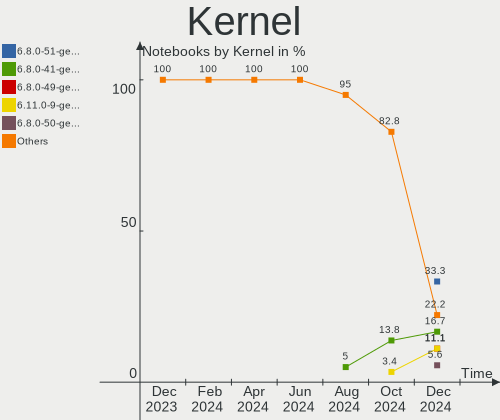
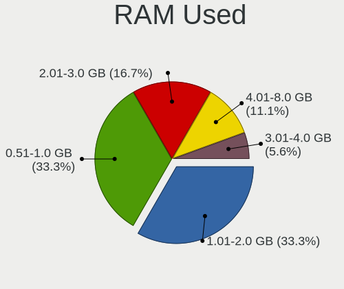
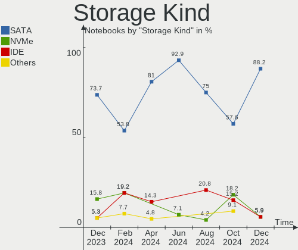
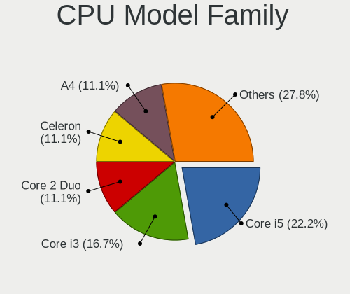

Lubuntu - Hardware Trends (Notebooks)
-------------------------------------

A project to identify most popular hardware characteristics and track their change
over time based on data collected by Linux users at https://Linux-Hardware.org.

Anyone can contribute to this report by the [hw-probe](https://github.com/linuxhw/hw-probe) tool:

    sudo -E hw-probe -all -upload

This report is for one last month. Overall report since the beginning of time: [TestDays](https://github.com/linuxhw/TestDays)

Period: Mar, 2023.

Contents
--------

* [ System ](#system)
  - [ OS                       ](#os)
  - [ OS Family                ](#os-family)
  - [ Kernel                   ](#kernel)
  - [ Kernel Family            ](#kernel-family)
  - [ Kernel Major Ver.        ](#kernel-major-ver)
  - [ Arch                     ](#arch)
  - [ DE                       ](#de)
  - [ Display Server           ](#display-server)
  - [ Display Manager          ](#display-manager)
  - [ OS Lang                  ](#os-lang)
  - [ Boot Mode                ](#boot-mode)
  - [ Filesystem               ](#filesystem)
  - [ Part. scheme             ](#part-scheme)
  - [ Dual Boot with Linux/BSD ](#dual-boot-with-linuxbsd)
  - [ Dual Boot (Win)          ](#dual-boot-win)

* [ Board ](#board)
  - [ Vendor                   ](#vendor)
  - [ Model                    ](#model)
  - [ Model Family             ](#model-family)
  - [ MFG Year                 ](#mfg-year)
  - [ Form Factor              ](#form-factor)
  - [ Secure Boot              ](#secure-boot)
  - [ Coreboot                 ](#coreboot)
  - [ RAM Size                 ](#ram-size)
  - [ RAM Used                 ](#ram-used)
  - [ Total Drives             ](#total-drives)
  - [ Has CD-ROM               ](#has-cd-rom)
  - [ Has Ethernet             ](#has-ethernet)
  - [ Has WiFi                 ](#has-wifi)
  - [ Has Bluetooth            ](#has-bluetooth)

* [ Location ](#location)
  - [ Country                  ](#country)
  - [ City                     ](#city)

* [ Drives ](#drives)
  - [ Drive Vendor             ](#drive-vendor)
  - [ Drive Model              ](#drive-model)
  - [ HDD Vendor               ](#hdd-vendor)
  - [ SSD Vendor               ](#ssd-vendor)
  - [ Drive Kind               ](#drive-kind)
  - [ Drive Connector          ](#drive-connector)
  - [ Drive Size               ](#drive-size)
  - [ Space Total              ](#space-total)
  - [ Space Used               ](#space-used)
  - [ Malfunc. Drives          ](#malfunc-drives)
  - [ Malfunc. Drive Vendor    ](#malfunc-drive-vendor)
  - [ Malfunc. HDD Vendor      ](#malfunc-hdd-vendor)
  - [ Malfunc. Drive Kind      ](#malfunc-drive-kind)
  - [ Failed Drives            ](#failed-drives)
  - [ Failed Drive Vendor      ](#failed-drive-vendor)
  - [ Drive Status             ](#drive-status)

* [ Storage controller ](#storage-controller)
  - [ Storage Vendor           ](#storage-vendor)
  - [ Storage Model            ](#storage-model)
  - [ Storage Kind             ](#storage-kind)

* [ Processor ](#processor)
  - [ CPU Vendor               ](#cpu-vendor)
  - [ CPU Model                ](#cpu-model)
  - [ CPU Model Family         ](#cpu-model-family)
  - [ CPU Cores                ](#cpu-cores)
  - [ CPU Sockets              ](#cpu-sockets)
  - [ CPU Threads              ](#cpu-threads)
  - [ CPU Op-Modes             ](#cpu-op-modes)
  - [ CPU Microcode            ](#cpu-microcode)
  - [ CPU Microarch            ](#cpu-microarch)

* [ Graphics ](#graphics)
  - [ GPU Vendor               ](#gpu-vendor)
  - [ GPU Model                ](#gpu-model)
  - [ GPU Combo                ](#gpu-combo)
  - [ GPU Driver               ](#gpu-driver)
  - [ GPU Memory               ](#gpu-memory)

* [ Monitor ](#monitor)
  - [ Monitor Vendor           ](#monitor-vendor)
  - [ Monitor Model            ](#monitor-model)
  - [ Monitor Resolution       ](#monitor-resolution)
  - [ Monitor Diagonal         ](#monitor-diagonal)
  - [ Monitor Width            ](#monitor-width)
  - [ Aspect Ratio             ](#aspect-ratio)
  - [ Monitor Area             ](#monitor-area)
  - [ Pixel Density            ](#pixel-density)
  - [ Multiple Monitors        ](#multiple-monitors)

* [ Network ](#network)
  - [ Net Controller Vendor    ](#net-controller-vendor)
  - [ Net Controller Model     ](#net-controller-model)
  - [ Wireless Vendor          ](#wireless-vendor)
  - [ Wireless Model           ](#wireless-model)
  - [ Ethernet Vendor          ](#ethernet-vendor)
  - [ Ethernet Model           ](#ethernet-model)
  - [ Net Controller Kind      ](#net-controller-kind)
  - [ Used Controller          ](#used-controller)
  - [ NICs                     ](#nics)
  - [ IPv6                     ](#ipv6)

* [ Bluetooth ](#bluetooth)
  - [ Bluetooth Vendor         ](#bluetooth-vendor)
  - [ Bluetooth Model          ](#bluetooth-model)

* [ Sound ](#sound)
  - [ Sound Vendor             ](#sound-vendor)
  - [ Sound Model              ](#sound-model)

* [ Memory ](#memory)
  - [ Memory Vendor            ](#memory-vendor)
  - [ Memory Model             ](#memory-model)
  - [ Memory Kind              ](#memory-kind)
  - [ Memory Form Factor       ](#memory-form-factor)
  - [ Memory Size              ](#memory-size)
  - [ Memory Speed             ](#memory-speed)

* [ Printers & scanners ](#printers--scanners)
  - [ Printer Vendor           ](#printer-vendor)
  - [ Printer Model            ](#printer-model)
  - [ Scanner Vendor           ](#scanner-vendor)
  - [ Scanner Model            ](#scanner-model)

* [ Camera ](#camera)
  - [ Camera Vendor            ](#camera-vendor)
  - [ Camera Model             ](#camera-model)

* [ Security ](#security)
  - [ Fingerprint Vendor       ](#fingerprint-vendor)
  - [ Fingerprint Model        ](#fingerprint-model)
  - [ Chipcard Vendor          ](#chipcard-vendor)
  - [ Chipcard Model           ](#chipcard-model)

* [ Unsupported ](#unsupported)
  - [ Unsupported Devices      ](#unsupported-devices)
  - [ Unsupported Device Types ](#unsupported-device-types)

System
------

OS
--

Installed operating systems

| Name          | Notebooks | Percent |
|---------------|-----------|---------|
| Lubuntu 22.04 | 14        | 60.87%  |
| Lubuntu 22.10 | 4         | 17.39%  |
| Lubuntu 20.04 | 4         | 17.39%  |
| Lubuntu 18.04 | 1         | 4.35%   |

OS Family
---------

OS without a version

| Name    | Notebooks | Percent |
|---------|-----------|---------|
| Lubuntu | 23        | 100%    |

Kernel
------

Version of the Linux kernel

| Version            | Notebooks | Percent |
|--------------------|-----------|---------|
| 5.19.0-35-generic  | 6         | 26.09%  |
| 5.15.0-67-generic  | 6         | 26.09%  |
| 5.4.0-139-generic  | 2         | 8.7%    |
| 5.19.0-32-generic  | 2         | 8.7%    |
| 5.19.0-38-generic  | 1         | 4.35%   |
| 5.19.0-37-generic  | 1         | 4.35%   |
| 5.19.0-31-generic  | 1         | 4.35%   |
| 5.15.0-60-generic  | 1         | 4.35%   |
| 5.15.0-56-generic  | 1         | 4.35%   |
| 5.15.0-25-generic  | 1         | 4.35%   |
| 4.15.0-153-generic | 1         | 4.35%   |

Kernel Family
-------------

Linux kernel without a distro release

| Version | Notebooks | Percent |
|---------|-----------|---------|
| 5.19.0  | 11        | 47.83%  |
| 5.15.0  | 9         | 39.13%  |
| 5.4.0   | 2         | 8.7%    |
| 4.15.0  | 1         | 4.35%   |

Kernel Major Ver.
-----------------

Linux kernel major version

| Version | Notebooks | Percent |
|---------|-----------|---------|
| 5.19    | 11        | 47.83%  |
| 5.15    | 9         | 39.13%  |
| 5.4     | 2         | 8.7%    |
| 4.15    | 1         | 4.35%   |

Arch
----

OS architecture (x86_64, i586, etc.)

| Name   | Notebooks | Percent |
|--------|-----------|---------|
| x86_64 | 23        | 100%    |

DE
--

Desktop Environment

| Name       | Notebooks | Percent |
|------------|-----------|---------|
| LXQt       | 20        | 86.96%  |
| LXDE       | 2         | 8.7%    |
| X-Cinnamon | 1         | 4.35%   |

Display Server
--------------

X11 or Wayland

| Name | Notebooks | Percent |
|------|-----------|---------|
| X11  | 23        | 100%    |

Display Manager
---------------

SDDM, LightDM, etc.

| Name    | Notebooks | Percent |
|---------|-----------|---------|
| SDDM    | 17        | 73.91%  |
| LightDM | 5         | 21.74%  |
| Unknown | 1         | 4.35%   |

OS Lang
-------

Language

| Lang  | Notebooks | Percent |
|-------|-----------|---------|
| en_US | 8         | 34.78%  |
| ru_RU | 3         | 13.04%  |
| pt_BR | 3         | 13.04%  |
| fr_FR | 2         | 8.7%    |
| de_DE | 2         | 8.7%    |
| nl_NL | 1         | 4.35%   |
| it_IT | 1         | 4.35%   |
| en_GB | 1         | 4.35%   |
| de_CH | 1         | 4.35%   |
| C     | 1         | 4.35%   |

Boot Mode
---------

EFI or BIOS

| Mode | Notebooks | Percent |
|------|-----------|---------|
| EFI  | 12        | 52.17%  |
| BIOS | 11        | 47.83%  |

Filesystem
----------

Type of filesystem

| Type    | Notebooks | Percent |
|---------|-----------|---------|
| Ext4    | 21        | 91.3%   |
| Xfs     | 1         | 4.35%   |
| Overlay | 1         | 4.35%   |

Part. scheme
------------

Scheme of partitioning

| Type    | Notebooks | Percent |
|---------|-----------|---------|
| GPT     | 16        | 69.57%  |
| MBR     | 6         | 26.09%  |
| Unknown | 1         | 4.35%   |

Dual Boot with Linux/BSD
------------------------

Hosting more than one Linux/BSD

| Dual boot | Notebooks | Percent |
|-----------|-----------|---------|
| No        | 19        | 82.61%  |
| Yes       | 4         | 17.39%  |

Dual Boot (Win)
---------------

Hosting Linux and Windows

| Dual boot | Notebooks | Percent |
|-----------|-----------|---------|
| Yes       | 12        | 52.17%  |
| No        | 11        | 47.83%  |

Board
-----

Vendor
------

Motherboard manufacturer

| Name                | Notebooks | Percent |
|---------------------|-----------|---------|
| Hewlett-Packard     | 5         | 21.74%  |
| Dell                | 4         | 17.39%  |
| Lenovo              | 3         | 13.04%  |
| MSI                 | 2         | 8.7%    |
| ASUSTek Computer    | 2         | 8.7%    |
| Samsung Electronics | 1         | 4.35%   |
| Packard Bell        | 1         | 4.35%   |
| Intel               | 1         | 4.35%   |
| Google              | 1         | 4.35%   |
| DEXP                | 1         | 4.35%   |
| Apple               | 1         | 4.35%   |
| Acer                | 1         | 4.35%   |

Model
-----

Motherboard model

| Name                                             | Notebooks | Percent |
|--------------------------------------------------|-----------|---------|
| Samsung 530XBB                                   | 1         | 4.35%   |
| Packard Bell EasyNote SB65                       | 1         | 4.35%   |
| MSI S12T 3M/S12 3M                               | 1         | 4.35%   |
| MSI GS65 Stealth 9SD                             | 1         | 4.35%   |
| Lenovo ThinkPad X201 3626AL3                     | 1         | 4.35%   |
| Lenovo IdeaPad L340-15IRH Gaming 81TR            | 1         | 4.35%   |
| Lenovo IdeaPad 1 15AMN7 82VG                     | 1         | 4.35%   |
| Intel Infoway                                    | 1         | 4.35%   |
| HP ZBook Fury 15.6 inch G8 Mobile Workstation PC | 1         | 4.35%   |
| HP Laptop 17-ak0xx                               | 1         | 4.35%   |
| HP Laptop 15-da0xxx                              | 1         | 4.35%   |
| HP Laptop 14-dk0xxx                              | 1         | 4.35%   |
| HP Compaq Presario CQ60                          | 1         | 4.35%   |
| Google Celes                                     | 1         | 4.35%   |
| DEXP Aquilon C15                                 | 1         | 4.35%   |
| Dell Precision M3800                             | 1         | 4.35%   |
| Dell Latitude E6230                              | 1         | 4.35%   |
| Dell Latitude 7480                               | 1         | 4.35%   |
| Dell Latitude 5290                               | 1         | 4.35%   |
| ASUS VivoBook_ASUSLaptop X515DA_M515DA           | 1         | 4.35%   |
| ASUS T200TA                                      | 1         | 4.35%   |
| Apple MacBookPro9,2                              | 1         | 4.35%   |
| Acer Aspire one 1-131                            | 1         | 4.35%   |

Model Family
------------

Motherboard model prefix

| Name                  | Notebooks | Percent |
|-----------------------|-----------|---------|
| HP Laptop             | 3         | 13.04%  |
| Dell Latitude         | 3         | 13.04%  |
| Lenovo IdeaPad        | 2         | 8.7%    |
| Samsung 530XBB        | 1         | 4.35%   |
| Packard Bell EasyNote | 1         | 4.35%   |
| MSI S12T              | 1         | 4.35%   |
| MSI GS65              | 1         | 4.35%   |
| Lenovo ThinkPad       | 1         | 4.35%   |
| Intel Infoway         | 1         | 4.35%   |
| HP ZBook              | 1         | 4.35%   |
| HP Compaq             | 1         | 4.35%   |
| Google Celes          | 1         | 4.35%   |
| DEXP Aquilon          | 1         | 4.35%   |
| Dell Precision        | 1         | 4.35%   |
| ASUS VivoBook         | 1         | 4.35%   |
| ASUS T200TA           | 1         | 4.35%   |
| Apple MacBookPro9     | 1         | 4.35%   |
| Acer Aspire           | 1         | 4.35%   |

MFG Year
--------

Motherboard manufacture year

| Year | Notebooks | Percent |
|------|-----------|---------|
| 2019 | 5         | 21.74%  |
| 2020 | 3         | 13.04%  |
| 2008 | 3         | 13.04%  |
| 2017 | 2         | 8.7%    |
| 2013 | 2         | 8.7%    |
| 2012 | 2         | 8.7%    |
| 2023 | 1         | 4.35%   |
| 2022 | 1         | 4.35%   |
| 2021 | 1         | 4.35%   |
| 2018 | 1         | 4.35%   |
| 2015 | 1         | 4.35%   |
| 2010 | 1         | 4.35%   |

Form Factor
-----------

Physical design of the computer

| Name     | Notebooks | Percent |
|----------|-----------|---------|
| Notebook | 23        | 100%    |

Secure Boot
-----------

Enabled or disabled

| State    | Notebooks | Percent |
|----------|-----------|---------|
| Disabled | 20        | 86.96%  |
| Enabled  | 3         | 13.04%  |

Coreboot
--------

Have coreboot on board

| Used | Notebooks | Percent |
|------|-----------|---------|
| No   | 22        | 95.65%  |
| Yes  | 1         | 4.35%   |

RAM Size
--------

Total RAM memory

| Size in GB | Notebooks | Percent |
|------------|-----------|---------|
| 4.01-8.0   | 6         | 26.09%  |
| 3.01-4.0   | 6         | 26.09%  |
| 16.01-24.0 | 3         | 13.04%  |
| 2.01-3.0   | 2         | 8.7%    |
| 1.01-2.0   | 2         | 8.7%    |
| 8.01-16.0  | 2         | 8.7%    |
| 32.01-64.0 | 1         | 4.35%   |
| 24.01-32.0 | 1         | 4.35%   |

RAM Used
--------

Used RAM memory

| Used GB  | Notebooks | Percent |
|----------|-----------|---------|
| 2.01-3.0 | 8         | 34.78%  |
| 1.01-2.0 | 7         | 30.43%  |
| 0.51-1.0 | 4         | 17.39%  |
| 4.01-8.0 | 3         | 13.04%  |
| 3.01-4.0 | 1         | 4.35%   |

Total Drives
------------

Number of drives on board

| Drives | Notebooks | Percent |
|--------|-----------|---------|
| 1      | 13        | 56.52%  |
| 2      | 10        | 43.48%  |

Has CD-ROM
----------

Has CD-ROM on board

| Presented | Notebooks | Percent |
|-----------|-----------|---------|
| No        | 17        | 73.91%  |
| Yes       | 6         | 26.09%  |

Has Ethernet
------------

Has Ethernet on board

| Presented | Notebooks | Percent |
|-----------|-----------|---------|
| Yes       | 18        | 78.26%  |
| No        | 5         | 21.74%  |

Has WiFi
--------

Has WiFi module

| Presented | Notebooks | Percent |
|-----------|-----------|---------|
| Yes       | 21        | 91.3%   |
| No        | 2         | 8.7%    |

Has Bluetooth
-------------

Has Bluetooth module

| Presented | Notebooks | Percent |
|-----------|-----------|---------|
| Yes       | 16        | 69.57%  |
| No        | 7         | 30.43%  |

Location
--------

Country
-------

Geographic location (country)

| Country     | Notebooks | Percent |
|-------------|-----------|---------|
| USA         | 8         | 34.78%  |
| Russia      | 3         | 13.04%  |
| Brazil      | 3         | 13.04%  |
| Switzerland | 2         | 8.7%    |
| Germany     | 2         | 8.7%    |
| France      | 2         | 8.7%    |
| Netherlands | 1         | 4.35%   |
| Italy       | 1         | 4.35%   |
| Iran        | 1         | 4.35%   |

City
----

Geographic location (city)

| City                  | Notebooks | Percent |
|-----------------------|-----------|---------|
| Zurich                | 1         | 4.35%   |
| West Stockbridge      | 1         | 4.35%   |
| Valsamoggia           | 1         | 4.35%   |
| Ulyanovsk             | 1         | 4.35%   |
| Tehran                | 1         | 4.35%   |
| San Pablo             | 1         | 4.35%   |
| Omaha                 | 1         | 4.35%   |
| Novo Gama             | 1         | 4.35%   |
| Moscow                | 1         | 4.35%   |
| Montesano             | 1         | 4.35%   |
| Maple Grove           | 1         | 4.35%   |
| Lurcy-Levis           | 1         | 4.35%   |
| Lourdes               | 1         | 4.35%   |
| Liebefeld             | 1         | 4.35%   |
| Lansing               | 1         | 4.35%   |
| Lakewood              | 1         | 4.35%   |
| Hilversum             | 1         | 4.35%   |
| Goryachiy Klyuch      | 1         | 4.35%   |
| Fleischwangen         | 1         | 4.35%   |
| Eberbach              | 1         | 4.35%   |
| Cidade Universitária | 1         | 4.35%   |
| Burlington            | 1         | 4.35%   |
| Araras                | 1         | 4.35%   |

Drives
------

Drive Vendor
------------

Hard drive vendors

| Vendor                    | Notebooks | Drives | Percent |
|---------------------------|-----------|--------|---------|
| Unknown                   | 5         | 5      | 16.13%  |
| Samsung Electronics       | 4         | 4      | 12.9%   |
| WDC                       | 3         | 3      | 9.68%   |
| SanDisk                   | 3         | 3      | 9.68%   |
| Toshiba                   | 2         | 2      | 6.45%   |
| XrayDisk                  | 1         | 1      | 3.23%   |
| UMIS                      | 1         | 1      | 3.23%   |
| Transcend                 | 1         | 1      | 3.23%   |
| SK hynix                  | 1         | 1      | 3.23%   |
| Plextor                   | 1         | 1      | 3.23%   |
| Patriot                   | 1         | 1      | 3.23%   |
| OCZ                       | 1         | 1      | 3.23%   |
| Micron/Crucial Technology | 1         | 1      | 3.23%   |
| Kingston                  | 1         | 1      | 3.23%   |
| Intel                     | 1         | 1      | 3.23%   |
| HGST                      | 1         | 1      | 3.23%   |
| Crucial                   | 1         | 1      | 3.23%   |
| addlink                   | 1         | 1      | 3.23%   |
| A-DATA Technology         | 1         | 1      | 3.23%   |

Drive Model
-----------

Hard drive models

| Model                                               | Notebooks | Percent |
|-----------------------------------------------------|-----------|---------|
| Unknown MMC Card  32GB                              | 2         | 6.45%   |
| Unknown DA4064  64GB                                | 2         | 6.45%   |
| XrayDisk SSD 128GB                                  | 1         | 3.23%   |
| WDC WD5000LPVX-22V0TT0 500GB                        | 1         | 3.23%   |
| WDC WD10SPZX-24Z10 1TB                              | 1         | 3.23%   |
| WDC PC SN730 SDBPNTY-512G-1006 512GB                | 1         | 3.23%   |
| Unknown SC256  256GB                                | 1         | 3.23%   |
| UMIS RPJTJ128MEE1MWX 128GB                          | 1         | 3.23%   |
| Transcend TS512GMTS800 512GB SSD                    | 1         | 3.23%   |
| Toshiba MQ04ABF100 1TB                              | 1         | 3.23%   |
| Toshiba MK1652GSX 160GB                             | 1         | 3.23%   |
| SK hynix HBG4e  32GB                                | 1         | 3.23%   |
| Sandisk WD Blue SN500 / PC SN520 NVMe SSD 512GB     | 1         | 3.23%   |
| SanDisk SD9SN8W-128G-1006 128GB SSD                 | 1         | 3.23%   |
| SanDisk SD8SN8U-128G-1006 128GB SSD                 | 1         | 3.23%   |
| Samsung SSD 860 EVO M.2 500GB                       | 1         | 3.23%   |
| Samsung NVMe SSD Controller SM981/PM981/PM983 250GB | 1         | 3.23%   |
| Samsung MZVLB512HBJQ-000H1 512GB                    | 1         | 3.23%   |
| Samsung HM121HI 120GB                               | 1         | 3.23%   |
| Plextor PX-128M6M 128GB SSD                         | 1         | 3.23%   |
| Patriot P210 512GB SSD                              | 1         | 3.23%   |
| OCZ VERTEX2 116GB SSD                               | 1         | 3.23%   |
| Micron/Crucial P2 NVMe PCIe SSD 1TB                 | 1         | 3.23%   |
| Kingston SUV500MS480G 480GB SSD                     | 1         | 3.23%   |
| Intel SSDSA2M080G2LE 80GB                           | 1         | 3.23%   |
| HGST HTS725032A7E630 320GB                          | 1         | 3.23%   |
| Crucial CT500MX500SSD1 500GB                        | 1         | 3.23%   |
| addlink M.2 PCIE G3x4 NVMe 256GB                    | 1         | 3.23%   |
| A-DATA SU635 240GB SSD                              | 1         | 3.23%   |

HDD Vendor
----------

Hard disk drive vendors

| Vendor              | Notebooks | Drives | Percent |
|---------------------|-----------|--------|---------|
| WDC                 | 2         | 2      | 33.33%  |
| Toshiba             | 2         | 2      | 33.33%  |
| Samsung Electronics | 1         | 1      | 16.67%  |
| HGST                | 1         | 1      | 16.67%  |

SSD Vendor
----------

Solid state drive vendors

| Vendor              | Notebooks | Drives | Percent |
|---------------------|-----------|--------|---------|
| SanDisk             | 2         | 2      | 16.67%  |
| XrayDisk            | 1         | 1      | 8.33%   |
| Transcend           | 1         | 1      | 8.33%   |
| Samsung Electronics | 1         | 1      | 8.33%   |
| Plextor             | 1         | 1      | 8.33%   |
| Patriot             | 1         | 1      | 8.33%   |
| OCZ                 | 1         | 1      | 8.33%   |
| Kingston            | 1         | 1      | 8.33%   |
| Intel               | 1         | 1      | 8.33%   |
| Crucial             | 1         | 1      | 8.33%   |
| A-DATA Technology   | 1         | 1      | 8.33%   |

Drive Kind
----------

HDD or SSD

| Kind | Notebooks | Drives | Percent |
|------|-----------|--------|---------|
| SSD  | 11        | 12     | 39.29%  |
| MMC  | 6         | 6      | 21.43%  |
| HDD  | 6         | 6      | 21.43%  |
| NVMe | 5         | 7      | 17.86%  |

Drive Connector
---------------

SATA, SAS, NVMe, etc.

| Type | Notebooks | Drives | Percent |
|------|-----------|--------|---------|
| SATA | 16        | 18     | 59.26%  |
| MMC  | 6         | 6      | 22.22%  |
| NVMe | 5         | 7      | 18.52%  |

Drive Size
----------

Size of hard drive

| Size in TB | Notebooks | Drives | Percent |
|------------|-----------|--------|---------|
| 0.01-0.5   | 12        | 14     | 75%     |
| 0.51-1.0   | 4         | 4      | 25%     |

Space Total
-----------

Amount of disk space available on the file system

| Size in GB | Notebooks | Percent |
|------------|-----------|---------|
| 101-250    | 8         | 34.78%  |
| 51-100     | 4         | 17.39%  |
| 251-500    | 3         | 13.04%  |
| 21-50      | 3         | 13.04%  |
| 1-20       | 3         | 13.04%  |
| 1001-2000  | 1         | 4.35%   |
| 501-1000   | 1         | 4.35%   |

Space Used
----------

Amount of used disk space

| Used GB | Notebooks | Percent |
|---------|-----------|---------|
| 21-50   | 8         | 34.78%  |
| 1-20    | 7         | 30.43%  |
| 51-100  | 6         | 26.09%  |
| 101-250 | 2         | 8.7%    |

Malfunc. Drives
---------------

Drive models with a malfunction

| Model                             | Notebooks | Drives | Percent |
|-----------------------------------|-----------|--------|---------|
| Samsung Electronics HM121HI 120GB | 1         | 1      | 25%     |
| Plextor PX-128M6M 128GB SSD       | 1         | 1      | 25%     |
| Intel SSDSA2M080G2LE 80GB         | 1         | 1      | 25%     |
| HGST HTS725032A7E630 320GB        | 1         | 1      | 25%     |

Malfunc. Drive Vendor
---------------------

Vendors of faulty drives

| Vendor              | Notebooks | Drives | Percent |
|---------------------|-----------|--------|---------|
| Samsung Electronics | 1         | 1      | 25%     |
| Plextor             | 1         | 1      | 25%     |
| Intel               | 1         | 1      | 25%     |
| HGST                | 1         | 1      | 25%     |

Malfunc. HDD Vendor
-------------------

Vendors of faulty HDD drives

| Vendor              | Notebooks | Drives | Percent |
|---------------------|-----------|--------|---------|
| Samsung Electronics | 1         | 1      | 50%     |
| HGST                | 1         | 1      | 50%     |

Malfunc. Drive Kind
-------------------

Kinds of faulty drives

| Kind | Notebooks | Drives | Percent |
|------|-----------|--------|---------|
| SSD  | 2         | 2      | 50%     |
| HDD  | 2         | 2      | 50%     |

Failed Drives
-------------

Failed drive models

Zero info for selected period =(

Failed Drive Vendor
-------------------

Failed drive vendors

Zero info for selected period =(

Drive Status
------------

Number of failed and malfunc. drives

| Status   | Notebooks | Drives | Percent |
|----------|-----------|--------|---------|
| Detected | 12        | 13     | 44.44%  |
| Works    | 11        | 14     | 40.74%  |
| Malfunc  | 4         | 4      | 14.81%  |

Storage controller
------------------

Storage Vendor
--------------

Storage controller vendors

| Vendor                    | Notebooks | Percent |
|---------------------------|-----------|---------|
| Intel                     | 13        | 54.17%  |
| AMD                       | 4         | 16.67%  |
| SanDisk                   | 2         | 8.33%   |
| Samsung Electronics       | 2         | 8.33%   |
| Union Memory (Shenzhen)   | 1         | 4.17%   |
| Silicon Motion            | 1         | 4.17%   |
| Micron/Crucial Technology | 1         | 4.17%   |

Storage Model
-------------

Storage controller models

| Model                                                                          | Notebooks | Percent |
|--------------------------------------------------------------------------------|-----------|---------|
| AMD FCH SATA Controller [AHCI mode]                                            | 4         | 15.38%  |
| Samsung NVMe SSD Controller SM981/PM981/PM983                                  | 2         | 7.69%   |
| Intel Sunrise Point-LP SATA Controller [AHCI mode]                             | 2         | 7.69%   |
| Intel Celeron/Pentium Silver Processor SATA Controller                         | 2         | 7.69%   |
| Intel 82801HM/HEM (ICH8M/ICH8M-E) SATA Controller [AHCI mode]                  | 2         | 7.69%   |
| Intel 82801HM/HEM (ICH8M/ICH8M-E) IDE Controller                               | 2         | 7.69%   |
| Intel 82801 Mobile SATA Controller [RAID mode]                                 | 2         | 7.69%   |
| Union Memory (Shenzhen) Non-Volatile memory controller                         | 1         | 3.85%   |
| Silicon Motion SM2263EN/SM2263XT SSD Controller                                | 1         | 3.85%   |
| SanDisk WD Blue SN500 / PC SN520 NVMe SSD                                      | 1         | 3.85%   |
| SanDisk WD Black SN750 / PC SN730 NVMe SSD                                     | 1         | 3.85%   |
| Micron/Crucial P2 NVMe PCIe SSD                                                | 1         | 3.85%   |
| Intel Cannon Lake Mobile PCH SATA AHCI Controller                              | 1         | 3.85%   |
| Intel 82801IBM/IEM (ICH9M/ICH9M-E) 4 port SATA Controller [AHCI mode]          | 1         | 3.85%   |
| Intel 8 Series/C220 Series Chipset Family 6-port SATA Controller 1 [AHCI mode] | 1         | 3.85%   |
| Intel 7 Series Chipset Family 6-port SATA Controller [AHCI mode]               | 1         | 3.85%   |
| Intel 5 Series/3400 Series Chipset 6 port SATA AHCI Controller                 | 1         | 3.85%   |

Storage Kind
------------

Kind of storage controller (IDE, SATA, NVMe, SAS, ...)

| Kind | Notebooks | Percent |
|------|-----------|---------|
| SATA | 15        | 62.5%   |
| NVMe | 5         | 20.83%  |
| RAID | 2         | 8.33%   |
| IDE  | 2         | 8.33%   |

Processor
---------

CPU Vendor
----------

Processor vendors

| Vendor | Notebooks | Percent |
|--------|-----------|---------|
| Intel  | 18        | 78.26%  |
| AMD    | 5         | 21.74%  |

CPU Model
---------

Processor models

| Model                                         | Notebooks | Percent |
|-----------------------------------------------|-----------|---------|
| Intel Core i5-8250U CPU @ 1.60GHz             | 2         | 8.7%    |
| Intel Pentium Dual CPU T3200 @ 2.00GHz        | 1         | 4.35%   |
| Intel Pentium Dual CPU T2390 @ 1.86GHz        | 1         | 4.35%   |
| Intel Core i7-9750H CPU @ 2.60GHz             | 1         | 4.35%   |
| Intel Core i7-7600U CPU @ 2.80GHz             | 1         | 4.35%   |
| Intel Core i7-4702HQ CPU @ 2.20GHz            | 1         | 4.35%   |
| Intel Core i5-9300HF CPU @ 2.40GHz            | 1         | 4.35%   |
| Intel Core i5-3320M CPU @ 2.60GHz             | 1         | 4.35%   |
| Intel Core i5-3210M CPU @ 2.50GHz             | 1         | 4.35%   |
| Intel Core i5 CPU M 540 @ 2.53GHz             | 1         | 4.35%   |
| Intel Core 2 Duo CPU T7500 @ 2.20GHz          | 1         | 4.35%   |
| Intel Celeron N4020 CPU @ 1.10GHz             | 1         | 4.35%   |
| Intel Celeron N4000 CPU @ 1.10GHz             | 1         | 4.35%   |
| Intel Celeron CPU N3060 @ 1.60GHz             | 1         | 4.35%   |
| Intel Celeron CPU N3050 @ 1.60GHz             | 1         | 4.35%   |
| Intel Atom CPU Z3775 @ 1.46GHz                | 1         | 4.35%   |
| Intel 11th Gen Core i7-11850H @ 2.50GHz       | 1         | 4.35%   |
| AMD Ryzen 5 3500U with Radeon Vega Mobile Gfx | 1         | 4.35%   |
| AMD E2-9000e RADEON R2, 4 COMPUTE CORES 2C+2G | 1         | 4.35%   |
| AMD E1-2100 APU with Radeon HD Graphics       | 1         | 4.35%   |
| AMD Athlon Gold 7220U with Radeon Graphics    | 1         | 4.35%   |
| AMD A9-9425 RADEON R5, 5 COMPUTE CORES 2C+3G  | 1         | 4.35%   |

CPU Model Family
----------------

Processor model prefix

| Model              | Notebooks | Percent |
|--------------------|-----------|---------|
| Intel Core i5      | 6         | 26.09%  |
| Intel Celeron      | 4         | 17.39%  |
| Intel Core i7      | 3         | 13.04%  |
| Other              | 2         | 8.7%    |
| Intel Pentium Dual | 2         | 8.7%    |
| Intel Core 2 Duo   | 1         | 4.35%   |
| Intel Atom         | 1         | 4.35%   |
| AMD Ryzen 5        | 1         | 4.35%   |
| AMD E2             | 1         | 4.35%   |
| AMD E1             | 1         | 4.35%   |
| AMD Athlon         | 1         | 4.35%   |

CPU Cores
---------

Number of processor cores

| Number | Notebooks | Percent |
|--------|-----------|---------|
| 2      | 15        | 65.22%  |
| 4      | 6         | 26.09%  |
| 8      | 1         | 4.35%   |
| 6      | 1         | 4.35%   |

CPU Sockets
-----------

Number of sockets

| Number | Notebooks | Percent |
|--------|-----------|---------|
| 1      | 23        | 100%    |

CPU Threads
-----------

Threads per core (Hyper-Threading)

| Number | Notebooks | Percent |
|--------|-----------|---------|
| 1      | 12        | 52.17%  |
| 2      | 11        | 47.83%  |

CPU Op-Modes
------------

CPU Operation Modes (32-bit, 64-bit)

| Op mode        | Notebooks | Percent |
|----------------|-----------|---------|
| 32-bit, 64-bit | 23        | 100%    |

CPU Microcode
-------------

Microcode number

| Number     | Notebooks | Percent |
|------------|-----------|---------|
| Unknown    | 5         | 21.74%  |
| 0x806ea    | 2         | 8.7%    |
| 0x6fd      | 2         | 8.7%    |
| 0x906ea    | 1         | 4.35%   |
| 0x806e9    | 1         | 4.35%   |
| 0x806d1    | 1         | 4.35%   |
| 0x706a8    | 1         | 4.35%   |
| 0x706a1    | 1         | 4.35%   |
| 0x6fa      | 1         | 4.35%   |
| 0x406c4    | 1         | 4.35%   |
| 0x406c3    | 1         | 4.35%   |
| 0x306a9    | 1         | 4.35%   |
| 0x20652    | 1         | 4.35%   |
| 0x08a00006 | 1         | 4.35%   |
| 0x08108109 | 1         | 4.35%   |
| 0x0700010f | 1         | 4.35%   |
| 0x06006704 | 1         | 4.35%   |

CPU Microarch
-------------

Microarchitecture

| Name          | Notebooks | Percent |
|---------------|-----------|---------|
| KabyLake      | 5         | 21.74%  |
| Silvermont    | 3         | 13.04%  |
| Core          | 3         | 13.04%  |
| IvyBridge     | 2         | 8.7%    |
| Goldmont plus | 2         | 8.7%    |
| Excavator     | 2         | 8.7%    |
| Zen+          | 1         | 4.35%   |
| Westmere      | 1         | 4.35%   |
| Jaguar        | 1         | 4.35%   |
| Icelake       | 1         | 4.35%   |
| Haswell       | 1         | 4.35%   |
| Unknown       | 1         | 4.35%   |

Graphics
--------

GPU Vendor
----------

Vendors of graphics cards

| Vendor | Notebooks | Percent |
|--------|-----------|---------|
| Intel  | 15        | 60%     |
| Nvidia | 5         | 20%     |
| AMD    | 5         | 20%     |

GPU Model
---------

Graphics card models

| Model                                                                                    | Notebooks | Percent |
|------------------------------------------------------------------------------------------|-----------|---------|
| Intel UHD Graphics 620                                                                   | 2         | 7.69%   |
| Intel GeminiLake [UHD Graphics 600]                                                      | 2         | 7.69%   |
| Intel Atom/Celeron/Pentium Processor x5-E8000/J3xxx/N3xxx Integrated Graphics Controller | 2         | 7.69%   |
| Intel 3rd Gen Core processor Graphics Controller                                         | 2         | 7.69%   |
| AMD Stoney [Radeon R2/R3/R4/R5 Graphics]                                                 | 2         | 7.69%   |
| Nvidia TU117GLM [T1200 Laptop GPU]                                                       | 1         | 3.85%   |
| Nvidia TU116M [GeForce GTX 1660 Ti Mobile]                                               | 1         | 3.85%   |
| Nvidia GP107M [GeForce GTX 1050 3 GB Max-Q]                                              | 1         | 3.85%   |
| Nvidia GK107GLM [Quadro K1100M]                                                          | 1         | 3.85%   |
| Nvidia G86M [GeForce 8400M G]                                                            | 1         | 3.85%   |
| Intel Mobile GM965/GL960 Integrated Graphics Controller (secondary)                      | 1         | 3.85%   |
| Intel Mobile GM965/GL960 Integrated Graphics Controller (primary)                        | 1         | 3.85%   |
| Intel Mobile 4 Series Chipset Integrated Graphics Controller                             | 1         | 3.85%   |
| Intel HD Graphics 620                                                                    | 1         | 3.85%   |
| Intel Core Processor Integrated Graphics Controller                                      | 1         | 3.85%   |
| Intel CoffeeLake-H GT2 [UHD Graphics 630]                                                | 1         | 3.85%   |
| Intel Atom Processor Z36xxx/Z37xxx Series Graphics & Display                             | 1         | 3.85%   |
| Intel 4th Gen Core Processor Integrated Graphics Controller                              | 1         | 3.85%   |
| AMD Picasso/Raven 2 [Radeon Vega Series / Radeon Vega Mobile Series]                     | 1         | 3.85%   |
| AMD Mendocino                                                                            | 1         | 3.85%   |
| AMD Kabini [Radeon HD 8210]                                                              | 1         | 3.85%   |

GPU Combo
---------

Combinations of graphics cards

| Name           | Notebooks | Percent |
|----------------|-----------|---------|
| 1 x Intel      | 13        | 56.52%  |
| 1 x AMD        | 5         | 21.74%  |
| 1 x Nvidia     | 3         | 13.04%  |
| Intel + Nvidia | 2         | 8.7%    |

GPU Driver
----------

Free vs proprietary

| Driver      | Notebooks | Percent |
|-------------|-----------|---------|
| Free        | 20        | 86.96%  |
| Proprietary | 3         | 13.04%  |

GPU Memory
----------

Total video memory

| Size in GB | Notebooks | Percent |
|------------|-----------|---------|
| Unknown    | 14        | 60.87%  |
| 0.01-0.5   | 5         | 21.74%  |
| 1.01-2.0   | 3         | 13.04%  |
| 3.01-4.0   | 1         | 4.35%   |

Monitor
-------

Monitor Vendor
--------------

Monitor vendors

| Vendor          | Notebooks | Percent |
|-----------------|-----------|---------|
| AU Optronics    | 9         | 36%     |
| BOE             | 5         | 20%     |
| Hewlett-Packard | 2         | 8%      |
| Chimei Innolux  | 2         | 8%      |
| Sharp           | 1         | 4%      |
| PANDA           | 1         | 4%      |
| LG Display      | 1         | 4%      |
| Lenovo          | 1         | 4%      |
| KDC             | 1         | 4%      |
| CPT             | 1         | 4%      |
| Apple           | 1         | 4%      |

Monitor Model
-------------

Monitor models

| Model                                                            | Notebooks | Percent |
|------------------------------------------------------------------|-----------|---------|
| AU Optronics LCD Monitor AUO106C 1366x768 276x155mm 12.5-inch    | 2         | 8%      |
| Sharp LCD Monitor SHP13F8 3200x1800 346x194mm 15.6-inch          | 1         | 4%      |
| PANDA LCD Monitor NCP0004 1920x1080 294x165mm 13.3-inch          | 1         | 4%      |
| LG Display LCD Monitor LGD05E5 1920x1080 344x194mm 15.5-inch     | 1         | 4%      |
| Lenovo LCD Monitor LEN4011 1280x800 261x163mm 12.1-inch          | 1         | 4%      |
| KDC LCD Monitor KDC0830 1920x1080 344x193mm 15.5-inch            | 1         | 4%      |
| Hewlett-Packard E23 G4 HPN3685 1920x1080 509x286mm 23.0-inch     | 1         | 4%      |
| Hewlett-Packard 2310 HWP288F 1920x1080 510x287mm 23.0-inch       | 1         | 4%      |
| CPT LCD Monitor CPT1415 1280x800 331x207mm 15.4-inch             | 1         | 4%      |
| Chimei Innolux LCD Monitor CMN1515 1920x1080 344x193mm 15.5-inch | 1         | 4%      |
| Chimei Innolux LCD Monitor CMN1132 1366x768 256x144mm 11.6-inch  | 1         | 4%      |
| BOE LCD Monitor BOE0812 1920x1080 344x194mm 15.5-inch            | 1         | 4%      |
| BOE LCD Monitor BOE07AA 1366x768 344x194mm 15.5-inch             | 1         | 4%      |
| BOE LCD Monitor BOE06F0 1366x768 344x194mm 15.5-inch             | 1         | 4%      |
| BOE LCD Monitor BOE0660 1600x900 382x215mm 17.3-inch             | 1         | 4%      |
| BOE LCD Monitor BOE05E4 1366x768 256x144mm 11.6-inch             | 1         | 4%      |
| AU Optronics LCD Monitor AUO80ED 1920x1080 344x193mm 15.5-inch   | 1         | 4%      |
| AU Optronics LCD Monitor AUO733C 1366x768 309x173mm 13.9-inch    | 1         | 4%      |
| AU Optronics LCD Monitor AUO6287 1440x900 367x229mm 17.0-inch    | 1         | 4%      |
| AU Optronics LCD Monitor AUO333D 1920x1080 309x174mm 14.0-inch   | 1         | 4%      |
| AU Optronics LCD Monitor AUO235C 1366x768 256x144mm 11.6-inch    | 1         | 4%      |
| AU Optronics LCD Monitor AUO10EC 1366x768 344x193mm 15.5-inch    | 1         | 4%      |
| AU Optronics Color LCD AUOA03C 1366x768 256x144mm 11.6-inch      | 1         | 4%      |
| Apple LCD Monitor APP9CC3 1280x800 286x179mm 13.3-inch           | 1         | 4%      |

Monitor Resolution
------------------

Monitor screen resolution

| Resolution       | Notebooks | Percent |
|------------------|-----------|---------|
| 1366x768 (WXGA)  | 10        | 41.67%  |
| 1920x1080 (FHD)  | 8         | 33.33%  |
| 1280x800 (WXGA)  | 3         | 12.5%   |
| 3200x1800 (QHD+) | 1         | 4.17%   |
| 1600x900 (HD+)   | 1         | 4.17%   |
| 1440x900 (WXGA+) | 1         | 4.17%   |

Monitor Diagonal
----------------

Diagonal size in inches

| Inches | Notebooks | Percent |
|--------|-----------|---------|
| 15     | 10        | 40%     |
| 11     | 4         | 16%     |
| 13     | 3         | 12%     |
| 12     | 3         | 12%     |
| 23     | 2         | 8%      |
| 17     | 2         | 8%      |
| 14     | 1         | 4%      |

Monitor Width
-------------

Physical width

| Width in mm | Notebooks | Percent |
|-------------|-----------|---------|
| 301-350     | 12        | 48%     |
| 201-300     | 9         | 36%     |
| 501-600     | 2         | 8%      |
| 351-400     | 2         | 8%      |

Aspect Ratio
------------

Proportional relationship between the width and the height

| Ratio | Notebooks | Percent |
|-------|-----------|---------|
| 16/9  | 19        | 82.61%  |
| 16/10 | 3         | 13.04%  |
| 3/2   | 1         | 4.35%   |

Monitor Area
------------

Area in inch²

| Area in inch² | Notebooks | Percent |
|----------------|-----------|---------|
| 101-110        | 10        | 40%     |
| 51-60          | 4         | 16%     |
| 81-90          | 3         | 12%     |
| 61-70          | 3         | 12%     |
| 201-250        | 2         | 8%      |
| 71-80          | 1         | 4%      |
| 131-140        | 1         | 4%      |
| 121-130        | 1         | 4%      |

Pixel Density
-------------

Pixels per inch

| Density | Notebooks | Percent |
|---------|-----------|---------|
| 121-160 | 13        | 52%     |
| 101-120 | 6         | 24%     |
| 51-100  | 4         | 16%     |
| 161-240 | 2         | 8%      |

Multiple Monitors
-----------------

Total monitors connected

| Total | Notebooks | Percent |
|-------|-----------|---------|
| 1     | 21        | 91.3%   |
| 2     | 2         | 8.7%    |

Network
-------

Net Controller Vendor
---------------------

Controller vendors

| Vendor                   | Notebooks | Percent |
|--------------------------|-----------|---------|
| Realtek Semiconductor    | 13        | 37.14%  |
| Intel                    | 10        | 28.57%  |
| Qualcomm Atheros         | 5         | 14.29%  |
| Marvell Technology Group | 2         | 5.71%   |
| Xiaomi                   | 1         | 2.86%   |
| Motorola PCS             | 1         | 2.86%   |
| Dell                     | 1         | 2.86%   |
| Broadcom                 | 1         | 2.86%   |
| ASUSTek Computer         | 1         | 2.86%   |

Net Controller Model
--------------------

Controller models

| Model                                                                   | Notebooks | Percent |
|-------------------------------------------------------------------------|-----------|---------|
| Realtek RTL8111/8168/8411 PCI Express Gigabit Ethernet Controller       | 4         | 9.3%    |
| Realtek RTL8723DE Wireless Network Adapter                              | 2         | 4.65%   |
| Realtek RTL8187B Wireless 802.11g 54Mbps Network Adapter                | 2         | 4.65%   |
| Realtek RTL8152 Fast Ethernet Adapter                                   | 2         | 4.65%   |
| Intel Wireless 8265 / 8275                                              | 2         | 4.65%   |
| Intel Ethernet Connection (4) I219-LM                                   | 2         | 4.65%   |
| Xiaomi Mi/Redmi series (RNDIS + ADB)                                    | 1         | 2.33%   |
| Realtek RTL8852BE PCIe 802.11ax Wireless Network Controller             | 1         | 2.33%   |
| Realtek RTL8821CE 802.11ac PCIe Wireless Network Adapter                | 1         | 2.33%   |
| Realtek RTL8723AE PCIe Wireless Network Adapter                         | 1         | 2.33%   |
| Realtek RTL8153 Gigabit Ethernet Adapter                                | 1         | 2.33%   |
| Realtek RTL810xE PCI Express Fast Ethernet controller                   | 1         | 2.33%   |
| Realtek 802.11n WLAN Adapter                                            | 1         | 2.33%   |
| Qualcomm Atheros QCA9565 / AR9565 Wireless Network Adapter              | 1         | 2.33%   |
| Qualcomm Atheros QCA9377 802.11ac Wireless Network Adapter              | 1         | 2.33%   |
| Qualcomm Atheros Killer E2500 Gigabit Ethernet Controller               | 1         | 2.33%   |
| Qualcomm Atheros AR8161 Gigabit Ethernet                                | 1         | 2.33%   |
| Qualcomm Atheros AR242x / AR542x Wireless Network Adapter (PCI-Express) | 1         | 2.33%   |
| Motorola PCS moto g pure                                                | 1         | 2.33%   |
| Marvell Group 88E8055 PCI-E Gigabit Ethernet Controller                 | 1         | 2.33%   |
| Marvell Group 88E8039 PCI-E Fast Ethernet Controller                    | 1         | 2.33%   |
| Intel Wireless 7265                                                     | 1         | 2.33%   |
| Intel Wireless 7260                                                     | 1         | 2.33%   |
| Intel Wi-Fi 6 AX210/AX211/AX411 160MHz                                  | 1         | 2.33%   |
| Intel Tiger Lake PCH CNVi WiFi                                          | 1         | 2.33%   |
| Intel Gemini Lake PCH CNVi WiFi                                         | 1         | 2.33%   |
| Intel Ethernet Connection (14) I219-LM                                  | 1         | 2.33%   |
| Intel Centrino Ultimate-N 6300                                          | 1         | 2.33%   |
| Intel Cannon Lake PCH CNVi WiFi                                         | 1         | 2.33%   |
| Intel 82579LM Gigabit Network Connection (Lewisville)                   | 1         | 2.33%   |
| Intel 82577LM Gigabit Network Connection                                | 1         | 2.33%   |
| Dell DW5811e Snapdragon™ X7 LTE                                    | 1         | 2.33%   |
| Broadcom NetXtreme BCM57765 Gigabit Ethernet PCIe                       | 1         | 2.33%   |
| Broadcom BCM4331 802.11a/b/g/n                                          | 1         | 2.33%   |
| ASUS 802.11ac NIC                                                       | 1         | 2.33%   |

Wireless Vendor
---------------

Wireless vendors

| Vendor                | Notebooks | Percent |
|-----------------------|-----------|---------|
| Intel                 | 9         | 39.13%  |
| Realtek Semiconductor | 8         | 34.78%  |
| Qualcomm Atheros      | 3         | 13.04%  |
| Dell                  | 1         | 4.35%   |
| Broadcom              | 1         | 4.35%   |
| ASUSTek Computer      | 1         | 4.35%   |

Wireless Model
--------------

Wireless models

| Model                                                                   | Notebooks | Percent |
|-------------------------------------------------------------------------|-----------|---------|
| Realtek RTL8723DE Wireless Network Adapter                              | 2         | 8.7%    |
| Realtek RTL8187B Wireless 802.11g 54Mbps Network Adapter                | 2         | 8.7%    |
| Intel Wireless 8265 / 8275                                              | 2         | 8.7%    |
| Realtek RTL8852BE PCIe 802.11ax Wireless Network Controller             | 1         | 4.35%   |
| Realtek RTL8821CE 802.11ac PCIe Wireless Network Adapter                | 1         | 4.35%   |
| Realtek RTL8723AE PCIe Wireless Network Adapter                         | 1         | 4.35%   |
| Realtek 802.11n WLAN Adapter                                            | 1         | 4.35%   |
| Qualcomm Atheros QCA9565 / AR9565 Wireless Network Adapter              | 1         | 4.35%   |
| Qualcomm Atheros QCA9377 802.11ac Wireless Network Adapter              | 1         | 4.35%   |
| Qualcomm Atheros AR242x / AR542x Wireless Network Adapter (PCI-Express) | 1         | 4.35%   |
| Intel Wireless 7265                                                     | 1         | 4.35%   |
| Intel Wireless 7260                                                     | 1         | 4.35%   |
| Intel Wi-Fi 6 AX210/AX211/AX411 160MHz                                  | 1         | 4.35%   |
| Intel Tiger Lake PCH CNVi WiFi                                          | 1         | 4.35%   |
| Intel Gemini Lake PCH CNVi WiFi                                         | 1         | 4.35%   |
| Intel Centrino Ultimate-N 6300                                          | 1         | 4.35%   |
| Intel Cannon Lake PCH CNVi WiFi                                         | 1         | 4.35%   |
| Dell DW5811e Snapdragon™ X7 LTE                                    | 1         | 4.35%   |
| Broadcom BCM4331 802.11a/b/g/n                                          | 1         | 4.35%   |
| ASUS 802.11ac NIC                                                       | 1         | 4.35%   |

Ethernet Vendor
---------------

Ethernet vendors

| Vendor                   | Notebooks | Percent |
|--------------------------|-----------|---------|
| Realtek Semiconductor    | 8         | 40%     |
| Intel                    | 5         | 25%     |
| Qualcomm Atheros         | 2         | 10%     |
| Marvell Technology Group | 2         | 10%     |
| Xiaomi                   | 1         | 5%      |
| Motorola PCS             | 1         | 5%      |
| Broadcom                 | 1         | 5%      |

Ethernet Model
--------------

Ethernet models

| Model                                                             | Notebooks | Percent |
|-------------------------------------------------------------------|-----------|---------|
| Realtek RTL8111/8168/8411 PCI Express Gigabit Ethernet Controller | 4         | 20%     |
| Realtek RTL8152 Fast Ethernet Adapter                             | 2         | 10%     |
| Intel Ethernet Connection (4) I219-LM                             | 2         | 10%     |
| Xiaomi Mi/Redmi series (RNDIS + ADB)                              | 1         | 5%      |
| Realtek RTL8153 Gigabit Ethernet Adapter                          | 1         | 5%      |
| Realtek RTL810xE PCI Express Fast Ethernet controller             | 1         | 5%      |
| Qualcomm Atheros Killer E2500 Gigabit Ethernet Controller         | 1         | 5%      |
| Qualcomm Atheros AR8161 Gigabit Ethernet                          | 1         | 5%      |
| Motorola PCS moto g pure                                          | 1         | 5%      |
| Marvell Group 88E8055 PCI-E Gigabit Ethernet Controller           | 1         | 5%      |
| Marvell Group 88E8039 PCI-E Fast Ethernet Controller              | 1         | 5%      |
| Intel Ethernet Connection (14) I219-LM                            | 1         | 5%      |
| Intel 82579LM Gigabit Network Connection (Lewisville)             | 1         | 5%      |
| Intel 82577LM Gigabit Network Connection                          | 1         | 5%      |
| Broadcom NetXtreme BCM57765 Gigabit Ethernet PCIe                 | 1         | 5%      |

Net Controller Kind
-------------------

Ethernet, WiFi or modem

| Kind     | Notebooks | Percent |
|----------|-----------|---------|
| WiFi     | 21        | 53.85%  |
| Ethernet | 18        | 46.15%  |

Used Controller
---------------

Currently used network controller

| Kind     | Notebooks | Percent |
|----------|-----------|---------|
| WiFi     | 16        | 76.19%  |
| Ethernet | 5         | 23.81%  |

NICs
----

Total network controllers on board

| Total | Notebooks | Percent |
|-------|-----------|---------|
| 2     | 12        | 52.17%  |
| 1     | 9         | 39.13%  |
| 0     | 2         | 8.7%    |

IPv6
----

IPv6 vs IPv4

| Used | Notebooks | Percent |
|------|-----------|---------|
| No   | 15        | 65.22%  |
| Yes  | 8         | 34.78%  |

Bluetooth
---------

Bluetooth Vendor
----------------

Controller vendors

| Vendor                          | Notebooks | Percent |
|---------------------------------|-----------|---------|
| Intel                           | 7         | 43.75%  |
| Realtek Semiconductor           | 3         | 18.75%  |
| IMC Networks                    | 2         | 12.5%   |
| Qualcomm Atheros Communications | 1         | 6.25%   |
| Lite-On Technology              | 1         | 6.25%   |
| Broadcom                        | 1         | 6.25%   |
| Apple                           | 1         | 6.25%   |

Bluetooth Model
---------------

Controller models

| Model                                          | Notebooks | Percent |
|------------------------------------------------|-----------|---------|
| Intel Bluetooth wireless interface             | 3         | 18.75%  |
| Realtek  Bluetooth 4.2 Adapter                 | 2         | 12.5%   |
| Intel Bluetooth 9460/9560 Jefferson Peak (JfP) | 2         | 12.5%   |
| Realtek Bluetooth Radio                        | 1         | 6.25%   |
| Qualcomm Atheros  Bluetooth Device             | 1         | 6.25%   |
| Lite-On Qualcomm Atheros Bluetooth             | 1         | 6.25%   |
| Intel AX210 Bluetooth                          | 1         | 6.25%   |
| Intel AX201 Bluetooth                          | 1         | 6.25%   |
| IMC Networks Bluetooth Radio                   | 1         | 6.25%   |
| IMC Networks Bluetooth                         | 1         | 6.25%   |
| Broadcom BCM2045B (BDC-2.1)                    | 1         | 6.25%   |
| Apple Bluetooth USB Host Controller            | 1         | 6.25%   |

Sound
-----

Sound Vendor
------------

Sound card vendors

| Vendor              | Notebooks | Percent |
|---------------------|-----------|---------|
| Intel               | 17        | 60.71%  |
| AMD                 | 5         | 17.86%  |
| Nvidia              | 3         | 10.71%  |
| Logitech            | 1         | 3.57%   |
| Hewlett-Packard     | 1         | 3.57%   |
| C-Media Electronics | 1         | 3.57%   |

Sound Model
-----------

Sound card models

| Model                                                                                             | Notebooks | Percent |
|---------------------------------------------------------------------------------------------------|-----------|---------|
| Intel Sunrise Point-LP HD Audio                                                                   | 3         | 8.82%   |
| Intel Celeron/Pentium Silver Processor High Definition Audio                                      | 2         | 5.88%   |
| Intel Cannon Lake PCH cAVS                                                                        | 2         | 5.88%   |
| Intel Atom/Celeron/Pentium Processor x5-E8000/J3xxx/N3xxx Series High Definition Audio Controller | 2         | 5.88%   |
| Intel 82801H (ICH8 Family) HD Audio Controller                                                    | 2         | 5.88%   |
| Intel 7 Series/C216 Chipset Family High Definition Audio Controller                               | 2         | 5.88%   |
| AMD High Definition Audio Controller                                                              | 2         | 5.88%   |
| AMD Family 17h/19h HD Audio Controller                                                            | 2         | 5.88%   |
| AMD Family 15h (Models 60h-6fh) Audio Controller                                                  | 2         | 5.88%   |
| Nvidia TU116 High Definition Audio Controller                                                     | 1         | 2.94%   |
| Nvidia TU107 GeForce GTX 1650 High Definition Audio Controller                                    | 1         | 2.94%   |
| Nvidia GP107GL High Definition Audio Controller                                                   | 1         | 2.94%   |
| Logitech H390 headset with microphone                                                             | 1         | 2.94%   |
| Intel Xeon E3-1200 v3/4th Gen Core Processor HD Audio Controller                                  | 1         | 2.94%   |
| Intel Tiger Lake-H HD Audio Controller                                                            | 1         | 2.94%   |
| Intel 82801I (ICH9 Family) HD Audio Controller                                                    | 1         | 2.94%   |
| Intel 8 Series/C220 Series Chipset High Definition Audio Controller                               | 1         | 2.94%   |
| Intel 5 Series/3400 Series Chipset High Definition Audio                                          | 1         | 2.94%   |
| Hewlett-Packard USB Audio                                                                         | 1         | 2.94%   |
| C-Media Electronics CM102-A+/102S+ Audio Controller                                               | 1         | 2.94%   |
| AMD Rembrandt Radeon High Definition Audio Controller                                             | 1         | 2.94%   |
| AMD Raven/Raven2/Fenghuang HDMI/DP Audio Controller                                               | 1         | 2.94%   |
| AMD Kabini HDMI/DP Audio                                                                          | 1         | 2.94%   |
| AMD FCH Azalia Controller                                                                         | 1         | 2.94%   |

Memory
------

Memory Vendor
-------------

Memory module vendors

| Vendor              | Notebooks | Percent |
|---------------------|-----------|---------|
| SK hynix            | 6         | 27.27%  |
| Micron Technology   | 4         | 18.18%  |
| Samsung Electronics | 3         | 13.64%  |
| Unknown (ABCD)      | 2         | 9.09%   |
| Unknown             | 2         | 9.09%   |
| Ramaxel Technology  | 2         | 9.09%   |
| Transcend           | 1         | 4.55%   |
| Kingmax             | 1         | 4.55%   |
| A-DATA Technology   | 1         | 4.55%   |

Memory Model
------------

Memory module models

| Model                                                            | Notebooks | Percent |
|------------------------------------------------------------------|-----------|---------|
| Unknown (ABCD) RAM 123456789012345678 2GB SODIMM LPDDR4 2400MT/s | 2         | 8.33%   |
| Unknown RAM Module 2GB SODIMM DDR2 667MT/s                       | 1         | 4.17%   |
| Unknown RAM Module 2GB SODIMM DDR2 533MT/s                       | 1         | 4.17%   |
| Unknown RAM Module 1GB SODIMM DDR2 667MT/s                       | 1         | 4.17%   |
| Transcend RAM JM667QSU-2G 2GB SODIMM DDR2 667MT/s                | 1         | 4.17%   |
| SK hynix RAM HMT451S6BFR8A-PB 4GB SODIMM DDR3 1600MT/s           | 1         | 4.17%   |
| SK hynix RAM HMT451S6AFR8A-PB 4GB SODIMM DDR3 1600MT/s           | 1         | 4.17%   |
| SK hynix RAM HMT351S6CFR8C-PB 4GB SODIMM DDR3 1600MT/s           | 1         | 4.17%   |
| SK hynix RAM HMA851S6AFR6N-UH 4GB SODIMM DDR4 2400MT/s           | 1         | 4.17%   |
| SK hynix RAM HMA82GS6DJR8N-VK 16GB SODIMM DDR4 2667MT/s          | 1         | 4.17%   |
| SK hynix RAM H9JCNNNBK3MLYR-N6E 2GB SODIMM LPDDR5 5500MT/s       | 1         | 4.17%   |
| SK hynix RAM H5TC4G63CFR-PBA 2GB SODIMM DDR3 1600MT/s            | 1         | 4.17%   |
| Samsung RAM M471B5273DH0-CH9 4GB SODIMM DDR3 1334MT/s            | 1         | 4.17%   |
| Samsung RAM M4 70T2953CZ3-CE6 1024MB SODIMM DDR2 667MT/s         | 1         | 4.17%   |
| Samsung RAM K4E8E324EB-EGCF 2GB LPDDR3 1867MT/s                  | 1         | 4.17%   |
| Ramaxel RAM RMSA3310MJ86H9F-3200 4096MB SODIMM DDR4 3200MT/s     | 1         | 4.17%   |
| Ramaxel RAM RMSA3260NA78HAF-2400 8GB SODIMM DDR4 2400MT/s        | 1         | 4.17%   |
| Micron RAM Module 32GB SODIMM DDR4 3200MT/s                      | 1         | 4.17%   |
| Micron RAM 4ATF51264HZ-3G2J1 4GB SODIMM DDR4 3200MT/s            | 1         | 4.17%   |
| Micron RAM 4ATF51264HZ-2G6E1 4GB SODIMM DDR4 2667MT/s            | 1         | 4.17%   |
| Micron RAM 16JSF25664HZ-1G1F1 2GB SODIMM 1067MT/s                | 1         | 4.17%   |
| Kingmax RAM FSGF65F-D8KJB 4GB SODIMM DDR3 800MT/s                | 1         | 4.17%   |
| A-DATA RAM AO1P24HC8T1-BSFS 8GB SODIMM DDR4 2400MT/s             | 1         | 4.17%   |

Memory Kind
-----------

Memory module kinds

| Kind   | Notebooks | Percent |
|--------|-----------|---------|
| DDR4   | 6         | 35.29%  |
| DDR3   | 4         | 23.53%  |
| DDR2   | 3         | 17.65%  |
| LPDDR4 | 2         | 11.76%  |
| LPDDR5 | 1         | 5.88%   |
| LPDDR3 | 1         | 5.88%   |

Memory Form Factor
------------------

Physical design of the memory module

| Name    | Notebooks | Percent |
|---------|-----------|---------|
| SODIMM  | 16        | 94.12%  |
| Unknown | 1         | 5.88%   |

Memory Size
-----------

Memory module size

| Size  | Notebooks | Percent |
|-------|-----------|---------|
| 2048  | 7         | 31.82%  |
| 4096  | 6         | 27.27%  |
| 8192  | 5         | 22.73%  |
| 1024  | 2         | 9.09%   |
| 32768 | 1         | 4.55%   |
| 16384 | 1         | 4.55%   |

Memory Speed
------------

Memory module speed

| Speed | Notebooks | Percent |
|-------|-----------|---------|
| 2400  | 5         | 25%     |
| 1600  | 3         | 15%     |
| 3200  | 2         | 10%     |
| 2667  | 2         | 10%     |
| 667   | 2         | 10%     |
| 5500  | 1         | 5%      |
| 1867  | 1         | 5%      |
| 1334  | 1         | 5%      |
| 1067  | 1         | 5%      |
| 800   | 1         | 5%      |
| 533   | 1         | 5%      |

Printers & scanners
-------------------

Printer Vendor
--------------

Printer device vendors

Zero info for selected period =(

Printer Model
-------------

Printer device models

Zero info for selected period =(

Scanner Vendor
--------------

Scanner device vendors

Zero info for selected period =(

Scanner Model
-------------

Scanner device models

Zero info for selected period =(

Camera
------

Camera Vendor
-------------

Camera device vendors

| Vendor                                 | Notebooks | Percent |
|----------------------------------------|-----------|---------|
| Chicony Electronics                    | 4         | 21.05%  |
| Realtek Semiconductor                  | 3         | 15.79%  |
| Cheng Uei Precision Industry (Foxlink) | 2         | 10.53%  |
| Suyin                                  | 1         | 5.26%   |
| Silicon Motion                         | 1         | 5.26%   |
| Quanta                                 | 1         | 5.26%   |
| Microdia                               | 1         | 5.26%   |
| Lite-On Technology                     | 1         | 5.26%   |
| Lenovo                                 | 1         | 5.26%   |
| IMC Networks                           | 1         | 5.26%   |
| HYGD-220628-A                          | 1         | 5.26%   |
| HD USB Camera                          | 1         | 5.26%   |
| Apple                                  | 1         | 5.26%   |

Camera Model
------------

Camera device models

| Model                                                          | Notebooks | Percent |
|----------------------------------------------------------------|-----------|---------|
| Cheng Uei Precision Industry (Foxlink) HP TrueVision HD Camera | 2         | 10.53%  |
| Suyin VGA Webcam                                               | 1         | 5.26%   |
| Silicon Motion Web Camera                                      | 1         | 5.26%   |
| Realtek Integrated_Webcam_HD                                   | 1         | 5.26%   |
| Realtek Integrated Webcam_HD                                   | 1         | 5.26%   |
| Realtek Integrated Webcam HD                                   | 1         | 5.26%   |
| Quanta HP HD Camera                                            | 1         | 5.26%   |
| Microdia Integrated Webcam                                     | 1         | 5.26%   |
| Lite-On Integrated Camera                                      | 1         | 5.26%   |
| Lenovo Integrated Webcam                                       | 1         | 5.26%   |
| IMC Networks USB2.0 VGA UVC WebCam                             | 1         | 5.26%   |
| HYGD-220628-A Hy-UXGA(B5M2)-Camera                             | 1         | 5.26%   |
| HD USB Camera HD USB Camera                                    | 1         | 5.26%   |
| Chicony Webcam                                                 | 1         | 5.26%   |
| Chicony USB 2.0 Webcam                                         | 1         | 5.26%   |
| Chicony HP TrueVision HD Camera                                | 1         | 5.26%   |
| Chicony 720p HD Camera                                         | 1         | 5.26%   |
| Apple FaceTime HD Camera                                       | 1         | 5.26%   |

Security
--------

Fingerprint Vendor
------------------

Fingerprint sensor vendors

| Vendor                | Notebooks | Percent |
|-----------------------|-----------|---------|
| Samsung Electronics   | 1         | 50%     |
| Elan Microelectronics | 1         | 50%     |

Fingerprint Model
-----------------

Fingerprint sensor models

| Model                      | Notebooks | Percent |
|----------------------------|-----------|---------|
| Samsung Fingerprint Device | 1         | 50%     |
| Elan ELAN:Fingerprint      | 1         | 50%     |

Chipcard Vendor
---------------

Chipcard module vendors

| Vendor   | Notebooks | Percent |
|----------|-----------|---------|
| Broadcom | 1         | 100%    |

Chipcard Model
--------------

Chipcard module models

| Model         | Notebooks | Percent |
|---------------|-----------|---------|
| Broadcom 5880 | 1         | 100%    |

Unsupported
-----------

Unsupported Devices
-------------------

Total unsupported devices on board

| Total | Notebooks | Percent |
|-------|-----------|---------|
| 0     | 18        | 78.26%  |
| 1     | 5         | 21.74%  |

Unsupported Device Types
------------------------

Types of unsupported devices

| Type               | Notebooks | Percent |
|--------------------|-----------|---------|
| Fingerprint reader | 2         | 40%     |
| Net/wireless       | 1         | 20%     |
| Graphics card      | 1         | 20%     |
| Chipcard           | 1         | 20%     |

