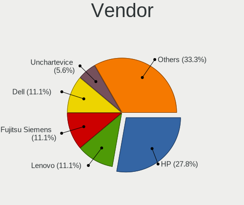
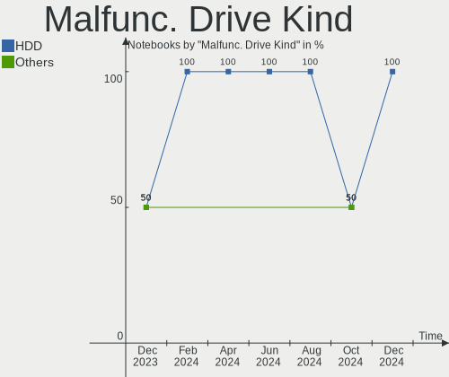
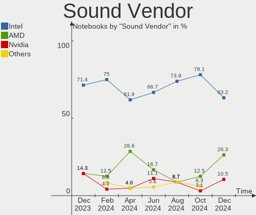
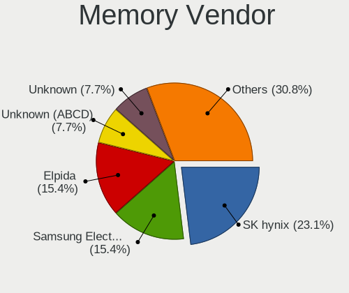
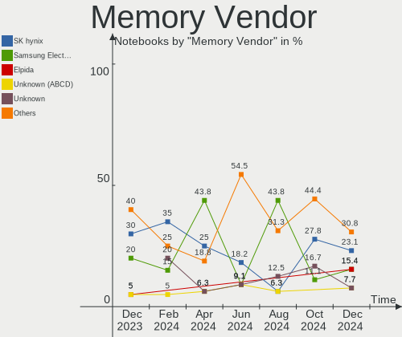
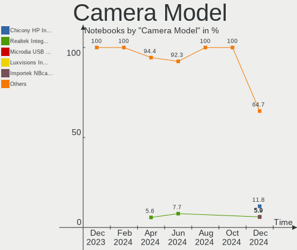

Lubuntu - Hardware Trends (Notebooks)
-------------------------------------

A project to identify most popular hardware characteristics and track their change
over time based on data collected by Linux users at https://Linux-Hardware.org.

Anyone can contribute to this report by the [hw-probe](https://github.com/linuxhw/hw-probe) tool:

    sudo -E hw-probe -all -upload

This report is for one last month. Overall report since the beginning of time: [TestDays](https://github.com/linuxhw/TestDays)

Period: Aug, 2023.

Contents
--------

* [ System ](#system)
  - [ OS                       ](#os)
  - [ OS Family                ](#os-family)
  - [ Kernel                   ](#kernel)
  - [ Kernel Family            ](#kernel-family)
  - [ Kernel Major Ver.        ](#kernel-major-ver)
  - [ Arch                     ](#arch)
  - [ DE                       ](#de)
  - [ Display Server           ](#display-server)
  - [ Display Manager          ](#display-manager)
  - [ OS Lang                  ](#os-lang)
  - [ Boot Mode                ](#boot-mode)
  - [ Filesystem               ](#filesystem)
  - [ Part. scheme             ](#part-scheme)
  - [ Dual Boot with Linux/BSD ](#dual-boot-with-linuxbsd)
  - [ Dual Boot (Win)          ](#dual-boot-win)

* [ Board ](#board)
  - [ Vendor                   ](#vendor)
  - [ Model                    ](#model)
  - [ Model Family             ](#model-family)
  - [ MFG Year                 ](#mfg-year)
  - [ Form Factor              ](#form-factor)
  - [ Secure Boot              ](#secure-boot)
  - [ Coreboot                 ](#coreboot)
  - [ RAM Size                 ](#ram-size)
  - [ RAM Used                 ](#ram-used)
  - [ Total Drives             ](#total-drives)
  - [ Has CD-ROM               ](#has-cd-rom)
  - [ Has Ethernet             ](#has-ethernet)
  - [ Has WiFi                 ](#has-wifi)
  - [ Has Bluetooth            ](#has-bluetooth)

* [ Location ](#location)
  - [ Country                  ](#country)
  - [ City                     ](#city)

* [ Drives ](#drives)
  - [ Drive Vendor             ](#drive-vendor)
  - [ Drive Model              ](#drive-model)
  - [ HDD Vendor               ](#hdd-vendor)
  - [ SSD Vendor               ](#ssd-vendor)
  - [ Drive Kind               ](#drive-kind)
  - [ Drive Connector          ](#drive-connector)
  - [ Drive Size               ](#drive-size)
  - [ Space Total              ](#space-total)
  - [ Space Used               ](#space-used)
  - [ Malfunc. Drives          ](#malfunc-drives)
  - [ Malfunc. Drive Vendor    ](#malfunc-drive-vendor)
  - [ Malfunc. HDD Vendor      ](#malfunc-hdd-vendor)
  - [ Malfunc. Drive Kind      ](#malfunc-drive-kind)
  - [ Failed Drives            ](#failed-drives)
  - [ Failed Drive Vendor      ](#failed-drive-vendor)
  - [ Drive Status             ](#drive-status)

* [ Storage controller ](#storage-controller)
  - [ Storage Vendor           ](#storage-vendor)
  - [ Storage Model            ](#storage-model)
  - [ Storage Kind             ](#storage-kind)

* [ Processor ](#processor)
  - [ CPU Vendor               ](#cpu-vendor)
  - [ CPU Model                ](#cpu-model)
  - [ CPU Model Family         ](#cpu-model-family)
  - [ CPU Cores                ](#cpu-cores)
  - [ CPU Sockets              ](#cpu-sockets)
  - [ CPU Threads              ](#cpu-threads)
  - [ CPU Op-Modes             ](#cpu-op-modes)
  - [ CPU Microcode            ](#cpu-microcode)
  - [ CPU Microarch            ](#cpu-microarch)

* [ Graphics ](#graphics)
  - [ GPU Vendor               ](#gpu-vendor)
  - [ GPU Model                ](#gpu-model)
  - [ GPU Combo                ](#gpu-combo)
  - [ GPU Driver               ](#gpu-driver)
  - [ GPU Memory               ](#gpu-memory)

* [ Monitor ](#monitor)
  - [ Monitor Vendor           ](#monitor-vendor)
  - [ Monitor Model            ](#monitor-model)
  - [ Monitor Resolution       ](#monitor-resolution)
  - [ Monitor Diagonal         ](#monitor-diagonal)
  - [ Monitor Width            ](#monitor-width)
  - [ Aspect Ratio             ](#aspect-ratio)
  - [ Monitor Area             ](#monitor-area)
  - [ Pixel Density            ](#pixel-density)
  - [ Multiple Monitors        ](#multiple-monitors)

* [ Network ](#network)
  - [ Net Controller Vendor    ](#net-controller-vendor)
  - [ Net Controller Model     ](#net-controller-model)
  - [ Wireless Vendor          ](#wireless-vendor)
  - [ Wireless Model           ](#wireless-model)
  - [ Ethernet Vendor          ](#ethernet-vendor)
  - [ Ethernet Model           ](#ethernet-model)
  - [ Net Controller Kind      ](#net-controller-kind)
  - [ Used Controller          ](#used-controller)
  - [ NICs                     ](#nics)
  - [ IPv6                     ](#ipv6)

* [ Bluetooth ](#bluetooth)
  - [ Bluetooth Vendor         ](#bluetooth-vendor)
  - [ Bluetooth Model          ](#bluetooth-model)

* [ Sound ](#sound)
  - [ Sound Vendor             ](#sound-vendor)
  - [ Sound Model              ](#sound-model)

* [ Memory ](#memory)
  - [ Memory Vendor            ](#memory-vendor)
  - [ Memory Model             ](#memory-model)
  - [ Memory Kind              ](#memory-kind)
  - [ Memory Form Factor       ](#memory-form-factor)
  - [ Memory Size              ](#memory-size)
  - [ Memory Speed             ](#memory-speed)

* [ Printers & scanners ](#printers--scanners)
  - [ Printer Vendor           ](#printer-vendor)
  - [ Printer Model            ](#printer-model)
  - [ Scanner Vendor           ](#scanner-vendor)
  - [ Scanner Model            ](#scanner-model)

* [ Camera ](#camera)
  - [ Camera Vendor            ](#camera-vendor)
  - [ Camera Model             ](#camera-model)

* [ Security ](#security)
  - [ Fingerprint Vendor       ](#fingerprint-vendor)
  - [ Fingerprint Model        ](#fingerprint-model)
  - [ Chipcard Vendor          ](#chipcard-vendor)
  - [ Chipcard Model           ](#chipcard-model)

* [ Unsupported ](#unsupported)
  - [ Unsupported Devices      ](#unsupported-devices)
  - [ Unsupported Device Types ](#unsupported-device-types)

System
------

OS
--

Installed operating systems

| Name          | Notebooks | Percent |
|---------------|-----------|---------|
| Lubuntu 22.04 | 13        | 65%     |
| Lubuntu 23.04 | 2         | 10%     |
| Lubuntu 18.04 | 2         | 10%     |
| Lubuntu 23.10 | 1         | 5%      |
| Lubuntu 22.10 | 1         | 5%      |
| Lubuntu 20.04 | 1         | 5%      |

OS Family
---------

OS without a version

| Name    | Notebooks | Percent |
|---------|-----------|---------|
| Lubuntu | 20        | 100%    |

Kernel
------

Version of the Linux kernel

| Version               | Notebooks | Percent |
|-----------------------|-----------|---------|
| 6.2.0-26-generic      | 4         | 20%     |
| 5.15.0-79-generic     | 3         | 15%     |
| 6.2.0-31-generic      | 2         | 10%     |
| 6.2.0-27-generic      | 2         | 10%     |
| 5.4.0-150-generic     | 2         | 10%     |
| 5.15.0-78-generic     | 2         | 10%     |
| 6.5.0-060500-generic  | 1         | 5%      |
| 6.4.12-060412-generic | 1         | 5%      |
| 5.19.0-46-generic     | 1         | 5%      |
| 5.19.0-32-generic     | 1         | 5%      |
| 5.15.0-25-generic     | 1         | 5%      |

Kernel Family
-------------

Linux kernel without a distro release

| Version | Notebooks | Percent |
|---------|-----------|---------|
| 6.2.0   | 8         | 40%     |
| 5.15.0  | 6         | 30%     |
| 5.4.0   | 2         | 10%     |
| 5.19.0  | 2         | 10%     |
| 6.5.0   | 1         | 5%      |
| 6.4.12  | 1         | 5%      |

Kernel Major Ver.
-----------------

Linux kernel major version

| Version | Notebooks | Percent |
|---------|-----------|---------|
| 6.2     | 8         | 40%     |
| 5.15    | 6         | 30%     |
| 5.4     | 2         | 10%     |
| 5.19    | 2         | 10%     |
| 6.5     | 1         | 5%      |
| 6.4     | 1         | 5%      |

Arch
----

OS architecture (x86_64, i586, etc.)

| Name   | Notebooks | Percent |
|--------|-----------|---------|
| x86_64 | 18        | 90%     |
| i686   | 2         | 10%     |

DE
--

Desktop Environment

| Name | Notebooks | Percent |
|------|-----------|---------|
| LXQt | 16        | 80%     |
| LXDE | 4         | 20%     |

Display Server
--------------

X11 or Wayland

| Name | Notebooks | Percent |
|------|-----------|---------|
| X11  | 20        | 100%    |

Display Manager
---------------

SDDM, LightDM, etc.

| Name    | Notebooks | Percent |
|---------|-----------|---------|
| SDDM    | 13        | 65%     |
| LightDM | 3         | 15%     |
| GDM3    | 2         | 10%     |
| Unknown | 2         | 10%     |

OS Lang
-------

Language

| Lang  | Notebooks | Percent |
|-------|-----------|---------|
| en_US | 5         | 25%     |
| en_GB | 4         | 20%     |
| fr_FR | 3         | 15%     |
| sk_SK | 1         | 5%      |
| pt_BR | 1         | 5%      |
| pl_PL | 1         | 5%      |
| hu_HU | 1         | 5%      |
| es_AR | 1         | 5%      |
| en_CA | 1         | 5%      |
| de_DE | 1         | 5%      |
| C     | 1         | 5%      |

Boot Mode
---------

EFI or BIOS

| Mode | Notebooks | Percent |
|------|-----------|---------|
| BIOS | 13        | 65%     |
| EFI  | 7         | 35%     |

Filesystem
----------

Type of filesystem

| Type    | Notebooks | Percent |
|---------|-----------|---------|
| Ext4    | 12        | 60%     |
| Tmpfs   | 7         | 35%     |
| Overlay | 1         | 5%      |

Part. scheme
------------

Scheme of partitioning

| Type    | Notebooks | Percent |
|---------|-----------|---------|
| GPT     | 12        | 60%     |
| MBR     | 4         | 20%     |
| Unknown | 4         | 20%     |

Dual Boot with Linux/BSD
------------------------

Hosting more than one Linux/BSD

| Dual boot | Notebooks | Percent |
|-----------|-----------|---------|
| No        | 19        | 95%     |
| Yes       | 1         | 5%      |

Dual Boot (Win)
---------------

Hosting Linux and Windows

| Dual boot | Notebooks | Percent |
|-----------|-----------|---------|
| No        | 16        | 80%     |
| Yes       | 4         | 20%     |

Board
-----

Vendor
------

Motherboard manufacturer

| Name                | Notebooks | Percent |
|---------------------|-----------|---------|
| Hewlett-Packard     | 4         | 20%     |
| ASUSTek Computer    | 4         | 20%     |
| Lenovo              | 3         | 15%     |
| Toshiba             | 2         | 10%     |
| Dell                | 2         | 10%     |
| Samsung Electronics | 1         | 5%      |
| Packard Bell        | 1         | 5%      |
| Google              | 1         | 5%      |
| Compal              | 1         | 5%      |
| Acer                | 1         | 5%      |

Model
-----

Motherboard model

| Name                                     | Notebooks | Percent |
|------------------------------------------|-----------|---------|
| Toshiba Satellite P770                   | 1         | 5%      |
| Toshiba Satellite L875D                  | 1         | 5%      |
| Samsung N150P/N210P/N220P                | 1         | 5%      |
| Packard Bell EasyNote TJ65               | 1         | 5%      |
| Lenovo ThinkPad T430 2349TFK             | 1         | 5%      |
| Lenovo IdeaPad Slim 1-11AST-05 81VR      | 1         | 5%      |
| Lenovo G580 20150                        | 1         | 5%      |
| HP Pavilion g7                           | 1         | 5%      |
| HP Pavilion 15                           | 1         | 5%      |
| HP Notebook                              | 1         | 5%      |
| HP EliteBook 830 G8 Notebook PC          | 1         | 5%      |
| Google Robo                              | 1         | 5%      |
| Dell Inspiron MM061                      | 1         | 5%      |
| Dell Inspiron 5720                       | 1         | 5%      |
| Compal PBL20                             | 1         | 5%      |
| ASUS X75VD                               | 1         | 5%      |
| ASUS VivoBook_ASUSLaptop X512DA_X512DA   | 1         | 5%      |
| ASUS K52JB                               | 1         | 5%      |
| ASUS ASUS TUF Gaming A15 FA506II_FA506II | 1         | 5%      |
| Acer Aspire 5050                         | 1         | 5%      |

Model Family
------------

Motherboard model prefix

| Name                  | Notebooks | Percent |
|-----------------------|-----------|---------|
| Toshiba Satellite     | 2         | 10%     |
| HP Pavilion           | 2         | 10%     |
| Dell Inspiron         | 2         | 10%     |
| Samsung N150P         | 1         | 5%      |
| Packard Bell EasyNote | 1         | 5%      |
| Lenovo ThinkPad       | 1         | 5%      |
| Lenovo IdeaPad        | 1         | 5%      |
| Lenovo G580           | 1         | 5%      |
| HP Notebook           | 1         | 5%      |
| HP EliteBook          | 1         | 5%      |
| Google Robo           | 1         | 5%      |
| Compal PBL20          | 1         | 5%      |
| ASUS X75VD            | 1         | 5%      |
| ASUS VivoBook         | 1         | 5%      |
| ASUS K52JB            | 1         | 5%      |
| ASUS ASUS             | 1         | 5%      |
| Acer Aspire           | 1         | 5%      |

MFG Year
--------

Motherboard manufacture year

| Year | Notebooks | Percent |
|------|-----------|---------|
| 2012 | 5         | 25%     |
| 2011 | 3         | 15%     |
| 2019 | 2         | 10%     |
| 2010 | 2         | 10%     |
| 2006 | 2         | 10%     |
| 2023 | 1         | 5%      |
| 2021 | 1         | 5%      |
| 2020 | 1         | 5%      |
| 2016 | 1         | 5%      |
| 2013 | 1         | 5%      |
| 2009 | 1         | 5%      |

Form Factor
-----------

Physical design of the computer

| Name     | Notebooks | Percent |
|----------|-----------|---------|
| Notebook | 20        | 100%    |

Secure Boot
-----------

Enabled or disabled

| State    | Notebooks | Percent |
|----------|-----------|---------|
| Disabled | 17        | 85%     |
| Enabled  | 3         | 15%     |

Coreboot
--------

Have coreboot on board

| Used | Notebooks | Percent |
|------|-----------|---------|
| No   | 19        | 95%     |
| Yes  | 1         | 5%      |

RAM Size
--------

Total RAM memory

| Size in GB | Notebooks | Percent |
|------------|-----------|---------|
| 3.01-4.0   | 8         | 40%     |
| 4.01-8.0   | 6         | 30%     |
| 8.01-16.0  | 4         | 20%     |
| 1.01-2.0   | 2         | 10%     |

RAM Used
--------

Used RAM memory

| Used GB  | Notebooks | Percent |
|----------|-----------|---------|
| 1.01-2.0 | 10        | 50%     |
| 2.01-3.0 | 4         | 20%     |
| 0.51-1.0 | 3         | 15%     |
| 4.01-8.0 | 2         | 10%     |
| 3.01-4.0 | 1         | 5%      |

Total Drives
------------

Number of drives on board

| Drives | Notebooks | Percent |
|--------|-----------|---------|
| 1      | 17        | 85%     |
| 2      | 3         | 15%     |

Has CD-ROM
----------

Has CD-ROM on board

| Presented | Notebooks | Percent |
|-----------|-----------|---------|
| Yes       | 13        | 65%     |
| No        | 7         | 35%     |

Has Ethernet
------------

Has Ethernet on board

| Presented | Notebooks | Percent |
|-----------|-----------|---------|
| Yes       | 16        | 80%     |
| No        | 4         | 20%     |

Has WiFi
--------

Has WiFi module

| Presented | Notebooks | Percent |
|-----------|-----------|---------|
| Yes       | 20        | 100%    |

Has Bluetooth
-------------

Has Bluetooth module

| Presented | Notebooks | Percent |
|-----------|-----------|---------|
| No        | 11        | 55%     |
| Yes       | 9         | 45%     |

Location
--------

Country
-------

Geographic location (country)

| Country   | Notebooks | Percent |
|-----------|-----------|---------|
| France    | 4         | 20%     |
| USA       | 3         | 15%     |
| UK        | 2         | 10%     |
| Slovakia  | 2         | 10%     |
| Germany   | 2         | 10%     |
| Ukraine   | 1         | 5%      |
| Poland    | 1         | 5%      |
| Hungary   | 1         | 5%      |
| Czechia   | 1         | 5%      |
| Canada    | 1         | 5%      |
| Brazil    | 1         | 5%      |
| Argentina | 1         | 5%      |

City
----

Geographic location (city)

| City                   | Notebooks | Percent |
|------------------------|-----------|---------|
| Paris                  | 2         | 10%     |
| Bratislava             | 2         | 10%     |
| Wattignies-la-Victoire | 1         | 5%      |
| San Fernando           | 1         | 5%      |
| Saint-Maur-des-Fossés | 1         | 5%      |
| Prague                 | 1         | 5%      |
| Ottawa                 | 1         | 5%      |
| Oberhausen             | 1         | 5%      |
| Manchester             | 1         | 5%      |
| London                 | 1         | 5%      |
| Lodz                   | 1         | 5%      |
| Kyiv                   | 1         | 5%      |
| Kiel                   | 1         | 5%      |
| Fruitland              | 1         | 5%      |
| Encantado              | 1         | 5%      |
| Clearfield             | 1         | 5%      |
| Budapest               | 1         | 5%      |
| Bloomfield             | 1         | 5%      |

Drives
------

Drive Vendor
------------

Hard drive vendors

| Vendor              | Notebooks | Drives | Percent |
|---------------------|-----------|--------|---------|
| Seagate             | 3         | 3      | 13.04%  |
| Kingston            | 3         | 3      | 13.04%  |
| WDC                 | 2         | 2      | 8.7%    |
| Unknown             | 2         | 2      | 8.7%    |
| Toshiba             | 2         | 2      | 8.7%    |
| Samsung Electronics | 2         | 2      | 8.7%    |
| Hitachi             | 2         | 2      | 8.7%    |
| Transcend           | 1         | 1      | 4.35%   |
| SanDisk             | 1         | 1      | 4.35%   |
| Patriot             | 1         | 1      | 4.35%   |
| Micron Technology   | 1         | 1      | 4.35%   |
| Fujitsu             | 1         | 1      | 4.35%   |
| Crucial             | 1         | 1      | 4.35%   |
| BHT                 | 1         | 1      | 4.35%   |

Drive Model
-----------

Hard drive models

| Model                                | Notebooks | Percent |
|--------------------------------------|-----------|---------|
| Kingston OM8PCP3512F-AB 512GB        | 2         | 8.7%    |
| WDC WD6400BEVT-22A0RT0 640GB         | 1         | 4.35%   |
| WDC WD10JPVT-80A1YT0 1TB             | 1         | 4.35%   |
| Unknown DA4064  64GB                 | 1         | 4.35%   |
| Unknown DA4032  32GB                 | 1         | 4.35%   |
| Transcend TS256GSSD370S 256GB        | 1         | 4.35%   |
| Toshiba MQ01ABF050 500GB             | 1         | 4.35%   |
| Toshiba MK6465GSX 640GB              | 1         | 4.35%   |
| Seagate ST1000LM048-2E7172 1TB       | 1         | 4.35%   |
| Seagate ST1000LM024 HN-M101MBB 1TB   | 1         | 4.35%   |
| Seagate Expansion 2TB                | 1         | 4.35%   |
| SanDisk DF4032  32GB                 | 1         | 4.35%   |
| Samsung HM250HI 250GB                | 1         | 4.35%   |
| Samsung HM160HI 160GB                | 1         | 4.35%   |
| Patriot Blaze 120GB SSD              | 1         | 4.35%   |
| Micron MTFDHBA512QFD-1AX1AABHA 512GB | 1         | 4.35%   |
| Kingston SA400S37240G 240GB SSD      | 1         | 4.35%   |
| Hitachi HTS547564A9E384 640GB        | 1         | 4.35%   |
| Hitachi HTS545050B9A300 500GB        | 1         | 4.35%   |
| Fujitsu MJA2500BH G2 500GB           | 1         | 4.35%   |
| Crucial CT512MX100SSD1 512GB         | 1         | 4.35%   |
| BHT WR202HH032G E70215F5 32GB SSD    | 1         | 4.35%   |

HDD Vendor
----------

Hard disk drive vendors

| Vendor              | Notebooks | Drives | Percent |
|---------------------|-----------|--------|---------|
| Seagate             | 3         | 3      | 25%     |
| WDC                 | 2         | 2      | 16.67%  |
| Toshiba             | 2         | 2      | 16.67%  |
| Samsung Electronics | 2         | 2      | 16.67%  |
| Hitachi             | 2         | 2      | 16.67%  |
| Fujitsu             | 1         | 1      | 8.33%   |

SSD Vendor
----------

Solid state drive vendors

| Vendor    | Notebooks | Drives | Percent |
|-----------|-----------|--------|---------|
| Transcend | 1         | 1      | 20%     |
| Patriot   | 1         | 1      | 20%     |
| Kingston  | 1         | 1      | 20%     |
| Crucial   | 1         | 1      | 20%     |
| BHT       | 1         | 1      | 20%     |

Drive Kind
----------

HDD or SSD

| Kind | Notebooks | Drives | Percent |
|------|-----------|--------|---------|
| HDD  | 12        | 12     | 52.17%  |
| SSD  | 5         | 5      | 21.74%  |
| MMC  | 3         | 3      | 13.04%  |
| NVMe | 3         | 3      | 13.04%  |

Drive Connector
---------------

SATA, SAS, NVMe, etc.

| Type | Notebooks | Drives | Percent |
|------|-----------|--------|---------|
| SATA | 16        | 16     | 69.57%  |
| NVMe | 3         | 3      | 13.04%  |
| MMC  | 3         | 3      | 13.04%  |
| SAS  | 1         | 1      | 4.35%   |

Drive Size
----------

Size of hard drive

| Size in TB | Notebooks | Drives | Percent |
|------------|-----------|--------|---------|
| 0.01-0.5   | 9         | 9      | 52.94%  |
| 0.51-1.0   | 7         | 7      | 41.18%  |
| 1.01-2.0   | 1         | 1      | 5.88%   |

Space Total
-----------

Amount of disk space available on the file system

| Size in GB | Notebooks | Percent |
|------------|-----------|---------|
| 101-250    | 7         | 35%     |
| 501-1000   | 6         | 30%     |
| 251-500    | 3         | 15%     |
| 21-50      | 2         | 10%     |
| 1-20       | 1         | 5%      |
| 51-100     | 1         | 5%      |

Space Used
----------

Amount of used disk space

| Used GB | Notebooks | Percent |
|---------|-----------|---------|
| 1-20    | 11        | 55%     |
| 101-250 | 5         | 25%     |
| 21-50   | 2         | 10%     |
| 251-500 | 1         | 5%      |
| 51-100  | 1         | 5%      |

Malfunc. Drives
---------------

Drive models with a malfunction

| Model                              | Notebooks | Drives | Percent |
|------------------------------------|-----------|--------|---------|
| Seagate ST1000LM024 HN-M101MBB 1TB | 1         | 1      | 50%     |
| Hitachi HTS545050B9A300 500GB      | 1         | 1      | 50%     |

Malfunc. Drive Vendor
---------------------

Vendors of faulty drives

| Vendor  | Notebooks | Drives | Percent |
|---------|-----------|--------|---------|
| Seagate | 1         | 1      | 50%     |
| Hitachi | 1         | 1      | 50%     |

Malfunc. HDD Vendor
-------------------

Vendors of faulty HDD drives

| Vendor  | Notebooks | Drives | Percent |
|---------|-----------|--------|---------|
| Seagate | 1         | 1      | 50%     |
| Hitachi | 1         | 1      | 50%     |

Malfunc. Drive Kind
-------------------

Kinds of faulty drives

| Kind | Notebooks | Drives | Percent |
|------|-----------|--------|---------|
| HDD  | 2         | 2      | 100%    |

Failed Drives
-------------

Failed drive models

Zero info for selected period =(

Failed Drive Vendor
-------------------

Failed drive vendors

Zero info for selected period =(

Drive Status
------------

Number of failed and malfunc. drives

| Status   | Notebooks | Drives | Percent |
|----------|-----------|--------|---------|
| Detected | 12        | 12     | 54.55%  |
| Works    | 8         | 9      | 36.36%  |
| Malfunc  | 2         | 2      | 9.09%   |

Storage controller
------------------

Storage Vendor
--------------

Storage controller vendors

| Vendor                      | Notebooks | Percent |
|-----------------------------|-----------|---------|
| Intel                       | 13        | 59.09%  |
| AMD                         | 6         | 27.27%  |
| Kingston Technology Company | 2         | 9.09%   |
| Micron Technology           | 1         | 4.55%   |

Storage Model
-------------

Storage controller models

| Model                                                                        | Notebooks | Percent |
|------------------------------------------------------------------------------|-----------|---------|
| Intel 7 Series Chipset Family 6-port SATA Controller [AHCI mode]             | 5         | 21.74%  |
| AMD FCH SATA Controller [AHCI mode]                                          | 5         | 21.74%  |
| Kingston Company OM8PCP Design-In PCIe 3 NVMe SSD (DRAM-less)                | 2         | 8.7%    |
| Intel 6 Series/C200 Series Chipset Family 6 port Mobile SATA AHCI Controller | 2         | 8.7%    |
| Intel 5 Series/3400 Series Chipset 4 port SATA AHCI Controller               | 2         | 8.7%    |
| Micron 2210 NVMe SSD [Cobain]                                                | 1         | 4.35%   |
| Intel Volume Management Device NVMe RAID Controller                          | 1         | 4.35%   |
| Intel NM10/ICH7 Family SATA Controller [AHCI mode]                           | 1         | 4.35%   |
| Intel 82801IBM/IEM (ICH9M/ICH9M-E) 4 port SATA Controller [AHCI mode]        | 1         | 4.35%   |
| Intel 82801GBM/GHM (ICH7-M Family) SATA Controller [IDE mode]                | 1         | 4.35%   |
| AMD IXP SB4x0 Serial ATA Controller                                          | 1         | 4.35%   |
| AMD IXP SB4x0 IDE Controller                                                 | 1         | 4.35%   |

Storage Kind
------------

Kind of storage controller (IDE, SATA, NVMe, SAS, ...)

| Kind | Notebooks | Percent |
|------|-----------|---------|
| SATA | 16        | 72.73%  |
| NVMe | 3         | 13.64%  |
| IDE  | 2         | 9.09%   |
| RAID | 1         | 4.55%   |

Processor
---------

CPU Vendor
----------

Processor vendors

| Vendor | Notebooks | Percent |
|--------|-----------|---------|
| Intel  | 14        | 70%     |
| AMD    | 6         | 30%     |

CPU Model
---------

Processor models

| Model                                         | Notebooks | Percent |
|-----------------------------------------------|-----------|---------|
| Intel Core i5-3230M CPU @ 2.60GHz             | 2         | 10%     |
| Intel Pentium Dual-Core CPU T4400 @ 2.20GHz   | 1         | 5%      |
| Intel Genuine CPU T2080 @ 1.73GHz             | 1         | 5%      |
| Intel Core i7-3632QM CPU @ 2.20GHz            | 1         | 5%      |
| Intel Core i7-2670QM CPU @ 2.20GHz            | 1         | 5%      |
| Intel Core i7-2620M CPU @ 2.70GHz             | 1         | 5%      |
| Intel Core i5-3320M CPU @ 2.60GHz             | 1         | 5%      |
| Intel Core i5-3210M CPU @ 2.50GHz             | 1         | 5%      |
| Intel Core i5 CPU M 430 @ 2.27GHz             | 1         | 5%      |
| Intel Core i3 CPU M 390 @ 2.67GHz             | 1         | 5%      |
| Intel Celeron CPU N3350 @ 1.10GHz             | 1         | 5%      |
| Intel Atom CPU N450 @ 1.66GHz                 | 1         | 5%      |
| Intel 11th Gen Core i5-1135G7 @ 2.40GHz       | 1         | 5%      |
| AMD Turion 64 Mobile Technology MK-38         | 1         | 5%      |
| AMD Ryzen 7 3700U with Radeon Vega Mobile Gfx | 1         | 5%      |
| AMD Ryzen 5 4600H with Radeon Graphics        | 1         | 5%      |
| AMD E2-7110 APU with AMD Radeon R2 Graphics   | 1         | 5%      |
| AMD A6-4400M APU with Radeon HD Graphics      | 1         | 5%      |
| AMD A4-9120e RADEON R3, 4 COMPUTE CORES 2C+2G | 1         | 5%      |

CPU Model Family
----------------

Processor model prefix

| Model                   | Notebooks | Percent |
|-------------------------|-----------|---------|
| Intel Core i5           | 5         | 25%     |
| Intel Core i7           | 3         | 15%     |
| Other                   | 1         | 5%      |
| Intel Pentium Dual-Core | 1         | 5%      |
| Intel Genuine           | 1         | 5%      |
| Intel Core i3           | 1         | 5%      |
| Intel Celeron           | 1         | 5%      |
| Intel Atom              | 1         | 5%      |
| AMD Turion 64 Mobile    | 1         | 5%      |
| AMD Ryzen 7             | 1         | 5%      |
| AMD Ryzen 5             | 1         | 5%      |
| AMD E2                  | 1         | 5%      |
| AMD A6                  | 1         | 5%      |
| AMD A4                  | 1         | 5%      |

CPU Cores
---------

Number of processor cores

| Number | Notebooks | Percent |
|--------|-----------|---------|
| 2      | 11        | 55%     |
| 4      | 5         | 25%     |
| 1      | 3         | 15%     |
| 6      | 1         | 5%      |

CPU Sockets
-----------

Number of sockets

| Number | Notebooks | Percent |
|--------|-----------|---------|
| 1      | 20        | 100%    |

CPU Threads
-----------

Threads per core (Hyper-Threading)

| Number | Notebooks | Percent |
|--------|-----------|---------|
| 2      | 14        | 70%     |
| 1      | 6         | 30%     |

CPU Op-Modes
------------

CPU Operation Modes (32-bit, 64-bit)

| Op mode        | Notebooks | Percent |
|----------------|-----------|---------|
| 32-bit, 64-bit | 19        | 95%     |
| 32-bit         | 1         | 5%      |

CPU Microcode
-------------

Microcode number

| Number     | Notebooks | Percent |
|------------|-----------|---------|
| Unknown    | 9         | 45%     |
| 0x306a9    | 4         | 20%     |
| 0x6ec      | 1         | 5%      |
| 0x20655    | 1         | 5%      |
| 0x08600104 | 1         | 5%      |
| 0x08108109 | 1         | 5%      |
| 0x07030105 | 1         | 5%      |
| 0x06006705 | 1         | 5%      |
| 0x06001119 | 1         | 5%      |

CPU Microarch
-------------

Microarchitecture

| Name        | Notebooks | Percent |
|-------------|-----------|---------|
| IvyBridge   | 5         | 25%     |
| Westmere    | 2         | 10%     |
| SandyBridge | 2         | 10%     |
| Zen+        | 1         | 5%      |
| Zen 2       | 1         | 5%      |
| TigerLake   | 1         | 5%      |
| Puma        | 1         | 5%      |
| Piledriver  | 1         | 5%      |
| Penryn      | 1         | 5%      |
| P6          | 1         | 5%      |
| K8 Hammer   | 1         | 5%      |
| Goldmont    | 1         | 5%      |
| Excavator   | 1         | 5%      |
| Bonnell     | 1         | 5%      |

Graphics
--------

GPU Vendor
----------

Vendors of graphics cards

| Vendor | Notebooks | Percent |
|--------|-----------|---------|
| Intel  | 12        | 46.15%  |
| AMD    | 9         | 34.62%  |
| Nvidia | 5         | 19.23%  |

GPU Model
---------

Graphics card models

| Model                                                                         | Notebooks | Percent |
|-------------------------------------------------------------------------------|-----------|---------|
| Intel 3rd Gen Core processor Graphics Controller                              | 5         | 18.52%  |
| Intel 2nd Generation Core Processor Family Integrated Graphics Controller     | 2         | 7.41%   |
| Nvidia TU117M [GeForce GTX 1650 Ti Mobile]                                    | 1         | 3.7%    |
| Nvidia GT216M [GeForce GT 240M]                                               | 1         | 3.7%    |
| Nvidia GF119M [GeForce 610M]                                                  | 1         | 3.7%    |
| Nvidia GF108M [GeForce GT 635M]                                               | 1         | 3.7%    |
| Nvidia GF108M [GeForce GT 540M]                                               | 1         | 3.7%    |
| Intel TigerLake-LP GT2 [Iris Xe Graphics]                                     | 1         | 3.7%    |
| Intel Mobile 945GM/GMS/GME, 943/940GML Express Integrated Graphics Controller | 1         | 3.7%    |
| Intel Mobile 945GM/GMS, 943/940GML Express Integrated Graphics Controller     | 1         | 3.7%    |
| Intel HD Graphics 500                                                         | 1         | 3.7%    |
| Intel Core Processor Integrated Graphics Controller                           | 1         | 3.7%    |
| Intel Atom Processor D4xx/D5xx/N4xx/N5xx Integrated Graphics Controller       | 1         | 3.7%    |
| AMD Trinity 2 [Radeon HD 7520G]                                               | 1         | 3.7%    |
| AMD Sun XT [Radeon HD 8670A/8670M/8690M / R5 M330 / M430 / Radeon 520 Mobile] | 1         | 3.7%    |
| AMD Stoney [Radeon R2/R3/R4/R5 Graphics]                                      | 1         | 3.7%    |
| AMD Seymour [Radeon HD 6400M/7400M Series]                                    | 1         | 3.7%    |
| AMD RV710/M92 [Mobility Radeon HD 4530/4570/5145/530v/540v/545v]              | 1         | 3.7%    |
| AMD RS482M [Mobility Radeon Xpress 200]                                       | 1         | 3.7%    |
| AMD Renoir                                                                    | 1         | 3.7%    |
| AMD Picasso/Raven 2 [Radeon Vega Series / Radeon Vega Mobile Series]          | 1         | 3.7%    |
| AMD Mullins [Radeon R3 Graphics]                                              | 1         | 3.7%    |

GPU Combo
---------

Combinations of graphics cards

| Name           | Notebooks | Percent |
|----------------|-----------|---------|
| 1 x Intel      | 6         | 30%     |
| 1 x AMD        | 6         | 30%     |
| Intel + Nvidia | 3         | 15%     |
| Intel + AMD    | 2         | 10%     |
| Other          | 1         | 5%      |
| 1 x Nvidia     | 1         | 5%      |
| AMD + Nvidia   | 1         | 5%      |

GPU Driver
----------

Free vs proprietary

| Driver      | Notebooks | Percent |
|-------------|-----------|---------|
| Free        | 18        | 90%     |
| Proprietary | 2         | 10%     |

GPU Memory
----------

Total video memory

| Size in GB | Notebooks | Percent |
|------------|-----------|---------|
| Unknown    | 11        | 55%     |
| 1.01-2.0   | 4         | 20%     |
| 0.01-0.5   | 3         | 15%     |
| 3.01-4.0   | 1         | 5%      |
| 0.51-1.0   | 1         | 5%      |

Monitor
-------

Monitor Vendor
--------------

Monitor vendors

| Vendor               | Notebooks | Percent |
|----------------------|-----------|---------|
| LG Display           | 6         | 31.58%  |
| Samsung Electronics  | 4         | 21.05%  |
| PANDA                | 2         | 10.53%  |
| AU Optronics         | 2         | 10.53%  |
| Quanta Display       | 1         | 5.26%   |
| InfoVision           | 1         | 5.26%   |
| Chimei Innolux       | 1         | 5.26%   |
| BOE                  | 1         | 5.26%   |
| Ancor Communications | 1         | 5.26%   |

Monitor Model
-------------

Monitor models

| Model                                                                | Notebooks | Percent |
|----------------------------------------------------------------------|-----------|---------|
| Samsung Electronics LCD Monitor SEC544B 1600x900 382x214mm 17.2-inch | 1         | 5.26%   |
| Samsung Electronics LCD Monitor SEC4252 1366x768 344x194mm 15.5-inch | 1         | 5.26%   |
| Samsung Electronics LCD Monitor SEC324C 1600x900 310x174mm 14.0-inch | 1         | 5.26%   |
| Samsung Electronics LCD Monitor SEC3052 1024x600 223x125mm 10.1-inch | 1         | 5.26%   |
| Quanta Display LCD Monitor QDS001F 1280x800 304x190mm 14.1-inch      | 1         | 5.26%   |
| PANDA LCD Monitor NCP004D 1920x1080 344x194mm 15.5-inch              | 1         | 5.26%   |
| PANDA LCD Monitor NCP0046 1920x1080 344x194mm 15.5-inch              | 1         | 5.26%   |
| LG Display LP156WH2-TLE1 LGDCF01 1366x768 344x194mm 15.5-inch        | 1         | 5.26%   |
| LG Display LCD Monitor LGD0516 1920x1080 309x175mm 14.0-inch         | 1         | 5.26%   |
| LG Display LCD Monitor LGD0384 1366x768 344x194mm 15.5-inch          | 1         | 5.26%   |
| LG Display LCD Monitor LGD02D1 1600x900 382x215mm 17.3-inch          | 1         | 5.26%   |
| LG Display LCD Monitor LGD02AC 1366x768 344x194mm 15.5-inch          | 1         | 5.26%   |
| LG Display LCD Monitor LGD027A 1600x900 382x215mm 17.3-inch          | 1         | 5.26%   |
| InfoVision LCD Monitor IVO8596 1920x1080 294x165mm 13.3-inch         | 1         | 5.26%   |
| Chimei Innolux LCD Monitor CMN1132 1366x768 256x144mm 11.6-inch      | 1         | 5.26%   |
| BOE LCD Monitor BOE0731 1366x768 256x144mm 11.6-inch                 | 1         | 5.26%   |
| AU Optronics LCD Monitor AUO159E 1600x900 382x214mm 17.2-inch        | 1         | 5.26%   |
| AU Optronics LCD Monitor AUO139E 1600x900 382x214mm 17.2-inch        | 1         | 5.26%   |
| Ancor Communications MT276 ACI27F1 1920x1080 598x336mm 27.0-inch     | 1         | 5.26%   |

Monitor Resolution
------------------

Monitor screen resolution

| Resolution      | Notebooks | Percent |
|-----------------|-----------|---------|
| 1366x768 (WXGA) | 7         | 36.84%  |
| 1600x900 (HD+)  | 6         | 31.58%  |
| 1920x1080 (FHD) | 5         | 26.32%  |
| 1280x800 (WXGA) | 1         | 5.26%   |

Monitor Diagonal
----------------

Diagonal size in inches

| Inches | Notebooks | Percent |
|--------|-----------|---------|
| 15     | 8         | 42.11%  |
| 17     | 5         | 26.32%  |
| 14     | 2         | 10.53%  |
| 11     | 2         | 10.53%  |
| 27     | 1         | 5.26%   |
| 13     | 1         | 5.26%   |

Monitor Width
-------------

Physical width

| Width in mm | Notebooks | Percent |
|-------------|-----------|---------|
| 301-350     | 9         | 47.37%  |
| 351-400     | 6         | 31.58%  |
| 201-300     | 3         | 15.79%  |
| 501-600     | 1         | 5.26%   |

Aspect Ratio
------------

Proportional relationship between the width and the height

| Ratio | Notebooks | Percent |
|-------|-----------|---------|
| 16/9  | 17        | 94.44%  |
| 16/10 | 1         | 5.56%   |

Monitor Area
------------

Area in inch²

| Area in inch² | Notebooks | Percent |
|----------------|-----------|---------|
| 101-110        | 8         | 42.11%  |
| 121-130        | 5         | 26.32%  |
| 81-90          | 2         | 10.53%  |
| 51-60          | 2         | 10.53%  |
| 71-80          | 1         | 5.26%   |
| 301-350        | 1         | 5.26%   |

Pixel Density
-------------

Pixels per inch

| Density | Notebooks | Percent |
|---------|-----------|---------|
| 101-120 | 11        | 57.89%  |
| 121-160 | 5         | 26.32%  |
| 51-100  | 2         | 10.53%  |
| 161-240 | 1         | 5.26%   |

Multiple Monitors
-----------------

Total monitors connected

| Total | Notebooks | Percent |
|-------|-----------|---------|
| 1     | 19        | 95%     |
| 2     | 1         | 5%      |

Network
-------

Net Controller Vendor
---------------------

Controller vendors

| Vendor                   | Notebooks | Percent |
|--------------------------|-----------|---------|
| Realtek Semiconductor    | 9         | 27.27%  |
| Qualcomm Atheros         | 8         | 24.24%  |
| Intel                    | 7         | 21.21%  |
| Broadcom                 | 4         | 12.12%  |
| Samsung Electronics      | 1         | 3.03%   |
| Ralink                   | 1         | 3.03%   |
| Marvell Technology Group | 1         | 3.03%   |
| JMicron Technology       | 1         | 3.03%   |
| Broadcom Limited         | 1         | 3.03%   |

Net Controller Model
--------------------

Controller models

| Model                                                                   | Notebooks | Percent |
|-------------------------------------------------------------------------|-----------|---------|
| Realtek RTL810xE PCI Express Fast Ethernet controller                   | 5         | 13.51%  |
| Realtek RTL8111/8168/8411 PCI Express Gigabit Ethernet Controller       | 3         | 8.11%   |
| Qualcomm Atheros QCA9377 802.11ac Wireless Network Adapter              | 2         | 5.41%   |
| Qualcomm Atheros AR9285 Wireless Network Adapter (PCI-Express)          | 2         | 5.41%   |
| Broadcom BCM4313 802.11bgn Wireless Network Adapter                     | 2         | 5.41%   |
| Samsung Galaxy series, misc. (tethering mode)                           | 1         | 2.7%    |
| Realtek RTL8822CE 802.11ac PCIe Wireless Network Adapter                | 1         | 2.7%    |
| Realtek RTL8188EE Wireless Network Adapter                              | 1         | 2.7%    |
| Realtek RTL8188CE 802.11b/g/n WiFi Adapter                              | 1         | 2.7%    |
| Realtek RTL-8100/8101L/8139 PCI Fast Ethernet Adapter                   | 1         | 2.7%    |
| Ralink RT5390 Wireless 802.11n 1T/1R PCIe                               | 1         | 2.7%    |
| Qualcomm Atheros AR928X Wireless Network Adapter (PCI-Express)          | 1         | 2.7%    |
| Qualcomm Atheros AR8162 Fast Ethernet                                   | 1         | 2.7%    |
| Qualcomm Atheros AR8161 Gigabit Ethernet                                | 1         | 2.7%    |
| Qualcomm Atheros AR242x / AR542x Wireless Network Adapter (PCI-Express) | 1         | 2.7%    |
| Marvell Group 88E8040 PCI-E Fast Ethernet Controller                    | 1         | 2.7%    |
| JMicron JMC250 PCI Express Gigabit Ethernet Controller                  | 1         | 2.7%    |
| Intel Wireless 7265                                                     | 1         | 2.7%    |
| Intel Wireless 3165                                                     | 1         | 2.7%    |
| Intel Wi-Fi 6 AX201                                                     | 1         | 2.7%    |
| Intel PRO/Wireless 3945ABG [Golan] Network Connection                   | 1         | 2.7%    |
| Intel Centrino Wireless-N 2230                                          | 1         | 2.7%    |
| Intel Centrino Advanced-N 6205 [Taylor Peak]                            | 1         | 2.7%    |
| Intel Centrino Advanced-N 6200                                          | 1         | 2.7%    |
| Intel 82579LM Gigabit Network Connection (Lewisville)                   | 1         | 2.7%    |
| Broadcom NetLink BCM5784M Gigabit Ethernet PCIe                         | 1         | 2.7%    |
| Broadcom Limited BCM4313 802.11bgn Wireless Network Adapter             | 1         | 2.7%    |
| Broadcom BCM4401-B0 100Base-TX                                          | 1         | 2.7%    |

Wireless Vendor
---------------

Wireless vendors

| Vendor                | Notebooks | Percent |
|-----------------------|-----------|---------|
| Intel                 | 7         | 35%     |
| Qualcomm Atheros      | 6         | 30%     |
| Realtek Semiconductor | 3         | 15%     |
| Broadcom              | 2         | 10%     |
| Ralink                | 1         | 5%      |
| Broadcom Limited      | 1         | 5%      |

Wireless Model
--------------

Wireless models

| Model                                                                   | Notebooks | Percent |
|-------------------------------------------------------------------------|-----------|---------|
| Qualcomm Atheros QCA9377 802.11ac Wireless Network Adapter              | 2         | 10%     |
| Qualcomm Atheros AR9285 Wireless Network Adapter (PCI-Express)          | 2         | 10%     |
| Broadcom BCM4313 802.11bgn Wireless Network Adapter                     | 2         | 10%     |
| Realtek RTL8822CE 802.11ac PCIe Wireless Network Adapter                | 1         | 5%      |
| Realtek RTL8188EE Wireless Network Adapter                              | 1         | 5%      |
| Realtek RTL8188CE 802.11b/g/n WiFi Adapter                              | 1         | 5%      |
| Ralink RT5390 Wireless 802.11n 1T/1R PCIe                               | 1         | 5%      |
| Qualcomm Atheros AR928X Wireless Network Adapter (PCI-Express)          | 1         | 5%      |
| Qualcomm Atheros AR242x / AR542x Wireless Network Adapter (PCI-Express) | 1         | 5%      |
| Intel Wireless 7265                                                     | 1         | 5%      |
| Intel Wireless 3165                                                     | 1         | 5%      |
| Intel Wi-Fi 6 AX201                                                     | 1         | 5%      |
| Intel PRO/Wireless 3945ABG [Golan] Network Connection                   | 1         | 5%      |
| Intel Centrino Wireless-N 2230                                          | 1         | 5%      |
| Intel Centrino Advanced-N 6205 [Taylor Peak]                            | 1         | 5%      |
| Intel Centrino Advanced-N 6200                                          | 1         | 5%      |
| Broadcom Limited BCM4313 802.11bgn Wireless Network Adapter             | 1         | 5%      |

Ethernet Vendor
---------------

Ethernet vendors

| Vendor                   | Notebooks | Percent |
|--------------------------|-----------|---------|
| Realtek Semiconductor    | 9         | 52.94%  |
| Qualcomm Atheros         | 2         | 11.76%  |
| Broadcom                 | 2         | 11.76%  |
| Samsung Electronics      | 1         | 5.88%   |
| Marvell Technology Group | 1         | 5.88%   |
| JMicron Technology       | 1         | 5.88%   |
| Intel                    | 1         | 5.88%   |

Ethernet Model
--------------

Ethernet models

| Model                                                             | Notebooks | Percent |
|-------------------------------------------------------------------|-----------|---------|
| Realtek RTL810xE PCI Express Fast Ethernet controller             | 5         | 29.41%  |
| Realtek RTL8111/8168/8411 PCI Express Gigabit Ethernet Controller | 3         | 17.65%  |
| Samsung Galaxy series, misc. (tethering mode)                     | 1         | 5.88%   |
| Realtek RTL-8100/8101L/8139 PCI Fast Ethernet Adapter             | 1         | 5.88%   |
| Qualcomm Atheros AR8162 Fast Ethernet                             | 1         | 5.88%   |
| Qualcomm Atheros AR8161 Gigabit Ethernet                          | 1         | 5.88%   |
| Marvell Group 88E8040 PCI-E Fast Ethernet Controller              | 1         | 5.88%   |
| JMicron JMC250 PCI Express Gigabit Ethernet Controller            | 1         | 5.88%   |
| Intel 82579LM Gigabit Network Connection (Lewisville)             | 1         | 5.88%   |
| Broadcom NetLink BCM5784M Gigabit Ethernet PCIe                   | 1         | 5.88%   |
| Broadcom BCM4401-B0 100Base-TX                                    | 1         | 5.88%   |

Net Controller Kind
-------------------

Ethernet, WiFi or modem

| Kind     | Notebooks | Percent |
|----------|-----------|---------|
| WiFi     | 20        | 55.56%  |
| Ethernet | 16        | 44.44%  |

Used Controller
---------------

Currently used network controller

| Kind     | Notebooks | Percent |
|----------|-----------|---------|
| WiFi     | 15        | 83.33%  |
| Ethernet | 3         | 16.67%  |

NICs
----

Total network controllers on board

| Total | Notebooks | Percent |
|-------|-----------|---------|
| 2     | 16        | 80%     |
| 1     | 4         | 20%     |

IPv6
----

IPv6 vs IPv4

| Used | Notebooks | Percent |
|------|-----------|---------|
| No   | 14        | 70%     |
| Yes  | 6         | 30%     |

Bluetooth
---------

Bluetooth Vendor
----------------

Controller vendors

| Vendor                          | Notebooks | Percent |
|---------------------------------|-----------|---------|
| Intel                           | 4         | 44.44%  |
| Qualcomm Atheros Communications | 2         | 22.22%  |
| IMC Networks                    | 2         | 22.22%  |
| Broadcom                        | 1         | 11.11%  |

Bluetooth Model
---------------

Controller models

| Model                                         | Notebooks | Percent |
|-----------------------------------------------|-----------|---------|
| Intel Bluetooth wireless interface            | 2         | 22.22%  |
| Qualcomm Atheros  Bluetooth Device            | 1         | 11.11%  |
| Qualcomm Atheros AR3011 Bluetooth             | 1         | 11.11%  |
| Intel Centrino Bluetooth Wireless Transceiver | 1         | 11.11%  |
| Intel AX201 Bluetooth                         | 1         | 11.11%  |
| IMC Networks Bluetooth Radio                  | 1         | 11.11%  |
| IMC Networks Bluetooth Device                 | 1         | 11.11%  |
| Broadcom BCM2070 Bluetooth Device             | 1         | 11.11%  |

Sound
-----

Sound Vendor
------------

Sound card vendors

| Vendor | Notebooks | Percent |
|--------|-----------|---------|
| Intel  | 14        | 56%     |
| AMD    | 7         | 28%     |
| Nvidia | 4         | 16%     |

Sound Model
-----------

Sound card models

| Model                                                                      | Notebooks | Percent |
|----------------------------------------------------------------------------|-----------|---------|
| Intel 7 Series/C216 Chipset Family High Definition Audio Controller        | 5         | 16.67%  |
| Nvidia GF108 High Definition Audio Controller                              | 2         | 6.67%   |
| Intel NM10/ICH7 Family High Definition Audio Controller                    | 2         | 6.67%   |
| Intel 6 Series/C200 Series Chipset Family High Definition Audio Controller | 2         | 6.67%   |
| Intel 5 Series/3400 Series Chipset High Definition Audio                   | 2         | 6.67%   |
| AMD FCH Azalia Controller                                                  | 2         | 6.67%   |
| AMD Family 17h/19h HD Audio Controller                                     | 2         | 6.67%   |
| Nvidia TU107 GeForce GTX 1650 High Definition Audio Controller             | 1         | 3.33%   |
| Nvidia GT216 HDMI Audio Controller                                         | 1         | 3.33%   |
| Intel Tiger Lake-LP Smart Sound Technology Audio Controller                | 1         | 3.33%   |
| Intel Celeron N3350/Pentium N4200/Atom E3900 Series Audio Cluster          | 1         | 3.33%   |
| Intel 82801I (ICH9 Family) HD Audio Controller                             | 1         | 3.33%   |
| AMD Trinity HDMI Audio Controller                                          | 1         | 3.33%   |
| AMD RV710/730 HDMI Audio [Radeon HD 4000 series]                           | 1         | 3.33%   |
| AMD Renoir Radeon High Definition Audio Controller                         | 1         | 3.33%   |
| AMD Raven/Raven2/Fenghuang HDMI/DP Audio Controller                        | 1         | 3.33%   |
| AMD Kabini HDMI/DP Audio                                                   | 1         | 3.33%   |
| AMD IXP SB4x0 High Definition Audio Controller                             | 1         | 3.33%   |
| AMD High Definition Audio Controller                                       | 1         | 3.33%   |
| AMD Family 15h (Models 60h-6fh) Audio Controller                           | 1         | 3.33%   |

Memory
------

Memory Vendor
-------------

Memory module vendors

| Vendor              | Notebooks | Percent |
|---------------------|-----------|---------|
| SK hynix            | 5         | 31.25%  |
| Samsung Electronics | 5         | 31.25%  |
| Ramaxel Technology  | 1         | 6.25%   |
| Nanya Technology    | 1         | 6.25%   |
| Micron Technology   | 1         | 6.25%   |
| Kingston            | 1         | 6.25%   |
| fef5                | 1         | 6.25%   |
| A-DATA Technology   | 1         | 6.25%   |

Memory Model
------------

Memory module models

| Model                                                       | Notebooks | Percent |
|-------------------------------------------------------------|-----------|---------|
| SK hynix RAM HMT451S6AFR8C-PB 4GB SODIMM DDR3 1600MT/s      | 1         | 5.56%   |
| SK hynix RAM HMT351S6EFR8C-PB 4GB SODIMM DDR3 1600MT/s      | 1         | 5.56%   |
| SK hynix RAM HMT351S6BFR8C-H9 4GB SODIMM DDR3 1333MT/s      | 1         | 5.56%   |
| SK hynix RAM HMT325S6EFR8C-PB 2GB SODIMM DDR3 1600MT/s      | 1         | 5.56%   |
| SK hynix RAM HMA851S6AFR6N-UH 4GB SODIMM DDR4 2400MT/s      | 1         | 5.56%   |
| SK hynix RAM HMA81GS6AFR8N-UH 8GB SODIMM DDR4 2400MT/s      | 1         | 5.56%   |
| SK hynix RAM H9HCNNN8KUMLHR 1GB 2400MT/s                    | 1         | 5.56%   |
| Samsung RAM M471B5273DH0-CK0 4GB SODIMM DDR3 1600MT/s       | 1         | 5.56%   |
| Samsung RAM M471B5173EB0-YK0 4GB SODIMM DDR3 1600MT/s       | 1         | 5.56%   |
| Samsung RAM M471B2874DZ1-CF8 1GB SODIMM DDR3 1067MT/s       | 1         | 5.56%   |
| Samsung RAM M471A5244CB0-CTD 4GB Row Of Chips DDR4 2667MT/s | 1         | 5.56%   |
| Samsung RAM M471A1K43DB1-CWE 8GB SODIMM DDR4 3200MT/s       | 1         | 5.56%   |
| Ramaxel RAM RMT3170EB68F9W1600 4GB SODIMM DDR3 1600MT/s     | 1         | 5.56%   |
| Nanya RAM NT4GC64B8HG0NS-DI 4GB SODIMM DDR3 1600MT/s        | 1         | 5.56%   |
| Micron RAM Module 16GB SODIMM DDR4 3200MT/s                 | 1         | 5.56%   |
| Kingston RAM 99U5469-056.A00LF 4GB SODIMM DDR3 1600MT/s     | 1         | 5.56%   |
| fef5 RAM H9HCNNN8KUMLHR 1GB 2400MT/s                        | 1         | 5.56%   |
| A-DATA RAM Module 8192MB SODIMM DDR4 3200MT/s               | 1         | 5.56%   |

Memory Kind
-----------

Memory module kinds

| Kind    | Notebooks | Percent |
|---------|-----------|---------|
| DDR3    | 7         | 53.85%  |
| DDR4    | 4         | 30.77%  |
| LPDDR4  | 1         | 7.69%   |
| Unknown | 1         | 7.69%   |

Memory Form Factor
------------------

Physical design of the memory module

| Name         | Notebooks | Percent |
|--------------|-----------|---------|
| SODIMM       | 10        | 83.33%  |
| Row Of Chips | 1         | 8.33%   |
| Unknown      | 1         | 8.33%   |

Memory Size
-----------

Memory module size

| Size  | Notebooks | Percent |
|-------|-----------|---------|
| 4096  | 9         | 60%     |
| 8192  | 2         | 13.33%  |
| 2048  | 2         | 13.33%  |
| 16384 | 1         | 6.67%   |
| 1024  | 1         | 6.67%   |

Memory Speed
------------

Memory module speed

| Speed | Notebooks | Percent |
|-------|-----------|---------|
| 1600  | 6         | 46.15%  |
| 3200  | 2         | 15.38%  |
| 2400  | 2         | 15.38%  |
| 2667  | 1         | 7.69%   |
| 1333  | 1         | 7.69%   |
| 1067  | 1         | 7.69%   |

Printers & scanners
-------------------

Printer Vendor
--------------

Printer device vendors

Zero info for selected period =(

Printer Model
-------------

Printer device models

Zero info for selected period =(

Scanner Vendor
--------------

Scanner device vendors

Zero info for selected period =(

Scanner Model
-------------

Scanner device models

Zero info for selected period =(

Camera
------

Camera Vendor
-------------

Camera device vendors

| Vendor                                 | Notebooks | Percent |
|----------------------------------------|-----------|---------|
| Chicony Electronics                    | 5         | 26.32%  |
| Syntek                                 | 2         | 10.53%  |
| Lite-On Technology                     | 2         | 10.53%  |
| Z-Star Microelectronics                | 1         | 5.26%   |
| Suyin                                  | 1         | 5.26%   |
| Realtek Semiconductor                  | 1         | 5.26%   |
| Quanta                                 | 1         | 5.26%   |
| Microdia                               | 1         | 5.26%   |
| IMC Networks                           | 1         | 5.26%   |
| Cheng Uei Precision Industry (Foxlink) | 1         | 5.26%   |
| Bison Electronics                      | 1         | 5.26%   |
| Apple                                  | 1         | 5.26%   |
| Alcor Micro                            | 1         | 5.26%   |

Camera Model
------------

Camera device models

| Model                                                   | Notebooks | Percent |
|---------------------------------------------------------|-----------|---------|
| Z-Star Webcam                                           | 1         | 5.26%   |
| Syntek USB Camera Device                                | 1         | 5.26%   |
| Syntek Lenovo EasyCamera                                | 1         | 5.26%   |
| Suyin UVC HD Webcam                                     | 1         | 5.26%   |
| Realtek HP Truevision HD                                | 1         | 5.26%   |
| Quanta HP HD Camera                                     | 1         | 5.26%   |
| Microdia Laptop_Integrated_Webcam_HD                    | 1         | 5.26%   |
| Lite-On TOSHIBA Web Camera                              | 1         | 5.26%   |
| Lite-On EasyCamera 1M                                   | 1         | 5.26%   |
| IMC Networks USB2.0 HD UVC WebCam                       | 1         | 5.26%   |
| Chicony USB2.0 0.3M UVC WebCam                          | 1         | 5.26%   |
| Chicony thinkpad t430s camera                           | 1         | 5.26%   |
| Chicony HP Webcam-101                                   | 1         | 5.26%   |
| Chicony EasyCamera                                      | 1         | 5.26%   |
| Chicony Acer CrystalEye Webcam                          | 1         | 5.26%   |
| Cheng Uei Precision Industry (Foxlink) HP TrueVision HD | 1         | 5.26%   |
| Bison Acer Orbicam                                      | 1         | 5.26%   |
| Apple iPhone 5/5C/5S/6/SE/7/8/X                         | 1         | 5.26%   |
| Alcor Micro USB 2.0 Camera                              | 1         | 5.26%   |

Security
--------

Fingerprint Vendor
------------------

Fingerprint sensor vendors

| Vendor    | Notebooks | Percent |
|-----------|-----------|---------|
| Synaptics | 1         | 100%    |

Fingerprint Model
-----------------

Fingerprint sensor models

| Model                                                    | Notebooks | Percent |
|----------------------------------------------------------|-----------|---------|
| Synaptics FS7604 Touch Fingerprint Sensor with PurePrint | 1         | 100%    |

Chipcard Vendor
---------------

Chipcard module vendors

Zero info for selected period =(

Chipcard Model
--------------

Chipcard module models

Zero info for selected period =(

Unsupported
-----------

Unsupported Devices
-------------------

Total unsupported devices on board

| Total | Notebooks | Percent |
|-------|-----------|---------|
| 0     | 17        | 85%     |
| 1     | 2         | 10%     |
| 2     | 1         | 5%      |

Unsupported Device Types
------------------------

Types of unsupported devices

| Type               | Notebooks | Percent |
|--------------------|-----------|---------|
| Graphics card      | 1         | 33.33%  |
| Flash memory       | 1         | 33.33%  |
| Fingerprint reader | 1         | 33.33%  |

