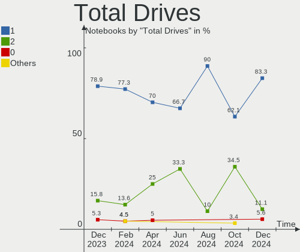
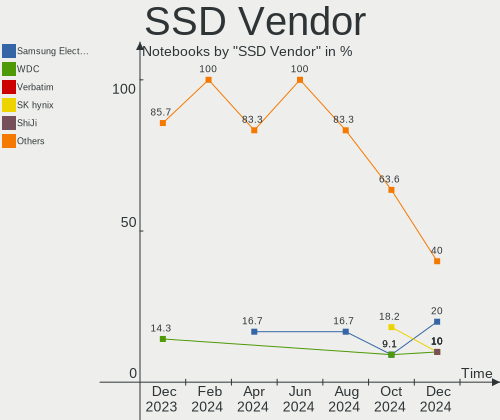
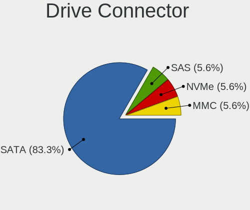
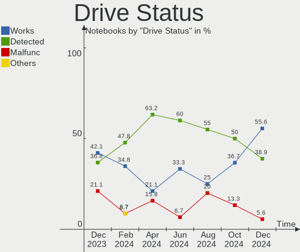
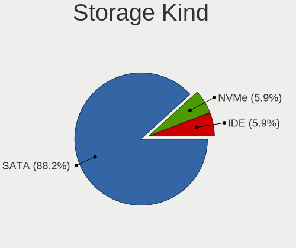
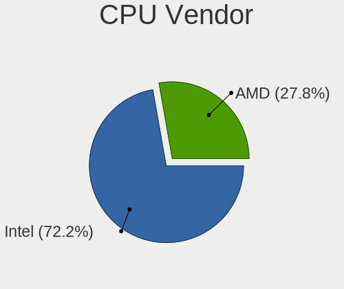
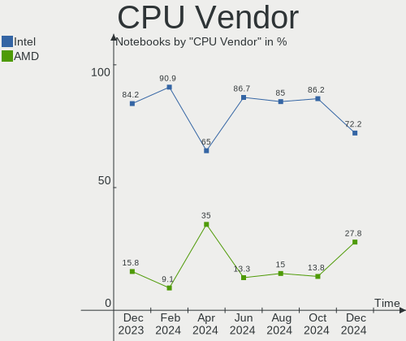
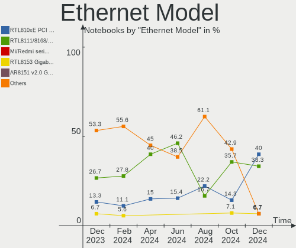
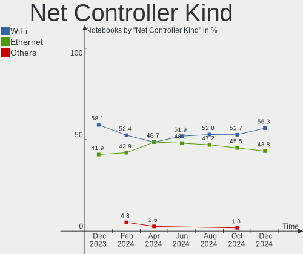

Lubuntu - Hardware Trends (Notebooks)
-------------------------------------

A project to identify most popular hardware characteristics and track their change
over time based on data collected by Linux users at https://Linux-Hardware.org.

Anyone can contribute to this report by the [hw-probe](https://github.com/linuxhw/hw-probe) tool:

    sudo -E hw-probe -all -upload

This report is for one last month. Overall report since the beginning of time: [TestCoverage](https://github.com/linuxhw/TestCoverage)

Period: Oct, 2022.

Contents
--------

* [ System ](#system)
  - [ OS                       ](#os)
  - [ OS Family                ](#os-family)
  - [ Kernel                   ](#kernel)
  - [ Kernel Family            ](#kernel-family)
  - [ Kernel Major Ver.        ](#kernel-major-ver)
  - [ Arch                     ](#arch)
  - [ DE                       ](#de)
  - [ Display Server           ](#display-server)
  - [ Display Manager          ](#display-manager)
  - [ OS Lang                  ](#os-lang)
  - [ Boot Mode                ](#boot-mode)
  - [ Filesystem               ](#filesystem)
  - [ Part. scheme             ](#part-scheme)
  - [ Dual Boot with Linux/BSD ](#dual-boot-with-linuxbsd)
  - [ Dual Boot (Win)          ](#dual-boot-win)

* [ Board ](#board)
  - [ Vendor                   ](#vendor)
  - [ Model                    ](#model)
  - [ Model Family             ](#model-family)
  - [ MFG Year                 ](#mfg-year)
  - [ Form Factor              ](#form-factor)
  - [ Secure Boot              ](#secure-boot)
  - [ Coreboot                 ](#coreboot)
  - [ RAM Size                 ](#ram-size)
  - [ RAM Used                 ](#ram-used)
  - [ Total Drives             ](#total-drives)
  - [ Has CD-ROM               ](#has-cd-rom)
  - [ Has Ethernet             ](#has-ethernet)
  - [ Has WiFi                 ](#has-wifi)
  - [ Has Bluetooth            ](#has-bluetooth)

* [ Location ](#location)
  - [ Country                  ](#country)
  - [ City                     ](#city)

* [ Drives ](#drives)
  - [ Drive Vendor             ](#drive-vendor)
  - [ Drive Model              ](#drive-model)
  - [ HDD Vendor               ](#hdd-vendor)
  - [ SSD Vendor               ](#ssd-vendor)
  - [ Drive Kind               ](#drive-kind)
  - [ Drive Connector          ](#drive-connector)
  - [ Drive Size               ](#drive-size)
  - [ Space Total              ](#space-total)
  - [ Space Used               ](#space-used)
  - [ Malfunc. Drives          ](#malfunc-drives)
  - [ Malfunc. Drive Vendor    ](#malfunc-drive-vendor)
  - [ Malfunc. HDD Vendor      ](#malfunc-hdd-vendor)
  - [ Malfunc. Drive Kind      ](#malfunc-drive-kind)
  - [ Failed Drives            ](#failed-drives)
  - [ Failed Drive Vendor      ](#failed-drive-vendor)
  - [ Drive Status             ](#drive-status)

* [ Storage controller ](#storage-controller)
  - [ Storage Vendor           ](#storage-vendor)
  - [ Storage Model            ](#storage-model)
  - [ Storage Kind             ](#storage-kind)

* [ Processor ](#processor)
  - [ CPU Vendor               ](#cpu-vendor)
  - [ CPU Model                ](#cpu-model)
  - [ CPU Model Family         ](#cpu-model-family)
  - [ CPU Cores                ](#cpu-cores)
  - [ CPU Sockets              ](#cpu-sockets)
  - [ CPU Threads              ](#cpu-threads)
  - [ CPU Op-Modes             ](#cpu-op-modes)
  - [ CPU Microcode            ](#cpu-microcode)
  - [ CPU Microarch            ](#cpu-microarch)

* [ Graphics ](#graphics)
  - [ GPU Vendor               ](#gpu-vendor)
  - [ GPU Model                ](#gpu-model)
  - [ GPU Combo                ](#gpu-combo)
  - [ GPU Driver               ](#gpu-driver)
  - [ GPU Memory               ](#gpu-memory)

* [ Monitor ](#monitor)
  - [ Monitor Vendor           ](#monitor-vendor)
  - [ Monitor Model            ](#monitor-model)
  - [ Monitor Resolution       ](#monitor-resolution)
  - [ Monitor Diagonal         ](#monitor-diagonal)
  - [ Monitor Width            ](#monitor-width)
  - [ Aspect Ratio             ](#aspect-ratio)
  - [ Monitor Area             ](#monitor-area)
  - [ Pixel Density            ](#pixel-density)
  - [ Multiple Monitors        ](#multiple-monitors)

* [ Network ](#network)
  - [ Net Controller Vendor    ](#net-controller-vendor)
  - [ Net Controller Model     ](#net-controller-model)
  - [ Wireless Vendor          ](#wireless-vendor)
  - [ Wireless Model           ](#wireless-model)
  - [ Ethernet Vendor          ](#ethernet-vendor)
  - [ Ethernet Model           ](#ethernet-model)
  - [ Net Controller Kind      ](#net-controller-kind)
  - [ Used Controller          ](#used-controller)
  - [ NICs                     ](#nics)
  - [ IPv6                     ](#ipv6)

* [ Bluetooth ](#bluetooth)
  - [ Bluetooth Vendor         ](#bluetooth-vendor)
  - [ Bluetooth Model          ](#bluetooth-model)

* [ Sound ](#sound)
  - [ Sound Vendor             ](#sound-vendor)
  - [ Sound Model              ](#sound-model)

* [ Memory ](#memory)
  - [ Memory Vendor            ](#memory-vendor)
  - [ Memory Model             ](#memory-model)
  - [ Memory Kind              ](#memory-kind)
  - [ Memory Form Factor       ](#memory-form-factor)
  - [ Memory Size              ](#memory-size)
  - [ Memory Speed             ](#memory-speed)

* [ Printers & scanners ](#printers--scanners)
  - [ Printer Vendor           ](#printer-vendor)
  - [ Printer Model            ](#printer-model)
  - [ Scanner Vendor           ](#scanner-vendor)
  - [ Scanner Model            ](#scanner-model)

* [ Camera ](#camera)
  - [ Camera Vendor            ](#camera-vendor)
  - [ Camera Model             ](#camera-model)

* [ Security ](#security)
  - [ Fingerprint Vendor       ](#fingerprint-vendor)
  - [ Fingerprint Model        ](#fingerprint-model)
  - [ Chipcard Vendor          ](#chipcard-vendor)
  - [ Chipcard Model           ](#chipcard-model)

* [ Unsupported ](#unsupported)
  - [ Unsupported Devices      ](#unsupported-devices)
  - [ Unsupported Device Types ](#unsupported-device-types)

System
------

OS
--

Installed operating systems

| Name          | Notebooks | Percent |
|---------------|-----------|---------|
| Lubuntu 22.04 | 9         | 45%     |
| Lubuntu 20.04 | 5         | 25%     |
| Lubuntu 22.10 | 3         | 15%     |
| Lubuntu 18.04 | 3         | 15%     |

OS Family
---------

OS without a version

| Name    | Notebooks | Percent |
|---------|-----------|---------|
| Lubuntu | 20        | 100%    |

Kernel
------

Version of the Linux kernel

| Version              | Notebooks | Percent |
|----------------------|-----------|---------|
| 5.15.0-50-generic    | 4         | 20%     |
| 5.15.0-43-generic    | 3         | 15%     |
| 5.4.0-131-generic    | 2         | 10%     |
| 5.19.0-23-generic    | 2         | 10%     |
| 5.15.0-52-generic    | 2         | 10%     |
| 5.15.0-48-generic    | 2         | 10%     |
| 6.0.0-060000-generic | 1         | 5%      |
| 5.4.0-132-generic    | 1         | 5%      |
| 5.4.0-128-generic    | 1         | 5%      |
| 5.11.0-27-generic    | 1         | 5%      |
| 4.15.0-91-generic    | 1         | 5%      |

Kernel Family
-------------

Linux kernel without a distro release

| Version | Notebooks | Percent |
|---------|-----------|---------|
| 5.15.0  | 11        | 55%     |
| 5.4.0   | 4         | 20%     |
| 5.19.0  | 2         | 10%     |
| 6.0.0   | 1         | 5%      |
| 5.11.0  | 1         | 5%      |
| 4.15.0  | 1         | 5%      |

Kernel Major Ver.
-----------------

Linux kernel major version

| Version | Notebooks | Percent |
|---------|-----------|---------|
| 5.15    | 11        | 55%     |
| 5.4     | 4         | 20%     |
| 5.19    | 2         | 10%     |
| 6.0     | 1         | 5%      |
| 5.11    | 1         | 5%      |
| 4.15    | 1         | 5%      |

Arch
----

OS architecture (x86_64, i586, etc.)

| Name   | Notebooks | Percent |
|--------|-----------|---------|
| x86_64 | 19        | 95%     |
| i686   | 1         | 5%      |

DE
--

Desktop Environment

| Name    | Notebooks | Percent |
|---------|-----------|---------|
| LXQt    | 15        | 75%     |
| LXDE    | 3         | 15%     |
| Lubuntu | 1         | 5%      |
| i3      | 1         | 5%      |

Display Server
--------------

X11 or Wayland

| Name    | Notebooks | Percent |
|---------|-----------|---------|
| X11     | 18        | 90%     |
| Wayland | 1         | 5%      |
| Tty     | 1         | 5%      |

Display Manager
---------------

SDDM, LightDM, etc.

| Name    | Notebooks | Percent |
|---------|-----------|---------|
| SDDM    | 14        | 70%     |
| LightDM | 3         | 15%     |
| Unknown | 2         | 10%     |
| GDM     | 1         | 5%      |

OS Lang
-------

Language

| Lang  | Notebooks | Percent |
|-------|-----------|---------|
| en_US | 4         | 20%     |
| it_IT | 3         | 15%     |
| en_GB | 2         | 10%     |
| C     | 2         | 10%     |
| pt_BR | 1         | 5%      |
| pl_PL | 1         | 5%      |
| ja_JP | 1         | 5%      |
| fr_FR | 1         | 5%      |
| en_ZA | 1         | 5%      |
| en_PH | 1         | 5%      |
| en_IN | 1         | 5%      |
| en_CA | 1         | 5%      |
| el_GR | 1         | 5%      |

Boot Mode
---------

EFI or BIOS

| Mode | Notebooks | Percent |
|------|-----------|---------|
| BIOS | 14        | 70%     |
| EFI  | 6         | 30%     |

Filesystem
----------

Type of filesystem

| Type    | Notebooks | Percent |
|---------|-----------|---------|
| Ext4    | 18        | 90%     |
| Overlay | 2         | 10%     |

Part. scheme
------------

Scheme of partitioning

| Type    | Notebooks | Percent |
|---------|-----------|---------|
| MBR     | 10        | 50%     |
| GPT     | 9         | 45%     |
| Unknown | 1         | 5%      |

Dual Boot with Linux/BSD
------------------------

Hosting more than one Linux/BSD

| Dual boot | Notebooks | Percent |
|-----------|-----------|---------|
| No        | 20        | 100%    |

Dual Boot (Win)
---------------

Hosting Linux and Windows

| Dual boot | Notebooks | Percent |
|-----------|-----------|---------|
| No        | 16        | 80%     |
| Yes       | 4         | 20%     |

Board
-----

Vendor
------

Motherboard manufacturer

| Name             | Notebooks | Percent |
|------------------|-----------|---------|
| Lenovo           | 6         | 30%     |
| Acer             | 4         | 20%     |
| Dell             | 2         | 10%     |
| Toshiba          | 1         | 5%      |
| Teclast          | 1         | 5%      |
| Kiano            | 1         | 5%      |
| Hewlett-Packard  | 1         | 5%      |
| Google           | 1         | 5%      |
| Fujitsu Siemens  | 1         | 5%      |
| Fujitsu          | 1         | 5%      |
| ASUSTek Computer | 1         | 5%      |

Model
-----

Motherboard model

| Name                                       | Notebooks | Percent |
|--------------------------------------------|-----------|---------|
| Toshiba Satellite C655D                    | 1         | 5%      |
| Teclast F7 Plus                            | 1         | 5%      |
| Lenovo ThinkPad T410 2537CS0               | 1         | 5%      |
| Lenovo ThinkPad SL510 2847CXG              | 1         | 5%      |
| Lenovo IdeaPad Slim 1-14AST-05 81VS        | 1         | 5%      |
| Lenovo IdeaPad 330-14AST 81D5              | 1         | 5%      |
| Lenovo G50-70 20351                        | 1         | 5%      |
| Lenovo B590 20208                          | 1         | 5%      |
| Kiano SlimNote 14.1                        | 1         | 5%      |
| HP 431 Notebook                            | 1         | 5%      |
| Google Apel                                | 1         | 5%      |
| Fujitsu Siemens AMILO Li 2727              | 1         | 5%      |
| Fujitsu LIFEBOOK U904                      | 1         | 5%      |
| Dell Latitude E5430 non-vPro               | 1         | 5%      |
| Dell Inspiron N5010                        | 1         | 5%      |
| ASUS VivoBook 15_ASUS Laptop X507MA_F507MA | 1         | 5%      |
| Acer Extensa 2509                          | 1         | 5%      |
| Acer Aspire one                            | 1         | 5%      |
| Acer Aspire E1-571                         | 1         | 5%      |
| Acer Aspire 4739Z                          | 1         | 5%      |

Model Family
------------

Motherboard model prefix

| Name                  | Notebooks | Percent |
|-----------------------|-----------|---------|
| Acer Aspire           | 3         | 15%     |
| Lenovo ThinkPad       | 2         | 10%     |
| Lenovo IdeaPad        | 2         | 10%     |
| Toshiba Satellite     | 1         | 5%      |
| Teclast F7            | 1         | 5%      |
| Lenovo G50-70         | 1         | 5%      |
| Lenovo B590           | 1         | 5%      |
| Kiano SlimNote        | 1         | 5%      |
| HP 431                | 1         | 5%      |
| Google Apel           | 1         | 5%      |
| Fujitsu Siemens AMILO | 1         | 5%      |
| Fujitsu LIFEBOOK      | 1         | 5%      |
| Dell Latitude         | 1         | 5%      |
| Dell Inspiron         | 1         | 5%      |
| ASUS VivoBook         | 1         | 5%      |
| Acer Extensa          | 1         | 5%      |

MFG Year
--------

Motherboard manufacture year

| Year | Notebooks | Percent |
|------|-----------|---------|
| 2009 | 4         | 20%     |
| 2012 | 3         | 15%     |
| 2011 | 3         | 15%     |
| 2018 | 2         | 10%     |
| 2013 | 2         | 10%     |
| 2022 | 1         | 5%      |
| 2019 | 1         | 5%      |
| 2016 | 1         | 5%      |
| 2014 | 1         | 5%      |
| 2010 | 1         | 5%      |
| 2007 | 1         | 5%      |

Form Factor
-----------

Physical design of the computer

| Name     | Notebooks | Percent |
|----------|-----------|---------|
| Notebook | 20        | 100%    |

Secure Boot
-----------

Enabled or disabled

| State    | Notebooks | Percent |
|----------|-----------|---------|
| Disabled | 20        | 100%    |

Coreboot
--------

Have coreboot on board

| Used | Notebooks | Percent |
|------|-----------|---------|
| No   | 19        | 95%     |
| Yes  | 1         | 5%      |

RAM Size
--------

Total RAM memory

| Size in GB | Notebooks | Percent |
|------------|-----------|---------|
| 3.01-4.0   | 8         | 40%     |
| 1.01-2.0   | 6         | 30%     |
| 4.01-8.0   | 4         | 20%     |
| 2.01-3.0   | 1         | 5%      |
| 8.01-16.0  | 1         | 5%      |

RAM Used
--------

Used RAM memory

| Used GB  | Notebooks | Percent |
|----------|-----------|---------|
| 0.51-1.0 | 9         | 45%     |
| 1.01-2.0 | 7         | 35%     |
| 3.01-4.0 | 2         | 10%     |
| 2.01-3.0 | 2         | 10%     |

Total Drives
------------

Number of drives on board

| Drives | Notebooks | Percent |
|--------|-----------|---------|
| 1      | 16        | 80%     |
| 2      | 4         | 20%     |

Has CD-ROM
----------

Has CD-ROM on board

| Presented | Notebooks | Percent |
|-----------|-----------|---------|
| Yes       | 11        | 55%     |
| No        | 9         | 45%     |

Has Ethernet
------------

Has Ethernet on board

| Presented | Notebooks | Percent |
|-----------|-----------|---------|
| Yes       | 16        | 80%     |
| No        | 4         | 20%     |

Has WiFi
--------

Has WiFi module

| Presented | Notebooks | Percent |
|-----------|-----------|---------|
| Yes       | 19        | 95%     |
| No        | 1         | 5%      |

Has Bluetooth
-------------

Has Bluetooth module

| Presented | Notebooks | Percent |
|-----------|-----------|---------|
| Yes       | 12        | 60%     |
| No        | 8         | 40%     |

Location
--------

Country
-------

Geographic location (country)

| Country      | Notebooks | Percent |
|--------------|-----------|---------|
| Italy        | 3         | 15%     |
| USA          | 2         | 10%     |
| Hungary      | 2         | 10%     |
| Vietnam      | 1         | 5%      |
| UK           | 1         | 5%      |
| South Africa | 1         | 5%      |
| Poland       | 1         | 5%      |
| Philippines  | 1         | 5%      |
| Japan        | 1         | 5%      |
| Ireland      | 1         | 5%      |
| Indonesia    | 1         | 5%      |
| India        | 1         | 5%      |
| Greece       | 1         | 5%      |
| France       | 1         | 5%      |
| Canada       | 1         | 5%      |
| Brazil       | 1         | 5%      |

City
----

Geographic location (city)

| City         | Notebooks | Percent |
|--------------|-----------|---------|
| Sarospatak   | 2         | 10%     |
| Winnipeg     | 1         | 5%      |
| Tychy        | 1         | 5%      |
| Thessaloniki | 1         | 5%      |
| Tegal        | 1         | 5%      |
| Rome         | 1         | 5%      |
| Pretoria     | 1         | 5%      |
| Porto Alegre | 1         | 5%      |
| Nus          | 1         | 5%      |
| New York     | 1         | 5%      |
| Montpellier  | 1         | 5%      |
| Minato-ku    | 1         | 5%      |
| Millville    | 1         | 5%      |
| Milan        | 1         | 5%      |
| Manajao      | 1         | 5%      |
| Hanoi        | 1         | 5%      |
| Dublin       | 1         | 5%      |
| Camborne     | 1         | 5%      |
| Bengaluru    | 1         | 5%      |

Drives
------

Drive Vendor
------------

Hard drive vendors

| Vendor              | Notebooks | Drives | Percent |
|---------------------|-----------|--------|---------|
| WDC                 | 5         | 5      | 22.73%  |
| Unknown             | 5         | 6      | 22.73%  |
| Seagate             | 2         | 2      | 9.09%   |
| Kingston            | 2         | 2      | 9.09%   |
| Vaseky              | 1         | 1      | 4.55%   |
| Toshiba             | 1         | 1      | 4.55%   |
| SPCC                | 1         | 1      | 4.55%   |
| Samsung Electronics | 1         | 1      | 4.55%   |
| Rogueware           | 1         | 1      | 4.55%   |
| KingSpec            | 1         | 1      | 4.55%   |
| Intel               | 1         | 1      | 4.55%   |
| HGST                | 1         | 1      | 4.55%   |

Drive Model
-----------

Hard drive models

| Model                                | Notebooks | Percent |
|--------------------------------------|-----------|---------|
| WDC WDS480G2G0A-00JH30 480GB SSD     | 1         | 4.35%   |
| WDC WD5000LPCX-24VHAT0 500GB         | 1         | 4.35%   |
| WDC WD3200BPVT-22ZEST0 320GB         | 1         | 4.35%   |
| WDC WD3200BEKT-75PVMT1 320GB         | 1         | 4.35%   |
| WDC WD1200BEVS-22UST0 120GB          | 1         | 4.35%   |
| Vaseky V800/128G 128GB SSD           | 1         | 4.35%   |
| Unknown SD/MMC/MS PRO 1TB            | 1         | 4.35%   |
| Unknown MMC64G  64GB                 | 1         | 4.35%   |
| Unknown MMC Card  64GB               | 1         | 4.35%   |
| Unknown MMC Card  4GB                | 1         | 4.35%   |
| Unknown MMC Card  32GB               | 1         | 4.35%   |
| Unknown 00000  16GB                  | 1         | 4.35%   |
| Toshiba MK5065GSXN 500GB             | 1         | 4.35%   |
| SPCC Solid State Disk 120GB          | 1         | 4.35%   |
| Seagate ST9320325AS 320GB            | 1         | 4.35%   |
| Seagate ST500LT012-1DG142 500GB      | 1         | 4.35%   |
| Samsung MZ7LN128HCHP-00000 128GB SSD | 1         | 4.35%   |
| Rogueware 2.5'' 512GB SSD            | 1         | 4.35%   |
| Kingston SV300S37A60G 64GB SSD       | 1         | 4.35%   |
| Kingston SA400S37120G 120GB SSD      | 1         | 4.35%   |
| KingSpec NT-256 256GB SSD            | 1         | 4.35%   |
| Intel SSDSA2CW160G3 160GB            | 1         | 4.35%   |
| HGST HTS545050A7E380 500GB           | 1         | 4.35%   |

HDD Vendor
----------

Hard disk drive vendors

| Vendor  | Notebooks | Drives | Percent |
|---------|-----------|--------|---------|
| WDC     | 4         | 4      | 44.44%  |
| Seagate | 2         | 2      | 22.22%  |
| Unknown | 1         | 1      | 11.11%  |
| Toshiba | 1         | 1      | 11.11%  |
| HGST    | 1         | 1      | 11.11%  |

SSD Vendor
----------

Solid state drive vendors

| Vendor              | Notebooks | Drives | Percent |
|---------------------|-----------|--------|---------|
| Kingston            | 2         | 2      | 22.22%  |
| WDC                 | 1         | 1      | 11.11%  |
| Vaseky              | 1         | 1      | 11.11%  |
| SPCC                | 1         | 1      | 11.11%  |
| Samsung Electronics | 1         | 1      | 11.11%  |
| Rogueware           | 1         | 1      | 11.11%  |
| KingSpec            | 1         | 1      | 11.11%  |
| Intel               | 1         | 1      | 11.11%  |

Drive Kind
----------

HDD or SSD

| Kind | Notebooks | Drives | Percent |
|------|-----------|--------|---------|
| SSD  | 9         | 9      | 39.13%  |
| HDD  | 9         | 9      | 39.13%  |
| MMC  | 5         | 5      | 21.74%  |

Drive Connector
---------------

SATA, SAS, NVMe, etc.

| Type | Notebooks | Drives | Percent |
|------|-----------|--------|---------|
| SATA | 17        | 17     | 73.91%  |
| MMC  | 5         | 5      | 21.74%  |
| SAS  | 1         | 1      | 4.35%   |

Drive Size
----------

Size of hard drive

| Size in TB | Notebooks | Drives | Percent |
|------------|-----------|--------|---------|
| 0.01-0.5   | 16        | 16     | 88.89%  |
| 0.51-1.0   | 2         | 2      | 11.11%  |

Space Total
-----------

Amount of disk space available on the file system

| Size in GB | Notebooks | Percent |
|------------|-----------|---------|
| 251-500    | 9         | 45%     |
| 101-250    | 8         | 40%     |
| 21-50      | 2         | 10%     |
| 1-20       | 1         | 5%      |

Space Used
----------

Amount of used disk space

| Used GB | Notebooks | Percent |
|---------|-----------|---------|
| 1-20    | 10        | 50%     |
| 21-50   | 6         | 30%     |
| 101-250 | 3         | 15%     |
| 51-100  | 1         | 5%      |

Malfunc. Drives
---------------

Drive models with a malfunction

| Model                           | Notebooks | Drives | Percent |
|---------------------------------|-----------|--------|---------|
| Toshiba MK5065GSXN 500GB        | 1         | 1      | 25%     |
| Seagate ST9320325AS 320GB       | 1         | 1      | 25%     |
| Seagate ST500LT012-1DG142 500GB | 1         | 1      | 25%     |
| KingSpec NT-256 256GB SSD       | 1         | 1      | 25%     |

Malfunc. Drive Vendor
---------------------

Vendors of faulty drives

| Vendor   | Notebooks | Drives | Percent |
|----------|-----------|--------|---------|
| Seagate  | 2         | 2      | 50%     |
| Toshiba  | 1         | 1      | 25%     |
| KingSpec | 1         | 1      | 25%     |

Malfunc. HDD Vendor
-------------------

Vendors of faulty HDD drives

| Vendor  | Notebooks | Drives | Percent |
|---------|-----------|--------|---------|
| Seagate | 2         | 2      | 66.67%  |
| Toshiba | 1         | 1      | 33.33%  |

Malfunc. Drive Kind
-------------------

Kinds of faulty drives

| Kind | Notebooks | Drives | Percent |
|------|-----------|--------|---------|
| HDD  | 3         | 3      | 75%     |
| SSD  | 1         | 1      | 25%     |

Failed Drives
-------------

Failed drive models

| Model                       | Notebooks | Drives | Percent |
|-----------------------------|-----------|--------|---------|
| WDC WD1200BEVS-22UST0 120GB | 1         | 1      | 100%    |

Failed Drive Vendor
-------------------

Failed drive vendors

| Vendor | Notebooks | Drives | Percent |
|--------|-----------|--------|---------|
| WDC    | 1         | 1      | 100%    |

Drive Status
------------

Number of failed and malfunc. drives

| Status   | Notebooks | Drives | Percent |
|----------|-----------|--------|---------|
| Detected | 9         | 10     | 40.91%  |
| Works    | 8         | 8      | 36.36%  |
| Malfunc  | 4         | 4      | 18.18%  |
| Failed   | 1         | 1      | 4.55%   |

Storage controller
------------------

Storage Vendor
--------------

Storage controller vendors

| Vendor | Notebooks | Percent |
|--------|-----------|---------|
| Intel  | 15        | 83.33%  |
| AMD    | 3         | 16.67%  |

Storage Model
-------------

Storage controller models

| Model                                                                        | Notebooks | Percent |
|------------------------------------------------------------------------------|-----------|---------|
| Intel Celeron/Pentium Silver Processor SATA Controller                       | 2         | 10.53%  |
| Intel 8 Series SATA Controller 1 [AHCI mode]                                 | 2         | 10.53%  |
| Intel 7 Series Chipset Family 6-port SATA Controller [AHCI mode]             | 2         | 10.53%  |
| Intel 5 Series/3400 Series Chipset 6 port SATA AHCI Controller               | 2         | 10.53%  |
| AMD FCH SATA Controller [AHCI mode]                                          | 2         | 10.53%  |
| Intel Atom Processor E3800 Series SATA AHCI Controller                       | 1         | 5.26%   |
| Intel 82801IBM/IEM (ICH9M/ICH9M-E) 4 port SATA Controller [AHCI mode]        | 1         | 5.26%   |
| Intel 82801HM/HEM (ICH8M/ICH8M-E) SATA Controller [AHCI mode]                | 1         | 5.26%   |
| Intel 82801HM/HEM (ICH8M/ICH8M-E) IDE Controller                             | 1         | 5.26%   |
| Intel 82801GBM/GHM (ICH7-M Family) SATA Controller [AHCI mode]               | 1         | 5.26%   |
| Intel 82801 Mobile SATA Controller [RAID mode]                               | 1         | 5.26%   |
| Intel 6 Series/C200 Series Chipset Family 6 port Mobile SATA AHCI Controller | 1         | 5.26%   |
| Intel 5 Series/3400 Series Chipset 4 port SATA AHCI Controller               | 1         | 5.26%   |
| AMD SB7x0/SB8x0/SB9x0 SATA Controller [AHCI mode]                            | 1         | 5.26%   |

Storage Kind
------------

Kind of storage controller (IDE, SATA, NVMe, SAS, ...)

| Kind | Notebooks | Percent |
|------|-----------|---------|
| SATA | 17        | 89.47%  |
| RAID | 1         | 5.26%   |
| IDE  | 1         | 5.26%   |

Processor
---------

CPU Vendor
----------

Processor vendors

| Vendor | Notebooks | Percent |
|--------|-----------|---------|
| Intel  | 17        | 85%     |
| AMD    | 3         | 15%     |

CPU Model
---------

Processor models

| Model                                         | Notebooks | Percent |
|-----------------------------------------------|-----------|---------|
| Intel Core i3 CPU M 370 @ 2.40GHz             | 2         | 10%     |
| Intel Core i7-4600U CPU @ 2.10GHz             | 1         | 5%      |
| Intel Core i5-4210U CPU @ 1.70GHz             | 1         | 5%      |
| Intel Core i5-3320M CPU @ 2.60GHz             | 1         | 5%      |
| Intel Core i5-2450M CPU @ 2.50GHz             | 1         | 5%      |
| Intel Core i3-3110M CPU @ 2.40GHz             | 1         | 5%      |
| Intel Core i3-2348M CPU @ 2.30GHz             | 1         | 5%      |
| Intel Core i3 CPU M 380 @ 2.53GHz             | 1         | 5%      |
| Intel Core 2 Duo CPU T6670 @ 2.20GHz          | 1         | 5%      |
| Intel Celeron N4100 CPU @ 1.10GHz             | 1         | 5%      |
| Intel Celeron N4020 CPU @ 1.10GHz             | 1         | 5%      |
| Intel Celeron N4000 CPU @ 1.10GHz             | 1         | 5%      |
| Intel Celeron CPU N2930 @ 1.83GHz             | 1         | 5%      |
| Intel Celeron CPU 560 @ 2.13GHz               | 1         | 5%      |
| Intel Atom CPU Z3735F @ 1.33GHz               | 1         | 5%      |
| Intel Atom CPU N270 @ 1.60GHz                 | 1         | 5%      |
| AMD C-50 Processor                            | 1         | 5%      |
| AMD A6-9220e RADEON R4, 5 COMPUTE CORES 2C+3G | 1         | 5%      |
| AMD A4-9125 RADEON R3, 4 COMPUTE CORES 2C+2G  | 1         | 5%      |

CPU Model Family
----------------

Processor model prefix

| Model            | Notebooks | Percent |
|------------------|-----------|---------|
| Intel Core i3    | 5         | 25%     |
| Intel Celeron    | 5         | 25%     |
| Intel Core i5    | 3         | 15%     |
| Intel Atom       | 2         | 10%     |
| Intel Core i7    | 1         | 5%      |
| Intel Core 2 Duo | 1         | 5%      |
| AMD C-50         | 1         | 5%      |
| AMD A6           | 1         | 5%      |
| AMD A4           | 1         | 5%      |

CPU Cores
---------

Number of processor cores

| Number | Notebooks | Percent |
|--------|-----------|---------|
| 2      | 15        | 75%     |
| 4      | 3         | 15%     |
| 1      | 2         | 10%     |

CPU Sockets
-----------

Number of sockets

| Number | Notebooks | Percent |
|--------|-----------|---------|
| 1      | 20        | 100%    |

CPU Threads
-----------

Threads per core (Hyper-Threading)

| Number | Notebooks | Percent |
|--------|-----------|---------|
| 2      | 10        | 50%     |
| 1      | 10        | 50%     |

CPU Op-Modes
------------

CPU Operation Modes (32-bit, 64-bit)

| Op mode        | Notebooks | Percent |
|----------------|-----------|---------|
| 32-bit, 64-bit | 19        | 95%     |
| 32-bit         | 1         | 5%      |

CPU Microcode
-------------

Microcode number

| Number     | Notebooks | Percent |
|------------|-----------|---------|
| Unknown    | 5         | 25%     |
| 0x20655    | 3         | 15%     |
| 0x706a1    | 2         | 10%     |
| 0x306a9    | 2         | 10%     |
| 0x706a8    | 1         | 5%      |
| 0x40651    | 1         | 5%      |
| 0x30678    | 1         | 5%      |
| 0x206a7    | 1         | 5%      |
| 0x106c2    | 1         | 5%      |
| 0x1067a    | 1         | 5%      |
| 0x10661    | 1         | 5%      |
| 0x05000029 | 1         | 5%      |

CPU Microarch
-------------

Microarchitecture

| Name          | Notebooks | Percent |
|---------------|-----------|---------|
| Westmere      | 3         | 15%     |
| Goldmont plus | 3         | 15%     |
| Silvermont    | 2         | 10%     |
| SandyBridge   | 2         | 10%     |
| IvyBridge     | 2         | 10%     |
| Haswell       | 2         | 10%     |
| Excavator     | 2         | 10%     |
| Penryn        | 1         | 5%      |
| Core          | 1         | 5%      |
| Bonnell       | 1         | 5%      |
| Bobcat        | 1         | 5%      |

Graphics
--------

GPU Vendor
----------

Vendors of graphics cards

| Vendor | Notebooks | Percent |
|--------|-----------|---------|
| Intel  | 17        | 80.95%  |
| AMD    | 4         | 19.05%  |

GPU Model
---------

Graphics card models

| Model                                                                         | Notebooks | Percent |
|-------------------------------------------------------------------------------|-----------|---------|
| Intel GeminiLake [UHD Graphics 600]                                           | 3         | 13.04%  |
| Intel Core Processor Integrated Graphics Controller                           | 3         | 13.04%  |
| Intel Haswell-ULT Integrated Graphics Controller                              | 2         | 8.7%    |
| Intel Atom Processor Z36xxx/Z37xxx Series Graphics & Display                  | 2         | 8.7%    |
| Intel 3rd Gen Core processor Graphics Controller                              | 2         | 8.7%    |
| Intel 2nd Generation Core Processor Family Integrated Graphics Controller     | 2         | 8.7%    |
| AMD Stoney [Radeon R2/R3/R4/R5 Graphics]                                      | 2         | 8.7%    |
| Intel Mobile GM965/GL960 Integrated Graphics Controller (secondary)           | 1         | 4.35%   |
| Intel Mobile GM965/GL960 Integrated Graphics Controller (primary)             | 1         | 4.35%   |
| Intel Mobile 945GSE Express Integrated Graphics Controller                    | 1         | 4.35%   |
| Intel Mobile 945GM/GMS/GME, 943/940GML Express Integrated Graphics Controller | 1         | 4.35%   |
| Intel Mobile 4 Series Chipset Integrated Graphics Controller                  | 1         | 4.35%   |
| AMD Wrestler [Radeon HD 6250]                                                 | 1         | 4.35%   |
| AMD Seymour [Radeon HD 6400M/7400M Series]                                    | 1         | 4.35%   |

GPU Combo
---------

Combinations of graphics cards

| Name        | Notebooks | Percent |
|-------------|-----------|---------|
| 1 x Intel   | 15        | 75%     |
| 1 x AMD     | 3         | 15%     |
| Other       | 1         | 5%      |
| Intel + AMD | 1         | 5%      |

GPU Driver
----------

Free vs proprietary

| Driver | Notebooks | Percent |
|--------|-----------|---------|
| Free   | 20        | 100%    |

GPU Memory
----------

Total video memory

| Size in GB | Notebooks | Percent |
|------------|-----------|---------|
| Unknown    | 17        | 85%     |
| 0.01-0.5   | 2         | 10%     |
| 0.51-1.0   | 1         | 5%      |

Monitor
-------

Monitor Vendor
--------------

Monitor vendors

| Vendor                  | Notebooks | Percent |
|-------------------------|-----------|---------|
| LG Display              | 4         | 20%     |
| BOE                     | 4         | 20%     |
| Samsung Electronics     | 3         | 15%     |
| Chimei Innolux          | 3         | 15%     |
| Lenovo                  | 2         | 10%     |
| Sharp                   | 1         | 5%      |
| LG Philips              | 1         | 5%      |
| Goldstar                | 1         | 5%      |
| Chi Mei Optoelectronics | 1         | 5%      |

Monitor Model
-------------

Monitor models

| Model                                                                    | Notebooks | Percent |
|--------------------------------------------------------------------------|-----------|---------|
| Sharp LQ140Z1JW01 SHP1401 3200x1800 310x174mm 14.0-inch                  | 1         | 5%      |
| Samsung Electronics LCD Monitor SEC5842 1366x768 309x174mm 14.0-inch     | 1         | 5%      |
| Samsung Electronics LCD Monitor SEC5541 1366x768 344x193mm 15.5-inch     | 1         | 5%      |
| Samsung Electronics LCD Monitor SEC3152 1366x768 344x194mm 15.5-inch     | 1         | 5%      |
| LG Philips LCD Monitor LPL1E01 1280x800 331x207mm 15.4-inch              | 1         | 5%      |
| LG Display LCD Monitor LGD0430 1366x768 345x194mm 15.6-inch              | 1         | 5%      |
| LG Display LCD Monitor LGD033E 1366x768 309x174mm 14.0-inch              | 1         | 5%      |
| LG Display LCD Monitor LGD02DC 1366x768 344x194mm 15.5-inch              | 1         | 5%      |
| LG Display LCD Monitor LGD0266 1366x768 344x194mm 15.5-inch              | 1         | 5%      |
| Lenovo LCD Monitor LEN40B0 1366x768 344x194mm 15.5-inch                  | 1         | 5%      |
| Lenovo LCD Monitor LEN4035 1280x800 304x190mm 14.1-inch                  | 1         | 5%      |
| Goldstar HD PLUS GSM5AC5 1600x900 440x250mm 19.9-inch                    | 1         | 5%      |
| Chimei Innolux LCD Monitor CMN15B7 1366x768 344x193mm 15.5-inch          | 1         | 5%      |
| Chimei Innolux LCD Monitor CMN1480 1366x768 309x174mm 14.0-inch          | 1         | 5%      |
| Chimei Innolux LCD Monitor CMN1132 1366x768 256x144mm 11.6-inch          | 1         | 5%      |
| Chi Mei Optoelectronics LCD Monitor CMO1004 1024x600 222x125mm 10.0-inch | 1         | 5%      |
| BOE LCD Monitor BOE075A 1366x768 309x173mm 13.9-inch                     | 1         | 5%      |
| BOE LCD Monitor BOE0704 1366x768 344x194mm 15.5-inch                     | 1         | 5%      |
| BOE LCD Monitor BOE0637 1920x1080 309x173mm 13.9-inch                    | 1         | 5%      |
| BOE LCD Monitor BOE0600 1366x768 309x173mm 13.9-inch                     | 1         | 5%      |

Monitor Resolution
------------------

Monitor screen resolution

| Resolution       | Notebooks | Percent |
|------------------|-----------|---------|
| 1366x768 (WXGA)  | 13        | 65%     |
| 1920x1080 (FHD)  | 2         | 10%     |
| 1280x800 (WXGA)  | 2         | 10%     |
| 3200x1800 (QHD+) | 1         | 5%      |
| 1600x900 (HD+)   | 1         | 5%      |
| 1024x600         | 1         | 5%      |

Monitor Diagonal
----------------

Diagonal size in inches

| Inches | Notebooks | Percent |
|--------|-----------|---------|
| 15     | 9         | 45%     |
| 14     | 5         | 25%     |
| 13     | 2         | 10%     |
| 23     | 1         | 5%      |
| 19     | 1         | 5%      |
| 11     | 1         | 5%      |
| 10     | 1         | 5%      |

Monitor Width
-------------

Physical width

| Width in mm | Notebooks | Percent |
|-------------|-----------|---------|
| 301-350     | 16        | 80%     |
| 201-300     | 2         | 10%     |
| 501-600     | 1         | 5%      |
| 401-500     | 1         | 5%      |

Aspect Ratio
------------

Proportional relationship between the width and the height

| Ratio | Notebooks | Percent |
|-------|-----------|---------|
| 16/9  | 18        | 90%     |
| 16/10 | 2         | 10%     |

Monitor Area
------------

Area in inch²

| Area in inch² | Notebooks | Percent |
|----------------|-----------|---------|
| 101-110        | 9         | 45%     |
| 81-90          | 7         | 35%     |
| 51-60          | 1         | 5%      |
| 41-50          | 1         | 5%      |
| 201-250        | 1         | 5%      |
| 151-200        | 1         | 5%      |

Pixel Density
-------------

Pixels per inch

| Density       | Notebooks | Percent |
|---------------|-----------|---------|
| 101-120       | 12        | 60%     |
| 51-100        | 5         | 25%     |
| 121-160       | 2         | 10%     |
| More than 240 | 1         | 5%      |

Multiple Monitors
-----------------

Total monitors connected

| Total | Notebooks | Percent |
|-------|-----------|---------|
| 1     | 20        | 100%    |

Network
-------

Net Controller Vendor
---------------------

Controller vendors

| Vendor                | Notebooks | Percent |
|-----------------------|-----------|---------|
| Realtek Semiconductor | 10        | 33.33%  |
| Intel                 | 9         | 30%     |
| Qualcomm Atheros      | 6         | 20%     |
| Broadcom              | 2         | 6.67%   |
| TP-Link               | 1         | 3.33%   |
| Sierra Wireless       | 1         | 3.33%   |
| ASIX Electronics      | 1         | 3.33%   |

Net Controller Model
--------------------

Controller models

| Model                                                                   | Notebooks | Percent |
|-------------------------------------------------------------------------|-----------|---------|
| Realtek RTL8111/8168/8411 PCI Express Gigabit Ethernet Controller       | 5         | 13.51%  |
| Realtek RTL810xE PCI Express Fast Ethernet controller                   | 3         | 8.11%   |
| Qualcomm Atheros AR9285 Wireless Network Adapter (PCI-Express)          | 3         | 8.11%   |
| Intel Centrino Wireless-N 1000 [Condor Peak]                            | 2         | 5.41%   |
| TP-Link AC600 wireless Realtek RTL8811AU [Archer T2U Nano]              | 1         | 2.7%    |
| Sierra Wireless EM7305 Modem                                            | 1         | 2.7%    |
| Realtek RTL8822CE 802.11ac PCIe Wireless Network Adapter                | 1         | 2.7%    |
| Realtek RTL8821CE 802.11ac PCIe Wireless Network Adapter                | 1         | 2.7%    |
| Realtek RTL8188EUS 802.11n Wireless Network Adapter                     | 1         | 2.7%    |
| Realtek RTL8188CE 802.11b/g/n WiFi Adapter                              | 1         | 2.7%    |
| Qualcomm Atheros QCA9565 / AR9565 Wireless Network Adapter              | 1         | 2.7%    |
| Qualcomm Atheros AR8152 v2.0 Fast Ethernet                              | 1         | 2.7%    |
| Qualcomm Atheros AR8152 v1.1 Fast Ethernet                              | 1         | 2.7%    |
| Qualcomm Atheros AR8132 Fast Ethernet                                   | 1         | 2.7%    |
| Qualcomm Atheros AR242x / AR542x Wireless Network Adapter (PCI-Express) | 1         | 2.7%    |
| Intel Wireless 8265 / 8275                                              | 1         | 2.7%    |
| Intel Wireless 7260                                                     | 1         | 2.7%    |
| Intel Wireless 3165                                                     | 1         | 2.7%    |
| Intel Gemini Lake PCH CNVi WiFi                                         | 1         | 2.7%    |
| Intel Ethernet Connection I218-LM                                       | 1         | 2.7%    |
| Intel Centrino Wireless-N 2230                                          | 1         | 2.7%    |
| Intel Centrino Wireless-N 105                                           | 1         | 2.7%    |
| Intel Centrino Advanced-N 6200                                          | 1         | 2.7%    |
| Intel 82577LM Gigabit Network Connection                                | 1         | 2.7%    |
| Broadcom NetXtreme BCM5761 Gigabit Ethernet PCIe                        | 1         | 2.7%    |
| Broadcom NetLink BCM57785 Gigabit Ethernet PCIe                         | 1         | 2.7%    |
| Broadcom BCM43228 802.11a/b/g/n                                         | 1         | 2.7%    |
| ASIX AX88179 Gigabit Ethernet                                           | 1         | 2.7%    |

Wireless Vendor
---------------

Wireless vendors

| Vendor                | Notebooks | Percent |
|-----------------------|-----------|---------|
| Intel                 | 9         | 42.86%  |
| Qualcomm Atheros      | 5         | 23.81%  |
| Realtek Semiconductor | 4         | 19.05%  |
| TP-Link               | 1         | 4.76%   |
| Sierra Wireless       | 1         | 4.76%   |
| Broadcom              | 1         | 4.76%   |

Wireless Model
--------------

Wireless models

| Model                                                                   | Notebooks | Percent |
|-------------------------------------------------------------------------|-----------|---------|
| Qualcomm Atheros AR9285 Wireless Network Adapter (PCI-Express)          | 3         | 14.29%  |
| Intel Centrino Wireless-N 1000 [Condor Peak]                            | 2         | 9.52%   |
| TP-Link AC600 wireless Realtek RTL8811AU [Archer T2U Nano]              | 1         | 4.76%   |
| Sierra Wireless EM7305 Modem                                            | 1         | 4.76%   |
| Realtek RTL8822CE 802.11ac PCIe Wireless Network Adapter                | 1         | 4.76%   |
| Realtek RTL8821CE 802.11ac PCIe Wireless Network Adapter                | 1         | 4.76%   |
| Realtek RTL8188EUS 802.11n Wireless Network Adapter                     | 1         | 4.76%   |
| Realtek RTL8188CE 802.11b/g/n WiFi Adapter                              | 1         | 4.76%   |
| Qualcomm Atheros QCA9565 / AR9565 Wireless Network Adapter              | 1         | 4.76%   |
| Qualcomm Atheros AR242x / AR542x Wireless Network Adapter (PCI-Express) | 1         | 4.76%   |
| Intel Wireless 8265 / 8275                                              | 1         | 4.76%   |
| Intel Wireless 7260                                                     | 1         | 4.76%   |
| Intel Wireless 3165                                                     | 1         | 4.76%   |
| Intel Gemini Lake PCH CNVi WiFi                                         | 1         | 4.76%   |
| Intel Centrino Wireless-N 2230                                          | 1         | 4.76%   |
| Intel Centrino Wireless-N 105                                           | 1         | 4.76%   |
| Intel Centrino Advanced-N 6200                                          | 1         | 4.76%   |
| Broadcom BCM43228 802.11a/b/g/n                                         | 1         | 4.76%   |

Ethernet Vendor
---------------

Ethernet vendors

| Vendor                | Notebooks | Percent |
|-----------------------|-----------|---------|
| Realtek Semiconductor | 8         | 50%     |
| Qualcomm Atheros      | 3         | 18.75%  |
| Intel                 | 2         | 12.5%   |
| Broadcom              | 2         | 12.5%   |
| ASIX Electronics      | 1         | 6.25%   |

Ethernet Model
--------------

Ethernet models

| Model                                                             | Notebooks | Percent |
|-------------------------------------------------------------------|-----------|---------|
| Realtek RTL8111/8168/8411 PCI Express Gigabit Ethernet Controller | 5         | 31.25%  |
| Realtek RTL810xE PCI Express Fast Ethernet controller             | 3         | 18.75%  |
| Qualcomm Atheros AR8152 v2.0 Fast Ethernet                        | 1         | 6.25%   |
| Qualcomm Atheros AR8152 v1.1 Fast Ethernet                        | 1         | 6.25%   |
| Qualcomm Atheros AR8132 Fast Ethernet                             | 1         | 6.25%   |
| Intel Ethernet Connection I218-LM                                 | 1         | 6.25%   |
| Intel 82577LM Gigabit Network Connection                          | 1         | 6.25%   |
| Broadcom NetXtreme BCM5761 Gigabit Ethernet PCIe                  | 1         | 6.25%   |
| Broadcom NetLink BCM57785 Gigabit Ethernet PCIe                   | 1         | 6.25%   |
| ASIX AX88179 Gigabit Ethernet                                     | 1         | 6.25%   |

Net Controller Kind
-------------------

Ethernet, WiFi or modem

| Kind     | Notebooks | Percent |
|----------|-----------|---------|
| WiFi     | 19        | 54.29%  |
| Ethernet | 16        | 45.71%  |

Used Controller
---------------

Currently used network controller

| Kind     | Notebooks | Percent |
|----------|-----------|---------|
| WiFi     | 17        | 80.95%  |
| Ethernet | 4         | 19.05%  |

NICs
----

Total network controllers on board

| Total | Notebooks | Percent |
|-------|-----------|---------|
| 2     | 14        | 70%     |
| 1     | 5         | 25%     |
| 0     | 1         | 5%      |

IPv6
----

IPv6 vs IPv4

| Used | Notebooks | Percent |
|------|-----------|---------|
| No   | 13        | 65%     |
| Yes  | 7         | 35%     |

Bluetooth
---------

Bluetooth Vendor
----------------

Controller vendors

| Vendor                          | Notebooks | Percent |
|---------------------------------|-----------|---------|
| Intel                           | 4         | 33.33%  |
| Realtek Semiconductor           | 2         | 16.67%  |
| Qualcomm Atheros Communications | 2         | 16.67%  |
| Dell                            | 2         | 16.67%  |
| Foxconn / Hon Hai               | 1         | 8.33%   |
| Broadcom                        | 1         | 8.33%   |

Bluetooth Model
---------------

Controller models

| Model                                          | Notebooks | Percent |
|------------------------------------------------|-----------|---------|
| Intel Bluetooth wireless interface             | 3         | 25%     |
| Realtek Bluetooth Radio                        | 2         | 16.67%  |
| Qualcomm Atheros AR3012 Bluetooth 4.0          | 1         | 8.33%   |
| Qualcomm Atheros AR3011 Bluetooth              | 1         | 8.33%   |
| Intel Bluetooth 9460/9560 Jefferson Peak (JfP) | 1         | 8.33%   |
| Foxconn / Hon Hai Bluetooth Device             | 1         | 8.33%   |
| Dell Wireless 365 Bluetooth                    | 1         | 8.33%   |
| Dell BCM20702A0 Bluetooth Module               | 1         | 8.33%   |
| Broadcom BCM2045B (BDC-2.1)                    | 1         | 8.33%   |

Sound
-----

Sound Vendor
------------

Sound card vendors

| Vendor | Notebooks | Percent |
|--------|-----------|---------|
| Intel  | 16        | 84.21%  |
| AMD    | 3         | 15.79%  |

Sound Model
-----------

Sound card models

| Model                                                                      | Notebooks | Percent |
|----------------------------------------------------------------------------|-----------|---------|
| Intel Celeron/Pentium Silver Processor High Definition Audio               | 3         | 13.04%  |
| Intel 7 Series/C216 Chipset Family High Definition Audio Controller        | 3         | 13.04%  |
| Intel 5 Series/3400 Series Chipset High Definition Audio                   | 3         | 13.04%  |
| Intel Haswell-ULT HD Audio Controller                                      | 2         | 8.7%    |
| Intel 8 Series HD Audio Controller                                         | 2         | 8.7%    |
| AMD High Definition Audio Controller                                       | 2         | 8.7%    |
| AMD Family 15h (Models 60h-6fh) Audio Controller                           | 2         | 8.7%    |
| Intel NM10/ICH7 Family High Definition Audio Controller                    | 1         | 4.35%   |
| Intel Atom Processor Z36xxx/Z37xxx Series High Definition Audio Controller | 1         | 4.35%   |
| Intel 82801I (ICH9 Family) HD Audio Controller                             | 1         | 4.35%   |
| Intel 82801H (ICH8 Family) HD Audio Controller                             | 1         | 4.35%   |
| Intel 6 Series/C200 Series Chipset Family High Definition Audio Controller | 1         | 4.35%   |
| AMD SBx00 Azalia (Intel HDA)                                               | 1         | 4.35%   |

Memory
------

Memory Vendor
-------------

Memory module vendors

| Vendor              | Notebooks | Percent |
|---------------------|-----------|---------|
| Samsung Electronics | 5         | 29.41%  |
| SK hynix            | 4         | 23.53%  |
| Micron Technology   | 3         | 17.65%  |
| Unknown (ABCD)      | 1         | 5.88%   |
| Unknown             | 1         | 5.88%   |
| Smart               | 1         | 5.88%   |
| Ramaxel Technology  | 1         | 5.88%   |
| Elpida              | 1         | 5.88%   |

Memory Model
------------

Memory module models

| Model                                                            | Notebooks | Percent |
|------------------------------------------------------------------|-----------|---------|
| Samsung RAM M471B5773DH0-CH9 2GB SODIMM DDR3 1600MT/s            | 2         | 11.11%  |
| Unknown RAM Module 1024MB SODIMM DDR2 533MT/s                    | 1         | 5.56%   |
| Unknown (ABCD) RAM 123456789012345678 2GB SODIMM LPDDR4 2400MT/s | 1         | 5.56%   |
| Smart RAM SH564128FH8NZQNSCG 4GB SODIMM DDR3 1600MT/s            | 1         | 5.56%   |
| SK hynix RAM HMT325S6EFR8A-PB 2048MB SODIMM DDR3 1600MT/s        | 1         | 5.56%   |
| SK hynix RAM HMT325S6CFR8C-PB 2048MB SODIMM DDR3 1600MT/s        | 1         | 5.56%   |
| SK hynix RAM HMT325S6CFR8C-H9 2GB SODIMM DDR3 1334MT/s           | 1         | 5.56%   |
| SK hynix RAM HMA851S6AFR6N-UH 4GB SODIMM DDR4 2667MT/s           | 1         | 5.56%   |
| Samsung RAM M471B5773CHS-CH9 2GB SODIMM DDR3 4199MT/s            | 1         | 5.56%   |
| Samsung RAM M471B2873FHS-CH9 1GB SODIMM DDR3 1334MT/s            | 1         | 5.56%   |
| Samsung RAM M471B1G73QH0-YK0 8GB SODIMM DDR3 1600MT/s            | 1         | 5.56%   |
| Samsung RAM K4F8E304HB-MGCJ 1GB LPDDR4 2400MT/s                  | 1         | 5.56%   |
| Ramaxel RAM RMSA3270ME86H9F-2666 4GB SODIMM DDR4 2667MT/s        | 1         | 5.56%   |
| Micron RAM Module 2GB SODIMM DDR3 1600MT/s                       | 1         | 5.56%   |
| Micron RAM 8KTF51264HZ-1G6N1 4096MB SODIMM DDR3 1600MT/s         | 1         | 5.56%   |
| Micron RAM 4ATF51264HZ-372J1 4GB Row Of Chips DDR4 1866MT/s      | 1         | 5.56%   |
| Elpida RAM EBJ21UE8BDS0-AE-F 2GB SODIMM DDR3 1067MT/s            | 1         | 5.56%   |

Memory Kind
-----------

Memory module kinds

| Kind   | Notebooks | Percent |
|--------|-----------|---------|
| DDR3   | 7         | 50%     |
| LPDDR4 | 3         | 21.43%  |
| DDR4   | 2         | 14.29%  |
| SDRAM  | 1         | 7.14%   |
| DDR2   | 1         | 7.14%   |

Memory Form Factor
------------------

Physical design of the memory module

| Name         | Notebooks | Percent |
|--------------|-----------|---------|
| SODIMM       | 12        | 85.71%  |
| Row Of Chips | 1         | 7.14%   |
| Unknown      | 1         | 7.14%   |

Memory Size
-----------

Memory module size

| Size | Notebooks | Percent |
|------|-----------|---------|
| 4096 | 7         | 41.18%  |
| 2048 | 6         | 35.29%  |
| 8192 | 2         | 11.76%  |
| 1024 | 2         | 11.76%  |

Memory Speed
------------

Memory module speed

| Speed | Notebooks | Percent |
|-------|-----------|---------|
| 1600  | 5         | 31.25%  |
| 2667  | 3         | 18.75%  |
| 2400  | 2         | 12.5%   |
| 1334  | 2         | 12.5%   |
| 4199  | 1         | 6.25%   |
| 1866  | 1         | 6.25%   |
| 1067  | 1         | 6.25%   |
| 533   | 1         | 6.25%   |

Printers & scanners
-------------------

Printer Vendor
--------------

Printer device vendors

Zero info for selected period =(

Printer Model
-------------

Printer device models

Zero info for selected period =(

Scanner Vendor
--------------

Scanner device vendors

Zero info for selected period =(

Scanner Model
-------------

Scanner device models

Zero info for selected period =(

Camera
------

Camera Vendor
-------------

Camera device vendors

| Vendor                                 | Notebooks | Percent |
|----------------------------------------|-----------|---------|
| Microdia                               | 3         | 17.65%  |
| Sunplus Innovation Technology          | 2         | 11.76%  |
| Lenovo                                 | 2         | 11.76%  |
| IMC Networks                           | 2         | 11.76%  |
| Chicony Electronics                    | 2         | 11.76%  |
| Silicon Motion                         | 1         | 5.88%   |
| Realtek Semiconductor                  | 1         | 5.88%   |
| Importek                               | 1         | 5.88%   |
| Cheng Uei Precision Industry (Foxlink) | 1         | 5.88%   |
| ALi                                    | 1         | 5.88%   |
| Alcor Micro                            | 1         | 5.88%   |

Camera Model
------------

Camera device models

| Model                                                | Notebooks | Percent |
|------------------------------------------------------|-----------|---------|
| Sunplus Laptop Integrated WebCam HD                  | 1         | 5.88%   |
| Sunplus HD WebCam                                    | 1         | 5.88%   |
| Silicon Motion 300k Pixel Camera                     | 1         | 5.88%   |
| Realtek Lenovo EasyCamera                            | 1         | 5.88%   |
| Microdia Sonix USB 2.0 Camera                        | 1         | 5.88%   |
| Microdia Integrated Webcam                           | 1         | 5.88%   |
| Microdia 1.3 MPixel Integrated Webcam                | 1         | 5.88%   |
| Lenovo Integrated Webcam [R5U877]                    | 1         | 5.88%   |
| Lenovo Integrated Webcam                             | 1         | 5.88%   |
| Importek TOSHIBA Web Camera                          | 1         | 5.88%   |
| IMC Networks USB2.0 VGA UVC WebCam                   | 1         | 5.88%   |
| IMC Networks USB2.0 HD UVC WebCam                    | 1         | 5.88%   |
| Chicony Integrated Camera                            | 1         | 5.88%   |
| Chicony EasyCamera                                   | 1         | 5.88%   |
| Cheng Uei Precision Industry (Foxlink) HP Webcam-101 | 1         | 5.88%   |
| ALi WebCam                                           | 1         | 5.88%   |
| Alcor Micro USB 2.0 WebCamera                        | 1         | 5.88%   |

Security
--------

Fingerprint Vendor
------------------

Fingerprint sensor vendors

| Vendor           | Notebooks | Percent |
|------------------|-----------|---------|
| Upek             | 2         | 50%     |
| Validity Sensors | 1         | 25%     |
| AuthenTec        | 1         | 25%     |

Fingerprint Model
-----------------

Fingerprint sensor models

| Model                                                  | Notebooks | Percent |
|--------------------------------------------------------|-----------|---------|
| Upek Biometric Touchchip/Touchstrip Fingerprint Sensor | 2         | 50%     |
| Validity Sensors Swipe Fingerprint Sensor              | 1         | 25%     |
| AuthenTec AES2810                                      | 1         | 25%     |

Chipcard Vendor
---------------

Chipcard module vendors

Zero info for selected period =(

Chipcard Model
--------------

Chipcard module models

Zero info for selected period =(

Unsupported
-----------

Unsupported Devices
-------------------

Total unsupported devices on board

| Total | Notebooks | Percent |
|-------|-----------|---------|
| 0     | 15        | 75%     |
| 1     | 5         | 25%     |

Unsupported Device Types
------------------------

Types of unsupported devices

| Type               | Notebooks | Percent |
|--------------------|-----------|---------|
| Fingerprint reader | 4         | 80%     |
| Net/wireless       | 1         | 20%     |

