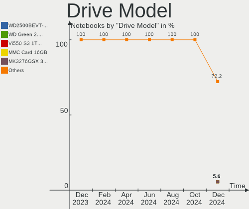
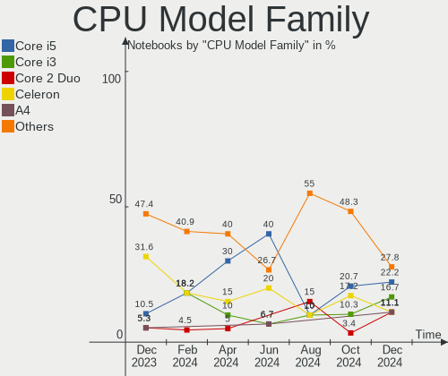
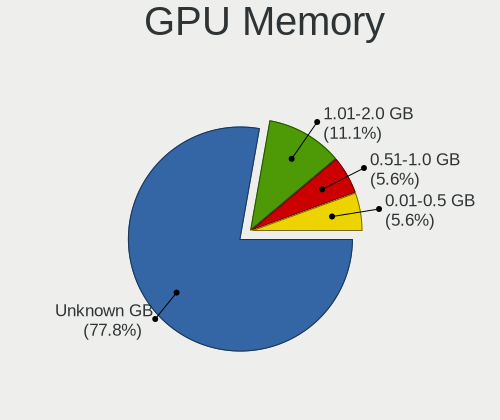
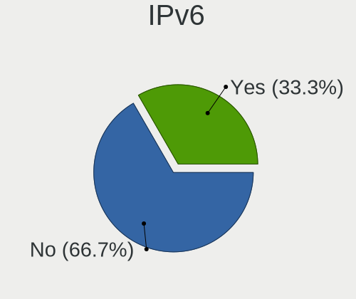
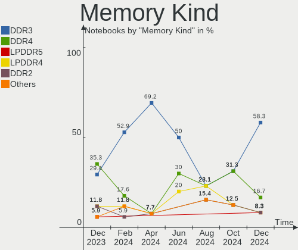
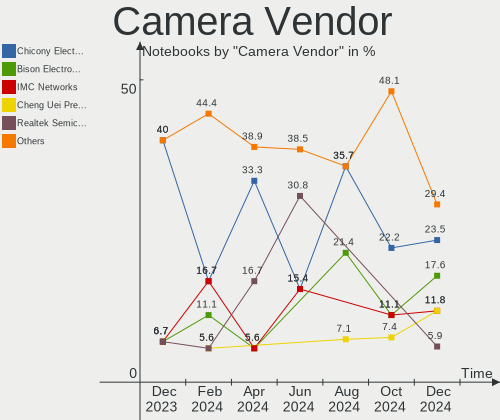

Lubuntu - Hardware Trends (Notebooks)
-------------------------------------

A project to identify most popular hardware characteristics and track their change
over time based on data collected by Linux users at https://Linux-Hardware.org.

Anyone can contribute to this report by the [hw-probe](https://github.com/linuxhw/hw-probe) tool:

    sudo -E hw-probe -all -upload

This report is for one last month. Overall report since the beginning of time: [TestDays](https://github.com/linuxhw/TestDays)

Period: Apr, 2023.

Contents
--------

* [ System ](#system)
  - [ OS                       ](#os)
  - [ OS Family                ](#os-family)
  - [ Kernel                   ](#kernel)
  - [ Kernel Family            ](#kernel-family)
  - [ Kernel Major Ver.        ](#kernel-major-ver)
  - [ Arch                     ](#arch)
  - [ DE                       ](#de)
  - [ Display Server           ](#display-server)
  - [ Display Manager          ](#display-manager)
  - [ OS Lang                  ](#os-lang)
  - [ Boot Mode                ](#boot-mode)
  - [ Filesystem               ](#filesystem)
  - [ Part. scheme             ](#part-scheme)
  - [ Dual Boot with Linux/BSD ](#dual-boot-with-linuxbsd)
  - [ Dual Boot (Win)          ](#dual-boot-win)

* [ Board ](#board)
  - [ Vendor                   ](#vendor)
  - [ Model                    ](#model)
  - [ Model Family             ](#model-family)
  - [ MFG Year                 ](#mfg-year)
  - [ Form Factor              ](#form-factor)
  - [ Secure Boot              ](#secure-boot)
  - [ Coreboot                 ](#coreboot)
  - [ RAM Size                 ](#ram-size)
  - [ RAM Used                 ](#ram-used)
  - [ Total Drives             ](#total-drives)
  - [ Has CD-ROM               ](#has-cd-rom)
  - [ Has Ethernet             ](#has-ethernet)
  - [ Has WiFi                 ](#has-wifi)
  - [ Has Bluetooth            ](#has-bluetooth)

* [ Location ](#location)
  - [ Country                  ](#country)
  - [ City                     ](#city)

* [ Drives ](#drives)
  - [ Drive Vendor             ](#drive-vendor)
  - [ Drive Model              ](#drive-model)
  - [ HDD Vendor               ](#hdd-vendor)
  - [ SSD Vendor               ](#ssd-vendor)
  - [ Drive Kind               ](#drive-kind)
  - [ Drive Connector          ](#drive-connector)
  - [ Drive Size               ](#drive-size)
  - [ Space Total              ](#space-total)
  - [ Space Used               ](#space-used)
  - [ Malfunc. Drives          ](#malfunc-drives)
  - [ Malfunc. Drive Vendor    ](#malfunc-drive-vendor)
  - [ Malfunc. HDD Vendor      ](#malfunc-hdd-vendor)
  - [ Malfunc. Drive Kind      ](#malfunc-drive-kind)
  - [ Failed Drives            ](#failed-drives)
  - [ Failed Drive Vendor      ](#failed-drive-vendor)
  - [ Drive Status             ](#drive-status)

* [ Storage controller ](#storage-controller)
  - [ Storage Vendor           ](#storage-vendor)
  - [ Storage Model            ](#storage-model)
  - [ Storage Kind             ](#storage-kind)

* [ Processor ](#processor)
  - [ CPU Vendor               ](#cpu-vendor)
  - [ CPU Model                ](#cpu-model)
  - [ CPU Model Family         ](#cpu-model-family)
  - [ CPU Cores                ](#cpu-cores)
  - [ CPU Sockets              ](#cpu-sockets)
  - [ CPU Threads              ](#cpu-threads)
  - [ CPU Op-Modes             ](#cpu-op-modes)
  - [ CPU Microcode            ](#cpu-microcode)
  - [ CPU Microarch            ](#cpu-microarch)

* [ Graphics ](#graphics)
  - [ GPU Vendor               ](#gpu-vendor)
  - [ GPU Model                ](#gpu-model)
  - [ GPU Combo                ](#gpu-combo)
  - [ GPU Driver               ](#gpu-driver)
  - [ GPU Memory               ](#gpu-memory)

* [ Monitor ](#monitor)
  - [ Monitor Vendor           ](#monitor-vendor)
  - [ Monitor Model            ](#monitor-model)
  - [ Monitor Resolution       ](#monitor-resolution)
  - [ Monitor Diagonal         ](#monitor-diagonal)
  - [ Monitor Width            ](#monitor-width)
  - [ Aspect Ratio             ](#aspect-ratio)
  - [ Monitor Area             ](#monitor-area)
  - [ Pixel Density            ](#pixel-density)
  - [ Multiple Monitors        ](#multiple-monitors)

* [ Network ](#network)
  - [ Net Controller Vendor    ](#net-controller-vendor)
  - [ Net Controller Model     ](#net-controller-model)
  - [ Wireless Vendor          ](#wireless-vendor)
  - [ Wireless Model           ](#wireless-model)
  - [ Ethernet Vendor          ](#ethernet-vendor)
  - [ Ethernet Model           ](#ethernet-model)
  - [ Net Controller Kind      ](#net-controller-kind)
  - [ Used Controller          ](#used-controller)
  - [ NICs                     ](#nics)
  - [ IPv6                     ](#ipv6)

* [ Bluetooth ](#bluetooth)
  - [ Bluetooth Vendor         ](#bluetooth-vendor)
  - [ Bluetooth Model          ](#bluetooth-model)

* [ Sound ](#sound)
  - [ Sound Vendor             ](#sound-vendor)
  - [ Sound Model              ](#sound-model)

* [ Memory ](#memory)
  - [ Memory Vendor            ](#memory-vendor)
  - [ Memory Model             ](#memory-model)
  - [ Memory Kind              ](#memory-kind)
  - [ Memory Form Factor       ](#memory-form-factor)
  - [ Memory Size              ](#memory-size)
  - [ Memory Speed             ](#memory-speed)

* [ Printers & scanners ](#printers--scanners)
  - [ Printer Vendor           ](#printer-vendor)
  - [ Printer Model            ](#printer-model)
  - [ Scanner Vendor           ](#scanner-vendor)
  - [ Scanner Model            ](#scanner-model)

* [ Camera ](#camera)
  - [ Camera Vendor            ](#camera-vendor)
  - [ Camera Model             ](#camera-model)

* [ Security ](#security)
  - [ Fingerprint Vendor       ](#fingerprint-vendor)
  - [ Fingerprint Model        ](#fingerprint-model)
  - [ Chipcard Vendor          ](#chipcard-vendor)
  - [ Chipcard Model           ](#chipcard-model)

* [ Unsupported ](#unsupported)
  - [ Unsupported Devices      ](#unsupported-devices)
  - [ Unsupported Device Types ](#unsupported-device-types)

System
------

OS
--

Installed operating systems

| Name          | Notebooks | Percent |
|---------------|-----------|---------|
| Lubuntu 22.04 | 18        | 66.67%  |
| Lubuntu 23.04 | 4         | 14.81%  |
| Lubuntu 20.04 | 4         | 14.81%  |
| Lubuntu 18.04 | 1         | 3.7%    |

OS Family
---------

OS without a version

| Name    | Notebooks | Percent |
|---------|-----------|---------|
| Lubuntu | 27        | 100%    |

Kernel
------

Version of the Linux kernel

| Version                | Notebooks | Percent |
|------------------------|-----------|---------|
| 5.19.0-40-generic      | 4         | 14.81%  |
| 5.19.0-38-generic      | 4         | 14.81%  |
| 5.4.0-146-generic      | 3         | 11.11%  |
| 6.2.0-19-generic       | 2         | 7.41%   |
| 5.15.0-70-generic      | 2         | 7.41%   |
| 5.15.0-69-generic      | 2         | 7.41%   |
| 6.2.0-20-generic       | 1         | 3.7%    |
| 6.2.0-18-generic       | 1         | 3.7%    |
| 5.4.0-148-generic      | 1         | 3.7%    |
| 5.19.0-41-generic      | 1         | 3.7%    |
| 5.19.0-35-generic      | 1         | 3.7%    |
| 5.19.0-32-generic      | 1         | 3.7%    |
| 5.19.0-1021-lowlatency | 1         | 3.7%    |
| 5.15.0-71-generic      | 1         | 3.7%    |
| 5.15.0-56-generic      | 1         | 3.7%    |
| 5.15.0-43-generic      | 1         | 3.7%    |

Kernel Family
-------------

Linux kernel without a distro release

| Version | Notebooks | Percent |
|---------|-----------|---------|
| 5.19.0  | 12        | 44.44%  |
| 5.15.0  | 7         | 25.93%  |
| 6.2.0   | 4         | 14.81%  |
| 5.4.0   | 4         | 14.81%  |

Kernel Major Ver.
-----------------

Linux kernel major version

| Version | Notebooks | Percent |
|---------|-----------|---------|
| 5.19    | 12        | 44.44%  |
| 5.15    | 7         | 25.93%  |
| 6.2     | 4         | 14.81%  |
| 5.4     | 4         | 14.81%  |

Arch
----

OS architecture (x86_64, i586, etc.)

| Name   | Notebooks | Percent |
|--------|-----------|---------|
| x86_64 | 26        | 96.3%   |
| i686   | 1         | 3.7%    |

DE
--

Desktop Environment

| Name | Notebooks | Percent |
|------|-----------|---------|
| LXQt | 26        | 96.3%   |
| LXDE | 1         | 3.7%    |

Display Server
--------------

X11 or Wayland

| Name | Notebooks | Percent |
|------|-----------|---------|
| X11  | 27        | 100%    |

Display Manager
---------------

SDDM, LightDM, etc.

| Name    | Notebooks | Percent |
|---------|-----------|---------|
| SDDM    | 24        | 88.89%  |
| Unknown | 2         | 7.41%   |
| LightDM | 1         | 3.7%    |

OS Lang
-------

Language

| Lang  | Notebooks | Percent |
|-------|-----------|---------|
| en_US | 9         | 33.33%  |
| fr_FR | 5         | 18.52%  |
| de_DE | 3         | 11.11%  |
| es_CR | 2         | 7.41%   |
| en_GB | 2         | 7.41%   |
| en_AU | 2         | 7.41%   |
| C     | 2         | 7.41%   |
| hu_HU | 1         | 3.7%    |
| es_CO | 1         | 3.7%    |

Boot Mode
---------

EFI or BIOS

| Mode | Notebooks | Percent |
|------|-----------|---------|
| BIOS | 17        | 62.96%  |
| EFI  | 10        | 37.04%  |

Filesystem
----------

Type of filesystem

| Type    | Notebooks | Percent |
|---------|-----------|---------|
| Ext4    | 23        | 85.19%  |
| Tmpfs   | 2         | 7.41%   |
| Overlay | 2         | 7.41%   |

Part. scheme
------------

Scheme of partitioning

| Type    | Notebooks | Percent |
|---------|-----------|---------|
| GPT     | 17        | 62.96%  |
| MBR     | 7         | 25.93%  |
| Unknown | 3         | 11.11%  |

Dual Boot with Linux/BSD
------------------------

Hosting more than one Linux/BSD

| Dual boot | Notebooks | Percent |
|-----------|-----------|---------|
| No        | 22        | 81.48%  |
| Yes       | 5         | 18.52%  |

Dual Boot (Win)
---------------

Hosting Linux and Windows

| Dual boot | Notebooks | Percent |
|-----------|-----------|---------|
| No        | 17        | 62.96%  |
| Yes       | 10        | 37.04%  |

Board
-----

Vendor
------

Motherboard manufacturer

| Name             | Notebooks | Percent |
|------------------|-----------|---------|
| Hewlett-Packard  | 9         | 33.33%  |
| Lenovo           | 5         | 18.52%  |
| Toshiba          | 2         | 7.41%   |
| Dell             | 2         | 7.41%   |
| Acer             | 2         | 7.41%   |
| Sony             | 1         | 3.7%    |
| Intel            | 1         | 3.7%    |
| GPU Company      | 1         | 3.7%    |
| Google           | 1         | 3.7%    |
| AXIOO            | 1         | 3.7%    |
| ASUSTek Computer | 1         | 3.7%    |
| Apple            | 1         | 3.7%    |

Model
-----

Motherboard model

| Name                            | Notebooks | Percent |
|---------------------------------|-----------|---------|
| HP Pavilion 15                  | 2         | 7.41%   |
| HP Laptop 15-da0xxx             | 2         | 7.41%   |
| Toshiba Satellite P70-A         | 1         | 3.7%    |
| Toshiba Satellite C660          | 1         | 3.7%    |
| Sony SVF1521C6EW                | 1         | 3.7%    |
| Lenovo ThinkPad X240 20AMS0RR00 | 1         | 3.7%    |
| Lenovo ThinkPad T530 2394BF7    | 1         | 3.7%    |
| Lenovo ThinkPad L520 5015AH2    | 1         | 3.7%    |
| Lenovo IdeaPad 320-15AST 80XV   | 1         | 3.7%    |
| Lenovo IdeaPad 100-15IBD 80QQ   | 1         | 3.7%    |
| Intel Infoway                   | 1         | 3.7%    |
| HP ZBook 15 G2                  | 1         | 3.7%    |
| HP Stream Laptop 14-ax0XX       | 1         | 3.7%    |
| HP Pavilion dv6                 | 1         | 3.7%    |
| HP Laptop 15-bs2xx              | 1         | 3.7%    |
| HP G42                          | 1         | 3.7%    |
| GPU Company GWTN116-3           | 1         | 3.7%    |
| Google Chell                    | 1         | 3.7%    |
| Dell XPS 13 9305                | 1         | 3.7%    |
| Dell Latitude 5290              | 1         | 3.7%    |
| AXIOO MYBOOK-14                 | 1         | 3.7%    |
| ASUS K52JB                      | 1         | 3.7%    |
| Apple MacBookPro8,1             | 1         | 3.7%    |
| Acer Aspire E1-570              | 1         | 3.7%    |
| Acer Aspire 5735                | 1         | 3.7%    |

Model Family
------------

Motherboard model prefix

| Name                  | Notebooks | Percent |
|-----------------------|-----------|---------|
| Lenovo ThinkPad       | 3         | 11.11%  |
| HP Pavilion           | 3         | 11.11%  |
| HP Laptop             | 3         | 11.11%  |
| Toshiba Satellite     | 2         | 7.41%   |
| Lenovo IdeaPad        | 2         | 7.41%   |
| Acer Aspire           | 2         | 7.41%   |
| Sony SVF1521C6EW      | 1         | 3.7%    |
| Intel Infoway         | 1         | 3.7%    |
| HP ZBook              | 1         | 3.7%    |
| HP Stream             | 1         | 3.7%    |
| HP G42                | 1         | 3.7%    |
| GPU Company GWTN116-3 | 1         | 3.7%    |
| Google Chell          | 1         | 3.7%    |
| Dell XPS              | 1         | 3.7%    |
| Dell Latitude         | 1         | 3.7%    |
| AXIOO MYBOOK-14       | 1         | 3.7%    |
| ASUS K52JB            | 1         | 3.7%    |
| Apple MacBookPro8     | 1         | 3.7%    |

MFG Year
--------

Motherboard manufacture year

| Year | Notebooks | Percent |
|------|-----------|---------|
| 2013 | 6         | 22.22%  |
| 2018 | 3         | 11.11%  |
| 2010 | 3         | 11.11%  |
| 2008 | 3         | 11.11%  |
| 2021 | 2         | 7.41%   |
| 2017 | 2         | 7.41%   |
| 2015 | 2         | 7.41%   |
| 2011 | 2         | 7.41%   |
| 2023 | 1         | 3.7%    |
| 2020 | 1         | 3.7%    |
| 2016 | 1         | 3.7%    |
| 2012 | 1         | 3.7%    |

Form Factor
-----------

Physical design of the computer

| Name     | Notebooks | Percent |
|----------|-----------|---------|
| Notebook | 27        | 100%    |

Secure Boot
-----------

Enabled or disabled

| State    | Notebooks | Percent |
|----------|-----------|---------|
| Disabled | 24        | 88.89%  |
| Enabled  | 3         | 11.11%  |

Coreboot
--------

Have coreboot on board

| Used | Notebooks | Percent |
|------|-----------|---------|
| No   | 26        | 96.3%   |
| Yes  | 1         | 3.7%    |

RAM Size
--------

Total RAM memory

| Size in GB | Notebooks | Percent |
|------------|-----------|---------|
| 3.01-4.0   | 8         | 29.63%  |
| 4.01-8.0   | 6         | 22.22%  |
| 16.01-24.0 | 6         | 22.22%  |
| 2.01-3.0   | 3         | 11.11%  |
| 8.01-16.0  | 2         | 7.41%   |
| 24.01-32.0 | 1         | 3.7%    |
| 1.01-2.0   | 1         | 3.7%    |

RAM Used
--------

Used RAM memory

| Used GB  | Notebooks | Percent |
|----------|-----------|---------|
| 1.01-2.0 | 18        | 66.67%  |
| 2.01-3.0 | 5         | 18.52%  |
| 3.01-4.0 | 2         | 7.41%   |
| 0.51-1.0 | 2         | 7.41%   |

Total Drives
------------

Number of drives on board

| Drives | Notebooks | Percent |
|--------|-----------|---------|
| 1      | 16        | 59.26%  |
| 2      | 9         | 33.33%  |
| 3      | 2         | 7.41%   |

Has CD-ROM
----------

Has CD-ROM on board

| Presented | Notebooks | Percent |
|-----------|-----------|---------|
| Yes       | 14        | 51.85%  |
| No        | 13        | 48.15%  |

Has Ethernet
------------

Has Ethernet on board

| Presented | Notebooks | Percent |
|-----------|-----------|---------|
| Yes       | 24        | 88.89%  |
| No        | 3         | 11.11%  |

Has WiFi
--------

Has WiFi module

| Presented | Notebooks | Percent |
|-----------|-----------|---------|
| Yes       | 27        | 100%    |

Has Bluetooth
-------------

Has Bluetooth module

| Presented | Notebooks | Percent |
|-----------|-----------|---------|
| Yes       | 20        | 74.07%  |
| No        | 7         | 25.93%  |

Location
--------

Country
-------

Geographic location (country)

| Country    | Notebooks | Percent |
|------------|-----------|---------|
| USA        | 5         | 18.52%  |
| France     | 5         | 18.52%  |
| Germany    | 4         | 14.81%  |
| UAE        | 2         | 7.41%   |
| Costa Rica | 2         | 7.41%   |
| Portugal   | 1         | 3.7%    |
| Italy      | 1         | 3.7%    |
| Indonesia  | 1         | 3.7%    |
| Hungary    | 1         | 3.7%    |
| Croatia    | 1         | 3.7%    |
| Colombia   | 1         | 3.7%    |
| Brazil     | 1         | 3.7%    |
| Bangladesh | 1         | 3.7%    |
| Australia  | 1         | 3.7%    |

City
----

Geographic location (city)

| City                 | Notebooks | Percent |
|----------------------|-----------|---------|
| Rio Segundo          | 2         | 7.41%   |
| Eberbach             | 2         | 7.41%   |
| Dubai                | 2         | 7.41%   |
| Zagreb               | 1         | 3.7%    |
| Valenciennes         | 1         | 3.7%    |
| Sylhet               | 1         | 3.7%    |
| Rumilly-en-Cambresis | 1         | 3.7%    |
| Rheine               | 1         | 3.7%    |
| Redding              | 1         | 3.7%    |
| Porto                | 1         | 3.7%    |
| Novo Gama            | 1         | 3.7%    |
| New Albany           | 1         | 3.7%    |
| Nantes               | 1         | 3.7%    |
| Karlsruhe            | 1         | 3.7%    |
| Hamden               | 1         | 3.7%    |
| Guidel               | 1         | 3.7%    |
| Denpasar             | 1         | 3.7%    |
| Columbus             | 1         | 3.7%    |
| Centreville          | 1         | 3.7%    |
| Caen                 | 1         | 3.7%    |
| Budapest             | 1         | 3.7%    |
| Brisbane             | 1         | 3.7%    |
| Bogotá              | 1         | 3.7%    |
| Altivole             | 1         | 3.7%    |

Drives
------

Drive Vendor
------------

Hard drive vendors

| Vendor              | Notebooks | Drives | Percent |
|---------------------|-----------|--------|---------|
| Unknown             | 7         | 7      | 19.44%  |
| Samsung Electronics | 6         | 6      | 16.67%  |
| Seagate             | 4         | 4      | 11.11%  |
| WDC                 | 3         | 3      | 8.33%   |
| Toshiba             | 3         | 3      | 8.33%   |
| PNY                 | 2         | 2      | 5.56%   |
| Intel               | 2         | 2      | 5.56%   |
| Transcend           | 1         | 1      | 2.78%   |
| Silicon Motion      | 1         | 1      | 2.78%   |
| SanDisk             | 1         | 1      | 2.78%   |
| LDLC                | 1         | 1      | 2.78%   |
| Kingston            | 1         | 1      | 2.78%   |
| Hitachi             | 1         | 1      | 2.78%   |
| HGST                | 1         | 1      | 2.78%   |
| Fujitsu             | 1         | 1      | 2.78%   |
| Crucial             | 1         | 1      | 2.78%   |

Drive Model
-----------

Hard drive models

| Model                                                  | Notebooks | Percent |
|--------------------------------------------------------|-----------|---------|
| Unknown SC256  256GB                                   | 2         | 5.56%   |
| Unknown MMC Card  64GB                                 | 2         | 5.56%   |
| Unknown MMC Card  32GB                                 | 2         | 5.56%   |
| PNY CS900 240GB SSD                                    | 2         | 5.56%   |
| WDC WDS250G2B0A 250GB SSD                              | 1         | 2.78%   |
| WDC WDS120G2G0A-00JH30 120GB SSD                       | 1         | 2.78%   |
| WDC WD5000LPCX-60VHAT1 500GB                           | 1         | 2.78%   |
| Unknown DA4064  64GB                                   | 1         | 2.78%   |
| Transcend TS240GMTS420S 240GB SSD                      | 1         | 2.78%   |
| Toshiba MQ01ABF050 500GB                               | 1         | 2.78%   |
| Toshiba MQ01ABD100 1TB                                 | 1         | 2.78%   |
| Toshiba MQ01ABD075 752GB                               | 1         | 2.78%   |
| Silicon Motion SM2263EN/SM2263XT SSD Controller 1024GB | 1         | 2.78%   |
| Seagate ST9320423AS 320GB                              | 1         | 2.78%   |
| Seagate ST500LT012-1DG142 500GB                        | 1         | 2.78%   |
| Seagate ST320LT012-9WS14C 320GB                        | 1         | 2.78%   |
| Seagate ST1000LM035-1RK172 970GB                       | 1         | 2.78%   |
| SanDisk SDSSDA480G 480GB                               | 1         | 2.78%   |
| Samsung SSD 980 1TB                                    | 1         | 2.78%   |
| Samsung SSD 860 EVO M.2 500GB                          | 1         | 2.78%   |
| Samsung SSD 830 Series 512GB                           | 1         | 2.78%   |
| Samsung PM991a NVMe 512GB                              | 1         | 2.78%   |
| Samsung MZ7TD128HAFV-000L1 128GB SSD                   | 1         | 2.78%   |
| Samsung HM121HI 120GB                                  | 1         | 2.78%   |
| LDLC 240GB                                             | 1         | 2.78%   |
| Kingston SV300S37A240G 240GB SSD                       | 1         | 2.78%   |
| Intel SSDSC2MH250A2 250GB                              | 1         | 2.78%   |
| Intel SSDSC2KW512G8 512GB                              | 1         | 2.78%   |
| Hitachi HTS541680J9SA00 80GB                           | 1         | 2.78%   |
| HGST HTS541075A9E680 752GB                             | 1         | 2.78%   |
| Fujitsu MJA2500BH G2 500GB                             | 1         | 2.78%   |
| Crucial CT480BX200SSD1 480GB                           | 1         | 2.78%   |

HDD Vendor
----------

Hard disk drive vendors

| Vendor              | Notebooks | Drives | Percent |
|---------------------|-----------|--------|---------|
| Seagate             | 4         | 4      | 33.33%  |
| Toshiba             | 3         | 3      | 25%     |
| WDC                 | 1         | 1      | 8.33%   |
| Samsung Electronics | 1         | 1      | 8.33%   |
| Hitachi             | 1         | 1      | 8.33%   |
| HGST                | 1         | 1      | 8.33%   |
| Fujitsu             | 1         | 1      | 8.33%   |

SSD Vendor
----------

Solid state drive vendors

| Vendor              | Notebooks | Drives | Percent |
|---------------------|-----------|--------|---------|
| Samsung Electronics | 3         | 3      | 23.08%  |
| WDC                 | 2         | 2      | 15.38%  |
| PNY                 | 2         | 2      | 15.38%  |
| Intel               | 2         | 2      | 15.38%  |
| Transcend           | 1         | 1      | 7.69%   |
| SanDisk             | 1         | 1      | 7.69%   |
| Kingston            | 1         | 1      | 7.69%   |
| Crucial             | 1         | 1      | 7.69%   |

Drive Kind
----------

HDD or SSD

| Kind    | Notebooks | Drives | Percent |
|---------|-----------|--------|---------|
| HDD     | 12        | 12     | 35.29%  |
| SSD     | 11        | 13     | 32.35%  |
| MMC     | 7         | 7      | 20.59%  |
| NVMe    | 3         | 3      | 8.82%   |
| Unknown | 1         | 1      | 2.94%   |

Drive Connector
---------------

SATA, SAS, NVMe, etc.

| Type | Notebooks | Drives | Percent |
|------|-----------|--------|---------|
| SATA | 23        | 26     | 69.7%   |
| MMC  | 7         | 7      | 21.21%  |
| NVMe | 3         | 3      | 9.09%   |

Drive Size
----------

Size of hard drive

| Size in TB | Notebooks | Drives | Percent |
|------------|-----------|--------|---------|
| 0.01-0.5   | 18        | 19     | 75%     |
| 0.51-1.0   | 6         | 6      | 25%     |

Space Total
-----------

Amount of disk space available on the file system

| Size in GB     | Notebooks | Percent |
|----------------|-----------|---------|
| 251-500        | 8         | 29.63%  |
| 101-250        | 8         | 29.63%  |
| 51-100         | 5         | 18.52%  |
| 501-1000       | 3         | 11.11%  |
| More than 3000 | 1         | 3.7%    |
| 21-50          | 1         | 3.7%    |
| 1-20           | 1         | 3.7%    |

Space Used
----------

Amount of used disk space

| Used GB | Notebooks | Percent |
|---------|-----------|---------|
| 1-20    | 9         | 33.33%  |
| 21-50   | 8         | 29.63%  |
| 101-250 | 6         | 22.22%  |
| 51-100  | 4         | 14.81%  |

Malfunc. Drives
---------------

Drive models with a malfunction

| Model                             | Notebooks | Drives | Percent |
|-----------------------------------|-----------|--------|---------|
| WDC WD5000LPCX-60VHAT1 500GB      | 1         | 1      | 20%     |
| Toshiba MQ01ABD100 1TB            | 1         | 1      | 20%     |
| Seagate ST320LT012-9WS14C 320GB   | 1         | 1      | 20%     |
| Samsung Electronics HM121HI 120GB | 1         | 1      | 20%     |
| Intel SSDSC2KW512G8 512GB         | 1         | 1      | 20%     |

Malfunc. Drive Vendor
---------------------

Vendors of faulty drives

| Vendor              | Notebooks | Drives | Percent |
|---------------------|-----------|--------|---------|
| WDC                 | 1         | 1      | 20%     |
| Toshiba             | 1         | 1      | 20%     |
| Seagate             | 1         | 1      | 20%     |
| Samsung Electronics | 1         | 1      | 20%     |
| Intel               | 1         | 1      | 20%     |

Malfunc. HDD Vendor
-------------------

Vendors of faulty HDD drives

| Vendor              | Notebooks | Drives | Percent |
|---------------------|-----------|--------|---------|
| WDC                 | 1         | 1      | 25%     |
| Toshiba             | 1         | 1      | 25%     |
| Seagate             | 1         | 1      | 25%     |
| Samsung Electronics | 1         | 1      | 25%     |

Malfunc. Drive Kind
-------------------

Kinds of faulty drives

| Kind | Notebooks | Drives | Percent |
|------|-----------|--------|---------|
| HDD  | 4         | 4      | 80%     |
| SSD  | 1         | 1      | 20%     |

Failed Drives
-------------

Failed drive models

Zero info for selected period =(

Failed Drive Vendor
-------------------

Failed drive vendors

Zero info for selected period =(

Drive Status
------------

Number of failed and malfunc. drives

| Status   | Notebooks | Drives | Percent |
|----------|-----------|--------|---------|
| Detected | 17        | 22     | 56.67%  |
| Works    | 8         | 9      | 26.67%  |
| Malfunc  | 5         | 5      | 16.67%  |

Storage controller
------------------

Storage Vendor
--------------

Storage controller vendors

| Vendor              | Notebooks | Percent |
|---------------------|-----------|---------|
| Intel               | 22        | 81.48%  |
| Samsung Electronics | 2         | 7.41%   |
| AMD                 | 2         | 7.41%   |
| Silicon Motion      | 1         | 3.7%    |

Storage Model
-------------

Storage controller models

| Model                                                                          | Notebooks | Percent |
|--------------------------------------------------------------------------------|-----------|---------|
| Intel 7 Series Chipset Family 6-port SATA Controller [AHCI mode]               | 4         | 14.29%  |
| Intel Celeron/Pentium Silver Processor SATA Controller                         | 3         | 10.71%  |
| Intel 6 Series/C200 Series Chipset Family 6 port Mobile SATA AHCI Controller   | 3         | 10.71%  |
| Samsung NVMe SSD Controller 980                                                | 2         | 7.14%   |
| Intel 8 Series/C220 Series Chipset Family 6-port SATA Controller 1 [AHCI mode] | 2         | 7.14%   |
| Intel 8 Series SATA Controller 1 [AHCI mode]                                   | 2         | 7.14%   |
| Intel 5 Series/3400 Series Chipset 4 port SATA AHCI Controller                 | 2         | 7.14%   |
| AMD FCH SATA Controller [AHCI mode]                                            | 2         | 7.14%   |
| Silicon Motion SM2263EN/SM2263XT SSD Controller                                | 1         | 3.57%   |
| Intel Sunrise Point-LP SATA Controller [AHCI mode]                             | 1         | 3.57%   |
| Intel Celeron N3350/Pentium N4200/Atom E3900 Series SATA AHCI Controller       | 1         | 3.57%   |
| Intel 82801IBM/IEM (ICH9M/ICH9M-E) 4 port SATA Controller [AHCI mode]          | 1         | 3.57%   |
| Intel 82801IBM/IEM (ICH9M/ICH9M-E) 2 port SATA Controller [IDE mode]           | 1         | 3.57%   |
| Intel 82801HM/HEM (ICH8M/ICH8M-E) SATA Controller [AHCI mode]                  | 1         | 3.57%   |
| Intel 82801HM/HEM (ICH8M/ICH8M-E) IDE Controller                               | 1         | 3.57%   |
| Intel 82801 Mobile SATA Controller [RAID mode]                                 | 1         | 3.57%   |

Storage Kind
------------

Kind of storage controller (IDE, SATA, NVMe, SAS, ...)

| Kind | Notebooks | Percent |
|------|-----------|---------|
| SATA | 22        | 78.57%  |
| NVMe | 3         | 10.71%  |
| IDE  | 2         | 7.14%   |
| RAID | 1         | 3.57%   |

Processor
---------

CPU Vendor
----------

Processor vendors

| Vendor | Notebooks | Percent |
|--------|-----------|---------|
| Intel  | 25        | 92.59%  |
| AMD    | 2         | 7.41%   |

CPU Model
---------

Processor models

| Model                                        | Notebooks | Percent |
|----------------------------------------------|-----------|---------|
| Intel Celeron N4000 CPU @ 1.10GHz            | 2         | 7.41%   |
| Intel Pentium Dual CPU T3200 @ 2.00GHz       | 1         | 3.7%    |
| Intel Pentium CPU 2117U @ 1.80GHz            | 1         | 3.7%    |
| Intel Core m7-6Y75 CPU @ 1.20GHz             | 1         | 3.7%    |
| Intel Core i7-8550U CPU @ 1.80GHz            | 1         | 3.7%    |
| Intel Core i7-4910MQ CPU @ 2.90GHz           | 1         | 3.7%    |
| Intel Core i7-4700MQ CPU @ 2.40GHz           | 1         | 3.7%    |
| Intel Core i7-3720QM CPU @ 2.60GHz           | 1         | 3.7%    |
| Intel Core i7-3632QM CPU @ 2.20GHz           | 1         | 3.7%    |
| Intel Core i5-8250U CPU @ 1.60GHz            | 1         | 3.7%    |
| Intel Core i5-4300U CPU @ 1.90GHz            | 1         | 3.7%    |
| Intel Core i5-4288U CPU @ 2.60GHz            | 1         | 3.7%    |
| Intel Core i5-2435M CPU @ 2.40GHz            | 1         | 3.7%    |
| Intel Core i5 CPU M 430 @ 2.27GHz            | 1         | 3.7%    |
| Intel Core i3-3217U CPU @ 1.80GHz            | 1         | 3.7%    |
| Intel Core i3-2330M CPU @ 2.20GHz            | 1         | 3.7%    |
| Intel Core i3 CPU M 350 @ 2.27GHz            | 1         | 3.7%    |
| Intel Core 2 Duo CPU T7500 @ 2.20GHz         | 1         | 3.7%    |
| Intel Celeron N4020 CPU @ 1.10GHz            | 1         | 3.7%    |
| Intel Celeron Dual-Core CPU T3500 @ 2.10GHz  | 1         | 3.7%    |
| Intel Celeron CPU N3350 @ 1.10GHz            | 1         | 3.7%    |
| Intel Celeron CPU N3060 @ 1.60GHz            | 1         | 3.7%    |
| Intel Celeron CPU B815 @ 1.60GHz             | 1         | 3.7%    |
| Intel 11th Gen Core i5-1135G7 @ 2.40GHz      | 1         | 3.7%    |
| AMD E2-9000 RADEON R2, 4 COMPUTE CORES 2C+2G | 1         | 3.7%    |
| AMD A6-5200 APU with Radeon HD Graphics      | 1         | 3.7%    |

CPU Model Family
----------------

Processor model prefix

| Model                   | Notebooks | Percent |
|-------------------------|-----------|---------|
| Intel Celeron           | 6         | 22.22%  |
| Intel Core i7           | 5         | 18.52%  |
| Intel Core i5           | 5         | 18.52%  |
| Intel Core i3           | 3         | 11.11%  |
| Other                   | 1         | 3.7%    |
| Intel Pentium Dual      | 1         | 3.7%    |
| Intel Pentium           | 1         | 3.7%    |
| Intel Core m7           | 1         | 3.7%    |
| Intel Core 2 Duo        | 1         | 3.7%    |
| Intel Celeron Dual-Core | 1         | 3.7%    |
| AMD E2                  | 1         | 3.7%    |
| AMD A6                  | 1         | 3.7%    |

CPU Cores
---------

Number of processor cores

| Number | Notebooks | Percent |
|--------|-----------|---------|
| 2      | 19        | 70.37%  |
| 4      | 8         | 29.63%  |

CPU Sockets
-----------

Number of sockets

| Number | Notebooks | Percent |
|--------|-----------|---------|
| 1      | 27        | 100%    |

CPU Threads
-----------

Threads per core (Hyper-Threading)

| Number | Notebooks | Percent |
|--------|-----------|---------|
| 2      | 15        | 55.56%  |
| 1      | 12        | 44.44%  |

CPU Op-Modes
------------

CPU Operation Modes (32-bit, 64-bit)

| Op mode        | Notebooks | Percent |
|----------------|-----------|---------|
| 32-bit, 64-bit | 27        | 100%    |

CPU Microcode
-------------

Microcode number

| Number     | Notebooks | Percent |
|------------|-----------|---------|
| Unknown    | 14        | 51.85%  |
| 0x306a9    | 3         | 11.11%  |
| 0x806ea    | 1         | 3.7%    |
| 0x806c1    | 1         | 3.7%    |
| 0x706a8    | 1         | 3.7%    |
| 0x706a1    | 1         | 3.7%    |
| 0x40651    | 1         | 3.7%    |
| 0x306c3    | 1         | 3.7%    |
| 0x206a7    | 1         | 3.7%    |
| 0x20652    | 1         | 3.7%    |
| 0x1067a    | 1         | 3.7%    |
| 0x06006705 | 1         | 3.7%    |

CPU Microarch
-------------

Microarchitecture

| Name          | Notebooks | Percent |
|---------------|-----------|---------|
| IvyBridge     | 4         | 14.81%  |
| Haswell       | 4         | 14.81%  |
| SandyBridge   | 3         | 11.11%  |
| Goldmont plus | 3         | 11.11%  |
| Westmere      | 2         | 7.41%   |
| KabyLake      | 2         | 7.41%   |
| Core          | 2         | 7.41%   |
| TigerLake     | 1         | 3.7%    |
| Skylake       | 1         | 3.7%    |
| Silvermont    | 1         | 3.7%    |
| Penryn        | 1         | 3.7%    |
| Jaguar        | 1         | 3.7%    |
| Goldmont      | 1         | 3.7%    |
| Excavator     | 1         | 3.7%    |

Graphics
--------

GPU Vendor
----------

Vendors of graphics cards

| Vendor | Notebooks | Percent |
|--------|-----------|---------|
| Intel  | 23        | 69.7%   |
| Nvidia | 5         | 15.15%  |
| AMD    | 5         | 15.15%  |

GPU Model
---------

Graphics card models

| Model                                                                                    | Notebooks | Percent |
|------------------------------------------------------------------------------------------|-----------|---------|
| Intel 3rd Gen Core processor Graphics Controller                                         | 4         | 11.76%  |
| Intel GeminiLake [UHD Graphics 600]                                                      | 3         | 8.82%   |
| Intel 2nd Generation Core Processor Family Integrated Graphics Controller                | 3         | 8.82%   |
| Nvidia GK208M [GeForce GT 740M]                                                          | 2         | 5.88%   |
| Intel UHD Graphics 620                                                                   | 2         | 5.88%   |
| Intel Mobile 4 Series Chipset Integrated Graphics Controller                             | 2         | 5.88%   |
| Intel Haswell-ULT Integrated Graphics Controller                                         | 2         | 5.88%   |
| Nvidia GM108M [GeForce MX130]                                                            | 1         | 2.94%   |
| Nvidia GK107GLM [Quadro K1100M]                                                          | 1         | 2.94%   |
| Nvidia GF108M [NVS 5400M]                                                                | 1         | 2.94%   |
| Intel TigerLake-LP GT2 [Iris Xe Graphics]                                                | 1         | 2.94%   |
| Intel Mobile GM965/GL960 Integrated Graphics Controller (secondary)                      | 1         | 2.94%   |
| Intel Mobile GM965/GL960 Integrated Graphics Controller (primary)                        | 1         | 2.94%   |
| Intel HD Graphics 515                                                                    | 1         | 2.94%   |
| Intel HD Graphics 500                                                                    | 1         | 2.94%   |
| Intel Core Processor Integrated Graphics Controller                                      | 1         | 2.94%   |
| Intel Atom/Celeron/Pentium Processor x5-E8000/J3xxx/N3xxx Integrated Graphics Controller | 1         | 2.94%   |
| Intel 4th Gen Core Processor Integrated Graphics Controller                              | 1         | 2.94%   |
| AMD Sun XT [Radeon HD 8670A/8670M/8690M / R5 M330 / M430 / Radeon 520 Mobile]            | 1         | 2.94%   |
| AMD Stoney [Radeon R2/R3/R4/R5 Graphics]                                                 | 1         | 2.94%   |
| AMD Seymour [Radeon HD 6400M/7400M Series]                                               | 1         | 2.94%   |
| AMD RV710/M92 [Mobility Radeon HD 4530/4570/5145/530v/540v/545v]                         | 1         | 2.94%   |
| AMD Kabini [Radeon HD 8400 / R3 Series]                                                  | 1         | 2.94%   |

GPU Combo
---------

Combinations of graphics cards

| Name           | Notebooks | Percent |
|----------------|-----------|---------|
| 1 x Intel      | 16        | 59.26%  |
| Intel + Nvidia | 4         | 14.81%  |
| 1 x AMD        | 3         | 11.11%  |
| Intel + AMD    | 2         | 7.41%   |
| 2 x Intel      | 1         | 3.7%    |
| 1 x Nvidia     | 1         | 3.7%    |

GPU Driver
----------

Free vs proprietary

| Driver      | Notebooks | Percent |
|-------------|-----------|---------|
| Free        | 24        | 88.89%  |
| Proprietary | 3         | 11.11%  |

GPU Memory
----------

Total video memory

| Size in GB | Notebooks | Percent |
|------------|-----------|---------|
| Unknown    | 23        | 85.19%  |
| 0.51-1.0   | 2         | 7.41%   |
| 1.01-2.0   | 1         | 3.7%    |
| 0.01-0.5   | 1         | 3.7%    |

Monitor
-------

Monitor Vendor
--------------

Monitor vendors

| Vendor                  | Notebooks | Percent |
|-------------------------|-----------|---------|
| AU Optronics            | 7         | 24.14%  |
| BOE                     | 5         | 17.24%  |
| LG Display              | 4         | 13.79%  |
| Samsung Electronics     | 3         | 10.34%  |
| Chi Mei Optoelectronics | 2         | 6.9%    |
| Toshiba                 | 1         | 3.45%   |
| Sharp                   | 1         | 3.45%   |
| LLL                     | 1         | 3.45%   |
| Goldstar                | 1         | 3.45%   |
| CPT                     | 1         | 3.45%   |
| CMN                     | 1         | 3.45%   |
| Chimei Innolux          | 1         | 3.45%   |
| Apple                   | 1         | 3.45%   |

Monitor Model
-------------

Monitor models

| Model                                                                    | Notebooks | Percent |
|--------------------------------------------------------------------------|-----------|---------|
| Toshiba TV TSB0108 1360x768 576x324mm 26.0-inch                          | 1         | 3.45%   |
| Sharp LCD Monitor SHP141B 1920x1080 294x165mm 13.3-inch                  | 1         | 3.45%   |
| Samsung Electronics LCD Monitor SEC3842 1366x768 309x174mm 14.0-inch     | 1         | 3.45%   |
| Samsung Electronics LCD Monitor SEC3152 1366x768 344x194mm 15.5-inch     | 1         | 3.45%   |
| Samsung Electronics LCD Monitor SDC415A 3840x2400 302x189mm 14.0-inch    | 1         | 3.45%   |
| LLL LRK32G30RQ LLL4200 1920x1080 983x576mm 44.9-inch                     | 1         | 3.45%   |
| LG Display LCD Monitor LGD0430 1366x768 345x194mm 15.6-inch              | 1         | 3.45%   |
| LG Display LCD Monitor LGD03CD 1366x768 277x156mm 12.5-inch              | 1         | 3.45%   |
| LG Display LCD Monitor LGD039F 1366x768 345x194mm 15.6-inch              | 1         | 3.45%   |
| LG Display LCD Monitor LGD0384 1366x768 344x194mm 15.5-inch              | 1         | 3.45%   |
| Goldstar W2243 GSM56FE 1920x1080 477x268mm 21.5-inch                     | 1         | 3.45%   |
| CPT LCD Monitor CPT1415 1280x800 331x207mm 15.4-inch                     | 1         | 3.45%   |
| CMN LCD Monitor 1920x1080                                                | 1         | 3.45%   |
| Chimei Innolux LCD Monitor CMN1728 1600x900 382x215mm 17.3-inch          | 1         | 3.45%   |
| Chi Mei Optoelectronics LCD Monitor CMO15A2 1366x768 344x193mm 15.5-inch | 1         | 3.45%   |
| Chi Mei Optoelectronics LCD Monitor CMO15A1 1366x768 344x193mm 15.5-inch | 1         | 3.45%   |
| BOE LCD Monitor BOE0771 1366x768 256x144mm 11.6-inch                     | 1         | 3.45%   |
| BOE LCD Monitor BOE06A4 1366x768 344x194mm 15.5-inch                     | 1         | 3.45%   |
| BOE LCD Monitor BOE0696 1366x768 309x173mm 13.9-inch                     | 1         | 3.45%   |
| BOE LCD Monitor BOE0675 1366x768 344x194mm 15.5-inch                     | 1         | 3.45%   |
| BOE LCD Monitor BOE061D 1366x768 309x173mm 13.9-inch                     | 1         | 3.45%   |
| AU Optronics LCD Monitor AUO70EC 1366x768 344x193mm 15.5-inch            | 1         | 3.45%   |
| AU Optronics LCD Monitor AUO5B2D 1920x1080 293x162mm 13.2-inch           | 1         | 3.45%   |
| AU Optronics LCD Monitor AUO45EC 1366x768 344x193mm 15.5-inch            | 1         | 3.45%   |
| AU Optronics LCD Monitor AUO38ED 1920x1080 344x193mm 15.5-inch           | 1         | 3.45%   |
| AU Optronics LCD Monitor AUO21EC 1366x768 344x193mm 15.5-inch            | 1         | 3.45%   |
| AU Optronics LCD Monitor AUO10EC 1366x768 344x193mm 15.5-inch            | 1         | 3.45%   |
| AU Optronics LCD Monitor AUO106C 1366x768 277x156mm 12.5-inch            | 1         | 3.45%   |
| Apple LCD Monitor APP9CC5 1280x800 286x179mm 13.3-inch                   | 1         | 3.45%   |

Monitor Resolution
------------------

Monitor screen resolution

| Resolution      | Notebooks | Percent |
|-----------------|-----------|---------|
| 1366x768 (WXGA) | 18        | 62.07%  |
| 1920x1080 (FHD) | 6         | 20.69%  |
| 1280x800 (WXGA) | 2         | 6.9%    |
| 3840x2400       | 1         | 3.45%   |
| 1920x540        | 1         | 3.45%   |
| 1600x900 (HD+)  | 1         | 3.45%   |

Monitor Diagonal
----------------

Diagonal size in inches

| Inches  | Notebooks | Percent |
|---------|-----------|---------|
| 15      | 14        | 48.28%  |
| 13      | 5         | 17.24%  |
| 14      | 2         | 6.9%    |
| 12      | 2         | 6.9%    |
| 72      | 1         | 3.45%   |
| 44      | 1         | 3.45%   |
| 21      | 1         | 3.45%   |
| 17      | 1         | 3.45%   |
| 11      | 1         | 3.45%   |
| Unknown | 1         | 3.45%   |

Monitor Width
-------------

Physical width

| Width in mm | Notebooks | Percent |
|-------------|-----------|---------|
| 301-350     | 18        | 62.07%  |
| 201-300     | 6         | 20.69%  |
| 401-500     | 1         | 3.45%   |
| 351-400     | 1         | 3.45%   |
| 1501-2000   | 1         | 3.45%   |
| 901-1000    | 1         | 3.45%   |
| Unknown     | 1         | 3.45%   |

Aspect Ratio
------------

Proportional relationship between the width and the height

| Ratio   | Notebooks | Percent |
|---------|-----------|---------|
| 16/9    | 22        | 84.62%  |
| 16/10   | 3         | 11.54%  |
| Unknown | 1         | 3.85%   |

Monitor Area
------------

Area in inch²

| Area in inch² | Notebooks | Percent |
|----------------|-----------|---------|
| 101-110        | 14        | 48.28%  |
| 81-90          | 5         | 17.24%  |
| 71-80          | 2         | 6.9%    |
| 61-70          | 2         | 6.9%    |
| More than 1000 | 1         | 3.45%   |
| 51-60          | 1         | 3.45%   |
| 201-250        | 1         | 3.45%   |
| 131-140        | 1         | 3.45%   |
| 501-1000       | 1         | 3.45%   |
| Unknown        | 1         | 3.45%   |

Pixel Density
-------------

Pixels per inch

| Density       | Notebooks | Percent |
|---------------|-----------|---------|
| 101-120       | 13        | 46.43%  |
| 51-100        | 5         | 17.86%  |
| 121-160       | 4         | 14.29%  |
| 1-50          | 2         | 7.14%   |
| 161-240       | 2         | 7.14%   |
| More than 240 | 1         | 3.57%   |
| Unknown       | 1         | 3.57%   |

Multiple Monitors
-----------------

Total monitors connected

| Total | Notebooks | Percent |
|-------|-----------|---------|
| 1     | 24        | 88.89%  |
| 2     | 3         | 11.11%  |

Network
-------

Net Controller Vendor
---------------------

Controller vendors

| Vendor                            | Notebooks | Percent |
|-----------------------------------|-----------|---------|
| Realtek Semiconductor             | 17        | 42.5%   |
| Intel                             | 8         | 20%     |
| Qualcomm Atheros                  | 5         | 12.5%   |
| Broadcom                          | 3         | 7.5%    |
| Ralink                            | 2         | 5%      |
| Marvell Technology Group          | 2         | 5%      |
| Ralink Technology                 | 1         | 2.5%    |
| JMicron Technology                | 1         | 2.5%    |
| Ericsson Business Mobile Networks | 1         | 2.5%    |

Net Controller Model
--------------------

Controller models

| Model                                                             | Notebooks | Percent |
|-------------------------------------------------------------------|-----------|---------|
| Realtek RTL8111/8168/8411 PCI Express Gigabit Ethernet Controller | 6         | 11.11%  |
| Realtek RTL810xE PCI Express Fast Ethernet controller             | 6         | 11.11%  |
| Realtek RTL8188CE 802.11b/g/n WiFi Adapter                        | 2         | 3.7%    |
| Realtek RTL8153 Gigabit Ethernet Adapter                          | 2         | 3.7%    |
| Ralink RT3290 Wireless 802.11n 1T/1R PCIe                         | 2         | 3.7%    |
| Qualcomm Atheros QCA9565 / AR9565 Wireless Network Adapter        | 2         | 3.7%    |
| Intel Wireless 7265                                               | 2         | 3.7%    |
| Intel Wireless 7260                                               | 2         | 3.7%    |
| Intel Wi-Fi 6 AX200                                               | 2         | 3.7%    |
| Realtek RTL8821CE 802.11ac PCIe Wireless Network Adapter          | 1         | 1.85%   |
| Realtek RTL8821AE 802.11ac PCIe Wireless Network Adapter          | 1         | 1.85%   |
| Realtek RTL8723DE Wireless Network Adapter                        | 1         | 1.85%   |
| Realtek RTL8723BU 802.11b/g/n WLAN Adapter                        | 1         | 1.85%   |
| Realtek RTL8723BE PCIe Wireless Network Adapter                   | 1         | 1.85%   |
| Realtek RTL8191SEvA Wireless LAN Controller                       | 1         | 1.85%   |
| Realtek RTL8187B Wireless 802.11g 54Mbps Network Adapter          | 1         | 1.85%   |
| Realtek RTL8152 Fast Ethernet Adapter                             | 1         | 1.85%   |
| Realtek 802.11n WLAN Adapter                                      | 1         | 1.85%   |
| Ralink MT7601U Wireless Adapter                                   | 1         | 1.85%   |
| Qualcomm Atheros AR9485 Wireless Network Adapter                  | 1         | 1.85%   |
| Qualcomm Atheros AR928X Wireless Network Adapter (PCI-Express)    | 1         | 1.85%   |
| Qualcomm Atheros AR9285 Wireless Network Adapter (PCI-Express)    | 1         | 1.85%   |
| Qualcomm Atheros AR8161 Gigabit Ethernet                          | 1         | 1.85%   |
| Marvell Group 88E8071 PCI-E Gigabit Ethernet Controller           | 1         | 1.85%   |
| Marvell Group 88E8055 PCI-E Gigabit Ethernet Controller           | 1         | 1.85%   |
| JMicron JMC250 PCI Express Gigabit Ethernet Controller            | 1         | 1.85%   |
| Intel Gemini Lake PCH CNVi WiFi                                   | 1         | 1.85%   |
| Intel Ethernet Connection I218-LM                                 | 1         | 1.85%   |
| Intel Ethernet Connection I217-LM                                 | 1         | 1.85%   |
| Intel Ethernet Connection (4) I219-LM                             | 1         | 1.85%   |
| Intel Centrino Ultimate-N 6300                                    | 1         | 1.85%   |
| Intel 82579LM Gigabit Network Connection (Lewisville)             | 1         | 1.85%   |
| Ericsson Business Mobile Networks N5321 gw                        | 1         | 1.85%   |
| Broadcom NetXtreme BCM57786 Gigabit Ethernet PCIe                 | 1         | 1.85%   |
| Broadcom NetXtreme BCM57765 Gigabit Ethernet PCIe                 | 1         | 1.85%   |
| Broadcom BCM4331 802.11a/b/g/n                                    | 1         | 1.85%   |
| Broadcom BCM43142 802.11b/g/n                                     | 1         | 1.85%   |

Wireless Vendor
---------------

Wireless vendors

| Vendor                | Notebooks | Percent |
|-----------------------|-----------|---------|
| Realtek Semiconductor | 10        | 35.71%  |
| Intel                 | 8         | 28.57%  |
| Qualcomm Atheros      | 5         | 17.86%  |
| Ralink                | 2         | 7.14%   |
| Broadcom              | 2         | 7.14%   |
| Ralink Technology     | 1         | 3.57%   |

Wireless Model
--------------

Wireless models

| Model                                                          | Notebooks | Percent |
|----------------------------------------------------------------|-----------|---------|
| Realtek RTL8188CE 802.11b/g/n WiFi Adapter                     | 2         | 7.14%   |
| Ralink RT3290 Wireless 802.11n 1T/1R PCIe                      | 2         | 7.14%   |
| Qualcomm Atheros QCA9565 / AR9565 Wireless Network Adapter     | 2         | 7.14%   |
| Intel Wireless 7265                                            | 2         | 7.14%   |
| Intel Wireless 7260                                            | 2         | 7.14%   |
| Intel Wi-Fi 6 AX200                                            | 2         | 7.14%   |
| Realtek RTL8821CE 802.11ac PCIe Wireless Network Adapter       | 1         | 3.57%   |
| Realtek RTL8821AE 802.11ac PCIe Wireless Network Adapter       | 1         | 3.57%   |
| Realtek RTL8723DE Wireless Network Adapter                     | 1         | 3.57%   |
| Realtek RTL8723BU 802.11b/g/n WLAN Adapter                     | 1         | 3.57%   |
| Realtek RTL8723BE PCIe Wireless Network Adapter                | 1         | 3.57%   |
| Realtek RTL8191SEvA Wireless LAN Controller                    | 1         | 3.57%   |
| Realtek RTL8187B Wireless 802.11g 54Mbps Network Adapter       | 1         | 3.57%   |
| Realtek 802.11n WLAN Adapter                                   | 1         | 3.57%   |
| Ralink MT7601U Wireless Adapter                                | 1         | 3.57%   |
| Qualcomm Atheros AR9485 Wireless Network Adapter               | 1         | 3.57%   |
| Qualcomm Atheros AR928X Wireless Network Adapter (PCI-Express) | 1         | 3.57%   |
| Qualcomm Atheros AR9285 Wireless Network Adapter (PCI-Express) | 1         | 3.57%   |
| Intel Gemini Lake PCH CNVi WiFi                                | 1         | 3.57%   |
| Intel Centrino Ultimate-N 6300                                 | 1         | 3.57%   |
| Broadcom BCM4331 802.11a/b/g/n                                 | 1         | 3.57%   |
| Broadcom BCM43142 802.11b/g/n                                  | 1         | 3.57%   |

Ethernet Vendor
---------------

Ethernet vendors

| Vendor                   | Notebooks | Percent |
|--------------------------|-----------|---------|
| Realtek Semiconductor    | 15        | 60%     |
| Intel                    | 4         | 16%     |
| Marvell Technology Group | 2         | 8%      |
| Broadcom                 | 2         | 8%      |
| Qualcomm Atheros         | 1         | 4%      |
| JMicron Technology       | 1         | 4%      |

Ethernet Model
--------------

Ethernet models

| Model                                                             | Notebooks | Percent |
|-------------------------------------------------------------------|-----------|---------|
| Realtek RTL8111/8168/8411 PCI Express Gigabit Ethernet Controller | 6         | 24%     |
| Realtek RTL810xE PCI Express Fast Ethernet controller             | 6         | 24%     |
| Realtek RTL8153 Gigabit Ethernet Adapter                          | 2         | 8%      |
| Realtek RTL8152 Fast Ethernet Adapter                             | 1         | 4%      |
| Qualcomm Atheros AR8161 Gigabit Ethernet                          | 1         | 4%      |
| Marvell Group 88E8071 PCI-E Gigabit Ethernet Controller           | 1         | 4%      |
| Marvell Group 88E8055 PCI-E Gigabit Ethernet Controller           | 1         | 4%      |
| JMicron JMC250 PCI Express Gigabit Ethernet Controller            | 1         | 4%      |
| Intel Ethernet Connection I218-LM                                 | 1         | 4%      |
| Intel Ethernet Connection I217-LM                                 | 1         | 4%      |
| Intel Ethernet Connection (4) I219-LM                             | 1         | 4%      |
| Intel 82579LM Gigabit Network Connection (Lewisville)             | 1         | 4%      |
| Broadcom NetXtreme BCM57786 Gigabit Ethernet PCIe                 | 1         | 4%      |
| Broadcom NetXtreme BCM57765 Gigabit Ethernet PCIe                 | 1         | 4%      |

Net Controller Kind
-------------------

Ethernet, WiFi or modem

| Kind     | Notebooks | Percent |
|----------|-----------|---------|
| WiFi     | 27        | 51.92%  |
| Ethernet | 24        | 46.15%  |
| Modem    | 1         | 1.92%   |

Used Controller
---------------

Currently used network controller

| Kind     | Notebooks | Percent |
|----------|-----------|---------|
| WiFi     | 22        | 81.48%  |
| Ethernet | 5         | 18.52%  |

NICs
----

Total network controllers on board

| Total | Notebooks | Percent |
|-------|-----------|---------|
| 2     | 21        | 77.78%  |
| 1     | 4         | 14.81%  |
| 0     | 2         | 7.41%   |

IPv6
----

IPv6 vs IPv4

| Used | Notebooks | Percent |
|------|-----------|---------|
| No   | 17        | 62.96%  |
| Yes  | 10        | 37.04%  |

Bluetooth
---------

Bluetooth Vendor
----------------

Controller vendors

| Vendor                          | Notebooks | Percent |
|---------------------------------|-----------|---------|
| Intel                           | 7         | 33.33%  |
| Realtek Semiconductor           | 4         | 19.05%  |
| Ralink                          | 2         | 9.52%   |
| TP-Link                         | 1         | 4.76%   |
| Toshiba                         | 1         | 4.76%   |
| Qualcomm Atheros Communications | 1         | 4.76%   |
| Lite-On Technology              | 1         | 4.76%   |
| Hewlett-Packard                 | 1         | 4.76%   |
| Foxconn / Hon Hai               | 1         | 4.76%   |
| Broadcom                        | 1         | 4.76%   |
| Apple                           | 1         | 4.76%   |

Bluetooth Model
---------------

Controller models

| Model                                          | Notebooks | Percent |
|------------------------------------------------|-----------|---------|
| Intel Bluetooth wireless interface             | 4         | 19.05%  |
| Realtek  Bluetooth 4.2 Adapter                 | 2         | 9.52%   |
| Ralink RT3290 Bluetooth                        | 2         | 9.52%   |
| Intel AX200 Bluetooth                          | 2         | 9.52%   |
| TP-Link UB500 Adapter                          | 1         | 4.76%   |
| Toshiba Bluetooth Device                       | 1         | 4.76%   |
| Realtek RTL8821A Bluetooth                     | 1         | 4.76%   |
| Realtek RTL8723B Bluetooth                     | 1         | 4.76%   |
| Qualcomm Atheros Bluetooth                     | 1         | 4.76%   |
| Lite-On Atheros AR3012 Bluetooth               | 1         | 4.76%   |
| Intel Bluetooth 9460/9560 Jefferson Peak (JfP) | 1         | 4.76%   |
| HP Broadcom 2070 Bluetooth Combo               | 1         | 4.76%   |
| Foxconn / Hon Hai BCM43142A0                   | 1         | 4.76%   |
| Broadcom BCM2045B (BDC-2.1)                    | 1         | 4.76%   |
| Apple Bluetooth Host Controller                | 1         | 4.76%   |

Sound
-----

Sound Vendor
------------

Sound card vendors

| Vendor | Notebooks | Percent |
|--------|-----------|---------|
| Intel  | 25        | 86.21%  |
| AMD    | 3         | 10.34%  |
| Nvidia | 1         | 3.45%   |

Sound Model
-----------

Sound card models

| Model                                                                                             | Notebooks | Percent |
|---------------------------------------------------------------------------------------------------|-----------|---------|
| Intel 7 Series/C216 Chipset Family High Definition Audio Controller                               | 4         | 11.76%  |
| Intel Sunrise Point-LP HD Audio                                                                   | 3         | 8.82%   |
| Intel Celeron/Pentium Silver Processor High Definition Audio                                      | 3         | 8.82%   |
| Intel 6 Series/C200 Series Chipset Family High Definition Audio Controller                        | 3         | 8.82%   |
| Intel Haswell-ULT HD Audio Controller                                                             | 2         | 5.88%   |
| Intel 82801I (ICH9 Family) HD Audio Controller                                                    | 2         | 5.88%   |
| Intel 8 Series/C220 Series Chipset High Definition Audio Controller                               | 2         | 5.88%   |
| Intel 8 Series HD Audio Controller                                                                | 2         | 5.88%   |
| Intel 5 Series/3400 Series Chipset High Definition Audio                                          | 2         | 5.88%   |
| Nvidia GK107 HDMI Audio Controller                                                                | 1         | 2.94%   |
| Intel Xeon E3-1200 v3/4th Gen Core Processor HD Audio Controller                                  | 1         | 2.94%   |
| Intel Tiger Lake-LP Smart Sound Technology Audio Controller                                       | 1         | 2.94%   |
| Intel Celeron N3350/Pentium N4200/Atom E3900 Series Audio Cluster                                 | 1         | 2.94%   |
| Intel Atom/Celeron/Pentium Processor x5-E8000/J3xxx/N3xxx Series High Definition Audio Controller | 1         | 2.94%   |
| Intel 82801H (ICH8 Family) HD Audio Controller                                                    | 1         | 2.94%   |
| AMD RV710/730 HDMI Audio [Radeon HD 4000 series]                                                  | 1         | 2.94%   |
| AMD Kabini HDMI/DP Audio                                                                          | 1         | 2.94%   |
| AMD High Definition Audio Controller                                                              | 1         | 2.94%   |
| AMD FCH Azalia Controller                                                                         | 1         | 2.94%   |
| AMD Family 15h (Models 60h-6fh) Audio Controller                                                  | 1         | 2.94%   |

Memory
------

Memory Vendor
-------------

Memory module vendors

| Vendor              | Notebooks | Percent |
|---------------------|-----------|---------|
| Unknown             | 3         | 18.75%  |
| Samsung Electronics | 3         | 18.75%  |
| SK hynix            | 2         | 12.5%   |
| A-DATA Technology   | 2         | 12.5%   |
| Unknown (ABCD)      | 1         | 6.25%   |
| Toshiba             | 1         | 6.25%   |
| G.Skill             | 1         | 6.25%   |
| Crucial             | 1         | 6.25%   |
| Corsair             | 1         | 6.25%   |
| Unknown             | 1         | 6.25%   |

Memory Model
------------

Memory module models

| Model                                                            | Notebooks | Percent |
|------------------------------------------------------------------|-----------|---------|
| Unknown RAM Module 4096MB SODIMM DDR3                            | 1         | 5.26%   |
| Unknown RAM Module 2GB SODIMM DDR2 667MT/s                       | 1         | 5.26%   |
| Unknown RAM Module 1GB SODIMM DDR2 667MT/s                       | 1         | 5.26%   |
| Unknown RAM Module 1GB Row Of Chips LPDDR4 4267MT/s              | 1         | 5.26%   |
| Unknown (ABCD) RAM 123456789012345678 3GB SODIMM LPDDR4 2400MT/s | 1         | 5.26%   |
| Toshiba RAM 8HTF12864HDY-800G1 4GB SODIMM 1066MT/s               | 1         | 5.26%   |
| Toshiba RAM 64T128020EDL2.5C2 1GB SODIMM 1066MT/s                | 1         | 5.26%   |
| SK hynix RAM HMT451S6MFR8A-PB 4GB SODIMM DDR3 1600MT/s           | 1         | 5.26%   |
| SK hynix RAM HMT41GS6AFR8C-PB 8GB SODIMM DDR3 1600MT/s           | 1         | 5.26%   |
| Samsung RAM M471B1G73CB0-YK0 8GB SODIMM DDR3 1600MT/s            | 1         | 5.26%   |
| Samsung RAM M471A5244CB0-CTD 4GB SODIMM DDR4 3266MT/s            | 1         | 5.26%   |
| Samsung RAM K4EBE304EB-EGCF 8GB LPDDR3 1867MT/s                  | 1         | 5.26%   |
| G.Skill RAM F3-1600C9-8GRSL 8GB SODIMM DDR3 1600MT/s             | 1         | 5.26%   |
| Crucial RAM CT8G4SFS8266.C8FD1 8GB SODIMM DDR4 2667MT/s          | 1         | 5.26%   |
| Corsair RAM Module 8GB SODIMM DDR3 1333MT/s                      | 1         | 5.26%   |
| Corsair RAM Module 4GB SODIMM DDR3 1333MT/s                      | 1         | 5.26%   |
| A-DATA RAM AO1P24HC8T1-BSFS 8GB SODIMM DDR4 2400MT/s             | 1         | 5.26%   |
| A-DATA RAM AD73I1B1672EG 2GB SODIMM DDR3 1333MT/s                | 1         | 5.26%   |
| Unknown                                                          | 1         | 5.26%   |

Memory Kind
-----------

Memory module kinds

| Kind   | Notebooks | Percent |
|--------|-----------|---------|
| DDR3   | 7         | 43.75%  |
| DDR4   | 4         | 25%     |
| LPDDR4 | 2         | 12.5%   |
| DDR2   | 2         | 12.5%   |
| LPDDR3 | 1         | 6.25%   |

Memory Form Factor
------------------

Physical design of the memory module

| Name         | Notebooks | Percent |
|--------------|-----------|---------|
| SODIMM       | 14        | 87.5%   |
| Row Of Chips | 1         | 6.25%   |
| Unknown      | 1         | 6.25%   |

Memory Size
-----------

Memory module size

| Size  | Notebooks | Percent |
|-------|-----------|---------|
| 8192  | 8         | 44.44%  |
| 4096  | 5         | 27.78%  |
| 2048  | 2         | 11.11%  |
| 1024  | 2         | 11.11%  |
| 16384 | 1         | 5.56%   |

Memory Speed
------------

Memory module speed

| Speed   | Notebooks | Percent |
|---------|-----------|---------|
| 1600    | 4         | 25%     |
| 2400    | 2         | 12.5%   |
| 1333    | 2         | 12.5%   |
| 4267    | 1         | 6.25%   |
| 3266    | 1         | 6.25%   |
| 2667    | 1         | 6.25%   |
| 1867    | 1         | 6.25%   |
| 1866    | 1         | 6.25%   |
| 1066    | 1         | 6.25%   |
| 667     | 1         | 6.25%   |
| Unknown | 1         | 6.25%   |

Printers & scanners
-------------------

Printer Vendor
--------------

Printer device vendors

Zero info for selected period =(

Printer Model
-------------

Printer device models

Zero info for selected period =(

Scanner Vendor
--------------

Scanner device vendors

Zero info for selected period =(

Scanner Model
-------------

Scanner device models

Zero info for selected period =(

Camera
------

Camera Vendor
-------------

Camera device vendors

| Vendor                                 | Notebooks | Percent |
|----------------------------------------|-----------|---------|
| Chicony Electronics                    | 8         | 38.1%   |
| Realtek Semiconductor                  | 4         | 19.05%  |
| Quanta                                 | 2         | 9.52%   |
| Suyin                                  | 1         | 4.76%   |
| Microdia                               | 1         | 4.76%   |
| icSpring                               | 1         | 4.76%   |
| GEMBIRD                                | 1         | 4.76%   |
| Cheng Uei Precision Industry (Foxlink) | 1         | 4.76%   |
| Bison Electronics                      | 1         | 4.76%   |
| Apple                                  | 1         | 4.76%   |

Camera Model
------------

Camera device models

| Model                                            | Notebooks | Percent |
|--------------------------------------------------|-----------|---------|
| Suyin HP Webcam-101                              | 1         | 4.76%   |
| Realtek USB Camera                               | 1         | 4.76%   |
| Realtek Integrated Webcam_HD                     | 1         | 4.76%   |
| Realtek HP Truevision HD                         | 1         | 4.76%   |
| Realtek HP "Truevision HD" laptop camera         | 1         | 4.76%   |
| Quanta HP Webcam                                 | 1         | 4.76%   |
| Quanta HP Truevision HD                          | 1         | 4.76%   |
| Microdia Integrated_Webcam_HD                    | 1         | 4.76%   |
| icSpring camera                                  | 1         | 4.76%   |
| GEMBIRD USB2.0 PC CAMERA                         | 1         | 4.76%   |
| Chicony USB2.0 0.3M UVC WebCam                   | 1         | 4.76%   |
| Chicony Lenovo EasyCamera                        | 1         | 4.76%   |
| Chicony Integrated Camera                        | 1         | 4.76%   |
| Chicony HP TrueVision HD Camera                  | 1         | 4.76%   |
| Chicony HP TrueVision HD                         | 1         | 4.76%   |
| Chicony HP HD Webcam                             | 1         | 4.76%   |
| Chicony HD WebCam (Acer)                         | 1         | 4.76%   |
| Chicony Front Camera                             | 1         | 4.76%   |
| Cheng Uei Precision Industry (Foxlink) HP Webcam | 1         | 4.76%   |
| Bison EasyCamera                                 | 1         | 4.76%   |
| Apple FaceTime HD Camera                         | 1         | 4.76%   |

Security
--------

Fingerprint Vendor
------------------

Fingerprint sensor vendors

| Vendor                     | Notebooks | Percent |
|----------------------------|-----------|---------|
| Shenzhen Goodix Technology | 1         | 100%    |

Fingerprint Model
-----------------

Fingerprint sensor models

| Model                               | Notebooks | Percent |
|-------------------------------------|-----------|---------|
| Shenzhen Goodix  Fingerprint Device | 1         | 100%    |

Chipcard Vendor
---------------

Chipcard module vendors

| Vendor      | Notebooks | Percent |
|-------------|-----------|---------|
| Lenovo      | 1         | 50%     |
| Alcor Micro | 1         | 50%     |

Chipcard Model
--------------

Chipcard module models

| Model                               | Notebooks | Percent |
|-------------------------------------|-----------|---------|
| Lenovo Integrated Smart Card Reader | 1         | 50%     |
| Alcor Micro AU9540 Smartcard Reader | 1         | 50%     |

Unsupported
-----------

Unsupported Devices
-------------------

Total unsupported devices on board

| Total | Notebooks | Percent |
|-------|-----------|---------|
| 0     | 21        | 77.78%  |
| 1     | 5         | 18.52%  |
| 2     | 1         | 3.7%    |

Unsupported Device Types
------------------------

Types of unsupported devices

| Type                  | Notebooks | Percent |
|-----------------------|-----------|---------|
| Chipcard              | 2         | 28.57%  |
| Bluetooth             | 2         | 28.57%  |
| Network               | 1         | 14.29%  |
| Multimedia controller | 1         | 14.29%  |
| Graphics card         | 1         | 14.29%  |

