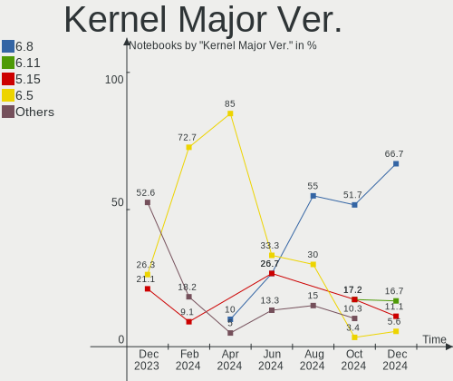
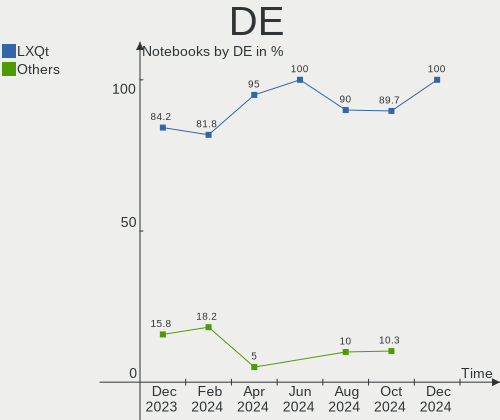
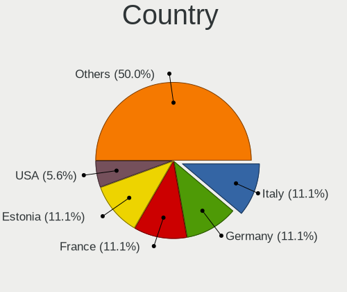
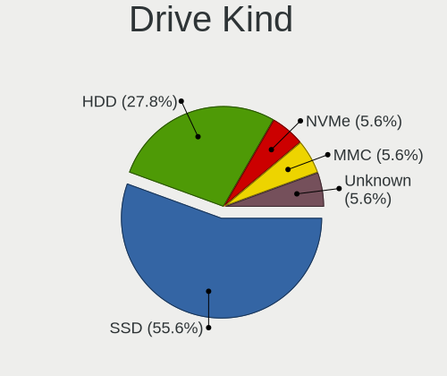
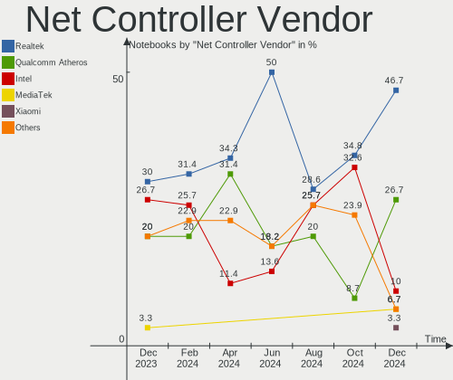
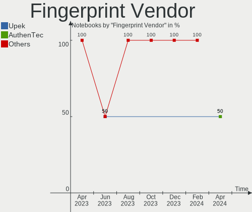

Lubuntu - Hardware Trends (Notebooks)
-------------------------------------

A project to identify most popular hardware characteristics and track their change
over time based on data collected by Linux users at https://Linux-Hardware.org.

Anyone can contribute to this report by the [hw-probe](https://github.com/linuxhw/hw-probe) tool:

    sudo -E hw-probe -all -upload

This report is for one last month. Overall report since the beginning of time: [TestDays](https://github.com/linuxhw/TestDays)

Period: Oct, 2023.

Contents
--------

* [ System ](#system)
  - [ OS                       ](#os)
  - [ OS Family                ](#os-family)
  - [ Kernel                   ](#kernel)
  - [ Kernel Family            ](#kernel-family)
  - [ Kernel Major Ver.        ](#kernel-major-ver)
  - [ Arch                     ](#arch)
  - [ DE                       ](#de)
  - [ Display Server           ](#display-server)
  - [ Display Manager          ](#display-manager)
  - [ OS Lang                  ](#os-lang)
  - [ Boot Mode                ](#boot-mode)
  - [ Filesystem               ](#filesystem)
  - [ Part. scheme             ](#part-scheme)
  - [ Dual Boot with Linux/BSD ](#dual-boot-with-linuxbsd)
  - [ Dual Boot (Win)          ](#dual-boot-win)

* [ Board ](#board)
  - [ Vendor                   ](#vendor)
  - [ Model                    ](#model)
  - [ Model Family             ](#model-family)
  - [ MFG Year                 ](#mfg-year)
  - [ Form Factor              ](#form-factor)
  - [ Secure Boot              ](#secure-boot)
  - [ Coreboot                 ](#coreboot)
  - [ RAM Size                 ](#ram-size)
  - [ RAM Used                 ](#ram-used)
  - [ Total Drives             ](#total-drives)
  - [ Has CD-ROM               ](#has-cd-rom)
  - [ Has Ethernet             ](#has-ethernet)
  - [ Has WiFi                 ](#has-wifi)
  - [ Has Bluetooth            ](#has-bluetooth)

* [ Location ](#location)
  - [ Country                  ](#country)
  - [ City                     ](#city)

* [ Drives ](#drives)
  - [ Drive Vendor             ](#drive-vendor)
  - [ Drive Model              ](#drive-model)
  - [ HDD Vendor               ](#hdd-vendor)
  - [ SSD Vendor               ](#ssd-vendor)
  - [ Drive Kind               ](#drive-kind)
  - [ Drive Connector          ](#drive-connector)
  - [ Drive Size               ](#drive-size)
  - [ Space Total              ](#space-total)
  - [ Space Used               ](#space-used)
  - [ Malfunc. Drives          ](#malfunc-drives)
  - [ Malfunc. Drive Vendor    ](#malfunc-drive-vendor)
  - [ Malfunc. HDD Vendor      ](#malfunc-hdd-vendor)
  - [ Malfunc. Drive Kind      ](#malfunc-drive-kind)
  - [ Failed Drives            ](#failed-drives)
  - [ Failed Drive Vendor      ](#failed-drive-vendor)
  - [ Drive Status             ](#drive-status)

* [ Storage controller ](#storage-controller)
  - [ Storage Vendor           ](#storage-vendor)
  - [ Storage Model            ](#storage-model)
  - [ Storage Kind             ](#storage-kind)

* [ Processor ](#processor)
  - [ CPU Vendor               ](#cpu-vendor)
  - [ CPU Model                ](#cpu-model)
  - [ CPU Model Family         ](#cpu-model-family)
  - [ CPU Cores                ](#cpu-cores)
  - [ CPU Sockets              ](#cpu-sockets)
  - [ CPU Threads              ](#cpu-threads)
  - [ CPU Op-Modes             ](#cpu-op-modes)
  - [ CPU Microcode            ](#cpu-microcode)
  - [ CPU Microarch            ](#cpu-microarch)

* [ Graphics ](#graphics)
  - [ GPU Vendor               ](#gpu-vendor)
  - [ GPU Model                ](#gpu-model)
  - [ GPU Combo                ](#gpu-combo)
  - [ GPU Driver               ](#gpu-driver)
  - [ GPU Memory               ](#gpu-memory)

* [ Monitor ](#monitor)
  - [ Monitor Vendor           ](#monitor-vendor)
  - [ Monitor Model            ](#monitor-model)
  - [ Monitor Resolution       ](#monitor-resolution)
  - [ Monitor Diagonal         ](#monitor-diagonal)
  - [ Monitor Width            ](#monitor-width)
  - [ Aspect Ratio             ](#aspect-ratio)
  - [ Monitor Area             ](#monitor-area)
  - [ Pixel Density            ](#pixel-density)
  - [ Multiple Monitors        ](#multiple-monitors)

* [ Network ](#network)
  - [ Net Controller Vendor    ](#net-controller-vendor)
  - [ Net Controller Model     ](#net-controller-model)
  - [ Wireless Vendor          ](#wireless-vendor)
  - [ Wireless Model           ](#wireless-model)
  - [ Ethernet Vendor          ](#ethernet-vendor)
  - [ Ethernet Model           ](#ethernet-model)
  - [ Net Controller Kind      ](#net-controller-kind)
  - [ Used Controller          ](#used-controller)
  - [ NICs                     ](#nics)
  - [ IPv6                     ](#ipv6)

* [ Bluetooth ](#bluetooth)
  - [ Bluetooth Vendor         ](#bluetooth-vendor)
  - [ Bluetooth Model          ](#bluetooth-model)

* [ Sound ](#sound)
  - [ Sound Vendor             ](#sound-vendor)
  - [ Sound Model              ](#sound-model)

* [ Memory ](#memory)
  - [ Memory Vendor            ](#memory-vendor)
  - [ Memory Model             ](#memory-model)
  - [ Memory Kind              ](#memory-kind)
  - [ Memory Form Factor       ](#memory-form-factor)
  - [ Memory Size              ](#memory-size)
  - [ Memory Speed             ](#memory-speed)

* [ Printers & scanners ](#printers--scanners)
  - [ Printer Vendor           ](#printer-vendor)
  - [ Printer Model            ](#printer-model)
  - [ Scanner Vendor           ](#scanner-vendor)
  - [ Scanner Model            ](#scanner-model)

* [ Camera ](#camera)
  - [ Camera Vendor            ](#camera-vendor)
  - [ Camera Model             ](#camera-model)

* [ Security ](#security)
  - [ Fingerprint Vendor       ](#fingerprint-vendor)
  - [ Fingerprint Model        ](#fingerprint-model)
  - [ Chipcard Vendor          ](#chipcard-vendor)
  - [ Chipcard Model           ](#chipcard-model)

* [ Unsupported ](#unsupported)
  - [ Unsupported Devices      ](#unsupported-devices)
  - [ Unsupported Device Types ](#unsupported-device-types)

System
------

OS
--

Installed operating systems

| Name          | Notebooks | Percent |
|---------------|-----------|---------|
| Lubuntu 22.04 | 17        | 68%     |
| Lubuntu 23.10 | 3         | 12%     |
| Lubuntu 20.04 | 2         | 8%      |
| Lubuntu 23.04 | 1         | 4%      |
| Lubuntu 21.10 | 1         | 4%      |
| Lubuntu 18.04 | 1         | 4%      |

OS Family
---------

OS without a version

| Name    | Notebooks | Percent |
|---------|-----------|---------|
| Lubuntu | 25        | 100%    |

Kernel
------

Version of the Linux kernel

| Version           | Notebooks | Percent |
|-------------------|-----------|---------|
| 6.2.0-34-generic  | 9         | 36%     |
| 6.2.0-35-generic  | 4         | 16%     |
| 6.2.0-33-generic  | 2         | 8%      |
| 5.4.0-165-generic | 2         | 8%      |
| 6.5.0-9-generic   | 1         | 4%      |
| 6.5.0-7-generic   | 1         | 4%      |
| 6.5.0-5-generic   | 1         | 4%      |
| 6.2.0-26-generic  | 1         | 4%      |
| 5.4.0-150-generic | 1         | 4%      |
| 5.19.0-32-generic | 1         | 4%      |
| 5.15.0-43-generic | 1         | 4%      |
| 5.13.0-52-generic | 1         | 4%      |

Kernel Family
-------------

Linux kernel without a distro release

| Version | Notebooks | Percent |
|---------|-----------|---------|
| 6.2.0   | 16        | 64%     |
| 6.5.0   | 3         | 12%     |
| 5.4.0   | 3         | 12%     |
| 5.19.0  | 1         | 4%      |
| 5.15.0  | 1         | 4%      |
| 5.13.0  | 1         | 4%      |

Kernel Major Ver.
-----------------

Linux kernel major version

| Version | Notebooks | Percent |
|---------|-----------|---------|
| 6.2     | 16        | 64%     |
| 6.5     | 3         | 12%     |
| 5.4     | 3         | 12%     |
| 5.19    | 1         | 4%      |
| 5.15    | 1         | 4%      |
| 5.13    | 1         | 4%      |

Arch
----

OS architecture (x86_64, i586, etc.)

| Name   | Notebooks | Percent |
|--------|-----------|---------|
| x86_64 | 24        | 96%     |
| i686   | 1         | 4%      |

DE
--

Desktop Environment

| Name | Notebooks | Percent |
|------|-----------|---------|
| LXQt | 23        | 92%     |
| LXDE | 2         | 8%      |

Display Server
--------------

X11 or Wayland

| Name | Notebooks | Percent |
|------|-----------|---------|
| X11  | 25        | 100%    |

Display Manager
---------------

SDDM, LightDM, etc.

| Name    | Notebooks | Percent |
|---------|-----------|---------|
| SDDM    | 22        | 88%     |
| LightDM | 2         | 8%      |
| Unknown | 1         | 4%      |

OS Lang
-------

Language

| Lang  | Notebooks | Percent |
|-------|-----------|---------|
| en_US | 6         | 24%     |
| it_IT | 4         | 16%     |
| fr_FR | 4         | 16%     |
| es_CR | 2         | 8%      |
| en_GB | 2         | 8%      |
| C     | 2         | 8%      |
| vi_VN | 1         | 4%      |
| es_MX | 1         | 4%      |
| es_AR | 1         | 4%      |
| en_IN | 1         | 4%      |
| ca_ES | 1         | 4%      |

Boot Mode
---------

EFI or BIOS

| Mode | Notebooks | Percent |
|------|-----------|---------|
| EFI  | 13        | 52%     |
| BIOS | 12        | 48%     |

Filesystem
----------

Type of filesystem

| Type    | Notebooks | Percent |
|---------|-----------|---------|
| Ext4    | 17        | 68%     |
| Tmpfs   | 6         | 24%     |
| Overlay | 2         | 8%      |

Part. scheme
------------

Scheme of partitioning

| Type    | Notebooks | Percent |
|---------|-----------|---------|
| GPT     | 17        | 68%     |
| MBR     | 6         | 24%     |
| Unknown | 2         | 8%      |

Dual Boot with Linux/BSD
------------------------

Hosting more than one Linux/BSD

| Dual boot | Notebooks | Percent |
|-----------|-----------|---------|
| No        | 25        | 100%    |

Dual Boot (Win)
---------------

Hosting Linux and Windows

| Dual boot | Notebooks | Percent |
|-----------|-----------|---------|
| No        | 17        | 68%     |
| Yes       | 8         | 32%     |

Board
-----

Vendor
------

Motherboard manufacturer

| Name             | Notebooks | Percent |
|------------------|-----------|---------|
| Hewlett-Packard  | 5         | 20%     |
| Acer             | 4         | 16%     |
| Lenovo           | 2         | 8%      |
| Google           | 2         | 8%      |
| Dell             | 2         | 8%      |
| Thomson          | 1         | 4%      |
| Positivo         | 1         | 4%      |
| Panasonic        | 1         | 4%      |
| Mediacom         | 1         | 4%      |
| Insyde           | 1         | 4%      |
| Getac            | 1         | 4%      |
| Dixonsxp         | 1         | 4%      |
| BLANK            | 1         | 4%      |
| ASUSTek Computer | 1         | 4%      |
| Apple            | 1         | 4%      |

Model
-----

Motherboard model

| Name                                | Notebooks | Percent |
|-------------------------------------|-----------|---------|
| Acer Aspire A314-23P                | 2         | 8%      |
| Thomson NEO14-4W64                  | 1         | 4%      |
| Positivo AT300b                     | 1         | 4%      |
| Panasonic CF-F9KWPZFFE              | 1         | 4%      |
| Mediacom WinPad 11,6 FullHD- WPU11  | 1         | 4%      |
| Lenovo ThinkPad Yoga 11e 20D90027US | 1         | 4%      |
| Lenovo IdeaPad 110-15IBR 80T7       | 1         | 4%      |
| Insyde Braswell                     | 1         | 4%      |
| HP Notebook                         | 1         | 4%      |
| HP Laptop 15-da0xxx                 | 1         | 4%      |
| HP Laptop 14-dq0xxx                 | 1         | 4%      |
| HP EliteBook 820 G3                 | 1         | 4%      |
| HP Compaq Presario CQ40             | 1         | 4%      |
| Google Sasuke                       | 1         | 4%      |
| Google Careena                      | 1         | 4%      |
| Getac X500G3                        | 1         | 4%      |
| Dell XPS 9315                       | 1         | 4%      |
| Dell Latitude E5430 non-vPro        | 1         | 4%      |
| BLANK Intel powered classmate PC    | 1         | 4%      |
| ASUS K50IJ                          | 1         | 4%      |
| Apple MacBookPro8,1                 | 1         | 4%      |
| Acer Aspire A315-21                 | 1         | 4%      |
| Acer Aspire 9300                    | 1         | 4%      |
| Unknown                             | 1         | 4%      |

Model Family
------------

Motherboard model prefix

| Name                   | Notebooks | Percent |
|------------------------|-----------|---------|
| Acer Aspire            | 4         | 16%     |
| HP Laptop              | 2         | 8%      |
| Thomson NEO14-4W64     | 1         | 4%      |
| Positivo AT300b        | 1         | 4%      |
| Panasonic CF-F9KWPZFFE | 1         | 4%      |
| Mediacom WinPad        | 1         | 4%      |
| Lenovo ThinkPad        | 1         | 4%      |
| Lenovo IdeaPad         | 1         | 4%      |
| Insyde Braswell        | 1         | 4%      |
| HP Notebook            | 1         | 4%      |
| HP EliteBook           | 1         | 4%      |
| HP Compaq              | 1         | 4%      |
| Google Sasuke          | 1         | 4%      |
| Google Careena         | 1         | 4%      |
| Getac X500G3           | 1         | 4%      |
| Dell XPS               | 1         | 4%      |
| Dell Latitude          | 1         | 4%      |
| BLANK Intel            | 1         | 4%      |
| ASUS K50IJ             | 1         | 4%      |
| Apple MacBookPro8      | 1         | 4%      |
| Unknown                | 1         | 4%      |

MFG Year
--------

Motherboard manufacture year

| Year | Notebooks | Percent |
|------|-----------|---------|
| 2022 | 4         | 16%     |
| 2016 | 4         | 16%     |
| 2023 | 2         | 8%      |
| 2019 | 2         | 8%      |
| 2017 | 2         | 8%      |
| 2009 | 2         | 8%      |
| 2018 | 1         | 4%      |
| 2015 | 1         | 4%      |
| 2014 | 1         | 4%      |
| 2012 | 1         | 4%      |
| 2011 | 1         | 4%      |
| 2010 | 1         | 4%      |
| 2008 | 1         | 4%      |
| 2007 | 1         | 4%      |
| 2006 | 1         | 4%      |

Form Factor
-----------

Physical design of the computer

| Name     | Notebooks | Percent |
|----------|-----------|---------|
| Notebook | 25        | 100%    |

Secure Boot
-----------

Enabled or disabled

| State    | Notebooks | Percent |
|----------|-----------|---------|
| Disabled | 20        | 80%     |
| Enabled  | 5         | 20%     |

Coreboot
--------

Have coreboot on board

| Used | Notebooks | Percent |
|------|-----------|---------|
| No   | 23        | 92%     |
| Yes  | 2         | 8%      |

RAM Size
--------

Total RAM memory

| Size in GB | Notebooks | Percent |
|------------|-----------|---------|
| 3.01-4.0   | 12        | 48%     |
| 4.01-8.0   | 5         | 20%     |
| 1.01-2.0   | 3         | 12%     |
| 2.01-3.0   | 2         | 8%      |
| 8.01-16.0  | 2         | 8%      |
| 0.51-1.0   | 1         | 4%      |

RAM Used
--------

Used RAM memory

| Used GB  | Notebooks | Percent |
|----------|-----------|---------|
| 1.01-2.0 | 14        | 56%     |
| 0.51-1.0 | 6         | 24%     |
| 2.01-3.0 | 3         | 12%     |
| 3.01-4.0 | 1         | 4%      |
| 0.01-0.5 | 1         | 4%      |

Total Drives
------------

Number of drives on board

| Drives | Notebooks | Percent |
|--------|-----------|---------|
| 1      | 20        | 80%     |
| 2      | 5         | 20%     |

Has CD-ROM
----------

Has CD-ROM on board

| Presented | Notebooks | Percent |
|-----------|-----------|---------|
| No        | 15        | 60%     |
| Yes       | 10        | 40%     |

Has Ethernet
------------

Has Ethernet on board

| Presented | Notebooks | Percent |
|-----------|-----------|---------|
| Yes       | 18        | 72%     |
| No        | 7         | 28%     |

Has WiFi
--------

Has WiFi module

| Presented | Notebooks | Percent |
|-----------|-----------|---------|
| Yes       | 22        | 88%     |
| No        | 3         | 12%     |

Has Bluetooth
-------------

Has Bluetooth module

| Presented | Notebooks | Percent |
|-----------|-----------|---------|
| Yes       | 14        | 56%     |
| No        | 11        | 44%     |

Location
--------

Country
-------

Geographic location (country)

| Country         | Notebooks | Percent |
|-----------------|-----------|---------|
| USA             | 4         | 16%     |
| Italy           | 4         | 16%     |
| France          | 4         | 16%     |
| Costa Rica      | 2         | 8%      |
| Vietnam         | 1         | 4%      |
| UK              | 1         | 4%      |
| Sweden          | 1         | 4%      |
| Spain           | 1         | 4%      |
| Russia          | 1         | 4%      |
| Poland          | 1         | 4%      |
| Peru            | 1         | 4%      |
| North Macedonia | 1         | 4%      |
| Malaysia        | 1         | 4%      |
| India           | 1         | 4%      |
| Argentina       | 1         | 4%      |

City
----

Geographic location (city)

| City                 | Notebooks | Percent |
|----------------------|-----------|---------|
| Lyon                 | 2         | 8%      |
| Grecia               | 2         | 8%      |
| Tarapoto             | 1         | 4%      |
| Szczecin             | 1         | 4%      |
| Sigtuna              | 1         | 4%      |
| Santa Eugènia       | 1         | 4%      |
| San Nicola la Strada | 1         | 4%      |
| Pianoro              | 1         | 4%      |
| Oak Park             | 1         | 4%      |
| Moscow               | 1         | 4%      |
| Milan                | 1         | 4%      |
| Kuala Lumpur         | 1         | 4%      |
| Houston              | 1         | 4%      |
| Hondouville          | 1         | 4%      |
| Ho Chi Minh City     | 1         | 4%      |
| Dundee               | 1         | 4%      |
| Castelfranco Emilia  | 1         | 4%      |
| Buenos Aires         | 1         | 4%      |
| Brighton             | 1         | 4%      |
| Bengaluru            | 1         | 4%      |
| Atlanta              | 1         | 4%      |
| Anguerny             | 1         | 4%      |
| Alimedska Maala      | 1         | 4%      |

Drives
------

Drive Vendor
------------

Hard drive vendors

| Vendor              | Notebooks | Drives | Percent |
|---------------------|-----------|--------|---------|
| Unknown             | 6         | 8      | 22.22%  |
| Samsung Electronics | 4         | 4      | 14.81%  |
| WDC                 | 3         | 3      | 11.11%  |
| Micron Technology   | 3         | 3      | 11.11%  |
| Unknown             | 3         | 3      | 11.11%  |
| Seagate             | 2         | 2      | 7.41%   |
| SanDisk             | 2         | 2      | 7.41%   |
| Kingston            | 1         | 1      | 3.7%    |
| Kingmax             | 1         | 1      | 3.7%    |
| Intel               | 1         | 1      | 3.7%    |
| Hitachi             | 1         | 1      | 3.7%    |

Drive Model
-----------

Hard drive models

| Model                                | Notebooks | Percent |
|--------------------------------------|-----------|---------|
| Unknown                              | 3         | 10.34%  |
| Micron 2450_MTFDKBA512TFK 512GB      | 2         | 6.9%    |
| WDC WD5000LPSX-22A6WT0 500GB         | 1         | 3.45%   |
| WDC WD5000LPCX-24VHAT0 500GB         | 1         | 3.45%   |
| WDC WD3200BEVT-60ZCT1 320GB          | 1         | 3.45%   |
| Unknown USD00  32GB                  | 1         | 3.45%   |
| Unknown SL16G  16GB                  | 1         | 3.45%   |
| Unknown NCard  32GB                  | 1         | 3.45%   |
| Unknown MMC Card  64GB               | 1         | 3.45%   |
| Unknown MMC Card  32GB               | 1         | 3.45%   |
| Unknown M0S002  64GB                 | 1         | 3.45%   |
| Unknown DA4032  32GB                 | 1         | 3.45%   |
| Unknown BJTD4R  32GB                 | 1         | 3.45%   |
| Seagate ST9500325AS 500GB            | 1         | 3.45%   |
| Seagate ST320LT007-9ZV142 320GB      | 1         | 3.45%   |
| SanDisk SSD PLUS 240GB               | 1         | 3.45%   |
| SanDisk pSSD 8GB                     | 1         | 3.45%   |
| Samsung SSD 860 EVO M.2 250GB        | 1         | 3.45%   |
| Samsung SSD 830 Series 512GB         | 1         | 3.45%   |
| Samsung MZ7LN128HCHP-000L1 128GB SSD | 1         | 3.45%   |
| Samsung HM121HI 120GB                | 1         | 3.45%   |
| Micron 3460 NVMe 512GB               | 1         | 3.45%   |
| Kingston SUV400S37240G 240GB SSD     | 1         | 3.45%   |
| Kingmax SSD 120GB                    | 1         | 3.45%   |
| Intel SSDSC2MH250A2 250GB            | 1         | 3.45%   |
| Hitachi HTS542525K9SA00 250GB        | 1         | 3.45%   |

HDD Vendor
----------

Hard disk drive vendors

| Vendor              | Notebooks | Drives | Percent |
|---------------------|-----------|--------|---------|
| WDC                 | 3         | 3      | 42.86%  |
| Seagate             | 2         | 2      | 28.57%  |
| Samsung Electronics | 1         | 1      | 14.29%  |
| Hitachi             | 1         | 1      | 14.29%  |

SSD Vendor
----------

Solid state drive vendors

| Vendor              | Notebooks | Drives | Percent |
|---------------------|-----------|--------|---------|
| Samsung Electronics | 3         | 3      | 37.5%   |
| SanDisk             | 2         | 2      | 25%     |
| Kingston            | 1         | 1      | 12.5%   |
| Kingmax             | 1         | 1      | 12.5%   |
| Intel               | 1         | 1      | 12.5%   |

Drive Kind
----------

HDD or SSD

| Kind | Notebooks | Drives | Percent |
|------|-----------|--------|---------|
| SSD  | 8         | 8      | 32%     |
| MMC  | 7         | 11     | 28%     |
| HDD  | 7         | 7      | 28%     |
| NVMe | 3         | 3      | 12%     |

Drive Connector
---------------

SATA, SAS, NVMe, etc.

| Type | Notebooks | Drives | Percent |
|------|-----------|--------|---------|
| SATA | 15        | 15     | 60%     |
| MMC  | 7         | 11     | 28%     |
| NVMe | 3         | 3      | 12%     |

Drive Size
----------

Size of hard drive

| Size in TB | Notebooks | Drives | Percent |
|------------|-----------|--------|---------|
| 0.01-0.5   | 14        | 14     | 93.33%  |
| 0.51-1.0   | 1         | 1      | 6.67%   |

Space Total
-----------

Amount of disk space available on the file system

| Size in GB | Notebooks | Percent |
|------------|-----------|---------|
| 101-250    | 9         | 36%     |
| 251-500    | 7         | 28%     |
| 21-50      | 3         | 12%     |
| 1-20       | 3         | 12%     |
| 51-100     | 3         | 12%     |

Space Used
----------

Amount of used disk space

| Used GB | Notebooks | Percent |
|---------|-----------|---------|
| 1-20    | 16        | 64%     |
| 21-50   | 8         | 32%     |
| 51-100  | 1         | 4%      |

Malfunc. Drives
---------------

Drive models with a malfunction

| Model             | Notebooks | Drives | Percent |
|-------------------|-----------|--------|---------|
| Kingmax SSD 120GB | 1         | 1      | 100%    |

Malfunc. Drive Vendor
---------------------

Vendors of faulty drives

| Vendor  | Notebooks | Drives | Percent |
|---------|-----------|--------|---------|
| Kingmax | 1         | 1      | 100%    |

Malfunc. HDD Vendor
-------------------

Vendors of faulty HDD drives

Zero info for selected period =(

Malfunc. Drive Kind
-------------------

Kinds of faulty drives

| Kind | Notebooks | Drives | Percent |
|------|-----------|--------|---------|
| SSD  | 1         | 1      | 100%    |

Failed Drives
-------------

Failed drive models

Zero info for selected period =(

Failed Drive Vendor
-------------------

Failed drive vendors

Zero info for selected period =(

Drive Status
------------

Number of failed and malfunc. drives

| Status   | Notebooks | Drives | Percent |
|----------|-----------|--------|---------|
| Detected | 12        | 16     | 48%     |
| Works    | 12        | 12     | 48%     |
| Malfunc  | 1         | 1      | 4%      |

Storage controller
------------------

Storage Vendor
--------------

Storage controller vendors

| Vendor            | Notebooks | Percent |
|-------------------|-----------|---------|
| Intel             | 14        | 73.68%  |
| Micron Technology | 3         | 15.79%  |
| Nvidia            | 1         | 5.26%   |
| AMD               | 1         | 5.26%   |

Storage Model
-------------

Storage controller models

| Model                                                                            | Notebooks | Percent |
|----------------------------------------------------------------------------------|-----------|---------|
| Micron 2450 NVMe SSD [HendrixV] (DRAM-less)                                      | 2         | 10%     |
| Intel Atom/Celeron/Pentium Processor x5-E8000/J3xxx/N3xxx Series SATA Controller | 2         | 10%     |
| Intel 82801IBM/IEM (ICH9M/ICH9M-E) 4 port SATA Controller [AHCI mode]            | 2         | 10%     |
| Nvidia MCP51 Serial ATA Controller                                               | 1         | 5%      |
| Nvidia MCP51 IDE                                                                 | 1         | 5%      |
| Micron 3460 NVMe SSD                                                             | 1         | 5%      |
| Intel Volume Management Device NVMe RAID Controller                              | 1         | 5%      |
| Intel Sunrise Point-LP SATA Controller [AHCI mode]                               | 1         | 5%      |
| Intel HM170/QM170 Chipset SATA Controller [AHCI Mode]                            | 1         | 5%      |
| Intel Celeron/Pentium Silver Processor SATA Controller                           | 1         | 5%      |
| Intel Atom Processor E3800 Series SATA AHCI Controller                           | 1         | 5%      |
| Intel 82801HM/HEM (ICH8M/ICH8M-E) SATA Controller [IDE mode]                     | 1         | 5%      |
| Intel 82801G (ICH7 Family) IDE Controller                                        | 1         | 5%      |
| Intel 82801 Mobile SATA Controller [RAID mode]                                   | 1         | 5%      |
| Intel 6 Series/C200 Series Chipset Family 6 port Mobile SATA AHCI Controller     | 1         | 5%      |
| Intel 5 Series/3400 Series Chipset 6 port SATA AHCI Controller                   | 1         | 5%      |
| AMD FCH SATA Controller [AHCI mode]                                              | 1         | 5%      |

Storage Kind
------------

Kind of storage controller (IDE, SATA, NVMe, SAS, ...)

| Kind | Notebooks | Percent |
|------|-----------|---------|
| SATA | 11        | 57.89%  |
| NVMe | 3         | 15.79%  |
| IDE  | 3         | 15.79%  |
| RAID | 2         | 10.53%  |

Processor
---------

CPU Vendor
----------

Processor vendors

| Vendor | Notebooks | Percent |
|--------|-----------|---------|
| Intel  | 20        | 80%     |
| AMD    | 5         | 20%     |

CPU Model
---------

Processor models

| Model                                         | Notebooks | Percent |
|-----------------------------------------------|-----------|---------|
| Intel Pentium Dual-Core CPU T4200 @ 2.00GHz   | 2         | 8%      |
| Intel Celeron CPU N3060 @ 1.60GHz             | 2         | 8%      |
| Intel Atom x5-Z8350 CPU @ 1.44GHz             | 2         | 8%      |
| AMD Ryzen 5 7520U with Radeon Graphics        | 2         | 8%      |
| Intel Pentium Dual CPU T2310 @ 1.46GHz        | 1         | 4%      |
| Intel Core i5-7440EQ CPU @ 2.90GHz            | 1         | 4%      |
| Intel Core i5-6300U CPU @ 2.40GHz             | 1         | 4%      |
| Intel Core i5-3210M CPU @ 2.50GHz             | 1         | 4%      |
| Intel Core i5-2435M CPU @ 2.40GHz             | 1         | 4%      |
| Intel Core i5 CPU M 520 @ 2.40GHz             | 1         | 4%      |
| Intel Celeron N4500 @ 1.10GHz                 | 1         | 4%      |
| Intel Celeron N4120 CPU @ 1.10GHz             | 1         | 4%      |
| Intel Celeron N4000 CPU @ 1.10GHz             | 1         | 4%      |
| Intel Celeron CPU N2940 @ 1.83GHz             | 1         | 4%      |
| Intel Atom x5-Z8300 CPU @ 1.44GHz             | 1         | 4%      |
| Intel Atom x5-E8000 CPU @ 1.04GHz             | 1         | 4%      |
| Intel Atom CPU N270 @ 1.60GHz                 | 1         | 4%      |
| Intel 12th Gen Core i7-1250U                  | 1         | 4%      |
| AMD Turion 64 X2 Mobile Technology TL-52      | 1         | 4%      |
| AMD A9-9420 RADEON R5, 5 COMPUTE CORES 2C+3G  | 1         | 4%      |
| AMD A4-9120C RADEON R4, 5 COMPUTE CORES 2C+3G | 1         | 4%      |

CPU Model Family
----------------

Processor model prefix

| Model                   | Notebooks | Percent |
|-------------------------|-----------|---------|
| Intel Celeron           | 6         | 24%     |
| Intel Core i5           | 5         | 20%     |
| Intel Atom              | 5         | 20%     |
| Other                   | 2         | 8%      |
| Intel Pentium Dual-Core | 2         | 8%      |
| AMD Ryzen 5             | 2         | 8%      |
| Intel Pentium Dual      | 1         | 4%      |
| AMD Turion 64 X2 Mobile | 1         | 4%      |
| AMD A4                  | 1         | 4%      |

CPU Cores
---------

Number of processor cores

| Number | Notebooks | Percent |
|--------|-----------|---------|
| 2      | 14        | 56%     |
| 4      | 9         | 36%     |
| 10     | 1         | 4%      |
| 1      | 1         | 4%      |

CPU Sockets
-----------

Number of sockets

| Number | Notebooks | Percent |
|--------|-----------|---------|
| 1      | 25        | 100%    |

CPU Threads
-----------

Threads per core (Hyper-Threading)

| Number | Notebooks | Percent |
|--------|-----------|---------|
| 1      | 17        | 68%     |
| 2      | 8         | 32%     |

CPU Op-Modes
------------

CPU Operation Modes (32-bit, 64-bit)

| Op mode        | Notebooks | Percent |
|----------------|-----------|---------|
| 32-bit, 64-bit | 24        | 96%     |
| 32-bit         | 1         | 4%      |

CPU Microcode
-------------

Microcode number

| Number     | Notebooks | Percent |
|------------|-----------|---------|
| Unknown    | 19        | 76%     |
| 0x08a00008 | 2         | 8%      |
| 0x906a4    | 1         | 4%      |
| 0x306a9    | 1         | 4%      |
| 0x106c2    | 1         | 4%      |
| 0x06006704 | 1         | 4%      |

CPU Microarch
-------------

Microarchitecture

| Name             | Notebooks | Percent |
|------------------|-----------|---------|
| Silvermont       | 7         | 28%     |
| Penryn           | 2         | 8%      |
| Goldmont plus    | 2         | 8%      |
| Excavator        | 2         | 8%      |
| Unknown          | 2         | 8%      |
| Westmere         | 1         | 4%      |
| Tremont          | 1         | 4%      |
| Skylake          | 1         | 4%      |
| SandyBridge      | 1         | 4%      |
| KabyLake         | 1         | 4%      |
| K8 Hammer        | 1         | 4%      |
| IvyBridge        | 1         | 4%      |
| Core             | 1         | 4%      |
| Bonnell          | 1         | 4%      |
| Alderlake Hybrid | 1         | 4%      |

Graphics
--------

GPU Vendor
----------

Vendors of graphics cards

| Vendor | Notebooks | Percent |
|--------|-----------|---------|
| Intel  | 20        | 80%     |
| AMD    | 4         | 16%     |
| Nvidia | 1         | 4%      |

GPU Model
---------

Graphics card models

| Model                                                                                    | Notebooks | Percent |
|------------------------------------------------------------------------------------------|-----------|---------|
| Intel Atom/Celeron/Pentium Processor x5-E8000/J3xxx/N3xxx Integrated Graphics Controller | 6         | 22.22%  |
| Intel Mobile 4 Series Chipset Integrated Graphics Controller                             | 2         | 7.41%   |
| Intel GeminiLake [UHD Graphics 600]                                                      | 2         | 7.41%   |
| AMD Stoney [Radeon R2/R3/R4/R5 Graphics]                                                 | 2         | 7.41%   |
| AMD Mendocino                                                                            | 2         | 7.41%   |
| Nvidia C51 [GeForce Go 6100]                                                             | 1         | 3.7%    |
| Intel Skylake GT2 [HD Graphics 520]                                                      | 1         | 3.7%    |
| Intel Mobile GM965/GL960 Integrated Graphics Controller (secondary)                      | 1         | 3.7%    |
| Intel Mobile GM965/GL960 Integrated Graphics Controller (primary)                        | 1         | 3.7%    |
| Intel Mobile 945GSE Express Integrated Graphics Controller                               | 1         | 3.7%    |
| Intel Mobile 945GM/GMS/GME, 943/940GML Express Integrated Graphics Controller            | 1         | 3.7%    |
| Intel JasperLake [UHD Graphics]                                                          | 1         | 3.7%    |
| Intel HD Graphics 630                                                                    | 1         | 3.7%    |
| Intel Core Processor Integrated Graphics Controller                                      | 1         | 3.7%    |
| Intel Atom Processor Z36xxx/Z37xxx Series Graphics & Display                             | 1         | 3.7%    |
| Intel Alder Lake-UP4 GT2 [Iris Xe Graphics]                                              | 1         | 3.7%    |
| Intel 3rd Gen Core processor Graphics Controller                                         | 1         | 3.7%    |
| Intel 2nd Generation Core Processor Family Integrated Graphics Controller                | 1         | 3.7%    |

GPU Combo
---------

Combinations of graphics cards

| Name       | Notebooks | Percent |
|------------|-----------|---------|
| 1 x Intel  | 20        | 80%     |
| 1 x AMD    | 4         | 16%     |
| 1 x Nvidia | 1         | 4%      |

GPU Driver
----------

Free vs proprietary

| Driver | Notebooks | Percent |
|--------|-----------|---------|
| Free   | 25        | 100%    |

GPU Memory
----------

Total video memory

| Size in GB | Notebooks | Percent |
|------------|-----------|---------|
| Unknown    | 21        | 84%     |
| 0.01-0.5   | 4         | 16%     |

Monitor
-------

Monitor Vendor
--------------

Monitor vendors

| Vendor              | Notebooks | Percent |
|---------------------|-----------|---------|
| AU Optronics        | 7         | 31.82%  |
| BOE                 | 5         | 22.73%  |
| Samsung Electronics | 3         | 13.64%  |
| LG Display          | 2         | 9.09%   |
| Sharp               | 1         | 4.55%   |
| LG Philips          | 1         | 4.55%   |
| InfoVision          | 1         | 4.55%   |
| CPT                 | 1         | 4.55%   |
| Apple               | 1         | 4.55%   |

Monitor Model
-------------

Monitor models

| Model                                                                | Notebooks | Percent |
|----------------------------------------------------------------------|-----------|---------|
| AU Optronics LCD Monitor AUO403D 1920x1080 309x173mm 13.9-inch       | 2         | 9.09%   |
| Sharp LCD Monitor SHP1548 1920x1200 288x180mm 13.4-inch              | 1         | 4.55%   |
| Samsung Electronics LCD Monitor SEC5441 1366x768 309x174mm 14.0-inch | 1         | 4.55%   |
| Samsung Electronics LCD Monitor SEC4442 1280x800 303x190mm 14.1-inch | 1         | 4.55%   |
| Samsung Electronics LCD Monitor SDC4852 1366x768 344x194mm 15.5-inch | 1         | 4.55%   |
| LG Philips LCD Monitor LPLA002 1440x900 367x230mm 17.1-inch          | 1         | 4.55%   |
| LG Display LCD Monitor LGD04FC 1366x768 344x194mm 15.5-inch          | 1         | 4.55%   |
| LG Display LCD Monitor LGD01E8 1366x768 344x194mm 15.5-inch          | 1         | 4.55%   |
| InfoVision LCD Monitor IVO03F4 1024x600 223x125mm 10.1-inch          | 1         | 4.55%   |
| CPT LCD Monitor CPT003C 1366x768 309x174mm 14.0-inch                 | 1         | 4.55%   |
| BOE LCD Monitor BOE09F3 1366x768 309x174mm 14.0-inch                 | 1         | 4.55%   |
| BOE LCD Monitor BOE092B 1366x768 309x174mm 14.0-inch                 | 1         | 4.55%   |
| BOE LCD Monitor BOE06D1 1366x768 309x173mm 13.9-inch                 | 1         | 4.55%   |
| BOE LCD Monitor BOE06A4 1366x768 344x194mm 15.5-inch                 | 1         | 4.55%   |
| BOE LCD Monitor BOE05E9 1366x768 256x144mm 11.6-inch                 | 1         | 4.55%   |
| AU Optronics LCD Monitor AUO38ED 1920x1080 344x193mm 15.5-inch       | 1         | 4.55%   |
| AU Optronics LCD Monitor AUO3514 1280x800 261x163mm 12.1-inch        | 1         | 4.55%   |
| AU Optronics LCD Monitor AUO2E3C 1366x768 309x173mm 13.9-inch        | 1         | 4.55%   |
| AU Optronics LCD Monitor AUO2D3C 1366x768 309x173mm 13.9-inch        | 1         | 4.55%   |
| AU Optronics LCD Monitor AUO226D 1920x1080 276x155mm 12.5-inch       | 1         | 4.55%   |
| Apple LCD Monitor APP9CC5 1280x800 286x179mm 13.3-inch               | 1         | 4.55%   |

Monitor Resolution
------------------

Monitor screen resolution

| Resolution        | Notebooks | Percent |
|-------------------|-----------|---------|
| 1366x768 (WXGA)   | 11        | 50%     |
| 1920x1080 (FHD)   | 4         | 18.18%  |
| 1280x800 (WXGA)   | 3         | 13.64%  |
| 1920x1200 (WUXGA) | 2         | 9.09%   |
| 3840x2160 (4K)    | 1         | 4.55%   |
| 1440x900 (WXGA+)  | 1         | 4.55%   |

Monitor Diagonal
----------------

Diagonal size in inches

| Inches | Notebooks | Percent |
|--------|-----------|---------|
| 15     | 7         | 31.82%  |
| 14     | 6         | 27.27%  |
| 13     | 5         | 22.73%  |
| 12     | 2         | 9.09%   |
| 17     | 1         | 4.55%   |
| 11     | 1         | 4.55%   |

Monitor Width
-------------

Physical width

| Width in mm | Notebooks | Percent |
|-------------|-----------|---------|
| 301-350     | 15        | 68.18%  |
| 201-300     | 5         | 22.73%  |
| 351-400     | 2         | 9.09%   |

Aspect Ratio
------------

Proportional relationship between the width and the height

| Ratio | Notebooks | Percent |
|-------|-----------|---------|
| 16/9  | 17        | 77.27%  |
| 16/10 | 5         | 22.73%  |

Monitor Area
------------

Area in inch²

| Area in inch² | Notebooks | Percent |
|----------------|-----------|---------|
| 81-90          | 10        | 45.45%  |
| 101-110        | 7         | 31.82%  |
| 61-70          | 2         | 9.09%   |
| 71-80          | 1         | 4.55%   |
| 51-60          | 1         | 4.55%   |
| 131-140        | 1         | 4.55%   |

Pixel Density
-------------

Pixels per inch

| Density | Notebooks | Percent |
|---------|-----------|---------|
| 101-120 | 13        | 59.09%  |
| 121-160 | 5         | 22.73%  |
| 161-240 | 2         | 9.09%   |
| 51-100  | 2         | 9.09%   |

Multiple Monitors
-----------------

Total monitors connected

| Total | Notebooks | Percent |
|-------|-----------|---------|
| 1     | 25        | 100%    |

Network
-------

Net Controller Vendor
---------------------

Controller vendors

| Vendor                    | Notebooks | Percent |
|---------------------------|-----------|---------|
| Realtek Semiconductor     | 12        | 34.29%  |
| Intel                     | 6         | 17.14%  |
| Qualcomm Atheros          | 4         | 11.43%  |
| Broadcom                  | 4         | 11.43%  |
| OPPO Electronics          | 2         | 5.71%   |
| Micro Star International  | 2         | 5.71%   |
| MediaTek                  | 2         | 5.71%   |
| Spreadtrum Communications | 1         | 2.86%   |
| Ralink Technology         | 1         | 2.86%   |
| Nvidia                    | 1         | 2.86%   |

Net Controller Model
--------------------

Controller models

| Model                                                             | Notebooks | Percent |
|-------------------------------------------------------------------|-----------|---------|
| Realtek RTL810xE PCI Express Fast Ethernet controller             | 5         | 11.9%   |
| Realtek RTL8111/8168/8411 PCI Express Gigabit Ethernet Controller | 4         | 9.52%   |
| Qualcomm Atheros QCA9377 802.11ac Wireless Network Adapter        | 2         | 4.76%   |
| OPPO RMX2027                                                      | 2         | 4.76%   |
| Micro Star International RT2573                                   | 2         | 4.76%   |
| MediaTek Wi-Fi 6E MT7902 Wireless Network Adapter                 | 2         | 4.76%   |
| Spreadtrum meizu C9                                               | 1         | 2.38%   |
| Realtek RTL8822CE 802.11ac PCIe Wireless Network Adapter          | 1         | 2.38%   |
| Realtek RTL8811AU 802.11a/b/g/n/ac WLAN Adapter                   | 1         | 2.38%   |
| Realtek RTL8723DE Wireless Network Adapter                        | 1         | 2.38%   |
| Realtek RTL8723BU 802.11b/g/n WLAN Adapter                        | 1         | 2.38%   |
| Realtek RTL8723BE PCIe Wireless Network Adapter                   | 1         | 2.38%   |
| Realtek RTL8153 Gigabit Ethernet Adapter                          | 1         | 2.38%   |
| Ralink RT2501/RT2573 Wireless Adapter                             | 1         | 2.38%   |
| Qualcomm Atheros QCA6174 802.11ac Wireless Network Adapter        | 1         | 2.38%   |
| Qualcomm Atheros AR9285 Wireless Network Adapter (PCI-Express)    | 1         | 2.38%   |
| Qualcomm Atheros AR8121/AR8113/AR8114 Gigabit or Fast Ethernet    | 1         | 2.38%   |
| Nvidia MCP51 Ethernet Controller                                  | 1         | 2.38%   |
| Intel Wireless 8265 / 8275                                        | 1         | 2.38%   |
| Intel Wireless 8260                                               | 1         | 2.38%   |
| Intel Wi-Fi 6 AX201 160MHz                                        | 1         | 2.38%   |
| Intel Ethernet Connection I219-LM                                 | 1         | 2.38%   |
| Intel Ethernet Connection (2) I219-LM                             | 1         | 2.38%   |
| Intel Centrino Advanced-N 6205 [Taylor Peak]                      | 1         | 2.38%   |
| Intel Alder Lake-P PCH CNVi WiFi                                  | 1         | 2.38%   |
| Intel 82577LM Gigabit Network Connection                          | 1         | 2.38%   |
| Broadcom NetXtreme BCM57765 Gigabit Ethernet PCIe                 | 1         | 2.38%   |
| Broadcom NetXtreme BCM5761 Gigabit Ethernet PCIe                  | 1         | 2.38%   |
| Broadcom BCM4331 802.11a/b/g/n                                    | 1         | 2.38%   |
| Broadcom BCM4312 802.11b/g LP-PHY                                 | 1         | 2.38%   |
| Broadcom BCM4311 802.11b/g WLAN                                   | 1         | 2.38%   |

Wireless Vendor
---------------

Wireless vendors

| Vendor                   | Notebooks | Percent |
|--------------------------|-----------|---------|
| Realtek Semiconductor    | 5         | 22.73%  |
| Intel                    | 5         | 22.73%  |
| Qualcomm Atheros         | 4         | 18.18%  |
| Broadcom                 | 3         | 13.64%  |
| Micro Star International | 2         | 9.09%   |
| MediaTek                 | 2         | 9.09%   |
| Ralink Technology        | 1         | 4.55%   |

Wireless Model
--------------

Wireless models

| Model                                                          | Notebooks | Percent |
|----------------------------------------------------------------|-----------|---------|
| Qualcomm Atheros QCA9377 802.11ac Wireless Network Adapter     | 2         | 9.09%   |
| Micro Star International RT2573                                | 2         | 9.09%   |
| MediaTek Wi-Fi 6E MT7902 Wireless Network Adapter              | 2         | 9.09%   |
| Realtek RTL8822CE 802.11ac PCIe Wireless Network Adapter       | 1         | 4.55%   |
| Realtek RTL8811AU 802.11a/b/g/n/ac WLAN Adapter                | 1         | 4.55%   |
| Realtek RTL8723DE Wireless Network Adapter                     | 1         | 4.55%   |
| Realtek RTL8723BU 802.11b/g/n WLAN Adapter                     | 1         | 4.55%   |
| Realtek RTL8723BE PCIe Wireless Network Adapter                | 1         | 4.55%   |
| Ralink RT2501/RT2573 Wireless Adapter                          | 1         | 4.55%   |
| Qualcomm Atheros QCA6174 802.11ac Wireless Network Adapter     | 1         | 4.55%   |
| Qualcomm Atheros AR9285 Wireless Network Adapter (PCI-Express) | 1         | 4.55%   |
| Intel Wireless 8265 / 8275                                     | 1         | 4.55%   |
| Intel Wireless 8260                                            | 1         | 4.55%   |
| Intel Wi-Fi 6 AX201 160MHz                                     | 1         | 4.55%   |
| Intel Centrino Advanced-N 6205 [Taylor Peak]                   | 1         | 4.55%   |
| Intel Alder Lake-P PCH CNVi WiFi                               | 1         | 4.55%   |
| Broadcom BCM4331 802.11a/b/g/n                                 | 1         | 4.55%   |
| Broadcom BCM4312 802.11b/g LP-PHY                              | 1         | 4.55%   |
| Broadcom BCM4311 802.11b/g WLAN                                | 1         | 4.55%   |

Ethernet Vendor
---------------

Ethernet vendors

| Vendor                    | Notebooks | Percent |
|---------------------------|-----------|---------|
| Realtek Semiconductor     | 10        | 50%     |
| Intel                     | 3         | 15%     |
| OPPO Electronics          | 2         | 10%     |
| Broadcom                  | 2         | 10%     |
| Spreadtrum Communications | 1         | 5%      |
| Qualcomm Atheros          | 1         | 5%      |
| Nvidia                    | 1         | 5%      |

Ethernet Model
--------------

Ethernet models

| Model                                                             | Notebooks | Percent |
|-------------------------------------------------------------------|-----------|---------|
| Realtek RTL810xE PCI Express Fast Ethernet controller             | 5         | 25%     |
| Realtek RTL8111/8168/8411 PCI Express Gigabit Ethernet Controller | 4         | 20%     |
| OPPO RMX2027                                                      | 2         | 10%     |
| Spreadtrum meizu C9                                               | 1         | 5%      |
| Realtek RTL8153 Gigabit Ethernet Adapter                          | 1         | 5%      |
| Qualcomm Atheros AR8121/AR8113/AR8114 Gigabit or Fast Ethernet    | 1         | 5%      |
| Nvidia MCP51 Ethernet Controller                                  | 1         | 5%      |
| Intel Ethernet Connection I219-LM                                 | 1         | 5%      |
| Intel Ethernet Connection (2) I219-LM                             | 1         | 5%      |
| Intel 82577LM Gigabit Network Connection                          | 1         | 5%      |
| Broadcom NetXtreme BCM57765 Gigabit Ethernet PCIe                 | 1         | 5%      |
| Broadcom NetXtreme BCM5761 Gigabit Ethernet PCIe                  | 1         | 5%      |

Net Controller Kind
-------------------

Ethernet, WiFi or modem

| Kind     | Notebooks | Percent |
|----------|-----------|---------|
| WiFi     | 22        | 55%     |
| Ethernet | 18        | 45%     |

Used Controller
---------------

Currently used network controller

| Kind     | Notebooks | Percent |
|----------|-----------|---------|
| WiFi     | 15        | 65.22%  |
| Ethernet | 8         | 34.78%  |

NICs
----

Total network controllers on board

| Total | Notebooks | Percent |
|-------|-----------|---------|
| 2     | 10        | 40%     |
| 1     | 10        | 40%     |
| 0     | 4         | 16%     |
| 3     | 1         | 4%      |

IPv6
----

IPv6 vs IPv4

| Used | Notebooks | Percent |
|------|-----------|---------|
| No   | 20        | 80%     |
| Yes  | 5         | 20%     |

Bluetooth
---------

Bluetooth Vendor
----------------

Controller vendors

| Vendor                          | Notebooks | Percent |
|---------------------------------|-----------|---------|
| Realtek Semiconductor           | 3         | 21.43%  |
| Intel                           | 3         | 21.43%  |
| Qualcomm Atheros Communications | 2         | 14.29%  |
| IMC Networks                    | 2         | 14.29%  |
| Lite-On Technology              | 1         | 7.14%   |
| Dell                            | 1         | 7.14%   |
| Apple                           | 1         | 7.14%   |
| Alps Electric                   | 1         | 7.14%   |

Bluetooth Model
---------------

Controller models

| Model                                      | Notebooks | Percent |
|--------------------------------------------|-----------|---------|
| Realtek Bluetooth Radio                    | 2         | 14.29%  |
| IMC Networks Wireless_Device               | 2         | 14.29%  |
| Realtek  Bluetooth 4.2 Adapter             | 1         | 7.14%   |
| Qualcomm Atheros  Bluetooth Device         | 1         | 7.14%   |
| Qualcomm Atheros QCA61x4 Bluetooth 4.0     | 1         | 7.14%   |
| Lite-On Qualcomm Atheros QCA9377 Bluetooth | 1         | 7.14%   |
| Intel Bluetooth wireless interface         | 1         | 7.14%   |
| Intel Bluetooth Device                     | 1         | 7.14%   |
| Intel AX201 Bluetooth                      | 1         | 7.14%   |
| Dell BCM20702A0 Bluetooth Module           | 1         | 7.14%   |
| Apple Bluetooth Host Controller            | 1         | 7.14%   |
| Alps Electric UGTZ4 Bluetooth              | 1         | 7.14%   |

Sound
-----

Sound Vendor
------------

Sound card vendors

| Vendor | Notebooks | Percent |
|--------|-----------|---------|
| Intel  | 17        | 77.27%  |
| AMD    | 4         | 18.18%  |
| Nvidia | 1         | 4.55%   |

Sound Model
-----------

Sound card models

| Model                                                                                             | Notebooks | Percent |
|---------------------------------------------------------------------------------------------------|-----------|---------|
| Intel Atom/Celeron/Pentium Processor x5-E8000/J3xxx/N3xxx Series High Definition Audio Controller | 3         | 12%     |
| Intel Celeron/Pentium Silver Processor High Definition Audio                                      | 2         | 8%      |
| Intel 82801I (ICH9 Family) HD Audio Controller                                                    | 2         | 8%      |
| AMD Rembrandt Radeon High Definition Audio Controller                                             | 2         | 8%      |
| AMD High Definition Audio Controller                                                              | 2         | 8%      |
| AMD Family 17h/19h HD Audio Controller                                                            | 2         | 8%      |
| Nvidia MCP51 High Definition Audio                                                                | 1         | 4%      |
| Intel Sunrise Point-LP HD Audio                                                                   | 1         | 4%      |
| Intel NM10/ICH7 Family High Definition Audio Controller                                           | 1         | 4%      |
| Intel Jasper Lake HD Audio                                                                        | 1         | 4%      |
| Intel CM238 HD Audio Controller                                                                   | 1         | 4%      |
| Intel Atom Processor Z36xxx/Z37xxx Series High Definition Audio Controller                        | 1         | 4%      |
| Intel Alder Lake Smart Sound Technology Audio Controller                                          | 1         | 4%      |
| Intel 82801H (ICH8 Family) HD Audio Controller                                                    | 1         | 4%      |
| Intel 7 Series/C216 Chipset Family High Definition Audio Controller                               | 1         | 4%      |
| Intel 6 Series/C200 Series Chipset Family High Definition Audio Controller                        | 1         | 4%      |
| Intel 5 Series/3400 Series Chipset High Definition Audio                                          | 1         | 4%      |
| AMD Family 15h (Models 60h-6fh) Audio Controller                                                  | 1         | 4%      |

Memory
------

Memory Vendor
-------------

Memory module vendors

| Vendor              | Notebooks | Percent |
|---------------------|-----------|---------|
| Unknown             | 6         | 30%     |
| Samsung Electronics | 5         | 25%     |
| SK hynix            | 3         | 15%     |
| Nanya Technology    | 1         | 5%      |
| Micron Technology   | 1         | 5%      |
| Kingston            | 1         | 5%      |
| Crucial             | 1         | 5%      |
| Corsair             | 1         | 5%      |
| Unknown             | 1         | 5%      |

Memory Model
------------

Memory module models

| Model                                                      | Notebooks | Percent |
|------------------------------------------------------------|-----------|---------|
| SK hynix RAM H9JCNNNFA5MLYR-N6E 8GB SODIMM LPDDR5 6400MT/s | 2         | 9.52%   |
| Unknown RAM Module 512MB SODIMM DDR2                       | 1         | 4.76%   |
| Unknown RAM Module 4GB SODIMM DDR3 1333MT/s                | 1         | 4.76%   |
| Unknown RAM Module 2GB SODIMM DDR3 1600MT/s                | 1         | 4.76%   |
| Unknown RAM Module 2GB SODIMM DDR3 1066MT/s                | 1         | 4.76%   |
| Unknown RAM Module 2GB SODIMM DDR2 667MT/s                 | 1         | 4.76%   |
| Unknown RAM Module 2048MB SODIMM DDR2                      | 1         | 4.76%   |
| Unknown RAM Module 1GB SODIMM DDR2 533MT/s                 | 1         | 4.76%   |
| SK hynix RAM HMT325S6CFR8C-PB 2048MB SODIMM DDR3 1600MT/s  | 1         | 4.76%   |
| Samsung RAM Module 8GB SODIMM DDR4 2133MT/s                | 1         | 4.76%   |
| Samsung RAM Module 4GB Row Of Chips LPDDR4 2933MT/s        | 1         | 4.76%   |
| Samsung RAM M471B5173EB0-YK0 4GB SODIMM DDR3 1600MT/s      | 1         | 4.76%   |
| Samsung RAM M4 70T2953EZ3-CE6 1024MB SODIMM DDR 667MT/s    | 1         | 4.76%   |
| Samsung RAM K4A8G165WC-BCTD 4GB SODIMM DDR4 2667MT/s       | 1         | 4.76%   |
| Nanya RAM NT2GT64U8HD0BN-AD 2GB SODIMM DDR2 800MT/s        | 1         | 4.76%   |
| Micron RAM 4ATF51264HZ-3G2R1 4GB SODIMM DDR4 2400MT/s      | 1         | 4.76%   |
| Kingston RAM CBD32D4S2S1ME-8 8GB SODIMM DDR4 3200MT/s      | 1         | 4.76%   |
| Crucial RAM CT8G4SFS8266.C8FD1 8GB SODIMM DDR4 2667MT/s    | 1         | 4.76%   |
| Corsair RAM Module 8GB SODIMM DDR3 1333MT/s                | 1         | 4.76%   |
| Unknown                                                    | 1         | 4.76%   |

Memory Kind
-----------

Memory module kinds

| Kind   | Notebooks | Percent |
|--------|-----------|---------|
| DDR3   | 6         | 30%     |
| DDR4   | 5         | 25%     |
| DDR2   | 4         | 20%     |
| LPDDR5 | 3         | 15%     |
| SDRAM  | 1         | 5%      |
| LPDDR4 | 1         | 5%      |

Memory Form Factor
------------------

Physical design of the memory module

| Name         | Notebooks | Percent |
|--------------|-----------|---------|
| SODIMM       | 17        | 89.47%  |
| Row Of Chips | 2         | 10.53%  |

Memory Size
-----------

Memory module size

| Size  | Notebooks | Percent |
|-------|-----------|---------|
| 2048  | 6         | 28.57%  |
| 8192  | 5         | 23.81%  |
| 4096  | 5         | 23.81%  |
| 1024  | 3         | 14.29%  |
| 16384 | 1         | 4.76%   |
| 512   | 1         | 4.76%   |

Memory Speed
------------

Memory module speed

| Speed   | Notebooks | Percent |
|---------|-----------|---------|
| 6400    | 3         | 15%     |
| 1600    | 3         | 15%     |
| 2667    | 2         | 10%     |
| 1333    | 2         | 10%     |
| 667     | 2         | 10%     |
| 3200    | 1         | 5%      |
| 2933    | 1         | 5%      |
| 2400    | 1         | 5%      |
| 2133    | 1         | 5%      |
| 2048    | 1         | 5%      |
| 1066    | 1         | 5%      |
| 533     | 1         | 5%      |
| Unknown | 1         | 5%      |

Printers & scanners
-------------------

Printer Vendor
--------------

Printer device vendors

Zero info for selected period =(

Printer Model
-------------

Printer device models

Zero info for selected period =(

Scanner Vendor
--------------

Scanner device vendors

Zero info for selected period =(

Scanner Model
-------------

Scanner device models

Zero info for selected period =(

Camera
------

Camera Vendor
-------------

Camera device vendors

| Vendor                                 | Notebooks | Percent |
|----------------------------------------|-----------|---------|
| Chicony Electronics                    | 7         | 36.84%  |
| Syntek                                 | 2         | 10.53%  |
| Quanta                                 | 2         | 10.53%  |
| Cheng Uei Precision Industry (Foxlink) | 2         | 10.53%  |
| Bison Electronics                      | 2         | 10.53%  |
| Realtek Semiconductor                  | 1         | 5.26%   |
| GEMBIRD                                | 1         | 5.26%   |
| Apple                                  | 1         | 5.26%   |
| Alcor Micro                            | 1         | 5.26%   |

Camera Model
------------

Camera device models

| Model                                                   | Notebooks | Percent |
|---------------------------------------------------------|-----------|---------|
| Chicony ACER HD User Facing                             | 2         | 10.53%  |
| Syntek USB Camera Device                                | 1         | 5.26%   |
| Syntek EasyCamera                                       | 1         | 5.26%   |
| Realtek USB Camera                                      | 1         | 5.26%   |
| Quanta HP Wide Vision HD Camera                         | 1         | 5.26%   |
| Quanta HP Webcam                                        | 1         | 5.26%   |
| GEMBIRD Generic UVC 1.00 camera [AppoTech AX2311]       | 1         | 5.26%   |
| Chicony VGA WebCam                                      | 1         | 5.26%   |
| Chicony USB 2.0 Camera                                  | 1         | 5.26%   |
| Chicony HP TrueVision HD Camera                         | 1         | 5.26%   |
| Chicony 720p HD Camera                                  | 1         | 5.26%   |
| Chicony 2.0M UVC Webcam / CNF7129                       | 1         | 5.26%   |
| Cheng Uei Precision Industry (Foxlink) HP TrueVision HD | 1         | 5.26%   |
| Cheng Uei Precision Industry (Foxlink) HP HD Camera     | 1         | 5.26%   |
| Bison Integrated Camera                                 | 1         | 5.26%   |
| Bison Acer Orbicam                                      | 1         | 5.26%   |
| Apple FaceTime HD Camera                                | 1         | 5.26%   |
| Alcor Micro USB 2.0 Camera                              | 1         | 5.26%   |

Security
--------

Fingerprint Vendor
------------------

Fingerprint sensor vendors

| Vendor           | Notebooks | Percent |
|------------------|-----------|---------|
| Validity Sensors | 1         | 100%    |

Fingerprint Model
-----------------

Fingerprint sensor models

| Model                                      | Notebooks | Percent |
|--------------------------------------------|-----------|---------|
| Validity Sensors VFS495 Fingerprint Reader | 1         | 100%    |

Chipcard Vendor
---------------

Chipcard module vendors

| Vendor      | Notebooks | Percent |
|-------------|-----------|---------|
| Alcor Micro | 1         | 100%    |

Chipcard Model
--------------

Chipcard module models

| Model                               | Notebooks | Percent |
|-------------------------------------|-----------|---------|
| Alcor Micro AU9540 Smartcard Reader | 1         | 100%    |

Unsupported
-----------

Unsupported Devices
-------------------

Total unsupported devices on board

| Total | Notebooks | Percent |
|-------|-----------|---------|
| 0     | 18        | 72%     |
| 1     | 7         | 28%     |

Unsupported Device Types
------------------------

Types of unsupported devices

| Type               | Notebooks | Percent |
|--------------------|-----------|---------|
| Net/wireless       | 2         | 28.57%  |
| Storage            | 1         | 14.29%  |
| Sound              | 1         | 14.29%  |
| Graphics card      | 1         | 14.29%  |
| Fingerprint reader | 1         | 14.29%  |
| Chipcard           | 1         | 14.29%  |

