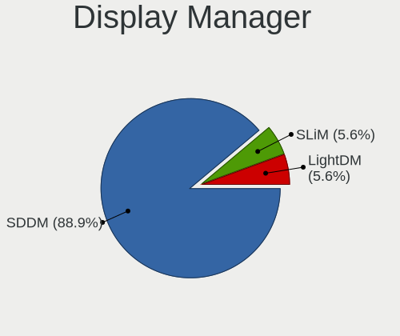
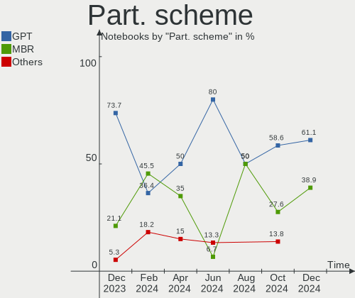
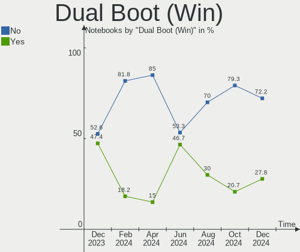
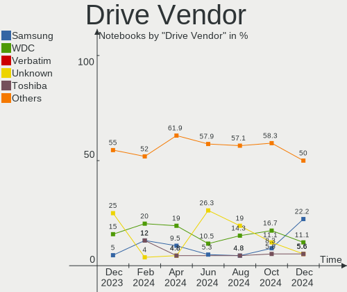
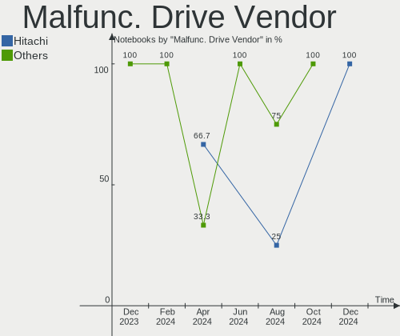
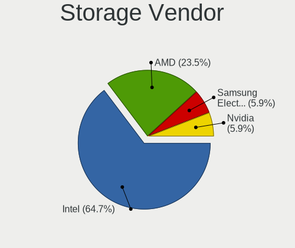
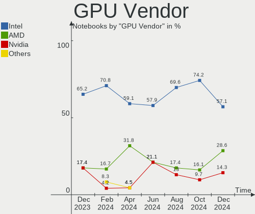
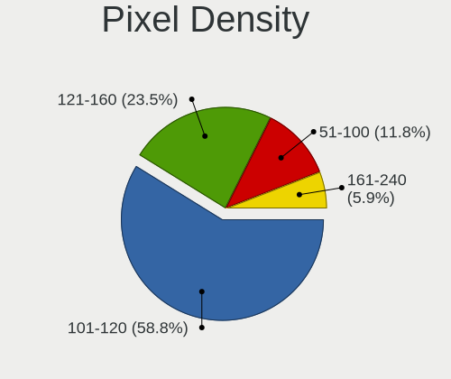
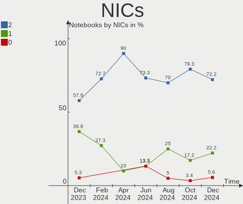
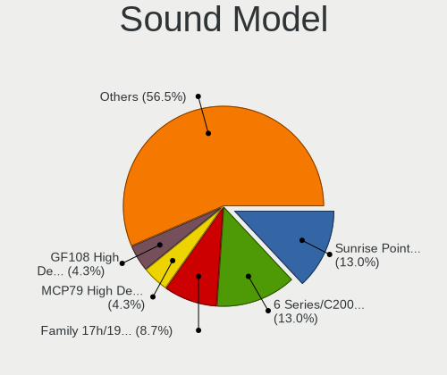

Lubuntu - Hardware Trends (Notebooks)
-------------------------------------

A project to identify most popular hardware characteristics and track their change
over time based on data collected by Linux users at https://Linux-Hardware.org.

Anyone can contribute to this report by the [hw-probe](https://github.com/linuxhw/hw-probe) tool:

    sudo -E hw-probe -all -upload

This report is for one last month. Overall report since the beginning of time: [TestDays](https://github.com/linuxhw/TestDays)

Period: Apr, 2024.

Contents
--------

* [ System ](#system)
  - [ OS                       ](#os)
  - [ OS Family                ](#os-family)
  - [ Kernel                   ](#kernel)
  - [ Kernel Family            ](#kernel-family)
  - [ Kernel Major Ver.        ](#kernel-major-ver)
  - [ Arch                     ](#arch)
  - [ DE                       ](#de)
  - [ Display Server           ](#display-server)
  - [ Display Manager          ](#display-manager)
  - [ OS Lang                  ](#os-lang)
  - [ Boot Mode                ](#boot-mode)
  - [ Filesystem               ](#filesystem)
  - [ Part. scheme             ](#part-scheme)
  - [ Dual Boot with Linux/BSD ](#dual-boot-with-linuxbsd)
  - [ Dual Boot (Win)          ](#dual-boot-win)

* [ Board ](#board)
  - [ Vendor                   ](#vendor)
  - [ Model                    ](#model)
  - [ Model Family             ](#model-family)
  - [ MFG Year                 ](#mfg-year)
  - [ Form Factor              ](#form-factor)
  - [ Secure Boot              ](#secure-boot)
  - [ Coreboot                 ](#coreboot)
  - [ RAM Size                 ](#ram-size)
  - [ RAM Used                 ](#ram-used)
  - [ Total Drives             ](#total-drives)
  - [ Has CD-ROM               ](#has-cd-rom)
  - [ Has Ethernet             ](#has-ethernet)
  - [ Has WiFi                 ](#has-wifi)
  - [ Has Bluetooth            ](#has-bluetooth)

* [ Location ](#location)
  - [ Country                  ](#country)
  - [ City                     ](#city)

* [ Drives ](#drives)
  - [ Drive Vendor             ](#drive-vendor)
  - [ Drive Model              ](#drive-model)
  - [ HDD Vendor               ](#hdd-vendor)
  - [ SSD Vendor               ](#ssd-vendor)
  - [ Drive Kind               ](#drive-kind)
  - [ Drive Connector          ](#drive-connector)
  - [ Drive Size               ](#drive-size)
  - [ Space Total              ](#space-total)
  - [ Space Used               ](#space-used)
  - [ Malfunc. Drives          ](#malfunc-drives)
  - [ Malfunc. Drive Vendor    ](#malfunc-drive-vendor)
  - [ Malfunc. HDD Vendor      ](#malfunc-hdd-vendor)
  - [ Malfunc. Drive Kind      ](#malfunc-drive-kind)
  - [ Failed Drives            ](#failed-drives)
  - [ Failed Drive Vendor      ](#failed-drive-vendor)
  - [ Drive Status             ](#drive-status)

* [ Storage controller ](#storage-controller)
  - [ Storage Vendor           ](#storage-vendor)
  - [ Storage Model            ](#storage-model)
  - [ Storage Kind             ](#storage-kind)

* [ Processor ](#processor)
  - [ CPU Vendor               ](#cpu-vendor)
  - [ CPU Model                ](#cpu-model)
  - [ CPU Model Family         ](#cpu-model-family)
  - [ CPU Cores                ](#cpu-cores)
  - [ CPU Sockets              ](#cpu-sockets)
  - [ CPU Threads              ](#cpu-threads)
  - [ CPU Op-Modes             ](#cpu-op-modes)
  - [ CPU Microcode            ](#cpu-microcode)
  - [ CPU Microarch            ](#cpu-microarch)

* [ Graphics ](#graphics)
  - [ GPU Vendor               ](#gpu-vendor)
  - [ GPU Model                ](#gpu-model)
  - [ GPU Combo                ](#gpu-combo)
  - [ GPU Driver               ](#gpu-driver)
  - [ GPU Memory               ](#gpu-memory)

* [ Monitor ](#monitor)
  - [ Monitor Vendor           ](#monitor-vendor)
  - [ Monitor Model            ](#monitor-model)
  - [ Monitor Resolution       ](#monitor-resolution)
  - [ Monitor Diagonal         ](#monitor-diagonal)
  - [ Monitor Width            ](#monitor-width)
  - [ Aspect Ratio             ](#aspect-ratio)
  - [ Monitor Area             ](#monitor-area)
  - [ Pixel Density            ](#pixel-density)
  - [ Multiple Monitors        ](#multiple-monitors)

* [ Network ](#network)
  - [ Net Controller Vendor    ](#net-controller-vendor)
  - [ Net Controller Model     ](#net-controller-model)
  - [ Wireless Vendor          ](#wireless-vendor)
  - [ Wireless Model           ](#wireless-model)
  - [ Ethernet Vendor          ](#ethernet-vendor)
  - [ Ethernet Model           ](#ethernet-model)
  - [ Net Controller Kind      ](#net-controller-kind)
  - [ Used Controller          ](#used-controller)
  - [ NICs                     ](#nics)
  - [ IPv6                     ](#ipv6)

* [ Bluetooth ](#bluetooth)
  - [ Bluetooth Vendor         ](#bluetooth-vendor)
  - [ Bluetooth Model          ](#bluetooth-model)

* [ Sound ](#sound)
  - [ Sound Vendor             ](#sound-vendor)
  - [ Sound Model              ](#sound-model)

* [ Memory ](#memory)
  - [ Memory Vendor            ](#memory-vendor)
  - [ Memory Model             ](#memory-model)
  - [ Memory Kind              ](#memory-kind)
  - [ Memory Form Factor       ](#memory-form-factor)
  - [ Memory Size              ](#memory-size)
  - [ Memory Speed             ](#memory-speed)

* [ Printers & scanners ](#printers--scanners)
  - [ Printer Vendor           ](#printer-vendor)
  - [ Printer Model            ](#printer-model)
  - [ Scanner Vendor           ](#scanner-vendor)
  - [ Scanner Model            ](#scanner-model)

* [ Camera ](#camera)
  - [ Camera Vendor            ](#camera-vendor)
  - [ Camera Model             ](#camera-model)

* [ Security ](#security)
  - [ Fingerprint Vendor       ](#fingerprint-vendor)
  - [ Fingerprint Model        ](#fingerprint-model)
  - [ Chipcard Vendor          ](#chipcard-vendor)
  - [ Chipcard Model           ](#chipcard-model)

* [ Unsupported ](#unsupported)
  - [ Unsupported Devices      ](#unsupported-devices)
  - [ Unsupported Device Types ](#unsupported-device-types)

System
------

OS
--

Installed operating systems

| Name          | Notebooks | Percent |
|---------------|-----------|---------|
| Lubuntu 22.04 | 13        | 65%     |
| Lubuntu 23.10 | 4         | 20%     |
| Lubuntu 24.04 | 2         | 10%     |
| Lubuntu 18.04 | 1         | 5%      |

OS Family
---------

OS without a version

| Name    | Notebooks | Percent |
|---------|-----------|---------|
| Lubuntu | 20        | 100%    |

Kernel
------

Version of the Linux kernel

| Version            | Notebooks | Percent |
|--------------------|-----------|---------|
| 6.5.0-28-generic   | 6         | 30%     |
| 6.5.0-27-generic   | 5         | 25%     |
| 6.5.0-26-generic   | 4         | 20%     |
| 6.8.0-31-generic   | 2         | 10%     |
| 6.5.0-9-generic    | 1         | 5%      |
| 6.5.0-18-generic   | 1         | 5%      |
| 4.15.0-213-generic | 1         | 5%      |

Kernel Family
-------------

Linux kernel without a distro release

| Version | Notebooks | Percent |
|---------|-----------|---------|
| 6.5.0   | 17        | 85%     |
| 6.8.0   | 2         | 10%     |
| 4.15.0  | 1         | 5%      |

Kernel Major Ver.
-----------------

Linux kernel major version

| Version | Notebooks | Percent |
|---------|-----------|---------|
| 6.5     | 17        | 85%     |
| 6.8     | 2         | 10%     |
| 4.15    | 1         | 5%      |

Arch
----

OS architecture (x86_64, i586, etc.)

| Name   | Notebooks | Percent |
|--------|-----------|---------|
| x86_64 | 19        | 95%     |
| i686   | 1         | 5%      |

DE
--

Desktop Environment

| Name | Notebooks | Percent |
|------|-----------|---------|
| LXQt | 19        | 95%     |
| LXDE | 1         | 5%      |

Display Server
--------------

X11 or Wayland

| Name | Notebooks | Percent |
|------|-----------|---------|
| X11  | 19        | 95%     |
| Tty  | 1         | 5%      |

Display Manager
---------------

SDDM, LightDM, etc.

| Name    | Notebooks | Percent |
|---------|-----------|---------|
| SDDM    | 17        | 85%     |
| Unknown | 2         | 10%     |
| LightDM | 1         | 5%      |

OS Lang
-------

Language

| Lang  | Notebooks | Percent |
|-------|-----------|---------|
| fr_FR | 4         | 20%     |
| it_IT | 3         | 15%     |
| en_US | 3         | 15%     |
| C     | 2         | 10%     |
| tr_TR | 1         | 5%      |
| ro_RO | 1         | 5%      |
| pt_BR | 1         | 5%      |
| pl_PL | 1         | 5%      |
| ja_JP | 1         | 5%      |
| fi_FI | 1         | 5%      |
| es_ES | 1         | 5%      |
| es_AR | 1         | 5%      |

Boot Mode
---------

EFI or BIOS

| Mode | Notebooks | Percent |
|------|-----------|---------|
| BIOS | 13        | 65%     |
| EFI  | 7         | 35%     |

Filesystem
----------

Type of filesystem

| Type    | Notebooks | Percent |
|---------|-----------|---------|
| Tmpfs   | 10        | 50%     |
| Ext4    | 9         | 45%     |
| Overlay | 1         | 5%      |

Part. scheme
------------

Scheme of partitioning

| Type    | Notebooks | Percent |
|---------|-----------|---------|
| GPT     | 10        | 50%     |
| MBR     | 7         | 35%     |
| Unknown | 3         | 15%     |

Dual Boot with Linux/BSD
------------------------

Hosting more than one Linux/BSD

| Dual boot | Notebooks | Percent |
|-----------|-----------|---------|
| No        | 18        | 90%     |
| Yes       | 2         | 10%     |

Dual Boot (Win)
---------------

Hosting Linux and Windows

| Dual boot | Notebooks | Percent |
|-----------|-----------|---------|
| No        | 17        | 85%     |
| Yes       | 3         | 15%     |

Board
-----

Vendor
------

Motherboard manufacturer

| Name             | Notebooks | Percent |
|------------------|-----------|---------|
| Acer             | 5         | 25%     |
| ASUSTek Computer | 4         | 20%     |
| Lenovo           | 3         | 15%     |
| Hewlett-Packard  | 2         | 10%     |
| Dell             | 2         | 10%     |
| Unknown          | 2         | 10%     |
| Toshiba          | 1         | 5%      |
| Fujitsu          | 1         | 5%      |

Model
-----

Motherboard model

| Name                         | Notebooks | Percent |
|------------------------------|-----------|---------|
| Unknown                      | 2         | 10%     |
| Toshiba Satellite C850D-11C  | 1         | 5%      |
| Lenovo ThinkPad X201 3680A44 | 1         | 5%      |
| Lenovo G50-45 80E3           | 1         | 5%      |
| Lenovo B575e 36852BG         | 1         | 5%      |
| HP EliteBook 6930p           | 1         | 5%      |
| HP 250 G4 Notebook PC        | 1         | 5%      |
| Fujitsu FMVA40B1RJ           | 1         | 5%      |
| Dell Latitude E6410          | 1         | 5%      |
| Dell Inspiron 15-3567        | 1         | 5%      |
| ASUS X555QG                  | 1         | 5%      |
| ASUS K53BY                   | 1         | 5%      |
| ASUS K45A                    | 1         | 5%      |
| ASUS K42F                    | 1         | 5%      |
| Acer Extensa 5630            | 1         | 5%      |
| Acer Aspire ES1-512          | 1         | 5%      |
| Acer Aspire E5-573G          | 1         | 5%      |
| Acer Aspire E1-572G          | 1         | 5%      |
| Acer Aspire 3000             | 1         | 5%      |

Model Family
------------

Motherboard model prefix

| Name               | Notebooks | Percent |
|--------------------|-----------|---------|
| Acer Aspire        | 4         | 20%     |
| Unknown            | 2         | 10%     |
| Toshiba Satellite  | 1         | 5%      |
| Lenovo ThinkPad    | 1         | 5%      |
| Lenovo G50-45      | 1         | 5%      |
| Lenovo B575e       | 1         | 5%      |
| HP EliteBook       | 1         | 5%      |
| HP 250             | 1         | 5%      |
| Fujitsu FMVA40B1RJ | 1         | 5%      |
| Dell Latitude      | 1         | 5%      |
| Dell Inspiron      | 1         | 5%      |
| ASUS X555QG        | 1         | 5%      |
| ASUS K53BY         | 1         | 5%      |
| ASUS K45A          | 1         | 5%      |
| ASUS K42F          | 1         | 5%      |
| Acer Extensa       | 1         | 5%      |

MFG Year
--------

Motherboard manufacture year

| Year | Notebooks | Percent |
|------|-----------|---------|
| 2012 | 3         | 15%     |
| 2010 | 3         | 15%     |
| 2015 | 2         | 10%     |
| 2014 | 2         | 10%     |
| 2008 | 2         | 10%     |
| 2022 | 1         | 5%      |
| 2021 | 1         | 5%      |
| 2018 | 1         | 5%      |
| 2017 | 1         | 5%      |
| 2016 | 1         | 5%      |
| 2013 | 1         | 5%      |
| 2011 | 1         | 5%      |
| 2005 | 1         | 5%      |

Form Factor
-----------

Physical design of the computer

| Name     | Notebooks | Percent |
|----------|-----------|---------|
| Notebook | 20        | 100%    |

Secure Boot
-----------

Enabled or disabled

| State    | Notebooks | Percent |
|----------|-----------|---------|
| Disabled | 19        | 95%     |
| Enabled  | 1         | 5%      |

Coreboot
--------

Have coreboot on board

| Used | Notebooks | Percent |
|------|-----------|---------|
| No   | 20        | 100%    |

RAM Size
--------

Total RAM memory

| Size in GB | Notebooks | Percent |
|------------|-----------|---------|
| 4.01-8.0   | 7         | 35%     |
| 3.01-4.0   | 7         | 35%     |
| 1.01-2.0   | 2         | 10%     |
| 8.01-16.0  | 2         | 10%     |
| 2.01-3.0   | 1         | 5%      |
| 0.51-1.0   | 1         | 5%      |

RAM Used
--------

Used RAM memory

| Used GB  | Notebooks | Percent |
|----------|-----------|---------|
| 1.01-2.0 | 12        | 60%     |
| 0.51-1.0 | 5         | 25%     |
| 2.01-3.0 | 2         | 10%     |
| 0.01-0.5 | 1         | 5%      |

Total Drives
------------

Number of drives on board

| Drives | Notebooks | Percent |
|--------|-----------|---------|
| 1      | 14        | 70%     |
| 2      | 5         | 25%     |
| 0      | 1         | 5%      |

Has CD-ROM
----------

Has CD-ROM on board

| Presented | Notebooks | Percent |
|-----------|-----------|---------|
| Yes       | 17        | 85%     |
| No        | 3         | 15%     |

Has Ethernet
------------

Has Ethernet on board

| Presented | Notebooks | Percent |
|-----------|-----------|---------|
| Yes       | 19        | 95%     |
| No        | 1         | 5%      |

Has WiFi
--------

Has WiFi module

| Presented | Notebooks | Percent |
|-----------|-----------|---------|
| Yes       | 19        | 95%     |
| No        | 1         | 5%      |

Has Bluetooth
-------------

Has Bluetooth module

| Presented | Notebooks | Percent |
|-----------|-----------|---------|
| Yes       | 14        | 70%     |
| No        | 6         | 30%     |

Location
--------

Country
-------

Geographic location (country)

| Country   | Notebooks | Percent |
|-----------|-----------|---------|
| Italy     | 4         | 20%     |
| France    | 4         | 20%     |
| Poland    | 2         | 10%     |
| Finland   | 2         | 10%     |
| Argentina | 2         | 10%     |
| Turkey    | 1         | 5%      |
| Spain     | 1         | 5%      |
| Serbia    | 1         | 5%      |
| Romania   | 1         | 5%      |
| Japan     | 1         | 5%      |
| Brazil    | 1         | 5%      |

City
----

Geographic location (city)

| City                      | Notebooks | Percent |
|---------------------------|-----------|---------|
| Helsinki                  | 2         | 10%     |
| Yokohama                  | 1         | 5%      |
| Warsaw                    | 1         | 5%      |
| Venice                    | 1         | 5%      |
| Veinticinco de Mayo       | 1         | 5%      |
| Uberlândia               | 1         | 5%      |
| Strasbourg                | 1         | 5%      |
| Saint-Michel-sur-Orge     | 1         | 5%      |
| Rome                      | 1         | 5%      |
| Rho                       | 1         | 5%      |
| Coutras                   | 1         | 5%      |
| Constanța                | 1         | 5%      |
| Collado Villalba          | 1         | 5%      |
| Buenos Aires              | 1         | 5%      |
| Blanquefort-sur-Briolance | 1         | 5%      |
| Belgrade                  | 1         | 5%      |
| Bazany                    | 1         | 5%      |
| Balıkesir                | 1         | 5%      |
| Aprilia                   | 1         | 5%      |

Drives
------

Drive Vendor
------------

Hard drive vendors

| Vendor              | Notebooks | Drives | Percent |
|---------------------|-----------|--------|---------|
| WDC                 | 4         | 4      | 19.05%  |
| Hitachi             | 4         | 4      | 19.05%  |
| Samsung Electronics | 2         | 2      | 9.52%   |
| Unknown             | 1         | 1      | 4.76%   |
| Toshiba             | 1         | 2      | 4.76%   |
| Seagate             | 1         | 1      | 4.76%   |
| Plextor             | 1         | 1      | 4.76%   |
| Kimtigo             | 1         | 1      | 4.76%   |
| HGST                | 1         | 1      | 4.76%   |
| GOODRAM             | 1         | 1      | 4.76%   |
| Fujitsu             | 1         | 1      | 4.76%   |
| Emtec               | 1         | 1      | 4.76%   |
| China               | 1         | 1      | 4.76%   |
| Unknown             | 1         | 1      | 4.76%   |

Drive Model
-----------

Hard drive models

| Model                            | Notebooks | Percent |
|----------------------------------|-----------|---------|
| WDC WD5000LPVX-22V0TT0 500GB     | 2         | 9.09%   |
| WDC WD5000LPCX-24C6HT0 500GB     | 1         | 4.55%   |
| WDC WD5000BPKX-22HPJT0 500GB     | 1         | 4.55%   |
| Unknown SD16G  16GB              | 1         | 4.55%   |
| Toshiba MQ01ABD100 1TB           | 1         | 4.55%   |
| Toshiba MQ01ABD1 1TB             | 1         | 4.55%   |
| Seagate ST9500420AS 500GB        | 1         | 4.55%   |
| Samsung SSD 850 EVO 250GB        | 1         | 4.55%   |
| Samsung HM320II 320GB            | 1         | 4.55%   |
| Plextor PX-128M5S 128GB SSD      | 1         | 4.55%   |
| Kimtigo SSD 128G                 | 1         | 4.55%   |
| Hitachi HTS723216L9SA60 160GB    | 1         | 4.55%   |
| Hitachi HTS543216L9A300 160GB    | 1         | 4.55%   |
| Hitachi HTS542516K9SA00 160GB    | 1         | 4.55%   |
| Hitachi HTS424040M9AT00 40GB     | 1         | 4.55%   |
| HGST HTS545032A7E380 320GB       | 1         | 4.55%   |
| GOODRAM SSDPR-CX400-128-G2 128GB | 1         | 4.55%   |
| Fujitsu MJA2250BH G2 250GB       | 1         | 4.55%   |
| Emtec X150 240GB                 | 1         | 4.55%   |
| China SSD 128GB                  | 1         | 4.55%   |
| Unknown                          | 1         | 4.55%   |

HDD Vendor
----------

Hard disk drive vendors

| Vendor              | Notebooks | Drives | Percent |
|---------------------|-----------|--------|---------|
| WDC                 | 4         | 4      | 30.77%  |
| Hitachi             | 4         | 4      | 30.77%  |
| Toshiba             | 1         | 2      | 7.69%   |
| Seagate             | 1         | 1      | 7.69%   |
| Samsung Electronics | 1         | 1      | 7.69%   |
| HGST                | 1         | 1      | 7.69%   |
| Fujitsu             | 1         | 1      | 7.69%   |

SSD Vendor
----------

Solid state drive vendors

| Vendor              | Notebooks | Drives | Percent |
|---------------------|-----------|--------|---------|
| Samsung Electronics | 1         | 1      | 16.67%  |
| Plextor             | 1         | 1      | 16.67%  |
| Kimtigo             | 1         | 1      | 16.67%  |
| GOODRAM             | 1         | 1      | 16.67%  |
| Emtec               | 1         | 1      | 16.67%  |
| China               | 1         | 1      | 16.67%  |

Drive Kind
----------

HDD or SSD

| Kind | Notebooks | Drives | Percent |
|------|-----------|--------|---------|
| HDD  | 13        | 14     | 65%     |
| SSD  | 6         | 6      | 30%     |
| MMC  | 1         | 2      | 5%      |

Drive Connector
---------------

SATA, SAS, NVMe, etc.

| Type | Notebooks | Drives | Percent |
|------|-----------|--------|---------|
| SATA | 18        | 20     | 94.74%  |
| MMC  | 1         | 2      | 5.26%   |

Drive Size
----------

Size of hard drive

| Size in TB | Notebooks | Drives | Percent |
|------------|-----------|--------|---------|
| 0.01-0.5   | 17        | 18     | 94.44%  |
| 0.51-1.0   | 1         | 2      | 5.56%   |

Space Total
-----------

Amount of disk space available on the file system

| Size in GB | Notebooks | Percent |
|------------|-----------|---------|
| 101-250    | 9         | 45%     |
| 251-500    | 4         | 20%     |
| 1-20       | 2         | 10%     |
| 51-100     | 2         | 10%     |
| 21-50      | 1         | 5%      |
| 501-1000   | 1         | 5%      |
| Unknown    | 1         | 5%      |

Space Used
----------

Amount of used disk space

| Used GB | Notebooks | Percent |
|---------|-----------|---------|
| 1-20    | 12        | 60%     |
| 21-50   | 5         | 25%     |
| 101-250 | 2         | 10%     |
| Unknown | 1         | 5%      |

Malfunc. Drives
---------------

Drive models with a malfunction

| Model                         | Notebooks | Drives | Percent |
|-------------------------------|-----------|--------|---------|
| Seagate ST9500420AS 500GB     | 1         | 1      | 33.33%  |
| Hitachi HTS723216L9SA60 160GB | 1         | 1      | 33.33%  |
| Hitachi HTS542516K9SA00 160GB | 1         | 1      | 33.33%  |

Malfunc. Drive Vendor
---------------------

Vendors of faulty drives

| Vendor  | Notebooks | Drives | Percent |
|---------|-----------|--------|---------|
| Hitachi | 2         | 2      | 66.67%  |
| Seagate | 1         | 1      | 33.33%  |

Malfunc. HDD Vendor
-------------------

Vendors of faulty HDD drives

| Vendor  | Notebooks | Drives | Percent |
|---------|-----------|--------|---------|
| Hitachi | 2         | 2      | 66.67%  |
| Seagate | 1         | 1      | 33.33%  |

Malfunc. Drive Kind
-------------------

Kinds of faulty drives

| Kind | Notebooks | Drives | Percent |
|------|-----------|--------|---------|
| HDD  | 3         | 3      | 100%    |

Failed Drives
-------------

Failed drive models

Zero info for selected period =(

Failed Drive Vendor
-------------------

Failed drive vendors

Zero info for selected period =(

Drive Status
------------

Number of failed and malfunc. drives

| Status   | Notebooks | Drives | Percent |
|----------|-----------|--------|---------|
| Detected | 12        | 14     | 63.16%  |
| Works    | 4         | 5      | 21.05%  |
| Malfunc  | 3         | 3      | 15.79%  |

Storage controller
------------------

Storage Vendor
--------------

Storage controller vendors

| Vendor                           | Notebooks | Percent |
|----------------------------------|-----------|---------|
| Intel                            | 13        | 65%     |
| AMD                              | 6         | 30%     |
| Silicon Integrated Systems [SiS] | 1         | 5%      |

Storage Model
-------------

Storage controller models

| Model                                                                            | Notebooks | Percent |
|----------------------------------------------------------------------------------|-----------|---------|
| AMD FCH SATA Controller [AHCI mode]                                              | 4         | 18.18%  |
| Silicon Integrated Systems [SiS] 5513 IDE Controller                             | 1         | 4.55%   |
| Intel Wildcat Point-LP SATA Controller [AHCI Mode]                               | 1         | 4.55%   |
| Intel Sunrise Point-LP SATA Controller [AHCI mode]                               | 1         | 4.55%   |
| Intel Mobile 4 Series Chipset PT IDER Controller                                 | 1         | 4.55%   |
| Intel Comet Lake SATA AHCI Controller                                            | 1         | 4.55%   |
| Intel Celeron N3350/Pentium N4200/Atom E3900 Series SATA AHCI Controller         | 1         | 4.55%   |
| Intel Atom/Celeron/Pentium Processor x5-E8000/J3xxx/N3xxx Series SATA Controller | 1         | 4.55%   |
| Intel Atom Processor E3800 Series SATA AHCI Controller                           | 1         | 4.55%   |
| Intel 82801IBM/IEM (ICH9M/ICH9M-E) 4 port SATA Controller [AHCI mode]            | 1         | 4.55%   |
| Intel 82801IBM/IEM (ICH9M/ICH9M-E) 2 port SATA Controller [IDE mode]             | 1         | 4.55%   |
| Intel 82801 Mobile SATA Controller [RAID mode]                                   | 1         | 4.55%   |
| Intel 8 Series SATA Controller 1 [AHCI mode]                                     | 1         | 4.55%   |
| Intel 7 Series Chipset Family 6-port SATA Controller [AHCI mode]                 | 1         | 4.55%   |
| Intel 5 Series/3400 Series Chipset 6 port SATA AHCI Controller                   | 1         | 4.55%   |
| Intel 5 Series/3400 Series Chipset 4 port SATA AHCI Controller                   | 1         | 4.55%   |
| AMD SB7x0/SB8x0/SB9x0 SATA Controller [AHCI mode]                                | 1         | 4.55%   |
| AMD SB7x0/SB8x0/SB9x0 IDE Controller                                             | 1         | 4.55%   |
| AMD FCH SATA Controller [IDE mode]                                               | 1         | 4.55%   |

Storage Kind
------------

Kind of storage controller (IDE, SATA, NVMe, SAS, ...)

| Kind | Notebooks | Percent |
|------|-----------|---------|
| SATA | 17        | 80.95%  |
| IDE  | 3         | 14.29%  |
| RAID | 1         | 4.76%   |

Processor
---------

CPU Vendor
----------

Processor vendors

| Vendor | Notebooks | Percent |
|--------|-----------|---------|
| Intel  | 13        | 65%     |
| AMD    | 7         | 35%     |

CPU Model
---------

Processor models

| Model                                           | Notebooks | Percent |
|-------------------------------------------------|-----------|---------|
| Intel Core i5 CPU M 560 @ 2.67GHz               | 2         | 10%     |
| Intel Pentium Dual-Core CPU T4200 @ 2.00GHz     | 1         | 5%      |
| Intel Core i5-7200U CPU @ 2.50GHz               | 1         | 5%      |
| Intel Core i5-5200U CPU @ 2.20GHz               | 1         | 5%      |
| Intel Core i5-4200U CPU @ 1.60GHz               | 1         | 5%      |
| Intel Core i5-3210M CPU @ 2.50GHz               | 1         | 5%      |
| Intel Core i3-10110U CPU @ 2.10GHz              | 1         | 5%      |
| Intel Core i3 CPU M 370 @ 2.40GHz               | 1         | 5%      |
| Intel Core 2 Duo CPU P8700 @ 2.53GHz            | 1         | 5%      |
| Intel Celeron CPU N3350 @ 1.10GHz               | 1         | 5%      |
| Intel Celeron CPU N3050 @ 1.60GHz               | 1         | 5%      |
| Intel Celeron CPU N2840 @ 2.16GHz               | 1         | 5%      |
| AMD Mobile Sempron Processor 3000+              | 1         | 5%      |
| AMD E1-7010 APU with AMD Radeon R2 Graphics     | 1         | 5%      |
| AMD E1-6010 APU with AMD Radeon R2 Graphics     | 1         | 5%      |
| AMD E1-1500 APU with Radeon HD Graphics         | 1         | 5%      |
| AMD E1-1200 APU with Radeon HD Graphics         | 1         | 5%      |
| AMD E-450 APU with Radeon HD Graphics           | 1         | 5%      |
| AMD A10-9600P RADEON R5, 10 COMPUTE CORES 4C+6G | 1         | 5%      |

CPU Model Family
----------------

Processor model prefix

| Model                   | Notebooks | Percent |
|-------------------------|-----------|---------|
| Intel Core i5           | 6         | 30%     |
| AMD E1                  | 4         | 20%     |
| Intel Celeron           | 3         | 15%     |
| Intel Core i3           | 2         | 10%     |
| Intel Pentium Dual-Core | 1         | 5%      |
| Intel Core 2 Duo        | 1         | 5%      |
| AMD Mobile Sempron      | 1         | 5%      |
| AMD E                   | 1         | 5%      |
| AMD A10                 | 1         | 5%      |

CPU Cores
---------

Number of processor cores

| Number | Notebooks | Percent |
|--------|-----------|---------|
| 2      | 19        | 95%     |
| 1      | 1         | 5%      |

CPU Sockets
-----------

Number of sockets

| Number | Notebooks | Percent |
|--------|-----------|---------|
| 1      | 20        | 100%    |

CPU Threads
-----------

Threads per core (Hyper-Threading)

| Number | Notebooks | Percent |
|--------|-----------|---------|
| 1      | 11        | 55%     |
| 2      | 9         | 45%     |

CPU Op-Modes
------------

CPU Operation Modes (32-bit, 64-bit)

| Op mode        | Notebooks | Percent |
|----------------|-----------|---------|
| 32-bit, 64-bit | 19        | 95%     |
| 32-bit         | 1         | 5%      |

CPU Microcode
-------------

Microcode number

| Number     | Notebooks | Percent |
|------------|-----------|---------|
| Unknown    | 17        | 85%     |
| 0x07030105 | 1         | 5%      |
| 0x05000119 | 1         | 5%      |
| 0x0500010d | 1         | 5%      |

CPU Microarch
-------------

Microarchitecture

| Name       | Notebooks | Percent |
|------------|-----------|---------|
| Westmere   | 3         | 15%     |
| Bobcat     | 3         | 15%     |
| Silvermont | 2         | 10%     |
| Puma       | 2         | 10%     |
| Penryn     | 2         | 10%     |
| KabyLake   | 2         | 10%     |
| K8 Hammer  | 1         | 5%      |
| IvyBridge  | 1         | 5%      |
| Haswell    | 1         | 5%      |
| Goldmont   | 1         | 5%      |
| Excavator  | 1         | 5%      |
| Broadwell  | 1         | 5%      |

Graphics
--------

GPU Vendor
----------

Vendors of graphics cards

| Vendor                           | Notebooks | Percent |
|----------------------------------|-----------|---------|
| Intel                            | 13        | 59.09%  |
| AMD                              | 7         | 31.82%  |
| Silicon Integrated Systems [SiS] | 1         | 4.55%   |
| Nvidia                           | 1         | 4.55%   |

GPU Model
---------

Graphics card models

| Model                                                                                      | Notebooks | Percent |
|--------------------------------------------------------------------------------------------|-----------|---------|
| Intel Core Processor Integrated Graphics Controller                                        | 3         | 12.5%   |
| Intel Mobile 4 Series Chipset Integrated Graphics Controller                               | 2         | 8.33%   |
| AMD Wrestler [Radeon HD 7310]                                                              | 2         | 8.33%   |
| AMD Sun XT [Radeon HD 8670A/8670M/8690M / R5 M330 / M430 / Radeon 520 Mobile]              | 2         | 8.33%   |
| AMD Mullins [Radeon R2 Graphics]                                                           | 2         | 8.33%   |
| Silicon Integrated Systems [SiS] 661/741/760 PCI/AGP or 662/761Gx PCIE VGA Display Adapter | 1         | 4.17%   |
| Nvidia GK208BM [GeForce 920M]                                                              | 1         | 4.17%   |
| Intel HD Graphics 620                                                                      | 1         | 4.17%   |
| Intel HD Graphics 5500                                                                     | 1         | 4.17%   |
| Intel HD Graphics 500                                                                      | 1         | 4.17%   |
| Intel Haswell-ULT Integrated Graphics Controller                                           | 1         | 4.17%   |
| Intel CometLake-U GT2 [UHD Graphics]                                                       | 1         | 4.17%   |
| Intel Atom/Celeron/Pentium Processor x5-E8000/J3xxx/N3xxx Integrated Graphics Controller   | 1         | 4.17%   |
| Intel Atom Processor Z36xxx/Z37xxx Series Graphics & Display                               | 1         | 4.17%   |
| Intel 3rd Gen Core processor Graphics Controller                                           | 1         | 4.17%   |
| AMD Wrestler [Radeon HD 6320]                                                              | 1         | 4.17%   |
| AMD Wani [Radeon R5/R6/R7 Graphics]                                                        | 1         | 4.17%   |
| AMD Seymour [Radeon HD 6400M/7400M Series]                                                 | 1         | 4.17%   |

GPU Combo
---------

Combinations of graphics cards

| Name           | Notebooks | Percent |
|----------------|-----------|---------|
| 1 x Intel      | 11        | 55%     |
| 1 x AMD        | 4         | 20%     |
| 2 x AMD        | 2         | 10%     |
| 1 x SiS        | 1         | 5%      |
| Intel + Nvidia | 1         | 5%      |
| Intel + AMD    | 1         | 5%      |

GPU Driver
----------

Free vs proprietary

| Driver  | Notebooks | Percent |
|---------|-----------|---------|
| Free    | 19        | 95%     |
| Unknown | 1         | 5%      |

GPU Memory
----------

Total video memory

| Size in GB | Notebooks | Percent |
|------------|-----------|---------|
| Unknown    | 15        | 75%     |
| 0.01-0.5   | 3         | 15%     |
| 1.01-2.0   | 1         | 5%      |
| 0.51-1.0   | 1         | 5%      |

Monitor
-------

Monitor Vendor
--------------

Monitor vendors

| Vendor                  | Notebooks | Percent |
|-------------------------|-----------|---------|
| LG Display              | 5         | 26.32%  |
| Chimei Innolux          | 4         | 21.05%  |
| AU Optronics            | 3         | 15.79%  |
| Samsung Electronics     | 2         | 10.53%  |
| BOE                     | 2         | 10.53%  |
| PANDA                   | 1         | 5.26%   |
| Lenovo                  | 1         | 5.26%   |
| Chi Mei Optoelectronics | 1         | 5.26%   |

Monitor Model
-------------

Monitor models

| Model                                                                    | Notebooks | Percent |
|--------------------------------------------------------------------------|-----------|---------|
| Samsung Electronics LCD Monitor SEC5442 1440x900 303x190mm 14.1-inch     | 1         | 5.26%   |
| Samsung Electronics LCD Monitor SEC4C42 1280x800 303x190mm 14.1-inch     | 1         | 5.26%   |
| PANDA LCD Monitor NCP004A 1920x1080 309x174mm 14.0-inch                  | 1         | 5.26%   |
| LG Display LCD Monitor LGD0468 1366x768 344x194mm 15.5-inch              | 1         | 5.26%   |
| LG Display LCD Monitor LGD0456 1366x768 344x194mm 15.5-inch              | 1         | 5.26%   |
| LG Display LCD Monitor LGD033A 1366x768 344x194mm 15.5-inch              | 1         | 5.26%   |
| LG Display LCD Monitor LGD02F8 1366x768 309x174mm 14.0-inch              | 1         | 5.26%   |
| LG Display LCD Monitor LGD018B 1366x768 310x174mm 14.0-inch              | 1         | 5.26%   |
| Lenovo LCD Monitor LEN4011 1280x800 261x163mm 12.1-inch                  | 1         | 5.26%   |
| Chimei Innolux LCD Monitor CMN15DC 1366x768 344x193mm 15.5-inch          | 1         | 5.26%   |
| Chimei Innolux LCD Monitor CMN15CA 1366x768 344x193mm 15.5-inch          | 1         | 5.26%   |
| Chimei Innolux LCD Monitor CMN15BF 1366x768 344x194mm 15.5-inch          | 1         | 5.26%   |
| Chimei Innolux LCD Monitor CMN15BE 1366x768 344x193mm 15.5-inch          | 1         | 5.26%   |
| Chi Mei Optoelectronics LCD Monitor CMO15A7 1366x768 344x193mm 15.5-inch | 1         | 5.26%   |
| BOE LCD Monitor BOE091D 1920x1080 309x174mm 14.0-inch                    | 1         | 5.26%   |
| BOE LCD Monitor BOE0671 1366x768 344x194mm 15.5-inch                     | 1         | 5.26%   |
| AU Optronics LCD Monitor AUO8074 1280x800 331x207mm 15.4-inch            | 1         | 5.26%   |
| AU Optronics LCD Monitor AUO48EC 1366x768 344x193mm 15.5-inch            | 1         | 5.26%   |
| AU Optronics LCD Monitor AUO21EC 1366x768 344x193mm 15.5-inch            | 1         | 5.26%   |

Monitor Resolution
------------------

Monitor screen resolution

| Resolution       | Notebooks | Percent |
|------------------|-----------|---------|
| 1366x768 (WXGA)  | 13        | 68.42%  |
| 1280x800 (WXGA)  | 3         | 15.79%  |
| 1920x1080 (FHD)  | 2         | 10.53%  |
| 1440x900 (WXGA+) | 1         | 5.26%   |

Monitor Diagonal
----------------

Diagonal size in inches

| Inches | Notebooks | Percent |
|--------|-----------|---------|
| 15     | 12        | 63.16%  |
| 14     | 5         | 26.32%  |
| 17     | 1         | 5.26%   |
| 12     | 1         | 5.26%   |

Monitor Width
-------------

Physical width

| Width in mm | Notebooks | Percent |
|-------------|-----------|---------|
| 301-350     | 17        | 89.47%  |
| 351-400     | 1         | 5.26%   |
| 201-300     | 1         | 5.26%   |

Aspect Ratio
------------

Proportional relationship between the width and the height

| Ratio | Notebooks | Percent |
|-------|-----------|---------|
| 16/9  | 15        | 78.95%  |
| 16/10 | 3         | 15.79%  |
| 3/2   | 1         | 5.26%   |

Monitor Area
------------

Area in inch²

| Area in inch² | Notebooks | Percent |
|----------------|-----------|---------|
| 101-110        | 12        | 63.16%  |
| 81-90          | 5         | 26.32%  |
| 61-70          | 1         | 5.26%   |
| 131-140        | 1         | 5.26%   |

Pixel Density
-------------

Pixels per inch

| Density | Notebooks | Percent |
|---------|-----------|---------|
| 101-120 | 13        | 68.42%  |
| 121-160 | 3         | 15.79%  |
| 51-100  | 3         | 15.79%  |

Multiple Monitors
-----------------

Total monitors connected

| Total | Notebooks | Percent |
|-------|-----------|---------|
| 1     | 19        | 95%     |
| 0     | 1         | 5%      |

Network
-------

Net Controller Vendor
---------------------

Controller vendors

| Vendor                           | Notebooks | Percent |
|----------------------------------|-----------|---------|
| Realtek Semiconductor            | 12        | 34.29%  |
| Qualcomm Atheros                 | 11        | 31.43%  |
| Intel                            | 4         | 11.43%  |
| Broadcom                         | 4         | 11.43%  |
| Silicon Integrated Systems [SiS] | 1         | 2.86%   |
| JMicron Technology               | 1         | 2.86%   |
| Huawei Technologies              | 1         | 2.86%   |
| D-Link                           | 1         | 2.86%   |

Net Controller Model
--------------------

Controller models

| Model                                                                  | Notebooks | Percent |
|------------------------------------------------------------------------|-----------|---------|
| Realtek RTL8111/8168/8211/8411 PCI Express Gigabit Ethernet Controller | 8         | 19.51%  |
| Qualcomm Atheros QCA9565 / AR9565 Wireless Network Adapter             | 5         | 12.2%   |
| Realtek RTL810xE PCI Express Fast Ethernet controller                  | 3         | 7.32%   |
| Qualcomm Atheros AR9285 Wireless Network Adapter (PCI-Express)         | 2         | 4.88%   |
| Intel 82577LM Gigabit Network Connection                               | 2         | 4.88%   |
| Silicon Integrated Systems [SiS] SiS900 PCI Fast Ethernet              | 1         | 2.44%   |
| Silicon Integrated Systems [SiS] AC'97 Modem Controller                | 1         | 2.44%   |
| Realtek RTL8821CE 802.11ac PCIe Wireless Network Adapter               | 1         | 2.44%   |
| Realtek RTL8723BE PCIe Wireless Network Adapter                        | 1         | 2.44%   |
| Realtek RTL8188CE 802.11b/g/n WiFi Adapter                             | 1         | 2.44%   |
| Qualcomm Atheros QCA9377 802.11ac Wireless Network Adapter             | 1         | 2.44%   |
| Qualcomm Atheros QCA6174 802.11ac Wireless Network Adapter             | 1         | 2.44%   |
| Qualcomm Atheros AR9485 Wireless Network Adapter                       | 1         | 2.44%   |
| Qualcomm Atheros AR928X Wireless Network Adapter (PCI-Express)         | 1         | 2.44%   |
| JMicron JMC250 PCI Express Gigabit Ethernet Controller                 | 1         | 2.44%   |
| Intel Ultimate N WiFi Link 5300                                        | 1         | 2.44%   |
| Intel Ethernet Connection (10) I219-V                                  | 1         | 2.44%   |
| Intel Comet Lake PCH-LP CNVi WiFi                                      | 1         | 2.44%   |
| Intel Centrino Advanced-N 6200                                         | 1         | 2.44%   |
| Intel 82567LM Gigabit Network Connection                               | 1         | 2.44%   |
| Huawei VTR-L09                                                         | 1         | 2.44%   |
| D-Link DWA-171                                                         | 1         | 2.44%   |
| Broadcom NetXtreme BCM57786 Gigabit Ethernet PCIe                      | 1         | 2.44%   |
| Broadcom NetXtreme BCM5764M Gigabit Ethernet PCIe                      | 1         | 2.44%   |
| Broadcom BCM43224 802.11a/b/g/n                                        | 1         | 2.44%   |
| Broadcom BCM4313 802.11bgn Wireless Network Adapter                    | 1         | 2.44%   |

Wireless Vendor
---------------

Wireless vendors

| Vendor                | Notebooks | Percent |
|-----------------------|-----------|---------|
| Qualcomm Atheros      | 11        | 55%     |
| Realtek Semiconductor | 3         | 15%     |
| Intel                 | 3         | 15%     |
| Broadcom              | 2         | 10%     |
| D-Link                | 1         | 5%      |

Wireless Model
--------------

Wireless models

| Model                                                          | Notebooks | Percent |
|----------------------------------------------------------------|-----------|---------|
| Qualcomm Atheros QCA9565 / AR9565 Wireless Network Adapter     | 5         | 25%     |
| Qualcomm Atheros AR9285 Wireless Network Adapter (PCI-Express) | 2         | 10%     |
| Realtek RTL8821CE 802.11ac PCIe Wireless Network Adapter       | 1         | 5%      |
| Realtek RTL8723BE PCIe Wireless Network Adapter                | 1         | 5%      |
| Realtek RTL8188CE 802.11b/g/n WiFi Adapter                     | 1         | 5%      |
| Qualcomm Atheros QCA9377 802.11ac Wireless Network Adapter     | 1         | 5%      |
| Qualcomm Atheros QCA6174 802.11ac Wireless Network Adapter     | 1         | 5%      |
| Qualcomm Atheros AR9485 Wireless Network Adapter               | 1         | 5%      |
| Qualcomm Atheros AR928X Wireless Network Adapter (PCI-Express) | 1         | 5%      |
| Intel Ultimate N WiFi Link 5300                                | 1         | 5%      |
| Intel Comet Lake PCH-LP CNVi WiFi                              | 1         | 5%      |
| Intel Centrino Advanced-N 6200                                 | 1         | 5%      |
| D-Link DWA-171                                                 | 1         | 5%      |
| Broadcom BCM43224 802.11a/b/g/n                                | 1         | 5%      |
| Broadcom BCM4313 802.11bgn Wireless Network Adapter            | 1         | 5%      |

Ethernet Vendor
---------------

Ethernet vendors

| Vendor                           | Notebooks | Percent |
|----------------------------------|-----------|---------|
| Realtek Semiconductor            | 11        | 55%     |
| Intel                            | 4         | 20%     |
| Broadcom                         | 2         | 10%     |
| Silicon Integrated Systems [SiS] | 1         | 5%      |
| JMicron Technology               | 1         | 5%      |
| Huawei Technologies              | 1         | 5%      |

Ethernet Model
--------------

Ethernet models

| Model                                                                  | Notebooks | Percent |
|------------------------------------------------------------------------|-----------|---------|
| Realtek RTL8111/8168/8211/8411 PCI Express Gigabit Ethernet Controller | 8         | 40%     |
| Realtek RTL810xE PCI Express Fast Ethernet controller                  | 3         | 15%     |
| Intel 82577LM Gigabit Network Connection                               | 2         | 10%     |
| Silicon Integrated Systems [SiS] SiS900 PCI Fast Ethernet              | 1         | 5%      |
| JMicron JMC250 PCI Express Gigabit Ethernet Controller                 | 1         | 5%      |
| Intel Ethernet Connection (10) I219-V                                  | 1         | 5%      |
| Intel 82567LM Gigabit Network Connection                               | 1         | 5%      |
| Huawei VTR-L09                                                         | 1         | 5%      |
| Broadcom NetXtreme BCM57786 Gigabit Ethernet PCIe                      | 1         | 5%      |
| Broadcom NetXtreme BCM5764M Gigabit Ethernet PCIe                      | 1         | 5%      |

Net Controller Kind
-------------------

Ethernet, WiFi or modem

| Kind     | Notebooks | Percent |
|----------|-----------|---------|
| WiFi     | 19        | 48.72%  |
| Ethernet | 19        | 48.72%  |
| Modem    | 1         | 2.56%   |

Used Controller
---------------

Currently used network controller

| Kind     | Notebooks | Percent |
|----------|-----------|---------|
| WiFi     | 15        | 68.18%  |
| Ethernet | 7         | 31.82%  |

NICs
----

Total network controllers on board

| Total | Notebooks | Percent |
|-------|-----------|---------|
| 2     | 18        | 90%     |
| 1     | 2         | 10%     |

IPv6
----

IPv6 vs IPv4

| Used | Notebooks | Percent |
|------|-----------|---------|
| No   | 14        | 70%     |
| Yes  | 6         | 30%     |

Bluetooth
---------

Bluetooth Vendor
----------------

Controller vendors

| Vendor                          | Notebooks | Percent |
|---------------------------------|-----------|---------|
| Lite-On Technology              | 3         | 21.43%  |
| Realtek Semiconductor           | 2         | 14.29%  |
| Qualcomm Atheros Communications | 2         | 14.29%  |
| Broadcom                        | 2         | 14.29%  |
| Intel                           | 1         | 7.14%   |
| IMC Networks                    | 1         | 7.14%   |
| Hewlett-Packard                 | 1         | 7.14%   |
| Foxconn / Hon Hai               | 1         | 7.14%   |
| Dell                            | 1         | 7.14%   |

Bluetooth Model
---------------

Controller models

| Model                                         | Notebooks | Percent |
|-----------------------------------------------|-----------|---------|
| Realtek Bluetooth Radio                       | 2         | 14.29%  |
| Qualcomm Atheros  Bluetooth Device            | 1         | 7.14%   |
| Qualcomm Atheros AR3012 Bluetooth 4.0         | 1         | 7.14%   |
| Lite-On Qualcomm Atheros QCA9377 Bluetooth    | 1         | 7.14%   |
| Lite-On Bluetooth Device                      | 1         | 7.14%   |
| Lite-On Atheros AR3012 Bluetooth              | 1         | 7.14%   |
| Intel AX201 Bluetooth                         | 1         | 7.14%   |
| IMC Networks Bluetooth Device                 | 1         | 7.14%   |
| HP Bluetooth 2.0 Interface [Broadcom BCM2045] | 1         | 7.14%   |
| Foxconn / Hon Hai Bluetooth Device            | 1         | 7.14%   |
| Dell DW375 Bluetooth Module                   | 1         | 7.14%   |
| Broadcom BCM20702A0                           | 1         | 7.14%   |
| Broadcom BCM2045B (BDC-2.1)                   | 1         | 7.14%   |

Sound
-----

Sound Vendor
------------

Sound card vendors

| Vendor                           | Notebooks | Percent |
|----------------------------------|-----------|---------|
| Intel                            | 13        | 61.9%   |
| AMD                              | 6         | 28.57%  |
| Silicon Integrated Systems [SiS] | 1         | 4.76%   |
| Nvidia                           | 1         | 4.76%   |

Sound Model
-----------

Sound card models

| Model                                                                                             | Notebooks | Percent |
|---------------------------------------------------------------------------------------------------|-----------|---------|
| AMD FCH Azalia Controller                                                                         | 4         | 13.79%  |
| Intel 5 Series/3400 Series Chipset High Definition Audio                                          | 3         | 10.34%  |
| AMD Wrestler HDMI Audio                                                                           | 3         | 10.34%  |
| AMD Kabini HDMI/DP Audio                                                                          | 3         | 10.34%  |
| Intel 82801I (ICH9 Family) HD Audio Controller                                                    | 2         | 6.9%    |
| Silicon Integrated Systems [SiS] SiS7012 AC'97 Sound Controller                                   | 1         | 3.45%   |
| Nvidia GK208 HDMI/DP Audio Controller                                                             | 1         | 3.45%   |
| Intel Wildcat Point-LP High Definition Audio Controller                                           | 1         | 3.45%   |
| Intel Sunrise Point-LP HD Audio                                                                   | 1         | 3.45%   |
| Intel Haswell-ULT HD Audio Controller                                                             | 1         | 3.45%   |
| Intel Comet Lake PCH-LP cAVS                                                                      | 1         | 3.45%   |
| Intel Celeron N3350/Pentium N4200/Atom E3900 Series Audio Cluster                                 | 1         | 3.45%   |
| Intel Broadwell-U Audio Controller                                                                | 1         | 3.45%   |
| Intel Atom/Celeron/Pentium Processor x5-E8000/J3xxx/N3xxx Series High Definition Audio Controller | 1         | 3.45%   |
| Intel Atom Processor Z36xxx/Z37xxx Series High Definition Audio Controller                        | 1         | 3.45%   |
| Intel 8 Series HD Audio Controller                                                                | 1         | 3.45%   |
| Intel 7 Series/C216 Chipset Family High Definition Audio Controller                               | 1         | 3.45%   |
| AMD SBx00 Azalia (Intel HDA)                                                                      | 1         | 3.45%   |
| AMD Family 15h (Models 60h-6fh) Audio Controller                                                  | 1         | 3.45%   |

Memory
------

Memory Vendor
-------------

Memory module vendors

| Vendor              | Notebooks | Percent |
|---------------------|-----------|---------|
| Samsung Electronics | 7         | 43.75%  |
| SK hynix            | 4         | 25%     |
| Unknown (ABCD)      | 1         | 6.25%   |
| Unknown (0xD306)    | 1         | 6.25%   |
| Unknown             | 1         | 6.25%   |
| PNY                 | 1         | 6.25%   |
| Kingston            | 1         | 6.25%   |

Memory Model
------------

Memory module models

| Model                                                            | Notebooks | Percent |
|------------------------------------------------------------------|-----------|---------|
| Samsung RAM M471B5173EB0-YK0 4GB SODIMM DDR3 1600MT/s            | 3         | 17.65%  |
| Samsung RAM M471B5773DH0-CH9 2GB SODIMM DDR3 1600MT/s            | 2         | 11.76%  |
| Unknown RAM Module 512MB SODIMM DDR                              | 1         | 5.88%   |
| Unknown RAM Module 256MB SODIMM DDR                              | 1         | 5.88%   |
| Unknown (ABCD) RAM 123456789012345678 2GB SODIMM LPDDR4 2400MT/s | 1         | 5.88%   |
| Unknown (0xD306) RAM SP008GLSTU160N02 8GB SODIMM DDR3 800MT/s    | 1         | 5.88%   |
| SK hynix RAM HYMP125S64CP8-S6 2GB SODIMM DDR2 975MT/s            | 1         | 5.88%   |
| SK hynix RAM HMT451S6BFR8A-PB 4GB SODIMM DDR3 1600MT/s           | 1         | 5.88%   |
| SK hynix RAM HMT351S6BFR8C-H9 4GB SODIMM DDR3 1333MT/s           | 1         | 5.88%   |
| SK hynix RAM HMT112S6BFR6C-G7 1GB SODIMM DDR3 1067MT/s           | 1         | 5.88%   |
| Samsung RAM M471B5173BH0-CK0 4GB SODIMM DDR3 1600MT/s            | 1         | 5.88%   |
| Samsung RAM M471B2874DZ1-CF8 1GB SODIMM DDR3 1067MT/s            | 1         | 5.88%   |
| PNY RAM M4S04S681LJJJ43-12 4GB SODIMM DDR4 2667MT/s              | 1         | 5.88%   |
| Kingston RAM 99U5469-041.A00LF 4GB SODIMM DDR3 1600MT/s          | 1         | 5.88%   |

Memory Kind
-----------

Memory module kinds

| Kind   | Notebooks | Percent |
|--------|-----------|---------|
| DDR3   | 9         | 69.23%  |
| LPDDR4 | 1         | 7.69%   |
| DDR4   | 1         | 7.69%   |
| DDR2   | 1         | 7.69%   |
| DDR    | 1         | 7.69%   |

Memory Form Factor
------------------

Physical design of the memory module

| Name   | Notebooks | Percent |
|--------|-----------|---------|
| SODIMM | 13        | 100%    |

Memory Size
-----------

Memory module size

| Size | Notebooks | Percent |
|------|-----------|---------|
| 4096 | 10        | 58.82%  |
| 8192 | 2         | 11.76%  |
| 2048 | 2         | 11.76%  |
| 1024 | 1         | 5.88%   |
| 512  | 1         | 5.88%   |
| 256  | 1         | 5.88%   |

Memory Speed
------------

Memory module speed

| Speed   | Notebooks | Percent |
|---------|-----------|---------|
| 1600    | 8         | 50%     |
| 1067    | 2         | 12.5%   |
| 2667    | 1         | 6.25%   |
| 2400    | 1         | 6.25%   |
| 1333    | 1         | 6.25%   |
| 975     | 1         | 6.25%   |
| 800     | 1         | 6.25%   |
| Unknown | 1         | 6.25%   |

Printers & scanners
-------------------

Printer Vendor
--------------

Printer device vendors

Zero info for selected period =(

Printer Model
-------------

Printer device models

Zero info for selected period =(

Scanner Vendor
--------------

Scanner device vendors

Zero info for selected period =(

Scanner Model
-------------

Scanner device models

Zero info for selected period =(

Camera
------

Camera Vendor
-------------

Camera device vendors

| Vendor                        | Notebooks | Percent |
|-------------------------------|-----------|---------|
| Chicony Electronics           | 6         | 33.33%  |
| Realtek Semiconductor         | 3         | 16.67%  |
| Suyin                         | 1         | 5.56%   |
| Sunplus Innovation Technology | 1         | 5.56%   |
| Ricoh                         | 1         | 5.56%   |
| Microdia                      | 1         | 5.56%   |
| Lenovo                        | 1         | 5.56%   |
| IMC Networks                  | 1         | 5.56%   |
| icSpring                      | 1         | 5.56%   |
| Alcor Micro                   | 1         | 5.56%   |
| Acer                          | 1         | 5.56%   |

Camera Model
------------

Camera device models

| Model                                    | Notebooks | Percent |
|------------------------------------------|-----------|---------|
| Suyin Acer/HP Integrated Webcam [CN0314] | 1         | 5.56%   |
| Sunplus HD WebCam                        | 1         | 5.56%   |
| Ricoh HD Webcam                          | 1         | 5.56%   |
| Realtek USB2.0 VGA UVC WebCam            | 1         | 5.56%   |
| Realtek USB Camera                       | 1         | 5.56%   |
| Realtek Integrated Webcam                | 1         | 5.56%   |
| Microdia Lenovo EasyCamera               | 1         | 5.56%   |
| Lenovo Integrated Webcam                 | 1         | 5.56%   |
| IMC Networks Integrated Webcam           | 1         | 5.56%   |
| icSpring camera                          | 1         | 5.56%   |
| Chicony VGA Webcam                       | 1         | 5.56%   |
| Chicony USB2.0 0.3M UVC WebCam           | 1         | 5.56%   |
| Chicony TOSHIBA Web Camera - HD          | 1         | 5.56%   |
| Chicony HP Webcam                        | 1         | 5.56%   |
| Chicony HD WebCam                        | 1         | 5.56%   |
| Chicony CKA7216                          | 1         | 5.56%   |
| Alcor Micro ASUS USB2.0 WebCam           | 1         | 5.56%   |
| Acer Lenovo Integrated Webcam            | 1         | 5.56%   |

Security
--------

Fingerprint Vendor
------------------

Fingerprint sensor vendors

| Vendor    | Notebooks | Percent |
|-----------|-----------|---------|
| Upek      | 1         | 50%     |
| AuthenTec | 1         | 50%     |

Fingerprint Model
-----------------

Fingerprint sensor models

| Model                                                  | Notebooks | Percent |
|--------------------------------------------------------|-----------|---------|
| Upek Biometric Touchchip/Touchstrip Fingerprint Sensor | 1         | 50%     |
| AuthenTec AES2810                                      | 1         | 50%     |

Chipcard Vendor
---------------

Chipcard module vendors

| Vendor   | Notebooks | Percent |
|----------|-----------|---------|
| Broadcom | 1         | 100%    |

Chipcard Model
--------------

Chipcard module models

| Model                                          | Notebooks | Percent |
|------------------------------------------------|-----------|---------|
| Broadcom BCM5880 Secure Applications Processor | 1         | 100%    |

Unsupported
-----------

Unsupported Devices
-------------------

Total unsupported devices on board

| Total | Notebooks | Percent |
|-------|-----------|---------|
| 0     | 14        | 70%     |
| 1     | 5         | 25%     |
| 2     | 1         | 5%      |

Unsupported Device Types
------------------------

Types of unsupported devices

| Type               | Notebooks | Percent |
|--------------------|-----------|---------|
| Fingerprint reader | 2         | 28.57%  |
| Storage            | 1         | 14.29%  |
| Net/wireless       | 1         | 14.29%  |
| Modem              | 1         | 14.29%  |
| Graphics card      | 1         | 14.29%  |
| Chipcard           | 1         | 14.29%  |

