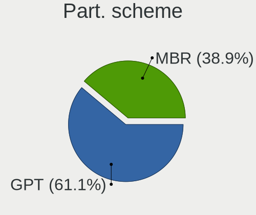
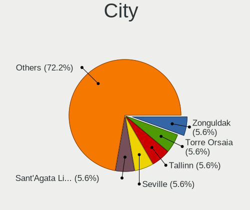
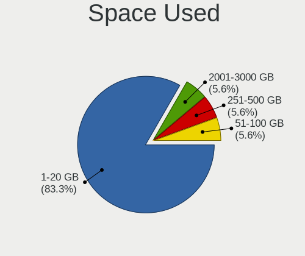
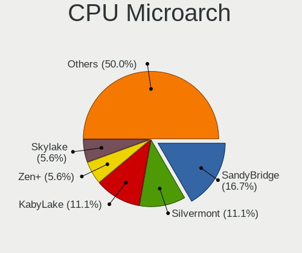
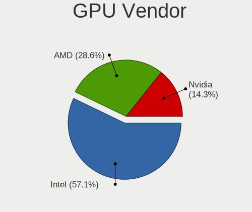
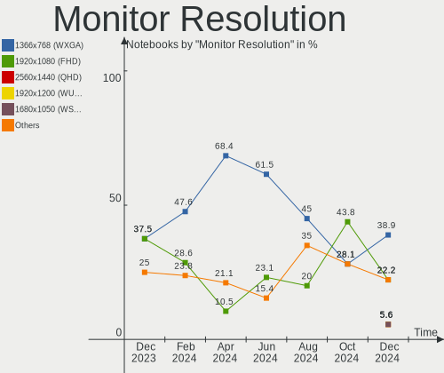
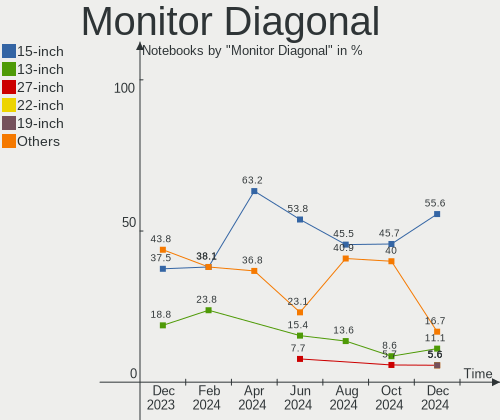
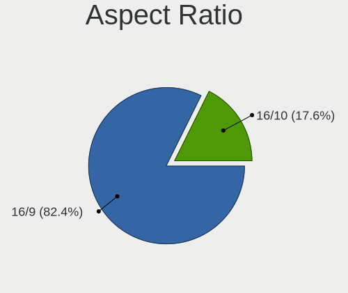

Lubuntu - Hardware Trends (Notebooks)
-------------------------------------

A project to identify most popular hardware characteristics and track their change
over time based on data collected by Linux users at https://Linux-Hardware.org.

Anyone can contribute to this report by the [hw-probe](https://github.com/linuxhw/hw-probe) tool:

    sudo -E hw-probe -all -upload

This report is for one last month. Overall report since the beginning of time: [TestCoverage](https://github.com/linuxhw/TestCoverage)

Period: May, 2022.

Contents
--------

* [ System ](#system)
  - [ OS                       ](#os)
  - [ OS Family                ](#os-family)
  - [ Kernel                   ](#kernel)
  - [ Kernel Family            ](#kernel-family)
  - [ Kernel Major Ver.        ](#kernel-major-ver)
  - [ Arch                     ](#arch)
  - [ DE                       ](#de)
  - [ Display Server           ](#display-server)
  - [ Display Manager          ](#display-manager)
  - [ OS Lang                  ](#os-lang)
  - [ Boot Mode                ](#boot-mode)
  - [ Filesystem               ](#filesystem)
  - [ Part. scheme             ](#part-scheme)
  - [ Dual Boot with Linux/BSD ](#dual-boot-with-linuxbsd)
  - [ Dual Boot (Win)          ](#dual-boot-win)

* [ Board ](#board)
  - [ Vendor                   ](#vendor)
  - [ Model                    ](#model)
  - [ Model Family             ](#model-family)
  - [ MFG Year                 ](#mfg-year)
  - [ Form Factor              ](#form-factor)
  - [ Secure Boot              ](#secure-boot)
  - [ Coreboot                 ](#coreboot)
  - [ RAM Size                 ](#ram-size)
  - [ RAM Used                 ](#ram-used)
  - [ Total Drives             ](#total-drives)
  - [ Has CD-ROM               ](#has-cd-rom)
  - [ Has Ethernet             ](#has-ethernet)
  - [ Has WiFi                 ](#has-wifi)
  - [ Has Bluetooth            ](#has-bluetooth)

* [ Location ](#location)
  - [ Country                  ](#country)
  - [ City                     ](#city)

* [ Drives ](#drives)
  - [ Drive Vendor             ](#drive-vendor)
  - [ Drive Model              ](#drive-model)
  - [ HDD Vendor               ](#hdd-vendor)
  - [ SSD Vendor               ](#ssd-vendor)
  - [ Drive Kind               ](#drive-kind)
  - [ Drive Connector          ](#drive-connector)
  - [ Drive Size               ](#drive-size)
  - [ Space Total              ](#space-total)
  - [ Space Used               ](#space-used)
  - [ Malfunc. Drives          ](#malfunc-drives)
  - [ Malfunc. Drive Vendor    ](#malfunc-drive-vendor)
  - [ Malfunc. HDD Vendor      ](#malfunc-hdd-vendor)
  - [ Malfunc. Drive Kind      ](#malfunc-drive-kind)
  - [ Failed Drives            ](#failed-drives)
  - [ Failed Drive Vendor      ](#failed-drive-vendor)
  - [ Drive Status             ](#drive-status)

* [ Storage controller ](#storage-controller)
  - [ Storage Vendor           ](#storage-vendor)
  - [ Storage Model            ](#storage-model)
  - [ Storage Kind             ](#storage-kind)

* [ Processor ](#processor)
  - [ CPU Vendor               ](#cpu-vendor)
  - [ CPU Model                ](#cpu-model)
  - [ CPU Model Family         ](#cpu-model-family)
  - [ CPU Cores                ](#cpu-cores)
  - [ CPU Sockets              ](#cpu-sockets)
  - [ CPU Threads              ](#cpu-threads)
  - [ CPU Op-Modes             ](#cpu-op-modes)
  - [ CPU Microcode            ](#cpu-microcode)
  - [ CPU Microarch            ](#cpu-microarch)

* [ Graphics ](#graphics)
  - [ GPU Vendor               ](#gpu-vendor)
  - [ GPU Model                ](#gpu-model)
  - [ GPU Combo                ](#gpu-combo)
  - [ GPU Driver               ](#gpu-driver)
  - [ GPU Memory               ](#gpu-memory)

* [ Monitor ](#monitor)
  - [ Monitor Vendor           ](#monitor-vendor)
  - [ Monitor Model            ](#monitor-model)
  - [ Monitor Resolution       ](#monitor-resolution)
  - [ Monitor Diagonal         ](#monitor-diagonal)
  - [ Monitor Width            ](#monitor-width)
  - [ Aspect Ratio             ](#aspect-ratio)
  - [ Monitor Area             ](#monitor-area)
  - [ Pixel Density            ](#pixel-density)
  - [ Multiple Monitors        ](#multiple-monitors)

* [ Network ](#network)
  - [ Net Controller Vendor    ](#net-controller-vendor)
  - [ Net Controller Model     ](#net-controller-model)
  - [ Wireless Vendor          ](#wireless-vendor)
  - [ Wireless Model           ](#wireless-model)
  - [ Ethernet Vendor          ](#ethernet-vendor)
  - [ Ethernet Model           ](#ethernet-model)
  - [ Net Controller Kind      ](#net-controller-kind)
  - [ Used Controller          ](#used-controller)
  - [ NICs                     ](#nics)
  - [ IPv6                     ](#ipv6)

* [ Bluetooth ](#bluetooth)
  - [ Bluetooth Vendor         ](#bluetooth-vendor)
  - [ Bluetooth Model          ](#bluetooth-model)

* [ Sound ](#sound)
  - [ Sound Vendor             ](#sound-vendor)
  - [ Sound Model              ](#sound-model)

* [ Memory ](#memory)
  - [ Memory Vendor            ](#memory-vendor)
  - [ Memory Model             ](#memory-model)
  - [ Memory Kind              ](#memory-kind)
  - [ Memory Form Factor       ](#memory-form-factor)
  - [ Memory Size              ](#memory-size)
  - [ Memory Speed             ](#memory-speed)

* [ Printers & scanners ](#printers--scanners)
  - [ Printer Vendor           ](#printer-vendor)
  - [ Printer Model            ](#printer-model)
  - [ Scanner Vendor           ](#scanner-vendor)
  - [ Scanner Model            ](#scanner-model)

* [ Camera ](#camera)
  - [ Camera Vendor            ](#camera-vendor)
  - [ Camera Model             ](#camera-model)

* [ Security ](#security)
  - [ Fingerprint Vendor       ](#fingerprint-vendor)
  - [ Fingerprint Model        ](#fingerprint-model)
  - [ Chipcard Vendor          ](#chipcard-vendor)
  - [ Chipcard Model           ](#chipcard-model)

* [ Unsupported ](#unsupported)
  - [ Unsupported Devices      ](#unsupported-devices)
  - [ Unsupported Device Types ](#unsupported-device-types)

System
------

OS
--

Installed operating systems

| Name          | Notebooks | Percent |
|---------------|-----------|---------|
| Lubuntu 22.04 | 12        | 38.71%  |
| Lubuntu 20.04 | 11        | 35.48%  |
| Lubuntu 21.10 | 6         | 19.35%  |
| Lubuntu 21.04 | 1         | 3.23%   |
| Lubuntu 18.04 | 1         | 3.23%   |

OS Family
---------

OS without a version

| Name    | Notebooks | Percent |
|---------|-----------|---------|
| Lubuntu | 31        | 100%    |

Kernel
------

Version of the Linux kernel

| Version            | Notebooks | Percent |
|--------------------|-----------|---------|
| 5.13.0-40-generic  | 8         | 25.81%  |
| 5.15.0-30-generic  | 5         | 16.13%  |
| 5.15.0-27-generic  | 4         | 12.9%   |
| 5.15.0-25-generic  | 2         | 6.45%   |
| 5.13.0-19-generic  | 2         | 6.45%   |
| 5.4.0-65-generic   | 1         | 3.23%   |
| 5.4.0-54-generic   | 1         | 3.23%   |
| 5.4.0-53-generic   | 1         | 3.23%   |
| 5.4.0-113-generic  | 1         | 3.23%   |
| 5.4.0-100-generic  | 1         | 3.23%   |
| 5.15.0-33-generic  | 1         | 3.23%   |
| 5.13.0-44-generic  | 1         | 3.23%   |
| 5.13.0-41-generic  | 1         | 3.23%   |
| 5.11.0-49-generic  | 1         | 3.23%   |
| 4.15.0-101-generic | 1         | 3.23%   |

Kernel Family
-------------

Linux kernel without a distro release

| Version | Notebooks | Percent |
|---------|-----------|---------|
| 5.15.0  | 12        | 38.71%  |
| 5.13.0  | 12        | 38.71%  |
| 5.4.0   | 5         | 16.13%  |
| 5.11.0  | 1         | 3.23%   |
| 4.15.0  | 1         | 3.23%   |

Kernel Major Ver.
-----------------

Linux kernel major version

| Version | Notebooks | Percent |
|---------|-----------|---------|
| 5.15    | 12        | 38.71%  |
| 5.13    | 12        | 38.71%  |
| 5.4     | 5         | 16.13%  |
| 5.11    | 1         | 3.23%   |
| 4.15    | 1         | 3.23%   |

Arch
----

OS architecture (x86_64, i586, etc.)

| Name   | Notebooks | Percent |
|--------|-----------|---------|
| x86_64 | 30        | 96.77%  |
| i686   | 1         | 3.23%   |

DE
--

Desktop Environment

| Name | Notebooks | Percent |
|------|-----------|---------|
| LXQt | 29        | 93.55%  |
| LXDE | 2         | 6.45%   |

Display Server
--------------

X11 or Wayland

| Name | Notebooks | Percent |
|------|-----------|---------|
| X11  | 30        | 96.77%  |
| Tty  | 1         | 3.23%   |

Display Manager
---------------

SDDM, LightDM, etc.

| Name    | Notebooks | Percent |
|---------|-----------|---------|
| SDDM    | 25        | 80.65%  |
| LightDM | 4         | 12.9%   |
| GDM     | 1         | 3.23%   |
| Unknown | 1         | 3.23%   |

OS Lang
-------

Language

| Lang  | Notebooks | Percent |
|-------|-----------|---------|
| en_US | 11        | 35.48%  |
| fr_FR | 4         | 12.9%   |
| it_IT | 3         | 9.68%   |
| pt_BR | 2         | 6.45%   |
| pl_PL | 2         | 6.45%   |
| fr_CH | 1         | 3.23%   |
| fr_BE | 1         | 3.23%   |
| es_MX | 1         | 3.23%   |
| es_CL | 1         | 3.23%   |
| es_AR | 1         | 3.23%   |
| en_GB | 1         | 3.23%   |
| en_CA | 1         | 3.23%   |
| en_AU | 1         | 3.23%   |
| C     | 1         | 3.23%   |

Boot Mode
---------

EFI or BIOS

| Mode | Notebooks | Percent |
|------|-----------|---------|
| EFI  | 16        | 51.61%  |
| BIOS | 15        | 48.39%  |

Filesystem
----------

Type of filesystem

| Type    | Notebooks | Percent |
|---------|-----------|---------|
| Ext4    | 29        | 93.55%  |
| Overlay | 1         | 3.23%   |
| Aufs    | 1         | 3.23%   |

Part. scheme
------------

Scheme of partitioning

| Type    | Notebooks | Percent |
|---------|-----------|---------|
| GPT     | 14        | 45.16%  |
| MBR     | 10        | 32.26%  |
| Unknown | 7         | 22.58%  |

Dual Boot with Linux/BSD
------------------------

Hosting more than one Linux/BSD

| Dual boot | Notebooks | Percent |
|-----------|-----------|---------|
| No        | 28        | 90.32%  |
| Yes       | 3         | 9.68%   |

Dual Boot (Win)
---------------

Hosting Linux and Windows

| Dual boot | Notebooks | Percent |
|-----------|-----------|---------|
| No        | 20        | 64.52%  |
| Yes       | 11        | 35.48%  |

Board
-----

Vendor
------

Motherboard manufacturer

| Name                | Notebooks | Percent |
|---------------------|-----------|---------|
| Lenovo              | 5         | 16.13%  |
| Hewlett-Packard     | 5         | 16.13%  |
| ASUSTek Computer    | 4         | 12.9%   |
| Toshiba             | 3         | 9.68%   |
| Acer                | 3         | 9.68%   |
| Mediacom            | 2         | 6.45%   |
| Google              | 2         | 6.45%   |
| YASHI               | 1         | 3.23%   |
| Samsung Electronics | 1         | 3.23%   |
| Positivo            | 1         | 3.23%   |
| Packard Bell        | 1         | 3.23%   |
| Intel               | 1         | 3.23%   |
| Fujitsu             | 1         | 3.23%   |
| Dell                | 1         | 3.23%   |

Model
-----

Motherboard model

| Name                                     | Notebooks | Percent |
|------------------------------------------|-----------|---------|
| Lenovo IdeaPad Slim 1-14AST-05 81VS      | 3         | 9.68%   |
| Mediacom WinPad 11,6 FullHD- WPU11       | 2         | 6.45%   |
| YASHI MYBOOK 360                         | 1         | 3.23%   |
| Toshiba Satellite P20                    | 1         | 3.23%   |
| Toshiba Satellite L40                    | 1         | 3.23%   |
| Toshiba Satellite C670D-12N              | 1         | 3.23%   |
| Samsung RV415/RV515                      | 1         | 3.23%   |
| Positivo AT300b                          | 1         | 3.23%   |
| Packard Bell EasyNote TE11HC             | 1         | 3.23%   |
| Lenovo Legion Y540-15IRH 81SX            | 1         | 3.23%   |
| Lenovo IdeaPad 310-15IKB 80TV            | 1         | 3.23%   |
| Intel Infoway                            | 1         | 3.23%   |
| HP Pavilion g6                           | 1         | 3.23%   |
| HP Pavilion g4                           | 1         | 3.23%   |
| HP OMEN by Laptop                        | 1         | 3.23%   |
| HP EliteBook 8570p                       | 1         | 3.23%   |
| HP Berknip                               | 1         | 3.23%   |
| Google Terra                             | 1         | 3.23%   |
| Google Relm                              | 1         | 3.23%   |
| Fujitsu LIFEBOOK S751                    | 1         | 3.23%   |
| Dell System Inspiron 17 7000 Series 7737 | 1         | 3.23%   |
| ASUS X402CA                              | 1         | 3.23%   |
| ASUS X205TA                              | 1         | 3.23%   |
| ASUS VivoBook 14_ASUS Laptop E406SAS     | 1         | 3.23%   |
| ASUS K55VD                               | 1         | 3.23%   |
| Acer Swift SF114-34                      | 1         | 3.23%   |
| Acer Aspire V5-573G                      | 1         | 3.23%   |
| Acer Aspire A317-33                      | 1         | 3.23%   |

Model Family
------------

Motherboard model prefix

| Name                  | Notebooks | Percent |
|-----------------------|-----------|---------|
| Lenovo IdeaPad        | 4         | 12.9%   |
| Toshiba Satellite     | 3         | 9.68%   |
| Mediacom WinPad       | 2         | 6.45%   |
| HP Pavilion           | 2         | 6.45%   |
| Acer Aspire           | 2         | 6.45%   |
| YASHI MYBOOK          | 1         | 3.23%   |
| Samsung RV415         | 1         | 3.23%   |
| Positivo AT300b       | 1         | 3.23%   |
| Packard Bell EasyNote | 1         | 3.23%   |
| Lenovo Legion         | 1         | 3.23%   |
| Intel Infoway         | 1         | 3.23%   |
| HP OMEN               | 1         | 3.23%   |
| HP EliteBook          | 1         | 3.23%   |
| HP Berknip            | 1         | 3.23%   |
| Google Terra          | 1         | 3.23%   |
| Google Relm           | 1         | 3.23%   |
| Fujitsu LIFEBOOK      | 1         | 3.23%   |
| Dell System           | 1         | 3.23%   |
| ASUS X402CA           | 1         | 3.23%   |
| ASUS X205TA           | 1         | 3.23%   |
| ASUS VivoBook         | 1         | 3.23%   |
| ASUS K55VD            | 1         | 3.23%   |
| Acer Swift            | 1         | 3.23%   |

MFG Year
--------

Motherboard manufacture year

| Year | Notebooks | Percent |
|------|-----------|---------|
| 2019 | 7         | 22.58%  |
| 2011 | 5         | 16.13%  |
| 2021 | 3         | 9.68%   |
| 2016 | 3         | 9.68%   |
| 2013 | 3         | 9.68%   |
| 2012 | 3         | 9.68%   |
| 2022 | 1         | 3.23%   |
| 2020 | 1         | 3.23%   |
| 2017 | 1         | 3.23%   |
| 2014 | 1         | 3.23%   |
| 2008 | 1         | 3.23%   |
| 2007 | 1         | 3.23%   |
| 2004 | 1         | 3.23%   |

Form Factor
-----------

Physical design of the computer

| Name     | Notebooks | Percent |
|----------|-----------|---------|
| Notebook | 31        | 100%    |

Secure Boot
-----------

Enabled or disabled

| State    | Notebooks | Percent |
|----------|-----------|---------|
| Disabled | 30        | 96.77%  |
| Enabled  | 1         | 3.23%   |

Coreboot
--------

Have coreboot on board

| Used | Notebooks | Percent |
|------|-----------|---------|
| No   | 28        | 90.32%  |
| Yes  | 3         | 9.68%   |

RAM Size
--------

Total RAM memory

| Size in GB | Notebooks | Percent |
|------------|-----------|---------|
| 3.01-4.0   | 12        | 38.71%  |
| 4.01-8.0   | 8         | 25.81%  |
| 1.01-2.0   | 7         | 22.58%  |
| 8.01-16.0  | 2         | 6.45%   |
| 2.01-3.0   | 1         | 3.23%   |
| 16.01-24.0 | 1         | 3.23%   |

RAM Used
--------

Used RAM memory

| Used GB  | Notebooks | Percent |
|----------|-----------|---------|
| 1.01-2.0 | 16        | 51.61%  |
| 0.51-1.0 | 9         | 29.03%  |
| 2.01-3.0 | 4         | 12.9%   |
| 4.01-8.0 | 2         | 6.45%   |

Total Drives
------------

Number of drives on board

| Drives | Notebooks | Percent |
|--------|-----------|---------|
| 1      | 19        | 61.29%  |
| 2      | 12        | 38.71%  |

Has CD-ROM
----------

Has CD-ROM on board

| Presented | Notebooks | Percent |
|-----------|-----------|---------|
| No        | 20        | 64.52%  |
| Yes       | 11        | 35.48%  |

Has Ethernet
------------

Has Ethernet on board

| Presented | Notebooks | Percent |
|-----------|-----------|---------|
| Yes       | 23        | 74.19%  |
| No        | 8         | 25.81%  |

Has WiFi
--------

Has WiFi module

| Presented | Notebooks | Percent |
|-----------|-----------|---------|
| Yes       | 26        | 83.87%  |
| No        | 5         | 16.13%  |

Has Bluetooth
-------------

Has Bluetooth module

| Presented | Notebooks | Percent |
|-----------|-----------|---------|
| Yes       | 19        | 61.29%  |
| No        | 12        | 38.71%  |

Location
--------

Country
-------

Geographic location (country)

| Country      | Notebooks | Percent |
|--------------|-----------|---------|
| France       | 6         | 19.35%  |
| USA          | 5         | 16.13%  |
| Italy        | 4         | 12.9%   |
| Poland       | 2         | 6.45%   |
| Germany      | 2         | 6.45%   |
| Brazil       | 2         | 6.45%   |
| Ukraine      | 1         | 3.23%   |
| UK           | 1         | 3.23%   |
| Turkey       | 1         | 3.23%   |
| South Africa | 1         | 3.23%   |
| Mexico       | 1         | 3.23%   |
| Chile        | 1         | 3.23%   |
| Canada       | 1         | 3.23%   |
| Belgium      | 1         | 3.23%   |
| Australia    | 1         | 3.23%   |
| Argentina    | 1         | 3.23%   |

City
----

Geographic location (city)

| City           | Notebooks | Percent |
|----------------|-----------|---------|
| Sankt Leon-Rot | 2         | 6.45%   |
| Perth Amboy    | 2         | 6.45%   |
| White Plains   | 1         | 3.23%   |
| Warsaw         | 1         | 3.23%   |
| Vilvoorde      | 1         | 3.23%   |
| Strasbourg     | 1         | 3.23%   |
| Sheboygan      | 1         | 3.23%   |
| Puteaux        | 1         | 3.23%   |
| Puente Alto    | 1         | 3.23%   |
| Pretoria       | 1         | 3.23%   |
| Pontypool      | 1         | 3.23%   |
| Poitiers       | 1         | 3.23%   |
| Pisa           | 1         | 3.23%   |
| Piombino Dese  | 1         | 3.23%   |
| Paris          | 1         | 3.23%   |
| Palermo        | 1         | 3.23%   |
| Orléans       | 1         | 3.23%   |
| Novo Gama      | 1         | 3.23%   |
| New York       | 1         | 3.23%   |
| Natal          | 1         | 3.23%   |
| Milan          | 1         | 3.23%   |
| Mexico City    | 1         | 3.23%   |
| Melbourne      | 1         | 3.23%   |
| Kyiv           | 1         | 3.23%   |
| Kitchener      | 1         | 3.23%   |
| Jozefoslaw     | 1         | 3.23%   |
| Échirolles    | 1         | 3.23%   |
| Buenos Aires   | 1         | 3.23%   |
| Alaşehir      | 1         | 3.23%   |

Drives
------

Drive Vendor
------------

Hard drive vendors

| Vendor              | Notebooks | Drives | Percent |
|---------------------|-----------|--------|---------|
| Unknown             | 11        | 18     | 31.43%  |
| WDC                 | 4         | 4      | 11.43%  |
| Toshiba             | 3         | 3      | 8.57%   |
| Samsung Electronics | 3         | 3      | 8.57%   |
| Hitachi             | 3         | 3      | 8.57%   |
| Seagate             | 2         | 2      | 5.71%   |
| SPCC                | 1         | 1      | 2.86%   |
| SK Hynix            | 1         | 1      | 2.86%   |
| SanDisk             | 1         | 1      | 2.86%   |
| Kingston            | 1         | 1      | 2.86%   |
| IBM/Hitachi         | 1         | 1      | 2.86%   |
| HGST                | 1         | 1      | 2.86%   |
| Fujitsu             | 1         | 1      | 2.86%   |
| Apple               | 1         | 2      | 2.86%   |
| Unknown             | 1         | 1      | 2.86%   |

Drive Model
-----------

Hard drive models

| Model                                 | Notebooks | Percent |
|---------------------------------------|-----------|---------|
| Unknown SD/MMC/MS PRO 999GB           | 3         | 6.98%   |
| Unknown MMC64G  64GB                  | 3         | 6.98%   |
| Unknown NCard  32GB                   | 2         | 4.65%   |
| WDC WD5000LUCT-62C26Y0 500GB          | 1         | 2.33%   |
| WDC WD10JPVX-75JC3T0 1TB              | 1         | 2.33%   |
| WDC PC SN530 SDBPNPZ-256G-1114 256GB  | 1         | 2.33%   |
| WDC PC SN520 SDAPMUW-512G-1101 512GB  | 1         | 2.33%   |
| Unknown SU01G  968MB                  | 1         | 2.33%   |
| Unknown SF64G  64GB                   | 1         | 2.33%   |
| Unknown SDW32G  32GB                  | 1         | 2.33%   |
| Unknown HAG4a2  16GB                  | 1         | 2.33%   |
| Unknown ED2S5  128GB                  | 1         | 2.33%   |
| Unknown DA4032  32GB                  | 1         | 2.33%   |
| Unknown BJNB4R  32GB                  | 1         | 2.33%   |
| Unknown Biwin  32GB                   | 1         | 2.33%   |
| Unknown ASTC  32GB                    | 1         | 2.33%   |
| Unknown 128G32  128GB                 | 1         | 2.33%   |
| Toshiba MQ01ABD075 752GB              | 1         | 2.33%   |
| Toshiba MQ01ABD050 500GB              | 1         | 2.33%   |
| Toshiba MK5059GSXP 500GB              | 1         | 2.33%   |
| SPCC Solid State Disk 120GB           | 1         | 2.33%   |
| SK Hynix HFS128G3BTND-N210A 128GB SSD | 1         | 2.33%   |
| Seagate ST500LM012 HN-M500MBB 500GB   | 1         | 2.33%   |
| Seagate ST1000LM035-1RK172 1TB        | 1         | 2.33%   |
| SanDisk SD6SB1M256G1022I 256GB SSD    | 1         | 2.33%   |
| Samsung NVMe SSD Drive 256GB          | 1         | 2.33%   |
| Samsung NVMe SSD Drive 128GB          | 1         | 2.33%   |
| Samsung HM121HI 120GB                 | 1         | 2.33%   |
| Kingston SNVS500G 500GB               | 1         | 2.33%   |
| IBM/Hitachi IC25N060ATMR04-0 64GB     | 1         | 2.33%   |
| Hitachi HTS547575A9E384 752GB         | 1         | 2.33%   |
| Hitachi HTS547564A9E384 640GB         | 1         | 2.33%   |
| Hitachi HTS543232A7A384 320GB         | 1         | 2.33%   |
| HGST HTS721010A9E630 1TB              | 1         | 2.33%   |
| Fujitsu MHY2120BH 120GB               | 1         | 2.33%   |
| Apple NVMe SSD Drive 8KB              | 1         | 2.33%   |
| Apple NVMe SSD Drive 1TB              | 1         | 2.33%   |
| Unknown                               | 1         | 2.33%   |

HDD Vendor
----------

Hard disk drive vendors

| Vendor              | Notebooks | Drives | Percent |
|---------------------|-----------|--------|---------|
| Unknown             | 3         | 3      | 17.65%  |
| Toshiba             | 3         | 3      | 17.65%  |
| Hitachi             | 3         | 3      | 17.65%  |
| WDC                 | 2         | 2      | 11.76%  |
| Seagate             | 2         | 2      | 11.76%  |
| Samsung Electronics | 1         | 1      | 5.88%   |
| IBM/Hitachi         | 1         | 1      | 5.88%   |
| HGST                | 1         | 1      | 5.88%   |
| Fujitsu             | 1         | 1      | 5.88%   |

SSD Vendor
----------

Solid state drive vendors

| Vendor   | Notebooks | Drives | Percent |
|----------|-----------|--------|---------|
| SPCC     | 1         | 1      | 33.33%  |
| SK Hynix | 1         | 1      | 33.33%  |
| SanDisk  | 1         | 1      | 33.33%  |

Drive Kind
----------

HDD or SSD

| Kind | Notebooks | Drives | Percent |
|------|-----------|--------|---------|
| HDD  | 17        | 17     | 44.74%  |
| MMC  | 12        | 16     | 31.58%  |
| NVMe | 6         | 7      | 15.79%  |
| SSD  | 3         | 3      | 7.89%   |

Drive Connector
---------------

SATA, SAS, NVMe, etc.

| Type | Notebooks | Drives | Percent |
|------|-----------|--------|---------|
| SATA | 16        | 17     | 43.24%  |
| MMC  | 12        | 16     | 32.43%  |
| NVMe | 6         | 7      | 16.22%  |
| SAS  | 3         | 3      | 8.11%   |

Drive Size
----------

Size of hard drive

| Size in TB | Notebooks | Drives | Percent |
|------------|-----------|--------|---------|
| 0.01-0.5   | 11        | 11     | 55%     |
| 0.51-1.0   | 9         | 9      | 45%     |

Space Total
-----------

Amount of disk space available on the file system

| Size in GB | Notebooks | Percent |
|------------|-----------|---------|
| 101-250    | 11        | 35.48%  |
| 251-500    | 5         | 16.13%  |
| 21-50      | 5         | 16.13%  |
| 51-100     | 4         | 12.9%   |
| 501-1000   | 3         | 9.68%   |
| Unknown    | 2         | 6.45%   |
| 1-20       | 1         | 3.23%   |

Space Used
----------

Amount of used disk space

| Used GB | Notebooks | Percent |
|---------|-----------|---------|
| 1-20    | 13        | 41.94%  |
| 21-50   | 7         | 22.58%  |
| 101-250 | 5         | 16.13%  |
| 51-100  | 3         | 9.68%   |
| Unknown | 2         | 6.45%   |
| 251-500 | 1         | 3.23%   |

Malfunc. Drives
---------------

Drive models with a malfunction

| Model                                 | Notebooks | Drives | Percent |
|---------------------------------------|-----------|--------|---------|
| WDC WD5000LUCT-62C26Y0 500GB          | 1         | 1      | 12.5%   |
| WDC WD10JPVX-75JC3T0 1TB              | 1         | 1      | 12.5%   |
| Toshiba MQ01ABD050 500GB              | 1         | 1      | 12.5%   |
| Toshiba MK5059GSXP 500GB              | 1         | 1      | 12.5%   |
| SK Hynix HFS128G3BTND-N210A 128GB SSD | 1         | 1      | 12.5%   |
| Samsung Electronics HM121HI 120GB     | 1         | 1      | 12.5%   |
| Hitachi HTS547564A9E384 640GB         | 1         | 1      | 12.5%   |
| Fujitsu MHY2120BH 120GB               | 1         | 1      | 12.5%   |

Malfunc. Drive Vendor
---------------------

Vendors of faulty drives

| Vendor              | Notebooks | Drives | Percent |
|---------------------|-----------|--------|---------|
| WDC                 | 2         | 2      | 25%     |
| Toshiba             | 2         | 2      | 25%     |
| SK Hynix            | 1         | 1      | 12.5%   |
| Samsung Electronics | 1         | 1      | 12.5%   |
| Hitachi             | 1         | 1      | 12.5%   |
| Fujitsu             | 1         | 1      | 12.5%   |

Malfunc. HDD Vendor
-------------------

Vendors of faulty HDD drives

| Vendor              | Notebooks | Drives | Percent |
|---------------------|-----------|--------|---------|
| WDC                 | 2         | 2      | 28.57%  |
| Toshiba             | 2         | 2      | 28.57%  |
| Samsung Electronics | 1         | 1      | 14.29%  |
| Hitachi             | 1         | 1      | 14.29%  |
| Fujitsu             | 1         | 1      | 14.29%  |

Malfunc. Drive Kind
-------------------

Kinds of faulty drives

| Kind | Notebooks | Drives | Percent |
|------|-----------|--------|---------|
| HDD  | 7         | 7      | 87.5%   |
| SSD  | 1         | 1      | 12.5%   |

Failed Drives
-------------

Failed drive models

Zero info for selected period =(

Failed Drive Vendor
-------------------

Failed drive vendors

Zero info for selected period =(

Drive Status
------------

Number of failed and malfunc. drives

| Status   | Notebooks | Drives | Percent |
|----------|-----------|--------|---------|
| Detected | 17        | 26     | 50%     |
| Works    | 9         | 9      | 26.47%  |
| Malfunc  | 8         | 8      | 23.53%  |

Storage controller
------------------

Storage Vendor
--------------

Storage controller vendors

| Vendor                      | Notebooks | Percent |
|-----------------------------|-----------|---------|
| Intel                       | 14        | 53.85%  |
| AMD                         | 7         | 26.92%  |
| Sandisk                     | 2         | 7.69%   |
| Samsung Electronics         | 2         | 7.69%   |
| Kingston Technology Company | 1         | 3.85%   |

Storage Model
-------------

Storage controller models

| Model                                                                        | Notebooks | Percent |
|------------------------------------------------------------------------------|-----------|---------|
| AMD FCH SATA Controller [AHCI mode]                                          | 5         | 16.67%  |
| Intel 7 Series Chipset Family 6-port SATA Controller [AHCI mode]             | 3         | 10%     |
| Intel 82801HM/HEM (ICH8M/ICH8M-E) SATA Controller [AHCI mode]                | 2         | 6.67%   |
| Intel 82801HM/HEM (ICH8M/ICH8M-E) IDE Controller                             | 2         | 6.67%   |
| Intel 8 Series SATA Controller 1 [AHCI mode]                                 | 2         | 6.67%   |
| Sandisk WD Blue SN550 NVMe SSD                                               | 1         | 3.33%   |
| Sandisk PC SN520 NVMe SSD                                                    | 1         | 3.33%   |
| Samsung NVMe SSD Controller SM951/PM951                                      | 1         | 3.33%   |
| Samsung NVMe SSD Controller 980                                              | 1         | 3.33%   |
| Kingston Company Company Non-Volatile memory controller                      | 1         | 3.33%   |
| Intel Sunrise Point-LP SATA Controller [AHCI mode]                           | 1         | 3.33%   |
| Intel Jasper Lake SATA AHCI Controller                                       | 1         | 3.33%   |
| Intel HM170/QM170 Chipset SATA Controller [AHCI Mode]                        | 1         | 3.33%   |
| Intel Cannon Lake Mobile PCH SATA AHCI Controller                            | 1         | 3.33%   |
| Intel 82801EB/ER (ICH5/ICH5R) IDE Controller                                 | 1         | 3.33%   |
| Intel 7 Series Chipset Family 4-port SATA Controller [IDE mode]              | 1         | 3.33%   |
| Intel 7 Series Chipset Family 2-port SATA Controller [IDE mode]              | 1         | 3.33%   |
| Intel 6 Series/C200 Series Chipset Family 6 port Mobile SATA AHCI Controller | 1         | 3.33%   |
| AMD SB7x0/SB8x0/SB9x0 SATA Controller [IDE mode]                             | 1         | 3.33%   |
| AMD SB7x0/SB8x0/SB9x0 SATA Controller [AHCI mode]                            | 1         | 3.33%   |
| AMD SB7x0/SB8x0/SB9x0 IDE Controller                                         | 1         | 3.33%   |

Storage Kind
------------

Kind of storage controller (IDE, SATA, NVMe, SAS, ...)

| Kind | Notebooks | Percent |
|------|-----------|---------|
| SATA | 19        | 65.52%  |
| NVMe | 5         | 17.24%  |
| IDE  | 5         | 17.24%  |

Processor
---------

CPU Vendor
----------

Processor vendors

| Vendor | Notebooks | Percent |
|--------|-----------|---------|
| Intel  | 23        | 74.19%  |
| AMD    | 8         | 25.81%  |

CPU Model
---------

Processor models

| Model                                         | Notebooks | Percent |
|-----------------------------------------------|-----------|---------|
| Intel Celeron CPU N3060 @ 1.60GHz             | 3         | 9.68%   |
| AMD A6-9220e RADEON R4, 5 COMPUTE CORES 2C+3G | 3         | 9.68%   |
| Intel Core i5-4200U CPU @ 1.60GHz             | 2         | 6.45%   |
| Intel Atom x5-Z8350 CPU @ 1.44GHz             | 2         | 6.45%   |
| Intel Atom x5-Z8300 CPU @ 1.44GHz             | 2         | 6.45%   |
| AMD E-300 APU with Radeon HD Graphics         | 2         | 6.45%   |
| Intel Pentium Silver N6000 @ 1.10GHz          | 1         | 3.23%   |
| Intel Pentium Dual CPU T2330 @ 1.60GHz        | 1         | 3.23%   |
| Intel Pentium 4 CPU 2.80GHz                   | 1         | 3.23%   |
| Intel Core i7-7500U CPU @ 2.70GHz             | 1         | 3.23%   |
| Intel Core i7-6700HQ CPU @ 2.60GHz            | 1         | 3.23%   |
| Intel Core i7-3540M CPU @ 3.00GHz             | 1         | 3.23%   |
| Intel Core i5-9300HF CPU @ 2.40GHz            | 1         | 3.23%   |
| Intel Core i5-3210M CPU @ 2.50GHz             | 1         | 3.23%   |
| Intel Core i5-2520M CPU @ 2.50GHz             | 1         | 3.23%   |
| Intel Core 2 Duo CPU T7500 @ 2.20GHz          | 1         | 3.23%   |
| Intel Celeron N5100 @ 1.10GHz                 | 1         | 3.23%   |
| Intel Celeron CPU B820 @ 1.70GHz              | 1         | 3.23%   |
| Intel Celeron CPU 847 @ 1.10GHz               | 1         | 3.23%   |
| Intel Atom CPU Z3735F @ 1.33GHz               | 1         | 3.23%   |
| AMD Ryzen 3 3250C 15W with Radeon Graphics    | 1         | 3.23%   |
| AMD E2-1800 APU with Radeon HD Graphics       | 1         | 3.23%   |
| AMD A6-4400M APU with Radeon HD Graphics      | 1         | 3.23%   |

CPU Model Family
----------------

Processor model prefix

| Model                | Notebooks | Percent |
|----------------------|-----------|---------|
| Intel Celeron        | 6         | 19.35%  |
| Intel Core i5        | 5         | 16.13%  |
| Intel Atom           | 5         | 16.13%  |
| AMD A6               | 4         | 12.9%   |
| Intel Core i7        | 3         | 9.68%   |
| AMD E                | 2         | 6.45%   |
| Intel Pentium Silver | 1         | 3.23%   |
| Intel Pentium Dual   | 1         | 3.23%   |
| Intel Pentium 4      | 1         | 3.23%   |
| Intel Core 2 Duo     | 1         | 3.23%   |
| AMD Ryzen 3          | 1         | 3.23%   |
| AMD E2               | 1         | 3.23%   |

CPU Cores
---------

Number of processor cores

| Number | Notebooks | Percent |
|--------|-----------|---------|
| 2      | 20        | 64.52%  |
| 4      | 9         | 29.03%  |
| 1      | 2         | 6.45%   |

CPU Sockets
-----------

Number of sockets

| Number | Notebooks | Percent |
|--------|-----------|---------|
| 1      | 31        | 100%    |

CPU Threads
-----------

Threads per core (Hyper-Threading)

| Number | Notebooks | Percent |
|--------|-----------|---------|
| 1      | 20        | 64.52%  |
| 2      | 11        | 35.48%  |

CPU Op-Modes
------------

CPU Operation Modes (32-bit, 64-bit)

| Op mode        | Notebooks | Percent |
|----------------|-----------|---------|
| 32-bit, 64-bit | 30        | 96.77%  |
| 32-bit         | 1         | 3.23%   |

CPU Microcode
-------------

Microcode number

| Number     | Notebooks | Percent |
|------------|-----------|---------|
| Unknown    | 5         | 16.13%  |
| 0x406c4    | 3         | 9.68%   |
| 0x206a7    | 3         | 9.68%   |
| 0x05000119 | 3         | 9.68%   |
| 0x906c0    | 2         | 6.45%   |
| 0x406c3    | 2         | 6.45%   |
| 0x40651    | 2         | 6.45%   |
| 0x306a9    | 2         | 6.45%   |
| 0x06006705 | 2         | 6.45%   |
| 0x906ed    | 1         | 3.23%   |
| 0x806e9    | 1         | 3.23%   |
| 0x6fd      | 1         | 3.23%   |
| 0x6fa      | 1         | 3.23%   |
| 0x30678    | 1         | 3.23%   |
| 0x08200103 | 1         | 3.23%   |
| 0x06001116 | 1         | 3.23%   |

CPU Microarch
-------------

Microarchitecture

| Name        | Notebooks | Percent |
|-------------|-----------|---------|
| Silvermont  | 8         | 25.81%  |
| SandyBridge | 3         | 9.68%   |
| Excavator   | 3         | 9.68%   |
| Bobcat      | 3         | 9.68%   |
| Tremont     | 2         | 6.45%   |
| KabyLake    | 2         | 6.45%   |
| IvyBridge   | 2         | 6.45%   |
| Haswell     | 2         | 6.45%   |
| Core        | 2         | 6.45%   |
| Zen         | 1         | 3.23%   |
| Skylake     | 1         | 3.23%   |
| Piledriver  | 1         | 3.23%   |
| NetBurst    | 1         | 3.23%   |

Graphics
--------

GPU Vendor
----------

Vendors of graphics cards

| Vendor | Notebooks | Percent |
|--------|-----------|---------|
| Intel  | 20        | 57.14%  |
| AMD    | 9         | 25.71%  |
| Nvidia | 6         | 17.14%  |

GPU Model
---------

Graphics card models

| Model                                                                                    | Notebooks | Percent |
|------------------------------------------------------------------------------------------|-----------|---------|
| Intel Atom/Celeron/Pentium Processor x5-E8000/J3xxx/N3xxx Integrated Graphics Controller | 7         | 18.42%  |
| Intel 2nd Generation Core Processor Family Integrated Graphics Controller                | 3         | 7.89%   |
| AMD Stoney [Radeon R2/R3/R4/R5 Graphics]                                                 | 3         | 7.89%   |
| Intel Mobile GM965/GL960 Integrated Graphics Controller (secondary)                      | 2         | 5.26%   |
| Intel Mobile GM965/GL960 Integrated Graphics Controller (primary)                        | 2         | 5.26%   |
| Intel JasperLake [UHD Graphics]                                                          | 2         | 5.26%   |
| Intel Haswell-ULT Integrated Graphics Controller                                         | 2         | 5.26%   |
| AMD Wrestler [Radeon HD 6310]                                                            | 2         | 5.26%   |
| Nvidia TU116M [GeForce GTX 1660 Ti Mobile]                                               | 1         | 2.63%   |
| Nvidia NV31M [GeForce FX Go5600]                                                         | 1         | 2.63%   |
| Nvidia GM107M [GeForce GTX 960M]                                                         | 1         | 2.63%   |
| Nvidia GK208BM [GeForce 920M]                                                            | 1         | 2.63%   |
| Nvidia GF119M [GeForce 610M]                                                             | 1         | 2.63%   |
| Nvidia GF117M [GeForce 610M/710M/810M/820M / GT 620M/625M/630M/720M]                     | 1         | 2.63%   |
| Intel HD Graphics 620                                                                    | 1         | 2.63%   |
| Intel HD Graphics 530                                                                    | 1         | 2.63%   |
| Intel Atom Processor Z36xxx/Z37xxx Series Graphics & Display                             | 1         | 2.63%   |
| Intel 3rd Gen Core processor Graphics Controller                                         | 1         | 2.63%   |
| AMD Wrestler [Radeon HD 7340]                                                            | 1         | 2.63%   |
| AMD Trinity 2 [Radeon HD 7520G]                                                          | 1         | 2.63%   |
| AMD Thames [Radeon HD 7550M/7570M/7650M]                                                 | 1         | 2.63%   |
| AMD Thames [Radeon HD 7500M/7600M Series]                                                | 1         | 2.63%   |
| AMD Picasso/Raven 2 [Radeon Vega Series / Radeon Vega Mobile Series]                     | 1         | 2.63%   |

GPU Combo
---------

Combinations of graphics cards

| Name           | Notebooks | Percent |
|----------------|-----------|---------|
| 1 x Intel      | 16        | 51.61%  |
| 1 x AMD        | 8         | 25.81%  |
| Intel + Nvidia | 4         | 12.9%   |
| 1 x Nvidia     | 2         | 6.45%   |
| 2 x AMD        | 1         | 3.23%   |

GPU Driver
----------

Free vs proprietary

| Driver      | Notebooks | Percent |
|-------------|-----------|---------|
| Free        | 28        | 90.32%  |
| Proprietary | 2         | 6.45%   |
| Unknown     | 1         | 3.23%   |

GPU Memory
----------

Total video memory

| Size in GB | Notebooks | Percent |
|------------|-----------|---------|
| Unknown    | 18        | 58.06%  |
| 0.01-0.5   | 7         | 22.58%  |
| 1.01-2.0   | 4         | 12.9%   |
| 5.01-6.0   | 1         | 3.23%   |
| 0.51-1.0   | 1         | 3.23%   |

Monitor
-------

Monitor Vendor
--------------

Monitor vendors

| Vendor                  | Notebooks | Percent |
|-------------------------|-----------|---------|
| AU Optronics            | 6         | 22.22%  |
| LG Display              | 5         | 18.52%  |
| BOE                     | 5         | 18.52%  |
| Chimei Innolux          | 4         | 14.81%  |
| Samsung Electronics     | 3         | 11.11%  |
| CPT                     | 2         | 7.41%   |
| LG Philips              | 1         | 3.7%    |
| Chi Mei Optoelectronics | 1         | 3.7%    |

Monitor Model
-------------

Monitor models

| Model                                                                    | Notebooks | Percent |
|--------------------------------------------------------------------------|-----------|---------|
| BOE LCD Monitor BOE075A 1366x768 309x173mm 13.9-inch                     | 2         | 7.41%   |
| Samsung Electronics LCD Monitor SEC4449 1366x768 309x174mm 14.0-inch     | 1         | 3.7%    |
| Samsung Electronics LCD Monitor SEC3541 1366x768 309x174mm 14.0-inch     | 1         | 3.7%    |
| Samsung Electronics C24F390 SAM0D2C 1920x1080 521x293mm 23.5-inch        | 1         | 3.7%    |
| LG Philips LCD Monitor LPLEC00 1280x800 331x207mm 15.4-inch              | 1         | 3.7%    |
| LG Display LCD Monitor LGD03E9 1366x768 345x194mm 15.6-inch              | 1         | 3.7%    |
| LG Display LCD Monitor LGD0385 1366x768 309x174mm 14.0-inch              | 1         | 3.7%    |
| LG Display LCD Monitor LGD0384 1366x768 344x194mm 15.5-inch              | 1         | 3.7%    |
| LG Display LCD Monitor LGD0365 1600x900 382x215mm 17.3-inch              | 1         | 3.7%    |
| LG Display LCD Monitor LGD0258 1600x900 345x194mm 15.6-inch              | 1         | 3.7%    |
| CPT LCD Monitor CPT1415 1280x800 331x207mm 15.4-inch                     | 1         | 3.7%    |
| CPT LCD Monitor CPT003C 1366x768 309x174mm 14.0-inch                     | 1         | 3.7%    |
| Chimei Innolux LCD Monitor CMN15D9 1920x1080 344x193mm 15.5-inch         | 1         | 3.7%    |
| Chimei Innolux LCD Monitor CMN14D6 1366x768 309x173mm 13.9-inch          | 1         | 3.7%    |
| Chimei Innolux LCD Monitor CMN14D4 1920x1080 309x173mm 13.9-inch         | 1         | 3.7%    |
| Chimei Innolux LCD Monitor CMN1132 1366x768 256x144mm 11.6-inch          | 1         | 3.7%    |
| Chi Mei Optoelectronics LCD Monitor CMO1592 1366x768 344x193mm 15.5-inch | 1         | 3.7%    |
| BOE LCD Monitor BOE0868 1920x1080 309x174mm 14.0-inch                    | 1         | 3.7%    |
| BOE LCD Monitor BOE084E 1920x1080 382x215mm 17.3-inch                    | 1         | 3.7%    |
| BOE LCD Monitor BOE0700 1920x1080 340x190mm 15.3-inch                    | 1         | 3.7%    |
| AU Optronics LCD Monitor AUO41ED 1920x1080 344x193mm 15.5-inch           | 1         | 3.7%    |
| AU Optronics LCD Monitor AUO303C 1366x768 309x173mm 13.9-inch            | 1         | 3.7%    |
| AU Optronics LCD Monitor AUO26EC 1366x768 344x193mm 15.5-inch            | 1         | 3.7%    |
| AU Optronics LCD Monitor AUO235C 1366x768 256x144mm 11.6-inch            | 1         | 3.7%    |
| AU Optronics LCD Monitor AUO139E 1600x900 382x214mm 17.2-inch            | 1         | 3.7%    |
| AU Optronics LCD Monitor AUO115C 1366x768 256x144mm 11.6-inch            | 1         | 3.7%    |

Monitor Resolution
------------------

Monitor screen resolution

| Resolution      | Notebooks | Percent |
|-----------------|-----------|---------|
| 1366x768 (WXGA) | 15        | 57.69%  |
| 1920x1080 (FHD) | 6         | 23.08%  |
| 1600x900 (HD+)  | 3         | 11.54%  |
| 1280x800 (WXGA) | 2         | 7.69%   |

Monitor Diagonal
----------------

Diagonal size in inches

| Inches | Notebooks | Percent |
|--------|-----------|---------|
| 15     | 11        | 40.74%  |
| 13     | 5         | 18.52%  |
| 14     | 4         | 14.81%  |
| 17     | 3         | 11.11%  |
| 11     | 3         | 11.11%  |
| 23     | 1         | 3.7%    |

Monitor Width
-------------

Physical width

| Width in mm | Notebooks | Percent |
|-------------|-----------|---------|
| 301-350     | 20        | 74.07%  |
| 351-400     | 3         | 11.11%  |
| 201-300     | 3         | 11.11%  |
| 501-600     | 1         | 3.7%    |

Aspect Ratio
------------

Proportional relationship between the width and the height

| Ratio | Notebooks | Percent |
|-------|-----------|---------|
| 16/9  | 24        | 92.31%  |
| 16/10 | 2         | 7.69%   |

Monitor Area
------------

Area in inch²

| Area in inch² | Notebooks | Percent |
|----------------|-----------|---------|
| 101-110        | 10        | 37.04%  |
| 81-90          | 9         | 33.33%  |
| 51-60          | 3         | 11.11%  |
| 121-130        | 3         | 11.11%  |
| 201-250        | 1         | 3.7%    |
| 91-100         | 1         | 3.7%    |

Pixel Density
-------------

Pixels per inch

| Density | Notebooks | Percent |
|---------|-----------|---------|
| 101-120 | 13        | 48.15%  |
| 121-160 | 9         | 33.33%  |
| 51-100  | 5         | 18.52%  |

Multiple Monitors
-----------------

Total monitors connected

| Total | Notebooks | Percent |
|-------|-----------|---------|
| 1     | 29        | 93.55%  |
| 2     | 1         | 3.23%   |
| 0     | 1         | 3.23%   |

Network
-------

Net Controller Vendor
---------------------

Controller vendors

| Vendor                   | Notebooks | Percent |
|--------------------------|-----------|---------|
| Realtek Semiconductor    | 18        | 38.3%   |
| Intel                    | 13        | 27.66%  |
| Qualcomm Atheros         | 7         | 14.89%  |
| Ralink                   | 3         | 6.38%   |
| Samsung Electronics      | 1         | 2.13%   |
| Marvell Technology Group | 1         | 2.13%   |
| ICS Advent               | 1         | 2.13%   |
| Hewlett-Packard          | 1         | 2.13%   |
| Fibocom                  | 1         | 2.13%   |
| Broadcom                 | 1         | 2.13%   |

Net Controller Model
--------------------

Controller models

| Model                                                                         | Notebooks | Percent |
|-------------------------------------------------------------------------------|-----------|---------|
| Realtek RTL8111/8168/8411 PCI Express Gigabit Ethernet Controller             | 7         | 13.46%  |
| Realtek RTL810xE PCI Express Fast Ethernet controller                         | 4         | 7.69%   |
| Realtek RTL8822CE 802.11ac PCIe Wireless Network Adapter                      | 3         | 5.77%   |
| Intel Wireless 7265                                                           | 3         | 5.77%   |
| Realtek RTL-8100/8101L/8139 PCI Fast Ethernet Adapter                         | 2         | 3.85%   |
| Intel Wi-Fi 6 AX201 160MHz                                                    | 2         | 3.85%   |
| Intel Centrino Advanced-N 6205 [Taylor Peak]                                  | 2         | 3.85%   |
| Intel 82579LM Gigabit Network Connection (Lewisville)                         | 2         | 3.85%   |
| Samsung GT-I9070 (network tethering, USB debugging enabled)                   | 1         | 1.92%   |
| Realtek RTL8188CE 802.11b/g/n WiFi Adapter                                    | 1         | 1.92%   |
| Realtek RTL8187B Wireless 802.11g 54Mbps Network Adapter                      | 1         | 1.92%   |
| Realtek RTL8153 Gigabit Ethernet Adapter                                      | 1         | 1.92%   |
| Realtek RTL8150 Fast Ethernet Adapter                                         | 1         | 1.92%   |
| Ralink RT5390 Wireless 802.11n 1T/1R PCIe                                     | 1         | 1.92%   |
| Ralink RT3290 Wireless 802.11n 1T/1R PCIe                                     | 1         | 1.92%   |
| Ralink RT2561/RT61 rev B 802.11g                                              | 1         | 1.92%   |
| Qualcomm Atheros QCA9377 802.11ac Wireless Network Adapter                    | 1         | 1.92%   |
| Qualcomm Atheros AR9485 Wireless Network Adapter                              | 1         | 1.92%   |
| Qualcomm Atheros AR9462 Wireless Network Adapter                              | 1         | 1.92%   |
| Qualcomm Atheros AR9285 Wireless Network Adapter (PCI-Express)                | 1         | 1.92%   |
| Qualcomm Atheros AR8161 Gigabit Ethernet                                      | 1         | 1.92%   |
| Qualcomm Atheros AR242x / AR542x Wireless Network Adapter (PCI-Express)       | 1         | 1.92%   |
| Qualcomm Atheros AR2413/AR2414 Wireless Network Adapter [AR5005G(S) 802.11bg] | 1         | 1.92%   |
| Marvell Group 88E8055 PCI-E Gigabit Ethernet Controller                       | 1         | 1.92%   |
| Intel Wireless 7260                                                           | 1         | 1.92%   |
| Intel Wi-Fi 6 AX200                                                           | 1         | 1.92%   |
| Intel Dual Band Wireless-AC 3165 Plus Bluetooth                               | 1         | 1.92%   |
| Intel Centrino Wireless-N 2230                                                | 1         | 1.92%   |
| Intel Cannon Lake PCH CNVi WiFi                                               | 1         | 1.92%   |
| Intel 82801EB/ER (ICH5/ICH5R) AC'97 Modem Controller                          | 1         | 1.92%   |
| ICS Advent DM9601 Fast Ethernet Adapter                                       | 1         | 1.92%   |
| HP hs2350 HSPA+ MobileBroadband                                               | 1         | 1.92%   |
| Fibocom L831-EAU-00                                                           | 1         | 1.92%   |
| Broadcom NetLink BCM57785 Gigabit Ethernet PCIe                               | 1         | 1.92%   |
| Broadcom BCM4313 802.11bgn Wireless Network Adapter                           | 1         | 1.92%   |

Wireless Vendor
---------------

Wireless vendors

| Vendor                | Notebooks | Percent |
|-----------------------|-----------|---------|
| Intel                 | 12        | 44.44%  |
| Qualcomm Atheros      | 6         | 22.22%  |
| Realtek Semiconductor | 5         | 18.52%  |
| Ralink                | 3         | 11.11%  |
| Broadcom              | 1         | 3.7%    |

Wireless Model
--------------

Wireless models

| Model                                                                         | Notebooks | Percent |
|-------------------------------------------------------------------------------|-----------|---------|
| Realtek RTL8822CE 802.11ac PCIe Wireless Network Adapter                      | 3         | 11.11%  |
| Intel Wireless 7265                                                           | 3         | 11.11%  |
| Intel Wi-Fi 6 AX201 160MHz                                                    | 2         | 7.41%   |
| Intel Centrino Advanced-N 6205 [Taylor Peak]                                  | 2         | 7.41%   |
| Realtek RTL8188CE 802.11b/g/n WiFi Adapter                                    | 1         | 3.7%    |
| Realtek RTL8187B Wireless 802.11g 54Mbps Network Adapter                      | 1         | 3.7%    |
| Ralink RT5390 Wireless 802.11n 1T/1R PCIe                                     | 1         | 3.7%    |
| Ralink RT3290 Wireless 802.11n 1T/1R PCIe                                     | 1         | 3.7%    |
| Ralink RT2561/RT61 rev B 802.11g                                              | 1         | 3.7%    |
| Qualcomm Atheros QCA9377 802.11ac Wireless Network Adapter                    | 1         | 3.7%    |
| Qualcomm Atheros AR9485 Wireless Network Adapter                              | 1         | 3.7%    |
| Qualcomm Atheros AR9462 Wireless Network Adapter                              | 1         | 3.7%    |
| Qualcomm Atheros AR9285 Wireless Network Adapter (PCI-Express)                | 1         | 3.7%    |
| Qualcomm Atheros AR242x / AR542x Wireless Network Adapter (PCI-Express)       | 1         | 3.7%    |
| Qualcomm Atheros AR2413/AR2414 Wireless Network Adapter [AR5005G(S) 802.11bg] | 1         | 3.7%    |
| Intel Wireless 7260                                                           | 1         | 3.7%    |
| Intel Wi-Fi 6 AX200                                                           | 1         | 3.7%    |
| Intel Dual Band Wireless-AC 3165 Plus Bluetooth                               | 1         | 3.7%    |
| Intel Centrino Wireless-N 2230                                                | 1         | 3.7%    |
| Intel Cannon Lake PCH CNVi WiFi                                               | 1         | 3.7%    |
| Broadcom BCM4313 802.11bgn Wireless Network Adapter                           | 1         | 3.7%    |

Ethernet Vendor
---------------

Ethernet vendors

| Vendor                   | Notebooks | Percent |
|--------------------------|-----------|---------|
| Realtek Semiconductor    | 15        | 65.22%  |
| Intel                    | 2         | 8.7%    |
| Samsung Electronics      | 1         | 4.35%   |
| Qualcomm Atheros         | 1         | 4.35%   |
| Marvell Technology Group | 1         | 4.35%   |
| ICS Advent               | 1         | 4.35%   |
| Fibocom                  | 1         | 4.35%   |
| Broadcom                 | 1         | 4.35%   |

Ethernet Model
--------------

Ethernet models

| Model                                                             | Notebooks | Percent |
|-------------------------------------------------------------------|-----------|---------|
| Realtek RTL8111/8168/8411 PCI Express Gigabit Ethernet Controller | 7         | 30.43%  |
| Realtek RTL810xE PCI Express Fast Ethernet controller             | 4         | 17.39%  |
| Realtek RTL-8100/8101L/8139 PCI Fast Ethernet Adapter             | 2         | 8.7%    |
| Intel 82579LM Gigabit Network Connection (Lewisville)             | 2         | 8.7%    |
| Samsung GT-I9070 (network tethering, USB debugging enabled)       | 1         | 4.35%   |
| Realtek RTL8153 Gigabit Ethernet Adapter                          | 1         | 4.35%   |
| Realtek RTL8150 Fast Ethernet Adapter                             | 1         | 4.35%   |
| Qualcomm Atheros AR8161 Gigabit Ethernet                          | 1         | 4.35%   |
| Marvell Group 88E8055 PCI-E Gigabit Ethernet Controller           | 1         | 4.35%   |
| ICS Advent DM9601 Fast Ethernet Adapter                           | 1         | 4.35%   |
| Fibocom L831-EAU-00                                               | 1         | 4.35%   |
| Broadcom NetLink BCM57785 Gigabit Ethernet PCIe                   | 1         | 4.35%   |

Net Controller Kind
-------------------

Ethernet, WiFi or modem

| Kind     | Notebooks | Percent |
|----------|-----------|---------|
| WiFi     | 26        | 52%     |
| Ethernet | 22        | 44%     |
| Modem    | 2         | 4%      |

Used Controller
---------------

Currently used network controller

| Kind     | Notebooks | Percent |
|----------|-----------|---------|
| WiFi     | 21        | 75%     |
| Ethernet | 7         | 25%     |

NICs
----

Total network controllers on board

| Total | Notebooks | Percent |
|-------|-----------|---------|
| 2     | 16        | 51.61%  |
| 1     | 9         | 29.03%  |
| 0     | 5         | 16.13%  |
| 3     | 1         | 3.23%   |

IPv6
----

IPv6 vs IPv4

| Used | Notebooks | Percent |
|------|-----------|---------|
| No   | 22        | 70.97%  |
| Yes  | 9         | 29.03%  |

Bluetooth
---------

Bluetooth Vendor
----------------

Controller vendors

| Vendor                          | Notebooks | Percent |
|---------------------------------|-----------|---------|
| Intel                           | 10        | 52.63%  |
| Realtek Semiconductor           | 3         | 15.79%  |
| Ralink                          | 1         | 5.26%   |
| Qualcomm Atheros Communications | 1         | 5.26%   |
| IMC Networks                    | 1         | 5.26%   |
| Foxconn / Hon Hai               | 1         | 5.26%   |
| Cambridge Silicon Radio         | 1         | 5.26%   |
| Broadcom                        | 1         | 5.26%   |

Bluetooth Model
---------------

Controller models

| Model                                               | Notebooks | Percent |
|-----------------------------------------------------|-----------|---------|
| Intel Bluetooth wireless interface                  | 5         | 26.32%  |
| Realtek Bluetooth Radio                             | 3         | 15.79%  |
| Intel Bluetooth 9460/9560 Jefferson Peak (JfP)      | 2         | 10.53%  |
| Ralink RT3290 Bluetooth                             | 1         | 5.26%   |
| Qualcomm Atheros Bluetooth                          | 1         | 5.26%   |
| Intel Centrino Bluetooth Wireless Transceiver       | 1         | 5.26%   |
| Intel AX201 Bluetooth                               | 1         | 5.26%   |
| Intel AX200 Bluetooth                               | 1         | 5.26%   |
| IMC Networks Bluetooth Device                       | 1         | 5.26%   |
| Foxconn / Hon Hai Bluetooth Device                  | 1         | 5.26%   |
| Cambridge Silicon Radio Bluetooth Dongle (HCI mode) | 1         | 5.26%   |
| Broadcom HP Portable SoftSailing                    | 1         | 5.26%   |

Sound
-----

Sound Vendor
------------

Sound card vendors

| Vendor              | Notebooks | Percent |
|---------------------|-----------|---------|
| Intel               | 18        | 58.06%  |
| AMD                 | 9         | 29.03%  |
| Nvidia              | 3         | 9.68%   |
| C-Media Electronics | 1         | 3.23%   |

Sound Model
-----------

Sound card models

| Model                                                                                             | Notebooks | Percent |
|---------------------------------------------------------------------------------------------------|-----------|---------|
| Intel 7 Series/C216 Chipset Family High Definition Audio Controller                               | 4         | 10.26%  |
| Intel Atom/Celeron/Pentium Processor x5-E8000/J3xxx/N3xxx Series High Definition Audio Controller | 3         | 7.69%   |
| AMD High Definition Audio Controller                                                              | 3         | 7.69%   |
| AMD Family 15h (Models 60h-6fh) Audio Controller                                                  | 3         | 7.69%   |
| Intel Jasper Lake HD Audio                                                                        | 2         | 5.13%   |
| Intel Haswell-ULT HD Audio Controller                                                             | 2         | 5.13%   |
| Intel 82801H (ICH8 Family) HD Audio Controller                                                    | 2         | 5.13%   |
| Intel 8 Series HD Audio Controller                                                                | 2         | 5.13%   |
| AMD Wrestler HDMI Audio                                                                           | 2         | 5.13%   |
| AMD SBx00 Azalia (Intel HDA)                                                                      | 2         | 5.13%   |
| AMD FCH Azalia Controller                                                                         | 2         | 5.13%   |
| Nvidia TU116 High Definition Audio Controller                                                     | 1         | 2.56%   |
| Nvidia GM107 High Definition Audio Controller [GeForce 940MX]                                     | 1         | 2.56%   |
| Nvidia GK208 HDMI/DP Audio Controller                                                             | 1         | 2.56%   |
| Intel Sunrise Point-LP HD Audio                                                                   | 1         | 2.56%   |
| Intel Cannon Lake PCH cAVS                                                                        | 1         | 2.56%   |
| Intel 82801EB/ER (ICH5/ICH5R) AC'97 Audio Controller                                              | 1         | 2.56%   |
| Intel 6 Series/C200 Series Chipset Family High Definition Audio Controller                        | 1         | 2.56%   |
| Intel 100 Series/C230 Series Chipset Family HD Audio Controller                                   | 1         | 2.56%   |
| C-Media Electronics Audio Adapter                                                                 | 1         | 2.56%   |
| AMD Turks HDMI Audio [Radeon HD 6500/6600 / 6700M Series]                                         | 1         | 2.56%   |
| AMD Trinity HDMI Audio Controller                                                                 | 1         | 2.56%   |
| AMD Raven/Raven2/Fenghuang HDMI/DP Audio Controller                                               | 1         | 2.56%   |

Memory
------

Memory Vendor
-------------

Memory module vendors

| Vendor              | Notebooks | Percent |
|---------------------|-----------|---------|
| SK Hynix            | 8         | 25%     |
| Samsung Electronics | 7         | 21.88%  |
| Unknown             | 6         | 18.75%  |
| Micron Technology   | 6         | 18.75%  |
| Kingston            | 2         | 6.25%   |
| Elpida              | 2         | 6.25%   |
| Smart               | 1         | 3.13%   |

Memory Model
------------

Memory module models

| Model                                                       | Notebooks | Percent |
|-------------------------------------------------------------|-----------|---------|
| Micron RAM 4ATF51264HZ-372J1 4GB Row Of Chips DDR4 1866MT/s | 3         | 8.82%   |
| Unknown RAM Module 2GB SODIMM DDR3 1066MT/s                 | 2         | 5.88%   |
| SK Hynix RAM HMT351S6CFR8C-PB 4GB SODIMM DDR3 1600MT/s      | 2         | 5.88%   |
| Unknown RAM Module 512MB SODIMM DDR2                        | 1         | 2.94%   |
| Unknown RAM Module 4096MB SODIMM DDR3 1066MT/s              | 1         | 2.94%   |
| Unknown RAM Module 2GB SODIMM DDR3 1600MT/s                 | 1         | 2.94%   |
| Unknown RAM Module 2GB SODIMM DDR2 667MT/s                  | 1         | 2.94%   |
| Unknown RAM Module 1GB SODIMM DDR2 667MT/s                  | 1         | 2.94%   |
| Unknown RAM Module 1GB SODIMM DDR2                          | 1         | 2.94%   |
| Smart RAM SH564128FH8NZPHSCG 4096MB SODIMM DDR3 1334MT/s    | 1         | 2.94%   |
| SK Hynix RAM HMT451S6MFR6A-PB 4GB SODIMM DDR3 1600MT/s      | 1         | 2.94%   |
| SK Hynix RAM HMT41GS6MFR8C-PB 8GB SODIMM DDR3 1600MT/s      | 1         | 2.94%   |
| SK Hynix RAM HMT351S6EFR8A-PB 4096MB SODIMM DDR3 1600MT/s   | 1         | 2.94%   |
| SK Hynix RAM HMT351S6CFR8C-H9 4096MB SODIMM DDR3 1334MT/s   | 1         | 2.94%   |
| SK Hynix RAM HMT325S6CFR8C-PB 2GB SODIMM DDR3 1600MT/s      | 1         | 2.94%   |
| SK Hynix RAM H9CCNNN8GTMLAR-NUD 2GB LPDDR3 1600MT/s         | 1         | 2.94%   |
| Samsung RAM U6E3S4AA-MGCR 4GB Row Of Chips LPDDR4 4267MT/s  | 1         | 2.94%   |
| Samsung RAM M471B5674EB0-YK0 2GB SODIMM 1600MT/s            | 1         | 2.94%   |
| Samsung RAM M471B5273CH0-CH9 4GB SODIMM DDR3 1334MT/s       | 1         | 2.94%   |
| Samsung RAM M471B5173DB0-YK0 4GB SODIMM DDR3 1600MT/s       | 1         | 2.94%   |
| Samsung RAM M471B1G73DB0-YK0 8192MB SODIMM DDR3 1600MT/s    | 1         | 2.94%   |
| Samsung RAM M471A5244CB0-CRC 4GB SODIMM DDR4 2667MT/s       | 1         | 2.94%   |
| Samsung RAM K4A8G165WC-BCTD 4GB SODIMM DDR4 2667MT/s        | 1         | 2.94%   |
| Micron RAM 4ATF51264HZ-3G2R1 4096MB SODIMM DDR4 3200MT/s    | 1         | 2.94%   |
| Micron RAM 4ATF51264HZ-2G3AZ 4096MB SODIMM DDR4 2133MT/s    | 1         | 2.94%   |
| Micron RAM 16JSF51264HZ-1G4D1 4GB SODIMM DDR3 1334MT/s      | 1         | 2.94%   |
| Kingston RAM LV26D4S9S8HJ-8 8GB SODIMM DDR4 2667MT/s        | 1         | 2.94%   |
| Kingston RAM 99U5469-046.A00LF 4096MB SODIMM DDR3 1333MT/s  | 1         | 2.94%   |
| Elpida RAM EBJ40UG8BBU0-GN-F 4GB SODIMM DDR3 1600MT/s       | 1         | 2.94%   |
| Elpida RAM EBJ21UE8BFU0-DJ-F 2GB SODIMM DDR3 1334MT/s       | 1         | 2.94%   |

Memory Kind
-----------

Memory module kinds

| Kind   | Notebooks | Percent |
|--------|-----------|---------|
| DDR3   | 15        | 57.69%  |
| DDR4   | 7         | 26.92%  |
| DDR2   | 2         | 7.69%   |
| LPDDR4 | 1         | 3.85%   |
| LPDDR3 | 1         | 3.85%   |

Memory Form Factor
------------------

Physical design of the memory module

| Name         | Notebooks | Percent |
|--------------|-----------|---------|
| SODIMM       | 21        | 80.77%  |
| Row Of Chips | 4         | 15.38%  |
| Unknown      | 1         | 3.85%   |

Memory Size
-----------

Memory module size

| Size | Notebooks | Percent |
|------|-----------|---------|
| 4096 | 16        | 55.17%  |
| 2048 | 7         | 24.14%  |
| 8192 | 3         | 10.34%  |
| 1024 | 2         | 6.9%    |
| 512  | 1         | 3.45%   |

Memory Speed
------------

Memory module speed

| Speed   | Notebooks | Percent |
|---------|-----------|---------|
| 1600    | 10        | 34.48%  |
| 1334    | 4         | 13.79%  |
| 2667    | 3         | 10.34%  |
| 1866    | 3         | 10.34%  |
| 1066    | 3         | 10.34%  |
| 4267    | 1         | 3.45%   |
| 3200    | 1         | 3.45%   |
| 2133    | 1         | 3.45%   |
| 1333    | 1         | 3.45%   |
| 667     | 1         | 3.45%   |
| Unknown | 1         | 3.45%   |

Printers & scanners
-------------------

Printer Vendor
--------------

Printer device vendors

Zero info for selected period =(

Printer Model
-------------

Printer device models

Zero info for selected period =(

Scanner Vendor
--------------

Scanner device vendors

Zero info for selected period =(

Scanner Model
-------------

Scanner device models

Zero info for selected period =(

Camera
------

Camera Vendor
-------------

Camera device vendors

| Vendor                                 | Notebooks | Percent |
|----------------------------------------|-----------|---------|
| Chicony Electronics                    | 7         | 28%     |
| Quanta                                 | 3         | 12%     |
| IMC Networks                           | 3         | 12%     |
| Sunplus Innovation Technology          | 2         | 8%      |
| Realtek Semiconductor                  | 2         | 8%      |
| Microdia                               | 2         | 8%      |
| Cheng Uei Precision Industry (Foxlink) | 2         | 8%      |
| Silicon Motion                         | 1         | 4%      |
| Lite-On Technology                     | 1         | 4%      |
| Apple                                  | 1         | 4%      |
| Alcor Micro                            | 1         | 4%      |

Camera Model
------------

Camera device models

| Model                                                           | Notebooks | Percent |
|-----------------------------------------------------------------|-----------|---------|
| Chicony EasyCamera                                              | 3         | 12%     |
| Chicony HD WebCam                                               | 2         | 8%      |
| Sunplus HP HD Webcam [Fixed]                                    | 1         | 4%      |
| Sunplus Asus Webcam                                             | 1         | 4%      |
| Silicon Motion WebCam SC-0311139N                               | 1         | 4%      |
| Realtek USB Camera                                              | 1         | 4%      |
| Realtek EasyCamera                                              | 1         | 4%      |
| Quanta VGA User Facing                                          | 1         | 4%      |
| Quanta HD User Facing                                           | 1         | 4%      |
| Quanta Chromebook HD Camera                                     | 1         | 4%      |
| Microdia Integrated_Webcam_HD                                   | 1         | 4%      |
| Microdia HP Webcam-50                                           | 1         | 4%      |
| Lite-On Integrated Camera                                       | 1         | 4%      |
| IMC Networks VGA UVC WebCam                                     | 1         | 4%      |
| IMC Networks USB2.0 UVC HD Webcam                               | 1         | 4%      |
| IMC Networks USB2.0 HD UVC WebCam                               | 1         | 4%      |
| Chicony HP Wide Vision HD                                       | 1         | 4%      |
| Chicony CNF9055 Toshiba Webcam                                  | 1         | 4%      |
| Cheng Uei Precision Industry (Foxlink) HP Wide Vision HD Camera | 1         | 4%      |
| Cheng Uei Precision Industry (Foxlink) HP Truevision HD         | 1         | 4%      |
| Apple iPhone 5/5C/5S/6/SE                                       | 1         | 4%      |
| Alcor Micro SHUNCCM2MP                                          | 1         | 4%      |

Security
--------

Fingerprint Vendor
------------------

Fingerprint sensor vendors

| Vendor           | Notebooks | Percent |
|------------------|-----------|---------|
| Validity Sensors | 1         | 100%    |

Fingerprint Model
-----------------

Fingerprint sensor models

| Model                   | Notebooks | Percent |
|-------------------------|-----------|---------|
| Validity Sensors VFS491 | 1         | 100%    |

Chipcard Vendor
---------------

Chipcard module vendors

| Vendor   | Notebooks | Percent |
|----------|-----------|---------|
| O2 Micro | 1         | 100%    |

Chipcard Model
--------------

Chipcard module models

| Model                                | Notebooks | Percent |
|--------------------------------------|-----------|---------|
| O2 Micro OZ776 CCID Smartcard Reader | 1         | 100%    |

Unsupported
-----------

Unsupported Devices
-------------------

Total unsupported devices on board

| Total | Notebooks | Percent |
|-------|-----------|---------|
| 0     | 25        | 80.65%  |
| 2     | 3         | 9.68%   |
| 1     | 3         | 9.68%   |

Unsupported Device Types
------------------------

Types of unsupported devices

| Type               | Notebooks | Percent |
|--------------------|-----------|---------|
| Camera             | 2         | 22.22%  |
| Bluetooth          | 2         | 22.22%  |
| Net/wireless       | 1         | 11.11%  |
| Modem              | 1         | 11.11%  |
| Graphics card      | 1         | 11.11%  |
| Fingerprint reader | 1         | 11.11%  |
| Chipcard           | 1         | 11.11%  |

