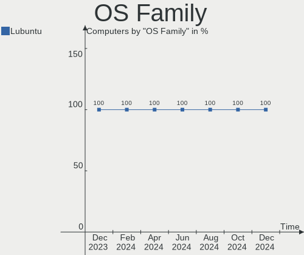
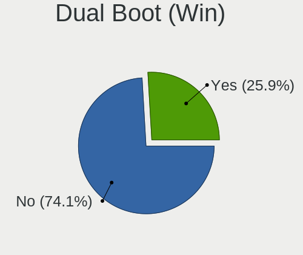
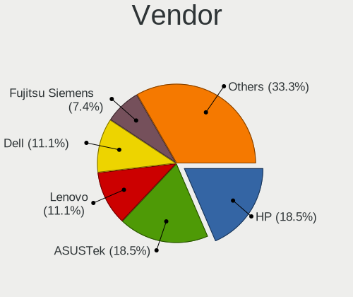
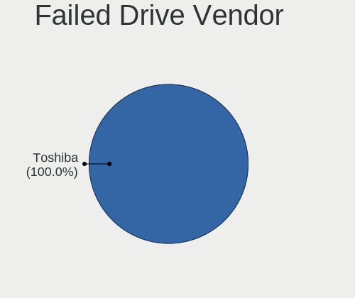
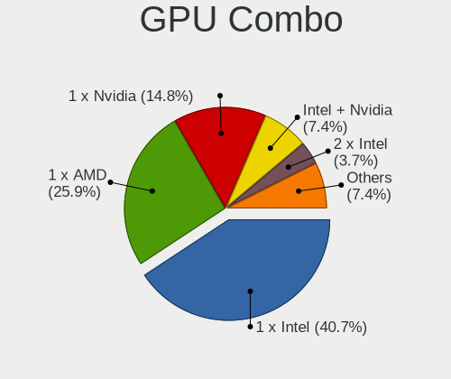
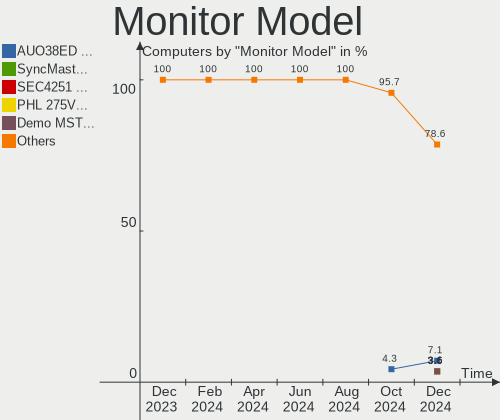

Lubuntu - Hardware Trends
-------------------------

A project to identify most popular hardware characteristics and track their change
over time based on data collected by Linux users at https://Linux-Hardware.org.

Anyone can contribute to this report by the [hw-probe](https://github.com/linuxhw/hw-probe) tool:

    sudo -E hw-probe -all -upload

This is a report for all computer types. See also reports for [desktops](/Dist/Lubuntu/Desktop/README.md) and [notebooks](/Dist/Lubuntu/Notebook/README.md).

This report is for one last month. Overall report since the beginning of time: [TestDays](https://github.com/linuxhw/TestDays)

Period: Oct, 2023.

Contents
--------

* [ System ](#system)
  - [ OS                       ](#os)
  - [ OS Family                ](#os-family)
  - [ Kernel                   ](#kernel)
  - [ Kernel Family            ](#kernel-family)
  - [ Kernel Major Ver.        ](#kernel-major-ver)
  - [ Arch                     ](#arch)
  - [ DE                       ](#de)
  - [ Display Server           ](#display-server)
  - [ Display Manager          ](#display-manager)
  - [ OS Lang                  ](#os-lang)
  - [ Boot Mode                ](#boot-mode)
  - [ Filesystem               ](#filesystem)
  - [ Part. scheme             ](#part-scheme)
  - [ Dual Boot with Linux/BSD ](#dual-boot-with-linuxbsd)
  - [ Dual Boot (Win)          ](#dual-boot-win)

* [ Board ](#board)
  - [ Vendor                   ](#vendor)
  - [ Model                    ](#model)
  - [ Model Family             ](#model-family)
  - [ MFG Year                 ](#mfg-year)
  - [ Form Factor              ](#form-factor)
  - [ Secure Boot              ](#secure-boot)
  - [ Coreboot                 ](#coreboot)
  - [ RAM Size                 ](#ram-size)
  - [ RAM Used                 ](#ram-used)
  - [ Total Drives             ](#total-drives)
  - [ Has CD-ROM               ](#has-cd-rom)
  - [ Has Ethernet             ](#has-ethernet)
  - [ Has WiFi                 ](#has-wifi)
  - [ Has Bluetooth            ](#has-bluetooth)

* [ Location ](#location)
  - [ Country                  ](#country)
  - [ City                     ](#city)

* [ Drives ](#drives)
  - [ Drive Vendor             ](#drive-vendor)
  - [ Drive Model              ](#drive-model)
  - [ HDD Vendor               ](#hdd-vendor)
  - [ SSD Vendor               ](#ssd-vendor)
  - [ Drive Kind               ](#drive-kind)
  - [ Drive Connector          ](#drive-connector)
  - [ Drive Size               ](#drive-size)
  - [ Space Total              ](#space-total)
  - [ Space Used               ](#space-used)
  - [ Malfunc. Drives          ](#malfunc-drives)
  - [ Malfunc. Drive Vendor    ](#malfunc-drive-vendor)
  - [ Malfunc. HDD Vendor      ](#malfunc-hdd-vendor)
  - [ Malfunc. Drive Kind      ](#malfunc-drive-kind)
  - [ Failed Drives            ](#failed-drives)
  - [ Failed Drive Vendor      ](#failed-drive-vendor)
  - [ Drive Status             ](#drive-status)

* [ Storage controller ](#storage-controller)
  - [ Storage Vendor           ](#storage-vendor)
  - [ Storage Model            ](#storage-model)
  - [ Storage Kind             ](#storage-kind)

* [ Processor ](#processor)
  - [ CPU Vendor               ](#cpu-vendor)
  - [ CPU Model                ](#cpu-model)
  - [ CPU Model Family         ](#cpu-model-family)
  - [ CPU Cores                ](#cpu-cores)
  - [ CPU Sockets              ](#cpu-sockets)
  - [ CPU Threads              ](#cpu-threads)
  - [ CPU Op-Modes             ](#cpu-op-modes)
  - [ CPU Microcode            ](#cpu-microcode)
  - [ CPU Microarch            ](#cpu-microarch)

* [ Graphics ](#graphics)
  - [ GPU Vendor               ](#gpu-vendor)
  - [ GPU Model                ](#gpu-model)
  - [ GPU Combo                ](#gpu-combo)
  - [ GPU Driver               ](#gpu-driver)
  - [ GPU Memory               ](#gpu-memory)

* [ Monitor ](#monitor)
  - [ Monitor Vendor           ](#monitor-vendor)
  - [ Monitor Model            ](#monitor-model)
  - [ Monitor Resolution       ](#monitor-resolution)
  - [ Monitor Diagonal         ](#monitor-diagonal)
  - [ Monitor Width            ](#monitor-width)
  - [ Aspect Ratio             ](#aspect-ratio)
  - [ Monitor Area             ](#monitor-area)
  - [ Pixel Density            ](#pixel-density)
  - [ Multiple Monitors        ](#multiple-monitors)

* [ Network ](#network)
  - [ Net Controller Vendor    ](#net-controller-vendor)
  - [ Net Controller Model     ](#net-controller-model)
  - [ Wireless Vendor          ](#wireless-vendor)
  - [ Wireless Model           ](#wireless-model)
  - [ Ethernet Vendor          ](#ethernet-vendor)
  - [ Ethernet Model           ](#ethernet-model)
  - [ Net Controller Kind      ](#net-controller-kind)
  - [ Used Controller          ](#used-controller)
  - [ NICs                     ](#nics)
  - [ IPv6                     ](#ipv6)

* [ Bluetooth ](#bluetooth)
  - [ Bluetooth Vendor         ](#bluetooth-vendor)
  - [ Bluetooth Model          ](#bluetooth-model)

* [ Sound ](#sound)
  - [ Sound Vendor             ](#sound-vendor)
  - [ Sound Model              ](#sound-model)

* [ Memory ](#memory)
  - [ Memory Vendor            ](#memory-vendor)
  - [ Memory Model             ](#memory-model)
  - [ Memory Kind              ](#memory-kind)
  - [ Memory Form Factor       ](#memory-form-factor)
  - [ Memory Size              ](#memory-size)
  - [ Memory Speed             ](#memory-speed)

* [ Printers & scanners ](#printers--scanners)
  - [ Printer Vendor           ](#printer-vendor)
  - [ Printer Model            ](#printer-model)
  - [ Scanner Vendor           ](#scanner-vendor)
  - [ Scanner Model            ](#scanner-model)

* [ Camera ](#camera)
  - [ Camera Vendor            ](#camera-vendor)
  - [ Camera Model             ](#camera-model)

* [ Security ](#security)
  - [ Fingerprint Vendor       ](#fingerprint-vendor)
  - [ Fingerprint Model        ](#fingerprint-model)
  - [ Chipcard Vendor          ](#chipcard-vendor)
  - [ Chipcard Model           ](#chipcard-model)

* [ Unsupported ](#unsupported)
  - [ Unsupported Devices      ](#unsupported-devices)
  - [ Unsupported Device Types ](#unsupported-device-types)

System
------

OS
--

Installed operating systems

| Name          | Computers | Percent |
|---------------|-----------|---------|
| Lubuntu 22.04 | 25        | 67.57%  |
| Lubuntu 23.10 | 4         | 10.81%  |
| Lubuntu 23.04 | 4         | 10.81%  |
| Lubuntu 20.04 | 2         | 5.41%   |
| Lubuntu 21.10 | 1         | 2.7%    |
| Lubuntu 18.04 | 1         | 2.7%    |

OS Family
---------

OS without a version

| Name    | Computers | Percent |
|---------|-----------|---------|
| Lubuntu | 37        | 100%    |

Kernel
------

Version of the Linux kernel

| Version             | Computers | Percent |
|---------------------|-----------|---------|
| 6.2.0-34-generic    | 11        | 29.73%  |
| 6.2.0-35-generic    | 8         | 21.62%  |
| 6.5.0-9-generic     | 2         | 5.41%   |
| 6.2.0-33-generic    | 2         | 5.41%   |
| 6.2.0-26-generic    | 2         | 5.41%   |
| 5.4.0-165-generic   | 2         | 5.41%   |
| 5.15.0-86-generic   | 2         | 5.41%   |
| 6.5.8-custom        | 1         | 2.7%    |
| 6.5.0-7-generic     | 1         | 2.7%    |
| 6.5.0-5-generic     | 1         | 2.7%    |
| 6.1.46-rt13-tkg-r2b | 1         | 2.7%    |
| 5.4.0-150-generic   | 1         | 2.7%    |
| 5.19.0-32-generic   | 1         | 2.7%    |
| 5.15.0-43-generic   | 1         | 2.7%    |
| 5.13.0-52-generic   | 1         | 2.7%    |

Kernel Family
-------------

Linux kernel without a distro release

| Version | Computers | Percent |
|---------|-----------|---------|
| 6.2.0   | 23        | 62.16%  |
| 6.5.0   | 4         | 10.81%  |
| 5.4.0   | 3         | 8.11%   |
| 5.15.0  | 3         | 8.11%   |
| 6.5.8   | 1         | 2.7%    |
| 6.1.46  | 1         | 2.7%    |
| 5.19.0  | 1         | 2.7%    |
| 5.13.0  | 1         | 2.7%    |

Kernel Major Ver.
-----------------

Linux kernel major version

| Version | Computers | Percent |
|---------|-----------|---------|
| 6.2     | 23        | 62.16%  |
| 6.5     | 5         | 13.51%  |
| 5.4     | 3         | 8.11%   |
| 5.15    | 3         | 8.11%   |
| 6.1     | 1         | 2.7%    |
| 5.19    | 1         | 2.7%    |
| 5.13    | 1         | 2.7%    |

Arch
----

OS architecture (x86_64, i586, etc.)

| Name   | Computers | Percent |
|--------|-----------|---------|
| x86_64 | 36        | 97.3%   |
| i686   | 1         | 2.7%    |

DE
--

Desktop Environment

| Name  | Computers | Percent |
|-------|-----------|---------|
| LXQt  | 34        | 91.89%  |
| LXDE  | 2         | 5.41%   |
| GNOME | 1         | 2.7%    |

Display Server
--------------

X11 or Wayland

| Name | Computers | Percent |
|------|-----------|---------|
| X11  | 37        | 100%    |

Display Manager
---------------

SDDM, LightDM, etc.

| Name    | Computers | Percent |
|---------|-----------|---------|
| SDDM    | 32        | 86.49%  |
| LightDM | 2         | 5.41%   |
| Unknown | 2         | 5.41%   |
| GDM3    | 1         | 2.7%    |

OS Lang
-------

Language

| Lang  | Computers | Percent |
|-------|-----------|---------|
| en_US | 9         | 24.32%  |
| it_IT | 5         | 13.51%  |
| fr_FR | 5         | 13.51%  |
| es_CR | 3         | 8.11%   |
| C     | 3         | 8.11%   |
| fi_FI | 2         | 5.41%   |
| en_GB | 2         | 5.41%   |
| vi_VN | 1         | 2.7%    |
| tr_TR | 1         | 2.7%    |
| ru_RU | 1         | 2.7%    |
| es_MX | 1         | 2.7%    |
| es_AR | 1         | 2.7%    |
| en_IN | 1         | 2.7%    |
| de_DE | 1         | 2.7%    |
| ca_ES | 1         | 2.7%    |

Boot Mode
---------

EFI or BIOS

| Mode | Computers | Percent |
|------|-----------|---------|
| BIOS | 19        | 51.35%  |
| EFI  | 18        | 48.65%  |

Filesystem
----------

Type of filesystem

| Type    | Computers | Percent |
|---------|-----------|---------|
| Ext4    | 23        | 62.16%  |
| Tmpfs   | 10        | 27.03%  |
| Overlay | 3         | 8.11%   |
| Btrfs   | 1         | 2.7%    |

Part. scheme
------------

Scheme of partitioning

| Type    | Computers | Percent |
|---------|-----------|---------|
| GPT     | 27        | 72.97%  |
| MBR     | 7         | 18.92%  |
| Unknown | 3         | 8.11%   |

Dual Boot with Linux/BSD
------------------------

Hosting more than one Linux/BSD

| Dual boot | Computers | Percent |
|-----------|-----------|---------|
| No        | 36        | 97.3%   |
| Yes       | 1         | 2.7%    |

Dual Boot (Win)
---------------

Hosting Linux and Windows

| Dual boot | Computers | Percent |
|-----------|-----------|---------|
| No        | 24        | 64.86%  |
| Yes       | 13        | 35.14%  |

Board
-----

Vendor
------

Motherboard manufacturer

| Name                | Computers | Percent |
|---------------------|-----------|---------|
| Hewlett-Packard     | 5         | 13.51%  |
| Acer                | 5         | 13.51%  |
| ASUSTek Computer    | 4         | 10.81%  |
| Dell                | 3         | 8.11%   |
| Lenovo              | 2         | 5.41%   |
| Google              | 2         | 5.41%   |
| Apple               | 2         | 5.41%   |
| ZOTAC               | 1         | 2.7%    |
| Thomson             | 1         | 2.7%    |
| Positivo            | 1         | 2.7%    |
| Panasonic           | 1         | 2.7%    |
| MSI                 | 1         | 2.7%    |
| Mediacom            | 1         | 2.7%    |
| Intel               | 1         | 2.7%    |
| Insyde              | 1         | 2.7%    |
| Gigabyte Technology | 1         | 2.7%    |
| Getac               | 1         | 2.7%    |
| Dixonsxp            | 1         | 2.7%    |
| BLANK               | 1         | 2.7%    |
| ASRock              | 1         | 2.7%    |
| AMI                 | 1         | 2.7%    |

Model
-----

Motherboard model

| Name                                | Computers | Percent |
|-------------------------------------|-----------|---------|
| Acer Aspire A314-23P                | 2         | 5.41%   |
| ZOTAC NM10                          | 1         | 2.7%    |
| Thomson NEO14-4W64                  | 1         | 2.7%    |
| Positivo AT300b                     | 1         | 2.7%    |
| Panasonic CF-F9KWPZFFE              | 1         | 2.7%    |
| MSI MS-7C56                         | 1         | 2.7%    |
| Mediacom WinPad 11,6 FullHD- WPU11  | 1         | 2.7%    |
| Lenovo ThinkPad Yoga 11e 20D90027US | 1         | 2.7%    |
| Lenovo IdeaPad 110-15IBR 80T7       | 1         | 2.7%    |
| Intel H61                           | 1         | 2.7%    |
| Insyde Braswell                     | 1         | 2.7%    |
| HP Notebook                         | 1         | 2.7%    |
| HP Laptop 15-da0xxx                 | 1         | 2.7%    |
| HP Laptop 14-dq0xxx                 | 1         | 2.7%    |
| HP EliteBook 820 G3                 | 1         | 2.7%    |
| HP Compaq Presario CQ40             | 1         | 2.7%    |
| Google Sasuke                       | 1         | 2.7%    |
| Google Careena                      | 1         | 2.7%    |
| Gigabyte B75M-D3H                   | 1         | 2.7%    |
| Getac X500G3                        | 1         | 2.7%    |
| Dell XPS 9315                       | 1         | 2.7%    |
| Dell OptiPlex 7010                  | 1         | 2.7%    |
| Dell Latitude E5430 non-vPro        | 1         | 2.7%    |
| BLANK Intel powered classmate PC    | 1         | 2.7%    |
| ASUS PRIME B450M-A                  | 1         | 2.7%    |
| ASUS P7P55-M                        | 1         | 2.7%    |
| ASUS M5A97 LE R2.0                  | 1         | 2.7%    |
| ASUS K50IJ                          | 1         | 2.7%    |
| ASRock Q1900B-ITX                   | 1         | 2.7%    |
| Apple MacBookPro8,1                 | 1         | 2.7%    |
| Apple iMac7,1                       | 1         | 2.7%    |
| AMI HT C14M                         | 1         | 2.7%    |
| Acer Veriton N4660G                 | 1         | 2.7%    |
| Acer Aspire A315-21                 | 1         | 2.7%    |
| Acer Aspire 9300                    | 1         | 2.7%    |
| Unknown                             | 1         | 2.7%    |

Model Family
------------

Motherboard model prefix

| Name                   | Computers | Percent |
|------------------------|-----------|---------|
| Acer Aspire            | 4         | 10.81%  |
| HP Laptop              | 2         | 5.41%   |
| ZOTAC NM10             | 1         | 2.7%    |
| Thomson NEO14-4W64     | 1         | 2.7%    |
| Positivo AT300b        | 1         | 2.7%    |
| Panasonic CF-F9KWPZFFE | 1         | 2.7%    |
| MSI MS-7C56            | 1         | 2.7%    |
| Mediacom WinPad        | 1         | 2.7%    |
| Lenovo ThinkPad        | 1         | 2.7%    |
| Lenovo IdeaPad         | 1         | 2.7%    |
| Intel H61              | 1         | 2.7%    |
| Insyde Braswell        | 1         | 2.7%    |
| HP Notebook            | 1         | 2.7%    |
| HP EliteBook           | 1         | 2.7%    |
| HP Compaq              | 1         | 2.7%    |
| Google Sasuke          | 1         | 2.7%    |
| Google Careena         | 1         | 2.7%    |
| Gigabyte B75M-D3H      | 1         | 2.7%    |
| Getac X500G3           | 1         | 2.7%    |
| Dell XPS               | 1         | 2.7%    |
| Dell OptiPlex          | 1         | 2.7%    |
| Dell Latitude          | 1         | 2.7%    |
| BLANK Intel            | 1         | 2.7%    |
| ASUS PRIME             | 1         | 2.7%    |
| ASUS P7P55-M           | 1         | 2.7%    |
| ASUS M5A97             | 1         | 2.7%    |
| ASUS K50IJ             | 1         | 2.7%    |
| ASRock Q1900B-ITX      | 1         | 2.7%    |
| Apple MacBookPro8      | 1         | 2.7%    |
| Apple iMac7            | 1         | 2.7%    |
| AMI HT                 | 1         | 2.7%    |
| Acer Veriton           | 1         | 2.7%    |
| Unknown                | 1         | 2.7%    |

MFG Year
--------

Motherboard manufacture year

| Year | Computers | Percent |
|------|-----------|---------|
| 2022 | 4         | 10.81%  |
| 2017 | 4         | 10.81%  |
| 2016 | 4         | 10.81%  |
| 2018 | 3         | 8.11%   |
| 2012 | 3         | 8.11%   |
| 2009 | 3         | 8.11%   |
| 2023 | 2         | 5.41%   |
| 2019 | 2         | 5.41%   |
| 2014 | 2         | 5.41%   |
| 2010 | 2         | 5.41%   |
| 2008 | 2         | 5.41%   |
| 2020 | 1         | 2.7%    |
| 2015 | 1         | 2.7%    |
| 2013 | 1         | 2.7%    |
| 2011 | 1         | 2.7%    |
| 2007 | 1         | 2.7%    |
| 2006 | 1         | 2.7%    |

Form Factor
-----------

Physical design of the computer

| Name       | Computers | Percent |
|------------|-----------|---------|
| Notebook   | 25        | 67.57%  |
| Desktop    | 10        | 27.03%  |
| Mini pc    | 1         | 2.7%    |
| All in one | 1         | 2.7%    |

Secure Boot
-----------

Enabled or disabled

| State    | Computers | Percent |
|----------|-----------|---------|
| Disabled | 31        | 83.78%  |
| Enabled  | 6         | 16.22%  |

Coreboot
--------

Have coreboot on board

| Used | Computers | Percent |
|------|-----------|---------|
| No   | 35        | 94.59%  |
| Yes  | 2         | 5.41%   |

RAM Size
--------

Total RAM memory

| Size in GB | Computers | Percent |
|------------|-----------|---------|
| 3.01-4.0   | 15        | 40.54%  |
| 4.01-8.0   | 7         | 18.92%  |
| 8.01-16.0  | 4         | 10.81%  |
| 2.01-3.0   | 3         | 8.11%   |
| 16.01-24.0 | 3         | 8.11%   |
| 1.01-2.0   | 3         | 8.11%   |
| 32.01-64.0 | 1         | 2.7%    |
| 0.51-1.0   | 1         | 2.7%    |

RAM Used
--------

Used RAM memory

| Used GB  | Computers | Percent |
|----------|-----------|---------|
| 1.01-2.0 | 18        | 48.65%  |
| 0.51-1.0 | 8         | 21.62%  |
| 2.01-3.0 | 7         | 18.92%  |
| 4.01-8.0 | 2         | 5.41%   |
| 3.01-4.0 | 1         | 2.7%    |
| 0.01-0.5 | 1         | 2.7%    |

Total Drives
------------

Number of drives on board

| Drives | Computers | Percent |
|--------|-----------|---------|
| 1      | 25        | 67.57%  |
| 2      | 9         | 24.32%  |
| 3      | 2         | 5.41%   |
| 4      | 1         | 2.7%    |

Has CD-ROM
----------

Has CD-ROM on board

| Presented | Computers | Percent |
|-----------|-----------|---------|
| No        | 23        | 62.16%  |
| Yes       | 14        | 37.84%  |

Has Ethernet
------------

Has Ethernet on board

| Presented | Computers | Percent |
|-----------|-----------|---------|
| Yes       | 29        | 78.38%  |
| No        | 8         | 21.62%  |

Has WiFi
--------

Has WiFi module

| Presented | Computers | Percent |
|-----------|-----------|---------|
| Yes       | 29        | 78.38%  |
| No        | 8         | 21.62%  |

Has Bluetooth
-------------

Has Bluetooth module

| Presented | Computers | Percent |
|-----------|-----------|---------|
| Yes       | 19        | 51.35%  |
| No        | 18        | 48.65%  |

Location
--------

Country
-------

Geographic location (country)

| Country         | Computers | Percent |
|-----------------|-----------|---------|
| USA             | 6         | 16.22%  |
| Italy           | 5         | 13.51%  |
| France          | 5         | 13.51%  |
| Costa Rica      | 3         | 8.11%   |
| Russia          | 2         | 5.41%   |
| India           | 2         | 5.41%   |
| Finland         | 2         | 5.41%   |
| Vietnam         | 1         | 2.7%    |
| UK              | 1         | 2.7%    |
| Turkey          | 1         | 2.7%    |
| Sweden          | 1         | 2.7%    |
| Spain           | 1         | 2.7%    |
| Poland          | 1         | 2.7%    |
| Peru            | 1         | 2.7%    |
| North Macedonia | 1         | 2.7%    |
| Malaysia        | 1         | 2.7%    |
| Germany         | 1         | 2.7%    |
| Brazil          | 1         | 2.7%    |
| Argentina       | 1         | 2.7%    |

City
----

Geographic location (city)

| City                   | Computers | Percent |
|------------------------|-----------|---------|
| Grecia                 | 3         | 8.11%   |
| Lyon                   | 2         | 5.41%   |
| Brighton               | 2         | 5.41%   |
| Yaroslavl              | 1         | 2.7%    |
| Villingen-Schwenningen | 1         | 2.7%    |
| Tarapoto               | 1         | 2.7%    |
| Szczecin               | 1         | 2.7%    |
| Sigtuna                | 1         | 2.7%    |
| Sao José dos Campos   | 1         | 2.7%    |
| Santa Eugènia         | 1         | 2.7%    |
| San Nicola la Strada   | 1         | 2.7%    |
| Poitiers               | 1         | 2.7%    |
| Pianoro                | 1         | 2.7%    |
| Phoenix                | 1         | 2.7%    |
| Oak Park               | 1         | 2.7%    |
| Mumbai                 | 1         | 2.7%    |
| Moscow                 | 1         | 2.7%    |
| Milan                  | 1         | 2.7%    |
| Macerata               | 1         | 2.7%    |
| Lahti                  | 1         | 2.7%    |
| Kuala Lumpur           | 1         | 2.7%    |
| Houston                | 1         | 2.7%    |
| Hondouville            | 1         | 2.7%    |
| Ho Chi Minh City       | 1         | 2.7%    |
| Helsinki               | 1         | 2.7%    |
| Dundee                 | 1         | 2.7%    |
| Castelfranco Emilia    | 1         | 2.7%    |
| Buenos Aires           | 1         | 2.7%    |
| Bengaluru              | 1         | 2.7%    |
| Atlanta                | 1         | 2.7%    |
| Ankara                 | 1         | 2.7%    |
| Anguerny               | 1         | 2.7%    |
| Alimedska Maala        | 1         | 2.7%    |

Drives
------

Drive Vendor
------------

Hard drive vendors

| Vendor              | Computers | Drives | Percent |
|---------------------|-----------|--------|---------|
| Unknown             | 7         | 10     | 14.89%  |
| Samsung Electronics | 7         | 7      | 14.89%  |
| WDC                 | 5         | 6      | 10.64%  |
| Kingston            | 5         | 6      | 10.64%  |
| Seagate             | 4         | 4      | 8.51%   |
| SanDisk             | 4         | 4      | 8.51%   |
| Micron Technology   | 3         | 3      | 6.38%   |
| Hitachi             | 3         | 3      | 6.38%   |
| Unknown             | 3         | 3      | 6.38%   |
| Toshiba             | 1         | 1      | 2.13%   |
| Kingmax             | 1         | 1      | 2.13%   |
| KINGBANK            | 1         | 1      | 2.13%   |
| Intel               | 1         | 1      | 2.13%   |
| Dogfish             | 1         | 1      | 2.13%   |
| Crucial             | 1         | 1      | 2.13%   |

Drive Model
-----------

Hard drive models

| Model                                | Computers | Percent |
|--------------------------------------|-----------|---------|
| Unknown                              | 3         | 5.77%   |
| Unknown MMC Card  32GB               | 2         | 3.85%   |
| Micron 2450_MTFDKBA512TFK 512GB      | 2         | 3.85%   |
| Kingston SA400S37480G 480GB SSD      | 2         | 3.85%   |
| WDC WDS100T2B0A-00SM50 1TB SSD       | 1         | 1.92%   |
| WDC WD5000LPSX-22A6WT0 500GB         | 1         | 1.92%   |
| WDC WD5000LPCX-24VHAT0 500GB         | 1         | 1.92%   |
| WDC WD40EZRX-00SPEB0 4TB             | 1         | 1.92%   |
| WDC WD3200BEVT-60ZCT1 320GB          | 1         | 1.92%   |
| WDC WD20EFRX-68EUZN0 2TB             | 1         | 1.92%   |
| Unknown USD00  32GB                  | 1         | 1.92%   |
| Unknown SL16G  16GB                  | 1         | 1.92%   |
| Unknown NCard  32GB                  | 1         | 1.92%   |
| Unknown MMC Card  7GB                | 1         | 1.92%   |
| Unknown MMC Card  64GB               | 1         | 1.92%   |
| Unknown M0S002  64GB                 | 1         | 1.92%   |
| Unknown DA4032  32GB                 | 1         | 1.92%   |
| Unknown BJTD4R  32GB                 | 1         | 1.92%   |
| Toshiba HDWD110 1TB                  | 1         | 1.92%   |
| Seagate ST9500325AS 500GB            | 1         | 1.92%   |
| Seagate ST320LT007-9ZV142 320GB      | 1         | 1.92%   |
| Seagate ST2000VN004-2E4164 2TB       | 1         | 1.92%   |
| Seagate M3 Portable 1TB              | 1         | 1.92%   |
| SanDisk SSD PLUS 240GB               | 1         | 1.92%   |
| SanDisk SDSSDH3500G 500GB            | 1         | 1.92%   |
| SanDisk pSSD 8GB                     | 1         | 1.92%   |
| SanDisk NVMe SSD Drive 2TB           | 1         | 1.92%   |
| Samsung SSD 970 EVO Plus 250GB       | 1         | 1.92%   |
| Samsung SSD 860 EVO M.2 250GB        | 1         | 1.92%   |
| Samsung SSD 850 PRO 256GB            | 1         | 1.92%   |
| Samsung SSD 830 Series 512GB         | 1         | 1.92%   |
| Samsung SSD 830 Series 256GB         | 1         | 1.92%   |
| Samsung MZ7LN128HCHP-000L1 128GB SSD | 1         | 1.92%   |
| Samsung HM121HI 120GB                | 1         | 1.92%   |
| Micron 3460 NVMe 512GB               | 1         | 1.92%   |
| Kingston SUV400S37240G 240GB SSD     | 1         | 1.92%   |
| Kingston SFYRD2000G 2TB              | 1         | 1.92%   |
| Kingston SA400S37960G 960GB SSD      | 1         | 1.92%   |
| Kingston SA400S37240G 240GB SSD      | 1         | 1.92%   |
| Kingmax SSD 120GB                    | 1         | 1.92%   |

HDD Vendor
----------

Hard disk drive vendors

| Vendor              | Computers | Drives | Percent |
|---------------------|-----------|--------|---------|
| WDC                 | 5         | 5      | 38.46%  |
| Seagate             | 3         | 3      | 23.08%  |
| Hitachi             | 3         | 3      | 23.08%  |
| Toshiba             | 1         | 1      | 7.69%   |
| Samsung Electronics | 1         | 1      | 7.69%   |

SSD Vendor
----------

Solid state drive vendors

| Vendor              | Computers | Drives | Percent |
|---------------------|-----------|--------|---------|
| Samsung Electronics | 5         | 5      | 27.78%  |
| Kingston            | 4         | 5      | 22.22%  |
| SanDisk             | 3         | 3      | 16.67%  |
| WDC                 | 1         | 1      | 5.56%   |
| Kingmax             | 1         | 1      | 5.56%   |
| KINGBANK            | 1         | 1      | 5.56%   |
| Intel               | 1         | 1      | 5.56%   |
| Dogfish             | 1         | 1      | 5.56%   |
| Crucial             | 1         | 1      | 5.56%   |

Drive Kind
----------

HDD or SSD

| Kind    | Computers | Drives | Percent |
|---------|-----------|--------|---------|
| SSD     | 15        | 19     | 36.59%  |
| HDD     | 12        | 13     | 29.27%  |
| MMC     | 8         | 13     | 19.51%  |
| NVMe    | 5         | 6      | 12.2%   |
| Unknown | 1         | 1      | 2.44%   |

Drive Connector
---------------

SATA, SAS, NVMe, etc.

| Type | Computers | Drives | Percent |
|------|-----------|--------|---------|
| SATA | 24        | 32     | 63.16%  |
| MMC  | 8         | 13     | 21.05%  |
| NVMe | 5         | 6      | 13.16%  |
| SAS  | 1         | 1      | 2.63%   |

Drive Size
----------

Size of hard drive

| Size in TB | Computers | Drives | Percent |
|------------|-----------|--------|---------|
| 0.01-0.5   | 21        | 24     | 80.77%  |
| 0.51-1.0   | 3         | 5      | 11.54%  |
| 3.01-4.0   | 1         | 1      | 3.85%   |
| 1.01-2.0   | 1         | 2      | 3.85%   |

Space Total
-----------

Amount of disk space available on the file system

| Size in GB     | Computers | Percent |
|----------------|-----------|---------|
| 101-250        | 11        | 29.73%  |
| 251-500        | 10        | 27.03%  |
| 21-50          | 4         | 10.81%  |
| 1-20           | 4         | 10.81%  |
| More than 3000 | 3         | 8.11%   |
| 51-100         | 3         | 8.11%   |
| 1001-2000      | 1         | 2.7%    |
| 501-1000       | 1         | 2.7%    |

Space Used
----------

Amount of used disk space

| Used GB        | Computers | Percent |
|----------------|-----------|---------|
| 1-20           | 19        | 51.35%  |
| 21-50          | 12        | 32.43%  |
| 501-1000       | 2         | 5.41%   |
| More than 3000 | 1         | 2.7%    |
| 251-500        | 1         | 2.7%    |
| 101-250        | 1         | 2.7%    |
| 51-100         | 1         | 2.7%    |

Malfunc. Drives
---------------

Drive models with a malfunction

| Model                    | Computers | Drives | Percent |
|--------------------------|-----------|--------|---------|
| WDC WD20EFRX-68EUZN0 2TB | 1         | 1      | 50%     |
| Kingmax SSD 120GB        | 1         | 1      | 50%     |

Malfunc. Drive Vendor
---------------------

Vendors of faulty drives

| Vendor  | Computers | Drives | Percent |
|---------|-----------|--------|---------|
| WDC     | 1         | 1      | 50%     |
| Kingmax | 1         | 1      | 50%     |

Malfunc. HDD Vendor
-------------------

Vendors of faulty HDD drives

| Vendor | Computers | Drives | Percent |
|--------|-----------|--------|---------|
| WDC    | 1         | 1      | 100%    |

Malfunc. Drive Kind
-------------------

Kinds of faulty drives

| Kind | Computers | Drives | Percent |
|------|-----------|--------|---------|
| SSD  | 1         | 1      | 50%     |
| HDD  | 1         | 1      | 50%     |

Failed Drives
-------------

Failed drive models

| Model               | Computers | Drives | Percent |
|---------------------|-----------|--------|---------|
| Toshiba HDWD110 1TB | 1         | 1      | 100%    |

Failed Drive Vendor
-------------------

Failed drive vendors

| Vendor  | Computers | Drives | Percent |
|---------|-----------|--------|---------|
| Toshiba | 1         | 1      | 100%    |

Drive Status
------------

Number of failed and malfunc. drives

| Status   | Computers | Drives | Percent |
|----------|-----------|--------|---------|
| Works    | 19        | 23     | 47.5%   |
| Detected | 18        | 26     | 45%     |
| Malfunc  | 2         | 2      | 5%      |
| Failed   | 1         | 1      | 2.5%    |

Storage controller
------------------

Storage Vendor
--------------

Storage controller vendors

| Vendor                      | Computers | Percent |
|-----------------------------|-----------|---------|
| Intel                       | 23        | 63.89%  |
| AMD                         | 4         | 11.11%  |
| Micron Technology           | 3         | 8.33%   |
| VIA Technologies            | 1         | 2.78%   |
| Sandisk                     | 1         | 2.78%   |
| Samsung Electronics         | 1         | 2.78%   |
| Nvidia                      | 1         | 2.78%   |
| Kingston Technology Company | 1         | 2.78%   |
| ASMedia Technology          | 1         | 2.78%   |

Storage Model
-------------

Storage controller models

| Model                                                                            | Computers | Percent |
|----------------------------------------------------------------------------------|-----------|---------|
| Micron 2450 NVMe SSD [HendrixV] (DRAM-less)                                      | 2         | 4.76%   |
| Intel Atom/Celeron/Pentium Processor x5-E8000/J3xxx/N3xxx Series SATA Controller | 2         | 4.76%   |
| Intel Atom Processor E3800 Series SATA AHCI Controller                           | 2         | 4.76%   |
| Intel 82801IBM/IEM (ICH9M/ICH9M-E) 4 port SATA Controller [AHCI mode]            | 2         | 4.76%   |
| Intel 7 Series/C210 Series Chipset Family 4-port SATA Controller [IDE mode]      | 2         | 4.76%   |
| Intel 7 Series/C210 Series Chipset Family 2-port SATA Controller [IDE mode]      | 2         | 4.76%   |
| AMD FCH SATA Controller [AHCI mode]                                              | 2         | 4.76%   |
| VIA VT6415 PATA IDE Host Controller                                              | 1         | 2.38%   |
| Sandisk WD Black SN850X NVMe SSD                                                 | 1         | 2.38%   |
| Samsung NVMe SSD Controller SM981/PM981/PM983                                    | 1         | 2.38%   |
| Nvidia MCP51 Serial ATA Controller                                               | 1         | 2.38%   |
| Nvidia MCP51 IDE                                                                 | 1         | 2.38%   |
| Micron 3460 NVMe SSD                                                             | 1         | 2.38%   |
| Kingston Company KC3000/FURY Renegade NVMe SSD E18                               | 1         | 2.38%   |
| Intel Volume Management Device NVMe RAID Controller                              | 1         | 2.38%   |
| Intel Sunrise Point-LP SATA Controller [AHCI mode]                               | 1         | 2.38%   |
| Intel NM10/ICH7 Family SATA Controller [AHCI mode]                               | 1         | 2.38%   |
| Intel HM170/QM170 Chipset SATA Controller [AHCI Mode]                            | 1         | 2.38%   |
| Intel Celeron/Pentium Silver Processor SATA Controller                           | 1         | 2.38%   |
| Intel Celeron N3350/Pentium N4200/Atom E3900 Series SATA AHCI Controller         | 1         | 2.38%   |
| Intel Cannon Lake PCH SATA AHCI Controller                                       | 1         | 2.38%   |
| Intel 82801HM/HEM (ICH8M/ICH8M-E) SATA Controller [IDE mode]                     | 1         | 2.38%   |
| Intel 82801HM/HEM (ICH8M/ICH8M-E) SATA Controller [AHCI mode]                    | 1         | 2.38%   |
| Intel 82801HM/HEM (ICH8M/ICH8M-E) IDE Controller                                 | 1         | 2.38%   |
| Intel 82801G (ICH7 Family) IDE Controller                                        | 1         | 2.38%   |
| Intel 82801 Mobile SATA Controller [RAID mode]                                   | 1         | 2.38%   |
| Intel 6 Series/C200 Series Chipset Family 6 port Mobile SATA AHCI Controller     | 1         | 2.38%   |
| Intel 6 Series/C200 Series Chipset Family 6 port Desktop SATA AHCI Controller    | 1         | 2.38%   |
| Intel 5 Series/3400 Series Chipset 6 port SATA AHCI Controller                   | 1         | 2.38%   |
| Intel 5 Series/3400 Series Chipset 4 port SATA IDE Controller                    | 1         | 2.38%   |
| Intel 5 Series/3400 Series Chipset 2 port SATA IDE Controller                    | 1         | 2.38%   |
| ASMedia ASM1062 Serial ATA Controller                                            | 1         | 2.38%   |
| AMD SB7x0/SB8x0/SB9x0 SATA Controller [AHCI mode]                                | 1         | 2.38%   |
| AMD 500 Series Chipset SATA Controller                                           | 1         | 2.38%   |
| AMD 400 Series Chipset SATA Controller                                           | 1         | 2.38%   |

Storage Kind
------------

Kind of storage controller (IDE, SATA, NVMe, SAS, ...)

| Kind | Computers | Percent |
|------|-----------|---------|
| SATA | 20        | 58.82%  |
| IDE  | 7         | 20.59%  |
| NVMe | 5         | 14.71%  |
| RAID | 2         | 5.88%   |

Processor
---------

CPU Vendor
----------

Processor vendors

| Vendor | Computers | Percent |
|--------|-----------|---------|
| Intel  | 29        | 78.38%  |
| AMD    | 8         | 21.62%  |

CPU Model
---------

Processor models

| Model                                         | Computers | Percent |
|-----------------------------------------------|-----------|---------|
| Intel Pentium Dual-Core CPU T4200 @ 2.00GHz   | 2         | 5.41%   |
| Intel Celeron CPU N3060 @ 1.60GHz             | 2         | 5.41%   |
| Intel Atom x5-Z8350 CPU @ 1.44GHz             | 2         | 5.41%   |
| AMD Ryzen 5 7520U with Radeon Graphics        | 2         | 5.41%   |
| Intel Pentium Dual CPU T2310 @ 1.46GHz        | 1         | 2.7%    |
| Intel Core i5-7440EQ CPU @ 2.90GHz            | 1         | 2.7%    |
| Intel Core i5-6300U CPU @ 2.40GHz             | 1         | 2.7%    |
| Intel Core i5-3570 CPU @ 3.40GHz              | 1         | 2.7%    |
| Intel Core i5-3470 CPU @ 3.20GHz              | 1         | 2.7%    |
| Intel Core i5-3210M CPU @ 2.50GHz             | 1         | 2.7%    |
| Intel Core i5-2435M CPU @ 2.40GHz             | 1         | 2.7%    |
| Intel Core i5 CPU M 520 @ 2.40GHz             | 1         | 2.7%    |
| Intel Core i3-8100T CPU @ 3.10GHz             | 1         | 2.7%    |
| Intel Core i3-3220 CPU @ 3.30GHz              | 1         | 2.7%    |
| Intel Core i3 CPU 540 @ 3.07GHz               | 1         | 2.7%    |
| Intel Core 2 Duo CPU T7700 @ 2.40GHz          | 1         | 2.7%    |
| Intel Celeron N4500 @ 1.10GHz                 | 1         | 2.7%    |
| Intel Celeron N4120 CPU @ 1.10GHz             | 1         | 2.7%    |
| Intel Celeron N4000 CPU @ 1.10GHz             | 1         | 2.7%    |
| Intel Celeron CPU N3350 @ 1.10GHz             | 1         | 2.7%    |
| Intel Celeron CPU N2940 @ 1.83GHz             | 1         | 2.7%    |
| Intel Celeron CPU J1900 @ 1.99GHz             | 1         | 2.7%    |
| Intel Atom x5-Z8300 CPU @ 1.44GHz             | 1         | 2.7%    |
| Intel Atom x5-E8000 CPU @ 1.04GHz             | 1         | 2.7%    |
| Intel Atom CPU N270 @ 1.60GHz                 | 1         | 2.7%    |
| Intel Atom CPU D525 @ 1.80GHz                 | 1         | 2.7%    |
| Intel 12th Gen Core i7-1250U                  | 1         | 2.7%    |
| AMD Turion 64 X2 Mobile Technology TL-52      | 1         | 2.7%    |
| AMD Ryzen 7 2700 Eight-Core Processor         | 1         | 2.7%    |
| AMD Ryzen 5 5600X 6-Core Processor            | 1         | 2.7%    |
| AMD FX-8370 Eight-Core Processor              | 1         | 2.7%    |
| AMD A9-9420 RADEON R5, 5 COMPUTE CORES 2C+3G  | 1         | 2.7%    |
| AMD A4-9120C RADEON R4, 5 COMPUTE CORES 2C+3G | 1         | 2.7%    |

CPU Model Family
----------------

Processor model prefix

| Model                   | Computers | Percent |
|-------------------------|-----------|---------|
| Intel Celeron           | 8         | 21.62%  |
| Intel Core i5           | 7         | 18.92%  |
| Intel Atom              | 6         | 16.22%  |
| Intel Core i3           | 3         | 8.11%   |
| AMD Ryzen 5             | 3         | 8.11%   |
| Other                   | 2         | 5.41%   |
| Intel Pentium Dual-Core | 2         | 5.41%   |
| Intel Pentium Dual      | 1         | 2.7%    |
| Intel Core 2 Duo        | 1         | 2.7%    |
| AMD Turion 64 X2 Mobile | 1         | 2.7%    |
| AMD Ryzen 7             | 1         | 2.7%    |
| AMD FX                  | 1         | 2.7%    |
| AMD A4                  | 1         | 2.7%    |

CPU Cores
---------

Number of processor cores

| Number | Computers | Percent |
|--------|-----------|---------|
| 2      | 19        | 51.35%  |
| 4      | 14        | 37.84%  |
| 10     | 1         | 2.7%    |
| 8      | 1         | 2.7%    |
| 6      | 1         | 2.7%    |
| 1      | 1         | 2.7%    |

CPU Sockets
-----------

Number of sockets

| Number | Computers | Percent |
|--------|-----------|---------|
| 1      | 37        | 100%    |

CPU Threads
-----------

Threads per core (Hyper-Threading)

| Number | Computers | Percent |
|--------|-----------|---------|
| 1      | 23        | 62.16%  |
| 2      | 14        | 37.84%  |

CPU Op-Modes
------------

CPU Operation Modes (32-bit, 64-bit)

| Op mode        | Computers | Percent |
|----------------|-----------|---------|
| 32-bit, 64-bit | 36        | 97.3%   |
| 32-bit         | 1         | 2.7%    |

CPU Microcode
-------------

Microcode number

| Number     | Computers | Percent |
|------------|-----------|---------|
| Unknown    | 27        | 72.97%  |
| 0x08a00008 | 2         | 5.41%   |
| 0x906eb    | 1         | 2.7%    |
| 0x906a4    | 1         | 2.7%    |
| 0x306a9    | 1         | 2.7%    |
| 0x30679    | 1         | 2.7%    |
| 0x106c2    | 1         | 2.7%    |
| 0x0a20120a | 1         | 2.7%    |
| 0x0800820d | 1         | 2.7%    |
| 0x06006704 | 1         | 2.7%    |

CPU Microarch
-------------

Microarchitecture

| Name             | Computers | Percent |
|------------------|-----------|---------|
| Silvermont       | 8         | 21.62%  |
| IvyBridge        | 4         | 10.81%  |
| Westmere         | 2         | 5.41%   |
| Penryn           | 2         | 5.41%   |
| KabyLake         | 2         | 5.41%   |
| Goldmont plus    | 2         | 5.41%   |
| Excavator        | 2         | 5.41%   |
| Core             | 2         | 5.41%   |
| Bonnell          | 2         | 5.41%   |
| Unknown          | 2         | 5.41%   |
| Zen+             | 1         | 2.7%    |
| Zen 3            | 1         | 2.7%    |
| Tremont          | 1         | 2.7%    |
| Skylake          | 1         | 2.7%    |
| SandyBridge      | 1         | 2.7%    |
| Piledriver       | 1         | 2.7%    |
| K8 Hammer        | 1         | 2.7%    |
| Goldmont         | 1         | 2.7%    |
| Alderlake Hybrid | 1         | 2.7%    |

Graphics
--------

GPU Vendor
----------

Vendors of graphics cards

| Vendor | Computers | Percent |
|--------|-----------|---------|
| Intel  | 25        | 67.57%  |
| Nvidia | 6         | 16.22%  |
| AMD    | 6         | 16.22%  |

GPU Model
---------

Graphics card models

| Model                                                                                    | Computers | Percent |
|------------------------------------------------------------------------------------------|-----------|---------|
| Intel Atom/Celeron/Pentium Processor x5-E8000/J3xxx/N3xxx Integrated Graphics Controller | 6         | 15.38%  |
| Intel Xeon E3-1200 v2/3rd Gen Core processor Graphics Controller                         | 2         | 5.13%   |
| Intel Mobile 4 Series Chipset Integrated Graphics Controller                             | 2         | 5.13%   |
| Intel GeminiLake [UHD Graphics 600]                                                      | 2         | 5.13%   |
| Intel Atom Processor Z36xxx/Z37xxx Series Graphics & Display                             | 2         | 5.13%   |
| AMD Stoney [Radeon R2/R3/R4/R5 Graphics]                                                 | 2         | 5.13%   |
| AMD Mendocino                                                                            | 2         | 5.13%   |
| Nvidia TU117GLM [Quadro T400 Mobile]                                                     | 1         | 2.56%   |
| Nvidia TU116 [GeForce GTX 1660 SUPER]                                                    | 1         | 2.56%   |
| Nvidia GT218 [ION]                                                                       | 1         | 2.56%   |
| Nvidia GF106GL [Quadro 2000]                                                             | 1         | 2.56%   |
| Nvidia GA104 [GeForce RTX 3070]                                                          | 1         | 2.56%   |
| Nvidia C51 [GeForce Go 6100]                                                             | 1         | 2.56%   |
| Intel Skylake GT2 [HD Graphics 520]                                                      | 1         | 2.56%   |
| Intel Mobile GM965/GL960 Integrated Graphics Controller (secondary)                      | 1         | 2.56%   |
| Intel Mobile GM965/GL960 Integrated Graphics Controller (primary)                        | 1         | 2.56%   |
| Intel Mobile 945GSE Express Integrated Graphics Controller                               | 1         | 2.56%   |
| Intel Mobile 945GM/GMS/GME, 943/940GML Express Integrated Graphics Controller            | 1         | 2.56%   |
| Intel JasperLake [UHD Graphics]                                                          | 1         | 2.56%   |
| Intel HD Graphics 630                                                                    | 1         | 2.56%   |
| Intel HD Graphics 500                                                                    | 1         | 2.56%   |
| Intel Core Processor Integrated Graphics Controller                                      | 1         | 2.56%   |
| Intel CoffeeLake-S GT2 [UHD Graphics 630]                                                | 1         | 2.56%   |
| Intel Alder Lake-UP4 GT2 [Iris Xe Graphics]                                              | 1         | 2.56%   |
| Intel 3rd Gen Core processor Graphics Controller                                         | 1         | 2.56%   |
| Intel 2nd Generation Core Processor Family Integrated Graphics Controller                | 1         | 2.56%   |
| AMD RV710 [Radeon HD 4350/4550]                                                          | 1         | 2.56%   |
| AMD RV630/M76 [Mobility Radeon HD 2600 XT/2700]                                          | 1         | 2.56%   |

GPU Combo
---------

Combinations of graphics cards

| Name       | Computers | Percent |
|------------|-----------|---------|
| 1 x Intel  | 25        | 67.57%  |
| 1 x Nvidia | 6         | 16.22%  |
| 1 x AMD    | 6         | 16.22%  |

GPU Driver
----------

Free vs proprietary

| Driver      | Computers | Percent |
|-------------|-----------|---------|
| Free        | 34        | 91.89%  |
| Proprietary | 3         | 8.11%   |

GPU Memory
----------

Total video memory

| Size in GB | Computers | Percent |
|------------|-----------|---------|
| Unknown    | 28        | 75.68%  |
| 0.01-0.5   | 5         | 13.51%  |
| 7.01-8.0   | 1         | 2.7%    |
| 5.01-6.0   | 1         | 2.7%    |
| 1.01-2.0   | 1         | 2.7%    |
| 0.51-1.0   | 1         | 2.7%    |

Monitor
-------

Monitor Vendor
--------------

Monitor vendors

| Vendor               | Computers | Percent |
|----------------------|-----------|---------|
| Samsung Electronics  | 8         | 25.81%  |
| AU Optronics         | 7         | 22.58%  |
| BOE                  | 5         | 16.13%  |
| LG Display           | 2         | 6.45%   |
| Apple                | 2         | 6.45%   |
| Sharp                | 1         | 3.23%   |
| MSI                  | 1         | 3.23%   |
| LG Philips           | 1         | 3.23%   |
| InfoVision           | 1         | 3.23%   |
| CPT                  | 1         | 3.23%   |
| AOC                  | 1         | 3.23%   |
| Ancor Communications | 1         | 3.23%   |

Monitor Model
-------------

Monitor models

| Model                                                                 | Computers | Percent |
|-----------------------------------------------------------------------|-----------|---------|
| AU Optronics LCD Monitor AUO403D 1920x1080 309x173mm 13.9-inch        | 2         | 6.45%   |
| Sharp LCD Monitor SHP1548 1920x1200 288x180mm 13.4-inch               | 1         | 3.23%   |
| Samsung Electronics SyncMaster SAM05FF 1600x900 443x249mm 20.0-inch   | 1         | 3.23%   |
| Samsung Electronics SyncMaster SAM03EF 1680x1050 433x271mm 20.1-inch  | 1         | 3.23%   |
| Samsung Electronics LCD Monitor SEC5441 1366x768 309x174mm 14.0-inch  | 1         | 3.23%   |
| Samsung Electronics LCD Monitor SEC4442 1280x800 303x190mm 14.1-inch  | 1         | 3.23%   |
| Samsung Electronics LCD Monitor SDC4852 1366x768 344x194mm 15.5-inch  | 1         | 3.23%   |
| Samsung Electronics LCD Monitor SAM0A76 1280x720 949x543mm 43.0-inch  | 1         | 3.23%   |
| Samsung Electronics C32JG5x SAM0F54 2560x1440 697x392mm 31.5-inch     | 1         | 3.23%   |
| Samsung Electronics C24F390 SAM0D2D 1920x1080 521x293mm 23.5-inch     | 1         | 3.23%   |
| MSI MP242A MSI40A1 1920x1080 527x296mm 23.8-inch                      | 1         | 3.23%   |
| LG Philips LCD Monitor LPLA002 1440x900 367x230mm 17.1-inch           | 1         | 3.23%   |
| LG Display LCD Monitor LGD04FC 1366x768 344x194mm 15.5-inch           | 1         | 3.23%   |
| LG Display LCD Monitor LGD01E8 1366x768 344x194mm 15.5-inch           | 1         | 3.23%   |
| InfoVision LCD Monitor IVO03F4 1024x600 223x125mm 10.1-inch           | 1         | 3.23%   |
| CPT LCD Monitor CPT003C 1366x768 309x174mm 14.0-inch                  | 1         | 3.23%   |
| BOE LCD Monitor BOE09F3 1366x768 309x174mm 14.0-inch                  | 1         | 3.23%   |
| BOE LCD Monitor BOE092B 1366x768 309x174mm 14.0-inch                  | 1         | 3.23%   |
| BOE LCD Monitor BOE06D1 1366x768 309x173mm 13.9-inch                  | 1         | 3.23%   |
| BOE LCD Monitor BOE06A4 1366x768 344x194mm 15.5-inch                  | 1         | 3.23%   |
| BOE LCD Monitor BOE05E9 1366x768 256x144mm 11.6-inch                  | 1         | 3.23%   |
| AU Optronics LCD Monitor AUO38ED 1920x1080 344x193mm 15.5-inch        | 1         | 3.23%   |
| AU Optronics LCD Monitor AUO3514 1280x800 261x163mm 12.1-inch         | 1         | 3.23%   |
| AU Optronics LCD Monitor AUO2E3C 1366x768 309x173mm 13.9-inch         | 1         | 3.23%   |
| AU Optronics LCD Monitor AUO2D3C 1366x768 309x173mm 13.9-inch         | 1         | 3.23%   |
| AU Optronics LCD Monitor AUO226D 1920x1080 276x155mm 12.5-inch        | 1         | 3.23%   |
| Apple LCD Monitor APP9CC5 1280x800 286x179mm 13.3-inch                | 1         | 3.23%   |
| Apple Color LCD APP9C6C 1920x1200 520x320mm 24.0-inch                 | 1         | 3.23%   |
| AOC 24B1W1 AOC2401 1920x1080 527x296mm 23.8-inch                      | 1         | 3.23%   |
| Ancor Communications ASUS VP278 ACI27C8 1920x1080 598x336mm 27.0-inch | 1         | 3.23%   |

Monitor Resolution
------------------

Monitor screen resolution

| Resolution         | Computers | Percent |
|--------------------|-----------|---------|
| 1366x768 (WXGA)    | 11        | 35.48%  |
| 1920x1080 (FHD)    | 7         | 22.58%  |
| 1920x1200 (WUXGA)  | 3         | 9.68%   |
| 1280x800 (WXGA)    | 3         | 9.68%   |
| 2560x1440 (QHD)    | 2         | 6.45%   |
| 3840x2160 (4K)     | 1         | 3.23%   |
| 1680x1050 (WSXGA+) | 1         | 3.23%   |
| 1600x900 (HD+)     | 1         | 3.23%   |
| 1440x900 (WXGA+)   | 1         | 3.23%   |
| 1280x720 (HD)      | 1         | 3.23%   |

Monitor Diagonal
----------------

Diagonal size in inches

| Inches | Computers | Percent |
|--------|-----------|---------|
| 15     | 7         | 22.58%  |
| 14     | 6         | 19.35%  |
| 13     | 5         | 16.13%  |
| 24     | 2         | 6.45%   |
| 23     | 2         | 6.45%   |
| 20     | 2         | 6.45%   |
| 12     | 2         | 6.45%   |
| 43     | 1         | 3.23%   |
| 31     | 1         | 3.23%   |
| 27     | 1         | 3.23%   |
| 17     | 1         | 3.23%   |
| 11     | 1         | 3.23%   |

Monitor Width
-------------

Physical width

| Width in mm | Computers | Percent |
|-------------|-----------|---------|
| 301-350     | 15        | 48.39%  |
| 501-600     | 5         | 16.13%  |
| 201-300     | 5         | 16.13%  |
| 401-500     | 2         | 6.45%   |
| 351-400     | 2         | 6.45%   |
| 601-700     | 1         | 3.23%   |
| 901-1000    | 1         | 3.23%   |

Aspect Ratio
------------

Proportional relationship between the width and the height

| Ratio | Computers | Percent |
|-------|-----------|---------|
| 16/9  | 23        | 74.19%  |
| 16/10 | 8         | 25.81%  |

Monitor Area
------------

Area in inch²

| Area in inch² | Computers | Percent |
|----------------|-----------|---------|
| 81-90          | 10        | 32.26%  |
| 101-110        | 7         | 22.58%  |
| 61-70          | 2         | 6.45%   |
| 251-300        | 2         | 6.45%   |
| 201-250        | 2         | 6.45%   |
| 151-200        | 2         | 6.45%   |
| 71-80          | 1         | 3.23%   |
| 51-60          | 1         | 3.23%   |
| 351-500        | 1         | 3.23%   |
| 301-350        | 1         | 3.23%   |
| 131-140        | 1         | 3.23%   |
| 501-1000       | 1         | 3.23%   |

Pixel Density
-------------

Pixels per inch

| Density | Computers | Percent |
|---------|-----------|---------|
| 101-120 | 13        | 41.94%  |
| 51-100  | 10        | 32.26%  |
| 121-160 | 5         | 16.13%  |
| 161-240 | 2         | 6.45%   |
| 1-50    | 1         | 3.23%   |

Multiple Monitors
-----------------

Total monitors connected

| Total | Computers | Percent |
|-------|-----------|---------|
| 1     | 36        | 97.3%   |
| 0     | 1         | 2.7%    |

Network
-------

Net Controller Vendor
---------------------

Controller vendors

| Vendor                    | Computers | Percent |
|---------------------------|-----------|---------|
| Realtek Semiconductor     | 22        | 42.31%  |
| Intel                     | 9         | 17.31%  |
| Broadcom                  | 5         | 9.62%   |
| Qualcomm Atheros          | 4         | 7.69%   |
| Ralink Technology         | 2         | 3.85%   |
| OPPO Electronics          | 2         | 3.85%   |
| Micro Star International  | 2         | 3.85%   |
| MediaTek                  | 2         | 3.85%   |
| Spreadtrum Communications | 1         | 1.92%   |
| Nvidia                    | 1         | 1.92%   |
| Marvell Technology Group  | 1         | 1.92%   |
| Belkin Components         | 1         | 1.92%   |

Net Controller Model
--------------------

Controller models

| Model                                                                      | Computers | Percent |
|----------------------------------------------------------------------------|-----------|---------|
| Realtek RTL8111/8168/8411 PCI Express Gigabit Ethernet Controller          | 11        | 18.33%  |
| Realtek RTL810xE PCI Express Fast Ethernet controller                      | 6         | 10%     |
| Realtek RTL8723BU 802.11b/g/n WLAN Adapter                                 | 2         | 3.33%   |
| Qualcomm Atheros QCA9377 802.11ac Wireless Network Adapter                 | 2         | 3.33%   |
| OPPO RMX2027                                                               | 2         | 3.33%   |
| Micro Star International RT2573                                            | 2         | 3.33%   |
| MediaTek Wi-Fi 6E MT7902 Wireless Network Adapter                          | 2         | 3.33%   |
| Spreadtrum meizu C9                                                        | 1         | 1.67%   |
| Realtek RTL88x2bu [AC1200 Techkey]                                         | 1         | 1.67%   |
| Realtek RTL8822CE 802.11ac PCIe Wireless Network Adapter                   | 1         | 1.67%   |
| Realtek RTL8811AU 802.11a/b/g/n/ac WLAN Adapter                            | 1         | 1.67%   |
| Realtek RTL8723DE Wireless Network Adapter                                 | 1         | 1.67%   |
| Realtek RTL8723BE PCIe Wireless Network Adapter                            | 1         | 1.67%   |
| Realtek RTL8153 Gigabit Ethernet Adapter                                   | 1         | 1.67%   |
| Realtek RTL-8110SC/8169SC Gigabit Ethernet                                 | 1         | 1.67%   |
| Ralink RT5370 Wireless Adapter                                             | 1         | 1.67%   |
| Ralink RT2501/RT2573 Wireless Adapter                                      | 1         | 1.67%   |
| Qualcomm Atheros QCA6174 802.11ac Wireless Network Adapter                 | 1         | 1.67%   |
| Qualcomm Atheros AR9285 Wireless Network Adapter (PCI-Express)             | 1         | 1.67%   |
| Qualcomm Atheros AR8121/AR8113/AR8114 Gigabit or Fast Ethernet             | 1         | 1.67%   |
| Nvidia MCP51 Ethernet Controller                                           | 1         | 1.67%   |
| Marvell Group 88E8058 PCI-E Gigabit Ethernet Controller                    | 1         | 1.67%   |
| Intel Wireless 8265 / 8275                                                 | 1         | 1.67%   |
| Intel Wireless 8260                                                        | 1         | 1.67%   |
| Intel Wi-Fi 6 AX201 160MHz                                                 | 1         | 1.67%   |
| Intel Ethernet Connection I219-LM                                          | 1         | 1.67%   |
| Intel Ethernet Connection (2) I219-LM                                      | 1         | 1.67%   |
| Intel Centrino Advanced-N 6235                                             | 1         | 1.67%   |
| Intel Centrino Advanced-N 6205 [Taylor Peak]                               | 1         | 1.67%   |
| Intel Cannon Lake PCH CNVi WiFi                                            | 1         | 1.67%   |
| Intel Alder Lake-P PCH CNVi WiFi                                           | 1         | 1.67%   |
| Intel 82579LM Gigabit Network Connection (Lewisville)                      | 1         | 1.67%   |
| Intel 82577LM Gigabit Network Connection                                   | 1         | 1.67%   |
| Broadcom NetXtreme BCM57765 Gigabit Ethernet PCIe                          | 1         | 1.67%   |
| Broadcom NetXtreme BCM5761 Gigabit Ethernet PCIe                           | 1         | 1.67%   |
| Broadcom BCM4331 802.11a/b/g/n                                             | 1         | 1.67%   |
| Broadcom BCM4321 802.11a/b/g/n                                             | 1         | 1.67%   |
| Broadcom BCM4312 802.11b/g LP-PHY                                          | 1         | 1.67%   |
| Broadcom BCM4311 802.11b/g WLAN                                            | 1         | 1.67%   |
| Belkin Components F5D8053 N Wireless USB Adapter v6000 [Realtek RTL8192SU] | 1         | 1.67%   |

Wireless Vendor
---------------

Wireless vendors

| Vendor                   | Computers | Percent |
|--------------------------|-----------|---------|
| Realtek Semiconductor    | 7         | 24.14%  |
| Intel                    | 7         | 24.14%  |
| Qualcomm Atheros         | 4         | 13.79%  |
| Broadcom                 | 4         | 13.79%  |
| Ralink Technology        | 2         | 6.9%    |
| Micro Star International | 2         | 6.9%    |
| MediaTek                 | 2         | 6.9%    |
| Belkin Components        | 1         | 3.45%   |

Wireless Model
--------------

Wireless models

| Model                                                                      | Computers | Percent |
|----------------------------------------------------------------------------|-----------|---------|
| Realtek RTL8723BU 802.11b/g/n WLAN Adapter                                 | 2         | 6.9%    |
| Qualcomm Atheros QCA9377 802.11ac Wireless Network Adapter                 | 2         | 6.9%    |
| Micro Star International RT2573                                            | 2         | 6.9%    |
| MediaTek Wi-Fi 6E MT7902 Wireless Network Adapter                          | 2         | 6.9%    |
| Realtek RTL88x2bu [AC1200 Techkey]                                         | 1         | 3.45%   |
| Realtek RTL8822CE 802.11ac PCIe Wireless Network Adapter                   | 1         | 3.45%   |
| Realtek RTL8811AU 802.11a/b/g/n/ac WLAN Adapter                            | 1         | 3.45%   |
| Realtek RTL8723DE Wireless Network Adapter                                 | 1         | 3.45%   |
| Realtek RTL8723BE PCIe Wireless Network Adapter                            | 1         | 3.45%   |
| Ralink RT5370 Wireless Adapter                                             | 1         | 3.45%   |
| Ralink RT2501/RT2573 Wireless Adapter                                      | 1         | 3.45%   |
| Qualcomm Atheros QCA6174 802.11ac Wireless Network Adapter                 | 1         | 3.45%   |
| Qualcomm Atheros AR9285 Wireless Network Adapter (PCI-Express)             | 1         | 3.45%   |
| Intel Wireless 8265 / 8275                                                 | 1         | 3.45%   |
| Intel Wireless 8260                                                        | 1         | 3.45%   |
| Intel Wi-Fi 6 AX201 160MHz                                                 | 1         | 3.45%   |
| Intel Centrino Advanced-N 6235                                             | 1         | 3.45%   |
| Intel Centrino Advanced-N 6205 [Taylor Peak]                               | 1         | 3.45%   |
| Intel Cannon Lake PCH CNVi WiFi                                            | 1         | 3.45%   |
| Intel Alder Lake-P PCH CNVi WiFi                                           | 1         | 3.45%   |
| Broadcom BCM4331 802.11a/b/g/n                                             | 1         | 3.45%   |
| Broadcom BCM4321 802.11a/b/g/n                                             | 1         | 3.45%   |
| Broadcom BCM4312 802.11b/g LP-PHY                                          | 1         | 3.45%   |
| Broadcom BCM4311 802.11b/g WLAN                                            | 1         | 3.45%   |
| Belkin Components F5D8053 N Wireless USB Adapter v6000 [Realtek RTL8192SU] | 1         | 3.45%   |

Ethernet Vendor
---------------

Ethernet vendors

| Vendor                    | Computers | Percent |
|---------------------------|-----------|---------|
| Realtek Semiconductor     | 19        | 61.29%  |
| Intel                     | 4         | 12.9%   |
| OPPO Electronics          | 2         | 6.45%   |
| Broadcom                  | 2         | 6.45%   |
| Spreadtrum Communications | 1         | 3.23%   |
| Qualcomm Atheros          | 1         | 3.23%   |
| Nvidia                    | 1         | 3.23%   |
| Marvell Technology Group  | 1         | 3.23%   |

Ethernet Model
--------------

Ethernet models

| Model                                                             | Computers | Percent |
|-------------------------------------------------------------------|-----------|---------|
| Realtek RTL8111/8168/8411 PCI Express Gigabit Ethernet Controller | 11        | 35.48%  |
| Realtek RTL810xE PCI Express Fast Ethernet controller             | 6         | 19.35%  |
| OPPO RMX2027                                                      | 2         | 6.45%   |
| Spreadtrum meizu C9                                               | 1         | 3.23%   |
| Realtek RTL8153 Gigabit Ethernet Adapter                          | 1         | 3.23%   |
| Realtek RTL-8110SC/8169SC Gigabit Ethernet                        | 1         | 3.23%   |
| Qualcomm Atheros AR8121/AR8113/AR8114 Gigabit or Fast Ethernet    | 1         | 3.23%   |
| Nvidia MCP51 Ethernet Controller                                  | 1         | 3.23%   |
| Marvell Group 88E8058 PCI-E Gigabit Ethernet Controller           | 1         | 3.23%   |
| Intel Ethernet Connection I219-LM                                 | 1         | 3.23%   |
| Intel Ethernet Connection (2) I219-LM                             | 1         | 3.23%   |
| Intel 82579LM Gigabit Network Connection (Lewisville)             | 1         | 3.23%   |
| Intel 82577LM Gigabit Network Connection                          | 1         | 3.23%   |
| Broadcom NetXtreme BCM57765 Gigabit Ethernet PCIe                 | 1         | 3.23%   |
| Broadcom NetXtreme BCM5761 Gigabit Ethernet PCIe                  | 1         | 3.23%   |

Net Controller Kind
-------------------

Ethernet, WiFi or modem

| Kind     | Computers | Percent |
|----------|-----------|---------|
| WiFi     | 29        | 50%     |
| Ethernet | 29        | 50%     |

Used Controller
---------------

Currently used network controller

| Kind     | Computers | Percent |
|----------|-----------|---------|
| WiFi     | 20        | 54.05%  |
| Ethernet | 17        | 45.95%  |

NICs
----

Total network controllers on board

| Total | Computers | Percent |
|-------|-----------|---------|
| 1     | 18        | 48.65%  |
| 2     | 13        | 35.14%  |
| 0     | 5         | 13.51%  |
| 3     | 1         | 2.7%    |

IPv6
----

IPv6 vs IPv4

| Used | Computers | Percent |
|------|-----------|---------|
| No   | 26        | 70.27%  |
| Yes  | 11        | 29.73%  |

Bluetooth
---------

Bluetooth Vendor
----------------

Controller vendors

| Vendor                          | Computers | Percent |
|---------------------------------|-----------|---------|
| Intel                           | 5         | 25%     |
| Realtek Semiconductor           | 4         | 20%     |
| Qualcomm Atheros Communications | 2         | 10%     |
| IMC Networks                    | 2         | 10%     |
| Apple                           | 2         | 10%     |
| TP-Link                         | 1         | 5%      |
| Lite-On Technology              | 1         | 5%      |
| Dell                            | 1         | 5%      |
| Broadcom                        | 1         | 5%      |
| Alps Electric                   | 1         | 5%      |

Bluetooth Model
---------------

Controller models

| Model                                          | Computers | Percent |
|------------------------------------------------|-----------|---------|
| Realtek Bluetooth Radio                        | 3         | 15%     |
| IMC Networks Wireless_Device                   | 2         | 10%     |
| TP-Link UB500 Adapter                          | 1         | 5%      |
| Realtek  Bluetooth 4.2 Adapter                 | 1         | 5%      |
| Qualcomm Atheros  Bluetooth Device             | 1         | 5%      |
| Qualcomm Atheros QCA61x4 Bluetooth 4.0         | 1         | 5%      |
| Lite-On Qualcomm Atheros QCA9377 Bluetooth     | 1         | 5%      |
| Intel Centrino Bluetooth Wireless Transceiver  | 1         | 5%      |
| Intel Bluetooth wireless interface             | 1         | 5%      |
| Intel Bluetooth Device                         | 1         | 5%      |
| Intel Bluetooth 9460/9560 Jefferson Peak (JfP) | 1         | 5%      |
| Intel AX201 Bluetooth                          | 1         | 5%      |
| Dell BCM20702A0 Bluetooth Module               | 1         | 5%      |
| Broadcom BCM2045 Bluetooth                     | 1         | 5%      |
| Apple Bluetooth Host Controller                | 1         | 5%      |
| Apple Bluetooth HCI                            | 1         | 5%      |
| Alps Electric UGTZ4 Bluetooth                  | 1         | 5%      |

Sound
-----

Sound Vendor
------------

Sound card vendors

| Vendor              | Computers | Percent |
|---------------------|-----------|---------|
| Intel               | 26        | 63.41%  |
| AMD                 | 7         | 17.07%  |
| Nvidia              | 6         | 14.63%  |
| JMTek               | 1         | 2.44%   |
| Creative Technology | 1         | 2.44%   |

Sound Model
-----------

Sound card models

| Model                                                                                             | Computers | Percent |
|---------------------------------------------------------------------------------------------------|-----------|---------|
| Intel Atom/Celeron/Pentium Processor x5-E8000/J3xxx/N3xxx Series High Definition Audio Controller | 3         | 6.67%   |
| Intel 7 Series/C216 Chipset Family High Definition Audio Controller                               | 3         | 6.67%   |
| Intel NM10/ICH7 Family High Definition Audio Controller                                           | 2         | 4.44%   |
| Intel Celeron/Pentium Silver Processor High Definition Audio                                      | 2         | 4.44%   |
| Intel Atom Processor Z36xxx/Z37xxx Series High Definition Audio Controller                        | 2         | 4.44%   |
| Intel 82801I (ICH9 Family) HD Audio Controller                                                    | 2         | 4.44%   |
| Intel 82801H (ICH8 Family) HD Audio Controller                                                    | 2         | 4.44%   |
| Intel 6 Series/C200 Series Chipset Family High Definition Audio Controller                        | 2         | 4.44%   |
| Intel 5 Series/3400 Series Chipset High Definition Audio                                          | 2         | 4.44%   |
| AMD Rembrandt Radeon High Definition Audio Controller                                             | 2         | 4.44%   |
| AMD High Definition Audio Controller                                                              | 2         | 4.44%   |
| AMD Family 17h/19h HD Audio Controller                                                            | 2         | 4.44%   |
| Nvidia TU116 High Definition Audio Controller                                                     | 1         | 2.22%   |
| Nvidia TU107 GeForce GTX 1650 High Definition Audio Controller                                    | 1         | 2.22%   |
| Nvidia MCP51 High Definition Audio                                                                | 1         | 2.22%   |
| Nvidia High Definition Audio Controller                                                           | 1         | 2.22%   |
| Nvidia GF106 High Definition Audio Controller                                                     | 1         | 2.22%   |
| Nvidia GA104 High Definition Audio Controller                                                     | 1         | 2.22%   |
| JMTek CM383-80864                                                                                 | 1         | 2.22%   |
| Intel Sunrise Point-LP HD Audio                                                                   | 1         | 2.22%   |
| Intel Jasper Lake HD Audio                                                                        | 1         | 2.22%   |
| Intel CM238 HD Audio Controller                                                                   | 1         | 2.22%   |
| Intel Celeron N3350/Pentium N4200/Atom E3900 Series Audio Cluster                                 | 1         | 2.22%   |
| Intel Cannon Lake PCH cAVS                                                                        | 1         | 2.22%   |
| Intel Alder Lake Smart Sound Technology Audio Controller                                          | 1         | 2.22%   |
| Creative Technology Pebble V3                                                                     | 1         | 2.22%   |
| AMD Starship/Matisse HD Audio Controller                                                          | 1         | 2.22%   |
| AMD SBx00 Azalia (Intel HDA)                                                                      | 1         | 2.22%   |
| AMD RV710/730 HDMI Audio [Radeon HD 4000 series]                                                  | 1         | 2.22%   |
| AMD Family 17h (Models 00h-0fh) HD Audio Controller                                               | 1         | 2.22%   |
| AMD Family 15h (Models 60h-6fh) Audio Controller                                                  | 1         | 2.22%   |

Memory
------

Memory Vendor
-------------

Memory module vendors

| Vendor              | Computers | Percent |
|---------------------|-----------|---------|
| Unknown             | 9         | 32.14%  |
| Samsung Electronics | 6         | 21.43%  |
| SK hynix            | 3         | 10.71%  |
| Kingston            | 3         | 10.71%  |
| Nanya Technology    | 1         | 3.57%   |
| Micron Technology   | 1         | 3.57%   |
| G.Skill             | 1         | 3.57%   |
| Crucial             | 1         | 3.57%   |
| Corsair             | 1         | 3.57%   |
| A-DATA Technology   | 1         | 3.57%   |
| Unknown             | 1         | 3.57%   |

Memory Model
------------

Memory module models

| Model                                                      | Computers | Percent |
|------------------------------------------------------------|-----------|---------|
| Unknown RAM Module 2GB SODIMM DDR2 667MT/s                 | 2         | 6.67%   |
| SK hynix RAM H9JCNNNFA5MLYR-N6E 8GB SODIMM LPDDR5 6400MT/s | 2         | 6.67%   |
| Unknown RAM Module 512MB SODIMM DDR2                       | 1         | 3.33%   |
| Unknown RAM Module 4GB SODIMM DDR3 1333MT/s                | 1         | 3.33%   |
| Unknown RAM Module 4GB DIMM DDR 1333MT/s                   | 1         | 3.33%   |
| Unknown RAM Module 2GB SODIMM DDR3 1600MT/s                | 1         | 3.33%   |
| Unknown RAM Module 2GB SODIMM DDR3 1066MT/s                | 1         | 3.33%   |
| Unknown RAM Module 2048MB SODIMM DDR2                      | 1         | 3.33%   |
| Unknown RAM Module 1GB SODIMM DDR2 533MT/s                 | 1         | 3.33%   |
| Unknown RAM Module 16GB DIMM DDR4 3200MT/s                 | 1         | 3.33%   |
| SK hynix RAM HMT325S6CFR8C-PB 2048MB SODIMM DDR3 1600MT/s  | 1         | 3.33%   |
| Samsung RAM Module 8GB SODIMM DDR4 2133MT/s                | 1         | 3.33%   |
| Samsung RAM Module 4GB Row Of Chips LPDDR4 2933MT/s        | 1         | 3.33%   |
| Samsung RAM M471B5173EB0-YK0 4GB SODIMM DDR3 1600MT/s      | 1         | 3.33%   |
| Samsung RAM M471B5173EB0-YK0 4GB DIMM DDR3 1600MT/s        | 1         | 3.33%   |
| Samsung RAM M4 70T2953EZ3-CE6 1024MB SODIMM DDR 667MT/s    | 1         | 3.33%   |
| Samsung RAM K4A8G165WC-BCTD 4GB SODIMM DDR4 2667MT/s       | 1         | 3.33%   |
| Nanya RAM NT2GT64U8HD0BN-AD 2GB SODIMM DDR2 800MT/s        | 1         | 3.33%   |
| Micron RAM 4ATF51264HZ-3G2R1 4GB SODIMM DDR4 2400MT/s      | 1         | 3.33%   |
| Kingston RAM CBD32D4S2S1ME-8 8GB SODIMM DDR4 3200MT/s      | 1         | 3.33%   |
| Kingston RAM 99U5584-014.A00LF 4GB DIMM DDR3 1600MT/s      | 1         | 3.33%   |
| Kingston RAM 99P5474-013.A00LF 4GB DIMM DDR3 1600MT/s      | 1         | 3.33%   |
| Kingston RAM 9905700-025.A00G 8GB SODIMM DDR4 2667MT/s     | 1         | 3.33%   |
| G.Skill RAM F4-3200C16-8GVKB 8GB DIMM DDR4 3866MT/s        | 1         | 3.33%   |
| Crucial RAM CT8G4SFS8266.C8FD1 8GB SODIMM DDR4 2667MT/s    | 1         | 3.33%   |
| Corsair RAM Module 8GB SODIMM DDR3 1333MT/s                | 1         | 3.33%   |
| A-DATA RAM AO1P24HC4N2-BWCS 4GB SODIMM DDR4 2400MT/s       | 1         | 3.33%   |
| Unknown                                                    | 1         | 3.33%   |

Memory Kind
-----------

Memory module kinds

| Kind   | Computers | Percent |
|--------|-----------|---------|
| DDR4   | 8         | 29.63%  |
| DDR3   | 8         | 29.63%  |
| DDR2   | 5         | 18.52%  |
| LPDDR5 | 3         | 11.11%  |
| SDRAM  | 1         | 3.7%    |
| LPDDR4 | 1         | 3.7%    |
| DDR    | 1         | 3.7%    |

Memory Form Factor
------------------

Physical design of the memory module

| Name         | Computers | Percent |
|--------------|-----------|---------|
| SODIMM       | 19        | 73.08%  |
| DIMM         | 5         | 19.23%  |
| Row Of Chips | 2         | 7.69%   |

Memory Size
-----------

Memory module size

| Size  | Computers | Percent |
|-------|-----------|---------|
| 4096  | 9         | 31.03%  |
| 8192  | 7         | 24.14%  |
| 2048  | 7         | 24.14%  |
| 1024  | 3         | 10.34%  |
| 16384 | 2         | 6.9%    |
| 512   | 1         | 3.45%   |

Memory Speed
------------

Memory module speed

| Speed   | Computers | Percent |
|---------|-----------|---------|
| 1600    | 5         | 17.86%  |
| 6400    | 3         | 10.71%  |
| 2667    | 3         | 10.71%  |
| 1333    | 3         | 10.71%  |
| 667     | 3         | 10.71%  |
| 3200    | 2         | 7.14%   |
| 2400    | 2         | 7.14%   |
| 3866    | 1         | 3.57%   |
| 2933    | 1         | 3.57%   |
| 2133    | 1         | 3.57%   |
| 2048    | 1         | 3.57%   |
| 1066    | 1         | 3.57%   |
| 533     | 1         | 3.57%   |
| Unknown | 1         | 3.57%   |

Printers & scanners
-------------------

Printer Vendor
--------------

Printer device vendors

Zero info for selected period =(

Printer Model
-------------

Printer device models

Zero info for selected period =(

Scanner Vendor
--------------

Scanner device vendors

Zero info for selected period =(

Scanner Model
-------------

Scanner device models

Zero info for selected period =(

Camera
------

Camera Vendor
-------------

Camera device vendors

| Vendor                                 | Computers | Percent |
|----------------------------------------|-----------|---------|
| Chicony Electronics                    | 7         | 31.82%  |
| Syntek                                 | 2         | 9.09%   |
| Quanta                                 | 2         | 9.09%   |
| Cheng Uei Precision Industry (Foxlink) | 2         | 9.09%   |
| Bison Electronics                      | 2         | 9.09%   |
| Apple                                  | 2         | 9.09%   |
| Realtek Semiconductor                  | 1         | 4.55%   |
| Generalplus Technology                 | 1         | 4.55%   |
| GEMBIRD                                | 1         | 4.55%   |
| Denron                                 | 1         | 4.55%   |
| Alcor Micro                            | 1         | 4.55%   |

Camera Model
------------

Camera device models

| Model                                                   | Computers | Percent |
|---------------------------------------------------------|-----------|---------|
| Chicony ACER HD User Facing                             | 2         | 9.09%   |
| Syntek USB Camera Device                                | 1         | 4.55%   |
| Syntek EasyCamera                                       | 1         | 4.55%   |
| Realtek USB Camera                                      | 1         | 4.55%   |
| Quanta HP Wide Vision HD Camera                         | 1         | 4.55%   |
| Quanta HP Webcam                                        | 1         | 4.55%   |
| Generalplus GENERAL WEBCAM                              | 1         | 4.55%   |
| GEMBIRD Generic UVC 1.00 camera [AppoTech AX2311]       | 1         | 4.55%   |
| Denron 2M Front Camera                                  | 1         | 4.55%   |
| Chicony VGA WebCam                                      | 1         | 4.55%   |
| Chicony USB 2.0 Camera                                  | 1         | 4.55%   |
| Chicony HP TrueVision HD Camera                         | 1         | 4.55%   |
| Chicony 720p HD Camera                                  | 1         | 4.55%   |
| Chicony 2.0M UVC Webcam / CNF7129                       | 1         | 4.55%   |
| Cheng Uei Precision Industry (Foxlink) HP TrueVision HD | 1         | 4.55%   |
| Cheng Uei Precision Industry (Foxlink) HP HD Camera     | 1         | 4.55%   |
| Bison Integrated Camera                                 | 1         | 4.55%   |
| Bison Acer Orbicam                                      | 1         | 4.55%   |
| Apple FaceTime HD Camera                                | 1         | 4.55%   |
| Apple Built-in iSight                                   | 1         | 4.55%   |
| Alcor Micro USB 2.0 Camera                              | 1         | 4.55%   |

Security
--------

Fingerprint Vendor
------------------

Fingerprint sensor vendors

| Vendor           | Computers | Percent |
|------------------|-----------|---------|
| Validity Sensors | 1         | 100%    |

Fingerprint Model
-----------------

Fingerprint sensor models

| Model                                      | Computers | Percent |
|--------------------------------------------|-----------|---------|
| Validity Sensors VFS495 Fingerprint Reader | 1         | 100%    |

Chipcard Vendor
---------------

Chipcard module vendors

| Vendor      | Computers | Percent |
|-------------|-----------|---------|
| Alcor Micro | 1         | 100%    |

Chipcard Model
--------------

Chipcard module models

| Model                               | Computers | Percent |
|-------------------------------------|-----------|---------|
| Alcor Micro AU9540 Smartcard Reader | 1         | 100%    |

Unsupported
-----------

Unsupported Devices
-------------------

Total unsupported devices on board

| Total | Computers | Percent |
|-------|-----------|---------|
| 0     | 30        | 81.08%  |
| 1     | 7         | 18.92%  |

Unsupported Device Types
------------------------

Types of unsupported devices

| Type               | Computers | Percent |
|--------------------|-----------|---------|
| Net/wireless       | 2         | 28.57%  |
| Storage            | 1         | 14.29%  |
| Sound              | 1         | 14.29%  |
| Graphics card      | 1         | 14.29%  |
| Fingerprint reader | 1         | 14.29%  |
| Chipcard           | 1         | 14.29%  |

