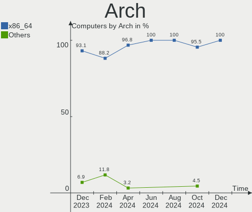
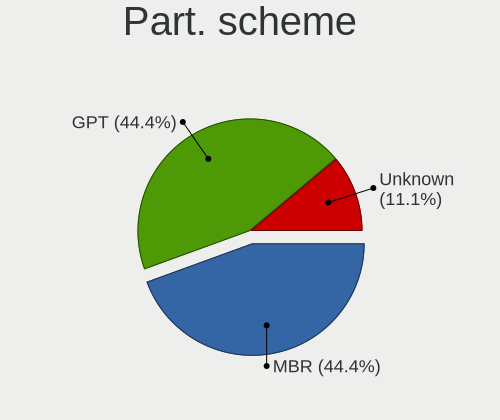
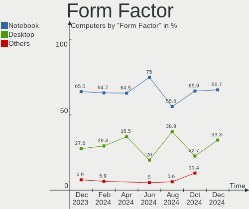
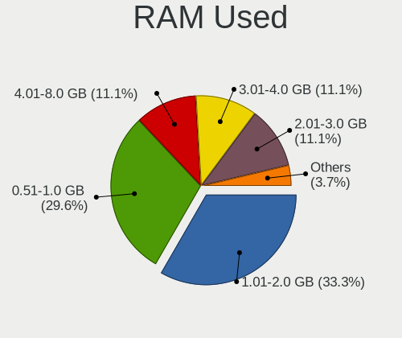
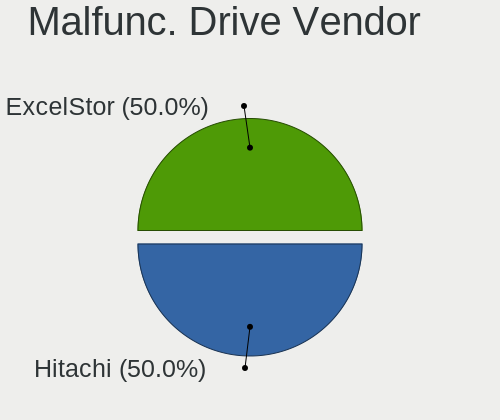
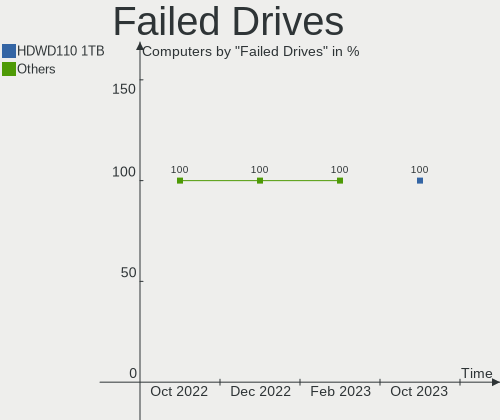
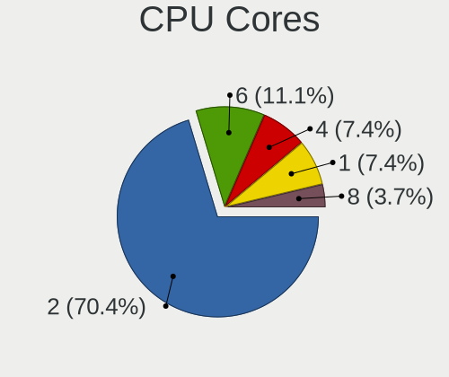
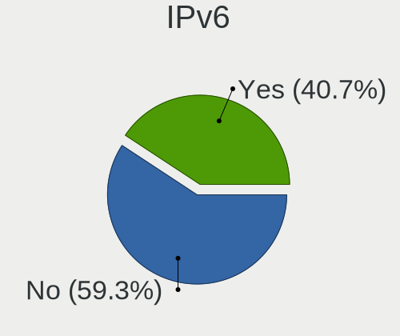
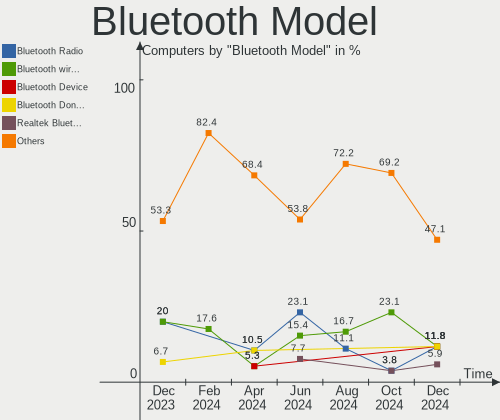
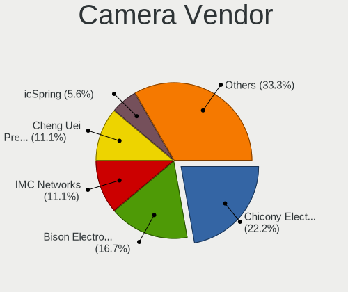

Lubuntu - Hardware Trends
-------------------------

A project to identify most popular hardware characteristics and track their change
over time based on data collected by Linux users at https://Linux-Hardware.org.

Anyone can contribute to this report by the [hw-probe](https://github.com/linuxhw/hw-probe) tool:

    sudo -E hw-probe -all -upload

This is a report for all computer types. See also reports for [desktops](/Dist/Lubuntu/Desktop/README.md) and [notebooks](/Dist/Lubuntu/Notebook/README.md).

This report is for one last month. Overall report since the beginning of time: [TestCoverage](https://github.com/linuxhw/TestCoverage)

Period: Dec, 2022.

Contents
--------

* [ System ](#system)
  - [ OS                       ](#os)
  - [ OS Family                ](#os-family)
  - [ Kernel                   ](#kernel)
  - [ Kernel Family            ](#kernel-family)
  - [ Kernel Major Ver.        ](#kernel-major-ver)
  - [ Arch                     ](#arch)
  - [ DE                       ](#de)
  - [ Display Server           ](#display-server)
  - [ Display Manager          ](#display-manager)
  - [ OS Lang                  ](#os-lang)
  - [ Boot Mode                ](#boot-mode)
  - [ Filesystem               ](#filesystem)
  - [ Part. scheme             ](#part-scheme)
  - [ Dual Boot with Linux/BSD ](#dual-boot-with-linuxbsd)
  - [ Dual Boot (Win)          ](#dual-boot-win)

* [ Board ](#board)
  - [ Vendor                   ](#vendor)
  - [ Model                    ](#model)
  - [ Model Family             ](#model-family)
  - [ MFG Year                 ](#mfg-year)
  - [ Form Factor              ](#form-factor)
  - [ Secure Boot              ](#secure-boot)
  - [ Coreboot                 ](#coreboot)
  - [ RAM Size                 ](#ram-size)
  - [ RAM Used                 ](#ram-used)
  - [ Total Drives             ](#total-drives)
  - [ Has CD-ROM               ](#has-cd-rom)
  - [ Has Ethernet             ](#has-ethernet)
  - [ Has WiFi                 ](#has-wifi)
  - [ Has Bluetooth            ](#has-bluetooth)

* [ Location ](#location)
  - [ Country                  ](#country)
  - [ City                     ](#city)

* [ Drives ](#drives)
  - [ Drive Vendor             ](#drive-vendor)
  - [ Drive Model              ](#drive-model)
  - [ HDD Vendor               ](#hdd-vendor)
  - [ SSD Vendor               ](#ssd-vendor)
  - [ Drive Kind               ](#drive-kind)
  - [ Drive Connector          ](#drive-connector)
  - [ Drive Size               ](#drive-size)
  - [ Space Total              ](#space-total)
  - [ Space Used               ](#space-used)
  - [ Malfunc. Drives          ](#malfunc-drives)
  - [ Malfunc. Drive Vendor    ](#malfunc-drive-vendor)
  - [ Malfunc. HDD Vendor      ](#malfunc-hdd-vendor)
  - [ Malfunc. Drive Kind      ](#malfunc-drive-kind)
  - [ Failed Drives            ](#failed-drives)
  - [ Failed Drive Vendor      ](#failed-drive-vendor)
  - [ Drive Status             ](#drive-status)

* [ Storage controller ](#storage-controller)
  - [ Storage Vendor           ](#storage-vendor)
  - [ Storage Model            ](#storage-model)
  - [ Storage Kind             ](#storage-kind)

* [ Processor ](#processor)
  - [ CPU Vendor               ](#cpu-vendor)
  - [ CPU Model                ](#cpu-model)
  - [ CPU Model Family         ](#cpu-model-family)
  - [ CPU Cores                ](#cpu-cores)
  - [ CPU Sockets              ](#cpu-sockets)
  - [ CPU Threads              ](#cpu-threads)
  - [ CPU Op-Modes             ](#cpu-op-modes)
  - [ CPU Microcode            ](#cpu-microcode)
  - [ CPU Microarch            ](#cpu-microarch)

* [ Graphics ](#graphics)
  - [ GPU Vendor               ](#gpu-vendor)
  - [ GPU Model                ](#gpu-model)
  - [ GPU Combo                ](#gpu-combo)
  - [ GPU Driver               ](#gpu-driver)
  - [ GPU Memory               ](#gpu-memory)

* [ Monitor ](#monitor)
  - [ Monitor Vendor           ](#monitor-vendor)
  - [ Monitor Model            ](#monitor-model)
  - [ Monitor Resolution       ](#monitor-resolution)
  - [ Monitor Diagonal         ](#monitor-diagonal)
  - [ Monitor Width            ](#monitor-width)
  - [ Aspect Ratio             ](#aspect-ratio)
  - [ Monitor Area             ](#monitor-area)
  - [ Pixel Density            ](#pixel-density)
  - [ Multiple Monitors        ](#multiple-monitors)

* [ Network ](#network)
  - [ Net Controller Vendor    ](#net-controller-vendor)
  - [ Net Controller Model     ](#net-controller-model)
  - [ Wireless Vendor          ](#wireless-vendor)
  - [ Wireless Model           ](#wireless-model)
  - [ Ethernet Vendor          ](#ethernet-vendor)
  - [ Ethernet Model           ](#ethernet-model)
  - [ Net Controller Kind      ](#net-controller-kind)
  - [ Used Controller          ](#used-controller)
  - [ NICs                     ](#nics)
  - [ IPv6                     ](#ipv6)

* [ Bluetooth ](#bluetooth)
  - [ Bluetooth Vendor         ](#bluetooth-vendor)
  - [ Bluetooth Model          ](#bluetooth-model)

* [ Sound ](#sound)
  - [ Sound Vendor             ](#sound-vendor)
  - [ Sound Model              ](#sound-model)

* [ Memory ](#memory)
  - [ Memory Vendor            ](#memory-vendor)
  - [ Memory Model             ](#memory-model)
  - [ Memory Kind              ](#memory-kind)
  - [ Memory Form Factor       ](#memory-form-factor)
  - [ Memory Size              ](#memory-size)
  - [ Memory Speed             ](#memory-speed)

* [ Printers & scanners ](#printers--scanners)
  - [ Printer Vendor           ](#printer-vendor)
  - [ Printer Model            ](#printer-model)
  - [ Scanner Vendor           ](#scanner-vendor)
  - [ Scanner Model            ](#scanner-model)

* [ Camera ](#camera)
  - [ Camera Vendor            ](#camera-vendor)
  - [ Camera Model             ](#camera-model)

* [ Security ](#security)
  - [ Fingerprint Vendor       ](#fingerprint-vendor)
  - [ Fingerprint Model        ](#fingerprint-model)
  - [ Chipcard Vendor          ](#chipcard-vendor)
  - [ Chipcard Model           ](#chipcard-model)

* [ Unsupported ](#unsupported)
  - [ Unsupported Devices      ](#unsupported-devices)
  - [ Unsupported Device Types ](#unsupported-device-types)

System
------

OS
--

Installed operating systems

| Name          | Computers | Percent |
|---------------|-----------|---------|
| Lubuntu 22.04 | 22        | 55%     |
| Lubuntu 22.10 | 10        | 25%     |
| Lubuntu 20.04 | 5         | 12.5%   |
| Lubuntu 18.04 | 2         | 5%      |
| Lubuntu 23.04 | 1         | 2.5%    |

OS Family
---------

OS without a version

| Name    | Computers | Percent |
|---------|-----------|---------|
| Lubuntu | 40        | 100%    |

Kernel
------

Version of the Linux kernel

| Version              | Computers | Percent |
|----------------------|-----------|---------|
| 5.15.0-56-generic    | 11        | 27.5%   |
| 5.19.0-26-generic    | 8         | 20%     |
| 5.15.0-43-generic    | 5         | 12.5%   |
| 5.4.0-135-generic    | 4         | 10%     |
| 5.15.0-57-generic    | 3         | 7.5%    |
| 6.1.0-daily-20221222 | 1         | 2.5%    |
| 6.1.0-custom         | 1         | 2.5%    |
| 6.0.9-060009-generic | 1         | 2.5%    |
| 6.0.12-x64v2-xanmod1 | 1         | 2.5%    |
| 6.0.10-rockchip64    | 1         | 2.5%    |
| 5.4.0-73-generic     | 1         | 2.5%    |
| 5.19.0-28-generic    | 1         | 2.5%    |
| 5.15.0-47-generic    | 1         | 2.5%    |
| 5.15.0-25-generic    | 1         | 2.5%    |

Kernel Family
-------------

Linux kernel without a distro release

| Version | Computers | Percent |
|---------|-----------|---------|
| 5.15.0  | 21        | 52.5%   |
| 5.19.0  | 9         | 22.5%   |
| 5.4.0   | 5         | 12.5%   |
| 6.1.0   | 2         | 5%      |
| 6.0.9   | 1         | 2.5%    |
| 6.0.12  | 1         | 2.5%    |
| 6.0.10  | 1         | 2.5%    |

Kernel Major Ver.
-----------------

Linux kernel major version

| Version | Computers | Percent |
|---------|-----------|---------|
| 5.15    | 21        | 52.5%   |
| 5.19    | 9         | 22.5%   |
| 5.4     | 5         | 12.5%   |
| 6.0     | 3         | 7.5%    |
| 6.1     | 2         | 5%      |

Arch
----

OS architecture (x86_64, i586, etc.)

| Name    | Computers | Percent |
|---------|-----------|---------|
| x86_64  | 38        | 95%     |
| i686    | 1         | 2.5%    |
| aarch64 | 1         | 2.5%    |

DE
--

Desktop Environment

| Name            | Computers | Percent |
|-----------------|-----------|---------|
| LXQt            | 36        | 90%     |
| LXDE            | 2         | 5%      |
| X-Cinnamon      | 1         | 2.5%    |
| GNOME Flashback | 1         | 2.5%    |

Display Server
--------------

X11 or Wayland

| Name | Computers | Percent |
|------|-----------|---------|
| X11  | 40        | 100%    |

Display Manager
---------------

SDDM, LightDM, etc.

| Name    | Computers | Percent |
|---------|-----------|---------|
| SDDM    | 29        | 72.5%   |
| LightDM | 7         | 17.5%   |
| Unknown | 4         | 10%     |

OS Lang
-------

Language

| Lang  | Computers | Percent |
|-------|-----------|---------|
| en_US | 16        | 40%     |
| it_IT | 4         | 10%     |
| fr_FR | 4         | 10%     |
| es_CR | 4         | 10%     |
| es_ES | 2         | 5%      |
| en_GB | 2         | 5%      |
| ru_RU | 1         | 2.5%    |
| pt_BR | 1         | 2.5%    |
| pl_PL | 1         | 2.5%    |
| es_MX | 1         | 2.5%    |
| es_CO | 1         | 2.5%    |
| en_DE | 1         | 2.5%    |
| de_DE | 1         | 2.5%    |
| C     | 1         | 2.5%    |

Boot Mode
---------

EFI or BIOS

| Mode | Computers | Percent |
|------|-----------|---------|
| BIOS | 21        | 52.5%   |
| EFI  | 19        | 47.5%   |

Filesystem
----------

Type of filesystem

| Type    | Computers | Percent |
|---------|-----------|---------|
| Ext4    | 37        | 92.5%   |
| Btrfs   | 2         | 5%      |
| Overlay | 1         | 2.5%    |

Part. scheme
------------

Scheme of partitioning

| Type    | Computers | Percent |
|---------|-----------|---------|
| GPT     | 24        | 60%     |
| MBR     | 11        | 27.5%   |
| Unknown | 5         | 12.5%   |

Dual Boot with Linux/BSD
------------------------

Hosting more than one Linux/BSD

| Dual boot | Computers | Percent |
|-----------|-----------|---------|
| No        | 35        | 87.5%   |
| Yes       | 5         | 12.5%   |

Dual Boot (Win)
---------------

Hosting Linux and Windows

| Dual boot | Computers | Percent |
|-----------|-----------|---------|
| No        | 34        | 85%     |
| Yes       | 6         | 15%     |

Board
-----

Vendor
------

Motherboard manufacturer

| Name             | Computers | Percent |
|------------------|-----------|---------|
| Hewlett-Packard  | 8         | 20%     |
| ASUSTek Computer | 7         | 17.5%   |
| Apple            | 5         | 12.5%   |
| Lenovo           | 4         | 10%     |
| Google           | 3         | 7.5%    |
| Acer             | 3         | 7.5%    |
| Dell             | 2         | 5%      |
| ZOTAC            | 1         | 2.5%    |
| Toshiba          | 1         | 2.5%    |
| SGIN             | 1         | 2.5%    |
| Rockchip         | 1         | 2.5%    |
| Positivo         | 1         | 2.5%    |
| GPU Company      | 1         | 2.5%    |
| Digma            | 1         | 2.5%    |
| ASRock           | 1         | 2.5%    |

Model
-----

Motherboard model

| Name                            | Computers | Percent |
|---------------------------------|-----------|---------|
| Apple MacBookPro8,1             | 3         | 7.5%    |
| HP Laptop 15-da0xxx             | 2         | 5%      |
| ZOTAC NM10                      | 1         | 2.5%    |
| Toshiba Satellite Pro S500      | 1         | 2.5%    |
| SGIN laptop                     | 1         | 2.5%    |
| Rockchip RK3318 BOX             | 1         | 2.5%    |
| Positivo C14CR21                | 1         | 2.5%    |
| Lenovo Z70-80 80FG              | 1         | 2.5%    |
| Lenovo ThinkPad R61 77324TG     | 1         | 2.5%    |
| Lenovo IdeaPad 5 14ABA7 82SE    | 1         | 2.5%    |
| Lenovo G500 20236               | 1         | 2.5%    |
| HP t620 Quad Core TC            | 1         | 2.5%    |
| HP Stream Notebook PC 11        | 1         | 2.5%    |
| HP Stream 8 Tablet              | 1         | 2.5%    |
| HP Compaq 6830s                 | 1         | 2.5%    |
| HP Compaq 6715b (RM174UT#ABA)   | 1         | 2.5%    |
| HP 2000                         | 1         | 2.5%    |
| GPU Company GWTC116-2           | 1         | 2.5%    |
| Google Edgar                    | 1         | 2.5%    |
| Google Coral                    | 1         | 2.5%    |
| Google Candy                    | 1         | 2.5%    |
| Digma CITI E401 ET4007EW        | 1         | 2.5%    |
| Dell PowerEdge R210             | 1         | 2.5%    |
| Dell Latitude E7470             | 1         | 2.5%    |
| ASUS ROG STRIX B450-F GAMING II | 1         | 2.5%    |
| ASUS PRIME A320M-F              | 1         | 2.5%    |
| ASUS M4A785TD-V EVO             | 1         | 2.5%    |
| ASUS K72F                       | 1         | 2.5%    |
| ASUS K70IO                      | 1         | 2.5%    |
| ASUS K50C                       | 1         | 2.5%    |
| ASUS ET1610PT                   | 1         | 2.5%    |
| ASRock 970DE3/U3S3              | 1         | 2.5%    |
| Apple MacBook4,1                | 1         | 2.5%    |
| Apple iMac10,1                  | 1         | 2.5%    |
| Acer TravelMate B117-M          | 1         | 2.5%    |
| Acer Swift SF314-54G            | 1         | 2.5%    |
| Acer Aspire SW3-013             | 1         | 2.5%    |

Model Family
------------

Motherboard model prefix

| Name                  | Computers | Percent |
|-----------------------|-----------|---------|
| Apple MacBookPro8     | 3         | 7.5%    |
| HP Stream             | 2         | 5%      |
| HP Laptop             | 2         | 5%      |
| HP Compaq             | 2         | 5%      |
| ZOTAC NM10            | 1         | 2.5%    |
| Toshiba Satellite     | 1         | 2.5%    |
| SGIN laptop           | 1         | 2.5%    |
| Rockchip RK3318       | 1         | 2.5%    |
| Positivo C14CR21      | 1         | 2.5%    |
| Lenovo Z70-80         | 1         | 2.5%    |
| Lenovo ThinkPad       | 1         | 2.5%    |
| Lenovo IdeaPad        | 1         | 2.5%    |
| Lenovo G500           | 1         | 2.5%    |
| HP t620               | 1         | 2.5%    |
| HP 2000               | 1         | 2.5%    |
| GPU Company GWTC116-2 | 1         | 2.5%    |
| Google Edgar          | 1         | 2.5%    |
| Google Coral          | 1         | 2.5%    |
| Google Candy          | 1         | 2.5%    |
| Digma CITI            | 1         | 2.5%    |
| Dell PowerEdge        | 1         | 2.5%    |
| Dell Latitude         | 1         | 2.5%    |
| ASUS ROG              | 1         | 2.5%    |
| ASUS PRIME            | 1         | 2.5%    |
| ASUS M4A785TD-V       | 1         | 2.5%    |
| ASUS K72F             | 1         | 2.5%    |
| ASUS K70IO            | 1         | 2.5%    |
| ASUS K50C             | 1         | 2.5%    |
| ASUS ET1610PT         | 1         | 2.5%    |
| ASRock 970DE3         | 1         | 2.5%    |
| Apple MacBook4        | 1         | 2.5%    |
| Apple iMac10          | 1         | 2.5%    |
| Acer TravelMate       | 1         | 2.5%    |
| Acer Swift            | 1         | 2.5%    |
| Acer Aspire           | 1         | 2.5%    |

MFG Year
--------

Motherboard manufacture year

| Year    | Computers | Percent |
|---------|-----------|---------|
| 2009    | 5         | 12.5%   |
| 2011    | 4         | 10%     |
| 2010    | 4         | 10%     |
| 2020    | 3         | 7.5%    |
| 2019    | 3         | 7.5%    |
| 2015    | 3         | 7.5%    |
| 2014    | 3         | 7.5%    |
| 2021    | 2         | 5%      |
| 2018    | 2         | 5%      |
| 2012    | 2         | 5%      |
| 2008    | 2         | 5%      |
| 2007    | 2         | 5%      |
| 2022    | 1         | 2.5%    |
| 2017    | 1         | 2.5%    |
| 2016    | 1         | 2.5%    |
| 2013    | 1         | 2.5%    |
| Unknown | 1         | 2.5%    |

Form Factor
-----------

Physical design of the computer

| Name           | Computers | Percent |
|----------------|-----------|---------|
| Notebook       | 29        | 72.5%   |
| Desktop        | 7         | 17.5%   |
| System on chip | 1         | 2.5%    |
| Tablet         | 1         | 2.5%    |
| All in one     | 1         | 2.5%    |
| Server         | 1         | 2.5%    |

Secure Boot
-----------

Enabled or disabled

| State    | Computers | Percent |
|----------|-----------|---------|
| Disabled | 39        | 97.5%   |
| Enabled  | 1         | 2.5%    |

Coreboot
--------

Have coreboot on board

| Used | Computers | Percent |
|------|-----------|---------|
| No   | 36        | 90%     |
| Yes  | 4         | 10%     |

RAM Size
--------

Total RAM memory

| Size in GB | Computers | Percent |
|------------|-----------|---------|
| 3.01-4.0   | 17        | 42.5%   |
| 4.01-8.0   | 7         | 17.5%   |
| 8.01-16.0  | 7         | 17.5%   |
| 1.01-2.0   | 5         | 12.5%   |
| 16.01-24.0 | 3         | 7.5%    |
| 0.51-1.0   | 1         | 2.5%    |

RAM Used
--------

Used RAM memory

| Used GB  | Computers | Percent |
|----------|-----------|---------|
| 1.01-2.0 | 22        | 55%     |
| 0.51-1.0 | 8         | 20%     |
| 2.01-3.0 | 5         | 12.5%   |
| 4.01-8.0 | 3         | 7.5%    |
| 3.01-4.0 | 1         | 2.5%    |
| 0.01-0.5 | 1         | 2.5%    |

Total Drives
------------

Number of drives on board

| Drives | Computers | Percent |
|--------|-----------|---------|
| 1      | 30        | 75%     |
| 2      | 8         | 20%     |
| 3      | 2         | 5%      |

Has CD-ROM
----------

Has CD-ROM on board

| Presented | Computers | Percent |
|-----------|-----------|---------|
| No        | 24        | 60%     |
| Yes       | 16        | 40%     |

Has Ethernet
------------

Has Ethernet on board

| Presented | Computers | Percent |
|-----------|-----------|---------|
| Yes       | 29        | 72.5%   |
| No        | 11        | 27.5%   |

Has WiFi
--------

Has WiFi module

| Presented | Computers | Percent |
|-----------|-----------|---------|
| Yes       | 31        | 77.5%   |
| No        | 9         | 22.5%   |

Has Bluetooth
-------------

Has Bluetooth module

| Presented | Computers | Percent |
|-----------|-----------|---------|
| Yes       | 21        | 52.5%   |
| No        | 19        | 47.5%   |

Location
--------

Country
-------

Geographic location (country)

| Country     | Computers | Percent |
|-------------|-----------|---------|
| USA         | 7         | 17.5%   |
| Italy       | 6         | 15%     |
| France      | 4         | 10%     |
| Costa Rica  | 4         | 10%     |
| Spain       | 2         | 5%      |
| Mexico      | 2         | 5%      |
| Indonesia   | 2         | 5%      |
| Germany     | 2         | 5%      |
| UK          | 1         | 2.5%    |
| Switzerland | 1         | 2.5%    |
| Russia      | 1         | 2.5%    |
| Poland      | 1         | 2.5%    |
| Moldova     | 1         | 2.5%    |
| Ireland     | 1         | 2.5%    |
| Colombia    | 1         | 2.5%    |
| Canada      | 1         | 2.5%    |
| Brazil      | 1         | 2.5%    |
| Belgium     | 1         | 2.5%    |
| Belarus     | 1         | 2.5%    |

City
----

Geographic location (city)

| City                  | Computers | Percent |
|-----------------------|-----------|---------|
| Rio Segundo           | 4         | 10%     |
| Zizur Mayor           | 1         | 2.5%    |
| Volgograd             | 1         | 2.5%    |
| Uberlândia           | 1         | 2.5%    |
| Tiraspol              | 1         | 2.5%    |
| Thornton Heath        | 1         | 2.5%    |
| Serravalle Sesia      | 1         | 2.5%    |
| San Luis Potosí City | 1         | 2.5%    |
| Paris                 | 1         | 2.5%    |
| Palencia              | 1         | 2.5%    |
| Ocala                 | 1         | 2.5%    |
| Morlenbach            | 1         | 2.5%    |
| Montevago             | 1         | 2.5%    |
| Minsk                 | 1         | 2.5%    |
| McKinney              | 1         | 2.5%    |
| Mazatlán             | 1         | 2.5%    |
| Lyon                  | 1         | 2.5%    |
| Lodz                  | 1         | 2.5%    |
| Leverkusen            | 1         | 2.5%    |
| La Crescenta          | 1         | 2.5%    |
| Jakarta               | 1         | 2.5%    |
| Grenay                | 1         | 2.5%    |
| Ghent                 | 1         | 2.5%    |
| Gattinara             | 1         | 2.5%    |
| Eugene                | 1         | 2.5%    |
| Enniscorthy           | 1         | 2.5%    |
| Courtice              | 1         | 2.5%    |
| Catania               | 1         | 2.5%    |
| Bogotá               | 1         | 2.5%    |
| Bellach               | 1         | 2.5%    |
| Bari                  | 1         | 2.5%    |
| Balikpapan            | 1         | 2.5%    |
| Athens                | 1         | 2.5%    |
| Ashburn               | 1         | 2.5%    |
| Ambazac               | 1         | 2.5%    |
| Altivole              | 1         | 2.5%    |
| Algona                | 1         | 2.5%    |

Drives
------

Drive Vendor
------------

Hard drive vendors

| Vendor              | Computers | Drives | Percent |
|---------------------|-----------|--------|---------|
| Seagate             | 9         | 10     | 19.15%  |
| Unknown             | 8         | 10     | 17.02%  |
| WDC                 | 7         | 9      | 14.89%  |
| Samsung Electronics | 4         | 4      | 8.51%   |
| Kingston            | 3         | 3      | 6.38%   |
| Toshiba             | 2         | 2      | 4.26%   |
| Intel               | 2         | 2      | 4.26%   |
| Fujitsu             | 2         | 2      | 4.26%   |
| Team                | 1         | 1      | 2.13%   |
| SanDisk             | 1         | 1      | 2.13%   |
| NGFF                | 1         | 1      | 2.13%   |
| Micron Technology   | 1         | 1      | 2.13%   |
| Lexar               | 1         | 1      | 2.13%   |
| Intenso             | 1         | 1      | 2.13%   |
| Hitachi             | 1         | 1      | 2.13%   |
| GOODRAM             | 1         | 1      | 2.13%   |
| A-DATA Technology   | 1         | 1      | 2.13%   |
| Unknown             | 1         | 1      | 2.13%   |

Drive Model
-----------

Hard drive models

| Model                                | Computers | Percent |
|--------------------------------------|-----------|---------|
| Unknown MMC Card  32GB               | 3         | 5.88%   |
| Unknown MMC Card  16GB               | 2         | 3.92%   |
| Kingston SA400S37240G 240GB SSD      | 2         | 3.92%   |
| WDC WDS500G2B0C-00PXH0 500GB         | 1         | 1.96%   |
| WDC WDS500G2B0A 500GB SSD            | 1         | 1.96%   |
| WDC WD7500BPVX-22JC3T0 752GB         | 1         | 1.96%   |
| WDC WD10SPZX-24Z10T0 1TB             | 1         | 1.96%   |
| WDC WD10SPZX-21Z10T0 1TB             | 1         | 1.96%   |
| WDC WD10EZEX-08WN4A0 1TB             | 1         | 1.96%   |
| WDC WD10EFRX-68FYTN0 1TB             | 1         | 1.96%   |
| WDC PC SN730 SDBQNTY-256G-1006 256GB | 1         | 1.96%   |
| Unknown USD00  32GB                  | 1         | 1.96%   |
| Unknown SLD32G  32GB                 | 1         | 1.96%   |
| Unknown MMC Card  64GB               | 1         | 1.96%   |
| Unknown MBG4GC  32GB                 | 1         | 1.96%   |
| Unknown BGND3R  32GB                 | 1         | 1.96%   |
| Toshiba THNSNH128GBST SSD            | 1         | 1.96%   |
| Toshiba Q300. 240GB SSD              | 1         | 1.96%   |
| Team T253E2002T 2TB SSD              | 1         | 1.96%   |
| Seagate ST9500325AS 500GB            | 1         | 1.96%   |
| Seagate ST9250315AS 250GB            | 1         | 1.96%   |
| Seagate ST3500418AS 500GB            | 1         | 1.96%   |
| Seagate ST320LM001 HN-M320MBB 320GB  | 1         | 1.96%   |
| Seagate ST31000528ASQ 1TB            | 1         | 1.96%   |
| Seagate ST2000DM008-2FR102 2TB       | 1         | 1.96%   |
| Seagate ST1000LM014-SSHD-8GB         | 1         | 1.96%   |
| Seagate ST1000DM003-1SB102 1TB       | 1         | 1.96%   |
| Seagate ST1000DM003-1CH162 1TB       | 1         | 1.96%   |
| Seagate BUP Portable 4TB             | 1         | 1.96%   |
| SanDisk SDSA6DM-016G-1006 16GB SSD   | 1         | 1.96%   |
| Samsung SSD 980 1TB                  | 1         | 1.96%   |
| Samsung SSD 860 EVO 500GB            | 1         | 1.96%   |
| Samsung SSD 830 Series 512GB         | 1         | 1.96%   |
| Samsung SSD 830 Series 256GB         | 1         | 1.96%   |
| NGFF 2280 512GB SSD                  | 1         | 1.96%   |
| Micron MTFDKCD512TFK 512GB           | 1         | 1.96%   |
| Lexar 128GB SSD                      | 1         | 1.96%   |
| Kingston SV300S37A240G 240GB SSD     | 1         | 1.96%   |
| Intenso SCSI 1TB                     | 1         | 1.96%   |
| Intel SSDSC2MH250A2 250GB            | 1         | 1.96%   |

HDD Vendor
----------

Hard disk drive vendors

| Vendor  | Computers | Drives | Percent |
|---------|-----------|--------|---------|
| Seagate | 9         | 10     | 52.94%  |
| WDC     | 5         | 6      | 29.41%  |
| Fujitsu | 2         | 2      | 11.76%  |
| Hitachi | 1         | 1      | 5.88%   |

SSD Vendor
----------

Solid state drive vendors

| Vendor              | Computers | Drives | Percent |
|---------------------|-----------|--------|---------|
| Samsung Electronics | 3         | 3      | 17.65%  |
| Kingston            | 3         | 3      | 17.65%  |
| Toshiba             | 2         | 2      | 11.76%  |
| Intel               | 2         | 2      | 11.76%  |
| WDC                 | 1         | 1      | 5.88%   |
| Team                | 1         | 1      | 5.88%   |
| SanDisk             | 1         | 1      | 5.88%   |
| NGFF                | 1         | 1      | 5.88%   |
| Lexar               | 1         | 1      | 5.88%   |
| GOODRAM             | 1         | 1      | 5.88%   |
| A-DATA Technology   | 1         | 1      | 5.88%   |

Drive Kind
----------

HDD or SSD

| Kind    | Computers | Drives | Percent |
|---------|-----------|--------|---------|
| SSD     | 17        | 17     | 36.17%  |
| HDD     | 16        | 19     | 34.04%  |
| MMC     | 9         | 11     | 19.15%  |
| NVMe    | 4         | 4      | 8.51%   |
| Unknown | 1         | 1      | 2.13%   |

Drive Connector
---------------

SATA, SAS, NVMe, etc.

| Type | Computers | Drives | Percent |
|------|-----------|--------|---------|
| SATA | 29        | 34     | 64.44%  |
| MMC  | 9         | 11     | 20%     |
| NVMe | 4         | 4      | 8.89%   |
| SAS  | 3         | 3      | 6.67%   |

Drive Size
----------

Size of hard drive

| Size in TB | Computers | Drives | Percent |
|------------|-----------|--------|---------|
| 0.01-0.5   | 19        | 20     | 57.58%  |
| 0.51-1.0   | 11        | 13     | 33.33%  |
| 1.01-2.0   | 2         | 2      | 6.06%   |
| 3.01-4.0   | 1         | 1      | 3.03%   |

Space Total
-----------

Amount of disk space available on the file system

| Size in GB     | Computers | Percent |
|----------------|-----------|---------|
| 101-250        | 12        | 30%     |
| 21-50          | 7         | 17.5%   |
| 501-1000       | 7         | 17.5%   |
| 251-500        | 5         | 12.5%   |
| 2001-3000      | 2         | 5%      |
| 1001-2000      | 2         | 5%      |
| 1-20           | 2         | 5%      |
| 51-100         | 2         | 5%      |
| More than 3000 | 1         | 2.5%    |

Space Used
----------

Amount of used disk space

| Used GB        | Computers | Percent |
|----------------|-----------|---------|
| 1-20           | 18        | 45%     |
| 21-50          | 7         | 17.5%   |
| 101-250        | 5         | 12.5%   |
| 1001-2000      | 3         | 7.5%    |
| 51-100         | 3         | 7.5%    |
| 501-1000       | 2         | 5%      |
| More than 3000 | 1         | 2.5%    |
| 251-500        | 1         | 2.5%    |

Malfunc. Drives
---------------

Drive models with a malfunction

| Model                          | Computers | Drives | Percent |
|--------------------------------|-----------|--------|---------|
| WDC WD10SPZX-24Z10T0 1TB       | 1         | 1      | 33.33%  |
| Seagate ST1000DM003-1SB102 1TB | 1         | 1      | 33.33%  |
| NGFF 2280 512GB SSD            | 1         | 1      | 33.33%  |

Malfunc. Drive Vendor
---------------------

Vendors of faulty drives

| Vendor  | Computers | Drives | Percent |
|---------|-----------|--------|---------|
| WDC     | 1         | 1      | 33.33%  |
| Seagate | 1         | 1      | 33.33%  |
| NGFF    | 1         | 1      | 33.33%  |

Malfunc. HDD Vendor
-------------------

Vendors of faulty HDD drives

| Vendor  | Computers | Drives | Percent |
|---------|-----------|--------|---------|
| WDC     | 1         | 1      | 50%     |
| Seagate | 1         | 1      | 50%     |

Malfunc. Drive Kind
-------------------

Kinds of faulty drives

| Kind | Computers | Drives | Percent |
|------|-----------|--------|---------|
| HDD  | 2         | 2      | 66.67%  |
| SSD  | 1         | 1      | 33.33%  |

Failed Drives
-------------

Failed drive models

| Model                     | Computers | Drives | Percent |
|---------------------------|-----------|--------|---------|
| Seagate ST3500418AS 500GB | 1         | 1      | 100%    |

Failed Drive Vendor
-------------------

Failed drive vendors

| Vendor  | Computers | Drives | Percent |
|---------|-----------|--------|---------|
| Seagate | 1         | 1      | 100%    |

Drive Status
------------

Number of failed and malfunc. drives

| Status   | Computers | Drives | Percent |
|----------|-----------|--------|---------|
| Detected | 21        | 27     | 48.84%  |
| Works    | 18        | 21     | 41.86%  |
| Malfunc  | 3         | 3      | 6.98%   |
| Failed   | 1         | 1      | 2.33%   |

Storage controller
------------------

Storage Vendor
--------------

Storage controller vendors

| Vendor                           | Computers | Percent |
|----------------------------------|-----------|---------|
| Intel                            | 21        | 55.26%  |
| AMD                              | 8         | 21.05%  |
| SanDisk                          | 2         | 5.26%   |
| Nvidia                           | 2         | 5.26%   |
| ASMedia Technology               | 2         | 5.26%   |
| Silicon Integrated Systems [SiS] | 1         | 2.63%   |
| Samsung Electronics              | 1         | 2.63%   |
| Micron Technology                | 1         | 2.63%   |

Storage Model
-------------

Storage controller models

| Model                                                                            | Computers | Percent |
|----------------------------------------------------------------------------------|-----------|---------|
| Intel 6 Series/C200 Series Chipset Family 6 port Mobile SATA AHCI Controller     | 3         | 6.52%   |
| AMD FCH SATA Controller [AHCI mode]                                              | 3         | 6.52%   |
| Nvidia MCP79 AHCI Controller                                                     | 2         | 4.35%   |
| Intel Sunrise Point-LP SATA Controller [AHCI mode]                               | 2         | 4.35%   |
| Intel NM10/ICH7 Family SATA Controller [AHCI mode]                               | 2         | 4.35%   |
| Intel Celeron/Pentium Silver Processor SATA Controller                           | 2         | 4.35%   |
| Intel 82801HM/HEM (ICH8M/ICH8M-E) SATA Controller [AHCI mode]                    | 2         | 4.35%   |
| Intel 82801HM/HEM (ICH8M/ICH8M-E) IDE Controller                                 | 2         | 4.35%   |
| Intel 7 Series Chipset Family 6-port SATA Controller [AHCI mode]                 | 2         | 4.35%   |
| Intel 5 Series/3400 Series Chipset 4 port SATA AHCI Controller                   | 2         | 4.35%   |
| ASMedia ASM1062 Serial ATA Controller                                            | 2         | 4.35%   |
| AMD SB7x0/SB8x0/SB9x0 SATA Controller [AHCI mode]                                | 2         | 4.35%   |
| AMD SB7x0/SB8x0/SB9x0 IDE Controller                                             | 2         | 4.35%   |
| Silicon Integrated Systems [SiS] SATA Controller / IDE mode                      | 1         | 2.17%   |
| Silicon Integrated Systems [SiS] 5513 IDE Controller                             | 1         | 2.17%   |
| SanDisk WD Blue SN550 NVMe SSD                                                   | 1         | 2.17%   |
| SanDisk WD Black SN750 / PC SN730 NVMe SSD                                       | 1         | 2.17%   |
| Samsung NVMe SSD Controller 980                                                  | 1         | 2.17%   |
| Micron Non-Volatile memory controller                                            | 1         | 2.17%   |
| Intel Wildcat Point-LP SATA Controller [AHCI Mode]                               | 1         | 2.17%   |
| Intel Jasper Lake SATA AHCI Controller                                           | 1         | 2.17%   |
| Intel Atom/Celeron/Pentium Processor x5-E8000/J3xxx/N3xxx Series SATA Controller | 1         | 2.17%   |
| Intel 82801IBM/IEM (ICH9M/ICH9M-E) 4 port SATA Controller [AHCI mode]            | 1         | 2.17%   |
| Intel 82801 Mobile SATA Controller [RAID mode]                                   | 1         | 2.17%   |
| Intel 5 Series/3400 Series Chipset 4 port SATA IDE Controller                    | 1         | 2.17%   |
| Intel 5 Series/3400 Series Chipset 2 port SATA IDE Controller                    | 1         | 2.17%   |
| AMD SB7x0/SB8x0/SB9x0 SATA Controller [IDE mode]                                 | 1         | 2.17%   |
| AMD SB600 Non-Raid-5 SATA                                                        | 1         | 2.17%   |
| AMD SB600 IDE                                                                    | 1         | 2.17%   |
| AMD FCH SATA Controller D                                                        | 1         | 2.17%   |
| AMD 400 Series Chipset SATA Controller                                           | 1         | 2.17%   |

Storage Kind
------------

Kind of storage controller (IDE, SATA, NVMe, SAS, ...)

| Kind | Computers | Percent |
|------|-----------|---------|
| SATA | 29        | 70.73%  |
| IDE  | 7         | 17.07%  |
| NVMe | 4         | 9.76%   |
| RAID | 1         | 2.44%   |

Processor
---------

CPU Vendor
----------

Processor vendors

| Vendor | Computers | Percent |
|--------|-----------|---------|
| Intel  | 31        | 77.5%   |
| AMD    | 8         | 20%     |
| ARM    | 1         | 2.5%    |

CPU Model
---------

Processor models

| Model                                       | Computers | Percent |
|---------------------------------------------|-----------|---------|
| Intel Celeron CPU N2840 @ 2.16GHz           | 2         | 5%      |
| Intel Pentium CPU P6200 @ 2.13GHz           | 1         | 2.5%    |
| Intel Pentium CPU N3710 @ 1.60GHz           | 1         | 2.5%    |
| Intel Core i7-8550U CPU @ 1.80GHz           | 1         | 2.5%    |
| Intel Core i7-6600U CPU @ 2.60GHz           | 1         | 2.5%    |
| Intel Core i7-3610QM CPU @ 2.30GHz          | 1         | 2.5%    |
| Intel Core i7-2640M CPU @ 2.80GHz           | 1         | 2.5%    |
| Intel Core i7-2635QM CPU @ 2.00GHz          | 1         | 2.5%    |
| Intel Core i5-8250U CPU @ 1.60GHz           | 1         | 2.5%    |
| Intel Core i5-5200U CPU @ 2.20GHz           | 1         | 2.5%    |
| Intel Core i5-2435M CPU @ 2.40GHz           | 1         | 2.5%    |
| Intel Core i3 CPU M 370 @ 2.40GHz           | 1         | 2.5%    |
| Intel Core i3 CPU 540 @ 3.07GHz             | 1         | 2.5%    |
| Intel Core 2 Duo CPU T8300 @ 2.40GHz        | 1         | 2.5%    |
| Intel Core 2 Duo CPU T7250 @ 2.00GHz        | 1         | 2.5%    |
| Intel Core 2 Duo CPU T6500 @ 2.10GHz        | 1         | 2.5%    |
| Intel Core 2 Duo CPU P8600 @ 2.40GHz        | 1         | 2.5%    |
| Intel Core 2 Duo CPU E7600 @ 3.06GHz        | 1         | 2.5%    |
| Intel Celeron N4500 @ 1.10GHz               | 1         | 2.5%    |
| Intel Celeron N4020 CPU @ 1.10GHz           | 1         | 2.5%    |
| Intel Celeron N4000 CPU @ 1.10GHz           | 1         | 2.5%    |
| Intel Celeron CPU N3350 @ 1.10GHz           | 1         | 2.5%    |
| Intel Celeron CPU N3160 @ 1.60GHz           | 1         | 2.5%    |
| Intel Celeron CPU B800 @ 1.50GHz            | 1         | 2.5%    |
| Intel Celeron CPU 220 @ 1.20GHz             | 1         | 2.5%    |
| Intel Atom x5-Z8350 CPU @ 1.44GHz           | 1         | 2.5%    |
| Intel Atom CPU Z3735G @ 1.33GHz             | 1         | 2.5%    |
| Intel Atom CPU Z3735F @ 1.33GHz             | 1         | 2.5%    |
| Intel Atom CPU D525 @ 1.80GHz               | 1         | 2.5%    |
| Intel Atom CPU D410 @ 1.66GHz               | 1         | 2.5%    |
| ARM Processor                               | 1         | 2.5%    |
| AMD Turion 64 X2 Mobile Technology TL-60    | 1         | 2.5%    |
| AMD Ryzen 5 5625U with Radeon Graphics      | 1         | 2.5%    |
| AMD Ryzen 5 3500X 6-Core Processor          | 1         | 2.5%    |
| AMD Ryzen 3 3200G with Radeon Vega Graphics | 1         | 2.5%    |
| AMD GX-415GA SOC with Radeon HD Graphics    | 1         | 2.5%    |
| AMD FX-8320E Eight-Core Processor           | 1         | 2.5%    |
| AMD E-450 APU with Radeon HD Graphics       | 1         | 2.5%    |
| AMD Athlon II X2 240 Processor              | 1         | 2.5%    |

CPU Model Family
----------------

Processor model prefix

| Model                   | Computers | Percent |
|-------------------------|-----------|---------|
| Intel Celeron           | 9         | 22.5%   |
| Intel Core i7           | 5         | 12.5%   |
| Intel Core 2 Duo        | 5         | 12.5%   |
| Intel Atom              | 5         | 12.5%   |
| Intel Core i5           | 3         | 7.5%    |
| Intel Pentium           | 2         | 5%      |
| Intel Core i3           | 2         | 5%      |
| AMD Ryzen 5             | 2         | 5%      |
| Other                   | 1         | 2.5%    |
| AMD Turion 64 X2 Mobile | 1         | 2.5%    |
| AMD Ryzen 3             | 1         | 2.5%    |
| AMD GX                  | 1         | 2.5%    |
| AMD FX                  | 1         | 2.5%    |
| AMD E                   | 1         | 2.5%    |
| AMD Athlon II X2        | 1         | 2.5%    |

CPU Cores
---------

Number of processor cores

| Number  | Computers | Percent |
|---------|-----------|---------|
| 2       | 23        | 57.5%   |
| 4       | 12        | 30%     |
| 6       | 2         | 5%      |
| 1       | 2         | 5%      |
| Unknown | 1         | 2.5%    |

CPU Sockets
-----------

Number of sockets

| Number  | Computers | Percent |
|---------|-----------|---------|
| 1       | 39        | 97.5%   |
| Unknown | 1         | 2.5%    |

CPU Threads
-----------

Threads per core (Hyper-Threading)

| Number  | Computers | Percent |
|---------|-----------|---------|
| 1       | 26        | 65%     |
| 2       | 13        | 32.5%   |
| Unknown | 1         | 2.5%    |

CPU Op-Modes
------------

CPU Operation Modes (32-bit, 64-bit)

| Op mode        | Computers | Percent |
|----------------|-----------|---------|
| 32-bit, 64-bit | 39        | 97.5%   |
| 64-bit         | 1         | 2.5%    |

CPU Microcode
-------------

Microcode number

| Number     | Computers | Percent |
|------------|-----------|---------|
| Unknown    | 12        | 30%     |
| 0x206a7    | 3         | 7.5%    |
| 0x806ea    | 2         | 5%      |
| 0x406c4    | 2         | 5%      |
| 0x106ca    | 2         | 5%      |
| 0x1067a    | 2         | 5%      |
| 0x906c0    | 1         | 2.5%    |
| 0x706a8    | 1         | 2.5%    |
| 0x706a1    | 1         | 2.5%    |
| 0x6fd      | 1         | 2.5%    |
| 0x406e3    | 1         | 2.5%    |
| 0x306a9    | 1         | 2.5%    |
| 0x30678    | 1         | 2.5%    |
| 0x20655    | 1         | 2.5%    |
| 0x10676    | 1         | 2.5%    |
| 0x10661    | 1         | 2.5%    |
| 0x0a50000c | 1         | 2.5%    |
| 0x08701021 | 1         | 2.5%    |
| 0x08108102 | 1         | 2.5%    |
| 0x0700010f | 1         | 2.5%    |
| 0x06000852 | 1         | 2.5%    |
| 0x05000119 | 1         | 2.5%    |
| 0x010000c7 | 1         | 2.5%    |

CPU Microarch
-------------

Microarchitecture

| Name          | Computers | Percent |
|---------------|-----------|---------|
| Silvermont    | 7         | 17.5%   |
| SandyBridge   | 4         | 10%     |
| Penryn        | 4         | 10%     |
| Westmere      | 3         | 7.5%    |
| KabyLake      | 2         | 5%      |
| Goldmont plus | 2         | 5%      |
| Core          | 2         | 5%      |
| Bonnell       | 2         | 5%      |
| Zen+          | 1         | 2.5%    |
| Zen 3         | 1         | 2.5%    |
| Zen 2         | 1         | 2.5%    |
| Tremont       | 1         | 2.5%    |
| Skylake       | 1         | 2.5%    |
| Piledriver    | 1         | 2.5%    |
| K8 Hammer     | 1         | 2.5%    |
| K10           | 1         | 2.5%    |
| Jaguar        | 1         | 2.5%    |
| IvyBridge     | 1         | 2.5%    |
| Goldmont      | 1         | 2.5%    |
| Broadwell     | 1         | 2.5%    |
| Bobcat        | 1         | 2.5%    |
| Unknown       | 1         | 2.5%    |

Graphics
--------

GPU Vendor
----------

Vendors of graphics cards

| Vendor                           | Computers | Percent |
|----------------------------------|-----------|---------|
| Intel                            | 25        | 60.98%  |
| AMD                              | 9         | 21.95%  |
| Nvidia                           | 5         | 12.2%   |
| Silicon Integrated Systems [SiS] | 1         | 2.44%   |
| Matrox Electronics Systems       | 1         | 2.44%   |

GPU Model
---------

Graphics card models

| Model                                                                                    | Computers | Percent |
|------------------------------------------------------------------------------------------|-----------|---------|
| Intel Atom Processor Z36xxx/Z37xxx Series Graphics & Display                             | 4         | 9.3%    |
| Intel 2nd Generation Core Processor Family Integrated Graphics Controller                | 4         | 9.3%    |
| Intel Atom/Celeron/Pentium Processor x5-E8000/J3xxx/N3xxx Integrated Graphics Controller | 3         | 6.98%   |
| Intel UHD Graphics 620                                                                   | 2         | 4.65%   |
| Intel Mobile GM965/GL960 Integrated Graphics Controller (secondary)                      | 2         | 4.65%   |
| Intel Mobile GM965/GL960 Integrated Graphics Controller (primary)                        | 2         | 4.65%   |
| Intel GeminiLake [UHD Graphics 600]                                                      | 2         | 4.65%   |
| Intel Core Processor Integrated Graphics Controller                                      | 2         | 4.65%   |
| Silicon Integrated Systems [SiS] 771/671 PCIE VGA Display Adapter                        | 1         | 2.33%   |
| Nvidia GT218 [ION]                                                                       | 1         | 2.33%   |
| Nvidia GP108M [GeForce MX150]                                                            | 1         | 2.33%   |
| Nvidia GM108M [GeForce MX130]                                                            | 1         | 2.33%   |
| Nvidia GF108 [GeForce GT 440]                                                            | 1         | 2.33%   |
| Nvidia G96CM [GeForce GT 120M]                                                           | 1         | 2.33%   |
| Matrox Electronics Systems MGA G200eW WPCM450                                            | 1         | 2.33%   |
| Intel Skylake GT2 [HD Graphics 520]                                                      | 1         | 2.33%   |
| Intel JasperLake [UHD Graphics]                                                          | 1         | 2.33%   |
| Intel HD Graphics 5500                                                                   | 1         | 2.33%   |
| Intel HD Graphics 500                                                                    | 1         | 2.33%   |
| Intel Atom Processor D4xx/D5xx/N4xx/N5xx Integrated Graphics Controller                  | 1         | 2.33%   |
| Intel 3rd Gen Core processor Graphics Controller                                         | 1         | 2.33%   |
| AMD Wrestler [Radeon HD 6320]                                                            | 1         | 2.33%   |
| AMD RV730/M96-XT [Mobility Radeon HD 4670]                                               | 1         | 2.33%   |
| AMD RV620/M82 [Mobility Radeon HD 3410/3430]                                             | 1         | 2.33%   |
| AMD RS880 [Radeon HD 4200]                                                               | 1         | 2.33%   |
| AMD RS690M [Radeon Xpress 1200/1250/1270]                                                | 1         | 2.33%   |
| AMD Picasso/Raven 2 [Radeon Vega Series / Radeon Vega Mobile Series]                     | 1         | 2.33%   |
| AMD Kabini [Radeon HD 8330E]                                                             | 1         | 2.33%   |
| AMD Ellesmere [Radeon RX 470/480/570/570X/580/580X/590]                                  | 1         | 2.33%   |
| AMD Barcelo                                                                              | 1         | 2.33%   |

GPU Combo
---------

Combinations of graphics cards

| Name           | Computers | Percent |
|----------------|-----------|---------|
| 1 x Intel      | 22        | 55%     |
| 1 x AMD        | 9         | 22.5%   |
| 1 x Nvidia     | 3         | 7.5%    |
| Intel + Nvidia | 2         | 5%      |
| Other          | 1         | 2.5%    |
| 2 x Intel      | 1         | 2.5%    |
| 1 x SiS        | 1         | 2.5%    |
| 1 x Matrox     | 1         | 2.5%    |

GPU Driver
----------

Free vs proprietary

| Driver      | Computers | Percent |
|-------------|-----------|---------|
| Free        | 35        | 87.5%   |
| Unknown     | 3         | 7.5%    |
| Proprietary | 2         | 5%      |

GPU Memory
----------

Total video memory

| Size in GB | Computers | Percent |
|------------|-----------|---------|
| Unknown    | 28        | 70%     |
| 0.01-0.5   | 7         | 17.5%   |
| 1.01-2.0   | 4         | 10%     |
| 7.01-8.0   | 1         | 2.5%    |

Monitor
-------

Monitor Vendor
--------------

Monitor vendors

| Vendor                  | Computers | Percent |
|-------------------------|-----------|---------|
| Samsung Electronics     | 7         | 19.44%  |
| AU Optronics            | 7         | 19.44%  |
| BOE                     | 4         | 11.11%  |
| Apple                   | 4         | 11.11%  |
| LG Display              | 2         | 5.56%   |
| Goldstar                | 2         | 5.56%   |
| Chimei Innolux          | 2         | 5.56%   |
| Philips                 | 1         | 2.78%   |
| LG Electronics          | 1         | 2.78%   |
| Lenovo                  | 1         | 2.78%   |
| InfoVision              | 1         | 2.78%   |
| Dell                    | 1         | 2.78%   |
| Daewoo                  | 1         | 2.78%   |
| Chi Mei Optoelectronics | 1         | 2.78%   |
| BenQ                    | 1         | 2.78%   |

Monitor Model
-------------

Monitor models

| Model                                                                    | Computers | Percent |
|--------------------------------------------------------------------------|-----------|---------|
| Apple LCD Monitor APP9CC5 1280x800 286x179mm 13.3-inch                   | 2         | 5.56%   |
| Samsung Electronics U28E590 SAM0C4E 3840x2160 608x345mm 27.5-inch        | 1         | 2.78%   |
| Samsung Electronics SyncMaster SAM03D2 1680x1050 474x296mm 22.0-inch     | 1         | 2.78%   |
| Samsung Electronics SyncMaster SAM0226 1440x900 410x260mm 19.1-inch      | 1         | 2.78%   |
| Samsung Electronics LCD Monitor SEC544B 1600x900 382x214mm 17.2-inch     | 1         | 2.78%   |
| Samsung Electronics LCD Monitor SEC3346 1680x1050 331x207mm 15.4-inch    | 1         | 2.78%   |
| Samsung Electronics LCD Monitor SDC4752 1366x768 344x194mm 15.5-inch     | 1         | 2.78%   |
| Samsung Electronics LCD Monitor SAM0A76 1280x720 949x543mm 43.0-inch     | 1         | 2.78%   |
| Philips LCD Monitor PHL 243V5                                            | 1         | 2.78%   |
| LG Electronics LCD Monitor L1942 3200x1080                               | 1         | 2.78%   |
| LG Display LCD Monitor LGD0599 1920x1080 309x174mm 14.0-inch             | 1         | 2.78%   |
| LG Display LCD Monitor LGD0469 1920x1080 382x215mm 17.3-inch             | 1         | 2.78%   |
| Lenovo LCD Monitor LEN4031 1280x800 303x190mm 14.1-inch                  | 1         | 2.78%   |
| InfoVision M140NWR2 R1 IVO057A 1366x768 309x174mm 14.0-inch              | 1         | 2.78%   |
| Goldstar M2352D GSM60AD 1920x1080 509x286mm 23.0-inch                    | 1         | 2.78%   |
| Goldstar HD GSM5ACB 1366x768 410x230mm 18.5-inch                         | 1         | 2.78%   |
| Dell P2419H DELD0DA 1920x1080 527x296mm 23.8-inch                        | 1         | 2.78%   |
| Daewoo HDMI DWE2100 1280x1024 476x268mm 21.5-inch                        | 1         | 2.78%   |
| Chimei Innolux LCD Monitor CMN14D4 1920x1080 309x173mm 13.9-inch         | 1         | 2.78%   |
| Chimei Innolux LCD Monitor CMN1132 1366x768 256x144mm 11.6-inch          | 1         | 2.78%   |
| Chi Mei Optoelectronics LCD Monitor CMO15A2 1366x768 344x193mm 15.5-inch | 1         | 2.78%   |
| BOE LCD Monitor BOE0771 1366x768 256x144mm 11.6-inch                     | 1         | 2.78%   |
| BOE LCD Monitor BOE06B3 1920x1080                                        | 1         | 2.78%   |
| BOE LCD Monitor BOE06A4 1366x768 344x194mm 15.5-inch                     | 1         | 2.78%   |
| BOE LCD Monitor BOE0623 1366x768 256x144mm 11.6-inch                     | 1         | 2.78%   |
| BenQ BenQG2222HDL BNQ785A 1920x1080 478x269mm 21.6-inch                  | 1         | 2.78%   |
| AU Optronics LCD Monitor AUO408D 1920x1080 309x174mm 14.0-inch           | 1         | 2.78%   |
| AU Optronics LCD Monitor AUO38ED 1920x1080 344x193mm 15.5-inch           | 1         | 2.78%   |
| AU Optronics LCD Monitor AUO315C 1366x768 256x144mm 11.6-inch            | 1         | 2.78%   |
| AU Optronics LCD Monitor AUO235C 1366x768 256x144mm 11.6-inch            | 1         | 2.78%   |
| AU Optronics LCD Monitor AUO213D 1920x1080 309x173mm 13.9-inch           | 1         | 2.78%   |
| AU Optronics LCD Monitor AUO109E 1600x900 382x214mm 17.2-inch            | 1         | 2.78%   |
| AU Optronics LCD Monitor AUO1036 2560x1440 309x174mm 14.0-inch           | 1         | 2.78%   |
| Apple LCD Monitor APP9CA3 1440x900 331x207mm 15.4-inch                   | 1         | 2.78%   |
| Apple LCD Monitor APP9C5F 1280x800 286x179mm 13.3-inch                   | 1         | 2.78%   |

Monitor Resolution
------------------

Monitor screen resolution

| Resolution         | Computers | Percent |
|--------------------|-----------|---------|
| 1920x1080 (FHD)    | 10        | 28.57%  |
| 1366x768 (WXGA)    | 10        | 28.57%  |
| 1280x800 (WXGA)    | 4         | 11.43%  |
| 1680x1050 (WSXGA+) | 2         | 5.71%   |
| 1600x900 (HD+)     | 2         | 5.71%   |
| 1440x900 (WXGA+)   | 2         | 5.71%   |
| 3840x2160 (4K)     | 1         | 2.86%   |
| 3200x1080          | 1         | 2.86%   |
| 2560x1440 (QHD)    | 1         | 2.86%   |
| 1280x720 (HD)      | 1         | 2.86%   |
| Unknown            | 1         | 2.86%   |

Monitor Diagonal
----------------

Diagonal size in inches

| Inches  | Computers | Percent |
|---------|-----------|---------|
| 15      | 6         | 17.14%  |
| 14      | 6         | 17.14%  |
| 13      | 5         | 14.29%  |
| 11      | 5         | 14.29%  |
| 17      | 3         | 8.57%   |
| 21      | 2         | 5.71%   |
| 43      | 1         | 2.86%   |
| 27      | 1         | 2.86%   |
| 24      | 1         | 2.86%   |
| 23      | 1         | 2.86%   |
| 22      | 1         | 2.86%   |
| 19      | 1         | 2.86%   |
| 18      | 1         | 2.86%   |
| Unknown | 1         | 2.86%   |

Monitor Width
-------------

Physical width

| Width in mm | Computers | Percent |
|-------------|-----------|---------|
| 301-350     | 14        | 40%     |
| 201-300     | 8         | 22.86%  |
| 401-500     | 5         | 14.29%  |
| 351-400     | 3         | 8.57%   |
| 501-600     | 2         | 5.71%   |
| 601-700     | 1         | 2.86%   |
| 901-1000    | 1         | 2.86%   |
| Unknown     | 1         | 2.86%   |

Aspect Ratio
------------

Proportional relationship between the width and the height

| Ratio   | Computers | Percent |
|---------|-----------|---------|
| 16/9    | 25        | 73.53%  |
| 16/10   | 8         | 23.53%  |
| Unknown | 1         | 2.94%   |

Monitor Area
------------

Area in inch²

| Area in inch² | Computers | Percent |
|----------------|-----------|---------|
| 81-90          | 11        | 31.43%  |
| 101-110        | 6         | 17.14%  |
| 51-60          | 5         | 14.29%  |
| 201-250        | 4         | 11.43%  |
| 121-130        | 3         | 8.57%   |
| 151-200        | 2         | 5.71%   |
| 301-350        | 1         | 2.86%   |
| 141-150        | 1         | 2.86%   |
| 501-1000       | 1         | 2.86%   |
| Unknown        | 1         | 2.86%   |

Pixel Density
-------------

Pixels per inch

| Density | Computers | Percent |
|---------|-----------|---------|
| 121-160 | 13        | 37.14%  |
| 101-120 | 12        | 34.29%  |
| 51-100  | 7         | 20%     |
| 1-50    | 1         | 2.86%   |
| 161-240 | 1         | 2.86%   |
| Unknown | 1         | 2.86%   |

Multiple Monitors
-----------------

Total monitors connected

| Total | Computers | Percent |
|-------|-----------|---------|
| 1     | 34        | 85%     |
| 2     | 4         | 10%     |
| 0     | 2         | 5%      |

Network
-------

Net Controller Vendor
---------------------

Controller vendors

| Vendor                   | Computers | Percent |
|--------------------------|-----------|---------|
| Realtek Semiconductor    | 16        | 29.63%  |
| Intel                    | 13        | 24.07%  |
| Qualcomm Atheros         | 7         | 12.96%  |
| Broadcom                 | 6         | 11.11%  |
| Marvell Technology Group | 2         | 3.7%    |
| JMicron Technology       | 2         | 3.7%    |
| TP-Link                  | 1         | 1.85%   |
| Ralink                   | 1         | 1.85%   |
| Nvidia                   | 1         | 1.85%   |
| NetGear                  | 1         | 1.85%   |
| ICS Advent               | 1         | 1.85%   |
| Huawei Technologies      | 1         | 1.85%   |
| Broadcom Limited         | 1         | 1.85%   |
| ASIX Electronics         | 1         | 1.85%   |

Net Controller Model
--------------------

Controller models

| Model                                                             | Computers | Percent |
|-------------------------------------------------------------------|-----------|---------|
| Realtek RTL8111/8168/8411 PCI Express Gigabit Ethernet Controller | 9         | 14.52%  |
| Qualcomm Atheros AR9285 Wireless Network Adapter (PCI-Express)    | 5         | 8.06%   |
| Intel Wireless 7265                                               | 5         | 8.06%   |
| Broadcom NetXtreme BCM57765 Gigabit Ethernet PCIe                 | 3         | 4.84%   |
| Realtek RTL8821CE 802.11ac PCIe Wireless Network Adapter          | 2         | 3.23%   |
| JMicron JMC250 PCI Express Gigabit Ethernet Controller            | 2         | 3.23%   |
| Intel PRO/Wireless 5100 AGN [Shiloh] Network Connection           | 2         | 3.23%   |
| Broadcom BCM4331 802.11a/b/g/n                                    | 2         | 3.23%   |
| TP-Link TL-WN821N v5/v6 [RTL8192EU]                               | 1         | 1.61%   |
| Realtek RTL8812AE 802.11ac PCIe Wireless Network Adapter          | 1         | 1.61%   |
| Realtek RTL8723DE Wireless Network Adapter                        | 1         | 1.61%   |
| Realtek RTL8188CE 802.11b/g/n WiFi Adapter                        | 1         | 1.61%   |
| Realtek RTL810xE PCI Express Fast Ethernet controller             | 1         | 1.61%   |
| Realtek RTL-8110SC/8169SC Gigabit Ethernet                        | 1         | 1.61%   |
| Realtek Realtek Network controller                                | 1         | 1.61%   |
| Realtek 802.11n WLAN Adapter                                      | 1         | 1.61%   |
| Ralink RT5390 Wireless 802.11n 1T/1R PCIe                         | 1         | 1.61%   |
| Qualcomm Atheros QCA9565 / AR9565 Wireless Network Adapter        | 1         | 1.61%   |
| Qualcomm Atheros QCA8172 Fast Ethernet                            | 1         | 1.61%   |
| Qualcomm Atheros AR928X Wireless Network Adapter (PCI-Express)    | 1         | 1.61%   |
| Qualcomm Atheros AR8131 Gigabit Ethernet                          | 1         | 1.61%   |
| Nvidia MCP79 Ethernet                                             | 1         | 1.61%   |
| NetGear A6210                                                     | 1         | 1.61%   |
| Marvell Group 88E8072 PCI-E Gigabit Ethernet Controller           | 1         | 1.61%   |
| Marvell Group 88E8058 PCI-E Gigabit Ethernet Controller           | 1         | 1.61%   |
| Intel Wireless 7260                                               | 1         | 1.61%   |
| Intel Wireless 3160                                               | 1         | 1.61%   |
| Intel PRO/Wireless 3945ABG [Golan] Network Connection             | 1         | 1.61%   |
| Intel I211 Gigabit Network Connection                             | 1         | 1.61%   |
| Intel Ethernet Connection I219-LM                                 | 1         | 1.61%   |
| Intel Centrino Advanced-N 6235                                    | 1         | 1.61%   |
| Intel 82577LC Gigabit Network Connection                          | 1         | 1.61%   |
| Intel 82566MM Gigabit Network Connection                          | 1         | 1.61%   |
| ICS Advent DM9601 Fast Ethernet Adapter                           | 1         | 1.61%   |
| Huawei Mobile Broadband Module                                    | 1         | 1.61%   |
| Broadcom NetXtreme II BCM5716 Gigabit Ethernet                    | 1         | 1.61%   |
| Broadcom Limited NetLink BCM5787M Gigabit Ethernet PCI Express    | 1         | 1.61%   |
| Broadcom BCM4321 802.11a/b/g/n                                    | 1         | 1.61%   |
| Broadcom BCM43142 802.11b/g/n                                     | 1         | 1.61%   |
| ASIX AX88179 Gigabit Ethernet                                     | 1         | 1.61%   |

Wireless Vendor
---------------

Wireless vendors

| Vendor                | Computers | Percent |
|-----------------------|-----------|---------|
| Intel                 | 11        | 34.38%  |
| Realtek Semiconductor | 7         | 21.88%  |
| Qualcomm Atheros      | 7         | 21.88%  |
| Broadcom              | 4         | 12.5%   |
| TP-Link               | 1         | 3.13%   |
| Ralink                | 1         | 3.13%   |
| NetGear               | 1         | 3.13%   |

Wireless Model
--------------

Wireless models

| Model                                                          | Computers | Percent |
|----------------------------------------------------------------|-----------|---------|
| Qualcomm Atheros AR9285 Wireless Network Adapter (PCI-Express) | 5         | 15.63%  |
| Intel Wireless 7265                                            | 5         | 15.63%  |
| Realtek RTL8821CE 802.11ac PCIe Wireless Network Adapter       | 2         | 6.25%   |
| Intel PRO/Wireless 5100 AGN [Shiloh] Network Connection        | 2         | 6.25%   |
| Broadcom BCM4331 802.11a/b/g/n                                 | 2         | 6.25%   |
| TP-Link TL-WN821N v5/v6 [RTL8192EU]                            | 1         | 3.13%   |
| Realtek RTL8812AE 802.11ac PCIe Wireless Network Adapter       | 1         | 3.13%   |
| Realtek RTL8723DE Wireless Network Adapter                     | 1         | 3.13%   |
| Realtek RTL8188CE 802.11b/g/n WiFi Adapter                     | 1         | 3.13%   |
| Realtek Realtek Network controller                             | 1         | 3.13%   |
| Realtek 802.11n WLAN Adapter                                   | 1         | 3.13%   |
| Ralink RT5390 Wireless 802.11n 1T/1R PCIe                      | 1         | 3.13%   |
| Qualcomm Atheros QCA9565 / AR9565 Wireless Network Adapter     | 1         | 3.13%   |
| Qualcomm Atheros AR928X Wireless Network Adapter (PCI-Express) | 1         | 3.13%   |
| NetGear A6210                                                  | 1         | 3.13%   |
| Intel Wireless 7260                                            | 1         | 3.13%   |
| Intel Wireless 3160                                            | 1         | 3.13%   |
| Intel PRO/Wireless 3945ABG [Golan] Network Connection          | 1         | 3.13%   |
| Intel Centrino Advanced-N 6235                                 | 1         | 3.13%   |
| Broadcom BCM4321 802.11a/b/g/n                                 | 1         | 3.13%   |
| Broadcom BCM43142 802.11b/g/n                                  | 1         | 3.13%   |

Ethernet Vendor
---------------

Ethernet vendors

| Vendor                   | Computers | Percent |
|--------------------------|-----------|---------|
| Realtek Semiconductor    | 11        | 37.93%  |
| Intel                    | 4         | 13.79%  |
| Broadcom                 | 4         | 13.79%  |
| Qualcomm Atheros         | 2         | 6.9%    |
| Marvell Technology Group | 2         | 6.9%    |
| JMicron Technology       | 2         | 6.9%    |
| Nvidia                   | 1         | 3.45%   |
| ICS Advent               | 1         | 3.45%   |
| Broadcom Limited         | 1         | 3.45%   |
| ASIX Electronics         | 1         | 3.45%   |

Ethernet Model
--------------

Ethernet models

| Model                                                             | Computers | Percent |
|-------------------------------------------------------------------|-----------|---------|
| Realtek RTL8111/8168/8411 PCI Express Gigabit Ethernet Controller | 9         | 31.03%  |
| Broadcom NetXtreme BCM57765 Gigabit Ethernet PCIe                 | 3         | 10.34%  |
| JMicron JMC250 PCI Express Gigabit Ethernet Controller            | 2         | 6.9%    |
| Realtek RTL810xE PCI Express Fast Ethernet controller             | 1         | 3.45%   |
| Realtek RTL-8110SC/8169SC Gigabit Ethernet                        | 1         | 3.45%   |
| Qualcomm Atheros QCA8172 Fast Ethernet                            | 1         | 3.45%   |
| Qualcomm Atheros AR8131 Gigabit Ethernet                          | 1         | 3.45%   |
| Nvidia MCP79 Ethernet                                             | 1         | 3.45%   |
| Marvell Group 88E8072 PCI-E Gigabit Ethernet Controller           | 1         | 3.45%   |
| Marvell Group 88E8058 PCI-E Gigabit Ethernet Controller           | 1         | 3.45%   |
| Intel I211 Gigabit Network Connection                             | 1         | 3.45%   |
| Intel Ethernet Connection I219-LM                                 | 1         | 3.45%   |
| Intel 82577LC Gigabit Network Connection                          | 1         | 3.45%   |
| Intel 82566MM Gigabit Network Connection                          | 1         | 3.45%   |
| ICS Advent DM9601 Fast Ethernet Adapter                           | 1         | 3.45%   |
| Broadcom NetXtreme II BCM5716 Gigabit Ethernet                    | 1         | 3.45%   |
| Broadcom Limited NetLink BCM5787M Gigabit Ethernet PCI Express    | 1         | 3.45%   |
| ASIX AX88179 Gigabit Ethernet                                     | 1         | 3.45%   |

Net Controller Kind
-------------------

Ethernet, WiFi or modem

| Kind     | Computers | Percent |
|----------|-----------|---------|
| WiFi     | 31        | 50.82%  |
| Ethernet | 29        | 47.54%  |
| Modem    | 1         | 1.64%   |

Used Controller
---------------

Currently used network controller

| Kind     | Computers | Percent |
|----------|-----------|---------|
| WiFi     | 23        | 58.97%  |
| Ethernet | 16        | 41.03%  |

NICs
----

Total network controllers on board

| Total | Computers | Percent |
|-------|-----------|---------|
| 2     | 22        | 55%     |
| 1     | 13        | 32.5%   |
| 0     | 5         | 12.5%   |

IPv6
----

IPv6 vs IPv4

| Used | Computers | Percent |
|------|-----------|---------|
| No   | 34        | 85%     |
| Yes  | 6         | 15%     |

Bluetooth
---------

Bluetooth Vendor
----------------

Controller vendors

| Vendor                  | Computers | Percent |
|-------------------------|-----------|---------|
| Intel                   | 8         | 38.1%   |
| Realtek Semiconductor   | 4         | 19.05%  |
| Apple                   | 4         | 19.05%  |
| Broadcom                | 2         | 9.52%   |
| Toshiba                 | 1         | 4.76%   |
| Lite-On Technology      | 1         | 4.76%   |
| Cambridge Silicon Radio | 1         | 4.76%   |

Bluetooth Model
---------------

Controller models

| Model                                               | Computers | Percent |
|-----------------------------------------------------|-----------|---------|
| Intel Bluetooth wireless interface                  | 7         | 33.33%  |
| Realtek  Bluetooth 4.2 Adapter                      | 2         | 9.52%   |
| Realtek Bluetooth Radio                             | 2         | 9.52%   |
| Apple Bluetooth Host Controller                     | 2         | 9.52%   |
| Toshiba Integrated Bluetooth HCI                    | 1         | 4.76%   |
| Lite-On Atheros AR3012 Bluetooth                    | 1         | 4.76%   |
| Intel Centrino Bluetooth Wireless Transceiver       | 1         | 4.76%   |
| Cambridge Silicon Radio Bluetooth Dongle (HCI mode) | 1         | 4.76%   |
| Broadcom BCM43142A0 Bluetooth Device                | 1         | 4.76%   |
| Broadcom BCM2045B (BDC-2) [Bluetooth Controller]    | 1         | 4.76%   |
| Apple Built-in Bluetooth 2.0+EDR HCI                | 1         | 4.76%   |
| Apple Bluetooth HCI                                 | 1         | 4.76%   |

Sound
-----

Sound Vendor
------------

Sound card vendors

| Vendor                           | Computers | Percent |
|----------------------------------|-----------|---------|
| Intel                            | 24        | 60%     |
| AMD                              | 9         | 22.5%   |
| Nvidia                           | 4         | 10%     |
| Silicon Integrated Systems [SiS] | 1         | 2.5%    |
| MosArt Semiconductor             | 1         | 2.5%    |
| C-Media Electronics              | 1         | 2.5%    |

Sound Model
-----------

Sound card models

| Model                                                                                             | Computers | Percent |
|---------------------------------------------------------------------------------------------------|-----------|---------|
| AMD SBx00 Azalia (Intel HDA)                                                                      | 4         | 8.89%   |
| Intel Sunrise Point-LP HD Audio                                                                   | 3         | 6.67%   |
| Intel 6 Series/C200 Series Chipset Family High Definition Audio Controller                        | 3         | 6.67%   |
| Nvidia MCP79 High Definition Audio                                                                | 2         | 4.44%   |
| Intel NM10/ICH7 Family High Definition Audio Controller                                           | 2         | 4.44%   |
| Intel Celeron/Pentium Silver Processor High Definition Audio                                      | 2         | 4.44%   |
| Intel Atom/Celeron/Pentium Processor x5-E8000/J3xxx/N3xxx Series High Definition Audio Controller | 2         | 4.44%   |
| Intel Atom Processor Z36xxx/Z37xxx Series High Definition Audio Controller                        | 2         | 4.44%   |
| Intel 82801H (ICH8 Family) HD Audio Controller                                                    | 2         | 4.44%   |
| Intel 7 Series/C216 Chipset Family High Definition Audio Controller                               | 2         | 4.44%   |
| Intel 5 Series/3400 Series Chipset High Definition Audio                                          | 2         | 4.44%   |
| AMD Family 17h/19h HD Audio Controller                                                            | 2         | 4.44%   |
| Silicon Integrated Systems [SiS] Azalia Audio Controller                                          | 1         | 2.22%   |
| Nvidia High Definition Audio Controller                                                           | 1         | 2.22%   |
| Nvidia GF108 High Definition Audio Controller                                                     | 1         | 2.22%   |
| MosArt Semiconductor MosArt USB Audio Device                                                      | 1         | 2.22%   |
| Intel Wildcat Point-LP High Definition Audio Controller                                           | 1         | 2.22%   |
| Intel Jasper Lake HD Audio                                                                        | 1         | 2.22%   |
| Intel Celeron N3350/Pentium N4200/Atom E3900 Series Audio Cluster                                 | 1         | 2.22%   |
| Intel Broadwell-U Audio Controller                                                                | 1         | 2.22%   |
| Intel 82801I (ICH9 Family) HD Audio Controller                                                    | 1         | 2.22%   |
| C-Media Electronics Audio Adapter (Unitek Y-247A)                                                 | 1         | 2.22%   |
| AMD Starship/Matisse HD Audio Controller                                                          | 1         | 2.22%   |
| AMD RV710/730 HDMI Audio [Radeon HD 4000 series]                                                  | 1         | 2.22%   |
| AMD RS880 HDMI Audio [Radeon HD 4200 Series]                                                      | 1         | 2.22%   |
| AMD Renoir Radeon High Definition Audio Controller                                                | 1         | 2.22%   |
| AMD Kabini HDMI/DP Audio                                                                          | 1         | 2.22%   |
| AMD FCH Azalia Controller                                                                         | 1         | 2.22%   |
| AMD Ellesmere HDMI Audio [Radeon RX 470/480 / 570/580/590]                                        | 1         | 2.22%   |

Memory
------

Memory Vendor
-------------

Memory module vendors

| Vendor              | Computers | Percent |
|---------------------|-----------|---------|
| Samsung Electronics | 7         | 23.33%  |
| SK hynix            | 6         | 20%     |
| Unknown             | 5         | 16.67%  |
| Micron Technology   | 2         | 6.67%   |
| Kingston            | 2         | 6.67%   |
| Corsair             | 2         | 6.67%   |
| Unknown (ABCD)      | 1         | 3.33%   |
| Nanya Technology    | 1         | 3.33%   |
| Kllisre             | 1         | 3.33%   |
| Goldenmars          | 1         | 3.33%   |
| G.Skill             | 1         | 3.33%   |
| Crucial             | 1         | 3.33%   |

Memory Model
------------

Memory module models

| Model                                                            | Computers | Percent |
|------------------------------------------------------------------|-----------|---------|
| Corsair RAM Module 8GB SODIMM DDR3 1333MT/s                      | 2         | 6.06%   |
| Corsair RAM Module 4GB SODIMM DDR3 1333MT/s                      | 2         | 6.06%   |
| Unknown RAM Module 2GB SODIMM SDRAM                              | 1         | 3.03%   |
| Unknown RAM Module 2GB SODIMM DDR2 667MT/s                       | 1         | 3.03%   |
| Unknown RAM Module 2GB DIMM DDR2 667MT/s                         | 1         | 3.03%   |
| Unknown RAM Module 2GB DIMM 1333MT/s                             | 1         | 3.03%   |
| Unknown RAM Module 1024MB SODIMM DDR2 667MT/s                    | 1         | 3.03%   |
| Unknown (ABCD) RAM 123456789012345678 2GB SODIMM LPDDR4 2400MT/s | 1         | 3.03%   |
| SK hynix RAM Module 4GB SODIMM DDR3 1066MT/s                     | 1         | 3.03%   |
| SK hynix RAM Module 2GB SODIMM DDR3 1600MT/s                     | 1         | 3.03%   |
| SK hynix RAM Module 2GB SODIMM DDR3 1067MT/s                     | 1         | 3.03%   |
| SK hynix RAM HMT425S6AFR6A-PB 2GB SODIMM DDR3 1600MT/s           | 1         | 3.03%   |
| SK hynix RAM HMT125S6BFR8C-G7 2GB SODIMM DDR3 1333MT/s           | 1         | 3.03%   |
| SK hynix RAM H5TC4G63AFR-PBA 1GB SODIMM DDR3 1600MT/s            | 1         | 3.03%   |
| Samsung RAM M471B5273DH0-CH9 4096MB SODIMM DDR3 1334MT/s         | 1         | 3.03%   |
| Samsung RAM M471B5173EB0-YK0 4GB SODIMM DDR3 1600MT/s            | 1         | 3.03%   |
| Samsung RAM M471B5173DB0-YK0 4GB SODIMM DDR3 1600MT/s            | 1         | 3.03%   |
| Samsung RAM M471A5244CB0-CTD 4GB SODIMM DDR4 3266MT/s            | 1         | 3.03%   |
| Samsung RAM M471A1K43CB1-CRC 8GB SODIMM DDR4 2667MT/s            | 1         | 3.03%   |
| Samsung RAM M391B5273DH0-CH9 4096MB DIMM DDR3 1333MT/s           | 1         | 3.03%   |
| Samsung RAM K4E8E324EB-EGCF 2GB SODIMM LPDDR3 1867MT/s           | 1         | 3.03%   |
| Samsung RAM 53D512M64D4RQ-046 4GB Row Of Chips LPDDR4 3733MT/s   | 1         | 3.03%   |
| Nanya RAM Module 1GB SODIMM DDR2 667MT/s                         | 1         | 3.03%   |
| Micron RAM 4ATF51264HZ-2G6E1 4GB SODIMM DDR4 2667MT/s            | 1         | 3.03%   |
| Micron RAM 4ATF1G64HZ-3G2F1 8GB Row Of Chips DDR4 3200MT/s       | 1         | 3.03%   |
| Kllisre RAM KRE-D3S1600M/8G 8GB SODIMM DDR3 1600MT/s             | 1         | 3.03%   |
| Kingston RAM 99U5584-005.A00LF 4GB DIMM DDR3 1600MT/s            | 1         | 3.03%   |
| Kingston RAM 9905713-019.A00G 4GB DIMM DDR4 2666MT/s             | 1         | 3.03%   |
| Goldenmars RAM GMT20028SOX825-667 2048MB SODIMM DDR2 667MT/s     | 1         | 3.03%   |
| G.Skill RAM F4-3000C15-8GVKB 8GB DIMM DDR4 3066MT/s              | 1         | 3.03%   |
| Crucial RAM CT25664AC667.M16FH 2048MB SODIMM DDR2 667MT/s        | 1         | 3.03%   |

Memory Kind
-----------

Memory module kinds

| Kind    | Computers | Percent |
|---------|-----------|---------|
| DDR3    | 13        | 44.83%  |
| DDR4    | 6         | 20.69%  |
| DDR2    | 5         | 17.24%  |
| LPDDR4  | 2         | 6.9%    |
| SDRAM   | 1         | 3.45%   |
| LPDDR3  | 1         | 3.45%   |
| Unknown | 1         | 3.45%   |

Memory Form Factor
------------------

Physical design of the memory module

| Name         | Computers | Percent |
|--------------|-----------|---------|
| SODIMM       | 21        | 72.41%  |
| DIMM         | 6         | 20.69%  |
| Row Of Chips | 2         | 6.9%    |

Memory Size
-----------

Memory module size

| Size | Computers | Percent |
|------|-----------|---------|
| 4096 | 10        | 32.26%  |
| 2048 | 10        | 32.26%  |
| 8192 | 8         | 25.81%  |
| 1024 | 2         | 6.45%   |
| 6144 | 1         | 3.23%   |

Memory Speed
------------

Memory module speed

| Speed   | Computers | Percent |
|---------|-----------|---------|
| 1600    | 6         | 20.69%  |
| 1333    | 5         | 17.24%  |
| 667     | 5         | 17.24%  |
| 2667    | 2         | 6.9%    |
| 3733    | 1         | 3.45%   |
| 3266    | 1         | 3.45%   |
| 3200    | 1         | 3.45%   |
| 3066    | 1         | 3.45%   |
| 2666    | 1         | 3.45%   |
| 2400    | 1         | 3.45%   |
| 1867    | 1         | 3.45%   |
| 1334    | 1         | 3.45%   |
| 1067    | 1         | 3.45%   |
| 1066    | 1         | 3.45%   |
| Unknown | 1         | 3.45%   |

Printers & scanners
-------------------

Printer Vendor
--------------

Printer device vendors

Zero info for selected period =(

Printer Model
-------------

Printer device models

Zero info for selected period =(

Scanner Vendor
--------------

Scanner device vendors

Zero info for selected period =(

Scanner Model
-------------

Scanner device models

Zero info for selected period =(

Camera
------

Camera Vendor
-------------

Camera device vendors

| Vendor                                 | Computers | Percent |
|----------------------------------------|-----------|---------|
| Chicony Electronics                    | 8         | 29.63%  |
| IMC Networks                           | 4         | 14.81%  |
| Apple                                  | 4         | 14.81%  |
| Sunplus Innovation Technology          | 2         | 7.41%   |
| Realtek Semiconductor                  | 2         | 7.41%   |
| WCM_USB                                | 1         | 3.7%    |
| USB Camera CS                          | 1         | 3.7%    |
| Syntek                                 | 1         | 3.7%    |
| SunplusIT                              | 1         | 3.7%    |
| Quanta                                 | 1         | 3.7%    |
| Cheng Uei Precision Industry (Foxlink) | 1         | 3.7%    |
| Alcor Micro                            | 1         | 3.7%    |

Camera Model
------------

Camera device models

| Model                                                | Computers | Percent |
|------------------------------------------------------|-----------|---------|
| IMC Networks Integrated Webcam                       | 2         | 7.41%   |
| Apple FaceTime HD Camera                             | 2         | 7.41%   |
| WCM_USB WEB CAM                                      | 1         | 3.7%    |
| USB Camera CS USB Camera CS                          | 1         | 3.7%    |
| Syntek Lenovo EasyCamera                             | 1         | 3.7%    |
| SunplusIT MTD camera                                 | 1         | 3.7%    |
| Sunplus HD User Facing                               | 1         | 3.7%    |
| Sunplus Dell Integrated HD Webcam                    | 1         | 3.7%    |
| Realtek Integrated_Webcam_HD                         | 1         | 3.7%    |
| Realtek HD WebCam                                    | 1         | 3.7%    |
| Quanta HP Webcam                                     | 1         | 3.7%    |
| IMC Networks USB2.0 UVC VGA WebCam                   | 1         | 3.7%    |
| IMC Networks USB2.0 HD UVC WebCam                    | 1         | 3.7%    |
| Chicony USB2.0 UVC WebCam                            | 1         | 3.7%    |
| Chicony USB 2.0 Camera                               | 1         | 3.7%    |
| Chicony Integrated Camera                            | 1         | 3.7%    |
| Chicony HP TrueVision HD Camera                      | 1         | 3.7%    |
| Chicony HP Truevision HD                             | 1         | 3.7%    |
| Chicony HD WebCam                                    | 1         | 3.7%    |
| Chicony CKF7063 Webcam (HP)                          | 1         | 3.7%    |
| Chicony 2.0M UVC Webcam / CNF7129                    | 1         | 3.7%    |
| Cheng Uei Precision Industry (Foxlink) HP Webcam-101 | 1         | 3.7%    |
| Apple Built-in iSight [Micron]                       | 1         | 3.7%    |
| Apple Built-in iSight                                | 1         | 3.7%    |
| Alcor Micro USB 2.0 Camera                           | 1         | 3.7%    |

Security
--------

Fingerprint Vendor
------------------

Fingerprint sensor vendors

| Vendor                | Computers | Percent |
|-----------------------|-----------|---------|
| AuthenTec             | 2         | 50%     |
| STMicroelectronics    | 1         | 25%     |
| LighTuning Technology | 1         | 25%     |

Fingerprint Model
-----------------

Fingerprint sensor models

| Model                                       | Computers | Percent |
|---------------------------------------------|-----------|---------|
| STMicroelectronics Fingerprint Reader       | 1         | 25%     |
| LighTuning EgisTec Touch Fingerprint Sensor | 1         | 25%     |
| AuthenTec Fingerprint Sensor                | 1         | 25%     |
| AuthenTec AES2501 Fingerprint Sensor        | 1         | 25%     |

Chipcard Vendor
---------------

Chipcard module vendors

| Vendor   | Computers | Percent |
|----------|-----------|---------|
| Broadcom | 1         | 100%    |

Chipcard Model
--------------

Chipcard module models

| Model         | Computers | Percent |
|---------------|-----------|---------|
| Broadcom 5880 | 1         | 100%    |

Unsupported
-----------

Unsupported Devices
-------------------

Total unsupported devices on board

| Total | Computers | Percent |
|-------|-----------|---------|
| 0     | 28        | 70%     |
| 1     | 12        | 30%     |

Unsupported Device Types
------------------------

Types of unsupported devices

| Type                  | Computers | Percent |
|-----------------------|-----------|---------|
| Fingerprint reader    | 4         | 33.33%  |
| Graphics card         | 3         | 25%     |
| Camera                | 2         | 16.67%  |
| Network               | 1         | 8.33%   |
| Multimedia controller | 1         | 8.33%   |
| Chipcard              | 1         | 8.33%   |

