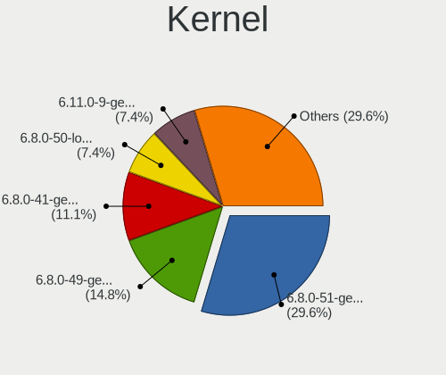
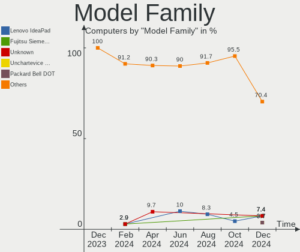
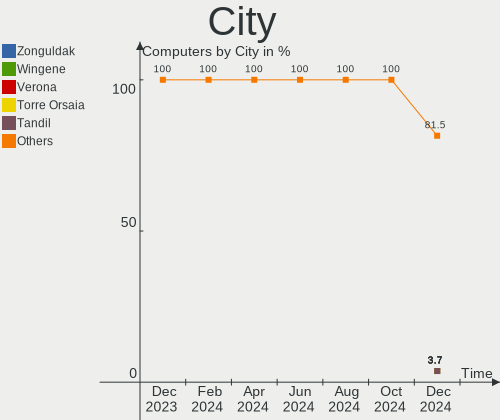
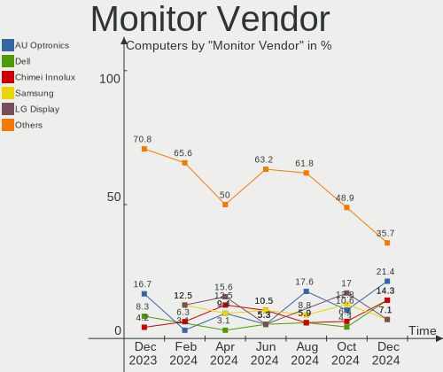
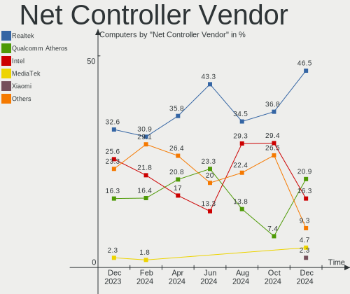

Lubuntu - Hardware Trends
-------------------------

A project to identify most popular hardware characteristics and track their change
over time based on data collected by Linux users at https://Linux-Hardware.org.

Anyone can contribute to this report by the [hw-probe](https://github.com/linuxhw/hw-probe) tool:

    sudo -E hw-probe -all -upload

This is a report for all computer types. See also reports for [desktops](/Dist/Lubuntu/Desktop/README.md) and [notebooks](/Dist/Lubuntu/Notebook/README.md).

This report is for one last month. Overall report since the beginning of time: [TestDays](https://github.com/linuxhw/TestDays)

Period: Jan, 2024.

Contents
--------

* [ System ](#system)
  - [ OS                       ](#os)
  - [ OS Family                ](#os-family)
  - [ Kernel                   ](#kernel)
  - [ Kernel Family            ](#kernel-family)
  - [ Kernel Major Ver.        ](#kernel-major-ver)
  - [ Arch                     ](#arch)
  - [ DE                       ](#de)
  - [ Display Server           ](#display-server)
  - [ Display Manager          ](#display-manager)
  - [ OS Lang                  ](#os-lang)
  - [ Boot Mode                ](#boot-mode)
  - [ Filesystem               ](#filesystem)
  - [ Part. scheme             ](#part-scheme)
  - [ Dual Boot with Linux/BSD ](#dual-boot-with-linuxbsd)
  - [ Dual Boot (Win)          ](#dual-boot-win)

* [ Board ](#board)
  - [ Vendor                   ](#vendor)
  - [ Model                    ](#model)
  - [ Model Family             ](#model-family)
  - [ MFG Year                 ](#mfg-year)
  - [ Form Factor              ](#form-factor)
  - [ Secure Boot              ](#secure-boot)
  - [ Coreboot                 ](#coreboot)
  - [ RAM Size                 ](#ram-size)
  - [ RAM Used                 ](#ram-used)
  - [ Total Drives             ](#total-drives)
  - [ Has CD-ROM               ](#has-cd-rom)
  - [ Has Ethernet             ](#has-ethernet)
  - [ Has WiFi                 ](#has-wifi)
  - [ Has Bluetooth            ](#has-bluetooth)

* [ Location ](#location)
  - [ Country                  ](#country)
  - [ City                     ](#city)

* [ Drives ](#drives)
  - [ Drive Vendor             ](#drive-vendor)
  - [ Drive Model              ](#drive-model)
  - [ HDD Vendor               ](#hdd-vendor)
  - [ SSD Vendor               ](#ssd-vendor)
  - [ Drive Kind               ](#drive-kind)
  - [ Drive Connector          ](#drive-connector)
  - [ Drive Size               ](#drive-size)
  - [ Space Total              ](#space-total)
  - [ Space Used               ](#space-used)
  - [ Malfunc. Drives          ](#malfunc-drives)
  - [ Malfunc. Drive Vendor    ](#malfunc-drive-vendor)
  - [ Malfunc. HDD Vendor      ](#malfunc-hdd-vendor)
  - [ Malfunc. Drive Kind      ](#malfunc-drive-kind)
  - [ Failed Drives            ](#failed-drives)
  - [ Failed Drive Vendor      ](#failed-drive-vendor)
  - [ Drive Status             ](#drive-status)

* [ Storage controller ](#storage-controller)
  - [ Storage Vendor           ](#storage-vendor)
  - [ Storage Model            ](#storage-model)
  - [ Storage Kind             ](#storage-kind)

* [ Processor ](#processor)
  - [ CPU Vendor               ](#cpu-vendor)
  - [ CPU Model                ](#cpu-model)
  - [ CPU Model Family         ](#cpu-model-family)
  - [ CPU Cores                ](#cpu-cores)
  - [ CPU Sockets              ](#cpu-sockets)
  - [ CPU Threads              ](#cpu-threads)
  - [ CPU Op-Modes             ](#cpu-op-modes)
  - [ CPU Microcode            ](#cpu-microcode)
  - [ CPU Microarch            ](#cpu-microarch)

* [ Graphics ](#graphics)
  - [ GPU Vendor               ](#gpu-vendor)
  - [ GPU Model                ](#gpu-model)
  - [ GPU Combo                ](#gpu-combo)
  - [ GPU Driver               ](#gpu-driver)
  - [ GPU Memory               ](#gpu-memory)

* [ Monitor ](#monitor)
  - [ Monitor Vendor           ](#monitor-vendor)
  - [ Monitor Model            ](#monitor-model)
  - [ Monitor Resolution       ](#monitor-resolution)
  - [ Monitor Diagonal         ](#monitor-diagonal)
  - [ Monitor Width            ](#monitor-width)
  - [ Aspect Ratio             ](#aspect-ratio)
  - [ Monitor Area             ](#monitor-area)
  - [ Pixel Density            ](#pixel-density)
  - [ Multiple Monitors        ](#multiple-monitors)

* [ Network ](#network)
  - [ Net Controller Vendor    ](#net-controller-vendor)
  - [ Net Controller Model     ](#net-controller-model)
  - [ Wireless Vendor          ](#wireless-vendor)
  - [ Wireless Model           ](#wireless-model)
  - [ Ethernet Vendor          ](#ethernet-vendor)
  - [ Ethernet Model           ](#ethernet-model)
  - [ Net Controller Kind      ](#net-controller-kind)
  - [ Used Controller          ](#used-controller)
  - [ NICs                     ](#nics)
  - [ IPv6                     ](#ipv6)

* [ Bluetooth ](#bluetooth)
  - [ Bluetooth Vendor         ](#bluetooth-vendor)
  - [ Bluetooth Model          ](#bluetooth-model)

* [ Sound ](#sound)
  - [ Sound Vendor             ](#sound-vendor)
  - [ Sound Model              ](#sound-model)

* [ Memory ](#memory)
  - [ Memory Vendor            ](#memory-vendor)
  - [ Memory Model             ](#memory-model)
  - [ Memory Kind              ](#memory-kind)
  - [ Memory Form Factor       ](#memory-form-factor)
  - [ Memory Size              ](#memory-size)
  - [ Memory Speed             ](#memory-speed)

* [ Printers & scanners ](#printers--scanners)
  - [ Printer Vendor           ](#printer-vendor)
  - [ Printer Model            ](#printer-model)
  - [ Scanner Vendor           ](#scanner-vendor)
  - [ Scanner Model            ](#scanner-model)

* [ Camera ](#camera)
  - [ Camera Vendor            ](#camera-vendor)
  - [ Camera Model             ](#camera-model)

* [ Security ](#security)
  - [ Fingerprint Vendor       ](#fingerprint-vendor)
  - [ Fingerprint Model        ](#fingerprint-model)
  - [ Chipcard Vendor          ](#chipcard-vendor)
  - [ Chipcard Model           ](#chipcard-model)

* [ Unsupported ](#unsupported)
  - [ Unsupported Devices      ](#unsupported-devices)
  - [ Unsupported Device Types ](#unsupported-device-types)

System
------

OS
--

Installed operating systems

| Name          | Computers | Percent |
|---------------|-----------|---------|
| Lubuntu 22.04 | 23        | 56.1%   |
| Lubuntu 23.10 | 12        | 29.27%  |
| Lubuntu 20.04 | 3         | 7.32%   |
| Lubuntu 23.04 | 2         | 4.88%   |
| Lubuntu 21.04 | 1         | 2.44%   |

OS Family
---------

OS without a version

| Name    | Computers | Percent |
|---------|-----------|---------|
| Lubuntu | 41        | 100%    |

Kernel
------

Version of the Linux kernel

| Version               | Computers | Percent |
|-----------------------|-----------|---------|
| 6.5.0-14-generic      | 17        | 41.46%  |
| 6.2.0-39-generic      | 7         | 17.07%  |
| 5.15.0-91-generic     | 5         | 12.2%   |
| 6.5.0-9-generic       | 2         | 4.88%   |
| 6.7.0-custom          | 1         | 2.44%   |
| 6.6.6-surface-1       | 1         | 2.44%   |
| 6.5.0-15-generic      | 1         | 2.44%   |
| 6.2.0-26-generic      | 1         | 2.44%   |
| 6.2.0-060200-generic  | 1         | 2.44%   |
| 5.4.0-169-generic     | 1         | 2.44%   |
| 5.19.0-32-generic     | 1         | 2.44%   |
| 5.19.0-051900-generic | 1         | 2.44%   |
| 5.15.0-92-generic     | 1         | 2.44%   |
| 5.11.0-49-generic     | 1         | 2.44%   |

Kernel Family
-------------

Linux kernel without a distro release

| Version | Computers | Percent |
|---------|-----------|---------|
| 6.5.0   | 20        | 48.78%  |
| 6.2.0   | 9         | 21.95%  |
| 5.15.0  | 6         | 14.63%  |
| 5.19.0  | 2         | 4.88%   |
| 6.7.0   | 1         | 2.44%   |
| 6.6.6   | 1         | 2.44%   |
| 5.4.0   | 1         | 2.44%   |
| 5.11.0  | 1         | 2.44%   |

Kernel Major Ver.
-----------------

Linux kernel major version

| Version | Computers | Percent |
|---------|-----------|---------|
| 6.5     | 20        | 48.78%  |
| 6.2     | 9         | 21.95%  |
| 5.15    | 6         | 14.63%  |
| 5.19    | 2         | 4.88%   |
| 6.7     | 1         | 2.44%   |
| 6.6     | 1         | 2.44%   |
| 5.4     | 1         | 2.44%   |
| 5.11    | 1         | 2.44%   |

Arch
----

OS architecture (x86_64, i586, etc.)

| Name   | Computers | Percent |
|--------|-----------|---------|
| x86_64 | 41        | 100%    |

DE
--

Desktop Environment

| Name | Computers | Percent |
|------|-----------|---------|
| LXQt | 39        | 95.12%  |
| LXDE | 2         | 4.88%   |

Display Server
--------------

X11 or Wayland

| Name | Computers | Percent |
|------|-----------|---------|
| X11  | 39        | 95.12%  |
| Tty  | 2         | 4.88%   |

Display Manager
---------------

SDDM, LightDM, etc.

| Name    | Computers | Percent |
|---------|-----------|---------|
| SDDM    | 27        | 65.85%  |
| Unknown | 8         | 19.51%  |
| LightDM | 4         | 9.76%   |
| GDM3    | 2         | 4.88%   |

OS Lang
-------

Language

| Lang  | Computers | Percent |
|-------|-----------|---------|
| en_US | 13        | 31.71%  |
| fr_FR | 5         | 12.2%   |
| it_IT | 3         | 7.32%   |
| de_DE | 3         | 7.32%   |
| C     | 3         | 7.32%   |
| pt_BR | 2         | 4.88%   |
| es_EC | 2         | 4.88%   |
| es_CL | 2         | 4.88%   |
| en_GB | 2         | 4.88%   |
| sv_SE | 1         | 2.44%   |
| ro_RO | 1         | 2.44%   |
| es_MX | 1         | 2.44%   |
| es_ES | 1         | 2.44%   |
| es_CR | 1         | 2.44%   |
| en_CA | 1         | 2.44%   |

Boot Mode
---------

EFI or BIOS

| Mode | Computers | Percent |
|------|-----------|---------|
| BIOS | 31        | 75.61%  |
| EFI  | 10        | 24.39%  |

Filesystem
----------

Type of filesystem

| Type    | Computers | Percent |
|---------|-----------|---------|
| Ext4    | 25        | 60.98%  |
| Tmpfs   | 14        | 34.15%  |
| Overlay | 2         | 4.88%   |

Part. scheme
------------

Scheme of partitioning

| Type    | Computers | Percent |
|---------|-----------|---------|
| GPT     | 22        | 53.66%  |
| MBR     | 11        | 26.83%  |
| Unknown | 8         | 19.51%  |

Dual Boot with Linux/BSD
------------------------

Hosting more than one Linux/BSD

| Dual boot | Computers | Percent |
|-----------|-----------|---------|
| No        | 35        | 85.37%  |
| Yes       | 6         | 14.63%  |

Dual Boot (Win)
---------------

Hosting Linux and Windows

| Dual boot | Computers | Percent |
|-----------|-----------|---------|
| No        | 32        | 78.05%  |
| Yes       | 9         | 21.95%  |

Board
-----

Vendor
------

Motherboard manufacturer

| Name                | Computers | Percent |
|---------------------|-----------|---------|
| Lenovo              | 9         | 21.95%  |
| ASUSTek Computer    | 6         | 14.63%  |
| Dell                | 4         | 9.76%   |
| Hewlett-Packard     | 3         | 7.32%   |
| Acer                | 3         | 7.32%   |
| Microsoft           | 2         | 4.88%   |
| Foxconn             | 2         | 4.88%   |
| ZOTAC               | 1         | 2.44%   |
| Supermicro          | 1         | 2.44%   |
| Packard Bell        | 1         | 2.44%   |
| ODM                 | 1         | 2.44%   |
| Koloe               | 1         | 2.44%   |
| iRU                 | 1         | 2.44%   |
| Intel               | 1         | 2.44%   |
| Google              | 1         | 2.44%   |
| Gigabyte Technology | 1         | 2.44%   |
| Fujitsu Siemens     | 1         | 2.44%   |
| Digibras            | 1         | 2.44%   |
| BESSTAR Tech        | 1         | 2.44%   |

Model
-----

Motherboard model

| Name                                 | Computers | Percent |
|--------------------------------------|-----------|---------|
| ZOTAC NM10                           | 1         | 2.44%   |
| Supermicro Super Server              | 1         | 2.44%   |
| Packard Bell EasyNote LM85           | 1         | 2.44%   |
| Microsoft Surface Pro 3              | 1         | 2.44%   |
| Microsoft Surface Pro                | 1         | 2.44%   |
| Lenovo V310-15ISK 80SY               | 1         | 2.44%   |
| Lenovo ThinkPad T60p 20078JU         | 1         | 2.44%   |
| Lenovo ThinkPad T430 23477C7         | 1         | 2.44%   |
| Lenovo ThinkPad SL 2746F2G           | 1         | 2.44%   |
| Lenovo ThinkPad Edge E530c 33664CG   | 1         | 2.44%   |
| Lenovo ThinkCentre M710s 10M8S4XQ00  | 1         | 2.44%   |
| Lenovo MIIX 320-10ICR 80XF           | 1         | 2.44%   |
| Lenovo IdeaPad S145-14API 81UV       | 1         | 2.44%   |
| Lenovo G575 20081                    | 1         | 2.44%   |
| Koloe Thurley                        | 1         | 2.44%   |
| iRU 15TLI                            | 1         | 2.44%   |
| Intel H61                            | 1         | 2.44%   |
| HP Notebook                          | 1         | 2.44%   |
| HP Compaq Elite 8300 SFF             | 1         | 2.44%   |
| HP 240 G6 Notebook PC                | 1         | 2.44%   |
| Google Electro                       | 1         | 2.44%   |
| Gigabyte H110M-H                     | 1         | 2.44%   |
| Fujitsu Siemens ESPRIMO Mobile V5535 | 1         | 2.44%   |
| Foxconn Pro 3125 Microtower PC       | 1         | 2.44%   |
| Foxconn G41MXP/G41MXP-V              | 1         | 2.44%   |
| Digibras NH4CU03                     | 1         | 2.44%   |
| Dell XPS 8930                        | 1         | 2.44%   |
| Dell Precision WorkStation T5500     | 1         | 2.44%   |
| Dell Inspiron N5010                  | 1         | 2.44%   |
| Dell Inspiron 560s                   | 1         | 2.44%   |
| BESSTAR Tech N40                     | 1         | 2.44%   |
| ASUS ZenBook UX325SA_UM325SA         | 1         | 2.44%   |
| ASUS SABERTOOTH 990FX                | 1         | 2.44%   |
| ASUS PRIME B250-PLUS                 | 1         | 2.44%   |
| ASUS M5A97 LE R2.0                   | 1         | 2.44%   |
| ASUS M2N32-SLI DELUXE                | 1         | 2.44%   |
| ASUS K53U                            | 1         | 2.44%   |
| Acer Swift SF314-43                  | 1         | 2.44%   |
| Acer Aspire ES1-520                  | 1         | 2.44%   |
| Acer Aspire E1-572G                  | 1         | 2.44%   |

Model Family
------------

Motherboard model prefix

| Name                    | Computers | Percent |
|-------------------------|-----------|---------|
| Lenovo ThinkPad         | 4         | 9.76%   |
| Microsoft Surface       | 2         | 4.88%   |
| Dell Inspiron           | 2         | 4.88%   |
| Acer Aspire             | 2         | 4.88%   |
| ZOTAC NM10              | 1         | 2.44%   |
| Supermicro Super        | 1         | 2.44%   |
| Packard Bell EasyNote   | 1         | 2.44%   |
| Lenovo V310-15ISK       | 1         | 2.44%   |
| Lenovo ThinkCentre      | 1         | 2.44%   |
| Lenovo MIIX             | 1         | 2.44%   |
| Lenovo IdeaPad          | 1         | 2.44%   |
| Lenovo G575             | 1         | 2.44%   |
| Koloe Thurley           | 1         | 2.44%   |
| iRU 15TLI               | 1         | 2.44%   |
| Intel H61               | 1         | 2.44%   |
| HP Notebook             | 1         | 2.44%   |
| HP Compaq               | 1         | 2.44%   |
| HP 240                  | 1         | 2.44%   |
| Google Electro          | 1         | 2.44%   |
| Gigabyte H110M-H        | 1         | 2.44%   |
| Fujitsu Siemens ESPRIMO | 1         | 2.44%   |
| Foxconn Pro             | 1         | 2.44%   |
| Foxconn G41MXP          | 1         | 2.44%   |
| Digibras NH4CU03        | 1         | 2.44%   |
| Dell XPS                | 1         | 2.44%   |
| Dell Precision          | 1         | 2.44%   |
| BESSTAR Tech N40        | 1         | 2.44%   |
| ASUS ZenBook            | 1         | 2.44%   |
| ASUS SABERTOOTH         | 1         | 2.44%   |
| ASUS PRIME              | 1         | 2.44%   |
| ASUS M5A97              | 1         | 2.44%   |
| ASUS M2N32-SLI          | 1         | 2.44%   |
| ASUS K53U               | 1         | 2.44%   |
| Acer Swift              | 1         | 2.44%   |
| Unknown                 | 1         | 2.44%   |

MFG Year
--------

Motherboard manufacture year

| Year    | Computers | Percent |
|---------|-----------|---------|
| 2010    | 7         | 17.07%  |
| 2017    | 5         | 12.2%   |
| 2016    | 4         | 9.76%   |
| 2012    | 4         | 9.76%   |
| 2021    | 3         | 7.32%   |
| 2011    | 3         | 7.32%   |
| 2023    | 2         | 4.88%   |
| 2019    | 2         | 4.88%   |
| 2015    | 2         | 4.88%   |
| 2013    | 2         | 4.88%   |
| 2008    | 2         | 4.88%   |
| 2006    | 2         | 4.88%   |
| 2022    | 1         | 2.44%   |
| 2007    | 1         | 2.44%   |
| Unknown | 1         | 2.44%   |

Form Factor
-----------

Physical design of the computer

| Name     | Computers | Percent |
|----------|-----------|---------|
| Notebook | 21        | 51.22%  |
| Desktop  | 15        | 36.59%  |
| Tablet   | 3         | 7.32%   |
| Mini pc  | 1         | 2.44%   |
| Server   | 1         | 2.44%   |

Secure Boot
-----------

Enabled or disabled

| State    | Computers | Percent |
|----------|-----------|---------|
| Disabled | 40        | 97.56%  |
| Enabled  | 1         | 2.44%   |

Coreboot
--------

Have coreboot on board

| Used | Computers | Percent |
|------|-----------|---------|
| No   | 40        | 97.56%  |
| Yes  | 1         | 2.44%   |

RAM Size
--------

Total RAM memory

| Size in GB      | Computers | Percent |
|-----------------|-----------|---------|
| 3.01-4.0        | 14        | 34.15%  |
| 4.01-8.0        | 8         | 19.51%  |
| 16.01-24.0      | 6         | 14.63%  |
| 8.01-16.0       | 5         | 12.2%   |
| 1.01-2.0        | 3         | 7.32%   |
| 32.01-64.0      | 2         | 4.88%   |
| More than 256.0 | 1         | 2.44%   |
| 24.01-32.0      | 1         | 2.44%   |
| 2.01-3.0        | 1         | 2.44%   |

RAM Used
--------

Used RAM memory

| Used GB    | Computers | Percent |
|------------|-----------|---------|
| 1.01-2.0   | 17        | 41.46%  |
| 2.01-3.0   | 11        | 26.83%  |
| 3.01-4.0   | 4         | 9.76%   |
| 0.51-1.0   | 4         | 9.76%   |
| 4.01-8.0   | 3         | 7.32%   |
| 16.01-24.0 | 1         | 2.44%   |
| 8.01-16.0  | 1         | 2.44%   |

Total Drives
------------

Number of drives on board

| Drives | Computers | Percent |
|--------|-----------|---------|
| 1      | 28        | 68.29%  |
| 2      | 7         | 17.07%  |
| 3      | 3         | 7.32%   |
| 13     | 1         | 2.44%   |
| 5      | 1         | 2.44%   |
| 4      | 1         | 2.44%   |

Has CD-ROM
----------

Has CD-ROM on board

| Presented | Computers | Percent |
|-----------|-----------|---------|
| Yes       | 22        | 53.66%  |
| No        | 19        | 46.34%  |

Has Ethernet
------------

Has Ethernet on board

| Presented | Computers | Percent |
|-----------|-----------|---------|
| Yes       | 34        | 82.93%  |
| No        | 7         | 17.07%  |

Has WiFi
--------

Has WiFi module

| Presented | Computers | Percent |
|-----------|-----------|---------|
| Yes       | 33        | 80.49%  |
| No        | 8         | 19.51%  |

Has Bluetooth
-------------

Has Bluetooth module

| Presented | Computers | Percent |
|-----------|-----------|---------|
| No        | 21        | 51.22%  |
| Yes       | 20        | 48.78%  |

Location
--------

Country
-------

Geographic location (country)

| Country    | Computers | Percent |
|------------|-----------|---------|
| USA        | 6         | 14.63%  |
| France     | 5         | 12.2%   |
| Italy      | 4         | 9.76%   |
| Germany    | 4         | 9.76%   |
| Brazil     | 3         | 7.32%   |
| UK         | 2         | 4.88%   |
| Russia     | 2         | 4.88%   |
| Ecuador    | 2         | 4.88%   |
| Chile      | 2         | 4.88%   |
| Canada     | 2         | 4.88%   |
| Sweden     | 1         | 2.44%   |
| Spain      | 1         | 2.44%   |
| Romania    | 1         | 2.44%   |
| Pakistan   | 1         | 2.44%   |
| Iran       | 1         | 2.44%   |
| Guam       | 1         | 2.44%   |
| Finland    | 1         | 2.44%   |
| Costa Rica | 1         | 2.44%   |
| Argentina  | 1         | 2.44%   |

City
----

Geographic location (city)

| City                 | Computers | Percent |
|----------------------|-----------|---------|
| Santiago             | 2         | 4.88%   |
| Guayaquil            | 2         | 4.88%   |
| Weslaco              | 1         | 2.44%   |
| Vitória             | 1         | 2.44%   |
| Turin                | 1         | 2.44%   |
| Toronto              | 1         | 2.44%   |
| Tehran               | 1         | 2.44%   |
| Stockholm            | 1         | 2.44%   |
| Seevetal             | 1         | 2.44%   |
| Saratov              | 1         | 2.44%   |
| Sao José dos Campos | 1         | 2.44%   |
| Rennes               | 1         | 2.44%   |
| Rawalpindi           | 1         | 2.44%   |
| Pozuelo de Alarcón  | 1         | 2.44%   |
| Paris                | 1         | 2.44%   |
| Pantin               | 1         | 2.44%   |
| Painesville          | 1         | 2.44%   |
| Nuremberg            | 1         | 2.44%   |
| New Orleans          | 1         | 2.44%   |
| Mooresville          | 1         | 2.44%   |
| Milan                | 1         | 2.44%   |
| Lübeck              | 1         | 2.44%   |
| La Plata             | 1         | 2.44%   |
| Irkutsk              | 1         | 2.44%   |
| Houston              | 1         | 2.44%   |
| Helsinki             | 1         | 2.44%   |
| Hanover              | 1         | 2.44%   |
| Hagåtña            | 1         | 2.44%   |
| Hackney              | 1         | 2.44%   |
| Grecia               | 1         | 2.44%   |
| Genoa                | 1         | 2.44%   |
| Formosa              | 1         | 2.44%   |
| Edmonton             | 1         | 2.44%   |
| Cumming              | 1         | 2.44%   |
| Constanța           | 1         | 2.44%   |
| Castres              | 1         | 2.44%   |
| Botticino            | 1         | 2.44%   |
| Barnet               | 1         | 2.44%   |
| Aubagne              | 1         | 2.44%   |

Drives
------

Drive Vendor
------------

Hard drive vendors

| Vendor                       | Computers | Drives | Percent |
|------------------------------|-----------|--------|---------|
| Samsung Electronics          | 11        | 12     | 19.3%   |
| Seagate                      | 9         | 16     | 15.79%  |
| WDC                          | 8         | 9      | 14.04%  |
| Kingston                     | 5         | 6      | 8.77%   |
| Toshiba                      | 3         | 3      | 5.26%   |
| SanDisk                      | 3         | 3      | 5.26%   |
| Hitachi                      | 2         | 2      | 3.51%   |
| Crucial                      | 2         | 2      | 3.51%   |
| Unknown                      | 2         | 2      | 3.51%   |
| Unknown                      | 1         | 1      | 1.75%   |
| Supermicro                   | 1         | 1      | 1.75%   |
| SK hynix                     | 1         | 1      | 1.75%   |
| Shenzhen Longsys Electronics | 1         | 1      | 1.75%   |
| Phison                       | 1         | 1      | 1.75%   |
| NVMe                         | 1         | 2      | 1.75%   |
| Lexar                        | 1         | 1      | 1.75%   |
| KINGBANK                     | 1         | 1      | 1.75%   |
| JMicron Technology           | 1         | 1      | 1.75%   |
| HGST                         | 1         | 1      | 1.75%   |
| BR                           | 1         | 1      | 1.75%   |
| Apacer                       | 1         | 1      | 1.75%   |

Drive Model
-----------

Hard drive models

| Model                                   | Computers | Percent |
|-----------------------------------------|-----------|---------|
| Samsung SSD 870 QVO 1TB                 | 2         | 3.23%   |
| Kingston SA400S37240G 240GB SSD         | 2         | 3.23%   |
| Unknown                                 | 2         | 3.23%   |
| WDC WD5000AAKX-75U6AA0 500GB            | 1         | 1.61%   |
| WDC WD5000AAKX-00ERMA0 500GB            | 1         | 1.61%   |
| WDC WD2500BEVS-22UST0 250GB             | 1         | 1.61%   |
| WDC WD20PURZ-85GU6Y0 2TB                | 1         | 1.61%   |
| WDC WD20EARS-00S8B1 2TB                 | 1         | 1.61%   |
| WDC WD10SPZX-24Z10 1TB                  | 1         | 1.61%   |
| WDC WD10JPVX-60JC3T0 1TB                | 1         | 1.61%   |
| WDC WD10EZEX-08WN4A0 1TB                | 1         | 1.61%   |
| WDC WD Blue SA510 M.2 2280 1000GB       | 1         | 1.61%   |
| Unknown MMC Card  32GB                  | 1         | 1.61%   |
| Toshiba MQ01ABD100 1TB                  | 1         | 1.61%   |
| Toshiba MQ01ABD050 500GB                | 1         | 1.61%   |
| Toshiba MK1237GSX 120GB                 | 1         | 1.61%   |
| Supermicro SSD 32GB                     | 1         | 1.61%   |
| SK hynix HFM512GD3JX013N 512GB          | 1         | 1.61%   |
| Shenzhen Longsys Kingmax PCIe SSD 256GB | 1         | 1.61%   |
| Seagate ST500LM021-1KJ152 500GB         | 1         | 1.61%   |
| Seagate ST500DM002-1BD142 500GB         | 1         | 1.61%   |
| Seagate ST4000NM025B 4TB                | 1         | 1.61%   |
| Seagate ST3500418AS 500GB               | 1         | 1.61%   |
| Seagate ST3320820AS 320GB               | 1         | 1.61%   |
| Seagate ST3320418AS 320GB               | 1         | 1.61%   |
| Seagate ST3200826AS 200GB               | 1         | 1.61%   |
| Seagate ST3000DM001-1CH166 3TB          | 1         | 1.61%   |
| Seagate ST2000DM001-1ER164 2TB          | 1         | 1.61%   |
| Seagate ST2000DM001-1CH164 2TB          | 1         | 1.61%   |
| Seagate ST1000DM010-2EP102 1TB          | 1         | 1.61%   |
| SanDisk SSD PLUS 480GB                  | 1         | 1.61%   |
| SanDisk SD8SN8U128G 128GB SSD           | 1         | 1.61%   |
| SanDisk DF4064  64GB                    | 1         | 1.61%   |
| Samsung SSD 870 EVO 2TB                 | 1         | 1.61%   |
| Samsung SSD 850 EVO mSATA 250GB         | 1         | 1.61%   |
| Samsung SSD 830 Series 256GB            | 1         | 1.61%   |
| Samsung PSSD T7 2TB                     | 1         | 1.61%   |
| Samsung PSSD T7 1TB                     | 1         | 1.61%   |
| Samsung MZMTE256HMHP-000MV 256GB SSD    | 1         | 1.61%   |
| Samsung MZ7TY128HDHP-000L1 128GB SSD    | 1         | 1.61%   |

HDD Vendor
----------

Hard disk drive vendors

| Vendor              | Computers | Drives | Percent |
|---------------------|-----------|--------|---------|
| Seagate             | 9         | 16     | 36%     |
| WDC                 | 7         | 8      | 28%     |
| Toshiba             | 3         | 3      | 12%     |
| Samsung Electronics | 2         | 2      | 8%      |
| Hitachi             | 2         | 2      | 8%      |
| JMicron Technology  | 1         | 1      | 4%      |
| HGST                | 1         | 1      | 4%      |

SSD Vendor
----------

Solid state drive vendors

| Vendor              | Computers | Drives | Percent |
|---------------------|-----------|--------|---------|
| Samsung Electronics | 8         | 8      | 34.78%  |
| Kingston            | 4         | 5      | 17.39%  |
| SanDisk             | 2         | 2      | 8.7%    |
| Crucial             | 2         | 2      | 8.7%    |
| WDC                 | 1         | 1      | 4.35%   |
| Supermicro          | 1         | 1      | 4.35%   |
| NVMe                | 1         | 2      | 4.35%   |
| Lexar               | 1         | 1      | 4.35%   |
| KINGBANK            | 1         | 1      | 4.35%   |
| Apacer              | 1         | 1      | 4.35%   |
| Unknown             | 1         | 1      | 4.35%   |

Drive Kind
----------

HDD or SSD

| Kind    | Computers | Drives | Percent |
|---------|-----------|--------|---------|
| HDD     | 21        | 33     | 42%     |
| SSD     | 19        | 25     | 38%     |
| NVMe    | 6         | 6      | 12%     |
| MMC     | 3         | 3      | 6%      |
| Unknown | 1         | 1      | 2%      |

Drive Connector
---------------

SATA, SAS, NVMe, etc.

| Type | Computers | Drives | Percent |
|------|-----------|--------|---------|
| SATA | 35        | 57     | 77.78%  |
| NVMe | 5         | 5      | 11.11%  |
| MMC  | 3         | 3      | 6.67%   |
| SAS  | 2         | 3      | 4.44%   |

Drive Size
----------

Size of hard drive

| Size in TB | Computers | Drives | Percent |
|------------|-----------|--------|---------|
| 0.01-0.5   | 24        | 29     | 54.55%  |
| 0.51-1.0   | 12        | 14     | 27.27%  |
| 1.01-2.0   | 6         | 8      | 13.64%  |
| 3.01-4.0   | 1         | 6      | 2.27%   |
| 2.01-3.0   | 1         | 1      | 2.27%   |

Space Total
-----------

Amount of disk space available on the file system

| Size in GB | Computers | Percent |
|------------|-----------|---------|
| 101-250    | 13        | 31.71%  |
| 251-500    | 12        | 29.27%  |
| 501-1000   | 7         | 17.07%  |
| 51-100     | 3         | 7.32%   |
| 1001-2000  | 2         | 4.88%   |
| 1-20       | 2         | 4.88%   |
| 21-50      | 1         | 2.44%   |
| Unknown    | 1         | 2.44%   |

Space Used
----------

Amount of used disk space

| Used GB  | Computers | Percent |
|----------|-----------|---------|
| 1-20     | 14        | 34.15%  |
| 21-50    | 11        | 26.83%  |
| 51-100   | 6         | 14.63%  |
| 101-250  | 4         | 9.76%   |
| 501-1000 | 3         | 7.32%   |
| 251-500  | 2         | 4.88%   |
| Unknown  | 1         | 2.44%   |

Malfunc. Drives
---------------

Drive models with a malfunction

| Model                           | Computers | Drives | Percent |
|---------------------------------|-----------|--------|---------|
| WDC WD5000AAKX-00ERMA0 500GB    | 1         | 1      | 20%     |
| Toshiba MQ01ABD050 500GB        | 1         | 1      | 20%     |
| Seagate ST500DM002-1BD142 500GB | 1         | 1      | 20%     |
| Seagate ST3200826AS 200GB       | 1         | 1      | 20%     |
| Seagate ST1000DM010-2EP102 1TB  | 1         | 1      | 20%     |

Malfunc. Drive Vendor
---------------------

Vendors of faulty drives

| Vendor  | Computers | Drives | Percent |
|---------|-----------|--------|---------|
| Seagate | 2         | 3      | 50%     |
| WDC     | 1         | 1      | 25%     |
| Toshiba | 1         | 1      | 25%     |

Malfunc. HDD Vendor
-------------------

Vendors of faulty HDD drives

| Vendor  | Computers | Drives | Percent |
|---------|-----------|--------|---------|
| Seagate | 2         | 3      | 50%     |
| WDC     | 1         | 1      | 25%     |
| Toshiba | 1         | 1      | 25%     |

Malfunc. Drive Kind
-------------------

Kinds of faulty drives

| Kind | Computers | Drives | Percent |
|------|-----------|--------|---------|
| HDD  | 4         | 5      | 100%    |

Failed Drives
-------------

Failed drive models

Zero info for selected period =(

Failed Drive Vendor
-------------------

Failed drive vendors

Zero info for selected period =(

Drive Status
------------

Number of failed and malfunc. drives

| Status   | Computers | Drives | Percent |
|----------|-----------|--------|---------|
| Detected | 24        | 33     | 54.55%  |
| Works    | 16        | 30     | 36.36%  |
| Malfunc  | 4         | 5      | 9.09%   |

Storage controller
------------------

Storage Vendor
--------------

Storage controller vendors

| Vendor                           | Computers | Percent |
|----------------------------------|-----------|---------|
| Intel                            | 27        | 58.7%   |
| AMD                              | 8         | 17.39%  |
| Silicon Image                    | 2         | 4.35%   |
| SK hynix                         | 1         | 2.17%   |
| Silicon Integrated Systems [SiS] | 1         | 2.17%   |
| Shenzhen Longsys Electronics     | 1         | 2.17%   |
| Samsung Electronics              | 1         | 2.17%   |
| Phison Electronics               | 1         | 2.17%   |
| Nvidia                           | 1         | 2.17%   |
| Kingston Technology Company      | 1         | 2.17%   |
| JMicron Technology               | 1         | 2.17%   |
| Broadcom / LSI                   | 1         | 2.17%   |

Storage Model
-------------

Storage controller models

| Model                                                                                                              | Computers | Percent |
|--------------------------------------------------------------------------------------------------------------------|-----------|---------|
| AMD SB7x0/SB8x0/SB9x0 SATA Controller [AHCI mode]                                                                  | 4         | 7.41%   |
| Intel 7 Series Chipset Family 6-port SATA Controller [AHCI mode]                                                   | 3         | 5.56%   |
| AMD FCH SATA Controller [AHCI mode]                                                                                | 3         | 5.56%   |
| Intel Celeron/Pentium Silver Processor SATA Controller                                                             | 2         | 3.7%    |
| Intel 82801JI (ICH10 Family) SATA AHCI Controller                                                                  | 2         | 3.7%    |
| Intel 82801G (ICH7 Family) IDE Controller                                                                          | 2         | 3.7%    |
| Intel 8 Series SATA Controller 1 [AHCI mode]                                                                       | 2         | 3.7%    |
| Intel 200 Series PCH SATA controller [AHCI mode]                                                                   | 2         | 3.7%    |
| SK hynix Gold P31/BC711/PC711 NVMe Solid State Drive                                                               | 1         | 1.85%   |
| Silicon Integrated Systems [SiS] SATA Controller / IDE mode                                                        | 1         | 1.85%   |
| Silicon Integrated Systems [SiS] 5513 IDE Controller                                                               | 1         | 1.85%   |
| Silicon Image SiI 3132 Serial ATA Raid II Controller                                                               | 1         | 1.85%   |
| Silicon Image SiI 3114 [SATALink/SATARaid] Serial ATA Controller                                                   | 1         | 1.85%   |
| Shenzhen Longsys FORESEE XP1000 / Lexar Professional CFexpress Type B Gold series, NM620 PCIe NVME SSD (DRAM-less) | 1         | 1.85%   |
| Samsung NVMe SSD SM0032L                                                                                           | 1         | 1.85%   |
| Phison E12 NVMe Controller                                                                                         | 1         | 1.85%   |
| Nvidia MCP55 SATA Controller                                                                                       | 1         | 1.85%   |
| Nvidia MCP55 IDE                                                                                                   | 1         | 1.85%   |
| Kingston Company OM8SEP4 Design-In PCIe 4 NVMe SSD (TLC) (DRAM-less)                                               | 1         | 1.85%   |
| JMicron JMB362 SATA Controller                                                                                     | 1         | 1.85%   |
| Intel Tiger Lake-LP SATA Controller                                                                                | 1         | 1.85%   |
| Intel Sunrise Point-LP SATA Controller [AHCI mode]                                                                 | 1         | 1.85%   |
| Intel SATA Controller [RAID mode]                                                                                  | 1         | 1.85%   |
| Intel Q170/Q150/B150/H170/H110/Z170/CM236 Chipset SATA Controller [AHCI Mode]                                      | 1         | 1.85%   |
| Intel NM10/ICH7 Family SATA Controller [IDE mode]                                                                  | 1         | 1.85%   |
| Intel NM10/ICH7 Family SATA Controller [AHCI mode]                                                                 | 1         | 1.85%   |
| Intel C620 Series Chipset Family SSATA Controller [AHCI mode]                                                      | 1         | 1.85%   |
| Intel C620 Series Chipset Family SATA Controller [AHCI mode]                                                       | 1         | 1.85%   |
| Intel Atom/Celeron/Pentium Processor x5-E8000/J3xxx/N3xxx Series SATA Controller                                   | 1         | 1.85%   |
| Intel 82801JI (ICH10 Family) 4 port SATA IDE Controller #1                                                         | 1         | 1.85%   |
| Intel 82801IBM/IEM (ICH9M/ICH9M-E) 4 port SATA Controller [AHCI mode]                                              | 1         | 1.85%   |
| Intel 82801HM/HEM (ICH8M/ICH8M-E) SATA Controller [AHCI mode]                                                      | 1         | 1.85%   |
| Intel 82801HM/HEM (ICH8M/ICH8M-E) IDE Controller                                                                   | 1         | 1.85%   |
| Intel 82801GBM/GHM (ICH7-M Family) SATA Controller [AHCI mode]                                                     | 1         | 1.85%   |
| Intel 7 Series/C210 Series Chipset Family 6-port SATA Controller [AHCI mode]                                       | 1         | 1.85%   |
| Intel 6 Series/C200 Series Chipset Family 6 port Desktop SATA AHCI Controller                                      | 1         | 1.85%   |
| Intel 5 Series/3400 Series Chipset 6 port SATA AHCI Controller                                                     | 1         | 1.85%   |
| Intel 5 Series/3400 Series Chipset 4 port SATA AHCI Controller                                                     | 1         | 1.85%   |
| Broadcom / LSI MegaRAID 12GSAS/PCIe Secure SAS39xx                                                                 | 1         | 1.85%   |
| Broadcom / LSI MegaRAID 12GSAS/PCIe Secure SAS38xx                                                                 | 1         | 1.85%   |

Storage Kind
------------

Kind of storage controller (IDE, SATA, NVMe, SAS, ...)

| Kind | Computers | Percent |
|------|-----------|---------|
| SATA | 32        | 66.67%  |
| IDE  | 7         | 14.58%  |
| NVMe | 5         | 10.42%  |
| RAID | 4         | 8.33%   |

Processor
---------

CPU Vendor
----------

Processor vendors

| Vendor | Computers | Percent |
|--------|-----------|---------|
| Intel  | 31        | 75.61%  |
| AMD    | 10        | 24.39%  |

CPU Model
---------

Processor models

| Model                                       | Computers | Percent |
|---------------------------------------------|-----------|---------|
| Intel Pentium CPU G4400 @ 3.30GHz           | 2         | 4.88%   |
| Intel Xeon Gold 6326 CPU @ 2.90GHz          | 1         | 2.44%   |
| Intel Xeon CPU E5620 @ 2.40GHz              | 1         | 2.44%   |
| Intel Pentium Dual-Core CPU E5700 @ 3.00GHz | 1         | 2.44%   |
| Intel Pentium CPU P6200 @ 2.13GHz           | 1         | 2.44%   |
| Intel Pentium CPU N3710 @ 1.60GHz           | 1         | 2.44%   |
| Intel Core i7-8700 CPU @ 3.20GHz            | 1         | 2.44%   |
| Intel Core i7-7700 CPU @ 3.60GHz            | 1         | 2.44%   |
| Intel Core i7-4650U CPU @ 1.70GHz           | 1         | 2.44%   |
| Intel Core i7-3770S CPU @ 3.10GHz           | 1         | 2.44%   |
| Intel Core i7-3632QM CPU @ 2.20GHz          | 1         | 2.44%   |
| Intel Core i7-3610QM CPU @ 2.30GHz          | 1         | 2.44%   |
| Intel Core i7 CPU 920 @ 2.67GHz             | 1         | 2.44%   |
| Intel Core i5-7300U CPU @ 2.60GHz           | 1         | 2.44%   |
| Intel Core i5-4200U CPU @ 1.60GHz           | 1         | 2.44%   |
| Intel Core i5-3570 CPU @ 3.40GHz            | 1         | 2.44%   |
| Intel Core i3-6006U CPU @ 2.00GHz           | 1         | 2.44%   |
| Intel Core i3-3217U CPU @ 1.80GHz           | 1         | 2.44%   |
| Intel Core i3 CPU M 350 @ 2.27GHz           | 1         | 2.44%   |
| Intel Core 2 Duo CPU T5870 @ 2.00GHz        | 1         | 2.44%   |
| Intel Core 2 Duo CPU T5850 @ 2.16GHz        | 1         | 2.44%   |
| Intel Core 2 CPU T7600 @ 2.33GHz            | 1         | 2.44%   |
| Intel Celeron N4020 CPU @ 1.10GHz           | 1         | 2.44%   |
| Intel Celeron N4000 CPU @ 1.10GHz           | 1         | 2.44%   |
| Intel Celeron Dual-Core CPU T3000 @ 1.80GHz | 1         | 2.44%   |
| Intel Celeron CPU N3350 @ 1.10GHz           | 1         | 2.44%   |
| Intel Celeron CPU 450 @ 2.20GHz             | 1         | 2.44%   |
| Intel Atom x5-Z8350 CPU @ 1.44GHz           | 1         | 2.44%   |
| Intel Atom CPU D525 @ 1.80GHz               | 1         | 2.44%   |
| Intel 11th Gen Core i5-1135G7 @ 2.40GHz     | 1         | 2.44%   |
| AMD Ryzen 7 5800U with Radeon Graphics      | 1         | 2.44%   |
| AMD Ryzen 7 5700U with Radeon Graphics      | 1         | 2.44%   |
| AMD Phenom II X6 1090T Processor            | 1         | 2.44%   |
| AMD FX-8320 Eight-Core Processor            | 1         | 2.44%   |
| AMD E-300 APU with Radeon HD Graphics       | 1         | 2.44%   |
| AMD C-60 APU with Radeon HD Graphics        | 1         | 2.44%   |
| AMD Athlon II X4 635 Processor              | 1         | 2.44%   |
| AMD Athlon 64 X2 Dual Core Processor 6000+  | 1         | 2.44%   |
| AMD A4-5000 APU with Radeon HD Graphics     | 1         | 2.44%   |
| AMD 3020e with Radeon Graphics              | 1         | 2.44%   |

CPU Model Family
----------------

Processor model prefix

| Model                   | Computers | Percent |
|-------------------------|-----------|---------|
| Intel Core i7           | 7         | 17.07%  |
| Intel Pentium           | 4         | 9.76%   |
| Intel Celeron           | 4         | 9.76%   |
| Intel Core i5           | 3         | 7.32%   |
| Intel Core i3           | 3         | 7.32%   |
| Other                   | 2         | 4.88%   |
| Intel Core 2 Duo        | 2         | 4.88%   |
| Intel Atom              | 2         | 4.88%   |
| AMD Ryzen 7             | 2         | 4.88%   |
| Intel Xeon Gold         | 1         | 2.44%   |
| Intel Xeon              | 1         | 2.44%   |
| Intel Pentium Dual-Core | 1         | 2.44%   |
| Intel Core 2            | 1         | 2.44%   |
| Intel Celeron Dual-Core | 1         | 2.44%   |
| AMD Phenom II X6        | 1         | 2.44%   |
| AMD FX                  | 1         | 2.44%   |
| AMD E                   | 1         | 2.44%   |
| AMD C-60                | 1         | 2.44%   |
| AMD Athlon II X4        | 1         | 2.44%   |
| AMD Athlon 64 X2        | 1         | 2.44%   |
| AMD A4                  | 1         | 2.44%   |

CPU Cores
---------

Number of processor cores

| Number | Computers | Percent |
|--------|-----------|---------|
| 2      | 22        | 53.66%  |
| 4      | 12        | 29.27%  |
| 8      | 3         | 7.32%   |
| 6      | 2         | 4.88%   |
| 32     | 1         | 2.44%   |
| 1      | 1         | 2.44%   |

CPU Sockets
-----------

Number of sockets

| Number | Computers | Percent |
|--------|-----------|---------|
| 1      | 39        | 95.12%  |
| 2      | 2         | 4.88%   |

CPU Threads
-----------

Threads per core (Hyper-Threading)

| Number | Computers | Percent |
|--------|-----------|---------|
| 1      | 22        | 53.66%  |
| 2      | 19        | 46.34%  |

CPU Op-Modes
------------

CPU Operation Modes (32-bit, 64-bit)

| Op mode        | Computers | Percent |
|----------------|-----------|---------|
| 32-bit, 64-bit | 41        | 100%    |

CPU Microcode
-------------

Microcode number

| Number     | Computers | Percent |
|------------|-----------|---------|
| Unknown    | 31        | 75.61%  |
| 0x306a9    | 2         | 4.88%   |
| 0x6fd      | 1         | 2.44%   |
| 0x206c2    | 1         | 2.44%   |
| 0x0a50000c | 1         | 2.44%   |
| 0x08608104 | 1         | 2.44%   |
| 0x06000852 | 1         | 2.44%   |
| 0x05000119 | 1         | 2.44%   |
| 0x010000c8 | 1         | 2.44%   |
| 0x00000000 | 1         | 2.44%   |

CPU Microarch
-------------

Microarchitecture

| Name          | Computers | Percent |
|---------------|-----------|---------|
| IvyBridge     | 5         | 12.2%   |
| Core          | 4         | 9.76%   |
| Westmere      | 3         | 7.32%   |
| Skylake       | 3         | 7.32%   |
| KabyLake      | 3         | 7.32%   |
| Silvermont    | 2         | 4.88%   |
| Penryn        | 2         | 4.88%   |
| K10           | 2         | 4.88%   |
| Haswell       | 2         | 4.88%   |
| Goldmont plus | 2         | 4.88%   |
| Bobcat        | 2         | 4.88%   |
| Zen 3         | 1         | 2.44%   |
| Zen           | 1         | 2.44%   |
| TigerLake     | 1         | 2.44%   |
| Piledriver    | 1         | 2.44%   |
| Nehalem       | 1         | 2.44%   |
| K8 Hammer     | 1         | 2.44%   |
| Jaguar        | 1         | 2.44%   |
| Icelake       | 1         | 2.44%   |
| Goldmont      | 1         | 2.44%   |
| Bonnell       | 1         | 2.44%   |
| Unknown       | 1         | 2.44%   |

Graphics
--------

GPU Vendor
----------

Vendors of graphics cards

| Vendor                           | Computers | Percent |
|----------------------------------|-----------|---------|
| Intel                            | 23        | 53.49%  |
| AMD                              | 11        | 25.58%  |
| Nvidia                           | 7         | 16.28%  |
| Silicon Integrated Systems [SiS] | 1         | 2.33%   |
| ASPEED Technology                | 1         | 2.33%   |

GPU Model
---------

Graphics card models

| Model                                                                                    | Computers | Percent |
|------------------------------------------------------------------------------------------|-----------|---------|
| Intel 3rd Gen Core processor Graphics Controller                                         | 3         | 6.82%   |
| Intel HD Graphics 510                                                                    | 2         | 4.55%   |
| Intel Haswell-ULT Integrated Graphics Controller                                         | 2         | 4.55%   |
| Intel GeminiLake [UHD Graphics 600]                                                      | 2         | 4.55%   |
| Intel Atom/Celeron/Pentium Processor x5-E8000/J3xxx/N3xxx Integrated Graphics Controller | 2         | 4.55%   |
| Intel 4 Series Chipset Integrated Graphics Controller                                    | 2         | 4.55%   |
| Silicon Integrated Systems [SiS] 771/671 PCIE VGA Display Adapter                        | 1         | 2.27%   |
| Nvidia TU116 [GeForce GTX 1660]                                                          | 1         | 2.27%   |
| Nvidia GT218 [ION]                                                                       | 1         | 2.27%   |
| Nvidia GP106 [GeForce GTX 1060 6GB]                                                      | 1         | 2.27%   |
| Nvidia GK208B [GeForce GT 710]                                                           | 1         | 2.27%   |
| Nvidia GF119 [GeForce GT 610]                                                            | 1         | 2.27%   |
| Nvidia GF114 [GeForce GTX 560 Ti]                                                        | 1         | 2.27%   |
| Nvidia G98 [Quadro NVS 295]                                                              | 1         | 2.27%   |
| Intel Xeon E3-1200 v2/3rd Gen Core processor Graphics Controller                         | 1         | 2.27%   |
| Intel TigerLake-LP GT2 [Iris Xe Graphics]                                                | 1         | 2.27%   |
| Intel Mobile GM965/GL960 Integrated Graphics Controller (secondary)                      | 1         | 2.27%   |
| Intel Mobile GM965/GL960 Integrated Graphics Controller (primary)                        | 1         | 2.27%   |
| Intel Mobile 4 Series Chipset Integrated Graphics Controller                             | 1         | 2.27%   |
| Intel IvyBridge GT2 [HD Graphics 4000]                                                   | 1         | 2.27%   |
| Intel HD Graphics 620                                                                    | 1         | 2.27%   |
| Intel HD Graphics 520                                                                    | 1         | 2.27%   |
| Intel HD Graphics 500                                                                    | 1         | 2.27%   |
| Intel Core Processor Integrated Graphics Controller                                      | 1         | 2.27%   |
| Intel CoffeeLake-S GT2 [UHD Graphics 630]                                                | 1         | 2.27%   |
| ASPEED Technology ASPEED Graphics Family                                                 | 1         | 2.27%   |
| AMD Wrestler [Radeon HD 6310]                                                            | 1         | 2.27%   |
| AMD Wrestler [Radeon HD 6290]                                                            | 1         | 2.27%   |
| AMD Sun XT [Radeon HD 8670A/8670M/8690M / R5 M330 / M430 / Radeon 520 Mobile]            | 1         | 2.27%   |
| AMD RV530/M56 GL [Mobility FireGL V5200]                                                 | 1         | 2.27%   |
| AMD RS780L [Radeon 3000]                                                                 | 1         | 2.27%   |
| AMD Robson CE [Radeon HD 6370M/7370M]                                                    | 1         | 2.27%   |
| AMD Picasso/Raven 2 [Radeon Vega Series / Radeon Vega Mobile Series]                     | 1         | 2.27%   |
| AMD Lucienne                                                                             | 1         | 2.27%   |
| AMD Kabini [Radeon HD 8330]                                                              | 1         | 2.27%   |
| AMD Cezanne [Radeon Vega Series / Radeon Vega Mobile Series]                             | 1         | 2.27%   |
| AMD Cape Verde XT [Radeon HD 7770/8760 / R7 250X]                                        | 1         | 2.27%   |

GPU Combo
---------

Combinations of graphics cards

| Name        | Computers | Percent |
|-------------|-----------|---------|
| 1 x Intel   | 20        | 48.78%  |
| 1 x AMD     | 10        | 24.39%  |
| 1 x Nvidia  | 7         | 17.07%  |
| Other       | 1         | 2.44%   |
| 1 x SiS     | 1         | 2.44%   |
| Intel + AMD | 1         | 2.44%   |
| 1 x ASPEED  | 1         | 2.44%   |

GPU Driver
----------

Free vs proprietary

| Driver      | Computers | Percent |
|-------------|-----------|---------|
| Free        | 38        | 92.68%  |
| Proprietary | 2         | 4.88%   |
| Unknown     | 1         | 2.44%   |

GPU Memory
----------

Total video memory

| Size in GB | Computers | Percent |
|------------|-----------|---------|
| Unknown    | 28        | 68.29%  |
| 0.01-0.5   | 7         | 17.07%  |
| 0.51-1.0   | 3         | 7.32%   |
| 5.01-6.0   | 2         | 4.88%   |
| 1.01-2.0   | 1         | 2.44%   |

Monitor
-------

Monitor Vendor
--------------

Monitor vendors

| Vendor              | Computers | Percent |
|---------------------|-----------|---------|
| Samsung Electronics | 8         | 20.51%  |
| AU Optronics        | 5         | 12.82%  |
| LG Display          | 4         | 10.26%  |
| Goldstar            | 4         | 10.26%  |
| Dell                | 4         | 10.26%  |
| Lenovo              | 3         | 7.69%   |
| Chimei Innolux      | 3         | 7.69%   |
| BOE                 | 3         | 7.69%   |
| Sony                | 1         | 2.56%   |
| Sceptre Tech        | 1         | 2.56%   |
| MTD                 | 1         | 2.56%   |
| Fujitsu Siemens     | 1         | 2.56%   |
| Unknown             | 1         | 2.56%   |

Monitor Model
-------------

Monitor models

| Model                                                                 | Computers | Percent |
|-----------------------------------------------------------------------|-----------|---------|
| Sony TV *00 SNY7C04 3840x2160 1085x610mm 49.0-inch                    | 1         | 2.44%   |
| Sceptre Tech N43 SPT110C 3840x2160 575x323mm 26.0-inch                | 1         | 2.44%   |
| Samsung Electronics SyncMaster SAM05FF 1600x900 443x249mm 20.0-inch   | 1         | 2.44%   |
| Samsung Electronics LCD Monitor SEC3542 2160x1440 254x169mm 12.0-inch | 1         | 2.44%   |
| Samsung Electronics LCD Monitor SEC324C 1600x900 310x174mm 14.0-inch  | 1         | 2.44%   |
| Samsung Electronics LCD Monitor SDC4158 1920x1080 294x165mm 13.3-inch | 1         | 2.44%   |
| Samsung Electronics LCD Monitor SAM7108 3840x1600 700x390mm 31.5-inch | 1         | 2.44%   |
| Samsung Electronics LCD Monitor SAM0A76 1280x720 949x543mm 43.0-inch  | 1         | 2.44%   |
| Samsung Electronics LCD Monitor SAM07C0 1920x1080 700x390mm 31.5-inch | 1         | 2.44%   |
| Samsung Electronics LCD Monitor SAM07BC 1360x768                      | 1         | 2.44%   |
| MTD LCD Monitor MTD0001 1280x800 303x190mm 14.1-inch                  | 1         | 2.44%   |
| LG Display LCD Monitor LGD0555 1536x1024 263x175mm 12.4-inch          | 1         | 2.44%   |
| LG Display LCD Monitor LGD0385 1366x768 309x174mm 14.0-inch           | 1         | 2.44%   |
| LG Display LCD Monitor LGD033B 1366x768 344x194mm 15.5-inch           | 1         | 2.44%   |
| LG Display LCD Monitor LGD02DC 1366x768 344x194mm 15.5-inch           | 1         | 2.44%   |
| Lenovo LEN T2454pA LEN60C9 1920x1080 518x324mm 24.1-inch              | 1         | 2.44%   |
| Lenovo LCD Monitor LEN4050 1280x800 331x207mm 15.4-inch               | 1         | 2.44%   |
| Lenovo LCD Monitor LEN4022 1400x1050 287x215mm 14.1-inch              | 1         | 2.44%   |
| Goldstar W1742 GSM44A2 1440x900 410x256mm 19.0-inch                   | 1         | 2.44%   |
| Goldstar M2280D GSM57B9 1920x1080 598x336mm 27.0-inch                 | 1         | 2.44%   |
| Goldstar FHD GSM5BC6 1920x1080 480x270mm 21.7-inch                    | 1         | 2.44%   |
| Goldstar BK550Y GSM5B3F 1920x1080 480x270mm 21.7-inch                 | 1         | 2.44%   |
| Fujitsu Siemens D22W-1T FUS079A 1680x1050 474x296mm 22.0-inch         | 1         | 2.44%   |
| Fujitsu Siemens B22W-5 ECO FUS07C4 1680x1050 474x296mm 22.0-inch      | 1         | 2.44%   |
| Dell P2317H DEL40F4 1920x1080 509x286mm 23.0-inch                     | 1         | 2.44%   |
| Dell P2311H DEL4067 1920x1080 509x286mm 23.0-inch                     | 1         | 2.44%   |
| Dell P1914S DELF04B 1280x1024 376x301mm 19.0-inch                     | 1         | 2.44%   |
| Dell E193FP DEL700E 1280x1024 338x270mm 17.0-inch                     | 1         | 2.44%   |
| Chimei Innolux LCD Monitor CMN15C6 1366x768 344x193mm 15.5-inch       | 1         | 2.44%   |
| Chimei Innolux LCD Monitor CMN14D6 1366x768 309x173mm 13.9-inch       | 1         | 2.44%   |
| Chimei Innolux LCD Monitor CMN14D4 1920x1080 309x173mm 13.9-inch      | 1         | 2.44%   |
| BOE LCD Monitor BOE0700 1920x1080 344x194mm 15.5-inch                 | 1         | 2.44%   |
| BOE LCD Monitor BOE0700 1920x1080 340x190mm 15.3-inch                 | 1         | 2.44%   |
| BOE LCD Monitor BOE06A4 1366x768 344x194mm 15.5-inch                  | 1         | 2.44%   |
| BOE LCD Monitor BOE061D 1366x768 309x173mm 13.9-inch                  | 1         | 2.44%   |
| AU Optronics LCD Monitor AUO48EC 1366x768 344x193mm 15.5-inch         | 1         | 2.44%   |
| AU Optronics LCD Monitor AUO2E3C 1366x768 309x173mm 13.9-inch         | 1         | 2.44%   |
| AU Optronics LCD Monitor AUO26EC 1366x768 344x193mm 15.5-inch         | 1         | 2.44%   |
| AU Optronics LCD Monitor AUO22EC 1366x768 344x193mm 15.5-inch         | 1         | 2.44%   |
| AU Optronics LCD Monitor AUO145C 1366x768 256x144mm 11.6-inch         | 1         | 2.44%   |

Monitor Resolution
------------------

Monitor screen resolution

| Resolution         | Computers | Percent |
|--------------------|-----------|---------|
| 1366x768 (WXGA)    | 12        | 31.58%  |
| 1920x1080 (FHD)    | 10        | 26.32%  |
| 3840x2160 (4K)     | 2         | 5.26%   |
| 1600x900 (HD+)     | 2         | 5.26%   |
| 1280x800 (WXGA)    | 2         | 5.26%   |
| 1280x1024 (SXGA)   | 2         | 5.26%   |
| 3840x1600          | 1         | 2.63%   |
| 2736x1824          | 1         | 2.63%   |
| 2160x1440          | 1         | 2.63%   |
| 1680x1050 (WSXGA+) | 1         | 2.63%   |
| 1440x900 (WXGA+)   | 1         | 2.63%   |
| 1400x1050          | 1         | 2.63%   |
| 1360x768           | 1         | 2.63%   |
| 1280x720 (HD)      | 1         | 2.63%   |

Monitor Diagonal
----------------

Diagonal size in inches

| Inches  | Computers | Percent |
|---------|-----------|---------|
| 15      | 11        | 28.21%  |
| 13      | 5         | 12.82%  |
| 19      | 3         | 7.69%   |
| 14      | 3         | 7.69%   |
| 43      | 2         | 5.13%   |
| 23      | 2         | 5.13%   |
| 21      | 2         | 5.13%   |
| 65      | 1         | 2.56%   |
| 46      | 1         | 2.56%   |
| 31      | 1         | 2.56%   |
| 27      | 1         | 2.56%   |
| 26      | 1         | 2.56%   |
| 24      | 1         | 2.56%   |
| 22      | 1         | 2.56%   |
| 20      | 1         | 2.56%   |
| 12      | 1         | 2.56%   |
| 11      | 1         | 2.56%   |
| Unknown | 1         | 2.56%   |

Monitor Width
-------------

Physical width

| Width in mm | Computers | Percent |
|-------------|-----------|---------|
| 301-350     | 16        | 41.03%  |
| 501-600     | 5         | 12.82%  |
| 401-500     | 5         | 12.82%  |
| 201-300     | 4         | 10.26%  |
| 351-400     | 3         | 7.69%   |
| 1001-1500   | 2         | 5.13%   |
| 901-1000    | 2         | 5.13%   |
| 601-700     | 1         | 2.56%   |
| Unknown     | 1         | 2.56%   |

Aspect Ratio
------------

Proportional relationship between the width and the height

| Ratio   | Computers | Percent |
|---------|-----------|---------|
| 16/9    | 27        | 72.97%  |
| 16/10   | 5         | 13.51%  |
| 5/4     | 2         | 5.41%   |
| 4/3     | 1         | 2.7%    |
| 3/2     | 1         | 2.7%    |
| Unknown | 1         | 2.7%    |

Monitor Area
------------

Area in inch²

| Area in inch² | Computers | Percent |
|----------------|-----------|---------|
| 101-110        | 11        | 27.5%   |
| 81-90          | 6         | 15%     |
| 201-250        | 5         | 12.5%   |
| 151-200        | 4         | 10%     |
| 501-1000       | 3         | 7.5%    |
| 71-80          | 2         | 5%      |
| 251-300        | 2         | 5%      |
| 91-100         | 2         | 5%      |
| More than 1000 | 1         | 2.5%    |
| 51-60          | 1         | 2.5%    |
| 351-500        | 1         | 2.5%    |
| 301-350        | 1         | 2.5%    |
| Unknown        | 1         | 2.5%    |

Pixel Density
-------------

Pixels per inch

| Density | Computers | Percent |
|---------|-----------|---------|
| 101-120 | 15        | 38.46%  |
| 51-100  | 13        | 33.33%  |
| 121-160 | 5         | 12.82%  |
| 1-50    | 3         | 7.69%   |
| 161-240 | 2         | 5.13%   |
| Unknown | 1         | 2.56%   |

Multiple Monitors
-----------------

Total monitors connected

| Total | Computers | Percent |
|-------|-----------|---------|
| 1     | 37        | 90.24%  |
| 2     | 3         | 7.32%   |
| 0     | 1         | 2.44%   |

Network
-------

Net Controller Vendor
---------------------

Controller vendors

| Vendor                                | Computers | Percent |
|---------------------------------------|-----------|---------|
| Realtek Semiconductor                 | 23        | 36.51%  |
| Intel                                 | 12        | 19.05%  |
| Qualcomm Atheros                      | 10        | 15.87%  |
| Broadcom                              | 4         | 6.35%   |
| Marvell Technology Group              | 2         | 3.17%   |
| TP-Link                               | 1         | 1.59%   |
| Silicon Integrated Systems [SiS]      | 1         | 1.59%   |
| Samsung Electronics                   | 1         | 1.59%   |
| Ralink Technology                     | 1         | 1.59%   |
| Nvidia                                | 1         | 1.59%   |
| MediaTek                              | 1         | 1.59%   |
| Insyde Software                       | 1         | 1.59%   |
| DisplayLink                           | 1         | 1.59%   |
| D-Link                                | 1         | 1.59%   |
| ASUSTek Computer                      | 1         | 1.59%   |
| ASIX Electronics                      | 1         | 1.59%   |
| 802.11g Adapter [Linksys WUSB54GC v3] | 1         | 1.59%   |

Net Controller Model
--------------------

Controller models

| Model                                                                   | Computers | Percent |
|-------------------------------------------------------------------------|-----------|---------|
| Realtek RTL8111/8168/8211/8411 PCI Express Gigabit Ethernet Controller  | 15        | 19.48%  |
| Realtek RTL810xE PCI Express Fast Ethernet controller                   | 5         | 6.49%   |
| Realtek RTL88x2bu [AC1200 Techkey]                                      | 2         | 2.6%    |
| Qualcomm Atheros QCA9565 / AR9565 Wireless Network Adapter              | 2         | 2.6%    |
| Qualcomm Atheros QCA9377 802.11ac Wireless Network Adapter              | 2         | 2.6%    |
| Qualcomm Atheros AR9285 Wireless Network Adapter (PCI-Express)          | 2         | 2.6%    |
| Qualcomm Atheros AR242x / AR542x Wireless Network Adapter (PCI-Express) | 2         | 2.6%    |
| Marvell Group 88W8897 [AVASTAR] 802.11ac Wireless                       | 2         | 2.6%    |
| Intel Wireless 7265                                                     | 2         | 2.6%    |
| Intel Wireless 3165                                                     | 2         | 2.6%    |
| Intel 82579LM Gigabit Network Connection (Lewisville)                   | 2         | 2.6%    |
| TP-Link 802.11ac WLAN Adapter                                           | 1         | 1.3%    |
| Silicon Integrated Systems [SiS] 191 Gigabit Ethernet Adapter           | 1         | 1.3%    |
| Samsung Galaxy series, misc. (tethering mode)                           | 1         | 1.3%    |
| Realtek RTL8723DE Wireless Network Adapter                              | 1         | 1.3%    |
| Realtek RTL8723BE PCIe Wireless Network Adapter                         | 1         | 1.3%    |
| Realtek RTL8188EE Wireless Network Adapter                              | 1         | 1.3%    |
| Realtek RTL8187B Wireless 802.11g 54Mbps Network Adapter                | 1         | 1.3%    |
| Realtek RTL8187 Wireless Adapter                                        | 1         | 1.3%    |
| Realtek RTL8153 Gigabit Ethernet Adapter                                | 1         | 1.3%    |
| Realtek RTL8125 2.5GbE Controller                                       | 1         | 1.3%    |
| Realtek RTL-8110SC/8169SC Gigabit Ethernet                              | 1         | 1.3%    |
| Realtek 802.11ac NIC                                                    | 1         | 1.3%    |
| Ralink MT7601U Wireless Adapter                                         | 1         | 1.3%    |
| Qualcomm Atheros QCA6174 802.11ac Wireless Network Adapter              | 1         | 1.3%    |
| Qualcomm Atheros Killer E2400 Gigabit Ethernet Controller               | 1         | 1.3%    |
| Qualcomm Atheros AR8152 v2.0 Fast Ethernet                              | 1         | 1.3%    |
| Qualcomm Atheros AR8131 Gigabit Ethernet                                | 1         | 1.3%    |
| Nvidia MCP55 Ethernet                                                   | 1         | 1.3%    |
| MediaTek MT7921 802.11ax PCI Express Wireless Network Adapter           | 1         | 1.3%    |
| Intel Wireless 8265 / 8275                                              | 1         | 1.3%    |
| Intel Wi-Fi 6 AX200                                                     | 1         | 1.3%    |
| Intel PRO/Wireless 3945ABG [Golan] Network Connection                   | 1         | 1.3%    |
| Intel I350 Gigabit Network Connection                                   | 1         | 1.3%    |
| Intel Ethernet Connection (13) I219-V                                   | 1         | 1.3%    |
| Intel Centrino Wireless-N 2230                                          | 1         | 1.3%    |
| Intel Centrino Advanced-N 6235                                          | 1         | 1.3%    |
| Intel Centrino Advanced-N 6205 [Taylor Peak]                            | 1         | 1.3%    |
| Intel 82573L Gigabit Ethernet Controller                                | 1         | 1.3%    |
| Insyde Software RNDIS/Ethernet Gadget                                   | 1         | 1.3%    |

Wireless Vendor
---------------

Wireless vendors

| Vendor                                | Computers | Percent |
|---------------------------------------|-----------|---------|
| Intel                                 | 10        | 27.78%  |
| Qualcomm Atheros                      | 9         | 25%     |
| Realtek Semiconductor                 | 7         | 19.44%  |
| Marvell Technology Group              | 2         | 5.56%   |
| Broadcom                              | 2         | 5.56%   |
| TP-Link                               | 1         | 2.78%   |
| Ralink Technology                     | 1         | 2.78%   |
| MediaTek                              | 1         | 2.78%   |
| D-Link                                | 1         | 2.78%   |
| ASUSTek Computer                      | 1         | 2.78%   |
| 802.11g Adapter [Linksys WUSB54GC v3] | 1         | 2.78%   |

Wireless Model
--------------

Wireless models

| Model                                                                                               | Computers | Percent |
|-----------------------------------------------------------------------------------------------------|-----------|---------|
| Realtek RTL88x2bu [AC1200 Techkey]                                                                  | 2         | 5.41%   |
| Qualcomm Atheros QCA9565 / AR9565 Wireless Network Adapter                                          | 2         | 5.41%   |
| Qualcomm Atheros QCA9377 802.11ac Wireless Network Adapter                                          | 2         | 5.41%   |
| Qualcomm Atheros AR9285 Wireless Network Adapter (PCI-Express)                                      | 2         | 5.41%   |
| Qualcomm Atheros AR242x / AR542x Wireless Network Adapter (PCI-Express)                             | 2         | 5.41%   |
| Marvell Group 88W8897 [AVASTAR] 802.11ac Wireless                                                   | 2         | 5.41%   |
| Intel Wireless 7265                                                                                 | 2         | 5.41%   |
| Intel Wireless 3165                                                                                 | 2         | 5.41%   |
| TP-Link 802.11ac WLAN Adapter                                                                       | 1         | 2.7%    |
| Realtek RTL8723DE Wireless Network Adapter                                                          | 1         | 2.7%    |
| Realtek RTL8723BE PCIe Wireless Network Adapter                                                     | 1         | 2.7%    |
| Realtek RTL8188EE Wireless Network Adapter                                                          | 1         | 2.7%    |
| Realtek RTL8187B Wireless 802.11g 54Mbps Network Adapter                                            | 1         | 2.7%    |
| Realtek RTL8187 Wireless Adapter                                                                    | 1         | 2.7%    |
| Realtek 802.11ac NIC                                                                                | 1         | 2.7%    |
| Ralink MT7601U Wireless Adapter                                                                     | 1         | 2.7%    |
| Qualcomm Atheros QCA6174 802.11ac Wireless Network Adapter                                          | 1         | 2.7%    |
| MediaTek MT7921 802.11ax PCI Express Wireless Network Adapter                                       | 1         | 2.7%    |
| Intel Wireless 8265 / 8275                                                                          | 1         | 2.7%    |
| Intel Wi-Fi 6 AX200                                                                                 | 1         | 2.7%    |
| Intel PRO/Wireless 3945ABG [Golan] Network Connection                                               | 1         | 2.7%    |
| Intel Centrino Wireless-N 2230                                                                      | 1         | 2.7%    |
| Intel Centrino Advanced-N 6235                                                                      | 1         | 2.7%    |
| Intel Centrino Advanced-N 6205 [Taylor Peak]                                                        | 1         | 2.7%    |
| D-Link DWA-171 AC600 DB Wireless Adapter(rev.A1) [Realtek RTL8811AU]                                | 1         | 2.7%    |
| Broadcom BCM43225 802.11b/g/n                                                                       | 1         | 2.7%    |
| Broadcom BCM4313 802.11bgn Wireless Network Adapter                                                 | 1         | 2.7%    |
| ASUS Realtek 8188EUS [USB-N10 Nano]                                                                 | 1         | 2.7%    |
| 802.11g Adapter [Linksys WUSB54GC v3] WUSB100 v2 RangePlus Wireless Network Adapter [Ralink RT3070] | 1         | 2.7%    |

Ethernet Vendor
---------------

Ethernet vendors

| Vendor                           | Computers | Percent |
|----------------------------------|-----------|---------|
| Realtek Semiconductor            | 22        | 56.41%  |
| Intel                            | 5         | 12.82%  |
| Qualcomm Atheros                 | 3         | 7.69%   |
| Broadcom                         | 3         | 7.69%   |
| Silicon Integrated Systems [SiS] | 1         | 2.56%   |
| Samsung Electronics              | 1         | 2.56%   |
| Nvidia                           | 1         | 2.56%   |
| Insyde Software                  | 1         | 2.56%   |
| DisplayLink                      | 1         | 2.56%   |
| ASIX Electronics                 | 1         | 2.56%   |

Ethernet Model
--------------

Ethernet models

| Model                                                                  | Computers | Percent |
|------------------------------------------------------------------------|-----------|---------|
| Realtek RTL8111/8168/8211/8411 PCI Express Gigabit Ethernet Controller | 15        | 37.5%   |
| Realtek RTL810xE PCI Express Fast Ethernet controller                  | 5         | 12.5%   |
| Intel 82579LM Gigabit Network Connection (Lewisville)                  | 2         | 5%      |
| Silicon Integrated Systems [SiS] 191 Gigabit Ethernet Adapter          | 1         | 2.5%    |
| Samsung Galaxy series, misc. (tethering mode)                          | 1         | 2.5%    |
| Realtek RTL8153 Gigabit Ethernet Adapter                               | 1         | 2.5%    |
| Realtek RTL8125 2.5GbE Controller                                      | 1         | 2.5%    |
| Realtek RTL-8110SC/8169SC Gigabit Ethernet                             | 1         | 2.5%    |
| Qualcomm Atheros Killer E2400 Gigabit Ethernet Controller              | 1         | 2.5%    |
| Qualcomm Atheros AR8152 v2.0 Fast Ethernet                             | 1         | 2.5%    |
| Qualcomm Atheros AR8131 Gigabit Ethernet                               | 1         | 2.5%    |
| Nvidia MCP55 Ethernet                                                  | 1         | 2.5%    |
| Intel I350 Gigabit Network Connection                                  | 1         | 2.5%    |
| Intel Ethernet Connection (13) I219-V                                  | 1         | 2.5%    |
| Intel 82573L Gigabit Ethernet Controller                               | 1         | 2.5%    |
| Insyde Software RNDIS/Ethernet Gadget                                  | 1         | 2.5%    |
| DisplayLink Dell Universal Dock D6000                                  | 1         | 2.5%    |
| Broadcom NetXtreme BCM57786 Gigabit Ethernet PCIe                      | 1         | 2.5%    |
| Broadcom NetXtreme BCM5761 Gigabit Ethernet PCIe                       | 1         | 2.5%    |
| Broadcom NetLink BCM57780 Gigabit Ethernet PCIe                        | 1         | 2.5%    |
| ASIX AX88178A                                                          | 1         | 2.5%    |

Net Controller Kind
-------------------

Ethernet, WiFi or modem

| Kind     | Computers | Percent |
|----------|-----------|---------|
| Ethernet | 34        | 50.75%  |
| WiFi     | 33        | 49.25%  |

Used Controller
---------------

Currently used network controller

| Kind     | Computers | Percent |
|----------|-----------|---------|
| WiFi     | 27        | 65.85%  |
| Ethernet | 14        | 34.15%  |

NICs
----

Total network controllers on board

| Total | Computers | Percent |
|-------|-----------|---------|
| 2     | 22        | 53.66%  |
| 1     | 18        | 43.9%   |
| 0     | 1         | 2.44%   |

IPv6
----

IPv6 vs IPv4

| Used | Computers | Percent |
|------|-----------|---------|
| No   | 27        | 65.85%  |
| Yes  | 14        | 34.15%  |

Bluetooth
---------

Bluetooth Vendor
----------------

Controller vendors

| Vendor                          | Computers | Percent |
|---------------------------------|-----------|---------|
| Intel                           | 8         | 40%     |
| Qualcomm Atheros Communications | 3         | 15%     |
| Lite-On Technology              | 3         | 15%     |
| Realtek Semiconductor           | 2         | 10%     |
| Marvell Semiconductor           | 2         | 10%     |
| Broadcom                        | 2         | 10%     |

Bluetooth Model
---------------

Controller models

| Model                                               | Computers | Percent |
|-----------------------------------------------------|-----------|---------|
| Intel Bluetooth wireless interface                  | 5         | 25%     |
| Qualcomm Atheros  Bluetooth Device                  | 3         | 15%     |
| Lite-On Atheros AR3012 Bluetooth                    | 2         | 10%     |
| Intel Centrino Bluetooth Wireless Transceiver       | 2         | 10%     |
| Realtek  Bluetooth 4.2 Adapter                      | 1         | 5%      |
| Realtek Bluetooth Radio                             | 1         | 5%      |
| Marvell Bluetooth and Wireless LAN Composite Device | 1         | 5%      |
| Marvell Bluetooth and Wireless LAN Composite        | 1         | 5%      |
| Lite-On Wireless_Device                             | 1         | 5%      |
| Intel AX200 Bluetooth                               | 1         | 5%      |
| Broadcom BCM2045B (BDC-2.1) [Bluetooth Controller]  | 1         | 5%      |
| Broadcom BCM2045B (BDC-2) [Bluetooth Controller]    | 1         | 5%      |

Sound
-----

Sound Vendor
------------

Sound card vendors

| Vendor                           | Computers | Percent |
|----------------------------------|-----------|---------|
| Intel                            | 28        | 58.33%  |
| AMD                              | 10        | 20.83%  |
| Nvidia                           | 6         | 12.5%   |
| Silicon Integrated Systems [SiS] | 1         | 2.08%   |
| Plantronics                      | 1         | 2.08%   |
| JMTek                            | 1         | 2.08%   |
| C-Media Electronics              | 1         | 2.08%   |

Sound Model
-----------

Sound card models

| Model                                                                                             | Computers | Percent |
|---------------------------------------------------------------------------------------------------|-----------|---------|
| AMD SBx00 Azalia (Intel HDA)                                                                      | 5         | 8.77%   |
| Intel 7 Series/C216 Chipset Family High Definition Audio Controller                               | 4         | 7.02%   |
| Intel NM10/ICH7 Family High Definition Audio Controller                                           | 3         | 5.26%   |
| Intel 82801JI (ICH10 Family) HD Audio Controller                                                  | 3         | 5.26%   |
| Intel 200 Series PCH HD Audio                                                                     | 3         | 5.26%   |
| AMD Family 17h/19h HD Audio Controller                                                            | 3         | 5.26%   |
| Intel Sunrise Point-LP HD Audio                                                                   | 2         | 3.51%   |
| Intel Haswell-ULT HD Audio Controller                                                             | 2         | 3.51%   |
| Intel Celeron/Pentium Silver Processor High Definition Audio                                      | 2         | 3.51%   |
| Intel 8 Series HD Audio Controller                                                                | 2         | 3.51%   |
| Intel 5 Series/3400 Series Chipset High Definition Audio                                          | 2         | 3.51%   |
| AMD Renoir Radeon High Definition Audio Controller                                                | 2         | 3.51%   |
| Silicon Integrated Systems [SiS] Azalia Audio Controller                                          | 1         | 1.75%   |
| Plantronics DA45                                                                                  | 1         | 1.75%   |
| Nvidia TU116 High Definition Audio Controller                                                     | 1         | 1.75%   |
| Nvidia MCP55 High Definition Audio                                                                | 1         | 1.75%   |
| Nvidia High Definition Audio Controller                                                           | 1         | 1.75%   |
| Nvidia GP106 High Definition Audio Controller                                                     | 1         | 1.75%   |
| Nvidia GK208 HDMI/DP Audio Controller                                                             | 1         | 1.75%   |
| Nvidia GF119 HDMI Audio Controller                                                                | 1         | 1.75%   |
| Nvidia GF114 HDMI Audio Controller                                                                | 1         | 1.75%   |
| JMTek CM383-80864                                                                                 | 1         | 1.75%   |
| Intel Tiger Lake-LP Smart Sound Technology Audio Controller                                       | 1         | 1.75%   |
| Intel Celeron N3350/Pentium N4200/Atom E3900 Series Audio Cluster                                 | 1         | 1.75%   |
| Intel Atom/Celeron/Pentium Processor x5-E8000/J3xxx/N3xxx Series High Definition Audio Controller | 1         | 1.75%   |
| Intel 82801I (ICH9 Family) HD Audio Controller                                                    | 1         | 1.75%   |
| Intel 82801H (ICH8 Family) HD Audio Controller                                                    | 1         | 1.75%   |
| Intel 6 Series/C200 Series Chipset Family High Definition Audio Controller                        | 1         | 1.75%   |
| Intel 100 Series/C230 Series Chipset Family HD Audio Controller                                   | 1         | 1.75%   |
| C-Media Electronics Audio Adapter (Unitek Y-247A)                                                 | 1         | 1.75%   |
| AMD Wrestler HDMI Audio                                                                           | 1         | 1.75%   |
| AMD Raven/Raven2/Fenghuang HDMI/DP Audio Controller                                               | 1         | 1.75%   |
| AMD Oland/Hainan/Cape Verde/Pitcairn HDMI Audio [Radeon HD 7000 Series]                           | 1         | 1.75%   |
| AMD Kabini HDMI/DP Audio                                                                          | 1         | 1.75%   |
| AMD FCH Azalia Controller                                                                         | 1         | 1.75%   |
| AMD Cedar HDMI Audio [Radeon HD 5400/6300/7300 Series]                                            | 1         | 1.75%   |

Memory
------

Memory Vendor
-------------

Memory module vendors

| Vendor              | Computers | Percent |
|---------------------|-----------|---------|
| Samsung Electronics | 7         | 25%     |
| Unknown             | 5         | 17.86%  |
| SK hynix            | 2         | 7.14%   |
| Ramaxel Technology  | 2         | 7.14%   |
| Kingston            | 2         | 7.14%   |
| A-DATA Technology   | 2         | 7.14%   |
| Unknown (ABCD)      | 1         | 3.57%   |
| Teikon              | 1         | 3.57%   |
| Smart               | 1         | 3.57%   |
| Nanya Technology    | 1         | 3.57%   |
| Micron Technology   | 1         | 3.57%   |
| G.Skill             | 1         | 3.57%   |
| Crucial             | 1         | 3.57%   |
| Unknown             | 1         | 3.57%   |

Memory Model
------------

Memory module models

| Model                                                          | Computers | Percent |
|----------------------------------------------------------------|-----------|---------|
| Unknown RAM Module 4GB SODIMM DDR3 1600MT/s                    | 1         | 3.23%   |
| Unknown RAM Module 2GB SODIMM DRAM                             | 1         | 3.23%   |
| Unknown RAM Module 2GB SODIMM DDR3 1600MT/s                    | 1         | 3.23%   |
| Unknown RAM Module 2GB SODIMM DDR2 667MT/s                     | 1         | 3.23%   |
| Unknown RAM Module 1GB DIMM 800MT/s                            | 1         | 3.23%   |
| Unknown (ABCD) RAM 123456789012345678 2GB DIMM LPDDR4 2400MT/s | 1         | 3.23%   |
| Teikon RAM TMT451S6BFR8A-PBHJ 4GB SODIMM DDR3 1600MT/s         | 1         | 3.23%   |
| Smart RAM SH564568FH8NZPHSCR 2GB SODIMM DDR3 1334MT/s          | 1         | 3.23%   |
| SK hynix RAM HMT451S6BFR8A-PB 4GB SODIMM DDR3 1600MT/s         | 1         | 3.23%   |
| SK hynix RAM H9HCNNNCPMMLXR-NEE 8192MB SODIMM LPDDR4 4266MT/s  | 1         | 3.23%   |
| Samsung RAM M471B5773DH0-CH9 2GB SODIMM DDR3 1600MT/s          | 1         | 3.23%   |
| Samsung RAM M471B5273EB0-YK0 4096MB SODIMM DDR3 1600MT/s       | 1         | 3.23%   |
| Samsung RAM M471A5244CB0-CTD 4096MB SODIMM DDR4 3266MT/s       | 1         | 3.23%   |
| Samsung RAM M393B5773CH0-CH9 2GB DIMM DDR3 1333MT/s            | 1         | 3.23%   |
| Samsung RAM M393B1K70BH1-CH9 8GB DIMM DDR3 1333MT/s            | 1         | 3.23%   |
| Samsung RAM M393A4K40EB3-CWE 32GB DIMM DDR4 3200MT/s           | 1         | 3.23%   |
| Samsung RAM M378B5673EH1-CH9 2GB DIMM DDR3 1333MT/s            | 1         | 3.23%   |
| Samsung RAM K4UBE3D4AA-MGCR 8GB SODIMM LPDDR4 4266MT/s         | 1         | 3.23%   |
| Ramaxel RAM RMUA5110ME78HAF-2666 8GB DIMM DDR4 2667MT/s        | 1         | 3.23%   |
| Ramaxel RAM RMT3160ED58E9W1600 4096MB SODIMM DDR3 1600MT/s     | 1         | 3.23%   |
| Nanya RAM NT4GC64B8HB0NF-CG 4096MB DIMM DDR3 1333MT/s          | 1         | 3.23%   |
| Micron RAM 8KTF51264AZ-1G6E1 4GB DIMM DDR3 1600MT/s            | 1         | 3.23%   |
| Micron RAM 8JTF51264AZ-1G6E1 4GB DIMM DDR3 1600MT/s            | 1         | 3.23%   |
| Micron RAM 16JTF1G64AZ-1G6E1 8GB DIMM DDR3 1600MT/s            | 1         | 3.23%   |
| Kingston RAM HX424C15FB/8 8GB DIMM DDR4 2400MT/s               | 1         | 3.23%   |
| Kingston RAM ACR16D3LS1KBG/4G 4GB SODIMM DDR3 1600MT/s         | 1         | 3.23%   |
| G.Skill RAM F3-1600C10-8GSQ 8GB SODIMM DDR3 1600MT/s           | 1         | 3.23%   |
| Crucial RAM CT102464BD160B.C16 8GB DIMM DDR3 1600MT/s          | 1         | 3.23%   |
| A-DATA RAM Module 4GB DIMM DDR4 2133MT/s                       | 1         | 3.23%   |
| A-DATA RAM Module 4GB DIMM 1600MT/s                            | 1         | 3.23%   |
| Unknown                                                        | 1         | 3.23%   |

Memory Kind
-----------

Memory module kinds

| Kind    | Computers | Percent |
|---------|-----------|---------|
| DDR3    | 11        | 42.31%  |
| DDR4    | 6         | 23.08%  |
| LPDDR4  | 3         | 11.54%  |
| SDRAM   | 2         | 7.69%   |
| Unknown | 2         | 7.69%   |
| DRAM    | 1         | 3.85%   |
| DDR2    | 1         | 3.85%   |

Memory Form Factor
------------------

Physical design of the memory module

| Name   | Computers | Percent |
|--------|-----------|---------|
| SODIMM | 13        | 54.17%  |
| DIMM   | 11        | 45.83%  |

Memory Size
-----------

Memory module size

| Size  | Computers | Percent |
|-------|-----------|---------|
| 4096  | 10        | 35.71%  |
| 8192  | 8         | 28.57%  |
| 2048  | 6         | 21.43%  |
| 16384 | 2         | 7.14%   |
| 32768 | 1         | 3.57%   |
| 1024  | 1         | 3.57%   |

Memory Speed
------------

Memory module speed

| Speed   | Computers | Percent |
|---------|-----------|---------|
| 1600    | 10        | 40%     |
| 4266    | 2         | 8%      |
| 3200    | 2         | 8%      |
| 2400    | 2         | 8%      |
| 1333    | 2         | 8%      |
| 3266    | 1         | 4%      |
| 2667    | 1         | 4%      |
| 2133    | 1         | 4%      |
| 1334    | 1         | 4%      |
| 800     | 1         | 4%      |
| 667     | 1         | 4%      |
| Unknown | 1         | 4%      |

Printers & scanners
-------------------

Printer Vendor
--------------

Printer device vendors

| Vendor             | Computers | Percent |
|--------------------|-----------|---------|
| Brother Industries | 1         | 100%    |

Printer Model
-------------

Printer device models

| Model                  | Computers | Percent |
|------------------------|-----------|---------|
| Brother HL-2230 series | 1         | 100%    |

Scanner Vendor
--------------

Scanner device vendors

Zero info for selected period =(

Scanner Model
-------------

Scanner device models

Zero info for selected period =(

Camera
------

Camera Vendor
-------------

Camera device vendors

| Vendor                                 | Computers | Percent |
|----------------------------------------|-----------|---------|
| Chicony Electronics                    | 7         | 33.33%  |
| Realtek Semiconductor                  | 2         | 9.52%   |
| Quanta                                 | 2         | 9.52%   |
| IMC Networks                           | 2         | 9.52%   |
| Alcor Micro                            | 2         | 9.52%   |
| Microsoft                              | 1         | 4.76%   |
| Microdia                               | 1         | 4.76%   |
| Lenovo                                 | 1         | 4.76%   |
| Google                                 | 1         | 4.76%   |
| Cheng Uei Precision Industry (Foxlink) | 1         | 4.76%   |
| Acer                                   | 1         | 4.76%   |

Camera Model
------------

Camera device models

| Model                                                   | Computers | Percent |
|---------------------------------------------------------|-----------|---------|
| Chicony HD WebCam                                       | 2         | 9.09%   |
| Realtek USB Camera                                      | 1         | 4.55%   |
| Realtek 5M WebCam                                       | 1         | 4.55%   |
| Quanta HP TrueVision HD Camera                          | 1         | 4.55%   |
| Quanta HD User Facing                                   | 1         | 4.55%   |
| Microsoft LifeCam Rear                                  | 1         | 4.55%   |
| Microsoft LifeCam Front                                 | 1         | 4.55%   |
| Microdia 1.3 MPixel Integrated Webcam                   | 1         | 4.55%   |
| Lenovo Integrated Camera                                | 1         | 4.55%   |
| IMC Networks USB2.0 HD UVC WebCam                       | 1         | 4.55%   |
| IMC Networks Integrated Camera                          | 1         | 4.55%   |
| Google Nexus/Pixel Device (MTP + debug)                 | 1         | 4.55%   |
| Chicony VGA Webcam                                      | 1         | 4.55%   |
| Chicony USB 2.0 Camera                                  | 1         | 4.55%   |
| Chicony Integrated Camera [ThinkPad]                    | 1         | 4.55%   |
| Chicony EasyCamera                                      | 1         | 4.55%   |
| Chicony CNF8111                                         | 1         | 4.55%   |
| Cheng Uei Precision Industry (Foxlink) HP TrueVision HD | 1         | 4.55%   |
| Alcor Micro ASUS USB2.0 WebCam                          | 1         | 4.55%   |
| Alcor Micro Acer Integrated Webcam                      | 1         | 4.55%   |
| Acer Lenovo Integrated Webcam                           | 1         | 4.55%   |

Security
--------

Fingerprint Vendor
------------------

Fingerprint sensor vendors

| Vendor             | Computers | Percent |
|--------------------|-----------|---------|
| Validity Sensors   | 1         | 50%     |
| STMicroelectronics | 1         | 50%     |

Fingerprint Model
-----------------

Fingerprint sensor models

| Model                                       | Computers | Percent |
|---------------------------------------------|-----------|---------|
| Validity Sensors VFS5011 Fingerprint Reader | 1         | 50%     |
| STMicroelectronics Fingerprint Reader       | 1         | 50%     |

Chipcard Vendor
---------------

Chipcard module vendors

| Vendor | Computers | Percent |
|--------|-----------|---------|
| Lenovo | 1         | 100%    |

Chipcard Model
--------------

Chipcard module models

| Model                               | Computers | Percent |
|-------------------------------------|-----------|---------|
| Lenovo Integrated Smart Card Reader | 1         | 100%    |

Unsupported
-----------

Unsupported Devices
-------------------

Total unsupported devices on board

| Total | Computers | Percent |
|-------|-----------|---------|
| 0     | 34        | 82.93%  |
| 1     | 6         | 14.63%  |
| 3     | 1         | 2.44%   |

Unsupported Device Types
------------------------

Types of unsupported devices

| Type                     | Computers | Percent |
|--------------------------|-----------|---------|
| Net/wireless             | 2         | 25%     |
| Fingerprint reader       | 2         | 25%     |
| Unassigned class         | 1         | 12.5%   |
| Graphics card            | 1         | 12.5%   |
| Communication controller | 1         | 12.5%   |
| Chipcard                 | 1         | 12.5%   |

