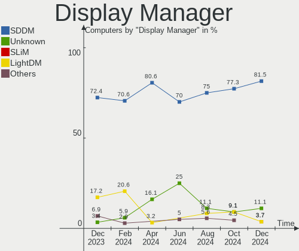
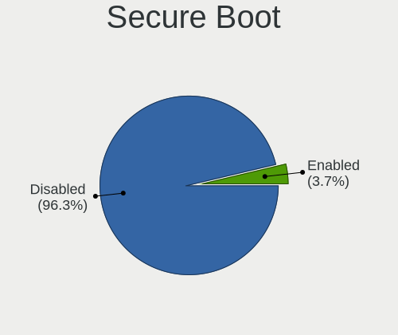
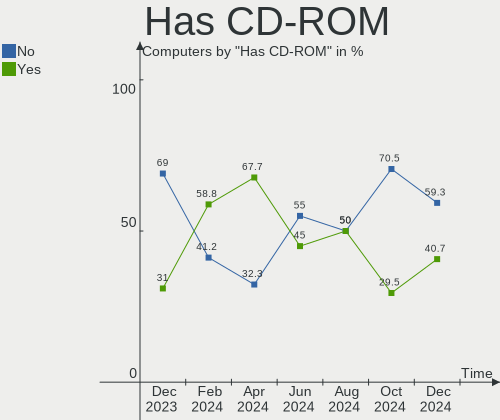
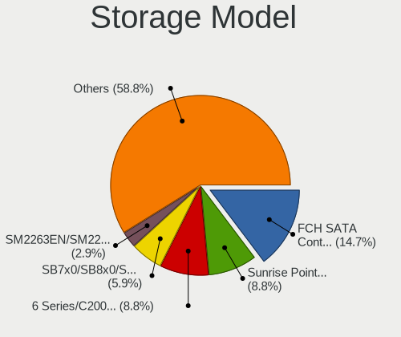
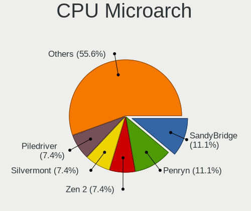
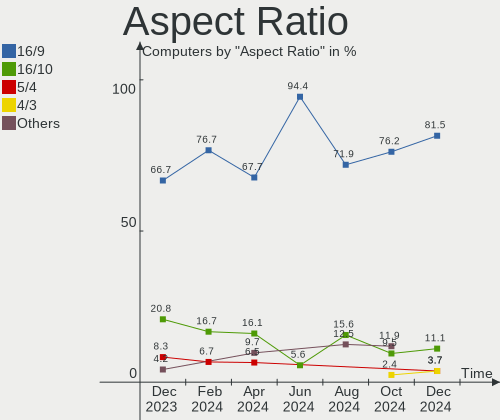
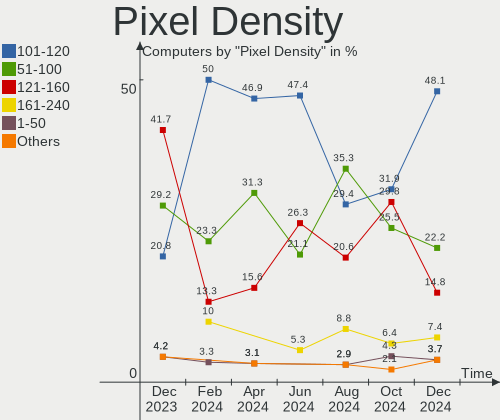
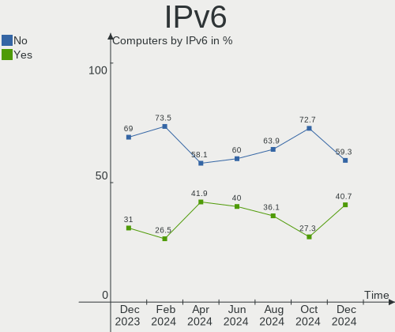
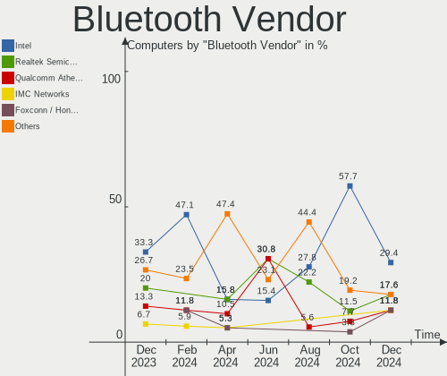

Lubuntu - Hardware Trends
-------------------------

A project to identify most popular hardware characteristics and track their change
over time based on data collected by Linux users at https://Linux-Hardware.org.

Anyone can contribute to this report by the [hw-probe](https://github.com/linuxhw/hw-probe) tool:

    sudo -E hw-probe -all -upload

This is a report for all computer types. See also reports for [desktops](/Dist/Lubuntu/Desktop/README.md) and [notebooks](/Dist/Lubuntu/Notebook/README.md).

This report is for one last month. Overall report since the beginning of time: [TestCoverage](https://github.com/linuxhw/TestCoverage)

Period: Aug, 2022.

Contents
--------

* [ System ](#system)
  - [ OS                       ](#os)
  - [ OS Family                ](#os-family)
  - [ Kernel                   ](#kernel)
  - [ Kernel Family            ](#kernel-family)
  - [ Kernel Major Ver.        ](#kernel-major-ver)
  - [ Arch                     ](#arch)
  - [ DE                       ](#de)
  - [ Display Server           ](#display-server)
  - [ Display Manager          ](#display-manager)
  - [ OS Lang                  ](#os-lang)
  - [ Boot Mode                ](#boot-mode)
  - [ Filesystem               ](#filesystem)
  - [ Part. scheme             ](#part-scheme)
  - [ Dual Boot with Linux/BSD ](#dual-boot-with-linuxbsd)
  - [ Dual Boot (Win)          ](#dual-boot-win)

* [ Board ](#board)
  - [ Vendor                   ](#vendor)
  - [ Model                    ](#model)
  - [ Model Family             ](#model-family)
  - [ MFG Year                 ](#mfg-year)
  - [ Form Factor              ](#form-factor)
  - [ Secure Boot              ](#secure-boot)
  - [ Coreboot                 ](#coreboot)
  - [ RAM Size                 ](#ram-size)
  - [ RAM Used                 ](#ram-used)
  - [ Total Drives             ](#total-drives)
  - [ Has CD-ROM               ](#has-cd-rom)
  - [ Has Ethernet             ](#has-ethernet)
  - [ Has WiFi                 ](#has-wifi)
  - [ Has Bluetooth            ](#has-bluetooth)

* [ Location ](#location)
  - [ Country                  ](#country)
  - [ City                     ](#city)

* [ Drives ](#drives)
  - [ Drive Vendor             ](#drive-vendor)
  - [ Drive Model              ](#drive-model)
  - [ HDD Vendor               ](#hdd-vendor)
  - [ SSD Vendor               ](#ssd-vendor)
  - [ Drive Kind               ](#drive-kind)
  - [ Drive Connector          ](#drive-connector)
  - [ Drive Size               ](#drive-size)
  - [ Space Total              ](#space-total)
  - [ Space Used               ](#space-used)
  - [ Malfunc. Drives          ](#malfunc-drives)
  - [ Malfunc. Drive Vendor    ](#malfunc-drive-vendor)
  - [ Malfunc. HDD Vendor      ](#malfunc-hdd-vendor)
  - [ Malfunc. Drive Kind      ](#malfunc-drive-kind)
  - [ Failed Drives            ](#failed-drives)
  - [ Failed Drive Vendor      ](#failed-drive-vendor)
  - [ Drive Status             ](#drive-status)

* [ Storage controller ](#storage-controller)
  - [ Storage Vendor           ](#storage-vendor)
  - [ Storage Model            ](#storage-model)
  - [ Storage Kind             ](#storage-kind)

* [ Processor ](#processor)
  - [ CPU Vendor               ](#cpu-vendor)
  - [ CPU Model                ](#cpu-model)
  - [ CPU Model Family         ](#cpu-model-family)
  - [ CPU Cores                ](#cpu-cores)
  - [ CPU Sockets              ](#cpu-sockets)
  - [ CPU Threads              ](#cpu-threads)
  - [ CPU Op-Modes             ](#cpu-op-modes)
  - [ CPU Microcode            ](#cpu-microcode)
  - [ CPU Microarch            ](#cpu-microarch)

* [ Graphics ](#graphics)
  - [ GPU Vendor               ](#gpu-vendor)
  - [ GPU Model                ](#gpu-model)
  - [ GPU Combo                ](#gpu-combo)
  - [ GPU Driver               ](#gpu-driver)
  - [ GPU Memory               ](#gpu-memory)

* [ Monitor ](#monitor)
  - [ Monitor Vendor           ](#monitor-vendor)
  - [ Monitor Model            ](#monitor-model)
  - [ Monitor Resolution       ](#monitor-resolution)
  - [ Monitor Diagonal         ](#monitor-diagonal)
  - [ Monitor Width            ](#monitor-width)
  - [ Aspect Ratio             ](#aspect-ratio)
  - [ Monitor Area             ](#monitor-area)
  - [ Pixel Density            ](#pixel-density)
  - [ Multiple Monitors        ](#multiple-monitors)

* [ Network ](#network)
  - [ Net Controller Vendor    ](#net-controller-vendor)
  - [ Net Controller Model     ](#net-controller-model)
  - [ Wireless Vendor          ](#wireless-vendor)
  - [ Wireless Model           ](#wireless-model)
  - [ Ethernet Vendor          ](#ethernet-vendor)
  - [ Ethernet Model           ](#ethernet-model)
  - [ Net Controller Kind      ](#net-controller-kind)
  - [ Used Controller          ](#used-controller)
  - [ NICs                     ](#nics)
  - [ IPv6                     ](#ipv6)

* [ Bluetooth ](#bluetooth)
  - [ Bluetooth Vendor         ](#bluetooth-vendor)
  - [ Bluetooth Model          ](#bluetooth-model)

* [ Sound ](#sound)
  - [ Sound Vendor             ](#sound-vendor)
  - [ Sound Model              ](#sound-model)

* [ Memory ](#memory)
  - [ Memory Vendor            ](#memory-vendor)
  - [ Memory Model             ](#memory-model)
  - [ Memory Kind              ](#memory-kind)
  - [ Memory Form Factor       ](#memory-form-factor)
  - [ Memory Size              ](#memory-size)
  - [ Memory Speed             ](#memory-speed)

* [ Printers & scanners ](#printers--scanners)
  - [ Printer Vendor           ](#printer-vendor)
  - [ Printer Model            ](#printer-model)
  - [ Scanner Vendor           ](#scanner-vendor)
  - [ Scanner Model            ](#scanner-model)

* [ Camera ](#camera)
  - [ Camera Vendor            ](#camera-vendor)
  - [ Camera Model             ](#camera-model)

* [ Security ](#security)
  - [ Fingerprint Vendor       ](#fingerprint-vendor)
  - [ Fingerprint Model        ](#fingerprint-model)
  - [ Chipcard Vendor          ](#chipcard-vendor)
  - [ Chipcard Model           ](#chipcard-model)

* [ Unsupported ](#unsupported)
  - [ Unsupported Devices      ](#unsupported-devices)
  - [ Unsupported Device Types ](#unsupported-device-types)

System
------

OS
--

Installed operating systems

| Name          | Computers | Percent |
|---------------|-----------|---------|
| Lubuntu 22.04 | 20        | 74.07%  |
| Lubuntu 20.04 | 5         | 18.52%  |
| Lubuntu 18.04 | 1         | 3.7%    |
| Lubuntu 16.04 | 1         | 3.7%    |

OS Family
---------

OS without a version

| Name    | Computers | Percent |
|---------|-----------|---------|
| Lubuntu | 27        | 100%    |

Kernel
------

Version of the Linux kernel

| Version                     | Computers | Percent |
|-----------------------------|-----------|---------|
| 5.15.0-46-generic           | 9         | 33.33%  |
| 5.15.0-43-generic           | 6         | 22.22%  |
| 5.15.0-41-generic           | 2         | 7.41%   |
| 5.15.0-25-generic           | 2         | 7.41%   |
| 5.4.0-122-generic           | 1         | 3.7%    |
| 5.4.0-120-generic           | 1         | 3.7%    |
| 5.19.0-051900-generic       | 1         | 3.7%    |
| 5.15.0-41-lowlatency        | 1         | 3.7%    |
| 5.15.0-40-generic           | 1         | 3.7%    |
| 5.15.0-362206031516-generic | 1         | 3.7%    |
| 4.15.0-188-generic          | 1         | 3.7%    |
| 4.15.0-142-generic          | 1         | 3.7%    |

Kernel Family
-------------

Linux kernel without a distro release

| Version | Computers | Percent |
|---------|-----------|---------|
| 5.15.0  | 22        | 81.48%  |
| 5.4.0   | 2         | 7.41%   |
| 4.15.0  | 2         | 7.41%   |
| 5.19.0  | 1         | 3.7%    |

Kernel Major Ver.
-----------------

Linux kernel major version

| Version | Computers | Percent |
|---------|-----------|---------|
| 5.15    | 22        | 81.48%  |
| 5.4     | 2         | 7.41%   |
| 4.15    | 2         | 7.41%   |
| 5.19    | 1         | 3.7%    |

Arch
----

OS architecture (x86_64, i586, etc.)

| Name   | Computers | Percent |
|--------|-----------|---------|
| x86_64 | 27        | 100%    |

DE
--

Desktop Environment

| Name    | Computers | Percent |
|---------|-----------|---------|
| LXQt    | 25        | 92.59%  |
| LXDE    | 1         | 3.7%    |
| Unknown | 1         | 3.7%    |

Display Server
--------------

X11 or Wayland

| Name | Computers | Percent |
|------|-----------|---------|
| X11  | 25        | 92.59%  |
| Tty  | 2         | 7.41%   |

Display Manager
---------------

SDDM, LightDM, etc.

| Name    | Computers | Percent |
|---------|-----------|---------|
| SDDM    | 23        | 85.19%  |
| LightDM | 2         | 7.41%   |
| Unknown | 2         | 7.41%   |

OS Lang
-------

Language

| Lang  | Computers | Percent |
|-------|-----------|---------|
| en_US | 7         | 25.93%  |
| pt_BR | 3         | 11.11%  |
| fr_FR | 3         | 11.11%  |
| de_DE | 3         | 11.11%  |
| el_GR | 2         | 7.41%   |
| sv_SE | 1         | 3.7%    |
| nl_BE | 1         | 3.7%    |
| fi_FI | 1         | 3.7%    |
| es_ES | 1         | 3.7%    |
| es_AR | 1         | 3.7%    |
| en_PH | 1         | 3.7%    |
| en_IN | 1         | 3.7%    |
| en_GB | 1         | 3.7%    |
| en_AG | 1         | 3.7%    |

Boot Mode
---------

EFI or BIOS

| Mode | Computers | Percent |
|------|-----------|---------|
| BIOS | 19        | 70.37%  |
| EFI  | 8         | 29.63%  |

Filesystem
----------

Type of filesystem

| Type  | Computers | Percent |
|-------|-----------|---------|
| Ext4  | 25        | 92.59%  |
| Xfs   | 1         | 3.7%    |
| Btrfs | 1         | 3.7%    |

Part. scheme
------------

Scheme of partitioning

| Type    | Computers | Percent |
|---------|-----------|---------|
| GPT     | 10        | 37.04%  |
| Unknown | 10        | 37.04%  |
| MBR     | 7         | 25.93%  |

Dual Boot with Linux/BSD
------------------------

Hosting more than one Linux/BSD

| Dual boot | Computers | Percent |
|-----------|-----------|---------|
| No        | 23        | 85.19%  |
| Yes       | 4         | 14.81%  |

Dual Boot (Win)
---------------

Hosting Linux and Windows

| Dual boot | Computers | Percent |
|-----------|-----------|---------|
| No        | 20        | 74.07%  |
| Yes       | 7         | 25.93%  |

Board
-----

Vendor
------

Motherboard manufacturer

| Name                | Computers | Percent |
|---------------------|-----------|---------|
| Lenovo              | 4         | 14.81%  |
| Hewlett-Packard     | 4         | 14.81%  |
| Dell                | 3         | 11.11%  |
| MSI                 | 2         | 7.41%   |
| ASUSTek Computer    | 2         | 7.41%   |
| ASRock              | 2         | 7.41%   |
| Acer                | 2         | 7.41%   |
| Standard            | 1         | 3.7%    |
| Prestigio           | 1         | 3.7%    |
| OEM                 | 1         | 3.7%    |
| Intel               | 1         | 3.7%    |
| IFSA                | 1         | 3.7%    |
| Gigabyte Technology | 1         | 3.7%    |
| Apple               | 1         | 3.7%    |
| Unknown             | 1         | 3.7%    |

Model
-----

Motherboard model

| Name                                | Computers | Percent |
|-------------------------------------|-----------|---------|
| Unknown                             | 2         | 7.41%   |
| Standard AHV                        | 1         | 3.7%    |
| Prestigio PSB141C01BFH              | 1         | 3.7%    |
| MSI MS-7D09                         | 1         | 3.7%    |
| MSI MS-7978                         | 1         | 3.7%    |
| Lenovo ThinkCentre M600 10KGS09S00  | 1         | 3.7%    |
| Lenovo MIIX 2 11 20327              | 1         | 3.7%    |
| Lenovo IdeaPad 330-15IKB Touch 81DJ | 1         | 3.7%    |
| Lenovo B590 20208                   | 1         | 3.7%    |
| Intel Infoway                       | 1         | 3.7%    |
| IFSA Positivo BGH                   | 1         | 3.7%    |
| HP Slim Desktop S01-pF1xxx          | 1         | 3.7%    |
| HP ProBook 450 G6                   | 1         | 3.7%    |
| HP 240 G8 Notebook PC               | 1         | 3.7%    |
| HP 15 Notebook PC                   | 1         | 3.7%    |
| Gigabyte G31M-S2C                   | 1         | 3.7%    |
| Dell Vostro 3360                    | 1         | 3.7%    |
| Dell Precision 3510                 | 1         | 3.7%    |
| Dell Inspiron 11-3168               | 1         | 3.7%    |
| ASUS M5A97 R2.0                     | 1         | 3.7%    |
| ASUS H110M-CS                       | 1         | 3.7%    |
| ASRock G41M-VS3                     | 1         | 3.7%    |
| ASRock A520M-HVS                    | 1         | 3.7%    |
| Apple MacBook7,1                    | 1         | 3.7%    |
| Acer Aspire M5630                   | 1         | 3.7%    |
| Acer Aspire 7250G                   | 1         | 3.7%    |

Model Family
------------

Motherboard model prefix

| Name                   | Computers | Percent |
|------------------------|-----------|---------|
| Acer Aspire            | 2         | 7.41%   |
| Unknown                | 2         | 7.41%   |
| Standard AHV           | 1         | 3.7%    |
| Prestigio PSB141C01BFH | 1         | 3.7%    |
| MSI MS-7D09            | 1         | 3.7%    |
| MSI MS-7978            | 1         | 3.7%    |
| Lenovo ThinkCentre     | 1         | 3.7%    |
| Lenovo MIIX            | 1         | 3.7%    |
| Lenovo IdeaPad         | 1         | 3.7%    |
| Lenovo B590            | 1         | 3.7%    |
| Intel Infoway          | 1         | 3.7%    |
| IFSA Positivo          | 1         | 3.7%    |
| HP Slim                | 1         | 3.7%    |
| HP ProBook             | 1         | 3.7%    |
| HP 240                 | 1         | 3.7%    |
| HP 15                  | 1         | 3.7%    |
| Gigabyte G31M-S2C      | 1         | 3.7%    |
| Dell Vostro            | 1         | 3.7%    |
| Dell Precision         | 1         | 3.7%    |
| Dell Inspiron          | 1         | 3.7%    |
| ASUS M5A97             | 1         | 3.7%    |
| ASUS H110M-CS          | 1         | 3.7%    |
| ASRock G41M-VS3        | 1         | 3.7%    |
| ASRock A520M-HVS       | 1         | 3.7%    |
| Apple MacBook7         | 1         | 3.7%    |

MFG Year
--------

Motherboard manufacture year

| Year | Computers | Percent |
|------|-----------|---------|
| 2012 | 4         | 14.81%  |
| 2021 | 3         | 11.11%  |
| 2020 | 3         | 11.11%  |
| 2015 | 3         | 11.11%  |
| 2017 | 2         | 7.41%   |
| 2016 | 2         | 7.41%   |
| 2014 | 2         | 7.41%   |
| 2011 | 2         | 7.41%   |
| 2010 | 2         | 7.41%   |
| 2008 | 2         | 7.41%   |
| 2018 | 1         | 3.7%    |
| 2007 | 1         | 3.7%    |

Form Factor
-----------

Physical design of the computer

| Name     | Computers | Percent |
|----------|-----------|---------|
| Notebook | 16        | 59.26%  |
| Desktop  | 10        | 37.04%  |
| Tablet   | 1         | 3.7%    |

Secure Boot
-----------

Enabled or disabled

| State    | Computers | Percent |
|----------|-----------|---------|
| Disabled | 25        | 92.59%  |
| Enabled  | 2         | 7.41%   |

Coreboot
--------

Have coreboot on board

| Used | Computers | Percent |
|------|-----------|---------|
| No   | 27        | 100%    |

RAM Size
--------

Total RAM memory

| Size in GB  | Computers | Percent |
|-------------|-----------|---------|
| 4.01-8.0    | 8         | 29.63%  |
| 3.01-4.0    | 5         | 18.52%  |
| 8.01-16.0   | 4         | 14.81%  |
| 1.01-2.0    | 3         | 11.11%  |
| 2.01-3.0    | 2         | 7.41%   |
| 16.01-24.0  | 2         | 7.41%   |
| 32.01-64.0  | 1         | 3.7%    |
| 24.01-32.0  | 1         | 3.7%    |
| 64.01-256.0 | 1         | 3.7%    |

RAM Used
--------

Used RAM memory

| Used GB  | Computers | Percent |
|----------|-----------|---------|
| 1.01-2.0 | 10        | 37.04%  |
| 0.51-1.0 | 9         | 33.33%  |
| 4.01-8.0 | 3         | 11.11%  |
| 2.01-3.0 | 3         | 11.11%  |
| 3.01-4.0 | 2         | 7.41%   |

Total Drives
------------

Number of drives on board

| Drives | Computers | Percent |
|--------|-----------|---------|
| 1      | 18        | 66.67%  |
| 2      | 8         | 29.63%  |
| 6      | 1         | 3.7%    |

Has CD-ROM
----------

Has CD-ROM on board

| Presented | Computers | Percent |
|-----------|-----------|---------|
| No        | 17        | 62.96%  |
| Yes       | 10        | 37.04%  |

Has Ethernet
------------

Has Ethernet on board

| Presented | Computers | Percent |
|-----------|-----------|---------|
| Yes       | 23        | 85.19%  |
| No        | 4         | 14.81%  |

Has WiFi
--------

Has WiFi module

| Presented | Computers | Percent |
|-----------|-----------|---------|
| Yes       | 20        | 74.07%  |
| No        | 7         | 25.93%  |

Has Bluetooth
-------------

Has Bluetooth module

| Presented | Computers | Percent |
|-----------|-----------|---------|
| No        | 16        | 59.26%  |
| Yes       | 11        | 40.74%  |

Location
--------

Country
-------

Geographic location (country)

| Country     | Computers | Percent |
|-------------|-----------|---------|
| USA         | 4         | 14.81%  |
| Germany     | 3         | 11.11%  |
| France      | 3         | 11.11%  |
| Brazil      | 3         | 11.11%  |
| Russia      | 2         | 7.41%   |
| Greece      | 2         | 7.41%   |
| Argentina   | 2         | 7.41%   |
| UK          | 1         | 3.7%    |
| Sweden      | 1         | 3.7%    |
| Philippines | 1         | 3.7%    |
| Norway      | 1         | 3.7%    |
| Indonesia   | 1         | 3.7%    |
| India       | 1         | 3.7%    |
| Finland     | 1         | 3.7%    |
| Belgium     | 1         | 3.7%    |

City
----

Geographic location (city)

| City         | Computers | Percent |
|--------------|-----------|---------|
| Yoshkar-Ola  | 1         | 3.7%    |
| Volzhskiy    | 1         | 3.7%    |
| Thessaloniki | 1         | 3.7%    |
| Sao Paulo    | 1         | 3.7%    |
| Sandsli      | 1         | 3.7%    |
| Raahe        | 1         | 3.7%    |
| Quezon City  | 1         | 3.7%    |
| Porto Alegre | 1         | 3.7%    |
| Paris        | 1         | 3.7%    |
| Novo Gama    | 1         | 3.7%    |
| Newtown      | 1         | 3.7%    |
| Nederland    | 1         | 3.7%    |
| Medford      | 1         | 3.7%    |
| Maipu        | 1         | 3.7%    |
| Larissa      | 1         | 3.7%    |
| Koblenz      | 1         | 3.7%    |
| Kissenbruck  | 1         | 3.7%    |
| Karlstad     | 1         | 3.7%    |
| Ghent        | 1         | 3.7%    |
| Figeac       | 1         | 3.7%    |
| Denver       | 1         | 3.7%    |
| Brandenburg  | 1         | 3.7%    |
| Blackburn    | 1         | 3.7%    |
| Bengaluru    | 1         | 3.7%    |
| Bekasi       | 1         | 3.7%    |
| Beauce       | 1         | 3.7%    |
| Avellaneda   | 1         | 3.7%    |

Drives
------

Drive Vendor
------------

Hard drive vendors

| Vendor              | Computers | Drives | Percent |
|---------------------|-----------|--------|---------|
| WDC                 | 6         | 9      | 17.65%  |
| Samsung Electronics | 6         | 7      | 17.65%  |
| Toshiba             | 2         | 2      | 5.88%   |
| Seagate             | 2         | 2      | 5.88%   |
| SanDisk             | 2         | 2      | 5.88%   |
| Kingston            | 2         | 2      | 5.88%   |
| Crucial             | 2         | 2      | 5.88%   |
| WD MediaMax         | 1         | 1      | 2.94%   |
| SPCC                | 1         | 1      | 2.94%   |
| RSH-319             | 1         | 1      | 2.94%   |
| Patriot             | 1         | 1      | 2.94%   |
| Micron Technology   | 1         | 1      | 2.94%   |
| Leqixiang           | 1         | 1      | 2.94%   |
| KINGPOWER           | 1         | 1      | 2.94%   |
| Intel               | 1         | 1      | 2.94%   |
| HUSKY               | 1         | 1      | 2.94%   |
| Hitachi             | 1         | 1      | 2.94%   |
| Corsair             | 1         | 1      | 2.94%   |
| Apacer              | 1         | 1      | 2.94%   |

Drive Model
-----------

Hard drive models

| Model                                    | Computers | Percent |
|------------------------------------------|-----------|---------|
| Toshiba MQ01ABF050 500GB                 | 2         | 5.56%   |
| Crucial CT240BX500SSD1 240GB             | 2         | 5.56%   |
| WDC WD5000LPCX-60VHAT0 500GB             | 1         | 2.78%   |
| WDC WD2500AAKX-07U6AA1 250GB             | 1         | 2.78%   |
| WDC WD10SPZX-24Z10 1TB                   | 1         | 2.78%   |
| WDC WD10EZEX-60WN4A0 1TB                 | 1         | 2.78%   |
| WDC WD10EACS-00D6B0 1TB                  | 1         | 2.78%   |
| WDC PC SN530 SDBPNPZ-512G-1006 512GB     | 1         | 2.78%   |
| WDC PC SN520 SDAPNUW-256G-1006 256GB     | 1         | 2.78%   |
| WD MediaMax WL250GSA872 250GB            | 1         | 2.78%   |
| SPCC Solid State Disk 120GB              | 1         | 2.78%   |
| Seagate ST320LT007-9ZV142 320GB          | 1         | 2.78%   |
| Seagate ST2000LM003 HN-M201RAD 2TB       | 1         | 2.78%   |
| SanDisk SD8SN8U128G1001 128GB SSD        | 1         | 2.78%   |
| SanDisk DF4032  32GB                     | 1         | 2.78%   |
| Samsung SSD 980 PRO 2TB                  | 1         | 2.78%   |
| Samsung SSD 860 EVO 1TB                  | 1         | 2.78%   |
| Samsung MZMTD128HAFV-000L1 128GB SSD     | 1         | 2.78%   |
| Samsung HN-M500MBB 500GB                 | 1         | 2.78%   |
| Samsung HM320II 320GB                    | 1         | 2.78%   |
| Samsung HM121HI 120GB                    | 1         | 2.78%   |
| Samsung HD103SJ 1TB                      | 1         | 2.78%   |
| RSH-319 ASM1153E 4TB                     | 1         | 2.78%   |
| Patriot Burst 240GB SSD                  | 1         | 2.78%   |
| Micron MTFDDAV256MBF-1AN15ABHA 256GB SSD | 1         | 2.78%   |
| Leqixiang SSD 1TB                        | 1         | 2.78%   |
| Kingston SSDNow V Series 64GB            | 1         | 2.78%   |
| Kingston SNVS500G 500GB                  | 1         | 2.78%   |
| KINGPOWER 2242 16GB SSD                  | 1         | 2.78%   |
| Intel SSDPEKNU512GZH 512GB               | 1         | 2.78%   |
| HUSKY SSD 256GB                          | 1         | 2.78%   |
| Hitachi HTS542516K9SA00 160GB            | 1         | 2.78%   |
| Corsair Force LS SSD 120GB               | 1         | 2.78%   |
| Apacer 16GB SATA Flash Drive SSD         | 1         | 2.78%   |

HDD Vendor
----------

Hard disk drive vendors

| Vendor              | Computers | Drives | Percent |
|---------------------|-----------|--------|---------|
| WDC                 | 4         | 7      | 26.67%  |
| Samsung Electronics | 4         | 4      | 26.67%  |
| Toshiba             | 2         | 2      | 13.33%  |
| Seagate             | 2         | 2      | 13.33%  |
| WD MediaMax         | 1         | 1      | 6.67%   |
| RSH-319             | 1         | 1      | 6.67%   |
| Hitachi             | 1         | 1      | 6.67%   |

SSD Vendor
----------

Solid state drive vendors

| Vendor              | Computers | Drives | Percent |
|---------------------|-----------|--------|---------|
| Samsung Electronics | 2         | 2      | 14.29%  |
| Crucial             | 2         | 2      | 14.29%  |
| SPCC                | 1         | 1      | 7.14%   |
| SanDisk             | 1         | 1      | 7.14%   |
| Patriot             | 1         | 1      | 7.14%   |
| Micron Technology   | 1         | 1      | 7.14%   |
| Leqixiang           | 1         | 1      | 7.14%   |
| Kingston            | 1         | 1      | 7.14%   |
| KINGPOWER           | 1         | 1      | 7.14%   |
| HUSKY               | 1         | 1      | 7.14%   |
| Corsair             | 1         | 1      | 7.14%   |
| Apacer              | 1         | 1      | 7.14%   |

Drive Kind
----------

HDD or SSD

| Kind | Computers | Drives | Percent |
|------|-----------|--------|---------|
| SSD  | 13        | 14     | 41.94%  |
| HDD  | 12        | 18     | 38.71%  |
| NVMe | 5         | 5      | 16.13%  |
| MMC  | 1         | 1      | 3.23%   |

Drive Connector
---------------

SATA, SAS, NVMe, etc.

| Type | Computers | Drives | Percent |
|------|-----------|--------|---------|
| SATA | 23        | 31     | 76.67%  |
| NVMe | 5         | 5      | 16.67%  |
| SAS  | 1         | 1      | 3.33%   |
| MMC  | 1         | 1      | 3.33%   |

Drive Size
----------

Size of hard drive

| Size in TB | Computers | Drives | Percent |
|------------|-----------|--------|---------|
| 0.01-0.5   | 19        | 23     | 73.08%  |
| 0.51-1.0   | 5         | 7      | 19.23%  |
| 3.01-4.0   | 1         | 1      | 3.85%   |
| 1.01-2.0   | 1         | 1      | 3.85%   |

Space Total
-----------

Amount of disk space available on the file system

| Size in GB | Computers | Percent |
|------------|-----------|---------|
| 101-250    | 8         | 29.63%  |
| 251-500    | 7         | 25.93%  |
| 51-100     | 4         | 14.81%  |
| 1-20       | 3         | 11.11%  |
| 1001-2000  | 2         | 7.41%   |
| 21-50      | 1         | 3.7%    |
| 2001-3000  | 1         | 3.7%    |
| 501-1000   | 1         | 3.7%    |

Space Used
----------

Amount of used disk space

| Used GB   | Computers | Percent |
|-----------|-----------|---------|
| 1-20      | 12        | 44.44%  |
| 21-50     | 7         | 25.93%  |
| 101-250   | 3         | 11.11%  |
| 51-100    | 2         | 7.41%   |
| 251-500   | 1         | 3.7%    |
| 1001-2000 | 1         | 3.7%    |
| 501-1000  | 1         | 3.7%    |

Malfunc. Drives
---------------

Drive models with a malfunction

| Model                             | Computers | Drives | Percent |
|-----------------------------------|-----------|--------|---------|
| Toshiba MQ01ABF050 500GB          | 1         | 1      | 25%     |
| Seagate ST320LT007-9ZV142 320GB   | 1         | 1      | 25%     |
| Samsung Electronics HM121HI 120GB | 1         | 1      | 25%     |
| Apacer 16GB SATA Flash Drive SSD  | 1         | 1      | 25%     |

Malfunc. Drive Vendor
---------------------

Vendors of faulty drives

| Vendor              | Computers | Drives | Percent |
|---------------------|-----------|--------|---------|
| Toshiba             | 1         | 1      | 25%     |
| Seagate             | 1         | 1      | 25%     |
| Samsung Electronics | 1         | 1      | 25%     |
| Apacer              | 1         | 1      | 25%     |

Malfunc. HDD Vendor
-------------------

Vendors of faulty HDD drives

| Vendor              | Computers | Drives | Percent |
|---------------------|-----------|--------|---------|
| Toshiba             | 1         | 1      | 33.33%  |
| Seagate             | 1         | 1      | 33.33%  |
| Samsung Electronics | 1         | 1      | 33.33%  |

Malfunc. Drive Kind
-------------------

Kinds of faulty drives

| Kind | Computers | Drives | Percent |
|------|-----------|--------|---------|
| HDD  | 3         | 3      | 75%     |
| SSD  | 1         | 1      | 25%     |

Failed Drives
-------------

Failed drive models

Zero info for selected period =(

Failed Drive Vendor
-------------------

Failed drive vendors

Zero info for selected period =(

Drive Status
------------

Number of failed and malfunc. drives

| Status   | Computers | Drives | Percent |
|----------|-----------|--------|---------|
| Works    | 13        | 17     | 48.15%  |
| Detected | 10        | 17     | 37.04%  |
| Malfunc  | 4         | 4      | 14.81%  |

Storage controller
------------------

Storage Vendor
--------------

Storage controller vendors

| Vendor                      | Computers | Percent |
|-----------------------------|-----------|---------|
| Intel                       | 22        | 73.33%  |
| AMD                         | 3         | 10%     |
| SanDisk                     | 2         | 6.67%   |
| Samsung Electronics         | 1         | 3.33%   |
| Nvidia                      | 1         | 3.33%   |
| Kingston Technology Company | 1         | 3.33%   |

Storage Model
-------------

Storage controller models

| Model                                                                            | Computers | Percent |
|----------------------------------------------------------------------------------|-----------|---------|
| Intel NM10/ICH7 Family SATA Controller [IDE mode]                                | 3         | 8.57%   |
| Intel Atom/Celeron/Pentium Processor x5-E8000/J3xxx/N3xxx Series SATA Controller | 3         | 8.57%   |
| Intel SATA Controller [RAID mode]                                                | 2         | 5.71%   |
| Intel Q170/Q150/B150/H170/H110/Z170/CM236 Chipset SATA Controller [AHCI Mode]    | 2         | 5.71%   |
| Intel 82801G (ICH7 Family) IDE Controller                                        | 2         | 5.71%   |
| Intel 7 Series Chipset Family 6-port SATA Controller [AHCI mode]                 | 2         | 5.71%   |
| AMD SB7x0/SB8x0/SB9x0 SATA Controller [AHCI mode]                                | 2         | 5.71%   |
| SanDisk WD Blue SN550 NVMe SSD                                                   | 1         | 2.86%   |
| SanDisk WD Blue SN500 / PC SN520 NVMe SSD                                        | 1         | 2.86%   |
| Samsung NVMe SSD Controller PM9A1/PM9A3/980PRO                                   | 1         | 2.86%   |
| Nvidia MCP89 SATA Controller (AHCI mode)                                         | 1         | 2.86%   |
| Kingston Company Company Non-Volatile memory controller                          | 1         | 2.86%   |
| Intel Volume Management Device NVMe RAID Controller                              | 1         | 2.86%   |
| Intel Tiger Lake-LP SATA Controller                                              | 1         | 2.86%   |
| Intel Sunrise Point-LP SATA Controller [AHCI mode]                               | 1         | 2.86%   |
| Intel Non-Volatile memory controller                                             | 1         | 2.86%   |
| Intel NM10/ICH7 Family SATA Controller [AHCI mode]                               | 1         | 2.86%   |
| Intel Comet Lake SATA AHCI Controller                                            | 1         | 2.86%   |
| Intel Cannon Point-LP SATA Controller [AHCI Mode]                                | 1         | 2.86%   |
| Intel Atom Processor E3800 Series SATA AHCI Controller                           | 1         | 2.86%   |
| Intel 82801HM/HEM (ICH8M/ICH8M-E) SATA Controller [AHCI mode]                    | 1         | 2.86%   |
| Intel 82801HM/HEM (ICH8M/ICH8M-E) IDE Controller                                 | 1         | 2.86%   |
| Intel 8 Series SATA Controller 1 [AHCI mode]                                     | 1         | 2.86%   |
| Intel 6 Series/C200 Series Chipset Family 6 port Mobile SATA AHCI Controller     | 1         | 2.86%   |
| Intel 500 Series Chipset Family SATA AHCI Controller                             | 1         | 2.86%   |
| AMD 500 Series Chipset SATA Controller                                           | 1         | 2.86%   |

Storage Kind
------------

Kind of storage controller (IDE, SATA, NVMe, SAS, ...)

| Kind | Computers | Percent |
|------|-----------|---------|
| SATA | 21        | 63.64%  |
| NVMe | 5         | 15.15%  |
| IDE  | 4         | 12.12%  |
| RAID | 3         | 9.09%   |

Processor
---------

CPU Vendor
----------

Processor vendors

| Vendor | Computers | Percent |
|--------|-----------|---------|
| Intel  | 24        | 88.89%  |
| AMD    | 3         | 11.11%  |

CPU Model
---------

Processor models

| Model                                   | Computers | Percent |
|-----------------------------------------|-----------|---------|
| Intel Pentium CPU N3710 @ 1.60GHz       | 2         | 7.41%   |
| Intel Pentium CPU G4400 @ 3.30GHz       | 1         | 3.7%    |
| Intel Core i9-10900K CPU @ 3.70GHz      | 1         | 3.7%    |
| Intel Core i7-6820HQ CPU @ 2.70GHz      | 1         | 3.7%    |
| Intel Core i7-2620M CPU @ 2.70GHz       | 1         | 3.7%    |
| Intel Core i5-8265U CPU @ 1.60GHz       | 1         | 3.7%    |
| Intel Core i5-8250U CPU @ 1.60GHz       | 1         | 3.7%    |
| Intel Core i5-6600K CPU @ 3.50GHz       | 1         | 3.7%    |
| Intel Core i5-4202Y CPU @ 1.60GHz       | 1         | 3.7%    |
| Intel Core i5-10210U CPU @ 1.60GHz      | 1         | 3.7%    |
| Intel Core i3-2367M CPU @ 1.40GHz       | 1         | 3.7%    |
| Intel Core i3-2348M CPU @ 2.30GHz       | 1         | 3.7%    |
| Intel Core i3-10105 CPU @ 3.70GHz       | 1         | 3.7%    |
| Intel Core 2 Quad CPU Q8300 @ 2.50GHz   | 1         | 3.7%    |
| Intel Core 2 Duo CPU T7500 @ 2.20GHz    | 1         | 3.7%    |
| Intel Core 2 Duo CPU P8600 @ 2.40GHz    | 1         | 3.7%    |
| Intel Core 2 Duo CPU E8400 @ 3.00GHz    | 1         | 3.7%    |
| Intel Core 2 Duo CPU E4500 @ 2.20GHz    | 1         | 3.7%    |
| Intel Celeron CPU N3010 @ 1.04GHz       | 1         | 3.7%    |
| Intel Celeron CPU N2807 @ 1.58GHz       | 1         | 3.7%    |
| Intel Atom x5-Z8350 CPU @ 1.44GHz       | 1         | 3.7%    |
| Intel Atom CPU N455 @ 1.66GHz           | 1         | 3.7%    |
| Intel 11th Gen Core i5-1135G7 @ 2.40GHz | 1         | 3.7%    |
| AMD Ryzen 7 5700G with Radeon Graphics  | 1         | 3.7%    |
| AMD FX-8350 Eight-Core Processor        | 1         | 3.7%    |
| AMD E-450 APU with Radeon HD Graphics   | 1         | 3.7%    |

CPU Model Family
----------------

Processor model prefix

| Model             | Computers | Percent |
|-------------------|-----------|---------|
| Intel Core i5     | 5         | 18.52%  |
| Intel Core 2 Duo  | 4         | 14.81%  |
| Intel Pentium     | 3         | 11.11%  |
| Intel Core i3     | 3         | 11.11%  |
| Intel Core i7     | 2         | 7.41%   |
| Intel Celeron     | 2         | 7.41%   |
| Intel Atom        | 2         | 7.41%   |
| Other             | 1         | 3.7%    |
| Intel Core i9     | 1         | 3.7%    |
| Intel Core 2 Quad | 1         | 3.7%    |
| AMD Ryzen 7       | 1         | 3.7%    |
| AMD FX            | 1         | 3.7%    |
| AMD E             | 1         | 3.7%    |

CPU Cores
---------

Number of processor cores

| Number | Computers | Percent |
|--------|-----------|---------|
| 4      | 12        | 44.44%  |
| 2      | 12        | 44.44%  |
| 10     | 1         | 3.7%    |
| 8      | 1         | 3.7%    |
| 1      | 1         | 3.7%    |

CPU Sockets
-----------

Number of sockets

| Number | Computers | Percent |
|--------|-----------|---------|
| 1      | 27        | 100%    |

CPU Threads
-----------

Threads per core (Hyper-Threading)

| Number | Computers | Percent |
|--------|-----------|---------|
| 2      | 14        | 51.85%  |
| 1      | 13        | 48.15%  |

CPU Op-Modes
------------

CPU Operation Modes (32-bit, 64-bit)

| Op mode        | Computers | Percent |
|----------------|-----------|---------|
| 32-bit, 64-bit | 27        | 100%    |

CPU Microcode
-------------

Microcode number

| Number     | Computers | Percent |
|------------|-----------|---------|
| Unknown    | 9         | 33.33%  |
| 0x506e3    | 3         | 11.11%  |
| 0x206a7    | 2         | 7.41%   |
| 0xa0653    | 1         | 3.7%    |
| 0x806ec    | 1         | 3.7%    |
| 0x806ea    | 1         | 3.7%    |
| 0x806c1    | 1         | 3.7%    |
| 0x6fa      | 1         | 3.7%    |
| 0x406c4    | 1         | 3.7%    |
| 0x40651    | 1         | 3.7%    |
| 0x30678    | 1         | 3.7%    |
| 0x106ca    | 1         | 3.7%    |
| 0x1067a    | 1         | 3.7%    |
| 0x0a50000c | 1         | 3.7%    |
| 0x06000852 | 1         | 3.7%    |
| 0x05000119 | 1         | 3.7%    |

CPU Microarch
-------------

Microarchitecture

| Name        | Computers | Percent |
|-------------|-----------|---------|
| Silvermont  | 5         | 18.52%  |
| Skylake     | 3         | 11.11%  |
| SandyBridge | 3         | 11.11%  |
| Penryn      | 3         | 11.11%  |
| KabyLake    | 3         | 11.11%  |
| Core        | 2         | 7.41%   |
| CometLake   | 2         | 7.41%   |
| Zen 3       | 1         | 3.7%    |
| TigerLake   | 1         | 3.7%    |
| Piledriver  | 1         | 3.7%    |
| Haswell     | 1         | 3.7%    |
| Bonnell     | 1         | 3.7%    |
| Bobcat      | 1         | 3.7%    |

Graphics
--------

GPU Vendor
----------

Vendors of graphics cards

| Vendor | Computers | Percent |
|--------|-----------|---------|
| Intel  | 20        | 68.97%  |
| AMD    | 5         | 17.24%  |
| Nvidia | 4         | 13.79%  |

GPU Model
---------

Graphics card models

| Model                                                                                    | Computers | Percent |
|------------------------------------------------------------------------------------------|-----------|---------|
| Intel Atom/Celeron/Pentium Processor x5-E8000/J3xxx/N3xxx Integrated Graphics Controller | 4         | 12.5%   |
| Intel 2nd Generation Core Processor Family Integrated Graphics Controller                | 3         | 9.38%   |
| Intel CometLake-S GT2 [UHD Graphics 630]                                                 | 2         | 6.25%   |
| Nvidia TU106 [GeForce RTX 2070 Rev. A]                                                   | 1         | 3.13%   |
| Nvidia MCP89 [GeForce 320M]                                                              | 1         | 3.13%   |
| Nvidia GM200GL [Tesla M40]                                                               | 1         | 3.13%   |
| Nvidia GM200GL [Quadro M6000]                                                            | 1         | 3.13%   |
| Nvidia GK107 [GeForce GTX 650]                                                           | 1         | 3.13%   |
| Intel WhiskeyLake-U GT2 [UHD Graphics 620]                                               | 1         | 3.13%   |
| Intel UHD Graphics 620                                                                   | 1         | 3.13%   |
| Intel TigerLake-LP GT2 [Iris Xe Graphics]                                                | 1         | 3.13%   |
| Intel Mobile GM965/GL960 Integrated Graphics Controller (secondary)                      | 1         | 3.13%   |
| Intel Mobile GM965/GL960 Integrated Graphics Controller (primary)                        | 1         | 3.13%   |
| Intel HD Graphics 530                                                                    | 1         | 3.13%   |
| Intel HD Graphics 510                                                                    | 1         | 3.13%   |
| Intel Haswell-ULT High Definition Audio Controller [HD Graphics]                         | 1         | 3.13%   |
| Intel CometLake-U GT2 [UHD Graphics]                                                     | 1         | 3.13%   |
| Intel Atom Processor Z36xxx/Z37xxx Series Graphics & Display                             | 1         | 3.13%   |
| Intel Atom Processor D4xx/D5xx/N4xx/N5xx Integrated Graphics Controller                  | 1         | 3.13%   |
| Intel 82G33/G31 Express Integrated Graphics Controller                                   | 1         | 3.13%   |
| AMD Wrestler [Radeon HD 6320]                                                            | 1         | 3.13%   |
| AMD Seymour [Radeon HD 6400M/7400M Series]                                               | 1         | 3.13%   |
| AMD RV710 [Radeon HD 4350/4550]                                                          | 1         | 3.13%   |
| AMD RV620 LE [Radeon HD 3450]                                                            | 1         | 3.13%   |
| AMD Cezanne                                                                              | 1         | 3.13%   |
| AMD Cape Verde PRO / Venus LE / Tropo PRO-L [Radeon HD 8830M / R7 250 / R7 M465X]        | 1         | 3.13%   |

GPU Combo
---------

Combinations of graphics cards

| Name               | Computers | Percent |
|--------------------|-----------|---------|
| 1 x Intel          | 18        | 66.67%  |
| 1 x Nvidia         | 3         | 11.11%  |
| 1 x AMD            | 3         | 11.11%  |
| 2 x AMD            | 1         | 3.7%    |
| Intel + 2 x Nvidia | 1         | 3.7%    |
| Intel + AMD        | 1         | 3.7%    |

GPU Driver
----------

Free vs proprietary

| Driver      | Computers | Percent |
|-------------|-----------|---------|
| Free        | 24        | 88.89%  |
| Proprietary | 3         | 11.11%  |

GPU Memory
----------

Total video memory

| Size in GB | Computers | Percent |
|------------|-----------|---------|
| Unknown    | 18        | 66.67%  |
| 1.01-2.0   | 3         | 11.11%  |
| 0.01-0.5   | 3         | 11.11%  |
| 7.01-8.0   | 1         | 3.7%    |
| 3.01-4.0   | 1         | 3.7%    |
| 8.01-16.0  | 1         | 3.7%    |

Monitor
-------

Monitor Vendor
--------------

Monitor vendors

| Vendor              | Computers | Percent |
|---------------------|-----------|---------|
| AU Optronics        | 6         | 21.43%  |
| Philips             | 2         | 7.14%   |
| LG Display          | 2         | 7.14%   |
| Goldstar            | 2         | 7.14%   |
| BOE                 | 2         | 7.14%   |
| Apple               | 2         | 7.14%   |
| Acer                | 2         | 7.14%   |
| SNC                 | 1         | 3.57%   |
| Sharp               | 1         | 3.57%   |
| Samsung Electronics | 1         | 3.57%   |
| MSI                 | 1         | 3.57%   |
| JDI                 | 1         | 3.57%   |
| HKC                 | 1         | 3.57%   |
| Dell                | 1         | 3.57%   |
| CPT                 | 1         | 3.57%   |
| Chimei Innolux      | 1         | 3.57%   |
| BenQ                | 1         | 3.57%   |

Monitor Model
-------------

Monitor models

| Model                                                                | Computers | Percent |
|----------------------------------------------------------------------|-----------|---------|
| AU Optronics LCD Monitor AUO10EC 1366x768 344x193mm 15.5-inch        | 2         | 7.14%   |
| SNC PHOTO 190V SNC1850 1366x768 409x230mm 18.5-inch                  | 1         | 3.57%   |
| Sharp LC-50LB481U SHP5063 1920x1080 1100x620mm 49.7-inch             | 1         | 3.57%   |
| Samsung Electronics LCD Monitor SEC3152 1366x768 344x194mm 15.5-inch | 1         | 3.57%   |
| Philips PHL 274E5 PHLC0C8 1920x1080 598x336mm 27.0-inch              | 1         | 3.57%   |
| Philips PHL 273V5 PHLC0D2 1920x1080 598x336mm 27.0-inch              | 1         | 3.57%   |
| MSI MAG272CQP MSI3CA6 2560x1440 598x336mm 27.0-inch                  | 1         | 3.57%   |
| LG Display LCD Monitor LGD034C 1366x768 293x165mm 13.2-inch          | 1         | 3.57%   |
| LG Display LCD Monitor LGD02E9 1366x768 309x174mm 14.0-inch          | 1         | 3.57%   |
| JDI LCD Monitor JDI422A 3000x2000 293x196mm 13.9-inch                | 1         | 3.57%   |
| HKC LCD Monitor HKC36BB 1366x768 309x174mm 14.0-inch                 | 1         | 3.57%   |
| Goldstar E1940 GSM4BD6 1360x768 406x229mm 18.4-inch                  | 1         | 3.57%   |
| Goldstar 19EN33 GSM4C18 1366x768 410x230mm 18.5-inch                 | 1         | 3.57%   |
| Dell S2218H DELD0B7 1920x1080 476x268mm 21.5-inch                    | 1         | 3.57%   |
| CPT LCD Monitor CPT1415 1280x800 331x207mm 15.4-inch                 | 1         | 3.57%   |
| Chimei Innolux LCD Monitor CMN14C9 1920x1080 309x173mm 13.9-inch     | 1         | 3.57%   |
| BOE LCD Monitor BOE076E 1366x768 344x194mm 15.5-inch                 | 1         | 3.57%   |
| BOE LCD Monitor BOE0632 1920x1080 344x194mm 15.5-inch                | 1         | 3.57%   |
| BenQ LCD Monitor FP222WH 1680x1050                                   | 1         | 3.57%   |
| AU Optronics LCD Monitor AUO305D 1920x1080 256x144mm 11.6-inch       | 1         | 3.57%   |
| AU Optronics LCD Monitor AUO139E 1600x900 382x214mm 17.2-inch        | 1         | 3.57%   |
| AU Optronics LCD Monitor AUO10DC 1366x768 222x125mm 10.0-inch        | 1         | 3.57%   |
| AU Optronics LCD Monitor AUO105C 1366x768 256x144mm 11.6-inch        | 1         | 3.57%   |
| Apple LCD Monitor APP9CD3 1528x1222 197x148mm 9.7-inch               | 1         | 3.57%   |
| Apple LCD Monitor APP9CBE 1280x800 286x179mm 13.3-inch               | 1         | 3.57%   |
| Acer V206HQLB ACR051A 1366x768 434x236mm 19.4-inch                   | 1         | 3.57%   |
| Acer S242HL ACR0216 1920x1080 531x299mm 24.0-inch                    | 1         | 3.57%   |

Monitor Resolution
------------------

Monitor screen resolution

| Resolution         | Computers | Percent |
|--------------------|-----------|---------|
| 1366x768 (WXGA)    | 12        | 42.86%  |
| 1920x1080 (FHD)    | 8         | 28.57%  |
| 1280x800 (WXGA)    | 2         | 7.14%   |
| 3000x2000          | 1         | 3.57%   |
| 2560x1440 (QHD)    | 1         | 3.57%   |
| 1680x1050 (WSXGA+) | 1         | 3.57%   |
| 1600x900 (HD+)     | 1         | 3.57%   |
| 1528x1222          | 1         | 3.57%   |
| 1360x768           | 1         | 3.57%   |

Monitor Diagonal
----------------

Diagonal size in inches

| Inches  | Computers | Percent |
|---------|-----------|---------|
| 15      | 6         | 21.43%  |
| 13      | 4         | 14.29%  |
| 27      | 3         | 10.71%  |
| 18      | 3         | 10.71%  |
| 14      | 2         | 7.14%   |
| 11      | 2         | 7.14%   |
| 49      | 1         | 3.57%   |
| 24      | 1         | 3.57%   |
| 21      | 1         | 3.57%   |
| 19      | 1         | 3.57%   |
| 17      | 1         | 3.57%   |
| 10      | 1         | 3.57%   |
| 9       | 1         | 3.57%   |
| Unknown | 1         | 3.57%   |

Monitor Width
-------------

Physical width

| Width in mm | Computers | Percent |
|-------------|-----------|---------|
| 301-350     | 9         | 32.14%  |
| 201-300     | 6         | 21.43%  |
| 401-500     | 5         | 17.86%  |
| 501-600     | 4         | 14.29%  |
| 351-400     | 1         | 3.57%   |
| 101-200     | 1         | 3.57%   |
| 1001-1500   | 1         | 3.57%   |
| Unknown     | 1         | 3.57%   |

Aspect Ratio
------------

Proportional relationship between the width and the height

| Ratio   | Computers | Percent |
|---------|-----------|---------|
| 16/9    | 22        | 81.48%  |
| 16/10   | 2         | 7.41%   |
| 4/3     | 1         | 3.7%    |
| 3/2     | 1         | 3.7%    |
| Unknown | 1         | 3.7%    |

Monitor Area
------------

Area in inch

| Area in inch | Computers | Percent |
|----------------|-----------|---------|
| 101-110        | 6         | 21.43%  |
| 81-90          | 5         | 17.86%  |
| 301-350        | 3         | 10.71%  |
| 141-150        | 3         | 10.71%  |
| 51-60          | 2         | 7.14%   |
| 41-50          | 2         | 7.14%   |
| 151-200        | 2         | 7.14%   |
| More than 1000 | 1         | 3.57%   |
| 71-80          | 1         | 3.57%   |
| 201-250        | 1         | 3.57%   |
| 121-130        | 1         | 3.57%   |
| Unknown        | 1         | 3.57%   |

Pixel Density
-------------

Pixels per inch

| Density       | Computers | Percent |
|---------------|-----------|---------|
| 101-120       | 11        | 39.29%  |
| 51-100        | 8         | 28.57%  |
| 121-160       | 4         | 14.29%  |
| 161-240       | 2         | 7.14%   |
| More than 240 | 1         | 3.57%   |
| 1-50          | 1         | 3.57%   |
| Unknown       | 1         | 3.57%   |

Multiple Monitors
-----------------

Total monitors connected

| Total | Computers | Percent |
|-------|-----------|---------|
| 1     | 25        | 92.59%  |
| 2     | 2         | 7.41%   |

Network
-------

Net Controller Vendor
---------------------

Controller vendors

| Vendor                   | Computers | Percent |
|--------------------------|-----------|---------|
| Realtek Semiconductor    | 18        | 47.37%  |
| Qualcomm Atheros         | 7         | 18.42%  |
| Intel                    | 4         | 10.53%  |
| Ralink Technology        | 2         | 5.26%   |
| Xiaomi                   | 1         | 2.63%   |
| Samsung Electronics      | 1         | 2.63%   |
| Nvidia                   | 1         | 2.63%   |
| Microsoft                | 1         | 2.63%   |
| Marvell Technology Group | 1         | 2.63%   |
| JMicron Technology       | 1         | 2.63%   |
| Broadcom                 | 1         | 2.63%   |

Net Controller Model
--------------------

Controller models

| Model                                                             | Computers | Percent |
|-------------------------------------------------------------------|-----------|---------|
| Realtek RTL8111/8168/8411 PCI Express Gigabit Ethernet Controller | 10        | 21.28%  |
| Realtek RTL810xE PCI Express Fast Ethernet controller             | 3         | 6.38%   |
| Realtek RTL8821CE 802.11ac PCIe Wireless Network Adapter          | 2         | 4.26%   |
| Realtek RTL8153 Gigabit Ethernet Adapter                          | 2         | 4.26%   |
| Qualcomm Atheros AR9462 Wireless Network Adapter                  | 2         | 4.26%   |
| Qualcomm Atheros AR8152 v2.0 Fast Ethernet                        | 2         | 4.26%   |
| Xiaomi Mi/Redmi series (RNDIS)                                    | 1         | 2.13%   |
| Samsung GT-I9070 (network tethering, USB debugging enabled)       | 1         | 2.13%   |
| Realtek RTL8822CE 802.11ac PCIe Wireless Network Adapter          | 1         | 2.13%   |
| Realtek RTL8723BE PCIe Wireless Network Adapter                   | 1         | 2.13%   |
| Realtek RTL8188EE Wireless Network Adapter                        | 1         | 2.13%   |
| Realtek RTL8188CUS 802.11n WLAN Adapter                           | 1         | 2.13%   |
| Realtek RTL8188CE 802.11b/g/n WiFi Adapter                        | 1         | 2.13%   |
| Realtek RTL8187B Wireless 802.11g 54Mbps Network Adapter          | 1         | 2.13%   |
| Ralink MT7610U ("Archer T2U" 2.4G+5G WLAN Adapter                 | 1         | 2.13%   |
| Ralink MT7601U Wireless Adapter                                   | 1         | 2.13%   |
| Qualcomm Atheros QCA9565 / AR9565 Wireless Network Adapter        | 1         | 2.13%   |
| Qualcomm Atheros QCA9377 802.11ac Wireless Network Adapter        | 1         | 2.13%   |
| Qualcomm Atheros Killer E2400 Gigabit Ethernet Controller         | 1         | 2.13%   |
| Qualcomm Atheros AR9485 Wireless Network Adapter                  | 1         | 2.13%   |
| Qualcomm Atheros AR9227 Wireless Network Adapter                  | 1         | 2.13%   |
| Qualcomm Atheros AR8161 Gigabit Ethernet                          | 1         | 2.13%   |
| Nvidia MCP89 Ethernet                                             | 1         | 2.13%   |
| Microsoft Xbox 360 Wireless Adapter                               | 1         | 2.13%   |
| Marvell Group 88E8055 PCI-E Gigabit Ethernet Controller           | 1         | 2.13%   |
| JMicron JMC250 PCI Express Gigabit Ethernet Controller            | 1         | 2.13%   |
| Intel Wireless 8260                                               | 1         | 2.13%   |
| Intel Ethernet Controller I225-V                                  | 1         | 2.13%   |
| Intel Ethernet Connection (2) I219-LM                             | 1         | 2.13%   |
| Intel Centrino Wireless-N 2230                                    | 1         | 2.13%   |
| Intel Cannon Point-LP CNVi [Wireless-AC]                          | 1         | 2.13%   |
| Broadcom BCM43224 802.11a/b/g/n                                   | 1         | 2.13%   |

Wireless Vendor
---------------

Wireless vendors

| Vendor                | Computers | Percent |
|-----------------------|-----------|---------|
| Realtek Semiconductor | 8         | 38.1%   |
| Qualcomm Atheros      | 6         | 28.57%  |
| Intel                 | 3         | 14.29%  |
| Ralink Technology     | 2         | 9.52%   |
| Microsoft             | 1         | 4.76%   |
| Broadcom              | 1         | 4.76%   |

Wireless Model
--------------

Wireless models

| Model                                                      | Computers | Percent |
|------------------------------------------------------------|-----------|---------|
| Realtek RTL8821CE 802.11ac PCIe Wireless Network Adapter   | 2         | 9.52%   |
| Qualcomm Atheros AR9462 Wireless Network Adapter           | 2         | 9.52%   |
| Realtek RTL8822CE 802.11ac PCIe Wireless Network Adapter   | 1         | 4.76%   |
| Realtek RTL8723BE PCIe Wireless Network Adapter            | 1         | 4.76%   |
| Realtek RTL8188EE Wireless Network Adapter                 | 1         | 4.76%   |
| Realtek RTL8188CUS 802.11n WLAN Adapter                    | 1         | 4.76%   |
| Realtek RTL8188CE 802.11b/g/n WiFi Adapter                 | 1         | 4.76%   |
| Realtek RTL8187B Wireless 802.11g 54Mbps Network Adapter   | 1         | 4.76%   |
| Ralink MT7610U ("Archer T2U" 2.4G+5G WLAN Adapter          | 1         | 4.76%   |
| Ralink MT7601U Wireless Adapter                            | 1         | 4.76%   |
| Qualcomm Atheros QCA9565 / AR9565 Wireless Network Adapter | 1         | 4.76%   |
| Qualcomm Atheros QCA9377 802.11ac Wireless Network Adapter | 1         | 4.76%   |
| Qualcomm Atheros AR9485 Wireless Network Adapter           | 1         | 4.76%   |
| Qualcomm Atheros AR9227 Wireless Network Adapter           | 1         | 4.76%   |
| Microsoft Xbox 360 Wireless Adapter                        | 1         | 4.76%   |
| Intel Wireless 8260                                        | 1         | 4.76%   |
| Intel Centrino Wireless-N 2230                             | 1         | 4.76%   |
| Intel Cannon Point-LP CNVi [Wireless-AC]                   | 1         | 4.76%   |
| Broadcom BCM43224 802.11a/b/g/n                            | 1         | 4.76%   |

Ethernet Vendor
---------------

Ethernet vendors

| Vendor                   | Computers | Percent |
|--------------------------|-----------|---------|
| Realtek Semiconductor    | 15        | 57.69%  |
| Qualcomm Atheros         | 4         | 15.38%  |
| Intel                    | 2         | 7.69%   |
| Xiaomi                   | 1         | 3.85%   |
| Samsung Electronics      | 1         | 3.85%   |
| Nvidia                   | 1         | 3.85%   |
| Marvell Technology Group | 1         | 3.85%   |
| JMicron Technology       | 1         | 3.85%   |

Ethernet Model
--------------

Ethernet models

| Model                                                             | Computers | Percent |
|-------------------------------------------------------------------|-----------|---------|
| Realtek RTL8111/8168/8411 PCI Express Gigabit Ethernet Controller | 10        | 38.46%  |
| Realtek RTL810xE PCI Express Fast Ethernet controller             | 3         | 11.54%  |
| Realtek RTL8153 Gigabit Ethernet Adapter                          | 2         | 7.69%   |
| Qualcomm Atheros AR8152 v2.0 Fast Ethernet                        | 2         | 7.69%   |
| Xiaomi Mi/Redmi series (RNDIS)                                    | 1         | 3.85%   |
| Samsung GT-I9070 (network tethering, USB debugging enabled)       | 1         | 3.85%   |
| Qualcomm Atheros Killer E2400 Gigabit Ethernet Controller         | 1         | 3.85%   |
| Qualcomm Atheros AR8161 Gigabit Ethernet                          | 1         | 3.85%   |
| Nvidia MCP89 Ethernet                                             | 1         | 3.85%   |
| Marvell Group 88E8055 PCI-E Gigabit Ethernet Controller           | 1         | 3.85%   |
| JMicron JMC250 PCI Express Gigabit Ethernet Controller            | 1         | 3.85%   |
| Intel Ethernet Controller I225-V                                  | 1         | 3.85%   |
| Intel Ethernet Connection (2) I219-LM                             | 1         | 3.85%   |

Net Controller Kind
-------------------

Ethernet, WiFi or modem

| Kind     | Computers | Percent |
|----------|-----------|---------|
| Ethernet | 23        | 53.49%  |
| WiFi     | 20        | 46.51%  |

Used Controller
---------------

Currently used network controller

| Kind     | Computers | Percent |
|----------|-----------|---------|
| WiFi     | 16        | 59.26%  |
| Ethernet | 11        | 40.74%  |

NICs
----

Total network controllers on board

| Total | Computers | Percent |
|-------|-----------|---------|
| 2     | 13        | 48.15%  |
| 1     | 12        | 44.44%  |
| 0     | 2         | 7.41%   |

IPv6
----

IPv6 vs IPv4

| Used | Computers | Percent |
|------|-----------|---------|
| No   | 21        | 77.78%  |
| Yes  | 6         | 22.22%  |

Bluetooth
---------

Bluetooth Vendor
----------------

Controller vendors

| Vendor                          | Computers | Percent |
|---------------------------------|-----------|---------|
| Realtek Semiconductor           | 4         | 36.36%  |
| Qualcomm Atheros Communications | 3         | 27.27%  |
| Intel                           | 2         | 18.18%  |
| Syntek                          | 1         | 9.09%   |
| Apple                           | 1         | 9.09%   |

Bluetooth Model
---------------

Controller models

| Model                                          | Computers | Percent |
|------------------------------------------------|-----------|---------|
| Realtek Bluetooth Radio                        | 2         | 18.18%  |
| Qualcomm Atheros  Bluetooth Device             | 2         | 18.18%  |
| Syntek 802.11g + Bluetooth Wireless Adapter    | 1         | 9.09%   |
| Realtek RTL8723B Bluetooth                     | 1         | 9.09%   |
| Realtek  Bluetooth 4.2 Adapter                 | 1         | 9.09%   |
| Qualcomm Atheros AR3012 Bluetooth 4.0          | 1         | 9.09%   |
| Intel Bluetooth wireless interface             | 1         | 9.09%   |
| Intel Bluetooth 9460/9560 Jefferson Peak (JfP) | 1         | 9.09%   |
| Apple Bluetooth Host Controller                | 1         | 9.09%   |

Sound
-----

Sound Vendor
------------

Sound card vendors

| Vendor           | Computers | Percent |
|------------------|-----------|---------|
| Intel            | 22        | 66.67%  |
| AMD              | 5         | 15.15%  |
| Nvidia           | 4         | 12.12%  |
| Razer USA        | 1         | 3.03%   |
| ASUSTek Computer | 1         | 3.03%   |

Sound Model
-----------

Sound card models

| Model                                                                                             | Computers | Percent |
|---------------------------------------------------------------------------------------------------|-----------|---------|
| Intel NM10/ICH7 Family High Definition Audio Controller                                           | 4         | 11.43%  |
| Intel Atom/Celeron/Pentium Processor x5-E8000/J3xxx/N3xxx Series High Definition Audio Controller | 3         | 8.57%   |
| Intel 100 Series/C230 Series Chipset Family HD Audio Controller                                   | 3         | 8.57%   |
| Intel 7 Series/C216 Chipset Family High Definition Audio Controller                               | 2         | 5.71%   |
| AMD SBx00 Azalia (Intel HDA)                                                                      | 2         | 5.71%   |
| Razer USA Razer Kraken X USB                                                                      | 1         | 2.86%   |
| Nvidia TU106 High Definition Audio Controller                                                     | 1         | 2.86%   |
| Nvidia MCP89 High Definition Audio                                                                | 1         | 2.86%   |
| Nvidia GM200 High Definition Audio                                                                | 1         | 2.86%   |
| Nvidia GK107 HDMI Audio Controller                                                                | 1         | 2.86%   |
| Intel Tiger Lake-LP Smart Sound Technology Audio Controller                                       | 1         | 2.86%   |
| Intel Sunrise Point-LP HD Audio                                                                   | 1         | 2.86%   |
| Intel Haswell-ULT HD Audio Controller                                                             | 1         | 2.86%   |
| Intel Comet Lake PCH-V cAVS                                                                       | 1         | 2.86%   |
| Intel Comet Lake PCH-LP cAVS                                                                      | 1         | 2.86%   |
| Intel Cannon Point-LP High Definition Audio Controller                                            | 1         | 2.86%   |
| Intel Audio device                                                                                | 1         | 2.86%   |
| Intel Atom Processor Z36xxx/Z37xxx Series High Definition Audio Controller                        | 1         | 2.86%   |
| Intel 82801H (ICH8 Family) HD Audio Controller                                                    | 1         | 2.86%   |
| Intel 8 Series HD Audio Controller                                                                | 1         | 2.86%   |
| Intel 6 Series/C200 Series Chipset Family High Definition Audio Controller                        | 1         | 2.86%   |
| ASUSTek Computer XONAR SOUND CARD                                                                 | 1         | 2.86%   |
| AMD Wrestler HDMI Audio                                                                           | 1         | 2.86%   |
| AMD RV710/730 HDMI Audio [Radeon HD 4000 series]                                                  | 1         | 2.86%   |
| AMD RV620 HDMI Audio [Radeon HD 3450/3470/3550/3570]                                              | 1         | 2.86%   |
| AMD Renoir Radeon High Definition Audio Controller                                                | 1         | 2.86%   |

Memory
------

Memory Vendor
-------------

Memory module vendors

| Vendor              | Computers | Percent |
|---------------------|-----------|---------|
| Samsung Electronics | 5         | 26.32%  |
| Unknown             | 3         | 15.79%  |
| Nanya Technology    | 2         | 10.53%  |
| Kingston            | 2         | 10.53%  |
| SK hynix            | 1         | 5.26%   |
| Ramaxel Technology  | 1         | 5.26%   |
| Novatech            | 1         | 5.26%   |
| Micron Technology   | 1         | 5.26%   |
| G.Skill             | 1         | 5.26%   |
| Elpida              | 1         | 5.26%   |
| Corsair             | 1         | 5.26%   |

Memory Model
------------

Memory module models

| Model                                                     | Computers | Percent |
|-----------------------------------------------------------|-----------|---------|
| Unknown RAM Module 4GB DIMM SDRAM                         | 1         | 4.76%   |
| Unknown RAM Module 2GB SODIMM DDR3 667MT/s                | 1         | 4.76%   |
| Unknown RAM Module 2GB SODIMM DDR2 667MT/s                | 1         | 4.76%   |
| Unknown RAM Module 2GB DIMM SDRAM                         | 1         | 4.76%   |
| Unknown RAM Module 1GB SODIMM DDR2 667MT/s                | 1         | 4.76%   |
| SK hynix RAM HMT425S6AFR6A-PB 2GB SODIMM DDR3 3200MT/s    | 1         | 4.76%   |
| Samsung RAM Module 8192MB SODIMM DDR4 2667MT/s            | 1         | 4.76%   |
| Samsung RAM Module 32GB SODIMM DDR4 3200MT/s              | 1         | 4.76%   |
| Samsung RAM M471A5244CB0-CRC 4GB SODIMM DDR4 2667MT/s     | 1         | 4.76%   |
| Samsung RAM M471A1K43EB1-CWE 8GB SODIMM DDR4 3200MT/s     | 1         | 4.76%   |
| Samsung RAM M471A1K43BB0-CPB 8GB SODIMM DDR4 2133MT/s     | 1         | 4.76%   |
| Ramaxel RAM RMSA3260ME78HAF-2666 8GB SODIMM DDR4 2667MT/s | 1         | 4.76%   |
| Novatech RAM N3S02H1600E-L R0 2GB SODIMM DDR3 1333MT/s    | 1         | 4.76%   |
| Nanya RAM NT4GC64B8HG0NS-DI 4GB SODIMM DDR3 1600MT/s      | 1         | 4.76%   |
| Nanya RAM NT2GC64B88B0NS-CG 2GB SODIMM DDR3 1334MT/s      | 1         | 4.76%   |
| Micron RAM Module 8GB DIMM DDR4 3200MT/s                  | 1         | 4.76%   |
| Kingston RAM KN2M64-ETB 8GB DIMM DDR3 1600MT/s            | 1         | 4.76%   |
| Kingston RAM KHX2400C15/8G 8GB DIMM DDR4 2933MT/s         | 1         | 4.76%   |
| G.Skill RAM F4-2133C15-16GIS 16384MB DIMM DDR4 2133MT/s   | 1         | 4.76%   |
| Elpida RAM EBJ41UF8BCS0-DJ-F 4GB SODIMM DDR3 1334MT/s     | 1         | 4.76%   |
| Corsair RAM CMV8GX4M1A2666C18 8192MB DIMM DDR4 2667MT/s   | 1         | 4.76%   |

Memory Kind
-----------

Memory module kinds

| Kind  | Computers | Percent |
|-------|-----------|---------|
| DDR4  | 9         | 52.94%  |
| DDR3  | 6         | 35.29%  |
| SDRAM | 1         | 5.88%   |
| DDR2  | 1         | 5.88%   |

Memory Form Factor
------------------

Physical design of the memory module

| Name   | Computers | Percent |
|--------|-----------|---------|
| SODIMM | 11        | 64.71%  |
| DIMM   | 6         | 35.29%  |

Memory Size
-----------

Memory module size

| Size  | Computers | Percent |
|-------|-----------|---------|
| 8192  | 8         | 38.1%   |
| 2048  | 6         | 28.57%  |
| 4096  | 4         | 19.05%  |
| 32768 | 1         | 4.76%   |
| 16384 | 1         | 4.76%   |
| 1024  | 1         | 4.76%   |

Memory Speed
------------

Memory module speed

| Speed   | Computers | Percent |
|---------|-----------|---------|
| 3200    | 4         | 23.53%  |
| 2667    | 3         | 17.65%  |
| 2133    | 2         | 11.76%  |
| 1600    | 2         | 11.76%  |
| 667     | 2         | 11.76%  |
| 2933    | 1         | 5.88%   |
| 1334    | 1         | 5.88%   |
| 1333    | 1         | 5.88%   |
| Unknown | 1         | 5.88%   |

Printers & scanners
-------------------

Printer Vendor
--------------

Printer device vendors

| Vendor | Computers | Percent |
|--------|-----------|---------|
| Canon  | 1         | 100%    |

Printer Model
-------------

Printer device models

| Model                   | Computers | Percent |
|-------------------------|-----------|---------|
| Canon CanoScan LiDE 300 | 1         | 100%    |

Scanner Vendor
--------------

Scanner device vendors

Zero info for selected period =(

Scanner Model
-------------

Scanner device models

Zero info for selected period =(

Camera
------

Camera Vendor
-------------

Camera device vendors

| Vendor                                 | Computers | Percent |
|----------------------------------------|-----------|---------|
| Chicony Electronics                    | 3         | 21.43%  |
| Realtek Semiconductor                  | 2         | 14.29%  |
| Alcor Micro                            | 2         | 14.29%  |
| Sunplus Innovation Technology          | 1         | 7.14%   |
| Microsoft                              | 1         | 7.14%   |
| Microdia                               | 1         | 7.14%   |
| Lite-On Technology                     | 1         | 7.14%   |
| Cubeternet                             | 1         | 7.14%   |
| Cheng Uei Precision Industry (Foxlink) | 1         | 7.14%   |
| ALi                                    | 1         | 7.14%   |

Camera Model
------------

Camera device models

| Model                                                          | Computers | Percent |
|----------------------------------------------------------------|-----------|---------|
| Alcor Micro USB 2.0 Camera                                     | 2         | 13.33%  |
| Sunplus Integrated_Webcam_HD                                   | 1         | 6.67%   |
| Realtek Integrated_Webcam_HD                                   | 1         | 6.67%   |
| Realtek EasyCamera                                             | 1         | 6.67%   |
| Microsoft LifeCam VX-800                                       | 1         | 6.67%   |
| Microdia Integrated Webcam                                     | 1         | 6.67%   |
| Lite-On HP HD Camera                                           | 1         | 6.67%   |
| Cubeternet GL-UPC822 UVC WebCam                                | 1         | 6.67%   |
| Chicony Lenovo EasyCamera                                      | 1         | 6.67%   |
| Chicony Integrated Camera                                      | 1         | 6.67%   |
| Chicony Imaging Device                                         | 1         | 6.67%   |
| Chicony HP Webcam                                              | 1         | 6.67%   |
| Cheng Uei Precision Industry (Foxlink) HP TrueVision HD Camera | 1         | 6.67%   |
| ALi WebCam                                                     | 1         | 6.67%   |

Security
--------

Fingerprint Vendor
------------------

Fingerprint sensor vendors

| Vendor    | Computers | Percent |
|-----------|-----------|---------|
| Upek      | 1         | 50%     |
| Synaptics | 1         | 50%     |

Fingerprint Model
-----------------

Fingerprint sensor models

| Model                                                      | Computers | Percent |
|------------------------------------------------------------|-----------|---------|
| Upek Biometric Touchchip/Touchstrip Fingerprint Sensor     | 1         | 50%     |
| Synaptics  VFS7552 Touch Fingerprint Sensor with PurePrint | 1         | 50%     |

Chipcard Vendor
---------------

Chipcard module vendors

| Vendor   | Computers | Percent |
|----------|-----------|---------|
| Cherry   | 1         | 50%     |
| Broadcom | 1         | 50%     |

Chipcard Model
--------------

Chipcard module models

| Model                                       | Computers | Percent |
|---------------------------------------------|-----------|---------|
| Cherry SmartCard Reader Keyboard KC 1000 SC | 1         | 50%     |
| Broadcom 5880                               | 1         | 50%     |

Unsupported
-----------

Unsupported Devices
-------------------

Total unsupported devices on board

| Total | Computers | Percent |
|-------|-----------|---------|
| 0     | 23        | 85.19%  |
| 1     | 4         | 14.81%  |

Unsupported Device Types
------------------------

Types of unsupported devices

| Type               | Computers | Percent |
|--------------------|-----------|---------|
| Fingerprint reader | 2         | 50%     |
| Chipcard           | 1         | 25%     |
| Bluetooth          | 1         | 25%     |

