Lubuntu - Hardware Trends
-------------------------

A project to identify most popular hardware characteristics and track their change
over time based on data collected by Linux users at https://Linux-Hardware.org.

Anyone can contribute to this report by the [hw-probe](https://github.com/linuxhw/hw-probe) tool:

    sudo -E hw-probe -all -upload

This is a report for all computer types. See also reports for [desktops](/Dist/Lubuntu/Desktop/README.md) and [notebooks](/Dist/Lubuntu/Notebook/README.md).

This report is for one last month. Overall report since the beginning of time: [TestDays](https://github.com/linuxhw/TestDays)

Period: Jun, 2023.

Contents
--------

* [ System ](#system)
  - [ OS                       ](#os)
  - [ OS Family                ](#os-family)
  - [ Kernel                   ](#kernel)
  - [ Kernel Family            ](#kernel-family)
  - [ Kernel Major Ver.        ](#kernel-major-ver)
  - [ Arch                     ](#arch)
  - [ DE                       ](#de)
  - [ Display Server           ](#display-server)
  - [ Display Manager          ](#display-manager)
  - [ OS Lang                  ](#os-lang)
  - [ Boot Mode                ](#boot-mode)
  - [ Filesystem               ](#filesystem)
  - [ Part. scheme             ](#part-scheme)
  - [ Dual Boot with Linux/BSD ](#dual-boot-with-linuxbsd)
  - [ Dual Boot (Win)          ](#dual-boot-win)

* [ Board ](#board)
  - [ Vendor                   ](#vendor)
  - [ Model                    ](#model)
  - [ Model Family             ](#model-family)
  - [ MFG Year                 ](#mfg-year)
  - [ Form Factor              ](#form-factor)
  - [ Secure Boot              ](#secure-boot)
  - [ Coreboot                 ](#coreboot)
  - [ RAM Size                 ](#ram-size)
  - [ RAM Used                 ](#ram-used)
  - [ Total Drives             ](#total-drives)
  - [ Has CD-ROM               ](#has-cd-rom)
  - [ Has Ethernet             ](#has-ethernet)
  - [ Has WiFi                 ](#has-wifi)
  - [ Has Bluetooth            ](#has-bluetooth)

* [ Location ](#location)
  - [ Country                  ](#country)
  - [ City                     ](#city)

* [ Drives ](#drives)
  - [ Drive Vendor             ](#drive-vendor)
  - [ Drive Model              ](#drive-model)
  - [ HDD Vendor               ](#hdd-vendor)
  - [ SSD Vendor               ](#ssd-vendor)
  - [ Drive Kind               ](#drive-kind)
  - [ Drive Connector          ](#drive-connector)
  - [ Drive Size               ](#drive-size)
  - [ Space Total              ](#space-total)
  - [ Space Used               ](#space-used)
  - [ Malfunc. Drives          ](#malfunc-drives)
  - [ Malfunc. Drive Vendor    ](#malfunc-drive-vendor)
  - [ Malfunc. HDD Vendor      ](#malfunc-hdd-vendor)
  - [ Malfunc. Drive Kind      ](#malfunc-drive-kind)
  - [ Failed Drives            ](#failed-drives)
  - [ Failed Drive Vendor      ](#failed-drive-vendor)
  - [ Drive Status             ](#drive-status)

* [ Storage controller ](#storage-controller)
  - [ Storage Vendor           ](#storage-vendor)
  - [ Storage Model            ](#storage-model)
  - [ Storage Kind             ](#storage-kind)

* [ Processor ](#processor)
  - [ CPU Vendor               ](#cpu-vendor)
  - [ CPU Model                ](#cpu-model)
  - [ CPU Model Family         ](#cpu-model-family)
  - [ CPU Cores                ](#cpu-cores)
  - [ CPU Sockets              ](#cpu-sockets)
  - [ CPU Threads              ](#cpu-threads)
  - [ CPU Op-Modes             ](#cpu-op-modes)
  - [ CPU Microcode            ](#cpu-microcode)
  - [ CPU Microarch            ](#cpu-microarch)

* [ Graphics ](#graphics)
  - [ GPU Vendor               ](#gpu-vendor)
  - [ GPU Model                ](#gpu-model)
  - [ GPU Combo                ](#gpu-combo)
  - [ GPU Driver               ](#gpu-driver)
  - [ GPU Memory               ](#gpu-memory)

* [ Monitor ](#monitor)
  - [ Monitor Vendor           ](#monitor-vendor)
  - [ Monitor Model            ](#monitor-model)
  - [ Monitor Resolution       ](#monitor-resolution)
  - [ Monitor Diagonal         ](#monitor-diagonal)
  - [ Monitor Width            ](#monitor-width)
  - [ Aspect Ratio             ](#aspect-ratio)
  - [ Monitor Area             ](#monitor-area)
  - [ Pixel Density            ](#pixel-density)
  - [ Multiple Monitors        ](#multiple-monitors)

* [ Network ](#network)
  - [ Net Controller Vendor    ](#net-controller-vendor)
  - [ Net Controller Model     ](#net-controller-model)
  - [ Wireless Vendor          ](#wireless-vendor)
  - [ Wireless Model           ](#wireless-model)
  - [ Ethernet Vendor          ](#ethernet-vendor)
  - [ Ethernet Model           ](#ethernet-model)
  - [ Net Controller Kind      ](#net-controller-kind)
  - [ Used Controller          ](#used-controller)
  - [ NICs                     ](#nics)
  - [ IPv6                     ](#ipv6)

* [ Bluetooth ](#bluetooth)
  - [ Bluetooth Vendor         ](#bluetooth-vendor)
  - [ Bluetooth Model          ](#bluetooth-model)

* [ Sound ](#sound)
  - [ Sound Vendor             ](#sound-vendor)
  - [ Sound Model              ](#sound-model)

* [ Memory ](#memory)
  - [ Memory Vendor            ](#memory-vendor)
  - [ Memory Model             ](#memory-model)
  - [ Memory Kind              ](#memory-kind)
  - [ Memory Form Factor       ](#memory-form-factor)
  - [ Memory Size              ](#memory-size)
  - [ Memory Speed             ](#memory-speed)

* [ Printers & scanners ](#printers--scanners)
  - [ Printer Vendor           ](#printer-vendor)
  - [ Printer Model            ](#printer-model)
  - [ Scanner Vendor           ](#scanner-vendor)
  - [ Scanner Model            ](#scanner-model)

* [ Camera ](#camera)
  - [ Camera Vendor            ](#camera-vendor)
  - [ Camera Model             ](#camera-model)

* [ Security ](#security)
  - [ Fingerprint Vendor       ](#fingerprint-vendor)
  - [ Fingerprint Model        ](#fingerprint-model)
  - [ Chipcard Vendor          ](#chipcard-vendor)
  - [ Chipcard Model           ](#chipcard-model)

* [ Unsupported ](#unsupported)
  - [ Unsupported Devices      ](#unsupported-devices)
  - [ Unsupported Device Types ](#unsupported-device-types)

System
------

OS
--

Installed operating systems

| Name          | Computers | Percent |
|---------------|-----------|---------|
| Lubuntu 22.04 | 20        | 62.5%   |
| Lubuntu 23.04 | 7         | 21.88%  |
| Lubuntu 20.04 | 3         | 9.38%   |
| Lubuntu 22.10 | 1         | 3.13%   |
| Lubuntu 18.04 | 1         | 3.13%   |

OS Family
---------

OS without a version

| Name    | Computers | Percent |
|---------|-----------|---------|
| Lubuntu | 32        | 100%    |

Kernel
------

Version of the Linux kernel

| Version           | Computers | Percent |
|-------------------|-----------|---------|
| 5.19.0-43-generic | 7         | 21.88%  |
| 5.15.0-75-generic | 4         | 12.5%   |
| 5.15.0-73-generic | 4         | 12.5%   |
| 6.2.0-23-generic  | 3         | 9.38%   |
| 5.4.0-150-generic | 3         | 9.38%   |
| 5.19.0-45-generic | 3         | 9.38%   |
| 5.19.0-32-generic | 3         | 9.38%   |
| 6.2.0-24-generic  | 2         | 6.25%   |
| 6.2.0-20-generic  | 2         | 6.25%   |
| 5.11.0-27-generic | 1         | 3.13%   |

Kernel Family
-------------

Linux kernel without a distro release

| Version | Computers | Percent |
|---------|-----------|---------|
| 5.19.0  | 13        | 40.63%  |
| 5.15.0  | 8         | 25%     |
| 6.2.0   | 7         | 21.88%  |
| 5.4.0   | 3         | 9.38%   |
| 5.11.0  | 1         | 3.13%   |

Kernel Major Ver.
-----------------

Linux kernel major version

| Version | Computers | Percent |
|---------|-----------|---------|
| 5.19    | 13        | 40.63%  |
| 5.15    | 8         | 25%     |
| 6.2     | 7         | 21.88%  |
| 5.4     | 3         | 9.38%   |
| 5.11    | 1         | 3.13%   |

Arch
----

OS architecture (x86_64, i586, etc.)

| Name   | Computers | Percent |
|--------|-----------|---------|
| x86_64 | 31        | 96.88%  |
| i686   | 1         | 3.13%   |

DE
--

Desktop Environment

| Name | Computers | Percent |
|------|-----------|---------|
| LXQt | 30        | 93.75%  |
| LXDE | 2         | 6.25%   |

Display Server
--------------

X11 or Wayland

| Name | Computers | Percent |
|------|-----------|---------|
| X11  | 32        | 100%    |

Display Manager
---------------

SDDM, LightDM, etc.

| Name    | Computers | Percent |
|---------|-----------|---------|
| SDDM    | 24        | 75%     |
| LightDM | 4         | 12.5%   |
| GDM3    | 2         | 6.25%   |
| Unknown | 2         | 6.25%   |

OS Lang
-------

Language

| Lang  | Computers | Percent |
|-------|-----------|---------|
| en_US | 12        | 37.5%   |
| en_GB | 6         | 18.75%  |
| de_DE | 3         | 9.38%   |
| ru_RU | 2         | 6.25%   |
| fr_FR | 2         | 6.25%   |
| pt_BR | 1         | 3.13%   |
| hu_HU | 1         | 3.13%   |
| es_MX | 1         | 3.13%   |
| es_ES | 1         | 3.13%   |
| en_CA | 1         | 3.13%   |
| en_AG | 1         | 3.13%   |
| C     | 1         | 3.13%   |

Boot Mode
---------

EFI or BIOS

| Mode | Computers | Percent |
|------|-----------|---------|
| BIOS | 18        | 56.25%  |
| EFI  | 14        | 43.75%  |

Filesystem
----------

Type of filesystem

| Type    | Computers | Percent |
|---------|-----------|---------|
| Ext4    | 23        | 71.88%  |
| Tmpfs   | 7         | 21.88%  |
| Overlay | 2         | 6.25%   |

Part. scheme
------------

Scheme of partitioning

| Type    | Computers | Percent |
|---------|-----------|---------|
| GPT     | 20        | 62.5%   |
| MBR     | 10        | 31.25%  |
| Unknown | 2         | 6.25%   |

Dual Boot with Linux/BSD
------------------------

Hosting more than one Linux/BSD

| Dual boot | Computers | Percent |
|-----------|-----------|---------|
| No        | 26        | 81.25%  |
| Yes       | 6         | 18.75%  |

Dual Boot (Win)
---------------

Hosting Linux and Windows

| Dual boot | Computers | Percent |
|-----------|-----------|---------|
| No        | 21        | 65.63%  |
| Yes       | 11        | 34.38%  |

Board
-----

Vendor
------

Motherboard manufacturer

| Name                           | Computers | Percent |
|--------------------------------|-----------|---------|
| Hewlett-Packard                | 7         | 21.88%  |
| Lenovo                         | 3         | 9.38%   |
| Dell                           | 3         | 9.38%   |
| ASUSTek Computer               | 3         | 9.38%   |
| Sony                           | 2         | 6.25%   |
| TrekStor                       | 1         | 3.13%   |
| Toshiba                        | 1         | 3.13%   |
| Shanghai Zhaoxin Semiconductor | 1         | 3.13%   |
| Pencents                       | 1         | 3.13%   |
| Pegatron                       | 1         | 3.13%   |
| MSI                            | 1         | 3.13%   |
| Microsoft                      | 1         | 3.13%   |
| Intel                          | 1         | 3.13%   |
| Gigabyte Technology            | 1         | 3.13%   |
| Fujitsu                        | 1         | 3.13%   |
| eMachines                      | 1         | 3.13%   |
| AXIOO                          | 1         | 3.13%   |
| ASRock                         | 1         | 3.13%   |
| Acer                           | 1         | 3.13%   |

Model
-----

Motherboard model

| Name                                   | Computers | Percent |
|----------------------------------------|-----------|---------|
| TrekStor SurfTab wintron 7.0 ST70416-6 | 1         | 3.13%   |
| Toshiba Satellite P200                 | 1         | 3.13%   |
| Sony VPCEH2E1R                         | 1         | 3.13%   |
| Sony VPCEB37FD                         | 1         | 3.13%   |
| Shanghai Zhaoxin ZEB20                 | 1         | 3.13%   |
| Pencents U50                           | 1         | 3.13%   |
| Pegatron Compaq dx2400 Microtower PC   | 1         | 3.13%   |
| MSI MS-7C37                            | 1         | 3.13%   |
| Microsoft Surface 3                    | 1         | 3.13%   |
| Lenovo Z70-80 80FG                     | 1         | 3.13%   |
| Lenovo ThinkPad X201 3249CTO           | 1         | 3.13%   |
| Lenovo IdeaPad Y580                    | 1         | 3.13%   |
| Intel NUC11ATKC4                       | 1         | 3.13%   |
| HP t620 Quad Core TC                   | 1         | 3.13%   |
| HP ProBook 650 G3                      | 1         | 3.13%   |
| HP Laptop 15-da0xxx                    | 1         | 3.13%   |
| HP EliteBook 840 G3                    | 1         | 3.13%   |
| HP EliteBook 2530p                     | 1         | 3.13%   |
| HP Compaq 8000 Elite SFF PC            | 1         | 3.13%   |
| HP 240 G3                              | 1         | 3.13%   |
| Gigabyte B450 AORUS ELITE V2           | 1         | 3.13%   |
| Fujitsu PRIMERGY TX140 S1p             | 1         | 3.13%   |
| eMachines eME443                       | 1         | 3.13%   |
| Dell Vostro 3700                       | 1         | 3.13%   |
| Dell Precision 3570                    | 1         | 3.13%   |
| Dell Inspiron 3501                     | 1         | 3.13%   |
| AXIOO SlimBook 11                      | 1         | 3.13%   |
| ASUS ROG STRIX B650E-E GAMING WIFI     | 1         | 3.13%   |
| ASUS M4A87TD/USB3                      | 1         | 3.13%   |
| ASUS 1011CX                            | 1         | 3.13%   |
| ASRock J4125-ITX                       | 1         | 3.13%   |
| Acer Aspire 7741                       | 1         | 3.13%   |

Model Family
------------

Motherboard model prefix

| Name                   | Computers | Percent |
|------------------------|-----------|---------|
| HP EliteBook           | 2         | 6.25%   |
| TrekStor SurfTab       | 1         | 3.13%   |
| Toshiba Satellite      | 1         | 3.13%   |
| Sony VPCEH2E1R         | 1         | 3.13%   |
| Sony VPCEB37FD         | 1         | 3.13%   |
| Shanghai Zhaoxin ZEB20 | 1         | 3.13%   |
| Pencents U50           | 1         | 3.13%   |
| Pegatron Compaq        | 1         | 3.13%   |
| MSI MS-7C37            | 1         | 3.13%   |
| Microsoft Surface      | 1         | 3.13%   |
| Lenovo Z70-80          | 1         | 3.13%   |
| Lenovo ThinkPad        | 1         | 3.13%   |
| Lenovo IdeaPad         | 1         | 3.13%   |
| Intel NUC11ATKC4       | 1         | 3.13%   |
| HP t620                | 1         | 3.13%   |
| HP ProBook             | 1         | 3.13%   |
| HP Laptop              | 1         | 3.13%   |
| HP Compaq              | 1         | 3.13%   |
| HP 240                 | 1         | 3.13%   |
| Gigabyte B450          | 1         | 3.13%   |
| Fujitsu PRIMERGY       | 1         | 3.13%   |
| eMachines eME443       | 1         | 3.13%   |
| Dell Vostro            | 1         | 3.13%   |
| Dell Precision         | 1         | 3.13%   |
| Dell Inspiron          | 1         | 3.13%   |
| AXIOO SlimBook         | 1         | 3.13%   |
| ASUS ROG               | 1         | 3.13%   |
| ASUS M4A87TD           | 1         | 3.13%   |
| ASUS 1011CX            | 1         | 3.13%   |
| ASRock J4125-ITX       | 1         | 3.13%   |
| Acer Aspire            | 1         | 3.13%   |

MFG Year
--------

Motherboard manufacture year

| Year | Computers | Percent |
|------|-----------|---------|
| 2010 | 5         | 15.63%  |
| 2022 | 4         | 12.5%   |
| 2021 | 3         | 9.38%   |
| 2014 | 3         | 9.38%   |
| 2012 | 3         | 9.38%   |
| 2020 | 2         | 6.25%   |
| 2016 | 2         | 6.25%   |
| 2015 | 2         | 6.25%   |
| 2011 | 2         | 6.25%   |
| 2008 | 2         | 6.25%   |
| 2019 | 1         | 3.13%   |
| 2018 | 1         | 3.13%   |
| 2009 | 1         | 3.13%   |
| 2007 | 1         | 3.13%   |

Form Factor
-----------

Physical design of the computer

| Name     | Computers | Percent |
|----------|-----------|---------|
| Notebook | 19        | 59.38%  |
| Desktop  | 8         | 25%     |
| Mini pc  | 3         | 9.38%   |
| Tablet   | 1         | 3.13%   |
| Server   | 1         | 3.13%   |

Secure Boot
-----------

Enabled or disabled

| State    | Computers | Percent |
|----------|-----------|---------|
| Disabled | 30        | 93.75%  |
| Enabled  | 2         | 6.25%   |

Coreboot
--------

Have coreboot on board

| Used | Computers | Percent |
|------|-----------|---------|
| No   | 32        | 100%    |

RAM Size
--------

Total RAM memory

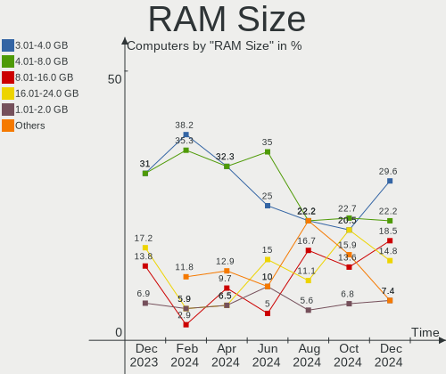

| Size in GB  | Computers | Percent |
|-------------|-----------|---------|
| 4.01-8.0    | 12        | 37.5%   |
| 3.01-4.0    | 4         | 12.5%   |
| 1.01-2.0    | 4         | 12.5%   |
| 16.01-24.0  | 3         | 9.38%   |
| 8.01-16.0   | 3         | 9.38%   |
| 32.01-64.0  | 2         | 6.25%   |
| 64.01-256.0 | 2         | 6.25%   |
| 24.01-32.0  | 1         | 3.13%   |
| 0.51-1.0    | 1         | 3.13%   |

RAM Used
--------

Used RAM memory

| Used GB   | Computers | Percent |
|-----------|-----------|---------|
| 1.01-2.0  | 13        | 40.63%  |
| 2.01-3.0  | 8         | 25%     |
| 4.01-8.0  | 4         | 12.5%   |
| 0.51-1.0  | 4         | 12.5%   |
| 3.01-4.0  | 1         | 3.13%   |
| 8.01-16.0 | 1         | 3.13%   |
| 0.01-0.5  | 1         | 3.13%   |

Total Drives
------------

Number of drives on board

| Drives | Computers | Percent |
|--------|-----------|---------|
| 1      | 20        | 62.5%   |
| 2      | 7         | 21.88%  |
| 3      | 4         | 12.5%   |
| 5      | 1         | 3.13%   |

Has CD-ROM
----------

Has CD-ROM on board

| Presented | Computers | Percent |
|-----------|-----------|---------|
| No        | 17        | 53.13%  |
| Yes       | 15        | 46.88%  |

Has Ethernet
------------

Has Ethernet on board

| Presented | Computers | Percent |
|-----------|-----------|---------|
| Yes       | 28        | 87.5%   |
| No        | 4         | 12.5%   |

Has WiFi
--------

Has WiFi module

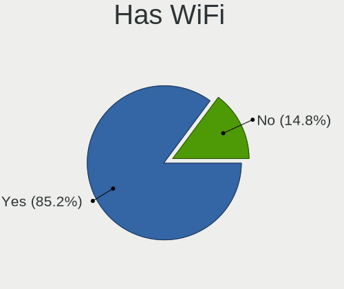

| Presented | Computers | Percent |
|-----------|-----------|---------|
| Yes       | 28        | 87.5%   |
| No        | 4         | 12.5%   |

Has Bluetooth
-------------

Has Bluetooth module

| Presented | Computers | Percent |
|-----------|-----------|---------|
| Yes       | 21        | 65.63%  |
| No        | 11        | 34.38%  |

Location
--------

Country
-------

Geographic location (country)

| Country   | Computers | Percent |
|-----------|-----------|---------|
| Germany   | 5         | 15.63%  |
| USA       | 4         | 12.5%   |
| UK        | 4         | 12.5%   |
| Russia    | 3         | 9.38%   |
| Italy     | 3         | 9.38%   |
| Spain     | 2         | 6.25%   |
| Hungary   | 2         | 6.25%   |
| France    | 2         | 6.25%   |
| Mexico    | 1         | 3.13%   |
| Indonesia | 1         | 3.13%   |
| Finland   | 1         | 3.13%   |
| Czechia   | 1         | 3.13%   |
| China     | 1         | 3.13%   |
| Canada    | 1         | 3.13%   |
| Brazil    | 1         | 3.13%   |

City
----

Geographic location (city)

| City             | Computers | Percent |
|------------------|-----------|---------|
| Rome             | 2         | 6.25%   |
| Vesilahti        | 1         | 3.13%   |
| Valencia         | 1         | 3.13%   |
| Tizayuca         | 1         | 3.13%   |
| Titisee-Neustadt | 1         | 3.13%   |
| Patrang          | 1         | 3.13%   |
| Nizhny Tagil     | 1         | 3.13%   |
| Moscow           | 1         | 3.13%   |
| Marataizes       | 1         | 3.13%   |
| Manchester       | 1         | 3.13%   |
| Lyon             | 1         | 3.13%   |
| Loffingen        | 1         | 3.13%   |
| Liverpool        | 1         | 3.13%   |
| Knoxville        | 1         | 3.13%   |
| Kall             | 1         | 3.13%   |
| Jianshui         | 1         | 3.13%   |
| Hradec Králové | 1         | 3.13%   |
| Houston          | 1         | 3.13%   |
| Hanover          | 1         | 3.13%   |
| Felsopakony      | 1         | 3.13%   |
| Elda             | 1         | 3.13%   |
| Dijon            | 1         | 3.13%   |
| Croydon          | 1         | 3.13%   |
| Coquitlam        | 1         | 3.13%   |
| Charlotte        | 1         | 3.13%   |
| Carrara          | 1         | 3.13%   |
| Buzuluk          | 1         | 3.13%   |
| Budapest         | 1         | 3.13%   |
| Brooklyn         | 1         | 3.13%   |
| Bad Wildungen    | 1         | 3.13%   |
| Ammanford        | 1         | 3.13%   |

Drives
------

Drive Vendor
------------

Hard drive vendors

| Vendor                      | Computers | Drives | Percent |
|-----------------------------|-----------|--------|---------|
| Seagate                     | 9         | 10     | 20.45%  |
| Samsung Electronics         | 7         | 8      | 15.91%  |
| WDC                         | 5         | 6      | 11.36%  |
| Unknown                     | 4         | 4      | 9.09%   |
| Kingston                    | 4         | 5      | 9.09%   |
| Toshiba                     | 2         | 2      | 4.55%   |
| SanDisk                     | 2         | 2      | 4.55%   |
| Apacer                      | 2         | 2      | 4.55%   |
| YMTC                        | 1         | 1      | 2.27%   |
| Solid State Storage         | 1         | 1      | 2.27%   |
| Silicon Motion              | 1         | 1      | 2.27%   |
| PNY                         | 1         | 1      | 2.27%   |
| Kingston Technology Company | 1         | 1      | 2.27%   |
| Hitachi                     | 1         | 1      | 2.27%   |
| HGST                        | 1         | 2      | 2.27%   |
| Crucial                     | 1         | 1      | 2.27%   |
| A-DATA Technology           | 1         | 1      | 2.27%   |

Drive Model
-----------

Hard drive models

| Model                                              | Computers | Percent |
|----------------------------------------------------|-----------|---------|
| Seagate ST500LM012 HN-M500MBB 500GB                | 2         | 4.35%   |
| Samsung SSD 970 EVO Plus 2TB                       | 2         | 4.35%   |
| YMTC PC005 512GB                                   | 1         | 2.17%   |
| WDC WDS500G2B0A 500GB SSD                          | 1         | 2.17%   |
| WDC WD5000BEVT-00A03T0 500GB                       | 1         | 2.17%   |
| WDC WD3200LPVX-16V0TT3 320GB                       | 1         | 2.17%   |
| WDC WD3200BPVT-22JJ5T0 320GB                       | 1         | 2.17%   |
| WDC WD3200BEVT-80A0RT0 320GB                       | 1         | 2.17%   |
| WDC WD10SPSX-00A6WT0 1TB                           | 1         | 2.17%   |
| Unknown SC200  197GB                               | 1         | 2.17%   |
| Unknown MMC Card  16GB                             | 1         | 2.17%   |
| Unknown MMC Card  128GB                            | 1         | 2.17%   |
| Unknown MDGAGC  128GB                              | 1         | 2.17%   |
| Toshiba THNSN5256GPUK 256GB                        | 1         | 2.17%   |
| Toshiba MK2529GSG 250GB                            | 1         | 2.17%   |
| Solid State Storage CL1-3D256-Q11 NVMe SSSTC 256GB | 1         | 2.17%   |
| Silicon Motion Anucell 256GB                       | 1         | 2.17%   |
| Seagate ST500LT012-1DG142 500GB                    | 1         | 2.17%   |
| Seagate ST3250310AS 250GB                          | 1         | 2.17%   |
| Seagate ST3000DM008-2DM166 3TB                     | 1         | 2.17%   |
| Seagate ST2000LM015-2E8174 2TB                     | 1         | 2.17%   |
| Seagate ST2000DM008-2FR102 2TB                     | 1         | 2.17%   |
| Seagate ST2000DM001-1CH164 2TB                     | 1         | 2.17%   |
| Seagate ST1000LM014-SSHD-8GB                       | 1         | 2.17%   |
| Seagate Expansion 1TB                              | 1         | 2.17%   |
| SanDisk SD8SNAT064G1011 64GB SSD                   | 1         | 2.17%   |
| SanDisk SD7SN6S-256G-1006 256GB SSD                | 1         | 2.17%   |
| Samsung SSD 980 1TB                                | 1         | 2.17%   |
| Samsung SSD 970 EVO Plus 1TB                       | 1         | 2.17%   |
| Samsung SSD 870 EVO 500GB                          | 1         | 2.17%   |
| Samsung SSD 870 EVO 250GB                          | 1         | 2.17%   |
| Samsung SSD 840 Series 120GB                       | 1         | 2.17%   |
| PNY 1TB SATA SSD                                   | 1         | 2.17%   |
| Kingston Company SNV2S1000G 1TB                    | 1         | 2.17%   |
| Kingston SVP200S360G 64GB                          | 1         | 2.17%   |
| Kingston SV300S37A240G 240GB SSD                   | 1         | 2.17%   |
| Kingston SV300S37A120G 120GB SSD                   | 1         | 2.17%   |
| Kingston SA400S37480G 480GB SSD                    | 1         | 2.17%   |
| Hitachi HDS721025CLA382 250GB                      | 1         | 2.17%   |
| HGST HTE721010A9E630 1TB                           | 1         | 2.17%   |

HDD Vendor
----------

Hard disk drive vendors

| Vendor  | Computers | Drives | Percent |
|---------|-----------|--------|---------|
| Seagate | 9         | 10     | 56.25%  |
| WDC     | 4         | 5      | 25%     |
| Toshiba | 1         | 1      | 6.25%   |
| Hitachi | 1         | 1      | 6.25%   |
| HGST    | 1         | 2      | 6.25%   |

SSD Vendor
----------

Solid state drive vendors

| Vendor              | Computers | Drives | Percent |
|---------------------|-----------|--------|---------|
| Kingston            | 4         | 5      | 30.77%  |
| Samsung Electronics | 3         | 3      | 23.08%  |
| SanDisk             | 2         | 2      | 15.38%  |
| Apacer              | 2         | 2      | 15.38%  |
| WDC                 | 1         | 1      | 7.69%   |
| PNY                 | 1         | 1      | 7.69%   |

Drive Kind
----------

HDD or SSD

| Kind | Computers | Drives | Percent |
|------|-----------|--------|---------|
| HDD  | 15        | 19     | 36.59%  |
| SSD  | 13        | 14     | 31.71%  |
| NVMe | 9         | 12     | 21.95%  |
| MMC  | 4         | 4      | 9.76%   |

Drive Connector
---------------

SATA, SAS, NVMe, etc.

| Type | Computers | Drives | Percent |
|------|-----------|--------|---------|
| SATA | 23        | 32     | 62.16%  |
| NVMe | 9         | 12     | 24.32%  |
| MMC  | 4         | 4      | 10.81%  |
| SAS  | 1         | 1      | 2.7%    |

Drive Size
----------

Size of hard drive

| Size in TB | Computers | Drives | Percent |
|------------|-----------|--------|---------|
| 0.01-0.5   | 19        | 23     | 67.86%  |
| 0.51-1.0   | 5         | 6      | 17.86%  |
| 1.01-2.0   | 3         | 3      | 10.71%  |
| 2.01-3.0   | 1         | 1      | 3.57%   |

Space Total
-----------

Amount of disk space available on the file system

| Size in GB     | Computers | Percent |
|----------------|-----------|---------|
| 101-250        | 8         | 25%     |
| 251-500        | 5         | 15.63%  |
| 1001-2000      | 4         | 12.5%   |
| 1-20           | 4         | 12.5%   |
| More than 3000 | 3         | 9.38%   |
| 501-1000       | 3         | 9.38%   |
| 51-100         | 3         | 9.38%   |
| 21-50          | 2         | 6.25%   |

Space Used
----------

Amount of used disk space

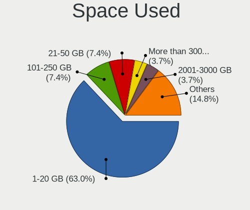

| Used GB        | Computers | Percent |
|----------------|-----------|---------|
| 1-20           | 12        | 37.5%   |
| 21-50          | 7         | 21.88%  |
| 101-250        | 4         | 12.5%   |
| 51-100         | 3         | 9.38%   |
| 251-500        | 2         | 6.25%   |
| More than 3000 | 1         | 3.13%   |
| 2001-3000      | 1         | 3.13%   |
| 1001-2000      | 1         | 3.13%   |
| 501-1000       | 1         | 3.13%   |

Malfunc. Drives
---------------

Drive models with a malfunction

| Model                           | Computers | Drives | Percent |
|---------------------------------|-----------|--------|---------|
| WDC WD3200BPVT-22JJ5T0 320GB    | 1         | 1      | 50%     |
| Seagate ST500LT012-1DG142 500GB | 1         | 1      | 50%     |

Malfunc. Drive Vendor
---------------------

Vendors of faulty drives

| Vendor  | Computers | Drives | Percent |
|---------|-----------|--------|---------|
| WDC     | 1         | 1      | 50%     |
| Seagate | 1         | 1      | 50%     |

Malfunc. HDD Vendor
-------------------

Vendors of faulty HDD drives

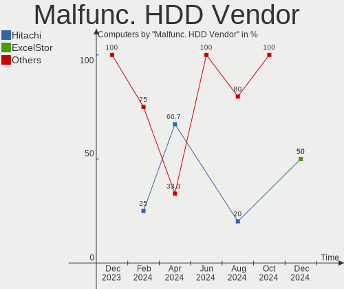

| Vendor  | Computers | Drives | Percent |
|---------|-----------|--------|---------|
| WDC     | 1         | 1      | 50%     |
| Seagate | 1         | 1      | 50%     |

Malfunc. Drive Kind
-------------------

Kinds of faulty drives

| Kind | Computers | Drives | Percent |
|------|-----------|--------|---------|
| HDD  | 2         | 2      | 100%    |

Failed Drives
-------------

Failed drive models

Zero info for selected period =(

Failed Drive Vendor
-------------------

Failed drive vendors

Zero info for selected period =(

Drive Status
------------

Number of failed and malfunc. drives

| Status   | Computers | Drives | Percent |
|----------|-----------|--------|---------|
| Works    | 19        | 27     | 55.88%  |
| Detected | 13        | 20     | 38.24%  |
| Malfunc  | 2         | 2      | 5.88%   |

Storage controller
------------------

Storage Vendor
--------------

Storage controller vendors

| Vendor                         | Computers | Percent |
|--------------------------------|-----------|---------|
| Intel                          | 22        | 48.89%  |
| AMD                            | 6         | 13.33%  |
| Samsung Electronics            | 4         | 8.89%   |
| ASMedia Technology             | 3         | 6.67%   |
| Zhaoxin                        | 1         | 2.22%   |
| Yangtze Memory Technologies    | 1         | 2.22%   |
| Toshiba America Info Systems   | 1         | 2.22%   |
| Solid State Storage Technology | 1         | 2.22%   |
| Silicon Motion                 | 1         | 2.22%   |
| Micron/Crucial Technology      | 1         | 2.22%   |
| Kingston Technology Company    | 1         | 2.22%   |
| JMicron Technology             | 1         | 2.22%   |
| Broadcom / LSI                 | 1         | 2.22%   |
| ADATA Technology               | 1         | 2.22%   |

Storage Model
-------------

Storage controller models

| Model                                                                         | Computers | Percent |
|-------------------------------------------------------------------------------|-----------|---------|
| AMD FCH SATA Controller [AHCI mode]                                           | 4         | 7.84%   |
| Samsung NVMe SSD Controller SM981/PM981/PM983                                 | 3         | 5.88%   |
| ASMedia ASM1062 Serial ATA Controller                                         | 3         | 5.88%   |
| Intel Sunrise Point-LP SATA Controller [AHCI mode]                            | 2         | 3.92%   |
| Intel Jasper Lake SATA AHCI Controller                                        | 2         | 3.92%   |
| Intel Celeron/Pentium Silver Processor SATA Controller                        | 2         | 3.92%   |
| Intel 5 Series/3400 Series Chipset 6 port SATA AHCI Controller                | 2         | 3.92%   |
| Intel 5 Series/3400 Series Chipset 4 port SATA AHCI Controller                | 2         | 3.92%   |
| Zhaoxin ZX-100/ZX-200/KX-6000/KX-6000G StorX AHCI Controller                  | 1         | 1.96%   |
| Yangtze Memory Non-Volatile memory controller                                 | 1         | 1.96%   |
| Toshiba America Info Systems XG4 NVMe SSD Controller                          | 1         | 1.96%   |
| Solid State Storage CL1-3D256-Q11 NVMe SSD M.2                                | 1         | 1.96%   |
| Silicon Motion SM2263EN/SM2263XT SSD Controller                               | 1         | 1.96%   |
| Samsung NVMe SSD Controller 980                                               | 1         | 1.96%   |
| Micron/Crucial P5 Plus NVMe PCIe SSD                                          | 1         | 1.96%   |
| Kingston Company Company Non-Volatile memory controller                       | 1         | 1.96%   |
| JMicron JMB368 IDE controller                                                 | 1         | 1.96%   |
| Intel Wildcat Point-LP SATA Controller [AHCI Mode]                            | 1         | 1.96%   |
| Intel Volume Management Device NVMe RAID Controller                           | 1         | 1.96%   |
| Intel Tiger Lake-LP SATA Controller                                           | 1         | 1.96%   |
| Intel NM10/ICH7 Family SATA Controller [AHCI mode]                            | 1         | 1.96%   |
| Intel Atom Processor E3800 Series SATA AHCI Controller                        | 1         | 1.96%   |
| Intel 82801JD/DO (ICH10 Family) SATA AHCI Controller                          | 1         | 1.96%   |
| Intel 82801IR/IO/IH (ICH9R/DO/DH) 4 port SATA Controller [IDE mode]           | 1         | 1.96%   |
| Intel 82801IBM/IEM (ICH9M/ICH9M-E) 4 port SATA Controller [AHCI mode]         | 1         | 1.96%   |
| Intel 82801I (ICH9 Family) 2 port SATA Controller [IDE mode]                  | 1         | 1.96%   |
| Intel 82801HM/HEM (ICH8M/ICH8M-E) SATA Controller [AHCI mode]                 | 1         | 1.96%   |
| Intel 82801HM/HEM (ICH8M/ICH8M-E) IDE Controller                              | 1         | 1.96%   |
| Intel 82801 Mobile SATA Controller [RAID mode]                                | 1         | 1.96%   |
| Intel 7 Series Chipset Family 6-port SATA Controller [AHCI mode]              | 1         | 1.96%   |
| Intel 6 Series/C200 Series Chipset Family 6 port Mobile SATA AHCI Controller  | 1         | 1.96%   |
| Intel 6 Series/C200 Series Chipset Family 6 port Desktop SATA AHCI Controller | 1         | 1.96%   |
| Intel 4 Series Chipset PT IDER Controller                                     | 1         | 1.96%   |
| Broadcom / LSI MegaRAID SAS 2108 [Liberator]                                  | 1         | 1.96%   |
| AMD SB7x0/SB8x0/SB9x0 SATA Controller [IDE mode]                              | 1         | 1.96%   |
| AMD SB7x0/SB8x0/SB9x0 SATA Controller [AHCI mode]                             | 1         | 1.96%   |
| AMD SB7x0/SB8x0/SB9x0 IDE Controller                                          | 1         | 1.96%   |
| AMD 400 Series Chipset SATA Controller                                        | 1         | 1.96%   |
| ADATA ADATA XPG GAMMIXS1 1L Media                                             | 1         | 1.96%   |

Storage Kind
------------

Kind of storage controller (IDE, SATA, NVMe, SAS, ...)

| Kind | Computers | Percent |
|------|-----------|---------|
| SATA | 27        | 62.79%  |
| NVMe | 9         | 20.93%  |
| IDE  | 4         | 9.3%    |
| RAID | 3         | 6.98%   |

Processor
---------

CPU Vendor
----------

Processor vendors

| Vendor       | Computers | Percent |
|--------------|-----------|---------|
| Intel        | 25        | 78.13%  |
| AMD          | 6         | 18.75%  |
| CentaurHauls | 1         | 3.13%   |

CPU Model
---------

Processor models

| Model                                       | Computers | Percent |
|---------------------------------------------|-----------|---------|
| Intel Core i5 CPU M 460 @ 2.53GHz           | 3         | 9.38%   |
| Intel Celeron N5105 @ 2.00GHz               | 2         | 6.25%   |
| Intel Xeon CPU E3-1225 V2 @ 3.20GHz         | 1         | 3.13%   |
| Intel Pentium Dual-Core CPU E5200 @ 2.50GHz | 1         | 3.13%   |
| Intel Pentium Dual CPU T2310 @ 1.46GHz      | 1         | 3.13%   |
| Intel Pentium CPU B950 @ 2.10GHz            | 1         | 3.13%   |
| Intel Core i7-8550U CPU @ 1.80GHz           | 1         | 3.13%   |
| Intel Core i5-7200U CPU @ 2.50GHz           | 1         | 3.13%   |
| Intel Core i5-6300U CPU @ 2.40GHz           | 1         | 3.13%   |
| Intel Core i5-5200U CPU @ 2.20GHz           | 1         | 3.13%   |
| Intel Core i5-3210M CPU @ 2.50GHz           | 1         | 3.13%   |
| Intel Core i5 CPU M 560 @ 2.67GHz           | 1         | 3.13%   |
| Intel Core 2 Duo CPU L9600 @ 2.13GHz        | 1         | 3.13%   |
| Intel Core 2 Duo CPU E8400 @ 3.00GHz        | 1         | 3.13%   |
| Intel Celeron N4020 CPU @ 1.10GHz           | 1         | 3.13%   |
| Intel Celeron J4125 CPU @ 2.00GHz           | 1         | 3.13%   |
| Intel Celeron CPU N2830 @ 2.16GHz           | 1         | 3.13%   |
| Intel Atom x7-Z8700 CPU @ 1.60GHz           | 1         | 3.13%   |
| Intel Atom CPU Z3735G @ 1.33GHz             | 1         | 3.13%   |
| Intel Atom CPU N2600 @ 1.60GHz              | 1         | 3.13%   |
| Intel 12th Gen Core i7-1255U                | 1         | 3.13%   |
| Intel 11th Gen Core i3-1115G4 @ 3.00GHz     | 1         | 3.13%   |
| CentaurHauls ZHAOXIN Z3-6540M@2.1+GHz       | 1         | 3.13%   |
| AMD Ryzen 9 7950X 16-Core Processor         | 1         | 3.13%   |
| AMD Ryzen 7 3700X 8-Core Processor          | 1         | 3.13%   |
| AMD Ryzen 5 5500                            | 1         | 3.13%   |
| AMD Phenom II X6 1090T Processor            | 1         | 3.13%   |
| AMD GX-415GA SOC with Radeon HD Graphics    | 1         | 3.13%   |
| AMD C-50 Processor                          | 1         | 3.13%   |

CPU Model Family
----------------

Processor model prefix

| Model                   | Computers | Percent |
|-------------------------|-----------|---------|
| Intel Core i5           | 8         | 25%     |
| Intel Celeron           | 5         | 15.63%  |
| Other                   | 3         | 9.38%   |
| Intel Atom              | 3         | 9.38%   |
| Intel Core 2 Duo        | 2         | 6.25%   |
| Intel Xeon              | 1         | 3.13%   |
| Intel Pentium Dual-Core | 1         | 3.13%   |
| Intel Pentium Dual      | 1         | 3.13%   |
| Intel Pentium           | 1         | 3.13%   |
| Intel Core i7           | 1         | 3.13%   |
| AMD Ryzen 9             | 1         | 3.13%   |
| AMD Ryzen 7             | 1         | 3.13%   |
| AMD Ryzen 5             | 1         | 3.13%   |
| AMD Phenom II X6        | 1         | 3.13%   |
| AMD GX                  | 1         | 3.13%   |
| AMD C-50                | 1         | 3.13%   |

CPU Cores
---------

Number of processor cores

| Number | Computers | Percent |
|--------|-----------|---------|
| 2      | 18        | 56.25%  |
| 4      | 9         | 28.13%  |
| 6      | 2         | 6.25%   |
| 16     | 1         | 3.13%   |
| 10     | 1         | 3.13%   |
| 8      | 1         | 3.13%   |

CPU Sockets
-----------

Number of sockets

| Number | Computers | Percent |
|--------|-----------|---------|
| 1      | 32        | 100%    |

CPU Threads
-----------

Threads per core (Hyper-Threading)

| Number | Computers | Percent |
|--------|-----------|---------|
| 1      | 17        | 53.13%  |
| 2      | 15        | 46.88%  |

CPU Op-Modes
------------

CPU Operation Modes (32-bit, 64-bit)

| Op mode        | Computers | Percent |
|----------------|-----------|---------|
| 32-bit, 64-bit | 31        | 96.88%  |
| 32-bit         | 1         | 3.13%   |

CPU Microcode
-------------

Microcode number

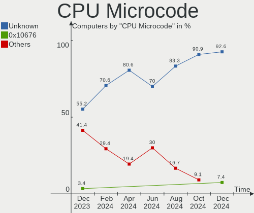

| Number     | Computers | Percent |
|------------|-----------|---------|
| Unknown    | 14        | 43.75%  |
| 0x306a9    | 2         | 6.25%   |
| 0x20655    | 2         | 6.25%   |
| 0x906c0    | 1         | 3.13%   |
| 0x906a4    | 1         | 3.13%   |
| 0x806ea    | 1         | 3.13%   |
| 0x6fd      | 1         | 3.13%   |
| 0x406e3    | 1         | 3.13%   |
| 0x406c3    | 1         | 3.13%   |
| 0x30678    | 1         | 3.13%   |
| 0x30661    | 1         | 3.13%   |
| 0x206a7    | 1         | 3.13%   |
| 0x1067a    | 1         | 3.13%   |
| 0x10676    | 1         | 3.13%   |
| 0x0a601203 | 1         | 3.13%   |
| 0x0a50000d | 1         | 3.13%   |
| 0x07000110 | 1         | 3.13%   |

CPU Microarch
-------------

Microarchitecture

| Name             | Computers | Percent |
|------------------|-----------|---------|
| Westmere         | 4         | 12.5%   |
| Silvermont       | 3         | 9.38%   |
| Penryn           | 3         | 9.38%   |
| Tremont          | 2         | 6.25%   |
| KabyLake         | 2         | 6.25%   |
| IvyBridge        | 2         | 6.25%   |
| Goldmont plus    | 2         | 6.25%   |
| Unknown          | 2         | 6.25%   |
| Zen 3            | 1         | 3.13%   |
| Zen 2            | 1         | 3.13%   |
| TigerLake        | 1         | 3.13%   |
| Skylake          | 1         | 3.13%   |
| SandyBridge      | 1         | 3.13%   |
| K10              | 1         | 3.13%   |
| Jaguar           | 1         | 3.13%   |
| Core             | 1         | 3.13%   |
| Broadwell        | 1         | 3.13%   |
| Bonnell          | 1         | 3.13%   |
| Bobcat           | 1         | 3.13%   |
| Alderlake Hybrid | 1         | 3.13%   |

Graphics
--------

GPU Vendor
----------

Vendors of graphics cards

| Vendor                     | Computers | Percent |
|----------------------------|-----------|---------|
| Intel                      | 23        | 63.89%  |
| Nvidia                     | 6         | 16.67%  |
| AMD                        | 5         | 13.89%  |
| Zhaoxin                    | 1         | 2.78%   |
| Matrox Electronics Systems | 1         | 2.78%   |

GPU Model
---------

Graphics card models

| Model                                                                                    | Computers | Percent |
|------------------------------------------------------------------------------------------|-----------|---------|
| Intel Core Processor Integrated Graphics Controller                                      | 3         | 8.11%   |
| Intel JasperLake [UHD Graphics]                                                          | 2         | 5.41%   |
| Intel GeminiLake [UHD Graphics 600]                                                      | 2         | 5.41%   |
| Intel Atom Processor Z36xxx/Z37xxx Series Graphics & Display                             | 2         | 5.41%   |
| Zhaoxin ZX-E C-960 GPU                                                                   | 1         | 2.7%    |
| Nvidia TU117GLM [T550 Laptop GPU]                                                        | 1         | 2.7%    |
| Nvidia GT216M [GeForce GT 330M]                                                          | 1         | 2.7%    |
| Nvidia GM108M [GeForce MX130]                                                            | 1         | 2.7%    |
| Nvidia GK107M [GeForce GTX 660M]                                                         | 1         | 2.7%    |
| Nvidia GK106 [GeForce GTX 660]                                                           | 1         | 2.7%    |
| Nvidia G92 [GeForce GTS 250]                                                             | 1         | 2.7%    |
| Matrox Electronics Systems MGA G200e [Pilot] ServerEngines (SEP1)                        | 1         | 2.7%    |
| Intel UHD Graphics 620                                                                   | 1         | 2.7%    |
| Intel Tiger Lake-LP GT2 [UHD Graphics G4]                                                | 1         | 2.7%    |
| Intel Skylake GT2 [HD Graphics 520]                                                      | 1         | 2.7%    |
| Intel Mobile GM965/GL960 Integrated Graphics Controller (secondary)                      | 1         | 2.7%    |
| Intel Mobile GM965/GL960 Integrated Graphics Controller (primary)                        | 1         | 2.7%    |
| Intel Mobile 4 Series Chipset Integrated Graphics Controller                             | 1         | 2.7%    |
| Intel HD Graphics 620                                                                    | 1         | 2.7%    |
| Intel HD Graphics 5500                                                                   | 1         | 2.7%    |
| Intel Atom/Celeron/Pentium Processor x5-E8000/J3xxx/N3xxx Integrated Graphics Controller | 1         | 2.7%    |
| Intel Atom Processor D2xxx/N2xxx Integrated Graphics Controller                          | 1         | 2.7%    |
| Intel Alder Lake-UP3 GT2 [Iris Xe Graphics]                                              | 1         | 2.7%    |
| Intel 82G33/G31 Express Integrated Graphics Controller                                   | 1         | 2.7%    |
| Intel 4 Series Chipset Integrated Graphics Controller                                    | 1         | 2.7%    |
| Intel 3rd Gen Core processor Graphics Controller                                         | 1         | 2.7%    |
| Intel 2nd Generation Core Processor Family Integrated Graphics Controller                | 1         | 2.7%    |
| AMD Wrestler [Radeon HD 6250]                                                            | 1         | 2.7%    |
| AMD Raphael                                                                              | 1         | 2.7%    |
| AMD Navi 22 [Radeon RX 6700/6700 XT/6750 XT / 6800M/6850M XT]                            | 1         | 2.7%    |
| AMD Madison [Mobility Radeon HD 5650/5750 / 6530M/6550M]                                 | 1         | 2.7%    |
| AMD Kabini [Radeon HD 8330E]                                                             | 1         | 2.7%    |

GPU Combo
---------

Combinations of graphics cards

| Name           | Computers | Percent |
|----------------|-----------|---------|
| 1 x Intel      | 19        | 59.38%  |
| 1 x AMD        | 5         | 15.63%  |
| Intel + Nvidia | 4         | 12.5%   |
| 1 x Nvidia     | 2         | 6.25%   |
| 1 x Zhaoxin    | 1         | 3.13%   |
| 1 x Matrox     | 1         | 3.13%   |

GPU Driver
----------

Free vs proprietary

| Driver      | Computers | Percent |
|-------------|-----------|---------|
| Free        | 30        | 93.75%  |
| Proprietary | 1         | 3.13%   |
| Unknown     | 1         | 3.13%   |

GPU Memory
----------

Total video memory

| Size in GB | Computers | Percent |
|------------|-----------|---------|
| Unknown    | 25        | 78.13%  |
| 1.01-2.0   | 2         | 6.25%   |
| 0.01-0.5   | 2         | 6.25%   |
| 3.01-4.0   | 1         | 3.13%   |
| 8.01-16.0  | 1         | 3.13%   |
| 0.51-1.0   | 1         | 3.13%   |

Monitor
-------

Monitor Vendor
--------------

Monitor vendors

| Vendor              | Computers | Percent |
|---------------------|-----------|---------|
| AU Optronics        | 6         | 19.35%  |
| Samsung Electronics | 5         | 16.13%  |
| Dell                | 4         | 12.9%   |
| LG Display          | 3         | 9.68%   |
| Acer                | 3         | 9.68%   |
| BOE                 | 2         | 6.45%   |
| ViewSonic           | 1         | 3.23%   |
| RTK                 | 1         | 3.23%   |
| Philips             | 1         | 3.23%   |
| Lenovo              | 1         | 3.23%   |
| Hewlett-Packard     | 1         | 3.23%   |
| HannStar            | 1         | 3.23%   |
| Chimei Innolux      | 1         | 3.23%   |
| BenQ                | 1         | 3.23%   |

Monitor Model
-------------

Monitor models

| Model                                                                 | Computers | Percent |
|-----------------------------------------------------------------------|-----------|---------|
| Dell S2721HSX DEL4202 1920x1080 598x336mm 27.0-inch                   | 2         | 6.45%   |
| ViewSonic VX2450 SERIES VSCE226 1920x1080 525x297mm 23.7-inch         | 1         | 3.23%   |
| Samsung Electronics SyncMaster SAM0218 1280x1024 376x301mm 19.0-inch  | 1         | 3.23%   |
| Samsung Electronics SyncMaster SAM009D 1024x768 304x228mm 15.0-inch   | 1         | 3.23%   |
| Samsung Electronics LCD Monitor SEC3847 1440x900 367x230mm 17.1-inch  | 1         | 3.23%   |
| Samsung Electronics LCD Monitor SEC3253 1366x768 344x194mm 15.5-inch  | 1         | 3.23%   |
| Samsung Electronics LCD Monitor SAM7106 1920x1080 600x340mm 27.2-inch | 1         | 3.23%   |
| RTK ARZOPA RTKBC33 1920x1080 309x174mm 14.0-inch                      | 1         | 3.23%   |
| Philips PHL 273V7 PHLC156 1920x1080 598x336mm 27.0-inch               | 1         | 3.23%   |
| LG Display LCD Monitor LGD0469 1920x1080 382x215mm 17.3-inch          | 1         | 3.23%   |
| LG Display LCD Monitor LGD033A 1366x768 344x194mm 15.5-inch           | 1         | 3.23%   |
| LG Display LCD Monitor LGD0288 1600x900 382x215mm 17.3-inch           | 1         | 3.23%   |
| Lenovo LCD Monitor LEN4011 1280x800 260x170mm 12.2-inch               | 1         | 3.23%   |
| Hewlett-Packard L1908w HWP26F0 1440x900 410x256mm 19.0-inch           | 1         | 3.23%   |
| HannStar HSD100IFW4A HSD03EE 1024x600 220x129mm 10.0-inch             | 1         | 3.23%   |
| Dell S199WFP DELF00A 1440x900 408x255mm 18.9-inch                     | 1         | 3.23%   |
| Dell LCD Monitor U2412M 1920x1200                                     | 1         | 3.23%   |
| Chimei Innolux LCD Monitor CMN1499 1366x768 309x174mm 14.0-inch       | 1         | 3.23%   |
| BOE LCD Monitor BOE093E 1920x1080 344x194mm 15.5-inch                 | 1         | 3.23%   |
| BOE LCD Monitor BOE0771 1366x768 256x144mm 11.6-inch                  | 1         | 3.23%   |
| BenQ BenQG2222HDL BNQ785A 1920x1080 478x269mm 21.6-inch               | 1         | 3.23%   |
| AU Optronics LCD Monitor AUOEB83 1920x1080 344x194mm 15.5-inch        | 1         | 3.23%   |
| AU Optronics LCD Monitor AUO9314 1280x800 261x163mm 12.1-inch         | 1         | 3.23%   |
| AU Optronics LCD Monitor AUO38ED 1920x1080 344x193mm 15.5-inch        | 1         | 3.23%   |
| AU Optronics LCD Monitor AUO35ED 1920x1080 344x193mm 15.5-inch        | 1         | 3.23%   |
| AU Optronics LCD Monitor AUO26EC 1366x768 344x193mm 15.5-inch         | 1         | 3.23%   |
| AU Optronics LCD Monitor AUO123D 1920x1080 309x173mm 13.9-inch        | 1         | 3.23%   |
| Acer V206HQL ACR0334 1366x768 434x236mm 19.4-inch                     | 1         | 3.23%   |
| Acer R240HY ACR046F 1920x1080 527x296mm 23.8-inch                     | 1         | 3.23%   |
| Acer P221W ACR0016 1680x1050 474x296mm 22.0-inch                      | 1         | 3.23%   |

Monitor Resolution
------------------

Monitor screen resolution

| Resolution         | Computers | Percent |
|--------------------|-----------|---------|
| 1920x1080 (FHD)    | 11        | 37.93%  |
| 1366x768 (WXGA)    | 5         | 17.24%  |
| 1440x900 (WXGA+)   | 3         | 10.34%  |
| 1600x900 (HD+)     | 2         | 6.9%    |
| 1280x800 (WXGA)    | 2         | 6.9%    |
| 3840x2160 (4K)     | 1         | 3.45%   |
| 1920x1200 (WUXGA)  | 1         | 3.45%   |
| 1680x1050 (WSXGA+) | 1         | 3.45%   |
| 1280x1024 (SXGA)   | 1         | 3.45%   |
| 1024x768 (XGA)     | 1         | 3.45%   |
| 1024x600           | 1         | 3.45%   |

Monitor Diagonal
----------------

Diagonal size in inches

| Inches  | Computers | Percent |
|---------|-----------|---------|
| 15      | 8         | 26.67%  |
| 27      | 3         | 10%     |
| 19      | 3         | 10%     |
| 17      | 3         | 10%     |
| 24      | 2         | 6.67%   |
| 12      | 2         | 6.67%   |
| 54      | 1         | 3.33%   |
| 22      | 1         | 3.33%   |
| 21      | 1         | 3.33%   |
| 18      | 1         | 3.33%   |
| 14      | 1         | 3.33%   |
| 13      | 1         | 3.33%   |
| 11      | 1         | 3.33%   |
| 10      | 1         | 3.33%   |
| Unknown | 1         | 3.33%   |

Monitor Width
-------------

Physical width

| Width in mm | Computers | Percent |
|-------------|-----------|---------|
| 301-350     | 10        | 33.33%  |
| 501-600     | 5         | 16.67%  |
| 401-500     | 5         | 16.67%  |
| 351-400     | 4         | 13.33%  |
| 201-300     | 4         | 13.33%  |
| 1001-1500   | 1         | 3.33%   |
| Unknown     | 1         | 3.33%   |

Aspect Ratio
------------

Proportional relationship between the width and the height

| Ratio   | Computers | Percent |
|---------|-----------|---------|
| 16/9    | 19        | 67.86%  |
| 16/10   | 5         | 17.86%  |
| 5/4     | 1         | 3.57%   |
| 4/3     | 1         | 3.57%   |
| 3/2     | 1         | 3.57%   |
| Unknown | 1         | 3.57%   |

Monitor Area
------------

Area in inch²

| Area in inch² | Computers | Percent |
|----------------|-----------|---------|
| 101-110        | 8         | 27.59%  |
| 201-250        | 4         | 13.79%  |
| 301-350        | 3         | 10.34%  |
| 151-200        | 3         | 10.34%  |
| 81-90          | 2         | 6.9%    |
| 61-70          | 2         | 6.9%    |
| 121-130        | 2         | 6.9%    |
| More than 1000 | 1         | 3.45%   |
| 51-60          | 1         | 3.45%   |
| 41-50          | 1         | 3.45%   |
| 131-140        | 1         | 3.45%   |
| Unknown        | 1         | 3.45%   |

Pixel Density
-------------

Pixels per inch

| Density | Computers | Percent |
|---------|-----------|---------|
| 51-100  | 11        | 37.93%  |
| 121-160 | 9         | 31.03%  |
| 101-120 | 7         | 24.14%  |
| 1-50    | 1         | 3.45%   |
| Unknown | 1         | 3.45%   |

Multiple Monitors
-----------------

Total monitors connected

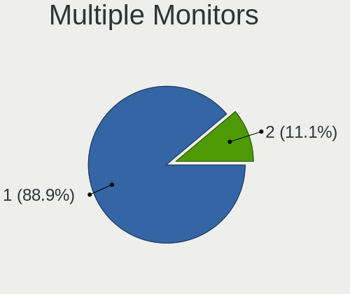

| Total | Computers | Percent |
|-------|-----------|---------|
| 1     | 26        | 81.25%  |
| 2     | 5         | 15.63%  |
| 0     | 1         | 3.13%   |

Network
-------

Net Controller Vendor
---------------------

Controller vendors

| Vendor                   | Computers | Percent |
|--------------------------|-----------|---------|
| Realtek Semiconductor    | 19        | 33.93%  |
| Intel                    | 15        | 26.79%  |
| Qualcomm Atheros         | 6         | 10.71%  |
| Broadcom                 | 4         | 7.14%   |
| Xiaomi                   | 2         | 3.57%   |
| Marvell Technology Group | 2         | 3.57%   |
| Ralink Technology        | 1         | 1.79%   |
| Ralink                   | 1         | 1.79%   |
| QinHeng Electronics      | 1         | 1.79%   |
| NetGear                  | 1         | 1.79%   |
| MediaTek                 | 1         | 1.79%   |
| Dresden Elektronik       | 1         | 1.79%   |
| Broadcom Limited         | 1         | 1.79%   |
| Attansic Technology      | 1         | 1.79%   |

Net Controller Model
--------------------

Controller models

| Model                                                                          | Computers | Percent |
|--------------------------------------------------------------------------------|-----------|---------|
| Realtek RTL8111/8168/8411 PCI Express Gigabit Ethernet Controller              | 14        | 21.88%  |
| Xiaomi Mi/Redmi series (RNDIS + ADB)                                           | 2         | 3.13%   |
| Realtek RTL810xE PCI Express Fast Ethernet controller                          | 2         | 3.13%   |
| Qualcomm Atheros AR9285 Wireless Network Adapter (PCI-Express)                 | 2         | 3.13%   |
| Intel Wireless 3165                                                            | 2         | 3.13%   |
| Broadcom BCM4313 802.11bgn Wireless Network Adapter                            | 2         | 3.13%   |
| Realtek RTL88x2bu [AC1200 Techkey]                                             | 1         | 1.56%   |
| Realtek RTL8821CE 802.11ac PCIe Wireless Network Adapter                       | 1         | 1.56%   |
| Realtek RTL8192EU 802.11b/g/n WLAN Adapter                                     | 1         | 1.56%   |
| Realtek RTL8192EE PCIe Wireless Network Adapter                                | 1         | 1.56%   |
| Realtek RTL8187B Wireless 802.11g 54Mbps Network Adapter                       | 1         | 1.56%   |
| Realtek RTL8153 Gigabit Ethernet Adapter                                       | 1         | 1.56%   |
| Realtek 802.11n WLAN Adapter                                                   | 1         | 1.56%   |
| Ralink RT5370 Wireless Adapter                                                 | 1         | 1.56%   |
| Ralink RT3290 Wireless 802.11n 1T/1R PCIe                                      | 1         | 1.56%   |
| Qualcomm Atheros QCA9377 802.11ac Wireless Network Adapter                     | 1         | 1.56%   |
| Qualcomm Atheros AR9287 Wireless Network Adapter (PCI-Express)                 | 1         | 1.56%   |
| Qualcomm Atheros AR8161 Gigabit Ethernet                                       | 1         | 1.56%   |
| Qualcomm Atheros AR8152 v2.0 Fast Ethernet                                     | 1         | 1.56%   |
| Qualcomm Atheros AR242x / AR542x Wireless Network Adapter (PCI-Express)        | 1         | 1.56%   |
| QinHeng USB Single Serial                                                      | 1         | 1.56%   |
| NetGear A6210                                                                  | 1         | 1.56%   |
| MediaTek MT7922 802.11ax PCI Express Wireless Network Adapter                  | 1         | 1.56%   |
| Marvell Group Yukon Optima 88E8059 [PCIe Gigabit Ethernet Controller with AVB] | 1         | 1.56%   |
| Marvell Group 88W8897 [AVASTAR] 802.11ac Wireless                              | 1         | 1.56%   |
| Intel Wireless 8260                                                            | 1         | 1.56%   |
| Intel Wireless 7265                                                            | 1         | 1.56%   |
| Intel Wireless 3160                                                            | 1         | 1.56%   |
| Intel Wi-Fi 6 AX210/AX211/AX411 160MHz                                         | 1         | 1.56%   |
| Intel Wi-Fi 6 AX201 160MHz                                                     | 1         | 1.56%   |
| Intel Ethernet Controller I225-V                                               | 1         | 1.56%   |
| Intel Ethernet Connection I219-LM                                              | 1         | 1.56%   |
| Intel Ethernet Connection (4) I219-V                                           | 1         | 1.56%   |
| Intel Ethernet Connection (16) I219-LM                                         | 1         | 1.56%   |
| Intel Dual Band Wireless-AC 3168NGW [Stone Peak]                               | 1         | 1.56%   |
| Intel Centrino Wireless-N 2200                                                 | 1         | 1.56%   |
| Intel Centrino Wireless-N 1000 [Condor Peak]                                   | 1         | 1.56%   |
| Intel Alder Lake-P PCH CNVi WiFi                                               | 1         | 1.56%   |
| Intel 82577LM Gigabit Network Connection                                       | 1         | 1.56%   |
| Intel 82567LM-3 Gigabit Network Connection                                     | 1         | 1.56%   |

Wireless Vendor
---------------

Wireless vendors

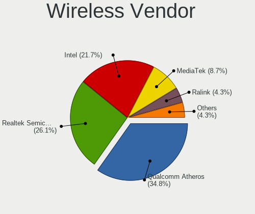

| Vendor                   | Computers | Percent |
|--------------------------|-----------|---------|
| Intel                    | 11        | 36.67%  |
| Realtek Semiconductor    | 5         | 16.67%  |
| Qualcomm Atheros         | 5         | 16.67%  |
| Broadcom                 | 3         | 10%     |
| Ralink Technology        | 1         | 3.33%   |
| Ralink                   | 1         | 3.33%   |
| NetGear                  | 1         | 3.33%   |
| MediaTek                 | 1         | 3.33%   |
| Marvell Technology Group | 1         | 3.33%   |
| Broadcom Limited         | 1         | 3.33%   |

Wireless Model
--------------

Wireless models

| Model                                                                   | Computers | Percent |
|-------------------------------------------------------------------------|-----------|---------|
| Qualcomm Atheros AR9285 Wireless Network Adapter (PCI-Express)          | 2         | 6.45%   |
| Intel Wireless 3165                                                     | 2         | 6.45%   |
| Broadcom BCM4313 802.11bgn Wireless Network Adapter                     | 2         | 6.45%   |
| Realtek RTL88x2bu [AC1200 Techkey]                                      | 1         | 3.23%   |
| Realtek RTL8821CE 802.11ac PCIe Wireless Network Adapter                | 1         | 3.23%   |
| Realtek RTL8192EU 802.11b/g/n WLAN Adapter                              | 1         | 3.23%   |
| Realtek RTL8192EE PCIe Wireless Network Adapter                         | 1         | 3.23%   |
| Realtek RTL8187B Wireless 802.11g 54Mbps Network Adapter                | 1         | 3.23%   |
| Realtek 802.11n WLAN Adapter                                            | 1         | 3.23%   |
| Ralink RT5370 Wireless Adapter                                          | 1         | 3.23%   |
| Ralink RT3290 Wireless 802.11n 1T/1R PCIe                               | 1         | 3.23%   |
| Qualcomm Atheros QCA9377 802.11ac Wireless Network Adapter              | 1         | 3.23%   |
| Qualcomm Atheros AR9287 Wireless Network Adapter (PCI-Express)          | 1         | 3.23%   |
| Qualcomm Atheros AR242x / AR542x Wireless Network Adapter (PCI-Express) | 1         | 3.23%   |
| NetGear A6210                                                           | 1         | 3.23%   |
| MediaTek MT7922 802.11ax PCI Express Wireless Network Adapter           | 1         | 3.23%   |
| Marvell Group 88W8897 [AVASTAR] 802.11ac Wireless                       | 1         | 3.23%   |
| Intel Wireless 8260                                                     | 1         | 3.23%   |
| Intel Wireless 7265                                                     | 1         | 3.23%   |
| Intel Wireless 3160                                                     | 1         | 3.23%   |
| Intel Wi-Fi 6 AX210/AX211/AX411 160MHz                                  | 1         | 3.23%   |
| Intel Wi-Fi 6 AX201 160MHz                                              | 1         | 3.23%   |
| Intel Dual Band Wireless-AC 3168NGW [Stone Peak]                        | 1         | 3.23%   |
| Intel Centrino Wireless-N 2200                                          | 1         | 3.23%   |
| Intel Centrino Wireless-N 1000 [Condor Peak]                            | 1         | 3.23%   |
| Intel Alder Lake-P PCH CNVi WiFi                                        | 1         | 3.23%   |
| Broadcom Limited BCM4352 802.11ac Wireless Network Adapter              | 1         | 3.23%   |
| Broadcom BCM4312 802.11b/g LP-PHY                                       | 1         | 3.23%   |

Ethernet Vendor
---------------

Ethernet vendors

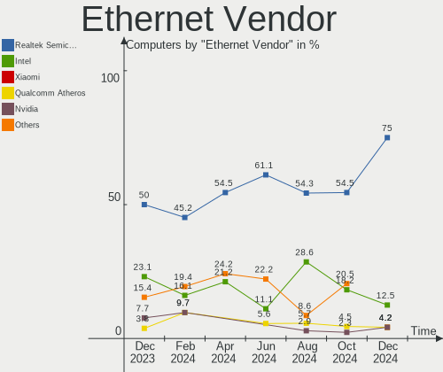

| Vendor                   | Computers | Percent |
|--------------------------|-----------|---------|
| Realtek Semiconductor    | 17        | 54.84%  |
| Intel                    | 7         | 22.58%  |
| Xiaomi                   | 2         | 6.45%   |
| Qualcomm Atheros         | 2         | 6.45%   |
| Marvell Technology Group | 1         | 3.23%   |
| Broadcom                 | 1         | 3.23%   |
| Attansic Technology      | 1         | 3.23%   |

Ethernet Model
--------------

Ethernet models

| Model                                                                          | Computers | Percent |
|--------------------------------------------------------------------------------|-----------|---------|
| Realtek RTL8111/8168/8411 PCI Express Gigabit Ethernet Controller              | 14        | 45.16%  |
| Xiaomi Mi/Redmi series (RNDIS + ADB)                                           | 2         | 6.45%   |
| Realtek RTL810xE PCI Express Fast Ethernet controller                          | 2         | 6.45%   |
| Realtek RTL8153 Gigabit Ethernet Adapter                                       | 1         | 3.23%   |
| Qualcomm Atheros AR8161 Gigabit Ethernet                                       | 1         | 3.23%   |
| Qualcomm Atheros AR8152 v2.0 Fast Ethernet                                     | 1         | 3.23%   |
| Marvell Group Yukon Optima 88E8059 [PCIe Gigabit Ethernet Controller with AVB] | 1         | 3.23%   |
| Intel Ethernet Controller I225-V                                               | 1         | 3.23%   |
| Intel Ethernet Connection I219-LM                                              | 1         | 3.23%   |
| Intel Ethernet Connection (4) I219-V                                           | 1         | 3.23%   |
| Intel Ethernet Connection (16) I219-LM                                         | 1         | 3.23%   |
| Intel 82577LM Gigabit Network Connection                                       | 1         | 3.23%   |
| Intel 82567LM-3 Gigabit Network Connection                                     | 1         | 3.23%   |
| Intel 82567LM Gigabit Network Connection                                       | 1         | 3.23%   |
| Broadcom NetLink BCM57780 Gigabit Ethernet PCIe                                | 1         | 3.23%   |
| Attansic AR8152 v2.0 Fast Ethernet                                             | 1         | 3.23%   |

Net Controller Kind
-------------------

Ethernet, WiFi or modem

| Kind     | Computers | Percent |
|----------|-----------|---------|
| WiFi     | 29        | 49.15%  |
| Ethernet | 28        | 47.46%  |
| Modem    | 2         | 3.39%   |

Used Controller
---------------

Currently used network controller

| Kind     | Computers | Percent |
|----------|-----------|---------|
| WiFi     | 18        | 54.55%  |
| Ethernet | 15        | 45.45%  |

NICs
----

Total network controllers on board

| Total | Computers | Percent |
|-------|-----------|---------|
| 2     | 24        | 75%     |
| 1     | 5         | 15.63%  |
| 0     | 3         | 9.38%   |

IPv6
----

IPv6 vs IPv4

| Used | Computers | Percent |
|------|-----------|---------|
| No   | 23        | 71.88%  |
| Yes  | 9         | 28.13%  |

Bluetooth
---------

Bluetooth Vendor
----------------

Controller vendors

| Vendor                          | Computers | Percent |
|---------------------------------|-----------|---------|
| Intel                           | 8         | 38.1%   |
| Qualcomm Atheros Communications | 2         | 9.52%   |
| Foxconn / Hon Hai               | 2         | 9.52%   |
| Broadcom                        | 2         | 9.52%   |
| TP-Link                         | 1         | 4.76%   |
| Realtek Semiconductor           | 1         | 4.76%   |
| Ralink                          | 1         | 4.76%   |
| Marvell Semiconductor           | 1         | 4.76%   |
| Lite-On Technology              | 1         | 4.76%   |
| Hewlett-Packard                 | 1         | 4.76%   |
| Dell                            | 1         | 4.76%   |

Bluetooth Model
---------------

Controller models

| Model                                                                               | Computers | Percent |
|-------------------------------------------------------------------------------------|-----------|---------|
| Intel Bluetooth wireless interface                                                  | 4         | 19.05%  |
| TP-Link UB500 Adapter                                                               | 1         | 4.76%   |
| Realtek  Bluetooth 4.2 Adapter                                                      | 1         | 4.76%   |
| Ralink RT3290 Bluetooth                                                             | 1         | 4.76%   |
| Qualcomm Atheros  Bluetooth Device                                                  | 1         | 4.76%   |
| Qualcomm Atheros AR3011 Bluetooth                                                   | 1         | 4.76%   |
| Marvell Bluetooth and Wireless LAN Composite                                        | 1         | 4.76%   |
| Lite-On BCM20702A0                                                                  | 1         | 4.76%   |
| Intel Wireless-AC 3168 Bluetooth                                                    | 1         | 4.76%   |
| Intel Bluetooth Device                                                              | 1         | 4.76%   |
| Intel Bluetooth 9460/9560 Jefferson Peak (JfP)                                      | 1         | 4.76%   |
| Intel AX210 Bluetooth                                                               | 1         | 4.76%   |
| HP Bluetooth 2.0 Interface [Broadcom BCM2045]                                       | 1         | 4.76%   |
| Foxconn / Hon Hai Wireless_Device                                                   | 1         | 4.76%   |
| Foxconn / Hon Hai Foxconn T77H114 BCM2070 [Single-Chip Bluetooth 2.1 + EDR Adapter] | 1         | 4.76%   |
| Dell Wireless 365 Bluetooth                                                         | 1         | 4.76%   |
| Broadcom BCM20702A0                                                                 | 1         | 4.76%   |
| Broadcom BCM2045B (BDC-2.1)                                                         | 1         | 4.76%   |

Sound
-----

Sound Vendor
------------

Sound card vendors

| Vendor                 | Computers | Percent |
|------------------------|-----------|---------|
| Intel                  | 22        | 61.11%  |
| AMD                    | 7         | 19.44%  |
| Nvidia                 | 2         | 5.56%   |
| Zhaoxin                | 1         | 2.78%   |
| GN Netcom              | 1         | 2.78%   |
| Generalplus Technology | 1         | 2.78%   |
| C-Media Electronics    | 1         | 2.78%   |
| ASUSTek Computer       | 1         | 2.78%   |

Sound Model
-----------

Sound card models

| Model                                                                      | Computers | Percent |
|----------------------------------------------------------------------------|-----------|---------|
| Intel 5 Series/3400 Series Chipset High Definition Audio                   | 4         | 9.76%   |
| Intel Sunrise Point-LP HD Audio                                            | 3         | 7.32%   |
| Intel Jasper Lake HD Audio                                                 | 2         | 4.88%   |
| Intel Celeron/Pentium Silver Processor High Definition Audio               | 2         | 4.88%   |
| Intel 82801I (ICH9 Family) HD Audio Controller                             | 2         | 4.88%   |
| AMD SBx00 Azalia (Intel HDA)                                               | 2         | 4.88%   |
| Zhaoxin ZX-E High Definition Audio Controller                              | 1         | 2.44%   |
| Zhaoxin ZX-100/KX-5000/KX-6000/KX-6000G High Definition Audio Controller   | 1         | 2.44%   |
| Nvidia GT216 HDMI Audio Controller                                         | 1         | 2.44%   |
| Nvidia GK106 HDMI Audio Controller                                         | 1         | 2.44%   |
| Intel Wildcat Point-LP High Definition Audio Controller                    | 1         | 2.44%   |
| Intel Tiger Lake-LP Smart Sound Technology Audio Controller                | 1         | 2.44%   |
| Intel NM10/ICH7 Family High Definition Audio Controller                    | 1         | 2.44%   |
| Intel Broadwell-U Audio Controller                                         | 1         | 2.44%   |
| Intel Atom Processor Z36xxx/Z37xxx Series High Definition Audio Controller | 1         | 2.44%   |
| Intel Alder Lake PCH-P High Definition Audio Controller                    | 1         | 2.44%   |
| Intel 82801JD/DO (ICH10 Family) HD Audio Controller                        | 1         | 2.44%   |
| Intel 82801H (ICH8 Family) HD Audio Controller                             | 1         | 2.44%   |
| Intel 7 Series/C216 Chipset Family High Definition Audio Controller        | 1         | 2.44%   |
| Intel 6 Series/C200 Series Chipset Family High Definition Audio Controller | 1         | 2.44%   |
| GN Netcom Jabra BIZ 2400 USB                                               | 1         | 2.44%   |
| Generalplus Technology USB Audio Device                                    | 1         | 2.44%   |
| C-Media Electronics Audio Adapter (Unitek Y-247A)                          | 1         | 2.44%   |
| ASUSTek Computer USB Audio                                                 | 1         | 2.44%   |
| AMD Starship/Matisse HD Audio Controller                                   | 1         | 2.44%   |
| AMD Renoir Radeon High Definition Audio Controller                         | 1         | 2.44%   |
| AMD Rembrandt Radeon High Definition Audio Controller                      | 1         | 2.44%   |
| AMD Redwood HDMI Audio [Radeon HD 5000 Series]                             | 1         | 2.44%   |
| AMD Navi 21/23 HDMI/DP Audio Controller                                    | 1         | 2.44%   |
| AMD Kabini HDMI/DP Audio                                                   | 1         | 2.44%   |
| AMD FCH Azalia Controller                                                  | 1         | 2.44%   |
| AMD Family 17h/19h HD Audio Controller                                     | 1         | 2.44%   |

Memory
------

Memory Vendor
-------------

Memory module vendors

| Vendor              | Computers | Percent |
|---------------------|-----------|---------|
| Unknown             | 6         | 22.22%  |
| SK hynix            | 5         | 18.52%  |
| Crucial             | 5         | 18.52%  |
| Samsung Electronics | 2         | 7.41%   |
| Micron Technology   | 2         | 7.41%   |
| Unknown (ABCD)      | 1         | 3.7%    |
| KINGBANK            | 1         | 3.7%    |
| G.Skill             | 1         | 3.7%    |
| Elpida              | 1         | 3.7%    |
| Corsair             | 1         | 3.7%    |
| A-DATA Technology   | 1         | 3.7%    |
| Unknown             | 1         | 3.7%    |

Memory Model
------------

Memory module models

| Model                                                            | Computers | Percent |
|------------------------------------------------------------------|-----------|---------|
| Unknown RAM Module 4GB SODIMM DDR3                               | 1         | 3.45%   |
| Unknown RAM Module 2GB SODIMM DDR3 1600MT/s                      | 1         | 3.45%   |
| Unknown RAM Module 2GB SODIMM DDR3                               | 1         | 3.45%   |
| Unknown RAM Module 2048MB SODIMM DDR3 800MT/s                    | 1         | 3.45%   |
| Unknown RAM Module 1024MB SODIMM DDR2 533MT/s                    | 1         | 3.45%   |
| Unknown RAM DDR4 NB 8G 2400 8192MB SODIMM DDR4 2667MT/s          | 1         | 3.45%   |
| Unknown (ABCD) RAM 123456789012345678 3GB SODIMM LPDDR4 2400MT/s | 1         | 3.45%   |
| SK hynix RAM HMT41GS6BFR8A-PB 8GB SODIMM DDR3 1333MT/s           | 1         | 3.45%   |
| SK hynix RAM HMT351U7CFR8A-PB 4GB DIMM DDR3 1600MT/s             | 1         | 3.45%   |
| SK hynix RAM HMT351S6CFR8C-PB 4GB SODIMM DDR3 1600MT/s           | 1         | 3.45%   |
| SK hynix RAM HMT325U6CFR8C-H9 2GB DIMM DDR3 1333MT/s             | 1         | 3.45%   |
| SK hynix RAM HMT325U6BFR8C-H9 2GB DIMM DDR3 1333MT/s             | 1         | 3.45%   |
| SK hynix RAM HMAA1GS6CJR6N-XN 8GB SODIMM DDR4 3200MT/s           | 1         | 3.45%   |
| Samsung RAM Module 8GB SODIMM DDR4 2133MT/s                      | 1         | 3.45%   |
| Samsung RAM M471B5273DH0-CK0 4GB SODIMM DDR3 1600MT/s            | 1         | 3.45%   |
| Micron RAM Module 8GB SODIMM DDR4 2133MT/s                       | 1         | 3.45%   |
| Micron RAM 8HTF12864AY-800G1 1GB DIMM DDR2 800MT/s               | 1         | 3.45%   |
| KINGBANK RAM Module 16GB DIMM DDR4 3200MT/s                      | 1         | 3.45%   |
| G.Skill RAM F4-3200C16-32GVK 32GB DIMM DDR4 3200MT/s             | 1         | 3.45%   |
| Elpida RAM EBJ20UF8BDU0-GN-F 2GB SODIMM DDR3 1600MT/s            | 1         | 3.45%   |
| Elpida RAM BA92-09719A 2GB SODIMM DDR3 1334MT/s                  | 1         | 3.45%   |
| Crucial RAM CT8G4SFS832A.M8FRS 8GB DIMM DDR4 3200MT/s            | 1         | 3.45%   |
| Crucial RAM CT16G4SFRA32A.C8FE 16GB SODIMM DDR4 3200MT/s         | 1         | 3.45%   |
| Crucial RAM CT16G48C40S5.M8A1 16GB SODIMM DDR5 4800MT/s          | 1         | 3.45%   |
| Crucial RAM CT102464BF160B.C16 8GB SODIMM DDR3 1600MT/s          | 1         | 3.45%   |
| Crucial RAM BL25664BA1339.8FD 2GB DIMM DDR3 1333MT/s             | 1         | 3.45%   |
| Corsair RAM CMH64GX5M2B5200Z40 32GB DIMM DDR5 4800MT/s           | 1         | 3.45%   |
| A-DATA RAM Module 8GB DIMM DDR4 2666MT/s                         | 1         | 3.45%   |
| Unknown                                                          | 1         | 3.45%   |

Memory Kind
-----------

Memory module kinds

| Kind   | Computers | Percent |
|--------|-----------|---------|
| DDR3   | 10        | 43.48%  |
| DDR4   | 8         | 34.78%  |
| DDR5   | 2         | 8.7%    |
| DDR2   | 2         | 8.7%    |
| LPDDR4 | 1         | 4.35%   |

Memory Form Factor
------------------

Physical design of the memory module

| Name   | Computers | Percent |
|--------|-----------|---------|
| SODIMM | 16        | 69.57%  |
| DIMM   | 7         | 30.43%  |

Memory Size
-----------

Memory module size

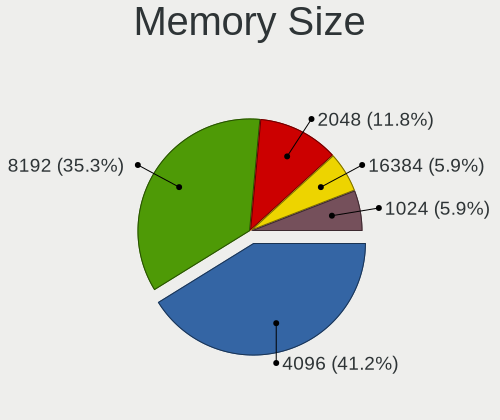

| Size  | Computers | Percent |
|-------|-----------|---------|
| 8192  | 9         | 37.5%   |
| 2048  | 5         | 20.83%  |
| 16384 | 3         | 12.5%   |
| 4096  | 3         | 12.5%   |
| 32768 | 2         | 8.33%   |
| 1024  | 2         | 8.33%   |

Memory Speed
------------

Memory module speed

| Speed   | Computers | Percent |
|---------|-----------|---------|
| 1600    | 5         | 20.83%  |
| 3200    | 4         | 16.67%  |
| 4800    | 2         | 8.33%   |
| 2133    | 2         | 8.33%   |
| 1333    | 2         | 8.33%   |
| 800     | 2         | 8.33%   |
| Unknown | 2         | 8.33%   |
| 2667    | 1         | 4.17%   |
| 2666    | 1         | 4.17%   |
| 2400    | 1         | 4.17%   |
| 1334    | 1         | 4.17%   |
| 533     | 1         | 4.17%   |

Printers & scanners
-------------------

Printer Vendor
--------------

Printer device vendors

| Vendor      | Computers | Percent |
|-------------|-----------|---------|
| Dymo-CoStar | 1         | 100%    |

Printer Model
-------------

Printer device models

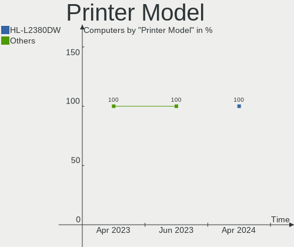

| Model                                  | Computers | Percent |
|----------------------------------------|-----------|---------|
| Dymo-CoStar DYMO LabelWriter 450 Turbo | 1         | 100%    |

Scanner Vendor
--------------

Scanner device vendors

Zero info for selected period =(

Scanner Model
-------------

Scanner device models

Zero info for selected period =(

Camera
------

Camera Vendor
-------------

Camera device vendors

| Vendor                   | Computers | Percent |
|--------------------------|-----------|---------|
| Microdia                 | 4         | 23.53%  |
| Chicony Electronics      | 4         | 23.53%  |
| Lite-On Technology       | 2         | 11.76%  |
| IMC Networks             | 2         | 11.76%  |
| WaveRider Communications | 1         | 5.88%   |
| Syntek                   | 1         | 5.88%   |
| Realtek Semiconductor    | 1         | 5.88%   |
| Logitech                 | 1         | 5.88%   |
| ALi                      | 1         | 5.88%   |

Camera Model
------------

Camera device models

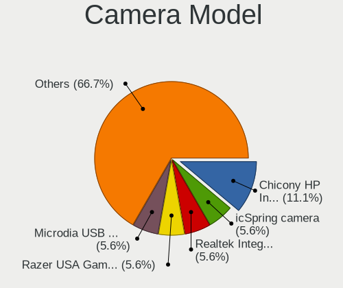

| Model                                     | Computers | Percent |
|-------------------------------------------|-----------|---------|
| Chicony HP TrueVision HD Camera           | 2         | 11.76%  |
| WaveRider USB 2.0 Camera                  | 1         | 5.88%   |
| Syntek Lenovo EasyCamera                  | 1         | 5.88%   |
| Realtek USB2.0 camera                     | 1         | 5.88%   |
| Microdia USB 2.0 Camera                   | 1         | 5.88%   |
| Microdia Sony Visual Communication Camera | 1         | 5.88%   |
| Microdia Integrated_Webcam_HD             | 1         | 5.88%   |
| Microdia Integrated_Webcam_FHD            | 1         | 5.88%   |
| Logitech Webcam B500                      | 1         | 5.88%   |
| Lite-On HP HD Webcam                      | 1         | 5.88%   |
| Lite-On HP HD Camera                      | 1         | 5.88%   |
| IMC Networks USB 2.0 UVC VGA WebCam       | 1         | 5.88%   |
| IMC Networks Lenovo EasyCamera            | 1         | 5.88%   |
| Chicony USB 2.0 Camera                    | 1         | 5.88%   |
| Chicony CKA7227                           | 1         | 5.88%   |
| ALi Gateway Webcam                        | 1         | 5.88%   |

Security
--------

Fingerprint Vendor
------------------

Fingerprint sensor vendors

| Vendor           | Computers | Percent |
|------------------|-----------|---------|
| Validity Sensors | 1         | 50%     |
| Upek             | 1         | 50%     |

Fingerprint Model
-----------------

Fingerprint sensor models

| Model                                                  | Computers | Percent |
|--------------------------------------------------------|-----------|---------|
| Validity Sensors VFS495 Fingerprint Reader             | 1         | 50%     |
| Upek Biometric Touchchip/Touchstrip Fingerprint Sensor | 1         | 50%     |

Chipcard Vendor
---------------

Chipcard module vendors

| Vendor   | Computers | Percent |
|----------|-----------|---------|
| Broadcom | 1         | 100%    |

Chipcard Model
--------------

Chipcard module models

| Model          | Computers | Percent |
|----------------|-----------|---------|
| Broadcom 58200 | 1         | 100%    |

Unsupported
-----------

Unsupported Devices
-------------------

Total unsupported devices on board

| Total | Computers | Percent |
|-------|-----------|---------|
| 0     | 23        | 71.88%  |
| 1     | 7         | 21.88%  |
| 2     | 2         | 6.25%   |

Unsupported Device Types
------------------------

Types of unsupported devices

| Type               | Computers | Percent |
|--------------------|-----------|---------|
| Net/wireless       | 3         | 21.43%  |
| Bluetooth          | 3         | 21.43%  |
| Graphics card      | 2         | 14.29%  |
| Fingerprint reader | 2         | 14.29%  |
| Sound              | 1         | 7.14%   |
| Dvb card           | 1         | 7.14%   |
| Chipcard           | 1         | 7.14%   |
| Camera             | 1         | 7.14%   |

