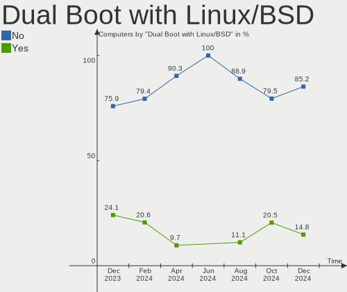
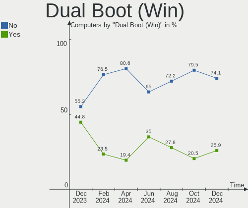
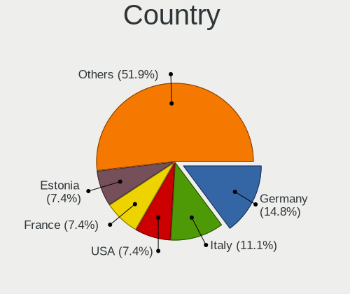
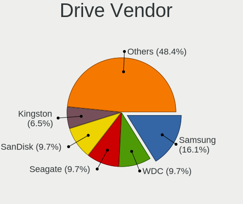
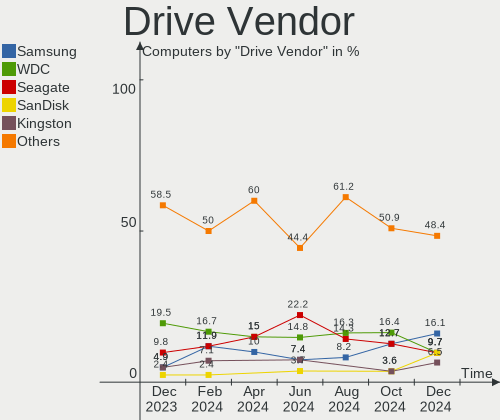
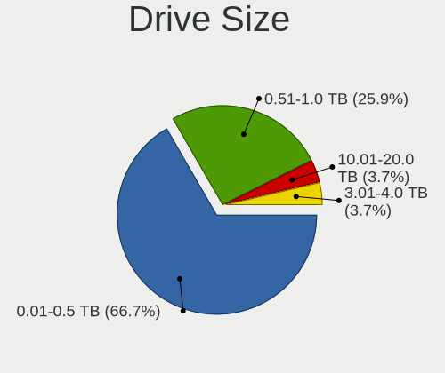
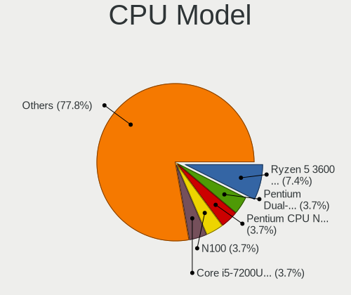
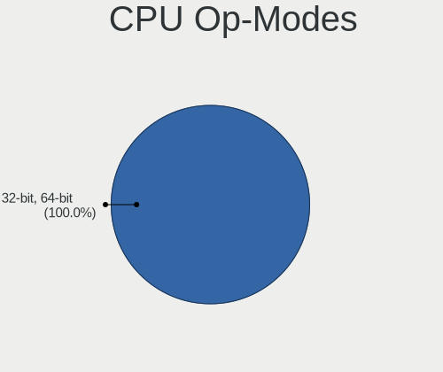
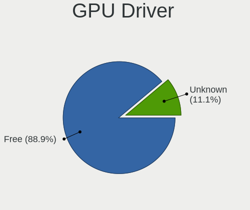
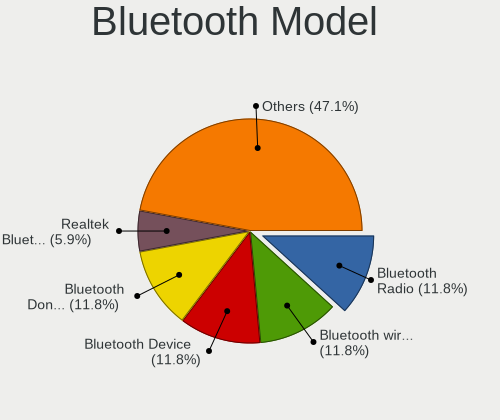

Lubuntu - Hardware Trends
-------------------------

A project to identify most popular hardware characteristics and track their change
over time based on data collected by Linux users at https://Linux-Hardware.org.

Anyone can contribute to this report by the [hw-probe](https://github.com/linuxhw/hw-probe) tool:

    sudo -E hw-probe -all -upload

This is a report for all computer types. See also reports for [desktops](/Dist/Lubuntu/Desktop/README.md) and [notebooks](/Dist/Lubuntu/Notebook/README.md).

This report is for one last month. Overall report since the beginning of time: [TestCoverage](https://github.com/linuxhw/TestCoverage)

Period: Sep, 2022.

Contents
--------

* [ System ](#system)
  - [ OS                       ](#os)
  - [ OS Family                ](#os-family)
  - [ Kernel                   ](#kernel)
  - [ Kernel Family            ](#kernel-family)
  - [ Kernel Major Ver.        ](#kernel-major-ver)
  - [ Arch                     ](#arch)
  - [ DE                       ](#de)
  - [ Display Server           ](#display-server)
  - [ Display Manager          ](#display-manager)
  - [ OS Lang                  ](#os-lang)
  - [ Boot Mode                ](#boot-mode)
  - [ Filesystem               ](#filesystem)
  - [ Part. scheme             ](#part-scheme)
  - [ Dual Boot with Linux/BSD ](#dual-boot-with-linuxbsd)
  - [ Dual Boot (Win)          ](#dual-boot-win)

* [ Board ](#board)
  - [ Vendor                   ](#vendor)
  - [ Model                    ](#model)
  - [ Model Family             ](#model-family)
  - [ MFG Year                 ](#mfg-year)
  - [ Form Factor              ](#form-factor)
  - [ Secure Boot              ](#secure-boot)
  - [ Coreboot                 ](#coreboot)
  - [ RAM Size                 ](#ram-size)
  - [ RAM Used                 ](#ram-used)
  - [ Total Drives             ](#total-drives)
  - [ Has CD-ROM               ](#has-cd-rom)
  - [ Has Ethernet             ](#has-ethernet)
  - [ Has WiFi                 ](#has-wifi)
  - [ Has Bluetooth            ](#has-bluetooth)

* [ Location ](#location)
  - [ Country                  ](#country)
  - [ City                     ](#city)

* [ Drives ](#drives)
  - [ Drive Vendor             ](#drive-vendor)
  - [ Drive Model              ](#drive-model)
  - [ HDD Vendor               ](#hdd-vendor)
  - [ SSD Vendor               ](#ssd-vendor)
  - [ Drive Kind               ](#drive-kind)
  - [ Drive Connector          ](#drive-connector)
  - [ Drive Size               ](#drive-size)
  - [ Space Total              ](#space-total)
  - [ Space Used               ](#space-used)
  - [ Malfunc. Drives          ](#malfunc-drives)
  - [ Malfunc. Drive Vendor    ](#malfunc-drive-vendor)
  - [ Malfunc. HDD Vendor      ](#malfunc-hdd-vendor)
  - [ Malfunc. Drive Kind      ](#malfunc-drive-kind)
  - [ Failed Drives            ](#failed-drives)
  - [ Failed Drive Vendor      ](#failed-drive-vendor)
  - [ Drive Status             ](#drive-status)

* [ Storage controller ](#storage-controller)
  - [ Storage Vendor           ](#storage-vendor)
  - [ Storage Model            ](#storage-model)
  - [ Storage Kind             ](#storage-kind)

* [ Processor ](#processor)
  - [ CPU Vendor               ](#cpu-vendor)
  - [ CPU Model                ](#cpu-model)
  - [ CPU Model Family         ](#cpu-model-family)
  - [ CPU Cores                ](#cpu-cores)
  - [ CPU Sockets              ](#cpu-sockets)
  - [ CPU Threads              ](#cpu-threads)
  - [ CPU Op-Modes             ](#cpu-op-modes)
  - [ CPU Microcode            ](#cpu-microcode)
  - [ CPU Microarch            ](#cpu-microarch)

* [ Graphics ](#graphics)
  - [ GPU Vendor               ](#gpu-vendor)
  - [ GPU Model                ](#gpu-model)
  - [ GPU Combo                ](#gpu-combo)
  - [ GPU Driver               ](#gpu-driver)
  - [ GPU Memory               ](#gpu-memory)

* [ Monitor ](#monitor)
  - [ Monitor Vendor           ](#monitor-vendor)
  - [ Monitor Model            ](#monitor-model)
  - [ Monitor Resolution       ](#monitor-resolution)
  - [ Monitor Diagonal         ](#monitor-diagonal)
  - [ Monitor Width            ](#monitor-width)
  - [ Aspect Ratio             ](#aspect-ratio)
  - [ Monitor Area             ](#monitor-area)
  - [ Pixel Density            ](#pixel-density)
  - [ Multiple Monitors        ](#multiple-monitors)

* [ Network ](#network)
  - [ Net Controller Vendor    ](#net-controller-vendor)
  - [ Net Controller Model     ](#net-controller-model)
  - [ Wireless Vendor          ](#wireless-vendor)
  - [ Wireless Model           ](#wireless-model)
  - [ Ethernet Vendor          ](#ethernet-vendor)
  - [ Ethernet Model           ](#ethernet-model)
  - [ Net Controller Kind      ](#net-controller-kind)
  - [ Used Controller          ](#used-controller)
  - [ NICs                     ](#nics)
  - [ IPv6                     ](#ipv6)

* [ Bluetooth ](#bluetooth)
  - [ Bluetooth Vendor         ](#bluetooth-vendor)
  - [ Bluetooth Model          ](#bluetooth-model)

* [ Sound ](#sound)
  - [ Sound Vendor             ](#sound-vendor)
  - [ Sound Model              ](#sound-model)

* [ Memory ](#memory)
  - [ Memory Vendor            ](#memory-vendor)
  - [ Memory Model             ](#memory-model)
  - [ Memory Kind              ](#memory-kind)
  - [ Memory Form Factor       ](#memory-form-factor)
  - [ Memory Size              ](#memory-size)
  - [ Memory Speed             ](#memory-speed)

* [ Printers & scanners ](#printers--scanners)
  - [ Printer Vendor           ](#printer-vendor)
  - [ Printer Model            ](#printer-model)
  - [ Scanner Vendor           ](#scanner-vendor)
  - [ Scanner Model            ](#scanner-model)

* [ Camera ](#camera)
  - [ Camera Vendor            ](#camera-vendor)
  - [ Camera Model             ](#camera-model)

* [ Security ](#security)
  - [ Fingerprint Vendor       ](#fingerprint-vendor)
  - [ Fingerprint Model        ](#fingerprint-model)
  - [ Chipcard Vendor          ](#chipcard-vendor)
  - [ Chipcard Model           ](#chipcard-model)

* [ Unsupported ](#unsupported)
  - [ Unsupported Devices      ](#unsupported-devices)
  - [ Unsupported Device Types ](#unsupported-device-types)

System
------

OS
--

Installed operating systems

| Name          | Computers | Percent |
|---------------|-----------|---------|
| Lubuntu 22.04 | 21        | 75%     |
| Lubuntu 20.04 | 5         | 17.86%  |
| Lubuntu 21.10 | 1         | 3.57%   |
| Lubuntu 18.04 | 1         | 3.57%   |

OS Family
---------

OS without a version

| Name    | Computers | Percent |
|---------|-----------|---------|
| Lubuntu | 28        | 100%    |

Kernel
------

Version of the Linux kernel

| Version            | Computers | Percent |
|--------------------|-----------|---------|
| 5.15.0-47-generic  | 9         | 32.14%  |
| 5.15.0-48-generic  | 5         | 17.86%  |
| 5.15.0-46-generic  | 4         | 14.29%  |
| 5.15.0-43-generic  | 2         | 7.14%   |
| 5.4.0-91-generic   | 1         | 3.57%   |
| 5.4.0-54-generic   | 1         | 3.57%   |
| 5.19.8-xanmod1     | 1         | 3.57%   |
| 5.19.11-ux360cak   | 1         | 3.57%   |
| 5.15.0-30-generic  | 1         | 3.57%   |
| 5.15.0-25-generic  | 1         | 3.57%   |
| 5.13.0-52-generic  | 1         | 3.57%   |
| 4.15.0-191-generic | 1         | 3.57%   |

Kernel Family
-------------

Linux kernel without a distro release

| Version | Computers | Percent |
|---------|-----------|---------|
| 5.15.0  | 22        | 78.57%  |
| 5.4.0   | 2         | 7.14%   |
| 5.19.8  | 1         | 3.57%   |
| 5.19.11 | 1         | 3.57%   |
| 5.13.0  | 1         | 3.57%   |
| 4.15.0  | 1         | 3.57%   |

Kernel Major Ver.
-----------------

Linux kernel major version

| Version | Computers | Percent |
|---------|-----------|---------|
| 5.15    | 22        | 78.57%  |
| 5.4     | 2         | 7.14%   |
| 5.19    | 2         | 7.14%   |
| 5.13    | 1         | 3.57%   |
| 4.15    | 1         | 3.57%   |

Arch
----

OS architecture (x86_64, i586, etc.)

| Name   | Computers | Percent |
|--------|-----------|---------|
| x86_64 | 28        | 100%    |

DE
--

Desktop Environment

| Name | Computers | Percent |
|------|-----------|---------|
| LXQt | 27        | 96.43%  |
| LXDE | 1         | 3.57%   |

Display Server
--------------

X11 or Wayland

| Name | Computers | Percent |
|------|-----------|---------|
| X11  | 28        | 100%    |

Display Manager
---------------

SDDM, LightDM, etc.

| Name    | Computers | Percent |
|---------|-----------|---------|
| SDDM    | 22        | 78.57%  |
| Unknown | 4         | 14.29%  |
| LightDM | 2         | 7.14%   |

OS Lang
-------

Language

| Lang  | Computers | Percent |
|-------|-----------|---------|
| en_US | 12        | 42.86%  |
| en_GB | 3         | 10.71%  |
| pt_BR | 2         | 7.14%   |
| en_AG | 2         | 7.14%   |
| it_IT | 1         | 3.57%   |
| fr_FR | 1         | 3.57%   |
| fi_FI | 1         | 3.57%   |
| es_MX | 1         | 3.57%   |
| es_ES | 1         | 3.57%   |
| es_AR | 1         | 3.57%   |
| en_AU | 1         | 3.57%   |
| de_DE | 1         | 3.57%   |
| C     | 1         | 3.57%   |

Boot Mode
---------

EFI or BIOS

| Mode | Computers | Percent |
|------|-----------|---------|
| BIOS | 19        | 67.86%  |
| EFI  | 9         | 32.14%  |

Filesystem
----------

Type of filesystem

| Type    | Computers | Percent |
|---------|-----------|---------|
| Ext4    | 26        | 92.86%  |
| Overlay | 1         | 3.57%   |
| Ext2    | 1         | 3.57%   |

Part. scheme
------------

Scheme of partitioning

| Type    | Computers | Percent |
|---------|-----------|---------|
| Unknown | 17        | 60.71%  |
| GPT     | 8         | 28.57%  |
| MBR     | 3         | 10.71%  |

Dual Boot with Linux/BSD
------------------------

Hosting more than one Linux/BSD

| Dual boot | Computers | Percent |
|-----------|-----------|---------|
| No        | 23        | 82.14%  |
| Yes       | 5         | 17.86%  |

Dual Boot (Win)
---------------

Hosting Linux and Windows

| Dual boot | Computers | Percent |
|-----------|-----------|---------|
| No        | 25        | 89.29%  |
| Yes       | 3         | 10.71%  |

Board
-----

Vendor
------

Motherboard manufacturer

| Name                | Computers | Percent |
|---------------------|-----------|---------|
| Lenovo              | 7         | 25%     |
| Dell                | 6         | 21.43%  |
| ASUSTek Computer    | 5         | 17.86%  |
| Star Labs           | 1         | 3.57%   |
| Sony                | 1         | 3.57%   |
| Packard Bell        | 1         | 3.57%   |
| MSI                 | 1         | 3.57%   |
| Intel               | 1         | 3.57%   |
| Hewlett-Packard     | 1         | 3.57%   |
| Gigabyte Technology | 1         | 3.57%   |
| Gateway             | 1         | 3.57%   |
| AMI                 | 1         | 3.57%   |
| Unknown             | 1         | 3.57%   |

Model
-----

Motherboard model

| Name                                     | Computers | Percent |
|------------------------------------------|-----------|---------|
| Star Labs Lite                           | 1         | 3.57%   |
| Sony SVE14A2V1EW                         | 1         | 3.57%   |
| Packard Bell EasyNote TS44HR             | 1         | 3.57%   |
| MSI MS-7B86                              | 1         | 3.57%   |
| Lenovo Z70-80 80FG                       | 1         | 3.57%   |
| Lenovo ThinkPad X1 Carbon 2nd 20A8S0WE02 | 1         | 3.57%   |
| Lenovo ThinkPad T430 2342A19             | 1         | 3.57%   |
| Lenovo ThinkPad E550 20DF00CUFR          | 1         | 3.57%   |
| Lenovo MIIX 310-10ICR 80SG               | 1         | 3.57%   |
| Lenovo IdeaPad Slim 1-14AST-05 81VS      | 1         | 3.57%   |
| Lenovo IdeaPad L340-15IRH Gaming 81LK    | 1         | 3.57%   |
| Intel DH67CL AAG10212-210                | 1         | 3.57%   |
| HP ProBook 4730s                         | 1         | 3.57%   |
| Gigabyte G31M-ES2C                       | 1         | 3.57%   |
| Gateway NE46R                            | 1         | 3.57%   |
| Dell XPS L322X                           | 1         | 3.57%   |
| Dell Vostro 410                          | 1         | 3.57%   |
| Dell Studio XPS 435MT                    | 1         | 3.57%   |
| Dell Precision T3610                     | 1         | 3.57%   |
| Dell OptiPlex 755                        | 1         | 3.57%   |
| Dell Inspiron 11-3168                    | 1         | 3.57%   |
| ASUS X451CA                              | 1         | 3.57%   |
| ASUS UX360CAK                            | 1         | 3.57%   |
| ASUS P8P67                               | 1         | 3.57%   |
| ASUS Maximus V FORMULA                   | 1         | 3.57%   |
| ASUS 1201N                               | 1         | 3.57%   |
| AMI Narrow Box 4K                        | 1         | 3.57%   |
| Unknown                                  | 1         | 3.57%   |

Model Family
------------

Motherboard model prefix

| Name                  | Computers | Percent |
|-----------------------|-----------|---------|
| Lenovo ThinkPad       | 3         | 10.71%  |
| Lenovo IdeaPad        | 2         | 7.14%   |
| Star Labs Lite        | 1         | 3.57%   |
| Sony SVE14A2V1EW      | 1         | 3.57%   |
| Packard Bell EasyNote | 1         | 3.57%   |
| MSI MS-7B86           | 1         | 3.57%   |
| Lenovo Z70-80         | 1         | 3.57%   |
| Lenovo MIIX           | 1         | 3.57%   |
| Intel DH67CL          | 1         | 3.57%   |
| HP ProBook            | 1         | 3.57%   |
| Gigabyte G31M-ES2C    | 1         | 3.57%   |
| Gateway NE46R         | 1         | 3.57%   |
| Dell XPS              | 1         | 3.57%   |
| Dell Vostro           | 1         | 3.57%   |
| Dell Studio           | 1         | 3.57%   |
| Dell Precision        | 1         | 3.57%   |
| Dell OptiPlex         | 1         | 3.57%   |
| Dell Inspiron         | 1         | 3.57%   |
| ASUS X451CA           | 1         | 3.57%   |
| ASUS UX360CAK         | 1         | 3.57%   |
| ASUS P8P67            | 1         | 3.57%   |
| ASUS Maximus          | 1         | 3.57%   |
| ASUS 1201N            | 1         | 3.57%   |
| AMI Narrow            | 1         | 3.57%   |
| Unknown               | 1         | 3.57%   |

MFG Year
--------

Motherboard manufacture year

| Year | Computers | Percent |
|------|-----------|---------|
| 2019 | 4         | 14.29%  |
| 2013 | 4         | 14.29%  |
| 2014 | 3         | 10.71%  |
| 2012 | 3         | 10.71%  |
| 2011 | 3         | 10.71%  |
| 2008 | 3         | 10.71%  |
| 2016 | 2         | 7.14%   |
| 2010 | 2         | 7.14%   |
| 2021 | 1         | 3.57%   |
| 2020 | 1         | 3.57%   |
| 2015 | 1         | 3.57%   |
| 2007 | 1         | 3.57%   |

Form Factor
-----------

Physical design of the computer

| Name        | Computers | Percent |
|-------------|-----------|---------|
| Notebook    | 16        | 57.14%  |
| Desktop     | 10        | 35.71%  |
| Tablet      | 1         | 3.57%   |
| Convertible | 1         | 3.57%   |

Secure Boot
-----------

Enabled or disabled

| State    | Computers | Percent |
|----------|-----------|---------|
| Disabled | 28        | 100%    |

Coreboot
--------

Have coreboot on board

| Used | Computers | Percent |
|------|-----------|---------|
| No   | 28        | 100%    |

RAM Size
--------

Total RAM memory

| Size in GB | Computers | Percent |
|------------|-----------|---------|
| 4.01-8.0   | 8         | 28.57%  |
| 3.01-4.0   | 8         | 28.57%  |
| 8.01-16.0  | 4         | 14.29%  |
| 32.01-64.0 | 2         | 7.14%   |
| 2.01-3.0   | 2         | 7.14%   |
| 16.01-24.0 | 2         | 7.14%   |
| 1.01-2.0   | 2         | 7.14%   |

RAM Used
--------

Used RAM memory

| Used GB  | Computers | Percent |
|----------|-----------|---------|
| 1.01-2.0 | 11        | 39.29%  |
| 2.01-3.0 | 7         | 25%     |
| 3.01-4.0 | 4         | 14.29%  |
| 0.51-1.0 | 4         | 14.29%  |
| 4.01-8.0 | 2         | 7.14%   |

Total Drives
------------

Number of drives on board

| Drives | Computers | Percent |
|--------|-----------|---------|
| 1      | 19        | 67.86%  |
| 2      | 6         | 21.43%  |
| 7      | 1         | 3.57%   |
| 6      | 1         | 3.57%   |
| 0      | 1         | 3.57%   |

Has CD-ROM
----------

Has CD-ROM on board

| Presented | Computers | Percent |
|-----------|-----------|---------|
| Yes       | 14        | 50%     |
| No        | 14        | 50%     |

Has Ethernet
------------

Has Ethernet on board

| Presented | Computers | Percent |
|-----------|-----------|---------|
| Yes       | 22        | 78.57%  |
| No        | 6         | 21.43%  |

Has WiFi
--------

Has WiFi module

| Presented | Computers | Percent |
|-----------|-----------|---------|
| Yes       | 21        | 75%     |
| No        | 7         | 25%     |

Has Bluetooth
-------------

Has Bluetooth module

| Presented | Computers | Percent |
|-----------|-----------|---------|
| Yes       | 17        | 60.71%  |
| No        | 11        | 39.29%  |

Location
--------

Country
-------

Geographic location (country)

| Country     | Computers | Percent |
|-------------|-----------|---------|
| USA         | 9         | 32.14%  |
| UK          | 3         | 10.71%  |
| Brazil      | 2         | 7.14%   |
| Vietnam     | 1         | 3.57%   |
| Spain       | 1         | 3.57%   |
| Poland      | 1         | 3.57%   |
| Netherlands | 1         | 3.57%   |
| Mexico      | 1         | 3.57%   |
| Kenya       | 1         | 3.57%   |
| Italy       | 1         | 3.57%   |
| Indonesia   | 1         | 3.57%   |
| Germany     | 1         | 3.57%   |
| France      | 1         | 3.57%   |
| Finland     | 1         | 3.57%   |
| Belgium     | 1         | 3.57%   |
| Australia   | 1         | 3.57%   |
| Argentina   | 1         | 3.57%   |

City
----

Geographic location (city)

| City                 | Computers | Percent |
|----------------------|-----------|---------|
| Yorkville            | 1         | 3.57%   |
| Washington           | 1         | 3.57%   |
| Surabaya             | 1         | 3.57%   |
| Runcorn              | 1         | 3.57%   |
| Resistencia          | 1         | 3.57%   |
| Porto Alegre         | 1         | 3.57%   |
| Ostrów Wielkopolski | 1         | 3.57%   |
| Ooltewah             | 1         | 3.57%   |
| Nederland            | 1         | 3.57%   |
| Nairobi              | 1         | 3.57%   |
| Mobile               | 1         | 3.57%   |
| Millville            | 1         | 3.57%   |
| Menen                | 1         | 3.57%   |
| Melbourne            | 1         | 3.57%   |
| Los Angeles          | 1         | 3.57%   |
| Hengelo              | 1         | 3.57%   |
| Helsinki             | 1         | 3.57%   |
| Hayange              | 1         | 3.57%   |
| Hanoi                | 1         | 3.57%   |
| Hamburg              | 1         | 3.57%   |
| Exeter               | 1         | 3.57%   |
| Dallas               | 1         | 3.57%   |
| Croydon              | 1         | 3.57%   |
| Chalco               | 1         | 3.57%   |
| Cambridge            | 1         | 3.57%   |
| Brasília            | 1         | 3.57%   |
| Bologna              | 1         | 3.57%   |
| Barcelona            | 1         | 3.57%   |

Drives
------

Drive Vendor
------------

Hard drive vendors

| Vendor              | Computers | Drives | Percent |
|---------------------|-----------|--------|---------|
| WDC                 | 7         | 8      | 18.42%  |
| Unknown             | 5         | 7      | 13.16%  |
| Seagate             | 5         | 5      | 13.16%  |
| Toshiba             | 4         | 4      | 10.53%  |
| Hitachi             | 4         | 5      | 10.53%  |
| SanDisk             | 3         | 3      | 7.89%   |
| Samsung Electronics | 2         | 4      | 5.26%   |
| Kingston            | 2         | 2      | 5.26%   |
| UMIS                | 1         | 1      | 2.63%   |
| T-FORCE             | 1         | 1      | 2.63%   |
| Star                | 1         | 1      | 2.63%   |
| Micron Technology   | 1         | 1      | 2.63%   |
| HGST HUS            | 1         | 2      | 2.63%   |
| External            | 1         | 1      | 2.63%   |

Drive Model
-----------

Hard drive models

| Model                                    | Computers | Percent |
|------------------------------------------|-----------|---------|
| WDC WDS500G2B0A-00SM50 500GB SSD         | 1         | 2.38%   |
| WDC WDS500G2B0A 500GB SSD                | 1         | 2.38%   |
| WDC WD3200BPVT-22JJ5T0 320GB             | 1         | 2.38%   |
| WDC WD3200BPVT-00HXZT3 320GB             | 1         | 2.38%   |
| WDC WD3200BEVT-75ZCT2 320GB              | 1         | 2.38%   |
| WDC WD3200BEVT-22ZCT0 320GB              | 1         | 2.38%   |
| WDC WD2500AAKX-00ERMA0 250GB             | 1         | 2.38%   |
| WDC WD20EZRX-00D8PB0 2TB                 | 1         | 2.38%   |
| Unknown SD/MMC/MS PRO 2GB                | 1         | 2.38%   |
| Unknown SC64G  64GB                      | 1         | 2.38%   |
| Unknown MMC64G  64GB                     | 1         | 2.38%   |
| Unknown MMC Card  64GB                   | 1         | 2.38%   |
| Unknown ISOCOM  64GB                     | 1         | 2.38%   |
| Unknown ASTC  8GB                        | 1         | 2.38%   |
| Unknown 032G72  32GB                     | 1         | 2.38%   |
| UMIS RPFTJ256PDD2MWX 256GB               | 1         | 2.38%   |
| Toshiba THNSNJ128GCSY 128GB SSD          | 1         | 2.38%   |
| Toshiba MQ01ABF050 500GB                 | 1         | 2.38%   |
| Toshiba MK5061GSY 500GB                  | 1         | 2.38%   |
| Toshiba MK3261GSYN 320GB                 | 1         | 2.38%   |
| T-FORCE 1TB                              | 1         | 2.38%   |
| Star Drive SATA SSD 240GB                | 1         | 2.38%   |
| Seagate ST9500325AS 500GB                | 1         | 2.38%   |
| Seagate ST500LM000-1EJ162 500GB          | 1         | 2.38%   |
| Seagate ST500DM002-1BD142 500GB          | 1         | 2.38%   |
| Seagate ST320LT020-9YG142 320GB          | 1         | 2.38%   |
| Seagate ST1000LM014-SSHD-8GB             | 1         | 2.38%   |
| SanDisk SSD PLUS 1000GB                  | 1         | 2.38%   |
| SanDisk SD6SN1M128G1002 128GB SSD        | 1         | 2.38%   |
| SanDisk DF4064  64GB                     | 1         | 2.38%   |
| Samsung SSD 850 EVO 250GB                | 1         | 2.38%   |
| Samsung SSD 840 PRO Series 128GB         | 1         | 2.38%   |
| Samsung MZ7PA128HMCD-010L1 128GB SSD     | 1         | 2.38%   |
| Micron MTFDDAV256TBN 256GB SSD           | 1         | 2.38%   |
| Kingston SA400S37240GB SSD               | 1         | 2.38%   |
| Kingston SA400S37240G 240GB SSD          | 1         | 2.38%   |
| Hitachi HUS724030ALE641 3TB              | 1         | 2.38%   |
| Hitachi HDT722525DLA380 41N3150LEN 250GB | 1         | 2.38%   |
| Hitachi HDS722525VLSA80 250GB            | 1         | 2.38%   |
| Hitachi HDP725050GLA360 500GB            | 1         | 2.38%   |

HDD Vendor
----------

Hard disk drive vendors

| Vendor   | Computers | Drives | Percent |
|----------|-----------|--------|---------|
| WDC      | 6         | 6      | 30%     |
| Seagate  | 5         | 5      | 25%     |
| Hitachi  | 4         | 5      | 20%     |
| Toshiba  | 3         | 3      | 15%     |
| Unknown  | 1         | 1      | 5%      |
| External | 1         | 1      | 5%      |

SSD Vendor
----------

Solid state drive vendors

| Vendor              | Computers | Drives | Percent |
|---------------------|-----------|--------|---------|
| WDC                 | 2         | 2      | 18.18%  |
| SanDisk             | 2         | 2      | 18.18%  |
| Samsung Electronics | 2         | 4      | 18.18%  |
| Kingston            | 2         | 2      | 18.18%  |
| Toshiba             | 1         | 1      | 9.09%   |
| Star                | 1         | 1      | 9.09%   |
| Micron Technology   | 1         | 1      | 9.09%   |

Drive Kind
----------

HDD or SSD

| Kind    | Computers | Drives | Percent |
|---------|-----------|--------|---------|
| HDD     | 16        | 21     | 47.06%  |
| SSD     | 11        | 13     | 32.35%  |
| MMC     | 5         | 7      | 14.71%  |
| NVMe    | 1         | 1      | 2.94%   |
| Unknown | 1         | 3      | 2.94%   |

Drive Connector
---------------

SATA, SAS, NVMe, etc.

| Type | Computers | Drives | Percent |
|------|-----------|--------|---------|
| SATA | 22        | 33     | 73.33%  |
| MMC  | 5         | 7      | 16.67%  |
| SAS  | 2         | 4      | 6.67%   |
| NVMe | 1         | 1      | 3.33%   |

Drive Size
----------

Size of hard drive

| Size in TB | Computers | Drives | Percent |
|------------|-----------|--------|---------|
| 0.01-0.5   | 22        | 28     | 81.48%  |
| 0.51-1.0   | 2         | 2      | 7.41%   |
| 3.01-4.0   | 1         | 1      | 3.7%    |
| 2.01-3.0   | 1         | 2      | 3.7%    |
| 1.01-2.0   | 1         | 1      | 3.7%    |

Space Total
-----------

Amount of disk space available on the file system

| Size in GB     | Computers | Percent |
|----------------|-----------|---------|
| 101-250        | 13        | 46.43%  |
| 251-500        | 7         | 25%     |
| More than 3000 | 2         | 7.14%   |
| 21-50          | 2         | 7.14%   |
| 51-100         | 2         | 7.14%   |
| 1-20           | 1         | 3.57%   |
| 501-1000       | 1         | 3.57%   |

Space Used
----------

Amount of used disk space

| Used GB        | Computers | Percent |
|----------------|-----------|---------|
| 21-50          | 10        | 35.71%  |
| 1-20           | 9         | 32.14%  |
| 101-250        | 4         | 14.29%  |
| 51-100         | 2         | 7.14%   |
| More than 3000 | 1         | 3.57%   |
| 251-500        | 1         | 3.57%   |
| 2001-3000      | 1         | 3.57%   |

Malfunc. Drives
---------------

Drive models with a malfunction

| Model                                     | Computers | Drives | Percent |
|-------------------------------------------|-----------|--------|---------|
| Seagate ST9500325AS 500GB                 | 1         | 1      | 25%     |
| Seagate ST500DM002-1BD142 500GB           | 1         | 1      | 25%     |
| Seagate ST320LT020-9YG142 320GB           | 1         | 1      | 25%     |
| Micron Technology MTFDDAV256TBN 256GB SSD | 1         | 1      | 25%     |

Malfunc. Drive Vendor
---------------------

Vendors of faulty drives

| Vendor            | Computers | Drives | Percent |
|-------------------|-----------|--------|---------|
| Seagate           | 3         | 3      | 75%     |
| Micron Technology | 1         | 1      | 25%     |

Malfunc. HDD Vendor
-------------------

Vendors of faulty HDD drives

| Vendor  | Computers | Drives | Percent |
|---------|-----------|--------|---------|
| Seagate | 3         | 3      | 100%    |

Malfunc. Drive Kind
-------------------

Kinds of faulty drives

| Kind | Computers | Drives | Percent |
|------|-----------|--------|---------|
| HDD  | 3         | 3      | 75%     |
| SSD  | 1         | 1      | 25%     |

Failed Drives
-------------

Failed drive models

Zero info for selected period =(

Failed Drive Vendor
-------------------

Failed drive vendors

Zero info for selected period =(

Drive Status
------------

Number of failed and malfunc. drives

| Status   | Computers | Drives | Percent |
|----------|-----------|--------|---------|
| Detected | 21        | 38     | 75%     |
| Malfunc  | 4         | 4      | 14.29%  |
| Works    | 3         | 3      | 10.71%  |

Storage controller
------------------

Storage Vendor
--------------

Storage controller vendors

| Vendor                   | Computers | Percent |
|--------------------------|-----------|---------|
| Intel                    | 23        | 76.67%  |
| Marvell Technology Group | 2         | 6.67%   |
| AMD                      | 2         | 6.67%   |
| Union Memory (Shenzhen)  | 1         | 3.33%   |
| Nvidia                   | 1         | 3.33%   |
| ASMedia Technology       | 1         | 3.33%   |

Storage Model
-------------

Storage controller models

| Model                                                                            | Computers | Percent |
|----------------------------------------------------------------------------------|-----------|---------|
| Intel 7 Series Chipset Family 6-port SATA Controller [AHCI mode]                 | 4         | 11.43%  |
| Intel Wildcat Point-LP SATA Controller [AHCI Mode]                               | 2         | 5.71%   |
| Intel 6 Series/C200 Series Chipset Family 6 port Mobile SATA AHCI Controller     | 2         | 5.71%   |
| Intel 6 Series/C200 Series Chipset Family 6 port Desktop SATA AHCI Controller    | 2         | 5.71%   |
| AMD FCH SATA Controller [AHCI mode]                                              | 2         | 5.71%   |
| Union Memory (Shenzhen) Non-Volatile memory controller                           | 1         | 2.86%   |
| Nvidia MCP79 SATA Controller                                                     | 1         | 2.86%   |
| Marvell Group 88SE9215 PCIe 2.0 x1 4-port SATA 6 Gb/s Controller                 | 1         | 2.86%   |
| Marvell Group 88SE9172 SATA 6Gb/s Controller                                     | 1         | 2.86%   |
| Intel Sunrise Point-LP SATA Controller [AHCI mode]                               | 1         | 2.86%   |
| Intel NM10/ICH7 Family SATA Controller [IDE mode]                                | 1         | 2.86%   |
| Intel Celeron/Pentium Silver Processor SATA Controller                           | 1         | 2.86%   |
| Intel Celeron N3350/Pentium N4200/Atom E3900 Series SATA AHCI Controller         | 1         | 2.86%   |
| Intel Cannon Lake Mobile PCH SATA AHCI Controller                                | 1         | 2.86%   |
| Intel C600/X79 series chipset 6-Port SATA AHCI Controller                        | 1         | 2.86%   |
| Intel Atom/Celeron/Pentium Processor x5-E8000/J3xxx/N3xxx Series SATA Controller | 1         | 2.86%   |
| Intel 82Q35 Express PT IDER Controller                                           | 1         | 2.86%   |
| Intel 82801JI (ICH10 Family) 4 port SATA IDE Controller #1                       | 1         | 2.86%   |
| Intel 82801JI (ICH10 Family) 2 port SATA IDE Controller #2                       | 1         | 2.86%   |
| Intel 82801IR/IO/IH (ICH9R/DO/DH) 6 port SATA Controller [AHCI mode]             | 1         | 2.86%   |
| Intel 82801IR/IO/IH (ICH9R/DO/DH) 4 port SATA Controller [IDE mode]              | 1         | 2.86%   |
| Intel 82801I (ICH9 Family) 2 port SATA Controller [IDE mode]                     | 1         | 2.86%   |
| Intel 8 Series SATA Controller 1 [AHCI mode]                                     | 1         | 2.86%   |
| Intel 7 Series/C210 Series Chipset Family 6-port SATA Controller [AHCI mode]     | 1         | 2.86%   |
| Intel 7 Series Chipset Family 4-port SATA Controller [IDE mode]                  | 1         | 2.86%   |
| Intel 7 Series Chipset Family 2-port SATA Controller [IDE mode]                  | 1         | 2.86%   |
| ASMedia ASM1062 Serial ATA Controller                                            | 1         | 2.86%   |
| AMD 400 Series Chipset SATA Controller                                           | 1         | 2.86%   |

Storage Kind
------------

Kind of storage controller (IDE, SATA, NVMe, SAS, ...)

| Kind | Computers | Percent |
|------|-----------|---------|
| SATA | 21        | 75%     |
| IDE  | 6         | 21.43%  |
| NVMe | 1         | 3.57%   |

Processor
---------

CPU Vendor
----------

Processor vendors

| Vendor | Computers | Percent |
|--------|-----------|---------|
| Intel  | 26        | 92.86%  |
| AMD    | 2         | 7.14%   |

CPU Model
---------

Processor models

| Model                                         | Computers | Percent |
|-----------------------------------------------|-----------|---------|
| Intel Core i5-5200U CPU @ 2.20GHz             | 2         | 7.14%   |
| Intel Xeon CPU E5-1607 v2 @ 3.00GHz           | 1         | 3.57%   |
| Intel Pentium Silver N5000 CPU @ 1.10GHz      | 1         | 3.57%   |
| Intel Pentium Dual CPU E2200 @ 2.20GHz        | 1         | 3.57%   |
| Intel Pentium CPU N3710 @ 1.60GHz             | 1         | 3.57%   |
| Intel Core m3-7Y30 CPU @ 1.00GHz              | 1         | 3.57%   |
| Intel Core i7-4600U CPU @ 2.10GHz             | 1         | 3.57%   |
| Intel Core i7-3770K CPU @ 3.50GHz             | 1         | 3.57%   |
| Intel Core i7-3537U CPU @ 2.00GHz             | 1         | 3.57%   |
| Intel Core i7-2600 CPU @ 3.40GHz              | 1         | 3.57%   |
| Intel Core i7 CPU 920 @ 2.67GHz               | 1         | 3.57%   |
| Intel Core i5-9300HF CPU @ 2.40GHz            | 1         | 3.57%   |
| Intel Core i5-3470 CPU @ 3.20GHz              | 1         | 3.57%   |
| Intel Core i5-3320M CPU @ 2.60GHz             | 1         | 3.57%   |
| Intel Core i5-3210M CPU @ 2.50GHz             | 1         | 3.57%   |
| Intel Core i3-2375M CPU @ 1.50GHz             | 1         | 3.57%   |
| Intel Core i3-2310M CPU @ 2.10GHz             | 1         | 3.57%   |
| Intel Core 2 Quad CPU Q6600 @ 2.40GHz         | 1         | 3.57%   |
| Intel Core 2 Duo CPU E7200 @ 2.53GHz          | 1         | 3.57%   |
| Intel Celeron CPU N3450 @ 1.10GHz             | 1         | 3.57%   |
| Intel Celeron CPU B815 @ 1.60GHz              | 1         | 3.57%   |
| Intel Celeron CPU 1005M @ 1.90GHz             | 1         | 3.57%   |
| Intel Atom x5-Z8350 CPU @ 1.44GHz             | 1         | 3.57%   |
| Intel Atom x5-Z8300 CPU @ 1.44GHz             | 1         | 3.57%   |
| Intel Atom CPU 330 @ 1.60GHz                  | 1         | 3.57%   |
| AMD Ryzen 5 1600 Six-Core Processor           | 1         | 3.57%   |
| AMD A6-9220e RADEON R4, 5 COMPUTE CORES 2C+3G | 1         | 3.57%   |

CPU Model Family
----------------

Processor model prefix

| Model                | Computers | Percent |
|----------------------|-----------|---------|
| Intel Core i5        | 6         | 21.43%  |
| Intel Core i7        | 5         | 17.86%  |
| Intel Celeron        | 3         | 10.71%  |
| Intel Atom           | 3         | 10.71%  |
| Intel Core i3        | 2         | 7.14%   |
| Intel Xeon           | 1         | 3.57%   |
| Intel Pentium Silver | 1         | 3.57%   |
| Intel Pentium Dual   | 1         | 3.57%   |
| Intel Pentium        | 1         | 3.57%   |
| Intel Core m3        | 1         | 3.57%   |
| Intel Core 2 Quad    | 1         | 3.57%   |
| Intel Core 2 Duo     | 1         | 3.57%   |
| AMD Ryzen 5          | 1         | 3.57%   |
| AMD A6               | 1         | 3.57%   |

CPU Cores
---------

Number of processor cores

| Number | Computers | Percent |
|--------|-----------|---------|
| 2      | 15        | 53.57%  |
| 4      | 12        | 42.86%  |
| 6      | 1         | 3.57%   |

CPU Sockets
-----------

Number of sockets

| Number | Computers | Percent |
|--------|-----------|---------|
| 1      | 28        | 100%    |

CPU Threads
-----------

Threads per core (Hyper-Threading)

| Number | Computers | Percent |
|--------|-----------|---------|
| 2      | 15        | 53.57%  |
| 1      | 13        | 46.43%  |

CPU Op-Modes
------------

CPU Operation Modes (32-bit, 64-bit)

| Op mode        | Computers | Percent |
|----------------|-----------|---------|
| 32-bit, 64-bit | 28        | 100%    |

CPU Microcode
-------------

Microcode number

| Number     | Computers | Percent |
|------------|-----------|---------|
| Unknown    | 14        | 50%     |
| 0x306a9    | 4         | 14.29%  |
| 0x206a7    | 2         | 7.14%   |
| 0x906ed    | 1         | 3.57%   |
| 0x806e9    | 1         | 3.57%   |
| 0x706a1    | 1         | 3.57%   |
| 0x6fd      | 1         | 3.57%   |
| 0x6fb      | 1         | 3.57%   |
| 0x506c9    | 1         | 3.57%   |
| 0x406c4    | 1         | 3.57%   |
| 0x06006705 | 1         | 3.57%   |

CPU Microarch
-------------

Microarchitecture

| Name          | Computers | Percent |
|---------------|-----------|---------|
| IvyBridge     | 7         | 25%     |
| SandyBridge   | 4         | 14.29%  |
| Silvermont    | 3         | 10.71%  |
| KabyLake      | 2         | 7.14%   |
| Core          | 2         | 7.14%   |
| Broadwell     | 2         | 7.14%   |
| Zen+          | 1         | 3.57%   |
| Penryn        | 1         | 3.57%   |
| Nehalem       | 1         | 3.57%   |
| Haswell       | 1         | 3.57%   |
| Goldmont plus | 1         | 3.57%   |
| Goldmont      | 1         | 3.57%   |
| Excavator     | 1         | 3.57%   |
| Bonnell       | 1         | 3.57%   |

Graphics
--------

GPU Vendor
----------

Vendors of graphics cards

| Vendor | Computers | Percent |
|--------|-----------|---------|
| Intel  | 19        | 59.38%  |
| AMD    | 8         | 25%     |
| Nvidia | 5         | 15.63%  |

GPU Model
---------

Graphics card models

| Model                                                                                    | Computers | Percent |
|------------------------------------------------------------------------------------------|-----------|---------|
| Intel 3rd Gen Core processor Graphics Controller                                         | 4         | 12.5%   |
| Intel Atom/Celeron/Pentium Processor x5-E8000/J3xxx/N3xxx Integrated Graphics Controller | 3         | 9.38%   |
| Intel 2nd Generation Core Processor Family Integrated Graphics Controller                | 3         | 9.38%   |
| Intel HD Graphics 5500                                                                   | 2         | 6.25%   |
| AMD RV620 LE [Radeon HD 3450]                                                            | 2         | 6.25%   |
| Nvidia GP107M [GeForce GTX 1050 3 GB Max-Q]                                              | 1         | 3.13%   |
| Nvidia GK106GL [Quadro K4000]                                                            | 1         | 3.13%   |
| Nvidia GF119 [GeForce GT 610]                                                            | 1         | 3.13%   |
| Nvidia GF108 [GeForce GT 730]                                                            | 1         | 3.13%   |
| Nvidia C79 [GeForce 9400M / ION]                                                         | 1         | 3.13%   |
| Intel Xeon E3-1200 v2/3rd Gen Core processor Graphics Controller                         | 1         | 3.13%   |
| Intel IvyBridge GT2 [HD Graphics 4000]                                                   | 1         | 3.13%   |
| Intel HD Graphics 615                                                                    | 1         | 3.13%   |
| Intel HD Graphics 500                                                                    | 1         | 3.13%   |
| Intel Haswell-ULT Integrated Graphics Controller                                         | 1         | 3.13%   |
| Intel GeminiLake [UHD Graphics 605]                                                      | 1         | 3.13%   |
| Intel 82Q35 Express Integrated Graphics Controller                                       | 1         | 3.13%   |
| AMD Thames [Radeon HD 7500M/7600M Series]                                                | 1         | 3.13%   |
| AMD Stoney [Radeon R2/R3/R4/R5 Graphics]                                                 | 1         | 3.13%   |
| AMD Seymour [Radeon HD 6400M/7400M Series]                                               | 1         | 3.13%   |
| AMD Opal XT [Radeon R7 M265/M365X/M465]                                                  | 1         | 3.13%   |
| AMD Barts XT [Radeon HD 6870]                                                            | 1         | 3.13%   |
| AMD Baffin [Radeon RX 460/560D / Pro 450/455/460/555/555X/560/560X]                      | 1         | 3.13%   |

GPU Combo
---------

Combinations of graphics cards

| Name        | Computers | Percent |
|-------------|-----------|---------|
| 1 x Intel   | 15        | 53.57%  |
| 1 x Nvidia  | 5         | 17.86%  |
| Intel + AMD | 4         | 14.29%  |
| 1 x AMD     | 4         | 14.29%  |

GPU Driver
----------

Free vs proprietary

| Driver      | Computers | Percent |
|-------------|-----------|---------|
| Free        | 25        | 89.29%  |
| Proprietary | 3         | 10.71%  |

GPU Memory
----------

Total video memory

| Size in GB | Computers | Percent |
|------------|-----------|---------|
| Unknown    | 21        | 75%     |
| 0.01-0.5   | 4         | 14.29%  |
| 2.01-3.0   | 2         | 7.14%   |
| 0.51-1.0   | 1         | 3.57%   |

Monitor
-------

Monitor Vendor
--------------

Monitor vendors

| Vendor              | Computers | Percent |
|---------------------|-----------|---------|
| AU Optronics        | 5         | 15.63%  |
| Samsung Electronics | 4         | 12.5%   |
| LG Display          | 4         | 12.5%   |
| Chimei Innolux      | 4         | 12.5%   |
| Dell                | 3         | 9.38%   |
| Goldstar            | 2         | 6.25%   |
| ViewSonic           | 1         | 3.13%   |
| Unknown             | 1         | 3.13%   |
| Sony                | 1         | 3.13%   |
| PANDA               | 1         | 3.13%   |
| Lenovo              | 1         | 3.13%   |
| JVC                 | 1         | 3.13%   |
| HannStar Display    | 1         | 3.13%   |
| eMachines           | 1         | 3.13%   |
| BOE                 | 1         | 3.13%   |
| BenQ                | 1         | 3.13%   |

Monitor Model
-------------

Monitor models

| Model                                                                   | Computers | Percent |
|-------------------------------------------------------------------------|-----------|---------|
| ViewSonic VA2932 SERIES VSCFF3B 2560x1080 673x284mm 28.8-inch           | 1         | 3.03%   |
| Unknown LCD Monitor DELL3007WFPHC 2560x1600                             | 1         | 3.03%   |
| Sony TV SNY9C01 1920x1080                                               | 1         | 3.03%   |
| Samsung Electronics SyncMaster SAM052A 1920x1080 510x287mm 23.0-inch    | 1         | 3.03%   |
| Samsung Electronics SyncMaster SAM022F 1280x1024 312x234mm 15.4-inch    | 1         | 3.03%   |
| Samsung Electronics LCD Monitor SEC3254 1600x900 367x230mm 17.1-inch    | 1         | 3.03%   |
| Samsung Electronics LCD Monitor SAM0D3B 3840x2160 1872x1053mm 84.6-inch | 1         | 3.03%   |
| PANDA LC116LF3L03 NCP000A 1920x1080 256x144mm 11.6-inch                 | 1         | 3.03%   |
| LG Display LCD Monitor LGD0469 1920x1080 382x215mm 17.3-inch            | 1         | 3.03%   |
| LG Display LCD Monitor LGD0419 2560x1440 310x174mm 14.0-inch            | 1         | 3.03%   |
| LG Display LCD Monitor LGD033F 1366x768 310x174mm 14.0-inch             | 1         | 3.03%   |
| LG Display LCD Monitor LGD0335 1366x768 310x174mm 14.0-inch             | 1         | 3.03%   |
| Lenovo D27-30 LEN66B8 1920x1080 597x336mm 27.0-inch                     | 1         | 3.03%   |
| JVC FPDEUFY2 JVC221F 1920x1080                                          | 1         | 3.03%   |
| HannStar Display LCD Monitor HSD121PHW1 1366x768                        | 1         | 3.03%   |
| Goldstar M2394D GSM56C4 1920x1080 510x280mm 22.9-inch                   | 1         | 3.03%   |
| Goldstar E1940 GSM4BD6 1360x768 406x229mm 18.4-inch                     | 1         | 3.03%   |
| eMachines e15t4 EMA061C 1024x768 304x228mm 15.0-inch                    | 1         | 3.03%   |
| Dell P2319H DELD0D7 1920x1080 509x286mm 23.0-inch                       | 1         | 3.03%   |
| Dell E2209W DELD01F 1680x1050 473x296mm 22.0-inch                       | 1         | 3.03%   |
| Dell E2209W DELD01E 1680x1050 473x296mm 22.0-inch                       | 1         | 3.03%   |
| Dell 2001FP DELA008 1600x1200 367x275mm 18.1-inch                       | 1         | 3.03%   |
| Chimei Innolux LCD Monitor CMN15E7 1920x1080 344x193mm 15.5-inch        | 1         | 3.03%   |
| Chimei Innolux LCD Monitor CMN1470 1366x768 309x174mm 14.0-inch         | 1         | 3.03%   |
| Chimei Innolux LCD Monitor CMN1345 1920x1080 294x165mm 13.3-inch        | 1         | 3.03%   |
| Chimei Innolux LCD Monitor CMN1132 1366x768 256x144mm 11.6-inch         | 1         | 3.03%   |
| BOE LCD Monitor BOE075A 1366x768 309x173mm 13.9-inch                    | 1         | 3.03%   |
| BenQ BenQG2222HDL BNQ785A 1920x1080 478x269mm 21.6-inch                 | 1         | 3.03%   |
| AU Optronics LCD Monitor AUO36ED 1920x1080 344x193mm 15.5-inch          | 1         | 3.03%   |
| AU Optronics LCD Monitor AUO272D 1920x1080 293x165mm 13.2-inch          | 1         | 3.03%   |
| AU Optronics LCD Monitor AUO26EC 1366x768 344x193mm 15.5-inch           | 1         | 3.03%   |
| AU Optronics LCD Monitor AUO183C 1366x768 309x173mm 13.9-inch           | 1         | 3.03%   |
| AU Optronics LCD Monitor AUO105C 1366x768 256x144mm 11.6-inch           | 1         | 3.03%   |

Monitor Resolution
------------------

Monitor screen resolution

| Resolution         | Computers | Percent |
|--------------------|-----------|---------|
| 1920x1080 (FHD)    | 11        | 36.67%  |
| 1366x768 (WXGA)    | 9         | 30%     |
| 3840x2160 (4K)     | 1         | 3.33%   |
| 2560x1600          | 1         | 3.33%   |
| 2560x1440 (QHD)    | 1         | 3.33%   |
| 2560x1080          | 1         | 3.33%   |
| 1680x1050 (WSXGA+) | 1         | 3.33%   |
| 1600x900 (HD+)     | 1         | 3.33%   |
| 1600x1200          | 1         | 3.33%   |
| 1360x768           | 1         | 3.33%   |
| 1280x1024 (SXGA)   | 1         | 3.33%   |
| 1024x768 (XGA)     | 1         | 3.33%   |

Monitor Diagonal
----------------

Diagonal size in inches

| Inches  | Computers | Percent |
|---------|-----------|---------|
| 15      | 5         | 15.63%  |
| 14      | 4         | 12.5%   |
| 13      | 4         | 12.5%   |
| 23      | 3         | 9.38%   |
| 11      | 3         | 9.38%   |
| Unknown | 3         | 9.38%   |
| 17      | 2         | 6.25%   |
| 84      | 1         | 3.13%   |
| 72      | 1         | 3.13%   |
| 28      | 1         | 3.13%   |
| 27      | 1         | 3.13%   |
| 22      | 1         | 3.13%   |
| 21      | 1         | 3.13%   |
| 20      | 1         | 3.13%   |
| 18      | 1         | 3.13%   |

Monitor Width
-------------

Physical width

| Width in mm | Computers | Percent |
|-------------|-----------|---------|
| 301-350     | 11        | 34.38%  |
| 201-300     | 5         | 15.63%  |
| 501-600     | 4         | 12.5%   |
| 401-500     | 4         | 12.5%   |
| Unknown     | 3         | 9.38%   |
| 351-400     | 2         | 6.25%   |
| 1501-2000   | 2         | 6.25%   |
| 601-700     | 1         | 3.13%   |

Aspect Ratio
------------

Proportional relationship between the width and the height

| Ratio   | Computers | Percent |
|---------|-----------|---------|
| 16/9    | 19        | 70.37%  |
| 4/3     | 3         | 11.11%  |
| 16/10   | 2         | 7.41%   |
| Unknown | 2         | 7.41%   |
| 21/9    | 1         | 3.7%    |

Monitor Area
------------

Area in inch²

| Area in inch² | Computers | Percent |
|----------------|-----------|---------|
| 81-90          | 6         | 18.75%  |
| 201-250        | 5         | 15.63%  |
| 101-110        | 4         | 12.5%   |
| 51-60          | 3         | 9.38%   |
| Unknown        | 3         | 9.38%   |
| More than 1000 | 2         | 6.25%   |
| 71-80          | 2         | 6.25%   |
| 301-350        | 1         | 3.13%   |
| 251-300        | 1         | 3.13%   |
| 151-200        | 1         | 3.13%   |
| 141-150        | 1         | 3.13%   |
| 131-140        | 1         | 3.13%   |
| 121-130        | 1         | 3.13%   |
| 111-120        | 1         | 3.13%   |

Pixel Density
-------------

Pixels per inch

| Density | Computers | Percent |
|---------|-----------|---------|
| 101-120 | 9         | 29.03%  |
| 51-100  | 9         | 29.03%  |
| 121-160 | 5         | 16.13%  |
| 161-240 | 4         | 12.9%   |
| Unknown | 3         | 9.68%   |
| 1-50    | 1         | 3.23%   |

Multiple Monitors
-----------------

Total monitors connected

| Total | Computers | Percent |
|-------|-----------|---------|
| 1     | 21        | 75%     |
| 2     | 6         | 21.43%  |
| 3     | 1         | 3.57%   |

Network
-------

Net Controller Vendor
---------------------

Controller vendors

| Vendor                | Computers | Percent |
|-----------------------|-----------|---------|
| Realtek Semiconductor | 16        | 38.1%   |
| Intel                 | 14        | 33.33%  |
| Qualcomm Atheros      | 6         | 14.29%  |
| Broadcom              | 2         | 4.76%   |
| TP-Link               | 1         | 2.38%   |
| Ralink Technology     | 1         | 2.38%   |
| Microsoft             | 1         | 2.38%   |
| Belkin Components     | 1         | 2.38%   |

Net Controller Model
--------------------

Controller models

| Model                                                                   | Computers | Percent |
|-------------------------------------------------------------------------|-----------|---------|
| Realtek RTL8111/8168/8411 PCI Express Gigabit Ethernet Controller       | 9         | 19.57%  |
| Realtek RTL810xE PCI Express Fast Ethernet controller                   | 2         | 4.35%   |
| Qualcomm Atheros AR9485 Wireless Network Adapter                        | 2         | 4.35%   |
| Intel Wireless 3160                                                     | 2         | 4.35%   |
| Intel 82579V Gigabit Network Connection                                 | 2         | 4.35%   |
| Intel 82579LM Gigabit Network Connection (Lewisville)                   | 2         | 4.35%   |
| TP-Link UE300 10/100/1000 LAN (ethernet mode) [Realtek RTL8153]         | 1         | 2.17%   |
| Realtek RTL8822CE 802.11ac PCIe Wireless Network Adapter                | 1         | 2.17%   |
| Realtek RTL8192CU 802.11n WLAN Adapter                                  | 1         | 2.17%   |
| Realtek RTL8191SEvA Wireless LAN Controller                             | 1         | 2.17%   |
| Realtek RTL8188EUS 802.11n Wireless Network Adapter                     | 1         | 2.17%   |
| Realtek RTL8187 Wireless Adapter                                        | 1         | 2.17%   |
| Realtek 802.11n WLAN Adapter                                            | 1         | 2.17%   |
| Ralink RT5370 Wireless Adapter                                          | 1         | 2.17%   |
| Qualcomm Atheros QCA9565 / AR9565 Wireless Network Adapter              | 1         | 2.17%   |
| Qualcomm Atheros AR9287 Wireless Network Adapter (PCI-Express)          | 1         | 2.17%   |
| Qualcomm Atheros AR9285 Wireless Network Adapter (PCI-Express)          | 1         | 2.17%   |
| Qualcomm Atheros AR8132 Fast Ethernet                                   | 1         | 2.17%   |
| Microsoft Xbox 360 Wireless Adapter                                     | 1         | 2.17%   |
| Intel Wireless 8260                                                     | 1         | 2.17%   |
| Intel Wireless 7260                                                     | 1         | 2.17%   |
| Intel Gemini Lake PCH CNVi WiFi                                         | 1         | 2.17%   |
| Intel Ethernet Connection I218-LM                                       | 1         | 2.17%   |
| Intel Ethernet Connection (3) I218-V                                    | 1         | 2.17%   |
| Intel Centrino Wireless-N 2230                                          | 1         | 2.17%   |
| Intel Centrino Advanced-N 6235                                          | 1         | 2.17%   |
| Intel Centrino Advanced-N 6205 [Taylor Peak]                            | 1         | 2.17%   |
| Intel Cannon Lake PCH CNVi WiFi                                         | 1         | 2.17%   |
| Intel 82567LF-2 Gigabit Network Connection                              | 1         | 2.17%   |
| Intel 82566DM-2 Gigabit Network Connection                              | 1         | 2.17%   |
| Broadcom NetLink BCM57785 Gigabit Ethernet PCIe                         | 1         | 2.17%   |
| Broadcom BCM43228 802.11a/b/g/n                                         | 1         | 2.17%   |
| Belkin Components F7D1101 v1 Basic Wireless Adapter [Realtek RTL8188SU] | 1         | 2.17%   |

Wireless Vendor
---------------

Wireless vendors

| Vendor                | Computers | Percent |
|-----------------------|-----------|---------|
| Intel                 | 9         | 37.5%   |
| Realtek Semiconductor | 6         | 25%     |
| Qualcomm Atheros      | 5         | 20.83%  |
| Ralink Technology     | 1         | 4.17%   |
| Microsoft             | 1         | 4.17%   |
| Broadcom              | 1         | 4.17%   |
| Belkin Components     | 1         | 4.17%   |

Wireless Model
--------------

Wireless models

| Model                                                                   | Computers | Percent |
|-------------------------------------------------------------------------|-----------|---------|
| Qualcomm Atheros AR9485 Wireless Network Adapter                        | 2         | 8.33%   |
| Intel Wireless 3160                                                     | 2         | 8.33%   |
| Realtek RTL8822CE 802.11ac PCIe Wireless Network Adapter                | 1         | 4.17%   |
| Realtek RTL8192CU 802.11n WLAN Adapter                                  | 1         | 4.17%   |
| Realtek RTL8191SEvA Wireless LAN Controller                             | 1         | 4.17%   |
| Realtek RTL8188EUS 802.11n Wireless Network Adapter                     | 1         | 4.17%   |
| Realtek RTL8187 Wireless Adapter                                        | 1         | 4.17%   |
| Realtek 802.11n WLAN Adapter                                            | 1         | 4.17%   |
| Ralink RT5370 Wireless Adapter                                          | 1         | 4.17%   |
| Qualcomm Atheros QCA9565 / AR9565 Wireless Network Adapter              | 1         | 4.17%   |
| Qualcomm Atheros AR9287 Wireless Network Adapter (PCI-Express)          | 1         | 4.17%   |
| Qualcomm Atheros AR9285 Wireless Network Adapter (PCI-Express)          | 1         | 4.17%   |
| Microsoft Xbox 360 Wireless Adapter                                     | 1         | 4.17%   |
| Intel Wireless 8260                                                     | 1         | 4.17%   |
| Intel Wireless 7260                                                     | 1         | 4.17%   |
| Intel Gemini Lake PCH CNVi WiFi                                         | 1         | 4.17%   |
| Intel Centrino Wireless-N 2230                                          | 1         | 4.17%   |
| Intel Centrino Advanced-N 6235                                          | 1         | 4.17%   |
| Intel Centrino Advanced-N 6205 [Taylor Peak]                            | 1         | 4.17%   |
| Intel Cannon Lake PCH CNVi WiFi                                         | 1         | 4.17%   |
| Broadcom BCM43228 802.11a/b/g/n                                         | 1         | 4.17%   |
| Belkin Components F7D1101 v1 Basic Wireless Adapter [Realtek RTL8188SU] | 1         | 4.17%   |

Ethernet Vendor
---------------

Ethernet vendors

| Vendor                | Computers | Percent |
|-----------------------|-----------|---------|
| Realtek Semiconductor | 11        | 50%     |
| Intel                 | 8         | 36.36%  |
| TP-Link               | 1         | 4.55%   |
| Qualcomm Atheros      | 1         | 4.55%   |
| Broadcom              | 1         | 4.55%   |

Ethernet Model
--------------

Ethernet models

| Model                                                             | Computers | Percent |
|-------------------------------------------------------------------|-----------|---------|
| Realtek RTL8111/8168/8411 PCI Express Gigabit Ethernet Controller | 9         | 40.91%  |
| Realtek RTL810xE PCI Express Fast Ethernet controller             | 2         | 9.09%   |
| Intel 82579V Gigabit Network Connection                           | 2         | 9.09%   |
| Intel 82579LM Gigabit Network Connection (Lewisville)             | 2         | 9.09%   |
| TP-Link UE300 10/100/1000 LAN (ethernet mode) [Realtek RTL8153]   | 1         | 4.55%   |
| Qualcomm Atheros AR8132 Fast Ethernet                             | 1         | 4.55%   |
| Intel Ethernet Connection I218-LM                                 | 1         | 4.55%   |
| Intel Ethernet Connection (3) I218-V                              | 1         | 4.55%   |
| Intel 82567LF-2 Gigabit Network Connection                        | 1         | 4.55%   |
| Intel 82566DM-2 Gigabit Network Connection                        | 1         | 4.55%   |
| Broadcom NetLink BCM57785 Gigabit Ethernet PCIe                   | 1         | 4.55%   |

Net Controller Kind
-------------------

Ethernet, WiFi or modem

| Kind     | Computers | Percent |
|----------|-----------|---------|
| Ethernet | 22        | 51.16%  |
| WiFi     | 21        | 48.84%  |

Used Controller
---------------

Currently used network controller

| Kind     | Computers | Percent |
|----------|-----------|---------|
| WiFi     | 16        | 59.26%  |
| Ethernet | 11        | 40.74%  |

NICs
----

Total network controllers on board

| Total | Computers | Percent |
|-------|-----------|---------|
| 1     | 14        | 50%     |
| 2     | 12        | 42.86%  |
| 0     | 2         | 7.14%   |

IPv6
----

IPv6 vs IPv4

| Used | Computers | Percent |
|------|-----------|---------|
| No   | 22        | 78.57%  |
| Yes  | 6         | 21.43%  |

Bluetooth
---------

Bluetooth Vendor
----------------

Controller vendors

| Vendor                          | Computers | Percent |
|---------------------------------|-----------|---------|
| Intel                           | 8         | 42.11%  |
| Qualcomm Atheros Communications | 3         | 15.79%  |
| Realtek Semiconductor           | 2         | 10.53%  |
| Broadcom                        | 2         | 10.53%  |
| ASUSTek Computer                | 2         | 10.53%  |
| Logitech                        | 1         | 5.26%   |
| Foxconn / Hon Hai               | 1         | 5.26%   |

Bluetooth Model
---------------

Controller models

| Model                                          | Computers | Percent |
|------------------------------------------------|-----------|---------|
| Intel Bluetooth wireless interface             | 4         | 21.05%  |
| Realtek Bluetooth Radio                        | 2         | 10.53%  |
| Qualcomm Atheros AR3011 Bluetooth              | 2         | 10.53%  |
| Intel Centrino Bluetooth Wireless Transceiver  | 2         | 10.53%  |
| Intel Bluetooth 9460/9560 Jefferson Peak (JfP) | 2         | 10.53%  |
| Qualcomm Atheros  Bluetooth Device             | 1         | 5.26%   |
| Logitech BT Mini-Receiver (HCI mode)           | 1         | 5.26%   |
| Foxconn / Hon Hai Bluetooth Device             | 1         | 5.26%   |
| Broadcom BCM20702A0 Bluetooth 4.0              | 1         | 5.26%   |
| Broadcom BCM20702 Bluetooth 4.0 [ThinkPad]     | 1         | 5.26%   |
| ASUS BT-270 Bluetooth Adapter                  | 1         | 5.26%   |
| ASUS BCM20702A0                                | 1         | 5.26%   |

Sound
-----

Sound Vendor
------------

Sound card vendors

| Vendor            | Computers | Percent |
|-------------------|-----------|---------|
| Intel             | 23        | 65.71%  |
| Nvidia            | 5         | 14.29%  |
| AMD               | 5         | 14.29%  |
| Texas Instruments | 1         | 2.86%   |
| JMTek             | 1         | 2.86%   |

Sound Model
-----------

Sound card models

| Model                                                                                             | Computers | Percent |
|---------------------------------------------------------------------------------------------------|-----------|---------|
| Intel 7 Series/C216 Chipset Family High Definition Audio Controller                               | 6         | 15%     |
| Intel 6 Series/C200 Series Chipset Family High Definition Audio Controller                        | 4         | 10%     |
| Intel Wildcat Point-LP High Definition Audio Controller                                           | 2         | 5%      |
| Intel Broadwell-U Audio Controller                                                                | 2         | 5%      |
| Intel 82801I (ICH9 Family) HD Audio Controller                                                    | 2         | 5%      |
| AMD RV620 HDMI Audio [Radeon HD 3450/3470/3550/3570]                                              | 2         | 5%      |
| Texas Instruments PCM2902 Audio Codec                                                             | 1         | 2.5%    |
| Nvidia MCP79 High Definition Audio                                                                | 1         | 2.5%    |
| Nvidia GP107GL High Definition Audio Controller                                                   | 1         | 2.5%    |
| Nvidia GK106 HDMI Audio Controller                                                                | 1         | 2.5%    |
| Nvidia GF119 HDMI Audio Controller                                                                | 1         | 2.5%    |
| Nvidia GF108 High Definition Audio Controller                                                     | 1         | 2.5%    |
| JMTek USB PnP Audio Device                                                                        | 1         | 2.5%    |
| Intel Sunrise Point-LP HD Audio                                                                   | 1         | 2.5%    |
| Intel NM10/ICH7 Family High Definition Audio Controller                                           | 1         | 2.5%    |
| Intel Haswell-ULT HD Audio Controller                                                             | 1         | 2.5%    |
| Intel Celeron/Pentium Silver Processor High Definition Audio                                      | 1         | 2.5%    |
| Intel Celeron N3350/Pentium N4200/Atom E3900 Series Audio Cluster                                 | 1         | 2.5%    |
| Intel Cannon Lake PCH cAVS                                                                        | 1         | 2.5%    |
| Intel C600/X79 series chipset High Definition Audio Controller                                    | 1         | 2.5%    |
| Intel Atom/Celeron/Pentium Processor x5-E8000/J3xxx/N3xxx Series High Definition Audio Controller | 1         | 2.5%    |
| Intel 82801JI (ICH10 Family) HD Audio Controller                                                  | 1         | 2.5%    |
| Intel 8 Series HD Audio Controller                                                                | 1         | 2.5%    |
| AMD High Definition Audio Controller                                                              | 1         | 2.5%    |
| AMD Family 17h (Models 00h-0fh) HD Audio Controller                                               | 1         | 2.5%    |
| AMD Family 15h (Models 60h-6fh) Audio Controller                                                  | 1         | 2.5%    |
| AMD Barts HDMI Audio [Radeon HD 6790/6850/6870 / 7720 OEM]                                        | 1         | 2.5%    |
| AMD Baffin HDMI/DP Audio [Radeon RX 550 640SP / RX 560/560X]                                      | 1         | 2.5%    |

Memory
------

Memory Vendor
-------------

Memory module vendors

| Vendor              | Computers | Percent |
|---------------------|-----------|---------|
| SK hynix            | 3         | 20%     |
| Unknown (ABCD)      | 2         | 13.33%  |
| Samsung Electronics | 2         | 13.33%  |
| Micron Technology   | 2         | 13.33%  |
| A-DATA Technology   | 2         | 13.33%  |
| Unknown             | 1         | 6.67%   |
| Nanya Technology    | 1         | 6.67%   |
| Kingston            | 1         | 6.67%   |
| Corsair             | 1         | 6.67%   |

Memory Model
------------

Memory module models

| Model                                                            | Computers | Percent |
|------------------------------------------------------------------|-----------|---------|
| Unknown (ABCD) RAM 123456789012345678 1GB SODIMM LPDDR4 2400MT/s | 2         | 13.33%  |
| Unknown RAM Module 4GB SODIMM DDR3 1600MT/s                      | 1         | 6.67%   |
| SK hynix RAM HT5SMRAP 4GB SODIMM DDR3 1600MT/s                   | 1         | 6.67%   |
| SK hynix RAM HMT41GS6BFR8A-PB 8GB SODIMM DDR3 1600MT/s           | 1         | 6.67%   |
| SK hynix RAM HMT325S6CFR8C-PB 2048MB SODIMM DDR3 1600MT/s        | 1         | 6.67%   |
| Samsung RAM M471B5173DB0-YK0 4GB SODIMM DDR3 1600MT/s            | 1         | 6.67%   |
| Samsung RAM M4 70T5663QZ3-CF7 2GB SODIMM DDR2 2048MT/s           | 1         | 6.67%   |
| Nanya RAM NT2GT64U8HD0BY-AD 2GB DIMM DDR2 2048MT/s               | 1         | 6.67%   |
| Micron RAM MT52L256M64D2PP-10 2GB Row Of Chips LPDDR3 1867MT/s   | 1         | 6.67%   |
| Micron RAM 4ATF51264HZ-372J1 4GB Row Of Chips DDR4 1866MT/s      | 1         | 6.67%   |
| Kingston RAM ACR128X64D3S1333C9 1GB SODIMM DDR3 1333MT/s         | 1         | 6.67%   |
| Corsair RAM CMSX16GX4M1A2666C18 16GB SODIMM DDR4 2667MT/s        | 1         | 6.67%   |
| A-DATA RAM AO1L16BC4R1-BQSS 4GB SODIMM DDR3 1600MT/s             | 1         | 6.67%   |
| A-DATA RAM ADOVE1A0834E 1GB SODIMM SDRAM 2048MT/s                | 1         | 6.67%   |

Memory Kind
-----------

Memory module kinds

| Kind   | Computers | Percent |
|--------|-----------|---------|
| DDR3   | 5         | 41.67%  |
| LPDDR4 | 2         | 16.67%  |
| DDR4   | 2         | 16.67%  |
| SDRAM  | 1         | 8.33%   |
| LPDDR3 | 1         | 8.33%   |
| DDR2   | 1         | 8.33%   |

Memory Form Factor
------------------

Physical design of the memory module

| Name         | Computers | Percent |
|--------------|-----------|---------|
| SODIMM       | 9         | 75%     |
| Row Of Chips | 2         | 16.67%  |
| DIMM         | 1         | 8.33%   |

Memory Size
-----------

Memory module size

| Size  | Computers | Percent |
|-------|-----------|---------|
| 4096  | 7         | 46.67%  |
| 2048  | 4         | 26.67%  |
| 1024  | 2         | 13.33%  |
| 16384 | 1         | 6.67%   |
| 8192  | 1         | 6.67%   |

Memory Speed
------------

Memory module speed

| Speed | Computers | Percent |
|-------|-----------|---------|
| 1600  | 5         | 38.46%  |
| 2400  | 2         | 15.38%  |
| 2048  | 2         | 15.38%  |
| 2667  | 1         | 7.69%   |
| 1867  | 1         | 7.69%   |
| 1866  | 1         | 7.69%   |
| 1333  | 1         | 7.69%   |

Printers & scanners
-------------------

Printer Vendor
--------------

Printer device vendors

Zero info for selected period =(

Printer Model
-------------

Printer device models

Zero info for selected period =(

Scanner Vendor
--------------

Scanner device vendors

Zero info for selected period =(

Scanner Model
-------------

Scanner device models

Zero info for selected period =(

Camera
------

Camera Vendor
-------------

Camera device vendors

| Vendor                        | Computers | Percent |
|-------------------------------|-----------|---------|
| Chicony Electronics           | 6         | 33.33%  |
| Syntek                        | 2         | 11.11%  |
| Sunplus Innovation Technology | 2         | 11.11%  |
| Logitech                      | 2         | 11.11%  |
| Alcor Micro                   | 2         | 11.11%  |
| Suyin                         | 1         | 5.56%   |
| Realtek Semiconductor         | 1         | 5.56%   |
| Microdia                      | 1         | 5.56%   |
| Acer                          | 1         | 5.56%   |

Camera Model
------------

Camera device models

| Model                                 | Computers | Percent |
|---------------------------------------|-----------|---------|
| Chicony Integrated Camera             | 3         | 16.67%  |
| Syntek USB2.0 Camera                  | 1         | 5.56%   |
| Syntek Lenovo EasyCamera              | 1         | 5.56%   |
| Suyin 1.3M HD WebCam                  | 1         | 5.56%   |
| Sunplus Integrated_Webcam_HD          | 1         | 5.56%   |
| Sunplus HD WebCam                     | 1         | 5.56%   |
| Realtek USB2.0 HD UVC WebCam          | 1         | 5.56%   |
| Microdia 1.3 MPixel Integrated Webcam | 1         | 5.56%   |
| Logitech Webcam C270                  | 1         | 5.56%   |
| Logitech HD Webcam C615               | 1         | 5.56%   |
| Chicony USB2.0 HD UVC WebCam          | 1         | 5.56%   |
| Chicony Integrated HP HD Webcam       | 1         | 5.56%   |
| Chicony EasyCamera                    | 1         | 5.56%   |
| Alcor Micro USB2.0 Camera             | 1         | 5.56%   |
| Alcor Micro USB 2.0 Camera            | 1         | 5.56%   |
| Acer Lenovo Integrated Webcam         | 1         | 5.56%   |

Security
--------

Fingerprint Vendor
------------------

Fingerprint sensor vendors

| Vendor           | Computers | Percent |
|------------------|-----------|---------|
| Validity Sensors | 3         | 100%    |

Fingerprint Model
-----------------

Fingerprint sensor models

| Model                                        | Computers | Percent |
|----------------------------------------------|-----------|---------|
| Validity Sensors VFS5011 Fingerprint Reader  | 1         | 33.33%  |
| Validity Sensors VFS471 Fingerprint Reader   | 1         | 33.33%  |
| Validity Sensors VFS 5011 fingerprint sensor | 1         | 33.33%  |

Chipcard Vendor
---------------

Chipcard module vendors

Zero info for selected period =(

Chipcard Model
--------------

Chipcard module models

Zero info for selected period =(

Unsupported
-----------

Unsupported Devices
-------------------

Total unsupported devices on board

| Total | Computers | Percent |
|-------|-----------|---------|
| 0     | 23        | 82.14%  |
| 1     | 4         | 14.29%  |
| 2     | 1         | 3.57%   |

Unsupported Device Types
------------------------

Types of unsupported devices

| Type               | Computers | Percent |
|--------------------|-----------|---------|
| Fingerprint reader | 3         | 50%     |
| Net/wireless       | 1         | 16.67%  |
| Dvb card           | 1         | 16.67%  |
| Bluetooth          | 1         | 16.67%  |

