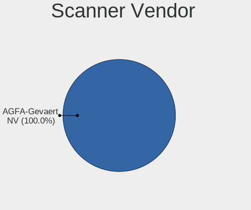
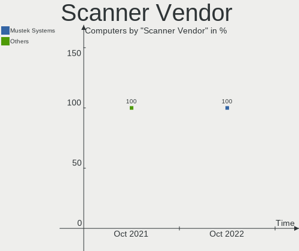
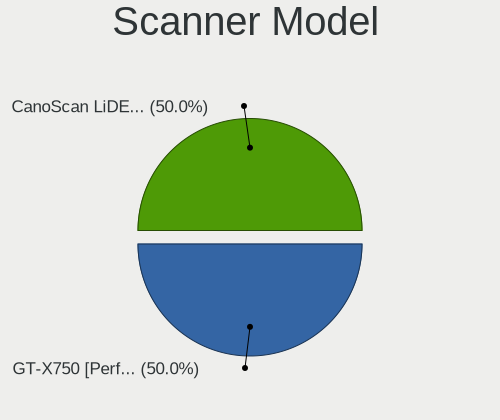
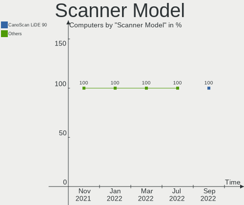

Manjaro - Hardware Trends
-------------------------

A project to identify most popular hardware characteristics and track their change
over time based on data collected by Linux users at https://Linux-Hardware.org.

Anyone can contribute to this report by the [hw-probe](https://github.com/linuxhw/hw-probe) tool:

    sudo -E hw-probe -all -upload

This is a report for all computer types. See also reports for [desktops](/Dist/Manjaro/Desktop/README.md) and [notebooks](/Dist/Manjaro/Notebook/README.md).

This report is for one last month. Overall report since the beginning of time: [TestCoverage](https://github.com/linuxhw/TestCoverage)

Period: Jul, 2022.

Contents
--------

* [ System ](#system)
  - [ OS                       ](#os)
  - [ OS Family                ](#os-family)
  - [ Kernel                   ](#kernel)
  - [ Kernel Family            ](#kernel-family)
  - [ Kernel Major Ver.        ](#kernel-major-ver)
  - [ Arch                     ](#arch)
  - [ DE                       ](#de)
  - [ Display Server           ](#display-server)
  - [ Display Manager          ](#display-manager)
  - [ OS Lang                  ](#os-lang)
  - [ Boot Mode                ](#boot-mode)
  - [ Filesystem               ](#filesystem)
  - [ Part. scheme             ](#part-scheme)
  - [ Dual Boot with Linux/BSD ](#dual-boot-with-linuxbsd)
  - [ Dual Boot (Win)          ](#dual-boot-win)

* [ Board ](#board)
  - [ Vendor                   ](#vendor)
  - [ Model                    ](#model)
  - [ Model Family             ](#model-family)
  - [ MFG Year                 ](#mfg-year)
  - [ Form Factor              ](#form-factor)
  - [ Secure Boot              ](#secure-boot)
  - [ Coreboot                 ](#coreboot)
  - [ RAM Size                 ](#ram-size)
  - [ RAM Used                 ](#ram-used)
  - [ Total Drives             ](#total-drives)
  - [ Has CD-ROM               ](#has-cd-rom)
  - [ Has Ethernet             ](#has-ethernet)
  - [ Has WiFi                 ](#has-wifi)
  - [ Has Bluetooth            ](#has-bluetooth)

* [ Location ](#location)
  - [ Country                  ](#country)
  - [ City                     ](#city)

* [ Drives ](#drives)
  - [ Drive Vendor             ](#drive-vendor)
  - [ Drive Model              ](#drive-model)
  - [ HDD Vendor               ](#hdd-vendor)
  - [ SSD Vendor               ](#ssd-vendor)
  - [ Drive Kind               ](#drive-kind)
  - [ Drive Connector          ](#drive-connector)
  - [ Drive Size               ](#drive-size)
  - [ Space Total              ](#space-total)
  - [ Space Used               ](#space-used)
  - [ Malfunc. Drives          ](#malfunc-drives)
  - [ Malfunc. Drive Vendor    ](#malfunc-drive-vendor)
  - [ Malfunc. HDD Vendor      ](#malfunc-hdd-vendor)
  - [ Malfunc. Drive Kind      ](#malfunc-drive-kind)
  - [ Failed Drives            ](#failed-drives)
  - [ Failed Drive Vendor      ](#failed-drive-vendor)
  - [ Drive Status             ](#drive-status)

* [ Storage controller ](#storage-controller)
  - [ Storage Vendor           ](#storage-vendor)
  - [ Storage Model            ](#storage-model)
  - [ Storage Kind             ](#storage-kind)

* [ Processor ](#processor)
  - [ CPU Vendor               ](#cpu-vendor)
  - [ CPU Model                ](#cpu-model)
  - [ CPU Model Family         ](#cpu-model-family)
  - [ CPU Cores                ](#cpu-cores)
  - [ CPU Sockets              ](#cpu-sockets)
  - [ CPU Threads              ](#cpu-threads)
  - [ CPU Op-Modes             ](#cpu-op-modes)
  - [ CPU Microcode            ](#cpu-microcode)
  - [ CPU Microarch            ](#cpu-microarch)

* [ Graphics ](#graphics)
  - [ GPU Vendor               ](#gpu-vendor)
  - [ GPU Model                ](#gpu-model)
  - [ GPU Combo                ](#gpu-combo)
  - [ GPU Driver               ](#gpu-driver)
  - [ GPU Memory               ](#gpu-memory)

* [ Monitor ](#monitor)
  - [ Monitor Vendor           ](#monitor-vendor)
  - [ Monitor Model            ](#monitor-model)
  - [ Monitor Resolution       ](#monitor-resolution)
  - [ Monitor Diagonal         ](#monitor-diagonal)
  - [ Monitor Width            ](#monitor-width)
  - [ Aspect Ratio             ](#aspect-ratio)
  - [ Monitor Area             ](#monitor-area)
  - [ Pixel Density            ](#pixel-density)
  - [ Multiple Monitors        ](#multiple-monitors)

* [ Network ](#network)
  - [ Net Controller Vendor    ](#net-controller-vendor)
  - [ Net Controller Model     ](#net-controller-model)
  - [ Wireless Vendor          ](#wireless-vendor)
  - [ Wireless Model           ](#wireless-model)
  - [ Ethernet Vendor          ](#ethernet-vendor)
  - [ Ethernet Model           ](#ethernet-model)
  - [ Net Controller Kind      ](#net-controller-kind)
  - [ Used Controller          ](#used-controller)
  - [ NICs                     ](#nics)
  - [ IPv6                     ](#ipv6)

* [ Bluetooth ](#bluetooth)
  - [ Bluetooth Vendor         ](#bluetooth-vendor)
  - [ Bluetooth Model          ](#bluetooth-model)

* [ Sound ](#sound)
  - [ Sound Vendor             ](#sound-vendor)
  - [ Sound Model              ](#sound-model)

* [ Memory ](#memory)
  - [ Memory Vendor            ](#memory-vendor)
  - [ Memory Model             ](#memory-model)
  - [ Memory Kind              ](#memory-kind)
  - [ Memory Form Factor       ](#memory-form-factor)
  - [ Memory Size              ](#memory-size)
  - [ Memory Speed             ](#memory-speed)

* [ Printers & scanners ](#printers--scanners)
  - [ Printer Vendor           ](#printer-vendor)
  - [ Printer Model            ](#printer-model)
  - [ Scanner Vendor           ](#scanner-vendor)
  - [ Scanner Model            ](#scanner-model)

* [ Camera ](#camera)
  - [ Camera Vendor            ](#camera-vendor)
  - [ Camera Model             ](#camera-model)

* [ Security ](#security)
  - [ Fingerprint Vendor       ](#fingerprint-vendor)
  - [ Fingerprint Model        ](#fingerprint-model)
  - [ Chipcard Vendor          ](#chipcard-vendor)
  - [ Chipcard Model           ](#chipcard-model)

* [ Unsupported ](#unsupported)
  - [ Unsupported Devices      ](#unsupported-devices)
  - [ Unsupported Device Types ](#unsupported-device-types)

System
------

OS
--

Installed operating systems

| Name           | Computers | Percent |
|----------------|-----------|---------|
| Manjaro        | 87        | 51.79%  |
| Manjaro 21.3.2 | 23        | 13.69%  |
| Manjaro 21.3.5 | 16        | 9.52%   |
| Manjaro 21.3.3 | 13        | 7.74%   |
| Manjaro 21.3.1 | 10        | 5.95%   |
| Manjaro 21.3.6 | 8         | 4.76%   |
| Manjaro 21.3.4 | 6         | 3.57%   |
| Manjaro 21.2.6 | 2         | 1.19%   |
| Manjaro 21.3.0 | 1         | 0.6%    |
| Manjaro 21.2.4 | 1         | 0.6%    |
| Manjaro 21.1.5 | 1         | 0.6%    |

OS Family
---------

OS without a version

| Name    | Computers | Percent |
|---------|-----------|---------|
| Manjaro | 168       | 100%    |

Kernel
------

Version of the Linux kernel

| Version                | Computers | Percent |
|------------------------|-----------|---------|
| 5.15.55-1-MANJARO      | 20        | 11.9%   |
| 5.15.49-1-MANJARO      | 18        | 10.71%  |
| 5.18.12-3-MANJARO      | 17        | 10.12%  |
| 5.15.53-1-MANJARO      | 16        | 9.52%   |
| 5.15.50-1-MANJARO      | 16        | 9.52%   |
| 5.18.10-1-MANJARO      | 12        | 7.14%   |
| 5.19.0-1-MANJARO       | 7         | 4.17%   |
| 5.18.7-1-MANJARO       | 7         | 4.17%   |
| 5.17.15-1-MANJARO      | 7         | 4.17%   |
| 5.18.6-1-MANJARO       | 6         | 3.57%   |
| 5.15.57-2-MANJARO      | 6         | 3.57%   |
| 5.18.14-1-MANJARO      | 5         | 2.98%   |
| 5.18.0-1-rt11-MANJARO  | 5         | 2.98%   |
| 5.13.19-2-MANJARO      | 4         | 2.38%   |
| 5.15.46-1-MANJARO      | 3         | 1.79%   |
| 5.10.131-1-MANJARO     | 3         | 1.79%   |
| 5.10.124-1-MANJARO     | 3         | 1.79%   |
| 5.16.20-2-MANJARO      | 2         | 1.19%   |
| 5.15.32-1-MANJARO      | 2         | 1.19%   |
| 5.15.25-1-MANJARO      | 2         | 1.19%   |
| 5.9.16-1-MANJARO       | 1         | 0.6%    |
| 5.8.18-1-MANJARO       | 1         | 0.6%    |
| 5.19.0-rc6-264-tkg-cfs | 1         | 0.6%    |
| 5.18.11-lqx1-1-lqx     | 1         | 0.6%    |
| 5.16.18-1-MANJARO      | 1         | 0.6%    |
| 5.15.54-1-MANJARO      | 1         | 0.6%    |
| 5.15.48-1-MANJARO      | 1         | 0.6%    |

Kernel Family
-------------

Linux kernel without a distro release

| Version  | Computers | Percent |
|----------|-----------|---------|
| 5.15.55  | 20        | 11.9%   |
| 5.15.49  | 18        | 10.71%  |
| 5.18.12  | 17        | 10.12%  |
| 5.15.53  | 16        | 9.52%   |
| 5.15.50  | 16        | 9.52%   |
| 5.18.10  | 12        | 7.14%   |
| 5.19.0   | 8         | 4.76%   |
| 5.18.7   | 7         | 4.17%   |
| 5.17.15  | 7         | 4.17%   |
| 5.18.6   | 6         | 3.57%   |
| 5.15.57  | 6         | 3.57%   |
| 5.18.14  | 5         | 2.98%   |
| 5.18.0   | 5         | 2.98%   |
| 5.13.19  | 4         | 2.38%   |
| 5.15.46  | 3         | 1.79%   |
| 5.10.131 | 3         | 1.79%   |
| 5.10.124 | 3         | 1.79%   |
| 5.16.20  | 2         | 1.19%   |
| 5.15.32  | 2         | 1.19%   |
| 5.15.25  | 2         | 1.19%   |
| 5.9.16   | 1         | 0.6%    |
| 5.8.18   | 1         | 0.6%    |
| 5.18.11  | 1         | 0.6%    |
| 5.16.18  | 1         | 0.6%    |
| 5.15.54  | 1         | 0.6%    |
| 5.15.48  | 1         | 0.6%    |

Kernel Major Ver.
-----------------

Linux kernel major version

| Version | Computers | Percent |
|---------|-----------|---------|
| 5.15    | 85        | 50.6%   |
| 5.18    | 53        | 31.55%  |
| 5.19    | 8         | 4.76%   |
| 5.17    | 7         | 4.17%   |
| 5.10    | 6         | 3.57%   |
| 5.13    | 4         | 2.38%   |
| 5.16    | 3         | 1.79%   |
| 5.9     | 1         | 0.6%    |
| 5.8     | 1         | 0.6%    |

Arch
----

OS architecture (x86_64, i586, etc.)

| Name   | Computers | Percent |
|--------|-----------|---------|
| x86_64 | 168       | 100%    |

DE
--

Desktop Environment

| Name    | Computers | Percent |
|---------|-----------|---------|
| KDE5    | 85        | 50.6%   |
| XFCE    | 36        | 21.43%  |
| GNOME   | 35        | 20.83%  |
| sway    | 3         | 1.79%   |
| MATE    | 2         | 1.19%   |
| Deepin  | 2         | 1.19%   |
| Budgie  | 2         | 1.19%   |
| Unknown | 2         | 1.19%   |
| i3      | 1         | 0.6%    |

Display Server
--------------

X11 or Wayland

| Name    | Computers | Percent |
|---------|-----------|---------|
| X11     | 143       | 85.12%  |
| Wayland | 25        | 14.88%  |

Display Manager
---------------

SDDM, LightDM, etc.

| Name    | Computers | Percent |
|---------|-----------|---------|
| Unknown | 88        | 52.38%  |
| SDDM    | 31        | 18.45%  |
| LightDM | 27        | 16.07%  |
| GDM     | 20        | 11.9%   |
| LXDM    | 1         | 0.6%    |
| GREETD  | 1         | 0.6%    |

OS Lang
-------

Language

| Lang    | Computers | Percent |
|---------|-----------|---------|
| en_US   | 69        | 41.07%  |
| de_DE   | 19        | 11.31%  |
| ru_RU   | 13        | 7.74%   |
| en_GB   | 12        | 7.14%   |
| pt_BR   | 8         | 4.76%   |
| pl_PL   | 4         | 2.38%   |
| es_ES   | 4         | 2.38%   |
| en_CA   | 4         | 2.38%   |
| nl_NL   | 3         | 1.79%   |
| fr_FR   | 3         | 1.79%   |
| es_MX   | 2         | 1.19%   |
| es_CL   | 2         | 1.19%   |
| es_AR   | 2         | 1.19%   |
| en_IN   | 2         | 1.19%   |
| en_DK   | 2         | 1.19%   |
| en_AU   | 2         | 1.19%   |
| Unknown | 2         | 1.19%   |
| zh_CN   | 1         | 0.6%    |
| uk_UA   | 1         | 0.6%    |
| tr_TR   | 1         | 0.6%    |
| ro_RO   | 1         | 0.6%    |
| pt_PT   | 1         | 0.6%    |
| fr_CH   | 1         | 0.6%    |
| fi_FI   | 1         | 0.6%    |
| es_EC   | 1         | 0.6%    |
| es_CR   | 1         | 0.6%    |
| es_CO   | 1         | 0.6%    |
| es_BO   | 1         | 0.6%    |
| en_AG   | 1         | 0.6%    |
| de_AT   | 1         | 0.6%    |
| da_DK   | 1         | 0.6%    |
| C       | 1         | 0.6%    |

Boot Mode
---------

EFI or BIOS

| Mode | Computers | Percent |
|------|-----------|---------|
| BIOS | 115       | 68.45%  |
| EFI  | 53        | 31.55%  |

Filesystem
----------

Type of filesystem

| Type    | Computers | Percent |
|---------|-----------|---------|
| Ext4    | 134       | 79.76%  |
| Btrfs   | 25        | 14.88%  |
| Xfs     | 4         | 2.38%   |
| Overlay | 4         | 2.38%   |
| Tmpfs   | 1         | 0.6%    |

Part. scheme
------------

Scheme of partitioning

| Type    | Computers | Percent |
|---------|-----------|---------|
| Unknown | 112       | 66.67%  |
| GPT     | 54        | 32.14%  |
| MBR     | 2         | 1.19%   |

Dual Boot with Linux/BSD
------------------------

Hosting more than one Linux/BSD

| Dual boot | Computers | Percent |
|-----------|-----------|---------|
| No        | 157       | 93.45%  |
| Yes       | 11        | 6.55%   |

Dual Boot (Win)
---------------

Hosting Linux and Windows

| Dual boot | Computers | Percent |
|-----------|-----------|---------|
| No        | 124       | 73.81%  |
| Yes       | 44        | 26.19%  |

Board
-----

Vendor
------

Motherboard manufacturer

| Name                   | Computers | Percent |
|------------------------|-----------|---------|
| ASUSTek Computer       | 36        | 21.43%  |
| Lenovo                 | 25        | 14.88%  |
| Dell                   | 20        | 11.9%   |
| Hewlett-Packard        | 17        | 10.12%  |
| MSI                    | 15        | 8.93%   |
| Gigabyte Technology    | 10        | 5.95%   |
| Apple                  | 7         | 4.17%   |
| Acer                   | 6         | 3.57%   |
| ASRock                 | 5         | 2.98%   |
| HUAWEI                 | 3         | 1.79%   |
| BESSTAR Tech           | 3         | 1.79%   |
| Timi                   | 2         | 1.19%   |
| Schenker               | 2         | 1.19%   |
| Chuwi                  | 2         | 1.19%   |
| Toshiba                | 1         | 0.6%    |
| TENKU                  | 1         | 0.6%    |
| System76               | 1         | 0.6%    |
| Sony                   | 1         | 0.6%    |
| Samsung Electronics    | 1         | 0.6%    |
| PCWare                 | 1         | 0.6%    |
| ONE-NETBOOK TECHNOLOGY | 1         | 0.6%    |
| Notebook               | 1         | 0.6%    |
| MACHINIST              | 1         | 0.6%    |
| LG Electronics         | 1         | 0.6%    |
| Inventec               | 1         | 0.6%    |
| Google                 | 1         | 0.6%    |
| Fujitsu                | 1         | 0.6%    |
| AMI                    | 1         | 0.6%    |
| Alienware              | 1         | 0.6%    |

Model
-----

Motherboard model

| Name                                     | Computers | Percent |
|------------------------------------------|-----------|---------|
| ASUS M5A97 R2.0                          | 3         | 1.79%   |
| MSI MS-7C91                              | 2         | 1.19%   |
| MSI MS-7B79                              | 2         | 1.19%   |
| Chuwi HeroBook Air                       | 2         | 1.19%   |
| ASUS TUF Gaming X570-PLUS                | 2         | 1.19%   |
| Apple Macmini8,1                         | 2         | 1.19%   |
| Toshiba Satellite A100                   | 1         | 0.6%    |
| Timi TM1701                              | 1         | 0.6%    |
| Timi Mi NoteBook Pro                     | 1         | 0.6%    |
| TENKU SB14                               | 1         | 0.6%    |
| System76 Serval WS                       | 1         | 0.6%    |
| Sony VJF153                              | 1         | 0.6%    |
| Schenker XMG PRO (Late 2021)             | 1         | 0.6%    |
| Schenker VISION 15 (SVS15E21)            | 1         | 0.6%    |
| Samsung 340XAA/350XAA/550XAA             | 1         | 0.6%    |
| PCWare IPMH81G1                          | 1         | 0.6%    |
| ONE-NETBOOK TECHNOLOGY ONE XPLAYER       | 1         | 0.6%    |
| Notebook W350STQ/W370ST                  | 1         | 0.6%    |
| MSI MS-7C94                              | 1         | 0.6%    |
| MSI MS-7C52                              | 1         | 0.6%    |
| MSI MS-7C02                              | 1         | 0.6%    |
| MSI MS-7B93                              | 1         | 0.6%    |
| MSI MS-7A70                              | 1         | 0.6%    |
| MSI MS-7A38                              | 1         | 0.6%    |
| MSI MS-7A32                              | 1         | 0.6%    |
| MSI MS-7A15                              | 1         | 0.6%    |
| MSI MS-7752                              | 1         | 0.6%    |
| MSI GS66 Stealth 10SGS                   | 1         | 0.6%    |
| MSI GF63 Thin 9SC                        | 1         | 0.6%    |
| MACHINIST X79 V2.82H                     | 1         | 0.6%    |
| LG 17Z90N-V.AA55A1                       | 1         | 0.6%    |
| Lenovo Yoga 530-14IKB 81EK               | 1         | 0.6%    |
| Lenovo ThinkPad X240 20AMS1JQ11          | 1         | 0.6%    |
| Lenovo ThinkPad X230 2325TXB             | 1         | 0.6%    |
| Lenovo ThinkPad T480s 20L8S31T00         | 1         | 0.6%    |
| Lenovo ThinkPad SL510 28479XU            | 1         | 0.6%    |
| Lenovo ThinkPad P15v Gen 1 20TQCTO1WW    | 1         | 0.6%    |
| Lenovo ThinkPad L470 20J5S01L00          | 1         | 0.6%    |
| Lenovo ThinkPad L13 Gen 2 20VH0018RT     | 1         | 0.6%    |
| Lenovo ThinkPad Edge E430 325437S        | 1         | 0.6%    |
| Lenovo ThinkPad E585 20KVCTO1WW          | 1         | 0.6%    |
| Lenovo ThinkCentre M920t-N000 10SMCTO1WW | 1         | 0.6%    |
| Lenovo ThinkBook 14 G2 ITL 20VD          | 1         | 0.6%    |
| Lenovo Legion T5 28IMB05 90NC007LUS      | 1         | 0.6%    |
| Lenovo Legion S7 15ACH6 82K8             | 1         | 0.6%    |
| Lenovo Legion 5 17ACH6 82K0              | 1         | 0.6%    |
| Lenovo Legion 5 15ACH6H 82JU             | 1         | 0.6%    |
| Lenovo IdeaPad Z510 20287                | 1         | 0.6%    |
| Lenovo IdeaPad U430 Touch 20270          | 1         | 0.6%    |
| Lenovo IdeaPad U330p 20267               | 1         | 0.6%    |
| Lenovo IdeaPad S145-14IIL 81W6           | 1         | 0.6%    |
| Lenovo IdeaPad Gaming 3 15ARH05 82EY     | 1         | 0.6%    |
| Lenovo IdeaPad 700-15ISK 80RU            | 1         | 0.6%    |
| Lenovo IdeaPad 5 14ALC05 82LM            | 1         | 0.6%    |
| Lenovo IdeaPad 120S-14IAP 81A5           | 1         | 0.6%    |
| Lenovo G580 20150                        | 1         | 0.6%    |
| Inventec D CLASS                         | 1         | 0.6%    |
| HUAWEI VLT-WX0                           | 1         | 0.6%    |
| HUAWEI KLVL-WXXW                         | 1         | 0.6%    |
| HUAWEI CREM-WXX9                         | 1         | 0.6%    |

Model Family
------------

Motherboard model prefix

| Name                       | Computers | Percent |
|----------------------------|-----------|---------|
| Lenovo ThinkPad            | 9         | 5.36%   |
| Dell Inspiron              | 9         | 5.36%   |
| Lenovo IdeaPad             | 8         | 4.76%   |
| ASUS ROG                   | 6         | 3.57%   |
| ASUS PRIME                 | 6         | 3.57%   |
| HP Pavilion                | 5         | 2.98%   |
| Dell Latitude              | 5         | 2.98%   |
| ASUS TUF                   | 5         | 2.98%   |
| Lenovo Legion              | 4         | 2.38%   |
| HP ProBook                 | 4         | 2.38%   |
| HP EliteBook               | 3         | 1.79%   |
| ASUS VivoBook              | 3         | 1.79%   |
| ASUS M5A97                 | 3         | 1.79%   |
| ASUS ASUS                  | 3         | 1.79%   |
| Acer Aspire                | 3         | 1.79%   |
| MSI MS-7C91                | 2         | 1.19%   |
| MSI MS-7B79                | 2         | 1.19%   |
| HP Laptop                  | 2         | 1.19%   |
| Gigabyte X570              | 2         | 1.19%   |
| Dell XPS                   | 2         | 1.19%   |
| Dell OptiPlex              | 2         | 1.19%   |
| Chuwi HeroBook             | 2         | 1.19%   |
| ASUS MINIPC                | 2         | 1.19%   |
| Apple Macmini8             | 2         | 1.19%   |
| Apple MacBookPro14         | 2         | 1.19%   |
| Toshiba Satellite          | 1         | 0.6%    |
| Timi TM1701                | 1         | 0.6%    |
| Timi Mi                    | 1         | 0.6%    |
| TENKU SB14                 | 1         | 0.6%    |
| System76 Serval            | 1         | 0.6%    |
| Sony VJF153                | 1         | 0.6%    |
| Schenker XMG               | 1         | 0.6%    |
| Schenker VISION            | 1         | 0.6%    |
| Samsung 340XAA             | 1         | 0.6%    |
| PCWare IPMH81G1            | 1         | 0.6%    |
| ONE-NETBOOK TECHNOLOGY ONE | 1         | 0.6%    |
| Notebook W350STQ           | 1         | 0.6%    |
| MSI MS-7C94                | 1         | 0.6%    |
| MSI MS-7C52                | 1         | 0.6%    |
| MSI MS-7C02                | 1         | 0.6%    |
| MSI MS-7B93                | 1         | 0.6%    |
| MSI MS-7A70                | 1         | 0.6%    |
| MSI MS-7A38                | 1         | 0.6%    |
| MSI MS-7A32                | 1         | 0.6%    |
| MSI MS-7A15                | 1         | 0.6%    |
| MSI MS-7752                | 1         | 0.6%    |
| MSI GS66                   | 1         | 0.6%    |
| MSI GF63                   | 1         | 0.6%    |
| MACHINIST X79              | 1         | 0.6%    |
| LG 17Z90N-V.AA55A1         | 1         | 0.6%    |
| Lenovo Yoga                | 1         | 0.6%    |
| Lenovo ThinkCentre         | 1         | 0.6%    |
| Lenovo ThinkBook           | 1         | 0.6%    |
| Lenovo G580                | 1         | 0.6%    |
| Inventec D                 | 1         | 0.6%    |
| HUAWEI VLT-WX0             | 1         | 0.6%    |
| HUAWEI KLVL-WXXW           | 1         | 0.6%    |
| HUAWEI CREM-WXX9           | 1         | 0.6%    |
| HP ZBook                   | 1         | 0.6%    |
| HP xw6600                  | 1         | 0.6%    |

MFG Year
--------

Motherboard manufacture year

| Year | Computers | Percent |
|------|-----------|---------|
| 2020 | 27        | 16.07%  |
| 2019 | 26        | 15.48%  |
| 2021 | 25        | 14.88%  |
| 2017 | 16        | 9.52%   |
| 2012 | 16        | 9.52%   |
| 2018 | 15        | 8.93%   |
| 2013 | 12        | 7.14%   |
| 2016 | 6         | 3.57%   |
| 2014 | 5         | 2.98%   |
| 2022 | 4         | 2.38%   |
| 2011 | 4         | 2.38%   |
| 2010 | 3         | 1.79%   |
| 2008 | 3         | 1.79%   |
| 2015 | 2         | 1.19%   |
| 2009 | 2         | 1.19%   |
| 2007 | 1         | 0.6%    |
| 2006 | 1         | 0.6%    |

Form Factor
-----------

Physical design of the computer

| Name        | Computers | Percent |
|-------------|-----------|---------|
| Notebook    | 95        | 56.55%  |
| Desktop     | 60        | 35.71%  |
| Convertible | 5         | 2.98%   |
| Mini pc     | 5         | 2.98%   |
| All in one  | 2         | 1.19%   |
| Tablet      | 1         | 0.6%    |

Secure Boot
-----------

Enabled or disabled

| State    | Computers | Percent |
|----------|-----------|---------|
| Disabled | 168       | 100%    |

Coreboot
--------

Have coreboot on board

| Used | Computers | Percent |
|------|-----------|---------|
| No   | 167       | 99.4%   |
| Yes  | 1         | 0.6%    |

RAM Size
--------

Total RAM memory

| Size in GB  | Computers | Percent |
|-------------|-----------|---------|
| 4.01-8.0    | 40        | 23.81%  |
| 16.01-24.0  | 39        | 23.21%  |
| 8.01-16.0   | 33        | 19.64%  |
| 32.01-64.0  | 24        | 14.29%  |
| 3.01-4.0    | 15        | 8.93%   |
| 64.01-256.0 | 10        | 5.95%   |
| 24.01-32.0  | 4         | 2.38%   |
| 1.01-2.0    | 3         | 1.79%   |

RAM Used
--------

Used RAM memory

| Used GB    | Computers | Percent |
|------------|-----------|---------|
| 4.01-8.0   | 47        | 27.98%  |
| 2.01-3.0   | 40        | 23.81%  |
| 1.01-2.0   | 35        | 20.83%  |
| 3.01-4.0   | 29        | 17.26%  |
| 8.01-16.0  | 9         | 5.36%   |
| 0.51-1.0   | 5         | 2.98%   |
| 16.01-24.0 | 2         | 1.19%   |
| 32.01-64.0 | 1         | 0.6%    |

Total Drives
------------

Number of drives on board

| Drives | Computers | Percent |
|--------|-----------|---------|
| 1      | 85        | 50.6%   |
| 2      | 53        | 31.55%  |
| 3      | 11        | 6.55%   |
| 5      | 10        | 5.95%   |
| 4      | 8         | 4.76%   |
| 6      | 1         | 0.6%    |

Has CD-ROM
----------

Has CD-ROM on board

| Presented | Computers | Percent |
|-----------|-----------|---------|
| No        | 126       | 75%     |
| Yes       | 42        | 25%     |

Has Ethernet
------------

Has Ethernet on board

| Presented | Computers | Percent |
|-----------|-----------|---------|
| Yes       | 133       | 79.17%  |
| No        | 35        | 20.83%  |

Has WiFi
--------

Has WiFi module

| Presented | Computers | Percent |
|-----------|-----------|---------|
| Yes       | 136       | 80.95%  |
| No        | 32        | 19.05%  |

Has Bluetooth
-------------

Has Bluetooth module

| Presented | Computers | Percent |
|-----------|-----------|---------|
| Yes       | 122       | 72.62%  |
| No        | 46        | 27.38%  |

Location
--------

Country
-------

Geographic location (country)

| Country     | Computers | Percent |
|-------------|-----------|---------|
| USA         | 30        | 17.86%  |
| Germany     | 25        | 14.88%  |
| Russia      | 14        | 8.33%   |
| Brazil      | 10        | 5.95%   |
| UK          | 9         | 5.36%   |
| Poland      | 7         | 4.17%   |
| Spain       | 6         | 3.57%   |
| Netherlands | 6         | 3.57%   |
| India       | 5         | 2.98%   |
| Canada      | 5         | 2.98%   |
| Mexico      | 4         | 2.38%   |
| France      | 4         | 2.38%   |
| Finland     | 3         | 1.79%   |
| Denmark     | 3         | 1.79%   |
| Argentina   | 3         | 1.79%   |
| Taiwan      | 2         | 1.19%   |
| Latvia      | 2         | 1.19%   |
| Iran        | 2         | 1.19%   |
| Chile       | 2         | 1.19%   |
| Australia   | 2         | 1.19%   |
| Armenia     | 2         | 1.19%   |
| Vietnam     | 1         | 0.6%    |
| Turkey      | 1         | 0.6%    |
| Switzerland | 1         | 0.6%    |
| Sweden      | 1         | 0.6%    |
| Singapore   | 1         | 0.6%    |
| Romania     | 1         | 0.6%    |
| Portugal    | 1         | 0.6%    |
| Moldova     | 1         | 0.6%    |
| Lithuania   | 1         | 0.6%    |
| Kazakhstan  | 1         | 0.6%    |
| Italy       | 1         | 0.6%    |
| Israel      | 1         | 0.6%    |
| Greece      | 1         | 0.6%    |
| Ghana       | 1         | 0.6%    |
| Egypt       | 1         | 0.6%    |
| Ecuador     | 1         | 0.6%    |
| Croatia     | 1         | 0.6%    |
| Costa Rica  | 1         | 0.6%    |
| China       | 1         | 0.6%    |
| Bolivia     | 1         | 0.6%    |
| Bangladesh  | 1         | 0.6%    |
| Austria     | 1         | 0.6%    |

City
----

Geographic location (city)

| City                   | Computers | Percent |
|------------------------|-----------|---------|
| Moscow                 | 5         | 2.98%   |
| Yerevan                | 2         | 1.19%   |
| Warsaw                 | 2         | 1.19%   |
| Ufa                    | 2         | 1.19%   |
| Tucson                 | 2         | 1.19%   |
| The Bronx              | 2         | 1.19%   |
| Sydney                 | 2         | 1.19%   |
| Sao Paulo              | 2         | 1.19%   |
| Riga                   | 2         | 1.19%   |
| London                 | 2         | 1.19%   |
| Holstebro              | 2         | 1.19%   |
| Dresden                | 2         | 1.19%   |
| Denver                 | 2         | 1.19%   |
| Cologne                | 2         | 1.19%   |
| Chelyabinsk            | 2         | 1.19%   |
| Zutphen                | 1         | 0.6%    |
| Zagreb                 | 1         | 0.6%    |
| Yamunanagar            | 1         | 0.6%    |
| Wynantskill            | 1         | 0.6%    |
| Wroclaw                | 1         | 0.6%    |
| Wolverhampton          | 1         | 0.6%    |
| Wettringen             | 1         | 0.6%    |
| Weimar                 | 1         | 0.6%    |
| Wakefield              | 1         | 0.6%    |
| Vilnius                | 1         | 0.6%    |
| Villa Ballester        | 1         | 0.6%    |
| Vienna                 | 1         | 0.6%    |
| Victoria               | 1         | 0.6%    |
| Veenendaal             | 1         | 0.6%    |
| Valdemoro              | 1         | 0.6%    |
| Unieszewo              | 1         | 0.6%    |
| Ulverston              | 1         | 0.6%    |
| Toulon                 | 1         | 0.6%    |
| Tonbridge              | 1         | 0.6%    |
| Tonawanda              | 1         | 0.6%    |
| Thessaloniki           | 1         | 0.6%    |
| The Hague              | 1         | 0.6%    |
| Tespe                  | 1         | 0.6%    |
| Tehran                 | 1         | 0.6%    |
| Tampere                | 1         | 0.6%    |
| Taipei                 | 1         | 0.6%    |
| Tainan City            | 1         | 0.6%    |
| Sunderland             | 1         | 0.6%    |
| Stratford              | 1         | 0.6%    |
| Stockholm              | 1         | 0.6%    |
| St Petersburg          | 1         | 0.6%    |
| Southport              | 1         | 0.6%    |
| Singapore              | 1         | 0.6%    |
| Sibiu                  | 1         | 0.6%    |
| Serra                  | 1         | 0.6%    |
| Sarrion                | 1         | 0.6%    |
| Santiago Amoltepec     | 1         | 0.6%    |
| Santiago               | 1         | 0.6%    |
| Santa Cruz de Tenerife | 1         | 0.6%    |
| San José              | 1         | 0.6%    |
| Salt Lake City         | 1         | 0.6%    |
| Saint Charles          | 1         | 0.6%    |
| Rosario                | 1         | 0.6%    |
| Recife                 | 1         | 0.6%    |
| Quimper                | 1         | 0.6%    |

Drives
------

Drive Vendor
------------

Hard drive vendors

| Vendor                    | Computers | Drives | Percent |
|---------------------------|-----------|--------|---------|
| Samsung Electronics       | 50        | 67     | 18.38%  |
| WDC                       | 37        | 48     | 13.6%   |
| Seagate                   | 36        | 42     | 13.24%  |
| SanDisk                   | 18        | 20     | 6.62%   |
| Kingston                  | 16        | 17     | 5.88%   |
| Toshiba                   | 15        | 16     | 5.51%   |
| Crucial                   | 10        | 11     | 3.68%   |
| SK hynix                  | 9         | 9      | 3.31%   |
| Micron Technology         | 9         | 9      | 3.31%   |
| A-DATA Technology         | 7         | 7      | 2.57%   |
| Unknown                   | 6         | 6      | 2.21%   |
| Intel                     | 6         | 6      | 2.21%   |
| Hitachi                   | 6         | 6      | 2.21%   |
| Phison                    | 5         | 5      | 1.84%   |
| KIOXIA                    | 5         | 5      | 1.84%   |
| Apple                     | 5         | 7      | 1.84%   |
| HGST                      | 4         | 4      | 1.47%   |
| XPG                       | 2         | 2      | 0.74%   |
| PNY                       | 2         | 2      | 0.74%   |
| OCZ                       | 2         | 2      | 0.74%   |
| Netac                     | 2         | 2      | 0.74%   |
| Hewlett-Packard           | 2         | 2      | 0.74%   |
| GOODRAM                   | 2         | 2      | 0.74%   |
| China                     | 2         | 2      | 0.74%   |
| Win Memory                | 1         | 1      | 0.37%   |
| Transcend                 | 1         | 1      | 0.37%   |
| Team                      | 1         | 1      | 0.37%   |
| SSK                       | 1         | 1      | 0.37%   |
| NGFF                      | 1         | 1      | 0.37%   |
| Mushkin                   | 1         | 1      | 0.37%   |
| Micron/Crucial Technology | 1         | 1      | 0.37%   |
| Lexar                     | 1         | 1      | 0.37%   |
| JMicron Technology        | 1         | 1      | 0.37%   |
| Intenso                   | 1         | 1      | 0.37%   |
| Hoodisk                   | 1         | 1      | 0.37%   |
| HGST HTS                  | 1         | 1      | 0.37%   |
| Gigabyte Technology       | 1         | 1      | 0.37%   |
| Corsair                   | 1         | 1      | 0.37%   |

Drive Model
-----------

Hard drive models

| Model                                   | Computers | Percent |
|-----------------------------------------|-----------|---------|
| Samsung SSD 860 EVO 500GB               | 8         | 2.63%   |
| Samsung NVMe SSD Drive 1TB              | 6         | 1.97%   |
| Seagate ST2000DM008-2FR102 2TB          | 5         | 1.64%   |
| Seagate ST1000LM035-1RK172 1TB          | 5         | 1.64%   |
| SanDisk NVMe SSD Drive 500GB            | 5         | 1.64%   |
| Kingston SA400S37480G 480GB SSD         | 4         | 1.32%   |
| WDC WDS240G2G0A-00JH30 240GB SSD        | 3         | 0.99%   |
| Toshiba DT01ACA050 500GB                | 3         | 0.99%   |
| Seagate ST1000DM010-2EP102 1TB          | 3         | 0.99%   |
| Samsung NVMe SSD Drive 256GB            | 3         | 0.99%   |
| Kingston SA400S37240G 240GB SSD         | 3         | 0.99%   |
| Intel NVMe SSD Drive 512GB              | 3         | 0.99%   |
| XPG NVMe SSD Drive 1024GB               | 2         | 0.66%   |
| WDC WDS250G2B0A-00SM50 250GB SSD        | 2         | 0.66%   |
| WDC WD10EZEX-08WN4A0 1TB                | 2         | 0.66%   |
| WDC WD10EARS-00MVWB0 1TB                | 2         | 0.66%   |
| Toshiba NVMe SSD Drive 2TB              | 2         | 0.66%   |
| Toshiba DT01ACA300 3TB                  | 2         | 0.66%   |
| SK hynix NVMe SSD Drive 512GB           | 2         | 0.66%   |
| SK hynix BC501 HFM256GDJTNG-8310A 256GB | 2         | 0.66%   |
| Seagate ST500LT012-9WS142 500GB         | 2         | 0.66%   |
| Seagate ST3500418AS 500GB               | 2         | 0.66%   |
| Seagate ST2000DM001-1ER164 2TB          | 2         | 0.66%   |
| Seagate ST1000LM049-2GH172 1TB          | 2         | 0.66%   |
| SanDisk NVMe SSD Drive 512GB            | 2         | 0.66%   |
| SanDisk NVMe SSD Drive 256GB            | 2         | 0.66%   |
| Samsung SSD 980 PRO 1TB                 | 2         | 0.66%   |
| Samsung SSD 970 EVO Plus 500GB          | 2         | 0.66%   |
| Samsung SSD 960 EVO 250GB               | 2         | 0.66%   |
| Samsung SSD 870 QVO 2TB                 | 2         | 0.66%   |
| Samsung SSD 870 QVO 1TB                 | 2         | 0.66%   |
| Samsung NVMe SSD Drive 512GB            | 2         | 0.66%   |
| Samsung NVMe SSD Drive 500GB            | 2         | 0.66%   |
| Samsung NVMe SSD Drive 1024GB           | 2         | 0.66%   |
| Netac SSD 128GB                         | 2         | 0.66%   |
| Micron NVMe SSD Drive 512GB             | 2         | 0.66%   |
| Micron 1100 SATA 512GB SSD              | 2         | 0.66%   |
| Kingston NVMe SSD Drive 512GB           | 2         | 0.66%   |
| Hitachi HTS727550A9E364 500GB           | 2         | 0.66%   |
| Crucial CT500MX500SSD1 500GB            | 2         | 0.66%   |
| Crucial CT480BX500SSD1 480GB            | 2         | 0.66%   |
| Crucial CT1000MX500SSD1 1TB             | 2         | 0.66%   |
| Win Memory SWR256G-301II 256GB          | 1         | 0.33%   |
| WDC WDS500G1X0E-00AFY0 500GB            | 1         | 0.33%   |
| WDC WDS250G2B0B-00YS70 250GB SSD        | 1         | 0.33%   |
| WDC WDS240G2G0B-00EPW0 240GB SSD        | 1         | 0.33%   |
| WDC WDS240G1G0A-00SS50 240GB SSD        | 1         | 0.33%   |
| WDC WDS200T2B0B-00YS70 2TB SSD          | 1         | 0.33%   |
| WDC WDS100T2B0C-00PXH0 1TB              | 1         | 0.33%   |
| WDC WDS100T2B0B-00YS70 1TB SSD          | 1         | 0.33%   |
| WDC WDS100T2B0A-00SM50 1TB SSD          | 1         | 0.33%   |
| WDC WD7500BPVX-60JC3T0 752GB            | 1         | 0.33%   |
| WDC WD7500BPKT-75PK4T0 752GB            | 1         | 0.33%   |
| WDC WD60EFRX-68L0BN1 6TB                | 1         | 0.33%   |
| WDC WD6003FRYZ-01F0DB0 6TB              | 1         | 0.33%   |
| WDC WD5001FZWX-00ZHUA0 5TB              | 1         | 0.33%   |
| WDC WD5000AZLX-22JKKA0 500GB            | 1         | 0.33%   |
| WDC WD5000AAKX-08U6AA0 500GB            | 1         | 0.33%   |
| WDC WD5000AAKS-00A7B0 500GB             | 1         | 0.33%   |
| WDC WD5000AADS-00M2B0 500GB             | 1         | 0.33%   |

HDD Vendor
----------

Hard disk drive vendors

| Vendor              | Computers | Drives | Percent |
|---------------------|-----------|--------|---------|
| Seagate             | 34        | 40     | 40%     |
| WDC                 | 26        | 31     | 30.59%  |
| Toshiba             | 10        | 11     | 11.76%  |
| Hitachi             | 6         | 6      | 7.06%   |
| HGST                | 4         | 4      | 4.71%   |
| Samsung Electronics | 2         | 3      | 2.35%   |
| Unknown             | 1         | 1      | 1.18%   |
| HGST HTS            | 1         | 1      | 1.18%   |
| Apple               | 1         | 1      | 1.18%   |

SSD Vendor
----------

Solid state drive vendors

| Vendor              | Computers | Drives | Percent |
|---------------------|-----------|--------|---------|
| Samsung Electronics | 26        | 30     | 27.66%  |
| WDC                 | 10        | 11     | 10.64%  |
| Kingston            | 10        | 11     | 10.64%  |
| Crucial             | 8         | 9      | 8.51%   |
| SanDisk             | 6         | 8      | 6.38%   |
| A-DATA Technology   | 4         | 4      | 4.26%   |
| Micron Technology   | 3         | 3      | 3.19%   |
| SK hynix            | 2         | 2      | 2.13%   |
| PNY                 | 2         | 2      | 2.13%   |
| OCZ                 | 2         | 2      | 2.13%   |
| Netac               | 2         | 2      | 2.13%   |
| Intel               | 2         | 2      | 2.13%   |
| Hewlett-Packard     | 2         | 2      | 2.13%   |
| GOODRAM             | 2         | 2      | 2.13%   |
| China               | 2         | 2      | 2.13%   |
| Apple               | 2         | 2      | 2.13%   |
| Win Memory          | 1         | 1      | 1.06%   |
| Transcend           | 1         | 1      | 1.06%   |
| Toshiba             | 1         | 1      | 1.06%   |
| Team                | 1         | 1      | 1.06%   |
| NGFF                | 1         | 1      | 1.06%   |
| Lexar               | 1         | 1      | 1.06%   |
| Hoodisk             | 1         | 1      | 1.06%   |
| Gigabyte Technology | 1         | 1      | 1.06%   |
| Corsair             | 1         | 1      | 1.06%   |

Drive Kind
----------

HDD or SSD

| Kind    | Computers | Drives | Percent |
|---------|-----------|--------|---------|
| NVMe    | 87        | 102    | 34.8%   |
| SSD     | 82        | 103    | 32.8%   |
| HDD     | 72        | 98     | 28.8%   |
| MMC     | 5         | 6      | 2%      |
| Unknown | 4         | 4      | 1.6%    |

Drive Connector
---------------

SATA, SAS, NVMe, etc.

| Type | Computers | Drives | Percent |
|------|-----------|--------|---------|
| SATA | 118       | 198    | 54.38%  |
| NVMe | 86        | 101    | 39.63%  |
| SAS  | 8         | 8      | 3.69%   |
| MMC  | 5         | 6      | 2.3%    |

Drive Size
----------

Size of hard drive

| Size in TB | Computers | Drives | Percent |
|------------|-----------|--------|---------|
| 0.01-0.5   | 87        | 112    | 52.41%  |
| 0.51-1.0   | 47        | 50     | 28.31%  |
| 1.01-2.0   | 19        | 24     | 11.45%  |
| 4.01-10.0  | 5         | 5      | 3.01%   |
| 3.01-4.0   | 4         | 6      | 2.41%   |
| 2.01-3.0   | 4         | 4      | 2.41%   |

Space Total
-----------

Amount of disk space available on the file system

| Size in GB     | Computers | Percent |
|----------------|-----------|---------|
| 251-500        | 40        | 23.81%  |
| 101-250        | 33        | 19.64%  |
| 501-1000       | 25        | 14.88%  |
| More than 3000 | 20        | 11.9%   |
| 1001-2000      | 16        | 9.52%   |
| 51-100         | 11        | 6.55%   |
| Unknown        | 8         | 4.76%   |
| 2001-3000      | 7         | 4.17%   |
| 1-20           | 6         | 3.57%   |
| 21-50          | 2         | 1.19%   |

Space Used
----------

Amount of used disk space

| Used GB        | Computers | Percent |
|----------------|-----------|---------|
| 21-50          | 31        | 18.45%  |
| 51-100         | 28        | 16.67%  |
| 1-20           | 27        | 16.07%  |
| 101-250        | 22        | 13.1%   |
| 251-500        | 20        | 11.9%   |
| 501-1000       | 12        | 7.14%   |
| More than 3000 | 9         | 5.36%   |
| 1001-2000      | 8         | 4.76%   |
| Unknown        | 8         | 4.76%   |
| 2001-3000      | 3         | 1.79%   |

Malfunc. Drives
---------------

Drive models with a malfunction

| Model                            | Computers | Drives | Percent |
|----------------------------------|-----------|--------|---------|
| Seagate ST500LT012-9WS142 500GB  | 2         | 2      | 28.57%  |
| WDC WD60EFRX-68L0BN1 6TB         | 1         | 1      | 14.29%  |
| Seagate ST1000LX015-1U7172 1TB   | 1         | 1      | 14.29%  |
| SanDisk SDSSDA-2T00 2TB          | 1         | 1      | 14.29%  |
| Kingston SA400S37480G 480GB SSD  | 1         | 1      | 14.29%  |
| A-DATA Technology SX8100NP 256GB | 1         | 1      | 14.29%  |

Malfunc. Drive Vendor
---------------------

Vendors of faulty drives

| Vendor            | Computers | Drives | Percent |
|-------------------|-----------|--------|---------|
| Seagate           | 3         | 3      | 42.86%  |
| WDC               | 1         | 1      | 14.29%  |
| SanDisk           | 1         | 1      | 14.29%  |
| Kingston          | 1         | 1      | 14.29%  |
| A-DATA Technology | 1         | 1      | 14.29%  |

Malfunc. HDD Vendor
-------------------

Vendors of faulty HDD drives

| Vendor  | Computers | Drives | Percent |
|---------|-----------|--------|---------|
| Seagate | 3         | 3      | 75%     |
| WDC     | 1         | 1      | 25%     |

Malfunc. Drive Kind
-------------------

Kinds of faulty drives

| Kind | Computers | Drives | Percent |
|------|-----------|--------|---------|
| HDD  | 4         | 4      | 57.14%  |
| SSD  | 2         | 2      | 28.57%  |
| NVMe | 1         | 1      | 14.29%  |

Failed Drives
-------------

Failed drive models

Zero info for selected period =(

Failed Drive Vendor
-------------------

Failed drive vendors

Zero info for selected period =(

Drive Status
------------

Number of failed and malfunc. drives

| Status   | Computers | Drives | Percent |
|----------|-----------|--------|---------|
| Detected | 126       | 227    | 70.39%  |
| Works    | 46        | 79     | 25.7%   |
| Malfunc  | 7         | 7      | 3.91%   |

Storage controller
------------------

Storage Vendor
--------------

Storage controller vendors

| Vendor                       | Computers | Percent |
|------------------------------|-----------|---------|
| Intel                        | 90        | 37.5%   |
| AMD                          | 53        | 22.08%  |
| Samsung Electronics          | 29        | 12.08%  |
| SanDisk                      | 16        | 6.67%   |
| SK hynix                     | 7         | 2.92%   |
| KIOXIA                       | 7         | 2.92%   |
| Micron Technology            | 6         | 2.5%    |
| Kingston Technology Company  | 6         | 2.5%    |
| Phison Electronics           | 5         | 2.08%   |
| Micron/Crucial Technology    | 3         | 1.25%   |
| ASMedia Technology           | 3         | 1.25%   |
| Apple                        | 3         | 1.25%   |
| ADATA Technology             | 3         | 1.25%   |
| Toshiba America Info Systems | 2         | 0.83%   |
| Silicon Motion               | 2         | 0.83%   |
| Silicon Image                | 1         | 0.42%   |
| Realtek Semiconductor        | 1         | 0.42%   |
| Marvell Technology Group     | 1         | 0.42%   |
| JMicron Technology           | 1         | 0.42%   |
| Broadcom / LSI               | 1         | 0.42%   |

Storage Model
-------------

Storage controller models

| Model                                                                          | Computers | Percent |
|--------------------------------------------------------------------------------|-----------|---------|
| AMD FCH SATA Controller [AHCI mode]                                            | 34        | 12.93%  |
| Samsung NVMe SSD Controller SM981/PM981/PM983                                  | 13        | 4.94%   |
| Intel Sunrise Point-LP SATA Controller [AHCI mode]                             | 11        | 4.18%   |
| Intel 7 Series Chipset Family 6-port SATA Controller [AHCI mode]               | 8         | 3.04%   |
| AMD 500 Series Chipset SATA Controller                                         | 8         | 3.04%   |
| AMD 400 Series Chipset SATA Controller                                         | 8         | 3.04%   |
| Samsung NVMe SSD Controller 980                                                | 7         | 2.66%   |
| Intel 82801 Mobile SATA Controller [RAID mode]                                 | 7         | 2.66%   |
| Intel 8 Series SATA Controller 1 [AHCI mode]                                   | 7         | 2.66%   |
| Micron Non-Volatile memory controller                                          | 6         | 2.28%   |
| Samsung NVMe SSD Controller SM961/PM961/SM963                                  | 5         | 1.9%    |
| Intel Volume Management Device NVMe RAID Controller                            | 5         | 1.9%    |
| Intel 8 Series/C220 Series Chipset Family 6-port SATA Controller 1 [AHCI mode] | 5         | 1.9%    |
| SanDisk WD Black SN750 / PC SN730 NVMe SSD                                     | 4         | 1.52%   |
| KIOXIA NVMe SSD Controller BG4                                                 | 4         | 1.52%   |
| Intel Celeron/Pentium Silver Processor SATA Controller                         | 4         | 1.52%   |
| AMD SB7x0/SB8x0/SB9x0 SATA Controller [AHCI mode]                              | 4         | 1.52%   |
| SK hynix BC501 NVMe Solid State Drive                                          | 3         | 1.14%   |
| SanDisk WD Blue SN550 NVMe SSD                                                 | 3         | 1.14%   |
| SanDisk Non-Volatile memory controller                                         | 3         | 1.14%   |
| Samsung NVMe SSD Controller PM9A1/PM9A3/980PRO                                 | 3         | 1.14%   |
| Phison E12 NVMe Controller                                                     | 3         | 1.14%   |
| Intel SSD 660P Series                                                          | 3         | 1.14%   |
| Intel HM170/QM170 Chipset SATA Controller [AHCI Mode]                          | 3         | 1.14%   |
| Intel Cannon Lake Mobile PCH SATA AHCI Controller                              | 3         | 1.14%   |
| AMD SB7x0/SB8x0/SB9x0 SATA Controller [IDE mode]                               | 3         | 1.14%   |
| AMD SB7x0/SB8x0/SB9x0 IDE Controller                                           | 3         | 1.14%   |
| ADATA XPG SX8200 Pro PCIe Gen3x4 M.2 2280 Solid State Drive                    | 3         | 1.14%   |
| Toshiba America Info Systems XG6 NVMe SSD Controller                           | 2         | 0.76%   |
| SK hynix Gold P31 SSD                                                          | 2         | 0.76%   |
| SK hynix BC511                                                                 | 2         | 0.76%   |
| SanDisk WD Blue SN500 / PC SN520 NVMe SSD                                      | 2         | 0.76%   |
| SanDisk WD Black 2018/SN750 / PC SN720 NVMe SSD                                | 2         | 0.76%   |
| Phison PS5013 E13 NVMe Controller                                              | 2         | 0.76%   |
| Micron/Crucial P2 NVMe PCIe SSD                                                | 2         | 0.76%   |
| KIOXIA NVMe SSD                                                                | 2         | 0.76%   |
| Kingston Company U-SNS8154P3 NVMe SSD                                          | 2         | 0.76%   |
| Kingston Company Company Non-Volatile memory controller                        | 2         | 0.76%   |
| Intel Tiger Lake-LP SATA Controller                                            | 2         | 0.76%   |
| Intel Ice Lake-LP SATA Controller [AHCI mode]                                  | 2         | 0.76%   |
| Intel Cannon Lake PCH SATA AHCI Controller                                     | 2         | 0.76%   |
| Intel C600/X79 series chipset 6-Port SATA AHCI Controller                      | 2         | 0.76%   |
| Intel 9 Series Chipset Family SATA Controller [AHCI Mode]                      | 2         | 0.76%   |
| Intel 7 Series/C210 Series Chipset Family 6-port SATA Controller [AHCI mode]   | 2         | 0.76%   |
| Intel 5 Series/3400 Series Chipset 6 port SATA AHCI Controller                 | 2         | 0.76%   |
| Intel 200 Series PCH SATA controller [AHCI mode]                               | 2         | 0.76%   |
| ASMedia ASM1062 Serial ATA Controller                                          | 2         | 0.76%   |
| Apple ANS2 NVMe Controller                                                     | 2         | 0.76%   |
| AMD FCH SATA Controller D                                                      | 2         | 0.76%   |
| AMD 300 Series Chipset SATA Controller                                         | 2         | 0.76%   |
| Silicon Motion SM2263EN/SM2263XT SSD Controller                                | 1         | 0.38%   |
| Silicon Motion Non-Volatile memory controller                                  | 1         | 0.38%   |
| Silicon Image PCI0680 Ultra ATA-133 Host Controller                            | 1         | 0.38%   |
| SanDisk WD PC SN810 / Black SN850 NVMe SSD                                     | 1         | 0.38%   |
| SanDisk WD Blue SN570 NVMe SSD                                                 | 1         | 0.38%   |
| SanDisk PC SN520 NVMe SSD                                                      | 1         | 0.38%   |
| Samsung NVMe SSD Controller SM951/PM951                                        | 1         | 0.38%   |
| Samsung Apple PCIe SSD                                                         | 1         | 0.38%   |
| Realtek RTS5763DL NVMe SSD Controller                                          | 1         | 0.38%   |
| Micron/Crucial Non-Volatile memory controller                                  | 1         | 0.38%   |

Storage Kind
------------

Kind of storage controller (IDE, SATA, NVMe, SAS, ...)

| Kind | Computers | Percent |
|------|-----------|---------|
| SATA | 125       | 52.74%  |
| NVMe | 86        | 36.29%  |
| RAID | 15        | 6.33%   |
| IDE  | 10        | 4.22%   |
| SAS  | 1         | 0.42%   |

Processor
---------

CPU Vendor
----------

Processor vendors

| Vendor | Computers | Percent |
|--------|-----------|---------|
| Intel  | 108       | 64.29%  |
| AMD    | 60        | 35.71%  |

CPU Model
---------

Processor models

| Model                                         | Computers | Percent |
|-----------------------------------------------|-----------|---------|
| AMD Ryzen 5 3600 6-Core Processor             | 5         | 2.98%   |
| Intel Core i7-8550U CPU @ 1.80GHz             | 4         | 2.38%   |
| Intel Core i5-8250U CPU @ 1.60GHz             | 4         | 2.38%   |
| Intel 11th Gen Core i5-1135G7 @ 2.40GHz       | 4         | 2.38%   |
| AMD Ryzen 5 5600X 6-Core Processor            | 4         | 2.38%   |
| Intel Core i5-4210U CPU @ 1.70GHz             | 3         | 1.79%   |
| AMD Ryzen 7 3700X 8-Core Processor            | 3         | 1.79%   |
| AMD Ryzen 5 5500U with Radeon Graphics        | 3         | 1.79%   |
| AMD Ryzen 5 3550H with Radeon Vega Mobile Gfx | 3         | 1.79%   |
| Intel Core i7-9750H CPU @ 2.60GHz             | 2         | 1.19%   |
| Intel Core i7-7500U CPU @ 2.70GHz             | 2         | 1.19%   |
| Intel Core i7-6700HQ CPU @ 2.60GHz            | 2         | 1.19%   |
| Intel Core i7-3770 CPU @ 3.40GHz              | 2         | 1.19%   |
| Intel Core i5-8500B CPU @ 3.00GHz             | 2         | 1.19%   |
| Intel Core i5-7200U CPU @ 2.50GHz             | 2         | 1.19%   |
| Intel Core i5-3320M CPU @ 2.60GHz             | 2         | 1.19%   |
| Intel Core i5-1035G1 CPU @ 1.00GHz            | 2         | 1.19%   |
| Intel Core i5 CPU M 520 @ 2.40GHz             | 2         | 1.19%   |
| Intel Celeron N4020 CPU @ 1.10GHz             | 2         | 1.19%   |
| Intel Celeron CPU N3350 @ 1.10GHz             | 2         | 1.19%   |
| Intel 11th Gen Core i7-11800H @ 2.30GHz       | 2         | 1.19%   |
| Intel 11th Gen Core i7-1165G7 @ 2.80GHz       | 2         | 1.19%   |
| AMD Ryzen 9 5950X 16-Core Processor           | 2         | 1.19%   |
| AMD Ryzen 7 5800X 8-Core Processor            | 2         | 1.19%   |
| AMD Ryzen 7 5800H with Radeon Graphics        | 2         | 1.19%   |
| AMD Ryzen 7 5700U with Radeon Graphics        | 2         | 1.19%   |
| AMD Ryzen 7 4800H with Radeon Graphics        | 2         | 1.19%   |
| AMD Ryzen 7 3700U with Radeon Vega Mobile Gfx | 2         | 1.19%   |
| AMD Ryzen 5 5600H with Radeon Graphics        | 2         | 1.19%   |
| AMD Ryzen 5 3600X 6-Core Processor            | 2         | 1.19%   |
| AMD Ryzen 5 3400G with Radeon Vega Graphics   | 2         | 1.19%   |
| Intel Xeon CPU E5450 @ 3.00GHz                | 1         | 0.6%    |
| Intel Xeon CPU E5-2695 v2 @ 2.40GHz           | 1         | 0.6%    |
| Intel Xeon CPU E5-2650 v4 @ 2.20GHz           | 1         | 0.6%    |
| Intel Xeon CPU E5-2650 v2 @ 2.60GHz           | 1         | 0.6%    |
| Intel Pentium Silver N5030 CPU @ 1.10GHz      | 1         | 0.6%    |
| Intel Pentium CPU G4600 @ 3.60GHz             | 1         | 0.6%    |
| Intel Pentium CPU G3220 @ 3.00GHz             | 1         | 0.6%    |
| Intel Pentium CPU 2020M @ 2.40GHz             | 1         | 0.6%    |
| Intel Core i9-9900KF CPU @ 3.60GHz            | 1         | 0.6%    |
| Intel Core i9-10900K CPU @ 3.70GHz            | 1         | 0.6%    |
| Intel Core i7-9700T CPU @ 2.00GHz             | 1         | 0.6%    |
| Intel Core i7-8850H CPU @ 2.60GHz             | 1         | 0.6%    |
| Intel Core i7-8700 CPU @ 3.20GHz              | 1         | 0.6%    |
| Intel Core i7-8650U CPU @ 1.90GHz             | 1         | 0.6%    |
| Intel Core i7-7700HQ CPU @ 2.80GHz            | 1         | 0.6%    |
| Intel Core i7-7700 CPU @ 3.60GHz              | 1         | 0.6%    |
| Intel Core i7-4790 CPU @ 3.60GHz              | 1         | 0.6%    |
| Intel Core i7-4710MQ CPU @ 2.50GHz            | 1         | 0.6%    |
| Intel Core i7-4702MQ CPU @ 2.20GHz            | 1         | 0.6%    |
| Intel Core i7-4700MQ CPU @ 2.40GHz            | 1         | 0.6%    |
| Intel Core i7-4650U CPU @ 1.70GHz             | 1         | 0.6%    |
| Intel Core i7-4600U CPU @ 2.10GHz             | 1         | 0.6%    |
| Intel Core i7-4500U CPU @ 1.80GHz             | 1         | 0.6%    |
| Intel Core i7-3632QM CPU @ 2.20GHz            | 1         | 0.6%    |
| Intel Core i7-2760QM CPU @ 2.40GHz            | 1         | 0.6%    |
| Intel Core i7-2600 CPU @ 3.40GHz              | 1         | 0.6%    |
| Intel Core i7-10875H CPU @ 2.30GHz            | 1         | 0.6%    |
| Intel Core i7-10750H CPU @ 2.60GHz            | 1         | 0.6%    |
| Intel Core i7-1065G7 CPU @ 1.30GHz            | 1         | 0.6%    |

CPU Model Family
----------------

Processor model prefix

| Model                | Computers | Percent |
|----------------------|-----------|---------|
| Intel Core i5        | 38        | 22.62%  |
| Intel Core i7        | 32        | 19.05%  |
| AMD Ryzen 5          | 25        | 14.88%  |
| AMD Ryzen 7          | 17        | 10.12%  |
| Other                | 11        | 6.55%   |
| Intel Celeron        | 7         | 4.17%   |
| AMD Ryzen 9          | 6         | 3.57%   |
| Intel Core i3        | 5         | 2.98%   |
| AMD FX               | 5         | 2.98%   |
| Intel Xeon           | 4         | 2.38%   |
| Intel Pentium        | 3         | 1.79%   |
| Intel Core 2 Duo     | 3         | 1.79%   |
| AMD Ryzen 3          | 3         | 1.79%   |
| Intel Core i9        | 2         | 1.19%   |
| Intel Pentium Silver | 1         | 0.6%    |
| Intel Core 2 Quad    | 1         | 0.6%    |
| Intel Core 2         | 1         | 0.6%    |
| AMD G                | 1         | 0.6%    |
| AMD C-60             | 1         | 0.6%    |
| AMD Athlon II X2     | 1         | 0.6%    |
| AMD A8               | 1         | 0.6%    |

CPU Cores
---------

Number of processor cores

| Number | Computers | Percent |
|--------|-----------|---------|
| 4      | 61        | 36.31%  |
| 2      | 47        | 27.98%  |
| 6      | 28        | 16.67%  |
| 8      | 23        | 13.69%  |
| 12     | 3         | 1.79%   |
| 16     | 2         | 1.19%   |
| 10     | 2         | 1.19%   |
| 24     | 1         | 0.6%    |
| 3      | 1         | 0.6%    |

CPU Sockets
-----------

Number of sockets

| Number | Computers | Percent |
|--------|-----------|---------|
| 1      | 166       | 98.81%  |
| 2      | 2         | 1.19%   |

CPU Threads
-----------

Threads per core (Hyper-Threading)

| Number | Computers | Percent |
|--------|-----------|---------|
| 2      | 139       | 82.74%  |
| 1      | 29        | 17.26%  |

CPU Op-Modes
------------

CPU Operation Modes (32-bit, 64-bit)

| Op mode        | Computers | Percent |
|----------------|-----------|---------|
| 32-bit, 64-bit | 168       | 100%    |

CPU Microcode
-------------

Microcode number

| Number     | Computers | Percent |
|------------|-----------|---------|
| Unknown    | 119       | 70.83%  |
| 0x806ea    | 5         | 2.98%   |
| 0x08701021 | 3         | 1.79%   |
| 0x08608103 | 3         | 1.79%   |
| 0x906ea    | 2         | 1.19%   |
| 0x806ec    | 2         | 1.19%   |
| 0x806e9    | 2         | 1.19%   |
| 0x806c1    | 2         | 1.19%   |
| 0x40651    | 2         | 1.19%   |
| 0x306e4    | 2         | 1.19%   |
| 0x306a9    | 2         | 1.19%   |
| 0x0a50000c | 2         | 1.19%   |
| 0x0a201016 | 2         | 1.19%   |
| 0x08108102 | 2         | 1.19%   |
| 0xa0655    | 1         | 0.6%    |
| 0x906ed    | 1         | 0.6%    |
| 0x906a4    | 1         | 0.6%    |
| 0x806d1    | 1         | 0.6%    |
| 0x706e5    | 1         | 0.6%    |
| 0x6f6      | 1         | 0.6%    |
| 0x306c3    | 1         | 0.6%    |
| 0x206a7    | 1         | 0.6%    |
| 0x20652    | 1         | 0.6%    |
| 0x0a20120a | 1         | 0.6%    |
| 0x0a201205 | 1         | 0.6%    |
| 0x0a201009 | 1         | 0.6%    |
| 0x08701013 | 1         | 0.6%    |
| 0x08608102 | 1         | 0.6%    |
| 0x08600106 | 1         | 0.6%    |
| 0x08600104 | 1         | 0.6%    |
| 0x08108109 | 1         | 0.6%    |
| 0x07030105 | 1         | 0.6%    |

CPU Microarch
-------------

Microarchitecture

| Name             | Computers | Percent |
|------------------|-----------|---------|
| KabyLake         | 34        | 20.24%  |
| Zen 2            | 18        | 10.71%  |
| Haswell          | 15        | 8.93%   |
| Zen 3            | 14        | 8.33%   |
| IvyBridge        | 12        | 7.14%   |
| Zen+             | 10        | 5.95%   |
| Unknown          | 8         | 4.76%   |
| TigerLake        | 7         | 4.17%   |
| IceLake          | 6         | 3.57%   |
| SandyBridge      | 5         | 2.98%   |
| Penryn           | 5         | 2.98%   |
| Westmere         | 4         | 2.38%   |
| Piledriver       | 4         | 2.38%   |
| Goldmont plus    | 4         | 2.38%   |
| CometLake        | 4         | 2.38%   |
| Zen              | 3         | 1.79%   |
| Skylake          | 3         | 1.79%   |
| Goldmont         | 2         | 1.19%   |
| Broadwell        | 2         | 1.19%   |
| Bobcat           | 2         | 1.19%   |
| Silvermont       | 1         | 0.6%    |
| Puma             | 1         | 0.6%    |
| K10              | 1         | 0.6%    |
| Core             | 1         | 0.6%    |
| Bulldozer        | 1         | 0.6%    |
| Alderlake Hybrid | 1         | 0.6%    |

Graphics
--------

GPU Vendor
----------

Vendors of graphics cards

| Vendor | Computers | Percent |
|--------|-----------|---------|
| Intel  | 90        | 44.12%  |
| Nvidia | 59        | 28.92%  |
| AMD    | 55        | 26.96%  |

GPU Model
---------

Graphics card models

| Model                                                                       | Computers | Percent |
|-----------------------------------------------------------------------------|-----------|---------|
| Intel UHD Graphics 620                                                      | 10        | 4.88%   |
| Intel Haswell-ULT Integrated Graphics Controller                            | 8         | 3.9%    |
| Intel 3rd Gen Core processor Graphics Controller                            | 8         | 3.9%    |
| Intel TigerLake-LP GT2 [Iris Xe Graphics]                                   | 7         | 3.41%   |
| Intel CoffeeLake-H GT2 [UHD Graphics 630]                                   | 7         | 3.41%   |
| AMD Picasso/Raven 2 [Radeon Vega Series / Radeon Vega Mobile Series]        | 7         | 3.41%   |
| AMD Renoir                                                                  | 6         | 2.93%   |
| AMD Ellesmere [Radeon RX 470/480/570/570X/580/580X/590]                     | 6         | 2.93%   |
| Intel HD Graphics 620                                                       | 5         | 2.44%   |
| AMD Lucienne                                                                | 5         | 2.44%   |
| Nvidia TU117M [GeForce GTX 1650 Mobile / Max-Q]                             | 4         | 1.95%   |
| Intel Xeon E3-1200 v3/4th Gen Core Processor Integrated Graphics Controller | 4         | 1.95%   |
| AMD Navi 10 [Radeon RX 5600 OEM/5600 XT / 5700/5700 XT]                     | 4         | 1.95%   |
| Nvidia TU116M [GeForce GTX 1660 Ti Mobile]                                  | 3         | 1.46%   |
| Intel HD Graphics 630                                                       | 3         | 1.46%   |
| Intel GeminiLake [UHD Graphics 600]                                         | 3         | 1.46%   |
| Intel Core Processor Integrated Graphics Controller                         | 3         | 1.46%   |
| Intel 4th Gen Core Processor Integrated Graphics Controller                 | 3         | 1.46%   |
| Intel 2nd Generation Core Processor Family Integrated Graphics Controller   | 3         | 1.46%   |
| AMD Cezanne                                                                 | 3         | 1.46%   |
| Nvidia GP108M [GeForce MX150]                                               | 2         | 0.98%   |
| Nvidia GP107 [GeForce GTX 1050]                                             | 2         | 0.98%   |
| Nvidia GF119 [GeForce GT 610]                                               | 2         | 0.98%   |
| Nvidia GF117M [GeForce 610M/710M/810M/820M / GT 620M/625M/630M/720M]        | 2         | 0.98%   |
| Nvidia GA106M [GeForce RTX 3060 Mobile / Max-Q]                             | 2         | 0.98%   |
| Intel TigerLake-H GT1 [UHD Graphics]                                        | 2         | 0.98%   |
| Intel Iris Plus Graphics G7                                                 | 2         | 0.98%   |
| Intel Iris Plus Graphics G1 (Ice Lake)                                      | 2         | 0.98%   |
| Intel HD Graphics 530                                                       | 2         | 0.98%   |
| Intel HD Graphics 500                                                       | 2         | 0.98%   |
| Intel CometLake-U GT2 [UHD Graphics]                                        | 2         | 0.98%   |
| Intel CometLake-H GT2 [UHD Graphics]                                        | 2         | 0.98%   |
| Intel CoffeeLake-S GT2 [UHD Graphics 630]                                   | 2         | 0.98%   |
| AMD Navi 21 [Radeon RX 6800/6800 XT / 6900 XT]                              | 2         | 0.98%   |
| AMD Lexa PRO [Radeon 540/540X/550/550X / RX 540X/550/550X]                  | 2         | 0.98%   |
| Nvidia TU117M [GeForce GTX 1650 Ti Mobile]                                  | 1         | 0.49%   |
| Nvidia TU117M                                                               | 1         | 0.49%   |
| Nvidia TU117BM [GeForce GTX 1650 Mobile Refresh]                            | 1         | 0.49%   |
| Nvidia TU117 [GeForce GTX 1650]                                             | 1         | 0.49%   |
| Nvidia TU116 [GeForce GTX 1660]                                             | 1         | 0.49%   |
| Nvidia TU116 [GeForce GTX 1660 Ti]                                          | 1         | 0.49%   |
| Nvidia TU106M [GeForce RTX 2060 Mobile]                                     | 1         | 0.49%   |
| Nvidia TU106 [GeForce RTX 2060 SUPER]                                       | 1         | 0.49%   |
| Nvidia TU104M [GeForce RTX 2080 SUPER Mobile / Max-Q]                       | 1         | 0.49%   |
| Nvidia TU104 [GeForce RTX 2060]                                             | 1         | 0.49%   |
| Nvidia TU102 [GeForce RTX 2080 Ti Rev. A]                                   | 1         | 0.49%   |
| Nvidia NV41GL [Quadro FX 1400]                                              | 1         | 0.49%   |
| Nvidia GT218 [GeForce G210]                                                 | 1         | 0.49%   |
| Nvidia GT216M [NVS 5100M]                                                   | 1         | 0.49%   |
| Nvidia GT216 [GeForce GT 220]                                               | 1         | 0.49%   |
| Nvidia GP108M [GeForce MX330]                                               | 1         | 0.49%   |
| Nvidia GP108 [GeForce GT 1030]                                              | 1         | 0.49%   |
| Nvidia GP107M [GeForce MX350]                                               | 1         | 0.49%   |
| Nvidia GP107M [GeForce GTX 1050 Mobile]                                     | 1         | 0.49%   |
| Nvidia GP107 [GeForce GTX 1050 Ti]                                          | 1         | 0.49%   |
| Nvidia GP106M [GeForce GTX 1060 Mobile]                                     | 1         | 0.49%   |
| Nvidia GP106 [GeForce GTX 1060 3GB]                                         | 1         | 0.49%   |
| Nvidia GP104 [GeForce GTX 1070]                                             | 1         | 0.49%   |
| Nvidia GP102 [GeForce GTX 1080 Ti]                                          | 1         | 0.49%   |
| Nvidia GM204M [GeForce GTX 980M]                                            | 1         | 0.49%   |

GPU Combo
---------

Combinations of graphics cards

| Name           | Computers | Percent |
|----------------|-----------|---------|
| 1 x Intel      | 62        | 36.9%   |
| 1 x AMD        | 41        | 24.4%   |
| 1 x Nvidia     | 29        | 17.26%  |
| Intel + Nvidia | 23        | 13.69%  |
| AMD + Nvidia   | 7         | 4.17%   |
| Intel + AMD    | 4         | 2.38%   |
| 2 x AMD        | 2         | 1.19%   |

GPU Driver
----------

Free vs proprietary

| Driver      | Computers | Percent |
|-------------|-----------|---------|
| Free        | 131       | 77.98%  |
| Proprietary | 37        | 22.02%  |

GPU Memory
----------

Total video memory

| Size in GB | Computers | Percent |
|------------|-----------|---------|
| Unknown    | 129       | 76.79%  |
| 0.01-0.5   | 9         | 5.36%   |
| 7.01-8.0   | 8         | 4.76%   |
| 8.01-16.0  | 6         | 3.57%   |
| 5.01-6.0   | 5         | 2.98%   |
| 3.01-4.0   | 5         | 2.98%   |
| 1.01-2.0   | 4         | 2.38%   |
| 2.01-3.0   | 1         | 0.6%    |
| 0.51-1.0   | 1         | 0.6%    |

Monitor
-------

Monitor Vendor
--------------

Monitor vendors

| Vendor               | Computers | Percent |
|----------------------|-----------|---------|
| AU Optronics         | 30        | 14.85%  |
| BOE                  | 27        | 13.37%  |
| LG Display           | 19        | 9.41%   |
| Samsung Electronics  | 17        | 8.42%   |
| Dell                 | 12        | 5.94%   |
| Goldstar             | 10        | 4.95%   |
| Chimei Innolux       | 10        | 4.95%   |
| BenQ                 | 8         | 3.96%   |
| Philips              | 7         | 3.47%   |
| Acer                 | 7         | 3.47%   |
| Apple                | 5         | 2.48%   |
| Ancor Communications | 5         | 2.48%   |
| Unknown              | 3         | 1.49%   |
| Hewlett-Packard      | 3         | 1.49%   |
| ASUSTek Computer     | 3         | 1.49%   |
| AOC                  | 3         | 1.49%   |
| ViewSonic            | 2         | 0.99%   |
| PANDA                | 2         | 0.99%   |
| MSI                  | 2         | 0.99%   |
| InfoVision           | 2         | 0.99%   |
| Iiyama               | 2         | 0.99%   |
| Westinghouse         | 1         | 0.5%    |
| Vizio                | 1         | 0.5%    |
| Vestel Elektronik    | 1         | 0.5%    |
| Sony                 | 1         | 0.5%    |
| Sharp                | 1         | 0.5%    |
| Pixio                | 1         | 0.5%    |
| Panasonic            | 1         | 0.5%    |
| OUT                  | 1         | 0.5%    |
| ONN                  | 1         | 0.5%    |
| MSF                  | 1         | 0.5%    |
| LG Electronics       | 1         | 0.5%    |
| Lenovo Group Limited | 1         | 0.5%    |
| Lenovo               | 1         | 0.5%    |
| ITE                  | 1         | 0.5%    |
| Insignia             | 1         | 0.5%    |
| Idek Iiyama          | 1         | 0.5%    |
| HannStar Display     | 1         | 0.5%    |
| Gigabyte Technology  | 1         | 0.5%    |
| Gateway              | 1         | 0.5%    |
| Fujitsu Siemens      | 1         | 0.5%    |
| CSO                  | 1         | 0.5%    |
| Compal               | 1         | 0.5%    |
| AGO                  | 1         | 0.5%    |

Monitor Model
-------------

Monitor models

| Model                                                                  | Computers | Percent |
|------------------------------------------------------------------------|-----------|---------|
| AU Optronics LCD Monitor AUO71EC 1366x768 344x193mm 15.5-inch          | 3         | 1.44%   |
| Samsung Electronics S24F350 SAM0D20 1920x1080 521x293mm 23.5-inch      | 2         | 0.96%   |
| Philips 249CQH PHLC0A5 1920x1080 531x299mm 24.0-inch                   | 2         | 0.96%   |
| MSI G27C4 MSI3CA9 1920x1080 598x336mm 27.0-inch                        | 2         | 0.96%   |
| Chimei Innolux LCD Monitor CMN14D4 1920x1080 309x173mm 13.9-inch       | 2         | 0.96%   |
| BOE LCD Monitor BOE08BE 1920x1080 382x215mm 17.3-inch                  | 2         | 0.96%   |
| BenQ GW2480 BNQ78E7 1920x1080 527x296mm 23.8-inch                      | 2         | 0.96%   |
| AU Optronics LCD Monitor AUO2E3C 1366x768 309x173mm 13.9-inch          | 2         | 0.96%   |
| AU Optronics LCD Monitor AUO22EC 1366x768 344x193mm 15.5-inch          | 2         | 0.96%   |
| Apple Color LCD APPA034 2880x1800 286x179mm 13.3-inch                  | 2         | 0.96%   |
| Westinghouse WD32HB1120-C WET0029 1366x768 700x390mm 31.5-inch         | 1         | 0.48%   |
| Vizio V705-H3 VIZ1039 3840x2160 1538x865mm 69.5-inch                   | 1         | 0.48%   |
| ViewSonic VA2446 Series VSC732E 1920x1080 521x293mm 23.5-inch          | 1         | 0.48%   |
| ViewSonic LCD Monitor VX2480-2K 2560x1440                              | 1         | 0.48%   |
| Vestel Elektronik 39FHD_LCD_TV VES3700 1920x1080 1280x720mm 57.8-inch  | 1         | 0.48%   |
| Unknown LCD Monitor XXX AAA 1366x768                                   | 1         | 0.48%   |
| Unknown LCD Monitor SAMSUNG 3840x2160                                  | 1         | 0.48%   |
| Unknown LCD Monitor RTK                                                | 1         | 0.48%   |
| Sony LCD Monitor TV 1920x1080                                          | 1         | 0.48%   |
| Sharp LCD Monitor SHP1479 1920x1280 259x173mm 12.3-inch                | 1         | 0.48%   |
| Samsung Electronics T24D391 SAM0B73 1920x1080 521x293mm 23.5-inch      | 1         | 0.48%   |
| Samsung Electronics SyncMaster SAM0304 1680x1050 494x320mm 23.2-inch   | 1         | 0.48%   |
| Samsung Electronics S27A950D SAM079F 1920x1080 598x336mm 27.0-inch     | 1         | 0.48%   |
| Samsung Electronics S24D300 SAM0B42 1920x1080 531x299mm 24.0-inch      | 1         | 0.48%   |
| Samsung Electronics S22E450 SAM0C7C 1680x1050 473x291mm 21.9-inch      | 1         | 0.48%   |
| Samsung Electronics LF24T35 SAM707D 1920x1080 528x297mm 23.9-inch      | 1         | 0.48%   |
| Samsung Electronics LF22T35 SAM707B 1920x1080 480x270mm 21.7-inch      | 1         | 0.48%   |
| Samsung Electronics LCD Monitor SME2220W                               | 1         | 0.48%   |
| Samsung Electronics LCD Monitor SEC5441 1366x768 344x194mm 15.5-inch   | 1         | 0.48%   |
| Samsung Electronics LCD Monitor SEC3047 1366x768 277x156mm 12.5-inch   | 1         | 0.48%   |
| Samsung Electronics LCD Monitor SDC414D 3456x2160 336x210mm 15.6-inch  | 1         | 0.48%   |
| Samsung Electronics LCD Monitor SAM0C26 1920x1080 1209x680mm 54.6-inch | 1         | 0.48%   |
| Samsung Electronics LCD Monitor LF22T35 1920x1080                      | 1         | 0.48%   |
| Samsung Electronics C27JG5x SAM0F58 2560x1440 597x336mm 27.0-inch      | 1         | 0.48%   |
| Samsung Electronics C27F390 SAM0D32 1920x1080 598x336mm 27.0-inch      | 1         | 0.48%   |
| Samsung Electronics C24FG7x SAM0E43 1920x1080 532x304mm 24.1-inch      | 1         | 0.48%   |
| Samsung Electronics C24F390 SAM0D2C 1920x1080 521x293mm 23.5-inch      | 1         | 0.48%   |
| Pixio HDMI1 ICB3500 3440x1440 609x348mm 27.6-inch                      | 1         | 0.48%   |
| Philips PHL 499P9 PHL092A 3840x1080 1193x336mm 48.8-inch               | 1         | 0.48%   |
| Philips PHL 346E2C PHLC247 3440x1440 797x334mm 34.0-inch               | 1         | 0.48%   |
| Philips PHL 246E9Q PHLC17C 1920x1080 527x296mm 23.8-inch               | 1         | 0.48%   |
| Philips PHL 243V7 PHLC155 1920x1080 527x296mm 23.8-inch                | 1         | 0.48%   |
| Philips FTV PHL01EA 1920x1080 1440x810mm 65.0-inch                     | 1         | 0.48%   |
| PANDA LCD Monitor NCP004D 1920x1080 344x194mm 15.5-inch                | 1         | 0.48%   |
| PANDA LCD Monitor NCP0036 1920x1080 344x194mm 15.5-inch                | 1         | 0.48%   |
| Panasonic TV MEIC302 1280x720 698x392mm 31.5-inch                      | 1         | 0.48%   |
| OUT Digital OUT0200 1600x900 368x207mm 16.6-inch                       | 1         | 0.48%   |
| ONN onn. TV ONN007D 3840x2160 800x450mm 36.1-inch                      | 1         | 0.48%   |
| MSF TV080WUM-NL0 MSF1003 1600x2560 113x181mm 8.4-inch                  | 1         | 0.48%   |
| LG Electronics LCD Monitor LG FULL HD                                  | 1         | 0.48%   |
| LG Display LCD Monitor LGD06FF 1920x1080 344x194mm 15.5-inch           | 1         | 0.48%   |
| LG Display LCD Monitor LGD065A 1920x1080 344x194mm 15.5-inch           | 1         | 0.48%   |
| LG Display LCD Monitor LGD064C 1920x1080 344x194mm 15.5-inch           | 1         | 0.48%   |
| LG Display LCD Monitor LGD05F8 2560x1600 366x229mm 17.0-inch           | 1         | 0.48%   |
| LG Display LCD Monitor LGD05F2 1920x1080 344x194mm 15.5-inch           | 1         | 0.48%   |
| LG Display LCD Monitor LGD0563 1920x1080 344x194mm 15.5-inch           | 1         | 0.48%   |
| LG Display LCD Monitor LGD053F 1920x1080 344x194mm 15.5-inch           | 1         | 0.48%   |
| LG Display LCD Monitor LGD053C 1920x1080 309x174mm 14.0-inch           | 1         | 0.48%   |
| LG Display LCD Monitor LGD0534 1920x1080 344x194mm 15.5-inch           | 1         | 0.48%   |
| LG Display LCD Monitor LGD04D4 3840x2160 344x194mm 15.5-inch           | 1         | 0.48%   |

Monitor Resolution
------------------

Monitor screen resolution

| Resolution         | Computers | Percent |
|--------------------|-----------|---------|
| 1920x1080 (FHD)    | 96        | 50.79%  |
| 1366x768 (WXGA)    | 30        | 15.87%  |
| 3840x2160 (4K)     | 12        | 6.35%   |
| 2560x1440 (QHD)    | 10        | 5.29%   |
| 1600x900 (HD+)     | 6         | 3.17%   |
| 1680x1050 (WSXGA+) | 4         | 2.12%   |
| 3440x1440          | 3         | 1.59%   |
| 2560x1600          | 3         | 1.59%   |
| 2560x1080          | 3         | 1.59%   |
| Unknown            | 3         | 1.59%   |
| 3840x1080          | 2         | 1.06%   |
| 2880x1800          | 2         | 1.06%   |
| 1920x1200 (WUXGA)  | 2         | 1.06%   |
| 1440x900 (WXGA+)   | 2         | 1.06%   |
| 5504x1440          | 1         | 0.53%   |
| 4480x1440          | 1         | 0.53%   |
| 3600x1080          | 1         | 0.53%   |
| 3456x2160          | 1         | 0.53%   |
| 2520x1680          | 1         | 0.53%   |
| 2160x1440          | 1         | 0.53%   |
| 1920x1280          | 1         | 0.53%   |
| 1600x2560          | 1         | 0.53%   |
| 1360x768           | 1         | 0.53%   |
| 1280x720 (HD)      | 1         | 0.53%   |
| 1280x1024 (SXGA)   | 1         | 0.53%   |

Monitor Diagonal
----------------

Diagonal size in inches

| Inches  | Computers | Percent |
|---------|-----------|---------|
| 15      | 50        | 24.88%  |
| 24      | 20        | 9.95%   |
| 13      | 19        | 9.45%   |
| 27      | 16        | 7.96%   |
| 14      | 15        | 7.46%   |
| 23      | 14        | 6.97%   |
| Unknown | 12        | 5.97%   |
| 21      | 10        | 4.98%   |
| 31      | 6         | 2.99%   |
| 17      | 6         | 2.99%   |
| 34      | 4         | 1.99%   |
| 12      | 4         | 1.99%   |
| 16      | 3         | 1.49%   |
| 11      | 3         | 1.49%   |
| 20      | 2         | 1%      |
| 19      | 2         | 1%      |
| 18      | 2         | 1%      |
| 84      | 1         | 0.5%    |
| 72      | 1         | 0.5%    |
| 69      | 1         | 0.5%    |
| 65      | 1         | 0.5%    |
| 60      | 1         | 0.5%    |
| 49      | 1         | 0.5%    |
| 48      | 1         | 0.5%    |
| 36      | 1         | 0.5%    |
| 35      | 1         | 0.5%    |
| 32      | 1         | 0.5%    |
| 29      | 1         | 0.5%    |
| 22      | 1         | 0.5%    |
| 8       | 1         | 0.5%    |

Monitor Width
-------------

Physical width

| Width in mm | Computers | Percent |
|-------------|-----------|---------|
| 301-350     | 77        | 39.49%  |
| 501-600     | 43        | 22.05%  |
| 401-500     | 17        | 8.72%   |
| 201-300     | 15        | 7.69%   |
| Unknown     | 12        | 6.15%   |
| 351-400     | 9         | 4.62%   |
| 601-700     | 7         | 3.59%   |
| 701-800     | 6         | 3.08%   |
| 1001-1500   | 4         | 2.05%   |
| 1501-2000   | 3         | 1.54%   |
| 801-900     | 1         | 0.51%   |
| 101-200     | 1         | 0.51%   |

Aspect Ratio
------------

Proportional relationship between the width and the height

| Ratio   | Computers | Percent |
|---------|-----------|---------|
| 16/9    | 135       | 77.59%  |
| 16/10   | 13        | 7.47%   |
| Unknown | 12        | 6.9%    |
| 21/9    | 5         | 2.87%   |
| 3/2     | 4         | 2.3%    |
| 32/9    | 2         | 1.15%   |
| 5/4     | 1         | 0.57%   |
| 4/3     | 1         | 0.57%   |
| 0.58    | 1         | 0.57%   |

Monitor Area
------------

Area in inch²

| Area in inch² | Computers | Percent |
|----------------|-----------|---------|
| 101-110        | 49        | 24.87%  |
| 201-250        | 38        | 19.29%  |
| 81-90          | 28        | 14.21%  |
| 301-350        | 16        | 8.12%   |
| 351-500        | 13        | 6.6%    |
| Unknown        | 12        | 6.09%   |
| 71-80          | 7         | 3.55%   |
| 121-130        | 6         | 3.05%   |
| More than 1000 | 5         | 2.54%   |
| 151-200        | 5         | 2.54%   |
| 61-70          | 3         | 1.52%   |
| 51-60          | 3         | 1.52%   |
| 111-120        | 3         | 1.52%   |
| 501-1000       | 3         | 1.52%   |
| 251-300        | 2         | 1.02%   |
| 141-150        | 2         | 1.02%   |
| 1-40           | 1         | 0.51%   |
| 91-100         | 1         | 0.51%   |

Pixel Density
-------------

Pixels per inch

| Density       | Computers | Percent |
|---------------|-----------|---------|
| 121-160       | 63        | 32.47%  |
| 51-100        | 58        | 29.9%   |
| 101-120       | 40        | 20.62%  |
| 161-240       | 12        | 6.19%   |
| Unknown       | 12        | 6.19%   |
| More than 240 | 5         | 2.58%   |
| 1-50          | 4         | 2.06%   |

Multiple Monitors
-----------------

Total monitors connected

| Total | Computers | Percent |
|-------|-----------|---------|
| 1     | 127       | 75.6%   |
| 2     | 38        | 22.62%  |
| 4     | 1         | 0.6%    |
| 3     | 1         | 0.6%    |
| 0     | 1         | 0.6%    |

Network
-------

Net Controller Vendor
---------------------

Controller vendors

| Vendor                   | Computers | Percent |
|--------------------------|-----------|---------|
| Realtek Semiconductor    | 94        | 39.66%  |
| Intel                    | 83        | 35.02%  |
| Broadcom                 | 15        | 6.33%   |
| Qualcomm Atheros         | 14        | 5.91%   |
| MediaTek                 | 5         | 2.11%   |
| Ralink Technology        | 4         | 1.69%   |
| Ralink                   | 3         | 1.27%   |
| Broadcom Limited         | 3         | 1.27%   |
| Xiaomi                   | 2         | 0.84%   |
| TP-Link                  | 2         | 0.84%   |
| NetGear                  | 2         | 0.84%   |
| Marvell Technology Group | 2         | 0.84%   |
| Lenovo                   | 2         | 0.84%   |
| Microsoft                | 1         | 0.42%   |
| Microchip Technology     | 1         | 0.42%   |
| Huawei Technologies      | 1         | 0.42%   |
| D-Link System            | 1         | 0.42%   |
| Belkin Components        | 1         | 0.42%   |
| Apple                    | 1         | 0.42%   |

Net Controller Model
--------------------

Controller models

| Model                                                             | Computers | Percent |
|-------------------------------------------------------------------|-----------|---------|
| Realtek RTL8111/8168/8411 PCI Express Gigabit Ethernet Controller | 71        | 23.83%  |
| Intel Wi-Fi 6 AX200                                               | 16        | 5.37%   |
| Intel Wireless 8265 / 8275                                        | 10        | 3.36%   |
| Realtek RTL8822CE 802.11ac PCIe Wireless Network Adapter          | 9         | 3.02%   |
| Realtek RTL8153 Gigabit Ethernet Adapter                          | 8         | 2.68%   |
| Realtek RTL810xE PCI Express Fast Ethernet controller             | 7         | 2.35%   |
| Intel Wireless 7260                                               | 7         | 2.35%   |
| Realtek RTL8821CE 802.11ac PCIe Wireless Network Adapter          | 6         | 2.01%   |
| Realtek RTL8125 2.5GbE Controller                                 | 6         | 2.01%   |
| Intel Wireless 7265                                               | 6         | 2.01%   |
| Intel I211 Gigabit Network Connection                             | 6         | 2.01%   |
| Intel Ethernet Controller I225-V                                  | 6         | 2.01%   |
| Intel Wi-Fi 6 AX201                                               | 5         | 1.68%   |
| Intel Ice Lake-LP PCH CNVi WiFi                                   | 5         | 1.68%   |
| Realtek RTL8822BE 802.11a/b/g/n/ac WiFi adapter                   | 3         | 1.01%   |
| Realtek 802.11ac NIC                                              | 3         | 1.01%   |
| Ralink RT3290 Wireless 802.11n 1T/1R PCIe                         | 3         | 1.01%   |
| Qualcomm Atheros QCA9377 802.11ac Wireless Network Adapter        | 3         | 1.01%   |
| Qualcomm Atheros QCA6174 802.11ac Wireless Network Adapter        | 3         | 1.01%   |
| Intel Wi-Fi 6 AX210/AX211/AX411 160MHz                            | 3         | 1.01%   |
| Intel Ethernet Connection (7) I219-LM                             | 3         | 1.01%   |
| Intel Ethernet Connection (4) I219-V                              | 3         | 1.01%   |
| Intel Dual Band Wireless-AC 3165 Plus Bluetooth                   | 3         | 1.01%   |
| Intel Comet Lake PCH CNVi WiFi                                    | 3         | 1.01%   |
| Intel Cannon Lake PCH CNVi WiFi                                   | 3         | 1.01%   |
| Broadcom NetXtreme BCM57766 Gigabit Ethernet PCIe                 | 3         | 1.01%   |
| Realtek RTL8723BU 802.11b/g/n WLAN Adapter                        | 2         | 0.67%   |
| Ralink MT7601U Wireless Adapter                                   | 2         | 0.67%   |
| Qualcomm Atheros Killer E220x Gigabit Ethernet Controller         | 2         | 0.67%   |
| Qualcomm Atheros AR9485 Wireless Network Adapter                  | 2         | 0.67%   |
| Qualcomm Atheros AR8162 Fast Ethernet                             | 2         | 0.67%   |
| MediaTek MT7921K (RZ608) Wi-Fi 6E 80MHz                           | 2         | 0.67%   |
| Intel Wireless 3165                                               | 2         | 0.67%   |
| Intel Tiger Lake PCH CNVi WiFi                                    | 2         | 0.67%   |
| Intel I210 Gigabit Network Connection                             | 2         | 0.67%   |
| Intel Ethernet Connection I218-LM                                 | 2         | 0.67%   |
| Intel Centrino Ultimate-N 6300                                    | 2         | 0.67%   |
| Intel Centrino Advanced-N 6205 [Taylor Peak]                      | 2         | 0.67%   |
| Intel 82579LM Gigabit Network Connection (Lewisville)             | 2         | 0.67%   |
| Intel 82577LM Gigabit Network Connection                          | 2         | 0.67%   |
| Broadcom BCM4364 802.11ac Wireless Network Adapter                | 2         | 0.67%   |
| Broadcom BCM43224 802.11a/b/g/n                                   | 2         | 0.67%   |
| Broadcom BCM43142 802.11b/g/n                                     | 2         | 0.67%   |
| Xiaomi Mi/Redmi series (RNDIS)                                    | 1         | 0.34%   |
| Xiaomi Mi/Redmi series (RNDIS + ADB)                              | 1         | 0.34%   |
| TP-Link TL-WN823N v2/v3 [Realtek RTL8192EU]                       | 1         | 0.34%   |
| TP-Link TL-WN821N v5/v6 [RTL8192EU]                               | 1         | 0.34%   |
| TP-Link TL-WN722N v2/v3 [Realtek RTL8188EUS]                      | 1         | 0.34%   |
| Realtek RTL8192EE PCIe Wireless Network Adapter                   | 1         | 0.34%   |
| Realtek RTL8188EUS 802.11n Wireless Network Adapter               | 1         | 0.34%   |
| Realtek 802.11n WLAN Adapter                                      | 1         | 0.34%   |
| Ralink RT5370 Wireless Adapter                                    | 1         | 0.34%   |
| Ralink RT3072 Wireless Adapter                                    | 1         | 0.34%   |
| Qualcomm Atheros QCA9565 / AR9565 Wireless Network Adapter        | 1         | 0.34%   |
| Qualcomm Atheros QCA8171 Gigabit Ethernet                         | 1         | 0.34%   |
| Qualcomm Atheros Killer E2500 Gigabit Ethernet Controller         | 1         | 0.34%   |
| Qualcomm Atheros AR9462 Wireless Network Adapter                  | 1         | 0.34%   |
| Qualcomm Atheros AR8161 Gigabit Ethernet                          | 1         | 0.34%   |
| NetGear WNA1000M 802.11bgn [Realtek RTL8188CUS]                   | 1         | 0.34%   |
| NetGear A6210                                                     | 1         | 0.34%   |

Wireless Vendor
---------------

Wireless vendors

| Vendor                | Computers | Percent |
|-----------------------|-----------|---------|
| Intel                 | 74        | 51.75%  |
| Realtek Semiconductor | 26        | 18.18%  |
| Broadcom              | 12        | 8.39%   |
| Qualcomm Atheros      | 10        | 6.99%   |
| Ralink Technology     | 4         | 2.8%    |
| MediaTek              | 4         | 2.8%    |
| Ralink                | 3         | 2.1%    |
| Broadcom Limited      | 3         | 2.1%    |
| TP-Link               | 2         | 1.4%    |
| NetGear               | 2         | 1.4%    |
| Microsoft             | 1         | 0.7%    |
| D-Link System         | 1         | 0.7%    |
| Belkin Components     | 1         | 0.7%    |

Wireless Model
--------------

Wireless models

| Model                                                                                     | Computers | Percent |
|-------------------------------------------------------------------------------------------|-----------|---------|
| Intel Wi-Fi 6 AX200                                                                       | 16        | 11.11%  |
| Intel Wireless 8265 / 8275                                                                | 10        | 6.94%   |
| Realtek RTL8822CE 802.11ac PCIe Wireless Network Adapter                                  | 9         | 6.25%   |
| Intel Wireless 7260                                                                       | 7         | 4.86%   |
| Realtek RTL8821CE 802.11ac PCIe Wireless Network Adapter                                  | 6         | 4.17%   |
| Intel Wireless 7265                                                                       | 6         | 4.17%   |
| Intel Wi-Fi 6 AX201                                                                       | 5         | 3.47%   |
| Intel Ice Lake-LP PCH CNVi WiFi                                                           | 5         | 3.47%   |
| Realtek RTL8822BE 802.11a/b/g/n/ac WiFi adapter                                           | 3         | 2.08%   |
| Realtek 802.11ac NIC                                                                      | 3         | 2.08%   |
| Ralink RT3290 Wireless 802.11n 1T/1R PCIe                                                 | 3         | 2.08%   |
| Qualcomm Atheros QCA9377 802.11ac Wireless Network Adapter                                | 3         | 2.08%   |
| Qualcomm Atheros QCA6174 802.11ac Wireless Network Adapter                                | 3         | 2.08%   |
| Intel Wi-Fi 6 AX210/AX211/AX411 160MHz                                                    | 3         | 2.08%   |
| Intel Dual Band Wireless-AC 3165 Plus Bluetooth                                           | 3         | 2.08%   |
| Intel Comet Lake PCH CNVi WiFi                                                            | 3         | 2.08%   |
| Intel Cannon Lake PCH CNVi WiFi                                                           | 3         | 2.08%   |
| Realtek RTL8723BU 802.11b/g/n WLAN Adapter                                                | 2         | 1.39%   |
| Ralink MT7601U Wireless Adapter                                                           | 2         | 1.39%   |
| Qualcomm Atheros AR9485 Wireless Network Adapter                                          | 2         | 1.39%   |
| MediaTek MT7921K (RZ608) Wi-Fi 6E 80MHz                                                   | 2         | 1.39%   |
| Intel Wireless 3165                                                                       | 2         | 1.39%   |
| Intel Tiger Lake PCH CNVi WiFi                                                            | 2         | 1.39%   |
| Intel Centrino Ultimate-N 6300                                                            | 2         | 1.39%   |
| Intel Centrino Advanced-N 6205 [Taylor Peak]                                              | 2         | 1.39%   |
| Broadcom BCM4364 802.11ac Wireless Network Adapter                                        | 2         | 1.39%   |
| Broadcom BCM43224 802.11a/b/g/n                                                           | 2         | 1.39%   |
| Broadcom BCM43142 802.11b/g/n                                                             | 2         | 1.39%   |
| TP-Link TL-WN823N v2/v3 [Realtek RTL8192EU]                                               | 1         | 0.69%   |
| TP-Link TL-WN821N v5/v6 [RTL8192EU]                                                       | 1         | 0.69%   |
| TP-Link TL-WN722N v2/v3 [Realtek RTL8188EUS]                                              | 1         | 0.69%   |
| Realtek RTL8192EE PCIe Wireless Network Adapter                                           | 1         | 0.69%   |
| Realtek RTL8188EUS 802.11n Wireless Network Adapter                                       | 1         | 0.69%   |
| Realtek 802.11n WLAN Adapter                                                              | 1         | 0.69%   |
| Ralink RT5370 Wireless Adapter                                                            | 1         | 0.69%   |
| Ralink RT3072 Wireless Adapter                                                            | 1         | 0.69%   |
| Qualcomm Atheros QCA9565 / AR9565 Wireless Network Adapter                                | 1         | 0.69%   |
| Qualcomm Atheros AR9462 Wireless Network Adapter                                          | 1         | 0.69%   |
| NetGear WNA1000M 802.11bgn [Realtek RTL8188CUS]                                           | 1         | 0.69%   |
| NetGear A6210                                                                             | 1         | 0.69%   |
| Microsoft XBOX ACC                                                                        | 1         | 0.69%   |
| MediaTek WLAN controller                                                                  | 1         | 0.69%   |
| MediaTek MT7921 802.11ax PCI Express Wireless Network Adapter                             | 1         | 0.69%   |
| Intel Wireless-AC 9260                                                                    | 1         | 0.69%   |
| Intel PRO/Wireless 3945ABG [Golan] Network Connection                                     | 1         | 0.69%   |
| Intel Comet Lake PCH-LP CNVi WiFi                                                         | 1         | 0.69%   |
| Intel Centrino Wireless-N 1000 [Condor Peak]                                              | 1         | 0.69%   |
| Intel Alder Lake-P PCH CNVi WiFi                                                          | 1         | 0.69%   |
| D-Link System AirPlus G DWL-G122 Wireless Adapter(rev.C1) [Ralink RT2571W]                | 1         | 0.69%   |
| Broadcom Limited BCM4360 802.11ac Wireless Network Adapter                                | 1         | 0.69%   |
| Broadcom Limited BCM4331 802.11a/b/g/n                                                    | 1         | 0.69%   |
| Broadcom Limited BCM43142 802.11b/g/n                                                     | 1         | 0.69%   |
| Broadcom BCM43602 802.11ac Wireless LAN SoC                                               | 1         | 0.69%   |
| Broadcom BCM4360 802.11ac Wireless Network Adapter                                        | 1         | 0.69%   |
| Broadcom BCM4352 802.11ac Wireless Network Adapter                                        | 1         | 0.69%   |
| Broadcom BCM4350 802.11ac Wireless Network Adapter                                        | 1         | 0.69%   |
| Broadcom BCM4321 802.11a/b/g/n                                                            | 1         | 0.69%   |
| Broadcom BCM4313 802.11bgn Wireless Network Adapter                                       | 1         | 0.69%   |
| Belkin Components F7D2101 802.11n Surf & Share Wireless Adapter v1000 [Realtek RTL8192SU] | 1         | 0.69%   |

Ethernet Vendor
---------------

Ethernet vendors

| Vendor                   | Computers | Percent |
|--------------------------|-----------|---------|
| Realtek Semiconductor    | 85        | 59.44%  |
| Intel                    | 36        | 25.17%  |
| Qualcomm Atheros         | 7         | 4.9%    |
| Broadcom                 | 6         | 4.2%    |
| Xiaomi                   | 2         | 1.4%    |
| Marvell Technology Group | 2         | 1.4%    |
| Lenovo                   | 2         | 1.4%    |
| MediaTek                 | 1         | 0.7%    |
| Huawei Technologies      | 1         | 0.7%    |
| Apple                    | 1         | 0.7%    |

Ethernet Model
--------------

Ethernet models

| Model                                                             | Computers | Percent |
|-------------------------------------------------------------------|-----------|---------|
| Realtek RTL8111/8168/8411 PCI Express Gigabit Ethernet Controller | 71        | 46.41%  |
| Realtek RTL8153 Gigabit Ethernet Adapter                          | 8         | 5.23%   |
| Realtek RTL810xE PCI Express Fast Ethernet controller             | 7         | 4.58%   |
| Realtek RTL8125 2.5GbE Controller                                 | 6         | 3.92%   |
| Intel I211 Gigabit Network Connection                             | 6         | 3.92%   |
| Intel Ethernet Controller I225-V                                  | 6         | 3.92%   |
| Intel Ethernet Connection (7) I219-LM                             | 3         | 1.96%   |
| Intel Ethernet Connection (4) I219-V                              | 3         | 1.96%   |
| Broadcom NetXtreme BCM57766 Gigabit Ethernet PCIe                 | 3         | 1.96%   |
| Qualcomm Atheros Killer E220x Gigabit Ethernet Controller         | 2         | 1.31%   |
| Qualcomm Atheros AR8162 Fast Ethernet                             | 2         | 1.31%   |
| Intel I210 Gigabit Network Connection                             | 2         | 1.31%   |
| Intel Ethernet Connection I218-LM                                 | 2         | 1.31%   |
| Intel 82579LM Gigabit Network Connection (Lewisville)             | 2         | 1.31%   |
| Intel 82577LM Gigabit Network Connection                          | 2         | 1.31%   |
| Xiaomi Mi/Redmi series (RNDIS)                                    | 1         | 0.65%   |
| Xiaomi Mi/Redmi series (RNDIS + ADB)                              | 1         | 0.65%   |
| Qualcomm Atheros QCA8171 Gigabit Ethernet                         | 1         | 0.65%   |
| Qualcomm Atheros Killer E2500 Gigabit Ethernet Controller         | 1         | 0.65%   |
| Qualcomm Atheros AR8161 Gigabit Ethernet                          | 1         | 0.65%   |
| MediaTek moto e(6) plus                                           | 1         | 0.65%   |
| Marvell Group 88E8058 PCI-E Gigabit Ethernet Controller           | 1         | 0.65%   |
| Marvell Group 88E8056 PCI-E Gigabit Ethernet Controller           | 1         | 0.65%   |
| Lenovo USB-C Dock Ethernet                                        | 1         | 0.65%   |
| Lenovo Thinkpad LAN                                               | 1         | 0.65%   |
| Intel PRO/100 VE Network Connection                               | 1         | 0.65%   |
| Intel Ethernet controller                                         | 1         | 0.65%   |
| Intel Ethernet Connection I217-V                                  | 1         | 0.65%   |
| Intel Ethernet Connection I217-LM                                 | 1         | 0.65%   |
| Intel Ethernet Connection (7) I219-V                              | 1         | 0.65%   |
| Intel Ethernet Connection (5) I219-LM                             | 1         | 0.65%   |
| Intel Ethernet Connection (4) I219-LM                             | 1         | 0.65%   |
| Intel Ethernet Connection (13) I219-V                             | 1         | 0.65%   |
| Intel Ethernet Connection (11) I219-LM                            | 1         | 0.65%   |
| Intel Ethernet Connection (10) I219-V                             | 1         | 0.65%   |
| Intel 82579V Gigabit Network Connection                           | 1         | 0.65%   |
| Intel 82574L Gigabit Network Connection                           | 1         | 0.65%   |
| Intel 82566DM-2 Gigabit Network Connection                        | 1         | 0.65%   |
| Huawei LYA-L09                                                    | 1         | 0.65%   |
| Broadcom NetXtreme BCM5761 Gigabit Ethernet PCIe                  | 1         | 0.65%   |
| Broadcom NetXtreme BCM5755 Gigabit Ethernet PCI Express           | 1         | 0.65%   |
| Broadcom NetLink BCM57781 Gigabit Ethernet PCIe                   | 1         | 0.65%   |
| Apple iBridge                                                     | 1         | 0.65%   |

Net Controller Kind
-------------------

Ethernet, WiFi or modem

| Kind     | Computers | Percent |
|----------|-----------|---------|
| WiFi     | 136       | 50.37%  |
| Ethernet | 133       | 49.26%  |
| Modem    | 1         | 0.37%   |

Used Controller
---------------

Currently used network controller

| Kind     | Computers | Percent |
|----------|-----------|---------|
| WiFi     | 103       | 60.23%  |
| Ethernet | 68        | 39.77%  |

NICs
----

Total network controllers on board

| Total | Computers | Percent |
|-------|-----------|---------|
| 2     | 92        | 54.76%  |
| 1     | 69        | 41.07%  |
| 3     | 4         | 2.38%   |
| 0     | 3         | 1.79%   |

IPv6
----

IPv6 vs IPv4

| Used | Computers | Percent |
|------|-----------|---------|
| No   | 114       | 67.86%  |
| Yes  | 54        | 32.14%  |

Bluetooth
---------

Bluetooth Vendor
----------------

Controller vendors

| Vendor                          | Computers | Percent |
|---------------------------------|-----------|---------|
| Intel                           | 64        | 52.03%  |
| Realtek Semiconductor           | 12        | 9.76%   |
| IMC Networks                    | 9         | 7.32%   |
| Cambridge Silicon Radio         | 7         | 5.69%   |
| Lite-On Technology              | 5         | 4.07%   |
| Qualcomm Atheros Communications | 4         | 3.25%   |
| Broadcom                        | 4         | 3.25%   |
| Ralink                          | 3         | 2.44%   |
| Apple                           | 3         | 2.44%   |
| SINO WEALTH                     | 2         | 1.63%   |
| Realtek                         | 2         | 1.63%   |
| MediaTek                        | 2         | 1.63%   |
| Dell                            | 2         | 1.63%   |
| Toshiba                         | 1         | 0.81%   |
| Foxconn International           | 1         | 0.81%   |
| Foxconn / Hon Hai               | 1         | 0.81%   |
| ASUSTek Computer                | 1         | 0.81%   |

Bluetooth Model
---------------

Controller models

| Model                                               | Computers | Percent |
|-----------------------------------------------------|-----------|---------|
| Intel Bluetooth wireless interface                  | 25        | 20.33%  |
| Intel AX200 Bluetooth                               | 15        | 12.2%   |
| Intel AX201 Bluetooth                               | 14        | 11.38%  |
| Realtek Bluetooth Radio                             | 7         | 5.69%   |
| Cambridge Silicon Radio Bluetooth Dongle (HCI mode) | 7         | 5.69%   |
| IMC Networks Bluetooth Radio                        | 6         | 4.88%   |
| Intel Bluetooth 9460/9560 Jefferson Peak (JfP)      | 5         | 4.07%   |
| Realtek  Bluetooth 4.2 Adapter                      | 4         | 3.25%   |
| Ralink RT3290 Bluetooth                             | 3         | 2.44%   |
| Qualcomm Atheros  Bluetooth Device                  | 3         | 2.44%   |
| Intel AX210 Bluetooth                               | 3         | 2.44%   |
| SINO WEALTH RK Bluetooth Keyboar                    | 2         | 1.63%   |
| Realtek Bluetooth Radio                             | 2         | 1.63%   |
| MediaTek Wireless_Device                            | 2         | 1.63%   |
| Lite-On Qualcomm Atheros QCA9377 Bluetooth          | 2         | 1.63%   |
| Intel Bluetooth Device                              | 2         | 1.63%   |
| IMC Networks Wireless_Device                        | 2         | 1.63%   |
| Apple Bluetooth USB Host Controller                 | 2         | 1.63%   |
| Toshiba Integrated Bluetooth HCI                    | 1         | 0.81%   |
| Realtek RTL8723A Bluetooth                          | 1         | 0.81%   |
| Qualcomm Atheros AR9462 Bluetooth                   | 1         | 0.81%   |
| Lite-On Broadcom BCM43142A0 Bluetooth Device        | 1         | 0.81%   |
| Lite-On Bluetooth Device                            | 1         | 0.81%   |
| Lite-On Atheros Bluetooth                           | 1         | 0.81%   |
| IMC Networks BCM20702A0                             | 1         | 0.81%   |
| Foxconn International BCM43142A0 Bluetooth module   | 1         | 0.81%   |
| Foxconn / Hon Hai Bluetooth Device                  | 1         | 0.81%   |
| Dell DW375 Bluetooth Module                         | 1         | 0.81%   |
| Dell BCM20702A0 Bluetooth Module                    | 1         | 0.81%   |
| Broadcom Bluetooth 3.0 USB Dongle                   | 1         | 0.81%   |
| Broadcom BCM43142 Bluetooth 4.0                     | 1         | 0.81%   |
| Broadcom BCM20702A0 Bluetooth 4.0                   | 1         | 0.81%   |
| Broadcom BCM2070 Bluetooth 2.1 + EDR                | 1         | 0.81%   |
| ASUS Broadcom BCM20702A0 Bluetooth                  | 1         | 0.81%   |
| Apple Bluetooth HCI                                 | 1         | 0.81%   |

Sound
-----

Sound Vendor
------------

Sound card vendors

| Vendor                  | Computers | Percent |
|-------------------------|-----------|---------|
| Intel                   | 106       | 42.06%  |
| AMD                     | 67        | 26.59%  |
| Nvidia                  | 37        | 14.68%  |
| C-Media Electronics     | 7         | 2.78%   |
| Logitech                | 4         | 1.59%   |
| Creative Labs           | 4         | 1.59%   |
| M-Audio                 | 2         | 0.79%   |
| Kingston Technology     | 2         | 0.79%   |
| GYROCOM C&C             | 2         | 0.79%   |
| ASUSTek Computer        | 2         | 0.79%   |
| Apple                   | 2         | 0.79%   |
| Yamaha                  | 1         | 0.4%    |
| VIA Technologies        | 1         | 0.4%    |
| Thomann                 | 1         | 0.4%    |
| SteelSeries ApS         | 1         | 0.4%    |
| Samsung Electronics     | 1         | 0.4%    |
| Razer USA               | 1         | 0.4%    |
| Polycom                 | 1         | 0.4%    |
| Lenovo                  | 1         | 0.4%    |
| KORG                    | 1         | 0.4%    |
| JMTek                   | 1         | 0.4%    |
| GN Netcom               | 1         | 0.4%    |
| Focusrite-Novation      | 1         | 0.4%    |
| Elgato Systems          | 1         | 0.4%    |
| DEXP BK-20              | 1         | 0.4%    |
| BEHRINGER International | 1         | 0.4%    |
| Barco Display Systems   | 1         | 0.4%    |
| AudioQuest              | 1         | 0.4%    |

Sound Model
-----------

Sound card models

| Model                                                                       | Computers | Percent |
|-----------------------------------------------------------------------------|-----------|---------|
| AMD Family 17h/19h HD Audio Controller                                      | 26        | 8.47%   |
| AMD Starship/Matisse HD Audio Controller                                    | 21        | 6.84%   |
| Intel Sunrise Point-LP HD Audio                                             | 18        | 5.86%   |
| Intel 7 Series/C216 Chipset Family High Definition Audio Controller         | 13        | 4.23%   |
| AMD Renoir Radeon High Definition Audio Controller                          | 12        | 3.91%   |
| Intel Cannon Lake PCH cAVS                                                  | 10        | 3.26%   |
| Intel Haswell-ULT HD Audio Controller                                       | 8         | 2.61%   |
| Intel 8 Series HD Audio Controller                                          | 8         | 2.61%   |
| Intel Tiger Lake-LP Smart Sound Technology Audio Controller                 | 7         | 2.28%   |
| AMD SBx00 Azalia (Intel HDA)                                                | 7         | 2.28%   |
| Nvidia TU107 GeForce GTX 1650 High Definition Audio Controller              | 6         | 1.95%   |
| Intel Xeon E3-1200 v3/4th Gen Core Processor HD Audio Controller            | 6         | 1.95%   |
| AMD Ellesmere HDMI Audio [Radeon RX 470/480 / 570/580/590]                  | 6         | 1.95%   |
| Intel Ice Lake-LP Smart Sound Technology Audio Controller                   | 5         | 1.63%   |
| Intel 8 Series/C220 Series Chipset High Definition Audio Controller         | 5         | 1.63%   |
| AMD Raven/Raven2/Fenghuang HDMI/DP Audio Controller                         | 5         | 1.63%   |
| AMD Navi 21/23 HDMI/DP Audio Controller                                     | 5         | 1.63%   |
| AMD Navi 10 HDMI Audio                                                      | 5         | 1.63%   |
| Nvidia TU116 High Definition Audio Controller                               | 4         | 1.3%    |
| Intel Celeron/Pentium Silver Processor High Definition Audio                | 4         | 1.3%    |
| Intel 5 Series/3400 Series Chipset High Definition Audio                    | 4         | 1.3%    |
| AMD Baffin HDMI/DP Audio [Radeon RX 550 640SP / RX 560/560X]                | 4         | 1.3%    |
| Nvidia GP107GL High Definition Audio Controller                             | 3         | 0.98%   |
| Nvidia GA106 High Definition Audio Controller                               | 3         | 0.98%   |
| Nvidia GA104 High Definition Audio Controller                               | 3         | 0.98%   |
| Intel Tiger Lake-H HD Audio Controller                                      | 3         | 0.98%   |
| Intel Comet Lake PCH cAVS                                                   | 3         | 0.98%   |
| Intel 82801I (ICH9 Family) HD Audio Controller                              | 3         | 0.98%   |
| Intel 100 Series/C230 Series Chipset Family HD Audio Controller             | 3         | 0.98%   |
| Creative Labs Sound Core3D [Sound Blaster Recon3D / Z-Series]               | 3         | 0.98%   |
| AMD Oland/Hainan/Cape Verde/Pitcairn HDMI Audio [Radeon HD 7000 Series]     | 3         | 0.98%   |
| AMD Family 17h (Models 00h-0fh) HD Audio Controller                         | 3         | 0.98%   |
| Nvidia TU106 High Definition Audio Controller                               | 2         | 0.65%   |
| Nvidia GT216 HDMI Audio Controller                                          | 2         | 0.65%   |
| Nvidia GP106 High Definition Audio Controller                               | 2         | 0.65%   |
| Nvidia GM204 High Definition Audio Controller                               | 2         | 0.65%   |
| Nvidia GK104 HDMI Audio Controller                                          | 2         | 0.65%   |
| Nvidia GF119 HDMI Audio Controller                                          | 2         | 0.65%   |
| Intel Comet Lake PCH-LP cAVS                                                | 2         | 0.65%   |
| Intel Celeron N3350/Pentium N4200/Atom E3900 Series Audio Cluster           | 2         | 0.65%   |
| Intel 9 Series Chipset Family HD Audio Controller                           | 2         | 0.65%   |
| Intel 200 Series PCH HD Audio                                               | 2         | 0.65%   |
| C-Media Electronics Audio Adapter (Unitek Y-247A)                           | 2         | 0.65%   |
| Apple Audio Device                                                          | 2         | 0.65%   |
| AMD Wrestler HDMI Audio                                                     | 2         | 0.65%   |
| AMD FCH Azalia Controller                                                   | 2         | 0.65%   |
| Yamaha Steinberg UR12                                                       | 1         | 0.33%   |
| VIA Technologies VT1720/24 [Envy24PT/HT] PCI Multi-Channel Audio Controller | 1         | 0.33%   |
| Thomann SC450USB                                                            | 1         | 0.33%   |
| SteelSeries ApS SteelSeries Arctis 5                                        | 1         | 0.33%   |
| Samsung Electronics USBC Headset                                            | 1         | 0.33%   |
| Razer USA Razer USB Sound Card                                              | 1         | 0.33%   |
| Polycom Communicator                                                        | 1         | 0.33%   |
| Nvidia TU104 HD Audio Controller                                            | 1         | 0.33%   |
| Nvidia TU102 High Definition Audio Controller                               | 1         | 0.33%   |
| Nvidia High Definition Audio Controller                                     | 1         | 0.33%   |
| Nvidia GP108 High Definition Audio Controller                               | 1         | 0.33%   |
| Nvidia GP104 High Definition Audio Controller                               | 1         | 0.33%   |
| Nvidia GP102 HDMI Audio Controller                                          | 1         | 0.33%   |
| M-Audio M-Track                                                             | 1         | 0.33%   |

Memory
------

Memory Vendor
-------------

Memory module vendors

| Vendor              | Computers | Percent |
|---------------------|-----------|---------|
| Micron Technology   | 16        | 20.78%  |
| Samsung Electronics | 12        | 15.58%  |
| Kingston            | 12        | 15.58%  |
| SK hynix            | 10        | 12.99%  |
| Unknown             | 5         | 6.49%   |
| Crucial             | 5         | 6.49%   |
| Corsair             | 5         | 6.49%   |
| G.Skill             | 4         | 5.19%   |
| A-DATA Technology   | 2         | 2.6%    |
| Unknown (08C8)      | 1         | 1.3%    |
| Super Talent        | 1         | 1.3%    |
| SHARETRONIC         | 1         | 1.3%    |
| Patriot             | 1         | 1.3%    |
| Nanya Technology    | 1         | 1.3%    |
| Unknown             | 1         | 1.3%    |

Memory Model
------------

Memory module models

| Model                                                            | Computers | Percent |
|------------------------------------------------------------------|-----------|---------|
| SK hynix RAM HMA82GS6AFR8N-UH 16GB SODIMM DDR4 2667MT/s          | 2         | 2.5%    |
| Samsung RAM M471A1K43DB1-CTD 8192MB SODIMM DDR4 2667MT/s         | 2         | 2.5%    |
| Samsung RAM M471A1K43CB1-CTD 8GB SODIMM DDR4 2667MT/s            | 2         | 2.5%    |
| Samsung RAM M471A1K43BB1-CRC 8GB SODIMM DDR4 2667MT/s            | 2         | 2.5%    |
| Micron RAM 8ATF1G64HZ-3G2J1 8GB SODIMM DDR4 3200MT/s             | 2         | 2.5%    |
| Micron RAM 4ATF1G64HZ-3G2E1 8GB Row Of Chips DDR4 3200MT/s       | 2         | 2.5%    |
| Unknown RAM Module 8GB SODIMM DDR3 800MT/s                       | 1         | 1.25%   |
| Unknown RAM Module 4GB SODIMM DDR3 1600MT/s                      | 1         | 1.25%   |
| Unknown RAM Module 4GB Row Of Chips LPDDR3 1867MT/s              | 1         | 1.25%   |
| Unknown RAM Module 2GB SODIMM DDR2 667MT/s                       | 1         | 1.25%   |
| Unknown RAM Module 2GB SODIMM DDR2                               | 1         | 1.25%   |
| Unknown RAM 3600 C20 Series 32GB DIMM DDR4 3666MT/s              | 1         | 1.25%   |
| Unknown (08C8) RAM LMKU8G68AHFHD-32A 8GB DIMM DDR4 3200MT/s      | 1         | 1.25%   |
| Super Talent RAM SUPERTALENT02 8GB DIMM DDR3 1600MT/s            | 1         | 1.25%   |
| SK hynix RAM HMT351S6EFR8A-PB 4GB SODIMM DDR3 1600MT/s           | 1         | 1.25%   |
| SK hynix RAM HMT125S6TFR8C-H9 2GB SODIMM DDR3 1334MT/s           | 1         | 1.25%   |
| SK hynix RAM HMAA2GS6CJR8N-XN 16GB SODIMM DDR4 3200MT/s          | 1         | 1.25%   |
| SK hynix RAM HMAA1GS6CJR6N-XN 8GB Row Of Chips DDR4 3200MT/s     | 1         | 1.25%   |
| SK hynix RAM HMA851S6CJR6N-VK 4GB SODIMM DDR4 2667MT/s           | 1         | 1.25%   |
| SK hynix RAM HMA81GS6DJR8N-XN 8GB SODIMM DDR4 3200MT/s           | 1         | 1.25%   |
| SK hynix RAM HMA81GS6AFR8N-UH 8GB SODIMM DDR4 2667MT/s           | 1         | 1.25%   |
| SK hynix RAM H9HCNNNCPMALHR-NEE 8GB Row Of Chips LPDDR4 4800MT/s | 1         | 1.25%   |
| SHARETRONIC RAM Module 8GB SODIMM DDR3 1600MT/s                  | 1         | 1.25%   |
| Samsung RAM Module 8GB SODIMM DDR4 2667MT/s                      | 1         | 1.25%   |
| Samsung RAM Module 16GB SODIMM DDR4 2400MT/s                     | 1         | 1.25%   |
| Samsung RAM M471A4G43AB1-CWE 32GB SODIMM DDR4 3200MT/s           | 1         | 1.25%   |
| Samsung RAM M471A2K43BB1-CRC 16GB SODIMM DDR4 2400MT/s           | 1         | 1.25%   |
| Samsung RAM M471A1K43EB1-CWE 8192MB SODIMM DDR4 3200MT/s         | 1         | 1.25%   |
| Samsung RAM M393B2G70BH0 16GB DIMM DDR3 1866MT/s                 | 1         | 1.25%   |
| Samsung RAM M378B5673EH1-CH9 2GB DIMM 1333MT/s                   | 1         | 1.25%   |
| Patriot RAM PSD34G13332S 4GB SODIMM DDR3 1334MT/s                | 1         | 1.25%   |
| Nanya RAM NT4GC64B8HG0NS-DI 4GB SODIMM DDR3 1600MT/s             | 1         | 1.25%   |
| Micron RAM MT53B256M32D1NP-062AIT:C 1GB SODIMM LPDDR4 2133MT/s   | 1         | 1.25%   |
| Micron RAM Module 4GB SODIMM LPDDR3 2133MT/s                     | 1         | 1.25%   |
| Micron RAM 8ATF1G64HZ-2G6E1 8GB SODIMM DDR4 2667MT/s             | 1         | 1.25%   |
| Micron RAM 53E1G32D4NQ-046 2GB Row Of Chips LPDDR4 4267MT/s      | 1         | 1.25%   |
| Micron RAM 4ATF51264HZ-3G2R1 4GB SODIMM DDR4 3200MT/s            | 1         | 1.25%   |
| Micron RAM 4ATF51264HZ-3G2J1 4GB SODIMM DDR4 3200MT/s            | 1         | 1.25%   |
| Micron RAM 4ATF51264HZ-2G6E3 4GB SODIMM DDR4 2667MT/s            | 1         | 1.25%   |
| Micron RAM 4ATF1G64HZ-3G2E1 8GB SODIMM DDR4 3200MT/s             | 1         | 1.25%   |
| Micron RAM 4ATF1G64HZ-3G2B1 8GB Row Of Chips DDR4 3200MT/s       | 1         | 1.25%   |
| Micron RAM 16KTF1G64HZ-1G6E1 8GB SODIMM DDR3 1600MT/s            | 1         | 1.25%   |
| Micron RAM 16JSF25664HZ-1G1F1 2GB SODIMM DDR3 1067MT/s           | 1         | 1.25%   |
| Micron RAM 16ATF2G64AZ-2G6E1 16GB DIMM DDR4 2667MT/s             | 1         | 1.25%   |
| Kingston RAM KHX3200C16D4/8GX 8GB DIMM DDR4 3600MT/s             | 1         | 1.25%   |
| Kingston RAM KHX3200C16D4/16GX 16GB DIMM DDR4 3600MT/s           | 1         | 1.25%   |
| Kingston RAM KF3200C16D4/16GX 16GB DIMM DDR4 3200MT/s            | 1         | 1.25%   |
| Kingston RAM K6VDX7-MIE 8GB SODIMM DDR4 3200MT/s                 | 1         | 1.25%   |
| Kingston RAM HP26D4S9S8ME-8 8GB SODIMM DDR4 2667MT/s             | 1         | 1.25%   |
| Kingston RAM HP26D4S9S8HJ-8 8GB SODIMM DDR4 2667MT/s             | 1         | 1.25%   |
| Kingston RAM ACR16D3LS1KBGR/8G 8GB SODIMM DDR3 1600MT/s          | 1         | 1.25%   |
| Kingston RAM 99U5471-031.A00LF 8GB DIMM DDR3 1333MT/s            | 1         | 1.25%   |
| Kingston RAM 99U5469-053.A00LF 4GB SODIMM DDR3 1333MT/s          | 1         | 1.25%   |
| Kingston RAM 9905624-023.A00G 8GB SODIMM DDR4 2133MT/s           | 1         | 1.25%   |
| Kingston RAM 9905428-012.A01LF 4GB SODIMM DDR3 1600MT/s          | 1         | 1.25%   |
| Kingston RAM 9905403-02X.A00LF 8GB DIMM DDR3 1600MT/s            | 1         | 1.25%   |
| G.Skill RAM F4-3600C18-16GTZN 16GB DIMM DDR4 3666MT/s            | 1         | 1.25%   |
| G.Skill RAM F4-3200C22-32GRS 32GB SODIMM DDR4 3200MT/s           | 1         | 1.25%   |
| G.Skill RAM F4-3200C16-16GVK 16GB DIMM DDR4 3600MT/s             | 1         | 1.25%   |
| G.Skill RAM F4-2666C19-8GRS 8GB SODIMM DDR4 2667MT/s             | 1         | 1.25%   |

Memory Kind
-----------

Memory module kinds

| Kind   | Computers | Percent |
|--------|-----------|---------|
| DDR4   | 48        | 72.73%  |
| DDR3   | 11        | 16.67%  |
| LPDDR4 | 3         | 4.55%   |
| LPDDR3 | 2         | 3.03%   |
| SDRAM  | 1         | 1.52%   |
| DDR2   | 1         | 1.52%   |

Memory Form Factor
------------------

Physical design of the memory module

| Name         | Computers | Percent |
|--------------|-----------|---------|
| SODIMM       | 42        | 63.64%  |
| DIMM         | 17        | 25.76%  |
| Row Of Chips | 7         | 10.61%  |

Memory Size
-----------

Memory module size

| Size  | Computers | Percent |
|-------|-----------|---------|
| 8192  | 34        | 49.28%  |
| 16384 | 16        | 23.19%  |
| 4096  | 9         | 13.04%  |
| 32768 | 5         | 7.25%   |
| 2048  | 4         | 5.8%    |
| 1024  | 1         | 1.45%   |

Memory Speed
------------

Memory module speed

| Speed   | Computers | Percent |
|---------|-----------|---------|
| 3200    | 20        | 27.78%  |
| 2667    | 16        | 22.22%  |
| 1600    | 7         | 9.72%   |
| 3600    | 6         | 8.33%   |
| 2133    | 4         | 5.56%   |
| 2400    | 3         | 4.17%   |
| 3666    | 2         | 2.78%   |
| 1334    | 2         | 2.78%   |
| 1333    | 2         | 2.78%   |
| 4800    | 1         | 1.39%   |
| 4267    | 1         | 1.39%   |
| 3266    | 1         | 1.39%   |
| 3000    | 1         | 1.39%   |
| 1867    | 1         | 1.39%   |
| 1866    | 1         | 1.39%   |
| 1067    | 1         | 1.39%   |
| 800     | 1         | 1.39%   |
| 667     | 1         | 1.39%   |
| Unknown | 1         | 1.39%   |

Printers & scanners
-------------------

Printer Vendor
--------------

Printer device vendors

| Vendor              | Computers | Percent |
|---------------------|-----------|---------|
| Prolific Technology | 1         | 50%     |
| Canon               | 1         | 50%     |

Printer Model
-------------

Printer device models

| Model                         | Computers | Percent |
|-------------------------------|-----------|---------|
| Prolific PL2305 Parallel Port | 1         | 50%     |
| Canon TS300 series            | 1         | 50%     |

Scanner Vendor
--------------

Scanner device vendors

| Vendor | Computers | Percent |
|--------|-----------|---------|
| Canon  | 1         | 100%    |

Scanner Model
-------------

Scanner device models

| Model                   | Computers | Percent |
|-------------------------|-----------|---------|
| Canon CanoScan LiDE 220 | 1         | 100%    |

Camera
------

Camera Vendor
-------------

Camera device vendors

| Vendor                                 | Computers | Percent |
|----------------------------------------|-----------|---------|
| IMC Networks                           | 19        | 17.92%  |
| Chicony Electronics                    | 16        | 15.09%  |
| Realtek Semiconductor                  | 13        | 12.26%  |
| Logitech                               | 9         | 8.49%   |
| Microdia                               | 8         | 7.55%   |
| Quanta                                 | 7         | 6.6%    |
| Sunplus Innovation Technology          | 4         | 3.77%   |
| Cheng Uei Precision Industry (Foxlink) | 4         | 3.77%   |
| Acer                                   | 4         | 3.77%   |
| Apple                                  | 3         | 2.83%   |
| Microsoft                              | 2         | 1.89%   |
| Luxvisions Innotech Limited            | 2         | 1.89%   |
| icSpring                               | 2         | 1.89%   |
| WaveRider Communications               | 1         | 0.94%   |
| Suyin                                  | 1         | 0.94%   |
| Sonix Technology                       | 1         | 0.94%   |
| Silicon Motion                         | 1         | 0.94%   |
| ShineTech                              | 1         | 0.94%   |
| Samsung Electronics                    | 1         | 0.94%   |
| Ricoh                                  | 1         | 0.94%   |
| Primax Electronics                     | 1         | 0.94%   |
| Lite-On Technology                     | 1         | 0.94%   |
| Linux Foundation                       | 1         | 0.94%   |
| Lenovo                                 | 1         | 0.94%   |
| ARC International                      | 1         | 0.94%   |
| Alcor Micro                            | 1         | 0.94%   |

Camera Model
------------

Camera device models

| Model                                               | Computers | Percent |
|-----------------------------------------------------|-----------|---------|
| IMC Networks USB2.0 HD UVC WebCam                   | 7         | 6.6%    |
| Logitech Webcam C270                                | 6         | 5.66%   |
| IMC Networks Integrated Camera                      | 6         | 5.66%   |
| Realtek Integrated_Webcam_HD                        | 5         | 4.72%   |
| Microdia Integrated_Webcam_HD                       | 3         | 2.83%   |
| Chicony Integrated Camera                           | 3         | 2.83%   |
| Realtek Lenovo EasyCamera                           | 2         | 1.89%   |
| Quanta USB2.0 HD UVC WebCam                         | 2         | 1.89%   |
| Quanta HD User Facing                               | 2         | 1.89%   |
| Luxvisions Innotech Limited HP TrueVision HD Camera | 2         | 1.89%   |
| Logitech C920 PRO HD Webcam                         | 2         | 1.89%   |
| icSpring camera                                     | 2         | 1.89%   |
| Chicony Lenovo EasyCamera                           | 2         | 1.89%   |
| Chicony Integrated Camera [ThinkPad]                | 2         | 1.89%   |
| Acer Integrated Camera                              | 2         | 1.89%   |
| WaveRider USB Live camera                           | 1         | 0.94%   |
| Suyin Laptop_Integrated_Webcam_HD                   | 1         | 0.94%   |
| Sunplus XiaoMi USB 2.0 Webcam                       | 1         | 0.94%   |
| Sunplus Laptop Integrated Webcam FHD                | 1         | 0.94%   |
| Sunplus Integrated_Webcam_HD                        | 1         | 0.94%   |
| Sunplus ASUS USB2.0 Webcam                          | 1         | 0.94%   |
| Sonix USB2.0 HD UVC WebCam                          | 1         | 0.94%   |
| Silicon Motion Web Camera                           | 1         | 0.94%   |
| ShineTech HD Camera                                 | 1         | 0.94%   |
| Samsung Galaxy A5 (MTP)                             | 1         | 0.94%   |
| Ricoh HD Webcam                                     | 1         | 0.94%   |
| Realtek USB Camera                                  | 1         | 0.94%   |
| Realtek LG Camera                                   | 1         | 0.94%   |
| Realtek Integrated Webcam HD                        | 1         | 0.94%   |
| Realtek Integrated Camera                           | 1         | 0.94%   |
| Realtek Front Camera                                | 1         | 0.94%   |
| Realtek Acer 640 x 480 laptop camera                | 1         | 0.94%   |
| Quanta VGA WebCam                                   | 1         | 0.94%   |
| Quanta HP Wide Vision HD Camera                     | 1         | 0.94%   |
| Quanta HP TrueVision HD Camera                      | 1         | 0.94%   |
| Primax Villem                                       | 1         | 0.94%   |
| Microsoft LifeCam Studio                            | 1         | 0.94%   |
| Microsoft LifeCam HD-5000                           | 1         | 0.94%   |
| Microdia USB 2.0 Camera                             | 1         | 0.94%   |
| Microdia Laptop_Integrated_Webcam_HD                | 1         | 0.94%   |
| Microdia Laptop_Integrated_Webcam_E4HD              | 1         | 0.94%   |
| Microdia Integrated_Webcam_FHD                      | 1         | 0.94%   |
| Microdia 1.3 MPixel Integrated Webcam               | 1         | 0.94%   |
| Logitech Logi Webcam C920e                          | 1         | 0.94%   |
| Lite-On HP HD Camera                                | 1         | 0.94%   |
| Linux Foundation EEM Gadget                         | 1         | 0.94%   |
| Lenovo Integrated Webcam [R5U877]                   | 1         | 0.94%   |
| IMC Networks USB2.0 VGA UVC WebCam                  | 1         | 0.94%   |
| IMC Networks USB2.0 UVC HD Webcam                   | 1         | 0.94%   |
| IMC Networks USB2.0 HD IR UVC WebCam                | 1         | 0.94%   |
| IMC Networks Lenovo EasyCamera                      | 1         | 0.94%   |
| IMC Networks imx188_azurewave(p)                    | 1         | 0.94%   |
| IMC Networks HD Camera                              | 1         | 0.94%   |
| Chicony USB2.0 HD UVC WebCam                        | 1         | 0.94%   |
| Chicony USB2.0 Camera                               | 1         | 0.94%   |
| Chicony USB 2.0 Webcam Device                       | 1         | 0.94%   |
| Chicony HP Wide Vision HD Camera                    | 1         | 0.94%   |
| Chicony HP Truevision HD                            | 1         | 0.94%   |
| Chicony HP HD Webcam [Fixed]                        | 1         | 0.94%   |
| Chicony HD WebCam                                   | 1         | 0.94%   |

Security
--------

Fingerprint Vendor
------------------

Fingerprint sensor vendors

| Vendor                     | Computers | Percent |
|----------------------------|-----------|---------|
| Validity Sensors           | 6         | 27.27%  |
| Synaptics                  | 5         | 22.73%  |
| Shenzhen Goodix Technology | 4         | 18.18%  |
| Elan Microelectronics      | 2         | 9.09%   |
| Upek                       | 1         | 4.55%   |
| STMicroelectronics         | 1         | 4.55%   |
| LighTuning Technology      | 1         | 4.55%   |
| DigitalPersona             | 1         | 4.55%   |
| AuthenTec                  | 1         | 4.55%   |

Fingerprint Model
-----------------

Fingerprint sensor models

| Model                                                                      | Computers | Percent |
|----------------------------------------------------------------------------|-----------|---------|
| Shenzhen Goodix  FingerPrint Device                                        | 4         | 18.18%  |
| Validity Sensors Synaptics VFS7552 Touch Fingerprint Sensor with PurePrint | 2         | 9.09%   |
| Synaptics Prometheus MIS Touch Fingerprint Reader                          | 2         | 9.09%   |
| Validity Sensors VFS5011 Fingerprint Reader                                | 1         | 4.55%   |
| Validity Sensors VFS495 Fingerprint Reader                                 | 1         | 4.55%   |
| Validity Sensors VFS491                                                    | 1         | 4.55%   |
| Validity Sensors VFS 5011 fingerprint sensor                               | 1         | 4.55%   |
| Upek Biometric Touchchip/Touchstrip Fingerprint Sensor                     | 1         | 4.55%   |
| Synaptics  WBDI                                                            | 1         | 4.55%   |
| Synaptics Metallica MIS Touch Fingerprint Reader                           | 1         | 4.55%   |
| STMicroelectronics Fingerprint Reader                                      | 1         | 4.55%   |
| LighTuning EgisTec Touch Fingerprint Sensor                                | 1         | 4.55%   |
| Elan ELAN:Fingerprint                                                      | 1         | 4.55%   |
| Elan ELAN:ARM-M4                                                           | 1         | 4.55%   |
| DigitalPersona Fingerprint Reader                                          | 1         | 4.55%   |
| AuthenTec AES2810                                                          | 1         | 4.55%   |
| Unknown                                                                    | 1         | 4.55%   |

Chipcard Vendor
---------------

Chipcard module vendors

| Vendor                | Computers | Percent |
|-----------------------|-----------|---------|
| Broadcom              | 2         | 33.33%  |
| OmniKey               | 1         | 16.67%  |
| Gemalto (was Gemplus) | 1         | 16.67%  |
| Clay Logic            | 1         | 16.67%  |
| Alcor Micro           | 1         | 16.67%  |

Chipcard Model
--------------

Chipcard module models

| Model                                                  | Computers | Percent |
|--------------------------------------------------------|-----------|---------|
| OmniKey 3x21 Smart Card Reader                         | 1         | 16.67%  |
| Gemalto (was Gemplus) Compact Smart Card Reader Writer | 1         | 16.67%  |
| Clay Logic Nitrokey Pro                                | 1         | 16.67%  |
| Broadcom BCM5880 Secure Applications Processor         | 1         | 16.67%  |
| Broadcom 5880                                          | 1         | 16.67%  |
| Alcor Micro AU9540 Smartcard Reader                    | 1         | 16.67%  |

Unsupported
-----------

Unsupported Devices
-------------------

Total unsupported devices on board

| Total | Computers | Percent |
|-------|-----------|---------|
| 0     | 108       | 64.29%  |
| 1     | 52        | 30.95%  |
| 2     | 8         | 4.76%   |

Unsupported Device Types
------------------------

Types of unsupported devices

| Type                  | Computers | Percent |
|-----------------------|-----------|---------|
| Fingerprint reader    | 22        | 33.33%  |
| Multimedia controller | 11        | 16.67%  |
| Graphics card         | 8         | 12.12%  |
| Net/wireless          | 7         | 10.61%  |
| Chipcard              | 5         | 7.58%   |
| Sound                 | 4         | 6.06%   |
| Bluetooth             | 4         | 6.06%   |
| Net/ethernet          | 2         | 3.03%   |
| Video                 | 1         | 1.52%   |
| Unassigned class      | 1         | 1.52%   |
| Camera                | 1         | 1.52%   |

