Manjaro - Hardware Trends
-------------------------

A project to identify most popular hardware characteristics and track their change
over time based on data collected by Linux users at https://Linux-Hardware.org.

Anyone can contribute to this report by the [hw-probe](https://github.com/linuxhw/hw-probe) tool:

    sudo -E hw-probe -all -upload

This is a report for all computer types. See also reports for [desktops](/Dist/Manjaro/Desktop/README.md) and [notebooks](/Dist/Manjaro/Notebook/README.md).

This report is for one last month. Overall report since the beginning of time: [TestDays](https://github.com/linuxhw/TestDays)

Period: Dec, 2025.

Contents
--------

* [ System ](#system)
  - [ OS                       ](#os)
  - [ OS Family                ](#os-family)
  - [ Kernel                   ](#kernel)
  - [ Kernel Family            ](#kernel-family)
  - [ Kernel Major Ver.        ](#kernel-major-ver)
  - [ Arch                     ](#arch)
  - [ DE                       ](#de)
  - [ Display Server           ](#display-server)
  - [ Display Manager          ](#display-manager)
  - [ OS Lang                  ](#os-lang)
  - [ Boot Mode                ](#boot-mode)
  - [ Filesystem               ](#filesystem)
  - [ Part. scheme             ](#part-scheme)
  - [ Dual Boot with Linux/BSD ](#dual-boot-with-linuxbsd)
  - [ Dual Boot (Win)          ](#dual-boot-win)

* [ Board ](#board)
  - [ Vendor                   ](#vendor)
  - [ Model                    ](#model)
  - [ Model Family             ](#model-family)
  - [ MFG Year                 ](#mfg-year)
  - [ Form Factor              ](#form-factor)
  - [ Secure Boot              ](#secure-boot)
  - [ Coreboot                 ](#coreboot)
  - [ RAM Size                 ](#ram-size)
  - [ RAM Used                 ](#ram-used)
  - [ Total Drives             ](#total-drives)
  - [ Has CD-ROM               ](#has-cd-rom)
  - [ Has Ethernet             ](#has-ethernet)
  - [ Has WiFi                 ](#has-wifi)
  - [ Has Bluetooth            ](#has-bluetooth)

* [ Location ](#location)
  - [ Country                  ](#country)
  - [ City                     ](#city)

* [ Drives ](#drives)
  - [ Drive Vendor             ](#drive-vendor)
  - [ Drive Model              ](#drive-model)
  - [ HDD Vendor               ](#hdd-vendor)
  - [ SSD Vendor               ](#ssd-vendor)
  - [ Drive Kind               ](#drive-kind)
  - [ Drive Connector          ](#drive-connector)
  - [ Drive Size               ](#drive-size)
  - [ Space Total              ](#space-total)
  - [ Space Used               ](#space-used)
  - [ Malfunc. Drives          ](#malfunc-drives)
  - [ Malfunc. Drive Vendor    ](#malfunc-drive-vendor)
  - [ Malfunc. HDD Vendor      ](#malfunc-hdd-vendor)
  - [ Malfunc. Drive Kind      ](#malfunc-drive-kind)
  - [ Failed Drives            ](#failed-drives)
  - [ Failed Drive Vendor      ](#failed-drive-vendor)
  - [ Drive Status             ](#drive-status)

* [ Storage controller ](#storage-controller)
  - [ Storage Vendor           ](#storage-vendor)
  - [ Storage Model            ](#storage-model)
  - [ Storage Kind             ](#storage-kind)

* [ Processor ](#processor)
  - [ CPU Vendor               ](#cpu-vendor)
  - [ CPU Model                ](#cpu-model)
  - [ CPU Model Family         ](#cpu-model-family)
  - [ CPU Cores                ](#cpu-cores)
  - [ CPU Sockets              ](#cpu-sockets)
  - [ CPU Threads              ](#cpu-threads)
  - [ CPU Op-Modes             ](#cpu-op-modes)
  - [ CPU Microcode            ](#cpu-microcode)
  - [ CPU Microarch            ](#cpu-microarch)

* [ Graphics ](#graphics)
  - [ GPU Vendor               ](#gpu-vendor)
  - [ GPU Model                ](#gpu-model)
  - [ GPU Combo                ](#gpu-combo)
  - [ GPU Driver               ](#gpu-driver)
  - [ GPU Memory               ](#gpu-memory)

* [ Monitor ](#monitor)
  - [ Monitor Vendor           ](#monitor-vendor)
  - [ Monitor Model            ](#monitor-model)
  - [ Monitor Resolution       ](#monitor-resolution)
  - [ Monitor Diagonal         ](#monitor-diagonal)
  - [ Monitor Width            ](#monitor-width)
  - [ Aspect Ratio             ](#aspect-ratio)
  - [ Monitor Area             ](#monitor-area)
  - [ Pixel Density            ](#pixel-density)
  - [ Multiple Monitors        ](#multiple-monitors)

* [ Network ](#network)
  - [ Net Controller Vendor    ](#net-controller-vendor)
  - [ Net Controller Model     ](#net-controller-model)
  - [ Wireless Vendor          ](#wireless-vendor)
  - [ Wireless Model           ](#wireless-model)
  - [ Ethernet Vendor          ](#ethernet-vendor)
  - [ Ethernet Model           ](#ethernet-model)
  - [ Net Controller Kind      ](#net-controller-kind)
  - [ Used Controller          ](#used-controller)
  - [ NICs                     ](#nics)
  - [ IPv6                     ](#ipv6)

* [ Bluetooth ](#bluetooth)
  - [ Bluetooth Vendor         ](#bluetooth-vendor)
  - [ Bluetooth Model          ](#bluetooth-model)

* [ Sound ](#sound)
  - [ Sound Vendor             ](#sound-vendor)
  - [ Sound Model              ](#sound-model)

* [ Memory ](#memory)
  - [ Memory Vendor            ](#memory-vendor)
  - [ Memory Model             ](#memory-model)
  - [ Memory Kind              ](#memory-kind)
  - [ Memory Form Factor       ](#memory-form-factor)
  - [ Memory Size              ](#memory-size)
  - [ Memory Speed             ](#memory-speed)

* [ Printers & scanners ](#printers--scanners)
  - [ Printer Vendor           ](#printer-vendor)
  - [ Printer Model            ](#printer-model)
  - [ Scanner Vendor           ](#scanner-vendor)
  - [ Scanner Model            ](#scanner-model)

* [ Camera ](#camera)
  - [ Camera Vendor            ](#camera-vendor)
  - [ Camera Model             ](#camera-model)

* [ Security ](#security)
  - [ Fingerprint Vendor       ](#fingerprint-vendor)
  - [ Fingerprint Model        ](#fingerprint-model)
  - [ Chipcard Vendor          ](#chipcard-vendor)
  - [ Chipcard Model           ](#chipcard-model)

* [ Unsupported ](#unsupported)
  - [ Unsupported Devices      ](#unsupported-devices)
  - [ Unsupported Device Types ](#unsupported-device-types)

System
------

OS
--

Installed operating systems

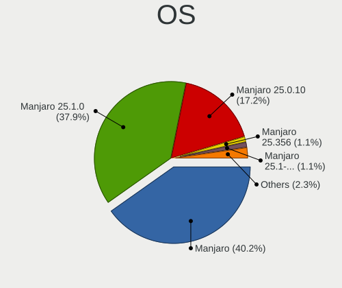

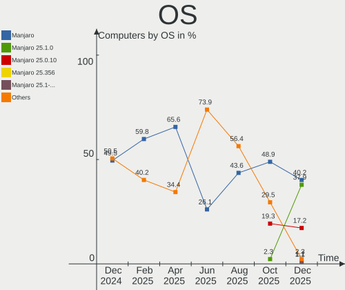

| Name              | Computers | Percent |
|-------------------|-----------|---------|
| Manjaro           | 35        | 40.23%  |
| Manjaro 25.1.0    | 33        | 37.93%  |
| Manjaro 25.0.10   | 15        | 17.24%  |
| Manjaro 25.356    | 1         | 1.15%   |
| Manjaro 25.1-pre1 | 1         | 1.15%   |
| Manjaro 25.0.3    | 1         | 1.15%   |
| Manjaro 24.2.1    | 1         | 1.15%   |

OS Family
---------

OS without a version

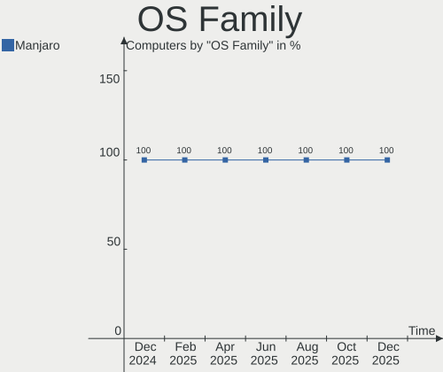

| Name    | Computers | Percent |
|---------|-----------|---------|
| Manjaro | 87        | 100%    |

Kernel
------

Version of the Linux kernel

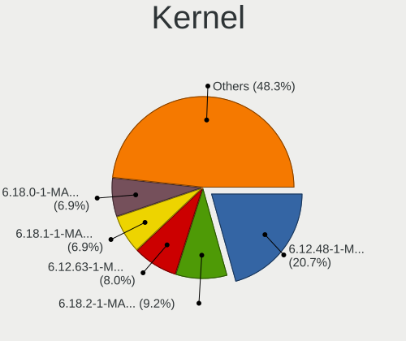

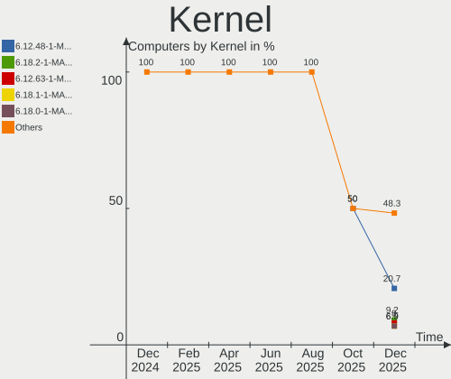

| Version               | Computers | Percent |
|-----------------------|-----------|---------|
| 6.12.48-1-MANJARO     | 18        | 20.69%  |
| 6.18.2-1-MANJARO      | 8         | 9.2%    |
| 6.12.63-1-MANJARO     | 7         | 8.05%   |
| 6.18.1-1-MANJARO      | 6         | 6.9%    |
| 6.18.0-1-MANJARO      | 6         | 6.9%    |
| 6.12.62-1-MANJARO     | 6         | 6.9%    |
| 6.12.61-1-MANJARO     | 5         | 5.75%   |
| 6.6.119-1-MANJARO     | 4         | 4.6%    |
| 6.17.12-1-MANJARO     | 4         | 4.6%    |
| 6.17.1-0-MANJARO      | 4         | 4.6%    |
| 6.16.8-1-MANJARO      | 4         | 4.6%    |
| 6.17.9-1-MANJARO      | 2         | 2.3%    |
| 6.17.11-1-MANJARO     | 2         | 2.3%    |
| 6.1.153-1-MANJARO     | 2         | 2.3%    |
| 6.6.99-1-MANJARO      | 1         | 1.15%   |
| 6.6.107-1-MANJARO     | 1         | 1.15%   |
| 6.19.0-rc1-1-MANJARO  | 1         | 1.15%   |
| 6.17.5-2-rt7-MANJARO  | 1         | 1.15%   |
| 6.16.12-1-MANJARO     | 1         | 1.15%   |
| 6.12.63-1-cachyos-lts | 1         | 1.15%   |
| 6.12.4-1-MANJARO      | 1         | 1.15%   |
| 6.12.28-1-MANJARO     | 1         | 1.15%   |
| 5.15.197-1-MANJARO    | 1         | 1.15%   |

Kernel Family
-------------

Linux kernel without a distro release

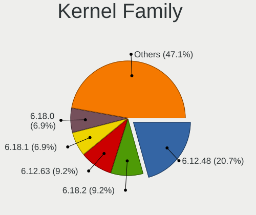

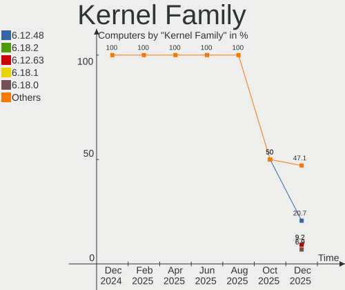

| Version  | Computers | Percent |
|----------|-----------|---------|
| 6.12.48  | 18        | 20.69%  |
| 6.18.2   | 8         | 9.2%    |
| 6.12.63  | 8         | 9.2%    |
| 6.18.1   | 6         | 6.9%    |
| 6.18.0   | 6         | 6.9%    |
| 6.12.62  | 6         | 6.9%    |
| 6.12.61  | 5         | 5.75%   |
| 6.6.119  | 4         | 4.6%    |
| 6.17.12  | 4         | 4.6%    |
| 6.17.1   | 4         | 4.6%    |
| 6.16.8   | 4         | 4.6%    |
| 6.17.9   | 2         | 2.3%    |
| 6.17.11  | 2         | 2.3%    |
| 6.1.153  | 2         | 2.3%    |
| 6.6.99   | 1         | 1.15%   |
| 6.6.107  | 1         | 1.15%   |
| 6.19.0   | 1         | 1.15%   |
| 6.17.5   | 1         | 1.15%   |
| 6.16.12  | 1         | 1.15%   |
| 6.12.4   | 1         | 1.15%   |
| 6.12.28  | 1         | 1.15%   |
| 5.15.197 | 1         | 1.15%   |

Kernel Major Ver.
-----------------

Linux kernel major version

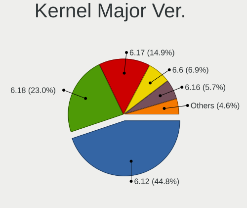

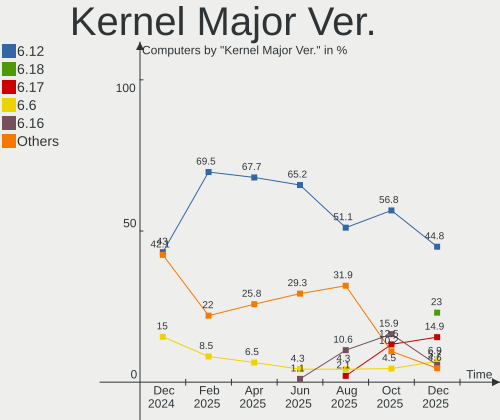

| Version | Computers | Percent |
|---------|-----------|---------|
| 6.12    | 39        | 44.83%  |
| 6.18    | 20        | 22.99%  |
| 6.17    | 13        | 14.94%  |
| 6.6     | 6         | 6.9%    |
| 6.16    | 5         | 5.75%   |
| 6.1     | 2         | 2.3%    |
| 6.19    | 1         | 1.15%   |
| 5.15    | 1         | 1.15%   |

Arch
----

OS architecture (x86_64, i586, etc.)

| Name   | Computers | Percent |
|--------|-----------|---------|
| x86_64 | 87        | 100%    |

DE
--

Desktop Environment

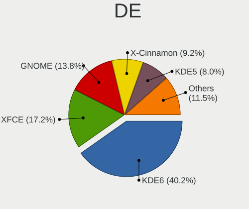

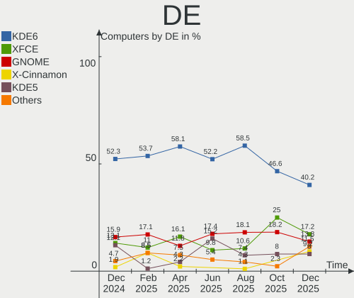

| Name       | Computers | Percent |
|------------|-----------|---------|
| KDE6       | 35        | 40.23%  |
| XFCE       | 15        | 17.24%  |
| GNOME      | 12        | 13.79%  |
| X-Cinnamon | 8         | 9.2%    |
| KDE5       | 7         | 8.05%   |
| KDE        | 4         | 4.6%    |
| sway       | 1         | 1.15%   |
| MATE       | 1         | 1.15%   |
| i3         | 1         | 1.15%   |
| Deepin     | 1         | 1.15%   |
| Cinnamon   | 1         | 1.15%   |
| bspwm      | 1         | 1.15%   |

Display Server
--------------

X11 or Wayland

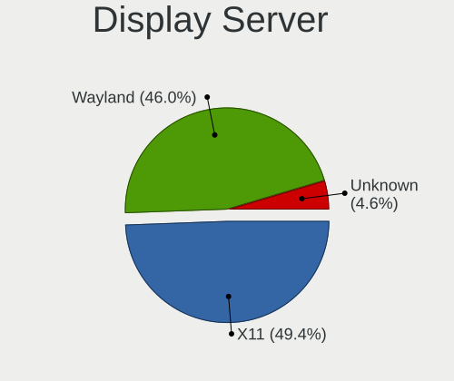

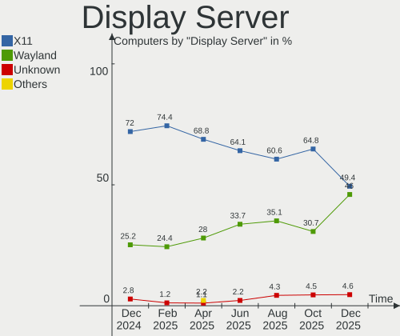

| Name    | Computers | Percent |
|---------|-----------|---------|
| X11     | 43        | 49.43%  |
| Wayland | 40        | 45.98%  |
| Unknown | 4         | 4.6%    |

Display Manager
---------------

SDDM, LightDM, etc.

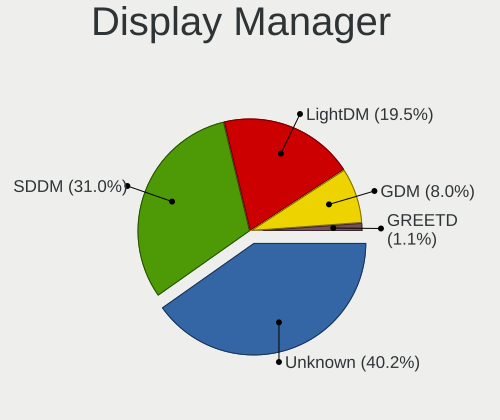

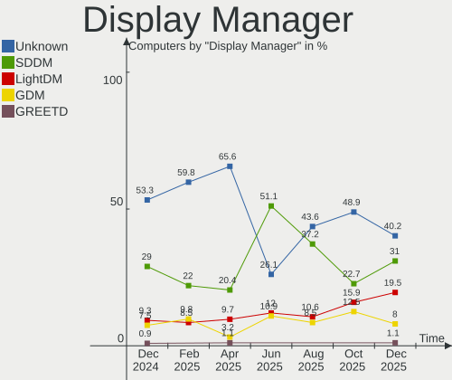

| Name    | Computers | Percent |
|---------|-----------|---------|
| Unknown | 35        | 40.23%  |
| SDDM    | 27        | 31.03%  |
| LightDM | 17        | 19.54%  |
| GDM     | 7         | 8.05%   |
| GREETD  | 1         | 1.15%   |

OS Lang
-------

Language

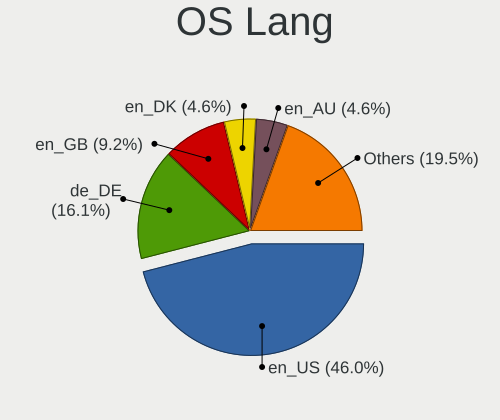

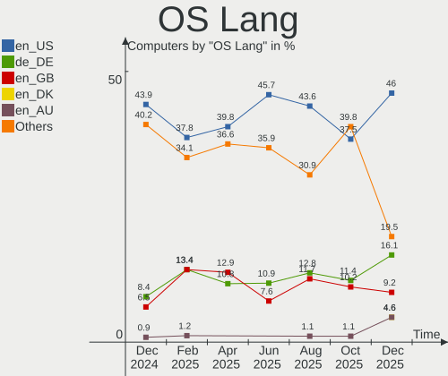

| Lang  | Computers | Percent |
|-------|-----------|---------|
| en_US | 40        | 45.98%  |
| de_DE | 14        | 16.09%  |
| en_GB | 8         | 9.2%    |
| en_DK | 4         | 4.6%    |
| en_AU | 4         | 4.6%    |
| ru_RU | 3         | 3.45%   |
| fr_FR | 2         | 2.3%    |
| es_ES | 2         | 2.3%    |
| de_CH | 2         | 2.3%    |
| pt_BR | 1         | 1.15%   |
| pl_PL | 1         | 1.15%   |
| it_IT | 1         | 1.15%   |
| hu_HU | 1         | 1.15%   |
| es_MX | 1         | 1.15%   |
| es_EC | 1         | 1.15%   |
| en_CA | 1         | 1.15%   |
| de_AT | 1         | 1.15%   |

Boot Mode
---------

EFI or BIOS

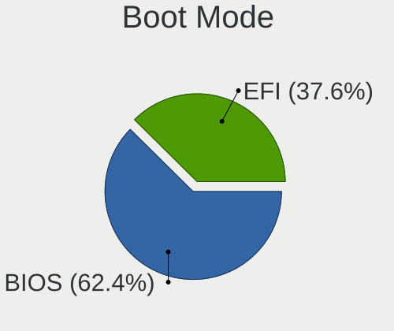

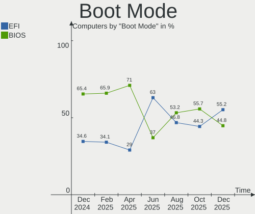

| Mode | Computers | Percent |
|------|-----------|---------|
| EFI  | 48        | 55.17%  |
| BIOS | 39        | 44.83%  |

Filesystem
----------

Type of filesystem

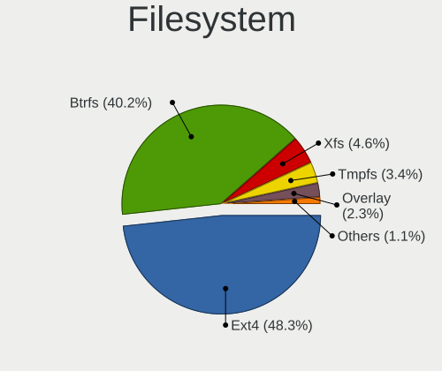

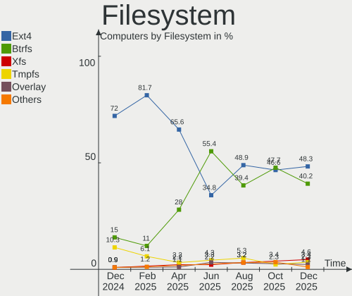

| Type    | Computers | Percent |
|---------|-----------|---------|
| Ext4    | 42        | 48.28%  |
| Btrfs   | 35        | 40.23%  |
| Xfs     | 4         | 4.6%    |
| Tmpfs   | 3         | 3.45%   |
| Overlay | 2         | 2.3%    |
| Unknown | 1         | 1.15%   |

Part. scheme
------------

Scheme of partitioning

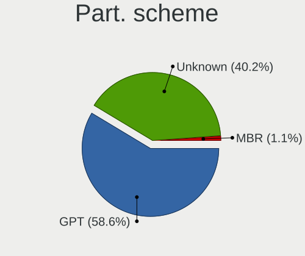

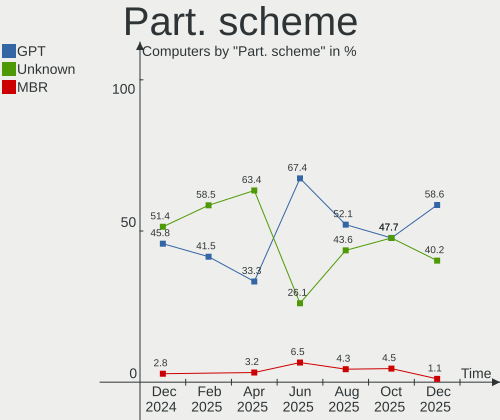

| Type    | Computers | Percent |
|---------|-----------|---------|
| GPT     | 51        | 58.62%  |
| Unknown | 35        | 40.23%  |
| MBR     | 1         | 1.15%   |

Dual Boot with Linux/BSD
------------------------

Hosting more than one Linux/BSD

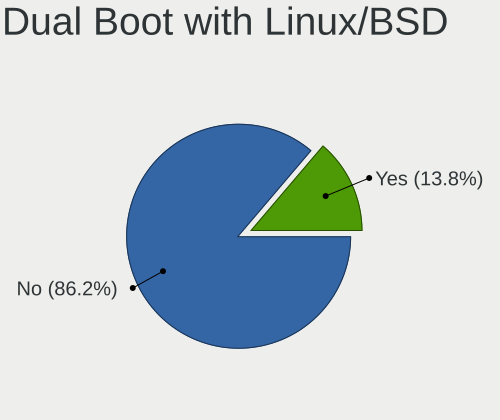

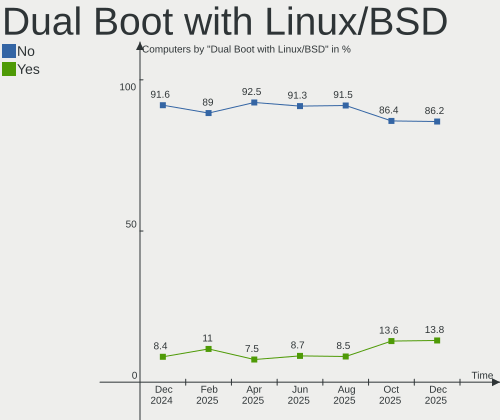

| Dual boot | Computers | Percent |
|-----------|-----------|---------|
| No        | 75        | 86.21%  |
| Yes       | 12        | 13.79%  |

Dual Boot (Win)
---------------

Hosting Linux and Windows

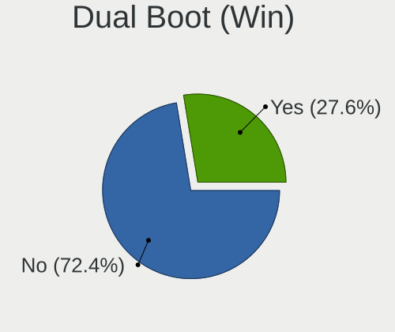

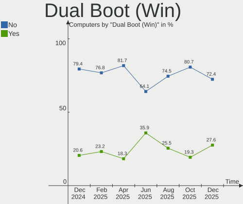

| Dual boot | Computers | Percent |
|-----------|-----------|---------|
| No        | 63        | 72.41%  |
| Yes       | 24        | 27.59%  |

Board
-----

Vendor
------

Motherboard manufacturer

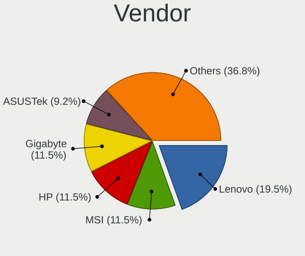

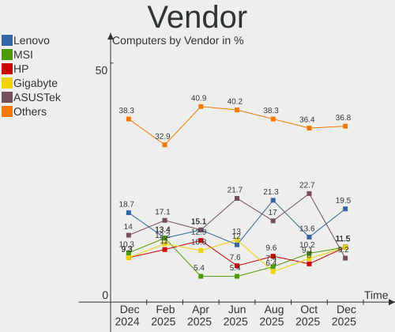

| Name                | Computers | Percent |
|---------------------|-----------|---------|
| Lenovo              | 17        | 19.54%  |
| MSI                 | 10        | 11.49%  |
| Hewlett-Packard     | 10        | 11.49%  |
| Gigabyte Technology | 10        | 11.49%  |
| ASUSTek Computer    | 8         | 9.2%    |
| Acer                | 6         | 6.9%    |
| Notebook            | 3         | 3.45%   |
| Dell                | 3         | 3.45%   |
| ASRock              | 3         | 3.45%   |
| TUXEDO              | 2         | 2.3%    |
| Medion              | 2         | 2.3%    |
| Google              | 2         | 2.3%    |
| AZW                 | 2         | 2.3%    |
| Apple               | 2         | 2.3%    |
| Toshiba             | 1         | 1.15%   |
| MACHINIST           | 1         | 1.15%   |
| Kogan               | 1         | 1.15%   |
| GMKtec              | 1         | 1.15%   |
| Fusion5             | 1         | 1.15%   |
| Fujitsu             | 1         | 1.15%   |
| BESSTAR Tech        | 1         | 1.15%   |

Model
-----

Motherboard model

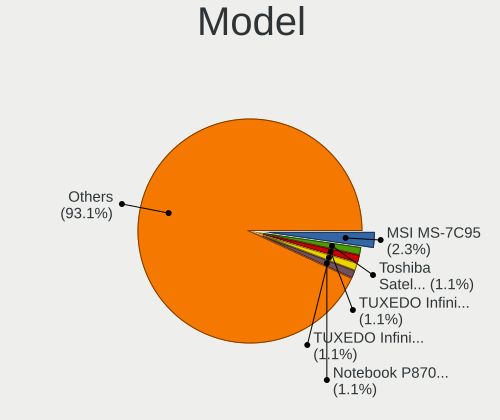

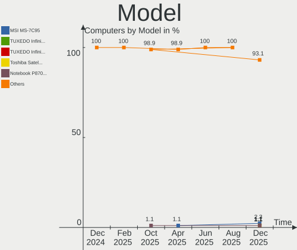

| Name                                 | Computers | Percent |
|--------------------------------------|-----------|---------|
| MSI MS-7C95                          | 2         | 2.3%    |
| TUXEDO InfinityBook Pro Gen8 (MK1)   | 1         | 1.15%   |
| TUXEDO InfinityBook Pro 14 Gen6      | 1         | 1.15%   |
| Toshiba Satellite U300               | 1         | 1.15%   |
| Notebook P870DM-G                    | 1         | 1.15%   |
| Notebook NH5XHPI                     | 1         | 1.15%   |
| Notebook N14xWU                      | 1         | 1.15%   |
| MSI Thin 15 B13VE                    | 1         | 1.15%   |
| MSI Raider A18 HX A9WJG              | 1         | 1.15%   |
| MSI MS-7E59                          | 1         | 1.15%   |
| MSI MS-7E12                          | 1         | 1.15%   |
| MSI MS-7D20                          | 1         | 1.15%   |
| MSI MS-7C89                          | 1         | 1.15%   |
| MSI MS-7B79                          | 1         | 1.15%   |
| MSI MS-7A32                          | 1         | 1.15%   |
| Medion P7648 MD99980                 | 1         | 1.15%   |
| Medion MD35340                       | 1         | 1.15%   |
| MACHINIST X99-MR9A-PRO V3.0          | 1         | 1.15%   |
| Lenovo Yoga Pro 7 14ASP9 83HN        | 1         | 1.15%   |
| Lenovo Yoga 7 2-in-1 14IML9 83DJ     | 1         | 1.15%   |
| Lenovo Yoga 7 2-in-1 14AKP10 83JR    | 1         | 1.15%   |
| Lenovo V14 G2 ALC 82KC               | 1         | 1.15%   |
| Lenovo ThinkStation P620 30E000GMMT  | 1         | 1.15%   |
| Lenovo ThinkStation P330 30CY006WGE  | 1         | 1.15%   |
| Lenovo ThinkPad X13 Gen 4 21J3CTO1WW | 1         | 1.15%   |
| Lenovo ThinkPad P16 Gen 3 21RQS0DV00 | 1         | 1.15%   |
| Lenovo ThinkPad L570 20J9S0DL01      | 1         | 1.15%   |
| Lenovo ThinkPad Edge E530 32597AU    | 1         | 1.15%   |
| Lenovo ThinkPad E580 20KS001JRT      | 1         | 1.15%   |
| Lenovo ThinkBook X G2 IAH 21TU       | 1         | 1.15%   |
| Lenovo ThinkBook 15 G4 IAP 21DJ      | 1         | 1.15%   |
| Lenovo Legion Y740-15IRHg 81UH       | 1         | 1.15%   |
| Lenovo Legion Pro 7 16IAX10H 83F5    | 1         | 1.15%   |
| Lenovo Legion Pro 7 16AFR10H 83RU    | 1         | 1.15%   |
| Lenovo IdeaPadFlex 5 16IAU7 82R8     | 1         | 1.15%   |
| Kogan KAL11C250SA                    | 1         | 1.15%   |
| HP Victus by Laptop 16-d0xxx         | 1         | 1.15%   |
| HP ProBook 470 G1                    | 1         | 1.15%   |
| HP ProBook 450 G8 Notebook PC        | 1         | 1.15%   |
| HP ProBook 440 G7                    | 1         | 1.15%   |

Model Family
------------

Motherboard model prefix

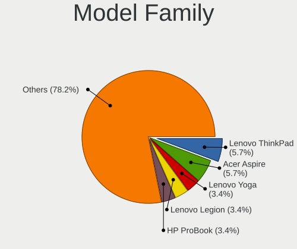

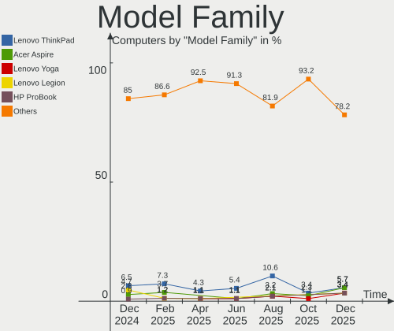

| Name                   | Computers | Percent |
|------------------------|-----------|---------|
| Lenovo ThinkPad        | 5         | 5.75%   |
| Acer Aspire            | 5         | 5.75%   |
| Lenovo Yoga            | 3         | 3.45%   |
| Lenovo Legion          | 3         | 3.45%   |
| HP ProBook             | 3         | 3.45%   |
| ASUS ROG               | 3         | 3.45%   |
| ASUS PRIME             | 3         | 3.45%   |
| TUXEDO InfinityBook    | 2         | 2.3%    |
| MSI MS-7C95            | 2         | 2.3%    |
| Lenovo ThinkStation    | 2         | 2.3%    |
| Lenovo ThinkBook       | 2         | 2.3%    |
| Toshiba Satellite      | 1         | 1.15%   |
| Notebook P870DM-G      | 1         | 1.15%   |
| Notebook NH5XHPI       | 1         | 1.15%   |
| Notebook N14xWU        | 1         | 1.15%   |
| MSI Thin               | 1         | 1.15%   |
| MSI Raider             | 1         | 1.15%   |
| MSI MS-7E59            | 1         | 1.15%   |
| MSI MS-7E12            | 1         | 1.15%   |
| MSI MS-7D20            | 1         | 1.15%   |
| MSI MS-7C89            | 1         | 1.15%   |
| MSI MS-7B79            | 1         | 1.15%   |
| MSI MS-7A32            | 1         | 1.15%   |
| Medion P7648           | 1         | 1.15%   |
| Medion MD35340         | 1         | 1.15%   |
| MACHINIST X99-MR9A-PRO | 1         | 1.15%   |
| Lenovo V14             | 1         | 1.15%   |
| Lenovo IdeaPadFlex     | 1         | 1.15%   |
| Kogan KAL11C250SA      | 1         | 1.15%   |
| HP Victus              | 1         | 1.15%   |
| HP Pavilion            | 1         | 1.15%   |
| HP Notebook            | 1         | 1.15%   |
| HP Laptop              | 1         | 1.15%   |
| HP ENVY                | 1         | 1.15%   |
| HP Compaq              | 1         | 1.15%   |
| Google Robo            | 1         | 1.15%   |
| Google Eve             | 1         | 1.15%   |
| GMKtec NucBox          | 1         | 1.15%   |
| Gigabyte X570          | 1         | 1.15%   |
| Gigabyte H97M-D3H      | 1         | 1.15%   |

MFG Year
--------

Motherboard manufacture year

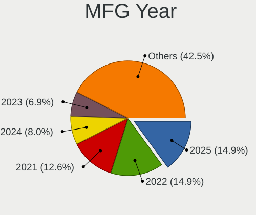

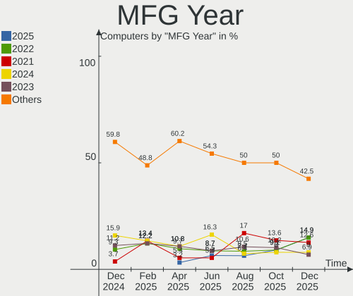

| Year | Computers | Percent |
|------|-----------|---------|
| 2025 | 13        | 14.94%  |
| 2022 | 13        | 14.94%  |
| 2021 | 11        | 12.64%  |
| 2024 | 7         | 8.05%   |
| 2023 | 6         | 6.9%    |
| 2020 | 6         | 6.9%    |
| 2019 | 6         | 6.9%    |
| 2018 | 4         | 4.6%    |
| 2017 | 4         | 4.6%    |
| 2016 | 3         | 3.45%   |
| 2015 | 3         | 3.45%   |
| 2013 | 3         | 3.45%   |
| 2014 | 2         | 2.3%    |
| 2012 | 2         | 2.3%    |
| 2007 | 2         | 2.3%    |
| 2011 | 1         | 1.15%   |
| 2009 | 1         | 1.15%   |

Form Factor
-----------

Physical design of the computer

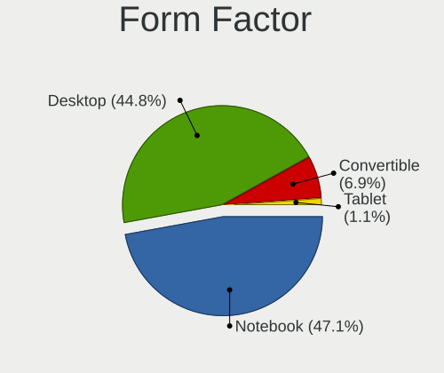

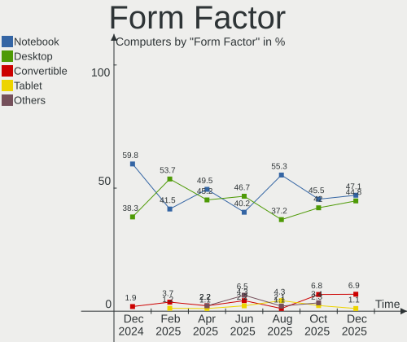

| Name        | Computers | Percent |
|-------------|-----------|---------|
| Notebook    | 41        | 47.13%  |
| Desktop     | 39        | 44.83%  |
| Convertible | 6         | 6.9%    |
| Tablet      | 1         | 1.15%   |

Secure Boot
-----------

Enabled or disabled

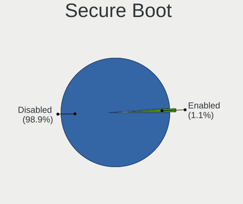

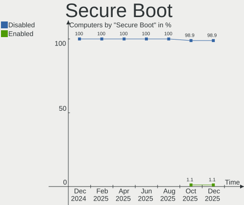

| State    | Computers | Percent |
|----------|-----------|---------|
| Disabled | 86        | 98.85%  |
| Enabled  | 1         | 1.15%   |

Coreboot
--------

Have coreboot on board

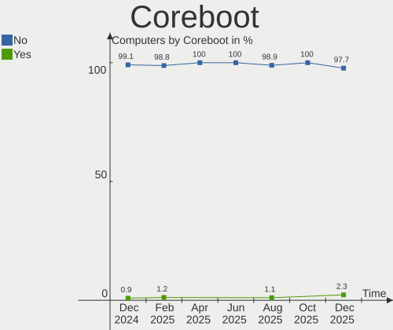

| Used | Computers | Percent |
|------|-----------|---------|
| No   | 85        | 97.7%   |
| Yes  | 2         | 2.3%    |

RAM Size
--------

Total RAM memory

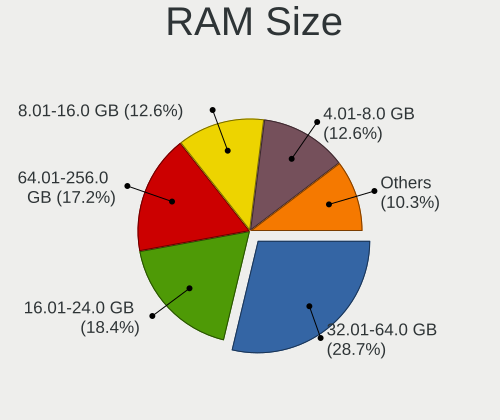

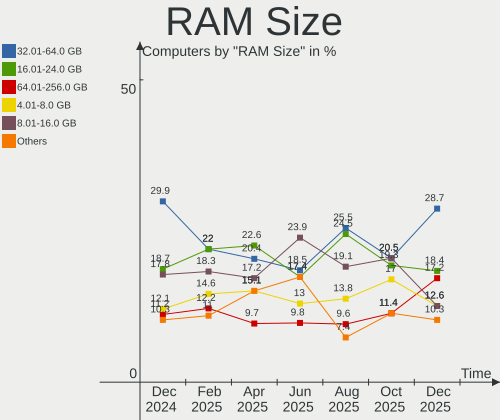

| Size in GB  | Computers | Percent |
|-------------|-----------|---------|
| 32.01-64.0  | 25        | 28.74%  |
| 16.01-24.0  | 16        | 18.39%  |
| 64.01-256.0 | 15        | 17.24%  |
| 4.01-8.0    | 11        | 12.64%  |
| 8.01-16.0   | 11        | 12.64%  |
| 3.01-4.0    | 5         | 5.75%   |
| 24.01-32.0  | 4         | 4.6%    |

RAM Used
--------

Used RAM memory

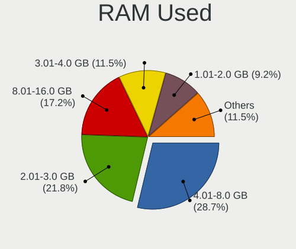

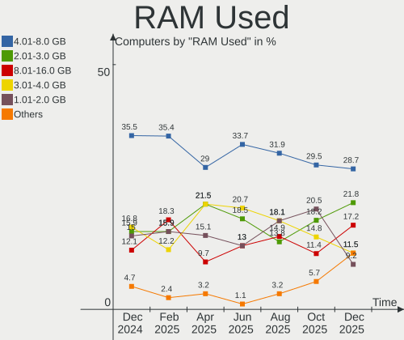

| Used GB    | Computers | Percent |
|------------|-----------|---------|
| 4.01-8.0   | 25        | 28.74%  |
| 2.01-3.0   | 19        | 21.84%  |
| 8.01-16.0  | 15        | 17.24%  |
| 3.01-4.0   | 10        | 11.49%  |
| 1.01-2.0   | 8         | 9.2%    |
| 24.01-32.0 | 4         | 4.6%    |
| 32.01-64.0 | 2         | 2.3%    |
| 16.01-24.0 | 2         | 2.3%    |
| 0.51-1.0   | 2         | 2.3%    |

Total Drives
------------

Number of drives on board

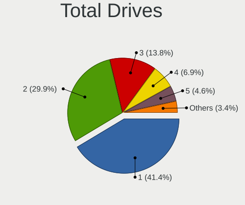

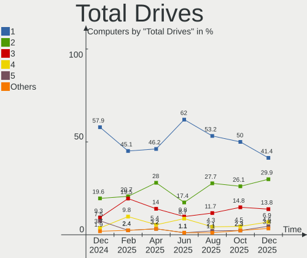

| Drives | Computers | Percent |
|--------|-----------|---------|
| 1      | 36        | 41.38%  |
| 2      | 26        | 29.89%  |
| 3      | 12        | 13.79%  |
| 4      | 6         | 6.9%    |
| 5      | 4         | 4.6%    |
| 12     | 1         | 1.15%   |
| 7      | 1         | 1.15%   |
| 6      | 1         | 1.15%   |

Has CD-ROM
----------

Has CD-ROM on board

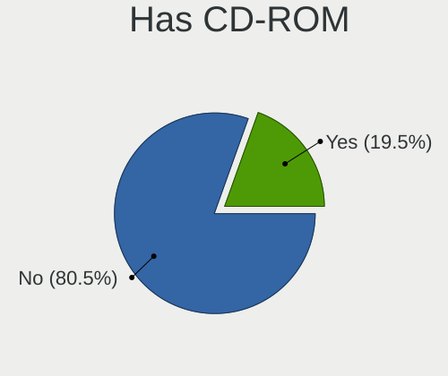

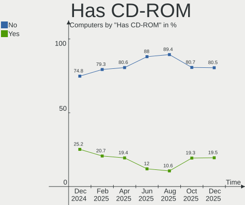

| Presented | Computers | Percent |
|-----------|-----------|---------|
| No        | 70        | 80.46%  |
| Yes       | 17        | 19.54%  |

Has Ethernet
------------

Has Ethernet on board

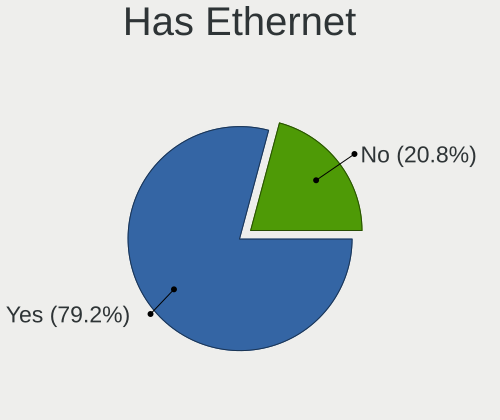

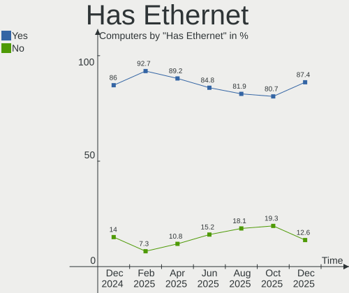

| Presented | Computers | Percent |
|-----------|-----------|---------|
| Yes       | 76        | 87.36%  |
| No        | 11        | 12.64%  |

Has WiFi
--------

Has WiFi module

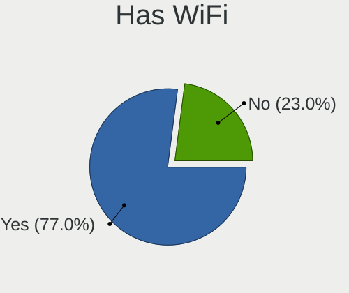

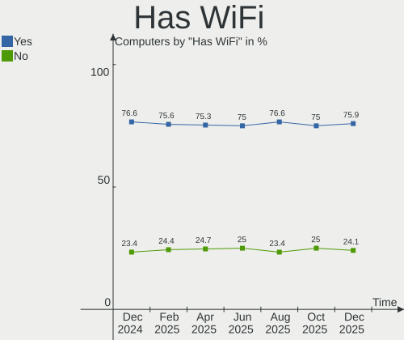

| Presented | Computers | Percent |
|-----------|-----------|---------|
| Yes       | 66        | 75.86%  |
| No        | 21        | 24.14%  |

Has Bluetooth
-------------

Has Bluetooth module

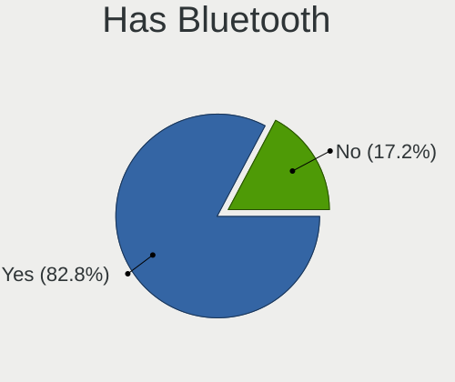

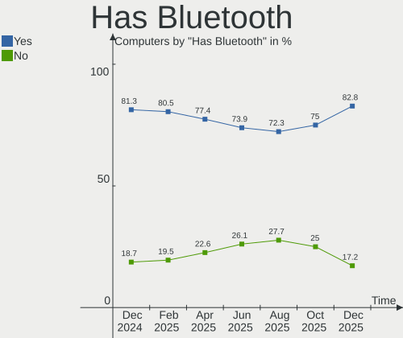

| Presented | Computers | Percent |
|-----------|-----------|---------|
| Yes       | 72        | 82.76%  |
| No        | 15        | 17.24%  |

Location
--------

Country
-------

Geographic location (country)

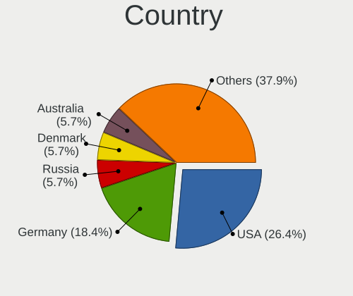

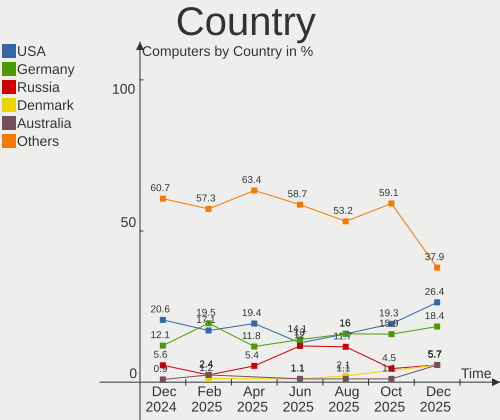

| Country         | Computers | Percent |
|-----------------|-----------|---------|
| USA             | 23        | 26.44%  |
| Germany         | 16        | 18.39%  |
| Russia          | 5         | 5.75%   |
| Denmark         | 5         | 5.75%   |
| Australia       | 5         | 5.75%   |
| Spain           | 4         | 4.6%    |
| Switzerland     | 3         | 3.45%   |
| France          | 3         | 3.45%   |
| Poland          | 2         | 2.3%    |
| Mexico          | 2         | 2.3%    |
| Greece          | 2         | 2.3%    |
| Canada          | 2         | 2.3%    |
| Brazil          | 2         | 2.3%    |
| Ukraine         | 1         | 1.15%   |
| UK              | 1         | 1.15%   |
| The Netherlands | 1         | 1.15%   |
| Thailand        | 1         | 1.15%   |
| Sweden          | 1         | 1.15%   |
| Romania         | 1         | 1.15%   |
| Netherlands     | 1         | 1.15%   |
| Italy           | 1         | 1.15%   |
| Hungary         | 1         | 1.15%   |
| Ecuador         | 1         | 1.15%   |
| Bangladesh      | 1         | 1.15%   |
| Austria         | 1         | 1.15%   |
| Argentina       | 1         | 1.15%   |

City
----

Geographic location (city)

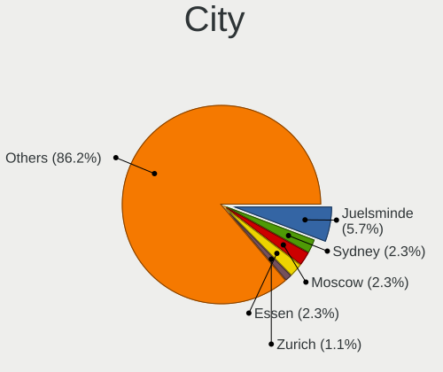

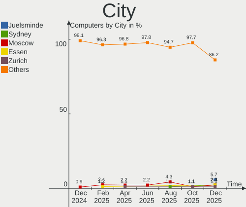

| City                  | Computers | Percent |
|-----------------------|-----------|---------|
| Juelsminde            | 5         | 5.75%   |
| Sydney                | 2         | 2.3%    |
| Moscow                | 2         | 2.3%    |
| Essen                 | 2         | 2.3%    |
| Zurich                | 1         | 1.15%   |
| Yekaterinburg         | 1         | 1.15%   |
| Wuppertal             | 1         | 1.15%   |
| West Kelowna          | 1         | 1.15%   |
| Weilmuenster          | 1         | 1.15%   |
| Warsaw                | 1         | 1.15%   |
| Vienna                | 1         | 1.15%   |
| Toronto               | 1         | 1.15%   |
| The Hague             | 1         | 1.15%   |
| Tarro                 | 1         | 1.15%   |
| Sucúa                | 1         | 1.15%   |
| Stockholm             | 1         | 1.15%   |
| St. Petersburg        | 1         | 1.15%   |
| Springfield           | 1         | 1.15%   |
| Siegen                | 1         | 1.15%   |
| Seville               | 1         | 1.15%   |
| Seattle               | 1         | 1.15%   |
| Seaham                | 1         | 1.15%   |
| Satteldorf            | 1         | 1.15%   |
| San Luis Potosí City | 1         | 1.15%   |
| Salvador              | 1         | 1.15%   |
| Rochester             | 1         | 1.15%   |
| Richmond              | 1         | 1.15%   |
| Regensburg            | 1         | 1.15%   |
| Pleasant Grove        | 1         | 1.15%   |
| Plano                 | 1         | 1.15%   |
| Olathe                | 1         | 1.15%   |
| Norwich               | 1         | 1.15%   |
| New Orleans           | 1         | 1.15%   |
| Nebraska City         | 1         | 1.15%   |
| Nanterre              | 1         | 1.15%   |
| Monterrey             | 1         | 1.15%   |
| Mollet del Vallès    | 1         | 1.15%   |
| Miami                 | 1         | 1.15%   |
| Mainz                 | 1         | 1.15%   |
| Los Angeles           | 1         | 1.15%   |

Drives
------

Drive Vendor
------------

Hard drive vendors

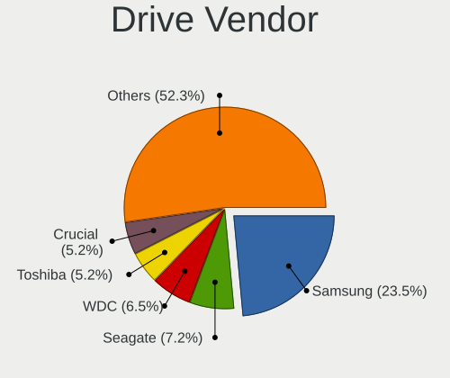

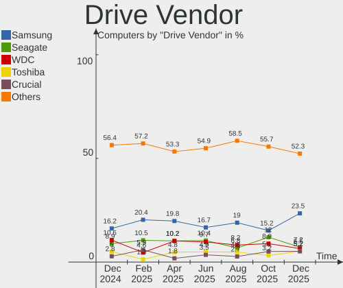

| Vendor                       | Computers | Drives | Percent |
|------------------------------|-----------|--------|---------|
| Samsung Electronics          | 36        | 52     | 23.53%  |
| Seagate                      | 11        | 17     | 7.19%   |
| WDC                          | 10        | 15     | 6.54%   |
| Toshiba                      | 8         | 8      | 5.23%   |
| Crucial                      | 8         | 13     | 5.23%   |
| Unknown                      | 7         | 9      | 4.58%   |
| SK hynix                     | 6         | 7      | 3.92%   |
| SanDisk                      | 6         | 7      | 3.92%   |
| Kingston                     | 6         | 7      | 3.92%   |
| Micron Technology            | 5         | 6      | 3.27%   |
| Phison Electronics           | 4         | 5      | 2.61%   |
| Micron/Crucial Technology    | 4         | 5      | 2.61%   |
| Realtek Semiconductor        | 3         | 3      | 1.96%   |
| KIOXIA                       | 3         | 3      | 1.96%   |
| HGST                         | 3         | 3      | 1.96%   |
| China                        | 3         | 3      | 1.96%   |
| Shenzhen Longsys Electronics | 2         | 2      | 1.31%   |
| Intel                        | 2         | 2      | 1.31%   |
| A-DATA Technology            | 2         | 3      | 1.31%   |
| Wibtek                       | 1         | 1      | 0.65%   |
| Union Memory (Shenzhen)      | 1         | 1      | 0.65%   |
| Transcend                    | 1         | 1      | 0.65%   |
| tecmiyo                      | 1         | 1      | 0.65%   |
| SPCC                         | 1         | 1      | 0.65%   |
| Silicon Motion               | 1         | 1      | 0.65%   |
| SAGE                         | 1         | 1      | 0.65%   |
| Realtek                      | 1         | 2      | 0.65%   |
| Patriot                      | 1         | 1      | 0.65%   |
| Netac                        | 1         | 1      | 0.65%   |
| MAXIO Technology (Hangzhou)  | 1         | 1      | 0.65%   |
| LITEON                       | 1         | 1      | 0.65%   |
| Kingston Technology Company  | 1         | 2      | 0.65%   |
| KingSpec                     | 1         | 1      | 0.65%   |
| JMicron Technology           | 1         | 1      | 0.65%   |
| Intenso                      | 1         | 2      | 0.65%   |
| INNOGRIT                     | 1         | 1      | 0.65%   |
| Hitachi                      | 1         | 1      | 0.65%   |
| G-TECH                       | 1         | 1      | 0.65%   |
| EAGET                        | 1         | 1      | 0.65%   |
| Digma                        | 1         | 1      | 0.65%   |

Drive Model
-----------

Hard drive models

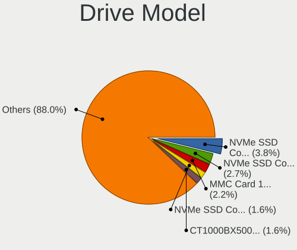

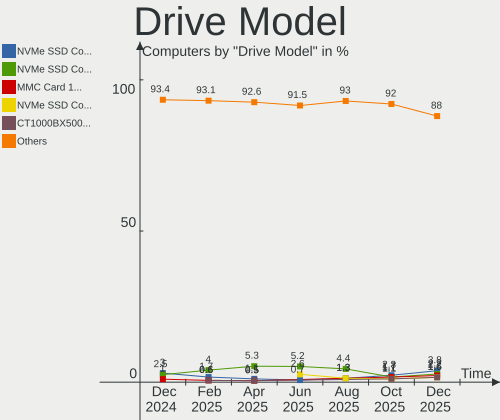

| Model                                                      | Computers | Percent |
|------------------------------------------------------------|-----------|---------|
| Samsung NVMe SSD Controller PM9A1/PM9A3/980PRO 1TB         | 7         | 3.83%   |
| Samsung NVMe SSD Controller SM981/PM981/PM983 1TB          | 5         | 2.73%   |
| Unknown MMC Card  128GB                                    | 4         | 2.19%   |
| Samsung NVMe SSD Controller S4LV008[Pascal] 4TB            | 3         | 1.64%   |
| Crucial CT1000BX500SSD1 1TB                                | 3         | 1.64%   |
| Unknown MMC Card  64GB                                     | 2         | 1.09%   |
| SK hynix Gold P31/BC711/PC711 NVMe Solid State Drive 512GB | 2         | 1.09%   |
| Samsung SSD 860 QVO 2TB                                    | 2         | 1.09%   |
| Samsung SSD 860 EVO 500GB                                  | 2         | 1.09%   |
| Samsung NVMe SSD Controller PM9C1a (DRAM-less) 1TB         | 2         | 1.09%   |
| Samsung NVMe SSD Controller PM9B1 (DRAM-less) 512GB        | 2         | 1.09%   |
| Samsung NVMe SSD Controller 980 (DRAM-less) 256GB          | 2         | 1.09%   |
| Phison E7 NVMe Controller 120GB                            | 2         | 1.09%   |
| Phison E12 NVMe Controller 1TB                             | 2         | 1.09%   |
| Micron/Crucial P5 Plus NVMe PCIe SSD 1TB                   | 2         | 1.09%   |
| Micron 2550 NVMe SSD (DRAM-less) 1TB                       | 2         | 1.09%   |
| Wibtek W800S Disk 128GB                                    | 1         | 0.55%   |
| WDC WDS200T2B0A-00SM50 2TB SSD                             | 1         | 0.55%   |
| WDC WDS100T2G0A-00JH30 1TB SSD                             | 1         | 0.55%   |
| WDC WD40EZRZ-19GXCB0 4TB                                   | 1         | 0.55%   |
| WDC WD4003FRYZ-01F0DB0 4TB                                 | 1         | 0.55%   |
| WDC WD20EZAZ-00L9GB0 2TB                                   | 1         | 0.55%   |
| WDC WD20EFRX-68EUZN0 2TB                                   | 1         | 0.55%   |
| WDC WD20EARS-00S8B1 2TB                                    | 1         | 0.55%   |
| WDC WD20EARS-00MVWB0 2TB                                   | 1         | 0.55%   |
| WDC WD10JPVX-22JC3T0 1TB                                   | 1         | 0.55%   |
| WDC WD10EZEX-00BN5A0 1TB                                   | 1         | 0.55%   |
| WDC WD10EFRX-68PJCN0 1TB                                   | 1         | 0.55%   |
| WDC WD10EFRX-68FYTN0 1TB                                   | 1         | 0.55%   |
| WDC WD Blue SA510 M.2 2280 250GB SSD                       | 1         | 0.55%   |
| Unknown SD/MMC/MS PRO 2GB                                  | 1         | 0.55%   |
| Unknown MMC Card  512GB                                    | 1         | 0.55%   |
| Unknown MMC Card  32GB                                     | 1         | 0.55%   |
| Union Memory (Shenzhen) UMIS RPJYJ1T24MML1AWY 1TB          | 1         | 0.55%   |
| Transcend TS1TMTS425S 1TB SSD                              | 1         | 0.55%   |
| Toshiba TR200 480GB SSD                                    | 1         | 0.55%   |
| Toshiba MQ04ABF100 1TB                                     | 1         | 0.55%   |
| Toshiba MQ01ABD100M 1TB                                    | 1         | 0.55%   |
| Toshiba MQ01ABD100 1TB                                     | 1         | 0.55%   |
| Toshiba MG09ACA18TE 18TB                                   | 1         | 0.55%   |

HDD Vendor
----------

Hard disk drive vendors

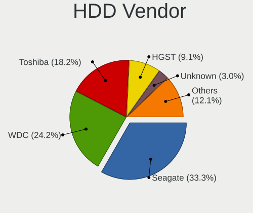

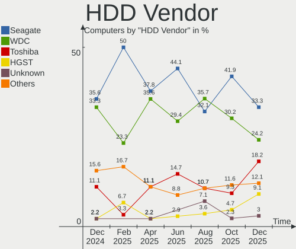

| Vendor              | Computers | Drives | Percent |
|---------------------|-----------|--------|---------|
| Seagate             | 11        | 17     | 33.33%  |
| WDC                 | 8         | 12     | 24.24%  |
| Toshiba             | 6         | 6      | 18.18%  |
| HGST                | 3         | 3      | 9.09%   |
| Unknown             | 1         | 1      | 3.03%   |
| Samsung Electronics | 1         | 1      | 3.03%   |
| SAGE                | 1         | 1      | 3.03%   |
| Hitachi             | 1         | 1      | 3.03%   |
| ASMT                | 1         | 2      | 3.03%   |

SSD Vendor
----------

Solid state drive vendors

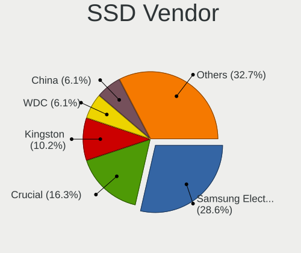

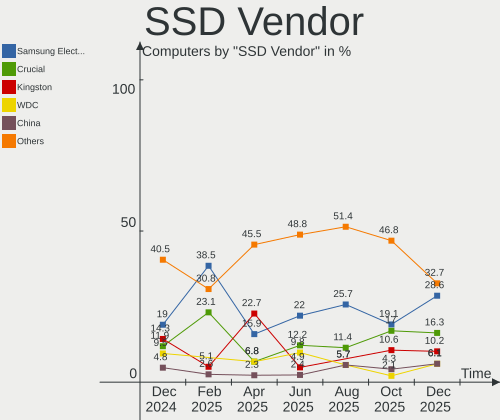

| Vendor              | Computers | Drives | Percent |
|---------------------|-----------|--------|---------|
| Samsung Electronics | 14        | 15     | 28.57%  |
| Crucial             | 8         | 13     | 16.33%  |
| Kingston            | 5         | 5      | 10.2%   |
| WDC                 | 3         | 3      | 6.12%   |
| China               | 3         | 3      | 6.12%   |
| SanDisk             | 2         | 2      | 4.08%   |
| A-DATA Technology   | 2         | 3      | 4.08%   |
| Transcend           | 1         | 1      | 2.04%   |
| Toshiba             | 1         | 1      | 2.04%   |
| tecmiyo             | 1         | 1      | 2.04%   |
| SPCC                | 1         | 1      | 2.04%   |
| Patriot             | 1         | 1      | 2.04%   |
| Netac               | 1         | 1      | 2.04%   |
| LITEON              | 1         | 1      | 2.04%   |
| KingSpec            | 1         | 1      | 2.04%   |
| Intenso             | 1         | 2      | 2.04%   |
| EAGET               | 1         | 1      | 2.04%   |
| Digma               | 1         | 1      | 2.04%   |
| Apple               | 1         | 1      | 2.04%   |

Drive Kind
----------

HDD or SSD

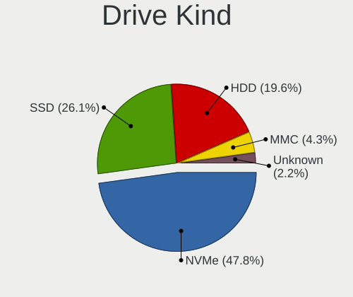

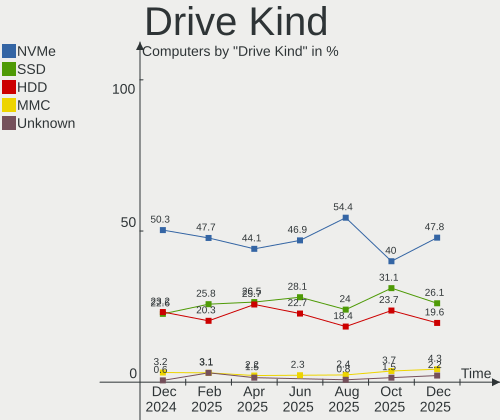

| Kind    | Computers | Drives | Percent |
|---------|-----------|--------|---------|
| NVMe    | 66        | 86     | 47.83%  |
| SSD     | 36        | 57     | 26.09%  |
| HDD     | 27        | 44     | 19.57%  |
| MMC     | 6         | 8      | 4.35%   |
| Unknown | 3         | 3      | 2.17%   |

Drive Connector
---------------

SATA, SAS, NVMe, etc.

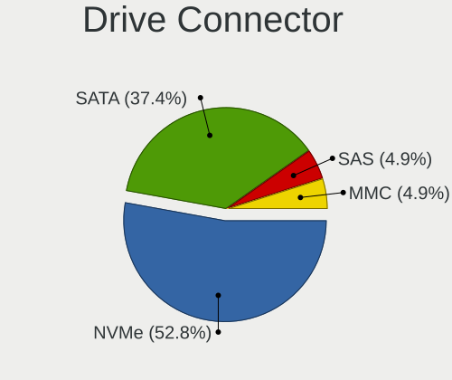

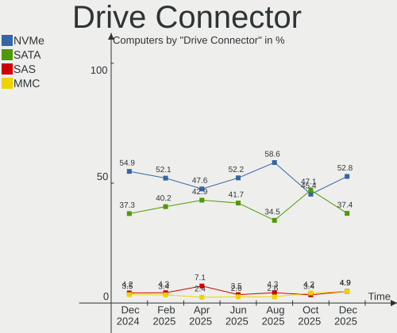

| Type | Computers | Drives | Percent |
|------|-----------|--------|---------|
| NVMe | 65        | 84     | 52.85%  |
| SATA | 46        | 95     | 37.4%   |
| SAS  | 6         | 11     | 4.88%   |
| MMC  | 6         | 8      | 4.88%   |

Drive Size
----------

Size of hard drive

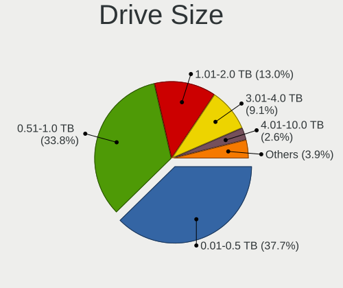

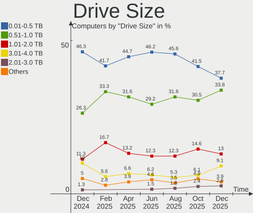

| Size in TB | Computers | Drives | Percent |
|------------|-----------|--------|---------|
| 0.01-0.5   | 29        | 38     | 37.66%  |
| 0.51-1.0   | 26        | 34     | 33.77%  |
| 1.01-2.0   | 10        | 16     | 12.99%  |
| 3.01-4.0   | 7         | 8      | 9.09%   |
| 2.01-3.0   | 2         | 2      | 2.6%    |
| 4.01-10.0  | 2         | 2      | 2.6%    |
| 10.01-20.0 | 1         | 1      | 1.3%    |

Space Total
-----------

Amount of disk space available on the file system

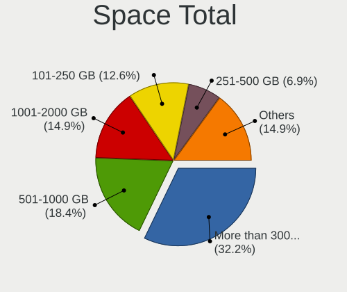

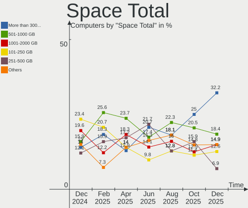

| Size in GB     | Computers | Percent |
|----------------|-----------|---------|
| More than 3000 | 28        | 32.18%  |
| 501-1000       | 16        | 18.39%  |
| 1001-2000      | 13        | 14.94%  |
| 101-250        | 11        | 12.64%  |
| 251-500        | 6         | 6.9%    |
| Unknown        | 5         | 5.75%   |
| 2001-3000      | 4         | 4.6%    |
| 1-20           | 3         | 3.45%   |
| 51-100         | 1         | 1.15%   |

Space Used
----------

Amount of used disk space

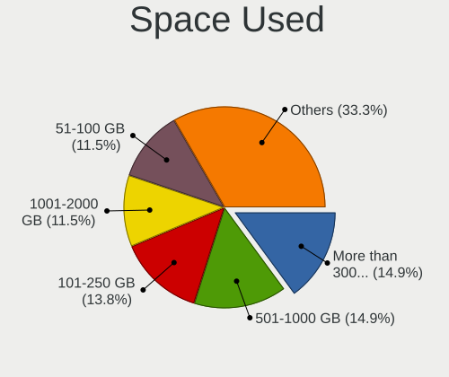

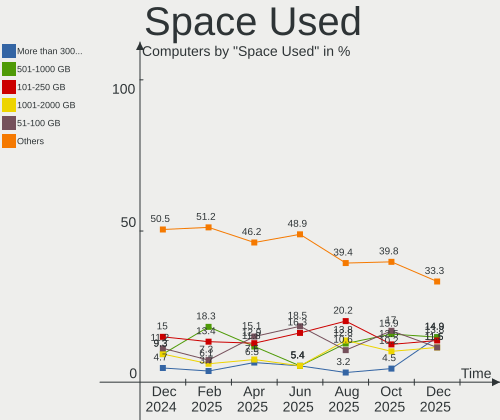

| Used GB        | Computers | Percent |
|----------------|-----------|---------|
| More than 3000 | 13        | 14.94%  |
| 501-1000       | 13        | 14.94%  |
| 101-250        | 12        | 13.79%  |
| 1001-2000      | 10        | 11.49%  |
| 51-100         | 10        | 11.49%  |
| 1-20           | 9         | 10.34%  |
| 251-500        | 7         | 8.05%   |
| 2001-3000      | 5         | 5.75%   |
| Unknown        | 5         | 5.75%   |
| 21-50          | 3         | 3.45%   |

Malfunc. Drives
---------------

Drive models with a malfunction

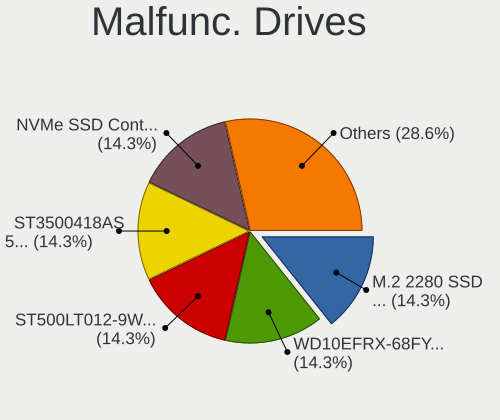

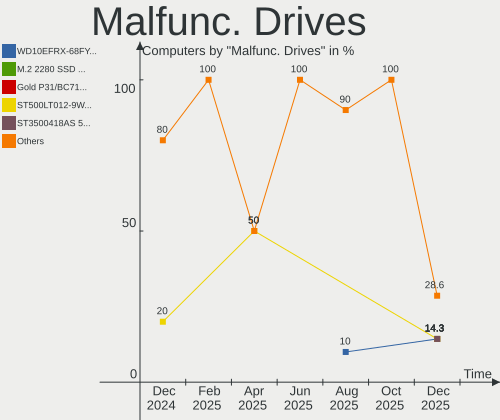

| Model                                                         | Computers | Drives | Percent |
|---------------------------------------------------------------|-----------|--------|---------|
| WDC WD10EFRX-68FYTN0 1TB                                      | 1         | 1      | 14.29%  |
| tecmiyo M.2 2280 SSD 512GB                                    | 1         | 1      | 14.29%  |
| SK hynix Gold P31/BC711/PC711 NVMe Solid State Drive 512GB    | 1         | 1      | 14.29%  |
| Seagate ST500LT012-9WS142 500GB                               | 1         | 1      | 14.29%  |
| Seagate ST3500418AS 500GB                                     | 1         | 1      | 14.29%  |
| Samsung Electronics NVMe SSD Controller 980 (DRAM-less) 256GB | 1         | 1      | 14.29%  |
| Realtek Semiconductor RTS5762 NVMe SSD Controller 1TB         | 1         | 1      | 14.29%  |

Malfunc. Drive Vendor
---------------------

Vendors of faulty drives

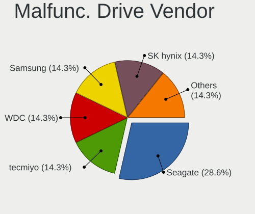

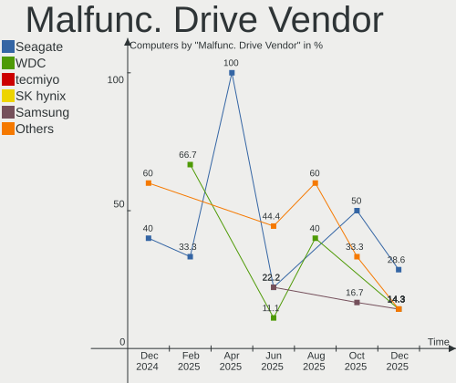

| Vendor                | Computers | Drives | Percent |
|-----------------------|-----------|--------|---------|
| Seagate               | 2         | 2      | 28.57%  |
| WDC                   | 1         | 1      | 14.29%  |
| tecmiyo               | 1         | 1      | 14.29%  |
| SK hynix              | 1         | 1      | 14.29%  |
| Samsung Electronics   | 1         | 1      | 14.29%  |
| Realtek Semiconductor | 1         | 1      | 14.29%  |

Malfunc. HDD Vendor
-------------------

Vendors of faulty HDD drives

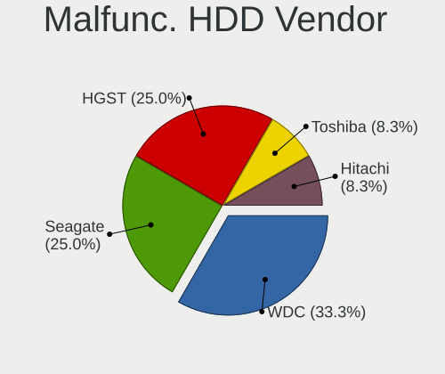

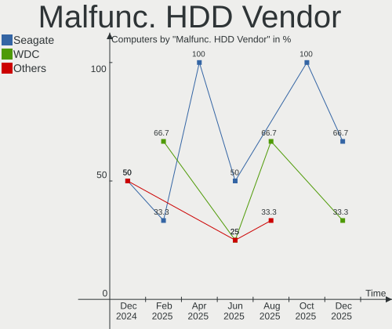

| Vendor  | Computers | Drives | Percent |
|---------|-----------|--------|---------|
| Seagate | 2         | 2      | 66.67%  |
| WDC     | 1         | 1      | 33.33%  |

Malfunc. Drive Kind
-------------------

Kinds of faulty drives

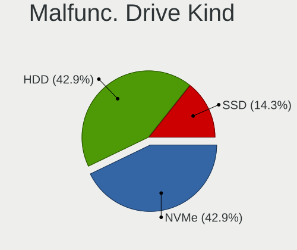

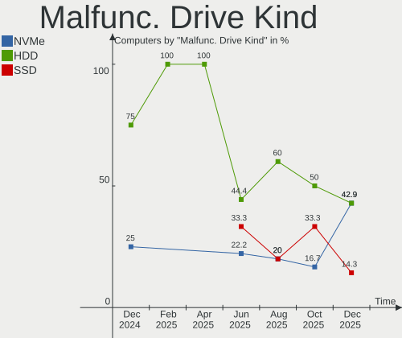

| Kind | Computers | Drives | Percent |
|------|-----------|--------|---------|
| NVMe | 3         | 3      | 42.86%  |
| HDD  | 3         | 3      | 42.86%  |
| SSD  | 1         | 1      | 14.29%  |

Failed Drives
-------------

Failed drive models

Zero info for selected period =(

Failed Drive Vendor
-------------------

Failed drive vendors

Zero info for selected period =(

Drive Status
------------

Number of failed and malfunc. drives

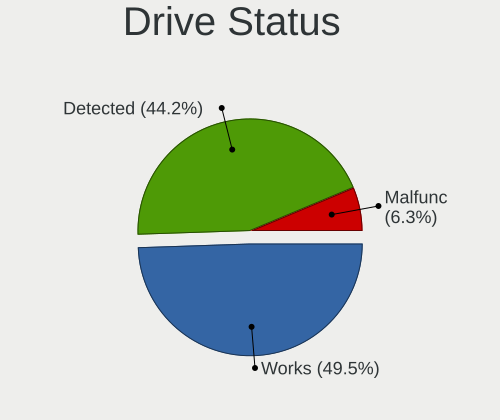

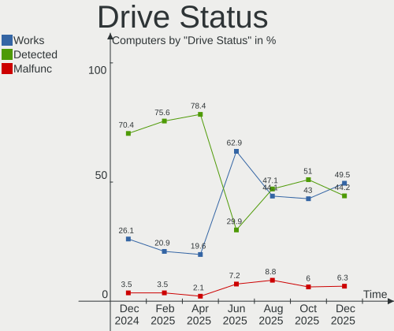

| Status   | Computers | Drives | Percent |
|----------|-----------|--------|---------|
| Works    | 47        | 91     | 49.47%  |
| Detected | 42        | 100    | 44.21%  |
| Malfunc  | 6         | 7      | 6.32%   |

Storage controller
------------------

Storage Vendor
--------------

Storage controller vendors

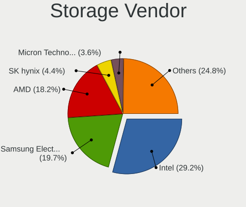

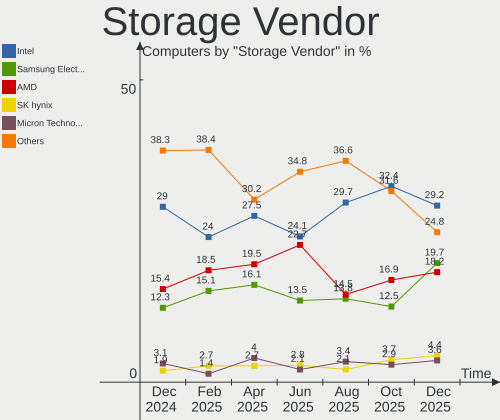

| Vendor                                  | Computers | Percent |
|-----------------------------------------|-----------|---------|
| Intel                                   | 40        | 29.2%   |
| Samsung Electronics                     | 27        | 19.71%  |
| AMD                                     | 25        | 18.25%  |
| SK hynix                                | 6         | 4.38%   |
| Micron Technology                       | 5         | 3.65%   |
| SanDisk                                 | 4         | 2.92%   |
| Phison Electronics                      | 4         | 2.92%   |
| Micron/Crucial Technology               | 4         | 2.92%   |
| ASMedia Technology                      | 4         | 2.92%   |
| Realtek Semiconductor                   | 3         | 2.19%   |
| Kingston Technology Company             | 3         | 2.19%   |
| Shenzhen Longsys Electronics            | 2         | 1.46%   |
| KIOXIA                                  | 2         | 1.46%   |
| Toshiba America Info Systems            | 1         | 0.73%   |
| Silicon Motion                          | 1         | 0.73%   |
| Shenzhen Unionmemory Information System | 1         | 0.73%   |
| Nvidia                                  | 1         | 0.73%   |
| MAXIO Technology (Hangzhou)             | 1         | 0.73%   |
| Marvell Technology Group                | 1         | 0.73%   |
| INNOGRIT                                | 1         | 0.73%   |
| ADATA Technology                        | 1         | 0.73%   |

Storage Model
-------------

Storage controller models

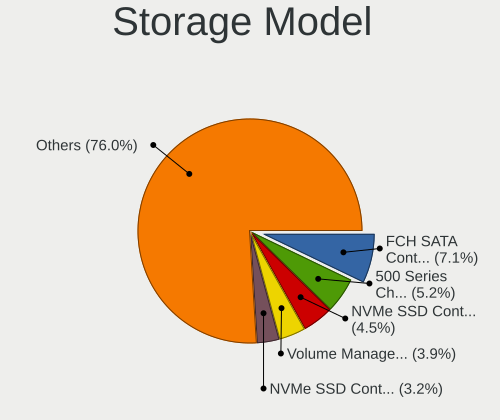

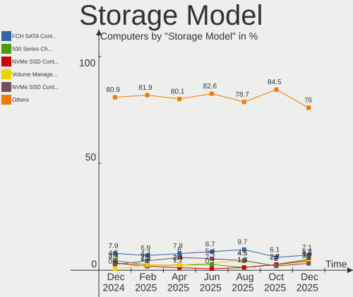

| Model                                                                            | Computers | Percent |
|----------------------------------------------------------------------------------|-----------|---------|
| AMD FCH SATA Controller [AHCI mode]                                              | 11        | 7.14%   |
| AMD 500 Series Chipset SATA Controller                                           | 8         | 5.19%   |
| Samsung NVMe SSD Controller PM9A1/PM9A3/980PRO                                   | 7         | 4.55%   |
| Intel Volume Management Device NVMe RAID Controller                              | 6         | 3.9%    |
| Samsung NVMe SSD Controller SM981/PM981/PM983                                    | 5         | 3.25%   |
| Intel Alder Lake-P SATA AHCI Controller                                          | 5         | 3.25%   |
| AMD 600 Series Chipset SATA Controller                                           | 5         | 3.25%   |
| Samsung NVMe SSD Controller S4LV008[Pascal]                                      | 4         | 2.6%    |
| Samsung NVMe SSD Controller 980 (DRAM-less)                                      | 4         | 2.6%    |
| Intel 8 Series/C220 Series Chipset Family 6-port SATA Controller 1 [AHCI mode]   | 4         | 2.6%    |
| Samsung NVMe SSD Controller PM9C1a (DRAM-less)                                   | 3         | 1.95%   |
| Samsung NVMe SSD 9100 PRO [PM9E1]                                                | 3         | 1.95%   |
| Micron 2550 NVMe SSD (DRAM-less)                                                 | 3         | 1.95%   |
| Intel Sunrise Point-LP SATA Controller [AHCI mode]                               | 3         | 1.95%   |
| Intel RST Volume Management Device Controller                                    | 3         | 1.95%   |
| Intel Raptor Lake SATA AHCI Controller                                           | 3         | 1.95%   |
| SK hynix Gold P31/BC711/PC711 NVMe Solid State Drive                             | 2         | 1.3%    |
| Sandisk WD Black SN850X NVMe SSD                                                 | 2         | 1.3%    |
| Samsung NVMe SSD Controller PM9B1 (DRAM-less)                                    | 2         | 1.3%    |
| Realtek RTS5762 NVMe SSD Controller                                              | 2         | 1.3%    |
| Phison E7 NVMe Controller                                                        | 2         | 1.3%    |
| Phison E12 NVMe Controller                                                       | 2         | 1.3%    |
| Micron/Crucial P5 Plus NVMe PCIe SSD                                             | 2         | 1.3%    |
| KIOXIA NVMe SSD Controller BG5 (DRAM-less)                                       | 2         | 1.3%    |
| Intel Celeron N3350/Pentium N4200/Atom E3900 Series SATA AHCI Controller         | 2         | 1.3%    |
| Intel Cannon Lake PCH SATA AHCI Controller                                       | 2         | 1.3%    |
| Intel Atom/Celeron/Pentium Processor x5-E8000/J3xxx/N3xxx Series SATA Controller | 2         | 1.3%    |
| ASMedia ASM1064 Serial ATA Controller                                            | 2         | 1.3%    |
| Toshiba America Info Systems BG3 x2 NVMe SSD Controller (DRAM-less)              | 1         | 0.65%   |
| SK hynix PVC10 NVMe Solid State Drive (DRAM-less)                                | 1         | 0.65%   |
| SK hynix Platinum P41/PC801 NVMe Solid State Drive                               | 1         | 0.65%   |
| SK hynix PC601 NVMe Solid State Drive                                            | 1         | 0.65%   |
| SK hynix BC501 NVMe Solid State Drive                                            | 1         | 0.65%   |
| Silicon Motion SM2263EN/SM2263XT (DRAM-less) NVMe SSD Controllers                | 1         | 0.65%   |
| Shenzhen Unionmemory Information System Non-Volatile memory controller           | 1         | 0.65%   |
| Shenzhen Longsys Lexar NQ700 NVME SSD (DRAM-less)                                | 1         | 0.65%   |
| Shenzhen Longsys Lexar NM790 / Patriot Viper VP4300 Lite NVMe SSD (DRAM-less)    | 1         | 0.65%   |
| SanDisk WD SN560/SN740/SN770/SN5000 NVMe SSD                                     | 1         | 0.65%   |
| Sandisk WD PC SN740 NVMe SSD 512GB (DRAM-less)                                   | 1         | 0.65%   |
| SanDisk Ultra 3D / WD PC SN530, IX SN530, Blue SN550 NVMe SSD (DRAM-less)        | 1         | 0.65%   |

Storage Kind
------------

Kind of storage controller (IDE, SATA, NVMe, SAS, ...)

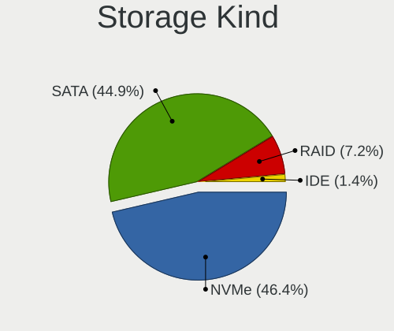

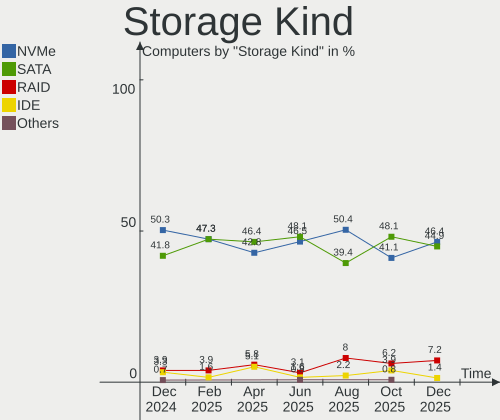

| Kind | Computers | Percent |
|------|-----------|---------|
| NVMe | 64        | 46.38%  |
| SATA | 62        | 44.93%  |
| RAID | 10        | 7.25%   |
| IDE  | 2         | 1.45%   |

Processor
---------

CPU Vendor
----------

Processor vendors

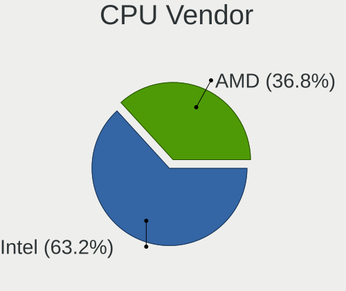

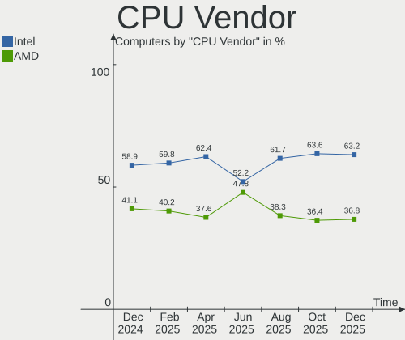

| Vendor | Computers | Percent |
|--------|-----------|---------|
| Intel  | 55        | 63.22%  |
| AMD    | 32        | 36.78%  |

CPU Model
---------

Processor models

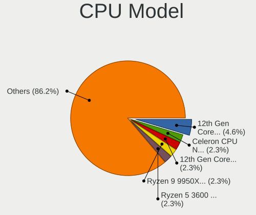

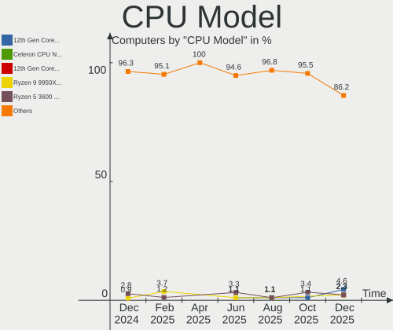

| Model                                         | Computers | Percent |
|-----------------------------------------------|-----------|---------|
| Intel 12th Gen Core i5-1235U                  | 4         | 4.6%    |
| Intel Celeron CPU N3350 @ 1.10GHz             | 2         | 2.3%    |
| Intel 12th Gen Core i3-1220P                  | 2         | 2.3%    |
| AMD Ryzen 9 9950X 16-Core Processor           | 2         | 2.3%    |
| AMD Ryzen 5 3600 6-Core Processor             | 2         | 2.3%    |
| AMD Ryzen 3 5300U with Radeon Graphics        | 2         | 2.3%    |
| AMD Ryzen 3 3200U with Radeon Vega Mobile Gfx | 2         | 2.3%    |
| Intel Xeon CPU E5-2690 v3 @ 2.60GHz           | 1         | 1.15%   |
| Intel Pentium CPU N3700 @ 1.60GHz             | 1         | 1.15%   |
| Intel N100                                    | 1         | 1.15%   |
| Intel Core Ultra 9 285HX                      | 1         | 1.15%   |
| Intel Core Ultra 9 285H                       | 1         | 1.15%   |
| Intel Core Ultra 9 275HX                      | 1         | 1.15%   |
| Intel Core Ultra 7 265K                       | 1         | 1.15%   |
| Intel Core Ultra 7 155H                       | 1         | 1.15%   |
| Intel Core i9-9940X CPU @ 3.30GHz             | 1         | 1.15%   |
| Intel Core i9-9900K CPU @ 3.60GHz             | 1         | 1.15%   |
| Intel Core i7-9750H CPU @ 2.60GHz             | 1         | 1.15%   |
| Intel Core i7-8550U CPU @ 1.80GHz             | 1         | 1.15%   |
| Intel Core i7-7500U CPU @ 2.70GHz             | 1         | 1.15%   |
| Intel Core i7-6700 CPU @ 3.40GHz              | 1         | 1.15%   |
| Intel Core i7-4790S CPU @ 3.20GHz             | 1         | 1.15%   |
| Intel Core i7-4790 CPU @ 3.60GHz              | 1         | 1.15%   |
| Intel Core i7-4702MQ CPU @ 2.20GHz            | 1         | 1.15%   |
| Intel Core i7-3612QM CPU @ 2.10GHz            | 1         | 1.15%   |
| Intel Core i7-14700KF                         | 1         | 1.15%   |
| Intel Core i7-10510U CPU @ 1.80GHz            | 1         | 1.15%   |
| Intel Core i5-8500 CPU @ 3.00GHz              | 1         | 1.15%   |
| Intel Core i5-8250U CPU @ 1.60GHz             | 1         | 1.15%   |
| Intel Core i5-7Y57 CPU @ 1.20GHz              | 1         | 1.15%   |
| Intel Core i5-7300U CPU @ 2.60GHz             | 1         | 1.15%   |
| Intel Core i5-6300HQ CPU @ 2.30GHz            | 1         | 1.15%   |
| Intel Core i5-4260U CPU @ 1.40GHz             | 1         | 1.15%   |
| Intel Core i5-3470 CPU @ 3.20GHz              | 1         | 1.15%   |
| Intel Core i5-2400 CPU @ 3.10GHz              | 1         | 1.15%   |
| Intel Core i5-10400F CPU @ 2.90GHz            | 1         | 1.15%   |
| Intel Core i3-4000M CPU @ 2.40GHz             | 1         | 1.15%   |
| Intel Core 2 Duo CPU T7100 @ 1.80GHz          | 1         | 1.15%   |
| Intel Core 2 Duo CPU P7550 @ 2.26GHz          | 1         | 1.15%   |
| Intel Celeron CPU N3450 @ 1.10GHz             | 1         | 1.15%   |

CPU Model Family
----------------

Processor model prefix

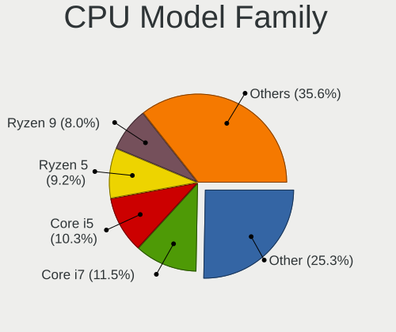

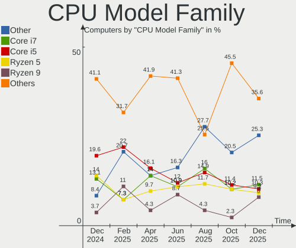

| Model                  | Computers | Percent |
|------------------------|-----------|---------|
| Other                  | 22        | 25.29%  |
| Intel Core i7          | 10        | 11.49%  |
| Intel Core i5          | 9         | 10.34%  |
| AMD Ryzen 5            | 8         | 9.2%    |
| AMD Ryzen 9            | 7         | 8.05%   |
| AMD Ryzen 7            | 7         | 8.05%   |
| Intel Core             | 5         | 5.75%   |
| Intel Celeron          | 4         | 4.6%    |
| AMD Ryzen 3            | 4         | 4.6%    |
| Intel Core i9          | 2         | 2.3%    |
| Intel Core 2 Duo       | 2         | 2.3%    |
| Intel Xeon             | 1         | 1.15%   |
| Intel Pentium          | 1         | 1.15%   |
| Intel Core i3          | 1         | 1.15%   |
| AMD Ryzen Threadripper | 1         | 1.15%   |
| AMD Ryzen 7 PRO        | 1         | 1.15%   |
| AMD Phenom             | 1         | 1.15%   |
| AMD A8                 | 1         | 1.15%   |

CPU Cores
---------

Number of processor cores

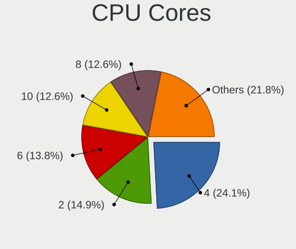

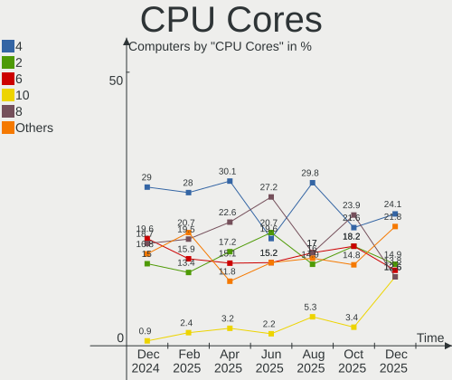

| Number | Computers | Percent |
|--------|-----------|---------|
| 4      | 21        | 24.14%  |
| 2      | 13        | 14.94%  |
| 6      | 12        | 13.79%  |
| 10     | 11        | 12.64%  |
| 8      | 11        | 12.64%  |
| 16     | 9         | 10.34%  |
| 14     | 3         | 3.45%   |
| 12     | 3         | 3.45%   |
| 24     | 2         | 2.3%    |
| 20     | 2         | 2.3%    |

CPU Sockets
-----------

Number of sockets

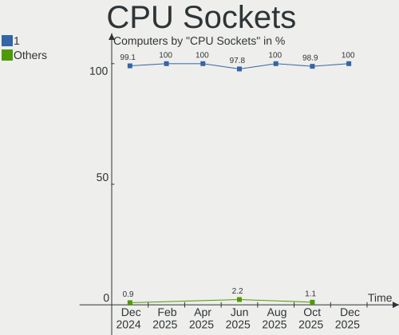

| Number | Computers | Percent |
|--------|-----------|---------|
| 1      | 87        | 100%    |

CPU Threads
-----------

Threads per core (Hyper-Threading)

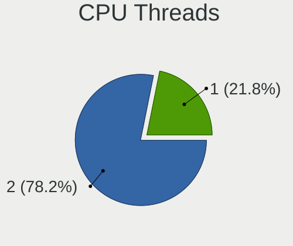

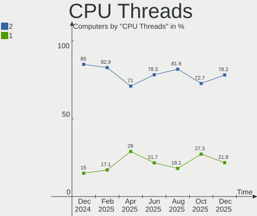

| Number | Computers | Percent |
|--------|-----------|---------|
| 2      | 68        | 78.16%  |
| 1      | 19        | 21.84%  |

CPU Op-Modes
------------

CPU Operation Modes (32-bit, 64-bit)

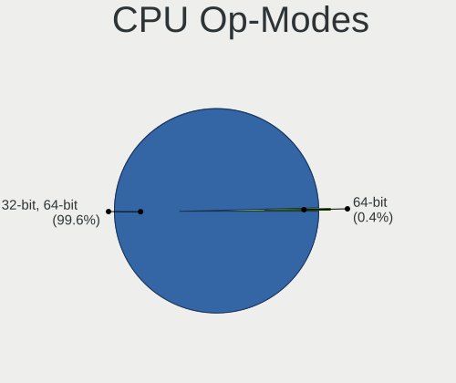

| Op mode        | Computers | Percent |
|----------------|-----------|---------|
| 32-bit, 64-bit | 87        | 100%    |

CPU Microcode
-------------

Microcode number

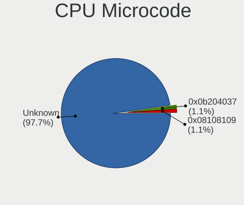

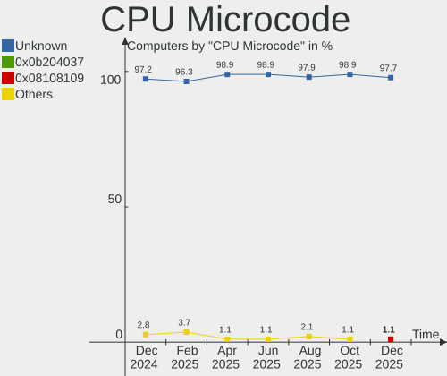

| Number     | Computers | Percent |
|------------|-----------|---------|
| Unknown    | 85        | 97.7%   |
| 0x0b204037 | 1         | 1.15%   |
| 0x08108109 | 1         | 1.15%   |

CPU Microarch
-------------

Microarchitecture

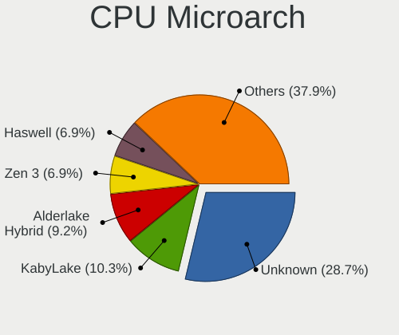

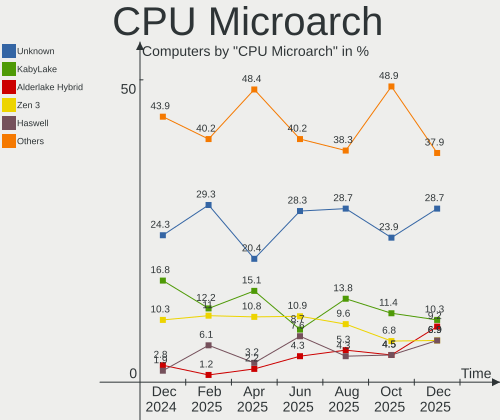

| Name              | Computers | Percent |
|-------------------|-----------|---------|
| Unknown           | 25        | 28.74%  |
| KabyLake          | 9         | 10.34%  |
| Alderlake Hybrid  | 8         | 9.2%    |
| Zen 3             | 6         | 6.9%    |
| Haswell           | 6         | 6.9%    |
| Zen+              | 5         | 5.75%   |
| Zen 2             | 3         | 3.45%   |
| TigerLake         | 3         | 3.45%   |
| Skylake           | 3         | 3.45%   |
| Lunarlake Hybrid  | 3         | 3.45%   |
| Goldmont          | 3         | 3.45%   |
| Silvermont        | 2         | 2.3%    |
| IvyBridge         | 2         | 2.3%    |
| Zen               | 1         | 1.15%   |
| SandyBridge       | 1         | 1.15%   |
| Puma              | 1         | 1.15%   |
| Penryn            | 1         | 1.15%   |
| Meteorlake Hybrid | 1         | 1.15%   |
| K10               | 1         | 1.15%   |
| Icelake           | 1         | 1.15%   |
| Core              | 1         | 1.15%   |
| CometLake         | 1         | 1.15%   |

Graphics
--------

GPU Vendor
----------

Vendors of graphics cards

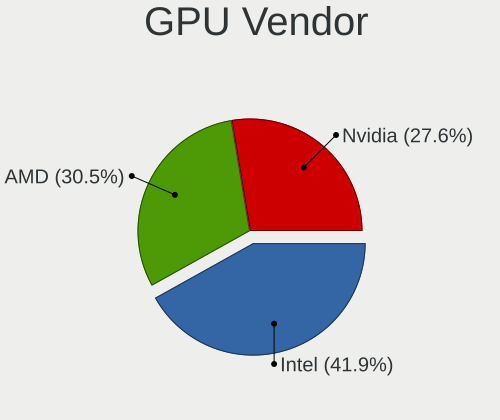

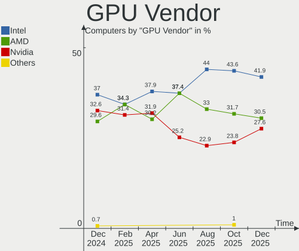

| Vendor | Computers | Percent |
|--------|-----------|---------|
| Intel  | 44        | 41.9%   |
| AMD    | 32        | 30.48%  |
| Nvidia | 29        | 27.62%  |

GPU Model
---------

Graphics card models

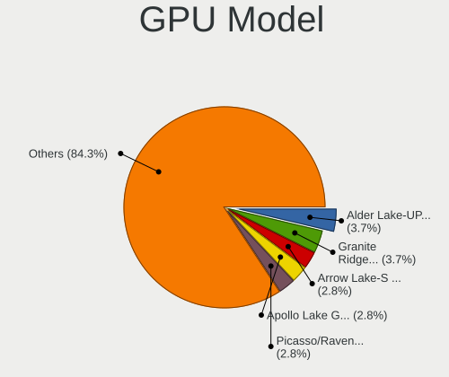

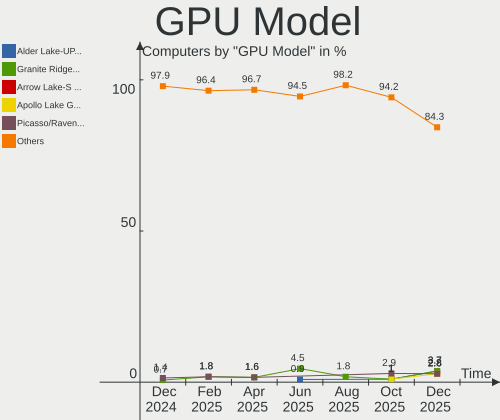

| Model                                                                                    | Computers | Percent |
|------------------------------------------------------------------------------------------|-----------|---------|
| Intel Alder Lake-UP3 GT2 [Iris Xe Graphics]                                              | 4         | 3.7%    |
| AMD Granite Ridge [Radeon Graphics]                                                      | 4         | 3.7%    |
| Intel Arrow Lake-S [Intel Graphics]                                                      | 3         | 2.78%   |
| Intel Apollo Lake GT1 [HD Graphics 500]                                                  | 3         | 2.78%   |
| AMD Picasso/Raven 2 [Radeon Vega Series / Radeon Vega Mobile Series]                     | 3         | 2.78%   |
| AMD Lucienne                                                                             | 3         | 2.78%   |
| Nvidia GB205 [GeForce RTX 5070]                                                          | 2         | 1.85%   |
| Nvidia AD103 [GeForce RTX 4080 SUPER]                                                    | 2         | 1.85%   |
| Intel TigerLake-LP GT2 [Iris Xe Graphics]                                                | 2         | 1.85%   |
| Intel TigerLake-H GT1 [UHD Graphics]                                                     | 2         | 1.85%   |
| Intel Raptor Lake-P [Iris Xe Graphics]                                                   | 2         | 1.85%   |
| Intel Kaby Lake-U GT2 [HD Graphics 620]                                                  | 2         | 1.85%   |
| Intel Kaby Lake-R GT2 [UHD Graphics 620]                                                 | 2         | 1.85%   |
| Intel CoffeeLake-S GT2 [UHD Graphics 630]                                                | 2         | 1.85%   |
| Intel Atom/Celeron/Pentium Processor x5-E8000/J3xxx/N3xxx Integrated Graphics Controller | 2         | 1.85%   |
| Intel Alder Lake-UP3 GT1 [UHD Graphics]                                                  | 2         | 1.85%   |
| Intel 4th Gen Core Processor Integrated Graphics Controller                              | 2         | 1.85%   |
| AMD Raphael                                                                              | 2         | 1.85%   |
| AMD Curacao PRO [Radeon R7 370 / R9 270/370 OEM]                                         | 2         | 1.85%   |
| Nvidia TU116 [GeForce GTX 1660 Ti]                                                       | 1         | 0.93%   |
| Nvidia TU106 [GeForce RTX 2060 Rev. A]                                                   | 1         | 0.93%   |
| Nvidia TU104BM [GeForce RTX 2080 Mobile]                                                 | 1         | 0.93%   |
| Nvidia GP106 [GeForce GTX 1060 6GB]                                                      | 1         | 0.93%   |
| Nvidia GM204M [GeForce GTX 980 Mobile]                                                   | 1         | 0.93%   |
| Nvidia GM204M [GeForce GTX 960 OEM / 970M]                                               | 1         | 0.93%   |
| Nvidia GM107M [GeForce GTX 950M]                                                         | 1         | 0.93%   |
| Nvidia GM107GL [Quadro K620]                                                             | 1         | 0.93%   |
| Nvidia GK208B [GeForce GT 710]                                                           | 1         | 0.93%   |
| Nvidia GB206 [GeForce RTX 5060]                                                          | 1         | 0.93%   |
| Nvidia GB205M [GeForce RTX 5070 Ti Mobile]                                               | 1         | 0.93%   |
| Nvidia GB203M / GN22-X11 [GeForce RTX 5090 Max-Q / Mobile]                               | 1         | 0.93%   |
| Nvidia GB203M / GN22 [GeForce RTX 5090 Max-Q / Mobile]                                   | 1         | 0.93%   |
| Nvidia GB203GLM [RTX PRO 5000 Blackwell Generation Laptop GPU]                           | 1         | 0.93%   |
| Nvidia GA107M [GeForce RTX 3050 Mobile]                                                  | 1         | 0.93%   |
| Nvidia GA107M [GeForce RTX 2050]                                                         | 1         | 0.93%   |
| Nvidia GA107BM / GN20-P0-R-K2 [GeForce RTX 3050 6GB Laptop GPU]                          | 1         | 0.93%   |
| Nvidia GA106M [GeForce RTX 3060 Mobile / Max-Q]                                          | 1         | 0.93%   |
| Nvidia GA106 [GeForce RTX 3060 Lite Hash Rate]                                           | 1         | 0.93%   |
| Nvidia GA104 [GeForce RTX 3070]                                                          | 1         | 0.93%   |
| Nvidia GA104 [GeForce RTX 3060 Ti Lite Hash Rate]                                        | 1         | 0.93%   |

GPU Combo
---------

Combinations of graphics cards

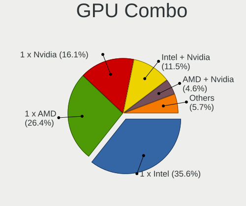

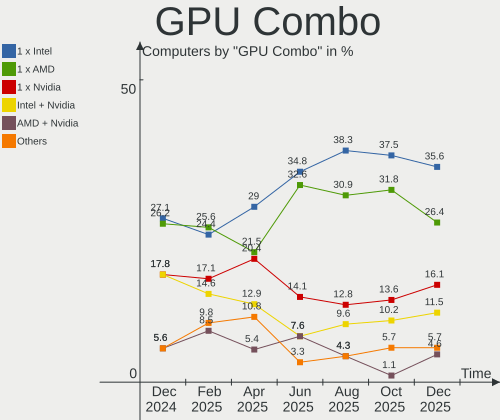

| Name             | Computers | Percent |
|------------------|-----------|---------|
| 1 x Intel        | 31        | 35.63%  |
| 1 x AMD          | 23        | 26.44%  |
| 1 x Nvidia       | 14        | 16.09%  |
| Intel + Nvidia   | 10        | 11.49%  |
| AMD + Nvidia     | 4         | 4.6%    |
| Intel + AMD      | 3         | 3.45%   |
| 2 x AMD          | 1         | 1.15%   |
| AMD + 2 x Nvidia | 1         | 1.15%   |

GPU Driver
----------

Free vs proprietary

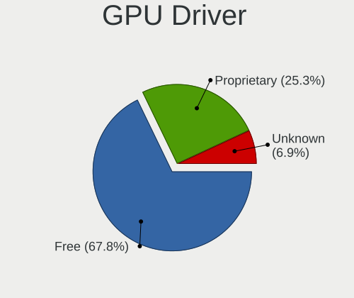

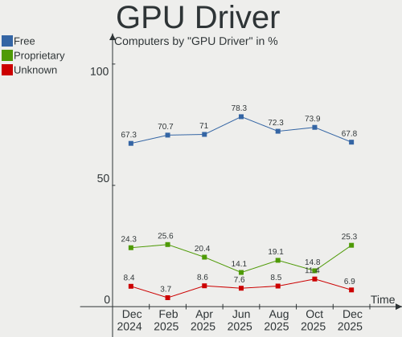

| Driver      | Computers | Percent |
|-------------|-----------|---------|
| Free        | 59        | 67.82%  |
| Proprietary | 22        | 25.29%  |
| Unknown     | 6         | 6.9%    |

GPU Memory
----------

Total video memory

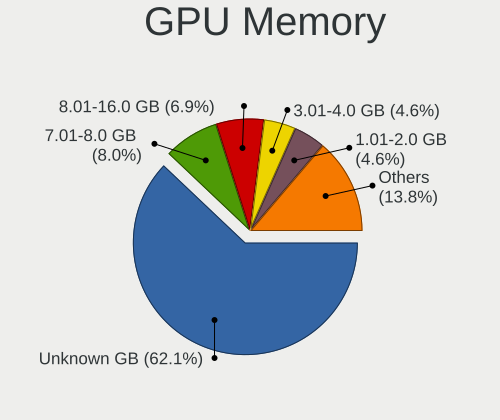

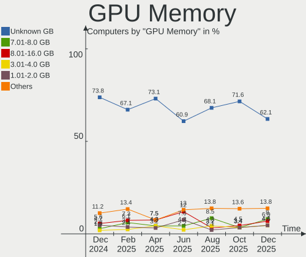

| Size in GB | Computers | Percent |
|------------|-----------|---------|
| Unknown    | 54        | 62.07%  |
| 7.01-8.0   | 7         | 8.05%   |
| 8.01-16.0  | 6         | 6.9%    |
| 3.01-4.0   | 4         | 4.6%    |
| 1.01-2.0   | 4         | 4.6%    |
| 5.01-6.0   | 3         | 3.45%   |
| 0.51-1.0   | 3         | 3.45%   |
| 0.01-0.5   | 3         | 3.45%   |
| 24.01-32.0 | 1         | 1.15%   |
| 2.01-3.0   | 1         | 1.15%   |
| 16.01-24.0 | 1         | 1.15%   |

Monitor
-------

Monitor Vendor
--------------

Monitor vendors

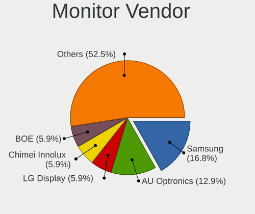

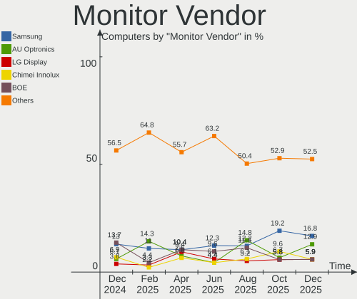

| Vendor               | Computers | Percent |
|----------------------|-----------|---------|
| Samsung Electronics  | 17        | 16.83%  |
| AU Optronics         | 13        | 12.87%  |
| LG Display           | 6         | 5.94%   |
| Chimei Innolux       | 6         | 5.94%   |
| BOE                  | 6         | 5.94%   |
| Lenovo               | 5         | 4.95%   |
| Goldstar             | 5         | 4.95%   |
| ViewSonic            | 4         | 3.96%   |
| Dell                 | 4         | 3.96%   |
| Unknown              | 3         | 2.97%   |
| MSI                  | 3         | 2.97%   |
| Iiyama               | 3         | 2.97%   |
| CSOT                 | 3         | 2.97%   |
| Apple                | 3         | 2.97%   |
| Ancor Communications | 3         | 2.97%   |
| Sony                 | 2         | 1.98%   |
| Philips              | 2         | 1.98%   |
| AOC                  | 2         | 1.98%   |
| ___                  | 1         | 0.99%   |
| Sharp                | 1         | 0.99%   |
| NEC Computers        | 1         | 0.99%   |
| Kogan                | 1         | 0.99%   |
| HUAWEI               | 1         | 0.99%   |
| HIC                  | 1         | 0.99%   |
| Fujitsu Siemens      | 1         | 0.99%   |
| Eizo                 | 1         | 0.99%   |
| DENON                | 1         | 0.99%   |
| ASUSTek Computer     | 1         | 0.99%   |
| Acer                 | 1         | 0.99%   |

Monitor Model
-------------

Monitor models

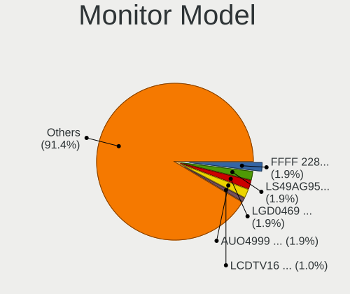

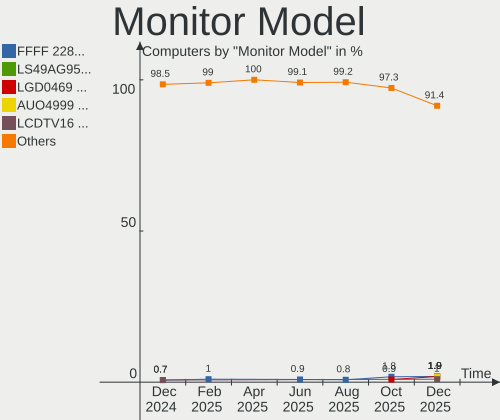

| Model                                                                 | Computers | Percent |
|-----------------------------------------------------------------------|-----------|---------|
| Unknown LCD Monitor FFFF 2288x1287 2550x2550mm 142.0-inch             | 2         | 1.9%    |
| Samsung Electronics LS49AG95 SAM71AC 3840x1080 1190x340mm 48.7-inch   | 2         | 1.9%    |
| LG Display LCD Monitor LGD0469 1920x1080 382x215mm 17.3-inch          | 2         | 1.9%    |
| AU Optronics LCD Monitor AUO4999 1920x1080 344x193mm 15.5-inch        | 2         | 1.9%    |
| ___ LCDTV16 ___3393 1920x1080                                         | 1         | 0.95%   |
| ViewSonic VX2450 SERIES VSCE226 1920x1080 525x297mm 23.7-inch         | 1         | 0.95%   |
| ViewSonic VP3481a VSCB13A 3440x1440 797x333mm 34.0-inch               | 1         | 0.95%   |
| ViewSonic VG2448 VSC3B35 1920x1080 527x296mm 23.8-inch                | 1         | 0.95%   |
| ViewSonic VA2759 Series VSC6832 1920x1080 598x336mm 27.0-inch         | 1         | 0.95%   |
| Unknown LCDTV16 3393 1920x1080 1600x900mm 72.3-inch                   | 1         | 0.95%   |
| Sony TV SNYA401 1920x1080                                             | 1         | 0.95%   |
| Sony TV *00 SNY3F05 3840x2160 1218x685mm 55.0-inch                    | 1         | 0.95%   |
| Sharp LQ123P1JX32 SHP148A 2400x1600 259x173mm 12.3-inch               | 1         | 0.95%   |
| Samsung Electronics U28E590 SAM0C4C 3840x2160 608x345mm 27.5-inch     | 1         | 0.95%   |
| Samsung Electronics S39C SAM7308 1920x1080 609x349mm 27.6-inch        | 1         | 0.95%   |
| Samsung Electronics S27F350 SAM0D22 1920x1080 598x336mm 27.0-inch     | 1         | 0.95%   |
| Samsung Electronics S24F350 SAM0D20 1920x1080 521x293mm 23.5-inch     | 1         | 0.95%   |
| Samsung Electronics S22F350 SAM0D1A 1920x1080 477x268mm 21.5-inch     | 1         | 0.95%   |
| Samsung Electronics LU28R55 SAM1015 3840x2160 632x360mm 28.6-inch     | 1         | 0.95%   |
| Samsung Electronics LF24T35 SAM707E 1920x1080 528x297mm 23.9-inch     | 1         | 0.95%   |
| Samsung Electronics LCD Monitor SDC4208 1920x1200 302x189mm 14.0-inch | 1         | 0.95%   |
| Samsung Electronics LCD Monitor SDC419F 2880x1800 302x189mm 14.0-inch | 1         | 0.95%   |
| Samsung Electronics LCD Monitor SDC4188 2880x1800 312x195mm 14.5-inch | 1         | 0.95%   |
| Samsung Electronics LCD Monitor SDC324C 1920x1080 344x194mm 15.5-inch | 1         | 0.95%   |
| Samsung Electronics C49RG9x SAM0F9C 3360x1440 1193x336mm 48.8-inch    | 1         | 0.95%   |
| Samsung Electronics C49RG9x SAM0F9B 1760x1440                         | 1         | 0.95%   |
| Samsung Electronics C32R50x SAM7000 1920x1080 698x393mm 31.5-inch     | 1         | 0.95%   |
| Samsung Electronics C27F390 SAM0D32 1920x1080 598x336mm 27.0-inch     | 1         | 0.95%   |
| Samsung Electronics ATNA60HU02-0  SDC421B                             | 1         | 0.95%   |
| Samsung Electronics ATNA60HU01-0  SDC420B                             | 1         | 0.95%   |
| Philips PHL 276B1 PHL0947 2560x1440 600x340mm 27.2-inch               | 1         | 0.95%   |
| Philips PHL 221S8L PHL091C 1920x1080 477x268mm 21.5-inch              | 1         | 0.95%   |
| NEC Computers EA244WMi NEC68D7 1920x1200 519x324mm 24.1-inch          | 1         | 0.95%   |
| MSI Optix MAG27CQ MSI1462 2560x1440 597x336mm 27.0-inch               | 1         | 0.95%   |
| MSI MP242 MSI30A1 1920x1080 527x296mm 23.8-inch                       | 1         | 0.95%   |
| MSI MAG 256F MSI3BC1 1920x1080 543x302mm 24.5-inch                    | 1         | 0.95%   |
| LG Display LCD Monitor LGD065A 1920x1080 344x194mm 15.5-inch          | 1         | 0.95%   |
| LG Display LCD Monitor LGD05F6 1920x1080 309x174mm 14.0-inch          | 1         | 0.95%   |
| LG Display LCD Monitor LGD0590 1920x1080 344x194mm 15.5-inch          | 1         | 0.95%   |
| LG Display LCD Monitor LGD0493 1366x768 344x194mm 15.5-inch           | 1         | 0.95%   |

Monitor Resolution
------------------

Monitor screen resolution

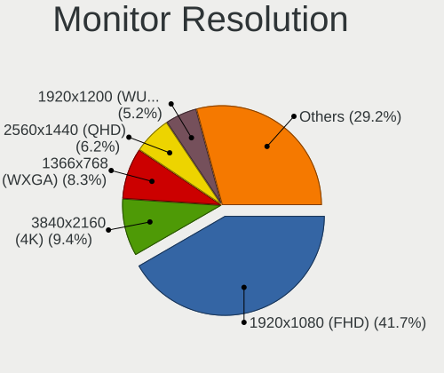

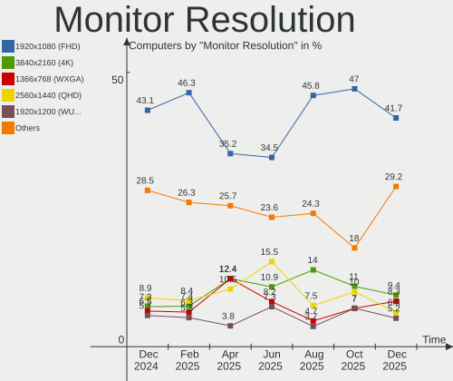

| Resolution         | Computers | Percent |
|--------------------|-----------|---------|
| 1920x1080 (FHD)    | 40        | 41.67%  |
| 3840x2160 (4K)     | 9         | 9.38%   |
| 1366x768 (WXGA)    | 8         | 8.33%   |
| 2560x1440 (QHD)    | 6         | 6.25%   |
| 1920x1200 (WUXGA)  | 5         | 5.21%   |
| 2880x1800          | 4         | 4.17%   |
| 3840x1080          | 3         | 3.13%   |
| 3440x1440          | 3         | 3.13%   |
| 3840x2400          | 2         | 2.08%   |
| 2560x1600          | 2         | 2.08%   |
| 2288x1287          | 2         | 2.08%   |
| 1440x900 (WXGA+)   | 2         | 2.08%   |
| 1280x800 (WXGA)    | 2         | 2.08%   |
| Unknown            | 2         | 2.08%   |
| 3840x1600          | 1         | 1.04%   |
| 2880x1920          | 1         | 1.04%   |
| 2560x1080          | 1         | 1.04%   |
| 2400x1600          | 1         | 1.04%   |
| 1680x1050 (WSXGA+) | 1         | 1.04%   |
| 1600x900 (HD+)     | 1         | 1.04%   |

Monitor Diagonal
----------------

Diagonal size in inches

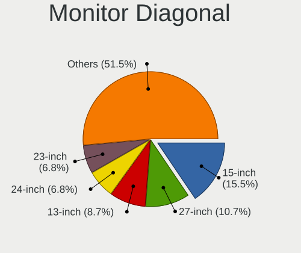

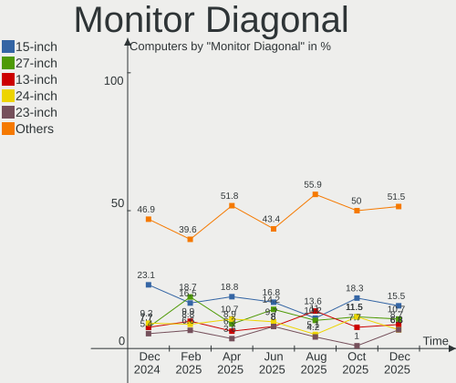

| Inches  | Computers | Percent |
|---------|-----------|---------|
| 15      | 16        | 15.53%  |
| 27      | 11        | 10.68%  |
| 13      | 9         | 8.74%   |
| 24      | 7         | 6.8%    |
| 23      | 7         | 6.8%    |
| 14      | 7         | 6.8%    |
| 34      | 5         | 4.85%   |
| 31      | 5         | 4.85%   |
| 16      | 4         | 3.88%   |
| 48      | 3         | 2.91%   |
| 21      | 3         | 2.91%   |
| 18      | 3         | 2.91%   |
| 17      | 3         | 2.91%   |
| Unknown | 3         | 2.91%   |
| 142     | 2         | 1.94%   |
| 72      | 2         | 1.94%   |
| 12      | 2         | 1.94%   |
| 11      | 2         | 1.94%   |
| 85      | 1         | 0.97%   |
| 64      | 1         | 0.97%   |
| 40      | 1         | 0.97%   |
| 37      | 1         | 0.97%   |
| 29      | 1         | 0.97%   |
| 28      | 1         | 0.97%   |
| 26      | 1         | 0.97%   |
| 22      | 1         | 0.97%   |
| 19      | 1         | 0.97%   |

Monitor Width
-------------

Physical width

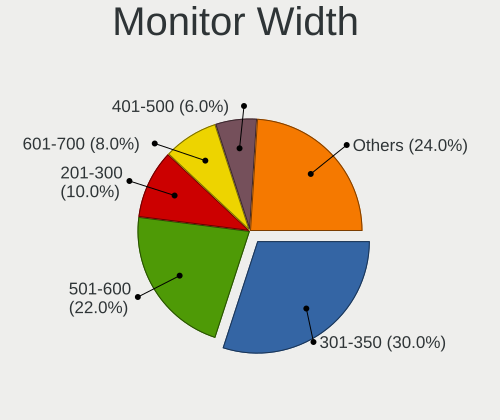

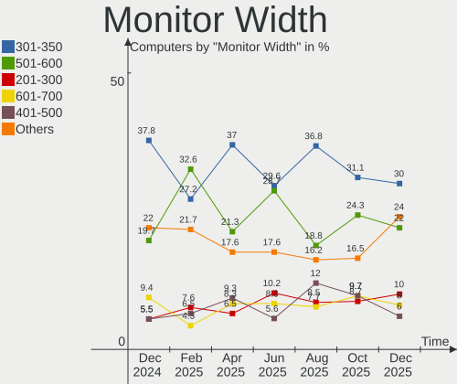

| Width in mm    | Computers | Percent |
|----------------|-----------|---------|
| 301-350        | 30        | 30%     |
| 501-600        | 22        | 22%     |
| 201-300        | 10        | 10%     |
| 601-700        | 8         | 8%      |
| 401-500        | 6         | 6%      |
| 701-800        | 5         | 5%      |
| 351-400        | 5         | 5%      |
| 1001-1500      | 4         | 4%      |
| 1501-2000      | 3         | 3%      |
| Unknown        | 3         | 3%      |
| More than 2000 | 2         | 2%      |
| 801-900        | 2         | 2%      |

Aspect Ratio
------------

Proportional relationship between the width and the height

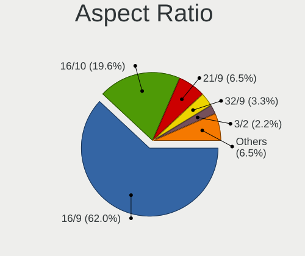

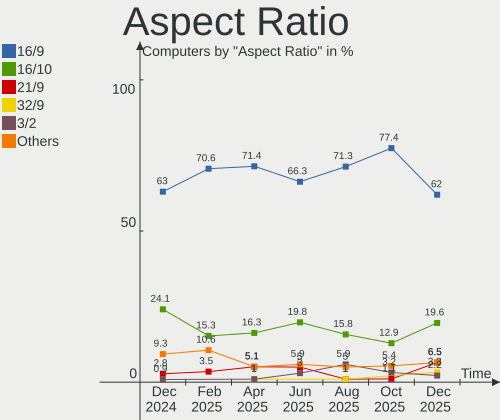

| Ratio   | Computers | Percent |
|---------|-----------|---------|
| 16/9    | 57        | 61.96%  |
| 16/10   | 18        | 19.57%  |
| 21/9    | 6         | 6.52%   |
| 32/9    | 3         | 3.26%   |
| 3/2     | 2         | 2.17%   |
| 1.00    | 2         | 2.17%   |
| Unknown | 2         | 2.17%   |
| 4/3     | 1         | 1.09%   |
| 0.79    | 1         | 1.09%   |

Monitor Area
------------

Area in inch²

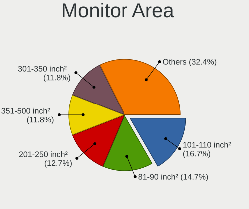

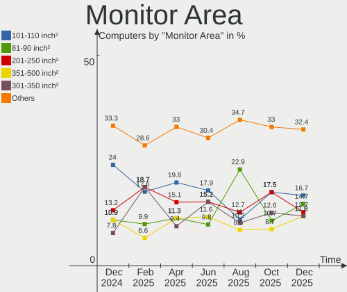

| Area in inch² | Computers | Percent |
|----------------|-----------|---------|
| 101-110        | 17        | 16.67%  |
| 81-90          | 15        | 14.71%  |
| 201-250        | 13        | 12.75%  |
| 351-500        | 12        | 11.76%  |
| 301-350        | 12        | 11.76%  |
| More than 1000 | 6         | 5.88%   |
| 501-1000       | 5         | 4.9%    |
| 251-300        | 4         | 3.92%   |
| 111-120        | 3         | 2.94%   |
| Unknown        | 3         | 2.94%   |
| 71-80          | 2         | 1.96%   |
| 51-60          | 2         | 1.96%   |
| 151-200        | 2         | 1.96%   |
| 141-150        | 2         | 1.96%   |
| 121-130        | 2         | 1.96%   |
| 61-70          | 1         | 0.98%   |
| 131-140        | 1         | 0.98%   |

Pixel Density
-------------

Pixels per inch

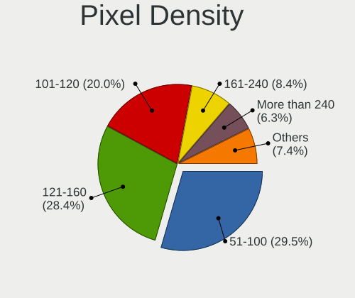

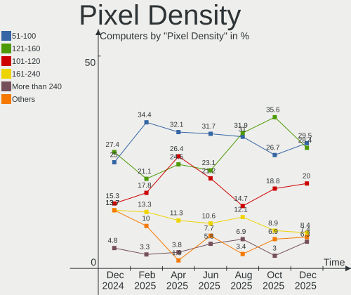

| Density       | Computers | Percent |
|---------------|-----------|---------|
| 51-100        | 28        | 29.47%  |
| 121-160       | 27        | 28.42%  |
| 101-120       | 19        | 20%     |
| 161-240       | 8         | 8.42%   |
| More than 240 | 6         | 6.32%   |
| 1-50          | 4         | 4.21%   |
| Unknown       | 3         | 3.16%   |

Multiple Monitors
-----------------

Total monitors connected

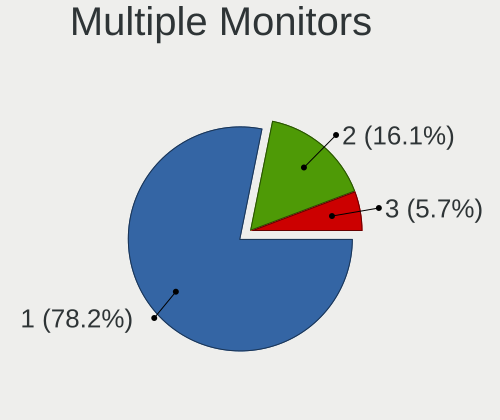

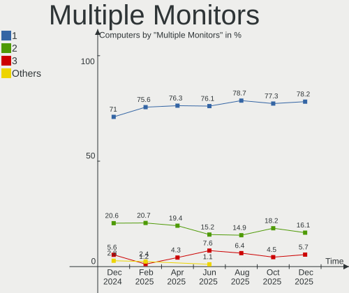

| Total | Computers | Percent |
|-------|-----------|---------|
| 1     | 68        | 78.16%  |
| 2     | 14        | 16.09%  |
| 3     | 5         | 5.75%   |

Network
-------

Net Controller Vendor
---------------------

Controller vendors

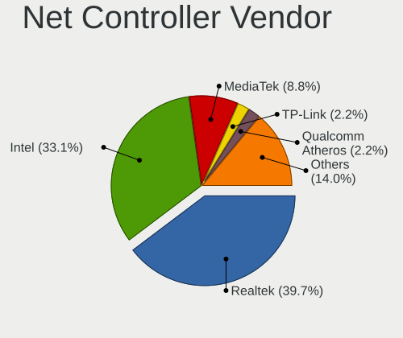

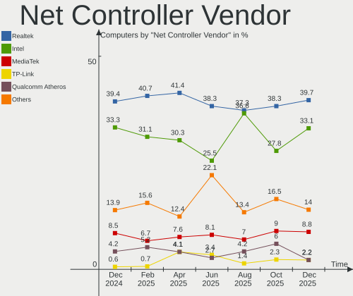

| Vendor                | Computers | Percent |
|-----------------------|-----------|---------|
| Realtek Semiconductor | 54        | 39.71%  |
| Intel                 | 45        | 33.09%  |
| MediaTek              | 12        | 8.82%   |
| TP-Link               | 3         | 2.21%   |
| Qualcomm Atheros      | 3         | 2.21%   |
| Broadcom              | 3         | 2.21%   |
| ASIX Electronics      | 3         | 2.21%   |
| Ralink Technology     | 2         | 1.47%   |
| Aquantia              | 2         | 1.47%   |
| Samsung Electronics   | 1         | 0.74%   |
| Qualcomm Technologies | 1         | 0.74%   |
| Qualcomm              | 1         | 0.74%   |
| OPPO Electronics      | 1         | 0.74%   |
| Nvidia                | 1         | 0.74%   |
| NetGear               | 1         | 0.74%   |
| ICS Advent            | 1         | 0.74%   |
| Broadcom Limited      | 1         | 0.74%   |
| aicsemi               | 1         | 0.74%   |

Net Controller Model
--------------------

Controller models

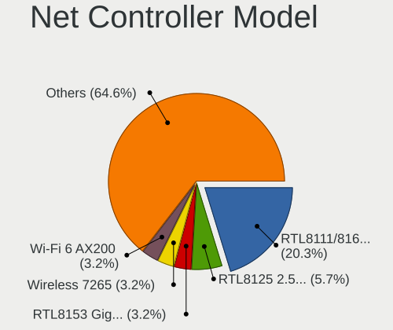

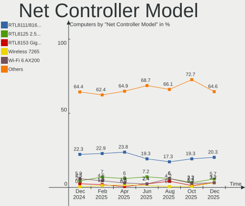

| Model                                                                           | Computers | Percent |
|---------------------------------------------------------------------------------|-----------|---------|
| Realtek RTL8111/8168/8211/8411 PCI Express Gigabit Ethernet Controller          | 32        | 20.25%  |
| Realtek RTL8125 2.5GbE Controller                                               | 9         | 5.7%    |
| Realtek RTL8153 Gigabit Ethernet Adapter                                        | 5         | 3.16%   |
| Intel Wireless 7265                                                             | 5         | 3.16%   |
| Intel Wi-Fi 6 AX200                                                             | 5         | 3.16%   |
| Intel Ethernet Controller I226-V                                                | 5         | 3.16%   |
| Realtek RTL8822CE 802.11ac PCIe Wireless Network Adapter                        | 4         | 2.53%   |
| Realtek RTL8821CE 802.11ac PCIe Wireless Network Adapter                        | 4         | 2.53%   |
| Realtek RTL810xE PCI Express Fast Ethernet controller                           | 3         | 1.9%    |
| MediaTek MT7922 802.11ax PCI Express Wireless Network Adapter                   | 3         | 1.9%    |
| MediaTek MT7921 802.11ax PCIe Wireless Network Adapter [Filogic 330]            | 3         | 1.9%    |
| Intel Wireless 8260                                                             | 3         | 1.9%    |
| ASIX AX88179 Gigabit Ethernet                                                   | 3         | 1.9%    |
| Realtek RTL8852BE PCIe 802.11ax Wireless Network Controller                     | 2         | 1.27%   |
| MediaTek MT7925 802.11be 160MHz 2x2 PCIe Wireless Network Adapter [Filogic 360] | 2         | 1.27%   |
| Intel Wireless 8265 / 8275                                                      | 2         | 1.27%   |
| Intel Wi-Fi 7(802.11be) AX1775*/AX1790*/BE20*/BE401/BE1750* 2x2                 | 2         | 1.27%   |
| Intel Wi-Fi 6 AX201                                                             | 2         | 1.27%   |
| Intel Raptor Lake PCH CNVi WiFi                                                 | 2         | 1.27%   |
| Intel I211 Gigabit Network Connection                                           | 2         | 1.27%   |
| Intel Alder Lake-P PCH CNVi WiFi                                                | 2         | 1.27%   |
| Intel 700 Series Chipset CNVi WiFi                                              | 2         | 1.27%   |
| Aquantia AQtion AQC107 NBase-T/IEEE 802.3an Ethernet Controller [Atlantic 10G]  | 2         | 1.27%   |
| TP-Link TL-WN823N v2/v3 [Realtek RTL8192EU]                                     | 1         | 0.63%   |
| TP-Link Archer T3U [Realtek RTL8812BU]                                          | 1         | 0.63%   |
| TP-Link 802.11ac NIC                                                            | 1         | 0.63%   |
| Samsung GT-I9070 (network tethering, USB debugging enabled)                     | 1         | 0.63%   |
| Realtek USB 10/100/1G/2.5 LAN                                                   | 1         | 0.63%   |
| Realtek RTL8922AE 802.11be PCIe Wireless Network Adapter                        | 1         | 0.63%   |
| Realtek RTL88x2bu [AC1200 Techkey]                                              | 1         | 0.63%   |
| Realtek RTL8188EE Wireless Network Adapter                                      | 1         | 0.63%   |
| Realtek RTL8169 PCI Gigabit Ethernet Controller                                 | 1         | 0.63%   |
| Realtek RTL8126 5GbE Controller                                                 | 1         | 0.63%   |
| Realtek Killer E3000 2.5GbE Controller                                          | 1         | 0.63%   |
| Ralink RT5372 Wireless Adapter                                                  | 1         | 0.63%   |
| Ralink RT5370 Wireless Adapter                                                  | 1         | 0.63%   |
| Qualcomm WCN785x Wi-Fi 7(802.11be) 320MHz 2x2 [FastConnect 7800]                | 1         | 0.63%   |
| Qualcomm QCNFA765 Wireless Network Adapter                                      | 1         | 0.63%   |
| Qualcomm Atheros QCA9565 / AR9565 Wireless Network Adapter                      | 1         | 0.63%   |
| Qualcomm Atheros QCA6174 802.11ac Wireless Network Adapter                      | 1         | 0.63%   |

Wireless Vendor
---------------

Wireless vendors

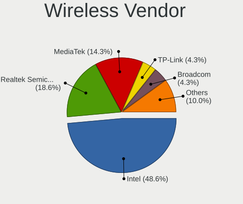

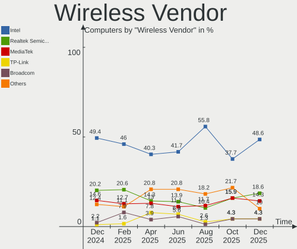

| Vendor                | Computers | Percent |
|-----------------------|-----------|---------|
| Intel                 | 34        | 48.57%  |
| Realtek Semiconductor | 13        | 18.57%  |
| MediaTek              | 10        | 14.29%  |
| TP-Link               | 3         | 4.29%   |
| Broadcom              | 3         | 4.29%   |
| Ralink Technology     | 2         | 2.86%   |
| Qualcomm Atheros      | 2         | 2.86%   |
| Qualcomm              | 1         | 1.43%   |
| NetGear               | 1         | 1.43%   |
| Broadcom Limited      | 1         | 1.43%   |

Wireless Model
--------------

Wireless models

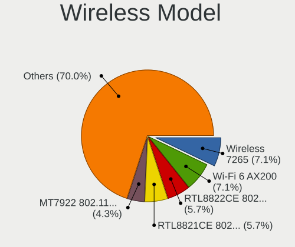

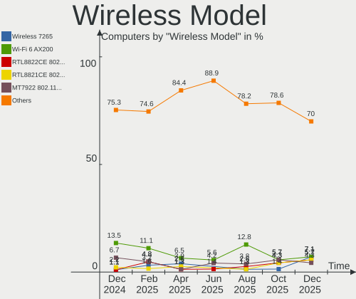

| Model                                                                           | Computers | Percent |
|---------------------------------------------------------------------------------|-----------|---------|
| Intel Wireless 7265                                                             | 5         | 7.14%   |
| Intel Wi-Fi 6 AX200                                                             | 5         | 7.14%   |
| Realtek RTL8822CE 802.11ac PCIe Wireless Network Adapter                        | 4         | 5.71%   |
| Realtek RTL8821CE 802.11ac PCIe Wireless Network Adapter                        | 4         | 5.71%   |
| MediaTek MT7922 802.11ax PCI Express Wireless Network Adapter                   | 3         | 4.29%   |
| MediaTek MT7921 802.11ax PCIe Wireless Network Adapter [Filogic 330]            | 3         | 4.29%   |
| Intel Wireless 8260                                                             | 3         | 4.29%   |
| Realtek RTL8852BE PCIe 802.11ax Wireless Network Controller                     | 2         | 2.86%   |
| Intel Wireless 8265 / 8275                                                      | 2         | 2.86%   |
| Intel Wi-Fi 7(802.11be) AX1775*/AX1790*/BE20*/BE401/BE1750* 2x2                 | 2         | 2.86%   |
| Intel Wi-Fi 6 AX201                                                             | 2         | 2.86%   |
| Intel Raptor Lake PCH CNVi WiFi                                                 | 2         | 2.86%   |
| Intel 700 Series Chipset CNVi WiFi                                              | 2         | 2.86%   |
| TP-Link TL-WN823N v2/v3 [Realtek RTL8192EU]                                     | 1         | 1.43%   |
| TP-Link Archer T3U [Realtek RTL8812BU]                                          | 1         | 1.43%   |
| TP-Link 802.11ac NIC                                                            | 1         | 1.43%   |
| Realtek RTL8922AE 802.11be PCIe Wireless Network Adapter                        | 1         | 1.43%   |
| Realtek RTL88x2bu [AC1200 Techkey]                                              | 1         | 1.43%   |
| Realtek RTL8188EE Wireless Network Adapter                                      | 1         | 1.43%   |
| Ralink RT5372 Wireless Adapter                                                  | 1         | 1.43%   |
| Ralink RT5370 Wireless Adapter                                                  | 1         | 1.43%   |
| Qualcomm QCNFA765 Wireless Network Adapter                                      | 1         | 1.43%   |
| Qualcomm Atheros QCA9565 / AR9565 Wireless Network Adapter                      | 1         | 1.43%   |
| Qualcomm Atheros QCA6174 802.11ac Wireless Network Adapter                      | 1         | 1.43%   |
| NetGear A6150                                                                   | 1         | 1.43%   |
| MediaTek MT7925 802.11be 160MHz 2x2 PCIe Wireless Network Adapter [Filogic 360] | 1         | 1.43%   |
| MediaTek MT7921K (RZ608) Wi-Fi 6E 80MHz                                         | 1         | 1.43%   |
| MediaTek MT7902 802.11ax PCIe Wireless Network Adapter [Filogic 310]            | 1         | 1.43%   |
| MediaTek MT7630e 802.11bgn Wireless Network Adapter                             | 1         | 1.43%   |
| Intel Wireless 3165                                                             | 1         | 1.43%   |
| Intel Wi-Fi 6E(802.11ax) AX210/AX1675* 2x2 [Typhoon Peak]                       | 1         | 1.43%   |
| Intel Wi-Fi 5(802.11ac) Wireless-AC 9x6x [Thunder Peak]                         | 1         | 1.43%   |
| Intel Tiger Lake PCH CNVi WiFi                                                  | 1         | 1.43%   |
| Intel PRO/Wireless 4965 AG or AGN [Kedron] Network Connection                   | 1         | 1.43%   |
| Intel Meteor Lake PCH CNVi WiFi                                                 | 1         | 1.43%   |
| Intel Dual Band Wireless-AC 3165 Plus Bluetooth                                 | 1         | 1.43%   |
| Intel Centrino Wireless-N 2230                                                  | 1         | 1.43%   |
| Intel Cannon Lake PCH CNVi WiFi                                                 | 1         | 1.43%   |
| Intel Alder Lake-P PCH CNVi WiFi                                                | 1         | 1.43%   |
| Intel Alder Lake-N PCH CNVi WiFi                                                | 1         | 1.43%   |

Ethernet Vendor
---------------

Ethernet vendors

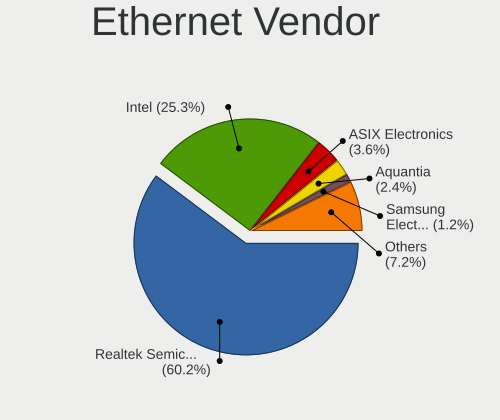

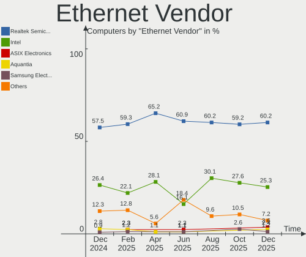

| Vendor                | Computers | Percent |
|-----------------------|-----------|---------|
| Realtek Semiconductor | 50        | 60.24%  |
| Intel                 | 21        | 25.3%   |
| ASIX Electronics      | 3         | 3.61%   |
| Aquantia              | 2         | 2.41%   |
| Samsung Electronics   | 1         | 1.2%    |
| Qualcomm Technologies | 1         | 1.2%    |
| Qualcomm Atheros      | 1         | 1.2%    |
| OPPO Electronics      | 1         | 1.2%    |
| Nvidia                | 1         | 1.2%    |
| MediaTek              | 1         | 1.2%    |
| ICS Advent            | 1         | 1.2%    |

Ethernet Model
--------------

Ethernet models

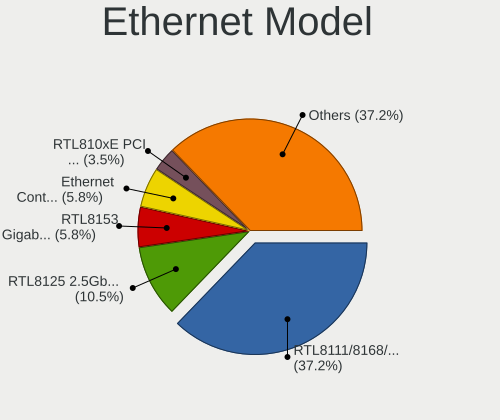

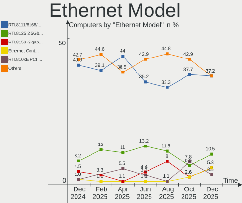

| Model                                                                           | Computers | Percent |
|---------------------------------------------------------------------------------|-----------|---------|
| Realtek RTL8111/8168/8211/8411 PCI Express Gigabit Ethernet Controller          | 32        | 37.21%  |
| Realtek RTL8125 2.5GbE Controller                                               | 9         | 10.47%  |
| Realtek RTL8153 Gigabit Ethernet Adapter                                        | 5         | 5.81%   |
| Intel Ethernet Controller I226-V                                                | 5         | 5.81%   |
| Realtek RTL810xE PCI Express Fast Ethernet controller                           | 3         | 3.49%   |
| ASIX AX88179 Gigabit Ethernet                                                   | 3         | 3.49%   |
| Intel I211 Gigabit Network Connection                                           | 2         | 2.33%   |
| Aquantia AQtion AQC107 NBase-T/IEEE 802.3an Ethernet Controller [Atlantic 10G]  | 2         | 2.33%   |
| Samsung GT-I9070 (network tethering, USB debugging enabled)                     | 1         | 1.16%   |
| Realtek USB 10/100/1G/2.5 LAN                                                   | 1         | 1.16%   |
| Realtek RTL8169 PCI Gigabit Ethernet Controller                                 | 1         | 1.16%   |
| Realtek RTL8126 5GbE Controller                                                 | 1         | 1.16%   |
| Realtek Killer E3000 2.5GbE Controller                                          | 1         | 1.16%   |
| Qualcomm WCN785x Wi-Fi 7(802.11be) 320MHz 2x2 [FastConnect 7800]                | 1         | 1.16%   |
| Qualcomm Atheros Killer E2400 Gigabit Ethernet Controller                       | 1         | 1.16%   |
| OPPO RMX3741                                                                    | 1         | 1.16%   |
| Nvidia MCP79 Ethernet                                                           | 1         | 1.16%   |
| MediaTek MT7925 802.11be 160MHz 2x2 PCIe Wireless Network Adapter [Filogic 360] | 1         | 1.16%   |
| Intel Ethernet Controller I226-LM                                               | 1         | 1.16%   |
| Intel Ethernet Controller I225-V                                                | 1         | 1.16%   |
| Intel Ethernet Connection I217-V                                                | 1         | 1.16%   |
| Intel Ethernet Connection I217-LM                                               | 1         | 1.16%   |
| Intel Ethernet Connection (7) I219-LM                                           | 1         | 1.16%   |
| Intel Ethernet Connection (4) I219-LM                                           | 1         | 1.16%   |
| Intel Ethernet Connection (2) I219-V                                            | 1         | 1.16%   |
| Intel Ethernet Connection (16) I219-V                                           | 1         | 1.16%   |
| Intel Ethernet Connection (14) I219-V                                           | 1         | 1.16%   |
| Intel Ethernet Connection (13) I219-LM                                          | 1         | 1.16%   |
| Intel Ethernet Connection (12) I219-V                                           | 1         | 1.16%   |
| Intel Arrow Lake CNVi WiFi                                                      | 1         | 1.16%   |
| Intel Alder Lake-P PCH CNVi WiFi                                                | 1         | 1.16%   |
| Intel 82579LM Gigabit Network Connection (Lewisville)                           | 1         | 1.16%   |
| ICS Advent 10/100M LAN                                                          | 1         | 1.16%   |

Net Controller Kind
-------------------

Ethernet, WiFi or modem

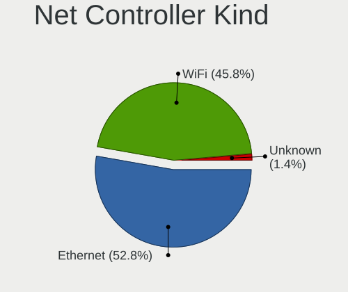

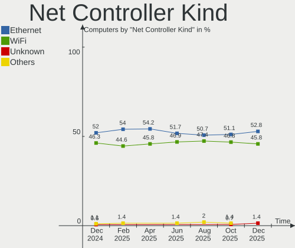

| Kind     | Computers | Percent |
|----------|-----------|---------|
| Ethernet | 76        | 52.78%  |
| WiFi     | 66        | 45.83%  |
| Unknown  | 2         | 1.39%   |

Used Controller
---------------

Currently used network controller

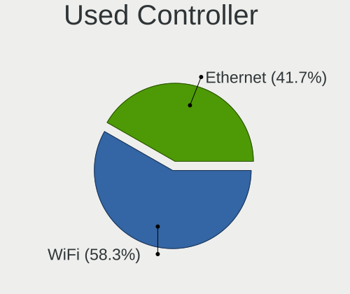

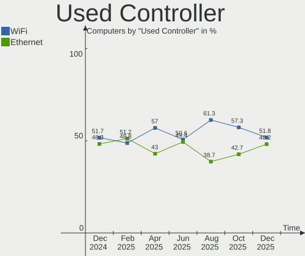

| Kind     | Computers | Percent |
|----------|-----------|---------|
| WiFi     | 44        | 51.76%  |
| Ethernet | 41        | 48.24%  |

NICs
----

Total network controllers on board

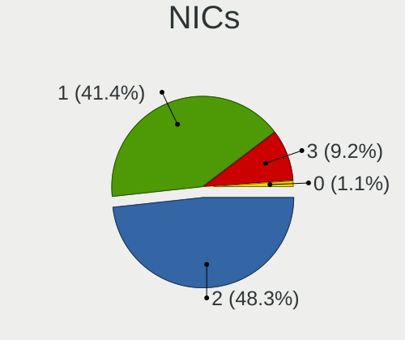

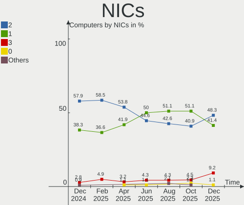

| Total | Computers | Percent |
|-------|-----------|---------|
| 2     | 42        | 48.28%  |
| 1     | 36        | 41.38%  |
| 3     | 8         | 9.2%    |
| 0     | 1         | 1.15%   |

IPv6
----

IPv6 vs IPv4

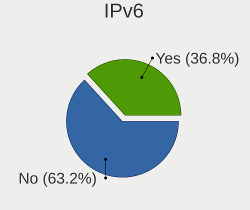

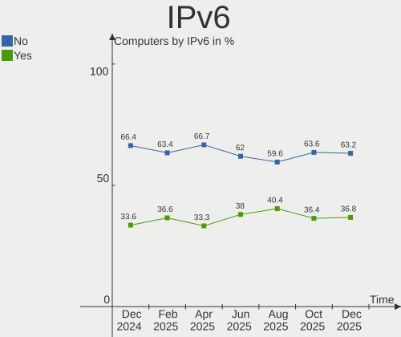

| Used | Computers | Percent |
|------|-----------|---------|
| No   | 55        | 63.22%  |
| Yes  | 32        | 36.78%  |

Bluetooth
---------

Bluetooth Vendor
----------------

Controller vendors

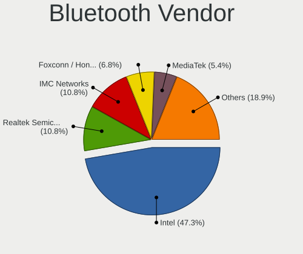

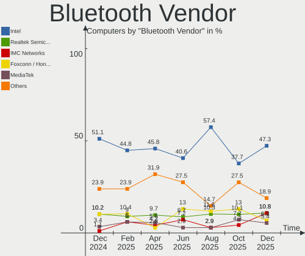

| Vendor                  | Computers | Percent |
|-------------------------|-----------|---------|
| Intel                   | 35        | 47.3%   |
| Realtek Semiconductor   | 8         | 10.81%  |
| IMC Networks            | 8         | 10.81%  |
| Foxconn / Hon Hai       | 5         | 6.76%   |
| MediaTek                | 4         | 5.41%   |
| Broadcom                | 3         | 4.05%   |
| Lite-On Technology      | 2         | 2.7%    |
| Cambridge Silicon Radio | 2         | 2.7%    |
| USI                     | 1         | 1.35%   |
| Toshiba                 | 1         | 1.35%   |
| Realtek                 | 1         | 1.35%   |
| Dynex                   | 1         | 1.35%   |
| ASUSTek Computer        | 1         | 1.35%   |
| Apple                   | 1         | 1.35%   |
| Actions                 | 1         | 1.35%   |

Bluetooth Model
---------------

Controller models

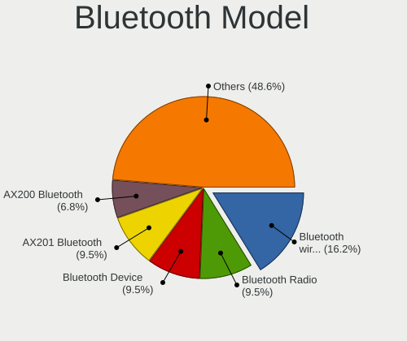

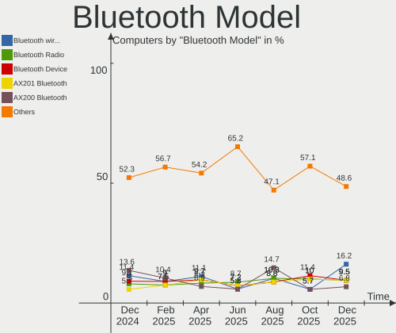

| Model                                                    | Computers | Percent |
|----------------------------------------------------------|-----------|---------|
| Intel Bluetooth wireless interface                       | 12        | 16.22%  |
| Realtek Bluetooth Radio                                  | 7         | 9.46%   |
| Intel Bluetooth Device                                   | 7         | 9.46%   |
| Intel AX201 Bluetooth                                    | 7         | 9.46%   |
| Intel AX200 Bluetooth                                    | 5         | 6.76%   |
| IMC Networks Bluetooth Radio                             | 5         | 6.76%   |
| MediaTek Wireless_Device                                 | 3         | 4.05%   |
| Foxconn / Hon Hai Wireless_Device                        | 3         | 4.05%   |
| IMC Networks Wireless_Device                             | 2         | 2.7%    |
| Foxconn / Hon Hai Bluetooth Device                       | 2         | 2.7%    |
| Cambridge Silicon Radio Bluetooth Dongle (HCI mode)      | 2         | 2.7%    |
| Broadcom BCM20702A0 Bluetooth 4.0                        | 2         | 2.7%    |
| USI Bluetooth Device                                     | 1         | 1.35%   |
| Toshiba Integrated Bluetooth HCI                         | 1         | 1.35%   |
| Realtek Bluetooth 5.4 Radio                              | 1         | 1.35%   |
| Realtek Bluetooth Radio                                  | 1         | 1.35%   |
| MediaTek MT7630e Bluetooth Adapter                       | 1         | 1.35%   |
| Lite-On Wireless_Device                                  | 1         | 1.35%   |
| Lite-On Bluetooth Device                                 | 1         | 1.35%   |
| Intel Wireless-AC 9260 Bluetooth Adapter                 | 1         | 1.35%   |
| Intel Centrino Bluetooth Wireless Transceiver            | 1         | 1.35%   |
| Intel Bluetooth 9460/9560 Jefferson Peak (JfP)           | 1         | 1.35%   |
| Intel AX210 Bluetooth                                    | 1         | 1.35%   |
| IMC Networks BCM20702A0                                  | 1         | 1.35%   |
| Dynex Bluetooth 4.0 Adapter [Broadcom, 1.12, BCM20702A0] | 1         | 1.35%   |
| Broadcom BCM43142A0 Bluetooth 4.0                        | 1         | 1.35%   |
| ASUS ASUS USB-BT500                                      | 1         | 1.35%   |
| Apple Bluetooth USB Host Controller                      | 1         | 1.35%   |
| Actions general adapter                                  | 1         | 1.35%   |

Sound
-----

Sound Vendor
------------

Sound card vendors

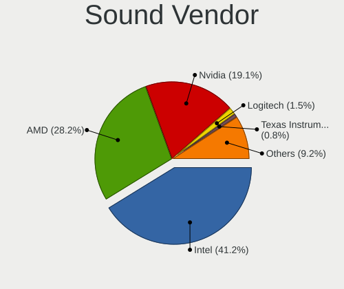

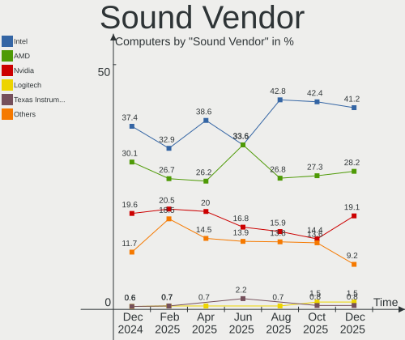

| Vendor                   | Computers | Percent |
|--------------------------|-----------|---------|
| Intel                    | 54        | 41.22%  |
| AMD                      | 37        | 28.24%  |
| Nvidia                   | 25        | 19.08%  |
| Logitech                 | 2         | 1.53%   |
| Texas Instruments        | 1         | 0.76%   |
| SteelSeries ApS          | 1         | 0.76%   |
| Setek Elektronik         | 1         | 0.76%   |
| Razer USA                | 1         | 0.76%   |
| Micro Star International | 1         | 0.76%   |
| Linux Foundation         | 1         | 0.76%   |
| Lenovo                   | 1         | 0.76%   |
| Generalplus Technology   | 1         | 0.76%   |
| Corsair                  | 1         | 0.76%   |
| C-Media Electronics      | 1         | 0.76%   |
| BEHRINGER International  | 1         | 0.76%   |
| ASUSTek Computer         | 1         | 0.76%   |
| ASRock                   | 1         | 0.76%   |

Sound Model
-----------

Sound card models

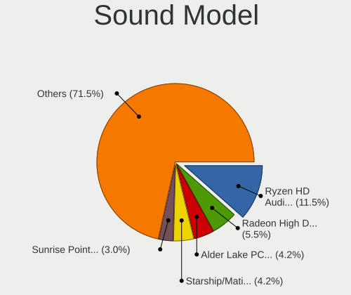

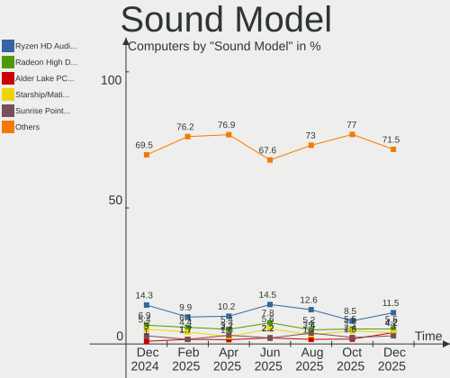

| Model                                                                                             | Computers | Percent |
|---------------------------------------------------------------------------------------------------|-----------|---------|
| AMD Ryzen HD Audio Controller                                                                     | 19        | 11.52%  |
| AMD Radeon High Definition Audio Controller                                                       | 9         | 5.45%   |
| Intel Alder Lake PCH-P High Definition Audio Controller                                           | 7         | 4.24%   |
| AMD Starship/Matisse HD Audio Controller                                                          | 7         | 4.24%   |
| Intel Sunrise Point-LP HD Audio                                                                   | 5         | 3.03%   |
| AMD Renoir/Cezanne HDMI/DP Audio Controller                                                       | 5         | 3.03%   |
| Intel Raptor Lake High Definition Audio Controller                                                | 4         | 2.42%   |
| Intel 8 Series/C220 Series Chipset High Definition Audio Controller                               | 4         | 2.42%   |
| Nvidia GB205 High Definition Audio Controller                                                     | 3         | 1.82%   |
| Intel Xeon E3-1200 v3/4th Gen Core Processor HD Audio Controller                                  | 3         | 1.82%   |
| Intel Tiger Lake-LP Smart Sound Technology Audio Controller                                       | 3         | 1.82%   |
| Intel Tiger Lake-H HD Audio Controller                                                            | 3         | 1.82%   |
| Intel Raptor Lake-P/U/H cAVS                                                                      | 3         | 1.82%   |
| Intel Celeron N3350/Pentium N4200/Atom E3900 Series Audio Cluster                                 | 3         | 1.82%   |
| Intel Cannon Lake PCH cAVS                                                                        | 3         | 1.82%   |
| Intel 800 Series ACE (Audio Context Engine)                                                       | 3         | 1.82%   |
| AMD Raven/Raven2/Fenghuang HDMI/DP Audio Controller                                               | 3         | 1.82%   |
| AMD Oland/Hainan/Cape Verde/Pitcairn HDMI Audio [Radeon HD 7000 Series]                           | 3         | 1.82%   |
| AMD Navi 31 HDMI/DP Audio                                                                         | 3         | 1.82%   |
| AMD Family 17h (Models 00h-0fh) HD Audio Controller                                               | 3         | 1.82%   |
| AMD Ellesmere HDMI Audio [Radeon RX 470/480 / 570/580/590]                                        | 3         | 1.82%   |
| Nvidia GB203 High Definition Audio Controller                                                     | 2         | 1.21%   |
| Nvidia GA107 High Definition Audio Controller                                                     | 2         | 1.21%   |
| Nvidia GA106 High Definition Audio Controller                                                     | 2         | 1.21%   |
| Nvidia GA104 High Definition Audio Controller                                                     | 2         | 1.21%   |
| Nvidia AD104 High Definition Audio Controller                                                     | 2         | 1.21%   |
| Nvidia AD103 High Definition Audio Controller                                                     | 2         | 1.21%   |
| Intel Atom/Celeron/Pentium Processor x5-E8000/J3xxx/N3xxx Series High Definition Audio Controller | 2         | 1.21%   |
| Intel 7 Series/C216 Chipset Family High Definition Audio Controller                               | 2         | 1.21%   |
| Intel 100 Series/C230 Series Chipset Family HD Audio Controller                                   | 2         | 1.21%   |
| AMD Navi 21/23 HDMI/DP Audio Controller                                                           | 2         | 1.21%   |
| AMD Baffin HDMI/DP Audio [Radeon RX 550 640SP / RX 560/560X]                                      | 2         | 1.21%   |
| Texas Instruments PCM2902 Audio Codec                                                             | 1         | 0.61%   |
| SteelSeries ApS SteelSeries Arctis 5                                                              | 1         | 0.61%   |
| Setek Elektronik Realtek USB Audio Rear                                                           | 1         | 0.61%   |
| Setek Elektronik Realtek USB Audio Front                                                          | 1         | 0.61%   |
| Razer USA Razer USB Sound Card                                                                    | 1         | 0.61%   |
| Nvidia TU116 High Definition Audio Controller                                                     | 1         | 0.61%   |
| Nvidia TU106 High Definition Audio Controller                                                     | 1         | 0.61%   |
| Nvidia TU104 HD Audio Controller                                                                  | 1         | 0.61%   |

Memory
------

Memory Vendor
-------------

Memory module vendors

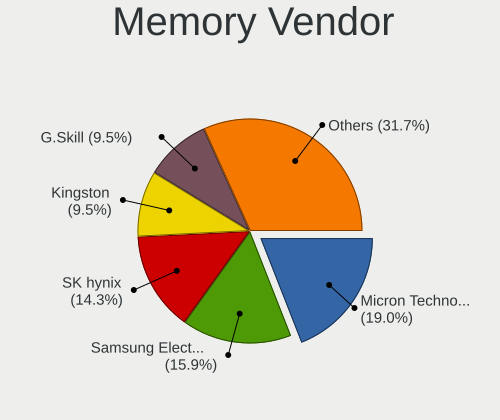

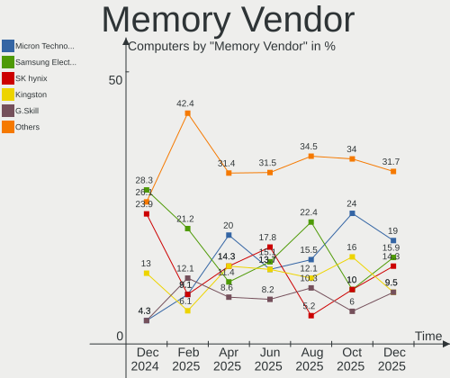

| Vendor              | Computers | Percent |
|---------------------|-----------|---------|
| Micron Technology   | 12        | 19.05%  |
| Samsung Electronics | 10        | 15.87%  |
| SK hynix            | 9         | 14.29%  |
| Kingston            | 6         | 9.52%   |
| G.Skill             | 6         | 9.52%   |
| Crucial             | 4         | 6.35%   |
| Corsair             | 3         | 4.76%   |
| A-DATA Technology   | 3         | 4.76%   |
| Unknown             | 1         | 1.59%   |
| Timetec             | 1         | 1.59%   |
| Team                | 1         | 1.59%   |
| Ramaxel Technology  | 1         | 1.59%   |
| Patriot             | 1         | 1.59%   |
| KingFast            | 1         | 1.59%   |
| fef5                | 1         | 1.59%   |
| EXCELERAM           | 1         | 1.59%   |
| AMD                 | 1         | 1.59%   |
| Unknown             | 1         | 1.59%   |

Memory Model
------------

Memory module models

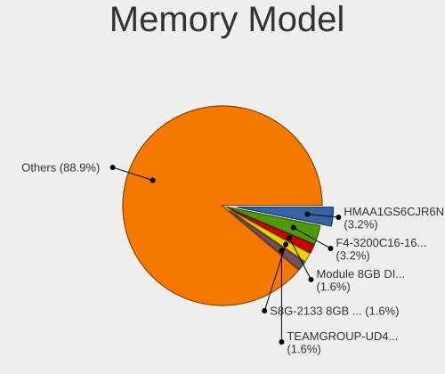

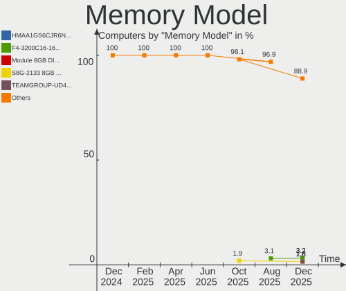

| Model                                                            | Computers | Percent |
|------------------------------------------------------------------|-----------|---------|
| SK hynix RAM HMAA1GS6CJR6N-XN 8GB SODIMM DDR4 3200MT/s           | 2         | 3.17%   |
| G.Skill RAM F4-3200C16-16GIS 16GB DIMM DDR4 3600MT/s             | 2         | 3.17%   |
| Unknown RAM Module 8GB DIMM DDR3 1333MT/s                        | 1         | 1.59%   |
| Timetec RAM S8G-2133 8GB SODIMM DDR4 2133MT/s                    | 1         | 1.59%   |
| Team RAM TEAMGROUP-UD4-3200 8GB DIMM DDR4 3800MT/s               | 1         | 1.59%   |
| SK hynix RAM Module 8GB DIMM DDR3 1333MT/s                       | 1         | 1.59%   |
| SK hynix RAM HMT41GS6DFR8A-PB 8GB SODIMM DDR3 1600MT/s           | 1         | 1.59%   |
| SK hynix RAM HMAA1GS6CJR6N-XN 8GB Row Of Chips DDR4 3200MT/s     | 1         | 1.59%   |
| SK hynix RAM HMA82GS6JJR8N-VK 16GB SODIMM DDR4 2667MT/s          | 1         | 1.59%   |
| SK hynix RAM HMA82GS6DJR8N-XN 16GB SODIMM DDR4 3200MT/s          | 1         | 1.59%   |
| SK hynix RAM H9HCNNN8KUMLHR 1GB 2400MT/s                         | 1         | 1.59%   |
| SK hynix RAM H54G56CYRBX247N 2GB Row Of Chips LPDDR4 4267MT/s    | 1         | 1.59%   |
| Samsung RAM Module 4GB SODIMM DDR3 1067MT/s                      | 1         | 1.59%   |
| Samsung RAM Module 2GB SODIMM DDR3 1600MT/s                      | 1         | 1.59%   |
| Samsung RAM M471B1G73DB0-YK0 8GB SODIMM DDR3 1600MT/s            | 1         | 1.59%   |
| Samsung RAM M471A5244CB0-CWE 4GB Row Of Chips DDR4 3200MT/s      | 1         | 1.59%   |
| Samsung RAM M471A2G43BB2-CWE 16GB SODIMM DDR4 3200MT/s           | 1         | 1.59%   |
| Samsung RAM M471A1K43EB1-CWE 8GB SODIMM DDR4 3200MT/s            | 1         | 1.59%   |
| Samsung RAM M471A1G44BB0-CWE 8GB SODIMM DDR4 3200MT/s            | 1         | 1.59%   |
| Samsung RAM M425R4GA3EB0-CWMOD 32GB SODIMM DDR5 5600MT/s         | 1         | 1.59%   |
| Samsung RAM M378A4G43AB2-CVF 32GB DIMM DDR4 2933MT/s             | 1         | 1.59%   |
| Samsung RAM K3KL8L80DM-MGCU 4GiB Row Of Chips LPDDR5 7500MT/s    | 1         | 1.59%   |
| Ramaxel RAM RMSA3260MB78HAF2400 8GB SODIMM DDR4 2400MT/s         | 1         | 1.59%   |
| Patriot RAM 2666 C16 Series 16GB DIMM DDR4 3400MT/s              | 1         | 1.59%   |
| Micron RAM MTC16C2085S1VC64BD1 32GB SODIMM DDR5 6400MT/s         | 1         | 1.59%   |
| Micron RAM MTC16C2085S1SC56BD1 32GB SODIMM DDR5 5600MT/s         | 1         | 1.59%   |
| Micron RAM MT62F2G32D4DS-026 WT 8GiB SODIMM LPDDR5 7500MT/s      | 1         | 1.59%   |
| Micron RAM MT62F2G32D4DS-026 WT 8GB Row Of Chips LPDDR5 7500MT/s | 1         | 1.59%   |
| Micron RAM MT62F2G32D4DS-026 4GB Row Of Chips LPDDR5 7500MT/s    | 1         | 1.59%   |
| Micron RAM CT32G4SFD832A.M16FF 32GB SODIMM DDR4 3200MT/s         | 1         | 1.59%   |
| Micron RAM CT16G56C46S5.M8D1 16GB SODIMM DDR5 5600MT/s           | 1         | 1.59%   |
| Micron RAM CP32G4DFRA32A.M16FF 32GB DIMM DDR4 3200MT/s           | 1         | 1.59%   |
| Micron RAM 8ATF1G64HZ-3G2R1 8GB SODIMM DDR4 3200MT/s             | 1         | 1.59%   |
| Micron RAM 4ATF51264HZ-2G6E1 4GB SODIMM DDR4 2667MT/s            | 1         | 1.59%   |
| Micron RAM 18ASF2G72PDZ-3G2R1 16GB DIMM DDR4 3200MT/s            | 1         | 1.59%   |
| Micron RAM 16KTF1G64AZ-1G6E1 8GB DIMM DDR3 1600MT/s              | 1         | 1.59%   |
| Kingston RAM Module 16GB SODIMM DDR4 2667MT/s                    | 1         | 1.59%   |
| Kingston RAM KHX2133C13S4/8G 8GB SODIMM DDR4 2267MT/s            | 1         | 1.59%   |
| Kingston RAM KF560C36-32 32GB DIMM DDR5 6200MT/s                 | 1         | 1.59%   |
| Kingston RAM KF560C32-48 48GB DIMM DDR5 6000MT/s                 | 1         | 1.59%   |

Memory Kind
-----------

Memory module kinds

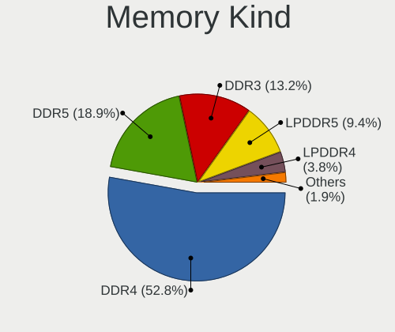

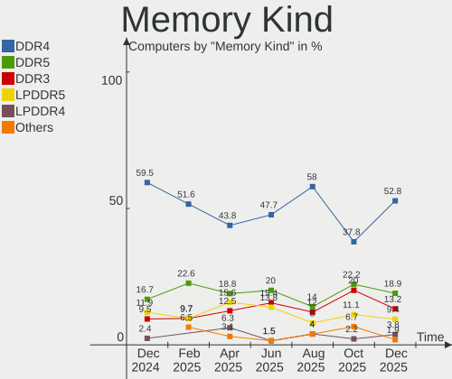

| Kind    | Computers | Percent |
|---------|-----------|---------|
| DDR4    | 28        | 52.83%  |
| DDR5    | 10        | 18.87%  |
| DDR3    | 7         | 13.21%  |
| LPDDR5  | 5         | 9.43%   |
| LPDDR4  | 2         | 3.77%   |
| Unknown | 1         | 1.89%   |

Memory Form Factor
------------------

Physical design of the memory module

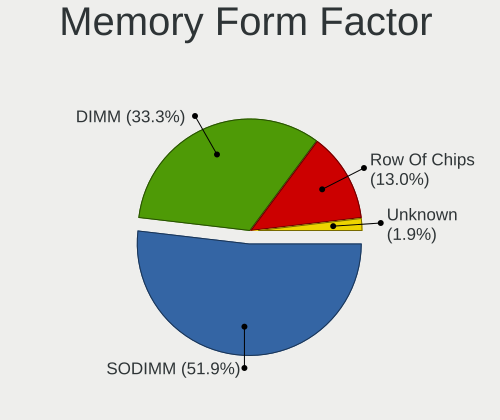

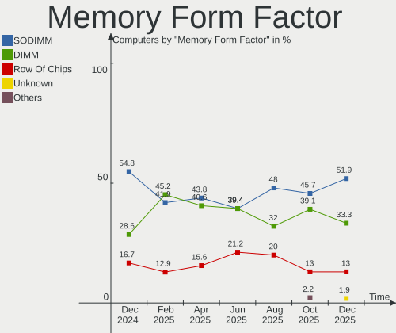

| Name         | Computers | Percent |
|--------------|-----------|---------|
| SODIMM       | 28        | 51.85%  |
| DIMM         | 18        | 33.33%  |
| Row Of Chips | 7         | 12.96%  |
| Unknown      | 1         | 1.85%   |

Memory Size
-----------

Memory module size

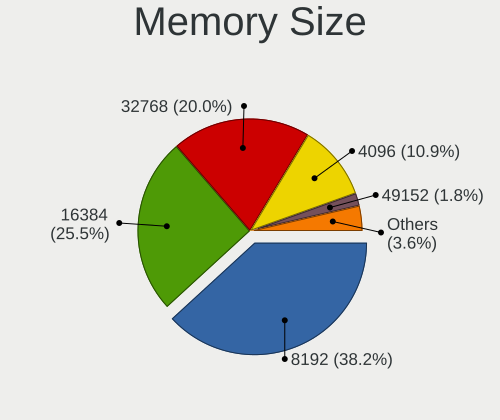

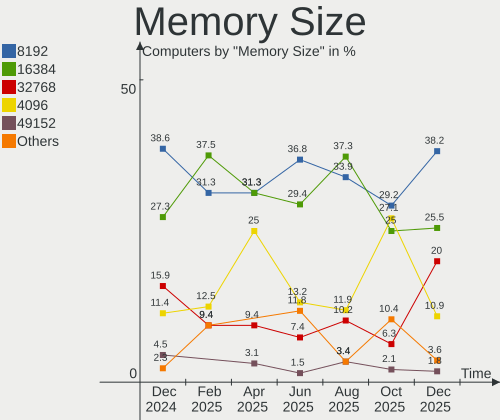

| Size  | Computers | Percent |
|-------|-----------|---------|
| 8192  | 21        | 38.18%  |
| 16384 | 14        | 25.45%  |
| 32768 | 11        | 20%     |
| 4096  | 6         | 10.91%  |
| 49152 | 1         | 1.82%   |
| 2048  | 1         | 1.82%   |
| 1024  | 1         | 1.82%   |

Memory Speed
------------

Memory module speed

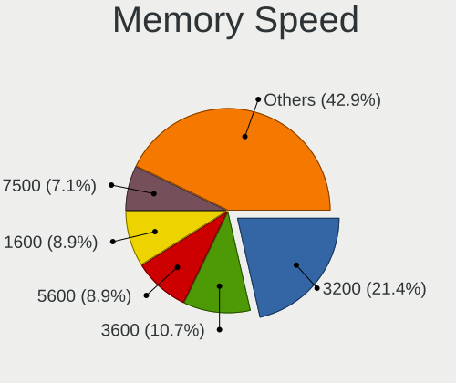

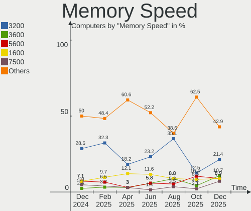

| Speed | Computers | Percent |
|-------|-----------|---------|
| 3200  | 12        | 21.43%  |
| 3600  | 6         | 10.71%  |
| 5600  | 5         | 8.93%   |
| 1600  | 5         | 8.93%   |
| 7500  | 4         | 7.14%   |
| 2667  | 4         | 7.14%   |
| 2400  | 4         | 7.14%   |
| 3800  | 2         | 3.57%   |
| 12800 | 1         | 1.79%   |
| 7467  | 1         | 1.79%   |
| 6400  | 1         | 1.79%   |
| 6200  | 1         | 1.79%   |
| 6000  | 1         | 1.79%   |
| 4800  | 1         | 1.79%   |
| 4267  | 1         | 1.79%   |
| 3400  | 1         | 1.79%   |
| 2933  | 1         | 1.79%   |
| 2666  | 1         | 1.79%   |
| 2267  | 1         | 1.79%   |
| 2133  | 1         | 1.79%   |
| 1333  | 1         | 1.79%   |
| 1067  | 1         | 1.79%   |

Printers & scanners
-------------------

Printer Vendor
--------------

Printer device vendors

Zero info for selected period =(

Printer Model
-------------

Printer device models

Zero info for selected period =(

Scanner Vendor
--------------

Scanner device vendors

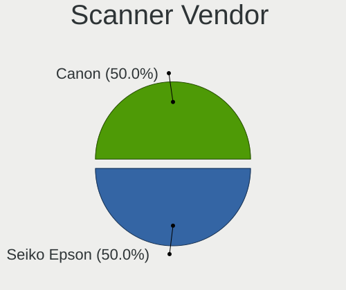

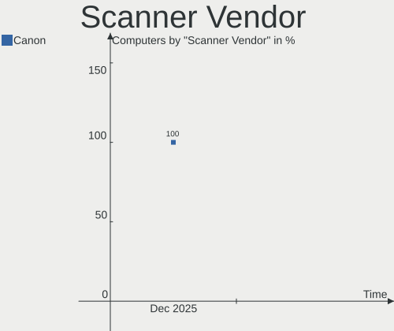

| Vendor | Computers | Percent |
|--------|-----------|---------|
| Canon  | 1         | 100%    |

Scanner Model
-------------

Scanner device models

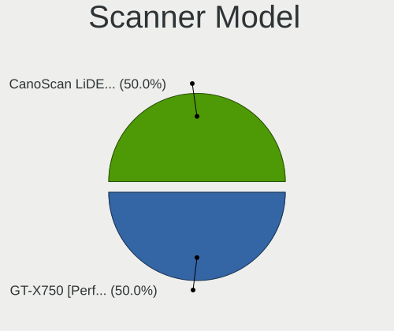

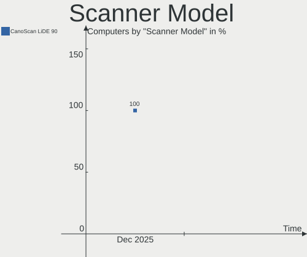

| Model                  | Computers | Percent |
|------------------------|-----------|---------|
| Canon CanoScan LiDE 90 | 1         | 100%    |

Camera
------

Camera Vendor
-------------

Camera device vendors

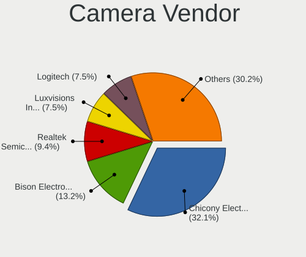

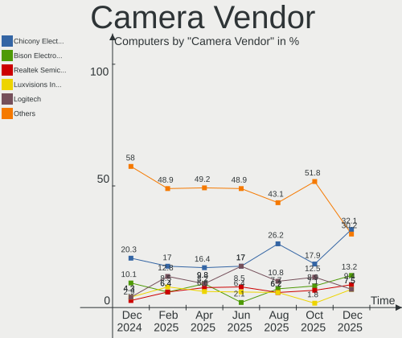

| Vendor                                 | Computers | Percent |
|----------------------------------------|-----------|---------|
| Chicony Electronics                    | 17        | 32.08%  |
| Bison Electronics                      | 7         | 13.21%  |
| Realtek Semiconductor                  | 5         | 9.43%   |
| Luxvisions Innotech Limited            | 4         | 7.55%   |
| Logitech                               | 4         | 7.55%   |
| Microdia                               | 3         | 5.66%   |
| Quanta                                 | 2         | 3.77%   |
| Lite-On Technology                     | 2         | 3.77%   |
| Cheng Uei Precision Industry (Foxlink) | 2         | 3.77%   |
| SunplusIT                              | 1         | 1.89%   |
| Samsung Electronics                    | 1         | 1.89%   |
| Ruision                                | 1         | 1.89%   |
| Ricoh                                  | 1         | 1.89%   |
| Jieli Technology                       | 1         | 1.89%   |
| IMC Networks                           | 1         | 1.89%   |
| Generalplus Technology                 | 1         | 1.89%   |

Camera Model
------------

Camera device models

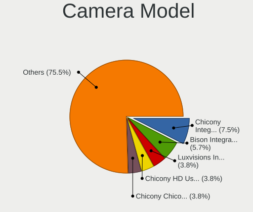

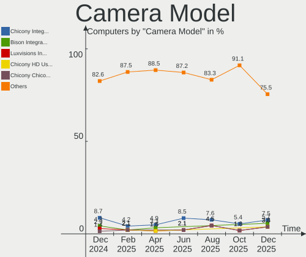

| Model                                                   | Computers | Percent |
|---------------------------------------------------------|-----------|---------|
| Chicony Integrated Camera                               | 4         | 7.55%   |
| Bison Integrated Camera                                 | 3         | 5.66%   |
| Luxvisions Innotech Limited Integrated Camera           | 2         | 3.77%   |
| Chicony HD User Facing                                  | 2         | 3.77%   |
| Chicony Chicony USB2.0 Camera                           | 2         | 3.77%   |
| Chicony ACER HD User Facing                             | 2         | 3.77%   |
| SunplusIT FHD Webcam                                    | 1         | 1.89%   |
| Samsung Galaxy series, misc. (MTP mode)                 | 1         | 1.89%   |
| Ruision UVC Camera                                      | 1         | 1.89%   |
| Ricoh Integrated Camera                                 | 1         | 1.89%   |
| Realtek WebCamera                                       | 1         | 1.89%   |
| Realtek USB2.0 HD UVC WebCam                            | 1         | 1.89%   |
| Realtek Thronmax Stream Go Pro Webcam                   | 1         | 1.89%   |
| Realtek Integrated_Webcam_HD                            | 1         | 1.89%   |
| Realtek Built-In Video Camera                           | 1         | 1.89%   |
| Quanta HP Wide Vision HD Camera                         | 1         | 1.89%   |
| Quanta HP HD Camera                                     | 1         | 1.89%   |
| Microdia Integrated_Webcam_HD                           | 1         | 1.89%   |
| Microdia HP Integrated Webcam                           | 1         | 1.89%   |
| Microdia CyberTrack H7                                  | 1         | 1.89%   |
| Luxvisions Innotech Limited HP TrueVision HD Camera     | 1         | 1.89%   |
| Luxvisions Innotech Limited HP HD Camera                | 1         | 1.89%   |
| Logitech Webcam C310                                    | 1         | 1.89%   |
| Logitech Webcam C300                                    | 1         | 1.89%   |
| Logitech HD Webcam C525                                 | 1         | 1.89%   |
| Logitech C922 Pro Stream Webcam                         | 1         | 1.89%   |
| Lite-On Integrated Camera                               | 1         | 1.89%   |
| Lite-On EasyCamera 1M                                   | 1         | 1.89%   |
| Jieli USB PHY 2.0                                       | 1         | 1.89%   |
| IMC Networks Integrated Camera                          | 1         | 1.89%   |
| Generalplus 808 Camera #9 (web-cam mode)                | 1         | 1.89%   |
| Chicony VGA Webcam                                      | 1         | 1.89%   |
| Chicony USB 2.0 Camera                                  | 1         | 1.89%   |
| Chicony Integrated IR Camera                            | 1         | 1.89%   |
| Chicony Integrated Camera (1280x720@30)                 | 1         | 1.89%   |
| Chicony HP Wide Vision HD Camera                        | 1         | 1.89%   |
| Chicony HP Truevision HD                                | 1         | 1.89%   |
| Chicony HD WebCam                                       | 1         | 1.89%   |
| Cheng Uei Precision Industry (Foxlink) HP Truevision HD | 1         | 1.89%   |
| Cheng Uei Precision Industry (Foxlink) HP HD Webcam     | 1         | 1.89%   |

Security
--------

Fingerprint Vendor
------------------

Fingerprint sensor vendors

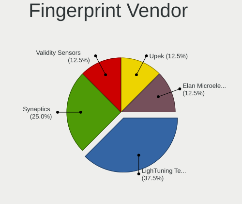

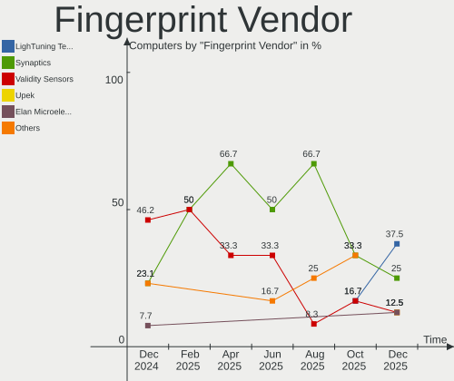

| Vendor                | Computers | Percent |
|-----------------------|-----------|---------|
| LighTuning Technology | 3         | 37.5%   |
| Synaptics             | 2         | 25%     |
| Validity Sensors      | 1         | 12.5%   |
| Upek                  | 1         | 12.5%   |
| Elan Microelectronics | 1         | 12.5%   |

Fingerprint Model
-----------------

Fingerprint sensor models

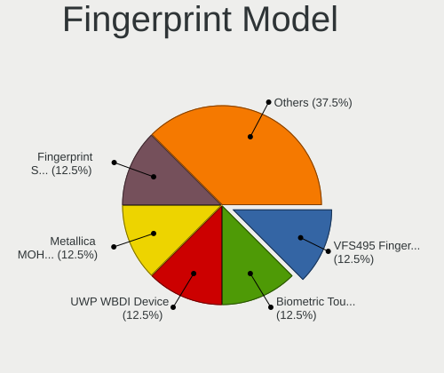

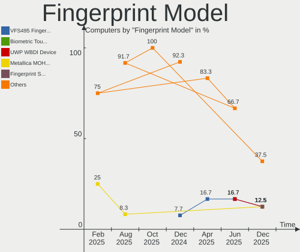

| Model                                                  | Computers | Percent |
|--------------------------------------------------------|-----------|---------|
| Validity Sensors VFS495 Fingerprint Reader             | 1         | 12.5%   |
| Upek Biometric Touchchip/Touchstrip Fingerprint Sensor | 1         | 12.5%   |
| Synaptics UWP WBDI Device                              | 1         | 12.5%   |
| Synaptics Metallica MOH Touch Fingerprint Reader       | 1         | 12.5%   |
| LighTuning Fingerprint Sensor                          | 1         | 12.5%   |
| LighTuning ES603 Swipe Fingerprint Sensor              | 1         | 12.5%   |
| LighTuning EgisTec Touch Fingerprint Sensor            | 1         | 12.5%   |
| Elan ELAN:ARM-M4                                       | 1         | 12.5%   |

Chipcard Vendor
---------------

Chipcard module vendors

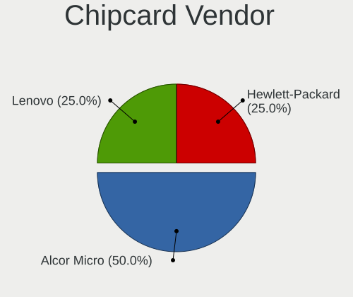

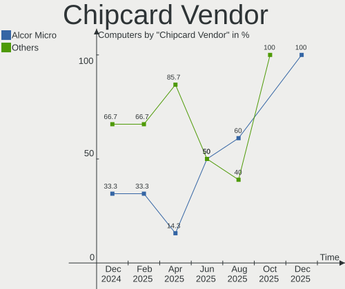

| Vendor      | Computers | Percent |
|-------------|-----------|---------|
| Alcor Micro | 1         | 100%    |

Chipcard Model
--------------

Chipcard module models

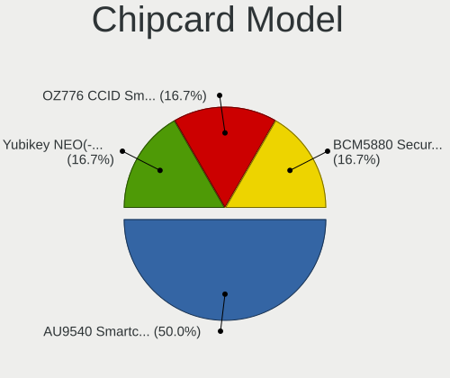

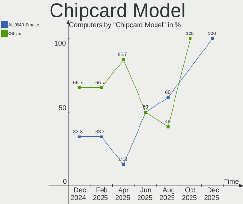

| Model                               | Computers | Percent |
|-------------------------------------|-----------|---------|
| Alcor Micro AU9540 Smartcard Reader | 1         | 100%    |

Unsupported
-----------

Unsupported Devices
-------------------

Total unsupported devices on board

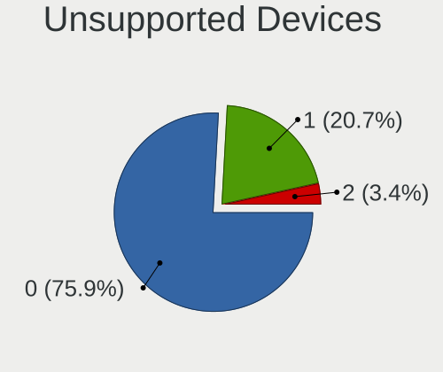

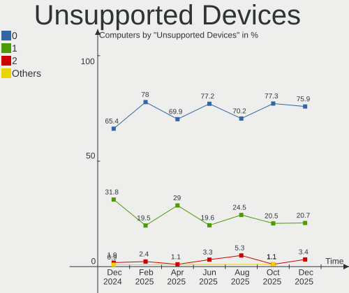

| Total | Computers | Percent |
|-------|-----------|---------|
| 0     | 66        | 75.86%  |
| 1     | 18        | 20.69%  |
| 2     | 3         | 3.45%   |

Unsupported Device Types
------------------------

Types of unsupported devices

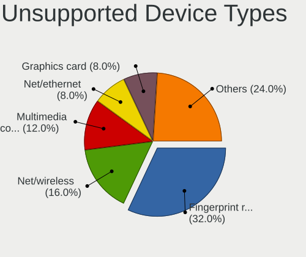

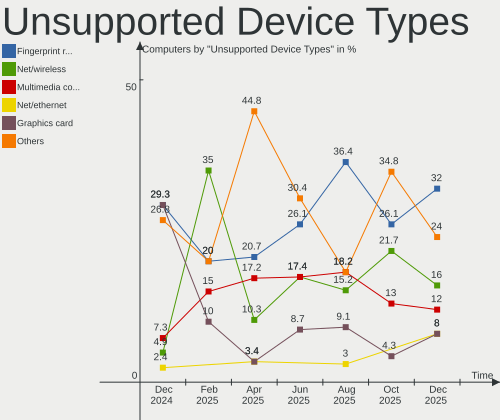

| Type                  | Computers | Percent |
|-----------------------|-----------|---------|
| Fingerprint reader    | 8         | 32%     |
| Net/wireless          | 4         | 16%     |
| Multimedia controller | 3         | 12%     |
| Net/ethernet          | 2         | 8%      |
| Graphics card         | 2         | 8%      |
| Bluetooth             | 2         | 8%      |
| Sound                 | 1         | 4%      |
| Network               | 1         | 4%      |
| Chipcard              | 1         | 4%      |
| Camera                | 1         | 4%      |

