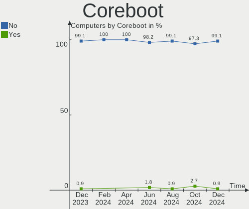
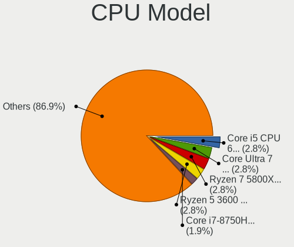
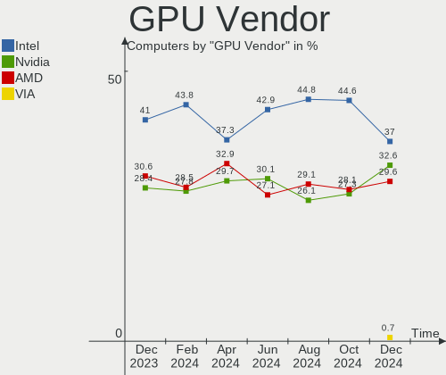
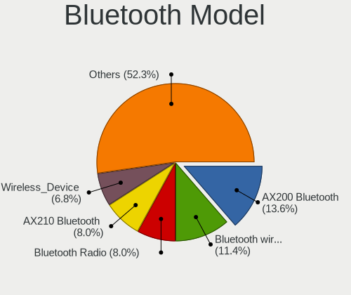
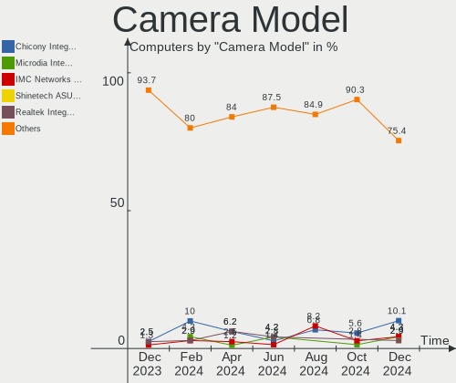

Manjaro - Hardware Trends
-------------------------

A project to identify most popular hardware characteristics and track their change
over time based on data collected by Linux users at https://Linux-Hardware.org.

Anyone can contribute to this report by the [hw-probe](https://github.com/linuxhw/hw-probe) tool:

    sudo -E hw-probe -all -upload

This is a report for all computer types. See also reports for [desktops](/Dist/Manjaro/Desktop/README.md) and [notebooks](/Dist/Manjaro/Notebook/README.md).

This report is for one last month. Overall report since the beginning of time: [TestDays](https://github.com/linuxhw/TestDays)

Period: Mar, 2023.

Contents
--------

* [ System ](#system)
  - [ OS                       ](#os)
  - [ OS Family                ](#os-family)
  - [ Kernel                   ](#kernel)
  - [ Kernel Family            ](#kernel-family)
  - [ Kernel Major Ver.        ](#kernel-major-ver)
  - [ Arch                     ](#arch)
  - [ DE                       ](#de)
  - [ Display Server           ](#display-server)
  - [ Display Manager          ](#display-manager)
  - [ OS Lang                  ](#os-lang)
  - [ Boot Mode                ](#boot-mode)
  - [ Filesystem               ](#filesystem)
  - [ Part. scheme             ](#part-scheme)
  - [ Dual Boot with Linux/BSD ](#dual-boot-with-linuxbsd)
  - [ Dual Boot (Win)          ](#dual-boot-win)

* [ Board ](#board)
  - [ Vendor                   ](#vendor)
  - [ Model                    ](#model)
  - [ Model Family             ](#model-family)
  - [ MFG Year                 ](#mfg-year)
  - [ Form Factor              ](#form-factor)
  - [ Secure Boot              ](#secure-boot)
  - [ Coreboot                 ](#coreboot)
  - [ RAM Size                 ](#ram-size)
  - [ RAM Used                 ](#ram-used)
  - [ Total Drives             ](#total-drives)
  - [ Has CD-ROM               ](#has-cd-rom)
  - [ Has Ethernet             ](#has-ethernet)
  - [ Has WiFi                 ](#has-wifi)
  - [ Has Bluetooth            ](#has-bluetooth)

* [ Location ](#location)
  - [ Country                  ](#country)
  - [ City                     ](#city)

* [ Drives ](#drives)
  - [ Drive Vendor             ](#drive-vendor)
  - [ Drive Model              ](#drive-model)
  - [ HDD Vendor               ](#hdd-vendor)
  - [ SSD Vendor               ](#ssd-vendor)
  - [ Drive Kind               ](#drive-kind)
  - [ Drive Connector          ](#drive-connector)
  - [ Drive Size               ](#drive-size)
  - [ Space Total              ](#space-total)
  - [ Space Used               ](#space-used)
  - [ Malfunc. Drives          ](#malfunc-drives)
  - [ Malfunc. Drive Vendor    ](#malfunc-drive-vendor)
  - [ Malfunc. HDD Vendor      ](#malfunc-hdd-vendor)
  - [ Malfunc. Drive Kind      ](#malfunc-drive-kind)
  - [ Failed Drives            ](#failed-drives)
  - [ Failed Drive Vendor      ](#failed-drive-vendor)
  - [ Drive Status             ](#drive-status)

* [ Storage controller ](#storage-controller)
  - [ Storage Vendor           ](#storage-vendor)
  - [ Storage Model            ](#storage-model)
  - [ Storage Kind             ](#storage-kind)

* [ Processor ](#processor)
  - [ CPU Vendor               ](#cpu-vendor)
  - [ CPU Model                ](#cpu-model)
  - [ CPU Model Family         ](#cpu-model-family)
  - [ CPU Cores                ](#cpu-cores)
  - [ CPU Sockets              ](#cpu-sockets)
  - [ CPU Threads              ](#cpu-threads)
  - [ CPU Op-Modes             ](#cpu-op-modes)
  - [ CPU Microcode            ](#cpu-microcode)
  - [ CPU Microarch            ](#cpu-microarch)

* [ Graphics ](#graphics)
  - [ GPU Vendor               ](#gpu-vendor)
  - [ GPU Model                ](#gpu-model)
  - [ GPU Combo                ](#gpu-combo)
  - [ GPU Driver               ](#gpu-driver)
  - [ GPU Memory               ](#gpu-memory)

* [ Monitor ](#monitor)
  - [ Monitor Vendor           ](#monitor-vendor)
  - [ Monitor Model            ](#monitor-model)
  - [ Monitor Resolution       ](#monitor-resolution)
  - [ Monitor Diagonal         ](#monitor-diagonal)
  - [ Monitor Width            ](#monitor-width)
  - [ Aspect Ratio             ](#aspect-ratio)
  - [ Monitor Area             ](#monitor-area)
  - [ Pixel Density            ](#pixel-density)
  - [ Multiple Monitors        ](#multiple-monitors)

* [ Network ](#network)
  - [ Net Controller Vendor    ](#net-controller-vendor)
  - [ Net Controller Model     ](#net-controller-model)
  - [ Wireless Vendor          ](#wireless-vendor)
  - [ Wireless Model           ](#wireless-model)
  - [ Ethernet Vendor          ](#ethernet-vendor)
  - [ Ethernet Model           ](#ethernet-model)
  - [ Net Controller Kind      ](#net-controller-kind)
  - [ Used Controller          ](#used-controller)
  - [ NICs                     ](#nics)
  - [ IPv6                     ](#ipv6)

* [ Bluetooth ](#bluetooth)
  - [ Bluetooth Vendor         ](#bluetooth-vendor)
  - [ Bluetooth Model          ](#bluetooth-model)

* [ Sound ](#sound)
  - [ Sound Vendor             ](#sound-vendor)
  - [ Sound Model              ](#sound-model)

* [ Memory ](#memory)
  - [ Memory Vendor            ](#memory-vendor)
  - [ Memory Model             ](#memory-model)
  - [ Memory Kind              ](#memory-kind)
  - [ Memory Form Factor       ](#memory-form-factor)
  - [ Memory Size              ](#memory-size)
  - [ Memory Speed             ](#memory-speed)

* [ Printers & scanners ](#printers--scanners)
  - [ Printer Vendor           ](#printer-vendor)
  - [ Printer Model            ](#printer-model)
  - [ Scanner Vendor           ](#scanner-vendor)
  - [ Scanner Model            ](#scanner-model)

* [ Camera ](#camera)
  - [ Camera Vendor            ](#camera-vendor)
  - [ Camera Model             ](#camera-model)

* [ Security ](#security)
  - [ Fingerprint Vendor       ](#fingerprint-vendor)
  - [ Fingerprint Model        ](#fingerprint-model)
  - [ Chipcard Vendor          ](#chipcard-vendor)
  - [ Chipcard Model           ](#chipcard-model)

* [ Unsupported ](#unsupported)
  - [ Unsupported Devices      ](#unsupported-devices)
  - [ Unsupported Device Types ](#unsupported-device-types)

System
------

OS
--

Installed operating systems

| Name           | Computers | Percent |
|----------------|-----------|---------|
| Manjaro        | 100       | 58.14%  |
| Manjaro 22.0.4 | 36        | 20.93%  |
| Manjaro 22.0.5 | 34        | 19.77%  |
| Manjaro 22.0.2 | 1         | 0.58%   |
| Manjaro 22.0.1 | 1         | 0.58%   |

OS Family
---------

OS without a version

| Name    | Computers | Percent |
|---------|-----------|---------|
| Manjaro | 172       | 100%    |

Kernel
------

Version of the Linux kernel

| Version                        | Computers | Percent |
|--------------------------------|-----------|---------|
| 6.1.12-1-MANJARO               | 63        | 36.63%  |
| 6.1.19-1-MANJARO               | 33        | 19.19%  |
| 5.15.94-1-MANJARO              | 18        | 10.47%  |
| 6.2.7-2-MANJARO                | 13        | 7.56%   |
| 5.15.102-1-MANJARO             | 10        | 5.81%   |
| 6.2.6-1-MANJARO                | 5         | 2.91%   |
| 6.0.5-4-rt14-MANJARO           | 5         | 2.91%   |
| 6.2.0-1-MANJARO                | 2         | 1.16%   |
| 5.9.16-1-MANJARO               | 2         | 1.16%   |
| 5.15.93-1-MANJARO              | 2         | 1.16%   |
| 6.2.2-1-MANJARO                | 1         | 0.58%   |
| 6.1.9-1-MANJARO                | 1         | 0.58%   |
| 6.1.7-1-MANJARO                | 1         | 0.58%   |
| 6.1.6-arch1-2-vfio             | 1         | 0.58%   |
| 6.1.21-1-MANJARO               | 1         | 0.58%   |
| 6.1.15-x64v1-xanmod1-1-lts     | 1         | 0.58%   |
| 6.1.14-x64v1-xanmod1-MANJARO   | 1         | 0.58%   |
| 6.1.14-skylake-xanmod1-MANJARO | 1         | 0.58%   |
| 6.1.13-zen2-xanmod1-MANJARO    | 1         | 0.58%   |
| 6.1.13-lqx2-1-lqx              | 1         | 0.58%   |
| 6.0.6-x64v1-xanmod1-1          | 1         | 0.58%   |
| 6.0.19-4-MANJARO               | 1         | 0.58%   |
| 5.19.7-1-MANJARO               | 1         | 0.58%   |
| 5.16.20-2-MANJARO              | 1         | 0.58%   |
| 5.15.96-1-MANJARO              | 1         | 0.58%   |
| 5.15.55-1-MANJARO              | 1         | 0.58%   |
| 5.10.79-1-MANJARO              | 1         | 0.58%   |
| 5.10.167-1-MANJARO             | 1         | 0.58%   |
| 5.10.154-1-MANJARO             | 1         | 0.58%   |

Kernel Family
-------------

Linux kernel without a distro release

| Version  | Computers | Percent |
|----------|-----------|---------|
| 6.1.12   | 63        | 36.63%  |
| 6.1.19   | 33        | 19.19%  |
| 5.15.94  | 18        | 10.47%  |
| 6.2.7    | 13        | 7.56%   |
| 5.15.102 | 10        | 5.81%   |
| 6.2.6    | 5         | 2.91%   |
| 6.0.5    | 5         | 2.91%   |
| 6.2.0    | 2         | 1.16%   |
| 6.1.14   | 2         | 1.16%   |
| 6.1.13   | 2         | 1.16%   |
| 5.9.16   | 2         | 1.16%   |
| 5.15.93  | 2         | 1.16%   |
| 6.2.2    | 1         | 0.58%   |
| 6.1.9    | 1         | 0.58%   |
| 6.1.7    | 1         | 0.58%   |
| 6.1.6    | 1         | 0.58%   |
| 6.1.21   | 1         | 0.58%   |
| 6.1.15   | 1         | 0.58%   |
| 6.0.6    | 1         | 0.58%   |
| 6.0.19   | 1         | 0.58%   |
| 5.19.7   | 1         | 0.58%   |
| 5.16.20  | 1         | 0.58%   |
| 5.15.96  | 1         | 0.58%   |
| 5.15.55  | 1         | 0.58%   |
| 5.10.79  | 1         | 0.58%   |
| 5.10.167 | 1         | 0.58%   |
| 5.10.154 | 1         | 0.58%   |

Kernel Major Ver.
-----------------

Linux kernel major version

| Version | Computers | Percent |
|---------|-----------|---------|
| 6.1     | 105       | 61.05%  |
| 5.15    | 32        | 18.6%   |
| 6.2     | 21        | 12.21%  |
| 6.0     | 7         | 4.07%   |
| 5.10    | 3         | 1.74%   |
| 5.9     | 2         | 1.16%   |
| 5.19    | 1         | 0.58%   |
| 5.16    | 1         | 0.58%   |

Arch
----

OS architecture (x86_64, i586, etc.)

| Name   | Computers | Percent |
|--------|-----------|---------|
| x86_64 | 172       | 100%    |

DE
--

Desktop Environment

| Name              | Computers | Percent |
|-------------------|-----------|---------|
| KDE5              | 111       | 64.53%  |
| XFCE              | 26        | 15.12%  |
| GNOME             | 23        | 13.37%  |
| X-Cinnamon        | 6         | 3.49%   |
| Unknown           | 2         | 1.16%   |
| Yaru:ubuntu:GNOME | 1         | 0.58%   |
| sway              | 1         | 0.58%   |
| KDE               | 1         | 0.58%   |
| Hyprland          | 1         | 0.58%   |

Display Server
--------------

X11 or Wayland

| Name    | Computers | Percent |
|---------|-----------|---------|
| X11     | 148       | 86.05%  |
| Wayland | 21        | 12.21%  |
| Tty     | 2         | 1.16%   |
| Unknown | 1         | 0.58%   |

Display Manager
---------------

SDDM, LightDM, etc.

| Name    | Computers | Percent |
|---------|-----------|---------|
| Unknown | 100       | 58.14%  |
| SDDM    | 39        | 22.67%  |
| LightDM | 19        | 11.05%  |
| GDM     | 13        | 7.56%   |
| GREETD  | 1         | 0.58%   |

OS Lang
-------

Language

| Lang    | Computers | Percent |
|---------|-----------|---------|
| en_US   | 75        | 43.6%   |
| de_DE   | 17        | 9.88%   |
| en_GB   | 13        | 7.56%   |
| pt_BR   | 11        | 6.4%    |
| ru_RU   | 10        | 5.81%   |
| zh_CN   | 3         | 1.74%   |
| pl_PL   | 3         | 1.74%   |
| nl_NL   | 3         | 1.74%   |
| it_IT   | 3         | 1.74%   |
| es_ES   | 3         | 1.74%   |
| de_AT   | 3         | 1.74%   |
| tr_TR   | 2         | 1.16%   |
| es_MX   | 2         | 1.16%   |
| en_IN   | 2         | 1.16%   |
| en_AU   | 2         | 1.16%   |
| Unknown | 2         | 1.16%   |
| uk_UA   | 1         | 0.58%   |
| sv_SE   | 1         | 0.58%   |
| ja_JP   | 1         | 0.58%   |
| hu_HU   | 1         | 0.58%   |
| fr_FR   | 1         | 0.58%   |
| fr_CA   | 1         | 0.58%   |
| fi_FI   | 1         | 0.58%   |
| es_CL   | 1         | 0.58%   |
| es_BO   | 1         | 0.58%   |
| en_ZA   | 1         | 0.58%   |
| en_SE   | 1         | 0.58%   |
| en_PH   | 1         | 0.58%   |
| en_DK   | 1         | 0.58%   |
| en_CA   | 1         | 0.58%   |
| de_CH   | 1         | 0.58%   |
| da_DK   | 1         | 0.58%   |
| cs_CZ   | 1         | 0.58%   |
| C       | 1         | 0.58%   |

Boot Mode
---------

EFI or BIOS

| Mode | Computers | Percent |
|------|-----------|---------|
| BIOS | 111       | 64.53%  |
| EFI  | 61        | 35.47%  |

Filesystem
----------

Type of filesystem

| Type    | Computers | Percent |
|---------|-----------|---------|
| Ext4    | 131       | 76.16%  |
| Btrfs   | 35        | 20.35%  |
| Overlay | 3         | 1.74%   |
| Xfs     | 2         | 1.16%   |
| Tmpfs   | 1         | 0.58%   |

Part. scheme
------------

Scheme of partitioning

| Type    | Computers | Percent |
|---------|-----------|---------|
| Unknown | 97        | 56.4%   |
| GPT     | 71        | 41.28%  |
| MBR     | 4         | 2.33%   |

Dual Boot with Linux/BSD
------------------------

Hosting more than one Linux/BSD

| Dual boot | Computers | Percent |
|-----------|-----------|---------|
| No        | 156       | 90.7%   |
| Yes       | 16        | 9.3%    |

Dual Boot (Win)
---------------

Hosting Linux and Windows

| Dual boot | Computers | Percent |
|-----------|-----------|---------|
| No        | 135       | 78.49%  |
| Yes       | 37        | 21.51%  |

Board
-----

Vendor
------

Motherboard manufacturer

| Name                | Computers | Percent |
|---------------------|-----------|---------|
| ASUSTek Computer    | 28        | 16.28%  |
| Dell                | 25        | 14.53%  |
| Lenovo              | 24        | 13.95%  |
| Hewlett-Packard     | 24        | 13.95%  |
| MSI                 | 12        | 6.98%   |
| ASRock              | 8         | 4.65%   |
| Gigabyte Technology | 7         | 4.07%   |
| Apple               | 5         | 2.91%   |
| Acer                | 5         | 2.91%   |
| Intel               | 3         | 1.74%   |
| Toshiba             | 2         | 1.16%   |
| Sony                | 2         | 1.16%   |
| Samsung Electronics | 2         | 1.16%   |
| Positivo            | 2         | 1.16%   |
| Medion              | 2         | 1.16%   |
| Biostar             | 2         | 1.16%   |
| Unknown             | 2         | 1.16%   |
| TUXEDO              | 1         | 0.58%   |
| SLIMBOOK            | 1         | 0.58%   |
| realme              | 1         | 0.58%   |
| Razer               | 1         | 0.58%   |
| OEM                 | 1         | 0.58%   |
| Multilaser          | 1         | 0.58%   |
| LG Electronics      | 1         | 0.58%   |
| Itautec             | 1         | 0.58%   |
| Infinix             | 1         | 0.58%   |
| HUAWEI              | 1         | 0.58%   |
| Huanan              | 1         | 0.58%   |
| HONOR               | 1         | 0.58%   |
| GPD                 | 1         | 0.58%   |
| Google              | 1         | 0.58%   |
| Framework           | 1         | 0.58%   |
| EVGA                | 1         | 0.58%   |
| Alienware           | 1         | 0.58%   |

Model
-----

Motherboard model

| Name                                               | Computers | Percent |
|----------------------------------------------------|-----------|---------|
| MSI MS-7C37                                        | 2         | 1.16%   |
| HP Z440 Workstation                                | 2         | 1.16%   |
| Dell XPS 15 9500                                   | 2         | 1.16%   |
| Dell OptiPlex 7010                                 | 2         | 1.16%   |
| ASUS All Series                                    | 2         | 1.16%   |
| Apple MacBookPro14,1                               | 2         | 1.16%   |
| Unknown                                            | 2         | 1.16%   |
| TUXEDO InfinityBook S 15/17 Gen7                   | 1         | 0.58%   |
| Toshiba Satellite P300                             | 1         | 0.58%   |
| Toshiba QOSMIO F750                                | 1         | 0.58%   |
| Sony VPCEB4L1E                                     | 1         | 0.58%   |
| Sony SVZ1311C5E                                    | 1         | 0.58%   |
| SLIMBOOK PROX-AMD5                                 | 1         | 0.58%   |
| Samsung 530U3C/530U4C/532U3C                       | 1         | 0.58%   |
| Samsung 530U3BI/530U4BI/530U4BH                    | 1         | 0.58%   |
| realme CloudProXXXX                                | 1         | 0.58%   |
| Razer Blade 15 Base Model (Early 2020) - RZ09-0328 | 1         | 0.58%   |
| Positivo Q464B                                     | 1         | 0.58%   |
| Positivo C14CR21                                   | 1         | 0.58%   |
| OEM H110                                           | 1         | 0.58%   |
| Multilaser UB82X                                   | 1         | 0.58%   |
| MSI MS-7D43                                        | 1         | 0.58%   |
| MSI MS-7D32                                        | 1         | 0.58%   |
| MSI MS-7C95                                        | 1         | 0.58%   |
| MSI MS-7C02                                        | 1         | 0.58%   |
| MSI MS-7B86                                        | 1         | 0.58%   |
| MSI MS-7885                                        | 1         | 0.58%   |
| MSI MS-7817                                        | 1         | 0.58%   |
| MSI MS-7798                                        | 1         | 0.58%   |
| MSI MS-7597                                        | 1         | 0.58%   |
| MSI GT70 2PE                                       | 1         | 0.58%   |
| Medion E4251                                       | 1         | 0.58%   |
| Medion Akoya E6412T                                | 1         | 0.58%   |
| LG 22V240-L.AK35B2                                 | 1         | 0.58%   |
| Lenovo XiaoXinPro-13ARE 2020 82DM                  | 1         | 0.58%   |
| Lenovo ThinkPad X1 Carbon 6th 20KHS18V00           | 1         | 0.58%   |
| Lenovo ThinkPad X1 Carbon 5th 20HR000DUS           | 1         | 0.58%   |
| Lenovo ThinkPad T580 20LAS1KA0R                    | 1         | 0.58%   |
| Lenovo ThinkPad T480 20L6S64C00                    | 1         | 0.58%   |
| Lenovo ThinkPad T470s 20HGS1C200                   | 1         | 0.58%   |

Model Family
------------

Motherboard model prefix

| Name                | Computers | Percent |
|---------------------|-----------|---------|
| Lenovo ThinkPad     | 14        | 8.14%   |
| ASUS ROG            | 8         | 4.65%   |
| Dell XPS            | 7         | 4.07%   |
| ASUS PRIME          | 7         | 4.07%   |
| Lenovo IdeaPad      | 6         | 3.49%   |
| HP Laptop           | 6         | 3.49%   |
| Dell Latitude       | 5         | 2.91%   |
| Dell OptiPlex       | 4         | 2.33%   |
| HP Pavilion         | 3         | 1.74%   |
| Gigabyte B550M      | 3         | 1.74%   |
| Dell Precision      | 3         | 1.74%   |
| MSI MS-7C37         | 2         | 1.16%   |
| HP Z440             | 2         | 1.16%   |
| Dell Vostro         | 2         | 1.16%   |
| Dell Inspiron       | 2         | 1.16%   |
| ASUS VivoBook       | 2         | 1.16%   |
| ASUS All            | 2         | 1.16%   |
| Apple MacBookPro14  | 2         | 1.16%   |
| Acer Swift          | 2         | 1.16%   |
| Unknown             | 2         | 1.16%   |
| TUXEDO InfinityBook | 1         | 0.58%   |
| Toshiba Satellite   | 1         | 0.58%   |
| Toshiba QOSMIO      | 1         | 0.58%   |
| Sony VPCEB4L1E      | 1         | 0.58%   |
| Sony SVZ1311C5E     | 1         | 0.58%   |
| SLIMBOOK PROX-AMD5  | 1         | 0.58%   |
| Samsung 530U3C      | 1         | 0.58%   |
| Samsung 530U3BI     | 1         | 0.58%   |
| realme CloudProXXXX | 1         | 0.58%   |
| Razer Blade         | 1         | 0.58%   |
| Positivo Q464B      | 1         | 0.58%   |
| Positivo C14CR21    | 1         | 0.58%   |
| OEM H110            | 1         | 0.58%   |
| Multilaser UB82X    | 1         | 0.58%   |
| MSI MS-7D43         | 1         | 0.58%   |
| MSI MS-7D32         | 1         | 0.58%   |
| MSI MS-7C95         | 1         | 0.58%   |
| MSI MS-7C02         | 1         | 0.58%   |
| MSI MS-7B86         | 1         | 0.58%   |
| MSI MS-7885         | 1         | 0.58%   |

MFG Year
--------

Motherboard manufacture year

| Year | Computers | Percent |
|------|-----------|---------|
| 2022 | 31        | 18.02%  |
| 2021 | 20        | 11.63%  |
| 2020 | 20        | 11.63%  |
| 2019 | 19        | 11.05%  |
| 2018 | 19        | 11.05%  |
| 2015 | 12        | 6.98%   |
| 2017 | 10        | 5.81%   |
| 2012 | 10        | 5.81%   |
| 2016 | 6         | 3.49%   |
| 2014 | 5         | 2.91%   |
| 2013 | 5         | 2.91%   |
| 2011 | 5         | 2.91%   |
| 2009 | 4         | 2.33%   |
| 2010 | 2         | 1.16%   |
| 2008 | 2         | 1.16%   |
| 2023 | 1         | 0.58%   |
| 2007 | 1         | 0.58%   |

Form Factor
-----------

Physical design of the computer

| Name        | Computers | Percent |
|-------------|-----------|---------|
| Notebook    | 96        | 55.81%  |
| Desktop     | 67        | 38.95%  |
| All in one  | 4         | 2.33%   |
| Convertible | 3         | 1.74%   |
| Mini pc     | 2         | 1.16%   |

Secure Boot
-----------

Enabled or disabled

| State    | Computers | Percent |
|----------|-----------|---------|
| Disabled | 172       | 100%    |

Coreboot
--------

Have coreboot on board

| Used | Computers | Percent |
|------|-----------|---------|
| No   | 171       | 99.42%  |
| Yes  | 1         | 0.58%   |

RAM Size
--------

Total RAM memory

| Size in GB  | Computers | Percent |
|-------------|-----------|---------|
| 16.01-24.0  | 44        | 25.58%  |
| 32.01-64.0  | 43        | 25%     |
| 4.01-8.0    | 36        | 20.93%  |
| 8.01-16.0   | 22        | 12.79%  |
| 3.01-4.0    | 12        | 6.98%   |
| 64.01-256.0 | 9         | 5.23%   |
| 24.01-32.0  | 5         | 2.91%   |
| 1.01-2.0    | 1         | 0.58%   |

RAM Used
--------

Used RAM memory

| Used GB    | Computers | Percent |
|------------|-----------|---------|
| 4.01-8.0   | 46        | 26.74%  |
| 2.01-3.0   | 43        | 25%     |
| 3.01-4.0   | 31        | 18.02%  |
| 1.01-2.0   | 24        | 13.95%  |
| 8.01-16.0  | 22        | 12.79%  |
| 16.01-24.0 | 3         | 1.74%   |
| 24.01-32.0 | 2         | 1.16%   |
| 0.51-1.0   | 1         | 0.58%   |

Total Drives
------------

Number of drives on board

| Drives | Computers | Percent |
|--------|-----------|---------|
| 1      | 77        | 44.77%  |
| 2      | 55        | 31.98%  |
| 3      | 19        | 11.05%  |
| 4      | 15        | 8.72%   |
| 5      | 4         | 2.33%   |
| 8      | 1         | 0.58%   |
| 6      | 1         | 0.58%   |

Has CD-ROM
----------

Has CD-ROM on board

| Presented | Computers | Percent |
|-----------|-----------|---------|
| No        | 138       | 80.23%  |
| Yes       | 34        | 19.77%  |

Has Ethernet
------------

Has Ethernet on board

| Presented | Computers | Percent |
|-----------|-----------|---------|
| Yes       | 138       | 80.23%  |
| No        | 34        | 19.77%  |

Has WiFi
--------

Has WiFi module

| Presented | Computers | Percent |
|-----------|-----------|---------|
| Yes       | 131       | 76.16%  |
| No        | 41        | 23.84%  |

Has Bluetooth
-------------

Has Bluetooth module

| Presented | Computers | Percent |
|-----------|-----------|---------|
| Yes       | 118       | 68.6%   |
| No        | 54        | 31.4%   |

Location
--------

Country
-------

Geographic location (country)

| Country      | Computers | Percent |
|--------------|-----------|---------|
| USA          | 40        | 23.26%  |
| Germany      | 25        | 14.53%  |
| Russia       | 12        | 6.98%   |
| Brazil       | 12        | 6.98%   |
| Netherlands  | 7         | 4.07%   |
| UK           | 6         | 3.49%   |
| Italy        | 5         | 2.91%   |
| Spain        | 4         | 2.33%   |
| India        | 4         | 2.33%   |
| Austria      | 4         | 2.33%   |
| Poland       | 3         | 1.74%   |
| Hungary      | 3         | 1.74%   |
| Czechia      | 3         | 1.74%   |
| China        | 3         | 1.74%   |
| Canada       | 3         | 1.74%   |
| Turkey       | 2         | 1.16%   |
| Sri Lanka    | 2         | 1.16%   |
| Romania      | 2         | 1.16%   |
| Portugal     | 2         | 1.16%   |
| Japan        | 2         | 1.16%   |
| France       | 2         | 1.16%   |
| Denmark      | 2         | 1.16%   |
| Bulgaria     | 2         | 1.16%   |
| Australia    | 2         | 1.16%   |
| Vietnam      | 1         | 0.58%   |
| Ukraine      | 1         | 0.58%   |
| Switzerland  | 1         | 0.58%   |
| Sweden       | 1         | 0.58%   |
| South Africa | 1         | 0.58%   |
| Philippines  | 1         | 0.58%   |
| Panama       | 1         | 0.58%   |
| Norway       | 1         | 0.58%   |
| Nigeria      | 1         | 0.58%   |
| Mexico       | 1         | 0.58%   |
| Kyrgyzstan   | 1         | 0.58%   |
| Greece       | 1         | 0.58%   |
| Finland      | 1         | 0.58%   |
| Estonia      | 1         | 0.58%   |
| Croatia      | 1         | 0.58%   |
| Costa Rica   | 1         | 0.58%   |

City
----

Geographic location (city)

| City                        | Computers | Percent |
|-----------------------------|-----------|---------|
| Moscow                      | 5         | 2.91%   |
| Frankfurt am Main           | 5         | 2.91%   |
| Berlin                      | 4         | 2.33%   |
| St Petersburg               | 3         | 1.74%   |
| San José                   | 2         | 1.16%   |
| Eugene                      | 2         | 1.16%   |
| Curitiba                    | 2         | 1.16%   |
| Zaandam                     | 1         | 0.58%   |
| Yonkers                     | 1         | 0.58%   |
| Yekaterinburg               | 1         | 0.58%   |
| Wilster                     | 1         | 0.58%   |
| Wellington                  | 1         | 0.58%   |
| Warsaw                      | 1         | 0.58%   |
| Vordingborg                 | 1         | 0.58%   |
| Vitry-sur-Seine             | 1         | 0.58%   |
| Vienna                      | 1         | 0.58%   |
| Varna                       | 1         | 0.58%   |
| Tupi Paulista               | 1         | 0.58%   |
| Trois-Rivières             | 1         | 0.58%   |
| Toronto                     | 1         | 0.58%   |
| Toeroekbalint               | 1         | 0.58%   |
| Tijuana                     | 1         | 0.58%   |
| Thun                        | 1         | 0.58%   |
| Thu Duc                     | 1         | 0.58%   |
| Thessaloniki                | 1         | 0.58%   |
| Tarpon Springs              | 1         | 0.58%   |
| Tallinn                     | 1         | 0.58%   |
| Split                       | 1         | 0.58%   |
| Sohlde                      | 1         | 0.58%   |
| Sofia                       | 1         | 0.58%   |
| Siena                       | 1         | 0.58%   |
| Shenzhen                    | 1         | 0.58%   |
| Santiago                    | 1         | 0.58%   |
| San Cristóbal de La Laguna | 1         | 0.58%   |
| Saarlouis                   | 1         | 0.58%   |
| Rockford                    | 1         | 0.58%   |
| Rindge                      | 1         | 0.58%   |
| Reda                        | 1         | 0.58%   |
| Recife                      | 1         | 0.58%   |
| Quezon City                 | 1         | 0.58%   |

Drives
------

Drive Vendor
------------

Hard drive vendors

| Vendor                         | Computers | Drives | Percent |
|--------------------------------|-----------|--------|---------|
| Samsung Electronics            | 48        | 69     | 16.78%  |
| WDC                            | 34        | 41     | 11.89%  |
| Seagate                        | 30        | 36     | 10.49%  |
| Sandisk                        | 28        | 30     | 9.79%   |
| Toshiba                        | 13        | 16     | 4.55%   |
| SK hynix                       | 13        | 13     | 4.55%   |
| Kingston                       | 13        | 13     | 4.55%   |
| Unknown                        | 8         | 9      | 2.8%    |
| HGST                           | 8         | 8      | 2.8%    |
| Phison Electronics             | 6         | 6      | 2.1%    |
| Micron/Crucial Technology      | 6         | 6      | 2.1%    |
| Intel                          | 6         | 7      | 2.1%    |
| Crucial                        | 6         | 8      | 2.1%    |
| Silicon Motion                 | 5         | 7      | 1.75%   |
| Micron Technology              | 5         | 5      | 1.75%   |
| Kingston Technology Company    | 5         | 5      | 1.75%   |
| A-DATA Technology              | 5         | 6      | 1.75%   |
| Hitachi                        | 4         | 5      | 1.4%    |
| China                          | 4         | 4      | 1.4%    |
| Apple                          | 4         | 6      | 1.4%    |
| Realtek Semiconductor          | 3         | 3      | 1.05%   |
| Realtek                        | 2         | 2      | 0.7%    |
| PNY                            | 2         | 2      | 0.7%    |
| KIOXIA                         | 2         | 2      | 0.7%    |
| KingSpec                       | 2         | 2      | 0.7%    |
| Intenso                        | 2         | 2      | 0.7%    |
| XUM                            | 1         | 1      | 0.35%   |
| WD MediaMax                    | 1         | 1      | 0.35%   |
| Super Talent                   | 1         | 1      | 0.35%   |
| SPCC                           | 1         | 1      | 0.35%   |
| Solid State Storage Technology | 1         | 1      | 0.35%   |
| Solid State Storage            | 1         | 1      | 0.35%   |
| Shenzhen Longsys Electronics   | 1         | 1      | 0.35%   |
| SETHRISE                       | 1         | 1      | 0.35%   |
| Phison                         | 1         | 1      | 0.35%   |
| Patriot                        | 1         | 1      | 0.35%   |
| OCZ                            | 1         | 2      | 0.35%   |
| Maxtor                         | 1         | 1      | 0.35%   |
| JetFlash                       | 1         | 1      | 0.35%   |
| HS-SSD-E100                    | 1         | 1      | 0.35%   |

Drive Model
-----------

Hard drive models

| Model                                                  | Computers | Percent |
|--------------------------------------------------------|-----------|---------|
| Samsung NVMe SSD Controller SM981/PM981/PM983 250GB    | 15        | 4.7%    |
| Samsung NVMe SSD Controller PM9A1/PM9A3/980PRO 1TB     | 8         | 2.51%   |
| Sandisk WD Blue SN550 NVMe SSD 256GB                   | 5         | 1.57%   |
| Silicon Motion SM2263EN/SM2263XT SSD Controller 1024GB | 4         | 1.25%   |
| Seagate ST1000LM035-1RK172 1TB                         | 4         | 1.25%   |
| Sandisk WD Black SN850 1TB                             | 4         | 1.25%   |
| Samsung SSD 860 EVO 1TB                                | 4         | 1.25%   |
| Samsung NVMe SSD Controller SM961/PM961/SM963 256GB    | 4         | 1.25%   |
| Unknown MMC Card  64GB                                 | 3         | 0.94%   |
| Toshiba XG6 NVMe SSD Controller 512GB                  | 3         | 0.94%   |
| SK hynix SKHynix_HFS001TDE9X081N 1024GB                | 3         | 0.94%   |
| Seagate ST1000DM010-2EP102 1TB                         | 3         | 0.94%   |
| Sandisk WD Black SN750 / PC SN730 NVMe SSD 1TB         | 3         | 0.94%   |
| SanDisk SSD PLUS 480GB                                 | 3         | 0.94%   |
| Micron/Crucial P2 NVMe PCIe SSD 1TB                    | 3         | 0.94%   |
| HGST HTS721010A9E630 1TB                               | 3         | 0.94%   |
| WDC WD30EFRX-68EUZN0 3TB                               | 2         | 0.63%   |
| WDC WD10EZEX-08WN4A0 1TB                               | 2         | 0.63%   |
| Toshiba XG4 NVMe SSD Controller 256GB                  | 2         | 0.63%   |
| Toshiba HDWD120 2TB                                    | 2         | 0.63%   |
| Toshiba BG3 NVMe SSD Controller 512GB                  | 2         | 0.63%   |
| SK hynix SC311 SATA 512GB SSD                          | 2         | 0.63%   |
| SK hynix BC501 NVMe Solid State Drive 512GB            | 2         | 0.63%   |
| Seagate ST500DM002-1BD142 500GB                        | 2         | 0.63%   |
| Seagate ST4000DM000-1F2168 4TB                         | 2         | 0.63%   |
| Seagate ST3250318AS 250GB                              | 2         | 0.63%   |
| Seagate Expansion+ 2TB                                 | 2         | 0.63%   |
| Samsung SSD 850 EVO 250GB                              | 2         | 0.63%   |
| Samsung NVMe SSD Controller SM951/PM951 128GB          | 2         | 0.63%   |
| Samsung MZ7LN256HMJP-000H1 256GB SSD                   | 2         | 0.63%   |
| Phison E12 NVMe Controller 256GB                       | 2         | 0.63%   |
| Micron/Crucial CT1000P5PSSD8 1TB                       | 2         | 0.63%   |
| Kingston Company OM3PDP3 NVMe SSD 256GB                | 2         | 0.63%   |
| Kingston SNVS1000G 1TB                                 | 2         | 0.63%   |
| Kingston SA400S37480G 480GB SSD                        | 2         | 0.63%   |
| Kingston SA400S37240G 240GB SSD                        | 2         | 0.63%   |
| Kingston SA400S37120G 120GB SSD                        | 2         | 0.63%   |
| Intel SSD Pro 7600p/760p/E 6100p Series 1024GB         | 2         | 0.63%   |
| HGST HTS545050A7E680 500GB                             | 2         | 0.63%   |
| Crucial CT1000MX500SSD1 1TB                            | 2         | 0.63%   |

HDD Vendor
----------

Hard disk drive vendors

| Vendor              | Computers | Drives | Percent |
|---------------------|-----------|--------|---------|
| WDC                 | 33        | 38     | 40.74%  |
| Seagate             | 28        | 32     | 34.57%  |
| HGST                | 8         | 8      | 9.88%   |
| Toshiba             | 5         | 6      | 6.17%   |
| Hitachi             | 4         | 5      | 4.94%   |
| Samsung Electronics | 3         | 4      | 3.7%    |

SSD Vendor
----------

Solid state drive vendors

| Vendor              | Computers | Drives | Percent |
|---------------------|-----------|--------|---------|
| Samsung Electronics | 23        | 30     | 26.74%  |
| SanDisk             | 9         | 9      | 10.47%  |
| Kingston            | 9         | 9      | 10.47%  |
| Crucial             | 6         | 8      | 6.98%   |
| SK hynix            | 5         | 5      | 5.81%   |
| A-DATA Technology   | 5         | 6      | 5.81%   |
| China               | 4         | 4      | 4.65%   |
| WDC                 | 3         | 3      | 3.49%   |
| PNY                 | 2         | 2      | 2.33%   |
| KingSpec            | 2         | 2      | 2.33%   |
| Apple               | 2         | 2      | 2.33%   |
| XUM                 | 1         | 1      | 1.16%   |
| Toshiba             | 1         | 3      | 1.16%   |
| Super Talent        | 1         | 1      | 1.16%   |
| SPCC                | 1         | 1      | 1.16%   |
| Phison              | 1         | 1      | 1.16%   |
| Patriot             | 1         | 1      | 1.16%   |
| OCZ                 | 1         | 2      | 1.16%   |
| Maxtor              | 1         | 1      | 1.16%   |
| Intenso             | 1         | 1      | 1.16%   |
| Intel               | 1         | 1      | 1.16%   |
| HEORIADY            | 1         | 1      | 1.16%   |
| GOODRAM             | 1         | 1      | 1.16%   |
| Gigabyte Technology | 1         | 2      | 1.16%   |
| ASMT                | 1         | 1      | 1.16%   |
| Apacer              | 1         | 1      | 1.16%   |
| Unknown             | 1         | 2      | 1.16%   |

Drive Kind
----------

HDD or SSD

| Kind    | Computers | Drives | Percent |
|---------|-----------|--------|---------|
| NVMe    | 101       | 127    | 39%     |
| SSD     | 75        | 101    | 28.96%  |
| HDD     | 66        | 93     | 25.48%  |
| Unknown | 11        | 11     | 4.25%   |
| MMC     | 6         | 6      | 2.32%   |

Drive Connector
---------------

SATA, SAS, NVMe, etc.

| Type | Computers | Drives | Percent |
|------|-----------|--------|---------|
| SATA | 102       | 191    | 45.54%  |
| NVMe | 101       | 125    | 45.09%  |
| SAS  | 15        | 16     | 6.7%    |
| MMC  | 6         | 6      | 2.68%   |

Drive Size
----------

Size of hard drive

| Size in TB | Computers | Drives | Percent |
|------------|-----------|--------|---------|
| 0.01-0.5   | 72        | 109    | 49.32%  |
| 0.51-1.0   | 48        | 57     | 32.88%  |
| 1.01-2.0   | 14        | 15     | 9.59%   |
| 3.01-4.0   | 6         | 6      | 4.11%   |
| 2.01-3.0   | 4         | 5      | 2.74%   |
| 4.01-10.0  | 2         | 2      | 1.37%   |

Space Total
-----------

Amount of disk space available on the file system

| Size in GB     | Computers | Percent |
|----------------|-----------|---------|
| 251-500        | 41        | 23.84%  |
| 101-250        | 34        | 19.77%  |
| 1001-2000      | 24        | 13.95%  |
| 501-1000       | 24        | 13.95%  |
| More than 3000 | 14        | 8.14%   |
| Unknown        | 12        | 6.98%   |
| 2001-3000      | 10        | 5.81%   |
| 51-100         | 9         | 5.23%   |
| 1-20           | 3         | 1.74%   |
| 21-50          | 1         | 0.58%   |

Space Used
----------

Amount of used disk space

| Used GB        | Computers | Percent |
|----------------|-----------|---------|
| 21-50          | 34        | 19.77%  |
| 251-500        | 28        | 16.28%  |
| 51-100         | 24        | 13.95%  |
| 1-20           | 23        | 13.37%  |
| 101-250        | 20        | 11.63%  |
| 501-1000       | 19        | 11.05%  |
| Unknown        | 12        | 6.98%   |
| 1001-2000      | 7         | 4.07%   |
| More than 3000 | 3         | 1.74%   |
| 2001-3000      | 2         | 1.16%   |

Malfunc. Drives
---------------

Drive models with a malfunction

| Model                                                           | Computers | Drives | Percent |
|-----------------------------------------------------------------|-----------|--------|---------|
| Toshiba MQ01ABF050 500GB                                        | 1         | 1      | 7.69%   |
| SK hynix SC308 SATA 512GB SSD                                   | 1         | 1      | 7.69%   |
| SK hynix BC501 NVMe Solid State Drive 512GB                     | 1         | 1      | 7.69%   |
| Seagate ST500LT012-1DG142 500GB                                 | 1         | 1      | 7.69%   |
| Seagate ST4000DM000-1F2168 4TB                                  | 1         | 1      | 7.69%   |
| Seagate ST250DM000-1BD141 250GB                                 | 1         | 1      | 7.69%   |
| SanDisk SSD PLUS 480GB                                          | 1         | 1      | 7.69%   |
| Samsung Electronics SSD 870 EVO 500GB                           | 1         | 1      | 7.69%   |
| Samsung Electronics SSD 840 EVO 250GB                           | 1         | 1      | 7.69%   |
| Samsung Electronics NVMe SSD Controller SM961/PM961/SM963 256GB | 1         | 1      | 7.69%   |
| Realtek RTL9210 NVME 512GB                                      | 1         | 1      | 7.69%   |
| KingSpec P3-128 128GB SSD                                       | 1         | 1      | 7.69%   |
| HGST HTS545050A7E680 500GB                                      | 1         | 1      | 7.69%   |

Malfunc. Drive Vendor
---------------------

Vendors of faulty drives

| Vendor              | Computers | Drives | Percent |
|---------------------|-----------|--------|---------|
| Seagate             | 3         | 3      | 23.08%  |
| Samsung Electronics | 3         | 3      | 23.08%  |
| SK hynix            | 2         | 2      | 15.38%  |
| Toshiba             | 1         | 1      | 7.69%   |
| SanDisk             | 1         | 1      | 7.69%   |
| Realtek             | 1         | 1      | 7.69%   |
| KingSpec            | 1         | 1      | 7.69%   |
| HGST                | 1         | 1      | 7.69%   |

Malfunc. HDD Vendor
-------------------

Vendors of faulty HDD drives

| Vendor  | Computers | Drives | Percent |
|---------|-----------|--------|---------|
| Seagate | 3         | 3      | 60%     |
| Toshiba | 1         | 1      | 20%     |
| HGST    | 1         | 1      | 20%     |

Malfunc. Drive Kind
-------------------

Kinds of faulty drives

| Kind | Computers | Drives | Percent |
|------|-----------|--------|---------|
| SSD  | 5         | 5      | 38.46%  |
| HDD  | 5         | 5      | 38.46%  |
| NVMe | 3         | 3      | 23.08%  |

Failed Drives
-------------

Failed drive models

Zero info for selected period =(

Failed Drive Vendor
-------------------

Failed drive vendors

Zero info for selected period =(

Drive Status
------------

Number of failed and malfunc. drives

| Status   | Computers | Drives | Percent |
|----------|-----------|--------|---------|
| Detected | 122       | 234    | 66.67%  |
| Works    | 49        | 91     | 26.78%  |
| Malfunc  | 12        | 13     | 6.56%   |

Storage controller
------------------

Storage Vendor
--------------

Storage controller vendors

| Vendor                         | Computers | Percent |
|--------------------------------|-----------|---------|
| Intel                          | 94        | 37.15%  |
| AMD                            | 41        | 16.21%  |
| Samsung Electronics            | 31        | 12.25%  |
| SanDisk                        | 19        | 7.51%   |
| Kingston Technology Company    | 9         | 3.56%   |
| SK hynix                       | 8         | 3.16%   |
| Toshiba America Info Systems   | 7         | 2.77%   |
| Phison Electronics             | 6         | 2.37%   |
| Micron/Crucial Technology      | 6         | 2.37%   |
| Silicon Motion                 | 5         | 1.98%   |
| Micron Technology              | 5         | 1.98%   |
| ASMedia Technology             | 5         | 1.98%   |
| Realtek Semiconductor          | 3         | 1.19%   |
| Solid State Storage Technology | 2         | 0.79%   |
| Marvell Technology Group       | 2         | 0.79%   |
| KIOXIA                         | 2         | 0.79%   |
| JMicron Technology             | 2         | 0.79%   |
| Apple                          | 2         | 0.79%   |
| Transcend                      | 1         | 0.4%    |
| Shenzhen Longsys Electronics   | 1         | 0.4%    |
| Seagate Technology             | 1         | 0.4%    |
| Nvidia                         | 1         | 0.4%    |

Storage Model
-------------

Storage controller models

| Model                                                                          | Computers | Percent |
|--------------------------------------------------------------------------------|-----------|---------|
| AMD FCH SATA Controller [AHCI mode]                                            | 27        | 9.75%   |
| Samsung NVMe SSD Controller SM981/PM981/PM983                                  | 16        | 5.78%   |
| Samsung NVMe SSD Controller PM9A1/PM9A3/980PRO                                 | 8         | 2.89%   |
| Intel Volume Management Device NVMe RAID Controller                            | 7         | 2.53%   |
| AMD 500 Series Chipset SATA Controller                                         | 7         | 2.53%   |
| AMD 400 Series Chipset SATA Controller                                         | 7         | 2.53%   |
| SK hynix Gold P31/PC711 NVMe Solid State Drive                                 | 6         | 2.17%   |
| Intel Cannon Lake PCH SATA AHCI Controller                                     | 6         | 2.17%   |
| Intel 82801 Mobile SATA Controller [RAID mode]                                 | 6         | 2.17%   |
| SanDisk WD Blue SN550 NVMe SSD                                                 | 5         | 1.81%   |
| Micron NVMe Storage Controller                                                 | 5         | 1.81%   |
| Intel Q170/Q150/B150/H170/H110/Z170/CM236 Chipset SATA Controller [AHCI Mode]  | 5         | 1.81%   |
| Intel 200 Series PCH SATA controller [AHCI mode]                               | 5         | 1.81%   |
| ASMedia ASM1062 Serial ATA Controller                                          | 5         | 1.81%   |
| Silicon Motion SM2263EN/SM2263XT SSD Controller                                | 4         | 1.44%   |
| SanDisk WD PC SN810 / Black SN850 NVMe SSD                                     | 4         | 1.44%   |
| SanDisk Non-Volatile memory controller                                         | 4         | 1.44%   |
| Samsung NVMe SSD Controller SM961/PM961/SM963                                  | 4         | 1.44%   |
| Intel Sunrise Point-LP SATA Controller [AHCI mode]                             | 4         | 1.44%   |
| Intel 6 Series/C200 Series Chipset Family 6 port Mobile SATA AHCI Controller   | 4         | 1.44%   |
| Toshiba America Info Systems XG6 NVMe SSD Controller                           | 3         | 1.08%   |
| SanDisk WD Black SN750 / PC SN730 NVMe SSD                                     | 3         | 1.08%   |
| SanDisk NVMe Controller                                                        | 3         | 1.08%   |
| Samsung NVMe SSD Controller 980                                                | 3         | 1.08%   |
| Micron/Crucial P2 NVMe PCIe SSD                                                | 3         | 1.08%   |
| Kingston Company NVMe Controller                                               | 3         | 1.08%   |
| Intel Tiger Lake-LP SATA Controller                                            | 3         | 1.08%   |
| Intel Cannon Lake Mobile PCH SATA AHCI Controller                              | 3         | 1.08%   |
| Intel Alder Lake-S PCH SATA Controller [AHCI Mode]                             | 3         | 1.08%   |
| Intel Alder Lake-P SATA AHCI Controller                                        | 3         | 1.08%   |
| Intel 8 Series/C220 Series Chipset Family 6-port SATA Controller 1 [AHCI mode] | 3         | 1.08%   |
| Intel 7 Series/C210 Series Chipset Family 6-port SATA Controller [AHCI mode]   | 3         | 1.08%   |
| Intel 7 Series Chipset Family 6-port SATA Controller [AHCI mode]               | 3         | 1.08%   |
| Intel 6 Series/C200 Series Chipset Family 6 port Desktop SATA AHCI Controller  | 3         | 1.08%   |
| Toshiba America Info Systems XG4 NVMe SSD Controller                           | 2         | 0.72%   |
| Toshiba America Info Systems BG3 NVMe SSD Controller                           | 2         | 0.72%   |
| Solid State Storage Non-Volatile memory controller                             | 2         | 0.72%   |
| SK hynix BC501 NVMe Solid State Drive                                          | 2         | 0.72%   |
| Samsung NVMe SSD Controller SM951/PM951                                        | 2         | 0.72%   |
| Realtek NVMe Controller                                                        | 2         | 0.72%   |

Storage Kind
------------

Kind of storage controller (IDE, SATA, NVMe, SAS, ...)

| Kind | Computers | Percent |
|------|-----------|---------|
| SATA | 117       | 48.15%  |
| NVMe | 101       | 41.56%  |
| RAID | 18        | 7.41%   |
| IDE  | 7         | 2.88%   |

Processor
---------

CPU Vendor
----------

Processor vendors

| Vendor | Computers | Percent |
|--------|-----------|---------|
| Intel  | 118       | 68.6%   |
| AMD    | 54        | 31.4%   |

CPU Model
---------

Processor models

| Model                                    | Computers | Percent |
|------------------------------------------|-----------|---------|
| AMD Ryzen 5 3600 6-Core Processor        | 7         | 4.07%   |
| Intel 11th Gen Core i7-1165G7 @ 2.80GHz  | 5         | 2.91%   |
| AMD Ryzen 7 5800H with Radeon Graphics   | 5         | 2.91%   |
| Intel Core i7-8700 CPU @ 3.20GHz         | 3         | 1.74%   |
| Intel Core i7-6700 CPU @ 3.40GHz         | 3         | 1.74%   |
| Intel 12th Gen Core i7-1260P             | 3         | 1.74%   |
| Intel 11th Gen Core i5-1135G7 @ 2.40GHz  | 3         | 1.74%   |
| AMD Ryzen 7 5700U with Radeon Graphics   | 3         | 1.74%   |
| AMD Ryzen 5 5500U with Radeon Graphics   | 3         | 1.74%   |
| Intel Core i9-9900K CPU @ 3.60GHz        | 2         | 1.16%   |
| Intel Core i7-8750H CPU @ 2.20GHz        | 2         | 1.16%   |
| Intel Core i7-8650U CPU @ 1.90GHz        | 2         | 1.16%   |
| Intel Core i7-6700HQ CPU @ 2.60GHz       | 2         | 1.16%   |
| Intel Core i7-4790 CPU @ 3.60GHz         | 2         | 1.16%   |
| Intel Core i7-3770 CPU @ 3.40GHz         | 2         | 1.16%   |
| Intel Core i7-2670QM CPU @ 2.20GHz       | 2         | 1.16%   |
| Intel Core i7-10750H CPU @ 2.60GHz       | 2         | 1.16%   |
| Intel Core i5-7360U CPU @ 2.30GHz        | 2         | 1.16%   |
| Intel Core i5-7300U CPU @ 2.60GHz        | 2         | 1.16%   |
| Intel Core i5-5200U CPU @ 2.20GHz        | 2         | 1.16%   |
| Intel Core i5-2500 CPU @ 3.30GHz         | 2         | 1.16%   |
| Intel Core i3 CPU M 380 @ 2.53GHz        | 2         | 1.16%   |
| Intel 12th Gen Core i7-12700H            | 2         | 1.16%   |
| Intel 12th Gen Core i7-1255U             | 2         | 1.16%   |
| Intel 11th Gen Core i3-1115G4 @ 3.00GHz  | 2         | 1.16%   |
| AMD Ryzen 9 5900X 12-Core Processor      | 2         | 1.16%   |
| AMD Ryzen 5 5600X 6-Core Processor       | 2         | 1.16%   |
| Intel Xeon CPU E5-2678 v3 @ 2.50GHz      | 1         | 0.58%   |
| Intel Xeon CPU E5-2670 v3 @ 2.30GHz      | 1         | 0.58%   |
| Intel Xeon CPU E5-2660 v3 @ 2.60GHz      | 1         | 0.58%   |
| Intel Xeon CPU E5-1620 v3 @ 3.50GHz      | 1         | 0.58%   |
| Intel Xeon CPU E3-1225 V2 @ 3.20GHz      | 1         | 0.58%   |
| Intel Pentium Silver N5030 CPU @ 1.10GHz | 1         | 0.58%   |
| Intel Pentium CPU N3700 @ 1.60GHz        | 1         | 0.58%   |
| Intel Pentium CPU N3530 @ 2.16GHz        | 1         | 0.58%   |
| Intel Pentium 3558U @ 1.70GHz            | 1         | 0.58%   |
| Intel Core i9-9900 CPU @ 3.10GHz         | 1         | 0.58%   |
| Intel Core i9-10900K CPU @ 3.70GHz       | 1         | 0.58%   |
| Intel Core i9-10885H CPU @ 2.40GHz       | 1         | 0.58%   |
| Intel Core i7-9750H CPU @ 2.60GHz        | 1         | 0.58%   |

CPU Model Family
----------------

Processor model prefix

| Model                | Computers | Percent |
|----------------------|-----------|---------|
| Intel Core i7        | 36        | 20.93%  |
| Other                | 29        | 16.86%  |
| Intel Core i5        | 22        | 12.79%  |
| AMD Ryzen 5          | 21        | 12.21%  |
| AMD Ryzen 7          | 13        | 7.56%   |
| Intel Core i3        | 8         | 4.65%   |
| AMD Ryzen 9          | 7         | 4.07%   |
| Intel Xeon           | 5         | 2.91%   |
| Intel Core i9        | 5         | 2.91%   |
| Intel Celeron        | 4         | 2.33%   |
| AMD Ryzen 3          | 4         | 2.33%   |
| Intel Pentium        | 3         | 1.74%   |
| AMD FX               | 3         | 1.74%   |
| Intel Core 2 Duo     | 2         | 1.16%   |
| AMD A10              | 2         | 1.16%   |
| Intel Pentium Silver | 1         | 0.58%   |
| Intel Core 2 Quad    | 1         | 0.58%   |
| Intel Core 2         | 1         | 0.58%   |
| Intel Atom           | 1         | 0.58%   |
| AMD Ryzen 7 PRO      | 1         | 0.58%   |
| AMD E2               | 1         | 0.58%   |
| AMD E1               | 1         | 0.58%   |
| AMD Athlon II X2     | 1         | 0.58%   |

CPU Cores
---------

Number of processor cores

| Number | Computers | Percent |
|--------|-----------|---------|
| 4      | 55        | 31.98%  |
| 2      | 40        | 23.26%  |
| 6      | 32        | 18.6%   |
| 8      | 22        | 12.79%  |
| 12     | 11        | 6.4%    |
| 10     | 6         | 3.49%   |
| 14     | 3         | 1.74%   |
| 16     | 2         | 1.16%   |
| 3      | 1         | 0.58%   |

CPU Sockets
-----------

Number of sockets

| Number | Computers | Percent |
|--------|-----------|---------|
| 1      | 172       | 100%    |

CPU Threads
-----------

Threads per core (Hyper-Threading)

| Number | Computers | Percent |
|--------|-----------|---------|
| 2      | 142       | 82.56%  |
| 1      | 30        | 17.44%  |

CPU Op-Modes
------------

CPU Operation Modes (32-bit, 64-bit)

| Op mode        | Computers | Percent |
|----------------|-----------|---------|
| 32-bit, 64-bit | 172       | 100%    |

CPU Microcode
-------------

Microcode number

| Number     | Computers | Percent |
|------------|-----------|---------|
| Unknown    | 123       | 71.51%  |
| 0x08701021 | 3         | 1.74%   |
| 0x08608103 | 3         | 1.74%   |
| 0xa0652    | 2         | 1.16%   |
| 0x906a3    | 2         | 1.16%   |
| 0x806ea    | 2         | 1.16%   |
| 0x806e9    | 2         | 1.16%   |
| 0x806c2    | 2         | 1.16%   |
| 0x306a9    | 2         | 1.16%   |
| 0x0a601203 | 2         | 1.16%   |
| 0x0a50000d | 2         | 1.16%   |
| 0x08600106 | 2         | 1.16%   |
| 0x08108109 | 2         | 1.16%   |
| 0x906ed    | 1         | 0.58%   |
| 0x906ec    | 1         | 0.58%   |
| 0x906ea    | 1         | 0.58%   |
| 0x906e9    | 1         | 0.58%   |
| 0x906a4    | 1         | 0.58%   |
| 0x90672    | 1         | 0.58%   |
| 0x806ec    | 1         | 0.58%   |
| 0x806eb    | 1         | 0.58%   |
| 0x806c1    | 1         | 0.58%   |
| 0x406f1    | 1         | 0.58%   |
| 0x406e3    | 1         | 0.58%   |
| 0x406c4    | 1         | 0.58%   |
| 0x30678    | 1         | 0.58%   |
| 0x30673    | 1         | 0.58%   |
| 0x0a50000c | 1         | 0.58%   |
| 0x0a50000b | 1         | 0.58%   |
| 0x0a20120a | 1         | 0.58%   |
| 0x08701013 | 1         | 0.58%   |
| 0x08600109 | 1         | 0.58%   |
| 0x08108102 | 1         | 0.58%   |
| 0x08101016 | 1         | 0.58%   |
| 0x08001138 | 1         | 0.58%   |
| 0x06000852 | 1         | 0.58%   |

CPU Microarch
-------------

Microarchitecture

| Name             | Computers | Percent |
|------------------|-----------|---------|
| KabyLake         | 29        | 16.86%  |
| Unknown          | 19        | 11.05%  |
| Zen 3            | 14        | 8.14%   |
| Zen 2            | 14        | 8.14%   |
| TigerLake        | 13        | 7.56%   |
| Haswell          | 12        | 6.98%   |
| Skylake          | 10        | 5.81%   |
| SandyBridge      | 8         | 4.65%   |
| IvyBridge        | 8         | 4.65%   |
| Alderlake Hybrid | 6         | 3.49%   |
| Zen+             | 5         | 2.91%   |
| Silvermont       | 4         | 2.33%   |
| CometLake        | 4         | 2.33%   |
| Zen              | 3         | 1.74%   |
| Broadwell        | 3         | 1.74%   |
| Westmere         | 2         | 1.16%   |
| Piledriver       | 2         | 1.16%   |
| Penryn           | 2         | 1.16%   |
| IceLake          | 2         | 1.16%   |
| Goldmont plus    | 2         | 1.16%   |
| Excavator        | 2         | 1.16%   |
| Core             | 2         | 1.16%   |
| Steamroller      | 1         | 0.58%   |
| Nehalem          | 1         | 0.58%   |
| K10              | 1         | 0.58%   |
| Jaguar           | 1         | 0.58%   |
| Goldmont         | 1         | 0.58%   |
| Bulldozer        | 1         | 0.58%   |

Graphics
--------

GPU Vendor
----------

Vendors of graphics cards

| Vendor | Computers | Percent |
|--------|-----------|---------|
| Intel  | 87        | 42.86%  |
| Nvidia | 63        | 31.03%  |
| AMD    | 53        | 26.11%  |

GPU Model
---------

Graphics card models

| Model                                                                                    | Computers | Percent |
|------------------------------------------------------------------------------------------|-----------|---------|
| Intel TigerLake-LP GT2 [Iris Xe Graphics]                                                | 11        | 5.24%   |
| Intel HD Graphics 530                                                                    | 7         | 3.33%   |
| Intel Alder Lake-P Integrated Graphics Controller                                        | 7         | 3.33%   |
| AMD Cezanne [Radeon Vega Series / Radeon Vega Mobile Series]                             | 7         | 3.33%   |
| AMD Lucienne                                                                             | 6         | 2.86%   |
| Intel HD Graphics 620                                                                    | 5         | 2.38%   |
| Intel 2nd Generation Core Processor Family Integrated Graphics Controller                | 5         | 2.38%   |
| Nvidia GP106 [GeForce GTX 1060 6GB]                                                      | 4         | 1.9%    |
| Intel 3rd Gen Core processor Graphics Controller                                         | 4         | 1.9%    |
| AMD Renoir                                                                               | 4         | 1.9%    |
| AMD Picasso/Raven 2 [Radeon Vega Series / Radeon Vega Mobile Series]                     | 4         | 1.9%    |
| AMD Ellesmere [Radeon RX 470/480/570/570X/580/580X/590]                                  | 4         | 1.9%    |
| Intel UHD Graphics 620                                                                   | 3         | 1.43%   |
| Intel Iris Plus Graphics 640                                                             | 3         | 1.43%   |
| Intel CometLake-H GT2 [UHD Graphics]                                                     | 3         | 1.43%   |
| Intel CoffeeLake-H GT2 [UHD Graphics 630]                                                | 3         | 1.43%   |
| Intel Alder Lake-UP3 GT2 [Iris Xe Graphics]                                              | 3         | 1.43%   |
| AMD Navi 10 [Radeon RX 5600 OEM/5600 XT / 5700/5700 XT]                                  | 3         | 1.43%   |
| Nvidia TU117M [GeForce MX450]                                                            | 2         | 0.95%   |
| Nvidia TU117M [GeForce GTX 1650 Ti Mobile]                                               | 2         | 0.95%   |
| Nvidia TU117M [GeForce GTX 1650 Mobile / Max-Q]                                          | 2         | 0.95%   |
| Nvidia TU117GLM [T550 Laptop GPU]                                                        | 2         | 0.95%   |
| Nvidia TU117 [GeForce GTX 1650]                                                          | 2         | 0.95%   |
| Nvidia TU104 [GeForce RTX 2080 Rev. A]                                                   | 2         | 0.95%   |
| Nvidia GP107 [GeForce GTX 1050 Ti]                                                       | 2         | 0.95%   |
| Nvidia GK208B [GeForce GT 730]                                                           | 2         | 0.95%   |
| Nvidia GK208B [GeForce GT 710]                                                           | 2         | 0.95%   |
| Nvidia GA107M [GeForce RTX 3050 Ti Mobile]                                               | 2         | 0.95%   |
| Nvidia GA102 [GeForce RTX 3090 Ti]                                                       | 2         | 0.95%   |
| Intel WhiskeyLake-U GT2 [UHD Graphics 620]                                               | 2         | 0.95%   |
| Intel Tiger Lake-LP GT2 [UHD Graphics G4]                                                | 2         | 0.95%   |
| Intel Skylake GT2 [HD Graphics 520]                                                      | 2         | 0.95%   |
| Intel HD Graphics 5500                                                                   | 2         | 0.95%   |
| Intel Core Processor Integrated Graphics Controller                                      | 2         | 0.95%   |
| Intel Atom/Celeron/Pentium Processor x5-E8000/J3xxx/N3xxx Integrated Graphics Controller | 2         | 0.95%   |
| Intel Atom Processor Z36xxx/Z37xxx Series Graphics & Display                             | 2         | 0.95%   |
| AMD Topaz XT [Radeon R7 M260/M265 / M340/M360 / M440/M445 / 530/535 / 620/625 Mobile]    | 2         | 0.95%   |
| AMD Rembrandt [Radeon 680M]                                                              | 2         | 0.95%   |
| AMD Oland PRO [Radeon R7 240/340 / Radeon 520]                                           | 2         | 0.95%   |
| AMD Navi 24 [Radeon RX 6400/6500 XT/6500M]                                               | 2         | 0.95%   |

GPU Combo
---------

Combinations of graphics cards

| Name           | Computers | Percent |
|----------------|-----------|---------|
| 1 x Intel      | 62        | 36.05%  |
| 1 x AMD        | 41        | 23.84%  |
| 1 x Nvidia     | 33        | 19.19%  |
| Intel + Nvidia | 23        | 13.37%  |
| AMD + Nvidia   | 6         | 3.49%   |
| 2 x AMD        | 5         | 2.91%   |
| 2 x Nvidia     | 1         | 0.58%   |
| Intel + AMD    | 1         | 0.58%   |

GPU Driver
----------

Free vs proprietary

| Driver      | Computers | Percent |
|-------------|-----------|---------|
| Free        | 126       | 73.26%  |
| Proprietary | 46        | 26.74%  |

GPU Memory
----------

Total video memory

| Size in GB | Computers | Percent |
|------------|-----------|---------|
| Unknown    | 123       | 71.51%  |
| 7.01-8.0   | 12        | 6.98%   |
| 3.01-4.0   | 9         | 5.23%   |
| 0.01-0.5   | 8         | 4.65%   |
| 1.01-2.0   | 7         | 4.07%   |
| 8.01-16.0  | 5         | 2.91%   |
| 0.51-1.0   | 4         | 2.33%   |
| 16.01-24.0 | 3         | 1.74%   |
| 5.01-6.0   | 1         | 0.58%   |

Monitor
-------

Monitor Vendor
--------------

Monitor vendors

| Vendor                  | Computers | Percent |
|-------------------------|-----------|---------|
| Samsung Electronics     | 24        | 11.94%  |
| Chimei Innolux          | 22        | 10.95%  |
| BOE                     | 22        | 10.95%  |
| AU Optronics            | 18        | 8.96%   |
| Dell                    | 13        | 6.47%   |
| LG Display              | 10        | 4.98%   |
| Ancor Communications    | 7         | 3.48%   |
| Hewlett-Packard         | 6         | 2.99%   |
| AOC                     | 6         | 2.99%   |
| Sharp                   | 5         | 2.49%   |
| Apple                   | 5         | 2.49%   |
| LG Electronics          | 4         | 1.99%   |
| Goldstar                | 4         | 1.99%   |
| BenQ                    | 4         | 1.99%   |
| Acer                    | 4         | 1.99%   |
| Unknown                 | 4         | 1.99%   |
| Philips                 | 3         | 1.49%   |
| Unknown                 | 2         | 1%      |
| Lenovo                  | 2         | 1%      |
| InfoVision              | 2         | 1%      |
| Iiyama                  | 2         | 1%      |
| Chi Mei Optoelectronics | 2         | 1%      |
| Wacom                   | 1         | 0.5%    |
| Vizio                   | 1         | 0.5%    |
| ViewSonic               | 1         | 0.5%    |
| Toshiba                 | 1         | 0.5%    |
| TMX                     | 1         | 0.5%    |
| Sony                    | 1         | 0.5%    |
| Seiko/Epson             | 1         | 0.5%    |
| RTK                     | 1         | 0.5%    |
| Planar                  | 1         | 0.5%    |
| PANDA                   | 1         | 0.5%    |
| NEC Computers           | 1         | 0.5%    |
| MSI                     | 1         | 0.5%    |
| Mi                      | 1         | 0.5%    |
| Lenovo Group Limited    | 1         | 0.5%    |
| KTC                     | 1         | 0.5%    |
| JRY                     | 1         | 0.5%    |
| Insignia                | 1         | 0.5%    |
| Idek Iiyama             | 1         | 0.5%    |

Monitor Model
-------------

Monitor models

| Model                                                                   | Computers | Percent |
|-------------------------------------------------------------------------|-----------|---------|
| Unknown                                                                 | 4         | 1.92%   |
| Sharp LCD Monitor SHP14D0 3840x2400 336x210mm 15.6-inch                 | 2         | 0.96%   |
| Samsung Electronics S22B300 SAM08C8 1920x1080 477x268mm 21.5-inch       | 2         | 0.96%   |
| Chimei Innolux LCD Monitor CMN15F5 1920x1080 344x193mm 15.5-inch        | 2         | 0.96%   |
| Chimei Innolux LCD Monitor CMN143C 1920x1200 301x188mm 14.0-inch        | 2         | 0.96%   |
| BOE LCD Monitor BOE06A5 1366x768 344x194mm 15.5-inch                    | 2         | 0.96%   |
| AOC 24G2W1G5 AOC2402 1920x1080 527x296mm 23.8-inch                      | 2         | 0.96%   |
| Wacom Cintiq 12WX WAC1019 1280x800 261x163mm 12.1-inch                  | 1         | 0.48%   |
| Vizio D24h-G9 VIZ1028 1366x768 521x293mm 23.5-inch                      | 1         | 0.48%   |
| ViewSonic LCD Monitor VA2342 SERIES 3600x1080                           | 1         | 0.48%   |
| Unknown LCD Monitor SAMSUNG 5760x2160                                   | 1         | 0.48%   |
| Unknown LCD Monitor SAMSUNG                                             | 1         | 0.48%   |
| Unknown LCD Monitor Dell AW2518H                                        | 1         | 0.48%   |
| Toshiba LCD Monitor TV                                                  | 1         | 0.48%   |
| TMX TL140VDXP03-2 TMX1398 1920x1080 309x174mm 14.0-inch                 | 1         | 0.48%   |
| Sony Nvidia Defaul t Flat Panel MS_0025 1920x1080 360x200mm 16.2-inch   | 1         | 0.48%   |
| Sharp LCD Monitor SHP1548 1920x1200 288x180mm 13.4-inch                 | 1         | 0.48%   |
| Sharp LCD Monitor SHP1515 1920x1200 336x210mm 15.6-inch                 | 1         | 0.48%   |
| Sharp LCD Monitor SHP144A 3200x1800 294x165mm 13.3-inch                 | 1         | 0.48%   |
| Seiko/Epson LCD Monitor 3520x1080                                       | 1         | 0.48%   |
| Samsung Electronics SyncMaster SAM0573 1280x1024 376x301mm 19.0-inch    | 1         | 0.48%   |
| Samsung Electronics SyncMaster SAM0564 1360x768 410x230mm 18.5-inch     | 1         | 0.48%   |
| Samsung Electronics SyncMaster SAM0440 1920x1200 518x324mm 24.1-inch    | 1         | 0.48%   |
| Samsung Electronics SyncMaster SAM043F 1920x1200 518x324mm 24.1-inch    | 1         | 0.48%   |
| Samsung Electronics SyncMaster SAM036D 1920x1080                        | 1         | 0.48%   |
| Samsung Electronics SMS27A350H SAM07CE 1920x1080 598x336mm 27.0-inch    | 1         | 0.48%   |
| Samsung Electronics SMS24A450 SAM083A 1920x1200 518x324mm 24.1-inch     | 1         | 0.48%   |
| Samsung Electronics S27C350 SAM0A3E 1920x1080 598x336mm 27.0-inch       | 1         | 0.48%   |
| Samsung Electronics Q80A SAM7142 1920x1080 1872x1053mm 84.6-inch        | 1         | 0.48%   |
| Samsung Electronics LCD Monitor SEC3847 1440x900 367x230mm 17.1-inch    | 1         | 0.48%   |
| Samsung Electronics LCD Monitor SDCA029 3840x2160 344x194mm 15.5-inch   | 1         | 0.48%   |
| Samsung Electronics LCD Monitor SDC416E 2880x1620 344x194mm 15.5-inch   | 1         | 0.48%   |
| Samsung Electronics LCD Monitor SDC4160 3000x2000 285x190mm 13.5-inch   | 1         | 0.48%   |
| Samsung Electronics LCD Monitor SAM0FB9 3840x2160 1872x1053mm 84.6-inch | 1         | 0.48%   |
| Samsung Electronics LCD Monitor S27E390                                 | 1         | 0.48%   |
| Samsung Electronics LCD Monitor S22B350                                 | 1         | 0.48%   |
| Samsung Electronics LCD Monitor S22B300                                 | 1         | 0.48%   |
| Samsung Electronics LCD Monitor S22B150 5760x1080                       | 1         | 0.48%   |
| Samsung Electronics LCD Monitor LS27A800U                               | 1         | 0.48%   |
| Samsung Electronics LCD Monitor LF24T35                                 | 1         | 0.48%   |

Monitor Resolution
------------------

Monitor screen resolution

| Resolution         | Computers | Percent |
|--------------------|-----------|---------|
| 1920x1080 (FHD)    | 81        | 41.75%  |
| 1366x768 (WXGA)    | 19        | 9.79%   |
| 3840x2160 (4K)     | 17        | 8.76%   |
| 2560x1440 (QHD)    | 17        | 8.76%   |
| Unknown            | 12        | 6.19%   |
| 1920x1200 (WUXGA)  | 9         | 4.64%   |
| 2560x1600          | 4         | 2.06%   |
| 2880x1800          | 3         | 1.55%   |
| 1680x1050 (WSXGA+) | 3         | 1.55%   |
| 1440x900 (WXGA+)   | 3         | 1.55%   |
| 5760x1080          | 2         | 1.03%   |
| 3840x2400          | 2         | 1.03%   |
| 1600x900 (HD+)     | 2         | 1.03%   |
| 7280x2160          | 1         | 0.52%   |
| 6400x1652          | 1         | 0.52%   |
| 5760x2160          | 1         | 0.52%   |
| 5120x1080          | 1         | 0.52%   |
| 4480x1440          | 1         | 0.52%   |
| 3840x1200          | 1         | 0.52%   |
| 3840x1080          | 1         | 0.52%   |
| 3600x1080          | 1         | 0.52%   |
| 3520x1080          | 1         | 0.52%   |
| 3440x1440          | 1         | 0.52%   |
| 3200x1800 (QHD+)   | 1         | 0.52%   |
| 3000x2000          | 1         | 0.52%   |
| 2880x1620          | 1         | 0.52%   |
| 2560x1080          | 1         | 0.52%   |
| 2256x1504          | 1         | 0.52%   |
| 2160x1440          | 1         | 0.52%   |
| 1600x1200          | 1         | 0.52%   |
| 1360x768           | 1         | 0.52%   |
| 1280x800 (WXGA)    | 1         | 0.52%   |
| 1280x1024 (SXGA)   | 1         | 0.52%   |

Monitor Diagonal
----------------

Diagonal size in inches

| Inches  | Computers | Percent |
|---------|-----------|---------|
| 15      | 47        | 24.61%  |
| Unknown | 25        | 13.09%  |
| 27      | 19        | 9.95%   |
| 14      | 18        | 9.42%   |
| 13      | 18        | 9.42%   |
| 24      | 12        | 6.28%   |
| 23      | 9         | 4.71%   |
| 17      | 9         | 4.71%   |
| 21      | 8         | 4.19%   |
| 31      | 6         | 3.14%   |
| 84      | 3         | 1.57%   |
| 22      | 3         | 1.57%   |
| 19      | 2         | 1.05%   |
| 18      | 2         | 1.05%   |
| 16      | 2         | 1.05%   |
| 63      | 1         | 0.52%   |
| 52      | 1         | 0.52%   |
| 42      | 1         | 0.52%   |
| 34      | 1         | 0.52%   |
| 29      | 1         | 0.52%   |
| 26      | 1         | 0.52%   |
| 20      | 1         | 0.52%   |
| 12      | 1         | 0.52%   |

Monitor Width
-------------

Physical width

| Width in mm | Computers | Percent |
|-------------|-----------|---------|
| 301-350     | 74        | 38.74%  |
| 501-600     | 39        | 20.42%  |
| Unknown     | 25        | 13.09%  |
| 401-500     | 15        | 7.85%   |
| 201-300     | 12        | 6.28%   |
| 351-400     | 10        | 5.24%   |
| 601-700     | 9         | 4.71%   |
| 1501-2000   | 3         | 1.57%   |
| 1001-1500   | 2         | 1.05%   |
| 701-800     | 1         | 0.52%   |
| 901-1000    | 1         | 0.52%   |

Aspect Ratio
------------

Proportional relationship between the width and the height

| Ratio   | Computers | Percent |
|---------|-----------|---------|
| 16/9    | 116       | 67.44%  |
| 16/10   | 26        | 15.12%  |
| Unknown | 24        | 13.95%  |
| 3/2     | 3         | 1.74%   |
| 5/4     | 2         | 1.16%   |
| 21/9    | 1         | 0.58%   |

Monitor Area
------------

Area in inch²

| Area in inch² | Computers | Percent |
|----------------|-----------|---------|
| 101-110        | 46        | 24.21%  |
| 81-90          | 29        | 15.26%  |
| Unknown        | 25        | 13.16%  |
| 201-250        | 23        | 12.11%  |
| 301-350        | 20        | 10.53%  |
| 71-80          | 8         | 4.21%   |
| 351-500        | 8         | 4.21%   |
| 151-200        | 6         | 3.16%   |
| 121-130        | 6         | 3.16%   |
| More than 1000 | 5         | 2.63%   |
| 251-300        | 5         | 2.63%   |
| 141-150        | 3         | 1.58%   |
| 111-120        | 3         | 1.58%   |
| 131-140        | 2         | 1.05%   |
| 501-1000       | 1         | 0.53%   |

Pixel Density
-------------

Pixels per inch

| Density       | Computers | Percent |
|---------------|-----------|---------|
| 121-160       | 51        | 27.42%  |
| 51-100        | 47        | 25.27%  |
| 101-120       | 32        | 17.2%   |
| Unknown       | 25        | 13.44%  |
| 161-240       | 20        | 10.75%  |
| More than 240 | 8         | 4.3%    |
| 1-50          | 3         | 1.61%   |

Multiple Monitors
-----------------

Total monitors connected

| Total | Computers | Percent |
|-------|-----------|---------|
| 1     | 126       | 73.26%  |
| 2     | 41        | 23.84%  |
| 3     | 4         | 2.33%   |
| 0     | 1         | 0.58%   |

Network
-------

Net Controller Vendor
---------------------

Controller vendors

| Vendor                            | Computers | Percent |
|-----------------------------------|-----------|---------|
| Intel                             | 96        | 38.87%  |
| Realtek Semiconductor             | 93        | 37.65%  |
| Qualcomm Atheros                  | 12        | 4.86%   |
| Broadcom                          | 9         | 3.64%   |
| MediaTek                          | 8         | 3.24%   |
| TP-Link                           | 3         | 1.21%   |
| Ralink Technology                 | 3         | 1.21%   |
| Marvell Technology Group          | 3         | 1.21%   |
| Samsung Electronics               | 2         | 0.81%   |
| Huawei Technologies               | 2         | 0.81%   |
| Aquantia                          | 2         | 0.81%   |
| ZyDAS                             | 1         | 0.4%    |
| Sundance Technology Inc / IC Plus | 1         | 0.4%    |
| Sierra Wireless                   | 1         | 0.4%    |
| Ralink                            | 1         | 0.4%    |
| Qualcomm Atheros Communications   | 1         | 0.4%    |
| Qualcomm                          | 1         | 0.4%    |
| Loupedeck                         | 1         | 0.4%    |
| Lenovo                            | 1         | 0.4%    |
| JMicron Technology                | 1         | 0.4%    |
| Google                            | 1         | 0.4%    |
| Dell                              | 1         | 0.4%    |
| D-Link                            | 1         | 0.4%    |
| Broadcom Limited                  | 1         | 0.4%    |
| ASIX Electronics                  | 1         | 0.4%    |

Net Controller Model
--------------------

Controller models

| Model                                                             | Computers | Percent |
|-------------------------------------------------------------------|-----------|---------|
| Realtek RTL8111/8168/8411 PCI Express Gigabit Ethernet Controller | 61        | 20.75%  |
| Intel Wi-Fi 6 AX200                                               | 16        | 5.44%   |
| Intel Alder Lake-P PCH CNVi WiFi                                  | 11        | 3.74%   |
| Realtek RTL8153 Gigabit Ethernet Adapter                          | 8         | 2.72%   |
| Intel Wi-Fi 6 AX201                                               | 8         | 2.72%   |
| Realtek RTL8125 2.5GbE Controller                                 | 7         | 2.38%   |
| Intel I211 Gigabit Network Connection                             | 7         | 2.38%   |
| Intel Wireless 8265 / 8275                                        | 6         | 2.04%   |
| Intel 82579LM Gigabit Network Connection (Lewisville)             | 6         | 2.04%   |
| Realtek RTL810xE PCI Express Fast Ethernet controller             | 5         | 1.7%    |
| MediaTek MT7921 802.11ax PCI Express Wireless Network Adapter     | 5         | 1.7%    |
| Intel Ethernet Controller I225-V                                  | 5         | 1.7%    |
| Intel Ethernet Connection (4) I219-LM                             | 5         | 1.7%    |
| Intel Ethernet Connection (2) I219-V                              | 5         | 1.7%    |
| Realtek RTL8822CE 802.11ac PCIe Wireless Network Adapter          | 4         | 1.36%   |
| Qualcomm Atheros QCA9377 802.11ac Wireless Network Adapter        | 4         | 1.36%   |
| Intel Wi-Fi 6 AX210/AX211/AX411 160MHz                            | 4         | 1.36%   |
| Intel Cannon Lake PCH CNVi WiFi                                   | 4         | 1.36%   |
| Realtek RTL8821CE 802.11ac PCIe Wireless Network Adapter          | 3         | 1.02%   |
| Realtek RTL8188EE Wireless Network Adapter                        | 3         | 1.02%   |
| Intel Ethernet Connection (7) I219-V                              | 3         | 1.02%   |
| Intel Ethernet Connection (2) I218-V                              | 3         | 1.02%   |
| Intel Ethernet Connection (16) I219-V                             | 3         | 1.02%   |
| Intel Comet Lake PCH CNVi WiFi                                    | 3         | 1.02%   |
| Intel Centrino Advanced-N 6235                                    | 3         | 1.02%   |
| Intel Alder Lake-S PCH CNVi WiFi                                  | 3         | 1.02%   |
| Realtek RTL88x2bu [AC1200 Techkey]                                | 2         | 0.68%   |
| Realtek RTL8822BE 802.11a/b/g/n/ac WiFi adapter                   | 2         | 0.68%   |
| Realtek RTL8723DE Wireless Network Adapter                        | 2         | 0.68%   |
| Realtek Killer E2600 Gigabit Ethernet Controller                  | 2         | 0.68%   |
| Realtek 802.11ac NIC                                              | 2         | 0.68%   |
| Ralink MT7601U Wireless Adapter                                   | 2         | 0.68%   |
| Qualcomm Atheros QCA6174 802.11ac Wireless Network Adapter        | 2         | 0.68%   |
| MediaTek MT7922 802.11ax PCI Express Wireless Network Adapter     | 2         | 0.68%   |
| Intel Wireless 8260                                               | 2         | 0.68%   |
| Intel Wireless 3160                                               | 2         | 0.68%   |
| Intel WiFi Link 5100                                              | 2         | 0.68%   |
| Intel Ethernet Connection (2) I219-LM                             | 2         | 0.68%   |
| Intel Ethernet Connection (2) I218-LM                             | 2         | 0.68%   |
| Intel Ethernet Connection (13) I219-V                             | 2         | 0.68%   |

Wireless Vendor
---------------

Wireless vendors

| Vendor                          | Computers | Percent |
|---------------------------------|-----------|---------|
| Intel                           | 76        | 55.47%  |
| Realtek Semiconductor           | 22        | 16.06%  |
| Qualcomm Atheros                | 10        | 7.3%    |
| MediaTek                        | 8         | 5.84%   |
| Broadcom                        | 8         | 5.84%   |
| TP-Link                         | 3         | 2.19%   |
| Ralink Technology               | 3         | 2.19%   |
| ZyDAS                           | 1         | 0.73%   |
| Sierra Wireless                 | 1         | 0.73%   |
| Ralink                          | 1         | 0.73%   |
| Qualcomm Atheros Communications | 1         | 0.73%   |
| Qualcomm                        | 1         | 0.73%   |
| Dell                            | 1         | 0.73%   |
| D-Link                          | 1         | 0.73%   |

Wireless Model
--------------

Wireless models

| Model                                                         | Computers | Percent |
|---------------------------------------------------------------|-----------|---------|
| Intel Wi-Fi 6 AX200                                           | 16        | 11.68%  |
| Intel Alder Lake-P PCH CNVi WiFi                              | 11        | 8.03%   |
| Intel Wi-Fi 6 AX201                                           | 8         | 5.84%   |
| Intel Wireless 8265 / 8275                                    | 6         | 4.38%   |
| MediaTek MT7921 802.11ax PCI Express Wireless Network Adapter | 5         | 3.65%   |
| Realtek RTL8822CE 802.11ac PCIe Wireless Network Adapter      | 4         | 2.92%   |
| Qualcomm Atheros QCA9377 802.11ac Wireless Network Adapter    | 4         | 2.92%   |
| Intel Wi-Fi 6 AX210/AX211/AX411 160MHz                        | 4         | 2.92%   |
| Intel Cannon Lake PCH CNVi WiFi                               | 4         | 2.92%   |
| Realtek RTL8821CE 802.11ac PCIe Wireless Network Adapter      | 3         | 2.19%   |
| Realtek RTL8188EE Wireless Network Adapter                    | 3         | 2.19%   |
| Intel Comet Lake PCH CNVi WiFi                                | 3         | 2.19%   |
| Intel Centrino Advanced-N 6235                                | 3         | 2.19%   |
| Intel Alder Lake-S PCH CNVi WiFi                              | 3         | 2.19%   |
| Realtek RTL88x2bu [AC1200 Techkey]                            | 2         | 1.46%   |
| Realtek RTL8822BE 802.11a/b/g/n/ac WiFi adapter               | 2         | 1.46%   |
| Realtek RTL8723DE Wireless Network Adapter                    | 2         | 1.46%   |
| Realtek 802.11ac NIC                                          | 2         | 1.46%   |
| Ralink MT7601U Wireless Adapter                               | 2         | 1.46%   |
| Qualcomm Atheros QCA6174 802.11ac Wireless Network Adapter    | 2         | 1.46%   |
| MediaTek MT7922 802.11ax PCI Express Wireless Network Adapter | 2         | 1.46%   |
| Intel Wireless 8260                                           | 2         | 1.46%   |
| Intel Wireless 3160                                           | 2         | 1.46%   |
| Intel WiFi Link 5100                                          | 2         | 1.46%   |
| Broadcom BCM4350 802.11ac Wireless Network Adapter            | 2         | 1.46%   |
| ZyDAS ZD1211 802.11g                                          | 1         | 0.73%   |
| TP-Link Archer T4U ver.3                                      | 1         | 0.73%   |
| TP-Link Archer T3U [Realtek RTL8812BU]                        | 1         | 0.73%   |
| TP-Link 802.11ac NIC                                          | 1         | 0.73%   |
| Sierra Wireless EM7455                                        | 1         | 0.73%   |
| Realtek RTL8852BE PCIe 802.11ax Wireless Network Controller   | 1         | 0.73%   |
| Realtek RTL8852AE 802.11ax PCIe Wireless Network Adapter      | 1         | 0.73%   |
| Realtek RTL8192EE PCIe Wireless Network Adapter               | 1         | 0.73%   |
| Realtek 802.11n WLAN Adapter                                  | 1         | 0.73%   |
| Ralink RT2870/RT3070 Wireless Adapter                         | 1         | 0.73%   |
| Ralink RT3290 Wireless 802.11n 1T/1R PCIe                     | 1         | 0.73%   |
| Qualcomm QCA6390 Wireless Network Adapter                     | 1         | 0.73%   |
| Qualcomm Atheros QCA9565 / AR9565 Wireless Network Adapter    | 1         | 0.73%   |
| Qualcomm Atheros AR9271 802.11n                               | 1         | 0.73%   |
| Qualcomm Atheros AR9462 Wireless Network Adapter              | 1         | 0.73%   |

Ethernet Vendor
---------------

Ethernet vendors

| Vendor                            | Computers | Percent |
|-----------------------------------|-----------|---------|
| Realtek Semiconductor             | 82        | 54.3%   |
| Intel                             | 48        | 31.79%  |
| Broadcom                          | 4         | 2.65%   |
| Qualcomm Atheros                  | 3         | 1.99%   |
| Marvell Technology Group          | 3         | 1.99%   |
| Samsung Electronics               | 2         | 1.32%   |
| Aquantia                          | 2         | 1.32%   |
| Sundance Technology Inc / IC Plus | 1         | 0.66%   |
| Lenovo                            | 1         | 0.66%   |
| JMicron Technology                | 1         | 0.66%   |
| Huawei Technologies               | 1         | 0.66%   |
| Google                            | 1         | 0.66%   |
| Broadcom Limited                  | 1         | 0.66%   |
| ASIX Electronics                  | 1         | 0.66%   |

Ethernet Model
--------------

Ethernet models

| Model                                                                          | Computers | Percent |
|--------------------------------------------------------------------------------|-----------|---------|
| Realtek RTL8111/8168/8411 PCI Express Gigabit Ethernet Controller              | 61        | 39.35%  |
| Realtek RTL8153 Gigabit Ethernet Adapter                                       | 8         | 5.16%   |
| Realtek RTL8125 2.5GbE Controller                                              | 7         | 4.52%   |
| Intel I211 Gigabit Network Connection                                          | 7         | 4.52%   |
| Intel 82579LM Gigabit Network Connection (Lewisville)                          | 6         | 3.87%   |
| Realtek RTL810xE PCI Express Fast Ethernet controller                          | 5         | 3.23%   |
| Intel Ethernet Controller I225-V                                               | 5         | 3.23%   |
| Intel Ethernet Connection (4) I219-LM                                          | 5         | 3.23%   |
| Intel Ethernet Connection (2) I219-V                                           | 5         | 3.23%   |
| Intel Ethernet Connection (7) I219-V                                           | 3         | 1.94%   |
| Intel Ethernet Connection (2) I218-V                                           | 3         | 1.94%   |
| Intel Ethernet Connection (16) I219-V                                          | 3         | 1.94%   |
| Realtek Killer E2600 Gigabit Ethernet Controller                               | 2         | 1.29%   |
| Intel Ethernet Connection (2) I219-LM                                          | 2         | 1.29%   |
| Intel Ethernet Connection (2) I218-LM                                          | 2         | 1.29%   |
| Intel Ethernet Connection (13) I219-V                                          | 2         | 1.29%   |
| Broadcom NetXtreme BCM5761 Gigabit Ethernet PCIe                               | 2         | 1.29%   |
| Sundance Inc / IC Plus IC Plus IP100A Integrated 10/100 Ethernet MAC + PHY     | 1         | 0.65%   |
| Samsung GT-I9070 (network tethering, USB debugging enabled)                    | 1         | 0.65%   |
| Samsung Galaxy series, misc. (tethering mode)                                  | 1         | 0.65%   |
| Realtek Killer E3000 2.5GbE Controller                                         | 1         | 0.65%   |
| Qualcomm Atheros Killer E2400 Gigabit Ethernet Controller                      | 1         | 0.65%   |
| Qualcomm Atheros Killer E220x Gigabit Ethernet Controller                      | 1         | 0.65%   |
| Qualcomm Atheros AR8121/AR8113/AR8114 Gigabit or Fast Ethernet                 | 1         | 0.65%   |
| Marvell Group Yukon Optima 88E8059 [PCIe Gigabit Ethernet Controller with AVB] | 1         | 0.65%   |
| Marvell Group 88E8053 PCI-E Gigabit Ethernet Controller                        | 1         | 0.65%   |
| Marvell Group 88E8040T PCI-E Fast Ethernet Controller                          | 1         | 0.65%   |
| Lenovo ThinkPad Lan                                                            | 1         | 0.65%   |
| JMicron JMC250 PCI Express Gigabit Ethernet Controller                         | 1         | 0.65%   |
| Intel Ethernet Controller I226-V                                               | 1         | 0.65%   |
| Intel Ethernet Controller I225-LM                                              | 1         | 0.65%   |
| Intel Ethernet Connection I219-LM                                              | 1         | 0.65%   |
| Intel Ethernet Connection (7) I219-LM                                          | 1         | 0.65%   |
| Intel Ethernet Connection (4) I219-V                                           | 1         | 0.65%   |
| Intel Ethernet Connection (16) I219-LM                                         | 1         | 0.65%   |
| Intel Ethernet Connection (14) I219-LM                                         | 1         | 0.65%   |
| Huawei ANA-NX9                                                                 | 1         | 0.65%   |
| Google Pixel 7                                                                 | 1         | 0.65%   |
| Broadcom NetXtreme BCM57766 Gigabit Ethernet PCIe                              | 1         | 0.65%   |
| Broadcom NetXtreme BCM57762 Gigabit Ethernet PCIe                              | 1         | 0.65%   |

Net Controller Kind
-------------------

Ethernet, WiFi or modem

| Kind     | Computers | Percent |
|----------|-----------|---------|
| Ethernet | 138       | 50.92%  |
| WiFi     | 131       | 48.34%  |
| Modem    | 2         | 0.74%   |

Used Controller
---------------

Currently used network controller

| Kind     | Computers | Percent |
|----------|-----------|---------|
| WiFi     | 100       | 56.18%  |
| Ethernet | 78        | 43.82%  |

NICs
----

Total network controllers on board

| Total | Computers | Percent |
|-------|-----------|---------|
| 2     | 84        | 48.84%  |
| 1     | 81        | 47.09%  |
| 3     | 5         | 2.91%   |
| 0     | 2         | 1.16%   |

IPv6
----

IPv6 vs IPv4

| Used | Computers | Percent |
|------|-----------|---------|
| No   | 110       | 63.95%  |
| Yes  | 62        | 36.05%  |

Bluetooth
---------

Bluetooth Vendor
----------------

Controller vendors

| Vendor                          | Computers | Percent |
|---------------------------------|-----------|---------|
| Intel                           | 68        | 56.2%   |
| Realtek Semiconductor           | 13        | 10.74%  |
| Cambridge Silicon Radio         | 9         | 7.44%   |
| Foxconn / Hon Hai               | 6         | 4.96%   |
| Qualcomm Atheros Communications | 5         | 4.13%   |
| IMC Networks                    | 5         | 4.13%   |
| Broadcom                        | 3         | 2.48%   |
| ASUSTek Computer                | 3         | 2.48%   |
| TP-Link                         | 2         | 1.65%   |
| Lite-On Technology              | 2         | 1.65%   |
| Edimax Technology               | 2         | 1.65%   |
| Ralink                          | 1         | 0.83%   |
| Dell                            | 1         | 0.83%   |
| Apple                           | 1         | 0.83%   |

Bluetooth Model
---------------

Controller models

| Model                                                                               | Computers | Percent |
|-------------------------------------------------------------------------------------|-----------|---------|
| Intel AX200 Bluetooth                                                               | 16        | 13.11%  |
| Intel AX201 Bluetooth                                                               | 15        | 12.3%   |
| Intel Bluetooth wireless interface                                                  | 11        | 9.02%   |
| Realtek Bluetooth Radio                                                             | 10        | 8.2%    |
| Cambridge Silicon Radio Bluetooth Dongle (HCI mode)                                 | 9         | 7.38%   |
| Intel Bluetooth Device                                                              | 8         | 6.56%   |
| Intel Bluetooth 9460/9560 Jefferson Peak (JfP)                                      | 8         | 6.56%   |
| Qualcomm Atheros  Bluetooth Device                                                  | 4         | 3.28%   |
| Intel AX210 Bluetooth                                                               | 4         | 3.28%   |
| Realtek  Bluetooth 4.2 Adapter                                                      | 3         | 2.46%   |
| Intel Centrino Bluetooth Wireless Transceiver                                       | 3         | 2.46%   |
| IMC Networks Wireless_Device                                                        | 3         | 2.46%   |
| Foxconn / Hon Hai Wireless_Device                                                   | 3         | 2.46%   |
| TP-Link UB500 Adapter                                                               | 2         | 1.64%   |
| Lite-On Wireless_Device                                                             | 2         | 1.64%   |
| Intel Centrino Advanced-N 6230 Bluetooth adapter                                    | 2         | 1.64%   |
| Edimax Bluetooth Adapter                                                            | 2         | 1.64%   |
| Realtek Bluetooth 5.1 Radio                                                         | 1         | 0.82%   |
| Ralink RT3290 Bluetooth                                                             | 1         | 0.82%   |
| Qualcomm Atheros AR3011 Bluetooth                                                   | 1         | 0.82%   |
| Intel Wireless-AC 3168 Bluetooth                                                    | 1         | 0.82%   |
| IMC Networks Bluetooth Device                                                       | 1         | 0.82%   |
| IMC Networks Atheros AR3012 Bluetooth                                               | 1         | 0.82%   |
| Foxconn / Hon Hai Foxconn T77H114 BCM2070 [Single-Chip Bluetooth 2.1 + EDR Adapter] | 1         | 0.82%   |
| Foxconn / Hon Hai Bluetooth USB Host Controller                                     | 1         | 0.82%   |
| Foxconn / Hon Hai Bluetooth Device                                                  | 1         | 0.82%   |
| Dell BCM20702A0 Bluetooth Module                                                    | 1         | 0.82%   |
| Broadcom BCM43142A0 Bluetooth 4.0                                                   | 1         | 0.82%   |
| Broadcom BCM20702A0 Bluetooth 4.0                                                   | 1         | 0.82%   |
| Broadcom BCM2045B (BDC-2.1)                                                         | 1         | 0.82%   |
| ASUS Bluetooth Radio                                                                | 1         | 0.82%   |
| ASUS BCM20702A0                                                                     | 1         | 0.82%   |
| ASUS ASUS USB-BT500                                                                 | 1         | 0.82%   |
| Apple Bluetooth Host Controller                                                     | 1         | 0.82%   |

Sound
-----

Sound Vendor
------------

Sound card vendors

| Vendor                     | Computers | Percent |
|----------------------------|-----------|---------|
| Intel                      | 115       | 43.89%  |
| AMD                        | 63        | 24.05%  |
| Nvidia                     | 47        | 17.94%  |
| Razer USA                  | 4         | 1.53%   |
| Creative Labs              | 4         | 1.53%   |
| C-Media Electronics        | 4         | 1.53%   |
| Realtek Semiconductor      | 3         | 1.15%   |
| ASUSTek Computer           | 2         | 0.76%   |
| Yealink Network Technology | 1         | 0.38%   |
| XMOS                       | 1         | 0.38%   |
| Texas Instruments          | 1         | 0.38%   |
| Shure                      | 1         | 0.38%   |
| Samson Technologies        | 1         | 0.38%   |
| Plantronics                | 1         | 0.38%   |
| Micro Star International   | 1         | 0.38%   |
| M-Audio                    | 1         | 0.38%   |
| Lenovo                     | 1         | 0.38%   |
| Kingston Technology        | 1         | 0.38%   |
| JMTek                      | 1         | 0.38%   |
| Harman International       | 1         | 0.38%   |
| Harman                     | 1         | 0.38%   |
| Focusrite-Novation         | 1         | 0.38%   |
| DSEA A/S                   | 1         | 0.38%   |
| Creative Technology        | 1         | 0.38%   |
| Best Buy                   | 1         | 0.38%   |
| Astro Gaming               | 1         | 0.38%   |
| Apogee Electronics         | 1         | 0.38%   |
| Anlya.cn                   | 1         | 0.38%   |

Sound Model
-----------

Sound card models

| Model                                                                                           | Computers | Percent |
|-------------------------------------------------------------------------------------------------|-----------|---------|
| AMD Family 17h/19h HD Audio Controller                                                          | 28        | 9.06%   |
| AMD Renoir Radeon High Definition Audio Controller                                              | 17        | 5.5%    |
| Intel Tiger Lake-LP Smart Sound Technology Audio Controller                                     | 13        | 4.21%   |
| Intel Sunrise Point-LP HD Audio                                                                 | 13        | 4.21%   |
| AMD Starship/Matisse HD Audio Controller                                                        | 12        | 3.88%   |
| Intel Alder Lake PCH-P High Definition Audio Controller                                         | 10        | 3.24%   |
| Intel Cannon Lake PCH cAVS                                                                      | 9         | 2.91%   |
| Intel 7 Series/C216 Chipset Family High Definition Audio Controller                             | 8         | 2.59%   |
| Intel 100 Series/C230 Series Chipset Family HD Audio Controller                                 | 8         | 2.59%   |
| Intel 6 Series/C200 Series Chipset Family High Definition Audio Controller                      | 7         | 2.27%   |
| Nvidia GP106 High Definition Audio Controller                                                   | 5         | 1.62%   |
| Nvidia GK208 HDMI/DP Audio Controller                                                           | 5         | 1.62%   |
| Intel C610/X99 series chipset HD Audio Controller                                               | 5         | 1.62%   |
| Intel 8 Series/C220 Series Chipset High Definition Audio Controller                             | 5         | 1.62%   |
| AMD Raven/Raven2/Fenghuang HDMI/DP Audio Controller                                             | 5         | 1.62%   |
| AMD Navi 21/23 HDMI/DP Audio Controller                                                         | 5         | 1.62%   |
| AMD Ellesmere HDMI Audio [Radeon RX 470/480 / 570/580/590]                                      | 5         | 1.62%   |
| Nvidia TU104 HD Audio Controller                                                                | 4         | 1.29%   |
| Nvidia GA102 High Definition Audio Controller                                                   | 4         | 1.29%   |
| Nvidia Audio device                                                                             | 4         | 1.29%   |
| Intel Comet Lake PCH cAVS                                                                       | 4         | 1.29%   |
| Intel 200 Series PCH HD Audio                                                                   | 4         | 1.29%   |
| AMD Navi 10 HDMI Audio                                                                          | 4         | 1.29%   |
| Realtek Semiconductor USB Audio                                                                 | 3         | 0.97%   |
| Nvidia GM107 High Definition Audio Controller [GeForce 940MX]                                   | 3         | 0.97%   |
| Nvidia GA104 High Definition Audio Controller                                                   | 3         | 0.97%   |
| Intel Cannon Point-LP High Definition Audio Controller                                          | 3         | 0.97%   |
| Intel Alder Lake-S HD Audio Controller                                                          | 3         | 0.97%   |
| Intel 5 Series/3400 Series Chipset High Definition Audio                                        | 3         | 0.97%   |
| Creative Labs CA0132 Sound Core3D [Sound Blaster Recon3D / Z-Series / Sound BlasterX AE-5 Plus] | 3         | 0.97%   |
| AMD SBx00 Azalia (Intel HDA)                                                                    | 3         | 0.97%   |
| AMD Rembrandt Radeon High Definition Audio Controller                                           | 3         | 0.97%   |
| AMD Baffin HDMI/DP Audio [Radeon RX 550 640SP / RX 560/560X]                                    | 3         | 0.97%   |
| Nvidia TU116 High Definition Audio Controller                                                   | 2         | 0.65%   |
| Nvidia TU107 GeForce GTX 1650 High Definition Audio Controller                                  | 2         | 0.65%   |
| Nvidia TU106 High Definition Audio Controller                                                   | 2         | 0.65%   |
| Nvidia GP107GL High Definition Audio Controller                                                 | 2         | 0.65%   |
| Nvidia GP104 High Definition Audio Controller                                                   | 2         | 0.65%   |
| Nvidia GK104 HDMI Audio Controller                                                              | 2         | 0.65%   |
| Nvidia GF108 High Definition Audio Controller                                                   | 2         | 0.65%   |

Memory
------

Memory Vendor
-------------

Memory module vendors

| Vendor                                  | Computers | Percent |
|-----------------------------------------|-----------|---------|
| Micron Technology                       | 15        | 21.13%  |
| Samsung Electronics                     | 11        | 15.49%  |
| SK hynix                                | 10        | 14.08%  |
| Corsair                                 | 9         | 12.68%  |
| Unknown                                 | 5         | 7.04%   |
| Crucial                                 | 5         | 7.04%   |
| G.Skill                                 | 4         | 5.63%   |
| Kingston                                | 3         | 4.23%   |
| Unknown                                 | 3         | 4.23%   |
| A-DATA Technology                       | 2         | 2.82%   |
| Transcend                               | 1         | 1.41%   |
| Silicon Power Computer & Communications | 1         | 1.41%   |
| GOODRAM                                 | 1         | 1.41%   |
| Elpida                                  | 1         | 1.41%   |

Memory Model
------------

Memory module models

| Model                                                            | Computers | Percent |
|------------------------------------------------------------------|-----------|---------|
| Unknown                                                          | 3         | 3.95%   |
| Micron RAM 4ATF1G64HZ-3G2F1 8GB SODIMM DDR4 3200MT/s             | 2         | 2.63%   |
| Unknown RAM Module 8GB DIMM DDR3 1600MT/s                        | 1         | 1.32%   |
| Unknown RAM Module 4GB SODIMM DDR3                               | 1         | 1.32%   |
| Unknown RAM Module 4GB DIMM 1333MT/s                             | 1         | 1.32%   |
| Unknown RAM Module 2GB SODIMM DDR3                               | 1         | 1.32%   |
| Unknown RAM 3600 C18 Series 16GB DIMM DDR4 2933MT/s              | 1         | 1.32%   |
| Transcend RAM JM3200HSB-16G 16GB SODIMM DDR4 3200MT/s            | 1         | 1.32%   |
| SK hynix RAM Module 8GB SODIMM LPDDR3 2133MT/s                   | 1         | 1.32%   |
| SK hynix RAM Module 8GB SODIMM DDR4 3200MT/s                     | 1         | 1.32%   |
| SK hynix RAM HMCG78MEBSA095N 16GB SODIMM DDR5 4800MT/s           | 1         | 1.32%   |
| SK hynix RAM HMCG66MEBSA092N 8GB SODIMM DDR5 4800MT/s            | 1         | 1.32%   |
| SK hynix RAM HMAA1GS6CJR6N-XN 8GB SODIMM DDR4 3200MT/s           | 1         | 1.32%   |
| SK hynix RAM HMA82GS6DJR8N-XN 16GB SODIMM DDR4 3200MT/s          | 1         | 1.32%   |
| SK hynix RAM HMA81GS6DJR8N-XN 8GB SODIMM DDR4 3200MT/s           | 1         | 1.32%   |
| SK hynix RAM HMA81GS6CJR8N-VK 8GB SODIMM DDR4 2667MT/s           | 1         | 1.32%   |
| SK hynix RAM HMA81GS6AFR8N-UH 8GB SODIMM DDR4 2667MT/s           | 1         | 1.32%   |
| SK hynix RAM H9HCNNNCPMMLXR-NEE 8GB Row Of Chips LPDDR4 4267MT/s | 1         | 1.32%   |
| Silicon Power & RAM Module 32GB SODIMM DDR4 3200MT/s             | 1         | 1.32%   |
| Samsung RAM M471B5173QH0-YK0 4GB SODIMM DDR3 1600MT/s            | 1         | 1.32%   |
| Samsung RAM M471B1G73QH0-YK0 8GB SODIMM DDR3 1867MT/s            | 1         | 1.32%   |
| Samsung RAM M471A5244CB0-CTD 4GB SODIMM DDR4 3266MT/s            | 1         | 1.32%   |
| Samsung RAM M471A2K43CB1-CRC 16GB SODIMM DDR4 2667MT/s           | 1         | 1.32%   |
| Samsung RAM M471A2G44BM0-CWE 16GB SODIMM DDR4 3200MT/s           | 1         | 1.32%   |
| Samsung RAM M471A2G43BB2-CWE 16GB SODIMM DDR4 3200MT/s           | 1         | 1.32%   |
| Samsung RAM M471A2G43AB2-CWE 16384MB SODIMM DDR4 3200MT/s        | 1         | 1.32%   |
| Samsung RAM M471A1K43EB1-CWE 8GB SODIMM DDR4 3200MT/s            | 1         | 1.32%   |
| Samsung RAM M471A1K43DB1-CWE 8GB SODIMM DDR4 3200MT/s            | 1         | 1.32%   |
| Samsung RAM M471A1G44BB0-CWE 8GB SODIMM DDR4 3200MT/s            | 1         | 1.32%   |
| Samsung RAM M378B5273CH0-CK0 4GB DIMM DDR3 2000MT/s              | 1         | 1.32%   |
| Samsung RAM K4EBE304EB-EGCG 8GB Row Of Chips LPDDR3 2133MT/s     | 1         | 1.32%   |
| Samsung RAM K4E6E304EC-EGCG 4GB Row Of Chips LPDDR3 2133MT/s     | 1         | 1.32%   |
| Micron RAM MTC16C2085S1SC48BA1 32GB SODIMM DDR5 4800MT/s         | 1         | 1.32%   |
| Micron RAM MT53E512M32D2NP-046 4GB SODIMM LPDDR4 4266MT/s        | 1         | 1.32%   |
| Micron RAM MT53E1G32D2NP-046 8GB SODIMM LPDDR4 4266MT/s          | 1         | 1.32%   |
| Micron RAM MT52L1G32D4PG-093 8GB Row Of Chips LPDDR3 2133MT/s    | 1         | 1.32%   |
| Micron RAM Module 2GB DIMM DDR3 1333MT/s                         | 1         | 1.32%   |
| Micron RAM 53E1G32D4NQ-046WTE 4GB Row Of Chips LPDDR4 3200MT/s   | 1         | 1.32%   |
| Micron RAM 4ATF51264HZ-3G2R1 4GB SODIMM DDR4 3200MT/s            | 1         | 1.32%   |
| Micron RAM 4ATF51264HZ-3G2J1 4GB SODIMM DDR4 3200MT/s            | 1         | 1.32%   |

Memory Kind
-----------

Memory module kinds

| Kind    | Computers | Percent |
|---------|-----------|---------|
| DDR4    | 41        | 64.06%  |
| DDR3    | 8         | 12.5%   |
| DDR5    | 5         | 7.81%   |
| LPDDR4  | 4         | 6.25%   |
| LPDDR3  | 4         | 6.25%   |
| LPDDR5  | 1         | 1.56%   |
| Unknown | 1         | 1.56%   |

Memory Form Factor
------------------

Physical design of the memory module

| Name         | Computers | Percent |
|--------------|-----------|---------|
| SODIMM       | 36        | 56.25%  |
| DIMM         | 20        | 31.25%  |
| Row Of Chips | 8         | 12.5%   |

Memory Size
-----------

Memory module size

| Size  | Computers | Percent |
|-------|-----------|---------|
| 8192  | 31        | 45.59%  |
| 16384 | 16        | 23.53%  |
| 4096  | 10        | 14.71%  |
| 32768 | 8         | 11.76%  |
| 2048  | 3         | 4.41%   |

Memory Speed
------------

Memory module speed

| Speed   | Computers | Percent |
|---------|-----------|---------|
| 3200    | 23        | 32.86%  |
| 2667    | 10        | 14.29%  |
| 2133    | 6         | 8.57%   |
| 4800    | 5         | 7.14%   |
| 3600    | 4         | 5.71%   |
| 1600    | 4         | 5.71%   |
| 4266    | 2         | 2.86%   |
| 3400    | 2         | 2.86%   |
| 2400    | 2         | 2.86%   |
| 1333    | 2         | 2.86%   |
| Unknown | 2         | 2.86%   |
| 6400    | 1         | 1.43%   |
| 4267    | 1         | 1.43%   |
| 3800    | 1         | 1.43%   |
| 3534    | 1         | 1.43%   |
| 3466    | 1         | 1.43%   |
| 3266    | 1         | 1.43%   |
| 2800    | 1         | 1.43%   |
| 2000    | 1         | 1.43%   |

Printers & scanners
-------------------

Printer Vendor
--------------

Printer device vendors

| Vendor             | Computers | Percent |
|--------------------|-----------|---------|
| STMicroelectronics | 1         | 20%     |
| Hewlett-Packard    | 1         | 20%     |
| Canon              | 1         | 20%     |
| Brother Industries | 1         | 20%     |
| Apple              | 1         | 20%     |

Printer Model
-------------

Printer device models

| Model                                                     | Computers | Percent |
|-----------------------------------------------------------|-----------|---------|
| STMicroelectronics LED badge -- mini LED display -- 11x44 | 1         | 20%     |
| HP LaserJet 3020                                          | 1         | 20%     |
| Canon TS3500 series                                       | 1         | 20%     |
| Brother MFC-J4440DW                                       | 1         | 20%     |
| Apple Gamesir-T1s 2.0b                                    | 1         | 20%     |

Scanner Vendor
--------------

Scanner device vendors

Zero info for selected period =(

Scanner Model
-------------

Scanner device models

Zero info for selected period =(

Camera
------

Camera Vendor
-------------

Camera device vendors

| Vendor                                 | Computers | Percent |
|----------------------------------------|-----------|---------|
| Chicony Electronics                    | 18        | 16.67%  |
| Microdia                               | 14        | 12.96%  |
| IMC Networks                           | 10        | 9.26%   |
| Realtek Semiconductor                  | 8         | 7.41%   |
| Quanta                                 | 8         | 7.41%   |
| Logitech                               | 7         | 6.48%   |
| Acer                                   | 6         | 5.56%   |
| Cheng Uei Precision Industry (Foxlink) | 4         | 3.7%    |
| Silicon Motion                         | 3         | 2.78%   |
| Syntek                                 | 2         | 1.85%   |
| Sunplus Innovation Technology          | 2         | 1.85%   |
| Sonix Technology                       | 2         | 1.85%   |
| Samsung Electronics                    | 2         | 1.85%   |
| Lite-On Technology                     | 2         | 1.85%   |
| Creative Technology                    | 2         | 1.85%   |
| Alcor Micro                            | 2         | 1.85%   |
| Z-Star Microelectronics                | 1         | 0.93%   |
| YGTek                                  | 1         | 0.93%   |
| Xiaomi                                 | 1         | 0.93%   |
| WCM_USB                                | 1         | 0.93%   |
| USB Camera                             | 1         | 0.93%   |
| Tobii Technology AB                    | 1         | 0.93%   |
| Suyin                                  | 1         | 0.93%   |
| SunplusIT                              | 1         | 0.93%   |
| Ricoh                                  | 1         | 0.93%   |
| Pixart Imaging                         | 1         | 0.93%   |
| Microsoft                              | 1         | 0.93%   |
| Luxvisions Innotech Limited            | 1         | 0.93%   |
| Jieli Technology                       | 1         | 0.93%   |
| GEMBIRD                                | 1         | 0.93%   |
| Bison Electronics                      | 1         | 0.93%   |
| Apple                                  | 1         | 0.93%   |

Camera Model
------------

Camera device models

| Model                                                          | Computers | Percent |
|----------------------------------------------------------------|-----------|---------|
| Microdia Integrated_Webcam_HD                                  | 8         | 7.34%   |
| Realtek Integrated_Webcam_HD                                   | 6         | 5.5%    |
| IMC Networks Integrated Camera                                 | 5         | 4.59%   |
| Chicony Integrated Camera                                      | 5         | 4.59%   |
| Acer Integrated Camera                                         | 5         | 4.59%   |
| Quanta HP TrueVision HD Camera                                 | 3         | 2.75%   |
| Chicony HP Truevision HD                                       | 3         | 2.75%   |
| Sunplus Integrated_Webcam_HD                                   | 2         | 1.83%   |
| Samsung Galaxy A5 (MTP)                                        | 2         | 1.83%   |
| Quanta USB2.0 HD UVC WebCam                                    | 2         | 1.83%   |
| Logitech Webcam C270                                           | 2         | 1.83%   |
| Chicony USB 2.0 Camera                                         | 2         | 1.83%   |
| Chicony HD User Facing                                         | 2         | 1.83%   |
| Cheng Uei Precision Industry (Foxlink) HP TrueVision HD Camera | 2         | 1.83%   |
| Alcor Micro USB 2.0 Camera                                     | 2         | 1.83%   |
| Z-Star Venus USB2.0 Camera                                     | 1         | 0.92%   |
| YGTek Webcam                                                   | 1         | 0.92%   |
| Xiaomi Mi 9 Lite                                               | 1         | 0.92%   |
| WCM_USB WEB CAM                                                | 1         | 0.92%   |
| USB Camera USB Camera                                          | 1         | 0.92%   |
| Tobii AB EyeChip                                               | 1         | 0.92%   |
| Syntek Integrated Camera                                       | 1         | 0.92%   |
| Syntek EasyCamera                                              | 1         | 0.92%   |
| Suyin USB 2.0 Camera                                           | 1         | 0.92%   |
| SunplusIT 720p HD Camera                                       | 1         | 0.92%   |
| Sonix USB2.0 HD UVC WebCam                                     | 1         | 0.92%   |
| Sonix USB2.0 FHD UVC WebCam                                    | 1         | 0.92%   |
| Silicon Motion WebCam SC-13HDL12131N                           | 1         | 0.92%   |
| Silicon Motion WebCam SC-13HDL11431N                           | 1         | 0.92%   |
| Silicon Motion SM731 Camera                                    | 1         | 0.92%   |
| Ricoh USB2.0 Camera                                            | 1         | 0.92%   |
| Realtek LG HD WebCam                                           | 1         | 0.92%   |
| Realtek Laptop Camera                                          | 1         | 0.92%   |
| Quanta ov9734_techfront_camera                                 | 1         | 0.92%   |
| Quanta HD User Facing                                          | 1         | 0.92%   |
| Quanta Acer FHD User Facing                                    | 1         | 0.92%   |
| Pixart Imaging GE 1.3 MP MiniCam Pro                           | 1         | 0.92%   |
| Microsoft LifeCam Cinema                                       | 1         | 0.92%   |
| Microdia USB Camera                                            | 1         | 0.92%   |
| Microdia USB 2.0 Camera                                        | 1         | 0.92%   |

Security
--------

Fingerprint Vendor
------------------

Fingerprint sensor vendors

| Vendor                             | Computers | Percent |
|------------------------------------|-----------|---------|
| Synaptics                          | 9         | 42.86%  |
| Shenzhen Goodix Technology         | 5         | 23.81%  |
| Validity Sensors                   | 4         | 19.05%  |
| Realtek USB2.0 Finger Print Bridge | 1         | 4.76%   |
| Elan Microelectronics              | 1         | 4.76%   |
| AuthenTec                          | 1         | 4.76%   |

Fingerprint Model
-----------------

Fingerprint sensor models

| Model                                                           | Computers | Percent |
|-----------------------------------------------------------------|-----------|---------|
| Synaptics Metallica MIS Touch Fingerprint Reader                | 3         | 14.29%  |
| Shenzhen Goodix  FingerPrint Device                             | 3         | 14.29%  |
| Synaptics Prometheus MIS Touch Fingerprint Reader               | 2         | 9.52%   |
| Shenzhen Goodix FingerPrint                                     | 2         | 9.52%   |
| Validity Sensors VFS7552 Touch Fingerprint Sensor               | 1         | 4.76%   |
| Validity Sensors VFS301 Fingerprint Reader                      | 1         | 4.76%   |
| Validity Sensors Synaptics WBDI                                 | 1         | 4.76%   |
| Validity Sensors Fingerprint scanner                            | 1         | 4.76%   |
| Synaptics UWP WBDI Device                                       | 1         | 4.76%   |
| Synaptics UWP WBDI                                              | 1         | 4.76%   |
| Synaptics  FS7604 Touch Fingerprint Sensor with PurePrint       | 1         | 4.76%   |
| Synaptics FS7604 Touch Fingerprint Sensor with PurePrint        | 1         | 4.76%   |
| Realtek USB2.0 Finger Print Bridge FocalTech Fingerprint Device | 1         | 4.76%   |
| Elan ELAN:ARM-M4                                                | 1         | 4.76%   |
| AuthenTec AES1660 Fingerprint Sensor                            | 1         | 4.76%   |

Chipcard Vendor
---------------

Chipcard module vendors

| Vendor      | Computers | Percent |
|-------------|-----------|---------|
| Broadcom    | 4         | 50%     |
| Alcor Micro | 4         | 50%     |

Chipcard Model
--------------

Chipcard module models

| Model                                          | Computers | Percent |
|------------------------------------------------|-----------|---------|
| Alcor Micro AU9540 Smartcard Reader            | 4         | 50%     |
| Broadcom 5880                                  | 2         | 25%     |
| Broadcom BCM5880 Secure Applications Processor | 1         | 12.5%   |
| Broadcom 58200                                 | 1         | 12.5%   |

Unsupported
-----------

Unsupported Devices
-------------------

Total unsupported devices on board

| Total | Computers | Percent |
|-------|-----------|---------|
| 0     | 117       | 68.02%  |
| 1     | 46        | 26.74%  |
| 2     | 9         | 5.23%   |

Unsupported Device Types
------------------------

Types of unsupported devices

| Type                     | Computers | Percent |
|--------------------------|-----------|---------|
| Fingerprint reader       | 20        | 31.25%  |
| Net/wireless             | 9         | 14.06%  |
| Multimedia controller    | 9         | 14.06%  |
| Chipcard                 | 8         | 12.5%   |
| Unassigned class         | 6         | 9.38%   |
| Graphics card            | 4         | 6.25%   |
| Storage/raid             | 1         | 1.56%   |
| Storage                  | 1         | 1.56%   |
| Sound                    | 1         | 1.56%   |
| Net/ethernet             | 1         | 1.56%   |
| Communication controller | 1         | 1.56%   |
| Card reader              | 1         | 1.56%   |
| Camera                   | 1         | 1.56%   |
| Bluetooth                | 1         | 1.56%   |

