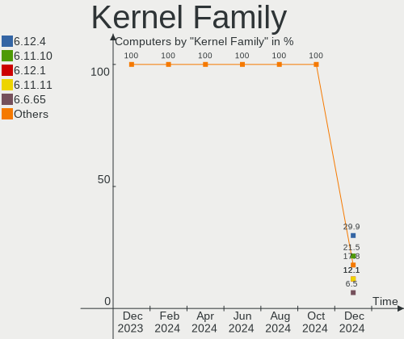
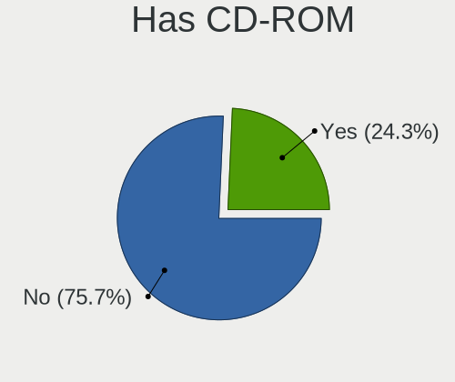
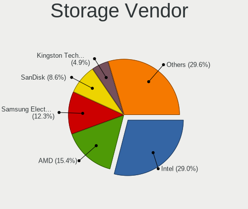
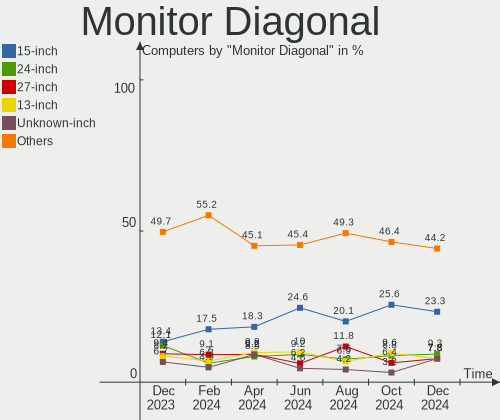
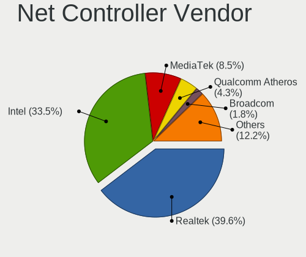

Manjaro Hardware Trends
-----------------------

A project to identify most popular hardware characteristics and track their change
over time based on data collected by Manjaro users at https://Linux-Hardware.org.

Anyone can contribute to the study by uploading probes of their computers by
the [hw-probe](https://github.com/linuxhw/hw-probe) tool:

    sudo -E hw-probe -all -upload

This is a report for all computer types. See also reports for [desktops](/Dist/Manjaro/Desktop/README.md) and [notebooks](/Dist/Manjaro/Notebook/README.md).

Full-feature report is available here: https://linux-hardware.org/?view=trends

Period: Jan, 2021.

Contents
--------

- [ OS                       ](#os)
- [ OS Family                ](#os-family)
- [ Kernel                   ](#kernel)
- [ Kernel Family            ](#kernel-family)
- [ Kernel Major Ver.        ](#kernel-major-ver)
- [ Arch                     ](#arch)
- [ DE                       ](#de)
- [ Display Server           ](#display-server)
- [ Display Manager          ](#display-manager)
- [ OS Lang                  ](#os-lang)
- [ Boot Mode                ](#boot-mode)
- [ Filesystem               ](#filesystem)
- [ Part. scheme             ](#part-scheme)
- [ Dual Boot with Linux/BSD ](#dual-boot-with-linux/bsd)
- [ Dual Boot (Win)          ](#dual-boot-win)
- [ Country                  ](#country)
- [ City                     ](#city)
- [ Vendor                   ](#vendor)
- [ Model                    ](#model)
- [ Model Family             ](#model-family)
- [ MFG Year                 ](#mfg-year)
- [ Form Factor              ](#form-factor)
- [ Secure Boot              ](#secure-boot)
- [ Coreboot                 ](#coreboot)
- [ RAM Size                 ](#ram-size)
- [ RAM Used                 ](#ram-used)
- [ Has CD-ROM               ](#has-cd-rom)
- [ Total Drives             ](#total-drives)
- [ Has Ethernet             ](#has-ethernet)
- [ Drive Vendor             ](#drive-vendor)
- [ Drive Model              ](#drive-model)
- [ HDD Vendor               ](#hdd-vendor)
- [ SSD Vendor               ](#ssd-vendor)
- [ Drive Kind               ](#drive-kind)
- [ Drive Connector          ](#drive-connector)
- [ Drive Size               ](#drive-size)
- [ Space Total              ](#space-total)
- [ Space Used               ](#space-used)
- [ Malfunc. Drives          ](#malfunc-drives)
- [ Malfunc. Drive Vendor    ](#malfunc-drive-vendor)
- [ Malfunc. HDD Vendor      ](#malfunc-hdd-vendor)
- [ Malfunc. Drive Kind      ](#malfunc-drive-kind)
- [ Failed Drives            ](#failed-drives)
- [ Failed Drive Vendor      ](#failed-drive-vendor)
- [ Drive Status             ](#drive-status)
- [ Storage Vendor           ](#storage-vendor)
- [ Storage Model            ](#storage-model)
- [ Storage Kind             ](#storage-kind)
- [ CPU Vendor               ](#cpu-vendor)
- [ CPU Model                ](#cpu-model)
- [ CPU Model Family         ](#cpu-model-family)
- [ CPU Cores                ](#cpu-cores)
- [ CPU Sockets              ](#cpu-sockets)
- [ CPU Threads              ](#cpu-threads)
- [ CPU Op-Modes             ](#cpu-op-modes)
- [ CPU Microcode            ](#cpu-microcode)
- [ CPU Microarch            ](#cpu-microarch)
- [ GPU Vendor               ](#gpu-vendor)
- [ GPU Model                ](#gpu-model)
- [ GPU Combo                ](#gpu-combo)
- [ GPU Driver               ](#gpu-driver)
- [ GPU Memory               ](#gpu-memory)
- [ Monitor Vendor           ](#monitor-vendor)
- [ Monitor Model            ](#monitor-model)
- [ Monitor Resolution       ](#monitor-resolution)
- [ Monitor Diagonal         ](#monitor-diagonal)
- [ Monitor Width            ](#monitor-width)
- [ Aspect Ratio             ](#aspect-ratio)
- [ Monitor Area             ](#monitor-area)
- [ Pixel Density            ](#pixel-density)
- [ Multiple Monitors        ](#multiple-monitors)
- [ Net Controller Vendor    ](#net-controller-vendor)
- [ Net Controller Model     ](#net-controller-model)
- [ Wireless Vendor          ](#wireless-vendor)
- [ Wireless Model           ](#wireless-model)
- [ Ethernet Vendor          ](#ethernet-vendor)
- [ Ethernet Model           ](#ethernet-model)
- [ Net Controller Kind      ](#net-controller-kind)
- [ Used Controller          ](#used-controller)
- [ NICs                     ](#nics)
- [ Memory Vendor            ](#memory-vendor)
- [ Memory Model             ](#memory-model)
- [ Memory Kind              ](#memory-kind)
- [ Memory Form Factor       ](#memory-form-factor)
- [ Memory Size              ](#memory-size)
- [ Memory Speed             ](#memory-speed)
- [ Sound Vendor             ](#sound-vendor)
- [ Sound Model              ](#sound-model)
- [ Camera Vendor            ](#camera-vendor)
- [ Camera Model             ](#camera-model)
- [ Fingerprint Vendor       ](#fingerprint-vendor)
- [ Fingerprint Model        ](#fingerprint-model)
- [ Chipcard Vendor          ](#chipcard-vendor)
- [ Chipcard Model           ](#chipcard-model)
- [ Printer Vendor           ](#printer-vendor)
- [ Printer Model            ](#printer-model)
- [ Scanner Vendor           ](#scanner-vendor)
- [ Scanner Model            ](#scanner-model)
- [ Bluetooth Vendor         ](#bluetooth-vendor)
- [ Bluetooth Model          ](#bluetooth-model)
- [ Unsupported Devices      ](#unsupported-devices)
- [ Unsupported Device Types ](#unsupported-device-types)

OS
--

Installed operating systems

| Name           | Computers | Percent |
|----------------|-----------|---------|
| Manjaro        | 106       | 45.11%  |
| Manjaro 20.2.1 | 95        | 40.43%  |
| Manjaro 20.2   | 33        | 14.04%  |
| Manjaro 20.1   | 1         | 0.43%   |

OS Family
---------

OS without a version

| Name    | Computers | Percent |
|---------|-----------|---------|
| Manjaro | 235       | 100%    |

Kernel
------

Version of the Linux kernel

| Version                                | Computers | Percent |
|----------------------------------------|-----------|---------|
| 5.9.16-1-MANJARO                       | 83        | 35.32%  |
| 5.10.2-2-MANJARO                       | 60        | 25.53%  |
| 5.10.7-3-MANJARO                       | 35        | 14.89%  |
| 5.4.85-1-MANJARO                       | 14        | 5.96%   |
| 5.9.11-3-MANJARO                       | 9         | 3.83%   |
| 5.4.89-1-MANJARO                       | 6         | 2.55%   |
| 5.4.80-2-MANJARO                       | 4         | 1.7%    |
| 5.8.18-1-MANJARO                       | 3         | 1.28%   |
| 5.9.14-100-tkg-upds-llvm               | 1         | 0.43%   |
| 5.6.15-1-MANJARO                       | 1         | 0.43%   |
| 5.4.74-1-MANJARO                       | 1         | 0.43%   |
| 5.11.0-rc1-1-drm-tip-git-g2713b5aa1b76 | 1         | 0.43%   |
| 5.11.0-2-MANJARO                       | 1         | 0.43%   |
| 5.11.0-1-MANJARO                       | 1         | 0.43%   |
| 5.10.9-arch1-1                         | 1         | 0.43%   |
| 5.10.8-arch1-1-surface                 | 1         | 0.43%   |
| 5.10.7-AMD-znver2                      | 1         | 0.43%   |
| 5.10.7-1-MANJARO                       | 1         | 0.43%   |
| 5.10.6-lqx1-1-lqx                      | 1         | 0.43%   |
| 5.10.6-1-ck-zen2                       | 1         | 0.43%   |
| 5.10.4-2-MANJARO                       | 1         | 0.43%   |
| 5.10.4-1-MANJARO                       | 1         | 0.43%   |
| 5.10.3-2-MANJARO                       | 1         | 0.43%   |
| 5.10.10-1-MANJARO                      | 1         | 0.43%   |
| 5.10.1-103-tkg-bmq                     | 1         | 0.43%   |
| 5.10.0-1-MANJARO                       | 1         | 0.43%   |
| 4.19.163-1-MANJARO                     | 1         | 0.43%   |
| 4.19.154-1-MANJARO                     | 1         | 0.43%   |
| 4.19.144-1-MANJARO                     | 1         | 0.43%   |

Kernel Family
-------------

Linux kernel without a distro release

| Version  | Computers | Percent |
|----------|-----------|---------|
| 5.9.16   | 83        | 35.32%  |
| 5.10.2   | 60        | 25.53%  |
| 5.10.7   | 37        | 15.74%  |
| 5.4.85   | 14        | 5.96%   |
| 5.9.11   | 9         | 3.83%   |
| 5.4.89   | 6         | 2.55%   |
| 5.4.80   | 4         | 1.7%    |
| 5.8.18   | 3         | 1.28%   |
| 5.11.0   | 3         | 1.28%   |
| 5.10.6   | 2         | 0.85%   |
| 5.10.4   | 2         | 0.85%   |
| 5.9.14   | 1         | 0.43%   |
| 5.6.15   | 1         | 0.43%   |
| 5.4.74   | 1         | 0.43%   |
| 5.10.9   | 1         | 0.43%   |
| 5.10.8   | 1         | 0.43%   |
| 5.10.3   | 1         | 0.43%   |
| 5.10.10  | 1         | 0.43%   |
| 5.10.1   | 1         | 0.43%   |
| 5.10.0   | 1         | 0.43%   |
| 4.19.163 | 1         | 0.43%   |
| 4.19.154 | 1         | 0.43%   |
| 4.19.144 | 1         | 0.43%   |

Kernel Major Ver.
-----------------

Linux kernel major version

| Version | Computers | Percent |
|---------|-----------|---------|
| 5.10    | 107       | 45.53%  |
| 5.9     | 93        | 39.57%  |
| 5.4     | 25        | 10.64%  |
| 5.8     | 3         | 1.28%   |
| 5.11    | 3         | 1.28%   |
| 4.19    | 3         | 1.28%   |
| 5.6     | 1         | 0.43%   |

Arch
----

OS architecture (x86_64, i586, etc.)

| Name   | Computers | Percent |
|--------|-----------|---------|
| x86_64 | 235       | 100%    |

DE
--

Desktop Environment

| Name              | Computers | Percent |
|-------------------|-----------|---------|
| XFCE              | 64        | 27.23%  |
| KDE5              | 52        | 22.13%  |
| GNOME             | 51        | 21.7%   |
| KDE               | 37        | 15.74%  |
| X-Cinnamon        | 6         | 2.55%   |
| MATE              | 5         | 2.13%   |
| Cinnamon          | 4         | 1.7%    |
| Unknown           | 4         | 1.7%    |
| LXDE              | 2         | 0.85%   |
| leftwm            | 2         | 0.85%   |
| i3                | 2         | 0.85%   |
| awesome           | 2         | 0.85%   |
| Yaru:ubuntu:GNOME | 1         | 0.43%   |
| LXQt              | 1         | 0.43%   |
| Budgie            | 1         | 0.43%   |
| Bspwm             | 1         | 0.43%   |

Display Server
--------------

X11 or Wayland

| Name    | Computers | Percent |
|---------|-----------|---------|
| X11     | 202       | 85.96%  |
| Wayland | 25        | 10.64%  |
| Tty     | 4         | 1.7%    |
| Unknown | 4         | 1.7%    |

Display Manager
---------------

SDDM, LightDM, etc.

| Name    | Computers | Percent |
|---------|-----------|---------|
| Unknown | 101       | 42.98%  |
| SDDM    | 52        | 22.13%  |
| LightDM | 50        | 21.28%  |
| GDM     | 27        | 11.49%  |
| TDM     | 5         | 2.13%   |

OS Lang
-------

Language

| Lang       | Computers | Percent |
|------------|-----------|---------|
| en_US      | 107       | 45.53%  |
| de_DE      | 26        | 11.06%  |
| ru_RU      | 17        | 7.23%   |
| en_GB      | 14        | 5.96%   |
| pt_BR      | 10        | 4.26%   |
| es_ES      | 6         | 2.55%   |
| fr_FR      | 5         | 2.13%   |
| ru_UA      | 4         | 1.7%    |
| pl_PL      | 4         | 1.7%    |
| it_IT      | 4         | 1.7%    |
| en_AU      | 4         | 1.7%    |
| de_AT      | 4         | 1.7%    |
| zh_CN      | 3         | 1.28%   |
| fi_FI      | 2         | 0.85%   |
| en_IN      | 2         | 0.85%   |
| en_CA      | 2         | 0.85%   |
| Unknown    | 2         | 0.85%   |
| sv_SE      | 1         | 0.43%   |
| pt_PT      | 1         | 0.43%   |
| nl_NL      | 1         | 0.43%   |
| hu_HU      | 1         | 0.43%   |
| fr_CA      | 1         | 0.43%   |
| fr_BE      | 1         | 0.43%   |
| es_MX      | 1         | 0.43%   |
| es_CO      | 1         | 0.43%   |
| es_AR      | 1         | 0.43%   |
| en_ZA      | 1         | 0.43%   |
| en_US.UTF8 | 1         | 0.43%   |
| en_SG      | 1         | 0.43%   |
| en_PH      | 1         | 0.43%   |
| en_IE      | 1         | 0.43%   |
| en_DE      | 1         | 0.43%   |
| en_150     | 1         | 0.43%   |
| de_CH      | 1         | 0.43%   |
| cs_CZ      | 1         | 0.43%   |
| bg_BG      | 1         | 0.43%   |

Boot Mode
---------

EFI or BIOS

| Mode | Computers | Percent |
|------|-----------|---------|
| BIOS | 138       | 58.72%  |
| EFI  | 97        | 41.28%  |

Filesystem
----------

Type of filesystem

| Type    | Computers | Percent |
|---------|-----------|---------|
| Ext4    | 204       | 86.81%  |
| Btrfs   | 22        | 9.36%   |
| Overlay | 6         | 2.55%   |
| Xfs     | 2         | 0.85%   |
| Jfs     | 1         | 0.43%   |

Part. scheme
------------

Scheme of partitioning

| Type    | Computers | Percent |
|---------|-----------|---------|
| Unknown | 104       | 44.26%  |
| GPT     | 100       | 42.55%  |
| MBR     | 31        | 13.19%  |

Dual Boot with Linux/BSD
------------------------

Hosting more than one Linux/BSD

| Dual boot | Computers | Percent |
|-----------|-----------|---------|
| No        | 207       | 88.09%  |
| Yes       | 28        | 11.91%  |

Dual Boot (Win)
---------------

Hosting Linux and Windows

| Dual boot | Computers | Percent |
|-----------|-----------|---------|
| No        | 156       | 66.38%  |
| Yes       | 79        | 33.62%  |

Country
-------

Geographic location (country)

| Country              | Computers | Percent |
|----------------------|-----------|---------|
| USA                  | 39        | 16.6%   |
| Germany              | 38        | 16.17%  |
| Russia               | 21        | 8.94%   |
| Brazil               | 14        | 5.96%   |
| UK                   | 11        | 4.68%   |
| Ukraine              | 8         | 3.4%    |
| Canada               | 7         | 2.98%   |
| Spain                | 6         | 2.55%   |
| France               | 6         | 2.55%   |
| Poland               | 5         | 2.13%   |
| Norway               | 5         | 2.13%   |
| Netherlands          | 5         | 2.13%   |
| India                | 5         | 2.13%   |
| Austria              | 5         | 2.13%   |
| Italy                | 4         | 1.7%    |
| Bulgaria             | 4         | 1.7%    |
| Australia            | 4         | 1.7%    |
| Mexico               | 3         | 1.28%   |
| Lithuania            | 3         | 1.28%   |
| Costa Rica           | 3         | 1.28%   |
| Belarus              | 3         | 1.28%   |
| Switzerland          | 2         | 0.85%   |
| Sweden               | 2         | 0.85%   |
| Moldova, Republic of | 2         | 0.85%   |
| Ireland              | 2         | 0.85%   |
| Hungary              | 2         | 0.85%   |
| Finland              | 2         | 0.85%   |
| Czech Republic       | 2         | 0.85%   |
| Bangladesh           | 2         | 0.85%   |
| UAE                  | 1         | 0.43%   |
| Turkey               | 1         | 0.43%   |
| South Africa         | 1         | 0.43%   |
| Singapore            | 1         | 0.43%   |
| Romania              | 1         | 0.43%   |
| Portugal             | 1         | 0.43%   |
| Philippines          | 1         | 0.43%   |
| Peru                 | 1         | 0.43%   |
| Lebanon              | 1         | 0.43%   |
| Latvia               | 1         | 0.43%   |
| Israel               | 1         | 0.43%   |
| Iran                 | 1         | 0.43%   |
| Indonesia            | 1         | 0.43%   |
| Hong Kong            | 1         | 0.43%   |
| Egypt                | 1         | 0.43%   |
| Croatia              | 1         | 0.43%   |
| Colombia             | 1         | 0.43%   |
| China                | 1         | 0.43%   |
| Belgium              | 1         | 0.43%   |
| Argentina            | 1         | 0.43%   |

City
----

Geographic location (city)

| City              | Computers | Percent |
|-------------------|-----------|---------|
| Berlin            | 6         | 2.55%   |
| Moscow            | 5         | 2.13%   |
| São Paulo        | 3         | 1.28%   |
| Walton on Thames  | 2         | 0.85%   |
| Vilnius           | 2         | 0.85%   |
| Vienna            | 2         | 0.85%   |
| Rostov-on-Don     | 2         | 0.85%   |
| Oslo              | 2         | 0.85%   |
| Omsk              | 2         | 0.85%   |
| Odesa             | 2         | 0.85%   |
| Nuremberg         | 2         | 0.85%   |
| Naples            | 2         | 0.85%   |
| Munich            | 2         | 0.85%   |
| Minsk             | 2         | 0.85%   |
| Kansas City       | 2         | 0.85%   |
| Dublin            | 2         | 0.85%   |
| Dhaka             | 2         | 0.85%   |
| Curitiba          | 2         | 0.85%   |
| Chisinau          | 2         | 0.85%   |
| Alajuela          | 2         | 0.85%   |
| Zurich            | 1         | 0.43%   |
| Zhodzina          | 1         | 0.43%   |
| Zanesville        | 1         | 0.43%   |
| Yalta             | 1         | 0.43%   |
| Wyandotte         | 1         | 0.43%   |
| Wurzburg          | 1         | 0.43%   |
| Wolgast           | 1         | 0.43%   |
| Woking            | 1         | 0.43%   |
| West Jordan       | 1         | 0.43%   |
| Wałbrzych        | 1         | 0.43%   |
| Volonne           | 1         | 0.43%   |
| Villeneuve-Loubet | 1         | 0.43%   |
| Venice            | 1         | 0.43%   |
| Varna             | 1         | 0.43%   |
| Vancouver         | 1         | 0.43%   |
| Valmiera          | 1         | 0.43%   |
| Tykocin           | 1         | 0.43%   |
| Turku             | 1         | 0.43%   |
| Tuguegarao City   | 1         | 0.43%   |
| Trivandrum        | 1         | 0.43%   |
| Toronto           | 1         | 0.43%   |
| Tomsk             | 1         | 0.43%   |
| Ternopil          | 1         | 0.43%   |
| Tenosique         | 1         | 0.43%   |
| Tel Aviv          | 1         | 0.43%   |
| Sylt-Ost          | 1         | 0.43%   |
| Surrey            | 1         | 0.43%   |
| Stuttgart         | 1         | 0.43%   |
| Stockholm         | 1         | 0.43%   |
| Stavropol         | 1         | 0.43%   |
| Sofia             | 1         | 0.43%   |
| Skjetten          | 1         | 0.43%   |
| Singapore         | 1         | 0.43%   |
| Sidon             | 1         | 0.43%   |
| Semarang          | 1         | 0.43%   |
| Schwarzenburg     | 1         | 0.43%   |
| Schneckenlohe     | 1         | 0.43%   |
| Schiedam          | 1         | 0.43%   |
| Saratov           | 1         | 0.43%   |
| Salzburg          | 1         | 0.43%   |

Vendor
------

Motherboard manufacturer

| Name                             | Computers | Percent |
|----------------------------------|-----------|---------|
| ASUSTek Computer                 | 38        | 16.17%  |
| Lenovo                           | 37        | 15.74%  |
| Hewlett-Packard                  | 30        | 12.77%  |
| Gigabyte Technology              | 25        | 10.64%  |
| Dell                             | 21        | 8.94%   |
| MSI                              | 20        | 8.51%   |
| ASRock                           | 14        | 5.96%   |
| Acer                             | 9         | 3.83%   |
| Apple                            | 5         | 2.13%   |
| Samsung Electronics              | 4         | 1.7%    |
| Intel                            | 4         | 1.7%    |
| HUAWEI                           | 3         | 1.28%   |
| Toshiba                          | 2         | 0.85%   |
| Timi                             | 2         | 0.85%   |
| Sony                             | 2         | 0.85%   |
| Positivo                         | 2         | 0.85%   |
| Microsoft                        | 2         | 0.85%   |
| TUXEDO                           | 1         | 0.43%   |
| Star Labs                        | 1         | 0.43%   |
| SiYW                             | 1         | 0.43%   |
| Razer                            | 1         | 0.43%   |
| Notebook                         | 1         | 0.43%   |
| Medion                           | 1         | 0.43%   |
| Login Informatica                | 1         | 0.43%   |
| FUJITSU CLIENT COMPUTING LIMITED | 1         | 0.43%   |
| Fujitsu                          | 1         | 0.43%   |
| Foxconn                          | 1         | 0.43%   |
| EVGA                             | 1         | 0.43%   |
| Chuwi                            | 1         | 0.43%   |
| Biostar                          | 1         | 0.43%   |
| Alienware                        | 1         | 0.43%   |
| ALDO                             | 1         | 0.43%   |

Model
-----

Motherboard model

| Name                                     | Computers | Percent |
|------------------------------------------|-----------|---------|
| Gigabyte B450M DS3H                      | 4         | 1.7%    |
| MSI MS-7C84                              | 2         | 0.85%   |
| MSI MS-7C37                              | 2         | 0.85%   |
| Lenovo Yoga Slim 7 14ARE05 82A2          | 2         | 0.85%   |
| HP EliteBook 8770w                       | 2         | 0.85%   |
| Dell Inspiron 5584                       | 2         | 0.85%   |
| ASRock H61M/U3S3                         | 2         | 0.85%   |
| ASRock B450M Pro4                        | 2         | 0.85%   |
| TUXEDO Book XP1511                       | 1         | 0.43%   |
| Toshiba Satellite P755                   | 1         | 0.43%   |
| Toshiba Satellite L855                   | 1         | 0.43%   |
| Timi TM1703                              | 1         | 0.43%   |
| Timi RedmiBook 14 II                     | 1         | 0.43%   |
| Star Labs LabTop                         | 1         | 0.43%   |
| Sony VGN-TZ170N                          | 1         | 0.43%   |
| Sony SVF13N2J2RS                         | 1         | 0.43%   |
| SiYW V200 Series                         | 1         | 0.43%   |
| Samsung RF511/RF411/RF711                | 1         | 0.43%   |
| Samsung QX311/QX411/QX412/QX511          | 1         | 0.43%   |
| Samsung 550XCJ/550XCR                    | 1         | 0.43%   |
| Samsung 340XAA/350XAA/550XAA             | 1         | 0.43%   |
| Razer Blade                              | 1         | 0.43%   |
| Positivo MOBILE                          | 1         | 0.43%   |
| Positivo CHT14B                          | 1         | 0.43%   |
| Notebook NB50TZ                          | 1         | 0.43%   |
| MSI PE72 7RE                             | 1         | 0.43%   |
| MSI MS-7C94                              | 1         | 0.43%   |
| MSI MS-7C91                              | 1         | 0.43%   |
| MSI MS-7C02                              | 1         | 0.43%   |
| MSI MS-7B93                              | 1         | 0.43%   |
| MSI MS-7B86                              | 1         | 0.43%   |
| MSI MS-7A78                              | 1         | 0.43%   |
| MSI MS-7A39                              | 1         | 0.43%   |
| MSI MS-7924                              | 1         | 0.43%   |
| MSI MS-7751                              | 1         | 0.43%   |
| MSI MS-7641                              | 1         | 0.43%   |
| MSI GV62 8RD                             | 1         | 0.43%   |
| MSI GT72 6QD                             | 1         | 0.43%   |
| MSI GL63 9SEK                            | 1         | 0.43%   |
| MSI GL63 8RC                             | 1         | 0.43%   |
| MSI GE72VR 7RF                           | 1         | 0.43%   |
| Microsoft Surface Pro 4                  | 1         | 0.43%   |
| Microsoft Surface Pro 3                  | 1         | 0.43%   |
| Medion MS-7800                           | 1         | 0.43%   |
| Login Informatica LOG-QAL30              | 1         | 0.43%   |
| Lenovo Z51-70 80K6                       | 1         | 0.43%   |
| Lenovo Yoga Slim 7 14ITL05 82A3          | 1         | 0.43%   |
| Lenovo Y720-15IKB 80VR                   | 1         | 0.43%   |
| Lenovo Y520-15IKBN 80WK                  | 1         | 0.43%   |
| Lenovo Y520-15IKBM 80YY                  | 1         | 0.43%   |
| Lenovo V330-15IKB 81AX                   | 1         | 0.43%   |
| Lenovo ThinkPad X230 2325AC7             | 1         | 0.43%   |
| Lenovo ThinkPad X1 Carbon 6th 20KHCTO1WW | 1         | 0.43%   |
| Lenovo ThinkPad W520 4282A23             | 1         | 0.43%   |
| Lenovo ThinkPad T570 20HAS01E00          | 1         | 0.43%   |
| Lenovo ThinkPad T480 20L6002DMX          | 1         | 0.43%   |
| Lenovo ThinkPad T450s 20BWS3MG00         | 1         | 0.43%   |
| Lenovo ThinkPad T440p 20AWS4XN00         | 1         | 0.43%   |
| Lenovo ThinkPad T430 2349G5G             | 1         | 0.43%   |
| Lenovo ThinkPad T410 2537V28             | 1         | 0.43%   |

Model Family
------------

Motherboard model prefix

| Name                   | Computers | Percent |
|------------------------|-----------|---------|
| Lenovo ThinkPad        | 14        | 5.96%   |
| Lenovo IdeaPad         | 11        | 4.68%   |
| Dell Inspiron          | 8         | 3.4%    |
| ASUS PRIME             | 8         | 3.4%    |
| HP EliteBook           | 7         | 2.98%   |
| HP Pavilion            | 5         | 2.13%   |
| Acer Aspire            | 5         | 2.13%   |
| HP Laptop              | 4         | 1.7%    |
| Gigabyte B450M         | 4         | 1.7%    |
| Dell XPS               | 4         | 1.7%    |
| Lenovo Yoga            | 3         | 1.28%   |
| Gigabyte X570          | 3         | 1.28%   |
| Dell OptiPlex          | 3         | 1.28%   |
| ASUS TUF               | 3         | 1.28%   |
| Toshiba Satellite      | 2         | 0.85%   |
| MSI MS-7C84            | 2         | 0.85%   |
| MSI MS-7C37            | 2         | 0.85%   |
| MSI GL63               | 2         | 0.85%   |
| Microsoft Surface      | 2         | 0.85%   |
| Lenovo Legion          | 2         | 0.85%   |
| HP Spectre             | 2         | 0.85%   |
| HP ProBook             | 2         | 0.85%   |
| Gigabyte Z370          | 2         | 0.85%   |
| Gigabyte GA-78LMT-USB3 | 2         | 0.85%   |
| Dell Vostro            | 2         | 0.85%   |
| Dell Precision         | 2         | 0.85%   |
| Dell Latitude          | 2         | 0.85%   |
| ASUS ZenBook           | 2         | 0.85%   |
| ASUS VivoBook          | 2         | 0.85%   |
| ASUS ROG               | 2         | 0.85%   |
| ASRock H61M            | 2         | 0.85%   |
| ASRock B450M           | 2         | 0.85%   |
| ASRock B450            | 2         | 0.85%   |
| TUXEDO Book            | 1         | 0.43%   |
| Timi TM1703            | 1         | 0.43%   |
| Timi RedmiBook         | 1         | 0.43%   |
| Star Labs LabTop       | 1         | 0.43%   |
| Sony VGN-TZ170N        | 1         | 0.43%   |
| Sony SVF13N2J2RS       | 1         | 0.43%   |
| SiYW V200              | 1         | 0.43%   |
| Samsung RF511          | 1         | 0.43%   |
| Samsung QX311          | 1         | 0.43%   |
| Samsung 550XCJ         | 1         | 0.43%   |
| Samsung 340XAA         | 1         | 0.43%   |
| Razer Blade            | 1         | 0.43%   |
| Positivo MOBILE        | 1         | 0.43%   |
| Positivo CHT14B        | 1         | 0.43%   |
| Notebook NB50TZ        | 1         | 0.43%   |
| MSI PE72               | 1         | 0.43%   |
| MSI MS-7C94            | 1         | 0.43%   |
| MSI MS-7C91            | 1         | 0.43%   |
| MSI MS-7C02            | 1         | 0.43%   |
| MSI MS-7B93            | 1         | 0.43%   |
| MSI MS-7B86            | 1         | 0.43%   |
| MSI MS-7A78            | 1         | 0.43%   |
| MSI MS-7A39            | 1         | 0.43%   |
| MSI MS-7924            | 1         | 0.43%   |
| MSI MS-7751            | 1         | 0.43%   |
| MSI MS-7641            | 1         | 0.43%   |
| MSI GV62               | 1         | 0.43%   |

MFG Year
--------

Motherboard manufacture year

| Year | Computers | Percent |
|------|-----------|---------|
| 2020 | 73        | 31.06%  |
| 2019 | 43        | 18.3%   |
| 2018 | 24        | 10.21%  |
| 2013 | 14        | 5.96%   |
| 2011 | 14        | 5.96%   |
| 2017 | 12        | 5.11%   |
| 2012 | 12        | 5.11%   |
| 2016 | 10        | 4.26%   |
| 2010 | 8         | 3.4%    |
| 2015 | 7         | 2.98%   |
| 2014 | 7         | 2.98%   |
| 2007 | 4         | 1.7%    |
| 2009 | 3         | 1.28%   |
| 2008 | 3         | 1.28%   |
| 2021 | 1         | 0.43%   |

Form Factor
-----------

Physical design of the computer

| Name        | Computers | Percent |
|-------------|-----------|---------|
| Notebook    | 128       | 54.47%  |
| Desktop     | 91        | 38.72%  |
| Convertible | 10        | 4.26%   |
| Tablet      | 2         | 0.85%   |
| Mini pc     | 2         | 0.85%   |
| All in one  | 2         | 0.85%   |

Secure Boot
-----------

Enabled or disabled

| State    | Computers | Percent |
|----------|-----------|---------|
| Disabled | 235       | 100%    |

Coreboot
--------

Have coreboot on board

| Used | Computers | Percent |
|------|-----------|---------|
| No   | 234       | 99.57%  |
| Yes  | 1         | 0.43%   |

RAM Size
--------

Total RAM memory

| Size in GB  | Computers | Percent |
|-------------|-----------|---------|
| 16.01-24.0  | 64        | 27.23%  |
| 4.01-8.0    | 58        | 24.68%  |
| 8.01-16.0   | 46        | 19.57%  |
| 32.01-64.0  | 31        | 13.19%  |
| 3.01-4.0    | 22        | 9.36%   |
| 64.01-256.0 | 6         | 2.55%   |
| 1.01-2.0    | 5         | 2.13%   |
| 2.01-3.0    | 2         | 0.85%   |
| 24.01-32.0  | 1         | 0.43%   |

RAM Used
--------

Used RAM memory

| Used GB    | Computers | Percent |
|------------|-----------|---------|
| 2.01-3.0   | 71        | 30.21%  |
| 1.01-2.0   | 64        | 27.23%  |
| 4.01-8.0   | 42        | 17.87%  |
| 3.01-4.0   | 38        | 16.17%  |
| 0.51-1.0   | 10        | 4.26%   |
| 8.01-16.0  | 8         | 3.4%    |
| 32.01-64.0 | 1         | 0.43%   |
| 0.01-0.5   | 1         | 0.43%   |

Has CD-ROM
----------

Has CD-ROM on board

| Presented | Computers | Percent |
|-----------|-----------|---------|
| No        | 157       | 66.81%  |
| Yes       | 78        | 33.19%  |

Total Drives
------------

Number of drives on board

| Drives | Computers | Percent |
|--------|-----------|---------|
| 1      | 118       | 50.21%  |
| 2      | 70        | 29.79%  |
| 3      | 27        | 11.49%  |
| 4      | 11        | 4.68%   |
| 5      | 3         | 1.28%   |
| 6      | 2         | 0.85%   |
| 11     | 1         | 0.43%   |
| 9      | 1         | 0.43%   |
| 7      | 1         | 0.43%   |
| 0      | 1         | 0.43%   |

Has Ethernet
------------

Has Ethernet on board

| Presented | Computers | Percent |
|-----------|-----------|---------|
| Yes       | 197       | 83.83%  |
| No        | 38        | 16.17%  |

Drive Vendor
------------

Hard drive vendors

| Vendor              | Computers | Drives | Percent |
|---------------------|-----------|--------|---------|
| Samsung Electronics | 75        | 104    | 19.38%  |
| WDC                 | 64        | 72     | 16.54%  |
| Seagate             | 52        | 55     | 13.44%  |
| Toshiba             | 24        | 25     | 6.2%    |
| SanDisk             | 21        | 21     | 5.43%   |
| Kingston            | 21        | 23     | 5.43%   |
| Crucial             | 19        | 20     | 4.91%   |
| Intel               | 15        | 16     | 3.88%   |
| HGST                | 13        | 14     | 3.36%   |
| Unknown             | 12        | 13     | 3.1%    |
| SK Hynix            | 9         | 9      | 2.33%   |
| Phison              | 7         | 7      | 1.81%   |
| A-DATA Technology   | 5         | 8      | 1.29%   |
| Transcend           | 4         | 4      | 1.03%   |
| Silicon Motion      | 4         | 4      | 1.03%   |
| Micron Technology   | 4         | 4      | 1.03%   |
| Apple               | 4         | 4      | 1.03%   |
| JMicron             | 3         | 3      | 0.78%   |
| Hitachi             | 3         | 3      | 0.78%   |
| GOODRAM             | 3         | 3      | 0.78%   |
| PNY                 | 2         | 2      | 0.52%   |
| Patriot             | 2         | 2      | 0.52%   |
| China               | 2         | 2      | 0.52%   |
| XPG                 | 1         | 1      | 0.26%   |
| WDC WDS5            | 1         | 1      | 0.26%   |
| Team                | 1         | 1      | 0.26%   |
| SPCC                | 1         | 1      | 0.26%   |
| SMI                 | 1         | 1      | 0.26%   |
| OCZ                 | 1         | 1      | 0.26%   |
| NGFF                | 1         | 1      | 0.26%   |
| Maxtor              | 1         | 1      | 0.26%   |
| LITEONIT            | 1         | 1      | 0.26%   |
| LITEON              | 1         | 1      | 0.26%   |
| KIOXIA              | 1         | 1      | 0.26%   |
| KingSpec            | 1         | 1      | 0.26%   |
| Intenso             | 1         | 1      | 0.26%   |
| Gigabyte Technology | 1         | 1      | 0.26%   |
| External            | 1         | 1      | 0.26%   |
| Dell                | 1         | 1      | 0.26%   |
| CT500P2S            | 1         | 1      | 0.26%   |
| Corsair             | 1         | 1      | 0.26%   |
| Apacer              | 1         | 1      | 0.26%   |

Drive Model
-----------

Hard drive models

| Model                               | Computers | Percent |
|-------------------------------------|-----------|---------|
| Samsung SSD 850 EVO 500GB           | 7         | 1.65%   |
| WDC WDS240G2G0A-00JH30 240GB SSD    | 6         | 1.41%   |
| Samsung SSD 860 EVO 500GB           | 6         | 1.41%   |
| Samsung NVMe SSD Drive 256GB        | 6         | 1.41%   |
| Sandisk NVMe SSD Drive 1TB          | 5         | 1.18%   |
| Samsung SSD 970 EVO 1TB             | 5         | 1.18%   |
| Samsung SSD 850 EVO 250GB           | 5         | 1.18%   |
| Kingston SA400S37480G 480GB SSD     | 5         | 1.18%   |
| Intel NVMe SSD Drive 512GB          | 5         | 1.18%   |
| Unknown SD/MMC/MS PRO 32GB          | 4         | 0.94%   |
| Seagate ST1000LM035-1RK172 1TB      | 4         | 0.94%   |
| Samsung SSD 960 EVO 250GB           | 4         | 0.94%   |
| Samsung NVMe SSD Drive 512GB        | 4         | 0.94%   |
| Kingston SA400S37240G 240GB SSD     | 4         | 0.94%   |
| WDC WDS500G2B0A-00SM50 500GB SSD    | 3         | 0.71%   |
| WDC WD10SPZX-24Z10 1TB              | 3         | 0.71%   |
| WDC WD10EZEX-08WN4A0 1TB            | 3         | 0.71%   |
| WDC WD10EZEX-00BN5A0 1TB            | 3         | 0.71%   |
| Unknown MMC Card  32GB              | 3         | 0.71%   |
| Toshiba DT01ACA100 1TB              | 3         | 0.71%   |
| SK Hynix NVMe SSD Drive 512GB       | 3         | 0.71%   |
| Seagate ST1000DM010-2EP102 1TB      | 3         | 0.71%   |
| Samsung SSD 970 EVO 500GB           | 3         | 0.71%   |
| Samsung SSD 860 EVO 1TB             | 3         | 0.71%   |
| Samsung NVMe SSD Drive 500GB        | 3         | 0.71%   |
| Kingston SA400S37120G 120GB SSD     | 3         | 0.71%   |
| HGST HTS721010A9E630 1TB            | 3         | 0.71%   |
| Crucial CT240BX500SSD1 240GB        | 3         | 0.71%   |
| Crucial CT1000MX500SSD1 1TB         | 3         | 0.71%   |
| WDC WD5000AAKX-00ERMA0 500GB        | 2         | 0.47%   |
| WDC WD5000AAKX-001CA0 500GB         | 2         | 0.47%   |
| WDC WD20EZRZ-00Z5HB0 2TB            | 2         | 0.47%   |
| WDC WD20EFRX-68EUZN0 2TB            | 2         | 0.47%   |
| Toshiba KBG30ZMS256G NVMe 256GB     | 2         | 0.47%   |
| SK Hynix NVMe SSD Drive 256GB       | 2         | 0.47%   |
| Silicon Motion NVMe SSD Drive 512GB | 2         | 0.47%   |
| Seagate ST500DM002-1BD142 500GB     | 2         | 0.47%   |
| Seagate ST31500341AS 1TB            | 2         | 0.47%   |
| Seagate ST2000DX002-2DV164 2TB      | 2         | 0.47%   |
| Seagate ST2000DM008-2FR102 2TB      | 2         | 0.47%   |
| Seagate ST2000DM006-2DM164 2TB      | 2         | 0.47%   |
| SanDisk SDSSDP128G 128GB            | 2         | 0.47%   |
| Sandisk NVMe SSD Drive 512GB        | 2         | 0.47%   |
| Samsung SSD 980 PRO 1TB             | 2         | 0.47%   |
| Samsung SSD 860 QVO 1TB             | 2         | 0.47%   |
| Samsung SSD 850 PRO 256GB           | 2         | 0.47%   |
| Samsung NVMe SSD Drive 1TB          | 2         | 0.47%   |
| Samsung MZALQ256HAJD-000L2 256GB    | 2         | 0.47%   |
| Phison NVMe SSD Drive 2TB           | 2         | 0.47%   |
| Intel SSDPEKNW512G8 512GB           | 2         | 0.47%   |
| Intel NVMe SSD Drive 2TB            | 2         | 0.47%   |
| Hitachi HTS545050A7E380 500GB       | 2         | 0.47%   |
| HGST HTS545050A7E680 500GB          | 2         | 0.47%   |
| HGST HTS545050A7E380 500GB          | 2         | 0.47%   |
| Crucial CT500MX500SSD1 500GB        | 2         | 0.47%   |
| Crucial CT1000BX500SSD1 1TB         | 2         | 0.47%   |
| XPG NVMe SSD Drive 1024GB           | 1         | 0.24%   |
| WDC WDS500G2B0B-00YS70 500GB SSD    | 1         | 0.24%   |
| WDC WDS500G2B0B 500GB SSD           | 1         | 0.24%   |
| WDC WDS5 00G2B0C-00PX 500GB SSD     | 1         | 0.24%   |

HDD Vendor
----------

Hard disk drive vendors

| Vendor              | Computers | Drives | Percent |
|---------------------|-----------|--------|---------|
| Seagate             | 52        | 55     | 37.41%  |
| WDC                 | 49        | 55     | 35.25%  |
| Toshiba             | 14        | 14     | 10.07%  |
| HGST                | 13        | 14     | 9.35%   |
| Samsung Electronics | 6         | 10     | 4.32%   |
| Hitachi             | 3         | 3      | 2.16%   |
| Maxtor              | 1         | 1      | 0.72%   |
| Apple               | 1         | 1      | 0.72%   |

SSD Vendor
----------

Solid state drive vendors

| Vendor              | Computers | Drives | Percent |
|---------------------|-----------|--------|---------|
| Samsung Electronics | 39        | 45     | 26.9%   |
| Kingston            | 18        | 19     | 12.41%  |
| Crucial             | 18        | 19     | 12.41%  |
| WDC                 | 13        | 15     | 8.97%   |
| SanDisk             | 10        | 10     | 6.9%    |
| A-DATA Technology   | 5         | 8      | 3.45%   |
| Transcend           | 4         | 4      | 2.76%   |
| Toshiba             | 4         | 4      | 2.76%   |
| Intel               | 4         | 4      | 2.76%   |
| Micron Technology   | 3         | 3      | 2.07%   |
| PNY                 | 2         | 2      | 1.38%   |
| Patriot             | 2         | 2      | 1.38%   |
| JMicron             | 2         | 2      | 1.38%   |
| GOODRAM             | 2         | 2      | 1.38%   |
| China               | 2         | 2      | 1.38%   |
| Apple               | 2         | 2      | 1.38%   |
| WDC WDS5            | 1         | 1      | 0.69%   |
| Unknown             | 1         | 1      | 0.69%   |
| Team                | 1         | 1      | 0.69%   |
| SPCC                | 1         | 1      | 0.69%   |
| SK Hynix            | 1         | 1      | 0.69%   |
| OCZ                 | 1         | 1      | 0.69%   |
| NGFF                | 1         | 1      | 0.69%   |
| LITEONIT            | 1         | 1      | 0.69%   |
| LITEON              | 1         | 1      | 0.69%   |
| KingSpec            | 1         | 1      | 0.69%   |
| Intenso             | 1         | 1      | 0.69%   |
| Gigabyte Technology | 1         | 1      | 0.69%   |
| External            | 1         | 1      | 0.69%   |
| Corsair             | 1         | 1      | 0.69%   |
| Apacer              | 1         | 1      | 0.69%   |

Drive Kind
----------

HDD or SSD

| Kind    | Computers | Drives | Percent |
|---------|-----------|--------|---------|
| HDD     | 122       | 153    | 34.96%  |
| SSD     | 119       | 158    | 34.1%   |
| NVMe    | 93        | 110    | 26.65%  |
| Unknown | 8         | 8      | 2.29%   |
| MMC     | 7         | 8      | 2.01%   |

Drive Connector
---------------

SATA, SAS, NVMe, etc.

| Type | Computers | Drives | Percent |
|------|-----------|--------|---------|
| SATA | 190       | 303    | 62.09%  |
| NVMe | 93        | 110    | 30.39%  |
| SAS  | 16        | 16     | 5.23%   |
| MMC  | 7         | 8      | 2.29%   |

Drive Size
----------

Size of hard drive

| Size in TB | Computers | Drives | Percent |
|------------|-----------|--------|---------|
| 0.01-0.5   | 129       | 164    | 50.39%  |
| 0.51-1.0   | 85        | 97     | 33.2%   |
| 1.01-2.0   | 27        | 34     | 10.55%  |
| 3.01-4.0   | 8         | 9      | 3.13%   |
| 4.01-10.0  | 4         | 4      | 1.56%   |
| 2.01-3.0   | 2         | 2      | 0.78%   |
| 10.01-20.0 | 1         | 1      | 0.39%   |

Space Total
-----------

Amount of disk space available on the file system

| Size in GB     | Computers | Percent |
|----------------|-----------|---------|
| 101-250        | 55        | 23.4%   |
| 251-500        | 46        | 19.57%  |
| 501-1000       | 42        | 17.87%  |
| 1001-2000      | 23        | 9.79%   |
| More than 3000 | 15        | 6.38%   |
| Unknown        | 14        | 5.96%   |
| 21-50          | 11        | 4.68%   |
| 51-100         | 11        | 4.68%   |
| 2001-3000      | 10        | 4.26%   |
| 1-20           | 8         | 3.4%    |

Space Used
----------

Amount of used disk space

| Used GB        | Computers | Percent |
|----------------|-----------|---------|
| 1-20           | 53        | 22.55%  |
| 101-250        | 38        | 16.17%  |
| 21-50          | 30        | 12.77%  |
| 51-100         | 30        | 12.77%  |
| 251-500        | 28        | 11.91%  |
| 501-1000       | 19        | 8.09%   |
| Unknown        | 14        | 5.96%   |
| 1001-2000      | 12        | 5.11%   |
| 2001-3000      | 6         | 2.55%   |
| More than 3000 | 5         | 2.13%   |

Malfunc. Drives
---------------

Drive models with a malfunction

| Model                                               | Computers | Drives | Percent |
|-----------------------------------------------------|-----------|--------|---------|
| Samsung Electronics SSD 960 EVO 250GB               | 2         | 3      | 10.53%  |
| WDC WD6401AALS-00E3A0 640GB                         | 1         | 1      | 5.26%   |
| WDC WD5000AAKX-00ERMA0 500GB                        | 1         | 1      | 5.26%   |
| WDC WD15EARS-00MVWB0 1TB                            | 1         | 1      | 5.26%   |
| Toshiba MK5055GSXF 500GB                            | 1         | 1      | 5.26%   |
| Seagate ST9750423AS 752GB                           | 1         | 1      | 5.26%   |
| Seagate ST500LM012 HN-M500MBB 500GB                 | 1         | 1      | 5.26%   |
| Seagate ST500DM002-1BD142 500GB                     | 1         | 1      | 5.26%   |
| Seagate ST3500312CS 500GB                           | 1         | 1      | 5.26%   |
| Seagate ST31000333AS 1TB                            | 1         | 1      | 5.26%   |
| Seagate ST2000LM007-1R8174 2TB                      | 1         | 1      | 5.26%   |
| Seagate ST1000LM035-1RK172 1TB                      | 1         | 1      | 5.26%   |
| Samsung Electronics SSD 970 EVO 1TB                 | 1         | 1      | 5.26%   |
| Micron Technology MTFDDAV256TDL-1AW1ZABHA 256GB SSD | 1         | 1      | 5.26%   |
| Kingston SMS200S3120G 120GB SSD                     | 1         | 1      | 5.26%   |
| HGST HTS545050A7E680 500GB                          | 1         | 1      | 5.26%   |
| HGST HTS541075A9E680 752GB                          | 1         | 1      | 5.26%   |
| A-DATA Technology SU630 480GB SSD                   | 1         | 1      | 5.26%   |

Malfunc. Drive Vendor
---------------------

Vendors of faulty drives

| Vendor              | Computers | Drives | Percent |
|---------------------|-----------|--------|---------|
| Seagate             | 7         | 7      | 36.84%  |
| WDC                 | 3         | 3      | 15.79%  |
| Samsung Electronics | 3         | 4      | 15.79%  |
| HGST                | 2         | 2      | 10.53%  |
| Toshiba             | 1         | 1      | 5.26%   |
| Micron Technology   | 1         | 1      | 5.26%   |
| Kingston            | 1         | 1      | 5.26%   |
| A-DATA Technology   | 1         | 1      | 5.26%   |

Malfunc. HDD Vendor
-------------------

Vendors of faulty HDD drives

| Vendor  | Computers | Drives | Percent |
|---------|-----------|--------|---------|
| Seagate | 7         | 7      | 53.85%  |
| WDC     | 3         | 3      | 23.08%  |
| HGST    | 2         | 2      | 15.38%  |
| Toshiba | 1         | 1      | 7.69%   |

Malfunc. Drive Kind
-------------------

Kinds of faulty drives

| Kind | Computers | Drives | Percent |
|------|-----------|--------|---------|
| HDD  | 13        | 13     | 68.42%  |
| NVMe | 3         | 4      | 15.79%  |
| SSD  | 3         | 3      | 15.79%  |

Failed Drives
-------------

Failed drive models

Zero info for selected period =(

Failed Drive Vendor
-------------------

Failed drive vendors

Zero info for selected period =(

Drive Status
------------

Number of failed and malfunc. drives

| Status   | Computers | Drives | Percent |
|----------|-----------|--------|---------|
| Detected | 145       | 262    | 58.23%  |
| Works    | 85        | 155    | 34.14%  |
| Malfunc  | 19        | 20     | 7.63%   |

Storage Vendor
--------------

Storage controller vendors

| Vendor                       | Computers | Percent |
|------------------------------|-----------|---------|
| Intel                        | 150       | 46.01%  |
| AMD                          | 67        | 20.55%  |
| Samsung Electronics          | 41        | 12.58%  |
| Sandisk                      | 14        | 4.29%   |
| ASMedia Technology           | 9         | 2.76%   |
| SK Hynix                     | 8         | 2.45%   |
| JMicron Technology           | 8         | 2.45%   |
| Phison Electronics           | 7         | 2.15%   |
| Toshiba America Info Systems | 6         | 1.84%   |
| Silicon Motion               | 4         | 1.23%   |
| Kingston Technology Company  | 4         | 1.23%   |
| Shenzhen Longsys Electronics | 1         | 0.31%   |
| Nvidia                       | 1         | 0.31%   |
| Micron/Crucial Technology    | 1         | 0.31%   |
| Micron Technology            | 1         | 0.31%   |
| Marvell Technology Group     | 1         | 0.31%   |
| KIOXIA                       | 1         | 0.31%   |
| Apple                        | 1         | 0.31%   |
| ADATA Technology             | 1         | 0.31%   |

Storage Model
-------------

Storage controller models

| Model                                                                            | Computers | Percent |
|----------------------------------------------------------------------------------|-----------|---------|
| AMD FCH SATA Controller [AHCI mode]                                              | 51        | 13.71%  |
| Samsung NVMe SSD Controller SM981/PM981/PM983                                    | 19        | 5.11%   |
| AMD 400 Series Chipset SATA Controller                                           | 14        | 3.76%   |
| Intel Sunrise Point-LP SATA Controller [AHCI mode]                               | 13        | 3.49%   |
| Samsung NVMe SSD Controller SM961/PM961/SM963                                    | 12        | 3.23%   |
| Intel 7 Series Chipset Family 6-port SATA Controller [AHCI mode]                 | 11        | 2.96%   |
| Intel 6 Series/C200 Series Chipset Family 6 port Mobile SATA AHCI Controller     | 11        | 2.96%   |
| Intel HM170/QM170 Chipset SATA Controller [AHCI Mode]                            | 9         | 2.42%   |
| Intel 200 Series PCH SATA controller [AHCI mode]                                 | 9         | 2.42%   |
| Intel SSD 660P Series                                                            | 8         | 2.15%   |
| ASMedia ASM1062 Serial ATA Controller                                            | 8         | 2.15%   |
| Sandisk WD Black SN750 / PC SN730 NVMe SSD                                       | 7         | 1.88%   |
| Intel Cannon Lake Mobile PCH SATA AHCI Controller                                | 7         | 1.88%   |
| Samsung Electronics Non-Volatile memory controller                               | 6         | 1.61%   |
| Intel 8 Series/C220 Series Chipset Family 6-port SATA Controller 1 [AHCI mode]   | 6         | 1.61%   |
| Intel 8 Series SATA Controller 1 [AHCI mode]                                     | 6         | 1.61%   |
| AMD SB7x0/SB8x0/SB9x0 IDE Controller                                             | 6         | 1.61%   |
| Samsung NVMe SSD Controller SM951/PM951                                          | 5         | 1.34%   |
| Intel 5 Series/3400 Series Chipset 6 port SATA AHCI Controller                   | 5         | 1.34%   |
| Intel 400 Series Chipset Family SATA AHCI Controller                             | 5         | 1.34%   |
| AMD SB7x0/SB8x0/SB9x0 SATA Controller [IDE mode]                                 | 5         | 1.34%   |
| AMD SATA controller                                                              | 5         | 1.34%   |
| SK Hynix Non-Volatile memory controller                                          | 4         | 1.08%   |
| Phison E12 NVMe Controller                                                       | 4         | 1.08%   |
| Intel SATA Controller [RAID mode]                                                | 4         | 1.08%   |
| Intel NM10/ICH7 Family SATA Controller [IDE mode]                                | 4         | 1.08%   |
| Intel Celeron/Pentium Silver Processor SATA Controller                           | 4         | 1.08%   |
| Intel Cannon Point-LP SATA Controller [AHCI Mode]                                | 4         | 1.08%   |
| Intel 82801 Mobile SATA Controller [RAID mode]                                   | 4         | 1.08%   |
| Intel 7 Series/C210 Series Chipset Family 6-port SATA Controller [AHCI mode]     | 4         | 1.08%   |
| Intel 6 Series/C200 Series Chipset Family 6 port Desktop SATA AHCI Controller    | 4         | 1.08%   |
| Toshiba America Info Systems BG3 NVMe SSD Controller                             | 3         | 0.81%   |
| SK Hynix BC501 NVMe Solid State Drive 512GB                                      | 3         | 0.81%   |
| JMicron JMB368 IDE controller                                                    | 3         | 0.81%   |
| JMicron JMB360 AHCI Controller                                                   | 3         | 0.81%   |
| Intel Wildcat Point-LP SATA Controller [AHCI Mode]                               | 3         | 0.81%   |
| Intel Comet Lake SATA AHCI Controller                                            | 3         | 0.81%   |
| Intel 82801HM/HEM (ICH8M/ICH8M-E) IDE Controller                                 | 3         | 0.81%   |
| AMD SB7x0/SB8x0/SB9x0 SATA Controller [AHCI mode]                                | 3         | 0.81%   |
| Toshiba America Info Systems XG6 NVMe SSD Controller                             | 2         | 0.54%   |
| Silicon Motion SM2263EN/SM2263XT SSD Controller                                  | 2         | 0.54%   |
| Silicon Motion SM2262/SM2262EN SSD Controller                                    | 2         | 0.54%   |
| Sandisk WD Blue SN550 NVMe SSD                                                   | 2         | 0.54%   |
| Sandisk WD Black 2018 / PC SN720 NVMe SSD                                        | 2         | 0.54%   |
| Sandisk Non-Volatile memory controller                                           | 2         | 0.54%   |
| Phison E16 PCIe4 NVMe Controller                                                 | 2         | 0.54%   |
| Kingston Company A2000 NVMe SSD                                                  | 2         | 0.54%   |
| JMicron JMB363 SATA/IDE Controller                                               | 2         | 0.54%   |
| Intel Ice Lake-LP SATA Controller [AHCI mode]                                    | 2         | 0.54%   |
| Intel Cannon Lake PCH SATA AHCI Controller                                       | 2         | 0.54%   |
| Intel C600/X79 series chipset 6-Port SATA AHCI Controller                        | 2         | 0.54%   |
| Intel 9 Series Chipset Family SATA Controller [AHCI Mode]                        | 2         | 0.54%   |
| Intel 82801HM/HEM (ICH8M/ICH8M-E) SATA Controller [AHCI mode]                    | 2         | 0.54%   |
| Intel 82801G (ICH7 Family) IDE Controller                                        | 2         | 0.54%   |
| Intel 5 Series/3400 Series Chipset 4 port SATA AHCI Controller                   | 2         | 0.54%   |
| AMD SB600 Non-Raid-5 SATA                                                        | 2         | 0.54%   |
| AMD SB600 IDE                                                                    | 2         | 0.54%   |
| AMD 300 Series Chipset SATA Controller                                           | 2         | 0.54%   |
| Toshiba America Info Systems Toshiba America Info Non-Volatile memory controller | 1         | 0.27%   |
| SK Hynix PC401 NVMe Solid State Drive 256GB                                      | 1         | 0.27%   |

Storage Kind
------------

Kind of storage controller (IDE, SATA, NVMe, SAS, ...)

| Kind | Computers | Percent |
|------|-----------|---------|
| SATA | 190       | 59.01%  |
| NVMe | 94        | 29.19%  |
| IDE  | 27        | 8.39%   |
| RAID | 10        | 3.11%   |
| SAS  | 1         | 0.31%   |

CPU Vendor
----------

Processor vendors

| Vendor | Computers | Percent |
|--------|-----------|---------|
| Intel  | 158       | 67.23%  |
| AMD    | 77        | 32.77%  |

CPU Model
---------

Processor models

| Model                                         | Computers | Percent |
|-----------------------------------------------|-----------|---------|
| AMD Ryzen 5 3600 6-Core Processor             | 8         | 3.4%    |
| AMD Ryzen 5 4500U with Radeon Graphics        | 5         | 2.13%   |
| Intel Core i7-7700K CPU @ 4.20GHz             | 4         | 1.7%    |
| Intel Core i7-7700HQ CPU @ 2.80GHz            | 4         | 1.7%    |
| Intel Core i5-8250U CPU @ 1.60GHz             | 4         | 1.7%    |
| Intel Core i5-7200U CPU @ 2.50GHz             | 4         | 1.7%    |
| Intel Core i5-2410M CPU @ 2.30GHz             | 4         | 1.7%    |
| Intel Pentium Silver N5000 CPU @ 1.10GHz      | 3         | 1.28%   |
| Intel Core i7-9750H CPU @ 2.60GHz             | 3         | 1.28%   |
| Intel Core i7-8565U CPU @ 1.80GHz             | 3         | 1.28%   |
| Intel Core i7-8550U CPU @ 1.80GHz             | 3         | 1.28%   |
| Intel Core i7-6700HQ CPU @ 2.60GHz            | 3         | 1.28%   |
| Intel Core i5-8300H CPU @ 2.30GHz             | 3         | 1.28%   |
| Intel Core i5-8265U CPU @ 1.60GHz             | 3         | 1.28%   |
| Intel Core i5-6200U CPU @ 2.30GHz             | 3         | 1.28%   |
| Intel Core i5-1035G1 CPU @ 1.00GHz            | 3         | 1.28%   |
| Intel Core i5 CPU M 520 @ 2.40GHz             | 3         | 1.28%   |
| Intel Core 2 Duo CPU E8400 @ 3.00GHz          | 3         | 1.28%   |
| AMD Ryzen 9 3950X 16-Core Processor           | 3         | 1.28%   |
| AMD Ryzen 7 4800U with Radeon Graphics        | 3         | 1.28%   |
| AMD Ryzen 7 4800H with Radeon Graphics        | 3         | 1.28%   |
| AMD Ryzen 7 3700X 8-Core Processor            | 3         | 1.28%   |
| AMD Ryzen 5 3400G with Radeon Vega Graphics   | 3         | 1.28%   |
| AMD Ryzen 5 2600 Six-Core Processor           | 3         | 1.28%   |
| Intel Core i7-3630QM CPU @ 2.40GHz            | 2         | 0.85%   |
| Intel Core i7-2760QM CPU @ 2.40GHz            | 2         | 0.85%   |
| Intel Core i7-2600K CPU @ 3.40GHz             | 2         | 0.85%   |
| Intel Core i7-10510U CPU @ 1.80GHz            | 2         | 0.85%   |
| Intel Core i5-4690K CPU @ 3.50GHz             | 2         | 0.85%   |
| Intel Core i5-4210U CPU @ 1.70GHz             | 2         | 0.85%   |
| Intel Core i5-3427U CPU @ 1.80GHz             | 2         | 0.85%   |
| Intel Core i5-3320M CPU @ 2.60GHz             | 2         | 0.85%   |
| Intel Core i5-10500 CPU @ 3.10GHz             | 2         | 0.85%   |
| Intel Core i5-10210U CPU @ 1.60GHz            | 2         | 0.85%   |
| Intel Core i5 CPU 760 @ 2.80GHz               | 2         | 0.85%   |
| Intel Core i3-2310M CPU @ 2.10GHz             | 2         | 0.85%   |
| Intel Core i3-2120 CPU @ 3.30GHz              | 2         | 0.85%   |
| Intel Core i3-10110U CPU @ 2.10GHz            | 2         | 0.85%   |
| AMD Ryzen 9 5900X 12-Core Processor           | 2         | 0.85%   |
| AMD Ryzen 7 3700U with Radeon Vega Mobile Gfx | 2         | 0.85%   |
| AMD Ryzen 7 1700 Eight-Core Processor         | 2         | 0.85%   |
| AMD Ryzen 5 5600X 6-Core Processor            | 2         | 0.85%   |
| AMD Ryzen 5 3550H with Radeon Vega Mobile Gfx | 2         | 0.85%   |
| AMD Ryzen 5 3500U with Radeon Vega Mobile Gfx | 2         | 0.85%   |
| AMD FX-6300 Six-Core Processor                | 2         | 0.85%   |
| Intel Xeon CPU X3360 @ 2.83GHz                | 1         | 0.43%   |
| Intel Xeon CPU E5450 @ 3.00GHz                | 1         | 0.43%   |
| Intel Xeon CPU E5-2660 v2 @ 2.20GHz           | 1         | 0.43%   |
| Intel Xeon CPU E5-1620 0 @ 3.60GHz            | 1         | 0.43%   |
| Intel Pentium Dual-Core CPU T4200 @ 2.00GHz   | 1         | 0.43%   |
| Intel Pentium CPU 4405U @ 2.10GHz             | 1         | 0.43%   |
| Intel Genuine CPU 0000 @ 3.40GHz              | 1         | 0.43%   |
| Intel Core i9-9880H CPU @ 2.30GHz             | 1         | 0.43%   |
| Intel Core i9-10900KF CPU @ 3.70GHz           | 1         | 0.43%   |
| Intel Core i7-9700 CPU @ 3.00GHz              | 1         | 0.43%   |
| Intel Core i7-8750H CPU @ 2.20GHz             | 1         | 0.43%   |
| Intel Core i7-8700K CPU @ 3.70GHz             | 1         | 0.43%   |
| Intel Core i7-8700B CPU @ 3.20GHz             | 1         | 0.43%   |
| Intel Core i7-8700 CPU @ 3.20GHz              | 1         | 0.43%   |
| Intel Core i7-8650U CPU @ 1.90GHz             | 1         | 0.43%   |

CPU Model Family
----------------

Processor model prefix

| Model                          | Computers | Percent |
|--------------------------------|-----------|---------|
| Intel Core i5                  | 61        | 25.96%  |
| Intel Core i7                  | 52        | 22.13%  |
| AMD Ryzen 5                    | 31        | 13.19%  |
| Intel Core i3                  | 16        | 6.81%   |
| AMD Ryzen 7                    | 16        | 6.81%   |
| Intel Core 2 Duo               | 7         | 2.98%   |
| AMD Ryzen 9                    | 6         | 2.55%   |
| Other                          | 4         | 1.7%    |
| Intel Xeon                     | 4         | 1.7%    |
| Intel Pentium Silver           | 3         | 1.28%   |
| Intel Celeron                  | 3         | 1.28%   |
| AMD FX                         | 3         | 1.28%   |
| AMD A6                         | 3         | 1.28%   |
| Intel Core i9                  | 2         | 0.85%   |
| Intel Core 2 Quad              | 2         | 0.85%   |
| AMD Ryzen Threadripper         | 2         | 0.85%   |
| AMD Phenom II X4               | 2         | 0.85%   |
| AMD A12                        | 2         | 0.85%   |
| Intel Pentium Dual-Core        | 1         | 0.43%   |
| Intel Pentium                  | 1         | 0.43%   |
| Intel Genuine                  | 1         | 0.43%   |
| Intel Core 2                   | 1         | 0.43%   |
| Intel Atom                     | 1         | 0.43%   |
| AMD Turion X2 Dual-Core Mobile | 1         | 0.43%   |
| AMD Turion II                  | 1         | 0.43%   |
| AMD Turion 64 X2 Mobile        | 1         | 0.43%   |
| AMD Ryzen 5 PRO                | 1         | 0.43%   |
| AMD Ryzen 3                    | 1         | 0.43%   |
| AMD Phenom II X2               | 1         | 0.43%   |
| AMD E1                         | 1         | 0.43%   |
| AMD Athlon II X3               | 1         | 0.43%   |
| AMD Athlon II X2               | 1         | 0.43%   |
| AMD Athlon 64 X2               | 1         | 0.43%   |
| AMD A8                         | 1         | 0.43%   |

CPU Cores
---------

Number of processor cores

| Number | Computers | Percent |
|--------|-----------|---------|
| 4      | 87        | 37.02%  |
| 2      | 76        | 32.34%  |
| 6      | 39        | 16.6%   |
| 8      | 18        | 7.66%   |
| 16     | 4         | 1.7%    |
| 12     | 3         | 1.28%   |
| 3      | 3         | 1.28%   |
| 10     | 2         | 0.85%   |
| 1      | 2         | 0.85%   |
| 32     | 1         | 0.43%   |

CPU Sockets
-----------

Number of sockets

| Number | Computers | Percent |
|--------|-----------|---------|
| 1      | 235       | 100%    |

CPU Threads
-----------

Threads per core (Hyper-Threading)

| Number | Computers | Percent |
|--------|-----------|---------|
| 2      | 179       | 76.17%  |
| 1      | 56        | 23.83%  |

CPU Op-Modes
------------

CPU Operation Modes (32-bit, 64-bit)

| Op mode        | Computers | Percent |
|----------------|-----------|---------|
| 32-bit, 64-bit | 235       | 100%    |

CPU Microcode
-------------

Microcode number

| Number     | Computers | Percent |
|------------|-----------|---------|
| Unknown    | 118       | 50.21%  |
| 0x206a7    | 7         | 2.98%   |
| 0x906ea    | 6         | 2.55%   |
| 0x906e9    | 6         | 2.55%   |
| 0x806ec    | 6         | 2.55%   |
| 0x08701021 | 6         | 2.55%   |
| 0x306c3    | 5         | 2.13%   |
| 0x1067a    | 5         | 2.13%   |
| 0x806e9    | 4         | 1.7%    |
| 0x406e3    | 4         | 1.7%    |
| 0x306a9    | 4         | 1.7%    |
| 0x08701013 | 4         | 1.7%    |
| 0x08108109 | 4         | 1.7%    |
| 0x010000c8 | 4         | 1.7%    |
| 0x806c1    | 3         | 1.28%   |
| 0x20655    | 3         | 1.28%   |
| 0x0a201009 | 3         | 1.28%   |
| 0x08600106 | 3         | 1.28%   |
| 0x08600103 | 3         | 1.28%   |
| 0x08108102 | 3         | 1.28%   |
| 0x0800820d | 3         | 1.28%   |
| 0xa0653    | 2         | 0.85%   |
| 0x806eb    | 2         | 0.85%   |
| 0x806ea    | 2         | 0.85%   |
| 0x40651    | 2         | 0.85%   |
| 0x08001138 | 2         | 0.85%   |
| 0x06006705 | 2         | 0.85%   |
| 0x0600611a | 2         | 0.85%   |
| 0x06001119 | 2         | 0.85%   |
| 0xa0655    | 1         | 0.43%   |
| 0xa0652    | 1         | 0.43%   |
| 0x706e5    | 1         | 0.43%   |
| 0x6fd      | 1         | 0.43%   |
| 0x6f2      | 1         | 0.43%   |
| 0x506e3    | 1         | 0.43%   |
| 0x406c4    | 1         | 0.43%   |
| 0x306f2    | 1         | 0.43%   |
| 0x306d4    | 1         | 0.43%   |
| 0x206d7    | 1         | 0.43%   |
| 0x20652    | 1         | 0.43%   |
| 0x106e5    | 1         | 0.43%   |
| 0x08600104 | 1         | 0.43%   |
| 0x0700010f | 1         | 0.43%   |
| 0x0600063e | 1         | 0.43%   |

CPU Microarch
-------------

Microarchitecture

| Name            | Computers | Percent |
|-----------------|-----------|---------|
| KabyLake        | 52        | 22.13%  |
| Zen 2           | 32        | 13.62%  |
| SandyBridge     | 22        | 9.36%   |
| Zen+            | 16        | 6.81%   |
| Haswell         | 16        | 6.81%   |
| IvyBridge       | 14        | 5.96%   |
| Skylake         | 11        | 4.68%   |
| Penryn          | 10        | 4.26%   |
| K10             | 6         | 2.55%   |
| CometLake       | 6         | 2.55%   |
| Zen             | 5         | 2.13%   |
| Westmere        | 5         | 2.13%   |
| Piledriver      | 4         | 1.7%    |
| Goldmont plus   | 4         | 1.7%    |
| Excavator       | 4         | 1.7%    |
| Broadwell       | 4         | 1.7%    |
| Unknown         | 4         | 1.7%    |
| TigerLake       | 3         | 1.28%   |
| Nehalem         | 3         | 1.28%   |
| IceLake         | 3         | 1.28%   |
| Core            | 3         | 1.28%   |
| Silvermont      | 2         | 0.85%   |
| K8 Hammer       | 2         | 0.85%   |
| Jaguar          | 2         | 0.85%   |
| K8 & K10 hybrid | 1         | 0.43%   |
| Bulldozer       | 1         | 0.43%   |

GPU Vendor
----------

Vendors of graphics cards

| Vendor | Computers | Percent |
|--------|-----------|---------|
| Intel  | 120       | 42.11%  |
| Nvidia | 95        | 33.33%  |
| AMD    | 70        | 24.56%  |

GPU Model
---------

Graphics card models

| Model                                                                                    | Computers | Percent |
|------------------------------------------------------------------------------------------|-----------|---------|
| Intel 2nd Generation Core Processor Family Integrated Graphics Controller                | 16        | 5.44%   |
| AMD Renoir                                                                               | 13        | 4.42%   |
| AMD Ellesmere [Radeon RX 470/480/570/570X/580/580X/590]                                  | 13        | 4.42%   |
| Intel UHD Graphics 630 (Mobile)                                                          | 9         | 3.06%   |
| Intel UHD Graphics 620                                                                   | 9         | 3.06%   |
| AMD Picasso                                                                              | 9         | 3.06%   |
| Intel 3rd Gen Core processor Graphics Controller                                         | 8         | 2.72%   |
| Nvidia TU117 [GeForce GTX 1650]                                                          | 6         | 2.04%   |
| Intel UHD Graphics 620 (Whiskey Lake)                                                    | 6         | 2.04%   |
| Intel Haswell-ULT Integrated Graphics Controller                                         | 6         | 2.04%   |
| Nvidia GP106M [GeForce GTX 1060 Mobile]                                                  | 5         | 1.7%    |
| Nvidia GM204 [GeForce GTX 970]                                                           | 5         | 1.7%    |
| Intel HD Graphics 630                                                                    | 5         | 1.7%    |
| Intel HD Graphics 620                                                                    | 5         | 1.7%    |
| Intel Core Processor Integrated Graphics Controller                                      | 5         | 1.7%    |
| Intel CometLake-U GT2 [UHD Graphics]                                                     | 5         | 1.7%    |
| Nvidia GP106 [GeForce GTX 1060 6GB]                                                      | 4         | 1.36%   |
| Nvidia GP104 [GeForce GTX 1070]                                                          | 4         | 1.36%   |
| Intel Xeon E3-1200 v3/4th Gen Core Processor Integrated Graphics Controller              | 4         | 1.36%   |
| Intel UHD Graphics 605                                                                   | 4         | 1.36%   |
| Nvidia TU116 [GeForce GTX 1660 SUPER]                                                    | 3         | 1.02%   |
| Nvidia TU104 [GeForce RTX 2070 SUPER]                                                    | 3         | 1.02%   |
| Nvidia GM204M [GeForce GTX 970M]                                                         | 3         | 1.02%   |
| Nvidia GM108M [GeForce MX110]                                                            | 3         | 1.02%   |
| Intel Skylake GT2 [HD Graphics 520]                                                      | 3         | 1.02%   |
| Intel Iris Plus Graphics G1 (Ice Lake)                                                   | 3         | 1.02%   |
| Intel HD Graphics 5500                                                                   | 3         | 1.02%   |
| Intel HD Graphics 530                                                                    | 3         | 1.02%   |
| Intel 4 Series Chipset Integrated Graphics Controller                                    | 3         | 1.02%   |
| AMD Vega 10 XL/XT [Radeon RX Vega 56/64]                                                 | 3         | 1.02%   |
| AMD Navi 10 [Radeon RX 5600 OEM/5600 XT / 5700/5700 XT]                                  | 3         | 1.02%   |
| Nvidia TU117M [GeForce GTX 1650 Ti Mobile]                                               | 2         | 0.68%   |
| Nvidia TU117M [GeForce GTX 1650 Mobile / Max-Q]                                          | 2         | 0.68%   |
| Nvidia GT218 [GeForce 210]                                                               | 2         | 0.68%   |
| Nvidia GP108BM [GeForce MX250]                                                           | 2         | 0.68%   |
| Nvidia GP107M [GeForce GTX 1050 Ti Mobile]                                               | 2         | 0.68%   |
| Nvidia GP107M [GeForce GTX 1050 Mobile]                                                  | 2         | 0.68%   |
| Nvidia GP107 [GeForce GTX 1050 Ti]                                                       | 2         | 0.68%   |
| Nvidia GP104 [GeForce GTX 1080]                                                          | 2         | 0.68%   |
| Nvidia GM204 [GeForce GTX 980]                                                           | 2         | 0.68%   |
| Nvidia GM200 [GeForce GTX 980 Ti]                                                        | 2         | 0.68%   |
| Nvidia GM107M [GeForce GTX 960M]                                                         | 2         | 0.68%   |
| Nvidia GF119M [GeForce GT 520M]                                                          | 2         | 0.68%   |
| Nvidia GF116 [GeForce GTX 550 Ti]                                                        | 2         | 0.68%   |
| Nvidia GF108M [GeForce GT 540M]                                                          | 2         | 0.68%   |
| Nvidia GA104 [GeForce RTX 3070]                                                          | 2         | 0.68%   |
| Intel Xeon E3-1200 v2/3rd Gen Core processor Graphics Controller                         | 2         | 0.68%   |
| Intel UHD Graphics 630 (Desktop)                                                         | 2         | 0.68%   |
| Intel TigerLake GT2 [Iris Xe Graphics]                                                   | 2         | 0.68%   |
| Intel Atom/Celeron/Pentium Processor x5-E8000/J3xxx/N3xxx Integrated Graphics Controller | 2         | 0.68%   |
| Intel 4th Gen Core Processor Integrated Graphics Controller                              | 2         | 0.68%   |
| AMD Wani [Radeon R5/R6/R7 Graphics]                                                      | 2         | 0.68%   |
| AMD Topaz XT [Radeon R7 M260/M265 / M340/M360 / M440/M445 / 530/535 / 620/625 Mobile]    | 2         | 0.68%   |
| AMD Stoney [Radeon R2/R3/R4/R5 Graphics]                                                 | 2         | 0.68%   |
| Nvidia TU117M                                                                            | 1         | 0.34%   |
| Nvidia TU117GLM [Quadro T2000 Mobile / Max-Q]                                            | 1         | 0.34%   |
| Nvidia TU116M [GeForce GTX 1660 Ti Mobile]                                               | 1         | 0.34%   |
| Nvidia TU116 [GeForce GTX 1660 Ti]                                                       | 1         | 0.34%   |
| Nvidia TU106M [GeForce RTX 2070 Mobile]                                                  | 1         | 0.34%   |
| Nvidia TU106M [GeForce RTX 2070 Mobile / Max-Q Refresh]                                  | 1         | 0.34%   |

GPU Combo
---------

Combinations of graphics cards

| Name           | Computers | Percent |
|----------------|-----------|---------|
| 1 x Intel      | 74        | 31.49%  |
| 1 x AMD        | 56        | 23.83%  |
| 1 x Nvidia     | 51        | 21.7%   |
| Intel + Nvidia | 37        | 15.74%  |
| Intel + AMD    | 6         | 2.55%   |
| 2 x AMD        | 4         | 1.7%    |
| AMD + Nvidia   | 4         | 1.7%    |
| 2 x Nvidia     | 3         | 1.28%   |

GPU Driver
----------

Free vs proprietary

| Driver      | Computers | Percent |
|-------------|-----------|---------|
| Free        | 169       | 71.91%  |
| Proprietary | 65        | 27.66%  |
| Unknown     | 1         | 0.43%   |

GPU Memory
----------

Total video memory

| Size in GB | Computers | Percent |
|------------|-----------|---------|
| Unknown    | 138       | 58.72%  |
| 7.01-8.0   | 19        | 8.09%   |
| 3.01-4.0   | 18        | 7.66%   |
| 0.01-0.5   | 16        | 6.81%   |
| 5.01-6.0   | 14        | 5.96%   |
| 1.01-2.0   | 14        | 5.96%   |
| 0.51-1.0   | 11        | 4.68%   |
| 8.01-16.0  | 3         | 1.28%   |
| 2.01-3.0   | 2         | 0.85%   |

Monitor Vendor
--------------

Monitor vendors

| Vendor                  | Computers | Percent |
|-------------------------|-----------|---------|
| Samsung Electronics     | 29        | 10.25%  |
| Chimei Innolux          | 28        | 9.89%   |
| AU Optronics            | 28        | 9.89%   |
| LG Display              | 21        | 7.42%   |
| Dell                    | 21        | 7.42%   |
| BOE                     | 21        | 7.42%   |
| Goldstar                | 18        | 6.36%   |
| BenQ                    | 18        | 6.36%   |
| Acer                    | 10        | 3.53%   |
| Philips                 | 8         | 2.83%   |
| Ancor Communications    | 7         | 2.47%   |
| Sharp                   | 6         | 2.12%   |
| Lenovo                  | 6         | 2.12%   |
| Hewlett-Packard         | 4         | 1.41%   |
| Chi Mei Optoelectronics | 4         | 1.41%   |
| Apple                   | 4         | 1.41%   |
| AOC                     | 4         | 1.41%   |
| ViewSonic               | 3         | 1.06%   |
| Unknown                 | 3         | 1.06%   |
| Medion                  | 3         | 1.06%   |
| ASUSTek Computer        | 3         | 1.06%   |
| UGD                     | 2         | 0.71%   |
| Sony                    | 2         | 0.71%   |
| PANDA                   | 2         | 0.71%   |
| MSI                     | 2         | 0.71%   |
| LGD                     | 2         | 0.71%   |
| Eizo                    | 2         | 0.71%   |
| VOXICON                 | 1         | 0.35%   |
| Sceptre Tech            | 1         | 0.35%   |
| Ruijiang                | 1         | 0.35%   |
| Panasonic               | 1         | 0.35%   |
| Nixeus                  | 1         | 0.35%   |
| NEC Computers           | 1         | 0.35%   |
| NCS                     | 1         | 0.35%   |
| Microstep               | 1         | 0.35%   |
| LG Philips              | 1         | 0.35%   |
| Insignia                | 1         | 0.35%   |
| Iiyama                  | 1         | 0.35%   |
| Idek Iiyama             | 1         | 0.35%   |
| HannStar                | 1         | 0.35%   |
| FUS                     | 1         | 0.35%   |
| Element                 | 1         | 0.35%   |
| Denver                  | 1         | 0.35%   |
| CPT                     | 1         | 0.35%   |
| Compal                  | 1         | 0.35%   |
| BOE Technology Group    | 1         | 0.35%   |
| AUS                     | 1         | 0.35%   |
| AMW                     | 1         | 0.35%   |
| Achieva Shimian         | 1         | 0.35%   |

Monitor Model
-------------

Monitor models

| Model                                                                   | Computers | Percent |
|-------------------------------------------------------------------------|-----------|---------|
| AU Optronics LCD Monitor AUO38ED 1920x1080 340x190mm 15.3-inch          | 4         | 1.37%   |
| Chimei Innolux LCD Monitor CMN15E7 1920x1080 344x193mm 15.5-inch        | 3         | 1.03%   |
| AU Optronics LCD Monitor AUO683D 1920x1080 309x174mm 14.0-inch          | 3         | 1.03%   |
| Samsung Electronics SyncMaster SAM0472 1440x900 367x229mm 17.0-inch     | 2         | 0.68%   |
| Samsung Electronics LCD Monitor SEC544B 1600x900 382x214mm 17.2-inch    | 2         | 0.68%   |
| LGD LCD Monitor 1920x1080                                               | 2         | 0.68%   |
| LG Display LCD Monitor LGD05FA 1920x1080 309x174mm 14.0-inch            | 2         | 0.68%   |
| LG Display LCD Monitor LGD0590 1920x1080 344x194mm 15.5-inch            | 2         | 0.68%   |
| Lenovo LCD Monitor LEN4036 1440x900 304x190mm 14.1-inch                 | 2         | 0.68%   |
| Eizo EV2316W ENC2393 1920x1080 510x287mm 23.0-inch                      | 2         | 0.68%   |
| Chimei Innolux LCD Monitor CMN15D6 1920x1080 344x193mm 15.5-inch        | 2         | 0.68%   |
| Chimei Innolux LCD Monitor CMN14D4 1920x1080 309x173mm 13.9-inch        | 2         | 0.68%   |
| BOE LCD Monitor BOE0812 1920x1080 344x194mm 15.5-inch                   | 2         | 0.68%   |
| BOE LCD Monitor BOE0696 1366x768 309x173mm 13.9-inch                    | 2         | 0.68%   |
| BOE LCD Monitor BOE05B1 1366x768 309x173mm 13.9-inch                    | 2         | 0.68%   |
| BenQ GL2460 BNQ78CE 1920x1080 531x299mm 24.0-inch                       | 2         | 0.68%   |
| BenQ GL2450H BNQ78A7 1920x1080 530x300mm 24.0-inch                      | 2         | 0.68%   |
| AU Optronics LCD Monitor AUO25ED 1920x1080 344x193mm 15.5-inch          | 2         | 0.68%   |
| VOXICON D27QO DUS2700 2560x1440 597x336mm 27.0-inch                     | 1         | 0.34%   |
| ViewSonic VX3209-2K VSC328E 2560x1440 698x393mm 31.5-inch               | 1         | 0.34%   |
| ViewSonic VA902 VSC1B1C 1280x1024 376x301mm 19.0-inch                   | 1         | 0.34%   |
| ViewSonic VA2261 VSC0F30 1920x1080 477x268mm 21.5-inch                  | 1         | 0.34%   |
| Unknown LCD Monitor SAMSUNG 3520x1080                                   | 1         | 0.34%   |
| Unknown LCD Monitor SAMSUNG 1366x768                                    | 1         | 0.34%   |
| Unknown LCD Monitor AML TV 1920x1080                                    | 1         | 0.34%   |
| UGD LCD Monitor UGD1503 1920x1080 340x190mm 15.3-inch                   | 1         | 0.34%   |
| UGD Artist 12 UGD1106 1920x1080 256x144mm 11.6-inch                     | 1         | 0.34%   |
| Sony TV SNYEE01 1920x1080 1600x900mm 72.3-inch                          | 1         | 0.34%   |
| Sony TV SNYAB03 1920x1080 1600x900mm 72.3-inch                          | 1         | 0.34%   |
| Sharp LQ173D1JW31 SHP145E 3840x2160 382x215mm 17.3-inch                 | 1         | 0.34%   |
| Sharp LQ156M1JW03 SHP14C5 1920x1080 344x194mm 15.5-inch                 | 1         | 0.34%   |
| Sharp LQ133M1JW42 SHP14BD 1920x1080 294x165mm 13.3-inch                 | 1         | 0.34%   |
| Sharp LCD Monitor SHP14B9 3840x2160 344x194mm 15.5-inch                 | 1         | 0.34%   |
| Sharp LCD Monitor SHP144A 3200x1800 294x165mm 13.3-inch                 | 1         | 0.34%   |
| Sharp HDMI SHP0FE9 1360x768 820x460mm 37.0-inch                         | 1         | 0.34%   |
| Sceptre Tech N43 SPT110C 3840x2160 575x323mm 26.0-inch                  | 1         | 0.34%   |
| Samsung Electronics U28E590 SAM0C4D 3840x2160 607x345mm 27.5-inch       | 1         | 0.34%   |
| Samsung Electronics SyncMaster SAM0524 1920x1080 477x268mm 21.5-inch    | 1         | 0.34%   |
| Samsung Electronics SyncMaster SAM04DE 1920x1080 477x268mm 21.5-inch    | 1         | 0.34%   |
| Samsung Electronics SyncMaster SAM0499 1600x900 443x249mm 20.0-inch     | 1         | 0.34%   |
| Samsung Electronics SMB2230HD SAM070B 1920x1080 476x268mm 21.5-inch     | 1         | 0.34%   |
| Samsung Electronics S27C650 SAM09E1 1920x1080 600x340mm 27.2-inch       | 1         | 0.34%   |
| Samsung Electronics S24B300 SAM08B2 1920x1080 531x299mm 24.0-inch       | 1         | 0.34%   |
| Samsung Electronics S22E390 SAM0C18 1920x1080 480x270mm 21.7-inch       | 1         | 0.34%   |
| Samsung Electronics S22D300 SAM0B3B 1920x1080 477x268mm 21.5-inch       | 1         | 0.34%   |
| Samsung Electronics LCD Monitor SEC5741 1280x800 261x163mm 12.1-inch    | 1         | 0.34%   |
| Samsung Electronics LCD Monitor SEC5441 1366x768 344x194mm 15.5-inch    | 1         | 0.34%   |
| Samsung Electronics LCD Monitor SEC364A 1366x768 344x194mm 15.5-inch    | 1         | 0.34%   |
| Samsung Electronics LCD Monitor SEC3542 2160x1440 250x170mm 11.9-inch   | 1         | 0.34%   |
| Samsung Electronics LCD Monitor SEC3449 1366x768 309x174mm 14.0-inch    | 1         | 0.34%   |
| Samsung Electronics LCD Monitor SEC3150 1366x768 344x193mm 15.5-inch    | 1         | 0.34%   |
| Samsung Electronics LCD Monitor SDC4A51 1366x768 344x194mm 15.5-inch    | 1         | 0.34%   |
| Samsung Electronics LCD Monitor SDC3853 2736x1824 260x173mm 12.3-inch   | 1         | 0.34%   |
| Samsung Electronics LCD Monitor SDC374A 3200x1800 293x165mm 13.2-inch   | 1         | 0.34%   |
| Samsung Electronics LCD Monitor SAM0FF0 3840x2160 1872x1053mm 84.6-inch | 1         | 0.34%   |
| Samsung Electronics LCD Monitor SAM0B32 1920x1080 890x500mm 40.2-inch   | 1         | 0.34%   |
| Samsung Electronics LCD Monitor SAM0B30 1920x1080 890x500mm 40.2-inch   | 1         | 0.34%   |
| Samsung Electronics LCD Monitor SAM04FB 1920x1080                       | 1         | 0.34%   |
| Samsung Electronics Color LCD SDCA029 2160x1440 252x168mm 11.9-inch     | 1         | 0.34%   |
| Samsung Electronics C32JG5x SAM0F54 2560x1440 697x392mm 31.5-inch       | 1         | 0.34%   |

Monitor Resolution
------------------

Monitor screen resolution

| Resolution         | Computers | Percent |
|--------------------|-----------|---------|
| 1920x1080 (FHD)    | 135       | 50.56%  |
| 1366x768 (WXGA)    | 38        | 14.23%  |
| 3840x2160 (4K)     | 16        | 5.99%   |
| 2560x1440 (QHD)    | 14        | 5.24%   |
| 1440x900 (WXGA+)   | 9         | 3.37%   |
| 1680x1050 (WSXGA+) | 7         | 2.62%   |
| 3440x1440          | 6         | 2.25%   |
| Unknown            | 6         | 2.25%   |
| 1600x900 (HD+)     | 5         | 1.87%   |
| 1280x1024 (SXGA)   | 5         | 1.87%   |
| 3840x1080          | 4         | 1.5%    |
| 1920x1200 (WUXGA)  | 4         | 1.5%    |
| 2560x1600          | 3         | 1.12%   |
| 2560x1080          | 3         | 1.12%   |
| 2160x1440          | 3         | 1.12%   |
| 1280x800 (WXGA)    | 3         | 1.12%   |
| 3200x1800 (QHD+)   | 2         | 0.75%   |
| 1360x768           | 2         | 0.75%   |
| 3520x1080          | 1         | 0.37%   |
| 2736x1824          | 1         | 0.37%   |

Monitor Diagonal
----------------

Diagonal size in inches

| Inches  | Computers | Percent |
|---------|-----------|---------|
| 15      | 61        | 21.94%  |
| 13      | 35        | 12.59%  |
| 24      | 32        | 11.51%  |
| 14      | 20        | 7.19%   |
| Unknown | 19        | 6.83%   |
| 27      | 18        | 6.47%   |
| 23      | 17        | 6.12%   |
| 21      | 16        | 5.76%   |
| 17      | 13        | 4.68%   |
| 34      | 8         | 2.88%   |
| 19      | 5         | 1.8%    |
| 12      | 5         | 1.8%    |
| 22      | 4         | 1.44%   |
| 31      | 3         | 1.08%   |
| 20      | 3         | 1.08%   |
| 72      | 2         | 0.72%   |
| 40      | 2         | 0.72%   |
| 32      | 2         | 0.72%   |
| 26      | 2         | 0.72%   |
| 25      | 2         | 0.72%   |
| 18      | 2         | 0.72%   |
| 84      | 1         | 0.36%   |
| 54      | 1         | 0.36%   |
| 37      | 1         | 0.36%   |
| 35      | 1         | 0.36%   |
| 33      | 1         | 0.36%   |
| 16      | 1         | 0.36%   |
| 11      | 1         | 0.36%   |

Monitor Width
-------------

Physical width

| Width in mm | Computers | Percent |
|-------------|-----------|---------|
| 301-350     | 97        | 35.79%  |
| 501-600     | 63        | 23.25%  |
| 401-500     | 28        | 10.33%  |
| 201-300     | 26        | 9.59%   |
| Unknown     | 19        | 7.01%   |
| 351-400     | 16        | 5.9%    |
| 701-800     | 10        | 3.69%   |
| 801-900     | 4         | 1.48%   |
| 601-700     | 4         | 1.48%   |
| 1501-2000   | 3         | 1.11%   |
| 1001-1500   | 1         | 0.37%   |

Aspect Ratio
------------

Proportional relationship between the width and the height

| Ratio   | Computers | Percent |
|---------|-----------|---------|
| 16/9    | 183       | 75.31%  |
| 16/10   | 23        | 9.47%   |
| Unknown | 18        | 7.41%   |
| 21/9    | 8         | 3.29%   |
| 5/4     | 5         | 2.06%   |
| 3/2     | 5         | 2.06%   |
| 4/3     | 1         | 0.41%   |

Monitor Area
------------

Area in inch²

| Area in inch² | Computers | Percent |
|----------------|-----------|---------|
| 101-110        | 61        | 22.51%  |
| 201-250        | 55        | 20.3%   |
| 81-90          | 38        | 14.02%  |
| 301-350        | 19        | 7.01%   |
| Unknown        | 19        | 7.01%   |
| 71-80          | 18        | 6.64%   |
| 351-500        | 13        | 4.8%    |
| 151-200        | 12        | 4.43%   |
| 121-130        | 9         | 3.32%   |
| 251-300        | 8         | 2.95%   |
| More than 1000 | 4         | 1.48%   |
| 61-70          | 4         | 1.48%   |
| 501-1000       | 4         | 1.48%   |
| 141-150        | 3         | 1.11%   |
| 131-140        | 2         | 0.74%   |
| 51-60          | 1         | 0.37%   |
| 91-100         | 1         | 0.37%   |

Pixel Density
-------------

Pixels per inch

| Density       | Computers | Percent |
|---------------|-----------|---------|
| 51-100        | 78        | 29.32%  |
| 121-160       | 69        | 25.94%  |
| 101-120       | 62        | 23.31%  |
| 161-240       | 22        | 8.27%   |
| Unknown       | 19        | 7.14%   |
| More than 240 | 10        | 3.76%   |
| 1-50          | 6         | 2.26%   |

Multiple Monitors
-----------------

Total monitors connected

| Total | Computers | Percent |
|-------|-----------|---------|
| 1     | 167       | 71.06%  |
| 2     | 58        | 24.68%  |
| 3     | 5         | 2.13%   |
| 0     | 4         | 1.7%    |
| 4     | 1         | 0.43%   |

Net Controller Vendor
---------------------

Controller vendors

| Vendor                         | Computers | Percent |
|--------------------------------|-----------|---------|
| Realtek Semiconductor          | 127       | 37.13%  |
| Intel                          | 121       | 35.38%  |
| Qualcomm Atheros               | 40        | 11.7%   |
| Broadcom Inc. and subsidiaries | 16        | 4.68%   |
| Ralink Technology              | 5         | 1.46%   |
| Marvell Technology Group       | 5         | 1.46%   |
| TP-Link                        | 4         | 1.17%   |
| Samsung Electronics            | 4         | 1.17%   |
| Broadcom Limited               | 3         | 0.88%   |
| Xiaomi                         | 1         | 0.29%   |
| Sierra Wireless                | 1         | 0.29%   |
| OnePlus Technology (Shenzhen)  | 1         | 0.29%   |
| Nvidia                         | 1         | 0.29%   |
| NetGear                        | 1         | 0.29%   |
| Microsoft                      | 1         | 0.29%   |
| LG Electronics                 | 1         | 0.29%   |
| JMicron Technology             | 1         | 0.29%   |
| IMC Networks                   | 1         | 0.29%   |
| ICS Advent                     | 1         | 0.29%   |
| HMD Global                     | 1         | 0.29%   |
| Foxconn / Hon Hai              | 1         | 0.29%   |
| Fibocom                        | 1         | 0.29%   |
| D-Link                         | 1         | 0.29%   |
| Broadcom                       | 1         | 0.29%   |
| ASIX Electronics               | 1         | 0.29%   |
| Aquantia                       | 1         | 0.29%   |

Net Controller Model
--------------------

Controller models

| Model                                                                     | Computers | Percent |
|---------------------------------------------------------------------------|-----------|---------|
| Realtek RTL8111/8168/8411 PCI Express Gigabit Ethernet Controller         | 94        | 23.44%  |
| Intel Wi-Fi 6 AX200                                                       | 22        | 5.49%   |
| Intel I211 Gigabit Network Connection                                     | 13        | 3.24%   |
| Realtek RTL8822CE 802.11ac PCIe Wireless Network Adapter                  | 11        | 2.74%   |
| Realtek RTL810xE PCI Express Fast Ethernet controller                     | 10        | 2.49%   |
| Intel 82579LM Gigabit Network Connection (Lewisville)                     | 10        | 2.49%   |
| Intel Wireless 8265 / 8275                                                | 8         | 2%      |
| Intel Wireless 7260                                                       | 8         | 2%      |
| Realtek RTL8125 2.5GbE Controller                                         | 7         | 1.75%   |
| Qualcomm Atheros QCA6174 802.11ac Wireless Network Adapter                | 7         | 1.75%   |
| Qualcomm Atheros AR8151 v2.0 Gigabit Ethernet                             | 7         | 1.75%   |
| Qualcomm Atheros QCA9377 802.11ac Wireless Network Adapter                | 6         | 1.5%    |
| Intel Wireless-AC 9560 [Jefferson Peak]                                   | 6         | 1.5%    |
| Intel Ethernet Connection (2) I219-V                                      | 6         | 1.5%    |
| Intel Dual Band Wireless-AC 3168NGW [Stone Peak]                          | 6         | 1.5%    |
| Intel Comet Lake PCH-LP CNVi WiFi                                         | 6         | 1.5%    |
| Realtek RTL8821CE 802.11ac PCIe Wireless Network Adapter                  | 4         | 1%      |
| Qualcomm Atheros Killer E2500 Gigabit Ethernet Controller                 | 4         | 1%      |
| Qualcomm Atheros AR9285 Wireless Network Adapter (PCI-Express)            | 4         | 1%      |
| Intel Wireless-AC 9260                                                    | 4         | 1%      |
| Intel Wireless 7265                                                       | 4         | 1%      |
| Intel Centrino Advanced-N 6205 [Taylor Peak]                              | 4         | 1%      |
| Broadcom Inc. and subsidiaries BCM4360 802.11ac Wireless Network Adapter  | 4         | 1%      |
| Realtek RTL8188CE 802.11b/g/n WiFi Adapter                                | 3         | 0.75%   |
| Qualcomm Atheros QCA8171 Gigabit Ethernet                                 | 3         | 0.75%   |
| Qualcomm Atheros Killer E2400 Gigabit Ethernet Controller                 | 3         | 0.75%   |
| Qualcomm Atheros AR9485 Wireless Network Adapter                          | 3         | 0.75%   |
| Intel Centrino Advanced-N 6200                                            | 3         | 0.75%   |
| Intel AC 1550i Wireless                                                   | 3         | 0.75%   |
| Intel 82577LM Gigabit Network Connection                                  | 3         | 0.75%   |
| Samsung GT-I9070 (network tethering, USB debugging enabled)               | 2         | 0.5%    |
| Samsung Galaxy series, misc. (tethering mode)                             | 2         | 0.5%    |
| Realtek RTL8821AE 802.11ac PCIe Wireless Network Adapter                  | 2         | 0.5%    |
| Realtek RTL8723BE PCIe Wireless Network Adapter                           | 2         | 0.5%    |
| Realtek RTL8188EUS 802.11n Wireless Network Adapter                       | 2         | 0.5%    |
| Realtek RTL8153 Gigabit Ethernet Adapter                                  | 2         | 0.5%    |
| Realtek 802.11n WLAN Adapter                                              | 2         | 0.5%    |
| Realtek 802.11ac NIC                                                      | 2         | 0.5%    |
| Ralink RT2870/RT3070 Wireless Adapter                                     | 2         | 0.5%    |
| Qualcomm Atheros AR242x / AR542x Wireless Network Adapter (PCI-Express)   | 2         | 0.5%    |
| Marvell Group 88W8897 [AVASTAR] 802.11ac Wireless                         | 2         | 0.5%    |
| Intel Wireless 8260                                                       | 2         | 0.5%    |
| Intel Wireless 3165                                                       | 2         | 0.5%    |
| Intel Wireless 3160                                                       | 2         | 0.5%    |
| Intel Wi-Fi 6 AX201                                                       | 2         | 0.5%    |
| Intel PRO/Wireless 4965 AG or AGN [Kedron] Network Connection             | 2         | 0.5%    |
| Intel Ethernet Connection I217-V                                          | 2         | 0.5%    |
| Intel Ethernet Connection I217-LM                                         | 2         | 0.5%    |
| Intel Ethernet Connection (4) I219-V                                      | 2         | 0.5%    |
| Intel Ethernet Connection (2) I218-V                                      | 2         | 0.5%    |
| Intel Ethernet Connection (10) I219-V                                     | 2         | 0.5%    |
| Intel Dual Band Wireless-AC 3165 Plus Bluetooth                           | 2         | 0.5%    |
| Intel Centrino Wireless-N 6150                                            | 2         | 0.5%    |
| Intel Centrino Wireless-N 1000 [Condor Peak]                              | 2         | 0.5%    |
| Intel Centrino Wireless-N + WiMAX 6150                                    | 2         | 0.5%    |
| Intel Cannon Point-LP CNVi [Wireless-AC]                                  | 2         | 0.5%    |
| Intel 82567LM-3 Gigabit Network Connection                                | 2         | 0.5%    |
| Broadcom Inc. and subsidiaries NetXtreme BCM57766 Gigabit Ethernet PCIe   | 2         | 0.5%    |
| Broadcom Inc. and subsidiaries NetXtreme BCM5761 Gigabit Ethernet PCIe    | 2         | 0.5%    |
| Broadcom Inc. and subsidiaries BCM4313 802.11bgn Wireless Network Adapter | 2         | 0.5%    |

Wireless Vendor
---------------

Wireless vendors

| Vendor                         | Computers | Percent |
|--------------------------------|-----------|---------|
| Intel                          | 96        | 52.17%  |
| Realtek Semiconductor          | 30        | 16.3%   |
| Qualcomm Atheros               | 25        | 13.59%  |
| Broadcom Inc. and subsidiaries | 14        | 7.61%   |
| Ralink Technology              | 5         | 2.72%   |
| TP-Link                        | 4         | 2.17%   |
| Marvell Technology Group       | 2         | 1.09%   |
| Broadcom Limited               | 2         | 1.09%   |
| Sierra Wireless                | 1         | 0.54%   |
| NetGear                        | 1         | 0.54%   |
| Microsoft                      | 1         | 0.54%   |
| IMC Networks                   | 1         | 0.54%   |
| Fibocom                        | 1         | 0.54%   |
| D-Link                         | 1         | 0.54%   |

Wireless Model
--------------

Wireless models

| Model                                                                     | Computers | Percent |
|---------------------------------------------------------------------------|-----------|---------|
| Intel Wi-Fi 6 AX200                                                       | 22        | 11.58%  |
| Realtek RTL8822CE 802.11ac PCIe Wireless Network Adapter                  | 11        | 5.79%   |
| Intel Wireless 8265 / 8275                                                | 8         | 4.21%   |
| Intel Wireless 7260                                                       | 8         | 4.21%   |
| Qualcomm Atheros QCA6174 802.11ac Wireless Network Adapter                | 7         | 3.68%   |
| Qualcomm Atheros QCA9377 802.11ac Wireless Network Adapter                | 6         | 3.16%   |
| Intel Wireless-AC 9560 [Jefferson Peak]                                   | 6         | 3.16%   |
| Intel Dual Band Wireless-AC 3168NGW [Stone Peak]                          | 6         | 3.16%   |
| Intel Comet Lake PCH-LP CNVi WiFi                                         | 6         | 3.16%   |
| Realtek RTL8821CE 802.11ac PCIe Wireless Network Adapter                  | 4         | 2.11%   |
| Qualcomm Atheros AR9285 Wireless Network Adapter (PCI-Express)            | 4         | 2.11%   |
| Intel Wireless-AC 9260                                                    | 4         | 2.11%   |
| Intel Wireless 7265                                                       | 4         | 2.11%   |
| Intel Centrino Advanced-N 6205 [Taylor Peak]                              | 4         | 2.11%   |
| Broadcom Inc. and subsidiaries BCM4360 802.11ac Wireless Network Adapter  | 4         | 2.11%   |
| Realtek RTL8188CE 802.11b/g/n WiFi Adapter                                | 3         | 1.58%   |
| Qualcomm Atheros AR9485 Wireless Network Adapter                          | 3         | 1.58%   |
| Intel Centrino Advanced-N 6200                                            | 3         | 1.58%   |
| Intel AC 1550i Wireless                                                   | 3         | 1.58%   |
| Realtek RTL8821AE 802.11ac PCIe Wireless Network Adapter                  | 2         | 1.05%   |
| Realtek RTL8723BE PCIe Wireless Network Adapter                           | 2         | 1.05%   |
| Realtek RTL8188EUS 802.11n Wireless Network Adapter                       | 2         | 1.05%   |
| Realtek 802.11n WLAN Adapter                                              | 2         | 1.05%   |
| Realtek 802.11ac NIC                                                      | 2         | 1.05%   |
| Ralink RT2870/RT3070 Wireless Adapter                                     | 2         | 1.05%   |
| Qualcomm Atheros AR242x / AR542x Wireless Network Adapter (PCI-Express)   | 2         | 1.05%   |
| Marvell Group 88W8897 [AVASTAR] 802.11ac Wireless                         | 2         | 1.05%   |
| Intel Wireless 8260                                                       | 2         | 1.05%   |
| Intel Wireless 3165                                                       | 2         | 1.05%   |
| Intel Wireless 3160                                                       | 2         | 1.05%   |
| Intel Wi-Fi 6 AX201                                                       | 2         | 1.05%   |
| Intel PRO/Wireless 4965 AG or AGN [Kedron] Network Connection             | 2         | 1.05%   |
| Intel Dual Band Wireless-AC 3165 Plus Bluetooth                           | 2         | 1.05%   |
| Intel Centrino Wireless-N 6150                                            | 2         | 1.05%   |
| Intel Centrino Wireless-N 1000 [Condor Peak]                              | 2         | 1.05%   |
| Intel Centrino Wireless-N + WiMAX 6150                                    | 2         | 1.05%   |
| Intel Cannon Point-LP CNVi [Wireless-AC]                                  | 2         | 1.05%   |
| Broadcom Inc. and subsidiaries BCM4313 802.11bgn Wireless Network Adapter | 2         | 1.05%   |
| Broadcom Inc. and subsidiaries BCM4312 802.11b/g LP-PHY                   | 2         | 1.05%   |
| TP-Link TL-WN821N Version 5 RTL8192EU                                     | 1         | 0.53%   |
| TP-Link TL WN823N RTL8192EU                                               | 1         | 0.53%   |
| TP-Link Archer T4U v2 [Realtek RTL8812AU]                                 | 1         | 0.53%   |
| TP-Link AC600 wireless Realtek RTL8811AU [Archer T2U Nano]                | 1         | 0.53%   |
| Sierra Wireless EM7345 4G LTE                                             | 1         | 0.53%   |
| Realtek RTL8822BE 802.11a/b/g/n/ac WiFi adapter                           | 1         | 0.53%   |
| Realtek RTL8812AU 802.11a/b/g/n/ac 2T2R DB WLAN Adapter                   | 1         | 0.53%   |
| Realtek RTL8723DE Wireless Network Adapter                                | 1         | 0.53%   |
| Realtek RTL8192CU 802.11n WLAN Adapter                                    | 1         | 0.53%   |
| Realtek RTL8188EE Wireless Network Adapter                                | 1         | 0.53%   |
| Ralink RT5572 Wireless Adapter                                            | 1         | 0.53%   |
| Ralink RT5370 Wireless Adapter                                            | 1         | 0.53%   |
| Ralink MT7601U Wireless Adapter                                           | 1         | 0.53%   |
| Qualcomm Atheros QCA9565 / AR9565 Wireless Network Adapter                | 1         | 0.53%   |
| Qualcomm Atheros AR9462 Wireless Network Adapter                          | 1         | 0.53%   |
| Qualcomm Atheros AR9287 Wireless Network Adapter (PCI-Express)            | 1         | 0.53%   |
| NetGear Nighthawk A7000 802.11ac Wireless Adapter AC1900 [Realtek 8814AU] | 1         | 0.53%   |
| Microsoft Wireless XBox Controller Dongle                                 | 1         | 0.53%   |
| Intel WLAN controller                                                     | 1         | 0.53%   |
| Intel Ultimate N WiFi Link 5300                                           | 1         | 0.53%   |
| Intel PRO/Wireless 3945ABG [Golan] Network Connection                     | 1         | 0.53%   |

Ethernet Vendor
---------------

Ethernet vendors

| Vendor                         | Computers | Percent |
|--------------------------------|-----------|---------|
| Realtek Semiconductor          | 114       | 54.03%  |
| Intel                          | 50        | 23.7%   |
| Qualcomm Atheros               | 20        | 9.48%   |
| Broadcom Inc. and subsidiaries | 7         | 3.32%   |
| Samsung Electronics            | 4         | 1.9%    |
| Marvell Technology Group       | 3         | 1.42%   |
| Broadcom Limited               | 2         | 0.95%   |
| Xiaomi                         | 1         | 0.47%   |
| OnePlus Technology (Shenzhen)  | 1         | 0.47%   |
| Nvidia                         | 1         | 0.47%   |
| LG Electronics                 | 1         | 0.47%   |
| JMicron Technology             | 1         | 0.47%   |
| ICS Advent                     | 1         | 0.47%   |
| HMD Global                     | 1         | 0.47%   |
| Foxconn / Hon Hai              | 1         | 0.47%   |
| Broadcom                       | 1         | 0.47%   |
| ASIX Electronics               | 1         | 0.47%   |
| Aquantia                       | 1         | 0.47%   |

Ethernet Model
--------------

Ethernet models

| Model                                                                          | Computers | Percent |
|--------------------------------------------------------------------------------|-----------|---------|
| Realtek RTL8111/8168/8411 PCI Express Gigabit Ethernet Controller              | 94        | 44.55%  |
| Intel I211 Gigabit Network Connection                                          | 13        | 6.16%   |
| Realtek RTL810xE PCI Express Fast Ethernet controller                          | 10        | 4.74%   |
| Intel 82579LM Gigabit Network Connection (Lewisville)                          | 10        | 4.74%   |
| Realtek RTL8125 2.5GbE Controller                                              | 7         | 3.32%   |
| Qualcomm Atheros AR8151 v2.0 Gigabit Ethernet                                  | 7         | 3.32%   |
| Intel Ethernet Connection (2) I219-V                                           | 6         | 2.84%   |
| Qualcomm Atheros Killer E2500 Gigabit Ethernet Controller                      | 4         | 1.9%    |
| Qualcomm Atheros QCA8171 Gigabit Ethernet                                      | 3         | 1.42%   |
| Qualcomm Atheros Killer E2400 Gigabit Ethernet Controller                      | 3         | 1.42%   |
| Intel 82577LM Gigabit Network Connection                                       | 3         | 1.42%   |
| Samsung GT-I9070 (network tethering, USB debugging enabled)                    | 2         | 0.95%   |
| Samsung Galaxy series, misc. (tethering mode)                                  | 2         | 0.95%   |
| Realtek RTL8153 Gigabit Ethernet Adapter                                       | 2         | 0.95%   |
| Intel Ethernet Connection I217-V                                               | 2         | 0.95%   |
| Intel Ethernet Connection I217-LM                                              | 2         | 0.95%   |
| Intel Ethernet Connection (4) I219-V                                           | 2         | 0.95%   |
| Intel Ethernet Connection (2) I218-V                                           | 2         | 0.95%   |
| Intel Ethernet Connection (10) I219-V                                          | 2         | 0.95%   |
| Intel 82567LM-3 Gigabit Network Connection                                     | 2         | 0.95%   |
| Broadcom Inc. and subsidiaries NetXtreme BCM57766 Gigabit Ethernet PCIe        | 2         | 0.95%   |
| Broadcom Inc. and subsidiaries NetXtreme BCM5761 Gigabit Ethernet PCIe         | 2         | 0.95%   |
| Xiaomi Mi/Redmi series (RNDIS + ADB)                                           | 1         | 0.47%   |
| Realtek RTL-8110SC/8169SC Gigabit Ethernet                                     | 1         | 0.47%   |
| Qualcomm Atheros Attansic L2 Fast Ethernet                                     | 1         | 0.47%   |
| Qualcomm Atheros AR8162 Fast Ethernet                                          | 1         | 0.47%   |
| Qualcomm Atheros AR8161 Gigabit Ethernet                                       | 1         | 0.47%   |
| OnePlus (Shenzhen) OnePlus                                                     | 1         | 0.47%   |
| Nvidia MCP61 Ethernet                                                          | 1         | 0.47%   |
| Marvell Group 88E8056 PCI-E Gigabit Ethernet Controller                        | 1         | 0.47%   |
| Marvell Group 88E8055 PCI-E Gigabit Ethernet Controller                        | 1         | 0.47%   |
| Marvell Group 88E8040 PCI-E Fast Ethernet Controller                           | 1         | 0.47%   |
| LG LM-X420xxx/G2 Android Phone (USB tethering mode)                            | 1         | 0.47%   |
| JMicron JMC250 PCI Express Gigabit Ethernet Controller                         | 1         | 0.47%   |
| Intel Ethernet Controller I225-V                                               | 1         | 0.47%   |
| Intel Ethernet Connection I218-LM                                              | 1         | 0.47%   |
| Intel Ethernet Connection (6) I219-V                                           | 1         | 0.47%   |
| Intel Ethernet Connection (6) I219-LM                                          | 1         | 0.47%   |
| Intel Ethernet Connection (4) I219-LM                                          | 1         | 0.47%   |
| Intel Ethernet Connection (3) I218-LM                                          | 1         | 0.47%   |
| ICS Advent DM9601 Fast Ethernet Adapter                                        | 1         | 0.47%   |
| HMD Global SDM439-QRD _SN:850DA899                                             | 1         | 0.47%   |
| Foxconn / Hon Hai Nokia 6.1                                                    | 1         | 0.47%   |
| Broadcom NetLink BCM57788 Gigabit Ethernet PCIe                                | 1         | 0.47%   |
| Broadcom Limited NetLink BCM5906M Fast Ethernet PCI Express                    | 1         | 0.47%   |
| Broadcom Limited NetLink BCM57780 Gigabit Ethernet PCIe                        | 1         | 0.47%   |
| Broadcom Inc. and subsidiaries NetXtreme BCM57765 Gigabit Ethernet PCIe        | 1         | 0.47%   |
| Broadcom Inc. and subsidiaries NetXtreme BCM5755M Gigabit Ethernet PCI Express | 1         | 0.47%   |
| Broadcom Inc. and subsidiaries BCM4401-B0 100Base-TX                           | 1         | 0.47%   |
| ASIX AX88772A Fast Ethernet                                                    | 1         | 0.47%   |
| Aquantia AQC107 NBase-T/IEEE 802.3bz Ethernet Controller [AQtion]              | 1         | 0.47%   |

Net Controller Kind
-------------------

Ethernet, WiFi or modem

| Kind     | Computers | Percent |
|----------|-----------|---------|
| Ethernet | 198       | 53.08%  |
| WiFi     | 175       | 46.92%  |

Used Controller
---------------

Currently used network controller

| Kind     | Computers | Percent |
|----------|-----------|---------|
| WiFi     | 143       | 51.44%  |
| Ethernet | 135       | 48.56%  |

NICs
----

Total network controllers on board

| Total | Computers | Percent |
|-------|-----------|---------|
| 2     | 125       | 53.19%  |
| 1     | 106       | 45.11%  |
| 3     | 3         | 1.28%   |
| 0     | 1         | 0.43%   |

Memory Vendor
-------------

Memory module vendors

| Vendor              | Computers | Percent |
|---------------------|-----------|---------|
| Samsung Electronics | 42        | 27.1%   |
| SK Hynix            | 17        | 10.97%  |
| Corsair             | 16        | 10.32%  |
| Kingston            | 14        | 9.03%   |
| Unknown             | 13        | 8.39%   |
| Micron Technology   | 13        | 8.39%   |
| G.Skill             | 9         | 5.81%   |
| Crucial             | 9         | 5.81%   |
| Ramaxel Technology  | 6         | 3.87%   |
| Patriot             | 5         | 3.23%   |
| A-DATA Technology   | 3         | 1.94%   |
| Team                | 2         | 1.29%   |
| OCZ                 | 1         | 0.65%   |
| Nanya Technology    | 1         | 0.65%   |
| Elpida              | 1         | 0.65%   |
| ASint Technology    | 1         | 0.65%   |
| Apacer              | 1         | 0.65%   |
| AMD                 | 1         | 0.65%   |

Memory Model
------------

Memory module models

| Model                                                          | Computers | Percent |
|----------------------------------------------------------------|-----------|---------|
| Samsung RAM M471A5244CB0-CRC 4096MB SODIMM DDR4 2667MT/s       | 4         | 2.5%    |
| Samsung RAM M471A1K43CB1-CTD 8GB SODIMM DDR4 2667MT/s          | 4         | 2.5%    |
| Samsung RAM M471B1G73QH0-YK0 8GB SODIMM DDR3 1600MT/s          | 3         | 1.88%   |
| Samsung RAM M471A1G44AB0-CWE 8GB SODIMM DDR4 3200MT/s          | 3         | 1.88%   |
| G.Skill RAM F4-3000C16-8GISB 8GB DIMM DDR4 3200MT/s            | 3         | 1.88%   |
| Corsair RAM CMK16GX4M2B3200C16 8GB DIMM DDR4 3266MT/s          | 3         | 1.88%   |
| Team RAM TEAMGROUP-SD4-2666 16384MB SODIMM DDR4 2667MT/s       | 2         | 1.25%   |
| SK Hynix RAM HMT351S6EFR8A-PB 4GB SODIMM DDR3 1600MT/s         | 2         | 1.25%   |
| SK Hynix RAM HMA851S6CJR6N-VK 4GB Row Of Chips DDR4 2667MT/s   | 2         | 1.25%   |
| Samsung RAM M471B5273CH0-CH9 4096MB SODIMM DDR3 1334MT/s       | 2         | 1.25%   |
| Samsung RAM M471A1K43DB1-CWE 8192MB SODIMM DDR4 3200MT/s       | 2         | 1.25%   |
| Samsung RAM M471A1K43CB1-CRC 8192MB SODIMM DDR4 2667MT/s       | 2         | 1.25%   |
| Samsung RAM M378B5673FH0-CH9 2GB DIMM DDR3 1600MT/s            | 2         | 1.25%   |
| Ramaxel RAM RMSA3270MB86H9F2400 4GB SODIMM DDR4 2400MT/s       | 2         | 1.25%   |
| Ramaxel RAM RMSA3260MH78HAF-2666 8192MB SODIMM DDR4 2667MT/s   | 2         | 1.25%   |
| Micron RAM 4ATF51264HZ-3G2J1 4096MB Row Of Chips DDR4 3200MT/s | 2         | 1.25%   |
| Corsair RAM CMK32GX4M2B3200C16 16GB DIMM DDR4 3400MT/s         | 2         | 1.25%   |
| Corsair RAM CMK16GX4M2B3000C15 8192MB DIMM DDR4 3466MT/s       | 2         | 1.25%   |
| Unknown RAM Module 8GB Row Of Chips LPDDR4 4266MT/s            | 1         | 0.63%   |
| Unknown RAM Module 8GB DIMM 1600MT/s                           | 1         | 0.63%   |
| Unknown RAM Module 4GB SODIMM DDR3 1333MT/s                    | 1         | 0.63%   |
| Unknown RAM Module 4GB DIMM SDRAM                              | 1         | 0.63%   |
| Unknown RAM Module 4GB DIMM DDR3 1600MT/s                      | 1         | 0.63%   |
| Unknown RAM Module 4GB DIMM DDR3 1066MT/s                      | 1         | 0.63%   |
| Unknown RAM Module 4GB DIMM 400MT/s                            | 1         | 0.63%   |
| Unknown RAM Module 4096MB DIMM DDR3 1600MT/s                   | 1         | 0.63%   |
| Unknown RAM Module 4096MB DIMM 400MT/s                         | 1         | 0.63%   |
| Unknown RAM Module 2GB SODIMM DDR2 333MT/s                     | 1         | 0.63%   |
| Unknown RAM Module 2GB SODIMM DDR                              | 1         | 0.63%   |
| Unknown RAM Module 2GB DIMM DDR2 333MT/s                       | 1         | 0.63%   |
| Unknown RAM Module 2GB DIMM 400MT/s                            | 1         | 0.63%   |
| Unknown RAM Module 2GB DIMM 1333MT/s                           | 1         | 0.63%   |
| Unknown RAM Module 1GB SODIMM DDR2 333MT/s                     | 1         | 0.63%   |
| SK Hynix RAM Module 8GB Row Of Chips LPDDR3 2133MT/s           | 1         | 0.63%   |
| SK Hynix RAM HMT451S6MFR8C-PB 4GB SODIMM DDR3 1600MT/s         | 1         | 0.63%   |
| SK Hynix RAM HMT425S6AFR6A-PB 2GB SODIMM DDR3 1600MT/s         | 1         | 0.63%   |
| SK Hynix RAM HMT41GS6BFR8A-PB 8GB SODIMM DDR3 1600MT/s         | 1         | 0.63%   |
| SK Hynix RAM HMT41GS6BFR8A-PB 8192MB SODIMM DDR3 1600MT/s      | 1         | 0.63%   |
| SK Hynix RAM HMT351S6CFR8C-PB 4GB SODIMM DDR3 1600MT/s         | 1         | 0.63%   |
| SK Hynix RAM HMT325S6BFR8C-H9 2GB SODIMM DDR3 1600MT/s         | 1         | 0.63%   |
| SK Hynix RAM HMAA1GS6CMR6N-VK 8GB SODIMM DDR4 2667MT/s         | 1         | 0.63%   |
| SK Hynix RAM HMA851S6JJR6N-VK 4096MB SODIMM DDR4 2667MT/s      | 1         | 0.63%   |
| SK Hynix RAM HMA851S6AFR6N-UH 4096MB SODIMM DDR4 2667MT/s      | 1         | 0.63%   |
| SK Hynix RAM HMA82GS6JJR8N-VK 16GB SODIMM DDR4 2667MT/s        | 1         | 0.63%   |
| SK Hynix RAM HMA81GS6JJR8N-VK 8192MB SODIMM DDR4 2667MT/s      | 1         | 0.63%   |
| SK Hynix RAM HMA81GS6DJR8N-XN 8GB SODIMM DDR4 3200MT/s         | 1         | 0.63%   |
| Samsung RAM Module 8GB SODIMM DDR4 2667MT/s                    | 1         | 0.63%   |
| Samsung RAM Module 8GB Row Of Chips LPDDR3 1867MT/s            | 1         | 0.63%   |
| Samsung RAM Module 4GB SODIMM LPDDR3 1600MT/s                  | 1         | 0.63%   |
| Samsung RAM Module 4GB SODIMM DDR3 1867MT/s                    | 1         | 0.63%   |
| Samsung RAM Module 4GB Row Of Chips LPDDR3 2133MT/s            | 1         | 0.63%   |
| Samsung RAM M471B5773CHS-CH9 2048MB SODIMM DDR3 4199MT/s       | 1         | 0.63%   |
| Samsung RAM M471B5673DZ1-CF8 2GB SODIMM DDR3 1067MT/s          | 1         | 0.63%   |
| Samsung RAM M471B5273DH0-CK0 4096MB SODIMM DDR3 1600MT/s       | 1         | 0.63%   |
| Samsung RAM M471B5273DH0-CH9 4GB SODIMM DDR3 1334MT/s          | 1         | 0.63%   |
| Samsung RAM M471B5173QH0-YK0 4096MB SODIMM DDR3 1600MT/s       | 1         | 0.63%   |
| Samsung RAM M471B5173BH0-YK0 4096MB SODIMM DDR3 1600MT/s       | 1         | 0.63%   |
| Samsung RAM M471B2873FHS-CH9 1024MB SODIMM 1334MT/s            | 1         | 0.63%   |
| Samsung RAM M471A5244CB0-CTD 4096MB SODIMM DDR4 2667MT/s       | 1         | 0.63%   |
| Samsung RAM M471A5244BB0-CPB 4GB SODIMM DDR4 2400MT/s          | 1         | 0.63%   |

Memory Kind
-----------

Memory module kinds

| Kind    | Computers | Percent |
|---------|-----------|---------|
| DDR4    | 78        | 56.12%  |
| DDR3    | 39        | 28.06%  |
| LPDDR3  | 8         | 5.76%   |
| Unknown | 5         | 3.6%    |
| SDRAM   | 3         | 2.16%   |
| LPDDR4  | 3         | 2.16%   |
| DDR2    | 2         | 1.44%   |
| DDR     | 1         | 0.72%   |

Memory Form Factor
------------------

Physical design of the memory module

| Name         | Computers | Percent |
|--------------|-----------|---------|
| SODIMM       | 69        | 49.64%  |
| DIMM         | 56        | 40.29%  |
| Row Of Chips | 14        | 10.07%  |

Memory Size
-----------

Memory module size

| Size  | Computers | Percent |
|-------|-----------|---------|
| 8192  | 70        | 48.28%  |
| 4096  | 40        | 27.59%  |
| 2048  | 15        | 10.34%  |
| 16384 | 13        | 8.97%   |
| 32768 | 6         | 4.14%   |
| 1024  | 1         | 0.69%   |

Memory Speed
------------

Memory module speed

| Speed   | Computers | Percent |
|---------|-----------|---------|
| 2667    | 38        | 25.85%  |
| 1600    | 26        | 17.69%  |
| 3200    | 20        | 13.61%  |
| 1333    | 9         | 6.12%   |
| 2133    | 8         | 5.44%   |
| 2400    | 6         | 4.08%   |
| 3600    | 4         | 2.72%   |
| 1867    | 4         | 2.72%   |
| 1334    | 4         | 2.72%   |
| 3400    | 3         | 2.04%   |
| 3266    | 3         | 2.04%   |
| 1067    | 3         | 2.04%   |
| 3466    | 2         | 1.36%   |
| 2933    | 2         | 1.36%   |
| 1066    | 2         | 1.36%   |
| 400     | 2         | 1.36%   |
| 333     | 2         | 1.36%   |
| Unknown | 2         | 1.36%   |
| 4267    | 1         | 0.68%   |
| 4266    | 1         | 0.68%   |
| 4199    | 1         | 0.68%   |
| 3800    | 1         | 0.68%   |
| 2800    | 1         | 0.68%   |
| 2048    | 1         | 0.68%   |
| 533     | 1         | 0.68%   |

Sound Vendor
------------

Sound card vendors

| Vendor                 | Computers | Percent |
|------------------------|-----------|---------|
| Intel                  | 158       | 44.38%  |
| AMD                    | 89        | 25%     |
| Nvidia                 | 60        | 16.85%  |
| C-Media Electronics    | 13        | 3.65%   |
| Logitech               | 4         | 1.12%   |
| Texas Instruments      | 3         | 0.84%   |
| JMTek                  | 3         | 0.84%   |
| GYROCOM C&C            | 3         | 0.84%   |
| Creative Labs          | 3         | 0.84%   |
| SteelSeries ApS        | 2         | 0.56%   |
| Razer USA              | 2         | 0.56%   |
| Generalplus Technology | 2         | 0.56%   |
| Creative Technology    | 2         | 0.56%   |
| Sony                   | 1         | 0.28%   |
| RODE Microphones       | 1         | 0.28%   |
| Realtek Semiconductor  | 1         | 0.28%   |
| Plantronics            | 1         | 0.28%   |
| Lenovo                 | 1         | 0.28%   |
| Lautsprecher Teufel    | 1         | 0.28%   |
| Kingston Technology    | 1         | 0.28%   |
| GN Netcom              | 1         | 0.28%   |
| Blue Microphones       | 1         | 0.28%   |
| BigBen Interactive     | 1         | 0.28%   |
| ASUSTek Computer       | 1         | 0.28%   |
| Apple                  | 1         | 0.28%   |

Sound Model
-----------

Sound card models

| Model                                                                      | Computers | Percent |
|----------------------------------------------------------------------------|-----------|---------|
| AMD Family 17h (Models 10h-1fh) HD Audio Controller                        | 25        | 5.91%   |
| AMD Starship/Matisse HD Audio Controller                                   | 22        | 5.2%    |
| Intel Sunrise Point-LP HD Audio                                            | 20        | 4.73%   |
| Intel 7 Series/C216 Chipset Family High Definition Audio Controller        | 17        | 4.02%   |
| Intel 6 Series/C200 Series Chipset Family High Definition Audio Controller | 16        | 3.78%   |
| AMD Ellesmere HDMI Audio [Radeon RX 470/480 / 570/580/590]                 | 13        | 3.07%   |
| Intel Cannon Lake PCH cAVS                                                 | 12        | 2.84%   |
| AMD SBx00 Azalia (Intel HDA)                                               | 11        | 2.6%    |
| AMD Renoir Radeon High Definition Audio Controller                         | 11        | 2.6%    |
| Nvidia GM204 High Definition Audio Controller                              | 10        | 2.36%   |
| Intel 200 Series PCH HD Audio                                              | 10        | 2.36%   |
| AMD Family 17h (Models 00h-0fh) HD Audio Controller                        | 10        | 2.36%   |
| AMD Raven/Raven2/Fenghuang HDMI/DP Audio Controller                        | 9         | 2.13%   |
| Intel 5 Series/3400 Series Chipset High Definition Audio                   | 8         | 1.89%   |
| Nvidia TU107 GeForce GTX 1650 High Definition Audio Controller             | 7         | 1.65%   |
| Intel Xeon E3-1200 v3/4th Gen Core Processor HD Audio Controller           | 7         | 1.65%   |
| Nvidia GP104 High Definition Audio Controller                              | 6         | 1.42%   |
| Intel Haswell-ULT HD Audio Controller                                      | 6         | 1.42%   |
| Intel Comet Lake PCH-LP cAVS                                               | 6         | 1.42%   |
| Intel Cannon Point-LP High Definition Audio Controller                     | 6         | 1.42%   |
| Intel 8 Series/C220 Series Chipset High Definition Audio Controller        | 6         | 1.42%   |
| Intel 8 Series HD Audio Controller                                         | 6         | 1.42%   |
| Nvidia TU116 High Definition Audio Controller                              | 5         | 1.18%   |
| Intel NM10/ICH7 Family High Definition Audio Controller                    | 5         | 1.18%   |
| Intel CM238 HD Audio Controller                                            | 5         | 1.18%   |
| Intel 100 Series/C230 Series Chipset Family HD Audio Controller            | 5         | 1.18%   |
| C-Media Electronics Audio Adapter (Unitek Y-247A)                          | 5         | 1.18%   |
| Nvidia GP106 High Definition Audio Controller                              | 4         | 0.95%   |
| Nvidia GF108 High Definition Audio Controller                              | 4         | 0.95%   |
| Intel Wildcat Point-LP High Definition Audio Controller                    | 4         | 0.95%   |
| Intel Celeron/Pentium Silver Processor High Definition Audio               | 4         | 0.95%   |
| Intel Broadwell-U Audio Controller                                         | 4         | 0.95%   |
| AMD Oland/Hainan/Cape Verde/Pitcairn HDMI Audio [Radeon HD 7000 Series]    | 4         | 0.95%   |
| AMD Navi 10 HDMI Audio                                                     | 4         | 0.95%   |
| AMD Kabini HDMI/DP Audio                                                   | 4         | 0.95%   |
| AMD FCH Azalia Controller                                                  | 4         | 0.95%   |
| AMD Family 15h (Models 60h-6fh) Audio Controller                           | 4         | 0.95%   |
| Texas Instruments PCM2902 Audio Codec                                      | 3         | 0.71%   |
| Nvidia TU104 HD Audio Controller                                           | 3         | 0.71%   |
| Intel Tiger Lake-LP Smart Sound Technology Audio Controller                | 3         | 0.71%   |
| Intel Ice Lake-LP Smart Sound Technology Audio Controller                  | 3         | 0.71%   |
| Intel Comet Lake PCH cAVS                                                  | 3         | 0.71%   |
| Intel C600/X79 series chipset High Definition Audio Controller             | 3         | 0.71%   |
| Intel 9 Series Chipset Family HD Audio Controller                          | 3         | 0.71%   |
| Intel 82801H (ICH8 Family) HD Audio Controller                             | 3         | 0.71%   |
| GYROCOM C&C DigiHug USB Audio                                              | 3         | 0.71%   |
| AMD Vega 10 HDMI Audio [Radeon Vega 56/64]                                 | 3         | 0.71%   |
| Nvidia TU106 High Definition Audio Controller                              | 2         | 0.47%   |
| Nvidia High Definition Audio Controller                                    | 2         | 0.47%   |
| Nvidia GP107GL High Definition Audio Controller                            | 2         | 0.47%   |
| Nvidia GK208 HDMI/DP Audio Controller                                      | 2         | 0.47%   |
| Nvidia GF116 High Definition Audio Controller                              | 2         | 0.47%   |
| Nvidia GA104 High Definition Audio Controller                              | 2         | 0.47%   |
| Logitech [G533 Wireless Headset Dongle]                                    | 2         | 0.47%   |
| JMTek USB PnP Audio Device                                                 | 2         | 0.47%   |
| Intel Audio device                                                         | 2         | 0.47%   |
| Intel 82801JD/DO (ICH10 Family) HD Audio Controller                        | 2         | 0.47%   |
| Intel 82801I (ICH9 Family) HD Audio Controller                             | 2         | 0.47%   |
| Generalplus Technology Usb Audio Device                                    | 2         | 0.47%   |
| Creative Labs Sound Core3D [Sound Blaster Recon3D / Z-Series]              | 2         | 0.47%   |

Camera Vendor
-------------

Camera device vendors

| Vendor                                 | Computers | Percent |
|----------------------------------------|-----------|---------|
| IMC Networks                           | 22        | 14.29%  |
| Chicony Electronics                    | 22        | 14.29%  |
| Acer                                   | 13        | 8.44%   |
| Realtek Semiconductor                  | 11        | 7.14%   |
| Logitech                               | 11        | 7.14%   |
| Microdia                               | 10        | 6.49%   |
| Cheng Uei Precision Industry (Foxlink) | 10        | 6.49%   |
| Sunplus Innovation Technology          | 8         | 5.19%   |
| Quanta                                 | 6         | 3.9%    |
| Silicon Motion                         | 5         | 3.25%   |
| Syntek                                 | 4         | 2.6%    |
| Apple                                  | 4         | 2.6%    |
| Samsung Electronics                    | 3         | 1.95%   |
| Alcor Micro                            | 3         | 1.95%   |
| Suyin                                  | 2         | 1.3%    |
| OmniVision Technologies                | 2         | 1.3%    |
| Microsoft                              | 2         | 1.3%    |
| Luxvisions Innotech Limited            | 2         | 1.3%    |
| Lenovo                                 | 2         | 1.3%    |
| HD 2MP WEBCAM                          | 2         | 1.3%    |
| Genesys Logic                          | 2         | 1.3%    |
| WaveRider Communications               | 1         | 0.65%   |
| Ricoh                                  | 1         | 0.65%   |
| Primax Electronics                     | 1         | 0.65%   |
| Lite-On Technology                     | 1         | 0.65%   |
| Intel                                  | 1         | 0.65%   |
| Importek                               | 1         | 0.65%   |
| Huawei Technologies                    | 1         | 0.65%   |
| Creative Technology                    | 1         | 0.65%   |

Camera Model
------------

Camera device models

| Model                                               | Computers | Percent |
|-----------------------------------------------------|-----------|---------|
| IMC Networks Integrated Camera                      | 9         | 5.7%    |
| Chicony Integrated Camera                           | 7         | 4.43%   |
| IMC Networks USB2.0 HD UVC WebCam                   | 6         | 3.8%    |
| Logitech Webcam C270                                | 5         | 3.16%   |
| Microdia Integrated_Webcam_HD                       | 4         | 2.53%   |
| Syntek Integrated Camera                            | 3         | 1.9%    |
| Samsung Galaxy series, misc. (MTP mode)             | 3         | 1.9%    |
| Acer Integrated Camera                              | 3         | 1.9%    |
| Acer EasyCamera                                     | 3         | 1.9%    |
| Silicon Motion Web Camera                           | 2         | 1.27%   |
| Realtek USB2.0 HD UVC WebCam                        | 2         | 1.27%   |
| Realtek Integrated_Webcam_HD                        | 2         | 1.27%   |
| Quanta HP Webcam                                    | 2         | 1.27%   |
| OmniVision OV2640 Webcam                            | 2         | 1.27%   |
| Microdia Webcam Vitade AF                           | 2         | 1.27%   |
| Microdia Laptop_Integrated_Webcam_HD                | 2         | 1.27%   |
| Luxvisions Innotech Limited HP HD Camera            | 2         | 1.27%   |
| Lenovo Integrated Webcam [R5U877]                   | 2         | 1.27%   |
| IMC Networks HP TrueVision HD Camera                | 2         | 1.27%   |
| HD 2MP WEBCAM HD 2MP WEBCAM                         | 2         | 1.27%   |
| Chicony VGA WebCam                                  | 2         | 1.27%   |
| Cheng Uei Precision Industry (Foxlink) Webcam       | 2         | 1.27%   |
| Cheng Uei Precision Industry (Foxlink) HP Webcam    | 2         | 1.27%   |
| Apple FaceTime HD Camera (Built-in)                 | 2         | 1.27%   |
| Acer BisonCam, NB Pro                               | 2         | 1.27%   |
| WaveRider USB Live camera                           | 1         | 0.63%   |
| Syntek EasyCamera                                   | 1         | 0.63%   |
| Suyin HP Truevision HD                              | 1         | 0.63%   |
| Suyin HP TrueVision FHD RGB-IR                      | 1         | 0.63%   |
| Sunplus SPCA2087 PC Camera                          | 1         | 0.63%   |
| Sunplus Integrated_Webcam_FHD                       | 1         | 0.63%   |
| Sunplus HP Wide Vision HD                           | 1         | 0.63%   |
| Sunplus HP Truevision Full HD                       | 1         | 0.63%   |
| Sunplus HP HD Webcam [Fixed]                        | 1         | 0.63%   |
| Sunplus HD Webcam                                   | 1         | 0.63%   |
| Sunplus HD User Facing                              | 1         | 0.63%   |
| Sunplus Asus Webcam                                 | 1         | 0.63%   |
| Silicon Motion WebCam SCB-1100N                     | 1         | 0.63%   |
| Silicon Motion WebCam SC-0311139N                   | 1         | 0.63%   |
| Silicon Motion HD WebCam                            | 1         | 0.63%   |
| Ricoh Visual Communication Camera VGP-VCC7 [R5U870] | 1         | 0.63%   |
| Realtek VGA WebCam                                  | 1         | 0.63%   |
| Realtek USB2.0-Camera                               | 1         | 0.63%   |
| Realtek USB Camera                                  | 1         | 0.63%   |
| Realtek Rear Camera                                 | 1         | 0.63%   |
| Realtek Integrated Webcam HD                        | 1         | 0.63%   |
| Realtek HD Webcam - Realtek                         | 1         | 0.63%   |
| Realtek Front Camera                                | 1         | 0.63%   |
| Realtek EasyCamera                                  | 1         | 0.63%   |
| Quanta WEBCAM                                       | 1         | 0.63%   |
| Quanta RGB-IR Camera                                | 1         | 0.63%   |
| Quanta Laptop_Integrated_Webcam_2HDM                | 1         | 0.63%   |
| Quanta HP TrueVision HD Camera                      | 1         | 0.63%   |
| Primax HP HD Webcam [Fixed]                         | 1         | 0.63%   |
| Microsoft LifeCam Rear                              | 1         | 0.63%   |
| Microsoft LifeCam HD-3000                           | 1         | 0.63%   |
| Microsoft LifeCam Front                             | 1         | 0.63%   |
| Microdia USB Live camera                            | 1         | 0.63%   |
| Microdia JOYACCESS JA-Webcam                        | 1         | 0.63%   |
| Logitech Webcam Pro 9000                            | 1         | 0.63%   |

Fingerprint Vendor
------------------

Fingerprint sensor vendors

| Vendor                     | Computers | Percent |
|----------------------------|-----------|---------|
| Validity Sensors           | 11        | 36.67%  |
| Synaptics                  | 7         | 23.33%  |
| Shenzhen Goodix Technology | 4         | 13.33%  |
| Elan Microelectronics      | 3         | 10%     |
| Upek                       | 2         | 6.67%   |
| STMicroelectronics         | 2         | 6.67%   |
| LighTuning Technology      | 1         | 3.33%   |

Fingerprint Model
-----------------

Fingerprint sensor models

| Model                                                      | Computers | Percent |
|------------------------------------------------------------|-----------|---------|
| Shenzhen Goodix Fingerprint Reader                         | 4         | 13.33%  |
| Validity Sensors VFS491                                    | 3         | 10%     |
| Elan ELAN:Fingerprint                                      | 3         | 10%     |
| Unknown                                                    | 3         | 10%     |
| Upek Biometric Touchchip/Touchstrip Fingerprint Sensor     | 2         | 6.67%   |
| Synaptics Metallica MIS Touch Fingerprint Reader           | 2         | 6.67%   |
| STMicroelectronics Fingerprint Reader                      | 2         | 6.67%   |
| Validity Sensors VFS5011 Fingerprint Reader                | 1         | 3.33%   |
| Validity Sensors VFS495 Fingerprint Reader                 | 1         | 3.33%   |
| Validity Sensors VFS471 Fingerprint Reader                 | 1         | 3.33%   |
| Validity Sensors VFS451 Fingerprint Reader                 | 1         | 3.33%   |
| Validity Sensors VFS301 Fingerprint Reader                 | 1         | 3.33%   |
| Validity Sensors VFS101 Fingerprint Reader                 | 1         | 3.33%   |
| Validity Sensors Synaptics WBDI                            | 1         | 3.33%   |
| Validity Sensors Swipe Fingerprint Sensor                  | 1         | 3.33%   |
| Synaptics  WBDI                                            | 1         | 3.33%   |
| Synaptics  VFS7552 Touch Fingerprint Sensor with PurePrint | 1         | 3.33%   |
| LighTuning EgisTec Touch Fingerprint Sensor                | 1         | 3.33%   |

Chipcard Vendor
---------------

Chipcard module vendors

| Vendor      | Computers | Percent |
|-------------|-----------|---------|
| Alcor Micro | 4         | 44.44%  |
| Lenovo      | 2         | 22.22%  |
| Yubico.com  | 1         | 11.11%  |
| Upek        | 1         | 11.11%  |
| O2 Micro    | 1         | 11.11%  |

Chipcard Model
--------------

Chipcard module models

| Model                                                      | Computers | Percent |
|------------------------------------------------------------|-----------|---------|
| Alcor Micro AU9540 Smartcard Reader                        | 4         | 44.44%  |
| Lenovo Integrated Smart Card Reader                        | 2         | 22.22%  |
| Yubico.com Yubikey NEO(-N) OTP+CCID                        | 1         | 11.11%  |
| Upek TouchChip Fingerprint Coprocessor (WBF advanced mode) | 1         | 11.11%  |
| O2 Micro OZ776 CCID Smartcard Reader                       | 1         | 11.11%  |

Printer Vendor
--------------

Printer device vendors

| Vendor             | Computers | Percent |
|--------------------|-----------|---------|
| Hewlett-Packard    | 3         | 50%     |
| Seiko Epson        | 2         | 33.33%  |
| Brother Industries | 1         | 16.67%  |

Printer Model
-------------

Printer device models

| Model                     | Computers | Percent |
|---------------------------|-----------|---------|
| Seiko Epson L366 Series   | 1         | 16.67%  |
| Seiko Epson L120 Series   | 1         | 16.67%  |
| HP LaserJet 1300          | 1         | 16.67%  |
| HP ENVY Photo 7100 series | 1         | 16.67%  |
| HP DeskJet F4200 series   | 1         | 16.67%  |
| Brother HL-1210W series   | 1         | 16.67%  |

Scanner Vendor
--------------

Scanner device vendors

| Vendor          | Computers | Percent |
|-----------------|-----------|---------|
| AGFA-Gevaert NV | 1         | 100%    |

Scanner Model
-------------

Scanner device models

| Model                        | Computers | Percent |
|------------------------------|-----------|---------|
| AGFA-Gevaert NV SnapScan e26 | 1         | 100%    |

Bluetooth Vendor
----------------

Controller vendors

| Vendor                          | Computers | Percent |
|---------------------------------|-----------|---------|
| Intel                           | 76        | 50.67%  |
| Realtek Semiconductor           | 16        | 10.67%  |
| Cambridge Silicon Radio         | 16        | 10.67%  |
| Qualcomm Atheros Communications | 13        | 8.67%   |
| Broadcom                        | 7         | 4.67%   |
| Lite-On Technology              | 6         | 4%      |
| Apple                           | 4         | 2.67%   |
| Realtek                         | 3         | 2%      |
| Marvell Semiconductor           | 2         | 1.33%   |
| ASUSTek Computer                | 2         | 1.33%   |
| Micro Star International        | 1         | 0.67%   |
| IMC Networks                    | 1         | 0.67%   |
| Dell                            | 1         | 0.67%   |
| Askey Computer                  | 1         | 0.67%   |
| Alps Electric                   | 1         | 0.67%   |

Bluetooth Model
---------------

Controller models

| Model                                                    | Computers | Percent |
|----------------------------------------------------------|-----------|---------|
| Intel Bluetooth wireless interface                       | 24        | 16%     |
| Intel AX200 Bluetooth                                    | 22        | 14.67%  |
| Cambridge Silicon Radio Bluetooth Dongle (HCI mode)      | 16        | 10.67%  |
| Intel Bluetooth 9460/9560 Jefferson Peak (JfP)           | 13        | 8.67%   |
| Realtek Bluetooth Radio                                  | 12        | 8%      |
| Intel Bluetooth Device                                   | 7         | 4.67%   |
| Qualcomm Atheros  Bluetooth Device                       | 6         | 4%      |
| Intel Wireless-AC 3168 Bluetooth                         | 6         | 4%      |
| Qualcomm Atheros QCA61x4 Bluetooth 4.0                   | 4         | 2.67%   |
| Lite-On Bluetooth Device                                 | 4         | 2.67%   |
| Realtek  Bluetooth 4.2 Adapter                           | 3         | 2%      |
| Realtek Bluetooth Radio                                  | 3         | 2%      |
| Qualcomm Atheros AR3011 Bluetooth                        | 3         | 2%      |
| Intel Wireless-AC 9260 Bluetooth Adapter                 | 3         | 2%      |
| Marvell Bluetooth and Wireless LAN Composite Device      | 2         | 1.33%   |
| Broadcom BCM20702A0 Bluetooth 4.0                        | 2         | 1.33%   |
| Broadcom BCM20702 Bluetooth 4.0 [ThinkPad]               | 2         | 1.33%   |
| ASUS Broadcom BCM20702A0 Bluetooth                       | 2         | 1.33%   |
| Apple Bluetooth USB Host Controller                      | 2         | 1.33%   |
| Realtek 802.11n WLAN Adapter                             | 1         | 0.67%   |
| Micro Star International MS-6970 BToes Bluetooth adapter | 1         | 0.67%   |
| Lite-On Qualcomm Atheros Bluetooth                       | 1         | 0.67%   |
| Lite-On Bluetooth Radio                                  | 1         | 0.67%   |
| Intel Centrino Advanced-N 6230 Bluetooth adapter         | 1         | 0.67%   |
| IMC Networks Bluetooth Radio                             | 1         | 0.67%   |
| Dell Wireless 360 Bluetooth                              | 1         | 0.67%   |
| Broadcom HP Portable SoftSailing                         | 1         | 0.67%   |
| Broadcom BCM20702A0 Bluetooth                            | 1         | 0.67%   |
| Broadcom BCM2045B (BDC-2.1)                              | 1         | 0.67%   |
| Askey Bluetooth Device                                   | 1         | 0.67%   |
| Apple Built-in Bluetooth 2.0+EDR HCI                     | 1         | 0.67%   |
| Apple Bluetooth Host Controller                          | 1         | 0.67%   |
| Alps Electric Bluetooth Controller (ALPS/UGPZ6)          | 1         | 0.67%   |

Unsupported Devices
-------------------

Total unsupported devices on board

| Total | Computers | Percent |
|-------|-----------|---------|
| 0     | 164       | 69.79%  |
| 1     | 60        | 25.53%  |
| 2     | 9         | 3.83%   |
| 3     | 2         | 0.85%   |

Unsupported Device Types
------------------------

Types of unsupported devices

| Type                     | Computers | Percent |
|--------------------------|-----------|---------|
| Fingerprint reader       | 30        | 37.04%  |
| Graphics card            | 14        | 17.28%  |
| Net/wireless             | 12        | 14.81%  |
| Multimedia controller    | 8         | 9.88%   |
| Chipcard                 | 8         | 9.88%   |
| Unassigned class         | 2         | 2.47%   |
| Sound                    | 2         | 2.47%   |
| Net/ethernet             | 2         | 2.47%   |
| Network                  | 1         | 1.23%   |
| Communication controller | 1         | 1.23%   |
| Camera                   | 1         | 1.23%   |

