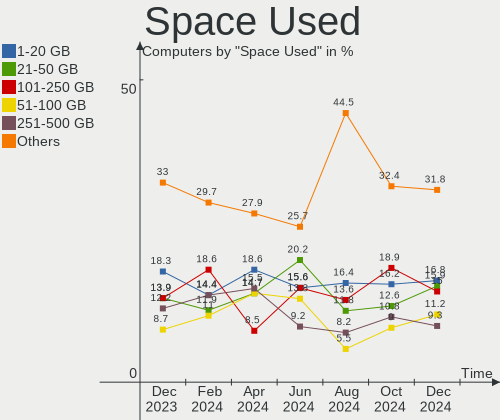
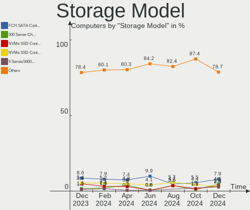
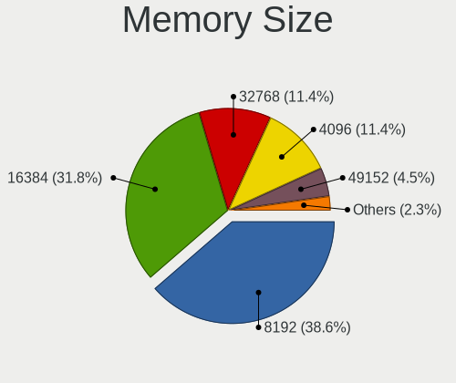
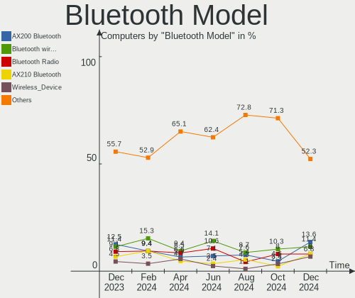

Manjaro Hardware Trends
-----------------------

A project to identify most popular hardware characteristics and track their change
over time based on data collected by Manjaro users at https://Linux-Hardware.org.

Anyone can contribute to the study by uploading probes of their computers by
the [hw-probe](https://github.com/linuxhw/hw-probe) tool:

    sudo -E hw-probe -all -upload

This is a report for all computer types. See also reports for [desktops](/Dist/Manjaro/Desktop/README.md) and [notebooks](/Dist/Manjaro/Notebook/README.md).

Full-feature report is available here: https://linux-hardware.org/?view=trends

Period: Sep, 2020.

Contents
--------

- [ OS                       ](#os)
- [ OS Family                ](#os-family)
- [ Kernel                   ](#kernel)
- [ Kernel Family            ](#kernel-family)
- [ Kernel Major Ver.        ](#kernel-major-ver)
- [ Arch                     ](#arch)
- [ DE                       ](#de)
- [ Display Server           ](#display-server)
- [ Display Manager          ](#display-manager)
- [ OS Lang                  ](#os-lang)
- [ Boot Mode                ](#boot-mode)
- [ Filesystem               ](#filesystem)
- [ Part. scheme             ](#part-scheme)
- [ Dual Boot with Linux/BSD ](#dual-boot-with-linux/bsd)
- [ Dual Boot (Win)          ](#dual-boot-win)
- [ Country                  ](#country)
- [ City                     ](#city)
- [ Vendor                   ](#vendor)
- [ Model                    ](#model)
- [ Model Family             ](#model-family)
- [ MFG Year                 ](#mfg-year)
- [ Form Factor              ](#form-factor)
- [ Secure Boot              ](#secure-boot)
- [ Coreboot                 ](#coreboot)
- [ RAM Size                 ](#ram-size)
- [ RAM Used                 ](#ram-used)
- [ Has CD-ROM               ](#has-cd-rom)
- [ Total Drives             ](#total-drives)
- [ Has Ethernet             ](#has-ethernet)
- [ Drive Vendor             ](#drive-vendor)
- [ HDD Vendor               ](#hdd-vendor)
- [ SSD Vendor               ](#ssd-vendor)
- [ Drive Model              ](#drive-model)
- [ Drive Kind               ](#drive-kind)
- [ Drive Connector          ](#drive-connector)
- [ Drive Size               ](#drive-size)
- [ Space Total              ](#space-total)
- [ Space Used               ](#space-used)
- [ Malfunc. Drives          ](#malfunc-drives)
- [ Malfunc. Drive Vendor    ](#malfunc-drive-vendor)
- [ Malfunc. HDD Vendor      ](#malfunc-hdd-vendor)
- [ Malfunc. Drive Kind      ](#malfunc-drive-kind)
- [ Failed Drives            ](#failed-drives)
- [ Failed Drive Vendor      ](#failed-drive-vendor)
- [ Drive Status             ](#drive-status)
- [ Storage Vendor           ](#storage-vendor)
- [ Storage Model            ](#storage-model)
- [ Storage Kind             ](#storage-kind)
- [ CPU Vendor               ](#cpu-vendor)
- [ CPU Model                ](#cpu-model)
- [ CPU Model Family         ](#cpu-model-family)
- [ CPU Cores                ](#cpu-cores)
- [ CPU Sockets              ](#cpu-sockets)
- [ CPU Threads              ](#cpu-threads)
- [ CPU Op-Modes             ](#cpu-op-modes)
- [ CPU Microcode            ](#cpu-microcode)
- [ CPU Microarch            ](#cpu-microarch)
- [ GPU Vendor               ](#gpu-vendor)
- [ GPU Model                ](#gpu-model)
- [ GPU Combo                ](#gpu-combo)
- [ GPU Driver               ](#gpu-driver)
- [ GPU Memory               ](#gpu-memory)
- [ Monitor Vendor           ](#monitor-vendor)
- [ Monitor Model            ](#monitor-model)
- [ Monitor Resolution       ](#monitor-resolution)
- [ Monitor Diagonal         ](#monitor-diagonal)
- [ Monitor Width            ](#monitor-width)
- [ Aspect Ratio             ](#aspect-ratio)
- [ Monitor Area             ](#monitor-area)
- [ Pixel Density            ](#pixel-density)
- [ Multiple Monitors        ](#multiple-monitors)
- [ Net Controller Vendor    ](#net-controller-vendor)
- [ Net Controller Model     ](#net-controller-model)
- [ Wireless Vendor          ](#wireless-vendor)
- [ Wireless Model           ](#wireless-model)
- [ Ethernet Vendor          ](#ethernet-vendor)
- [ Ethernet Model           ](#ethernet-model)
- [ Net Controller Kind      ](#net-controller-kind)
- [ Used Controller          ](#used-controller)
- [ NICs                     ](#nics)
- [ Memory Vendor            ](#memory-vendor)
- [ Memory Model             ](#memory-model)
- [ Memory Kind              ](#memory-kind)
- [ Memory Form Factor       ](#memory-form-factor)
- [ Memory Size              ](#memory-size)
- [ Memory Speed             ](#memory-speed)
- [ Sound Vendor             ](#sound-vendor)
- [ Sound Model              ](#sound-model)
- [ Camera Vendor            ](#camera-vendor)
- [ Camera Model             ](#camera-model)
- [ Fingerprint Vendor       ](#fingerprint-vendor)
- [ Fingerprint Model        ](#fingerprint-model)
- [ Chipcard Vendor          ](#chipcard-vendor)
- [ Chipcard Model           ](#chipcard-model)
- [ Printer Vendor           ](#printer-vendor)
- [ Printer Model            ](#printer-model)
- [ Scanner Vendor           ](#scanner-vendor)
- [ Scanner Model            ](#scanner-model)
- [ Bluetooth Vendor         ](#bluetooth-vendor)
- [ Bluetooth Model          ](#bluetooth-model)
- [ Unsupported Devices      ](#unsupported-devices)
- [ Unsupported Device Types ](#unsupported-device-types)

OS
--

Installed operating systems

| Name             | Computers | Percent |
|------------------|-----------|---------|
| Manjaro 20.1     | 233       | 68.13%  |
| Manjaro          | 107       | 31.29%  |
| Manjaro 20.1-rc5 | 1         | 0.29%   |
| Manjaro 20.0.3   | 1         | 0.29%   |

OS Family
---------

OS without a version

| Name    | Computers | Percent |
|---------|-----------|---------|
| Manjaro | 342       | 100%    |

Kernel
------

Version of the Linux kernel

| Version                | Computers | Percent |
|------------------------|-----------|---------|
| 5.8.6-1-MANJARO        | 131       | 38.3%   |
| 5.8.3-2-MANJARO        | 55        | 16.08%  |
| 5.7.17-2-MANJARO       | 39        | 11.4%   |
| 5.7.19-2-MANJARO       | 24        | 7.02%   |
| 5.4.60-2-MANJARO       | 22        | 6.43%   |
| 5.4.64-1-MANJARO       | 19        | 5.56%   |
| 5.9.0-1-MANJARO        | 6         | 1.75%   |
| 5.8.5-2-MANJARO        | 4         | 1.17%   |
| 5.8.1-3-MANJARO        | 4         | 1.17%   |
| 5.8.11-1-MANJARO       | 3         | 0.88%   |
| 5.7.15-1-MANJARO       | 3         | 0.88%   |
| 5.6.15-1-MANJARO       | 3         | 0.88%   |
| 5.8.5-xanmod1-1-xanmod | 2         | 0.58%   |
| 5.8.5-8-tkg-pds        | 2         | 0.58%   |
| 5.6.19-3-rt12-MANJARO  | 2         | 0.58%   |
| 5.4.52-1-MANJARO       | 2         | 0.58%   |
| 4.19.141-2-MANJARO     | 2         | 0.58%   |
| 5.8.9-2-MANJARO        | 1         | 0.29%   |
| 5.8.9-1-MANJARO        | 1         | 0.29%   |
| 5.8.8-arch1-1-surface  | 1         | 0.29%   |
| 5.8.7-12-tkg-pds       | 1         | 0.29%   |
| 5.8.5-1-MANJARO        | 1         | 0.29%   |
| 5.8.3-pf2-1            | 1         | 0.29%   |
| 5.8.12-3-MANJARO       | 1         | 0.29%   |
| 5.8.12-2-MANJARO       | 1         | 0.29%   |
| 5.8.11-18-tkg-upds     | 1         | 0.29%   |
| 5.8.0-1-MANJARO        | 1         | 0.29%   |
| 5.7.19-1-ck            | 1         | 0.29%   |
| 5.7.17-1-clear         | 1         | 0.29%   |
| 5.7.14-1-MANJARO       | 1         | 0.29%   |
| 5.6.19-2-MANJARO       | 1         | 0.29%   |
| 5.4.62-1-MANJARO       | 1         | 0.29%   |
| 5.4.61-rt37-MANJARO    | 1         | 0.29%   |
| 5.4.61-1-MANJARO       | 1         | 0.29%   |
| 5.4.57-1-MANJARO       | 1         | 0.29%   |
| 4.19.143-1-MANJARO     | 1         | 0.29%   |

Kernel Family
-------------

Linux kernel without a distro release

| Version  | Computers | Percent |
|----------|-----------|---------|
| 5.8.6    | 131       | 38.3%   |
| 5.8.3    | 56        | 16.37%  |
| 5.7.17   | 40        | 11.7%   |
| 5.7.19   | 25        | 7.31%   |
| 5.4.60   | 22        | 6.43%   |
| 5.4.64   | 19        | 5.56%   |
| 5.8.5    | 9         | 2.63%   |
| 5.9.0    | 6         | 1.75%   |
| 5.8.11   | 4         | 1.17%   |
| 5.8.1    | 4         | 1.17%   |
| 5.7.15   | 3         | 0.88%   |
| 5.6.19   | 3         | 0.88%   |
| 5.6.15   | 3         | 0.88%   |
| 5.8.9    | 2         | 0.58%   |
| 5.8.12   | 2         | 0.58%   |
| 5.4.61   | 2         | 0.58%   |
| 5.4.52   | 2         | 0.58%   |
| 4.19.141 | 2         | 0.58%   |
| 5.8.8    | 1         | 0.29%   |
| 5.8.7    | 1         | 0.29%   |
| 5.8.0    | 1         | 0.29%   |
| 5.7.14   | 1         | 0.29%   |
| 5.4.62   | 1         | 0.29%   |
| 5.4.57   | 1         | 0.29%   |
| 4.19.143 | 1         | 0.29%   |

Kernel Major Ver.
-----------------

Linux kernel major version

| Version | Computers | Percent |
|---------|-----------|---------|
| 5.8     | 211       | 61.7%   |
| 5.7     | 69        | 20.18%  |
| 5.4     | 47        | 13.74%  |
| 5.9     | 6         | 1.75%   |
| 5.6     | 6         | 1.75%   |
| 4.19    | 3         | 0.88%   |

Arch
----

OS architecture (x86_64, i586, etc.)

| Name   | Computers | Percent |
|--------|-----------|---------|
| x86_64 | 342       | 100%    |

DE
--

Desktop Environment

| Name          | Computers | Percent |
|---------------|-----------|---------|
| KDE5          | 113       | 33.04%  |
| XFCE          | 76        | 22.22%  |
| GNOME         | 61        | 17.84%  |
| KDE           | 52        | 15.2%   |
| i3            | 11        | 3.22%   |
| Unknown       | 8         | 2.34%   |
| X-Cinnamon    | 7         | 2.05%   |
| Cinnamon      | 3         | 0.88%   |
| Deepin        | 2         | 0.58%   |
| Sway          | 1         | 0.29%   |
| openbox       | 1         | 0.29%   |
| LXQt          | 1         | 0.29%   |
| LXDE          | 1         | 0.29%   |
| ICEWM         | 1         | 0.29%   |
| GNOME Classic | 1         | 0.29%   |
| dwm           | 1         | 0.29%   |
| bspwm         | 1         | 0.29%   |
| Awesome       | 1         | 0.29%   |

Display Server
--------------

X11 or Wayland

| Name    | Computers | Percent |
|---------|-----------|---------|
| X11     | 328       | 95.91%  |
| Wayland | 9         | 2.63%   |
| Tty     | 4         | 1.17%   |
| Unknown | 1         | 0.29%   |

Display Manager
---------------

SDDM, LightDM, etc.

| Name    | Computers | Percent |
|---------|-----------|---------|
| SDDM    | 120       | 35.09%  |
| Unknown | 103       | 30.12%  |
| LightDM | 65        | 19.01%  |
| GDM     | 43        | 12.57%  |
| TDM     | 10        | 2.92%   |
| LXDM    | 1         | 0.29%   |

OS Lang
-------

Language

| Lang       | Computers | Percent |
|------------|-----------|---------|
| en_US      | 138       | 40.35%  |
| en_US.utf8 | 37        | 10.82%  |
| en_GB      | 25        | 7.31%   |
| de_DE      | 20        | 5.85%   |
| ru_RU      | 10        | 2.92%   |
| pt_BR      | 9         | 2.63%   |
| de_DE.utf8 | 8         | 2.34%   |
| es_ES      | 7         | 2.05%   |
| it_IT      | 6         | 1.75%   |
| fr_FR      | 6         | 1.75%   |
| en_IN      | 6         | 1.75%   |
| en_GB.utf8 | 6         | 1.75%   |
| en_AU      | 5         | 1.46%   |
| Unknown    | 3         | 0.88%   |
| ru_RU.utf8 | 2         | 0.58%   |
| pt_BR.utf8 | 2         | 0.58%   |
| nb_NO      | 2         | 0.58%   |
| it_IT.utf8 | 2         | 0.58%   |
| es_ES.utf8 | 2         | 0.58%   |
| en_IN      | 2         | 0.58%   |
| en_CA.utf8 | 2         | 0.58%   |
| en_CA      | 2         | 0.58%   |
| C          | 2         | 0.58%   |
| tr_TR      | 1         | 0.29%   |
| szl_PL     | 1         | 0.29%   |
| sv_SE      | 1         | 0.29%   |
| sma_SE     | 1         | 0.29%   |
| pl_PL.utf8 | 1         | 0.29%   |
| pl_PL      | 1         | 0.29%   |
| nl_NL      | 1         | 0.29%   |
| nl_BE.utf8 | 1         | 0.29%   |
| id_ID      | 1         | 0.29%   |
| fr_FR.utf8 | 1         | 0.29%   |
| fr_CH.utf8 | 1         | 0.29%   |
| fr_CA      | 1         | 0.29%   |
| es_VE.utf8 | 1         | 0.29%   |
| es_UY      | 1         | 0.29%   |
| es_US      | 1         | 0.29%   |
| es_PE      | 1         | 0.29%   |
| es_PA.utf8 | 1         | 0.29%   |
| es_MX.utf8 | 1         | 0.29%   |
| es_EC.utf8 | 1         | 0.29%   |
| es_DO      | 1         | 0.29%   |
| es_CR      | 1         | 0.29%   |
| es_CO      | 1         | 0.29%   |
| es_BO      | 1         | 0.29%   |
| en_ZA      | 1         | 0.29%   |
| en_SG.utf8 | 1         | 0.29%   |
| en_PH      | 1         | 0.29%   |
| en_NZ      | 1         | 0.29%   |
| en_IN.utf8 | 1         | 0.29%   |
| en_IE.utf8 | 1         | 0.29%   |
| en_IE      | 1         | 0.29%   |
| en_HK.utf8 | 1         | 0.29%   |
| en_DK      | 1         | 0.29%   |
| en_AU.utf8 | 1         | 0.29%   |
| en_001     | 1         | 0.29%   |
| el_GR      | 1         | 0.29%   |
| de_AT      | 1         | 0.29%   |
| da_DK      | 1         | 0.29%   |

Boot Mode
---------

EFI or BIOS

| Mode | Computers | Percent |
|------|-----------|---------|
| EFI  | 205       | 59.94%  |
| BIOS | 137       | 40.06%  |

Filesystem
----------

Type of filesystem

| Type    | Computers | Percent |
|---------|-----------|---------|
| Ext4    | 320       | 93.57%  |
| Btrfs   | 12        | 3.51%   |
| Xfs     | 3         | 0.88%   |
| F2fs    | 3         | 0.88%   |
| Overlay | 2         | 0.58%   |
| Zfs     | 1         | 0.29%   |
| Ext3    | 1         | 0.29%   |

Part. scheme
------------

Scheme of partitioning

| Type    | Computers | Percent |
|---------|-----------|---------|
| GPT     | 216       | 63.16%  |
| Unknown | 101       | 29.53%  |
| MBR     | 25        | 7.31%   |

Dual Boot with Linux/BSD
------------------------

Hosting more than one Linux/BSD

| Dual boot | Computers | Percent |
|-----------|-----------|---------|
| No        | 292       | 85.38%  |
| Yes       | 50        | 14.62%  |

Dual Boot (Win)
---------------

Hosting Linux and Windows

| Dual boot | Computers | Percent |
|-----------|-----------|---------|
| No        | 198       | 57.89%  |
| Yes       | 144       | 42.11%  |

Country
-------

Geographic location (country)

| Country            | Computers | Percent |
|--------------------|-----------|---------|
| USA                | 69        | 20.18%  |
| Germany            | 36        | 10.53%  |
| Brazil             | 18        | 5.26%   |
| Spain              | 15        | 4.39%   |
| Russia             | 13        | 3.8%    |
| Italy              | 13        | 3.8%    |
| UK                 | 12        | 3.51%   |
| India              | 12        | 3.51%   |
| France             | 11        | 3.22%   |
| Canada             | 11        | 3.22%   |
| Netherlands        | 10        | 2.92%   |
| Poland             | 9         | 2.63%   |
| Sweden             | 8         | 2.34%   |
| Romania            | 7         | 2.05%   |
| Australia          | 7         | 2.05%   |
| Turkey             | 5         | 1.46%   |
| Mexico             | 5         | 1.46%   |
| Austria            | 5         | 1.46%   |
| Taiwan             | 4         | 1.17%   |
| Switzerland        | 4         | 1.17%   |
| Ukraine            | 3         | 0.88%   |
| Portugal           | 3         | 0.88%   |
| Peru               | 3         | 0.88%   |
| Norway             | 3         | 0.88%   |
| Indonesia          | 3         | 0.88%   |
| Greece             | 3         | 0.88%   |
| Finland            | 3         | 0.88%   |
| Denmark            | 3         | 0.88%   |
| South Africa       | 2         | 0.58%   |
| Slovakia           | 2         | 0.58%   |
| Singapore          | 2         | 0.58%   |
| Philippines        | 2         | 0.58%   |
| Panama             | 2         | 0.58%   |
| Pakistan           | 2         | 0.58%   |
| Lithuania          | 2         | 0.58%   |
| Hong Kong          | 2         | 0.58%   |
| Estonia            | 2         | 0.58%   |
| Belgium            | 2         | 0.58%   |
| Belarus            | 2         | 0.58%   |
| Argentina          | 2         | 0.58%   |
| Algeria            | 2         | 0.58%   |
| Vietnam            | 1         | 0.29%   |
| Venezuela          | 1         | 0.29%   |
| Uruguay            | 1         | 0.29%   |
| Korea, Republic of | 1         | 0.29%   |
| Kenya              | 1         | 0.29%   |
| Kazakhstan         | 1         | 0.29%   |
| Israel             | 1         | 0.29%   |
| Hungary            | 1         | 0.29%   |
| Ecuador            | 1         | 0.29%   |
| Dominican Republic | 1         | 0.29%   |
| Czech Republic     | 1         | 0.29%   |
| Croatia            | 1         | 0.29%   |
| Costa Rica         | 1         | 0.29%   |
| Colombia           | 1         | 0.29%   |
| Bulgaria           | 1         | 0.29%   |
| Bolivia            | 1         | 0.29%   |
| Bangladesh         | 1         | 0.29%   |
| Armenia            | 1         | 0.29%   |

City
----

Geographic location (city)

| City                  | Computers | Percent |
|-----------------------|-----------|---------|
| Vienna                | 4         | 1.17%   |
| St Petersburg         | 4         | 1.17%   |
| New York              | 4         | 1.17%   |
| Bucharest             | 4         | 1.17%   |
| Stuttgart             | 3         | 0.88%   |
| Stockholm             | 3         | 0.88%   |
| Lima                  | 3         | 0.88%   |
| Helsinki              | 3         | 0.88%   |
| Ciudad Juárez        | 3         | 0.88%   |
| Barcelona             | 3         | 0.88%   |
| Amsterdam             | 3         | 0.88%   |
| Valencia              | 2         | 0.58%   |
| Tver                  | 2         | 0.58%   |
| Turin                 | 2         | 0.58%   |
| Tucson                | 2         | 0.58%   |
| Tallinn               | 2         | 0.58%   |
| Taipei                | 2         | 0.58%   |
| Surrey                | 2         | 0.58%   |
| Singapore             | 2         | 0.58%   |
| San Jose              | 2         | 0.58%   |
| Saint Paul            | 2         | 0.58%   |
| Rio de Janeiro        | 2         | 0.58%   |
| Reading               | 2         | 0.58%   |
| Panama City           | 2         | 0.58%   |
| Novara                | 2         | 0.58%   |
| New Delhi             | 2         | 0.58%   |
| Munich                | 2         | 0.58%   |
| Montcalm              | 2         | 0.58%   |
| Minneapolis           | 2         | 0.58%   |
| Karlsruhe             | 2         | 0.58%   |
| Izmir                 | 2         | 0.58%   |
| Grass Valley          | 2         | 0.58%   |
| Geneva                | 2         | 0.58%   |
| Elk Grove Village     | 2         | 0.58%   |
| Düsseldorf           | 2         | 0.58%   |
| Durham                | 2         | 0.58%   |
| Drammen               | 2         | 0.58%   |
| Chicago               | 2         | 0.58%   |
| Buenos Aires          | 2         | 0.58%   |
| Bengaluru             | 2         | 0.58%   |
| Athens                | 2         | 0.58%   |
| Antalya               | 2         | 0.58%   |
| Alblasserdam          | 2         | 0.58%   |
| Łódź               | 1         | 0.29%   |
| Zöblitz              | 1         | 0.29%   |
| Zurich                | 1         | 0.29%   |
| Zaporizhia            | 1         | 0.29%   |
| Zagreb                | 1         | 0.29%   |
| Yaroslavl             | 1         | 0.29%   |
| Woodford Green        | 1         | 0.29%   |
| Woodbridge            | 1         | 0.29%   |
| Watertown             | 1         | 0.29%   |
| Waterdown             | 1         | 0.29%   |
| Warsaw                | 1         | 0.29%   |
| Vitória da Conquista | 1         | 0.29%   |
| Viterbo               | 1         | 0.29%   |
| Visakhapatnam         | 1         | 0.29%   |
| Vincennes             | 1         | 0.29%   |
| Vilnius               | 1         | 0.29%   |
| Verona                | 1         | 0.29%   |

Vendor
------

Motherboard manufacturer

| Name                | Computers | Percent |
|---------------------|-----------|---------|
| ASUSTek Computer    | 78        | 22.81%  |
| Lenovo              | 45        | 13.16%  |
| MSI                 | 44        | 12.87%  |
| Hewlett-Packard     | 31        | 9.06%   |
| Gigabyte Technology | 31        | 9.06%   |
| Dell                | 29        | 8.48%   |
| ASRock              | 22        | 6.43%   |
| Acer                | 14        | 4.09%   |
| Apple               | 6         | 1.75%   |
| Intel               | 4         | 1.17%   |
| Fujitsu             | 4         | 1.17%   |
| TUXEDO              | 2         | 0.58%   |
| Toshiba             | 2         | 0.58%   |
| Timi                | 2         | 0.58%   |
| Sony                | 2         | 0.58%   |
| Samsung Electronics | 2         | 0.58%   |
| Pegatron            | 2         | 0.58%   |
| Panasonic           | 2         | 0.58%   |
| Notebook            | 2         | 0.58%   |
| Medion              | 2         | 0.58%   |
| HUAWEI              | 2         | 0.58%   |
| Aftershock          | 2         | 0.58%   |
| YEPO                | 1         | 0.29%   |
| Wortmann AG         | 1         | 0.29%   |
| TrekStor            | 1         | 0.29%   |
| System76            | 1         | 0.29%   |
| Schenker            | 1         | 0.29%   |
| Microsoft           | 1         | 0.29%   |
| Google              | 1         | 0.29%   |
| Fujitsu Siemens     | 1         | 0.29%   |
| Foxconn             | 1         | 0.29%   |
| Clevo               | 1         | 0.29%   |
| Chuwi               | 1         | 0.29%   |
| ASRockRack          | 1         | 0.29%   |

Model
-----

Motherboard model

| Name                              | Computers | Percent |
|-----------------------------------|-----------|---------|
| ASUS All Series                   | 7         | 2.05%   |
| MSI MS-7C02                       | 5         | 1.46%   |
| ASUS TUF B450-PLUS GAMING         | 3         | 0.88%   |
| ASUS PRIME X470-PRO               | 3         | 0.88%   |
| ASUS PRIME A320M-K                | 3         | 0.88%   |
| ASRock B450M Pro4                 | 3         | 0.88%   |
| Unknown                           | 3         | 0.88%   |
| MSI MS-7B89                       | 2         | 0.58%   |
| MSI MS-7B86                       | 2         | 0.58%   |
| MSI MS-7B79                       | 2         | 0.58%   |
| MSI MS-7B78                       | 2         | 0.58%   |
| MSI MS-7A32                       | 2         | 0.58%   |
| Lenovo Legion 5 15ARH05 82B5      | 2         | 0.58%   |
| Lenovo IdeaPad 5 15ARE05 81YQ     | 2         | 0.58%   |
| HP OMEN by HP Laptop              | 2         | 0.58%   |
| HP Notebook                       | 2         | 0.58%   |
| HP 2000                           | 2         | 0.58%   |
| Gigabyte X570 I AORUS PRO WIFI    | 2         | 0.58%   |
| Gigabyte X570 AORUS ELITE         | 2         | 0.58%   |
| Gigabyte X470 AORUS ULTRA GAMING  | 2         | 0.58%   |
| Gigabyte B450M DS3H               | 2         | 0.58%   |
| Dell Precision 5520               | 2         | 0.58%   |
| Dell Inspiron 5570                | 2         | 0.58%   |
| Dell Inspiron 3542                | 2         | 0.58%   |
| Dell Inspiron 15 7000 Gaming      | 2         | 0.58%   |
| ASUS TUF GAMING X570-PLUS         | 2         | 0.58%   |
| ASUS TUF B350M-PLUS GAMING        | 2         | 0.58%   |
| ASUS ROG STRIX X370-F GAMING      | 2         | 0.58%   |
| ASUS ROG STRIX B350-F GAMING      | 2         | 0.58%   |
| ASUS PRIME B350M-A                | 2         | 0.58%   |
| ASUS PRIME B350-PLUS              | 2         | 0.58%   |
| ASRock X470 Taichi                | 2         | 0.58%   |
| ASRock B450 Gaming-ITX/ac         | 2         | 0.58%   |
| Apple MacBookPro9,2               | 2         | 0.58%   |
| Acer Nitro AN515-54               | 2         | 0.58%   |
| Acer Aspire A315-42G              | 2         | 0.58%   |
| Wortmann AG 1220579_1470096       | 1         | 0.29%   |
| TUXEDO N24_25JU                   | 1         | 0.29%   |
| TrekStor Surfbook A13B            | 1         | 0.29%   |
| Toshiba Satellite L510            | 1         | 0.29%   |
| Toshiba Satellite C55-B           | 1         | 0.29%   |
| Timi TM1701                       | 1         | 0.29%   |
| Timi RedmiBook 16                 | 1         | 0.29%   |
| System76 Lemur Pro                | 1         | 0.29%   |
| Sony SVT15115CXS                  | 1         | 0.29%   |
| Sony SVE14A35CXH                  | 1         | 0.29%   |
| Schenker SCHENKER_SLIM_SERIES_L18 | 1         | 0.29%   |
| Samsung Electronics 300E5M/300E5L | 1         | 0.29%   |
| Samsung Electronics 270E5G/270E5U | 1         | 0.29%   |
| Pegatron BM412AA-ABA CQ5600Y      | 1         | 0.29%   |
| Pegatron 300-1200la               | 1         | 0.29%   |
| Panasonic CF-AX2LDCHCE            | 1         | 0.29%   |
| Panasonic CF-195HD8DDM            | 1         | 0.29%   |
| Notebook P7xxTM1                  | 1         | 0.29%   |
| Notebook N150ZU                   | 1         | 0.29%   |
| MSI PS63 Modern 8RC               | 1         | 0.29%   |
| MSI PS42 Modern 8MO               | 1         | 0.29%   |
| MSI PS42 8RB                      | 1         | 0.29%   |
| MSI PE62 7RD                      | 1         | 0.29%   |
| MSI P75 Creator 9SE               | 1         | 0.29%   |

Model Family
------------

Motherboard model prefix

| Name                       | Computers | Percent |
|----------------------------|-----------|---------|
| Lenovo ThinkPad            | 21        | 6.14%   |
| ASUS PRIME                 | 15        | 4.39%   |
| Lenovo IdeaPad             | 12        | 3.51%   |
| Dell Inspiron              | 12        | 3.51%   |
| ASUS TUF                   | 11        | 3.22%   |
| ASUS ROG                   | 9         | 2.63%   |
| HP Pavilion                | 8         | 2.34%   |
| Gigabyte X570              | 7         | 2.05%   |
| ASUS All                   | 7         | 2.05%   |
| Acer Aspire                | 7         | 2.05%   |
| MSI MS-7C02                | 5         | 1.46%   |
| Lenovo Legion              | 5         | 1.46%   |
| Dell Latitude              | 5         | 1.46%   |
| HP ProBook                 | 4         | 1.17%   |
| HP Compaq                  | 4         | 1.17%   |
| Dell Precision             | 4         | 1.17%   |
| ASRock X570                | 4         | 1.17%   |
| ASRock B450M               | 4         | 1.17%   |
| MSI GL63                   | 3         | 0.88%   |
| HP ENVY                    | 3         | 0.88%   |
| Fujitsu LIFEBOOK           | 3         | 0.88%   |
| Dell XPS                   | 3         | 0.88%   |
| Dell OptiPlex              | 3         | 0.88%   |
| ASRock X470                | 3         | 0.88%   |
| Unknown                    | 3         | 0.88%   |
| Toshiba Satellite          | 2         | 0.58%   |
| MSI PS42                   | 2         | 0.58%   |
| MSI MS-7B89                | 2         | 0.58%   |
| MSI MS-7B86                | 2         | 0.58%   |
| MSI MS-7B79                | 2         | 0.58%   |
| MSI MS-7B78                | 2         | 0.58%   |
| MSI MS-7A32                | 2         | 0.58%   |
| Lenovo Yoga                | 2         | 0.58%   |
| Lenovo ThinkBook           | 2         | 0.58%   |
| HP OMEN                    | 2         | 0.58%   |
| HP Notebook                | 2         | 0.58%   |
| HP EliteBook               | 2         | 0.58%   |
| HP 2000                    | 2         | 0.58%   |
| Gigabyte X470              | 2         | 0.58%   |
| Gigabyte B450M             | 2         | 0.58%   |
| Gigabyte B450              | 2         | 0.58%   |
| Dell G5                    | 2         | 0.58%   |
| ASUS Strix                 | 2         | 0.58%   |
| ASUS P9X79                 | 2         | 0.58%   |
| ASUS Maximus               | 2         | 0.58%   |
| ASUS ASUS                  | 2         | 0.58%   |
| ASRock B450                | 2         | 0.58%   |
| Apple MacBookPro9          | 2         | 0.58%   |
| Acer Swift                 | 2         | 0.58%   |
| Acer Nitro                 | 2         | 0.58%   |
| Wortmann AG 1220579        | 1         | 0.29%   |
| TUXEDO N24                 | 1         | 0.29%   |
| TrekStor Surfbook          | 1         | 0.29%   |
| Timi TM1701                | 1         | 0.29%   |
| Timi RedmiBook             | 1         | 0.29%   |
| System76 Lemur             | 1         | 0.29%   |
| Sony SVT15115CXS           | 1         | 0.29%   |
| Sony SVE14A35CXH           | 1         | 0.29%   |
| Schenker SCHENKER          | 1         | 0.29%   |
| Samsung Electronics 300E5M | 1         | 0.29%   |

MFG Year
--------

Motherboard manufacture year

| Year | Computers | Percent |
|------|-----------|---------|
| 2019 | 90        | 26.32%  |
| 2020 | 89        | 26.02%  |
| 2018 | 61        | 17.84%  |
| 2016 | 17        | 4.97%   |
| 2017 | 16        | 4.68%   |
| 2015 | 14        | 4.09%   |
| 2013 | 12        | 3.51%   |
| 2012 | 12        | 3.51%   |
| 2010 | 9         | 2.63%   |
| 2014 | 8         | 2.34%   |
| 2011 | 7         | 2.05%   |
| 2009 | 3         | 0.88%   |
| 2007 | 3         | 0.88%   |
| 2008 | 1         | 0.29%   |

Form Factor
-----------

Physical design of the computer

| Name        | Computers | Percent |
|-------------|-----------|---------|
| Notebook    | 170       | 49.71%  |
| Desktop     | 159       | 46.49%  |
| Convertible | 7         | 2.05%   |
| Mini pc     | 2         | 0.58%   |
| All in one  | 2         | 0.58%   |
| Tablet      | 1         | 0.29%   |
| Server      | 1         | 0.29%   |

Secure Boot
-----------

Enabled or disabled

| State    | Computers | Percent |
|----------|-----------|---------|
| Disabled | 342       | 100%    |

Coreboot
--------

Have coreboot on board

| Used | Computers | Percent |
|------|-----------|---------|
| No   | 340       | 99.42%  |
| Yes  | 2         | 0.58%   |

RAM Size
--------

Total RAM memory

| Size in GB  | Computers | Percent |
|-------------|-----------|---------|
| 16.01-24.0  | 122       | 35.67%  |
| 4.01-8.0    | 72        | 21.05%  |
| 32.01-64.0  | 49        | 14.33%  |
| 8.01-16.0   | 49        | 14.33%  |
| 3.01-4.0    | 30        | 8.77%   |
| 64.01-256.0 | 9         | 2.63%   |
| 24.01-32.0  | 6         | 1.75%   |
| 2.01-3.0    | 3         | 0.88%   |
| 1.01-2.0    | 2         | 0.58%   |

RAM Used
--------

Used RAM memory

| Used GB    | Computers | Percent |
|------------|-----------|---------|
| 4.01-8.0   | 96        | 28.07%  |
| 2.01-3.0   | 77        | 22.51%  |
| 1.01-2.0   | 64        | 18.71%  |
| 3.01-4.0   | 61        | 17.84%  |
| 8.01-16.0  | 33        | 9.65%   |
| 16.01-24.0 | 6         | 1.75%   |
| 0.01-1.0   | 5         | 1.46%   |

Has CD-ROM
----------

Has CD-ROM on board

| Presented | Computers | Percent |
|-----------|-----------|---------|
| No        | 251       | 73.39%  |
| Yes       | 91        | 26.61%  |

Total Drives
------------

Number of drives on board

| Drives | Computers | Percent |
|--------|-----------|---------|
| 1      | 145       | 42.4%   |
| 2      | 99        | 28.95%  |
| 3      | 46        | 13.45%  |
| 4      | 30        | 8.77%   |
| 5      | 14        | 4.09%   |
| 7      | 3         | 0.88%   |
| 8      | 2         | 0.58%   |
| 6      | 2         | 0.58%   |
| 12     | 1         | 0.29%   |

Has Ethernet
------------

Has Ethernet on board

| Presented | Computers | Percent |
|-----------|-----------|---------|
| Yes       | 305       | 89.18%  |
| No        | 37        | 10.82%  |

Drive Vendor
------------

Hard drive vendors

| Vendor                    | Computers | Drives  | Percent |
|---------------------------|-----------|---------|---------|
| Samsung Electronics       | 116       | 154     | 18.41%  |
| Seagate                   | 111       | 141     | 17.62%  |
| WDC                       | 96        | 117     | 15.24%  |
| Kingston                  | 44        | 50      | 6.98%   |
| Toshiba                   | 37        | 38      | 5.87%   |
| Crucial                   | 28        | 31      | 4.44%   |
| Sandisk                   | 22        | 25      | 3.49%   |
| Intel                     | 18        | 19      | 2.86%   |
| Hitachi                   | 17        | 17      | 2.7%    |
| Phison                    | 16        | 17      | 2.54%   |
| HGST                      | 16        | 16      | 2.54%   |
| SK Hynix                  | 15        | 15      | 2.38%   |
| Unknown                   | 9         | 9       | 1.43%   |
| Micron Technology         | 7         | 7       | 1.11%   |
| A-DATA Technology         | 7         | 7       | 1.11%   |
| SPCC                      | 6         | 6       | 0.95%   |
| PNY                       | 5         | 5       | 0.79%   |
| China                     | 5         | 6       | 0.79%   |
| HL-DT-ST                  | 4         | Unknown | 0.63%   |
| Corsair                   | 4         | 4       | 0.63%   |
| Transcend                 | 3         | 3       | 0.48%   |
| Patriot                   | 3         | 3       | 0.48%   |
| JMICRON                   | 3         | 3       | 0.48%   |
| XPG                       | 2         | 2       | 0.32%   |
| Silicon Motion            | 2         | 3       | 0.32%   |
| OWC                       | 2         | 2       | 0.32%   |
| OCZ                       | 2         | 2       | 0.32%   |
| Micron/Crucial Technology | 2         | 2       | 0.32%   |
| Maxtor                    | 2         | 2       | 0.32%   |
| Lenovo                    | 2         | 2       | 0.32%   |
| GOODRAM                   | 2         | 2       | 0.32%   |
| asmedia                   | 2         | 4       | 0.32%   |
| Apple                     | 2         | 2       | 0.32%   |
| Union Memory (Shenzhen)   | 1         | 1       | 0.16%   |
| Union Memory              | 1         | 1       | 0.16%   |
| T-FORCE                   | 1         | 1       | 0.16%   |
| SABRENT                   | 1         | 1       | 0.16%   |
| PLEXTOR                   | 1         | 1       | 0.16%   |
| Pioneer                   | 1         | 1       | 0.16%   |
| LITEONIT                  | 1         | 1       | 0.16%   |
| Lexar                     | 1         | 1       | 0.16%   |
| Leven                     | 1         | 1       | 0.16%   |
| KIOXIA                    | 1         | 1       | 0.16%   |
| KingDian                  | 1         | 1       | 0.16%   |
| ITHOO                     | 1         | 1       | 0.16%   |
| Intenso                   | 1         | 1       | 0.16%   |
| Golden                    | 1         | 1       | 0.16%   |
| BRAVEEAGLE                | 1         | 1       | 0.16%   |
| Apacer                    | 1         | 1       | 0.16%   |
| AMD                       | 1         | 1       | 0.16%   |
| ACCLAMATOR                | 1         | 1       | 0.16%   |

HDD Vendor
----------

Hard disk drive vendors

| Vendor              | Computers | Drives | Percent |
|---------------------|-----------|--------|---------|
| Seagate             | 108       | 136    | 42.35%  |
| WDC                 | 80        | 99     | 31.37%  |
| Toshiba             | 22        | 23     | 8.63%   |
| Hitachi             | 17        | 17     | 6.67%   |
| HGST                | 16        | 16     | 6.27%   |
| Samsung Electronics | 6         | 6      | 2.35%   |
| Maxtor              | 2         | 2      | 0.78%   |
| Asmedia             | 2         | 4      | 0.78%   |
| Lenovo              | 1         | 1      | 0.39%   |
| Apple               | 1         | 1      | 0.39%   |

SSD Vendor
----------

Solid state drive vendors

| Vendor              | Computers | Drives | Percent |
|---------------------|-----------|--------|---------|
| Samsung Electronics | 72        | 86     | 31.17%  |
| Kingston            | 39        | 44     | 16.88%  |
| Crucial             | 26        | 29     | 11.26%  |
| SanDisk             | 15        | 16     | 6.49%   |
| WDC                 | 11        | 11     | 4.76%   |
| Intel               | 8         | 9      | 3.46%   |
| Toshiba             | 5         | 5      | 2.16%   |
| PNY                 | 5         | 5      | 2.16%   |
| China               | 5         | 6      | 2.16%   |
| A-DATA Technology   | 5         | 5      | 2.16%   |
| Micron Technology   | 4         | 4      | 1.73%   |
| Transcend           | 3         | 3      | 1.3%    |
| SPCC                | 3         | 3      | 1.3%    |
| SK Hynix            | 3         | 3      | 1.3%    |
| Corsair             | 3         | 3      | 1.3%    |
| Patriot             | 2         | 2      | 0.87%   |
| OWC                 | 2         | 2      | 0.87%   |
| OCZ                 | 2         | 2      | 0.87%   |
| JMicron             | 2         | 2      | 0.87%   |
| GOODRAM             | 2         | 2      | 0.87%   |
| T-FORCE             | 1         | 1      | 0.43%   |
| Seagate             | 1         | 1      | 0.43%   |
| SABRENT             | 1         | 1      | 0.43%   |
| PLEXTOR             | 1         | 1      | 0.43%   |
| Pioneer             | 1         | 1      | 0.43%   |
| LITEONIT            | 1         | 1      | 0.43%   |
| Lexar               | 1         | 1      | 0.43%   |
| KingDian            | 1         | 1      | 0.43%   |
| Intenso             | 1         | 1      | 0.43%   |
| Golden              | 1         | 1      | 0.43%   |
| BRAVEEAGLE          | 1         | 1      | 0.43%   |
| Apple               | 1         | 1      | 0.43%   |
| Apacer              | 1         | 1      | 0.43%   |
| ACCLAMATOR          | 1         | 1      | 0.43%   |

Drive Model
-----------

Hard drive models

| Model                        | Computers | Percent |
|------------------------------|-----------|---------|
| NVMe SSD Drive 512GB         | 18        | 2.53%   |
| SSD 850 EVO 500GB            | 14        | 1.97%   |
| NVMe SSD Drive 256GB         | 13        | 1.83%   |
| NVMe SSD Drive 500GB         | 12        | 1.69%   |
| ST1000LM035-1RK172 1TB       | 10        | 1.41%   |
| SSD 860 EVO 1TB              | 10        | 1.41%   |
| SA400S37240G 240GB SSD       | 9         | 1.27%   |
| SA400S37120G 120GB SSD       | 9         | 1.27%   |
| SSD 970 EVO Plus 500GB       | 8         | 1.13%   |
| CT1000MX500SSD1 1TB          | 8         | 1.13%   |
| SSD 860 EVO 500GB            | 7         | 0.98%   |
| NVMe SSD Drive 1TB           | 7         | 0.98%   |
| HTS721010A9E630 1TB          | 7         | 0.98%   |
| Expansion 1TB                | 7         | 0.98%   |
| SV300S37A120G 120GB SSD      | 6         | 0.84%   |
| ST2000DM008-2FR102 2TB       | 6         | 0.84%   |
| ST1000LM049-2GH172 1TB       | 5         | 0.7%    |
| ST1000DM003-1ER162 1TB       | 5         | 0.7%    |
| SSD 860 QVO 1TB              | 5         | 0.7%    |
| SA400S37480G 480GB SSD       | 5         | 0.7%    |
| CT500MX500SSD1 500GB         | 5         | 0.7%    |
| CT240BX500SSD1 240GB         | 5         | 0.7%    |
| WD20EZRZ-00Z5HB0 2TB         | 4         | 0.56%   |
| WD10EZEX-00BN5A0 1TB         | 4         | 0.56%   |
| ST4000DM004-2CV104 4TB       | 4         | 0.56%   |
| ST2000DM006-2DM164 2TB       | 4         | 0.56%   |
| ST1000LX015-1U7172 1TB       | 4         | 0.56%   |
| ST1000LM024 HN-M101MBB 1TB   | 4         | 0.56%   |
| SSD 970 EVO 500GB            | 4         | 0.56%   |
| SSD 850 EVO 250GB            | 4         | 0.56%   |
| NVMe SSD Drive 128GB         | 4         | 0.56%   |
| NVMe SSD Drive 1024GB        | 4         | 0.56%   |
| MQ01ABF050 500GB             | 4         | 0.56%   |
| WDS240G2G0B-00EPW0 240GB SSD | 3         | 0.42%   |
| WDS100T2B0B-00YS70 1TB SSD   | 3         | 0.42%   |
| ST2000DM001-1ER164 2TB       | 3         | 0.42%   |
| ST2000DM001-1CH164 2TB       | 3         | 0.42%   |
| ST1000DM010-2EP102 1TB       | 3         | 0.42%   |
| SSD 970 PRO 512GB            | 3         | 0.42%   |
| SSD 970 EVO 1TB              | 3         | 0.42%   |
| SSD 840 PRO Series 256GB     | 3         | 0.42%   |
| SSD 830 Series 128GB         | 3         | 0.42%   |
| Sabrent Rocket Q 2TB         | 3         | 0.42%   |
| Sabrent 512GB                | 3         | 0.42%   |
| NVMe SSD Drive 250GB         | 3         | 0.42%   |
| MZVLB512HBJQ-000L2 512GB     | 3         | 0.42%   |
| HUA723020ALA641 2TB          | 3         | 0.42%   |
| HTS545050A7E380 500GB        | 3         | 0.42%   |
| DVDRAM GUE1N 3GB             | 3         | 0.42%   |
| CT525MX300SSD1 528GB         | 3         | 0.42%   |
| 1100_MTFDDAV256TBN 256GB SSD | 3         | 0.42%   |
| WDS500G2B0B-00YS70 500GB SSD | 2         | 0.28%   |
| WDS100T3X0C-00SJG0 1TB       | 2         | 0.28%   |
| WD7501AALS-00J7B0 752GB      | 2         | 0.28%   |
| WD5000AAKX-00U6AA0 500GB     | 2         | 0.28%   |
| WD40EZRZ-00GXCB0 4TB         | 2         | 0.28%   |
| WD40EFRX-68WT0N0 4TB         | 2         | 0.28%   |
| WD4002FYYZ-01B7CB1 4TB       | 2         | 0.28%   |
| WD2500AAKX-753CA1 250GB      | 2         | 0.28%   |
| WD20EZAZ-00GGJB0 2TB         | 2         | 0.28%   |

Drive Kind
----------

HDD or SSD

| Kind    | Computers | Drives | Percent |
|---------|-----------|--------|---------|
| HDD     | 205       | 305    | 36.94%  |
| SSD     | 192       | 256    | 34.59%  |
| NVMe    | 141       | 160    | 25.41%  |
| Unknown | 10        | 6      | 1.8%    |
| MMC     | 7         | 7      | 1.26%   |

Drive Connector
---------------

SATA, SAS, NVMe, etc.

| Type | Computers | Drives | Percent |
|------|-----------|--------|---------|
| SATA | 277       | 536    | 61.28%  |
| NVMe | 141       | 159    | 31.19%  |
| SAS  | 27        | 32     | 5.97%   |
| MMC  | 7         | 7      | 1.55%   |

Drive Size
----------

Size of hard drive

| Size in TB | Computers | Drives | Percent |
|------------|-----------|--------|---------|
| 0.01-0.5   | 244       | 351    | 44.94%  |
| 0.51-1.0   | 192       | 252    | 35.36%  |
| 1.01-2.0   | 62        | 71     | 11.42%  |
| 3.01-4.0   | 21        | 29     | 3.87%   |
| 2.01-3.0   | 12        | 12     | 2.21%   |
| 4.01-10.0  | 10        | 14     | 1.84%   |
| 10.01-20.0 | 2         | 5      | 0.37%   |

Space Total
-----------

Amount of disk space available on the file system

| Size in GB     | Computers | Percent |
|----------------|-----------|---------|
| 251-500        | 71        | 20.76%  |
| 101-250        | 66        | 19.3%   |
| 1001-2000      | 56        | 16.37%  |
| 501-1000       | 54        | 15.79%  |
| More than 3000 | 32        | 9.36%   |
| 2001-3000      | 30        | 8.77%   |
| Unknown        | 14        | 4.09%   |
| 51-100         | 10        | 2.92%   |
| 1-20           | 5         | 1.46%   |
| 21-50          | 4         | 1.17%   |

Space Used
----------

Amount of used disk space

| Used GB        | Computers | Percent |
|----------------|-----------|---------|
| 101-250        | 48        | 14.04%  |
| 501-1000       | 47        | 13.74%  |
| 51-100         | 47        | 13.74%  |
| 251-500        | 46        | 13.45%  |
| 21-50          | 46        | 13.45%  |
| 1-20           | 39        | 11.4%   |
| 1001-2000      | 31        | 9.06%   |
| Unknown        | 14        | 4.09%   |
| More than 3000 | 13        | 3.8%    |
| 2001-3000      | 11        | 3.22%   |

Malfunc. Drives
---------------

Drive models with a malfunction

| Model                            | Computers | Drives | Percent |
|----------------------------------|-----------|--------|---------|
| WD10EARS-00Y5B1 1TB              | 2         | 2      | 5.56%   |
| WD5000BPVT-60HXZT3 500GB         | 1         | 1      | 2.78%   |
| WD5000AAKX-00U6AA0 500GB         | 1         | 1      | 2.78%   |
| WD5000AAKX-003CA0 500GB          | 1         | 1      | 2.78%   |
| WD5000AADS-56S9B1 500GB          | 1         | 1      | 2.78%   |
| WD10EZEX-08M2NA0 1TB             | 1         | 1      | 2.78%   |
| WD10EZEX-00ZF5A0 1TB             | 1         | 1      | 2.78%   |
| WD10EZEX-00BN5A0 1TB             | 1         | 1      | 2.78%   |
| WD10EADX-22TDHB0 1TB             | 1         | 1      | 2.78%   |
| THNSNK128GVN8 M.2 2280 128GB SSD | 1         | 1      | 2.78%   |
| SV300S37A120G 120GB SSD          | 1         | 1      | 2.78%   |
| ST9250827AS 250GB                | 1         | 1      | 2.78%   |
| ST500DM002-1BD142 500GB          | 1         | 1      | 2.78%   |
| ST500DM002-1BC142 500GB          | 1         | 1      | 2.78%   |
| ST320LT022-1AE142 320GB          | 1         | 1      | 2.78%   |
| ST31000340NS 1TB                 | 1         | 1      | 2.78%   |
| ST2000LX001-1RG174 2TB           | 1         | 1      | 2.78%   |
| ST2000DM008-2FR102 2TB           | 1         | 1      | 2.78%   |
| ST2000DM006-2DM164 2TB           | 1         | 1      | 2.78%   |
| ST1000LX015-1U7172 1TB           | 1         | 1      | 2.78%   |
| ST1000LM049-2GH172 1TB           | 1         | 1      | 2.78%   |
| ST1000DM003-9YN162 1TB           | 1         | 1      | 2.78%   |
| SSDSC2KW360H6 360GB              | 1         | 1      | 2.78%   |
| SSDSC2KW010T8 1TB                | 1         | 1      | 2.78%   |
| SSDSC2CT120A3 120GB              | 1         | 1      | 2.78%   |
| SDSSDXPS960G 960GB               | 1         | 2      | 2.78%   |
| SA400S37120G 120GB SSD           | 1         | 1      | 2.78%   |
| MQ01ABF050 500GB                 | 1         | 1      | 2.78%   |
| MQ01ABD032 320GB                 | 1         | 1      | 2.78%   |
| HTS727550A9E364 500GB            | 1         | 1      | 2.78%   |
| HTS721010A9E630 1TB              | 1         | 1      | 2.78%   |
| HTS545050A7E380 500GB            | 1         | 1      | 2.78%   |
| HTS541010A9E680 1TB              | 1         | 1      | 2.78%   |
| HTS541010A7E630 1TB              | 1         | 1      | 2.78%   |
| HFS128G39TND-N210A 128GB SSD     | 1         | 1      | 2.78%   |

Malfunc. Drive Vendor
---------------------

Vendors of faulty drives

| Vendor   | Computers | Drives | Percent |
|----------|-----------|--------|---------|
| Seagate  | 11        | 11     | 30.56%  |
| WDC      | 10        | 10     | 27.78%  |
| HGST     | 4         | 4      | 11.11%  |
| Toshiba  | 3         | 3      | 8.33%   |
| Intel    | 3         | 3      | 8.33%   |
| Kingston | 2         | 2      | 5.56%   |
| SK Hynix | 1         | 1      | 2.78%   |
| SanDisk  | 1         | 2      | 2.78%   |
| Hitachi  | 1         | 1      | 2.78%   |

Malfunc. HDD Vendor
-------------------

Vendors of faulty HDD drives

| Vendor  | Computers | Drives | Percent |
|---------|-----------|--------|---------|
| Seagate | 11        | 11     | 39.29%  |
| WDC     | 10        | 10     | 35.71%  |
| HGST    | 4         | 4      | 14.29%  |
| Toshiba | 2         | 2      | 7.14%   |
| Hitachi | 1         | 1      | 3.57%   |

Malfunc. Drive Kind
-------------------

Kinds of faulty drives

| Kind | Computers | Drives | Percent |
|------|-----------|--------|---------|
| HDD  | 26        | 28     | 76.47%  |
| SSD  | 8         | 9      | 23.53%  |

Failed Drives
-------------

Failed drive models

| Model                   | Computers | Drives | Percent |
|-------------------------|-----------|--------|---------|
| SV300S37A120G 120GB SSD | 1         | 1      | 50%     |
| ST3500418AS 500GB       | 1         | 1      | 50%     |

Failed Drive Vendor
-------------------

Failed drive vendors

| Vendor   | Computers | Drives | Percent |
|----------|-----------|--------|---------|
| Seagate  | 1         | 1      | 50%     |
| Kingston | 1         | 1      | 50%     |

Drive Status
------------

Number of failed and malfunc. drives

| Status   | Computers | Drives | Percent |
|----------|-----------|--------|---------|
| Works    | 179       | 327    | 45.66%  |
| Detected | 178       | 368    | 45.41%  |
| Malfunc  | 33        | 37     | 8.42%   |
| Failed   | 2         | 2      | 0.51%   |

Storage Vendor
--------------

Storage controller vendors

| Vendor                       | Computers | Percent |
|------------------------------|-----------|---------|
| Intel                        | 208       | 43.06%  |
| AMD                          | 117       | 24.22%  |
| Samsung Electronics          | 57        | 11.8%   |
| Phison Electronics           | 20        | 4.14%   |
| Sandisk                      | 14        | 2.9%    |
| SK Hynix                     | 12        | 2.48%   |
| Toshiba America Info Systems | 10        | 2.07%   |
| ASMedia Technology           | 10        | 2.07%   |
| Kingston Technology Company  | 5         | 1.04%   |
| ADATA Technology             | 5         | 1.04%   |
| Micron/Crucial Technology    | 4         | 0.83%   |
| Silicon Motion               | 3         | 0.62%   |
| Nvidia                       | 3         | 0.62%   |
| Micron Technology            | 3         | 0.62%   |
| Marvell Technology Group     | 3         | 0.62%   |
| JMicron Technology           | 3         | 0.62%   |
| Seagate Technology           | 2         | 0.41%   |
| VIA Technologies             | 1         | 0.21%   |
| Lenovo                       | 1         | 0.21%   |
| KIOXIA                       | 1         | 0.21%   |
| Adaptec                      | 1         | 0.21%   |

Storage Model
-------------

Storage controller models

| Model                                                                             | Computers | Percent |
|-----------------------------------------------------------------------------------|-----------|---------|
| FCH SATA Controller [AHCI mode]                                                   | 104       | 18.28%  |
| NVMe SSD Controller SM981/PM981/PM983                                             | 42        | 7.38%   |
| 400 Series Chipset SATA Controller                                                | 38        | 6.68%   |
| Non-Volatile memory controller                                                    | 26        | 4.57%   |
| Sunrise Point-LP SATA Controller [AHCI mode]                                      | 25        | 4.39%   |
| 82801 Mobile SATA Controller [RAID mode]                                          | 17        | 2.99%   |
| Cannon Lake Mobile PCH SATA AHCI Controller                                       | 16        | 2.81%   |
| 7 Series Chipset Family 6-port SATA Controller [AHCI mode]                        | 15        | 2.64%   |
| Q170/Q150/B150/H170/H110/Z170/CM236 Chipset SATA Controller [AHCI Mode]           | 13        | 2.28%   |
| NVMe SSD Controller SM961/PM961                                                   | 13        | 2.28%   |
| E12 NVMe Controller                                                               | 13        | 2.28%   |
| 8 Series/C220 Series Chipset Family 6-port SATA Controller 1 [AHCI mode]          | 13        | 2.28%   |
| 300 Series Chipset SATA Controller                                                | 11        | 1.93%   |
| 200 Series PCH SATA controller [AHCI mode]                                        | 11        | 1.93%   |
| ASM1062 Serial ATA Controller                                                     | 10        | 1.76%   |
| HM170/QM170 Chipset SATA Controller [AHCI Mode]                                   | 9         | 1.58%   |
| Toshiba America Info Non-Volatile memory controller                               | 8         | 1.41%   |
| SSD 660P Series                                                                   | 8         | 1.41%   |
| X370 Series Chipset SATA Controller                                               | 7         | 1.23%   |
| SB7x0/SB8x0/SB9x0 SATA Controller [AHCI mode]                                     | 7         | 1.23%   |
| 6 Series/C200 Series Chipset Family 6 port Mobile SATA AHCI Controller            | 7         | 1.23%   |
| SB7x0/SB8x0/SB9x0 IDE Controller                                                  | 6         | 1.05%   |
| BC501 NVMe Solid State Drive 512GB                                                | 6         | 1.05%   |
| 7 Series/C210 Series Chipset Family 6-port SATA Controller [AHCI mode]            | 6         | 1.05%   |
| 6 Series/C200 Series Chipset Family 6 port Desktop SATA AHCI Controller           | 6         | 1.05%   |
| WD Black 2018/PC SN520 NVMe SSD                                                   | 5         | 0.88%   |
| SB7x0/SB8x0/SB9x0 SATA Controller [IDE mode]                                      | 5         | 0.88%   |
| FCH SATA Controller D                                                             | 5         | 0.88%   |
| Comet Lake SATA AHCI Controller                                                   | 5         | 0.88%   |
| Cannon Lake PCH SATA AHCI Controller                                              | 5         | 0.88%   |
| 9 Series Chipset Family SATA Controller [AHCI Mode]                               | 5         | 0.88%   |
| 8 Series SATA Controller 1 [AHCI mode]                                            | 5         | 0.88%   |
| XPG SX8200 Pro PCIe Gen3x4 M.2 2280 Solid State Drive                             | 4         | 0.7%    |
| E16 PCIe4 NVMe Controller                                                         | 4         | 0.7%    |
| Cannon Point-LP SATA Controller [AHCI Mode]                                       | 4         | 0.7%    |
| C610/X99 series chipset sSATA Controller [AHCI mode]                              | 4         | 0.7%    |
| Wildcat Point-LP SATA Controller [AHCI Mode]                                      | 3         | 0.53%   |
| P1 NVMe PCIe SSD                                                                  | 3         | 0.53%   |
| JMB363 SATA/IDE Controller                                                        | 3         | 0.53%   |
| Celeron N3350/Pentium N4200/Atom E3900 Series SATA AHCI Controller                | 3         | 0.53%   |
| C610/X99 series chipset 6-Port SATA Controller [AHCI mode]                        | 3         | 0.53%   |
| C600/X79 series chipset 6-Port SATA AHCI Controller                               | 3         | 0.53%   |
| 6 Series/C200 Series Chipset Family Desktop SATA Controller (IDE mode, ports 4-5) | 3         | 0.53%   |
| 6 Series/C200 Series Chipset Family Desktop SATA Controller (IDE mode, ports 0-3) | 3         | 0.53%   |
| SSD Pro 7600p/760p/E 6100p Series                                                 | 2         | 0.35%   |
| SATA Controller [RAID mode]                                                       | 2         | 0.35%   |
| SATA controller                                                                   | 2         | 0.35%   |
| NVMe Storage Controller                                                           | 2         | 0.35%   |
| NM10/ICH7 Family SATA Controller [IDE mode]                                       | 2         | 0.35%   |
| MCP61 SATA Controller                                                             | 2         | 0.35%   |
| Electronics Non-Volatile memory controller                                        | 2         | 0.35%   |
| BG3 NVMe SSD Controller                                                           | 2         | 0.35%   |
| Atom/Celeron/Pentium Processor x5-E8000/J3xxx/N3xxx Series SATA Controller        | 2         | 0.35%   |
| Atom Processor E3800 Series SATA AHCI Controller                                  | 2         | 0.35%   |
| A2000, M.2, 500GB                                                                 | 2         | 0.35%   |
| 82801JI (ICH10 Family) SATA AHCI Controller                                       | 2         | 0.35%   |
| 82801HM/HEM (ICH8M/ICH8M-E) SATA Controller [AHCI mode]                           | 2         | 0.35%   |
| 7 Series Chipset Family 4-port SATA Controller [IDE mode]                         | 2         | 0.35%   |
| 7 Series Chipset Family 2-port SATA Controller [IDE mode]                         | 2         | 0.35%   |
| X399 Series Chipset SATA Controller                                               | 1         | 0.18%   |

Storage Kind
------------

Kind of storage controller (IDE, SATA, NVMe, SAS, ...)

| Kind | Computers | Percent |
|------|-----------|---------|
| SATA | 290       | 61.18%  |
| NVMe | 140       | 29.54%  |
| IDE  | 23        | 4.85%   |
| RAID | 21        | 4.43%   |

CPU Vendor
----------

Processor vendors

| Vendor | Computers | Percent |
|--------|-----------|---------|
| Intel  | 217       | 63.45%  |
| AMD    | 125       | 36.55%  |

CPU Model
---------

Processor models

| Model                                         | Computers | Percent |
|-----------------------------------------------|-----------|---------|
| AMD Ryzen 5 3600 6-Core Processor             | 14        | 4.09%   |
| AMD Ryzen 7 3700X 8-Core Processor            | 9         | 2.63%   |
| Intel Core i7-8565U CPU @ 1.80GHz             | 8         | 2.34%   |
| Intel Core i7-8550U CPU @ 1.80GHz             | 8         | 2.34%   |
| Intel Core i7-7700HQ CPU @ 2.80GHz            | 8         | 2.34%   |
| Intel Core i5-8250U CPU @ 1.60GHz             | 8         | 2.34%   |
| AMD Ryzen 7 2700X Eight-Core Processor        | 7         | 2.05%   |
| Intel Core i7-9750H CPU @ 2.60GHz             | 6         | 1.75%   |
| Intel Core i7-8750H CPU @ 2.20GHz             | 6         | 1.75%   |
| Intel Core i7-6700K CPU @ 4.00GHz             | 6         | 1.75%   |
| AMD Ryzen 5 2600X Six-Core Processor          | 6         | 1.75%   |
| AMD Ryzen 5 2600 Six-Core Processor           | 6         | 1.75%   |
| Intel Core i7-7500U CPU @ 2.70GHz             | 5         | 1.46%   |
| AMD Ryzen 7 4800H with Radeon Graphics        | 5         | 1.46%   |
| AMD Ryzen 5 3600X 6-Core Processor            | 5         | 1.46%   |
| Intel Core i7-6700HQ CPU @ 2.60GHz            | 4         | 1.17%   |
| Intel Core i7-4790K CPU @ 4.00GHz             | 4         | 1.17%   |
| Intel Core i5-8265U CPU @ 1.60GHz             | 4         | 1.17%   |
| Intel Core i5-10210U CPU @ 1.60GHz            | 4         | 1.17%   |
| AMD Ryzen 9 3900X 12-Core Processor           | 4         | 1.17%   |
| AMD Ryzen 7 2700 Eight-Core Processor         | 4         | 1.17%   |
| AMD Ryzen 5 3500U with Radeon Vega Mobile Gfx | 4         | 1.17%   |
| AMD Ryzen 5 1600 Six-Core Processor           | 4         | 1.17%   |
| Intel Core i7-8700K CPU @ 3.70GHz             | 3         | 0.88%   |
| Intel Core i7-7700K CPU @ 4.20GHz             | 3         | 0.88%   |
| Intel Core i7-1065G7 CPU @ 1.30GHz            | 3         | 0.88%   |
| Intel Core i7-10510U CPU @ 1.80GHz            | 3         | 0.88%   |
| Intel Core i5-8300H CPU @ 2.30GHz             | 3         | 0.88%   |
| Intel Core i5-6200U CPU @ 2.30GHz             | 3         | 0.88%   |
| Intel Core i5-3230M CPU @ 2.60GHz             | 3         | 0.88%   |
| Intel Core i5-3210M CPU @ 2.50GHz             | 3         | 0.88%   |
| AMD Ryzen 9 3950X 16-Core Processor           | 3         | 0.88%   |
| AMD Ryzen 7 4700U with Radeon Graphics        | 3         | 0.88%   |
| AMD Ryzen 7 3700U with Radeon Vega Mobile Gfx | 3         | 0.88%   |
| AMD Ryzen 7 1700X Eight-Core Processor        | 3         | 0.88%   |
| Intel Core i7-7820HQ CPU @ 2.90GHz            | 2         | 0.58%   |
| Intel Core i7-5820K CPU @ 3.30GHz             | 2         | 0.58%   |
| Intel Core i7-5500U CPU @ 2.40GHz             | 2         | 0.58%   |
| Intel Core i7-4790 CPU @ 3.60GHz              | 2         | 0.58%   |
| Intel Core i7-4720HQ CPU @ 2.60GHz            | 2         | 0.58%   |
| Intel Core i7-3930K CPU @ 3.20GHz             | 2         | 0.58%   |
| Intel Core i7-3770 CPU @ 3.40GHz              | 2         | 0.58%   |
| Intel Core i7-2600K CPU @ 3.40GHz             | 2         | 0.58%   |
| Intel Core i5-7200U CPU @ 2.50GHz             | 2         | 0.58%   |
| Intel Core i5-3470 CPU @ 3.20GHz              | 2         | 0.58%   |
| Intel Core i5-2540M CPU @ 2.60GHz             | 2         | 0.58%   |
| Intel Core i5-2500 CPU @ 3.30GHz              | 2         | 0.58%   |
| Intel Core i5-2410M CPU @ 2.30GHz             | 2         | 0.58%   |
| Intel Core i5-2320 CPU @ 3.00GHz              | 2         | 0.58%   |
| Intel Core i3-8100 CPU @ 3.60GHz              | 2         | 0.58%   |
| Intel Core i3-6100U CPU @ 2.30GHz             | 2         | 0.58%   |
| AMD Ryzen 7 3800X 8-Core Processor            | 2         | 0.58%   |
| AMD Ryzen 7 1700 Eight-Core Processor         | 2         | 0.58%   |
| AMD Ryzen 5 4500U with Radeon Graphics        | 2         | 0.58%   |
| AMD Ryzen 5 2500U with Radeon Vega Mobile Gfx | 2         | 0.58%   |
| AMD FX-6300 Six-Core Processor                | 2         | 0.58%   |
| AMD E-300 APU with Radeon HD Graphics         | 2         | 0.58%   |
| Intel Xeon E-2174G CPU @ 3.80GHz              | 1         | 0.29%   |
| Intel Xeon CPU X5650 @ 2.67GHz                | 1         | 0.29%   |
| Intel Xeon CPU W3690 @ 3.47GHz                | 1         | 0.29%   |

CPU Model Family
----------------

Processor model prefix

| Model                          | Computers | Percent |
|--------------------------------|-----------|---------|
| Intel Core i7                  | 107       | 31.29%  |
| Intel Core i5                  | 66        | 19.3%   |
| AMD Ryzen 5                    | 49        | 14.33%  |
| AMD Ryzen 7                    | 42        | 12.28%  |
| Intel Core i3                  | 14        | 4.09%   |
| Intel Celeron                  | 11        | 3.22%   |
| AMD Ryzen 9                    | 8         | 2.34%   |
| Intel Core 2 Duo               | 7         | 2.05%   |
| Intel Xeon                     | 6         | 1.75%   |
| AMD FX                         | 5         | 1.46%   |
| Intel Pentium                  | 3         | 0.88%   |
| AMD Phenom II X4               | 3         | 0.88%   |
| Intel Core i9                  | 2         | 0.58%   |
| AMD Ryzen Threadripper         | 2         | 0.58%   |
| AMD Ryzen 7 PRO                | 2         | 0.58%   |
| AMD Ryzen 3                    | 2         | 0.58%   |
| AMD E                          | 2         | 0.58%   |
| Other                          | 1         | 0.29%   |
| Intel Core 2                   | 1         | 0.29%   |
| AMD Turion X2 Dual-Core Mobile | 1         | 0.29%   |
| AMD Phenom                     | 1         | 0.29%   |
| AMD E1                         | 1         | 0.29%   |
| AMD Athlon X4                  | 1         | 0.29%   |
| AMD Athlon X2                  | 1         | 0.29%   |
| AMD Athlon II X2               | 1         | 0.29%   |
| AMD Athlon 64 X2               | 1         | 0.29%   |
| AMD A8                         | 1         | 0.29%   |
| AMD A10                        | 1         | 0.29%   |

CPU Cores
---------

Number of processor cores

| Number | Computers | Percent |
|--------|-----------|---------|
| 4      | 142       | 41.52%  |
| 2      | 75        | 21.93%  |
| 6      | 68        | 19.88%  |
| 8      | 40        | 11.7%   |
| 12     | 7         | 2.05%   |
| 16     | 5         | 1.46%   |
| 3      | 3         | 0.88%   |
| 24     | 1         | 0.29%   |
| 1      | 1         | 0.29%   |

CPU Sockets
-----------

Number of sockets

| Number | Computers | Percent |
|--------|-----------|---------|
| 1      | 340       | 99.42%  |
| 2      | 2         | 0.58%   |

CPU Threads
-----------

Threads per core (Hyper-Threading)

| Number | Computers | Percent |
|--------|-----------|---------|
| 2      | 280       | 81.87%  |
| 1      | 62        | 18.13%  |

CPU Op-Modes
------------

CPU Operation Modes (32-bit, 64-bit)

| Op mode        | Computers | Percent |
|----------------|-----------|---------|
| 32-bit, 64-bit | 342       | 100%    |

CPU Microcode
-------------

Microcode number

| Number     | Computers | Percent |
|------------|-----------|---------|
| Unknown    | 123       | 35.96%  |
| 0x08701021 | 16        | 4.68%   |
| 0x0800820d | 16        | 4.68%   |
| 0x806ea    | 15        | 4.39%   |
| 0x906ea    | 14        | 4.09%   |
| 0x08701013 | 13        | 3.8%    |
| 0x306a9    | 12        | 3.51%   |
| 0x306c3    | 11        | 3.22%   |
| 0x806ec    | 10        | 2.92%   |
| 0x906e9    | 9         | 2.63%   |
| 0x506e3    | 9         | 2.63%   |
| 0x206a7    | 9         | 2.63%   |
| 0x806eb    | 6         | 1.75%   |
| 0x806e9    | 6         | 1.75%   |
| 0x406e3    | 6         | 1.75%   |
| 0x08600103 | 6         | 1.75%   |
| 0x08108102 | 6         | 1.75%   |
| 0x40651    | 4         | 1.17%   |
| 0x08001129 | 4         | 1.17%   |
| 0x906eb    | 3         | 0.88%   |
| 0x706e5    | 3         | 0.88%   |
| 0x306d4    | 3         | 0.88%   |
| 0x08600102 | 3         | 0.88%   |
| 0x08001138 | 3         | 0.88%   |
| 0x08001137 | 3         | 0.88%   |
| 0x306f2    | 2         | 0.58%   |
| 0x08108109 | 2         | 0.58%   |
| 0x06000852 | 2         | 0.58%   |
| 0x05000119 | 2         | 0.58%   |
| 0x906ed    | 1         | 0.29%   |
| 0x706a1    | 1         | 0.29%   |
| 0x6fd      | 1         | 0.29%   |
| 0x6f6      | 1         | 0.29%   |
| 0x506c9    | 1         | 0.29%   |
| 0x30678    | 1         | 0.29%   |
| 0x206d7    | 1         | 0.29%   |
| 0x206c2    | 1         | 0.29%   |
| 0x106a5    | 1         | 0.29%   |
| 0x10676    | 1         | 0.29%   |
| 0x08600104 | 1         | 0.29%   |
| 0x08301039 | 1         | 0.29%   |
| 0x08101007 | 1         | 0.29%   |
| 0x06006704 | 1         | 0.29%   |
| 0x0600611a | 1         | 0.29%   |
| 0x06006110 | 1         | 0.29%   |
| 0x0600063e | 1         | 0.29%   |
| 0x010000db | 1         | 0.29%   |
| 0x010000c8 | 1         | 0.29%   |
| 0x01000095 | 1         | 0.29%   |
| 0x00000000 | 1         | 0.29%   |

CPU Microarch
-------------

Microarchitecture

| Name            | Computers | Percent |
|-----------------|-----------|---------|
| Skylake         | 72        | 21.05%  |
| Zen 2           | 53        | 15.5%   |
| KabyLake        | 45        | 13.16%  |
| Zen+            | 34        | 9.94%   |
| Haswell         | 26        | 7.6%    |
| IvyBridge       | 25        | 7.31%   |
| SandyBridge     | 19        | 5.56%   |
| Zen             | 18        | 5.26%   |
| K10             | 5         | 1.46%   |
| Core            | 5         | 1.46%   |
| Broadwell       | 5         | 1.46%   |
| Westmere        | 4         | 1.17%   |
| Silvermont      | 4         | 1.17%   |
| Piledriver      | 3         | 0.88%   |
| Penryn          | 3         | 0.88%   |
| Icelake         | 3         | 0.88%   |
| Goldmont        | 3         | 0.88%   |
| Excavator       | 3         | 0.88%   |
| K8 & K10 hybrid | 2         | 0.58%   |
| Goldmont plus   | 2         | 0.58%   |
| Bulldozer       | 2         | 0.58%   |
| Bobcat          | 2         | 0.58%   |
| Puma            | 1         | 0.29%   |
| Nehalem         | 1         | 0.29%   |
| K8 Hammer       | 1         | 0.29%   |
| Jaguar          | 1         | 0.29%   |

GPU Vendor
----------

Vendors of graphics cards

| Vendor | Computers | Percent |
|--------|-----------|---------|
| Nvidia | 158       | 37.53%  |
| Intel  | 156       | 37.05%  |
| AMD    | 107       | 25.42%  |

GPU Model
---------

Graphics card models

| Model                                                                     | Computers | Percent |
|---------------------------------------------------------------------------|-----------|---------|
| Navi 10 [Radeon RX 5600 OEM/5600 XT / 5700/5700 XT]                       | 25        | 5.83%   |
| UHD Graphics 630 (Mobile)                                                 | 19        | 4.43%   |
| UHD Graphics 620                                                          | 17        | 3.96%   |
| 3rd Gen Core processor Graphics Controller                                | 15        | 3.5%    |
| UHD Graphics 620 (Whiskey Lake)                                           | 14        | 3.26%   |
| Ellesmere [Radeon RX 470/480/570/570X/580/580X/590]                       | 14        | 3.26%   |
| Renoir                                                                    | 13        | 3.03%   |
| HD Graphics 630                                                           | 12        | 2.8%    |
| GP104 [GeForce GTX 1070]                                                  | 12        | 2.8%    |
| Picasso                                                                   | 11        | 2.56%   |
| 2nd Generation Core Processor Family Integrated Graphics Controller       | 10        | 2.33%   |
| GP107M [GeForce GTX 1050 Ti Mobile]                                       | 9         | 2.1%    |
| HD Graphics 620                                                           | 8         | 1.86%   |
| Vega 10 XL/XT [Radeon RX Vega 56/64]                                      | 7         | 1.63%   |
| UHD Graphics                                                              | 7         | 1.63%   |
| GP107M [GeForce GTX 1050 Mobile]                                          | 7         | 1.63%   |
| GM204 [GeForce GTX 970]                                                   | 7         | 1.63%   |
| TU117M [GeForce GTX 1650 Mobile / Max-Q]                                  | 6         | 1.4%    |
| Skylake GT2 [HD Graphics 520]                                             | 6         | 1.4%    |
| GP108M [GeForce MX150]                                                    | 6         | 1.4%    |
| GP107 [GeForce GTX 1050 Ti]                                               | 6         | 1.4%    |
| GP104 [GeForce GTX 1080]                                                  | 6         | 1.4%    |
| 4th Gen Core Processor Integrated Graphics Controller                     | 6         | 1.4%    |
| Xeon E3-1200 v2/3rd Gen Core processor Graphics Controller                | 5         | 1.17%   |
| Haswell-ULT Integrated Graphics Controller                                | 5         | 1.17%   |
| GP106 [GeForce GTX 1060 6GB]                                              | 5         | 1.17%   |
| GP102 [GeForce GTX 1080 Ti]                                               | 5         | 1.17%   |
| TU106M [GeForce RTX 2060 Mobile]                                          | 4         | 0.93%   |
| Raven Ridge [Radeon Vega Series / Radeon Vega Mobile Series]              | 4         | 0.93%   |
| HD Graphics 5500                                                          | 4         | 0.93%   |
| HD Graphics 530                                                           | 4         | 0.93%   |
| GP106 [GeForce GTX 1060 3GB]                                              | 4         | 0.93%   |
| GM108M [GeForce MX130]                                                    | 4         | 0.93%   |
| GM107 [GeForce GTX 750 Ti]                                                | 4         | 0.93%   |
| Xeon E3-1200 v3/4th Gen Core Processor Integrated Graphics Controller     | 3         | 0.7%    |
| TU104 [GeForce RTX 2070 SUPER]                                            | 3         | 0.7%    |
| Navi 14 [Radeon RX 5500/5500M / Pro 5500M]                                | 3         | 0.7%    |
| Lexa [Radeon 540X/550X/630 / RX 640 / E9171 MCM]                          | 3         | 0.7%    |
| Iris Plus Graphics G7                                                     | 3         | 0.7%    |
| GM108M [GeForce 940MX]                                                    | 3         | 0.7%    |
| GM107M [GeForce GTX 960M]                                                 | 3         | 0.7%    |
| Baffin [Radeon RX 460/560D / Pro 450/455/460/555/555X/560/560X]           | 3         | 0.7%    |
| Wrestler [Radeon HD 6310]                                                 | 2         | 0.47%   |
| UHD Graphics 605                                                          | 2         | 0.47%   |
| TU117M [GeForce GTX 1650 Ti Mobile]                                       | 2         | 0.47%   |
| TU117 [GeForce GTX 1650]                                                  | 2         | 0.47%   |
| TU116 [GeForce GTX 1660]                                                  | 2         | 0.47%   |
| TU116 [GeForce GTX 1650 SUPER]                                            | 2         | 0.47%   |
| TU106 [GeForce RTX 2070 Rev. A]                                           | 2         | 0.47%   |
| TU106 [GeForce RTX 2060 Rev. A]                                           | 2         | 0.47%   |
| Sun XT [Radeon HD 8670A/8670M/8690M / R5 M330 / M430 / Radeon 520 Mobile] | 2         | 0.47%   |
| RS780M [Mobility Radeon HD 3200]                                          | 2         | 0.47%   |
| HD Graphics 500                                                           | 2         | 0.47%   |
| GP107 [GeForce GTX 1050]                                                  | 2         | 0.47%   |
| GP104 [GeForce GTX 1070 Ti]                                               | 2         | 0.47%   |
| GM206M [GeForce GTX 965M]                                                 | 2         | 0.47%   |
| GM108M [GeForce 920MX]                                                    | 2         | 0.47%   |
| GM107M [GeForce GTX 950M]                                                 | 2         | 0.47%   |
| GM107GLM [Quadro M1200 Mobile]                                            | 2         | 0.47%   |
| GK208B [GeForce GT 710]                                                   | 2         | 0.47%   |

GPU Combo
---------

Combinations of graphics cards

| Name           | Computers | Percent |
|----------------|-----------|---------|
| 1 x Intel      | 88        | 25.73%  |
| 1 x Nvidia     | 86        | 25.15%  |
| 1 x AMD        | 86        | 25.15%  |
| Intel + Nvidia | 58        | 16.96%  |
| AMD + Nvidia   | 10        | 2.92%   |
| 2 x AMD        | 6         | 1.75%   |
| Intel + AMD    | 5         | 1.46%   |
| 2 x Nvidia     | 3         | 0.88%   |

GPU Driver
----------

Free vs proprietary

| Driver      | Computers | Percent |
|-------------|-----------|---------|
| Free        | 221       | 64.62%  |
| Proprietary | 121       | 35.38%  |

GPU Memory
----------

Total video memory

| Size in GB | Computers | Percent |
|------------|-----------|---------|
| Unknown    | 181       | 52.92%  |
| 7.01-8.0   | 54        | 15.79%  |
| 3.01-4.0   | 30        | 8.77%   |
| 1.01-2.0   | 28        | 8.19%   |
| 0.01-0.5   | 19        | 5.56%   |
| 5.01-6.0   | 14        | 4.09%   |
| 0.51-1.0   | 6         | 1.75%   |
| 2.01-3.0   | 5         | 1.46%   |
| 8.01-16.0  | 5         | 1.46%   |

Monitor Vendor
--------------

Monitor vendors

| Vendor                  | Computers | Percent |
|-------------------------|-----------|---------|
| Samsung Electronics     | 49        | 11.58%  |
| Chimei Innolux          | 39        | 9.22%   |
| AU Optronics            | 39        | 9.22%   |
| LG Display              | 34        | 8.04%   |
| Goldstar                | 34        | 8.04%   |
| Ancor Communications    | 27        | 6.38%   |
| BOE                     | 24        | 5.67%   |
| Dell                    | 21        | 4.96%   |
| Acer                    | 20        | 4.73%   |
| AOC                     | 19        | 4.49%   |
| BenQ                    | 16        | 3.78%   |
| Hewlett-Packard         | 11        | 2.6%    |
| ViewSonic               | 10        | 2.36%   |
| Sharp                   | 9         | 2.13%   |
| Apple                   | 6         | 1.42%   |
| Philips                 | 5         | 1.18%   |
| PANDA                   | 5         | 1.18%   |
| Lenovo                  | 5         | 1.18%   |
| ASUSTek Computer        | 5         | 1.18%   |
| Iiyama                  | 4         | 0.95%   |
| Unknown                 | 3         | 0.71%   |
| Eizo                    | 3         | 0.71%   |
| Chi Mei Optoelectronics | 3         | 0.71%   |
| Vestel Elektronik       | 2         | 0.47%   |
| MSI                     | 2         | 0.47%   |
| LG Electronics          | 2         | 0.47%   |
| InfoVision              | 2         | 0.47%   |
| VMO                     | 1         | 0.24%   |
| Vizio                   | 1         | 0.24%   |
| VIZ                     | 1         | 0.24%   |
| Viotek                  | 1         | 0.24%   |
| TCL                     | 1         | 0.24%   |
| Sony                    | 1         | 0.24%   |
| Sceptre Tech            | 1         | 0.24%   |
| Sangyo                  | 1         | 0.24%   |
| Olevia                  | 1         | 0.24%   |
| NEC Computers           | 1         | 0.24%   |
| Mitac                   | 1         | 0.24%   |
| LG Philips              | 1         | 0.24%   |
| JDI                     | 1         | 0.24%   |
| InnoLux Display         | 1         | 0.24%   |
| Idek Iiyama             | 1         | 0.24%   |
| HVR                     | 1         | 0.24%   |
| HannStar                | 1         | 0.24%   |
| FUS                     | 1         | 0.24%   |
| Fujitsu Siemens         | 1         | 0.24%   |
| EXP                     | 1         | 0.24%   |
| DENON                   | 1         | 0.24%   |
| CND                     | 1         | 0.24%   |
| CMN                     | 1         | 0.24%   |
| ARM                     | 1         | 0.24%   |

Monitor Model
-------------

Monitor models

| Model                                                | Computers | Percent |
|------------------------------------------------------|-----------|---------|
| LCD Monitor AUO38ED 1920x1080 340x190mm 15.3-inch    | 5         | 1.13%   |
| LG ULTRAWIDE GSM59F1 1920x1080 580x240mm 24.7-inch   | 4         | 0.9%    |
| LCD Monitor CMN14D5 1920x1080 309x173mm 13.9-inch    | 4         | 0.9%    |
| ASUS VS228 ACI22FD 1920x1080 476x268mm 21.5-inch     | 4         | 0.9%    |
| LCD Monitor LGD05E5 1920x1080 344x194mm 15.5-inch    | 3         | 0.68%   |
| LCD Monitor LGD046F 1920x1080 344x194mm 15.5-inch    | 3         | 0.68%   |
| LCD Monitor CMN15F5 1920x1080 344x193mm 15.5-inch    | 3         | 0.68%   |
| LCD Monitor AUO61ED 1920x1080 340x190mm 15.3-inch    | 3         | 0.68%   |
| LCD Monitor AUO21ED 1920x1080 344x194mm 15.5-inch    | 3         | 0.68%   |
| XF270HU ACR0549 2560x1440 597x336mm 27.0-inch        | 2         | 0.45%   |
| VS278 ACI27A1 1920x1080 598x336mm 27.0-inch          | 2         | 0.45%   |
| VG271 P ACR06DC 1920x1080 600x340mm 27.2-inch        | 2         | 0.45%   |
| VG248 ACI24A4 1920x1080 530x300mm 24.0-inch          | 2         | 0.45%   |
| VE247 ACI2493 1920x1080 531x299mm 24.0-inch          | 2         | 0.45%   |
| ULTRAWIDE GSM5AFB 2560x1080 798x334mm 34.1-inch      | 2         | 0.45%   |
| P2715Q DEL40BD 3840x2160 597x336mm 27.0-inch         | 2         | 0.45%   |
| MP59HT GSM5B44 1920x1080 480x270mm 21.7-inch         | 2         | 0.45%   |
| LEN Y27q-20 LEN65EE 2560x1440 597x336mm 27.0-inch    | 2         | 0.45%   |
| LCD Monitor SHP1453 1920x1080 346x194mm 15.6-inch    | 2         | 0.45%   |
| LCD Monitor LGD053F 1920x1080 344x194mm 15.5-inch    | 2         | 0.45%   |
| LCD Monitor CMN15E8 1920x1080 344x193mm 15.5-inch    | 2         | 0.45%   |
| LCD Monitor CMN15D6 1920x1080 344x193mm 15.5-inch    | 2         | 0.45%   |
| LCD Monitor CMN15CA 1366x768 340x190mm 15.3-inch     | 2         | 0.45%   |
| LCD Monitor CMN14D4 1920x1080 309x173mm 13.9-inch    | 2         | 0.45%   |
| LCD Monitor CMN1493 1366x768 310x170mm 13.9-inch     | 2         | 0.45%   |
| LCD Monitor BOE0852 1920x1080 344x194mm 15.5-inch    | 2         | 0.45%   |
| LCD Monitor BOE06FF 1920x1080 344x194mm 15.5-inch    | 2         | 0.45%   |
| LCD Monitor BOE06BA 1920x1080 344x193mm 15.5-inch    | 2         | 0.45%   |
| LCD Monitor AUOD1ED 1920x1080 340x190mm 15.3-inch    | 2         | 0.45%   |
| LCD Monitor AUO71ED 1920x1080 340x190mm 15.3-inch    | 2         | 0.45%   |
| LCD Monitor AUO70EC 1366x768 340x190mm 15.3-inch     | 2         | 0.45%   |
| LCD Monitor AUO403D 1920x1080 309x173mm 13.9-inch    | 2         | 0.45%   |
| LCD Monitor AUO203E 1600x900 310x170mm 13.9-inch     | 2         | 0.45%   |
| IPS FULLHD GSM5AB8 1920x1080 480x270mm 21.7-inch     | 2         | 0.45%   |
| FULL HD GSM5B55 1920x1080 480x270mm 21.7-inch        | 2         | 0.45%   |
| E2414H DEL4091 1920x1080 530x300mm 24.0-inch         | 2         | 0.45%   |
| E2350 GSM5791 1920x1080 510x290mm 23.1-inch          | 2         | 0.45%   |
| C24F390 SAM0D2C 1920x1080 520x290mm 23.4-inch        | 2         | 0.45%   |
| 50UHD_LCD_TV VES3700 3840x2160 1872x1053mm 84.6-inch | 2         | 0.45%   |
| 2D HD LG TV GSM59CA 1920x1080 510x290mm 23.1-inch    | 2         | 0.45%   |
| 27GL850 GSM5B7F 2560x1440 597x336mm 27.0-inch        | 2         | 0.45%   |
| 24B1W AOC2401 1920x1080 521x293mm 23.5-inch          | 2         | 0.45%   |
| 2460 AOC2460 1920x1080 531x299mm 24.0-inch           | 2         | 0.45%   |
| ZR2440w HWP2956 1920x1200 518x324mm 24.1-inch        | 1         | 0.23%   |
| ZR2440w HWP2955 1920x1080 520x320mm 24.0-inch        | 1         | 0.23%   |
| ZOWIE XL LCD BNQ7F3D 1920x1080 531x298mm 24.0-inch   | 1         | 0.23%   |
| ZOWIE XL LCD BNQ7F31 1920x1080 531x298mm 24.0-inch   | 1         | 0.23%   |
| XR382CQK ACR0566 3840x1600 880x367mm 37.5-inch       | 1         | 0.23%   |
| XR341CK ACR044F 3440x1440 819x363mm 35.3-inch        | 1         | 0.23%   |
| XL2411T BNQ7F10 1920x1080 531x298mm 24.0-inch        | 1         | 0.23%   |
| XFA240 ACR062C 1920x1080 531x299mm 24.0-inch         | 1         | 0.23%   |
| XF270H B ACR064D 1920x1080 598x336mm 27.0-inch       | 1         | 0.23%   |
| XF24HD ARM1912 1920x1080 527x296mm 23.8-inch         | 1         | 0.23%   |
| XB271HU ACR0490 2560x1440 598x336mm 27.0-inch        | 1         | 0.23%   |
| XB270HU ACR0408 2560x1440 600x340mm 27.2-inch        | 1         | 0.23%   |
| X2483_2481 IVM6128 1920x1080 527x296mm 23.8-inch     | 1         | 0.23%   |
| X233H ACR0093 1920x1080 510x287mm 23.0-inch          | 1         | 0.23%   |
| X202W ACRAD97 1680x1050 470x300mm 22.0-inch          | 1         | 0.23%   |
| W2443 GSM571C 1920x1080 510x290mm 23.1-inch          | 1         | 0.23%   |
| w2216 HWP280B 1680x1050 465x291mm 21.6-inch          | 1         | 0.23%   |

Monitor Resolution
------------------

Monitor screen resolution

| Resolution         | Computers | Percent |
|--------------------|-----------|---------|
| 1920x1080 (FHD)    | 210       | 54.12%  |
| 1366x768 (WXGA)    | 48        | 12.37%  |
| 2560x1440 (QHD)    | 31        | 7.99%   |
| 3840x2160 (4K)     | 23        | 5.93%   |
| 1600x900 (HD+)     | 10        | 2.58%   |
| 2560x1080          | 9         | 2.32%   |
| 1680x1050 (WSXGA+) | 9         | 2.32%   |
| 1920x1200 (WUXGA)  | 7         | 1.8%    |
| Unknown            | 7         | 1.8%    |
| 1440x900 (WXGA+)   | 4         | 1.03%   |
| 1280x1024 (SXGA)   | 4         | 1.03%   |
| 3840x1080          | 3         | 0.77%   |
| 1360x768           | 3         | 0.77%   |
| 1280x800 (WXGA)    | 3         | 0.77%   |
| 3440x1440          | 2         | 0.52%   |
| 1024x768 (XGA)     | 2         | 0.52%   |
| 6400x1440          | 1         | 0.26%   |
| 5520x1080          | 1         | 0.26%   |
| 3840x1600          | 1         | 0.26%   |
| 3840x1200          | 1         | 0.26%   |
| 3600x1080          | 1         | 0.26%   |
| 3000x2000          | 1         | 0.26%   |
| 2880x1800          | 1         | 0.26%   |
| 2560x1600          | 1         | 0.26%   |
| 2256x1504          | 1         | 0.26%   |
| 2160x1200          | 1         | 0.26%   |
| 1920x540           | 1         | 0.26%   |
| 1800x1200          | 1         | 0.26%   |
| 1280x720 (HD)      | 1         | 0.26%   |

Monitor Diagonal
----------------

Diagonal size in inches

| Inches  | Computers | Percent |
|---------|-----------|---------|
| 15      | 99        | 23.63%  |
| 27      | 46        | 10.98%  |
| 23      | 43        | 10.26%  |
| 24      | 37        | 8.83%   |
| 21      | 34        | 8.11%   |
| 13      | 32        | 7.64%   |
| 14      | 29        | 6.92%   |
| Unknown | 22        | 5.25%   |
| 17      | 10        | 2.39%   |
| 31      | 7         | 1.67%   |
| 18      | 7         | 1.67%   |
| 19      | 6         | 1.43%   |
| 29      | 5         | 1.19%   |
| 34      | 4         | 0.95%   |
| 32      | 4         | 0.95%   |
| 22      | 4         | 0.95%   |
| 40      | 3         | 0.72%   |
| 33      | 3         | 0.72%   |
| 20      | 3         | 0.72%   |
| 84      | 2         | 0.48%   |
| 25      | 2         | 0.48%   |
| 16      | 2         | 0.48%   |
| 74      | 1         | 0.24%   |
| 64      | 1         | 0.24%   |
| 55      | 1         | 0.24%   |
| 54      | 1         | 0.24%   |
| 52      | 1         | 0.24%   |
| 49      | 1         | 0.24%   |
| 43      | 1         | 0.24%   |
| 38      | 1         | 0.24%   |
| 37      | 1         | 0.24%   |
| 35      | 1         | 0.24%   |
| 28      | 1         | 0.24%   |
| 26      | 1         | 0.24%   |
| 12      | 1         | 0.24%   |
| 11      | 1         | 0.24%   |
| 10      | 1         | 0.24%   |

Monitor Width
-------------

Physical width

| Width in mm | Computers | Percent |
|-------------|-----------|---------|
| 301-350     | 149       | 37.44%  |
| 501-600     | 109       | 27.39%  |
| 401-500     | 46        | 11.56%  |
| Unknown     | 22        | 5.53%   |
| 601-700     | 16        | 4.02%   |
| 201-300     | 16        | 4.02%   |
| 351-400     | 14        | 3.52%   |
| 701-800     | 11        | 2.76%   |
| 801-900     | 6         | 1.51%   |
| 1001-1500   | 5         | 1.26%   |
| 1501-2000   | 3         | 0.75%   |
| 901-1000    | 1         | 0.25%   |

Aspect Ratio
------------

Proportional relationship between the width and the height

| Ratio   | Computers | Percent |
|---------|-----------|---------|
| 16/9    | 294       | 82.58%  |
| 16/10   | 22        | 6.18%   |
| Unknown | 18        | 5.06%   |
| 21/9    | 12        | 3.37%   |
| 5/4     | 4         | 1.12%   |
| 3/2     | 4         | 1.12%   |
| 4/3     | 1         | 0.28%   |
| 0.80    | 1         | 0.28%   |

Monitor Area
------------

Area in inch²

| Area in inch² | Computers | Percent |
|----------------|-----------|---------|
| 101-110        | 101       | 24.63%  |
| 201-250        | 81        | 19.76%  |
| 301-350        | 52        | 12.68%  |
| 81-90          | 51        | 12.44%  |
| 151-200        | 30        | 7.32%   |
| Unknown        | 22        | 5.37%   |
| 351-500        | 20        | 4.88%   |
| 251-300        | 11        | 2.68%   |
| 71-80          | 9         | 2.2%    |
| 121-130        | 9         | 2.2%    |
| More than 1000 | 8         | 1.95%   |
| 141-150        | 6         | 1.46%   |
| 501-1000       | 6         | 1.46%   |
| 61-70          | 1         | 0.24%   |
| 51-60          | 1         | 0.24%   |
| 41-50          | 1         | 0.24%   |
| 111-120        | 1         | 0.24%   |

Pixel Density
-------------

Pixels per inch

| Density       | Computers | Percent |
|---------------|-----------|---------|
| 121-160       | 121       | 30.63%  |
| 51-100        | 120       | 30.38%  |
| 101-120       | 106       | 26.84%  |
| Unknown       | 22        | 5.57%   |
| 161-240       | 15        | 3.8%    |
| More than 240 | 6         | 1.52%   |
| 1-50          | 5         | 1.27%   |

Multiple Monitors
-----------------

Total monitors connected

| Total | Computers | Percent |
|-------|-----------|---------|
| 1     | 252       | 73.68%  |
| 2     | 76        | 22.22%  |
| 3     | 13        | 3.8%    |
| 4     | 1         | 0.29%   |

Net Controller Vendor
---------------------

Controller vendors

| Vendor                                 | Computers | Percent |
|----------------------------------------|-----------|---------|
| Intel                                  | 199       | 39.17%  |
| Realtek Semiconductor                  | 187       | 36.81%  |
| Qualcomm Atheros                       | 45        | 8.86%   |
| Broadcom Inc. and subsidiaries         | 18        | 3.54%   |
| TP-Link                                | 8         | 1.57%   |
| Microsoft                              | 7         | 1.38%   |
| Ralink                                 | 4         | 0.79%   |
| Nvidia                                 | 3         | 0.59%   |
| Huawei Technologies                    | 3         | 0.59%   |
| Xiaomi                                 | 2         | 0.39%   |
| Samsung Electronics                    | 2         | 0.39%   |
| Ralink Technology                      | 2         | 0.39%   |
| Qualcomm Atheros Communications        | 2         | 0.39%   |
| Qualcomm                               | 2         | 0.39%   |
| MediaTek                               | 2         | 0.39%   |
| Linksys                                | 2         | 0.39%   |
| Dell                                   | 2         | 0.39%   |
| D-Link                                 | 2         | 0.39%   |
| Broadcom Limited                       | 2         | 0.39%   |
| ASUSTek Computer                       | 2         | 0.39%   |
| Sony Ericsson Mobile Communications AB | 1         | 0.2%    |
| Sierra Wireless                        | 1         | 0.2%    |
| NetGear                                | 1         | 0.2%    |
| Microchip Technology                   | 1         | 0.2%    |
| Marvell Technology Group               | 1         | 0.2%    |
| Lenovo                                 | 1         | 0.2%    |
| Input Club                             | 1         | 0.2%    |
| Fujitsu Siemens Computers              | 1         | 0.2%    |
| Edimax Technology                      | 1         | 0.2%    |
| DisplayLink                            | 1         | 0.2%    |
| Broadcom                               | 1         | 0.2%    |
| Aquantia                               | 1         | 0.2%    |

Net Controller Model
--------------------

Controller models

| Model                                                           | Computers | Percent |
|-----------------------------------------------------------------|-----------|---------|
| RTL8111/8168/8411 PCI Express Gigabit Ethernet Controller       | 146       | 24.7%   |
| I211 Gigabit Network Connection                                 | 40        | 6.77%   |
| Wi-Fi 6 AX200                                                   | 28        | 4.74%   |
| RTL810xE PCI Express Fast Ethernet controller                   | 24        | 4.06%   |
| Wireless-AC 9560 [Jefferson Peak]                               | 15        | 2.54%   |
| Dual Band Wireless-AC 3168NGW [Stone Peak]                      | 14        | 2.37%   |
| Ethernet Connection (2) I219-V                                  | 12        | 2.03%   |
| 82579LM Gigabit Network Connection (Lewisville)                 | 12        | 2.03%   |
| Wireless-AC 9260                                                | 11        | 1.86%   |
| Wireless 8265 / 8275                                            | 11        | 1.86%   |
| Wireless 3165                                                   | 10        | 1.69%   |
| Cannon Point-LP CNVi [Wireless-AC]                              | 10        | 1.69%   |
| Wireless 8260                                                   | 9         | 1.52%   |
| QCA9377 802.11ac Wireless Network Adapter                       | 9         | 1.52%   |
| Ethernet Connection (2) I218-V                                  | 8         | 1.35%   |
| Wireless 7260                                                   | 7         | 1.18%   |
| Wireless 7265                                                   | 6         | 1.02%   |
| RTL8822CE 802.11ac PCIe Wireless Network Adapter                | 6         | 1.02%   |
| RTL8822BE 802.11a/b/g/n/ac WiFi adapter                         | 6         | 1.02%   |
| QCA6174 802.11ac Wireless Network Adapter                       | 6         | 1.02%   |
| AR9485 Wireless Network Adapter                                 | 6         | 1.02%   |
| Xbox 360 Wireless Adapter                                       | 5         | 0.85%   |
| Killer E2400 Gigabit Ethernet Controller                        | 5         | 0.85%   |
| Centrino Advanced-N 6205 [Taylor Peak]                          | 5         | 0.85%   |
| RTL8153 Gigabit Ethernet Adapter                                | 4         | 0.68%   |
| QCA8171 Gigabit Ethernet                                        | 4         | 0.68%   |
| Killer E2500 Gigabit Ethernet Controller                        | 4         | 0.68%   |
| Ethernet Connection (7) I219-LM                                 | 4         | 0.68%   |
| Comet Lake PCH-LP CNVi WiFi                                     | 4         | 0.68%   |
| BCM4360 802.11ac Wireless Network Adapter                       | 4         | 0.68%   |
| BCM43142 802.11b/g/n                                            | 4         | 0.68%   |
| 82579V Gigabit Network Connection                               | 4         | 0.68%   |
| 802.11ac WLAN Adapter                                           | 4         | 0.68%   |
| 802.11ac NIC                                                    | 4         | 0.68%   |
| RTL8821CE 802.11ac PCIe Wireless Network Adapter                | 3         | 0.51%   |
| RTL8821AE 802.11ac PCIe Wireless Network Adapter                | 3         | 0.51%   |
| RTL8188EE Wireless Network Adapter                              | 3         | 0.51%   |
| RTL8125 2.5GbE Controller                                       | 3         | 0.51%   |
| QCA9565 / AR9565 Wireless Network Adapter                       | 3         | 0.51%   |
| NetXtreme BCM57765 Gigabit Ethernet PCIe                        | 3         | 0.51%   |
| Killer Wi-Fi 6 AX1650i 160MHz Wireless Network Adapter (201NGW) | 3         | 0.51%   |
| Ethernet Connection I217-V                                      | 3         | 0.51%   |
| Ethernet Connection I217-LM                                     | 3         | 0.51%   |
| BCM4331 802.11a/b/g/n                                           | 3         | 0.51%   |
| AR9285 Wireless Network Adapter (PCI-Express)                   | 3         | 0.51%   |
| XBOX ACC                                                        | 2         | 0.34%   |
| Wireless 3160                                                   | 2         | 0.34%   |
| USB3.0 802.11ac 1200M Adapter                                   | 2         | 0.34%   |
| RTL8723BE PCIe Wireless Network Adapter                         | 2         | 0.34%   |
| RTL8192EE PCIe Wireless Network Adapter                         | 2         | 0.34%   |
| RTL8188CUS 802.11n WLAN Adapter                                 | 2         | 0.34%   |
| RT5390R 802.11bgn PCIe Wireless Network Adapter                 | 2         | 0.34%   |
| Mi/Redmi series (RNDIS)                                         | 2         | 0.34%   |
| MCP61 Ethernet                                                  | 2         | 0.34%   |
| Killer E220x Gigabit Ethernet Controller                        | 2         | 0.34%   |
| I210 Gigabit Network Connection                                 | 2         | 0.34%   |
| Ethernet Connection I218-LM                                     | 2         | 0.34%   |
| Ethernet Connection (7) I219-V                                  | 2         | 0.34%   |
| Ethernet Connection (4) I219-V                                  | 2         | 0.34%   |
| Dual Band Wireless-AC 3165 Plus Bluetooth                       | 2         | 0.34%   |

Wireless Vendor
---------------

Wireless vendors

| Vendor                          | Computers | Percent |
|---------------------------------|-----------|---------|
| Intel                           | 146       | 55.73%  |
| Realtek Semiconductor           | 34        | 12.98%  |
| Qualcomm Atheros                | 30        | 11.45%  |
| Broadcom Inc. and subsidiaries  | 16        | 6.11%   |
| TP-Link                         | 7         | 2.67%   |
| Microsoft                       | 7         | 2.67%   |
| Ralink                          | 4         | 1.53%   |
| Ralink Technology               | 2         | 0.76%   |
| Qualcomm Atheros Communications | 2         | 0.76%   |
| Linksys                         | 2         | 0.76%   |
| Dell                            | 2         | 0.76%   |
| D-Link                          | 2         | 0.76%   |
| Broadcom Limited                | 2         | 0.76%   |
| ASUSTek Computer                | 2         | 0.76%   |
| Sierra Wireless                 | 1         | 0.38%   |
| NetGear                         | 1         | 0.38%   |
| Fujitsu Siemens Computers       | 1         | 0.38%   |
| Edimax Technology               | 1         | 0.38%   |

Wireless Model
--------------

Wireless models

| Model                                                           | Computers | Percent |
|-----------------------------------------------------------------|-----------|---------|
| Wi-Fi 6 AX200                                                   | 28        | 10.69%  |
| Wireless-AC 9560 [Jefferson Peak]                               | 15        | 5.73%   |
| Dual Band Wireless-AC 3168NGW [Stone Peak]                      | 14        | 5.34%   |
| Wireless-AC 9260                                                | 11        | 4.2%    |
| Wireless 8265 / 8275                                            | 11        | 4.2%    |
| Wireless 3165                                                   | 10        | 3.82%   |
| Cannon Point-LP CNVi [Wireless-AC]                              | 10        | 3.82%   |
| Wireless 8260                                                   | 9         | 3.44%   |
| QCA9377 802.11ac Wireless Network Adapter                       | 9         | 3.44%   |
| Wireless 7260                                                   | 7         | 2.67%   |
| Wireless 7265                                                   | 6         | 2.29%   |
| RTL8822CE 802.11ac PCIe Wireless Network Adapter                | 6         | 2.29%   |
| RTL8822BE 802.11a/b/g/n/ac WiFi adapter                         | 6         | 2.29%   |
| QCA6174 802.11ac Wireless Network Adapter                       | 6         | 2.29%   |
| AR9485 Wireless Network Adapter                                 | 6         | 2.29%   |
| Xbox 360 Wireless Adapter                                       | 5         | 1.91%   |
| Centrino Advanced-N 6205 [Taylor Peak]                          | 5         | 1.91%   |
| Comet Lake PCH-LP CNVi WiFi                                     | 4         | 1.53%   |
| BCM4360 802.11ac Wireless Network Adapter                       | 4         | 1.53%   |
| BCM43142 802.11b/g/n                                            | 4         | 1.53%   |
| 802.11ac WLAN Adapter                                           | 4         | 1.53%   |
| 802.11ac NIC                                                    | 4         | 1.53%   |
| RTL8821CE 802.11ac PCIe Wireless Network Adapter                | 3         | 1.15%   |
| RTL8821AE 802.11ac PCIe Wireless Network Adapter                | 3         | 1.15%   |
| RTL8188EE Wireless Network Adapter                              | 3         | 1.15%   |
| QCA9565 / AR9565 Wireless Network Adapter                       | 3         | 1.15%   |
| Killer Wi-Fi 6 AX1650i 160MHz Wireless Network Adapter (201NGW) | 3         | 1.15%   |
| BCM4331 802.11a/b/g/n                                           | 3         | 1.15%   |
| AR9285 Wireless Network Adapter (PCI-Express)                   | 3         | 1.15%   |
| XBOX ACC                                                        | 2         | 0.76%   |
| Wireless 3160                                                   | 2         | 0.76%   |
| USB3.0 802.11ac 1200M Adapter                                   | 2         | 0.76%   |
| RTL8723BE PCIe Wireless Network Adapter                         | 2         | 0.76%   |
| RTL8192EE PCIe Wireless Network Adapter                         | 2         | 0.76%   |
| RTL8188CUS 802.11n WLAN Adapter                                 | 2         | 0.76%   |
| RT5390R 802.11bgn PCIe Wireless Network Adapter                 | 2         | 0.76%   |
| Dual Band Wireless-AC 3165 Plus Bluetooth                       | 2         | 0.76%   |
| Centrino Wireless-N 2230                                        | 2         | 0.76%   |
| Centrino Advanced-N 6235                                        | 2         | 0.76%   |
| BCM43228 802.11a/b/g/n                                          | 2         | 0.76%   |
| AR9271 802.11n                                                  | 2         | 0.76%   |
| WUSB6400M                                                       | 1         | 0.38%   |
| WUSB6300 802.11a/b/g/n/ac Wireless Adapter [Realtek RTL8812AU]  | 1         | 0.38%   |
| WNA3100(v1) Wireless-N 300 [Broadcom BCM43231]                  | 1         | 0.38%   |
| Wireless N Nano USB Adapter                                     | 1         | 0.38%   |
| Wireless 5808e Gobi™ 4G LTE Mobile Broadband Card          | 1         | 0.38%   |
| TL-WN722N v2                                                    | 1         | 0.38%   |
| RTL8812AU Archer T4U 802.11ac                                   | 1         | 0.38%   |
| RTL8812AU 802.11a/b/g/n/ac 2T2R DB WLAN Adapter                 | 1         | 0.38%   |
| RTL8192CE PCIe Wireless Network Adapter                         | 1         | 0.38%   |
| RTL8191SEvB Wireless LAN Controller                             | 1         | 0.38%   |
| RTL8188EUS 802.11n Wireless Network Adapter                     | 1         | 0.38%   |
| RT5572 Wireless Adapter                                         | 1         | 0.38%   |
| RT3092 Wireless 802.11n 2T/2R PCIe                              | 1         | 0.38%   |
| RT2790 Wireless 802.11n 1T/2R PCIe                              | 1         | 0.38%   |
| PRO/Wireless 4965 AG or AGN [Kedron] Network Connection         | 1         | 0.38%   |
| PRO/Wireless 3945ABG [Golan] Network Connection                 | 1         | 0.38%   |
| MT7601U Wireless Adapter                                        | 1         | 0.38%   |
| miniCard D2301 802.11bg Wireless Module [SiS 163U]              | 1         | 0.38%   |
| MC8305                                                          | 1         | 0.38%   |

Ethernet Vendor
---------------

Ethernet vendors

| Vendor                                 | Computers | Percent |
|----------------------------------------|-----------|---------|
| Realtek Semiconductor                  | 178       | 55.8%   |
| Intel                                  | 103       | 32.29%  |
| Qualcomm Atheros                       | 16        | 5.02%   |
| Broadcom Inc. and subsidiaries         | 4         | 1.25%   |
| Nvidia                                 | 3         | 0.94%   |
| Xiaomi                                 | 2         | 0.63%   |
| Samsung Electronics                    | 2         | 0.63%   |
| MediaTek                               | 2         | 0.63%   |
| TP-Link                                | 1         | 0.31%   |
| Sony Ericsson Mobile Communications AB | 1         | 0.31%   |
| Qualcomm                               | 1         | 0.31%   |
| Marvell Technology Group               | 1         | 0.31%   |
| Lenovo                                 | 1         | 0.31%   |
| Huawei Technologies                    | 1         | 0.31%   |
| DisplayLink                            | 1         | 0.31%   |
| Broadcom                               | 1         | 0.31%   |
| Aquantia                               | 1         | 0.31%   |

Ethernet Model
--------------

Ethernet models

| Model                                                     | Computers | Percent |
|-----------------------------------------------------------|-----------|---------|
| RTL8111/8168/8411 PCI Express Gigabit Ethernet Controller | 146       | 45.06%  |
| I211 Gigabit Network Connection                           | 40        | 12.35%  |
| RTL810xE PCI Express Fast Ethernet controller             | 24        | 7.41%   |
| Ethernet Connection (2) I219-V                            | 12        | 3.7%    |
| 82579LM Gigabit Network Connection (Lewisville)           | 12        | 3.7%    |
| Ethernet Connection (2) I218-V                            | 8         | 2.47%   |
| Killer E2400 Gigabit Ethernet Controller                  | 5         | 1.54%   |
| RTL8153 Gigabit Ethernet Adapter                          | 4         | 1.23%   |
| QCA8171 Gigabit Ethernet                                  | 4         | 1.23%   |
| Killer E2500 Gigabit Ethernet Controller                  | 4         | 1.23%   |
| Ethernet Connection (7) I219-LM                           | 4         | 1.23%   |
| 82579V Gigabit Network Connection                         | 4         | 1.23%   |
| RTL8125 2.5GbE Controller                                 | 3         | 0.93%   |
| NetXtreme BCM57765 Gigabit Ethernet PCIe                  | 3         | 0.93%   |
| Ethernet Connection I217-V                                | 3         | 0.93%   |
| Ethernet Connection I217-LM                               | 3         | 0.93%   |
| Mi/Redmi series (RNDIS)                                   | 2         | 0.62%   |
| MCP61 Ethernet                                            | 2         | 0.62%   |
| Killer E220x Gigabit Ethernet Controller                  | 2         | 0.62%   |
| I210 Gigabit Network Connection                           | 2         | 0.62%   |
| Ethernet Connection I218-LM                               | 2         | 0.62%   |
| Ethernet Connection (7) I219-V                            | 2         | 0.62%   |
| Ethernet Connection (4) I219-V                            | 2         | 0.62%   |
| USB3.0 Dual Video Dock                                    | 1         | 0.31%   |
| USB-C Dock Ethernet                                       | 1         | 0.31%   |
| U693CL                                                    | 1         | 0.31%   |
| RTL-8110SC/8169SC Gigabit Ethernet                        | 1         | 0.31%   |
| Nokia 3.1                                                 | 1         | 0.31%   |
| NetXtreme BCM57786 Gigabit Ethernet PCIe                  | 1         | 0.31%   |
| NetLink BCM5787M Gigabit Ethernet PCI Express             | 1         | 0.31%   |
| MCP79 Ethernet                                            | 1         | 0.31%   |
| M7200                                                     | 1         | 0.31%   |
| Killer E2600 Gigabit Ethernet Controller                  | 1         | 0.31%   |
| Infinix X624                                              | 1         | 0.31%   |
| GT-I9070 (network tethering, USB debugging enabled)       | 1         | 0.31%   |
| Galaxy series, misc. (tethering mode)                     | 1         | 0.31%   |
| FIG-LX1                                                   | 1         | 0.31%   |
| Ethernet Connection I219-V                                | 1         | 0.31%   |
| Ethernet Connection I219-LM                               | 1         | 0.31%   |
| Ethernet Connection (6) I219-V                            | 1         | 0.31%   |
| Ethernet Connection (6) I219-LM                           | 1         | 0.31%   |
| Ethernet Connection (4) I219-LM                           | 1         | 0.31%   |
| Ethernet Connection (3) I218-LM                           | 1         | 0.31%   |
| Ethernet Connection (10) I219-V                           | 1         | 0.31%   |
| D2303                                                     | 1         | 0.31%   |
| AR8121/AR8113/AR8114 Gigabit or Fast Ethernet             | 1         | 0.31%   |
| AQC107 NBase-T/IEEE 802.3bz Ethernet Controller [AQtion]  | 1         | 0.31%   |
| 88E8042 PCI-E Fast Ethernet Controller                    | 1         | 0.31%   |
| 82578DC Gigabit Network Connection                        | 1         | 0.31%   |
| 82575EB Gigabit Network Connection                        | 1         | 0.31%   |
| 82574L Gigabit Network Connection                         | 1         | 0.31%   |
| 82572EI Gigabit Ethernet Controller (Copper)              | 1         | 0.31%   |
| 82566MM Gigabit Network Connection                        | 1         | 0.31%   |
| 82566DC Gigabit Network Connection                        | 1         | 0.31%   |

Net Controller Kind
-------------------

Ethernet, WiFi or modem

| Kind     | Computers | Percent |
|----------|-----------|---------|
| Ethernet | 304       | 54.68%  |
| WiFi     | 247       | 44.42%  |
| Modem    | 4         | 0.72%   |
| Unknown  | 1         | 0.18%   |

Used Controller
---------------

Currently used network controller

| Kind     | Computers | Percent |
|----------|-----------|---------|
| WiFi     | 201       | 50%     |
| Ethernet | 201       | 50%     |

NICs
----

Total network controllers on board

| Total | Computers | Percent |
|-------|-----------|---------|
| 2     | 181       | 52.92%  |
| 1     | 152       | 44.44%  |
| 3     | 7         | 2.05%   |
| 0     | 2         | 0.58%   |

Memory Vendor
-------------

Memory module vendors

| Vendor              | Computers | Percent |
|---------------------|-----------|---------|
| Samsung Electronics | 62        | 21.31%  |
| SK Hynix            | 41        | 14.09%  |
| Corsair             | 41        | 14.09%  |
| Kingston            | 40        | 13.75%  |
| G.Skill             | 28        | 9.62%   |
| Micron Technology   | 21        | 7.22%   |
| Crucial             | 16        | 5.5%    |
| Unknown             | 14        | 4.81%   |
| A-DATA Technology   | 6         | 2.06%   |
| Ramaxel Technology  | 5         | 1.72%   |
| Smart               | 3         | 1.03%   |
| Unknown (ABCD)      | 2         | 0.69%   |
| Team                | 2         | 0.69%   |
| Patriot             | 2         | 0.69%   |
| Transcend           | 1         | 0.34%   |
| SMART Brazil        | 1         | 0.34%   |
| Silicon Power       | 1         | 0.34%   |
| PNY                 | 1         | 0.34%   |
| Nanya Technology    | 1         | 0.34%   |
| Elpida              | 1         | 0.34%   |
| ASint Technology    | 1         | 0.34%   |
| AMD                 | 1         | 0.34%   |

Memory Model
------------

Memory module models

| Model                                                     | Computers | Percent |
|-----------------------------------------------------------|-----------|---------|
| RAM HMA81GS6AFR8N-UH 8192MB SODIMM DDR4 2667MT/s          | 9         | 2.91%   |
| RAM CMK16GX4M2B3200C16 8192MB DIMM DDR4 3266MT/s          | 7         | 2.27%   |
| RAM M471A1K43CB1-CTD 8192MB SODIMM DDR4 2667MT/s          | 6         | 1.94%   |
| RAM M471A1K43BB1-CRC 8192MB SODIMM DDR4 2667MT/s          | 5         | 1.62%   |
| RAM CMK16GX4M2B3000C15 8192MB DIMM DDR4 3466MT/s          | 5         | 1.62%   |
| RAM M471B5173QH0-YK0 4096MB SODIMM DDR3 1600MT/s          | 4         | 1.29%   |
| RAM M471A5244CB0-CTD 4096MB SODIMM DDR4 2667MT/s          | 4         | 1.29%   |
| RAM HMT41GS6BFR8A-PB 8192MB SODIMM DDR3 1600MT/s          | 4         | 1.29%   |
| RAM F4-3000C16-8GISB 8192MB DIMM DDR4 3200MT/s            | 4         | 1.29%   |
| RAM CMK16GX4M2A2666C16 8192MB DIMM DDR4 3200MT/s          | 4         | 1.29%   |
| RAM M471A1K43CB1-CRC 8192MB SODIMM DDR4 2667MT/s          | 3         | 0.97%   |
| RAM M471A1G44AB0-CWE 8192MB SODIMM DDR4 3200MT/s          | 3         | 0.97%   |
| RAM KHX2133C14D4/8G 8192MB DIMM DDR4 2667MT/s             | 3         | 0.97%   |
| RAM HMA851S6AFR6N-UH 4096MB SODIMM DDR4 2667MT/s          | 3         | 0.97%   |
| RAM HMA81GS6JJR8N-VK 8192MB SODIMM DDR4 2667MT/s          | 3         | 0.97%   |
| RAM F4-3200C16-8GVGB 8192MB DIMM DDR4 3200MT/s            | 3         | 0.97%   |
| RAM CMK16GX4M2D3000C16 8192MB DIMM DDR4 3200MT/s          | 3         | 0.97%   |
| RAM RMSA3270ME86H9F-2666 4GB SODIMM DDR4 2667MT/s         | 2         | 0.65%   |
| RAM Module 8192MB DIMM DDR3 1333MT/s                      | 2         | 0.65%   |
| RAM Module 4096MB DIMM 1333MT/s                           | 2         | 0.65%   |
| RAM M471B5273DH0-CH9 4096MB SODIMM DDR3 1334MT/s          | 2         | 0.65%   |
| RAM M471B5173EB0-YK0 4096MB SODIMM DDR3 1600MT/s          | 2         | 0.65%   |
| RAM M471A5244BB0-CRC 4096MB SODIMM DDR4 2400MT/s          | 2         | 0.65%   |
| RAM M471A4G43MB1-CTD 32GB SODIMM DDR4 2667MT/s            | 2         | 0.65%   |
| RAM M471A1K43DB1-CWE 8192MB SODIMM DDR4 3200MT/s          | 2         | 0.65%   |
| RAM M471A1K43DB1-CTD 8192MB SODIMM DDR4 2667MT/s          | 2         | 0.65%   |
| RAM M378B1G73QH0-CK0 8192MB DIMM DDR3 1600MT/s            | 2         | 0.65%   |
| RAM KHX2666C16S4/32G 32GB SODIMM DDR4 2667MT/s            | 2         | 0.65%   |
| RAM KHX2666C16/8G 8GB DIMM DDR4 2800MT/s                  | 2         | 0.65%   |
| RAM KHX2666C16/16G 16384MB DIMM DDR4 2667MT/s             | 2         | 0.65%   |
| RAM KHX2666C15S4/16G 16384MB SODIMM DDR4 2667MT/s         | 2         | 0.65%   |
| RAM KHX1866C10D3/8G 8192MB DIMM DDR3 1904MT/s             | 2         | 0.65%   |
| RAM HMT425S6AFR6A-PB 2048MB SODIMM DDR3 1600MT/s          | 2         | 0.65%   |
| RAM HMA82GS6CJR8N-VK 16384MB SODIMM DDR4 2667MT/s         | 2         | 0.65%   |
| RAM HMA81GS6CJR8N-VK 8192MB SODIMM DDR4 2667MT/s          | 2         | 0.65%   |
| RAM HMA41GS6AFR8N-TF 8192MB SODIMM DDR4 2133MT/s          | 2         | 0.65%   |
| RAM F4-3200C16-8GVKB 8192MB DIMM DDR4 3200MT/s            | 2         | 0.65%   |
| RAM CT8G4DFS824A.C8FDD1 8192MB DIMM DDR4 2667MT/s         | 2         | 0.65%   |
| RAM CMZ8GX3M2A1600C9 4096MB DIMM DDR3 1600MT/s            | 2         | 0.65%   |
| RAM CMK32GX4M2B3200C16 16384MB DIMM DDR4 3400MT/s         | 2         | 0.65%   |
| RAM AM1U16BC2P1-B1AH 2048MB SODIMM DDR3 4199MT/s          | 2         | 0.65%   |
| RAM 8ATF1G64HZ-3G2J1 8192MB SODIMM DDR4 3200MT/s          | 2         | 0.65%   |
| RAM 4ATF51264HZ-3G2J1 4096MB SODIMM DDR4 3200MT/s         | 2         | 0.65%   |
| RAM 123456789012345678 16384MB DIMM DDR4 2400MT/s         | 2         | 0.65%   |
| RAM TEAMGROUP-UD4-4133 8192MB DIMM DDR4 3734MT/s          | 1         | 0.32%   |
| RAM TEAMGROUP-UD4-3200 16384MB DIMM DDR4 3200MT/s         | 1         | 0.32%   |
| RAM SSA302G08-GGN1C 4096MB SODIMM DDR3 1600MT/s           | 1         | 0.32%   |
| RAM SMS4TDC3C0K0446SCG 4096MB SODIMM DDR4 2667MT/s        | 1         | 0.32%   |
| RAM SH564568FJ8NZRNSDR 2048MB SODIMM DDR3 1600MT/s        | 1         | 0.32%   |
| RAM SF4641G8CK8IEHLSBG 8192MB SODIMM DDR4 2667MT/s        | 1         | 0.32%   |
| RAM RMT3170MN68F9F1600 4096MB SODIMM DDR3 1600MHz         | 1         | 0.32%   |
| RAM RMSA3320MJ78HAF-3200 8192MB SODIMM DDR4 3200MT/s      | 1         | 0.32%   |
| RAM RMSA3300ME78HBF-2666 16384MB SODIMM DDR4 2667MT/s     | 1         | 0.32%   |
| RAM R534G1601U1S 4096MB DIMM DDR3 1600MT/s                | 1         | 0.32%   |
| RAM NT4GC64B8HG0NF-DI 4096MB DIMM DDR3 1600MT/s           | 1         | 0.32%   |
| RAM MT52L1G32D4PG-093 8192MB Row Of Chips LPDDR3 2133MT/s | 1         | 0.32%   |
| RAM MSI24D4S7S8MB-8 8192MB SODIMM DDR4 2400MT/s           | 1         | 0.32%   |
| RAM MSI16D3LS1KFG/8G 8192MB SODIMM DDR3 1600MT/s          | 1         | 0.32%   |
| RAM Module 8192MB SODIMM DDR4 2667MT/s                    | 1         | 0.32%   |
| RAM Module 8192MB SODIMM DDR3 1600MT/s                    | 1         | 0.32%   |

Memory Kind
-----------

Memory module kinds

| Kind    | Computers | Percent |
|---------|-----------|---------|
| DDR4    | 172       | 68.8%   |
| DDR3    | 61        | 24.4%   |
| Unknown | 7         | 2.8%    |
| LPDDR3  | 4         | 1.6%    |
| LPDDR4  | 3         | 1.2%    |
| DDR2    | 2         | 0.8%    |
| DDR     | 1         | 0.4%    |

Memory Form Factor
------------------

Physical design of the memory module

| Name         | Computers | Percent |
|--------------|-----------|---------|
| DIMM         | 122       | 48.8%   |
| SODIMM       | 120       | 48%     |
| Row Of Chips | 8         | 3.2%    |

Memory Size
-----------

Memory module size

| Size  | Computers | Percent |
|-------|-----------|---------|
| 8192  | 146       | 53.68%  |
| 4096  | 60        | 22.06%  |
| 16384 | 31        | 11.4%   |
| 2048  | 13        | 4.78%   |
| 32000 | 7         | 2.57%   |
| 8000  | 5         | 1.84%   |
| 16000 | 4         | 1.47%   |
| 4000  | 4         | 1.47%   |
| 1024  | 2         | 0.74%   |

Memory Speed
------------

Memory module speed

| Speed | Computers | Percent |
|-------|-----------|---------|
| 2133  | 55        | 20.45%  |
| 2400  | 46        | 17.1%   |
| 2667  | 38        | 14.13%  |
| 1600  | 34        | 12.64%  |
| 1333  | 26        | 9.67%   |
| 3200  | 25        | 9.29%   |
| 1866  | 7         | 2.6%    |
| 800   | 7         | 2.6%    |
| 3000  | 6         | 2.23%   |
| 2666  | 6         | 2.23%   |
| 3600  | 3         | 1.12%   |
| 3133  | 3         | 1.12%   |
| 667   | 3         | 1.12%   |
| 1867  | 2         | 0.74%   |
| 1066  | 2         | 0.74%   |
| 4267  | 1         | 0.37%   |
| 4266  | 1         | 0.37%   |
| 4000  | 1         | 0.37%   |
| 1777  | 1         | 0.37%   |
| 1067  | 1         | 0.37%   |
| 400   | 1         | 0.37%   |

Sound Vendor
------------

Sound card vendors

| Vendor                                          | Computers | Percent |
|-------------------------------------------------|-----------|---------|
| Intel                                           | 212       | 38.41%  |
| AMD                                             | 138       | 25%     |
| Nvidia                                          | 105       | 19.02%  |
| C-Media Electronics                             | 17        | 3.08%   |
| Kingston Technology                             | 11        | 1.99%   |
| Logitech                                        | 10        | 1.81%   |
| Creative Labs                                   | 5         | 0.91%   |
| Texas Instruments                               | 4         | 0.72%   |
| SteelSeries ApS                                 | 4         | 0.72%   |
| Blue Microphones                                | 4         | 0.72%   |
| Sony                                            | 3         | 0.54%   |
| JMTek                                           | 3         | 0.54%   |
| Focusrite-Novation                              | 3         | 0.54%   |
| Corsair                                         | 3         | 0.54%   |
| Realtek Semiconductor                           | 2         | 0.36%   |
| M-Audio                                         | 2         | 0.36%   |
| GYROCOM C&C                                     | 2         | 0.36%   |
| BEHRINGER International                         | 2         | 0.36%   |
| Audio-Technica                                  | 2         | 0.36%   |
| Yamaha                                          | 1         | 0.18%   |
| XMOS                                            | 1         | 0.18%   |
| Valve Software                                  | 1         | 0.18%   |
| Turtle Beach                                    | 1         | 0.18%   |
| Sennheiser Communications                       | 1         | 0.18%   |
| Samson Technologies                             | 1         | 0.18%   |
| RODE Microphones                                | 1         | 0.18%   |
| Plantronics                                     | 1         | 0.18%   |
| Pioneer DJ                                      | 1         | 0.18%   |
| Meridian                                        | 1         | 0.18%   |
| Licensed by Sony Computer Entertainment America | 1         | 0.18%   |
| Lenovo                                          | 1         | 0.18%   |
| GuangZhou FiiO Electronics                      | 1         | 0.18%   |
| GN Netcom                                       | 1         | 0.18%   |
| Generalplus Technology                          | 1         | 0.18%   |
| Cambridge Audio                                 | 1         | 0.18%   |
| CalDigit                                        | 1         | 0.18%   |
| Audioengine                                     | 1         | 0.18%   |
| ASUSTek Computer                                | 1         | 0.18%   |
| Alesis                                          | 1         | 0.18%   |

Sound Model
-----------

Sound card models

| Model                                                                | Computers | Percent |
|----------------------------------------------------------------------|-----------|---------|
| Starship/Matisse HD Audio Controller                                 | 39        | 6.01%   |
| Family 17h (Models 00h-0fh) HD Audio Controller                      | 34        | 5.24%   |
| Sunrise Point-LP HD Audio                                            | 33        | 5.08%   |
| Navi 10 HDMI Audio                                                   | 28        | 4.31%   |
| Family 17h (Models 10h-1fh) HD Audio Controller                      | 28        | 4.31%   |
| Cannon Lake PCH cAVS                                                 | 25        | 3.85%   |
| 7 Series/C216 Chipset Family High Definition Audio Controller        | 24        | 3.7%    |
| GP104 High Definition Audio Controller                               | 21        | 3.24%   |
| 6 Series/C200 Series Chipset Family High Definition Audio Controller | 17        | 2.62%   |
| Raven/Raven2/Fenghuang HDMI/DP Audio Controller                      | 14        | 2.16%   |
| Ellesmere HDMI Audio [Radeon RX 470/480 / 570/580/590]               | 14        | 2.16%   |
| Cannon Point-LP High Definition Audio Controller                     | 14        | 2.16%   |
| 100 Series/C230 Series Chipset Family HD Audio Controller            | 14        | 2.16%   |
| 8 Series/C220 Series Chipset High Definition Audio Controller        | 13        | 2%      |
| SBx00 Azalia (Intel HDA)                                             | 11        | 1.69%   |
| GP107GL High Definition Audio Controller                             | 11        | 1.69%   |
| CM238 HD Audio Controller                                            | 11        | 1.69%   |
| Renoir Radeon High Definition Audio Controller                       | 10        | 1.54%   |
| 200 Series PCH HD Audio                                              | 10        | 1.54%   |
| Xeon E3-1200 v3/4th Gen Core Processor HD Audio Controller           | 8         | 1.23%   |
| HyperX 7.1 Audio                                                     | 8         | 1.23%   |
| GP106 High Definition Audio Controller                               | 8         | 1.23%   |
| Vega 10 HDMI Audio [Radeon Vega 56/64]                               | 7         | 1.08%   |
| GM204 High Definition Audio Controller                               | 7         | 1.08%   |
| Comet Lake PCH-LP cAVS                                               | 7         | 1.08%   |
| TU106 High Definition Audio Controller                               | 6         | 0.92%   |
| TU104 HD Audio Controller                                            | 6         | 0.92%   |
| TU116 High Definition Audio Controller                               | 5         | 0.77%   |
| TU107 GeForce GTX 1650 High Definition Audio Controller              | 5         | 0.77%   |
| Haswell-ULT HD Audio Controller                                      | 5         | 0.77%   |
| GP102 HDMI Audio Controller                                          | 5         | 0.77%   |
| GM107 High Definition Audio Controller [GeForce 940MX]               | 5         | 0.77%   |
| GK107 HDMI Audio Controller                                          | 5         | 0.77%   |
| 9 Series Chipset Family HD Audio Controller                          | 5         | 0.77%   |
| 8 Series HD Audio Controller                                         | 5         | 0.77%   |
| Yeti Stereo Microphone                                               | 4         | 0.62%   |
| Wildcat Point-LP High Definition Audio Controller                    | 4         | 0.62%   |
| USB Audio Device                                                     | 4         | 0.62%   |
| RV710/730 HDMI Audio [Radeon HD 4000 series]                         | 4         | 0.62%   |
| GK104 HDMI Audio Controller                                          | 4         | 0.62%   |
| C610/X99 series chipset HD Audio Controller                          | 4         | 0.62%   |
| Broadwell-U Audio Controller                                         | 4         | 0.62%   |
| Blue Snowball                                                        | 4         | 0.62%   |
| USB Audio                                                            | 3         | 0.46%   |
| USB Advanced Audio Device                                            | 3         | 0.46%   |
| Sound Core3D [Sound Blaster Recon3D / Z-Series]                      | 3         | 0.46%   |
| Smart Sound Technology Audio Controller                              | 3         | 0.46%   |
| Kabini HDMI/DP Audio                                                 | 3         | 0.46%   |
| HyperX Cloud Revolver S                                              | 3         | 0.46%   |
| GF116 High Definition Audio Controller                               | 3         | 0.46%   |
| FCH Azalia Controller                                                | 3         | 0.46%   |
| Family 15h (Models 60h-6fh) Audio Controller                         | 3         | 0.46%   |
| DualShock 4 [CUH-ZCT2x]                                              | 3         | 0.46%   |
| Celeron N3350/Pentium N4200/Atom E3900 Series Audio Cluster          | 3         | 0.46%   |
| Baffin HDMI/DP Audio [Radeon RX 550 640SP / RX 560/560X]             | 3         | 0.46%   |
| 82801JI (ICH10 Family) HD Audio Controller                           | 3         | 0.46%   |
| 82801H (ICH8 Family) HD Audio Controller                             | 3         | 0.46%   |
| [G533 Wireless Headset Dongle]                                       | 2         | 0.31%   |
| VOID PRO Wireless Gaming Headset                                     | 2         | 0.31%   |
| Turks HDMI Audio [Radeon HD 6500/6600 / 6700M Series]                | 2         | 0.31%   |

Camera Vendor
-------------

Camera device vendors

| Vendor                                 | Computers | Percent |
|----------------------------------------|-----------|---------|
| Chicony Electronics                    | 49        | 24.14%  |
| Logitech                               | 23        | 11.33%  |
| Acer                                   | 21        | 10.34%  |
| IMC Networks                           | 19        | 9.36%   |
| Realtek Semiconductor                  | 16        | 7.88%   |
| Microdia                               | 14        | 6.9%    |
| Cheng Uei Precision Industry (Foxlink) | 9         | 4.43%   |
| Sunplus Innovation Technology          | 8         | 3.94%   |
| Quanta                                 | 8         | 3.94%   |
| Apple                                  | 7         | 3.45%   |
| Syntek                                 | 6         | 2.96%   |
| Microsoft                              | 6         | 2.96%   |
| Silicon Motion                         | 2         | 0.99%   |
| Z-Star Microelectronics                | 1         | 0.49%   |
| Valve Software                         | 1         | 0.49%   |
| Suyin                                  | 1         | 0.49%   |
| Solid Year                             | 1         | 0.49%   |
| Samsung Electronics                    | 1         | 0.49%   |
| Ricoh                                  | 1         | 0.49%   |
| Primax Electronics                     | 1         | 0.49%   |
| Novatel Wireless                       | 1         | 0.49%   |
| LG Electronics                         | 1         | 0.49%   |
| Lenovo                                 | 1         | 0.49%   |
| Holitech                               | 1         | 0.49%   |
| Genesys Logic                          | 1         | 0.49%   |
| Generalplus Technology                 | 1         | 0.49%   |
| Creative Technology                    | 1         | 0.49%   |
| Alcor Micro                            | 1         | 0.49%   |

Camera Model
------------

Camera device models

| Model                            | Computers | Percent |
|----------------------------------|-----------|---------|
| Integrated Camera                | 31        | 15.2%   |
| Integrated_Webcam_HD             | 16        | 7.84%   |
| HD Webcam                        | 14        | 6.86%   |
| USB2.0 HD UVC WebCam             | 10        | 4.9%    |
| HD Pro Webcam C920               | 8         | 3.92%   |
| Webcam C270                      | 6         | 2.94%   |
| USB2.0 Camera                    | 6         | 2.94%   |
| HP Truevision HD                 | 6         | 2.94%   |
| USB2.0 VGA UVC WebCam            | 5         | 2.45%   |
| VGA WebCam                       | 4         | 1.96%   |
| Integrated Webcam                | 4         | 1.96%   |
| EasyCamera                       | 4         | 1.96%   |
| BisonCam, NB Pro                 | 4         | 1.96%   |
| USB 2.0 Camera                   | 3         | 1.47%   |
| LifeCam VX-2000                  | 3         | 1.47%   |
| HP Wide Vision HD Camera         | 3         | 1.47%   |
| HP Webcam                        | 3         | 1.47%   |
| HD User Facing                   | 3         | 1.47%   |
| Webcam C310                      | 2         | 0.98%   |
| LifeCam HD-3000                  | 2         | 0.98%   |
| Lenovo EasyCamera                | 2         | 0.98%   |
| Integrated Camera (1280x720@30)  | 2         | 0.98%   |
| HP Wide Vision HD                | 2         | 0.98%   |
| HP HD Webcam                     | 2         | 0.98%   |
| HP HD Camera                     | 2         | 0.98%   |
| HD Webcam C615                   | 2         | 0.98%   |
| FJ Camera                        | 2         | 0.98%   |
| FaceTime HD Camera (Built-in)    | 2         | 0.98%   |
| FaceTime HD Camera               | 2         | 0.98%   |
| XiaoMi USB 2.0 Webcam            | 1         | 0.49%   |
| WebCam SC-10HDD12636N            | 1         | 0.49%   |
| Webcam                           | 1         | 0.49%   |
| Web Camera                       | 1         | 0.49%   |
| VGA UVC WebCam                   | 1         | 0.49%   |
| Venus USB2.0 Camera              | 1         | 0.49%   |
| UVC 1.00 device HD UVC WebCam    | 1         | 0.49%   |
| USB2.0 UVC WebCam                | 1         | 0.49%   |
| USB Live camera                  | 1         | 0.49%   |
| USB HD Webcam                    | 1         | 0.49%   |
| TOSHIBA Web Camera - HD          | 1         | 0.49%   |
| ThinkPad T490 Webcam             | 1         | 0.49%   |
| StreamCam                        | 1         | 0.49%   |
| QuickCam Pro for Notebooks       | 1         | 0.49%   |
| Merlin U740 (non-Vodafone)       | 1         | 0.49%   |
| Live! Cam Sync HD [VF0770]       | 1         | 0.49%   |
| LifeCam Cinema                   | 1         | 0.49%   |
| Lenovo Integrated Camera (0.3MP) | 1         | 0.49%   |
| Laptop_Integrated_Webcam_HD      | 1         | 0.49%   |
| Laptop_Integrated_Webcam_FHD     | 1         | 0.49%   |
| Laptop_Integrated_Webcam_E4HD    | 1         | 0.49%   |
| iPhone5/5C/5S/6                  | 1         | 0.49%   |
| Integrated Webcam [R5U877]       | 1         | 0.49%   |
| Integrated HP HD Webcam          | 1         | 0.49%   |
| HP Wide Vision FHD Camera        | 1         | 0.49%   |
| HP Webcam-50                     | 1         | 0.49%   |
| HP TrueVision HD Camera          | 1         | 0.49%   |
| HP High Definition 1MP Webcam    | 1         | 0.49%   |
| HP HD Webcam [Fixed]             | 1         | 0.49%   |
| HP "Truevision HD" laptop camera | 1         | 0.49%   |
| hm1091_techfront                 | 1         | 0.49%   |

Fingerprint Vendor
------------------

Fingerprint sensor vendors

| Vendor                     | Computers | Percent |
|----------------------------|-----------|---------|
| Synaptics                  | 14        | 35.9%   |
| Validity Sensors           | 10        | 25.64%  |
| Shenzhen Goodix Technology | 6         | 15.38%  |
| LighTuning Technology      | 3         | 7.69%   |
| Upek                       | 2         | 5.13%   |
| Elan Microelectronics      | 2         | 5.13%   |
| Futronic Technology        | 1         | 2.56%   |
| AuthenTec                  | 1         | 2.56%   |

Fingerprint Model
-----------------

Fingerprint sensor models

| Model                                             | Computers | Percent |
|---------------------------------------------------|-----------|---------|
| Unknown                                           | 8         | 20.51%  |
| Swipe Fingerprint Sensor                          | 3         | 7.69%   |
| Prometheus MIS Touch Fingerprint Reader           | 3         | 7.69%   |
| Goodix FingerPrint Device                         | 3         | 7.69%   |
| Fingerprint Reader                                | 3         | 7.69%   |
| VFS Fingerprint sensor                            | 2         | 5.13%   |
| ELAN:Fingerprint                                  | 2         | 5.13%   |
| EgisTec Touch Fingerprint Sensor                  | 2         | 5.13%   |
| Biometric Touchchip/Touchstrip Fingerprint Sensor | 2         | 5.13%   |
| WBDI Device                                       | 1         | 2.56%   |
| VFS495 Fingerprint Reader                         | 1         | 2.56%   |
| VFS491                                            | 1         | 2.56%   |
| VFS471 Fingerprint Reader                         | 1         | 2.56%   |
| VFS 5011 fingerprint sensor                       | 1         | 2.56%   |
| Synaptics WBDI                                    | 1         | 2.56%   |
| Metallica MOH Touch Fingerprint Reader            | 1         | 2.56%   |
| Metallica MIS Touch Fingerprint Reader            | 1         | 2.56%   |
| FS81 Fingerprint Scanner Module                   | 1         | 2.56%   |
| EgisTec_ES603                                     | 1         | 2.56%   |
| AES2810                                           | 1         | 2.56%   |

Chipcard Vendor
---------------

Chipcard module vendors

| Vendor                | Computers | Percent |
|-----------------------|-----------|---------|
| Broadcom              | 6         | 40%     |
| Lenovo                | 2         | 13.33%  |
| Alcor Micro           | 2         | 13.33%  |
| Yubico.com            | 1         | 6.67%   |
| Upek                  | 1         | 6.67%   |
| SCM Microsystems      | 1         | 6.67%   |
| O2 Micro              | 1         | 6.67%   |
| Gemalto (was Gemplus) | 1         | 6.67%   |

Chipcard Model
--------------

Chipcard module models

| Model                                                               | Computers | Percent |
|---------------------------------------------------------------------|-----------|---------|
| Integrated Smart Card Reader                                        | 2         | 13.33%  |
| BCM5880 Secure Applications Processor                               | 2         | 13.33%  |
| 58200                                                               | 2         | 13.33%  |
| Yubikey NEO(-N) OTP+CCID                                            | 1         | 6.67%   |
| Watchdata W 1981                                                    | 1         | 6.67%   |
| TouchChip Fingerprint Coprocessor (WBF advanced mode)               | 1         | 6.67%   |
| SCR331 SmartCard Reader                                             | 1         | 6.67%   |
| OZ776 CCID Smartcard Reader                                         | 1         | 6.67%   |
| GemPC Twin SmartCard Reader                                         | 1         | 6.67%   |
| BCM5880 Secure Applications Processor with fingerprint swipe sensor | 1         | 6.67%   |
| AU9540 Smartcard Reader                                             | 1         | 6.67%   |
| 5880                                                                | 1         | 6.67%   |

Printer Vendor
--------------

Printer device vendors

| Vendor                | Computers | Percent |
|-----------------------|-----------|---------|
| Hewlett-Packard       | 2         | 40%     |
| Samsung Electronics   | 1         | 20%     |
| Lexmark International | 1         | 20%     |
| Brother Industries    | 1         | 20%     |

Printer Model
-------------

Printer device models

| Model                   | Computers | Percent |
|-------------------------|-----------|---------|
| Officejet 2620 series   | 1         | 20%     |
| ML-1865                 | 1         | 20%     |
| Lexmark MS312dn         | 1         | 20%     |
| LaserJet P2015 series   | 1         | 20%     |
| HL-2270DW Laser Printer | 1         | 20%     |

Scanner Vendor
--------------

Scanner device vendors

| Vendor | Computers | Percent |
|--------|-----------|---------|
| Canon  | 3         | 100%    |

Scanner Model
-------------

Scanner device models

| Model             | Computers | Percent |
|-------------------|-----------|---------|
| CanoScan LiDE 220 | 2         | 66.67%  |
| CanoScan LiDE 120 | 1         | 33.33%  |

Bluetooth Vendor
----------------

Controller vendors

| Vendor                          | Computers | Percent |
|---------------------------------|-----------|---------|
| Intel                           | 126       | 58.6%   |
| Cambridge Silicon Radio         | 22        | 10.23%  |
| Realtek Semiconductor           | 13        | 6.05%   |
| Qualcomm Atheros Communications | 13        | 6.05%   |
| IMC Networks                    | 7         | 3.26%   |
| Broadcom                        | 7         | 3.26%   |
| ASUSTek Computer                | 7         | 3.26%   |
| Apple                           | 7         | 3.26%   |
| Lite-On Technology              | 5         | 2.33%   |
| Hewlett-Packard                 | 2         | 0.93%   |
| Foxconn / Hon Hai               | 2         | 0.93%   |
| Realtek                         | 1         | 0.47%   |
| HTC (High Tech Computer)        | 1         | 0.47%   |
| Dynex                           | 1         | 0.47%   |
| Alps Electric                   | 1         | 0.47%   |

Bluetooth Model
---------------

Controller models

| Model                                            | Computers | Percent |
|--------------------------------------------------|-----------|---------|
| Bluetooth Device                                 | 122       | 56.74%  |
| Bluetooth Dongle (HCI mode)                      | 22        | 10.23%  |
| Bluetooth Radio                                  | 18        | 8.37%   |
| Wireless-AC 3168 Bluetooth                       | 12        | 5.58%   |
| Qualcomm Atheros Bluetooth Device                | 10        | 4.65%   |
| Bluetooth USB Host Controller                    | 5         | 2.33%   |
| Broadcom BCM20702A0 Bluetooth                    | 4         | 1.86%   |
| Built-in Bluetooth 2.0+EDR HCI                   | 2         | 0.93%   |
| Bluetooth Host Controller                        | 2         | 0.93%   |
| Bluetooth 2.0 Interface [Broadcom BCM2045]       | 2         | 0.93%   |
| BCM43142A0 Bluetooth Device                      | 2         | 0.93%   |
| BCM20702A0                                       | 2         | 0.93%   |
| UGNZH                                            | 1         | 0.47%   |
| Qualcomm Bluetooth 4.1                           | 1         | 0.47%   |
| HP Portable SoftSailing                          | 1         | 0.47%   |
| HP Portable Bumble Bee                           | 1         | 0.47%   |
| Broadcom BCM43142A0 Bluetooth Device             | 1         | 0.47%   |
| Broadcom BCM20702 Single-Chip Bluetooth 4.0 + LE | 1         | 0.47%   |
| Bluetooth Controller                             | 1         | 0.47%   |
| BCM920703 Bluetooth 4.1                          | 1         | 0.47%   |
| BCM43142 Bluetooth 4.0                           | 1         | 0.47%   |
| BCM20702A0 Bluetooth 4.0                         | 1         | 0.47%   |
| AR3012 Bluetooth 4.0                             | 1         | 0.47%   |
| AR3011 Bluetooth                                 | 1         | 0.47%   |

Unsupported Devices
-------------------

Total unsupported devices on board

| Total | Computers | Percent |
|-------|-----------|---------|
| 0     | 254       | 74.27%  |
| 1     | 77        | 22.51%  |
| 2     | 10        | 2.92%   |
| 3     | 1         | 0.29%   |

Unsupported Device Types
------------------------

Types of unsupported devices

| Type                     | Computers | Percent |
|--------------------------|-----------|---------|
| Fingerprint reader       | 38        | 39.18%  |
| Graphics card            | 20        | 20.62%  |
| Net/wireless             | 13        | 13.4%   |
| Chipcard                 | 12        | 12.37%  |
| Unassigned class         | 4         | 4.12%   |
| Multimedia controller    | 4         | 4.12%   |
| Net/ethernet             | 2         | 2.06%   |
| Camera                   | 2         | 2.06%   |
| Storage                  | 1         | 1.03%   |
| Communication controller | 1         | 1.03%   |

