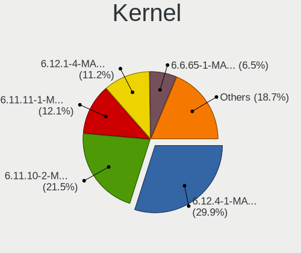
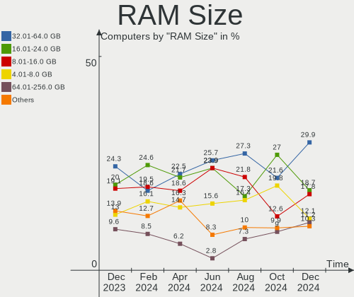
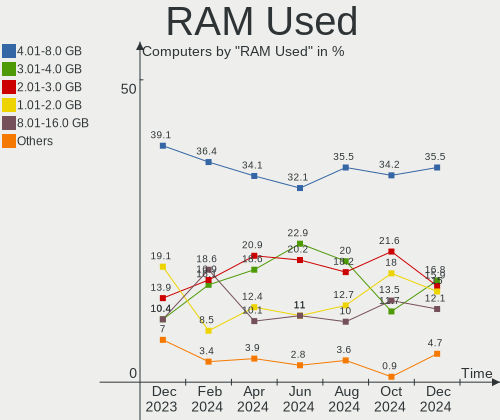
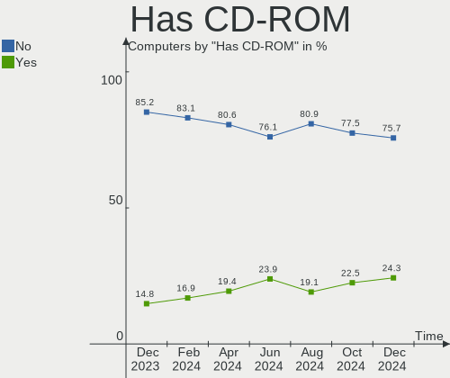
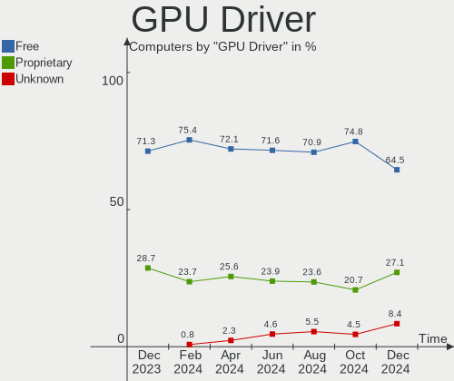
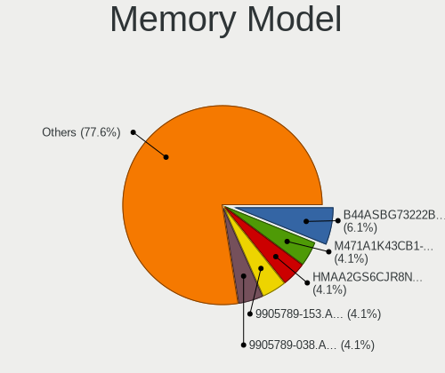

Manjaro - Hardware Trends
-------------------------

A project to identify most popular hardware characteristics and track their change
over time based on data collected by Linux users at https://Linux-Hardware.org.

Anyone can contribute to this report by the [hw-probe](https://github.com/linuxhw/hw-probe) tool:

    sudo -E hw-probe -all -upload

This is a report for all computer types. See also reports for [desktops](/Dist/Manjaro/Desktop/README.md) and [notebooks](/Dist/Manjaro/Notebook/README.md).

This report is for one last month. Overall report since the beginning of time: [TestDays](https://github.com/linuxhw/TestDays)

Period: Aug, 2023.

Contents
--------

* [ System ](#system)
  - [ OS                       ](#os)
  - [ OS Family                ](#os-family)
  - [ Kernel                   ](#kernel)
  - [ Kernel Family            ](#kernel-family)
  - [ Kernel Major Ver.        ](#kernel-major-ver)
  - [ Arch                     ](#arch)
  - [ DE                       ](#de)
  - [ Display Server           ](#display-server)
  - [ Display Manager          ](#display-manager)
  - [ OS Lang                  ](#os-lang)
  - [ Boot Mode                ](#boot-mode)
  - [ Filesystem               ](#filesystem)
  - [ Part. scheme             ](#part-scheme)
  - [ Dual Boot with Linux/BSD ](#dual-boot-with-linuxbsd)
  - [ Dual Boot (Win)          ](#dual-boot-win)

* [ Board ](#board)
  - [ Vendor                   ](#vendor)
  - [ Model                    ](#model)
  - [ Model Family             ](#model-family)
  - [ MFG Year                 ](#mfg-year)
  - [ Form Factor              ](#form-factor)
  - [ Secure Boot              ](#secure-boot)
  - [ Coreboot                 ](#coreboot)
  - [ RAM Size                 ](#ram-size)
  - [ RAM Used                 ](#ram-used)
  - [ Total Drives             ](#total-drives)
  - [ Has CD-ROM               ](#has-cd-rom)
  - [ Has Ethernet             ](#has-ethernet)
  - [ Has WiFi                 ](#has-wifi)
  - [ Has Bluetooth            ](#has-bluetooth)

* [ Location ](#location)
  - [ Country                  ](#country)
  - [ City                     ](#city)

* [ Drives ](#drives)
  - [ Drive Vendor             ](#drive-vendor)
  - [ Drive Model              ](#drive-model)
  - [ HDD Vendor               ](#hdd-vendor)
  - [ SSD Vendor               ](#ssd-vendor)
  - [ Drive Kind               ](#drive-kind)
  - [ Drive Connector          ](#drive-connector)
  - [ Drive Size               ](#drive-size)
  - [ Space Total              ](#space-total)
  - [ Space Used               ](#space-used)
  - [ Malfunc. Drives          ](#malfunc-drives)
  - [ Malfunc. Drive Vendor    ](#malfunc-drive-vendor)
  - [ Malfunc. HDD Vendor      ](#malfunc-hdd-vendor)
  - [ Malfunc. Drive Kind      ](#malfunc-drive-kind)
  - [ Failed Drives            ](#failed-drives)
  - [ Failed Drive Vendor      ](#failed-drive-vendor)
  - [ Drive Status             ](#drive-status)

* [ Storage controller ](#storage-controller)
  - [ Storage Vendor           ](#storage-vendor)
  - [ Storage Model            ](#storage-model)
  - [ Storage Kind             ](#storage-kind)

* [ Processor ](#processor)
  - [ CPU Vendor               ](#cpu-vendor)
  - [ CPU Model                ](#cpu-model)
  - [ CPU Model Family         ](#cpu-model-family)
  - [ CPU Cores                ](#cpu-cores)
  - [ CPU Sockets              ](#cpu-sockets)
  - [ CPU Threads              ](#cpu-threads)
  - [ CPU Op-Modes             ](#cpu-op-modes)
  - [ CPU Microcode            ](#cpu-microcode)
  - [ CPU Microarch            ](#cpu-microarch)

* [ Graphics ](#graphics)
  - [ GPU Vendor               ](#gpu-vendor)
  - [ GPU Model                ](#gpu-model)
  - [ GPU Combo                ](#gpu-combo)
  - [ GPU Driver               ](#gpu-driver)
  - [ GPU Memory               ](#gpu-memory)

* [ Monitor ](#monitor)
  - [ Monitor Vendor           ](#monitor-vendor)
  - [ Monitor Model            ](#monitor-model)
  - [ Monitor Resolution       ](#monitor-resolution)
  - [ Monitor Diagonal         ](#monitor-diagonal)
  - [ Monitor Width            ](#monitor-width)
  - [ Aspect Ratio             ](#aspect-ratio)
  - [ Monitor Area             ](#monitor-area)
  - [ Pixel Density            ](#pixel-density)
  - [ Multiple Monitors        ](#multiple-monitors)

* [ Network ](#network)
  - [ Net Controller Vendor    ](#net-controller-vendor)
  - [ Net Controller Model     ](#net-controller-model)
  - [ Wireless Vendor          ](#wireless-vendor)
  - [ Wireless Model           ](#wireless-model)
  - [ Ethernet Vendor          ](#ethernet-vendor)
  - [ Ethernet Model           ](#ethernet-model)
  - [ Net Controller Kind      ](#net-controller-kind)
  - [ Used Controller          ](#used-controller)
  - [ NICs                     ](#nics)
  - [ IPv6                     ](#ipv6)

* [ Bluetooth ](#bluetooth)
  - [ Bluetooth Vendor         ](#bluetooth-vendor)
  - [ Bluetooth Model          ](#bluetooth-model)

* [ Sound ](#sound)
  - [ Sound Vendor             ](#sound-vendor)
  - [ Sound Model              ](#sound-model)

* [ Memory ](#memory)
  - [ Memory Vendor            ](#memory-vendor)
  - [ Memory Model             ](#memory-model)
  - [ Memory Kind              ](#memory-kind)
  - [ Memory Form Factor       ](#memory-form-factor)
  - [ Memory Size              ](#memory-size)
  - [ Memory Speed             ](#memory-speed)

* [ Printers & scanners ](#printers--scanners)
  - [ Printer Vendor           ](#printer-vendor)
  - [ Printer Model            ](#printer-model)
  - [ Scanner Vendor           ](#scanner-vendor)
  - [ Scanner Model            ](#scanner-model)

* [ Camera ](#camera)
  - [ Camera Vendor            ](#camera-vendor)
  - [ Camera Model             ](#camera-model)

* [ Security ](#security)
  - [ Fingerprint Vendor       ](#fingerprint-vendor)
  - [ Fingerprint Model        ](#fingerprint-model)
  - [ Chipcard Vendor          ](#chipcard-vendor)
  - [ Chipcard Model           ](#chipcard-model)

* [ Unsupported ](#unsupported)
  - [ Unsupported Devices      ](#unsupported-devices)
  - [ Unsupported Device Types ](#unsupported-device-types)

System
------

OS
--

Installed operating systems

| Name           | Computers | Percent |
|----------------|-----------|---------|
| Manjaro        | 65        | 55.08%  |
| Manjaro 23.0.0 | 53        | 44.92%  |

OS Family
---------

OS without a version

| Name    | Computers | Percent |
|---------|-----------|---------|
| Manjaro | 118       | 100%    |

Kernel
------

Version of the Linux kernel

| Version              | Computers | Percent |
|----------------------|-----------|---------|
| 6.1.44-1-MANJARO     | 29        | 24.58%  |
| 6.1.41-1-MANJARO     | 21        | 17.8%   |
| 6.4.6-1-MANJARO      | 17        | 14.41%  |
| 6.4.9-1-MANJARO      | 11        | 9.32%   |
| 5.15.125-1-MANJARO   | 6         | 5.08%   |
| 6.5.0-1-MANJARO      | 5         | 4.24%   |
| 6.3.13-2-MANJARO     | 3         | 2.54%   |
| 6.1.49-1-MANJARO     | 3         | 2.54%   |
| 5.15.122-1-MANJARO   | 3         | 2.54%   |
| 6.4.6-3-rt8-MANJARO  | 2         | 1.69%   |
| 6.1.30-1-MANJARO     | 2         | 1.69%   |
| 5.15.114-2-MANJARO   | 2         | 1.69%   |
| 6.4.8-lqx1-1-lqx     | 1         | 0.85%   |
| 6.4.7-zen3-xanmod1-1 | 1         | 0.85%   |
| 6.4.3-1-MANJARO      | 1         | 0.85%   |
| 6.4.12-lqx1-1-lqx    | 1         | 0.85%   |
| 6.4.12-1-MANJARO     | 1         | 0.85%   |
| 6.4.11-1-MANJARO     | 1         | 0.85%   |
| 6.4.0-2-rt6-MANJARO  | 1         | 0.85%   |
| 6.3.5-2-MANJARO      | 1         | 0.85%   |
| 6.3.13-1-MANJARO     | 1         | 0.85%   |
| 6.2.0-2-rt3-MANJARO  | 1         | 0.85%   |
| 6.1.38-1-MANJARO     | 1         | 0.85%   |
| 6.1.31-2-MANJARO     | 1         | 0.85%   |
| 5.4.252-1-MANJARO    | 1         | 0.85%   |
| 5.10.187-1-MANJARO   | 1         | 0.85%   |

Kernel Family
-------------

Linux kernel without a distro release

| Version  | Computers | Percent |
|----------|-----------|---------|
| 6.1.44   | 29        | 24.58%  |
| 6.1.41   | 21        | 17.8%   |
| 6.4.6    | 19        | 16.1%   |
| 6.4.9    | 11        | 9.32%   |
| 5.15.125 | 6         | 5.08%   |
| 6.5.0    | 5         | 4.24%   |
| 6.3.13   | 4         | 3.39%   |
| 6.1.49   | 3         | 2.54%   |
| 5.15.122 | 3         | 2.54%   |
| 6.4.12   | 2         | 1.69%   |
| 6.1.30   | 2         | 1.69%   |
| 5.15.114 | 2         | 1.69%   |
| 6.4.8    | 1         | 0.85%   |
| 6.4.7    | 1         | 0.85%   |
| 6.4.3    | 1         | 0.85%   |
| 6.4.11   | 1         | 0.85%   |
| 6.4.0    | 1         | 0.85%   |
| 6.3.5    | 1         | 0.85%   |
| 6.2.0    | 1         | 0.85%   |
| 6.1.38   | 1         | 0.85%   |
| 6.1.31   | 1         | 0.85%   |
| 5.4.252  | 1         | 0.85%   |
| 5.10.187 | 1         | 0.85%   |

Kernel Major Ver.
-----------------

Linux kernel major version

| Version | Computers | Percent |
|---------|-----------|---------|
| 6.1     | 57        | 48.31%  |
| 6.4     | 37        | 31.36%  |
| 5.15    | 11        | 9.32%   |
| 6.5     | 5         | 4.24%   |
| 6.3     | 5         | 4.24%   |
| 6.2     | 1         | 0.85%   |
| 5.4     | 1         | 0.85%   |
| 5.10    | 1         | 0.85%   |

Arch
----

OS architecture (x86_64, i586, etc.)

| Name   | Computers | Percent |
|--------|-----------|---------|
| x86_64 | 118       | 100%    |

DE
--

Desktop Environment

| Name       | Computers | Percent |
|------------|-----------|---------|
| KDE5       | 73        | 61.86%  |
| GNOME      | 19        | 16.1%   |
| XFCE       | 18        | 15.25%  |
| MATE       | 3         | 2.54%   |
| KDE        | 2         | 1.69%   |
| X-Cinnamon | 1         | 0.85%   |
| i3         | 1         | 0.85%   |
| Unknown    | 1         | 0.85%   |

Display Server
--------------

X11 or Wayland

| Name    | Computers | Percent |
|---------|-----------|---------|
| X11     | 84        | 71.19%  |
| Wayland | 32        | 27.12%  |
| Unknown | 2         | 1.69%   |

Display Manager
---------------

SDDM, LightDM, etc.

| Name    | Computers | Percent |
|---------|-----------|---------|
| Unknown | 65        | 55.08%  |
| SDDM    | 31        | 26.27%  |
| LightDM | 16        | 13.56%  |
| GDM     | 6         | 5.08%   |

OS Lang
-------

Language

| Lang    | Computers | Percent |
|---------|-----------|---------|
| en_US   | 46        | 38.98%  |
| de_DE   | 13        | 11.02%  |
| pt_BR   | 8         | 6.78%   |
| en_GB   | 8         | 6.78%   |
| ru_RU   | 6         | 5.08%   |
| it_IT   | 6         | 5.08%   |
| fr_FR   | 4         | 3.39%   |
| es_MX   | 4         | 3.39%   |
| en_AU   | 4         | 3.39%   |
| pl_PL   | 3         | 2.54%   |
| es_ES   | 3         | 2.54%   |
| es_AR   | 2         | 1.69%   |
| uk_UA   | 1         | 0.85%   |
| ja_JP   | 1         | 0.85%   |
| id_ID   | 1         | 0.85%   |
| hu_HU   | 1         | 0.85%   |
| es_SV   | 1         | 0.85%   |
| es_PY   | 1         | 0.85%   |
| es_CU   | 1         | 0.85%   |
| en_ZA   | 1         | 0.85%   |
| el_GR   | 1         | 0.85%   |
| de_CH   | 1         | 0.85%   |
| Unknown | 1         | 0.85%   |

Boot Mode
---------

EFI or BIOS

| Mode | Computers | Percent |
|------|-----------|---------|
| BIOS | 74        | 62.71%  |
| EFI  | 44        | 37.29%  |

Filesystem
----------

Type of filesystem

| Type  | Computers | Percent |
|-------|-----------|---------|
| Ext4  | 95        | 80.51%  |
| Btrfs | 11        | 9.32%   |
| Tmpfs | 10        | 8.47%   |
| Xfs   | 2         | 1.69%   |

Part. scheme
------------

Scheme of partitioning

| Type    | Computers | Percent |
|---------|-----------|---------|
| Unknown | 61        | 51.69%  |
| GPT     | 52        | 44.07%  |
| MBR     | 5         | 4.24%   |

Dual Boot with Linux/BSD
------------------------

Hosting more than one Linux/BSD

| Dual boot | Computers | Percent |
|-----------|-----------|---------|
| No        | 102       | 86.44%  |
| Yes       | 16        | 13.56%  |

Dual Boot (Win)
---------------

Hosting Linux and Windows

| Dual boot | Computers | Percent |
|-----------|-----------|---------|
| No        | 91        | 77.12%  |
| Yes       | 27        | 22.88%  |

Board
-----

Vendor
------

Motherboard manufacturer

| Name                | Computers | Percent |
|---------------------|-----------|---------|
| Lenovo              | 20        | 16.95%  |
| Gigabyte Technology | 16        | 13.56%  |
| ASUSTek Computer    | 15        | 12.71%  |
| Hewlett-Packard     | 14        | 11.86%  |
| Dell                | 13        | 11.02%  |
| MSI                 | 9         | 7.63%   |
| ASRock              | 7         | 5.93%   |
| Acer                | 5         | 4.24%   |
| Packard Bell        | 2         | 1.69%   |
| HUAWEI              | 2         | 1.69%   |
| Timi                | 1         | 0.85%   |
| Schenker            | 1         | 0.85%   |
| SANTECH             | 1         | 0.85%   |
| Razer               | 1         | 0.85%   |
| Positivo            | 1         | 0.85%   |
| Jumper              | 1         | 0.85%   |
| Intel               | 1         | 0.85%   |
| GPU Company         | 1         | 0.85%   |
| GPD                 | 1         | 0.85%   |
| Chuwi               | 1         | 0.85%   |
| BESSTAR Tech        | 1         | 0.85%   |
| BANGHO              | 1         | 0.85%   |
| AZW                 | 1         | 0.85%   |
| ARDOR GAMING        | 1         | 0.85%   |
| Apple               | 1         | 0.85%   |

Model
-----

Motherboard model

| Name                                  | Computers | Percent |
|---------------------------------------|-----------|---------|
| Gigabyte B450 AORUS ELITE             | 3         | 2.54%   |
| Timi Xiaomi Book Air 13 2022          | 1         | 0.85%   |
| Schenker VISION 15 (SVS15E21)         | 1         | 0.85%   |
| SANTECH NL5xNU                        | 1         | 0.85%   |
| Razer Blade 17 (Mid 2021) - RZ09-0406 | 1         | 0.85%   |
| Positivo Presley 3                    | 1         | 0.85%   |
| Packard Bell EasyNote TK85            | 1         | 0.85%   |
| Packard Bell EasyNote ENTG81BA        | 1         | 0.85%   |
| MSI MS-7D43                           | 1         | 0.85%   |
| MSI MS-7C91                           | 1         | 0.85%   |
| MSI MS-7C56                           | 1         | 0.85%   |
| MSI MS-7C37                           | 1         | 0.85%   |
| MSI MS-7B93                           | 1         | 0.85%   |
| MSI MS-7A35                           | 1         | 0.85%   |
| MSI MS-7693                           | 1         | 0.85%   |
| MSI GS60 6QE                          | 1         | 0.85%   |
| MSI Bravo 15 C7VE                     | 1         | 0.85%   |
| Lenovo Yoga 7 14ITL5 82BH             | 1         | 0.85%   |
| Lenovo V17 G4 IRU 83A2                | 1         | 0.85%   |
| Lenovo ThinkPad X230 2324BV7          | 1         | 0.85%   |
| Lenovo ThinkPad T470 20HES0MV00       | 1         | 0.85%   |
| Lenovo ThinkPad T440 20B7S4NV07       | 1         | 0.85%   |
| Lenovo ThinkPad T430 2349KAG          | 1         | 0.85%   |
| Lenovo ThinkPad L430 24662W2          | 1         | 0.85%   |
| Lenovo ThinkPad L15 Gen 1 20U70004GE  | 1         | 0.85%   |
| Lenovo ThinkPad L15 Gen 1 20U3000SGE  | 1         | 0.85%   |
| Lenovo ThinkCentre M58e 7303AZ2       | 1         | 0.85%   |
| Lenovo Legion R9000P ARX8 82WM        | 1         | 0.85%   |
| Lenovo Legion 5 82B5                  | 1         | 0.85%   |
| Lenovo Legion 5 15IAH7H 82RB          | 1         | 0.85%   |
| Lenovo Legion 5 15ACH6 82JW           | 1         | 0.85%   |
| Lenovo IdeaPad Pro 5 16ARP8 83AS      | 1         | 0.85%   |
| Lenovo IdeaPad Gaming 3 15ACH6 82K2   | 1         | 0.85%   |
| Lenovo IdeaPad 320-17IKB 80XM         | 1         | 0.85%   |
| Lenovo IdeaPad 3 15IGL05 81WQ         | 1         | 0.85%   |
| Lenovo G40-45 80E1                    | 1         | 0.85%   |
| Lenovo B330-15IKBR 81M1               | 1         | 0.85%   |
| Jumper QCYL-200                       | 1         | 0.85%   |
| Intel DH61CR AAG14064-204             | 1         | 0.85%   |
| HUAWEI KPRC-WX0                       | 1         | 0.85%   |

Model Family
------------

Motherboard model prefix

| Name                  | Computers | Percent |
|-----------------------|-----------|---------|
| Lenovo ThinkPad       | 7         | 5.93%   |
| Dell Inspiron         | 5         | 4.24%   |
| ASUS ROG              | 5         | 4.24%   |
| Lenovo Legion         | 4         | 3.39%   |
| Lenovo IdeaPad        | 4         | 3.39%   |
| Acer Aspire           | 4         | 3.39%   |
| HP ProBook            | 3         | 2.54%   |
| Gigabyte B450         | 3         | 2.54%   |
| Packard Bell EasyNote | 2         | 1.69%   |
| HP Victus             | 2         | 1.69%   |
| Gigabyte X570         | 2         | 1.69%   |
| Gigabyte B550         | 2         | 1.69%   |
| Dell XPS              | 2         | 1.69%   |
| Dell OptiPlex         | 2         | 1.69%   |
| Dell Latitude         | 2         | 1.69%   |
| ASUS TUF              | 2         | 1.69%   |
| ASUS PRIME            | 2         | 1.69%   |
| Timi Xiaomi           | 1         | 0.85%   |
| Schenker VISION       | 1         | 0.85%   |
| SANTECH NL5xNU        | 1         | 0.85%   |
| Razer Blade           | 1         | 0.85%   |
| Positivo Presley      | 1         | 0.85%   |
| MSI MS-7D43           | 1         | 0.85%   |
| MSI MS-7C91           | 1         | 0.85%   |
| MSI MS-7C56           | 1         | 0.85%   |
| MSI MS-7C37           | 1         | 0.85%   |
| MSI MS-7B93           | 1         | 0.85%   |
| MSI MS-7A35           | 1         | 0.85%   |
| MSI MS-7693           | 1         | 0.85%   |
| MSI GS60              | 1         | 0.85%   |
| MSI Bravo             | 1         | 0.85%   |
| Lenovo Yoga           | 1         | 0.85%   |
| Lenovo V17            | 1         | 0.85%   |
| Lenovo ThinkCentre    | 1         | 0.85%   |
| Lenovo G40-45         | 1         | 0.85%   |
| Lenovo B330-15IKBR    | 1         | 0.85%   |
| Jumper QCYL-200       | 1         | 0.85%   |
| Intel DH61CR          | 1         | 0.85%   |
| HUAWEI KPRC-WX0       | 1         | 0.85%   |
| HUAWEI CREF-XX        | 1         | 0.85%   |

MFG Year
--------

Motherboard manufacture year

| Year | Computers | Percent |
|------|-----------|---------|
| 2020 | 21        | 17.8%   |
| 2022 | 13        | 11.02%  |
| 2021 | 13        | 11.02%  |
| 2019 | 12        | 10.17%  |
| 2018 | 10        | 8.47%   |
| 2023 | 9         | 7.63%   |
| 2012 | 8         | 6.78%   |
| 2017 | 7         | 5.93%   |
| 2013 | 6         | 5.08%   |
| 2016 | 5         | 4.24%   |
| 2015 | 5         | 4.24%   |
| 2011 | 3         | 2.54%   |
| 2009 | 3         | 2.54%   |
| 2014 | 2         | 1.69%   |
| 2010 | 1         | 0.85%   |

Form Factor
-----------

Physical design of the computer

| Name        | Computers | Percent |
|-------------|-----------|---------|
| Notebook    | 66        | 55.93%  |
| Desktop     | 46        | 38.98%  |
| Convertible | 4         | 3.39%   |
| Mini pc     | 2         | 1.69%   |

Secure Boot
-----------

Enabled or disabled

| State    | Computers | Percent |
|----------|-----------|---------|
| Disabled | 118       | 100%    |

Coreboot
--------

Have coreboot on board

| Used | Computers | Percent |
|------|-----------|---------|
| No   | 118       | 100%    |

RAM Size
--------

Total RAM memory

| Size in GB  | Computers | Percent |
|-------------|-----------|---------|
| 8.01-16.0   | 33        | 27.97%  |
| 16.01-24.0  | 28        | 23.73%  |
| 32.01-64.0  | 19        | 16.1%   |
| 4.01-8.0    | 17        | 14.41%  |
| 3.01-4.0    | 14        | 11.86%  |
| 64.01-256.0 | 5         | 4.24%   |
| 24.01-32.0  | 2         | 1.69%   |

RAM Used
--------

Used RAM memory

| Used GB    | Computers | Percent |
|------------|-----------|---------|
| 4.01-8.0   | 35        | 29.66%  |
| 3.01-4.0   | 23        | 19.49%  |
| 2.01-3.0   | 22        | 18.64%  |
| 1.01-2.0   | 20        | 16.95%  |
| 8.01-16.0  | 15        | 12.71%  |
| 16.01-24.0 | 2         | 1.69%   |
| 0.51-1.0   | 1         | 0.85%   |

Total Drives
------------

Number of drives on board

| Drives | Computers | Percent |
|--------|-----------|---------|
| 1      | 52        | 44.07%  |
| 2      | 41        | 34.75%  |
| 3      | 9         | 7.63%   |
| 4      | 7         | 5.93%   |
| 5      | 5         | 4.24%   |
| 6      | 2         | 1.69%   |
| 11     | 1         | 0.85%   |
| 8      | 1         | 0.85%   |

Has CD-ROM
----------

Has CD-ROM on board

| Presented | Computers | Percent |
|-----------|-----------|---------|
| No        | 101       | 85.59%  |
| Yes       | 17        | 14.41%  |

Has Ethernet
------------

Has Ethernet on board

| Presented | Computers | Percent |
|-----------|-----------|---------|
| Yes       | 100       | 84.75%  |
| No        | 18        | 15.25%  |

Has WiFi
--------

Has WiFi module

| Presented | Computers | Percent |
|-----------|-----------|---------|
| Yes       | 96        | 81.36%  |
| No        | 22        | 18.64%  |

Has Bluetooth
-------------

Has Bluetooth module

| Presented | Computers | Percent |
|-----------|-----------|---------|
| Yes       | 93        | 78.81%  |
| No        | 25        | 21.19%  |

Location
--------

Country
-------

Geographic location (country)

| Country         | Computers | Percent |
|-----------------|-----------|---------|
| USA             | 21        | 17.8%   |
| Germany         | 16        | 13.56%  |
| Brazil          | 9         | 7.63%   |
| Russia          | 7         | 5.93%   |
| Italy           | 6         | 5.08%   |
| Poland          | 5         | 4.24%   |
| France          | 5         | 4.24%   |
| Australia       | 5         | 4.24%   |
| UK              | 4         | 3.39%   |
| Mexico          | 4         | 3.39%   |
| Hungary         | 4         | 3.39%   |
| Spain           | 3         | 2.54%   |
| Indonesia       | 2         | 1.69%   |
| Argentina       | 2         | 1.69%   |
| Turkey          | 1         | 0.85%   |
| Switzerland     | 1         | 0.85%   |
| Sweden          | 1         | 0.85%   |
| South Africa    | 1         | 0.85%   |
| Romania         | 1         | 0.85%   |
| Norway          | 1         | 0.85%   |
| North Macedonia | 1         | 0.85%   |
| Netherlands     | 1         | 0.85%   |
| Nepal           | 1         | 0.85%   |
| Kenya           | 1         | 0.85%   |
| Japan           | 1         | 0.85%   |
| Iran            | 1         | 0.85%   |
| Georgia         | 1         | 0.85%   |
| Finland         | 1         | 0.85%   |
| El Salvador     | 1         | 0.85%   |
| Ecuador         | 1         | 0.85%   |
| Denmark         | 1         | 0.85%   |
| Cuba            | 1         | 0.85%   |
| Croatia         | 1         | 0.85%   |
| Canada          | 1         | 0.85%   |
| Bulgaria        | 1         | 0.85%   |
| Bolivia         | 1         | 0.85%   |
| Belarus         | 1         | 0.85%   |
| Bangladesh      | 1         | 0.85%   |
| Austria         | 1         | 0.85%   |

City
----

Geographic location (city)

| City            | Computers | Percent |
|-----------------|-----------|---------|
| St Petersburg   | 3         | 2.54%   |
| Seattle         | 3         | 2.54%   |
| Melbourne       | 3         | 2.54%   |
| Moscow          | 2         | 1.69%   |
| Marysville      | 2         | 1.69%   |
| Madrid          | 2         | 1.69%   |
| Karlsruhe       | 2         | 1.69%   |
| Corrientes      | 2         | 1.69%   |
| Budapest        | 2         | 1.69%   |
| Zary            | 1         | 0.85%   |
| Zapopan         | 1         | 0.85%   |
| Yekaterinburg   | 1         | 0.85%   |
| Würzburg       | 1         | 0.85%   |
| Wroclaw         | 1         | 0.85%   |
| Warsaw          | 1         | 0.85%   |
| Venosa          | 1         | 0.85%   |
| Venice          | 1         | 0.85%   |
| Vancouver       | 1         | 0.85%   |
| Valencia        | 1         | 0.85%   |
| Valença        | 1         | 0.85%   |
| Uppsala         | 1         | 0.85%   |
| Thisted         | 1         | 0.85%   |
| Tehran          | 1         | 0.85%   |
| Tbilisi         | 1         | 0.85%   |
| Takamatsu       | 1         | 0.85%   |
| Swidnica        | 1         | 0.85%   |
| Surabaya        | 1         | 0.85%   |
| Spokane         | 1         | 0.85%   |
| Skopje          | 1         | 0.85%   |
| San Salvador    | 1         | 0.85%   |
| Saint-Denis     | 1         | 0.85%   |
| Rio de Janeiro  | 1         | 0.85%   |
| Rijeka          | 1         | 0.85%   |
| Recklinghausen  | 1         | 0.85%   |
| Ravensburg      | 1         | 0.85%   |
| Querétaro City | 1         | 0.85%   |
| Pozzomaggiore   | 1         | 0.85%   |
| Porsgrunn       | 1         | 0.85%   |
| Plovdiv         | 1         | 0.85%   |
| Plainwell       | 1         | 0.85%   |

Drives
------

Drive Vendor
------------

Hard drive vendors

| Vendor                      | Computers | Drives | Percent |
|-----------------------------|-----------|--------|---------|
| Samsung Electronics         | 34        | 44     | 15.67%  |
| Seagate                     | 24        | 31     | 11.06%  |
| WDC                         | 18        | 21     | 8.29%   |
| Sandisk                     | 18        | 19     | 8.29%   |
| Crucial                     | 13        | 13     | 5.99%   |
| Toshiba                     | 12        | 13     | 5.53%   |
| Kingston                    | 9         | 10     | 4.15%   |
| SK hynix                    | 6         | 6      | 2.76%   |
| Intel                       | 6         | 7      | 2.76%   |
| Phison Electronics          | 5         | 5      | 2.3%    |
| Micron/Crucial Technology   | 5         | 5      | 2.3%    |
| Micron Technology           | 4         | 4      | 1.84%   |
| A-DATA Technology           | 4         | 4      | 1.84%   |
| Unknown                     | 3         | 4      | 1.38%   |
| Kingston Technology Company | 3         | 3      | 1.38%   |
| HGST                        | 3         | 3      | 1.38%   |
| GOODRAM                     | 3         | 3      | 1.38%   |
| Silicon Motion              | 2         | 2      | 0.92%   |
| PNY                         | 2         | 2      | 0.92%   |
| Patriot                     | 2         | 2      | 0.92%   |
| Intenso                     | 2         | 2      | 0.92%   |
| Gigabyte Technology         | 2         | 2      | 0.92%   |
| Fujitsu                     | 2         | 2      | 0.92%   |
| China                       | 2         | 2      | 0.92%   |
| ADATA Technology            | 2         | 2      | 0.92%   |
| Unknown                     | 2         | 2      | 0.92%   |
| XrayDisk                    | 1         | 1      | 0.46%   |
| WALRAM                      | 1         | 1      | 0.46%   |
| USB                         | 1         | 1      | 0.46%   |
| Union Memory                | 1         | 1      | 0.46%   |
| TO Exter                    | 1         | 1      | 0.46%   |
| Teutons                     | 1         | 1      | 0.46%   |
| Realtek Semiconductor       | 1         | 1      | 0.46%   |
| Realtek                     | 1         | 1      | 0.46%   |
| Ramos Technology            | 1         | 2      | 0.46%   |
| OCZ-VERT                    | 1         | 1      | 0.46%   |
| NGFF                        | 1         | 1      | 0.46%   |
| Netac                       | 1         | 1      | 0.46%   |
| minisforum                  | 1         | 1      | 0.46%   |
| Maxtor                      | 1         | 1      | 0.46%   |

Drive Model
-----------

Hard drive models

| Model                                                 | Computers | Percent |
|-------------------------------------------------------|-----------|---------|
| Samsung NVMe SSD Controller PM9A1/PM9A3/980PRO 1024GB | 8         | 3.32%   |
| Samsung NVMe SSD Controller SM981/PM981/PM983 500GB   | 6         | 2.49%   |
| Sandisk WD Black SN750 / PC SN730 NVMe SSD 1024GB     | 4         | 1.66%   |
| Sandisk WD Blue SN550 NVMe SSD 250GB                  | 3         | 1.24%   |
| Micron/Crucial P2 NVMe PCIe SSD 1TB                   | 3         | 1.24%   |
| Crucial CT1000MX500SSD1 1TB                           | 3         | 1.24%   |
| WDC WD5000LPVX-22V0TT0 500GB                          | 2         | 0.83%   |
| Unknown MMC Card  128GB                               | 2         | 0.83%   |
| Toshiba MQ01ABD100 1TB                                | 2         | 0.83%   |
| Toshiba KXG50ZNV256G 256GB                            | 2         | 0.83%   |
| Seagate ST500LT012-9WS142 500GB                       | 2         | 0.83%   |
| Seagate ST4000DM004-2CV104 4TB                        | 2         | 0.83%   |
| Seagate ST2000DM008-2FR102 2TB                        | 2         | 0.83%   |
| Seagate ST1000LM035-1RK172 1TB                        | 2         | 0.83%   |
| Sandisk WD Black SN850 256GB                          | 2         | 0.83%   |
| SanDisk SSD PLUS 480GB                                | 2         | 0.83%   |
| Samsung SSD 980 1TB                                   | 2         | 0.83%   |
| Samsung SSD 860 EVO 1TB                               | 2         | 0.83%   |
| Samsung SSD 840 PRO Series 128GB                      | 2         | 0.83%   |
| Samsung MZALQ512HBLU-00BL2 512GB                      | 2         | 0.83%   |
| Phison PS5013 E13 NVMe Controller 512GB               | 2         | 0.83%   |
| Phison E12 NVMe Controller 256GB                      | 2         | 0.83%   |
| Kingston Company SNV2S1000G 1TB                       | 2         | 0.83%   |
| Kingston SUV400S37240G 240GB SSD                      | 2         | 0.83%   |
| Intenso SSD 128GB                                     | 2         | 0.83%   |
| Crucial CT250MX500SSD1 250GB                          | 2         | 0.83%   |
| Crucial CT1000BX500SSD1 1TB                           | 2         | 0.83%   |
| Unknown                                               | 2         | 0.83%   |
| XrayDisk NVMe SSD Drive 1024GB                        | 1         | 0.41%   |
| WDC WDS500G2B0B-00YS70 500GB SSD                      | 1         | 0.41%   |
| WDC WDS500G2B0A-00SM50 500GB SSD                      | 1         | 0.41%   |
| WDC WD6401AALS-00L3B2 640GB                           | 1         | 0.41%   |
| WDC WD5000AAKX-22ERMA0 500GB                          | 1         | 0.41%   |
| WDC WD3003FZEX-00Z4SA0 3TB                            | 1         | 0.41%   |
| WDC WD20EVDS-63T3B0 2TB                               | 1         | 0.41%   |
| WDC WD20EARX-00PASB0 2TB                              | 1         | 0.41%   |
| WDC WD20EARX-00MMMB0 2TB                              | 1         | 0.41%   |
| WDC WD2003FYYS-05T9B0 2TB                             | 1         | 0.41%   |
| WDC WD140EFGX-68B0GN0 14TB                            | 1         | 0.41%   |
| WDC WD10JFCX-68N6GN0 1TB                              | 1         | 0.41%   |

HDD Vendor
----------

Hard disk drive vendors

| Vendor              | Computers | Drives | Percent |
|---------------------|-----------|--------|---------|
| Seagate             | 24        | 30     | 41.38%  |
| WDC                 | 16        | 19     | 27.59%  |
| Toshiba             | 8         | 9      | 13.79%  |
| HGST                | 3         | 3      | 5.17%   |
| Fujitsu             | 2         | 2      | 3.45%   |
| USB                 | 1         | 1      | 1.72%   |
| Samsung Electronics | 1         | 1      | 1.72%   |
| Maxtor              | 1         | 1      | 1.72%   |
| Maxone              | 1         | 1      | 1.72%   |
| Hitachi             | 1         | 1      | 1.72%   |

SSD Vendor
----------

Solid state drive vendors

| Vendor              | Computers | Drives | Percent |
|---------------------|-----------|--------|---------|
| Samsung Electronics | 14        | 16     | 17.28%  |
| Crucial             | 13        | 13     | 16.05%  |
| Kingston            | 7         | 7      | 8.64%   |
| SanDisk             | 4         | 4      | 4.94%   |
| Intel               | 4         | 5      | 4.94%   |
| A-DATA Technology   | 4         | 4      | 4.94%   |
| GOODRAM             | 3         | 3      | 3.7%    |
| WDC                 | 2         | 2      | 2.47%   |
| SK hynix            | 2         | 2      | 2.47%   |
| PNY                 | 2         | 2      | 2.47%   |
| Patriot             | 2         | 2      | 2.47%   |
| Intenso             | 2         | 2      | 2.47%   |
| Gigabyte Technology | 2         | 2      | 2.47%   |
| China               | 2         | 2      | 2.47%   |
| Toshiba             | 1         | 1      | 1.23%   |
| TO Exter            | 1         | 1      | 1.23%   |
| Teutons             | 1         | 1      | 1.23%   |
| Ramos Technology    | 1         | 2      | 1.23%   |
| OCZ-VERT            | 1         | 1      | 1.23%   |
| NGFF                | 1         | 1      | 1.23%   |
| Netac               | 1         | 1      | 1.23%   |
| minisforum          | 1         | 1      | 1.23%   |
| LITEON              | 1         | 5      | 1.23%   |
| Lexar               | 1         | 1      | 1.23%   |
| Leven               | 1         | 1      | 1.23%   |
| KingFast            | 1         | 1      | 1.23%   |
| JMicron Technology  | 1         | 1      | 1.23%   |
| BAITITON            | 1         | 1      | 1.23%   |
| AS201               | 1         | 1      | 1.23%   |
| Apacer              | 1         | 1      | 1.23%   |
| Acer                | 1         | 1      | 1.23%   |
| Unknown             | 1         | 1      | 1.23%   |

Drive Kind
----------

HDD or SSD

| Kind    | Computers | Drives | Percent |
|---------|-----------|--------|---------|
| NVMe    | 66        | 82     | 36.67%  |
| SSD     | 61        | 89     | 33.89%  |
| HDD     | 46        | 68     | 25.56%  |
| Unknown | 4         | 4      | 2.22%   |
| MMC     | 3         | 4      | 1.67%   |

Drive Connector
---------------

SATA, SAS, NVMe, etc.

| Type | Computers | Drives | Percent |
|------|-----------|--------|---------|
| SATA | 80        | 151    | 50.31%  |
| NVMe | 66        | 81     | 41.51%  |
| SAS  | 10        | 11     | 6.29%   |
| MMC  | 3         | 4      | 1.89%   |

Drive Size
----------

Size of hard drive

| Size in TB | Computers | Drives | Percent |
|------------|-----------|--------|---------|
| 0.01-0.5   | 54        | 78     | 45%     |
| 0.51-1.0   | 36        | 46     | 30%     |
| 1.01-2.0   | 14        | 15     | 11.67%  |
| 3.01-4.0   | 6         | 7      | 5%      |
| 2.01-3.0   | 4         | 4      | 3.33%   |
| 4.01-10.0  | 4         | 5      | 3.33%   |
| 10.01-20.0 | 2         | 2      | 1.67%   |

Space Total
-----------

Amount of disk space available on the file system

| Size in GB     | Computers | Percent |
|----------------|-----------|---------|
| 501-1000       | 27        | 22.88%  |
| 101-250        | 25        | 21.19%  |
| 251-500        | 21        | 17.8%   |
| 1001-2000      | 19        | 16.1%   |
| More than 3000 | 9         | 7.63%   |
| Unknown        | 9         | 7.63%   |
| 51-100         | 4         | 3.39%   |
| 2001-3000      | 2         | 1.69%   |
| 1-20           | 2         | 1.69%   |

Space Used
----------

Amount of used disk space

| Used GB        | Computers | Percent |
|----------------|-----------|---------|
| 21-50          | 22        | 18.64%  |
| 51-100         | 19        | 16.1%   |
| 501-1000       | 17        | 14.41%  |
| 1-20           | 15        | 12.71%  |
| 101-250        | 14        | 11.86%  |
| 251-500        | 12        | 10.17%  |
| Unknown        | 9         | 7.63%   |
| More than 3000 | 6         | 5.08%   |
| 1001-2000      | 3         | 2.54%   |
| 2001-3000      | 1         | 0.85%   |

Malfunc. Drives
---------------

Drive models with a malfunction

| Model                          | Computers | Drives | Percent |
|--------------------------------|-----------|--------|---------|
| WDC WD10JFCX-68N6GN0 1TB       | 1         | 1      | 14.29%  |
| WDC WD10EZEX-21WN4A0 1TB       | 1         | 1      | 14.29%  |
| Seagate ST9500423AS 500GB      | 1         | 1      | 14.29%  |
| Seagate ST4000DM000-1F2168 4TB | 1         | 1      | 14.29%  |
| Netac SSD 256GB                | 1         | 1      | 14.29%  |
| JMicron Technology Generic 1TB | 1         | 1      | 14.29%  |
| HGST HTS725050A7E630 500GB     | 1         | 1      | 14.29%  |

Malfunc. Drive Vendor
---------------------

Vendors of faulty drives

| Vendor             | Computers | Drives | Percent |
|--------------------|-----------|--------|---------|
| WDC                | 2         | 2      | 28.57%  |
| Seagate            | 2         | 2      | 28.57%  |
| Netac              | 1         | 1      | 14.29%  |
| JMicron Technology | 1         | 1      | 14.29%  |
| HGST               | 1         | 1      | 14.29%  |

Malfunc. HDD Vendor
-------------------

Vendors of faulty HDD drives

| Vendor  | Computers | Drives | Percent |
|---------|-----------|--------|---------|
| WDC     | 2         | 2      | 40%     |
| Seagate | 2         | 2      | 40%     |
| HGST    | 1         | 1      | 20%     |

Malfunc. Drive Kind
-------------------

Kinds of faulty drives

| Kind | Computers | Drives | Percent |
|------|-----------|--------|---------|
| HDD  | 5         | 5      | 71.43%  |
| SSD  | 2         | 2      | 28.57%  |

Failed Drives
-------------

Failed drive models

Zero info for selected period =(

Failed Drive Vendor
-------------------

Failed drive vendors

Zero info for selected period =(

Drive Status
------------

Number of failed and malfunc. drives

| Status   | Computers | Drives | Percent |
|----------|-----------|--------|---------|
| Detected | 82        | 174    | 65.08%  |
| Works    | 37        | 66     | 29.37%  |
| Malfunc  | 7         | 7      | 5.56%   |

Storage controller
------------------

Storage Vendor
--------------

Storage controller vendors

| Vendor                       | Computers | Percent |
|------------------------------|-----------|---------|
| Intel                        | 59        | 32.78%  |
| AMD                          | 41        | 22.78%  |
| Samsung Electronics          | 23        | 12.78%  |
| SanDisk                      | 14        | 7.78%   |
| Kingston Technology Company  | 6         | 3.33%   |
| Phison Electronics           | 5         | 2.78%   |
| Micron/Crucial Technology    | 5         | 2.78%   |
| SK hynix                     | 4         | 2.22%   |
| Micron Technology            | 4         | 2.22%   |
| Toshiba America Info Systems | 3         | 1.67%   |
| ASMedia Technology           | 3         | 1.67%   |
| Silicon Motion               | 2         | 1.11%   |
| JMicron Technology           | 2         | 1.11%   |
| ADATA Technology             | 2         | 1.11%   |
| Union Memory (Shenzhen)      | 1         | 0.56%   |
| Seagate Technology           | 1         | 0.56%   |
| Realtek Semiconductor        | 1         | 0.56%   |
| Nvidia                       | 1         | 0.56%   |
| MAXIO Technology (Hangzhou)  | 1         | 0.56%   |
| KIOXIA                       | 1         | 0.56%   |
| INNOGRIT                     | 1         | 0.56%   |

Storage Model
-------------

Storage controller models

| Model                                                                         | Computers | Percent |
|-------------------------------------------------------------------------------|-----------|---------|
| AMD FCH SATA Controller [AHCI mode]                                           | 24        | 12%     |
| AMD 500 Series Chipset SATA Controller                                        | 11        | 5.5%    |
| Samsung NVMe SSD Controller 980                                               | 10        | 5%      |
| Samsung NVMe SSD Controller PM9A1/PM9A3/980PRO                                | 8         | 4%      |
| AMD 400 Series Chipset SATA Controller                                        | 7         | 3.5%    |
| Samsung NVMe SSD Controller SM981/PM981/PM983                                 | 6         | 3%      |
| Intel Sunrise Point-LP SATA Controller [AHCI mode]                            | 6         | 3%      |
| Intel 7 Series Chipset Family 6-port SATA Controller [AHCI mode]              | 6         | 3%      |
| Intel Volume Management Device NVMe RAID Controller                           | 5         | 2.5%    |
| Intel 8 Series SATA Controller 1 [AHCI mode]                                  | 5         | 2.5%    |
| SanDisk WD Black SN750 / PC SN730 NVMe SSD                                    | 4         | 2%      |
| Intel 82801 Mobile SATA Controller [RAID mode]                                | 4         | 2%      |
| SanDisk WD Blue SN550 NVMe SSD                                                | 3         | 1.5%    |
| SanDisk WD Black SN770 / PC SN740 256GB / PC SN560 (DRAM-less) NVMe SSD       | 3         | 1.5%    |
| Micron/Crucial P2 [Nick P2] / P3 / P3 Plus NVMe PCIe SSD (DRAM-less)          | 3         | 1.5%    |
| Kingston Company Company Non-Volatile memory controller                       | 3         | 1.5%    |
| Intel Wildcat Point-LP SATA Controller [AHCI Mode]                            | 3         | 1.5%    |
| Intel Alder Lake-P SATA AHCI Controller                                       | 3         | 1.5%    |
| Intel 6 Series/C200 Series Chipset Family 6 port Desktop SATA AHCI Controller | 3         | 1.5%    |
| ASMedia ASM1062 Serial ATA Controller                                         | 3         | 1.5%    |
| AMD SB7x0/SB8x0/SB9x0 IDE Controller                                          | 3         | 1.5%    |
| Toshiba America Info Systems XG5 NVMe SSD Controller                          | 2         | 1%      |
| SK hynix Platinum P41/PC801 NVMe Solid State Drive                            | 2         | 1%      |
| SanDisk WD PC SN810 / Black SN850 NVMe SSD                                    | 2         | 1%      |
| Phison PS5013 E13 NVMe Controller                                             | 2         | 1%      |
| Phison E12 NVMe Controller                                                    | 2         | 1%      |
| Micron 2300 NVMe SSD [Santana]                                                | 2         | 1%      |
| Intel Tiger Lake-LP SATA Controller                                           | 2         | 1%      |
| Intel Q170/Q150/B150/H170/H110/Z170/CM236 Chipset SATA Controller [AHCI Mode] | 2         | 1%      |
| Intel Jasper Lake SATA AHCI Controller                                        | 2         | 1%      |
| Intel HM170/QM170 Chipset SATA Controller [AHCI Mode]                         | 2         | 1%      |
| Intel Celeron/Pentium Silver Processor SATA Controller                        | 2         | 1%      |
| AMD SB7x0/SB8x0/SB9x0 SATA Controller [IDE mode]                              | 2         | 1%      |
| AMD SB7x0/SB8x0/SB9x0 SATA Controller [AHCI mode]                             | 2         | 1%      |
| Union Memory (Shenzhen) AM620 PCIe 3.0 NVMe SSD 128GB                         | 1         | 0.5%    |
| Toshiba America Info Systems BG3 NVMe SSD Controller                          | 1         | 0.5%    |
| SK hynix PC401 NVMe Solid State Drive 256GB                                   | 1         | 0.5%    |
| SK hynix BC511 NVMe SSD                                                       | 1         | 0.5%    |
| Silicon Motion SM2263EN/SM2263XT (DRAM-less) NVMe SSD Controllers             | 1         | 0.5%    |
| Silicon Motion SM2262/SM2262EN SSD Controller                                 | 1         | 0.5%    |

Storage Kind
------------

Kind of storage controller (IDE, SATA, NVMe, SAS, ...)

| Kind | Computers | Percent |
|------|-----------|---------|
| SATA | 90        | 52.33%  |
| NVMe | 66        | 38.37%  |
| RAID | 10        | 5.81%   |
| IDE  | 6         | 3.49%   |

Processor
---------

CPU Vendor
----------

Processor vendors

| Vendor | Computers | Percent |
|--------|-----------|---------|
| Intel  | 66        | 55.93%  |
| AMD    | 52        | 44.07%  |

CPU Model
---------

Processor models

| Model                                   | Computers | Percent |
|-----------------------------------------|-----------|---------|
| AMD Ryzen 7 3700X 8-Core Processor      | 5         | 4.24%   |
| AMD Ryzen 7 5800X 8-Core Processor      | 4         | 3.39%   |
| Intel Celeron N4020 CPU @ 1.10GHz       | 3         | 2.54%   |
| Intel 11th Gen Core i7-1165G7 @ 2.80GHz | 3         | 2.54%   |
| AMD Ryzen 5 5600X 6-Core Processor      | 3         | 2.54%   |
| Intel Core i7-8700 CPU @ 3.20GHz        | 2         | 1.69%   |
| Intel Core i5-7300U CPU @ 2.60GHz       | 2         | 1.69%   |
| Intel Core i5-7200U CPU @ 2.50GHz       | 2         | 1.69%   |
| Intel Core i5-5200U CPU @ 2.20GHz       | 2         | 1.69%   |
| Intel 12th Gen Core i7-12700H           | 2         | 1.69%   |
| AMD Ryzen 9 5900X 12-Core Processor     | 2         | 1.69%   |
| AMD Ryzen 7 5800H with Radeon Graphics  | 2         | 1.69%   |
| AMD Ryzen 7 5700G with Radeon Graphics  | 2         | 1.69%   |
| AMD Ryzen 7 4800H with Radeon Graphics  | 2         | 1.69%   |
| AMD Ryzen 5 5500                        | 2         | 1.69%   |
| AMD FX-4100 Quad-Core Processor         | 2         | 1.69%   |
| Intel Processor U300                    | 1         | 0.85%   |
| Intel Pentium CPU G640 @ 2.80GHz        | 1         | 0.85%   |
| Intel Pentium CPU G620 @ 2.60GHz        | 1         | 0.85%   |
| Intel Pentium CPU 4415U @ 2.30GHz       | 1         | 0.85%   |
| Intel Pentium CPU 2020M @ 2.40GHz       | 1         | 0.85%   |
| Intel Core i7-8750H CPU @ 2.20GHz       | 1         | 0.85%   |
| Intel Core i7-8565U CPU @ 1.80GHz       | 1         | 0.85%   |
| Intel Core i7-6700HQ CPU @ 2.60GHz      | 1         | 0.85%   |
| Intel Core i7-4600U CPU @ 2.10GHz       | 1         | 0.85%   |
| Intel Core i7-4500U CPU @ 1.80GHz       | 1         | 0.85%   |
| Intel Core i7-3940XM CPU @ 3.00GHz      | 1         | 0.85%   |
| Intel Core i7-3770K CPU @ 3.50GHz       | 1         | 0.85%   |
| Intel Core i7-3610QM CPU @ 2.30GHz      | 1         | 0.85%   |
| Intel Core i7-3520M CPU @ 2.90GHz       | 1         | 0.85%   |
| Intel Core i7 CPU 860 @ 2.80GHz         | 1         | 0.85%   |
| Intel Core i5-9300H CPU @ 2.40GHz       | 1         | 0.85%   |
| Intel Core i5-8265U CPU @ 1.60GHz       | 1         | 0.85%   |
| Intel Core i5-7400 CPU @ 3.00GHz        | 1         | 0.85%   |
| Intel Core i5-6500 CPU @ 3.20GHz        | 1         | 0.85%   |
| Intel Core i5-6300HQ CPU @ 2.30GHz      | 1         | 0.85%   |
| Intel Core i5-4300Y CPU @ 1.60GHz       | 1         | 0.85%   |
| Intel Core i5-4200U CPU @ 1.60GHz       | 1         | 0.85%   |
| Intel Core i5-3320M CPU @ 2.60GHz       | 1         | 0.85%   |
| Intel Core i5-3230M CPU @ 2.60GHz       | 1         | 0.85%   |

CPU Model Family
----------------

Processor model prefix

| Model             | Computers | Percent |
|-------------------|-----------|---------|
| AMD Ryzen 7       | 20        | 16.95%  |
| Other             | 19        | 16.1%   |
| Intel Core i5     | 19        | 16.1%   |
| AMD Ryzen 5       | 16        | 13.56%  |
| Intel Core i7     | 12        | 10.17%  |
| Intel Celeron     | 7         | 5.93%   |
| Intel Pentium     | 4         | 3.39%   |
| Intel Core i3     | 4         | 3.39%   |
| AMD Ryzen 9       | 4         | 3.39%   |
| AMD FX            | 4         | 3.39%   |
| AMD A8            | 2         | 1.69%   |
| Intel Core 2 Quad | 1         | 0.85%   |
| AMD Ryzen 7 PRO   | 1         | 0.85%   |
| AMD Ryzen 5 PRO   | 1         | 0.85%   |
| AMD Ryzen 3 PRO   | 1         | 0.85%   |
| AMD Ryzen 3       | 1         | 0.85%   |
| AMD Athlon 64 X2  | 1         | 0.85%   |
| AMD A10           | 1         | 0.85%   |

CPU Cores
---------

Number of processor cores

| Number | Computers | Percent |
|--------|-----------|---------|
| 2      | 33        | 27.97%  |
| 4      | 27        | 22.88%  |
| 8      | 23        | 19.49%  |
| 6      | 19        | 16.1%   |
| 12     | 5         | 4.24%   |
| 10     | 5         | 4.24%   |
| 14     | 3         | 2.54%   |
| 16     | 1         | 0.85%   |
| 5      | 1         | 0.85%   |
| 3      | 1         | 0.85%   |

CPU Sockets
-----------

Number of sockets

| Number | Computers | Percent |
|--------|-----------|---------|
| 1      | 118       | 100%    |

CPU Threads
-----------

Threads per core (Hyper-Threading)

| Number | Computers | Percent |
|--------|-----------|---------|
| 2      | 101       | 85.59%  |
| 1      | 17        | 14.41%  |

CPU Op-Modes
------------

CPU Operation Modes (32-bit, 64-bit)

| Op mode        | Computers | Percent |
|----------------|-----------|---------|
| 32-bit, 64-bit | 118       | 100%    |

CPU Microcode
-------------

Microcode number

| Number     | Computers | Percent |
|------------|-----------|---------|
| Unknown    | 77        | 65.25%  |
| 0x0a50000d | 3         | 2.54%   |
| 0x08701021 | 3         | 2.54%   |
| 0xb06a3    | 2         | 1.69%   |
| 0x806d1    | 2         | 1.69%   |
| 0x806c1    | 2         | 1.69%   |
| 0x306a9    | 2         | 1.69%   |
| 0x0a50000c | 2         | 1.69%   |
| 0x0a20120a | 2         | 1.69%   |
| 0x08600106 | 2         | 1.69%   |
| 0x906ea    | 1         | 0.85%   |
| 0x906c0    | 1         | 0.85%   |
| 0x906a4    | 1         | 0.85%   |
| 0x906a3    | 1         | 0.85%   |
| 0x90672    | 1         | 0.85%   |
| 0x806e9    | 1         | 0.85%   |
| 0x706e5    | 1         | 0.85%   |
| 0x6fb      | 1         | 0.85%   |
| 0x506c9    | 1         | 0.85%   |
| 0x106e5    | 1         | 0.85%   |
| 0x0a601203 | 1         | 0.85%   |
| 0x0a404102 | 1         | 0.85%   |
| 0x0a404101 | 1         | 0.85%   |
| 0x0a201016 | 1         | 0.85%   |
| 0x08608103 | 1         | 0.85%   |
| 0x08608102 | 1         | 0.85%   |
| 0x08108102 | 1         | 0.85%   |
| 0x0800820d | 1         | 0.85%   |
| 0x07030104 | 1         | 0.85%   |
| 0x0600611a | 1         | 0.85%   |
| 0x06003106 | 1         | 0.85%   |

CPU Microarch
-------------

Microarchitecture

| Name             | Computers | Percent |
|------------------|-----------|---------|
| Zen 3            | 19        | 16.1%   |
| Unknown          | 16        | 13.56%  |
| KabyLake         | 14        | 11.86%  |
| Zen 2            | 10        | 8.47%   |
| IvyBridge        | 7         | 5.93%   |
| Alderlake Hybrid | 6         | 5.08%   |
| TigerLake        | 5         | 4.24%   |
| Haswell          | 5         | 4.24%   |
| Zen+             | 4         | 3.39%   |
| Skylake          | 4         | 3.39%   |
| SandyBridge      | 3         | 2.54%   |
| IceLake          | 3         | 2.54%   |
| Goldmont plus    | 3         | 2.54%   |
| Broadwell        | 3         | 2.54%   |
| Zen              | 2         | 1.69%   |
| Piledriver       | 2         | 1.69%   |
| Bulldozer        | 2         | 1.69%   |
| Westmere         | 1         | 0.85%   |
| Tremont          | 1         | 0.85%   |
| Steamroller      | 1         | 0.85%   |
| Silvermont       | 1         | 0.85%   |
| Puma             | 1         | 0.85%   |
| Nehalem          | 1         | 0.85%   |
| K8 Hammer        | 1         | 0.85%   |
| Goldmont         | 1         | 0.85%   |
| Excavator        | 1         | 0.85%   |
| Core             | 1         | 0.85%   |

Graphics
--------

GPU Vendor
----------

Vendors of graphics cards

| Vendor | Computers | Percent |
|--------|-----------|---------|
| Intel  | 59        | 42.14%  |
| AMD    | 42        | 30%     |
| Nvidia | 39        | 27.86%  |

GPU Model
---------

Graphics card models

| Model                                                                     | Computers | Percent |
|---------------------------------------------------------------------------|-----------|---------|
| AMD Cezanne [Radeon Vega Series / Radeon Vega Mobile Series]              | 7         | 4.86%   |
| Intel 3rd Gen Core processor Graphics Controller                          | 6         | 4.17%   |
| Intel HD Graphics 620                                                     | 5         | 3.47%   |
| Intel TigerLake-LP GT2 [Iris Xe Graphics]                                 | 4         | 2.78%   |
| Intel Haswell-ULT Integrated Graphics Controller                          | 4         | 2.78%   |
| Intel Alder Lake-P Integrated Graphics Controller                         | 4         | 2.78%   |
| AMD Rembrandt [Radeon 680M]                                               | 4         | 2.78%   |
| AMD Ellesmere [Radeon RX 470/480/570/570X/580/580X/590]                   | 4         | 2.78%   |
| Nvidia GA107M [GeForce RTX 3050 Ti Mobile]                                | 3         | 2.08%   |
| Nvidia GA107M [GeForce RTX 3050 Mobile]                                   | 3         | 2.08%   |
| Intel HD Graphics 5500                                                    | 3         | 2.08%   |
| Intel HD Graphics 530                                                     | 3         | 2.08%   |
| Intel GeminiLake [UHD Graphics 600]                                       | 3         | 2.08%   |
| AMD Renoir                                                                | 3         | 2.08%   |
| AMD Navi 10 [Radeon RX 5600 OEM/5600 XT / 5700/5700 XT]                   | 3         | 2.08%   |
| Nvidia GM206 [GeForce GTX 960]                                            | 2         | 1.39%   |
| Nvidia GA106M [GeForce RTX 3060 Mobile / Max-Q]                           | 2         | 1.39%   |
| Nvidia GA102 [GeForce RTX 3080]                                           | 2         | 1.39%   |
| Intel WhiskeyLake-U GT2 [UHD Graphics 620]                                | 2         | 1.39%   |
| Intel TigerLake-H GT1 [UHD Graphics]                                      | 2         | 1.39%   |
| Intel Raptor Lake-P [UHD Graphics]                                        | 2         | 1.39%   |
| Intel JasperLake [UHD Graphics]                                           | 2         | 1.39%   |
| Intel 2nd Generation Core Processor Family Integrated Graphics Controller | 2         | 1.39%   |
| AMD Raphael                                                               | 2         | 1.39%   |
| AMD Navi 22 [Radeon RX 6700/6700 XT/6750 XT / 6800M/6850M XT]             | 2         | 1.39%   |
| AMD Lucienne                                                              | 2         | 1.39%   |
| AMD Caicos [Radeon HD 6450/7450/8450 / R5 230 OEM]                        | 2         | 1.39%   |
| Nvidia TU117M [GeForce GTX 1650 Ti Mobile]                                | 1         | 0.69%   |
| Nvidia TU117 [GeForce GTX 1650]                                           | 1         | 0.69%   |
| Nvidia TU116M [GeForce GTX 1660 Ti Mobile]                                | 1         | 0.69%   |
| Nvidia TU106 [GeForce RTX 2070 Rev. A]                                    | 1         | 0.69%   |
| Nvidia GT218 [GeForce 210]                                                | 1         | 0.69%   |
| Nvidia GP106BM [GeForce GTX 1060 Mobile 6GB]                              | 1         | 0.69%   |
| Nvidia GP106 [GeForce GTX 1060 6GB]                                       | 1         | 0.69%   |
| Nvidia GM204M [GeForce GTX 960 OEM / 970M]                                | 1         | 0.69%   |
| Nvidia GM107M [GeForce GTX 960M]                                          | 1         | 0.69%   |
| Nvidia GM107M [GeForce GTX 950M]                                          | 1         | 0.69%   |
| Nvidia GM107 [GeForce GTX 750 Ti]                                         | 1         | 0.69%   |
| Nvidia GK208B [GeForce GT 710]                                            | 1         | 0.69%   |
| Nvidia GK107M [GeForce GT 745M]                                           | 1         | 0.69%   |

GPU Combo
---------

Combinations of graphics cards

| Name           | Computers | Percent |
|----------------|-----------|---------|
| 1 x Intel      | 45        | 38.14%  |
| 1 x AMD        | 28        | 23.73%  |
| 1 x Nvidia     | 19        | 16.1%   |
| Intel + Nvidia | 12        | 10.17%  |
| AMD + Nvidia   | 8         | 6.78%   |
| 2 x AMD        | 4         | 3.39%   |
| Intel + AMD    | 2         | 1.69%   |

GPU Driver
----------

Free vs proprietary

| Driver      | Computers | Percent |
|-------------|-----------|---------|
| Free        | 89        | 75.42%  |
| Proprietary | 29        | 24.58%  |

GPU Memory
----------

Total video memory

| Size in GB | Computers | Percent |
|------------|-----------|---------|
| Unknown    | 84        | 71.19%  |
| 8.01-16.0  | 6         | 5.08%   |
| 0.51-1.0   | 6         | 5.08%   |
| 0.01-0.5   | 6         | 5.08%   |
| 1.01-2.0   | 5         | 4.24%   |
| 7.01-8.0   | 4         | 3.39%   |
| 5.01-6.0   | 3         | 2.54%   |
| 3.01-4.0   | 2         | 1.69%   |
| 16.01-24.0 | 2         | 1.69%   |

Monitor
-------

Monitor Vendor
--------------

Monitor vendors

| Vendor                  | Computers | Percent |
|-------------------------|-----------|---------|
| BOE                     | 21        | 13.82%  |
| Samsung Electronics     | 18        | 11.84%  |
| Chimei Innolux          | 13        | 8.55%   |
| AU Optronics            | 13        | 8.55%   |
| Goldstar                | 11        | 7.24%   |
| Hewlett-Packard         | 7         | 4.61%   |
| Dell                    | 6         | 3.95%   |
| Acer                    | 6         | 3.95%   |
| Unknown                 | 5         | 3.29%   |
| LG Display              | 4         | 2.63%   |
| BenQ                    | 4         | 2.63%   |
| Philips                 | 3         | 1.97%   |
| AOC                     | 3         | 1.97%   |
| ViewSonic               | 2         | 1.32%   |
| Sony                    | 2         | 1.32%   |
| Sharp                   | 2         | 1.32%   |
| LG Electronics          | 2         | 1.32%   |
| Lenovo                  | 2         | 1.32%   |
| InfoVision              | 2         | 1.32%   |
| Gigabyte Technology     | 2         | 1.32%   |
| Fujitsu Siemens         | 2         | 1.32%   |
| CSO                     | 2         | 1.32%   |
| Chi Mei Optoelectronics | 2         | 1.32%   |
| ASUSTek Computer        | 2         | 1.32%   |
| Ancor Communications    | 2         | 1.32%   |
| Vizio                   | 1         | 0.66%   |
| Vestel Elektronik       | 1         | 0.66%   |
| Unknown (XXX)           | 1         | 0.66%   |
| Unknown                 | 1         | 0.66%   |
| TCL                     | 1         | 0.66%   |
| NEC Computers           | 1         | 0.66%   |
| MSI                     | 1         | 0.66%   |
| Microstep               | 1         | 0.66%   |
| Medion                  | 1         | 0.66%   |
| Insignia                | 1         | 0.66%   |
| Haier                   | 1         | 0.66%   |
| ART                     | 1         | 0.66%   |
| Apple                   | 1         | 0.66%   |
| AGO                     | 1         | 0.66%   |

Monitor Model
-------------

Monitor models

| Model                                                                 | Computers | Percent |
|-----------------------------------------------------------------------|-----------|---------|
| Unknown                                                               | 5         | 3.21%   |
| Chimei Innolux LCD Monitor CMN15E7 1920x1080 344x193mm 15.5-inch      | 2         | 1.28%   |
| Chimei Innolux LCD Monitor CMN14C3 1366x768 309x173mm 13.9-inch       | 2         | 1.28%   |
| AU Optronics LCD Monitor AUO71EC 1366x768 344x193mm 15.5-inch         | 2         | 1.28%   |
| Vizio D32h-G9 VIZ1028 1366x768 520x290mm 23.4-inch                    | 1         | 0.64%   |
| ViewSonic VX3276-QHD VSCE635 2560x1440 698x393mm 31.5-inch            | 1         | 0.64%   |
| ViewSonic VA2359 Series VSC6332 1920x1080 509x286mm 23.0-inch         | 1         | 0.64%   |
| Vestel Elektronik 40W_LCD_TV VES3700 1920x540                         | 1         | 0.64%   |
| Unknown LCD Monitor ONN ONA18HO015                                    | 1         | 0.64%   |
| Unknown (XXX) Beyond TV XXX2851 1920x1080 1209x680mm 54.6-inch        | 1         | 0.64%   |
| TCL 55S555 TCL5335 3840x2160 1220x680mm 55.0-inch                     | 1         | 0.64%   |
| Sony TV *00 SNYF303 1920x1080 1218x685mm 55.0-inch                    | 1         | 0.64%   |
| Sony TV *00 SNY3705 3840x2160 1218x685mm 55.0-inch                    | 1         | 0.64%   |
| Sharp LCD Monitor SHP14BA 1920x1080 340x190mm 15.3-inch               | 1         | 0.64%   |
| Sharp LCD Monitor SHP1453 1920x1080 346x194mm 15.6-inch               | 1         | 0.64%   |
| Samsung Electronics U28E590 SAM0C4E 3840x2160 608x345mm 27.5-inch     | 1         | 0.64%   |
| Samsung Electronics SyncMaster SAM014C 1280x1024 338x270mm 17.0-inch  | 1         | 0.64%   |
| Samsung Electronics SMBX2235 SAM06FF 1920x1080 477x268mm 21.5-inch    | 1         | 0.64%   |
| Samsung Electronics SA300/SA350 SAM078F 1920x1080 477x268mm 21.5-inch | 1         | 0.64%   |
| Samsung Electronics S27E450 SAM0CA6 1920x1080 598x336mm 27.0-inch     | 1         | 0.64%   |
| Samsung Electronics S27D590C SAM0BEA 1920x1080 598x336mm 27.0-inch    | 1         | 0.64%   |
| Samsung Electronics S24F350 SAM0D20 1920x1080 521x293mm 23.5-inch     | 1         | 0.64%   |
| Samsung Electronics S19B150 SAM08A2 1366x768 410x230mm 18.5-inch      | 1         | 0.64%   |
| Samsung Electronics LU28R55 SAM1016 3840x2160 632x360mm 28.6-inch     | 1         | 0.64%   |
| Samsung Electronics LS32R75 SAM0F92 3840x2160 697x392mm 31.5-inch     | 1         | 0.64%   |
| Samsung Electronics LS27B61x SAM71EA 2560x1440 598x336mm 27.0-inch    | 1         | 0.64%   |
| Samsung Electronics LF27T35 SAM707F 1920x1080 598x337mm 27.0-inch     | 1         | 0.64%   |
| Samsung Electronics LCD Monitor SEC5441 1280x800 331x207mm 15.4-inch  | 1         | 0.64%   |
| Samsung Electronics LCD Monitor SEC304C 1366x768 309x174mm 14.0-inch  | 1         | 0.64%   |
| Samsung Electronics LCD Monitor SDC4C48 1920x1080 344x194mm 15.5-inch | 1         | 0.64%   |
| Samsung Electronics LCD Monitor SDC4175 2880x1800 286x179mm 13.3-inch | 1         | 0.64%   |
| Samsung Electronics LCD Monitor SDC324C 1920x1080 344x194mm 15.5-inch | 1         | 0.64%   |
| Samsung Electronics LCD Monitor LC49G95T 3840x1080                    | 1         | 0.64%   |
| Philips PHL 243V7 PHLC155 1920x1080 527x296mm 23.8-inch               | 1         | 0.64%   |
| Philips PHL 220V8 PHLC218 1920x1080 477x268mm 21.5-inch               | 1         | 0.64%   |
| Philips FTV PHL3200 1360x768 700x390mm 31.5-inch                      | 1         | 0.64%   |
| NEC Computers EA245WMi NEC2C60 1920x1200 519x324mm 24.1-inch          | 1         | 0.64%   |
| MSI MAG342CQ MSI3DB6 3440x1440 797x333mm 34.0-inch                    | 1         | 0.64%   |
| Microstep LCD Monitor Optix MAG271R 3840x1080                         | 1         | 0.64%   |
| Medion MD 20889 MED3688 1920x1080 509x286mm 23.0-inch                 | 1         | 0.64%   |

Monitor Resolution
------------------

Monitor screen resolution

| Resolution         | Computers | Percent |
|--------------------|-----------|---------|
| 1920x1080 (FHD)    | 61        | 43.88%  |
| 1366x768 (WXGA)    | 19        | 13.67%  |
| 3840x2160 (4K)     | 12        | 8.63%   |
| 2560x1440 (QHD)    | 11        | 7.91%   |
| Unknown            | 4         | 2.88%   |
| 2560x1080          | 3         | 2.16%   |
| 1920x1200 (WUXGA)  | 3         | 2.16%   |
| 1600x900 (HD+)     | 3         | 2.16%   |
| 1280x1024 (SXGA)   | 3         | 2.16%   |
| 5120x1440          | 2         | 1.44%   |
| 3840x1080          | 2         | 1.44%   |
| 2560x1600          | 2         | 1.44%   |
| 1680x1050 (WSXGA+) | 2         | 1.44%   |
| 1440x900 (WXGA+)   | 2         | 1.44%   |
| 4960x1080          | 1         | 0.72%   |
| 3840x1200          | 1         | 0.72%   |
| 3440x1440          | 1         | 0.72%   |
| 2880x1800          | 1         | 0.72%   |
| 2520x1680          | 1         | 0.72%   |
| 2160x1440          | 1         | 0.72%   |
| 1920x1280          | 1         | 0.72%   |
| 1600x2560          | 1         | 0.72%   |
| 1360x768           | 1         | 0.72%   |
| 1280x800 (WXGA)    | 1         | 0.72%   |

Monitor Diagonal
----------------

Diagonal size in inches

| Inches  | Computers | Percent |
|---------|-----------|---------|
| 15      | 35        | 23.81%  |
| 27      | 10        | 6.8%    |
| 23      | 10        | 6.8%    |
| 31      | 9         | 6.12%   |
| 24      | 9         | 6.12%   |
| 21      | 9         | 6.12%   |
| 13      | 9         | 6.12%   |
| 17      | 8         | 5.44%   |
| Unknown | 8         | 5.44%   |
| 14      | 7         | 4.76%   |
| 19      | 5         | 3.4%    |
| 18      | 4         | 2.72%   |
| 16      | 4         | 2.72%   |
| 34      | 3         | 2.04%   |
| 12      | 3         | 2.04%   |
| 28      | 2         | 1.36%   |
| 22      | 2         | 1.36%   |
| 20      | 2         | 1.36%   |
| 85      | 1         | 0.68%   |
| 84      | 1         | 0.68%   |
| 75      | 1         | 0.68%   |
| 74      | 1         | 0.68%   |
| 54      | 1         | 0.68%   |
| 29      | 1         | 0.68%   |
| 26      | 1         | 0.68%   |
| 8       | 1         | 0.68%   |

Monitor Width
-------------

Physical width

| Width in mm | Computers | Percent |
|-------------|-----------|---------|
| 301-350     | 47        | 32.87%  |
| 501-600     | 27        | 18.88%  |
| 401-500     | 18        | 12.59%  |
| 601-700     | 13        | 9.09%   |
| 351-400     | 13        | 9.09%   |
| 201-300     | 8         | 5.59%   |
| Unknown     | 8         | 5.59%   |
| 1501-2000   | 4         | 2.8%    |
| 701-800     | 3         | 2.1%    |
| 101-200     | 1         | 0.7%    |
| 1001-1500   | 1         | 0.7%    |

Aspect Ratio
------------

Proportional relationship between the width and the height

| Ratio   | Computers | Percent |
|---------|-----------|---------|
| 16/9    | 93        | 75.61%  |
| 16/10   | 9         | 7.32%   |
| Unknown | 8         | 6.5%    |
| 3/2     | 4         | 3.25%   |
| 21/9    | 4         | 3.25%   |
| 5/4     | 3         | 2.44%   |
| 4/3     | 1         | 0.81%   |
| 0.63    | 1         | 0.81%   |

Monitor Area
------------

Area in inch²

| Area in inch² | Computers | Percent |
|----------------|-----------|---------|
| 101-110        | 36        | 24.66%  |
| 201-250        | 23        | 15.75%  |
| 81-90          | 14        | 9.59%   |
| 351-500        | 14        | 9.59%   |
| 301-350        | 11        | 7.53%   |
| 151-200        | 9         | 6.16%   |
| Unknown        | 8         | 5.48%   |
| 121-130        | 7         | 4.79%   |
| More than 1000 | 5         | 3.42%   |
| 141-150        | 5         | 3.42%   |
| 251-300        | 4         | 2.74%   |
| 71-80          | 3         | 2.05%   |
| 111-120        | 3         | 2.05%   |
| 61-70          | 2         | 1.37%   |
| 1-40           | 1         | 0.68%   |
| 91-100         | 1         | 0.68%   |

Pixel Density
-------------

Pixels per inch

| Density       | Computers | Percent |
|---------------|-----------|---------|
| 121-160       | 42        | 30.66%  |
| 51-100        | 41        | 29.93%  |
| 101-120       | 29        | 21.17%  |
| 161-240       | 11        | 8.03%   |
| Unknown       | 8         | 5.84%   |
| More than 240 | 3         | 2.19%   |
| 1-50          | 3         | 2.19%   |

Multiple Monitors
-----------------

Total monitors connected

| Total | Computers | Percent |
|-------|-----------|---------|
| 1     | 81        | 68.64%  |
| 2     | 30        | 25.42%  |
| 3     | 7         | 5.93%   |

Network
-------

Net Controller Vendor
---------------------

Controller vendors

| Vendor                   | Computers | Percent |
|--------------------------|-----------|---------|
| Realtek Semiconductor    | 78        | 43.09%  |
| Intel                    | 56        | 30.94%  |
| Qualcomm Atheros         | 16        | 8.84%   |
| MediaTek                 | 10        | 5.52%   |
| TP-Link                  | 4         | 2.21%   |
| Broadcom                 | 3         | 1.66%   |
| Samsung Electronics      | 2         | 1.1%    |
| Ralink Technology        | 2         | 1.1%    |
| Xiaomi                   | 1         | 0.55%   |
| Sierra Wireless          | 1         | 0.55%   |
| Ralink                   | 1         | 0.55%   |
| QinHeng Electronics      | 1         | 0.55%   |
| OPPO Electronics         | 1         | 0.55%   |
| Marvell Technology Group | 1         | 0.55%   |
| Edimax Technology        | 1         | 0.55%   |
| DisplayLink              | 1         | 0.55%   |
| D-Link                   | 1         | 0.55%   |
| ASIX Electronics         | 1         | 0.55%   |

Net Controller Model
--------------------

Controller models

| Model                                                             | Computers | Percent |
|-------------------------------------------------------------------|-----------|---------|
| Realtek RTL8111/8168/8411 PCI Express Gigabit Ethernet Controller | 60        | 28.44%  |
| Intel Wi-Fi 6 AX200                                               | 9         | 4.27%   |
| Realtek RTL8125 2.5GbE Controller                                 | 7         | 3.32%   |
| MediaTek MT7921 802.11ax PCI Express Wireless Network Adapter     | 6         | 2.84%   |
| Intel Alder Lake-P PCH CNVi WiFi                                  | 6         | 2.84%   |
| Qualcomm Atheros QCA9377 802.11ac Wireless Network Adapter        | 5         | 2.37%   |
| Intel Wi-Fi 6 AX210/AX211/AX411 160MHz                            | 5         | 2.37%   |
| Intel Ethernet Controller I225-V                                  | 5         | 2.37%   |
| Qualcomm Atheros QCA9565 / AR9565 Wireless Network Adapter        | 4         | 1.9%    |
| Intel I211 Gigabit Network Connection                             | 4         | 1.9%    |
| Intel Centrino Advanced-N 6205 [Taylor Peak]                      | 4         | 1.9%    |
| Realtek RTL8822CE 802.11ac PCIe Wireless Network Adapter          | 3         | 1.42%   |
| Realtek RTL8153 Gigabit Ethernet Adapter                          | 3         | 1.42%   |
| Realtek RTL810xE PCI Express Fast Ethernet controller             | 3         | 1.42%   |
| Intel Wi-Fi 6 AX201                                               | 3         | 1.42%   |
| Intel Raptor Lake PCH CNVi WiFi                                   | 3         | 1.42%   |
| Intel 82579LM Gigabit Network Connection (Lewisville)             | 3         | 1.42%   |
| TP-Link Archer T3U [Realtek RTL8812BU]                            | 2         | 0.95%   |
| Samsung Galaxy series, misc. (tethering mode)                     | 2         | 0.95%   |
| Realtek RTL8821AE 802.11ac PCIe Wireless Network Adapter          | 2         | 0.95%   |
| Realtek RTL8188EUS 802.11n Wireless Network Adapter               | 2         | 0.95%   |
| Realtek Realtek WLAN controller                                   | 2         | 0.95%   |
| Realtek 802.11ac NIC                                              | 2         | 0.95%   |
| Qualcomm Atheros QCA6174 802.11ac Wireless Network Adapter        | 2         | 0.95%   |
| Qualcomm Atheros AR9485 Wireless Network Adapter                  | 2         | 0.95%   |
| MediaTek MT7921K (RZ608) Wi-Fi 6E 80MHz                           | 2         | 0.95%   |
| Intel Wireless 7265                                               | 2         | 0.95%   |
| Intel Wireless 7260                                               | 2         | 0.95%   |
| Intel Wireless 3165                                               | 2         | 0.95%   |
| Intel Tiger Lake PCH CNVi WiFi                                    | 2         | 0.95%   |
| Intel Ethernet Connection (4) I219-LM                             | 2         | 0.95%   |
| Xiaomi Mi/Redmi series (RNDIS)                                    | 1         | 0.47%   |
| TP-Link TL-WN823N v2/v3 [Realtek RTL8192EU]                       | 1         | 0.47%   |
| TP-Link Archer T2U PLUS [RTL8821AU]                               | 1         | 0.47%   |
| Sierra Wireless EM7455                                            | 1         | 0.47%   |
| Realtek RTL8852AE 802.11ax PCIe Wireless Network Adapter          | 1         | 0.47%   |
| Realtek RTL8822BE 802.11a/b/g/n/ac WiFi adapter                   | 1         | 0.47%   |
| Realtek RTL8821CE 802.11ac PCIe Wireless Network Adapter          | 1         | 0.47%   |
| Realtek RTL8811AU 802.11a/b/g/n/ac WLAN Adapter                   | 1         | 0.47%   |
| Realtek RTL8723DE Wireless Network Adapter                        | 1         | 0.47%   |

Wireless Vendor
---------------

Wireless vendors

| Vendor                | Computers | Percent |
|-----------------------|-----------|---------|
| Intel                 | 46        | 46.94%  |
| Realtek Semiconductor | 18        | 18.37%  |
| Qualcomm Atheros      | 13        | 13.27%  |
| MediaTek              | 10        | 10.2%   |
| TP-Link               | 4         | 4.08%   |
| Ralink Technology     | 2         | 2.04%   |
| Sierra Wireless       | 1         | 1.02%   |
| Ralink                | 1         | 1.02%   |
| Edimax Technology     | 1         | 1.02%   |
| D-Link                | 1         | 1.02%   |
| Broadcom              | 1         | 1.02%   |

Wireless Model
--------------

Wireless models

| Model                                                         | Computers | Percent |
|---------------------------------------------------------------|-----------|---------|
| Intel Wi-Fi 6 AX200                                           | 9         | 9%      |
| MediaTek MT7921 802.11ax PCI Express Wireless Network Adapter | 6         | 6%      |
| Intel Alder Lake-P PCH CNVi WiFi                              | 6         | 6%      |
| Qualcomm Atheros QCA9377 802.11ac Wireless Network Adapter    | 5         | 5%      |
| Intel Wi-Fi 6 AX210/AX211/AX411 160MHz                        | 5         | 5%      |
| Qualcomm Atheros QCA9565 / AR9565 Wireless Network Adapter    | 4         | 4%      |
| Intel Centrino Advanced-N 6205 [Taylor Peak]                  | 4         | 4%      |
| Realtek RTL8822CE 802.11ac PCIe Wireless Network Adapter      | 3         | 3%      |
| Intel Wi-Fi 6 AX201                                           | 3         | 3%      |
| Intel Raptor Lake PCH CNVi WiFi                               | 3         | 3%      |
| TP-Link Archer T3U [Realtek RTL8812BU]                        | 2         | 2%      |
| Realtek RTL8821AE 802.11ac PCIe Wireless Network Adapter      | 2         | 2%      |
| Realtek RTL8188EUS 802.11n Wireless Network Adapter           | 2         | 2%      |
| Realtek Realtek WLAN controller                               | 2         | 2%      |
| Realtek 802.11ac NIC                                          | 2         | 2%      |
| Qualcomm Atheros QCA6174 802.11ac Wireless Network Adapter    | 2         | 2%      |
| Qualcomm Atheros AR9485 Wireless Network Adapter              | 2         | 2%      |
| MediaTek MT7921K (RZ608) Wi-Fi 6E 80MHz                       | 2         | 2%      |
| Intel Wireless 7265                                           | 2         | 2%      |
| Intel Wireless 7260                                           | 2         | 2%      |
| Intel Wireless 3165                                           | 2         | 2%      |
| Intel Tiger Lake PCH CNVi WiFi                                | 2         | 2%      |
| TP-Link TL-WN823N v2/v3 [Realtek RTL8192EU]                   | 1         | 1%      |
| TP-Link Archer T2U PLUS [RTL8821AU]                           | 1         | 1%      |
| Sierra Wireless EM7455                                        | 1         | 1%      |
| Realtek RTL8852AE 802.11ax PCIe Wireless Network Adapter      | 1         | 1%      |
| Realtek RTL8822BE 802.11a/b/g/n/ac WiFi adapter               | 1         | 1%      |
| Realtek RTL8821CE 802.11ac PCIe Wireless Network Adapter      | 1         | 1%      |
| Realtek RTL8811AU 802.11a/b/g/n/ac WLAN Adapter               | 1         | 1%      |
| Realtek RTL8723DE Wireless Network Adapter                    | 1         | 1%      |
| Realtek RTL8723BU 802.11b/g/n WLAN Adapter                    | 1         | 1%      |
| Realtek RTL8723BE PCIe Wireless Network Adapter               | 1         | 1%      |
| Realtek RTL8188ETV Wireless LAN 802.11n Network Adapter       | 1         | 1%      |
| Realtek 802.11n WLAN Adapter                                  | 1         | 1%      |
| Ralink RT2870/RT3070 Wireless Adapter                         | 1         | 1%      |
| Ralink MT7601U Wireless Adapter                               | 1         | 1%      |
| Ralink RT3290 Wireless 802.11n 1T/1R PCIe                     | 1         | 1%      |
| MediaTek MT7922 802.11ax PCI Express Wireless Network Adapter | 1         | 1%      |
| MediaTek 802.11AC MT7663 Wireless Network Adapter             | 1         | 1%      |
| Intel Wireless-AC 9260                                        | 1         | 1%      |

Ethernet Vendor
---------------

Ethernet vendors

| Vendor                   | Computers | Percent |
|--------------------------|-----------|---------|
| Realtek Semiconductor    | 69        | 65.71%  |
| Intel                    | 22        | 20.95%  |
| Qualcomm Atheros         | 4         | 3.81%   |
| Broadcom                 | 3         | 2.86%   |
| Samsung Electronics      | 2         | 1.9%    |
| Xiaomi                   | 1         | 0.95%   |
| OPPO Electronics         | 1         | 0.95%   |
| Marvell Technology Group | 1         | 0.95%   |
| DisplayLink              | 1         | 0.95%   |
| ASIX Electronics         | 1         | 0.95%   |

Ethernet Model
--------------

Ethernet models

| Model                                                             | Computers | Percent |
|-------------------------------------------------------------------|-----------|---------|
| Realtek RTL8111/8168/8411 PCI Express Gigabit Ethernet Controller | 60        | 54.55%  |
| Realtek RTL8125 2.5GbE Controller                                 | 7         | 6.36%   |
| Intel Ethernet Controller I225-V                                  | 5         | 4.55%   |
| Intel I211 Gigabit Network Connection                             | 4         | 3.64%   |
| Realtek RTL8153 Gigabit Ethernet Adapter                          | 3         | 2.73%   |
| Realtek RTL810xE PCI Express Fast Ethernet controller             | 3         | 2.73%   |
| Intel 82579LM Gigabit Network Connection (Lewisville)             | 3         | 2.73%   |
| Samsung Galaxy series, misc. (tethering mode)                     | 2         | 1.82%   |
| Intel Ethernet Connection (4) I219-LM                             | 2         | 1.82%   |
| Xiaomi Mi/Redmi series (RNDIS)                                    | 1         | 0.91%   |
| Realtek RTL8152 Fast Ethernet Adapter                             | 1         | 0.91%   |
| Qualcomm Atheros Killer E2500 Gigabit Ethernet Controller         | 1         | 0.91%   |
| Qualcomm Atheros Killer E2400 Gigabit Ethernet Controller         | 1         | 0.91%   |
| Qualcomm Atheros AR8161 Gigabit Ethernet                          | 1         | 0.91%   |
| Qualcomm Atheros AR8151 v2.0 Gigabit Ethernet                     | 1         | 0.91%   |
| OPPO OnePlus Nord                                                 | 1         | 0.91%   |
| Marvell Group 88E8057 PCI-E Gigabit Ethernet Controller           | 1         | 0.91%   |
| Intel Ethernet Controller 10G X550T                               | 1         | 0.91%   |
| Intel Ethernet Controller (2) I225-LMvP                           | 1         | 0.91%   |
| Intel Ethernet Connection I218-V                                  | 1         | 0.91%   |
| Intel Ethernet Connection (7) I219-LM                             | 1         | 0.91%   |
| Intel Ethernet Connection (2) I219-V                              | 1         | 0.91%   |
| Intel Ethernet Connection (16) I219-V                             | 1         | 0.91%   |
| Intel Ethernet Connection (10) I219-V                             | 1         | 0.91%   |
| Intel 82579V Gigabit Network Connection                           | 1         | 0.91%   |
| DisplayLink USB3.0 Display                                        | 1         | 0.91%   |
| Broadcom NetXtreme BCM57786 Gigabit Ethernet PCIe                 | 1         | 0.91%   |
| Broadcom NetXtreme BCM57765 Gigabit Ethernet PCIe                 | 1         | 0.91%   |
| Broadcom NetLink BCM57780 Gigabit Ethernet PCIe                   | 1         | 0.91%   |
| ASIX AX88179 Gigabit Ethernet                                     | 1         | 0.91%   |

Net Controller Kind
-------------------

Ethernet, WiFi or modem

| Kind     | Computers | Percent |
|----------|-----------|---------|
| Ethernet | 100       | 50.76%  |
| WiFi     | 96        | 48.73%  |
| Modem    | 1         | 0.51%   |

Used Controller
---------------

Currently used network controller

| Kind     | Computers | Percent |
|----------|-----------|---------|
| WiFi     | 76        | 61.79%  |
| Ethernet | 47        | 38.21%  |

NICs
----

Total network controllers on board

| Total | Computers | Percent |
|-------|-----------|---------|
| 2     | 64        | 54.24%  |
| 1     | 49        | 41.53%  |
| 3     | 3         | 2.54%   |
| 0     | 2         | 1.69%   |

IPv6
----

IPv6 vs IPv4

| Used | Computers | Percent |
|------|-----------|---------|
| No   | 81        | 68.64%  |
| Yes  | 37        | 31.36%  |

Bluetooth
---------

Bluetooth Vendor
----------------

Controller vendors

| Vendor                          | Computers | Percent |
|---------------------------------|-----------|---------|
| Intel                           | 40        | 42.55%  |
| Cambridge Silicon Radio         | 13        | 13.83%  |
| Realtek Semiconductor           | 7         | 7.45%   |
| Qualcomm Atheros Communications | 7         | 7.45%   |
| IMC Networks                    | 5         | 5.32%   |
| Lite-On Technology              | 4         | 4.26%   |
| Foxconn / Hon Hai               | 4         | 4.26%   |
| ASUSTek Computer                | 4         | 4.26%   |
| Realtek                         | 3         | 3.19%   |
| TP-Link                         | 2         | 2.13%   |
| Broadcom                        | 2         | 2.13%   |
| Ralink                          | 1         | 1.06%   |
| MediaTek                        | 1         | 1.06%   |
| Apple                           | 1         | 1.06%   |

Bluetooth Model
---------------

Controller models

| Model                                               | Computers | Percent |
|-----------------------------------------------------|-----------|---------|
| Cambridge Silicon Radio Bluetooth Dongle (HCI mode) | 13        | 13.83%  |
| Intel AX201 Bluetooth                               | 9         | 9.57%   |
| Intel AX200 Bluetooth                               | 9         | 9.57%   |
| Intel Bluetooth wireless interface                  | 8         | 8.51%   |
| Intel Bluetooth Device                              | 8         | 8.51%   |
| Qualcomm Atheros  Bluetooth Device                  | 5         | 5.32%   |
| Realtek Bluetooth Radio                             | 4         | 4.26%   |
| Intel AX210 Bluetooth                               | 3         | 3.19%   |
| IMC Networks Wireless_Device                        | 3         | 3.19%   |
| ASUS ASUS USB-BT500                                 | 3         | 3.19%   |
| TP-Link UB5A Adapter                                | 2         | 2.13%   |
| Realtek  Bluetooth 4.2 Adapter                      | 2         | 2.13%   |
| Realtek Bluetooth Radio                             | 2         | 2.13%   |
| Qualcomm Atheros AR3012 Bluetooth 4.0               | 2         | 2.13%   |
| Lite-On Wireless_Device                             | 2         | 2.13%   |
| Lite-On Qualcomm Atheros QCA9377 Bluetooth          | 2         | 2.13%   |
| Foxconn / Hon Hai MediaTek Bluetooth Adapter        | 2         | 2.13%   |
| Broadcom BCM20702 Bluetooth 4.0 [ThinkPad]          | 2         | 2.13%   |
| Realtek RTL8821A Bluetooth                          | 1         | 1.06%   |
| Realtek 802.11ac WLAN Adapter                       | 1         | 1.06%   |
| Ralink RT3290 Bluetooth                             | 1         | 1.06%   |
| MediaTek Wireless_Device                            | 1         | 1.06%   |
| Intel Wireless-AC 9260 Bluetooth Adapter            | 1         | 1.06%   |
| Intel Centrino Bluetooth Wireless Transceiver       | 1         | 1.06%   |
| Intel Bluetooth 9460/9560 Jefferson Peak (JfP)      | 1         | 1.06%   |
| IMC Networks Bluetooth USB Host Controller          | 1         | 1.06%   |
| IMC Networks Bluetooth Device                       | 1         | 1.06%   |
| Foxconn / Hon Hai Wireless_Device                   | 1         | 1.06%   |
| Foxconn / Hon Hai Bluetooth Device                  | 1         | 1.06%   |
| ASUS Bluetooth Radio                                | 1         | 1.06%   |
| Apple Bluetooth Host Controller                     | 1         | 1.06%   |

Sound
-----

Sound Vendor
------------

Sound card vendors

| Vendor                  | Computers | Percent |
|-------------------------|-----------|---------|
| Intel                   | 66        | 37.08%  |
| AMD                     | 53        | 29.78%  |
| Nvidia                  | 29        | 16.29%  |
| C-Media Electronics     | 5         | 2.81%   |
| Texas Instruments       | 2         | 1.12%   |
| Samsung Electronics     | 2         | 1.12%   |
| Focusrite-Novation      | 2         | 1.12%   |
| BEHRINGER International | 2         | 1.12%   |
| ASUSTek Computer        | 2         | 1.12%   |
| XMOS                    | 1         | 0.56%   |
| USB MICROPHONE          | 1         | 0.56%   |
| SteelSeries ApS         | 1         | 0.56%   |
| Sony                    | 1         | 0.56%   |
| RODE Microphones        | 1         | 0.56%   |
| No brand                | 1         | 0.56%   |
| Logitech                | 1         | 0.56%   |
| Lenovo                  | 1         | 0.56%   |
| Kingston Technology     | 1         | 0.56%   |
| GN Netcom               | 1         | 0.56%   |
| Generalplus Technology  | 1         | 0.56%   |
| Elgato Systems          | 1         | 0.56%   |
| DCMT Technology         | 1         | 0.56%   |
| Corsair                 | 1         | 0.56%   |
| AudioQuest              | 1         | 0.56%   |

Sound Model
-----------

Sound card models

| Model                                                                             | Computers | Percent |
|-----------------------------------------------------------------------------------|-----------|---------|
| AMD Family 17h/19h HD Audio Controller                                            | 22        | 9.95%   |
| AMD Starship/Matisse HD Audio Controller                                          | 14        | 6.33%   |
| AMD Renoir Radeon High Definition Audio Controller                                | 12        | 5.43%   |
| Intel Sunrise Point-LP HD Audio                                                   | 7         | 3.17%   |
| Nvidia Audio device                                                               | 6         | 2.71%   |
| Intel 7 Series/C216 Chipset Family High Definition Audio Controller               | 6         | 2.71%   |
| AMD Navi 21/23 HDMI/DP Audio Controller                                           | 6         | 2.71%   |
| Intel Tiger Lake-LP Smart Sound Technology Audio Controller                       | 5         | 2.26%   |
| Intel Haswell-ULT HD Audio Controller                                             | 5         | 2.26%   |
| Intel Alder Lake PCH-P High Definition Audio Controller                           | 5         | 2.26%   |
| Intel 8 Series HD Audio Controller                                                | 5         | 2.26%   |
| AMD Rembrandt Radeon High Definition Audio Controller                             | 5         | 2.26%   |
| Nvidia GA102 High Definition Audio Controller                                     | 4         | 1.81%   |
| Intel 6 Series/C200 Series Chipset Family High Definition Audio Controller        | 4         | 1.81%   |
| Intel 100 Series/C230 Series Chipset Family HD Audio Controller                   | 4         | 1.81%   |
| AMD SBx00 Azalia (Intel HDA)                                                      | 4         | 1.81%   |
| AMD Family 17h (Models 00h-0fh) HD Audio Controller                               | 4         | 1.81%   |
| AMD Ellesmere HDMI Audio [Radeon RX 470/480 / 570/580/590]                        | 4         | 1.81%   |
| Nvidia GA104 High Definition Audio Controller                                     | 3         | 1.36%   |
| Intel Wildcat Point-LP High Definition Audio Controller                           | 3         | 1.36%   |
| Intel Tiger Lake-H HD Audio Controller                                            | 3         | 1.36%   |
| Intel Raptor Lake-P/U/H cAVS                                                      | 3         | 1.36%   |
| Intel Celeron/Pentium Silver Processor High Definition Audio                      | 3         | 1.36%   |
| Intel Cannon Lake PCH cAVS                                                        | 3         | 1.36%   |
| Intel Broadwell-U Audio Controller                                                | 3         | 1.36%   |
| AMD Navi 10 HDMI Audio                                                            | 3         | 1.36%   |
| Samsung Electronics USBC Headset                                                  | 2         | 0.9%    |
| Nvidia GP106 High Definition Audio Controller                                     | 2         | 0.9%    |
| Nvidia GM206 High Definition Audio Controller                                     | 2         | 0.9%    |
| Nvidia GA106 High Definition Audio Controller                                     | 2         | 0.9%    |
| Intel Jasper Lake HD Audio                                                        | 2         | 0.9%    |
| Intel Cannon Point-LP High Definition Audio Controller                            | 2         | 0.9%    |
| Intel 5 Series/3400 Series Chipset High Definition Audio                          | 2         | 0.9%    |
| C-Media Electronics USB PnP Audio Device                                          | 2         | 0.9%    |
| BEHRINGER International UMC404HD 192k                                             | 2         | 0.9%    |
| AMD Raven/Raven2/Fenghuang HDMI/DP Audio Controller                               | 2         | 0.9%    |
| AMD Kabini HDMI/DP Audio                                                          | 2         | 0.9%    |
| AMD FCH Azalia Controller                                                         | 2         | 0.9%    |
| AMD Caicos HDMI Audio [Radeon HD 6450 / 7450/8450/8490 OEM / R5 230/235/235X OEM] | 2         | 0.9%    |
| XMOS xCORE USB Audio 2.0                                                          | 1         | 0.45%   |

Memory
------

Memory Vendor
-------------

Memory module vendors

| Vendor              | Computers | Percent |
|---------------------|-----------|---------|
| Samsung Electronics | 13        | 22.81%  |
| SK hynix            | 8         | 14.04%  |
| Micron Technology   | 6         | 10.53%  |
| Kingston            | 6         | 10.53%  |
| G.Skill             | 4         | 7.02%   |
| Corsair             | 4         | 7.02%   |
| Crucial             | 3         | 5.26%   |
| Unknown             | 2         | 3.51%   |
| Team                | 2         | 3.51%   |
| Unknown (ABCD)      | 1         | 1.75%   |
| Timetec             | 1         | 1.75%   |
| SemsoTai            | 1         | 1.75%   |
| Ramaxel Technology  | 1         | 1.75%   |
| KANMEIQi            | 1         | 1.75%   |
| Elpida              | 1         | 1.75%   |
| Avant               | 1         | 1.75%   |
| A-DATA Technology   | 1         | 1.75%   |
| Unknown             | 1         | 1.75%   |

Memory Model
------------

Memory module models

| Model                                                            | Computers | Percent |
|------------------------------------------------------------------|-----------|---------|
| SK hynix RAM HMA81GS6AFR8N-UH 8GB SODIMM DDR4 2667MT/s           | 2         | 3.45%   |
| Samsung RAM M471A1K43EB1-CWE 8GB SODIMM DDR4 3200MT/s            | 2         | 3.45%   |
| Corsair RAM CMK32GX4M2E3200C16 16GB DIMM DDR4 3534MT/s           | 2         | 3.45%   |
| Unknown RAM Module 4GB DIMM 1333MT/s                             | 1         | 1.72%   |
| Unknown RAM Module 2GB DIMM 1333MT/s                             | 1         | 1.72%   |
| Unknown RAM Module 1GB DIMM 800MT/s                              | 1         | 1.72%   |
| Unknown (ABCD) RAM 123456789012345678 4GB SODIMM LPDDR4 2400MT/s | 1         | 1.72%   |
| Timetec RAM S8G-1600 8GB SODIMM DDR3 1600MT/s                    | 1         | 1.72%   |
| Team RAM TEAMGROUP-UD4-3200 8GB DIMM DDR4 3800MT/s               | 1         | 1.72%   |
| Team RAM TEAMGROUP-SD4-2666 16GB SODIMM DDR4 2667MT/s            | 1         | 1.72%   |
| SK hynix RAM Module 8GB SODIMM DDR4 3200MT/s                     | 1         | 1.72%   |
| SK hynix RAM Module 8GB Row Of Chips LPDDR4 3200MT/s             | 1         | 1.72%   |
| SK hynix RAM Module 4GB Row Of Chips LPDDR5 6400MT/s             | 1         | 1.72%   |
| SK hynix RAM HMAA1GS6CJR6N-XN 8GB SODIMM DDR4 3200MT/s           | 1         | 1.72%   |
| SK hynix RAM HMA851S6CJR6N-VK 4GB SODIMM DDR4 2667MT/s           | 1         | 1.72%   |
| SK hynix RAM HMA851S6CJR6N-VK 4GB Row Of Chips DDR4 2667MT/s     | 1         | 1.72%   |
| SemsoTai RAM Module 8GB DIMM DDR4 2666MT/s                       | 1         | 1.72%   |
| Samsung RAM UBE3D4AA-MGCR 2GB Row Of Chips LPDDR4 4267MT/s       | 1         | 1.72%   |
| Samsung RAM Module 16GB SODIMM DDR4 3200MT/s                     | 1         | 1.72%   |
| Samsung RAM M471A5244CB0-CRC 4GB SODIMM DDR4 2667MT/s            | 1         | 1.72%   |
| Samsung RAM M471A2K43EB1-CWE 16GB SODIMM DDR4 3200MT/s           | 1         | 1.72%   |
| Samsung RAM M471A2K43DB1-CWE 16GB SODIMM DDR4 3200MT/s           | 1         | 1.72%   |
| Samsung RAM M471A1K43DB1-CTD 8GB SODIMM DDR4 2667MT/s            | 1         | 1.72%   |
| Samsung RAM M471A1G44BB0-CWE 8GB Row Of Chips DDR4 3200MT/s      | 1         | 1.72%   |
| Samsung RAM M425R2GA3BB0-CQKOL 16GB SODIMM DDR5 4800MT/s         | 1         | 1.72%   |
| Samsung RAM M425R1GB4BB0-CWMOD 8GB SODIMM DDR5 5600MT/s          | 1         | 1.72%   |
| Samsung RAM M378A1K43DB2-CTD 8GB DIMM DDR4 4333MT/s              | 1         | 1.72%   |
| Samsung RAM K3LK7K7@BM-BGCP 2GB Row Of Chips LPDDR5 6400MT/s     | 1         | 1.72%   |
| Ramaxel RAM RMT3170ME68F9F1600 4GB SODIMM DDR3 1600MT/s          | 1         | 1.72%   |
| Micron RAM MT62F1G32D4DR-031 WT 4GB Row Of Chips LPDDR5 6400MT/s | 1         | 1.72%   |
| Micron RAM 53E1G32D4NQ-046WTE 1GB Row Of Chips LPDDR4 3200MT/s   | 1         | 1.72%   |
| Micron RAM 53E1G32D4NQ-046 2GB Row Of Chips LPDDR4 4267MT/s      | 1         | 1.72%   |
| Micron RAM 4ATF1G64HZ-3G2F1 8GB SODIMM DDR4 3200MT/s             | 1         | 1.72%   |
| Micron RAM 16KTF1G64HZ-1G6E1 8GB SODIMM DDR3 1600MT/s            | 1         | 1.72%   |
| Micron RAM 16ATF4G64HZ-3G2B2 32GB SODIMM DDR4 3200MT/s           | 1         | 1.72%   |
| Kingston RAM KHX3466C16D4/8GX 8GB DIMM DDR4 3466MT/s             | 1         | 1.72%   |
| Kingston RAM KHX3200C16D4/8GX 8192MB DIMM DDR4 3600MT/s          | 1         | 1.72%   |
| Kingston RAM KHX1866C10D3/ 8GB DIMM DDR3 1866MT/s                | 1         | 1.72%   |
| Kingston RAM KF3600C16D4/16GX 16GB DIMM DDR4 3600MT/s            | 1         | 1.72%   |
| Kingston RAM KF3200C16D4/8GX 8192MB DIMM DDR4 3600MT/s           | 1         | 1.72%   |

Memory Kind
-----------

Memory module kinds

| Kind    | Computers | Percent |
|---------|-----------|---------|
| DDR4    | 30        | 57.69%  |
| DDR3    | 7         | 13.46%  |
| LPDDR4  | 5         | 9.62%   |
| LPDDR5  | 4         | 7.69%   |
| DDR5    | 3         | 5.77%   |
| Unknown | 2         | 3.85%   |
| SDRAM   | 1         | 1.92%   |

Memory Form Factor
------------------

Physical design of the memory module

| Name         | Computers | Percent |
|--------------|-----------|---------|
| SODIMM       | 25        | 47.17%  |
| DIMM         | 18        | 33.96%  |
| Row Of Chips | 10        | 18.87%  |

Memory Size
-----------

Memory module size

| Size  | Computers | Percent |
|-------|-----------|---------|
| 8192  | 27        | 47.37%  |
| 16384 | 11        | 19.3%   |
| 4096  | 8         | 14.04%  |
| 2048  | 6         | 10.53%  |
| 32768 | 4         | 7.02%   |
| 1024  | 1         | 1.75%   |

Memory Speed
------------

Memory module speed

| Speed | Computers | Percent |
|-------|-----------|---------|
| 3200  | 13        | 24.53%  |
| 1600  | 6         | 11.32%  |
| 2667  | 5         | 9.43%   |
| 6400  | 4         | 7.55%   |
| 3600  | 4         | 7.55%   |
| 4800  | 2         | 3.77%   |
| 4267  | 2         | 3.77%   |
| 3534  | 2         | 3.77%   |
| 1333  | 2         | 3.77%   |
| 5600  | 1         | 1.89%   |
| 4333  | 1         | 1.89%   |
| 3800  | 1         | 1.89%   |
| 3533  | 1         | 1.89%   |
| 3466  | 1         | 1.89%   |
| 3333  | 1         | 1.89%   |
| 2666  | 1         | 1.89%   |
| 2400  | 1         | 1.89%   |
| 2133  | 1         | 1.89%   |
| 1866  | 1         | 1.89%   |
| 1334  | 1         | 1.89%   |
| 1200  | 1         | 1.89%   |
| 800   | 1         | 1.89%   |

Printers & scanners
-------------------

Printer Vendor
--------------

Printer device vendors

| Vendor             | Computers | Percent |
|--------------------|-----------|---------|
| Hewlett-Packard    | 1         | 33.33%  |
| Canon              | 1         | 33.33%  |
| Brother Industries | 1         | 33.33%  |

Printer Model
-------------

Printer device models

| Model                  | Computers | Percent |
|------------------------|-----------|---------|
| HP DeskJet 2700 series | 1         | 33.33%  |
| Canon MP160            | 1         | 33.33%  |
| Brother HL-1110 series | 1         | 33.33%  |

Scanner Vendor
--------------

Scanner device vendors

| Vendor      | Computers | Percent |
|-------------|-----------|---------|
| Seiko Epson | 1         | 50%     |
| Canon       | 1         | 50%     |

Scanner Model
-------------

Scanner device models

| Model                                       | Computers | Percent |
|---------------------------------------------|-----------|---------|
| Seiko Epson GT-X750 [Perfection 4490 Photo] | 1         | 50%     |
| Canon CanoScan LiDE 210                     | 1         | 50%     |

Camera
------

Camera Vendor
-------------

Camera device vendors

| Vendor                                 | Computers | Percent |
|----------------------------------------|-----------|---------|
| Chicony Electronics                    | 16        | 20.25%  |
| Bison Electronics                      | 10        | 12.66%  |
| Microdia                               | 8         | 10.13%  |
| Logitech                               | 8         | 10.13%  |
| Realtek Semiconductor                  | 6         | 7.59%   |
| Syntek                                 | 5         | 6.33%   |
| Quanta                                 | 5         | 6.33%   |
| IMC Networks                           | 3         | 3.8%    |
| Sunplus Innovation Technology          | 2         | 2.53%   |
| Sonix Technology                       | 2         | 2.53%   |
| Samsung Electronics                    | 2         | 2.53%   |
| Luxvisions Innotech Limited            | 2         | 2.53%   |
| Suyin                                  | 1         | 1.27%   |
| Silicon Motion                         | 1         | 1.27%   |
| SHENZHEN AONI ELECTRONIC               | 1         | 1.27%   |
| Microsoft                              | 1         | 1.27%   |
| KYE Systems (Mouse Systems)            | 1         | 1.27%   |
| Genesys Logic                          | 1         | 1.27%   |
| Cubeternet                             | 1         | 1.27%   |
| Cheng Uei Precision Industry (Foxlink) | 1         | 1.27%   |
| ARC International                      | 1         | 1.27%   |
| Alpha Imaging Technology               | 1         | 1.27%   |

Camera Model
------------

Camera device models

| Model                                                       | Computers | Percent |
|-------------------------------------------------------------|-----------|---------|
| Microdia Integrated_Webcam_HD                               | 5         | 6.33%   |
| Syntek Integrated Camera                                    | 4         | 5.06%   |
| Logitech HD Pro Webcam C920                                 | 3         | 3.8%    |
| Chicony HD WebCam                                           | 3         | 3.8%    |
| Bison Integrated Camera                                     | 3         | 3.8%    |
| Samsung Galaxy series, misc. (MTP mode)                     | 2         | 2.53%   |
| Realtek Integrated_Webcam_HD                                | 2         | 2.53%   |
| Realtek Bluetooth Radio                                     | 2         | 2.53%   |
| Logitech Webcam C270                                        | 2         | 2.53%   |
| IMC Networks Integrated Camera                              | 2         | 2.53%   |
| Chicony USB2.0 Camera                                       | 2         | 2.53%   |
| Chicony Integrated Camera                                   | 2         | 2.53%   |
| Chicony HP Wide Vision HD Camera                            | 2         | 2.53%   |
| Chicony HP Truevision HD camera                             | 2         | 2.53%   |
| Bison ThinkPad Integrated Camera                            | 2         | 2.53%   |
| Bison BisonCam,NB Pro                                       | 2         | 2.53%   |
| Syntek EasyCamera                                           | 1         | 1.27%   |
| Suyin 1.3M WebCam (notebook emachines E730, Acer sub-brand) | 1         | 1.27%   |
| Sunplus Hy-HD(75M2)-Camera                                  | 1         | 1.27%   |
| Sunplus HD 720P webcam                                      | 1         | 1.27%   |
| Sonix USB2.0 HD UVC WebCam                                  | 1         | 1.27%   |
| Sonix Integrated Webcam_FHD                                 | 1         | 1.27%   |
| Silicon Motion 300k Pixel Camera                            | 1         | 1.27%   |
| SHENZHEN AONI ELECTRONIC NexiGo N930E FHD Webcam            | 1         | 1.27%   |
| Realtek Integrated Webcam_HD                                | 1         | 1.27%   |
| Realtek Integrated Webcam                                   | 1         | 1.27%   |
| Quanta HP Wide Vision HD Camera                             | 1         | 1.27%   |
| Quanta HP TrueVision HD Camera                              | 1         | 1.27%   |
| Quanta HP True Vision 5MP Camera                            | 1         | 1.27%   |
| Quanta HP HD Camera                                         | 1         | 1.27%   |
| Quanta HD User Facing                                       | 1         | 1.27%   |
| Microsoft LifeCam Cinema                                    | 1         | 1.27%   |
| Microdia Webcam Vitade AF                                   | 1         | 1.27%   |
| Microdia Integrated Webcam                                  | 1         | 1.27%   |
| Microdia Camera                                             | 1         | 1.27%   |
| Luxvisions Innotech Limited Integrated RGB Camera           | 1         | 1.27%   |
| Luxvisions Innotech Limited Integrated Camera               | 1         | 1.27%   |
| Logitech Webcam C170                                        | 1         | 1.27%   |
| Logitech C922 Pro Stream Webcam                             | 1         | 1.27%   |
| Logitech BRIO Ultra HD Webcam                               | 1         | 1.27%   |

Security
--------

Fingerprint Vendor
------------------

Fingerprint sensor vendors

| Vendor                     | Computers | Percent |
|----------------------------|-----------|---------|
| Validity Sensors           | 2         | 40%     |
| Synaptics                  | 2         | 40%     |
| Shenzhen Goodix Technology | 1         | 20%     |

Fingerprint Model
-----------------

Fingerprint sensor models

| Model                              | Computers | Percent |
|------------------------------------|-----------|---------|
| Synaptics WBDI                     | 2         | 40%     |
| Validity Sensors VFS491            | 1         | 20%     |
| Validity Sensors Synaptics WBDI    | 1         | 20%     |
| Shenzhen Goodix Fingerprint Reader | 1         | 20%     |

Chipcard Vendor
---------------

Chipcard module vendors

| Vendor      | Computers | Percent |
|-------------|-----------|---------|
| Upek        | 2         | 33.33%  |
| Alcor Micro | 2         | 33.33%  |
| Clay Logic  | 1         | 16.67%  |
| Broadcom    | 1         | 16.67%  |

Chipcard Model
--------------

Chipcard module models

| Model                                                      | Computers | Percent |
|------------------------------------------------------------|-----------|---------|
| Upek TouchChip Fingerprint Coprocessor (WBF advanced mode) | 2         | 33.33%  |
| Alcor Micro AU9540 Smartcard Reader                        | 2         | 33.33%  |
| Clay Logic Nitrokey Pro                                    | 1         | 16.67%  |
| Broadcom 5880                                              | 1         | 16.67%  |

Unsupported
-----------

Unsupported Devices
-------------------

Total unsupported devices on board

| Total | Computers | Percent |
|-------|-----------|---------|
| 0     | 97        | 82.2%   |
| 1     | 14        | 11.86%  |
| 2     | 6         | 5.08%   |
| 4     | 1         | 0.85%   |

Unsupported Device Types
------------------------

Types of unsupported devices

| Type                  | Computers | Percent |
|-----------------------|-----------|---------|
| Graphics card         | 5         | 17.24%  |
| Fingerprint reader    | 5         | 17.24%  |
| Chipcard              | 5         | 17.24%  |
| Multimedia controller | 4         | 13.79%  |
| Net/wireless          | 2         | 6.9%    |
| Camera                | 2         | 6.9%    |
| Bluetooth             | 2         | 6.9%    |
| Unassigned class      | 1         | 3.45%   |
| Network               | 1         | 3.45%   |
| Dvb card              | 1         | 3.45%   |
| Card reader           | 1         | 3.45%   |

