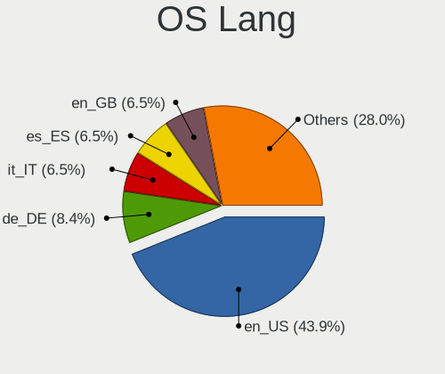
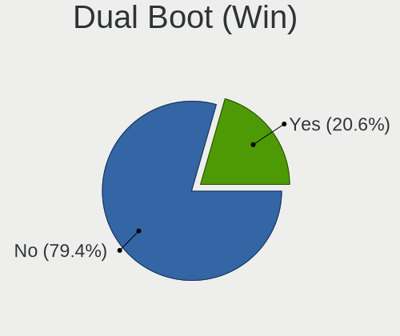
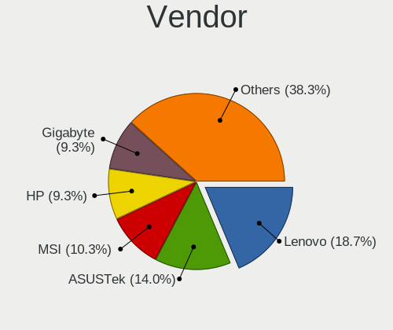
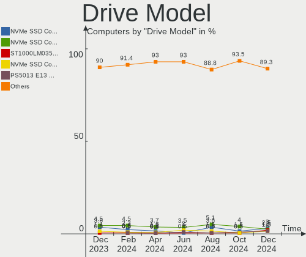
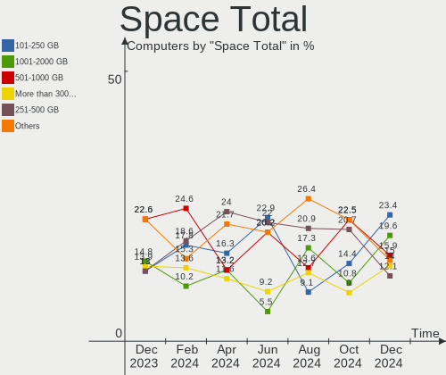
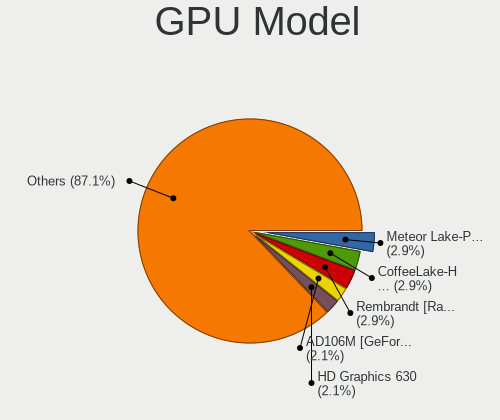
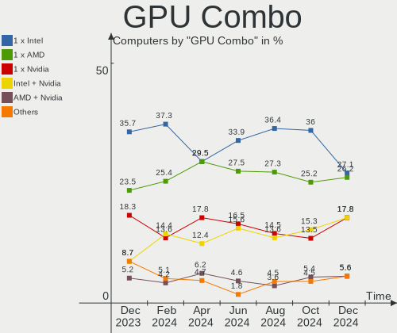
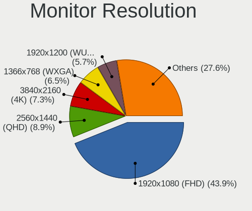
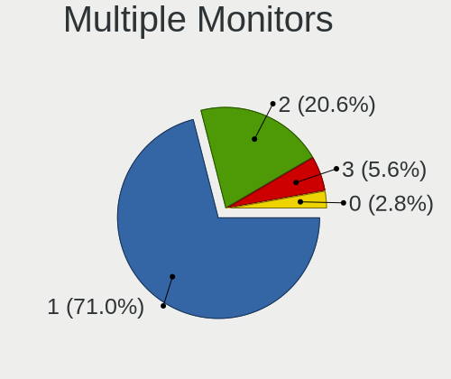

Manjaro Hardware Trends
-----------------------

A project to identify most popular hardware characteristics and track their change
over time based on data collected by Manjaro users at https://Linux-Hardware.org.

Anyone can contribute to this report by the [hw-probe](https://github.com/linuxhw/hw-probe) tool:

    sudo -E hw-probe -all -upload

This is a report for all computer types. See also reports for [desktops](/Dist/Manjaro/Desktop/README.md) and [notebooks](/Dist/Manjaro/Notebook/README.md).

Full-feature report is available here: https://linux-hardware.org/?view=trends

Period: Mar, 2022.

Contents
--------

* [ System ](#system)
  - [ OS                       ](#os)
  - [ OS Family                ](#os-family)
  - [ Kernel                   ](#kernel)
  - [ Kernel Family            ](#kernel-family)
  - [ Kernel Major Ver.        ](#kernel-major-ver)
  - [ Arch                     ](#arch)
  - [ DE                       ](#de)
  - [ Display Server           ](#display-server)
  - [ Display Manager          ](#display-manager)
  - [ OS Lang                  ](#os-lang)
  - [ Boot Mode                ](#boot-mode)
  - [ Filesystem               ](#filesystem)
  - [ Part. scheme             ](#part-scheme)
  - [ Dual Boot with Linux/BSD ](#dual-boot-with-linuxbsd)
  - [ Dual Boot (Win)          ](#dual-boot-win)

* [ Board ](#board)
  - [ Vendor                   ](#vendor)
  - [ Model                    ](#model)
  - [ Model Family             ](#model-family)
  - [ MFG Year                 ](#mfg-year)
  - [ Form Factor              ](#form-factor)
  - [ Secure Boot              ](#secure-boot)
  - [ Coreboot                 ](#coreboot)
  - [ RAM Size                 ](#ram-size)
  - [ RAM Used                 ](#ram-used)
  - [ Total Drives             ](#total-drives)
  - [ Has CD-ROM               ](#has-cd-rom)
  - [ Has Ethernet             ](#has-ethernet)
  - [ Has WiFi                 ](#has-wifi)
  - [ Has Bluetooth            ](#has-bluetooth)

* [ Location ](#location)
  - [ Country                  ](#country)
  - [ City                     ](#city)

* [ Drives ](#drives)
  - [ Drive Vendor             ](#drive-vendor)
  - [ Drive Model              ](#drive-model)
  - [ HDD Vendor               ](#hdd-vendor)
  - [ SSD Vendor               ](#ssd-vendor)
  - [ Drive Kind               ](#drive-kind)
  - [ Drive Connector          ](#drive-connector)
  - [ Drive Size               ](#drive-size)
  - [ Space Total              ](#space-total)
  - [ Space Used               ](#space-used)
  - [ Malfunc. Drives          ](#malfunc-drives)
  - [ Malfunc. Drive Vendor    ](#malfunc-drive-vendor)
  - [ Malfunc. HDD Vendor      ](#malfunc-hdd-vendor)
  - [ Malfunc. Drive Kind      ](#malfunc-drive-kind)
  - [ Failed Drives            ](#failed-drives)
  - [ Failed Drive Vendor      ](#failed-drive-vendor)
  - [ Drive Status             ](#drive-status)

* [ Storage controller ](#storage-controller)
  - [ Storage Vendor           ](#storage-vendor)
  - [ Storage Model            ](#storage-model)
  - [ Storage Kind             ](#storage-kind)

* [ Processor ](#processor)
  - [ CPU Vendor               ](#cpu-vendor)
  - [ CPU Model                ](#cpu-model)
  - [ CPU Model Family         ](#cpu-model-family)
  - [ CPU Cores                ](#cpu-cores)
  - [ CPU Sockets              ](#cpu-sockets)
  - [ CPU Threads              ](#cpu-threads)
  - [ CPU Op-Modes             ](#cpu-op-modes)
  - [ CPU Microcode            ](#cpu-microcode)
  - [ CPU Microarch            ](#cpu-microarch)

* [ Graphics ](#graphics)
  - [ GPU Vendor               ](#gpu-vendor)
  - [ GPU Model                ](#gpu-model)
  - [ GPU Combo                ](#gpu-combo)
  - [ GPU Driver               ](#gpu-driver)
  - [ GPU Memory               ](#gpu-memory)

* [ Monitor ](#monitor)
  - [ Monitor Vendor           ](#monitor-vendor)
  - [ Monitor Model            ](#monitor-model)
  - [ Monitor Resolution       ](#monitor-resolution)
  - [ Monitor Diagonal         ](#monitor-diagonal)
  - [ Monitor Width            ](#monitor-width)
  - [ Aspect Ratio             ](#aspect-ratio)
  - [ Monitor Area             ](#monitor-area)
  - [ Pixel Density            ](#pixel-density)
  - [ Multiple Monitors        ](#multiple-monitors)

* [ Network ](#network)
  - [ Net Controller Vendor    ](#net-controller-vendor)
  - [ Net Controller Model     ](#net-controller-model)
  - [ Wireless Vendor          ](#wireless-vendor)
  - [ Wireless Model           ](#wireless-model)
  - [ Ethernet Vendor          ](#ethernet-vendor)
  - [ Ethernet Model           ](#ethernet-model)
  - [ Net Controller Kind      ](#net-controller-kind)
  - [ Used Controller          ](#used-controller)
  - [ NICs                     ](#nics)
  - [ IPv6                     ](#ipv6)

* [ Bluetooth ](#bluetooth)
  - [ Bluetooth Vendor         ](#bluetooth-vendor)
  - [ Bluetooth Model          ](#bluetooth-model)

* [ Sound ](#sound)
  - [ Sound Vendor             ](#sound-vendor)
  - [ Sound Model              ](#sound-model)

* [ Memory ](#memory)
  - [ Memory Vendor            ](#memory-vendor)
  - [ Memory Model             ](#memory-model)
  - [ Memory Kind              ](#memory-kind)
  - [ Memory Form Factor       ](#memory-form-factor)
  - [ Memory Size              ](#memory-size)
  - [ Memory Speed             ](#memory-speed)

* [ Printers & scanners ](#printers--scanners)
  - [ Printer Vendor           ](#printer-vendor)
  - [ Printer Model            ](#printer-model)
  - [ Scanner Vendor           ](#scanner-vendor)
  - [ Scanner Model            ](#scanner-model)

* [ Camera ](#camera)
  - [ Camera Vendor            ](#camera-vendor)
  - [ Camera Model             ](#camera-model)

* [ Security ](#security)
  - [ Fingerprint Vendor       ](#fingerprint-vendor)
  - [ Fingerprint Model        ](#fingerprint-model)
  - [ Chipcard Vendor          ](#chipcard-vendor)
  - [ Chipcard Model           ](#chipcard-model)

* [ Unsupported ](#unsupported)
  - [ Unsupported Devices      ](#unsupported-devices)
  - [ Unsupported Device Types ](#unsupported-device-types)

System
------

OS
--

Installed operating systems

| Name           | Computers | Percent |
|----------------|-----------|---------|
| Manjaro        | 94        | 46.77%  |
| Manjaro 21.2.5 | 63        | 31.34%  |
| Manjaro 21.2.4 | 40        | 19.9%   |
| Manjaro 21.2.3 | 3         | 1.49%   |
| Manjaro 21.2.2 | 1         | 0.5%    |

OS Family
---------

OS without a version

| Name    | Computers | Percent |
|---------|-----------|---------|
| Manjaro | 201       | 100%    |

Kernel
------

Version of the Linux kernel

| Version                       | Computers | Percent |
|-------------------------------|-----------|---------|
| 5.15.28-1-MANJARO             | 61        | 30.35%  |
| 5.15.25-1-MANJARO             | 38        | 18.91%  |
| 5.16.11-2-MANJARO             | 28        | 13.93%  |
| 5.16.14-1-MANJARO             | 22        | 10.95%  |
| 5.10.105-1-MANJARO            | 8         | 3.98%   |
| 5.17.0-1-MANJARO              | 7         | 3.48%   |
| 5.10.102-1-MANJARO            | 7         | 3.48%   |
| 5.16.2-2-rt19-MANJARO         | 5         | 2.49%   |
| 5.9.16-1-MANJARO              | 2         | 1%      |
| 5.4.184-1-MANJARO             | 2         | 1%      |
| 5.4.181-2-MANJARO             | 2         | 1%      |
| 5.15.21-1-MANJARO             | 2         | 1%      |
| 5.13.19-2-MANJARO             | 2         | 1%      |
| 5.4.173-1-MANJARO             | 1         | 0.5%    |
| 5.17.0-2-MANJARO              | 1         | 0.5%    |
| 5.16.7-1-MANJARO              | 1         | 0.5%    |
| 5.16.16-1-MANJARO             | 1         | 0.5%    |
| 5.16.15-zen1-1-zen            | 1         | 0.5%    |
| 5.16.13-arch1-1-surface       | 1         | 0.5%    |
| 5.16.12-lqx2-1-lqx            | 1         | 0.5%    |
| 5.16.11-MANJARO-gd428da530032 | 1         | 0.5%    |
| 5.15.27-xanmod1-MANJARO       | 1         | 0.5%    |
| 5.15.26-xanmod1-1             | 1         | 0.5%    |
| 5.15.19-1-MANJARO             | 1         | 0.5%    |
| 5.15.12-1-MANJARO             | 1         | 0.5%    |
| 5.14.21-2-MANJARO             | 1         | 0.5%    |
| 5.10.98-1-MANJARO             | 1         | 0.5%    |
| 5.10.42-1-MANJARO             | 1         | 0.5%    |

Kernel Family
-------------

Linux kernel without a distro release

| Version  | Computers | Percent |
|----------|-----------|---------|
| 5.15.28  | 61        | 30.35%  |
| 5.15.25  | 38        | 18.91%  |
| 5.16.11  | 29        | 14.43%  |
| 5.16.14  | 22        | 10.95%  |
| 5.17.0   | 8         | 3.98%   |
| 5.10.105 | 8         | 3.98%   |
| 5.10.102 | 7         | 3.48%   |
| 5.16.2   | 5         | 2.49%   |
| 5.9.16   | 2         | 1%      |
| 5.4.184  | 2         | 1%      |
| 5.4.181  | 2         | 1%      |
| 5.15.21  | 2         | 1%      |
| 5.13.19  | 2         | 1%      |
| 5.4.173  | 1         | 0.5%    |
| 5.16.7   | 1         | 0.5%    |
| 5.16.16  | 1         | 0.5%    |
| 5.16.15  | 1         | 0.5%    |
| 5.16.13  | 1         | 0.5%    |
| 5.16.12  | 1         | 0.5%    |
| 5.15.27  | 1         | 0.5%    |
| 5.15.26  | 1         | 0.5%    |
| 5.15.19  | 1         | 0.5%    |
| 5.15.12  | 1         | 0.5%    |
| 5.14.21  | 1         | 0.5%    |
| 5.10.98  | 1         | 0.5%    |
| 5.10.42  | 1         | 0.5%    |

Kernel Major Ver.
-----------------

Linux kernel major version

| Version | Computers | Percent |
|---------|-----------|---------|
| 5.15    | 105       | 52.24%  |
| 5.16    | 61        | 30.35%  |
| 5.10    | 17        | 8.46%   |
| 5.17    | 8         | 3.98%   |
| 5.4     | 5         | 2.49%   |
| 5.9     | 2         | 1%      |
| 5.13    | 2         | 1%      |
| 5.14    | 1         | 0.5%    |

Arch
----

OS architecture (x86_64, i586, etc.)

| Name   | Computers | Percent |
|--------|-----------|---------|
| x86_64 | 201       | 100%    |

DE
--

Desktop Environment

| Name       | Computers | Percent |
|------------|-----------|---------|
| KDE5       | 101       | 50.25%  |
| XFCE       | 43        | 21.39%  |
| GNOME      | 40        | 19.9%   |
| Unknown    | 6         | 2.99%   |
| X-Cinnamon | 5         | 2.49%   |
| Deepin     | 3         | 1.49%   |
| MATE       | 1         | 0.5%    |
| KDE        | 1         | 0.5%    |
| i3         | 1         | 0.5%    |

Display Server
--------------

X11 or Wayland

| Name    | Computers | Percent |
|---------|-----------|---------|
| X11     | 167       | 83.08%  |
| Wayland | 29        | 14.43%  |
| Unknown | 3         | 1.49%   |
| Tty     | 2         | 1%      |

Display Manager
---------------

SDDM, LightDM, etc.

| Name    | Computers | Percent |
|---------|-----------|---------|
| Unknown | 94        | 46.77%  |
| SDDM    | 43        | 21.39%  |
| LightDM | 43        | 21.39%  |
| GDM     | 21        | 10.45%  |

OS Lang
-------

Language

| Lang    | Computers | Percent |
|---------|-----------|---------|
| en_US   | 87        | 43.28%  |
| en_GB   | 21        | 10.45%  |
| ru_RU   | 13        | 6.47%   |
| de_DE   | 12        | 5.97%   |
| en_CA   | 9         | 4.48%   |
| pl_PL   | 6         | 2.99%   |
| fr_FR   | 6         | 2.99%   |
| pt_BR   | 5         | 2.49%   |
| it_IT   | 4         | 1.99%   |
| es_ES   | 4         | 1.99%   |
| en_IN   | 4         | 1.99%   |
| es_MX   | 3         | 1.49%   |
| en_IE   | 3         | 1.49%   |
| zh_CN   | 2         | 1%      |
| pt_PT   | 2         | 1%      |
| nl_BE   | 2         | 1%      |
| fr_CA   | 2         | 1%      |
| de_AT   | 2         | 1%      |
| sk_SK   | 1         | 0.5%    |
| ru_UA   | 1         | 0.5%    |
| hu_HU   | 1         | 0.5%    |
| es_EC   | 1         | 0.5%    |
| es_CO   | 1         | 0.5%    |
| es_CL   | 1         | 0.5%    |
| en_ZA   | 1         | 0.5%    |
| en_SE   | 1         | 0.5%    |
| en_PH   | 1         | 0.5%    |
| en_IL   | 1         | 0.5%    |
| en_DK   | 1         | 0.5%    |
| en_AU   | 1         | 0.5%    |
| cs_CZ   | 1         | 0.5%    |
| Unknown | 1         | 0.5%    |

Boot Mode
---------

EFI or BIOS

| Mode | Computers | Percent |
|------|-----------|---------|
| BIOS | 132       | 65.67%  |
| EFI  | 69        | 34.33%  |

Filesystem
----------

Type of filesystem

| Type  | Computers | Percent |
|-------|-----------|---------|
| Ext4  | 170       | 84.58%  |
| Btrfs | 25        | 12.44%  |
| Xfs   | 6         | 2.99%   |

Part. scheme
------------

Scheme of partitioning

| Type    | Computers | Percent |
|---------|-----------|---------|
| Unknown | 126       | 62.69%  |
| GPT     | 64        | 31.84%  |
| MBR     | 11        | 5.47%   |

Dual Boot with Linux/BSD
------------------------

Hosting more than one Linux/BSD

| Dual boot | Computers | Percent |
|-----------|-----------|---------|
| No        | 180       | 89.55%  |
| Yes       | 21        | 10.45%  |

Dual Boot (Win)
---------------

Hosting Linux and Windows

| Dual boot | Computers | Percent |
|-----------|-----------|---------|
| No        | 142       | 70.65%  |
| Yes       | 59        | 29.35%  |

Board
-----

Vendor
------

Motherboard manufacturer

| Name                        | Computers | Percent |
|-----------------------------|-----------|---------|
| ASUSTek Computer            | 35        | 17.41%  |
| Dell                        | 28        | 13.93%  |
| Lenovo                      | 24        | 11.94%  |
| Hewlett-Packard             | 24        | 11.94%  |
| MSI                         | 19        | 9.45%   |
| Gigabyte Technology         | 19        | 9.45%   |
| ASRock                      | 11        | 5.47%   |
| Acer                        | 7         | 3.48%   |
| Apple                       | 6         | 2.99%   |
| HONOR                       | 3         | 1.49%   |
| Fujitsu                     | 3         | 1.49%   |
| Samsung Electronics         | 2         | 1%      |
| Microsoft                   | 2         | 1%      |
| Intel                       | 2         | 1%      |
| UNOWHY                      | 1         | 0.5%    |
| TPV-INVENTA                 | 1         | 0.5%    |
| Timi                        | 1         | 0.5%    |
| System76                    | 1         | 0.5%    |
| Shenzhen Wangang Technology | 1         | 0.5%    |
| Intel Client Systems        | 1         | 0.5%    |
| Google                      | 1         | 0.5%    |
| Gateway                     | 1         | 0.5%    |
| Clevo                       | 1         | 0.5%    |
| Chuwi                       | 1         | 0.5%    |
| Casper                      | 1         | 0.5%    |
| AZW                         | 1         | 0.5%    |
| AMI                         | 1         | 0.5%    |
| AMD                         | 1         | 0.5%    |
| Alienware                   | 1         | 0.5%    |
| Unknown                     | 1         | 0.5%    |

Model
-----

Motherboard model

| Name                                     | Computers | Percent |
|------------------------------------------|-----------|---------|
| MSI MS-7C37                              | 2         | 1%      |
| MSI MS-7A38                              | 2         | 1%      |
| MSI MS-7817                              | 2         | 1%      |
| HONOR NMH-WCX9                           | 2         | 1%      |
| HP ProBook 455 G7                        | 2         | 1%      |
| Dell XPS 15 9500                         | 2         | 1%      |
| Dell Vostro 5471                         | 2         | 1%      |
| ASUS ZenBook UX325UAZ_UM325UAZ           | 2         | 1%      |
| ASUS ROG STRIX B550-F GAMING             | 2         | 1%      |
| ASUS ROG STRIX B450-F GAMING             | 2         | 1%      |
| ASUS M5A78L-M PLUS/USB3                  | 2         | 1%      |
| Unknown                                  | 2         | 1%      |
| UNOWHY Y14G101S2E                        | 1         | 0.5%    |
| TPV-INVENTA 2AF2 A01                     | 1         | 0.5%    |
| Timi RedmiBook 16                        | 1         | 0.5%    |
| System76 Thelio                          | 1         | 0.5%    |
| Shenzhen Wangang AERO 2 Pro              | 1         | 0.5%    |
| Samsung 530XBB                           | 1         | 0.5%    |
| Samsung 530U3BI/530U4BI/530U4BH          | 1         | 0.5%    |
| MSI MS-7C94                              | 1         | 0.5%    |
| MSI MS-7C91                              | 1         | 0.5%    |
| MSI MS-7C87                              | 1         | 0.5%    |
| MSI MS-7C35                              | 1         | 0.5%    |
| MSI MS-7C09                              | 1         | 0.5%    |
| MSI MS-7B86                              | 1         | 0.5%    |
| MSI MS-7A11                              | 1         | 0.5%    |
| MSI MS-7885                              | 1         | 0.5%    |
| MSI MS-7798                              | 1         | 0.5%    |
| MSI GS60 2PE Ghost Pro                   | 1         | 0.5%    |
| MSI GF65 Thin 9SEXR                      | 1         | 0.5%    |
| MSI GE62 6QF                             | 1         | 0.5%    |
| MSI Alpha 15 B5EEK                       | 1         | 0.5%    |
| Microsoft Surface Pro 6                  | 1         | 0.5%    |
| Microsoft Surface Pro 4                  | 1         | 0.5%    |
| Lenovo Yoga 6 13ARE05 82FN               | 1         | 0.5%    |
| Lenovo ThinkPad X250 20CLS06L00          | 1         | 0.5%    |
| Lenovo ThinkPad X230 23202DG             | 1         | 0.5%    |
| Lenovo ThinkPad X131e 33672T5            | 1         | 0.5%    |
| Lenovo ThinkPad X13 Gen 2i 20WK0061CD    | 1         | 0.5%    |
| Lenovo ThinkPad X1 Carbon 4th 20FRS08T00 | 1         | 0.5%    |
| Lenovo ThinkPad W540 20BHS04T0P          | 1         | 0.5%    |
| Lenovo ThinkPad T450s 20BWS4Q200         | 1         | 0.5%    |
| Lenovo ThinkPad L512 2598AM7             | 1         | 0.5%    |
| Lenovo ThinkPad E485 20KUCTO1WW          | 1         | 0.5%    |
| Lenovo ThinkPad E15 Gen 2 20T8000RMX     | 1         | 0.5%    |
| Lenovo ThinkBook 16p Gen 2 20YM          | 1         | 0.5%    |
| Lenovo ThinkBook 15 G3 ACL 21A4          | 1         | 0.5%    |
| Lenovo ThinkBook 15 G2 ITL 20VE          | 1         | 0.5%    |
| Lenovo ThinkBook 15 G2 ARE 20VG          | 1         | 0.5%    |
| Lenovo MIIX 310-10ICR 80SG               | 1         | 0.5%    |
| Lenovo Legion T530-28ICB 90L3007YMW      | 1         | 0.5%    |
| Lenovo Legion 5-15IMH05H 81Y6            | 1         | 0.5%    |
| Lenovo Legion 5 17ACH6H 82JY             | 1         | 0.5%    |
| Lenovo Legion 5 15ITH6 82JK              | 1         | 0.5%    |
| Lenovo Legion 5 15ARH05H 82B1            | 1         | 0.5%    |
| Lenovo IdeaPad S540-14API 81NH           | 1         | 0.5%    |
| Lenovo IdeaPad 320-15IKB 81G3            | 1         | 0.5%    |
| Lenovo G580 20150                        | 1         | 0.5%    |
| Intel NUC7i3BNK                          | 1         | 0.5%    |
| Intel Client Systems LAPQC71A            | 1         | 0.5%    |

Model Family
------------

Motherboard model prefix

| Name                          | Computers | Percent |
|-------------------------------|-----------|---------|
| Lenovo ThinkPad               | 10        | 4.98%   |
| Dell XPS                      | 9         | 4.48%   |
| ASUS ROG                      | 8         | 3.98%   |
| Dell Latitude                 | 7         | 3.48%   |
| Dell Vostro                   | 6         | 2.99%   |
| Lenovo Legion                 | 5         | 2.49%   |
| HP ProBook                    | 5         | 2.49%   |
| ASUS PRIME                    | 5         | 2.49%   |
| Lenovo ThinkBook              | 4         | 1.99%   |
| HP Pavilion                   | 4         | 1.99%   |
| HP Laptop                     | 3         | 1.49%   |
| HP Compaq                     | 3         | 1.49%   |
| Dell Inspiron                 | 3         | 1.49%   |
| ASUS ZenBook                  | 3         | 1.49%   |
| MSI MS-7C37                   | 2         | 1%      |
| MSI MS-7A38                   | 2         | 1%      |
| MSI MS-7817                   | 2         | 1%      |
| Microsoft Surface             | 2         | 1%      |
| Lenovo IdeaPad                | 2         | 1%      |
| HONOR NMH-WCX9                | 2         | 1%      |
| Gigabyte X570                 | 2         | 1%      |
| Gigabyte X470                 | 2         | 1%      |
| Fujitsu LIFEBOOK              | 2         | 1%      |
| Dell OptiPlex                 | 2         | 1%      |
| ASUS TUF                      | 2         | 1%      |
| ASUS M5A78L-M                 | 2         | 1%      |
| ASRock Z77                    | 2         | 1%      |
| ASRock B550                   | 2         | 1%      |
| Acer Swift                    | 2         | 1%      |
| Acer Aspire                   | 2         | 1%      |
| Unknown                       | 2         | 1%      |
| UNOWHY Y14G101S2E             | 1         | 0.5%    |
| TPV-INVENTA 2AF2              | 1         | 0.5%    |
| Timi RedmiBook                | 1         | 0.5%    |
| System76 Thelio               | 1         | 0.5%    |
| Shenzhen Wangang AERO         | 1         | 0.5%    |
| Samsung 530XBB                | 1         | 0.5%    |
| Samsung 530U3BI               | 1         | 0.5%    |
| MSI MS-7C94                   | 1         | 0.5%    |
| MSI MS-7C91                   | 1         | 0.5%    |
| MSI MS-7C87                   | 1         | 0.5%    |
| MSI MS-7C35                   | 1         | 0.5%    |
| MSI MS-7C09                   | 1         | 0.5%    |
| MSI MS-7B86                   | 1         | 0.5%    |
| MSI MS-7A11                   | 1         | 0.5%    |
| MSI MS-7885                   | 1         | 0.5%    |
| MSI MS-7798                   | 1         | 0.5%    |
| MSI GS60                      | 1         | 0.5%    |
| MSI GF65                      | 1         | 0.5%    |
| MSI GE62                      | 1         | 0.5%    |
| MSI Alpha                     | 1         | 0.5%    |
| Lenovo Yoga                   | 1         | 0.5%    |
| Lenovo MIIX                   | 1         | 0.5%    |
| Lenovo G580                   | 1         | 0.5%    |
| Intel NUC7i3BNK               | 1         | 0.5%    |
| Intel Client Systems LAPQC71A | 1         | 0.5%    |
| HONOR HGE-WX6                 | 1         | 0.5%    |
| HP ZHAN                       | 1         | 0.5%    |
| HP ZBook                      | 1         | 0.5%    |
| HP Victus                     | 1         | 0.5%    |

MFG Year
--------

Motherboard manufacture year

| Year | Computers | Percent |
|------|-----------|---------|
| 2020 | 36        | 17.91%  |
| 2021 | 26        | 12.94%  |
| 2019 | 26        | 12.94%  |
| 2018 | 21        | 10.45%  |
| 2012 | 19        | 9.45%   |
| 2017 | 13        | 6.47%   |
| 2013 | 13        | 6.47%   |
| 2014 | 10        | 4.98%   |
| 2016 | 9         | 4.48%   |
| 2015 | 7         | 3.48%   |
| 2011 | 7         | 3.48%   |
| 2010 | 7         | 3.48%   |
| 2008 | 4         | 1.99%   |
| 2009 | 2         | 1%      |
| 2022 | 1         | 0.5%    |

Form Factor
-----------

Physical design of the computer

| Name        | Computers | Percent |
|-------------|-----------|---------|
| Notebook    | 103       | 51.24%  |
| Desktop     | 84        | 41.79%  |
| Convertible | 6         | 2.99%   |
| Mini pc     | 4         | 1.99%   |
| Tablet      | 3         | 1.49%   |
| All in one  | 1         | 0.5%    |

Secure Boot
-----------

Enabled or disabled

| State    | Computers | Percent |
|----------|-----------|---------|
| Disabled | 201       | 100%    |

Coreboot
--------

Have coreboot on board

| Used | Computers | Percent |
|------|-----------|---------|
| No   | 200       | 99.5%   |
| Yes  | 1         | 0.5%    |

RAM Size
--------

Total RAM memory

| Size in GB  | Computers | Percent |
|-------------|-----------|---------|
| 16.01-24.0  | 61        | 30.35%  |
| 4.01-8.0    | 43        | 21.39%  |
| 8.01-16.0   | 32        | 15.92%  |
| 32.01-64.0  | 28        | 13.93%  |
| 3.01-4.0    | 21        | 10.45%  |
| 64.01-256.0 | 7         | 3.48%   |
| 24.01-32.0  | 4         | 1.99%   |
| 1.01-2.0    | 4         | 1.99%   |
| 2.01-3.0    | 1         | 0.5%    |

RAM Used
--------

Used RAM memory

| Used GB    | Computers | Percent |
|------------|-----------|---------|
| 2.01-3.0   | 52        | 25.87%  |
| 4.01-8.0   | 50        | 24.88%  |
| 3.01-4.0   | 39        | 19.4%   |
| 1.01-2.0   | 39        | 19.4%   |
| 8.01-16.0  | 15        | 7.46%   |
| 16.01-24.0 | 4         | 1.99%   |
| 24.01-32.0 | 1         | 0.5%    |
| 0.51-1.0   | 1         | 0.5%    |

Total Drives
------------

Number of drives on board

| Drives | Computers | Percent |
|--------|-----------|---------|
| 1      | 94        | 46.77%  |
| 2      | 61        | 30.35%  |
| 3      | 27        | 13.43%  |
| 4      | 8         | 3.98%   |
| 5      | 6         | 2.99%   |
| 6      | 3         | 1.49%   |
| 9      | 1         | 0.5%    |
| 7      | 1         | 0.5%    |

Has CD-ROM
----------

Has CD-ROM on board

| Presented | Computers | Percent |
|-----------|-----------|---------|
| No        | 152       | 75.62%  |
| Yes       | 49        | 24.38%  |

Has Ethernet
------------

Has Ethernet on board

| Presented | Computers | Percent |
|-----------|-----------|---------|
| Yes       | 167       | 83.08%  |
| No        | 34        | 16.92%  |

Has WiFi
--------

Has WiFi module

| Presented | Computers | Percent |
|-----------|-----------|---------|
| Yes       | 158       | 78.61%  |
| No        | 43        | 21.39%  |

Has Bluetooth
-------------

Has Bluetooth module

| Presented | Computers | Percent |
|-----------|-----------|---------|
| Yes       | 140       | 69.65%  |
| No        | 61        | 30.35%  |

Location
--------

Country
-------

Geographic location (country)

| Country      | Computers | Percent |
|--------------|-----------|---------|
| USA          | 43        | 21.39%  |
| Germany      | 17        | 8.46%   |
| Russia       | 13        | 6.47%   |
| Canada       | 10        | 4.98%   |
| UK           | 9         | 4.48%   |
| Poland       | 8         | 3.98%   |
| Brazil       | 8         | 3.98%   |
| France       | 7         | 3.48%   |
| Turkey       | 6         | 2.99%   |
| Spain        | 5         | 2.49%   |
| Italy        | 5         | 2.49%   |
| Portugal     | 4         | 1.99%   |
| India        | 4         | 1.99%   |
| Czechia      | 4         | 1.99%   |
| Taiwan       | 3         | 1.49%   |
| Romania      | 3         | 1.49%   |
| Netherlands  | 3         | 1.49%   |
| Mexico       | 3         | 1.49%   |
| Finland      | 3         | 1.49%   |
| Austria      | 3         | 1.49%   |
| Switzerland  | 2         | 1%      |
| Sweden       | 2         | 1%      |
| Slovakia     | 2         | 1%      |
| Lithuania    | 2         | 1%      |
| Indonesia    | 2         | 1%      |
| China        | 2         | 1%      |
| Belgium      | 2         | 1%      |
| Bangladesh   | 2         | 1%      |
| Venezuela    | 1         | 0.5%    |
| Uzbekistan   | 1         | 0.5%    |
| Ukraine      | 1         | 0.5%    |
| Sri Lanka    | 1         | 0.5%    |
| South Africa | 1         | 0.5%    |
| Philippines  | 1         | 0.5%    |
| Norway       | 1         | 0.5%    |
| Mauritius    | 1         | 0.5%    |
| Kenya        | 1         | 0.5%    |
| Jamaica      | 1         | 0.5%    |
| Israel       | 1         | 0.5%    |
| Ireland      | 1         | 0.5%    |
| Hungary      | 1         | 0.5%    |
| Greece       | 1         | 0.5%    |
| Ethiopia     | 1         | 0.5%    |
| Egypt        | 1         | 0.5%    |
| Ecuador      | 1         | 0.5%    |
| Denmark      | 1         | 0.5%    |
| Croatia      | 1         | 0.5%    |
| Colombia     | 1         | 0.5%    |
| Chile        | 1         | 0.5%    |
| Bulgaria     | 1         | 0.5%    |
| Australia    | 1         | 0.5%    |
| Algeria      | 1         | 0.5%    |

City
----

Geographic location (city)

| City                | Computers | Percent |
|---------------------|-----------|---------|
| Taipei              | 3         | 1.49%   |
| St Petersburg       | 3         | 1.49%   |
| Recife              | 3         | 1.49%   |
| Prague              | 3         | 1.49%   |
| Porto               | 3         | 1.49%   |
| Atlanta             | 3         | 1.49%   |
| Warsaw              | 2         | 1%      |
| Union City          | 2         | 1%      |
| Ulm                 | 2         | 1%      |
| Sydney              | 2         | 1%      |
| Paris               | 2         | 1%      |
| Naples              | 2         | 1%      |
| Meckenheim          | 2         | 1%      |
| Lafayette           | 2         | 1%      |
| Krasnodar           | 2         | 1%      |
| Karlsruhe           | 2         | 1%      |
| Izmir               | 2         | 1%      |
| Istanbul            | 2         | 1%      |
| Helsinki            | 2         | 1%      |
| Zutphen             | 1         | 0.5%    |
| Yekaterinburg       | 1         | 0.5%    |
| Włocławek         | 1         | 0.5%    |
| Wimberley           | 1         | 0.5%    |
| Whitley Bay         | 1         | 0.5%    |
| Warrington          | 1         | 0.5%    |
| Virginia Beach      | 1         | 0.5%    |
| Vilnius             | 1         | 0.5%    |
| Vigo                | 1         | 0.5%    |
| Vienna              | 1         | 0.5%    |
| Vancouver           | 1         | 0.5%    |
| Turin               | 1         | 0.5%    |
| Tukhchar            | 1         | 0.5%    |
| Trondheim           | 1         | 0.5%    |
| Trementines         | 1         | 0.5%    |
| Toronto             | 1         | 0.5%    |
| Tolyatti            | 1         | 0.5%    |
| The Hague           | 1         | 0.5%    |
| Tashkent            | 1         | 0.5%    |
| Tarragona           | 1         | 0.5%    |
| Sylhet              | 1         | 0.5%    |
| Sursee              | 1         | 0.5%    |
| Strasbourg          | 1         | 0.5%    |
| Stockholm           | 1         | 0.5%    |
| Staten Island       | 1         | 0.5%    |
| St. John's          | 1         | 0.5%    |
| St. Francois Xavier | 1         | 0.5%    |
| Split               | 1         | 0.5%    |
| Somerset            | 1         | 0.5%    |
| Sofia               | 1         | 0.5%    |
| Sioux Falls         | 1         | 0.5%    |
| Shanghai            | 1         | 0.5%    |
| Sao Paulo           | 1         | 0.5%    |
| San Jose            | 1         | 0.5%    |
| San Bernardo        | 1         | 0.5%    |
| Samara              | 1         | 0.5%    |
| Salzburg            | 1         | 0.5%    |
| Salford             | 1         | 0.5%    |
| Salem               | 1         | 0.5%    |
| Roztoky             | 1         | 0.5%    |
| Roorkee             | 1         | 0.5%    |

Drives
------

Drive Vendor
------------

Hard drive vendors

| Vendor                         | Computers | Drives | Percent |
|--------------------------------|-----------|--------|---------|
| Samsung Electronics            | 53        | 60     | 15.32%  |
| WDC                            | 48        | 63     | 13.87%  |
| Seagate                        | 40        | 48     | 11.56%  |
| Sandisk                        | 29        | 31     | 8.38%   |
| Toshiba                        | 19        | 20     | 5.49%   |
| Kingston                       | 19        | 25     | 5.49%   |
| Crucial                        | 18        | 18     | 5.2%    |
| SK Hynix                       | 13        | 13     | 3.76%   |
| Intel                          | 12        | 12     | 3.47%   |
| Unknown                        | 7         | 11     | 2.02%   |
| Hitachi                        | 7         | 7      | 2.02%   |
| HGST                           | 7         | 7      | 2.02%   |
| A-DATA Technology              | 7         | 8      | 2.02%   |
| Phison                         | 6         | 6      | 1.73%   |
| Micron/Crucial Technology      | 4         | 4      | 1.16%   |
| Apple                          | 4         | 4      | 1.16%   |
| Silicon Motion                 | 3         | 3      | 0.87%   |
| China                          | 3         | 3      | 0.87%   |
| XPG                            | 2         | 2      | 0.58%   |
| Transcend                      | 2         | 2      | 0.58%   |
| Team                           | 2         | 3      | 0.58%   |
| PNY                            | 2         | 5      | 0.58%   |
| PLEXTOR                        | 2         | 2      | 0.58%   |
| Patriot                        | 2         | 2      | 0.58%   |
| Micron Technology              | 2         | 2      | 0.58%   |
| LITEON                         | 2         | 2      | 0.58%   |
| GOODRAM                        | 2         | 2      | 0.58%   |
| Gigabyte Technology            | 2         | 2      | 0.58%   |
| USB3.0                         | 1         | 1      | 0.29%   |
| TwinMOS                        | 1         | 1      | 0.29%   |
| TO Exter                       | 1         | 1      | 0.29%   |
| TEAM L3                        | 1         | 1      | 0.29%   |
| SPCC                           | 1         | 1      | 0.29%   |
| Solid State Storage Technology | 1         | 1      | 0.29%   |
| Shenzhen Longsys Electronics   | 1         | 1      | 0.29%   |
| SABRENT                        | 1         | 1      | 0.29%   |
| Netac                          | 1         | 1      | 0.29%   |
| LITEONIT                       | 1         | 1      | 0.29%   |
| Lite-On                        | 1         | 1      | 0.29%   |
| Lexar                          | 1         | 1      | 0.29%   |
| Leven                          | 1         | 1      | 0.29%   |
| Lenovo                         | 1         | 1      | 0.29%   |
| KIOXIA                         | 1         | 1      | 0.29%   |
| JUHOR                          | 1         | 1      | 0.29%   |
| JMicron                        | 1         | 1      | 0.29%   |
| Intenso                        | 1         | 1      | 0.29%   |
| INNOVATION IT                  | 1         | 1      | 0.29%   |
| HS-SSD-C100                    | 1         | 1      | 0.29%   |
| Hewlett-Packard                | 1         | 1      | 0.29%   |
| FORESEE                        | 1         | 1      | 0.29%   |
| External                       | 1         | 1      | 0.29%   |
| ASMT                           | 1         | 1      | 0.29%   |
| Apricorn                       | 1         | 1      | 0.29%   |
| AEGO                           | 1         | 1      | 0.29%   |
| Unknown                        | 1         | 1      | 0.29%   |

Drive Model
-----------

Hard drive models

| Model                                     | Computers | Percent |
|-------------------------------------------|-----------|---------|
| Sandisk NVMe SSD Drive 512GB              | 7         | 1.84%   |
| Samsung NVMe SSD Drive 1TB                | 5         | 1.31%   |
| Crucial CT1000MX500SSD1 1TB               | 5         | 1.31%   |
| Seagate ST2000DM008-2FR102 2TB            | 4         | 1.05%   |
| Sandisk NVMe SSD Drive 256GB              | 4         | 1.05%   |
| Kingston SA400S37240G 240GB SSD           | 4         | 1.05%   |
| Crucial CT240BX500SSD1 240GB              | 4         | 1.05%   |
| WDC WDS500G2B0A-00SM50 500GB SSD          | 3         | 0.79%   |
| WDC WDS100T2B0A-00SM50 1TB SSD            | 3         | 0.79%   |
| Unknown MMC Card  64GB                    | 3         | 0.79%   |
| SK Hynix NVMe SSD Drive 512GB             | 3         | 0.79%   |
| Seagate ST3250318AS 250GB                 | 3         | 0.79%   |
| Seagate ST2000DM001-1CH164 2TB            | 3         | 0.79%   |
| Seagate ST1000LM035-1RK172 1TB            | 3         | 0.79%   |
| Sandisk NVMe SSD Drive 1TB                | 3         | 0.79%   |
| Samsung SSD 970 EVO Plus 1TB              | 3         | 0.79%   |
| Samsung SSD 850 EVO 500GB                 | 3         | 0.79%   |
| Samsung SSD 840 EVO 120GB                 | 3         | 0.79%   |
| Samsung NVMe SSD Drive 512GB              | 3         | 0.79%   |
| Samsung NVMe SSD Drive 500GB              | 3         | 0.79%   |
| Micron/Crucial NVMe SSD Drive 1TB         | 3         | 0.79%   |
| Kingston SA400S37120G 120GB SSD           | 3         | 0.79%   |
| Kingston NVMe SSD Drive 500GB             | 3         | 0.79%   |
| Intel NVMe SSD Drive 512GB                | 3         | 0.79%   |
| Crucial CT500MX500SSD1 500GB              | 3         | 0.79%   |
| WDC WD5000AAKX-001CA0 500GB               | 2         | 0.52%   |
| WDC WD10SPZX-08Z10 1TB                    | 2         | 0.52%   |
| WDC WD10EZEX-08WN4A0 1TB                  | 2         | 0.52%   |
| Unknown SD/MMC/MS PRO 32GB                | 2         | 0.52%   |
| Unknown MMC Card  128GB                   | 2         | 0.52%   |
| Toshiba DT01ACA200 2TB                    | 2         | 0.52%   |
| SK Hynix SKHynix_HFM512GDHTNI-87A0B 512GB | 2         | 0.52%   |
| SK Hynix NVMe SSD Drive 1024GB            | 2         | 0.52%   |
| Seagate ST3000DM008-2DM166 3TB            | 2         | 0.52%   |
| Seagate ST2000DL004 HD204UI 2TB           | 2         | 0.52%   |
| Seagate ST1000DM010-2EP102 1TB            | 2         | 0.52%   |
| Seagate ST1000DM003-1ER162 1TB            | 2         | 0.52%   |
| SanDisk SDSSDH3512G 512GB                 | 2         | 0.52%   |
| Sandisk NVMe SSD Drive 500GB              | 2         | 0.52%   |
| Sandisk NVMe SSD Drive 1024GB             | 2         | 0.52%   |
| Samsung SSD 970 EVO Plus 500GB            | 2         | 0.52%   |
| Samsung SSD 870 EVO 1TB                   | 2         | 0.52%   |
| Samsung SSD 850 EVO 250GB                 | 2         | 0.52%   |
| Samsung NVMe SSD Drive 128GB              | 2         | 0.52%   |
| Phison NVMe SSD Drive 256GB               | 2         | 0.52%   |
| Kingston SUV400S37240G 240GB SSD          | 2         | 0.52%   |
| Kingston NVMe SSD Drive 512GB             | 2         | 0.52%   |
| Hitachi HUA723030ALA640 3TB               | 2         | 0.52%   |
| HGST HTS721010A9E630 1TB                  | 2         | 0.52%   |
| HGST HTS541010A9E680 1TB                  | 2         | 0.52%   |
| Crucial CT480BX500SSD1 480GB              | 2         | 0.52%   |
| XPG NVMe SSD Drive 1TB                    | 1         | 0.26%   |
| XPG NVMe SSD Drive 1024GB                 | 1         | 0.26%   |
| WDC WDS240G2G0A-00JH30 240GB SSD          | 1         | 0.26%   |
| WDC WDBNCE5000PNC 500GB SSD               | 1         | 0.26%   |
| WDC WD7500BPVX-60JC3T0 752GB              | 1         | 0.26%   |
| WDC WD7500BPKT-75PK4T0 752GB              | 1         | 0.26%   |
| WDC WD50EZRZ-32RWYB1 5TB                  | 1         | 0.26%   |
| WDC WD5003AZEX-00K3CA0 500GB              | 1         | 0.26%   |
| WDC WD5000LPCX-24C6HT0 500GB              | 1         | 0.26%   |

HDD Vendor
----------

Hard disk drive vendors

| Vendor              | Computers | Drives | Percent |
|---------------------|-----------|--------|---------|
| Seagate             | 39        | 47     | 34.82%  |
| WDC                 | 37        | 51     | 33.04%  |
| Toshiba             | 11        | 12     | 9.82%   |
| Hitachi             | 7         | 7      | 6.25%   |
| HGST                | 7         | 7      | 6.25%   |
| Samsung Electronics | 6         | 6      | 5.36%   |
| Unknown             | 2         | 2      | 1.79%   |
| SABRENT             | 1         | 1      | 0.89%   |
| Intenso             | 1         | 1      | 0.89%   |
| ASMT                | 1         | 1      | 0.89%   |

SSD Vendor
----------

Solid state drive vendors

| Vendor              | Computers | Drives | Percent |
|---------------------|-----------|--------|---------|
| Samsung Electronics | 27        | 28     | 20.93%  |
| Crucial             | 17        | 17     | 13.18%  |
| Kingston            | 13        | 16     | 10.08%  |
| SanDisk             | 9         | 9      | 6.98%   |
| WDC                 | 7         | 8      | 5.43%   |
| Intel               | 6         | 6      | 4.65%   |
| A-DATA Technology   | 6         | 6      | 4.65%   |
| Apple               | 4         | 4      | 3.1%    |
| Toshiba             | 3         | 3      | 2.33%   |
| China               | 3         | 3      | 2.33%   |
| Transcend           | 2         | 2      | 1.55%   |
| Team                | 2         | 3      | 1.55%   |
| SK Hynix            | 2         | 2      | 1.55%   |
| PNY                 | 2         | 5      | 1.55%   |
| PLEXTOR             | 2         | 2      | 1.55%   |
| Patriot             | 2         | 2      | 1.55%   |
| Micron Technology   | 2         | 2      | 1.55%   |
| LITEON              | 2         | 2      | 1.55%   |
| GOODRAM             | 2         | 2      | 1.55%   |
| USB3.0              | 1         | 1      | 0.78%   |
| TwinMOS             | 1         | 1      | 0.78%   |
| TO Exter            | 1         | 1      | 0.78%   |
| TEAM L3             | 1         | 1      | 0.78%   |
| SPCC                | 1         | 1      | 0.78%   |
| Netac               | 1         | 1      | 0.78%   |
| LITEONIT            | 1         | 1      | 0.78%   |
| Lexar               | 1         | 1      | 0.78%   |
| Leven               | 1         | 1      | 0.78%   |
| JUHOR               | 1         | 1      | 0.78%   |
| JMicron             | 1         | 1      | 0.78%   |
| INNOVATION IT       | 1         | 1      | 0.78%   |
| Gigabyte Technology | 1         | 1      | 0.78%   |
| FORESEE             | 1         | 1      | 0.78%   |
| AEGO                | 1         | 1      | 0.78%   |
| Unknown             | 1         | 1      | 0.78%   |

Drive Kind
----------

HDD or SSD

| Kind    | Computers | Drives | Percent |
|---------|-----------|--------|---------|
| SSD     | 111       | 138    | 36.88%  |
| HDD     | 92        | 135    | 30.56%  |
| NVMe    | 90        | 109    | 29.9%   |
| MMC     | 4         | 6      | 1.33%   |
| Unknown | 4         | 6      | 1.33%   |

Drive Connector
---------------

SATA, SAS, NVMe, etc.

| Type | Computers | Drives | Percent |
|------|-----------|--------|---------|
| SATA | 142       | 259    | 56.57%  |
| NVMe | 89        | 108    | 35.46%  |
| SAS  | 16        | 21     | 6.37%   |
| MMC  | 4         | 6      | 1.59%   |

Drive Size
----------

Size of hard drive

| Size in TB | Computers | Drives | Percent |
|------------|-----------|--------|---------|
| 0.01-0.5   | 108       | 143    | 50.7%   |
| 0.51-1.0   | 64        | 79     | 30.05%  |
| 1.01-2.0   | 22        | 30     | 10.33%  |
| 3.01-4.0   | 9         | 9      | 4.23%   |
| 2.01-3.0   | 7         | 9      | 3.29%   |
| 4.01-10.0  | 3         | 3      | 1.41%   |

Space Total
-----------

Amount of disk space available on the file system

| Size in GB     | Computers | Percent |
|----------------|-----------|---------|
| 101-250        | 50        | 24.88%  |
| 251-500        | 42        | 20.9%   |
| 501-1000       | 26        | 12.94%  |
| 1001-2000      | 24        | 11.94%  |
| More than 3000 | 23        | 11.44%  |
| 2001-3000      | 12        | 5.97%   |
| 51-100         | 11        | 5.47%   |
| Unknown        | 7         | 3.48%   |
| 21-50          | 4         | 1.99%   |
| 1-20           | 2         | 1%      |

Space Used
----------

Amount of used disk space

| Used GB        | Computers | Percent |
|----------------|-----------|---------|
| 101-250        | 41        | 20.4%   |
| 51-100         | 29        | 14.43%  |
| 21-50          | 27        | 13.43%  |
| 1-20           | 27        | 13.43%  |
| 251-500        | 26        | 12.94%  |
| 501-1000       | 18        | 8.96%   |
| 1001-2000      | 11        | 5.47%   |
| 2001-3000      | 8         | 3.98%   |
| More than 3000 | 7         | 3.48%   |
| Unknown        | 7         | 3.48%   |

Malfunc. Drives
---------------

Drive models with a malfunction

| Model                                               | Computers | Drives | Percent |
|-----------------------------------------------------|-----------|--------|---------|
| WDC WD7500BPVX-60JC3T0 752GB                        | 1         | 1      | 7.14%   |
| WDC WD50EZRZ-32RWYB1 5TB                            | 1         | 1      | 7.14%   |
| Toshiba THNSNK256GVN8 M.2 2280 256GB SSD            | 1         | 1      | 7.14%   |
| Seagate ST9750420AS 752GB                           | 1         | 1      | 7.14%   |
| Seagate ST500LT012-9WS142 500GB                     | 1         | 1      | 7.14%   |
| Seagate ST3250318AS 250GB                           | 1         | 1      | 7.14%   |
| Seagate ST1000DX001-1CM162 1TB                      | 1         | 1      | 7.14%   |
| Samsung Electronics SSD 870 EVO 1TB                 | 1         | 1      | 7.14%   |
| Samsung Electronics HD501LJ 500GB                   | 1         | 1      | 7.14%   |
| Micron Technology MTFDDAV512TBN-1AR15ABHA 512GB SSD | 1         | 1      | 7.14%   |
| LITEON CV8-8E128-HP 128GB SSD                       | 1         | 1      | 7.14%   |
| Kingston SA400S37240G 240GB SSD                     | 1         | 1      | 7.14%   |
| Intel SSDSC2CT180A3 180GB                           | 1         | 1      | 7.14%   |
| Crucial CT256M550SSD4 256GB                         | 1         | 1      | 7.14%   |

Malfunc. Drive Vendor
---------------------

Vendors of faulty drives

| Vendor              | Computers | Drives | Percent |
|---------------------|-----------|--------|---------|
| Seagate             | 4         | 4      | 28.57%  |
| WDC                 | 2         | 2      | 14.29%  |
| Samsung Electronics | 2         | 2      | 14.29%  |
| Toshiba             | 1         | 1      | 7.14%   |
| Micron Technology   | 1         | 1      | 7.14%   |
| LITEON              | 1         | 1      | 7.14%   |
| Kingston            | 1         | 1      | 7.14%   |
| Intel               | 1         | 1      | 7.14%   |
| Crucial             | 1         | 1      | 7.14%   |

Malfunc. HDD Vendor
-------------------

Vendors of faulty HDD drives

| Vendor              | Computers | Drives | Percent |
|---------------------|-----------|--------|---------|
| Seagate             | 4         | 4      | 57.14%  |
| WDC                 | 2         | 2      | 28.57%  |
| Samsung Electronics | 1         | 1      | 14.29%  |

Malfunc. Drive Kind
-------------------

Kinds of faulty drives

| Kind | Computers | Drives | Percent |
|------|-----------|--------|---------|
| HDD  | 7         | 7      | 53.85%  |
| SSD  | 6         | 7      | 46.15%  |

Failed Drives
-------------

Failed drive models

Zero info for selected period =(

Failed Drive Vendor
-------------------

Failed drive vendors

Zero info for selected period =(

Drive Status
------------

Number of failed and malfunc. drives

| Status   | Computers | Drives | Percent |
|----------|-----------|--------|---------|
| Detected | 148       | 289    | 68.52%  |
| Works    | 56        | 91     | 25.93%  |
| Malfunc  | 12        | 14     | 5.56%   |

Storage controller
------------------

Storage Vendor
--------------

Storage controller vendors

| Vendor                         | Computers | Percent |
|--------------------------------|-----------|---------|
| Intel                          | 111       | 39.5%   |
| AMD                            | 59        | 21%     |
| Sandisk                        | 24        | 8.54%   |
| Samsung Electronics            | 24        | 8.54%   |
| SK Hynix                       | 11        | 3.91%   |
| Kingston Technology Company    | 8         | 2.85%   |
| ASMedia Technology             | 8         | 2.85%   |
| Phison Electronics             | 6         | 2.14%   |
| Toshiba America Info Systems   | 5         | 1.78%   |
| Micron/Crucial Technology      | 5         | 1.78%   |
| Silicon Motion                 | 3         | 1.07%   |
| Marvell Technology Group       | 3         | 1.07%   |
| JMicron Technology             | 3         | 1.07%   |
| ADATA Technology               | 3         | 1.07%   |
| Nvidia                         | 2         | 0.71%   |
| Solid State Storage Technology | 1         | 0.36%   |
| Shenzhen Longsys Electronics   | 1         | 0.36%   |
| Realtek Semiconductor          | 1         | 0.36%   |
| Lite-On Technology             | 1         | 0.36%   |
| Lenovo                         | 1         | 0.36%   |
| KIOXIA                         | 1         | 0.36%   |

Storage Model
-------------

Storage controller models

| Model                                                                            | Computers | Percent |
|----------------------------------------------------------------------------------|-----------|---------|
| AMD FCH SATA Controller [AHCI mode]                                              | 38        | 12.42%  |
| Samsung NVMe SSD Controller SM981/PM981/PM983                                    | 11        | 3.59%   |
| Intel 82801 Mobile SATA Controller [RAID mode]                                   | 11        | 3.59%   |
| AMD 400 Series Chipset SATA Controller                                           | 11        | 3.59%   |
| Intel Sunrise Point-LP SATA Controller [AHCI mode]                               | 9         | 2.94%   |
| Sandisk WD Black SN750 / PC SN730 NVMe SSD                                       | 8         | 2.61%   |
| Intel 8 Series/C220 Series Chipset Family 6-port SATA Controller 1 [AHCI mode]   | 8         | 2.61%   |
| ASMedia ASM1062 Serial ATA Controller                                            | 8         | 2.61%   |
| AMD 500 Series Chipset SATA Controller                                           | 8         | 2.61%   |
| Intel 7 Series/C210 Series Chipset Family 6-port SATA Controller [AHCI mode]     | 7         | 2.29%   |
| Intel 7 Series Chipset Family 6-port SATA Controller [AHCI mode]                 | 7         | 2.29%   |
| AMD SB7x0/SB8x0/SB9x0 SATA Controller [AHCI mode]                                | 7         | 2.29%   |
| Sandisk Non-Volatile memory controller                                           | 5         | 1.63%   |
| Intel HM170/QM170 Chipset SATA Controller [AHCI Mode]                            | 5         | 1.63%   |
| Intel Cannon Lake Mobile PCH SATA AHCI Controller                                | 5         | 1.63%   |
| Intel 6 Series/C200 Series Chipset Family 6 port Mobile SATA AHCI Controller     | 5         | 1.63%   |
| Sandisk WD Blue SN550 NVMe SSD                                                   | 4         | 1.31%   |
| Samsung NVMe SSD Controller SM961/PM961/SM963                                    | 4         | 1.31%   |
| Samsung NVMe SSD Controller PM9A1/PM9A3/980PRO                                   | 4         | 1.31%   |
| Micron/Crucial P2 NVMe PCIe SSD                                                  | 4         | 1.31%   |
| Kingston Company A2000 NVMe SSD                                                  | 4         | 1.31%   |
| Intel Q170/Q150/B150/H170/H110/Z170/CM236 Chipset SATA Controller [AHCI Mode]    | 4         | 1.31%   |
| Intel 6 Series/C200 Series Chipset Family 6 port Desktop SATA AHCI Controller    | 4         | 1.31%   |
| Intel 400 Series Chipset Family SATA AHCI Controller                             | 4         | 1.31%   |
| Intel 200 Series PCH SATA controller [AHCI mode]                                 | 4         | 1.31%   |
| AMD SB7x0/SB8x0/SB9x0 IDE Controller                                             | 4         | 1.31%   |
| SK Hynix Gold P31 SSD                                                            | 3         | 0.98%   |
| SK Hynix BC511                                                                   | 3         | 0.98%   |
| SK Hynix BC501 NVMe Solid State Drive                                            | 3         | 0.98%   |
| Sandisk WD Blue SN500 / PC SN520 NVMe SSD                                        | 3         | 0.98%   |
| Samsung NVMe SSD Controller 980                                                  | 3         | 0.98%   |
| Phison E12 NVMe Controller                                                       | 3         | 0.98%   |
| Intel Wildcat Point-LP SATA Controller [AHCI Mode]                               | 3         | 0.98%   |
| Intel SSD 660P Series                                                            | 3         | 0.98%   |
| Intel Non-Volatile memory controller                                             | 3         | 0.98%   |
| Intel Comet Lake SATA AHCI Controller                                            | 3         | 0.98%   |
| Intel Celeron/Pentium Silver Processor SATA Controller                           | 3         | 0.98%   |
| Intel Cannon Lake PCH SATA AHCI Controller                                       | 3         | 0.98%   |
| Intel 8 Series SATA Controller 1 [AHCI mode]                                     | 3         | 0.98%   |
| Intel 5 Series/3400 Series Chipset 4 port SATA AHCI Controller                   | 3         | 0.98%   |
| Toshiba America Info Systems Toshiba America Info Non-Volatile memory controller | 2         | 0.65%   |
| Toshiba America Info Systems BG3 NVMe SSD Controller                             | 2         | 0.65%   |
| Silicon Motion SM2262/SM2262EN SSD Controller                                    | 2         | 0.65%   |
| Sandisk WD PC SN810 / Black SN850 NVMe SSD                                       | 2         | 0.65%   |
| Sandisk WD Black 2018/SN750 / PC SN720 NVMe SSD                                  | 2         | 0.65%   |
| Samsung NVMe SSD Controller SM951/PM951                                          | 2         | 0.65%   |
| Samsung Electronics SATA controller                                              | 2         | 0.65%   |
| Phison PS5013 E13 NVMe Controller                                                | 2         | 0.65%   |
| Kingston Company U-SNS8154P3 NVMe SSD                                            | 2         | 0.65%   |
| Intel Volume Management Device NVMe RAID Controller                              | 2         | 0.65%   |
| Intel SATA Controller [RAID mode]                                                | 2         | 0.65%   |
| Intel 82801JI (ICH10 Family) SATA AHCI Controller                                | 2         | 0.65%   |
| AMD SB7x0/SB8x0/SB9x0 SATA Controller [IDE mode]                                 | 2         | 0.65%   |
| AMD 300 Series Chipset SATA Controller                                           | 2         | 0.65%   |
| ADATA XPG SX8200 Pro PCIe Gen3x4 M.2 2280 Solid State Drive                      | 2         | 0.65%   |
| Toshiba America Info Systems XG6 NVMe SSD Controller                             | 1         | 0.33%   |
| Solid State Storage Non-Volatile memory controller                               | 1         | 0.33%   |
| SK Hynix PC300 NVMe Solid State Drive 1TB                                        | 1         | 0.33%   |
| SK Hynix Non-Volatile memory controller                                          | 1         | 0.33%   |
| Silicon Motion SM2263EN/SM2263XT SSD Controller                                  | 1         | 0.33%   |

Storage Kind
------------

Kind of storage controller (IDE, SATA, NVMe, SAS, ...)

| Kind | Computers | Percent |
|------|-----------|---------|
| SATA | 150       | 57.03%  |
| NVMe | 87        | 33.08%  |
| RAID | 16        | 6.08%   |
| IDE  | 10        | 3.8%    |

Processor
---------

CPU Vendor
----------

Processor vendors

| Vendor | Computers | Percent |
|--------|-----------|---------|
| Intel  | 126       | 62.69%  |
| AMD    | 75        | 37.31%  |

CPU Model
---------

Processor models

| Model                                       | Computers | Percent |
|---------------------------------------------|-----------|---------|
| Intel Core i7-9750H CPU @ 2.60GHz           | 5         | 2.49%   |
| AMD Ryzen 9 5900X 12-Core Processor         | 4         | 1.99%   |
| AMD Ryzen 7 4700U with Radeon Graphics      | 4         | 1.99%   |
| Intel Core i7-7700HQ CPU @ 2.80GHz          | 3         | 1.49%   |
| Intel Core i7-10750H CPU @ 2.60GHz          | 3         | 1.49%   |
| Intel Core i5-8250U CPU @ 1.60GHz           | 3         | 1.49%   |
| AMD Ryzen 9 5950X 16-Core Processor         | 3         | 1.49%   |
| AMD Ryzen 7 5800H with Radeon Graphics      | 3         | 1.49%   |
| AMD Ryzen 7 5700U with Radeon Graphics      | 3         | 1.49%   |
| AMD Ryzen 5 5500U with Radeon Graphics      | 3         | 1.49%   |
| AMD Ryzen 5 3600 6-Core Processor           | 3         | 1.49%   |
| AMD Ryzen 5 1600 Six-Core Processor         | 3         | 1.49%   |
| Intel Core i7-8750H CPU @ 2.20GHz           | 2         | 1%      |
| Intel Core i7-8700K CPU @ 3.70GHz           | 2         | 1%      |
| Intel Core i7-8700 CPU @ 3.20GHz            | 2         | 1%      |
| Intel Core i7-8550U CPU @ 1.80GHz           | 2         | 1%      |
| Intel Core i7-6700HQ CPU @ 2.60GHz          | 2         | 1%      |
| Intel Core i7-4790 CPU @ 3.60GHz            | 2         | 1%      |
| Intel Core i7-4710HQ CPU @ 2.50GHz          | 2         | 1%      |
| Intel Core i7-3770 CPU @ 3.40GHz            | 2         | 1%      |
| Intel Core i7-1065G7 CPU @ 1.30GHz          | 2         | 1%      |
| Intel Core i5-9400F CPU @ 2.90GHz           | 2         | 1%      |
| Intel Core i5-6500 CPU @ 3.20GHz            | 2         | 1%      |
| Intel Core i5-6200U CPU @ 2.30GHz           | 2         | 1%      |
| Intel Core i5-5300U CPU @ 2.30GHz           | 2         | 1%      |
| Intel Core i5-4590 CPU @ 3.30GHz            | 2         | 1%      |
| Intel Core i5-3470 CPU @ 3.20GHz            | 2         | 1%      |
| Intel Core i5-2500 CPU @ 3.30GHz            | 2         | 1%      |
| Intel Core i5-2430M CPU @ 2.40GHz           | 2         | 1%      |
| Intel 11th Gen Core i5-1135G7 @ 2.40GHz     | 2         | 1%      |
| AMD Ryzen 7 3800X 8-Core Processor          | 2         | 1%      |
| AMD Ryzen 7 3700X 8-Core Processor          | 2         | 1%      |
| AMD Ryzen 7 2700X Eight-Core Processor      | 2         | 1%      |
| AMD Ryzen 5 5600H with Radeon Graphics      | 2         | 1%      |
| AMD Ryzen 5 5600G with Radeon Graphics      | 2         | 1%      |
| AMD Ryzen 5 4500U with Radeon Graphics      | 2         | 1%      |
| AMD FX-8320 Eight-Core Processor            | 2         | 1%      |
| Intel Xeon CPU X5670 @ 2.93GHz              | 1         | 0.5%    |
| Intel Pentium Gold G5400 CPU @ 3.70GHz      | 1         | 0.5%    |
| Intel Pentium Dual-Core CPU T4300 @ 2.10GHz | 1         | 0.5%    |
| Intel Pentium CPU G630 @ 2.70GHz            | 1         | 0.5%    |
| Intel Pentium CPU B940 @ 2.00GHz            | 1         | 0.5%    |
| Intel Pentium CPU 2020M @ 2.40GHz           | 1         | 0.5%    |
| Intel Core i9-10900 CPU @ 2.80GHz           | 1         | 0.5%    |
| Intel Core i9-10885H CPU @ 2.40GHz          | 1         | 0.5%    |
| Intel Core i7-8705G CPU @ 3.10GHz           | 1         | 0.5%    |
| Intel Core i7-8665U CPU @ 1.90GHz           | 1         | 0.5%    |
| Intel Core i7-8565U CPU @ 1.80GHz           | 1         | 0.5%    |
| Intel Core i7-7600U CPU @ 2.80GHz           | 1         | 0.5%    |
| Intel Core i7-7500U CPU @ 2.70GHz           | 1         | 0.5%    |
| Intel Core i7-6800K CPU @ 3.40GHz           | 1         | 0.5%    |
| Intel Core i7-6600U CPU @ 2.60GHz           | 1         | 0.5%    |
| Intel Core i7-4800MQ CPU @ 2.70GHz          | 1         | 0.5%    |
| Intel Core i7-4770 CPU @ 3.40GHz            | 1         | 0.5%    |
| Intel Core i7-4600U CPU @ 2.10GHz           | 1         | 0.5%    |
| Intel Core i7-4500U CPU @ 1.80GHz           | 1         | 0.5%    |
| Intel Core i7-3632QM CPU @ 2.20GHz          | 1         | 0.5%    |
| Intel Core i7-3610QM CPU @ 2.30GHz          | 1         | 0.5%    |
| Intel Core i7-2620M CPU @ 2.70GHz           | 1         | 0.5%    |
| Intel Core i7-2600K CPU @ 3.40GHz           | 1         | 0.5%    |

CPU Model Family
----------------

Processor model prefix

| Model                   | Computers | Percent |
|-------------------------|-----------|---------|
| Intel Core i7           | 47        | 23.38%  |
| Intel Core i5           | 43        | 21.39%  |
| AMD Ryzen 7             | 22        | 10.95%  |
| AMD Ryzen 5             | 22        | 10.95%  |
| Other                   | 9         | 4.48%   |
| Intel Core i3           | 9         | 4.48%   |
| AMD Ryzen 9             | 9         | 4.48%   |
| Intel Celeron           | 6         | 2.99%   |
| AMD FX                  | 6         | 2.99%   |
| AMD Ryzen 3             | 4         | 1.99%   |
| Intel Pentium           | 3         | 1.49%   |
| AMD A8                  | 3         | 1.49%   |
| Intel Core i9           | 2         | 1%      |
| Intel Core 2 Duo        | 2         | 1%      |
| Intel Xeon              | 1         | 0.5%    |
| Intel Pentium Gold      | 1         | 0.5%    |
| Intel Pentium Dual-Core | 1         | 0.5%    |
| Intel Core 2            | 1         | 0.5%    |
| Intel Atom              | 1         | 0.5%    |
| AMD Sempron             | 1         | 0.5%    |
| AMD Phenom II X6        | 1         | 0.5%    |
| AMD Phenom II X4        | 1         | 0.5%    |
| AMD E1                  | 1         | 0.5%    |
| AMD E                   | 1         | 0.5%    |
| AMD Athlon II X2        | 1         | 0.5%    |
| AMD Athlon              | 1         | 0.5%    |
| AMD A6                  | 1         | 0.5%    |
| AMD A10                 | 1         | 0.5%    |

CPU Cores
---------

Number of processor cores

| Number | Computers | Percent |
|--------|-----------|---------|
| 4      | 64        | 31.84%  |
| 2      | 55        | 27.36%  |
| 6      | 44        | 21.89%  |
| 8      | 25        | 12.44%  |
| 12     | 6         | 2.99%   |
| 16     | 3         | 1.49%   |
| 3      | 2         | 1%      |
| 10     | 1         | 0.5%    |
| 1      | 1         | 0.5%    |

CPU Sockets
-----------

Number of sockets

| Number | Computers | Percent |
|--------|-----------|---------|
| 1      | 200       | 99.5%   |
| 2      | 1         | 0.5%    |

CPU Threads
-----------

Threads per core (Hyper-Threading)

| Number | Computers | Percent |
|--------|-----------|---------|
| 2      | 151       | 75.12%  |
| 1      | 50        | 24.88%  |

CPU Op-Modes
------------

CPU Operation Modes (32-bit, 64-bit)

| Op mode        | Computers | Percent |
|----------------|-----------|---------|
| 32-bit, 64-bit | 201       | 100%    |

CPU Microcode
-------------

Microcode number

| Number     | Computers | Percent |
|------------|-----------|---------|
| Unknown    | 129       | 64.18%  |
| 0x906ea    | 6         | 2.99%   |
| 0x206a7    | 4         | 1.99%   |
| 0x08701021 | 4         | 1.99%   |
| 0x08600106 | 4         | 1.99%   |
| 0x06000852 | 4         | 1.99%   |
| 0x906e9    | 3         | 1.49%   |
| 0x806c1    | 3         | 1.49%   |
| 0x306c3    | 3         | 1.49%   |
| 0x306a9    | 3         | 1.49%   |
| 0x0a50000c | 3         | 1.49%   |
| 0x0a201016 | 3         | 1.49%   |
| 0xa0652    | 2         | 1%      |
| 0x806ea    | 2         | 1%      |
| 0x806e9    | 2         | 1%      |
| 0x706e5    | 2         | 1%      |
| 0x406e3    | 2         | 1%      |
| 0x306d4    | 2         | 1%      |
| 0x0800820d | 2         | 1%      |
| 0x0600111f | 2         | 1%      |
| 0x806ec    | 1         | 0.5%    |
| 0x806d1    | 1         | 0.5%    |
| 0x506e3    | 1         | 0.5%    |
| 0x40651    | 1         | 0.5%    |
| 0x106e5    | 1         | 0.5%    |
| 0x0a201204 | 1         | 0.5%    |
| 0x0a201009 | 1         | 0.5%    |
| 0x08608103 | 1         | 0.5%    |
| 0x08600104 | 1         | 0.5%    |
| 0x08600103 | 1         | 0.5%    |
| 0x08600102 | 1         | 0.5%    |
| 0x08108109 | 1         | 0.5%    |
| 0x08101016 | 1         | 0.5%    |
| 0x05000029 | 1         | 0.5%    |
| 0x010000dc | 1         | 0.5%    |
| 0x010000c8 | 1         | 0.5%    |

CPU Microarch
-------------

Microarchitecture

| Name          | Computers | Percent |
|---------------|-----------|---------|
| KabyLake      | 36        | 17.91%  |
| Zen 2         | 19        | 9.45%   |
| Zen 3         | 18        | 8.96%   |
| Haswell       | 14        | 6.97%   |
| IvyBridge     | 13        | 6.47%   |
| SandyBridge   | 12        | 5.97%   |
| Skylake       | 10        | 4.98%   |
| Unknown       | 9         | 4.48%   |
| Zen+          | 8         | 3.98%   |
| Zen           | 7         | 3.48%   |
| Piledriver    | 7         | 3.48%   |
| CometLake     | 7         | 3.48%   |
| TigerLake     | 6         | 2.99%   |
| Westmere      | 5         | 2.49%   |
| IceLake       | 5         | 2.49%   |
| Broadwell     | 5         | 2.49%   |
| K10           | 4         | 1.99%   |
| Penryn        | 3         | 1.49%   |
| Goldmont plus | 3         | 1.49%   |
| Nehalem       | 2         | 1%      |
| Bulldozer     | 2         | 1%      |
| Bobcat        | 2         | 1%      |
| Silvermont    | 1         | 0.5%    |
| K10 Llano     | 1         | 0.5%    |
| Excavator     | 1         | 0.5%    |
| Core          | 1         | 0.5%    |

Graphics
--------

GPU Vendor
----------

Vendors of graphics cards

| Vendor           | Computers | Percent |
|------------------|-----------|---------|
| Intel            | 103       | 41.53%  |
| Nvidia           | 78        | 31.45%  |
| AMD              | 66        | 26.61%  |
| ATI Technologies | 1         | 0.4%    |

GPU Model
---------

Graphics card models

| Model                                                                                 | Computers | Percent |
|---------------------------------------------------------------------------------------|-----------|---------|
| Intel 2nd Generation Core Processor Family Integrated Graphics Controller             | 9         | 3.54%   |
| AMD Renoir                                                                            | 9         | 3.54%   |
| AMD Ellesmere [Radeon RX 470/480/570/570X/580/580X/590]                               | 9         | 3.54%   |
| AMD Cezanne                                                                           | 8         | 3.15%   |
| Intel CoffeeLake-H GT2 [UHD Graphics 630]                                             | 7         | 2.76%   |
| Intel 3rd Gen Core processor Graphics Controller                                      | 7         | 2.76%   |
| Intel UHD Graphics 620                                                                | 6         | 2.36%   |
| Intel TigerLake-LP GT2 [Iris Xe Graphics]                                             | 6         | 2.36%   |
| AMD Lucienne                                                                          | 6         | 2.36%   |
| Nvidia TU106 [GeForce RTX 2060 Rev. A]                                                | 5         | 1.97%   |
| Intel CoffeeLake-S GT2 [UHD Graphics 630]                                             | 5         | 1.97%   |
| Nvidia TU117M [GeForce GTX 1650 Mobile / Max-Q]                                       | 4         | 1.57%   |
| Nvidia GK208B [GeForce GT 710]                                                        | 4         | 1.57%   |
| Intel Xeon E3-1200 v3/4th Gen Core Processor Integrated Graphics Controller           | 4         | 1.57%   |
| Intel Skylake GT2 [HD Graphics 520]                                                   | 4         | 1.57%   |
| Intel HD Graphics 630                                                                 | 4         | 1.57%   |
| Intel HD Graphics 620                                                                 | 4         | 1.57%   |
| Intel HD Graphics 530                                                                 | 4         | 1.57%   |
| Intel Haswell-ULT Integrated Graphics Controller                                      | 4         | 1.57%   |
| Intel CometLake-H GT2 [UHD Graphics]                                                  | 4         | 1.57%   |
| Nvidia TU106M [GeForce RTX 2060 Mobile]                                               | 3         | 1.18%   |
| Nvidia GP107M [GeForce GTX 1050 Mobile]                                               | 3         | 1.18%   |
| Nvidia GP106 [GeForce GTX 1060 6GB]                                                   | 3         | 1.18%   |
| Nvidia GP102 [GeForce GTX 1080 Ti]                                                    | 3         | 1.18%   |
| Nvidia GM204M [GeForce GTX 970M]                                                      | 3         | 1.18%   |
| Nvidia GA106M [GeForce RTX 3060 Mobile / Max-Q]                                       | 3         | 1.18%   |
| Intel Xeon E3-1200 v2/3rd Gen Core processor Graphics Controller                      | 3         | 1.18%   |
| Intel HD Graphics 5500                                                                | 3         | 1.18%   |
| Intel GeminiLake [UHD Graphics 600]                                                   | 3         | 1.18%   |
| AMD Topaz XT [Radeon R7 M260/M265 / M340/M360 / M440/M445 / 530/535 / 620/625 Mobile] | 3         | 1.18%   |
| AMD Raven Ridge [Radeon Vega Series / Radeon Vega Mobile Series]                      | 3         | 1.18%   |
| AMD Picasso/Raven 2 [Radeon Vega Series / Radeon Vega Mobile Series]                  | 3         | 1.18%   |
| AMD Navi 22 [Radeon RX 6700/6700 XT/6750 XT / 6800M]                                  | 3         | 1.18%   |
| AMD Lexa PRO [Radeon 540/540X/550/550X / RX 540X/550/550X]                            | 3         | 1.18%   |
| Nvidia TU117M [GeForce GTX 1650 Ti Mobile]                                            | 2         | 0.79%   |
| Nvidia TU116M [GeForce GTX 1660 Ti Mobile]                                            | 2         | 0.79%   |
| Nvidia GK104 [GeForce GTX 670]                                                        | 2         | 0.79%   |
| Intel WhiskeyLake-U GT2 [UHD Graphics 620]                                            | 2         | 0.79%   |
| Intel Mobile 4 Series Chipset Integrated Graphics Controller                          | 2         | 0.79%   |
| Intel IvyBridge GT2 [HD Graphics 4000]                                                | 2         | 0.79%   |
| Intel Iris Plus Graphics G7                                                           | 2         | 0.79%   |
| Intel Iris Plus Graphics G1 (Ice Lake)                                                | 2         | 0.79%   |
| Intel Core Processor Integrated Graphics Controller                                   | 2         | 0.79%   |
| Intel CometLake-S GT2 [UHD Graphics 630]                                              | 2         | 0.79%   |
| Intel 4th Gen Core Processor Integrated Graphics Controller                           | 2         | 0.79%   |
| AMD Turks PRO [Radeon HD 6570/7570/8550 / R5 230]                                     | 2         | 0.79%   |
| AMD Navi 23 [Radeon RX 6600/6600 XT/6600M]                                            | 2         | 0.79%   |
| AMD Baffin [Radeon RX 550 640SP / RX 560/560X]                                        | 2         | 0.79%   |
| Nvidia TU117GLM [Quadro T400 Mobile]                                                  | 1         | 0.39%   |
| Nvidia TU116 [GeForce GTX 1660 SUPER]                                                 | 1         | 0.39%   |
| Nvidia TU116 [GeForce GTX 1650]                                                       | 1         | 0.39%   |
| Nvidia TU104 [GeForce RTX 2080]                                                       | 1         | 0.39%   |
| Nvidia TU104 [GeForce RTX 2080 SUPER]                                                 | 1         | 0.39%   |
| Nvidia TU104 [GeForce RTX 2070 SUPER]                                                 | 1         | 0.39%   |
| Nvidia TU102 [GeForce RTX 2080 Ti Rev. A]                                             | 1         | 0.39%   |
| Nvidia MCP89 [GeForce 320M]                                                           | 1         | 0.39%   |
| Nvidia GT200 [GeForce GTX 260]                                                        | 1         | 0.39%   |
| Nvidia GP108M [GeForce MX330]                                                         | 1         | 0.39%   |
| Nvidia GP108M [GeForce MX150]                                                         | 1         | 0.39%   |
| Nvidia GP108 [GeForce GT 1030]                                                        | 1         | 0.39%   |

GPU Combo
---------

Combinations of graphics cards

| Name           | Computers | Percent |
|----------------|-----------|---------|
| 1 x Intel      | 62        | 30.85%  |
| 1 x AMD        | 49        | 24.38%  |
| 1 x Nvidia     | 45        | 22.39%  |
| Intel + Nvidia | 28        | 13.93%  |
| 2 x AMD        | 6         | 2.99%   |
| Intel + AMD    | 6         | 2.99%   |
| AMD + Nvidia   | 5         | 2.49%   |

GPU Driver
----------

Free vs proprietary

| Driver      | Computers | Percent |
|-------------|-----------|---------|
| Free        | 143       | 71.14%  |
| Proprietary | 58        | 28.86%  |

GPU Memory
----------

Total video memory

| Size in GB | Computers | Percent |
|------------|-----------|---------|
| Unknown    | 136       | 67.66%  |
| 1.01-2.0   | 14        | 6.97%   |
| 3.01-4.0   | 13        | 6.47%   |
| 5.01-6.0   | 12        | 5.97%   |
| 0.01-0.5   | 11        | 5.47%   |
| 7.01-8.0   | 5         | 2.49%   |
| 8.01-16.0  | 5         | 2.49%   |
| 0.51-1.0   | 3         | 1.49%   |
| 2.01-3.0   | 2         | 1%      |

Monitor
-------

Monitor Vendor
--------------

Monitor vendors

| Vendor                  | Computers | Percent |
|-------------------------|-----------|---------|
| Samsung Electronics     | 26        | 11.02%  |
| BOE                     | 22        | 9.32%   |
| LG Display              | 20        | 8.47%   |
| AU Optronics            | 19        | 8.05%   |
| Acer                    | 17        | 7.2%    |
| Chimei Innolux          | 16        | 6.78%   |
| Dell                    | 12        | 5.08%   |
| Goldstar                | 11        | 4.66%   |
| Sharp                   | 9         | 3.81%   |
| Philips                 | 8         | 3.39%   |
| Hewlett-Packard         | 6         | 2.54%   |
| Ancor Communications    | 6         | 2.54%   |
| LG Electronics          | 5         | 2.12%   |
| ASUSTek Computer        | 5         | 2.12%   |
| Lenovo                  | 4         | 1.69%   |
| Apple                   | 4         | 1.69%   |
| AOC                     | 4         | 1.69%   |
| Vizio                   | 3         | 1.27%   |
| ViewSonic               | 3         | 1.27%   |
| Sony                    | 3         | 1.27%   |
| CSO                     | 3         | 1.27%   |
| BenQ                    | 3         | 1.27%   |
| PANDA                   | 2         | 0.85%   |
| Chi Mei Optoelectronics | 2         | 0.85%   |
| AUS                     | 2         | 0.85%   |
| Wacom                   | 1         | 0.42%   |
| Vita                    | 1         | 0.42%   |
| Vestel Elektronik       | 1         | 0.42%   |
| Unknown                 | 1         | 0.42%   |
| TVT                     | 1         | 0.42%   |
| TMX                     | 1         | 0.42%   |
| RTD                     | 1         | 0.42%   |
| Planar                  | 1         | 0.42%   |
| Pioneer                 | 1         | 0.42%   |
| ONN                     | 1         | 0.42%   |
| NEC Computers           | 1         | 0.42%   |
| Microstep               | 1         | 0.42%   |
| LGD                     | 1         | 0.42%   |
| LG Philips              | 1         | 0.42%   |
| Iiyama                  | 1         | 0.42%   |
| Idek Iiyama             | 1         | 0.42%   |
| Gateway                 | 1         | 0.42%   |
| Fujitsu Siemens         | 1         | 0.42%   |
| Eizo                    | 1         | 0.42%   |
| CPT                     | 1         | 0.42%   |
| Unknown                 | 1         | 0.42%   |

Monitor Model
-------------

Monitor models

| Model                                                                 | Computers | Percent |
|-----------------------------------------------------------------------|-----------|---------|
| BOE LCD Monitor BOE0900 1920x1080 344x194mm 15.5-inch                 | 3         | 1.2%    |
| Sharp LCD Monitor SHP14D0 3840x2400 336x210mm 15.6-inch               | 2         | 0.8%    |
| Samsung Electronics SyncMaster SAM011E 1280x1024 338x270mm 17.0-inch  | 2         | 0.8%    |
| Samsung Electronics S27C350 SAM0A3E 1920x1080 598x336mm 27.0-inch     | 2         | 0.8%    |
| Samsung Electronics LCD Monitor SDC4158 1920x1080 294x165mm 13.3-inch | 2         | 0.8%    |
| Philips PHL 326P1 PHL0957 2560x1440 698x393mm 31.5-inch               | 2         | 0.8%    |
| Philips FTV PHL01EA 1920x1080 1440x810mm 65.0-inch                    | 2         | 0.8%    |
| LG Display LCD Monitor LGD062E 1920x1080 344x194mm 15.5-inch          | 2         | 0.8%    |
| LG Display LCD Monitor LGD02F2 1366x768 344x194mm 15.5-inch           | 2         | 0.8%    |
| Dell SE2216H DELF071 1920x1080 476x268mm 21.5-inch                    | 2         | 0.8%    |
| Chimei Innolux LCD Monitor CMN14E7 1920x1080 309x173mm 13.9-inch      | 2         | 0.8%    |
| Chimei Innolux LCD Monitor CMN14D4 1920x1080 309x173mm 13.9-inch      | 2         | 0.8%    |
| BOE LCD Monitor BOE092E 1920x1080 310x173mm 14.0-inch                 | 2         | 0.8%    |
| BOE LCD Monitor BOE0687 1920x1080 344x193mm 15.5-inch                 | 2         | 0.8%    |
| BenQ GW2480 BNQ78E7 1920x1080 527x296mm 23.8-inch                     | 2         | 0.8%    |
| AU Optronics LCD Monitor AUOD1ED 1920x1080 344x193mm 15.5-inch        | 2         | 0.8%    |
| AU Optronics LCD Monitor AUO315C 1366x768 256x144mm 11.6-inch         | 2         | 0.8%    |
| ASUSTek Computer VA24E AUS24D1 1920x1080 527x296mm 23.8-inch          | 2         | 0.8%    |
| Wacom Cintiq 16 WAC1064 1920x1080 344x193mm 15.5-inch                 | 1         | 0.4%    |
| Vizio E471VLE VIZ0090 1920x1080 1040x590mm 47.1-inch                  | 1         | 0.4%    |
| Vizio D50-D1 VIZ1004 1920x1080 1095x616mm 49.5-inch                   | 1         | 0.4%    |
| Vizio D39h-D0 VIZ1002 1366x768 853x479mm 38.5-inch                    | 1         | 0.4%    |
| Vita 988V VIT03DE 1280x1024 376x301mm 19.0-inch                       | 1         | 0.4%    |
| ViewSonic VX2376 Series VSC3B32 1920x1080 509x286mm 23.0-inch         | 1         | 0.4%    |
| ViewSonic VA2465 SERIES VSCB730 1920x1080 521x293mm 23.5-inch         | 1         | 0.4%    |
| ViewSonic VA2246 Series VSC6F2E 1920x1080 477x268mm 21.5-inch         | 1         | 0.4%    |
| Vestel Elektronik 22W_LCD_TV VES3700 1920x540                         | 1         | 0.4%    |
| Unknown LCD Monitor XXX AAA                                           | 1         | 0.4%    |
| TVT LCD Monitor TVT0005 1024x768 300x230mm 14.9-inch                  | 1         | 0.4%    |
| TMX TL156MDMP01-0 TMX1560 3200x2000 336x210mm 15.6-inch               | 1         | 0.4%    |
| Sony TV SNYF301 1920x1080                                             | 1         | 0.4%    |
| Sony TV *00 SNYF303 1920x1080 1439x809mm 65.0-inch                    | 1         | 0.4%    |
| Sony SDM-HX73 SNY2870 1280x1024 338x270mm 17.0-inch                   | 1         | 0.4%    |
| Sharp LQ134N1JW52 SHP151E 1920x1200 288x180mm 13.4-inch               | 1         | 0.4%    |
| Sharp LCD Monitor SHP1518 1920x1200 366x229mm 17.0-inch               | 1         | 0.4%    |
| Sharp LCD Monitor SHP14B9 3840x2160 344x194mm 15.5-inch               | 1         | 0.4%    |
| Sharp LCD Monitor SHP148D 3840x2160 344x194mm 15.5-inch               | 1         | 0.4%    |
| Sharp LCD Monitor SHP1479 1920x1280 259x173mm 12.3-inch               | 1         | 0.4%    |
| Sharp LCD Monitor SHP1476 3840x2160 346x194mm 15.6-inch               | 1         | 0.4%    |
| Sharp LCD Monitor SHP144A 3200x1800 294x165mm 13.3-inch               | 1         | 0.4%    |
| Samsung Electronics U32J59x SAM0F35 3840x2160 700x390mm 31.5-inch     | 1         | 0.4%    |
| Samsung Electronics U28H75x SAM0E00 3840x2160 610x350mm 27.7-inch     | 1         | 0.4%    |
| Samsung Electronics T27B300 SAM0933 1920x1080 598x336mm 27.0-inch     | 1         | 0.4%    |
| Samsung Electronics T24B301 SAM098E 1920x1080 520x290mm 23.4-inch     | 1         | 0.4%    |
| Samsung Electronics SyncMaster SAM02E3 1440x900 367x229mm 17.0-inch   | 1         | 0.4%    |
| Samsung Electronics SyncMaster SAM02AD 1440x900 410x257mm 19.1-inch   | 1         | 0.4%    |
| Samsung Electronics SyncMaster SAM00A1 1280x1024 338x270mm 17.0-inch  | 1         | 0.4%    |
| Samsung Electronics S24D330 SAM0D92 1920x1080 531x299mm 24.0-inch     | 1         | 0.4%    |
| Samsung Electronics LU28R55 SAM1017 3840x2160 632x360mm 28.6-inch     | 1         | 0.4%    |
| Samsung Electronics LCD Monitor SyncMaster                            | 1         | 0.4%    |
| Samsung Electronics LCD Monitor SEC3859 1366x768 293x165mm 13.2-inch  | 1         | 0.4%    |
| Samsung Electronics LCD Monitor SEC314C 1920x1080 344x194mm 15.5-inch | 1         | 0.4%    |
| Samsung Electronics LCD Monitor SEC3047 1366x768 277x156mm 12.5-inch  | 1         | 0.4%    |
| Samsung Electronics LCD Monitor SDC3853 2736x1824 260x173mm 12.3-inch | 1         | 0.4%    |
| Samsung Electronics LCD Monitor SDC354A 1366x768 340x190mm 15.3-inch  | 1         | 0.4%    |
| Samsung Electronics LCD Monitor SAM0FB9 3840x2160 950x540mm 43.0-inch | 1         | 0.4%    |
| Samsung Electronics LCD Monitor LC32G5xT 4480x1440                    | 1         | 0.4%    |
| Samsung Electronics LCD Monitor C32JG5x 2560x1440                     | 1         | 0.4%    |
| Samsung Electronics LC27RG50 SAM100A 1920x1080 530x300mm 24.0-inch    | 1         | 0.4%    |
| Samsung Electronics C27R50x SAM0F9D 1920x1080 598x336mm 27.0-inch     | 1         | 0.4%    |

Monitor Resolution
------------------

Monitor screen resolution

| Resolution         | Computers | Percent |
|--------------------|-----------|---------|
| 1920x1080 (FHD)    | 115       | 52.27%  |
| 1366x768 (WXGA)    | 27        | 12.27%  |
| 3840x2160 (4K)     | 14        | 6.36%   |
| 2560x1440 (QHD)    | 12        | 5.45%   |
| 1920x1200 (WUXGA)  | 8         | 3.64%   |
| 1280x1024 (SXGA)   | 7         | 3.18%   |
| 1440x900 (WXGA+)   | 5         | 2.27%   |
| 1600x900 (HD+)     | 4         | 1.82%   |
| Unknown            | 4         | 1.82%   |
| 2560x1080          | 3         | 1.36%   |
| 1680x1050 (WSXGA+) | 3         | 1.36%   |
| 3840x2400          | 2         | 0.91%   |
| 2736x1824          | 2         | 0.91%   |
| 2560x1600          | 2         | 0.91%   |
| 1280x800 (WXGA)    | 2         | 0.91%   |
| 5120x1440          | 1         | 0.45%   |
| 4480x1440          | 1         | 0.45%   |
| 3840x1080          | 1         | 0.45%   |
| 3440x1440          | 1         | 0.45%   |
| 3200x2000          | 1         | 0.45%   |
| 3200x1800 (QHD+)   | 1         | 0.45%   |
| 2880x1800          | 1         | 0.45%   |
| 2520x1680          | 1         | 0.45%   |
| 1920x1280          | 1         | 0.45%   |
| 1024x768 (XGA)     | 1         | 0.45%   |

Monitor Diagonal
----------------

Diagonal size in inches

| Inches  | Computers | Percent |
|---------|-----------|---------|
| 15      | 49        | 20.68%  |
| 13      | 27        | 11.39%  |
| 27      | 21        | 8.86%   |
| Unknown | 20        | 8.44%   |
| 24      | 19        | 8.02%   |
| 23      | 15        | 6.33%   |
| 14      | 14        | 5.91%   |
| 21      | 12        | 5.06%   |
| 17      | 11        | 4.64%   |
| 19      | 6         | 2.53%   |
| 12      | 6         | 2.53%   |
| 31      | 5         | 2.11%   |
| 11      | 5         | 2.11%   |
| 22      | 4         | 1.69%   |
| 34      | 3         | 1.27%   |
| 18      | 3         | 1.27%   |
| 16      | 3         | 1.27%   |
| 84      | 2         | 0.84%   |
| 65      | 2         | 0.84%   |
| 25      | 2         | 0.84%   |
| 75      | 1         | 0.42%   |
| 72      | 1         | 0.42%   |
| 49      | 1         | 0.42%   |
| 47      | 1         | 0.42%   |
| 38      | 1         | 0.42%   |
| 33      | 1         | 0.42%   |
| 28      | 1         | 0.42%   |
| 20      | 1         | 0.42%   |

Monitor Width
-------------

Physical width

| Width in mm | Computers | Percent |
|-------------|-----------|---------|
| 301-350     | 75        | 32.89%  |
| 501-600     | 50        | 21.93%  |
| 201-300     | 30        | 13.16%  |
| 401-500     | 22        | 9.65%   |
| Unknown     | 20        | 8.77%   |
| 351-400     | 10        | 4.39%   |
| 601-700     | 8         | 3.51%   |
| 701-800     | 4         | 1.75%   |
| 1501-2000   | 4         | 1.75%   |
| 1001-1500   | 4         | 1.75%   |
| 801-900     | 1         | 0.44%   |

Aspect Ratio
------------

Proportional relationship between the width and the height

| Ratio   | Computers | Percent |
|---------|-----------|---------|
| 16/9    | 149       | 71.63%  |
| 16/10   | 24        | 11.54%  |
| Unknown | 19        | 9.13%   |
| 5/4     | 6         | 2.88%   |
| 3/2     | 5         | 2.4%    |
| 21/9    | 3         | 1.44%   |
| 6/5     | 1         | 0.48%   |
| 4/3     | 1         | 0.48%   |

Monitor Area
------------

Area in inch²

| Area in inch² | Computers | Percent |
|----------------|-----------|---------|
| 101-110        | 51        | 21.79%  |
| 201-250        | 37        | 15.81%  |
| 81-90          | 24        | 10.26%  |
| 301-350        | 21        | 8.97%   |
| Unknown        | 20        | 8.55%   |
| 71-80          | 16        | 6.84%   |
| 351-500        | 10        | 4.27%   |
| 151-200        | 10        | 4.27%   |
| 251-300        | 8         | 3.42%   |
| 141-150        | 8         | 3.42%   |
| More than 1000 | 7         | 2.99%   |
| 61-70          | 5         | 2.14%   |
| 51-60          | 5         | 2.14%   |
| 121-130        | 4         | 1.71%   |
| 131-140        | 2         | 0.85%   |
| 111-120        | 2         | 0.85%   |
| 501-1000       | 2         | 0.85%   |
| 91-100         | 2         | 0.85%   |

Pixel Density
-------------

Pixels per inch

| Density       | Computers | Percent |
|---------------|-----------|---------|
| 51-100        | 79        | 34.2%   |
| 121-160       | 67        | 29%     |
| 101-120       | 33        | 14.29%  |
| Unknown       | 20        | 8.66%   |
| 161-240       | 16        | 6.93%   |
| More than 240 | 9         | 3.9%    |
| 1-50          | 7         | 3.03%   |

Multiple Monitors
-----------------

Total monitors connected

| Total | Computers | Percent |
|-------|-----------|---------|
| 1     | 149       | 74.13%  |
| 2     | 41        | 20.4%   |
| 3     | 7         | 3.48%   |
| 0     | 3         | 1.49%   |
| 4     | 1         | 0.5%    |

Network
-------

Net Controller Vendor
---------------------

Controller vendors

| Vendor                                 | Computers | Percent |
|----------------------------------------|-----------|---------|
| Realtek Semiconductor                  | 114       | 38.26%  |
| Intel                                  | 107       | 35.91%  |
| Qualcomm Atheros                       | 23        | 7.72%   |
| Broadcom                               | 12        | 4.03%   |
| MEDIATEK                               | 7         | 2.35%   |
| Broadcom Limited                       | 6         | 2.01%   |
| TP-Link                                | 5         | 1.68%   |
| Ralink                                 | 4         | 1.34%   |
| Marvell Technology Group               | 3         | 1.01%   |
| Ralink Technology                      | 2         | 0.67%   |
| Qualcomm Atheros Communications        | 2         | 0.67%   |
| Sony Ericsson Mobile Communications AB | 1         | 0.34%   |
| Samsung Electronics                    | 1         | 0.34%   |
| Quectel Wireless Solutions             | 1         | 0.34%   |
| Nvidia                                 | 1         | 0.34%   |
| Mercucys                               | 1         | 0.34%   |
| JMicron Technology                     | 1         | 0.34%   |
| InterBiometrics                        | 1         | 0.34%   |
| Hewlett-Packard                        | 1         | 0.34%   |
| Edimax Technology                      | 1         | 0.34%   |
| Dell                                   | 1         | 0.34%   |
| D-Link                                 | 1         | 0.34%   |
| Bose                                   | 1         | 0.34%   |
| ASUSTek Computer                       | 1         | 0.34%   |

Net Controller Model
--------------------

Controller models

| Model                                                             | Computers | Percent |
|-------------------------------------------------------------------|-----------|---------|
| Realtek RTL8111/8168/8411 PCI Express Gigabit Ethernet Controller | 83        | 24.27%  |
| Intel Wi-Fi 6 AX200                                               | 24        | 7.02%   |
| Realtek RTL8153 Gigabit Ethernet Adapter                          | 11        | 3.22%   |
| Intel I211 Gigabit Network Connection                             | 11        | 3.22%   |
| Realtek RTL810xE PCI Express Fast Ethernet controller             | 7         | 2.05%   |
| Intel Wireless 7260                                               | 7         | 2.05%   |
| Intel Dual Band Wireless-AC 3168NGW [Stone Peak]                  | 7         | 2.05%   |
| Realtek RTL8125 2.5GbE Controller                                 | 5         | 1.46%   |
| Qualcomm Atheros QCA6174 802.11ac Wireless Network Adapter        | 5         | 1.46%   |
| Intel Wireless 8265 / 8275                                        | 5         | 1.46%   |
| Intel Wi-Fi 6 AX201                                               | 5         | 1.46%   |
| Intel Cannon Lake PCH CNVi WiFi                                   | 5         | 1.46%   |
| Intel 82579LM Gigabit Network Connection (Lewisville)             | 5         | 1.46%   |
| Realtek RTL8821CE 802.11ac PCIe Wireless Network Adapter          | 4         | 1.17%   |
| Intel Wireless-AC 9260                                            | 4         | 1.17%   |
| Intel Ethernet Connection (2) I219-V                              | 4         | 1.17%   |
| Intel Comet Lake PCH CNVi WiFi                                    | 4         | 1.17%   |
| Realtek RTL8852AE 802.11ax PCIe Wireless Network Adapter          | 3         | 0.88%   |
| Realtek RTL8822BE 802.11a/b/g/n/ac WiFi adapter                   | 3         | 0.88%   |
| Realtek RTL-8100/8101L/8139 PCI Fast Ethernet Adapter             | 3         | 0.88%   |
| Qualcomm Atheros AR9285 Wireless Network Adapter (PCI-Express)    | 3         | 0.88%   |
| MEDIATEK MT7921 802.11ax PCI Express Wireless Network Adapter     | 3         | 0.88%   |
| Intel Wireless 7265                                               | 3         | 0.88%   |
| Intel Wireless 3165                                               | 3         | 0.88%   |
| Intel Wi-Fi 6 AX210/AX211/AX411 160MHz                            | 3         | 0.88%   |
| Intel Ethernet Controller I225-V                                  | 3         | 0.88%   |
| Intel Centrino Advanced-N 6205 [Taylor Peak]                      | 3         | 0.88%   |
| TP-Link Archer T3U [Realtek RTL8812BU]                            | 2         | 0.58%   |
| Realtek RTL8822CE 802.11ac PCIe Wireless Network Adapter          | 2         | 0.58%   |
| Ralink RT3290 Wireless 802.11n 1T/1R PCIe                         | 2         | 0.58%   |
| Qualcomm Atheros QCA9377 802.11ac Wireless Network Adapter        | 2         | 0.58%   |
| Qualcomm Atheros Killer E2400 Gigabit Ethernet Controller         | 2         | 0.58%   |
| Qualcomm Atheros AR9271 802.11n                                   | 2         | 0.58%   |
| Qualcomm Atheros AR9287 Wireless Network Adapter (PCI-Express)    | 2         | 0.58%   |
| Qualcomm Atheros AR8131 Gigabit Ethernet                          | 2         | 0.58%   |
| MEDIATEK RZ608 Wi-Fi 6E 80MHz                                     | 2         | 0.58%   |
| Marvell Group 88W8897 [AVASTAR] 802.11ac Wireless                 | 2         | 0.58%   |
| Intel Wireless 8260                                               | 2         | 0.58%   |
| Intel Tiger Lake PCH CNVi WiFi                                    | 2         | 0.58%   |
| Intel Gemini Lake PCH CNVi WiFi                                   | 2         | 0.58%   |
| Intel Ethernet Connection I218-LM                                 | 2         | 0.58%   |
| Intel Ethernet Connection I217-LM                                 | 2         | 0.58%   |
| Intel Ethernet Connection (7) I219-V                              | 2         | 0.58%   |
| Intel Ethernet Connection (4) I219-LM                             | 2         | 0.58%   |
| Intel Ethernet Connection (3) I218-LM                             | 2         | 0.58%   |
| Intel Ethernet Connection (2) I218-V                              | 2         | 0.58%   |
| Intel Comet Lake PCH-LP CNVi WiFi                                 | 2         | 0.58%   |
| Intel Cannon Point-LP CNVi [Wireless-AC]                          | 2         | 0.58%   |
| Broadcom BCM4360 802.11ac Wireless Network Adapter                | 2         | 0.58%   |
| Broadcom BCM4313 802.11bgn Wireless Network Adapter               | 2         | 0.58%   |
| TP-Link UE300 10/100/1000 LAN (ethernet mode) [Realtek RTL8153]   | 1         | 0.29%   |
| TP-Link TL-WN722N v2/v3 [Realtek RTL8188EUS]                      | 1         | 0.29%   |
| TP-Link Archer T4UH v2 [Realtek RTL8812AU]                        | 1         | 0.29%   |
| Sony Ericsson Mobile AB E5823                                     | 1         | 0.29%   |
| Samsung Galaxy series, misc. (tethering mode)                     | 1         | 0.29%   |
| Realtek RTL88x2bu [AC1200 Techkey]                                | 1         | 0.29%   |
| Realtek RTL8814AU 802.11a/b/g/n/ac Wireless Adapter               | 1         | 0.29%   |
| Realtek RTL8723BU 802.11b/g/n WLAN Adapter                        | 1         | 0.29%   |
| Realtek RTL8723BE PCIe Wireless Network Adapter                   | 1         | 0.29%   |
| Realtek RTL8192EU 802.11b/g/n WLAN Adapter                        | 1         | 0.29%   |

Wireless Vendor
---------------

Wireless vendors

| Vendor                          | Computers | Percent |
|---------------------------------|-----------|---------|
| Intel                           | 89        | 54.27%  |
| Realtek Semiconductor           | 20        | 12.2%   |
| Qualcomm Atheros                | 15        | 9.15%   |
| Broadcom                        | 9         | 5.49%   |
| MediaTek                        | 7         | 4.27%   |
| TP-Link                         | 4         | 2.44%   |
| Ralink                          | 4         | 2.44%   |
| Broadcom Limited                | 4         | 2.44%   |
| Ralink Technology               | 2         | 1.22%   |
| Qualcomm Atheros Communications | 2         | 1.22%   |
| Marvell Technology Group        | 2         | 1.22%   |
| Quectel Wireless Solutions      | 1         | 0.61%   |
| Mercucys                        | 1         | 0.61%   |
| Edimax Technology               | 1         | 0.61%   |
| Dell                            | 1         | 0.61%   |
| D-Link                          | 1         | 0.61%   |
| ASUSTek Computer                | 1         | 0.61%   |

Wireless Model
--------------

Wireless models

| Model                                                            | Computers | Percent |
|------------------------------------------------------------------|-----------|---------|
| Intel Wi-Fi 6 AX200                                              | 24        | 14.63%  |
| Intel Wireless 7260                                              | 7         | 4.27%   |
| Intel Dual Band Wireless-AC 3168NGW [Stone Peak]                 | 7         | 4.27%   |
| Qualcomm Atheros QCA6174 802.11ac Wireless Network Adapter       | 5         | 3.05%   |
| Intel Wireless 8265 / 8275                                       | 5         | 3.05%   |
| Intel Wi-Fi 6 AX201                                              | 5         | 3.05%   |
| Intel Cannon Lake PCH CNVi WiFi                                  | 5         | 3.05%   |
| Realtek RTL8821CE 802.11ac PCIe Wireless Network Adapter         | 4         | 2.44%   |
| Intel Wireless-AC 9260                                           | 4         | 2.44%   |
| Intel Comet Lake PCH CNVi WiFi                                   | 4         | 2.44%   |
| Realtek RTL8852AE 802.11ax PCIe Wireless Network Adapter         | 3         | 1.83%   |
| Realtek RTL8822BE 802.11a/b/g/n/ac WiFi adapter                  | 3         | 1.83%   |
| Qualcomm Atheros AR9285 Wireless Network Adapter (PCI-Express)   | 3         | 1.83%   |
| MEDIATEK MT7921 802.11ax PCI Express Wireless Network Adapter    | 3         | 1.83%   |
| Intel Wireless 7265                                              | 3         | 1.83%   |
| Intel Wireless 3165                                              | 3         | 1.83%   |
| Intel Wi-Fi 6 AX210/AX211/AX411 160MHz                           | 3         | 1.83%   |
| Intel Centrino Advanced-N 6205 [Taylor Peak]                     | 3         | 1.83%   |
| TP-Link Archer T3U [Realtek RTL8812BU]                           | 2         | 1.22%   |
| Realtek RTL8822CE 802.11ac PCIe Wireless Network Adapter         | 2         | 1.22%   |
| Ralink RT3290 Wireless 802.11n 1T/1R PCIe                        | 2         | 1.22%   |
| Qualcomm Atheros QCA9377 802.11ac Wireless Network Adapter       | 2         | 1.22%   |
| Qualcomm Atheros AR9271 802.11n                                  | 2         | 1.22%   |
| Qualcomm Atheros AR9287 Wireless Network Adapter (PCI-Express)   | 2         | 1.22%   |
| MEDIATEK RZ608 Wi-Fi 6E 80MHz                                    | 2         | 1.22%   |
| Marvell Group 88W8897 [AVASTAR] 802.11ac Wireless                | 2         | 1.22%   |
| Intel Wireless 8260                                              | 2         | 1.22%   |
| Intel Tiger Lake PCH CNVi WiFi                                   | 2         | 1.22%   |
| Intel Gemini Lake PCH CNVi WiFi                                  | 2         | 1.22%   |
| Intel Comet Lake PCH-LP CNVi WiFi                                | 2         | 1.22%   |
| Intel Cannon Point-LP CNVi [Wireless-AC]                         | 2         | 1.22%   |
| Broadcom BCM4360 802.11ac Wireless Network Adapter               | 2         | 1.22%   |
| Broadcom BCM4313 802.11bgn Wireless Network Adapter              | 2         | 1.22%   |
| TP-Link TL-WN722N v2/v3 [Realtek RTL8188EUS]                     | 1         | 0.61%   |
| TP-Link Archer T4UH v2 [Realtek RTL8812AU]                       | 1         | 0.61%   |
| Realtek RTL88x2bu [AC1200 Techkey]                               | 1         | 0.61%   |
| Realtek RTL8814AU 802.11a/b/g/n/ac Wireless Adapter              | 1         | 0.61%   |
| Realtek RTL8723BU 802.11b/g/n WLAN Adapter                       | 1         | 0.61%   |
| Realtek RTL8723BE PCIe Wireless Network Adapter                  | 1         | 0.61%   |
| Realtek RTL8192EU 802.11b/g/n WLAN Adapter                       | 1         | 0.61%   |
| Realtek RTL8191SU 802.11n WLAN Adapter                           | 1         | 0.61%   |
| Realtek RTL8191SEvB Wireless LAN Controller                      | 1         | 0.61%   |
| Realtek 802.11ac NIC                                             | 1         | 0.61%   |
| Ralink MT7610U ("Archer T2U" 2.4G+5G WLAN Adapter                | 1         | 0.61%   |
| Ralink MT7601U Wireless Adapter                                  | 1         | 0.61%   |
| Ralink RT5390 [802.11 b/g/n 1T1R G-band PCI Express Single Chip] | 1         | 0.61%   |
| Ralink RT5390 Wireless 802.11n 1T/1R PCIe                        | 1         | 0.61%   |
| Quectel Wireless Solutions Quectel EM05-CE                       | 1         | 0.61%   |
| Qualcomm Atheros QCA9565 / AR9565 Wireless Network Adapter       | 1         | 0.61%   |
| Qualcomm Atheros AR9462 Wireless Network Adapter                 | 1         | 0.61%   |
| Qualcomm Atheros AR928X Wireless Network Adapter (PCI-Express)   | 1         | 0.61%   |
| Mercucys 802.11n NIC                                             | 1         | 0.61%   |
| MediaTek WiFi                                                    | 1         | 0.61%   |
| MediaTek MT7612U 802.11a/b/g/n/ac Wireless Adapter               | 1         | 0.61%   |
| Intel Ice Lake-LP PCH CNVi WiFi                                  | 1         | 0.61%   |
| Intel Centrino Wireless-N 2230                                   | 1         | 0.61%   |
| Intel Centrino Wireless-N 1000 [Condor Peak]                     | 1         | 0.61%   |
| Intel Centrino Ultimate-N 6300                                   | 1         | 0.61%   |
| Intel Centrino Advanced-N 6235                                   | 1         | 0.61%   |
| Intel Centrino Advanced-N 6230 [Rainbow Peak]                    | 1         | 0.61%   |

Ethernet Vendor
---------------

Ethernet vendors

| Vendor                                 | Computers | Percent |
|----------------------------------------|-----------|---------|
| Realtek Semiconductor                  | 106       | 62.35%  |
| Intel                                  | 44        | 25.88%  |
| Qualcomm Atheros                       | 8         | 4.71%   |
| Broadcom                               | 4         | 2.35%   |
| Broadcom Limited                       | 2         | 1.18%   |
| TP-Link                                | 1         | 0.59%   |
| Sony Ericsson Mobile Communications AB | 1         | 0.59%   |
| Samsung Electronics                    | 1         | 0.59%   |
| Nvidia                                 | 1         | 0.59%   |
| Marvell Technology Group               | 1         | 0.59%   |
| JMicron Technology                     | 1         | 0.59%   |

Ethernet Model
--------------

Ethernet models

| Model                                                             | Computers | Percent |
|-------------------------------------------------------------------|-----------|---------|
| Realtek RTL8111/8168/8411 PCI Express Gigabit Ethernet Controller | 83        | 47.43%  |
| Realtek RTL8153 Gigabit Ethernet Adapter                          | 11        | 6.29%   |
| Intel I211 Gigabit Network Connection                             | 11        | 6.29%   |
| Realtek RTL810xE PCI Express Fast Ethernet controller             | 7         | 4%      |
| Realtek RTL8125 2.5GbE Controller                                 | 5         | 2.86%   |
| Intel 82579LM Gigabit Network Connection (Lewisville)             | 5         | 2.86%   |
| Intel Ethernet Connection (2) I219-V                              | 4         | 2.29%   |
| Realtek RTL-8100/8101L/8139 PCI Fast Ethernet Adapter             | 3         | 1.71%   |
| Intel Ethernet Controller I225-V                                  | 3         | 1.71%   |
| Qualcomm Atheros Killer E2400 Gigabit Ethernet Controller         | 2         | 1.14%   |
| Qualcomm Atheros AR8131 Gigabit Ethernet                          | 2         | 1.14%   |
| Intel Ethernet Connection I218-LM                                 | 2         | 1.14%   |
| Intel Ethernet Connection I217-LM                                 | 2         | 1.14%   |
| Intel Ethernet Connection (7) I219-V                              | 2         | 1.14%   |
| Intel Ethernet Connection (4) I219-LM                             | 2         | 1.14%   |
| Intel Ethernet Connection (3) I218-LM                             | 2         | 1.14%   |
| Intel Ethernet Connection (2) I218-V                              | 2         | 1.14%   |
| TP-Link UE300 10/100/1000 LAN (ethernet mode) [Realtek RTL8153]   | 1         | 0.57%   |
| Sony Ericsson Mobile AB E5823                                     | 1         | 0.57%   |
| Samsung Galaxy series, misc. (tethering mode)                     | 1         | 0.57%   |
| Realtek Killer E2600 Gigabit Ethernet Controller                  | 1         | 0.57%   |
| Qualcomm Atheros Killer E2500 Gigabit Ethernet Controller         | 1         | 0.57%   |
| Qualcomm Atheros Killer E220x Gigabit Ethernet Controller         | 1         | 0.57%   |
| Qualcomm Atheros AR8162 Fast Ethernet                             | 1         | 0.57%   |
| Qualcomm Atheros AR8161 Gigabit Ethernet                          | 1         | 0.57%   |
| Nvidia MCP61 Ethernet                                             | 1         | 0.57%   |
| Marvell Group 88E8040 PCI-E Fast Ethernet Controller              | 1         | 0.57%   |
| JMicron JMC250 PCI Express Gigabit Ethernet Controller            | 1         | 0.57%   |
| Intel Ethernet Connection I219-LM                                 | 1         | 0.57%   |
| Intel Ethernet Connection I217-V                                  | 1         | 0.57%   |
| Intel Ethernet Connection (7) I219-LM                             | 1         | 0.57%   |
| Intel Ethernet Connection (6) I219-LM                             | 1         | 0.57%   |
| Intel Ethernet Connection (4) I219-V                              | 1         | 0.57%   |
| Intel Ethernet Connection (13) I219-V                             | 1         | 0.57%   |
| Intel Ethernet Connection (11) I219-V                             | 1         | 0.57%   |
| Intel 82583V Gigabit Network Connection                           | 1         | 0.57%   |
| Intel 82574L Gigabit Network Connection                           | 1         | 0.57%   |
| Intel 82567LM Gigabit Network Connection                          | 1         | 0.57%   |
| Broadcom NetXtreme BCM57766 Gigabit Ethernet PCIe                 | 1         | 0.57%   |
| Broadcom NetXtreme BCM5761 Gigabit Ethernet PCIe                  | 1         | 0.57%   |
| Broadcom NetLink BCM57785 Gigabit Ethernet PCIe                   | 1         | 0.57%   |
| Broadcom NetLink BCM57781 Gigabit Ethernet PCIe                   | 1         | 0.57%   |
| Broadcom Limited NetXtreme BCM5761 Gigabit Ethernet PCIe          | 1         | 0.57%   |
| Broadcom Limited NetLink BCM57785 Gigabit Ethernet PCIe           | 1         | 0.57%   |

Net Controller Kind
-------------------

Ethernet, WiFi or modem

| Kind     | Computers | Percent |
|----------|-----------|---------|
| Ethernet | 167       | 50.91%  |
| WiFi     | 158       | 48.17%  |
| Modem    | 3         | 0.91%   |

Used Controller
---------------

Currently used network controller

| Kind     | Computers | Percent |
|----------|-----------|---------|
| WiFi     | 131       | 55.51%  |
| Ethernet | 105       | 44.49%  |

NICs
----

Total network controllers on board

| Total | Computers | Percent |
|-------|-----------|---------|
| 2     | 106       | 52.74%  |
| 1     | 88        | 43.78%  |
| 0     | 6         | 2.99%   |
| 3     | 1         | 0.5%    |

IPv6
----

IPv6 vs IPv4

| Used | Computers | Percent |
|------|-----------|---------|
| No   | 152       | 75.62%  |
| Yes  | 49        | 24.38%  |

Bluetooth
---------

Bluetooth Vendor
----------------

Controller vendors

| Vendor                          | Computers | Percent |
|---------------------------------|-----------|---------|
| Intel                           | 78        | 54.93%  |
| Realtek Semiconductor           | 14        | 9.86%   |
| Cambridge Silicon Radio         | 11        | 7.75%   |
| Qualcomm Atheros Communications | 7         | 4.93%   |
| Broadcom                        | 5         | 3.52%   |
| Apple                           | 5         | 3.52%   |
| Lite-On Technology              | 3         | 2.11%   |
| IMC Networks                    | 3         | 2.11%   |
| ASUSTek Computer                | 3         | 2.11%   |
| Ralink                          | 2         | 1.41%   |
| MediaTek                        | 2         | 1.41%   |
| Foxconn / Hon Hai               | 2         | 1.41%   |
| Realtek                         | 1         | 0.7%    |
| Ralink Technology               | 1         | 0.7%    |
| Marvell Semiconductor           | 1         | 0.7%    |
| Foxconn International           | 1         | 0.7%    |
| Dynex                           | 1         | 0.7%    |
| Dell                            | 1         | 0.7%    |
| Belkin Components               | 1         | 0.7%    |

Bluetooth Model
---------------

Controller models

| Model                                               | Computers | Percent |
|-----------------------------------------------------|-----------|---------|
| Intel AX200 Bluetooth                               | 23        | 16.2%   |
| Intel Bluetooth wireless interface                  | 18        | 12.68%  |
| Intel AX201 Bluetooth                               | 13        | 9.15%   |
| Cambridge Silicon Radio Bluetooth Dongle (HCI mode) | 11        | 7.75%   |
| Realtek Bluetooth Radio                             | 10        | 7.04%   |
| Intel Bluetooth 9460/9560 Jefferson Peak (JfP)      | 10        | 7.04%   |
| Intel Wireless-AC 3168 Bluetooth                    | 6         | 4.23%   |
| Qualcomm Atheros  Bluetooth Device                  | 4         | 2.82%   |
| Intel Bluetooth Device                              | 4         | 2.82%   |
| Apple Bluetooth USB Host Controller                 | 4         | 2.82%   |
| Realtek  Bluetooth 4.2 Adapter                      | 3         | 2.11%   |
| IMC Networks Wireless_Device                        | 3         | 2.11%   |
| Ralink RT3290 Bluetooth                             | 2         | 1.41%   |
| MediaTek Wireless_Device                            | 2         | 1.41%   |
| Lite-On Bluetooth Device                            | 2         | 1.41%   |
| Intel AX210 Bluetooth                               | 2         | 1.41%   |
| Realtek RTL8822BE Bluetooth 4.2 Adapter             | 1         | 0.7%    |
| Realtek Bluetooth Radio                             | 1         | 0.7%    |
| Ralink CSR BS8510                                   | 1         | 0.7%    |
| Qualcomm Atheros QCA61x4 Bluetooth 4.0              | 1         | 0.7%    |
| Qualcomm Atheros AR9462 Bluetooth                   | 1         | 0.7%    |
| Qualcomm Atheros AR3011 Bluetooth                   | 1         | 0.7%    |
| Marvell Bluetooth and Wireless LAN Composite        | 1         | 0.7%    |
| Lite-On Broadcom BCM43142A0 Bluetooth Device        | 1         | 0.7%    |
| Intel Centrino Bluetooth Wireless Transceiver       | 1         | 0.7%    |
| Intel Centrino Advanced-N 6230 Bluetooth adapter    | 1         | 0.7%    |
| Foxconn International BCM43142A0 Bluetooth module   | 1         | 0.7%    |
| Foxconn / Hon Hai Bluetooth Device                  | 1         | 0.7%    |
| Foxconn / Hon Hai BCM20702A0                        | 1         | 0.7%    |
| Dynex BCM20702A0                                    | 1         | 0.7%    |
| Dell BCM20702A0 Bluetooth Module                    | 1         | 0.7%    |
| Broadcom Bluetooth 3.0 Device                       | 1         | 0.7%    |
| Broadcom BCM92046DG-CL1ROM Bluetooth 2.1 Adapter    | 1         | 0.7%    |
| Broadcom BCM20702A0 Bluetooth 4.0                   | 1         | 0.7%    |
| Broadcom BCM20702A0                                 | 1         | 0.7%    |
| Broadcom BCM20702 Bluetooth 4.0 [ThinkPad]          | 1         | 0.7%    |
| Belkin Components Bluetooth Mini Dongle             | 1         | 0.7%    |
| ASUS Broadcom BCM20702A0 Bluetooth                  | 1         | 0.7%    |
| ASUS Bluetooth Radio                                | 1         | 0.7%    |
| ASUS ASUS USB-BT500                                 | 1         | 0.7%    |
| Apple Bluetooth Host Controller                     | 1         | 0.7%    |

Sound
-----

Sound Vendor
------------

Sound card vendors

| Vendor                               | Computers | Percent |
|--------------------------------------|-----------|---------|
| Intel                                | 124       | 40.13%  |
| AMD                                  | 82        | 26.54%  |
| Nvidia                               | 58        | 18.77%  |
| C-Media Electronics                  | 7         | 2.27%   |
| Logitech                             | 5         | 1.62%   |
| Realtek Semiconductor                | 3         | 0.97%   |
| Plantronics                          | 3         | 0.97%   |
| Focusrite-Novation                   | 3         | 0.97%   |
| Creative Labs                        | 3         | 0.97%   |
| Texas Instruments                    | 2         | 0.65%   |
| GYROCOM C&C                          | 2         | 0.65%   |
| Generalplus Technology               | 2         | 0.65%   |
| Astro Gaming                         | 2         | 0.65%   |
| Xilinx                               | 1         | 0.32%   |
| Thesycon Systemsoftware & Consulting | 1         | 0.32%   |
| Samson Technologies                  | 1         | 0.32%   |
| ROCCAT                               | 1         | 0.32%   |
| Razer USA                            | 1         | 0.32%   |
| Native Instruments                   | 1         | 0.32%   |
| Kingston Technology                  | 1         | 0.32%   |
| Elite Silicon                        | 1         | 0.32%   |
| DCMT Technology                      | 1         | 0.32%   |
| Corsair                              | 1         | 0.32%   |
| Blue Microphones                     | 1         | 0.32%   |
| BEHRINGER International              | 1         | 0.32%   |
| Arturia                              | 1         | 0.32%   |

Sound Model
-----------

Sound card models

| Model                                                                      | Computers | Percent |
|----------------------------------------------------------------------------|-----------|---------|
| AMD Family 17h/19h HD Audio Controller                                     | 31        | 8.18%   |
| AMD Renoir Radeon High Definition Audio Controller                         | 22        | 5.8%    |
| AMD Starship/Matisse HD Audio Controller                                   | 18        | 4.75%   |
| Intel Sunrise Point-LP HD Audio                                            | 15        | 3.96%   |
| Intel 7 Series/C216 Chipset Family High Definition Audio Controller        | 15        | 3.96%   |
| Intel Cannon Lake PCH cAVS                                                 | 12        | 3.17%   |
| Intel 6 Series/C200 Series Chipset Family High Definition Audio Controller | 10        | 2.64%   |
| AMD SBx00 Azalia (Intel HDA)                                               | 10        | 2.64%   |
| Intel 8 Series/C220 Series Chipset High Definition Audio Controller        | 9         | 2.37%   |
| AMD Ellesmere HDMI Audio [Radeon RX 470/480 / 570/580/590]                 | 9         | 2.37%   |
| Nvidia TU106 High Definition Audio Controller                              | 8         | 2.11%   |
| Nvidia Audio device                                                        | 7         | 1.85%   |
| AMD Family 17h (Models 00h-0fh) HD Audio Controller                        | 7         | 1.85%   |
| Intel Xeon E3-1200 v3/4th Gen Core Processor HD Audio Controller           | 6         | 1.58%   |
| Intel Tiger Lake-LP Smart Sound Technology Audio Controller                | 6         | 1.58%   |
| Intel 100 Series/C230 Series Chipset Family HD Audio Controller            | 6         | 1.58%   |
| AMD Raven/Raven2/Fenghuang HDMI/DP Audio Controller                        | 6         | 1.58%   |
| AMD Navi 21/23 HDMI/DP Audio Controller                                    | 6         | 1.58%   |
| AMD Baffin HDMI/DP Audio [Radeon RX 550 640SP / RX 560/560X]               | 6         | 1.58%   |
| Nvidia GP106 High Definition Audio Controller                              | 5         | 1.32%   |
| Nvidia GK208 HDMI/DP Audio Controller                                      | 5         | 1.32%   |
| Intel Comet Lake PCH cAVS                                                  | 5         | 1.32%   |
| Intel 5 Series/3400 Series Chipset High Definition Audio                   | 5         | 1.32%   |
| Intel 200 Series PCH HD Audio                                              | 5         | 1.32%   |
| AMD FCH Azalia Controller                                                  | 5         | 1.32%   |
| Nvidia TU116 High Definition Audio Controller                              | 4         | 1.06%   |
| Intel Wildcat Point-LP High Definition Audio Controller                    | 4         | 1.06%   |
| Intel Ice Lake-LP Smart Sound Technology Audio Controller                  | 4         | 1.06%   |
| Intel Haswell-ULT HD Audio Controller                                      | 4         | 1.06%   |
| Intel CM238 HD Audio Controller                                            | 4         | 1.06%   |
| Intel Broadwell-U Audio Controller                                         | 4         | 1.06%   |
| Intel 8 Series HD Audio Controller                                         | 4         | 1.06%   |
| AMD Oland/Hainan/Cape Verde/Pitcairn HDMI Audio [Radeon HD 7000 Series]    | 4         | 1.06%   |
| Realtek Semiconductor USB Audio                                            | 3         | 0.79%   |
| Nvidia TU104 HD Audio Controller                                           | 3         | 0.79%   |
| Nvidia GP102 HDMI Audio Controller                                         | 3         | 0.79%   |
| Nvidia GM204 High Definition Audio Controller                              | 3         | 0.79%   |
| Nvidia GK107 HDMI Audio Controller                                         | 3         | 0.79%   |
| Nvidia GK104 HDMI Audio Controller                                         | 3         | 0.79%   |
| Intel Celeron/Pentium Silver Processor High Definition Audio               | 3         | 0.79%   |
| Texas Instruments PCM2902 Audio Codec                                      | 2         | 0.53%   |
| Plantronics Blackwire 3210 Series                                          | 2         | 0.53%   |
| Nvidia TU107 GeForce GTX 1650 High Definition Audio Controller             | 2         | 0.53%   |
| Nvidia GP107GL High Definition Audio Controller                            | 2         | 0.53%   |
| Nvidia GM206 High Definition Audio Controller                              | 2         | 0.53%   |
| Nvidia GA104 High Definition Audio Controller                              | 2         | 0.53%   |
| Intel Tiger Lake-H HD Audio Controller                                     | 2         | 0.53%   |
| Intel Comet Lake PCH-V cAVS                                                | 2         | 0.53%   |
| Intel Comet Lake PCH-LP cAVS                                               | 2         | 0.53%   |
| Intel Cannon Point-LP High Definition Audio Controller                     | 2         | 0.53%   |
| Intel 82801JI (ICH10 Family) HD Audio Controller                           | 2         | 0.53%   |
| Intel 82801I (ICH9 Family) HD Audio Controller                             | 2         | 0.53%   |
| GYROCOM C&C Fiio E10                                                       | 2         | 0.53%   |
| Generalplus Technology USB Audio Device                                    | 2         | 0.53%   |
| AMD Turks HDMI Audio [Radeon HD 6500/6600 / 6700M Series]                  | 2         | 0.53%   |
| AMD Trinity HDMI Audio Controller                                          | 2         | 0.53%   |
| AMD Navi 10 HDMI Audio                                                     | 2         | 0.53%   |
| Xilinx RME Hammerfall DSP MADI                                             | 1         | 0.26%   |
| Thesycon Systemsoftware & Consulting D30 Pro                               | 1         | 0.26%   |
| Samson Technologies C01U Pro condenser microphone                          | 1         | 0.26%   |

Memory
------

Memory Vendor
-------------

Memory module vendors

| Vendor              | Computers | Percent |
|---------------------|-----------|---------|
| Samsung Electronics | 20        | 19.05%  |
| SK Hynix            | 16        | 15.24%  |
| Kingston            | 14        | 13.33%  |
| Unknown             | 9         | 8.57%   |
| Micron Technology   | 8         | 7.62%   |
| G.Skill             | 8         | 7.62%   |
| Corsair             | 7         | 6.67%   |
| Crucial             | 5         | 4.76%   |
| A-DATA Technology   | 5         | 4.76%   |
| GOODRAM             | 2         | 1.9%    |
| Unknown             | 2         | 1.9%    |
| Wilk Elektronik     | 1         | 0.95%   |
| Transcend           | 1         | 0.95%   |
| Team                | 1         | 0.95%   |
| Ramaxel Technology  | 1         | 0.95%   |
| Patriot             | 1         | 0.95%   |
| Nanya Technology    | 1         | 0.95%   |
| H                   | 1         | 0.95%   |
| Elpida              | 1         | 0.95%   |
| Atermiter           | 1         | 0.95%   |

Memory Model
------------

Memory module models

| Model                                                            | Computers | Percent |
|------------------------------------------------------------------|-----------|---------|
| Samsung RAM M471A1G44AB0-CWE 8GB SODIMM DDR4 3200MT/s            | 3         | 2.7%    |
| Unknown RAM Module 8GB DIMM DDR3 1600MT/s                        | 2         | 1.8%    |
| Unknown RAM Module 4GB DIMM DDR3 1600MT/s                        | 2         | 1.8%    |
| SK Hynix RAM HMA81GS6DJR8N-XN 8GB SODIMM DDR4 3200MT/s           | 2         | 1.8%    |
| Samsung RAM M471B1G73QH0-YK0 8GB SODIMM DDR3 1600MT/s            | 2         | 1.8%    |
| Samsung RAM M471A1K43CB1-CTD 8192MB SODIMM DDR4 2667MT/s         | 2         | 1.8%    |
| Unknown                                                          | 2         | 1.8%    |
| Wilk Elektronik RAM IRP3600D4V64L17/16G 16GB DIMM DDR4 3600MT/s  | 1         | 0.9%    |
| Unknown RAM Module 8GB DIMM DDR3 800MT/s                         | 1         | 0.9%    |
| Unknown RAM Module 4GB Row Of Chips LPDDR3 1867MT/s              | 1         | 0.9%    |
| Unknown RAM Module 4GB DIMM SDRAM                                | 1         | 0.9%    |
| Unknown RAM Module 2GB DIMM 1333MT/s                             | 1         | 0.9%    |
| Unknown RAM 1600 CL10 Series 8192MB DIMM DDR3 1600MT/s           | 1         | 0.9%    |
| Transcend RAM JM1600KLN-4GK 2048MB DIMM DDR3 1600MT/s            | 1         | 0.9%    |
| Team RAM TEAMGROUP-UD4-3600 16GB DIMM DDR4 3600MT/s              | 1         | 0.9%    |
| SK Hynix RAM Module 8GB SODIMM DDR4 3200MT/s                     | 1         | 0.9%    |
| SK Hynix RAM Module 4GB SODIMM DDR3 1867MT/s                     | 1         | 0.9%    |
| SK Hynix RAM Module 32GB SODIMM DDR4 2667MT/s                    | 1         | 0.9%    |
| SK Hynix RAM HMT451U6BFR8C 4GB DIMM DDR3 1600MT/s                | 1         | 0.9%    |
| SK Hynix RAM HMT451S6BFR8A-PB 4GB SODIMM DDR3 1600MT/s           | 1         | 0.9%    |
| SK Hynix RAM HMT351S6CFR8C-PB 4GB SODIMM DDR3 1600MT/s           | 1         | 0.9%    |
| SK Hynix RAM HMT325S6BFR8C-H9 2GB SODIMM DDR3 1334MT/s           | 1         | 0.9%    |
| SK Hynix RAM HMAA51S6AMR6N-UH 16GB Row Of Chips DDR4 2400MT/s    | 1         | 0.9%    |
| SK Hynix RAM HMAA2GS6CJR8N-XN 16GB SODIMM DDR4 3200MT/s          | 1         | 0.9%    |
| SK Hynix RAM HMA851S6AFR6N-UH 4096MB SODIMM DDR4 2667MT/s        | 1         | 0.9%    |
| SK Hynix RAM HMA81GS6AFR8N-UH 8GB SODIMM DDR4 2667MT/s           | 1         | 0.9%    |
| SK Hynix RAM HMA81GS6AFR8N-TF 8GB SODIMM DDR4 2133MT/s           | 1         | 0.9%    |
| SK Hynix RAM H9HCNNNCPMALHR-NEE 8GB Row Of Chips LPDDR4 4267MT/s | 1         | 0.9%    |
| SK Hynix RAM H9CCNNNBJTALAR-NUD 4GB Row Of Chips LPDDR3 1867MT/s | 1         | 0.9%    |
| Samsung RAM Module 4GB SODIMM DDR3 1600MT/s                      | 1         | 0.9%    |
| Samsung RAM Module 4GB Row Of Chips LPDDR4 3733MT/s              | 1         | 0.9%    |
| Samsung RAM M471B5173EB0-YK0 4GB SODIMM DDR3 1600MT/s            | 1         | 0.9%    |
| Samsung RAM M471B2873FHS-CH9 1GB SODIMM DDR3 1334MT/s            | 1         | 0.9%    |
| Samsung RAM M471B1G73DB0-YK0 8GB SODIMM DDR3 1600MT/s            | 1         | 0.9%    |
| Samsung RAM M471A5244CB0-CRC 4GB SODIMM DDR4 2667MT/s            | 1         | 0.9%    |
| Samsung RAM M471A2K43CB1-CTD 16384MB SODIMM DDR4 2667MT/s        | 1         | 0.9%    |
| Samsung RAM M471A1K43DB1-CWE 8192MB SODIMM DDR4 3200MT/s         | 1         | 0.9%    |
| Samsung RAM M471A1K43CB1-CRC 8GB SODIMM DDR4 2667MT/s            | 1         | 0.9%    |
| Samsung RAM M471A1K43BB1-CRC 8GB SODIMM DDR4 2667MT/s            | 1         | 0.9%    |
| Samsung RAM M471A1G44AB0-CWE 8GB Row Of Chips DDR4 3200MT/s      | 1         | 0.9%    |
| Samsung RAM M471A1G44AB0-CTD 8GB SODIMM DDR4 2667MT/s            | 1         | 0.9%    |
| Samsung RAM M471A1G43DB0-CPB 8GB SODIMM DDR4 2400MT/s            | 1         | 0.9%    |
| Samsung RAM K4E6E304EE-EGCF 4GB SODIMM LPDDR3 1867MT/s           | 1         | 0.9%    |
| Samsung RAM K4E6E304EE-EGCF 4GB Chip LPDDR3 1867MT/s             | 1         | 0.9%    |
| Samsung RAM K4B8G1646B-MYK0 4GB SODIMM DDR3 1600MT/s             | 1         | 0.9%    |
| Ramaxel RAM RMSA3260NA78HAF-2666 8GB SODIMM DDR4 2667MT/s        | 1         | 0.9%    |
| Patriot RAM PSD34G13332S 4GB SODIMM DDR3 1334MT/s                | 1         | 0.9%    |
| Nanya RAM M2F2G64CB88B7 2GB DIMM DDR3 667MT/s                    | 1         | 0.9%    |
| Micron RAM MT52L512M32D2PF-10 4GB Row Of Chips LPDDR3 1867MT/s   | 1         | 0.9%    |
| Micron RAM 8ATF2G64AZ-3G2B1 16GB DIMM DDR4 3200MT/s              | 1         | 0.9%    |
| Micron RAM 53E2G32D4NQ-046 4GB Row Of Chips LPDDR4 4267MT/s      | 1         | 0.9%    |
| Micron RAM 53E1G32D2NP-046 2GB Row Of Chips LPDDR4 4267MT/s      | 1         | 0.9%    |
| Micron RAM 4ATF51264HZ-3G2J1 4GB Row Of Chips DDR4 3200MT/s      | 1         | 0.9%    |
| Micron RAM 4ATF1G64HZ-3G2E1 8GB SODIMM DDR4 3200MT/s             | 1         | 0.9%    |
| Micron RAM 4ATF1G64HZ-3G2E1 8GB Row Of Chips DDR4 3200MT/s       | 1         | 0.9%    |
| Micron RAM 16KTF51264HZ-1G6M1 4GB SODIMM DDR3 1600MT/s           | 1         | 0.9%    |
| Kingston RAM Module 8GB SODIMM DDR4 3200MT/s                     | 1         | 0.9%    |
| Kingston RAM LV32D4S2S8HD-8 8GB SODIMM DDR4 3200MT/s             | 1         | 0.9%    |
| Kingston RAM KHX3200C16D4/16GX 16384MB DIMM DDR4 3600MT/s        | 1         | 0.9%    |
| Kingston RAM KHX2666C15S4/8G 8GB SODIMM DDR4 2667MT/s            | 1         | 0.9%    |

Memory Kind
-----------

Memory module kinds

| Kind    | Computers | Percent |
|---------|-----------|---------|
| DDR4    | 52        | 56.52%  |
| DDR3    | 27        | 29.35%  |
| LPDDR4  | 6         | 6.52%   |
| LPDDR3  | 4         | 4.35%   |
| Unknown | 2         | 2.17%   |
| SDRAM   | 1         | 1.09%   |

Memory Form Factor
------------------

Physical design of the memory module

| Name         | Computers | Percent |
|--------------|-----------|---------|
| SODIMM       | 46        | 48.94%  |
| DIMM         | 36        | 38.3%   |
| Row Of Chips | 11        | 11.7%   |
| Chip         | 1         | 1.06%   |

Memory Size
-----------

Memory module size

| Size  | Computers | Percent |
|-------|-----------|---------|
| 8192  | 45        | 44.12%  |
| 4096  | 31        | 30.39%  |
| 16384 | 19        | 18.63%  |
| 2048  | 6         | 5.88%   |
| 32768 | 1         | 0.98%   |

Memory Speed
------------

Memory module speed

| Speed   | Computers | Percent |
|---------|-----------|---------|
| 3200    | 24        | 24.49%  |
| 2667    | 18        | 18.37%  |
| 1600    | 17        | 17.35%  |
| 3600    | 6         | 6.12%   |
| 1867    | 6         | 6.12%   |
| 2400    | 5         | 5.1%    |
| 1333    | 5         | 5.1%    |
| 4267    | 3         | 3.06%   |
| 1334    | 3         | 3.06%   |
| 3733    | 2         | 2.04%   |
| 800     | 2         | 2.04%   |
| 4266    | 1         | 1.02%   |
| 3800    | 1         | 1.02%   |
| 3466    | 1         | 1.02%   |
| 2666    | 1         | 1.02%   |
| 2133    | 1         | 1.02%   |
| 667     | 1         | 1.02%   |
| Unknown | 1         | 1.02%   |

Printers & scanners
-------------------

Printer Vendor
--------------

Printer device vendors

| Vendor             | Computers | Percent |
|--------------------|-----------|---------|
| Hewlett-Packard    | 2         | 66.67%  |
| Brother Industries | 1         | 33.33%  |

Printer Model
-------------

Printer device models

| Model                       | Computers | Percent |
|-----------------------------|-----------|---------|
| HP LaserJet 1020            | 1         | 33.33%  |
| HP DeskJet Plus 4100 series | 1         | 33.33%  |
| Brother HL-L2300D series    | 1         | 33.33%  |

Scanner Vendor
--------------

Scanner device vendors

| Vendor          | Computers | Percent |
|-----------------|-----------|---------|
| Hewlett-Packard | 1         | 100%    |

Scanner Model
-------------

Scanner device models

| Model            | Computers | Percent |
|------------------|-----------|---------|
| HP ScanJet 3500c | 1         | 100%    |

Camera
------

Camera Vendor
-------------

Camera device vendors

| Vendor                                 | Computers | Percent |
|----------------------------------------|-----------|---------|
| Chicony Electronics                    | 30        | 24.59%  |
| Microdia                               | 17        | 13.93%  |
| Sunplus Innovation Technology          | 8         | 6.56%   |
| Logitech                               | 7         | 5.74%   |
| IMC Networks                           | 7         | 5.74%   |
| Acer                                   | 7         | 5.74%   |
| Realtek Semiconductor                  | 5         | 4.1%    |
| Cheng Uei Precision Industry (Foxlink) | 5         | 4.1%    |
| Quanta                                 | 4         | 3.28%   |
| Luxvisions Innotech Limited            | 4         | 3.28%   |
| Syntek                                 | 3         | 2.46%   |
| Lite-On Technology                     | 3         | 2.46%   |
| Alcor Micro                            | 3         | 2.46%   |
| Xiongmai                               | 2         | 1.64%   |
| Silicon Motion                         | 2         | 1.64%   |
| Samsung Electronics                    | 2         | 1.64%   |
| Microsoft                              | 2         | 1.64%   |
| WCM_USB                                | 1         | 0.82%   |
| USB Camera                             | 1         | 0.82%   |
| SJ-180517-N                            | 1         | 0.82%   |
| Razer USA                              | 1         | 0.82%   |
| MacroSilicon                           | 1         | 0.82%   |
| Lenovo                                 | 1         | 0.82%   |
| KingCome                               | 1         | 0.82%   |
| Genesys Logic                          | 1         | 0.82%   |
| Arkmicro Technologies                  | 1         | 0.82%   |
| Apple                                  | 1         | 0.82%   |
| ANYKA                                  | 1         | 0.82%   |

Camera Model
------------

Camera device models

| Model                                                          | Computers | Percent |
|----------------------------------------------------------------|-----------|---------|
| Microdia Integrated_Webcam_HD                                  | 10        | 8.06%   |
| Chicony Integrated Camera                                      | 6         | 4.84%   |
| Sunplus Integrated_Webcam_HD                                   | 4         | 3.23%   |
| Syntek Integrated Camera                                       | 3         | 2.42%   |
| Realtek Integrated_Webcam_HD                                   | 3         | 2.42%   |
| Logitech Webcam C270                                           | 3         | 2.42%   |
| IMC Networks USB2.0 HD UVC WebCam                              | 3         | 2.42%   |
| Chicony HD User Facing                                         | 3         | 2.42%   |
| Acer Integrated Camera                                         | 3         | 2.42%   |
| Xiongmai web camera                                            | 2         | 1.61%   |
| Samsung Galaxy series, misc. (MTP mode)                        | 2         | 1.61%   |
| Realtek USB2.0 HD UVC WebCam                                   | 2         | 1.61%   |
| Microsoft LifeCam HD-3000                                      | 2         | 1.61%   |
| Microdia Webcam Vitade AF                                      | 2         | 1.61%   |
| Luxvisions Innotech Limited HP TrueVision HD Camera            | 2         | 1.61%   |
| Lite-On HP HD Camera                                           | 2         | 1.61%   |
| IMC Networks Integrated Camera                                 | 2         | 1.61%   |
| Chicony USB2.0 HD UVC WebCam                                   | 2         | 1.61%   |
| Chicony HP Wide Vision HD Camera                               | 2         | 1.61%   |
| Chicony HP HD Camera                                           | 2         | 1.61%   |
| Chicony HD WebCam                                              | 2         | 1.61%   |
| Chicony FJ Camera                                              | 2         | 1.61%   |
| Cheng Uei Precision Industry (Foxlink) HP TrueVision HD Camera | 2         | 1.61%   |
| WCM_USB WEB CAM                                                | 1         | 0.81%   |
| USB Camera USB Camera                                          | 1         | 0.81%   |
| Sunplus MTD Camera                                             | 1         | 0.81%   |
| Sunplus HD WebCam                                              | 1         | 0.81%   |
| Sunplus FULL HD webcam                                         | 1         | 0.81%   |
| Sunplus Asus Webcam                                            | 1         | 0.81%   |
| Sunplus 5M Cam                                                 | 1         | 0.81%   |
| SJ-180517-N 1080P Webcam                                       | 1         | 0.81%   |
| Silicon Motion WebCam SC-13HDL11431N                           | 1         | 0.81%   |
| Silicon Motion Web Camera                                      | 1         | 0.81%   |
| Razer USA Gaming Webcam [Kiyo]                                 | 1         | 0.81%   |
| Quanta USB2.0 HD UVC WebCam                                    | 1         | 0.81%   |
| Quanta USB webcam                                              | 1         | 0.81%   |
| Quanta HP TrueVision HD Camera                                 | 1         | 0.81%   |
| Quanta HD Camera                                               | 1         | 0.81%   |
| Microdia USB Live camera                                       | 1         | 0.81%   |
| Microdia rapoo camera                                          | 1         | 0.81%   |
| Microdia Laptop_Integrated_Webcam_HD                           | 1         | 0.81%   |
| Microdia Integrated Webcam HD                                  | 1         | 0.81%   |
| Microdia Integrated Webcam                                     | 1         | 0.81%   |
| MacroSilicon MiraBox Capture                                   | 1         | 0.81%   |
| Luxvisions Innotech Limited Integrated Camera                  | 1         | 0.81%   |
| Luxvisions Innotech Limited HP HD Camera                       | 1         | 0.81%   |
| Logitech Webcam C930e                                          | 1         | 0.81%   |
| Logitech Webcam C120                                           | 1         | 0.81%   |
| Logitech C922 Pro Stream Webcam                                | 1         | 0.81%   |
| Logitech B525 HD Webcam                                        | 1         | 0.81%   |
| Lite-On Integrated Camera                                      | 1         | 0.81%   |
| Lenovo Integrated Webcam [R5U877]                              | 1         | 0.81%   |
| KingCome 720p HD Camera                                        | 1         | 0.81%   |
| IMC Networks HD Camera                                         | 1         | 0.81%   |
| IMC Networks 2K Camera                                         | 1         | 0.81%   |
| Genesys Logic Digital Microscope                               | 1         | 0.81%   |
| Chicony USB2.0 VGA UVC WebCam                                  | 1         | 0.81%   |
| Chicony USB2.0 FHD UVC WebCam                                  | 1         | 0.81%   |
| Chicony Lenovo EasyCamera                                      | 1         | 0.81%   |
| Chicony Integrated RGB Camera                                  | 1         | 0.81%   |

Security
--------

Fingerprint Vendor
------------------

Fingerprint sensor vendors

| Vendor                     | Computers | Percent |
|----------------------------|-----------|---------|
| Shenzhen Goodix Technology | 9         | 40.91%  |
| Validity Sensors           | 6         | 27.27%  |
| Synaptics                  | 3         | 13.64%  |
| AuthenTec                  | 2         | 9.09%   |
| Samsung Electronics        | 1         | 4.55%   |
| LighTuning Technology      | 1         | 4.55%   |

Fingerprint Model
-----------------

Fingerprint sensor models

| Model                                                     | Computers | Percent |
|-----------------------------------------------------------|-----------|---------|
| Shenzhen Goodix  FingerPrint Device                       | 4         | 18.18%  |
| Shenzhen Goodix Fingerprint Reader                        | 3         | 13.64%  |
| Validity Sensors VFS495 Fingerprint Reader                | 2         | 9.09%   |
| Synaptics  FS7604 Touch Fingerprint Sensor with PurePrint | 2         | 9.09%   |
| Shenzhen Goodix FingerPrint                               | 2         | 9.09%   |
| Validity Sensors VFS7552 Touch Fingerprint Sensor         | 1         | 4.55%   |
| Validity Sensors VFS7500 Touch Fingerprint Sensor         | 1         | 4.55%   |
| Validity Sensors VFS491                                   | 1         | 4.55%   |
| Validity Sensors VFS 5011 fingerprint sensor              | 1         | 4.55%   |
| Synaptics  WBDI                                           | 1         | 4.55%   |
| Samsung Fingerprint Device                                | 1         | 4.55%   |
| LighTuning EgisTec Touch Fingerprint Sensor               | 1         | 4.55%   |
| AuthenTec Fingerprint Sensor                              | 1         | 4.55%   |
| AuthenTec AES2810                                         | 1         | 4.55%   |

Chipcard Vendor
---------------

Chipcard module vendors

| Vendor      | Computers | Percent |
|-------------|-----------|---------|
| Broadcom    | 4         | 50%     |
| Alcor Micro | 2         | 25%     |
| Upek        | 1         | 12.5%   |
| O2 Micro    | 1         | 12.5%   |

Chipcard Model
--------------

Chipcard module models

| Model                                                      | Computers | Percent |
|------------------------------------------------------------|-----------|---------|
| Broadcom 5880                                              | 2         | 25%     |
| Alcor Micro AU9540 Smartcard Reader                        | 2         | 25%     |
| Upek TouchChip Fingerprint Coprocessor (WBF advanced mode) | 1         | 12.5%   |
| O2 Micro OZ776 CCID Smartcard Reader                       | 1         | 12.5%   |
| Broadcom BCM5880 Secure Applications Processor             | 1         | 12.5%   |
| Broadcom 58200                                             | 1         | 12.5%   |

Unsupported
-----------

Unsupported Devices
-------------------

Total unsupported devices on board

| Total | Computers | Percent |
|-------|-----------|---------|
| 0     | 148       | 73.63%  |
| 1     | 42        | 20.9%   |
| 2     | 9         | 4.48%   |
| 4     | 1         | 0.5%    |
| 3     | 1         | 0.5%    |

Unsupported Device Types
------------------------

Types of unsupported devices

| Type                     | Computers | Percent |
|--------------------------|-----------|---------|
| Fingerprint reader       | 22        | 33.33%  |
| Multimedia controller    | 11        | 16.67%  |
| Graphics card            | 8         | 12.12%  |
| Chipcard                 | 8         | 12.12%  |
| Net/wireless             | 7         | 10.61%  |
| Camera                   | 2         | 3.03%   |
| Bluetooth                | 2         | 3.03%   |
| Unassigned class         | 1         | 1.52%   |
| Storage                  | 1         | 1.52%   |
| Sound                    | 1         | 1.52%   |
| Net/ethernet             | 1         | 1.52%   |
| Dvb card                 | 1         | 1.52%   |
| Communication controller | 1         | 1.52%   |

