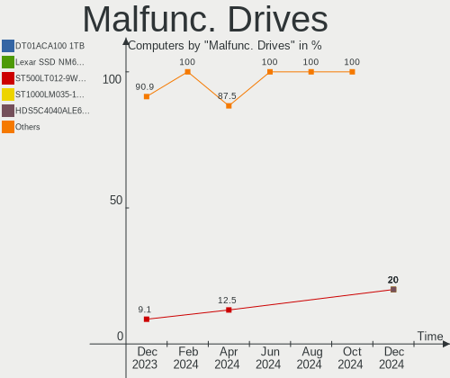
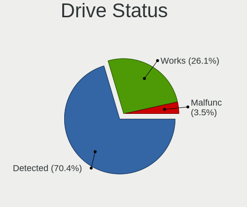
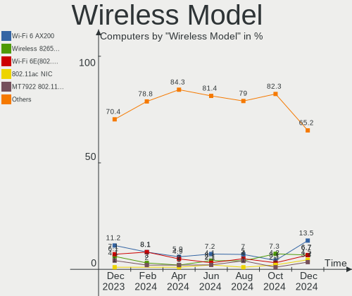
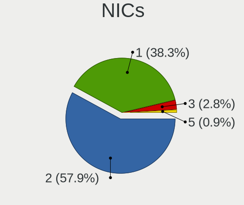
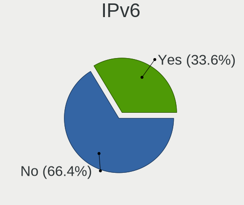
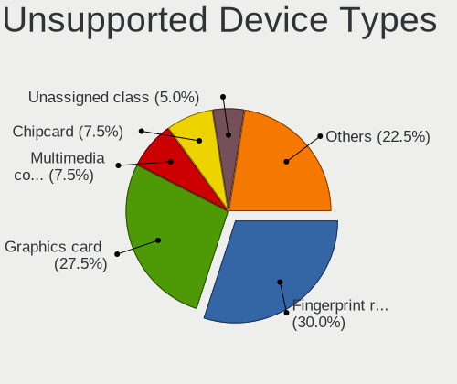

Manjaro Hardware Trends
-----------------------

A project to identify most popular hardware characteristics and track their change
over time based on data collected by Manjaro users at https://Linux-Hardware.org.

Anyone can contribute to this report by the [hw-probe](https://github.com/linuxhw/hw-probe) tool:

    sudo -E hw-probe -all -upload

This is a report for all computer types. See also reports for [desktops](/Dist/Manjaro/Desktop/README.md) and [notebooks](/Dist/Manjaro/Notebook/README.md).

Full-feature report is available here: https://linux-hardware.org/?view=trends

Period: Jul, 2021.

Contents
--------

* [ System ](#system)
  - [ OS                       ](#os)
  - [ OS Family                ](#os-family)
  - [ Kernel                   ](#kernel)
  - [ Kernel Family            ](#kernel-family)
  - [ Kernel Major Ver.        ](#kernel-major-ver)
  - [ Arch                     ](#arch)
  - [ DE                       ](#de)
  - [ Display Server           ](#display-server)
  - [ Display Manager          ](#display-manager)
  - [ OS Lang                  ](#os-lang)
  - [ Boot Mode                ](#boot-mode)
  - [ Filesystem               ](#filesystem)
  - [ Part. scheme             ](#part-scheme)
  - [ Dual Boot with Linux/BSD ](#dual-boot-with-linuxbsd)
  - [ Dual Boot (Win)          ](#dual-boot-win)

* [ Board ](#board)
  - [ Vendor                   ](#vendor)
  - [ Model                    ](#model)
  - [ Model Family             ](#model-family)
  - [ MFG Year                 ](#mfg-year)
  - [ Form Factor              ](#form-factor)
  - [ Secure Boot              ](#secure-boot)
  - [ Coreboot                 ](#coreboot)
  - [ RAM Size                 ](#ram-size)
  - [ RAM Used                 ](#ram-used)
  - [ Total Drives             ](#total-drives)
  - [ Has CD-ROM               ](#has-cd-rom)
  - [ Has Ethernet             ](#has-ethernet)
  - [ Has WiFi                 ](#has-wifi)
  - [ Has Bluetooth            ](#has-bluetooth)

* [ Location ](#location)
  - [ Country                  ](#country)
  - [ City                     ](#city)

* [ Drives ](#drives)
  - [ Drive Vendor             ](#drive-vendor)
  - [ Drive Model              ](#drive-model)
  - [ HDD Vendor               ](#hdd-vendor)
  - [ SSD Vendor               ](#ssd-vendor)
  - [ Drive Kind               ](#drive-kind)
  - [ Drive Connector          ](#drive-connector)
  - [ Drive Size               ](#drive-size)
  - [ Space Total              ](#space-total)
  - [ Space Used               ](#space-used)
  - [ Malfunc. Drives          ](#malfunc-drives)
  - [ Malfunc. Drive Vendor    ](#malfunc-drive-vendor)
  - [ Malfunc. HDD Vendor      ](#malfunc-hdd-vendor)
  - [ Malfunc. Drive Kind      ](#malfunc-drive-kind)
  - [ Failed Drives            ](#failed-drives)
  - [ Failed Drive Vendor      ](#failed-drive-vendor)
  - [ Drive Status             ](#drive-status)

* [ Storage controller ](#storage-controller)
  - [ Storage Vendor           ](#storage-vendor)
  - [ Storage Model            ](#storage-model)
  - [ Storage Kind             ](#storage-kind)

* [ Processor ](#processor)
  - [ CPU Vendor               ](#cpu-vendor)
  - [ CPU Model                ](#cpu-model)
  - [ CPU Model Family         ](#cpu-model-family)
  - [ CPU Cores                ](#cpu-cores)
  - [ CPU Sockets              ](#cpu-sockets)
  - [ CPU Threads              ](#cpu-threads)
  - [ CPU Op-Modes             ](#cpu-op-modes)
  - [ CPU Microcode            ](#cpu-microcode)
  - [ CPU Microarch            ](#cpu-microarch)

* [ Graphics ](#graphics)
  - [ GPU Vendor               ](#gpu-vendor)
  - [ GPU Model                ](#gpu-model)
  - [ GPU Combo                ](#gpu-combo)
  - [ GPU Driver               ](#gpu-driver)
  - [ GPU Memory               ](#gpu-memory)

* [ Monitor ](#monitor)
  - [ Monitor Vendor           ](#monitor-vendor)
  - [ Monitor Model            ](#monitor-model)
  - [ Monitor Resolution       ](#monitor-resolution)
  - [ Monitor Diagonal         ](#monitor-diagonal)
  - [ Monitor Width            ](#monitor-width)
  - [ Aspect Ratio             ](#aspect-ratio)
  - [ Monitor Area             ](#monitor-area)
  - [ Pixel Density            ](#pixel-density)
  - [ Multiple Monitors        ](#multiple-monitors)

* [ Network ](#network)
  - [ Net Controller Vendor    ](#net-controller-vendor)
  - [ Net Controller Model     ](#net-controller-model)
  - [ Wireless Vendor          ](#wireless-vendor)
  - [ Wireless Model           ](#wireless-model)
  - [ Ethernet Vendor          ](#ethernet-vendor)
  - [ Ethernet Model           ](#ethernet-model)
  - [ Net Controller Kind      ](#net-controller-kind)
  - [ Used Controller          ](#used-controller)
  - [ NICs                     ](#nics)
  - [ IPv6                     ](#ipv6)

* [ Bluetooth ](#bluetooth)
  - [ Bluetooth Vendor         ](#bluetooth-vendor)
  - [ Bluetooth Model          ](#bluetooth-model)

* [ Sound ](#sound)
  - [ Sound Vendor             ](#sound-vendor)
  - [ Sound Model              ](#sound-model)

* [ Memory ](#memory)
  - [ Memory Vendor            ](#memory-vendor)
  - [ Memory Model             ](#memory-model)
  - [ Memory Kind              ](#memory-kind)
  - [ Memory Form Factor       ](#memory-form-factor)
  - [ Memory Size              ](#memory-size)
  - [ Memory Speed             ](#memory-speed)

* [ Printers & scanners ](#printers--scanners)
  - [ Printer Vendor           ](#printer-vendor)
  - [ Printer Model            ](#printer-model)
  - [ Scanner Vendor           ](#scanner-vendor)
  - [ Scanner Model            ](#scanner-model)

* [ Camera ](#camera)
  - [ Camera Vendor            ](#camera-vendor)
  - [ Camera Model             ](#camera-model)

* [ Security ](#security)
  - [ Fingerprint Vendor       ](#fingerprint-vendor)
  - [ Fingerprint Model        ](#fingerprint-model)
  - [ Chipcard Vendor          ](#chipcard-vendor)
  - [ Chipcard Model           ](#chipcard-model)

* [ Unsupported ](#unsupported)
  - [ Unsupported Devices      ](#unsupported-devices)
  - [ Unsupported Device Types ](#unsupported-device-types)

System
------

OS
--

Installed operating systems

| Name                      | Computers | Percent |
|---------------------------|-----------|---------|
| Manjaro                   | 67        | 34.18%  |
| Manjaro 21.1.0            | 63        | 32.14%  |
| Manjaro 21.0.7            | 59        | 30.1%   |
| Manjaro 21.0.6            | 2         | 1.02%   |
| Manjaro 21.0.1            | 2         | 1.02%   |
| Manjaro 21.0              | 2         | 1.02%   |
| Manjaro 21.07-development | 1         | 0.51%   |

OS Family
---------

OS without a version

| Name    | Computers | Percent |
|---------|-----------|---------|
| Manjaro | 196       | 100%    |

Kernel
------

Version of the Linux kernel

| Version                 | Computers | Percent |
|-------------------------|-----------|---------|
| 5.10.42-1-MANJARO       | 50        | 25.51%  |
| 5.12.9-1-MANJARO        | 34        | 17.35%  |
| 5.10.49-1-MANJARO       | 20        | 10.2%   |
| 5.10.52-1-MANJARO       | 18        | 9.18%   |
| 5.13.1-3-MANJARO        | 10        | 5.1%    |
| 5.10.53-1-MANJARO       | 9         | 4.59%   |
| 5.13.0-1-MANJARO        | 8         | 4.08%   |
| 5.13.4-1-MANJARO        | 5         | 2.55%   |
| 5.12.16-1-MANJARO       | 5         | 2.55%   |
| 5.14.0-1-MANJARO        | 4         | 2.04%   |
| 5.12.19-1-MANJARO       | 4         | 2.04%   |
| 5.13.5-1-MANJARO        | 3         | 1.53%   |
| 5.11.4-1-rt11-MANJARO   | 3         | 1.53%   |
| 5.11.22-2-MANJARO       | 3         | 1.53%   |
| 5.4.124-1-MANJARO       | 2         | 1.02%   |
| 5.10.26-1-MANJARO       | 2         | 1.02%   |
| 4.19.193-1-MANJARO      | 2         | 1.02%   |
| 5.9.16-1-MANJARO        | 1         | 0.51%   |
| 5.4.134-1-MANJARO       | 1         | 0.51%   |
| 5.4.118-1-MANJARO       | 1         | 0.51%   |
| 5.13.4-arch1-2-vfio     | 1         | 0.51%   |
| 5.12.14-nitrous-fire+   | 1         | 0.51%   |
| 5.12.14-lqx2-2-lqx      | 1         | 0.51%   |
| 5.12.14-arch1-1-surface | 1         | 0.51%   |
| 5.11.6-1-MANJARO        | 1         | 0.51%   |
| 5.11.19-1-MANJARO       | 1         | 0.51%   |
| 5.10.47-2-MANJARO       | 1         | 0.51%   |
| 5.10.46Cros+            | 1         | 0.51%   |
| 5.10.41-1-MANJARO       | 1         | 0.51%   |
| 5.10.30-1-MANJARO       | 1         | 0.51%   |
| 5.10.23-1-MANJARO       | 1         | 0.51%   |

Kernel Family
-------------

Linux kernel without a distro release

| Version  | Computers | Percent |
|----------|-----------|---------|
| 5.10.42  | 50        | 25.51%  |
| 5.12.9   | 34        | 17.35%  |
| 5.10.49  | 20        | 10.2%   |
| 5.10.52  | 18        | 9.18%   |
| 5.13.1   | 10        | 5.1%    |
| 5.10.53  | 9         | 4.59%   |
| 5.13.0   | 8         | 4.08%   |
| 5.13.4   | 6         | 3.06%   |
| 5.12.16  | 5         | 2.55%   |
| 5.14.0   | 4         | 2.04%   |
| 5.12.19  | 4         | 2.04%   |
| 5.13.5   | 3         | 1.53%   |
| 5.12.14  | 3         | 1.53%   |
| 5.11.4   | 3         | 1.53%   |
| 5.11.22  | 3         | 1.53%   |
| 5.4.124  | 2         | 1.02%   |
| 5.10.26  | 2         | 1.02%   |
| 4.19.193 | 2         | 1.02%   |
| 5.9.16   | 1         | 0.51%   |
| 5.4.134  | 1         | 0.51%   |
| 5.4.118  | 1         | 0.51%   |
| 5.11.6   | 1         | 0.51%   |
| 5.11.19  | 1         | 0.51%   |
| 5.10.47  | 1         | 0.51%   |
| 5.10.46  | 1         | 0.51%   |
| 5.10.41  | 1         | 0.51%   |
| 5.10.30  | 1         | 0.51%   |
| 5.10.23  | 1         | 0.51%   |

Kernel Major Ver.
-----------------

Linux kernel major version

| Version | Computers | Percent |
|---------|-----------|---------|
| 5.10    | 104       | 53.06%  |
| 5.12    | 46        | 23.47%  |
| 5.13    | 27        | 13.78%  |
| 5.11    | 8         | 4.08%   |
| 5.4     | 4         | 2.04%   |
| 5.14    | 4         | 2.04%   |
| 4.19    | 2         | 1.02%   |
| 5.9     | 1         | 0.51%   |

Arch
----

OS architecture (x86_64, i586, etc.)

| Name   | Computers | Percent |
|--------|-----------|---------|
| x86_64 | 196       | 100%    |

DE
--

Desktop Environment

| Name                     | Computers | Percent |
|--------------------------|-----------|---------|
| KDE5                     | 51        | 26.02%  |
| XFCE                     | 44        | 22.45%  |
| GNOME                    | 43        | 21.94%  |
| KDE                      | 23        | 11.73%  |
| X-Cinnamon               | 8         | 4.08%   |
| i3                       | 7         | 3.57%   |
| Unknown                  | 7         | 3.57%   |
| Deepin                   | 6         | 3.06%   |
| MATE                     | 2         | 1.02%   |
| Cinnamon                 | 2         | 1.02%   |
| swayLANG=en_CA.UTF-8     | 1         | 0.51%   |
| GNOME Classic            | 1         | 0.51%   |
| /usr/bin/openbox-session | 1         | 0.51%   |

Display Server
--------------

X11 or Wayland

| Name    | Computers | Percent |
|---------|-----------|---------|
| X11     | 159       | 81.12%  |
| Wayland | 30        | 15.31%  |
| Unknown | 7         | 3.57%   |

Display Manager
---------------

SDDM, LightDM, etc.

| Name    | Computers | Percent |
|---------|-----------|---------|
| Unknown | 68        | 34.69%  |
| SDDM    | 57        | 29.08%  |
| LightDM | 34        | 17.35%  |
| GDM     | 32        | 16.33%  |
| TDM     | 4         | 2.04%   |
| LXDM    | 1         | 0.51%   |

OS Lang
-------

Language

| Lang    | Computers | Percent |
|---------|-----------|---------|
| en_US   | 94        | 47.96%  |
| en_GB   | 16        | 8.16%   |
| ru_RU   | 14        | 7.14%   |
| pt_BR   | 10        | 5.1%    |
| pl_PL   | 10        | 5.1%    |
| de_DE   | 10        | 5.1%    |
| fr_FR   | 3         | 1.53%   |
| en_IN   | 3         | 1.53%   |
| en_CA   | 3         | 1.53%   |
| en_AU   | 3         | 1.53%   |
| ru_UA   | 2         | 1.02%   |
| ja_JP   | 2         | 1.02%   |
| fi_FI   | 2         | 1.02%   |
| es_ES   | 2         | 1.02%   |
| es_CL   | 2         | 1.02%   |
| en_IE   | 2         | 1.02%   |
| cs_CZ   | 2         | 1.02%   |
| Unknown | 2         | 1.02%   |
| zh_HK   | 1         | 0.51%   |
| sv_SE   | 1         | 0.51%   |
| pt_PT   | 1         | 0.51%   |
| nl_NL   | 1         | 0.51%   |
| it_IT   | 1         | 0.51%   |
| id_ID   | 1         | 0.51%   |
| hu_HU   | 1         | 0.51%   |
| es_PE   | 1         | 0.51%   |
| es_CO   | 1         | 0.51%   |
| en_PH   | 1         | 0.51%   |
| en_IL   | 1         | 0.51%   |
| en_DE   | 1         | 0.51%   |
| el_GR   | 1         | 0.51%   |
| de_CH   | 1         | 0.51%   |

Boot Mode
---------

EFI or BIOS

| Mode | Computers | Percent |
|------|-----------|---------|
| EFI  | 111       | 56.63%  |
| BIOS | 85        | 43.37%  |

Filesystem
----------

Type of filesystem

| Type    | Computers | Percent |
|---------|-----------|---------|
| Ext4    | 162       | 82.65%  |
| Btrfs   | 21        | 10.71%  |
| Overlay | 9         | 4.59%   |
| Xfs     | 2         | 1.02%   |
| Zfs     | 1         | 0.51%   |
| XXXfs   | 1         | 0.51%   |

Part. scheme
------------

Scheme of partitioning

| Type    | Computers | Percent |
|---------|-----------|---------|
| GPT     | 115       | 58.67%  |
| Unknown | 64        | 32.65%  |
| MBR     | 17        | 8.67%   |

Dual Boot with Linux/BSD
------------------------

Hosting more than one Linux/BSD

| Dual boot | Computers | Percent |
|-----------|-----------|---------|
| No        | 169       | 86.22%  |
| Yes       | 27        | 13.78%  |

Dual Boot (Win)
---------------

Hosting Linux and Windows

| Dual boot | Computers | Percent |
|-----------|-----------|---------|
| No        | 118       | 60.2%   |
| Yes       | 78        | 39.8%   |

Board
-----

Vendor
------

Motherboard manufacturer

| Name                | Computers | Percent |
|---------------------|-----------|---------|
| Lenovo              | 40        | 20.41%  |
| ASUSTek Computer    | 27        | 13.78%  |
| Dell                | 23        | 11.73%  |
| Hewlett-Packard     | 22        | 11.22%  |
| Gigabyte Technology | 18        | 9.18%   |
| MSI                 | 15        | 7.65%   |
| Acer                | 11        | 5.61%   |
| ASRock              | 9         | 4.59%   |
| Intel               | 5         | 2.55%   |
| Samsung Electronics | 3         | 1.53%   |
| Timi                | 2         | 1.02%   |
| Apple               | 2         | 1.02%   |
| Unknown             | 2         | 1.02%   |
| TUXEDO              | 1         | 0.51%   |
| Toshiba             | 1         | 0.51%   |
| Teclast             | 1         | 0.51%   |
| Supermicro          | 1         | 0.51%   |
| Star Labs           | 1         | 0.51%   |
| Sony                | 1         | 0.51%   |
| Semp Toshiba        | 1         | 0.51%   |
| Pegatron            | 1         | 0.51%   |
| Packard Bell        | 1         | 0.51%   |
| Notebook            | 1         | 0.51%   |
| Microsoft           | 1         | 0.51%   |
| Huanan              | 1         | 0.51%   |
| HONOR               | 1         | 0.51%   |
| Google              | 1         | 0.51%   |
| Foxconn             | 1         | 0.51%   |
| AMI                 | 1         | 0.51%   |
| AMD                 | 1         | 0.51%   |

Model
-----

Motherboard model

| Name                                       | Computers | Percent |
|--------------------------------------------|-----------|---------|
| Lenovo Legion 5 15ACH6H 82JU               | 2         | 1.02%   |
| Lenovo IdeaPad 5 15ARE05 81YQ              | 2         | 1.02%   |
| Lenovo IdeaPad 3 15IIL05 81WE              | 2         | 1.02%   |
| Gigabyte X570 AORUS MASTER                 | 2         | 1.02%   |
| Gigabyte B450M DS3H                        | 2         | 1.02%   |
| Dell Inspiron 3542                         | 2         | 1.02%   |
| ASUS TUF GAMING B550M-PLUS                 | 2         | 1.02%   |
| ASUS All Series                            | 2         | 1.02%   |
| Acer Swift SF314-42                        | 2         | 1.02%   |
| Unknown                                    | 2         | 1.02%   |
| TUXEDO Pulse 14 Gen1                       | 1         | 0.51%   |
| Toshiba Satellite C50-B                    | 1         | 0.51%   |
| Timi RedmiBook 13 R                        | 1         | 0.51%   |
| Timi A35S                                  | 1         | 0.51%   |
| Teclast TbooK 10 S                         | 1         | 0.51%   |
| Supermicro X8DTH-i/6/iF/6F                 | 1         | 0.51%   |
| Star Labs LabTop                           | 1         | 0.51%   |
| Sony VGN-SR11MR                            | 1         | 0.51%   |
| Semp Toshiba IS 1412                       | 1         | 0.51%   |
| Samsung R530/R730                          | 1         | 0.51%   |
| Samsung 520U4C/520U4X                      | 1         | 0.51%   |
| Samsung 350V5C/351V5C/3540VC/3440VC        | 1         | 0.51%   |
| Pegatron s5610br                           | 1         | 0.51%   |
| Packard Bell EasyNote TV11HC               | 1         | 0.51%   |
| Notebook NV4XMB,ME,MZ                      | 1         | 0.51%   |
| MSI PS42 8RB                               | 1         | 0.51%   |
| MSI Prestige 14 A10SC                      | 1         | 0.51%   |
| MSI MS-7C94                                | 1         | 0.51%   |
| MSI MS-7C67                                | 1         | 0.51%   |
| MSI MS-7C37                                | 1         | 0.51%   |
| MSI MS-7C35                                | 1         | 0.51%   |
| MSI MS-7B98                                | 1         | 0.51%   |
| MSI MS-7B86                                | 1         | 0.51%   |
| MSI MS-7B48                                | 1         | 0.51%   |
| MSI MS-7A65                                | 1         | 0.51%   |
| MSI MS-7A34                                | 1         | 0.51%   |
| MSI MS-7994                                | 1         | 0.51%   |
| MSI MS-7918                                | 1         | 0.51%   |
| MSI GL63 8RD                               | 1         | 0.51%   |
| MSI GF65 Thin 9SEXR                        | 1         | 0.51%   |
| Microsoft Surface Pro 4                    | 1         | 0.51%   |
| Lenovo Yoga Slim 7 14ARE05 82A2            | 1         | 0.51%   |
| Lenovo Yoga 6 13ARE05 82FN                 | 1         | 0.51%   |
| Lenovo XiaoXinAir 14+ ACN 2021 82L7        | 1         | 0.51%   |
| Lenovo ThinkStation S30 4352H1U            | 1         | 0.51%   |
| Lenovo ThinkPad X1 Carbon Gen 8 20UASBBC00 | 1         | 0.51%   |
| Lenovo ThinkPad T470 20HES0FX00            | 1         | 0.51%   |
| Lenovo ThinkPad T420 423663G               | 1         | 0.51%   |
| Lenovo ThinkPad T410 2537KR6               | 1         | 0.51%   |
| Lenovo ThinkPad T14s Gen 1 20T1S2WF00      | 1         | 0.51%   |
| Lenovo ThinkPad P53 20QQS0LW00             | 1         | 0.51%   |
| Lenovo ThinkPad E15 Gen 2 20T9S0B500       | 1         | 0.51%   |
| Lenovo ThinkPad E15 Gen 2 20T8CTO1WW       | 1         | 0.51%   |
| Lenovo ThinkPad E15 20RD0086UE             | 1         | 0.51%   |
| Lenovo ThinkPad E14 Gen 3 20Y7003XGE       | 1         | 0.51%   |
| Lenovo ThinkPad E14 Gen 2 20T7S00W00       | 1         | 0.51%   |
| Lenovo ThinkCentre M91p 7033DE6            | 1         | 0.51%   |
| Lenovo ThinkCentre M90n-1 11AD002DGE       | 1         | 0.51%   |
| Lenovo ThinkCentre E73 10DS0015GE          | 1         | 0.51%   |
| Lenovo ThinkBook 14-IML 20RV               | 1         | 0.51%   |

Model Family
------------

Motherboard model prefix

| Name                  | Computers | Percent |
|-----------------------|-----------|---------|
| Lenovo IdeaPad        | 13        | 6.63%   |
| Lenovo ThinkPad       | 11        | 5.61%   |
| Dell Inspiron         | 7         | 3.57%   |
| Acer Aspire           | 7         | 3.57%   |
| Dell OptiPlex         | 6         | 3.06%   |
| Lenovo Legion         | 4         | 2.04%   |
| Dell XPS              | 4         | 2.04%   |
| Lenovo ThinkCentre    | 3         | 1.53%   |
| Dell Latitude         | 3         | 1.53%   |
| ASUS TUF              | 3         | 1.53%   |
| ASUS ROG              | 3         | 1.53%   |
| Lenovo Yoga           | 2         | 1.02%   |
| HP ProDesk            | 2         | 1.02%   |
| HP Laptop             | 2         | 1.02%   |
| HP ENVY               | 2         | 1.02%   |
| HP EliteBook          | 2         | 1.02%   |
| HP Compaq             | 2         | 1.02%   |
| HP 255                | 2         | 1.02%   |
| Gigabyte X570         | 2         | 1.02%   |
| Gigabyte H61M-DS2     | 2         | 1.02%   |
| Gigabyte B450M        | 2         | 1.02%   |
| Dell Vostro           | 2         | 1.02%   |
| ASUS ZenBook          | 2         | 1.02%   |
| ASUS VivoBook         | 2         | 1.02%   |
| ASUS PRIME            | 2         | 1.02%   |
| ASUS Maximus          | 2         | 1.02%   |
| ASUS M5A97            | 2         | 1.02%   |
| ASUS All              | 2         | 1.02%   |
| ASRock B450M          | 2         | 1.02%   |
| Acer Swift            | 2         | 1.02%   |
| Unknown               | 2         | 1.02%   |
| TUXEDO Pulse          | 1         | 0.51%   |
| Toshiba Satellite     | 1         | 0.51%   |
| Timi RedmiBook        | 1         | 0.51%   |
| Timi A35S             | 1         | 0.51%   |
| Teclast TbooK         | 1         | 0.51%   |
| Supermicro X8DTH-i    | 1         | 0.51%   |
| Star Labs LabTop      | 1         | 0.51%   |
| Sony VGN-SR11MR       | 1         | 0.51%   |
| Semp Toshiba IS       | 1         | 0.51%   |
| Samsung R530          | 1         | 0.51%   |
| Samsung 520U4C        | 1         | 0.51%   |
| Samsung 350V5C        | 1         | 0.51%   |
| Pegatron s5610br      | 1         | 0.51%   |
| Packard Bell EasyNote | 1         | 0.51%   |
| Notebook NV4XMB       | 1         | 0.51%   |
| MSI PS42              | 1         | 0.51%   |
| MSI Prestige          | 1         | 0.51%   |
| MSI MS-7C94           | 1         | 0.51%   |
| MSI MS-7C67           | 1         | 0.51%   |
| MSI MS-7C37           | 1         | 0.51%   |
| MSI MS-7C35           | 1         | 0.51%   |
| MSI MS-7B98           | 1         | 0.51%   |
| MSI MS-7B86           | 1         | 0.51%   |
| MSI MS-7B48           | 1         | 0.51%   |
| MSI MS-7A65           | 1         | 0.51%   |
| MSI MS-7A34           | 1         | 0.51%   |
| MSI MS-7994           | 1         | 0.51%   |
| MSI MS-7918           | 1         | 0.51%   |
| MSI GL63              | 1         | 0.51%   |

MFG Year
--------

Motherboard manufacture year

| Year | Computers | Percent |
|------|-----------|---------|
| 2020 | 55        | 28.06%  |
| 2021 | 40        | 20.41%  |
| 2019 | 19        | 9.69%   |
| 2018 | 19        | 9.69%   |
| 2013 | 16        | 8.16%   |
| 2016 | 12        | 6.12%   |
| 2014 | 7         | 3.57%   |
| 2015 | 6         | 3.06%   |
| 2012 | 6         | 3.06%   |
| 2009 | 6         | 3.06%   |
| 2011 | 4         | 2.04%   |
| 2010 | 4         | 2.04%   |
| 2017 | 2         | 1.02%   |

Form Factor
-----------

Physical design of the computer

| Name        | Computers | Percent |
|-------------|-----------|---------|
| Notebook    | 103       | 52.55%  |
| Desktop     | 81        | 41.33%  |
| Mini pc     | 5         | 2.55%   |
| Convertible | 4         | 2.04%   |
| Tablet      | 2         | 1.02%   |
| Server      | 1         | 0.51%   |

Secure Boot
-----------

Enabled or disabled

| State    | Computers | Percent |
|----------|-----------|---------|
| Disabled | 195       | 99.49%  |
| Enabled  | 1         | 0.51%   |

Coreboot
--------

Have coreboot on board

| Used | Computers | Percent |
|------|-----------|---------|
| No   | 194       | 98.98%  |
| Yes  | 2         | 1.02%   |

RAM Size
--------

Total RAM memory

| Size in GB  | Computers | Percent |
|-------------|-----------|---------|
| 16.01-24.0  | 48        | 24.49%  |
| 8.01-16.0   | 48        | 24.49%  |
| 4.01-8.0    | 44        | 22.45%  |
| 32.01-64.0  | 20        | 10.2%   |
| 3.01-4.0    | 19        | 9.69%   |
| 64.01-256.0 | 9         | 4.59%   |
| 24.01-32.0  | 4         | 2.04%   |
| 1.01-2.0    | 4         | 2.04%   |

RAM Used
--------

Used RAM memory

| Used GB    | Computers | Percent |
|------------|-----------|---------|
| 1.01-2.0   | 48        | 24.49%  |
| 2.01-3.0   | 45        | 22.96%  |
| 4.01-8.0   | 42        | 21.43%  |
| 3.01-4.0   | 37        | 18.88%  |
| 8.01-16.0  | 10        | 5.1%    |
| 16.01-24.0 | 6         | 3.06%   |
| 0.51-1.0   | 6         | 3.06%   |
| 32.01-64.0 | 1         | 0.51%   |
| 0.01-0.5   | 1         | 0.51%   |

Total Drives
------------

Number of drives on board

| Drives | Computers | Percent |
|--------|-----------|---------|
| 1      | 101       | 51.53%  |
| 2      | 51        | 26.02%  |
| 3      | 16        | 8.16%   |
| 4      | 14        | 7.14%   |
| 6      | 5         | 2.55%   |
| 5      | 4         | 2.04%   |
| 7      | 3         | 1.53%   |
| 9      | 1         | 0.51%   |
| 0      | 1         | 0.51%   |

Has CD-ROM
----------

Has CD-ROM on board

| Presented | Computers | Percent |
|-----------|-----------|---------|
| No        | 144       | 73.47%  |
| Yes       | 52        | 26.53%  |

Has Ethernet
------------

Has Ethernet on board

| Presented | Computers | Percent |
|-----------|-----------|---------|
| Yes       | 158       | 80.61%  |
| No        | 38        | 19.39%  |

Has WiFi
--------

Has WiFi module

| Presented | Computers | Percent |
|-----------|-----------|---------|
| Yes       | 150       | 76.53%  |
| No        | 46        | 23.47%  |

Has Bluetooth
-------------

Has Bluetooth module

| Presented | Computers | Percent |
|-----------|-----------|---------|
| Yes       | 127       | 64.8%   |
| No        | 69        | 35.2%   |

Location
--------

Country
-------

Geographic location (country)

| Country             | Computers | Percent |
|---------------------|-----------|---------|
| USA                 | 22        | 11.22%  |
| Germany             | 20        | 10.2%   |
| Russia              | 16        | 8.16%   |
| Brazil              | 16        | 8.16%   |
| Poland              | 10        | 5.1%    |
| UK                  | 9         | 4.59%   |
| Ukraine             | 6         | 3.06%   |
| Netherlands         | 5         | 2.55%   |
| France              | 5         | 2.55%   |
| Czechia             | 5         | 2.55%   |
| Indonesia           | 4         | 2.04%   |
| India               | 4         | 2.04%   |
| Finland             | 4         | 2.04%   |
| Canada              | 4         | 2.04%   |
| Austria             | 4         | 2.04%   |
| Mexico              | 3         | 1.53%   |
| Malaysia            | 3         | 1.53%   |
| Hungary             | 3         | 1.53%   |
| Chile               | 3         | 1.53%   |
| Belgium             | 3         | 1.53%   |
| Australia           | 3         | 1.53%   |
| Uzbekistan          | 2         | 1.02%   |
| Spain               | 2         | 1.02%   |
| Norway              | 2         | 1.02%   |
| Japan               | 2         | 1.02%   |
| Italy               | 2         | 1.02%   |
| Ireland             | 2         | 1.02%   |
| Greece              | 2         | 1.02%   |
| Croatia             | 2         | 1.02%   |
| Colombia            | 2         | 1.02%   |
| Belarus             | 2         | 1.02%   |
| Vietnam             | 1         | 0.51%   |
| Turkey              | 1         | 0.51%   |
| Trinidad and Tobago | 1         | 0.51%   |
| Thailand            | 1         | 0.51%   |
| Tajikistan          | 1         | 0.51%   |
| Switzerland         | 1         | 0.51%   |
| Sweden              | 1         | 0.51%   |
| Saudi Arabia        | 1         | 0.51%   |
| Portugal            | 1         | 0.51%   |
| Philippines         | 1         | 0.51%   |
| Peru                | 1         | 0.51%   |
| Oman                | 1         | 0.51%   |
| North Macedonia     | 1         | 0.51%   |
| Myanmar             | 1         | 0.51%   |
| Morocco             | 1         | 0.51%   |
| Luxembourg          | 1         | 0.51%   |
| Jordan              | 1         | 0.51%   |
| Israel              | 1         | 0.51%   |
| Iraq                | 1         | 0.51%   |
| Hong Kong           | 1         | 0.51%   |
| Georgia             | 1         | 0.51%   |
| China               | 1         | 0.51%   |
| Bangladesh          | 1         | 0.51%   |
| Argentina           | 1         | 0.51%   |

City
----

Geographic location (city)

| City                  | Computers | Percent |
|-----------------------|-----------|---------|
| Moscow                | 4         | 2.04%   |
| Tijuana               | 3         | 1.53%   |
| St Petersburg         | 3         | 1.53%   |
| Kuala Lumpur          | 3         | 1.53%   |
| Ingolstadt            | 3         | 1.53%   |
| Winnipeg              | 2         | 1.02%   |
| Warsaw                | 2         | 1.02%   |
| Tashkent              | 2         | 1.02%   |
| São Paulo            | 2         | 1.02%   |
| Szigetszentmiklos     | 2         | 1.02%   |
| Prague                | 2         | 1.02%   |
| Minsk                 | 2         | 1.02%   |
| Ghent                 | 2         | 1.02%   |
| Gdansk                | 2         | 1.02%   |
| Dnipropetrovsk        | 2         | 1.02%   |
| Dallas                | 2         | 1.02%   |
| Campo Grande          | 2         | 1.02%   |
| Barcelona             | 2         | 1.02%   |
| Zarqa                 | 1         | 0.51%   |
| Zagreb                | 1         | 0.51%   |
| Yangon                | 1         | 0.51%   |
| Yakutsk               | 1         | 0.51%   |
| Wolverhampton         | 1         | 0.51%   |
| Winterswijk           | 1         | 0.51%   |
| West Des Moines       | 1         | 0.51%   |
| Welwyn Garden City    | 1         | 0.51%   |
| Webb City             | 1         | 0.51%   |
| Watertown             | 1         | 0.51%   |
| Waldbronn             | 1         | 0.51%   |
| Vũng Tàu            | 1         | 0.51%   |
| Vyshneve              | 1         | 0.51%   |
| Volgograd             | 1         | 0.51%   |
| Vila Velha            | 1         | 0.51%   |
| Vienna                | 1         | 0.51%   |
| Turku                 | 1         | 0.51%   |
| Trondheim             | 1         | 0.51%   |
| Trenton               | 1         | 0.51%   |
| Toulouse              | 1         | 0.51%   |
| Toronto               | 1         | 0.51%   |
| Tilburg               | 1         | 0.51%   |
| The Bronx             | 1         | 0.51%   |
| Tegalgede             | 1         | 0.51%   |
| Tbilisi               | 1         | 0.51%   |
| Tampere               | 1         | 0.51%   |
| Swalmen               | 1         | 0.51%   |
| Sulaymaniyah          | 1         | 0.51%   |
| Sparti                | 1         | 0.51%   |
| Souligne-sous-Ballon  | 1         | 0.51%   |
| Skopje                | 1         | 0.51%   |
| Shchelkovo            | 1         | 0.51%   |
| Schmoelln             | 1         | 0.51%   |
| Sarov                 | 1         | 0.51%   |
| Santiago              | 1         | 0.51%   |
| Santa Cruz            | 1         | 0.51%   |
| Sacavem               | 1         | 0.51%   |
| Rudolstadt            | 1         | 0.51%   |
| Rouen                 | 1         | 0.51%   |
| Rostov-on-Don         | 1         | 0.51%   |
| Rosbach vor der Hoehe | 1         | 0.51%   |
| Rondonópolis         | 1         | 0.51%   |

Drives
------

Drive Vendor
------------

Hard drive vendors

| Vendor                    | Computers | Drives | Percent |
|---------------------------|-----------|--------|---------|
| WDC                       | 54        | 70     | 17.14%  |
| Samsung Electronics       | 52        | 75     | 16.51%  |
| Seagate                   | 44        | 55     | 13.97%  |
| Toshiba                   | 22        | 24     | 6.98%   |
| Sandisk                   | 19        | 20     | 6.03%   |
| Kingston                  | 18        | 22     | 5.71%   |
| Unknown                   | 12        | 15     | 3.81%   |
| SK Hynix                  | 11        | 11     | 3.49%   |
| Phison                    | 8         | 10     | 2.54%   |
| Crucial                   | 8         | 8      | 2.54%   |
| Micron Technology         | 5         | 5      | 1.59%   |
| GOODRAM                   | 5         | 5      | 1.59%   |
| Intel                     | 4         | 4      | 1.27%   |
| HGST                      | 4         | 4      | 1.27%   |
| Corsair                   | 4         | 4      | 1.27%   |
| Lexar                     | 3         | 3      | 0.95%   |
| Hitachi                   | 3         | 4      | 0.95%   |
| Apple                     | 3         | 3      | 0.95%   |
| A-DATA Technology         | 3         | 3      | 0.95%   |
| Transcend                 | 2         | 2      | 0.63%   |
| Silicon Motion            | 2         | 2      | 0.63%   |
| Realtek Semiconductor     | 2         | 2      | 0.63%   |
| KIOXIA                    | 2         | 2      | 0.63%   |
| JMicron                   | 2         | 2      | 0.63%   |
| Intenso                   | 2         | 2      | 0.63%   |
| Apacer                    | 2         | 2      | 0.63%   |
| XrayDisk                  | 1         | 1      | 0.32%   |
| Union Memory (Shenzhen)   | 1         | 1      | 0.32%   |
| Super Talent              | 1         | 1      | 0.32%   |
| Solid State Storage       | 1         | 1      | 0.32%   |
| SMART                     | 1         | 1      | 0.32%   |
| SABRENT                   | 1         | 1      | 0.32%   |
| PNY                       | 1         | 1      | 0.32%   |
| OCZ                       | 1         | 1      | 0.32%   |
| Micron/Crucial Technology | 1         | 1      | 0.32%   |
| Maxtor                    | 1         | 1      | 0.32%   |
| LITEON                    | 1         | 1      | 0.32%   |
| Lite-On                   | 1         | 1      | 0.32%   |
| Lenovo                    | 1         | 2      | 0.32%   |
| LaCie                     | 1         | 1      | 0.32%   |
| Kingmax                   | 1         | 2      | 0.32%   |
| Hewlett-Packard           | 1         | 1      | 0.32%   |
| Gigabyte Technology       | 1         | 2      | 0.32%   |
| External                  | 1         | 1      | 0.32%   |
| China                     | 1         | 4      | 0.32%   |

Drive Model
-----------

Hard drive models

| Model                              | Computers | Percent |
|------------------------------------|-----------|---------|
| Kingston SA400S37240G 240GB SSD    | 6         | 1.65%   |
| Seagate ST1000DM003-1CH162 1TB     | 4         | 1.1%    |
| Samsung SSD 850 EVO 500GB          | 4         | 1.1%    |
| Phison NVMe SSD Drive 1TB          | 4         | 1.1%    |
| WDC WDS500G2B0A-00SM50 500GB SSD   | 3         | 0.82%   |
| Toshiba MQ04ABF100 1TB             | 3         | 0.82%   |
| Toshiba MQ01ABD100 1TB             | 3         | 0.82%   |
| Toshiba DT01ACA100 1TB             | 3         | 0.82%   |
| Seagate ST500DM002-1BD142 500GB    | 3         | 0.82%   |
| Seagate ST1000LM024 HN-M101MBB 1TB | 3         | 0.82%   |
| Seagate ST1000DM010-2EP102 1TB     | 3         | 0.82%   |
| Sandisk NVMe SSD Drive 512GB       | 3         | 0.82%   |
| Samsung SSD 970 EVO Plus 1TB       | 3         | 0.82%   |
| Samsung SSD 970 EVO 500GB          | 3         | 0.82%   |
| Samsung SSD 860 EVO 250GB          | 3         | 0.82%   |
| Samsung SSD 850 EVO 250GB          | 3         | 0.82%   |
| Samsung NVMe SSD Drive 250GB       | 3         | 0.82%   |
| Samsung NVMe SSD Drive 1TB         | 3         | 0.82%   |
| Samsung HD103SJ 1TB                | 3         | 0.82%   |
| WDC WD20EZRZ-00Z5HB0 2TB           | 2         | 0.55%   |
| WDC WD20EFRX-68EUZN0 2TB           | 2         | 0.55%   |
| WDC WD10EZEX-00WN4A0 1TB           | 2         | 0.55%   |
| WDC WD10EARS-00Y5B1 1TB            | 2         | 0.55%   |
| Unknown MMC Card  64GB             | 2         | 0.55%   |
| Toshiba NVMe SSD Drive 512GB       | 2         | 0.55%   |
| Toshiba MQ01ABF050 500GB           | 2         | 0.55%   |
| SK Hynix NVMe SSD Drive 512GB      | 2         | 0.55%   |
| SK Hynix NVMe SSD Drive 256GB      | 2         | 0.55%   |
| Seagate ST4000VN008-2DR166 4TB     | 2         | 0.55%   |
| Seagate ST4000DM004-2CV104 4TB     | 2         | 0.55%   |
| Seagate ST2000DM008-2FR102 2TB     | 2         | 0.55%   |
| Seagate ST2000DM001-1ER164 2TB     | 2         | 0.55%   |
| Seagate ST2000DM001-1CH164 2TB     | 2         | 0.55%   |
| Seagate ST1000LM035-1RK172 1TB     | 2         | 0.55%   |
| Seagate ST1000DX001-1CM162 1TB     | 2         | 0.55%   |
| Sandisk NVMe SSD Drive 1TB         | 2         | 0.55%   |
| Samsung SSD 980 PRO 500GB          | 2         | 0.55%   |
| Samsung SSD 860 EVO 1TB            | 2         | 0.55%   |
| Samsung SSD 840 EVO 120GB          | 2         | 0.55%   |
| Samsung NVMe SSD Drive 512GB       | 2         | 0.55%   |
| Samsung NVMe SSD Drive 500GB       | 2         | 0.55%   |
| Samsung MZVLB512HBJQ-000L2 512GB   | 2         | 0.55%   |
| Samsung HD204UI 2TB                | 2         | 0.55%   |
| Lexar 256GB SSD                    | 2         | 0.55%   |
| Kingston SV300S37A120G 120GB SSD   | 2         | 0.55%   |
| Kingston NVMe SSD Drive 500GB      | 2         | 0.55%   |
| Crucial CT250MX500SSD1 250GB       | 2         | 0.55%   |
| Apacer AS350 256GB SSD             | 2         | 0.55%   |
| XrayDisk 256GB                     | 1         | 0.27%   |
| WDC WDS500G2B0C-00PXH0 500GB       | 1         | 0.27%   |
| WDC WDS250G2B0A-00SM50 250GB SSD   | 1         | 0.27%   |
| WDC WDS250G2B0A 250GB SSD          | 1         | 0.27%   |
| WDC WDS240G2G0A-00JH30 240GB SSD   | 1         | 0.27%   |
| WDC WDS120G2G0A-00JH30 120GB SSD   | 1         | 0.27%   |
| WDC WDS100T3X0C-00SJG0 1TB         | 1         | 0.27%   |
| WDC WDS100T2B0C-00PXH0 1TB         | 1         | 0.27%   |
| WDC WDS100T2B0A-00SM50 1TB SSD     | 1         | 0.27%   |
| WDC WDS100T1XHE-00AFY0 1TB         | 1         | 0.27%   |
| WDC WD6400AAKS-65A7B2 640GB        | 1         | 0.27%   |
| WDC WD6400AAKS-22A7B0 640GB        | 1         | 0.27%   |

HDD Vendor
----------

Hard disk drive vendors

| Vendor              | Computers | Drives | Percent |
|---------------------|-----------|--------|---------|
| Seagate             | 42        | 53     | 36.52%  |
| WDC                 | 37        | 47     | 32.17%  |
| Toshiba             | 18        | 18     | 15.65%  |
| Samsung Electronics | 9         | 11     | 7.83%   |
| HGST                | 4         | 4      | 3.48%   |
| Hitachi             | 3         | 4      | 2.61%   |
| Maxtor              | 1         | 1      | 0.87%   |
| Apple               | 1         | 1      | 0.87%   |

SSD Vendor
----------

Solid state drive vendors

| Vendor              | Computers | Drives | Percent |
|---------------------|-----------|--------|---------|
| Samsung Electronics | 24        | 30     | 25.53%  |
| Kingston            | 12        | 16     | 12.77%  |
| SanDisk             | 10        | 11     | 10.64%  |
| WDC                 | 8         | 10     | 8.51%   |
| Crucial             | 6         | 6      | 6.38%   |
| GOODRAM             | 5         | 5      | 5.32%   |
| Micron Technology   | 3         | 3      | 3.19%   |
| Lexar               | 3         | 3      | 3.19%   |
| Corsair             | 3         | 3      | 3.19%   |
| Intenso             | 2         | 2      | 2.13%   |
| Apple               | 2         | 2      | 2.13%   |
| Apacer              | 2         | 2      | 2.13%   |
| Transcend           | 1         | 1      | 1.06%   |
| Toshiba             | 1         | 1      | 1.06%   |
| SMART               | 1         | 1      | 1.06%   |
| SK Hynix            | 1         | 1      | 1.06%   |
| Seagate             | 1         | 1      | 1.06%   |
| PNY                 | 1         | 1      | 1.06%   |
| OCZ                 | 1         | 1      | 1.06%   |
| LITEON              | 1         | 1      | 1.06%   |
| Kingmax             | 1         | 2      | 1.06%   |
| JMicron             | 1         | 1      | 1.06%   |
| Intel               | 1         | 1      | 1.06%   |
| Hewlett-Packard     | 1         | 1      | 1.06%   |
| China               | 1         | 4      | 1.06%   |
| A-DATA Technology   | 1         | 1      | 1.06%   |

Drive Kind
----------

HDD or SSD

| Kind    | Computers | Drives | Percent |
|---------|-----------|--------|---------|
| HDD     | 95        | 139    | 33.33%  |
| NVMe    | 94        | 116    | 32.98%  |
| SSD     | 82        | 111    | 28.77%  |
| MMC     | 9         | 11     | 3.16%   |
| Unknown | 5         | 7      | 1.75%   |

Drive Connector
---------------

SATA, SAS, NVMe, etc.

| Type | Computers | Drives | Percent |
|------|-----------|--------|---------|
| SATA | 132       | 240    | 53.44%  |
| NVMe | 94        | 114    | 38.06%  |
| SAS  | 12        | 19     | 4.86%   |
| MMC  | 9         | 11     | 3.64%   |

Drive Size
----------

Size of hard drive

| Size in TB | Computers | Drives | Percent |
|------------|-----------|--------|---------|
| 0.01-0.5   | 93        | 132    | 48.69%  |
| 0.51-1.0   | 61        | 72     | 31.94%  |
| 1.01-2.0   | 21        | 29     | 10.99%  |
| 3.01-4.0   | 11        | 11     | 5.76%   |
| 2.01-3.0   | 3         | 4      | 1.57%   |
| 4.01-10.0  | 2         | 2      | 1.05%   |

Space Total
-----------

Amount of disk space available on the file system

| Size in GB     | Computers | Percent |
|----------------|-----------|---------|
| 101-250        | 47        | 23.98%  |
| 501-1000       | 37        | 18.88%  |
| 251-500        | 34        | 17.35%  |
| 1001-2000      | 21        | 10.71%  |
| More than 3000 | 15        | 7.65%   |
| 1-20           | 13        | 6.63%   |
| 51-100         | 11        | 5.61%   |
| Unknown        | 11        | 5.61%   |
| 2001-3000      | 4         | 2.04%   |
| 21-50          | 3         | 1.53%   |

Space Used
----------

Amount of used disk space

| Used GB        | Computers | Percent |
|----------------|-----------|---------|
| 1-20           | 48        | 24.49%  |
| 101-250        | 39        | 19.9%   |
| 21-50          | 32        | 16.33%  |
| 251-500        | 22        | 11.22%  |
| 51-100         | 16        | 8.16%   |
| Unknown        | 11        | 5.61%   |
| 1001-2000      | 10        | 5.1%    |
| 501-1000       | 10        | 5.1%    |
| More than 3000 | 7         | 3.57%   |
| 2001-3000      | 1         | 0.51%   |

Malfunc. Drives
---------------

Drive models with a malfunction

| Model                              | Computers | Drives | Percent |
|------------------------------------|-----------|--------|---------|
| Samsung Electronics HD103SJ 1TB    | 2         | 2      | 10.53%  |
| WDC WD2500BPVT-75JJ5T0 250GB       | 1         | 1      | 5.26%   |
| WDC WD2500AAJS-60Z0A0 250GB        | 1         | 1      | 5.26%   |
| WDC WD20EZRX-00DC0B0 2TB           | 1         | 1      | 5.26%   |
| WDC WD2002FYPS-02W3B0 2TB          | 1         | 1      | 5.26%   |
| WDC WD10EZEX-60M2NA0 1TB           | 1         | 1      | 5.26%   |
| WDC WD1002FBYS-02A6B0 1TB          | 1         | 1      | 5.26%   |
| Toshiba MK6459GSXP 640GB           | 1         | 1      | 5.26%   |
| Seagate STM3160318AS 160GB         | 1         | 1      | 5.26%   |
| Seagate ST500LT012-9WS142 500GB    | 1         | 1      | 5.26%   |
| Seagate ST3500630NS 500GB          | 1         | 1      | 5.26%   |
| Seagate ST1000LM024 HN-M101MBB 1TB | 1         | 1      | 5.26%   |
| Seagate ST1000DX001-1CM162 1TB     | 1         | 1      | 5.26%   |
| SanDisk SDSSDP256G 256GB           | 1         | 1      | 5.26%   |
| Samsung Electronics HD103SI 1TB    | 1         | 1      | 5.26%   |
| Intenso SSD 120GB                  | 1         | 1      | 5.26%   |
| HGST HTS545050A7 500GB             | 1         | 1      | 5.26%   |
| Apple SSD TS128E 121GB             | 1         | 1      | 5.26%   |

Malfunc. Drive Vendor
---------------------

Vendors of faulty drives

| Vendor              | Computers | Drives | Percent |
|---------------------|-----------|--------|---------|
| WDC                 | 5         | 6      | 29.41%  |
| Seagate             | 5         | 5      | 29.41%  |
| Samsung Electronics | 2         | 3      | 11.76%  |
| Toshiba             | 1         | 1      | 5.88%   |
| SanDisk             | 1         | 1      | 5.88%   |
| Intenso             | 1         | 1      | 5.88%   |
| HGST                | 1         | 1      | 5.88%   |
| Apple               | 1         | 1      | 5.88%   |

Malfunc. HDD Vendor
-------------------

Vendors of faulty HDD drives

| Vendor              | Computers | Drives | Percent |
|---------------------|-----------|--------|---------|
| WDC                 | 5         | 6      | 35.71%  |
| Seagate             | 5         | 5      | 35.71%  |
| Samsung Electronics | 2         | 3      | 14.29%  |
| Toshiba             | 1         | 1      | 7.14%   |
| HGST                | 1         | 1      | 7.14%   |

Malfunc. Drive Kind
-------------------

Kinds of faulty drives

| Kind | Computers | Drives | Percent |
|------|-----------|--------|---------|
| HDD  | 14        | 16     | 82.35%  |
| SSD  | 3         | 3      | 17.65%  |

Failed Drives
-------------

Failed drive models

Zero info for selected period =(

Failed Drive Vendor
-------------------

Failed drive vendors

Zero info for selected period =(

Drive Status
------------

Number of failed and malfunc. drives

| Status   | Computers | Drives | Percent |
|----------|-----------|--------|---------|
| Detected | 107       | 198    | 49.77%  |
| Works    | 91        | 167    | 42.33%  |
| Malfunc  | 17        | 19     | 7.91%   |

Storage controller
------------------

Storage Vendor
--------------

Storage controller vendors

| Vendor                         | Computers | Percent |
|--------------------------------|-----------|---------|
| Intel                          | 110       | 40.59%  |
| AMD                            | 55        | 20.3%   |
| Samsung Electronics            | 28        | 10.33%  |
| Sandisk                        | 21        | 7.75%   |
| SK Hynix                       | 10        | 3.69%   |
| Phison Electronics             | 10        | 3.69%   |
| Kingston Technology Company    | 6         | 2.21%   |
| Silicon Motion                 | 4         | 1.48%   |
| Toshiba America Info Systems   | 3         | 1.11%   |
| Micron/Crucial Technology      | 3         | 1.11%   |
| KIOXIA                         | 3         | 1.11%   |
| ASMedia Technology             | 3         | 1.11%   |
| Solid State Storage Technology | 2         | 0.74%   |
| Realtek Semiconductor          | 2         | 0.74%   |
| Nvidia                         | 2         | 0.74%   |
| Micron Technology              | 2         | 0.74%   |
| ADATA Technology               | 2         | 0.74%   |
| Union Memory (Shenzhen)        | 1         | 0.37%   |
| Seagate Technology             | 1         | 0.37%   |
| Marvell Technology Group       | 1         | 0.37%   |
| Lite-On Technology             | 1         | 0.37%   |
| Lenovo                         | 1         | 0.37%   |

Storage Model
-------------

Storage controller models

| Model                                                                            | Computers | Percent |
|----------------------------------------------------------------------------------|-----------|---------|
| AMD FCH SATA Controller [AHCI mode]                                              | 40        | 13.38%  |
| Samsung NVMe SSD Controller SM981/PM981/PM983                                    | 18        | 6.02%   |
| Intel 200 Series PCH SATA controller [AHCI mode]                                 | 11        | 3.68%   |
| Intel Sunrise Point-LP SATA Controller [AHCI mode]                               | 10        | 3.34%   |
| Intel 6 Series/C200 Series Chipset Family 6 port Desktop SATA AHCI Controller    | 8         | 2.68%   |
| AMD 400 Series Chipset SATA Controller                                           | 8         | 2.68%   |
| Intel 8 Series/C220 Series Chipset Family 6-port SATA Controller 1 [AHCI mode]   | 7         | 2.34%   |
| SK Hynix BC511                                                                   | 6         | 2.01%   |
| Sandisk WD Black SN750 / PC SN730 NVMe SSD                                       | 6         | 2.01%   |
| Intel Comet Lake SATA AHCI Controller                                            | 6         | 2.01%   |
| Intel 7 Series Chipset Family 6-port SATA Controller [AHCI mode]                 | 6         | 2.01%   |
| AMD SB7x0/SB8x0/SB9x0 SATA Controller [AHCI mode]                                | 6         | 2.01%   |
| Sandisk Non-Volatile memory controller                                           | 5         | 1.67%   |
| Intel 7 Series/C210 Series Chipset Family 6-port SATA Controller [AHCI mode]     | 5         | 1.67%   |
| AMD Starship/Matisse Chipset SATA Controller [AHCI mode]                         | 5         | 1.67%   |
| Sandisk WD Blue SN550 NVMe SSD                                                   | 4         | 1.34%   |
| Phison E12 NVMe Controller                                                       | 4         | 1.34%   |
| Kingston Company A2000 NVMe SSD                                                  | 4         | 1.34%   |
| Intel Cannon Lake PCH SATA AHCI Controller                                       | 4         | 1.34%   |
| Intel Cannon Lake Mobile PCH SATA AHCI Controller                                | 4         | 1.34%   |
| Intel 82801 Mobile SATA Controller [RAID mode]                                   | 4         | 1.34%   |
| Sandisk WD Blue SN500 / PC SN520 NVMe SSD                                        | 3         | 1%      |
| Samsung NVMe SSD Controller PM9A1/PM9A3/980PRO                                   | 3         | 1%      |
| Samsung NVMe Controller                                                          | 3         | 1%      |
| Phison E16 PCIe4 NVMe Controller                                                 | 3         | 1%      |
| KIOXIA Non-Volatile memory controller                                            | 3         | 1%      |
| Intel Wildcat Point-LP SATA Controller [AHCI Mode]                               | 3         | 1%      |
| Intel SSD 660P Series                                                            | 3         | 1%      |
| Intel Ice Lake-LP SATA Controller [AHCI mode]                                    | 3         | 1%      |
| Intel 8 Series SATA Controller 1 [AHCI mode]                                     | 3         | 1%      |
| Intel 6 Series/C200 Series Chipset Family 6 port Mobile SATA AHCI Controller     | 3         | 1%      |
| ASMedia ASM1062 Serial ATA Controller                                            | 3         | 1%      |
| Toshiba America Info Systems XG6 NVMe SSD Controller                             | 2         | 0.67%   |
| Solid State Storage Non-Volatile memory controller                               | 2         | 0.67%   |
| SK Hynix NVMe SSD Controller                                                     | 2         | 0.67%   |
| Silicon Motion SM2263EN/SM2263XT SSD Controller                                  | 2         | 0.67%   |
| Silicon Motion SM2262/SM2262EN SSD Controller                                    | 2         | 0.67%   |
| Sandisk WD Black NVMe SSD                                                        | 2         | 0.67%   |
| Samsung NVMe SSD Controller SM961/PM961/SM963                                    | 2         | 0.67%   |
| Samsung NVMe SSD Controller SM951/PM951                                          | 2         | 0.67%   |
| Realtek Realtek Non-Volatile memory controller                                   | 2         | 0.67%   |
| Nvidia MCP61 SATA Controller                                                     | 2         | 0.67%   |
| Micron/Crucial P1 NVMe PCIe SSD                                                  | 2         | 0.67%   |
| Micron Non-Volatile memory controller                                            | 2         | 0.67%   |
| Kingston Company U-SNS8154P3 NVMe SSD                                            | 2         | 0.67%   |
| Intel Tiger Lake-LP SATA Controller [AHCI mode]                                  | 2         | 0.67%   |
| Intel SATA Controller [RAID mode]                                                | 2         | 0.67%   |
| Intel Cannon Point-LP SATA Controller [AHCI Mode]                                | 2         | 0.67%   |
| Intel C610/X99 series chipset sSATA Controller [RAID mode]                       | 2         | 0.67%   |
| Intel C600/X79 series chipset SATA RAID Controller                               | 2         | 0.67%   |
| Intel Atom Processor E3800 Series SATA AHCI Controller                           | 2         | 0.67%   |
| Intel 9 Series Chipset Family SATA Controller [AHCI Mode]                        | 2         | 0.67%   |
| Intel 82801IBM/IEM (ICH9M/ICH9M-E) 4 port SATA Controller [AHCI mode]            | 2         | 0.67%   |
| Intel 5 Series/3400 Series Chipset 6 port SATA AHCI Controller                   | 2         | 0.67%   |
| AMD X399 Series Chipset SATA Controller                                          | 2         | 0.67%   |
| AMD SB7x0/SB8x0/SB9x0 IDE Controller                                             | 2         | 0.67%   |
| AMD FCH IDE Controller                                                           | 2         | 0.67%   |
| Union Memory (Shenzhen) Non-Volatile memory controller                           | 1         | 0.33%   |
| Toshiba America Info Systems Toshiba America Info Non-Volatile memory controller | 1         | 0.33%   |
| SK Hynix Non-Volatile memory controller                                          | 1         | 0.33%   |

Storage Kind
------------

Kind of storage controller (IDE, SATA, NVMe, SAS, ...)

| Kind | Computers | Percent |
|------|-----------|---------|
| SATA | 150       | 55.56%  |
| NVMe | 94        | 34.81%  |
| IDE  | 14        | 5.19%   |
| RAID | 11        | 4.07%   |
| SAS  | 1         | 0.37%   |

Processor
---------

CPU Vendor
----------

Processor vendors

| Vendor | Computers | Percent |
|--------|-----------|---------|
| Intel  | 129       | 65.82%  |
| AMD    | 67        | 34.18%  |

CPU Model
---------

Processor models

| Model                                          | Computers | Percent |
|------------------------------------------------|-----------|---------|
| AMD Ryzen 7 4700U with Radeon Graphics         | 9         | 4.59%   |
| Intel Core i5-8265U CPU @ 1.60GHz              | 5         | 2.55%   |
| Intel Core i7-7700K CPU @ 4.20GHz              | 4         | 2.04%   |
| Intel 11th Gen Core i5-1135G7 @ 2.40GHz        | 4         | 2.04%   |
| AMD Ryzen 3 3200U with Radeon Vega Mobile Gfx  | 4         | 2.04%   |
| Intel Core i7-10710U CPU @ 1.10GHz             | 3         | 1.53%   |
| Intel Core i5-8250U CPU @ 1.60GHz              | 3         | 1.53%   |
| Intel Core i5-3470 CPU @ 3.20GHz               | 3         | 1.53%   |
| Intel Core i5-2400 CPU @ 3.10GHz               | 3         | 1.53%   |
| AMD Ryzen 9 3900X 12-Core Processor            | 3         | 1.53%   |
| AMD Ryzen 7 4800H with Radeon Graphics         | 3         | 1.53%   |
| AMD Ryzen 7 3700X 8-Core Processor             | 3         | 1.53%   |
| AMD Ryzen 5 4500U with Radeon Graphics         | 3         | 1.53%   |
| AMD Ryzen 3 3200G with Radeon Vega Graphics    | 3         | 1.53%   |
| Intel Core i7-8700K CPU @ 3.70GHz              | 2         | 1.02%   |
| Intel Core i7-8550U CPU @ 1.80GHz              | 2         | 1.02%   |
| Intel Core i7-10750H CPU @ 2.60GHz             | 2         | 1.02%   |
| Intel Core i7-1065G7 CPU @ 1.30GHz             | 2         | 1.02%   |
| Intel Core i7-10510U CPU @ 1.80GHz             | 2         | 1.02%   |
| Intel Core i5-9400F CPU @ 2.90GHz              | 2         | 1.02%   |
| Intel Core i5-7500 CPU @ 3.40GHz               | 2         | 1.02%   |
| Intel Core i5-7200U CPU @ 2.50GHz              | 2         | 1.02%   |
| Intel Core i5-4590 CPU @ 3.30GHz               | 2         | 1.02%   |
| Intel Core i5-4440 CPU @ 3.10GHz               | 2         | 1.02%   |
| Intel Core i5-1035G1 CPU @ 1.00GHz             | 2         | 1.02%   |
| Intel Core i3-8100 CPU @ 3.60GHz               | 2         | 1.02%   |
| Intel Core i3-10110U CPU @ 2.10GHz             | 2         | 1.02%   |
| Intel 11th Gen Core i7-1165G7 @ 2.80GHz        | 2         | 1.02%   |
| AMD Ryzen Threadripper 1920X 12-Core Processor | 2         | 1.02%   |
| AMD Ryzen 7 5800H with Radeon Graphics         | 2         | 1.02%   |
| AMD Ryzen 7 2700X Eight-Core Processor         | 2         | 1.02%   |
| AMD Ryzen 5 3600 6-Core Processor              | 2         | 1.02%   |
| AMD E-450 APU with Radeon HD Graphics          | 2         | 1.02%   |
| Intel Xeon CPU X5670 @ 2.93GHz                 | 1         | 0.51%   |
| Intel Xeon CPU X3450 @ 2.67GHz                 | 1         | 0.51%   |
| Intel Xeon CPU X3353 @ 2.66GHz                 | 1         | 0.51%   |
| Intel Xeon CPU E5-2680 v3 @ 2.50GHz            | 1         | 0.51%   |
| Intel Xeon CPU E5-2678 v3 @ 2.50GHz            | 1         | 0.51%   |
| Intel Xeon CPU E5-2670 v3 @ 2.30GHz            | 1         | 0.51%   |
| Intel Xeon CPU E5-1650 v2 @ 3.50GHz            | 1         | 0.51%   |
| Intel Xeon CPU E3-1270 v3 @ 3.50GHz            | 1         | 0.51%   |
| Intel Pentium Dual-Core CPU T4500 @ 2.30GHz    | 1         | 0.51%   |
| Intel Pentium Dual-Core CPU T4300 @ 2.10GHz    | 1         | 0.51%   |
| Intel Pentium Dual-Core CPU E5700 @ 3.00GHz    | 1         | 0.51%   |
| Intel Pentium CPU N3700 @ 1.60GHz              | 1         | 0.51%   |
| Intel Pentium CPU N3540 @ 2.16GHz              | 1         | 0.51%   |
| Intel Pentium CPU G630 @ 2.70GHz               | 1         | 0.51%   |
| Intel Pentium CPU B980 @ 2.40GHz               | 1         | 0.51%   |
| Intel Pentium CPU B970 @ 2.30GHz               | 1         | 0.51%   |
| Intel Pentium CPU 2020M @ 2.40GHz              | 1         | 0.51%   |
| Intel Core m7-6Y75 CPU @ 1.20GHz               | 1         | 0.51%   |
| Intel Core m5-6Y57 CPU @ 1.10GHz               | 1         | 0.51%   |
| Intel Core i9-8950HK CPU @ 2.90GHz             | 1         | 0.51%   |
| Intel Core i9-10900K CPU @ 3.70GHz             | 1         | 0.51%   |
| Intel Core i7-9850H CPU @ 2.60GHz              | 1         | 0.51%   |
| Intel Core i7-9750H CPU @ 2.60GHz              | 1         | 0.51%   |
| Intel Core i7-9700K CPU @ 3.60GHz              | 1         | 0.51%   |
| Intel Core i7-9700 CPU @ 3.00GHz               | 1         | 0.51%   |
| Intel Core i7-8750H CPU @ 2.20GHz              | 1         | 0.51%   |
| Intel Core i7-7700HQ CPU @ 2.80GHz             | 1         | 0.51%   |

CPU Model Family
----------------

Processor model prefix

| Model                   | Computers | Percent |
|-------------------------|-----------|---------|
| Intel Core i5           | 46        | 23.47%  |
| Intel Core i7           | 35        | 17.86%  |
| AMD Ryzen 7             | 20        | 10.2%   |
| AMD Ryzen 5             | 14        | 7.14%   |
| Intel Core i3           | 12        | 6.12%   |
| Other                   | 8         | 4.08%   |
| Intel Xeon              | 8         | 4.08%   |
| AMD Ryzen 3             | 7         | 3.57%   |
| Intel Pentium           | 6         | 3.06%   |
| AMD Ryzen 9             | 5         | 2.55%   |
| Intel Pentium Dual-Core | 3         | 1.53%   |
| Intel Core 2 Duo        | 3         | 1.53%   |
| AMD Ryzen Threadripper  | 3         | 1.53%   |
| AMD FX                  | 3         | 1.53%   |
| Intel Core i9           | 2         | 1.02%   |
| Intel Celeron           | 2         | 1.02%   |
| Intel Atom              | 2         | 1.02%   |
| AMD E                   | 2         | 1.02%   |
| AMD A8                  | 2         | 1.02%   |
| AMD A6                  | 2         | 1.02%   |
| AMD A10                 | 2         | 1.02%   |
| Intel Core m7           | 1         | 0.51%   |
| Intel Core m5           | 1         | 0.51%   |
| AMD Sempron             | 1         | 0.51%   |
| AMD Ryzen 7 PRO         | 1         | 0.51%   |
| AMD Ryzen 5 PRO         | 1         | 0.51%   |
| AMD Phenom II X4        | 1         | 0.51%   |
| AMD Phenom II X2        | 1         | 0.51%   |
| AMD Athlon II X2        | 1         | 0.51%   |
| AMD A4                  | 1         | 0.51%   |

CPU Cores
---------

Number of processor cores

| Number | Computers | Percent |
|--------|-----------|---------|
| 4      | 75        | 38.27%  |
| 2      | 53        | 27.04%  |
| 6      | 29        | 14.8%   |
| 8      | 24        | 12.24%  |
| 12     | 8         | 4.08%   |
| 1      | 3         | 1.53%   |
| 24     | 1         | 0.51%   |
| 16     | 1         | 0.51%   |
| 10     | 1         | 0.51%   |
| 3      | 1         | 0.51%   |

CPU Sockets
-----------

Number of sockets

| Number | Computers | Percent |
|--------|-----------|---------|
| 1      | 196       | 100%    |

CPU Threads
-----------

Threads per core (Hyper-Threading)

| Number | Computers | Percent |
|--------|-----------|---------|
| 2      | 130       | 66.33%  |
| 1      | 66        | 33.67%  |

CPU Op-Modes
------------

CPU Operation Modes (32-bit, 64-bit)

| Op mode        | Computers | Percent |
|----------------|-----------|---------|
| 32-bit, 64-bit | 196       | 100%    |

CPU Microcode
-------------

Microcode number

| Number     | Computers | Percent |
|------------|-----------|---------|
| Unknown    | 76        | 38.78%  |
| 0x306a9    | 11        | 5.61%   |
| 0x806c1    | 7         | 3.57%   |
| 0x306c3    | 7         | 3.57%   |
| 0x206a7    | 6         | 3.06%   |
| 0x08600106 | 6         | 3.06%   |
| 0x906ea    | 5         | 2.55%   |
| 0x08600103 | 5         | 2.55%   |
| 0x806ea    | 4         | 2.04%   |
| 0x706e5    | 4         | 2.04%   |
| 0x08701021 | 4         | 2.04%   |
| 0x906e9    | 3         | 1.53%   |
| 0x806ec    | 3         | 1.53%   |
| 0x806eb    | 3         | 1.53%   |
| 0x406e3    | 3         | 1.53%   |
| 0x306f2    | 3         | 1.53%   |
| 0x1067a    | 3         | 1.53%   |
| 0x0a50000b | 3         | 1.53%   |
| 0x08600104 | 3         | 1.53%   |
| 0xa0660    | 2         | 1.02%   |
| 0xa0652    | 2         | 1.02%   |
| 0x806e9    | 2         | 1.02%   |
| 0x206c2    | 2         | 1.02%   |
| 0x0a50000c | 2         | 1.02%   |
| 0x0a201009 | 2         | 1.02%   |
| 0x08701013 | 2         | 1.02%   |
| 0x08108102 | 2         | 1.02%   |
| 0x0800820d | 2         | 1.02%   |
| 0x06003106 | 2         | 1.02%   |
| 0x06000852 | 2         | 1.02%   |
| 0xa0655    | 1         | 0.51%   |
| 0x906ed    | 1         | 0.51%   |
| 0x906eb    | 1         | 0.51%   |
| 0x506e3    | 1         | 0.51%   |
| 0x506c9    | 1         | 0.51%   |
| 0x406c3    | 1         | 0.51%   |
| 0x306d4    | 1         | 0.51%   |
| 0x106e5    | 1         | 0.51%   |
| 0x08608103 | 1         | 0.51%   |
| 0x08600102 | 1         | 0.51%   |
| 0x08108109 | 1         | 0.51%   |
| 0x08001137 | 1         | 0.51%   |
| 0x0700010f | 1         | 0.51%   |
| 0x06001119 | 1         | 0.51%   |
| 0x010000c8 | 1         | 0.51%   |

CPU Microarch
-------------

Microarchitecture

| Name          | Computers | Percent |
|---------------|-----------|---------|
| KabyLake      | 42        | 21.43%  |
| Zen 2         | 27        | 13.78%  |
| Haswell       | 15        | 7.65%   |
| Zen+          | 13        | 6.63%   |
| IvyBridge     | 13        | 6.63%   |
| SandyBridge   | 11        | 5.61%   |
| TigerLake     | 8         | 4.08%   |
| Zen 3         | 7         | 3.57%   |
| Skylake       | 7         | 3.57%   |
| CometLake     | 7         | 3.57%   |
| Piledriver    | 6         | 3.06%   |
| Penryn        | 6         | 3.06%   |
| IceLake       | 5         | 2.55%   |
| Silvermont    | 4         | 2.04%   |
| K10           | 4         | 2.04%   |
| Broadwell     | 4         | 2.04%   |
| Zen           | 3         | 1.53%   |
| Westmere      | 3         | 1.53%   |
| Steamroller   | 2         | 1.02%   |
| Bobcat        | 2         | 1.02%   |
| Puma          | 1         | 0.51%   |
| Nehalem       | 1         | 0.51%   |
| Jaguar        | 1         | 0.51%   |
| Goldmont plus | 1         | 0.51%   |
| Goldmont      | 1         | 0.51%   |
| Core          | 1         | 0.51%   |
| Unknown       | 1         | 0.51%   |

Graphics
--------

GPU Vendor
----------

Vendors of graphics cards

| Vendor | Computers | Percent |
|--------|-----------|---------|
| Intel  | 92        | 38.17%  |
| Nvidia | 80        | 33.2%   |
| AMD    | 69        | 28.63%  |

GPU Model
---------

Graphics card models

| Model                                                                                    | Computers | Percent |
|------------------------------------------------------------------------------------------|-----------|---------|
| AMD Renoir                                                                               | 17        | 6.91%   |
| AMD Picasso                                                                              | 9         | 3.66%   |
| AMD Ellesmere [Radeon RX 470/480/570/570X/580/580X/590]                                  | 8         | 3.25%   |
| Intel UHD Graphics 620                                                                   | 6         | 2.44%   |
| Intel TigerLake-LP GT2 [Iris Xe Graphics]                                                | 6         | 2.44%   |
| Intel CoffeeLake-H GT2 [UHD Graphics 630]                                                | 6         | 2.44%   |
| Intel 2nd Generation Core Processor Family Integrated Graphics Controller                | 6         | 2.44%   |
| Nvidia GP107 [GeForce GTX 1050 Ti]                                                       | 5         | 2.03%   |
| Nvidia GM204 [GeForce GTX 970]                                                           | 5         | 2.03%   |
| Intel WhiskeyLake-U GT2 [UHD Graphics 620]                                               | 5         | 2.03%   |
| Intel CometLake-U GT2 [UHD Graphics]                                                     | 5         | 2.03%   |
| AMD Cezanne                                                                              | 5         | 2.03%   |
| Nvidia GP108 [GeForce GT 1030]                                                           | 4         | 1.63%   |
| Intel Xeon E3-1200 v3/4th Gen Core Processor Integrated Graphics Controller              | 4         | 1.63%   |
| Intel Comet Lake UHD Graphics                                                            | 4         | 1.63%   |
| Intel 3rd Gen Core processor Graphics Controller                                         | 4         | 1.63%   |
| Nvidia TU117M [GeForce GTX 1650 Mobile / Max-Q]                                          | 3         | 1.22%   |
| Nvidia GP104 [GeForce GTX 1080]                                                          | 3         | 1.22%   |
| Nvidia GP104 [GeForce GTX 1070]                                                          | 3         | 1.22%   |
| Nvidia GF117M [GeForce 610M/710M/810M/820M / GT 620M/625M/630M/720M]                     | 3         | 1.22%   |
| Intel Xeon E3-1200 v2/3rd Gen Core processor Graphics Controller                         | 3         | 1.22%   |
| Intel Skylake GT2 [HD Graphics 520]                                                      | 3         | 1.22%   |
| Intel Iris Plus Graphics G1 (Ice Lake)                                                   | 3         | 1.22%   |
| Intel HD Graphics 630                                                                    | 3         | 1.22%   |
| Intel HD Graphics 620                                                                    | 3         | 1.22%   |
| Intel HD Graphics 5500                                                                   | 3         | 1.22%   |
| Intel Haswell-ULT Integrated Graphics Controller                                         | 3         | 1.22%   |
| Intel CoffeeLake-S GT2 [UHD Graphics 630]                                                | 3         | 1.22%   |
| Nvidia TU117M [GeForce GTX 1650 Ti Mobile]                                               | 2         | 0.81%   |
| Nvidia TU117M                                                                            | 2         | 0.81%   |
| Nvidia TU116 [GeForce GTX 1660 SUPER]                                                    | 2         | 0.81%   |
| Nvidia TU106M [GeForce RTX 2060 Mobile]                                                  | 2         | 0.81%   |
| Nvidia GP108M [GeForce MX330]                                                            | 2         | 0.81%   |
| Nvidia GP108M [GeForce MX150]                                                            | 2         | 0.81%   |
| Nvidia GP107M [GeForce GTX 1050 Ti Mobile]                                               | 2         | 0.81%   |
| Nvidia GP102 [GeForce GTX 1080 Ti]                                                       | 2         | 0.81%   |
| Nvidia GM108M [GeForce 840M]                                                             | 2         | 0.81%   |
| Nvidia GK208B [GeForce GT 710]                                                           | 2         | 0.81%   |
| Nvidia GK107 [GeForce GTX 650]                                                           | 2         | 0.81%   |
| Nvidia GK107 [GeForce GT 640]                                                            | 2         | 0.81%   |
| Nvidia GF119 [GeForce GT 610]                                                            | 2         | 0.81%   |
| Nvidia GA106M [GeForce RTX 3060 Mobile / Max-Q]                                          | 2         | 0.81%   |
| Intel Tiger Lake Iris Xe Graphics                                                        | 2         | 0.81%   |
| Intel Mobile 4 Series Chipset Integrated Graphics Controller                             | 2         | 0.81%   |
| Intel Iris Plus Graphics G7                                                              | 2         | 0.81%   |
| Intel HD Graphics 515                                                                    | 2         | 0.81%   |
| Intel CometLake-H GT2 [UHD Graphics]                                                     | 2         | 0.81%   |
| Intel Atom/Celeron/Pentium Processor x5-E8000/J3xxx/N3xxx Integrated Graphics Controller | 2         | 0.81%   |
| Intel Atom Processor Z36xxx/Z37xxx Series Graphics & Display                             | 2         | 0.81%   |
| AMD Sun XT [Radeon HD 8670A/8670M/8690M / R5 M330 / M430 / Radeon 520 Mobile]            | 2         | 0.81%   |
| AMD Kaveri [Radeon R7 Graphics]                                                          | 2         | 0.81%   |
| Nvidia TU117M [GeForce MX450]                                                            | 1         | 0.41%   |
| Nvidia TU117GLM [Quadro T2000 Mobile / Max-Q]                                            | 1         | 0.41%   |
| Nvidia TU106 [GeForce RTX 2070]                                                          | 1         | 0.41%   |
| Nvidia TU106 [GeForce RTX 2070 Rev. A]                                                   | 1         | 0.41%   |
| Nvidia TU106 [GeForce GTX 1650]                                                          | 1         | 0.41%   |
| Nvidia TU104 [GeForce RTX 2080]                                                          | 1         | 0.41%   |
| Nvidia GP108M [GeForce MX250]                                                            | 1         | 0.41%   |
| Nvidia GP107M [GeForce GTX 1050 Mobile]                                                  | 1         | 0.41%   |
| Nvidia GP107M [GeForce GTX 1050 3 GB Max-Q]                                              | 1         | 0.41%   |

GPU Combo
---------

Combinations of graphics cards

| Name           | Computers | Percent |
|----------------|-----------|---------|
| 1 x Intel      | 57        | 29.08%  |
| 1 x AMD        | 52        | 26.53%  |
| 1 x Nvidia     | 43        | 21.94%  |
| Intel + Nvidia | 26        | 13.27%  |
| AMD + Nvidia   | 9         | 4.59%   |
| Intel + AMD    | 5         | 2.55%   |
| 2 x Nvidia     | 2         | 1.02%   |
| 2 x AMD        | 2         | 1.02%   |

GPU Driver
----------

Free vs proprietary

| Driver      | Computers | Percent |
|-------------|-----------|---------|
| Free        | 163       | 83.16%  |
| Proprietary | 32        | 16.33%  |
| Unknown     | 1         | 0.51%   |

GPU Memory
----------

Total video memory

| Size in GB | Computers | Percent |
|------------|-----------|---------|
| Unknown    | 121       | 61.73%  |
| 0.01-0.5   | 19        | 9.69%   |
| 3.01-4.0   | 15        | 7.65%   |
| 1.01-2.0   | 15        | 7.65%   |
| 0.51-1.0   | 11        | 5.61%   |
| 7.01-8.0   | 9         | 4.59%   |
| 2.01-3.0   | 4         | 2.04%   |
| 16.01-24.0 | 1         | 0.51%   |
| 8.01-16.0  | 1         | 0.51%   |

Monitor
-------

Monitor Vendor
--------------

Monitor vendors

| Vendor                  | Computers | Percent |
|-------------------------|-----------|---------|
| BOE                     | 24        | 11.01%  |
| AU Optronics            | 24        | 11.01%  |
| Chimei Innolux          | 21        | 9.63%   |
| Samsung Electronics     | 20        | 9.17%   |
| Goldstar                | 15        | 6.88%   |
| LG Display              | 12        | 5.5%    |
| Dell                    | 12        | 5.5%    |
| Acer                    | 12        | 5.5%    |
| AOC                     | 9         | 4.13%   |
| Ancor Communications    | 8         | 3.67%   |
| BenQ                    | 7         | 3.21%   |
| Sharp                   | 6         | 2.75%   |
| Philips                 | 4         | 1.83%   |
| Hewlett-Packard         | 4         | 1.83%   |
| PANDA                   | 3         | 1.38%   |
| Lenovo                  | 3         | 1.38%   |
| Iiyama                  | 3         | 1.38%   |
| Eizo                    | 3         | 1.38%   |
| AUS                     | 3         | 1.38%   |
| Unknown                 | 2         | 0.92%   |
| Sony                    | 2         | 0.92%   |
| Sceptre Tech            | 2         | 0.92%   |
| Apple                   | 2         | 0.92%   |
| ___                     | 1         | 0.46%   |
| ViewSonic               | 1         | 0.46%   |
| Vestel Elektronik       | 1         | 0.46%   |
| Vestel                  | 1         | 0.46%   |
| Toshiba                 | 1         | 0.46%   |
| Pixio                   | 1         | 0.46%   |
| Panasonic               | 1         | 0.46%   |
| OEM                     | 1         | 0.46%   |
| NEW                     | 1         | 0.46%   |
| NEC Computers           | 1         | 0.46%   |
| MTD                     | 1         | 0.46%   |
| InnoLux Display         | 1         | 0.46%   |
| InfoVision              | 1         | 0.46%   |
| DPC                     | 1         | 0.46%   |
| Chi Mei Optoelectronics | 1         | 0.46%   |
| CHI                     | 1         | 0.46%   |
| ASUSTek Computer        | 1         | 0.46%   |

Monitor Model
-------------

Monitor models

| Model                                                                  | Computers | Percent |
|------------------------------------------------------------------------|-----------|---------|
| Chimei Innolux LCD Monitor CMN15F5 1920x1080 344x193mm 15.5-inch       | 5         | 2.22%   |
| BOE LCD Monitor BOE08E8 1920x1080 344x194mm 15.5-inch                  | 4         | 1.78%   |
| Chimei Innolux LCD Monitor CMN15E6 1366x768 344x193mm 15.5-inch        | 3         | 1.33%   |
| Chimei Innolux LCD Monitor CMN14D5 1920x1080 309x173mm 13.9-inch       | 3         | 1.33%   |
| AU Optronics LCD Monitor AUO403D 1920x1080 309x173mm 13.9-inch         | 3         | 1.33%   |
| LG Display LCD Monitor LGD033A 1366x768 340x190mm 15.3-inch            | 2         | 0.89%   |
| Goldstar HDR WFHD GSM7714 2560x1080 798x334mm 34.1-inch                | 2         | 0.89%   |
| Eizo EV2785 ENC2908 3840x2160 597x336mm 27.0-inch                      | 2         | 0.89%   |
| Chimei Innolux LCD Monitor CMN14D4 1920x1080 309x173mm 13.9-inch       | 2         | 0.89%   |
| Chimei Innolux LCD Monitor CMN14C3 1366x768 309x173mm 13.9-inch        | 2         | 0.89%   |
| AU Optronics LCD Monitor AUO70EC 1366x768 340x190mm 15.3-inch          | 2         | 0.89%   |
| ___ AAA ___1062 1440x900 410x260mm 19.1-inch                           | 1         | 0.44%   |
| ViewSonic VA2719 Series VSCC132 1920x1080 598x336mm 27.0-inch          | 1         | 0.44%   |
| Vestel LCD Monitor 40W_LCD_TV                                          | 1         | 0.44%   |
| Vestel Elektronik 50UHD_LCD_TV VES3700 3840x2160 1872x1053mm 84.6-inch | 1         | 0.44%   |
| Unknown LCD Monitor SPV Sunplus TV                                     | 1         | 0.44%   |
| Unknown AAA 1062 1440x900 341x256mm 16.8-inch                          | 1         | 0.44%   |
| Toshiba 49FHD_LCD_TV TSB3700 1920x1080 1360x768mm 61.5-inch            | 1         | 0.44%   |
| Sony LCD Monitor TV                                                    | 1         | 0.44%   |
| Sony BW8 MS_9001 1600x2560 113x181mm 8.4-inch                          | 1         | 0.44%   |
| Sharp LCD Monitor SHP1526 1920x1280 274x183mm 13.0-inch                | 1         | 0.44%   |
| Sharp LCD Monitor SHP14D1 1920x1200 336x210mm 15.6-inch                | 1         | 0.44%   |
| Sharp LCD Monitor SHP14CC 3840x2400 288x180mm 13.4-inch                | 1         | 0.44%   |
| Sharp LCD Monitor SHP148D 3840x2160 344x194mm 15.5-inch                | 1         | 0.44%   |
| Sharp LCD Monitor SHP1461 3200x1800 294x165mm 13.3-inch                | 1         | 0.44%   |
| Sharp LCD Monitor SHP1453 1920x1080 346x194mm 15.6-inch                | 1         | 0.44%   |
| Sceptre Tech Sceptre T27 SPT0AD7 1920x1080 600x330mm 27.0-inch         | 1         | 0.44%   |
| Sceptre Tech Sceptre H43 SPT1104 1920x1080 575x323mm 26.0-inch         | 1         | 0.44%   |
| Samsung Electronics U28E590 SAM0C4C 3840x2160 608x345mm 27.5-inch      | 1         | 0.44%   |
| Samsung Electronics SyncMaster SAM030C 1680x1050 474x296mm 22.0-inch   | 1         | 0.44%   |
| Samsung Electronics S27B350 SAM08DC 1920x1080 598x336mm 27.0-inch      | 1         | 0.44%   |
| Samsung Electronics S24R35x SAM100E 1920x1080 530x300mm 24.0-inch      | 1         | 0.44%   |
| Samsung Electronics S24F350 SAM0D20 1920x1080 521x293mm 23.5-inch      | 1         | 0.44%   |
| Samsung Electronics S24C300 SAM0A2A 1920x1080 521x293mm 23.5-inch      | 1         | 0.44%   |
| Samsung Electronics S22D300 SAM0B3F 1920x1080 477x268mm 21.5-inch      | 1         | 0.44%   |
| Samsung Electronics LU28R55 SAM1015 3840x2160 632x360mm 28.6-inch      | 1         | 0.44%   |
| Samsung Electronics LCD Monitor SyncMaster 3600x1080                   | 1         | 0.44%   |
| Samsung Electronics LCD Monitor SyncMaster 3200x1080                   | 1         | 0.44%   |
| Samsung Electronics LCD Monitor SyncMaster 1680x1050                   | 1         | 0.44%   |
| Samsung Electronics LCD Monitor SEC544B 1600x900 382x214mm 17.2-inch   | 1         | 0.44%   |
| Samsung Electronics LCD Monitor SEC5441 1366x768 344x194mm 15.5-inch   | 1         | 0.44%   |
| Samsung Electronics LCD Monitor SEC3358 1280x800 331x207mm 15.4-inch   | 1         | 0.44%   |
| Samsung Electronics LCD Monitor SDC4155 1920x1080 294x165mm 13.3-inch  | 1         | 0.44%   |
| Samsung Electronics LCD Monitor SDC4150 3456x2160 336x210mm 15.6-inch  | 1         | 0.44%   |
| Samsung Electronics LCD Monitor SDC3853 2736x1824 260x173mm 12.3-inch  | 1         | 0.44%   |
| Samsung Electronics LCD Monitor SAM7016 3840x2160 950x540mm 43.0-inch  | 1         | 0.44%   |
| Samsung Electronics LCD Monitor SAM0A7C 1920x1080 700x390mm 31.5-inch  | 1         | 0.44%   |
| Samsung Electronics LCD Monitor S19A10N 3286x1080                      | 1         | 0.44%   |
| Pixio PX275h WAM2700 2560x1440 600x330mm 27.0-inch                     | 1         | 0.44%   |
| Philips PHL 243V5 PHLC0D1 1920x1080 521x293mm 23.5-inch                | 1         | 0.44%   |
| Philips LCD Monitor PHL 273V7                                          | 1         | 0.44%   |
| Philips LCD Monitor PHL 243V7 1920x1080                                | 1         | 0.44%   |
| Philips FTV PHL04C4 1920x1080 1440x810mm 65.0-inch                     | 1         | 0.44%   |
| PANDA LCD Monitor NCP002D 1920x1080 344x194mm 15.5-inch                | 1         | 0.44%   |
| PANDA LCD Monitor NCP002B 1920x1080 309x174mm 14.0-inch                | 1         | 0.44%   |
| PANDA LC133LF1L02 NCP0019 1920x1080 294x165mm 13.3-inch                | 1         | 0.44%   |
| Panasonic TV MEIA296 1920x1080 1280x720mm 57.8-inch                    | 1         | 0.44%   |
| OEM 32W_LCD_TV OEM3700 1920x1080                                       | 1         | 0.44%   |
| NEW HDMI NEW2700 1920x1080 452x254mm 20.4-inch                         | 1         | 0.44%   |
| NEC Computers LCD Monitor F19W1A 1440x900                              | 1         | 0.44%   |

Monitor Resolution
------------------

Monitor screen resolution

| Resolution         | Computers | Percent |
|--------------------|-----------|---------|
| 1920x1080 (FHD)    | 98        | 47.57%  |
| 1366x768 (WXGA)    | 30        | 14.56%  |
| 3840x2160 (4K)     | 14        | 6.8%    |
| 2560x1440 (QHD)    | 9         | 4.37%   |
| Unknown            | 7         | 3.4%    |
| 1440x900 (WXGA+)   | 6         | 2.91%   |
| 1680x1050 (WSXGA+) | 5         | 2.43%   |
| 1280x1024 (SXGA)   | 5         | 2.43%   |
| 2560x1080          | 4         | 1.94%   |
| 1600x900 (HD+)     | 4         | 1.94%   |
| 1920x1200 (WUXGA)  | 3         | 1.46%   |
| 1280x800 (WXGA)    | 3         | 1.46%   |
| 1920x1280          | 2         | 0.97%   |
| 5760x1080          | 1         | 0.49%   |
| 4640x1080          | 1         | 0.49%   |
| 3840x2400          | 1         | 0.49%   |
| 3840x1080          | 1         | 0.49%   |
| 3600x1080          | 1         | 0.49%   |
| 3456x2160          | 1         | 0.49%   |
| 3440x1440          | 1         | 0.49%   |
| 3286x1080          | 1         | 0.49%   |
| 3200x1800 (QHD+)   | 1         | 0.49%   |
| 3200x1080          | 1         | 0.49%   |
| 2736x1824          | 1         | 0.49%   |
| 2560x1600          | 1         | 0.49%   |
| 2240x1400          | 1         | 0.49%   |
| 1920x540           | 1         | 0.49%   |
| 1600x1200          | 1         | 0.49%   |
| 1360x768           | 1         | 0.49%   |

Monitor Diagonal
----------------

Diagonal size in inches

| Inches  | Computers | Percent |
|---------|-----------|---------|
| 15      | 52        | 24.53%  |
| 13      | 26        | 12.26%  |
| 24      | 20        | 9.43%   |
| 27      | 19        | 8.96%   |
| 14      | 19        | 8.96%   |
| 23      | 11        | 5.19%   |
| Unknown | 11        | 5.19%   |
| 21      | 9         | 4.25%   |
| 19      | 6         | 2.83%   |
| 17      | 6         | 2.83%   |
| 31      | 5         | 2.36%   |
| 22      | 5         | 2.36%   |
| 84      | 4         | 1.89%   |
| 34      | 4         | 1.89%   |
| 28      | 2         | 0.94%   |
| 26      | 2         | 0.94%   |
| 25      | 2         | 0.94%   |
| 20      | 2         | 0.94%   |
| 12      | 2         | 0.94%   |
| 65      | 1         | 0.47%   |
| 39      | 1         | 0.47%   |
| 18      | 1         | 0.47%   |
| 16      | 1         | 0.47%   |
| 8       | 1         | 0.47%   |

Monitor Width
-------------

Physical width

| Width in mm | Computers | Percent |
|-------------|-----------|---------|
| 301-350     | 86        | 40.95%  |
| 501-600     | 50        | 23.81%  |
| 401-500     | 20        | 9.52%   |
| 201-300     | 14        | 6.67%   |
| Unknown     | 11        | 5.24%   |
| 601-700     | 9         | 4.29%   |
| 351-400     | 9         | 4.29%   |
| 701-800     | 4         | 1.9%    |
| 1501-2000   | 4         | 1.9%    |
| 801-900     | 1         | 0.48%   |
| 101-200     | 1         | 0.48%   |
| 1001-1500   | 1         | 0.48%   |

Aspect Ratio
------------

Proportional relationship between the width and the height

| Ratio   | Computers | Percent |
|---------|-----------|---------|
| 16/9    | 146       | 75.26%  |
| 16/10   | 21        | 10.82%  |
| Unknown | 11        | 5.67%   |
| 21/9    | 5         | 2.58%   |
| 5/4     | 4         | 2.06%   |
| 4/3     | 3         | 1.55%   |
| 3/2     | 3         | 1.55%   |
| 0.62    | 1         | 0.52%   |

Monitor Area
------------

Area in inch²

| Area in inch² | Computers | Percent |
|----------------|-----------|---------|
| 101-110        | 52        | 24.53%  |
| 201-250        | 39        | 18.4%   |
| 81-90          | 35        | 16.51%  |
| 301-350        | 20        | 9.43%   |
| Unknown        | 11        | 5.19%   |
| 71-80          | 10        | 4.72%   |
| 351-500        | 10        | 4.72%   |
| 151-200        | 10        | 4.72%   |
| 251-300        | 8         | 3.77%   |
| More than 1000 | 5         | 2.36%   |
| 121-130        | 5         | 2.36%   |
| 61-70          | 2         | 0.94%   |
| 141-150        | 2         | 0.94%   |
| 1-40           | 1         | 0.47%   |
| 131-140        | 1         | 0.47%   |
| 501-1000       | 1         | 0.47%   |

Pixel Density
-------------

Pixels per inch

| Density       | Computers | Percent |
|---------------|-----------|---------|
| 51-100        | 69        | 33.17%  |
| 121-160       | 59        | 28.37%  |
| 101-120       | 46        | 22.12%  |
| 161-240       | 15        | 7.21%   |
| Unknown       | 11        | 5.29%   |
| More than 240 | 6         | 2.88%   |
| 1-50          | 2         | 0.96%   |

Multiple Monitors
-----------------

Total monitors connected

| Total | Computers | Percent |
|-------|-----------|---------|
| 1     | 150       | 76.53%  |
| 2     | 39        | 19.9%   |
| 0     | 4         | 2.04%   |
| 3     | 3         | 1.53%   |

Network
-------

Net Controller Vendor
---------------------

Controller vendors

| Vendor                          | Computers | Percent |
|---------------------------------|-----------|---------|
| Realtek Semiconductor           | 99        | 34.26%  |
| Intel                           | 98        | 33.91%  |
| Qualcomm Atheros                | 35        | 12.11%  |
| Broadcom                        | 11        | 3.81%   |
| TP-Link                         | 5         | 1.73%   |
| Ralink Technology               | 5         | 1.73%   |
| Marvell Technology Group        | 4         | 1.38%   |
| Broadcom Limited                | 4         | 1.38%   |
| Ralink                          | 3         | 1.04%   |
| MediaTek                        | 3         | 1.04%   |
| Nvidia                          | 2         | 0.69%   |
| Lenovo                          | 2         | 0.69%   |
| Hewlett-Packard                 | 2         | 0.69%   |
| Aquantia                        | 2         | 0.69%   |
| ZyDAS                           | 1         | 0.35%   |
| Xiaomi                          | 1         | 0.35%   |
| Qualcomm Atheros Communications | 1         | 0.35%   |
| Qualcomm                        | 1         | 0.35%   |
| Padix (Rockfire)                | 1         | 0.35%   |
| NetGear                         | 1         | 0.35%   |
| Meizu                           | 1         | 0.35%   |
| Linksys                         | 1         | 0.35%   |
| ICS Advent                      | 1         | 0.35%   |
| Google                          | 1         | 0.35%   |
| D-Link                          | 1         | 0.35%   |
| ASUSTek Computer                | 1         | 0.35%   |
| ASIX Electronics                | 1         | 0.35%   |
| Arduino SA                      | 1         | 0.35%   |

Net Controller Model
--------------------

Controller models

| Model                                                             | Computers | Percent |
|-------------------------------------------------------------------|-----------|---------|
| Realtek RTL8111/8168/8411 PCI Express Gigabit Ethernet Controller | 77        | 22.78%  |
| Intel Wi-Fi 6 AX200                                               | 28        | 8.28%   |
| Realtek RTL810xE PCI Express Fast Ethernet controller             | 10        | 2.96%   |
| Intel 82579LM Gigabit Network Connection (Lewisville)             | 9         | 2.66%   |
| Intel Comet Lake PCH-LP CNVi WiFi                                 | 8         | 2.37%   |
| Realtek RTL8125 2.5GbE Controller                                 | 7         | 2.07%   |
| Qualcomm Atheros QCA9377 802.11ac Wireless Network Adapter        | 7         | 2.07%   |
| Intel Wi-Fi 6 AX201                                               | 7         | 2.07%   |
| Intel Ethernet Connection (2) I219-V                              | 7         | 2.07%   |
| Qualcomm Atheros QCA9565 / AR9565 Wireless Network Adapter        | 6         | 1.78%   |
| Intel I211 Gigabit Network Connection                             | 6         | 1.78%   |
| Realtek RTL8821CE 802.11ac PCIe Wireless Network Adapter          | 5         | 1.48%   |
| Realtek RTL8822CE 802.11ac PCIe Wireless Network Adapter          | 4         | 1.18%   |
| Qualcomm Atheros QCA6174 802.11ac Wireless Network Adapter        | 4         | 1.18%   |
| Qualcomm Atheros AR9485 Wireless Network Adapter                  | 4         | 1.18%   |
| Intel Ice Lake-LP PCH CNVi WiFi                                   | 4         | 1.18%   |
| Qualcomm Atheros AR9462 Wireless Network Adapter                  | 3         | 0.89%   |
| Qualcomm Atheros AR9285 Wireless Network Adapter (PCI-Express)    | 3         | 0.89%   |
| Marvell Group 88E8040 PCI-E Fast Ethernet Controller              | 3         | 0.89%   |
| Intel Wireless 8265 / 8275                                        | 3         | 0.89%   |
| Intel Cannon Point-LP CNVi [Wireless-AC]                          | 3         | 0.89%   |
| TP-Link TL-WN722N v2/v3 [Realtek RTL8188EUS]                      | 2         | 0.59%   |
| Realtek RTL8822BE 802.11a/b/g/n/ac WiFi adapter                   | 2         | 0.59%   |
| Realtek RTL8723BE PCIe Wireless Network Adapter                   | 2         | 0.59%   |
| Realtek RTL8153 Gigabit Ethernet Adapter                          | 2         | 0.59%   |
| Realtek Realtek Network controller                                | 2         | 0.59%   |
| Ralink RT2870/RT3070 Wireless Adapter                             | 2         | 0.59%   |
| Qualcomm Atheros QCA8171 Gigabit Ethernet                         | 2         | 0.59%   |
| Qualcomm Atheros AR8151 v2.0 Gigabit Ethernet                     | 2         | 0.59%   |
| Nvidia MCP61 Ethernet                                             | 2         | 0.59%   |
| MediaTek 100015685-A                                              | 2         | 0.59%   |
| Intel Wireless 8260                                               | 2         | 0.59%   |
| Intel Wireless 7265                                               | 2         | 0.59%   |
| Intel Ethernet Connection I219-LM                                 | 2         | 0.59%   |
| Intel Ethernet Connection (7) I219-LM                             | 2         | 0.59%   |
| Intel Ethernet Connection (2) I218-LM                             | 2         | 0.59%   |
| Intel Ethernet Connection (10) I219-V                             | 2         | 0.59%   |
| Intel Dual Band Wireless-AC 3168NGW [Stone Peak]                  | 2         | 0.59%   |
| Intel Comet Lake PCH CNVi WiFi                                    | 2         | 0.59%   |
| Intel Centrino Advanced-N 6205 [Taylor Peak]                      | 2         | 0.59%   |
| Intel Cannon Lake PCH CNVi WiFi                                   | 2         | 0.59%   |
| Intel 82579V Gigabit Network Connection                           | 2         | 0.59%   |
| Intel 82571EB/82571GB Gigabit Ethernet Controller (Copper)        | 2         | 0.59%   |
| Broadcom BCM4360 802.11ac Wireless Network Adapter                | 2         | 0.59%   |
| Broadcom BCM43228 802.11a/b/g/n                                   | 2         | 0.59%   |
| Broadcom BCM43142 802.11b/g/n                                     | 2         | 0.59%   |
| ZyDAS ZD1211B 802.11g                                             | 1         | 0.3%    |
| Xiaomi Mi/Redmi series (RNDIS + ADB)                              | 1         | 0.3%    |
| TP-Link TL-WN823N v2/v3 [Realtek RTL8192EU]                       | 1         | 0.3%    |
| TP-Link TL-WN822N Version 4 RTL8192EU                             | 1         | 0.3%    |
| TP-Link Archer T3U [Realtek RTL8812BU]                            | 1         | 0.3%    |
| Realtek RTL88x2bu [AC1200 Techkey]                                | 1         | 0.3%    |
| Realtek RTL8723DE Wireless Network Adapter                        | 1         | 0.3%    |
| Realtek RTL8188FTV 802.11b/g/n 1T1R 2.4G WLAN Adapter             | 1         | 0.3%    |
| Realtek RTL8188CE 802.11b/g/n WiFi Adapter                        | 1         | 0.3%    |
| Realtek RTL8187B Wireless 802.11g 54Mbps Network Adapter          | 1         | 0.3%    |
| Realtek RTL-8100/8101L/8139 PCI Fast Ethernet Adapter             | 1         | 0.3%    |
| Realtek Killer E2600 Gigabit Ethernet Controller                  | 1         | 0.3%    |
| Ralink RT5572 Wireless Adapter                                    | 1         | 0.3%    |
| Ralink RT5370 Wireless Adapter                                    | 1         | 0.3%    |

Wireless Vendor
---------------

Wireless vendors

| Vendor                          | Computers | Percent |
|---------------------------------|-----------|---------|
| Intel                           | 72        | 46.15%  |
| Qualcomm Atheros                | 31        | 19.87%  |
| Realtek Semiconductor           | 19        | 12.18%  |
| Broadcom                        | 9         | 5.77%   |
| TP-Link                         | 5         | 3.21%   |
| Ralink Technology               | 5         | 3.21%   |
| Broadcom Limited                | 4         | 2.56%   |
| Ralink                          | 3         | 1.92%   |
| ZyDAS                           | 1         | 0.64%   |
| Qualcomm Atheros Communications | 1         | 0.64%   |
| NetGear                         | 1         | 0.64%   |
| MEDIATEK                        | 1         | 0.64%   |
| Marvell Technology Group        | 1         | 0.64%   |
| Linksys                         | 1         | 0.64%   |
| D-Link                          | 1         | 0.64%   |
| ASUSTek Computer                | 1         | 0.64%   |

Wireless Model
--------------

Wireless models

| Model                                                                  | Computers | Percent |
|------------------------------------------------------------------------|-----------|---------|
| Intel Wi-Fi 6 AX200                                                    | 28        | 17.83%  |
| Intel Comet Lake PCH-LP CNVi WiFi                                      | 8         | 5.1%    |
| Qualcomm Atheros QCA9377 802.11ac Wireless Network Adapter             | 7         | 4.46%   |
| Intel Wi-Fi 6 AX201                                                    | 7         | 4.46%   |
| Qualcomm Atheros QCA9565 / AR9565 Wireless Network Adapter             | 6         | 3.82%   |
| Realtek RTL8821CE 802.11ac PCIe Wireless Network Adapter               | 5         | 3.18%   |
| Realtek RTL8822CE 802.11ac PCIe Wireless Network Adapter               | 4         | 2.55%   |
| Qualcomm Atheros QCA6174 802.11ac Wireless Network Adapter             | 4         | 2.55%   |
| Qualcomm Atheros AR9485 Wireless Network Adapter                       | 4         | 2.55%   |
| Intel Ice Lake-LP PCH CNVi WiFi                                        | 4         | 2.55%   |
| Qualcomm Atheros AR9462 Wireless Network Adapter                       | 3         | 1.91%   |
| Qualcomm Atheros AR9285 Wireless Network Adapter (PCI-Express)         | 3         | 1.91%   |
| Intel Wireless 8265 / 8275                                             | 3         | 1.91%   |
| Intel Cannon Point-LP CNVi [Wireless-AC]                               | 3         | 1.91%   |
| TP-Link TL-WN722N v2/v3 [Realtek RTL8188EUS]                           | 2         | 1.27%   |
| Realtek RTL8822BE 802.11a/b/g/n/ac WiFi adapter                        | 2         | 1.27%   |
| Realtek RTL8723BE PCIe Wireless Network Adapter                        | 2         | 1.27%   |
| Realtek Realtek Network controller                                     | 2         | 1.27%   |
| Ralink RT2870/RT3070 Wireless Adapter                                  | 2         | 1.27%   |
| Intel Wireless 8260                                                    | 2         | 1.27%   |
| Intel Wireless 7265                                                    | 2         | 1.27%   |
| Intel Dual Band Wireless-AC 3168NGW [Stone Peak]                       | 2         | 1.27%   |
| Intel Comet Lake PCH CNVi WiFi                                         | 2         | 1.27%   |
| Intel Centrino Advanced-N 6205 [Taylor Peak]                           | 2         | 1.27%   |
| Intel Cannon Lake PCH CNVi WiFi                                        | 2         | 1.27%   |
| Broadcom BCM4360 802.11ac Wireless Network Adapter                     | 2         | 1.27%   |
| Broadcom BCM43228 802.11a/b/g/n                                        | 2         | 1.27%   |
| Broadcom BCM43142 802.11b/g/n                                          | 2         | 1.27%   |
| ZyDAS ZD1211B 802.11g                                                  | 1         | 0.64%   |
| TP-Link TL-WN823N v2/v3 [Realtek RTL8192EU]                            | 1         | 0.64%   |
| TP-Link TL-WN822N Version 4 RTL8192EU                                  | 1         | 0.64%   |
| TP-Link Archer T3U [Realtek RTL8812BU]                                 | 1         | 0.64%   |
| Realtek RTL88x2bu [AC1200 Techkey]                                     | 1         | 0.64%   |
| Realtek RTL8723DE Wireless Network Adapter                             | 1         | 0.64%   |
| Realtek RTL8188FTV 802.11b/g/n 1T1R 2.4G WLAN Adapter                  | 1         | 0.64%   |
| Realtek RTL8188CE 802.11b/g/n WiFi Adapter                             | 1         | 0.64%   |
| Realtek RTL8187B Wireless 802.11g 54Mbps Network Adapter               | 1         | 0.64%   |
| Ralink RT5572 Wireless Adapter                                         | 1         | 0.64%   |
| Ralink RT5370 Wireless Adapter                                         | 1         | 0.64%   |
| Ralink MT7601U Wireless Adapter                                        | 1         | 0.64%   |
| Ralink RT3290 Wireless 802.11n 1T/1R PCIe                              | 1         | 0.64%   |
| Ralink RT2760 Wireless 802.11n 1T/2R                                   | 1         | 0.64%   |
| Ralink RT2500 Wireless 802.11bg                                        | 1         | 0.64%   |
| Qualcomm Atheros AR9271 802.11n                                        | 1         | 0.64%   |
| Qualcomm Atheros AR93xx Wireless Network Adapter                       | 1         | 0.64%   |
| Qualcomm Atheros AR928X Wireless Network Adapter (PCI-Express)         | 1         | 0.64%   |
| Qualcomm Atheros AR9287 Wireless Network Adapter (PCI-Express)         | 1         | 0.64%   |
| Qualcomm Atheros AR9227 Wireless Network Adapter                       | 1         | 0.64%   |
| NetGear A6210                                                          | 1         | 0.64%   |
| MEDIATEK Network controller                                            | 1         | 0.64%   |
| Marvell Group 88W8897 [AVASTAR] 802.11ac Wireless                      | 1         | 0.64%   |
| Linksys WUSB6400M                                                      | 1         | 0.64%   |
| Intel Wireless 7260                                                    | 1         | 0.64%   |
| Intel Wireless 3160                                                    | 1         | 0.64%   |
| Intel Gemini Lake PCH CNVi WiFi                                        | 1         | 0.64%   |
| Intel Dual Band Wireless-AC 3165 Plus Bluetooth                        | 1         | 0.64%   |
| Intel Centrino Wireless-N 1030 [Rainbow Peak]                          | 1         | 0.64%   |
| Intel Centrino Advanced-N 6235                                         | 1         | 0.64%   |
| Intel Centrino Advanced-N 6200                                         | 1         | 0.64%   |
| D-Link DWA-182 Wireless AC Dualband Adapter(rev.C) [Realtek RTL8812AU] | 1         | 0.64%   |

Ethernet Vendor
---------------

Ethernet vendors

| Vendor                   | Computers | Percent |
|--------------------------|-----------|---------|
| Realtek Semiconductor    | 96        | 56.14%  |
| Intel                    | 47        | 27.49%  |
| Qualcomm Atheros         | 9         | 5.26%   |
| Marvell Technology Group | 3         | 1.75%   |
| Nvidia                   | 2         | 1.17%   |
| MediaTek                 | 2         | 1.17%   |
| Lenovo                   | 2         | 1.17%   |
| Broadcom                 | 2         | 1.17%   |
| Aquantia                 | 2         | 1.17%   |
| Xiaomi                   | 1         | 0.58%   |
| Qualcomm                 | 1         | 0.58%   |
| ICS Advent               | 1         | 0.58%   |
| Hewlett-Packard          | 1         | 0.58%   |
| Google                   | 1         | 0.58%   |
| ASIX Electronics         | 1         | 0.58%   |

Ethernet Model
--------------

Ethernet models

| Model                                                             | Computers | Percent |
|-------------------------------------------------------------------|-----------|---------|
| Realtek RTL8111/8168/8411 PCI Express Gigabit Ethernet Controller | 77        | 43.5%   |
| Realtek RTL810xE PCI Express Fast Ethernet controller             | 10        | 5.65%   |
| Intel 82579LM Gigabit Network Connection (Lewisville)             | 9         | 5.08%   |
| Realtek RTL8125 2.5GbE Controller                                 | 7         | 3.95%   |
| Intel Ethernet Connection (2) I219-V                              | 7         | 3.95%   |
| Intel I211 Gigabit Network Connection                             | 6         | 3.39%   |
| Marvell Group 88E8040 PCI-E Fast Ethernet Controller              | 3         | 1.69%   |
| Realtek RTL8153 Gigabit Ethernet Adapter                          | 2         | 1.13%   |
| Qualcomm Atheros QCA8171 Gigabit Ethernet                         | 2         | 1.13%   |
| Qualcomm Atheros AR8151 v2.0 Gigabit Ethernet                     | 2         | 1.13%   |
| Nvidia MCP61 Ethernet                                             | 2         | 1.13%   |
| MediaTek 100015685-A                                              | 2         | 1.13%   |
| Intel Ethernet Connection I219-LM                                 | 2         | 1.13%   |
| Intel Ethernet Connection (7) I219-LM                             | 2         | 1.13%   |
| Intel Ethernet Connection (2) I218-LM                             | 2         | 1.13%   |
| Intel Ethernet Connection (10) I219-V                             | 2         | 1.13%   |
| Intel 82579V Gigabit Network Connection                           | 2         | 1.13%   |
| Intel 82571EB/82571GB Gigabit Ethernet Controller (Copper)        | 2         | 1.13%   |
| Xiaomi Mi/Redmi series (RNDIS + ADB)                              | 1         | 0.56%   |
| Realtek RTL-8100/8101L/8139 PCI Fast Ethernet Adapter             | 1         | 0.56%   |
| Realtek Killer E2600 Gigabit Ethernet Controller                  | 1         | 0.56%   |
| Qualcomm SM8250-ALIOTH _SN:137D8A6F                               | 1         | 0.56%   |
| Qualcomm Atheros QCA8172 Fast Ethernet                            | 1         | 0.56%   |
| Qualcomm Atheros Killer E2500 Gigabit Ethernet Controller         | 1         | 0.56%   |
| Qualcomm Atheros Killer E220x Gigabit Ethernet Controller         | 1         | 0.56%   |
| Qualcomm Atheros AR8162 Fast Ethernet                             | 1         | 0.56%   |
| Qualcomm Atheros AR8152 v2.0 Fast Ethernet                        | 1         | 0.56%   |
| Lenovo USB-C Dock Ethernet                                        | 1         | 0.56%   |
| Lenovo ThinkPad TBT 3 Dock                                        | 1         | 0.56%   |
| Intel I210 Gigabit Network Connection                             | 1         | 0.56%   |
| Intel Ethernet Controller I225-V                                  | 1         | 0.56%   |
| Intel Ethernet Controller I225-LM                                 | 1         | 0.56%   |
| Intel Ethernet Connection I217-V                                  | 1         | 0.56%   |
| Intel Ethernet Connection I217-LM                                 | 1         | 0.56%   |
| Intel Ethernet Connection (7) I219-V                              | 1         | 0.56%   |
| Intel Ethernet Connection (6) I219-V                              | 1         | 0.56%   |
| Intel Ethernet Connection (4) I219-V                              | 1         | 0.56%   |
| Intel Ethernet Connection (4) I219-LM                             | 1         | 0.56%   |
| Intel Ethernet Connection (10) I219-LM                            | 1         | 0.56%   |
| Intel 82599ES 10-Gigabit SFI/SFP+ Network Connection              | 1         | 0.56%   |
| Intel 82577LM Gigabit Network Connection                          | 1         | 0.56%   |
| Intel 82576 Gigabit Network Connection                            | 1         | 0.56%   |
| Intel 82574L Gigabit Network Connection                           | 1         | 0.56%   |
| Intel 82567V-2 Gigabit Network Connection                         | 1         | 0.56%   |
| Intel 82567LM-3 Gigabit Network Connection                        | 1         | 0.56%   |
| Intel 82566DM-2 Gigabit Network Connection                        | 1         | 0.56%   |
| ICS Advent USB 10/100 LAN                                         | 1         | 0.56%   |
| HP lt4120 Snapdragon X5 LTE                                       | 1         | 0.56%   |
| Google Nexus/Pixel Device (tether)                                | 1         | 0.56%   |
| Broadcom NetXtreme BCM5761 Gigabit Ethernet PCIe                  | 1         | 0.56%   |
| Broadcom NetLink BCM57785 Gigabit Ethernet PCIe                   | 1         | 0.56%   |
| ASIX AX88772B                                                     | 1         | 0.56%   |
| Aquantia AQC111 NBase-T/IEEE 802.3bz Ethernet Controller [AQtion] | 1         | 0.56%   |
| Aquantia AQC107 NBase-T/IEEE 802.3bz Ethernet Controller [AQtion] | 1         | 0.56%   |

Net Controller Kind
-------------------

Ethernet, WiFi or modem

| Kind     | Computers | Percent |
|----------|-----------|---------|
| Ethernet | 160       | 50.96%  |
| WiFi     | 150       | 47.77%  |
| Modem    | 2         | 0.64%   |
| Unknown  | 2         | 0.64%   |

Used Controller
---------------

Currently used network controller

| Kind     | Computers | Percent |
|----------|-----------|---------|
| WiFi     | 118       | 51.75%  |
| Ethernet | 110       | 48.25%  |

NICs
----

Total network controllers on board

| Total | Computers | Percent |
|-------|-----------|---------|
| 2     | 93        | 47.45%  |
| 1     | 93        | 47.45%  |
| 3     | 6         | 3.06%   |
| 7     | 1         | 0.51%   |
| 5     | 1         | 0.51%   |
| 4     | 1         | 0.51%   |
| 0     | 1         | 0.51%   |

IPv6
----

IPv6 vs IPv4

| Used | Computers | Percent |
|------|-----------|---------|
| No   | 149       | 76.02%  |
| Yes  | 47        | 23.98%  |

Bluetooth
---------

Bluetooth Vendor
----------------

Controller vendors

| Vendor                          | Computers | Percent |
|---------------------------------|-----------|---------|
| Intel                           | 65        | 51.59%  |
| Realtek Semiconductor           | 16        | 12.7%   |
| Qualcomm Atheros Communications | 14        | 11.11%  |
| Cambridge Silicon Radio         | 7         | 5.56%   |
| Broadcom                        | 6         | 4.76%   |
| Lite-On Technology              | 5         | 3.97%   |
| IMC Networks                    | 5         | 3.97%   |
| ASUSTek Computer                | 2         | 1.59%   |
| Apple                           | 2         | 1.59%   |
| Ralink                          | 1         | 0.79%   |
| Marvell Semiconductor           | 1         | 0.79%   |
| Foxconn International           | 1         | 0.79%   |
| Foxconn / Hon Hai               | 1         | 0.79%   |

Bluetooth Model
---------------

Controller models

| Model                                               | Computers | Percent |
|-----------------------------------------------------|-----------|---------|
| Intel AX200 Bluetooth                               | 27        | 21.43%  |
| Intel AX201 Bluetooth                               | 15        | 11.9%   |
| Realtek Bluetooth Radio                             | 12        | 9.52%   |
| Intel Bluetooth 9460/9560 Jefferson Peak (JfP)      | 11        | 8.73%   |
| Intel Bluetooth wireless interface                  | 9         | 7.14%   |
| Qualcomm Atheros  Bluetooth Device                  | 8         | 6.35%   |
| Cambridge Silicon Radio Bluetooth Dongle (HCI mode) | 7         | 5.56%   |
| Realtek  Bluetooth 4.2 Adapter                      | 4         | 3.17%   |
| Qualcomm Atheros AR3012 Bluetooth 4.0               | 4         | 3.17%   |
| IMC Networks Bluetooth Device                       | 3         | 2.38%   |
| Lite-On Qualcomm Atheros QCA9377 Bluetooth          | 2         | 1.59%   |
| Lite-On Bluetooth Device                            | 2         | 1.59%   |
| Intel Wireless-AC 3168 Bluetooth                    | 2         | 1.59%   |
| Broadcom BCM20702A0 Bluetooth 4.0                   | 2         | 1.59%   |
| Ralink RT3290 Bluetooth                             | 1         | 0.79%   |
| Qualcomm Atheros Bluetooth USB Host Controller      | 1         | 0.79%   |
| Qualcomm Atheros AR9462 Bluetooth                   | 1         | 0.79%   |
| Marvell Bluetooth and Wireless LAN Composite Device | 1         | 0.79%   |
| Lite-On Qualcomm Atheros Bluetooth                  | 1         | 0.79%   |
| Intel Centrino Bluetooth Wireless Transceiver       | 1         | 0.79%   |
| IMC Networks Wireless_Device                        | 1         | 0.79%   |
| IMC Networks Bluetooth Radio                        | 1         | 0.79%   |
| Foxconn International BCM43142A0 Bluetooth module   | 1         | 0.79%   |
| Foxconn / Hon Hai Bluetooth Device                  | 1         | 0.79%   |
| Broadcom HP Portable SoftSailing                    | 1         | 0.79%   |
| Broadcom BCM43142 Bluetooth 4.0                     | 1         | 0.79%   |
| Broadcom BCM2070 Bluetooth 2.1 + EDR                | 1         | 0.79%   |
| Broadcom BCM2045A0                                  | 1         | 0.79%   |
| ASUS Broadcom BCM20702A0 Bluetooth                  | 1         | 0.79%   |
| ASUS ASUS USB-BT500                                 | 1         | 0.79%   |
| Apple Built-in Bluetooth 2.0+EDR HCI                | 1         | 0.79%   |
| Apple Bluetooth USB Host Controller                 | 1         | 0.79%   |

Sound
-----

Sound Vendor
------------

Sound card vendors

| Vendor                    | Computers | Percent |
|---------------------------|-----------|---------|
| Intel                     | 127       | 42.47%  |
| AMD                       | 75        | 25.08%  |
| Nvidia                    | 56        | 18.73%  |
| C-Media Electronics       | 5         | 1.67%   |
| SteelSeries ApS           | 3         | 1%      |
| Sennheiser Communications | 3         | 1%      |
| Plantronics               | 3         | 1%      |
| Razer USA                 | 2         | 0.67%   |
| M-Audio                   | 2         | 0.67%   |
| Lenovo                    | 2         | 0.67%   |
| Kingston Technology       | 2         | 0.67%   |
| JMTek                     | 2         | 0.67%   |
| Corsair                   | 2         | 0.67%   |
| Trust                     | 1         | 0.33%   |
| Texas Instruments         | 1         | 0.33%   |
| SAVITECH                  | 1         | 0.33%   |
| RODE Microphones          | 1         | 0.33%   |
| Logitech                  | 1         | 0.33%   |
| GYROCOM C&C               | 1         | 0.33%   |
| Giga-Byte Technology      | 1         | 0.33%   |
| Generalplus Technology    | 1         | 0.33%   |
| Focusrite-Novation        | 1         | 0.33%   |
| Edifier Technology        | 1         | 0.33%   |
| Dell                      | 1         | 0.33%   |
| Creative Labs             | 1         | 0.33%   |
| Cambridge Silicon Radio   | 1         | 0.33%   |
| BEHRINGER International   | 1         | 0.33%   |
| ASUSTek Computer          | 1         | 0.33%   |

Sound Model
-----------

Sound card models

| Model                                                                             | Computers | Percent |
|-----------------------------------------------------------------------------------|-----------|---------|
| AMD Family 17h (Models 10h-1fh) HD Audio Controller                               | 33        | 9.14%   |
| AMD Renoir Radeon High Definition Audio Controller                                | 18        | 4.99%   |
| Intel Sunrise Point-LP HD Audio                                                   | 15        | 4.16%   |
| Intel 7 Series/C216 Chipset Family High Definition Audio Controller               | 12        | 3.32%   |
| AMD Starship/Matisse HD Audio Controller                                          | 12        | 3.32%   |
| Intel Cannon Lake PCH cAVS                                                        | 11        | 3.05%   |
| Intel 6 Series/C200 Series Chipset Family High Definition Audio Controller        | 11        | 3.05%   |
| Intel 200 Series PCH HD Audio                                                     | 11        | 3.05%   |
| Intel Comet Lake PCH-LP cAVS                                                      | 9         | 2.49%   |
| Intel Tiger Lake-LP Smart Sound Technology Audio Controller                       | 8         | 2.22%   |
| AMD SBx00 Azalia (Intel HDA)                                                      | 8         | 2.22%   |
| AMD Raven/Raven2/Fenghuang HDMI/DP Audio Controller                               | 8         | 2.22%   |
| AMD Ellesmere HDMI Audio [Radeon RX 470/480 / 570/580/590]                        | 8         | 2.22%   |
| Nvidia GP107GL High Definition Audio Controller                                   | 7         | 1.94%   |
| Intel 8 Series/C220 Series Chipset High Definition Audio Controller               | 7         | 1.94%   |
| AMD FCH Azalia Controller                                                         | 7         | 1.94%   |
| Nvidia GP104 High Definition Audio Controller                                     | 6         | 1.66%   |
| Nvidia GM204 High Definition Audio Controller                                     | 6         | 1.66%   |
| AMD Family 17h (Models 00h-0fh) HD Audio Controller                               | 6         | 1.66%   |
| Nvidia GK107 HDMI Audio Controller                                                | 5         | 1.39%   |
| Intel Xeon E3-1200 v3/4th Gen Core Processor HD Audio Controller                  | 5         | 1.39%   |
| Intel Ice Lake-LP Smart Sound Technology Audio Controller                         | 5         | 1.39%   |
| Intel Cannon Point-LP High Definition Audio Controller                            | 5         | 1.39%   |
| Nvidia GP108 High Definition Audio Controller                                     | 4         | 1.11%   |
| Intel Wildcat Point-LP High Definition Audio Controller                           | 4         | 1.11%   |
| Intel Broadwell-U Audio Controller                                                | 4         | 1.11%   |
| Intel 82801I (ICH9 Family) HD Audio Controller                                    | 4         | 1.11%   |
| Nvidia TU106 High Definition Audio Controller                                     | 3         | 0.83%   |
| Intel Haswell-ULT HD Audio Controller                                             | 3         | 0.83%   |
| Intel Comet Lake PCH cAVS                                                         | 3         | 0.83%   |
| Intel C610/X99 series chipset HD Audio Controller                                 | 3         | 0.83%   |
| Intel 8 Series HD Audio Controller                                                | 3         | 0.83%   |
| AMD Trinity HDMI Audio Controller                                                 | 3         | 0.83%   |
| Nvidia TU116 High Definition Audio Controller                                     | 2         | 0.55%   |
| Nvidia TU107 GeForce GTX 1650 High Definition Audio Controller                    | 2         | 0.55%   |
| Nvidia MCP61 High Definition Audio                                                | 2         | 0.55%   |
| Nvidia GP106 High Definition Audio Controller                                     | 2         | 0.55%   |
| Nvidia GP102 HDMI Audio Controller                                                | 2         | 0.55%   |
| Nvidia GK208 HDMI/DP Audio Controller                                             | 2         | 0.55%   |
| Nvidia GK104 HDMI Audio Controller                                                | 2         | 0.55%   |
| Nvidia GF119 HDMI Audio Controller                                                | 2         | 0.55%   |
| Nvidia Audio device                                                               | 2         | 0.55%   |
| Intel Atom Processor Z36xxx/Z37xxx Series High Definition Audio Controller        | 2         | 0.55%   |
| Intel 9 Series Chipset Family HD Audio Controller                                 | 2         | 0.55%   |
| Intel 5 Series/3400 Series Chipset High Definition Audio                          | 2         | 0.55%   |
| C-Media Electronics USB Audio Device                                              | 2         | 0.55%   |
| AMD Oland/Hainan/Cape Verde/Pitcairn HDMI Audio [Radeon HD 7000 Series]           | 2         | 0.55%   |
| AMD Kaveri HDMI/DP Audio Controller                                               | 2         | 0.55%   |
| AMD Kabini HDMI/DP Audio                                                          | 2         | 0.55%   |
| AMD Caicos HDMI Audio [Radeon HD 6450 / 7450/8450/8490 OEM / R5 230/235/235X OEM] | 2         | 0.55%   |
| Trust GXT 232 Microphone                                                          | 1         | 0.28%   |
| Texas Instruments PCM2902 Audio Codec                                             | 1         | 0.28%   |
| SteelSeries ApS SteelSeries Arctis 9                                              | 1         | 0.28%   |
| SteelSeries ApS SteelSeries Arctis 7                                              | 1         | 0.28%   |
| SteelSeries ApS Arctis 7 wireless adapter                                         | 1         | 0.28%   |
| Sennheiser Communications Sennheiser SDW 5 BS - EU                                | 1         | 0.28%   |
| Sennheiser Communications SCx5 MS                                                 | 1         | 0.28%   |
| Sennheiser Communications Headset [PC 8]                                          | 1         | 0.28%   |
| SAVITECH SA9023 audio controller                                                  | 1         | 0.28%   |
| RODE Microphones RODE NT-USB                                                      | 1         | 0.28%   |

Memory
------

Memory Vendor
-------------

Memory module vendors

| Vendor              | Computers | Percent |
|---------------------|-----------|---------|
| Samsung Electronics | 34        | 20.24%  |
| SK Hynix            | 25        | 14.88%  |
| Micron Technology   | 21        | 12.5%   |
| Kingston            | 21        | 12.5%   |
| G.Skill             | 12        | 7.14%   |
| Unknown             | 11        | 6.55%   |
| Crucial             | 11        | 6.55%   |
| Corsair             | 8         | 4.76%   |
| Patriot             | 3         | 1.79%   |
| GOODRAM             | 3         | 1.79%   |
| A-DATA Technology   | 3         | 1.79%   |
| Smart               | 2         | 1.19%   |
| Nanya Technology    | 2         | 1.19%   |
| Kllisre             | 2         | 1.19%   |
| Elpida              | 2         | 1.19%   |
| Unknown (08C8)      | 1         | 0.6%    |
| Transcend           | 1         | 0.6%    |
| Silicon Power       | 1         | 0.6%    |
| Ramaxel Technology  | 1         | 0.6%    |
| Kingmax             | 1         | 0.6%    |
| Gigabyte Technology | 1         | 0.6%    |
| GeIL                | 1         | 0.6%    |
| Apacer              | 1         | 0.6%    |

Memory Model
------------

Memory module models

| Model                                                            | Computers | Percent |
|------------------------------------------------------------------|-----------|---------|
| Samsung RAM M471A5244CB0-CTD 4GB SODIMM DDR4 2667MT/s            | 6         | 3.33%   |
| Samsung RAM M471A1G44AB0-CWE 8GB SODIMM DDR4 3200MT/s            | 4         | 2.22%   |
| Samsung RAM M471A1K43DB1-CWE 8GB SODIMM DDR4 3200MT/s            | 3         | 1.67%   |
| Micron RAM 4ATF1G64HZ-3G2E1 8192MB SODIMM DDR4 3200MT/s          | 3         | 1.67%   |
| SK Hynix RAM HMT451U6BFR8A-PB 4GB DIMM DDR3 1600MT/s             | 2         | 1.11%   |
| SK Hynix RAM HMA851S6CJR6N-VK 4096MB SODIMM DDR4 2667MT/s        | 2         | 1.11%   |
| Samsung RAM M471B5273EB0-CK0 4096MB SODIMM DDR3 4199MT/s         | 2         | 1.11%   |
| Samsung RAM M471A1K43CB1-CTD 8192MB SODIMM DDR4 2667MT/s         | 2         | 1.11%   |
| Micron RAM 8ATF1G64HZ-3G2J1 8GB SODIMM DDR4 3200MT/s             | 2         | 1.11%   |
| Kingston RAM KHX2400C15/8G 8GB DIMM DDR4 2933MT/s                | 2         | 1.11%   |
| Kingston RAM KHX1866C10D3/4G 4096MB DIMM DDR3 1866MT/s           | 2         | 1.11%   |
| Crucial RAM CT32G4SFD832A.C16FB 32GB SODIMM DDR4 3200MT/s        | 2         | 1.11%   |
| Corsair RAM CMK16GX4M2B3200C16 8GB DIMM DDR4 3600MT/s            | 2         | 1.11%   |
| Unknown SODIMM 2GB SODIMM DDR2 800MT/s                           | 1         | 0.56%   |
| Unknown RAM Module 8GB SODIMM LPDDR4 4266MT/s                    | 1         | 0.56%   |
| Unknown RAM Module 8GB Row Of Chips LPDDR4 4267MT/s              | 1         | 0.56%   |
| Unknown RAM Module 8GB DIMM DDR3 800MT/s                         | 1         | 0.56%   |
| Unknown RAM Module 8GB DIMM DDR3 1600MT/s                        | 1         | 0.56%   |
| Unknown RAM Module 4GB SODIMM LPDDR3 1867MT/s                    | 1         | 0.56%   |
| Unknown RAM Module 4GB DIMM DDR3                                 | 1         | 0.56%   |
| Unknown RAM Module 4GB DIMM DDR 1066MT/s                         | 1         | 0.56%   |
| Unknown RAM Module 4GB DIMM                                      | 1         | 0.56%   |
| Unknown RAM Module 2GB DIMM DDR 1066MT/s                         | 1         | 0.56%   |
| Unknown RAM Module 1GB DIMM DDR2 800MT/s                         | 1         | 0.56%   |
| Unknown RAM 512x8 SOD CL17 4GB SODIMM DDR4 2400MT/s              | 1         | 0.56%   |
| Unknown (08C8) RAM Module 8GB DIMM DDR4 2666MT/s                 | 1         | 0.56%   |
| Transcend RAM JM1600KLN-4GK 2GB DIMM DDR3 1600MT/s               | 1         | 0.56%   |
| Smart RAM SH564568FH8N6PHSFG 2GB DIMM DDR3 1333MT/s              | 1         | 0.56%   |
| Smart RAM SH564128FH8N0QNSCG 4GB DIMM DDR3 1600MT/s              | 1         | 0.56%   |
| SK Hynix RAM MPPU4GBPC1333 N0. 4GB DIMM DDR3 1333MT/s            | 1         | 0.56%   |
| SK Hynix RAM Module 2048MB SODIMM DDR3 1600MT/s                  | 1         | 0.56%   |
| SK Hynix RAM HYMP125U64CP8-S6 2GB DIMM DDR2 49926MT/s            | 1         | 0.56%   |
| SK Hynix RAM HMT451U6DFR8A-PB 4GB DIMM DDR3 1600MT/s             | 1         | 0.56%   |
| SK Hynix RAM HMT42GR7BFR4C-RD 16GB DIMM DDR3 1867MT/s            | 1         | 0.56%   |
| SK Hynix RAM HMT41GS6BFR8A-PB 8GB SODIMM DDR3 1600MT/s           | 1         | 0.56%   |
| SK Hynix RAM HMT41GS6AFR8A-PB 8GB SODIMM DDR3 1600MT/s           | 1         | 0.56%   |
| SK Hynix RAM HMT351U6EFR8C-PB 4GB DIMM DDR3 1066MT/s             | 1         | 0.56%   |
| SK Hynix RAM HMT351S6CFR8C-PB 4GB SODIMM DDR3 1600MT/s           | 1         | 0.56%   |
| SK Hynix RAM HMT351S6CFR8C-H9 4GB SODIMM DDR3 1334MT/s           | 1         | 0.56%   |
| SK Hynix RAM HMT351S6BFR8C-H9 4GB SODIMM DDR3 1334MT/s           | 1         | 0.56%   |
| SK Hynix RAM HMAB2GS6AMR6N-XN 16GB SODIMM DDR4 3200MT/s          | 1         | 0.56%   |
| SK Hynix RAM HMAA1GS6CMR6N-XN 8GB SODIMM DDR4 3200MT/s           | 1         | 0.56%   |
| SK Hynix RAM HMAA1GS6CMR6N-XN 8GB Row Of Chips DDR4 3200MT/s     | 1         | 0.56%   |
| SK Hynix RAM HMA851S6DJR6N-XN 4GB SODIMM DDR4 3200MT/s           | 1         | 0.56%   |
| SK Hynix RAM HMA851S6CJR6N-XN 4GB Row Of Chips DDR4 3200MT/s     | 1         | 0.56%   |
| SK Hynix RAM HMA851S6CJR6N-VK 4GB SODIMM DDR4 2400MT/s           | 1         | 0.56%   |
| SK Hynix RAM HMA84GL7AMR4N-TF 32GB DIMM DDR4 2133MT/s            | 1         | 0.56%   |
| SK Hynix RAM HMA81GS6JJR8N-VK 8GB SODIMM DDR4 2667MT/s           | 1         | 0.56%   |
| SK Hynix RAM HMA451S6AFR8N-TF 4GB SODIMM DDR4 2133MT/s           | 1         | 0.56%   |
| SK Hynix RAM HCNNNFBMBLPR-NEE 2GB Row Of Chips LPDDR4 4267MT/s   | 1         | 0.56%   |
| SK Hynix RAM H9HCNNNCPUMLHR-NME 4GB SODIMM LPDDR4 3733MT/s       | 1         | 0.56%   |
| SK Hynix RAM H9CCNNNCLGALAR-NVD 8GB Row Of Chips LPDDR3 2133MT/s | 1         | 0.56%   |
| SK Hynix RAM 4GBPC1333512*8 N0 4GB DIMM DDR3 1600MT/s            | 1         | 0.56%   |
| Silicon Power RAM SP008GBLFU213B02 8GB DIMM DDR4 2133MT/s        | 1         | 0.56%   |
| Samsung RAM Module 8GB Row Of Chips LPDDR3 2133MT/s              | 1         | 0.56%   |
| Samsung RAM Module 4GB SODIMM DDR4 2133MT/s                      | 1         | 0.56%   |
| Samsung RAM Module 4GB DIMM DDR4 2666MT/s                        | 1         | 0.56%   |
| Samsung RAM Module 2GB Row Of Chips LPDDR4 4267MT/s              | 1         | 0.56%   |
| Samsung RAM Module 16GB SODIMM DDR4 2667MT/s                     | 1         | 0.56%   |
| Samsung RAM M471B5273DH0-CK0 4GB SODIMM DDR3 1600MT/s            | 1         | 0.56%   |

Memory Kind
-----------

Memory module kinds

| Kind    | Computers | Percent |
|---------|-----------|---------|
| DDR4    | 77        | 54.61%  |
| DDR3    | 43        | 30.5%   |
| LPDDR4  | 9         | 6.38%   |
| LPDDR3  | 4         | 2.84%   |
| SDRAM   | 3         | 2.13%   |
| DDR2    | 3         | 2.13%   |
| DDR     | 1         | 0.71%   |
| Unknown | 1         | 0.71%   |

Memory Form Factor
------------------

Physical design of the memory module

| Name         | Computers | Percent |
|--------------|-----------|---------|
| SODIMM       | 71        | 50.71%  |
| DIMM         | 55        | 39.29%  |
| Row Of Chips | 14        | 10%     |

Memory Size
-----------

Memory module size

| Size  | Computers | Percent |
|-------|-----------|---------|
| 8192  | 59        | 38.82%  |
| 4096  | 54        | 35.53%  |
| 16384 | 18        | 11.84%  |
| 2048  | 12        | 7.89%   |
| 32768 | 6         | 3.95%   |
| 1024  | 3         | 1.97%   |

Memory Speed
------------

Memory module speed

| Speed   | Computers | Percent |
|---------|-----------|---------|
| 3200    | 32        | 20.25%  |
| 1600    | 24        | 15.19%  |
| 2667    | 23        | 14.56%  |
| 2133    | 13        | 8.23%   |
| 2400    | 12        | 7.59%   |
| 1333    | 10        | 6.33%   |
| 1334    | 7         | 4.43%   |
| 4267    | 5         | 3.16%   |
| 3600    | 5         | 3.16%   |
| 1867    | 4         | 2.53%   |
| 800     | 3         | 1.9%    |
| 4266    | 2         | 1.27%   |
| 4199    | 2         | 1.27%   |
| 3733    | 2         | 1.27%   |
| 2933    | 2         | 1.27%   |
| 1066    | 2         | 1.27%   |
| Unknown | 2         | 1.27%   |
| 49926   | 1         | 0.63%   |
| 3866    | 1         | 0.63%   |
| 3151    | 1         | 0.63%   |
| 3000    | 1         | 0.63%   |
| 2666    | 1         | 0.63%   |
| 2048    | 1         | 0.63%   |
| 1639    | 1         | 0.63%   |
| 667     | 1         | 0.63%   |

Printers & scanners
-------------------

Printer Vendor
--------------

Printer device vendors

| Vendor              | Computers | Percent |
|---------------------|-----------|---------|
| Brother Industries  | 2         | 40%     |
| Seiko Epson         | 1         | 20%     |
| Samsung Electronics | 1         | 20%     |
| Canon               | 1         | 20%     |

Printer Model
-------------

Printer device models

| Model                                        | Computers | Percent |
|----------------------------------------------|-----------|---------|
| Seiko Epson ME 320/330 Series [Stylus SX125] | 1         | 20%     |
| Samsung CLX-3300 Series                      | 1         | 20%     |
| Canon MF4800 Series                          | 1         | 20%     |
| Brother MFC-J497DW                           | 1         | 20%     |
| Brother DCP-T700W                            | 1         | 20%     |

Scanner Vendor
--------------

Scanner device vendors

Zero info for selected period =(

Scanner Model
-------------

Scanner device models

Zero info for selected period =(

Camera
------

Camera Vendor
-------------

Camera device vendors

| Vendor                                 | Computers | Percent |
|----------------------------------------|-----------|---------|
| Chicony Electronics                    | 25        | 21.55%  |
| IMC Networks                           | 15        | 12.93%  |
| Realtek Semiconductor                  | 14        | 12.07%  |
| Acer                                   | 11        | 9.48%   |
| Microdia                               | 8         | 6.9%    |
| Syntek                                 | 6         | 5.17%   |
| Quanta                                 | 6         | 5.17%   |
| Logitech                               | 5         | 4.31%   |
| Sunplus Innovation Technology          | 4         | 3.45%   |
| Microsoft                              | 4         | 3.45%   |
| Cheng Uei Precision Industry (Foxlink) | 3         | 2.59%   |
| Apple                                  | 3         | 2.59%   |
| Creative Technology                    | 2         | 1.72%   |
| Sonix Technology                       | 1         | 0.86%   |
| Silicon Motion                         | 1         | 0.86%   |
| Samsung Electronics                    | 1         | 0.86%   |
| Ricoh                                  | 1         | 0.86%   |
| OmniVision Technologies                | 1         | 0.86%   |
| Lite-On Technology                     | 1         | 0.86%   |
| Lenovo                                 | 1         | 0.86%   |
| DigiTech                               | 1         | 0.86%   |
| Aveo Technology                        | 1         | 0.86%   |
| Alcor Micro                            | 1         | 0.86%   |

Camera Model
------------

Camera device models

| Model                                               | Computers | Percent |
|-----------------------------------------------------|-----------|---------|
| Chicony integrated camera                           | 8         | 6.9%    |
| IMC Networks Integrated Camera                      | 7         | 6.03%   |
| Syntek Integrated Camera                            | 5         | 4.31%   |
| Microdia Integrated_Webcam_HD                       | 5         | 4.31%   |
| IMC Networks USB2.0 HD UVC WebCam                   | 5         | 4.31%   |
| Acer Integrated Camera                              | 5         | 4.31%   |
| Realtek Integrated_Webcam_HD                        | 4         | 3.45%   |
| Chicony HD WebCam                                   | 4         | 3.45%   |
| Sunplus HD Webcam                                   | 2         | 1.72%   |
| Realtek USB2.0 VGA UVC WebCam                       | 2         | 1.72%   |
| Realtek Integrated Webcam                           | 2         | 1.72%   |
| Quanta HP TrueVision HD Camera                      | 2         | 1.72%   |
| Quanta HD User Facing                               | 2         | 1.72%   |
| Microsoft LifeCam HD-3000                           | 2         | 1.72%   |
| Logitech Webcam C270                                | 2         | 1.72%   |
| Chicony HD User Facing                              | 2         | 1.72%   |
| Apple iPhone 5/5C/5S/6/SE                           | 2         | 1.72%   |
| Acer Lenovo EasyCamera                              | 2         | 1.72%   |
| Acer HD Webcam                                      | 2         | 1.72%   |
| Syntek Lenovo EasyCamera                            | 1         | 0.86%   |
| Sunplus Integrated_Webcam_HD                        | 1         | 0.86%   |
| Sunplus HP HD Webcam [Fixed]                        | 1         | 0.86%   |
| Sonix USB Camera                                    | 1         | 0.86%   |
| Silicon Motion WebCam SC-13HDL12131N                | 1         | 0.86%   |
| Samsung Galaxy A5 (MTP)                             | 1         | 0.86%   |
| Ricoh Visual Communication Camera VGP-VCC9 [R5U870] | 1         | 0.86%   |
| Realtek USB Camera                                  | 1         | 0.86%   |
| Realtek Integrated Webcam_HD                        | 1         | 0.86%   |
| Realtek HP Truevision HD                            | 1         | 0.86%   |
| Realtek HD WebCam                                   | 1         | 0.86%   |
| Realtek Front Camera                                | 1         | 0.86%   |
| Realtek EasyCamera                                  | 1         | 0.86%   |
| Quanta ov9734_techfront_camera                      | 1         | 0.86%   |
| Quanta HP HD Camera                                 | 1         | 0.86%   |
| OmniVision OV2640 Webcam                            | 1         | 0.86%   |
| Microsoft Microsoft LifeCam Cinema                | 1         | 0.86%   |
| Microsoft LifeCam Cinema                            | 1         | 0.86%   |
| Microdia Webcam Vitade AF                           | 1         | 0.86%   |
| Microdia WebCam SC-13HDL12639P                      | 1         | 0.86%   |
| Microdia PC-LM1E                                    | 1         | 0.86%   |
| Logitech StreamCam                                  | 1         | 0.86%   |
| Logitech HD Webcam C510                             | 1         | 0.86%   |
| Logitech HD Pro Webcam C920                         | 1         | 0.86%   |
| Lite-On Integrated Camera                           | 1         | 0.86%   |
| Lenovo Integrated Webcam [R5U877]                   | 1         | 0.86%   |
| IMC Networks XiaoMi Webcam                          | 1         | 0.86%   |
| IMC Networks USB2.0 HD IR UVC WebCam                | 1         | 0.86%   |
| IMC Networks Lenovo EasyCamera                      | 1         | 0.86%   |
| DigiTech USB 2.0 PC Camera                          | 1         | 0.86%   |
| Creative Live! Cam Sync 1080p                       | 1         | 0.86%   |
| Creative Live! Cam Connect HD VF0750                | 1         | 0.86%   |
| Chicony VGA WebCam                                  | 1         | 0.86%   |
| Chicony USB2.0 HD UVC WebCam                        | 1         | 0.86%   |
| Chicony USB2.0 Camera                               | 1         | 0.86%   |
| Chicony TOSHIBA Web Camera - HD                     | 1         | 0.86%   |
| Chicony Lenovo EasyCamera                           | 1         | 0.86%   |
| Chicony Integrated_Webcam_1.3M                      | 1         | 0.86%   |
| Chicony HP Wide Vision HD Camera                    | 1         | 0.86%   |
| Chicony HP True Vision HD Camera                    | 1         | 0.86%   |
| Chicony HP HD Camera                                | 1         | 0.86%   |

Security
--------

Fingerprint Vendor
------------------

Fingerprint sensor vendors

| Vendor                     | Computers | Percent |
|----------------------------|-----------|---------|
| Synaptics                  | 6         | 33.33%  |
| Validity Sensors           | 5         | 27.78%  |
| Shenzhen Goodix Technology | 5         | 27.78%  |
| Upek                       | 1         | 5.56%   |
| Elan Microelectronics      | 1         | 5.56%   |

Fingerprint Model
-----------------

Fingerprint sensor models

| Model                                                  | Computers | Percent |
|--------------------------------------------------------|-----------|---------|
| Synaptics Prometheus MIS Touch Fingerprint Reader      | 3         | 16.67%  |
| Unknown                                                | 3         | 16.67%  |
| Validity Sensors VFS495 Fingerprint Reader             | 2         | 11.11%  |
| Shenzhen Goodix Fingerprint Reader                     | 2         | 11.11%  |
| Shenzhen Goodix FingerPrint                            | 2         | 11.11%  |
| Validity Sensors VFS7552 Touch Fingerprint Sensor      | 1         | 5.56%   |
| Validity Sensors Synaptics WBDI                        | 1         | 5.56%   |
| Validity Sensors Swipe Fingerprint Sensor              | 1         | 5.56%   |
| Upek Biometric Touchchip/Touchstrip Fingerprint Sensor | 1         | 5.56%   |
| Shenzhen Goodix  FingerPrint Device                    | 1         | 5.56%   |
| Elan ELAN:Fingerprint                                  | 1         | 5.56%   |

Chipcard Vendor
---------------

Chipcard module vendors

| Vendor      | Computers | Percent |
|-------------|-----------|---------|
| Broadcom    | 2         | 28.57%  |
| Alcor Micro | 2         | 28.57%  |
| Yubico.com  | 1         | 14.29%  |
| Lenovo      | 1         | 14.29%  |
| Cherry      | 1         | 14.29%  |

Chipcard Model
--------------

Chipcard module models

| Model                                       | Computers | Percent |
|---------------------------------------------|-----------|---------|
| Broadcom 5880                               | 2         | 28.57%  |
| Alcor Micro AU9540 Smartcard Reader         | 2         | 28.57%  |
| Yubico.com Yubikey NEO(-N) OTP+CCID         | 1         | 14.29%  |
| Lenovo Integrated Smart Card Reader         | 1         | 14.29%  |
| Cherry SmartCard Reader Keyboard KC 1000 SC | 1         | 14.29%  |

Unsupported
-----------

Unsupported Devices
-------------------

Total unsupported devices on board

| Total | Computers | Percent |
|-------|-----------|---------|
| 0     | 144       | 73.47%  |
| 1     | 46        | 23.47%  |
| 2     | 6         | 3.06%   |

Unsupported Device Types
------------------------

Types of unsupported devices

| Type                  | Computers | Percent |
|-----------------------|-----------|---------|
| Fingerprint reader    | 18        | 32.14%  |
| Net/wireless          | 9         | 16.07%  |
| Multimedia controller | 7         | 12.5%   |
| Graphics card         | 7         | 12.5%   |
| Chipcard              | 5         | 8.93%   |
| Unassigned class      | 4         | 7.14%   |
| Storage/raid          | 1         | 1.79%   |
| Storage               | 1         | 1.79%   |
| Sound                 | 1         | 1.79%   |
| Modem                 | 1         | 1.79%   |
| Camera                | 1         | 1.79%   |
| Bluetooth             | 1         | 1.79%   |

