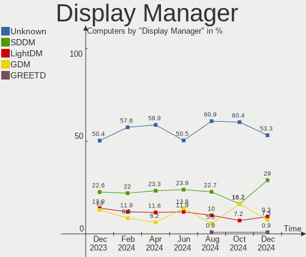
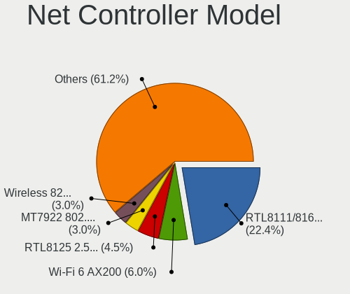

Manjaro - Hardware Trends
-------------------------

A project to identify most popular hardware characteristics and track their change
over time based on data collected by Linux users at https://Linux-Hardware.org.

Anyone can contribute to this report by the [hw-probe](https://github.com/linuxhw/hw-probe) tool:

    sudo -E hw-probe -all -upload

This is a report for all computer types. See also reports for [desktops](/Dist/Manjaro/Desktop/README.md) and [notebooks](/Dist/Manjaro/Notebook/README.md).

This report is for one last month. Overall report since the beginning of time: [TestDays](https://github.com/linuxhw/TestDays)

Period: Dec, 2024.

Contents
--------

* [ System ](#system)
  - [ OS                       ](#os)
  - [ OS Family                ](#os-family)
  - [ Kernel                   ](#kernel)
  - [ Kernel Family            ](#kernel-family)
  - [ Kernel Major Ver.        ](#kernel-major-ver)
  - [ Arch                     ](#arch)
  - [ DE                       ](#de)
  - [ Display Server           ](#display-server)
  - [ Display Manager          ](#display-manager)
  - [ OS Lang                  ](#os-lang)
  - [ Boot Mode                ](#boot-mode)
  - [ Filesystem               ](#filesystem)
  - [ Part. scheme             ](#part-scheme)
  - [ Dual Boot with Linux/BSD ](#dual-boot-with-linuxbsd)
  - [ Dual Boot (Win)          ](#dual-boot-win)

* [ Board ](#board)
  - [ Vendor                   ](#vendor)
  - [ Model                    ](#model)
  - [ Model Family             ](#model-family)
  - [ MFG Year                 ](#mfg-year)
  - [ Form Factor              ](#form-factor)
  - [ Secure Boot              ](#secure-boot)
  - [ Coreboot                 ](#coreboot)
  - [ RAM Size                 ](#ram-size)
  - [ RAM Used                 ](#ram-used)
  - [ Total Drives             ](#total-drives)
  - [ Has CD-ROM               ](#has-cd-rom)
  - [ Has Ethernet             ](#has-ethernet)
  - [ Has WiFi                 ](#has-wifi)
  - [ Has Bluetooth            ](#has-bluetooth)

* [ Location ](#location)
  - [ Country                  ](#country)
  - [ City                     ](#city)

* [ Drives ](#drives)
  - [ Drive Vendor             ](#drive-vendor)
  - [ Drive Model              ](#drive-model)
  - [ HDD Vendor               ](#hdd-vendor)
  - [ SSD Vendor               ](#ssd-vendor)
  - [ Drive Kind               ](#drive-kind)
  - [ Drive Connector          ](#drive-connector)
  - [ Drive Size               ](#drive-size)
  - [ Space Total              ](#space-total)
  - [ Space Used               ](#space-used)
  - [ Malfunc. Drives          ](#malfunc-drives)
  - [ Malfunc. Drive Vendor    ](#malfunc-drive-vendor)
  - [ Malfunc. HDD Vendor      ](#malfunc-hdd-vendor)
  - [ Malfunc. Drive Kind      ](#malfunc-drive-kind)
  - [ Failed Drives            ](#failed-drives)
  - [ Failed Drive Vendor      ](#failed-drive-vendor)
  - [ Drive Status             ](#drive-status)

* [ Storage controller ](#storage-controller)
  - [ Storage Vendor           ](#storage-vendor)
  - [ Storage Model            ](#storage-model)
  - [ Storage Kind             ](#storage-kind)

* [ Processor ](#processor)
  - [ CPU Vendor               ](#cpu-vendor)
  - [ CPU Model                ](#cpu-model)
  - [ CPU Model Family         ](#cpu-model-family)
  - [ CPU Cores                ](#cpu-cores)
  - [ CPU Sockets              ](#cpu-sockets)
  - [ CPU Threads              ](#cpu-threads)
  - [ CPU Op-Modes             ](#cpu-op-modes)
  - [ CPU Microcode            ](#cpu-microcode)
  - [ CPU Microarch            ](#cpu-microarch)

* [ Graphics ](#graphics)
  - [ GPU Vendor               ](#gpu-vendor)
  - [ GPU Model                ](#gpu-model)
  - [ GPU Combo                ](#gpu-combo)
  - [ GPU Driver               ](#gpu-driver)
  - [ GPU Memory               ](#gpu-memory)

* [ Monitor ](#monitor)
  - [ Monitor Vendor           ](#monitor-vendor)
  - [ Monitor Model            ](#monitor-model)
  - [ Monitor Resolution       ](#monitor-resolution)
  - [ Monitor Diagonal         ](#monitor-diagonal)
  - [ Monitor Width            ](#monitor-width)
  - [ Aspect Ratio             ](#aspect-ratio)
  - [ Monitor Area             ](#monitor-area)
  - [ Pixel Density            ](#pixel-density)
  - [ Multiple Monitors        ](#multiple-monitors)

* [ Network ](#network)
  - [ Net Controller Vendor    ](#net-controller-vendor)
  - [ Net Controller Model     ](#net-controller-model)
  - [ Wireless Vendor          ](#wireless-vendor)
  - [ Wireless Model           ](#wireless-model)
  - [ Ethernet Vendor          ](#ethernet-vendor)
  - [ Ethernet Model           ](#ethernet-model)
  - [ Net Controller Kind      ](#net-controller-kind)
  - [ Used Controller          ](#used-controller)
  - [ NICs                     ](#nics)
  - [ IPv6                     ](#ipv6)

* [ Bluetooth ](#bluetooth)
  - [ Bluetooth Vendor         ](#bluetooth-vendor)
  - [ Bluetooth Model          ](#bluetooth-model)

* [ Sound ](#sound)
  - [ Sound Vendor             ](#sound-vendor)
  - [ Sound Model              ](#sound-model)

* [ Memory ](#memory)
  - [ Memory Vendor            ](#memory-vendor)
  - [ Memory Model             ](#memory-model)
  - [ Memory Kind              ](#memory-kind)
  - [ Memory Form Factor       ](#memory-form-factor)
  - [ Memory Size              ](#memory-size)
  - [ Memory Speed             ](#memory-speed)

* [ Printers & scanners ](#printers--scanners)
  - [ Printer Vendor           ](#printer-vendor)
  - [ Printer Model            ](#printer-model)
  - [ Scanner Vendor           ](#scanner-vendor)
  - [ Scanner Model            ](#scanner-model)

* [ Camera ](#camera)
  - [ Camera Vendor            ](#camera-vendor)
  - [ Camera Model             ](#camera-model)

* [ Security ](#security)
  - [ Fingerprint Vendor       ](#fingerprint-vendor)
  - [ Fingerprint Model        ](#fingerprint-model)
  - [ Chipcard Vendor          ](#chipcard-vendor)
  - [ Chipcard Model           ](#chipcard-model)

* [ Unsupported ](#unsupported)
  - [ Unsupported Devices      ](#unsupported-devices)
  - [ Unsupported Device Types ](#unsupported-device-types)

System
------

OS
--

Installed operating systems

| Name            | Computers | Percent |
|-----------------|-----------|---------|
| Manjaro         | 53        | 49.53%  |
| Manjaro 24.2.1  | 24        | 22.43%  |
| Manjaro 24.2.0  | 23        | 21.5%   |
| Manjaro Rolling | 4         | 3.74%   |
| Manjaro 24.1.2  | 2         | 1.87%   |
| Manjaro 23.1.2  | 1         | 0.93%   |

OS Family
---------

OS without a version

| Name    | Computers | Percent |
|---------|-----------|---------|
| Manjaro | 107       | 100%    |

Kernel
------

Version of the Linux kernel

| Version                | Computers | Percent |
|------------------------|-----------|---------|
| 6.12.4-1-MANJARO       | 32        | 29.91%  |
| 6.11.10-2-MANJARO      | 23        | 21.5%   |
| 6.11.11-1-MANJARO      | 13        | 12.15%  |
| 6.12.1-4-MANJARO       | 12        | 11.21%  |
| 6.6.65-1-MANJARO       | 7         | 6.54%   |
| 6.6.63-1-MANJARO       | 6         | 5.61%   |
| 6.6.54-2-MANJARO       | 2         | 1.87%   |
| 6.10.13-3-MANJARO      | 2         | 1.87%   |
| 6.6.8-2-MANJARO        | 1         | 0.93%   |
| 6.13.0-rc4-1-MANJARO   | 1         | 0.93%   |
| 6.12.5-lqx1-1-lqx      | 1         | 0.93%   |
| 6.12.1-arch1-1.1-g14   | 1         | 0.93%   |
| 6.10.9-zen1-2-zen      | 1         | 0.93%   |
| 6.10.7-x64v2-xanmod1-1 | 1         | 0.93%   |
| 6.10.11-2-MANJARO      | 1         | 0.93%   |
| 5.15.55-1-MANJARO      | 1         | 0.93%   |
| 5.10.226-1-MANJARO     | 1         | 0.93%   |
| 5.10.102-1-MANJARO     | 1         | 0.93%   |

Kernel Family
-------------

Linux kernel without a distro release

| Version  | Computers | Percent |
|----------|-----------|---------|
| 6.12.4   | 32        | 29.91%  |
| 6.11.10  | 23        | 21.5%   |
| 6.12.1   | 13        | 12.15%  |
| 6.11.11  | 13        | 12.15%  |
| 6.6.65   | 7         | 6.54%   |
| 6.6.63   | 6         | 5.61%   |
| 6.6.54   | 2         | 1.87%   |
| 6.10.13  | 2         | 1.87%   |
| 6.6.8    | 1         | 0.93%   |
| 6.13.0   | 1         | 0.93%   |
| 6.12.5   | 1         | 0.93%   |
| 6.10.9   | 1         | 0.93%   |
| 6.10.7   | 1         | 0.93%   |
| 6.10.11  | 1         | 0.93%   |
| 5.15.55  | 1         | 0.93%   |
| 5.10.226 | 1         | 0.93%   |
| 5.10.102 | 1         | 0.93%   |

Kernel Major Ver.
-----------------

Linux kernel major version

| Version | Computers | Percent |
|---------|-----------|---------|
| 6.12    | 46        | 42.99%  |
| 6.11    | 36        | 33.64%  |
| 6.6     | 16        | 14.95%  |
| 6.10    | 5         | 4.67%   |
| 5.10    | 2         | 1.87%   |
| 6.13    | 1         | 0.93%   |
| 5.15    | 1         | 0.93%   |

Arch
----

OS architecture (x86_64, i586, etc.)

| Name   | Computers | Percent |
|--------|-----------|---------|
| x86_64 | 107       | 100%    |

DE
--

Desktop Environment

| Name       | Computers | Percent |
|------------|-----------|---------|
| KDE6       | 56        | 52.34%  |
| GNOME      | 17        | 15.89%  |
| XFCE       | 14        | 13.08%  |
| KDE5       | 13        | 12.15%  |
| X-Cinnamon | 2         | 1.87%   |
| Hyprland   | 2         | 1.87%   |
| sway       | 1         | 0.93%   |
| KDE        | 1         | 0.93%   |
| i3         | 1         | 0.93%   |

Display Server
--------------

X11 or Wayland

| Name    | Computers | Percent |
|---------|-----------|---------|
| X11     | 77        | 71.96%  |
| Wayland | 27        | 25.23%  |
| Unknown | 3         | 2.8%    |

Display Manager
---------------

SDDM, LightDM, etc.

| Name    | Computers | Percent |
|---------|-----------|---------|
| Unknown | 57        | 53.27%  |
| SDDM    | 31        | 28.97%  |
| LightDM | 10        | 9.35%   |
| GDM     | 8         | 7.48%   |
| GREETD  | 1         | 0.93%   |

OS Lang
-------

Language

| Lang  | Computers | Percent |
|-------|-----------|---------|
| en_US | 47        | 43.93%  |
| de_DE | 9         | 8.41%   |
| it_IT | 7         | 6.54%   |
| es_ES | 7         | 6.54%   |
| en_GB | 7         | 6.54%   |
| en_CA | 7         | 6.54%   |
| pl_PL | 5         | 4.67%   |
| ru_RU | 4         | 3.74%   |
| pt_BR | 3         | 2.8%    |
| sv_SE | 1         | 0.93%   |
| nl_BE | 1         | 0.93%   |
| ja_JP | 1         | 0.93%   |
| es_PY | 1         | 0.93%   |
| es_MX | 1         | 0.93%   |
| en_ZA | 1         | 0.93%   |
| en_IL | 1         | 0.93%   |
| en_HK | 1         | 0.93%   |
| en_AU | 1         | 0.93%   |
| de_CH | 1         | 0.93%   |
| cs_CZ | 1         | 0.93%   |

Boot Mode
---------

EFI or BIOS

| Mode | Computers | Percent |
|------|-----------|---------|
| BIOS | 70        | 65.42%  |
| EFI  | 37        | 34.58%  |

Filesystem
----------

Type of filesystem

| Type    | Computers | Percent |
|---------|-----------|---------|
| Ext4    | 77        | 71.96%  |
| Btrfs   | 16        | 14.95%  |
| Tmpfs   | 11        | 10.28%  |
| Xfs     | 1         | 0.93%   |
| Overlay | 1         | 0.93%   |
| F2fs    | 1         | 0.93%   |

Part. scheme
------------

Scheme of partitioning

| Type    | Computers | Percent |
|---------|-----------|---------|
| Unknown | 55        | 51.4%   |
| GPT     | 49        | 45.79%  |
| MBR     | 3         | 2.8%    |

Dual Boot with Linux/BSD
------------------------

Hosting more than one Linux/BSD

| Dual boot | Computers | Percent |
|-----------|-----------|---------|
| No        | 98        | 91.59%  |
| Yes       | 9         | 8.41%   |

Dual Boot (Win)
---------------

Hosting Linux and Windows

| Dual boot | Computers | Percent |
|-----------|-----------|---------|
| No        | 85        | 79.44%  |
| Yes       | 22        | 20.56%  |

Board
-----

Vendor
------

Motherboard manufacturer

| Name                                 | Computers | Percent |
|--------------------------------------|-----------|---------|
| Lenovo                               | 20        | 18.69%  |
| ASUSTek Computer                     | 15        | 14.02%  |
| MSI                                  | 11        | 10.28%  |
| Hewlett-Packard                      | 10        | 9.35%   |
| Gigabyte Technology                  | 10        | 9.35%   |
| Dell                                 | 9         | 8.41%   |
| HUAWEI                               | 3         | 2.8%    |
| ASRock                               | 3         | 2.8%    |
| Apple                                | 3         | 2.8%    |
| Acer                                 | 3         | 2.8%    |
| TongFang                             | 2         | 1.87%   |
| Samsung Electronics                  | 2         | 1.87%   |
| Intel                                | 2         | 1.87%   |
| Unknown                              | 2         | 1.87%   |
| Toshiba                              | 1         | 0.93%   |
| Timi                                 | 1         | 0.93%   |
| Tianbei                              | 1         | 0.93%   |
| Shenzhen Meigao Electronic Equipment | 1         | 0.93%   |
| Panasonic                            | 1         | 0.93%   |
| Notebook                             | 1         | 0.93%   |
| Medion                               | 1         | 0.93%   |
| Lunnen                               | 1         | 0.93%   |
| Google                               | 1         | 0.93%   |
| Fujitsu                              | 1         | 0.93%   |
| Eluktronics                          | 1         | 0.93%   |
| AMI                                  | 1         | 0.93%   |

Model
-----

Motherboard model

| Name                                                | Computers | Percent |
|-----------------------------------------------------|-----------|---------|
| TongFang GX5HRXL                                    | 2         | 1.87%   |
| MSI MS-7C56                                         | 2         | 1.87%   |
| Unknown                                             | 2         | 1.87%   |
| Toshiba Satellite L500                              | 1         | 0.93%   |
| Timi TM1701                                         | 1         | 0.93%   |
| Tianbei GEM10                                       | 1         | 0.93%   |
| Shenzhen Meigao Electronic Equipment Mercury series | 1         | 0.93%   |
| Samsung 800G5M/800G5W                               | 1         | 0.93%   |
| Samsung 300V3A/300V4A/300V5A/200A4B/200A5B          | 1         | 0.93%   |
| Panasonic CFLX6-2                                   | 1         | 0.93%   |
| Notebook NH5xAx                                     | 1         | 0.93%   |
| MSI Stealth 16 AI Studio A1VGG                      | 1         | 0.93%   |
| MSI MS-7E25                                         | 1         | 0.93%   |
| MSI MS-7D77                                         | 1         | 0.93%   |
| MSI MS-7D67                                         | 1         | 0.93%   |
| MSI MS-7C37                                         | 1         | 0.93%   |
| MSI MS-7A38                                         | 1         | 0.93%   |
| MSI MS-7253                                         | 1         | 0.93%   |
| MSI Katana GF76 12UC                                | 1         | 0.93%   |
| MSI GP75 Leopard 10SFK                              | 1         | 0.93%   |
| Medion E15410                                       | 1         | 0.93%   |
| Lunnen LL5FAW                                       | 1         | 0.93%   |
| Lenovo ThinkPad X270 20K5S1A524                     | 1         | 0.93%   |
| Lenovo ThinkPad X1 2-in-1 Gen 9 21KE000LUS          | 1         | 0.93%   |
| Lenovo ThinkPad T480 20L6S0RK00                     | 1         | 0.93%   |
| Lenovo ThinkPad T470 W10DG 20JNS08304               | 1         | 0.93%   |
| Lenovo ThinkPad T470 20HD000WUS                     | 1         | 0.93%   |
| Lenovo ThinkPad T400 6475WKP                        | 1         | 0.93%   |
| Lenovo ThinkPad E15 Gen 4 21ED004NGE                | 1         | 0.93%   |
| Lenovo ThinkCentre M79 10CTA00VLS                   | 1         | 0.93%   |
| Lenovo ThinkBook 14 G6 ABP 21KJ                     | 1         | 0.93%   |
| Lenovo ThinkBook 14 G5+ APO 21J1                    | 1         | 0.93%   |
| Lenovo Slim 7 14IMH9 83D8                           | 1         | 0.93%   |
| Lenovo Legion T7 34IAZ7 90S1000JUS                  | 1         | 0.93%   |
| Lenovo Legion Slim 5 16APH8 82Y9                    | 1         | 0.93%   |
| Lenovo Legion 5 Pro 16ARH7H 82RG                    | 1         | 0.93%   |
| Lenovo Legion 5 82B5                                | 1         | 0.93%   |
| Lenovo Legion 5 15IMH05H 81Y6                       | 1         | 0.93%   |
| Lenovo IdeaPadFlex 5 14ALC05 82HU                   | 1         | 0.93%   |
| Lenovo IdeaPad Y700-15ISK 80NV                      | 1         | 0.93%   |

Model Family
------------

Motherboard model prefix

| Name                                         | Computers | Percent |
|----------------------------------------------|-----------|---------|
| Lenovo ThinkPad                              | 7         | 6.54%   |
| Lenovo Legion                                | 5         | 4.67%   |
| ASUS ROG                                     | 4         | 3.74%   |
| Gigabyte B550                                | 3         | 2.8%    |
| Acer Aspire                                  | 3         | 2.8%    |
| TongFang GX5HRXL                             | 2         | 1.87%   |
| MSI MS-7C56                                  | 2         | 1.87%   |
| Lenovo ThinkBook                             | 2         | 1.87%   |
| Lenovo IdeaPad                               | 2         | 1.87%   |
| HP EliteBook                                 | 2         | 1.87%   |
| Dell XPS                                     | 2         | 1.87%   |
| Dell Precision                               | 2         | 1.87%   |
| Dell Latitude                                | 2         | 1.87%   |
| ASUS Zenbook                                 | 2         | 1.87%   |
| ASUS ProArt                                  | 2         | 1.87%   |
| ASUS PRIME                                   | 2         | 1.87%   |
| Unknown                                      | 2         | 1.87%   |
| Toshiba Satellite                            | 1         | 0.93%   |
| Timi TM1701                                  | 1         | 0.93%   |
| Tianbei GEM10                                | 1         | 0.93%   |
| Shenzhen Meigao Electronic Equipment Mercury | 1         | 0.93%   |
| Samsung 800G5M                               | 1         | 0.93%   |
| Samsung 300V3A                               | 1         | 0.93%   |
| Panasonic CFLX6-2                            | 1         | 0.93%   |
| Notebook NH5xAx                              | 1         | 0.93%   |
| MSI Stealth                                  | 1         | 0.93%   |
| MSI MS-7E25                                  | 1         | 0.93%   |
| MSI MS-7D77                                  | 1         | 0.93%   |
| MSI MS-7D67                                  | 1         | 0.93%   |
| MSI MS-7C37                                  | 1         | 0.93%   |
| MSI MS-7A38                                  | 1         | 0.93%   |
| MSI MS-7253                                  | 1         | 0.93%   |
| MSI Katana                                   | 1         | 0.93%   |
| MSI GP75                                     | 1         | 0.93%   |
| Medion E15410                                | 1         | 0.93%   |
| Lunnen LL5FAW                                | 1         | 0.93%   |
| Lenovo ThinkCentre                           | 1         | 0.93%   |
| Lenovo Slim                                  | 1         | 0.93%   |
| Lenovo IdeaPadFlex                           | 1         | 0.93%   |
| Lenovo G500                                  | 1         | 0.93%   |

MFG Year
--------

Motherboard manufacture year

| Year | Computers | Percent |
|------|-----------|---------|
| 2024 | 17        | 15.89%  |
| 2020 | 15        | 14.02%  |
| 2023 | 12        | 11.21%  |
| 2022 | 10        | 9.35%   |
| 2018 | 10        | 9.35%   |
| 2019 | 8         | 7.48%   |
| 2017 | 7         | 6.54%   |
| 2014 | 5         | 4.67%   |
| 2021 | 4         | 3.74%   |
| 2015 | 3         | 2.8%    |
| 2011 | 3         | 2.8%    |
| 2010 | 3         | 2.8%    |
| 2009 | 3         | 2.8%    |
| 2013 | 2         | 1.87%   |
| 2007 | 2         | 1.87%   |
| 2016 | 1         | 0.93%   |
| 2012 | 1         | 0.93%   |
| 2008 | 1         | 0.93%   |

Form Factor
-----------

Physical design of the computer

| Name        | Computers | Percent |
|-------------|-----------|---------|
| Notebook    | 64        | 59.81%  |
| Desktop     | 41        | 38.32%  |
| Convertible | 2         | 1.87%   |

Secure Boot
-----------

Enabled or disabled

| State    | Computers | Percent |
|----------|-----------|---------|
| Disabled | 107       | 100%    |

Coreboot
--------

Have coreboot on board

| Used | Computers | Percent |
|------|-----------|---------|
| No   | 106       | 99.07%  |
| Yes  | 1         | 0.93%   |

RAM Size
--------

Total RAM memory

| Size in GB  | Computers | Percent |
|-------------|-----------|---------|
| 32.01-64.0  | 32        | 29.91%  |
| 16.01-24.0  | 20        | 18.69%  |
| 8.01-16.0   | 19        | 17.76%  |
| 4.01-8.0    | 13        | 12.15%  |
| 64.01-256.0 | 12        | 11.21%  |
| 24.01-32.0  | 6         | 5.61%   |
| 3.01-4.0    | 3         | 2.8%    |
| 1.01-2.0    | 2         | 1.87%   |

RAM Used
--------

Used RAM memory

| Used GB    | Computers | Percent |
|------------|-----------|---------|
| 4.01-8.0   | 38        | 35.51%  |
| 3.01-4.0   | 18        | 16.82%  |
| 2.01-3.0   | 17        | 15.89%  |
| 1.01-2.0   | 16        | 14.95%  |
| 8.01-16.0  | 13        | 12.15%  |
| 16.01-24.0 | 2         | 1.87%   |
| 0.51-1.0   | 2         | 1.87%   |
| 32.01-64.0 | 1         | 0.93%   |

Total Drives
------------

Number of drives on board

| Drives | Computers | Percent |
|--------|-----------|---------|
| 1      | 62        | 57.94%  |
| 2      | 21        | 19.63%  |
| 3      | 10        | 9.35%   |
| 5      | 8         | 7.48%   |
| 4      | 4         | 3.74%   |
| 8      | 1         | 0.93%   |
| 6      | 1         | 0.93%   |

Has CD-ROM
----------

Has CD-ROM on board

| Presented | Computers | Percent |
|-----------|-----------|---------|
| No        | 81        | 75.7%   |
| Yes       | 26        | 24.3%   |

Has Ethernet
------------

Has Ethernet on board

| Presented | Computers | Percent |
|-----------|-----------|---------|
| Yes       | 93        | 86.92%  |
| No        | 14        | 13.08%  |

Has WiFi
--------

Has WiFi module

| Presented | Computers | Percent |
|-----------|-----------|---------|
| Yes       | 82        | 76.64%  |
| No        | 25        | 23.36%  |

Has Bluetooth
-------------

Has Bluetooth module

| Presented | Computers | Percent |
|-----------|-----------|---------|
| Yes       | 87        | 81.31%  |
| No        | 20        | 18.69%  |

Location
--------

Country
-------

Geographic location (country)

| Country      | Computers | Percent |
|--------------|-----------|---------|
| USA          | 22        | 20.56%  |
| Germany      | 13        | 12.15%  |
| Spain        | 8         | 7.48%   |
| Italy        | 7         | 6.54%   |
| Canada       | 7         | 6.54%   |
| Russia       | 6         | 5.61%   |
| Poland       | 5         | 4.67%   |
| Brazil       | 5         | 4.67%   |
| UK           | 4         | 3.74%   |
| France       | 4         | 3.74%   |
| Bulgaria     | 3         | 2.8%    |
| Mexico       | 2         | 1.87%   |
| Japan        | 2         | 1.87%   |
| Israel       | 2         | 1.87%   |
| Czechia      | 2         | 1.87%   |
| Belgium      | 2         | 1.87%   |
| Switzerland  | 1         | 0.93%   |
| Sweden       | 1         | 0.93%   |
| South Africa | 1         | 0.93%   |
| Serbia       | 1         | 0.93%   |
| Paraguay     | 1         | 0.93%   |
| Netherlands  | 1         | 0.93%   |
| Lithuania    | 1         | 0.93%   |
| Kazakhstan   | 1         | 0.93%   |
| Iran         | 1         | 0.93%   |
| Hong Kong    | 1         | 0.93%   |
| Greece       | 1         | 0.93%   |
| Belarus      | 1         | 0.93%   |
| Australia    | 1         | 0.93%   |

City
----

Geographic location (city)

| City                  | Computers | Percent |
|-----------------------|-----------|---------|
| Sofia                 | 3         | 2.8%    |
| Warsaw                | 2         | 1.87%   |
| Turin                 | 2         | 1.87%   |
| Tel Aviv              | 2         | 1.87%   |
| Leipzig               | 2         | 1.87%   |
| Barcelona             | 2         | 1.87%   |
| Zlín                 | 1         | 0.93%   |
| Zaragoza              | 1         | 0.93%   |
| Würzburg             | 1         | 0.93%   |
| Wilmington            | 1         | 0.93%   |
| Waterdown             | 1         | 0.93%   |
| Washington            | 1         | 0.93%   |
| Vitoria-Gasteiz       | 1         | 0.93%   |
| Vitória da Conquista | 1         | 0.93%   |
| Vincennes             | 1         | 0.93%   |
| Vilnius               | 1         | 0.93%   |
| Vignola               | 1         | 0.93%   |
| Twin City             | 1         | 0.93%   |
| Tver                  | 1         | 0.93%   |
| Tsepeli               | 1         | 0.93%   |
| Toronto               | 1         | 0.93%   |
| Talavera de la Reina  | 1         | 0.93%   |
| Stanchfield           | 1         | 0.93%   |
| St. Petersburg        | 1         | 0.93%   |
| Shiraz                | 1         | 0.93%   |
| Sesto Fiorentino      | 1         | 0.93%   |
| Seattle               | 1         | 0.93%   |
| Sapporo               | 1         | 0.93%   |
| San Luis Potosí City | 1         | 0.93%   |
| San Antonio           | 1         | 0.93%   |
| Rostov-on-Don         | 1         | 0.93%   |
| Rognes                | 1         | 0.93%   |
| Richmond              | 1         | 0.93%   |
| Reda                  | 1         | 0.93%   |
| Raleigh               | 1         | 0.93%   |
| Prescot               | 1         | 0.93%   |
| Potsdam               | 1         | 0.93%   |
| Peterborough          | 1         | 0.93%   |
| Pars-les-Romilly      | 1         | 0.93%   |
| Paris                 | 1         | 0.93%   |

Drives
------

Drive Vendor
------------

Hard drive vendors

| Vendor                       | Computers | Drives | Percent |
|------------------------------|-----------|--------|---------|
| Samsung Electronics          | 29        | 34     | 16.2%   |
| WDC                          | 19        | 28     | 10.61%  |
| Seagate                      | 16        | 21     | 8.94%   |
| Sandisk                      | 16        | 16     | 8.94%   |
| Kingston                     | 11        | 11     | 6.15%   |
| Toshiba                      | 9         | 11     | 5.03%   |
| Unknown                      | 6         | 6      | 3.35%   |
| Phison Electronics           | 6         | 7      | 3.35%   |
| MAXIO Technology (Hangzhou)  | 6         | 6      | 3.35%   |
| Micron Technology            | 5         | 5      | 2.79%   |
| Intel                        | 5         | 6      | 2.79%   |
| Hitachi                      | 5         | 5      | 2.79%   |
| Crucial                      | 5         | 5      | 2.79%   |
| SK hynix                     | 4         | 7      | 2.23%   |
| Shenzhen Longsys Electronics | 4         | 4      | 2.23%   |
| Kingston Technology Company  | 3         | 3      | 1.68%   |
| Union Memory (Shenzhen)      | 2         | 2      | 1.12%   |
| Realtek Semiconductor        | 2         | 2      | 1.12%   |
| Micron/Crucial Technology    | 2         | 2      | 1.12%   |
| GOODRAM                      | 2         | 2      | 1.12%   |
| China                        | 2         | 2      | 1.12%   |
| Union Memory                 | 1         | 1      | 0.56%   |
| Teclast                      | 1         | 1      | 0.56%   |
| Team                         | 1         | 2      | 0.56%   |
| Smartbuy                     | 1         | 1      | 0.56%   |
| Silicon Motion               | 1         | 1      | 0.56%   |
| SCY                          | 1         | 1      | 0.56%   |
| Realtek                      | 1         | 1      | 0.56%   |
| Patriot                      | 1         | 1      | 0.56%   |
| Neo                          | 1         | 1      | 0.56%   |
| LITEONIT                     | 1         | 1      | 0.56%   |
| Lexar                        | 1         | 1      | 0.56%   |
| KIOXIA                       | 1         | 1      | 0.56%   |
| KingSpec                     | 1         | 1      | 0.56%   |
| HGST                         | 1         | 1      | 0.56%   |
| Hewlett-Packard              | 1         | 1      | 0.56%   |
| Fanxiang                     | 1         | 1      | 0.56%   |
| Biwin Storage Technology     | 1         | 1      | 0.56%   |
| ACASIS                       | 1         | 1      | 0.56%   |
| A-DATA Technology            | 1         | 1      | 0.56%   |

Drive Model
-----------

Hard drive models

| Model                                                | Computers | Percent |
|------------------------------------------------------|-----------|---------|
| Samsung NVMe SSD Controller PM9A1/PM9A3/980PRO 512GB | 6         | 3.05%   |
| Samsung NVMe SSD Controller SM981/PM981/PM983 512GB  | 5         | 2.54%   |
| Seagate ST1000LM035-1RK172 1TB                       | 4         | 2.03%   |
| Samsung NVMe SSD Controller SM961/PM961/SM963 256GB  | 3         | 1.52%   |
| Phison PS5013 E13 NVMe Controller 512GB              | 3         | 1.52%   |
| Kingston SA400S37120G 120GB SSD                      | 3         | 1.52%   |
| WDC WDS500G2B0A-00SM50 500GB SSD                     | 2         | 1.02%   |
| WDC WDS100T2B0A-00SM50 1TB SSD                       | 2         | 1.02%   |
| Unknown MMC Card  128GB                              | 2         | 1.02%   |
| Toshiba DT01ACA100 1TB                               | 2         | 1.02%   |
| Seagate ST4000DM004-2CV104 4TB                       | 2         | 1.02%   |
| Sandisk WD_BLACK SN850X 4000GB                       | 2         | 1.02%   |
| Sandisk WD Blue SN570 1TB                            | 2         | 1.02%   |
| Samsung SSD 980 1TB                                  | 2         | 1.02%   |
| Realtek ADATA SX6000LNP 512GB                        | 2         | 1.02%   |
| Phison E12 NVMe Controller 480GB                     | 2         | 1.02%   |
| MAXIO (Hangzhou) NVMe SSD Controller MAP1202 512GB   | 2         | 1.02%   |
| Kingston Company SNV2S2000G 2TB                      | 2         | 1.02%   |
| Kingston SA400S37480G 480GB SSD                      | 2         | 1.02%   |
| Intel SSD Pro 7600p/760p/E 6100p Series 512GB        | 2         | 1.02%   |
| WDC WDS480G2G0A-00JH30 480GB SSD                     | 1         | 0.51%   |
| WDC WDS200T2B0A-00SM50 2TB SSD                       | 1         | 0.51%   |
| WDC WDS120G2G0A-00JH30 120GB SSD                     | 1         | 0.51%   |
| WDC WD7500BPVT-60HXZT3 752GB                         | 1         | 0.51%   |
| WDC WD7500AADS-00M2B0 752GB                          | 1         | 0.51%   |
| WDC WD6401AALS-00L3B2 640GB                          | 1         | 0.51%   |
| WDC WD6400AAVS-00G9B1 640GB                          | 1         | 0.51%   |
| WDC WD60EZRZ-00GZ5B1 6TB                             | 1         | 0.51%   |
| WDC WD60EDAZ-11U78B0 6TB                             | 1         | 0.51%   |
| WDC WD5000LPCX-75VHAT0 500GB                         | 1         | 0.51%   |
| WDC WD5000AAKX-00U6AA0 500GB                         | 1         | 0.51%   |
| WDC WD40EFAX-68JH4N1 4TB                             | 1         | 0.51%   |
| WDC WD4003FRYZ-01F0DB0 4TB                           | 1         | 0.51%   |
| WDC WD30EZRZ-00GXCB0 3TB                             | 1         | 0.51%   |
| WDC WD2500JS-00NCB1 250GB                            | 1         | 0.51%   |
| WDC WD2003FYPS-27W9B0 2TB                            | 1         | 0.51%   |
| WDC WD20 NPVX-00EA4T0 2TB                            | 1         | 0.51%   |
| WDC WD10SPCX-24HWST1 1TB                             | 1         | 0.51%   |
| WDC WD10EZEX-75ZF5A0 1TB                             | 1         | 0.51%   |
| WDC WD10EZEX-00RKKA0 1TB                             | 1         | 0.51%   |

HDD Vendor
----------

Hard disk drive vendors

| Vendor              | Computers | Drives | Percent |
|---------------------|-----------|--------|---------|
| Seagate             | 16        | 21     | 35.56%  |
| WDC                 | 15        | 20     | 33.33%  |
| Toshiba             | 5         | 6      | 11.11%  |
| Hitachi             | 5         | 5      | 11.11%  |
| Unknown             | 1         | 1      | 2.22%   |
| Samsung Electronics | 1         | 2      | 2.22%   |
| HGST                | 1         | 1      | 2.22%   |
| Hewlett-Packard     | 1         | 1      | 2.22%   |

SSD Vendor
----------

Solid state drive vendors

| Vendor              | Computers | Drives | Percent |
|---------------------|-----------|--------|---------|
| Samsung Electronics | 8         | 9      | 19.05%  |
| Kingston            | 6         | 6      | 14.29%  |
| Crucial             | 5         | 5      | 11.9%   |
| WDC                 | 4         | 8      | 9.52%   |
| Toshiba             | 3         | 3      | 7.14%   |
| SanDisk             | 2         | 2      | 4.76%   |
| GOODRAM             | 2         | 2      | 4.76%   |
| China               | 2         | 2      | 4.76%   |
| Teclast             | 1         | 1      | 2.38%   |
| Team                | 1         | 2      | 2.38%   |
| Smartbuy            | 1         | 1      | 2.38%   |
| SK hynix            | 1         | 1      | 2.38%   |
| Patriot             | 1         | 1      | 2.38%   |
| Neo                 | 1         | 1      | 2.38%   |
| LITEONIT            | 1         | 1      | 2.38%   |
| Lexar               | 1         | 1      | 2.38%   |
| KingSpec            | 1         | 1      | 2.38%   |
| A-DATA Technology   | 1         | 1      | 2.38%   |

Drive Kind
----------

HDD or SSD

| Kind    | Computers | Drives | Percent |
|---------|-----------|--------|---------|
| NVMe    | 78        | 95     | 50.32%  |
| HDD     | 36        | 57     | 23.23%  |
| SSD     | 35        | 48     | 22.58%  |
| MMC     | 5         | 5      | 3.23%   |
| Unknown | 1         | 1      | 0.65%   |

Drive Connector
---------------

SATA, SAS, NVMe, etc.

| Type | Computers | Drives | Percent |
|------|-----------|--------|---------|
| NVMe | 78        | 94     | 54.93%  |
| SATA | 53        | 101    | 37.32%  |
| SAS  | 6         | 6      | 4.23%   |
| MMC  | 5         | 5      | 3.52%   |

Drive Size
----------

Size of hard drive

| Size in TB | Computers | Drives | Percent |
|------------|-----------|--------|---------|
| 0.01-0.5   | 37        | 45     | 46.84%  |
| 0.51-1.0   | 21        | 35     | 26.58%  |
| 3.01-4.0   | 9         | 10     | 11.39%  |
| 1.01-2.0   | 8         | 10     | 10.13%  |
| 4.01-10.0  | 2         | 3      | 2.53%   |
| 2.01-3.0   | 1         | 1      | 1.27%   |
| 10.01-20.0 | 1         | 1      | 1.27%   |

Space Total
-----------

Amount of disk space available on the file system

| Size in GB     | Computers | Percent |
|----------------|-----------|---------|
| 101-250        | 25        | 23.36%  |
| 1001-2000      | 21        | 19.63%  |
| 501-1000       | 17        | 15.89%  |
| More than 3000 | 15        | 14.02%  |
| 251-500        | 13        | 12.15%  |
| Unknown        | 6         | 5.61%   |
| 1-20           | 5         | 4.67%   |
| 2001-3000      | 3         | 2.8%    |
| 21-50          | 1         | 0.93%   |
| 51-100         | 1         | 0.93%   |

Space Used
----------

Amount of used disk space

| Used GB        | Computers | Percent |
|----------------|-----------|---------|
| 1-20           | 18        | 16.82%  |
| 21-50          | 17        | 15.89%  |
| 101-250        | 16        | 14.95%  |
| 51-100         | 12        | 11.21%  |
| 251-500        | 10        | 9.35%   |
| 1001-2000      | 10        | 9.35%   |
| 501-1000       | 10        | 9.35%   |
| Unknown        | 6         | 5.61%   |
| More than 3000 | 5         | 4.67%   |
| 2001-3000      | 3         | 2.8%    |

Malfunc. Drives
---------------

Drive models with a malfunction

| Model                                              | Computers | Drives | Percent |
|----------------------------------------------------|-----------|--------|---------|
| Toshiba DT01ACA100 1TB                             | 1         | 1      | 20%     |
| Shenzhen Longsys Electronics Lexar SSD NM620 512GB | 1         | 1      | 20%     |
| Seagate ST500LT012-9WS142 500GB                    | 1         | 1      | 20%     |
| Seagate ST1000LM035-1RK172 1TB                     | 1         | 1      | 20%     |
| Hitachi HDS5C4040ALE630 4TB                        | 1         | 1      | 20%     |

Malfunc. Drive Vendor
---------------------

Vendors of faulty drives

| Vendor                       | Computers | Drives | Percent |
|------------------------------|-----------|--------|---------|
| Seagate                      | 2         | 2      | 40%     |
| Toshiba                      | 1         | 1      | 20%     |
| Shenzhen Longsys Electronics | 1         | 1      | 20%     |
| Hitachi                      | 1         | 1      | 20%     |

Malfunc. HDD Vendor
-------------------

Vendors of faulty HDD drives

| Vendor  | Computers | Drives | Percent |
|---------|-----------|--------|---------|
| Seagate | 2         | 2      | 50%     |
| Toshiba | 1         | 1      | 25%     |
| Hitachi | 1         | 1      | 25%     |

Malfunc. Drive Kind
-------------------

Kinds of faulty drives

| Kind | Computers | Drives | Percent |
|------|-----------|--------|---------|
| HDD  | 3         | 4      | 75%     |
| NVMe | 1         | 1      | 25%     |

Failed Drives
-------------

Failed drive models

Zero info for selected period =(

Failed Drive Vendor
-------------------

Failed drive vendors

Zero info for selected period =(

Drive Status
------------

Number of failed and malfunc. drives

| Status   | Computers | Drives | Percent |
|----------|-----------|--------|---------|
| Detected | 81        | 156    | 70.43%  |
| Works    | 30        | 45     | 26.09%  |
| Malfunc  | 4         | 5      | 3.48%   |

Storage controller
------------------

Storage Vendor
--------------

Storage controller vendors

| Vendor                                  | Computers | Percent |
|-----------------------------------------|-----------|---------|
| Intel                                   | 47        | 29.01%  |
| AMD                                     | 25        | 15.43%  |
| Samsung Electronics                     | 20        | 12.35%  |
| SanDisk                                 | 14        | 8.64%   |
| Kingston Technology Company             | 8         | 4.94%   |
| Phison Electronics                      | 6         | 3.7%    |
| MAXIO Technology (Hangzhou)             | 6         | 3.7%    |
| Shenzhen Longsys Electronics            | 5         | 3.09%   |
| Micron Technology                       | 5         | 3.09%   |
| ASMedia Technology                      | 4         | 2.47%   |
| SK hynix                                | 3         | 1.85%   |
| Union Memory (Shenzhen)                 | 2         | 1.23%   |
| Toshiba America Info Systems            | 2         | 1.23%   |
| Realtek Semiconductor                   | 2         | 1.23%   |
| Micron/Crucial Technology               | 2         | 1.23%   |
| JMicron Technology                      | 2         | 1.23%   |
| VIA Technologies                        | 1         | 0.62%   |
| Solidigm                                | 1         | 0.62%   |
| Silicon Motion                          | 1         | 0.62%   |
| Shenzhen Unionmemory Information System | 1         | 0.62%   |
| Shenzhen Shichuangyi Electronics        | 1         | 0.62%   |
| KIOXIA                                  | 1         | 0.62%   |
| INNOGRIT                                | 1         | 0.62%   |
| Broadcom / LSI                          | 1         | 0.62%   |
| Biwin Storage Technology                | 1         | 0.62%   |

Storage Model
-------------

Storage controller models

| Model                                                                         | Computers | Percent |
|-------------------------------------------------------------------------------|-----------|---------|
| AMD FCH SATA Controller [AHCI mode]                                           | 14        | 7.87%   |
| AMD 500 Series Chipset SATA Controller                                        | 8         | 4.49%   |
| Samsung NVMe SSD Controller PM9A1/PM9A3/980PRO                                | 6         | 3.37%   |
| Samsung NVMe SSD Controller SM981/PM981/PM983                                 | 5         | 2.81%   |
| Intel 5 Series/3400 Series Chipset 6 port SATA AHCI Controller                | 5         | 2.81%   |
| SanDisk WD Black SN770 / PC SN740 256GB / PC SN560 (DRAM-less) NVMe SSD       | 4         | 2.25%   |
| MAXIO (Hangzhou) NVMe SSD Controller MAP1602 (DRAM-less)                      | 4         | 2.25%   |
| Intel Cannon Lake Mobile PCH SATA AHCI Controller                             | 4         | 2.25%   |
| ASMedia ASM1061/ASM1062 Serial ATA Controller                                 | 4         | 2.25%   |
| AMD 400 Series Chipset SATA Controller                                        | 4         | 2.25%   |
| Shenzhen Longsys Lexar NM790 NVME SSD (DRAM-less)                             | 3         | 1.69%   |
| Samsung NVMe SSD Controller SM961/PM961/SM963                                 | 3         | 1.69%   |
| Samsung NVMe SSD Controller S4LV008[Pascal]                                   | 3         | 1.69%   |
| Samsung NVMe SSD Controller 980 (DRAM-less)                                   | 3         | 1.69%   |
| Phison PS5013-E13 PCIe3 NVMe Controller (DRAM-less)                           | 3         | 1.69%   |
| Micron 2400 NVMe SSD (DRAM-less)                                              | 3         | 1.69%   |
| Intel Raptor Lake SATA AHCI Controller                                        | 3         | 1.69%   |
| Intel Q170/Q150/B150/H170/H110/Z170/CM236 Chipset SATA Controller [AHCI Mode] | 3         | 1.69%   |
| AMD 600 Series Chipset SATA Controller                                        | 3         | 1.69%   |
| SK hynix BC901 NVMe Solid State Drive (DRAM-less)                             | 2         | 1.12%   |
| Sandisk WD Black SN850X NVMe SSD                                              | 2         | 1.12%   |
| SanDisk Ultra 3D / WD Blue SN570 NVMe SSD (DRAM-less)                         | 2         | 1.12%   |
| Realtek RTS5763DL NVMe SSD Controller (DRAM-less)                             | 2         | 1.12%   |
| Phison E12 NVMe Controller                                                    | 2         | 1.12%   |
| Micron/Crucial P5 Plus NVMe PCIe SSD                                          | 2         | 1.12%   |
| Micron 3400 NVMe SSD [Hendrix]                                                | 2         | 1.12%   |
| MAXIO (Hangzhou) NVMe SSD Controller MAP1202 (DRAM-less)                      | 2         | 1.12%   |
| Kingston Company NV2 NVMe SSD [SM2267XT] (DRAM-less)                          | 2         | 1.12%   |
| Kingston Company KC3000/FURY Renegade NVMe SSD [E18]                          | 2         | 1.12%   |
| JMicron JMB363 SATA/IDE Controller                                            | 2         | 1.12%   |
| Intel SSD DC P4101/Pro 7600p/760p/E 6100p Series                              | 2         | 1.12%   |
| Intel HM170/QM170 Chipset SATA Controller [AHCI Mode]                         | 2         | 1.12%   |
| Intel Cannon Lake PCH SATA AHCI Controller                                    | 2         | 1.12%   |
| Intel 82801 Mobile SATA Controller [RAID mode]                                | 2         | 1.12%   |
| Intel 7 Series Chipset Family 6-port SATA Controller [AHCI mode]              | 2         | 1.12%   |
| Intel 400 Series Chipset Family SATA AHCI Controller                          | 2         | 1.12%   |
| Intel 200 Series PCH SATA controller [AHCI mode]                              | 2         | 1.12%   |
| VIA VT82C586A/B/VT82C686/A/B/VT823x/A/C PIPC Bus Master IDE                   | 1         | 0.56%   |
| VIA VT8237A SATA 2-Port Controller                                            | 1         | 0.56%   |
| Union Memory (Shenzhen) AM630 PCIe 4.0 x4 NVMe SSD Controller                 | 1         | 0.56%   |

Storage Kind
------------

Kind of storage controller (IDE, SATA, NVMe, SAS, ...)

| Kind | Computers | Percent |
|------|-----------|---------|
| NVMe | 77        | 50.66%  |
| SATA | 64        | 42.11%  |
| RAID | 5         | 3.29%   |
| IDE  | 5         | 3.29%   |
| SAS  | 1         | 0.66%   |

Processor
---------

CPU Vendor
----------

Processor vendors

| Vendor | Computers | Percent |
|--------|-----------|---------|
| Intel  | 63        | 58.88%  |
| AMD    | 44        | 41.12%  |

CPU Model
---------

Processor models

| Model                                       | Computers | Percent |
|---------------------------------------------|-----------|---------|
| Intel Core Ultra 7 155H                     | 3         | 2.8%    |
| Intel Core i5 CPU 650 @ 3.20GHz             | 3         | 2.8%    |
| AMD Ryzen 7 5800X 8-Core Processor          | 3         | 2.8%    |
| AMD Ryzen 5 3600 6-Core Processor           | 3         | 2.8%    |
| Intel Core i7-8750H CPU @ 2.20GHz           | 2         | 1.87%   |
| Intel Core i5-8250U CPU @ 1.60GHz           | 2         | 1.87%   |
| Intel Core i5-7200U CPU @ 2.50GHz           | 2         | 1.87%   |
| Intel Core i5-10210U CPU @ 1.60GHz          | 2         | 1.87%   |
| AMD Ryzen 7 8845HS w/ Radeon 780M Graphics  | 2         | 1.87%   |
| AMD Ryzen 7 5700U with Radeon Graphics      | 2         | 1.87%   |
| AMD Ryzen 5 5500                            | 2         | 1.87%   |
| AMD Ryzen 5 4600H with Radeon Graphics      | 2         | 1.87%   |
| Intel Xeon CPU E5-2690 v4 @ 2.60GHz         | 1         | 0.93%   |
| Intel Xeon CPU E5-1620 v4 @ 3.50GHz         | 1         | 0.93%   |
| Intel Xeon CPU E3-1535M v6 @ 3.10GHz        | 1         | 0.93%   |
| Intel Pentium Dual-Core CPU T4200 @ 2.00GHz | 1         | 0.93%   |
| Intel Pentium CPU N3700 @ 1.60GHz           | 1         | 0.93%   |
| Intel Pentium CPU N3530 @ 2.16GHz           | 1         | 0.93%   |
| Intel N95                                   | 1         | 0.93%   |
| Intel Core Ultra 9 185H                     | 1         | 0.93%   |
| Intel Core Ultra 7 256V                     | 1         | 0.93%   |
| Intel Core Ultra 5 125U                     | 1         | 0.93%   |
| Intel Core i9-9940X CPU @ 3.30GHz           | 1         | 0.93%   |
| Intel Core i9-14900K                        | 1         | 0.93%   |
| Intel Core i9-10920X CPU @ 3.50GHz          | 1         | 0.93%   |
| Intel Core i7-9750H CPU @ 2.60GHz           | 1         | 0.93%   |
| Intel Core i7-9700F CPU @ 3.00GHz           | 1         | 0.93%   |
| Intel Core i7-8700 CPU @ 3.20GHz            | 1         | 0.93%   |
| Intel Core i7-7700T CPU @ 2.90GHz           | 1         | 0.93%   |
| Intel Core i7-7700HQ CPU @ 2.80GHz          | 1         | 0.93%   |
| Intel Core i7-6700HQ CPU @ 2.60GHz          | 1         | 0.93%   |
| Intel Core i7-4790S CPU @ 3.20GHz           | 1         | 0.93%   |
| Intel Core i7-3615QM CPU @ 2.30GHz          | 1         | 0.93%   |
| Intel Core i7-2640M CPU @ 2.80GHz           | 1         | 0.93%   |
| Intel Core i7-10750H CPU @ 2.60GHz          | 1         | 0.93%   |
| Intel Core i7 CPU Q 720 @ 1.60GHz           | 1         | 0.93%   |
| Intel Core i7 CPU 860 @ 2.80GHz             | 1         | 0.93%   |
| Intel Core i5-9400H CPU @ 2.50GHz           | 1         | 0.93%   |
| Intel Core i5-8265U CPU @ 1.60GHz           | 1         | 0.93%   |
| Intel Core i5-7300U CPU @ 2.60GHz           | 1         | 0.93%   |

CPU Model Family
----------------

Processor model prefix

| Model                   | Computers | Percent |
|-------------------------|-----------|---------|
| Intel Core i5           | 21        | 19.63%  |
| AMD Ryzen 7             | 18        | 16.82%  |
| AMD Ryzen 5             | 15        | 14.02%  |
| Intel Core i7           | 14        | 13.08%  |
| Other                   | 9         | 8.41%   |
| Intel Core              | 6         | 5.61%   |
| AMD Ryzen 9             | 4         | 3.74%   |
| Intel Xeon              | 3         | 2.8%    |
| Intel Core i9           | 3         | 2.8%    |
| Intel Core i3           | 3         | 2.8%    |
| Intel Pentium           | 2         | 1.87%   |
| AMD Ryzen 5 PRO         | 2         | 1.87%   |
| AMD Ryzen 3             | 2         | 1.87%   |
| Intel Pentium Dual-Core | 1         | 0.93%   |
| Intel Core 2 Duo        | 1         | 0.93%   |
| Intel Celeron           | 1         | 0.93%   |
| AMD Sempron             | 1         | 0.93%   |
| AMD Athlon X4           | 1         | 0.93%   |

CPU Cores
---------

Number of processor cores

| Number | Computers | Percent |
|--------|-----------|---------|
| 4      | 31        | 28.97%  |
| 6      | 21        | 19.63%  |
| 8      | 20        | 18.69%  |
| 2      | 16        | 14.95%  |
| 16     | 7         | 6.54%   |
| 12     | 5         | 4.67%   |
| 24     | 2         | 1.87%   |
| 14     | 2         | 1.87%   |
| 28     | 1         | 0.93%   |
| 10     | 1         | 0.93%   |
| 1      | 1         | 0.93%   |

CPU Sockets
-----------

Number of sockets

| Number | Computers | Percent |
|--------|-----------|---------|
| 1      | 106       | 99.07%  |
| 2      | 1         | 0.93%   |

CPU Threads
-----------

Threads per core (Hyper-Threading)

| Number | Computers | Percent |
|--------|-----------|---------|
| 2      | 91        | 85.05%  |
| 1      | 16        | 14.95%  |

CPU Op-Modes
------------

CPU Operation Modes (32-bit, 64-bit)

| Op mode        | Computers | Percent |
|----------------|-----------|---------|
| 32-bit, 64-bit | 107       | 100%    |

CPU Microcode
-------------

Microcode number

| Number     | Computers | Percent |
|------------|-----------|---------|
| Unknown    | 104       | 97.2%   |
| 0x0a500011 | 1         | 0.93%   |
| 0x0a201025 | 1         | 0.93%   |
| 0x08600106 | 1         | 0.93%   |

CPU Microarch
-------------

Microarchitecture

| Name              | Computers | Percent |
|-------------------|-----------|---------|
| Unknown           | 26        | 24.3%   |
| KabyLake          | 18        | 16.82%  |
| Zen 3             | 11        | 10.28%  |
| Zen 2             | 8         | 7.48%   |
| Skylake           | 5         | 4.67%   |
| Westmere          | 4         | 3.74%   |
| Zen+              | 3         | 2.8%    |
| Zen               | 3         | 2.8%    |
| Nehalem           | 3         | 2.8%    |
| Broadwell         | 3         | 2.8%    |
| Alderlake Hybrid  | 3         | 2.8%    |
| Silvermont        | 2         | 1.87%   |
| SandyBridge       | 2         | 1.87%   |
| Penryn            | 2         | 1.87%   |
| IvyBridge         | 2         | 1.87%   |
| IceLake           | 2         | 1.87%   |
| Haswell           | 2         | 1.87%   |
| CometLake         | 2         | 1.87%   |
| Tremont           | 1         | 0.93%   |
| TigerLake         | 1         | 0.93%   |
| Steamroller       | 1         | 0.93%   |
| Meteorlake Hybrid | 1         | 0.93%   |
| Lunarlake Hybrid  | 1         | 0.93%   |
| K8 Hammer         | 1         | 0.93%   |

Graphics
--------

GPU Vendor
----------

Vendors of graphics cards

| Vendor           | Computers | Percent |
|------------------|-----------|---------|
| Intel            | 50        | 37.04%  |
| Nvidia           | 44        | 32.59%  |
| AMD              | 40        | 29.63%  |
| VIA Technologies | 1         | 0.74%   |

GPU Model
---------

Graphics card models

| Model                                                                     | Computers | Percent |
|---------------------------------------------------------------------------|-----------|---------|
| Intel Meteor Lake-P [Intel Arc Graphics]                                  | 4         | 2.86%   |
| Intel CoffeeLake-H GT2 [UHD Graphics 630]                                 | 4         | 2.86%   |
| AMD Rembrandt [Radeon 680M]                                               | 4         | 2.86%   |
| Nvidia AD106M [GeForce RTX 4070 Max-Q / Mobile]                           | 3         | 2.14%   |
| Intel HD Graphics 630                                                     | 3         | 2.14%   |
| Intel HD Graphics 620                                                     | 3         | 2.14%   |
| Intel Core Processor Integrated Graphics Controller                       | 3         | 2.14%   |
| AMD Renoir [Radeon Vega Series / Radeon Vega Mobile Series]               | 3         | 2.14%   |
| AMD Raven Ridge [Radeon Vega Series / Radeon Vega Mobile Series]          | 3         | 2.14%   |
| AMD Phoenix3                                                              | 3         | 2.14%   |
| AMD Phoenix1                                                              | 3         | 2.14%   |
| AMD Navi 33 [Radeon RX 7600/7600 XT/7600M XT/7600S/7700S / PRO W7600]     | 3         | 2.14%   |
| AMD Navi 32 [Radeon RX 7700 XT / 7800 XT]                                 | 3         | 2.14%   |
| AMD Lucienne                                                              | 3         | 2.14%   |
| AMD Barcelo                                                               | 3         | 2.14%   |
| Nvidia GP108M [GeForce MX150]                                             | 2         | 1.43%   |
| Nvidia GP107 [GeForce GTX 1050 Ti]                                        | 2         | 1.43%   |
| Intel UHD Graphics 620                                                    | 2         | 1.43%   |
| Intel Mobile 4 Series Chipset Integrated Graphics Controller              | 2         | 1.43%   |
| Intel HD Graphics 530                                                     | 2         | 1.43%   |
| Intel CometLake-U GT2 [UHD Graphics]                                      | 2         | 1.43%   |
| Intel CometLake-H GT2 [UHD Graphics]                                      | 2         | 1.43%   |
| Intel Alder Lake-P GT2 [Iris Xe Graphics]                                 | 2         | 1.43%   |
| Intel 3rd Gen Core processor Graphics Controller                          | 2         | 1.43%   |
| Intel 2nd Generation Core Processor Family Integrated Graphics Controller | 2         | 1.43%   |
| AMD Raphael                                                               | 2         | 1.43%   |
| AMD Picasso/Raven 2 [Radeon Vega Series / Radeon Vega Mobile Series]      | 2         | 1.43%   |
| AMD Bonaire XTX [Radeon R7 260X/360]                                      | 2         | 1.43%   |
| VIA Technologies K8M890CE/K8N890CE [Chrome 9]                             | 1         | 0.71%   |
| Nvidia TU117M [GeForce GTX 1650 Ti Mobile]                                | 1         | 0.71%   |
| Nvidia TU117GLM [Quadro T500 Mobile]                                      | 1         | 0.71%   |
| Nvidia TU116M [GeForce GTX 1660 Ti Mobile]                                | 1         | 0.71%   |
| Nvidia TU106M [GeForce RTX 2070 Mobile]                                   | 1         | 0.71%   |
| Nvidia TU106M [GeForce RTX 2070 Mobile / Max-Q Refresh]                   | 1         | 0.71%   |
| Nvidia TU106M [GeForce RTX 2060 Mobile]                                   | 1         | 0.71%   |
| Nvidia TU106 [GeForce RTX 2070]                                           | 1         | 0.71%   |
| Nvidia TU106 [GeForce RTX 2060 Rev. A]                                    | 1         | 0.71%   |
| Nvidia GP108M [GeForce MX330]                                             | 1         | 0.71%   |
| Nvidia GP107M [GeForce GTX 1050 Ti Mobile]                                | 1         | 0.71%   |
| Nvidia GP107M [GeForce GTX 1050 Mobile]                                   | 1         | 0.71%   |

GPU Combo
---------

Combinations of graphics cards

| Name           | Computers | Percent |
|----------------|-----------|---------|
| 1 x Intel      | 29        | 27.1%   |
| 1 x AMD        | 28        | 26.17%  |
| 1 x Nvidia     | 19        | 17.76%  |
| Intel + Nvidia | 19        | 17.76%  |
| AMD + Nvidia   | 6         | 5.61%   |
| 2 x AMD        | 4         | 3.74%   |
| 1 x VIA        | 1         | 0.93%   |
| Intel + AMD    | 1         | 0.93%   |

GPU Driver
----------

Free vs proprietary

| Driver      | Computers | Percent |
|-------------|-----------|---------|
| Free        | 69        | 64.49%  |
| Proprietary | 29        | 27.1%   |
| Unknown     | 9         | 8.41%   |

GPU Memory
----------

Total video memory

| Size in GB | Computers | Percent |
|------------|-----------|---------|
| Unknown    | 79        | 73.83%  |
| 8.01-16.0  | 6         | 5.61%   |
| 0.01-0.5   | 6         | 5.61%   |
| 1.01-2.0   | 5         | 4.67%   |
| 7.01-8.0   | 3         | 2.8%    |
| 5.01-6.0   | 2         | 1.87%   |
| 3.01-4.0   | 2         | 1.87%   |
| 16.01-24.0 | 2         | 1.87%   |
| 0.51-1.0   | 2         | 1.87%   |

Monitor
-------

Monitor Vendor
--------------

Monitor vendors

| Vendor                  | Computers | Percent |
|-------------------------|-----------|---------|
| BOE                     | 18        | 13.74%  |
| Samsung Electronics     | 17        | 12.98%  |
| Chimei Innolux          | 9         | 6.87%   |
| AU Optronics            | 8         | 6.11%   |
| Philips                 | 7         | 5.34%   |
| Goldstar                | 7         | 5.34%   |
| MSI                     | 5         | 3.82%   |
| LG Display              | 5         | 3.82%   |
| Dell                    | 5         | 3.82%   |
| Acer                    | 5         | 3.82%   |
| AOC                     | 4         | 3.05%   |
| ViewSonic               | 3         | 2.29%   |
| Unknown                 | 3         | 2.29%   |
| Lenovo                  | 3         | 2.29%   |
| Hewlett-Packard         | 3         | 2.29%   |
| Apple                   | 3         | 2.29%   |
| Unknown                 | 3         | 2.29%   |
| Sharp                   | 2         | 1.53%   |
| Medion                  | 2         | 1.53%   |
| Iiyama                  | 2         | 1.53%   |
| ASUSTek Computer        | 2         | 1.53%   |
| Ancor Communications    | 2         | 1.53%   |
| ___                     | 1         | 0.76%   |
| ZTR                     | 1         | 0.76%   |
| Wacom                   | 1         | 0.76%   |
| VXN                     | 1         | 0.76%   |
| Vizio                   | 1         | 0.76%   |
| SWH                     | 1         | 0.76%   |
| PANDA                   | 1         | 0.76%   |
| InfoVision              | 1         | 0.76%   |
| Idek Iiyama             | 1         | 0.76%   |
| Fujitsu Siemens         | 1         | 0.76%   |
| DENON                   | 1         | 0.76%   |
| CSO                     | 1         | 0.76%   |
| Chi Mei Optoelectronics | 1         | 0.76%   |

Monitor Model
-------------

Monitor models

| Model                                                                  | Computers | Percent |
|------------------------------------------------------------------------|-----------|---------|
| Unknown                                                                | 3         | 2.22%   |
| Goldstar ULTRAWIDE GSM7768 3440x1440 800x334mm 34.1-inch               | 2         | 1.48%   |
| BOE LCD Monitor BOE0C85 2560x1600 329x206mm 15.3-inch                  | 2         | 1.48%   |
| ___ LCDTV16 ___3393 1920x1080                                          | 1         | 0.74%   |
| ZTR LCD Monitor ZTR0001 1920x1080 344x194mm 15.5-inch                  | 1         | 0.74%   |
| Wacom Cintiq 13HD WAC1040 1920x1080 293x165mm 13.2-inch                | 1         | 0.74%   |
| VXN VisN236HUZ15 VXN1421                                               | 1         | 0.74%   |
| Vizio VHD32M-0807 VIZ0007 1920x1080 698x392mm 31.5-inch                | 1         | 0.74%   |
| ViewSonic VX3276-QHD VSCE635 2560x1440 698x393mm 31.5-inch             | 1         | 0.74%   |
| ViewSonic VX2452 Series VSCDE2E 1920x1080 521x293mm 23.5-inch          | 1         | 0.74%   |
| ViewSonic VA2256 Series VSC3136 1920x1080 476x268mm 21.5-inch          | 1         | 0.74%   |
| Unknown LCDTV16 3393 1920x1080 1600x900mm 72.3-inch                    | 1         | 0.74%   |
| Unknown LCD Monitor NCP 1920x1080                                      | 1         | 0.74%   |
| Unknown LCD Monitor FFFF 2288x1287 2550x2550mm 142.0-inch              | 1         | 0.74%   |
| SWH SWITCH SWH1001 1920x1080 480x270mm 21.7-inch                       | 1         | 0.74%   |
| Sharp LCD Monitor SHP148D 3840x2160 344x194mm 15.5-inch                | 1         | 0.74%   |
| Sharp LCD Monitor SHP143A 3840x2160 346x194mm 15.6-inch                | 1         | 0.74%   |
| Samsung Electronics SMFX2490HD SAM074A 1920x1080 531x299mm 24.0-inch   | 1         | 0.74%   |
| Samsung Electronics S24F350 SAM0D20 1920x1080 521x293mm 23.5-inch      | 1         | 0.74%   |
| Samsung Electronics LCD Monitor SEC5441 1280x800 286x179mm 13.3-inch   | 1         | 0.74%   |
| Samsung Electronics LCD Monitor SEC3848 1920x1200 367x230mm 17.1-inch  | 1         | 0.74%   |
| Samsung Electronics LCD Monitor SEC324A 1366x768 344x194mm 15.5-inch   | 1         | 0.74%   |
| Samsung Electronics LCD Monitor SDC419D 2880x1800 302x189mm 14.0-inch  | 1         | 0.74%   |
| Samsung Electronics LCD Monitor SDC4187 1920x1200 302x189mm 14.0-inch  | 1         | 0.74%   |
| Samsung Electronics LCD Monitor SDC4180 2880x1620 344x194mm 15.5-inch  | 1         | 0.74%   |
| Samsung Electronics LCD Monitor SDC4178 3200x2000 344x215mm 16.0-inch  | 1         | 0.74%   |
| Samsung Electronics LCD Monitor SDC415D 3840x2400 344x215mm 16.0-inch  | 1         | 0.74%   |
| Samsung Electronics LCD Monitor SDC4154 2880x1800 302x189mm 14.0-inch  | 1         | 0.74%   |
| Samsung Electronics LCD Monitor SAM71B4 3840x2160 1110x620mm 50.1-inch | 1         | 0.74%   |
| Samsung Electronics LCD Monitor SAM0E4C 1366x768 522x293mm 23.6-inch   | 1         | 0.74%   |
| Samsung Electronics LCD Monitor SAM0B60 1920x1080 887x500mm 40.1-inch  | 1         | 0.74%   |
| Samsung Electronics LCD Monitor SAM0900 1366x768 700x390mm 31.5-inch   | 1         | 0.74%   |
| Samsung Electronics LCD Monitor SAM0659 1920x1080                      | 1         | 0.74%   |
| Samsung Electronics LCD Monitor SAM03BC 1920x1080                      | 1         | 0.74%   |
| Samsung Electronics C32R50x SAM7000 1920x1080 698x393mm 31.5-inch      | 1         | 0.74%   |
| Philips PHL 329P1 PHL0959 3840x2160 697x392mm 31.5-inch                | 1         | 0.74%   |
| Philips PHL 273V7 PHLC156 1920x1080 598x336mm 27.0-inch                | 1         | 0.74%   |
| Philips PHL 243V7 PHLC155 1920x1080 527x296mm 23.8-inch                | 1         | 0.74%   |
| Philips PHL 242V8 PHLC219 1920x1080 527x296mm 23.8-inch                | 1         | 0.74%   |
| Philips PHL 221V8 PHLC211 1920x1080 477x268mm 21.5-inch                | 1         | 0.74%   |

Monitor Resolution
------------------

Monitor screen resolution

| Resolution         | Computers | Percent |
|--------------------|-----------|---------|
| 1920x1080 (FHD)    | 54        | 43.9%   |
| 2560x1440 (QHD)    | 11        | 8.94%   |
| 3840x2160 (4K)     | 9         | 7.32%   |
| 1366x768 (WXGA)    | 8         | 6.5%    |
| 1920x1200 (WUXGA)  | 7         | 5.69%   |
| 2560x1600          | 6         | 4.88%   |
| 2880x1800          | 5         | 4.07%   |
| 1280x1024 (SXGA)   | 3         | 2.44%   |
| Unknown            | 3         | 2.44%   |
| 3440x1440          | 2         | 1.63%   |
| 1680x1050 (WSXGA+) | 2         | 1.63%   |
| 1440x900 (WXGA+)   | 2         | 1.63%   |
| 6400x2160          | 1         | 0.81%   |
| 4480x1440          | 1         | 0.81%   |
| 3840x2400          | 1         | 0.81%   |
| 3200x2000          | 1         | 0.81%   |
| 2880x1620          | 1         | 0.81%   |
| 2560x1080          | 1         | 0.81%   |
| 2288x1287          | 1         | 0.81%   |
| 2160x1440          | 1         | 0.81%   |
| 1600x900 (HD+)     | 1         | 0.81%   |
| 1360x768           | 1         | 0.81%   |
| 1280x800 (WXGA)    | 1         | 0.81%   |

Monitor Diagonal
----------------

Diagonal size in inches

| Inches  | Computers | Percent |
|---------|-----------|---------|
| 15      | 30        | 23.26%  |
| 24      | 12        | 9.3%    |
| 27      | 10        | 7.75%   |
| 13      | 10        | 7.75%   |
| Unknown | 10        | 7.75%   |
| 14      | 9         | 6.98%   |
| 31      | 8         | 6.2%    |
| 23      | 7         | 5.43%   |
| 16      | 7         | 5.43%   |
| 21      | 4         | 3.1%    |
| 17      | 4         | 3.1%    |
| 34      | 3         | 2.33%   |
| 22      | 2         | 1.55%   |
| 19      | 2         | 1.55%   |
| 142     | 1         | 0.78%   |
| 84      | 1         | 0.78%   |
| 72      | 1         | 0.78%   |
| 65      | 1         | 0.78%   |
| 64      | 1         | 0.78%   |
| 47      | 1         | 0.78%   |
| 32      | 1         | 0.78%   |
| 29      | 1         | 0.78%   |
| 25      | 1         | 0.78%   |
| 18      | 1         | 0.78%   |
| 12      | 1         | 0.78%   |

Monitor Width
-------------

Physical width

| Width in mm    | Computers | Percent |
|----------------|-----------|---------|
| 301-350        | 48        | 38.1%   |
| 501-600        | 25        | 19.84%  |
| 601-700        | 11        | 8.73%   |
| Unknown        | 10        | 7.94%   |
| 351-400        | 8         | 6.35%   |
| 401-500        | 7         | 5.56%   |
| 201-300        | 7         | 5.56%   |
| 701-800        | 4         | 3.17%   |
| 1001-1500      | 3         | 2.38%   |
| 1501-2000      | 2         | 1.59%   |
| More than 2000 | 1         | 0.79%   |

Aspect Ratio
------------

Proportional relationship between the width and the height

| Ratio   | Computers | Percent |
|---------|-----------|---------|
| 16/9    | 68        | 62.96%  |
| 16/10   | 26        | 24.07%  |
| Unknown | 7         | 6.48%   |
| 21/9    | 3         | 2.78%   |
| 5/4     | 2         | 1.85%   |
| 3/2     | 1         | 0.93%   |
| 1.00    | 1         | 0.93%   |

Monitor Area
------------

Area in inch²

| Area in inch² | Computers | Percent |
|----------------|-----------|---------|
| 101-110        | 31        | 24.22%  |
| 201-250        | 17        | 13.28%  |
| 81-90          | 14        | 10.94%  |
| 351-500        | 13        | 10.16%  |
| 301-350        | 10        | 7.81%   |
| Unknown        | 10        | 7.81%   |
| 251-300        | 8         | 6.25%   |
| 111-120        | 6         | 4.69%   |
| More than 1000 | 5         | 3.91%   |
| 71-80          | 5         | 3.91%   |
| 121-130        | 3         | 2.34%   |
| 151-200        | 2         | 1.56%   |
| 61-70          | 1         | 0.78%   |
| 141-150        | 1         | 0.78%   |
| 131-140        | 1         | 0.78%   |
| 501-1000       | 1         | 0.78%   |

Pixel Density
-------------

Pixels per inch

| Density       | Computers | Percent |
|---------------|-----------|---------|
| 121-160       | 34        | 27.64%  |
| 51-100        | 31        | 25.2%   |
| 101-120       | 19        | 15.45%  |
| 161-240       | 17        | 13.82%  |
| Unknown       | 10        | 8.13%   |
| More than 240 | 6         | 4.88%   |
| 1-50          | 6         | 4.88%   |

Multiple Monitors
-----------------

Total monitors connected

| Total | Computers | Percent |
|-------|-----------|---------|
| 1     | 76        | 71.03%  |
| 2     | 22        | 20.56%  |
| 3     | 6         | 5.61%   |
| 0     | 3         | 2.8%    |

Network
-------

Net Controller Vendor
---------------------

Controller vendors

| Vendor                                 | Computers | Percent |
|----------------------------------------|-----------|---------|
| Realtek Semiconductor                  | 65        | 39.63%  |
| Intel                                  | 55        | 33.54%  |
| MediaTek                               | 14        | 8.54%   |
| Qualcomm Atheros                       | 7         | 4.27%   |
| Broadcom                               | 3         | 1.83%   |
| Aquantia                               | 3         | 1.83%   |
| Suzhou Motorcomm Electronic Technology | 2         | 1.22%   |
| Mellanox Technologies                  | 2         | 1.22%   |
| Xiaomi                                 | 1         | 0.61%   |
| VIA Technologies                       | 1         | 0.61%   |
| TP-Link                                | 1         | 0.61%   |
| Sierra Wireless                        | 1         | 0.61%   |
| Samsung Electronics                    | 1         | 0.61%   |
| Qualcomm Technologies                  | 1         | 0.61%   |
| Qualcomm Atheros Communications        | 1         | 0.61%   |
| Lenovo                                 | 1         | 0.61%   |
| Huawei Technologies                    | 1         | 0.61%   |
| Google                                 | 1         | 0.61%   |
| Fibocom                                | 1         | 0.61%   |
| DisplayLink                            | 1         | 0.61%   |
| Broadcom Limited                       | 1         | 0.61%   |

Net Controller Model
--------------------

Controller models

| Model                                                                  | Computers | Percent |
|------------------------------------------------------------------------|-----------|---------|
| Realtek RTL8111/8168/8211/8411 PCI Express Gigabit Ethernet Controller | 45        | 22.39%  |
| Intel Wi-Fi 6 AX200                                                    | 12        | 5.97%   |
| Realtek RTL8125 2.5GbE Controller                                      | 9         | 4.48%   |
| MediaTek MT7922 802.11ax PCI Express Wireless Network Adapter          | 6         | 2.99%   |
| Intel Wireless 8265 / 8275                                             | 6         | 2.99%   |
| Intel Wi-Fi 6E(802.11ax) AX210/AX1675* 2x2 [Typhoon Peak]              | 6         | 2.99%   |
| Realtek RTL8153 Gigabit Ethernet Adapter                               | 5         | 2.49%   |
| Realtek 802.11ac NIC                                                   | 4         | 1.99%   |
| MediaTek Network controller                                            | 3         | 1.49%   |
| MediaTek MT7921 802.11ax PCI Express Wireless Network Adapter          | 3         | 1.49%   |
| Intel Meteor Lake PCH CNVi WiFi                                        | 3         | 1.49%   |
| Intel I211 Gigabit Network Connection                                  | 3         | 1.49%   |
| Suzhou Motorcomm Electronic YT6801 Gigabit Ethernet Controller         | 2         | 1%      |
| Realtek RTL8852BE PCIe 802.11ax Wireless Network Controller            | 2         | 1%      |
| Realtek RTL8822BE 802.11a/b/g/n/ac WiFi adapter                        | 2         | 1%      |
| Realtek RTL8821CE 802.11ac PCIe Wireless Network Adapter               | 2         | 1%      |
| Realtek RTL810xE PCI Express Fast Ethernet controller                  | 2         | 1%      |
| Qualcomm Atheros QCA9377 802.11ac Wireless Network Adapter             | 2         | 1%      |
| Qualcomm Atheros QCA6174 802.11ac Wireless Network Adapter             | 2         | 1%      |
| Intel Wireless 8260                                                    | 2         | 1%      |
| Intel Wi-Fi 7(802.11be) AX1775*/AX1790*/BE20*/BE401/BE1750* 2x2        | 2         | 1%      |
| Intel Ethernet Controller I226-V                                       | 2         | 1%      |
| Intel Ethernet Controller I225-V                                       | 2         | 1%      |
| Intel Ethernet Connection (4) I219-V                                   | 2         | 1%      |
| Intel Ethernet Connection (2) I219-LM                                  | 2         | 1%      |
| Intel Ethernet Connection (2) I218-LM                                  | 2         | 1%      |
| Intel Comet Lake PCH-LP CNVi WiFi                                      | 2         | 1%      |
| Intel Comet Lake PCH CNVi WiFi                                         | 2         | 1%      |
| Intel Centrino Ultimate-N 6300                                         | 2         | 1%      |
| Intel Alder Lake-P PCH CNVi WiFi                                       | 2         | 1%      |
| Intel 82578DM Gigabit Network Connection                               | 2         | 1%      |
| Xiaomi Mi/Redmi series (RNDIS + ADB)                                   | 1         | 0.5%    |
| VIA VT6102/VT6103 [Rhine-II]                                           | 1         | 0.5%    |
| TP-Link TL-WN823N v2/v3 [Realtek RTL8192EU]                            | 1         | 0.5%    |
| Sierra Wireless EM7305 Modem                                           | 1         | 0.5%    |
| Samsung GT-I9070 (network tethering, USB debugging enabled)            | 1         | 0.5%    |
| Realtek RTL88x2bu [AC1200 Techkey]                                     | 1         | 0.5%    |
| Realtek RTL8852AE 802.11ax PCIe Wireless Network Adapter               | 1         | 0.5%    |
| Realtek RTL8822CE 802.11ac PCIe Wireless Network Adapter               | 1         | 0.5%    |
| Realtek RTL8821AE 802.11ac PCIe Wireless Network Adapter               | 1         | 0.5%    |

Wireless Vendor
---------------

Wireless vendors

| Vendor                          | Computers | Percent |
|---------------------------------|-----------|---------|
| Intel                           | 47        | 52.81%  |
| Realtek Semiconductor           | 18        | 20.22%  |
| MediaTek                        | 9         | 10.11%  |
| Qualcomm Atheros                | 7         | 7.87%   |
| Broadcom                        | 2         | 2.25%   |
| TP-Link                         | 1         | 1.12%   |
| Sierra Wireless                 | 1         | 1.12%   |
| Qualcomm Technologies           | 1         | 1.12%   |
| Qualcomm Atheros Communications | 1         | 1.12%   |
| Fibocom                         | 1         | 1.12%   |
| Broadcom Limited                | 1         | 1.12%   |

Wireless Model
--------------

Wireless models

| Model                                                            | Computers | Percent |
|------------------------------------------------------------------|-----------|---------|
| Intel Wi-Fi 6 AX200                                              | 12        | 13.48%  |
| Intel Wireless 8265 / 8275                                       | 6         | 6.74%   |
| Intel Wi-Fi 6E(802.11ax) AX210/AX1675* 2x2 [Typhoon Peak]        | 6         | 6.74%   |
| Realtek 802.11ac NIC                                             | 4         | 4.49%   |
| MediaTek MT7922 802.11ax PCI Express Wireless Network Adapter    | 3         | 3.37%   |
| MediaTek MT7921 802.11ax PCI Express Wireless Network Adapter    | 3         | 3.37%   |
| Intel Meteor Lake PCH CNVi WiFi                                  | 3         | 3.37%   |
| Realtek RTL8852BE PCIe 802.11ax Wireless Network Controller      | 2         | 2.25%   |
| Realtek RTL8822BE 802.11a/b/g/n/ac WiFi adapter                  | 2         | 2.25%   |
| Realtek RTL8821CE 802.11ac PCIe Wireless Network Adapter         | 2         | 2.25%   |
| Qualcomm Atheros QCA9377 802.11ac Wireless Network Adapter       | 2         | 2.25%   |
| Qualcomm Atheros QCA6174 802.11ac Wireless Network Adapter       | 2         | 2.25%   |
| Intel Wireless 8260                                              | 2         | 2.25%   |
| Intel Wi-Fi 7(802.11be) AX1775*/AX1790*/BE20*/BE401/BE1750* 2x2  | 2         | 2.25%   |
| Intel Comet Lake PCH-LP CNVi WiFi                                | 2         | 2.25%   |
| Intel Comet Lake PCH CNVi WiFi                                   | 2         | 2.25%   |
| Intel Centrino Ultimate-N 6300                                   | 2         | 2.25%   |
| Intel Alder Lake-P PCH CNVi WiFi                                 | 2         | 2.25%   |
| TP-Link TL-WN823N v2/v3 [Realtek RTL8192EU]                      | 1         | 1.12%   |
| Sierra Wireless EM7305 Modem                                     | 1         | 1.12%   |
| Realtek RTL88x2bu [AC1200 Techkey]                               | 1         | 1.12%   |
| Realtek RTL8852AE 802.11ax PCIe Wireless Network Adapter         | 1         | 1.12%   |
| Realtek RTL8822CE 802.11ac PCIe Wireless Network Adapter         | 1         | 1.12%   |
| Realtek RTL8821AE 802.11ac PCIe Wireless Network Adapter         | 1         | 1.12%   |
| Realtek RTL8811AU 802.11a/b/g/n/ac WLAN Adapter                  | 1         | 1.12%   |
| Realtek RTL8192E/RTL8192SE Wireless LAN Controller               | 1         | 1.12%   |
| Realtek RTL8188FTV 802.11b/g/n 1T1R 2.4G WLAN Adapter            | 1         | 1.12%   |
| Realtek Realtek WLAN controller                                  | 1         | 1.12%   |
| Qualcomm WCN785x Wi-Fi 7(802.11be) 320MHz 2x2 [FastConnect 7800] | 1         | 1.12%   |
| Qualcomm Atheros QCA9565 / AR9565 Wireless Network Adapter       | 1         | 1.12%   |
| Qualcomm Atheros AR9271 802.11n                                  | 1         | 1.12%   |
| Qualcomm Atheros AR9485 Wireless Network Adapter                 | 1         | 1.12%   |
| Qualcomm Atheros AR9285 Wireless Network Adapter (PCI-Express)   | 1         | 1.12%   |
| MediaTek Wi-Fi 6E MT7902 Wireless Network Adapter                | 1         | 1.12%   |
| MediaTek Network controller                                      | 1         | 1.12%   |
| MediaTek MT7612U 802.11a/b/g/n/ac Wireless Adapter               | 1         | 1.12%   |
| Intel Wireless 7265                                              | 1         | 1.12%   |
| Intel Wireless 7260                                              | 1         | 1.12%   |
| Intel Wi-Fi 6 AX201                                              | 1         | 1.12%   |
| Intel Ultimate N WiFi Link 5300                                  | 1         | 1.12%   |

Ethernet Vendor
---------------

Ethernet vendors

| Vendor                                 | Computers | Percent |
|----------------------------------------|-----------|---------|
| Realtek Semiconductor                  | 61        | 58.65%  |
| Intel                                  | 25        | 24.04%  |
| MediaTek                               | 3         | 2.88%   |
| Aquantia                               | 3         | 2.88%   |
| Suzhou Motorcomm Electronic Technology | 2         | 1.92%   |
| Mellanox Technologies                  | 2         | 1.92%   |
| Broadcom                               | 2         | 1.92%   |
| Xiaomi                                 | 1         | 0.96%   |
| VIA Technologies                       | 1         | 0.96%   |
| Qualcomm Atheros                       | 1         | 0.96%   |
| Lenovo                                 | 1         | 0.96%   |
| Google                                 | 1         | 0.96%   |
| DisplayLink                            | 1         | 0.96%   |

Ethernet Model
--------------

Ethernet models

| Model                                                                           | Computers | Percent |
|---------------------------------------------------------------------------------|-----------|---------|
| Realtek RTL8111/8168/8211/8411 PCI Express Gigabit Ethernet Controller          | 45        | 41.67%  |
| Realtek RTL8125 2.5GbE Controller                                               | 9         | 8.33%   |
| Realtek RTL8153 Gigabit Ethernet Adapter                                        | 5         | 4.63%   |
| MediaTek MT7922 802.11ax PCI Express Wireless Network Adapter                   | 3         | 2.78%   |
| Intel I211 Gigabit Network Connection                                           | 3         | 2.78%   |
| Suzhou Motorcomm Electronic YT6801 Gigabit Ethernet Controller                  | 2         | 1.85%   |
| Realtek RTL810xE PCI Express Fast Ethernet controller                           | 2         | 1.85%   |
| Intel Ethernet Controller I226-V                                                | 2         | 1.85%   |
| Intel Ethernet Controller I225-V                                                | 2         | 1.85%   |
| Intel Ethernet Connection (4) I219-V                                            | 2         | 1.85%   |
| Intel Ethernet Connection (2) I219-LM                                           | 2         | 1.85%   |
| Intel Ethernet Connection (2) I218-LM                                           | 2         | 1.85%   |
| Intel 82578DM Gigabit Network Connection                                        | 2         | 1.85%   |
| Xiaomi Mi/Redmi series (RNDIS + ADB)                                            | 1         | 0.93%   |
| VIA VT6102/VT6103 [Rhine-II]                                                    | 1         | 0.93%   |
| Realtek RTL8152 Fast Ethernet Adapter                                           | 1         | 0.93%   |
| Realtek RT8126 PCIe Ethernet Controller                                         | 1         | 0.93%   |
| Realtek Killer E3000 2.5GbE Controller                                          | 1         | 0.93%   |
| Qualcomm Atheros QCA8172 Fast Ethernet                                          | 1         | 0.93%   |
| Mellanox MT27520 Family [ConnectX-3 Pro]                                        | 1         | 0.93%   |
| Mellanox MT27500 Family [ConnectX-3]                                            | 1         | 0.93%   |
| Lenovo USB-C Dock Ethernet                                                      | 1         | 0.93%   |
| Intel Wi-Fi 6E AX231 160MHz                                                     | 1         | 0.93%   |
| Intel I210 Gigabit Network Connection                                           | 1         | 0.93%   |
| Intel Ethernet Connection I219-V                                                | 1         | 0.93%   |
| Intel Ethernet Connection I218-LM                                               | 1         | 0.93%   |
| Intel Ethernet Connection (7) I219-LM                                           | 1         | 0.93%   |
| Intel Ethernet Connection (4) I219-LM                                           | 1         | 0.93%   |
| Intel Ethernet Connection (2) I219-V                                            | 1         | 0.93%   |
| Intel Ethernet Connection (13) I219-V                                           | 1         | 0.93%   |
| Intel 82579LM Gigabit Network Connection (Lewisville)                           | 1         | 0.93%   |
| Intel 82577LM Gigabit Network Connection                                        | 1         | 0.93%   |
| Intel 82567LM Gigabit Network Connection                                        | 1         | 0.93%   |
| Google Pixel 6a                                                                 | 1         | 0.93%   |
| DisplayLink ThinkPad USB 3.0 Ultra Dock                                         | 1         | 0.93%   |
| Broadcom NetXtreme II BCM57810 10 Gigabit Ethernet                              | 1         | 0.93%   |
| Broadcom NetXtreme BCM57765 Gigabit Ethernet PCIe                               | 1         | 0.93%   |
| Aquantia AQtion AQC113CS NBase-T/IEEE 802.3an Ethernet Controller [Antigua 10G] | 1         | 0.93%   |
| Aquantia AQtion AQC107S NBase-T/IEEE 802.3an Ethernet Controller [Atlantic 10G] | 1         | 0.93%   |
| Aquantia AQtion AQC107 NBase-T/IEEE 802.3an Ethernet Controller [Atlantic 10G]  | 1         | 0.93%   |

Net Controller Kind
-------------------

Ethernet, WiFi or modem

| Kind     | Computers | Percent |
|----------|-----------|---------|
| Ethernet | 93        | 51.96%  |
| WiFi     | 82        | 45.81%  |
| Modem    | 2         | 1.12%   |
| Unknown  | 2         | 1.12%   |

Used Controller
---------------

Currently used network controller

| Kind     | Computers | Percent |
|----------|-----------|---------|
| WiFi     | 62        | 53.45%  |
| Ethernet | 54        | 46.55%  |

NICs
----

Total network controllers on board

| Total | Computers | Percent |
|-------|-----------|---------|
| 2     | 62        | 57.94%  |
| 1     | 41        | 38.32%  |
| 3     | 3         | 2.8%    |
| 5     | 1         | 0.93%   |

IPv6
----

IPv6 vs IPv4

| Used | Computers | Percent |
|------|-----------|---------|
| No   | 71        | 66.36%  |
| Yes  | 36        | 33.64%  |

Bluetooth
---------

Bluetooth Vendor
----------------

Controller vendors

| Vendor                          | Computers | Percent |
|---------------------------------|-----------|---------|
| Intel                           | 45        | 51.14%  |
| Realtek Semiconductor           | 9         | 10.23%  |
| Foxconn / Hon Hai               | 9         | 10.23%  |
| Qualcomm Atheros Communications | 7         | 7.95%   |
| Cambridge Silicon Radio         | 4         | 4.55%   |
| MediaTek                        | 3         | 3.41%   |
| Realtek                         | 2         | 2.27%   |
| Apple                           | 2         | 2.27%   |
| TP-Link                         | 1         | 1.14%   |
| Lite-On Technology              | 1         | 1.14%   |
| IMC Networks                    | 1         | 1.14%   |
| Hewlett-Packard                 | 1         | 1.14%   |
| Edimax Technology               | 1         | 1.14%   |
| Dell                            | 1         | 1.14%   |
| ASUSTek Computer                | 1         | 1.14%   |

Bluetooth Model
---------------

Controller models

| Model                                               | Computers | Percent |
|-----------------------------------------------------|-----------|---------|
| Intel AX200 Bluetooth                               | 12        | 13.64%  |
| Intel Bluetooth wireless interface                  | 10        | 11.36%  |
| Realtek Bluetooth Radio                             | 7         | 7.95%   |
| Intel AX210 Bluetooth                               | 7         | 7.95%   |
| Foxconn / Hon Hai Wireless_Device                   | 6         | 6.82%   |
| Qualcomm Atheros  Bluetooth Device                  | 5         | 5.68%   |
| Intel AX211 Bluetooth                               | 5         | 5.68%   |
| Intel AX201 Bluetooth                               | 5         | 5.68%   |
| Cambridge Silicon Radio Bluetooth Dongle (HCI mode) | 4         | 4.55%   |
| MediaTek Wireless_Device                            | 3         | 3.41%   |
| Intel Bluetooth Device                              | 3         | 3.41%   |
| Realtek  Bluetooth 4.2 Adapter                      | 2         | 2.27%   |
| Realtek Bluetooth Radio                             | 2         | 2.27%   |
| Intel Bluetooth 9460/9560 Jefferson Peak (JfP)      | 2         | 2.27%   |
| Foxconn / Hon Hai MediaTek Bluetooth Adapter        | 2         | 2.27%   |
| Apple Bluetooth USB Host Controller                 | 2         | 2.27%   |
| TP-Link TP-Link Bluetooth USB Adapter               | 1         | 1.14%   |
| Qualcomm Atheros AR3012 Bluetooth 4.0               | 1         | 1.14%   |
| Qualcomm Atheros AR3011 Bluetooth                   | 1         | 1.14%   |
| Lite-On Wireless_Device                             | 1         | 1.14%   |
| Intel Centrino Advanced-N 6230 Bluetooth adapter    | 1         | 1.14%   |
| IMC Networks Wireless_Device                        | 1         | 1.14%   |
| HP Broadcom 2070 Bluetooth Combo                    | 1         | 1.14%   |
| Foxconn / Hon Hai Bluetooth Device                  | 1         | 1.14%   |
| Edimax Bluetooth Adapter                            | 1         | 1.14%   |
| Dell DW375 Bluetooth Module                         | 1         | 1.14%   |
| ASUS ASUS USB-BT500                                 | 1         | 1.14%   |

Sound
-----

Sound Vendor
------------

Sound card vendors

| Vendor                               | Computers | Percent |
|--------------------------------------|-----------|---------|
| Intel                                | 61        | 37.42%  |
| AMD                                  | 49        | 30.06%  |
| Nvidia                               | 32        | 19.63%  |
| Micro Star International             | 2         | 1.23%   |
| Generalplus Technology               | 2         | 1.23%   |
| Yamaha                               | 1         | 0.61%   |
| VIA Technologies                     | 1         | 0.61%   |
| Turtle Beach                         | 1         | 0.61%   |
| Thesycon Systemsoftware & Consulting | 1         | 0.61%   |
| Texas Instruments                    | 1         | 0.61%   |
| SAVITECH                             | 1         | 0.61%   |
| RODE Microphones                     | 1         | 0.61%   |
| Plantronics                          | 1         | 0.61%   |
| MAG Technology                       | 1         | 0.61%   |
| Logitech                             | 1         | 0.61%   |
| Lenovo                               | 1         | 0.61%   |
| Kingston Technology                  | 1         | 0.61%   |
| JMTek                                | 1         | 0.61%   |
| Hewlett-Packard                      | 1         | 0.61%   |
| Creative Technology                  | 1         | 0.61%   |
| Cambridge Audio                      | 1         | 0.61%   |
| C-Media Electronics                  | 1         | 0.61%   |

Sound Model
-----------

Sound card models

| Model                                                                      | Computers | Percent |
|----------------------------------------------------------------------------|-----------|---------|
| AMD Family 17h/19h/1ah HD Audio Controller                                 | 29        | 14.29%  |
| AMD Rembrandt Radeon High Definition Audio Controller                      | 14        | 6.9%    |
| AMD Starship/Matisse HD Audio Controller                                   | 11        | 5.42%   |
| AMD Renoir Radeon High Definition Audio Controller                         | 10        | 4.93%   |
| Intel 5 Series/3400 Series Chipset High Definition Audio                   | 7         | 3.45%   |
| AMD Navi 31 HDMI/DP Audio                                                  | 7         | 3.45%   |
| Intel Sunrise Point-LP HD Audio                                            | 6         | 2.96%   |
| Intel Cannon Lake PCH cAVS                                                 | 6         | 2.96%   |
| Nvidia TU106 High Definition Audio Controller                              | 5         | 2.46%   |
| Intel Meteor Lake-P HD Audio Controller                                    | 5         | 2.46%   |
| AMD Raven/Raven2/Fenghuang HDMI/DP Audio Controller                        | 5         | 2.46%   |
| Nvidia AD106M High Definition Audio Controller                             | 4         | 1.97%   |
| Intel Raptor Lake High Definition Audio Controller                         | 4         | 1.97%   |
| Intel 100 Series/C230 Series Chipset Family HD Audio Controller            | 4         | 1.97%   |
| Nvidia GP107GL High Definition Audio Controller                            | 3         | 1.48%   |
| Nvidia GA106 High Definition Audio Controller                              | 3         | 1.48%   |
| Nvidia GA102 High Definition Audio Controller                              | 3         | 1.48%   |
| Nvidia GP104 High Definition Audio Controller                              | 2         | 0.99%   |
| Nvidia GA104 High Definition Audio Controller                              | 2         | 0.99%   |
| Nvidia AD107 High Definition Audio Controller                              | 2         | 0.99%   |
| Micro Star International USB Audio                                         | 2         | 0.99%   |
| Intel Ice Lake-LP Smart Sound Technology Audio Controller                  | 2         | 0.99%   |
| Intel Comet Lake PCH-LP cAVS                                               | 2         | 0.99%   |
| Intel Comet Lake PCH cAVS                                                  | 2         | 0.99%   |
| Intel CM238 HD Audio Controller                                            | 2         | 0.99%   |
| Intel C610/X99 series chipset HD Audio Controller                          | 2         | 0.99%   |
| Intel Alder Lake PCH-P High Definition Audio Controller                    | 2         | 0.99%   |
| Intel 82801I (ICH9 Family) HD Audio Controller                             | 2         | 0.99%   |
| Intel 7 Series/C216 Chipset Family High Definition Audio Controller        | 2         | 0.99%   |
| Intel 6 Series/C200 Series Chipset Family High Definition Audio Controller | 2         | 0.99%   |
| Generalplus Technology USB Audio Device                                    | 2         | 0.99%   |
| AMD Tobago HDMI Audio [Radeon R7 360 / R9 360 OEM]                         | 2         | 0.99%   |
| AMD Baffin HDMI/DP Audio [Radeon RX 550 640SP / RX 560/560X]               | 2         | 0.99%   |
| Yamaha AG03MK2                                                             | 1         | 0.49%   |
| VIA Technologies VX900/VT8xxx High Definition Audio Controller             | 1         | 0.49%   |
| Turtle Beach Atlas Air                                                     | 1         | 0.49%   |
| Thesycon Systemsoftware & Consulting E70                                   | 1         | 0.49%   |
| Texas Instruments PCM2902 Audio Codec                                      | 1         | 0.49%   |
| SAVITECH SA9027 Audio Streaming Controller                                 | 1         | 0.49%   |
| RODE Microphones RODE NT-USB Mini                                          | 1         | 0.49%   |

Memory
------

Memory Vendor
-------------

Memory module vendors

| Vendor              | Computers | Percent |
|---------------------|-----------|---------|
| Samsung Electronics | 13        | 28.26%  |
| SK hynix            | 11        | 23.91%  |
| Kingston            | 6         | 13.04%  |
| Crucial             | 3         | 6.52%   |
| Unknown             | 3         | 6.52%   |
| Unknown             | 2         | 4.35%   |
| Micron Technology   | 2         | 4.35%   |
| G.Skill             | 2         | 4.35%   |
| Teclast             | 1         | 2.17%   |
| KLEVV               | 1         | 2.17%   |
| GOODRAM             | 1         | 2.17%   |
| Corsair             | 1         | 2.17%   |

Memory Model
------------

Memory module models

| Model                                                            | Computers | Percent |
|------------------------------------------------------------------|-----------|---------|
| Unknown                                                          | 3         | 6.12%   |
| SK hynix RAM HMAA2GS6CJR8N-XN 16GB SODIMM DDR4 3200MT/s          | 2         | 4.08%   |
| Samsung RAM M471A1K43CB1-CTD 8GB SODIMM DDR4 2667MT/s            | 2         | 4.08%   |
| Kingston RAM 9905789-153.A00G 32GB SODIMM DDR5 5600MT/s          | 2         | 4.08%   |
| Kingston RAM 9905789-038.A00G 32GB SODIMM DDR5 5600MT/s          | 2         | 4.08%   |
| G.Skill RAM F5-6400J3239F48G 48GB DIMM DDR5 6400MT/s             | 2         | 4.08%   |
| Unknown RAM Module 4GB SODIMM DDR4 2667MT/s                      | 1         | 2.04%   |
| Unknown RAM Module 16GB SODIMM DDR4 2133MT/s                     | 1         | 2.04%   |
| Teclast RAM BDD48G26N5 8GB SODIMM DDR4 2667MT/s                  | 1         | 2.04%   |
| SK hynix RAM Module 8GB SODIMM DDR4 2667MT/s                     | 1         | 2.04%   |
| SK hynix RAM Module 4GB SODIMM DDR3 1600MT/s                     | 1         | 2.04%   |
| SK hynix RAM HMAA1GS6CJR6N-XN 8GB Row Of Chips DDR4 3200MT/s     | 1         | 2.04%   |
| SK hynix RAM HMA82GS6JJR8N-VK 16GB SODIMM DDR4 2667MT/s          | 1         | 2.04%   |
| SK hynix RAM HMA82GS6CJR8N-VK 16GB SODIMM DDR4 2667MT/s          | 1         | 2.04%   |
| SK hynix RAM HMA81GS6DJR8N-XN 8GB SODIMM DDR4 3200MT/s           | 1         | 2.04%   |
| SK hynix RAM HMA81GS6CJR8N-XN 8GB SODIMM DDR4 3200MT/s           | 1         | 2.04%   |
| SK hynix RAM H9JCNNNFA5MLYR-N6E 8GB SODIMM LPDDR5 6400MT/s       | 1         | 2.04%   |
| SK hynix RAM H58G66BK7BX067 8GB Row Of Chips LPDDR5 7500MT/s     | 1         | 2.04%   |
| Samsung RAM MT53D512M64D4RQ-046 8GB Row Of Chips LPDDR4 3733MT/s | 1         | 2.04%   |
| Samsung RAM Module 2GB Row Of Chips LPDDR5 8533MT/s              | 1         | 2.04%   |
| Samsung RAM M471A2K43EB1-CWE 16GB Row Of Chips DDR4 3200MT/s     | 1         | 2.04%   |
| Samsung RAM M471A2K43CB1-CRC 16GB SODIMM DDR4 2667MT/s           | 1         | 2.04%   |
| Samsung RAM M471A1K43EB1-CWE 8GB SODIMM DDR4 3200MT/s            | 1         | 2.04%   |
| Samsung RAM M471A1K43DB1-CWE 8GB SODIMM DDR4 3200MT/s            | 1         | 2.04%   |
| Samsung RAM M471A1G44AB0-CTD 8GB Row Of Chips DDR4 2667MT/s      | 1         | 2.04%   |
| Samsung RAM M471A1G43DB0-CPB 8GB SODIMM DDR4 3200MT/s            | 1         | 2.04%   |
| Samsung RAM M378B5173QH0-YK0 4GB DIMM DDR3                       | 1         | 2.04%   |
| Samsung RAM M378B1G73DB0-CK0 8GB DIMM DDR3 2133MT/s              | 1         | 2.04%   |
| Samsung RAM M323R2GA3BB0-CQKOD 16GB DIMM 4800MT/s                | 1         | 2.04%   |
| Micron RAM MT62F2G32D4DS-026 WT 8GB SODIMM LPDDR5 7500MT/s       | 1         | 2.04%   |
| Micron RAM 4ATF1G64HZ-3G2E1 8GB Row Of Chips DDR4 3200MT/s       | 1         | 2.04%   |
| KLEVV RAM KD4AGU880-36A180U 16GB DIMM DDR4 3600MT/s              | 1         | 2.04%   |
| Kingston RAM Module 32GB DIMM DDR4 2666MT/s                      | 1         | 2.04%   |
| Kingston RAM LV32D4S2S8HD-8 8GB SODIMM DDR4 3200MT/s             | 1         | 2.04%   |
| Kingston RAM KF560C36-16 16GB DIMM DDR5 6000MT/s                 | 1         | 2.04%   |
| Kingston RAM 99U5584-009.A00LF 4GB DIMM DDR3 1600MT/s            | 1         | 2.04%   |
| GOODRAM RAM IRX3200D464L16A/16G 16GB DIMM DDR4 3466MT/s          | 1         | 2.04%   |
| Crucial RAM CT51264BD160B.M16F 4GB DIMM DDR3 1600MT/s            | 1         | 2.04%   |
| Crucial RAM CT51264BD160B.C16F 4GB DIMM DDR3 1600MT/s            | 1         | 2.04%   |
| Crucial RAM CT32G56C46S5.M16B2 32GB SODIMM DDR5 5600MT/s         | 1         | 2.04%   |

Memory Kind
-----------

Memory module kinds

| Kind   | Computers | Percent |
|--------|-----------|---------|
| DDR4   | 25        | 59.52%  |
| DDR5   | 7         | 16.67%  |
| LPDDR5 | 5         | 11.9%   |
| DDR3   | 4         | 9.52%   |
| LPDDR4 | 1         | 2.38%   |

Memory Form Factor
------------------

Physical design of the memory module

| Name         | Computers | Percent |
|--------------|-----------|---------|
| SODIMM       | 23        | 54.76%  |
| DIMM         | 12        | 28.57%  |
| Row Of Chips | 7         | 16.67%  |

Memory Size
-----------

Memory module size

| Size  | Computers | Percent |
|-------|-----------|---------|
| 8192  | 17        | 38.64%  |
| 16384 | 14        | 31.82%  |
| 32768 | 5         | 11.36%  |
| 4096  | 5         | 11.36%  |
| 49152 | 2         | 4.55%   |
| 2048  | 1         | 2.27%   |

Memory Speed
------------

Memory module speed

| Speed | Computers | Percent |
|-------|-----------|---------|
| 3200  | 12        | 27.91%  |
| 2667  | 9         | 20.93%  |
| 6400  | 3         | 6.98%   |
| 5600  | 3         | 6.98%   |
| 1600  | 3         | 6.98%   |
| 7500  | 2         | 4.65%   |
| 2133  | 2         | 4.65%   |
| 8533  | 1         | 2.33%   |
| 7467  | 1         | 2.33%   |
| 6000  | 1         | 2.33%   |
| 4800  | 1         | 2.33%   |
| 3733  | 1         | 2.33%   |
| 3600  | 1         | 2.33%   |
| 3466  | 1         | 2.33%   |
| 2800  | 1         | 2.33%   |
| 2666  | 1         | 2.33%   |

Printers & scanners
-------------------

Printer Vendor
--------------

Printer device vendors

| Vendor          | Computers | Percent |
|-----------------|-----------|---------|
| Hewlett-Packard | 1         | 50%     |
| Dell            | 1         | 50%     |

Printer Model
-------------

Printer device models

| Model                    | Computers | Percent |
|--------------------------|-----------|---------|
| HP ENVY 6000 series      | 1         | 50%     |
| Dell 1250c Color Printer | 1         | 50%     |

Scanner Vendor
--------------

Scanner device vendors

Zero info for selected period =(

Scanner Model
-------------

Scanner device models

Zero info for selected period =(

Camera
------

Camera Vendor
-------------

Camera device vendors

| Vendor                                 | Computers | Percent |
|----------------------------------------|-----------|---------|
| Chicony Electronics                    | 14        | 20.29%  |
| IMC Networks                           | 6         | 8.7%    |
| Microdia                               | 5         | 7.25%   |
| Bison Electronics                      | 5         | 7.25%   |
| Shinetech                              | 3         | 4.35%   |
| Luxvisions Innotech Limited            | 3         | 4.35%   |
| Logitech                               | 3         | 4.35%   |
| Apple                                  | 3         | 4.35%   |
| Sunplus Innovation Technology          | 2         | 2.9%    |
| Silicon Motion                         | 2         | 2.9%    |
| Realtek Semiconductor                  | 2         | 2.9%    |
| kingcome                               | 2         | 2.9%    |
| Cheng Uei Precision Industry (Foxlink) | 2         | 2.9%    |
| Acer                                   | 2         | 2.9%    |
| UltraSemi                              | 1         | 1.45%   |
| Syntek                                 | 1         | 1.45%   |
| Suyin                                  | 1         | 1.45%   |
| Sonix Technology                       | 1         | 1.45%   |
| Samsung Electronics                    | 1         | 1.45%   |
| Razer USA                              | 1         | 1.45%   |
| Quanta                                 | 1         | 1.45%   |
| OYT Tech                               | 1         | 1.45%   |
| Microsoft                              | 1         | 1.45%   |
| MacroSilicon                           | 1         | 1.45%   |
| Lite-On Technology                     | 1         | 1.45%   |
| Lenovo                                 | 1         | 1.45%   |
| Creative Technology                    | 1         | 1.45%   |
| AVerMedia Technologies                 | 1         | 1.45%   |
| Alcor Micro                            | 1         | 1.45%   |

Camera Model
------------

Camera device models

| Model                                             | Computers | Percent |
|---------------------------------------------------|-----------|---------|
| Chicony Integrated Camera                         | 7         | 10.14%  |
| Microdia Integrated_Webcam_HD                     | 3         | 4.35%   |
| IMC Networks USB2.0 HD UVC WebCam                 | 3         | 4.35%   |
| Shinetech ASUS FHD webcam                         | 2         | 2.9%    |
| Realtek Integrated_Webcam_HD                      | 2         | 2.9%    |
| Luxvisions Innotech Limited Integrated Camera     | 2         | 2.9%    |
| Logitech Webcam C930e                             | 2         | 2.9%    |
| kingcome FHD WebCam                               | 2         | 2.9%    |
| IMC Networks HD Camera                            | 2         | 2.9%    |
| Bison Integrated Camera                           | 2         | 2.9%    |
| Apple iPhone 5/5C/5S/6/SE/7/8/X/XR                | 2         | 2.9%    |
| UltraSemi USB3 Video                              | 1         | 1.45%   |
| Syntek Lenovo EasyCamera                          | 1         | 1.45%   |
| Suyin USB 2.0 Camera                              | 1         | 1.45%   |
| Sunplus Laptop_Integrated_Webcam_FHD              | 1         | 1.45%   |
| Sunplus HD WebCam                                 | 1         | 1.45%   |
| Sonix USB2.0 FHD UVC WebCam                       | 1         | 1.45%   |
| Silicon Motion WebCam SCB-1100N                   | 1         | 1.45%   |
| Silicon Motion Web Camera                         | 1         | 1.45%   |
| Shinetech USB2.0 FHD UVC WebCam                   | 1         | 1.45%   |
| Samsung Galaxy series, misc. (MTP mode)           | 1         | 1.45%   |
| Razer USA Razer Kiyo X                            | 1         | 1.45%   |
| Quanta ACER HD User Facing                        | 1         | 1.45%   |
| OYT Tech OYV1RDFF5                                | 1         | 1.45%   |
| Microsoft Microsoft LifeCam HD-5001             | 1         | 1.45%   |
| Microdia USB 2.0 Camera                           | 1         | 1.45%   |
| Microdia Laptop_Integrated_Webcam_HD              | 1         | 1.45%   |
| MacroSilicon USB Video                            | 1         | 1.45%   |
| Luxvisions Innotech Limited Integrated RGB Camera | 1         | 1.45%   |
| Logitech Webcam C270                              | 1         | 1.45%   |
| Lite-On HP HD Camera                              | 1         | 1.45%   |
| Lenovo Integrated Webcam                          | 1         | 1.45%   |
| IMC Networks EasyCamera                           | 1         | 1.45%   |
| Creative Live! Cam Sync 1080p V2                  | 1         | 1.45%   |
| Chicony XiaoMi USB 2.0 Webcam                     | 1         | 1.45%   |
| Chicony USB2.0 VGA UVC WebCam                     | 1         | 1.45%   |
| Chicony USB2.0 Camera                             | 1         | 1.45%   |
| Chicony HP Wide Vision HD Camera                  | 1         | 1.45%   |
| Chicony HP Webcam [2 MP Macro]                    | 1         | 1.45%   |
| Chicony HD Webcam                                 | 1         | 1.45%   |

Security
--------

Fingerprint Vendor
------------------

Fingerprint sensor vendors

| Vendor                     | Computers | Percent |
|----------------------------|-----------|---------|
| Validity Sensors           | 6         | 46.15%  |
| Synaptics                  | 3         | 23.08%  |
| Shenzhen Goodix Technology | 2         | 15.38%  |
| FocalTech                  | 1         | 7.69%   |
| Elan Microelectronics      | 1         | 7.69%   |

Fingerprint Model
-----------------

Fingerprint sensor models

| Model                                                       | Computers | Percent |
|-------------------------------------------------------------|-----------|---------|
| Validity Sensors Synaptics WBDI                             | 2         | 15.38%  |
| Synaptics Fingerprint reader [HP G6]                        | 2         | 15.38%  |
| Shenzhen Goodix  Fingerprint Device                         | 2         | 15.38%  |
| Validity Sensors VFS495 Fingerprint Reader                  | 1         | 7.69%   |
| Validity Sensors VFS451 Fingerprint Reader                  | 1         | 7.69%   |
| Validity Sensors Synaptics VFS7552 Touch Fingerprint Sensor | 1         | 7.69%   |
| Validity Sensors Swipe Fingerprint Sensor                   | 1         | 7.69%   |
| Synaptics WBDI                                              | 1         | 7.69%   |
| FocalTech FocalTech Fingerprint Device                      | 1         | 7.69%   |
| Elan ELAN:Fingerprint                                       | 1         | 7.69%   |

Chipcard Vendor
---------------

Chipcard module vendors

| Vendor      | Computers | Percent |
|-------------|-----------|---------|
| O2 Micro    | 1         | 33.33%  |
| Broadcom    | 1         | 33.33%  |
| Alcor Micro | 1         | 33.33%  |

Chipcard Model
--------------

Chipcard module models

| Model                                          | Computers | Percent |
|------------------------------------------------|-----------|---------|
| O2 Micro OZ776 CCID Smartcard Reader           | 1         | 33.33%  |
| Broadcom BCM5880 Secure Applications Processor | 1         | 33.33%  |
| Alcor Micro AU9540 Smartcard Reader            | 1         | 33.33%  |

Unsupported
-----------

Unsupported Devices
-------------------

Total unsupported devices on board

| Total | Computers | Percent |
|-------|-----------|---------|
| 0     | 71        | 66.36%  |
| 1     | 33        | 30.84%  |
| 2     | 2         | 1.87%   |
| 3     | 1         | 0.93%   |

Unsupported Device Types
------------------------

Types of unsupported devices

| Type                     | Computers | Percent |
|--------------------------|-----------|---------|
| Fingerprint reader       | 12        | 30%     |
| Graphics card            | 11        | 27.5%   |
| Multimedia controller    | 3         | 7.5%    |
| Chipcard                 | 3         | 7.5%    |
| Unassigned class         | 2         | 5%      |
| Network                  | 2         | 5%      |
| Storage/nvme             | 1         | 2.5%    |
| Storage                  | 1         | 2.5%    |
| Net/wireless             | 1         | 2.5%    |
| Net/ethernet             | 1         | 2.5%    |
| Communication controller | 1         | 2.5%    |
| Card reader              | 1         | 2.5%    |
| Camera                   | 1         | 2.5%    |

