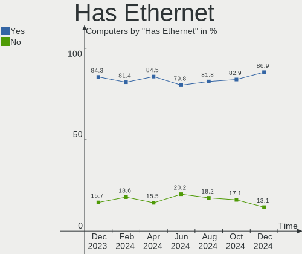
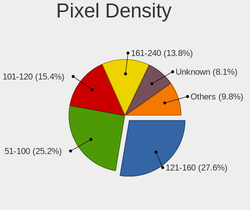
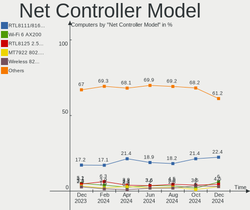

Manjaro - Hardware Trends
-------------------------

A project to identify most popular hardware characteristics and track their change
over time based on data collected by Linux users at https://Linux-Hardware.org.

Anyone can contribute to this report by the [hw-probe](https://github.com/linuxhw/hw-probe) tool:

    sudo -E hw-probe -all -upload

This is a report for all computer types. See also reports for [desktops](/Dist/Manjaro/Desktop/README.md) and [notebooks](/Dist/Manjaro/Notebook/README.md).

This report is for one last month. Overall report since the beginning of time: [TestDays](https://github.com/linuxhw/TestDays)

Period: Oct, 2023.

Contents
--------

* [ System ](#system)
  - [ OS                       ](#os)
  - [ OS Family                ](#os-family)
  - [ Kernel                   ](#kernel)
  - [ Kernel Family            ](#kernel-family)
  - [ Kernel Major Ver.        ](#kernel-major-ver)
  - [ Arch                     ](#arch)
  - [ DE                       ](#de)
  - [ Display Server           ](#display-server)
  - [ Display Manager          ](#display-manager)
  - [ OS Lang                  ](#os-lang)
  - [ Boot Mode                ](#boot-mode)
  - [ Filesystem               ](#filesystem)
  - [ Part. scheme             ](#part-scheme)
  - [ Dual Boot with Linux/BSD ](#dual-boot-with-linuxbsd)
  - [ Dual Boot (Win)          ](#dual-boot-win)

* [ Board ](#board)
  - [ Vendor                   ](#vendor)
  - [ Model                    ](#model)
  - [ Model Family             ](#model-family)
  - [ MFG Year                 ](#mfg-year)
  - [ Form Factor              ](#form-factor)
  - [ Secure Boot              ](#secure-boot)
  - [ Coreboot                 ](#coreboot)
  - [ RAM Size                 ](#ram-size)
  - [ RAM Used                 ](#ram-used)
  - [ Total Drives             ](#total-drives)
  - [ Has CD-ROM               ](#has-cd-rom)
  - [ Has Ethernet             ](#has-ethernet)
  - [ Has WiFi                 ](#has-wifi)
  - [ Has Bluetooth            ](#has-bluetooth)

* [ Location ](#location)
  - [ Country                  ](#country)
  - [ City                     ](#city)

* [ Drives ](#drives)
  - [ Drive Vendor             ](#drive-vendor)
  - [ Drive Model              ](#drive-model)
  - [ HDD Vendor               ](#hdd-vendor)
  - [ SSD Vendor               ](#ssd-vendor)
  - [ Drive Kind               ](#drive-kind)
  - [ Drive Connector          ](#drive-connector)
  - [ Drive Size               ](#drive-size)
  - [ Space Total              ](#space-total)
  - [ Space Used               ](#space-used)
  - [ Malfunc. Drives          ](#malfunc-drives)
  - [ Malfunc. Drive Vendor    ](#malfunc-drive-vendor)
  - [ Malfunc. HDD Vendor      ](#malfunc-hdd-vendor)
  - [ Malfunc. Drive Kind      ](#malfunc-drive-kind)
  - [ Failed Drives            ](#failed-drives)
  - [ Failed Drive Vendor      ](#failed-drive-vendor)
  - [ Drive Status             ](#drive-status)

* [ Storage controller ](#storage-controller)
  - [ Storage Vendor           ](#storage-vendor)
  - [ Storage Model            ](#storage-model)
  - [ Storage Kind             ](#storage-kind)

* [ Processor ](#processor)
  - [ CPU Vendor               ](#cpu-vendor)
  - [ CPU Model                ](#cpu-model)
  - [ CPU Model Family         ](#cpu-model-family)
  - [ CPU Cores                ](#cpu-cores)
  - [ CPU Sockets              ](#cpu-sockets)
  - [ CPU Threads              ](#cpu-threads)
  - [ CPU Op-Modes             ](#cpu-op-modes)
  - [ CPU Microcode            ](#cpu-microcode)
  - [ CPU Microarch            ](#cpu-microarch)

* [ Graphics ](#graphics)
  - [ GPU Vendor               ](#gpu-vendor)
  - [ GPU Model                ](#gpu-model)
  - [ GPU Combo                ](#gpu-combo)
  - [ GPU Driver               ](#gpu-driver)
  - [ GPU Memory               ](#gpu-memory)

* [ Monitor ](#monitor)
  - [ Monitor Vendor           ](#monitor-vendor)
  - [ Monitor Model            ](#monitor-model)
  - [ Monitor Resolution       ](#monitor-resolution)
  - [ Monitor Diagonal         ](#monitor-diagonal)
  - [ Monitor Width            ](#monitor-width)
  - [ Aspect Ratio             ](#aspect-ratio)
  - [ Monitor Area             ](#monitor-area)
  - [ Pixel Density            ](#pixel-density)
  - [ Multiple Monitors        ](#multiple-monitors)

* [ Network ](#network)
  - [ Net Controller Vendor    ](#net-controller-vendor)
  - [ Net Controller Model     ](#net-controller-model)
  - [ Wireless Vendor          ](#wireless-vendor)
  - [ Wireless Model           ](#wireless-model)
  - [ Ethernet Vendor          ](#ethernet-vendor)
  - [ Ethernet Model           ](#ethernet-model)
  - [ Net Controller Kind      ](#net-controller-kind)
  - [ Used Controller          ](#used-controller)
  - [ NICs                     ](#nics)
  - [ IPv6                     ](#ipv6)

* [ Bluetooth ](#bluetooth)
  - [ Bluetooth Vendor         ](#bluetooth-vendor)
  - [ Bluetooth Model          ](#bluetooth-model)

* [ Sound ](#sound)
  - [ Sound Vendor             ](#sound-vendor)
  - [ Sound Model              ](#sound-model)

* [ Memory ](#memory)
  - [ Memory Vendor            ](#memory-vendor)
  - [ Memory Model             ](#memory-model)
  - [ Memory Kind              ](#memory-kind)
  - [ Memory Form Factor       ](#memory-form-factor)
  - [ Memory Size              ](#memory-size)
  - [ Memory Speed             ](#memory-speed)

* [ Printers & scanners ](#printers--scanners)
  - [ Printer Vendor           ](#printer-vendor)
  - [ Printer Model            ](#printer-model)
  - [ Scanner Vendor           ](#scanner-vendor)
  - [ Scanner Model            ](#scanner-model)

* [ Camera ](#camera)
  - [ Camera Vendor            ](#camera-vendor)
  - [ Camera Model             ](#camera-model)

* [ Security ](#security)
  - [ Fingerprint Vendor       ](#fingerprint-vendor)
  - [ Fingerprint Model        ](#fingerprint-model)
  - [ Chipcard Vendor          ](#chipcard-vendor)
  - [ Chipcard Model           ](#chipcard-model)

* [ Unsupported ](#unsupported)
  - [ Unsupported Devices      ](#unsupported-devices)
  - [ Unsupported Device Types ](#unsupported-device-types)

System
------

OS
--

Installed operating systems

| Name           | Computers | Percent |
|----------------|-----------|---------|
| Manjaro        | 78        | 60%     |
| Manjaro 23.0.4 | 23        | 17.69%  |
| Manjaro 23.0.2 | 14        | 10.77%  |
| Manjaro 23.0.3 | 9         | 6.92%   |
| Manjaro 23.1.0 | 3         | 2.31%   |
| Manjaro 23.0.1 | 2         | 1.54%   |
| Manjaro 23.0.0 | 1         | 0.77%   |

OS Family
---------

OS without a version

| Name    | Computers | Percent |
|---------|-----------|---------|
| Manjaro | 130       | 100%    |

Kernel
------

Version of the Linux kernel

| Version                                                      | Computers | Percent |
|--------------------------------------------------------------|-----------|---------|
| 6.5.5-1-MANJARO                                              | 53        | 40.77%  |
| 6.5.3-1-MANJARO                                              | 15        | 11.54%  |
| 6.6.0-1-MANJARO                                              | 14        | 10.77%  |
| 6.1.55-1-MANJARO                                             | 13        | 10%     |
| 6.1.53-1-MANJARO                                             | 5         | 3.85%   |
| 5.15.133-1-MANJARO                                           | 5         | 3.85%   |
| 6.5.2-1-rt8-MANJARO                                          | 3         | 2.31%   |
| 6.6.0-rc5-next-20231009-1-next-git-10591-g2a860505b617-dirty | 1         | 0.77%   |
| 6.5.9-1-MANJARO                                              | 1         | 0.77%   |
| 6.5.8-1-MANJARO                                              | 1         | 0.77%   |
| 6.5.7-273-tkg-bmq-llvm                                       | 1         | 0.77%   |
| 6.5.7-2-MANJARO                                              | 1         | 0.77%   |
| 6.5.5-lqx1-1-lqx                                             | 1         | 0.77%   |
| 6.4.16-6-MANJARO                                             | 1         | 0.77%   |
| 6.4.16-5-MANJARO                                             | 1         | 0.77%   |
| 6.4.10-zen1-1-zen                                            | 1         | 0.77%   |
| 6.3.13-2-MANJARO                                             | 1         | 0.77%   |
| 6.1.51-1-MANJARO                                             | 1         | 0.77%   |
| 6.1.31-2-MANJARO                                             | 1         | 0.77%   |
| 6.1.25-1-Watanare-T2                                         | 1         | 0.77%   |
| 6.1.25-1-MANJARO                                             | 1         | 0.77%   |
| 5.19.17-2-MANJARO                                            | 1         | 0.77%   |
| 5.16.2-1-rt19-MANJARO                                        | 1         | 0.77%   |
| 5.16.11-1-MANJARO                                            | 1         | 0.77%   |
| 5.15.128-1-MANJARO                                           | 1         | 0.77%   |
| 5.10.197-1-MANJARO                                           | 1         | 0.77%   |
| 5.10.194-1-MANJARO                                           | 1         | 0.77%   |
| 5.10.179-1-MANJARO                                           | 1         | 0.77%   |
| 4.19.295-1-MANJARO                                           | 1         | 0.77%   |

Kernel Family
-------------

Linux kernel without a distro release

| Version  | Computers | Percent |
|----------|-----------|---------|
| 6.5.5    | 54        | 41.54%  |
| 6.6.0    | 15        | 11.54%  |
| 6.5.3    | 15        | 11.54%  |
| 6.1.55   | 13        | 10%     |
| 6.1.53   | 5         | 3.85%   |
| 5.15.133 | 5         | 3.85%   |
| 6.5.2    | 3         | 2.31%   |
| 6.5.7    | 2         | 1.54%   |
| 6.4.16   | 2         | 1.54%   |
| 6.1.25   | 2         | 1.54%   |
| 6.5.9    | 1         | 0.77%   |
| 6.5.8    | 1         | 0.77%   |
| 6.4.10   | 1         | 0.77%   |
| 6.3.13   | 1         | 0.77%   |
| 6.1.51   | 1         | 0.77%   |
| 6.1.31   | 1         | 0.77%   |
| 5.19.17  | 1         | 0.77%   |
| 5.16.2   | 1         | 0.77%   |
| 5.16.11  | 1         | 0.77%   |
| 5.15.128 | 1         | 0.77%   |
| 5.10.197 | 1         | 0.77%   |
| 5.10.194 | 1         | 0.77%   |
| 5.10.179 | 1         | 0.77%   |
| 4.19.295 | 1         | 0.77%   |

Kernel Major Ver.
-----------------

Linux kernel major version

| Version | Computers | Percent |
|---------|-----------|---------|
| 6.5     | 76        | 58.46%  |
| 6.1     | 22        | 16.92%  |
| 6.6     | 15        | 11.54%  |
| 5.15    | 6         | 4.62%   |
| 6.4     | 3         | 2.31%   |
| 5.10    | 3         | 2.31%   |
| 5.16    | 2         | 1.54%   |
| 6.3     | 1         | 0.77%   |
| 5.19    | 1         | 0.77%   |
| 4.19    | 1         | 0.77%   |

Arch
----

OS architecture (x86_64, i586, etc.)

| Name   | Computers | Percent |
|--------|-----------|---------|
| x86_64 | 130       | 100%    |

DE
--

Desktop Environment

| Name       | Computers | Percent |
|------------|-----------|---------|
| KDE5       | 66        | 50.77%  |
| GNOME      | 35        | 26.92%  |
| XFCE       | 15        | 11.54%  |
| X-Cinnamon | 6         | 4.62%   |
| i3         | 4         | 3.08%   |
| sway       | 1         | 0.77%   |
| qtile      | 1         | 0.77%   |
| MATE       | 1         | 0.77%   |
| Unknown    | 1         | 0.77%   |

Display Server
--------------

X11 or Wayland

| Name    | Computers | Percent |
|---------|-----------|---------|
| X11     | 99        | 76.15%  |
| Wayland | 31        | 23.85%  |

Display Manager
---------------

SDDM, LightDM, etc.

| Name    | Computers | Percent |
|---------|-----------|---------|
| Unknown | 78        | 60%     |
| SDDM    | 20        | 15.38%  |
| GDM     | 17        | 13.08%  |
| LightDM | 15        | 11.54%  |

OS Lang
-------

Language

| Lang    | Computers | Percent |
|---------|-----------|---------|
| en_US   | 60        | 46.15%  |
| de_DE   | 18        | 13.85%  |
| ru_RU   | 10        | 7.69%   |
| en_GB   | 9         | 6.92%   |
| it_IT   | 5         | 3.85%   |
| fr_FR   | 3         | 2.31%   |
| en_AU   | 3         | 2.31%   |
| pl_PL   | 2         | 1.54%   |
| es_MX   | 2         | 1.54%   |
| en_CA   | 2         | 1.54%   |
| zh_CN   | 1         | 0.77%   |
| sv_SE   | 1         | 0.77%   |
| ro_RO   | 1         | 0.77%   |
| pt_PT   | 1         | 0.77%   |
| nb_NO   | 1         | 0.77%   |
| id_ID   | 1         | 0.77%   |
| es_UY   | 1         | 0.77%   |
| es_ES   | 1         | 0.77%   |
| es_CL   | 1         | 0.77%   |
| es_AR   | 1         | 0.77%   |
| en_PH   | 1         | 0.77%   |
| en_IN   | 1         | 0.77%   |
| en_DK   | 1         | 0.77%   |
| el_GR   | 1         | 0.77%   |
| cs_CZ   | 1         | 0.77%   |
| Unknown | 1         | 0.77%   |

Boot Mode
---------

EFI or BIOS

| Mode | Computers | Percent |
|------|-----------|---------|
| BIOS | 94        | 72.31%  |
| EFI  | 36        | 27.69%  |

Filesystem
----------

Type of filesystem

| Type  | Computers | Percent |
|-------|-----------|---------|
| Ext4  | 90        | 69.23%  |
| Btrfs | 26        | 20%     |
| Tmpfs | 12        | 9.23%   |
| Xfs   | 2         | 1.54%   |

Part. scheme
------------

Scheme of partitioning

| Type    | Computers | Percent |
|---------|-----------|---------|
| Unknown | 77        | 59.23%  |
| GPT     | 46        | 35.38%  |
| MBR     | 7         | 5.38%   |

Dual Boot with Linux/BSD
------------------------

Hosting more than one Linux/BSD

| Dual boot | Computers | Percent |
|-----------|-----------|---------|
| No        | 120       | 92.31%  |
| Yes       | 10        | 7.69%   |

Dual Boot (Win)
---------------

Hosting Linux and Windows

| Dual boot | Computers | Percent |
|-----------|-----------|---------|
| No        | 106       | 81.54%  |
| Yes       | 24        | 18.46%  |

Board
-----

Vendor
------

Motherboard manufacturer

| Name                | Computers | Percent |
|---------------------|-----------|---------|
| ASUSTek Computer    | 26        | 20%     |
| Lenovo              | 20        | 15.38%  |
| Hewlett-Packard     | 15        | 11.54%  |
| Gigabyte Technology | 13        | 10%     |
| MSI                 | 12        | 9.23%   |
| ASRock              | 11        | 8.46%   |
| Dell                | 8         | 6.15%   |
| Acer                | 5         | 3.85%   |
| HUAWEI              | 3         | 2.31%   |
| Apple               | 3         | 2.31%   |
| Samsung Electronics | 2         | 1.54%   |
| TrekStor            | 1         | 0.77%   |
| TECNO               | 1         | 0.77%   |
| Sony                | 1         | 0.77%   |
| Microsoft           | 1         | 0.77%   |
| Google              | 1         | 0.77%   |
| GEEKOM              | 1         | 0.77%   |
| Gateway             | 1         | 0.77%   |
| Framework           | 1         | 0.77%   |
| Eluktronics         | 1         | 0.77%   |
| Clevo               | 1         | 0.77%   |
| Biostar             | 1         | 0.77%   |
| ATOPNUC             | 1         | 0.77%   |

Model
-----

Motherboard model

| Name                                     | Computers | Percent |
|------------------------------------------|-----------|---------|
| HP Laptop 14-ck0xxx                      | 2         | 1.54%   |
| Gigabyte B450M DS3H                      | 2         | 1.54%   |
| ASUS PRIME X370-PRO                      | 2         | 1.54%   |
| ASUS PRIME B450M-A II                    | 2         | 1.54%   |
| ASRock B760M PG Riptide                  | 2         | 1.54%   |
| ASRock B550M Pro4                        | 2         | 1.54%   |
| ASRock A320M-HDV R4.0                    | 2         | 1.54%   |
| TrekStor YOURBOOK C11B                   | 1         | 0.77%   |
| TECNO MEGABOOK T1                        | 1         | 0.77%   |
| Sony SVE1511B1RB                         | 1         | 0.77%   |
| Samsung Galaxy Book 10.6                 | 1         | 0.77%   |
| Samsung 950QDB                           | 1         | 0.77%   |
| MSI MS-7D75                              | 1         | 0.77%   |
| MSI MS-7D40                              | 1         | 0.77%   |
| MSI MS-7D20                              | 1         | 0.77%   |
| MSI MS-7C91                              | 1         | 0.77%   |
| MSI MS-7C08                              | 1         | 0.77%   |
| MSI MS-7C02                              | 1         | 0.77%   |
| MSI MS-7B98                              | 1         | 0.77%   |
| MSI MS-7B93                              | 1         | 0.77%   |
| MSI MS-7B89                              | 1         | 0.77%   |
| MSI MS-7B86                              | 1         | 0.77%   |
| MSI MS-7597                              | 1         | 0.77%   |
| MSI GL62VR 7RFX                          | 1         | 0.77%   |
| Microsoft Surface Laptop 3               | 1         | 0.77%   |
| Lenovo Yoga 9 14ITL5 82BG                | 1         | 0.77%   |
| Lenovo V15 G2 ALC 82KD                   | 1         | 0.77%   |
| Lenovo ThinkStation P620 30E000GMMT      | 1         | 0.77%   |
| Lenovo ThinkPad X1 Yoga Gen 6 20XYCTO1WW | 1         | 0.77%   |
| Lenovo ThinkPad X1 Yoga 2nd 20JES5E300   | 1         | 0.77%   |
| Lenovo ThinkPad T480s 20L8S4M200         | 1         | 0.77%   |
| Lenovo ThinkPad T420s 4170CTO            | 1         | 0.77%   |
| Lenovo ThinkPad P14s Gen 2a 21A0CTO1WW   | 1         | 0.77%   |
| Lenovo ThinkPad L460 20FVS12A00          | 1         | 0.77%   |
| Lenovo ThinkPad L430 24662W2             | 1         | 0.77%   |
| Lenovo ThinkPad L390 Yoga 20NT001KGE     | 1         | 0.77%   |
| Lenovo ThinkPad E15 Gen 3 20YG004BMX     | 1         | 0.77%   |
| Lenovo ThinkCentre A70z 0401G6G          | 1         | 0.77%   |
| Lenovo Legion Y7000 2019 PG0 81T0        | 1         | 0.77%   |
| Lenovo Legion 5 Pro 16ITH6H 82JD         | 1         | 0.77%   |

Model Family
------------

Motherboard model prefix

| Name                | Computers | Percent |
|---------------------|-----------|---------|
| ASUS PRIME          | 10        | 7.69%   |
| Lenovo ThinkPad     | 9         | 6.92%   |
| HP Laptop           | 4         | 3.08%   |
| Acer Aspire         | 4         | 3.08%   |
| Lenovo Legion       | 3         | 2.31%   |
| HP Spectre          | 3         | 2.31%   |
| Dell Precision      | 3         | 2.31%   |
| ASUS TUF            | 3         | 2.31%   |
| ASRock B550M        | 3         | 2.31%   |
| Lenovo IdeaPad      | 2         | 1.54%   |
| HP EliteBook        | 2         | 1.54%   |
| Gigabyte X570       | 2         | 1.54%   |
| Gigabyte B550       | 2         | 1.54%   |
| Gigabyte B450M      | 2         | 1.54%   |
| Dell Latitude       | 2         | 1.54%   |
| ASUS M5A97          | 2         | 1.54%   |
| ASUS ASUS           | 2         | 1.54%   |
| ASRock B760M        | 2         | 1.54%   |
| ASRock A320M-HDV    | 2         | 1.54%   |
| TrekStor YOURBOOK   | 1         | 0.77%   |
| TECNO MEGABOOK      | 1         | 0.77%   |
| Sony SVE1511B1RB    | 1         | 0.77%   |
| Samsung Galaxy      | 1         | 0.77%   |
| Samsung 950QDB      | 1         | 0.77%   |
| MSI MS-7D75         | 1         | 0.77%   |
| MSI MS-7D40         | 1         | 0.77%   |
| MSI MS-7D20         | 1         | 0.77%   |
| MSI MS-7C91         | 1         | 0.77%   |
| MSI MS-7C08         | 1         | 0.77%   |
| MSI MS-7C02         | 1         | 0.77%   |
| MSI MS-7B98         | 1         | 0.77%   |
| MSI MS-7B93         | 1         | 0.77%   |
| MSI MS-7B89         | 1         | 0.77%   |
| MSI MS-7B86         | 1         | 0.77%   |
| MSI MS-7597         | 1         | 0.77%   |
| MSI GL62VR          | 1         | 0.77%   |
| Microsoft Surface   | 1         | 0.77%   |
| Lenovo Yoga         | 1         | 0.77%   |
| Lenovo V15          | 1         | 0.77%   |
| Lenovo ThinkStation | 1         | 0.77%   |

MFG Year
--------

Motherboard manufacture year

| Year | Computers | Percent |
|------|-----------|---------|
| 2018 | 21        | 16.15%  |
| 2021 | 19        | 14.62%  |
| 2020 | 19        | 14.62%  |
| 2022 | 15        | 11.54%  |
| 2019 | 10        | 7.69%   |
| 2023 | 9         | 6.92%   |
| 2017 | 8         | 6.15%   |
| 2011 | 8         | 6.15%   |
| 2012 | 5         | 3.85%   |
| 2014 | 4         | 3.08%   |
| 2016 | 3         | 2.31%   |
| 2015 | 3         | 2.31%   |
| 2009 | 2         | 1.54%   |
| 2008 | 2         | 1.54%   |
| 2013 | 1         | 0.77%   |
| 2007 | 1         | 0.77%   |

Form Factor
-----------

Physical design of the computer

| Name        | Computers | Percent |
|-------------|-----------|---------|
| Desktop     | 62        | 47.69%  |
| Notebook    | 53        | 40.77%  |
| Convertible | 10        | 7.69%   |
| Tablet      | 2         | 1.54%   |
| All in one  | 2         | 1.54%   |
| Mini pc     | 1         | 0.77%   |

Secure Boot
-----------

Enabled or disabled

| State    | Computers | Percent |
|----------|-----------|---------|
| Disabled | 130       | 100%    |

Coreboot
--------

Have coreboot on board

| Used | Computers | Percent |
|------|-----------|---------|
| No   | 129       | 99.23%  |
| Yes  | 1         | 0.77%   |

RAM Size
--------

Total RAM memory

| Size in GB  | Computers | Percent |
|-------------|-----------|---------|
| 16.01-24.0  | 38        | 29.23%  |
| 32.01-64.0  | 28        | 21.54%  |
| 4.01-8.0    | 20        | 15.38%  |
| 8.01-16.0   | 20        | 15.38%  |
| 3.01-4.0    | 13        | 10%     |
| 64.01-256.0 | 7         | 5.38%   |
| 24.01-32.0  | 4         | 3.08%   |

RAM Used
--------

Used RAM memory

| Used GB    | Computers | Percent |
|------------|-----------|---------|
| 4.01-8.0   | 43        | 33.08%  |
| 3.01-4.0   | 30        | 23.08%  |
| 2.01-3.0   | 22        | 16.92%  |
| 1.01-2.0   | 19        | 14.62%  |
| 8.01-16.0  | 12        | 9.23%   |
| 32.01-64.0 | 1         | 0.77%   |
| 24.01-32.0 | 1         | 0.77%   |
| 16.01-24.0 | 1         | 0.77%   |
| 0.51-1.0   | 1         | 0.77%   |

Total Drives
------------

Number of drives on board

| Drives | Computers | Percent |
|--------|-----------|---------|
| 1      | 53        | 40.77%  |
| 2      | 43        | 33.08%  |
| 3      | 23        | 17.69%  |
| 4      | 8         | 6.15%   |
| 5      | 2         | 1.54%   |
| 6      | 1         | 0.77%   |

Has CD-ROM
----------

Has CD-ROM on board

| Presented | Computers | Percent |
|-----------|-----------|---------|
| No        | 111       | 85.38%  |
| Yes       | 19        | 14.62%  |

Has Ethernet
------------

Has Ethernet on board

| Presented | Computers | Percent |
|-----------|-----------|---------|
| Yes       | 109       | 83.85%  |
| No        | 21        | 16.15%  |

Has WiFi
--------

Has WiFi module

| Presented | Computers | Percent |
|-----------|-----------|---------|
| Yes       | 97        | 74.62%  |
| No        | 33        | 25.38%  |

Has Bluetooth
-------------

Has Bluetooth module

| Presented | Computers | Percent |
|-----------|-----------|---------|
| Yes       | 90        | 69.23%  |
| No        | 40        | 30.77%  |

Location
--------

Country
-------

Geographic location (country)

| Country     | Computers | Percent |
|-------------|-----------|---------|
| USA         | 30        | 23.08%  |
| Germany     | 24        | 18.46%  |
| Russia      | 11        | 8.46%   |
| Italy       | 6         | 4.62%   |
| Sweden      | 4         | 3.08%   |
| France      | 4         | 3.08%   |
| Canada      | 4         | 3.08%   |
| UK          | 3         | 2.31%   |
| Netherlands | 3         | 2.31%   |
| Denmark     | 3         | 2.31%   |
| Australia   | 3         | 2.31%   |
| Spain       | 2         | 1.54%   |
| Romania     | 2         | 1.54%   |
| Poland      | 2         | 1.54%   |
| Norway      | 2         | 1.54%   |
| Mexico      | 2         | 1.54%   |
| Indonesia   | 2         | 1.54%   |
| Greece      | 2         | 1.54%   |
| Czechia     | 2         | 1.54%   |
| Belarus     | 2         | 1.54%   |
| Venezuela   | 1         | 0.77%   |
| Uruguay     | 1         | 0.77%   |
| Turkey      | 1         | 0.77%   |
| Thailand    | 1         | 0.77%   |
| Taiwan      | 1         | 0.77%   |
| Serbia      | 1         | 0.77%   |
| Portugal    | 1         | 0.77%   |
| Philippines | 1         | 0.77%   |
| Nepal       | 1         | 0.77%   |
| Kazakhstan  | 1         | 0.77%   |
| India       | 1         | 0.77%   |
| Hungary     | 1         | 0.77%   |
| Finland     | 1         | 0.77%   |
| China       | 1         | 0.77%   |
| Chile       | 1         | 0.77%   |
| Brazil      | 1         | 0.77%   |
| Argentina   | 1         | 0.77%   |

City
----

Geographic location (city)

| City              | Computers | Percent |
|-------------------|-----------|---------|
| Nuremberg         | 3         | 2.31%   |
| Sydney            | 2         | 1.54%   |
| Portland          | 2         | 1.54%   |
| Porsgrunn         | 2         | 1.54%   |
| Paris             | 2         | 1.54%   |
| Minsk             | 2         | 1.54%   |
| Milan             | 2         | 1.54%   |
| Berlin            | 2         | 1.54%   |
| Amsterdam         | 2         | 1.54%   |
| Würzburg         | 1         | 0.77%   |
| Williamstown      | 1         | 0.77%   |
| Weilmuenster      | 1         | 0.77%   |
| Vlotho            | 1         | 0.77%   |
| Venice            | 1         | 0.77%   |
| Vaals             | 1         | 0.77%   |
| Trieste           | 1         | 0.77%   |
| Toronto           | 1         | 0.77%   |
| Tomar             | 1         | 0.77%   |
| Thisted           | 1         | 0.77%   |
| Sutton Coldfield  | 1         | 0.77%   |
| Stollberg         | 1         | 0.77%   |
| Stockholm         | 1         | 0.77%   |
| Smolensk          | 1         | 0.77%   |
| Siegen            | 1         | 0.77%   |
| Shutino           | 1         | 0.77%   |
| Seattle           | 1         | 0.77%   |
| Santiago          | 1         | 0.77%   |
| San Juan del Río | 1         | 0.77%   |
| San Juan          | 1         | 0.77%   |
| Samarinda         | 1         | 0.77%   |
| Samara            | 1         | 0.77%   |
| Saint Paul        | 1         | 0.77%   |
| Sacramento        | 1         | 0.77%   |
| Rostov-on-Don     | 1         | 0.77%   |
| Ronkonkoma        | 1         | 0.77%   |
| Riverside         | 1         | 0.77%   |
| Recife            | 1         | 0.77%   |
| Reading           | 1         | 0.77%   |
| Puebla City       | 1         | 0.77%   |
| Pontarlier        | 1         | 0.77%   |

Drives
------

Drive Vendor
------------

Hard drive vendors

| Vendor                       | Computers | Drives | Percent |
|------------------------------|-----------|--------|---------|
| Samsung Electronics          | 49        | 64     | 21.68%  |
| Sandisk                      | 26        | 28     | 11.5%   |
| Seagate                      | 23        | 25     | 10.18%  |
| WDC                          | 17        | 18     | 7.52%   |
| Kingston                     | 13        | 16     | 5.75%   |
| Crucial                      | 12        | 14     | 5.31%   |
| Toshiba                      | 8         | 10     | 3.54%   |
| SK hynix                     | 8         | 8      | 3.54%   |
| Intel                        | 6         | 7      | 2.65%   |
| Unknown                      | 5         | 6      | 2.21%   |
| Phison Electronics           | 5         | 5      | 2.21%   |
| A-DATA Technology            | 4         | 4      | 1.77%   |
| Silicon Motion               | 3         | 3      | 1.33%   |
| Hitachi                      | 3         | 3      | 1.33%   |
| Transcend                    | 2         | 2      | 0.88%   |
| Shenzhen Longsys Electronics | 2         | 2      | 0.88%   |
| Micron Technology            | 2         | 2      | 0.88%   |
| China                        | 2         | 2      | 0.88%   |
| Apacer                       | 2         | 2      | 0.88%   |
| ADATA Technology             | 2         | 2      | 0.88%   |
| Verbatim                     | 1         | 1      | 0.44%   |
| USB                          | 1         | 1      | 0.44%   |
| Union Memory (Shenzhen)      | 1         | 1      | 0.44%   |
| Union Memory                 | 1         | 1      | 0.44%   |
| SSSTC                        | 1         | 1      | 0.44%   |
| SPCC                         | 1         | 1      | 0.44%   |
| SCY                          | 1         | 1      | 0.44%   |
| SATA SSD                     | 1         | 1      | 0.44%   |
| Realtek Semiconductor        | 1         | 1      | 0.44%   |
| Realtek                      | 1         | 1      | 0.44%   |
| Ramos Technology             | 1         | 2      | 0.44%   |
| PNY                          | 1         | 1      | 0.44%   |
| Phison                       | 1         | 1      | 0.44%   |
| Patriot                      | 1         | 1      | 0.44%   |
| Micron/Crucial Technology    | 1         | 1      | 0.44%   |
| MENGMI                       | 1         | 1      | 0.44%   |
| Lite-On Technology           | 1         | 1      | 0.44%   |
| Lexar                        | 1         | 1      | 0.44%   |
| KIOXIA                       | 1         | 1      | 0.44%   |
| Kingston Technology Company  | 1         | 1      | 0.44%   |

Drive Model
-----------

Hard drive models

| Model                                               | Computers | Percent |
|-----------------------------------------------------|-----------|---------|
| Samsung NVMe SSD Controller SM981/PM981/PM983 1TB   | 9         | 3.6%    |
| Samsung NVMe SSD Controller PM9A1/PM9A3/980PRO 1TB  | 9         | 3.6%    |
| Samsung SSD 980 1TB                                 | 6         | 2.4%    |
| Seagate ST2000DM008-2FR102 2TB                      | 4         | 1.6%    |
| Sandisk WD Blue SN550 NVMe SSD 1TB                  | 4         | 1.6%    |
| Samsung SSD 860 EVO 500GB                           | 4         | 1.6%    |
| Samsung NVMe SSD Controller SM961/PM961/SM963 121GB | 4         | 1.6%    |
| Crucial CT240BX500SSD1 240GB                        | 4         | 1.6%    |
| Seagate ST1000DM010-2EP102 1TB                      | 3         | 1.2%    |
| Sandisk WD_BLACK SN770 1TB                          | 3         | 1.2%    |
| Samsung SSD 990 PRO 2TB                             | 3         | 1.2%    |
| Samsung SSD 870 EVO 500GB                           | 3         | 1.2%    |
| Kingston SNV2S500G 500GB                            | 3         | 1.2%    |
| Unknown MMC Card  64GB                              | 2         | 0.8%    |
| Toshiba BG3 NVMe SSD Controller 128GB               | 2         | 0.8%    |
| SK hynix BC501 NVMe Solid State Drive 512GB         | 2         | 0.8%    |
| Sandisk WD Blue SN570 1TB                           | 2         | 0.8%    |
| Sandisk WD Black SN750 / PC SN730 NVMe SSD 1024GB   | 2         | 0.8%    |
| SanDisk SDSSDH3 1T00 1TB                            | 2         | 0.8%    |
| Samsung SSD 870 EVO 1TB                             | 2         | 0.8%    |
| Samsung SSD 860 EVO 1TB                             | 2         | 0.8%    |
| Samsung SSD 850 EVO 250GB                           | 2         | 0.8%    |
| Phison E16 PCIe4 NVMe Controller 500GB              | 2         | 0.8%    |
| Kingston SUV400S37240G 240GB SSD                    | 2         | 0.8%    |
| Kingston SA400S37480G 480GB SSD                     | 2         | 0.8%    |
| Kingston SA400S37240G 240GB SSD                     | 2         | 0.8%    |
| Crucial CT500MX500SSD1 500GB                        | 2         | 0.8%    |
| WDC WD5000LPCX-21VHAT0 500GB                        | 1         | 0.4%    |
| WDC WD5000BEVT-00ZAT0 500GB                         | 1         | 0.4%    |
| WDC WD40EZRZ-22GXCB0 4TB                            | 1         | 0.4%    |
| WDC WD3200BPVT-75JJ5T0 320GB                        | 1         | 0.4%    |
| WDC WD3200BPVT-55JJ5T0 320GB                        | 1         | 0.4%    |
| WDC WD30EZRZ-00GXCB0 3TB                            | 1         | 0.4%    |
| WDC WD2500BEKT-75A25T0 250GB                        | 1         | 0.4%    |
| WDC WD20EZRX-00DC0B0 2TB                            | 1         | 0.4%    |
| WDC WD20EARX-00MMMB0 2TB                            | 1         | 0.4%    |
| WDC WD1600AAJS-00YZCA0 160GB                        | 1         | 0.4%    |
| WDC WD15EARX-00PASB0 1TB                            | 1         | 0.4%    |
| WDC WD15EARS-22Z5B1 1TB                             | 1         | 0.4%    |
| WDC WD10SPZX-24Z10 1TB                              | 1         | 0.4%    |

HDD Vendor
----------

Hard disk drive vendors

| Vendor              | Computers | Drives | Percent |
|---------------------|-----------|--------|---------|
| Seagate             | 20        | 22     | 39.22%  |
| WDC                 | 17        | 18     | 33.33%  |
| Toshiba             | 7         | 8      | 13.73%  |
| Hitachi             | 3         | 3      | 5.88%   |
| USB                 | 1         | 1      | 1.96%   |
| Samsung Electronics | 1         | 1      | 1.96%   |
| HPE                 | 1         | 1      | 1.96%   |
| Fujitsu             | 1         | 1      | 1.96%   |

SSD Vendor
----------

Solid state drive vendors

| Vendor              | Computers | Drives | Percent |
|---------------------|-----------|--------|---------|
| Samsung Electronics | 19        | 23     | 25%     |
| Crucial             | 12        | 14     | 15.79%  |
| SanDisk             | 10        | 11     | 13.16%  |
| Kingston            | 8         | 9      | 10.53%  |
| A-DATA Technology   | 4         | 4      | 5.26%   |
| Transcend           | 2         | 2      | 2.63%   |
| Intel               | 2         | 2      | 2.63%   |
| China               | 2         | 2      | 2.63%   |
| Apacer              | 2         | 2      | 2.63%   |
| Verbatim            | 1         | 1      | 1.32%   |
| SSSTC               | 1         | 1      | 1.32%   |
| SPCC                | 1         | 1      | 1.32%   |
| SK hynix            | 1         | 1      | 1.32%   |
| Seagate             | 1         | 1      | 1.32%   |
| SCY                 | 1         | 1      | 1.32%   |
| Ramos Technology    | 1         | 2      | 1.32%   |
| PNY                 | 1         | 1      | 1.32%   |
| Patriot             | 1         | 1      | 1.32%   |
| MENGMI              | 1         | 1      | 1.32%   |
| Lexar               | 1         | 1      | 1.32%   |
| GOODRAM             | 1         | 1      | 1.32%   |
| BAITITON            | 1         | 1      | 1.32%   |
| ASMedia             | 1         | 1      | 1.32%   |
| 2.5                 | 1         | 1      | 1.32%   |

Drive Kind
----------

HDD or SSD

| Kind    | Computers | Drives | Percent |
|---------|-----------|--------|---------|
| NVMe    | 84        | 104    | 41.58%  |
| SSD     | 63        | 85     | 31.19%  |
| HDD     | 44        | 55     | 21.78%  |
| Unknown | 6         | 6      | 2.97%   |
| MMC     | 5         | 6      | 2.48%   |

Drive Connector
---------------

SATA, SAS, NVMe, etc.

| Type | Computers | Drives | Percent |
|------|-----------|--------|---------|
| NVMe | 84        | 102    | 47.19%  |
| SATA | 82        | 139    | 46.07%  |
| SAS  | 7         | 9      | 3.93%   |
| MMC  | 5         | 6      | 2.81%   |

Drive Size
----------

Size of hard drive

| Size in TB | Computers | Drives | Percent |
|------------|-----------|--------|---------|
| 0.01-0.5   | 55        | 75     | 49.55%  |
| 0.51-1.0   | 37        | 43     | 33.33%  |
| 1.01-2.0   | 10        | 12     | 9.01%   |
| 3.01-4.0   | 5         | 5      | 4.5%    |
| 2.01-3.0   | 3         | 4      | 2.7%    |
| 4.01-10.0  | 1         | 1      | 0.9%    |

Space Total
-----------

Amount of disk space available on the file system

| Size in GB     | Computers | Percent |
|----------------|-----------|---------|
| 251-500        | 28        | 21.54%  |
| 501-1000       | 24        | 18.46%  |
| 101-250        | 23        | 17.69%  |
| More than 3000 | 17        | 13.08%  |
| 1001-2000      | 13        | 10%     |
| 2001-3000      | 11        | 8.46%   |
| Unknown        | 7         | 5.38%   |
| 51-100         | 6         | 4.62%   |
| 1-20           | 1         | 0.77%   |

Space Used
----------

Amount of used disk space

| Used GB        | Computers | Percent |
|----------------|-----------|---------|
| 101-250        | 26        | 20%     |
| 251-500        | 24        | 18.46%  |
| 1-20           | 16        | 12.31%  |
| 51-100         | 15        | 11.54%  |
| 21-50          | 13        | 10%     |
| 1001-2000      | 12        | 9.23%   |
| 501-1000       | 11        | 8.46%   |
| Unknown        | 7         | 5.38%   |
| More than 3000 | 5         | 3.85%   |
| 2001-3000      | 1         | 0.77%   |

Malfunc. Drives
---------------

Drive models with a malfunction

| Model                    | Computers | Drives | Percent |
|--------------------------|-----------|--------|---------|
| WDC WD20EZRX-00DC0B0 2TB | 1         | 1      | 50%     |
| Apacer AS350 128GB SSD   | 1         | 1      | 50%     |

Malfunc. Drive Vendor
---------------------

Vendors of faulty drives

| Vendor | Computers | Drives | Percent |
|--------|-----------|--------|---------|
| WDC    | 1         | 1      | 50%     |
| Apacer | 1         | 1      | 50%     |

Malfunc. HDD Vendor
-------------------

Vendors of faulty HDD drives

| Vendor | Computers | Drives | Percent |
|--------|-----------|--------|---------|
| WDC    | 1         | 1      | 100%    |

Malfunc. Drive Kind
-------------------

Kinds of faulty drives

| Kind | Computers | Drives | Percent |
|------|-----------|--------|---------|
| SSD  | 1         | 1      | 50%     |
| HDD  | 1         | 1      | 50%     |

Failed Drives
-------------

Failed drive models

Zero info for selected period =(

Failed Drive Vendor
-------------------

Failed drive vendors

Zero info for selected period =(

Drive Status
------------

Number of failed and malfunc. drives

| Status   | Computers | Drives | Percent |
|----------|-----------|--------|---------|
| Detected | 106       | 200    | 78.52%  |
| Works    | 27        | 54     | 20%     |
| Malfunc  | 2         | 2      | 1.48%   |

Storage controller
------------------

Storage Vendor
--------------

Storage controller vendors

| Vendor                       | Computers | Percent |
|------------------------------|-----------|---------|
| Intel                        | 63        | 31.19%  |
| AMD                          | 43        | 21.29%  |
| Samsung Electronics          | 34        | 16.83%  |
| SanDisk                      | 16        | 7.92%   |
| Kingston Technology Company  | 8         | 3.96%   |
| SK hynix                     | 7         | 3.47%   |
| Phison Electronics           | 6         | 2.97%   |
| ASMedia Technology           | 5         | 2.48%   |
| Silicon Motion               | 3         | 1.49%   |
| Toshiba America Info Systems | 2         | 0.99%   |
| Shenzhen Longsys Electronics | 2         | 0.99%   |
| Micron Technology            | 2         | 0.99%   |
| ADATA Technology             | 2         | 0.99%   |
| Union Memory (Shenzhen)      | 1         | 0.5%    |
| Realtek Semiconductor        | 1         | 0.5%    |
| Nvidia                       | 1         | 0.5%    |
| Micron/Crucial Technology    | 1         | 0.5%    |
| Marvell Technology Group     | 1         | 0.5%    |
| Lite-On Technology           | 1         | 0.5%    |
| KIOXIA                       | 1         | 0.5%    |
| HGST                         | 1         | 0.5%    |
| Apple                        | 1         | 0.5%    |

Storage Model
-------------

Storage controller models

| Model                                                                         | Computers | Percent |
|-------------------------------------------------------------------------------|-----------|---------|
| AMD FCH SATA Controller [AHCI mode]                                           | 29        | 12.95%  |
| Samsung NVMe SSD Controller 980 (DRAM-less)                                   | 10        | 4.46%   |
| Samsung NVMe SSD Controller SM981/PM981/PM983                                 | 9         | 4.02%   |
| Samsung NVMe SSD Controller PM9A1/PM9A3/980PRO                                | 9         | 4.02%   |
| AMD 400 Series Chipset SATA Controller                                        | 9         | 4.02%   |
| AMD 500 Series Chipset SATA Controller                                        | 8         | 3.57%   |
| Samsung NVMe SSD Controller SM961/PM961/SM963                                 | 5         | 2.23%   |
| Intel Volume Management Device NVMe RAID Controller                           | 5         | 2.23%   |
| Intel 700 Series Chipset Family SATA AHCI Controller                          | 5         | 2.23%   |
| Intel 7 Series Chipset Family 6-port SATA Controller [AHCI mode]              | 5         | 2.23%   |
| Intel 6 Series/C200 Series Chipset Family 6 port Mobile SATA AHCI Controller  | 5         | 2.23%   |
| ASMedia ASM1062 Serial ATA Controller                                         | 5         | 2.23%   |
| SanDisk WD Black SN770 / PC SN740 256GB / PC SN560 (DRAM-less) NVMe SSD       | 4         | 1.79%   |
| SanDisk Ultra 3D / WD Blue SN550 NVMe SSD                                     | 4         | 1.79%   |
| SK hynix Gold P31/BC711/PC711 NVMe Solid State Drive                          | 3         | 1.34%   |
| Samsung NVMe SSD Controller S4LV008[Pascal]                                   | 3         | 1.34%   |
| Kingston Company KC3000/FURY Renegade NVMe SSD E18                            | 3         | 1.34%   |
| Intel Sunrise Point-LP SATA Controller [AHCI mode]                            | 3         | 1.34%   |
| Intel Celeron/Pentium Silver Processor SATA Controller                        | 3         | 1.34%   |
| Intel Cannon Lake PCH SATA AHCI Controller                                    | 3         | 1.34%   |
| AMD FCH SATA Controller D                                                     | 3         | 1.34%   |
| AMD 300 Series Chipset SATA Controller                                        | 3         | 1.34%   |
| Toshiba America Info Systems BG3 x2 NVMe SSD Controller (DRAM-less)           | 2         | 0.89%   |
| SK hynix BC501 NVMe Solid State Drive                                         | 2         | 0.89%   |
| SanDisk Ultra 3D / WD Blue SN570 NVMe SSD (DRAM-less)                         | 2         | 0.89%   |
| SanDisk Extreme Pro / WD Black SN750 / PC SN730 / Red SN700 NVMe SSD          | 2         | 0.89%   |
| Phison E16 PCIe4 NVMe Controller                                              | 2         | 0.89%   |
| Micron 2450 NVMe SSD [HendrixV] (DRAM-less)                                   | 2         | 0.89%   |
| Kingston Company NV2 NVMe SSD SM2267XT                                        | 2         | 0.89%   |
| Kingston Company NV2 NVMe SSD E21T                                            | 2         | 0.89%   |
| Intel Volume Management Device NVMe RAID Controller Intel Corporation         | 2         | 0.89%   |
| Intel Q170/Q150/B150/H170/H110/Z170/CM236 Chipset SATA Controller [AHCI Mode] | 2         | 0.89%   |
| Intel Celeron N3350/Pentium N4200/Atom E3900 Series SATA AHCI Controller      | 2         | 0.89%   |
| Intel Cannon Lake Mobile PCH SATA AHCI Controller                             | 2         | 0.89%   |
| Intel Alder Lake-S PCH SATA Controller [AHCI Mode]                            | 2         | 0.89%   |
| Intel Alder Lake-P SATA AHCI Controller                                       | 2         | 0.89%   |
| Intel 6 Series/C200 Series Chipset Family 6 port Desktop SATA AHCI Controller | 2         | 0.89%   |
| Intel 400 Series Chipset Family SATA AHCI Controller                          | 2         | 0.89%   |
| Intel 200 Series PCH SATA controller [AHCI mode]                              | 2         | 0.89%   |
| AMD X370 Series Chipset SATA Controller                                       | 2         | 0.89%   |

Storage Kind
------------

Kind of storage controller (IDE, SATA, NVMe, SAS, ...)

| Kind | Computers | Percent |
|------|-----------|---------|
| SATA | 93        | 48.69%  |
| NVMe | 83        | 43.46%  |
| RAID | 11        | 5.76%   |
| IDE  | 4         | 2.09%   |

Processor
---------

CPU Vendor
----------

Processor vendors

| Vendor | Computers | Percent |
|--------|-----------|---------|
| Intel  | 78        | 60%     |
| AMD    | 52        | 40%     |

CPU Model
---------

Processor models

| Model                                       | Computers | Percent |
|---------------------------------------------|-----------|---------|
| AMD Ryzen 5 5600X 6-Core Processor          | 4         | 3.08%   |
| AMD Ryzen 5 5500                            | 3         | 2.31%   |
| AMD Ryzen 5 3600 6-Core Processor           | 3         | 2.31%   |
| Intel Core i7-9750H CPU @ 2.60GHz           | 2         | 1.54%   |
| Intel Core i5-8250U CPU @ 1.60GHz           | 2         | 1.54%   |
| Intel Celeron CPU N3350 @ 1.10GHz           | 2         | 1.54%   |
| Intel 12th Gen Core i7-12700H               | 2         | 1.54%   |
| Intel 11th Gen Core i7-11800H @ 2.30GHz     | 2         | 1.54%   |
| Intel 11th Gen Core i7-1165G7 @ 2.80GHz     | 2         | 1.54%   |
| Intel 11th Gen Core i5-1135G7 @ 2.40GHz     | 2         | 1.54%   |
| AMD Ryzen 9 5900X 12-Core Processor         | 2         | 1.54%   |
| AMD Ryzen 9 5900HX with Radeon Graphics     | 2         | 1.54%   |
| AMD Ryzen 7 5800X3D 8-Core Processor        | 2         | 1.54%   |
| AMD Ryzen 7 5700U with Radeon Graphics      | 2         | 1.54%   |
| AMD Ryzen 7 2700X Eight-Core Processor      | 2         | 1.54%   |
| AMD Ryzen 5 2600X Six-Core Processor        | 2         | 1.54%   |
| AMD Ryzen 5 1400 Quad-Core Processor        | 2         | 1.54%   |
| AMD Ryzen 3 3100 4-Core Processor           | 2         | 1.54%   |
| AMD FX-8350 Eight-Core Processor            | 2         | 1.54%   |
| Intel Xeon CPU E5-1620 v4 @ 3.50GHz         | 1         | 0.77%   |
| Intel Pentium Silver N5030 CPU @ 1.10GHz    | 1         | 0.77%   |
| Intel Pentium Dual-Core CPU E5700 @ 3.00GHz | 1         | 0.77%   |
| Intel Pentium CPU B970 @ 2.30GHz            | 1         | 0.77%   |
| Intel Pentium CPU 4405U @ 2.10GHz           | 1         | 0.77%   |
| Intel Pentium CPU 2020M @ 2.40GHz           | 1         | 0.77%   |
| Intel Core m7-6Y75 CPU @ 1.20GHz            | 1         | 0.77%   |
| Intel Core m3-7Y30 CPU @ 1.00GHz            | 1         | 0.77%   |
| Intel Core i7-9700K CPU @ 3.60GHz           | 1         | 0.77%   |
| Intel Core i7-9700 CPU @ 3.00GHz            | 1         | 0.77%   |
| Intel Core i7-8565U CPU @ 1.80GHz           | 1         | 0.77%   |
| Intel Core i7-7700HQ CPU @ 2.80GHz          | 1         | 0.77%   |
| Intel Core i7-7500U CPU @ 2.70GHz           | 1         | 0.77%   |
| Intel Core i7-6820HQ CPU @ 2.70GHz          | 1         | 0.77%   |
| Intel Core i7-6700 CPU @ 3.40GHz            | 1         | 0.77%   |
| Intel Core i7-4790 CPU @ 3.60GHz            | 1         | 0.77%   |
| Intel Core i7-3770K CPU @ 3.50GHz           | 1         | 0.77%   |
| Intel Core i7-3610QM CPU @ 2.30GHz          | 1         | 0.77%   |
| Intel Core i7-2720QM CPU @ 2.20GHz          | 1         | 0.77%   |
| Intel Core i7-2620M CPU @ 2.70GHz           | 1         | 0.77%   |
| Intel Core i7-2600K CPU @ 3.40GHz           | 1         | 0.77%   |

CPU Model Family
----------------

Processor model prefix

| Model                   | Computers | Percent |
|-------------------------|-----------|---------|
| Other                   | 25        | 19.23%  |
| AMD Ryzen 5             | 21        | 16.15%  |
| Intel Core i7           | 18        | 13.85%  |
| Intel Core i5           | 17        | 13.08%  |
| AMD Ryzen 7             | 11        | 8.46%   |
| AMD Ryzen 9             | 7         | 5.38%   |
| Intel Celeron           | 5         | 3.85%   |
| Intel Core i3           | 4         | 3.08%   |
| AMD Ryzen 3             | 4         | 3.08%   |
| Intel Pentium           | 3         | 2.31%   |
| Intel Core 2 Duo        | 2         | 1.54%   |
| AMD FX                  | 2         | 1.54%   |
| Intel Xeon              | 1         | 0.77%   |
| Intel Pentium Silver    | 1         | 0.77%   |
| Intel Pentium Dual-Core | 1         | 0.77%   |
| Intel Core m7           | 1         | 0.77%   |
| Intel Core m3           | 1         | 0.77%   |
| AMD Ryzen Threadripper  | 1         | 0.77%   |
| AMD Ryzen 7 PRO         | 1         | 0.77%   |
| AMD Ryzen 5 PRO         | 1         | 0.77%   |
| AMD E1                  | 1         | 0.77%   |
| AMD Athlon II X2        | 1         | 0.77%   |
| AMD A8                  | 1         | 0.77%   |

CPU Cores
---------

Number of processor cores

| Number | Computers | Percent |
|--------|-----------|---------|
| 4      | 37        | 28.46%  |
| 6      | 28        | 21.54%  |
| 2      | 27        | 20.77%  |
| 8      | 18        | 13.85%  |
| 12     | 8         | 6.15%   |
| 14     | 4         | 3.08%   |
| 10     | 4         | 3.08%   |
| 16     | 3         | 2.31%   |
| 24     | 1         | 0.77%   |

CPU Sockets
-----------

Number of sockets

| Number | Computers | Percent |
|--------|-----------|---------|
| 1      | 130       | 100%    |

CPU Threads
-----------

Threads per core (Hyper-Threading)

| Number | Computers | Percent |
|--------|-----------|---------|
| 2      | 104       | 80%     |
| 1      | 26        | 20%     |

CPU Op-Modes
------------

CPU Operation Modes (32-bit, 64-bit)

| Op mode        | Computers | Percent |
|----------------|-----------|---------|
| 32-bit, 64-bit | 130       | 100%    |

CPU Microcode
-------------

Microcode number

| Number     | Computers | Percent |
|------------|-----------|---------|
| Unknown    | 101       | 77.69%  |
| 0x0a50000c | 3         | 2.31%   |
| 0x906ea    | 2         | 1.54%   |
| 0x906a3    | 2         | 1.54%   |
| 0x0a20120a | 2         | 1.54%   |
| 0x806eb    | 1         | 0.77%   |
| 0x806e9    | 1         | 0.77%   |
| 0x806d1    | 1         | 0.77%   |
| 0x806c1    | 1         | 0.77%   |
| 0x506e3    | 1         | 0.77%   |
| 0x406e3    | 1         | 0.77%   |
| 0x306c3    | 1         | 0.77%   |
| 0x306a9    | 1         | 0.77%   |
| 0x0a601203 | 1         | 0.77%   |
| 0x0a50000d | 1         | 0.77%   |
| 0x0a008204 | 1         | 0.77%   |
| 0x08701021 | 1         | 0.77%   |
| 0x08608103 | 1         | 0.77%   |
| 0x08600106 | 1         | 0.77%   |
| 0x08600103 | 1         | 0.77%   |
| 0x08101016 | 1         | 0.77%   |
| 0x0800820d | 1         | 0.77%   |
| 0x08001138 | 1         | 0.77%   |
| 0x07030104 | 1         | 0.77%   |
| 0x06000852 | 1         | 0.77%   |

CPU Microarch
-------------

Microarchitecture

| Name             | Computers | Percent |
|------------------|-----------|---------|
| Unknown          | 20        | 15.38%  |
| KabyLake         | 18        | 13.85%  |
| Zen 3            | 17        | 13.08%  |
| Zen 2            | 9         | 6.92%   |
| SandyBridge      | 8         | 6.15%   |
| Alderlake Hybrid | 8         | 6.15%   |
| TigerLake        | 6         | 4.62%   |
| Zen+             | 5         | 3.85%   |
| Zen              | 5         | 3.85%   |
| IvyBridge        | 5         | 3.85%   |
| Skylake          | 4         | 3.08%   |
| Icelake          | 4         | 3.08%   |
| Penryn           | 3         | 2.31%   |
| Goldmont plus    | 3         | 2.31%   |
| CometLake        | 3         | 2.31%   |
| Puma             | 2         | 1.54%   |
| Piledriver       | 2         | 1.54%   |
| Haswell          | 2         | 1.54%   |
| Goldmont         | 2         | 1.54%   |
| Broadwell        | 2         | 1.54%   |
| K10              | 1         | 0.77%   |
| Excavator        | 1         | 0.77%   |

Graphics
--------

GPU Vendor
----------

Vendors of graphics cards

| Vendor | Computers | Percent |
|--------|-----------|---------|
| Intel  | 63        | 41.45%  |
| Nvidia | 49        | 32.24%  |
| AMD    | 40        | 26.32%  |

GPU Model
---------

Graphics card models

| Model                                                                       | Computers | Percent |
|-----------------------------------------------------------------------------|-----------|---------|
| Intel 2nd Generation Core Processor Family Integrated Graphics Controller   | 7         | 4.55%   |
| Intel TigerLake-LP GT2 [Iris Xe Graphics]                                   | 6         | 3.9%    |
| Intel Raptor Lake-P [Iris Xe Graphics]                                      | 4         | 2.6%    |
| Intel 3rd Gen Core processor Graphics Controller                            | 4         | 2.6%    |
| AMD Lucienne                                                                | 4         | 2.6%    |
| Nvidia TU117 [GeForce GTX 1650]                                             | 3         | 1.95%   |
| Nvidia GA106M [GeForce RTX 3060 Mobile / Max-Q]                             | 3         | 1.95%   |
| Intel UHD Graphics 620                                                      | 3         | 1.95%   |
| Intel HD Graphics 620                                                       | 3         | 1.95%   |
| Intel Alder Lake-P GT2 [Iris Xe Graphics]                                   | 3         | 1.95%   |
| AMD Navi 22 [Radeon RX 6700/6700 XT/6750 XT / 6800M/6850M XT]               | 3         | 1.95%   |
| AMD Navi 14 [Radeon RX 5500/5500M / Pro 5500M]                              | 3         | 1.95%   |
| AMD Cezanne [Radeon Vega Series / Radeon Vega Mobile Series]                | 3         | 1.95%   |
| Nvidia TU117M [GeForce GTX 1650 Mobile / Max-Q]                             | 2         | 1.3%    |
| Nvidia TU106 [GeForce RTX 2060 SUPER]                                       | 2         | 1.3%    |
| Nvidia TU104 [GeForce RTX 2070 SUPER]                                       | 2         | 1.3%    |
| Nvidia GP108 [GeForce GT 1030]                                              | 2         | 1.3%    |
| Nvidia GP107 [GeForce GTX 1050 Ti]                                          | 2         | 1.3%    |
| Nvidia GP104 [GeForce GTX 1070]                                             | 2         | 1.3%    |
| Nvidia GK208B [GeForce GT 730]                                              | 2         | 1.3%    |
| Nvidia GK208B [GeForce GT 710]                                              | 2         | 1.3%    |
| Nvidia GA106 [GeForce RTX 3060 Lite Hash Rate]                              | 2         | 1.3%    |
| Intel Xeon E3-1200 v3/4th Gen Core Processor Integrated Graphics Controller | 2         | 1.3%    |
| Intel TigerLake-H GT1 [UHD Graphics]                                        | 2         | 1.3%    |
| Intel Iris Plus Graphics G1 (Ice Lake)                                      | 2         | 1.3%    |
| Intel HD Graphics 500                                                       | 2         | 1.3%    |
| Intel GeminiLake [UHD Graphics 600]                                         | 2         | 1.3%    |
| Intel CoffeeLake-H GT2 [UHD Graphics 630]                                   | 2         | 1.3%    |
| AMD Renoir [Radeon RX Vega 6 (Ryzen 4000/5000 Mobile Series)]               | 2         | 1.3%    |
| AMD Raven Ridge [Radeon Vega Series / Radeon Vega Mobile Series]            | 2         | 1.3%    |
| AMD Navi 31 [Radeon RX 7900 XT/7900 XTX]                                    | 2         | 1.3%    |
| AMD Navi 21 [Radeon RX 6800/6800 XT / 6900 XT]                              | 2         | 1.3%    |
| AMD Ellesmere [Radeon RX 470/480/570/570X/580/580X/590]                     | 2         | 1.3%    |
| Nvidia TU117M [GeForce GTX 1650 Ti Mobile]                                  | 1         | 0.65%   |
| Nvidia TU116 [GeForce GTX 1660]                                             | 1         | 0.65%   |
| Nvidia TU116 [GeForce GTX 1660 SUPER]                                       | 1         | 0.65%   |
| Nvidia TU104M [GeForce RTX 2070 SUPER Mobile / Max-Q]                       | 1         | 0.65%   |
| Nvidia TU102 [GeForce RTX 2080 Ti Rev. A]                                   | 1         | 0.65%   |
| Nvidia GP108M [GeForce MX330]                                               | 1         | 0.65%   |
| Nvidia GP106M [GeForce GTX 1060 Mobile]                                     | 1         | 0.65%   |

GPU Combo
---------

Combinations of graphics cards

| Name           | Computers | Percent |
|----------------|-----------|---------|
| 1 x Intel      | 46        | 35.38%  |
| 1 x AMD        | 31        | 23.85%  |
| 1 x Nvidia     | 29        | 22.31%  |
| Intel + Nvidia | 14        | 10.77%  |
| AMD + Nvidia   | 6         | 4.62%   |
| Intel + AMD    | 2         | 1.54%   |
| 2 x Intel      | 1         | 0.77%   |
| 2 x AMD        | 1         | 0.77%   |

GPU Driver
----------

Free vs proprietary

| Driver      | Computers | Percent |
|-------------|-----------|---------|
| Free        | 87        | 66.92%  |
| Proprietary | 42        | 32.31%  |
| Unknown     | 1         | 0.77%   |

GPU Memory
----------

Total video memory

| Size in GB | Computers | Percent |
|------------|-----------|---------|
| Unknown    | 88        | 67.69%  |
| 7.01-8.0   | 10        | 7.69%   |
| 3.01-4.0   | 10        | 7.69%   |
| 1.01-2.0   | 8         | 6.15%   |
| 8.01-16.0  | 5         | 3.85%   |
| 0.01-0.5   | 4         | 3.08%   |
| 5.01-6.0   | 2         | 1.54%   |
| 0.51-1.0   | 2         | 1.54%   |
| 16.01-24.0 | 1         | 0.77%   |

Monitor
-------

Monitor Vendor
--------------

Monitor vendors

| Vendor                  | Computers | Percent |
|-------------------------|-----------|---------|
| Samsung Electronics     | 28        | 18.06%  |
| BOE                     | 13        | 8.39%   |
| Chimei Innolux          | 12        | 7.74%   |
| Goldstar                | 10        | 6.45%   |
| AU Optronics            | 10        | 6.45%   |
| Hewlett-Packard         | 9         | 5.81%   |
| LG Display              | 8         | 5.16%   |
| LG Electronics          | 7         | 4.52%   |
| Dell                    | 7         | 4.52%   |
| BenQ                    | 6         | 3.87%   |
| ViewSonic               | 4         | 2.58%   |
| Apple                   | 3         | 1.94%   |
| AOC                     | 3         | 1.94%   |
| Acer                    | 3         | 1.94%   |
| Unknown                 | 3         | 1.94%   |
| Sharp                   | 2         | 1.29%   |
| Iiyama                  | 2         | 1.29%   |
| CSO                     | 2         | 1.29%   |
| Chi Mei Optoelectronics | 2         | 1.29%   |
| Viotek                  | 1         | 0.65%   |
| Vestel Elektronik       | 1         | 0.65%   |
| Unknown                 | 1         | 0.65%   |
| Tianma XM               | 1         | 0.65%   |
| Seiko/Epson             | 1         | 0.65%   |
| Sceptre Tech            | 1         | 0.65%   |
| Philips                 | 1         | 0.65%   |
| PANDA                   | 1         | 0.65%   |
| OEM                     | 1         | 0.65%   |
| MSI                     | 1         | 0.65%   |
| Mi                      | 1         | 0.65%   |
| Medion Akoya            | 1         | 0.65%   |
| LGD                     | 1         | 0.65%   |
| LG Philips              | 1         | 0.65%   |
| Lenovo                  | 1         | 0.65%   |
| HUAWEI                  | 1         | 0.65%   |
| HCT                     | 1         | 0.65%   |
| Gigabyte Technology     | 1         | 0.65%   |
| Eizo                    | 1         | 0.65%   |
| CMT                     | 1         | 0.65%   |
| Ancor Communications    | 1         | 0.65%   |

Monitor Model
-------------

Monitor models

| Model                                                                 | Computers | Percent |
|-----------------------------------------------------------------------|-----------|---------|
| Samsung Electronics C27F390 SAM0D32 1920x1080 598x336mm 27.0-inch     | 3         | 1.84%   |
| Unknown                                                               | 3         | 1.84%   |
| ViewSonic VA2446 SERIES VSC732E 1920x1080 520x290mm 23.4-inch         | 2         | 1.23%   |
| Goldstar IPS FULLHD GSM5AB7 1920x1080 480x270mm 21.7-inch             | 2         | 1.23%   |
| Chimei Innolux LCD Monitor CMN15E7 1920x1080 344x193mm 15.5-inch      | 2         | 1.23%   |
| Viotek GNV27DB VTK2700 2560x1440 597x336mm 27.0-inch                  | 1         | 0.61%   |
| ViewSonic VX2776 Series VSC3E32 1920x1080 598x336mm 27.0-inch         | 1         | 0.61%   |
| ViewSonic VG2448 VSC3B35 1920x1080 527x296mm 23.8-inch                | 1         | 0.61%   |
| Vestel Elektronik 42 FHD_LCD-TV VES3700 1920x540                      | 1         | 0.61%   |
| Unknown LCD Monitor FFFF 2288x1287 2550x2550mm 142.0-inch             | 1         | 0.61%   |
| Tianma XM LCD Monitor TLX1388 3000x2000 293x196mm 13.9-inch           | 1         | 0.61%   |
| Sharp LQ135P1JX51 SHP14B3 2256x1504 285x190mm 13.5-inch               | 1         | 0.61%   |
| Sharp LCD Monitor SHP1461 3200x1800 294x165mm 13.3-inch               | 1         | 0.61%   |
| Seiko/Epson LCD Monitor EPSON PJ 1920x1080                            | 1         | 0.61%   |
| Sceptre Tech Sceptre F24 SPT09AB 1920x1080 530x290mm 23.8-inch        | 1         | 0.61%   |
| Sceptre Tech Sceptre E24 SPT099D 1920x1080 521x293mm 23.5-inch        | 1         | 0.61%   |
| Samsung Electronics U32J59x SAM0F35 3840x2160 697x392mm 31.5-inch     | 1         | 0.61%   |
| Samsung Electronics U28E590 SAM0C4D 3840x2160 610x350mm 27.7-inch     | 1         | 0.61%   |
| Samsung Electronics SyncMaster SAM0587 1920x1200 518x324mm 24.1-inch  | 1         | 0.61%   |
| Samsung Electronics SyncMaster SAM0586 1920x1200 518x324mm 24.1-inch  | 1         | 0.61%   |
| Samsung Electronics SMB2230N SAM0635 1920x1080 477x268mm 21.5-inch    | 1         | 0.61%   |
| Samsung Electronics SA300/SA350 SAM078B 1600x900 443x249mm 20.0-inch  | 1         | 0.61%   |
| Samsung Electronics S27D390 SAM0B67 1920x1080 598x336mm 27.0-inch     | 1         | 0.61%   |
| Samsung Electronics S24D330 SAM0D92 1920x1080 530x300mm 24.0-inch     | 1         | 0.61%   |
| Samsung Electronics S24D300 SAM0B43 1920x1080 531x299mm 24.0-inch     | 1         | 0.61%   |
| Samsung Electronics LU28R55 SAM1018 3840x2160 632x360mm 28.6-inch     | 1         | 0.61%   |
| Samsung Electronics LS49AG95 SAM71AC 2560x1440 1193x336mm 48.8-inch   | 1         | 0.61%   |
| Samsung Electronics LS32B30 SAM7247 1920x1080 698x393mm 31.5-inch     | 1         | 0.61%   |
| Samsung Electronics LS32B30 SAM7246 1920x1080 698x393mm 31.5-inch     | 1         | 0.61%   |
| Samsung Electronics LS27A600U SAM7173 2560x1440 597x337mm 27.0-inch   | 1         | 0.61%   |
| Samsung Electronics LF27T35 SAM707F 1920x1080 598x337mm 27.0-inch     | 1         | 0.61%   |
| Samsung Electronics LCD Monitor SEC334B 1440x900 367x230mm 17.1-inch  | 1         | 0.61%   |
| Samsung Electronics LCD Monitor SEC304C 1366x768 309x174mm 14.0-inch  | 1         | 0.61%   |
| Samsung Electronics LCD Monitor SDC4642 1366x768 309x174mm 14.0-inch  | 1         | 0.61%   |
| Samsung Electronics LCD Monitor SDC4180 2880x1620 344x194mm 15.5-inch | 1         | 0.61%   |
| Samsung Electronics LCD Monitor SDC4174 3840x2400 344x215mm 16.0-inch | 1         | 0.61%   |
| Samsung Electronics LCD Monitor SDC4171 2880x1800 302x189mm 14.0-inch | 1         | 0.61%   |
| Samsung Electronics LCD Monitor SDC4159 1920x1080 344x194mm 15.5-inch | 1         | 0.61%   |
| Samsung Electronics LCD Monitor SDC364D 1920x1080 309x174mm 14.0-inch | 1         | 0.61%   |
| Samsung Electronics LCD Monitor SAM7016 3840x2160 950x540mm 43.0-inch | 1         | 0.61%   |

Monitor Resolution
------------------

Monitor screen resolution

| Resolution         | Computers | Percent |
|--------------------|-----------|---------|
| 1920x1080 (FHD)    | 61        | 42.07%  |
| 1366x768 (WXGA)    | 14        | 9.66%   |
| 3840x2160 (4K)     | 13        | 8.97%   |
| 2560x1440 (QHD)    | 12        | 8.28%   |
| 3440x1440          | 5         | 3.45%   |
| 1600x900 (HD+)     | 5         | 3.45%   |
| 1920x1200 (WUXGA)  | 4         | 2.76%   |
| 1280x1024 (SXGA)   | 4         | 2.76%   |
| 3840x1080          | 3         | 2.07%   |
| 2560x1600          | 3         | 2.07%   |
| Unknown            | 3         | 2.07%   |
| 2256x1504          | 2         | 1.38%   |
| 1440x900 (WXGA+)   | 2         | 1.38%   |
| 1280x800 (WXGA)    | 2         | 1.38%   |
| 9600x1440          | 1         | 0.69%   |
| 4480x1440          | 1         | 0.69%   |
| 3840x2400          | 1         | 0.69%   |
| 3200x1800 (QHD+)   | 1         | 0.69%   |
| 3072x1920          | 1         | 0.69%   |
| 3000x2000          | 1         | 0.69%   |
| 2880x1800          | 1         | 0.69%   |
| 2880x1620          | 1         | 0.69%   |
| 2560x1080          | 1         | 0.69%   |
| 2288x1287          | 1         | 0.69%   |
| 2160x1440          | 1         | 0.69%   |
| 1680x1050 (WSXGA+) | 1         | 0.69%   |

Monitor Diagonal
----------------

Diagonal size in inches

| Inches  | Computers | Percent |
|---------|-----------|---------|
| 15      | 25        | 16.67%  |
| 27      | 18        | 12%     |
| Unknown | 17        | 11.33%  |
| 13      | 14        | 9.33%   |
| 24      | 11        | 7.33%   |
| 14      | 11        | 7.33%   |
| 17      | 9         | 6%      |
| 23      | 8         | 5.33%   |
| 21      | 8         | 5.33%   |
| 34      | 4         | 2.67%   |
| 40      | 3         | 2%      |
| 31      | 3         | 2%      |
| 16      | 3         | 2%      |
| 84      | 2         | 1.33%   |
| 19      | 2         | 1.33%   |
| 142     | 1         | 0.67%   |
| 72      | 1         | 0.67%   |
| 48      | 1         | 0.67%   |
| 35      | 1         | 0.67%   |
| 32      | 1         | 0.67%   |
| 29      | 1         | 0.67%   |
| 28      | 1         | 0.67%   |
| 25      | 1         | 0.67%   |
| 22      | 1         | 0.67%   |
| 20      | 1         | 0.67%   |
| 18      | 1         | 0.67%   |
| 11      | 1         | 0.67%   |

Monitor Width
-------------

Physical width

| Width in mm    | Computers | Percent |
|----------------|-----------|---------|
| 301-350        | 46        | 31.08%  |
| 501-600        | 34        | 22.97%  |
| Unknown        | 17        | 11.49%  |
| 401-500        | 12        | 8.11%   |
| 351-400        | 9         | 6.08%   |
| 201-300        | 9         | 6.08%   |
| 601-700        | 7         | 4.73%   |
| 701-800        | 5         | 3.38%   |
| 801-900        | 4         | 2.7%    |
| 1501-2000      | 3         | 2.03%   |
| More than 2000 | 1         | 0.68%   |
| 1001-1500      | 1         | 0.68%   |

Aspect Ratio
------------

Proportional relationship between the width and the height

| Ratio   | Computers | Percent |
|---------|-----------|---------|
| 16/9    | 91        | 66.91%  |
| Unknown | 16        | 11.76%  |
| 16/10   | 15        | 11.03%  |
| 21/9    | 5         | 3.68%   |
| 3/2     | 4         | 2.94%   |
| 5/4     | 3         | 2.21%   |
| 32/9    | 1         | 0.74%   |
| 1.00    | 1         | 0.74%   |

Monitor Area
------------

Area in inch²

| Area in inch² | Computers | Percent |
|----------------|-----------|---------|
| 101-110        | 24        | 16.11%  |
| 201-250        | 23        | 15.44%  |
| 81-90          | 21        | 14.09%  |
| 301-350        | 18        | 12.08%  |
| Unknown        | 17        | 11.41%  |
| 351-500        | 11        | 7.38%   |
| 121-130        | 6         | 4.03%   |
| More than 1000 | 4         | 2.68%   |
| 71-80          | 4         | 2.68%   |
| 251-300        | 4         | 2.68%   |
| 151-200        | 4         | 2.68%   |
| 501-1000       | 4         | 2.68%   |
| 141-150        | 3         | 2.01%   |
| 111-120        | 3         | 2.01%   |
| 51-60          | 1         | 0.67%   |
| 131-140        | 1         | 0.67%   |
| 91-100         | 1         | 0.67%   |

Pixel Density
-------------

Pixels per inch

| Density       | Computers | Percent |
|---------------|-----------|---------|
| 51-100        | 47        | 32.41%  |
| 101-120       | 32        | 22.07%  |
| 121-160       | 28        | 19.31%  |
| Unknown       | 17        | 11.72%  |
| 161-240       | 13        | 8.97%   |
| More than 240 | 7         | 4.83%   |
| 1-50          | 1         | 0.69%   |

Multiple Monitors
-----------------

Total monitors connected

| Total | Computers | Percent |
|-------|-----------|---------|
| 1     | 98        | 75.38%  |
| 2     | 26        | 20%     |
| 3     | 5         | 3.85%   |
| 4     | 1         | 0.77%   |

Network
-------

Net Controller Vendor
---------------------

Controller vendors

| Vendor                          | Computers | Percent |
|---------------------------------|-----------|---------|
| Realtek Semiconductor           | 79        | 41.8%   |
| Intel                           | 69        | 36.51%  |
| MediaTek                        | 13        | 6.88%   |
| Qualcomm Atheros                | 7         | 3.7%    |
| Broadcom                        | 5         | 2.65%   |
| Ralink Technology               | 3         | 1.59%   |
| TP-Link                         | 2         | 1.06%   |
| Xiaomi                          | 1         | 0.53%   |
| STMicroelectronics              | 1         | 0.53%   |
| Sierra Wireless                 | 1         | 0.53%   |
| Qualcomm Atheros Communications | 1         | 0.53%   |
| Microsoft                       | 1         | 0.53%   |
| ICS Advent                      | 1         | 0.53%   |
| HMD Global                      | 1         | 0.53%   |
| Broadcom Limited                | 1         | 0.53%   |
| ASIX Electronics                | 1         | 0.53%   |
| Aquantia                        | 1         | 0.53%   |
| Apple                           | 1         | 0.53%   |

Net Controller Model
--------------------

Controller models

| Model                                                             | Computers | Percent |
|-------------------------------------------------------------------|-----------|---------|
| Realtek RTL8111/8168/8411 PCI Express Gigabit Ethernet Controller | 49        | 22.48%  |
| Realtek RTL8125 2.5GbE Controller                                 | 19        | 8.72%   |
| Intel Wi-Fi 6 AX200                                               | 7         | 3.21%   |
| Intel I211 Gigabit Network Connection                             | 6         | 2.75%   |
| Realtek RTL8153 Gigabit Ethernet Adapter                          | 5         | 2.29%   |
| MediaTek MT7921 802.11ax PCI Express Wireless Network Adapter     | 5         | 2.29%   |
| Intel Wi-Fi 6 AX201                                               | 5         | 2.29%   |
| Intel Wireless 8265 / 8275                                        | 4         | 1.83%   |
| Intel Wi-Fi 6 AX210/AX211/AX411 160MHz                            | 4         | 1.83%   |
| Realtek RTL8822CE 802.11ac PCIe Wireless Network Adapter          | 3         | 1.38%   |
| MediaTek MT7922 802.11ax PCI Express Wireless Network Adapter     | 3         | 1.38%   |
| MediaTek MT7921K (RZ608) Wi-Fi 6E 80MHz                           | 3         | 1.38%   |
| Intel Wireless 8260                                               | 3         | 1.38%   |
| Intel Raptor Lake PCH CNVi WiFi                                   | 3         | 1.38%   |
| Intel Dual Band Wireless-AC 3168NGW [Stone Peak]                  | 3         | 1.38%   |
| Intel Centrino Advanced-N 6205 [Taylor Peak]                      | 3         | 1.38%   |
| Intel Cannon Lake PCH CNVi WiFi                                   | 3         | 1.38%   |
| Intel Alder Lake-P PCH CNVi WiFi                                  | 3         | 1.38%   |
| Intel 82579LM Gigabit Network Connection (Lewisville)             | 3         | 1.38%   |
| Realtek RTL8821CE 802.11ac PCIe Wireless Network Adapter          | 2         | 0.92%   |
| Realtek RTL8723DE Wireless Network Adapter                        | 2         | 0.92%   |
| Realtek RTL8723BE PCIe Wireless Network Adapter                   | 2         | 0.92%   |
| Qualcomm Atheros AR9485 Wireless Network Adapter                  | 2         | 0.92%   |
| Intel Wireless 7260                                               | 2         | 0.92%   |
| Intel Tiger Lake PCH CNVi WiFi                                    | 2         | 0.92%   |
| Intel Ice Lake-LP PCH CNVi WiFi                                   | 2         | 0.92%   |
| Intel Gemini Lake PCH CNVi WiFi                                   | 2         | 0.92%   |
| Intel Ethernet Controller I225-V                                  | 2         | 0.92%   |
| Intel Ethernet Connection (7) I219-V                              | 2         | 0.92%   |
| Intel Ethernet Connection (4) I219-LM                             | 2         | 0.92%   |
| Intel Ethernet Connection (2) I219-LM                             | 2         | 0.92%   |
| Intel Centrino Ultimate-N 6300                                    | 2         | 0.92%   |
| Intel 700 Series Chipset Family Wi-Fi                             | 2         | 0.92%   |
| Broadcom NetXtreme BCM57765 Gigabit Ethernet PCIe                 | 2         | 0.92%   |
| Xiaomi Mi/Redmi series (RNDIS + ADB)                              | 1         | 0.46%   |
| TP-Link TL-WN823N v2/v3 [Realtek RTL8192EU]                       | 1         | 0.46%   |
| TP-Link 802.11ac WLAN Adapter                                     | 1         | 0.46%   |
| STMicroelectronics Virtual COM Port                               | 1         | 0.46%   |
| Sierra Wireless EM7455                                            | 1         | 0.46%   |
| Realtek RTL88x2bu [AC1200 Techkey]                                | 1         | 0.46%   |

Wireless Vendor
---------------

Wireless vendors

| Vendor                          | Computers | Percent |
|---------------------------------|-----------|---------|
| Intel                           | 56        | 56%     |
| Realtek Semiconductor           | 14        | 14%     |
| MediaTek                        | 13        | 13%     |
| Qualcomm Atheros                | 6         | 6%      |
| Ralink Technology               | 3         | 3%      |
| Broadcom                        | 3         | 3%      |
| TP-Link                         | 2         | 2%      |
| Sierra Wireless                 | 1         | 1%      |
| Qualcomm Atheros Communications | 1         | 1%      |
| Microsoft                       | 1         | 1%      |

Wireless Model
--------------

Wireless models

| Model                                                         | Computers | Percent |
|---------------------------------------------------------------|-----------|---------|
| Intel Wi-Fi 6 AX200                                           | 7         | 6.86%   |
| MediaTek MT7921 802.11ax PCI Express Wireless Network Adapter | 5         | 4.9%    |
| Intel Wi-Fi 6 AX201                                           | 5         | 4.9%    |
| Intel Wireless 8265 / 8275                                    | 4         | 3.92%   |
| Intel Wi-Fi 6 AX210/AX211/AX411 160MHz                        | 4         | 3.92%   |
| Realtek RTL8822CE 802.11ac PCIe Wireless Network Adapter      | 3         | 2.94%   |
| MediaTek MT7922 802.11ax PCI Express Wireless Network Adapter | 3         | 2.94%   |
| MediaTek MT7921K (RZ608) Wi-Fi 6E 80MHz                       | 3         | 2.94%   |
| Intel Wireless 8260                                           | 3         | 2.94%   |
| Intel Raptor Lake PCH CNVi WiFi                               | 3         | 2.94%   |
| Intel Dual Band Wireless-AC 3168NGW [Stone Peak]              | 3         | 2.94%   |
| Intel Centrino Advanced-N 6205 [Taylor Peak]                  | 3         | 2.94%   |
| Intel Cannon Lake PCH CNVi WiFi                               | 3         | 2.94%   |
| Intel Alder Lake-P PCH CNVi WiFi                              | 3         | 2.94%   |
| Realtek RTL8821CE 802.11ac PCIe Wireless Network Adapter      | 2         | 1.96%   |
| Realtek RTL8723DE Wireless Network Adapter                    | 2         | 1.96%   |
| Realtek RTL8723BE PCIe Wireless Network Adapter               | 2         | 1.96%   |
| Qualcomm Atheros AR9485 Wireless Network Adapter              | 2         | 1.96%   |
| Intel Wireless 7260                                           | 2         | 1.96%   |
| Intel Tiger Lake PCH CNVi WiFi                                | 2         | 1.96%   |
| Intel Ice Lake-LP PCH CNVi WiFi                               | 2         | 1.96%   |
| Intel Gemini Lake PCH CNVi WiFi                               | 2         | 1.96%   |
| Intel Centrino Ultimate-N 6300                                | 2         | 1.96%   |
| Intel 700 Series Chipset Family Wi-Fi                         | 2         | 1.96%   |
| TP-Link TL-WN823N v2/v3 [Realtek RTL8192EU]                   | 1         | 0.98%   |
| TP-Link 802.11ac WLAN Adapter                                 | 1         | 0.98%   |
| Sierra Wireless EM7455                                        | 1         | 0.98%   |
| Realtek RTL88x2bu [AC1200 Techkey]                            | 1         | 0.98%   |
| Realtek RTL8852AE 802.11ax PCIe Wireless Network Adapter      | 1         | 0.98%   |
| Realtek RTL8814AU 802.11a/b/g/n/ac Wireless Adapter           | 1         | 0.98%   |
| Realtek RTL8812AU 802.11a/b/g/n/ac 2T2R DB WLAN Adapter       | 1         | 0.98%   |
| Realtek RTL8723BU 802.11b/g/n WLAN Adapter                    | 1         | 0.98%   |
| Realtek RTL8188EUS 802.11n Wireless Network Adapter           | 1         | 0.98%   |
| Realtek RTL8188CE 802.11b/g/n WiFi Adapter                    | 1         | 0.98%   |
| Ralink RT5572 Wireless Adapter                                | 1         | 0.98%   |
| Ralink RT5370 Wireless Adapter                                | 1         | 0.98%   |
| Ralink MT7601U Wireless Adapter                               | 1         | 0.98%   |
| Qualcomm Atheros QCA9565 / AR9565 Wireless Network Adapter    | 1         | 0.98%   |
| Qualcomm Atheros QCA9377 802.11ac Wireless Network Adapter    | 1         | 0.98%   |
| Qualcomm Atheros QCA6174 802.11ac Wireless Network Adapter    | 1         | 0.98%   |

Ethernet Vendor
---------------

Ethernet vendors

| Vendor                | Computers | Percent |
|-----------------------|-----------|---------|
| Realtek Semiconductor | 74        | 65.49%  |
| Intel                 | 26        | 23.01%  |
| Broadcom              | 4         | 3.54%   |
| Qualcomm Atheros      | 2         | 1.77%   |
| Xiaomi                | 1         | 0.88%   |
| ICS Advent            | 1         | 0.88%   |
| HMD Global            | 1         | 0.88%   |
| Broadcom Limited      | 1         | 0.88%   |
| ASIX Electronics      | 1         | 0.88%   |
| Aquantia              | 1         | 0.88%   |
| Apple                 | 1         | 0.88%   |

Ethernet Model
--------------

Ethernet models

| Model                                                             | Computers | Percent |
|-------------------------------------------------------------------|-----------|---------|
| Realtek RTL8111/8168/8411 PCI Express Gigabit Ethernet Controller | 49        | 42.61%  |
| Realtek RTL8125 2.5GbE Controller                                 | 19        | 16.52%  |
| Intel I211 Gigabit Network Connection                             | 6         | 5.22%   |
| Realtek RTL8153 Gigabit Ethernet Adapter                          | 5         | 4.35%   |
| Intel 82579LM Gigabit Network Connection (Lewisville)             | 3         | 2.61%   |
| Intel Ethernet Controller I225-V                                  | 2         | 1.74%   |
| Intel Ethernet Connection (7) I219-V                              | 2         | 1.74%   |
| Intel Ethernet Connection (4) I219-LM                             | 2         | 1.74%   |
| Intel Ethernet Connection (2) I219-LM                             | 2         | 1.74%   |
| Broadcom NetXtreme BCM57765 Gigabit Ethernet PCIe                 | 2         | 1.74%   |
| Xiaomi Mi/Redmi series (RNDIS + ADB)                              | 1         | 0.87%   |
| Realtek RTL810xE PCI Express Fast Ethernet controller             | 1         | 0.87%   |
| Realtek Killer E2600 Gigabit Ethernet Controller                  | 1         | 0.87%   |
| Realtek Killer E2500 Gigabit Ethernet Controller                  | 1         | 0.87%   |
| Qualcomm Atheros Killer E2400 Gigabit Ethernet Controller         | 1         | 0.87%   |
| Qualcomm Atheros AR8161 Gigabit Ethernet                          | 1         | 0.87%   |
| Intel Ethernet Controller I226-V                                  | 1         | 0.87%   |
| Intel Ethernet Connection I217-V                                  | 1         | 0.87%   |
| Intel Ethernet Connection (7) I219-LM                             | 1         | 0.87%   |
| Intel Ethernet Connection (6) I219-V                              | 1         | 0.87%   |
| Intel Ethernet Connection (23) I219-V                             | 1         | 0.87%   |
| Intel Ethernet Connection (2) I219-V                              | 1         | 0.87%   |
| Intel Ethernet Connection (2) I218-V                              | 1         | 0.87%   |
| Intel Ethernet Connection (2) I218-LM                             | 1         | 0.87%   |
| Intel 82579V Gigabit Network Connection                           | 1         | 0.87%   |
| ICS Advent 10/100M LAN                                            | 1         | 0.87%   |
| HMD Global Nokia7.2                                               | 1         | 0.87%   |
| Broadcom NetXtreme BCM57766 Gigabit Ethernet PCIe                 | 1         | 0.87%   |
| Broadcom NetLink BCM57785 Gigabit Ethernet PCIe                   | 1         | 0.87%   |
| Broadcom Limited NetXtreme BCM5761e Gigabit Ethernet PCIe         | 1         | 0.87%   |
| ASIX AX88179 Gigabit Ethernet                                     | 1         | 0.87%   |
| Aquantia AQC107 NBase-T/IEEE 802.3bz Ethernet Controller [AQtion] | 1         | 0.87%   |
| Apple iBridge                                                     | 1         | 0.87%   |

Net Controller Kind
-------------------

Ethernet, WiFi or modem

| Kind     | Computers | Percent |
|----------|-----------|---------|
| Ethernet | 109       | 52.66%  |
| WiFi     | 97        | 46.86%  |
| Modem    | 1         | 0.48%   |

Used Controller
---------------

Currently used network controller

| Kind     | Computers | Percent |
|----------|-----------|---------|
| WiFi     | 73        | 54.48%  |
| Ethernet | 61        | 45.52%  |

NICs
----

Total network controllers on board

| Total | Computers | Percent |
|-------|-----------|---------|
| 1     | 68        | 52.31%  |
| 2     | 59        | 45.38%  |
| 3     | 3         | 2.31%   |

IPv6
----

IPv6 vs IPv4

| Used | Computers | Percent |
|------|-----------|---------|
| No   | 81        | 62.31%  |
| Yes  | 49        | 37.69%  |

Bluetooth
---------

Bluetooth Vendor
----------------

Controller vendors

| Vendor                          | Computers | Percent |
|---------------------------------|-----------|---------|
| Intel                           | 47        | 51.65%  |
| Realtek Semiconductor           | 10        | 10.99%  |
| Cambridge Silicon Radio         | 8         | 8.79%   |
| MediaTek                        | 5         | 5.49%   |
| IMC Networks                    | 5         | 5.49%   |
| TP-Link                         | 2         | 2.2%    |
| Qualcomm Atheros Communications | 2         | 2.2%    |
| Lite-On Technology              | 2         | 2.2%    |
| Foxconn / Hon Hai               | 2         | 2.2%    |
| Edimax Technology               | 2         | 2.2%    |
| Apple                           | 2         | 2.2%    |
| ISSC                            | 1         | 1.1%    |
| Integrated System Solution      | 1         | 1.1%    |
| Hewlett-Packard                 | 1         | 1.1%    |
| Broadcom                        | 1         | 1.1%    |

Bluetooth Model
---------------

Controller models

| Model                                               | Computers | Percent |
|-----------------------------------------------------|-----------|---------|
| Intel Bluetooth wireless interface                  | 9         | 9.89%   |
| Intel AX201 Bluetooth                               | 9         | 9.89%   |
| Realtek Bluetooth Radio                             | 8         | 8.79%   |
| Intel Bluetooth Device                              | 8         | 8.79%   |
| Intel AX200 Bluetooth                               | 8         | 8.79%   |
| Cambridge Silicon Radio Bluetooth Dongle (HCI mode) | 8         | 8.79%   |
| Intel Bluetooth 9460/9560 Jefferson Peak (JfP)      | 6         | 6.59%   |
| MediaTek Wireless_Device                            | 5         | 5.49%   |
| Intel AX210 Bluetooth                               | 4         | 4.4%    |
| Intel Wireless-AC 3168 Bluetooth                    | 3         | 3.3%    |
| IMC Networks Wireless_Device                        | 3         | 3.3%    |
| TP-Link UB500 Adapter                               | 2         | 2.2%    |
| Realtek  Bluetooth 4.2 Adapter                      | 2         | 2.2%    |
| Edimax Bluetooth Adapter                            | 2         | 2.2%    |
| Qualcomm Atheros QCA61x4 Bluetooth 4.0              | 1         | 1.1%    |
| Qualcomm Atheros AR3012 Bluetooth 4.0               | 1         | 1.1%    |
| Lite-On Wireless_Device                             | 1         | 1.1%    |
| Lite-On Qualcomm Atheros QCA9377 Bluetooth          | 1         | 1.1%    |
| ISSC Bluetooth Device                               | 1         | 1.1%    |
| Integrated System Solution Bluetooth Device         | 1         | 1.1%    |
| IMC Networks Bluetooth Radio                        | 1         | 1.1%    |
| IMC Networks Atheros AR3012 Bluetooth 4.0 Adapter   | 1         | 1.1%    |
| HP Broadcom 2070 Bluetooth Combo                    | 1         | 1.1%    |
| Foxconn / Hon Hai Wireless_Device                   | 1         | 1.1%    |
| Foxconn / Hon Hai Bluetooth USB Host Controller     | 1         | 1.1%    |
| Broadcom BCM2045B (BDC-2.1)                         | 1         | 1.1%    |
| Apple Built-in Bluetooth 2.0+EDR HCI                | 1         | 1.1%    |
| Apple Bluetooth Host Controller                     | 1         | 1.1%    |

Sound
-----

Sound Vendor
------------

Sound card vendors

| Vendor                   | Computers | Percent |
|--------------------------|-----------|---------|
| Intel                    | 78        | 38.24%  |
| AMD                      | 55        | 26.96%  |
| Nvidia                   | 41        | 20.1%   |
| Logitech                 | 4         | 1.96%   |
| JMTek                    | 4         | 1.96%   |
| Hewlett-Packard          | 2         | 0.98%   |
| Focusrite-Novation       | 2         | 0.98%   |
| Creative Technology      | 2         | 0.98%   |
| C-Media Electronics      | 2         | 0.98%   |
| Setek Elektronik         | 1         | 0.49%   |
| Samsung Electronics      | 1         | 0.49%   |
| Micro Star International | 1         | 0.49%   |
| KTMicro                  | 1         | 0.49%   |
| GN Netcom                | 1         | 0.49%   |
| Generalplus Technology   | 1         | 0.49%   |
| FDUCE PRO AUDIO MADE     | 1         | 0.49%   |
| Elgato Systems           | 1         | 0.49%   |
| Corsair                  | 1         | 0.49%   |
| Beyerdynamic             | 1         | 0.49%   |
| BEHRINGER International  | 1         | 0.49%   |
| Apple                    | 1         | 0.49%   |
| AKG C44-USB Microphone   | 1         | 0.49%   |
| A4Tech                   | 1         | 0.49%   |

Sound Model
-----------

Sound card models

| Model                                                                      | Computers | Percent |
|----------------------------------------------------------------------------|-----------|---------|
| AMD Family 17h/19h HD Audio Controller                                     | 20        | 8.2%    |
| AMD Starship/Matisse HD Audio Controller                                   | 17        | 6.97%   |
| AMD Renoir Radeon High Definition Audio Controller                         | 10        | 4.1%    |
| Intel Sunrise Point-LP HD Audio                                            | 9         | 3.69%   |
| AMD Family 17h (Models 00h-0fh) HD Audio Controller                        | 8         | 3.28%   |
| Intel 6 Series/C200 Series Chipset Family High Definition Audio Controller | 7         | 2.87%   |
| AMD Navi 21/23 HDMI/DP Audio Controller                                    | 7         | 2.87%   |
| Intel Tiger Lake-LP Smart Sound Technology Audio Controller                | 6         | 2.46%   |
| Intel 7 Series/C216 Chipset Family High Definition Audio Controller        | 6         | 2.46%   |
| Nvidia TU107 GeForce GTX 1650 High Definition Audio Controller             | 5         | 2.05%   |
| Nvidia GA106 High Definition Audio Controller                              | 5         | 2.05%   |
| Intel Cannon Lake PCH cAVS                                                 | 5         | 2.05%   |
| Intel 700 Series Chipset Family Precise Touch and Stylus Port #1           | 5         | 2.05%   |
| Nvidia GP104 High Definition Audio Controller                              | 4         | 1.64%   |
| Nvidia GK208 HDMI/DP Audio Controller                                      | 4         | 1.64%   |
| Nvidia GA104 High Definition Audio Controller                              | 4         | 1.64%   |
| Intel Raptor Lake-P/U/H cAVS                                               | 4         | 1.64%   |
| Intel Alder Lake PCH-P High Definition Audio Controller                    | 4         | 1.64%   |
| AMD Navi 10 HDMI Audio                                                     | 4         | 1.64%   |
| Nvidia TU104 HD Audio Controller                                           | 3         | 1.23%   |
| JMTek USB PnP Audio Device                                                 | 3         | 1.23%   |
| Intel Tiger Lake-H HD Audio Controller                                     | 3         | 1.23%   |
| Intel Ice Lake-LP Smart Sound Technology Audio Controller                  | 3         | 1.23%   |
| Intel Celeron/Pentium Silver Processor High Definition Audio               | 3         | 1.23%   |
| Intel 100 Series/C230 Series Chipset Family HD Audio Controller            | 3         | 1.23%   |
| AMD Navi 31 HDMI/DP Audio                                                  | 3         | 1.23%   |
| AMD Ellesmere HDMI Audio [Radeon RX 470/480 / 570/580/590]                 | 3         | 1.23%   |
| Nvidia TU116 High Definition Audio Controller                              | 2         | 0.82%   |
| Nvidia TU106 High Definition Audio Controller                              | 2         | 0.82%   |
| Nvidia GP108 High Definition Audio Controller                              | 2         | 0.82%   |
| Nvidia GP107GL High Definition Audio Controller                            | 2         | 0.82%   |
| Nvidia GK104 HDMI Audio Controller                                         | 2         | 0.82%   |
| Intel Xeon E3-1200 v3/4th Gen Core Processor HD Audio Controller           | 2         | 0.82%   |
| Intel Comet Lake PCH cAVS                                                  | 2         | 0.82%   |
| Intel Celeron N3350/Pentium N4200/Atom E3900 Series Audio Cluster          | 2         | 0.82%   |
| Intel Alder Lake-S HD Audio Controller                                     | 2         | 0.82%   |
| Intel 82801I (ICH9 Family) HD Audio Controller                             | 2         | 0.82%   |
| Intel 200 Series PCH HD Audio                                              | 2         | 0.82%   |
| AMD SBx00 Azalia (Intel HDA)                                               | 2         | 0.82%   |
| AMD Rembrandt Radeon High Definition Audio Controller                      | 2         | 0.82%   |

Memory
------

Memory Vendor
-------------

Memory module vendors

| Vendor              | Computers | Percent |
|---------------------|-----------|---------|
| Kingston            | 13        | 25.49%  |
| Samsung Electronics | 10        | 19.61%  |
| SK hynix            | 6         | 11.76%  |
| Micron Technology   | 5         | 9.8%    |
| Corsair             | 3         | 5.88%   |
| Unknown             | 2         | 3.92%   |
| Ramaxel Technology  | 2         | 3.92%   |
| G.Skill             | 2         | 3.92%   |
| Timetec             | 1         | 1.96%   |
| Team                | 1         | 1.96%   |
| Lexar Co Limited    | 1         | 1.96%   |
| Elpida              | 1         | 1.96%   |
| Crucial             | 1         | 1.96%   |
| AMD                 | 1         | 1.96%   |
| A-DATA Technology   | 1         | 1.96%   |
| Unknown             | 1         | 1.96%   |

Memory Model
------------

Memory module models

| Model                                                            | Computers | Percent |
|------------------------------------------------------------------|-----------|---------|
| Samsung RAM M471A2G43AB2-CWE 16GB SODIMM DDR4 3200MT/s           | 2         | 3.64%   |
| Unknown RAM Module 8GB SODIMM LPDDR3 1600MT/s                    | 1         | 1.82%   |
| Unknown RAM Module 8GB DIMM DDR3 1600MT/s                        | 1         | 1.82%   |
| Timetec RAM Module 8GB SODIMM DDR3 1333MT/s                      | 1         | 1.82%   |
| Team RAM TEAMGROUP-UD4-3600 8GB DIMM DDR4 3600MT/s               | 1         | 1.82%   |
| SK hynix RAM Module 8GB SODIMM DDR4 2400MT/s                     | 1         | 1.82%   |
| SK hynix RAM HMAG68EXNSA051N 8GB SODIMM DDR4 3200MT/s            | 1         | 1.82%   |
| SK hynix RAM HMAA1GS6CJR6N-XN 8GB SODIMM DDR4 3200MT/s           | 1         | 1.82%   |
| SK hynix RAM HMA82GS6JJR8N-VK 16GB SODIMM DDR4 2667MT/s          | 1         | 1.82%   |
| SK hynix RAM HMA41GS6AFR8N-TF 8GB SODIMM DDR4 2667MT/s           | 1         | 1.82%   |
| SK hynix RAM H9JCNNNFA5MLYR-N6E 4GB Row Of Chips LPDDR5 6400MT/s | 1         | 1.82%   |
| Samsung RAM M471B5273DH0-CH9 4GB SODIMM DDR3 1334MT/s            | 1         | 1.82%   |
| Samsung RAM M471B5273CH0-CH9 4GB SODIMM DDR3 1334MT/s            | 1         | 1.82%   |
| Samsung RAM M471A5244CB0-CTD 4GB SODIMM DDR4 3266MT/s            | 1         | 1.82%   |
| Samsung RAM M471A2G44AM0-CWE 16384MB SODIMM DDR4 3200MT/s        | 1         | 1.82%   |
| Samsung RAM M471A1K43DB1-CWE 8GB SODIMM DDR4 3200MT/s            | 1         | 1.82%   |
| Samsung RAM M471A1G44BB0-CWE 8GB SODIMM DDR4 3200MT/s            | 1         | 1.82%   |
| Samsung RAM M471A1G44AB0-CWE 8GB SODIMM DDR4 3200MT/s            | 1         | 1.82%   |
| Samsung RAM K4EBE304EB-EGCF 8GB Row Of Chips LPDDR3 1867MT/s     | 1         | 1.82%   |
| Samsung RAM K4E6E304EB-EGCG 4GB Row Of Chips LPDDR3 2133MT/s     | 1         | 1.82%   |
| Samsung RAM K4ABG165WB-MCWE 16GB SODIMM DDR4 3200MT/s            | 1         | 1.82%   |
| Ramaxel RAM RMT3170ME68F9F1600 4096MB SODIMM DDR3 1600MT/s       | 1         | 1.82%   |
| Ramaxel RAM RMSA3300ME78HBF-2666 16384MB SODIMM DDR4 2667MT/s    | 1         | 1.82%   |
| Micron RAM Module 8GB SODIMM DDR4 2667MT/s                       | 1         | 1.82%   |
| Micron RAM 8ATF1G64AZ-3G2R1 8GB DIMM DDR4 3200MT/s               | 1         | 1.82%   |
| Micron RAM 53E2G32D4NQ-046 4GB Row Of Chips LPDDR4 4267MT/s      | 1         | 1.82%   |
| Micron RAM 18ASF2G72PDZ-3G2R1 16GB DIMM DDR4 3200MT/s            | 1         | 1.82%   |
| Micron RAM 16ATF4G64HZ-3G2B2 32GB SODIMM DDR4 3200MT/s           | 1         | 1.82%   |
| Lexar Co Limited RAM LD4AS016G-3200ST 16GB SODIMM DDR4 3200MT/s  | 1         | 1.82%   |
| Kingston RAM KHX3200C16D4/8GX 8GB DIMM DDR4 3733MT/s             | 1         | 1.82%   |
| Kingston RAM KHX3200C16D4/16GX 16GB DIMM DDR4 3600MT/s           | 1         | 1.82%   |
| Kingston RAM KHX2666C16D4/4G 4GB DIMM DDR4 2667MT/s              | 1         | 1.82%   |
| Kingston RAM KF564C32-16 16GB DIMM DDR5 6400MT/s                 | 1         | 1.82%   |
| Kingston RAM KF552C40-16 16GB DIMM DDR5 5200MT/s                 | 1         | 1.82%   |
| Kingston RAM KF3600C18D4/16GX 16GB DIMM DDR4 3600MT/s            | 1         | 1.82%   |
| Kingston RAM KF3600C17D4/8GX 8GB DIMM DDR4 3600MT/s              | 1         | 1.82%   |
| Kingston RAM KF3200C16D4/8GX 8GB DIMM DDR4 3600MT/s              | 1         | 1.82%   |
| Kingston RAM KF3200C16D4/16GX 16GB DIMM DDR4 3200MT/s            | 1         | 1.82%   |
| Kingston RAM HX426S15IB2/16-SP 16GB SODIMM DDR4 2667MT/s         | 1         | 1.82%   |
| Kingston RAM HP32D4S2S8MR-8 8GB SODIMM DDR4 3200MT/s             | 1         | 1.82%   |

Memory Kind
-----------

Memory module kinds

| Kind   | Computers | Percent |
|--------|-----------|---------|
| DDR4   | 28        | 62.22%  |
| DDR3   | 8         | 17.78%  |
| LPDDR3 | 3         | 6.67%   |
| DDR5   | 3         | 6.67%   |
| LPDDR5 | 2         | 4.44%   |
| LPDDR4 | 1         | 2.22%   |

Memory Form Factor
------------------

Physical design of the memory module

| Name         | Computers | Percent |
|--------------|-----------|---------|
| SODIMM       | 22        | 48.89%  |
| DIMM         | 18        | 40%     |
| Row Of Chips | 5         | 11.11%  |

Memory Size
-----------

Memory module size

| Size  | Computers | Percent |
|-------|-----------|---------|
| 8192  | 23        | 46.94%  |
| 16384 | 15        | 30.61%  |
| 4096  | 7         | 14.29%  |
| 32768 | 2         | 4.08%   |
| 2048  | 2         | 4.08%   |

Memory Speed
------------

Memory module speed

| Speed | Computers | Percent |
|-------|-----------|---------|
| 3200  | 15        | 31.25%  |
| 1600  | 7         | 14.58%  |
| 3600  | 6         | 12.5%   |
| 2667  | 5         | 10.42%  |
| 6400  | 3         | 6.25%   |
| 3733  | 2         | 4.17%   |
| 1333  | 2         | 4.17%   |
| 5200  | 1         | 2.08%   |
| 4800  | 1         | 2.08%   |
| 4267  | 1         | 2.08%   |
| 3266  | 1         | 2.08%   |
| 2400  | 1         | 2.08%   |
| 2133  | 1         | 2.08%   |
| 1867  | 1         | 2.08%   |
| 1334  | 1         | 2.08%   |

Printers & scanners
-------------------

Printer Vendor
--------------

Printer device vendors

| Vendor             | Computers | Percent |
|--------------------|-----------|---------|
| Seiko Epson        | 1         | 33.33%  |
| Pantum             | 1         | 33.33%  |
| Brother Industries | 1         | 33.33%  |

Printer Model
-------------

Printer device models

| Model                      | Computers | Percent |
|----------------------------|-----------|---------|
| Seiko Epson XP-3100 Series | 1         | 33.33%  |
| Pantum P2200W-series       | 1         | 33.33%  |
| Brother Printer            | 1         | 33.33%  |

Scanner Vendor
--------------

Scanner device vendors

Zero info for selected period =(

Scanner Model
-------------

Scanner device models

Zero info for selected period =(

Camera
------

Camera Vendor
-------------

Camera device vendors

| Vendor                           | Computers | Percent |
|----------------------------------|-----------|---------|
| Logitech                         | 10        | 14.93%  |
| Quanta                           | 8         | 11.94%  |
| IMC Networks                     | 8         | 11.94%  |
| Chicony Electronics              | 7         | 10.45%  |
| Syntek                           | 3         | 4.48%   |
| Sunplus Innovation Technology    | 3         | 4.48%   |
| Microdia                         | 3         | 4.48%   |
| Lite-On Technology               | 3         | 4.48%   |
| Apple                            | 3         | 4.48%   |
| Samsung Electronics              | 2         | 2.99%   |
| Realtek Semiconductor            | 2         | 2.99%   |
| Luxvisions Innotech Limited      | 2         | 2.99%   |
| Bison Electronics                | 2         | 2.99%   |
| Alcor Micro                      | 2         | 2.99%   |
| Shinetech                        | 1         | 1.49%   |
| Shenzhen Kingcome Optoelectronic | 1         | 1.49%   |
| Ricoh                            | 1         | 1.49%   |
| Microsoft                        | 1         | 1.49%   |
| KYE Systems (Mouse Systems)      | 1         | 1.49%   |
| kingcome                         | 1         | 1.49%   |
| HD 2MP WEBCAM                    | 1         | 1.49%   |
| Goodong                          | 1         | 1.49%   |
| Acer                             | 1         | 1.49%   |

Camera Model
------------

Camera device models

| Model                                               | Computers | Percent |
|-----------------------------------------------------|-----------|---------|
| IMC Networks Integrated Camera                      | 5         | 7.46%   |
| Syntek Integrated Camera                            | 3         | 4.48%   |
| Samsung Galaxy series, misc. (MTP mode)             | 2         | 2.99%   |
| Quanta VGA WebCam                                   | 2         | 2.99%   |
| Luxvisions Innotech Limited HP TrueVision HD Camera | 2         | 2.99%   |
| Logitech C922 Pro Stream Webcam                     | 2         | 2.99%   |
| IMC Networks USB2.0 HD UVC WebCam                   | 2         | 2.99%   |
| Chicony Integrated Camera                           | 2         | 2.99%   |
| Apple FaceTime HD Camera (Built-in)                 | 2         | 2.99%   |
| Sunplus Integrated_Webcam_HD                        | 1         | 1.49%   |
| Sunplus HP Universal Camera                         | 1         | 1.49%   |
| Sunplus Asus Webcam                                 | 1         | 1.49%   |
| Shinetech USB2.0 FHD UVC WebCam                     | 1         | 1.49%   |
| Shenzhen Kingcome Optoelectronic 720p HD Camera     | 1         | 1.49%   |
| Ricoh USB2.0 Camera                                 | 1         | 1.49%   |
| Realtek Integrated_Webcam_HD                        | 1         | 1.49%   |
| Realtek Acer 640 x 480 laptop camera                | 1         | 1.49%   |
| Quanta Web Camera-HD                                | 1         | 1.49%   |
| Quanta HP Webcam                                    | 1         | 1.49%   |
| Quanta HP HD Camera                                 | 1         | 1.49%   |
| Quanta hm1091_techfront                             | 1         | 1.49%   |
| Quanta HD User Facing                               | 1         | 1.49%   |
| Quanta ACER HD User Facing                          | 1         | 1.49%   |
| Microsoft Surface Camera Front                      | 1         | 1.49%   |
| Microdia Webcam Vitade AF                           | 1         | 1.49%   |
| Microdia USB 2.0 Camera                             | 1         | 1.49%   |
| Microdia Integrated_Webcam_HD                       | 1         | 1.49%   |
| Logitech Webcam C270                                | 1         | 1.49%   |
| Logitech Webcam C250                                | 1         | 1.49%   |
| Logitech Webcam C170                                | 1         | 1.49%   |
| Logitech HP Webcam                                  | 1         | 1.49%   |
| Logitech HD Webcam C615                             | 1         | 1.49%   |
| Logitech HD Webcam C510                             | 1         | 1.49%   |
| Logitech C920 PRO HD Webcam                         | 1         | 1.49%   |
| Logitech BRIO Ultra HD Webcam                       | 1         | 1.49%   |
| Lite-On Integrated Camera                           | 1         | 1.49%   |
| Lite-On HP Webcam                                   | 1         | 1.49%   |
| Lite-On HP 5MP Camera                               | 1         | 1.49%   |
| KYE Systems (Mouse Systems) PC-LM1E Camera          | 1         | 1.49%   |
| kingcome HD Camera                                  | 1         | 1.49%   |

Security
--------

Fingerprint Vendor
------------------

Fingerprint sensor vendors

| Vendor                     | Computers | Percent |
|----------------------------|-----------|---------|
| Synaptics                  | 4         | 44.44%  |
| Validity Sensors           | 3         | 33.33%  |
| Upek                       | 1         | 11.11%  |
| Shenzhen Goodix Technology | 1         | 11.11%  |

Fingerprint Model
-----------------

Fingerprint sensor models

| Model                                                  | Computers | Percent |
|--------------------------------------------------------|-----------|---------|
| Validity Sensors VFS491                                | 1         | 11.11%  |
| Validity Sensors VFS471 Fingerprint Reader             | 1         | 11.11%  |
| Validity Sensors Synaptics WBDI                        | 1         | 11.11%  |
| Upek Biometric Touchchip/Touchstrip Fingerprint Sensor | 1         | 11.11%  |
| Synaptics UWP WBDI                                     | 1         | 11.11%  |
| Synaptics Prometheus MIS Touch Fingerprint Reader      | 1         | 11.11%  |
| Synaptics Metallica MOH Touch Fingerprint Reader       | 1         | 11.11%  |
| Synaptics Metallica MIS Touch Fingerprint Reader       | 1         | 11.11%  |
| Shenzhen Goodix  Fingerprint Device                    | 1         | 11.11%  |

Chipcard Vendor
---------------

Chipcard module vendors

| Vendor      | Computers | Percent |
|-------------|-----------|---------|
| Alcor Micro | 2         | 50%     |
| Lenovo      | 1         | 25%     |
| Broadcom    | 1         | 25%     |

Chipcard Model
--------------

Chipcard module models

| Model                               | Computers | Percent |
|-------------------------------------|-----------|---------|
| Alcor Micro AU9540 Smartcard Reader | 2         | 50%     |
| Lenovo Integrated Smart Card Reader | 1         | 25%     |
| Broadcom 5880                       | 1         | 25%     |

Unsupported
-----------

Unsupported Devices
-------------------

Total unsupported devices on board

| Total | Computers | Percent |
|-------|-----------|---------|
| 0     | 100       | 76.92%  |
| 1     | 27        | 20.77%  |
| 2     | 3         | 2.31%   |

Unsupported Device Types
------------------------

Types of unsupported devices

| Type                     | Computers | Percent |
|--------------------------|-----------|---------|
| Fingerprint reader       | 9         | 26.47%  |
| Multimedia controller    | 7         | 20.59%  |
| Net/wireless             | 5         | 14.71%  |
| Chipcard                 | 4         | 11.76%  |
| Camera                   | 3         | 8.82%   |
| Graphics card            | 2         | 5.88%   |
| Unassigned class         | 1         | 2.94%   |
| Sound                    | 1         | 2.94%   |
| Net/ethernet             | 1         | 2.94%   |
| Communication controller | 1         | 2.94%   |

