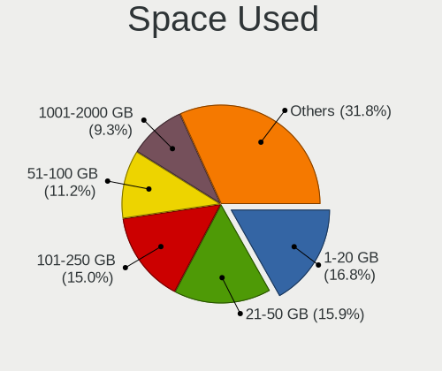

Manjaro Hardware Trends
-----------------------

A project to identify most popular hardware characteristics and track their change
over time based on data collected by Manjaro users at https://Linux-Hardware.org.

Anyone can contribute to this report by the [hw-probe](https://github.com/linuxhw/hw-probe) tool:

    sudo -E hw-probe -all -upload

This is a report for all computer types. See also reports for [desktops](/Dist/Manjaro/Desktop/README.md) and [notebooks](/Dist/Manjaro/Notebook/README.md).

This report is for one last month. Overall report since the beginning of time: [TestCoverage](https://github.com/linuxhw/TestCoverage)

Period: Apr, 2022.

Contents
--------

* [ System ](#system)
  - [ OS                       ](#os)
  - [ OS Family                ](#os-family)
  - [ Kernel                   ](#kernel)
  - [ Kernel Family            ](#kernel-family)
  - [ Kernel Major Ver.        ](#kernel-major-ver)
  - [ Arch                     ](#arch)
  - [ DE                       ](#de)
  - [ Display Server           ](#display-server)
  - [ Display Manager          ](#display-manager)
  - [ OS Lang                  ](#os-lang)
  - [ Boot Mode                ](#boot-mode)
  - [ Filesystem               ](#filesystem)
  - [ Part. scheme             ](#part-scheme)
  - [ Dual Boot with Linux/BSD ](#dual-boot-with-linuxbsd)
  - [ Dual Boot (Win)          ](#dual-boot-win)

* [ Board ](#board)
  - [ Vendor                   ](#vendor)
  - [ Model                    ](#model)
  - [ Model Family             ](#model-family)
  - [ MFG Year                 ](#mfg-year)
  - [ Form Factor              ](#form-factor)
  - [ Secure Boot              ](#secure-boot)
  - [ Coreboot                 ](#coreboot)
  - [ RAM Size                 ](#ram-size)
  - [ RAM Used                 ](#ram-used)
  - [ Total Drives             ](#total-drives)
  - [ Has CD-ROM               ](#has-cd-rom)
  - [ Has Ethernet             ](#has-ethernet)
  - [ Has WiFi                 ](#has-wifi)
  - [ Has Bluetooth            ](#has-bluetooth)

* [ Location ](#location)
  - [ Country                  ](#country)
  - [ City                     ](#city)

* [ Drives ](#drives)
  - [ Drive Vendor             ](#drive-vendor)
  - [ Drive Model              ](#drive-model)
  - [ HDD Vendor               ](#hdd-vendor)
  - [ SSD Vendor               ](#ssd-vendor)
  - [ Drive Kind               ](#drive-kind)
  - [ Drive Connector          ](#drive-connector)
  - [ Drive Size               ](#drive-size)
  - [ Space Total              ](#space-total)
  - [ Space Used               ](#space-used)
  - [ Malfunc. Drives          ](#malfunc-drives)
  - [ Malfunc. Drive Vendor    ](#malfunc-drive-vendor)
  - [ Malfunc. HDD Vendor      ](#malfunc-hdd-vendor)
  - [ Malfunc. Drive Kind      ](#malfunc-drive-kind)
  - [ Failed Drives            ](#failed-drives)
  - [ Failed Drive Vendor      ](#failed-drive-vendor)
  - [ Drive Status             ](#drive-status)

* [ Storage controller ](#storage-controller)
  - [ Storage Vendor           ](#storage-vendor)
  - [ Storage Model            ](#storage-model)
  - [ Storage Kind             ](#storage-kind)

* [ Processor ](#processor)
  - [ CPU Vendor               ](#cpu-vendor)
  - [ CPU Model                ](#cpu-model)
  - [ CPU Model Family         ](#cpu-model-family)
  - [ CPU Cores                ](#cpu-cores)
  - [ CPU Sockets              ](#cpu-sockets)
  - [ CPU Threads              ](#cpu-threads)
  - [ CPU Op-Modes             ](#cpu-op-modes)
  - [ CPU Microcode            ](#cpu-microcode)
  - [ CPU Microarch            ](#cpu-microarch)

* [ Graphics ](#graphics)
  - [ GPU Vendor               ](#gpu-vendor)
  - [ GPU Model                ](#gpu-model)
  - [ GPU Combo                ](#gpu-combo)
  - [ GPU Driver               ](#gpu-driver)
  - [ GPU Memory               ](#gpu-memory)

* [ Monitor ](#monitor)
  - [ Monitor Vendor           ](#monitor-vendor)
  - [ Monitor Model            ](#monitor-model)
  - [ Monitor Resolution       ](#monitor-resolution)
  - [ Monitor Diagonal         ](#monitor-diagonal)
  - [ Monitor Width            ](#monitor-width)
  - [ Aspect Ratio             ](#aspect-ratio)
  - [ Monitor Area             ](#monitor-area)
  - [ Pixel Density            ](#pixel-density)
  - [ Multiple Monitors        ](#multiple-monitors)

* [ Network ](#network)
  - [ Net Controller Vendor    ](#net-controller-vendor)
  - [ Net Controller Model     ](#net-controller-model)
  - [ Wireless Vendor          ](#wireless-vendor)
  - [ Wireless Model           ](#wireless-model)
  - [ Ethernet Vendor          ](#ethernet-vendor)
  - [ Ethernet Model           ](#ethernet-model)
  - [ Net Controller Kind      ](#net-controller-kind)
  - [ Used Controller          ](#used-controller)
  - [ NICs                     ](#nics)
  - [ IPv6                     ](#ipv6)

* [ Bluetooth ](#bluetooth)
  - [ Bluetooth Vendor         ](#bluetooth-vendor)
  - [ Bluetooth Model          ](#bluetooth-model)

* [ Sound ](#sound)
  - [ Sound Vendor             ](#sound-vendor)
  - [ Sound Model              ](#sound-model)

* [ Memory ](#memory)
  - [ Memory Vendor            ](#memory-vendor)
  - [ Memory Model             ](#memory-model)
  - [ Memory Kind              ](#memory-kind)
  - [ Memory Form Factor       ](#memory-form-factor)
  - [ Memory Size              ](#memory-size)
  - [ Memory Speed             ](#memory-speed)

* [ Printers & scanners ](#printers--scanners)
  - [ Printer Vendor           ](#printer-vendor)
  - [ Printer Model            ](#printer-model)
  - [ Scanner Vendor           ](#scanner-vendor)
  - [ Scanner Model            ](#scanner-model)

* [ Camera ](#camera)
  - [ Camera Vendor            ](#camera-vendor)
  - [ Camera Model             ](#camera-model)

* [ Security ](#security)
  - [ Fingerprint Vendor       ](#fingerprint-vendor)
  - [ Fingerprint Model        ](#fingerprint-model)
  - [ Chipcard Vendor          ](#chipcard-vendor)
  - [ Chipcard Model           ](#chipcard-model)

* [ Unsupported ](#unsupported)
  - [ Unsupported Devices      ](#unsupported-devices)
  - [ Unsupported Device Types ](#unsupported-device-types)

System
------

OS
--

Installed operating systems

| Name           | Computers | Percent |
|----------------|-----------|---------|
| Manjaro        | 120       | 53.1%   |
| Manjaro 21.2.5 | 64        | 28.32%  |
| Manjaro 21.2.6 | 41        | 18.14%  |
| Manjaro 21.2.2 | 1         | 0.44%   |

OS Family
---------

OS without a version

| Name    | Computers | Percent |
|---------|-----------|---------|
| Manjaro | 226       | 100%    |

Kernel
------

Version of the Linux kernel

| Version                | Computers | Percent |
|------------------------|-----------|---------|
| 5.15.28-1-MANJARO      | 59        | 26.11%  |
| 5.15.32-1-MANJARO      | 50        | 22.12%  |
| 5.16.14-1-MANJARO      | 26        | 11.5%   |
| 5.17.1-3-MANJARO       | 24        | 10.62%  |
| 5.10.105-1-MANJARO     | 13        | 5.75%   |
| 5.16.18-1-MANJARO      | 9         | 3.98%   |
| 5.17.0-1-MANJARO       | 7         | 3.1%    |
| 5.10.109-1-MANJARO     | 6         | 2.65%   |
| 5.4.184-1-MANJARO      | 4         | 1.77%   |
| 5.17.1-1-rt16-MANJARO  | 4         | 1.77%   |
| 5.16.2-2-rt19-MANJARO  | 4         | 1.77%   |
| 5.13.19-2-MANJARO      | 3         | 1.33%   |
| 5.17.4-1-ck            | 1         | 0.44%   |
| 5.17.3-zen1-1-zen      | 1         | 0.44%   |
| 5.17.3-lqx1-1-lqx      | 1         | 0.44%   |
| 5.17.2-xanmod1-1       | 1         | 0.44%   |
| 5.17.1-zen1-1-zen      | 1         | 0.44%   |
| 5.16.19-1-MANJARO      | 1         | 0.44%   |
| 5.16.18-lqx1-1-lqx     | 1         | 0.44%   |
| 5.16.15-lqx2-1-lqx     | 1         | 0.44%   |
| 5.15.7-1-MANJARO       | 1         | 0.44%   |
| 5.15.6-2-MANJARO       | 1         | 0.44%   |
| 5.15.34-1-MANJARO      | 1         | 0.44%   |
| 5.15.32-1-rt39-MANJARO | 1         | 0.44%   |
| 5.15.27-1-rt35-MANJARO | 1         | 0.44%   |
| 5.15.16-1-MANJARO      | 1         | 0.44%   |
| 5.14.7-2-MANJARO       | 1         | 0.44%   |
| 5.14.21-2-MANJARO      | 1         | 0.44%   |
| 5.10.98-1-MANJARO      | 1         | 0.44%   |

Kernel Family
-------------

Linux kernel without a distro release

| Version  | Computers | Percent |
|----------|-----------|---------|
| 5.15.28  | 59        | 26.11%  |
| 5.15.32  | 51        | 22.57%  |
| 5.17.1   | 29        | 12.83%  |
| 5.16.14  | 26        | 11.5%   |
| 5.10.105 | 13        | 5.75%   |
| 5.16.18  | 10        | 4.42%   |
| 5.17.0   | 7         | 3.1%    |
| 5.10.109 | 6         | 2.65%   |
| 5.4.184  | 4         | 1.77%   |
| 5.16.2   | 4         | 1.77%   |
| 5.13.19  | 3         | 1.33%   |
| 5.17.3   | 2         | 0.88%   |
| 5.17.4   | 1         | 0.44%   |
| 5.17.2   | 1         | 0.44%   |
| 5.16.19  | 1         | 0.44%   |
| 5.16.15  | 1         | 0.44%   |
| 5.15.7   | 1         | 0.44%   |
| 5.15.6   | 1         | 0.44%   |
| 5.15.34  | 1         | 0.44%   |
| 5.15.27  | 1         | 0.44%   |
| 5.15.16  | 1         | 0.44%   |
| 5.14.7   | 1         | 0.44%   |
| 5.14.21  | 1         | 0.44%   |
| 5.10.98  | 1         | 0.44%   |

Kernel Major Ver.
-----------------

Linux kernel major version

| Version | Computers | Percent |
|---------|-----------|---------|
| 5.15    | 115       | 50.88%  |
| 5.16    | 42        | 18.58%  |
| 5.17    | 40        | 17.7%   |
| 5.10    | 20        | 8.85%   |
| 5.4     | 4         | 1.77%   |
| 5.13    | 3         | 1.33%   |
| 5.14    | 2         | 0.88%   |

Arch
----

OS architecture (x86_64, i586, etc.)

| Name   | Computers | Percent |
|--------|-----------|---------|
| x86_64 | 226       | 100%    |

DE
--

Desktop Environment

| Name            | Computers | Percent |
|-----------------|-----------|---------|
| KDE5            | 103       | 45.58%  |
| GNOME           | 56        | 24.78%  |
| XFCE            | 49        | 21.68%  |
| Unknown         | 6         | 2.65%   |
| X-Cinnamon      | 4         | 1.77%   |
| i3              | 4         | 1.77%   |
| MATE            | 3         | 1.33%   |
| GNOME Flashback | 1         | 0.44%   |

Display Server
--------------

X11 or Wayland

| Name    | Computers | Percent |
|---------|-----------|---------|
| X11     | 173       | 76.55%  |
| Wayland | 49        | 21.68%  |
| Tty     | 2         | 0.88%   |
| Unknown | 2         | 0.88%   |

Display Manager
---------------

SDDM, LightDM, etc.

| Name    | Computers | Percent |
|---------|-----------|---------|
| Unknown | 120       | 53.1%   |
| LightDM | 44        | 19.47%  |
| GDM     | 32        | 14.16%  |
| SDDM    | 29        | 12.83%  |
| Ly      | 1         | 0.44%   |

OS Lang
-------

Language

| Lang    | Computers | Percent |
|---------|-----------|---------|
| en_US   | 105       | 46.46%  |
| en_GB   | 20        | 8.85%   |
| ru_RU   | 15        | 6.64%   |
| de_DE   | 15        | 6.64%   |
| fr_FR   | 8         | 3.54%   |
| es_ES   | 7         | 3.1%    |
| en_AU   | 7         | 3.1%    |
| en_CA   | 6         | 2.65%   |
| pt_BR   | 4         | 1.77%   |
| pl_PL   | 4         | 1.77%   |
| nl_NL   | 3         | 1.33%   |
| en_ZA   | 3         | 1.33%   |
| en_NZ   | 3         | 1.33%   |
| cs_CZ   | 3         | 1.33%   |
| sv_SE   | 2         | 0.88%   |
| it_IT   | 2         | 0.88%   |
| es_MX   | 2         | 0.88%   |
| Unknown | 2         | 0.88%   |
| zh_TW   | 1         | 0.44%   |
| zh_CN   | 1         | 0.44%   |
| szl_PL  | 1         | 0.44%   |
| pt_PT   | 1         | 0.44%   |
| fr_CH   | 1         | 0.44%   |
| fr_CA   | 1         | 0.44%   |
| fi_FI   | 1         | 0.44%   |
| es_PA   | 1         | 0.44%   |
| es_EC   | 1         | 0.44%   |
| es_CO   | 1         | 0.44%   |
| en_IN   | 1         | 0.44%   |
| en_IL   | 1         | 0.44%   |
| en_DK   | 1         | 0.44%   |
| en_DE   | 1         | 0.44%   |
| de_AT   | 1         | 0.44%   |

Boot Mode
---------

EFI or BIOS

| Mode | Computers | Percent |
|------|-----------|---------|
| BIOS | 165       | 73.01%  |
| EFI  | 61        | 26.99%  |

Filesystem
----------

Type of filesystem

| Type    | Computers | Percent |
|---------|-----------|---------|
| Ext4    | 183       | 80.97%  |
| Btrfs   | 37        | 16.37%  |
| Xfs     | 2         | 0.88%   |
| Unknown | 2         | 0.88%   |
| Tmpfs   | 1         | 0.44%   |
| F2fs    | 1         | 0.44%   |

Part. scheme
------------

Scheme of partitioning

| Type    | Computers | Percent |
|---------|-----------|---------|
| Unknown | 154       | 68.14%  |
| GPT     | 62        | 27.43%  |
| MBR     | 10        | 4.42%   |

Dual Boot with Linux/BSD
------------------------

Hosting more than one Linux/BSD

| Dual boot | Computers | Percent |
|-----------|-----------|---------|
| No        | 213       | 94.25%  |
| Yes       | 13        | 5.75%   |

Dual Boot (Win)
---------------

Hosting Linux and Windows

| Dual boot | Computers | Percent |
|-----------|-----------|---------|
| No        | 176       | 77.88%  |
| Yes       | 50        | 22.12%  |

Board
-----

Vendor
------

Motherboard manufacturer

| Name                   | Computers | Percent |
|------------------------|-----------|---------|
| Lenovo                 | 41        | 18.14%  |
| ASUSTek Computer       | 40        | 17.7%   |
| Dell                   | 27        | 11.95%  |
| Hewlett-Packard        | 26        | 11.5%   |
| MSI                    | 19        | 8.41%   |
| ASRock                 | 16        | 7.08%   |
| Gigabyte Technology    | 12        | 5.31%   |
| Acer                   | 9         | 3.98%   |
| Timi                   | 6         | 2.65%   |
| Apple                  | 6         | 2.65%   |
| Toshiba                | 3         | 1.33%   |
| Intel                  | 3         | 1.33%   |
| Alienware              | 2         | 0.88%   |
| ZOTAC                  | 1         | 0.44%   |
| TUXEDO                 | 1         | 0.44%   |
| Sony                   | 1         | 0.44%   |
| Schenker               | 1         | 0.44%   |
| Samsung Electronics    | 1         | 0.44%   |
| Monster                | 1         | 0.44%   |
| HUAWEI                 | 1         | 0.44%   |
| HONOR                  | 1         | 0.44%   |
| Framework              | 1         | 0.44%   |
| Foxconn                | 1         | 0.44%   |
| ECS                    | 1         | 0.44%   |
| Biostar                | 1         | 0.44%   |
| BESSTAR Tech           | 1         | 0.44%   |
| AZW                    | 1         | 0.44%   |
| Avell High Performance | 1         | 0.44%   |
| A-DATA Technology      | 1         | 0.44%   |

Model
-----

Motherboard model

| Name                                      | Computers | Percent |
|-------------------------------------------|-----------|---------|
| ASUS All Series                           | 5         | 2.21%   |
| Timi RedmiBook Pro 15S                    | 3         | 1.33%   |
| ASUS X550VX                               | 3         | 1.33%   |
| Timi A35S                                 | 2         | 0.88%   |
| HP ProBook 445 G8 Notebook PC             | 2         | 0.88%   |
| HP Notebook                               | 2         | 0.88%   |
| Dell Latitude 5480                        | 2         | 0.88%   |
| ASUS ROG CROSSHAIR VIII HERO              | 2         | 0.88%   |
| ASRock B550M Pro4                         | 2         | 0.88%   |
| ZOTAC ZBOXSD-ID12/ID13                    | 1         | 0.44%   |
| TUXEDO PA70ES                             | 1         | 0.44%   |
| Toshiba Satellite L775-151                | 1         | 0.44%   |
| Toshiba Satellite L50-C                   | 1         | 0.44%   |
| Toshiba Satellite C855D                   | 1         | 0.44%   |
| Timi A35                                  | 1         | 0.44%   |
| Sony VPCF120FL                            | 1         | 0.44%   |
| Schenker VISION 15 (SVS15E21)             | 1         | 0.44%   |
| Samsung 930QDB                            | 1         | 0.44%   |
| MSI MS-7D13                               | 1         | 0.44%   |
| MSI MS-7D03                               | 1         | 0.44%   |
| MSI MS-7C35                               | 1         | 0.44%   |
| MSI MS-7C09                               | 1         | 0.44%   |
| MSI MS-7C02                               | 1         | 0.44%   |
| MSI MS-7B84                               | 1         | 0.44%   |
| MSI MS-7B79                               | 1         | 0.44%   |
| MSI MS-7B49                               | 1         | 0.44%   |
| MSI MS-7B48                               | 1         | 0.44%   |
| MSI MS-7A38                               | 1         | 0.44%   |
| MSI MS-7A37                               | 1         | 0.44%   |
| MSI MS-7A31                               | 1         | 0.44%   |
| MSI MS-7816                               | 1         | 0.44%   |
| MSI MS-7641                               | 1         | 0.44%   |
| MSI MS-6638                               | 1         | 0.44%   |
| MSI Modern 15 A11MU                       | 1         | 0.44%   |
| MSI Modern 14 B10MW                       | 1         | 0.44%   |
| MSI GS70 6QE                              | 1         | 0.44%   |
| MSI GS60 2PE Ghost Pro                    | 1         | 0.44%   |
| Monster ABRA A5 V12.1                     | 1         | 0.44%   |
| Lenovo Z51-70 80K6                        | 1         | 0.44%   |
| Lenovo Yoga 730-15IWL 81JS                | 1         | 0.44%   |
| Lenovo Yoga 7 14ITL5 82BH                 | 1         | 0.44%   |
| Lenovo Yoga 6 13ALC6 82ND                 | 1         | 0.44%   |
| Lenovo Yoga 300-11IBY 80M0                | 1         | 0.44%   |
| Lenovo ThinkPad X230 2325YGM              | 1         | 0.44%   |
| Lenovo ThinkPad X230 23202DG              | 1         | 0.44%   |
| Lenovo ThinkPad X131e 33672T5             | 1         | 0.44%   |
| Lenovo ThinkPad X1 Extreme 2nd 20QVCTO1WW | 1         | 0.44%   |
| Lenovo ThinkPad T495s 20QKS01E00          | 1         | 0.44%   |
| Lenovo ThinkPad T460s 20F90044MX          | 1         | 0.44%   |
| Lenovo ThinkPad T460 20FMS66R00           | 1         | 0.44%   |
| Lenovo ThinkPad T440p 20AWS1EH00          | 1         | 0.44%   |
| Lenovo ThinkPad T440p 20AWS03H00          | 1         | 0.44%   |
| Lenovo ThinkPad T420 41786KG              | 1         | 0.44%   |
| Lenovo ThinkPad T400 6474WBN              | 1         | 0.44%   |
| Lenovo ThinkPad T15 Gen 2i 20W4003FUK     | 1         | 0.44%   |
| Lenovo ThinkPad P15v Gen 1 20TQCTO1WW     | 1         | 0.44%   |
| Lenovo ThinkPad L440 20ASA02800           | 1         | 0.44%   |
| Lenovo ThinkPad E485 20KUCTO1WW           | 1         | 0.44%   |
| Lenovo ThinkPad E15 Gen 3 20YG003JUS      | 1         | 0.44%   |
| Lenovo ThinkPad E14 Gen 3 20YDCTO1WW      | 1         | 0.44%   |

Model Family
------------

Motherboard model prefix

| Name               | Computers | Percent |
|--------------------|-----------|---------|
| Lenovo ThinkPad    | 17        | 7.52%   |
| Dell Inspiron      | 10        | 4.42%   |
| Lenovo IdeaPad     | 8         | 3.54%   |
| ASUS ROG           | 7         | 3.1%    |
| ASUS PRIME         | 6         | 2.65%   |
| Acer Aspire        | 6         | 2.65%   |
| HP Pavilion        | 5         | 2.21%   |
| HP Laptop          | 5         | 2.21%   |
| Dell OptiPlex      | 5         | 2.21%   |
| ASUS All           | 5         | 2.21%   |
| Lenovo Yoga        | 4         | 1.77%   |
| HP ProBook         | 4         | 1.77%   |
| Dell XPS           | 4         | 1.77%   |
| Dell Latitude      | 4         | 1.77%   |
| ASUS TUF           | 4         | 1.77%   |
| Toshiba Satellite  | 3         | 1.33%   |
| Timi RedmiBook     | 3         | 1.33%   |
| Lenovo ThinkBook   | 3         | 1.33%   |
| Lenovo IdeaPadFlex | 3         | 1.33%   |
| HP ZBook           | 3         | 1.33%   |
| ASUS X550VX        | 3         | 1.33%   |
| ASRock B550M       | 3         | 1.33%   |
| Timi A35S          | 2         | 0.88%   |
| MSI Modern         | 2         | 0.88%   |
| Lenovo Legion      | 2         | 0.88%   |
| HP Notebook        | 2         | 0.88%   |
| HP EliteDesk       | 2         | 0.88%   |
| Dell Vostro        | 2         | 0.88%   |
| ASUS ZenBook       | 2         | 0.88%   |
| ASUS P8Z77-V       | 2         | 0.88%   |
| ASUS ASUS          | 2         | 0.88%   |
| ASRock AB350M      | 2         | 0.88%   |
| Alienware Aurora   | 2         | 0.88%   |
| ZOTAC ZBOXSD-ID12  | 1         | 0.44%   |
| TUXEDO PA70ES      | 1         | 0.44%   |
| Timi A35           | 1         | 0.44%   |
| Sony VPCF120FL     | 1         | 0.44%   |
| Schenker VISION    | 1         | 0.44%   |
| Samsung 930QDB     | 1         | 0.44%   |
| MSI MS-7D13        | 1         | 0.44%   |
| MSI MS-7D03        | 1         | 0.44%   |
| MSI MS-7C35        | 1         | 0.44%   |
| MSI MS-7C09        | 1         | 0.44%   |
| MSI MS-7C02        | 1         | 0.44%   |
| MSI MS-7B84        | 1         | 0.44%   |
| MSI MS-7B79        | 1         | 0.44%   |
| MSI MS-7B49        | 1         | 0.44%   |
| MSI MS-7B48        | 1         | 0.44%   |
| MSI MS-7A38        | 1         | 0.44%   |
| MSI MS-7A37        | 1         | 0.44%   |
| MSI MS-7A31        | 1         | 0.44%   |
| MSI MS-7816        | 1         | 0.44%   |
| MSI MS-7641        | 1         | 0.44%   |
| MSI MS-6638        | 1         | 0.44%   |
| MSI GS70           | 1         | 0.44%   |
| MSI GS60           | 1         | 0.44%   |
| Monster ABRA       | 1         | 0.44%   |
| Lenovo Z51-70      | 1         | 0.44%   |
| Lenovo IdeaCentre  | 1         | 0.44%   |
| Lenovo B560        | 1         | 0.44%   |

MFG Year
--------

Motherboard manufacture year

| Year | Computers | Percent |
|------|-----------|---------|
| 2021 | 39        | 17.26%  |
| 2017 | 25        | 11.06%  |
| 2020 | 24        | 10.62%  |
| 2019 | 22        | 9.73%   |
| 2018 | 22        | 9.73%   |
| 2012 | 15        | 6.64%   |
| 2014 | 14        | 6.19%   |
| 2016 | 13        | 5.75%   |
| 2015 | 13        | 5.75%   |
| 2013 | 12        | 5.31%   |
| 2011 | 9         | 3.98%   |
| 2010 | 5         | 2.21%   |
| 2007 | 4         | 1.77%   |
| 2009 | 3         | 1.33%   |
| 2008 | 3         | 1.33%   |
| 2022 | 2         | 0.88%   |
| 2005 | 1         | 0.44%   |

Form Factor
-----------

Physical design of the computer

| Name        | Computers | Percent |
|-------------|-----------|---------|
| Notebook    | 124       | 54.87%  |
| Desktop     | 90        | 39.82%  |
| Convertible | 8         | 3.54%   |
| Mini pc     | 3         | 1.33%   |
| All in one  | 1         | 0.44%   |

Secure Boot
-----------

Enabled or disabled

| State    | Computers | Percent |
|----------|-----------|---------|
| Disabled | 226       | 100%    |

Coreboot
--------

Have coreboot on board

| Used | Computers | Percent |
|------|-----------|---------|
| No   | 226       | 100%    |

RAM Size
--------

Total RAM memory

| Size in GB  | Computers | Percent |
|-------------|-----------|---------|
| 16.01-24.0  | 67        | 29.65%  |
| 8.01-16.0   | 52        | 23.01%  |
| 4.01-8.0    | 40        | 17.7%   |
| 32.01-64.0  | 30        | 13.27%  |
| 3.01-4.0    | 23        | 10.18%  |
| 24.01-32.0  | 5         | 2.21%   |
| 64.01-256.0 | 5         | 2.21%   |
| 1.01-2.0    | 3         | 1.33%   |
| 2.01-3.0    | 1         | 0.44%   |

RAM Used
--------

Used RAM memory

| Used GB    | Computers | Percent |
|------------|-----------|---------|
| 2.01-3.0   | 57        | 25.22%  |
| 4.01-8.0   | 56        | 24.78%  |
| 1.01-2.0   | 53        | 23.45%  |
| 3.01-4.0   | 37        | 16.37%  |
| 8.01-16.0  | 16        | 7.08%   |
| 0.51-1.0   | 4         | 1.77%   |
| 24.01-32.0 | 2         | 0.88%   |
| 16.01-24.0 | 1         | 0.44%   |

Total Drives
------------

Number of drives on board

| Drives | Computers | Percent |
|--------|-----------|---------|
| 1      | 123       | 54.42%  |
| 2      | 60        | 26.55%  |
| 4      | 13        | 5.75%   |
| 3      | 13        | 5.75%   |
| 5      | 9         | 3.98%   |
| 6      | 6         | 2.65%   |
| 8      | 1         | 0.44%   |
| 7      | 1         | 0.44%   |

Has CD-ROM
----------

Has CD-ROM on board

| Presented | Computers | Percent |
|-----------|-----------|---------|
| No        | 172       | 76.11%  |
| Yes       | 54        | 23.89%  |

Has Ethernet
------------

Has Ethernet on board

| Presented | Computers | Percent |
|-----------|-----------|---------|
| Yes       | 180       | 79.65%  |
| No        | 46        | 20.35%  |

Has WiFi
--------

Has WiFi module

| Presented | Computers | Percent |
|-----------|-----------|---------|
| Yes       | 182       | 80.53%  |
| No        | 44        | 19.47%  |

Has Bluetooth
-------------

Has Bluetooth module

| Presented | Computers | Percent |
|-----------|-----------|---------|
| Yes       | 158       | 69.91%  |
| No        | 68        | 30.09%  |

Location
--------

Country
-------

Geographic location (country)

| Country                | Computers | Percent |
|------------------------|-----------|---------|
| USA                    | 54        | 23.89%  |
| Germany                | 18        | 7.96%   |
| Russia                 | 14        | 6.19%   |
| France                 | 12        | 5.31%   |
| Canada                 | 11        | 4.87%   |
| UK                     | 10        | 4.42%   |
| Spain                  | 9         | 3.98%   |
| Poland                 | 9         | 3.98%   |
| Netherlands            | 8         | 3.54%   |
| Brazil                 | 6         | 2.65%   |
| Australia              | 6         | 2.65%   |
| Finland                | 5         | 2.21%   |
| Ukraine                | 3         | 1.33%   |
| Turkey                 | 3         | 1.33%   |
| Sweden                 | 3         | 1.33%   |
| South Africa           | 3         | 1.33%   |
| Romania                | 3         | 1.33%   |
| Italy                  | 3         | 1.33%   |
| Czechia                | 3         | 1.33%   |
| China                  | 3         | 1.33%   |
| Switzerland            | 2         | 0.88%   |
| Norway                 | 2         | 0.88%   |
| New Zealand            | 2         | 0.88%   |
| Mexico                 | 2         | 0.88%   |
| India                  | 2         | 0.88%   |
| Hungary                | 2         | 0.88%   |
| Croatia                | 2         | 0.88%   |
| Belarus                | 2         | 0.88%   |
| Argentina              | 2         | 0.88%   |
| Thailand               | 1         | 0.44%   |
| Taiwan                 | 1         | 0.44%   |
| Saudi Arabia           | 1         | 0.44%   |
| Portugal               | 1         | 0.44%   |
| Peru                   | 1         | 0.44%   |
| Panama                 | 1         | 0.44%   |
| Kenya                  | 1         | 0.44%   |
| Japan                  | 1         | 0.44%   |
| Jamaica                | 1         | 0.44%   |
| Israel                 | 1         | 0.44%   |
| Isle of Man            | 1         | 0.44%   |
| Iraq                   | 1         | 0.44%   |
| Greece                 | 1         | 0.44%   |
| Ghana                  | 1         | 0.44%   |
| Egypt                  | 1         | 0.44%   |
| Ecuador                | 1         | 0.44%   |
| Denmark                | 1         | 0.44%   |
| Costa Rica             | 1         | 0.44%   |
| Colombia               | 1         | 0.44%   |
| Bulgaria               | 1         | 0.44%   |
| Bosnia and Herzegovina | 1         | 0.44%   |
| Austria                | 1         | 0.44%   |

City
----

Geographic location (city)

| City           | Computers | Percent |
|----------------|-----------|---------|
| Toronto        | 5         | 2.21%   |
| St Petersburg  | 4         | 1.77%   |
| Warsaw         | 3         | 1.33%   |
| Sao Paulo      | 3         | 1.33%   |
| Moscow         | 3         | 1.33%   |
| Lebanon        | 3         | 1.33%   |
| Wuhan          | 2         | 0.88%   |
| Tampere        | 2         | 0.88%   |
| Seville        | 2         | 0.88%   |
| Rotterdam      | 2         | 0.88%   |
| Redding        | 2         | 0.88%   |
| Perth          | 2         | 0.88%   |
| Melbourne      | 2         | 0.88%   |
| Lakewood       | 2         | 0.88%   |
| Kirov          | 2         | 0.88%   |
| Helsinki       | 2         | 0.88%   |
| Collierville   | 2         | 0.88%   |
| Budapest       | 2         | 0.88%   |
| Boise          | 2         | 0.88%   |
| Berlin         | 2         | 0.88%   |
| Amsterdam      | 2         | 0.88%   |
| Zutphen        | 1         | 0.44%   |
| Zapopan        | 1         | 0.44%   |
| Zagreb         | 1         | 0.44%   |
| Zaandam        | 1         | 0.44%   |
| Wichita        | 1         | 0.44%   |
| White River    | 1         | 0.44%   |
| Webster        | 1         | 0.44%   |
| Washington     | 1         | 0.44%   |
| Villahermosa   | 1         | 0.44%   |
| Villa Rica     | 1         | 0.44%   |
| Velke Losiny   | 1         | 0.44%   |
| Vannes         | 1         | 0.44%   |
| Valence        | 1         | 0.44%   |
| Ulfborg        | 1         | 0.44%   |
| Uddevalla      | 1         | 0.44%   |
| Toulouse       | 1         | 0.44%   |
| Ternopil       | 1         | 0.44%   |
| Telford        | 1         | 0.44%   |
| Tel Aviv       | 1         | 0.44%   |
| Słupsk        | 1         | 0.44%   |
| Sydney         | 1         | 0.44%   |
| Sundsvall      | 1         | 0.44%   |
| Sulaymaniyah   | 1         | 0.44%   |
| Split          | 1         | 0.44%   |
| Sora           | 1         | 0.44%   |
| Sherbrooke     | 1         | 0.44%   |
| Senonches      | 1         | 0.44%   |
| Seattle        | 1         | 0.44%   |
| Scottsdale     | 1         | 0.44%   |
| Satu Mare      | 1         | 0.44%   |
| Sarreguemines  | 1         | 0.44%   |
| Sarajevo       | 1         | 0.44%   |
| San Jose       | 1         | 0.44%   |
| Samara         | 1         | 0.44%   |
| Salt Lake City | 1         | 0.44%   |
| Saint-Jerome   | 1         | 0.44%   |
| Saint Ives     | 1         | 0.44%   |
| Rudolstadt     | 1         | 0.44%   |
| Rostock        | 1         | 0.44%   |

Drives
------

Drive Vendor
------------

Hard drive vendors

| Vendor                         | Computers | Drives | Percent |
|--------------------------------|-----------|--------|---------|
| Samsung Electronics            | 65        | 78     | 17.15%  |
| WDC                            | 53        | 67     | 13.98%  |
| Seagate                        | 50        | 54     | 13.19%  |
| Sandisk                        | 29        | 30     | 7.65%   |
| Toshiba                        | 27        | 28     | 7.12%   |
| Crucial                        | 22        | 32     | 5.8%    |
| Kingston                       | 20        | 24     | 5.28%   |
| SK Hynix                       | 11        | 11     | 2.9%    |
| A-DATA Technology              | 11        | 13     | 2.9%    |
| Intel                          | 9         | 10     | 2.37%   |
| Micron Technology              | 8         | 8      | 2.11%   |
| Hitachi                        | 7         | 7      | 1.85%   |
| Unknown                        | 6         | 7      | 1.58%   |
| XPG                            | 5         | 5      | 1.32%   |
| Phison                         | 5         | 7      | 1.32%   |
| KIOXIA                         | 5         | 5      | 1.32%   |
| HGST                           | 5         | 5      | 1.32%   |
| PNY                            | 4         | 4      | 1.06%   |
| Solid State Storage Technology | 2         | 2      | 0.53%   |
| Silicon Motion                 | 2         | 2      | 0.53%   |
| OCZ                            | 2         | 2      | 0.53%   |
| Micron/Crucial Technology      | 2         | 2      | 0.53%   |
| Gigabyte Technology            | 2         | 2      | 0.53%   |
| Apple                          | 2         | 2      | 0.53%   |
| TwinMOS                        | 1         | 1      | 0.26%   |
| TO Exter                       | 1         | 1      | 0.26%   |
| TEAM L3                        | 1         | 1      | 0.26%   |
| SSSTC                          | 1         | 1      | 0.26%   |
| SABRENT                        | 1         | 1      | 0.26%   |
| Realtek Semiconductor          | 1         | 1      | 0.26%   |
| Patriot                        | 1         | 1      | 0.26%   |
| oyunkey                        | 1         | 1      | 0.26%   |
| NGFF                           | 1         | 1      | 0.26%   |
| Netac                          | 1         | 1      | 0.26%   |
| MAXTOR                         | 1         | 1      | 0.26%   |
| LITEONIT                       | 1         | 1      | 0.26%   |
| Leven                          | 1         | 1      | 0.26%   |
| Lenovo                         | 1         | 1      | 0.26%   |
| KIOXIA-EXCERIA                 | 1         | 1      | 0.26%   |
| KingFast                       | 1         | 1      | 0.26%   |
| JMicron                        | 1         | 1      | 0.26%   |
| HS-SSD-C100                    | 1         | 1      | 0.26%   |
| Hewlett-Packard                | 1         | 2      | 0.26%   |
| GOODRAM                        | 1         | 1      | 0.26%   |
| Corsair                        | 1         | 1      | 0.26%   |
| China                          | 1         | 1      | 0.26%   |
| ASMT                           | 1         | 1      | 0.26%   |
| ADATA Technology               | 1         | 1      | 0.26%   |
| Unknown                        | 1         | 1      | 0.26%   |

Drive Model
-----------

Hard drive models

| Model                                | Computers | Percent |
|--------------------------------------|-----------|---------|
| Samsung NVMe SSD Drive 1TB           | 7         | 1.67%   |
| Samsung NVMe SSD Drive 512GB         | 6         | 1.43%   |
| Samsung NVMe SSD Drive 250GB         | 6         | 1.43%   |
| Kingston SA400S37120G 120GB SSD      | 6         | 1.43%   |
| Crucial CT500MX500SSD1 500GB         | 6         | 1.43%   |
| Seagate ST2000DM008-2FR102 2TB       | 5         | 1.19%   |
| Seagate ST1000DM010-2EP102 1TB       | 5         | 1.19%   |
| Samsung SSD 860 EVO 500GB            | 5         | 1.19%   |
| Samsung SSD 850 EVO 500GB            | 5         | 1.19%   |
| Toshiba MQ04ABF100 1TB               | 4         | 0.95%   |
| SK Hynix NVMe SSD Drive 512GB        | 4         | 0.95%   |
| Sandisk NVMe SSD Drive 512GB         | 4         | 0.95%   |
| Sandisk NVMe SSD Drive 500GB         | 4         | 0.95%   |
| Samsung SSD 870 EVO 1TB              | 4         | 0.95%   |
| KIOXIA NVMe SSD Drive 512GB          | 4         | 0.95%   |
| Kingston SA400S37240G 240GB SSD      | 4         | 0.95%   |
| Toshiba DT01ACA100 1TB               | 3         | 0.71%   |
| Samsung SSD 850 EVO 250GB            | 3         | 0.71%   |
| Samsung PSSD T7 500GB                | 3         | 0.71%   |
| Micron NVMe SSD Drive 512GB          | 3         | 0.71%   |
| Intel NVMe SSD Drive 512GB           | 3         | 0.71%   |
| Crucial CT1000MX500SSD1 1TB          | 3         | 0.71%   |
| XPG NVMe SSD Drive 512GB             | 2         | 0.48%   |
| WDC WDS500G2B0A-00SM50 500GB SSD     | 2         | 0.48%   |
| WDC WDS240G2G0B-00EPW0 240GB SSD     | 2         | 0.48%   |
| WDC WDS100T2B0A-00SM50 1TB SSD       | 2         | 0.48%   |
| WDC WD5000AAKX-001CA0 500GB          | 2         | 0.48%   |
| WDC WD40EZAZ-00SF3B0 4TB             | 2         | 0.48%   |
| WDC WD20EZBX-00AYRA0 2TB             | 2         | 0.48%   |
| WDC WD10EARS-00Y5B1 1TB              | 2         | 0.48%   |
| WDC PC SN520 SDAPMUW-256G-1101 256GB | 2         | 0.48%   |
| Toshiba MQ01ABF050 500GB             | 2         | 0.48%   |
| Toshiba MQ01ABD100 1TB               | 2         | 0.48%   |
| SK Hynix NVMe SSD Drive 128GB        | 2         | 0.48%   |
| Seagate ST2000LM007-1R8174 2TB       | 2         | 0.48%   |
| Seagate ST2000DM005-2CW102 2TB       | 2         | 0.48%   |
| Seagate ST1000LM024 HN-M101MBB 1TB   | 2         | 0.48%   |
| Seagate ST1000LM014-1EJ164 1TB       | 2         | 0.48%   |
| Seagate ST1000DM003-1ER162 1TB       | 2         | 0.48%   |
| Seagate ST1000DM003-1CH162 1TB       | 2         | 0.48%   |
| Seagate SSD 1TB                      | 2         | 0.48%   |
| SanDisk SSD PLUS 480GB               | 2         | 0.48%   |
| SanDisk SSD PLUS 240GB               | 2         | 0.48%   |
| SanDisk SSD PLUS 1000GB              | 2         | 0.48%   |
| SanDisk SDSSDA240G 240GB             | 2         | 0.48%   |
| Sandisk NVMe SSD Drive 256GB         | 2         | 0.48%   |
| Sandisk NVMe SSD Drive 1TB           | 2         | 0.48%   |
| Samsung SSD 970 EVO Plus 250GB       | 2         | 0.48%   |
| Samsung SSD 970 EVO 1TB              | 2         | 0.48%   |
| Samsung SSD 860 EVO 1TB              | 2         | 0.48%   |
| Samsung SSD 830 Series 64GB          | 2         | 0.48%   |
| Samsung NVMe SSD Drive 500GB         | 2         | 0.48%   |
| Samsung NVMe SSD Drive 2TB           | 2         | 0.48%   |
| Samsung NVMe SSD Drive 256GB         | 2         | 0.48%   |
| Phison NVMe SSD Drive 1024GB         | 2         | 0.48%   |
| Micron/Crucial NVMe SSD Drive 1TB    | 2         | 0.48%   |
| Kingston NVMe SSD Drive 500GB        | 2         | 0.48%   |
| Intel SSDPEKNW512G8H 512GB           | 2         | 0.48%   |
| HGST HTS721010A9E630 1TB             | 2         | 0.48%   |
| Crucial CT525MX300SSD1 528GB         | 2         | 0.48%   |

HDD Vendor
----------

Hard disk drive vendors

| Vendor              | Computers | Drives | Percent |
|---------------------|-----------|--------|---------|
| Seagate             | 46        | 50     | 38.66%  |
| WDC                 | 37        | 48     | 31.09%  |
| Toshiba             | 18        | 18     | 15.13%  |
| Hitachi             | 7         | 7      | 5.88%   |
| HGST                | 5         | 5      | 4.2%    |
| Samsung Electronics | 2         | 2      | 1.68%   |
| Unknown             | 1         | 1      | 0.84%   |
| SABRENT             | 1         | 1      | 0.84%   |
| MAXTOR              | 1         | 1      | 0.84%   |
| ASMT                | 1         | 1      | 0.84%   |

SSD Vendor
----------

Solid state drive vendors

| Vendor              | Computers | Drives | Percent |
|---------------------|-----------|--------|---------|
| Samsung Electronics | 30        | 34     | 21.74%  |
| Crucial             | 22        | 32     | 15.94%  |
| SanDisk             | 16        | 16     | 11.59%  |
| Kingston            | 15        | 18     | 10.87%  |
| A-DATA Technology   | 10        | 12     | 7.25%   |
| WDC                 | 8         | 9      | 5.8%    |
| Micron Technology   | 5         | 5      | 3.62%   |
| PNY                 | 4         | 4      | 2.9%    |
| Toshiba             | 3         | 3      | 2.17%   |
| Seagate             | 3         | 3      | 2.17%   |
| SK Hynix            | 2         | 2      | 1.45%   |
| OCZ                 | 2         | 2      | 1.45%   |
| Intel               | 2         | 2      | 1.45%   |
| Gigabyte Technology | 2         | 2      | 1.45%   |
| Apple               | 2         | 2      | 1.45%   |
| TwinMOS             | 1         | 1      | 0.72%   |
| TO Exter            | 1         | 1      | 0.72%   |
| TEAM L3             | 1         | 1      | 0.72%   |
| Patriot             | 1         | 1      | 0.72%   |
| NGFF                | 1         | 1      | 0.72%   |
| Netac               | 1         | 1      | 0.72%   |
| LITEONIT            | 1         | 1      | 0.72%   |
| KIOXIA-EXCERIA      | 1         | 1      | 0.72%   |
| JMicron             | 1         | 1      | 0.72%   |
| GOODRAM             | 1         | 1      | 0.72%   |
| Corsair             | 1         | 1      | 0.72%   |
| China               | 1         | 1      | 0.72%   |

Drive Kind
----------

HDD or SSD

| Kind    | Computers | Drives | Percent |
|---------|-----------|--------|---------|
| NVMe    | 110       | 129    | 33.85%  |
| SSD     | 109       | 158    | 33.54%  |
| HDD     | 95        | 134    | 29.23%  |
| Unknown | 7         | 8      | 2.15%   |
| MMC     | 4         | 4      | 1.23%   |

Drive Connector
---------------

SATA, SAS, NVMe, etc.

| Type | Computers | Drives | Percent |
|------|-----------|--------|---------|
| SATA | 162       | 283    | 55.67%  |
| NVMe | 110       | 129    | 37.8%   |
| SAS  | 15        | 17     | 5.15%   |
| MMC  | 4         | 4      | 1.37%   |

Drive Size
----------

Size of hard drive

| Size in TB | Computers | Drives | Percent |
|------------|-----------|--------|---------|
| 0.01-0.5   | 115       | 152    | 49.36%  |
| 0.51-1.0   | 78        | 98     | 33.48%  |
| 1.01-2.0   | 23        | 23     | 9.87%   |
| 3.01-4.0   | 10        | 10     | 4.29%   |
| 4.01-10.0  | 4         | 4      | 1.72%   |
| 2.01-3.0   | 3         | 5      | 1.29%   |

Space Total
-----------

Amount of disk space available on the file system

| Size in GB     | Computers | Percent |
|----------------|-----------|---------|
| 251-500        | 56        | 24.78%  |
| 101-250        | 44        | 19.47%  |
| 501-1000       | 39        | 17.26%  |
| 1001-2000      | 24        | 10.62%  |
| More than 3000 | 18        | 7.96%   |
| Unknown        | 16        | 7.08%   |
| 2001-3000      | 15        | 6.64%   |
| 51-100         | 10        | 4.42%   |
| 21-50          | 2         | 0.88%   |
| 1-20           | 2         | 0.88%   |

Space Used
----------

Amount of used disk space

| Used GB        | Computers | Percent |
|----------------|-----------|---------|
| 51-100         | 43        | 19.03%  |
| 101-250        | 36        | 15.93%  |
| 21-50          | 35        | 15.49%  |
| 1-20           | 32        | 14.16%  |
| 251-500        | 27        | 11.95%  |
| Unknown        | 16        | 7.08%   |
| 501-1000       | 14        | 6.19%   |
| 1001-2000      | 11        | 4.87%   |
| More than 3000 | 8         | 3.54%   |
| 2001-3000      | 4         | 1.77%   |

Malfunc. Drives
---------------

Drive models with a malfunction

| Model                                               | Computers | Drives | Percent |
|-----------------------------------------------------|-----------|--------|---------|
| WDC WD5000AAKX-001CA0 500GB                         | 2         | 2      | 20%     |
| WDC WD2500KS-00MJB0 250GB                           | 1         | 1      | 10%     |
| WDC WD1500ADFS-00SLR5 150GB                         | 1         | 1      | 10%     |
| WDC WD10EZEX-00RKKA0 1TB                            | 1         | 1      | 10%     |
| Seagate ST2000DM008-2FR102 2TB                      | 1         | 1      | 10%     |
| Seagate ST1000LM048-2E7172 1TB                      | 1         | 1      | 10%     |
| Samsung Electronics SSD 870 EVO 1TB                 | 1         | 1      | 10%     |
| Micron Technology MTFDDAV512TBN-1AR15ABHA 512GB SSD | 1         | 1      | 10%     |
| Crucial CT256M550SSD4 256GB                         | 1         | 1      | 10%     |

Malfunc. Drive Vendor
---------------------

Vendors of faulty drives

| Vendor              | Computers | Drives | Percent |
|---------------------|-----------|--------|---------|
| WDC                 | 4         | 5      | 44.44%  |
| Seagate             | 2         | 2      | 22.22%  |
| Samsung Electronics | 1         | 1      | 11.11%  |
| Micron Technology   | 1         | 1      | 11.11%  |
| Crucial             | 1         | 1      | 11.11%  |

Malfunc. HDD Vendor
-------------------

Vendors of faulty HDD drives

| Vendor  | Computers | Drives | Percent |
|---------|-----------|--------|---------|
| WDC     | 4         | 5      | 66.67%  |
| Seagate | 2         | 2      | 33.33%  |

Malfunc. Drive Kind
-------------------

Kinds of faulty drives

| Kind | Computers | Drives | Percent |
|------|-----------|--------|---------|
| HDD  | 6         | 7      | 75%     |
| SSD  | 2         | 3      | 25%     |

Failed Drives
-------------

Failed drive models

Zero info for selected period =(

Failed Drive Vendor
-------------------

Failed drive vendors

Zero info for selected period =(

Drive Status
------------

Number of failed and malfunc. drives

| Status   | Computers | Drives | Percent |
|----------|-----------|--------|---------|
| Detected | 184       | 352    | 77.64%  |
| Works    | 45        | 71     | 18.99%  |
| Malfunc  | 8         | 10     | 3.38%   |

Storage controller
------------------

Storage Vendor
--------------

Storage controller vendors

| Vendor                         | Computers | Percent |
|--------------------------------|-----------|---------|
| Intel                          | 123       | 39.55%  |
| AMD                            | 67        | 21.54%  |
| Samsung Electronics            | 39        | 12.54%  |
| Sandisk                        | 20        | 6.43%   |
| SK Hynix                       | 9         | 2.89%   |
| KIOXIA                         | 7         | 2.25%   |
| Kingston Technology Company    | 6         | 1.93%   |
| ADATA Technology               | 6         | 1.93%   |
| Phison Electronics             | 5         | 1.61%   |
| ASMedia Technology             | 5         | 1.61%   |
| Toshiba America Info Systems   | 3         | 0.96%   |
| Solid State Storage Technology | 3         | 0.96%   |
| Silicon Motion                 | 3         | 0.96%   |
| Micron Technology              | 3         | 0.96%   |
| Realtek Semiconductor          | 2         | 0.64%   |
| Nvidia                         | 2         | 0.64%   |
| Micron/Crucial Technology      | 2         | 0.64%   |
| Silicon Image                  | 1         | 0.32%   |
| Seagate Technology             | 1         | 0.32%   |
| OCZ Technology Group           | 1         | 0.32%   |
| Marvell Technology Group       | 1         | 0.32%   |
| Lenovo                         | 1         | 0.32%   |
| JMicron Technology             | 1         | 0.32%   |

Storage Model
-------------

Storage controller models

| Model                                                                          | Computers | Percent |
|--------------------------------------------------------------------------------|-----------|---------|
| AMD FCH SATA Controller [AHCI mode]                                            | 56        | 16%     |
| Samsung NVMe SSD Controller SM981/PM981/PM983                                  | 17        | 4.86%   |
| Intel 8 Series/C220 Series Chipset Family 6-port SATA Controller 1 [AHCI mode] | 12        | 3.43%   |
| Intel 200 Series PCH SATA controller [AHCI mode]                               | 12        | 3.43%   |
| Samsung NVMe SSD Controller 980                                                | 11        | 3.14%   |
| Intel Sunrise Point-LP SATA Controller [AHCI mode]                             | 11        | 3.14%   |
| AMD 400 Series Chipset SATA Controller                                         | 9         | 2.57%   |
| Sandisk WD Black SN750 / PC SN730 NVMe SSD                                     | 8         | 2.29%   |
| Intel Wildcat Point-LP SATA Controller [AHCI Mode]                             | 8         | 2.29%   |
| Intel 7 Series Chipset Family 6-port SATA Controller [AHCI mode]               | 8         | 2.29%   |
| AMD 300 Series Chipset SATA Controller                                         | 8         | 2.29%   |
| AMD 500 Series Chipset SATA Controller                                         | 7         | 2%      |
| Samsung NVMe SSD Controller PM9A1/PM9A3/980PRO                                 | 6         | 1.71%   |
| KIOXIA Non-Volatile memory controller                                          | 6         | 1.71%   |
| Intel 82801 Mobile SATA Controller [RAID mode]                                 | 6         | 1.71%   |
| Samsung NVMe SSD Controller SM961/PM961/SM963                                  | 5         | 1.43%   |
| Intel Volume Management Device NVMe RAID Controller                            | 5         | 1.43%   |
| Intel HM170/QM170 Chipset SATA Controller [AHCI Mode]                          | 5         | 1.43%   |
| Intel 6 Series/C200 Series Chipset Family 6 port Desktop SATA AHCI Controller  | 5         | 1.43%   |
| ASMedia ASM1062 Serial ATA Controller                                          | 5         | 1.43%   |
| SK Hynix Gold P31 SSD                                                          | 4         | 1.14%   |
| Sandisk WD Blue SN550 NVMe SSD                                                 | 4         | 1.14%   |
| Intel SATA Controller [RAID mode]                                              | 4         | 1.14%   |
| Intel 9 Series Chipset Family SATA Controller [AHCI Mode]                      | 4         | 1.14%   |
| Intel 8 Series SATA Controller 1 [AHCI mode]                                   | 4         | 1.14%   |
| ADATA XPG SX8200 Pro PCIe Gen3x4 M.2 2280 Solid State Drive                    | 4         | 1.14%   |
| Solid State Storage Non-Volatile memory controller                             | 3         | 0.86%   |
| SK Hynix BC501 NVMe Solid State Drive                                          | 3         | 0.86%   |
| Phison E12 NVMe Controller                                                     | 3         | 0.86%   |
| Micron Non-Volatile memory controller                                          | 3         | 0.86%   |
| Intel SSD 660P Series                                                          | 3         | 0.86%   |
| Intel Q170/Q150/B150/H170/H110/Z170/CM236 Chipset SATA Controller [AHCI Mode]  | 3         | 0.86%   |
| Intel 7 Series/C210 Series Chipset Family 6-port SATA Controller [AHCI mode]   | 3         | 0.86%   |
| Intel 6 Series/C200 Series Chipset Family 6 port Mobile SATA AHCI Controller   | 3         | 0.86%   |
| SK Hynix BC511                                                                 | 2         | 0.57%   |
| Silicon Motion SM2263EN/SM2263XT SSD Controller                                | 2         | 0.57%   |
| Sandisk WD PC SN810 / Black SN850 NVMe SSD                                     | 2         | 0.57%   |
| Sandisk WD Black 2018/SN750 / PC SN720 NVMe SSD                                | 2         | 0.57%   |
| Sandisk PC SN520 NVMe SSD                                                      | 2         | 0.57%   |
| Sandisk Non-Volatile memory controller                                         | 2         | 0.57%   |
| Phison E16 PCIe4 NVMe Controller                                               | 2         | 0.57%   |
| Kingston Company OM3PDP3 NVMe SSD                                              | 2         | 0.57%   |
| Kingston Company A2000 NVMe SSD                                                | 2         | 0.57%   |
| Intel SSD Pro 7600p/760p/E 6100p Series                                        | 2         | 0.57%   |
| Intel NM10/ICH7 Family SATA Controller [IDE mode]                              | 2         | 0.57%   |
| Intel NM10/ICH7 Family SATA Controller [AHCI mode]                             | 2         | 0.57%   |
| Intel Cannon Lake Mobile PCH SATA AHCI Controller                              | 2         | 0.57%   |
| Intel 82801G (ICH7 Family) IDE Controller                                      | 2         | 0.57%   |
| Intel 500 Series Chipset Family SATA AHCI Controller                           | 2         | 0.57%   |
| Intel 5 Series/3400 Series Chipset 6 port SATA AHCI Controller                 | 2         | 0.57%   |
| Intel 5 Series/3400 Series Chipset 4 port SATA AHCI Controller                 | 2         | 0.57%   |
| AMD SB7x0/SB8x0/SB9x0 SATA Controller [AHCI mode]                              | 2         | 0.57%   |
| AMD SB7x0/SB8x0/SB9x0 IDE Controller                                           | 2         | 0.57%   |
| ADATA Non-Volatile memory controller                                           | 2         | 0.57%   |
| Toshiba America Info Systems XG6 NVMe SSD Controller                           | 1         | 0.29%   |
| Toshiba America Info Systems XG4 NVMe SSD Controller                           | 1         | 0.29%   |
| Toshiba America Info Systems BG3 NVMe SSD Controller                           | 1         | 0.29%   |
| Silicon Motion SM2262/SM2262EN SSD Controller                                  | 1         | 0.29%   |
| Silicon Image SiI 3132 Serial ATA Raid II Controller                           | 1         | 0.29%   |
| Seagate FireCuda 520 SSD                                                       | 1         | 0.29%   |

Storage Kind
------------

Kind of storage controller (IDE, SATA, NVMe, SAS, ...)

| Kind | Computers | Percent |
|------|-----------|---------|
| SATA | 169       | 54.69%  |
| NVMe | 110       | 35.6%   |
| RAID | 16        | 5.18%   |
| IDE  | 14        | 4.53%   |

Processor
---------

CPU Vendor
----------

Processor vendors

| Vendor | Computers | Percent |
|--------|-----------|---------|
| Intel  | 141       | 62.39%  |
| AMD    | 85        | 37.61%  |

CPU Model
---------

Processor models

| Model                                         | Computers | Percent |
|-----------------------------------------------|-----------|---------|
| AMD Ryzen 7 5800H with Radeon Graphics        | 8         | 3.54%   |
| Intel Core i7-6700HQ CPU @ 2.60GHz            | 5         | 2.21%   |
| Intel 11th Gen Core i5-1135G7 @ 2.40GHz       | 5         | 2.21%   |
| AMD Ryzen 9 3900X 12-Core Processor           | 5         | 2.21%   |
| AMD Ryzen 5 3600 6-Core Processor             | 5         | 2.21%   |
| AMD Ryzen 5 3500U with Radeon Vega Mobile Gfx | 5         | 2.21%   |
| Intel Core i7-8565U CPU @ 1.80GHz             | 4         | 1.77%   |
| Intel 11th Gen Core i7-1165G7 @ 2.80GHz       | 4         | 1.77%   |
| AMD Ryzen 5 5500U with Radeon Graphics        | 4         | 1.77%   |
| Intel Core i7-7700K CPU @ 4.20GHz             | 3         | 1.33%   |
| Intel Core i7-4500U CPU @ 1.80GHz             | 3         | 1.33%   |
| Intel Core i5-5200U CPU @ 2.20GHz             | 3         | 1.33%   |
| AMD Ryzen 7 5700U with Radeon Graphics        | 3         | 1.33%   |
| AMD Ryzen 7 2700X Eight-Core Processor        | 3         | 1.33%   |
| Intel Xeon CPU E3-1231 v3 @ 3.40GHz           | 2         | 0.88%   |
| Intel Core i7-8750H CPU @ 2.20GHz             | 2         | 0.88%   |
| Intel Core i7-7500U CPU @ 2.70GHz             | 2         | 0.88%   |
| Intel Core i7-6600U CPU @ 2.60GHz             | 2         | 0.88%   |
| Intel Core i7-5500U CPU @ 2.40GHz             | 2         | 0.88%   |
| Intel Core i7-4790K CPU @ 4.00GHz             | 2         | 0.88%   |
| Intel Core i7-4790 CPU @ 3.60GHz              | 2         | 0.88%   |
| Intel Core i7-4700MQ CPU @ 2.40GHz            | 2         | 0.88%   |
| Intel Core i5-8600K CPU @ 3.60GHz             | 2         | 0.88%   |
| Intel Core i5-6200U CPU @ 2.30GHz             | 2         | 0.88%   |
| Intel Core i5-3230M CPU @ 2.60GHz             | 2         | 0.88%   |
| Intel Core i3-2120 CPU @ 3.30GHz              | 2         | 0.88%   |
| Intel 11th Gen Core i7-11800H @ 2.30GHz       | 2         | 0.88%   |
| AMD Ryzen 7 5800U with Radeon Graphics        | 2         | 0.88%   |
| AMD Ryzen 7 4800H with Radeon Graphics        | 2         | 0.88%   |
| AMD Ryzen 7 3700X 8-Core Processor            | 2         | 0.88%   |
| AMD Ryzen 7 3700U with Radeon Vega Mobile Gfx | 2         | 0.88%   |
| AMD Ryzen 7 2700U with Radeon Vega Mobile Gfx | 2         | 0.88%   |
| AMD Ryzen 7 1700X Eight-Core Processor        | 2         | 0.88%   |
| AMD Ryzen 5 5600H with Radeon Graphics        | 2         | 0.88%   |
| AMD Ryzen 5 4600H with Radeon Graphics        | 2         | 0.88%   |
| AMD Ryzen 5 2600 Six-Core Processor           | 2         | 0.88%   |
| AMD Ryzen 3 3100 4-Core Processor             | 2         | 0.88%   |
| Intel Xeon CPU E5-1650 v2 @ 3.50GHz           | 1         | 0.44%   |
| Intel Pentium Gold G5400 CPU @ 3.70GHz        | 1         | 0.44%   |
| Intel Pentium Gold 7505 @ 2.00GHz             | 1         | 0.44%   |
| Intel Pentium Dual-Core CPU E5700 @ 3.00GHz   | 1         | 0.44%   |
| Intel Pentium CPU P6200 @ 2.13GHz             | 1         | 0.44%   |
| Intel Pentium CPU B960 @ 2.20GHz              | 1         | 0.44%   |
| Intel Pentium CPU 3825U @ 1.90GHz             | 1         | 0.44%   |
| Intel Pentium 3556U @ 1.70GHz                 | 1         | 0.44%   |
| Intel Genuine CPU 0000 @ 3.40GHz              | 1         | 0.44%   |
| Intel Core i9-9900KF CPU @ 3.60GHz            | 1         | 0.44%   |
| Intel Core i9-9880H CPU @ 2.30GHz             | 1         | 0.44%   |
| Intel Core i7-9700K CPU @ 3.60GHz             | 1         | 0.44%   |
| Intel Core i7-8850H CPU @ 2.60GHz             | 1         | 0.44%   |
| Intel Core i7-8700 CPU @ 3.20GHz              | 1         | 0.44%   |
| Intel Core i7-8550U CPU @ 1.80GHz             | 1         | 0.44%   |
| Intel Core i7-7700 CPU @ 3.60GHz              | 1         | 0.44%   |
| Intel Core i7-7600U CPU @ 2.80GHz             | 1         | 0.44%   |
| Intel Core i7-6820HQ CPU @ 2.70GHz            | 1         | 0.44%   |
| Intel Core i7-6700K CPU @ 4.00GHz             | 1         | 0.44%   |
| Intel Core i7-6700 CPU @ 3.40GHz              | 1         | 0.44%   |
| Intel Core i7-6500U CPU @ 2.50GHz             | 1         | 0.44%   |
| Intel Core i7-4770S CPU @ 3.10GHz             | 1         | 0.44%   |
| Intel Core i7-4770 CPU @ 3.40GHz              | 1         | 0.44%   |

CPU Model Family
----------------

Processor model prefix

| Model                   | Computers | Percent |
|-------------------------|-----------|---------|
| Intel Core i7           | 54        | 23.89%  |
| Intel Core i5           | 35        | 15.49%  |
| AMD Ryzen 7             | 30        | 13.27%  |
| AMD Ryzen 5             | 28        | 12.39%  |
| Other                   | 17        | 7.52%   |
| Intel Core i3           | 10        | 4.42%   |
| AMD Ryzen 9             | 8         | 3.54%   |
| Intel Celeron           | 6         | 2.65%   |
| Intel Pentium           | 4         | 1.77%   |
| AMD Ryzen 3             | 4         | 1.77%   |
| Intel Xeon              | 3         | 1.33%   |
| Intel Core 2 Duo        | 3         | 1.33%   |
| Intel Pentium Gold      | 2         | 0.88%   |
| Intel Core i9           | 2         | 0.88%   |
| Intel Atom              | 2         | 0.88%   |
| AMD E2                  | 2         | 0.88%   |
| Intel Pentium Dual-Core | 1         | 0.44%   |
| Intel Genuine           | 1         | 0.44%   |
| Intel Core 2 Quad       | 1         | 0.44%   |
| Intel Core 2            | 1         | 0.44%   |
| AMD Ryzen Embedded      | 1         | 0.44%   |
| AMD Ryzen 7 PRO         | 1         | 0.44%   |
| AMD Phenom II X4        | 1         | 0.44%   |
| AMD FX                  | 1         | 0.44%   |
| AMD E                   | 1         | 0.44%   |
| AMD Dual Core Opteron   | 1         | 0.44%   |
| AMD Athlon II X4        | 1         | 0.44%   |
| AMD Athlon 64 X2        | 1         | 0.44%   |
| AMD Athlon              | 1         | 0.44%   |
| AMD A8                  | 1         | 0.44%   |
| AMD A6                  | 1         | 0.44%   |
| AMD A10                 | 1         | 0.44%   |

CPU Cores
---------

Number of processor cores

| Number | Computers | Percent |
|--------|-----------|---------|
| 4      | 77        | 34.07%  |
| 2      | 70        | 30.97%  |
| 8      | 34        | 15.04%  |
| 6      | 34        | 15.04%  |
| 12     | 6         | 2.65%   |
| 16     | 2         | 0.88%   |
| 1      | 2         | 0.88%   |
| 10     | 1         | 0.44%   |

CPU Sockets
-----------

Number of sockets

| Number | Computers | Percent |
|--------|-----------|---------|
| 1      | 226       | 100%    |

CPU Threads
-----------

Threads per core (Hyper-Threading)

| Number | Computers | Percent |
|--------|-----------|---------|
| 2      | 185       | 81.86%  |
| 1      | 41        | 18.14%  |

CPU Op-Modes
------------

CPU Operation Modes (32-bit, 64-bit)

| Op mode        | Computers | Percent |
|----------------|-----------|---------|
| 32-bit, 64-bit | 226       | 100%    |

CPU Microcode
-------------

Microcode number

| Number     | Computers | Percent |
|------------|-----------|---------|
| Unknown    | 165       | 73.01%  |
| 0x806c1    | 7         | 3.1%    |
| 0x306c3    | 4         | 1.77%   |
| 0x306a9    | 4         | 1.77%   |
| 0x906ea    | 3         | 1.33%   |
| 0x08701021 | 3         | 1.33%   |
| 0x08608103 | 3         | 1.33%   |
| 0x08108109 | 3         | 1.33%   |
| 0x08108102 | 3         | 1.33%   |
| 0x906e9    | 2         | 0.88%   |
| 0x806eb    | 2         | 0.88%   |
| 0x806e9    | 2         | 0.88%   |
| 0x806d1    | 2         | 0.88%   |
| 0x0a50000c | 2         | 0.88%   |
| 0x08600106 | 2         | 0.88%   |
| 0x806ec    | 1         | 0.44%   |
| 0x806ea    | 1         | 0.44%   |
| 0x6f6      | 1         | 0.44%   |
| 0x406e3    | 1         | 0.44%   |
| 0x40651    | 1         | 0.44%   |
| 0x306d4    | 1         | 0.44%   |
| 0x30678    | 1         | 0.44%   |
| 0x206a7    | 1         | 0.44%   |
| 0x106e5    | 1         | 0.44%   |
| 0x1067a    | 1         | 0.44%   |
| 0x0a50000b | 1         | 0.44%   |
| 0x0a201205 | 1         | 0.44%   |
| 0x0810100b | 1         | 0.44%   |
| 0x0800820d | 1         | 0.44%   |
| 0x0800111c | 1         | 0.44%   |
| 0x06006705 | 1         | 0.44%   |
| 0x06000852 | 1         | 0.44%   |
| 0x03000027 | 1         | 0.44%   |
| 0x00000000 | 1         | 0.44%   |

CPU Microarch
-------------

Microarchitecture

| Name        | Computers | Percent |
|-------------|-----------|---------|
| KabyLake    | 32        | 14.16%  |
| Zen 2       | 23        | 10.18%  |
| Haswell     | 23        | 10.18%  |
| Zen 3       | 16        | 7.08%   |
| Zen+        | 15        | 6.64%   |
| Skylake     | 14        | 6.19%   |
| Zen         | 12        | 5.31%   |
| TigerLake   | 12        | 5.31%   |
| Unknown     | 12        | 5.31%   |
| SandyBridge | 11        | 4.87%   |
| IvyBridge   | 11        | 4.87%   |
| Broadwell   | 10        | 4.42%   |
| Westmere    | 4         | 1.77%   |
| Penryn      | 4         | 1.77%   |
| IceLake     | 4         | 1.77%   |
| CometLake   | 3         | 1.33%   |
| Silvermont  | 2         | 0.88%   |
| Piledriver  | 2         | 0.88%   |
| K8 Hammer   | 2         | 0.88%   |
| K10 Llano   | 2         | 0.88%   |
| K10         | 2         | 0.88%   |
| Excavator   | 2         | 0.88%   |
| Core        | 2         | 0.88%   |
| Bonnell     | 2         | 0.88%   |
| Steamroller | 1         | 0.44%   |
| Nehalem     | 1         | 0.44%   |
| Goldmont    | 1         | 0.44%   |
| Bobcat      | 1         | 0.44%   |

Graphics
--------

GPU Vendor
----------

Vendors of graphics cards

| Vendor | Computers | Percent |
|--------|-----------|---------|
| Intel  | 107       | 39.05%  |
| Nvidia | 87        | 31.75%  |
| AMD    | 80        | 29.2%   |

GPU Model
---------

Graphics card models

| Model                                                                                 | Computers | Percent |
|---------------------------------------------------------------------------------------|-----------|---------|
| AMD Cezanne                                                                           | 13        | 4.71%   |
| Intel TigerLake-LP GT2 [Iris Xe Graphics]                                             | 11        | 3.99%   |
| AMD Picasso/Raven 2 [Radeon Vega Series / Radeon Vega Mobile Series]                  | 10        | 3.62%   |
| Intel HD Graphics 5500                                                                | 8         | 2.9%    |
| Intel 2nd Generation Core Processor Family Integrated Graphics Controller             | 7         | 2.54%   |
| AMD Lucienne                                                                          | 7         | 2.54%   |
| AMD Ellesmere [Radeon RX 470/480/570/570X/580/580X/590]                               | 7         | 2.54%   |
| Intel Skylake GT2 [HD Graphics 520]                                                   | 6         | 2.17%   |
| Intel Haswell-ULT Integrated Graphics Controller                                      | 6         | 2.17%   |
| Intel 3rd Gen Core processor Graphics Controller                                      | 6         | 2.17%   |
| AMD Renoir                                                                            | 6         | 2.17%   |
| Intel HD Graphics 530                                                                 | 5         | 1.81%   |
| Intel 4th Gen Core Processor Integrated Graphics Controller                           | 5         | 1.81%   |
| Nvidia GP106 [GeForce GTX 1060 6GB]                                                   | 4         | 1.45%   |
| Nvidia GM107M [GeForce GTX 950M]                                                      | 4         | 1.45%   |
| Intel Xeon E3-1200 v3/4th Gen Core Processor Integrated Graphics Controller           | 4         | 1.45%   |
| Intel WhiskeyLake-U GT2 [UHD Graphics 620]                                            | 4         | 1.45%   |
| Intel HD Graphics 630                                                                 | 4         | 1.45%   |
| Intel HD Graphics 620                                                                 | 4         | 1.45%   |
| Intel Core Processor Integrated Graphics Controller                                   | 4         | 1.45%   |
| Intel CoffeeLake-H GT2 [UHD Graphics 630]                                             | 4         | 1.45%   |
| AMD Raven Ridge [Radeon Vega Series / Radeon Vega Mobile Series]                      | 4         | 1.45%   |
| AMD Navi 10 [Radeon RX 5600 OEM/5600 XT / 5700/5700 XT]                               | 4         | 1.45%   |
| Nvidia GP108 [GeForce GT 1030]                                                        | 3         | 1.09%   |
| Nvidia GP107M [GeForce GTX 1050 Mobile]                                               | 3         | 1.09%   |
| Nvidia GM204 [GeForce GTX 970]                                                        | 3         | 1.09%   |
| Nvidia GK208B [GeForce GT 710]                                                        | 3         | 1.09%   |
| Nvidia GA106M [GeForce RTX 3060 Mobile / Max-Q]                                       | 3         | 1.09%   |
| Intel TigerLake-H GT1 [UHD Graphics]                                                  | 3         | 1.09%   |
| Intel CoffeeLake-S GT2 [UHD Graphics 630]                                             | 3         | 1.09%   |
| Nvidia TU117M                                                                         | 2         | 0.72%   |
| Nvidia TU116 [GeForce GTX 1660 Ti]                                                    | 2         | 0.72%   |
| Nvidia TU106 [GeForce RTX 2070]                                                       | 2         | 0.72%   |
| Nvidia TU106 [GeForce RTX 2060 Rev. A]                                                | 2         | 0.72%   |
| Nvidia TU102 [GeForce RTX 2080 Ti Rev. A]                                             | 2         | 0.72%   |
| Nvidia GP107 [GeForce GTX 1050 Ti]                                                    | 2         | 0.72%   |
| Nvidia GP104 [GeForce GTX 1080]                                                       | 2         | 0.72%   |
| Nvidia GP104 [GeForce GTX 1070 Ti]                                                    | 2         | 0.72%   |
| Nvidia GM206 [GeForce GTX 960]                                                        | 2         | 0.72%   |
| Nvidia GA107M [GeForce RTX 3050 Mobile]                                               | 2         | 0.72%   |
| Nvidia GA104M [GeForce RTX 3080 Mobile / Max-Q 8GB/16GB]                              | 2         | 0.72%   |
| Nvidia GA104 [GeForce RTX 3060]                                                       | 2         | 0.72%   |
| Nvidia GA102 [GeForce RTX 3090]                                                       | 2         | 0.72%   |
| Intel UHD Graphics 620                                                                | 2         | 0.72%   |
| Intel JasperLake [UHD Graphics]                                                       | 2         | 0.72%   |
| Intel CometLake-U GT2 [UHD Graphics]                                                  | 2         | 0.72%   |
| AMD Topaz XT [Radeon R7 M260/M265 / M340/M360 / M440/M445 / 530/535 / 620/625 Mobile] | 2         | 0.72%   |
| AMD Stoney [Radeon R2/R3/R4/R5 Graphics]                                              | 2         | 0.72%   |
| AMD Navi 14 [Radeon RX 5500/5500M / Pro 5500M]                                        | 2         | 0.72%   |
| AMD Caicos [Radeon HD 6450/7450/8450 / R5 230 OEM]                                    | 2         | 0.72%   |
| Nvidia TU117M [GeForce GTX 1650 Mobile / Max-Q]                                       | 1         | 0.36%   |
| Nvidia TU117 [GeForce GTX 1650]                                                       | 1         | 0.36%   |
| Nvidia TU116M [GeForce GTX 1660 Ti Mobile]                                            | 1         | 0.36%   |
| Nvidia TU106M [GeForce RTX 2060 Mobile]                                               | 1         | 0.36%   |
| Nvidia TU104 [GeForce RTX 2060]                                                       | 1         | 0.36%   |
| Nvidia TU102 [GeForce RTX 2080 Ti]                                                    | 1         | 0.36%   |
| Nvidia GT218 [GeForce G210]                                                           | 1         | 0.36%   |
| Nvidia GT218 [GeForce 8400 GS Rev. 3]                                                 | 1         | 0.36%   |
| Nvidia GT216M [GeForce GT 330M]                                                       | 1         | 0.36%   |
| Nvidia GP108M [GeForce MX330]                                                         | 1         | 0.36%   |

GPU Combo
---------

Combinations of graphics cards

| Name           | Computers | Percent |
|----------------|-----------|---------|
| 1 x Intel      | 70        | 30.97%  |
| 1 x AMD        | 62        | 27.43%  |
| 1 x Nvidia     | 50        | 22.12%  |
| Intel + Nvidia | 25        | 11.06%  |
| AMD + Nvidia   | 10        | 4.42%   |
| Intel + AMD    | 8         | 3.54%   |
| 2 x Nvidia     | 1         | 0.44%   |

GPU Driver
----------

Free vs proprietary

| Driver      | Computers | Percent |
|-------------|-----------|---------|
| Free        | 160       | 70.8%   |
| Proprietary | 66        | 29.2%   |

GPU Memory
----------

Total video memory

| Size in GB | Computers | Percent |
|------------|-----------|---------|
| Unknown    | 160       | 70.8%   |
| 1.01-2.0   | 20        | 8.85%   |
| 5.01-6.0   | 10        | 4.42%   |
| 0.01-0.5   | 9         | 3.98%   |
| 7.01-8.0   | 8         | 3.54%   |
| 3.01-4.0   | 7         | 3.1%    |
| 8.01-16.0  | 7         | 3.1%    |
| 2.01-3.0   | 2         | 0.88%   |
| 16.01-24.0 | 2         | 0.88%   |
| 0.51-1.0   | 1         | 0.44%   |

Monitor
-------

Monitor Vendor
--------------

Monitor vendors

| Vendor                  | Computers | Percent |
|-------------------------|-----------|---------|
| Samsung Electronics     | 30        | 11.49%  |
| Chimei Innolux          | 26        | 9.96%   |
| BOE                     | 25        | 9.58%   |
| LG Display              | 23        | 8.81%   |
| AU Optronics            | 22        | 8.43%   |
| Acer                    | 13        | 4.98%   |
| Goldstar                | 12        | 4.6%    |
| BenQ                    | 12        | 4.6%    |
| AOC                     | 9         | 3.45%   |
| Hewlett-Packard         | 8         | 3.07%   |
| Lenovo                  | 7         | 2.68%   |
| ViewSonic               | 6         | 2.3%    |
| Apple                   | 6         | 2.3%    |
| Philips                 | 5         | 1.92%   |
| Dell                    | 5         | 1.92%   |
| ASUSTek Computer        | 4         | 1.53%   |
| Unknown                 | 3         | 1.15%   |
| TMX                     | 3         | 1.15%   |
| Sony                    | 3         | 1.15%   |
| Sharp                   | 3         | 1.15%   |
| LG Electronics          | 3         | 1.15%   |
| Iiyama                  | 3         | 1.15%   |
| Chi Mei Optoelectronics | 3         | 1.15%   |
| Ancor Communications    | 3         | 1.15%   |
| Vizio                   | 2         | 0.77%   |
| PANDA                   | 2         | 0.77%   |
| CSO                     | 2         | 0.77%   |
| AUS                     | 2         | 0.77%   |
| Unknown                 | 2         | 0.77%   |
| VMO                     | 1         | 0.38%   |
| Viotek                  | 1         | 0.38%   |
| Razer                   | 1         | 0.38%   |
| Pioneer Electronic      | 1         | 0.38%   |
| Packard Bell            | 1         | 0.38%   |
| NEC Computers           | 1         | 0.38%   |
| Microstep               | 1         | 0.38%   |
| LGD                     | 1         | 0.38%   |
| InfoVision              | 1         | 0.38%   |
| Idek Iiyama             | 1         | 0.38%   |
| HUAWEI                  | 1         | 0.38%   |
| HannStar                | 1         | 0.38%   |
| Gigabyte Technology     | 1         | 0.38%   |
| Gateway                 | 1         | 0.38%   |

Monitor Model
-------------

Monitor models

| Model                                                                    | Computers | Percent |
|--------------------------------------------------------------------------|-----------|---------|
| TMX TL156MDMP01-0 TMX1560 3200x2000 336x210mm 15.6-inch                  | 3         | 1.14%   |
| Samsung Electronics LCD Monitor SDC4150 3456x2160 336x210mm 15.6-inch    | 3         | 1.14%   |
| LG Display LCD Monitor LGD02DC 1366x768 344x194mm 15.5-inch              | 3         | 1.14%   |
| Chimei Innolux LCD Monitor CMN15C4 1920x1080 344x193mm 15.5-inch         | 3         | 1.14%   |
| BOE LCD Monitor BOE08F5 1920x1080 344x194mm 15.5-inch                    | 3         | 1.14%   |
| Samsung Electronics LCD Monitor SEC3047 1366x768 277x156mm 12.5-inch     | 2         | 0.76%   |
| Samsung Electronics LCD Monitor SAM7003 3840x2160 1872x1053mm 84.6-inch  | 2         | 0.76%   |
| Philips FTV PHL01EA 1920x1080 640x360mm 28.9-inch                        | 2         | 0.76%   |
| LG Display LCD Monitor LGD05EC 1920x1080 309x174mm 14.0-inch             | 2         | 0.76%   |
| LG Display LCD Monitor LGD0484 1366x768 344x194mm 15.5-inch              | 2         | 0.76%   |
| LG Display LCD Monitor LGD0456 1366x768 344x194mm 15.5-inch              | 2         | 0.76%   |
| Chimei Innolux LCD Monitor CMN1735 1920x1080 382x215mm 17.3-inch         | 2         | 0.76%   |
| Chimei Innolux LCD Monitor CMN1482 1600x900 309x174mm 14.0-inch          | 2         | 0.76%   |
| Chi Mei Optoelectronics LCD Monitor CMO15A2 1366x768 344x193mm 15.5-inch | 2         | 0.76%   |
| BOE LCD Monitor BOE08E8 1920x1080 344x194mm 15.5-inch                    | 2         | 0.76%   |
| AU Optronics LCD Monitor AUO403D 1920x1080 309x174mm 14.0-inch           | 2         | 0.76%   |
| AU Optronics LCD Monitor AUO38ED 1920x1080 344x193mm 15.5-inch           | 2         | 0.76%   |
| AOC 27G2G3 AOC2702 1920x1080 598x336mm 27.0-inch                         | 2         | 0.76%   |
| Unknown                                                                  | 2         | 0.76%   |
| VMO QHD DVI VMO1501 2560x1440                                            | 1         | 0.38%   |
| Vizio E320-B2 VIZ0095 1360x768 700x400mm 31.7-inch                       | 1         | 0.38%   |
| Vizio D32x-D1 VIZ1005 1920x1080 700x390mm 31.5-inch                      | 1         | 0.38%   |
| Viotek GN32DB VTK3200 2560x1440 698x393mm 31.5-inch                      | 1         | 0.38%   |
| ViewSonic VX2457 VSCB931 1920x1080 521x293mm 23.5-inch                   | 1         | 0.38%   |
| ViewSonic VG1655 VSCD239 1920x1080 344x194mm 15.5-inch                   | 1         | 0.38%   |
| ViewSonic VA2465 SERIES VSCB731 1920x1080 521x293mm 23.5-inch            | 1         | 0.38%   |
| ViewSonic VA2465 SERIES VSCB730 1920x1080 521x293mm 23.5-inch            | 1         | 0.38%   |
| ViewSonic LCD Monitor VX3258 series 2560x1440                            | 1         | 0.38%   |
| ViewSonic LCD Monitor VSC6C2E 1920x1080 520x290mm 23.4-inch              | 1         | 0.38%   |
| Unknown LCD Monitor VTK GN32DB 2560x1440                                 | 1         | 0.38%   |
| Unknown LCD Monitor SAMSUNG 1920x1080                                    | 1         | 0.38%   |
| Unknown LCD Monitor Dell D3218HN 1920x1080                               | 1         | 0.38%   |
| Sony TV *00 SNYF303 1920x1080 952x535mm 43.0-inch                        | 1         | 0.38%   |
| Sony Nvidia Defaul t Flat Panel MS_0025 1920x1080 360x200mm 16.2-inch    | 1         | 0.38%   |
| Sony LCD Monitor TV 1360x768                                             | 1         | 0.38%   |
| Sharp LQ173M1JW04 SHP14E1 1920x1080 382x215mm 17.3-inch                  | 1         | 0.38%   |
| Sharp LQ156M1JW01 SHP14C3 1920x1080 344x194mm 15.5-inch                  | 1         | 0.38%   |
| Sharp LCD Monitor SHP14AD 3840x2160 294x165mm 13.3-inch                  | 1         | 0.38%   |
| Samsung Electronics SyncMaster SAM0613 1920x1080                         | 1         | 0.38%   |
| Samsung Electronics SyncMaster SAM0522 1600x900 443x249mm 20.0-inch      | 1         | 0.38%   |
| Samsung Electronics SMS27A850 SAM083C 2560x1440 520x320mm 24.0-inch      | 1         | 0.38%   |
| Samsung Electronics SMS24A350H SAM07D5 1920x1080 531x299mm 24.0-inch     | 1         | 0.38%   |
| Samsung Electronics SME1920 SAM06B7 1366x768 410x230mm 18.5-inch         | 1         | 0.38%   |
| Samsung Electronics S24D330 SAM0D92 1920x1080 531x299mm 24.0-inch        | 1         | 0.38%   |
| Samsung Electronics LCD Monitor V32F390 3200x1080                        | 1         | 0.38%   |
| Samsung Electronics LCD Monitor SyncMaster 3840x1080                     | 1         | 0.38%   |
| Samsung Electronics LCD Monitor SEC4351 1366x768 344x194mm 15.5-inch     | 1         | 0.38%   |
| Samsung Electronics LCD Monitor SDC5344 1920x1080 344x194mm 15.5-inch    | 1         | 0.38%   |
| Samsung Electronics LCD Monitor SDC4C51 1366x768 344x194mm 15.5-inch     | 1         | 0.38%   |
| Samsung Electronics LCD Monitor SDC4156 1920x1080 294x165mm 13.3-inch    | 1         | 0.38%   |
| Samsung Electronics LCD Monitor SDC414D 3456x2160 336x210mm 15.6-inch    | 1         | 0.38%   |
| Samsung Electronics LCD Monitor SDC4143 3840x2160 344x194mm 15.5-inch    | 1         | 0.38%   |
| Samsung Electronics LCD Monitor SDC374A 3200x1800 293x165mm 13.2-inch    | 1         | 0.38%   |
| Samsung Electronics LCD Monitor SAM0FB9 3840x2160 950x540mm 43.0-inch    | 1         | 0.38%   |
| Samsung Electronics LCD Monitor SAM0FA1 3840x2160 1872x1053mm 84.6-inch  | 1         | 0.38%   |
| Samsung Electronics LCD Monitor SAM094E 1920x1080 1210x680mm 54.6-inch   | 1         | 0.38%   |
| Samsung Electronics LCD Monitor SAM04FD 1280x720                         | 1         | 0.38%   |
| Samsung Electronics LCD Monitor C49HG9x 3840x1080                        | 1         | 0.38%   |
| Samsung Electronics LCD Monitor C27FG7x                                  | 1         | 0.38%   |
| Samsung Electronics LC27RG50 SAM100A 1920x1080 530x300mm 24.0-inch       | 1         | 0.38%   |

Monitor Resolution
------------------

Monitor screen resolution

| Resolution         | Computers | Percent |
|--------------------|-----------|---------|
| 1920x1080 (FHD)    | 129       | 52.44%  |
| 1366x768 (WXGA)    | 31        | 12.6%   |
| 2560x1440 (QHD)    | 17        | 6.91%   |
| 3840x2160 (4K)     | 13        | 5.28%   |
| 1600x900 (HD+)     | 7         | 2.85%   |
| Unknown            | 7         | 2.85%   |
| 3840x1080          | 6         | 2.44%   |
| 3456x2160          | 4         | 1.63%   |
| 2560x1600          | 4         | 1.63%   |
| 1680x1050 (WSXGA+) | 4         | 1.63%   |
| 3200x2000          | 3         | 1.22%   |
| 1920x1200 (WUXGA)  | 3         | 1.22%   |
| 1440x900 (WXGA+)   | 3         | 1.22%   |
| 1280x800 (WXGA)    | 3         | 1.22%   |
| 1280x1024 (SXGA)   | 2         | 0.81%   |
| 5760x2160          | 1         | 0.41%   |
| 4480x1080          | 1         | 0.41%   |
| 3520x1080          | 1         | 0.41%   |
| 3440x1440          | 1         | 0.41%   |
| 3200x1800 (QHD+)   | 1         | 0.41%   |
| 3200x1080          | 1         | 0.41%   |
| 2560x1080          | 1         | 0.41%   |
| 2256x1504          | 1         | 0.41%   |
| 2160x1440          | 1         | 0.41%   |
| 1360x768           | 1         | 0.41%   |

Monitor Diagonal
----------------

Diagonal size in inches

| Inches  | Computers | Percent |
|---------|-----------|---------|
| 15      | 65        | 26%     |
| Unknown | 29        | 11.6%   |
| 14      | 25        | 10%     |
| 24      | 24        | 9.6%    |
| 13      | 23        | 9.2%    |
| 27      | 18        | 7.2%    |
| 23      | 14        | 5.6%    |
| 21      | 8         | 3.2%    |
| 17      | 7         | 2.8%    |
| 31      | 5         | 2%      |
| 84      | 4         | 1.6%    |
| 20      | 4         | 1.6%    |
| 12      | 4         | 1.6%    |
| 19      | 3         | 1.2%    |
| 65      | 2         | 0.8%    |
| 22      | 2         | 0.8%    |
| 18      | 2         | 0.8%    |
| 16      | 2         | 0.8%    |
| 11      | 2         | 0.8%    |
| 75      | 1         | 0.4%    |
| 54      | 1         | 0.4%    |
| 48      | 1         | 0.4%    |
| 35      | 1         | 0.4%    |
| 33      | 1         | 0.4%    |
| 32      | 1         | 0.4%    |
| 29      | 1         | 0.4%    |

Monitor Width
-------------

Physical width

| Width in mm | Computers | Percent |
|-------------|-----------|---------|
| 301-350     | 102       | 41.46%  |
| 501-600     | 52        | 21.14%  |
| Unknown     | 29        | 11.79%  |
| 201-300     | 18        | 7.32%   |
| 401-500     | 16        | 6.5%    |
| 351-400     | 9         | 3.66%   |
| 601-700     | 8         | 3.25%   |
| 1501-2000   | 5         | 2.03%   |
| 1001-1500   | 4         | 1.63%   |
| 701-800     | 2         | 0.81%   |
| 801-900     | 1         | 0.41%   |

Aspect Ratio
------------

Proportional relationship between the width and the height

| Ratio   | Computers | Percent |
|---------|-----------|---------|
| 16/9    | 172       | 74.14%  |
| Unknown | 27        | 11.64%  |
| 16/10   | 26        | 11.21%  |
| 5/4     | 3         | 1.29%   |
| 3/2     | 2         | 0.86%   |
| 32/9    | 1         | 0.43%   |
| 21/9    | 1         | 0.43%   |

Monitor Area
------------

Area in inch²

| Area in inch² | Computers | Percent |
|----------------|-----------|---------|
| 101-110        | 66        | 26.4%   |
| 81-90          | 40        | 16%     |
| 201-250        | 38        | 15.2%   |
| Unknown        | 29        | 11.6%   |
| 301-350        | 18        | 7.2%    |
| 151-200        | 10        | 4%      |
| 351-500        | 9         | 3.6%    |
| More than 1000 | 8         | 3.2%    |
| 71-80          | 8         | 3.2%    |
| 251-300        | 7         | 2.8%    |
| 121-130        | 6         | 2.4%    |
| 61-70          | 4         | 1.6%    |
| 141-150        | 3         | 1.2%    |
| 51-60          | 2         | 0.8%    |
| 111-120        | 1         | 0.4%    |
| 501-1000       | 1         | 0.4%    |

Pixel Density
-------------

Pixels per inch

| Density       | Computers | Percent |
|---------------|-----------|---------|
| 121-160       | 79        | 32.51%  |
| 51-100        | 67        | 27.57%  |
| 101-120       | 40        | 16.46%  |
| Unknown       | 29        | 11.93%  |
| 161-240       | 12        | 4.94%   |
| More than 240 | 11        | 4.53%   |
| 1-50          | 5         | 2.06%   |

Multiple Monitors
-----------------

Total monitors connected

| Total | Computers | Percent |
|-------|-----------|---------|
| 1     | 183       | 80.97%  |
| 2     | 40        | 17.7%   |
| 3     | 2         | 0.88%   |
| 0     | 1         | 0.44%   |

Network
-------

Net Controller Vendor
---------------------

Controller vendors

| Vendor                            | Computers | Percent |
|-----------------------------------|-----------|---------|
| Realtek Semiconductor             | 125       | 37.2%   |
| Intel                             | 120       | 35.71%  |
| Qualcomm Atheros                  | 24        | 7.14%   |
| Broadcom                          | 16        | 4.76%   |
| Ralink Technology                 | 6         | 1.79%   |
| MEDIATEK                          | 5         | 1.49%   |
| Broadcom Limited                  | 4         | 1.19%   |
| ASUSTek Computer                  | 4         | 1.19%   |
| Xiaomi                            | 3         | 0.89%   |
| TP-Link                           | 3         | 0.89%   |
| Ralink                            | 3         | 0.89%   |
| Marvell Technology Group          | 3         | 0.89%   |
| Nvidia                            | 2         | 0.6%    |
| Aquantia                          | 2         | 0.6%    |
| Wacom                             | 1         | 0.3%    |
| Spreadtrum Communications         | 1         | 0.3%    |
| Samsung Electronics               | 1         | 0.3%    |
| OnePlus Technology (Shenzhen)     | 1         | 0.3%    |
| Oculus VR                         | 1         | 0.3%    |
| NetXen Incorporated               | 1         | 0.3%    |
| Microsoft                         | 1         | 0.3%    |
| MicroPython                       | 1         | 0.3%    |
| Mellanox Technologies             | 1         | 0.3%    |
| Linksys                           | 1         | 0.3%    |
| Google                            | 1         | 0.3%    |
| Ericsson Business Mobile Networks | 1         | 0.3%    |
| Edimax Technology                 | 1         | 0.3%    |
| D-Link System                     | 1         | 0.3%    |
| D-Link                            | 1         | 0.3%    |
| ASIX Electronics                  | 1         | 0.3%    |

Net Controller Model
--------------------

Controller models

| Model                                                             | Computers | Percent |
|-------------------------------------------------------------------|-----------|---------|
| Realtek RTL8111/8168/8411 PCI Express Gigabit Ethernet Controller | 86        | 21.5%   |
| Intel Wi-Fi 6 AX200                                               | 23        | 5.75%   |
| Realtek RTL810xE PCI Express Fast Ethernet controller             | 15        | 3.75%   |
| Intel Wireless 8265 / 8275                                        | 8         | 2%      |
| Intel Wireless 7260                                               | 8         | 2%      |
| Intel I211 Gigabit Network Connection                             | 8         | 2%      |
| Intel Ethernet Connection (2) I219-V                              | 8         | 2%      |
| Realtek RTL8822CE 802.11ac PCIe Wireless Network Adapter          | 7         | 1.75%   |
| Qualcomm Atheros QCA9377 802.11ac Wireless Network Adapter        | 7         | 1.75%   |
| Intel Wireless 7265                                               | 7         | 1.75%   |
| Intel Wi-Fi 6 AX201                                               | 7         | 1.75%   |
| Realtek RTL8125 2.5GbE Controller                                 | 6         | 1.5%    |
| Qualcomm Atheros QCA6174 802.11ac Wireless Network Adapter        | 6         | 1.5%    |
| Intel Wi-Fi 6 AX210/AX211/AX411 160MHz                            | 6         | 1.5%    |
| Intel Ethernet Controller I225-V                                  | 6         | 1.5%    |
| Intel Ethernet Connection I217-LM                                 | 6         | 1.5%    |
| Intel Wireless 3160                                               | 5         | 1.25%   |
| Intel 82579LM Gigabit Network Connection (Lewisville)             | 5         | 1.25%   |
| Realtek RTL8821CE 802.11ac PCIe Wireless Network Adapter          | 4         | 1%      |
| Realtek 802.11ac NIC                                              | 4         | 1%      |
| MEDIATEK MT7921 802.11ax PCI Express Wireless Network Adapter     | 4         | 1%      |
| Intel Wireless-AC 9260                                            | 4         | 1%      |
| Xiaomi Mi/Redmi series (RNDIS)                                    | 3         | 0.75%   |
| Realtek RTL8852AE 802.11ax PCIe Wireless Network Adapter          | 3         | 0.75%   |
| Realtek RTL8822BE 802.11a/b/g/n/ac WiFi adapter                   | 3         | 0.75%   |
| Realtek RTL8821AE 802.11ac PCIe Wireless Network Adapter          | 3         | 0.75%   |
| Intel Wireless 8260                                               | 3         | 0.75%   |
| Intel Wireless 3165                                               | 3         | 0.75%   |
| Intel Ethernet Connection (2) I218-V                              | 3         | 0.75%   |
| Intel Centrino Advanced-N 6205 [Taylor Peak]                      | 3         | 0.75%   |
| ASUS 802.11ac NIC                                                 | 3         | 0.75%   |
| TP-Link 802.11ac NIC                                              | 2         | 0.5%    |
| Realtek RTL88x2bu [AC1200 Techkey]                                | 2         | 0.5%    |
| Realtek RTL8812AU 802.11a/b/g/n/ac 2T2R DB WLAN Adapter           | 2         | 0.5%    |
| Realtek RTL8188CE 802.11b/g/n WiFi Adapter                        | 2         | 0.5%    |
| Realtek RTL8153 Gigabit Ethernet Adapter                          | 2         | 0.5%    |
| Realtek Realtek Network controller                                | 2         | 0.5%    |
| Qualcomm Atheros QCA9565 / AR9565 Wireless Network Adapter        | 2         | 0.5%    |
| Qualcomm Atheros Killer E2400 Gigabit Ethernet Controller         | 2         | 0.5%    |
| Qualcomm Atheros Killer E220x Gigabit Ethernet Controller         | 2         | 0.5%    |
| Qualcomm Atheros AR9285 Wireless Network Adapter (PCI-Express)    | 2         | 0.5%    |
| Intel Ice Lake-LP PCH CNVi WiFi                                   | 2         | 0.5%    |
| Intel Ethernet Connection I217-V                                  | 2         | 0.5%    |
| Intel Ethernet Connection (7) I219-V                              | 2         | 0.5%    |
| Intel Ethernet Connection (7) I219-LM                             | 2         | 0.5%    |
| Intel Ethernet Connection (4) I219-LM                             | 2         | 0.5%    |
| Intel Dual Band Wireless-AC 3168NGW [Stone Peak]                  | 2         | 0.5%    |
| Intel Cannon Point-LP CNVi [Wireless-AC]                          | 2         | 0.5%    |
| Intel Cannon Lake PCH CNVi WiFi                                   | 2         | 0.5%    |
| Intel 82579V Gigabit Network Connection                           | 2         | 0.5%    |
| Broadcom NetXtreme BCM57765 Gigabit Ethernet PCIe                 | 2         | 0.5%    |
| Broadcom NetLink BCM57785 Gigabit Ethernet PCIe                   | 2         | 0.5%    |
| Broadcom BCM4352 802.11ac Wireless Network Adapter                | 2         | 0.5%    |
| Broadcom BCM4331 802.11a/b/g/n                                    | 2         | 0.5%    |
| Broadcom BCM43228 802.11a/b/g/n                                   | 2         | 0.5%    |
| Broadcom BCM43224 802.11a/b/g/n                                   | 2         | 0.5%    |
| Broadcom BCM43142 802.11b/g/n                                     | 2         | 0.5%    |
| Aquantia AQC107 NBase-T/IEEE 802.3bz Ethernet Controller [AQtion] | 2         | 0.5%    |
| Wacom ACK-40401 [Wireless Accessory Kit]                          | 1         | 0.25%   |
| TP-Link USB 10/100 LAN                                            | 1         | 0.25%   |

Wireless Vendor
---------------

Wireless vendors

| Vendor                | Computers | Percent |
|-----------------------|-----------|---------|
| Intel                 | 93        | 48.44%  |
| Realtek Semiconductor | 36        | 18.75%  |
| Qualcomm Atheros      | 20        | 10.42%  |
| Broadcom              | 15        | 7.81%   |
| Ralink Technology     | 6         | 3.13%   |
| MEDIATEK              | 5         | 2.6%    |
| ASUSTek Computer      | 4         | 2.08%   |
| Ralink                | 3         | 1.56%   |
| Broadcom Limited      | 3         | 1.56%   |
| TP-Link               | 2         | 1.04%   |
| Wacom                 | 1         | 0.52%   |
| Microsoft             | 1         | 0.52%   |
| Linksys               | 1         | 0.52%   |
| Edimax Technology     | 1         | 0.52%   |
| D-Link                | 1         | 0.52%   |

Wireless Model
--------------

Wireless models

| Model                                                          | Computers | Percent |
|----------------------------------------------------------------|-----------|---------|
| Intel Wi-Fi 6 AX200                                            | 23        | 11.86%  |
| Intel Wireless 8265 / 8275                                     | 8         | 4.12%   |
| Intel Wireless 7260                                            | 8         | 4.12%   |
| Realtek RTL8822CE 802.11ac PCIe Wireless Network Adapter       | 7         | 3.61%   |
| Qualcomm Atheros QCA9377 802.11ac Wireless Network Adapter     | 7         | 3.61%   |
| Intel Wireless 7265                                            | 7         | 3.61%   |
| Intel Wi-Fi 6 AX201                                            | 7         | 3.61%   |
| Qualcomm Atheros QCA6174 802.11ac Wireless Network Adapter     | 6         | 3.09%   |
| Intel Wi-Fi 6 AX210/AX211/AX411 160MHz                         | 6         | 3.09%   |
| Intel Wireless 3160                                            | 5         | 2.58%   |
| Realtek RTL8821CE 802.11ac PCIe Wireless Network Adapter       | 4         | 2.06%   |
| Realtek 802.11ac NIC                                           | 4         | 2.06%   |
| MEDIATEK MT7921 802.11ax PCI Express Wireless Network Adapter  | 4         | 2.06%   |
| Intel Wireless-AC 9260                                         | 4         | 2.06%   |
| Realtek RTL8852AE 802.11ax PCIe Wireless Network Adapter       | 3         | 1.55%   |
| Realtek RTL8822BE 802.11a/b/g/n/ac WiFi adapter                | 3         | 1.55%   |
| Realtek RTL8821AE 802.11ac PCIe Wireless Network Adapter       | 3         | 1.55%   |
| Intel Wireless 8260                                            | 3         | 1.55%   |
| Intel Wireless 3165                                            | 3         | 1.55%   |
| Intel Centrino Advanced-N 6205 [Taylor Peak]                   | 3         | 1.55%   |
| ASUS 802.11ac NIC                                              | 3         | 1.55%   |
| TP-Link 802.11ac NIC                                           | 2         | 1.03%   |
| Realtek RTL88x2bu [AC1200 Techkey]                             | 2         | 1.03%   |
| Realtek RTL8812AU 802.11a/b/g/n/ac 2T2R DB WLAN Adapter        | 2         | 1.03%   |
| Realtek RTL8188CE 802.11b/g/n WiFi Adapter                     | 2         | 1.03%   |
| Qualcomm Atheros QCA9565 / AR9565 Wireless Network Adapter     | 2         | 1.03%   |
| Qualcomm Atheros AR9285 Wireless Network Adapter (PCI-Express) | 2         | 1.03%   |
| Intel Ice Lake-LP PCH CNVi WiFi                                | 2         | 1.03%   |
| Intel Dual Band Wireless-AC 3168NGW [Stone Peak]               | 2         | 1.03%   |
| Intel Cannon Point-LP CNVi [Wireless-AC]                       | 2         | 1.03%   |
| Intel Cannon Lake PCH CNVi WiFi                                | 2         | 1.03%   |
| Broadcom BCM4352 802.11ac Wireless Network Adapter             | 2         | 1.03%   |
| Broadcom BCM4331 802.11a/b/g/n                                 | 2         | 1.03%   |
| Broadcom BCM43228 802.11a/b/g/n                                | 2         | 1.03%   |
| Broadcom BCM43224 802.11a/b/g/n                                | 2         | 1.03%   |
| Broadcom BCM43142 802.11b/g/n                                  | 2         | 1.03%   |
| Wacom ACK-40401 [Wireless Accessory Kit]                       | 1         | 0.52%   |
| Realtek RTL8723DE Wireless Network Adapter                     | 1         | 0.52%   |
| Realtek RTL8723BE PCIe Wireless Network Adapter                | 1         | 0.52%   |
| Realtek RTL8192CU 802.11n WLAN Adapter                         | 1         | 0.52%   |
| Realtek RTL8188FTV 802.11b/g/n 1T1R 2.4G WLAN Adapter          | 1         | 0.52%   |
| Realtek RTL8188EUS 802.11n Wireless Network Adapter            | 1         | 0.52%   |
| Realtek RTL8188EE Wireless Network Adapter                     | 1         | 0.52%   |
| Realtek RTL8187 Wireless Adapter                               | 1         | 0.52%   |
| Ralink RT5572 Wireless Adapter                                 | 1         | 0.52%   |
| Ralink RT5370 Wireless Adapter                                 | 1         | 0.52%   |
| Ralink RT3072 Wireless Adapter                                 | 1         | 0.52%   |
| Ralink RT2870/RT3070 Wireless Adapter                          | 1         | 0.52%   |
| Ralink MT7610U ("Archer T2U" 2.4G+5G WLAN Adapter              | 1         | 0.52%   |
| Ralink MT7601U Wireless Adapter                                | 1         | 0.52%   |
| Ralink RT5390 Wireless 802.11n 1T/1R PCIe                      | 1         | 0.52%   |
| Ralink RT2800 802.11n PCI                                      | 1         | 0.52%   |
| Ralink RT2790 Wireless 802.11n 1T/2R PCIe                      | 1         | 0.52%   |
| Qualcomm Atheros AR9485 Wireless Network Adapter               | 1         | 0.52%   |
| Qualcomm Atheros AR9287 Wireless Network Adapter (PCI-Express) | 1         | 0.52%   |
| Qualcomm Atheros AR9227 Wireless Network Adapter               | 1         | 0.52%   |
| Microsoft XBOX ACC                                             | 1         | 0.52%   |
| Microsoft Xbox 360 Wireless Adapter                            | 1         | 0.52%   |
| MEDIATEK RZ608 Wi-Fi 6E 80MHz                                  | 1         | 0.52%   |
| Linksys AE2500 802.11abgn Wireless Adapter [Broadcom BCM43236] | 1         | 0.52%   |

Ethernet Vendor
---------------

Ethernet vendors

| Vendor                        | Computers | Percent |
|-------------------------------|-----------|---------|
| Realtek Semiconductor         | 113       | 56.78%  |
| Intel                         | 56        | 28.14%  |
| Qualcomm Atheros              | 6         | 3.02%   |
| Broadcom                      | 4         | 2.01%   |
| Xiaomi                        | 3         | 1.51%   |
| Marvell Technology Group      | 3         | 1.51%   |
| Nvidia                        | 2         | 1.01%   |
| Aquantia                      | 2         | 1.01%   |
| TP-Link                       | 1         | 0.5%    |
| Spreadtrum Communications     | 1         | 0.5%    |
| Samsung Electronics           | 1         | 0.5%    |
| OnePlus Technology (Shenzhen) | 1         | 0.5%    |
| NetXen Incorporated           | 1         | 0.5%    |
| Mellanox Technologies         | 1         | 0.5%    |
| Google                        | 1         | 0.5%    |
| D-Link System                 | 1         | 0.5%    |
| Broadcom Limited              | 1         | 0.5%    |
| ASIX Electronics              | 1         | 0.5%    |

Ethernet Model
--------------

Ethernet models

| Model                                                                | Computers | Percent |
|----------------------------------------------------------------------|-----------|---------|
| Realtek RTL8111/8168/8411 PCI Express Gigabit Ethernet Controller    | 86        | 42.79%  |
| Realtek RTL810xE PCI Express Fast Ethernet controller                | 15        | 7.46%   |
| Intel I211 Gigabit Network Connection                                | 8         | 3.98%   |
| Intel Ethernet Connection (2) I219-V                                 | 8         | 3.98%   |
| Realtek RTL8125 2.5GbE Controller                                    | 6         | 2.99%   |
| Intel Ethernet Controller I225-V                                     | 6         | 2.99%   |
| Intel Ethernet Connection I217-LM                                    | 6         | 2.99%   |
| Intel 82579LM Gigabit Network Connection (Lewisville)                | 5         | 2.49%   |
| Xiaomi Mi/Redmi series (RNDIS)                                       | 3         | 1.49%   |
| Intel Ethernet Connection (2) I218-V                                 | 3         | 1.49%   |
| Realtek RTL8153 Gigabit Ethernet Adapter                             | 2         | 1%      |
| Qualcomm Atheros Killer E2400 Gigabit Ethernet Controller            | 2         | 1%      |
| Qualcomm Atheros Killer E220x Gigabit Ethernet Controller            | 2         | 1%      |
| Intel Ethernet Connection I217-V                                     | 2         | 1%      |
| Intel Ethernet Connection (7) I219-V                                 | 2         | 1%      |
| Intel Ethernet Connection (7) I219-LM                                | 2         | 1%      |
| Intel Ethernet Connection (4) I219-LM                                | 2         | 1%      |
| Intel 82579V Gigabit Network Connection                              | 2         | 1%      |
| Broadcom NetXtreme BCM57765 Gigabit Ethernet PCIe                    | 2         | 1%      |
| Broadcom NetLink BCM57785 Gigabit Ethernet PCIe                      | 2         | 1%      |
| Aquantia AQC107 NBase-T/IEEE 802.3bz Ethernet Controller [AQtion]    | 2         | 1%      |
| TP-Link USB 10/100 LAN                                               | 1         | 0.5%    |
| Spreadtrum Unisoc Phone                                              | 1         | 0.5%    |
| Samsung GT-I9070 (network tethering, USB debugging enabled)          | 1         | 0.5%    |
| Realtek RTL8169 PCI Gigabit Ethernet Controller                      | 1         | 0.5%    |
| Realtek RTL-8110SC/8169SC Gigabit Ethernet                           | 1         | 0.5%    |
| Realtek RTL-8100/8101L/8139 PCI Fast Ethernet Adapter                | 1         | 0.5%    |
| Realtek Realtek Ethernet controller                                  | 1         | 0.5%    |
| Realtek Killer E2600 Gigabit Ethernet Controller                     | 1         | 0.5%    |
| Qualcomm Atheros Killer E2500 Gigabit Ethernet Controller            | 1         | 0.5%    |
| Qualcomm Atheros AR8131 Gigabit Ethernet                             | 1         | 0.5%    |
| OnePlus (Shenzhen) AC2001                                            | 1         | 0.5%    |
| Nvidia MCP61 Ethernet                                                | 1         | 0.5%    |
| Nvidia MCP51 Ethernet Controller                                     | 1         | 0.5%    |
| NetXen Incorporated NX3031 Multifunction 1/10-Gigabit Server Adapter | 1         | 0.5%    |
| Mellanox MT26448 [ConnectX EN 10GigE, PCIe 2.0 5GT/s]                | 1         | 0.5%    |
| Marvell Group 88E8058 PCI-E Gigabit Ethernet Controller              | 1         | 0.5%    |
| Marvell Group 88E8057 PCI-E Gigabit Ethernet Controller              | 1         | 0.5%    |
| Marvell Group 88E8056 PCI-E Gigabit Ethernet Controller              | 1         | 0.5%    |
| Intel WiMAX Connection 2400m                                         | 1         | 0.5%    |
| Intel Ethernet Connection I219-LM                                    | 1         | 0.5%    |
| Intel Ethernet Connection I218-LM                                    | 1         | 0.5%    |
| Intel Ethernet Connection (5) I219-LM                                | 1         | 0.5%    |
| Intel Ethernet Connection (3) I218-V                                 | 1         | 0.5%    |
| Intel Ethernet Connection (3) I218-LM                                | 1         | 0.5%    |
| Intel Ethernet Connection (2) I219-LM                                | 1         | 0.5%    |
| Intel Ethernet Connection (13) I219-V                                | 1         | 0.5%    |
| Intel Ethernet Connection (11) I219-LM                               | 1         | 0.5%    |
| Intel 82578DM Gigabit Network Connection                             | 1         | 0.5%    |
| Intel 82567LM Gigabit Network Connection                             | 1         | 0.5%    |
| Google Nexus/Pixel Device (tether)                                   | 1         | 0.5%    |
| D-Link System DGE-528T Gigabit Ethernet Adapter                      | 1         | 0.5%    |
| Broadcom Limited NetLink BCM5787 Gigabit Ethernet PCI Express        | 1         | 0.5%    |
| ASIX AX88179 Gigabit Ethernet                                        | 1         | 0.5%    |

Net Controller Kind
-------------------

Ethernet, WiFi or modem

| Kind     | Computers | Percent |
|----------|-----------|---------|
| WiFi     | 182       | 49.59%  |
| Ethernet | 180       | 49.05%  |
| Modem    | 3         | 0.82%   |
| Unknown  | 2         | 0.54%   |

Used Controller
---------------

Currently used network controller

| Kind     | Computers | Percent |
|----------|-----------|---------|
| WiFi     | 145       | 62.5%   |
| Ethernet | 87        | 37.5%   |

NICs
----

Total network controllers on board

| Total | Computers | Percent |
|-------|-----------|---------|
| 2     | 120       | 53.1%   |
| 1     | 98        | 43.36%  |
| 3     | 6         | 2.65%   |
| 0     | 2         | 0.88%   |

IPv6
----

IPv6 vs IPv4

| Used | Computers | Percent |
|------|-----------|---------|
| No   | 166       | 73.45%  |
| Yes  | 60        | 26.55%  |

Bluetooth
---------

Bluetooth Vendor
----------------

Controller vendors

| Vendor                          | Computers | Percent |
|---------------------------------|-----------|---------|
| Intel                           | 79        | 49.69%  |
| Realtek Semiconductor           | 18        | 11.32%  |
| Broadcom                        | 13        | 8.18%   |
| Qualcomm Atheros Communications | 11        | 6.92%   |
| Cambridge Silicon Radio         | 10        | 6.29%   |
| Lite-On Technology              | 6         | 3.77%   |
| Apple                           | 6         | 3.77%   |
| ASUSTek Computer                | 4         | 2.52%   |
| Opticis                         | 3         | 1.89%   |
| IMC Networks                    | 3         | 1.89%   |
| MediaTek                        | 2         | 1.26%   |
| Foxconn / Hon Hai               | 2         | 1.26%   |
| TP-Link                         | 1         | 0.63%   |
| Realtek                         | 1         | 0.63%   |

Bluetooth Model
---------------

Controller models

| Model                                                                               | Computers | Percent |
|-------------------------------------------------------------------------------------|-----------|---------|
| Intel Bluetooth wireless interface                                                  | 30        | 18.87%  |
| Intel AX200 Bluetooth                                                               | 21        | 13.21%  |
| Realtek Bluetooth Radio                                                             | 13        | 8.18%   |
| Intel Bluetooth Device                                                              | 11        | 6.92%   |
| Cambridge Silicon Radio Bluetooth Dongle (HCI mode)                                 | 10        | 6.29%   |
| Qualcomm Atheros  Bluetooth Device                                                  | 6         | 3.77%   |
| Realtek  Bluetooth 4.2 Adapter                                                      | 5         | 3.14%   |
| Intel Bluetooth 9460/9560 Jefferson Peak (JfP)                                      | 5         | 3.14%   |
| Intel AX210 Bluetooth                                                               | 5         | 3.14%   |
| Intel Wireless-AC 9260 Bluetooth Adapter                                            | 4         | 2.52%   |
| Qualcomm Atheros QCA61x4 Bluetooth 4.0                                              | 3         | 1.89%   |
| Opticis Bluetooth Radio                                                             | 3         | 1.89%   |
| Lite-On Bluetooth Device                                                            | 3         | 1.89%   |
| Qualcomm Atheros AR3012 Bluetooth 4.0                                               | 2         | 1.26%   |
| MediaTek Wireless_Device                                                            | 2         | 1.26%   |
| Intel Wireless-AC 3168 Bluetooth                                                    | 2         | 1.26%   |
| IMC Networks Bluetooth Radio                                                        | 2         | 1.26%   |
| Broadcom BCM20702A0 Bluetooth 4.0                                                   | 2         | 1.26%   |
| Broadcom BCM20702 Bluetooth 4.0 [ThinkPad]                                          | 2         | 1.26%   |
| Broadcom BCM2045 Bluetooth                                                          | 2         | 1.26%   |
| Apple Bluetooth USB Host Controller                                                 | 2         | 1.26%   |
| Apple Bluetooth Host Controller                                                     | 2         | 1.26%   |
| TP-Link UB500 Adapter                                                               | 1         | 0.63%   |
| Realtek Bluetooth Radio                                                             | 1         | 0.63%   |
| Lite-On Wireless_Device                                                             | 1         | 0.63%   |
| Lite-On Bluetooth Radio                                                             | 1         | 0.63%   |
| Lite-On Atheros AR3012 Bluetooth                                                    | 1         | 0.63%   |
| Intel Centrino Bluetooth Wireless Transceiver                                       | 1         | 0.63%   |
| IMC Networks Wireless_Device                                                        | 1         | 0.63%   |
| Foxconn / Hon Hai Foxconn T77H114 BCM2070 [Single-Chip Bluetooth 2.1 + EDR Adapter] | 1         | 0.63%   |
| Foxconn / Hon Hai BCM20702A0                                                        | 1         | 0.63%   |
| Broadcom HP Portable SoftSailing                                                    | 1         | 0.63%   |
| Broadcom Bluetooth 3.0 Device                                                       | 1         | 0.63%   |
| Broadcom BCM43142A0 Bluetooth 4.0                                                   | 1         | 0.63%   |
| Broadcom BCM43142 Bluetooth 4.0                                                     | 1         | 0.63%   |
| Broadcom BCM2070 Bluetooth 2.1 + EDR                                                | 1         | 0.63%   |
| Broadcom BCM2045B (BDC-2.1) [Bluetooth Controller]                                  | 1         | 0.63%   |
| Broadcom BCM2045B (BDC-2.1)                                                         | 1         | 0.63%   |
| ASUS Qualcomm Bluetooth 4.1                                                         | 1         | 0.63%   |
| ASUS Broadcom BCM20702A0 Bluetooth                                                  | 1         | 0.63%   |
| ASUS Bluetooth Radio                                                                | 1         | 0.63%   |
| ASUS BCM20702A0                                                                     | 1         | 0.63%   |
| Apple Built-in Bluetooth 2.0+EDR HCI                                                | 1         | 0.63%   |
| Apple Bluetooth HCI MacBookPro (HID mode)                                           | 1         | 0.63%   |

Sound
-----

Sound Vendor
------------

Sound card vendors

| Vendor                    | Computers | Percent |
|---------------------------|-----------|---------|
| Intel                     | 140       | 39.11%  |
| AMD                       | 94        | 26.26%  |
| Nvidia                    | 74        | 20.67%  |
| C-Media Electronics       | 7         | 1.96%   |
| SteelSeries ApS           | 3         | 0.84%   |
| Logitech                  | 3         | 0.84%   |
| Kingston Technology       | 3         | 0.84%   |
| Corsair                   | 3         | 0.84%   |
| Samson Technologies       | 2         | 0.56%   |
| Razer USA                 | 2         | 0.56%   |
| Plantronics               | 2         | 0.56%   |
| Generalplus Technology    | 2         | 0.56%   |
| Focusrite-Novation        | 2         | 0.56%   |
| Creative Labs             | 2         | 0.56%   |
| ASUSTek Computer          | 2         | 0.56%   |
| Valve Software            | 1         | 0.28%   |
| USB-MIC                   | 1         | 0.28%   |
| Texas Instruments         | 1         | 0.28%   |
| Sennheiser Communications | 1         | 0.28%   |
| Realtek Semiconductor     | 1         | 0.28%   |
| Microsoft                 | 1         | 0.28%   |
| Micro Star International  | 1         | 0.28%   |
| KTMicro                   | 1         | 0.28%   |
| JMTek                     | 1         | 0.28%   |
| GYROCOM C&C               | 1         | 0.28%   |
| Elite Silicon             | 1         | 0.28%   |
| Creative Technology       | 1         | 0.28%   |
| Cooler Master             | 1         | 0.28%   |
| Cambridge Silicon Radio   | 1         | 0.28%   |
| BEHRINGER International   | 1         | 0.28%   |
| Audient                   | 1         | 0.28%   |
| Astro Gaming              | 1         | 0.28%   |

Sound Model
-----------

Sound card models

| Model                                                                             | Computers | Percent |
|-----------------------------------------------------------------------------------|-----------|---------|
| AMD Family 17h/19h HD Audio Controller                                            | 42        | 9.59%   |
| AMD Renoir Radeon High Definition Audio Controller                                | 22        | 5.02%   |
| AMD Starship/Matisse HD Audio Controller                                          | 18        | 4.11%   |
| Intel 200 Series PCH HD Audio                                                     | 14        | 3.2%    |
| AMD Raven/Raven2/Fenghuang HDMI/DP Audio Controller                               | 13        | 2.97%   |
| Intel Tiger Lake-LP Smart Sound Technology Audio Controller                       | 12        | 2.74%   |
| Intel Sunrise Point-LP HD Audio                                                   | 12        | 2.74%   |
| Intel 8 Series/C220 Series Chipset High Definition Audio Controller               | 12        | 2.74%   |
| Intel 7 Series/C216 Chipset Family High Definition Audio Controller               | 11        | 2.51%   |
| AMD Family 17h (Models 00h-0fh) HD Audio Controller                               | 11        | 2.51%   |
| Intel Wildcat Point-LP High Definition Audio Controller                           | 10        | 2.28%   |
| Intel Broadwell-U Audio Controller                                                | 10        | 2.28%   |
| Intel 6 Series/C200 Series Chipset Family High Definition Audio Controller        | 10        | 2.28%   |
| Intel Xeon E3-1200 v3/4th Gen Core Processor HD Audio Controller                  | 8         | 1.83%   |
| Nvidia GM107 High Definition Audio Controller [GeForce 940MX]                     | 7         | 1.6%    |
| Intel 100 Series/C230 Series Chipset Family HD Audio Controller                   | 7         | 1.6%    |
| AMD Ellesmere HDMI Audio [Radeon RX 470/480 / 570/580/590]                        | 7         | 1.6%    |
| Nvidia GP107GL High Definition Audio Controller                                   | 6         | 1.37%   |
| Nvidia Audio device                                                               | 6         | 1.37%   |
| Intel Haswell-ULT HD Audio Controller                                             | 6         | 1.37%   |
| Intel Cannon Lake PCH cAVS                                                        | 6         | 1.37%   |
| Intel 8 Series HD Audio Controller                                                | 6         | 1.37%   |
| AMD Navi 10 HDMI Audio                                                            | 6         | 1.37%   |
| Nvidia TU106 High Definition Audio Controller                                     | 5         | 1.14%   |
| Nvidia GP106 High Definition Audio Controller                                     | 5         | 1.14%   |
| Nvidia GP104 High Definition Audio Controller                                     | 5         | 1.14%   |
| Nvidia GK208 HDMI/DP Audio Controller                                             | 5         | 1.14%   |
| Nvidia GA104 High Definition Audio Controller                                     | 5         | 1.14%   |
| Intel NM10/ICH7 Family High Definition Audio Controller                           | 5         | 1.14%   |
| Intel 5 Series/3400 Series Chipset High Definition Audio                          | 5         | 1.14%   |
| AMD FCH Azalia Controller                                                         | 5         | 1.14%   |
| Nvidia TU107 GeForce GTX 1650 High Definition Audio Controller                    | 4         | 0.91%   |
| Nvidia GA102 High Definition Audio Controller                                     | 4         | 0.91%   |
| Intel Tiger Lake-H HD Audio Controller                                            | 4         | 0.91%   |
| Intel Cannon Point-LP High Definition Audio Controller                            | 4         | 0.91%   |
| Intel 9 Series Chipset Family HD Audio Controller                                 | 4         | 0.91%   |
| Nvidia TU116 High Definition Audio Controller                                     | 3         | 0.68%   |
| Nvidia TU102 High Definition Audio Controller                                     | 3         | 0.68%   |
| Nvidia GP108 High Definition Audio Controller                                     | 3         | 0.68%   |
| Nvidia GM204 High Definition Audio Controller                                     | 3         | 0.68%   |
| AMD Oland/Hainan/Cape Verde/Pitcairn HDMI Audio [Radeon HD 7000 Series]           | 3         | 0.68%   |
| AMD Navi 21/23 HDMI/DP Audio Controller                                           | 3         | 0.68%   |
| AMD Baffin HDMI/DP Audio [Radeon RX 550 640SP / RX 560/560X]                      | 3         | 0.68%   |
| Samson Technologies Q2U handheld mic with XLR                                     | 2         | 0.46%   |
| Nvidia High Definition Audio Controller                                           | 2         | 0.46%   |
| Nvidia GM206 High Definition Audio Controller                                     | 2         | 0.46%   |
| Nvidia GK104 HDMI Audio Controller                                                | 2         | 0.46%   |
| Logitech G433 Gaming Headset                                                      | 2         | 0.46%   |
| Intel Jasper Lake HD Audio                                                        | 2         | 0.46%   |
| Intel Ice Lake-LP Smart Sound Technology Audio Controller                         | 2         | 0.46%   |
| Intel Comet Lake PCH-LP cAVS                                                      | 2         | 0.46%   |
| Intel 82801I (ICH9 Family) HD Audio Controller                                    | 2         | 0.46%   |
| Generalplus Technology USB Audio Device                                           | 2         | 0.46%   |
| Creative Labs Sound Core3D [Sound Blaster Recon3D / Z-Series]                     | 2         | 0.46%   |
| C-Media Electronics Audio Adapter (Unitek Y-247A)                                 | 2         | 0.46%   |
| AMD SBx00 Azalia (Intel HDA)                                                      | 2         | 0.46%   |
| AMD High Definition Audio Controller                                              | 2         | 0.46%   |
| AMD Family 15h (Models 60h-6fh) Audio Controller                                  | 2         | 0.46%   |
| AMD Caicos HDMI Audio [Radeon HD 6450 / 7450/8450/8490 OEM / R5 230/235/235X OEM] | 2         | 0.46%   |
| AMD BeaverCreek HDMI Audio [Radeon HD 6500D and 6400G-6600G series]               | 2         | 0.46%   |

Memory
------

Memory Vendor
-------------

Memory module vendors

| Vendor              | Computers | Percent |
|---------------------|-----------|---------|
| Samsung Electronics | 28        | 28%     |
| SK Hynix            | 14        | 14%     |
| Crucial             | 13        | 13%     |
| Micron Technology   | 12        | 12%     |
| Kingston            | 8         | 8%      |
| G.Skill             | 8         | 8%      |
| Corsair             | 7         | 7%      |
| Unknown             | 4         | 4%      |
| Apacer              | 2         | 2%      |
| Team                | 1         | 1%      |
| Ramaxel Technology  | 1         | 1%      |
| Patriot             | 1         | 1%      |
| Nanya Technology    | 1         | 1%      |

Memory Model
------------

Memory module models

| Model                                                         | Computers | Percent |
|---------------------------------------------------------------|-----------|---------|
| Samsung RAM M471A1G44AB0-CWE 8GB Row Of Chips DDR4 3200MT/s   | 6         | 5.61%   |
| Samsung RAM M471A5244CB0-CTD 4096MB SODIMM DDR4 3266MT/s      | 3         | 2.8%    |
| Micron RAM 53E1G32D4NQ-046 2GB Row Of Chips LPDDR4 4267MT/s   | 3         | 2.8%    |
| SK Hynix RAM HMAA1GS6CJR6N-XN 8GB SODIMM DDR4 3200MT/s        | 2         | 1.87%   |
| Samsung RAM M471A1G44AB0-CWE 8192MB SODIMM DDR4 3200MT/s      | 2         | 1.87%   |
| Micron RAM 4ATF51264HZ-2G6E1 4GB SODIMM DDR4 2667MT/s         | 2         | 1.87%   |
| Corsair RAM CMK32GX4M2Z3600C18 16GB DIMM DDR4 3800MT/s        | 2         | 1.87%   |
| Unknown RAM Module 4GB SODIMM DDR3                            | 1         | 0.93%   |
| Unknown RAM Module 4GB Chip DDR4 2133MT/s                     | 1         | 0.93%   |
| Unknown RAM Module 2GB DIMM DDR 800MT/s                       | 1         | 0.93%   |
| Unknown RAM Module 1GB DIMM DDR 333MT/s                       | 1         | 0.93%   |
| Team RAM TEAMGROUP-UD4-3200 8GB DIMM DDR4 3200MT/s            | 1         | 0.93%   |
| SK Hynix RAM Module 4GB DIMM DDR3 1333MT/s                    | 1         | 0.93%   |
| SK Hynix RAM Module 16GB SODIMM DDR4 3200MT/s                 | 1         | 0.93%   |
| SK Hynix RAM Module 16GB SODIMM DDR4 2133MT/s                 | 1         | 0.93%   |
| SK Hynix RAM HMT451S6MFR8C-PB 4GB SODIMM DDR3 1600MT/s        | 1         | 0.93%   |
| SK Hynix RAM HMT451S6BFR8A-PB 4GB SODIMM DDR3 1600MT/s        | 1         | 0.93%   |
| SK Hynix RAM HMT451S6AFR8A-PB 4GB SODIMM DDR3 1600MT/s        | 1         | 0.93%   |
| SK Hynix RAM HMT41GS6AFR8A-PB 8GB SODIMM DDR3 1600MT/s        | 1         | 0.93%   |
| SK Hynix RAM HMAA51S6AMR6N-UH 8GB SODIMM DDR4 2400MT/s        | 1         | 0.93%   |
| SK Hynix RAM HMA851S6CJR6N-XN 4096MB SODIMM DDR4 3200MT/s     | 1         | 0.93%   |
| SK Hynix RAM HMA81GS6CJR8N-VK 8192MB SODIMM DDR4 2667MT/s     | 1         | 0.93%   |
| SK Hynix RAM HMA81GS6AFR8N-UH 8GB SODIMM DDR4 2667MT/s        | 1         | 0.93%   |
| SK Hynix RAM HMA41GS6AFR8N-TF 8GB SODIMM DDR4 2667MT/s        | 1         | 0.93%   |
| SK Hynix RAM H9HCNNNCPMMLXR-NEE 8192MB SODIMM LPDDR4 4266MT/s | 1         | 0.93%   |
| Samsung RAM U6E3S4AA-MGCR 1GB Row Of Chips LPDDR4 4267MT/s    | 1         | 0.93%   |
| Samsung RAM Module 8192MB SODIMM DDR3 1867MT/s                | 1         | 0.93%   |
| Samsung RAM M471B5773DH0-CK0 2GB SODIMM DDR3 1600MT/s         | 1         | 0.93%   |
| Samsung RAM M471B5273DH0-CH9 4096MB SODIMM DDR3 1334MT/s      | 1         | 0.93%   |
| Samsung RAM M471B5173QH0-YK0 4GB SODIMM DDR3 1600MT/s         | 1         | 0.93%   |
| Samsung RAM M471B1G73QH0-YK0 8GB SODIMM DDR3 1600MT/s         | 1         | 0.93%   |
| Samsung RAM M471A5244CB0-CRC 4GB SODIMM DDR4 2667MT/s         | 1         | 0.93%   |
| Samsung RAM M471A4G43MB1-CTD 32GB SODIMM DDR4 2667MT/s        | 1         | 0.93%   |
| Samsung RAM M471A2G43BB2-CWE 16GB SODIMM DDR4 3200MT/s        | 1         | 0.93%   |
| Samsung RAM M471A2G43AB2-CWE 16GB SODIMM DDR4 3200MT/s        | 1         | 0.93%   |
| Samsung RAM M471A1K43EB1-CWE 8GB SODIMM DDR4 3200MT/s         | 1         | 0.93%   |
| Samsung RAM M471A1K43DB1-CWE 8192MB SODIMM DDR4 3200MT/s      | 1         | 0.93%   |
| Samsung RAM M471A1K43DB1-CTD 8GB SODIMM DDR4 2667MT/s         | 1         | 0.93%   |
| Samsung RAM M471A1K43BB1-CRC 8192MB SODIMM DDR4 2667MT/s      | 1         | 0.93%   |
| Samsung RAM M471A1G44AB0-CTD 8GB SODIMM DDR4 2667MT/s         | 1         | 0.93%   |
| Samsung RAM M471A1G44AB0-CTD 8GB Row Of Chips DDR4 2667MT/s   | 1         | 0.93%   |
| Samsung RAM M471A1G43DB0-CPB 8GB SODIMM DDR4 2400MT/s         | 1         | 0.93%   |
| Samsung RAM M378B5173EB0-YK0 4GB DIMM DDR3 1600MT/s           | 1         | 0.93%   |
| Samsung RAM K4EBE304EC-EGCG 8GB Row Of Chips LPDDR3 2133MT/s  | 1         | 0.93%   |
| Samsung RAM K4E6E304EC-EGCG 4GB Row Of Chips LPDDR3 2133MT/s  | 1         | 0.93%   |
| Ramaxel RAM RMT3170KE68F9F1600 4GB SODIMM DDR3 1600MT/s       | 1         | 0.93%   |
| Patriot RAM PSD38G1600L2S 8GB SODIMM DDR3 1600MT/s            | 1         | 0.93%   |
| Nanya RAM NT4GC64B8HB0NS-CG 4GB SODIMM DDR3 1334MT/s          | 1         | 0.93%   |
| Micron RAM Module 2GB SODIMM DDR3 1333MT/s                    | 1         | 0.93%   |
| Micron RAM 8ATF2G64HZ-3G2E2 16GB SODIMM DDR4 3200MT/s         | 1         | 0.93%   |
| Micron RAM 8ATF1G64HZ-2G6E1 8GB SODIMM DDR4 2667MT/s          | 1         | 0.93%   |
| Micron RAM 4KTF25664HZ-1G6E1 2GB SODIMM DDR3 1600MT/s         | 1         | 0.93%   |
| Micron RAM 4ATF51264HZ-3G2R1 4GB SODIMM DDR4 3200MT/s         | 1         | 0.93%   |
| Micron RAM 4ATF51264HZ-3G2J1 4GB SODIMM DDR4 3200MT/s         | 1         | 0.93%   |
| Micron RAM 4ATF51264HZ-2G3B1 4GB SODIMM DDR4 2400MT/s         | 1         | 0.93%   |
| Micron RAM 4ATF51264HZ-2G3A1 4GB SODIMM DDR4 2400MT/s         | 1         | 0.93%   |
| Kingston RAM Module 4GB DIMM DDR3 1333MT/s                    | 1         | 0.93%   |
| Kingston RAM KHX3200C16D4/16GX 16GB DIMM DDR4 3600MT/s        | 1         | 0.93%   |
| Kingston RAM KHX1600C10D3/8G 8GB DIMM DDR3 1600MT/s           | 1         | 0.93%   |
| Kingston RAM KF3200C16D4/8GX 8GB DIMM DDR4 3200MT/s           | 1         | 0.93%   |

Memory Kind
-----------

Memory module kinds

| Kind   | Computers | Percent |
|--------|-----------|---------|
| DDR4   | 58        | 65.91%  |
| DDR3   | 21        | 23.86%  |
| LPDDR4 | 5         | 5.68%   |
| LPDDR3 | 2         | 2.27%   |
| DDR    | 2         | 2.27%   |

Memory Form Factor
------------------

Physical design of the memory module

| Name         | Computers | Percent |
|--------------|-----------|---------|
| SODIMM       | 49        | 55.06%  |
| DIMM         | 26        | 29.21%  |
| Row Of Chips | 13        | 14.61%  |
| Chip         | 1         | 1.12%   |

Memory Size
-----------

Memory module size

| Size  | Computers | Percent |
|-------|-----------|---------|
| 8192  | 46        | 47.42%  |
| 4096  | 24        | 24.74%  |
| 16384 | 16        | 16.49%  |
| 2048  | 8         | 8.25%   |
| 32768 | 2         | 2.06%   |
| 1024  | 1         | 1.03%   |

Memory Speed
------------

Memory module speed

| Speed   | Computers | Percent |
|---------|-----------|---------|
| 3200    | 27        | 27.55%  |
| 2667    | 15        | 15.31%  |
| 1600    | 12        | 12.24%  |
| 2400    | 10        | 10.2%   |
| 2133    | 5         | 5.1%    |
| 4267    | 4         | 4.08%   |
| 3266    | 3         | 3.06%   |
| 1867    | 3         | 3.06%   |
| 1333    | 3         | 3.06%   |
| 3800    | 2         | 2.04%   |
| 3600    | 2         | 2.04%   |
| 3466    | 2         | 2.04%   |
| 1334    | 2         | 2.04%   |
| 4266    | 1         | 1.02%   |
| 3400    | 1         | 1.02%   |
| 3000    | 1         | 1.02%   |
| 1866    | 1         | 1.02%   |
| 800     | 1         | 1.02%   |
| 667     | 1         | 1.02%   |
| 333     | 1         | 1.02%   |
| Unknown | 1         | 1.02%   |

Printers & scanners
-------------------

Printer Vendor
--------------

Printer device vendors

| Vendor             | Computers | Percent |
|--------------------|-----------|---------|
| Xiaomi             | 1         | 33.33%  |
| Hewlett-Packard    | 1         | 33.33%  |
| Brother Industries | 1         | 33.33%  |

Printer Model
-------------

Printer device models

| Model                           | Computers | Percent |
|---------------------------------|-----------|---------|
| Xiaomi MiMouse 2                | 1         | 33.33%  |
| HP LaserJet 200 colorMFP M276nw | 1         | 33.33%  |
| Brother DCP-L3551CDW            | 1         | 33.33%  |

Scanner Vendor
--------------

Scanner device vendors

Zero info for selected period =(

Scanner Model
-------------

Scanner device models

Zero info for selected period =(

Camera
------

Camera Vendor
-------------

Camera device vendors

| Vendor                                 | Computers | Percent |
|----------------------------------------|-----------|---------|
| Chicony Electronics                    | 29        | 20.42%  |
| IMC Networks                           | 20        | 14.08%  |
| Logitech                               | 14        | 9.86%   |
| Sunplus Innovation Technology          | 10        | 7.04%   |
| Realtek Semiconductor                  | 10        | 7.04%   |
| Acer                                   | 8         | 5.63%   |
| Microdia                               | 7         | 4.93%   |
| Quanta                                 | 6         | 4.23%   |
| Cheng Uei Precision Industry (Foxlink) | 6         | 4.23%   |
| Apple                                  | 5         | 3.52%   |
| Syntek                                 | 4         | 2.82%   |
| Samsung Electronics                    | 4         | 2.82%   |
| Lite-On Technology                     | 4         | 2.82%   |
| Microsoft                              | 2         | 1.41%   |
| MacroSilicon                           | 2         | 1.41%   |
| Valve Software                         | 1         | 0.7%    |
| Unknown                                | 1         | 0.7%    |
| Sonix Technology                       | 1         | 0.7%    |
| Silicon Motion                         | 1         | 0.7%    |
| Ricoh                                  | 1         | 0.7%    |
| Oculus VR                              | 1         | 0.7%    |
| Luxvisions Innotech Limited            | 1         | 0.7%    |
| Importek                               | 1         | 0.7%    |
| Huawei Technologies                    | 1         | 0.7%    |
| Goodong Industry                       | 1         | 0.7%    |
| GEMBIRD                                | 1         | 0.7%    |

Camera Model
------------

Camera device models

| Model                                                   | Computers | Percent |
|---------------------------------------------------------|-----------|---------|
| Chicony Integrated Camera                               | 12        | 8.45%   |
| IMC Networks Integrated Camera                          | 8         | 5.63%   |
| Logitech Webcam C270                                    | 5         | 3.52%   |
| Sunplus Integrated_Webcam_HD                            | 4         | 2.82%   |
| Samsung Galaxy A5 (MTP)                                 | 4         | 2.82%   |
| Syntek Integrated Camera                                | 3         | 2.11%   |
| Sunplus XiaoMi USB 2.0 Webcam                           | 3         | 2.11%   |
| IMC Networks XiaoMi Webcam                              | 3         | 2.11%   |
| Cheng Uei Precision Industry (Foxlink) HP TrueVision HD | 3         | 2.11%   |
| Realtek USB2.0 VGA UVC WebCam                           | 2         | 1.41%   |
| Realtek Integrated_Webcam_HD                            | 2         | 1.41%   |
| Quanta HP TrueVision HD Camera                          | 2         | 1.41%   |
| Quanta HD User Facing                                   | 2         | 1.41%   |
| Microdia Integrated_Webcam_HD                           | 2         | 1.41%   |
| MacroSilicon USB Video                                  | 2         | 1.41%   |
| Logitech Webcam C310                                    | 2         | 1.41%   |
| Logitech HD Pro Webcam C920                             | 2         | 1.41%   |
| Lite-On HP Wide Vision HD Camera                        | 2         | 1.41%   |
| IMC Networks USB2.0 HD IR UVC WebCam                    | 2         | 1.41%   |
| IMC Networks HP TrueVision HD Camera                    | 2         | 1.41%   |
| IMC Networks HD Camera                                  | 2         | 1.41%   |
| Chicony HP Webcam                                       | 2         | 1.41%   |
| Apple iPhone 5/5C/5S/6/SE                               | 2         | 1.41%   |
| Acer ThinkPad Integrated Camera                         | 2         | 1.41%   |
| Valve Software 3D Camera                                | 1         | 0.7%    |
| Unknown 720p HD Camera                                  | 1         | 0.7%    |
| Syntek Lenovo EasyCamera                                | 1         | 0.7%    |
| Sunplus Live Camera                                     | 1         | 0.7%    |
| Sunplus Laptop Integrated Webcam HD                     | 1         | 0.7%    |
| Sunplus HD WebCam                                       | 1         | 0.7%    |
| Sonix USB2.0 HD UVC WebCam                              | 1         | 0.7%    |
| Silicon Motion 300k Pixel Camera                        | 1         | 0.7%    |
| Ricoh Sony Visual Communication Camera                  | 1         | 0.7%    |
| Realtek USB2.0 HD UVC WebCam                            | 1         | 0.7%    |
| Realtek Integrated Webcam_HD                            | 1         | 0.7%    |
| Realtek Integrated Webcam HD                            | 1         | 0.7%    |
| Realtek Integrated Webcam                               | 1         | 0.7%    |
| Realtek Integrated Camera                               | 1         | 0.7%    |
| Realtek HD WebCam                                       | 1         | 0.7%    |
| Quanta VGA WebCam                                       | 1         | 0.7%    |
| Quanta HP HD Camera                                     | 1         | 0.7%    |
| Oculus VR Quest                                         | 1         | 0.7%    |
| Microsoft LifeCam VX-800                                | 1         | 0.7%    |
| Microsoft LifeCam VX-500 [1357]                         | 1         | 0.7%    |
| Microdia Laptop_Integrated_Webcam_HD                    | 1         | 0.7%    |
| Microdia Laptop_Integrated_Webcam_2M                    | 1         | 0.7%    |
| Microdia Integrated Webcam HD                           | 1         | 0.7%    |
| Microdia Integrated HD Webcam                           | 1         | 0.7%    |
| Microdia 1.3 MPixel Integrated Webcam                   | 1         | 0.7%    |
| Luxvisions Innotech Limited HP HD Camera                | 1         | 0.7%    |
| Logitech Webcam C930e                                   | 1         | 0.7%    |
| Logitech StreamCam                                      | 1         | 0.7%    |
| Logitech HD Webcam C910                                 | 1         | 0.7%    |
| Logitech HD Webcam C510                                 | 1         | 0.7%    |
| Logitech C505e HD Webcam                                | 1         | 0.7%    |
| Lite-On Integrated Camera                               | 1         | 0.7%    |
| Lite-On HP HD Webcam                                    | 1         | 0.7%    |
| Importek TOSHIBA Web Camera                             | 1         | 0.7%    |
| IMC Networks VGA UVC WebCam                             | 1         | 0.7%    |
| IMC Networks Lenovo EasyCamera                          | 1         | 0.7%    |

Security
--------

Fingerprint Vendor
------------------

Fingerprint sensor vendors

| Vendor                     | Computers | Percent |
|----------------------------|-----------|---------|
| Synaptics                  | 10        | 37.04%  |
| Shenzhen Goodix Technology | 7         | 25.93%  |
| Validity Sensors           | 6         | 22.22%  |
| Elan Microelectronics      | 2         | 7.41%   |
| Upek                       | 1         | 3.7%    |
| LighTuning Technology      | 1         | 3.7%    |

Fingerprint Model
-----------------

Fingerprint sensor models

| Model                                                                      | Computers | Percent |
|----------------------------------------------------------------------------|-----------|---------|
| Synaptics Prometheus MIS Touch Fingerprint Reader                          | 4         | 14.81%  |
| Shenzhen Goodix  Fingerprint Device                                        | 4         | 14.81%  |
| Shenzhen Goodix Fingerprint Reader                                         | 3         | 11.11%  |
| Unknown                                                                    | 3         | 11.11%  |
| Validity Sensors VFS 5011 fingerprint sensor                               | 2         | 7.41%   |
| Synaptics  WBDI                                                            | 2         | 7.41%   |
| Elan ELAN:ARM-M4                                                           | 2         | 7.41%   |
| Validity Sensors VFS7500 Touch Fingerprint Sensor                          | 1         | 3.7%    |
| Validity Sensors VFS495 Fingerprint Reader                                 | 1         | 3.7%    |
| Validity Sensors Synaptics VFS7552 Touch Fingerprint Sensor with PurePrint | 1         | 3.7%    |
| Validity Sensors Fingerprint scanner                                       | 1         | 3.7%    |
| Upek Biometric Touchchip/Touchstrip Fingerprint Sensor                     | 1         | 3.7%    |
| Synaptics WBDI Device                                                      | 1         | 3.7%    |
| LighTuning Fingerprint Reader                                              | 1         | 3.7%    |

Chipcard Vendor
---------------

Chipcard module vendors

| Vendor                | Computers | Percent |
|-----------------------|-----------|---------|
| Broadcom              | 3         | 33.33%  |
| Alcor Micro           | 2         | 22.22%  |
| Upek                  | 1         | 11.11%  |
| OmniKey               | 1         | 11.11%  |
| Gemalto (was Gemplus) | 1         | 11.11%  |
| Clay Logic            | 1         | 11.11%  |

Chipcard Model
--------------

Chipcard module models

| Model                                                      | Computers | Percent |
|------------------------------------------------------------|-----------|---------|
| Broadcom BCM5880 Secure Applications Processor             | 2         | 22.22%  |
| Alcor Micro AU9540 Smartcard Reader                        | 2         | 22.22%  |
| Upek TouchChip Fingerprint Coprocessor (WBF advanced mode) | 1         | 11.11%  |
| OmniKey 3x21 Smart Card Reader                             | 1         | 11.11%  |
| Gemalto (was Gemplus) GemPC Twin SmartCard Reader          | 1         | 11.11%  |
| Clay Logic Nitrokey Pro                                    | 1         | 11.11%  |
| Broadcom 5880                                              | 1         | 11.11%  |

Unsupported
-----------

Unsupported Devices
-------------------

Total unsupported devices on board

| Total | Computers | Percent |
|-------|-----------|---------|
| 0     | 159       | 70.35%  |
| 1     | 52        | 23.01%  |
| 2     | 12        | 5.31%   |
| 3     | 3         | 1.33%   |

Unsupported Device Types
------------------------

Types of unsupported devices

| Type                     | Computers | Percent |
|--------------------------|-----------|---------|
| Fingerprint reader       | 27        | 32.93%  |
| Multimedia controller    | 13        | 15.85%  |
| Net/wireless             | 12        | 14.63%  |
| Chipcard                 | 7         | 8.54%   |
| Graphics card            | 6         | 7.32%   |
| Net/ethernet             | 5         | 6.1%    |
| Camera                   | 4         | 4.88%   |
| Network                  | 2         | 2.44%   |
| Communication controller | 2         | 2.44%   |
| Storage                  | 1         | 1.22%   |
| Sound                    | 1         | 1.22%   |
| Dvb card                 | 1         | 1.22%   |
| Bluetooth                | 1         | 1.22%   |

