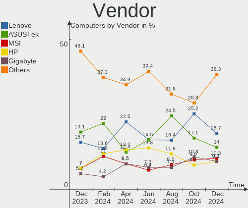
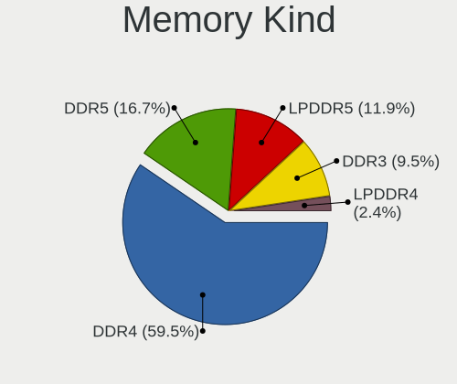

Manjaro Hardware Trends
-----------------------

A project to identify most popular hardware characteristics and track their change
over time based on data collected by Manjaro users at https://Linux-Hardware.org.

Anyone can contribute to this report by the [hw-probe](https://github.com/linuxhw/hw-probe) tool:

    sudo -E hw-probe -all -upload

This is a report for all computer types. See also reports for [desktops](/Dist/Manjaro/Desktop/README.md) and [notebooks](/Dist/Manjaro/Notebook/README.md).

Full-feature report is available here: https://linux-hardware.org/?view=trends

Period: Oct, 2021.

Contents
--------

* [ System ](#system)
  - [ OS                       ](#os)
  - [ OS Family                ](#os-family)
  - [ Kernel                   ](#kernel)
  - [ Kernel Family            ](#kernel-family)
  - [ Kernel Major Ver.        ](#kernel-major-ver)
  - [ Arch                     ](#arch)
  - [ DE                       ](#de)
  - [ Display Server           ](#display-server)
  - [ Display Manager          ](#display-manager)
  - [ OS Lang                  ](#os-lang)
  - [ Boot Mode                ](#boot-mode)
  - [ Filesystem               ](#filesystem)
  - [ Part. scheme             ](#part-scheme)
  - [ Dual Boot with Linux/BSD ](#dual-boot-with-linuxbsd)
  - [ Dual Boot (Win)          ](#dual-boot-win)

* [ Board ](#board)
  - [ Vendor                   ](#vendor)
  - [ Model                    ](#model)
  - [ Model Family             ](#model-family)
  - [ MFG Year                 ](#mfg-year)
  - [ Form Factor              ](#form-factor)
  - [ Secure Boot              ](#secure-boot)
  - [ Coreboot                 ](#coreboot)
  - [ RAM Size                 ](#ram-size)
  - [ RAM Used                 ](#ram-used)
  - [ Total Drives             ](#total-drives)
  - [ Has CD-ROM               ](#has-cd-rom)
  - [ Has Ethernet             ](#has-ethernet)
  - [ Has WiFi                 ](#has-wifi)
  - [ Has Bluetooth            ](#has-bluetooth)

* [ Location ](#location)
  - [ Country                  ](#country)
  - [ City                     ](#city)

* [ Drives ](#drives)
  - [ Drive Vendor             ](#drive-vendor)
  - [ Drive Model              ](#drive-model)
  - [ HDD Vendor               ](#hdd-vendor)
  - [ SSD Vendor               ](#ssd-vendor)
  - [ Drive Kind               ](#drive-kind)
  - [ Drive Connector          ](#drive-connector)
  - [ Drive Size               ](#drive-size)
  - [ Space Total              ](#space-total)
  - [ Space Used               ](#space-used)
  - [ Malfunc. Drives          ](#malfunc-drives)
  - [ Malfunc. Drive Vendor    ](#malfunc-drive-vendor)
  - [ Malfunc. HDD Vendor      ](#malfunc-hdd-vendor)
  - [ Malfunc. Drive Kind      ](#malfunc-drive-kind)
  - [ Failed Drives            ](#failed-drives)
  - [ Failed Drive Vendor      ](#failed-drive-vendor)
  - [ Drive Status             ](#drive-status)

* [ Storage controller ](#storage-controller)
  - [ Storage Vendor           ](#storage-vendor)
  - [ Storage Model            ](#storage-model)
  - [ Storage Kind             ](#storage-kind)

* [ Processor ](#processor)
  - [ CPU Vendor               ](#cpu-vendor)
  - [ CPU Model                ](#cpu-model)
  - [ CPU Model Family         ](#cpu-model-family)
  - [ CPU Cores                ](#cpu-cores)
  - [ CPU Sockets              ](#cpu-sockets)
  - [ CPU Threads              ](#cpu-threads)
  - [ CPU Op-Modes             ](#cpu-op-modes)
  - [ CPU Microcode            ](#cpu-microcode)
  - [ CPU Microarch            ](#cpu-microarch)

* [ Graphics ](#graphics)
  - [ GPU Vendor               ](#gpu-vendor)
  - [ GPU Model                ](#gpu-model)
  - [ GPU Combo                ](#gpu-combo)
  - [ GPU Driver               ](#gpu-driver)
  - [ GPU Memory               ](#gpu-memory)

* [ Monitor ](#monitor)
  - [ Monitor Vendor           ](#monitor-vendor)
  - [ Monitor Model            ](#monitor-model)
  - [ Monitor Resolution       ](#monitor-resolution)
  - [ Monitor Diagonal         ](#monitor-diagonal)
  - [ Monitor Width            ](#monitor-width)
  - [ Aspect Ratio             ](#aspect-ratio)
  - [ Monitor Area             ](#monitor-area)
  - [ Pixel Density            ](#pixel-density)
  - [ Multiple Monitors        ](#multiple-monitors)

* [ Network ](#network)
  - [ Net Controller Vendor    ](#net-controller-vendor)
  - [ Net Controller Model     ](#net-controller-model)
  - [ Wireless Vendor          ](#wireless-vendor)
  - [ Wireless Model           ](#wireless-model)
  - [ Ethernet Vendor          ](#ethernet-vendor)
  - [ Ethernet Model           ](#ethernet-model)
  - [ Net Controller Kind      ](#net-controller-kind)
  - [ Used Controller          ](#used-controller)
  - [ NICs                     ](#nics)
  - [ IPv6                     ](#ipv6)

* [ Bluetooth ](#bluetooth)
  - [ Bluetooth Vendor         ](#bluetooth-vendor)
  - [ Bluetooth Model          ](#bluetooth-model)

* [ Sound ](#sound)
  - [ Sound Vendor             ](#sound-vendor)
  - [ Sound Model              ](#sound-model)

* [ Memory ](#memory)
  - [ Memory Vendor            ](#memory-vendor)
  - [ Memory Model             ](#memory-model)
  - [ Memory Kind              ](#memory-kind)
  - [ Memory Form Factor       ](#memory-form-factor)
  - [ Memory Size              ](#memory-size)
  - [ Memory Speed             ](#memory-speed)

* [ Printers & scanners ](#printers--scanners)
  - [ Printer Vendor           ](#printer-vendor)
  - [ Printer Model            ](#printer-model)
  - [ Scanner Vendor           ](#scanner-vendor)
  - [ Scanner Model            ](#scanner-model)

* [ Camera ](#camera)
  - [ Camera Vendor            ](#camera-vendor)
  - [ Camera Model             ](#camera-model)

* [ Security ](#security)
  - [ Fingerprint Vendor       ](#fingerprint-vendor)
  - [ Fingerprint Model        ](#fingerprint-model)
  - [ Chipcard Vendor          ](#chipcard-vendor)
  - [ Chipcard Model           ](#chipcard-model)

* [ Unsupported ](#unsupported)
  - [ Unsupported Devices      ](#unsupported-devices)
  - [ Unsupported Device Types ](#unsupported-device-types)

System
------

OS
--

Installed operating systems

| Name           | Computers | Percent |
|----------------|-----------|---------|
| Manjaro        | 57        | 36.31%  |
| Manjaro 21.1.6 | 44        | 28.03%  |
| Manjaro 21.1.4 | 25        | 15.92%  |
| Manjaro 21.1.5 | 23        | 14.65%  |
| Manjaro 21.2.0 | 6         | 3.82%   |
| Manjaro 21.1.3 | 1         | 0.64%   |
| Manjaro 21.1.2 | 1         | 0.64%   |

OS Family
---------

OS without a version

| Name    | Computers | Percent |
|---------|-----------|---------|
| Manjaro | 157       | 100%    |

Kernel
------

Version of the Linux kernel

| Version                     | Computers | Percent |
|-----------------------------|-----------|---------|
| 5.13.19-2-MANJARO           | 56        | 35.67%  |
| 5.14.10-1-MANJARO           | 25        | 15.92%  |
| 5.10.70-1-MANJARO           | 20        | 12.74%  |
| 5.15.0-1-MANJARO            | 12        | 7.64%   |
| 5.10.68-1-MANJARO           | 12        | 7.64%   |
| 5.14.7-2-MANJARO            | 11        | 7.01%   |
| 5.4.150-1-MANJARO           | 3         | 1.91%   |
| 5.14.13-1-MANJARO           | 2         | 1.27%   |
| 5.9.16-1-MANJARO            | 1         | 0.64%   |
| 5.4.148-1-MANJARO           | 1         | 0.64%   |
| 5.14.8-xanmod1-cacule-1     | 1         | 0.64%   |
| 5.14.8-hardened1-1-hardened | 1         | 0.64%   |
| 5.14.4-199-tkg-cacule       | 1         | 0.64%   |
| 5.14.13-208-tkg-pds         | 1         | 0.64%   |
| 5.14.12-207-tkg-pds         | 1         | 0.64%   |
| 5.14.11-lqx1-2-lqx          | 1         | 0.64%   |
| 5.13.2-1-MANJARO            | 1         | 0.64%   |
| 5.13.15-1-MANJARO           | 1         | 0.64%   |
| 5.13.13-1-MANJARO           | 1         | 0.64%   |
| 5.11.22-2-MANJARO           | 1         | 0.64%   |
| 5.10.66-1-MANJARO-m133-n    | 1         | 0.64%   |
| 5.10.63-1-MANJARO           | 1         | 0.64%   |
| 5.10.52-3-rt47-MANJARO      | 1         | 0.64%   |
| 5.10.23-1-MANJARO           | 1         | 0.64%   |

Kernel Family
-------------

Linux kernel without a distro release

| Version | Computers | Percent |
|---------|-----------|---------|
| 5.13.19 | 56        | 35.67%  |
| 5.14.10 | 25        | 15.92%  |
| 5.10.70 | 20        | 12.74%  |
| 5.15.0  | 12        | 7.64%   |
| 5.10.68 | 12        | 7.64%   |
| 5.14.7  | 11        | 7.01%   |
| 5.4.150 | 3         | 1.91%   |
| 5.14.13 | 3         | 1.91%   |
| 5.14.8  | 2         | 1.27%   |
| 5.9.16  | 1         | 0.64%   |
| 5.4.148 | 1         | 0.64%   |
| 5.14.4  | 1         | 0.64%   |
| 5.14.12 | 1         | 0.64%   |
| 5.14.11 | 1         | 0.64%   |
| 5.13.2  | 1         | 0.64%   |
| 5.13.15 | 1         | 0.64%   |
| 5.13.13 | 1         | 0.64%   |
| 5.11.22 | 1         | 0.64%   |
| 5.10.66 | 1         | 0.64%   |
| 5.10.63 | 1         | 0.64%   |
| 5.10.52 | 1         | 0.64%   |
| 5.10.23 | 1         | 0.64%   |

Kernel Major Ver.
-----------------

Linux kernel major version

| Version | Computers | Percent |
|---------|-----------|---------|
| 5.13    | 59        | 37.58%  |
| 5.14    | 44        | 28.03%  |
| 5.10    | 36        | 22.93%  |
| 5.15    | 12        | 7.64%   |
| 5.4     | 4         | 2.55%   |
| 5.9     | 1         | 0.64%   |
| 5.11    | 1         | 0.64%   |

Arch
----

OS architecture (x86_64, i586, etc.)

| Name   | Computers | Percent |
|--------|-----------|---------|
| x86_64 | 157       | 100%    |

DE
--

Desktop Environment

| Name           | Computers | Percent |
|----------------|-----------|---------|
| KDE5           | 69        | 43.95%  |
| XFCE           | 37        | 23.57%  |
| GNOME          | 34        | 21.66%  |
| X-Cinnamon     | 5         | 3.18%   |
| i3             | 3         | 1.91%   |
| Unknown        | 3         | 1.91%   |
| MATE           | 1         | 0.64%   |
| KDE            | 1         | 0.64%   |
| i3-with-shmlog | 1         | 0.64%   |
| Cinnamon       | 1         | 0.64%   |
| Budgie         | 1         | 0.64%   |
| awesome        | 1         | 0.64%   |

Display Server
--------------

X11 or Wayland

| Name    | Computers | Percent |
|---------|-----------|---------|
| X11     | 132       | 84.08%  |
| Wayland | 21        | 13.38%  |
| Tty     | 3         | 1.91%   |
| Unknown | 1         | 0.64%   |

Display Manager
---------------

SDDM, LightDM, etc.

| Name    | Computers | Percent |
|---------|-----------|---------|
| Unknown | 58        | 36.94%  |
| SDDM    | 46        | 29.3%   |
| LightDM | 28        | 17.83%  |
| GDM     | 24        | 15.29%  |
| LXDM    | 1         | 0.64%   |

OS Lang
-------

Language

| Lang  | Computers | Percent |
|-------|-----------|---------|
| en_US | 74        | 47.13%  |
| ru_RU | 13        | 8.28%   |
| de_DE | 9         | 5.73%   |
| pt_BR | 7         | 4.46%   |
| en_GB | 6         | 3.82%   |
| en_CA | 5         | 3.18%   |
| fr_FR | 4         | 2.55%   |
| es_ES | 4         | 2.55%   |
| ru_UA | 3         | 1.91%   |
| en_IN | 3         | 1.91%   |
| en_IE | 3         | 1.91%   |
| zh_CN | 2         | 1.27%   |
| tr_TR | 2         | 1.27%   |
| sv_SE | 2         | 1.27%   |
| pl_PL | 2         | 1.27%   |
| es_MX | 2         | 1.27%   |
| zh_TW | 1         | 0.64%   |
| pt_PT | 1         | 0.64%   |
| nl_BE | 1         | 0.64%   |
| nb_NO | 1         | 0.64%   |
| it_IT | 1         | 0.64%   |
| hu_HU | 1         | 0.64%   |
| fi_FI | 1         | 0.64%   |
| eu_ES | 1         | 0.64%   |
| es_PE | 1         | 0.64%   |
| es_CO | 1         | 0.64%   |
| en_PH | 1         | 0.64%   |
| en_NZ | 1         | 0.64%   |
| en_IL | 1         | 0.64%   |
| en_DK | 1         | 0.64%   |
| en_AU | 1         | 0.64%   |
| de_AT | 1         | 0.64%   |

Boot Mode
---------

EFI or BIOS

| Mode | Computers | Percent |
|------|-----------|---------|
| BIOS | 93        | 59.24%  |
| EFI  | 64        | 40.76%  |

Filesystem
----------

Type of filesystem

| Type    | Computers | Percent |
|---------|-----------|---------|
| Ext4    | 132       | 84.08%  |
| Btrfs   | 16        | 10.19%  |
| Overlay | 4         | 2.55%   |
| Xfs     | 2         | 1.27%   |
| Unknown | 2         | 1.27%   |
| F2fs    | 1         | 0.64%   |

Part. scheme
------------

Scheme of partitioning

| Type    | Computers | Percent |
|---------|-----------|---------|
| Unknown | 81        | 51.59%  |
| GPT     | 64        | 40.76%  |
| MBR     | 12        | 7.64%   |

Dual Boot with Linux/BSD
------------------------

Hosting more than one Linux/BSD

| Dual boot | Computers | Percent |
|-----------|-----------|---------|
| No        | 145       | 92.36%  |
| Yes       | 12        | 7.64%   |

Dual Boot (Win)
---------------

Hosting Linux and Windows

| Dual boot | Computers | Percent |
|-----------|-----------|---------|
| No        | 102       | 64.97%  |
| Yes       | 55        | 35.03%  |

Board
-----

Vendor
------

Motherboard manufacturer

| Name                | Computers | Percent |
|---------------------|-----------|---------|
| Lenovo              | 34        | 21.66%  |
| ASUSTek Computer    | 28        | 17.83%  |
| Dell                | 19        | 12.1%   |
| Hewlett-Packard     | 18        | 11.46%  |
| Gigabyte Technology | 13        | 8.28%   |
| MSI                 | 12        | 7.64%   |
| Acer                | 6         | 3.82%   |
| HUAWEI              | 4         | 2.55%   |
| Intel               | 3         | 1.91%   |
| Alienware           | 3         | 1.91%   |
| ASRock              | 2         | 1.27%   |
| Apple               | 2         | 1.27%   |
| Unknown             | 2         | 1.27%   |
| TUXEDO              | 1         | 0.64%   |
| TrekStor            | 1         | 0.64%   |
| Teclast             | 1         | 0.64%   |
| Sony                | 1         | 0.64%   |
| Samsung Electronics | 1         | 0.64%   |
| Notebook            | 1         | 0.64%   |
| LG Electronics      | 1         | 0.64%   |
| Huanan              | 1         | 0.64%   |
| Fujitsu Siemens     | 1         | 0.64%   |
| Emaxx Technologies  | 1         | 0.64%   |
| AZW                 | 1         | 0.64%   |

Model
-----

Motherboard model

| Name                                  | Computers | Percent |
|---------------------------------------|-----------|---------|
| HUAWEI NBLB-WAX9N                     | 2         | 1.27%   |
| Gigabyte B450M DS3H                   | 2         | 1.27%   |
| ASUS P8Z77-V LX                       | 2         | 1.27%   |
| Unknown                               | 2         | 1.27%   |
| TUXEDO Aura 15 Gen1                   | 1         | 0.64%   |
| TrekStor Primebook C11                | 1         | 0.64%   |
| Teclast F5                            | 1         | 0.64%   |
| Sony VPCEB2Z1E                        | 1         | 0.64%   |
| Samsung RC410/RC510/RC710             | 1         | 0.64%   |
| Notebook P95_96_97Ex,Rx               | 1         | 0.64%   |
| MSI MS-7C84                           | 1         | 0.64%   |
| MSI MS-7C37                           | 1         | 0.64%   |
| MSI MS-7C04                           | 1         | 0.64%   |
| MSI MS-7B94                           | 1         | 0.64%   |
| MSI MS-7B79                           | 1         | 0.64%   |
| MSI MS-7B53                           | 1         | 0.64%   |
| MSI MS-7A37                           | 1         | 0.64%   |
| MSI MS-7998                           | 1         | 0.64%   |
| MSI MS-7976                           | 1         | 0.64%   |
| MSI MS-7817                           | 1         | 0.64%   |
| MSI Hyrican PC A320M PRO-E            | 1         | 0.64%   |
| MSI GV72 7RD                          | 1         | 0.64%   |
| LG A410-K.BE43P1                      | 1         | 0.64%   |
| Lenovo Yoga 9 14ITL5 82BG             | 1         | 0.64%   |
| Lenovo V15 G2 ALC 82KD                | 1         | 0.64%   |
| Lenovo ThinkPad X250 20CLS7R400       | 1         | 0.64%   |
| Lenovo ThinkPad X230 2325SWF          | 1         | 0.64%   |
| Lenovo ThinkPad W550s 20E2CTO1WW      | 1         | 0.64%   |
| Lenovo ThinkPad T480s 20L8SB9Y00      | 1         | 0.64%   |
| Lenovo ThinkPad T480s 20L8S4T801      | 1         | 0.64%   |
| Lenovo ThinkPad T14s Gen 1 20UJS2YE00 | 1         | 0.64%   |
| Lenovo ThinkPad P51 20HH000TUS        | 1         | 0.64%   |
| Lenovo ThinkPad E15 Gen 2 20T9S0B500  | 1         | 0.64%   |
| Lenovo ThinkPad E14 Gen 3 20Y7CTO1WW  | 1         | 0.64%   |
| Lenovo ThinkCentre M900 10FD003RUS    | 1         | 0.64%   |
| Lenovo ThinkCentre Edge 92Z 3426EZG   | 1         | 0.64%   |
| Lenovo ThinkBook 15-IIL 20SM          | 1         | 0.64%   |
| Lenovo Legion S7 15ACH6 82K8          | 1         | 0.64%   |
| Lenovo IdeaPad Y700 Touch-15ISK 80NW  | 1         | 0.64%   |
| Lenovo IdeaPad S540-14API 81NH        | 1         | 0.64%   |
| Lenovo IdeaPad S340-14API 81NB        | 1         | 0.64%   |
| Lenovo IdeaPad S145-15IWL 81S9        | 1         | 0.64%   |
| Lenovo IdeaPad S145-15AST 81N3        | 1         | 0.64%   |
| Lenovo IdeaPad Gaming 3 15ARH05 82EY  | 1         | 0.64%   |
| Lenovo IdeaPad D330-10IGM 81H3        | 1         | 0.64%   |
| Lenovo IdeaPad 5 15IIL05 81YK         | 1         | 0.64%   |
| Lenovo IdeaPad 5 15ARE05 81YQ         | 1         | 0.64%   |
| Lenovo IdeaPad 330-17IKB 81DM         | 1         | 0.64%   |
| Lenovo IdeaPad 330-15IGM 81D1         | 1         | 0.64%   |
| Lenovo IdeaPad 320-17AST 80XW         | 1         | 0.64%   |
| Lenovo IdeaPad 320-15ISK 80XH         | 1         | 0.64%   |
| Lenovo IdeaPad 320-15IKB 80XL         | 1         | 0.64%   |
| Lenovo IdeaPad 310-15ABR 80ST         | 1         | 0.64%   |
| Lenovo IdeaPad 3 15IIL05 81WE         | 1         | 0.64%   |
| Lenovo IdeaPad 100S-14IBR 80R9        | 1         | 0.64%   |
| Lenovo G580 20150                     | 1         | 0.64%   |
| Lenovo B320-14IKB 81CC                | 1         | 0.64%   |
| Intel NUC10i3FNH                      | 1         | 0.64%   |
| Intel H61                             | 1         | 0.64%   |
| Intel DB75EN AAG39650-302             | 1         | 0.64%   |

Model Family
------------

Motherboard model prefix

| Name                  | Computers | Percent |
|-----------------------|-----------|---------|
| Lenovo IdeaPad        | 17        | 10.83%  |
| Lenovo ThinkPad       | 9         | 5.73%   |
| Dell Inspiron         | 7         | 4.46%   |
| ASUS PRIME            | 5         | 3.18%   |
| HP ProBook            | 4         | 2.55%   |
| Dell OptiPlex         | 4         | 2.55%   |
| HP Pavilion           | 3         | 1.91%   |
| HP Laptop             | 3         | 1.91%   |
| HP ENVY               | 3         | 1.91%   |
| Gigabyte B450M        | 3         | 1.91%   |
| Dell Latitude         | 3         | 1.91%   |
| ASUS ZenBook          | 3         | 1.91%   |
| ASUS ROG              | 3         | 1.91%   |
| Lenovo ThinkCentre    | 2         | 1.27%   |
| HUAWEI NBLB-WAX9N     | 2         | 1.27%   |
| Dell Precision        | 2         | 1.27%   |
| Dell G5               | 2         | 1.27%   |
| ASUS P8Z77-V          | 2         | 1.27%   |
| Acer TravelMate       | 2         | 1.27%   |
| Acer Aspire           | 2         | 1.27%   |
| Unknown               | 2         | 1.27%   |
| TUXEDO Aura           | 1         | 0.64%   |
| TrekStor Primebook    | 1         | 0.64%   |
| Teclast F5            | 1         | 0.64%   |
| Sony VPCEB2Z1E        | 1         | 0.64%   |
| Samsung RC410         | 1         | 0.64%   |
| Notebook P95          | 1         | 0.64%   |
| MSI MS-7C84           | 1         | 0.64%   |
| MSI MS-7C37           | 1         | 0.64%   |
| MSI MS-7C04           | 1         | 0.64%   |
| MSI MS-7B94           | 1         | 0.64%   |
| MSI MS-7B79           | 1         | 0.64%   |
| MSI MS-7B53           | 1         | 0.64%   |
| MSI MS-7A37           | 1         | 0.64%   |
| MSI MS-7998           | 1         | 0.64%   |
| MSI MS-7976           | 1         | 0.64%   |
| MSI MS-7817           | 1         | 0.64%   |
| MSI Hyrican           | 1         | 0.64%   |
| MSI GV72              | 1         | 0.64%   |
| LG A410-K.BE43P1      | 1         | 0.64%   |
| Lenovo Yoga           | 1         | 0.64%   |
| Lenovo V15            | 1         | 0.64%   |
| Lenovo ThinkBook      | 1         | 0.64%   |
| Lenovo Legion         | 1         | 0.64%   |
| Lenovo G580           | 1         | 0.64%   |
| Lenovo B320-14IKB     | 1         | 0.64%   |
| Intel NUC10i3FNH      | 1         | 0.64%   |
| Intel H61             | 1         | 0.64%   |
| Intel DB75EN          | 1         | 0.64%   |
| HUAWEI NBLK-WAX9X     | 1         | 0.64%   |
| HUAWEI HLYL-WXX9      | 1         | 0.64%   |
| Huanan X99-F8         | 1         | 0.64%   |
| HP Z440               | 1         | 0.64%   |
| HP ProDesk            | 1         | 0.64%   |
| HP OMEN               | 1         | 0.64%   |
| HP Dratini            | 1         | 0.64%   |
| HP Convertible        | 1         | 0.64%   |
| Gigabyte Z270X-Gaming | 1         | 0.64%   |
| Gigabyte X399         | 1         | 0.64%   |
| Gigabyte M68MT-D3P    | 1         | 0.64%   |

MFG Year
--------

Motherboard manufacture year

| Year | Computers | Percent |
|------|-----------|---------|
| 2021 | 45        | 28.66%  |
| 2019 | 24        | 15.29%  |
| 2020 | 18        | 11.46%  |
| 2018 | 16        | 10.19%  |
| 2017 | 8         | 5.1%    |
| 2014 | 8         | 5.1%    |
| 2016 | 7         | 4.46%   |
| 2015 | 6         | 3.82%   |
| 2010 | 5         | 3.18%   |
| 2013 | 4         | 2.55%   |
| 2012 | 4         | 2.55%   |
| 2011 | 4         | 2.55%   |
| 2009 | 4         | 2.55%   |
| 2008 | 2         | 1.27%   |
| 2007 | 1         | 0.64%   |
| 2006 | 1         | 0.64%   |

Form Factor
-----------

Physical design of the computer

| Name        | Computers | Percent |
|-------------|-----------|---------|
| Notebook    | 82        | 52.23%  |
| Desktop     | 62        | 39.49%  |
| Convertible | 7         | 4.46%   |
| Mini pc     | 3         | 1.91%   |
| All in one  | 2         | 1.27%   |
| Tablet      | 1         | 0.64%   |

Secure Boot
-----------

Enabled or disabled

| State    | Computers | Percent |
|----------|-----------|---------|
| Disabled | 156       | 99.36%  |
| Enabled  | 1         | 0.64%   |

Coreboot
--------

Have coreboot on board

| Used | Computers | Percent |
|------|-----------|---------|
| No   | 156       | 99.36%  |
| Yes  | 1         | 0.64%   |

RAM Size
--------

Total RAM memory

| Size in GB  | Computers | Percent |
|-------------|-----------|---------|
| 8.01-16.0   | 35        | 22.29%  |
| 4.01-8.0    | 34        | 21.66%  |
| 16.01-24.0  | 32        | 20.38%  |
| 32.01-64.0  | 22        | 14.01%  |
| 3.01-4.0    | 20        | 12.74%  |
| 64.01-256.0 | 6         | 3.82%   |
| 1.01-2.0    | 5         | 3.18%   |
| 24.01-32.0  | 2         | 1.27%   |
| 2.01-3.0    | 1         | 0.64%   |

RAM Used
--------

Used RAM memory

| Used GB    | Computers | Percent |
|------------|-----------|---------|
| 2.01-3.0   | 42        | 26.75%  |
| 1.01-2.0   | 35        | 22.29%  |
| 4.01-8.0   | 28        | 17.83%  |
| 3.01-4.0   | 22        | 14.01%  |
| 8.01-16.0  | 16        | 10.19%  |
| 0.51-1.0   | 11        | 7.01%   |
| 24.01-32.0 | 2         | 1.27%   |
| 16.01-24.0 | 1         | 0.64%   |

Total Drives
------------

Number of drives on board

| Drives | Computers | Percent |
|--------|-----------|---------|
| 1      | 81        | 51.59%  |
| 2      | 43        | 27.39%  |
| 3      | 13        | 8.28%   |
| 4      | 10        | 6.37%   |
| 5      | 4         | 2.55%   |
| 7      | 3         | 1.91%   |
| 8      | 1         | 0.64%   |
| 6      | 1         | 0.64%   |
| 0      | 1         | 0.64%   |

Has CD-ROM
----------

Has CD-ROM on board

| Presented | Computers | Percent |
|-----------|-----------|---------|
| No        | 122       | 77.71%  |
| Yes       | 35        | 22.29%  |

Has Ethernet
------------

Has Ethernet on board

| Presented | Computers | Percent |
|-----------|-----------|---------|
| Yes       | 125       | 79.62%  |
| No        | 32        | 20.38%  |

Has WiFi
--------

Has WiFi module

| Presented | Computers | Percent |
|-----------|-----------|---------|
| Yes       | 126       | 80.25%  |
| No        | 31        | 19.75%  |

Has Bluetooth
-------------

Has Bluetooth module

| Presented | Computers | Percent |
|-----------|-----------|---------|
| Yes       | 112       | 71.34%  |
| No        | 45        | 28.66%  |

Location
--------

Country
-------

Geographic location (country)

| Country     | Computers | Percent |
|-------------|-----------|---------|
| USA         | 30        | 19.11%  |
| Russia      | 19        | 12.1%   |
| Germany     | 12        | 7.64%   |
| Brazil      | 8         | 5.1%    |
| France      | 7         | 4.46%   |
| Ukraine     | 6         | 3.82%   |
| Poland      | 5         | 3.18%   |
| Canada      | 5         | 3.18%   |
| Spain       | 4         | 2.55%   |
| Mexico      | 4         | 2.55%   |
| India       | 4         | 2.55%   |
| UK          | 3         | 1.91%   |
| Ireland     | 3         | 1.91%   |
| Hungary     | 3         | 1.91%   |
| Greece      | 3         | 1.91%   |
| Belgium     | 3         | 1.91%   |
| Austria     | 3         | 1.91%   |
| Turkey      | 2         | 1.27%   |
| Switzerland | 2         | 1.27%   |
| Sweden      | 2         | 1.27%   |
| Serbia      | 2         | 1.27%   |
| Norway      | 2         | 1.27%   |
| Israel      | 2         | 1.27%   |
| Belarus     | 2         | 1.27%   |
| Taiwan      | 1         | 0.64%   |
| Slovenia    | 1         | 0.64%   |
| Slovakia    | 1         | 0.64%   |
| Romania     | 1         | 0.64%   |
| Puerto Rico | 1         | 0.64%   |
| Portugal    | 1         | 0.64%   |
| Philippines | 1         | 0.64%   |
| Peru        | 1         | 0.64%   |
| New Zealand | 1         | 0.64%   |
| Netherlands | 1         | 0.64%   |
| Myanmar     | 1         | 0.64%   |
| Morocco     | 1         | 0.64%   |
| Lithuania   | 1         | 0.64%   |
| Japan       | 1         | 0.64%   |
| Italy       | 1         | 0.64%   |
| Indonesia   | 1         | 0.64%   |
| Denmark     | 1         | 0.64%   |
| Colombia    | 1         | 0.64%   |
| China       | 1         | 0.64%   |
| Australia   | 1         | 0.64%   |
| Argentina   | 1         | 0.64%   |

City
----

Geographic location (city)

| City                   | Computers | Percent |
|------------------------|-----------|---------|
| Zaporizhzhya           | 3         | 1.91%   |
| Ulyanovsk              | 3         | 1.91%   |
| Warsaw                 | 2         | 1.27%   |
| Vienna                 | 2         | 1.27%   |
| Tucson                 | 2         | 1.27%   |
| Tel Aviv               | 2         | 1.27%   |
| St Petersburg          | 2         | 1.27%   |
| Sheboygan              | 2         | 1.27%   |
| Rio de Janeiro         | 2         | 1.27%   |
| Moscow                 | 2         | 1.27%   |
| Indianapolis           | 2         | 1.27%   |
| Dublin                 | 2         | 1.27%   |
| Carrollton             | 2         | 1.27%   |
| Budapest               | 2         | 1.27%   |
| Zvenigorod             | 1         | 0.64%   |
| Zurich                 | 1         | 0.64%   |
| Zaragoza               | 1         | 0.64%   |
| Zamboanga City         | 1         | 0.64%   |
| Yogyakarta             | 1         | 0.64%   |
| Yangon                 | 1         | 0.64%   |
| Wilderness Rim         | 1         | 0.64%   |
| Washington             | 1         | 0.64%   |
| Voronezh               | 1         | 0.64%   |
| Vigo                   | 1         | 0.64%   |
| Varsta                 | 1         | 0.64%   |
| Urbana                 | 1         | 0.64%   |
| Ufa                    | 1         | 0.64%   |
| Uelsen                 | 1         | 0.64%   |
| Tullinge               | 1         | 0.64%   |
| Tula                   | 1         | 0.64%   |
| Trikala                | 1         | 0.64%   |
| Toulouse               | 1         | 0.64%   |
| Tomar                  | 1         | 0.64%   |
| Toledo                 | 1         | 0.64%   |
| Tokyo                  | 1         | 0.64%   |
| Thessaloniki           | 1         | 0.64%   |
| Tangier                | 1         | 0.64%   |
| Sydney                 | 1         | 0.64%   |
| Stockport              | 1         | 0.64%   |
| Starotitarovskaya      | 1         | 0.64%   |
| Smolensk               | 1         | 0.64%   |
| Senec                  | 1         | 0.64%   |
| Seattle                | 1         | 0.64%   |
| Santa Cruz de Tenerife | 1         | 0.64%   |
| San Juan               | 1         | 0.64%   |
| San Diego              | 1         | 0.64%   |
| Salvador               | 1         | 0.64%   |
| Salt Lake City         | 1         | 0.64%   |
| Rzesz??w               | 1         | 0.64%   |
| Rostov-on-Don          | 1         | 0.64%   |
| Rio Grande             | 1         | 0.64%   |
| Rathenow               | 1         | 0.64%   |
| Pontevedra             | 1         | 0.64%   |
| Pompano Beach          | 1         | 0.64%   |
| Plano                  | 1         | 0.64%   |
| Palmerston North       | 1         | 0.64%   |
| Palaiseau              | 1         | 0.64%   |
| Oryol                  | 1         | 0.64%   |
| Oklahoma City          | 1         | 0.64%   |
| Nogales                | 1         | 0.64%   |

Drives
------

Drive Vendor
------------

Hard drive vendors

| Vendor                    | Computers | Drives | Percent |
|---------------------------|-----------|--------|---------|
| Seagate                   | 41        | 55     | 16.4%   |
| Samsung Electronics       | 38        | 47     | 15.2%   |
| WDC                       | 31        | 41     | 12.4%   |
| Toshiba                   | 17        | 19     | 6.8%    |
| Kingston                  | 16        | 18     | 6.4%    |
| SanDisk                   | 13        | 15     | 5.2%    |
| Crucial                   | 8         | 9      | 3.2%    |
| SK Hynix                  | 7         | 8      | 2.8%    |
| Hitachi                   | 7         | 8      | 2.8%    |
| Unknown                   | 6         | 8      | 2.4%    |
| Intel                     | 6         | 8      | 2.4%    |
| Phison                    | 5         | 5      | 2%      |
| HGST                      | 5         | 5      | 2%      |
| KIOXIA                    | 4         | 4      | 1.6%    |
| Corsair                   | 4         | 4      | 1.6%    |
| Silicon Motion            | 3         | 3      | 1.2%    |
| Micron Technology         | 3         | 3      | 1.2%    |
| JMicron                   | 3         | 3      | 1.2%    |
| China                     | 3         | 3      | 1.2%    |
| XPG                       | 2         | 2      | 0.8%    |
| UMIS                      | 2         | 2      | 0.8%    |
| Micron/Crucial Technology | 2         | 2      | 0.8%    |
| LITEON                    | 2         | 2      | 0.8%    |
| LaCie                     | 2         | 2      | 0.8%    |
| Hewlett-Packard           | 2         | 2      | 0.8%    |
| GOODRAM                   | 2         | 2      | 0.8%    |
| XrayDisk                  | 1         | 1      | 0.4%    |
| USB3.0                    | 1         | 1      | 0.4%    |
| Union Memory              | 1         | 1      | 0.4%    |
| Transcend                 | 1         | 1      | 0.4%    |
| Teclast                   | 1         | 1      | 0.4%    |
| SPCC                      | 1         | 1      | 0.4%    |
| Solid State Storage       | 1         | 1      | 0.4%    |
| PNY                       | 1         | 2      | 0.4%    |
| LONDISK                   | 1         | 1      | 0.4%    |
| LITEONIT                  | 1         | 1      | 0.4%    |
| IM3D                      | 1         | 1      | 0.4%    |
| GALAX                     | 1         | 1      | 0.4%    |
| Fujitsu                   | 1         | 1      | 0.4%    |
| ASMT                      | 1         | 1      | 0.4%    |
| A-DATA Technology         | 1         | 1      | 0.4%    |
| Unknown                   | 1         | 1      | 0.4%    |

Drive Model
-----------

Hard drive models

| Model                                  | Computers | Percent |
|----------------------------------------|-----------|---------|
| Toshiba MQ01ABF050 500GB               | 6         | 2.11%   |
| Samsung PM963 2.5" NVMe PCIe SSD 512GB | 5         | 1.75%   |
| Seagate ST2000DM008-2FR102 2TB         | 4         | 1.4%    |
| Seagate ST1000LM035-1RK172 1TB         | 4         | 1.4%    |
| Samsung NVMe SSD Drive 1TB             | 4         | 1.4%    |
| WDC WD5000AAKX-001CA0 500GB            | 3         | 1.05%   |
| WDC WD10EZEX-08WN4A0 1TB               | 3         | 1.05%   |
| Toshiba MQ04ABF100 1TB                 | 3         | 1.05%   |
| Seagate ST3500418AS 500GB              | 3         | 1.05%   |
| Samsung SSD 850 EVO 120GB              | 3         | 1.05%   |
| Kingston SA400S37480G 480GB SSD        | 3         | 1.05%   |
| Kingston SA400S37240G 240GB SSD        | 3         | 1.05%   |
| JMicron Tech 250GB                     | 3         | 1.05%   |
| WDC WDBNCE0010PNC 1TB SSD              | 2         | 0.7%    |
| WDC WD30EZRX-00DC0B0 3TB               | 2         | 0.7%    |
| WDC WD10EZEX-21WN4A0 1TB               | 2         | 0.7%    |
| WDC WD10EZEX-00BN5A0 1TB               | 2         | 0.7%    |
| Unknown SD16G  16GB                    | 2         | 0.7%    |
| Unknown MMC Card  32GB                 | 2         | 0.7%    |
| Seagate ST500LT012-1DG142 500GB        | 2         | 0.7%    |
| Seagate ST31000524AS 1TB               | 2         | 0.7%    |
| Seagate ST2000DX002-2DV164 2TB         | 2         | 0.7%    |
| Seagate ST2000DM006-2DM164 2TB         | 2         | 0.7%    |
| Seagate ST2000DM005-2CW102 2TB         | 2         | 0.7%    |
| Seagate ST1000LM049-2GH172 1TB         | 2         | 0.7%    |
| Seagate ST1000LM024 HN-M101MBB 1TB     | 2         | 0.7%    |
| Seagate Expansion 1TB                  | 2         | 0.7%    |
| Sandisk NVMe SSD Drive 512GB           | 2         | 0.7%    |
| Sandisk NVMe SSD Drive 500GB           | 2         | 0.7%    |
| Samsung SSD 970 EVO 500GB              | 2         | 0.7%    |
| Samsung SSD 860 EVO 500GB              | 2         | 0.7%    |
| Samsung SSD 850 EVO 250GB              | 2         | 0.7%    |
| Samsung SSD 840 EVO 120GB              | 2         | 0.7%    |
| Samsung SM963 2.5" NVMe PCIe SSD 250GB | 2         | 0.7%    |
| Samsung NVMe SSD Drive 256GB           | 2         | 0.7%    |
| KIOXIA KBG40ZNS256G NVMe 256GB         | 2         | 0.7%    |
| Kingston SA400S37120G 120GB SSD        | 2         | 0.7%    |
| Hitachi HTS725050A9A364 500GB          | 2         | 0.7%    |
| HGST HTS725032A7E630 320GB             | 2         | 0.7%    |
| HGST HTS545050A7E680 500GB             | 2         | 0.7%    |
| Crucial CT512M550SSD1 512GB            | 2         | 0.7%    |
| Crucial CT240BX500SSD1 240GB           | 2         | 0.7%    |
| XrayDisk SSD 120GB                     | 1         | 0.35%   |
| XPG GAMMIX S50 Lite 1TB                | 1         | 0.35%   |
| XPG GAMMIX S11 Pro 1TB                 | 1         | 0.35%   |
| WDC WDS500G2B0B-00YS70 500GB SSD       | 1         | 0.35%   |
| WDC WDS240G2G0A-00JH30 240GB SSD       | 1         | 0.35%   |
| WDC WD800JD-60LSA0 80GB                | 1         | 0.35%   |
| WDC WD5001FZWX-00ZHUA0 5TB             | 1         | 0.35%   |
| WDC WD5000LPCX-00VHAT0 500GB           | 1         | 0.35%   |
| WDC WD5000AAKX-00ERMA0 500GB           | 1         | 0.35%   |
| WDC WD5000AAKS-00UU3A0 500GB           | 1         | 0.35%   |
| WDC WD40EFRX-68N32N0 4TB               | 1         | 0.35%   |
| WDC WD30EZRZ-00Z5HB0 3TB               | 1         | 0.35%   |
| WDC WD30EZRX-00D8PB0 3TB               | 1         | 0.35%   |
| WDC WD2500AAKX-75U6AA0 250GB           | 1         | 0.35%   |
| WDC WD20SPZX-60UA7T0 2TB               | 1         | 0.35%   |
| WDC WD20EZRZ-00Z5HB0 2TB               | 1         | 0.35%   |
| WDC WD20EZAZ-00L9GB0 2TB               | 1         | 0.35%   |
| WDC WD20EURX-57T0FY1 2TB               | 1         | 0.35%   |

HDD Vendor
----------

Hard disk drive vendors

| Vendor              | Computers | Drives | Percent |
|---------------------|-----------|--------|---------|
| Seagate             | 40        | 53     | 40.82%  |
| WDC                 | 27        | 35     | 27.55%  |
| Toshiba             | 13        | 14     | 13.27%  |
| Hitachi             | 7         | 8      | 7.14%   |
| HGST                | 5         | 5      | 5.1%    |
| Samsung Electronics | 3         | 4      | 3.06%   |
| USB3.0              | 1         | 1      | 1.02%   |
| Unknown             | 1         | 1      | 1.02%   |
| Fujitsu             | 1         | 1      | 1.02%   |

SSD Vendor
----------

Solid state drive vendors

| Vendor              | Computers | Drives | Percent |
|---------------------|-----------|--------|---------|
| Samsung Electronics | 17        | 20     | 23.94%  |
| Kingston            | 13        | 15     | 18.31%  |
| Crucial             | 8         | 9      | 11.27%  |
| SanDisk             | 6         | 6      | 8.45%   |
| WDC                 | 4         | 4      | 5.63%   |
| China               | 3         | 3      | 4.23%   |
| XrayDisk            | 1         | 1      | 1.41%   |
| Union Memory        | 1         | 1      | 1.41%   |
| Transcend           | 1         | 1      | 1.41%   |
| Toshiba             | 1         | 2      | 1.41%   |
| Teclast             | 1         | 1      | 1.41%   |
| SPCC                | 1         | 1      | 1.41%   |
| SK Hynix            | 1         | 1      | 1.41%   |
| PNY                 | 1         | 2      | 1.41%   |
| LONDISK             | 1         | 1      | 1.41%   |
| LITEONIT            | 1         | 1      | 1.41%   |
| LITEON              | 1         | 1      | 1.41%   |
| Intel               | 1         | 1      | 1.41%   |
| IM3D                | 1         | 1      | 1.41%   |
| Hewlett-Packard     | 1         | 1      | 1.41%   |
| GOODRAM             | 1         | 1      | 1.41%   |
| GALAX               | 1         | 1      | 1.41%   |
| Corsair             | 1         | 1      | 1.41%   |
| ASMT                | 1         | 1      | 1.41%   |
| A-DATA Technology   | 1         | 1      | 1.41%   |
| Unknown             | 1         | 1      | 1.41%   |

Drive Kind
----------

HDD or SSD

| Kind    | Computers | Drives | Percent |
|---------|-----------|--------|---------|
| HDD     | 77        | 122    | 35.32%  |
| NVMe    | 65        | 79     | 29.82%  |
| SSD     | 61        | 79     | 27.98%  |
| Unknown | 8         | 8      | 3.67%   |
| MMC     | 7         | 9      | 3.21%   |

Drive Connector
---------------

SATA, SAS, NVMe, etc.

| Type | Computers | Drives | Percent |
|------|-----------|--------|---------|
| SATA | 113       | 192    | 57.07%  |
| NVMe | 65        | 79     | 32.83%  |
| SAS  | 13        | 17     | 6.57%   |
| MMC  | 7         | 9      | 3.54%   |

Drive Size
----------

Size of hard drive

| Size in TB | Computers | Drives | Percent |
|------------|-----------|--------|---------|
| 0.01-0.5   | 83        | 108    | 51.55%  |
| 0.51-1.0   | 47        | 53     | 29.19%  |
| 1.01-2.0   | 20        | 27     | 12.42%  |
| 2.01-3.0   | 5         | 6      | 3.11%   |
| 4.01-10.0  | 4         | 4      | 2.48%   |
| 3.01-4.0   | 2         | 3      | 1.24%   |

Space Total
-----------

Amount of disk space available on the file system

| Size in GB     | Computers | Percent |
|----------------|-----------|---------|
| 251-500        | 38        | 24.2%   |
| 101-250        | 32        | 20.38%  |
| 501-1000       | 27        | 17.2%   |
| 1001-2000      | 20        | 12.74%  |
| 51-100         | 10        | 6.37%   |
| More than 3000 | 9         | 5.73%   |
| 21-50          | 7         | 4.46%   |
| Unknown        | 6         | 3.82%   |
| 1-20           | 5         | 3.18%   |
| 2001-3000      | 3         | 1.91%   |

Space Used
----------

Amount of used disk space

| Used GB        | Computers | Percent |
|----------------|-----------|---------|
| 21-50          | 32        | 20.38%  |
| 1-20           | 31        | 19.75%  |
| 51-100         | 23        | 14.65%  |
| 101-250        | 21        | 13.38%  |
| 251-500        | 17        | 10.83%  |
| 501-1000       | 15        | 9.55%   |
| More than 3000 | 6         | 3.82%   |
| Unknown        | 6         | 3.82%   |
| 1001-2000      | 5         | 3.18%   |
| 2001-3000      | 1         | 0.64%   |

Malfunc. Drives
---------------

Drive models with a malfunction

| Model                                | Computers | Drives | Percent |
|--------------------------------------|-----------|--------|---------|
| WDC WD5000AAKX-001CA0 500GB          | 1         | 1      | 5.88%   |
| WDC WD5000AAKS-00UU3A0 500GB         | 1         | 1      | 5.88%   |
| WDC WD30EZRZ-00Z5HB0 3TB             | 1         | 1      | 5.88%   |
| WDC WD1002FAEX-00Z3A0 1TB            | 1         | 1      | 5.88%   |
| Transcend TS240GMTS420S 240GB SSD    | 1         | 1      | 5.88%   |
| Toshiba MQ01ABF050 500GB             | 1         | 1      | 5.88%   |
| SK Hynix BC711 HFM256GD3JX013N 256GB | 1         | 1      | 5.88%   |
| Seagate ST500LT012-9WS142 500GB      | 1         | 1      | 5.88%   |
| Seagate ST500LM021-1KJ152 500GB      | 1         | 1      | 5.88%   |
| Seagate ST3500413AS 500GB            | 1         | 1      | 5.88%   |
| Seagate ST1000LM035-1RK172 1TB       | 1         | 1      | 5.88%   |
| Phison BPX 240GB                     | 1         | 1      | 5.88%   |
| IM3D L06B B0KB 120GB SSD             | 1         | 1      | 5.88%   |
| Hitachi HTS541010G9SA00 100GB        | 1         | 1      | 5.88%   |
| Hitachi HDT725032VLA380 320GB        | 1         | 1      | 5.88%   |
| Crucial CT512M550SSD1 512GB          | 1         | 1      | 5.88%   |
| A-DATA Technology SX900 512GB SSD    | 1         | 1      | 5.88%   |

Malfunc. Drive Vendor
---------------------

Vendors of faulty drives

| Vendor            | Computers | Drives | Percent |
|-------------------|-----------|--------|---------|
| WDC               | 4         | 4      | 23.53%  |
| Seagate           | 4         | 4      | 23.53%  |
| Hitachi           | 2         | 2      | 11.76%  |
| Transcend         | 1         | 1      | 5.88%   |
| Toshiba           | 1         | 1      | 5.88%   |
| SK Hynix          | 1         | 1      | 5.88%   |
| Phison            | 1         | 1      | 5.88%   |
| IM3D              | 1         | 1      | 5.88%   |
| Crucial           | 1         | 1      | 5.88%   |
| A-DATA Technology | 1         | 1      | 5.88%   |

Malfunc. HDD Vendor
-------------------

Vendors of faulty HDD drives

| Vendor  | Computers | Drives | Percent |
|---------|-----------|--------|---------|
| WDC     | 4         | 4      | 36.36%  |
| Seagate | 4         | 4      | 36.36%  |
| Hitachi | 2         | 2      | 18.18%  |
| Toshiba | 1         | 1      | 9.09%   |

Malfunc. Drive Kind
-------------------

Kinds of faulty drives

| Kind | Computers | Drives | Percent |
|------|-----------|--------|---------|
| HDD  | 10        | 11     | 62.5%   |
| SSD  | 4         | 4      | 25%     |
| NVMe | 2         | 2      | 12.5%   |

Failed Drives
-------------

Failed drive models

Zero info for selected period =(

Failed Drive Vendor
-------------------

Failed drive vendors

Zero info for selected period =(

Drive Status
------------

Number of failed and malfunc. drives

| Status   | Computers | Drives | Percent |
|----------|-----------|--------|---------|
| Detected | 108       | 175    | 61.02%  |
| Works    | 53        | 105    | 29.94%  |
| Malfunc  | 16        | 17     | 9.04%   |

Storage controller
------------------

Storage Vendor
--------------

Storage controller vendors

| Vendor                         | Computers | Percent |
|--------------------------------|-----------|---------|
| Intel                          | 102       | 48.34%  |
| AMD                            | 32        | 15.17%  |
| Samsung Electronics            | 21        | 9.95%   |
| Sandisk                        | 8         | 3.79%   |
| Phison Electronics             | 7         | 3.32%   |
| SK Hynix                       | 6         | 2.84%   |
| KIOXIA                         | 5         | 2.37%   |
| Silicon Motion                 | 3         | 1.42%   |
| Nvidia                         | 3         | 1.42%   |
| Micron Technology              | 3         | 1.42%   |
| Kingston Technology Company    | 3         | 1.42%   |
| ASMedia Technology             | 3         | 1.42%   |
| Union Memory (Shenzhen)        | 2         | 0.95%   |
| Toshiba America Info Systems   | 2         | 0.95%   |
| Silicon Image                  | 2         | 0.95%   |
| Micron/Crucial Technology      | 2         | 0.95%   |
| ADATA Technology               | 2         | 0.95%   |
| Solid State Storage Technology | 1         | 0.47%   |
| Shenzhen Longsys Electronics   | 1         | 0.47%   |
| Marvell Technology Group       | 1         | 0.47%   |
| Lite-On Technology             | 1         | 0.47%   |
| Adaptec                        | 1         | 0.47%   |

Storage Model
-------------

Storage controller models

| Model                                                                                   | Computers | Percent |
|-----------------------------------------------------------------------------------------|-----------|---------|
| AMD FCH SATA Controller [AHCI mode]                                                     | 29        | 11.89%  |
| Samsung NVMe SSD Controller SM981/PM981/PM983                                           | 12        | 4.92%   |
| AMD 400 Series Chipset SATA Controller                                                  | 7         | 2.87%   |
| Intel 82801 Mobile SATA Controller [RAID mode]                                          | 6         | 2.46%   |
| Intel Wildcat Point-LP SATA Controller [AHCI Mode]                                      | 5         | 2.05%   |
| Intel Sunrise Point-LP SATA Controller [AHCI mode]                                      | 5         | 2.05%   |
| Intel SATA Controller [RAID mode]                                                       | 5         | 2.05%   |
| Intel Q170/Q150/B150/H170/H110/Z170/CM236 Chipset SATA Controller [AHCI Mode]           | 5         | 2.05%   |
| Intel 7 Series Chipset Family 6-port SATA Controller [AHCI mode]                        | 5         | 2.05%   |
| SK Hynix Gold P31 SSD                                                                   | 4         | 1.64%   |
| Sandisk WD Black SN750 / PC SN730 NVMe SSD                                              | 4         | 1.64%   |
| Samsung NVMe SSD Controller 980                                                         | 4         | 1.64%   |
| Phison E12 NVMe Controller                                                              | 4         | 1.64%   |
| KIOXIA Non-Volatile memory controller                                                   | 4         | 1.64%   |
| Intel HM170/QM170 Chipset SATA Controller [AHCI Mode]                                   | 4         | 1.64%   |
| Intel Comet Lake SATA AHCI Controller                                                   | 4         | 1.64%   |
| Intel Atom/Celeron/Pentium Processor x5-E8000/J3xxx/N3xxx Series SATA Controller        | 4         | 1.64%   |
| Intel 7 Series/C210 Series Chipset Family 6-port SATA Controller [AHCI mode]            | 4         | 1.64%   |
| Samsung NVMe SSD Controller SM961/PM961/SM963                                           | 3         | 1.23%   |
| Nvidia MCP61 SATA Controller                                                            | 3         | 1.23%   |
| Micron Non-Volatile memory controller                                                   | 3         | 1.23%   |
| Kingston Company A2000 NVMe SSD                                                         | 3         | 1.23%   |
| Intel Volume Management Device NVMe RAID Controller                                     | 3         | 1.23%   |
| Intel SSD 660P Series                                                                   | 3         | 1.23%   |
| Intel Ice Lake-LP SATA Controller [AHCI mode]                                           | 3         | 1.23%   |
| Intel Cannon Lake PCH SATA AHCI Controller                                              | 3         | 1.23%   |
| Intel Cannon Lake Mobile PCH SATA AHCI Controller                                       | 3         | 1.23%   |
| Intel C610/X99 series chipset sSATA Controller [AHCI mode]                              | 3         | 1.23%   |
| Intel C600/X79 series chipset 6-Port SATA AHCI Controller                               | 3         | 1.23%   |
| Intel 8 Series/C220 Series Chipset Family 6-port SATA Controller 1 [AHCI mode]          | 3         | 1.23%   |
| Intel 6 Series/C200 Series Chipset Family 6 port Desktop SATA AHCI Controller           | 3         | 1.23%   |
| Intel 5 Series/3400 Series Chipset 4 port SATA AHCI Controller                          | 3         | 1.23%   |
| Intel 200 Series PCH SATA controller [AHCI mode]                                        | 3         | 1.23%   |
| ASMedia ASM1062 Serial ATA Controller                                                   | 3         | 1.23%   |
| AMD FCH SATA Controller D                                                               | 3         | 1.23%   |
| Union Memory (Shenzhen) Non-Volatile memory controller                                  | 2         | 0.82%   |
| Silicon Motion SM2263EN/SM2263XT SSD Controller                                         | 2         | 0.82%   |
| Samsung NVMe SSD Controller PM9A1/PM9A3/980PRO                                          | 2         | 0.82%   |
| Phison E16 PCIe4 NVMe Controller                                                        | 2         | 0.82%   |
| Nvidia MCP61 IDE                                                                        | 2         | 0.82%   |
| Intel Non-Volatile memory controller                                                    | 2         | 0.82%   |
| Intel Celeron/Pentium Silver Processor SATA Controller                                  | 2         | 0.82%   |
| Intel Celeron N3350/Pentium N4200/Atom E3900 Series SATA AHCI Controller                | 2         | 0.82%   |
| Intel Cannon Point-LP SATA Controller [AHCI Mode]                                       | 2         | 0.82%   |
| Intel C610/X99 series chipset 6-Port SATA Controller [AHCI mode]                        | 2         | 0.82%   |
| Intel 82801HM/HEM (ICH8M/ICH8M-E) IDE Controller                                        | 2         | 0.82%   |
| Intel 8 Series SATA Controller 1 [AHCI mode]                                            | 2         | 0.82%   |
| Intel 6 Series/C200 Series Chipset Family Desktop SATA Controller (IDE mode, ports 4-5) | 2         | 0.82%   |
| Intel 6 Series/C200 Series Chipset Family Desktop SATA Controller (IDE mode, ports 0-3) | 2         | 0.82%   |
| AMD X399 Series Chipset SATA Controller                                                 | 2         | 0.82%   |
| AMD 300 Series Chipset SATA Controller                                                  | 2         | 0.82%   |
| Toshiba America Info Systems XG6 NVMe SSD Controller                                    | 1         | 0.41%   |
| Toshiba America Info Systems Toshiba America Info Non-Volatile memory controller        | 1         | 0.41%   |
| Solid State Storage Non-Volatile memory controller                                      | 1         | 0.41%   |
| SK Hynix PC300 NVMe Solid State Drive 256GB                                             | 1         | 0.41%   |
| SK Hynix BC501 NVMe Solid State Drive                                                   | 1         | 0.41%   |
| Silicon Motion SM2262/SM2262EN SSD Controller                                           | 1         | 0.41%   |
| Silicon Image SiI 3531 [SATALink/SATARaid] Serial ATA Controller                        | 1         | 0.41%   |
| Silicon Image SiI 3132 Serial ATA Raid II Controller                                    | 1         | 0.41%   |
| Shenzhen Longsys SM2263EN/SM2263XT-based OEM SSD                                        | 1         | 0.41%   |

Storage Kind
------------

Kind of storage controller (IDE, SATA, NVMe, SAS, ...)

| Kind | Computers | Percent |
|------|-----------|---------|
| SATA | 111       | 53.11%  |
| NVMe | 65        | 31.1%   |
| RAID | 17        | 8.13%   |
| IDE  | 15        | 7.18%   |
| SAS  | 1         | 0.48%   |

Processor
---------

CPU Vendor
----------

Processor vendors

| Vendor | Computers | Percent |
|--------|-----------|---------|
| Intel  | 108       | 68.79%  |
| AMD    | 49        | 31.21%  |

CPU Model
---------

Processor models

| Model                                         | Computers | Percent |
|-----------------------------------------------|-----------|---------|
| AMD Ryzen 5 3500U with Radeon Vega Mobile Gfx | 5         | 3.18%   |
| AMD Ryzen 7 2700X Eight-Core Processor        | 4         | 2.55%   |
| Intel Core i7-9750H CPU @ 2.60GHz             | 3         | 1.91%   |
| Intel Core i7-7700HQ CPU @ 2.80GHz            | 3         | 1.91%   |
| Intel Core i5-9400F CPU @ 2.90GHz             | 3         | 1.91%   |
| Intel Core i3-6006U CPU @ 2.00GHz             | 3         | 1.91%   |
| AMD Ryzen 7 5800X 8-Core Processor            | 3         | 1.91%   |
| AMD Ryzen 7 5700U with Radeon Graphics        | 3         | 1.91%   |
| Intel Pentium CPU N3710 @ 1.60GHz             | 2         | 1.27%   |
| Intel Core i7-8650U CPU @ 1.90GHz             | 2         | 1.27%   |
| Intel Core i7-8565U CPU @ 1.80GHz             | 2         | 1.27%   |
| Intel Core i7-6700K CPU @ 4.00GHz             | 2         | 1.27%   |
| Intel Core i5-3450 CPU @ 3.10GHz              | 2         | 1.27%   |
| Intel Core i5-2500 CPU @ 3.30GHz              | 2         | 1.27%   |
| Intel Core i5-1035G4 CPU @ 1.10GHz            | 2         | 1.27%   |
| Intel Core i5-10210U CPU @ 1.60GHz            | 2         | 1.27%   |
| Intel Core i5 CPU M 480 @ 2.67GHz             | 2         | 1.27%   |
| Intel Core i3-5010U CPU @ 2.10GHz             | 2         | 1.27%   |
| Intel Core i3-5005U CPU @ 2.00GHz             | 2         | 1.27%   |
| Intel Core i3-10110U CPU @ 2.10GHz            | 2         | 1.27%   |
| Intel Celeron N4100 CPU @ 1.10GHz             | 2         | 1.27%   |
| Intel 11th Gen Core i5-1135G7 @ 2.40GHz       | 2         | 1.27%   |
| AMD Ryzen 7 4700U with Radeon Graphics        | 2         | 1.27%   |
| AMD Ryzen 7 2700 Eight-Core Processor         | 2         | 1.27%   |
| AMD Ryzen 5 5500U with Radeon Graphics        | 2         | 1.27%   |
| AMD Ryzen 5 4600H with Radeon Graphics        | 2         | 1.27%   |
| AMD Ryzen 5 4500U with Radeon Graphics        | 2         | 1.27%   |
| AMD Ryzen 5 1500X Quad-Core Processor         | 2         | 1.27%   |
| Intel Xeon CPU E5520 @ 2.27GHz                | 1         | 0.64%   |
| Intel Xeon CPU E5-2690 0 @ 2.90GHz            | 1         | 0.64%   |
| Intel Xeon CPU E5-2680 v4 @ 2.40GHz           | 1         | 0.64%   |
| Intel Xeon CPU E5-2667 v2 @ 3.30GHz           | 1         | 0.64%   |
| Intel Xeon CPU E5-1620 v3 @ 3.50GHz           | 1         | 0.64%   |
| Intel Xeon CPU E3-1240 v3 @ 3.40GHz           | 1         | 0.64%   |
| Intel Pentium Dual-Core CPU E5200 @ 2.50GHz   | 1         | 0.64%   |
| Intel Pentium D CPU 2.80GHz                   | 1         | 0.64%   |
| Intel Pentium CPU U5400 @ 1.20GHz             | 1         | 0.64%   |
| Intel Pentium CPU 6405U @ 2.40GHz             | 1         | 0.64%   |
| Intel Pentium CPU 2020M @ 2.40GHz             | 1         | 0.64%   |
| Intel Core i9-10900X CPU @ 3.70GHz            | 1         | 0.64%   |
| Intel Core i7-9700T CPU @ 2.00GHz             | 1         | 0.64%   |
| Intel Core i7-8700 CPU @ 3.20GHz              | 1         | 0.64%   |
| Intel Core i7-8550U CPU @ 1.80GHz             | 1         | 0.64%   |
| Intel Core i7-7700K CPU @ 4.20GHz             | 1         | 0.64%   |
| Intel Core i7-6800K CPU @ 3.40GHz             | 1         | 0.64%   |
| Intel Core i7-6700HQ CPU @ 2.60GHz            | 1         | 0.64%   |
| Intel Core i7-6700 CPU @ 3.40GHz              | 1         | 0.64%   |
| Intel Core i7-6500U CPU @ 2.50GHz             | 1         | 0.64%   |
| Intel Core i7-5500U CPU @ 2.40GHz             | 1         | 0.64%   |
| Intel Core i7-3820 CPU @ 3.60GHz              | 1         | 0.64%   |
| Intel Core i7-3740QM CPU @ 2.70GHz            | 1         | 0.64%   |
| Intel Core i7-3630QM CPU @ 2.40GHz            | 1         | 0.64%   |
| Intel Core i7-3537U CPU @ 2.00GHz             | 1         | 0.64%   |
| Intel Core i7-10870H CPU @ 2.20GHz            | 1         | 0.64%   |
| Intel Core i7-10750H CPU @ 2.60GHz            | 1         | 0.64%   |
| Intel Core i7-10700 CPU @ 2.90GHz             | 1         | 0.64%   |
| Intel Core i7-1065G7 CPU @ 1.30GHz            | 1         | 0.64%   |
| Intel Core i7 CPU 920 @ 2.67GHz               | 1         | 0.64%   |
| Intel Core i5-8265U CPU @ 1.60GHz             | 1         | 0.64%   |
| Intel Core i5-8250U CPU @ 1.60GHz             | 1         | 0.64%   |

CPU Model Family
----------------

Processor model prefix

| Model                   | Computers | Percent |
|-------------------------|-----------|---------|
| Intel Core i5           | 31        | 19.75%  |
| Intel Core i7           | 30        | 19.11%  |
| AMD Ryzen 7             | 16        | 10.19%  |
| AMD Ryzen 5             | 16        | 10.19%  |
| Intel Core i3           | 14        | 8.92%   |
| Intel Celeron           | 8         | 5.1%    |
| Other                   | 6         | 3.82%   |
| Intel Xeon              | 6         | 3.82%   |
| Intel Pentium           | 5         | 3.18%   |
| Intel Core 2 Duo        | 3         | 1.91%   |
| AMD A4                  | 3         | 1.91%   |
| AMD Ryzen Threadripper  | 2         | 1.27%   |
| AMD Ryzen 9             | 2         | 1.27%   |
| AMD A10                 | 2         | 1.27%   |
| Intel Pentium Dual-Core | 1         | 0.64%   |
| Intel Pentium D         | 1         | 0.64%   |
| Intel Core i9           | 1         | 0.64%   |
| Intel Core 2 Quad       | 1         | 0.64%   |
| Intel Core 2            | 1         | 0.64%   |
| Intel Atom              | 1         | 0.64%   |
| AMD Ryzen 7 PRO         | 1         | 0.64%   |
| AMD Ryzen 5 PRO         | 1         | 0.64%   |
| AMD Phenom II X4        | 1         | 0.64%   |
| AMD Phenom II X2        | 1         | 0.64%   |
| AMD Athlon II X2        | 1         | 0.64%   |
| AMD Athlon 64 X2        | 1         | 0.64%   |
| AMD A6                  | 1         | 0.64%   |

CPU Cores
---------

Number of processor cores

| Number | Computers | Percent |
|--------|-----------|---------|
| 4      | 60        | 38.22%  |
| 2      | 47        | 29.94%  |
| 8      | 23        | 14.65%  |
| 6      | 18        | 11.46%  |
| 16     | 5         | 3.18%   |
| 1      | 2         | 1.27%   |
| 14     | 1         | 0.64%   |
| 10     | 1         | 0.64%   |

CPU Sockets
-----------

Number of sockets

| Number | Computers | Percent |
|--------|-----------|---------|
| 1      | 154       | 98.09%  |
| 2      | 3         | 1.91%   |

CPU Threads
-----------

Threads per core (Hyper-Threading)

| Number | Computers | Percent |
|--------|-----------|---------|
| 2      | 109       | 69.43%  |
| 1      | 48        | 30.57%  |

CPU Op-Modes
------------

CPU Operation Modes (32-bit, 64-bit)

| Op mode        | Computers | Percent |
|----------------|-----------|---------|
| 32-bit, 64-bit | 157       | 100%    |

CPU Microcode
-------------

Microcode number

| Number     | Computers | Percent |
|------------|-----------|---------|
| Unknown    | 81        | 51.59%  |
| 0x306a9    | 6         | 3.82%   |
| 0x906e9    | 4         | 2.55%   |
| 0x806ec    | 4         | 2.55%   |
| 0x08608103 | 4         | 2.55%   |
| 0x506e3    | 3         | 1.91%   |
| 0x406e3    | 3         | 1.91%   |
| 0x306d4    | 3         | 1.91%   |
| 0x0a201016 | 3         | 1.91%   |
| 0x08600106 | 3         | 1.91%   |
| 0x0800820d | 3         | 1.91%   |
| 0x08001137 | 3         | 1.91%   |
| 0x906ea    | 2         | 1.27%   |
| 0x806e9    | 2         | 1.27%   |
| 0x806c1    | 2         | 1.27%   |
| 0x506c9    | 2         | 1.27%   |
| 0x40651    | 2         | 1.27%   |
| 0x08108102 | 2         | 1.27%   |
| 0x010000c8 | 2         | 1.27%   |
| 0xf47      | 1         | 0.64%   |
| 0xa0655    | 1         | 0.64%   |
| 0xa0652    | 1         | 0.64%   |
| 0x806eb    | 1         | 0.64%   |
| 0x806ea    | 1         | 0.64%   |
| 0x706e5    | 1         | 0.64%   |
| 0x706a1    | 1         | 0.64%   |
| 0x406f1    | 1         | 0.64%   |
| 0x306f2    | 1         | 0.64%   |
| 0x306c3    | 1         | 0.64%   |
| 0x30678    | 1         | 0.64%   |
| 0x206d7    | 1         | 0.64%   |
| 0x206a7    | 1         | 0.64%   |
| 0x20655    | 1         | 0.64%   |
| 0x20652    | 1         | 0.64%   |
| 0x1067a    | 1         | 0.64%   |
| 0x0a50000c | 1         | 0.64%   |
| 0x0a201009 | 1         | 0.64%   |
| 0x08608102 | 1         | 0.64%   |
| 0x08600103 | 1         | 0.64%   |
| 0x08108109 | 1         | 0.64%   |
| 0x06006705 | 1         | 0.64%   |
| 0x06006110 | 1         | 0.64%   |

CPU Microarch
-------------

Microarchitecture

| Name          | Computers | Percent |
|---------------|-----------|---------|
| KabyLake      | 27        | 17.2%   |
| Zen+          | 15        | 9.55%   |
| Skylake       | 11        | 7.01%   |
| IvyBridge     | 11        | 7.01%   |
| Zen 2         | 8         | 5.1%    |
| SandyBridge   | 8         | 5.1%    |
| Zen 3         | 7         | 4.46%   |
| Haswell       | 7         | 4.46%   |
| Broadwell     | 7         | 4.46%   |
| Silvermont    | 6         | 3.82%   |
| Unknown       | 6         | 3.82%   |
| Westmere      | 5         | 3.18%   |
| Excavator     | 5         | 3.18%   |
| TigerLake     | 4         | 2.55%   |
| CometLake     | 4         | 2.55%   |
| Zen           | 3         | 1.91%   |
| Penryn        | 3         | 1.91%   |
| K10           | 3         | 1.91%   |
| IceLake       | 3         | 1.91%   |
| Goldmont plus | 3         | 1.91%   |
| Core          | 3         | 1.91%   |
| Piledriver    | 2         | 1.27%   |
| Nehalem       | 2         | 1.27%   |
| Goldmont      | 2         | 1.27%   |
| NetBurst      | 1         | 0.64%   |
| K8 Hammer     | 1         | 0.64%   |

Graphics
--------

GPU Vendor
----------

Vendors of graphics cards

| Vendor | Computers | Percent |
|--------|-----------|---------|
| Intel  | 74        | 38.74%  |
| Nvidia | 72        | 37.7%   |
| AMD    | 45        | 23.56%  |

GPU Model
---------

Graphics card models

| Model                                                                                    | Computers | Percent |
|------------------------------------------------------------------------------------------|-----------|---------|
| AMD Renoir                                                                               | 7         | 3.63%   |
| AMD Picasso                                                                              | 6         | 3.11%   |
| Intel HD Graphics 5500                                                                   | 5         | 2.59%   |
| Intel Atom/Celeron/Pentium Processor x5-E8000/J3xxx/N3xxx Integrated Graphics Controller | 5         | 2.59%   |
| Intel 3rd Gen Core processor Graphics Controller                                         | 5         | 2.59%   |
| AMD Lucienne                                                                             | 5         | 2.59%   |
| Nvidia GP106 [GeForce GTX 1060 6GB]                                                      | 4         | 2.07%   |
| Intel UHD Graphics 620                                                                   | 4         | 2.07%   |
| Intel TigerLake-LP GT2 [Iris Xe Graphics]                                                | 4         | 2.07%   |
| Intel HD Graphics 630                                                                    | 4         | 2.07%   |
| Intel CometLake-U GT2 [UHD Graphics]                                                     | 4         | 2.07%   |
| Nvidia GP107M [GeForce GTX 1050 Mobile]                                                  | 3         | 1.55%   |
| Nvidia GP104 [GeForce GTX 1070]                                                          | 3         | 1.55%   |
| Intel WhiskeyLake-U GT2 [UHD Graphics 620]                                               | 3         | 1.55%   |
| Intel GeminiLake [UHD Graphics 600]                                                      | 3         | 1.55%   |
| Intel Core Processor Integrated Graphics Controller                                      | 3         | 1.55%   |
| Intel CometLake-H GT2 [UHD Graphics]                                                     | 3         | 1.55%   |
| Intel CoffeeLake-H GT2 [UHD Graphics 630]                                                | 3         | 1.55%   |
| AMD Stoney [Radeon R2/R3/R4/R5 Graphics]                                                 | 3         | 1.55%   |
| AMD Ellesmere [Radeon RX 470/480/570/570X/580/580X/590]                                  | 3         | 1.55%   |
| Nvidia TU106M [GeForce RTX 2060 Mobile]                                                  | 2         | 1.04%   |
| Nvidia TU104 [GeForce RTX 2070 SUPER]                                                    | 2         | 1.04%   |
| Nvidia GP107 [GeForce GTX 1050]                                                          | 2         | 1.04%   |
| Nvidia GP107 [GeForce GTX 1050 Ti]                                                       | 2         | 1.04%   |
| Nvidia GP102 [GeForce GTX 1080 Ti]                                                       | 2         | 1.04%   |
| Nvidia GM108M [GeForce 940MX]                                                            | 2         | 1.04%   |
| Nvidia GM107 [GeForce GTX 750 Ti]                                                        | 2         | 1.04%   |
| Nvidia GK208BM [GeForce 920M]                                                            | 2         | 1.04%   |
| Nvidia GK208B [GeForce GT 710]                                                           | 2         | 1.04%   |
| Nvidia GF119 [GeForce GT 610]                                                            | 2         | 1.04%   |
| Nvidia GF117M [GeForce 610M/710M/810M/820M / GT 620M/625M/630M/720M]                     | 2         | 1.04%   |
| Nvidia GA104M [GeForce RTX 3080 Mobile / Max-Q 8GB/16GB]                                 | 2         | 1.04%   |
| Intel Skylake GT2 [HD Graphics 520]                                                      | 2         | 1.04%   |
| Intel Iris Plus Graphics G4 (Ice Lake)                                                   | 2         | 1.04%   |
| Intel HD Graphics 620                                                                    | 2         | 1.04%   |
| Intel HD Graphics 520                                                                    | 2         | 1.04%   |
| Intel HD Graphics 500                                                                    | 2         | 1.04%   |
| Intel Haswell-ULT Integrated Graphics Controller                                         | 2         | 1.04%   |
| Intel CometLake-S GT2 [UHD Graphics 630]                                                 | 2         | 1.04%   |
| Intel 2nd Generation Core Processor Family Integrated Graphics Controller                | 2         | 1.04%   |
| AMD Wani [Radeon R5/R6/R7 Graphics]                                                      | 2         | 1.04%   |
| AMD Trinity 2 [Radeon HD 7480D]                                                          | 2         | 1.04%   |
| AMD Cezanne                                                                              | 2         | 1.04%   |
| Nvidia TU117M [GeForce MX450]                                                            | 1         | 0.52%   |
| Nvidia TU117M [GeForce GTX 1650 Ti Mobile]                                               | 1         | 0.52%   |
| Nvidia TU117M [GeForce GTX 1650 Mobile / Max-Q]                                          | 1         | 0.52%   |
| Nvidia TU117M                                                                            | 1         | 0.52%   |
| Nvidia TU116 [GeForce GTX 1660 Ti]                                                       | 1         | 0.52%   |
| Nvidia TU106M [GeForce RTX 2070 Mobile]                                                  | 1         | 0.52%   |
| Nvidia TU106M [GeForce RTX 2070 Mobile / Max-Q Refresh]                                  | 1         | 0.52%   |
| Nvidia TU106 [GeForce RTX 2060 Rev. A]                                                   | 1         | 0.52%   |
| Nvidia GT218M [GeForce 315M]                                                             | 1         | 0.52%   |
| Nvidia GT218M [GeForce 310M]                                                             | 1         | 0.52%   |
| Nvidia GT218 [GeForce 210]                                                               | 1         | 0.52%   |
| Nvidia GP108M [GeForce MX150]                                                            | 1         | 0.52%   |
| Nvidia GP107M [GeForce MX350]                                                            | 1         | 0.52%   |
| Nvidia GP106 [GeForce GTX 1060 3GB]                                                      | 1         | 0.52%   |
| Nvidia GP104BM [GeForce GTX 1070 Mobile]                                                 | 1         | 0.52%   |
| Nvidia GP104 [GeForce GTX 1080]                                                          | 1         | 0.52%   |
| Nvidia GM206 [GeForce GTX 950]                                                           | 1         | 0.52%   |

GPU Combo
---------

Combinations of graphics cards

| Name           | Computers | Percent |
|----------------|-----------|---------|
| 1 x Intel      | 45        | 28.66%  |
| 1 x Nvidia     | 40        | 25.48%  |
| 1 x AMD        | 39        | 24.84%  |
| Intel + Nvidia | 27        | 17.2%   |
| AMD + Nvidia   | 4         | 2.55%   |
| 2 x AMD        | 1         | 0.64%   |
| Intel + AMD    | 1         | 0.64%   |

GPU Driver
----------

Free vs proprietary

| Driver      | Computers | Percent |
|-------------|-----------|---------|
| Free        | 108       | 68.79%  |
| Proprietary | 49        | 31.21%  |

GPU Memory
----------

Total video memory

| Size in GB | Computers | Percent |
|------------|-----------|---------|
| Unknown    | 96        | 61.15%  |
| 1.01-2.0   | 20        | 12.74%  |
| 0.01-0.5   | 11        | 7.01%   |
| 7.01-8.0   | 9         | 5.73%   |
| 5.01-6.0   | 8         | 5.1%    |
| 3.01-4.0   | 5         | 3.18%   |
| 8.01-16.0  | 5         | 3.18%   |
| 0.51-1.0   | 3         | 1.91%   |

Monitor
-------

Monitor Vendor
--------------

Monitor vendors

| Vendor                  | Computers | Percent |
|-------------------------|-----------|---------|
| BOE                     | 20        | 11.9%   |
| Samsung Electronics     | 17        | 10.12%  |
| Chimei Innolux          | 17        | 10.12%  |
| LG Display              | 15        | 8.93%   |
| AU Optronics            | 15        | 8.93%   |
| Dell                    | 11        | 6.55%   |
| Goldstar                | 9         | 5.36%   |
| Hewlett-Packard         | 8         | 4.76%   |
| PANDA                   | 5         | 2.98%   |
| Philips                 | 4         | 2.38%   |
| Ancor Communications    | 4         | 2.38%   |
| Acer                    | 4         | 2.38%   |
| Unknown                 | 3         | 1.79%   |
| LG Electronics          | 3         | 1.79%   |
| BenQ                    | 3         | 1.79%   |
| Panasonic               | 2         | 1.19%   |
| Lenovo                  | 2         | 1.19%   |
| CPT                     | 2         | 1.19%   |
| ASUSTek Computer        | 2         | 1.19%   |
| AOC                     | 2         | 1.19%   |
| ViewSonic               | 1         | 0.6%    |
| Vestel Elektronik       | 1         | 0.6%    |
| Vestel                  | 1         | 0.6%    |
| Sony                    | 1         | 0.6%    |
| Sharp                   | 1         | 0.6%    |
| Sceptre Tech            | 1         | 0.6%    |
| RTK                     | 1         | 0.6%    |
| Pixio                   | 1         | 0.6%    |
| OEM                     | 1         | 0.6%    |
| NEC Computers           | 1         | 0.6%    |
| MSI                     | 1         | 0.6%    |
| Medion Akoya            | 1         | 0.6%    |
| LG Philips              | 1         | 0.6%    |
| JDI                     | 1         | 0.6%    |
| HVR                     | 1         | 0.6%    |
| HannStar                | 1         | 0.6%    |
| Gigabyte Technology     | 1         | 0.6%    |
| CSO                     | 1         | 0.6%    |
| Chi Mei Optoelectronics | 1         | 0.6%    |
| Apple                   | 1         | 0.6%    |

Monitor Model
-------------

Monitor models

| Model                                                                  | Computers | Percent |
|------------------------------------------------------------------------|-----------|---------|
| BOE LCD Monitor BOE0877 1920x1080 309x173mm 13.9-inch                  | 3         | 1.74%   |
| Samsung Electronics LCD Monitor V32F390 1920x1080                      | 2         | 1.16%   |
| LG Display LCD Monitor LGD062E 1920x1080 344x194mm 15.5-inch           | 2         | 1.16%   |
| Goldstar FULL HD GSM5B55 1920x1080 480x270mm 21.7-inch                 | 2         | 1.16%   |
| Chimei Innolux LCD Monitor CMN15F5 1920x1080 344x193mm 15.5-inch       | 2         | 1.16%   |
| ViewSonic LCD Monitor VSC732E 1920x1080 520x290mm 23.4-inch            | 1         | 0.58%   |
| Vestel LCD Monitor 24W_LCD_TV 1920x1080                                | 1         | 0.58%   |
| Vestel Elektronik 50UHD_LCD_TV VES3700 3840x2160 1872x1053mm 84.6-inch | 1         | 0.58%   |
| Unknown LCD Monitor XXX Union TV                                       | 1         | 0.58%   |
| Unknown LCD Monitor SAMSUNG 3286x1080                                  | 1         | 0.58%   |
| Unknown LCD Monitor MEC MD20491 1920x1080                              | 1         | 0.58%   |
| Sony Nvidia Defaul SNY05FA 1366x768 290x170mm 13.2-inch                | 1         | 0.58%   |
| Sharp LCD Monitor SHP14BA 1920x1080 344x194mm 15.5-inch                | 1         | 0.58%   |
| Sceptre Tech E22 SPT08D5 1920x1080 521x293mm 23.5-inch                 | 1         | 0.58%   |
| Samsung Electronics SyncMaster SAM0564 1024x768 410x230mm 18.5-inch    | 1         | 0.58%   |
| Samsung Electronics SyncMaster SAM030D 1680x1050 474x296mm 22.0-inch   | 1         | 0.58%   |
| Samsung Electronics SyncMaster SAM0302 1680x1050 459x296mm 21.5-inch   | 1         | 0.58%   |
| Samsung Electronics LCD Monitor SyncMaster 1680x1050                   | 1         | 0.58%   |
| Samsung Electronics LCD Monitor SEC544B 1600x900 382x214mm 17.2-inch   | 1         | 0.58%   |
| Samsung Electronics LCD Monitor SDC4C48 1920x1080 409x230mm 18.5-inch  | 1         | 0.58%   |
| Samsung Electronics LCD Monitor SDC4155 1920x1080 294x165mm 13.3-inch  | 1         | 0.58%   |
| Samsung Electronics LCD Monitor SAM7106 1920x1080 600x340mm 27.2-inch  | 1         | 0.58%   |
| Samsung Electronics LCD Monitor SA300/SA350 2880x1080                  | 1         | 0.58%   |
| Samsung Electronics LCD Monitor S24R35x 1920x1080                      | 1         | 0.58%   |
| Samsung Electronics LCD Monitor S22E310 1920x1080                      | 1         | 0.58%   |
| Samsung Electronics LCD Monitor C24F390 5760x1080                      | 1         | 0.58%   |
| Samsung Electronics C49RG9x SAM0F9C 3840x1080 1190x340mm 48.7-inch     | 1         | 0.58%   |
| Samsung Electronics C27JG5x SAM0F58 2560x1440 597x336mm 27.0-inch      | 1         | 0.58%   |
| Samsung Electronics C27F398 SAM0D44 1920x1080 598x336mm 27.0-inch      | 1         | 0.58%   |
| Samsung Electronics C27F390 SAM0D32 1920x1080 600x340mm 27.2-inch      | 1         | 0.58%   |
| Samsung Electronics 173HT02-T01 SEC5044 1920x1080 380x210mm 17.1-inch  | 1         | 0.58%   |
| RTK FHD HDR RTK3B3A 1920x1080 344x195mm 15.6-inch                      | 1         | 0.58%   |
| Pixio PX329 PNS0329 2560x1440 697x392mm 31.5-inch                      | 1         | 0.58%   |
| Philips PHL BDM4065 PHL08E1 1920x1080 880x490mm 39.7-inch              | 1         | 0.58%   |
| Philips PHL 273V5 PHLC0D2 1920x1080 600x340mm 27.2-inch                | 1         | 0.58%   |
| Philips LCD Monitor PHL 243V7                                          | 1         | 0.58%   |
| Philips LCD Monitor 191EL 1366x768                                     | 1         | 0.58%   |
| PANDA LM156LF1L03 NCP001C 1920x1080 344x194mm 15.5-inch                | 1         | 0.58%   |
| PANDA LCD Monitor NCP0054 1920x1080 344x194mm 15.5-inch                | 1         | 0.58%   |
| PANDA LCD Monitor NCP0040 1920x1080 344x194mm 15.5-inch                | 1         | 0.58%   |
| PANDA LCD Monitor NCP0035 1920x1080 309x174mm 14.0-inch                | 1         | 0.58%   |
| PANDA LC116LF3L03 NCP000A 1920x1080 256x144mm 11.6-inch                | 1         | 0.58%   |
| Panasonic VVX13F009G00 MEI96A2 1920x1080 290x170mm 13.2-inch           | 1         | 0.58%   |
| Panasonic TV MEIA296 1920x1080 1280x720mm 57.8-inch                    | 1         | 0.58%   |
| OEM 32W_LCD_TV OEM3700 1920x1080                                       | 1         | 0.58%   |
| NEC Computers LCD Monitor EA243WM 3840x1200                            | 1         | 0.58%   |
| NEC Computers LCD Monitor EA243WM                                      | 1         | 0.58%   |
| MSI MAG322CQRV MSI3DA4 2560x1440 700x390mm 31.5-inch                   | 1         | 0.58%   |
| Medion Akoya MD20491 MEC5201 1920x1080 521x293mm 23.5-inch             | 1         | 0.58%   |
| LG Philips LCD Monitor LPL012B 1280x800 304x190mm 14.1-inch            | 1         | 0.58%   |
| LG Electronics LCD Monitor LG TV 3840x2160                             | 1         | 0.58%   |
| LG Electronics LCD Monitor LG FULL HD 1920x1080                        | 1         | 0.58%   |
| LG Electronics LCD Monitor D2342P 1920x1080                            | 1         | 0.58%   |
| LG Display LCD Monitor LGD065D 1920x1080 344x194mm 15.5-inch           | 1         | 0.58%   |
| LG Display LCD Monitor LGD0637 1920x1080 344x194mm 15.5-inch           | 1         | 0.58%   |
| LG Display LCD Monitor LGD05B9 1920x1080 380x210mm 17.1-inch           | 1         | 0.58%   |
| LG Display LCD Monitor LGD0532 1920x1080 344x194mm 15.5-inch           | 1         | 0.58%   |
| LG Display LCD Monitor LGD04E8 1920x1080 382x215mm 17.3-inch           | 1         | 0.58%   |
| LG Display LCD Monitor LGD04E2 1366x768 344x194mm 15.5-inch            | 1         | 0.58%   |
| LG Display LCD Monitor LGD04A7 1920x1080 340x190mm 15.3-inch           | 1         | 0.58%   |

Monitor Resolution
------------------

Monitor screen resolution

| Resolution         | Computers | Percent |
|--------------------|-----------|---------|
| 1920x1080 (FHD)    | 83        | 52.2%   |
| 1366x768 (WXGA)    | 25        | 15.72%  |
| 3840x2160 (4K)     | 13        | 8.18%   |
| 2560x1440 (QHD)    | 8         | 5.03%   |
| 1680x1050 (WSXGA+) | 5         | 3.14%   |
| 1280x800 (WXGA)    | 4         | 2.52%   |
| Unknown            | 4         | 2.52%   |
| 1600x900 (HD+)     | 2         | 1.26%   |
| 1360x768           | 2         | 1.26%   |
| 1280x1024 (SXGA)   | 2         | 1.26%   |
| 7680x1080          | 1         | 0.63%   |
| 5760x1080          | 1         | 0.63%   |
| 3840x1600          | 1         | 0.63%   |
| 3840x1200          | 1         | 0.63%   |
| 3840x1080          | 1         | 0.63%   |
| 3440x1440          | 1         | 0.63%   |
| 3286x1080          | 1         | 0.63%   |
| 2880x1080          | 1         | 0.63%   |
| 2160x1200          | 1         | 0.63%   |
| 1920x540           | 1         | 0.63%   |
| 1920x1200 (WUXGA)  | 1         | 0.63%   |

Monitor Diagonal
----------------

Diagonal size in inches

| Inches  | Computers | Percent |
|---------|-----------|---------|
| 15      | 46        | 28.05%  |
| Unknown | 20        | 12.2%   |
| 13      | 17        | 10.37%  |
| 23      | 13        | 7.93%   |
| 27      | 10        | 6.1%    |
| 24      | 9         | 5.49%   |
| 17      | 8         | 4.88%   |
| 14      | 8         | 4.88%   |
| 21      | 7         | 4.27%   |
| 18      | 4         | 2.44%   |
| 11      | 4         | 2.44%   |
| 31      | 3         | 1.83%   |
| 22      | 3         | 1.83%   |
| 84      | 2         | 1.22%   |
| 54      | 1         | 0.61%   |
| 48      | 1         | 0.61%   |
| 39      | 1         | 0.61%   |
| 37      | 1         | 0.61%   |
| 34      | 1         | 0.61%   |
| 20      | 1         | 0.61%   |
| 19      | 1         | 0.61%   |
| 16      | 1         | 0.61%   |
| 12      | 1         | 0.61%   |
| 10      | 1         | 0.61%   |

Monitor Width
-------------

Physical width

| Width in mm | Computers | Percent |
|-------------|-----------|---------|
| 301-350     | 63        | 39.38%  |
| 501-600     | 29        | 18.13%  |
| Unknown     | 20        | 12.5%   |
| 401-500     | 14        | 8.75%   |
| 201-300     | 13        | 8.13%   |
| 351-400     | 11        | 6.88%   |
| 601-700     | 4         | 2.5%    |
| 801-900     | 2         | 1.25%   |
| 1501-2000   | 2         | 1.25%   |
| 701-800     | 1         | 0.63%   |
| 1001-1500   | 1         | 0.63%   |

Aspect Ratio
------------

Proportional relationship between the width and the height

| Ratio   | Computers | Percent |
|---------|-----------|---------|
| 16/9    | 117       | 76.97%  |
| Unknown | 19        | 12.5%   |
| 16/10   | 10        | 6.58%   |
| 5/4     | 2         | 1.32%   |
| 21/9    | 2         | 1.32%   |
| 32/9    | 1         | 0.66%   |
| 3/2     | 1         | 0.66%   |

Monitor Area
------------

Area in inch

| Area in inch | Computers | Percent |
|----------------|-----------|---------|
| 101-110        | 46        | 28.22%  |
| 201-250        | 27        | 16.56%  |
| Unknown        | 20        | 12.27%  |
| 81-90          | 18        | 11.04%  |
| 301-350        | 10        | 6.13%   |
| 121-130        | 8         | 4.91%   |
| 71-80          | 7         | 4.29%   |
| 51-60          | 4         | 2.45%   |
| 351-500        | 4         | 2.45%   |
| 151-200        | 4         | 2.45%   |
| More than 1000 | 3         | 1.84%   |
| 251-300        | 3         | 1.84%   |
| 141-150        | 3         | 1.84%   |
| 501-1000       | 3         | 1.84%   |
| 61-70          | 1         | 0.61%   |
| 41-50          | 1         | 0.61%   |
| 91-100         | 1         | 0.61%   |

Pixel Density
-------------

Pixels per inch

| Density       | Computers | Percent |
|---------------|-----------|---------|
| 121-160       | 51        | 32.08%  |
| 51-100        | 43        | 27.04%  |
| 101-120       | 33        | 20.75%  |
| Unknown       | 20        | 12.58%  |
| 161-240       | 6         | 3.77%   |
| More than 240 | 5         | 3.14%   |
| 1-50          | 1         | 0.63%   |

Multiple Monitors
-----------------

Total monitors connected

| Total | Computers | Percent |
|-------|-----------|---------|
| 1     | 130       | 82.8%   |
| 2     | 19        | 12.1%   |
| 0     | 4         | 2.55%   |
| 3     | 3         | 1.91%   |
| 4     | 1         | 0.64%   |

Network
-------

Net Controller Vendor
---------------------

Controller vendors

| Vendor                   | Computers | Percent |
|--------------------------|-----------|---------|
| Realtek Semiconductor    | 89        | 38.36%  |
| Intel                    | 83        | 35.78%  |
| Qualcomm Atheros         | 22        | 9.48%   |
| Broadcom                 | 12        | 5.17%   |
| Ralink Technology        | 4         | 1.72%   |
| Xiaomi                   | 3         | 1.29%   |
| Ralink                   | 3         | 1.29%   |
| Nvidia                   | 2         | 0.86%   |
| Microchip Technology     | 2         | 0.86%   |
| MEDIATEK                 | 2         | 0.86%   |
| T & A Mobile Phones      | 1         | 0.43%   |
| NetGear                  | 1         | 0.43%   |
| Mercucys                 | 1         | 0.43%   |
| Mellanox Technologies    | 1         | 0.43%   |
| Marvell Technology Group | 1         | 0.43%   |
| Fibocom                  | 1         | 0.43%   |
| D-Link System            | 1         | 0.43%   |
| Broadcom Limited         | 1         | 0.43%   |
| ASIX Electronics         | 1         | 0.43%   |
| Aquantia                 | 1         | 0.43%   |

Net Controller Model
--------------------

Controller models

| Model                                                                                         | Computers | Percent |
|-----------------------------------------------------------------------------------------------|-----------|---------|
| Realtek RTL8111/8168/8411 PCI Express Gigabit Ethernet Controller                             | 63        | 22.99%  |
| Intel Wi-Fi 6 AX200                                                                           | 12        | 4.38%   |
| Realtek RTL8822CE 802.11ac PCIe Wireless Network Adapter                                      | 9         | 3.28%   |
| Realtek RTL810xE PCI Express Fast Ethernet controller                                         | 8         | 2.92%   |
| Intel Wireless 7265                                                                           | 6         | 2.19%   |
| Intel Wireless 3165                                                                           | 6         | 2.19%   |
| Intel 82579LM Gigabit Network Connection (Lewisville)                                         | 6         | 2.19%   |
| Intel Wireless 8265 / 8275                                                                    | 5         | 1.82%   |
| Realtek RTL8822BE 802.11a/b/g/n/ac WiFi adapter                                               | 4         | 1.46%   |
| Qualcomm Atheros QCA9565 / AR9565 Wireless Network Adapter                                    | 4         | 1.46%   |
| Qualcomm Atheros QCA9377 802.11ac Wireless Network Adapter                                    | 4         | 1.46%   |
| Intel Wi-Fi 6 AX201                                                                           | 4         | 1.46%   |
| Intel Ethernet Connection (2) I219-V                                                          | 4         | 1.46%   |
| Intel Dual Band Wireless-AC 3165 Plus Bluetooth                                               | 4         | 1.46%   |
| Intel Comet Lake PCH-LP CNVi WiFi                                                             | 4         | 1.46%   |
| Xiaomi Mi/Redmi series (RNDIS)                                                                | 3         | 1.09%   |
| Realtek RTL8153 Gigabit Ethernet Adapter                                                      | 3         | 1.09%   |
| Ralink RT2870/RT3070 Wireless Adapter                                                         | 3         | 1.09%   |
| Intel Wireless 7260                                                                           | 3         | 1.09%   |
| Intel Ice Lake-LP PCH CNVi WiFi                                                               | 3         | 1.09%   |
| Intel I211 Gigabit Network Connection                                                         | 3         | 1.09%   |
| Intel Dual Band Wireless-AC 3168NGW [Stone Peak]                                              | 3         | 1.09%   |
| Intel Comet Lake PCH CNVi WiFi                                                                | 3         | 1.09%   |
| Intel Cannon Lake PCH CNVi WiFi                                                               | 3         | 1.09%   |
| Realtek RTL88x2bu [AC1200 Techkey]                                                            | 2         | 0.73%   |
| Realtek RTL8852AE 802.11ax PCIe Wireless Network Adapter                                      | 2         | 0.73%   |
| Realtek RTL8821CE 802.11ac PCIe Wireless Network Adapter                                      | 2         | 0.73%   |
| Realtek RTL8821AE 802.11ac PCIe Wireless Network Adapter                                      | 2         | 0.73%   |
| Realtek RTL8125 2.5GbE Controller                                                             | 2         | 0.73%   |
| Realtek 802.11n WLAN Adapter                                                                  | 2         | 0.73%   |
| Realtek 802.11ac NIC                                                                          | 2         | 0.73%   |
| Qualcomm Atheros Killer E2400 Gigabit Ethernet Controller                                     | 2         | 0.73%   |
| Qualcomm Atheros AR9285 Wireless Network Adapter (PCI-Express)                                | 2         | 0.73%   |
| Qualcomm Atheros AR8151 v2.0 Gigabit Ethernet                                                 | 2         | 0.73%   |
| Nvidia MCP61 Ethernet                                                                         | 2         | 0.73%   |
| MEDIATEK Network controller                                                                   | 2         | 0.73%   |
| Intel Wireless-AC 9260                                                                        | 2         | 0.73%   |
| Intel Wi-Fi 6 AX210/AX211/AX411 160MHz                                                        | 2         | 0.73%   |
| Intel I210 Gigabit Network Connection                                                         | 2         | 0.73%   |
| Intel Ethernet Connection I217-LM                                                             | 2         | 0.73%   |
| Intel Ethernet Connection (4) I219-LM                                                         | 2         | 0.73%   |
| Intel Centrino Wireless-N 2230                                                                | 2         | 0.73%   |
| Intel Cannon Point-LP CNVi [Wireless-AC]                                                      | 2         | 0.73%   |
| Intel 82579V Gigabit Network Connection                                                       | 2         | 0.73%   |
| Intel 82574L Gigabit Network Connection                                                       | 2         | 0.73%   |
| Broadcom BCM4360 802.11ac Wireless Network Adapter                                            | 2         | 0.73%   |
| Broadcom BCM4313 802.11bgn Wireless Network Adapter                                           | 2         | 0.73%   |
| T & A Mobile Phones Alcatel_5002R                                                             | 1         | 0.36%   |
| Realtek RTL8814AU 802.11a/b/g/n/ac Wireless Adapter                                           | 1         | 0.36%   |
| Realtek RTL8812AE 802.11ac PCIe Wireless Network Adapter                                      | 1         | 0.36%   |
| Realtek RTL8723DE Wireless Network Adapter                                                    | 1         | 0.36%   |
| Realtek RTL8723BE PCIe Wireless Network Adapter                                               | 1         | 0.36%   |
| Realtek RTL8152 Fast Ethernet Adapter                                                         | 1         | 0.36%   |
| Realtek RTL-8100/8101L/8139 PCI Fast Ethernet Adapter                                         | 1         | 0.36%   |
| Realtek Realtek 8812AU/8821AU 802.11ac WLAN Adapter [USB Wireless Dual-Band Adapter 2.4/5Ghz] | 1         | 0.36%   |
| Realtek Killer E2500 Gigabit Ethernet Controller                                              | 1         | 0.36%   |
| Ralink MT7601U Wireless Adapter                                                               | 1         | 0.36%   |
| Ralink RT3090 Wireless 802.11n 1T/1R PCIe                                                     | 1         | 0.36%   |
| Ralink RT2800 802.11n PCI                                                                     | 1         | 0.36%   |
| Ralink RT2760 Wireless 802.11n 1T/2R                                                          | 1         | 0.36%   |

Wireless Vendor
---------------

Wireless vendors

| Vendor                | Computers | Percent |
|-----------------------|-----------|---------|
| Intel                 | 67        | 50.76%  |
| Realtek Semiconductor | 30        | 22.73%  |
| Qualcomm Atheros      | 15        | 11.36%  |
| Broadcom              | 8         | 6.06%   |
| Ralink Technology     | 4         | 3.03%   |
| Ralink                | 3         | 2.27%   |
| MEDIATEK              | 2         | 1.52%   |
| NetGear               | 1         | 0.76%   |
| Mercucys              | 1         | 0.76%   |
| D-Link System         | 1         | 0.76%   |

Wireless Model
--------------

Wireless models

| Model                                                                                         | Computers | Percent |
|-----------------------------------------------------------------------------------------------|-----------|---------|
| Intel Wi-Fi 6 AX200                                                                           | 12        | 9.09%   |
| Realtek RTL8822CE 802.11ac PCIe Wireless Network Adapter                                      | 9         | 6.82%   |
| Intel Wireless 7265                                                                           | 6         | 4.55%   |
| Intel Wireless 3165                                                                           | 6         | 4.55%   |
| Intel Wireless 8265 / 8275                                                                    | 5         | 3.79%   |
| Realtek RTL8822BE 802.11a/b/g/n/ac WiFi adapter                                               | 4         | 3.03%   |
| Qualcomm Atheros QCA9565 / AR9565 Wireless Network Adapter                                    | 4         | 3.03%   |
| Qualcomm Atheros QCA9377 802.11ac Wireless Network Adapter                                    | 4         | 3.03%   |
| Intel Wi-Fi 6 AX201                                                                           | 4         | 3.03%   |
| Intel Dual Band Wireless-AC 3165 Plus Bluetooth                                               | 4         | 3.03%   |
| Intel Comet Lake PCH-LP CNVi WiFi                                                             | 4         | 3.03%   |
| Ralink RT2870/RT3070 Wireless Adapter                                                         | 3         | 2.27%   |
| Intel Wireless 7260                                                                           | 3         | 2.27%   |
| Intel Ice Lake-LP PCH CNVi WiFi                                                               | 3         | 2.27%   |
| Intel Dual Band Wireless-AC 3168NGW [Stone Peak]                                              | 3         | 2.27%   |
| Intel Comet Lake PCH CNVi WiFi                                                                | 3         | 2.27%   |
| Intel Cannon Lake PCH CNVi WiFi                                                               | 3         | 2.27%   |
| Realtek RTL88x2bu [AC1200 Techkey]                                                            | 2         | 1.52%   |
| Realtek RTL8852AE 802.11ax PCIe Wireless Network Adapter                                      | 2         | 1.52%   |
| Realtek RTL8821CE 802.11ac PCIe Wireless Network Adapter                                      | 2         | 1.52%   |
| Realtek RTL8821AE 802.11ac PCIe Wireless Network Adapter                                      | 2         | 1.52%   |
| Realtek 802.11n WLAN Adapter                                                                  | 2         | 1.52%   |
| Realtek 802.11ac NIC                                                                          | 2         | 1.52%   |
| Qualcomm Atheros AR9285 Wireless Network Adapter (PCI-Express)                                | 2         | 1.52%   |
| MEDIATEK Network controller                                                                   | 2         | 1.52%   |
| Intel Wireless-AC 9260                                                                        | 2         | 1.52%   |
| Intel Wi-Fi 6 AX210/AX211/AX411 160MHz                                                        | 2         | 1.52%   |
| Intel Centrino Wireless-N 2230                                                                | 2         | 1.52%   |
| Intel Cannon Point-LP CNVi [Wireless-AC]                                                      | 2         | 1.52%   |
| Broadcom BCM4360 802.11ac Wireless Network Adapter                                            | 2         | 1.52%   |
| Broadcom BCM4313 802.11bgn Wireless Network Adapter                                           | 2         | 1.52%   |
| Realtek RTL8814AU 802.11a/b/g/n/ac Wireless Adapter                                           | 1         | 0.76%   |
| Realtek RTL8812AE 802.11ac PCIe Wireless Network Adapter                                      | 1         | 0.76%   |
| Realtek RTL8723DE Wireless Network Adapter                                                    | 1         | 0.76%   |
| Realtek RTL8723BE PCIe Wireless Network Adapter                                               | 1         | 0.76%   |
| Realtek Realtek 8812AU/8821AU 802.11ac WLAN Adapter [USB Wireless Dual-Band Adapter 2.4/5Ghz] | 1         | 0.76%   |
| Ralink MT7601U Wireless Adapter                                                               | 1         | 0.76%   |
| Ralink RT3090 Wireless 802.11n 1T/1R PCIe                                                     | 1         | 0.76%   |
| Ralink RT2800 802.11n PCI                                                                     | 1         | 0.76%   |
| Ralink RT2760 Wireless 802.11n 1T/2R                                                          | 1         | 0.76%   |
| Qualcomm Atheros QCA6174 802.11ac Wireless Network Adapter                                    | 1         | 0.76%   |
| Qualcomm Atheros AR9485 Wireless Network Adapter                                              | 1         | 0.76%   |
| Qualcomm Atheros AR93xx Wireless Network Adapter                                              | 1         | 0.76%   |
| Qualcomm Atheros AR5212/5213/2414 Wireless Network Adapter                                    | 1         | 0.76%   |
| Qualcomm Atheros AR242x / AR542x Wireless Network Adapter (PCI-Express)                       | 1         | 0.76%   |
| NetGear A6210                                                                                 | 1         | 0.76%   |
| Mercucys 802.11n NIC                                                                          | 1         | 0.76%   |
| Intel WiFi Link 5100                                                                          | 1         | 0.76%   |
| Intel PRO/Wireless 4965 AG or AGN [Kedron] Network Connection                                 | 1         | 0.76%   |
| Intel Centrino Ultimate-N 6300                                                                | 1         | 0.76%   |
| D-Link System DWA-130 802.11n Wireless N Adapter(rev.E) [Realtek RTL8191SU]                   | 1         | 0.76%   |
| Broadcom BCM4352 802.11ac Wireless Network Adapter                                            | 1         | 0.76%   |
| Broadcom BCM4331 802.11a/b/g/n                                                                | 1         | 0.76%   |
| Broadcom BCM43225 802.11b/g/n                                                                 | 1         | 0.76%   |
| Broadcom BCM43142 802.11b/g/n                                                                 | 1         | 0.76%   |

Ethernet Vendor
---------------

Ethernet vendors

| Vendor                   | Computers | Percent |
|--------------------------|-----------|---------|
| Realtek Semiconductor    | 76        | 57.58%  |
| Intel                    | 32        | 24.24%  |
| Qualcomm Atheros         | 9         | 6.82%   |
| Broadcom                 | 5         | 3.79%   |
| Xiaomi                   | 3         | 2.27%   |
| Nvidia                   | 2         | 1.52%   |
| Mellanox Technologies    | 1         | 0.76%   |
| Marvell Technology Group | 1         | 0.76%   |
| Broadcom Limited         | 1         | 0.76%   |
| ASIX Electronics         | 1         | 0.76%   |
| Aquantia                 | 1         | 0.76%   |

Ethernet Model
--------------

Ethernet models

| Model                                                                          | Computers | Percent |
|--------------------------------------------------------------------------------|-----------|---------|
| Realtek RTL8111/8168/8411 PCI Express Gigabit Ethernet Controller              | 63        | 45.65%  |
| Realtek RTL810xE PCI Express Fast Ethernet controller                          | 8         | 5.8%    |
| Intel 82579LM Gigabit Network Connection (Lewisville)                          | 6         | 4.35%   |
| Intel Ethernet Connection (2) I219-V                                           | 4         | 2.9%    |
| Xiaomi Mi/Redmi series (RNDIS)                                                 | 3         | 2.17%   |
| Realtek RTL8153 Gigabit Ethernet Adapter                                       | 3         | 2.17%   |
| Intel I211 Gigabit Network Connection                                          | 3         | 2.17%   |
| Realtek RTL8125 2.5GbE Controller                                              | 2         | 1.45%   |
| Qualcomm Atheros Killer E2400 Gigabit Ethernet Controller                      | 2         | 1.45%   |
| Qualcomm Atheros AR8151 v2.0 Gigabit Ethernet                                  | 2         | 1.45%   |
| Nvidia MCP61 Ethernet                                                          | 2         | 1.45%   |
| Intel I210 Gigabit Network Connection                                          | 2         | 1.45%   |
| Intel Ethernet Connection I217-LM                                              | 2         | 1.45%   |
| Intel Ethernet Connection (4) I219-LM                                          | 2         | 1.45%   |
| Intel 82579V Gigabit Network Connection                                        | 2         | 1.45%   |
| Intel 82574L Gigabit Network Connection                                        | 2         | 1.45%   |
| Realtek RTL8152 Fast Ethernet Adapter                                          | 1         | 0.72%   |
| Realtek RTL-8100/8101L/8139 PCI Fast Ethernet Adapter                          | 1         | 0.72%   |
| Realtek Killer E2500 Gigabit Ethernet Controller                               | 1         | 0.72%   |
| Qualcomm Atheros QCA8171 Gigabit Ethernet                                      | 1         | 0.72%   |
| Qualcomm Atheros Killer E2500 Gigabit Ethernet Controller                      | 1         | 0.72%   |
| Qualcomm Atheros AR8162 Fast Ethernet                                          | 1         | 0.72%   |
| Qualcomm Atheros AR8151 v1.0 Gigabit Ethernet                                  | 1         | 0.72%   |
| Qualcomm Atheros AR8121/AR8113/AR8114 Gigabit or Fast Ethernet                 | 1         | 0.72%   |
| Mellanox MT27500 Family [ConnectX-3]                                           | 1         | 0.72%   |
| Marvell Group Yukon Optima 88E8059 [PCIe Gigabit Ethernet Controller with AVB] | 1         | 0.72%   |
| Intel NM10/ICH7 Family LAN Controller                                          | 1         | 0.72%   |
| Intel Ethernet Controller I225-V                                               | 1         | 0.72%   |
| Intel Ethernet controller                                                      | 1         | 0.72%   |
| Intel Ethernet Connection I218-LM                                              | 1         | 0.72%   |
| Intel Ethernet Connection (5) I219-V                                           | 1         | 0.72%   |
| Intel Ethernet Connection (3) I218-V                                           | 1         | 0.72%   |
| Intel Ethernet Connection (3) I218-LM                                          | 1         | 0.72%   |
| Intel Ethernet Connection (2) I219-LM                                          | 1         | 0.72%   |
| Intel Ethernet Connection (2) I218-V                                           | 1         | 0.72%   |
| Intel Ethernet Connection (2) I218-LM                                          | 1         | 0.72%   |
| Intel Ethernet Connection (10) I219-V                                          | 1         | 0.72%   |
| Intel 82567LM-3 Gigabit Network Connection                                     | 1         | 0.72%   |
| Broadcom NetXtreme BCM57766 Gigabit Ethernet PCIe                              | 1         | 0.72%   |
| Broadcom NetXtreme BCM5754 Gigabit Ethernet PCI Express                        | 1         | 0.72%   |
| Broadcom NetXtreme BCM5719 Gigabit Ethernet PCIe                               | 1         | 0.72%   |
| Broadcom NetLink BCM5787M Gigabit Ethernet PCI Express                         | 1         | 0.72%   |
| Broadcom NetLink BCM5784M Gigabit Ethernet PCIe                                | 1         | 0.72%   |
| Broadcom Limited NetXtreme BCM5761e Gigabit Ethernet PCIe                      | 1         | 0.72%   |
| ASIX AX88179 Gigabit Ethernet                                                  | 1         | 0.72%   |
| Aquantia AQC107 NBase-T/IEEE 802.3bz Ethernet Controller [AQtion]              | 1         | 0.72%   |

Net Controller Kind
-------------------

Ethernet, WiFi or modem

| Kind     | Computers | Percent |
|----------|-----------|---------|
| WiFi     | 125       | 49.41%  |
| Ethernet | 124       | 49.01%  |
| Modem    | 3         | 1.19%   |
| Unknown  | 1         | 0.4%    |

Used Controller
---------------

Currently used network controller

| Kind     | Computers | Percent |
|----------|-----------|---------|
| WiFi     | 111       | 57.22%  |
| Ethernet | 82        | 42.27%  |
| Unknown  | 1         | 0.52%   |

NICs
----

Total network controllers on board

| Total | Computers | Percent |
|-------|-----------|---------|
| 2     | 76        | 48.41%  |
| 1     | 72        | 45.86%  |
| 3     | 7         | 4.46%   |
| 5     | 1         | 0.64%   |
| 4     | 1         | 0.64%   |

IPv6
----

IPv6 vs IPv4

| Used | Computers | Percent |
|------|-----------|---------|
| No   | 127       | 80.89%  |
| Yes  | 30        | 19.11%  |

Bluetooth
---------

Bluetooth Vendor
----------------

Controller vendors

| Vendor                          | Computers | Percent |
|---------------------------------|-----------|---------|
| Intel                           | 59        | 51.75%  |
| Realtek Semiconductor           | 20        | 17.54%  |
| Qualcomm Atheros Communications | 7         | 6.14%   |
| Cambridge Silicon Radio         | 7         | 6.14%   |
| IMC Networks                    | 5         | 4.39%   |
| Broadcom                        | 3         | 2.63%   |
| Realtek                         | 2         | 1.75%   |
| Foxconn / Hon Hai               | 2         | 1.75%   |
| Apple                           | 2         | 1.75%   |
| HTC (High Tech Computer)        | 1         | 0.88%   |
| Hewlett-Packard                 | 1         | 0.88%   |
| Foxconn International           | 1         | 0.88%   |
| Dynex                           | 1         | 0.88%   |
| Dell                            | 1         | 0.88%   |
| Belkin Components               | 1         | 0.88%   |
| ASUSTek Computer                | 1         | 0.88%   |

Bluetooth Model
---------------

Controller models

| Model                                                                | Computers | Percent |
|----------------------------------------------------------------------|-----------|---------|
| Intel Bluetooth wireless interface                                   | 17        | 14.91%  |
| Realtek Bluetooth Radio                                              | 14        | 12.28%  |
| Intel AX201 Bluetooth                                                | 10        | 8.77%   |
| Intel AX200 Bluetooth                                                | 10        | 8.77%   |
| Intel Bluetooth 9460/9560 Jefferson Peak (JfP)                       | 9         | 7.89%   |
| Intel Bluetooth Device                                               | 7         | 6.14%   |
| Cambridge Silicon Radio Bluetooth Dongle (HCI mode)                  | 7         | 6.14%   |
| Qualcomm Atheros  Bluetooth Device                                   | 5         | 4.39%   |
| Realtek  Bluetooth 4.2 Adapter                                       | 4         | 3.51%   |
| Intel Wireless-AC 3168 Bluetooth                                     | 3         | 2.63%   |
| Realtek RTL8821A Bluetooth                                           | 2         | 1.75%   |
| Realtek Bluetooth Radio                                              | 2         | 1.75%   |
| Intel AX210 Bluetooth                                                | 2         | 1.75%   |
| IMC Networks Bluetooth Device                                        | 2         | 1.75%   |
| Qualcomm Atheros Bluetooth USB Host Controller                       | 1         | 0.88%   |
| Qualcomm Atheros AR3012 Bluetooth                                    | 1         | 0.88%   |
| Intel Wireless-AC 9260 Bluetooth Adapter                             | 1         | 0.88%   |
| IMC Networks Wireless_Device                                         | 1         | 0.88%   |
| IMC Networks BCM20702A0                                              | 1         | 0.88%   |
| IMC Networks Asus Integrated Bluetooth module [AR3011]               | 1         | 0.88%   |
| HTC (High Tech Computer) Vive Hub Bluetooth 4.1 (Broadcom BCM920703) | 1         | 0.88%   |
| HP Broadcom 2070 Bluetooth Combo                                     | 1         | 0.88%   |
| Foxconn International BCM43142A0 Bluetooth module                    | 1         | 0.88%   |
| Foxconn / Hon Hai Wireless_Device                                    | 1         | 0.88%   |
| Foxconn / Hon Hai Bluetooth Device                                   | 1         | 0.88%   |
| Dynex Bluetooth 4.0 Adapter [Broadcom, 1.12, BCM20702A0]             | 1         | 0.88%   |
| Dell BCM20702A0 Bluetooth Module                                     | 1         | 0.88%   |
| Broadcom Bluetooth Controller                                        | 1         | 0.88%   |
| Broadcom BCM20702A0 Bluetooth 4.0                                    | 1         | 0.88%   |
| Broadcom BCM2070 Bluetooth Device                                    | 1         | 0.88%   |
| Belkin Components Bluetooth Mini Dongle                              | 1         | 0.88%   |
| ASUS Qualcomm Bluetooth 4.1                                          | 1         | 0.88%   |
| Apple Built-in Bluetooth 2.0+EDR HCI                                 | 1         | 0.88%   |
| Apple Bluetooth USB Host Controller                                  | 1         | 0.88%   |

Sound
-----

Sound Vendor
------------

Sound card vendors

| Vendor                    | Computers | Percent |
|---------------------------|-----------|---------|
| Intel                     | 103       | 41.37%  |
| Nvidia                    | 53        | 21.29%  |
| AMD                       | 53        | 21.29%  |
| C-Media Electronics       | 6         | 2.41%   |
| Creative Labs             | 4         | 1.61%   |
| Kingston Technology       | 3         | 1.2%    |
| JMTek                     | 3         | 1.2%    |
| Focusrite-Novation        | 3         | 1.2%    |
| Creative Technology       | 3         | 1.2%    |
| Texas Instruments         | 2         | 0.8%    |
| M-Audio                   | 2         | 0.8%    |
| ASUSTek Computer          | 2         | 0.8%    |
| VIA Technologies          | 1         | 0.4%    |
| Sennheiser Communications | 1         | 0.4%    |
| Realtek Semiconductor     | 1         | 0.4%    |
| Plantronics               | 1         | 0.4%    |
| Other World Computing     | 1         | 0.4%    |
| Logitech                  | 1         | 0.4%    |
| GN Netcom                 | 1         | 0.4%    |
| Generalplus Technology    | 1         | 0.4%    |
| Elite Silicon             | 1         | 0.4%    |
| Corsair                   | 1         | 0.4%    |
| Blue Microphones          | 1         | 0.4%    |
| Apple                     | 1         | 0.4%    |

Sound Model
-----------

Sound card models

| Model                                                                                             | Computers | Percent |
|---------------------------------------------------------------------------------------------------|-----------|---------|
| AMD Family 17h (Models 10h-1fh) HD Audio Controller                                               | 20        | 6.9%    |
| AMD Renoir Radeon High Definition Audio Controller                                                | 12        | 4.14%   |
| AMD Family 17h (Models 00h-0fh) HD Audio Controller                                               | 12        | 4.14%   |
| Intel Sunrise Point-LP HD Audio                                                                   | 10        | 3.45%   |
| Intel 7 Series/C216 Chipset Family High Definition Audio Controller                               | 10        | 3.45%   |
| Intel Cannon Lake PCH cAVS                                                                        | 7         | 2.41%   |
| Intel 6 Series/C200 Series Chipset Family High Definition Audio Controller                        | 6         | 2.07%   |
| AMD Raven/Raven2/Fenghuang HDMI/DP Audio Controller                                               | 6         | 2.07%   |
| Nvidia GP107GL High Definition Audio Controller                                                   | 5         | 1.72%   |
| Nvidia GP106 High Definition Audio Controller                                                     | 5         | 1.72%   |
| Nvidia GP104 High Definition Audio Controller                                                     | 5         | 1.72%   |
| Nvidia GK208 HDMI/DP Audio Controller                                                             | 5         | 1.72%   |
| Intel Wildcat Point-LP High Definition Audio Controller                                           | 5         | 1.72%   |
| Intel Comet Lake PCH-LP cAVS                                                                      | 5         | 1.72%   |
| Intel Broadwell-U Audio Controller                                                                | 5         | 1.72%   |
| Intel 5 Series/3400 Series Chipset High Definition Audio                                          | 5         | 1.72%   |
| Intel 100 Series/C230 Series Chipset Family HD Audio Controller                                   | 5         | 1.72%   |
| AMD Starship/Matisse HD Audio Controller                                                          | 5         | 1.72%   |
| AMD Family 15h (Models 60h-6fh) Audio Controller                                                  | 5         | 1.72%   |
| Nvidia GM107 High Definition Audio Controller [GeForce 940MX]                                     | 4         | 1.38%   |
| Intel Tiger Lake-LP Smart Sound Technology Audio Controller                                       | 4         | 1.38%   |
| Intel Comet Lake PCH cAVS                                                                         | 4         | 1.38%   |
| Intel CM238 HD Audio Controller                                                                   | 4         | 1.38%   |
| Intel Atom/Celeron/Pentium Processor x5-E8000/J3xxx/N3xxx Series High Definition Audio Controller | 4         | 1.38%   |
| Intel 8 Series/C220 Series Chipset High Definition Audio Controller                               | 4         | 1.38%   |
| Nvidia TU106 High Definition Audio Controller                                                     | 3         | 1.03%   |
| Nvidia MCP61 High Definition Audio                                                                | 3         | 1.03%   |
| Nvidia High Definition Audio Controller                                                           | 3         | 1.03%   |
| Nvidia GF108 High Definition Audio Controller                                                     | 3         | 1.03%   |
| Nvidia GA104 High Definition Audio Controller                                                     | 3         | 1.03%   |
| JMTek USB PnP Audio Device                                                                        | 3         | 1.03%   |
| Intel Ice Lake-LP Smart Sound Technology Audio Controller                                         | 3         | 1.03%   |
| Intel Celeron/Pentium Silver Processor High Definition Audio                                      | 3         | 1.03%   |
| Intel Cannon Point-LP High Definition Audio Controller                                            | 3         | 1.03%   |
| Intel C610/X99 series chipset HD Audio Controller                                                 | 3         | 1.03%   |
| Intel 82801H (ICH8 Family) HD Audio Controller                                                    | 3         | 1.03%   |
| Intel 200 Series PCH HD Audio                                                                     | 3         | 1.03%   |
| AMD High Definition Audio Controller                                                              | 3         | 1.03%   |
| AMD Ellesmere HDMI Audio [Radeon RX 470/480 / 570/580/590]                                        | 3         | 1.03%   |
| Texas Instruments PCM2902 Audio Codec                                                             | 2         | 0.69%   |
| Nvidia TU107 GeForce GTX 1650 High Definition Audio Controller                                    | 2         | 0.69%   |
| Nvidia TU104 HD Audio Controller                                                                  | 2         | 0.69%   |
| Nvidia GP102 HDMI Audio Controller                                                                | 2         | 0.69%   |
| Nvidia GF119 HDMI Audio Controller                                                                | 2         | 0.69%   |
| Intel Xeon E3-1200 v3/4th Gen Core Processor HD Audio Controller                                  | 2         | 0.69%   |
| Intel Haswell-ULT HD Audio Controller                                                             | 2         | 0.69%   |
| Intel Celeron N3350/Pentium N4200/Atom E3900 Series Audio Cluster                                 | 2         | 0.69%   |
| Intel C600/X79 series chipset High Definition Audio Controller                                    | 2         | 0.69%   |
| Intel 82801JI (ICH10 Family) HD Audio Controller                                                  | 2         | 0.69%   |
| Intel 8 Series HD Audio Controller                                                                | 2         | 0.69%   |
| Creative Labs Sound Core3D [Sound Blaster Recon3D / Z-Series]                                     | 2         | 0.69%   |
| C-Media Electronics TONOR TC-777 Audio Device                                                     | 2         | 0.69%   |
| AMD Vega 10 HDMI Audio [Radeon Vega 56/64]                                                        | 2         | 0.69%   |
| AMD Navi 21 HDMI Audio [Radeon RX 6800/6800 XT / 6900 XT]                                         | 2         | 0.69%   |
| AMD Kabini HDMI/DP Audio                                                                          | 2         | 0.69%   |
| AMD FCH Azalia Controller                                                                         | 2         | 0.69%   |
| AMD Baffin HDMI/DP Audio [Radeon RX 550 640SP / RX 560/560X]                                      | 2         | 0.69%   |
| VIA Technologies Audio-gd                                                                         | 1         | 0.34%   |
| Sennheiser Communications EPOS BTD 800                                                            | 1         | 0.34%   |
| Realtek Semiconductor TX-384Khz Hifi Type-C Audio                                                 | 1         | 0.34%   |

Memory
------

Memory Vendor
-------------

Memory module vendors

| Vendor              | Computers | Percent |
|---------------------|-----------|---------|
| Samsung Electronics | 27        | 24.32%  |
| SK Hynix            | 20        | 18.02%  |
| Micron Technology   | 13        | 11.71%  |
| Corsair             | 10        | 9.01%   |
| Kingston            | 7         | 6.31%   |
| G.Skill             | 6         | 5.41%   |
| Unknown             | 5         | 4.5%    |
| Team                | 4         | 3.6%    |
| Unknown (ABCD)      | 3         | 2.7%    |
| Patriot             | 2         | 1.8%    |
| Crucial             | 2         | 1.8%    |
| A-DATA Technology   | 2         | 1.8%    |
| Unknown (768A)      | 1         | 0.9%    |
| Smart               | 1         | 0.9%    |
| Ramaxel Technology  | 1         | 0.9%    |
| Nanya Technology    | 1         | 0.9%    |
| Huanan              | 1         | 0.9%    |
| GOODRAM             | 1         | 0.9%    |
| Goldkey             | 1         | 0.9%    |
| Apacer              | 1         | 0.9%    |
| AMD                 | 1         | 0.9%    |
| Unknown             | 1         | 0.9%    |

Memory Model
------------

Memory module models

| Model                                                             | Computers | Percent |
|-------------------------------------------------------------------|-----------|---------|
| Samsung RAM M471A5244CB0-CTD 4GB SODIMM DDR4 3266MT/s             | 3         | 2.56%   |
| Samsung RAM M471A1G44AB0-CWE 8GB SODIMM DDR4 3200MT/s             | 3         | 2.56%   |
| Corsair RAM CMK16GX4M2B3200C16 8GB DIMM DDR4 3600MT/s             | 3         | 2.56%   |
| Unknown (ABCD) RAM 123456789012345678 2048MB SODIMM DDR3 2400MT/s | 2         | 1.71%   |
| SK Hynix RAM HMT41GS6BFR8A-PB 8192MB SODIMM DDR3 1600MT/s         | 2         | 1.71%   |
| SK Hynix RAM HMA81GS6AFR8N-UH 8GB SODIMM DDR4 2667MT/s            | 2         | 1.71%   |
| Samsung RAM M471A5244CB0-CWE 4GB SODIMM DDR4 3200MT/s             | 2         | 1.71%   |
| Samsung RAM M471A5244CB0-CRC 4GB SODIMM DDR4 2667MT/s             | 2         | 1.71%   |
| Micron RAM 53E1G32D2NP-046 2048MB Row Of Chips LPDDR4 4267MT/s    | 2         | 1.71%   |
| Micron RAM 4ATF51264HZ-2G6E1 4096MB SODIMM DDR4 2667MT/s          | 2         | 1.71%   |
| G.Skill RAM F4-3200C16-8GTZR 8GB DIMM DDR4 3200MT/s               | 2         | 1.71%   |
| Corsair RAM CMK32GX4M2B3200C16 16GB DIMM DDR4 3400MT/s            | 2         | 1.71%   |
| A-DATA RAM Module 8GB SODIMM DDR4 2667MT/s                        | 2         | 1.71%   |
| Unknown RAM Module 8GB DIMM 1333MT/s                              | 1         | 0.85%   |
| Unknown RAM Module 4GB DIMM 1450MT/s                              | 1         | 0.85%   |
| Unknown RAM Module 2GB DIMM DDR2 667MT/s                          | 1         | 0.85%   |
| Unknown RAM Module 2GB DIMM 1333MT/s                              | 1         | 0.85%   |
| Unknown RAM 3000 C16 Series 8192MB DIMM DDR4 2133MT/s             | 1         | 0.85%   |
| Unknown (ABCD) RAM 123456789012345678 1GB DIMM DDR3 2400MT/s      | 1         | 0.85%   |
| Unknown (768A) RAM Module 16GB SODIMM DDR4 2667MT/s               | 1         | 0.85%   |
| Team RAM TEAMGROUP-UD4-3600 8GB DIMM DDR4 3600MT/s                | 1         | 0.85%   |
| Team RAM TEAMGROUP-UD4-3000 8GB DIMM DDR4 3067MT/s                | 1         | 0.85%   |
| Team RAM TEAMGROUP-SD4-3200 16GB SODIMM DDR4 3200MT/s             | 1         | 0.85%   |
| Team RAM TEAMGROUP-SD4-2133 8GB SODIMM DDR4 2133MT/s              | 1         | 0.85%   |
| Smart RAM SH564128FJ8NZRNSDG 4GB SODIMM DDR3 1600MT/s             | 1         | 0.85%   |
| SK Hynix RAM HMT451S6BFR8A-PB 4GB SODIMM DDR3 1600MT/s            | 1         | 0.85%   |
| SK Hynix RAM HMT42GR7MFR4A-PB 16GB DIMM DDR3 1600MT/s             | 1         | 0.85%   |
| SK Hynix RAM HMT351U7CFR8A-H9 4GB DIMM 1450MT/s                   | 1         | 0.85%   |
| SK Hynix RAM HMT351U6EFR8C-PB 4GB DIMM DDR3 1800MT/s              | 1         | 0.85%   |
| SK Hynix RAM HMT351U6CFR8C-H9 4096MB DIMM DDR3 1600MT/s           | 1         | 0.85%   |
| SK Hynix RAM HMT351U6BFR8C-H9 4GB DIMM 1450MT/s                   | 1         | 0.85%   |
| SK Hynix RAM HMT351S6CFR8C-PB 4096MB SODIMM DDR3 1600MT/s         | 1         | 0.85%   |
| SK Hynix RAM HMT351S6BFR8C-H9 4GB SODIMM DDR3 1333MT/s            | 1         | 0.85%   |
| SK Hynix RAM HMT325U6CFR8C-PB 2GB DIMM DDR3 1600MT/s              | 1         | 0.85%   |
| SK Hynix RAM HMAB2GS6AMR6N-XN 16GB SODIMM DDR4 3200MT/s           | 1         | 0.85%   |
| SK Hynix RAM HMAA1GS6DMR6N-XN 8GB Row Of Chips DDR4 3200MT/s      | 1         | 0.85%   |
| SK Hynix RAM HMAA1GS6CJR6N-XN 8GB SODIMM DDR4 3200MT/s            | 1         | 0.85%   |
| SK Hynix RAM HMA851S6DJR6N-XN 4GB SODIMM DDR4 3200MT/s            | 1         | 0.85%   |
| SK Hynix RAM HMA851S6CJR6N-XN 4GB SODIMM DDR4 3200MT/s            | 1         | 0.85%   |
| SK Hynix RAM HMA851S6CJR6N-VK 4GB Row Of Chips DDR4 2667MT/s      | 1         | 0.85%   |
| SK Hynix RAM HMA851S6AFR6N-UH 4GB SODIMM DDR4 2667MT/s            | 1         | 0.85%   |
| SK Hynix RAM HMA82GS6JJR8N-VK 16GB SODIMM DDR4 2667MT/s           | 1         | 0.85%   |
| SK Hynix RAM HMA451R7MFR8N-TF 4GB DIMM DDR4 2133MT/s              | 1         | 0.85%   |
| SK Hynix RAM H9HCNNNBKMMLXR-NEE 4GB SODIMM LPDDR4 4266MT/s        | 1         | 0.85%   |
| Samsung RAM Module 8GB SODIMM DDR4 2667MT/s                       | 1         | 0.85%   |
| Samsung RAM Module 1GB SODIMM LPDDR4 2133MT/s                     | 1         | 0.85%   |
| Samsung RAM M471B5173QH0-YK0 4GB SODIMM DDR3 1600MT/s             | 1         | 0.85%   |
| Samsung RAM M471B1G73QH0-YK0 8GB SODIMM DDR3 2667MT/s             | 1         | 0.85%   |
| Samsung RAM M471B1G73CB0-CK0 8GB SODIMM DDR3 1600MT/s             | 1         | 0.85%   |
| Samsung RAM M471A2K43DB1-CWE 16GB SODIMM DDR4 3200MT/s            | 1         | 0.85%   |
| Samsung RAM M471A2K43CB1-CRC 16384MB SODIMM DDR4 2667MT/s         | 1         | 0.85%   |
| Samsung RAM M471A2G44AM0-CWE 16GB SODIMM DDR4 3200MT/s            | 1         | 0.85%   |
| Samsung RAM M471A2G43AB2-CWE 16GB SODIMM DDR4 3200MT/s            | 1         | 0.85%   |
| Samsung RAM M471A1K43EB1-CWE 8GB SODIMM DDR4 3200MT/s             | 1         | 0.85%   |
| Samsung RAM M471A1K43DB1-CWE 8GB SODIMM DDR4 3200MT/s             | 1         | 0.85%   |
| Samsung RAM M471A1K43DB1-CTD 8192MB SODIMM DDR4 2667MT/s          | 1         | 0.85%   |
| Samsung RAM M471A1K43BB1-CRC 8GB SODIMM DDR4 2667MT/s             | 1         | 0.85%   |
| Samsung RAM M471A1G44AB0-CWE 8192MB Row Of Chips DDR4 3200MT/s    | 1         | 0.85%   |
| Samsung RAM M471A1G43DB0-CPB 8GB SODIMM DDR4 2400MT/s             | 1         | 0.85%   |
| Samsung RAM M4 70T5663EH3-CF7 2048MB SODIMM DDR2 667MT/s          | 1         | 0.85%   |

Memory Kind
-----------

Memory module kinds

| Kind    | Computers | Percent |
|---------|-----------|---------|
| DDR4    | 58        | 60.42%  |
| DDR3    | 23        | 23.96%  |
| LPDDR4  | 8         | 8.33%   |
| Unknown | 3         | 3.13%   |
| DDR2    | 2         | 2.08%   |
| SDRAM   | 1         | 1.04%   |
| LPDDR3  | 1         | 1.04%   |

Memory Form Factor
------------------

Physical design of the memory module

| Name         | Computers | Percent |
|--------------|-----------|---------|
| SODIMM       | 56        | 58.95%  |
| DIMM         | 32        | 33.68%  |
| Row Of Chips | 7         | 7.37%   |

Memory Size
-----------

Memory module size

| Size  | Computers | Percent |
|-------|-----------|---------|
| 8192  | 43        | 40.57%  |
| 4096  | 35        | 33.02%  |
| 16384 | 20        | 18.87%  |
| 2048  | 4         | 3.77%   |
| 32768 | 2         | 1.89%   |
| 1024  | 2         | 1.89%   |

Memory Speed
------------

Memory module speed

| Speed | Computers | Percent |
|-------|-----------|---------|
| 3200  | 21        | 20.19%  |
| 2667  | 21        | 20.19%  |
| 1600  | 15        | 14.42%  |
| 2400  | 9         | 8.65%   |
| 2133  | 7         | 6.73%   |
| 3600  | 6         | 5.77%   |
| 1333  | 6         | 5.77%   |
| 3266  | 3         | 2.88%   |
| 4267  | 2         | 1.92%   |
| 3400  | 2         | 1.92%   |
| 667   | 2         | 1.92%   |
| 4266  | 1         | 0.96%   |
| 3466  | 1         | 0.96%   |
| 3067  | 1         | 0.96%   |
| 3000  | 1         | 0.96%   |
| 2048  | 1         | 0.96%   |
| 1867  | 1         | 0.96%   |
| 1800  | 1         | 0.96%   |
| 1450  | 1         | 0.96%   |
| 1334  | 1         | 0.96%   |
| 800   | 1         | 0.96%   |

Printers & scanners
-------------------

Printer Vendor
--------------

Printer device vendors

| Vendor             | Computers | Percent |
|--------------------|-----------|---------|
| Seiko Epson        | 2         | 40%     |
| Hewlett-Packard    | 1         | 20%     |
| Canon              | 1         | 20%     |
| Brother Industries | 1         | 20%     |

Printer Model
-------------

Printer device models

| Model                                                  | Computers | Percent |
|--------------------------------------------------------|-----------|---------|
| Seiko Epson ME Office 600F/Stylus Office BX300F/TX300F | 1         | 20%     |
| Seiko Epson L120 Series                                | 1         | 20%     |
| HP Ink Tank Wireless 410 series                        | 1         | 20%     |
| Canon PIXMA MP250                                      | 1         | 20%     |
| Brother HL-5370DW series                               | 1         | 20%     |

Scanner Vendor
--------------

Scanner device vendors

| Vendor      | Computers | Percent |
|-------------|-----------|---------|
| Visioneer   | 1         | 33.33%  |
| Seiko Epson | 1         | 33.33%  |
| Canon       | 1         | 33.33%  |

Scanner Model
-------------

Scanner device models

| Model                                 | Computers | Percent |
|---------------------------------------|-----------|---------|
| Visioneer OneTouch 5300 USB           | 1         | 33.33%  |
| Seiko Epson GT-X770 [Perfection V500] | 1         | 33.33%  |
| Canon CanoScan LIDE 25                | 1         | 33.33%  |

Camera
------

Camera Vendor
-------------

Camera device vendors

| Vendor                                 | Computers | Percent |
|----------------------------------------|-----------|---------|
| IMC Networks                           | 17        | 15.18%  |
| Chicony Electronics                    | 17        | 15.18%  |
| Microdia                               | 11        | 9.82%   |
| Logitech                               | 11        | 9.82%   |
| Realtek Semiconductor                  | 8         | 7.14%   |
| Acer                                   | 7         | 6.25%   |
| Lite-On Technology                     | 5         | 4.46%   |
| Cheng Uei Precision Industry (Foxlink) | 5         | 4.46%   |
| Quanta                                 | 3         | 2.68%   |
| Apple                                  | 3         | 2.68%   |
| Syntek                                 | 2         | 1.79%   |
| Suyin                                  | 2         | 1.79%   |
| Sunplus Innovation Technology          | 2         | 1.79%   |
| Samsung Electronics                    | 2         | 1.79%   |
| Luxvisions Innotech Limited            | 2         | 1.79%   |
| Generalplus Technology                 | 2         | 1.79%   |
| GEMBIRD                                | 2         | 1.79%   |
| Alcor Micro                            | 2         | 1.79%   |
| Z-Star Microelectronics                | 1         | 0.89%   |
| SunplusIT                              | 1         | 0.89%   |
| Sonix Technology                       | 1         | 0.89%   |
| Microsoft                              | 1         | 0.89%   |
| MacroSilicon                           | 1         | 0.89%   |
| KYE Systems (Mouse Systems)            | 1         | 0.89%   |
| Google                                 | 1         | 0.89%   |
| DigiTech                               | 1         | 0.89%   |
| Denron                                 | 1         | 0.89%   |

Camera Model
------------

Camera device models

| Model                                                           | Computers | Percent |
|-----------------------------------------------------------------|-----------|---------|
| IMC Networks Integrated Camera                                  | 6         | 5.31%   |
| Microdia Integrated_Webcam_HD                                   | 5         | 4.42%   |
| IMC Networks USB2.0 HD UVC WebCam                               | 4         | 3.54%   |
| IMC Networks EasyCamera                                         | 4         | 3.54%   |
| Chicony Integrated Camera                                       | 4         | 3.54%   |
| Acer Integrated Camera                                          | 3         | 2.65%   |
| Syntek Integrated Camera                                        | 2         | 1.77%   |
| Sunplus Integrated_Webcam_HD                                    | 2         | 1.77%   |
| Samsung Galaxy A5 (MTP)                                         | 2         | 1.77%   |
| Realtek USB Camera                                              | 2         | 1.77%   |
| Realtek Integrated_Webcam_HD                                    | 2         | 1.77%   |
| Luxvisions Innotech Limited HP TrueVision HD Camera             | 2         | 1.77%   |
| Logitech Webcam C270                                            | 2         | 1.77%   |
| Logitech HD Webcam C525                                         | 2         | 1.77%   |
| Logitech HD Pro Webcam C920                                     | 2         | 1.77%   |
| Lite-On Integrated Camera                                       | 2         | 1.77%   |
| IMC Networks HD Camera                                          | 2         | 1.77%   |
| Generalplus GENERAL WEBCAM                                      | 2         | 1.77%   |
| Chicony Lenovo EasyCamera                                       | 2         | 1.77%   |
| Chicony HD WebCam                                               | 2         | 1.77%   |
| Chicony EasyCamera                                              | 2         | 1.77%   |
| Cheng Uei Precision Industry (Foxlink) HP Wide Vision HD Camera | 2         | 1.77%   |
| Apple iPhone 5/5C/5S/6/SE                                       | 2         | 1.77%   |
| Z-Star Integrated Camera                                        | 1         | 0.88%   |
| Suyin Laptop_Integrated_Webcam_FHD                              | 1         | 0.88%   |
| Suyin Acer CrystalEye Webcam                                    | 1         | 0.88%   |
| SunplusIT MTD camera                                            | 1         | 0.88%   |
| Sonix USB Camera                                                | 1         | 0.88%   |
| Realtek LG Webcam                                               | 1         | 0.88%   |
| Realtek Intergrated Camera 5M                                   | 1         | 0.88%   |
| Realtek Integrated Webcam                                       | 1         | 0.88%   |
| Realtek Integrated Camera 2M                                    | 1         | 0.88%   |
| Realtek EasyCamera                                              | 1         | 0.88%   |
| Quanta USB2.0 HD UVC WebCam                                     | 1         | 0.88%   |
| Quanta ov9734_techfront_camera                                  | 1         | 0.88%   |
| Quanta HP 5M Camera                                             | 1         | 0.88%   |
| Microsoft LifeCam Studio                                        | 1         | 0.88%   |
| Microdia Webcam                                                 | 1         | 0.88%   |
| Microdia USB 2.0 Camera                                         | 1         | 0.88%   |
| Microdia Laptop_Integrated_Webcam_HD                            | 1         | 0.88%   |
| Microdia Integrated Webcam                                      | 1         | 0.88%   |
| Microdia Dell Integrated HD Webcam                              | 1         | 0.88%   |
| Microdia ACR010 USB Webcam                                      | 1         | 0.88%   |
| MacroSilicon USB Video                                          | 1         | 0.88%   |
| Logitech Webcam Pro 9000                                        | 1         | 0.88%   |
| Logitech QuickCam Orbit/Sphere AF                               | 1         | 0.88%   |
| Logitech C922 Pro Stream Webcam                                 | 1         | 0.88%   |
| Logitech BRIO                                                   | 1         | 0.88%   |
| Logitech B525 HD Webcam                                         | 1         | 0.88%   |
| Lite-On HP Wide Vision HD Camera                                | 1         | 0.88%   |
| Lite-On HP HD Camera                                            | 1         | 0.88%   |
| Lite-On HP 2.0MP High Definition Webcam                         | 1         | 0.88%   |
| KYE Systems (Mouse Systems) iSlim 1320                          | 1         | 0.88%   |
| IMC Networks ov9734_azurewave_camera                            | 1         | 0.88%   |
| Google Nexus/Pixel Device (MTP + debug)                         | 1         | 0.88%   |
| GEMBIRD USB2.0 PC CAMERA                                        | 1         | 0.88%   |
| GEMBIRD Generic UVC 1.00 camera [AppoTech AX2311]               | 1         | 0.88%   |
| DigiTech WebCam SCB-1110M                                       | 1         | 0.88%   |
| Denron 2M Front Camera                                          | 1         | 0.88%   |
| Chicony VGA Webcam                                              | 1         | 0.88%   |

Security
--------

Fingerprint Vendor
------------------

Fingerprint sensor vendors

| Vendor                     | Computers | Percent |
|----------------------------|-----------|---------|
| Synaptics                  | 7         | 36.84%  |
| Shenzhen Goodix Technology | 7         | 36.84%  |
| Validity Sensors           | 4         | 21.05%  |
| Elan Microelectronics      | 1         | 5.26%   |

Fingerprint Model
-----------------

Fingerprint sensor models

| Model                                                      | Computers | Percent |
|------------------------------------------------------------|-----------|---------|
| Shenzhen Goodix  FingerPrint Device                        | 4         | 21.05%  |
| Shenzhen Goodix Fingerprint Reader                         | 3         | 15.79%  |
| Unknown                                                    | 3         | 15.79%  |
| Synaptics Metallica MIS Touch Fingerprint Reader           | 2         | 10.53%  |
| Validity Sensors VFS495 Fingerprint Reader                 | 1         | 5.26%   |
| Validity Sensors VFS451 Fingerprint Reader                 | 1         | 5.26%   |
| Validity Sensors VFS 5011 fingerprint sensor               | 1         | 5.26%   |
| Validity Sensors Synaptics WBDI                            | 1         | 5.26%   |
| Synaptics  VFS7552 Touch Fingerprint Sensor with PurePrint | 1         | 5.26%   |
| Synaptics Prometheus MIS Touch Fingerprint Reader          | 1         | 5.26%   |
| Elan ELAN:Fingerprint                                      | 1         | 5.26%   |

Chipcard Vendor
---------------

Chipcard module vendors

| Vendor      | Computers | Percent |
|-------------|-----------|---------|
| Alcor Micro | 4         | 80%     |
| O2 Micro    | 1         | 20%     |

Chipcard Model
--------------

Chipcard module models

| Model                                | Computers | Percent |
|--------------------------------------|-----------|---------|
| Alcor Micro AU9540 Smartcard Reader  | 4         | 80%     |
| O2 Micro OZ776 CCID Smartcard Reader | 1         | 20%     |

Unsupported
-----------

Unsupported Devices
-------------------

Total unsupported devices on board

| Total | Computers | Percent |
|-------|-----------|---------|
| 0     | 113       | 71.97%  |
| 1     | 37        | 23.57%  |
| 2     | 6         | 3.82%   |
| 3     | 1         | 0.64%   |

Unsupported Device Types
------------------------

Types of unsupported devices

| Type                     | Computers | Percent |
|--------------------------|-----------|---------|
| Fingerprint reader       | 17        | 34%     |
| Net/wireless             | 6         | 12%     |
| Chipcard                 | 5         | 10%     |
| Multimedia controller    | 4         | 8%      |
| Graphics card            | 4         | 8%      |
| Unassigned class         | 3         | 6%      |
| Camera                   | 3         | 6%      |
| Bluetooth                | 3         | 6%      |
| Communication controller | 2         | 4%      |
| Sound                    | 1         | 2%      |
| Modem                    | 1         | 2%      |
| Dvb card                 | 1         | 2%      |

