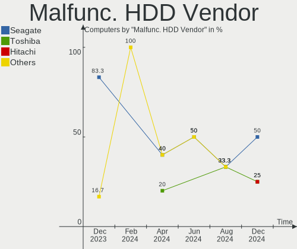
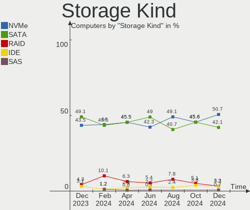
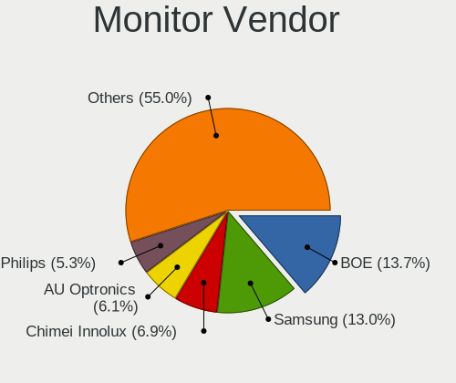
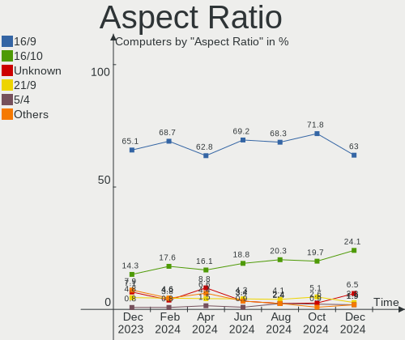

Manjaro Hardware Trends
-----------------------

A project to identify most popular hardware characteristics and track their change
over time based on data collected by Manjaro users at https://Linux-Hardware.org.

Anyone can contribute to this report by the [hw-probe](https://github.com/linuxhw/hw-probe) tool:

    sudo -E hw-probe -all -upload

This is a report for all computer types. See also reports for [desktops](/Dist/Manjaro/Desktop/README.md) and [notebooks](/Dist/Manjaro/Notebook/README.md).

Full-feature report is available here: https://linux-hardware.org/?view=trends

Period: Jan, 2022.

Contents
--------

* [ System ](#system)
  - [ OS                       ](#os)
  - [ OS Family                ](#os-family)
  - [ Kernel                   ](#kernel)
  - [ Kernel Family            ](#kernel-family)
  - [ Kernel Major Ver.        ](#kernel-major-ver)
  - [ Arch                     ](#arch)
  - [ DE                       ](#de)
  - [ Display Server           ](#display-server)
  - [ Display Manager          ](#display-manager)
  - [ OS Lang                  ](#os-lang)
  - [ Boot Mode                ](#boot-mode)
  - [ Filesystem               ](#filesystem)
  - [ Part. scheme             ](#part-scheme)
  - [ Dual Boot with Linux/BSD ](#dual-boot-with-linuxbsd)
  - [ Dual Boot (Win)          ](#dual-boot-win)

* [ Board ](#board)
  - [ Vendor                   ](#vendor)
  - [ Model                    ](#model)
  - [ Model Family             ](#model-family)
  - [ MFG Year                 ](#mfg-year)
  - [ Form Factor              ](#form-factor)
  - [ Secure Boot              ](#secure-boot)
  - [ Coreboot                 ](#coreboot)
  - [ RAM Size                 ](#ram-size)
  - [ RAM Used                 ](#ram-used)
  - [ Total Drives             ](#total-drives)
  - [ Has CD-ROM               ](#has-cd-rom)
  - [ Has Ethernet             ](#has-ethernet)
  - [ Has WiFi                 ](#has-wifi)
  - [ Has Bluetooth            ](#has-bluetooth)

* [ Location ](#location)
  - [ Country                  ](#country)
  - [ City                     ](#city)

* [ Drives ](#drives)
  - [ Drive Vendor             ](#drive-vendor)
  - [ Drive Model              ](#drive-model)
  - [ HDD Vendor               ](#hdd-vendor)
  - [ SSD Vendor               ](#ssd-vendor)
  - [ Drive Kind               ](#drive-kind)
  - [ Drive Connector          ](#drive-connector)
  - [ Drive Size               ](#drive-size)
  - [ Space Total              ](#space-total)
  - [ Space Used               ](#space-used)
  - [ Malfunc. Drives          ](#malfunc-drives)
  - [ Malfunc. Drive Vendor    ](#malfunc-drive-vendor)
  - [ Malfunc. HDD Vendor      ](#malfunc-hdd-vendor)
  - [ Malfunc. Drive Kind      ](#malfunc-drive-kind)
  - [ Failed Drives            ](#failed-drives)
  - [ Failed Drive Vendor      ](#failed-drive-vendor)
  - [ Drive Status             ](#drive-status)

* [ Storage controller ](#storage-controller)
  - [ Storage Vendor           ](#storage-vendor)
  - [ Storage Model            ](#storage-model)
  - [ Storage Kind             ](#storage-kind)

* [ Processor ](#processor)
  - [ CPU Vendor               ](#cpu-vendor)
  - [ CPU Model                ](#cpu-model)
  - [ CPU Model Family         ](#cpu-model-family)
  - [ CPU Cores                ](#cpu-cores)
  - [ CPU Sockets              ](#cpu-sockets)
  - [ CPU Threads              ](#cpu-threads)
  - [ CPU Op-Modes             ](#cpu-op-modes)
  - [ CPU Microcode            ](#cpu-microcode)
  - [ CPU Microarch            ](#cpu-microarch)

* [ Graphics ](#graphics)
  - [ GPU Vendor               ](#gpu-vendor)
  - [ GPU Model                ](#gpu-model)
  - [ GPU Combo                ](#gpu-combo)
  - [ GPU Driver               ](#gpu-driver)
  - [ GPU Memory               ](#gpu-memory)

* [ Monitor ](#monitor)
  - [ Monitor Vendor           ](#monitor-vendor)
  - [ Monitor Model            ](#monitor-model)
  - [ Monitor Resolution       ](#monitor-resolution)
  - [ Monitor Diagonal         ](#monitor-diagonal)
  - [ Monitor Width            ](#monitor-width)
  - [ Aspect Ratio             ](#aspect-ratio)
  - [ Monitor Area             ](#monitor-area)
  - [ Pixel Density            ](#pixel-density)
  - [ Multiple Monitors        ](#multiple-monitors)

* [ Network ](#network)
  - [ Net Controller Vendor    ](#net-controller-vendor)
  - [ Net Controller Model     ](#net-controller-model)
  - [ Wireless Vendor          ](#wireless-vendor)
  - [ Wireless Model           ](#wireless-model)
  - [ Ethernet Vendor          ](#ethernet-vendor)
  - [ Ethernet Model           ](#ethernet-model)
  - [ Net Controller Kind      ](#net-controller-kind)
  - [ Used Controller          ](#used-controller)
  - [ NICs                     ](#nics)
  - [ IPv6                     ](#ipv6)

* [ Bluetooth ](#bluetooth)
  - [ Bluetooth Vendor         ](#bluetooth-vendor)
  - [ Bluetooth Model          ](#bluetooth-model)

* [ Sound ](#sound)
  - [ Sound Vendor             ](#sound-vendor)
  - [ Sound Model              ](#sound-model)

* [ Memory ](#memory)
  - [ Memory Vendor            ](#memory-vendor)
  - [ Memory Model             ](#memory-model)
  - [ Memory Kind              ](#memory-kind)
  - [ Memory Form Factor       ](#memory-form-factor)
  - [ Memory Size              ](#memory-size)
  - [ Memory Speed             ](#memory-speed)

* [ Printers & scanners ](#printers--scanners)
  - [ Printer Vendor           ](#printer-vendor)
  - [ Printer Model            ](#printer-model)
  - [ Scanner Vendor           ](#scanner-vendor)
  - [ Scanner Model            ](#scanner-model)

* [ Camera ](#camera)
  - [ Camera Vendor            ](#camera-vendor)
  - [ Camera Model             ](#camera-model)

* [ Security ](#security)
  - [ Fingerprint Vendor       ](#fingerprint-vendor)
  - [ Fingerprint Model        ](#fingerprint-model)
  - [ Chipcard Vendor          ](#chipcard-vendor)
  - [ Chipcard Model           ](#chipcard-model)

* [ Unsupported ](#unsupported)
  - [ Unsupported Devices      ](#unsupported-devices)
  - [ Unsupported Device Types ](#unsupported-device-types)

System
------

OS
--

Installed operating systems

| Name            | Computers | Percent |
|-----------------|-----------|---------|
| Manjaro 21.2.1  | 72        | 41.62%  |
| Manjaro         | 61        | 35.26%  |
| Manjaro 21.2.2  | 30        | 17.34%  |
| Manjaro 21.2.0  | 9         | 5.2%    |
| Manjaro 21.2rc1 | 1         | 0.58%   |

OS Family
---------

OS without a version

| Name    | Computers | Percent |
|---------|-----------|---------|
| Manjaro | 173       | 100%    |

Kernel
------

Version of the Linux kernel

| Version                  | Computers | Percent |
|--------------------------|-----------|---------|
| 5.15.12-1-MANJARO        | 79        | 45.66%  |
| 5.15.16-1-MANJARO        | 14        | 8.09%   |
| 5.13.19-2-MANJARO        | 12        | 6.94%   |
| 5.10.89-1-MANJARO        | 12        | 6.94%   |
| 5.16.2-1-MANJARO         | 11        | 6.36%   |
| 5.15.7-1-MANJARO         | 11        | 6.36%   |
| 5.16.0-1-MANJARO         | 9         | 5.2%    |
| 5.10.93-1-MANJARO        | 7         | 4.05%   |
| 5.14.21-2-MANJARO        | 3         | 1.73%   |
| 5.9.16-1-MANJARO         | 2         | 1.16%   |
| 5.15.6-2-MANJARO         | 2         | 1.16%   |
| 5.9.1-1-rt20-MANJARO     | 1         | 0.58%   |
| 5.16.0-rc5-MANJARO+      | 1         | 0.58%   |
| 5.15.7-1-rt23-MANJARO    | 1         | 0.58%   |
| 5.15.14-1-MANJARO        | 1         | 0.58%   |
| 5.15.13-1-rt26-MANJARO   | 1         | 0.58%   |
| 5.14.16-214-tkg-pds      | 1         | 0.58%   |
| 5.13.13-1-MANJARO        | 1         | 0.58%   |
| 5.10.90-1-MANJARO        | 1         | 0.58%   |
| 5.10.84-1-MANJARO        | 1         | 0.58%   |
| 5.10.81-1-multimedia-lts | 1         | 0.58%   |
| 4.19.225-1-MANJARO       | 1         | 0.58%   |

Kernel Family
-------------

Linux kernel without a distro release

| Version  | Computers | Percent |
|----------|-----------|---------|
| 5.15.12  | 79        | 45.66%  |
| 5.15.16  | 14        | 8.09%   |
| 5.15.7   | 12        | 6.94%   |
| 5.13.19  | 12        | 6.94%   |
| 5.10.89  | 12        | 6.94%   |
| 5.16.2   | 11        | 6.36%   |
| 5.16.0   | 10        | 5.78%   |
| 5.10.93  | 7         | 4.05%   |
| 5.14.21  | 3         | 1.73%   |
| 5.9.16   | 2         | 1.16%   |
| 5.15.6   | 2         | 1.16%   |
| 5.9.1    | 1         | 0.58%   |
| 5.15.14  | 1         | 0.58%   |
| 5.15.13  | 1         | 0.58%   |
| 5.14.16  | 1         | 0.58%   |
| 5.13.13  | 1         | 0.58%   |
| 5.10.90  | 1         | 0.58%   |
| 5.10.84  | 1         | 0.58%   |
| 5.10.81  | 1         | 0.58%   |
| 4.19.225 | 1         | 0.58%   |

Kernel Major Ver.
-----------------

Linux kernel major version

| Version | Computers | Percent |
|---------|-----------|---------|
| 5.15    | 109       | 63.01%  |
| 5.10    | 22        | 12.72%  |
| 5.16    | 21        | 12.14%  |
| 5.13    | 13        | 7.51%   |
| 5.14    | 4         | 2.31%   |
| 5.9     | 3         | 1.73%   |
| 4.19    | 1         | 0.58%   |

Arch
----

OS architecture (x86_64, i586, etc.)

| Name   | Computers | Percent |
|--------|-----------|---------|
| x86_64 | 173       | 100%    |

DE
--

Desktop Environment

| Name       | Computers | Percent |
|------------|-----------|---------|
| KDE5       | 73        | 42.2%   |
| XFCE       | 45        | 26.01%  |
| GNOME      | 42        | 24.28%  |
| i3         | 4         | 2.31%   |
| Unknown    | 3         | 1.73%   |
| X-Cinnamon | 2         | 1.16%   |
| Cinnamon   | 2         | 1.16%   |
| sway       | 1         | 0.58%   |
| LeftWM     | 1         | 0.58%   |

Display Server
--------------

X11 or Wayland

| Name    | Computers | Percent |
|---------|-----------|---------|
| X11     | 141       | 81.5%   |
| Wayland | 27        | 15.61%  |
| Tty     | 4         | 2.31%   |
| Unknown | 1         | 0.58%   |

Display Manager
---------------

SDDM, LightDM, etc.

| Name    | Computers | Percent |
|---------|-----------|---------|
| Unknown | 62        | 35.84%  |
| SDDM    | 39        | 22.54%  |
| LightDM | 39        | 22.54%  |
| GDM     | 32        | 18.5%   |
| GREETD  | 1         | 0.58%   |

OS Lang
-------

Language

| Lang  | Computers | Percent |
|-------|-----------|---------|
| en_US | 73        | 42.2%   |
| de_DE | 23        | 13.29%  |
| en_GB | 11        | 6.36%   |
| pt_BR | 8         | 4.62%   |
| pl_PL | 8         | 4.62%   |
| fr_FR | 8         | 4.62%   |
| ru_RU | 6         | 3.47%   |
| en_CA | 5         | 2.89%   |
| es_ES | 4         | 2.31%   |
| sv_SE | 3         | 1.73%   |
| en_IN | 3         | 1.73%   |
| zh_CN | 2         | 1.16%   |
| nl_NL | 2         | 1.16%   |
| it_IT | 2         | 1.16%   |
| hu_HU | 2         | 1.16%   |
| uk_UA | 1         | 0.58%   |
| ru_UA | 1         | 0.58%   |
| ro_RO | 1         | 0.58%   |
| pt_PT | 1         | 0.58%   |
| fr_BE | 1         | 0.58%   |
| es_MX | 1         | 0.58%   |
| es_CL | 1         | 0.58%   |
| es_BO | 1         | 0.58%   |
| es_AR | 1         | 0.58%   |
| en_IE | 1         | 0.58%   |
| en_DK | 1         | 0.58%   |
| en_AU | 1         | 0.58%   |
| de_CH | 1         | 0.58%   |

Boot Mode
---------

EFI or BIOS

| Mode | Computers | Percent |
|------|-----------|---------|
| BIOS | 111       | 64.16%  |
| EFI  | 62        | 35.84%  |

Filesystem
----------

Type of filesystem

| Type    | Computers | Percent |
|---------|-----------|---------|
| Ext4    | 146       | 84.39%  |
| Btrfs   | 19        | 10.98%  |
| Overlay | 5         | 2.89%   |
| Xfs     | 2         | 1.16%   |
| F2fs    | 1         | 0.58%   |

Part. scheme
------------

Scheme of partitioning

| Type    | Computers | Percent |
|---------|-----------|---------|
| Unknown | 104       | 60.12%  |
| GPT     | 56        | 32.37%  |
| MBR     | 13        | 7.51%   |

Dual Boot with Linux/BSD
------------------------

Hosting more than one Linux/BSD

| Dual boot | Computers | Percent |
|-----------|-----------|---------|
| No        | 158       | 91.33%  |
| Yes       | 15        | 8.67%   |

Dual Boot (Win)
---------------

Hosting Linux and Windows

| Dual boot | Computers | Percent |
|-----------|-----------|---------|
| No        | 125       | 72.25%  |
| Yes       | 48        | 27.75%  |

Board
-----

Vendor
------

Motherboard manufacturer

| Name                  | Computers | Percent |
|-----------------------|-----------|---------|
| Lenovo                | 35        | 20.23%  |
| Hewlett-Packard       | 22        | 12.72%  |
| ASUSTek Computer      | 21        | 12.14%  |
| Dell                  | 19        | 10.98%  |
| MSI                   | 16        | 9.25%   |
| Gigabyte Technology   | 13        | 7.51%   |
| Acer                  | 6         | 3.47%   |
| Google                | 5         | 2.89%   |
| Intel                 | 4         | 2.31%   |
| Apple                 | 4         | 2.31%   |
| Fujitsu               | 3         | 1.73%   |
| ASRock                | 3         | 1.73%   |
| TUXEDO                | 2         | 1.16%   |
| Sony                  | 2         | 1.16%   |
| Schenker              | 2         | 1.16%   |
| HONOR                 | 2         | 1.16%   |
| Toshiba               | 1         | 0.58%   |
| Star Labs             | 1         | 0.58%   |
| Razer                 | 1         | 0.58%   |
| Positivo Bahia - VAIO | 1         | 0.58%   |
| Medion                | 1         | 0.58%   |
| IP3 Tech              | 1         | 0.58%   |
| ilife                 | 1         | 0.58%   |
| HUAWEI                | 1         | 0.58%   |
| Huanan                | 1         | 0.58%   |
| GPD                   | 1         | 0.58%   |
| GALAX                 | 1         | 0.58%   |
| Chatreey              | 1         | 0.58%   |
| AZW                   | 1         | 0.58%   |
| Acidanthera           | 1         | 0.58%   |

Model
-----

Motherboard model

| Name                                    | Computers | Percent |
|-----------------------------------------|-----------|---------|
| HP Pavilion Gaming Laptop 15-ec1xxx     | 3         | 1.73%   |
| MSI MS-7B79                             | 2         | 1.16%   |
| Lenovo ThinkPad T400 2768WGB            | 2         | 1.16%   |
| Lenovo ThinkBook 15-IIL 20SM            | 2         | 1.16%   |
| Lenovo IdeaPad Gaming 3 15ACH6 82K2     | 2         | 1.16%   |
| Google Falco                            | 2         | 1.16%   |
| Gigabyte 970A-DS3P                      | 2         | 1.16%   |
| ASUS TUF GAMING X570-PLUS               | 2         | 1.16%   |
| TUXEDO Pulse 15 Gen1                    | 1         | 0.58%   |
| TUXEDO Book XP1511                      | 1         | 0.58%   |
| Toshiba Satellite C855D                 | 1         | 0.58%   |
| Star Labs LabTop                        | 1         | 0.58%   |
| Sony VPCEB2Z1E                          | 1         | 0.58%   |
| Sony SVF13N2J4RS                        | 1         | 0.58%   |
| Schenker VISION 15 (SVS15E21)           | 1         | 0.58%   |
| Schenker N24_25JU                       | 1         | 0.58%   |
| Razer Blade Stealth 13 Late 2019        | 1         | 0.58%   |
| Positivo Bahia - VAIO VJFE43F11X-XXXXXX | 1         | 0.58%   |
| MSI Prestige 15 A10SC                   | 1         | 0.58%   |
| MSI MS-7D30                             | 1         | 0.58%   |
| MSI MS-7C95                             | 1         | 0.58%   |
| MSI MS-7C91                             | 1         | 0.58%   |
| MSI MS-7C87                             | 1         | 0.58%   |
| MSI MS-7C79                             | 1         | 0.58%   |
| MSI MS-7C56                             | 1         | 0.58%   |
| MSI MS-7C37                             | 1         | 0.58%   |
| MSI MS-7A37                             | 1         | 0.58%   |
| MSI MS-7971                             | 1         | 0.58%   |
| MSI MS-7885                             | 1         | 0.58%   |
| MSI MS-7846                             | 1         | 0.58%   |
| MSI GS66 Stealth 10SGS                  | 1         | 0.58%   |
| MSI GP66 Leopard 11UH                   | 1         | 0.58%   |
| Medion Akoya P5360 E MD8881/2478        | 1         | 0.58%   |
| Lenovo Y520-15IKBN 80WK                 | 1         | 0.58%   |
| Lenovo V15 G2 ALC 82KD                  | 1         | 0.58%   |
| Lenovo V14 G2 ITL 82NM                  | 1         | 0.58%   |
| Lenovo ThinkPad X230 2324A82            | 1         | 0.58%   |
| Lenovo ThinkPad X220 4291B60            | 1         | 0.58%   |
| Lenovo ThinkPad T470 W10DG 20JNS0DB00   | 1         | 0.58%   |
| Lenovo ThinkPad T440p 20AWS17N00        | 1         | 0.58%   |
| Lenovo ThinkPad T430s 2356BQ5           | 1         | 0.58%   |
| Lenovo ThinkPad T430 2344BZU            | 1         | 0.58%   |
| Lenovo ThinkPad T15g Gen 1 20URA002AU   | 1         | 0.58%   |
| Lenovo ThinkPad T15 Gen 2i 20W4003FUK   | 1         | 0.58%   |
| Lenovo ThinkPad L14 Gen 1 20U50001PB    | 1         | 0.58%   |
| Lenovo ThinkPad L14 Gen 1 20U50001GE    | 1         | 0.58%   |
| Lenovo ThinkPad E560 20EV002UIX         | 1         | 0.58%   |
| Lenovo ThinkCentre M710e 10UQS08V00     | 1         | 0.58%   |
| Lenovo ThinkBook 15 G2 ARE 20VG         | 1         | 0.58%   |
| Lenovo Legion Y530-15ICH 81FV           | 1         | 0.58%   |
| Lenovo Legion 5 15IMH05 82AU            | 1         | 0.58%   |
| Lenovo Legion 5 15ARH05H 82B1           | 1         | 0.58%   |
| Lenovo IdeaPad Y580                     | 1         | 0.58%   |
| Lenovo IdeaPad S540-14API 81NH          | 1         | 0.58%   |
| Lenovo IdeaPad S145-14IGM 81MW          | 1         | 0.58%   |
| Lenovo IdeaPad 530S-15IKB 81EV          | 1         | 0.58%   |
| Lenovo IdeaPad 320-14AST 80XU           | 1         | 0.58%   |
| Lenovo IdeaPad 3 14ADA05 81W0           | 1         | 0.58%   |
| Lenovo IdeaPad 120S-14IAP 81A5          | 1         | 0.58%   |
| Lenovo G580 20157                       | 1         | 0.58%   |

Model Family
------------

Motherboard model prefix

| Name                                    | Computers | Percent |
|-----------------------------------------|-----------|---------|
| Lenovo ThinkPad                         | 13        | 7.51%   |
| Lenovo IdeaPad                          | 9         | 5.2%    |
| HP Pavilion                             | 5         | 2.89%   |
| Dell Latitude                           | 5         | 2.89%   |
| ASUS TUF                                | 5         | 2.89%   |
| HP ProBook                              | 4         | 2.31%   |
| Dell OptiPlex                           | 4         | 2.31%   |
| Dell Inspiron                           | 4         | 2.31%   |
| Lenovo ThinkBook                        | 3         | 1.73%   |
| Lenovo Legion                           | 3         | 1.73%   |
| HP EliteBook                            | 3         | 1.73%   |
| Fujitsu LIFEBOOK                        | 3         | 1.73%   |
| ASUS ROG                                | 3         | 1.73%   |
| Acer Aspire                             | 3         | 1.73%   |
| MSI MS-7B79                             | 2         | 1.16%   |
| HP ZBook                                | 2         | 1.16%   |
| HP OMEN                                 | 2         | 1.16%   |
| HP Laptop                               | 2         | 1.16%   |
| HP ENVY                                 | 2         | 1.16%   |
| Google Falco                            | 2         | 1.16%   |
| Gigabyte B450M                          | 2         | 1.16%   |
| Gigabyte 970A-DS3P                      | 2         | 1.16%   |
| Dell XPS                                | 2         | 1.16%   |
| Dell Vostro                             | 2         | 1.16%   |
| Dell Precision                          | 2         | 1.16%   |
| ASUS M5A78L-M                           | 2         | 1.16%   |
| TUXEDO Pulse                            | 1         | 0.58%   |
| TUXEDO Book                             | 1         | 0.58%   |
| Toshiba Satellite                       | 1         | 0.58%   |
| Star Labs LabTop                        | 1         | 0.58%   |
| Sony VPCEB2Z1E                          | 1         | 0.58%   |
| Sony SVF13N2J4RS                        | 1         | 0.58%   |
| Schenker VISION                         | 1         | 0.58%   |
| Schenker N24                            | 1         | 0.58%   |
| Razer Blade                             | 1         | 0.58%   |
| Positivo Bahia - VAIO VJFE43F11X-XXXXXX | 1         | 0.58%   |
| MSI Prestige                            | 1         | 0.58%   |
| MSI MS-7D30                             | 1         | 0.58%   |
| MSI MS-7C95                             | 1         | 0.58%   |
| MSI MS-7C91                             | 1         | 0.58%   |
| MSI MS-7C87                             | 1         | 0.58%   |
| MSI MS-7C79                             | 1         | 0.58%   |
| MSI MS-7C56                             | 1         | 0.58%   |
| MSI MS-7C37                             | 1         | 0.58%   |
| MSI MS-7A37                             | 1         | 0.58%   |
| MSI MS-7971                             | 1         | 0.58%   |
| MSI MS-7885                             | 1         | 0.58%   |
| MSI MS-7846                             | 1         | 0.58%   |
| MSI GS66                                | 1         | 0.58%   |
| MSI GP66                                | 1         | 0.58%   |
| Medion Akoya                            | 1         | 0.58%   |
| Lenovo Y520-15IKBN                      | 1         | 0.58%   |
| Lenovo V15                              | 1         | 0.58%   |
| Lenovo V14                              | 1         | 0.58%   |
| Lenovo ThinkCentre                      | 1         | 0.58%   |
| Lenovo G580                             | 1         | 0.58%   |
| Lenovo G50-30                           | 1         | 0.58%   |
| Lenovo G460                             | 1         | 0.58%   |
| IP3 Tech HeroBox                        | 1         | 0.58%   |
| Intel X99                               | 1         | 0.58%   |

MFG Year
--------

Motherboard manufacture year

| Year | Computers | Percent |
|------|-----------|---------|
| 2020 | 36        | 20.81%  |
| 2021 | 29        | 16.76%  |
| 2012 | 17        | 9.83%   |
| 2019 | 15        | 8.67%   |
| 2018 | 12        | 6.94%   |
| 2014 | 10        | 5.78%   |
| 2016 | 9         | 5.2%    |
| 2013 | 9         | 5.2%    |
| 2017 | 7         | 4.05%   |
| 2015 | 6         | 3.47%   |
| 2011 | 6         | 3.47%   |
| 2010 | 5         | 2.89%   |
| 2009 | 5         | 2.89%   |
| 2008 | 4         | 2.31%   |
| 2007 | 2         | 1.16%   |
| 2006 | 1         | 0.58%   |

Form Factor
-----------

Physical design of the computer

| Name        | Computers | Percent |
|-------------|-----------|---------|
| Notebook    | 107       | 61.85%  |
| Desktop     | 58        | 33.53%  |
| Convertible | 3         | 1.73%   |
| Mini pc     | 3         | 1.73%   |
| All in one  | 2         | 1.16%   |

Secure Boot
-----------

Enabled or disabled

| State    | Computers | Percent |
|----------|-----------|---------|
| Disabled | 173       | 100%    |

Coreboot
--------

Have coreboot on board

| Used | Computers | Percent |
|------|-----------|---------|
| No   | 166       | 95.95%  |
| Yes  | 7         | 4.05%   |

RAM Size
--------

Total RAM memory

| Size in GB  | Computers | Percent |
|-------------|-----------|---------|
| 4.01-8.0    | 46        | 26.59%  |
| 16.01-24.0  | 43        | 24.86%  |
| 8.01-16.0   | 28        | 16.18%  |
| 32.01-64.0  | 25        | 14.45%  |
| 3.01-4.0    | 21        | 12.14%  |
| 24.01-32.0  | 4         | 2.31%   |
| 64.01-256.0 | 3         | 1.73%   |
| 1.01-2.0    | 3         | 1.73%   |

RAM Used
--------

Used RAM memory

| Used GB    | Computers | Percent |
|------------|-----------|---------|
| 2.01-3.0   | 54        | 31.21%  |
| 1.01-2.0   | 47        | 27.17%  |
| 4.01-8.0   | 31        | 17.92%  |
| 3.01-4.0   | 30        | 17.34%  |
| 8.01-16.0  | 5         | 2.89%   |
| 0.51-1.0   | 5         | 2.89%   |
| 16.01-24.0 | 1         | 0.58%   |

Total Drives
------------

Number of drives on board

| Drives | Computers | Percent |
|--------|-----------|---------|
| 1      | 94        | 54.34%  |
| 2      | 52        | 30.06%  |
| 3      | 10        | 5.78%   |
| 4      | 9         | 5.2%    |
| 5      | 7         | 4.05%   |
| 6      | 1         | 0.58%   |

Has CD-ROM
----------

Has CD-ROM on board

| Presented | Computers | Percent |
|-----------|-----------|---------|
| No        | 136       | 78.61%  |
| Yes       | 37        | 21.39%  |

Has Ethernet
------------

Has Ethernet on board

| Presented | Computers | Percent |
|-----------|-----------|---------|
| Yes       | 141       | 81.5%   |
| No        | 32        | 18.5%   |

Has WiFi
--------

Has WiFi module

| Presented | Computers | Percent |
|-----------|-----------|---------|
| Yes       | 145       | 83.82%  |
| No        | 28        | 16.18%  |

Has Bluetooth
-------------

Has Bluetooth module

| Presented | Computers | Percent |
|-----------|-----------|---------|
| Yes       | 120       | 69.36%  |
| No        | 53        | 30.64%  |

Location
--------

Country
-------

Geographic location (country)

| Country     | Computers | Percent |
|-------------|-----------|---------|
| USA         | 30        | 17.34%  |
| Germany     | 23        | 13.29%  |
| Russia      | 11        | 6.36%   |
| Poland      | 10        | 5.78%   |
| Brazil      | 10        | 5.78%   |
| Spain       | 8         | 4.62%   |
| France      | 8         | 4.62%   |
| Sweden      | 6         | 3.47%   |
| Netherlands | 6         | 3.47%   |
| Canada      | 6         | 3.47%   |
| UK          | 5         | 2.89%   |
| Hungary     | 5         | 2.89%   |
| Italy       | 4         | 2.31%   |
| India       | 3         | 1.73%   |
| Ukraine     | 2         | 1.16%   |
| Turkey      | 2         | 1.16%   |
| Switzerland | 2         | 1.16%   |
| Romania     | 2         | 1.16%   |
| Mexico      | 2         | 1.16%   |
| Indonesia   | 2         | 1.16%   |
| Finland     | 2         | 1.16%   |
| China       | 2         | 1.16%   |
| Argentina   | 2         | 1.16%   |
| UAE         | 1         | 0.58%   |
| Taiwan      | 1         | 0.58%   |
| South Korea | 1         | 0.58%   |
| Portugal    | 1         | 0.58%   |
| Norway      | 1         | 0.58%   |
| New Zealand | 1         | 0.58%   |
| Ireland     | 1         | 0.58%   |
| Iran        | 1         | 0.58%   |
| Greece      | 1         | 0.58%   |
| Ghana       | 1         | 0.58%   |
| Egypt       | 1         | 0.58%   |
| Ecuador     | 1         | 0.58%   |
| Denmark     | 1         | 0.58%   |
| Czechia     | 1         | 0.58%   |
| Chile       | 1         | 0.58%   |
| Bulgaria    | 1         | 0.58%   |
| Bolivia     | 1         | 0.58%   |
| Belgium     | 1         | 0.58%   |
| Bangladesh  | 1         | 0.58%   |
| Austria     | 1         | 0.58%   |

City
----

Geographic location (city)

| City                     | Computers | Percent |
|--------------------------|-----------|---------|
| The Hague                | 2         | 1.16%   |
| Tampere                  | 2         | 1.16%   |
| Stockholm                | 2         | 1.16%   |
| St Petersburg            | 2         | 1.16%   |
| Phoenix                  | 2         | 1.16%   |
| Neuwied                  | 2         | 1.16%   |
| Mosina                   | 2         | 1.16%   |
| Moscow                   | 2         | 1.16%   |
| Milan                    | 2         | 1.16%   |
| Krakow                   | 2         | 1.16%   |
| Edmonton                 | 2         | 1.16%   |
| Donostia / San Sebastian | 2         | 1.16%   |
| Budapest                 | 2         | 1.16%   |
| Bielefeld                | 2         | 1.16%   |
| Berlin                   | 2         | 1.16%   |
| Amsterdam                | 2         | 1.16%   |
| Zabrze                   | 1         | 0.58%   |
| Yekaterinburg            | 1         | 0.58%   |
| Woodbridge               | 1         | 0.58%   |
| Wolfenb??ttel            | 1         | 0.58%   |
| Wichita                  | 1         | 0.58%   |
| Westhausen               | 1         | 0.58%   |
| Weinbohla                | 1         | 0.58%   |
| Vitoria-Gasteiz          | 1         | 0.58%   |
| Vigo                     | 1         | 0.58%   |
| Vienna                   | 1         | 0.58%   |
| Vaudreuil-Dorion         | 1         | 0.58%   |
| Valdivia                 | 1         | 0.58%   |
| Ulyanovsk                | 1         | 0.58%   |
| Turda                    | 1         | 0.58%   |
| Toulouse                 | 1         | 0.58%   |
| Toftbyn                  | 1         | 0.58%   |
| Tatab??nya               | 1         | 0.58%   |
| Tarsus                   | 1         | 0.58%   |
| Sz?©kesfeh?©rv??r        | 1         | 0.58%   |
| Swieszyno                | 1         | 0.58%   |
| Surabaya                 | 1         | 0.58%   |
| Sundbyberg               | 1         | 0.58%   |
| Stuttgart                | 1         | 0.58%   |
| Stade                    | 1         | 0.58%   |
| Southaven                | 1         | 0.58%   |
| Solingen                 | 1         | 0.58%   |
| Shanghai                 | 1         | 0.58%   |
| Seoul                    | 1         | 0.58%   |
| Secaucus                 | 1         | 0.58%   |
| Scott                    | 1         | 0.58%   |
| S??o Paulo               | 1         | 0.58%   |
| S??o Jos?© dos Campos    | 1         | 0.58%   |
| Sao Juliao do Tojal      | 1         | 0.58%   |
| Sant Vicenc de Montalt   | 1         | 0.58%   |
| San Giuliano Milanese    | 1         | 0.58%   |
| San Francisco Solano     | 1         | 0.58%   |
| Salford                  | 1         | 0.58%   |
| Saint-Privat-des-Vieux   | 1         | 0.58%   |
| Saint-Paul-les-Dax       | 1         | 0.58%   |
| Saint Paul               | 1         | 0.58%   |
| Rostov-on-Don            | 1         | 0.58%   |
| Reus                     | 1         | 0.58%   |
| Reggio Emilia            | 1         | 0.58%   |
| Raucoules                | 1         | 0.58%   |

Drives
------

Drive Vendor
------------

Hard drive vendors

| Vendor                         | Computers | Drives | Percent |
|--------------------------------|-----------|--------|---------|
| Samsung Electronics            | 57        | 68     | 21.03%  |
| Seagate                        | 37        | 51     | 13.65%  |
| WDC                            | 31        | 35     | 11.44%  |
| Kingston                       | 17        | 18     | 6.27%   |
| Crucial                        | 15        | 15     | 5.54%   |
| Sandisk                        | 11        | 12     | 4.06%   |
| Unknown                        | 10        | 12     | 3.69%   |
| Toshiba                        | 10        | 11     | 3.69%   |
| SK Hynix                       | 8         | 8      | 2.95%   |
| Hitachi                        | 7         | 7      | 2.58%   |
| Micron/Crucial Technology      | 5         | 5      | 1.85%   |
| KIOXIA                         | 5         | 5      | 1.85%   |
| LITEONIT                       | 4         | 5      | 1.48%   |
| Intel                          | 4         | 5      | 1.48%   |
| XPG                            | 3         | 3      | 1.11%   |
| Solid State Storage Technology | 3         | 3      | 1.11%   |
| Silicon Motion                 | 3         | 3      | 1.11%   |
| Phison                         | 3         | 3      | 1.11%   |
| Patriot                        | 3         | 3      | 1.11%   |
| Micron Technology              | 3         | 3      | 1.11%   |
| Corsair                        | 3         | 3      | 1.11%   |
| China                          | 3         | 4      | 1.11%   |
| Unknown                        | 3         | 3      | 1.11%   |
| PNY                            | 2         | 2      | 0.74%   |
| OCZ                            | 2         | 2      | 0.74%   |
| HGST                           | 2         | 2      | 0.74%   |
| A-DATA Technology              | 2         | 2      | 0.74%   |
| UMIS                           | 1         | 1      | 0.37%   |
| Transcend                      | 1         | 1      | 0.37%   |
| Team                           | 1         | 1      | 0.37%   |
| Star Drive                     | 1         | 1      | 0.37%   |
| SPCC                           | 1         | 1      | 0.37%   |
| Realtek Semiconductor          | 1         | 1      | 0.37%   |
| Netac                          | 1         | 1      | 0.37%   |
| LuminouTek                     | 1         | 1      | 0.37%   |
| Intenso                        | 1         | 1      | 0.37%   |
| HS-SSD-C100                    | 1         | 1      | 0.37%   |
| GOODRAM                        | 1         | 1      | 0.37%   |
| Biwin                          | 1         | 1      | 0.37%   |
| ASMT                           | 1         | 1      | 0.37%   |
| Apacer                         | 1         | 1      | 0.37%   |
| ADROITLA                       | 1         | 1      | 0.37%   |

Drive Model
-----------

Hard drive models

| Model                                    | Computers | Percent |
|------------------------------------------|-----------|---------|
| Kingston SA400S37240G 240GB SSD          | 7         | 2.35%   |
| Samsung NVMe SSD Drive 512GB             | 6         | 2.01%   |
| Samsung NVMe SSD Drive 500GB             | 6         | 2.01%   |
| Crucial CT500MX500SSD1 500GB             | 5         | 1.68%   |
| Unknown SD/MMC/MS PRO 128GB              | 3         | 1.01%   |
| Solid State Storage NVMe SSD Drive 512GB | 3         | 1.01%   |
| Seagate ST1000LM024 HN-M101MBB 1TB       | 3         | 1.01%   |
| Samsung SSD 850 EVO 250GB                | 3         | 1.01%   |
| Samsung NVMe SSD Drive 256GB             | 3         | 1.01%   |
| Samsung NVMe SSD Drive 250GB             | 3         | 1.01%   |
| Samsung NVMe SSD Drive 1TB               | 3         | 1.01%   |
| Samsung NVMe SSD Drive 1024GB            | 3         | 1.01%   |
| Micron/Crucial NVMe SSD Drive 1TB        | 3         | 1.01%   |
| Crucial CT1000MX500SSD1 1TB              | 3         | 1.01%   |
| Unknown                                  | 3         | 1.01%   |
| Toshiba HDWD110 1TB                      | 2         | 0.67%   |
| SK Hynix NVMe SSD Drive 512GB            | 2         | 0.67%   |
| Silicon Motion NVMe SSD Drive 256GB      | 2         | 0.67%   |
| Seagate ST750LM022 HN-M750MBB 752GB      | 2         | 0.67%   |
| Seagate ST500LT012-1DG142 500GB          | 2         | 0.67%   |
| Seagate ST4000DM004-2CV104 4TB           | 2         | 0.67%   |
| Seagate ST2000DM006-2DM164 2TB           | 2         | 0.67%   |
| Seagate ST2000DM001-1ER164 2TB           | 2         | 0.67%   |
| Seagate ST1000DM010-2EP102 1TB           | 2         | 0.67%   |
| Seagate ST1000DM003-1ER162 1TB           | 2         | 0.67%   |
| Sandisk NVMe SSD Drive 512GB             | 2         | 0.67%   |
| Sandisk NVMe SSD Drive 1TB               | 2         | 0.67%   |
| Samsung SSD 980 PRO 1TB                  | 2         | 0.67%   |
| Samsung SSD 850 EVO 500GB                | 2         | 0.67%   |
| Samsung MZNLN256HMHQ-000H1 256GB SSD     | 2         | 0.67%   |
| Samsung MZALQ512HALU-000L2 512GB         | 2         | 0.67%   |
| Micron NVMe SSD Drive 512GB              | 2         | 0.67%   |
| LITEONIT LSS-32L6G-HP 32GB SSD           | 2         | 0.67%   |
| KIOXIA NVMe SSD Drive 256GB              | 2         | 0.67%   |
| Kingston NVMe SSD Drive 512GB            | 2         | 0.67%   |
| Crucial CT250MX500SSD1 250GB             | 2         | 0.67%   |
| XPG NVMe SSD Drive 2TB                   | 1         | 0.34%   |
| XPG NVMe SSD Drive 256GB                 | 1         | 0.34%   |
| XPG NVMe SSD Drive 1024GB                | 1         | 0.34%   |
| WDC WDS500G2B0B-00YS70 500GB SSD         | 1         | 0.34%   |
| WDC WDS500G2B0A-00SM50 500GB SSD         | 1         | 0.34%   |
| WDC WDS200T2B0B-00YS70 2TB SSD           | 1         | 0.34%   |
| WDC WDS120G2G0A-00JH30 120GB SSD         | 1         | 0.34%   |
| WDC WD800BD-22MRA1 80GB                  | 1         | 0.34%   |
| WDC WD7501AALS-00J7B0 752GB              | 1         | 0.34%   |
| WDC WD5000LPVT-22G33T0 500GB             | 1         | 0.34%   |
| WDC WD5000LPCX-24C6HT0 500GB             | 1         | 0.34%   |
| WDC WD5000BEVT-00A0RT0 500GB             | 1         | 0.34%   |
| WDC WD5000AADS-00S9B0 500GB              | 1         | 0.34%   |
| WDC WD2500BEVS-22UST0 250GB              | 1         | 0.34%   |
| WDC WD20EZRX-00D8PB0 2TB                 | 1         | 0.34%   |
| WDC WD20EZAZ-00L9GB0 2TB                 | 1         | 0.34%   |
| WDC WD20EZAZ-00GGJB0 2TB                 | 1         | 0.34%   |
| WDC WD20EARX-32PASB0 2TB                 | 1         | 0.34%   |
| WDC WD2003FZEX-00Z4SA0 2TB               | 1         | 0.34%   |
| WDC WD10SPZX-75Z10T0 1TB                 | 1         | 0.34%   |
| WDC WD10SPCX-08HWST0 1TB                 | 1         | 0.34%   |
| WDC WD10S21X-24R1BT0-SSHD-8GB            | 1         | 0.34%   |
| WDC WD10JPVX-60JC3T0 1TB                 | 1         | 0.34%   |
| WDC WD10EZRX-00A8LB0 1TB                 | 1         | 0.34%   |

HDD Vendor
----------

Hard disk drive vendors

| Vendor              | Computers | Drives | Percent |
|---------------------|-----------|--------|---------|
| Seagate             | 37        | 50     | 45.68%  |
| WDC                 | 22        | 26     | 27.16%  |
| Toshiba             | 7         | 8      | 8.64%   |
| Hitachi             | 7         | 7      | 8.64%   |
| Unknown             | 4         | 4      | 4.94%   |
| Samsung Electronics | 2         | 2      | 2.47%   |
| HGST                | 2         | 2      | 2.47%   |

SSD Vendor
----------

Solid state drive vendors

| Vendor              | Computers | Drives | Percent |
|---------------------|-----------|--------|---------|
| Samsung Electronics | 23        | 25     | 24.21%  |
| Crucial             | 14        | 14     | 14.74%  |
| Kingston            | 12        | 12     | 12.63%  |
| WDC                 | 5         | 5      | 5.26%   |
| SanDisk             | 5         | 5      | 5.26%   |
| LITEONIT            | 4         | 5      | 4.21%   |
| SK Hynix            | 3         | 3      | 3.16%   |
| Patriot             | 3         | 3      | 3.16%   |
| Corsair             | 3         | 3      | 3.16%   |
| China               | 3         | 4      | 3.16%   |
| PNY                 | 2         | 2      | 2.11%   |
| OCZ                 | 2         | 2      | 2.11%   |
| Intel               | 2         | 3      | 2.11%   |
| Transcend           | 1         | 1      | 1.05%   |
| Toshiba             | 1         | 1      | 1.05%   |
| Team                | 1         | 1      | 1.05%   |
| SPCC                | 1         | 1      | 1.05%   |
| Seagate             | 1         | 1      | 1.05%   |
| Netac               | 1         | 1      | 1.05%   |
| Micron Technology   | 1         | 1      | 1.05%   |
| Intenso             | 1         | 1      | 1.05%   |
| HS-SSD-C100         | 1         | 1      | 1.05%   |
| GOODRAM             | 1         | 1      | 1.05%   |
| ASMT                | 1         | 1      | 1.05%   |
| Apacer              | 1         | 1      | 1.05%   |
| ADROITLA            | 1         | 1      | 1.05%   |
| A-DATA Technology   | 1         | 1      | 1.05%   |

Drive Kind
----------

HDD or SSD

| Kind    | Computers | Drives | Percent |
|---------|-----------|--------|---------|
| NVMe    | 84        | 97     | 34.43%  |
| SSD     | 81        | 100    | 33.2%   |
| HDD     | 70        | 99     | 28.69%  |
| MMC     | 7         | 10     | 2.87%   |
| Unknown | 2         | 2      | 0.82%   |

Drive Connector
---------------

SATA, SAS, NVMe, etc.

| Type | Computers | Drives | Percent |
|------|-----------|--------|---------|
| SATA | 115       | 190    | 53.24%  |
| NVMe | 84        | 97     | 38.89%  |
| SAS  | 10        | 11     | 4.63%   |
| MMC  | 7         | 10     | 3.24%   |

Drive Size
----------

Size of hard drive

| Size in TB | Computers | Drives | Percent |
|------------|-----------|--------|---------|
| 0.01-0.5   | 85        | 114    | 53.8%   |
| 0.51-1.0   | 43        | 48     | 27.22%  |
| 1.01-2.0   | 18        | 23     | 11.39%  |
| 3.01-4.0   | 5         | 6      | 3.16%   |
| 2.01-3.0   | 3         | 3      | 1.9%    |
| 4.01-10.0  | 3         | 3      | 1.9%    |
| 10.01-20.0 | 1         | 2      | 0.63%   |

Space Total
-----------

Amount of disk space available on the file system

| Size in GB     | Computers | Percent |
|----------------|-----------|---------|
| 101-250        | 46        | 26.59%  |
| 251-500        | 34        | 19.65%  |
| 501-1000       | 31        | 17.92%  |
| 1001-2000      | 16        | 9.25%   |
| 2001-3000      | 14        | 8.09%   |
| More than 3000 | 7         | 4.05%   |
| 21-50          | 7         | 4.05%   |
| 51-100         | 7         | 4.05%   |
| 1-20           | 6         | 3.47%   |
| Unknown        | 5         | 2.89%   |

Space Used
----------

Amount of used disk space

| Used GB        | Computers | Percent |
|----------------|-----------|---------|
| 21-50          | 33        | 19.08%  |
| 1-20           | 31        | 17.92%  |
| 51-100         | 27        | 15.61%  |
| 101-250        | 26        | 15.03%  |
| 251-500        | 19        | 10.98%  |
| 501-1000       | 16        | 9.25%   |
| 1001-2000      | 11        | 6.36%   |
| Unknown        | 5         | 2.89%   |
| 2001-3000      | 3         | 1.73%   |
| More than 3000 | 2         | 1.16%   |

Malfunc. Drives
---------------

Drive models with a malfunction

| Model                            | Computers | Drives | Percent |
|----------------------------------|-----------|--------|---------|
| WDC WD10JPVX-60JC3T0 1TB         | 1         | 1      | 10%     |
| Toshiba HDWL110 1TB              | 1         | 1      | 10%     |
| Seagate ST9320328CS 320GB        | 1         | 1      | 10%     |
| Seagate ST3000DM001-1ER166 3TB   | 1         | 1      | 10%     |
| Seagate ST2000DM001-1ER164 2TB   | 1         | 2      | 10%     |
| Kingston SV300S37A120G 120GB SSD | 1         | 1      | 10%     |
| Hitachi HTS725050A7E635 500GB    | 1         | 1      | 10%     |
| Hitachi HTS542525K9A300 250GB    | 1         | 1      | 10%     |
| Crucial CT500MX500SSD1 500GB     | 1         | 1      | 10%     |
| Corsair Force LS SSD 64GB        | 1         | 1      | 10%     |

Malfunc. Drive Vendor
---------------------

Vendors of faulty drives

| Vendor   | Computers | Drives | Percent |
|----------|-----------|--------|---------|
| Seagate  | 3         | 4      | 30%     |
| Hitachi  | 2         | 2      | 20%     |
| WDC      | 1         | 1      | 10%     |
| Toshiba  | 1         | 1      | 10%     |
| Kingston | 1         | 1      | 10%     |
| Crucial  | 1         | 1      | 10%     |
| Corsair  | 1         | 1      | 10%     |

Malfunc. HDD Vendor
-------------------

Vendors of faulty HDD drives

| Vendor  | Computers | Drives | Percent |
|---------|-----------|--------|---------|
| Seagate | 3         | 4      | 42.86%  |
| Hitachi | 2         | 2      | 28.57%  |
| WDC     | 1         | 1      | 14.29%  |
| Toshiba | 1         | 1      | 14.29%  |

Malfunc. Drive Kind
-------------------

Kinds of faulty drives

| Kind | Computers | Drives | Percent |
|------|-----------|--------|---------|
| HDD  | 7         | 8      | 70%     |
| SSD  | 3         | 3      | 30%     |

Failed Drives
-------------

Failed drive models

Zero info for selected period =(

Failed Drive Vendor
-------------------

Failed drive vendors

Zero info for selected period =(

Drive Status
------------

Number of failed and malfunc. drives

| Status   | Computers | Drives | Percent |
|----------|-----------|--------|---------|
| Detected | 128       | 237    | 69.57%  |
| Works    | 47        | 60     | 25.54%  |
| Malfunc  | 9         | 11     | 4.89%   |

Storage controller
------------------

Storage Vendor
--------------

Storage controller vendors

| Vendor                         | Computers | Percent |
|--------------------------------|-----------|---------|
| Intel                          | 100       | 41.49%  |
| AMD                            | 42        | 17.43%  |
| Samsung Electronics            | 38        | 15.77%  |
| Sandisk                        | 10        | 4.15%   |
| Micron/Crucial Technology      | 6         | 2.49%   |
| KIOXIA                         | 6         | 2.49%   |
| SK Hynix                       | 5         | 2.07%   |
| Phison Electronics             | 5         | 2.07%   |
| Kingston Technology Company    | 5         | 2.07%   |
| ASMedia Technology             | 4         | 1.66%   |
| ADATA Technology               | 4         | 1.66%   |
| Solid State Storage Technology | 3         | 1.24%   |
| Silicon Motion                 | 3         | 1.24%   |
| Micron Technology              | 2         | 0.83%   |
| JMicron Technology             | 2         | 0.83%   |
| Union Memory (Shenzhen)        | 1         | 0.41%   |
| Toshiba America Info Systems   | 1         | 0.41%   |
| Realtek Semiconductor          | 1         | 0.41%   |
| Nvidia                         | 1         | 0.41%   |
| Marvell Technology Group       | 1         | 0.41%   |
| Biwin Storage Technology       | 1         | 0.41%   |

Storage Model
-------------

Storage controller models

| Model                                                                                   | Computers | Percent |
|-----------------------------------------------------------------------------------------|-----------|---------|
| AMD FCH SATA Controller [AHCI mode]                                                     | 26        | 9.96%   |
| Samsung NVMe SSD Controller SM981/PM981/PM983                                           | 17        | 6.51%   |
| Samsung NVMe SSD Controller 980                                                         | 11        | 4.21%   |
| Intel 7 Series Chipset Family 6-port SATA Controller [AHCI mode]                        | 9         | 3.45%   |
| AMD 400 Series Chipset SATA Controller                                                  | 9         | 3.45%   |
| Intel Sunrise Point-LP SATA Controller [AHCI mode]                                      | 8         | 3.07%   |
| Intel 8 Series SATA Controller 1 [AHCI mode]                                            | 7         | 2.68%   |
| KIOXIA Non-Volatile memory controller                                                   | 6         | 2.3%    |
| Intel 82801 Mobile SATA Controller [RAID mode]                                          | 6         | 2.3%    |
| AMD Starship/Matisse Chipset SATA Controller [AHCI mode]                                | 6         | 2.3%    |
| AMD SB7x0/SB8x0/SB9x0 SATA Controller [AHCI mode]                                       | 5         | 1.92%   |
| Samsung NVMe SSD Controller SM961/PM961/SM963                                           | 4         | 1.53%   |
| Samsung NVMe SSD Controller PM9A1/PM9A3/980PRO                                          | 4         | 1.53%   |
| Intel Volume Management Device NVMe RAID Controller                                     | 4         | 1.53%   |
| Intel Q170/Q150/B150/H170/H110/Z170/CM236 Chipset SATA Controller [AHCI Mode]           | 4         | 1.53%   |
| Intel 82801IBM/IEM (ICH9M/ICH9M-E) 4 port SATA Controller [AHCI mode]                   | 4         | 1.53%   |
| Intel 8 Series/C220 Series Chipset Family 6-port SATA Controller 1 [AHCI mode]          | 4         | 1.53%   |
| ASMedia ASM1062 Serial ATA Controller                                                   | 4         | 1.53%   |
| ADATA XPG SX8200 Pro PCIe Gen3x4 M.2 2280 Solid State Drive                             | 4         | 1.53%   |
| Solid State Storage Non-Volatile memory controller                                      | 3         | 1.15%   |
| Silicon Motion SM2263EN/SM2263XT SSD Controller                                         | 3         | 1.15%   |
| Sandisk Non-Volatile memory controller                                                  | 3         | 1.15%   |
| Phison E12 NVMe Controller                                                              | 3         | 1.15%   |
| Micron/Crucial P1 NVMe PCIe SSD                                                         | 3         | 1.15%   |
| Intel Wildcat Point-LP SATA Controller [AHCI Mode]                                      | 3         | 1.15%   |
| Intel Ice Lake-LP SATA Controller [AHCI mode]                                           | 3         | 1.15%   |
| Intel Celeron/Pentium Silver Processor SATA Controller                                  | 3         | 1.15%   |
| Intel Cannon Lake Mobile PCH SATA AHCI Controller                                       | 3         | 1.15%   |
| Intel 6 Series/C200 Series Chipset Family 6 port Desktop SATA AHCI Controller           | 3         | 1.15%   |
| Intel 5 Series/3400 Series Chipset 6 port SATA AHCI Controller                          | 3         | 1.15%   |
| Intel 5 Series/3400 Series Chipset 4 port SATA AHCI Controller                          | 3         | 1.15%   |
| Intel 400 Series Chipset Family SATA AHCI Controller                                    | 3         | 1.15%   |
| AMD SB7x0/SB8x0/SB9x0 IDE Controller                                                    | 3         | 1.15%   |
| SK Hynix Gold P31 SSD                                                                   | 2         | 0.77%   |
| Sandisk WD Black 2018/SN750 / PC SN720 NVMe SSD                                         | 2         | 0.77%   |
| Samsung NVMe SSD Controller SM951/PM951                                                 | 2         | 0.77%   |
| Micron/Crucial P2 NVMe PCIe SSD                                                         | 2         | 0.77%   |
| Micron Non-Volatile memory controller                                                   | 2         | 0.77%   |
| Kingston Company OM3PDP3 NVMe SSD                                                       | 2         | 0.77%   |
| Intel Tiger Lake-LP SATA Controller [AHCI mode]                                         | 2         | 0.77%   |
| Intel NM10/ICH7 Family SATA Controller [AHCI mode]                                      | 2         | 0.77%   |
| Intel HM170/QM170 Chipset SATA Controller [AHCI Mode]                                   | 2         | 0.77%   |
| Intel Comet Lake SATA AHCI Controller                                                   | 2         | 0.77%   |
| Intel C610/X99 series chipset sSATA Controller [AHCI mode]                              | 2         | 0.77%   |
| Intel 82801G (ICH7 Family) IDE Controller                                               | 2         | 0.77%   |
| Intel 7 Series/C210 Series Chipset Family 6-port SATA Controller [AHCI mode]            | 2         | 0.77%   |
| Intel 6 Series/C200 Series Chipset Family Desktop SATA Controller (IDE mode, ports 4-5) | 2         | 0.77%   |
| Intel 6 Series/C200 Series Chipset Family Desktop SATA Controller (IDE mode, ports 0-3) | 2         | 0.77%   |
| Intel 500 Series Chipset Family SATA AHCI Controller                                    | 2         | 0.77%   |
| Intel 200 Series PCH SATA controller [AHCI mode]                                        | 2         | 0.77%   |
| AMD 300 Series Chipset SATA Controller                                                  | 2         | 0.77%   |
| Union Memory (Shenzhen) Non-Volatile memory controller                                  | 1         | 0.38%   |
| Toshiba America Info Systems Toshiba America Info Non-Volatile memory controller        | 1         | 0.38%   |
| SK Hynix PC401 NVMe Solid State Drive 256GB                                             | 1         | 0.38%   |
| SK Hynix Non-Volatile memory controller                                                 | 1         | 0.38%   |
| SK Hynix BC511                                                                          | 1         | 0.38%   |
| Sandisk WD PC SN810 / Black SN850 NVMe SSD                                              | 1         | 0.38%   |
| Sandisk WD Blue SN550 NVMe SSD                                                          | 1         | 0.38%   |
| Sandisk WD Blue SN500 / PC SN520 NVMe SSD                                               | 1         | 0.38%   |
| Sandisk WD Black SN750 / PC SN730 NVMe SSD                                              | 1         | 0.38%   |

Storage Kind
------------

Kind of storage controller (IDE, SATA, NVMe, SAS, ...)

| Kind | Computers | Percent |
|------|-----------|---------|
| SATA | 127       | 53.81%  |
| NVMe | 85        | 36.02%  |
| RAID | 13        | 5.51%   |
| IDE  | 11        | 4.66%   |

Processor
---------

CPU Vendor
----------

Processor vendors

| Vendor | Computers | Percent |
|--------|-----------|---------|
| Intel  | 118       | 68.21%  |
| AMD    | 55        | 31.79%  |

CPU Model
---------

Processor models

| Model                                       | Computers | Percent |
|---------------------------------------------|-----------|---------|
| AMD Ryzen 5 3600 6-Core Processor           | 6         | 3.47%   |
| Intel Core i5-3320M CPU @ 2.60GHz           | 5         | 2.89%   |
| Intel Core i7-10750H CPU @ 2.60GHz          | 3         | 1.73%   |
| Intel Core i5-6200U CPU @ 2.30GHz           | 3         | 1.73%   |
| Intel Core i5-1035G4 CPU @ 1.10GHz          | 3         | 1.73%   |
| Intel 11th Gen Core i7-11800H @ 2.30GHz     | 3         | 1.73%   |
| Intel 11th Gen Core i7-1165G7 @ 2.80GHz     | 3         | 1.73%   |
| AMD Ryzen 7 4800H with Radeon Graphics      | 3         | 1.73%   |
| AMD Ryzen 5 5500U with Radeon Graphics      | 3         | 1.73%   |
| AMD Ryzen 5 4600H with Radeon Graphics      | 3         | 1.73%   |
| Intel Core i7-7700HQ CPU @ 2.80GHz          | 2         | 1.16%   |
| Intel Core i7-6500U CPU @ 2.50GHz           | 2         | 1.16%   |
| Intel Core i7-4500U CPU @ 1.80GHz           | 2         | 1.16%   |
| Intel Core i7-10710U CPU @ 1.10GHz          | 2         | 1.16%   |
| Intel Core i7-1065G7 CPU @ 1.30GHz          | 2         | 1.16%   |
| Intel Core i5-8300H CPU @ 2.30GHz           | 2         | 1.16%   |
| Intel Core i5-2540M CPU @ 2.60GHz           | 2         | 1.16%   |
| Intel Core i3-4030U CPU @ 1.90GHz           | 2         | 1.16%   |
| Intel Core i3 CPU M 370 @ 2.40GHz           | 2         | 1.16%   |
| Intel Core 2 Duo CPU P8600 @ 2.40GHz        | 2         | 1.16%   |
| Intel Core 2 Duo CPU E8500 @ 3.16GHz        | 2         | 1.16%   |
| Intel Celeron J4125 CPU @ 2.00GHz           | 2         | 1.16%   |
| Intel Celeron CPU N2840 @ 2.16GHz           | 2         | 1.16%   |
| Intel Celeron 2955U @ 1.40GHz               | 2         | 1.16%   |
| AMD Ryzen 9 3900X 12-Core Processor         | 2         | 1.16%   |
| AMD Ryzen 7 PRO 4750U with Radeon Graphics  | 2         | 1.16%   |
| AMD Ryzen 7 5700G with Radeon Graphics      | 2         | 1.16%   |
| AMD Ryzen 7 3700X 8-Core Processor          | 2         | 1.16%   |
| AMD Ryzen 5 5600X 6-Core Processor          | 2         | 1.16%   |
| AMD Ryzen 5 5600H with Radeon Graphics      | 2         | 1.16%   |
| AMD Ryzen 3 3250U with Radeon Graphics      | 2         | 1.16%   |
| AMD Ryzen 3 2200G with Radeon Vega Graphics | 2         | 1.16%   |
| AMD FX-8350 Eight-Core Processor            | 2         | 1.16%   |
| AMD FX-8300 Eight-Core Processor            | 2         | 1.16%   |
| Intel Xeon CPU E5-2690 0 @ 2.90GHz          | 1         | 0.58%   |
| Intel Xeon CPU E5-2680 v3 @ 2.50GHz         | 1         | 0.58%   |
| Intel Xeon CPU E5-2620 v3 @ 2.40GHz         | 1         | 0.58%   |
| Intel Pentium Silver N6000 @ 1.10GHz        | 1         | 0.58%   |
| Intel Pentium CPU G3220 @ 3.00GHz           | 1         | 0.58%   |
| Intel Pentium CPU B950 @ 2.10GHz            | 1         | 0.58%   |
| Intel Pentium CPU 4415Y @ 1.60GHz           | 1         | 0.58%   |
| Intel Core i9-10980HK CPU @ 2.40GHz         | 1         | 0.58%   |
| Intel Core i7-8750H CPU @ 2.20GHz           | 1         | 0.58%   |
| Intel Core i7-8550U CPU @ 1.80GHz           | 1         | 0.58%   |
| Intel Core i7-7567U CPU @ 3.50GHz           | 1         | 0.58%   |
| Intel Core i7-6700K CPU @ 4.00GHz           | 1         | 0.58%   |
| Intel Core i7-5820K CPU @ 3.30GHz           | 1         | 0.58%   |
| Intel Core i7-5500U CPU @ 2.40GHz           | 1         | 0.58%   |
| Intel Core i7-4790 CPU @ 3.60GHz            | 1         | 0.58%   |
| Intel Core i7-3740QM CPU @ 2.70GHz          | 1         | 0.58%   |
| Intel Core i7-3610QM CPU @ 2.30GHz          | 1         | 0.58%   |
| Intel Core i7-3517U CPU @ 1.90GHz           | 1         | 0.58%   |
| Intel Core i7-2600K CPU @ 3.40GHz           | 1         | 0.58%   |
| Intel Core i7-10875H CPU @ 2.30GHz          | 1         | 0.58%   |
| Intel Core i7-10850H CPU @ 2.70GHz          | 1         | 0.58%   |
| Intel Core i5-9600K CPU @ 3.70GHz           | 1         | 0.58%   |
| Intel Core i5-9400 CPU @ 2.90GHz            | 1         | 0.58%   |
| Intel Core i5-8279U CPU @ 2.40GHz           | 1         | 0.58%   |
| Intel Core i5-7400 CPU @ 3.00GHz            | 1         | 0.58%   |
| Intel Core i5-7200U CPU @ 2.50GHz           | 1         | 0.58%   |

CPU Model Family
----------------

Processor model prefix

| Model                | Computers | Percent |
|----------------------|-----------|---------|
| Intel Core i5        | 41        | 23.7%   |
| Intel Core i7        | 26        | 15.03%  |
| AMD Ryzen 5          | 22        | 12.72%  |
| AMD Ryzen 7          | 14        | 8.09%   |
| Other                | 12        | 6.94%   |
| Intel Core i3        | 10        | 5.78%   |
| Intel Core 2 Duo     | 9         | 5.2%    |
| Intel Celeron        | 9         | 5.2%    |
| AMD FX               | 6         | 3.47%   |
| AMD Ryzen 3          | 4         | 2.31%   |
| Intel Xeon           | 3         | 1.73%   |
| Intel Pentium        | 3         | 1.73%   |
| Intel Atom           | 2         | 1.16%   |
| AMD Ryzen 9          | 2         | 1.16%   |
| AMD Ryzen 7 PRO      | 2         | 1.16%   |
| Intel Pentium Silver | 1         | 0.58%   |
| Intel Core i9        | 1         | 0.58%   |
| Intel Core 2 Quad    | 1         | 0.58%   |
| Intel Core 2         | 1         | 0.58%   |
| AMD PRO A10          | 1         | 0.58%   |
| AMD E                | 1         | 0.58%   |
| AMD A6               | 1         | 0.58%   |
| AMD A4               | 1         | 0.58%   |

CPU Cores
---------

Number of processor cores

| Number | Computers | Percent |
|--------|-----------|---------|
| 2      | 65        | 37.57%  |
| 4      | 48        | 27.75%  |
| 6      | 32        | 18.5%   |
| 8      | 23        | 13.29%  |
| 12     | 3         | 1.73%   |
| 16     | 1         | 0.58%   |
| 3      | 1         | 0.58%   |

CPU Sockets
-----------

Number of sockets

| Number | Computers | Percent |
|--------|-----------|---------|
| 1      | 173       | 100%    |

CPU Threads
-----------

Threads per core (Hyper-Threading)

| Number | Computers | Percent |
|--------|-----------|---------|
| 2      | 128       | 73.99%  |
| 1      | 45        | 26.01%  |

CPU Op-Modes
------------

CPU Operation Modes (32-bit, 64-bit)

| Op mode        | Computers | Percent |
|----------------|-----------|---------|
| 32-bit, 64-bit | 173       | 100%    |

CPU Microcode
-------------

Microcode number

| Number     | Computers | Percent |
|------------|-----------|---------|
| Unknown    | 100       | 57.8%   |
| 0x08600106 | 6         | 3.47%   |
| 0x406e3    | 5         | 2.89%   |
| 0x40651    | 4         | 2.31%   |
| 0x306a9    | 4         | 2.31%   |
| 0x0a50000c | 4         | 2.31%   |
| 0xa0652    | 3         | 1.73%   |
| 0x906ea    | 3         | 1.73%   |
| 0x30678    | 3         | 1.73%   |
| 0x206a7    | 3         | 1.73%   |
| 0x08701021 | 3         | 1.73%   |
| 0x906e9    | 2         | 1.16%   |
| 0x806c1    | 2         | 1.16%   |
| 0x706e5    | 2         | 1.16%   |
| 0x706a8    | 2         | 1.16%   |
| 0x1067a    | 2         | 1.16%   |
| 0x08608103 | 2         | 1.16%   |
| 0x06000852 | 2         | 1.16%   |
| 0xa0660    | 1         | 0.58%   |
| 0x906ed    | 1         | 0.58%   |
| 0x806ec    | 1         | 0.58%   |
| 0x806ea    | 1         | 0.58%   |
| 0x806d1    | 1         | 0.58%   |
| 0x6fd      | 1         | 0.58%   |
| 0x6f6      | 1         | 0.58%   |
| 0x506e3    | 1         | 0.58%   |
| 0x506c9    | 1         | 0.58%   |
| 0x306c3    | 1         | 0.58%   |
| 0x106e5    | 1         | 0.58%   |
| 0x10676    | 1         | 0.58%   |
| 0x0a201016 | 1         | 0.58%   |
| 0x08701013 | 1         | 0.58%   |
| 0x08600103 | 1         | 0.58%   |
| 0x08108109 | 1         | 0.58%   |
| 0x08101016 | 1         | 0.58%   |
| 0x06006705 | 1         | 0.58%   |
| 0x06006704 | 1         | 0.58%   |
| 0x0600611a | 1         | 0.58%   |
| 0x06000822 | 1         | 0.58%   |

CPU Microarch
-------------

Microarchitecture

| Name          | Computers | Percent |
|---------------|-----------|---------|
| Zen 2         | 21        | 12.14%  |
| KabyLake      | 15        | 8.67%   |
| Haswell       | 15        | 8.67%   |
| Skylake       | 11        | 6.36%   |
| IvyBridge     | 11        | 6.36%   |
| SandyBridge   | 10        | 5.78%   |
| CometLake     | 10        | 5.78%   |
| Unknown       | 10        | 5.78%   |
| Zen+          | 8         | 4.62%   |
| Zen 3         | 8         | 4.62%   |
| Penryn        | 8         | 4.62%   |
| IceLake       | 6         | 3.47%   |
| Westmere      | 5         | 2.89%   |
| TigerLake     | 5         | 2.89%   |
| Piledriver    | 5         | 2.89%   |
| Broadwell     | 4         | 2.31%   |
| Zen           | 3         | 1.73%   |
| Silvermont    | 3         | 1.73%   |
| Goldmont plus | 3         | 1.73%   |
| Excavator     | 3         | 1.73%   |
| Core          | 3         | 1.73%   |
| Puma          | 1         | 0.58%   |
| Nehalem       | 1         | 0.58%   |
| Goldmont      | 1         | 0.58%   |
| Bulldozer     | 1         | 0.58%   |
| Bonnell       | 1         | 0.58%   |
| Bobcat        | 1         | 0.58%   |

Graphics
--------

GPU Vendor
----------

Vendors of graphics cards

| Vendor | Computers | Percent |
|--------|-----------|---------|
| Intel  | 90        | 43.27%  |
| Nvidia | 63        | 30.29%  |
| AMD    | 55        | 26.44%  |

GPU Model
---------

Graphics card models

| Model                                                                       | Computers | Percent |
|-----------------------------------------------------------------------------|-----------|---------|
| Intel 3rd Gen Core processor Graphics Controller                            | 9         | 4.27%   |
| AMD Renoir                                                                  | 9         | 4.27%   |
| Intel Haswell-ULT Integrated Graphics Controller                            | 8         | 3.79%   |
| Intel 2nd Generation Core Processor Family Integrated Graphics Controller   | 7         | 3.32%   |
| Intel Skylake GT2 [HD Graphics 520]                                         | 6         | 2.84%   |
| AMD Cezanne                                                                 | 6         | 2.84%   |
| Nvidia TU117M [GeForce GTX 1650 Mobile / Max-Q]                             | 5         | 2.37%   |
| Nvidia GP107M [GeForce GTX 1050 Ti Mobile]                                  | 5         | 2.37%   |
| Intel TigerLake-LP GT2 [Iris Xe Graphics]                                   | 5         | 2.37%   |
| AMD Picasso/Raven 2 [Radeon Vega Series / Radeon Vega Mobile Series]        | 5         | 2.37%   |
| AMD Lucienne                                                                | 5         | 2.37%   |
| Intel CometLake-H GT2 [UHD Graphics]                                        | 4         | 1.9%    |
| Nvidia GP106 [GeForce GTX 1060 6GB]                                         | 3         | 1.42%   |
| Nvidia GK208B [GeForce GT 710]                                              | 3         | 1.42%   |
| Intel TigerLake-H GT1 [UHD Graphics]                                        | 3         | 1.42%   |
| Intel Iris Plus Graphics G4 (Ice Lake)                                      | 3         | 1.42%   |
| Intel HD Graphics 5500                                                      | 3         | 1.42%   |
| Intel GeminiLake [UHD Graphics 600]                                         | 3         | 1.42%   |
| Intel Core Processor Integrated Graphics Controller                         | 3         | 1.42%   |
| Intel CoffeeLake-H GT2 [UHD Graphics 630]                                   | 3         | 1.42%   |
| Intel Atom Processor Z36xxx/Z37xxx Series Graphics & Display                | 3         | 1.42%   |
| AMD Ellesmere [Radeon RX 470/480/570/570X/580/580X/590]                     | 3         | 1.42%   |
| AMD Baffin [Radeon RX 460/560D / Pro 450/455/460/555/555X/560/560X]         | 3         | 1.42%   |
| Nvidia TU106 [GeForce RTX 2060 Rev. A]                                      | 2         | 0.95%   |
| Nvidia TU104 [GeForce RTX 2070 SUPER]                                       | 2         | 0.95%   |
| Nvidia GP108 [GeForce GT 1030]                                              | 2         | 0.95%   |
| Nvidia GM204 [GeForce GTX 980]                                              | 2         | 0.95%   |
| Intel Xeon E3-1200 v3/4th Gen Core Processor Integrated Graphics Controller | 2         | 0.95%   |
| Intel Iris Plus Graphics G7                                                 | 2         | 0.95%   |
| Intel HD Graphics 630                                                       | 2         | 0.95%   |
| Intel HD Graphics 530                                                       | 2         | 0.95%   |
| Intel CometLake-U GT2 [UHD Graphics]                                        | 2         | 0.95%   |
| Intel CometLake-S GT2 [UHD Graphics 630]                                    | 2         | 0.95%   |
| Intel Comet Lake UHD Graphics                                               | 2         | 0.95%   |
| AMD Stoney [Radeon R2/R3/R4/R5 Graphics]                                    | 2         | 0.95%   |
| AMD RV620/M82 [Mobility Radeon HD 3450/3470]                                | 2         | 0.95%   |
| AMD Caicos [Radeon HD 6450/7450/8450 / R5 230 OEM]                          | 2         | 0.95%   |
| AMD Baffin [Radeon RX 550 640SP / RX 560/560X]                              | 2         | 0.95%   |
| Nvidia TU117M [GeForce GTX 1650 Ti Mobile]                                  | 1         | 0.47%   |
| Nvidia TU117M                                                               | 1         | 0.47%   |
| Nvidia TU117GLM [Quadro T1000 Mobile]                                       | 1         | 0.47%   |
| Nvidia TU116M [GeForce GTX 1660 Ti Mobile]                                  | 1         | 0.47%   |
| Nvidia TU106M [GeForce RTX 2070 Mobile / Max-Q Refresh]                     | 1         | 0.47%   |
| Nvidia TU106M [GeForce RTX 2060 Mobile]                                     | 1         | 0.47%   |
| Nvidia TU104M [GeForce RTX 2080 SUPER Mobile / Max-Q]                       | 1         | 0.47%   |
| Nvidia TU104M [GeForce RTX 2070 SUPER Mobile / Max-Q]                       | 1         | 0.47%   |
| Nvidia TU104BM [GeForce RTX 2080 SUPER Mobile / Max-Q]                      | 1         | 0.47%   |
| Nvidia TU104 [GeForce RTX 2060]                                             | 1         | 0.47%   |
| Nvidia GT216M [GeForce GT 240M]                                             | 1         | 0.47%   |
| Nvidia GP108M [GeForce MX150]                                               | 1         | 0.47%   |
| Nvidia GP107M [GeForce MX350]                                               | 1         | 0.47%   |
| Nvidia GP107M [GeForce GTX 1050 3 GB Max-Q]                                 | 1         | 0.47%   |
| Nvidia GP107 [GeForce GTX 1050 Ti]                                          | 1         | 0.47%   |
| Nvidia GP106 [GeForce GTX 1060 3GB]                                         | 1         | 0.47%   |
| Nvidia GP104 [GeForce GTX 1080]                                             | 1         | 0.47%   |
| Nvidia GP102 [GeForce GTX 1080 Ti]                                          | 1         | 0.47%   |
| Nvidia GM206 [GeForce GTX 960]                                              | 1         | 0.47%   |
| Nvidia GM206 [GeForce GTX 950]                                              | 1         | 0.47%   |
| Nvidia GM204 [GeForce GTX 970]                                              | 1         | 0.47%   |
| Nvidia GM107GLM [Quadro M1200 Mobile]                                       | 1         | 0.47%   |

GPU Combo
---------

Combinations of graphics cards

| Name           | Computers | Percent |
|----------------|-----------|---------|
| 1 x Intel      | 63        | 36.42%  |
| 1 x AMD        | 44        | 25.43%  |
| 1 x Nvidia     | 34        | 19.65%  |
| Intel + Nvidia | 22        | 12.72%  |
| AMD + Nvidia   | 6         | 3.47%   |
| Intel + AMD    | 2         | 1.16%   |
| 2 x Nvidia     | 1         | 0.58%   |
| 2 x AMD        | 1         | 0.58%   |

GPU Driver
----------

Free vs proprietary

| Driver      | Computers | Percent |
|-------------|-----------|---------|
| Free        | 123       | 71.1%   |
| Proprietary | 50        | 28.9%   |

GPU Memory
----------

Total video memory

| Size in GB | Computers | Percent |
|------------|-----------|---------|
| Unknown    | 119       | 68.79%  |
| 0.01-0.5   | 17        | 9.83%   |
| 1.01-2.0   | 9         | 5.2%    |
| 5.01-6.0   | 7         | 4.05%   |
| 3.01-4.0   | 6         | 3.47%   |
| 0.51-1.0   | 6         | 3.47%   |
| 7.01-8.0   | 5         | 2.89%   |
| 8.01-16.0  | 2         | 1.16%   |
| 2.01-3.0   | 1         | 0.58%   |
| 16.01-24.0 | 1         | 0.58%   |

Monitor
-------

Monitor Vendor
--------------

Monitor vendors

| Vendor                  | Computers | Percent |
|-------------------------|-----------|---------|
| LG Display              | 22        | 11.52%  |
| AU Optronics            | 22        | 11.52%  |
| BOE                     | 21        | 10.99%  |
| Chimei Innolux          | 19        | 9.95%   |
| Samsung Electronics     | 17        | 8.9%    |
| Goldstar                | 13        | 6.81%   |
| Dell                    | 7         | 3.66%   |
| LG Electronics          | 5         | 2.62%   |
| Apple                   | 5         | 2.62%   |
| Sharp                   | 4         | 2.09%   |
| BenQ                    | 4         | 2.09%   |
| ASUSTek Computer        | 4         | 2.09%   |
| AOC                     | 4         | 2.09%   |
| Acer                    | 4         | 2.09%   |
| ViewSonic               | 3         | 1.57%   |
| Philips                 | 3         | 1.57%   |
| PANDA                   | 3         | 1.57%   |
| Lenovo                  | 3         | 1.57%   |
| Chi Mei Optoelectronics | 3         | 1.57%   |
| Ancor Communications    | 3         | 1.57%   |
| Microstep               | 2         | 1.05%   |
| Hewlett-Packard         | 2         | 1.05%   |
| Sony                    | 1         | 0.52%   |
| Sanyo                   | 1         | 0.52%   |
| Panasonic               | 1         | 0.52%   |
| Packard Bell            | 1         | 0.52%   |
| MSI                     | 1         | 0.52%   |
| Mi                      | 1         | 0.52%   |
| LG Philips              | 1         | 0.52%   |
| InfoVision              | 1         | 0.52%   |
| Iiyama                  | 1         | 0.52%   |
| HPN                     | 1         | 0.52%   |
| Fujitsu Siemens         | 1         | 0.52%   |
| Envision                | 1         | 0.52%   |
| Eizo                    | 1         | 0.52%   |
| Compal                  | 1         | 0.52%   |
| Belinea                 | 1         | 0.52%   |
| BBY                     | 1         | 0.52%   |
| AUS                     | 1         | 0.52%   |
| Unknown                 | 1         | 0.52%   |

Monitor Model
-------------

Monitor models

| Model                                                                   | Computers | Percent |
|-------------------------------------------------------------------------|-----------|---------|
| BOE LCD Monitor BOE0700 1920x1080 344x194mm 15.5-inch                   | 3         | 1.49%   |
| Samsung Electronics S24F350 SAM0D20 1920x1080 521x293mm 23.5-inch       | 2         | 0.99%   |
| LG Display LCD Monitor LGD046F 1920x1080 340x190mm 15.3-inch            | 2         | 0.99%   |
| LG Display LCD Monitor LGD02D8 1366x768 277x156mm 12.5-inch             | 2         | 0.99%   |
| Lenovo LCD Monitor LEN4036 1440x900 303x190mm 14.1-inch                 | 2         | 0.99%   |
| Chimei Innolux LCD Monitor CMN15F5 1920x1080 344x193mm 15.5-inch        | 2         | 0.99%   |
| Chimei Innolux LCD Monitor CMN14A1 1366x768 309x174mm 14.0-inch         | 2         | 0.99%   |
| BOE LCD Monitor BOE0936 1920x1080 344x194mm 15.5-inch                   | 2         | 0.99%   |
| BOE LCD Monitor BOE06BD 1366x768 309x173mm 13.9-inch                    | 2         | 0.99%   |
| AU Optronics LCD Monitor AUO61ED 1920x1080 344x194mm 15.5-inch          | 2         | 0.99%   |
| AU Optronics LCD Monitor AUO213E 1600x900 309x174mm 14.0-inch           | 2         | 0.99%   |
| AU Optronics LCD Monitor AUO203D 1920x1080 309x174mm 14.0-inch          | 2         | 0.99%   |
| AOC 27B2 AOC2702 1920x1080 598x336mm 27.0-inch                          | 2         | 0.99%   |
| Ancor Communications ASUS PB278 ACI27A3 2560x1440 597x336mm 27.0-inch   | 2         | 0.99%   |
| ViewSonic XG2405 VSC0D39 1920x1080 530x300mm 24.0-inch                  | 1         | 0.5%    |
| ViewSonic VX2376 Series VSC3B32 1920x1080 509x286mm 23.0-inch           | 1         | 0.5%    |
| ViewSonic VX2265wm VSC7E22 1680x1050 474x296mm 22.0-inch                | 1         | 0.5%    |
| Sony Nvidia Defaul SNY05FA 1366x768 290x170mm 13.2-inch                 | 1         | 0.5%    |
| Sharp LQ156M1JW03 SHP155D 1920x1080 344x194mm 15.5-inch                 | 1         | 0.5%    |
| Sharp LQ134N1JW52 SHP151E 1920x1200 288x180mm 13.4-inch                 | 1         | 0.5%    |
| Sharp LCD Monitor SHP14B8 1920x1080 294x165mm 13.3-inch                 | 1         | 0.5%    |
| Sharp LCD Monitor SHP148D 3840x2160 344x194mm 15.5-inch                 | 1         | 0.5%    |
| Sanyo LCD SAN0B75 1920x540                                              | 1         | 0.5%    |
| Samsung Electronics U28E570 SAM0D6F 3840x2160 607x345mm 27.5-inch       | 1         | 0.5%    |
| Samsung Electronics SE790C SAM0BFE 3440x1440 797x333mm 34.0-inch        | 1         | 0.5%    |
| Samsung Electronics S24D332 SAM0F5E 1920x1080 531x299mm 24.0-inch       | 1         | 0.5%    |
| Samsung Electronics S22C300 SAM0A20 1920x1080 477x268mm 21.5-inch       | 1         | 0.5%    |
| Samsung Electronics LU28R55 SAM1015 3840x2160 632x360mm 28.6-inch       | 1         | 0.5%    |
| Samsung Electronics LCD Monitor SEC524D 1366x768 350x200mm 15.9-inch    | 1         | 0.5%    |
| Samsung Electronics LCD Monitor SDC4852 1366x768 344x194mm 15.5-inch    | 1         | 0.5%    |
| Samsung Electronics LCD Monitor SDC4145 3840x2160 344x194mm 15.5-inch   | 1         | 0.5%    |
| Samsung Electronics LCD Monitor SAM0B90 3840x2160 1872x1053mm 84.6-inch | 1         | 0.5%    |
| Samsung Electronics LCD Monitor SAM03BC 1920x1080                       | 1         | 0.5%    |
| Samsung Electronics LCD Monitor S24F350 1920x1080                       | 1         | 0.5%    |
| Samsung Electronics Color LCD SDCA029 2160x1440 252x168mm 11.9-inch     | 1         | 0.5%    |
| Samsung Electronics C32F391 SAM0D34 1920x1080 700x390mm 31.5-inch       | 1         | 0.5%    |
| Samsung Electronics C27FG7x SAM0E42 1920x1080 598x337mm 27.0-inch       | 1         | 0.5%    |
| Samsung Electronics C24F390 SAM0D2C 1920x1080 521x293mm 23.5-inch       | 1         | 0.5%    |
| Philips PHL 243V5 PHLC0D1 1920x1080 521x293mm 23.5-inch                 | 1         | 0.5%    |
| Philips 202EL PHLC05C 1600x900 443x249mm 20.0-inch                      | 1         | 0.5%    |
| Philips 19S PHL0878 1280x1024 376x301mm 19.0-inch                       | 1         | 0.5%    |
| PANDA LCD Monitor NCP0058 1920x1080 344x194mm 15.5-inch                 | 1         | 0.5%    |
| PANDA LCD Monitor NCP004D 1920x1080 344x194mm 15.5-inch                 | 1         | 0.5%    |
| PANDA LC133LF1L02 NCP0019 1920x1080 294x165mm 13.3-inch                 | 1         | 0.5%    |
| Panasonic LCD Monitor MEI96A2 2880x1620 344x193mm 15.5-inch             | 1         | 0.5%    |
| Packard Bell Viseo 240DX PKB0121 1920x1080 521x293mm 23.5-inch          | 1         | 0.5%    |
| MSI MAG241C MSI3EA2 1920x1080 520x290mm 23.4-inch                       | 1         | 0.5%    |
| Microstep LCD Monitor MSI MPG341CQR 3440x1440                           | 1         | 0.5%    |
| Microstep LCD Monitor MSI G32CQ4-1                                      | 1         | 0.5%    |
| Mi Monitor XMI3444 3440x1440 800x330mm 34.1-inch                        | 1         | 0.5%    |
| LG Philips LP154WX4-TLC8 LPL0120 1280x800 331x207mm 15.4-inch           | 1         | 0.5%    |
| LG Electronics LCD Monitor LG TV 1360x768                               | 1         | 0.5%    |
| LG Electronics LCD Monitor LG IPS FULLHD 1920x1080                      | 1         | 0.5%    |
| LG Electronics LCD Monitor LG HD 1366x768                               | 1         | 0.5%    |
| LG Electronics LCD Monitor E2350 1920x1080                              | 1         | 0.5%    |
| LG Electronics LCD Monitor 27GL850 5120x1440                            | 1         | 0.5%    |
| LG Electronics LCD Monitor 27GL850                                      | 1         | 0.5%    |
| LG Display LCD Monitor LGD062C 1920x1080 309x174mm 14.0-inch            | 1         | 0.5%    |
| LG Display LCD Monitor LGD05EC 1920x1080 309x174mm 14.0-inch            | 1         | 0.5%    |
| LG Display LCD Monitor LGD05CF 1920x1080 344x194mm 15.5-inch            | 1         | 0.5%    |

Monitor Resolution
------------------

Monitor screen resolution

| Resolution         | Computers | Percent |
|--------------------|-----------|---------|
| 1920x1080 (FHD)    | 86        | 45.03%  |
| 1366x768 (WXGA)    | 32        | 16.75%  |
| 3840x2160 (4K)     | 13        | 6.81%   |
| 2560x1440 (QHD)    | 12        | 6.28%   |
| 1600x900 (HD+)     | 7         | 3.66%   |
| Unknown            | 7         | 3.66%   |
| 1920x1200 (WUXGA)  | 4         | 2.09%   |
| 3840x1080          | 3         | 1.57%   |
| 3440x1440          | 3         | 1.57%   |
| 1440x900 (WXGA+)   | 3         | 1.57%   |
| 1280x800 (WXGA)    | 3         | 1.57%   |
| 1280x1024 (SXGA)   | 3         | 1.57%   |
| 5120x1440          | 2         | 1.05%   |
| 4480x1440          | 2         | 1.05%   |
| 2560x1080          | 2         | 1.05%   |
| 1680x1050 (WSXGA+) | 2         | 1.05%   |
| 1360x768           | 2         | 1.05%   |
| 2880x1800          | 1         | 0.52%   |
| 2560x1600          | 1         | 0.52%   |
| 2160x1440          | 1         | 0.52%   |
| 1920x540           | 1         | 0.52%   |
| 1024x768 (XGA)     | 1         | 0.52%   |

Monitor Diagonal
----------------

Diagonal size in inches

| Inches  | Computers | Percent |
|---------|-----------|---------|
| 15      | 53        | 27.89%  |
| 14      | 25        | 13.16%  |
| Unknown | 22        | 11.58%  |
| 13      | 21        | 11.05%  |
| 27      | 16        | 8.42%   |
| 23      | 11        | 5.79%   |
| 24      | 10        | 5.26%   |
| 21      | 5         | 2.63%   |
| 34      | 4         | 2.11%   |
| 31      | 4         | 2.11%   |
| 19      | 4         | 2.11%   |
| 20      | 3         | 1.58%   |
| 12      | 3         | 1.58%   |
| 22      | 2         | 1.05%   |
| 11      | 2         | 1.05%   |
| 84      | 1         | 0.53%   |
| 28      | 1         | 0.53%   |
| 18      | 1         | 0.53%   |
| 17      | 1         | 0.53%   |
| 16      | 1         | 0.53%   |

Monitor Width
-------------

Physical width

| Width in mm | Computers | Percent |
|-------------|-----------|---------|
| 301-350     | 84        | 44.68%  |
| 501-600     | 35        | 18.62%  |
| Unknown     | 22        | 11.7%   |
| 201-300     | 19        | 10.11%  |
| 401-500     | 12        | 6.38%   |
| 351-400     | 6         | 3.19%   |
| 601-700     | 5         | 2.66%   |
| 701-800     | 4         | 2.13%   |
| 1501-2000   | 1         | 0.53%   |

Aspect Ratio
------------

Proportional relationship between the width and the height

| Ratio   | Computers | Percent |
|---------|-----------|---------|
| 16/9    | 130       | 75.14%  |
| Unknown | 20        | 11.56%  |
| 16/10   | 13        | 7.51%   |
| 21/9    | 4         | 2.31%   |
| 5/4     | 3         | 1.73%   |
| 4/3     | 1         | 0.58%   |
| 32/9    | 1         | 0.58%   |
| 3/2     | 1         | 0.58%   |

Monitor Area
------------

Area in inch²

| Area in inch² | Computers | Percent |
|----------------|-----------|---------|
| 101-110        | 52        | 27.81%  |
| 81-90          | 36        | 19.25%  |
| 201-250        | 25        | 13.37%  |
| Unknown        | 22        | 11.76%  |
| 301-350        | 16        | 8.56%   |
| 71-80          | 10        | 5.35%   |
| 351-500        | 7         | 3.74%   |
| 151-200        | 7         | 3.74%   |
| 61-70          | 3         | 1.6%    |
| 51-60          | 2         | 1.07%   |
| 251-300        | 2         | 1.07%   |
| 91-100         | 2         | 1.07%   |
| More than 1000 | 1         | 0.53%   |
| 141-150        | 1         | 0.53%   |
| 121-130        | 1         | 0.53%   |

Pixel Density
-------------

Pixels per inch

| Density       | Computers | Percent |
|---------------|-----------|---------|
| 121-160       | 62        | 33.7%   |
| 51-100        | 45        | 24.46%  |
| 101-120       | 37        | 20.11%  |
| Unknown       | 22        | 11.96%  |
| 161-240       | 13        | 7.07%   |
| More than 240 | 4         | 2.17%   |
| 1-50          | 1         | 0.54%   |

Multiple Monitors
-----------------

Total monitors connected

| Total | Computers | Percent |
|-------|-----------|---------|
| 1     | 143       | 82.66%  |
| 2     | 23        | 13.29%  |
| 3     | 5         | 2.89%   |
| 0     | 2         | 1.16%   |

Network
-------

Net Controller Vendor
---------------------

Controller vendors

| Vendor                                | Computers | Percent |
|---------------------------------------|-----------|---------|
| Intel                                 | 99        | 39.92%  |
| Realtek Semiconductor                 | 92        | 37.1%   |
| Qualcomm Atheros                      | 19        | 7.66%   |
| Broadcom                              | 12        | 4.84%   |
| Marvell Technology Group              | 4         | 1.61%   |
| Ralink                                | 3         | 1.21%   |
| TP-Link                               | 2         | 0.81%   |
| Ralink Technology                     | 2         | 0.81%   |
| MEDIATEK                              | 2         | 0.81%   |
| Broadcom Limited                      | 2         | 0.81%   |
| ZyXEL Communications                  | 1         | 0.4%    |
| Sierra Wireless                       | 1         | 0.4%    |
| Samsung Electronics                   | 1         | 0.4%    |
| Qualcomm Atheros Communications       | 1         | 0.4%    |
| Qualcomm                              | 1         | 0.4%    |
| Nvidia                                | 1         | 0.4%    |
| Mercucys                              | 1         | 0.4%    |
| ICS Advent                            | 1         | 0.4%    |
| DisplayLink                           | 1         | 0.4%    |
| Dell                                  | 1         | 0.4%    |
| 802.11g Adapter [Linksys WUSB54GC v3] | 1         | 0.4%    |

Net Controller Model
--------------------

Controller models

| Model                                                             | Computers | Percent |
|-------------------------------------------------------------------|-----------|---------|
| Realtek RTL8111/8168/8411 PCI Express Gigabit Ethernet Controller | 69        | 23.08%  |
| Intel Wi-Fi 6 AX200                                               | 19        | 6.35%   |
| Intel 82579LM Gigabit Network Connection (Lewisville)             | 10        | 3.34%   |
| Realtek RTL8821CE 802.11ac PCIe Wireless Network Adapter          | 7         | 2.34%   |
| Intel Wireless 7260                                               | 7         | 2.34%   |
| Realtek RTL810xE PCI Express Fast Ethernet controller             | 6         | 2.01%   |
| Intel Comet Lake PCH CNVi WiFi                                    | 6         | 2.01%   |
| Realtek RTL8125 2.5GbE Controller                                 | 5         | 1.67%   |
| Intel Wireless 8260                                               | 5         | 1.67%   |
| Intel Wireless 7265                                               | 5         | 1.67%   |
| Intel Ice Lake-LP PCH CNVi WiFi                                   | 5         | 1.67%   |
| Intel Ethernet Controller I225-V                                  | 5         | 1.67%   |
| Intel Dual Band Wireless-AC 3168NGW [Stone Peak]                  | 5         | 1.67%   |
| Intel Centrino Advanced-N 6205 [Taylor Peak]                      | 5         | 1.67%   |
| Realtek RTL8822CE 802.11ac PCIe Wireless Network Adapter          | 4         | 1.34%   |
| Qualcomm Atheros AR9462 Wireless Network Adapter                  | 4         | 1.34%   |
| Qualcomm Atheros AR9285 Wireless Network Adapter (PCI-Express)    | 4         | 1.34%   |
| Intel Wireless 8265 / 8275                                        | 4         | 1.34%   |
| Intel Wi-Fi 6 AX210/AX211/AX411 160MHz                            | 4         | 1.34%   |
| Intel Ethernet Connection I219-V                                  | 4         | 1.34%   |
| Realtek RTL8852AE 802.11ax PCIe Wireless Network Adapter          | 3         | 1%      |
| Realtek RTL8188EUS 802.11n Wireless Network Adapter               | 3         | 1%      |
| Realtek RTL8153 Gigabit Ethernet Adapter                          | 3         | 1%      |
| Intel Wireless-AC 9260                                            | 3         | 1%      |
| Intel Wi-Fi 6 AX201                                               | 3         | 1%      |
| Intel Ethernet Connection I218-LM                                 | 3         | 1%      |
| Realtek RTL8822BE 802.11a/b/g/n/ac WiFi adapter                   | 2         | 0.67%   |
| Realtek RTL8723BE PCIe Wireless Network Adapter                   | 2         | 0.67%   |
| Realtek RTL8188CE 802.11b/g/n WiFi Adapter                        | 2         | 0.67%   |
| Ralink RT3090 Wireless 802.11n 1T/1R PCIe                         | 2         | 0.67%   |
| Qualcomm Atheros QCA6174 802.11ac Wireless Network Adapter        | 2         | 0.67%   |
| Intel Wireless 3165                                               | 2         | 0.67%   |
| Intel Tiger Lake PCH CNVi WiFi                                    | 2         | 0.67%   |
| Intel PRO/Wireless 5100 AGN [Shiloh] Network Connection           | 2         | 0.67%   |
| Intel I211 Gigabit Network Connection                             | 2         | 0.67%   |
| Intel Dual Band Wireless-AC 3165 Plus Bluetooth                   | 2         | 0.67%   |
| Intel Comet Lake PCH-LP CNVi WiFi                                 | 2         | 0.67%   |
| Intel Cannon Lake PCH CNVi WiFi                                   | 2         | 0.67%   |
| Intel 82579V Gigabit Network Connection                           | 2         | 0.67%   |
| Intel 82567LM Gigabit Network Connection                          | 2         | 0.67%   |
| Broadcom NetLink BCM57785 Gigabit Ethernet PCIe                   | 2         | 0.67%   |
| Broadcom BCM43602 802.11ac Wireless LAN SoC                       | 2         | 0.67%   |
| Broadcom BCM4321 802.11a/b/g/n                                    | 2         | 0.67%   |
| ZyXEL ZyXEL Dual-Band Wireless AC USB Adapter                     | 1         | 0.33%   |
| TP-Link TL-WN722N v2/v3 [Realtek RTL8188EUS]                      | 1         | 0.33%   |
| TP-Link Archer T4U ver.3                                          | 1         | 0.33%   |
| Sierra Wireless EM7305 Modem                                      | 1         | 0.33%   |
| Samsung GT-I9070 (network tethering, USB debugging enabled)       | 1         | 0.33%   |
| Realtek RTL88x2bu [AC1200 Techkey]                                | 1         | 0.33%   |
| Realtek RTL8821AE 802.11ac PCIe Wireless Network Adapter          | 1         | 0.33%   |
| Realtek RTL8812AE 802.11ac PCIe Wireless Network Adapter          | 1         | 0.33%   |
| Realtek RTL8192EE PCIe Wireless Network Adapter                   | 1         | 0.33%   |
| Realtek RTL-8100/8101L/8139 PCI Fast Ethernet Adapter             | 1         | 0.33%   |
| Ralink MT7610U ("Archer T2U" 2.4G+5G WLAN Adapter                 | 1         | 0.33%   |
| Ralink MT7601U Wireless Adapter                                   | 1         | 0.33%   |
| Ralink RT3290 Wireless 802.11n 1T/1R PCIe                         | 1         | 0.33%   |
| Qualcomm MDM9607-MTP _SN:309A4CFE                                 | 1         | 0.33%   |
| Qualcomm Atheros QCA9565 / AR9565 Wireless Network Adapter        | 1         | 0.33%   |
| Qualcomm Atheros QCA9377 802.11ac Wireless Network Adapter        | 1         | 0.33%   |
| Qualcomm Atheros Killer E220x Gigabit Ethernet Controller         | 1         | 0.33%   |

Wireless Vendor
---------------

Wireless vendors

| Vendor                                | Computers | Percent |
|---------------------------------------|-----------|---------|
| Intel                                 | 88        | 57.14%  |
| Realtek Semiconductor                 | 27        | 17.53%  |
| Qualcomm Atheros                      | 15        | 9.74%   |
| Broadcom                              | 8         | 5.19%   |
| Ralink                                | 3         | 1.95%   |
| TP-Link                               | 2         | 1.3%    |
| Ralink Technology                     | 2         | 1.3%    |
| MEDIATEK                              | 2         | 1.3%    |
| ZyXEL Communications                  | 1         | 0.65%   |
| Sierra Wireless                       | 1         | 0.65%   |
| Qualcomm Atheros Communications       | 1         | 0.65%   |
| Mercucys                              | 1         | 0.65%   |
| Dell                                  | 1         | 0.65%   |
| Broadcom Limited                      | 1         | 0.65%   |
| 802.11g Adapter [Linksys WUSB54GC v3] | 1         | 0.65%   |

Wireless Model
--------------

Wireless models

| Model                                                          | Computers | Percent |
|----------------------------------------------------------------|-----------|---------|
| Intel Wi-Fi 6 AX200                                            | 19        | 12.34%  |
| Realtek RTL8821CE 802.11ac PCIe Wireless Network Adapter       | 7         | 4.55%   |
| Intel Wireless 7260                                            | 7         | 4.55%   |
| Intel Comet Lake PCH CNVi WiFi                                 | 6         | 3.9%    |
| Intel Wireless 8260                                            | 5         | 3.25%   |
| Intel Wireless 7265                                            | 5         | 3.25%   |
| Intel Ice Lake-LP PCH CNVi WiFi                                | 5         | 3.25%   |
| Intel Dual Band Wireless-AC 3168NGW [Stone Peak]               | 5         | 3.25%   |
| Intel Centrino Advanced-N 6205 [Taylor Peak]                   | 5         | 3.25%   |
| Realtek RTL8822CE 802.11ac PCIe Wireless Network Adapter       | 4         | 2.6%    |
| Qualcomm Atheros AR9462 Wireless Network Adapter               | 4         | 2.6%    |
| Qualcomm Atheros AR9285 Wireless Network Adapter (PCI-Express) | 4         | 2.6%    |
| Intel Wireless 8265 / 8275                                     | 4         | 2.6%    |
| Intel Wi-Fi 6 AX210/AX211/AX411 160MHz                         | 4         | 2.6%    |
| Realtek RTL8852AE 802.11ax PCIe Wireless Network Adapter       | 3         | 1.95%   |
| Realtek RTL8188EUS 802.11n Wireless Network Adapter            | 3         | 1.95%   |
| Intel Wireless-AC 9260                                         | 3         | 1.95%   |
| Intel Wi-Fi 6 AX201                                            | 3         | 1.95%   |
| Realtek RTL8822BE 802.11a/b/g/n/ac WiFi adapter                | 2         | 1.3%    |
| Realtek RTL8723BE PCIe Wireless Network Adapter                | 2         | 1.3%    |
| Realtek RTL8188CE 802.11b/g/n WiFi Adapter                     | 2         | 1.3%    |
| Ralink RT3090 Wireless 802.11n 1T/1R PCIe                      | 2         | 1.3%    |
| Qualcomm Atheros QCA6174 802.11ac Wireless Network Adapter     | 2         | 1.3%    |
| Intel Wireless 3165                                            | 2         | 1.3%    |
| Intel Tiger Lake PCH CNVi WiFi                                 | 2         | 1.3%    |
| Intel PRO/Wireless 5100 AGN [Shiloh] Network Connection        | 2         | 1.3%    |
| Intel Dual Band Wireless-AC 3165 Plus Bluetooth                | 2         | 1.3%    |
| Intel Comet Lake PCH-LP CNVi WiFi                              | 2         | 1.3%    |
| Intel Cannon Lake PCH CNVi WiFi                                | 2         | 1.3%    |
| Broadcom BCM43602 802.11ac Wireless LAN SoC                    | 2         | 1.3%    |
| Broadcom BCM4321 802.11a/b/g/n                                 | 2         | 1.3%    |
| ZyXEL ZyXEL Dual-Band Wireless AC USB Adapter                  | 1         | 0.65%   |
| TP-Link TL-WN722N v2/v3 [Realtek RTL8188EUS]                   | 1         | 0.65%   |
| TP-Link Archer T4U ver.3                                       | 1         | 0.65%   |
| Sierra Wireless EM7305 Modem                                   | 1         | 0.65%   |
| Realtek RTL88x2bu [AC1200 Techkey]                             | 1         | 0.65%   |
| Realtek RTL8821AE 802.11ac PCIe Wireless Network Adapter       | 1         | 0.65%   |
| Realtek RTL8812AE 802.11ac PCIe Wireless Network Adapter       | 1         | 0.65%   |
| Realtek RTL8192EE PCIe Wireless Network Adapter                | 1         | 0.65%   |
| Ralink MT7610U ("Archer T2U" 2.4G+5G WLAN Adapter              | 1         | 0.65%   |
| Ralink MT7601U Wireless Adapter                                | 1         | 0.65%   |
| Ralink RT3290 Wireless 802.11n 1T/1R PCIe                      | 1         | 0.65%   |
| Qualcomm Atheros QCA9565 / AR9565 Wireless Network Adapter     | 1         | 0.65%   |
| Qualcomm Atheros QCA9377 802.11ac Wireless Network Adapter     | 1         | 0.65%   |
| Qualcomm Atheros AR9271 802.11n                                | 1         | 0.65%   |
| Qualcomm Atheros AR9485 Wireless Network Adapter               | 1         | 0.65%   |
| Qualcomm Atheros AR93xx Wireless Network Adapter               | 1         | 0.65%   |
| Qualcomm Atheros AR9227 Wireless Network Adapter               | 1         | 0.65%   |
| Mercucys 802.11n NIC                                           | 1         | 0.65%   |
| MEDIATEK MT7921 802.11ax PCI Express Wireless Network Adapter  | 1         | 0.65%   |
| MEDIATEK MT7630e 802.11bgn Wireless Network Adapter            | 1         | 0.65%   |
| Intel WiFi Link 5100                                           | 1         | 0.65%   |
| Intel Wi-Fi 6 AX201 160MHz                                     | 1         | 0.65%   |
| Intel Centrino Wireless-N 2200                                 | 1         | 0.65%   |
| Intel Centrino Advanced-N 6235                                 | 1         | 0.65%   |
| Intel Centrino Advanced-N 6200                                 | 1         | 0.65%   |
| Dell DW5811e Snapdragon???„?? X7 LTE                           | 1         | 0.65%   |
| Broadcom Network controller                                    | 1         | 0.65%   |
| Broadcom Limited BCM4313 802.11bgn Wireless Network Adapter    | 1         | 0.65%   |
| Broadcom BCM4352 802.11ac Wireless Network Adapter             | 1         | 0.65%   |

Ethernet Vendor
---------------

Ethernet vendors

| Vendor                   | Computers | Percent |
|--------------------------|-----------|---------|
| Realtek Semiconductor    | 83        | 58.45%  |
| Intel                    | 42        | 29.58%  |
| Qualcomm Atheros         | 4         | 2.82%   |
| Marvell Technology Group | 4         | 2.82%   |
| Broadcom                 | 4         | 2.82%   |
| Samsung Electronics      | 1         | 0.7%    |
| Nvidia                   | 1         | 0.7%    |
| ICS Advent               | 1         | 0.7%    |
| DisplayLink              | 1         | 0.7%    |
| Broadcom Limited         | 1         | 0.7%    |

Ethernet Model
--------------

Ethernet models

| Model                                                                          | Computers | Percent |
|--------------------------------------------------------------------------------|-----------|---------|
| Realtek RTL8111/8168/8411 PCI Express Gigabit Ethernet Controller              | 69        | 47.92%  |
| Intel 82579LM Gigabit Network Connection (Lewisville)                          | 10        | 6.94%   |
| Realtek RTL810xE PCI Express Fast Ethernet controller                          | 6         | 4.17%   |
| Realtek RTL8125 2.5GbE Controller                                              | 5         | 3.47%   |
| Intel Ethernet Controller I225-V                                               | 5         | 3.47%   |
| Intel Ethernet Connection I219-V                                               | 4         | 2.78%   |
| Realtek RTL8153 Gigabit Ethernet Adapter                                       | 3         | 2.08%   |
| Intel Ethernet Connection I218-LM                                              | 3         | 2.08%   |
| Intel I211 Gigabit Network Connection                                          | 2         | 1.39%   |
| Intel 82579V Gigabit Network Connection                                        | 2         | 1.39%   |
| Intel 82567LM Gigabit Network Connection                                       | 2         | 1.39%   |
| Broadcom NetLink BCM57785 Gigabit Ethernet PCIe                                | 2         | 1.39%   |
| Samsung GT-I9070 (network tethering, USB debugging enabled)                    | 1         | 0.69%   |
| Realtek RTL-8100/8101L/8139 PCI Fast Ethernet Adapter                          | 1         | 0.69%   |
| Qualcomm Atheros Killer E220x Gigabit Ethernet Controller                      | 1         | 0.69%   |
| Qualcomm Atheros AR8162 Fast Ethernet                                          | 1         | 0.69%   |
| Qualcomm Atheros AR8161 Gigabit Ethernet                                       | 1         | 0.69%   |
| Qualcomm Atheros AR8131 Gigabit Ethernet                                       | 1         | 0.69%   |
| Nvidia MCP79 Ethernet                                                          | 1         | 0.69%   |
| Marvell Group Yukon Optima 88E8059 [PCIe Gigabit Ethernet Controller with AVB] | 1         | 0.69%   |
| Marvell Group 88E8058 PCI-E Gigabit Ethernet Controller                        | 1         | 0.69%   |
| Marvell Group 88E8056 PCI-E Gigabit Ethernet Controller                        | 1         | 0.69%   |
| Marvell Group 88E8052 PCI-E ASF Gigabit Ethernet Controller                    | 1         | 0.69%   |
| Marvell Group 88E8001 Gigabit Ethernet Controller                              | 1         | 0.69%   |
| Intel Ethernet controller                                                      | 1         | 0.69%   |
| Intel Ethernet Connection I217-LM                                              | 1         | 0.69%   |
| Intel Ethernet Connection (7) I219-V                                           | 1         | 0.69%   |
| Intel Ethernet Connection (4) I219-V                                           | 1         | 0.69%   |
| Intel Ethernet Connection (4) I219-LM                                          | 1         | 0.69%   |
| Intel Ethernet Connection (2) I219-V                                           | 1         | 0.69%   |
| Intel Ethernet Connection (2) I219-LM                                          | 1         | 0.69%   |
| Intel Ethernet Connection (14) I219-V                                          | 1         | 0.69%   |
| Intel Ethernet Connection (13) I219-V                                          | 1         | 0.69%   |
| Intel Ethernet Connection (11) I219-V                                          | 1         | 0.69%   |
| Intel Ethernet Connection (10) I219-LM                                         | 1         | 0.69%   |
| Intel 82577LM Gigabit Network Connection                                       | 1         | 0.69%   |
| Intel 82574L Gigabit Network Connection                                        | 1         | 0.69%   |
| Intel 82567LM-3 Gigabit Network Connection                                     | 1         | 0.69%   |
| ICS Advent USB 10/100 LAN                                                      | 1         | 0.69%   |
| DisplayLink LAPDOCK                                                            | 1         | 0.69%   |
| Broadcom NetXtreme BCM57765 Gigabit Ethernet PCIe                              | 1         | 0.69%   |
| Broadcom NetXtreme BCM5762 Gigabit Ethernet PCIe                               | 1         | 0.69%   |
| Broadcom Limited NetLink BCM5787 Gigabit Ethernet PCI Express                  | 1         | 0.69%   |

Net Controller Kind
-------------------

Ethernet, WiFi or modem

| Kind     | Computers | Percent |
|----------|-----------|---------|
| WiFi     | 147       | 50.87%  |
| Ethernet | 141       | 48.79%  |
| Unknown  | 1         | 0.35%   |

Used Controller
---------------

Currently used network controller

| Kind     | Computers | Percent |
|----------|-----------|---------|
| WiFi     | 140       | 56.45%  |
| Ethernet | 108       | 43.55%  |

NICs
----

Total network controllers on board

| Total | Computers | Percent |
|-------|-----------|---------|
| 2     | 101       | 58.38%  |
| 1     | 69        | 39.88%  |
| 3     | 2         | 1.16%   |
| 0     | 1         | 0.58%   |

IPv6
----

IPv6 vs IPv4

| Used | Computers | Percent |
|------|-----------|---------|
| No   | 123       | 71.1%   |
| Yes  | 50        | 28.9%   |

Bluetooth
---------

Bluetooth Vendor
----------------

Controller vendors

| Vendor                          | Computers | Percent |
|---------------------------------|-----------|---------|
| Intel                           | 71        | 58.2%   |
| Realtek Semiconductor           | 17        | 13.93%  |
| Qualcomm Atheros Communications | 5         | 4.1%    |
| Cambridge Silicon Radio         | 5         | 4.1%    |
| Foxconn / Hon Hai               | 4         | 3.28%   |
| Broadcom                        | 4         | 3.28%   |
| Apple                           | 4         | 3.28%   |
| IMC Networks                    | 3         | 2.46%   |
| ASUSTek Computer                | 2         | 1.64%   |
| SINO WEALTH                     | 1         | 0.82%   |
| Realtek                         | 1         | 0.82%   |
| Ralink Technology               | 1         | 0.82%   |
| Ralink                          | 1         | 0.82%   |
| HTC (High Tech Computer)        | 1         | 0.82%   |
| Hewlett-Packard                 | 1         | 0.82%   |
| Askey Computer                  | 1         | 0.82%   |

Bluetooth Model
---------------

Controller models

| Model                                                                | Computers | Percent |
|----------------------------------------------------------------------|-----------|---------|
| Intel Bluetooth Device                                               | 47        | 38.52%  |
| Realtek Bluetooth Radio                                              | 12        | 9.84%   |
| Intel Bluetooth wireless interface                                   | 7         | 5.74%   |
| Intel Wireless-AC 3168 Bluetooth                                     | 5         | 4.1%    |
| Cambridge Silicon Radio Bluetooth Dongle (HCI mode)                  | 5         | 4.1%    |
| Intel Bluetooth 9460/9560 Jefferson Peak (JfP)                       | 4         | 3.28%   |
| Intel AX210 Bluetooth                                                | 4         | 3.28%   |
| Intel Wireless-AC 9260 Bluetooth Adapter                             | 3         | 2.46%   |
| Broadcom BCM20702 Bluetooth 4.0 [ThinkPad]                           | 3         | 2.46%   |
| Realtek RTL8822BE Bluetooth 4.2 Adapter                              | 2         | 1.64%   |
| Realtek  Bluetooth 4.2 Adapter                                       | 2         | 1.64%   |
| Qualcomm Atheros QCA61x4 Bluetooth 4.0                               | 2         | 1.64%   |
| Apple Bluetooth Host Controller                                      | 2         | 1.64%   |
| SINO WEALTH RK Bluetooth Keyboar                                     | 1         | 0.82%   |
| Realtek RTL8821A Bluetooth                                           | 1         | 0.82%   |
| Realtek Bluetooth Radio                                              | 1         | 0.82%   |
| Ralink Motorola BC4 Bluetooth 3.0+HS Adapter                         | 1         | 0.82%   |
| Ralink RT3290 Bluetooth                                              | 1         | 0.82%   |
| Qualcomm Atheros  Bluetooth Device                                   | 1         | 0.82%   |
| Qualcomm Atheros AR3012 Bluetooth 4.0 (no firmware)                  | 1         | 0.82%   |
| Qualcomm Atheros AR3012 Bluetooth 4.0                                | 1         | 0.82%   |
| Intel Centrino Bluetooth Wireless Transceiver                        | 1         | 0.82%   |
| IMC Networks Bluetooth Radio                                         | 1         | 0.82%   |
| IMC Networks Bluetooth Device                                        | 1         | 0.82%   |
| IMC Networks BCM20702A0                                              | 1         | 0.82%   |
| HTC (High Tech Computer) Vive Hub Bluetooth 4.1 (Broadcom BCM920703) | 1         | 0.82%   |
| HP Broadcom 2070 Bluetooth Combo                                     | 1         | 0.82%   |
| Foxconn / Hon Hai BT                                                 | 1         | 0.82%   |
| Foxconn / Hon Hai Broadcom Bluetooth 2.1 Device                      | 1         | 0.82%   |
| Foxconn / Hon Hai Broadcom BCM20702 Bluetooth                        | 1         | 0.82%   |
| Foxconn / Hon Hai Bluetooth Device                                   | 1         | 0.82%   |
| Broadcom BCM2045B (BDC-2.1)                                          | 1         | 0.82%   |
| ASUS Broadcom BCM20702A0 Bluetooth                                   | 1         | 0.82%   |
| ASUS 2045 Bluetooth 2.0 Device with trace filter                     | 1         | 0.82%   |
| Askey Bluetooth Device                                               | 1         | 0.82%   |
| Apple Built-in Bluetooth 2.0+EDR HCI                                 | 1         | 0.82%   |
| Apple Bluetooth HCI MacBookPro (HID mode)                            | 1         | 0.82%   |

Sound
-----

Sound Vendor
------------

Sound card vendors

| Vendor                   | Computers | Percent |
|--------------------------|-----------|---------|
| Intel                    | 115       | 45.1%   |
| AMD                      | 64        | 25.1%   |
| Nvidia                   | 47        | 18.43%  |
| Creative Labs            | 4         | 1.57%   |
| Texas Instruments        | 3         | 1.18%   |
| C-Media Electronics      | 3         | 1.18%   |
| Realtek Semiconductor    | 2         | 0.78%   |
| Generalplus Technology   | 2         | 0.78%   |
| Focusrite-Novation       | 2         | 0.78%   |
| VIA Technologies         | 1         | 0.39%   |
| SteelSeries ApS          | 1         | 0.39%   |
| Roland                   | 1         | 0.39%   |
| ROCCAT                   | 1         | 0.39%   |
| NZXT                     | 1         | 0.39%   |
| Micro Star International | 1         | 0.39%   |
| Lenovo                   | 1         | 0.39%   |
| Kingston Technology      | 1         | 0.39%   |
| JMTek                    | 1         | 0.39%   |
| Giga-Byte Technology     | 1         | 0.39%   |
| Creative Technology      | 1         | 0.39%   |
| Corsair                  | 1         | 0.39%   |
| Blue Microphones         | 1         | 0.39%   |

Sound Model
-----------

Sound card models

| Model                                                                             | Computers | Percent |
|-----------------------------------------------------------------------------------|-----------|---------|
| AMD Family 17h (Models 10h-1fh) HD Audio Controller                               | 29        | 9.39%   |
| AMD Renoir Radeon High Definition Audio Controller                                | 17        | 5.5%    |
| Intel 7 Series/C216 Chipset Family High Definition Audio Controller               | 13        | 4.21%   |
| AMD Starship/Matisse HD Audio Controller                                          | 13        | 4.21%   |
| Intel Sunrise Point-LP HD Audio                                                   | 11        | 3.56%   |
| Intel Haswell-ULT HD Audio Controller                                             | 9         | 2.91%   |
| Intel 8 Series HD Audio Controller                                                | 9         | 2.91%   |
| Intel 6 Series/C200 Series Chipset Family High Definition Audio Controller        | 7         | 2.27%   |
| Intel Comet Lake PCH cAVS                                                         | 6         | 1.94%   |
| Intel 5 Series/3400 Series Chipset High Definition Audio                          | 6         | 1.94%   |
| AMD SBx00 Azalia (Intel HDA)                                                      | 6         | 1.94%   |
| AMD Raven/Raven2/Fenghuang HDMI/DP Audio Controller                               | 6         | 1.94%   |
| Nvidia TU104 HD Audio Controller                                                  | 5         | 1.62%   |
| Nvidia GK208 HDMI/DP Audio Controller                                             | 5         | 1.62%   |
| Intel Tiger Lake-LP Smart Sound Technology Audio Controller                       | 5         | 1.62%   |
| Intel Ice Lake-LP Smart Sound Technology Audio Controller                         | 5         | 1.62%   |
| AMD Baffin HDMI/DP Audio [Radeon RX 550 640SP / RX 560/560X]                      | 5         | 1.62%   |
| Nvidia TU106 High Definition Audio Controller                                     | 4         | 1.29%   |
| Nvidia GP107GL High Definition Audio Controller                                   | 4         | 1.29%   |
| Nvidia GP106 High Definition Audio Controller                                     | 4         | 1.29%   |
| Intel Wildcat Point-LP High Definition Audio Controller                           | 4         | 1.29%   |
| Intel Tiger Lake-H HD Audio Controller                                            | 4         | 1.29%   |
| Intel Comet Lake PCH-LP cAVS                                                      | 4         | 1.29%   |
| Intel Cannon Lake PCH cAVS                                                        | 4         | 1.29%   |
| Intel Broadwell-U Audio Controller                                                | 4         | 1.29%   |
| Intel 82801I (ICH9 Family) HD Audio Controller                                    | 4         | 1.29%   |
| Intel 8 Series/C220 Series Chipset High Definition Audio Controller               | 4         | 1.29%   |
| Intel 100 Series/C230 Series Chipset Family HD Audio Controller                   | 4         | 1.29%   |
| Nvidia GM204 High Definition Audio Controller                                     | 3         | 0.97%   |
| Intel Celeron/Pentium Silver Processor High Definition Audio                      | 3         | 0.97%   |
| Creative Labs Sound Core3D [Sound Blaster Recon3D / Z-Series]                     | 3         | 0.97%   |
| AMD Family 17h (Models 00h-0fh) HD Audio Controller                               | 3         | 0.97%   |
| AMD Ellesmere HDMI Audio [Radeon RX 470/480 / 570/580/590]                        | 3         | 0.97%   |
| AMD Caicos HDMI Audio [Radeon HD 6450 / 7450/8450/8490 OEM / R5 230/235/235X OEM] | 3         | 0.97%   |
| Texas Instruments PCM2902 Audio Codec                                             | 2         | 0.65%   |
| Realtek Semiconductor USB Audio                                                   | 2         | 0.65%   |
| Nvidia TU107 GeForce GTX 1650 High Definition Audio Controller                    | 2         | 0.65%   |
| Nvidia GP108 High Definition Audio Controller                                     | 2         | 0.65%   |
| Nvidia GM206 High Definition Audio Controller                                     | 2         | 0.65%   |
| Nvidia GM107 High Definition Audio Controller [GeForce 940MX]                     | 2         | 0.65%   |
| Nvidia GA104 High Definition Audio Controller                                     | 2         | 0.65%   |
| Nvidia GA102 High Definition Audio Controller                                     | 2         | 0.65%   |
| Nvidia Audio device                                                               | 2         | 0.65%   |
| Intel Xeon E3-1200 v3/4th Gen Core Processor HD Audio Controller                  | 2         | 0.65%   |
| Intel NM10/ICH7 Family High Definition Audio Controller                           | 2         | 0.65%   |
| Intel CM238 HD Audio Controller                                                   | 2         | 0.65%   |
| Intel C610/X99 series chipset HD Audio Controller                                 | 2         | 0.65%   |
| Intel Audio device                                                                | 2         | 0.65%   |
| Intel Atom Processor Z36xxx/Z37xxx Series High Definition Audio Controller        | 2         | 0.65%   |
| Intel 82801H (ICH8 Family) HD Audio Controller                                    | 2         | 0.65%   |
| Intel 200 Series PCH HD Audio                                                     | 2         | 0.65%   |
| Generalplus Technology Usb Audio Device                                           | 2         | 0.65%   |
| C-Media Electronics Blue Snowball                                                 | 2         | 0.65%   |
| AMD Oland/Hainan/Cape Verde/Pitcairn HDMI Audio [Radeon HD 7000 Series]           | 2         | 0.65%   |
| AMD Navi 10 HDMI Audio                                                            | 2         | 0.65%   |
| AMD Kabini HDMI/DP Audio                                                          | 2         | 0.65%   |
| AMD High Definition Audio Controller                                              | 2         | 0.65%   |
| AMD FCH Azalia Controller                                                         | 2         | 0.65%   |
| AMD Family 15h (Models 60h-6fh) Audio Controller                                  | 2         | 0.65%   |
| VIA Technologies VT1720/24 [Envy24PT/HT] PCI Multi-Channel Audio Controller       | 1         | 0.32%   |

Memory
------

Memory Vendor
-------------

Memory module vendors

| Vendor              | Computers | Percent |
|---------------------|-----------|---------|
| Samsung Electronics | 23        | 25.27%  |
| SK Hynix            | 13        | 14.29%  |
| Micron Technology   | 9         | 9.89%   |
| Kingston            | 7         | 7.69%   |
| Crucial             | 7         | 7.69%   |
| Unknown             | 6         | 6.59%   |
| Corsair             | 6         | 6.59%   |
| G.Skill             | 4         | 4.4%    |
| Ramaxel Technology  | 3         | 3.3%    |
| Patriot             | 3         | 3.3%    |
| Unknown             | 3         | 3.3%    |
| Unknown (ABCD)      | 2         | 2.2%    |
| GOODRAM             | 2         | 2.2%    |
| Super Talent        | 1         | 1.1%    |
| Smart Modular       | 1         | 1.1%    |
| Avant               | 1         | 1.1%    |

Memory Model
------------

Memory module models

| Model                                                                    | Computers | Percent |
|--------------------------------------------------------------------------|-----------|---------|
| Samsung RAM M471A1G44AB0-CWE 8192MB SODIMM DDR4 3200MT/s                 | 4         | 4.12%   |
| Unknown                                                                  | 3         | 3.09%   |
| Unknown (ABCD) RAM 123456789012345678 4GB DIMM LPDDR4 2400MT/s           | 2         | 2.06%   |
| SK Hynix RAM HMA82GS6JJR8N-VK 16384MB SODIMM DDR4 2667MT/s               | 2         | 2.06%   |
| Samsung RAM M471B5673FH0-CF8 2048MB SODIMM 1067MT/s                      | 2         | 2.06%   |
| Samsung RAM M471A5244CB0-CWE 4GB SODIMM DDR4 3200MT/s                    | 2         | 2.06%   |
| Samsung RAM M471A2K43DB1-CWE 16GB SODIMM DDR4 3200MT/s                   | 2         | 2.06%   |
| Micron RAM 4KTF25664HZ-1G6E1 2GB SODIMM DDR3 1600MT/s                    | 2         | 2.06%   |
| Corsair RAM CMK16GX4M2B3000C15 8192MB DIMM DDR4 2400MT/s                 | 2         | 2.06%   |
| Unknown RAM Module 8GB DIMM DDR3 1600MT/s                                | 1         | 1.03%   |
| Unknown RAM Module 8GB DIMM 1600MT/s                                     | 1         | 1.03%   |
| Unknown RAM Module 2GB SODIMM DDR3 1333MT/s                              | 1         | 1.03%   |
| Unknown RAM Module 2GB DIMM SDRAM                                        | 1         | 1.03%   |
| Unknown RAM Module 1GB DIMM SDRAM                                        | 1         | 1.03%   |
| Unknown RAM Module 1GB DIMM 800MT/s                                      | 1         | 1.03%   |
| Unknown RAM Module 16GB SODIMM DDR4 2133MT/s                             | 1         | 1.03%   |
| Super Talent RAM SUPERTALENT02 4GB DIMM DDR3 1333MT/s                    | 1         | 1.03%   |
| Smart Modular RAM SMS4WEC8C1K0446FCG 8GB SODIMM DDR4 3200MT/s            | 1         | 1.03%   |
| SK Hynix RAM Module 8GB SODIMM DDR4 2133MT/s                             | 1         | 1.03%   |
| SK Hynix RAM HMT451S6MFR8C-PB 4GB SODIMM DDR3 1600MT/s                   | 1         | 1.03%   |
| SK Hynix RAM HMT425S6AFR6A-RD 2GB SODIMM DDR3 1600MT/s                   | 1         | 1.03%   |
| SK Hynix RAM HMT425S6AFR6A-PB 2GB SODIMM DDR3 1600MT/s                   | 1         | 1.03%   |
| SK Hynix RAM HMT325S6BFR8C-H9 2048MB SODIMM DDR3 1334MT/s                | 1         | 1.03%   |
| SK Hynix RAM HMAA1GS6DMR6N-XN 8GB Row Of Chips DDR4 3200MT/s             | 1         | 1.03%   |
| SK Hynix RAM HMAA1GS6CJR6N-XN 8GB SODIMM DDR4 3200MT/s                   | 1         | 1.03%   |
| SK Hynix RAM HMA82GS6DJR8N-XN 16GB SODIMM DDR4 3200MT/s                  | 1         | 1.03%   |
| SK Hynix RAM HMA82GS6CJR8N-VK 16384MB SODIMM DDR4 2667MT/s               | 1         | 1.03%   |
| SK Hynix RAM H5ANAG6NCJR-XN 8GB SODIMM DDR4 3200MT/s                     | 1         | 1.03%   |
| SK Hynix RAM H5AN8G6NCJR-VKC 4GB SODIMM DDR4 933MT/s                     | 1         | 1.03%   |
| Samsung RAM Module 8GB SODIMM LPDDR3 2133MT/s                            | 1         | 1.03%   |
| Samsung RAM Module 8GB SODIMM DDR3 1600MT/s                              | 1         | 1.03%   |
| Samsung RAM M471B5773CHS-CH9 2GB SODIMM DDR3 4199MT/s                    | 1         | 1.03%   |
| Samsung RAM M471A5244CB0-CTD 4GB SODIMM DDR4 3266MT/s                    | 1         | 1.03%   |
| Samsung RAM M471A1K43DB1-CWE 8GB SODIMM DDR4 3200MT/s                    | 1         | 1.03%   |
| Samsung RAM M471A1K43CB1-CRC 8GB SODIMM DDR4 2667MT/s                    | 1         | 1.03%   |
| Samsung RAM M471A1K43BB0-CPB 8192MB SODIMM DDR4 2133MT/s                 | 1         | 1.03%   |
| Samsung RAM M471A1G44AB0-CWE 8GB Row Of Chips DDR4 3200MT/s              | 1         | 1.03%   |
| Samsung RAM M471A1G44AB0-CTD 8GB Row Of Chips DDR4 2667MT/s              | 1         | 1.03%   |
| Samsung RAM K4F8E304HB-MGCJ 1GB SODIMM LPDDR4 2400MT/s                   | 1         | 1.03%   |
| Samsung RAM K4E8E324EB-EGCF 2GB SODIMM LPDDR3 1867MT/s                   | 1         | 1.03%   |
| Samsung RAM K4E6E304EC-EGCG 4GB Row Of Chips LPDDR3 2133MT/s             | 1         | 1.03%   |
| Samsung RAM AFSD38BK1L 8GB SODIMM DDR3 800MT/s                           | 1         | 1.03%   |
| Samsung RAM ACACACACACACACACACACACACACACACACACAC 2GB SODIMM DDR2 800MT/s | 1         | 1.03%   |
| Samsung RAM 4D4D4D4D4D4D4D4D4D4D4D4D4D4D4D4D4D4D 2GB SODIMM DDR2 800MT/s | 1         | 1.03%   |
| Ramaxel RAM RMUA5120ME86H9F-2666 4GB DIMM DDR4 2667MT/s                  | 1         | 1.03%   |
| Ramaxel RAM RMSA3260MD78HAF-2666 8192MB SODIMM DDR4 2667MT/s             | 1         | 1.03%   |
| Ramaxel RAM RMSA3260MB78HAF2400 8GB SODIMM DDR4 2400MT/s                 | 1         | 1.03%   |
| Patriot RAM PSD416G26662 16GB DIMM DDR4 2667MT/s                         | 1         | 1.03%   |
| Patriot RAM PSD38G16002 8GB DIMM DDR3 1600MT/s                           | 1         | 1.03%   |
| Patriot RAM 3200 C18 Series 8GB DIMM DDR4 3200MT/s                       | 1         | 1.03%   |
| Micron RAM MT40A1G16KD-062E:E 8192MB SODIMM DDR4 2667MT/s                | 1         | 1.03%   |
| Micron RAM Module 4GB SODIMM DDR3 1600MT/s                               | 1         | 1.03%   |
| Micron RAM 8KTF51264HZ-1G6E1 4096MB SODIMM DDR3 1600MT/s                 | 1         | 1.03%   |
| Micron RAM 8ATF1G64AZ-2G6H1 8GB DIMM DDR4 2667MT/s                       | 1         | 1.03%   |
| Micron RAM 8ATF1G64AZ-2G6E1 8GB DIMM DDR4 2667MT/s                       | 1         | 1.03%   |
| Micron RAM 4KTF25664HZ-1G6E 2048MB SODIMM DDR3 1333MT/s                  | 1         | 1.03%   |
| Micron RAM 4ATF51264HZ-3G2J1 4GB Row Of Chips DDR4 3200MT/s              | 1         | 1.03%   |
| Micron RAM 16ATF2G64HZ-3G2J1 16GB SODIMM DDR4 3200MT/s                   | 1         | 1.03%   |
| Kingston RAM KHX1866C11S3L/8G 8GB SODIMM DDR3 1867MT/s                   | 1         | 1.03%   |
| Kingston RAM KHX1866C10S3L/8G 8GB SODIMM DDR3 888MT/s                    | 1         | 1.03%   |

Memory Kind
-----------

Memory module kinds

| Kind    | Computers | Percent |
|---------|-----------|---------|
| DDR4    | 47        | 55.29%  |
| DDR3    | 26        | 30.59%  |
| LPDDR4  | 3         | 3.53%   |
| LPDDR3  | 3         | 3.53%   |
| Unknown | 3         | 3.53%   |
| SDRAM   | 2         | 2.35%   |
| DDR2    | 1         | 1.18%   |

Memory Form Factor
------------------

Physical design of the memory module

| Name         | Computers | Percent |
|--------------|-----------|---------|
| SODIMM       | 55        | 63.95%  |
| DIMM         | 26        | 30.23%  |
| Row Of Chips | 5         | 5.81%   |

Memory Size
-----------

Memory module size

| Size  | Computers | Percent |
|-------|-----------|---------|
| 8192  | 39        | 43.82%  |
| 16384 | 18        | 20.22%  |
| 4096  | 14        | 15.73%  |
| 2048  | 13        | 14.61%  |
| 32768 | 3         | 3.37%   |
| 1024  | 2         | 2.25%   |

Memory Speed
------------

Memory module speed

| Speed   | Computers | Percent |
|---------|-----------|---------|
| 3200    | 23        | 25.84%  |
| 1600    | 17        | 19.1%   |
| 2667    | 15        | 16.85%  |
| 2133    | 6         | 6.74%   |
| 2400    | 5         | 5.62%   |
| 800     | 3         | 3.37%   |
| 3466    | 2         | 2.25%   |
| 1867    | 2         | 2.25%   |
| 1333    | 2         | 2.25%   |
| 1067    | 2         | 2.25%   |
| 4199    | 1         | 1.12%   |
| 3866    | 1         | 1.12%   |
| 3733    | 1         | 1.12%   |
| 3400    | 1         | 1.12%   |
| 3266    | 1         | 1.12%   |
| 1866    | 1         | 1.12%   |
| 1334    | 1         | 1.12%   |
| 1280    | 1         | 1.12%   |
| 933     | 1         | 1.12%   |
| 888     | 1         | 1.12%   |
| 666     | 1         | 1.12%   |
| Unknown | 1         | 1.12%   |

Printers & scanners
-------------------

Printer Vendor
--------------

Printer device vendors

| Vendor              | Computers | Percent |
|---------------------|-----------|---------|
| QinHeng Electronics | 1         | 50%     |
| Brother Industries  | 1         | 50%     |

Printer Model
-------------

Printer device models

| Model                  | Computers | Percent |
|------------------------|-----------|---------|
| QinHeng CH340S         | 1         | 50%     |
| Brother HL-1200 series | 1         | 50%     |

Scanner Vendor
--------------

Scanner device vendors

| Vendor | Computers | Percent |
|--------|-----------|---------|
| Canon  | 1         | 100%    |

Scanner Model
-------------

Scanner device models

| Model                              | Computers | Percent |
|------------------------------------|-----------|---------|
| Canon CanoScan N670U/N676U/LiDE 20 | 1         | 100%    |

Camera
------

Camera Vendor
-------------

Camera device vendors

| Vendor                                 | Computers | Percent |
|----------------------------------------|-----------|---------|
| IMC Networks                           | 19        | 16.1%   |
| Chicony Electronics                    | 19        | 16.1%   |
| Microdia                               | 12        | 10.17%  |
| Acer                                   | 12        | 10.17%  |
| Realtek Semiconductor                  | 7         | 5.93%   |
| Logitech                               | 7         | 5.93%   |
| Quanta                                 | 6         | 5.08%   |
| Sunplus Innovation Technology          | 4         | 3.39%   |
| Lite-On Technology                     | 4         | 3.39%   |
| Syntek                                 | 3         | 2.54%   |
| Suyin                                  | 3         | 2.54%   |
| Cheng Uei Precision Industry (Foxlink) | 3         | 2.54%   |
| Apple                                  | 3         | 2.54%   |
| Luxvisions Innotech Limited            | 2         | 1.69%   |
| LG Electronics                         | 2         | 1.69%   |
| Lenovo                                 | 2         | 1.69%   |
| Creative Technology                    | 2         | 1.69%   |
| Alcor Micro                            | 2         | 1.69%   |
| Z-Star Microelectronics                | 1         | 0.85%   |
| Silicon Motion                         | 1         | 0.85%   |
| Microsoft                              | 1         | 0.85%   |
| MacroSilicon                           | 1         | 0.85%   |
| Importek                               | 1         | 0.85%   |
| ARC International                      | 1         | 0.85%   |

Camera Model
------------

Camera device models

| Model                                                 | Computers | Percent |
|-------------------------------------------------------|-----------|---------|
| IMC Networks Integrated Camera                        | 9         | 7.56%   |
| Microdia Integrated_Webcam_HD                         | 4         | 3.36%   |
| Chicony Integrated Camera                             | 4         | 3.36%   |
| Acer Integrated Camera                                | 4         | 3.36%   |
| Syntek Integrated Camera                              | 3         | 2.52%   |
| Realtek USB Camera                                    | 3         | 2.52%   |
| Logitech Webcam C270                                  | 3         | 2.52%   |
| IMC Networks HP TrueVision HD Camera                  | 3         | 2.52%   |
| IMC Networks HD Camera                                | 3         | 2.52%   |
| Sunplus Integrated_Webcam_HD                          | 2         | 1.68%   |
| Realtek HP Truevision HD integrated webcam            | 2         | 1.68%   |
| Quanta HP Wide Vision HD Camera                       | 2         | 1.68%   |
| Microdia Webcam Vitade AF                             | 2         | 1.68%   |
| Microdia Integrated Webcam                            | 2         | 1.68%   |
| Logitech HD Pro Webcam C920                           | 2         | 1.68%   |
| Lenovo Integrated Webcam                              | 2         | 1.68%   |
| IMC Networks USB2.0 HD UVC WebCam                     | 2         | 1.68%   |
| Chicony Lenovo EasyCamera                             | 2         | 1.68%   |
| Chicony HP TrueVision HD Camera                       | 2         | 1.68%   |
| Chicony HP HD Camera                                  | 2         | 1.68%   |
| Chicony HD Webcam                                     | 2         | 1.68%   |
| Chicony FJ Camera                                     | 2         | 1.68%   |
| Acer Lenovo EasyCamera                                | 2         | 1.68%   |
| Acer HD Webcam                                        | 2         | 1.68%   |
| Acer EasyCamera                                       | 2         | 1.68%   |
| Z-Star Vimicro USB Camera (Altair)                    | 1         | 0.84%   |
| Suyin UVC 1.3MPixel WebCam                            | 1         | 0.84%   |
| Suyin HP TrueVision Full HD                           | 1         | 0.84%   |
| Suyin Asus Integrated Webcam                          | 1         | 0.84%   |
| Sunplus Laptop_Integrated_Webcam_FHD                  | 1         | 0.84%   |
| Sunplus HD WebCam                                     | 1         | 0.84%   |
| Silicon Motion USB 2.0 PC Cam                         | 1         | 0.84%   |
| Realtek Rear Camera                                   | 1         | 0.84%   |
| Realtek Integrated_Webcam_HD                          | 1         | 0.84%   |
| Realtek Front Camera                                  | 1         | 0.84%   |
| Quanta HP Webcam                                      | 1         | 0.84%   |
| Quanta HD Webcam                                      | 1         | 0.84%   |
| Quanta HD User Facing                                 | 1         | 0.84%   |
| Quanta HD Camera                                      | 1         | 0.84%   |
| Microsoft Microsoft?‚ LifeCam HD-6000 for Notebooks   | 1         | 0.84%   |
| Microdia Webcam                                       | 1         | 0.84%   |
| Microdia USB Live camera                              | 1         | 0.84%   |
| Microdia Integrated HD Webcam                         | 1         | 0.84%   |
| Microdia Integrated Camera                            | 1         | 0.84%   |
| MacroSilicon MiraBox Capture                          | 1         | 0.84%   |
| Luxvisions Innotech Limited HP Wide Vision HD Camera  | 1         | 0.84%   |
| Luxvisions Innotech Limited HP TrueVision HD Camera   | 1         | 0.84%   |
| Logitech HD Webcam C615                               | 1         | 0.84%   |
| Logitech C922 Pro Stream Webcam                       | 1         | 0.84%   |
| Lite-On Integrated Camera                             | 1         | 0.84%   |
| Lite-On HP Wide Vision HD Camera                      | 1         | 0.84%   |
| Lite-On HP HD Webcam                                  | 1         | 0.84%   |
| Lite-On HP HD Camera                                  | 1         | 0.84%   |
| LG Optimus (Various Models) MTP Mode                  | 1         | 0.84%   |
| LG LM-X420xxx/G2/G3 Android Phone (MTP/download mode) | 1         | 0.84%   |
| Importek TOSHIBA Web Camera                           | 1         | 0.84%   |
| IMC Networks USB2.0 VGA UVC WebCam                    | 1         | 0.84%   |
| IMC Networks EasyCamera                               | 1         | 0.84%   |
| Creative Live! Cam Sync HD [VF0770]                   | 1         | 0.84%   |
| Creative Live! Cam Sync 1080p                         | 1         | 0.84%   |

Security
--------

Fingerprint Vendor
------------------

Fingerprint sensor vendors

| Vendor                     | Computers | Percent |
|----------------------------|-----------|---------|
| Shenzhen Goodix Technology | 9         | 37.5%   |
| Validity Sensors           | 8         | 33.33%  |
| Synaptics                  | 7         | 29.17%  |

Fingerprint Model
-----------------

Fingerprint sensor models

| Model                                                     | Computers | Percent |
|-----------------------------------------------------------|-----------|---------|
| Shenzhen Goodix  Fingerprint Device                       | 6         | 25%     |
| Validity Sensors VFS495 Fingerprint Reader                | 4         | 16.67%  |
| Shenzhen Goodix Fingerprint Reader                        | 3         | 12.5%   |
| Unknown                                                   | 3         | 12.5%   |
| Synaptics Prometheus MIS Touch Fingerprint Reader         | 2         | 8.33%   |
| Validity Sensors VFS5011 Fingerprint Reader               | 1         | 4.17%   |
| Validity Sensors VFS451 Fingerprint Reader                | 1         | 4.17%   |
| Validity Sensors Synaptics WBDI                           | 1         | 4.17%   |
| Validity Sensors Swipe Fingerprint Sensor                 | 1         | 4.17%   |
| Synaptics  WBDI                                           | 1         | 4.17%   |
| Synaptics  FS7604 Touch Fingerprint Sensor with PurePrint | 1         | 4.17%   |

Chipcard Vendor
---------------

Chipcard module vendors

| Vendor      | Computers | Percent |
|-------------|-----------|---------|
| Alcor Micro | 5         | 41.67%  |
| Broadcom    | 3         | 25%     |
| Lenovo      | 2         | 16.67%  |
| Upek        | 1         | 8.33%   |
| Clay Logic  | 1         | 8.33%   |

Chipcard Model
--------------

Chipcard module models

| Model                                                                        | Computers | Percent |
|------------------------------------------------------------------------------|-----------|---------|
| Alcor Micro AU9540 Smartcard Reader                                          | 5         | 41.67%  |
| Lenovo Integrated Smart Card Reader                                          | 2         | 16.67%  |
| Upek TouchChip Fingerprint Coprocessor (WBF advanced mode)                   | 1         | 8.33%   |
| Clay Logic Nitrokey Pro                                                      | 1         | 8.33%   |
| Broadcom BCM5880 Secure Applications Processor with fingerprint swipe sensor | 1         | 8.33%   |
| Broadcom BCM5880 Secure Applications Processor                               | 1         | 8.33%   |
| Broadcom 5880                                                                | 1         | 8.33%   |

Unsupported
-----------

Unsupported Devices
-------------------

Total unsupported devices on board

| Total | Computers | Percent |
|-------|-----------|---------|
| 0     | 128       | 73.99%  |
| 1     | 33        | 19.08%  |
| 2     | 10        | 5.78%   |
| 3     | 2         | 1.16%   |

Unsupported Device Types
------------------------

Types of unsupported devices

| Type                  | Computers | Percent |
|-----------------------|-----------|---------|
| Fingerprint reader    | 22        | 36.07%  |
| Chipcard              | 11        | 18.03%  |
| Multimedia controller | 8         | 13.11%  |
| Graphics card         | 6         | 9.84%   |
| Net/wireless          | 5         | 8.2%    |
| Unassigned class      | 2         | 3.28%   |
| Camera                | 2         | 3.28%   |
| Bluetooth             | 2         | 3.28%   |
| Storage               | 1         | 1.64%   |
| Net/ethernet          | 1         | 1.64%   |
| Modem                 | 1         | 1.64%   |

