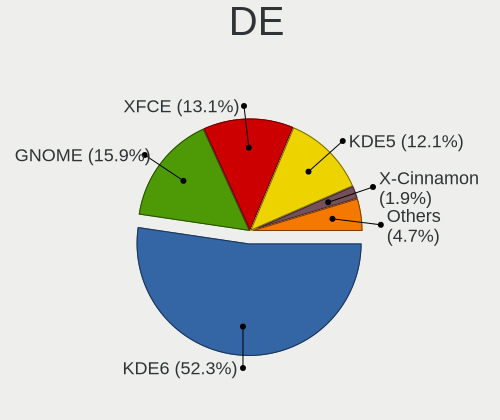
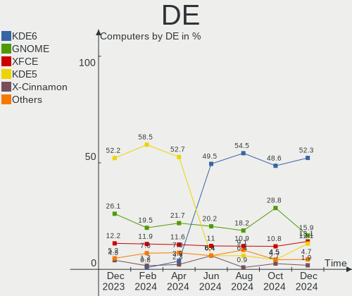
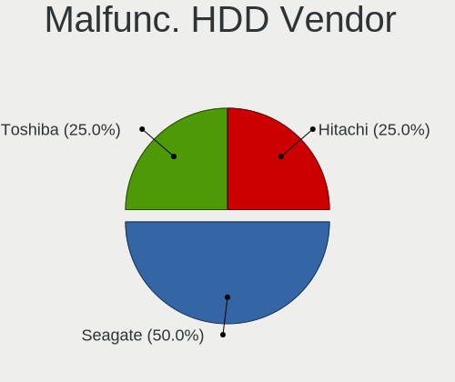
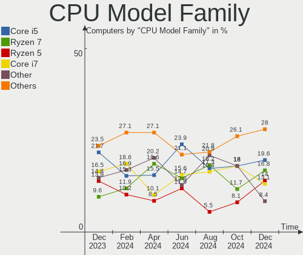
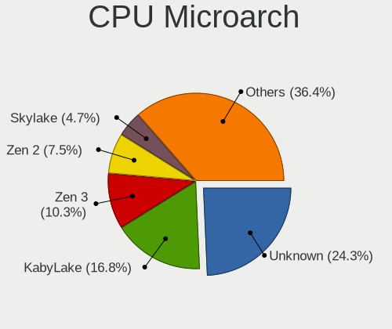
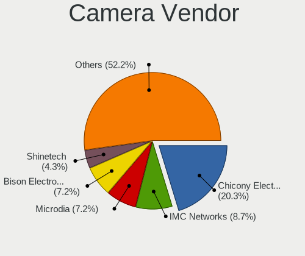

Manjaro Hardware Trends
-----------------------

A project to identify most popular hardware characteristics and track their change
over time based on data collected by Manjaro users at https://Linux-Hardware.org.

Anyone can contribute to the study by uploading probes of their computers by
the [hw-probe](https://github.com/linuxhw/hw-probe) tool:

    sudo -E hw-probe -all -upload

This is a report for all computer types. See also reports for [desktops](/Dist/Manjaro/Desktop/README.md) and [notebooks](/Dist/Manjaro/Notebook/README.md).

Full-feature report is available here: https://linux-hardware.org/?view=trends

Period: Jun, 2021.

Contents
--------

- [ OS                       ](#os)
- [ OS Family                ](#os-family)
- [ Kernel                   ](#kernel)
- [ Kernel Family            ](#kernel-family)
- [ Kernel Major Ver.        ](#kernel-major-ver)
- [ Arch                     ](#arch)
- [ DE                       ](#de)
- [ Display Server           ](#display-server)
- [ Display Manager          ](#display-manager)
- [ OS Lang                  ](#os-lang)
- [ Boot Mode                ](#boot-mode)
- [ Filesystem               ](#filesystem)
- [ Part. scheme             ](#part-scheme)
- [ Dual Boot with Linux/BSD ](#dual-boot-with-linux/bsd)
- [ Dual Boot (Win)          ](#dual-boot-win)
- [ Country                  ](#country)
- [ City                     ](#city)
- [ Vendor                   ](#vendor)
- [ Model                    ](#model)
- [ Model Family             ](#model-family)
- [ MFG Year                 ](#mfg-year)
- [ Form Factor              ](#form-factor)
- [ Secure Boot              ](#secure-boot)
- [ Coreboot                 ](#coreboot)
- [ RAM Size                 ](#ram-size)
- [ RAM Used                 ](#ram-used)
- [ Has CD-ROM               ](#has-cd-rom)
- [ Total Drives             ](#total-drives)
- [ Has Ethernet             ](#has-ethernet)
- [ Has WiFi                 ](#has-wifi)
- [ Has Bluetooth            ](#has-bluetooth)
- [ Drive Vendor             ](#drive-vendor)
- [ Drive Model              ](#drive-model)
- [ HDD Vendor               ](#hdd-vendor)
- [ SSD Vendor               ](#ssd-vendor)
- [ Drive Kind               ](#drive-kind)
- [ Drive Connector          ](#drive-connector)
- [ Drive Size               ](#drive-size)
- [ Space Total              ](#space-total)
- [ Space Used               ](#space-used)
- [ Malfunc. Drives          ](#malfunc-drives)
- [ Malfunc. Drive Vendor    ](#malfunc-drive-vendor)
- [ Malfunc. HDD Vendor      ](#malfunc-hdd-vendor)
- [ Malfunc. Drive Kind      ](#malfunc-drive-kind)
- [ Failed Drives            ](#failed-drives)
- [ Failed Drive Vendor      ](#failed-drive-vendor)
- [ Drive Status             ](#drive-status)
- [ Storage Vendor           ](#storage-vendor)
- [ Storage Model            ](#storage-model)
- [ Storage Kind             ](#storage-kind)
- [ CPU Vendor               ](#cpu-vendor)
- [ CPU Model                ](#cpu-model)
- [ CPU Model Family         ](#cpu-model-family)
- [ CPU Cores                ](#cpu-cores)
- [ CPU Sockets              ](#cpu-sockets)
- [ CPU Threads              ](#cpu-threads)
- [ CPU Op-Modes             ](#cpu-op-modes)
- [ CPU Microcode            ](#cpu-microcode)
- [ CPU Microarch            ](#cpu-microarch)
- [ GPU Vendor               ](#gpu-vendor)
- [ GPU Model                ](#gpu-model)
- [ GPU Combo                ](#gpu-combo)
- [ GPU Driver               ](#gpu-driver)
- [ GPU Memory               ](#gpu-memory)
- [ Monitor Vendor           ](#monitor-vendor)
- [ Monitor Model            ](#monitor-model)
- [ Monitor Resolution       ](#monitor-resolution)
- [ Monitor Diagonal         ](#monitor-diagonal)
- [ Monitor Width            ](#monitor-width)
- [ Aspect Ratio             ](#aspect-ratio)
- [ Monitor Area             ](#monitor-area)
- [ Pixel Density            ](#pixel-density)
- [ Multiple Monitors        ](#multiple-monitors)
- [ Net Controller Vendor    ](#net-controller-vendor)
- [ Net Controller Model     ](#net-controller-model)
- [ Wireless Vendor          ](#wireless-vendor)
- [ Wireless Model           ](#wireless-model)
- [ Ethernet Vendor          ](#ethernet-vendor)
- [ Ethernet Model           ](#ethernet-model)
- [ Net Controller Kind      ](#net-controller-kind)
- [ Used Controller          ](#used-controller)
- [ NICs                     ](#nics)
- [ IPv6                     ](#ipv6)
- [ Memory Vendor            ](#memory-vendor)
- [ Memory Model             ](#memory-model)
- [ Memory Kind              ](#memory-kind)
- [ Memory Form Factor       ](#memory-form-factor)
- [ Memory Size              ](#memory-size)
- [ Memory Speed             ](#memory-speed)
- [ Sound Vendor             ](#sound-vendor)
- [ Sound Model              ](#sound-model)
- [ Camera Vendor            ](#camera-vendor)
- [ Camera Model             ](#camera-model)
- [ Fingerprint Vendor       ](#fingerprint-vendor)
- [ Fingerprint Model        ](#fingerprint-model)
- [ Chipcard Vendor          ](#chipcard-vendor)
- [ Chipcard Model           ](#chipcard-model)
- [ Printer Vendor           ](#printer-vendor)
- [ Printer Model            ](#printer-model)
- [ Scanner Vendor           ](#scanner-vendor)
- [ Scanner Model            ](#scanner-model)
- [ Bluetooth Vendor         ](#bluetooth-vendor)
- [ Bluetooth Model          ](#bluetooth-model)
- [ Unsupported Devices      ](#unsupported-devices)
- [ Unsupported Device Types ](#unsupported-device-types)

OS
--

Installed operating systems

| Name           | Computers | Percent |
|----------------|-----------|---------|
| Manjaro        | 71        | 44.65%  |
| Manjaro 21.0.7 | 47        | 29.56%  |
| Manjaro 21.0.5 | 21        | 13.21%  |
| Manjaro 21.0.6 | 17        | 10.69%  |
| Manjaro 20.2.1 | 2         | 1.26%   |
| Manjaro 21.0.3 | 1         | 0.63%   |

OS Family
---------

OS without a version

| Name    | Computers | Percent |
|---------|-----------|---------|
| Manjaro | 159       | 100%    |

Kernel
------

Version of the Linux kernel

| Version                 | Computers | Percent |
|-------------------------|-----------|---------|
| 5.10.42-1-MANJARO       | 49        | 30.82%  |
| 5.12.9-1-MANJARO        | 21        | 13.21%  |
| 5.10.36-2-MANJARO       | 20        | 12.58%  |
| 5.10.41-1-MANJARO       | 13        | 8.18%   |
| 5.13.0-1-MANJARO        | 11        | 6.92%   |
| 5.12.2-1-MANJARO        | 11        | 6.92%   |
| 5.12.8-1-MANJARO        | 7         | 4.4%    |
| 5.9.16-1-MANJARO        | 6         | 3.77%   |
| 5.4.118-1-MANJARO       | 4         | 2.52%   |
| 5.11.22-2-MANJARO       | 4         | 2.52%   |
| 5.10.43-1-MANJARO       | 2         | 1.26%   |
| 5.4.124-1-MANJARO       | 1         | 0.63%   |
| 5.4.105-1-MANJARO       | 1         | 0.63%   |
| 5.12.10-1-MANJARO       | 1         | 0.63%   |
| 5.11.4-1-rt11-MANJARO   | 1         | 0.63%   |
| 5.11.19-1-MANJARO       | 1         | 0.63%   |
| 5.11.18-lqx1-1-lqx      | 1         | 0.63%   |
| 5.11.0-zen1-1-zen-anbox | 1         | 0.63%   |
| 5.10.26-1-MANJARO       | 1         | 0.63%   |
| 5.10.23-1-MANJARO       | 1         | 0.63%   |
| 4.14.235-1-MANJARO      | 1         | 0.63%   |
| 4.14.234-1-MANJARO      | 1         | 0.63%   |

Kernel Family
-------------

Linux kernel without a distro release

| Version  | Computers | Percent |
|----------|-----------|---------|
| 5.10.42  | 49        | 30.82%  |
| 5.12.9   | 21        | 13.21%  |
| 5.10.36  | 20        | 12.58%  |
| 5.10.41  | 13        | 8.18%   |
| 5.13.0   | 11        | 6.92%   |
| 5.12.2   | 11        | 6.92%   |
| 5.12.8   | 7         | 4.4%    |
| 5.9.16   | 6         | 3.77%   |
| 5.4.118  | 4         | 2.52%   |
| 5.11.22  | 4         | 2.52%   |
| 5.10.43  | 2         | 1.26%   |
| 5.4.124  | 1         | 0.63%   |
| 5.4.105  | 1         | 0.63%   |
| 5.12.10  | 1         | 0.63%   |
| 5.11.4   | 1         | 0.63%   |
| 5.11.19  | 1         | 0.63%   |
| 5.11.18  | 1         | 0.63%   |
| 5.11.0   | 1         | 0.63%   |
| 5.10.26  | 1         | 0.63%   |
| 5.10.23  | 1         | 0.63%   |
| 4.14.235 | 1         | 0.63%   |
| 4.14.234 | 1         | 0.63%   |

Kernel Major Ver.
-----------------

Linux kernel major version

| Version | Computers | Percent |
|---------|-----------|---------|
| 5.10    | 86        | 54.09%  |
| 5.12    | 40        | 25.16%  |
| 5.13    | 11        | 6.92%   |
| 5.11    | 8         | 5.03%   |
| 5.9     | 6         | 3.77%   |
| 5.4     | 6         | 3.77%   |
| 4.14    | 2         | 1.26%   |

Arch
----

OS architecture (x86_64, i586, etc.)

| Name   | Computers | Percent |
|--------|-----------|---------|
| x86_64 | 159       | 100%    |

DE
--

Desktop Environment

| Name       | Computers | Percent |
|------------|-----------|---------|
| XFCE       | 34        | 21.38%  |
| KDE5       | 33        | 20.75%  |
| GNOME      | 33        | 20.75%  |
| KDE        | 29        | 18.24%  |
| i3         | 9         | 5.66%   |
| X-Cinnamon | 7         | 4.4%    |
| Deepin     | 3         | 1.89%   |
| Unknown    | 3         | 1.89%   |
| MATE       | 2         | 1.26%   |
| Budgie     | 2         | 1.26%   |
| sway       | 1         | 0.63%   |
| DWM        | 1         | 0.63%   |
| Cinnamon   | 1         | 0.63%   |
| Bspwm      | 1         | 0.63%   |

Display Server
--------------

X11 or Wayland

| Name    | Computers | Percent |
|---------|-----------|---------|
| X11     | 130       | 81.76%  |
| Wayland | 19        | 11.95%  |
| Unknown | 9         | 5.66%   |
| Tty     | 1         | 0.63%   |

Display Manager
---------------

SDDM, LightDM, etc.

| Name    | Computers | Percent |
|---------|-----------|---------|
| Unknown | 71        | 44.65%  |
| SDDM    | 37        | 23.27%  |
| LightDM | 29        | 18.24%  |
| GDM     | 20        | 12.58%  |
| TDM     | 2         | 1.26%   |

OS Lang
-------

Language

| Lang  | Computers | Percent |
|-------|-----------|---------|
| en_US | 76        | 47.8%   |
| de_DE | 14        | 8.81%   |
| ru_RU | 10        | 6.29%   |
| en_GB | 10        | 6.29%   |
| it_IT | 7         | 4.4%    |
| pt_BR | 5         | 3.14%   |
| fr_FR | 5         | 3.14%   |
| en_IN | 3         | 1.89%   |
| en_AU | 3         | 1.89%   |
| zh_CN | 2         | 1.26%   |
| ru_UA | 2         | 1.26%   |
| pt_PT | 2         | 1.26%   |
| en_CA | 2         | 1.26%   |
| zh_TW | 1         | 0.63%   |
| pl_PL | 1         | 0.63%   |
| nl_NL | 1         | 0.63%   |
| my_MM | 1         | 0.63%   |
| mn_CN | 1         | 0.63%   |
| id_ID | 1         | 0.63%   |
| hu_HU | 1         | 0.63%   |
| es_ES | 1         | 0.63%   |
| es_CL | 1         | 0.63%   |
| en_ZA | 1         | 0.63%   |
| en_TT | 1         | 0.63%   |
| en_SG | 1         | 0.63%   |
| en_PH | 1         | 0.63%   |
| en_HK | 1         | 0.63%   |
| el_GR | 1         | 0.63%   |
| de_CH | 1         | 0.63%   |
| de_BE | 1         | 0.63%   |
| C     | 1         | 0.63%   |

Boot Mode
---------

EFI or BIOS

| Mode | Computers | Percent |
|------|-----------|---------|
| BIOS | 86        | 54.09%  |
| EFI  | 73        | 45.91%  |

Filesystem
----------

Type of filesystem

| Type    | Computers | Percent |
|---------|-----------|---------|
| Ext4    | 143       | 89.94%  |
| Btrfs   | 8         | 5.03%   |
| Overlay | 5         | 3.14%   |
| XXXfs   | 1         | 0.63%   |
| Xfs     | 1         | 0.63%   |
| F2fs    | 1         | 0.63%   |

Part. scheme
------------

Scheme of partitioning

| Type    | Computers | Percent |
|---------|-----------|---------|
| GPT     | 74        | 46.54%  |
| Unknown | 69        | 43.4%   |
| MBR     | 16        | 10.06%  |

Dual Boot with Linux/BSD
------------------------

Hosting more than one Linux/BSD

| Dual boot | Computers | Percent |
|-----------|-----------|---------|
| No        | 146       | 91.82%  |
| Yes       | 13        | 8.18%   |

Dual Boot (Win)
---------------

Hosting Linux and Windows

| Dual boot | Computers | Percent |
|-----------|-----------|---------|
| No        | 110       | 69.18%  |
| Yes       | 49        | 30.82%  |

Country
-------

Geographic location (country)

| Country                | Computers | Percent |
|------------------------|-----------|---------|
| USA                    | 29        | 18.24%  |
| Germany                | 21        | 13.21%  |
| Russia                 | 12        | 7.55%   |
| Italy                  | 8         | 5.03%   |
| France                 | 8         | 5.03%   |
| Brazil                 | 8         | 5.03%   |
| UK                     | 6         | 3.77%   |
| China                  | 6         | 3.77%   |
| Netherlands            | 5         | 3.14%   |
| India                  | 5         | 3.14%   |
| Ukraine                | 4         | 2.52%   |
| Portugal               | 3         | 1.89%   |
| Australia              | 3         | 1.89%   |
| Sweden                 | 2         | 1.26%   |
| Spain                  | 2         | 1.26%   |
| Poland                 | 2         | 1.26%   |
| Indonesia              | 2         | 1.26%   |
| Hungary                | 2         | 1.26%   |
| Hong Kong              | 2         | 1.26%   |
| Finland                | 2         | 1.26%   |
| Estonia                | 2         | 1.26%   |
| Croatia                | 2         | 1.26%   |
| Canada                 | 2         | 1.26%   |
| Belgium                | 2         | 1.26%   |
| Trinidad and Tobago    | 1         | 0.63%   |
| Taiwan                 | 1         | 0.63%   |
| Switzerland            | 1         | 0.63%   |
| South Africa           | 1         | 0.63%   |
| Serbia                 | 1         | 0.63%   |
| Philippines            | 1         | 0.63%   |
| Myanmar                | 1         | 0.63%   |
| Malaysia               | 1         | 0.63%   |
| Kenya                  | 1         | 0.63%   |
| Jordan                 | 1         | 0.63%   |
| Israel                 | 1         | 0.63%   |
| Greece                 | 1         | 0.63%   |
| Fiji                   | 1         | 0.63%   |
| Chile                  | 1         | 0.63%   |
| Bosnia and Herzegovina | 1         | 0.63%   |
| Belarus                | 1         | 0.63%   |
| Bangladesh             | 1         | 0.63%   |
| Austria                | 1         | 0.63%   |
| Argentina              | 1         | 0.63%   |

City
----

Geographic location (city)

| City                  | Computers | Percent |
|-----------------------|-----------|---------|
| Moscow                | 4         | 2.52%   |
| Stuttgart             | 2         | 1.26%   |
| Stockholm             | 2         | 1.26%   |
| Rio de Janeiro        | 2         | 1.26%   |
| Pune                  | 2         | 1.26%   |
| Paris                 | 2         | 1.26%   |
| Madrid                | 2         | 1.26%   |
| London                | 2         | 1.26%   |
| Ingolstadt            | 2         | 1.26%   |
| Helsinki              | 2         | 1.26%   |
| Foshan                | 2         | 1.26%   |
| Central               | 2         | 1.26%   |
| Beijing               | 2         | 1.26%   |
| Atlanta               | 2         | 1.26%   |
| Zhuhai                | 1         | 0.63%   |
| Zhubei                | 1         | 0.63%   |
| Zagreb                | 1         | 0.63%   |
| Yogyakarta            | 1         | 0.63%   |
| Yekaterinburg         | 1         | 0.63%   |
| Yangon                | 1         | 0.63%   |
| Westminster           | 1         | 0.63%   |
| Vancouver             | 1         | 0.63%   |
| Valbom                | 1         | 0.63%   |
| Urbana                | 1         | 0.63%   |
| Uelsen                | 1         | 0.63%   |
| Trenton               | 1         | 0.63%   |
| Tigre                 | 1         | 0.63%   |
| The Bronx             | 1         | 0.63%   |
| Ternopil              | 1         | 0.63%   |
| Tel Aviv              | 1         | 0.63%   |
| Tartu                 | 1         | 0.63%   |
| Tallinn               | 1         | 0.63%   |
| Talairan              | 1         | 0.63%   |
| São Paulo            | 1         | 0.63%   |
| Suva                  | 1         | 0.63%   |
| St Petersburg         | 1         | 0.63%   |
| Sparti                | 1         | 0.63%   |
| South Yarra           | 1         | 0.63%   |
| Sorocaba              | 1         | 0.63%   |
| Smila                 | 1         | 0.63%   |
| Shanghai              | 1         | 0.63%   |
| Sesto San Giovanni    | 1         | 0.63%   |
| Schwerte              | 1         | 0.63%   |
| Schwalbach am Taunus  | 1         | 0.63%   |
| Sarajevo              | 1         | 0.63%   |
| Santiago              | 1         | 0.63%   |
| San Mateo             | 1         | 0.63%   |
| San Jose              | 1         | 0.63%   |
| San Antonio           | 1         | 0.63%   |
| Saint-Germain-en-Laye | 1         | 0.63%   |
| Saint-Esteve          | 1         | 0.63%   |
| Saint Paul            | 1         | 0.63%   |
| Rostov-on-Don         | 1         | 0.63%   |
| Rome                  | 1         | 0.63%   |
| Rockwall              | 1         | 0.63%   |
| Rockville             | 1         | 0.63%   |
| Rimpar                | 1         | 0.63%   |
| Portland              | 1         | 0.63%   |
| Poreč                | 1         | 0.63%   |
| Pontoise              | 1         | 0.63%   |

Vendor
------

Motherboard manufacturer

| Name                | Computers | Percent |
|---------------------|-----------|---------|
| Lenovo              | 34        | 21.38%  |
| ASUSTek Computer    | 26        | 16.35%  |
| Hewlett-Packard     | 20        | 12.58%  |
| Dell                | 14        | 8.81%   |
| MSI                 | 12        | 7.55%   |
| Gigabyte Technology | 10        | 6.29%   |
| ASRock              | 7         | 4.4%    |
| Acer                | 7         | 4.4%    |
| HUAWEI              | 4         | 2.52%   |
| Toshiba             | 3         | 1.89%   |
| Timi                | 3         | 1.89%   |
| Razer               | 3         | 1.89%   |
| Samsung Electronics | 2         | 1.26%   |
| Notebook            | 2         | 1.26%   |
| Multilaser          | 2         | 1.26%   |
| Intel               | 2         | 1.26%   |
| Sony                | 1         | 0.63%   |
| Schenker            | 1         | 0.63%   |
| SANTECH             | 1         | 0.63%   |
| Packard Bell        | 1         | 0.63%   |
| MECHREVO            | 1         | 0.63%   |
| Google              | 1         | 0.63%   |
| Apple               | 1         | 0.63%   |
| Unknown             | 1         | 0.63%   |

Model
-----

Motherboard model

| Name                                 | Computers | Percent |
|--------------------------------------|-----------|---------|
| HUAWEI KLVL-WXX9                     | 3         | 1.89%   |
| ASUS ROG STRIX X570-E GAMING         | 3         | 1.89%   |
| ASUS All Series                      | 3         | 1.89%   |
| Razer Blade 14 - RZ09-0370           | 2         | 1.26%   |
| Multilaser PC301                     | 2         | 1.26%   |
| MSI MS-7816                          | 2         | 1.26%   |
| Lenovo ThinkPad T14 Gen 1 20UDCTO1WW | 2         | 1.26%   |
| Lenovo IdeaPad 110-15IBR 80T7        | 2         | 1.26%   |
| ASUS TUF GAMING Z490-PLUS            | 2         | 1.26%   |
| Toshiba Satellite L10W-B-101         | 1         | 0.63%   |
| Toshiba Satellite C660               | 1         | 0.63%   |
| Toshiba Satellite C55-B              | 1         | 0.63%   |
| Timi RedmiBook Pro 14S               | 1         | 0.63%   |
| Timi RedmiBook 16                    | 1         | 0.63%   |
| Timi RedmiBook 14 II                 | 1         | 0.63%   |
| Sony VGN-SR11MR                      | 1         | 0.63%   |
| Schenker SCHENKER_SLIM14_SSL14L19    | 1         | 0.63%   |
| SANTECH PCX0DX                       | 1         | 0.63%   |
| Samsung RF712                        | 1         | 0.63%   |
| Samsung Galaxy Book 12               | 1         | 0.63%   |
| Razer Blade 15 Mid 2019-Base         | 1         | 0.63%   |
| Packard Bell ipower G5800            | 1         | 0.63%   |
| Notebook W740SU                      | 1         | 0.63%   |
| Notebook W65_W67RZ1                  | 1         | 0.63%   |
| MSI MS-7B98                          | 1         | 0.63%   |
| MSI MS-7B93                          | 1         | 0.63%   |
| MSI MS-7B89                          | 1         | 0.63%   |
| MSI MS-7B86                          | 1         | 0.63%   |
| MSI MS-7A34                          | 1         | 0.63%   |
| MSI MS-7998                          | 1         | 0.63%   |
| MSI MS-7900                          | 1         | 0.63%   |
| MSI MS-7817                          | 1         | 0.63%   |
| MSI GS66 Stealth 10SGS               | 1         | 0.63%   |
| MSI GP63 Leopard 8RF                 | 1         | 0.63%   |
| MECHREVO X3 Series GK7CP6R           | 1         | 0.63%   |
| Lenovo Yoga S730-13IML 81U4          | 1         | 0.63%   |
| Lenovo XiaoXin-15ARE 2020 81YR       | 1         | 0.63%   |
| Lenovo ThinkPad X240 20AMS26F00      | 1         | 0.63%   |
| Lenovo ThinkPad X201 Tablet 2985EZG  | 1         | 0.63%   |
| Lenovo ThinkPad T490 20N3S2NJ00      | 1         | 0.63%   |
| Lenovo ThinkPad T470s 20HF0000RT     | 1         | 0.63%   |
| Lenovo ThinkPad T460 20FMS2D600      | 1         | 0.63%   |
| Lenovo ThinkPad T450s 20BWS2YL00     | 1         | 0.63%   |
| Lenovo ThinkPad T450s 20BWS2US00     | 1         | 0.63%   |
| Lenovo ThinkPad T450s 20BWS0WL00     | 1         | 0.63%   |
| Lenovo ThinkPad T450 20BV000DUS      | 1         | 0.63%   |
| Lenovo ThinkPad T14 Gen 1 20UES00L00 | 1         | 0.63%   |
| Lenovo ThinkPad P53 20QNS00X00       | 1         | 0.63%   |
| Lenovo ThinkPad L490 20Q6S08600      | 1         | 0.63%   |
| Lenovo ThinkPad Edge E330 3354AMG    | 1         | 0.63%   |
| Lenovo ThinkPad E475 20H4CTO1WW      | 1         | 0.63%   |
| Lenovo ThinkPad E15 Gen 2 20T9S0B500 | 1         | 0.63%   |
| Lenovo ThinkBook 15-IIL 20SM         | 1         | 0.63%   |
| Lenovo Legion 5 82B5                 | 1         | 0.63%   |
| Lenovo Legion 5 17IMH05H 81Y8        | 1         | 0.63%   |
| Lenovo Legion 5 15ARH05H 82B1        | 1         | 0.63%   |
| Lenovo Legion 5 15ARH05 82B5         | 1         | 0.63%   |
| Lenovo IdeaPad Gaming 3 15ARH05 82EY | 1         | 0.63%   |
| Lenovo IdeaPad Flex 5 14ARE05 81X2   | 1         | 0.63%   |
| Lenovo IdeaPad 330-17IKB 81DM        | 1         | 0.63%   |

Model Family
------------

Motherboard model prefix

| Name                 | Computers | Percent |
|----------------------|-----------|---------|
| Lenovo ThinkPad      | 17        | 10.69%  |
| Lenovo IdeaPad       | 8         | 5.03%   |
| Lenovo Legion        | 4         | 2.52%   |
| HP Pavilion          | 4         | 2.52%   |
| Dell Latitude        | 4         | 2.52%   |
| Dell Inspiron        | 4         | 2.52%   |
| ASUS ROG             | 4         | 2.52%   |
| Toshiba Satellite    | 3         | 1.89%   |
| Timi RedmiBook       | 3         | 1.89%   |
| Razer Blade          | 3         | 1.89%   |
| HUAWEI KLVL-WXX9     | 3         | 1.89%   |
| HP EliteBook         | 3         | 1.89%   |
| ASUS VivoBook        | 3         | 1.89%   |
| ASUS TUF             | 3         | 1.89%   |
| ASUS All             | 3         | 1.89%   |
| Acer Swift           | 3         | 1.89%   |
| Acer Aspire          | 3         | 1.89%   |
| Multilaser PC301     | 2         | 1.26%   |
| MSI MS-7816          | 2         | 1.26%   |
| HP ProBook           | 2         | 1.26%   |
| HP Laptop            | 2         | 1.26%   |
| Gigabyte B450M       | 2         | 1.26%   |
| Dell XPS             | 2         | 1.26%   |
| Dell Precision       | 2         | 1.26%   |
| ASUS PRIME           | 2         | 1.26%   |
| Sony VGN-SR11MR      | 1         | 0.63%   |
| Schenker SCHENKER    | 1         | 0.63%   |
| SANTECH PCX0DX       | 1         | 0.63%   |
| Samsung RF712        | 1         | 0.63%   |
| Samsung Galaxy       | 1         | 0.63%   |
| Packard Bell ipower  | 1         | 0.63%   |
| Notebook W740SU      | 1         | 0.63%   |
| Notebook W65         | 1         | 0.63%   |
| MSI MS-7B98          | 1         | 0.63%   |
| MSI MS-7B93          | 1         | 0.63%   |
| MSI MS-7B89          | 1         | 0.63%   |
| MSI MS-7B86          | 1         | 0.63%   |
| MSI MS-7A34          | 1         | 0.63%   |
| MSI MS-7998          | 1         | 0.63%   |
| MSI MS-7900          | 1         | 0.63%   |
| MSI MS-7817          | 1         | 0.63%   |
| MSI GS66             | 1         | 0.63%   |
| MSI GP63             | 1         | 0.63%   |
| MECHREVO X3          | 1         | 0.63%   |
| Lenovo Yoga          | 1         | 0.63%   |
| Lenovo XiaoXin-15ARE | 1         | 0.63%   |
| Lenovo ThinkBook     | 1         | 0.63%   |
| Lenovo H310          | 1         | 0.63%   |
| Lenovo G575          | 1         | 0.63%   |
| Intel H55            | 1         | 0.63%   |
| Intel DQ67SW         | 1         | 0.63%   |
| HUAWEI MACHC-WAX9    | 1         | 0.63%   |
| HP ZBook             | 1         | 0.63%   |
| HP Z440              | 1         | 0.63%   |
| HP ProOne            | 1         | 0.63%   |
| HP OMEN              | 1         | 0.63%   |
| HP ENVY              | 1         | 0.63%   |
| HP Compaq            | 1         | 0.63%   |
| HP 570-p017c         | 1         | 0.63%   |
| HP 255               | 1         | 0.63%   |

MFG Year
--------

Motherboard manufacture year

| Year | Computers | Percent |
|------|-----------|---------|
| 2020 | 48        | 30.19%  |
| 2021 | 24        | 15.09%  |
| 2019 | 19        | 11.95%  |
| 2018 | 15        | 9.43%   |
| 2015 | 10        | 6.29%   |
| 2016 | 9         | 5.66%   |
| 2014 | 7         | 4.4%    |
| 2011 | 7         | 4.4%    |
| 2012 | 5         | 3.14%   |
| 2017 | 4         | 2.52%   |
| 2009 | 4         | 2.52%   |
| 2010 | 3         | 1.89%   |
| 2013 | 2         | 1.26%   |
| 2008 | 2         | 1.26%   |

Form Factor
-----------

Physical design of the computer

| Name        | Computers | Percent |
|-------------|-----------|---------|
| Notebook    | 97        | 61.01%  |
| Desktop     | 56        | 35.22%  |
| Convertible | 3         | 1.89%   |
| Tablet      | 2         | 1.26%   |
| All in one  | 1         | 0.63%   |

Secure Boot
-----------

Enabled or disabled

| State    | Computers | Percent |
|----------|-----------|---------|
| Disabled | 159       | 100%    |

Coreboot
--------

Have coreboot on board

| Used | Computers | Percent |
|------|-----------|---------|
| No   | 158       | 99.37%  |
| Yes  | 1         | 0.63%   |

RAM Size
--------

Total RAM memory

| Size in GB  | Computers | Percent |
|-------------|-----------|---------|
| 16.01-24.0  | 43        | 27.04%  |
| 8.01-16.0   | 33        | 20.75%  |
| 4.01-8.0    | 30        | 18.87%  |
| 3.01-4.0    | 19        | 11.95%  |
| 32.01-64.0  | 18        | 11.32%  |
| 64.01-256.0 | 6         | 3.77%   |
| 24.01-32.0  | 5         | 3.14%   |
| 1.01-2.0    | 3         | 1.89%   |
| 2.01-3.0    | 2         | 1.26%   |

RAM Used
--------

Used RAM memory

| Used GB    | Computers | Percent |
|------------|-----------|---------|
| 2.01-3.0   | 45        | 28.3%   |
| 1.01-2.0   | 38        | 23.9%   |
| 3.01-4.0   | 29        | 18.24%  |
| 4.01-8.0   | 26        | 16.35%  |
| 8.01-16.0  | 11        | 6.92%   |
| 0.51-1.0   | 8         | 5.03%   |
| 16.01-24.0 | 2         | 1.26%   |

Has CD-ROM
----------

Has CD-ROM on board

| Presented | Computers | Percent |
|-----------|-----------|---------|
| No        | 125       | 78.62%  |
| Yes       | 34        | 21.38%  |

Total Drives
------------

Number of drives on board

| Drives | Computers | Percent |
|--------|-----------|---------|
| 1      | 88        | 55.35%  |
| 2      | 40        | 25.16%  |
| 3      | 21        | 13.21%  |
| 4      | 5         | 3.14%   |
| 5      | 3         | 1.89%   |
| 6      | 1         | 0.63%   |
| 0      | 1         | 0.63%   |

Has Ethernet
------------

Has Ethernet on board

| Presented | Computers | Percent |
|-----------|-----------|---------|
| Yes       | 131       | 82.39%  |
| No        | 28        | 17.61%  |

Has WiFi
--------

Has WiFi module

| Presented | Computers | Percent |
|-----------|-----------|---------|
| Yes       | 129       | 81.13%  |
| No        | 30        | 18.87%  |

Has Bluetooth
-------------

Has Bluetooth module

| Presented | Computers | Percent |
|-----------|-----------|---------|
| Yes       | 107       | 67.3%   |
| No        | 52        | 32.7%   |

Drive Vendor
------------

Hard drive vendors

| Vendor                  | Computers | Drives | Percent |
|-------------------------|-----------|--------|---------|
| Samsung Electronics     | 43        | 49     | 17.48%  |
| WDC                     | 37        | 48     | 15.04%  |
| Seagate                 | 29        | 34     | 11.79%  |
| Toshiba                 | 17        | 17     | 6.91%   |
| Sandisk                 | 16        | 17     | 6.5%    |
| Kingston                | 16        | 16     | 6.5%    |
| Crucial                 | 15        | 15     | 6.1%    |
| Unknown                 | 12        | 13     | 4.88%   |
| SK Hynix                | 11        | 11     | 4.47%   |
| Intel                   | 6         | 7      | 2.44%   |
| Hitachi                 | 5         | 5      | 2.03%   |
| XPG                     | 4         | 4      | 1.63%   |
| Phison                  | 4         | 4      | 1.63%   |
| Micron Technology       | 4         | 4      | 1.63%   |
| A-DATA Technology       | 4         | 5      | 1.63%   |
| HGST                    | 3         | 3      | 1.22%   |
| Silicon Motion          | 2         | 2      | 0.81%   |
| LITEON                  | 2         | 2      | 0.81%   |
| KIOXIA                  | 2         | 2      | 0.81%   |
| Intenso                 | 2         | 2      | 0.81%   |
| China                   | 2         | 2      | 0.81%   |
| Union Memory (Shenzhen) | 1         | 1      | 0.41%   |
| Transcend               | 1         | 1      | 0.41%   |
| SPCC                    | 1         | 1      | 0.41%   |
| Realtek Semiconductor   | 1         | 1      | 0.41%   |
| Patriot                 | 1         | 1      | 0.41%   |
| Lite-On                 | 1         | 1      | 0.41%   |
| Hewlett-Packard         | 1         | 1      | 0.41%   |
| FASPEED                 | 1         | 1      | 0.41%   |
| EMTEC                   | 1         | 1      | 0.41%   |
| ADATA Technology        | 1         | 1      | 0.41%   |

Drive Model
-----------

Hard drive models

| Model                                | Computers | Percent |
|--------------------------------------|-----------|---------|
| Sandisk NVMe SSD Drive 512GB         | 5         | 1.87%   |
| SK Hynix NVMe SSD Drive 512GB        | 4         | 1.49%   |
| Seagate ST1000LM035-1RK172 1TB       | 4         | 1.49%   |
| WDC WD10EZEX-00WN4A0 1TB             | 3         | 1.12%   |
| WDC PC SN730 SDBPNTY-512G-1027 512GB | 3         | 1.12%   |
| Toshiba MQ01ABF050 500GB             | 3         | 1.12%   |
| Toshiba DT01ACA100 1TB               | 3         | 1.12%   |
| SK Hynix NVMe SSD Drive 256GB        | 3         | 1.12%   |
| Seagate ST4000DM004-2CV104 4TB       | 3         | 1.12%   |
| Samsung NVMe SSD Drive 1TB           | 3         | 1.12%   |
| Crucial CT240BX500SSD1 240GB         | 3         | 1.12%   |
| Crucial CT1000MX500SSD1 1TB          | 3         | 1.12%   |
| XPG NVMe SSD Drive 1024GB            | 2         | 0.75%   |
| WDC WDS240G2G0B-00EPW0 240GB SSD     | 2         | 0.75%   |
| WDC WD6400AAKS-65A7B2 640GB          | 2         | 0.75%   |
| WDC WD20EARX-00PASB0 2TB             | 2         | 0.75%   |
| WDC WD10SPZX-60Z10T0 1TB             | 2         | 0.75%   |
| WDC WD10EZEX-60M2NA0 1TB             | 2         | 0.75%   |
| WDC WD10EZEX-08WN4A0 1TB             | 2         | 0.75%   |
| Unknown SD/MMC/MS PRO 128GB          | 2         | 0.75%   |
| Unknown MMC Card  32GB               | 2         | 0.75%   |
| Seagate ST500LM021-1KJ152 500GB      | 2         | 0.75%   |
| Seagate ST1000DM003-1ER162 1TB       | 2         | 0.75%   |
| SanDisk SDSSDA120G 120GB             | 2         | 0.75%   |
| Samsung SSD 980 PRO 500GB            | 2         | 0.75%   |
| Samsung SSD 970 EVO Plus 500GB       | 2         | 0.75%   |
| Samsung SSD 860 EVO 1TB              | 2         | 0.75%   |
| Samsung SSD 850 EVO 250GB            | 2         | 0.75%   |
| Samsung SSD 840 EVO 120GB            | 2         | 0.75%   |
| Samsung NVMe SSD Drive 512GB         | 2         | 0.75%   |
| Samsung MZVLB512HBJQ-000L2 512GB     | 2         | 0.75%   |
| Samsung MZNLH512HALU-00000 512GB SSD | 2         | 0.75%   |
| Kingston NVMe SSD Drive 250GB        | 2         | 0.75%   |
| Kingston NVMe SSD Drive 1TB          | 2         | 0.75%   |
| Intel SSDPEKNW010T8 1TB              | 2         | 0.75%   |
| HGST HTS545050A7E380 500GB           | 2         | 0.75%   |
| Crucial CT1000BX500SSD1 1TB          | 2         | 0.75%   |
| XPG NVMe SSD Drive 2TB               | 1         | 0.37%   |
| XPG NVMe SSD Drive 1TB               | 1         | 0.37%   |
| WDC WDS500G2B0C-00PXH0 500GB         | 1         | 0.37%   |
| WDC WDS240G2G0A-00JH30 240GB SSD     | 1         | 0.37%   |
| WDC WDBNCE5000PNC 500GB SSD          | 1         | 0.37%   |
| WDC WD60EZRX-00MVLB1 6TB             | 1         | 0.37%   |
| WDC WD5000LPLX-75ZNTT0 500GB         | 1         | 0.37%   |
| WDC WD5000LPCX-24VHAT0 500GB         | 1         | 0.37%   |
| WDC WD5000BEVT-75A0RT0 500GB         | 1         | 0.37%   |
| WDC WD40PURZ-85AKKY0 4TB             | 1         | 0.37%   |
| WDC WD40EZRZ-75GXCB0 4TB             | 1         | 0.37%   |
| WDC WD40EFRX-68WT0N0 4TB             | 1         | 0.37%   |
| WDC WD30EZRS-00J99B0 3TB             | 1         | 0.37%   |
| WDC WD30EFRX-68EUZN0 3TB             | 1         | 0.37%   |
| WDC WD2500JS-41SGB0 250GB            | 1         | 0.37%   |
| WDC WD2500AAKX-603CA0 250GB          | 1         | 0.37%   |
| WDC WD2003FYPS-27W9B0 2TB            | 1         | 0.37%   |
| WDC WD1600AAJS-00WAA0 160GB          | 1         | 0.37%   |
| WDC WD10SPZX-35Z10T0 1TB             | 1         | 0.37%   |
| WDC WD10SPZX-17Z10T0 1TB             | 1         | 0.37%   |
| WDC WD10SPZX-08Z10 1TB               | 1         | 0.37%   |
| WDC WD10JPVX-22JC3T0 1TB             | 1         | 0.37%   |
| WDC WD10EZEX-75ZF5A0 1TB             | 1         | 0.37%   |

HDD Vendor
----------

Hard disk drive vendors

| Vendor              | Computers | Drives | Percent |
|---------------------|-----------|--------|---------|
| WDC                 | 29        | 37     | 34.94%  |
| Seagate             | 28        | 33     | 33.73%  |
| Toshiba             | 13        | 13     | 15.66%  |
| Hitachi             | 5         | 5      | 6.02%   |
| Samsung Electronics | 4         | 5      | 4.82%   |
| HGST                | 3         | 3      | 3.61%   |
| Intenso             | 1         | 1      | 1.2%    |

SSD Vendor
----------

Solid state drive vendors

| Vendor              | Computers | Drives | Percent |
|---------------------|-----------|--------|---------|
| Samsung Electronics | 22        | 22     | 28.57%  |
| Crucial             | 14        | 14     | 18.18%  |
| SanDisk             | 9         | 10     | 11.69%  |
| Kingston            | 8         | 8      | 10.39%  |
| WDC                 | 4         | 4      | 5.19%   |
| A-DATA Technology   | 4         | 5      | 5.19%   |
| Micron Technology   | 2         | 2      | 2.6%    |
| LITEON              | 2         | 2      | 2.6%    |
| China               | 2         | 2      | 2.6%    |
| Transcend           | 1         | 1      | 1.3%    |
| Toshiba             | 1         | 1      | 1.3%    |
| SPCC                | 1         | 1      | 1.3%    |
| SK Hynix            | 1         | 1      | 1.3%    |
| Patriot             | 1         | 1      | 1.3%    |
| Intenso             | 1         | 1      | 1.3%    |
| Intel               | 1         | 1      | 1.3%    |
| Hewlett-Packard     | 1         | 1      | 1.3%    |
| FASPEED             | 1         | 1      | 1.3%    |
| EMTEC               | 1         | 1      | 1.3%    |

Drive Kind
----------

HDD or SSD

| Kind    | Computers | Drives | Percent |
|---------|-----------|--------|---------|
| HDD     | 70        | 97     | 31.82%  |
| NVMe    | 69        | 81     | 31.36%  |
| SSD     | 67        | 79     | 30.45%  |
| MMC     | 10        | 11     | 4.55%   |
| Unknown | 4         | 4      | 1.82%   |

Drive Connector
---------------

SATA, SAS, NVMe, etc.

| Type | Computers | Drives | Percent |
|------|-----------|--------|---------|
| SATA | 110       | 174    | 56.41%  |
| NVMe | 69        | 81     | 35.38%  |
| MMC  | 10        | 11     | 5.13%   |
| SAS  | 6         | 6      | 3.08%   |

Drive Size
----------

Size of hard drive

| Size in TB | Computers | Drives | Percent |
|------------|-----------|--------|---------|
| 0.01-0.5   | 70        | 83     | 46.36%  |
| 0.51-1.0   | 53        | 62     | 35.1%   |
| 1.01-2.0   | 13        | 15     | 8.61%   |
| 3.01-4.0   | 10        | 10     | 6.62%   |
| 2.01-3.0   | 3         | 4      | 1.99%   |
| 4.01-10.0  | 2         | 2      | 1.32%   |

Space Total
-----------

Amount of disk space available on the file system

| Size in GB     | Computers | Percent |
|----------------|-----------|---------|
| 251-500        | 47        | 29.56%  |
| 101-250        | 43        | 27.04%  |
| 1001-2000      | 18        | 11.32%  |
| 501-1000       | 15        | 9.43%   |
| More than 3000 | 10        | 6.29%   |
| 1-20           | 9         | 5.66%   |
| 51-100         | 7         | 4.4%    |
| Unknown        | 7         | 4.4%    |
| 21-50          | 3         | 1.89%   |

Space Used
----------

Amount of used disk space

| Used GB        | Computers | Percent |
|----------------|-----------|---------|
| 1-20           | 43        | 27.04%  |
| 51-100         | 28        | 17.61%  |
| 101-250        | 24        | 15.09%  |
| 21-50          | 21        | 13.21%  |
| 251-500        | 14        | 8.81%   |
| 501-1000       | 9         | 5.66%   |
| Unknown        | 7         | 4.4%    |
| 1001-2000      | 6         | 3.77%   |
| More than 3000 | 5         | 3.14%   |
| 2001-3000      | 2         | 1.26%   |

Malfunc. Drives
---------------

Drive models with a malfunction

| Model                                          | Computers | Drives | Percent |
|------------------------------------------------|-----------|--------|---------|
| WDC WD5000BEVT-75A0RT0 500GB                   | 1         | 1      | 10%     |
| SK Hynix HFS256G3BTND-N210A 256GB SSD          | 1         | 1      | 10%     |
| Seagate ST9160412AS 160GB                      | 1         | 1      | 10%     |
| Seagate ST4000DM000-1F2168 4TB                 | 1         | 1      | 10%     |
| Seagate ST2000DL003-9VT166 2TB                 | 1         | 1      | 10%     |
| Seagate ST1000LM035-1RK172 1TB                 | 1         | 1      | 10%     |
| Micron Technology 1100_MTFDDAV512TBN 512GB SSD | 1         | 1      | 10%     |
| Hitachi HTS545050A7E380 500GB                  | 1         | 1      | 10%     |
| HGST HTS545050A7E380 500GB                     | 1         | 1      | 10%     |
| FASPEED H5-500G SSD                            | 1         | 1      | 10%     |

Malfunc. Drive Vendor
---------------------

Vendors of faulty drives

| Vendor            | Computers | Drives | Percent |
|-------------------|-----------|--------|---------|
| Seagate           | 4         | 4      | 40%     |
| WDC               | 1         | 1      | 10%     |
| SK Hynix          | 1         | 1      | 10%     |
| Micron Technology | 1         | 1      | 10%     |
| Hitachi           | 1         | 1      | 10%     |
| HGST              | 1         | 1      | 10%     |
| FASPEED           | 1         | 1      | 10%     |

Malfunc. HDD Vendor
-------------------

Vendors of faulty HDD drives

| Vendor  | Computers | Drives | Percent |
|---------|-----------|--------|---------|
| Seagate | 4         | 4      | 57.14%  |
| WDC     | 1         | 1      | 14.29%  |
| Hitachi | 1         | 1      | 14.29%  |
| HGST    | 1         | 1      | 14.29%  |

Malfunc. Drive Kind
-------------------

Kinds of faulty drives

| Kind | Computers | Drives | Percent |
|------|-----------|--------|---------|
| HDD  | 7         | 7      | 70%     |
| SSD  | 3         | 3      | 30%     |

Failed Drives
-------------

Failed drive models

Zero info for selected period =(

Failed Drive Vendor
-------------------

Failed drive vendors

Zero info for selected period =(

Drive Status
------------

Number of failed and malfunc. drives

| Status   | Computers | Drives | Percent |
|----------|-----------|--------|---------|
| Detected | 104       | 181    | 61.54%  |
| Works    | 55        | 81     | 32.54%  |
| Malfunc  | 10        | 10     | 5.92%   |

Storage Vendor
--------------

Storage controller vendors

| Vendor                       | Computers | Percent |
|------------------------------|-----------|---------|
| Intel                        | 97        | 45.97%  |
| AMD                          | 39        | 18.48%  |
| Samsung Electronics          | 20        | 9.48%   |
| Sandisk                      | 12        | 5.69%   |
| SK Hynix                     | 10        | 4.74%   |
| Kingston Technology Company  | 8         | 3.79%   |
| ADATA Technology             | 4         | 1.9%    |
| Phison Electronics           | 3         | 1.42%   |
| KIOXIA                       | 3         | 1.42%   |
| ASMedia Technology           | 3         | 1.42%   |
| Toshiba America Info Systems | 2         | 0.95%   |
| Silicon Motion               | 2         | 0.95%   |
| Micron Technology            | 2         | 0.95%   |
| Union Memory (Shenzhen)      | 1         | 0.47%   |
| Seagate Technology           | 1         | 0.47%   |
| Realtek Semiconductor        | 1         | 0.47%   |
| Micron/Crucial Technology    | 1         | 0.47%   |
| Marvell Technology Group     | 1         | 0.47%   |
| Lite-On Technology           | 1         | 0.47%   |

Storage Model
-------------

Storage controller models

| Model                                                                            | Computers | Percent |
|----------------------------------------------------------------------------------|-----------|---------|
| AMD FCH SATA Controller [AHCI mode]                                              | 33        | 14.29%  |
| Samsung NVMe SSD Controller SM981/PM981/PM983                                    | 16        | 6.93%   |
| Intel Sunrise Point-LP SATA Controller [AHCI mode]                               | 7         | 3.03%   |
| Intel 82801 Mobile SATA Controller [RAID mode]                                   | 7         | 3.03%   |
| Intel 8 Series/C220 Series Chipset Family 6-port SATA Controller 1 [AHCI mode]   | 7         | 3.03%   |
| AMD 400 Series Chipset SATA Controller                                           | 7         | 3.03%   |
| Sandisk WD Black SN750 / PC SN730 NVMe SSD                                       | 6         | 2.6%    |
| Kingston Company A2000 NVMe SSD                                                  | 6         | 2.6%    |
| Intel Wildcat Point-LP SATA Controller [AHCI Mode]                               | 6         | 2.6%    |
| SK Hynix BC511                                                                   | 5         | 2.16%   |
| Intel Cannon Lake PCH SATA AHCI Controller                                       | 5         | 2.16%   |
| Intel Cannon Lake Mobile PCH SATA AHCI Controller                                | 5         | 2.16%   |
| Intel 8 Series SATA Controller 1 [AHCI mode]                                     | 5         | 2.16%   |
| Intel Comet Lake SATA AHCI Controller                                            | 4         | 1.73%   |
| Intel 9 Series Chipset Family SATA Controller [AHCI Mode]                        | 4         | 1.73%   |
| ADATA XPG SX8200 Pro PCIe Gen3x4 M.2 2280 Solid State Drive                      | 4         | 1.73%   |
| SK Hynix Non-Volatile memory controller                                          | 3         | 1.3%    |
| Samsung NVMe SSD Controller PM9A1/PM9A3/980PRO                                   | 3         | 1.3%    |
| KIOXIA Non-Volatile memory controller                                            | 3         | 1.3%    |
| Intel SSD 660P Series                                                            | 3         | 1.3%    |
| Intel Atom/Celeron/Pentium Processor x5-E8000/J3xxx/N3xxx Series SATA Controller | 3         | 1.3%    |
| Intel 82801IBM/IEM (ICH9M/ICH9M-E) 4 port SATA Controller [AHCI mode]            | 3         | 1.3%    |
| Intel 6 Series/C200 Series Chipset Family 6 port Mobile SATA AHCI Controller     | 3         | 1.3%    |
| Intel 6 Series/C200 Series Chipset Family 6 port Desktop SATA AHCI Controller    | 3         | 1.3%    |
| Intel 400 Series Chipset Family SATA AHCI Controller                             | 3         | 1.3%    |
| ASMedia ASM1062 Serial ATA Controller                                            | 3         | 1.3%    |
| AMD SB7x0/SB8x0/SB9x0 SATA Controller [AHCI mode]                                | 3         | 1.3%    |
| AMD SB7x0/SB8x0/SB9x0 IDE Controller                                             | 3         | 1.3%    |
| Silicon Motion SM2262/SM2262EN SSD Controller                                    | 2         | 0.87%   |
| Sandisk WD Black 2018/SN750 / PC SN720 NVMe SSD                                  | 2         | 0.87%   |
| Phison E12 NVMe Controller                                                       | 2         | 0.87%   |
| Micron Non-Volatile memory controller                                            | 2         | 0.87%   |
| Intel Q170/Q150/B150/H170/H110/Z170/CM236 Chipset SATA Controller [AHCI Mode]    | 2         | 0.87%   |
| Intel NM10/ICH7 Family SATA Controller [IDE mode]                                | 2         | 0.87%   |
| Intel Cannon Point-LP SATA Controller [AHCI Mode]                                | 2         | 0.87%   |
| Intel Atom Processor E3800 Series SATA AHCI Controller                           | 2         | 0.87%   |
| Intel 7 Series/C210 Series Chipset Family 6-port SATA Controller [AHCI mode]     | 2         | 0.87%   |
| Intel 7 Series Chipset Family 6-port SATA Controller [AHCI mode]                 | 2         | 0.87%   |
| Intel 5 Series/3400 Series Chipset 6 port SATA AHCI Controller                   | 2         | 0.87%   |
| Intel 200 Series PCH SATA controller [AHCI mode]                                 | 2         | 0.87%   |
| AMD SB7x0/SB8x0/SB9x0 SATA Controller [IDE mode]                                 | 2         | 0.87%   |
| Union Memory (Shenzhen) Non-Volatile memory controller                           | 1         | 0.43%   |
| Toshiba America Info Systems XG6 NVMe SSD Controller                             | 1         | 0.43%   |
| Toshiba America Info Systems XG4 NVMe SSD Controller                             | 1         | 0.43%   |
| SK Hynix NVMe SSD Controller                                                     | 1         | 0.43%   |
| SK Hynix BC501 NVMe Solid State Drive                                            | 1         | 0.43%   |
| Seagate FireCuda 520 SSD                                                         | 1         | 0.43%   |
| Sandisk WD Blue SN550 NVMe SSD                                                   | 1         | 0.43%   |
| Sandisk WD Blue SN500 / PC SN520 NVMe SSD                                        | 1         | 0.43%   |
| Sandisk WD Black NVMe SSD                                                        | 1         | 0.43%   |
| Sandisk Non-Volatile memory controller                                           | 1         | 0.43%   |
| Samsung NVMe SSD Controller SM961/PM961/SM963                                    | 1         | 0.43%   |
| Samsung NVMe SSD Controller SM951/PM951                                          | 1         | 0.43%   |
| Realtek RTS5763DL NVMe SSD Controller                                            | 1         | 0.43%   |
| Phison NVMe Storage Controller                                                   | 1         | 0.43%   |
| Micron/Crucial P2 NVMe PCIe SSD                                                  | 1         | 0.43%   |
| Marvell Group 88SE6101/6102 single-port PATA133 interface                        | 1         | 0.43%   |
| Lite-On Non-Volatile memory controller                                           | 1         | 0.43%   |
| Kingston Company U-SNS8154P3 NVMe SSD                                            | 1         | 0.43%   |
| Kingston Company Company Non-Volatile memory controller                          | 1         | 0.43%   |

Storage Kind
------------

Kind of storage controller (IDE, SATA, NVMe, SAS, ...)

| Kind | Computers | Percent |
|------|-----------|---------|
| SATA | 119       | 57.21%  |
| NVMe | 69        | 33.17%  |
| IDE  | 10        | 4.81%   |
| RAID | 9         | 4.33%   |
| SAS  | 1         | 0.48%   |

CPU Vendor
----------

Processor vendors

| Vendor | Computers | Percent |
|--------|-----------|---------|
| Intel  | 108       | 67.92%  |
| AMD    | 51        | 32.08%  |

CPU Model
---------

Processor models

| Model                                         | Computers | Percent |
|-----------------------------------------------|-----------|---------|
| AMD Ryzen 7 4800H with Radeon Graphics        | 6         | 3.77%   |
| Intel Core i7-9750H CPU @ 2.60GHz             | 5         | 3.14%   |
| Intel Core i5-7200U CPU @ 2.50GHz             | 4         | 2.52%   |
| AMD Ryzen 9 3900X 12-Core Processor           | 4         | 2.52%   |
| AMD Ryzen 7 PRO 4750U with Radeon Graphics    | 4         | 2.52%   |
| Intel Core i7-10510U CPU @ 1.80GHz            | 3         | 1.89%   |
| Intel Core i5-8265U CPU @ 1.60GHz             | 3         | 1.89%   |
| Intel Core i5-5200U CPU @ 2.20GHz             | 3         | 1.89%   |
| AMD Ryzen 5 3500U with Radeon Vega Mobile Gfx | 3         | 1.89%   |
| Intel Pentium CPU N3700 @ 1.60GHz             | 2         | 1.26%   |
| Intel Core i7-9700K CPU @ 3.60GHz             | 2         | 1.26%   |
| Intel Core i7-8550U CPU @ 1.80GHz             | 2         | 1.26%   |
| Intel Core i7-5600U CPU @ 2.60GHz             | 2         | 1.26%   |
| Intel Core i7-10750H CPU @ 2.60GHz            | 2         | 1.26%   |
| Intel Core i7-10700K CPU @ 3.80GHz            | 2         | 1.26%   |
| Intel Core i7-1065G7 CPU @ 1.30GHz            | 2         | 1.26%   |
| Intel Core i5-5300U CPU @ 2.30GHz             | 2         | 1.26%   |
| Intel Core i5-4690 CPU @ 3.50GHz              | 2         | 1.26%   |
| Intel Core i5-4460 CPU @ 3.20GHz              | 2         | 1.26%   |
| Intel Core i5-4200U CPU @ 1.60GHz             | 2         | 1.26%   |
| Intel Celeron CPU N3060 @ 1.60GHz             | 2         | 1.26%   |
| Intel Celeron CPU N2840 @ 2.16GHz             | 2         | 1.26%   |
| AMD Ryzen 9 5900HX with Radeon Graphics       | 2         | 1.26%   |
| AMD Ryzen 7 4700U with Radeon Graphics        | 2         | 1.26%   |
| AMD Ryzen 5 5600X 6-Core Processor            | 2         | 1.26%   |
| AMD Ryzen 5 4500U with Radeon Graphics        | 2         | 1.26%   |
| AMD Ryzen 3 2200G with Radeon Vega Graphics   | 2         | 1.26%   |
| Intel Xeon CPU E5462 @ 2.80GHz                | 1         | 0.63%   |
| Intel Xeon CPU E5-2670 v3 @ 2.30GHz           | 1         | 0.63%   |
| Intel Xeon CPU E5-1620 0 @ 3.60GHz            | 1         | 0.63%   |
| Intel Xeon CPU E3-1220 v3 @ 3.10GHz           | 1         | 0.63%   |
| Intel Pentium Silver N5030 CPU @ 1.10GHz      | 1         | 0.63%   |
| Intel Pentium Dual-Core CPU T4500 @ 2.30GHz   | 1         | 0.63%   |
| Intel Pentium Dual-Core CPU T4300 @ 2.10GHz   | 1         | 0.63%   |
| Intel Pentium Dual-Core CPU E5800 @ 3.20GHz   | 1         | 0.63%   |
| Intel Pentium CPU G840 @ 2.80GHz              | 1         | 0.63%   |
| Intel Pentium CPU G3220 @ 3.00GHz             | 1         | 0.63%   |
| Intel Pentium CPU B980 @ 2.40GHz              | 1         | 0.63%   |
| Intel Pentium CPU 6405U @ 2.40GHz             | 1         | 0.63%   |
| Intel Core i9-10900 CPU @ 2.80GHz             | 1         | 0.63%   |
| Intel Core i7-8750H CPU @ 2.20GHz             | 1         | 0.63%   |
| Intel Core i7-8700 CPU @ 3.20GHz              | 1         | 0.63%   |
| Intel Core i7-8650U CPU @ 1.90GHz             | 1         | 0.63%   |
| Intel Core i7-8565U CPU @ 1.80GHz             | 1         | 0.63%   |
| Intel Core i7-6600U CPU @ 2.60GHz             | 1         | 0.63%   |
| Intel Core i7-4790K CPU @ 4.00GHz             | 1         | 0.63%   |
| Intel Core i7-4790 CPU @ 3.60GHz              | 1         | 0.63%   |
| Intel Core i7-4770S CPU @ 3.10GHz             | 1         | 0.63%   |
| Intel Core i7-4770 CPU @ 3.40GHz              | 1         | 0.63%   |
| Intel Core i7-4760HQ CPU @ 2.10GHz            | 1         | 0.63%   |
| Intel Core i7-4702MQ CPU @ 2.20GHz            | 1         | 0.63%   |
| Intel Core i7-4600U CPU @ 2.10GHz             | 1         | 0.63%   |
| Intel Core i7-3770 CPU @ 3.40GHz              | 1         | 0.63%   |
| Intel Core i7-3612QM CPU @ 2.10GHz            | 1         | 0.63%   |
| Intel Core i7-2630QM CPU @ 2.00GHz            | 1         | 0.63%   |
| Intel Core i7-2620M CPU @ 2.70GHz             | 1         | 0.63%   |
| Intel Core i7-2600K CPU @ 3.40GHz             | 1         | 0.63%   |
| Intel Core i7-10875H CPU @ 2.30GHz            | 1         | 0.63%   |
| Intel Core i7 CPU L 620 @ 2.00GHz             | 1         | 0.63%   |
| Intel Core i7 CPU 860 @ 2.80GHz               | 1         | 0.63%   |

CPU Model Family
----------------

Processor model prefix

| Model                   | Computers | Percent |
|-------------------------|-----------|---------|
| Intel Core i7           | 40        | 25.16%  |
| Intel Core i5           | 32        | 20.13%  |
| AMD Ryzen 7             | 15        | 9.43%   |
| AMD Ryzen 5             | 10        | 6.29%   |
| Intel Core i3           | 9         | 5.66%   |
| AMD Ryzen 9             | 7         | 4.4%    |
| Intel Pentium           | 6         | 3.77%   |
| Intel Celeron           | 6         | 3.77%   |
| AMD Ryzen 7 PRO         | 5         | 3.14%   |
| AMD Ryzen 3             | 5         | 3.14%   |
| Other                   | 4         | 2.52%   |
| Intel Xeon              | 4         | 2.52%   |
| Intel Pentium Dual-Core | 3         | 1.89%   |
| Intel Core 2 Duo        | 2         | 1.26%   |
| AMD Phenom II X4        | 2         | 1.26%   |
| AMD E                   | 2         | 1.26%   |
| Intel Pentium Silver    | 1         | 0.63%   |
| Intel Core i9           | 1         | 0.63%   |
| Intel Core 2 Quad       | 1         | 0.63%   |
| Intel Atom              | 1         | 0.63%   |
| AMD FX                  | 1         | 0.63%   |
| AMD A8                  | 1         | 0.63%   |
| AMD A10                 | 1         | 0.63%   |

CPU Cores
---------

Number of processor cores

| Number | Computers | Percent |
|--------|-----------|---------|
| 4      | 56        | 35.22%  |
| 2      | 51        | 32.08%  |
| 8      | 27        | 16.98%  |
| 6      | 18        | 11.32%  |
| 12     | 5         | 3.14%   |
| 10     | 1         | 0.63%   |
| 1      | 1         | 0.63%   |

CPU Sockets
-----------

Number of sockets

| Number | Computers | Percent |
|--------|-----------|---------|
| 1      | 158       | 99.37%  |
| 2      | 1         | 0.63%   |

CPU Threads
-----------

Threads per core (Hyper-Threading)

| Number | Computers | Percent |
|--------|-----------|---------|
| 2      | 112       | 70.44%  |
| 1      | 47        | 29.56%  |

CPU Op-Modes
------------

CPU Operation Modes (32-bit, 64-bit)

| Op mode        | Computers | Percent |
|----------------|-----------|---------|
| 32-bit, 64-bit | 159       | 100%    |

CPU Microcode
-------------

Microcode number

| Number     | Computers | Percent |
|------------|-----------|---------|
| Unknown    | 74        | 46.54%  |
| 0x08600104 | 7         | 4.4%    |
| 0x306c3    | 6         | 3.77%   |
| 0x906ea    | 5         | 3.14%   |
| 0x806ec    | 5         | 3.14%   |
| 0x08600106 | 5         | 3.14%   |
| 0x806e9    | 4         | 2.52%   |
| 0x706e5    | 4         | 2.52%   |
| 0x306d4    | 4         | 2.52%   |
| 0x08701021 | 3         | 1.89%   |
| 0x08600103 | 3         | 1.89%   |
| 0xa0655    | 2         | 1.26%   |
| 0x806ea    | 2         | 1.26%   |
| 0x506e3    | 2         | 1.26%   |
| 0x40651    | 2         | 1.26%   |
| 0x1067a    | 2         | 1.26%   |
| 0x0a50000c | 2         | 1.26%   |
| 0x08108102 | 2         | 1.26%   |
| 0x0800820d | 2         | 1.26%   |
| 0xa0652    | 1         | 0.63%   |
| 0x906ed    | 1         | 0.63%   |
| 0x906e9    | 1         | 0.63%   |
| 0x806c1    | 1         | 0.63%   |
| 0x706a8    | 1         | 0.63%   |
| 0x406e3    | 1         | 0.63%   |
| 0x40661    | 1         | 0.63%   |
| 0x306a9    | 1         | 0.63%   |
| 0x30678    | 1         | 0.63%   |
| 0x206d7    | 1         | 0.63%   |
| 0x20655    | 1         | 0.63%   |
| 0x20652    | 1         | 0.63%   |
| 0x10677    | 1         | 0.63%   |
| 0x0a201009 | 1         | 0.63%   |
| 0x08701013 | 1         | 0.63%   |
| 0x08608103 | 1         | 0.63%   |
| 0x08108109 | 1         | 0.63%   |
| 0x08101016 | 1         | 0.63%   |
| 0x0810100b | 1         | 0.63%   |
| 0x06006705 | 1         | 0.63%   |
| 0x0600611a | 1         | 0.63%   |
| 0x05000029 | 1         | 0.63%   |
| 0x010000c8 | 1         | 0.63%   |

CPU Microarch
-------------

Microarchitecture

| Name          | Computers | Percent |
|---------------|-----------|---------|
| KabyLake      | 33        | 20.75%  |
| Zen 2         | 24        | 15.09%  |
| Haswell       | 18        | 11.32%  |
| Zen+          | 9         | 5.66%   |
| SandyBridge   | 9         | 5.66%   |
| Silvermont    | 8         | 5.03%   |
| Penryn        | 7         | 4.4%    |
| Broadwell     | 7         | 4.4%    |
| CometLake     | 6         | 3.77%   |
| Skylake       | 5         | 3.14%   |
| Zen 3         | 4         | 2.52%   |
| Zen           | 4         | 2.52%   |
| IvyBridge     | 4         | 2.52%   |
| IceLake       | 4         | 2.52%   |
| Westmere      | 3         | 1.89%   |
| Excavator     | 3         | 1.89%   |
| TigerLake     | 2         | 1.26%   |
| Piledriver    | 2         | 1.26%   |
| K10           | 2         | 1.26%   |
| Bobcat        | 2         | 1.26%   |
| Nehalem       | 1         | 0.63%   |
| Goldmont plus | 1         | 0.63%   |
| Unknown       | 1         | 0.63%   |

GPU Vendor
----------

Vendors of graphics cards

| Vendor           | Computers | Percent |
|------------------|-----------|---------|
| Intel            | 80        | 41.88%  |
| AMD              | 56        | 29.32%  |
| Nvidia           | 54        | 28.27%  |
| ATI Technologies | 1         | 0.52%   |

GPU Model
---------

Graphics card models

| Model                                                                                    | Computers | Percent |
|------------------------------------------------------------------------------------------|-----------|---------|
| AMD Renoir                                                                               | 17        | 8.85%   |
| Intel HD Graphics 5500                                                                   | 7         | 3.65%   |
| AMD Picasso                                                                              | 7         | 3.65%   |
| Intel CoffeeLake-H GT2 [UHD Graphics 630]                                                | 6         | 3.13%   |
| Intel Atom/Celeron/Pentium Processor x5-E8000/J3xxx/N3xxx Integrated Graphics Controller | 6         | 3.13%   |
| Intel Xeon E3-1200 v3/4th Gen Core Processor Integrated Graphics Controller              | 5         | 2.6%    |
| Intel WhiskeyLake-U GT2 [UHD Graphics 620]                                               | 5         | 2.6%    |
| Intel HD Graphics 620                                                                    | 5         | 2.6%    |
| Intel Haswell-ULT Integrated Graphics Controller                                         | 5         | 2.6%    |
| AMD Ellesmere [Radeon RX 470/480/570/570X/580/580X/590]                                  | 5         | 2.6%    |
| Nvidia TU116M [GeForce GTX 1660 Ti Mobile]                                               | 4         | 2.08%   |
| Nvidia GP107 [GeForce GTX 1050 Ti]                                                       | 4         | 2.08%   |
| Intel CometLake-U GT2 [UHD Graphics]                                                     | 4         | 2.08%   |
| Nvidia TU106M [GeForce RTX 2060 Mobile]                                                  | 3         | 1.56%   |
| Nvidia GM206 [GeForce GTX 960]                                                           | 3         | 1.56%   |
| Intel UHD Graphics 620                                                                   | 3         | 1.56%   |
| Intel CoffeeLake-S GT2 [UHD Graphics 630]                                                | 3         | 1.56%   |
| Intel 2nd Generation Core Processor Family Integrated Graphics Controller                | 3         | 1.56%   |
| Nvidia TU117M [GeForce GTX 1650 Ti Mobile]                                               | 2         | 1.04%   |
| Nvidia TU117 [GeForce GTX 1650]                                                          | 2         | 1.04%   |
| Nvidia TU104 [GeForce RTX 2070 SUPER]                                                    | 2         | 1.04%   |
| Nvidia GP106 [GeForce GTX 1060 6GB]                                                      | 2         | 1.04%   |
| Nvidia GM204 [GeForce GTX 970]                                                           | 2         | 1.04%   |
| Nvidia GK208B [GeForce GT 730]                                                           | 2         | 1.04%   |
| Nvidia GK104 [GeForce GTX 760]                                                           | 2         | 1.04%   |
| Nvidia GA104M [GeForce RTX 3080 Mobile / Max-Q 8GB/16GB]                                 | 2         | 1.04%   |
| Intel Xeon E3-1200 v2/3rd Gen Core processor Graphics Controller                         | 2         | 1.04%   |
| Intel TigerLake-LP GT2 [Iris Xe Graphics]                                                | 2         | 1.04%   |
| Intel Skylake GT2 [HD Graphics 520]                                                      | 2         | 1.04%   |
| Intel Mobile 4 Series Chipset Integrated Graphics Controller                             | 2         | 1.04%   |
| Intel Iris Plus Graphics G7                                                              | 2         | 1.04%   |
| Intel Iris Plus Graphics G1 (Ice Lake)                                                   | 2         | 1.04%   |
| Intel Core Processor Integrated Graphics Controller                                      | 2         | 1.04%   |
| Intel CometLake-S GT2 [UHD Graphics 630]                                                 | 2         | 1.04%   |
| Intel CometLake-H GT2 [UHD Graphics]                                                     | 2         | 1.04%   |
| Intel Atom Processor Z36xxx/Z37xxx Series Graphics & Display                             | 2         | 1.04%   |
| AMD Wani [Radeon R5/R6/R7 Graphics]                                                      | 2         | 1.04%   |
| AMD Vega 10 XL/XT [Radeon RX Vega 56/64]                                                 | 2         | 1.04%   |
| AMD Cezanne                                                                              | 2         | 1.04%   |
| Nvidia TU117M [GeForce GTX 1650 Mobile / Max-Q]                                          | 1         | 0.52%   |
| Nvidia TU117M                                                                            | 1         | 0.52%   |
| Nvidia TU117GLM [Quadro T2000 Mobile / Max-Q]                                            | 1         | 0.52%   |
| Nvidia TU116 [GeForce GTX 1650 SUPER]                                                    | 1         | 0.52%   |
| Nvidia TU104M [GeForce RTX 2080 SUPER Mobile / Max-Q]                                    | 1         | 0.52%   |
| Nvidia GP108M [GeForce MX150]                                                            | 1         | 0.52%   |
| Nvidia GP107M [GeForce MX350]                                                            | 1         | 0.52%   |
| Nvidia GP107GLM [Quadro P2000 Mobile]                                                    | 1         | 0.52%   |
| Nvidia GP107GL [Quadro P400]                                                             | 1         | 0.52%   |
| Nvidia GP104M [GeForce GTX 1070 Mobile]                                                  | 1         | 0.52%   |
| Nvidia GM108M [GeForce 940MX]                                                            | 1         | 0.52%   |
| Nvidia GM108M [GeForce 840M]                                                             | 1         | 0.52%   |
| Nvidia GM107 [GeForce GTX 750]                                                           | 1         | 0.52%   |
| Nvidia GM107 [GeForce GTX 750 Ti]                                                        | 1         | 0.52%   |
| Nvidia GK208M [GeForce GT 740M]                                                          | 1         | 0.52%   |
| Nvidia GK208B [GeForce GT 710]                                                           | 1         | 0.52%   |
| Nvidia GK107M [GeForce GT 750M]                                                          | 1         | 0.52%   |
| Nvidia GF119M [GeForce GT 520M]                                                          | 1         | 0.52%   |
| Nvidia GF117M [GeForce 610M/710M/810M/820M / GT 620M/625M/630M/720M]                     | 1         | 0.52%   |
| Nvidia GF108 [GeForce GT 440]                                                            | 1         | 0.52%   |
| Nvidia GA107M [GeForce RTX 3050 Ti Mobile]                                               | 1         | 0.52%   |

GPU Combo
---------

Combinations of graphics cards

| Name            | Computers | Percent |
|-----------------|-----------|---------|
| 1 x Intel       | 55        | 34.59%  |
| 1 x AMD         | 47        | 29.56%  |
| 1 x Nvidia      | 26        | 16.35%  |
| Intel + Nvidia  | 21        | 13.21%  |
| AMD + Nvidia    | 7         | 4.4%    |
| 2 x AMD         | 1         | 0.63%   |
| Intel + 2 x AMD | 1         | 0.63%   |
| Intel + AMD     | 1         | 0.63%   |

GPU Driver
----------

Free vs proprietary

| Driver      | Computers | Percent |
|-------------|-----------|---------|
| Free        | 123       | 77.36%  |
| Proprietary | 35        | 22.01%  |
| Unknown     | 1         | 0.63%   |

GPU Memory
----------

Total video memory

| Size in GB | Computers | Percent |
|------------|-----------|---------|
| Unknown    | 106       | 66.67%  |
| 0.01-0.5   | 15        | 9.43%   |
| 3.01-4.0   | 12        | 7.55%   |
| 1.01-2.0   | 9         | 5.66%   |
| 7.01-8.0   | 8         | 5.03%   |
| 0.51-1.0   | 6         | 3.77%   |
| 5.01-6.0   | 3         | 1.89%   |

Monitor Vendor
--------------

Monitor vendors

| Vendor                  | Computers | Percent |
|-------------------------|-----------|---------|
| AU Optronics            | 24        | 13.11%  |
| Chimei Innolux          | 23        | 12.57%  |
| BOE                     | 20        | 10.93%  |
| LG Display              | 18        | 9.84%   |
| Samsung Electronics     | 15        | 8.2%    |
| Dell                    | 15        | 8.2%    |
| Goldstar                | 9         | 4.92%   |
| BenQ                    | 6         | 3.28%   |
| AOC                     | 6         | 3.28%   |
| Acer                    | 6         | 3.28%   |
| Lenovo                  | 4         | 2.19%   |
| Philips                 | 3         | 1.64%   |
| LG Electronics          | 3         | 1.64%   |
| Chi Mei Optoelectronics | 3         | 1.64%   |
| Ancor Communications    | 3         | 1.64%   |
| Unknown                 | 2         | 1.09%   |
| TMX                     | 2         | 1.09%   |
| Sony                    | 2         | 1.09%   |
| PANDA                   | 2         | 1.09%   |
| Iiyama                  | 2         | 1.09%   |
| Hewlett-Packard         | 2         | 1.09%   |
| ViewSonic               | 1         | 0.55%   |
| TIANMA XM               | 1         | 0.55%   |
| TCT                     | 1         | 0.55%   |
| Targa                   | 1         | 0.55%   |
| Sharp                   | 1         | 0.55%   |
| Sceptre Tech            | 1         | 0.55%   |
| QSM                     | 1         | 0.55%   |
| KJT                     | 1         | 0.55%   |
| Insignia                | 1         | 0.55%   |
| Huion                   | 1         | 0.55%   |
| CPT                     | 1         | 0.55%   |
| AUS                     | 1         | 0.55%   |
| Apple                   | 1         | 0.55%   |

Monitor Model
-------------

Monitor models

| Model                                                                   | Computers | Percent |
|-------------------------------------------------------------------------|-----------|---------|
| TMX TL140BDXP01-0 TMX1400 2560x1440 310x174mm 14.0-inch                 | 2         | 1.05%   |
| Samsung Electronics Color LCD SDCA029 2160x1440 252x168mm 11.9-inch     | 2         | 1.05%   |
| LG Display LCD Monitor LGD0618 1920x1080 344x194mm 15.5-inch            | 2         | 1.05%   |
| LG Display LCD Monitor LGD05E5 1920x1080 344x194mm 15.5-inch            | 2         | 1.05%   |
| LG Display LCD Monitor LGD0354 1366x768 293x165mm 13.2-inch             | 2         | 1.05%   |
| Goldstar HDR 4K GSM7707 3840x2160 600x340mm 27.2-inch                   | 2         | 1.05%   |
| Dell U2720Q DEL41B3 3840x2160 597x336mm 27.0-inch                       | 2         | 1.05%   |
| Dell U2412M DELA07B 1920x1200 518x324mm 24.1-inch                       | 2         | 1.05%   |
| Chimei Innolux LCD Monitor CMN1735 1920x1080 382x215mm 17.3-inch        | 2         | 1.05%   |
| Chimei Innolux LCD Monitor CMN15F5 1920x1080 344x193mm 15.5-inch        | 2         | 1.05%   |
| Chimei Innolux LCD Monitor CMN1406 1920x1080 309x173mm 13.9-inch        | 2         | 1.05%   |
| BOE LCD Monitor BOE0893 2160x1440 296x197mm 14.0-inch                   | 2         | 1.05%   |
| BOE LCD Monitor BOE0771 1366x768 256x144mm 11.6-inch                    | 2         | 1.05%   |
| AU Optronics LCD Monitor AUO573D 1920x1080 309x174mm 14.0-inch          | 2         | 1.05%   |
| AU Optronics LCD Monitor AUO38ED 1920x1080 340x190mm 15.3-inch          | 2         | 1.05%   |
| AU Optronics LCD Monitor AUO133D 1920x1080 309x173mm 13.9-inch          | 2         | 1.05%   |
| ViewSonic VP2771 VSCCC32 2560x1440 597x336mm 27.0-inch                  | 1         | 0.52%   |
| Unknown LCD Monitor SPV Sunplus TV                                      | 1         | 0.52%   |
| Unknown LCD Monitor SAMSUNG                                             | 1         | 0.52%   |
| TIANMA XM LCD Monitor TLX1388 3000x2000 293x196mm 13.9-inch             | 1         | 0.52%   |
| TCT DP1080P60 TCT0270 2560x1600 520x290mm 23.4-inch                     | 1         | 0.52%   |
| Targa LCD Monitor Visionary LCD 19-3 1280x1024                          | 1         | 0.52%   |
| Sony TV SNYC901 1920x1080 1600x900mm 72.3-inch                          | 1         | 0.52%   |
| Sony LCD Monitor TV                                                     | 1         | 0.52%   |
| Sharp LCD Monitor SHP148E 1920x1080 344x194mm 15.5-inch                 | 1         | 0.52%   |
| Sceptre Tech Sceptre T27 SPT0AD7 1920x1080 600x330mm 27.0-inch          | 1         | 0.52%   |
| Samsung Electronics SyncMaster SAM0588 1920x1080 521x293mm 23.5-inch    | 1         | 0.52%   |
| Samsung Electronics SyncMaster SAM03E5 1680x1050 470x300mm 22.0-inch    | 1         | 0.52%   |
| Samsung Electronics SyncMaster SAM034F 1440x900 428x255mm 19.6-inch     | 1         | 0.52%   |
| Samsung Electronics SMFX2490HD SAM074A 1920x1080 530x300mm 24.0-inch    | 1         | 0.52%   |
| Samsung Electronics S34J55x SAM0F72 3440x1440 797x333mm 34.0-inch       | 1         | 0.52%   |
| Samsung Electronics LU28R55 SAM1017 3840x2160 630x360mm 28.6-inch       | 1         | 0.52%   |
| Samsung Electronics LCD Monitor SyncMaster 2640x1024                    | 1         | 0.52%   |
| Samsung Electronics LCD Monitor SECD033 1920x1080 380x220mm 17.3-inch   | 1         | 0.52%   |
| Samsung Electronics LCD Monitor SEC4252 1366x768 344x194mm 15.5-inch    | 1         | 0.52%   |
| Samsung Electronics LCD Monitor SAM7017 3840x2160 1872x1053mm 84.6-inch | 1         | 0.52%   |
| Samsung Electronics LC49G95T SAM7053 3840x1080 1193x336mm 48.8-inch     | 1         | 0.52%   |
| Samsung Electronics C27JG5x SAM0F57 2560x1440 600x340mm 27.2-inch       | 1         | 0.52%   |
| Samsung Electronics C27F591 SAM0D36 1920x1080 598x336mm 27.0-inch       | 1         | 0.52%   |
| Samsung Electronics C27F398 SAM0D45 1920x1080 600x340mm 27.2-inch       | 1         | 0.52%   |
| QSM QUSHIMEI220 QSM2200 1680x1050                                       | 1         | 0.52%   |
| Philips PHL 342B1C PHL093C 2560x1080 797x334mm 34.0-inch                | 1         | 0.52%   |
| Philips PHL 273V7 PHLC156 1920x1080 598x336mm 27.0-inch                 | 1         | 0.52%   |
| Philips PHL 243V5 PHLC0D1 1920x1080 521x293mm 23.5-inch                 | 1         | 0.52%   |
| PANDA LCD Monitor NCP006A 2560x1600 302x189mm 14.0-inch                 | 1         | 0.52%   |
| PANDA LCD Monitor NCP0031 1920x1080 344x194mm 15.5-inch                 | 1         | 0.52%   |
| LG Electronics LCD Monitor LG ULTRAWIDE 5120x1080                       | 1         | 0.52%   |
| LG Electronics LCD Monitor LG ULTRAWIDE                                 | 1         | 0.52%   |
| LG Electronics LCD Monitor LG TV 1920x1080                              | 1         | 0.52%   |
| LG Electronics LCD Monitor LG FULL HD 1920x1080                         | 1         | 0.52%   |
| LG Display LP156WH2-TLAA LGD0230 1366x768 344x194mm 15.5-inch           | 1         | 0.52%   |
| LG Display LCD Monitor LGDD901 1366x768 344x194mm 15.5-inch             | 1         | 0.52%   |
| LG Display LCD Monitor LGD40BA 1920x1080 344x194mm 15.5-inch            | 1         | 0.52%   |
| LG Display LCD Monitor LGD0625 1920x1080 344x194mm 15.5-inch            | 1         | 0.52%   |
| LG Display LCD Monitor LGD05FA 1920x1080 309x174mm 14.0-inch            | 1         | 0.52%   |
| LG Display LCD Monitor LGD05C0 1920x1080 344x194mm 15.5-inch            | 1         | 0.52%   |
| LG Display LCD Monitor LGD05B9 1920x1080 380x210mm 17.1-inch            | 1         | 0.52%   |
| LG Display LCD Monitor LGD0546 1920x1080 344x194mm 15.5-inch            | 1         | 0.52%   |
| LG Display LCD Monitor LGD04FC 1366x768 344x194mm 15.5-inch             | 1         | 0.52%   |
| LG Display LCD Monitor LGD046D 1920x1080 309x174mm 14.0-inch            | 1         | 0.52%   |

Monitor Resolution
------------------

Monitor screen resolution

| Resolution         | Computers | Percent |
|--------------------|-----------|---------|
| 1920x1080 (FHD)    | 83        | 46.89%  |
| 1366x768 (WXGA)    | 29        | 16.38%  |
| 3840x2160 (4K)     | 16        | 9.04%   |
| 2560x1440 (QHD)    | 10        | 5.65%   |
| 1920x1200 (WUXGA)  | 7         | 3.95%   |
| 1680x1050 (WSXGA+) | 5         | 2.82%   |
| 1600x900 (HD+)     | 5         | 2.82%   |
| 2160x1440          | 3         | 1.69%   |
| Unknown            | 3         | 1.69%   |
| 2560x1600          | 2         | 1.13%   |
| 2560x1080          | 2         | 1.13%   |
| 1440x900 (WXGA+)   | 2         | 1.13%   |
| 1280x1024 (SXGA)   | 2         | 1.13%   |
| 5120x1080          | 1         | 0.56%   |
| 4640x1080          | 1         | 0.56%   |
| 3840x1080          | 1         | 0.56%   |
| 3440x1440          | 1         | 0.56%   |
| 3000x2000          | 1         | 0.56%   |
| 2640x1024          | 1         | 0.56%   |
| 2256x1504          | 1         | 0.56%   |
| 1280x800 (WXGA)    | 1         | 0.56%   |

Monitor Diagonal
----------------

Diagonal size in inches

| Inches  | Computers | Percent |
|---------|-----------|---------|
| 15      | 47        | 25.54%  |
| 13      | 21        | 11.41%  |
| 14      | 18        | 9.78%   |
| 27      | 16        | 8.7%    |
| 24      | 16        | 8.7%    |
| 21      | 9         | 4.89%   |
| Unknown | 9         | 4.89%   |
| 23      | 8         | 4.35%   |
| 17      | 8         | 4.35%   |
| 11      | 5         | 2.72%   |
| 34      | 4         | 2.17%   |
| 22      | 4         | 2.17%   |
| 31      | 3         | 1.63%   |
| 25      | 2         | 1.09%   |
| 20      | 2         | 1.09%   |
| 19      | 2         | 1.09%   |
| 12      | 2         | 1.09%   |
| 84      | 1         | 0.54%   |
| 72      | 1         | 0.54%   |
| 48      | 1         | 0.54%   |
| 32      | 1         | 0.54%   |
| 28      | 1         | 0.54%   |
| 26      | 1         | 0.54%   |
| 18      | 1         | 0.54%   |
| 16      | 1         | 0.54%   |

Monitor Width
-------------

Physical width

| Width in mm | Computers | Percent |
|-------------|-----------|---------|
| 301-350     | 75        | 41.67%  |
| 501-600     | 40        | 22.22%  |
| 201-300     | 18        | 10%     |
| 401-500     | 16        | 8.89%   |
| 351-400     | 10        | 5.56%   |
| Unknown     | 9         | 5%      |
| 701-800     | 5         | 2.78%   |
| 601-700     | 4         | 2.22%   |
| 1501-2000   | 2         | 1.11%   |
| 1001-1500   | 1         | 0.56%   |

Aspect Ratio
------------

Proportional relationship between the width and the height

| Ratio   | Computers | Percent |
|---------|-----------|---------|
| 16/9    | 131       | 79.39%  |
| 16/10   | 15        | 9.09%   |
| Unknown | 8         | 4.85%   |
| 3/2     | 6         | 3.64%   |
| 21/9    | 3         | 1.82%   |
| 5/4     | 1         | 0.61%   |
| 32/9    | 1         | 0.61%   |

Monitor Area
------------

Area in inch²

| Area in inch² | Computers | Percent |
|----------------|-----------|---------|
| 101-110        | 48        | 26.09%  |
| 81-90          | 33        | 17.93%  |
| 201-250        | 29        | 15.76%  |
| 301-350        | 17        | 9.24%   |
| 251-300        | 9         | 4.89%   |
| Unknown        | 9         | 4.89%   |
| 351-500        | 8         | 4.35%   |
| 71-80          | 6         | 3.26%   |
| 121-130        | 6         | 3.26%   |
| 51-60          | 5         | 2.72%   |
| 151-200        | 5         | 2.72%   |
| More than 1000 | 2         | 1.09%   |
| 61-70          | 2         | 1.09%   |
| 131-140        | 2         | 1.09%   |
| 501-1000       | 2         | 1.09%   |
| 141-150        | 1         | 0.54%   |

Pixel Density
-------------

Pixels per inch

| Density       | Computers | Percent |
|---------------|-----------|---------|
| 121-160       | 68        | 37.99%  |
| 51-100        | 42        | 23.46%  |
| 101-120       | 37        | 20.67%  |
| 161-240       | 18        | 10.06%  |
| Unknown       | 9         | 5.03%   |
| More than 240 | 3         | 1.68%   |
| 1-50          | 2         | 1.12%   |

Multiple Monitors
-----------------

Total monitors connected

| Total | Computers | Percent |
|-------|-----------|---------|
| 1     | 120       | 75.47%  |
| 2     | 27        | 16.98%  |
| 3     | 7         | 4.4%    |
| 0     | 5         | 3.14%   |

Net Controller Vendor
---------------------

Controller vendors

| Vendor                            | Computers | Percent |
|-----------------------------------|-----------|---------|
| Realtek Semiconductor             | 89        | 37.71%  |
| Intel                             | 88        | 37.29%  |
| Qualcomm Atheros                  | 24        | 10.17%  |
| Ralink Technology                 | 6         | 2.54%   |
| Ralink                            | 4         | 1.69%   |
| Broadcom                          | 4         | 1.69%   |
| Samsung Electronics               | 3         | 1.27%   |
| TP-Link                           | 2         | 0.85%   |
| Marvell Technology Group          | 2         | 0.85%   |
| Sundance Technology Inc / IC Plus | 1         | 0.42%   |
| Sierra Wireless                   | 1         | 0.42%   |
| SEGGER                            | 1         | 0.42%   |
| PEAK-System Technik               | 1         | 0.42%   |
| NetGear                           | 1         | 0.42%   |
| Microsoft                         | 1         | 0.42%   |
| Lenovo                            | 1         | 0.42%   |
| JMicron Technology                | 1         | 0.42%   |
| DisplayLink                       | 1         | 0.42%   |
| Dell                              | 1         | 0.42%   |
| Broadcom Limited                  | 1         | 0.42%   |
| ASIX Electronics                  | 1         | 0.42%   |
| Aquantia                          | 1         | 0.42%   |
| Apple                             | 1         | 0.42%   |

Net Controller Model
--------------------

Controller models

| Model                                                                      | Computers | Percent |
|----------------------------------------------------------------------------|-----------|---------|
| Realtek RTL8111/8168/8411 PCI Express Gigabit Ethernet Controller          | 61        | 21.71%  |
| Intel Wi-Fi 6 AX200                                                        | 22        | 7.83%   |
| Realtek RTL8822CE 802.11ac PCIe Wireless Network Adapter                   | 10        | 3.56%   |
| Realtek RTL810xE PCI Express Fast Ethernet controller                      | 9         | 3.2%    |
| Realtek RTL8821CE 802.11ac PCIe Wireless Network Adapter                   | 6         | 2.14%   |
| Intel Wireless 7265                                                        | 6         | 2.14%   |
| Intel 82579LM Gigabit Network Connection (Lewisville)                      | 6         | 2.14%   |
| Realtek RTL8153 Gigabit Ethernet Adapter                                   | 5         | 1.78%   |
| Intel Ethernet Connection (3) I218-LM                                      | 5         | 1.78%   |
| Intel Cannon Lake PCH CNVi WiFi                                            | 5         | 1.78%   |
| Qualcomm Atheros QCA9377 802.11ac Wireless Network Adapter                 | 4         | 1.42%   |
| Intel Wireless 8260                                                        | 4         | 1.42%   |
| Intel I211 Gigabit Network Connection                                      | 4         | 1.42%   |
| Intel Ethernet Connection (7) I219-V                                       | 4         | 1.42%   |
| Intel Ethernet Connection (6) I219-V                                       | 4         | 1.42%   |
| Intel Comet Lake PCH-LP CNVi WiFi                                          | 4         | 1.42%   |
| Realtek RTL8125 2.5GbE Controller                                          | 3         | 1.07%   |
| Ralink RT5370 Wireless Adapter                                             | 3         | 1.07%   |
| Qualcomm Atheros QCA9565 / AR9565 Wireless Network Adapter                 | 3         | 1.07%   |
| Qualcomm Atheros QCA6174 802.11ac Wireless Network Adapter                 | 3         | 1.07%   |
| Qualcomm Atheros Killer E220x Gigabit Ethernet Controller                  | 3         | 1.07%   |
| Qualcomm Atheros AR9462 Wireless Network Adapter                           | 3         | 1.07%   |
| Intel Ice Lake-LP PCH CNVi WiFi                                            | 3         | 1.07%   |
| Intel Ethernet Connection (2) I219-V                                       | 3         | 1.07%   |
| Intel Ethernet Connection (2) I218-V                                       | 3         | 1.07%   |
| Intel Dual Band Wireless-AC 3168NGW [Stone Peak]                           | 3         | 1.07%   |
| Intel Comet Lake PCH CNVi WiFi                                             | 3         | 1.07%   |
| Intel Centrino Wireless-N 2230                                             | 3         | 1.07%   |
| Samsung GT-I9070 (network tethering, USB debugging enabled)                | 2         | 0.71%   |
| Realtek RTL8821AE 802.11ac PCIe Wireless Network Adapter                   | 2         | 0.71%   |
| Realtek RTL8723BU 802.11b/g/n WLAN Adapter                                 | 2         | 0.71%   |
| Realtek 802.11ac NIC                                                       | 2         | 0.71%   |
| Ralink MT7601U Wireless Adapter                                            | 2         | 0.71%   |
| Qualcomm Atheros AR928X Wireless Network Adapter (PCI-Express)             | 2         | 0.71%   |
| Qualcomm Atheros AR9285 Wireless Network Adapter (PCI-Express)             | 2         | 0.71%   |
| Marvell Group 88E8040 PCI-E Fast Ethernet Controller                       | 2         | 0.71%   |
| Intel Wireless-AC 9260                                                     | 2         | 0.71%   |
| Intel Wireless 8265 / 8275                                                 | 2         | 0.71%   |
| Intel Wi-Fi 6 AX210/AX211/AX411 160MHz                                     | 2         | 0.71%   |
| Intel Wi-Fi 6 AX201                                                        | 2         | 0.71%   |
| Intel Ethernet Connection I219-LM                                          | 2         | 0.71%   |
| Intel Ethernet Connection (11) I219-V                                      | 2         | 0.71%   |
| Intel Cannon Point-LP CNVi [Wireless-AC]                                   | 2         | 0.71%   |
| Broadcom BCM4313 802.11bgn Wireless Network Adapter                        | 2         | 0.71%   |
| TP-Link Archer T2U PLUS [RTL8821AU]                                        | 1         | 0.36%   |
| TP-Link 802.11ac NIC                                                       | 1         | 0.36%   |
| Sundance Inc / IC Plus IC Plus IP100A Integrated 10/100 Ethernet MAC + PHY | 1         | 0.36%   |
| Sierra Wireless EM7345 4G LTE                                              | 1         | 0.36%   |
| SEGGER J-Link Ultra                                                        | 1         | 0.36%   |
| Samsung Galaxy series, misc. (tethering mode)                              | 1         | 0.36%   |
| Realtek RTL8822BE 802.11a/b/g/n/ac WiFi adapter                            | 1         | 0.36%   |
| Realtek RTL8723DE Wireless Network Adapter                                 | 1         | 0.36%   |
| Realtek RTL8723BE PCIe Wireless Network Adapter                            | 1         | 0.36%   |
| Realtek RTL8192EE PCIe Wireless Network Adapter                            | 1         | 0.36%   |
| Realtek RTL8188EUS 802.11n Wireless Network Adapter                        | 1         | 0.36%   |
| Realtek RTL8188CUS 802.11n WLAN Adapter                                    | 1         | 0.36%   |
| Realtek RTL-8100/8101L/8139 PCI Fast Ethernet Adapter                      | 1         | 0.36%   |
| Ralink RT5572 Wireless Adapter                                             | 1         | 0.36%   |
| Ralink RT5392 PCIe Wireless Network Adapter                                | 1         | 0.36%   |
| Ralink RT3090 Wireless 802.11n 1T/1R PCIe                                  | 1         | 0.36%   |

Wireless Vendor
---------------

Wireless vendors

| Vendor                | Computers | Percent |
|-----------------------|-----------|---------|
| Intel                 | 69        | 50.74%  |
| Realtek Semiconductor | 27        | 19.85%  |
| Qualcomm Atheros      | 19        | 13.97%  |
| Ralink Technology     | 6         | 4.41%   |
| Ralink                | 4         | 2.94%   |
| Broadcom              | 4         | 2.94%   |
| TP-Link               | 2         | 1.47%   |
| Sierra Wireless       | 1         | 0.74%   |
| NetGear               | 1         | 0.74%   |
| Microsoft             | 1         | 0.74%   |
| Dell                  | 1         | 0.74%   |
| Broadcom Limited      | 1         | 0.74%   |

Wireless Model
--------------

Wireless models

| Model                                                          | Computers | Percent |
|----------------------------------------------------------------|-----------|---------|
| Intel Wi-Fi 6 AX200                                            | 22        | 16.06%  |
| Realtek RTL8822CE 802.11ac PCIe Wireless Network Adapter       | 10        | 7.3%    |
| Realtek RTL8821CE 802.11ac PCIe Wireless Network Adapter       | 6         | 4.38%   |
| Intel Wireless 7265                                            | 6         | 4.38%   |
| Intel Cannon Lake PCH CNVi WiFi                                | 5         | 3.65%   |
| Qualcomm Atheros QCA9377 802.11ac Wireless Network Adapter     | 4         | 2.92%   |
| Intel Wireless 8260                                            | 4         | 2.92%   |
| Intel Comet Lake PCH-LP CNVi WiFi                              | 4         | 2.92%   |
| Ralink RT5370 Wireless Adapter                                 | 3         | 2.19%   |
| Qualcomm Atheros QCA9565 / AR9565 Wireless Network Adapter     | 3         | 2.19%   |
| Qualcomm Atheros QCA6174 802.11ac Wireless Network Adapter     | 3         | 2.19%   |
| Qualcomm Atheros AR9462 Wireless Network Adapter               | 3         | 2.19%   |
| Intel Ice Lake-LP PCH CNVi WiFi                                | 3         | 2.19%   |
| Intel Dual Band Wireless-AC 3168NGW [Stone Peak]               | 3         | 2.19%   |
| Intel Comet Lake PCH CNVi WiFi                                 | 3         | 2.19%   |
| Intel Centrino Wireless-N 2230                                 | 3         | 2.19%   |
| Realtek RTL8821AE 802.11ac PCIe Wireless Network Adapter       | 2         | 1.46%   |
| Realtek RTL8723BU 802.11b/g/n WLAN Adapter                     | 2         | 1.46%   |
| Realtek 802.11ac NIC                                           | 2         | 1.46%   |
| Ralink MT7601U Wireless Adapter                                | 2         | 1.46%   |
| Qualcomm Atheros AR928X Wireless Network Adapter (PCI-Express) | 2         | 1.46%   |
| Qualcomm Atheros AR9285 Wireless Network Adapter (PCI-Express) | 2         | 1.46%   |
| Intel Wireless-AC 9260                                         | 2         | 1.46%   |
| Intel Wireless 8265 / 8275                                     | 2         | 1.46%   |
| Intel Wi-Fi 6 AX210/AX211/AX411 160MHz                         | 2         | 1.46%   |
| Intel Wi-Fi 6 AX201                                            | 2         | 1.46%   |
| Intel Cannon Point-LP CNVi [Wireless-AC]                       | 2         | 1.46%   |
| Broadcom BCM4313 802.11bgn Wireless Network Adapter            | 2         | 1.46%   |
| TP-Link Archer T2U PLUS [RTL8821AU]                            | 1         | 0.73%   |
| TP-Link 802.11ac NIC                                           | 1         | 0.73%   |
| Sierra Wireless EM7345 4G LTE                                  | 1         | 0.73%   |
| Realtek RTL8822BE 802.11a/b/g/n/ac WiFi adapter                | 1         | 0.73%   |
| Realtek RTL8723DE Wireless Network Adapter                     | 1         | 0.73%   |
| Realtek RTL8723BE PCIe Wireless Network Adapter                | 1         | 0.73%   |
| Realtek RTL8192EE PCIe Wireless Network Adapter                | 1         | 0.73%   |
| Realtek RTL8188EUS 802.11n Wireless Network Adapter            | 1         | 0.73%   |
| Realtek RTL8188CUS 802.11n WLAN Adapter                        | 1         | 0.73%   |
| Ralink RT5572 Wireless Adapter                                 | 1         | 0.73%   |
| Ralink RT5392 PCIe Wireless Network Adapter                    | 1         | 0.73%   |
| Ralink RT3090 Wireless 802.11n 1T/1R PCIe                      | 1         | 0.73%   |
| Ralink RT2760 Wireless 802.11n 1T/2R                           | 1         | 0.73%   |
| Ralink RT2561/RT61 802.11g PCI                                 | 1         | 0.73%   |
| Qualcomm Atheros AR9485 Wireless Network Adapter               | 1         | 0.73%   |
| Qualcomm Atheros AR9227 Wireless Network Adapter               | 1         | 0.73%   |
| NetGear A6100 AC600 DB Wireless Adapter [Realtek RTL8811AU]    | 1         | 0.73%   |
| Microsoft Xbox 360 Wireless Adapter                            | 1         | 0.73%   |
| Intel Wireless 3165                                            | 1         | 0.73%   |
| Intel Wireless 3160                                            | 1         | 0.73%   |
| Intel Gemini Lake PCH CNVi WiFi                                | 1         | 0.73%   |
| Intel Centrino Ultimate-N 6300                                 | 1         | 0.73%   |
| Intel Centrino Advanced-N 6235                                 | 1         | 0.73%   |
| Intel Centrino Advanced-N 6205 [Taylor Peak]                   | 1         | 0.73%   |
| Dell DW5811e Snapdragon™ X7 LTE                           | 1         | 0.73%   |
| Broadcom Limited BCM4312 802.11b/g LP-PHY                      | 1         | 0.73%   |
| Broadcom BCM43225 802.11b/g/n                                  | 1         | 0.73%   |
| Broadcom BCM43142 802.11b/g/n                                  | 1         | 0.73%   |

Ethernet Vendor
---------------

Ethernet vendors

| Vendor                            | Computers | Percent |
|-----------------------------------|-----------|---------|
| Realtek Semiconductor             | 75        | 54.74%  |
| Intel                             | 43        | 31.39%  |
| Qualcomm Atheros                  | 7         | 5.11%   |
| Samsung Electronics               | 3         | 2.19%   |
| Marvell Technology Group          | 2         | 1.46%   |
| Sundance Technology Inc / IC Plus | 1         | 0.73%   |
| Lenovo                            | 1         | 0.73%   |
| JMicron Technology                | 1         | 0.73%   |
| DisplayLink                       | 1         | 0.73%   |
| ASIX Electronics                  | 1         | 0.73%   |
| Aquantia                          | 1         | 0.73%   |
| Apple                             | 1         | 0.73%   |

Ethernet Model
--------------

Ethernet models

| Model                                                                      | Computers | Percent |
|----------------------------------------------------------------------------|-----------|---------|
| Realtek RTL8111/8168/8411 PCI Express Gigabit Ethernet Controller          | 61        | 42.96%  |
| Realtek RTL810xE PCI Express Fast Ethernet controller                      | 9         | 6.34%   |
| Intel 82579LM Gigabit Network Connection (Lewisville)                      | 6         | 4.23%   |
| Realtek RTL8153 Gigabit Ethernet Adapter                                   | 5         | 3.52%   |
| Intel Ethernet Connection (3) I218-LM                                      | 5         | 3.52%   |
| Intel I211 Gigabit Network Connection                                      | 4         | 2.82%   |
| Intel Ethernet Connection (7) I219-V                                       | 4         | 2.82%   |
| Intel Ethernet Connection (6) I219-V                                       | 4         | 2.82%   |
| Realtek RTL8125 2.5GbE Controller                                          | 3         | 2.11%   |
| Qualcomm Atheros Killer E220x Gigabit Ethernet Controller                  | 3         | 2.11%   |
| Intel Ethernet Connection (2) I219-V                                       | 3         | 2.11%   |
| Intel Ethernet Connection (2) I218-V                                       | 3         | 2.11%   |
| Samsung GT-I9070 (network tethering, USB debugging enabled)                | 2         | 1.41%   |
| Marvell Group 88E8040 PCI-E Fast Ethernet Controller                       | 2         | 1.41%   |
| Intel Ethernet Connection I219-LM                                          | 2         | 1.41%   |
| Intel Ethernet Connection (11) I219-V                                      | 2         | 1.41%   |
| Sundance Inc / IC Plus IC Plus IP100A Integrated 10/100 Ethernet MAC + PHY | 1         | 0.7%    |
| Samsung Galaxy series, misc. (tethering mode)                              | 1         | 0.7%    |
| Realtek RTL-8100/8101L/8139 PCI Fast Ethernet Adapter                      | 1         | 0.7%    |
| Qualcomm Atheros Killer E2400 Gigabit Ethernet Controller                  | 1         | 0.7%    |
| Qualcomm Atheros AR8152 v2.0 Fast Ethernet                                 | 1         | 0.7%    |
| Qualcomm Atheros AR8151 v2.0 Gigabit Ethernet                              | 1         | 0.7%    |
| Qualcomm Atheros AR8121/AR8113/AR8114 Gigabit or Fast Ethernet             | 1         | 0.7%    |
| Lenovo USB-C Dock Ethernet                                                 | 1         | 0.7%    |
| JMicron JMC260 PCI Express Fast Ethernet Controller                        | 1         | 0.7%    |
| Intel Ethernet controller                                                  | 1         | 0.7%    |
| Intel Ethernet Connection I218-LM                                          | 1         | 0.7%    |
| Intel Ethernet Connection I217-V                                           | 1         | 0.7%    |
| Intel Ethernet Connection (7) I219-LM                                      | 1         | 0.7%    |
| Intel Ethernet Connection (4) I219-V                                       | 1         | 0.7%    |
| Intel Ethernet Connection (4) I219-LM                                      | 1         | 0.7%    |
| Intel Ethernet Connection (2) I218-LM                                      | 1         | 0.7%    |
| Intel 82577LM Gigabit Network Connection                                   | 1         | 0.7%    |
| Intel 82576 Gigabit Network Connection                                     | 1         | 0.7%    |
| Intel 82572EI Gigabit Ethernet Controller (Copper)                         | 1         | 0.7%    |
| Intel 80003ES2LAN Gigabit Ethernet Controller (Copper)                     | 1         | 0.7%    |
| DisplayLink USB-C Triple-4K Dock                                           | 1         | 0.7%    |
| ASIX AX88179 Gigabit Ethernet                                              | 1         | 0.7%    |
| Aquantia AQC107 NBase-T/IEEE 802.3bz Ethernet Controller [AQtion]          | 1         | 0.7%    |
| Apple iPad 4/Mini1                                                         | 1         | 0.7%    |

Net Controller Kind
-------------------

Ethernet, WiFi or modem

| Kind     | Computers | Percent |
|----------|-----------|---------|
| Ethernet | 130       | 49.81%  |
| WiFi     | 129       | 49.43%  |
| Modem    | 1         | 0.38%   |
| Unknown  | 1         | 0.38%   |

Used Controller
---------------

Currently used network controller

| Kind     | Computers | Percent |
|----------|-----------|---------|
| WiFi     | 103       | 53.09%  |
| Ethernet | 91        | 46.91%  |

NICs
----

Total network controllers on board

| Total | Computers | Percent |
|-------|-----------|---------|
| 2     | 83        | 52.2%   |
| 1     | 66        | 41.51%  |
| 3     | 6         | 3.77%   |
| 0     | 3         | 1.89%   |
| 8     | 1         | 0.63%   |

IPv6
----

IPv6 vs IPv4

| Used | Computers | Percent |
|------|-----------|---------|
| No   | 115       | 72.33%  |
| Yes  | 44        | 27.67%  |

Memory Vendor
-------------

Memory module vendors

| Vendor              | Computers | Percent |
|---------------------|-----------|---------|
| Samsung Electronics | 37        | 30.58%  |
| SK Hynix            | 19        | 15.7%   |
| Kingston            | 14        | 11.57%  |
| Micron Technology   | 11        | 9.09%   |
| G.Skill             | 10        | 8.26%   |
| Corsair             | 6         | 4.96%   |
| Unknown             | 4         | 3.31%   |
| Crucial             | 4         | 3.31%   |
| A-DATA Technology   | 4         | 3.31%   |
| Elpida              | 3         | 2.48%   |
| Ramaxel Technology  | 2         | 1.65%   |
| Unknown (0x8551)    | 1         | 0.83%   |
| Unknown (0x0416)    | 1         | 0.83%   |
| Transcend           | 1         | 0.83%   |
| Smart               | 1         | 0.83%   |
| Patriot             | 1         | 0.83%   |
| Nanya Technology    | 1         | 0.83%   |
| Apogee              | 1         | 0.83%   |

Memory Model
------------

Memory module models

| Model                                                            | Computers | Percent |
|------------------------------------------------------------------|-----------|---------|
| SK Hynix RAM HMT451S6BFR8A-PB 4GB SODIMM DDR3 1600MT/s           | 4         | 3.15%   |
| Samsung RAM M471A1G44AB0-CTD 8GB Row Of Chips DDR4 2667MT/s      | 3         | 2.36%   |
| SK Hynix RAM H9CCNNNCLGALAR-NVD 8GB Row Of Chips LPDDR3 2133MT/s | 2         | 1.57%   |
| Samsung RAM Module 16GB SODIMM DDR4 2667MT/s                     | 2         | 1.57%   |
| Samsung RAM M471B5173DB0-YK0 4096MB SODIMM DDR3 1600MT/s         | 2         | 1.57%   |
| Samsung RAM M471A2K43DB1-CWE 16GB SODIMM DDR4 3200MT/s           | 2         | 1.57%   |
| Samsung RAM M471A2G44AM0-CWE 16GB SODIMM DDR4 3200MT/s           | 2         | 1.57%   |
| Samsung RAM M471A1K43DB1-CWE 8GB SODIMM DDR4 3200MT/s            | 2         | 1.57%   |
| Samsung RAM M471A1G44AB0-CWE 8GB SODIMM DDR4 3200MT/s            | 2         | 1.57%   |
| Samsung RAM M471A1G44AB0-CWE 8192MB Row Of Chips DDR4 3200MT/s   | 2         | 1.57%   |
| Samsung RAM K4B8G1646B-MYK0 4GB SODIMM DDR3 1600MT/s             | 2         | 1.57%   |
| Micron RAM 8ATF1G64HZ-3G2J1 8GB SODIMM DDR4 3200MT/s             | 2         | 1.57%   |
| Micron RAM 4ATF1G64HZ-3G2E1 8GB Row Of Chips DDR4 3200MT/s       | 2         | 1.57%   |
| Kingston RAM KHX1600C10D3/8GX 8192MB DIMM DDR3 1600MT/s          | 2         | 1.57%   |
| Unknown RAM Module 4GB SODIMM DDR4 2400MT/s                      | 1         | 0.79%   |
| Unknown RAM Module 4GB DIMM 1333MT/s                             | 1         | 0.79%   |
| Unknown RAM Module 2GB DIMM SDRAM                                | 1         | 0.79%   |
| Unknown RAM Module 2GB DIMM 800MT/s                              | 1         | 0.79%   |
| Unknown (0x8551) RAM Module 2GB FB-DIMM DDR2 667MT/s             | 1         | 0.79%   |
| Unknown (0x0416) RAM Module 1GB FB-DIMM DDR2 667MT/s             | 1         | 0.79%   |
| Transcend RAM Module 16GB SODIMM DDR4 2667MT/s                   | 1         | 0.79%   |
| Smart RAM SH564128FH8NZPHSCR 4GB SODIMM DDR2                     | 1         | 0.79%   |
| SK Hynix RAM Module 8GB SODIMM DDR4 3200MT/s                     | 1         | 0.79%   |
| SK Hynix RAM Module 1GB FB-DIMM DDR2 667MT/s                     | 1         | 0.79%   |
| SK Hynix RAM Module 16GB SODIMM DDR4 3200MT/s                    | 1         | 0.79%   |
| SK Hynix RAM Module 16GB SODIMM DDR4 2667MT/s                    | 1         | 0.79%   |
| SK Hynix RAM HYMP125S64CP8-S6 2GB SODIMM DDR 975MT/s             | 1         | 0.79%   |
| SK Hynix RAM HMT351U6EFR8C-PB 4096MB DIMM DDR3 1800MT/s          | 1         | 0.79%   |
| SK Hynix RAM HMT351U6CFR8C-PB 4096MB DIMM DDR3 1800MT/s          | 1         | 0.79%   |
| SK Hynix RAM HMAA1GS6CMR6N-XN 8192MB Row Of Chips DDR4 3200MT/s  | 1         | 0.79%   |
| SK Hynix RAM HMA851S6DJR6N-XN 4GB SODIMM DDR4 3200MT/s           | 1         | 0.79%   |
| SK Hynix RAM HMA851S6AFR6N-UH 8GB Row Of Chips DDR4 2400MT/s     | 1         | 0.79%   |
| SK Hynix RAM HMA82GS6CJR8N-VK 16GB SODIMM DDR4 2667MT/s          | 1         | 0.79%   |
| SK Hynix RAM HMA81GS6JJR8N-VK 8192MB SODIMM DDR4 2667MT/s        | 1         | 0.79%   |
| SK Hynix RAM HMA81GS6DJR8N-XN 8GB SODIMM DDR4 3200MT/s           | 1         | 0.79%   |
| SK Hynix RAM HMA81GS6AFR8N-UH 8GB SODIMM DDR4 2667MT/s           | 1         | 0.79%   |
| Samsung RAM Module 8GB SODIMM DDR4 2667MT/s                      | 1         | 0.79%   |
| Samsung RAM Module 2GB DIMM DDR3 1333MT/s                        | 1         | 0.79%   |
| Samsung RAM M471B5773DH0-CH9 2048MB SODIMM DDR3 1600MT/s         | 1         | 0.79%   |
| Samsung RAM M471B5173QH0-YK0 4096MB SODIMM DDR3 1600MT/s         | 1         | 0.79%   |
| Samsung RAM M471B2873FHS-CH9 1GB SODIMM DDR3 1334MT/s            | 1         | 0.79%   |
| Samsung RAM M471B1G73BH0-YK0 8GB SODIMM DDR3 1600MT/s            | 1         | 0.79%   |
| Samsung RAM M471A5244CB0-CWE 4GB SODIMM DDR4 3200MT/s            | 1         | 0.79%   |
| Samsung RAM M471A5244CB0-CTD 4096MB Row Of Chips DDR4 2667MT/s   | 1         | 0.79%   |
| Samsung RAM M471A5244BB0-CRC 4GB SODIMM DDR4 2400MT/s            | 1         | 0.79%   |
| Samsung RAM M471A5143SB1-CRC 4GB SODIMM DDR4 2400MT/s            | 1         | 0.79%   |
| Samsung RAM M471A4G43MB1-CTD 32GB SODIMM DDR4 2667MT/s           | 1         | 0.79%   |
| Samsung RAM M471A2K43DB1-CTD 16GB SODIMM DDR4 2667MT/s           | 1         | 0.79%   |
| Samsung RAM M471A1K43DB1-CTD 8GB SODIMM DDR4 2667MT/s            | 1         | 0.79%   |
| Samsung RAM M471A1K43CB1-CTD 8GB SODIMM DDR4 2667MT/s            | 1         | 0.79%   |
| Samsung RAM M471A1K43BB1-CTD 8GB SODIMM DDR4 2667MT/s            | 1         | 0.79%   |
| Samsung RAM M471A1G44AB0-CTD 8GB SODIMM DDR4 2667MT/s            | 1         | 0.79%   |
| Samsung RAM M393B1K70BH1-CF8 8GB DIMM DDR3 1067MT/s              | 1         | 0.79%   |
| Samsung RAM M378A1K43CB2-CTD 8GB DIMM DDR4 3200MT/s              | 1         | 0.79%   |
| Samsung RAM K4UBE3D4AA-MGCH 8GB Row Of Chips LPDDR4 3200MT/s     | 1         | 0.79%   |
| Samsung RAM K4EBE304ED-EGCG 8GB Row Of Chips LPDDR3 2133MT/s     | 1         | 0.79%   |
| Samsung RAM K4EBE304EC-EGCG 8192MB Row Of Chips LPDDR3 2133MT/s  | 1         | 0.79%   |
| Samsung RAM K3QF3F30BM-AGCF 2GB Row Of Chips LPDDR3 1867MT/s     | 1         | 0.79%   |
| Ramaxel RAM RMSA3310MJ86H9F-3200 4GB Row Of Chips DDR4 2400MT/s  | 1         | 0.79%   |
| Ramaxel RAM RMSA3300ME78HBF-2666 16384MB SODIMM DDR4 2667MT/s    | 1         | 0.79%   |

Memory Kind
-----------

Memory module kinds

| Kind    | Computers | Percent |
|---------|-----------|---------|
| DDR4    | 64        | 63.37%  |
| DDR3    | 25        | 24.75%  |
| LPDDR3  | 5         | 4.95%   |
| DDR2    | 2         | 1.98%   |
| Unknown | 2         | 1.98%   |
| SDRAM   | 1         | 0.99%   |
| LPDDR4  | 1         | 0.99%   |
| DDR     | 1         | 0.99%   |

Memory Form Factor
------------------

Physical design of the memory module

| Name         | Computers | Percent |
|--------------|-----------|---------|
| SODIMM       | 57        | 55.88%  |
| DIMM         | 27        | 26.47%  |
| Row Of Chips | 17        | 16.67%  |
| FB-DIMM      | 1         | 0.98%   |

Memory Size
-----------

Memory module size

| Size  | Computers | Percent |
|-------|-----------|---------|
| 8192  | 55        | 50.93%  |
| 4096  | 21        | 19.44%  |
| 16384 | 18        | 16.67%  |
| 2048  | 9         | 8.33%   |
| 32768 | 4         | 3.7%    |
| 1024  | 1         | 0.93%   |

Memory Speed
------------

Memory module speed

| Speed   | Computers | Percent |
|---------|-----------|---------|
| 3200    | 29        | 27.1%   |
| 2667    | 25        | 23.36%  |
| 1600    | 18        | 16.82%  |
| 2133    | 9         | 8.41%   |
| 2400    | 5         | 4.67%   |
| 3600    | 3         | 2.8%    |
| 1334    | 3         | 2.8%    |
| 1333    | 3         | 2.8%    |
| 1867    | 2         | 1.87%   |
| 800     | 2         | 1.87%   |
| 3800    | 1         | 0.93%   |
| 3666    | 1         | 0.93%   |
| 3000    | 1         | 0.93%   |
| 1800    | 1         | 0.93%   |
| 1067    | 1         | 0.93%   |
| 975     | 1         | 0.93%   |
| 667     | 1         | 0.93%   |
| Unknown | 1         | 0.93%   |

Sound Vendor
------------

Sound card vendors

| Vendor                    | Computers | Percent |
|---------------------------|-----------|---------|
| Intel                     | 106       | 46.29%  |
| AMD                       | 63        | 27.51%  |
| Nvidia                    | 30        | 13.1%   |
| JMTek                     | 4         | 1.75%   |
| C-Media Electronics       | 4         | 1.75%   |
| Texas Instruments         | 2         | 0.87%   |
| Logitech                  | 2         | 0.87%   |
| Creative Labs             | 2         | 0.87%   |
| WinChipHead               | 1         | 0.44%   |
| SteelSeries ApS           | 1         | 0.44%   |
| Sony                      | 1         | 0.44%   |
| Sennheiser Communications | 1         | 0.44%   |
| Samson Technologies       | 1         | 0.44%   |
| RODE Microphones          | 1         | 0.44%   |
| OPPO Electronics          | 1         | 0.44%   |
| Microchip Technology      | 1         | 0.44%   |
| M-Audio                   | 1         | 0.44%   |
| Lenovo                    | 1         | 0.44%   |
| Kingston Technology       | 1         | 0.44%   |
| GYROCOM C&C               | 1         | 0.44%   |
| Evolution Electronics     | 1         | 0.44%   |
| Creative Technology       | 1         | 0.44%   |
| Corsair                   | 1         | 0.44%   |
| Apple                     | 1         | 0.44%   |

Sound Model
-----------

Sound card models

| Model                                                                                             | Computers | Percent |
|---------------------------------------------------------------------------------------------------|-----------|---------|
| AMD Family 17h (Models 10h-1fh) HD Audio Controller                                               | 31        | 10.76%  |
| AMD Renoir Radeon High Definition Audio Controller                                                | 15        | 5.21%   |
| Intel Cannon Lake PCH cAVS                                                                        | 12        | 4.17%   |
| Intel Sunrise Point-LP HD Audio                                                                   | 10        | 3.47%   |
| Intel 6 Series/C200 Series Chipset Family High Definition Audio Controller                        | 8         | 2.78%   |
| AMD Starship/Matisse HD Audio Controller                                                          | 8         | 2.78%   |
| AMD Raven/Raven2/Fenghuang HDMI/DP Audio Controller                                               | 8         | 2.78%   |
| Intel Wildcat Point-LP High Definition Audio Controller                                           | 7         | 2.43%   |
| Intel Broadwell-U Audio Controller                                                                | 7         | 2.43%   |
| Intel 8 Series/C220 Series Chipset High Definition Audio Controller                               | 7         | 2.43%   |
| Intel Xeon E3-1200 v3/4th Gen Core Processor HD Audio Controller                                  | 6         | 2.08%   |
| Nvidia TU107 GeForce GTX 1650 High Definition Audio Controller                                    | 5         | 1.74%   |
| Nvidia GP107GL High Definition Audio Controller                                                   | 5         | 1.74%   |
| Intel Haswell-ULT HD Audio Controller                                                             | 5         | 1.74%   |
| Intel Comet Lake PCH-LP cAVS                                                                      | 5         | 1.74%   |
| Intel Comet Lake PCH cAVS                                                                         | 5         | 1.74%   |
| Intel Cannon Point-LP High Definition Audio Controller                                            | 5         | 1.74%   |
| Intel Atom/Celeron/Pentium Processor x5-E8000/J3xxx/N3xxx Series High Definition Audio Controller | 5         | 1.74%   |
| Intel 8 Series HD Audio Controller                                                                | 5         | 1.74%   |
| AMD SBx00 Azalia (Intel HDA)                                                                      | 5         | 1.74%   |
| AMD Ellesmere HDMI Audio [Radeon RX 470/480 / 570/580/590]                                        | 5         | 1.74%   |
| Intel Ice Lake-LP Smart Sound Technology Audio Controller                                         | 4         | 1.39%   |
| Intel 9 Series Chipset Family HD Audio Controller                                                 | 4         | 1.39%   |
| Intel 7 Series/C216 Chipset Family High Definition Audio Controller                               | 4         | 1.39%   |
| Intel 5 Series/3400 Series Chipset High Definition Audio                                          | 4         | 1.39%   |
| Nvidia GM206 High Definition Audio Controller                                                     | 3         | 1.04%   |
| JMTek USB PnP Audio Device                                                                        | 3         | 1.04%   |
| Intel 82801I (ICH9 Family) HD Audio Controller                                                    | 3         | 1.04%   |
| Intel 100 Series/C230 Series Chipset Family HD Audio Controller                                   | 3         | 1.04%   |
| AMD Family 17h (Models 00h-0fh) HD Audio Controller                                               | 3         | 1.04%   |
| AMD Family 15h (Models 60h-6fh) Audio Controller                                                  | 3         | 1.04%   |
| Nvidia TU116 High Definition Audio Controller                                                     | 2         | 0.69%   |
| Nvidia TU106 High Definition Audio Controller                                                     | 2         | 0.69%   |
| Nvidia TU104 HD Audio Controller                                                                  | 2         | 0.69%   |
| Nvidia GP106 High Definition Audio Controller                                                     | 2         | 0.69%   |
| Nvidia GM204 High Definition Audio Controller                                                     | 2         | 0.69%   |
| Nvidia GM107 High Definition Audio Controller [GeForce 940MX]                                     | 2         | 0.69%   |
| Nvidia GK208 HDMI/DP Audio Controller                                                             | 2         | 0.69%   |
| Intel Tiger Lake-LP Smart Sound Technology Audio Controller                                       | 2         | 0.69%   |
| Intel NM10/ICH7 Family High Definition Audio Controller                                           | 2         | 0.69%   |
| Intel Atom Processor Z36xxx/Z37xxx Series High Definition Audio Controller                        | 2         | 0.69%   |
| Intel 200 Series PCH HD Audio                                                                     | 2         | 0.69%   |
| C-Media Electronics Blue Snowball                                                                 | 2         | 0.69%   |
| AMD Vega 10 HDMI Audio [Radeon Vega 56/64]                                                        | 2         | 0.69%   |
| AMD Turks HDMI Audio [Radeon HD 6500/6600 / 6700M Series]                                         | 2         | 0.69%   |
| AMD Oland/Hainan/Cape Verde/Pitcairn HDMI Audio [Radeon HD 7000 Series]                           | 2         | 0.69%   |
| AMD Kabini HDMI/DP Audio                                                                          | 2         | 0.69%   |
| AMD Cypress HDMI Audio [Radeon HD 5830/5850/5870 / 6850/6870 Rebrand]                             | 2         | 0.69%   |
| AMD Baffin HDMI/DP Audio [Radeon RX 550 640SP / RX 560/560X]                                      | 2         | 0.69%   |
| WinChipHead USB Midi                                                                              | 1         | 0.35%   |
| Texas Instruments Sabaj A3 AMP                                                                    | 1         | 0.35%   |
| Texas Instruments PCM2902C Audio CODEC                                                            | 1         | 0.35%   |
| SteelSeries ApS SteelSeries Arctis 5                                                              | 1         | 0.35%   |
| Sony DualShock 4 [CUH-ZCT2x]                                                                      | 1         | 0.35%   |
| Sennheiser Communications Headset [PC 8]                                                          | 1         | 0.35%   |
| Samson Technologies Meteor condenser microphone                                                   | 1         | 0.35%   |
| RODE Microphones RODE NT-USB                                                                      | 1         | 0.35%   |
| OPPO Electronics CPH2021                                                                          | 1         | 0.35%   |
| Nvidia GK104 HDMI Audio Controller                                                                | 1         | 0.35%   |
| Nvidia GF108 High Definition Audio Controller                                                     | 1         | 0.35%   |

Camera Vendor
-------------

Camera device vendors

| Vendor                                 | Computers | Percent |
|----------------------------------------|-----------|---------|
| Chicony Electronics                    | 25        | 22.32%  |
| IMC Networks                           | 16        | 14.29%  |
| Sunplus Innovation Technology          | 8         | 7.14%   |
| Realtek Semiconductor                  | 7         | 6.25%   |
| Logitech                               | 7         | 6.25%   |
| Microdia                               | 6         | 5.36%   |
| Lite-On Technology                     | 6         | 5.36%   |
| Syntek                                 | 5         | 4.46%   |
| Quanta                                 | 5         | 4.46%   |
| Acer                                   | 5         | 4.46%   |
| Cheng Uei Precision Industry (Foxlink) | 4         | 3.57%   |
| Ricoh                                  | 2         | 1.79%   |
| LG Electronics                         | 2         | 1.79%   |
| Denron                                 | 2         | 1.79%   |
| Creative Technology                    | 2         | 1.79%   |
| Suyin                                  | 1         | 0.89%   |
| Silicon Motion                         | 1         | 0.89%   |
| Samsung Electronics                    | 1         | 0.89%   |
| Microsoft                              | 1         | 0.89%   |
| Lenovo                                 | 1         | 0.89%   |
| KYE Systems (Mouse Systems)            | 1         | 0.89%   |
| GEMBIRD                                | 1         | 0.89%   |
| Apple                                  | 1         | 0.89%   |
| Alcor Micro                            | 1         | 0.89%   |
| A4Tech                                 | 1         | 0.89%   |

Camera Model
------------

Camera device models

| Model                                                 | Computers | Percent |
|-------------------------------------------------------|-----------|---------|
| Chicony Integrated Camera                             | 10        | 8.93%   |
| IMC Networks Integrated Camera                        | 8         | 7.14%   |
| Syntek Integrated Camera                              | 5         | 4.46%   |
| Chicony HD WebCam                                     | 4         | 3.57%   |
| Realtek Integrated_Webcam_HD                          | 3         | 2.68%   |
| Microdia Integrated_Webcam_HD                         | 3         | 2.68%   |
| Lite-On Integrated Camera                             | 3         | 2.68%   |
| IMC Networks ov9734_azurewave_camera                  | 3         | 2.68%   |
| Sunplus FHD Camera Microphone                         | 2         | 1.79%   |
| Quanta HP HD Camera                                   | 2         | 1.79%   |
| Logitech Webcam C270                                  | 2         | 1.79%   |
| IMC Networks USB2.0 HD UVC WebCam                     | 2         | 1.79%   |
| Denron USB 2.0 Camera                                 | 2         | 1.79%   |
| Chicony VGA Webcam                                    | 2         | 1.79%   |
| Cheng Uei Precision Industry (Foxlink) HP Webcam      | 2         | 1.79%   |
| Acer BisonCam,NB Pro                                  | 2         | 1.79%   |
| Suyin HP Truevision HD                                | 1         | 0.89%   |
| Sunplus XiaoMi USB 2.0 Webcam                         | 1         | 0.89%   |
| Sunplus Laptop_Integrated_Webcam_FHD                  | 1         | 0.89%   |
| Sunplus Integrated_Webcam_HD                          | 1         | 0.89%   |
| Sunplus HP TrueVision HD Camera                       | 1         | 0.89%   |
| Sunplus HD WebCam                                     | 1         | 0.89%   |
| Sunplus HD User Facing                                | 1         | 0.89%   |
| Silicon Motion WebCam SCB-1100N                       | 1         | 0.89%   |
| Samsung Galaxy A5 (MTP)                               | 1         | 0.89%   |
| Ricoh Visual Communication Camera VGP-VCC9 [R5U870]   | 1         | 0.89%   |
| Ricoh Integrated Webcam                               | 1         | 0.89%   |
| Realtek USB2.0 HD UVC WebCam                          | 1         | 0.89%   |
| Realtek Integrated Webcam                             | 1         | 0.89%   |
| Realtek HP Truevision HD                              | 1         | 0.89%   |
| Realtek EasyCamera                                    | 1         | 0.89%   |
| Quanta HP Wide Vision HD Camera                       | 1         | 0.89%   |
| Quanta HP High Definition 1MP Webcam                  | 1         | 0.89%   |
| Quanta HD User Facing                                 | 1         | 0.89%   |
| Microsoft LifeCam HD-3000                             | 1         | 0.89%   |
| Microdia Webcam Vitade AF                             | 1         | 0.89%   |
| Microdia USB Live camera                              | 1         | 0.89%   |
| Microdia Laptop_Integrated_Webcam_HD                  | 1         | 0.89%   |
| Logitech Webcam B500                                  | 1         | 0.89%   |
| Logitech HD Webcam C525                               | 1         | 0.89%   |
| Logitech HD Pro Webcam C920                           | 1         | 0.89%   |
| Logitech C922 Pro Stream Webcam                       | 1         | 0.89%   |
| Logitech BRIO 4K Stream Edition                       | 1         | 0.89%   |
| Lite-On HP Wide Vision HD Camera                      | 1         | 0.89%   |
| Lite-On HP TrueVision HD Camera                       | 1         | 0.89%   |
| Lite-On HP HD Camera                                  | 1         | 0.89%   |
| LG Optimus Android Phone [LG Software mode]           | 1         | 0.89%   |
| LG LM-X420xxx/G2/G3 Android Phone (MTP/download mode) | 1         | 0.89%   |
| Lenovo Integrated Webcam                              | 1         | 0.89%   |
| KYE Systems (Mouse Systems) PC-LM1E Camera            | 1         | 0.89%   |
| IMC Networks USB Camera                               | 1         | 0.89%   |
| IMC Networks TOSHIBA Web Camera - HD                  | 1         | 0.89%   |
| IMC Networks EasyCamera                               | 1         | 0.89%   |
| GEMBIRD USB2.0 PC CAMERA                              | 1         | 0.89%   |
| Creative Live! Cam Sync 1080p                         | 1         | 0.89%   |
| Creative Live! Cam Connect HD VF0750                  | 1         | 0.89%   |
| Chicony USB2.0 VGA UVC WebCam                         | 1         | 0.89%   |
| Chicony USB2.0 Camera                                 | 1         | 0.89%   |
| Chicony ThinkPad T490 Webcam                          | 1         | 0.89%   |
| Chicony Lenovo EasyCamera                             | 1         | 0.89%   |

Fingerprint Vendor
------------------

Fingerprint sensor vendors

| Vendor                     | Computers | Percent |
|----------------------------|-----------|---------|
| Validity Sensors           | 8         | 29.63%  |
| Synaptics                  | 6         | 22.22%  |
| Shenzhen Goodix Technology | 6         | 22.22%  |
| LighTuning Technology      | 3         | 11.11%  |
| Elan Microelectronics      | 3         | 11.11%  |
| Upek                       | 1         | 3.7%    |

Fingerprint Model
-----------------

Fingerprint sensor models

| Model                                                                      | Computers | Percent |
|----------------------------------------------------------------------------|-----------|---------|
| Validity Sensors VFS 5011 fingerprint sensor                               | 3         | 11.11%  |
| Shenzhen Goodix  Fingerprint Device                                        | 3         | 11.11%  |
| Shenzhen Goodix Fingerprint Reader                                         | 3         | 11.11%  |
| LighTuning EgisTec Touch Fingerprint Sensor                                | 3         | 11.11%  |
| Elan ELAN:Fingerprint                                                      | 3         | 11.11%  |
| Synaptics  VFS7552 Touch Fingerprint Sensor with PurePrint                 | 2         | 7.41%   |
| Synaptics Prometheus MIS Touch Fingerprint Reader                          | 2         | 7.41%   |
| Validity Sensors VFS495 Fingerprint Reader                                 | 1         | 3.7%    |
| Validity Sensors VFS471 Fingerprint Reader                                 | 1         | 3.7%    |
| Validity Sensors Synaptics WBDI                                            | 1         | 3.7%    |
| Validity Sensors Synaptics VFS7552 Touch Fingerprint Sensor with PurePrint | 1         | 3.7%    |
| Validity Sensors Swipe Fingerprint Sensor                                  | 1         | 3.7%    |
| Upek Biometric Touchchip/Touchstrip Fingerprint Sensor                     | 1         | 3.7%    |
| Synaptics  FS7604 Touch Fingerprint Sensor with PurePrint                  | 1         | 3.7%    |
| Unknown                                                                    | 1         | 3.7%    |

Chipcard Vendor
---------------

Chipcard module vendors

| Vendor      | Computers | Percent |
|-------------|-----------|---------|
| Alcor Micro | 6         | 60%     |
| Broadcom    | 3         | 30%     |
| Yubico.com  | 1         | 10%     |

Chipcard Model
--------------

Chipcard module models

| Model                                          | Computers | Percent |
|------------------------------------------------|-----------|---------|
| Alcor Micro AU9540 Smartcard Reader            | 6         | 60%     |
| Broadcom 5880                                  | 2         | 20%     |
| Yubico.com Yubikey NEO(-N) OTP+CCID            | 1         | 10%     |
| Broadcom BCM5880 Secure Applications Processor | 1         | 10%     |

Printer Vendor
--------------

Printer device vendors

| Vendor             | Computers | Percent |
|--------------------|-----------|---------|
| Hewlett-Packard    | 2         | 66.67%  |
| Brother Industries | 1         | 33.33%  |

Printer Model
-------------

Printer device models

| Model                        | Computers | Percent |
|------------------------------|-----------|---------|
| HP Ink Tank 110 series       | 1         | 33.33%  |
| HP Color LaserJet Pro M453-4 | 1         | 33.33%  |
| Brother DCP-T700W            | 1         | 33.33%  |

Scanner Vendor
--------------

Scanner device vendors

Zero info for selected period =(

Scanner Model
-------------

Scanner device models

Zero info for selected period =(

Bluetooth Vendor
----------------

Controller vendors

| Vendor                          | Computers | Percent |
|---------------------------------|-----------|---------|
| Intel                           | 62        | 57.41%  |
| Realtek Semiconductor           | 15        | 13.89%  |
| Cambridge Silicon Radio         | 6         | 5.56%   |
| Realtek                         | 5         | 4.63%   |
| Qualcomm Atheros Communications | 4         | 3.7%    |
| Foxconn / Hon Hai               | 4         | 3.7%    |
| IMC Networks                    | 3         | 2.78%   |
| Lite-On Technology              | 2         | 1.85%   |
| Broadcom                        | 2         | 1.85%   |
| ASUSTek Computer                | 2         | 1.85%   |
| Toshiba                         | 1         | 0.93%   |
| Hewlett-Packard                 | 1         | 0.93%   |
| Apple                           | 1         | 0.93%   |

Bluetooth Model
---------------

Controller models

| Model                                                  | Computers | Percent |
|--------------------------------------------------------|-----------|---------|
| Intel AX200 Bluetooth                                  | 22        | 20.37%  |
| Realtek Bluetooth Radio                                | 14        | 12.96%  |
| Intel Bluetooth 9460/9560 Jefferson Peak (JfP)         | 14        | 12.96%  |
| Intel Bluetooth wireless interface                     | 10        | 9.26%   |
| Intel Bluetooth Device                                 | 7         | 6.48%   |
| Cambridge Silicon Radio Bluetooth Dongle (HCI mode)    | 6         | 5.56%   |
| Realtek Bluetooth Radio                                | 5         | 4.63%   |
| Intel Centrino Bluetooth Wireless Transceiver          | 4         | 3.7%    |
| Foxconn / Hon Hai Bluetooth Device                     | 4         | 3.7%    |
| Qualcomm Atheros  Bluetooth Device                     | 3         | 2.78%   |
| Intel Wireless-AC 3168 Bluetooth                       | 3         | 2.78%   |
| Intel Wireless-AC 9260 Bluetooth Adapter               | 2         | 1.85%   |
| Toshiba Bluetooth Radio                                | 1         | 0.93%   |
| Realtek  Bluetooth 4.2 Adapter                         | 1         | 0.93%   |
| Qualcomm Atheros QCA61x4 Bluetooth 4.0                 | 1         | 0.93%   |
| Lite-On Qualcomm Atheros QCA9377 Bluetooth             | 1         | 0.93%   |
| Lite-On Bluetooth Device                               | 1         | 0.93%   |
| IMC Networks Bluetooth Radio                           | 1         | 0.93%   |
| IMC Networks Bluetooth Device                          | 1         | 0.93%   |
| IMC Networks Asus Integrated Bluetooth module [AR3011] | 1         | 0.93%   |
| HP Broadcom 2070 Bluetooth Combo                       | 1         | 0.93%   |
| Broadcom BCM43142 Bluetooth 4.0                        | 1         | 0.93%   |
| Broadcom BCM2070 Bluetooth Device                      | 1         | 0.93%   |
| ASUS Qualcomm Bluetooth 4.1                            | 1         | 0.93%   |
| ASUS Broadcom BCM20702A0 Bluetooth                     | 1         | 0.93%   |
| Apple Bluetooth HCI MacBookPro (HID mode)              | 1         | 0.93%   |

Unsupported Devices
-------------------

Total unsupported devices on board

| Total | Computers | Percent |
|-------|-----------|---------|
| 0     | 115       | 72.33%  |
| 1     | 35        | 22.01%  |
| 2     | 9         | 5.66%   |

Unsupported Device Types
------------------------

Types of unsupported devices

| Type                  | Computers | Percent |
|-----------------------|-----------|---------|
| Fingerprint reader    | 27        | 50.94%  |
| Graphics card         | 7         | 13.21%  |
| Chipcard              | 6         | 11.32%  |
| Net/wireless          | 4         | 7.55%   |
| Net/ethernet          | 2         | 3.77%   |
| Multimedia controller | 2         | 3.77%   |
| Unassigned class      | 1         | 1.89%   |
| Storage               | 1         | 1.89%   |
| Dvb card              | 1         | 1.89%   |
| Camera                | 1         | 1.89%   |
| Bluetooth             | 1         | 1.89%   |

