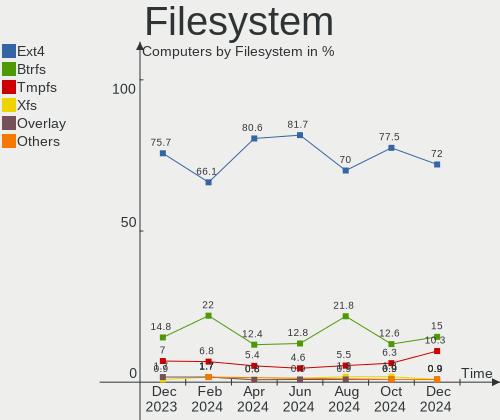
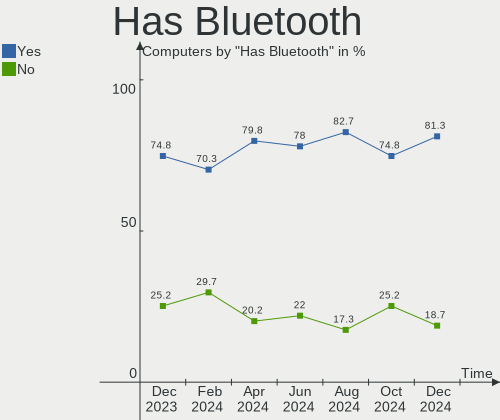
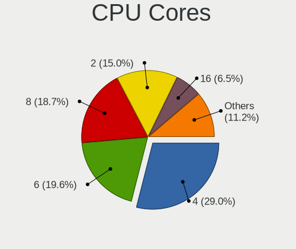
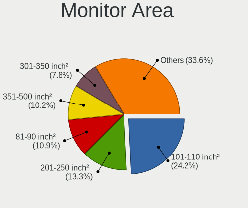
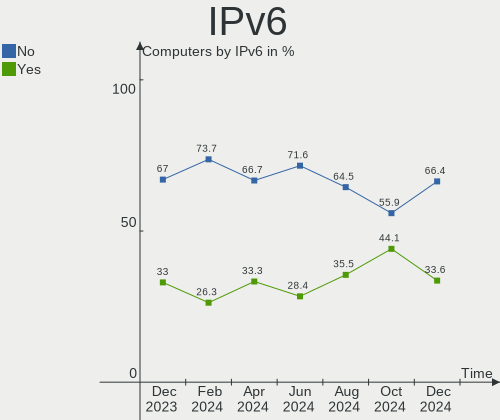
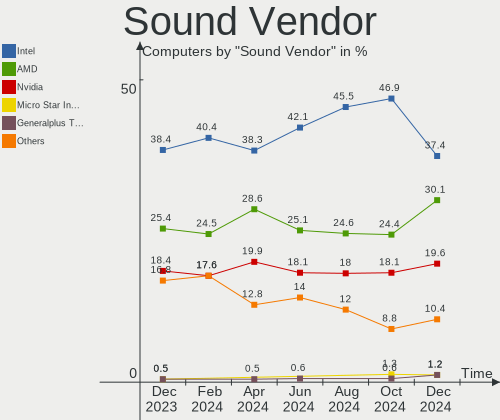

Manjaro - Hardware Trends
-------------------------

A project to identify most popular hardware characteristics and track their change
over time based on data collected by Linux users at https://Linux-Hardware.org.

Anyone can contribute to this report by the [hw-probe](https://github.com/linuxhw/hw-probe) tool:

    sudo -E hw-probe -all -upload

This is a report for all computer types. See also reports for [desktops](/Dist/Manjaro/Desktop/README.md) and [notebooks](/Dist/Manjaro/Notebook/README.md).

This report is for one last month. Overall report since the beginning of time: [TestDays](https://github.com/linuxhw/TestDays)

Period: Jan, 2024.

Contents
--------

* [ System ](#system)
  - [ OS                       ](#os)
  - [ OS Family                ](#os-family)
  - [ Kernel                   ](#kernel)
  - [ Kernel Family            ](#kernel-family)
  - [ Kernel Major Ver.        ](#kernel-major-ver)
  - [ Arch                     ](#arch)
  - [ DE                       ](#de)
  - [ Display Server           ](#display-server)
  - [ Display Manager          ](#display-manager)
  - [ OS Lang                  ](#os-lang)
  - [ Boot Mode                ](#boot-mode)
  - [ Filesystem               ](#filesystem)
  - [ Part. scheme             ](#part-scheme)
  - [ Dual Boot with Linux/BSD ](#dual-boot-with-linuxbsd)
  - [ Dual Boot (Win)          ](#dual-boot-win)

* [ Board ](#board)
  - [ Vendor                   ](#vendor)
  - [ Model                    ](#model)
  - [ Model Family             ](#model-family)
  - [ MFG Year                 ](#mfg-year)
  - [ Form Factor              ](#form-factor)
  - [ Secure Boot              ](#secure-boot)
  - [ Coreboot                 ](#coreboot)
  - [ RAM Size                 ](#ram-size)
  - [ RAM Used                 ](#ram-used)
  - [ Total Drives             ](#total-drives)
  - [ Has CD-ROM               ](#has-cd-rom)
  - [ Has Ethernet             ](#has-ethernet)
  - [ Has WiFi                 ](#has-wifi)
  - [ Has Bluetooth            ](#has-bluetooth)

* [ Location ](#location)
  - [ Country                  ](#country)
  - [ City                     ](#city)

* [ Drives ](#drives)
  - [ Drive Vendor             ](#drive-vendor)
  - [ Drive Model              ](#drive-model)
  - [ HDD Vendor               ](#hdd-vendor)
  - [ SSD Vendor               ](#ssd-vendor)
  - [ Drive Kind               ](#drive-kind)
  - [ Drive Connector          ](#drive-connector)
  - [ Drive Size               ](#drive-size)
  - [ Space Total              ](#space-total)
  - [ Space Used               ](#space-used)
  - [ Malfunc. Drives          ](#malfunc-drives)
  - [ Malfunc. Drive Vendor    ](#malfunc-drive-vendor)
  - [ Malfunc. HDD Vendor      ](#malfunc-hdd-vendor)
  - [ Malfunc. Drive Kind      ](#malfunc-drive-kind)
  - [ Failed Drives            ](#failed-drives)
  - [ Failed Drive Vendor      ](#failed-drive-vendor)
  - [ Drive Status             ](#drive-status)

* [ Storage controller ](#storage-controller)
  - [ Storage Vendor           ](#storage-vendor)
  - [ Storage Model            ](#storage-model)
  - [ Storage Kind             ](#storage-kind)

* [ Processor ](#processor)
  - [ CPU Vendor               ](#cpu-vendor)
  - [ CPU Model                ](#cpu-model)
  - [ CPU Model Family         ](#cpu-model-family)
  - [ CPU Cores                ](#cpu-cores)
  - [ CPU Sockets              ](#cpu-sockets)
  - [ CPU Threads              ](#cpu-threads)
  - [ CPU Op-Modes             ](#cpu-op-modes)
  - [ CPU Microcode            ](#cpu-microcode)
  - [ CPU Microarch            ](#cpu-microarch)

* [ Graphics ](#graphics)
  - [ GPU Vendor               ](#gpu-vendor)
  - [ GPU Model                ](#gpu-model)
  - [ GPU Combo                ](#gpu-combo)
  - [ GPU Driver               ](#gpu-driver)
  - [ GPU Memory               ](#gpu-memory)

* [ Monitor ](#monitor)
  - [ Monitor Vendor           ](#monitor-vendor)
  - [ Monitor Model            ](#monitor-model)
  - [ Monitor Resolution       ](#monitor-resolution)
  - [ Monitor Diagonal         ](#monitor-diagonal)
  - [ Monitor Width            ](#monitor-width)
  - [ Aspect Ratio             ](#aspect-ratio)
  - [ Monitor Area             ](#monitor-area)
  - [ Pixel Density            ](#pixel-density)
  - [ Multiple Monitors        ](#multiple-monitors)

* [ Network ](#network)
  - [ Net Controller Vendor    ](#net-controller-vendor)
  - [ Net Controller Model     ](#net-controller-model)
  - [ Wireless Vendor          ](#wireless-vendor)
  - [ Wireless Model           ](#wireless-model)
  - [ Ethernet Vendor          ](#ethernet-vendor)
  - [ Ethernet Model           ](#ethernet-model)
  - [ Net Controller Kind      ](#net-controller-kind)
  - [ Used Controller          ](#used-controller)
  - [ NICs                     ](#nics)
  - [ IPv6                     ](#ipv6)

* [ Bluetooth ](#bluetooth)
  - [ Bluetooth Vendor         ](#bluetooth-vendor)
  - [ Bluetooth Model          ](#bluetooth-model)

* [ Sound ](#sound)
  - [ Sound Vendor             ](#sound-vendor)
  - [ Sound Model              ](#sound-model)

* [ Memory ](#memory)
  - [ Memory Vendor            ](#memory-vendor)
  - [ Memory Model             ](#memory-model)
  - [ Memory Kind              ](#memory-kind)
  - [ Memory Form Factor       ](#memory-form-factor)
  - [ Memory Size              ](#memory-size)
  - [ Memory Speed             ](#memory-speed)

* [ Printers & scanners ](#printers--scanners)
  - [ Printer Vendor           ](#printer-vendor)
  - [ Printer Model            ](#printer-model)
  - [ Scanner Vendor           ](#scanner-vendor)
  - [ Scanner Model            ](#scanner-model)

* [ Camera ](#camera)
  - [ Camera Vendor            ](#camera-vendor)
  - [ Camera Model             ](#camera-model)

* [ Security ](#security)
  - [ Fingerprint Vendor       ](#fingerprint-vendor)
  - [ Fingerprint Model        ](#fingerprint-model)
  - [ Chipcard Vendor          ](#chipcard-vendor)
  - [ Chipcard Model           ](#chipcard-model)

* [ Unsupported ](#unsupported)
  - [ Unsupported Devices      ](#unsupported-devices)
  - [ Unsupported Device Types ](#unsupported-device-types)

System
------

OS
--

Installed operating systems

| Name           | Computers | Percent |
|----------------|-----------|---------|
| Manjaro        | 80        | 55.56%  |
| Manjaro 23.1.3 | 32        | 22.22%  |
| Manjaro 23.1.2 | 23        | 15.97%  |
| Manjaro 23.1.1 | 3         | 2.08%   |
| Manjaro 23.1.0 | 3         | 2.08%   |
| Manjaro 23.0.1 | 2         | 1.39%   |
| Manjaro 23.0.2 | 1         | 0.69%   |

OS Family
---------

OS without a version

| Name    | Computers | Percent |
|---------|-----------|---------|
| Manjaro | 144       | 100%    |

Kernel
------

Version of the Linux kernel

| Version               | Computers | Percent |
|-----------------------|-----------|---------|
| 6.6.10-1-MANJARO      | 39        | 27.08%  |
| 6.6.8-2-MANJARO       | 29        | 20.14%  |
| 6.7.0-0-MANJARO       | 21        | 14.58%  |
| 6.5.13-7-MANJARO      | 18        | 12.5%   |
| 6.1.69-1-MANJARO      | 10        | 6.94%   |
| 6.1.71-1-MANJARO      | 7         | 4.86%   |
| 6.5.3-1-MANJARO       | 2         | 1.39%   |
| 6.6.8-x64v2-xanmod1-1 | 1         | 0.69%   |
| 6.6.7-4-MANJARO       | 1         | 0.69%   |
| 6.6.7-1-MANJARO       | 1         | 0.69%   |
| 6.6.6-arch1-1-surface | 1         | 0.69%   |
| 6.6.13-1-MANJARO      | 1         | 0.69%   |
| 6.6.10-zen1-1-zen     | 1         | 0.69%   |
| 6.6.10-lqx1-1-lqx     | 1         | 0.69%   |
| 6.5.5-1-MANJARO       | 1         | 0.69%   |
| 6.5.2-1-rt8-MANJARO   | 1         | 0.69%   |
| 6.5.1-1-MANJARO       | 1         | 0.69%   |
| 6.1.68-1-MANJARO      | 1         | 0.69%   |
| 6.1.60-1-MANJARO      | 1         | 0.69%   |
| 6.1.49-1-MANJARO      | 1         | 0.69%   |
| 5.15.146-1-MANJARO    | 1         | 0.69%   |
| 5.15.145-1-MANJARO    | 1         | 0.69%   |
| 5.15.144-1-MANJARO    | 1         | 0.69%   |
| 5.15.140-1-MANJARO    | 1         | 0.69%   |
| 5.10.205-1-MANJARO    | 1         | 0.69%   |

Kernel Family
-------------

Linux kernel without a distro release

| Version  | Computers | Percent |
|----------|-----------|---------|
| 6.6.10   | 41        | 28.47%  |
| 6.6.8    | 30        | 20.83%  |
| 6.7.0    | 21        | 14.58%  |
| 6.5.13   | 18        | 12.5%   |
| 6.1.69   | 10        | 6.94%   |
| 6.1.71   | 7         | 4.86%   |
| 6.6.7    | 2         | 1.39%   |
| 6.5.3    | 2         | 1.39%   |
| 6.6.6    | 1         | 0.69%   |
| 6.6.13   | 1         | 0.69%   |
| 6.5.5    | 1         | 0.69%   |
| 6.5.2    | 1         | 0.69%   |
| 6.5.1    | 1         | 0.69%   |
| 6.1.68   | 1         | 0.69%   |
| 6.1.60   | 1         | 0.69%   |
| 6.1.49   | 1         | 0.69%   |
| 5.15.146 | 1         | 0.69%   |
| 5.15.145 | 1         | 0.69%   |
| 5.15.144 | 1         | 0.69%   |
| 5.15.140 | 1         | 0.69%   |
| 5.10.205 | 1         | 0.69%   |

Kernel Major Ver.
-----------------

Linux kernel major version

| Version | Computers | Percent |
|---------|-----------|---------|
| 6.6     | 75        | 52.08%  |
| 6.5     | 23        | 15.97%  |
| 6.7     | 21        | 14.58%  |
| 6.1     | 20        | 13.89%  |
| 5.15    | 4         | 2.78%   |
| 5.10    | 1         | 0.69%   |

Arch
----

OS architecture (x86_64, i586, etc.)

| Name   | Computers | Percent |
|--------|-----------|---------|
| x86_64 | 144       | 100%    |

DE
--

Desktop Environment

| Name       | Computers | Percent |
|------------|-----------|---------|
| KDE5       | 73        | 50.69%  |
| GNOME      | 32        | 22.22%  |
| XFCE       | 21        | 14.58%  |
| X-Cinnamon | 5         | 3.47%   |
| MATE       | 4         | 2.78%   |
| KDE        | 3         | 2.08%   |
| Unknown    | 3         | 2.08%   |
| i3         | 2         | 1.39%   |
| Budgie     | 1         | 0.69%   |

Display Server
--------------

X11 or Wayland

| Name    | Computers | Percent |
|---------|-----------|---------|
| X11     | 105       | 72.92%  |
| Wayland | 37        | 25.69%  |
| Tty     | 1         | 0.69%   |
| Unknown | 1         | 0.69%   |

Display Manager
---------------

SDDM, LightDM, etc.

| Name    | Computers | Percent |
|---------|-----------|---------|
| Unknown | 80        | 55.56%  |
| SDDM    | 32        | 22.22%  |
| LightDM | 20        | 13.89%  |
| GDM     | 12        | 8.33%   |

OS Lang
-------

Language

| Lang    | Computers | Percent |
|---------|-----------|---------|
| en_US   | 51        | 35.42%  |
| de_DE   | 19        | 13.19%  |
| ru_RU   | 15        | 10.42%  |
| pt_BR   | 6         | 4.17%   |
| it_IT   | 5         | 3.47%   |
| fr_FR   | 5         | 3.47%   |
| pl_PL   | 4         | 2.78%   |
| es_ES   | 4         | 2.78%   |
| en_GB   | 4         | 2.78%   |
| en_CA   | 4         | 2.78%   |
| de_CH   | 4         | 2.78%   |
| en_IN   | 3         | 2.08%   |
| Unknown | 3         | 2.08%   |
| tr_TR   | 2         | 1.39%   |
| el_GR   | 2         | 1.39%   |
| zh_CN   | 1         | 0.69%   |
| sv_SE   | 1         | 0.69%   |
| ru      | 1         | 0.69%   |
| pt_PT   | 1         | 0.69%   |
| ja_JP   | 1         | 0.69%   |
| hu_HU   | 1         | 0.69%   |
| es_MX   | 1         | 0.69%   |
| es_BO   | 1         | 0.69%   |
| en_IE   | 1         | 0.69%   |
| en_AU   | 1         | 0.69%   |
| de_AT   | 1         | 0.69%   |
| cs_CZ   | 1         | 0.69%   |
| bg_BG   | 1         | 0.69%   |

Boot Mode
---------

EFI or BIOS

| Mode | Computers | Percent |
|------|-----------|---------|
| BIOS | 96        | 66.67%  |
| EFI  | 48        | 33.33%  |

Filesystem
----------

Type of filesystem

| Type     | Computers | Percent |
|----------|-----------|---------|
| Ext4     | 106       | 73.61%  |
| Tmpfs    | 17        | 11.81%  |
| Btrfs    | 16        | 11.11%  |
| Overlay  | 3         | 2.08%   |
| Reiserfs | 1         | 0.69%   |
| Unknown  | 1         | 0.69%   |

Part. scheme
------------

Scheme of partitioning

| Type    | Computers | Percent |
|---------|-----------|---------|
| Unknown | 75        | 52.08%  |
| GPT     | 63        | 43.75%  |
| MBR     | 6         | 4.17%   |

Dual Boot with Linux/BSD
------------------------

Hosting more than one Linux/BSD

| Dual boot | Computers | Percent |
|-----------|-----------|---------|
| No        | 132       | 91.67%  |
| Yes       | 12        | 8.33%   |

Dual Boot (Win)
---------------

Hosting Linux and Windows

| Dual boot | Computers | Percent |
|-----------|-----------|---------|
| No        | 114       | 79.17%  |
| Yes       | 30        | 20.83%  |

Board
-----

Vendor
------

Motherboard manufacturer

| Name                                 | Computers | Percent |
|--------------------------------------|-----------|---------|
| ASUSTek Computer                     | 25        | 17.36%  |
| Lenovo                               | 23        | 15.97%  |
| Hewlett-Packard                      | 22        | 15.28%  |
| Dell                                 | 15        | 10.42%  |
| MSI                                  | 14        | 9.72%   |
| ASRock                               | 7         | 4.86%   |
| Gigabyte Technology                  | 6         | 4.17%   |
| Apple                                | 4         | 2.78%   |
| Acer                                 | 4         | 2.78%   |
| Notebook                             | 3         | 2.08%   |
| HUAWEI                               | 3         | 2.08%   |
| AZW                                  | 3         | 2.08%   |
| TUXEDO                               | 2         | 1.39%   |
| Medion                               | 2         | 1.39%   |
| Thomson                              | 1         | 0.69%   |
| Shenzhen Meigao Electronic Equipment | 1         | 0.69%   |
| realme                               | 1         | 0.69%   |
| Razer                                | 1         | 0.69%   |
| Microsoft                            | 1         | 0.69%   |
| LG Electronics                       | 1         | 0.69%   |
| Irbis                                | 1         | 0.69%   |
| Intel                                | 1         | 0.69%   |
| Fujitsu                              | 1         | 0.69%   |
| ARDOR GAMING                         | 1         | 0.69%   |
| Alienware                            | 1         | 0.69%   |

Model
-----

Motherboard model

| Name                                              | Computers | Percent |
|---------------------------------------------------|-----------|---------|
| ASUS All Series                                   | 4         | 2.78%   |
| HP Laptop 15-fc0xxx                               | 2         | 1.39%   |
| Dell Latitude 7400 2-in-1                         | 2         | 1.39%   |
| AZW GTR                                           | 2         | 1.39%   |
| ASUS VivoBook_ASUSLaptop X1505VA_F1505VA          | 2         | 1.39%   |
| TUXEDO Pulse 15 Gen1                              | 1         | 0.69%   |
| TUXEDO InfinityBook Pro Gen8 (MK1)                | 1         | 0.69%   |
| Thomson N15C8BK2T                                 | 1         | 0.69%   |
| Shenzhen Meigao Electronic Equipment Venus series | 1         | 0.69%   |
| realme CloudProXXXX                               | 1         | 0.69%   |
| Razer Blade                                       | 1         | 0.69%   |
| Notebook W350STQ/W370ST                           | 1         | 0.69%   |
| Notebook P7xxDM-G                                 | 1         | 0.69%   |
| Notebook N14xWU                                   | 1         | 0.69%   |
| MSI MS-7E12                                       | 1         | 0.69%   |
| MSI MS-7D22                                       | 1         | 0.69%   |
| MSI MS-7D20                                       | 1         | 0.69%   |
| MSI MS-7C91                                       | 1         | 0.69%   |
| MSI MS-7C52                                       | 1         | 0.69%   |
| MSI MS-7C37                                       | 1         | 0.69%   |
| MSI MS-7B86                                       | 1         | 0.69%   |
| MSI MS-7A37                                       | 1         | 0.69%   |
| MSI MS-7971                                       | 1         | 0.69%   |
| MSI MS-7693                                       | 1         | 0.69%   |
| MSI Katana 17 B13VFK                              | 1         | 0.69%   |
| MSI H310 Gaming Infinite S (MS-B928)              | 1         | 0.69%   |
| MSI GP75 Leopard 10SFK                            | 1         | 0.69%   |
| MSI DIAMONDDEX600                                 | 1         | 0.69%   |
| Microsoft Surface Laptop 4                        | 1         | 0.69%   |
| Medion Scout E10                                  | 1         | 0.69%   |
| Medion S15449                                     | 1         | 0.69%   |
| LG 23V545-G.BK55P1                                | 1         | 0.69%   |
| Lenovo Z50-70 20354                               | 1         | 0.69%   |
| Lenovo ThinkPad X270 20K5S1A524                   | 1         | 0.69%   |
| Lenovo ThinkPad X260 20F5A1AC00                   | 1         | 0.69%   |
| Lenovo ThinkPad X1 Yoga 1st 20FRS55D00            | 1         | 0.69%   |
| Lenovo ThinkPad X1 Carbon Gen 11 21HM007JCX       | 1         | 0.69%   |
| Lenovo ThinkPad T495 20NKS5AU00                   | 1         | 0.69%   |
| Lenovo ThinkPad T430 2344BMU                      | 1         | 0.69%   |
| Lenovo ThinkPad T14 Gen 1 20S1S8MX2H              | 1         | 0.69%   |

Model Family
------------

Motherboard model prefix

| Name                                       | Computers | Percent |
|--------------------------------------------|-----------|---------|
| Lenovo ThinkPad                            | 11        | 7.64%   |
| Dell Latitude                              | 8         | 5.56%   |
| Lenovo IdeaPad                             | 6         | 4.17%   |
| ASUS PRIME                                 | 5         | 3.47%   |
| Lenovo Legion                              | 4         | 2.78%   |
| ASUS VivoBook                              | 4         | 2.78%   |
| ASUS All                                   | 4         | 2.78%   |
| HP EliteBook                               | 3         | 2.08%   |
| Dell XPS                                   | 3         | 2.08%   |
| HP Victus                                  | 2         | 1.39%   |
| HP Spectre                                 | 2         | 1.39%   |
| HP Pavilion                                | 2         | 1.39%   |
| HP Laptop                                  | 2         | 1.39%   |
| HP ENVY                                    | 2         | 1.39%   |
| Dell Inspiron                              | 2         | 1.39%   |
| AZW GTR                                    | 2         | 1.39%   |
| ASUS ROG                                   | 2         | 1.39%   |
| TUXEDO Pulse                               | 1         | 0.69%   |
| TUXEDO InfinityBook                        | 1         | 0.69%   |
| Thomson N15C8BK2T                          | 1         | 0.69%   |
| Shenzhen Meigao Electronic Equipment Venus | 1         | 0.69%   |
| realme CloudProXXXX                        | 1         | 0.69%   |
| Razer Blade                                | 1         | 0.69%   |
| Notebook W350STQ                           | 1         | 0.69%   |
| Notebook P7xxDM-G                          | 1         | 0.69%   |
| Notebook N14xWU                            | 1         | 0.69%   |
| MSI MS-7E12                                | 1         | 0.69%   |
| MSI MS-7D22                                | 1         | 0.69%   |
| MSI MS-7D20                                | 1         | 0.69%   |
| MSI MS-7C91                                | 1         | 0.69%   |
| MSI MS-7C52                                | 1         | 0.69%   |
| MSI MS-7C37                                | 1         | 0.69%   |
| MSI MS-7B86                                | 1         | 0.69%   |
| MSI MS-7A37                                | 1         | 0.69%   |
| MSI MS-7971                                | 1         | 0.69%   |
| MSI MS-7693                                | 1         | 0.69%   |
| MSI Katana                                 | 1         | 0.69%   |
| MSI H310                                   | 1         | 0.69%   |
| MSI GP75                                   | 1         | 0.69%   |
| MSI DIAMONDDEX600                          | 1         | 0.69%   |

MFG Year
--------

Motherboard manufacture year

| Year | Computers | Percent |
|------|-----------|---------|
| 2020 | 22        | 15.28%  |
| 2022 | 17        | 11.81%  |
| 2021 | 17        | 11.81%  |
| 2023 | 16        | 11.11%  |
| 2018 | 11        | 7.64%   |
| 2017 | 11        | 7.64%   |
| 2019 | 10        | 6.94%   |
| 2013 | 10        | 6.94%   |
| 2014 | 7         | 4.86%   |
| 2016 | 6         | 4.17%   |
| 2015 | 6         | 4.17%   |
| 2012 | 6         | 4.17%   |
| 2010 | 2         | 1.39%   |
| 2011 | 1         | 0.69%   |
| 2009 | 1         | 0.69%   |
| 2007 | 1         | 0.69%   |

Form Factor
-----------

Physical design of the computer

| Name        | Computers | Percent |
|-------------|-----------|---------|
| Notebook    | 85        | 59.03%  |
| Desktop     | 46        | 31.94%  |
| Convertible | 7         | 4.86%   |
| Mini pc     | 4         | 2.78%   |
| Tablet      | 2         | 1.39%   |

Secure Boot
-----------

Enabled or disabled

| State    | Computers | Percent |
|----------|-----------|---------|
| Disabled | 144       | 100%    |

Coreboot
--------

Have coreboot on board

| Used | Computers | Percent |
|------|-----------|---------|
| No   | 144       | 100%    |

RAM Size
--------

Total RAM memory

| Size in GB  | Computers | Percent |
|-------------|-----------|---------|
| 16.01-24.0  | 40        | 27.78%  |
| 8.01-16.0   | 29        | 20.14%  |
| 32.01-64.0  | 28        | 19.44%  |
| 4.01-8.0    | 24        | 16.67%  |
| 64.01-256.0 | 13        | 9.03%   |
| 3.01-4.0    | 5         | 3.47%   |
| 24.01-32.0  | 4         | 2.78%   |
| 1.01-2.0    | 1         | 0.69%   |

RAM Used
--------

Used RAM memory

| Used GB    | Computers | Percent |
|------------|-----------|---------|
| 4.01-8.0   | 51        | 35.42%  |
| 2.01-3.0   | 29        | 20.14%  |
| 3.01-4.0   | 25        | 17.36%  |
| 1.01-2.0   | 21        | 14.58%  |
| 8.01-16.0  | 14        | 9.72%   |
| 24.01-32.0 | 2         | 1.39%   |
| 16.01-24.0 | 2         | 1.39%   |

Total Drives
------------

Number of drives on board

| Drives | Computers | Percent |
|--------|-----------|---------|
| 1      | 70        | 48.61%  |
| 2      | 41        | 28.47%  |
| 3      | 16        | 11.11%  |
| 4      | 9         | 6.25%   |
| 6      | 3         | 2.08%   |
| 5      | 3         | 2.08%   |
| 7      | 2         | 1.39%   |

Has CD-ROM
----------

Has CD-ROM on board

| Presented | Computers | Percent |
|-----------|-----------|---------|
| No        | 116       | 80.56%  |
| Yes       | 28        | 19.44%  |

Has Ethernet
------------

Has Ethernet on board

| Presented | Computers | Percent |
|-----------|-----------|---------|
| Yes       | 105       | 72.92%  |
| No        | 39        | 27.08%  |

Has WiFi
--------

Has WiFi module

| Presented | Computers | Percent |
|-----------|-----------|---------|
| Yes       | 114       | 79.17%  |
| No        | 30        | 20.83%  |

Has Bluetooth
-------------

Has Bluetooth module

| Presented | Computers | Percent |
|-----------|-----------|---------|
| Yes       | 109       | 75.69%  |
| No        | 35        | 24.31%  |

Location
--------

Country
-------

Geographic location (country)

| Country     | Computers | Percent |
|-------------|-----------|---------|
| USA         | 24        | 16.67%  |
| Germany     | 21        | 14.58%  |
| Russia      | 16        | 11.11%  |
| Switzerland | 8         | 5.56%   |
| Italy       | 7         | 4.86%   |
| France      | 7         | 4.86%   |
| Brazil      | 7         | 4.86%   |
| Spain       | 6         | 4.17%   |
| UK          | 4         | 2.78%   |
| Sweden      | 4         | 2.78%   |
| India       | 4         | 2.78%   |
| Canada      | 4         | 2.78%   |
| Poland      | 3         | 2.08%   |
| Netherlands | 3         | 2.08%   |
| Turkey      | 2         | 1.39%   |
| Serbia      | 2         | 1.39%   |
| Iran        | 2         | 1.39%   |
| Greece      | 2         | 1.39%   |
| Bangladesh  | 2         | 1.39%   |
| Singapore   | 1         | 0.69%   |
| Portugal    | 1         | 0.69%   |
| Mexico      | 1         | 0.69%   |
| Malawi      | 1         | 0.69%   |
| Japan       | 1         | 0.69%   |
| Hungary     | 1         | 0.69%   |
| Hong Kong   | 1         | 0.69%   |
| Denmark     | 1         | 0.69%   |
| Czechia     | 1         | 0.69%   |
| Croatia     | 1         | 0.69%   |
| Chile       | 1         | 0.69%   |
| Bolivia     | 1         | 0.69%   |
| Belarus     | 1         | 0.69%   |
| Austria     | 1         | 0.69%   |
| Australia   | 1         | 0.69%   |
| Argentina   | 1         | 0.69%   |

City
----

Geographic location (city)

| City              | Computers | Percent |
|-------------------|-----------|---------|
| Moscow            | 5         | 3.47%   |
| Zurich            | 3         | 2.08%   |
| St Petersburg     | 3         | 2.08%   |
| Wilmington        | 2         | 1.39%   |
| Tambov            | 2         | 1.39%   |
| Rio de Janeiro    | 2         | 1.39%   |
| Ooltewah          | 2         | 1.39%   |
| Munich            | 2         | 1.39%   |
| Milano            | 2         | 1.39%   |
| Leipzig           | 2         | 1.39%   |
| Dhaka             | 2         | 1.39%   |
| Berlin            | 2         | 1.39%   |
| Amsterdam         | 2         | 1.39%   |
| Zabrze            | 1         | 0.69%   |
| Yzeure            | 1         | 0.69%   |
| Yorktown          | 1         | 0.69%   |
| Wurzen            | 1         | 0.69%   |
| Winnipeg          | 1         | 0.69%   |
| Windsor           | 1         | 0.69%   |
| Warsaw            | 1         | 0.69%   |
| Waldshut-Tiengen  | 1         | 0.69%   |
| Volgograd         | 1         | 0.69%   |
| Volduchy          | 1         | 0.69%   |
| Vertou            | 1         | 0.69%   |
| Venice            | 1         | 0.69%   |
| Vancouver         | 1         | 0.69%   |
| Valjevo           | 1         | 0.69%   |
| Ushuaia           | 1         | 0.69%   |
| Ulan-Ude          | 1         | 0.69%   |
| Tver              | 1         | 0.69%   |
| Traun             | 1         | 0.69%   |
| Thun              | 1         | 0.69%   |
| Tehran            | 1         | 0.69%   |
| Székesfehérvár | 1         | 0.69%   |
| Swansea           | 1         | 0.69%   |
| Surgut            | 1         | 0.69%   |
| Stockholm         | 1         | 0.69%   |
| Split             | 1         | 0.69%   |
| Sparti            | 1         | 0.69%   |
| Singapore         | 1         | 0.69%   |

Drives
------

Drive Vendor
------------

Hard drive vendors

| Vendor                         | Computers | Drives | Percent |
|--------------------------------|-----------|--------|---------|
| Samsung Electronics            | 43        | 50     | 16.73%  |
| WDC                            | 23        | 30     | 8.95%   |
| Sandisk                        | 22        | 23     | 8.56%   |
| Kingston                       | 18        | 21     | 7%      |
| Seagate                        | 14        | 18     | 5.45%   |
| Crucial                        | 14        | 15     | 5.45%   |
| Toshiba                        | 12        | 12     | 4.67%   |
| SK hynix                       | 9         | 9      | 3.5%    |
| Unknown                        | 8         | 11     | 3.11%   |
| Phison Electronics             | 8         | 8      | 3.11%   |
| Micron/Crucial Technology      | 8         | 8      | 3.11%   |
| Intel                          | 7         | 8      | 2.72%   |
| Micron Technology              | 4         | 4      | 1.56%   |
| MAXIO Technology (Hangzhou)    | 4         | 4      | 1.56%   |
| Kingston Technology Company    | 4         | 4      | 1.56%   |
| Hitachi                        | 4         | 4      | 1.56%   |
| A-DATA Technology              | 4         | 4      | 1.56%   |
| Unknown                        | 4         | 4      | 1.56%   |
| ADATA Technology               | 3         | 3      | 1.17%   |
| SPCC                           | 2         | 2      | 0.78%   |
| Silicon Motion                 | 2         | 2      | 0.78%   |
| Shenzhen Longsys Electronics   | 2         | 2      | 0.78%   |
| Patriot                        | 2         | 2      | 0.78%   |
| LITEONIT                       | 2         | 2      | 0.78%   |
| LITEON                         | 2         | 2      | 0.78%   |
| Intenso                        | 2         | 2      | 0.78%   |
| HGST                           | 2         | 2      | 0.78%   |
| Gigabyte Technology            | 2         | 2      | 0.78%   |
| BHT                            | 2         | 2      | 0.78%   |
| Apple                          | 2         | 3      | 0.78%   |
| XrayDisk                       | 1         | 1      | 0.39%   |
| Transcend                      | 1         | 1      | 0.39%   |
| T-FORCE                        | 1         | 1      | 0.39%   |
| SSK                            | 1         | 1      | 0.39%   |
| Solid State Storage Technology | 1         | 1      | 0.39%   |
| Realtek Semiconductor          | 1         | 1      | 0.39%   |
| Realtek                        | 1         | 1      | 0.39%   |
| PNY                            | 1         | 1      | 0.39%   |
| OCZ                            | 1         | 1      | 0.39%   |
| Netac                          | 1         | 1      | 0.39%   |

Drive Model
-----------

Hard drive models

| Model                                              | Computers | Percent |
|----------------------------------------------------|-----------|---------|
| Samsung NVMe SSD Controller SM981/PM981/PM983 1TB  | 12        | 4.32%   |
| Micron/Crucial P2 NVMe PCIe SSD 1TB                | 7         | 2.52%   |
| Samsung NVMe SSD Controller PM9A1/PM9A3/980PRO 2TB | 6         | 2.16%   |
| Kingston SA400S37480G 480GB SSD                    | 4         | 1.44%   |
| Intel SSD 660P Series 1024GB                       | 4         | 1.44%   |
| Crucial CT1000MX500SSD1 1TB                        | 4         | 1.44%   |
| Crucial CT1000BX500SSD1 1TB                        | 4         | 1.44%   |
| Unknown                                            | 4         | 1.44%   |
| Sandisk WD Black SN750 / PC SN730 NVMe SSD 512GB   | 3         | 1.08%   |
| Samsung NVMe SSD Controller SM951/PM951 256GB      | 3         | 1.08%   |
| MAXIO (Hangzhou) NVMe SSD Controller MAP1202 512GB | 3         | 1.08%   |
| Kingston SA400S37240G 240GB SSD                    | 3         | 1.08%   |
| WDC WD30EFRX-68EUZN0 3TB                           | 2         | 0.72%   |
| WDC WD20EFRX-68EUZN0 2TB                           | 2         | 0.72%   |
| WDC WD10JPVX-22JC3T0 1TB                           | 2         | 0.72%   |
| Unknown SD/MMC/MS PRO 256GB                        | 2         | 0.72%   |
| Unknown MMC Card  128GB                            | 2         | 0.72%   |
| Toshiba XG6 NVMe SSD Controller 256GB              | 2         | 0.72%   |
| Toshiba MQ01ABD100 1TB                             | 2         | 0.72%   |
| Toshiba HDWD130 3TB                                | 2         | 0.72%   |
| Silicon Motion PCIe-8 SSD 512GB                    | 2         | 0.72%   |
| Seagate ST1000LM035-1RK172 1TB                     | 2         | 0.72%   |
| Seagate ST1000LM024 HN-M101MBB 1TB                 | 2         | 0.72%   |
| Sandisk WD Blue SN570 1TB                          | 2         | 0.72%   |
| Sandisk WD Black SN850 1024GB                      | 2         | 0.72%   |
| SanDisk SSD PLUS 480GB                             | 2         | 0.72%   |
| SanDisk SSD PLUS 1000GB                            | 2         | 0.72%   |
| Sandisk PC SN520 NVMe SSD 256GB                    | 2         | 0.72%   |
| Samsung SSD 980 1TB                                | 2         | 0.72%   |
| Samsung SSD 870 EVO 1TB                            | 2         | 0.72%   |
| Samsung SSD 840 PRO Series 128GB                   | 2         | 0.72%   |
| Phison PS5013 E13 NVMe Controller 256GB            | 2         | 0.72%   |
| Phison E12 NVMe Controller 1TB                     | 2         | 0.72%   |
| Micron 2450_MTFDKBA1T0TFK 1TB                      | 2         | 0.72%   |
| Kingston Company A2000 NVMe SSD 500GB              | 2         | 0.72%   |
| Kingston SKC3000S1024G 1024GB                      | 2         | 0.72%   |
| Kingston SFYRD2000G 2TB                            | 2         | 0.72%   |
| Kingston SA400S37120G 120GB SSD                    | 2         | 0.72%   |
| Gigabyte GP-GSTFS31120GNTD 120GB SSD               | 2         | 0.72%   |
| Crucial CT500MX500SSD1 500GB                       | 2         | 0.72%   |

HDD Vendor
----------

Hard disk drive vendors

| Vendor              | Computers | Drives | Percent |
|---------------------|-----------|--------|---------|
| WDC                 | 21        | 26     | 36.84%  |
| Seagate             | 14        | 18     | 24.56%  |
| Toshiba             | 9         | 9      | 15.79%  |
| Hitachi             | 4         | 4      | 7.02%   |
| Unknown             | 2         | 2      | 3.51%   |
| HGST                | 2         | 2      | 3.51%   |
| Samsung Electronics | 1         | 2      | 1.75%   |
| JMicron Technology  | 1         | 1      | 1.75%   |
| Intenso             | 1         | 1      | 1.75%   |
| Fujitsu             | 1         | 1      | 1.75%   |
| Unknown             | 1         | 1      | 1.75%   |

SSD Vendor
----------

Solid state drive vendors

| Vendor              | Computers | Drives | Percent |
|---------------------|-----------|--------|---------|
| Crucial             | 14        | 15     | 16.28%  |
| Samsung Electronics | 13        | 13     | 15.12%  |
| Kingston            | 12        | 13     | 13.95%  |
| SanDisk             | 7         | 7      | 8.14%   |
| WDC                 | 4         | 4      | 4.65%   |
| A-DATA Technology   | 4         | 4      | 4.65%   |
| SPCC                | 2         | 2      | 2.33%   |
| SK hynix            | 2         | 2      | 2.33%   |
| Patriot             | 2         | 2      | 2.33%   |
| LITEONIT            | 2         | 2      | 2.33%   |
| LITEON              | 2         | 2      | 2.33%   |
| Intel               | 2         | 2      | 2.33%   |
| Gigabyte Technology | 2         | 2      | 2.33%   |
| BHT                 | 2         | 2      | 2.33%   |
| XrayDisk            | 1         | 1      | 1.16%   |
| Transcend           | 1         | 1      | 1.16%   |
| Toshiba             | 1         | 1      | 1.16%   |
| T-FORCE             | 1         | 1      | 1.16%   |
| PNY                 | 1         | 1      | 1.16%   |
| OCZ                 | 1         | 1      | 1.16%   |
| KODAK               | 1         | 1      | 1.16%   |
| KingDian            | 1         | 1      | 1.16%   |
| Intenso             | 1         | 1      | 1.16%   |
| Green House         | 1         | 1      | 1.16%   |
| GOODRAM             | 1         | 1      | 1.16%   |
| CONSISTENT          | 1         | 1      | 1.16%   |
| Colorful            | 1         | 1      | 1.16%   |
| China               | 1         | 1      | 1.16%   |
| BAITITON            | 1         | 1      | 1.16%   |
| Apple               | 1         | 1      | 1.16%   |

Drive Kind
----------

HDD or SSD

| Kind    | Computers | Drives | Percent |
|---------|-----------|--------|---------|
| NVMe    | 96        | 119    | 44.86%  |
| SSD     | 65        | 88     | 30.37%  |
| HDD     | 45        | 67     | 21.03%  |
| MMC     | 5         | 6      | 2.34%   |
| Unknown | 3         | 5      | 1.4%    |

Drive Connector
---------------

SATA, SAS, NVMe, etc.

| Type | Computers | Drives | Percent |
|------|-----------|--------|---------|
| NVMe | 95        | 116    | 49.48%  |
| SATA | 80        | 148    | 41.67%  |
| SAS  | 12        | 15     | 6.25%   |
| MMC  | 5         | 6      | 2.6%    |

Drive Size
----------

Size of hard drive

| Size in TB | Computers | Drives | Percent |
|------------|-----------|--------|---------|
| 0.01-0.5   | 58        | 80     | 48.74%  |
| 0.51-1.0   | 40        | 47     | 33.61%  |
| 1.01-2.0   | 10        | 15     | 8.4%    |
| 2.01-3.0   | 5         | 6      | 4.2%    |
| 4.01-10.0  | 3         | 4      | 2.52%   |
| 3.01-4.0   | 2         | 2      | 1.68%   |
| 10.01-20.0 | 1         | 1      | 0.84%   |

Space Total
-----------

Amount of disk space available on the file system

| Size in GB     | Computers | Percent |
|----------------|-----------|---------|
| 251-500        | 38        | 26.39%  |
| 101-250        | 30        | 20.83%  |
| 1001-2000      | 20        | 13.89%  |
| 501-1000       | 19        | 13.19%  |
| More than 3000 | 13        | 9.03%   |
| Unknown        | 13        | 9.03%   |
| 1-20           | 4         | 2.78%   |
| 21-50          | 3         | 2.08%   |
| 2001-3000      | 2         | 1.39%   |
| 51-100         | 2         | 1.39%   |

Space Used
----------

Amount of used disk space

| Used GB        | Computers | Percent |
|----------------|-----------|---------|
| 1-20           | 27        | 18.75%  |
| 101-250        | 24        | 16.67%  |
| 251-500        | 19        | 13.19%  |
| 51-100         | 18        | 12.5%   |
| 21-50          | 16        | 11.11%  |
| 501-1000       | 15        | 10.42%  |
| Unknown        | 13        | 9.03%   |
| 1001-2000      | 8         | 5.56%   |
| More than 3000 | 2         | 1.39%   |
| 2001-3000      | 2         | 1.39%   |

Malfunc. Drives
---------------

Drive models with a malfunction

| Model                                                                      | Computers | Drives | Percent |
|----------------------------------------------------------------------------|-----------|--------|---------|
| WDC WD20EFRX-68EUZN0 2TB                                                   | 1         | 1      | 11.11%  |
| Seagate ST3500418AS 500GB                                                  | 1         | 1      | 11.11%  |
| Seagate ST2000LM007-1R8174 2TB                                             | 1         | 1      | 11.11%  |
| Seagate ST1000LM049-2GH172 1TB                                             | 1         | 1      | 11.11%  |
| Seagate ST1000LM024 HN-M101MBB 1TB                                         | 1         | 1      | 11.11%  |
| Kingston Technology Company OM3PDP3 NVMe SSD 256GB                         | 1         | 1      | 11.11%  |
| Kingston SHPM2280P2H 480G SSD                                              | 1         | 1      | 11.11%  |
| ADATA Technology XPG SX8200 Pro PCIe Gen3x4 M.2 2280 Solid State Drive 2TB | 1         | 1      | 11.11%  |
| Unknown                                                                    | 1         | 1      | 11.11%  |

Malfunc. Drive Vendor
---------------------

Vendors of faulty drives

| Vendor                      | Computers | Drives | Percent |
|-----------------------------|-----------|--------|---------|
| Seagate                     | 4         | 4      | 44.44%  |
| WDC                         | 1         | 1      | 11.11%  |
| Kingston Technology Company | 1         | 1      | 11.11%  |
| Kingston                    | 1         | 1      | 11.11%  |
| ADATA Technology            | 1         | 1      | 11.11%  |
| Unknown                     | 1         | 1      | 11.11%  |

Malfunc. HDD Vendor
-------------------

Vendors of faulty HDD drives

| Vendor  | Computers | Drives | Percent |
|---------|-----------|--------|---------|
| Seagate | 4         | 4      | 66.67%  |
| WDC     | 1         | 1      | 16.67%  |
| Unknown | 1         | 1      | 16.67%  |

Malfunc. Drive Kind
-------------------

Kinds of faulty drives

| Kind | Computers | Drives | Percent |
|------|-----------|--------|---------|
| HDD  | 5         | 6      | 62.5%   |
| NVMe | 2         | 2      | 25%     |
| SSD  | 1         | 1      | 12.5%   |

Failed Drives
-------------

Failed drive models

Zero info for selected period =(

Failed Drive Vendor
-------------------

Failed drive vendors

Zero info for selected period =(

Drive Status
------------

Number of failed and malfunc. drives

| Status   | Computers | Drives | Percent |
|----------|-----------|--------|---------|
| Detected | 107       | 208    | 69.93%  |
| Works    | 39        | 68     | 25.49%  |
| Malfunc  | 7         | 9      | 4.58%   |

Storage controller
------------------

Storage Vendor
--------------

Storage controller vendors

| Vendor                               | Computers | Percent |
|--------------------------------------|-----------|---------|
| Intel                                | 68        | 30.77%  |
| AMD                                  | 41        | 18.55%  |
| Samsung Electronics                  | 33        | 14.93%  |
| SanDisk                              | 16        | 7.24%   |
| Kingston Technology Company          | 12        | 5.43%   |
| Phison Electronics                   | 8         | 3.62%   |
| Micron/Crucial Technology            | 8         | 3.62%   |
| SK hynix                             | 7         | 3.17%   |
| Micron Technology                    | 4         | 1.81%   |
| MAXIO Technology (Hangzhou)          | 4         | 1.81%   |
| ASMedia Technology                   | 4         | 1.81%   |
| ADATA Technology                     | 3         | 1.36%   |
| Toshiba America Info Systems         | 2         | 0.9%    |
| Silicon Motion                       | 2         | 0.9%    |
| Shenzhen Longsys Electronics         | 2         | 0.9%    |
| Solid State Storage Technology       | 1         | 0.45%   |
| Realtek Semiconductor                | 1         | 0.45%   |
| Ramaxel Technology(Shenzhen) Limited | 1         | 0.45%   |
| Netac Technology                     | 1         | 0.45%   |
| Lite-On Technology                   | 1         | 0.45%   |
| KIOXIA                               | 1         | 0.45%   |
| Apple                                | 1         | 0.45%   |

Storage Model
-------------

Storage controller models

| Model                                                                          | Computers | Percent |
|--------------------------------------------------------------------------------|-----------|---------|
| AMD FCH SATA Controller [AHCI mode]                                            | 22        | 9.44%   |
| Samsung NVMe SSD Controller SM981/PM981/PM983                                  | 12        | 5.15%   |
| Samsung NVMe SSD Controller 980 (DRAM-less)                                    | 8         | 3.43%   |
| Intel Sunrise Point-LP SATA Controller [AHCI mode]                             | 8         | 3.43%   |
| Intel 8 Series/C220 Series Chipset Family 6-port SATA Controller 1 [AHCI mode] | 8         | 3.43%   |
| Samsung NVMe SSD Controller PM9A1/PM9A3/980PRO                                 | 7         | 3%      |
| Micron/Crucial P2 [Nick P2] / P3 / P3 Plus NVMe PCIe SSD (DRAM-less)           | 7         | 3%      |
| Intel 82801 Mobile SATA Controller [RAID mode]                                 | 7         | 3%      |
| AMD 500 Series Chipset SATA Controller                                         | 7         | 3%      |
| Intel Volume Management Device NVMe RAID Controller                            | 6         | 2.58%   |
| AMD 400 Series Chipset SATA Controller                                         | 6         | 2.58%   |
| Kingston Company KC3000/FURY Renegade NVMe SSD E18                             | 4         | 1.72%   |
| Intel SSD 660P Series                                                          | 4         | 1.72%   |
| Intel 500 Series Chipset Family SATA AHCI Controller                           | 4         | 1.72%   |
| ASMedia ASM1061/ASM1062 Serial ATA Controller                                  | 4         | 1.72%   |
| AMD 600 Series Chipset SATA Controller                                         | 4         | 1.72%   |
| SK hynix Gold P31/BC711/PC711 NVMe Solid State Drive                           | 3         | 1.29%   |
| SK hynix BC901 NVMe Solid State Drive (DRAM-less)                              | 3         | 1.29%   |
| SanDisk Ultra 3D / WD Blue SN570 NVMe SSD (DRAM-less)                          | 3         | 1.29%   |
| SanDisk Extreme Pro / WD Black SN750 / PC SN730 / Red SN700 NVMe SSD           | 3         | 1.29%   |
| Samsung NVMe SSD Controller SM951/PM951                                        | 3         | 1.29%   |
| MAXIO (Hangzhou) NVMe SSD Controller MAP1202 (DRAM-less)                       | 3         | 1.29%   |
| Kingston Company NV1 NVMe SSD SM2263XT (DRAM-less)                             | 3         | 1.29%   |
| Intel Volume Management Device NVMe RAID Controller Intel Corporation          | 3         | 1.29%   |
| Intel HM170/QM170 Chipset SATA Controller [AHCI Mode]                          | 3         | 1.29%   |
| Intel 8 Series SATA Controller 1 [AHCI mode]                                   | 3         | 1.29%   |
| Intel 7 Series Chipset Family 6-port SATA Controller [AHCI mode]               | 3         | 1.29%   |
| Intel 400 Series Chipset Family SATA AHCI Controller                           | 3         | 1.29%   |
| AMD SB7x0/SB8x0/SB9x0 SATA Controller [AHCI mode]                              | 3         | 1.29%   |
| Toshiba America Info Systems XG6 NVMe SSD Controller                           | 2         | 0.86%   |
| Silicon Motion Non-Volatile memory controller                                  | 2         | 0.86%   |
| Shenzhen Longsys Lexar NM790 NVME SSD (DRAM-less)                              | 2         | 0.86%   |
| SanDisk WD PC SN810 / Black SN850 NVMe SSD                                     | 2         | 0.86%   |
| Phison PS5013-E13 PCIe3 NVMe Controller (DRAM-less)                            | 2         | 0.86%   |
| Phison E12 NVMe Controller                                                     | 2         | 0.86%   |
| Micron 2450 NVMe SSD [HendrixV] (DRAM-less)                                    | 2         | 0.86%   |
| Kingston Company A2000 NVMe SSD SM2263EN                                       | 2         | 0.86%   |
| Intel Q170/Q150/B150/H170/H110/Z170/CM236 Chipset SATA Controller [AHCI Mode]  | 2         | 0.86%   |
| Intel Cannon Lake Mobile PCH SATA AHCI Controller                              | 2         | 0.86%   |
| Intel 7 Series/C210 Series Chipset Family 6-port SATA Controller [AHCI mode]   | 2         | 0.86%   |

Storage Kind
------------

Kind of storage controller (IDE, SATA, NVMe, SAS, ...)

| Kind | Computers | Percent |
|------|-----------|---------|
| NVMe | 95        | 46.12%  |
| SATA | 91        | 44.17%  |
| RAID | 17        | 8.25%   |
| IDE  | 3         | 1.46%   |

Processor
---------

CPU Vendor
----------

Processor vendors

| Vendor | Computers | Percent |
|--------|-----------|---------|
| Intel  | 87        | 60.42%  |
| AMD    | 57        | 39.58%  |

CPU Model
---------

Processor models

| Model                                   | Computers | Percent |
|-----------------------------------------|-----------|---------|
| Intel Core i5-7200U CPU @ 2.50GHz       | 4         | 2.78%   |
| AMD Ryzen 5 5600G with Radeon Graphics  | 4         | 2.78%   |
| Intel Core i5-8250U CPU @ 1.60GHz       | 3         | 2.08%   |
| Intel Core i5-6300U CPU @ 2.40GHz       | 3         | 2.08%   |
| Intel 13th Gen Core i9-13900H           | 3         | 2.08%   |
| AMD Ryzen 7 4800H with Radeon Graphics  | 3         | 2.08%   |
| Intel Core i7-8750H CPU @ 2.20GHz       | 2         | 1.39%   |
| Intel Core i7-8550U CPU @ 1.80GHz       | 2         | 1.39%   |
| Intel Core i7-6700HQ CPU @ 2.60GHz      | 2         | 1.39%   |
| Intel Core i5-4200M CPU @ 2.50GHz       | 2         | 1.39%   |
| Intel 12th Gen Core i7-12700H           | 2         | 1.39%   |
| Intel 12th Gen Core i7-1260P            | 2         | 1.39%   |
| Intel 11th Gen Core i7-1165G7 @ 2.80GHz | 2         | 1.39%   |
| Intel 11th Gen Core i5-1145G7 @ 2.60GHz | 2         | 1.39%   |
| Intel 11th Gen Core i5-11400 @ 2.60GHz  | 2         | 1.39%   |
| AMD Ryzen 9 7900X 12-Core Processor     | 2         | 1.39%   |
| AMD Ryzen 9 5900HX with Radeon Graphics | 2         | 1.39%   |
| AMD Ryzen 7 7800X3D 8-Core Processor    | 2         | 1.39%   |
| AMD Ryzen 7 7730U with Radeon Graphics  | 2         | 1.39%   |
| AMD Ryzen 7 5800H with Radeon Graphics  | 2         | 1.39%   |
| AMD Ryzen 7 5700X 8-Core Processor      | 2         | 1.39%   |
| AMD Ryzen 7 5700U with Radeon Graphics  | 2         | 1.39%   |
| AMD Ryzen 5 5625U with Radeon Graphics  | 2         | 1.39%   |
| Intel Xeon CPU X5690 @ 3.47GHz          | 1         | 0.69%   |
| Intel Xeon CPU E5-2699 v4 @ 2.20GHz     | 1         | 0.69%   |
| Intel Pentium Silver N6000 @ 1.10GHz    | 1         | 0.69%   |
| Intel Core Ultra 7 155H                 | 1         | 0.69%   |
| Intel Core i7-9750H CPU @ 2.60GHz       | 1         | 0.69%   |
| Intel Core i7-8665U CPU @ 1.90GHz       | 1         | 0.69%   |
| Intel Core i7-8650U CPU @ 1.90GHz       | 1         | 0.69%   |
| Intel Core i7-7700 CPU @ 3.60GHz        | 1         | 0.69%   |
| Intel Core i7-6700K CPU @ 4.00GHz       | 1         | 0.69%   |
| Intel Core i7-6700 CPU @ 3.40GHz        | 1         | 0.69%   |
| Intel Core i7-4790 CPU @ 3.60GHz        | 1         | 0.69%   |
| Intel Core i7-4770K CPU @ 3.50GHz       | 1         | 0.69%   |
| Intel Core i7-4700MQ CPU @ 2.40GHz      | 1         | 0.69%   |
| Intel Core i7-4600U CPU @ 2.10GHz       | 1         | 0.69%   |
| Intel Core i7-4510U CPU @ 2.00GHz       | 1         | 0.69%   |
| Intel Core i7-4500U CPU @ 1.80GHz       | 1         | 0.69%   |
| Intel Core i7-3770K CPU @ 3.50GHz       | 1         | 0.69%   |

CPU Model Family
----------------

Processor model prefix

| Model                | Computers | Percent |
|----------------------|-----------|---------|
| Intel Core i5        | 29        | 20.14%  |
| Other                | 26        | 18.06%  |
| Intel Core i7        | 22        | 15.28%  |
| AMD Ryzen 7          | 20        | 13.89%  |
| AMD Ryzen 5          | 19        | 13.19%  |
| AMD Ryzen 9          | 6         | 4.17%   |
| Intel Core i3        | 3         | 2.08%   |
| Intel Celeron        | 3         | 2.08%   |
| AMD Ryzen 3          | 3         | 2.08%   |
| AMD FX               | 3         | 2.08%   |
| Intel Xeon           | 2         | 1.39%   |
| AMD Ryzen 7 PRO      | 2         | 1.39%   |
| AMD A4               | 2         | 1.39%   |
| Intel Pentium Silver | 1         | 0.69%   |
| Intel Core           | 1         | 0.69%   |
| AMD Phenom II X4     | 1         | 0.69%   |
| AMD E2               | 1         | 0.69%   |

CPU Cores
---------

Number of processor cores

| Number | Computers | Percent |
|--------|-----------|---------|
| 4      | 41        | 28.47%  |
| 8      | 28        | 19.44%  |
| 2      | 28        | 19.44%  |
| 6      | 26        | 18.06%  |
| 14     | 7         | 4.86%   |
| 12     | 5         | 3.47%   |
| 16     | 3         | 2.08%   |
| 10     | 2         | 1.39%   |
| 1      | 2         | 1.39%   |
| 22     | 1         | 0.69%   |
| 3      | 1         | 0.69%   |

CPU Sockets
-----------

Number of sockets

| Number | Computers | Percent |
|--------|-----------|---------|
| 1      | 144       | 100%    |

CPU Threads
-----------

Threads per core (Hyper-Threading)

| Number | Computers | Percent |
|--------|-----------|---------|
| 2      | 127       | 88.19%  |
| 1      | 17        | 11.81%  |

CPU Op-Modes
------------

CPU Operation Modes (32-bit, 64-bit)

| Op mode        | Computers | Percent |
|----------------|-----------|---------|
| 32-bit, 64-bit | 144       | 100%    |

CPU Microcode
-------------

Microcode number

| Number     | Computers | Percent |
|------------|-----------|---------|
| Unknown    | 114       | 79.17%  |
| 0x08600103 | 3         | 2.08%   |
| 0x506e3    | 2         | 1.39%   |
| 0x0a704103 | 2         | 1.39%   |
| 0x0a50000d | 2         | 1.39%   |
| 0x08108109 | 2         | 1.39%   |
| 0x906a3    | 1         | 0.69%   |
| 0x806ec    | 1         | 0.69%   |
| 0x806ea    | 1         | 0.69%   |
| 0x806d1    | 1         | 0.69%   |
| 0x306d4    | 1         | 0.69%   |
| 0x306c3    | 1         | 0.69%   |
| 0x0a601206 | 1         | 0.69%   |
| 0x0a50000f | 1         | 0.69%   |
| 0x0a404102 | 1         | 0.69%   |
| 0x0a404101 | 1         | 0.69%   |
| 0x0a20120e | 1         | 0.69%   |
| 0x0a201025 | 1         | 0.69%   |
| 0x08701030 | 1         | 0.69%   |
| 0x08701021 | 1         | 0.69%   |
| 0x08608103 | 1         | 0.69%   |
| 0x08608102 | 1         | 0.69%   |
| 0x08108102 | 1         | 0.69%   |
| 0x07030106 | 1         | 0.69%   |
| 0x06000852 | 1         | 0.69%   |

CPU Microarch
-------------

Microarchitecture

| Name             | Computers | Percent |
|------------------|-----------|---------|
| Unknown          | 24        | 16.67%  |
| Zen 3            | 21        | 14.58%  |
| KabyLake         | 20        | 13.89%  |
| Haswell          | 13        | 9.03%   |
| Zen 2            | 9         | 6.25%   |
| Alderlake Hybrid | 9         | 6.25%   |
| Skylake          | 8         | 5.56%   |
| TigerLake        | 6         | 4.17%   |
| IvyBridge        | 6         | 4.17%   |
| Zen+             | 4         | 2.78%   |
| Piledriver       | 4         | 2.78%   |
| Zen              | 3         | 2.08%   |
| Icelake          | 3         | 2.08%   |
| CometLake        | 3         | 2.08%   |
| Broadwell        | 3         | 2.08%   |
| Westmere         | 2         | 1.39%   |
| SandyBridge      | 1         | 0.69%   |
| Puma             | 1         | 0.69%   |
| K10              | 1         | 0.69%   |
| Goldmont plus    | 1         | 0.69%   |
| Goldmont         | 1         | 0.69%   |
| Excavator        | 1         | 0.69%   |

Graphics
--------

GPU Vendor
----------

Vendors of graphics cards

| Vendor | Computers | Percent |
|--------|-----------|---------|
| Intel  | 75        | 41.67%  |
| AMD    | 57        | 31.67%  |
| Nvidia | 48        | 26.67%  |

GPU Model
---------

Graphics card models

| Model                                                                         | Computers | Percent |
|-------------------------------------------------------------------------------|-----------|---------|
| AMD Ellesmere [Radeon RX 470/480/570/570X/580/580X/590]                       | 8         | 4.35%   |
| AMD Cezanne [Radeon Vega Series / Radeon Vega Mobile Series]                  | 8         | 4.35%   |
| Intel UHD Graphics 620                                                        | 6         | 3.26%   |
| Intel TigerLake-LP GT2 [Iris Xe Graphics]                                     | 6         | 3.26%   |
| Intel Raptor Lake-P [Iris Xe Graphics]                                        | 5         | 2.72%   |
| Intel Alder Lake-P GT2 [Iris Xe Graphics]                                     | 5         | 2.72%   |
| Nvidia GA107M [GeForce RTX 3050 Ti Mobile]                                    | 4         | 2.17%   |
| Intel Skylake GT2 [HD Graphics 520]                                           | 4         | 2.17%   |
| Intel HD Graphics 620                                                         | 4         | 2.17%   |
| Intel Haswell-ULT Integrated Graphics Controller                              | 4         | 2.17%   |
| Intel 4th Gen Core Processor Integrated Graphics Controller                   | 4         | 2.17%   |
| Intel 3rd Gen Core processor Graphics Controller                              | 4         | 2.17%   |
| AMD Renoir [Radeon RX Vega 6 (Ryzen 4000/5000 Mobile Series)]                 | 4         | 2.17%   |
| AMD Barcelo                                                                   | 4         | 2.17%   |
| Nvidia TU117M [GeForce GTX 1650 Mobile / Max-Q]                               | 3         | 1.63%   |
| Intel CoffeeLake-H GT2 [UHD Graphics 630]                                     | 3         | 1.63%   |
| AMD Raphael                                                                   | 3         | 1.63%   |
| AMD Picasso/Raven 2 [Radeon Vega Series / Radeon Vega Mobile Series]          | 3         | 1.63%   |
| AMD Lucienne                                                                  | 3         | 1.63%   |
| Nvidia GP104 [GeForce GTX 1070]                                               | 2         | 1.09%   |
| Nvidia AD106M [GeForce RTX 4070 Max-Q / Mobile]                               | 2         | 1.09%   |
| Nvidia AD104 [GeForce RTX 4070]                                               | 2         | 1.09%   |
| Intel Xeon E3-1200 v3/4th Gen Core Processor Integrated Graphics Controller   | 2         | 1.09%   |
| Intel WhiskeyLake-U GT2 [UHD Graphics 620]                                    | 2         | 1.09%   |
| Intel TigerLake-H GT1 [UHD Graphics]                                          | 2         | 1.09%   |
| Intel RocketLake-S GT1 [UHD Graphics 750]                                     | 2         | 1.09%   |
| Intel RocketLake-S GT1 [UHD Graphics 730]                                     | 2         | 1.09%   |
| Intel HD Graphics 530                                                         | 2         | 1.09%   |
| AMD Sun XT [Radeon HD 8670A/8670M/8690M / R5 M330 / M430 / Radeon 520 Mobile] | 2         | 1.09%   |
| AMD Rembrandt [Radeon 680M]                                                   | 2         | 1.09%   |
| AMD Phoenix1                                                                  | 2         | 1.09%   |
| AMD Navi 23 [Radeon RX 6600/6600 XT/6600M]                                    | 2         | 1.09%   |
| AMD Mendocino                                                                 | 2         | 1.09%   |
| Nvidia TU117GLM [Quadro T500 Mobile]                                          | 1         | 0.54%   |
| Nvidia TU117 [GeForce GTX 1650]                                               | 1         | 0.54%   |
| Nvidia TU106M [GeForce RTX 2070 Mobile / Max-Q Refresh]                       | 1         | 0.54%   |
| Nvidia TU106 [GeForce RTX 2070 Rev. A]                                        | 1         | 0.54%   |
| Nvidia TU104BM [GeForce RTX 2070 SUPER Mobile / Max-Q]                        | 1         | 0.54%   |
| Nvidia TU102 [GeForce RTX 2080 Ti Rev. A]                                     | 1         | 0.54%   |
| Nvidia GP108M [GeForce MX150]                                                 | 1         | 0.54%   |

GPU Combo
---------

Combinations of graphics cards

| Name           | Computers | Percent |
|----------------|-----------|---------|
| 1 x AMD        | 47        | 32.64%  |
| 1 x Intel      | 42        | 29.17%  |
| Intel + Nvidia | 26        | 18.06%  |
| 1 x Nvidia     | 16        | 11.11%  |
| Intel + AMD    | 4         | 2.78%   |
| AMD + Nvidia   | 4         | 2.78%   |
| 2 x Nvidia     | 2         | 1.39%   |
| 2 x AMD        | 2         | 1.39%   |
| 2 x Intel      | 1         | 0.69%   |

GPU Driver
----------

Free vs proprietary

| Driver      | Computers | Percent |
|-------------|-----------|---------|
| Free        | 108       | 75%     |
| Proprietary | 36        | 25%     |

GPU Memory
----------

Total video memory

| Size in GB | Computers | Percent |
|------------|-----------|---------|
| Unknown    | 99        | 68.75%  |
| 7.01-8.0   | 11        | 7.64%   |
| 0.01-0.5   | 10        | 6.94%   |
| 3.01-4.0   | 7         | 4.86%   |
| 8.01-16.0  | 7         | 4.86%   |
| 1.01-2.0   | 5         | 3.47%   |
| 0.51-1.0   | 2         | 1.39%   |
| 5.01-6.0   | 1         | 0.69%   |
| 2.01-3.0   | 1         | 0.69%   |
| 16.01-24.0 | 1         | 0.69%   |

Monitor
-------

Monitor Vendor
--------------

Monitor vendors

| Vendor               | Computers | Percent |
|----------------------|-----------|---------|
| Samsung Electronics  | 29        | 16.76%  |
| AU Optronics         | 24        | 13.87%  |
| BOE                  | 13        | 7.51%   |
| Chimei Innolux       | 12        | 6.94%   |
| LG Display           | 10        | 5.78%   |
| Dell                 | 10        | 5.78%   |
| Goldstar             | 9         | 5.2%    |
| Acer                 | 8         | 4.62%   |
| Sharp                | 6         | 3.47%   |
| Hewlett-Packard      | 5         | 2.89%   |
| Unknown              | 4         | 2.31%   |
| Philips              | 4         | 2.31%   |
| InfoVision           | 4         | 2.31%   |
| BenQ                 | 4         | 2.31%   |
| ASUSTek Computer     | 4         | 2.31%   |
| Apple                | 3         | 1.73%   |
| PANDA                | 2         | 1.16%   |
| LG Electronics       | 2         | 1.16%   |
| Lenovo               | 2         | 1.16%   |
| Ancor Communications | 2         | 1.16%   |
| Unknown              | 2         | 1.16%   |
| ViewSonic            | 1         | 0.58%   |
| VIE                  | 1         | 0.58%   |
| Unknown (XXX)        | 1         | 0.58%   |
| TCL                  | 1         | 0.58%   |
| SAC                  | 1         | 0.58%   |
| MSI                  | 1         | 0.58%   |
| Iiyama               | 1         | 0.58%   |
| Idek Iiyama          | 1         | 0.58%   |
| HUAWEI               | 1         | 0.58%   |
| Eizo                 | 1         | 0.58%   |
| CSO                  | 1         | 0.58%   |
| CHD                  | 1         | 0.58%   |
| AOC                  | 1         | 0.58%   |
| AGO                  | 1         | 0.58%   |

Monitor Model
-------------

Monitor models

| Model                                                                   | Computers | Percent |
|-------------------------------------------------------------------------|-----------|---------|
| AU Optronics LCD Monitor AUO139D 1920x1080 381x214mm 17.2-inch          | 3         | 1.69%   |
| Unknown LCD Monitor FFFF 2288x1287 2550x2550mm 142.0-inch               | 2         | 1.12%   |
| Sharp LCD Monitor SHP14A2 1920x1080 309x174mm 14.0-inch                 | 2         | 1.12%   |
| Samsung Electronics LCD Monitor SDC416E 2880x1620 344x194mm 15.5-inch   | 2         | 1.12%   |
| Samsung Electronics LCD Monitor SDC4161 1920x1080 344x194mm 15.5-inch   | 2         | 1.12%   |
| Samsung Electronics LCD Monitor SDC414D 3456x2160 336x210mm 15.6-inch   | 2         | 1.12%   |
| BOE LCD Monitor BOE0872 1920x1080 344x194mm 15.5-inch                   | 2         | 1.12%   |
| BenQ V2400Eco BNQ7D02 1920x1080 530x300mm 24.0-inch                     | 2         | 1.12%   |
| AU Optronics LCD Monitor AUO403D 1920x1080 309x174mm 14.0-inch          | 2         | 1.12%   |
| Acer V223W ACR001B 1680x1050 474x296mm 22.0-inch                        | 2         | 1.12%   |
| Unknown                                                                 | 2         | 1.12%   |
| ViewSonic VG2448 VSC3B35 1920x1080 527x296mm 23.8-inch                  | 1         | 0.56%   |
| VIE EZCOOL EZ24 VIE2380 1920x1080 598x336mm 27.0-inch                   | 1         | 0.56%   |
| Unknown LCD Monitor SAMSUNG 3840x2160                                   | 1         | 0.56%   |
| Unknown LCD Monitor CSO 2560x1600                                       | 1         | 0.56%   |
| Unknown (XXX) Beyond TV XXX2851 2560x1440 1209x680mm 54.6-inch          | 1         | 0.56%   |
| TCL SMART TV TCL6586 3840x2160 1209x680mm 54.6-inch                     | 1         | 0.56%   |
| Sharp LQ156M1JW01 SHP14C3 1920x1080 344x194mm 15.5-inch                 | 1         | 0.56%   |
| Sharp LQ140Z1JW01 SHP1401 3200x1800 310x174mm 14.0-inch                 | 1         | 0.56%   |
| Sharp LQ135P1JX51 SHP14B3 2256x1504 285x190mm 13.5-inch                 | 1         | 0.56%   |
| Sharp LCD Monitor SHP1515 1920x1200 336x210mm 15.6-inch                 | 1         | 0.56%   |
| Samsung Electronics U32R59x SAM0F94 3840x2160 697x392mm 31.5-inch       | 1         | 0.56%   |
| Samsung Electronics SyncMaster SAM036D 1920x1080                        | 1         | 0.56%   |
| Samsung Electronics SyncMaster SAM011D 1024x768 300x230mm 14.9-inch     | 1         | 0.56%   |
| Samsung Electronics S27F350 SAM0D22 1920x1080 598x336mm 27.0-inch       | 1         | 0.56%   |
| Samsung Electronics S24R35x SAM100F 1920x1080 527x296mm 23.8-inch       | 1         | 0.56%   |
| Samsung Electronics S24F350 SAM0D20 1920x1080 521x293mm 23.5-inch       | 1         | 0.56%   |
| Samsung Electronics S22R35x SAM103A 1920x1080 476x268mm 21.5-inch       | 1         | 0.56%   |
| Samsung Electronics S22C450 SAM09C7 1680x1050 473x291mm 21.9-inch       | 1         | 0.56%   |
| Samsung Electronics LF27T35 SAM707F 1920x1080 598x337mm 27.0-inch       | 1         | 0.56%   |
| Samsung Electronics LCD Monitor SMBX2450                                | 1         | 0.56%   |
| Samsung Electronics LCD Monitor SEC5441 1366x768 344x194mm 15.5-inch    | 1         | 0.56%   |
| Samsung Electronics LCD Monitor SEC324C 1600x900 310x174mm 14.0-inch    | 1         | 0.56%   |
| Samsung Electronics LCD Monitor SDC5441 1366x768 344x194mm 15.5-inch    | 1         | 0.56%   |
| Samsung Electronics LCD Monitor SDC419F 2880x1800 302x189mm 14.0-inch   | 1         | 0.56%   |
| Samsung Electronics LCD Monitor SDC4193 2880x1800 302x189mm 14.0-inch   | 1         | 0.56%   |
| Samsung Electronics LCD Monitor SDC4180 2880x1620 344x194mm 15.5-inch   | 1         | 0.56%   |
| Samsung Electronics LCD Monitor SDC415C 3840x2400 344x215mm 16.0-inch   | 1         | 0.56%   |
| Samsung Electronics LCD Monitor SAM0D3B 3840x2160 1020x570mm 46.0-inch  | 1         | 0.56%   |
| Samsung Electronics LCD Monitor SAM0B90 3840x2160 1872x1053mm 84.6-inch | 1         | 0.56%   |

Monitor Resolution
------------------

Monitor screen resolution

| Resolution         | Computers | Percent |
|--------------------|-----------|---------|
| 1920x1080 (FHD)    | 76        | 46.63%  |
| 1366x768 (WXGA)    | 14        | 8.59%   |
| 3840x2160 (4K)     | 13        | 7.98%   |
| 2560x1440 (QHD)    | 11        | 6.75%   |
| 1920x1200 (WUXGA)  | 7         | 4.29%   |
| 1680x1050 (WSXGA+) | 6         | 3.68%   |
| 1600x900 (HD+)     | 5         | 3.07%   |
| 2880x1800          | 4         | 2.45%   |
| Unknown            | 4         | 2.45%   |
| 2880x1620          | 3         | 1.84%   |
| 3456x2160          | 2         | 1.23%   |
| 2560x1600          | 2         | 1.23%   |
| 2288x1287          | 2         | 1.23%   |
| 2160x1440          | 2         | 1.23%   |
| 1280x1024 (SXGA)   | 2         | 1.23%   |
| 6400x2160          | 1         | 0.61%   |
| 3840x2400          | 1         | 0.61%   |
| 3840x1080          | 1         | 0.61%   |
| 3600x1080          | 1         | 0.61%   |
| 3440x1440          | 1         | 0.61%   |
| 3200x1800 (QHD+)   | 1         | 0.61%   |
| 3200x1200          | 1         | 0.61%   |
| 2256x1504          | 1         | 0.61%   |
| 1440x900 (WXGA+)   | 1         | 0.61%   |
| 1024x768 (XGA)     | 1         | 0.61%   |

Monitor Diagonal
----------------

Diagonal size in inches

| Inches  | Computers | Percent |
|---------|-----------|---------|
| 15      | 42        | 24.71%  |
| 14      | 17        | 10%     |
| 17      | 14        | 8.24%   |
| Unknown | 13        | 7.65%   |
| 27      | 12        | 7.06%   |
| 23      | 12        | 7.06%   |
| 24      | 11        | 6.47%   |
| 13      | 11        | 6.47%   |
| 31      | 7         | 4.12%   |
| 21      | 7         | 4.12%   |
| 22      | 4         | 2.35%   |
| 12      | 4         | 2.35%   |
| 16      | 3         | 1.76%   |
| 142     | 2         | 1.18%   |
| 84      | 2         | 1.18%   |
| 54      | 2         | 1.18%   |
| 18      | 2         | 1.18%   |
| 38      | 1         | 0.59%   |
| 34      | 1         | 0.59%   |
| 29      | 1         | 0.59%   |
| 20      | 1         | 0.59%   |
| 11      | 1         | 0.59%   |

Monitor Width
-------------

Physical width

| Width in mm    | Computers | Percent |
|----------------|-----------|---------|
| 301-350        | 67        | 39.64%  |
| 501-600        | 33        | 19.53%  |
| 401-500        | 15        | 8.88%   |
| 351-400        | 15        | 8.88%   |
| Unknown        | 13        | 7.69%   |
| 201-300        | 10        | 5.92%   |
| 601-700        | 8         | 4.73%   |
| More than 2000 | 2         | 1.18%   |
| 1501-2000      | 2         | 1.18%   |
| 1001-1500      | 2         | 1.18%   |
| 801-900        | 1         | 0.59%   |
| 701-800        | 1         | 0.59%   |

Aspect Ratio
------------

Proportional relationship between the width and the height

| Ratio   | Computers | Percent |
|---------|-----------|---------|
| 16/9    | 113       | 73.38%  |
| 16/10   | 19        | 12.34%  |
| Unknown | 11        | 7.14%   |
| 3/2     | 4         | 2.6%    |
| 5/4     | 2         | 1.3%    |
| 4/3     | 2         | 1.3%    |
| 1.00    | 2         | 1.3%    |
| 21/9    | 1         | 0.65%   |

Monitor Area
------------

Area in inch²

| Area in inch² | Computers | Percent |
|----------------|-----------|---------|
| 101-110        | 42        | 24.85%  |
| 201-250        | 30        | 17.75%  |
| 81-90          | 27        | 15.98%  |
| Unknown        | 13        | 7.69%   |
| 301-350        | 12        | 7.1%    |
| 121-130        | 12        | 7.1%    |
| 351-500        | 9         | 5.33%   |
| More than 1000 | 6         | 3.55%   |
| 141-150        | 4         | 2.37%   |
| 61-70          | 3         | 1.78%   |
| 251-300        | 3         | 1.78%   |
| 111-120        | 3         | 1.78%   |
| 71-80          | 2         | 1.18%   |
| 51-60          | 1         | 0.59%   |
| 151-200        | 1         | 0.59%   |
| 501-1000       | 1         | 0.59%   |

Pixel Density
-------------

Pixels per inch

| Density       | Computers | Percent |
|---------------|-----------|---------|
| 121-160       | 57        | 35.19%  |
| 51-100        | 43        | 26.54%  |
| 101-120       | 25        | 15.43%  |
| Unknown       | 13        | 8.02%   |
| 161-240       | 12        | 7.41%   |
| More than 240 | 9         | 5.56%   |
| 1-50          | 3         | 1.85%   |

Multiple Monitors
-----------------

Total monitors connected

| Total | Computers | Percent |
|-------|-----------|---------|
| 1     | 107       | 74.31%  |
| 2     | 32        | 22.22%  |
| 3     | 4         | 2.78%   |
| 0     | 1         | 0.69%   |

Network
-------

Net Controller Vendor
---------------------

Controller vendors

| Vendor                | Computers | Percent |
|-----------------------|-----------|---------|
| Realtek Semiconductor | 79        | 40.31%  |
| Intel                 | 72        | 36.73%  |
| MediaTek              | 14        | 7.14%   |
| Qualcomm Atheros      | 10        | 5.1%    |
| Broadcom              | 5         | 2.55%   |
| TP-Link               | 3         | 1.53%   |
| Ralink                | 3         | 1.53%   |
| ASIX Electronics      | 3         | 1.53%   |
| Ralink Technology     | 2         | 1.02%   |
| Samsung Electronics   | 1         | 0.51%   |
| Lenovo                | 1         | 0.51%   |
| JMicron Technology    | 1         | 0.51%   |
| Fibocom               | 1         | 0.51%   |
| Broadcom Limited      | 1         | 0.51%   |

Net Controller Model
--------------------

Controller models

| Model                                                                  | Computers | Percent |
|------------------------------------------------------------------------|-----------|---------|
| Realtek RTL8111/8168/8211/8411 PCI Express Gigabit Ethernet Controller | 45        | 19.82%  |
| Realtek RTL8125 2.5GbE Controller                                      | 12        | 5.29%   |
| Intel Wi-Fi 6 AX200                                                    | 11        | 4.85%   |
| Intel Wi-Fi 6 AX201                                                    | 6         | 2.64%   |
| Realtek RTL8822CE 802.11ac PCIe Wireless Network Adapter               | 5         | 2.2%    |
| Realtek RTL810xE PCI Express Fast Ethernet controller                  | 5         | 2.2%    |
| MediaTek MT7922 802.11ax PCI Express Wireless Network Adapter          | 5         | 2.2%    |
| Intel Alder Lake-P PCH CNVi WiFi                                       | 5         | 2.2%    |
| Qualcomm Atheros QCA6174 802.11ac Wireless Network Adapter             | 4         | 1.76%   |
| Intel Wireless 8265 / 8275                                             | 4         | 1.76%   |
| Intel Wireless 8260                                                    | 4         | 1.76%   |
| Intel Raptor Lake PCH CNVi WiFi                                        | 4         | 1.76%   |
| Realtek RTL8723BU 802.11b/g/n WLAN Adapter                             | 3         | 1.32%   |
| MediaTek Wi-Fi 6E MT7902 Wireless Network Adapter                      | 3         | 1.32%   |
| MediaTek MT7921 802.11ax PCI Express Wireless Network Adapter          | 3         | 1.32%   |
| Intel Wi-Fi 6E(802.11ax) AX210/AX1675* 2x2 [Typhoon Peak]              | 3         | 1.32%   |
| Intel Wi-Fi 5(802.11ac) Wireless-AC 9x6x [Thunder Peak]                | 3         | 1.32%   |
| Intel Ethernet Connection (4) I219-LM                                  | 3         | 1.32%   |
| ASIX AX88179 Gigabit Ethernet                                          | 3         | 1.32%   |
| Realtek RTL8852BE PCIe 802.11ax Wireless Network Controller [1T1R]     | 2         | 0.88%   |
| Realtek RTL8821AE 802.11ac PCIe Wireless Network Adapter               | 2         | 0.88%   |
| Realtek RTL8723BE PCIe Wireless Network Adapter                        | 2         | 0.88%   |
| Ralink RT3290 Wireless 802.11n 1T/1R PCIe                              | 2         | 0.88%   |
| Qualcomm Atheros QCA9377 802.11ac Wireless Network Adapter             | 2         | 0.88%   |
| MediaTek MT7921K (RZ608) Wi-Fi 6E 80MHz                                | 2         | 0.88%   |
| Intel Wireless 7265                                                    | 2         | 0.88%   |
| Intel Wireless 7260                                                    | 2         | 0.88%   |
| Intel Wireless 3160                                                    | 2         | 0.88%   |
| Intel Tiger Lake PCH CNVi WiFi                                         | 2         | 0.88%   |
| Intel Raptor Lake-S PCH CNVi WiFi                                      | 2         | 0.88%   |
| Intel I211 Gigabit Network Connection                                  | 2         | 0.88%   |
| Intel Ethernet Controller I225-V                                       | 2         | 0.88%   |
| Intel Ethernet Connection I219-LM                                      | 2         | 0.88%   |
| Intel Ethernet Connection I217-V                                       | 2         | 0.88%   |
| Intel Ethernet Connection (10) I219-V                                  | 2         | 0.88%   |
| Intel Comet Lake PCH CNVi WiFi                                         | 2         | 0.88%   |
| Intel Cannon Point-LP CNVi [Wireless-AC]                               | 2         | 0.88%   |
| Intel 82579LM Gigabit Network Connection (Lewisville)                  | 2         | 0.88%   |
| TP-Link TL-WN823N v2/v3 [Realtek RTL8192EU]                            | 1         | 0.44%   |
| TP-Link Archer T4U ver.3                                               | 1         | 0.44%   |

Wireless Vendor
---------------

Wireless vendors

| Vendor                | Computers | Percent |
|-----------------------|-----------|---------|
| Intel                 | 61        | 51.69%  |
| Realtek Semiconductor | 21        | 17.8%   |
| MediaTek              | 14        | 11.86%  |
| Qualcomm Atheros      | 8         | 6.78%   |
| Broadcom              | 4         | 3.39%   |
| TP-Link               | 3         | 2.54%   |
| Ralink                | 3         | 2.54%   |
| Ralink Technology     | 2         | 1.69%   |
| Fibocom               | 1         | 0.85%   |
| Broadcom Limited      | 1         | 0.85%   |

Wireless Model
--------------

Wireless models

| Model                                                              | Computers | Percent |
|--------------------------------------------------------------------|-----------|---------|
| Intel Wi-Fi 6 AX200                                                | 11        | 9.24%   |
| Intel Wi-Fi 6 AX201                                                | 6         | 5.04%   |
| Realtek RTL8822CE 802.11ac PCIe Wireless Network Adapter           | 5         | 4.2%    |
| MediaTek MT7922 802.11ax PCI Express Wireless Network Adapter      | 5         | 4.2%    |
| Intel Alder Lake-P PCH CNVi WiFi                                   | 5         | 4.2%    |
| Qualcomm Atheros QCA6174 802.11ac Wireless Network Adapter         | 4         | 3.36%   |
| Intel Wireless 8265 / 8275                                         | 4         | 3.36%   |
| Intel Wireless 8260                                                | 4         | 3.36%   |
| Intel Raptor Lake PCH CNVi WiFi                                    | 4         | 3.36%   |
| Realtek RTL8723BU 802.11b/g/n WLAN Adapter                         | 3         | 2.52%   |
| MediaTek Wi-Fi 6E MT7902 Wireless Network Adapter                  | 3         | 2.52%   |
| MediaTek MT7921 802.11ax PCI Express Wireless Network Adapter      | 3         | 2.52%   |
| Intel Wi-Fi 6E(802.11ax) AX210/AX1675* 2x2 [Typhoon Peak]          | 3         | 2.52%   |
| Intel Wi-Fi 5(802.11ac) Wireless-AC 9x6x [Thunder Peak]            | 3         | 2.52%   |
| Realtek RTL8852BE PCIe 802.11ax Wireless Network Controller [1T1R] | 2         | 1.68%   |
| Realtek RTL8821AE 802.11ac PCIe Wireless Network Adapter           | 2         | 1.68%   |
| Realtek RTL8723BE PCIe Wireless Network Adapter                    | 2         | 1.68%   |
| Ralink RT3290 Wireless 802.11n 1T/1R PCIe                          | 2         | 1.68%   |
| Qualcomm Atheros QCA9377 802.11ac Wireless Network Adapter         | 2         | 1.68%   |
| MediaTek MT7921K (RZ608) Wi-Fi 6E 80MHz                            | 2         | 1.68%   |
| Intel Wireless 7265                                                | 2         | 1.68%   |
| Intel Wireless 7260                                                | 2         | 1.68%   |
| Intel Wireless 3160                                                | 2         | 1.68%   |
| Intel Tiger Lake PCH CNVi WiFi                                     | 2         | 1.68%   |
| Intel Raptor Lake-S PCH CNVi WiFi                                  | 2         | 1.68%   |
| Intel Comet Lake PCH CNVi WiFi                                     | 2         | 1.68%   |
| Intel Cannon Point-LP CNVi [Wireless-AC]                           | 2         | 1.68%   |
| TP-Link TL-WN823N v2/v3 [Realtek RTL8192EU]                        | 1         | 0.84%   |
| TP-Link Archer T4U ver.3                                           | 1         | 0.84%   |
| TP-Link Archer T3U [Realtek RTL8812BU]                             | 1         | 0.84%   |
| Realtek RTL8852CE PCIe 802.11ax Wireless Network Controller        | 1         | 0.84%   |
| Realtek RTL8852BE PCIe 802.11ax Wireless Network Controller        | 1         | 0.84%   |
| Realtek RTL8852AE 802.11ax PCIe Wireless Network Adapter           | 1         | 0.84%   |
| Realtek RTL8821CE 802.11ac PCIe Wireless Network Adapter           | 1         | 0.84%   |
| Realtek RTL8188FTV 802.11b/g/n 1T1R 2.4G WLAN Adapter              | 1         | 0.84%   |
| Realtek RTL8188EUS 802.11n Wireless Network Adapter                | 1         | 0.84%   |
| Realtek RTL8188EE Wireless Network Adapter                         | 1         | 0.84%   |
| Ralink RT5572 Wireless Adapter                                     | 1         | 0.84%   |
| Ralink MT7610U ("Archer T2U" 2.4G+5G WLAN Adapter                  | 1         | 0.84%   |
| Ralink RT5390R 802.11bgn PCIe Wireless Network Adapter             | 1         | 0.84%   |

Ethernet Vendor
---------------

Ethernet vendors

| Vendor                | Computers | Percent |
|-----------------------|-----------|---------|
| Realtek Semiconductor | 67        | 62.04%  |
| Intel                 | 30        | 27.78%  |
| Qualcomm Atheros      | 3         | 2.78%   |
| ASIX Electronics      | 3         | 2.78%   |
| Broadcom              | 2         | 1.85%   |
| Samsung Electronics   | 1         | 0.93%   |
| Lenovo                | 1         | 0.93%   |
| JMicron Technology    | 1         | 0.93%   |

Ethernet Model
--------------

Ethernet models

| Model                                                                  | Computers | Percent |
|------------------------------------------------------------------------|-----------|---------|
| Realtek RTL8111/8168/8211/8411 PCI Express Gigabit Ethernet Controller | 45        | 41.67%  |
| Realtek RTL8125 2.5GbE Controller                                      | 12        | 11.11%  |
| Realtek RTL810xE PCI Express Fast Ethernet controller                  | 5         | 4.63%   |
| Intel Ethernet Connection (4) I219-LM                                  | 3         | 2.78%   |
| ASIX AX88179 Gigabit Ethernet                                          | 3         | 2.78%   |
| Intel I211 Gigabit Network Connection                                  | 2         | 1.85%   |
| Intel Ethernet Controller I225-V                                       | 2         | 1.85%   |
| Intel Ethernet Connection I219-LM                                      | 2         | 1.85%   |
| Intel Ethernet Connection I217-V                                       | 2         | 1.85%   |
| Intel Ethernet Connection (10) I219-V                                  | 2         | 1.85%   |
| Intel 82579LM Gigabit Network Connection (Lewisville)                  | 2         | 1.85%   |
| Samsung Galaxy series, misc. (tethering mode)                          | 1         | 0.93%   |
| Realtek RTL8153 Gigabit Ethernet Adapter                               | 1         | 0.93%   |
| Realtek RTL8152 Fast Ethernet Adapter                                  | 1         | 0.93%   |
| Realtek RTL-8100/8101L/8139 PCI Fast Ethernet Adapter                  | 1         | 0.93%   |
| Realtek Killer E3000 2.5GbE Controller                                 | 1         | 0.93%   |
| Realtek Killer E2600 GbE Controller                                    | 1         | 0.93%   |
| Qualcomm Atheros Killer E2500 Gigabit Ethernet Controller              | 1         | 0.93%   |
| Qualcomm Atheros Killer E2400 Gigabit Ethernet Controller              | 1         | 0.93%   |
| Qualcomm Atheros Killer E220x Gigabit Ethernet Controller              | 1         | 0.93%   |
| Lenovo ThinkPad Dock Ethernet [Realtek RTL8153B]                       | 1         | 0.93%   |
| JMicron JMC250 PCI Express Gigabit Ethernet Controller                 | 1         | 0.93%   |
| Intel Wi-Fi 7(802.11be) AX1775*/AX1790*/BE20*/BE401/BE1750* 2x2        | 1         | 0.93%   |
| Intel Ethernet Connection I219-V                                       | 1         | 0.93%   |
| Intel Ethernet Connection I218-V                                       | 1         | 0.93%   |
| Intel Ethernet Connection I218-LM                                      | 1         | 0.93%   |
| Intel Ethernet Connection (5) I219-LM                                  | 1         | 0.93%   |
| Intel Ethernet Connection (4) I219-V                                   | 1         | 0.93%   |
| Intel Ethernet Connection (3) I218-LM                                  | 1         | 0.93%   |
| Intel Ethernet Connection (2) I219-V                                   | 1         | 0.93%   |
| Intel Ethernet Connection (2) I218-V                                   | 1         | 0.93%   |
| Intel Ethernet Connection (16) I219-V                                  | 1         | 0.93%   |
| Intel Ethernet Connection (14) I219-LM                                 | 1         | 0.93%   |
| Intel Ethernet Connection (12) I219-V                                  | 1         | 0.93%   |
| Intel Ethernet Connection (10) I219-LM                                 | 1         | 0.93%   |
| Intel 82579V Gigabit Network Connection                                | 1         | 0.93%   |
| Intel 82574L Gigabit Network Connection                                | 1         | 0.93%   |
| Broadcom NetXtreme BCM57765 Gigabit Ethernet PCIe                      | 1         | 0.93%   |
| Broadcom NetXtreme BCM5761 Gigabit Ethernet PCIe                       | 1         | 0.93%   |

Net Controller Kind
-------------------

Ethernet, WiFi or modem

| Kind     | Computers | Percent |
|----------|-----------|---------|
| WiFi     | 115       | 52.27%  |
| Ethernet | 105       | 47.73%  |

Used Controller
---------------

Currently used network controller

| Kind     | Computers | Percent |
|----------|-----------|---------|
| WiFi     | 97        | 63.82%  |
| Ethernet | 55        | 36.18%  |

NICs
----

Total network controllers on board

| Total | Computers | Percent |
|-------|-----------|---------|
| 1     | 80        | 55.56%  |
| 2     | 56        | 38.89%  |
| 3     | 6         | 4.17%   |
| 0     | 2         | 1.39%   |

IPv6
----

IPv6 vs IPv4

| Used | Computers | Percent |
|------|-----------|---------|
| No   | 90        | 62.5%   |
| Yes  | 54        | 37.5%   |

Bluetooth
---------

Bluetooth Vendor
----------------

Controller vendors

| Vendor                          | Computers | Percent |
|---------------------------------|-----------|---------|
| Intel                           | 55        | 49.55%  |
| Realtek Semiconductor           | 15        | 13.51%  |
| IMC Networks                    | 7         | 6.31%   |
| Qualcomm Atheros Communications | 5         | 4.5%    |
| Cambridge Silicon Radio         | 5         | 4.5%    |
| Foxconn / Hon Hai               | 4         | 3.6%    |
| TP-Link                         | 3         | 2.7%    |
| MediaTek                        | 3         | 2.7%    |
| Apple                           | 3         | 2.7%    |
| Ralink                          | 2         | 1.8%    |
| Lite-On Technology              | 2         | 1.8%    |
| Broadcom                        | 2         | 1.8%    |
| ASUSTek Computer                | 2         | 1.8%    |
| Realtek                         | 1         | 0.9%    |
| Edimax Technology               | 1         | 0.9%    |
| Belkin Components               | 1         | 0.9%    |

Bluetooth Model
---------------

Controller models

| Model                                               | Computers | Percent |
|-----------------------------------------------------|-----------|---------|
| Intel AX201 Bluetooth                               | 15        | 13.39%  |
| Realtek Bluetooth Radio                             | 13        | 11.61%  |
| Intel Bluetooth wireless interface                  | 12        | 10.71%  |
| Intel AX200 Bluetooth                               | 11        | 9.82%   |
| Intel Bluetooth Device                              | 9         | 8.04%   |
| IMC Networks Wireless_Device                        | 5         | 4.46%   |
| Cambridge Silicon Radio Bluetooth Dongle (HCI mode) | 5         | 4.46%   |
| Foxconn / Hon Hai Wireless_Device                   | 4         | 3.57%   |
| TP-Link UB500 Adapter                               | 3         | 2.68%   |
| Qualcomm Atheros QCA61x4 Bluetooth 4.0              | 3         | 2.68%   |
| MediaTek Wireless_Device                            | 3         | 2.68%   |
| Intel Wireless-AC 9260 Bluetooth Adapter            | 3         | 2.68%   |
| Intel AX210 Bluetooth                               | 3         | 2.68%   |
| Ralink RT3290 Bluetooth                             | 2         | 1.79%   |
| Qualcomm Atheros  Bluetooth Device                  | 2         | 1.79%   |
| Intel Bluetooth 9460/9560 Jefferson Peak (JfP)      | 2         | 1.79%   |
| IMC Networks Bluetooth Radio                        | 2         | 1.79%   |
| Apple Bluetooth USB Host Controller                 | 2         | 1.79%   |
| Realtek RTL8723B Bluetooth                          | 1         | 0.89%   |
| Realtek RTL8723A Bluetooth                          | 1         | 0.89%   |
| Realtek Bluetooth Radio                             | 1         | 0.89%   |
| Lite-On Wireless_Device                             | 1         | 0.89%   |
| Lite-On Qualcomm Atheros QCA9377 Bluetooth          | 1         | 0.89%   |
| Intel Wireless-AC 3168 Bluetooth                    | 1         | 0.89%   |
| Edimax Bluetooth Adapter                            | 1         | 0.89%   |
| Broadcom Bluetooth 3.0 Dongle                       | 1         | 0.89%   |
| Broadcom BCM20702 Bluetooth 4.0 [ThinkPad]          | 1         | 0.89%   |
| Belkin Components Bluetooth Mini Dongle             | 1         | 0.89%   |
| ASUS BCM20702A0                                     | 1         | 0.89%   |
| ASUS ASUS USB-BT500                                 | 1         | 0.89%   |
| Apple Built-in Bluetooth 2.0+EDR HCI                | 1         | 0.89%   |

Sound
-----

Sound Vendor
------------

Sound card vendors

| Vendor                               | Computers | Percent |
|--------------------------------------|-----------|---------|
| Intel                                | 86        | 39.81%  |
| AMD                                  | 63        | 29.17%  |
| Nvidia                               | 37        | 17.13%  |
| Realtek Semiconductor                | 3         | 1.39%   |
| Generalplus Technology               | 3         | 1.39%   |
| C-Media Electronics                  | 3         | 1.39%   |
| Yamaha                               | 2         | 0.93%   |
| Thesycon Systemsoftware & Consulting | 2         | 0.93%   |
| Lenovo                               | 2         | 0.93%   |
| Weltrend Semiconductor               | 1         | 0.46%   |
| USB-MIC                              | 1         | 0.46%   |
| Sony                                 | 1         | 0.46%   |
| Medeli Electronics                   | 1         | 0.46%   |
| M-Audio                              | 1         | 0.46%   |
| Logitech                             | 1         | 0.46%   |
| KTMicro                              | 1         | 0.46%   |
| JMTek                                | 1         | 0.46%   |
| Focusrite-Novation                   | 1         | 0.46%   |
| Creative Labs                        | 1         | 0.46%   |
| BR23                                 | 1         | 0.46%   |
| BEHRINGER International              | 1         | 0.46%   |
| Audio-Technica                       | 1         | 0.46%   |
| ASUSTek Computer                     | 1         | 0.46%   |
| Arturia                              | 1         | 0.46%   |

Sound Model
-----------

Sound card models

| Model                                                               | Computers | Percent |
|---------------------------------------------------------------------|-----------|---------|
| AMD Family 17h/19h HD Audio Controller                              | 37        | 13.45%  |
| AMD Renoir Radeon High Definition Audio Controller                  | 19        | 6.91%   |
| Intel Sunrise Point-LP HD Audio                                     | 16        | 5.82%   |
| AMD Starship/Matisse HD Audio Controller                            | 9         | 3.27%   |
| AMD Rembrandt Radeon High Definition Audio Controller               | 9         | 3.27%   |
| Nvidia Audio device                                                 | 8         | 2.91%   |
| AMD Ellesmere HDMI Audio [Radeon RX 470/480 / 570/580/590]          | 8         | 2.91%   |
| Intel 8 Series/C220 Series Chipset High Definition Audio Controller | 7         | 2.55%   |
| Intel Xeon E3-1200 v3/4th Gen Core Processor HD Audio Controller    | 6         | 2.18%   |
| Intel Tiger Lake-LP Smart Sound Technology Audio Controller         | 6         | 2.18%   |
| Intel Raptor Lake-P/U/H cAVS                                        | 6         | 2.18%   |
| Intel Alder Lake PCH-P High Definition Audio Controller             | 6         | 2.18%   |
| Intel 7 Series/C216 Chipset Family High Definition Audio Controller | 6         | 2.18%   |
| Intel Tiger Lake-H HD Audio Controller                              | 5         | 1.82%   |
| Nvidia TU107 GeForce GTX 1650 High Definition Audio Controller      | 4         | 1.45%   |
| Intel Haswell-ULT HD Audio Controller                               | 4         | 1.45%   |
| Intel 8 Series HD Audio Controller                                  | 4         | 1.45%   |
| Intel 100 Series/C230 Series Chipset Family HD Audio Controller     | 4         | 1.45%   |
| AMD SBx00 Azalia (Intel HDA)                                        | 4         | 1.45%   |
| AMD Raven/Raven2/Fenghuang HDMI/DP Audio Controller                 | 4         | 1.45%   |
| AMD Navi 21/23 HDMI/DP Audio Controller                             | 4         | 1.45%   |
| Nvidia GP104 High Definition Audio Controller                       | 3         | 1.09%   |
| Nvidia GA106 High Definition Audio Controller                       | 3         | 1.09%   |
| Intel Cannon Lake PCH cAVS                                          | 3         | 1.09%   |
| Thesycon Systemsoftware & Consulting D50s                           | 2         | 0.73%   |
| Nvidia TU106 High Definition Audio Controller                       | 2         | 0.73%   |
| Nvidia GP106 High Definition Audio Controller                       | 2         | 0.73%   |
| Nvidia GM107 High Definition Audio Controller [GeForce 940MX]       | 2         | 0.73%   |
| Nvidia GF108 High Definition Audio Controller                       | 2         | 0.73%   |
| Nvidia GA104 High Definition Audio Controller                       | 2         | 0.73%   |
| Intel Wildcat Point-LP High Definition Audio Controller             | 2         | 0.73%   |
| Intel Raptor Lake High Definition Audio Controller                  | 2         | 0.73%   |
| Intel Comet Lake PCH cAVS                                           | 2         | 0.73%   |
| Intel Cannon Point-LP High Definition Audio Controller              | 2         | 0.73%   |
| Intel Broadwell-U Audio Controller                                  | 2         | 0.73%   |
| Intel 200 Series PCH HD Audio                                       | 2         | 0.73%   |
| Generalplus Technology USB Audio Device                             | 2         | 0.73%   |
| AMD FCH Azalia Controller                                           | 2         | 0.73%   |
| AMD Cedar HDMI Audio [Radeon HD 5400/6300/7300 Series]              | 2         | 0.73%   |
| Yamaha Steinberg UR22C                                              | 1         | 0.36%   |

Memory
------

Memory Vendor
-------------

Memory module vendors

| Vendor              | Computers | Percent |
|---------------------|-----------|---------|
| Samsung Electronics | 20        | 28.99%  |
| SK hynix            | 13        | 18.84%  |
| Kingston            | 12        | 17.39%  |
| Micron Technology   | 7         | 10.14%  |
| Corsair             | 4         | 5.8%    |
| Team                | 2         | 2.9%    |
| Crucial             | 2         | 2.9%    |
| Unknown             | 1         | 1.45%   |
| Teikon              | 1         | 1.45%   |
| Smart               | 1         | 1.45%   |
| KLEVV               | 1         | 1.45%   |
| Kingmax             | 1         | 1.45%   |
| GOODRAM             | 1         | 1.45%   |
| G.Skill             | 1         | 1.45%   |
| ChangXin Memory     | 1         | 1.45%   |
| Unknown             | 1         | 1.45%   |

Memory Model
------------

Memory module models

| Model                                                            | Computers | Percent |
|------------------------------------------------------------------|-----------|---------|
| SK hynix RAM HMAG68EXNSA051N 8GB SODIMM DDR4 3200MT/s            | 2         | 2.5%    |
| SK hynix RAM HMAA1GS6CJR6N-XN 8GB SODIMM DDR4 3200MT/s           | 2         | 2.5%    |
| Micron RAM 4ATF1G64HZ-3G2F1 8GB SODIMM DDR4 3200MT/s             | 2         | 2.5%    |
| Unknown RAM Module 2GB Row Of Chips LPDDR4 4267MT/s              | 1         | 1.25%   |
| Teikon RAM TMA851S6AFR6N-UHHC 4GB SODIMM DDR4 2400MT/s           | 1         | 1.25%   |
| Team RAM TEAMGROUP-UD4-4133 8GB DIMM DDR4 4000MT/s               | 1         | 1.25%   |
| Team RAM TEAMGROUP-UD4-3600 8GB DIMM DDR4 3733MT/s               | 1         | 1.25%   |
| Smart RAM SH564128FJ8NWRNSQR 4GB SODIMM DDR3 1600MT/s            | 1         | 1.25%   |
| Smart RAM SH564128FJ8NWRNSQG 4GB SODIMM DDR3 1600MT/s            | 1         | 1.25%   |
| SK hynix RAM Module 4GB SODIMM DDR3 1600MT/s                     | 1         | 1.25%   |
| SK hynix RAM HMT451S6DFR8A-PB 4GB SODIMM DDR3 1600MT/s           | 1         | 1.25%   |
| SK hynix RAM HMCG66MEBSA092N 8GB SODIMM DDR5 4800MT/s            | 1         | 1.25%   |
| SK hynix RAM HMAB2GS6AMR6N-XN 16GB SODIMM DDR4 3200MT/s          | 1         | 1.25%   |
| SK hynix RAM HMAA2GS6CJR8N-XN 16GB SODIMM DDR4 3200MT/s          | 1         | 1.25%   |
| SK hynix RAM HMAA1GS6CMR6N-VK 8GB SODIMM DDR4 2667MT/s           | 1         | 1.25%   |
| SK hynix RAM HMA82GS6DJR8N-XN 16GB SODIMM DDR4 3200MT/s          | 1         | 1.25%   |
| SK hynix RAM HMA81GS6JJR8N-VK 8GB SODIMM DDR4 2667MT/s           | 1         | 1.25%   |
| SK hynix RAM HMA81GS6DJR8N-XN 8GB SODIMM DDR4 3200MT/s           | 1         | 1.25%   |
| SK hynix RAM HMA81GS6AFR8N-UH 8GB SODIMM DDR4 2667MT/s           | 1         | 1.25%   |
| SK hynix RAM H9JCNNNFA5MLYR-N6E 8GB SODIMM LPDDR5 6400MT/s       | 1         | 1.25%   |
| SK hynix RAM H9HCNNNBKMMLXR-NEE 1GB Row Of Chips LPDDR4 4267MT/s | 1         | 1.25%   |
| Samsung RAM SAMSUNG/K4RAH165VB-B 8GB SODIMM DDR5 4800MT/s        | 1         | 1.25%   |
| Samsung RAM Module 8GB DIMM DDR4 2400MT/s                        | 1         | 1.25%   |
| Samsung RAM M471B5173EB0-YK0 4GB SODIMM DDR3 1600MT/s            | 1         | 1.25%   |
| Samsung RAM M471B1G73DB0-YK0 8GB SODIMM DDR3 1600MT/s            | 1         | 1.25%   |
| Samsung RAM M471A5244CB0-CWE 4GB Row Of Chips DDR4 3200MT/s      | 1         | 1.25%   |
| Samsung RAM M471A5244CB0-CTD 4096MB SODIMM DDR4 3266MT/s         | 1         | 1.25%   |
| Samsung RAM M471A4G43AB1-CWE 32GB SODIMM DDR4 3200MT/s           | 1         | 1.25%   |
| Samsung RAM M471A2K43CB1-CTD 16GB SODIMM DDR4 8400MT/s           | 1         | 1.25%   |
| Samsung RAM M471A2G44BM0-CWE 16GB SODIMM DDR4 3200MT/s           | 1         | 1.25%   |
| Samsung RAM M471A1K43DB1-CWE 8GB SODIMM DDR4 3200MT/s            | 1         | 1.25%   |
| Samsung RAM M471A1K43CB1-CTD 8GB SODIMM DDR4 2667MT/s            | 1         | 1.25%   |
| Samsung RAM M471A1K43BB0-CPB 8GB SODIMM DDR4 2133MT/s            | 1         | 1.25%   |
| Samsung RAM M471A1G44AB0-CWE 8GB SODIMM DDR4 3200MT/s            | 1         | 1.25%   |
| Samsung RAM M471A1G43DB0-CPB 8GB SODIMM DDR4 3200MT/s            | 1         | 1.25%   |
| Samsung RAM M425R4GA3BB0-CQKOL 32GB SODIMM DDR5 4800MT/s         | 1         | 1.25%   |
| Samsung RAM M425R2GA3BB0-CQKOL 16GB SODIMM DDR5 4800MT/s         | 1         | 1.25%   |
| Samsung RAM M425R1GB4BB0-CWMOD 8192MB SODIMM 5600MT/s            | 1         | 1.25%   |
| Samsung RAM M378B5773SB0-CK0 2GB DIMM DDR3 1600MT/s              | 1         | 1.25%   |
| Samsung RAM K4UBE3D4AB-MGCL 8GB LPDDR4 4266MT/s                  | 1         | 1.25%   |

Memory Kind
-----------

Memory module kinds

| Kind   | Computers | Percent |
|--------|-----------|---------|
| DDR4   | 35        | 56.45%  |
| DDR3   | 10        | 16.13%  |
| DDR5   | 8         | 12.9%   |
| LPDDR4 | 5         | 8.06%   |
| LPDDR5 | 3         | 4.84%   |
| LPDDR3 | 1         | 1.61%   |

Memory Form Factor
------------------

Physical design of the memory module

| Name         | Computers | Percent |
|--------------|-----------|---------|
| SODIMM       | 38        | 59.38%  |
| DIMM         | 16        | 25%     |
| Row Of Chips | 8         | 12.5%   |
| Chip         | 1         | 1.56%   |
| Unknown      | 1         | 1.56%   |

Memory Size
-----------

Memory module size

| Size  | Computers | Percent |
|-------|-----------|---------|
| 8192  | 28        | 41.79%  |
| 16384 | 17        | 25.37%  |
| 4096  | 13        | 19.4%   |
| 32768 | 3         | 4.48%   |
| 2048  | 3         | 4.48%   |
| 1024  | 2         | 2.99%   |
| 49152 | 1         | 1.49%   |

Memory Speed
------------

Memory module speed

| Speed | Computers | Percent |
|-------|-----------|---------|
| 3200  | 20        | 30.3%   |
| 1600  | 8         | 12.12%  |
| 4800  | 4         | 6.06%   |
| 2400  | 4         | 6.06%   |
| 6400  | 3         | 4.55%   |
| 5600  | 3         | 4.55%   |
| 3733  | 3         | 4.55%   |
| 2667  | 3         | 4.55%   |
| 4267  | 2         | 3.03%   |
| 4266  | 2         | 3.03%   |
| 3800  | 2         | 3.03%   |
| 2133  | 2         | 3.03%   |
| 1867  | 2         | 3.03%   |
| 8400  | 1         | 1.52%   |
| 7467  | 1         | 1.52%   |
| 4000  | 1         | 1.52%   |
| 3400  | 1         | 1.52%   |
| 3266  | 1         | 1.52%   |
| 3066  | 1         | 1.52%   |
| 1866  | 1         | 1.52%   |
| 933   | 1         | 1.52%   |

Printers & scanners
-------------------

Printer Vendor
--------------

Printer device vendors

| Vendor             | Computers | Percent |
|--------------------|-----------|---------|
| Hewlett-Packard    | 1         | 50%     |
| Brother Industries | 1         | 50%     |

Printer Model
-------------

Printer device models

| Model             | Computers | Percent |
|-------------------|-----------|---------|
| HP LaserJet 3020  | 1         | 50%     |
| Brother PT-D610BT | 1         | 50%     |

Scanner Vendor
--------------

Scanner device vendors

| Vendor | Computers | Percent |
|--------|-----------|---------|
| Canon  | 2         | 100%    |

Scanner Model
-------------

Scanner device models

| Model                   | Computers | Percent |
|-------------------------|-----------|---------|
| Canon CanoScan LiDE 210 | 1         | 50%     |
| Canon CanoScan          | 1         | 50%     |

Camera
------

Camera Vendor
-------------

Camera device vendors

| Vendor                                 | Computers | Percent |
|----------------------------------------|-----------|---------|
| Chicony Electronics                    | 20        | 21.51%  |
| IMC Networks                           | 11        | 11.83%  |
| Quanta                                 | 10        | 10.75%  |
| Sunplus Innovation Technology          | 7         | 7.53%   |
| Realtek Semiconductor                  | 6         | 6.45%   |
| Logitech                               | 6         | 6.45%   |
| Bison Electronics                      | 5         | 5.38%   |
| Microdia                               | 4         | 4.3%    |
| Syntek                                 | 3         | 3.23%   |
| Luxvisions Innotech Limited            | 3         | 3.23%   |
| SunplusIT                              | 2         | 2.15%   |
| USB Camera CS                          | 1         | 1.08%   |
| Suyin                                  | 1         | 1.08%   |
| Sonix Technology                       | 1         | 1.08%   |
| Silicon Motion                         | 1         | 1.08%   |
| Shinetech                              | 1         | 1.08%   |
| Samsung Electronics                    | 1         | 1.08%   |
| Razer USA                              | 1         | 1.08%   |
| Microsoft                              | 1         | 1.08%   |
| MacroSilicon                           | 1         | 1.08%   |
| Lite-On Technology                     | 1         | 1.08%   |
| Cubeternet                             | 1         | 1.08%   |
| Creative Technology                    | 1         | 1.08%   |
| Cheng Uei Precision Industry (Foxlink) | 1         | 1.08%   |
| Aveo Technology                        | 1         | 1.08%   |
| Apple                                  | 1         | 1.08%   |
| Acer                                   | 1         | 1.08%   |

Camera Model
------------

Camera device models

| Model                                                 | Computers | Percent |
|-------------------------------------------------------|-----------|---------|
| Chicony Integrated Camera                             | 7         | 7.53%   |
| IMC Networks Integrated Camera                        | 6         | 6.45%   |
| Sunplus Integrated_Webcam_HD                          | 4         | 4.3%    |
| IMC Networks USB2.0 HD UVC WebCam                     | 4         | 4.3%    |
| Microdia Integrated_Webcam_HD                         | 3         | 3.23%   |
| Logitech C920 PRO HD Webcam                           | 3         | 3.23%   |
| Syntek Integrated Camera                              | 2         | 2.15%   |
| Realtek USB Camera                                    | 2         | 2.15%   |
| Realtek Integrated_Webcam_HD                          | 2         | 2.15%   |
| Quanta ov9734_techfront_camera                        | 2         | 2.15%   |
| Quanta HP HD Camera                                   | 2         | 2.15%   |
| Luxvisions Innotech Limited HP True Vision HD Camera  | 2         | 2.15%   |
| Logitech HD Webcam C910                               | 2         | 2.15%   |
| Chicony HD WebCam                                     | 2         | 2.15%   |
| Bison BisonCam,NB Pro                                 | 2         | 2.15%   |
| USB Camera CS USB Camera CS                           | 1         | 1.08%   |
| Syntek Lenovo EasyCamera                              | 1         | 1.08%   |
| Suyin HP Truevision HD                                | 1         | 1.08%   |
| SunplusIT FHD Webcam                                  | 1         | 1.08%   |
| SunplusIT 720p HD Camera                              | 1         | 1.08%   |
| Sunplus Laptop Integrated Webcam FHD                  | 1         | 1.08%   |
| Sunplus HD 720P webcam                                | 1         | 1.08%   |
| Sunplus FHD Camera Microphone                         | 1         | 1.08%   |
| Sonix USB2.0 FHD UVC WebCam                           | 1         | 1.08%   |
| Silicon Motion LG 1.3M WebCam                         | 1         | 1.08%   |
| Shinetech USB2.0 FHD UVC WebCam                       | 1         | 1.08%   |
| Samsung Galaxy series, misc. (MTP mode)               | 1         | 1.08%   |
| Realtek USB2.0 VGA UVC WebCam                         | 1         | 1.08%   |
| Realtek Integrated Webcam                             | 1         | 1.08%   |
| Razer USA Razer Kiyo Pro                              | 1         | 1.08%   |
| Quanta HP Wide Vision HD Camera                       | 1         | 1.08%   |
| Quanta HP Wide Vision FHD Camera                      | 1         | 1.08%   |
| Quanta HP Webcam                                      | 1         | 1.08%   |
| Quanta HP True Vision 5MP Camera                      | 1         | 1.08%   |
| Quanta HD User Facing                                 | 1         | 1.08%   |
| Quanta FHD Camera                                     | 1         | 1.08%   |
| Microsoft Surface Camera Front                        | 1         | 1.08%   |
| Microdia USB 2.0 Camera                               | 1         | 1.08%   |
| MacroSilicon USB3. 0 capture                          | 1         | 1.08%   |
| Luxvisions Innotech Limited HP Wide Vision 5MP Camera | 1         | 1.08%   |

Security
--------

Fingerprint Vendor
------------------

Fingerprint sensor vendors

| Vendor                             | Computers | Percent |
|------------------------------------|-----------|---------|
| Synaptics                          | 5         | 26.32%  |
| Validity Sensors                   | 4         | 21.05%  |
| Shenzhen Goodix Technology         | 4         | 21.05%  |
| LighTuning Technology              | 3         | 15.79%  |
| Realtek USB2.0 Finger Print Bridge | 2         | 10.53%  |
| Upek                               | 1         | 5.26%   |

Fingerprint Model
-----------------

Fingerprint sensor models

| Model                                                                      | Computers | Percent |
|----------------------------------------------------------------------------|-----------|---------|
| Shenzhen Goodix  FingerPrint Device                                        | 4         | 21.05%  |
| Synaptics Prometheus MIS Touch Fingerprint Reader                          | 2         | 10.53%  |
| Synaptics FS7604 Touch Fingerprint Sensor with PurePrint                   | 2         | 10.53%  |
| Realtek USB2.0 Finger Print Bridge FocalTech Fingerprint Device            | 2         | 10.53%  |
| LighTuning Fingerprint Sensor                                              | 2         | 10.53%  |
| Validity Sensors VFS5011 Fingerprint Reader                                | 1         | 5.26%   |
| Validity Sensors VFS491                                                    | 1         | 5.26%   |
| Validity Sensors Synaptics WBDI                                            | 1         | 5.26%   |
| Validity Sensors Synaptics VFS7552 Touch Fingerprint Sensor with PurePrint | 1         | 5.26%   |
| Upek Biometric Touchchip/Touchstrip Fingerprint Sensor                     | 1         | 5.26%   |
| Synaptics WBDI Fingerprint Reader USB 102                                  | 1         | 5.26%   |
| LighTuning ES603 Swipe Fingerprint Sensor                                  | 1         | 5.26%   |

Chipcard Vendor
---------------

Chipcard module vendors

| Vendor      | Computers | Percent |
|-------------|-----------|---------|
| Broadcom    | 5         | 62.5%   |
| Upek        | 1         | 12.5%   |
| O2 Micro    | 1         | 12.5%   |
| Alcor Micro | 1         | 12.5%   |

Chipcard Model
--------------

Chipcard module models

| Model                                                                        | Computers | Percent |
|------------------------------------------------------------------------------|-----------|---------|
| Broadcom 58200                                                               | 2         | 25%     |
| Upek TouchChip Fingerprint Coprocessor (WBF advanced mode)                   | 1         | 12.5%   |
| O2 Micro OZ776 CCID Smartcard Reader                                         | 1         | 12.5%   |
| Broadcom BCM5880 Secure Applications Processor with fingerprint swipe sensor | 1         | 12.5%   |
| Broadcom BCM5880 Secure Applications Processor                               | 1         | 12.5%   |
| Broadcom 5880                                                                | 1         | 12.5%   |
| Alcor Micro AU9540 Smartcard Reader                                          | 1         | 12.5%   |

Unsupported
-----------

Unsupported Devices
-------------------

Total unsupported devices on board

| Total | Computers | Percent |
|-------|-----------|---------|
| 0     | 95        | 65.97%  |
| 1     | 43        | 29.86%  |
| 2     | 5         | 3.47%   |
| 5     | 1         | 0.69%   |

Unsupported Device Types
------------------------

Types of unsupported devices

| Type                  | Computers | Percent |
|-----------------------|-----------|---------|
| Fingerprint reader    | 19        | 35.19%  |
| Multimedia controller | 10        | 18.52%  |
| Chipcard              | 8         | 14.81%  |
| Net/wireless          | 5         | 9.26%   |
| Graphics card         | 5         | 9.26%   |
| Bluetooth             | 2         | 3.7%    |
| Unassigned class      | 1         | 1.85%   |
| Storage/raid          | 1         | 1.85%   |
| Dvb card              | 1         | 1.85%   |
| Card reader           | 1         | 1.85%   |
| Camera                | 1         | 1.85%   |

