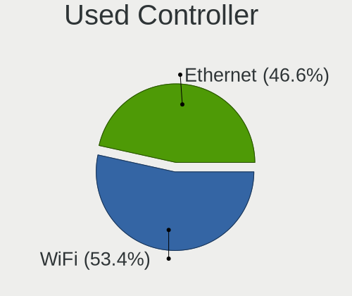

Manjaro - Hardware Trends
-------------------------

A project to identify most popular hardware characteristics and track their change
over time based on data collected by Linux users at https://Linux-Hardware.org.

Anyone can contribute to this report by the [hw-probe](https://github.com/linuxhw/hw-probe) tool:

    sudo -E hw-probe -all -upload

This is a report for all computer types. See also reports for [desktops](/Dist/Manjaro/Desktop/README.md) and [notebooks](/Dist/Manjaro/Notebook/README.md).

This report is for one last month. Overall report since the beginning of time: [TestDays](https://github.com/linuxhw/TestDays)

Period: May, 2023.

Contents
--------

* [ System ](#system)
  - [ OS                       ](#os)
  - [ OS Family                ](#os-family)
  - [ Kernel                   ](#kernel)
  - [ Kernel Family            ](#kernel-family)
  - [ Kernel Major Ver.        ](#kernel-major-ver)
  - [ Arch                     ](#arch)
  - [ DE                       ](#de)
  - [ Display Server           ](#display-server)
  - [ Display Manager          ](#display-manager)
  - [ OS Lang                  ](#os-lang)
  - [ Boot Mode                ](#boot-mode)
  - [ Filesystem               ](#filesystem)
  - [ Part. scheme             ](#part-scheme)
  - [ Dual Boot with Linux/BSD ](#dual-boot-with-linuxbsd)
  - [ Dual Boot (Win)          ](#dual-boot-win)

* [ Board ](#board)
  - [ Vendor                   ](#vendor)
  - [ Model                    ](#model)
  - [ Model Family             ](#model-family)
  - [ MFG Year                 ](#mfg-year)
  - [ Form Factor              ](#form-factor)
  - [ Secure Boot              ](#secure-boot)
  - [ Coreboot                 ](#coreboot)
  - [ RAM Size                 ](#ram-size)
  - [ RAM Used                 ](#ram-used)
  - [ Total Drives             ](#total-drives)
  - [ Has CD-ROM               ](#has-cd-rom)
  - [ Has Ethernet             ](#has-ethernet)
  - [ Has WiFi                 ](#has-wifi)
  - [ Has Bluetooth            ](#has-bluetooth)

* [ Location ](#location)
  - [ Country                  ](#country)
  - [ City                     ](#city)

* [ Drives ](#drives)
  - [ Drive Vendor             ](#drive-vendor)
  - [ Drive Model              ](#drive-model)
  - [ HDD Vendor               ](#hdd-vendor)
  - [ SSD Vendor               ](#ssd-vendor)
  - [ Drive Kind               ](#drive-kind)
  - [ Drive Connector          ](#drive-connector)
  - [ Drive Size               ](#drive-size)
  - [ Space Total              ](#space-total)
  - [ Space Used               ](#space-used)
  - [ Malfunc. Drives          ](#malfunc-drives)
  - [ Malfunc. Drive Vendor    ](#malfunc-drive-vendor)
  - [ Malfunc. HDD Vendor      ](#malfunc-hdd-vendor)
  - [ Malfunc. Drive Kind      ](#malfunc-drive-kind)
  - [ Failed Drives            ](#failed-drives)
  - [ Failed Drive Vendor      ](#failed-drive-vendor)
  - [ Drive Status             ](#drive-status)

* [ Storage controller ](#storage-controller)
  - [ Storage Vendor           ](#storage-vendor)
  - [ Storage Model            ](#storage-model)
  - [ Storage Kind             ](#storage-kind)

* [ Processor ](#processor)
  - [ CPU Vendor               ](#cpu-vendor)
  - [ CPU Model                ](#cpu-model)
  - [ CPU Model Family         ](#cpu-model-family)
  - [ CPU Cores                ](#cpu-cores)
  - [ CPU Sockets              ](#cpu-sockets)
  - [ CPU Threads              ](#cpu-threads)
  - [ CPU Op-Modes             ](#cpu-op-modes)
  - [ CPU Microcode            ](#cpu-microcode)
  - [ CPU Microarch            ](#cpu-microarch)

* [ Graphics ](#graphics)
  - [ GPU Vendor               ](#gpu-vendor)
  - [ GPU Model                ](#gpu-model)
  - [ GPU Combo                ](#gpu-combo)
  - [ GPU Driver               ](#gpu-driver)
  - [ GPU Memory               ](#gpu-memory)

* [ Monitor ](#monitor)
  - [ Monitor Vendor           ](#monitor-vendor)
  - [ Monitor Model            ](#monitor-model)
  - [ Monitor Resolution       ](#monitor-resolution)
  - [ Monitor Diagonal         ](#monitor-diagonal)
  - [ Monitor Width            ](#monitor-width)
  - [ Aspect Ratio             ](#aspect-ratio)
  - [ Monitor Area             ](#monitor-area)
  - [ Pixel Density            ](#pixel-density)
  - [ Multiple Monitors        ](#multiple-monitors)

* [ Network ](#network)
  - [ Net Controller Vendor    ](#net-controller-vendor)
  - [ Net Controller Model     ](#net-controller-model)
  - [ Wireless Vendor          ](#wireless-vendor)
  - [ Wireless Model           ](#wireless-model)
  - [ Ethernet Vendor          ](#ethernet-vendor)
  - [ Ethernet Model           ](#ethernet-model)
  - [ Net Controller Kind      ](#net-controller-kind)
  - [ Used Controller          ](#used-controller)
  - [ NICs                     ](#nics)
  - [ IPv6                     ](#ipv6)

* [ Bluetooth ](#bluetooth)
  - [ Bluetooth Vendor         ](#bluetooth-vendor)
  - [ Bluetooth Model          ](#bluetooth-model)

* [ Sound ](#sound)
  - [ Sound Vendor             ](#sound-vendor)
  - [ Sound Model              ](#sound-model)

* [ Memory ](#memory)
  - [ Memory Vendor            ](#memory-vendor)
  - [ Memory Model             ](#memory-model)
  - [ Memory Kind              ](#memory-kind)
  - [ Memory Form Factor       ](#memory-form-factor)
  - [ Memory Size              ](#memory-size)
  - [ Memory Speed             ](#memory-speed)

* [ Printers & scanners ](#printers--scanners)
  - [ Printer Vendor           ](#printer-vendor)
  - [ Printer Model            ](#printer-model)
  - [ Scanner Vendor           ](#scanner-vendor)
  - [ Scanner Model            ](#scanner-model)

* [ Camera ](#camera)
  - [ Camera Vendor            ](#camera-vendor)
  - [ Camera Model             ](#camera-model)

* [ Security ](#security)
  - [ Fingerprint Vendor       ](#fingerprint-vendor)
  - [ Fingerprint Model        ](#fingerprint-model)
  - [ Chipcard Vendor          ](#chipcard-vendor)
  - [ Chipcard Model           ](#chipcard-model)

* [ Unsupported ](#unsupported)
  - [ Unsupported Devices      ](#unsupported-devices)
  - [ Unsupported Device Types ](#unsupported-device-types)

System
------

OS
--

Installed operating systems

| Name           | Computers | Percent |
|----------------|-----------|---------|
| Manjaro        | 74        | 52.48%  |
| Manjaro 22.1.1 | 30        | 21.28%  |
| Manjaro 22.1.3 | 12        | 8.51%   |
| Manjaro 22.1.2 | 11        | 7.8%    |
| Manjaro 22.1.0 | 11        | 7.8%    |
| Manjaro 23.0.0 | 1         | 0.71%   |
| Manjaro 22.0.1 | 1         | 0.71%   |
| Manjaro 21.3.6 | 1         | 0.71%   |

OS Family
---------

OS without a version

| Name    | Computers | Percent |
|---------|-----------|---------|
| Manjaro | 141       | 100%    |

Kernel
------

Version of the Linux kernel

| Version                     | Computers | Percent |
|-----------------------------|-----------|---------|
| 6.1.26-1-MANJARO            | 36        | 25.53%  |
| 6.1.25-1-MANJARO            | 17        | 12.06%  |
| 6.3.0-1-MANJARO             | 13        | 9.22%   |
| 6.1.29-1-MANJARO            | 13        | 9.22%   |
| 6.3.3-1-MANJARO             | 9         | 6.38%   |
| 6.2.12-1-MANJARO            | 9         | 6.38%   |
| 6.1.30-1-MANJARO            | 9         | 6.38%   |
| 5.15.109-1-MANJARO          | 7         | 4.96%   |
| 5.15.108-1-MANJARO          | 5         | 3.55%   |
| 6.2.13-1-MANJARO            | 4         | 2.84%   |
| 6.2.16-1-MANJARO            | 2         | 1.42%   |
| 5.10.179-1-MANJARO          | 2         | 1.42%   |
| 6.3.4-2-MANJARO             | 1         | 0.71%   |
| 6.3.1-arch1-1-g14-3         | 1         | 0.71%   |
| 6.3.1-3-MANJARO             | 1         | 0.71%   |
| 6.2.9-x64v1-xanmod1-MANJARO | 1         | 0.71%   |
| 6.2.15-1-MANJARO            | 1         | 0.71%   |
| 6.2.14-2-MANJARO            | 1         | 0.71%   |
| 6.1.22-1-MANJARO            | 1         | 0.71%   |
| 6.0.5-2-rt14-MANJARO        | 1         | 0.71%   |
| 5.15.94-1-MANJARO           | 1         | 0.71%   |
| 5.15.113-1-MANJARO          | 1         | 0.71%   |
| 5.15.112-1-MANJARO          | 1         | 0.71%   |
| 5.14.21-2-MANJARO           | 1         | 0.71%   |
| 5.10.180-1-MANJARO          | 1         | 0.71%   |
| 5.10.178-1-MANJARO          | 1         | 0.71%   |
| 5.10.164-1-MANJARO          | 1         | 0.71%   |

Kernel Family
-------------

Linux kernel without a distro release

| Version  | Computers | Percent |
|----------|-----------|---------|
| 6.1.26   | 36        | 25.53%  |
| 6.1.25   | 17        | 12.06%  |
| 6.3.0    | 13        | 9.22%   |
| 6.1.29   | 13        | 9.22%   |
| 6.3.3    | 9         | 6.38%   |
| 6.2.12   | 9         | 6.38%   |
| 6.1.30   | 9         | 6.38%   |
| 5.15.109 | 7         | 4.96%   |
| 5.15.108 | 5         | 3.55%   |
| 6.2.13   | 4         | 2.84%   |
| 6.3.1    | 2         | 1.42%   |
| 6.2.16   | 2         | 1.42%   |
| 5.10.179 | 2         | 1.42%   |
| 6.3.4    | 1         | 0.71%   |
| 6.2.9    | 1         | 0.71%   |
| 6.2.15   | 1         | 0.71%   |
| 6.2.14   | 1         | 0.71%   |
| 6.1.22   | 1         | 0.71%   |
| 6.0.5    | 1         | 0.71%   |
| 5.15.94  | 1         | 0.71%   |
| 5.15.113 | 1         | 0.71%   |
| 5.15.112 | 1         | 0.71%   |
| 5.14.21  | 1         | 0.71%   |
| 5.10.180 | 1         | 0.71%   |
| 5.10.178 | 1         | 0.71%   |
| 5.10.164 | 1         | 0.71%   |

Kernel Major Ver.
-----------------

Linux kernel major version

| Version | Computers | Percent |
|---------|-----------|---------|
| 6.1     | 76        | 53.9%   |
| 6.3     | 25        | 17.73%  |
| 6.2     | 18        | 12.77%  |
| 5.15    | 15        | 10.64%  |
| 5.10    | 5         | 3.55%   |
| 6.0     | 1         | 0.71%   |
| 5.14    | 1         | 0.71%   |

Arch
----

OS architecture (x86_64, i586, etc.)

| Name   | Computers | Percent |
|--------|-----------|---------|
| x86_64 | 141       | 100%    |

DE
--

Desktop Environment

| Name       | Computers | Percent |
|------------|-----------|---------|
| KDE5       | 83        | 58.87%  |
| GNOME      | 25        | 17.73%  |
| XFCE       | 20        | 14.18%  |
| X-Cinnamon | 3         | 2.13%   |
| i3         | 3         | 2.13%   |
| Unknown    | 3         | 2.13%   |
| sway       | 1         | 0.71%   |
| qtile      | 1         | 0.71%   |
| LXQt       | 1         | 0.71%   |
| KDE        | 1         | 0.71%   |

Display Server
--------------

X11 or Wayland

| Name    | Computers | Percent |
|---------|-----------|---------|
| X11     | 111       | 78.72%  |
| Wayland | 26        | 18.44%  |
| Tty     | 2         | 1.42%   |
| Unknown | 2         | 1.42%   |

Display Manager
---------------

SDDM, LightDM, etc.

| Name    | Computers | Percent |
|---------|-----------|---------|
| Unknown | 75        | 53.19%  |
| SDDM    | 40        | 28.37%  |
| LightDM | 17        | 12.06%  |
| GDM     | 9         | 6.38%   |

OS Lang
-------

Language

| Lang    | Computers | Percent |
|---------|-----------|---------|
| en_US   | 55        | 39.01%  |
| pt_BR   | 12        | 8.51%   |
| en_GB   | 12        | 8.51%   |
| de_DE   | 12        | 8.51%   |
| ru_RU   | 7         | 4.96%   |
| it_IT   | 5         | 3.55%   |
| pl_PL   | 4         | 2.84%   |
| fr_FR   | 4         | 2.84%   |
| en_CA   | 4         | 2.84%   |
| en_AU   | 4         | 2.84%   |
| es_UY   | 2         | 1.42%   |
| es_ES   | 2         | 1.42%   |
| Unknown | 2         | 1.42%   |
| tr_TR   | 1         | 0.71%   |
| nl_NL   | 1         | 0.71%   |
| hu_HU   | 1         | 0.71%   |
| es_PR   | 1         | 0.71%   |
| es_PE   | 1         | 0.71%   |
| es_MX   | 1         | 0.71%   |
| es_GT   | 1         | 0.71%   |
| es_CO   | 1         | 0.71%   |
| es_CL   | 1         | 0.71%   |
| en_NZ   | 1         | 0.71%   |
| en_IN   | 1         | 0.71%   |
| en_DE   | 1         | 0.71%   |
| de_CH   | 1         | 0.71%   |
| de_AT   | 1         | 0.71%   |
| cs_CZ   | 1         | 0.71%   |
| ca_ES   | 1         | 0.71%   |

Boot Mode
---------

EFI or BIOS

| Mode | Computers | Percent |
|------|-----------|---------|
| BIOS | 88        | 62.41%  |
| EFI  | 53        | 37.59%  |

Filesystem
----------

Type of filesystem

| Type  | Computers | Percent |
|-------|-----------|---------|
| Ext4  | 106       | 75.18%  |
| Btrfs | 17        | 12.06%  |
| Tmpfs | 14        | 9.93%   |
| Xfs   | 3         | 2.13%   |
| Ext2  | 1         | 0.71%   |

Part. scheme
------------

Scheme of partitioning

| Type    | Computers | Percent |
|---------|-----------|---------|
| Unknown | 70        | 49.65%  |
| GPT     | 62        | 43.97%  |
| MBR     | 9         | 6.38%   |

Dual Boot with Linux/BSD
------------------------

Hosting more than one Linux/BSD

| Dual boot | Computers | Percent |
|-----------|-----------|---------|
| No        | 125       | 88.65%  |
| Yes       | 16        | 11.35%  |

Dual Boot (Win)
---------------

Hosting Linux and Windows

| Dual boot | Computers | Percent |
|-----------|-----------|---------|
| No        | 110       | 78.01%  |
| Yes       | 31        | 21.99%  |

Board
-----

Vendor
------

Motherboard manufacturer

| Name                | Computers | Percent |
|---------------------|-----------|---------|
| ASUSTek Computer    | 23        | 16.31%  |
| Lenovo              | 22        | 15.6%   |
| Hewlett-Packard     | 21        | 14.89%  |
| Dell                | 14        | 9.93%   |
| MSI                 | 13        | 9.22%   |
| Gigabyte Technology | 11        | 7.8%    |
| Intel               | 7         | 4.96%   |
| Acer                | 7         | 4.96%   |
| ASRock              | 6         | 4.26%   |
| Unknown             | 3         | 2.13%   |
| Apple               | 2         | 1.42%   |
| TUXEDO              | 1         | 0.71%   |
| Toshiba             | 1         | 0.71%   |
| Tactus              | 1         | 0.71%   |
| Sony                | 1         | 0.71%   |
| Schenker            | 1         | 0.71%   |
| Positivo            | 1         | 0.71%   |
| MECHREVO            | 1         | 0.71%   |
| Itautec             | 1         | 0.71%   |
| Getac               | 1         | 0.71%   |
| Gateway             | 1         | 0.71%   |
| Framework           | 1         | 0.71%   |
| AMI                 | 1         | 0.71%   |

Model
-----

Motherboard model

| Name                                     | Computers | Percent |
|------------------------------------------|-----------|---------|
| Unknown                                  | 3         | 2.13%   |
| HP Laptop 15-ef2xxx                      | 2         | 1.42%   |
| Acer Nitro AN517-54                      | 2         | 1.42%   |
| TUXEDO N24_25BU                          | 1         | 0.71%   |
| Toshiba Satellite L855                   | 1         | 0.71%   |
| Tactus GeoFlex 110                       | 1         | 0.71%   |
| Sony SVE1513Z1EB                         | 1         | 0.71%   |
| Schenker VISION (E22)                    | 1         | 0.71%   |
| Positivo POS-EIQ87CY                     | 1         | 0.71%   |
| MSI MS-7E07                              | 1         | 0.71%   |
| MSI MS-7D67                              | 1         | 0.71%   |
| MSI MS-7C96                              | 1         | 0.71%   |
| MSI MS-7C95                              | 1         | 0.71%   |
| MSI MS-7C37                              | 1         | 0.71%   |
| MSI MS-7C02                              | 1         | 0.71%   |
| MSI MS-7A35                              | 1         | 0.71%   |
| MSI MS-7816                              | 1         | 0.71%   |
| MSI MS-7641                              | 1         | 0.71%   |
| MSI MS-7597                              | 1         | 0.71%   |
| MSI MS-7589                              | 1         | 0.71%   |
| MSI Katana GF76 12UGSO                   | 1         | 0.71%   |
| MSI GT70 2PC                             | 1         | 0.71%   |
| MECHREVO WUJIE16 Pro                     | 1         | 0.71%   |
| Lenovo V15 G2 ITL 82KB                   | 1         | 0.71%   |
| Lenovo V15 G2 ALC 82KD                   | 1         | 0.71%   |
| Lenovo ThinkStation P320 Tiny 30C2001XRU | 1         | 0.71%   |
| Lenovo ThinkPad X230 2325SV7             | 1         | 0.71%   |
| Lenovo ThinkPad W541 20EGS1AR00          | 1         | 0.71%   |
| Lenovo ThinkPad T470s 20HF0000MD         | 1         | 0.71%   |
| Lenovo ThinkPad T470 W10DG 20JNS1FJ00    | 1         | 0.71%   |
| Lenovo ThinkPad T14 Gen 3 21AJS0E700     | 1         | 0.71%   |
| Lenovo ThinkPad P51 20HJS02000           | 1         | 0.71%   |
| Lenovo ThinkPad P14s Gen 3 21AK0054FR    | 1         | 0.71%   |
| Lenovo ThinkPad P14s Gen 2a 21A0000QGE   | 1         | 0.71%   |
| Lenovo ThinkPad L470 20J5S01S00          | 1         | 0.71%   |
| Lenovo ThinkCentre M71z 1761E4U          | 1         | 0.71%   |
| Lenovo Legion T5 26IAB7 90SV00ACFR       | 1         | 0.71%   |
| Lenovo Legion 5 Pro 16ARH7H 82RG         | 1         | 0.71%   |
| Lenovo Legion 5 Pro 16ACH6H 82JQ         | 1         | 0.71%   |
| Lenovo IdeaPad L340-17IRH Gaming 81LL    | 1         | 0.71%   |

Model Family
------------

Motherboard model prefix

| Name                 | Computers | Percent |
|----------------------|-----------|---------|
| Lenovo ThinkPad      | 9         | 6.38%   |
| ASUS ROG             | 9         | 6.38%   |
| HP Laptop            | 6         | 4.26%   |
| Lenovo IdeaPad       | 5         | 3.55%   |
| ASUS TUF             | 5         | 3.55%   |
| Lenovo Legion        | 3         | 2.13%   |
| HP Pavilion          | 3         | 2.13%   |
| HP EliteBook         | 3         | 2.13%   |
| Dell XPS             | 3         | 2.13%   |
| Dell Precision       | 3         | 2.13%   |
| Dell Inspiron        | 3         | 2.13%   |
| ASUS VivoBook        | 3         | 2.13%   |
| Unknown              | 3         | 2.13%   |
| Lenovo V15           | 2         | 1.42%   |
| Intel H61            | 2         | 1.42%   |
| HP OMEN              | 2         | 1.42%   |
| HP Compaq            | 2         | 1.42%   |
| Dell Vostro          | 2         | 1.42%   |
| ASUS M5A78L-M        | 2         | 1.42%   |
| ASUS ASUS            | 2         | 1.42%   |
| Acer Swift           | 2         | 1.42%   |
| Acer Nitro           | 2         | 1.42%   |
| Acer Aspire          | 2         | 1.42%   |
| TUXEDO N24           | 1         | 0.71%   |
| Toshiba Satellite    | 1         | 0.71%   |
| Tactus GeoFlex       | 1         | 0.71%   |
| Sony SVE1513Z1EB     | 1         | 0.71%   |
| Schenker VISION      | 1         | 0.71%   |
| Positivo POS-EIQ87CY | 1         | 0.71%   |
| MSI MS-7E07          | 1         | 0.71%   |
| MSI MS-7D67          | 1         | 0.71%   |
| MSI MS-7C96          | 1         | 0.71%   |
| MSI MS-7C95          | 1         | 0.71%   |
| MSI MS-7C37          | 1         | 0.71%   |
| MSI MS-7C02          | 1         | 0.71%   |
| MSI MS-7A35          | 1         | 0.71%   |
| MSI MS-7816          | 1         | 0.71%   |
| MSI MS-7641          | 1         | 0.71%   |
| MSI MS-7597          | 1         | 0.71%   |
| MSI MS-7589          | 1         | 0.71%   |

MFG Year
--------

Motherboard manufacture year

| Year | Computers | Percent |
|------|-----------|---------|
| 2022 | 28        | 19.86%  |
| 2021 | 25        | 17.73%  |
| 2017 | 13        | 9.22%   |
| 2019 | 12        | 8.51%   |
| 2018 | 11        | 7.8%    |
| 2011 | 9         | 6.38%   |
| 2020 | 8         | 5.67%   |
| 2014 | 6         | 4.26%   |
| 2016 | 5         | 3.55%   |
| 2012 | 5         | 3.55%   |
| 2009 | 5         | 3.55%   |
| 2013 | 4         | 2.84%   |
| 2015 | 3         | 2.13%   |
| 2023 | 2         | 1.42%   |
| 2010 | 2         | 1.42%   |
| 2008 | 2         | 1.42%   |
| 2007 | 1         | 0.71%   |

Form Factor
-----------

Physical design of the computer

| Name        | Computers | Percent |
|-------------|-----------|---------|
| Notebook    | 76        | 53.9%   |
| Desktop     | 60        | 42.55%  |
| Mini pc     | 3         | 2.13%   |
| Convertible | 2         | 1.42%   |

Secure Boot
-----------

Enabled or disabled

| State    | Computers | Percent |
|----------|-----------|---------|
| Disabled | 141       | 100%    |

Coreboot
--------

Have coreboot on board

| Used | Computers | Percent |
|------|-----------|---------|
| No   | 141       | 100%    |

RAM Size
--------

Total RAM memory

| Size in GB  | Computers | Percent |
|-------------|-----------|---------|
| 32.01-64.0  | 32        | 22.7%   |
| 4.01-8.0    | 29        | 20.57%  |
| 16.01-24.0  | 28        | 19.86%  |
| 8.01-16.0   | 27        | 19.15%  |
| 3.01-4.0    | 9         | 6.38%   |
| 64.01-256.0 | 8         | 5.67%   |
| 24.01-32.0  | 7         | 4.96%   |
| 2.01-3.0    | 1         | 0.71%   |

RAM Used
--------

Used RAM memory

| Used GB    | Computers | Percent |
|------------|-----------|---------|
| 4.01-8.0   | 49        | 34.75%  |
| 2.01-3.0   | 37        | 26.24%  |
| 1.01-2.0   | 17        | 12.06%  |
| 8.01-16.0  | 17        | 12.06%  |
| 3.01-4.0   | 16        | 11.35%  |
| 24.01-32.0 | 3         | 2.13%   |
| 0.51-1.0   | 1         | 0.71%   |
| 0.01-0.5   | 1         | 0.71%   |

Total Drives
------------

Number of drives on board

| Drives | Computers | Percent |
|--------|-----------|---------|
| 1      | 69        | 48.94%  |
| 2      | 41        | 29.08%  |
| 3      | 15        | 10.64%  |
| 5      | 6         | 4.26%   |
| 4      | 6         | 4.26%   |
| 6      | 3         | 2.13%   |
| 8      | 1         | 0.71%   |

Has CD-ROM
----------

Has CD-ROM on board

| Presented | Computers | Percent |
|-----------|-----------|---------|
| No        | 108       | 76.6%   |
| Yes       | 33        | 23.4%   |

Has Ethernet
------------

Has Ethernet on board

| Presented | Computers | Percent |
|-----------|-----------|---------|
| Yes       | 121       | 85.82%  |
| No        | 20        | 14.18%  |

Has WiFi
--------

Has WiFi module

| Presented | Computers | Percent |
|-----------|-----------|---------|
| Yes       | 108       | 76.6%   |
| No        | 33        | 23.4%   |

Has Bluetooth
-------------

Has Bluetooth module

| Presented | Computers | Percent |
|-----------|-----------|---------|
| Yes       | 96        | 68.09%  |
| No        | 45        | 31.91%  |

Location
--------

Country
-------

Geographic location (country)

| Country            | Computers | Percent |
|--------------------|-----------|---------|
| USA                | 22        | 15.6%   |
| Brazil             | 17        | 12.06%  |
| Germany            | 16        | 11.35%  |
| Russia             | 10        | 7.09%   |
| Netherlands        | 7         | 4.96%   |
| Italy              | 7         | 4.96%   |
| Poland             | 6         | 4.26%   |
| France             | 5         | 3.55%   |
| Canada             | 5         | 3.55%   |
| Australia          | 4         | 2.84%   |
| Uruguay            | 3         | 2.13%   |
| Spain              | 3         | 2.13%   |
| Turkey             | 2         | 1.42%   |
| Kenya              | 2         | 1.42%   |
| India              | 2         | 1.42%   |
| Dominican Republic | 2         | 1.42%   |
| UK                 | 1         | 0.71%   |
| Tunisia            | 1         | 0.71%   |
| Thailand           | 1         | 0.71%   |
| Taiwan             | 1         | 0.71%   |
| Switzerland        | 1         | 0.71%   |
| Sweden             | 1         | 0.71%   |
| Slovakia           | 1         | 0.71%   |
| Serbia             | 1         | 0.71%   |
| Romania            | 1         | 0.71%   |
| Puerto Rico        | 1         | 0.71%   |
| Peru               | 1         | 0.71%   |
| Norway             | 1         | 0.71%   |
| North Macedonia    | 1         | 0.71%   |
| New Zealand        | 1         | 0.71%   |
| Myanmar            | 1         | 0.71%   |
| Mexico             | 1         | 0.71%   |
| Lithuania          | 1         | 0.71%   |
| Hungary            | 1         | 0.71%   |
| Guatemala          | 1         | 0.71%   |
| Finland            | 1         | 0.71%   |
| Denmark            | 1         | 0.71%   |
| Czechia            | 1         | 0.71%   |
| Croatia            | 1         | 0.71%   |
| Colombia           | 1         | 0.71%   |

City
----

Geographic location (city)

| City              | Computers | Percent |
|-------------------|-----------|---------|
| Sao Paulo         | 3         | 2.13%   |
| Moscow            | 3         | 2.13%   |
| Berlin            | 3         | 2.13%   |
| Amsterdam         | 3         | 2.13%   |
| Tacoma            | 2         | 1.42%   |
| St Petersburg     | 2         | 1.42%   |
| Nantes            | 2         | 1.42%   |
| Munich            | 2         | 1.42%   |
| Montevideo        | 2         | 1.42%   |
| Milan             | 2         | 1.42%   |
| Kikuyu            | 2         | 1.42%   |
| Juazeiro do Norte | 2         | 1.42%   |
| Fortaleza         | 2         | 1.42%   |
| Calgary           | 2         | 1.42%   |
| Zagreb            | 1         | 0.71%   |
| Yekaterinburg     | 1         | 0.71%   |
| Yangon            | 1         | 0.71%   |
| Wuppertal         | 1         | 0.71%   |
| Wroclaw           | 1         | 0.71%   |
| Vilnius           | 1         | 0.71%   |
| Vienna            | 1         | 0.71%   |
| Viby J            | 1         | 0.71%   |
| Topeka            | 1         | 0.71%   |
| Thun              | 1         | 0.71%   |
| Tetovo            | 1         | 0.71%   |
| Taichung          | 1         | 0.71%   |
| Sydney            | 1         | 0.71%   |
| Surgut            | 1         | 0.71%   |
| Suchy Las         | 1         | 0.71%   |
| Sucha Beskidzka   | 1         | 0.71%   |
| Staufenberg       | 1         | 0.71%   |
| Springdale        | 1         | 0.71%   |
| Spring            | 1         | 0.71%   |
| Spokane           | 1         | 0.71%   |
| Snappertuna       | 1         | 0.71%   |
| Skalbmierz        | 1         | 0.71%   |
| Sfax              | 1         | 0.71%   |
| Saratov           | 1         | 0.71%   |
| Santiago          | 1         | 0.71%   |
| SantAntioco       | 1         | 0.71%   |

Drives
------

Drive Vendor
------------

Hard drive vendors

| Vendor                      | Computers | Drives | Percent |
|-----------------------------|-----------|--------|---------|
| Samsung Electronics         | 46        | 59     | 19.74%  |
| Seagate                     | 24        | 27     | 10.3%   |
| WDC                         | 23        | 33     | 9.87%   |
| Sandisk                     | 15        | 16     | 6.44%   |
| Crucial                     | 12        | 14     | 5.15%   |
| Kingston                    | 11        | 12     | 4.72%   |
| Micron/Crucial Technology   | 9         | 9      | 3.86%   |
| Toshiba                     | 7         | 8      | 3%      |
| SK hynix                    | 7         | 7      | 3%      |
| Phison Electronics          | 7         | 8      | 3%      |
| Micron Technology           | 7         | 8      | 3%      |
| Unknown                     | 6         | 7      | 2.58%   |
| Intel                       | 6         | 8      | 2.58%   |
| China                       | 6         | 7      | 2.58%   |
| A-DATA Technology           | 5         | 5      | 2.15%   |
| Realtek Semiconductor       | 4         | 4      | 1.72%   |
| Silicon Motion              | 3         | 3      | 1.29%   |
| KIOXIA                      | 3         | 3      | 1.29%   |
| Kingston Technology Company | 3         | 3      | 1.29%   |
| Hitachi                     | 3         | 3      | 1.29%   |
| Team                        | 2         | 3      | 0.86%   |
| SPCC                        | 2         | 2      | 0.86%   |
| Intenso                     | 2         | 2      | 0.86%   |
| HGST                        | 2         | 2      | 0.86%   |
| WD MediaMax                 | 1         | 2      | 0.43%   |
| USB3.0                      | 1         | 1      | 0.43%   |
| Union Memory                | 1         | 1      | 0.43%   |
| Transcend                   | 1         | 1      | 0.43%   |
| Solid State Storage         | 1         | 1      | 0.43%   |
| PNY                         | 1         | 1      | 0.43%   |
| OSCOO                       | 1         | 1      | 0.43%   |
| Netac                       | 1         | 1      | 0.43%   |
| MAXIO Technology (Hangzhou) | 1         | 1      | 0.43%   |
| MARSHAL                     | 1         | 1      | 0.43%   |
| LITEON                      | 1         | 1      | 0.43%   |
| HS-SSD-E100                 | 1         | 1      | 0.43%   |
| Hewlett-Packard             | 1         | 1      | 0.43%   |
| CT500P3S                    | 1         | 1      | 0.43%   |
| BAITITON                    | 1         | 2      | 0.43%   |
| Apple                       | 1         | 1      | 0.43%   |

Drive Model
-----------

Hard drive models

| Model                                               | Computers | Percent |
|-----------------------------------------------------|-----------|---------|
| Samsung NVMe SSD Controller SM981/PM981/PM983 256GB | 10        | 3.94%   |
| Samsung NVMe SSD Controller PM9A1/PM9A3/980PRO 1TB  | 10        | 3.94%   |
| Crucial CT1000MX500SSD1 1TB                         | 6         | 2.36%   |
| Micron/Crucial P2 NVMe PCIe SSD 1TB                 | 5         | 1.97%   |
| Phison E16 PCIe4 NVMe Controller 1TB                | 4         | 1.57%   |
| WDC WD10EZEX-08WN4A0 1TB                            | 3         | 1.18%   |
| Seagate ST2000DM008-2FR102 2TB                      | 3         | 1.18%   |
| Sandisk WD Black SN750 / PC SN730 NVMe SSD 256GB    | 3         | 1.18%   |
| Samsung SSD 860 EVO 500GB                           | 3         | 1.18%   |
| China SSD 1TB                                       | 3         | 1.18%   |
| WDC WD40EFRX-68N32N0 4TB                            | 2         | 0.79%   |
| Unknown MMC Card  64GB                              | 2         | 0.79%   |
| Toshiba DT01ACA300 3TB                              | 2         | 0.79%   |
| SK hynix BC511 256GB                                | 2         | 0.79%   |
| Silicon Motion SM2263EN/SM2263XT SSD Controller 1TB | 2         | 0.79%   |
| Seagate ST500DM002-1BD142 500GB                     | 2         | 0.79%   |
| Seagate ST1000DM003-1CH162 1TB                      | 2         | 0.79%   |
| Seagate FireCuda 530 ZP1000GM30013 1TB              | 2         | 0.79%   |
| Sandisk WD Blue SN550 NVMe SSD 512GB                | 2         | 0.79%   |
| Sandisk WD Black SN850 500GB                        | 2         | 0.79%   |
| SanDisk Extreme 55AE 1TB SSD                        | 2         | 0.79%   |
| Samsung SSD 870 QVO 2TB                             | 2         | 0.79%   |
| Samsung SSD 860 EVO 1TB                             | 2         | 0.79%   |
| Realtek SPCC M.2 PCIe SSD 1TB                       | 2         | 0.79%   |
| Realtek RTS5763DL NVMe SSD Controller 512GB         | 2         | 0.79%   |
| Micron 2210_MTFDHBA512QFD 512GB                     | 2         | 0.79%   |
| KIOXIA KBG40ZNV256G 256GB                           | 2         | 0.79%   |
| Kingston SV300S37A480G 480GB SSD                    | 2         | 0.79%   |
| Intel SSD 660P Series 512GB                         | 2         | 0.79%   |
| Crucial CT500MX500SSD1 500GB                        | 2         | 0.79%   |
| Crucial CT2000BX500SSD1 2TB                         | 2         | 0.79%   |
| WDC WDS480G2G0A-00JH30 480GB SSD                    | 1         | 0.39%   |
| WDC WDS200T1R0B-68A4Z0 2TB SSD                      | 1         | 0.39%   |
| WDC WDS100T2B0A-00SM50 1TB SSD                      | 1         | 0.39%   |
| WDC WD7500BPVT-55HXZT4 752GB                        | 1         | 0.39%   |
| WDC WD5000BPVT-00HXZT3 500GB                        | 1         | 0.39%   |
| WDC WD5000BEVT-60ZAT1 500GB                         | 1         | 0.39%   |
| WDC WD40PURZ-85TTDY0 4TB                            | 1         | 0.39%   |
| WDC WD4005FZBX-00K5WB0 4TB                          | 1         | 0.39%   |
| WDC WD30EZRZ-00GXCB0 3TB                            | 1         | 0.39%   |

HDD Vendor
----------

Hard disk drive vendors

| Vendor              | Computers | Drives | Percent |
|---------------------|-----------|--------|---------|
| Seagate             | 22        | 25     | 36.07%  |
| WDC                 | 20        | 30     | 32.79%  |
| Toshiba             | 7         | 8      | 11.48%  |
| Samsung Electronics | 4         | 4      | 6.56%   |
| Hitachi             | 3         | 3      | 4.92%   |
| HGST                | 2         | 2      | 3.28%   |
| USB3.0              | 1         | 1      | 1.64%   |
| MARSHAL             | 1         | 1      | 1.64%   |
| Hewlett-Packard     | 1         | 1      | 1.64%   |

SSD Vendor
----------

Solid state drive vendors

| Vendor              | Computers | Drives | Percent |
|---------------------|-----------|--------|---------|
| Samsung Electronics | 24        | 27     | 30.38%  |
| Crucial             | 12        | 14     | 15.19%  |
| Kingston            | 8         | 8      | 10.13%  |
| China               | 6         | 7      | 7.59%   |
| SanDisk             | 5         | 6      | 6.33%   |
| A-DATA Technology   | 5         | 5      | 6.33%   |
| WDC                 | 3         | 3      | 3.8%    |
| Team                | 2         | 3      | 2.53%   |
| SPCC                | 2         | 2      | 2.53%   |
| Micron Technology   | 2         | 3      | 2.53%   |
| Intenso             | 2         | 2      | 2.53%   |
| Transcend           | 1         | 1      | 1.27%   |
| PNY                 | 1         | 1      | 1.27%   |
| OSCOO               | 1         | 1      | 1.27%   |
| Netac               | 1         | 1      | 1.27%   |
| LITEON              | 1         | 1      | 1.27%   |
| Intel               | 1         | 1      | 1.27%   |
| BAITITON            | 1         | 2      | 1.27%   |
| Apple               | 1         | 1      | 1.27%   |

Drive Kind
----------

HDD or SSD

| Kind    | Computers | Drives | Percent |
|---------|-----------|--------|---------|
| NVMe    | 79        | 99     | 37.98%  |
| SSD     | 66        | 89     | 31.73%  |
| HDD     | 55        | 75     | 26.44%  |
| Unknown | 5         | 7      | 2.4%    |
| MMC     | 3         | 3      | 1.44%   |

Drive Connector
---------------

SATA, SAS, NVMe, etc.

| Type | Computers | Drives | Percent |
|------|-----------|--------|---------|
| SATA | 93        | 157    | 50.27%  |
| NVMe | 79        | 99     | 42.7%   |
| SAS  | 10        | 14     | 5.41%   |
| MMC  | 3         | 3      | 1.62%   |

Drive Size
----------

Size of hard drive

| Size in TB | Computers | Drives | Percent |
|------------|-----------|--------|---------|
| 0.01-0.5   | 59        | 69     | 45.04%  |
| 0.51-1.0   | 37        | 46     | 28.24%  |
| 1.01-2.0   | 21        | 28     | 16.03%  |
| 2.01-3.0   | 7         | 10     | 5.34%   |
| 3.01-4.0   | 5         | 8      | 3.82%   |
| 4.01-10.0  | 2         | 3      | 1.53%   |

Space Total
-----------

Amount of disk space available on the file system

| Size in GB     | Computers | Percent |
|----------------|-----------|---------|
| 251-500        | 31        | 21.99%  |
| 501-1000       | 25        | 17.73%  |
| 101-250        | 24        | 17.02%  |
| 1001-2000      | 19        | 13.48%  |
| More than 3000 | 12        | 8.51%   |
| Unknown        | 11        | 7.8%    |
| 2001-3000      | 9         | 6.38%   |
| 51-100         | 8         | 5.67%   |
| 21-50          | 1         | 0.71%   |
| 1-20           | 1         | 0.71%   |

Space Used
----------

Amount of used disk space

| Used GB        | Computers | Percent |
|----------------|-----------|---------|
| 21-50          | 24        | 17.02%  |
| 101-250        | 22        | 15.6%   |
| 251-500        | 20        | 14.18%  |
| 1-20           | 16        | 11.35%  |
| 501-1000       | 16        | 11.35%  |
| 51-100         | 16        | 11.35%  |
| Unknown        | 11        | 7.8%    |
| 1001-2000      | 8         | 5.67%   |
| 2001-3000      | 5         | 3.55%   |
| More than 3000 | 3         | 2.13%   |

Malfunc. Drives
---------------

Drive models with a malfunction

| Model                                         | Computers | Drives | Percent |
|-----------------------------------------------|-----------|--------|---------|
| WDC WDS480G2G0A-00JH30 480GB SSD              | 1         | 1      | 12.5%   |
| Seagate ST9320325AS 320GB                     | 1         | 1      | 12.5%   |
| Seagate ST31000528AS 1TB                      | 1         | 1      | 12.5%   |
| Samsung Electronics SSD 870 EVO 1TB           | 1         | 1      | 12.5%   |
| Micron Technology MTFDDAK512MAM-1K1 512GB SSD | 1         | 1      | 12.5%   |
| MARSHAL MAL2500SA-T54L 500GB                  | 1         | 1      | 12.5%   |
| HGST HTS725032A7E630 320GB                    | 1         | 1      | 12.5%   |
| A-DATA Technology SU650 240GB SSD             | 1         | 1      | 12.5%   |

Malfunc. Drive Vendor
---------------------

Vendors of faulty drives

| Vendor              | Computers | Drives | Percent |
|---------------------|-----------|--------|---------|
| Seagate             | 2         | 2      | 25%     |
| WDC                 | 1         | 1      | 12.5%   |
| Samsung Electronics | 1         | 1      | 12.5%   |
| Micron Technology   | 1         | 1      | 12.5%   |
| MARSHAL             | 1         | 1      | 12.5%   |
| HGST                | 1         | 1      | 12.5%   |
| A-DATA Technology   | 1         | 1      | 12.5%   |

Malfunc. HDD Vendor
-------------------

Vendors of faulty HDD drives

| Vendor  | Computers | Drives | Percent |
|---------|-----------|--------|---------|
| Seagate | 2         | 2      | 50%     |
| MARSHAL | 1         | 1      | 25%     |
| HGST    | 1         | 1      | 25%     |

Malfunc. Drive Kind
-------------------

Kinds of faulty drives

| Kind | Computers | Drives | Percent |
|------|-----------|--------|---------|
| SSD  | 4         | 4      | 50%     |
| HDD  | 4         | 4      | 50%     |

Failed Drives
-------------

Failed drive models

Zero info for selected period =(

Failed Drive Vendor
-------------------

Failed drive vendors

Zero info for selected period =(

Drive Status
------------

Number of failed and malfunc. drives

| Status   | Computers | Drives | Percent |
|----------|-----------|--------|---------|
| Detected | 103       | 190    | 69.13%  |
| Works    | 38        | 75     | 25.5%   |
| Malfunc  | 8         | 8      | 5.37%   |

Storage controller
------------------

Storage Vendor
--------------

Storage controller vendors

| Vendor                         | Computers | Percent |
|--------------------------------|-----------|---------|
| Intel                          | 76        | 36.19%  |
| AMD                            | 41        | 19.52%  |
| Samsung Electronics            | 22        | 10.48%  |
| SanDisk                        | 10        | 4.76%   |
| Micron/Crucial Technology      | 9         | 4.29%   |
| SK hynix                       | 7         | 3.33%   |
| Phison Electronics             | 7         | 3.33%   |
| Kingston Technology Company    | 7         | 3.33%   |
| Micron Technology              | 5         | 2.38%   |
| Realtek Semiconductor          | 4         | 1.9%    |
| Silicon Motion                 | 3         | 1.43%   |
| KIOXIA                         | 3         | 1.43%   |
| ASMedia Technology             | 3         | 1.43%   |
| Seagate Technology             | 2         | 0.95%   |
| Nvidia                         | 2         | 0.95%   |
| Marvell Technology Group       | 2         | 0.95%   |
| VIA Technologies               | 1         | 0.48%   |
| Union Memory (Shenzhen)        | 1         | 0.48%   |
| Solid State Storage Technology | 1         | 0.48%   |
| MAXIO Technology (Hangzhou)    | 1         | 0.48%   |
| INNOGRIT                       | 1         | 0.48%   |
| ADATA Technology               | 1         | 0.48%   |
| Unknown                        | 1         | 0.48%   |

Storage Model
-------------

Storage controller models

| Model                                                                          | Computers | Percent |
|--------------------------------------------------------------------------------|-----------|---------|
| AMD FCH SATA Controller [AHCI mode]                                            | 25        | 10.68%  |
| Samsung NVMe SSD Controller SM981/PM981/PM983                                  | 10        | 4.27%   |
| Samsung NVMe SSD Controller PM9A1/PM9A3/980PRO                                 | 10        | 4.27%   |
| Intel Volume Management Device NVMe RAID Controller                            | 8         | 3.42%   |
| AMD 500 Series Chipset SATA Controller                                         | 7         | 2.99%   |
| Intel Sunrise Point-LP SATA Controller [AHCI mode]                             | 6         | 2.56%   |
| Intel 8 Series/C220 Series Chipset Family 6-port SATA Controller 1 [AHCI mode] | 6         | 2.56%   |
| Intel 7 Series Chipset Family 6-port SATA Controller [AHCI mode]               | 6         | 2.56%   |
| Micron/Crucial P2 NVMe PCIe SSD                                                | 5         | 2.14%   |
| Micron NVMe Storage Controller                                                 | 5         | 2.14%   |
| Intel 500 Series Chipset Family SATA AHCI Controller                           | 5         | 2.14%   |
| AMD SB7x0/SB8x0/SB9x0 IDE Controller                                           | 5         | 2.14%   |
| SK hynix Gold P31/PC711 NVMe Solid State Drive                                 | 4         | 1.71%   |
| Phison E16 PCIe4 NVMe Controller                                               | 4         | 1.71%   |
| Intel Tiger Lake-LP SATA Controller                                            | 4         | 1.71%   |
| Intel SATA Controller [RAID mode]                                              | 4         | 1.71%   |
| Intel Cannon Lake Mobile PCH SATA AHCI Controller                              | 4         | 1.71%   |
| Intel Alder Lake-P SATA AHCI Controller                                        | 4         | 1.71%   |
| Intel 6 Series/C200 Series Chipset Family 6 port Mobile SATA AHCI Controller   | 4         | 1.71%   |
| Intel 6 Series/C200 Series Chipset Family 6 port Desktop SATA AHCI Controller  | 4         | 1.71%   |
| SanDisk WD Black SN750 / PC SN730 NVMe SSD                                     | 3         | 1.28%   |
| Micron/Crucial NVMe Storage Controller                                         | 3         | 1.28%   |
| KIOXIA NVMe SSD Controller BG4                                                 | 3         | 1.28%   |
| Kingston Company Company Non-Volatile memory controller                        | 3         | 1.28%   |
| Kingston Company NVMe Controller                                               | 3         | 1.28%   |
| ASMedia ASM1062 Serial ATA Controller                                          | 3         | 1.28%   |
| AMD SB7x0/SB8x0/SB9x0 SATA Controller [IDE mode]                               | 3         | 1.28%   |
| AMD SB7x0/SB8x0/SB9x0 SATA Controller [AHCI mode]                              | 3         | 1.28%   |
| AMD 400 Series Chipset SATA Controller                                         | 3         | 1.28%   |
| SK hynix BC511                                                                 | 2         | 0.85%   |
| Silicon Motion SM2263EN/SM2263XT SSD Controller                                | 2         | 0.85%   |
| Seagate FireCuda 530 SSD                                                       | 2         | 0.85%   |
| SanDisk WD PC SN810 / Black SN850 NVMe SSD                                     | 2         | 0.85%   |
| SanDisk WD Blue SN550 NVMe SSD                                                 | 2         | 0.85%   |
| Samsung NVMe SSD Controller 980                                                | 2         | 0.85%   |
| Realtek RTS5763DL NVMe SSD Controller                                          | 2         | 0.85%   |
| Realtek NVMe Controller                                                        | 2         | 0.85%   |
| Nvidia MCP61 SATA Controller                                                   | 2         | 0.85%   |
| Nvidia MCP61 IDE                                                               | 2         | 0.85%   |
| Intel SSD 660P Series                                                          | 2         | 0.85%   |

Storage Kind
------------

Kind of storage controller (IDE, SATA, NVMe, SAS, ...)

| Kind | Computers | Percent |
|------|-----------|---------|
| SATA | 105       | 50.48%  |
| NVMe | 79        | 37.98%  |
| RAID | 15        | 7.21%   |
| IDE  | 9         | 4.33%   |

Processor
---------

CPU Vendor
----------

Processor vendors

| Vendor | Computers | Percent |
|--------|-----------|---------|
| Intel  | 86        | 60.99%  |
| AMD    | 55        | 39.01%  |

CPU Model
---------

Processor models

| Model                                         | Computers | Percent |
|-----------------------------------------------|-----------|---------|
| Intel 12th Gen Core i7-12700H                 | 4         | 2.84%   |
| Intel Core i7-8750H CPU @ 2.20GHz             | 3         | 2.13%   |
| Intel 12th Gen Core i7-1260P                  | 3         | 2.13%   |
| Intel 11th Gen Core i5-1135G7 @ 2.40GHz       | 3         | 2.13%   |
| AMD Ryzen 9 7950X 16-Core Processor           | 3         | 2.13%   |
| AMD Ryzen 7 5800H with Radeon Graphics        | 3         | 2.13%   |
| Intel Core i7-6500U CPU @ 2.50GHz             | 2         | 1.42%   |
| Intel Core i5-7200U CPU @ 2.50GHz             | 2         | 1.42%   |
| Intel 11th Gen Core i7-11800H @ 2.30GHz       | 2         | 1.42%   |
| Intel 11th Gen Core i5-11400H @ 2.70GHz       | 2         | 1.42%   |
| AMD Ryzen 9 5900HX with Radeon Graphics       | 2         | 1.42%   |
| AMD Ryzen 7 5700U with Radeon Graphics        | 2         | 1.42%   |
| AMD Ryzen 7 3700X 8-Core Processor            | 2         | 1.42%   |
| AMD Ryzen 5 5600X 6-Core Processor            | 2         | 1.42%   |
| AMD Ryzen 5 3600 6-Core Processor             | 2         | 1.42%   |
| AMD Ryzen 5 3500U with Radeon Vega Mobile Gfx | 2         | 1.42%   |
| AMD FX-6300 Six-Core Processor                | 2         | 1.42%   |
| AMD Athlon II X2 250 Processor                | 2         | 1.42%   |
| Intel Xeon CPU E5620 @ 2.40GHz                | 1         | 0.71%   |
| Intel Xeon CPU E5-2689 0 @ 2.60GHz            | 1         | 0.71%   |
| Intel Xeon CPU E5-2420 0 @ 1.90GHz            | 1         | 0.71%   |
| Intel Xeon CPU E3-1505M v6 @ 3.00GHz          | 1         | 0.71%   |
| Intel Pentium Silver N5000 CPU @ 1.10GHz      | 1         | 0.71%   |
| Intel Core i9-10940X CPU @ 3.30GHz            | 1         | 0.71%   |
| Intel Core i7-8809G CPU @ 3.10GHz             | 1         | 0.71%   |
| Intel Core i7-8550U CPU @ 1.80GHz             | 1         | 0.71%   |
| Intel Core i7-7700T CPU @ 2.90GHz             | 1         | 0.71%   |
| Intel Core i7-7500U CPU @ 2.70GHz             | 1         | 0.71%   |
| Intel Core i7-6920HQ CPU @ 2.90GHz            | 1         | 0.71%   |
| Intel Core i7-5820K CPU @ 3.30GHz             | 1         | 0.71%   |
| Intel Core i7-4810MQ CPU @ 2.80GHz            | 1         | 0.71%   |
| Intel Core i7-4790K CPU @ 4.00GHz             | 1         | 0.71%   |
| Intel Core i7-4790 CPU @ 3.60GHz              | 1         | 0.71%   |
| Intel Core i7-4770 CPU @ 3.40GHz              | 1         | 0.71%   |
| Intel Core i7-4710MQ CPU @ 2.50GHz            | 1         | 0.71%   |
| Intel Core i7-3632QM CPU @ 2.20GHz            | 1         | 0.71%   |
| Intel Core i7-3610QM CPU @ 2.30GHz            | 1         | 0.71%   |
| Intel Core i7-3520M CPU @ 2.90GHz             | 1         | 0.71%   |
| Intel Core i7-10700K CPU @ 3.80GHz            | 1         | 0.71%   |
| Intel Core i7-1065G7 CPU @ 1.30GHz            | 1         | 0.71%   |

CPU Model Family
----------------

Processor model prefix

| Model                  | Computers | Percent |
|------------------------|-----------|---------|
| Other                  | 24        | 17.02%  |
| Intel Core i7          | 24        | 17.02%  |
| Intel Core i5          | 19        | 13.48%  |
| AMD Ryzen 5            | 17        | 12.06%  |
| AMD Ryzen 7            | 13        | 9.22%   |
| AMD Ryzen 9            | 10        | 7.09%   |
| Intel Core i3          | 7         | 4.96%   |
| Intel Xeon             | 4         | 2.84%   |
| AMD Ryzen 3            | 4         | 2.84%   |
| Intel Core 2 Duo       | 3         | 2.13%   |
| Intel Celeron          | 3         | 2.13%   |
| AMD FX                 | 3         | 2.13%   |
| AMD Phenom II X4       | 2         | 1.42%   |
| AMD Athlon II X2       | 2         | 1.42%   |
| Intel Pentium Silver   | 1         | 0.71%   |
| Intel Core i9          | 1         | 0.71%   |
| AMD Ryzen Threadripper | 1         | 0.71%   |
| AMD Ryzen 7 PRO        | 1         | 0.71%   |
| AMD Phenom II X6       | 1         | 0.71%   |
| AMD Phenom II X2       | 1         | 0.71%   |

CPU Cores
---------

Number of processor cores

| Number | Computers | Percent |
|--------|-----------|---------|
| 4      | 38        | 26.95%  |
| 2      | 33        | 23.4%   |
| 6      | 24        | 17.02%  |
| 8      | 22        | 15.6%   |
| 12     | 8         | 5.67%   |
| 16     | 7         | 4.96%   |
| 14     | 5         | 3.55%   |
| 10     | 2         | 1.42%   |
| 3      | 2         | 1.42%   |

CPU Sockets
-----------

Number of sockets

| Number | Computers | Percent |
|--------|-----------|---------|
| 1      | 140       | 99.29%  |
| 2      | 1         | 0.71%   |

CPU Threads
-----------

Threads per core (Hyper-Threading)

| Number | Computers | Percent |
|--------|-----------|---------|
| 2      | 117       | 82.98%  |
| 1      | 24        | 17.02%  |

CPU Op-Modes
------------

CPU Operation Modes (32-bit, 64-bit)

| Op mode        | Computers | Percent |
|----------------|-----------|---------|
| 32-bit, 64-bit | 141       | 100%    |

CPU Microcode
-------------

Microcode number

| Number     | Computers | Percent |
|------------|-----------|---------|
| Unknown    | 89        | 63.12%  |
| 0x906a3    | 5         | 3.55%   |
| 0x0a50000c | 5         | 3.55%   |
| 0x306a9    | 4         | 2.84%   |
| 0x0a601203 | 4         | 2.84%   |
| 0x206a7    | 3         | 2.13%   |
| 0x08701021 | 3         | 2.13%   |
| 0x906ea    | 2         | 1.42%   |
| 0x806e9    | 2         | 1.42%   |
| 0x806c1    | 2         | 1.42%   |
| 0x406e3    | 2         | 1.42%   |
| 0x306c3    | 2         | 1.42%   |
| 0x0a404102 | 2         | 1.42%   |
| 0x08108109 | 2         | 1.42%   |
| 0x906eb    | 1         | 0.71%   |
| 0x906a4    | 1         | 0.71%   |
| 0x90672    | 1         | 0.71%   |
| 0x806ec    | 1         | 0.71%   |
| 0x706a1    | 1         | 0.71%   |
| 0x206d7    | 1         | 0.71%   |
| 0x206c2    | 1         | 0.71%   |
| 0x106e5    | 1         | 0.71%   |
| 0x1067a    | 1         | 0.71%   |
| 0x08701030 | 1         | 0.71%   |
| 0x08600104 | 1         | 0.71%   |
| 0x08101004 | 1         | 0.71%   |
| 0x0800820d | 1         | 0.71%   |
| 0x010000c8 | 1         | 0.71%   |

CPU Microarch
-------------

Microarchitecture

| Name             | Computers | Percent |
|------------------|-----------|---------|
| Unknown          | 20        | 14.18%  |
| KabyLake         | 15        | 10.64%  |
| Zen 3            | 13        | 9.22%   |
| Haswell          | 11        | 7.8%    |
| Zen+             | 9         | 6.38%   |
| Alderlake Hybrid | 9         | 6.38%   |
| Zen 2            | 8         | 5.67%   |
| SandyBridge      | 8         | 5.67%   |
| Skylake          | 7         | 4.96%   |
| TigerLake        | 6         | 4.26%   |
| K10              | 6         | 4.26%   |
| IvyBridge        | 6         | 4.26%   |
| Zen              | 4         | 2.84%   |
| Piledriver       | 3         | 2.13%   |
| Westmere         | 2         | 1.42%   |
| Penryn           | 2         | 1.42%   |
| Nehalem          | 2         | 1.42%   |
| IceLake          | 2         | 1.42%   |
| Goldmont plus    | 2         | 1.42%   |
| CometLake        | 2         | 1.42%   |
| Silvermont       | 1         | 0.71%   |
| Goldmont         | 1         | 0.71%   |
| Core             | 1         | 0.71%   |
| Broadwell        | 1         | 0.71%   |

Graphics
--------

GPU Vendor
----------

Vendors of graphics cards

| Vendor | Computers | Percent |
|--------|-----------|---------|
| Intel  | 69        | 38.98%  |
| Nvidia | 58        | 32.77%  |
| AMD    | 50        | 28.25%  |

GPU Model
---------

Graphics card models

| Model                                                                                 | Computers | Percent |
|---------------------------------------------------------------------------------------|-----------|---------|
| AMD Cezanne [Radeon Vega Series / Radeon Vega Mobile Series]                          | 8         | 4.4%    |
| Intel Alder Lake-P Integrated Graphics Controller                                     | 7         | 3.85%   |
| AMD Raphael                                                                           | 7         | 3.85%   |
| Intel TigerLake-LP GT2 [Iris Xe Graphics]                                             | 6         | 3.3%    |
| Intel 2nd Generation Core Processor Family Integrated Graphics Controller             | 6         | 3.3%    |
| AMD Navi 23 [Radeon RX 6600/6600 XT/6600M]                                            | 6         | 3.3%    |
| AMD Picasso/Raven 2 [Radeon Vega Series / Radeon Vega Mobile Series]                  | 5         | 2.75%   |
| Nvidia GA107M [GeForce RTX 3050 Ti Mobile]                                            | 4         | 2.2%    |
| Intel TigerLake-H GT1 [UHD Graphics]                                                  | 4         | 2.2%    |
| Intel Skylake GT2 [HD Graphics 520]                                                   | 4         | 2.2%    |
| Intel CoffeeLake-H GT2 [UHD Graphics 630]                                             | 4         | 2.2%    |
| Nvidia TU117M [GeForce GTX 1650 Mobile / Max-Q]                                       | 3         | 1.65%   |
| Nvidia GA106M [GeForce RTX 3060 Mobile / Max-Q]                                       | 3         | 1.65%   |
| Nvidia GA104 [GeForce RTX 3070]                                                       | 3         | 1.65%   |
| Intel HD Graphics 620                                                                 | 3         | 1.65%   |
| Intel 4th Gen Core Processor Integrated Graphics Controller                           | 3         | 1.65%   |
| Intel 3rd Gen Core processor Graphics Controller                                      | 3         | 1.65%   |
| AMD Navi 22 [Radeon RX 6700/6700 XT/6750 XT / 6800M/6850M XT]                         | 3         | 1.65%   |
| AMD Lucienne                                                                          | 3         | 1.65%   |
| AMD Ellesmere [Radeon RX 470/480/570/570X/580/580X/590]                               | 3         | 1.65%   |
| Nvidia TU117 [GeForce GTX 1650]                                                       | 2         | 1.1%    |
| Nvidia GP106 [GeForce GTX 1060 3GB]                                                   | 2         | 1.1%    |
| Nvidia GM204 [GeForce GTX 970]                                                        | 2         | 1.1%    |
| Nvidia GA107M [GeForce RTX 3050 Mobile]                                               | 2         | 1.1%    |
| Nvidia GA104M [GeForce RTX 3070 Mobile / Max-Q]                                       | 2         | 1.1%    |
| Intel Mobile 4 Series Chipset Integrated Graphics Controller                          | 2         | 1.1%    |
| Intel HD Graphics 630                                                                 | 2         | 1.1%    |
| Intel HD Graphics 530                                                                 | 2         | 1.1%    |
| Intel Haswell-ULT Integrated Graphics Controller                                      | 2         | 1.1%    |
| Intel Alder Lake-UP3 GT2 [Iris Xe Graphics]                                           | 2         | 1.1%    |
| AMD Topaz XT [Radeon R7 M260/M265 / M340/M360 / M440/M445 / 530/535 / 620/625 Mobile] | 2         | 1.1%    |
| AMD Sun XT [Radeon HD 8670A/8670M/8690M / R5 M330 / M430 / Radeon 520 Mobile]         | 2         | 1.1%    |
| AMD Renoir                                                                            | 2         | 1.1%    |
| AMD Rembrandt [Radeon 680M]                                                           | 2         | 1.1%    |
| AMD Navi 10 [Radeon RX 5600 OEM/5600 XT / 5700/5700 XT]                               | 2         | 1.1%    |
| Nvidia TU117M                                                                         | 1         | 0.55%   |
| Nvidia TU117GLM [T550 Laptop GPU]                                                     | 1         | 0.55%   |
| Nvidia TU106 [GeForce GTX 1650]                                                       | 1         | 0.55%   |
| Nvidia GT218 [GeForce 210]                                                            | 1         | 0.55%   |
| Nvidia GT216M [GeForce GT 230M]                                                       | 1         | 0.55%   |

GPU Combo
---------

Combinations of graphics cards

| Name           | Computers | Percent |
|----------------|-----------|---------|
| 1 x Intel      | 43        | 30.5%   |
| 1 x AMD        | 33        | 23.4%   |
| 1 x Nvidia     | 27        | 19.15%  |
| Intel + Nvidia | 20        | 14.18%  |
| AMD + Nvidia   | 10        | 7.09%   |
| 2 x AMD        | 4         | 2.84%   |
| Intel + AMD    | 3         | 2.13%   |
| 2 x Intel      | 1         | 0.71%   |

GPU Driver
----------

Free vs proprietary

| Driver      | Computers | Percent |
|-------------|-----------|---------|
| Free        | 100       | 70.92%  |
| Proprietary | 40        | 28.37%  |
| Unknown     | 1         | 0.71%   |

GPU Memory
----------

Total video memory

| Size in GB | Computers | Percent |
|------------|-----------|---------|
| Unknown    | 100       | 70.92%  |
| 3.01-4.0   | 8         | 5.67%   |
| 1.01-2.0   | 8         | 5.67%   |
| 7.01-8.0   | 7         | 4.96%   |
| 0.01-0.5   | 5         | 3.55%   |
| 8.01-16.0  | 4         | 2.84%   |
| 0.51-1.0   | 4         | 2.84%   |
| 5.01-6.0   | 2         | 1.42%   |
| 2.01-3.0   | 2         | 1.42%   |
| 16.01-24.0 | 1         | 0.71%   |

Monitor
-------

Monitor Vendor
--------------

Monitor vendors

| Vendor                  | Computers | Percent |
|-------------------------|-----------|---------|
| Samsung Electronics     | 17        | 10.43%  |
| AU Optronics            | 17        | 10.43%  |
| LG Display              | 14        | 8.59%   |
| Chimei Innolux          | 14        | 8.59%   |
| Dell                    | 13        | 7.98%   |
| BOE                     | 13        | 7.98%   |
| Goldstar                | 7         | 4.29%   |
| AOC                     | 7         | 4.29%   |
| Philips                 | 6         | 3.68%   |
| Lenovo                  | 6         | 3.68%   |
| Hewlett-Packard         | 5         | 3.07%   |
| BenQ                    | 4         | 2.45%   |
| ASUSTek Computer        | 4         | 2.45%   |
| Acer                    | 3         | 1.84%   |
| Sharp                   | 2         | 1.23%   |
| PANDA                   | 2         | 1.23%   |
| LG Philips              | 2         | 1.23%   |
| Gigabyte Technology     | 2         | 1.23%   |
| CSO                     | 2         | 1.23%   |
| Chi Mei Optoelectronics | 2         | 1.23%   |
| Apple                   | 2         | 1.23%   |
| Ancor Communications    | 2         | 1.23%   |
| VIZ                     | 1         | 0.61%   |
| ViewSonic               | 1         | 0.61%   |
| VIE                     | 1         | 0.61%   |
| Unknown                 | 1         | 0.61%   |
| TRU                     | 1         | 0.61%   |
| Pixio                   | 1         | 0.61%   |
| NEC Computers           | 1         | 0.61%   |
| MSI                     | 1         | 0.61%   |
| LG Electronics          | 1         | 0.61%   |
| IPA                     | 1         | 0.61%   |
| Insignia                | 1         | 0.61%   |
| INS                     | 1         | 0.61%   |
| Idek Iiyama             | 1         | 0.61%   |
| GDH                     | 1         | 0.61%   |
| Compaq Computer         | 1         | 0.61%   |
| CNC                     | 1         | 0.61%   |
| Unknown                 | 1         | 0.61%   |

Monitor Model
-------------

Monitor models

| Model                                                                 | Computers | Percent |
|-----------------------------------------------------------------------|-----------|---------|
| Chimei Innolux LCD Monitor CMN15F5 1920x1080 344x193mm 15.5-inch      | 3         | 1.7%    |
| LG Display LCD Monitor LGD06B3 1920x1200 336x210mm 15.6-inch          | 2         | 1.14%   |
| LG Display LCD Monitor LGD0521 1920x1080 309x174mm 14.0-inch          | 2         | 1.14%   |
| LG Display LCD Monitor LGD046D 1920x1080 309x174mm 14.0-inch          | 2         | 1.14%   |
| Lenovo LEN G34w-10 LEN66A1 3440x1440 797x334mm 34.0-inch              | 2         | 1.14%   |
| Goldstar FULL HD GSM5B55 1920x1080 480x270mm 21.7-inch                | 2         | 1.14%   |
| AU Optronics LCD Monitor AUO978F 1920x1080 382x215mm 17.3-inch        | 2         | 1.14%   |
| ASUSTek Computer VG27A AUS2723 2560x1440 600x340mm 27.2-inch          | 2         | 1.14%   |
| VIZ LCD Monitor V405-H9 3840x2160                                     | 1         | 0.57%   |
| ViewSonic VA2342 SERIES VSCFA2B 1920x1080 509x286mm 23.0-inch         | 1         | 0.57%   |
| VIE HORIZON Z27 VIE2700 1920x1080 600x330mm 27.0-inch                 | 1         | 0.57%   |
| Unknown LCD Monitor XXX AAA 1920x1080                                 | 1         | 0.57%   |
| TRU LCD Monitor TRU235C 1366x768 256x144mm 11.6-inch                  | 1         | 0.57%   |
| Sharp LQ140M1JW49 SHP1523 1920x1080 309x174mm 14.0-inch               | 1         | 0.57%   |
| Sharp LCD Monitor SHP148D 3840x2160 344x194mm 15.5-inch               | 1         | 0.57%   |
| Samsung Electronics U28E570 SAM0D71 3840x2160 608x345mm 27.5-inch     | 1         | 0.57%   |
| Samsung Electronics T27B350 SAM0943 1920x1080 598x336mm 27.0-inch     | 1         | 0.57%   |
| Samsung Electronics SyncMaster SAM0656 1920x1080 510x287mm 23.0-inch  | 1         | 0.57%   |
| Samsung Electronics S24F350 SAM0D20 1920x1080 521x293mm 23.5-inch     | 1         | 0.57%   |
| Samsung Electronics LS24AG30x SAM7179 1920x1080 527x296mm 23.8-inch   | 1         | 0.57%   |
| Samsung Electronics LF27T450F SAM7099 1920x1080 597x336mm 27.0-inch   | 1         | 0.57%   |
| Samsung Electronics LCD Monitor SyncMaster                            | 1         | 0.57%   |
| Samsung Electronics LCD Monitor SEC5441 1280x800 331x207mm 15.4-inch  | 1         | 0.57%   |
| Samsung Electronics LCD Monitor SEC4351 1366x768 344x194mm 15.5-inch  | 1         | 0.57%   |
| Samsung Electronics LCD Monitor SEC4149 1366x768 292x174mm 13.4-inch  | 1         | 0.57%   |
| Samsung Electronics LCD Monitor SEC3651 1366x768 344x194mm 15.5-inch  | 1         | 0.57%   |
| Samsung Electronics LCD Monitor SDC416B 3840x2400 344x215mm 16.0-inch | 1         | 0.57%   |
| Samsung Electronics LCD Monitor SAM0C3C 1366x768 530x300mm 24.0-inch  | 1         | 0.57%   |
| Samsung Electronics LCD Monitor LF27T450F 1920x1080                   | 1         | 0.57%   |
| Samsung Electronics LCD Monitor LC32G7xT 2560x1440                    | 1         | 0.57%   |
| Samsung Electronics LC34G55T SAM711A 3440x1440 800x340mm 34.2-inch    | 1         | 0.57%   |
| Samsung Electronics LC32G7xT SAM7058 2560x1440 698x393mm 31.5-inch    | 1         | 0.57%   |
| Samsung Electronics C27F390 SAM0D32 1920x1080 598x336mm 27.0-inch     | 1         | 0.57%   |
| Pixio PX277P PNS0277 2560x1440 697x392mm 31.5-inch                    | 1         | 0.57%   |
| Philips PHL 223V5LH PHLC114 1920x1080 477x268mm 21.5-inch             | 1         | 0.57%   |
| Philips PHL 221V8 PHLC211 1920x1080 477x268mm 21.5-inch               | 1         | 0.57%   |
| Philips LCD Monitor PHL0001 1920x1080 886x498mm 40.0-inch             | 1         | 0.57%   |
| Philips LCD Monitor PHL 216V6 1920x1080                               | 1         | 0.57%   |
| Philips FTV PHL04C4 1920x1080 1440x810mm 65.0-inch                    | 1         | 0.57%   |
| Philips 225B PHL088B 1680x1050 474x296mm 22.0-inch                    | 1         | 0.57%   |

Monitor Resolution
------------------

Monitor screen resolution

| Resolution         | Computers | Percent |
|--------------------|-----------|---------|
| 1920x1080 (FHD)    | 73        | 43.98%  |
| 1366x768 (WXGA)    | 17        | 10.24%  |
| 2560x1440 (QHD)    | 14        | 8.43%   |
| 3840x2160 (4K)     | 12        | 7.23%   |
| Unknown            | 7         | 4.22%   |
| 1920x1200 (WUXGA)  | 6         | 3.61%   |
| 3440x1440          | 5         | 3.01%   |
| 2560x1600          | 4         | 2.41%   |
| 1280x1024 (SXGA)   | 4         | 2.41%   |
| 1600x900 (HD+)     | 3         | 1.81%   |
| 1280x800 (WXGA)    | 3         | 1.81%   |
| 3840x1080          | 2         | 1.2%    |
| 2960x900           | 2         | 1.2%    |
| 2560x1080          | 2         | 1.2%    |
| 1360x768           | 2         | 1.2%    |
| 7680x1080          | 1         | 0.6%    |
| 5120x1440          | 1         | 0.6%    |
| 3840x2400          | 1         | 0.6%    |
| 3840x1600          | 1         | 0.6%    |
| 3360x1050          | 1         | 0.6%    |
| 2880x1800          | 1         | 0.6%    |
| 2256x1504          | 1         | 0.6%    |
| 1920x540           | 1         | 0.6%    |
| 1680x1050 (WSXGA+) | 1         | 0.6%    |
| 1440x900 (WXGA+)   | 1         | 0.6%    |

Monitor Diagonal
----------------

Diagonal size in inches

| Inches  | Computers | Percent |
|---------|-----------|---------|
| 15      | 36        | 22.22%  |
| 27      | 15        | 9.26%   |
| 14      | 14        | 8.64%   |
| Unknown | 13        | 8.02%   |
| 17      | 12        | 7.41%   |
| 24      | 11        | 6.79%   |
| 13      | 11        | 6.79%   |
| 21      | 9         | 5.56%   |
| 23      | 8         | 4.94%   |
| 34      | 6         | 3.7%    |
| 31      | 5         | 3.09%   |
| 16      | 3         | 1.85%   |
| 42      | 2         | 1.23%   |
| 40      | 2         | 1.23%   |
| 19      | 2         | 1.23%   |
| 18      | 2         | 1.23%   |
| 11      | 2         | 1.23%   |
| 65      | 1         | 0.62%   |
| 52      | 1         | 0.62%   |
| 48      | 1         | 0.62%   |
| 37      | 1         | 0.62%   |
| 36      | 1         | 0.62%   |
| 35      | 1         | 0.62%   |
| 26      | 1         | 0.62%   |
| 22      | 1         | 0.62%   |
| 12      | 1         | 0.62%   |

Monitor Width
-------------

Physical width

| Width in mm | Computers | Percent |
|-------------|-----------|---------|
| 301-350     | 60        | 37.74%  |
| 501-600     | 32        | 20.13%  |
| Unknown     | 13        | 8.18%   |
| 401-500     | 11        | 6.92%   |
| 351-400     | 11        | 6.92%   |
| 201-300     | 9         | 5.66%   |
| 701-800     | 7         | 4.4%    |
| 601-700     | 7         | 4.4%    |
| 801-900     | 4         | 2.52%   |
| 1001-1500   | 3         | 1.89%   |
| 901-1000    | 2         | 1.26%   |

Aspect Ratio
------------

Proportional relationship between the width and the height

| Ratio   | Computers | Percent |
|---------|-----------|---------|
| 16/9    | 109       | 72.19%  |
| 16/10   | 16        | 10.6%   |
| Unknown | 13        | 8.61%   |
| 21/9    | 7         | 4.64%   |
| 5/4     | 4         | 2.65%   |
| 3/2     | 1         | 0.66%   |
| 1.96    | 1         | 0.66%   |

Monitor Area
------------

Area in inch

| Area in inch | Computers | Percent |
|----------------|-----------|---------|
| 101-110        | 35        | 21.74%  |
| 201-250        | 24        | 14.91%  |
| 81-90          | 21        | 13.04%  |
| 301-350        | 16        | 9.94%   |
| Unknown        | 13        | 8.07%   |
| 351-500        | 12        | 7.45%   |
| 121-130        | 9         | 5.59%   |
| 501-1000       | 7         | 4.35%   |
| 141-150        | 5         | 3.11%   |
| 71-80          | 4         | 2.48%   |
| 111-120        | 4         | 2.48%   |
| 251-300        | 3         | 1.86%   |
| 151-200        | 3         | 1.86%   |
| More than 1000 | 2         | 1.24%   |
| 51-60          | 2         | 1.24%   |
| 61-70          | 1         | 0.62%   |

Pixel Density
-------------

Pixels per inch

| Density       | Computers | Percent |
|---------------|-----------|---------|
| 121-160       | 50        | 31.85%  |
| 51-100        | 40        | 25.48%  |
| 101-120       | 38        | 24.2%   |
| Unknown       | 13        | 8.28%   |
| 161-240       | 8         | 5.1%    |
| 1-50          | 5         | 3.18%   |
| More than 240 | 3         | 1.91%   |

Multiple Monitors
-----------------

Total monitors connected

| Total | Computers | Percent |
|-------|-----------|---------|
| 1     | 105       | 74.47%  |
| 2     | 31        | 21.99%  |
| 3     | 3         | 2.13%   |
| 4     | 1         | 0.71%   |
| 0     | 1         | 0.71%   |

Network
-------

Net Controller Vendor
---------------------

Controller vendors

| Vendor                          | Computers | Percent |
|---------------------------------|-----------|---------|
| Realtek Semiconductor           | 87        | 41.63%  |
| Intel                           | 68        | 32.54%  |
| Qualcomm Atheros                | 14        | 6.7%    |
| MediaTek                        | 13        | 6.22%   |
| Broadcom                        | 9         | 4.31%   |
| TP-Link                         | 2         | 0.96%   |
| Sierra Wireless                 | 2         | 0.96%   |
| Ralink Technology               | 2         | 0.96%   |
| Broadcom Limited                | 2         | 0.96%   |
| Qualcomm Atheros Communications | 1         | 0.48%   |
| OPPO Electronics                | 1         | 0.48%   |
| Oculus VR                       | 1         | 0.48%   |
| Nvidia                          | 1         | 0.48%   |
| NetGear                         | 1         | 0.48%   |
| Lenovo                          | 1         | 0.48%   |
| Hewlett-Packard                 | 1         | 0.48%   |
| Fibocom                         | 1         | 0.48%   |
| D-Link                          | 1         | 0.48%   |
| ASIX Electronics                | 1         | 0.48%   |

Net Controller Model
--------------------

Controller models

| Model                                                             | Computers | Percent |
|-------------------------------------------------------------------|-----------|---------|
| Realtek RTL8111/8168/8411 PCI Express Gigabit Ethernet Controller | 57        | 23.27%  |
| Realtek RTL8125 2.5GbE Controller                                 | 8         | 3.27%   |
| Intel Wireless 8265 / 8275                                        | 8         | 3.27%   |
| Realtek RTL8153 Gigabit Ethernet Adapter                          | 7         | 2.86%   |
| Intel Alder Lake-P PCH CNVi WiFi                                  | 7         | 2.86%   |
| Intel I211 Gigabit Network Connection                             | 6         | 2.45%   |
| Realtek RTL8821CE 802.11ac PCIe Wireless Network Adapter          | 5         | 2.04%   |
| MediaTek MT7922 802.11ax PCI Express Wireless Network Adapter     | 5         | 2.04%   |
| Intel Wi-Fi 6 AX200                                               | 5         | 2.04%   |
| Intel Tiger Lake PCH CNVi WiFi                                    | 5         | 2.04%   |
| MediaTek MT7921 802.11ax PCI Express Wireless Network Adapter     | 4         | 1.63%   |
| Intel Ethernet Controller I225-V                                  | 4         | 1.63%   |
| Intel Ethernet Connection I217-LM                                 | 4         | 1.63%   |
| Realtek RTL8852BE PCIe 802.11ax Wireless Network Controller       | 3         | 1.22%   |
| Realtek RTL8822CE 802.11ac PCIe Wireless Network Adapter          | 3         | 1.22%   |
| Realtek RTL810xE PCI Express Fast Ethernet controller             | 3         | 1.22%   |
| Qualcomm Atheros QCA9377 802.11ac Wireless Network Adapter        | 3         | 1.22%   |
| MediaTek MT7921K (RZ608) Wi-Fi 6E 80MHz                           | 3         | 1.22%   |
| Intel Wi-Fi 6 AX210/AX211/AX411 160MHz                            | 3         | 1.22%   |
| Intel Wi-Fi 6 AX201                                               | 3         | 1.22%   |
| Intel Cannon Lake PCH CNVi WiFi                                   | 3         | 1.22%   |
| Realtek RTL8822BE 802.11a/b/g/n/ac WiFi adapter                   | 2         | 0.82%   |
| Realtek RTL8723DE Wireless Network Adapter                        | 2         | 0.82%   |
| Realtek Killer E2600 Gigabit Ethernet Controller                  | 2         | 0.82%   |
| Qualcomm Atheros QCA6174 802.11ac Wireless Network Adapter        | 2         | 0.82%   |
| Qualcomm Atheros Killer E2500 Gigabit Ethernet Controller         | 2         | 0.82%   |
| Qualcomm Atheros Killer E220x Gigabit Ethernet Controller         | 2         | 0.82%   |
| Qualcomm Atheros AR9485 Wireless Network Adapter                  | 2         | 0.82%   |
| Intel Wireless 8260                                               | 2         | 0.82%   |
| Intel Wireless 7265                                               | 2         | 0.82%   |
| Intel Wireless 7260                                               | 2         | 0.82%   |
| Intel Ethernet Connection I219-LM                                 | 2         | 0.82%   |
| Intel Ethernet Connection (5) I219-LM                             | 2         | 0.82%   |
| Intel Ethernet Connection (4) I219-V                              | 2         | 0.82%   |
| Intel Ethernet Connection (2) I219-V                              | 2         | 0.82%   |
| Intel Ethernet Connection (2) I219-LM                             | 2         | 0.82%   |
| Intel Ethernet Connection (16) I219-V                             | 2         | 0.82%   |
| Intel Centrino Advanced-N 6235                                    | 2         | 0.82%   |
| Intel Centrino Advanced-N 6205 [Taylor Peak]                      | 2         | 0.82%   |
| Intel 82579LM Gigabit Network Connection (Lewisville)             | 2         | 0.82%   |

Wireless Vendor
---------------

Wireless vendors

| Vendor                          | Computers | Percent |
|---------------------------------|-----------|---------|
| Intel                           | 53        | 46.49%  |
| Realtek Semiconductor           | 21        | 18.42%  |
| MediaTek                        | 13        | 11.4%   |
| Qualcomm Atheros                | 9         | 7.89%   |
| Broadcom                        | 6         | 5.26%   |
| TP-Link                         | 2         | 1.75%   |
| Sierra Wireless                 | 2         | 1.75%   |
| Ralink Technology               | 2         | 1.75%   |
| Broadcom Limited                | 2         | 1.75%   |
| Qualcomm Atheros Communications | 1         | 0.88%   |
| NetGear                         | 1         | 0.88%   |
| Fibocom                         | 1         | 0.88%   |
| D-Link                          | 1         | 0.88%   |

Wireless Model
--------------

Wireless models

| Model                                                          | Computers | Percent |
|----------------------------------------------------------------|-----------|---------|
| Intel Wireless 8265 / 8275                                     | 8         | 7.02%   |
| Intel Alder Lake-P PCH CNVi WiFi                               | 7         | 6.14%   |
| Realtek RTL8821CE 802.11ac PCIe Wireless Network Adapter       | 5         | 4.39%   |
| MediaTek MT7922 802.11ax PCI Express Wireless Network Adapter  | 5         | 4.39%   |
| Intel Wi-Fi 6 AX200                                            | 5         | 4.39%   |
| Intel Tiger Lake PCH CNVi WiFi                                 | 5         | 4.39%   |
| MediaTek MT7921 802.11ax PCI Express Wireless Network Adapter  | 4         | 3.51%   |
| Realtek RTL8852BE PCIe 802.11ax Wireless Network Controller    | 3         | 2.63%   |
| Realtek RTL8822CE 802.11ac PCIe Wireless Network Adapter       | 3         | 2.63%   |
| Qualcomm Atheros QCA9377 802.11ac Wireless Network Adapter     | 3         | 2.63%   |
| MediaTek MT7921K (RZ608) Wi-Fi 6E 80MHz                        | 3         | 2.63%   |
| Intel Wi-Fi 6 AX210/AX211/AX411 160MHz                         | 3         | 2.63%   |
| Intel Wi-Fi 6 AX201                                            | 3         | 2.63%   |
| Intel Cannon Lake PCH CNVi WiFi                                | 3         | 2.63%   |
| Realtek RTL8822BE 802.11a/b/g/n/ac WiFi adapter                | 2         | 1.75%   |
| Realtek RTL8723DE Wireless Network Adapter                     | 2         | 1.75%   |
| Qualcomm Atheros QCA6174 802.11ac Wireless Network Adapter     | 2         | 1.75%   |
| Qualcomm Atheros AR9485 Wireless Network Adapter               | 2         | 1.75%   |
| Intel Wireless 8260                                            | 2         | 1.75%   |
| Intel Wireless 7265                                            | 2         | 1.75%   |
| Intel Wireless 7260                                            | 2         | 1.75%   |
| Intel Centrino Advanced-N 6235                                 | 2         | 1.75%   |
| Intel Centrino Advanced-N 6205 [Taylor Peak]                   | 2         | 1.75%   |
| Broadcom BCM43227 802.11b/g/n                                  | 2         | 1.75%   |
| Broadcom BCM4312 802.11b/g LP-PHY                              | 2         | 1.75%   |
| TP-Link TL-WN823N v2/v3 [Realtek RTL8192EU]                    | 1         | 0.88%   |
| TP-Link 802.11n NIC                                            | 1         | 0.88%   |
| Sierra Wireless EM7345 4G LTE                                  | 1         | 0.88%   |
| Sierra Wireless EM7305 Modem                                   | 1         | 0.88%   |
| Realtek RTL8852AE WiFi 6 802.11ax PCIe Adapter                 | 1         | 0.88%   |
| Realtek RTL8812AU 802.11a/b/g/n/ac 2T2R DB WLAN Adapter        | 1         | 0.88%   |
| Realtek RTL8192EU 802.11b/g/n WLAN Adapter                     | 1         | 0.88%   |
| Realtek RTL8192EE PCIe Wireless Network Adapter                | 1         | 0.88%   |
| Realtek RTL8188EE Wireless Network Adapter                     | 1         | 0.88%   |
| Realtek 802.11n WLAN Adapter                                   | 1         | 0.88%   |
| Ralink RT5370 Wireless Adapter                                 | 1         | 0.88%   |
| Ralink MT7601U Wireless Adapter                                | 1         | 0.88%   |
| Qualcomm Atheros QCA9565 / AR9565 Wireless Network Adapter     | 1         | 0.88%   |
| Qualcomm Atheros AR9271 802.11n                                | 1         | 0.88%   |
| Qualcomm Atheros AR9285 Wireless Network Adapter (PCI-Express) | 1         | 0.88%   |

Ethernet Vendor
---------------

Ethernet vendors

| Vendor                | Computers | Percent |
|-----------------------|-----------|---------|
| Realtek Semiconductor | 77        | 61.11%  |
| Intel                 | 36        | 28.57%  |
| Qualcomm Atheros      | 6         | 4.76%   |
| Broadcom              | 3         | 2.38%   |
| OPPO Electronics      | 1         | 0.79%   |
| Nvidia                | 1         | 0.79%   |
| Lenovo                | 1         | 0.79%   |
| ASIX Electronics      | 1         | 0.79%   |

Ethernet Model
--------------

Ethernet models

| Model                                                             | Computers | Percent |
|-------------------------------------------------------------------|-----------|---------|
| Realtek RTL8111/8168/8411 PCI Express Gigabit Ethernet Controller | 57        | 44.19%  |
| Realtek RTL8125 2.5GbE Controller                                 | 8         | 6.2%    |
| Realtek RTL8153 Gigabit Ethernet Adapter                          | 7         | 5.43%   |
| Intel I211 Gigabit Network Connection                             | 6         | 4.65%   |
| Intel Ethernet Controller I225-V                                  | 4         | 3.1%    |
| Intel Ethernet Connection I217-LM                                 | 4         | 3.1%    |
| Realtek RTL810xE PCI Express Fast Ethernet controller             | 3         | 2.33%   |
| Realtek Killer E2600 Gigabit Ethernet Controller                  | 2         | 1.55%   |
| Qualcomm Atheros Killer E2500 Gigabit Ethernet Controller         | 2         | 1.55%   |
| Qualcomm Atheros Killer E220x Gigabit Ethernet Controller         | 2         | 1.55%   |
| Intel Ethernet Connection I219-LM                                 | 2         | 1.55%   |
| Intel Ethernet Connection (5) I219-LM                             | 2         | 1.55%   |
| Intel Ethernet Connection (4) I219-V                              | 2         | 1.55%   |
| Intel Ethernet Connection (2) I219-V                              | 2         | 1.55%   |
| Intel Ethernet Connection (2) I219-LM                             | 2         | 1.55%   |
| Intel Ethernet Connection (16) I219-V                             | 2         | 1.55%   |
| Intel 82579LM Gigabit Network Connection (Lewisville)             | 2         | 1.55%   |
| Realtek RTL-8100/8101L/8139 PCI Fast Ethernet Adapter             | 1         | 0.78%   |
| Qualcomm Atheros AR8161 Gigabit Ethernet                          | 1         | 0.78%   |
| Qualcomm Atheros AR8151 v2.0 Gigabit Ethernet                     | 1         | 0.78%   |
| OPPO SM8350-MTP _SN:1518BD09                                      | 1         | 0.78%   |
| Nvidia MCP61 Ethernet                                             | 1         | 0.78%   |
| Lenovo ThinkPad Lan                                               | 1         | 0.78%   |
| Intel I210 Gigabit Network Connection                             | 1         | 0.78%   |
| Intel Ethernet Controller I226-V                                  | 1         | 0.78%   |
| Intel Ethernet Connection I217-V                                  | 1         | 0.78%   |
| Intel Ethernet Connection (7) I219-V                              | 1         | 0.78%   |
| Intel Ethernet Connection (6) I219-V                              | 1         | 0.78%   |
| Intel Ethernet Connection (3) I218-LM                             | 1         | 0.78%   |
| Intel Ethernet Connection (14) I219-V                             | 1         | 0.78%   |
| Intel Ethernet Connection (13) I219-V                             | 1         | 0.78%   |
| Intel Ethernet Connection (10) I219-LM                            | 1         | 0.78%   |
| Intel 82579V Gigabit Network Connection                           | 1         | 0.78%   |
| Broadcom NetXtreme BCM57761 Gigabit Ethernet PCIe                 | 1         | 0.78%   |
| Broadcom NetXtreme BCM5764M Gigabit Ethernet PCIe                 | 1         | 0.78%   |
| Broadcom NetXtreme BCM5761 Gigabit Ethernet PCIe                  | 1         | 0.78%   |
| ASIX AX88179 Gigabit Ethernet                                     | 1         | 0.78%   |

Net Controller Kind
-------------------

Ethernet, WiFi or modem

| Kind     | Computers | Percent |
|----------|-----------|---------|
| Ethernet | 121       | 52.38%  |
| WiFi     | 108       | 46.75%  |
| Modem    | 2         | 0.87%   |

Used Controller
---------------

Currently used network controller

| Kind     | Computers | Percent |
|----------|-----------|---------|
| WiFi     | 83        | 56.08%  |
| Ethernet | 65        | 43.92%  |

NICs
----

Total network controllers on board

| Total | Computers | Percent |
|-------|-----------|---------|
| 2     | 75        | 53.19%  |
| 1     | 59        | 41.84%  |
| 3     | 4         | 2.84%   |
| 0     | 3         | 2.13%   |

IPv6
----

IPv6 vs IPv4

| Used | Computers | Percent |
|------|-----------|---------|
| No   | 97        | 68.79%  |
| Yes  | 44        | 31.21%  |

Bluetooth
---------

Bluetooth Vendor
----------------

Controller vendors

| Vendor                          | Computers | Percent |
|---------------------------------|-----------|---------|
| Intel                           | 49        | 51.04%  |
| Realtek Semiconductor           | 8         | 8.33%   |
| IMC Networks                    | 7         | 7.29%   |
| Cambridge Silicon Radio         | 7         | 7.29%   |
| Qualcomm Atheros Communications | 6         | 6.25%   |
| Foxconn / Hon Hai               | 6         | 6.25%   |
| MediaTek                        | 3         | 3.13%   |
| Lite-On Technology              | 2         | 2.08%   |
| ASUSTek Computer                | 2         | 2.08%   |
| Apple                           | 2         | 2.08%   |
| TP-Link                         | 1         | 1.04%   |
| Toshiba                         | 1         | 1.04%   |
| Hewlett-Packard                 | 1         | 1.04%   |
| Broadcom                        | 1         | 1.04%   |

Bluetooth Model
---------------

Controller models

| Model                                               | Computers | Percent |
|-----------------------------------------------------|-----------|---------|
| Intel Bluetooth wireless interface                  | 14        | 14.58%  |
| Intel AX201 Bluetooth                               | 10        | 10.42%  |
| Intel Bluetooth Device                              | 7         | 7.29%   |
| Cambridge Silicon Radio Bluetooth Dongle (HCI mode) | 7         | 7.29%   |
| Intel Bluetooth 9460/9560 Jefferson Peak (JfP)      | 6         | 6.25%   |
| Realtek Bluetooth Radio                             | 5         | 5.21%   |
| Intel AX200 Bluetooth                               | 5         | 5.21%   |
| IMC Networks Bluetooth Radio                        | 5         | 5.21%   |
| Qualcomm Atheros  Bluetooth Device                  | 4         | 4.17%   |
| Realtek  Bluetooth 4.2 Adapter                      | 3         | 3.13%   |
| MediaTek Wireless_Device                            | 3         | 3.13%   |
| Intel AX210 Bluetooth                               | 3         | 3.13%   |
| Intel Centrino Bluetooth Wireless Transceiver       | 2         | 2.08%   |
| IMC Networks Wireless_Device                        | 2         | 2.08%   |
| Foxconn / Hon Hai Wireless_Device                   | 2         | 2.08%   |
| Foxconn / Hon Hai MediaTek Bluetooth Adapter        | 2         | 2.08%   |
| Apple Bluetooth Host Controller                     | 2         | 2.08%   |
| TP-Link UB500 Adapter                               | 1         | 1.04%   |
| Toshiba Bluetooth USB Host Controller               | 1         | 1.04%   |
| Qualcomm Atheros AR9462 Bluetooth                   | 1         | 1.04%   |
| Qualcomm Atheros AR3011 Bluetooth                   | 1         | 1.04%   |
| Lite-On Wireless_Device                             | 1         | 1.04%   |
| Lite-On Bluetooth Radio                             | 1         | 1.04%   |
| Intel Wireless-AC 9260 Bluetooth Adapter            | 1         | 1.04%   |
| Intel Wireless-AC 3168 Bluetooth                    | 1         | 1.04%   |
| HP Broadcom 2070 Bluetooth Combo                    | 1         | 1.04%   |
| Foxconn / Hon Hai Bluetooth USB Host Controller     | 1         | 1.04%   |
| Foxconn / Hon Hai Acer Module                       | 1         | 1.04%   |
| Broadcom HP Portable SoftSailing                    | 1         | 1.04%   |
| ASUS Bluetooth Radio                                | 1         | 1.04%   |
| ASUS ASUS USB-BT500                                 | 1         | 1.04%   |

Sound
-----

Sound Vendor
------------

Sound card vendors

| Vendor                     | Computers | Percent |
|----------------------------|-----------|---------|
| Intel                      | 86        | 36.13%  |
| AMD                        | 60        | 25.21%  |
| Nvidia                     | 48        | 20.17%  |
| C-Media Electronics        | 5         | 2.1%    |
| Logitech                   | 3         | 1.26%   |
| SteelSeries ApS            | 2         | 0.84%   |
| Razer USA                  | 2         | 0.84%   |
| Microsoft                  | 2         | 0.84%   |
| Kingston Technology        | 2         | 0.84%   |
| JMTek                      | 2         | 0.84%   |
| Generalplus Technology     | 2         | 0.84%   |
| Focusrite-Novation         | 2         | 0.84%   |
| Creative Labs              | 2         | 0.84%   |
| Audio-Technica             | 2         | 0.84%   |
| ASUSTek Computer           | 2         | 0.84%   |
| XMOS                       | 1         | 0.42%   |
| USB MICROPHONE             | 1         | 0.42%   |
| Turtle Beach               | 1         | 0.42%   |
| Texas Instruments          | 1         | 0.42%   |
| Sennheiser Communications  | 1         | 0.42%   |
| Samson Technologies        | 1         | 0.42%   |
| Realtek Semiconductor      | 1         | 0.42%   |
| Micro Star International   | 1         | 0.42%   |
| Lenovo                     | 1         | 0.42%   |
| Hewlett-Packard            | 1         | 0.42%   |
| GYROCOM C&C                | 1         | 0.42%   |
| FIFINE Microphones         | 1         | 0.42%   |
| Creative Technology        | 1         | 0.42%   |
| Comtrue                    | 1         | 0.42%   |
| BlueTrm                    | 1         | 0.42%   |
| American future Technology | 1         | 0.42%   |

Sound Model
-----------

Sound card models

| Model                                                                      | Computers | Percent |
|----------------------------------------------------------------------------|-----------|---------|
| AMD Family 17h/19h HD Audio Controller                                     | 28        | 9.89%   |
| AMD Renoir Radeon High Definition Audio Controller                         | 11        | 3.89%   |
| Intel Alder Lake PCH-P High Definition Audio Controller                    | 10        | 3.53%   |
| AMD Starship/Matisse HD Audio Controller                                   | 10        | 3.53%   |
| AMD Navi 21/23 HDMI/DP Audio Controller                                    | 9         | 3.18%   |
| Nvidia GA104 High Definition Audio Controller                              | 8         | 2.83%   |
| Intel Sunrise Point-LP HD Audio                                            | 8         | 2.83%   |
| Intel 6 Series/C200 Series Chipset Family High Definition Audio Controller | 8         | 2.83%   |
| AMD Rembrandt Radeon High Definition Audio Controller                      | 8         | 2.83%   |
| AMD SBx00 Azalia (Intel HDA)                                               | 7         | 2.47%   |
| Nvidia TU107 GeForce GTX 1650 High Definition Audio Controller             | 6         | 2.12%   |
| Intel Tiger Lake-LP Smart Sound Technology Audio Controller                | 6         | 2.12%   |
| Intel 8 Series/C220 Series Chipset High Definition Audio Controller        | 6         | 2.12%   |
| Intel 7 Series/C216 Chipset Family High Definition Audio Controller        | 6         | 2.12%   |
| Intel Cannon Lake PCH cAVS                                                 | 5         | 1.77%   |
| AMD Raven/Raven2/Fenghuang HDMI/DP Audio Controller                        | 5         | 1.77%   |
| AMD Family 17h (Models 00h-0fh) HD Audio Controller                        | 5         | 1.77%   |
| Nvidia GP106 High Definition Audio Controller                              | 4         | 1.41%   |
| Intel Tiger Lake-H HD Audio Controller                                     | 4         | 1.41%   |
| Intel 200 Series PCH HD Audio                                              | 4         | 1.41%   |
| Nvidia GP107GL High Definition Audio Controller                            | 3         | 1.06%   |
| Nvidia GA106 High Definition Audio Controller                              | 3         | 1.06%   |
| Nvidia Audio device                                                        | 3         | 1.06%   |
| Intel Xeon E3-1200 v3/4th Gen Core Processor HD Audio Controller           | 3         | 1.06%   |
| Intel CM238 HD Audio Controller                                            | 3         | 1.06%   |
| Intel 5 Series/3400 Series Chipset High Definition Audio                   | 3         | 1.06%   |
| C-Media Electronics USB Audio Device                                       | 3         | 1.06%   |
| AMD Navi 10 HDMI Audio                                                     | 3         | 1.06%   |
| AMD Ellesmere HDMI Audio [Radeon RX 470/480 / 570/580/590]                 | 3         | 1.06%   |
| Nvidia MCP61 High Definition Audio                                         | 2         | 0.71%   |
| Nvidia GP104 High Definition Audio Controller                              | 2         | 0.71%   |
| Nvidia GM204 High Definition Audio Controller                              | 2         | 0.71%   |
| Nvidia GM107 High Definition Audio Controller [GeForce 940MX]              | 2         | 0.71%   |
| Nvidia GK107 HDMI Audio Controller                                         | 2         | 0.71%   |
| Nvidia GF108 High Definition Audio Controller                              | 2         | 0.71%   |
| Microsoft LifeChat LX-3000 Headset                                         | 2         | 0.71%   |
| Intel Smart Sound Technology (SST) Audio Controller                        | 2         | 0.71%   |
| Intel Haswell-ULT HD Audio Controller                                      | 2         | 0.71%   |
| Intel Celeron/Pentium Silver Processor High Definition Audio               | 2         | 0.71%   |
| Intel Alder Lake-S HD Audio Controller                                     | 2         | 0.71%   |

Memory
------

Memory Vendor
-------------

Memory module vendors

| Vendor              | Computers | Percent |
|---------------------|-----------|---------|
| Samsung Electronics | 15        | 19.74%  |
| Kingston            | 13        | 17.11%  |
| SK hynix            | 11        | 14.47%  |
| Crucial             | 9         | 11.84%  |
| Micron Technology   | 7         | 9.21%   |
| Corsair             | 6         | 7.89%   |
| G.Skill             | 3         | 3.95%   |
| Unknown             | 2         | 2.63%   |
| Elpida              | 2         | 2.63%   |
| A-DATA Technology   | 2         | 2.63%   |
| Unknown             | 2         | 2.63%   |
| Transcend           | 1         | 1.32%   |
| Ramaxel Technology  | 1         | 1.32%   |
| Nanya Technology    | 1         | 1.32%   |
| GOODRAM             | 1         | 1.32%   |

Memory Model
------------

Memory module models

| Model                                                      | Computers | Percent |
|------------------------------------------------------------|-----------|---------|
| SK hynix RAM HMT451S6BFR8A-PB 4GB SODIMM DDR3 1600MT/s     | 2         | 2.38%   |
| Samsung RAM M471B5173QH0-YK0 4GB SODIMM DDR3 1600MT/s      | 2         | 2.38%   |
| Samsung RAM M471A2K43DB1-CWE 16GB SODIMM DDR4 3200MT/s     | 2         | 2.38%   |
| Micron RAM 8ATF1G64HZ-3G2J1 8GB SODIMM DDR4 3200MT/s       | 2         | 2.38%   |
| Crucial RAM CT32G4SFD832A.M16FF 32GB SODIMM DDR4 3200MT/s  | 2         | 2.38%   |
| Crucial RAM CT32G4SFD832A.C16FF 32GB SODIMM DDR4 3200MT/s  | 2         | 2.38%   |
| Crucial RAM CT16G4SFRA32A.M8FF 16GB SODIMM DDR4 3200MT/s   | 2         | 2.38%   |
| Corsair RAM CMK16GX4M2B3200C16 8GB DIMM DDR4 3600MT/s      | 2         | 2.38%   |
| A-DATA RAM Module 16GB SODIMM DDR4 3200MT/s                | 2         | 2.38%   |
| Unknown                                                    | 2         | 2.38%   |
| Unknown RAM Module 8GB SODIMM DDR3 1333MT/s                | 1         | 1.19%   |
| Unknown RAM Module 4GB SODIMM DDR4 2400MT/s                | 1         | 1.19%   |
| Transcend RAM TS512MSK64V1N 4GB SODIMM DDR3 1067MT/s       | 1         | 1.19%   |
| SK hynix RAM HMT351S6EFR8A-PB 4GB SODIMM DDR3 1600MT/s     | 1         | 1.19%   |
| SK hynix RAM HMT325S6BFR8C-H9 2GB SODIMM DDR3 1600MT/s     | 1         | 1.19%   |
| SK hynix RAM HMCG66MEBSA092N 8GB SODIMM DDR5 4800MT/s      | 1         | 1.19%   |
| SK hynix RAM HMAB2GS6CMR6N-XN 16GB SODIMM DDR4 3200MT/s    | 1         | 1.19%   |
| SK hynix RAM HMAB2GS6AMR6N-XN 16GB SODIMM DDR4 3200MT/s    | 1         | 1.19%   |
| SK hynix RAM HMAA1GS6CJR6N-XN 8GB SODIMM DDR4 3200MT/s     | 1         | 1.19%   |
| SK hynix RAM HMA851S6DJR6N-XN 4GB SODIMM DDR4 3200MT/s     | 1         | 1.19%   |
| SK hynix RAM HMA851S6AFR6N-UH 4GB SODIMM DDR4 2667MT/s     | 1         | 1.19%   |
| SK hynix RAM H9JCNNNCP3MLYR-N6E 4GB SODIMM LPDDR5 6400MT/s | 1         | 1.19%   |
| Samsung RAM M471B5273DH0-CK0 4GB SODIMM DDR3 1600MT/s      | 1         | 1.19%   |
| Samsung RAM M471B5173EB0-YK0 4GB SODIMM DDR3 1600MT/s      | 1         | 1.19%   |
| Samsung RAM M471B5173DB0-YK0 4GB SODIMM DDR3 1600MT/s      | 1         | 1.19%   |
| Samsung RAM M471A5244BB0-CRC 4GB SODIMM DDR4 2667MT/s      | 1         | 1.19%   |
| Samsung RAM M471A2K43EB1-CWE 16GB SODIMM DDR4 3200MT/s     | 1         | 1.19%   |
| Samsung RAM M471A2K43CB1-CRC 16GB SODIMM DDR4 2667MT/s     | 1         | 1.19%   |
| Samsung RAM M471A2G44BM0-CWE 16GB SODIMM DDR4 3200MT/s     | 1         | 1.19%   |
| Samsung RAM M471A2G43BB2-CWE 16GB SODIMM DDR4 3200MT/s     | 1         | 1.19%   |
| Samsung RAM M471A1K43CB1-CRC 8GB SODIMM DDR4 2667MT/s      | 1         | 1.19%   |
| Samsung RAM M471A1K43BB1-CRC 8GB SODIMM DDR4 2667MT/s      | 1         | 1.19%   |
| Samsung RAM M471A1G44AB0-CWE 8GB SODIMM DDR4 3200MT/s      | 1         | 1.19%   |
| Samsung RAM M425R1GB4BB0-CQKOL 8GB SODIMM DDR5 4800MT/s    | 1         | 1.19%   |
| Samsung RAM M323R2GA3BB0-CQKOL 16GB DIMM DDR5 4802MT/s     | 1         | 1.19%   |
| Ramaxel RAM RMT3020EC58E9F1333 4GB DIMM DDR3 1333MT/s      | 1         | 1.19%   |
| Nanya RAM NT1GC64BH4B0PS-CG 1GB SODIMM DDR3 1333MT/s       | 1         | 1.19%   |
| Micron RAM Module 32GB SODIMM DDR4 3200MT/s                | 1         | 1.19%   |
| Micron RAM 8ATF1G64HZ-3G2R1 8GB SODIMM DDR4 3200MT/s       | 1         | 1.19%   |
| Micron RAM 4ATS2G64HZ-3G2B1 16GB SODIMM DDR4 3200MT/s      | 1         | 1.19%   |

Memory Kind
-----------

Memory module kinds

| Kind   | Computers | Percent |
|--------|-----------|---------|
| DDR4   | 36        | 57.14%  |
| DDR3   | 16        | 25.4%   |
| DDR5   | 8         | 12.7%   |
| SDRAM  | 1         | 1.59%   |
| LPDDR5 | 1         | 1.59%   |
| LPDDR4 | 1         | 1.59%   |

Memory Form Factor
------------------

Physical design of the memory module

| Name   | Computers | Percent |
|--------|-----------|---------|
| SODIMM | 44        | 70.97%  |
| DIMM   | 18        | 29.03%  |

Memory Size
-----------

Memory module size

| Size  | Computers | Percent |
|-------|-----------|---------|
| 8192  | 20        | 30.77%  |
| 16384 | 19        | 29.23%  |
| 4096  | 16        | 24.62%  |
| 32768 | 7         | 10.77%  |
| 2048  | 2         | 3.08%   |
| 1024  | 1         | 1.54%   |

Memory Speed
------------

Memory module speed

| Speed | Computers | Percent |
|-------|-----------|---------|
| 3200  | 20        | 30.3%   |
| 1600  | 11        | 16.67%  |
| 2667  | 10        | 15.15%  |
| 1333  | 5         | 7.58%   |
| 3600  | 3         | 4.55%   |
| 2400  | 3         | 4.55%   |
| 6000  | 2         | 3.03%   |
| 5200  | 2         | 3.03%   |
| 4800  | 2         | 3.03%   |
| 6400  | 1         | 1.52%   |
| 5800  | 1         | 1.52%   |
| 4802  | 1         | 1.52%   |
| 3866  | 1         | 1.52%   |
| 3400  | 1         | 1.52%   |
| 1800  | 1         | 1.52%   |
| 1334  | 1         | 1.52%   |
| 1067  | 1         | 1.52%   |

Printers & scanners
-------------------

Printer Vendor
--------------

Printer device vendors

| Vendor             | Computers | Percent |
|--------------------|-----------|---------|
| Hewlett-Packard    | 2         | 33.33%  |
| Zebra              | 1         | 16.67%  |
| Seiko Epson        | 1         | 16.67%  |
| Canon              | 1         | 16.67%  |
| Brother Industries | 1         | 16.67%  |

Printer Model
-------------

Printer device models

| Model                        | Computers | Percent |
|------------------------------|-----------|---------|
| Zebra ZTC ZC100              | 1         | 16.67%  |
| Seiko Epson ET-2810 Series   | 1         | 16.67%  |
| HP LaserJet 3020             | 1         | 16.67%  |
| HP DeskJet 6940 series       | 1         | 16.67%  |
| Canon G3010 series           | 1         | 16.67%  |
| Brother QL-570 Label Printer | 1         | 16.67%  |

Scanner Vendor
--------------

Scanner device vendors

Zero info for selected period =(

Scanner Model
-------------

Scanner device models

Zero info for selected period =(

Camera
------

Camera Vendor
-------------

Camera device vendors

| Vendor                                 | Computers | Percent |
|----------------------------------------|-----------|---------|
| Chicony Electronics                    | 15        | 14.85%  |
| Logitech                               | 14        | 13.86%  |
| IMC Networks                           | 8         | 7.92%   |
| Quanta                                 | 7         | 6.93%   |
| Microdia                               | 7         | 6.93%   |
| Bison Electronics                      | 4         | 3.96%   |
| Suyin                                  | 3         | 2.97%   |
| Sunplus Innovation Technology          | 3         | 2.97%   |
| Realtek Semiconductor                  | 3         | 2.97%   |
| Luxvisions Innotech Limited            | 3         | 2.97%   |
| Cheng Uei Precision Industry (Foxlink) | 3         | 2.97%   |
| Apple                                  | 3         | 2.97%   |
| Syntek                                 | 2         | 1.98%   |
| Sonix Technology                       | 2         | 1.98%   |
| Samsung Electronics                    | 2         | 1.98%   |
| MacroSilicon                           | 2         | 1.98%   |
| Unknown                                | 2         | 1.98%   |
| Z-Star Microelectronics                | 1         | 0.99%   |
| webcam                                 | 1         | 0.99%   |
| Tripath Technology                     | 1         | 0.99%   |
| Ricoh                                  | 1         | 0.99%   |
| Razer USA                              | 1         | 0.99%   |
| Magewell                               | 1         | 0.99%   |
| Linux Foundation                       | 1         | 0.99%   |
| Jieli Technology                       | 1         | 0.99%   |
| Importek                               | 1         | 0.99%   |
| icSpring                               | 1         | 0.99%   |
| Huawei Technologies                    | 1         | 0.99%   |
| Hopewin Electronic Material            | 1         | 0.99%   |
| Genesys Logic                          | 1         | 0.99%   |
| Generalplus Technology                 | 1         | 0.99%   |
| ELMCU                                  | 1         | 0.99%   |
| ALi                                    | 1         | 0.99%   |
| AlcorMicroCorp                         | 1         | 0.99%   |
| Acer                                   | 1         | 0.99%   |

Camera Model
------------

Camera device models

| Model                                                | Computers | Percent |
|------------------------------------------------------|-----------|---------|
| Logitech HD Pro Webcam C920                          | 5         | 4.9%    |
| Microdia Integrated_Webcam_HD                        | 4         | 3.92%   |
| IMC Networks USB2.0 HD UVC WebCam                    | 4         | 3.92%   |
| Chicony Integrated Camera                            | 4         | 3.92%   |
| IMC Networks Integrated Camera                       | 3         | 2.94%   |
| Sunplus Integrated_Webcam_HD                         | 2         | 1.96%   |
| Sonix USB2.0 HD UVC WebCam                           | 2         | 1.96%   |
| Samsung Galaxy series, misc. (MTP mode)              | 2         | 1.96%   |
| Realtek Integrated_Webcam_HD                         | 2         | 1.96%   |
| Quanta HP TrueVision HD Camera                       | 2         | 1.96%   |
| MacroSilicon usb video                               | 2         | 1.96%   |
| Logitech C922 Pro Stream Webcam                      | 2         | 1.96%   |
| Logitech BRIO Ultra HD Webcam                        | 2         | 1.96%   |
| Chicony USB2.0 Camera                                | 2         | 1.96%   |
| Chicony HP Webcam                                    | 2         | 1.96%   |
| Apple iPhone 5/5C/5S/6/SE/7/8/X                      | 2         | 1.96%   |
| Unknown                                              | 2         | 1.96%   |
| Z-Star Integrated Camera                             | 1         | 0.98%   |
| webcam webcam                                        | 1         | 0.98%   |
| Tripath USB Camera                                   | 1         | 0.98%   |
| Syntek Integrated Camera                             | 1         | 0.98%   |
| Syntek EasyCamera                                    | 1         | 0.98%   |
| Suyin Webcam-101                                     | 1         | 0.98%   |
| Suyin Laptop_Integrated_Webcam_2HDM                  | 1         | 0.98%   |
| Suyin HD WebCam                                      | 1         | 0.98%   |
| Sunplus 1.3M HD WebCam                               | 1         | 0.98%   |
| Ricoh Laptop_Integrated_Webcam_FHD                   | 1         | 0.98%   |
| Realtek FULL HD WEB CAM                              | 1         | 0.98%   |
| Razer USA Gaming Webcam [Kiyo]                       | 1         | 0.98%   |
| Quanta HP True Vision 5MP Camera                     | 1         | 0.98%   |
| Quanta HP HD Camera                                  | 1         | 0.98%   |
| Quanta HD User Facing                                | 1         | 0.98%   |
| Quanta ACER HD User Facing                           | 1         | 0.98%   |
| Quanta Acer FHD User Facing                          | 1         | 0.98%   |
| Microdia Webcam Vitade AF                            | 1         | 0.98%   |
| Microdia USB 2.0 Camera                              | 1         | 0.98%   |
| Microdia Integrated Webcam                           | 1         | 0.98%   |
| Magewell USB Capture HDMI+                           | 1         | 0.98%   |
| Luxvisions Innotech Limited Integrated RGB Camera    | 1         | 0.98%   |
| Luxvisions Innotech Limited HP Wide Vision HD Camera | 1         | 0.98%   |

Security
--------

Fingerprint Vendor
------------------

Fingerprint sensor vendors

| Vendor                     | Computers | Percent |
|----------------------------|-----------|---------|
| Validity Sensors           | 10        | 52.63%  |
| Synaptics                  | 3         | 15.79%  |
| LighTuning Technology      | 3         | 15.79%  |
| Shenzhen Goodix Technology | 2         | 10.53%  |
| Elan Microelectronics      | 1         | 5.26%   |

Fingerprint Model
-----------------

Fingerprint sensor models

| Model                                                      | Computers | Percent |
|------------------------------------------------------------|-----------|---------|
| Validity Sensors Synaptics WBDI                            | 3         | 15.79%  |
| Validity Sensors VFS5011 Fingerprint Reader                | 2         | 10.53%  |
| LighTuning ES603 Swipe Fingerprint Sensor                  | 2         | 10.53%  |
| Validity Sensors VFS495 Fingerprint Reader                 | 1         | 5.26%   |
| Validity Sensors VFS491                                    | 1         | 5.26%   |
| Validity Sensors VFS301 Fingerprint Reader                 | 1         | 5.26%   |
| Validity Sensors VFS101 Fingerprint Reader                 | 1         | 5.26%   |
| Validity Sensors VFS 5011 fingerprint sensor               | 1         | 5.26%   |
| Synaptics UWP WBDI Device                                  | 1         | 5.26%   |
| Synaptics  VFS7552 Touch Fingerprint Sensor with PurePrint | 1         | 5.26%   |
| Synaptics Prometheus MIS Touch Fingerprint Reader          | 1         | 5.26%   |
| Shenzhen Goodix  FingerPrint Device                        | 1         | 5.26%   |
| Shenzhen Goodix Fingerprint Reader                         | 1         | 5.26%   |
| LighTuning EgisTec Touch Fingerprint Sensor                | 1         | 5.26%   |
| Elan ELAN:ARM-M4                                           | 1         | 5.26%   |

Chipcard Vendor
---------------

Chipcard module vendors

| Vendor                | Computers | Percent |
|-----------------------|-----------|---------|
| Alcor Micro           | 3         | 50%     |
| Broadcom              | 2         | 33.33%  |
| Gemalto (was Gemplus) | 1         | 16.67%  |

Chipcard Model
--------------

Chipcard module models

| Model                                             | Computers | Percent |
|---------------------------------------------------|-----------|---------|
| Alcor Micro AU9540 Smartcard Reader               | 3         | 50%     |
| Gemalto (was Gemplus) GemPC Twin SmartCard Reader | 1         | 16.67%  |
| Broadcom 5880                                     | 1         | 16.67%  |
| Broadcom 58200                                    | 1         | 16.67%  |

Unsupported
-----------

Unsupported Devices
-------------------

Total unsupported devices on board

| Total | Computers | Percent |
|-------|-----------|---------|
| 0     | 94        | 66.67%  |
| 1     | 41        | 29.08%  |
| 2     | 6         | 4.26%   |

Unsupported Device Types
------------------------

Types of unsupported devices

| Type                     | Computers | Percent |
|--------------------------|-----------|---------|
| Fingerprint reader       | 19        | 33.93%  |
| Graphics card            | 9         | 16.07%  |
| Net/wireless             | 8         | 14.29%  |
| Multimedia controller    | 6         | 10.71%  |
| Chipcard                 | 6         | 10.71%  |
| Unassigned class         | 1         | 1.79%   |
| Tv card                  | 1         | 1.79%   |
| Net/ethernet             | 1         | 1.79%   |
| Modem                    | 1         | 1.79%   |
| Dvb card                 | 1         | 1.79%   |
| Communication controller | 1         | 1.79%   |
| Card reader              | 1         | 1.79%   |
| Camera                   | 1         | 1.79%   |

