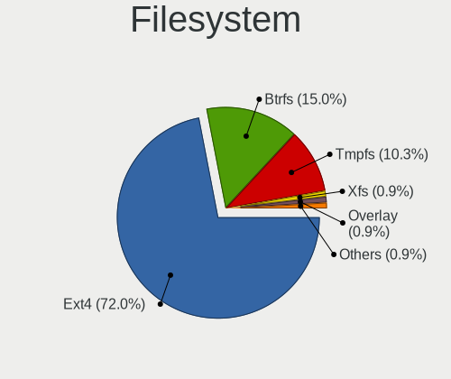
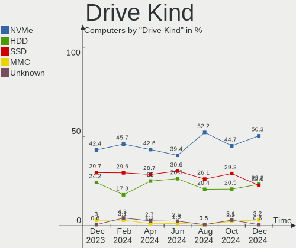
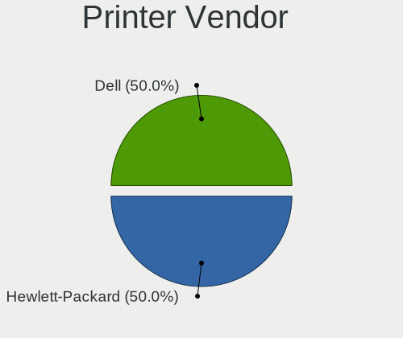

Manjaro Hardware Trends
-----------------------

A project to identify most popular hardware characteristics and track their change
over time based on data collected by Manjaro users at https://Linux-Hardware.org.

Anyone can contribute to this report by the [hw-probe](https://github.com/linuxhw/hw-probe) tool:

    sudo -E hw-probe -all -upload

This is a report for all computer types. See also reports for [desktops](/Dist/Manjaro/Desktop/README.md) and [notebooks](/Dist/Manjaro/Notebook/README.md).

Full-feature report is available here: https://linux-hardware.org/?view=trends

Period: Dec, 2021.

Contents
--------

* [ System ](#system)
  - [ OS                       ](#os)
  - [ OS Family                ](#os-family)
  - [ Kernel                   ](#kernel)
  - [ Kernel Family            ](#kernel-family)
  - [ Kernel Major Ver.        ](#kernel-major-ver)
  - [ Arch                     ](#arch)
  - [ DE                       ](#de)
  - [ Display Server           ](#display-server)
  - [ Display Manager          ](#display-manager)
  - [ OS Lang                  ](#os-lang)
  - [ Boot Mode                ](#boot-mode)
  - [ Filesystem               ](#filesystem)
  - [ Part. scheme             ](#part-scheme)
  - [ Dual Boot with Linux/BSD ](#dual-boot-with-linuxbsd)
  - [ Dual Boot (Win)          ](#dual-boot-win)

* [ Board ](#board)
  - [ Vendor                   ](#vendor)
  - [ Model                    ](#model)
  - [ Model Family             ](#model-family)
  - [ MFG Year                 ](#mfg-year)
  - [ Form Factor              ](#form-factor)
  - [ Secure Boot              ](#secure-boot)
  - [ Coreboot                 ](#coreboot)
  - [ RAM Size                 ](#ram-size)
  - [ RAM Used                 ](#ram-used)
  - [ Total Drives             ](#total-drives)
  - [ Has CD-ROM               ](#has-cd-rom)
  - [ Has Ethernet             ](#has-ethernet)
  - [ Has WiFi                 ](#has-wifi)
  - [ Has Bluetooth            ](#has-bluetooth)

* [ Location ](#location)
  - [ Country                  ](#country)
  - [ City                     ](#city)

* [ Drives ](#drives)
  - [ Drive Vendor             ](#drive-vendor)
  - [ Drive Model              ](#drive-model)
  - [ HDD Vendor               ](#hdd-vendor)
  - [ SSD Vendor               ](#ssd-vendor)
  - [ Drive Kind               ](#drive-kind)
  - [ Drive Connector          ](#drive-connector)
  - [ Drive Size               ](#drive-size)
  - [ Space Total              ](#space-total)
  - [ Space Used               ](#space-used)
  - [ Malfunc. Drives          ](#malfunc-drives)
  - [ Malfunc. Drive Vendor    ](#malfunc-drive-vendor)
  - [ Malfunc. HDD Vendor      ](#malfunc-hdd-vendor)
  - [ Malfunc. Drive Kind      ](#malfunc-drive-kind)
  - [ Failed Drives            ](#failed-drives)
  - [ Failed Drive Vendor      ](#failed-drive-vendor)
  - [ Drive Status             ](#drive-status)

* [ Storage controller ](#storage-controller)
  - [ Storage Vendor           ](#storage-vendor)
  - [ Storage Model            ](#storage-model)
  - [ Storage Kind             ](#storage-kind)

* [ Processor ](#processor)
  - [ CPU Vendor               ](#cpu-vendor)
  - [ CPU Model                ](#cpu-model)
  - [ CPU Model Family         ](#cpu-model-family)
  - [ CPU Cores                ](#cpu-cores)
  - [ CPU Sockets              ](#cpu-sockets)
  - [ CPU Threads              ](#cpu-threads)
  - [ CPU Op-Modes             ](#cpu-op-modes)
  - [ CPU Microcode            ](#cpu-microcode)
  - [ CPU Microarch            ](#cpu-microarch)

* [ Graphics ](#graphics)
  - [ GPU Vendor               ](#gpu-vendor)
  - [ GPU Model                ](#gpu-model)
  - [ GPU Combo                ](#gpu-combo)
  - [ GPU Driver               ](#gpu-driver)
  - [ GPU Memory               ](#gpu-memory)

* [ Monitor ](#monitor)
  - [ Monitor Vendor           ](#monitor-vendor)
  - [ Monitor Model            ](#monitor-model)
  - [ Monitor Resolution       ](#monitor-resolution)
  - [ Monitor Diagonal         ](#monitor-diagonal)
  - [ Monitor Width            ](#monitor-width)
  - [ Aspect Ratio             ](#aspect-ratio)
  - [ Monitor Area             ](#monitor-area)
  - [ Pixel Density            ](#pixel-density)
  - [ Multiple Monitors        ](#multiple-monitors)

* [ Network ](#network)
  - [ Net Controller Vendor    ](#net-controller-vendor)
  - [ Net Controller Model     ](#net-controller-model)
  - [ Wireless Vendor          ](#wireless-vendor)
  - [ Wireless Model           ](#wireless-model)
  - [ Ethernet Vendor          ](#ethernet-vendor)
  - [ Ethernet Model           ](#ethernet-model)
  - [ Net Controller Kind      ](#net-controller-kind)
  - [ Used Controller          ](#used-controller)
  - [ NICs                     ](#nics)
  - [ IPv6                     ](#ipv6)

* [ Bluetooth ](#bluetooth)
  - [ Bluetooth Vendor         ](#bluetooth-vendor)
  - [ Bluetooth Model          ](#bluetooth-model)

* [ Sound ](#sound)
  - [ Sound Vendor             ](#sound-vendor)
  - [ Sound Model              ](#sound-model)

* [ Memory ](#memory)
  - [ Memory Vendor            ](#memory-vendor)
  - [ Memory Model             ](#memory-model)
  - [ Memory Kind              ](#memory-kind)
  - [ Memory Form Factor       ](#memory-form-factor)
  - [ Memory Size              ](#memory-size)
  - [ Memory Speed             ](#memory-speed)

* [ Printers & scanners ](#printers--scanners)
  - [ Printer Vendor           ](#printer-vendor)
  - [ Printer Model            ](#printer-model)
  - [ Scanner Vendor           ](#scanner-vendor)
  - [ Scanner Model            ](#scanner-model)

* [ Camera ](#camera)
  - [ Camera Vendor            ](#camera-vendor)
  - [ Camera Model             ](#camera-model)

* [ Security ](#security)
  - [ Fingerprint Vendor       ](#fingerprint-vendor)
  - [ Fingerprint Model        ](#fingerprint-model)
  - [ Chipcard Vendor          ](#chipcard-vendor)
  - [ Chipcard Model           ](#chipcard-model)

* [ Unsupported ](#unsupported)
  - [ Unsupported Devices      ](#unsupported-devices)
  - [ Unsupported Device Types ](#unsupported-device-types)

System
------

OS
--

Installed operating systems

| Name             | Computers | Percent |
|------------------|-----------|---------|
| Manjaro          | 69        | 39.2%   |
| Manjaro 21.2.0   | 67        | 38.07%  |
| Manjaro 21.2rc   | 28        | 15.91%  |
| Manjaro 21.2rc1  | 4         | 2.27%   |
| Manjaro 21.2pre1 | 3         | 1.7%    |
| Manjaro 21.1.6   | 3         | 1.7%    |
| Manjaro 21.2rc2  | 2         | 1.14%   |

OS Family
---------

OS without a version

| Name    | Computers | Percent |
|---------|-----------|---------|
| Manjaro | 176       | 100%    |

Kernel
------

Version of the Linux kernel

| Version                | Computers | Percent |
|------------------------|-----------|---------|
| 5.13.19-2-MANJARO      | 36        | 20.45%  |
| 5.15.7-1-MANJARO       | 32        | 18.18%  |
| 5.15.6-2-MANJARO       | 24        | 13.64%  |
| 5.10.84-1-MANJARO      | 19        | 10.8%   |
| 5.15.2-2-MANJARO       | 12        | 6.82%   |
| 5.10.79-1-MANJARO      | 9         | 5.11%   |
| 5.10.83-1-MANJARO      | 6         | 3.41%   |
| 5.15.5-1-rt22-MANJARO  | 5         | 2.84%   |
| 5.14.18-1-MANJARO      | 5         | 2.84%   |
| 5.16.0-1-MANJARO       | 4         | 2.27%   |
| 5.14.21-2-MANJARO      | 4         | 2.27%   |
| 5.9.16-1-MANJARO       | 3         | 1.7%    |
| 5.15.11-1-MANJARO      | 3         | 1.7%    |
| 5.4.164-1-MANJARO      | 2         | 1.14%   |
| 5.13.13-1-MANJARO      | 2         | 1.14%   |
| 5.4.6-2-MANJARO        | 1         | 0.57%   |
| 5.4.159-1-MANJARO      | 1         | 0.57%   |
| 5.15.8-1-MANJARO       | 1         | 0.57%   |
| 5.15.6-xanmod2-MANJARO | 1         | 0.57%   |
| 5.15.6-225-tkg-pds     | 1         | 0.57%   |
| 5.15.5-xanmod1-tt-1    | 1         | 0.57%   |
| 5.15.2-1-rt19-MANJARO  | 1         | 0.57%   |
| 5.11.22-2-MANJARO      | 1         | 0.57%   |
| 5.10.15-1-MANJARO      | 1         | 0.57%   |
| 4.19.217-1-MANJARO     | 1         | 0.57%   |

Kernel Family
-------------

Linux kernel without a distro release

| Version  | Computers | Percent |
|----------|-----------|---------|
| 5.13.19  | 36        | 20.45%  |
| 5.15.7   | 32        | 18.18%  |
| 5.15.6   | 26        | 14.77%  |
| 5.10.84  | 19        | 10.8%   |
| 5.15.2   | 13        | 7.39%   |
| 5.10.79  | 9         | 5.11%   |
| 5.15.5   | 6         | 3.41%   |
| 5.10.83  | 6         | 3.41%   |
| 5.14.18  | 5         | 2.84%   |
| 5.16.0   | 4         | 2.27%   |
| 5.14.21  | 4         | 2.27%   |
| 5.9.16   | 3         | 1.7%    |
| 5.15.11  | 3         | 1.7%    |
| 5.4.164  | 2         | 1.14%   |
| 5.13.13  | 2         | 1.14%   |
| 5.4.6    | 1         | 0.57%   |
| 5.4.159  | 1         | 0.57%   |
| 5.15.8   | 1         | 0.57%   |
| 5.11.22  | 1         | 0.57%   |
| 5.10.15  | 1         | 0.57%   |
| 4.19.217 | 1         | 0.57%   |

Kernel Major Ver.
-----------------

Linux kernel major version

| Version | Computers | Percent |
|---------|-----------|---------|
| 5.15    | 81        | 46.02%  |
| 5.13    | 38        | 21.59%  |
| 5.10    | 35        | 19.89%  |
| 5.14    | 9         | 5.11%   |
| 5.4     | 4         | 2.27%   |
| 5.16    | 4         | 2.27%   |
| 5.9     | 3         | 1.7%    |
| 5.11    | 1         | 0.57%   |
| 4.19    | 1         | 0.57%   |

Arch
----

OS architecture (x86_64, i586, etc.)

| Name   | Computers | Percent |
|--------|-----------|---------|
| x86_64 | 176       | 100%    |

DE
--

Desktop Environment

| Name       | Computers | Percent |
|------------|-----------|---------|
| KDE5       | 72        | 40.91%  |
| GNOME      | 50        | 28.41%  |
| XFCE       | 40        | 22.73%  |
| i3         | 6         | 3.41%   |
| Unknown    | 4         | 2.27%   |
| X-Cinnamon | 3         | 1.7%    |
| Budgie     | 1         | 0.57%   |

Display Server
--------------

X11 or Wayland

| Name    | Computers | Percent |
|---------|-----------|---------|
| X11     | 153       | 86.93%  |
| Wayland | 21        | 11.93%  |
| Unknown | 2         | 1.14%   |

Display Manager
---------------

SDDM, LightDM, etc.

| Name    | Computers | Percent |
|---------|-----------|---------|
| Unknown | 68        | 38.64%  |
| SDDM    | 37        | 21.02%  |
| LightDM | 36        | 20.45%  |
| GDM     | 35        | 19.89%  |

OS Lang
-------

Language

| Lang    | Computers | Percent |
|---------|-----------|---------|
| en_US   | 80        | 45.45%  |
| de_DE   | 18        | 10.23%  |
| pt_BR   | 11        | 6.25%   |
| en_GB   | 11        | 6.25%   |
| ru_RU   | 8         | 4.55%   |
| es_ES   | 6         | 3.41%   |
| pl_PL   | 5         | 2.84%   |
| en_CA   | 5         | 2.84%   |
| fr_FR   | 4         | 2.27%   |
| en_AU   | 4         | 2.27%   |
| zh_CN   | 2         | 1.14%   |
| sv_SE   | 2         | 1.14%   |
| it_IT   | 2         | 1.14%   |
| en_IN   | 2         | 1.14%   |
| de_AT   | 2         | 1.14%   |
| da_DK   | 2         | 1.14%   |
| th_TH   | 1         | 0.57%   |
| ru_UA   | 1         | 0.57%   |
| pt_PT   | 1         | 0.57%   |
| nl_NL   | 1         | 0.57%   |
| nb_NO   | 1         | 0.57%   |
| es_PE   | 1         | 0.57%   |
| es_MX   | 1         | 0.57%   |
| es_GT   | 1         | 0.57%   |
| en_NZ   | 1         | 0.57%   |
| en_IE   | 1         | 0.57%   |
| en_DE   | 1         | 0.57%   |
| Unknown | 1         | 0.57%   |

Boot Mode
---------

EFI or BIOS

| Mode | Computers | Percent |
|------|-----------|---------|
| BIOS | 108       | 61.36%  |
| EFI  | 68        | 38.64%  |

Filesystem
----------

Type of filesystem

| Type    | Computers | Percent |
|---------|-----------|---------|
| Ext4    | 153       | 86.93%  |
| Btrfs   | 14        | 7.95%   |
| Tmpfs   | 3         | 1.7%    |
| Overlay | 3         | 1.7%    |
| Xfs     | 2         | 1.14%   |
| XXXX    | 1         | 0.57%   |

Part. scheme
------------

Scheme of partitioning

| Type    | Computers | Percent |
|---------|-----------|---------|
| Unknown | 106       | 60.23%  |
| GPT     | 64        | 36.36%  |
| MBR     | 6         | 3.41%   |

Dual Boot with Linux/BSD
------------------------

Hosting more than one Linux/BSD

| Dual boot | Computers | Percent |
|-----------|-----------|---------|
| No        | 162       | 92.05%  |
| Yes       | 14        | 7.95%   |

Dual Boot (Win)
---------------

Hosting Linux and Windows

| Dual boot | Computers | Percent |
|-----------|-----------|---------|
| No        | 130       | 73.86%  |
| Yes       | 46        | 26.14%  |

Board
-----

Vendor
------

Motherboard manufacturer

| Name                  | Computers | Percent |
|-----------------------|-----------|---------|
| ASUSTek Computer      | 28        | 15.91%  |
| Dell                  | 22        | 12.5%   |
| Lenovo                | 21        | 11.93%  |
| Hewlett-Packard       | 18        | 10.23%  |
| Gigabyte Technology   | 16        | 9.09%   |
| Acer                  | 16        | 9.09%   |
| MSI                   | 15        | 8.52%   |
| Intel                 | 5         | 2.84%   |
| ASRock                | 5         | 2.84%   |
| Toshiba               | 4         | 2.27%   |
| Samsung Electronics   | 3         | 1.7%    |
| Microsoft             | 3         | 1.7%    |
| Apple                 | 3         | 1.7%    |
| Timi                  | 2         | 1.14%   |
| Schenker              | 2         | 1.14%   |
| Pegatron              | 2         | 1.14%   |
| Fujitsu               | 2         | 1.14%   |
| UNIQCELL              | 1         | 0.57%   |
| Sony                  | 1         | 0.57%   |
| Schenker Technologies | 1         | 0.57%   |
| Packard Bell          | 1         | 0.57%   |
| Jumper                | 1         | 0.57%   |
| Huanan                | 1         | 0.57%   |
| Google                | 1         | 0.57%   |
| AMI                   | 1         | 0.57%   |
| Alienware             | 1         | 0.57%   |

Model
-----

Motherboard model

| Name                                     | Computers | Percent |
|------------------------------------------|-----------|---------|
| MSI MS-7B86                              | 2         | 1.14%   |
| Lenovo ThinkBook 15-IIL 20SM             | 2         | 1.14%   |
| Lenovo G50-80 80E5                       | 2         | 1.14%   |
| Gigabyte B450M DS3H                      | 2         | 1.14%   |
| UNIQCELL Q15.6                           | 1         | 0.57%   |
| Toshiba Satellite P850                   | 1         | 0.57%   |
| Toshiba Satellite L50-B                  | 1         | 0.57%   |
| Toshiba Satellite C855D                  | 1         | 0.57%   |
| Toshiba PORTEGE Z30-A                    | 1         | 0.57%   |
| Timi RedmiBook Pro 15                    | 1         | 0.57%   |
| Timi RedmiBook 16                        | 1         | 0.57%   |
| Sony SVS131290S                          | 1         | 0.57%   |
| Schenker XMG CORE 15(M20, RTX 2060)      | 1         | 0.57%   |
| Schenker XMG CORE (REN/E21)              | 1         | 0.57%   |
| Schenker VIA13                           | 1         | 0.57%   |
| Samsung DeskTop System                   | 1         | 0.57%   |
| Samsung 900X3G                           | 1         | 0.57%   |
| Samsung 270E5G/270E5U                    | 1         | 0.57%   |
| Pegatron s5-1120br                       | 1         | 0.57%   |
| Pegatron IPPPV-D3G                       | 1         | 0.57%   |
| Packard Bell EasyNote TE69HW             | 1         | 0.57%   |
| MSI MS-7D09                              | 1         | 0.57%   |
| MSI MS-7C95                              | 1         | 0.57%   |
| MSI MS-7C91                              | 1         | 0.57%   |
| MSI MS-7C51                              | 1         | 0.57%   |
| MSI MS-7C31                              | 1         | 0.57%   |
| MSI MS-7B79                              | 1         | 0.57%   |
| MSI MS-7982                              | 1         | 0.57%   |
| MSI MS-7758                              | 1         | 0.57%   |
| MSI MS-7721                              | 1         | 0.57%   |
| MSI GS70 6QE                             | 1         | 0.57%   |
| MSI GL65 Leopard 9SCXR                   | 1         | 0.57%   |
| MSI GE76 Raider 10UE                     | 1         | 0.57%   |
| MSI GE66 Raider 10SGS                    | 1         | 0.57%   |
| Microsoft Surface Pro 4                  | 1         | 0.57%   |
| Microsoft Surface Laptop Studio          | 1         | 0.57%   |
| Microsoft Surface Laptop 3               | 1         | 0.57%   |
| Lenovo Yoga C740-15IML 81TD              | 1         | 0.57%   |
| Lenovo Yoga 7 14ITL5 82BH                | 1         | 0.57%   |
| Lenovo V15 G2 ALC 82KD                   | 1         | 0.57%   |
| Lenovo ThinkPad X1 Nano Gen 1 20UN002GGE | 1         | 0.57%   |
| Lenovo ThinkPad T580 20LAS2BH00          | 1         | 0.57%   |
| Lenovo ThinkPad T490s 20NYS1XK00         | 1         | 0.57%   |
| Lenovo ThinkPad T14 Gen 1 20S0S2NH00     | 1         | 0.57%   |
| Lenovo ThinkPad L390 20NR0013SP          | 1         | 0.57%   |
| Lenovo ThinkPad E15 Gen 2 20T9S0B500     | 1         | 0.57%   |
| Lenovo Legion 5 Pro 16ACH6H 82JQ         | 1         | 0.57%   |
| Lenovo IdeaPad S145-15IIL 82DJ           | 1         | 0.57%   |
| Lenovo IdeaPad 5 Pro 14ACN6 82L7         | 1         | 0.57%   |
| Lenovo IdeaPad 5 15ITL05 82FG            | 1         | 0.57%   |
| Lenovo IdeaPad 3 15ITL05 81X8            | 1         | 0.57%   |
| Lenovo IdeaCentre 720-18APR 90HY002APG   | 1         | 0.57%   |
| Lenovo IdeaCentre 3 07ADA05 90MV008VAU   | 1         | 0.57%   |
| Lenovo G460 20041                        | 1         | 0.57%   |
| Jumper EZpad                             | 1         | 0.57%   |
| Intel X99                                | 1         | 0.57%   |
| Intel X79                                | 1         | 0.57%   |
| Intel nucifer                            | 1         | 0.57%   |
| Intel NUC11PAHi5                         | 1         | 0.57%   |
| Intel DX58SO2 AAG10925-205               | 1         | 0.57%   |

Model Family
------------

Motherboard model prefix

| Name                  | Computers | Percent |
|-----------------------|-----------|---------|
| Acer Aspire           | 11        | 6.25%   |
| ASUS ROG              | 7         | 3.98%   |
| Lenovo ThinkPad       | 6         | 3.41%   |
| Dell Inspiron         | 6         | 3.41%   |
| Lenovo IdeaPad        | 4         | 2.27%   |
| Dell XPS              | 4         | 2.27%   |
| Dell Vostro           | 4         | 2.27%   |
| Dell Precision        | 4         | 2.27%   |
| Dell Latitude         | 4         | 2.27%   |
| ASUS PRIME            | 4         | 2.27%   |
| Toshiba Satellite     | 3         | 1.7%    |
| Microsoft Surface     | 3         | 1.7%    |
| HP Compaq             | 3         | 1.7%    |
| Gigabyte B450M        | 3         | 1.7%    |
| ASUS VivoBook         | 3         | 1.7%    |
| Timi RedmiBook        | 2         | 1.14%   |
| Schenker XMG          | 2         | 1.14%   |
| MSI MS-7B86           | 2         | 1.14%   |
| Lenovo Yoga           | 2         | 1.14%   |
| Lenovo ThinkBook      | 2         | 1.14%   |
| Lenovo IdeaCentre     | 2         | 1.14%   |
| Lenovo G50-80         | 2         | 1.14%   |
| HP ZBook              | 2         | 1.14%   |
| HP Pavilion           | 2         | 1.14%   |
| HP OMEN               | 2         | 1.14%   |
| HP EliteBook          | 2         | 1.14%   |
| Gigabyte H61M-DS2     | 2         | 1.14%   |
| Fujitsu LIFEBOOK      | 2         | 1.14%   |
| ASUS TUF              | 2         | 1.14%   |
| ASUS Rampage          | 2         | 1.14%   |
| Acer Spin             | 2         | 1.14%   |
| UNIQCELL Q15.6        | 1         | 0.57%   |
| Toshiba PORTEGE       | 1         | 0.57%   |
| Sony SVS131290S       | 1         | 0.57%   |
| Schenker VIA13        | 1         | 0.57%   |
| Samsung DeskTop       | 1         | 0.57%   |
| Samsung 900X3G        | 1         | 0.57%   |
| Samsung 270E5G        | 1         | 0.57%   |
| Pegatron s5-1120br    | 1         | 0.57%   |
| Pegatron IPPPV-D3G    | 1         | 0.57%   |
| Packard Bell EasyNote | 1         | 0.57%   |
| MSI MS-7D09           | 1         | 0.57%   |
| MSI MS-7C95           | 1         | 0.57%   |
| MSI MS-7C91           | 1         | 0.57%   |
| MSI MS-7C51           | 1         | 0.57%   |
| MSI MS-7C31           | 1         | 0.57%   |
| MSI MS-7B79           | 1         | 0.57%   |
| MSI MS-7982           | 1         | 0.57%   |
| MSI MS-7758           | 1         | 0.57%   |
| MSI MS-7721           | 1         | 0.57%   |
| MSI GS70              | 1         | 0.57%   |
| MSI GL65              | 1         | 0.57%   |
| MSI GE76              | 1         | 0.57%   |
| MSI GE66              | 1         | 0.57%   |
| Lenovo V15            | 1         | 0.57%   |
| Lenovo Legion         | 1         | 0.57%   |
| Lenovo G460           | 1         | 0.57%   |
| Jumper EZpad          | 1         | 0.57%   |
| Intel X99             | 1         | 0.57%   |
| Intel X79             | 1         | 0.57%   |

MFG Year
--------

Motherboard manufacture year

| Year | Computers | Percent |
|------|-----------|---------|
| 2021 | 58        | 32.95%  |
| 2020 | 31        | 17.61%  |
| 2019 | 21        | 11.93%  |
| 2018 | 12        | 6.82%   |
| 2013 | 10        | 5.68%   |
| 2012 | 10        | 5.68%   |
| 2015 | 7         | 3.98%   |
| 2011 | 7         | 3.98%   |
| 2014 | 6         | 3.41%   |
| 2016 | 4         | 2.27%   |
| 2017 | 3         | 1.7%    |
| 2009 | 3         | 1.7%    |
| 2010 | 1         | 0.57%   |
| 2008 | 1         | 0.57%   |
| 2007 | 1         | 0.57%   |
| 2006 | 1         | 0.57%   |

Form Factor
-----------

Physical design of the computer

| Name        | Computers | Percent |
|-------------|-----------|---------|
| Notebook    | 92        | 52.27%  |
| Desktop     | 69        | 39.2%   |
| Convertible | 7         | 3.98%   |
| Tablet      | 4         | 2.27%   |
| Mini pc     | 2         | 1.14%   |
| All in one  | 2         | 1.14%   |

Secure Boot
-----------

Enabled or disabled

| State    | Computers | Percent |
|----------|-----------|---------|
| Disabled | 176       | 100%    |

Coreboot
--------

Have coreboot on board

| Used | Computers | Percent |
|------|-----------|---------|
| No   | 175       | 99.43%  |
| Yes  | 1         | 0.57%   |

RAM Size
--------

Total RAM memory

| Size in GB  | Computers | Percent |
|-------------|-----------|---------|
| 8.01-16.0   | 45        | 25.57%  |
| 16.01-24.0  | 44        | 25%     |
| 4.01-8.0    | 40        | 22.73%  |
| 32.01-64.0  | 24        | 13.64%  |
| 3.01-4.0    | 15        | 8.52%   |
| 64.01-256.0 | 3         | 1.7%    |
| 1.01-2.0    | 3         | 1.7%    |
| 2.01-3.0    | 2         | 1.14%   |

RAM Used
--------

Used RAM memory

| Used GB    | Computers | Percent |
|------------|-----------|---------|
| 1.01-2.0   | 47        | 26.7%   |
| 2.01-3.0   | 46        | 26.14%  |
| 4.01-8.0   | 41        | 23.3%   |
| 3.01-4.0   | 27        | 15.34%  |
| 0.51-1.0   | 7         | 3.98%   |
| 8.01-16.0  | 6         | 3.41%   |
| 24.01-32.0 | 1         | 0.57%   |
| 16.01-24.0 | 1         | 0.57%   |

Total Drives
------------

Number of drives on board

| Drives | Computers | Percent |
|--------|-----------|---------|
| 1      | 85        | 48.3%   |
| 2      | 53        | 30.11%  |
| 3      | 19        | 10.8%   |
| 4      | 12        | 6.82%   |
| 5      | 5         | 2.84%   |
| 6      | 2         | 1.14%   |

Has CD-ROM
----------

Has CD-ROM on board

| Presented | Computers | Percent |
|-----------|-----------|---------|
| No        | 139       | 78.98%  |
| Yes       | 37        | 21.02%  |

Has Ethernet
------------

Has Ethernet on board

| Presented | Computers | Percent |
|-----------|-----------|---------|
| Yes       | 145       | 82.39%  |
| No        | 31        | 17.61%  |

Has WiFi
--------

Has WiFi module

| Presented | Computers | Percent |
|-----------|-----------|---------|
| Yes       | 143       | 81.25%  |
| No        | 33        | 18.75%  |

Has Bluetooth
-------------

Has Bluetooth module

| Presented | Computers | Percent |
|-----------|-----------|---------|
| Yes       | 120       | 68.18%  |
| No        | 56        | 31.82%  |

Location
--------

Country
-------

Geographic location (country)

| Country      | Computers | Percent |
|--------------|-----------|---------|
| USA          | 29        | 16.48%  |
| Germany      | 24        | 13.64%  |
| Brazil       | 16        | 9.09%   |
| Russia       | 10        | 5.68%   |
| Spain        | 8         | 4.55%   |
| Poland       | 7         | 3.98%   |
| France       | 7         | 3.98%   |
| Canada       | 7         | 3.98%   |
| UK           | 4         | 2.27%   |
| Australia    | 4         | 2.27%   |
| Ukraine      | 3         | 1.7%    |
| Sweden       | 3         | 1.7%    |
| Mexico       | 3         | 1.7%    |
| India        | 3         | 1.7%    |
| Bulgaria     | 3         | 1.7%    |
| Austria      | 3         | 1.7%    |
| Thailand     | 2         | 1.14%   |
| Sri Lanka    | 2         | 1.14%   |
| Portugal     | 2         | 1.14%   |
| Norway       | 2         | 1.14%   |
| Netherlands  | 2         | 1.14%   |
| Italy        | 2         | 1.14%   |
| Egypt        | 2         | 1.14%   |
| Denmark      | 2         | 1.14%   |
| China        | 2         | 1.14%   |
| Argentina    | 2         | 1.14%   |
| Venezuela    | 1         | 0.57%   |
| Uzbekistan   | 1         | 0.57%   |
| Switzerland  | 1         | 0.57%   |
| Saudi Arabia | 1         | 0.57%   |
| Romania      | 1         | 0.57%   |
| Peru         | 1         | 0.57%   |
| New Zealand  | 1         | 0.57%   |
| Kenya        | 1         | 0.57%   |
| Japan        | 1         | 0.57%   |
| Israel       | 1         | 0.57%   |
| Ireland      | 1         | 0.57%   |
| Iran         | 1         | 0.57%   |
| Hungary      | 1         | 0.57%   |
| Guatemala    | 1         | 0.57%   |
| Greece       | 1         | 0.57%   |
| Estonia      | 1         | 0.57%   |
| Croatia      | 1         | 0.57%   |
| Costa Rica   | 1         | 0.57%   |
| Colombia     | 1         | 0.57%   |
| Belarus      | 1         | 0.57%   |
| Bangladesh   | 1         | 0.57%   |
| Bahrain      | 1         | 0.57%   |

City
----

Geographic location (city)

| City          | Computers | Percent |
|---------------|-----------|---------|
| S??o Paulo    | 3         | 1.7%    |
| Curitiba      | 3         | 1.7%    |
| Barcelona     | 3         | 1.7%    |
| Warsaw        | 2         | 1.14%   |
| Vienna        | 2         | 1.14%   |
| Toronto       | 2         | 1.14%   |
| St Petersburg | 2         | 1.14%   |
| Novosibirsk   | 2         | 1.14%   |
| Mexico City   | 2         | 1.14%   |
| Meerane       | 2         | 1.14%   |
| Lille         | 2         | 1.14%   |
| Hanover       | 2         | 1.14%   |
| Esparreguera  | 2         | 1.14%   |
| Dresden       | 2         | 1.14%   |
| Dallas        | 2         | 1.14%   |
| Berlin        | 2         | 1.14%   |
| Zvenigorod    | 1         | 0.57%   |
| Zurich        | 1         | 0.57%   |
| Zhytomyr      | 1         | 0.57%   |
| Wrzesnia      | 1         | 0.57%   |
| Woodstock     | 1         | 0.57%   |
| Wake Forest   | 1         | 0.57%   |
| Versailles    | 1         | 0.57%   |
| Ulyanovsk     | 1         | 0.57%   |
| Uberl??ndia   | 1         | 0.57%   |
| Toulouse      | 1         | 0.57%   |
| Toftbyn       | 1         | 0.57%   |
| Titusville    | 1         | 0.57%   |
| Thomasville   | 1         | 0.57%   |
| Tel Aviv      | 1         | 0.57%   |
| Tashkent      | 1         | 0.57%   |
| Taby          | 1         | 0.57%   |
| Sydney        | 1         | 0.57%   |
| Staten Island | 1         | 0.57%   |
| Spruce Grove  | 1         | 0.57%   |
| Sofia         | 1         | 0.57%   |
| Sligo         | 1         | 0.57%   |
| Skaelskor     | 1         | 0.57%   |
| Sindelfingen  | 1         | 0.57%   |
| Sheboygan     | 1         | 0.57%   |
| Shanghai      | 1         | 0.57%   |
| Sassari       | 1         | 0.57%   |
| San Jos?©     | 1         | 0.57%   |
| Samoreau      | 1         | 0.57%   |
| Saint Paul    | 1         | 0.57%   |
| Rotterdam     | 1         | 0.57%   |
| Rome          | 1         | 0.57%   |
| Rockville     | 1         | 0.57%   |
| Regensburg    | 1         | 0.57%   |
| Poznan        | 1         | 0.57%   |
| Porto Alegre  | 1         | 0.57%   |
| Pollenfeld    | 1         | 0.57%   |
| Polikrayshte  | 1         | 0.57%   |
| Peru          | 1         | 0.57%   |
| Perth         | 1         | 0.57%   |
| Pachuca       | 1         | 0.57%   |
| Owego         | 1         | 0.57%   |
| Oslo          | 1         | 0.57%   |
| Osinovo       | 1         | 0.57%   |
| Odemira       | 1         | 0.57%   |

Drives
------

Drive Vendor
------------

Hard drive vendors

| Vendor                    | Computers | Drives | Percent |
|---------------------------|-----------|--------|---------|
| Samsung Electronics       | 46        | 61     | 15.33%  |
| WDC                       | 41        | 46     | 13.67%  |
| Seagate                   | 39        | 47     | 13%     |
| Toshiba                   | 21        | 23     | 7%      |
| Sandisk                   | 17        | 18     | 5.67%   |
| Kingston                  | 14        | 14     | 4.67%   |
| Crucial                   | 14        | 14     | 4.67%   |
| Unknown                   | 12        | 13     | 4%      |
| Hitachi                   | 12        | 12     | 4%      |
| SK Hynix                  | 9         | 9      | 3%      |
| A-DATA Technology         | 9         | 9      | 3%      |
| China                     | 6         | 7      | 2%      |
| Phison                    | 5         | 5      | 1.67%   |
| KIOXIA                    | 5         | 5      | 1.67%   |
| Intel                     | 4         | 5      | 1.33%   |
| HGST                      | 4         | 4      | 1.33%   |
| Micron Technology         | 3         | 3      | 1%      |
| XPG                       | 2         | 2      | 0.67%   |
| UMIS                      | 2         | 2      | 0.67%   |
| Team                      | 2         | 2      | 0.67%   |
| Silicon Motion            | 2         | 2      | 0.67%   |
| PNY                       | 2         | 2      | 0.67%   |
| Patriot                   | 2         | 2      | 0.67%   |
| Intenso                   | 2         | 2      | 0.67%   |
| Gigabyte Technology       | 2         | 2      | 0.67%   |
| Apple                     | 2         | 2      | 0.67%   |
| ADATA Technology          | 2         | 2      | 0.67%   |
| ZOMY                      | 1         | 1      | 0.33%   |
| Vaseky                    | 1         | 1      | 0.33%   |
| SPCC                      | 1         | 1      | 0.33%   |
| Realtek Semiconductor     | 1         | 1      | 0.33%   |
| OCZ                       | 1         | 1      | 0.33%   |
| Mushkin                   | 1         | 1      | 0.33%   |
| Micron/Crucial Technology | 1         | 1      | 0.33%   |
| MAXTOR                    | 1         | 1      | 0.33%   |
| LITEONIT                  | 1         | 1      | 0.33%   |
| LITEON                    | 1         | 1      | 0.33%   |
| Lexar                     | 1         | 1      | 0.33%   |
| Leven                     | 1         | 1      | 0.33%   |
| Kston                     | 1         | 1      | 0.33%   |
| KingSpec                  | 1         | 1      | 0.33%   |
| HS-SSD-C100               | 1         | 1      | 0.33%   |
| Hewlett-Packard           | 1         | 1      | 0.33%   |
| Colorful                  | 1         | 1      | 0.33%   |
| Apacer                    | 1         | 1      | 0.33%   |
| Acer                      | 1         | 1      | 0.33%   |

Drive Model
-----------

Hard drive models

| Model                              | Computers | Percent |
|------------------------------------|-----------|---------|
| Samsung NVMe SSD Drive 1TB         | 7         | 2.15%   |
| Seagate ST1000DM010-2EP102 1TB     | 5         | 1.54%   |
| Unknown SD/MMC/MS PRO 7GB          | 4         | 1.23%   |
| Toshiba MQ04ABF100 1TB             | 4         | 1.23%   |
| Seagate ST2000DM008-2FR102 2TB     | 4         | 1.23%   |
| Seagate ST1000LM024 HN-M101MBB 1TB | 4         | 1.23%   |
| Sandisk NVMe SSD Drive 512GB       | 3         | 0.92%   |
| Sandisk NVMe SSD Drive 1TB         | 3         | 0.92%   |
| Samsung SSD 870 EVO 1TB            | 3         | 0.92%   |
| Samsung SSD 850 EVO 250GB          | 3         | 0.92%   |
| Samsung NVMe SSD Drive 512GB       | 3         | 0.92%   |
| Samsung NVMe SSD Drive 500GB       | 3         | 0.92%   |
| HGST HTS721010A9E630 1TB           | 3         | 0.92%   |
| Crucial CT480BX500SSD1 480GB       | 3         | 0.92%   |
| WDC WDS240G2G0A-00JH30 240GB SSD   | 2         | 0.62%   |
| WDC WDS120G1G0B-00RC30 120GB SSD   | 2         | 0.62%   |
| WDC WD10EZEX-60WN4A0 1TB           | 2         | 0.62%   |
| WDC WD10EZEX-08WN4A0 1TB           | 2         | 0.62%   |
| WDC WD1003FZEX-00MK2A0 1TB         | 2         | 0.62%   |
| Unknown MMC Card  32GB             | 2         | 0.62%   |
| UMIS RPJTJ256MEE1OWX 256GB         | 2         | 0.62%   |
| Toshiba MQ01ABD075 752GB           | 2         | 0.62%   |
| Toshiba DT01ACA100 1TB             | 2         | 0.62%   |
| Toshiba DT01ACA050 500GB           | 2         | 0.62%   |
| Team TM8PS7256G 256GB SSD          | 2         | 0.62%   |
| SK Hynix NVMe SSD Drive 512GB      | 2         | 0.62%   |
| SK Hynix NVMe SSD Drive 256GB      | 2         | 0.62%   |
| SK Hynix NVMe SSD Drive 128GB      | 2         | 0.62%   |
| Seagate ST500LT012-1DG142 500GB    | 2         | 0.62%   |
| Seagate ST500DM002-1BD142 500GB    | 2         | 0.62%   |
| Seagate Expansion 1TB              | 2         | 0.62%   |
| Sandisk NVMe SSD Drive 500GB       | 2         | 0.62%   |
| Samsung SSD 980 PRO 1TB            | 2         | 0.62%   |
| Samsung SSD 980 1TB                | 2         | 0.62%   |
| Samsung SSD 860 EVO 250GB          | 2         | 0.62%   |
| Samsung NVMe SSD Drive 256GB       | 2         | 0.62%   |
| Samsung MZALQ512HALU-000L2 512GB   | 2         | 0.62%   |
| Samsung HD753LJ 752GB              | 2         | 0.62%   |
| KIOXIA NVMe SSD Drive 512GB        | 2         | 0.62%   |
| Kingston SA400S37240G 240GB SSD    | 2         | 0.62%   |
| Kingston SA400S37120G 120GB SSD    | 2         | 0.62%   |
| Crucial CT240BX500SSD1 240GB       | 2         | 0.62%   |
| China SSD 128GB                    | 2         | 0.62%   |
| ZOMY ZY603 480GB                   | 1         | 0.31%   |
| XPG SPECTRIX S40G 1TB              | 1         | 0.31%   |
| XPG NVMe SSD Drive 1TB             | 1         | 0.31%   |
| WDC WDS500G2B0A-00SM50 500GB SSD   | 1         | 0.31%   |
| WDC WDS500G1B0A-00H9H0 500GB SSD   | 1         | 0.31%   |
| WDC WDS240G2G0B-00EPW0 240GB SSD   | 1         | 0.31%   |
| WDC WDS100T2B0B 1TB SSD            | 1         | 0.31%   |
| WDC WD800BD-22MRA1 80GB            | 1         | 0.31%   |
| WDC WD7500BPVT-3 752GB             | 1         | 0.31%   |
| WDC WD7500BPVT-22HXZT3 752GB       | 1         | 0.31%   |
| WDC WD5000LUCT-63RC2Y0 500GB       | 1         | 0.31%   |
| WDC WD5000LPVX-75V0TT0 500GB       | 1         | 0.31%   |
| WDC WD5000LPLX-08ZNTT0 500GB       | 1         | 0.31%   |
| WDC WD5000LPCX-60VHAT0 500GB       | 1         | 0.31%   |
| WDC WD5000AAKX-60U6AA0 500GB       | 1         | 0.31%   |
| WDC WD40EZRX-22SPEB0 4TB           | 1         | 0.31%   |
| WDC WD1600AAJS-00Z4A0 160GB        | 1         | 0.31%   |

HDD Vendor
----------

Hard disk drive vendors

| Vendor              | Computers | Drives | Percent |
|---------------------|-----------|--------|---------|
| Seagate             | 39        | 45     | 35.14%  |
| WDC                 | 29        | 32     | 26.13%  |
| Toshiba             | 19        | 21     | 17.12%  |
| Hitachi             | 12        | 12     | 10.81%  |
| Unknown             | 4         | 4      | 3.6%    |
| HGST                | 4         | 4      | 3.6%    |
| Samsung Electronics | 2         | 4      | 1.8%    |
| MAXTOR              | 1         | 1      | 0.9%    |
| Apple               | 1         | 1      | 0.9%    |

SSD Vendor
----------

Solid state drive vendors

| Vendor              | Computers | Drives | Percent |
|---------------------|-----------|--------|---------|
| Samsung Electronics | 20        | 24     | 20.2%   |
| Crucial             | 13        | 13     | 13.13%  |
| Kingston            | 11        | 11     | 11.11%  |
| WDC                 | 8         | 8      | 8.08%   |
| SanDisk             | 7         | 7      | 7.07%   |
| China               | 6         | 7      | 6.06%   |
| A-DATA Technology   | 6         | 6      | 6.06%   |
| Team                | 2         | 2      | 2.02%   |
| PNY                 | 2         | 2      | 2.02%   |
| Patriot             | 2         | 2      | 2.02%   |
| Micron Technology   | 2         | 2      | 2.02%   |
| Intenso             | 2         | 2      | 2.02%   |
| Gigabyte Technology | 2         | 2      | 2.02%   |
| Vaseky              | 1         | 1      | 1.01%   |
| Toshiba             | 1         | 1      | 1.01%   |
| SPCC                | 1         | 1      | 1.01%   |
| Seagate             | 1         | 1      | 1.01%   |
| OCZ                 | 1         | 1      | 1.01%   |
| Mushkin             | 1         | 1      | 1.01%   |
| LITEONIT            | 1         | 1      | 1.01%   |
| LITEON              | 1         | 1      | 1.01%   |
| Lexar               | 1         | 1      | 1.01%   |
| Leven               | 1         | 1      | 1.01%   |
| KingSpec            | 1         | 1      | 1.01%   |
| HS-SSD-C100         | 1         | 1      | 1.01%   |
| Hewlett-Packard     | 1         | 1      | 1.01%   |
| Colorful            | 1         | 1      | 1.01%   |
| Apacer              | 1         | 1      | 1.01%   |
| Acer                | 1         | 1      | 1.01%   |

Drive Kind
----------

HDD or SSD

| Kind    | Computers | Drives | Percent |
|---------|-----------|--------|---------|
| SSD     | 87        | 104    | 32.95%  |
| HDD     | 86        | 124    | 32.58%  |
| NVMe    | 79        | 93     | 29.92%  |
| MMC     | 9         | 10     | 3.41%   |
| Unknown | 3         | 3      | 1.14%   |

Drive Connector
---------------

SATA, SAS, NVMe, etc.

| Type | Computers | Drives | Percent |
|------|-----------|--------|---------|
| SATA | 125       | 219    | 55.8%   |
| NVMe | 79        | 93     | 35.27%  |
| SAS  | 11        | 12     | 4.91%   |
| MMC  | 9         | 10     | 4.02%   |

Drive Size
----------

Size of hard drive

| Size in TB | Computers | Drives | Percent |
|------------|-----------|--------|---------|
| 0.01-0.5   | 98        | 123    | 53.55%  |
| 0.51-1.0   | 60        | 74     | 32.79%  |
| 1.01-2.0   | 14        | 18     | 7.65%   |
| 3.01-4.0   | 4         | 4      | 2.19%   |
| 2.01-3.0   | 4         | 6      | 2.19%   |
| 4.01-10.0  | 2         | 2      | 1.09%   |
| 10.01-20.0 | 1         | 1      | 0.55%   |

Space Total
-----------

Amount of disk space available on the file system

| Size in GB     | Computers | Percent |
|----------------|-----------|---------|
| 101-250        | 44        | 25%     |
| 251-500        | 34        | 19.32%  |
| 501-1000       | 31        | 17.61%  |
| 1001-2000      | 24        | 13.64%  |
| Unknown        | 11        | 6.25%   |
| More than 3000 | 10        | 5.68%   |
| 51-100         | 10        | 5.68%   |
| 2001-3000      | 5         | 2.84%   |
| 1-20           | 5         | 2.84%   |
| 21-50          | 2         | 1.14%   |

Space Used
----------

Amount of used disk space

| Used GB        | Computers | Percent |
|----------------|-----------|---------|
| 1-20           | 42        | 23.86%  |
| 21-50          | 32        | 18.18%  |
| 51-100         | 23        | 13.07%  |
| 501-1000       | 20        | 11.36%  |
| 251-500        | 19        | 10.8%   |
| 101-250        | 17        | 9.66%   |
| Unknown        | 11        | 6.25%   |
| More than 3000 | 4         | 2.27%   |
| 1001-2000      | 4         | 2.27%   |
| 2001-3000      | 2         | 1.14%   |
| 0              | 2         | 1.14%   |

Malfunc. Drives
---------------

Drive models with a malfunction

| Model                       | Computers | Drives | Percent |
|-----------------------------|-----------|--------|---------|
| WDC WD800BD-22MRA1 80GB     | 1         | 1      | 16.67%  |
| WDC WD10EARX-00N0YB0 1TB    | 1         | 1      | 16.67%  |
| Seagate ST9320328CS 320GB   | 1         | 1      | 16.67%  |
| Phison BPX 240GB            | 1         | 1      | 16.67%  |
| Intenso SSD 120GB           | 1         | 1      | 16.67%  |
| Hitachi HUS724030ALA640 3TB | 1         | 1      | 16.67%  |

Malfunc. Drive Vendor
---------------------

Vendors of faulty drives

| Vendor  | Computers | Drives | Percent |
|---------|-----------|--------|---------|
| WDC     | 2         | 2      | 33.33%  |
| Seagate | 1         | 1      | 16.67%  |
| Phison  | 1         | 1      | 16.67%  |
| Intenso | 1         | 1      | 16.67%  |
| Hitachi | 1         | 1      | 16.67%  |

Malfunc. HDD Vendor
-------------------

Vendors of faulty HDD drives

| Vendor  | Computers | Drives | Percent |
|---------|-----------|--------|---------|
| WDC     | 2         | 2      | 50%     |
| Seagate | 1         | 1      | 25%     |
| Hitachi | 1         | 1      | 25%     |

Malfunc. Drive Kind
-------------------

Kinds of faulty drives

| Kind | Computers | Drives | Percent |
|------|-----------|--------|---------|
| HDD  | 4         | 4      | 66.67%  |
| NVMe | 1         | 1      | 16.67%  |
| SSD  | 1         | 1      | 16.67%  |

Failed Drives
-------------

Failed drive models

Zero info for selected period =(

Failed Drive Vendor
-------------------

Failed drive vendors

Zero info for selected period =(

Drive Status
------------

Number of failed and malfunc. drives

| Status   | Computers | Drives | Percent |
|----------|-----------|--------|---------|
| Detected | 135       | 252    | 71.05%  |
| Works    | 49        | 76     | 25.79%  |
| Malfunc  | 6         | 6      | 3.16%   |

Storage controller
------------------

Storage Vendor
--------------

Storage controller vendors

| Vendor                       | Computers | Percent |
|------------------------------|-----------|---------|
| Intel                        | 102       | 44.54%  |
| AMD                          | 43        | 18.78%  |
| Samsung Electronics          | 28        | 12.23%  |
| Sandisk                      | 15        | 6.55%   |
| SK Hynix                     | 9         | 3.93%   |
| Phison Electronics           | 5         | 2.18%   |
| KIOXIA                       | 5         | 2.18%   |
| ADATA Technology             | 4         | 1.75%   |
| Realtek Semiconductor        | 3         | 1.31%   |
| Kingston Technology Company  | 3         | 1.31%   |
| Union Memory (Shenzhen)      | 2         | 0.87%   |
| Silicon Motion               | 2         | 0.87%   |
| Micron/Crucial Technology    | 2         | 0.87%   |
| Marvell Technology Group     | 2         | 0.87%   |
| Toshiba America Info Systems | 1         | 0.44%   |
| Micron Technology            | 1         | 0.44%   |
| JMicron Technology           | 1         | 0.44%   |
| Apple                        | 1         | 0.44%   |

Storage Model
-------------

Storage controller models

| Model                                                                                   | Computers | Percent |
|-----------------------------------------------------------------------------------------|-----------|---------|
| AMD FCH SATA Controller [AHCI mode]                                                     | 35        | 13.16%  |
| Samsung NVMe SSD Controller SM981/PM981/PM983                                           | 12        | 4.51%   |
| Samsung NVMe SSD Controller 980                                                         | 11        | 4.14%   |
| AMD 400 Series Chipset SATA Controller                                                  | 9         | 3.38%   |
| Sandisk WD Black SN750 / PC SN730 NVMe SSD                                              | 7         | 2.63%   |
| Intel 82801 Mobile SATA Controller [RAID mode]                                          | 7         | 2.63%   |
| Intel 8 Series/C220 Series Chipset Family 6-port SATA Controller 1 [AHCI mode]          | 7         | 2.63%   |
| Intel 7 Series Chipset Family 6-port SATA Controller [AHCI mode]                        | 6         | 2.26%   |
| KIOXIA Non-Volatile memory controller                                                   | 5         | 1.88%   |
| Intel Volume Management Device NVMe RAID Controller                                     | 5         | 1.88%   |
| Intel Tiger Lake-LP SATA Controller [AHCI mode]                                         | 5         | 1.88%   |
| Intel Sunrise Point-LP SATA Controller [AHCI mode]                                      | 5         | 1.88%   |
| Intel 8 Series SATA Controller 1 [AHCI mode]                                            | 5         | 1.88%   |
| SK Hynix BC501 NVMe Solid State Drive                                                   | 4         | 1.5%    |
| Intel C600/X79 series chipset 6-Port SATA AHCI Controller                               | 4         | 1.5%    |
| Intel 6 Series/C200 Series Chipset Family 6 port Mobile SATA AHCI Controller            | 4         | 1.5%    |
| Intel 500 Series Chipset Family SATA AHCI Controller                                    | 4         | 1.5%    |
| AMD Starship/Matisse Chipset SATA Controller [AHCI mode]                                | 4         | 1.5%    |
| Sandisk WD Blue SN550 NVMe SSD                                                          | 3         | 1.13%   |
| Sandisk Non-Volatile memory controller                                                  | 3         | 1.13%   |
| Samsung NVMe SSD Controller SM961/PM961/SM963                                           | 3         | 1.13%   |
| Samsung NVMe SSD Controller PM9A1/PM9A3/980PRO                                          | 3         | 1.13%   |
| Realtek RTS5763DL NVMe SSD Controller                                                   | 3         | 1.13%   |
| Intel Wildcat Point-LP SATA Controller [AHCI Mode]                                      | 3         | 1.13%   |
| Intel SATA Controller [RAID mode]                                                       | 3         | 1.13%   |
| Intel Q170/Q150/B150/H170/H110/Z170/CM236 Chipset SATA Controller [AHCI Mode]           | 3         | 1.13%   |
| Intel Ice Lake-LP SATA Controller [AHCI mode]                                           | 3         | 1.13%   |
| Intel Comet Lake SATA AHCI Controller                                                   | 3         | 1.13%   |
| Intel 82801JI (ICH10 Family) SATA AHCI Controller                                       | 3         | 1.13%   |
| Intel 82801HM/HEM (ICH8M/ICH8M-E) IDE Controller                                        | 3         | 1.13%   |
| Intel 6 Series/C200 Series Chipset Family Desktop SATA Controller (IDE mode, ports 4-5) | 3         | 1.13%   |
| Intel 6 Series/C200 Series Chipset Family Desktop SATA Controller (IDE mode, ports 0-3) | 3         | 1.13%   |
| Intel 5 Series/3400 Series Chipset 4 port SATA AHCI Controller                          | 3         | 1.13%   |
| AMD SB7x0/SB8x0/SB9x0 SATA Controller [AHCI mode]                                       | 3         | 1.13%   |
| AMD FCH SATA Controller D                                                               | 3         | 1.13%   |
| ADATA Non-Volatile memory controller                                                    | 3         | 1.13%   |
| Union Memory (Shenzhen) Non-Volatile memory controller                                  | 2         | 0.75%   |
| SK Hynix Gold P31 SSD                                                                   | 2         | 0.75%   |
| SK Hynix BC511                                                                          | 2         | 0.75%   |
| Silicon Motion SM2263EN/SM2263XT SSD Controller                                         | 2         | 0.75%   |
| Phison E12 NVMe Controller                                                              | 2         | 0.75%   |
| Micron/Crucial P1 NVMe PCIe SSD                                                         | 2         | 0.75%   |
| Marvell Group 88SE9123 PCIe SATA 6.0 Gb/s controller                                    | 2         | 0.75%   |
| Intel SSD 660P Series                                                                   | 2         | 0.75%   |
| Intel NM10/ICH7 Family SATA Controller [IDE mode]                                       | 2         | 0.75%   |
| Intel Celeron/Pentium Silver Processor SATA Controller                                  | 2         | 0.75%   |
| Intel Celeron N3350/Pentium N4200/Atom E3900 Series SATA AHCI Controller                | 2         | 0.75%   |
| Intel Cannon Point-LP SATA Controller [AHCI Mode]                                       | 2         | 0.75%   |
| Intel 82801HM/HEM (ICH8M/ICH8M-E) SATA Controller [AHCI mode]                           | 2         | 0.75%   |
| Intel 82801G (ICH7 Family) IDE Controller                                               | 2         | 0.75%   |
| Intel 7 Series/C210 Series Chipset Family 6-port SATA Controller [AHCI mode]            | 2         | 0.75%   |
| Intel 6 Series/C200 Series Chipset Family 6 port Desktop SATA AHCI Controller           | 2         | 0.75%   |
| Intel 200 Series PCH SATA controller [AHCI mode]                                        | 2         | 0.75%   |
| AMD X399 Series Chipset SATA Controller                                                 | 2         | 0.75%   |
| AMD SB7x0/SB8x0/SB9x0 SATA Controller [IDE mode]                                        | 2         | 0.75%   |
| AMD SB7x0/SB8x0/SB9x0 IDE Controller                                                    | 2         | 0.75%   |
| AMD 300 Series Chipset SATA Controller                                                  | 2         | 0.75%   |
| Toshiba America Info Systems XG6 NVMe SSD Controller                                    | 1         | 0.38%   |
| SK Hynix Non-Volatile memory controller                                                 | 1         | 0.38%   |
| Sandisk WD PC SN810 / Black SN850 NVMe SSD                                              | 1         | 0.38%   |

Storage Kind
------------

Kind of storage controller (IDE, SATA, NVMe, SAS, ...)

| Kind | Computers | Percent |
|------|-----------|---------|
| SATA | 125       | 54.11%  |
| NVMe | 79        | 34.2%   |
| RAID | 16        | 6.93%   |
| IDE  | 11        | 4.76%   |

Processor
---------

CPU Vendor
----------

Processor vendors

| Vendor | Computers | Percent |
|--------|-----------|---------|
| Intel  | 123       | 69.89%  |
| AMD    | 53        | 30.11%  |

CPU Model
---------

Processor models

| Model                                          | Computers | Percent |
|------------------------------------------------|-----------|---------|
| Intel 11th Gen Core i5-1135G7 @ 2.40GHz        | 5         | 2.84%   |
| Intel Core i7-10510U CPU @ 1.80GHz             | 3         | 1.7%    |
| Intel 11th Gen Core i7-1165G7 @ 2.80GHz        | 3         | 1.7%    |
| AMD Ryzen 7 4800H with Radeon Graphics         | 3         | 1.7%    |
| AMD Ryzen 5 3600 6-Core Processor              | 3         | 1.7%    |
| Intel Core i7-8550U CPU @ 1.80GHz              | 2         | 1.14%   |
| Intel Core i7-4510U CPU @ 2.00GHz              | 2         | 1.14%   |
| Intel Core i7-10750H CPU @ 2.60GHz             | 2         | 1.14%   |
| Intel Core i7 CPU 950 @ 3.07GHz                | 2         | 1.14%   |
| Intel Core i5-8265U CPU @ 1.60GHz              | 2         | 1.14%   |
| Intel Core i5-6500 CPU @ 3.20GHz               | 2         | 1.14%   |
| Intel Core i5-6300U CPU @ 2.40GHz              | 2         | 1.14%   |
| Intel Core i5-4570 CPU @ 3.20GHz               | 2         | 1.14%   |
| Intel Core i5-4200U CPU @ 1.60GHz              | 2         | 1.14%   |
| Intel Core i5-3450 CPU @ 3.10GHz               | 2         | 1.14%   |
| Intel Core i5-1035G4 CPU @ 1.10GHz             | 2         | 1.14%   |
| Intel Core i5-1035G1 CPU @ 1.00GHz             | 2         | 1.14%   |
| Intel Core i3-10100F CPU @ 3.60GHz             | 2         | 1.14%   |
| Intel 11th Gen Core i3-1115G4 @ 3.00GHz        | 2         | 1.14%   |
| AMD Ryzen Threadripper 1950X 16-Core Processor | 2         | 1.14%   |
| AMD Ryzen 7 5800HS with Radeon Graphics        | 2         | 1.14%   |
| AMD Ryzen 7 5700U with Radeon Graphics         | 2         | 1.14%   |
| AMD Ryzen 7 4700U with Radeon Graphics         | 2         | 1.14%   |
| AMD Ryzen 7 3700U with Radeon Vega Mobile Gfx  | 2         | 1.14%   |
| AMD Ryzen 5 4600H with Radeon Graphics         | 2         | 1.14%   |
| AMD Ryzen 5 1600X Six-Core Processor           | 2         | 1.14%   |
| Intel Xeon CPU E5-2690 0 @ 2.90GHz             | 1         | 0.57%   |
| Intel Xeon CPU E5-2665 0 @ 2.40GHz             | 1         | 0.57%   |
| Intel Xeon CPU E5-2630L v2 @ 2.40GHz           | 1         | 0.57%   |
| Intel Xeon CPU E5-2620 v3 @ 2.40GHz            | 1         | 0.57%   |
| Intel Xeon CPU E5-2620 v2 @ 2.10GHz            | 1         | 0.57%   |
| Intel Pentium Silver N5000 CPU @ 1.10GHz       | 1         | 0.57%   |
| Intel Pentium CPU N3710 @ 1.60GHz              | 1         | 0.57%   |
| Intel Pentium CPU 2117U @ 1.80GHz              | 1         | 0.57%   |
| Intel Core M-5Y31 CPU @ 0.90GHz                | 1         | 0.57%   |
| Intel Core i7-8565U CPU @ 1.80GHz              | 1         | 0.57%   |
| Intel Core i7-7500U CPU @ 2.70GHz              | 1         | 0.57%   |
| Intel Core i7-6700HQ CPU @ 2.60GHz             | 1         | 0.57%   |
| Intel Core i7-6500U CPU @ 2.50GHz              | 1         | 0.57%   |
| Intel Core i7-4720HQ CPU @ 2.60GHz             | 1         | 0.57%   |
| Intel Core i7-4712HQ CPU @ 2.30GHz             | 1         | 0.57%   |
| Intel Core i7-4700MQ CPU @ 2.40GHz             | 1         | 0.57%   |
| Intel Core i7-3740QM CPU @ 2.70GHz             | 1         | 0.57%   |
| Intel Core i7-3632QM CPU @ 2.20GHz             | 1         | 0.57%   |
| Intel Core i7-3630QM CPU @ 2.40GHz             | 1         | 0.57%   |
| Intel Core i7-3520M CPU @ 2.90GHz              | 1         | 0.57%   |
| Intel Core i7-2670QM CPU @ 2.20GHz             | 1         | 0.57%   |
| Intel Core i7-2620M CPU @ 2.70GHz              | 1         | 0.57%   |
| Intel Core i7-10870H CPU @ 2.20GHz             | 1         | 0.57%   |
| Intel Core i7-10710U CPU @ 1.10GHz             | 1         | 0.57%   |
| Intel Core i7-1065G7 CPU @ 1.30GHz             | 1         | 0.57%   |
| Intel Core i7 CPU X 980 @ 3.33GHz              | 1         | 0.57%   |
| Intel Core i5-9400F CPU @ 2.90GHz              | 1         | 0.57%   |
| Intel Core i5-9300H CPU @ 2.40GHz              | 1         | 0.57%   |
| Intel Core i5-8400 CPU @ 2.80GHz               | 1         | 0.57%   |
| Intel Core i5-8365U CPU @ 1.60GHz              | 1         | 0.57%   |
| Intel Core i5-8259U CPU @ 2.30GHz              | 1         | 0.57%   |
| Intel Core i5-8250U CPU @ 1.60GHz              | 1         | 0.57%   |
| Intel Core i5-7500 CPU @ 3.40GHz               | 1         | 0.57%   |
| Intel Core i5-6200U CPU @ 2.30GHz              | 1         | 0.57%   |

CPU Model Family
----------------

Processor model prefix

| Model                  | Computers | Percent |
|------------------------|-----------|---------|
| Intel Core i5          | 39        | 22.16%  |
| Intel Core i7          | 28        | 15.91%  |
| AMD Ryzen 7            | 19        | 10.8%   |
| Other                  | 17        | 9.66%   |
| AMD Ryzen 5            | 15        | 8.52%   |
| Intel Core i3          | 14        | 7.95%   |
| Intel Celeron          | 6         | 3.41%   |
| Intel Xeon             | 5         | 2.84%   |
| Intel Core 2 Duo       | 4         | 2.27%   |
| AMD FX                 | 4         | 2.27%   |
| Intel Atom             | 3         | 1.7%    |
| AMD Ryzen 9            | 3         | 1.7%    |
| AMD Ryzen 3            | 3         | 1.7%    |
| AMD A8                 | 3         | 1.7%    |
| Intel Pentium          | 2         | 1.14%   |
| Intel Core 2 Quad      | 2         | 1.14%   |
| AMD Ryzen Threadripper | 2         | 1.14%   |
| Intel Pentium Silver   | 1         | 0.57%   |
| Intel Core M           | 1         | 0.57%   |
| Intel Core 2           | 1         | 0.57%   |
| AMD Phenom II X6       | 1         | 0.57%   |
| AMD Phenom II X4       | 1         | 0.57%   |
| AMD E2                 | 1         | 0.57%   |
| AMD E                  | 1         | 0.57%   |

CPU Cores
---------

Number of processor cores

| Number | Computers | Percent |
|--------|-----------|---------|
| 4      | 73        | 41.48%  |
| 2      | 47        | 26.7%   |
| 6      | 28        | 15.91%  |
| 8      | 22        | 12.5%   |
| 16     | 3         | 1.7%    |
| 12     | 2         | 1.14%   |
| 1      | 1         | 0.57%   |

CPU Sockets
-----------

Number of sockets

| Number | Computers | Percent |
|--------|-----------|---------|
| 1      | 175       | 99.43%  |
| 2      | 1         | 0.57%   |

CPU Threads
-----------

Threads per core (Hyper-Threading)

| Number | Computers | Percent |
|--------|-----------|---------|
| 2      | 135       | 76.7%   |
| 1      | 41        | 23.3%   |

CPU Op-Modes
------------

CPU Operation Modes (32-bit, 64-bit)

| Op mode        | Computers | Percent |
|----------------|-----------|---------|
| 32-bit, 64-bit | 176       | 100%    |

CPU Microcode
-------------

Microcode number

| Number     | Computers | Percent |
|------------|-----------|---------|
| Unknown    | 104       | 59.09%  |
| 0x806c1    | 8         | 4.55%   |
| 0x806ec    | 5         | 2.84%   |
| 0xa0652    | 4         | 2.27%   |
| 0x206a7    | 4         | 2.27%   |
| 0xa0671    | 3         | 1.7%    |
| 0x706e5    | 3         | 1.7%    |
| 0x306a9    | 3         | 1.7%    |
| 0x08701021 | 3         | 1.7%    |
| 0x08608103 | 3         | 1.7%    |
| 0x08600103 | 3         | 1.7%    |
| 0x0800820d | 3         | 1.7%    |
| 0x906ea    | 2         | 1.14%   |
| 0x806ea    | 2         | 1.14%   |
| 0x506e3    | 2         | 1.14%   |
| 0x406e3    | 2         | 1.14%   |
| 0x40651    | 2         | 1.14%   |
| 0x306c3    | 2         | 1.14%   |
| 0x08001137 | 2         | 1.14%   |
| 0xa0653    | 1         | 0.57%   |
| 0x806e9    | 1         | 0.57%   |
| 0x706a1    | 1         | 0.57%   |
| 0x6f2      | 1         | 0.57%   |
| 0x406c4    | 1         | 0.57%   |
| 0x206c2    | 1         | 0.57%   |
| 0x20655    | 1         | 0.57%   |
| 0x1067a    | 1         | 0.57%   |
| 0x0a50000c | 1         | 0.57%   |
| 0x0a201016 | 1         | 0.57%   |
| 0x08600104 | 1         | 0.57%   |
| 0x08001138 | 1         | 0.57%   |
| 0x0600611a | 1         | 0.57%   |
| 0x06003106 | 1         | 0.57%   |
| 0x06000852 | 1         | 0.57%   |
| 0x010000c8 | 1         | 0.57%   |

CPU Microarch
-------------

Microarchitecture

| Name          | Computers | Percent |
|---------------|-----------|---------|
| KabyLake      | 19        | 10.8%   |
| Zen 2         | 14        | 7.95%   |
| TigerLake     | 13        | 7.39%   |
| IvyBridge     | 13        | 7.39%   |
| Haswell       | 13        | 7.39%   |
| SandyBridge   | 10        | 5.68%   |
| CometLake     | 10        | 5.68%   |
| Zen 3         | 9         | 5.11%   |
| Zen+          | 8         | 4.55%   |
| Zen           | 8         | 4.55%   |
| Skylake       | 8         | 4.55%   |
| IceLake       | 8         | 4.55%   |
| Westmere      | 5         | 2.84%   |
| Core          | 5         | 2.84%   |
| Unknown       | 5         | 2.84%   |
| Broadwell     | 4         | 2.27%   |
| Silvermont    | 3         | 1.7%    |
| Puma          | 2         | 1.14%   |
| Piledriver    | 2         | 1.14%   |
| Penryn        | 2         | 1.14%   |
| Nehalem       | 2         | 1.14%   |
| K10           | 2         | 1.14%   |
| Goldmont plus | 2         | 1.14%   |
| Goldmont      | 2         | 1.14%   |
| Excavator     | 2         | 1.14%   |
| Steamroller   | 1         | 0.57%   |
| NetBurst      | 1         | 0.57%   |
| Bulldozer     | 1         | 0.57%   |
| Bonnell       | 1         | 0.57%   |
| Bobcat        | 1         | 0.57%   |

Graphics
--------

GPU Vendor
----------

Vendors of graphics cards

| Vendor           | Computers | Percent |
|------------------|-----------|---------|
| Intel            | 97        | 44.09%  |
| Nvidia           | 76        | 34.55%  |
| AMD              | 46        | 20.91%  |
| ATI Technologies | 1         | 0.45%   |

GPU Model
---------

Graphics card models

| Model                                                                                    | Computers | Percent |
|------------------------------------------------------------------------------------------|-----------|---------|
| Intel TigerLake-LP GT2 [Iris Xe Graphics]                                                | 10        | 4.44%   |
| AMD Renoir                                                                               | 9         | 4%      |
| Intel 3rd Gen Core processor Graphics Controller                                         | 7         | 3.11%   |
| Intel 2nd Generation Core Processor Family Integrated Graphics Controller                | 6         | 2.67%   |
| AMD Cezanne                                                                              | 6         | 2.67%   |
| Intel Haswell-ULT Integrated Graphics Controller                                         | 5         | 2.22%   |
| Intel CometLake-U GT2 [UHD Graphics]                                                     | 5         | 2.22%   |
| Intel WhiskeyLake-U GT2 [UHD Graphics 620]                                               | 4         | 1.78%   |
| Intel Skylake GT2 [HD Graphics 520]                                                      | 4         | 1.78%   |
| Intel Core Processor Integrated Graphics Controller                                      | 4         | 1.78%   |
| Nvidia TU117M                                                                            | 3         | 1.33%   |
| Nvidia TU106M [GeForce RTX 2060 Mobile]                                                  | 3         | 1.33%   |
| Nvidia GP106 [GeForce GTX 1060 3GB]                                                      | 3         | 1.33%   |
| Nvidia GK208B [GeForce GT 710]                                                           | 3         | 1.33%   |
| Intel UHD Graphics 620                                                                   | 3         | 1.33%   |
| Intel Mobile GM965/GL960 Integrated Graphics Controller (secondary)                      | 3         | 1.33%   |
| Intel Mobile GM965/GL960 Integrated Graphics Controller (primary)                        | 3         | 1.33%   |
| Intel HD Graphics 5500                                                                   | 3         | 1.33%   |
| Intel HD Graphics 530                                                                    | 3         | 1.33%   |
| Intel CometLake-H GT2 [UHD Graphics]                                                     | 3         | 1.33%   |
| Intel Atom/Celeron/Pentium Processor x5-E8000/J3xxx/N3xxx Integrated Graphics Controller | 3         | 1.33%   |
| Intel 4th Gen Core Processor Integrated Graphics Controller                              | 3         | 1.33%   |
| AMD Picasso/Raven 2 [Radeon Vega Series / Radeon Vega Mobile Series]                     | 3         | 1.33%   |
| AMD Lucienne                                                                             | 3         | 1.33%   |
| Nvidia TU117 [GeForce GTX 1650]                                                          | 2         | 0.89%   |
| Nvidia TU104 [GeForce RTX 2080 SUPER]                                                    | 2         | 0.89%   |
| Nvidia TU104 [GeForce RTX 2060]                                                          | 2         | 0.89%   |
| Nvidia GP108M [GeForce MX330]                                                            | 2         | 0.89%   |
| Nvidia GP108M [GeForce MX150]                                                            | 2         | 0.89%   |
| Nvidia GP108 [GeForce GT 1030]                                                           | 2         | 0.89%   |
| Nvidia GP107 [GeForce GTX 1050 Ti]                                                       | 2         | 0.89%   |
| Nvidia GP102 [GeForce GTX 1080 Ti]                                                       | 2         | 0.89%   |
| Nvidia GM204 [GeForce GTX 970]                                                           | 2         | 0.89%   |
| Nvidia GK107M [GeForce GT 640M LE]                                                       | 2         | 0.89%   |
| Nvidia GA106M [GeForce RTX 3060 Mobile / Max-Q]                                          | 2         | 0.89%   |
| Nvidia GA104 [GeForce RTX 3070]                                                          | 2         | 0.89%   |
| Intel Xeon E3-1200 v3/4th Gen Core Processor Integrated Graphics Controller              | 2         | 0.89%   |
| Intel Tiger Lake UHD Graphics                                                            | 2         | 0.89%   |
| Intel Iris Plus Graphics G7                                                              | 2         | 0.89%   |
| Intel Iris Plus Graphics G4 (Ice Lake)                                                   | 2         | 0.89%   |
| Intel Iris Plus Graphics G1 (Ice Lake)                                                   | 2         | 0.89%   |
| Intel CometLake-S GT2 [UHD Graphics 630]                                                 | 2         | 0.89%   |
| AMD Topaz XT [Radeon R7 M260/M265 / M340/M360 / M440/M445 / 530/535 / 620/625 Mobile]    | 2         | 0.89%   |
| AMD Raven Ridge [Radeon Vega Series / Radeon Vega Mobile Series]                         | 2         | 0.89%   |
| AMD Lexa PRO [Radeon 540/540X/550/550X / RX 540X/550/550X]                               | 2         | 0.89%   |
| AMD Fiji [Radeon R9 FURY / NANO Series]                                                  | 2         | 0.89%   |
| Nvidia TU117M [GeForce MX450]                                                            | 1         | 0.44%   |
| Nvidia TU117M [GeForce GTX 1650 Ti Mobile]                                               | 1         | 0.44%   |
| Nvidia TU117M [GeForce GTX 1650 Mobile / Max-Q]                                          | 1         | 0.44%   |
| Nvidia TU116 [GeForce GTX 1660 Ti]                                                       | 1         | 0.44%   |
| Nvidia TU116 [GeForce GTX 1650 SUPER]                                                    | 1         | 0.44%   |
| Nvidia TU106M [GeForce RTX 2060 Max-Q]                                                   | 1         | 0.44%   |
| Nvidia TU104M [GeForce RTX 2080 SUPER Mobile / Max-Q]                                    | 1         | 0.44%   |
| Nvidia GT218 [GeForce 210]                                                               | 1         | 0.44%   |
| Nvidia GT200 [GeForce GTX 280]                                                           | 1         | 0.44%   |
| Nvidia GP108M [GeForce MX230]                                                            | 1         | 0.44%   |
| Nvidia GP107M [GeForce MX350]                                                            | 1         | 0.44%   |
| Nvidia GP107M [GeForce GTX 1050 Mobile]                                                  | 1         | 0.44%   |
| Nvidia GP106 [GeForce GTX 1060 6GB]                                                      | 1         | 0.44%   |
| Nvidia GP104 [GeForce GTX 1080]                                                          | 1         | 0.44%   |

GPU Combo
---------

Combinations of graphics cards

| Name           | Computers | Percent |
|----------------|-----------|---------|
| 1 x Intel      | 63        | 35.8%   |
| 1 x Nvidia     | 40        | 22.73%  |
| 1 x AMD        | 31        | 17.61%  |
| Intel + Nvidia | 26        | 14.77%  |
| AMD + Nvidia   | 9         | 5.11%   |
| Intel + AMD    | 5         | 2.84%   |
| 2 x AMD        | 2         | 1.14%   |

GPU Driver
----------

Free vs proprietary

| Driver      | Computers | Percent |
|-------------|-----------|---------|
| Free        | 119       | 67.61%  |
| Proprietary | 57        | 32.39%  |

GPU Memory
----------

Total video memory

| Size in GB | Computers | Percent |
|------------|-----------|---------|
| Unknown    | 124       | 70.45%  |
| 7.01-8.0   | 10        | 5.68%   |
| 1.01-2.0   | 9         | 5.11%   |
| 0.01-0.5   | 9         | 5.11%   |
| 3.01-4.0   | 7         | 3.98%   |
| 0.51-1.0   | 7         | 3.98%   |
| 2.01-3.0   | 4         | 2.27%   |
| 5.01-6.0   | 3         | 1.7%    |
| 8.01-16.0  | 3         | 1.7%    |

Monitor
-------

Monitor Vendor
--------------

Monitor vendors

| Vendor                  | Computers | Percent |
|-------------------------|-----------|---------|
| Samsung Electronics     | 23        | 11.56%  |
| LG Display              | 20        | 10.05%  |
| Chimei Innolux          | 17        | 8.54%   |
| AU Optronics            | 17        | 8.54%   |
| BOE                     | 15        | 7.54%   |
| Goldstar                | 12        | 6.03%   |
| Sharp                   | 11        | 5.53%   |
| Acer                    | 8         | 4.02%   |
| Hewlett-Packard         | 7         | 3.52%   |
| Dell                    | 7         | 3.52%   |
| PANDA                   | 5         | 2.51%   |
| Lenovo                  | 4         | 2.01%   |
| AOC                     | 4         | 2.01%   |
| Ancor Communications    | 4         | 2.01%   |
| Unknown                 | 3         | 1.51%   |
| Philips                 | 3         | 1.51%   |
| Iiyama                  | 3         | 1.51%   |
| Apple                   | 3         | 1.51%   |
| Unknown                 | 3         | 1.51%   |
| Pixio                   | 2         | 1.01%   |
| LG Philips              | 2         | 1.01%   |
| LG Electronics          | 2         | 1.01%   |
| InfoVision              | 2         | 1.01%   |
| Denver                  | 2         | 1.01%   |
| CSO                     | 2         | 1.01%   |
| Chi Mei Optoelectronics | 2         | 1.01%   |
| BenQ                    | 2         | 1.01%   |
| ViewSonic               | 1         | 0.5%    |
| Vestel Elektronik       | 1         | 0.5%    |
| TopView                 | 1         | 0.5%    |
| TMX                     | 1         | 0.5%    |
| Sanyo                   | 1         | 0.5%    |
| Packard Bell            | 1         | 0.5%    |
| NEC Computers           | 1         | 0.5%    |
| HUYINIUDA               | 1         | 0.5%    |
| HPN                     | 1         | 0.5%    |
| HannStar Display        | 1         | 0.5%    |
| Gigabyte Technology     | 1         | 0.5%    |
| Eizo                    | 1         | 0.5%    |
| CND                     | 1         | 0.5%    |
| Belinea                 | 1         | 0.5%    |

Monitor Model
-------------

Monitor models

| Model                                                                   | Computers | Percent |
|-------------------------------------------------------------------------|-----------|---------|
| Samsung Electronics C24F390 SAM0D2C 1920x1080 520x290mm 23.4-inch       | 4         | 1.95%   |
| Unknown                                                                 | 3         | 1.46%   |
| Samsung Electronics LC32G5xT SAM7088 2560x1440 698x393mm 31.5-inch      | 2         | 0.98%   |
| PANDA LCD Monitor NCP0040 1920x1080 344x194mm 15.5-inch                 | 2         | 0.98%   |
| Goldstar WFHD GSM7747 2560x1080 798x334mm 34.1-inch                     | 2         | 0.98%   |
| Chimei Innolux LCD Monitor CMN15F5 1920x1080 344x193mm 15.5-inch        | 2         | 0.98%   |
| Chimei Innolux LCD Monitor CMN15BF 1366x768 344x193mm 15.5-inch         | 2         | 0.98%   |
| BOE LCD Monitor BOE07CE 1366x768 344x193mm 15.5-inch                    | 2         | 0.98%   |
| AU Optronics LCD Monitor AUO213D 1920x1080 309x173mm 13.9-inch          | 2         | 0.98%   |
| AU Optronics LCD Monitor AUO183C 1366x768 309x173mm 13.9-inch           | 2         | 0.98%   |
| ViewSonic VG2755-2K VSC4E37 2560x1440 597x336mm 27.0-inch               | 1         | 0.49%   |
| Vestel Elektronik 50UHD_LCD_TV VES3700 3840x2160 1872x1053mm 84.6-inch  | 1         | 0.49%   |
| Unknown LCD Monitor SAMSUNG 3840x2160                                   | 1         | 0.49%   |
| Unknown LCD Monitor AML TV 1920x1080                                    | 1         | 0.49%   |
| Unknown LCD Monitor AAA HDTV 1366x768                                   | 1         | 0.49%   |
| TopView HD TV TOPC37E 1920x1080 700x390mm 31.5-inch                     | 1         | 0.49%   |
| TMX TL156MDMP01-0 TMX1560 3200x2000 336x210mm 15.6-inch                 | 1         | 0.49%   |
| Sharp LQ173M1JW05 SHP14EC 1920x1080 382x215mm 17.3-inch                 | 1         | 0.49%   |
| Sharp LQ156M1JW16 SHP14F4 1920x1080 344x194mm 15.5-inch                 | 1         | 0.49%   |
| Sharp LQ156M1JW03 SHP14C5 1920x1080 344x194mm 15.5-inch                 | 1         | 0.49%   |
| Sharp LQ144P1JX01 SHP1509 2400x1600 303x202mm 14.3-inch                 | 1         | 0.49%   |
| Sharp LQ135P1JX51 SHP14B3 2256x1504 285x190mm 13.5-inch                 | 1         | 0.49%   |
| Sharp LQ134N1JW52 SHP151E 1920x1200 288x180mm 13.4-inch                 | 1         | 0.49%   |
| Sharp LQ133M1JW02 SHP141A 1920x1080 294x165mm 13.3-inch                 | 1         | 0.49%   |
| Sharp LCD Monitor SHP14F9 1920x1200 288x180mm 13.4-inch                 | 1         | 0.49%   |
| Sharp LCD Monitor SHP14AD 3840x2160 294x165mm 13.3-inch                 | 1         | 0.49%   |
| Sharp LCD Monitor SHP1431 3840x2160 350x190mm 15.7-inch                 | 1         | 0.49%   |
| Sharp LCD Monitor SHP1421 3200x1800 294x165mm 13.3-inch                 | 1         | 0.49%   |
| Sanyo LCD-24XH7** SAN0B92 1920x540 531x299mm 24.0-inch                  | 1         | 0.49%   |
| Samsung Electronics U32J59x SAM0F52 3840x2160 697x392mm 31.5-inch       | 1         | 0.49%   |
| Samsung Electronics SyncMaster SAM0440 1920x1200 518x324mm 24.1-inch    | 1         | 0.49%   |
| Samsung Electronics SyncMaster SAM0352 1680x1050 459x296mm 21.5-inch    | 1         | 0.49%   |
| Samsung Electronics SMB2240W SAM0699 1680x1050 459x296mm 21.5-inch      | 1         | 0.49%   |
| Samsung Electronics S27H85x SAM0E0E 2560x1440 597x336mm 27.0-inch       | 1         | 0.49%   |
| Samsung Electronics S24E390 SAM0C19 1920x1080 521x293mm 23.5-inch       | 1         | 0.49%   |
| Samsung Electronics S24D332 SAM0F5E 1920x1080 531x299mm 24.0-inch       | 1         | 0.49%   |
| Samsung Electronics S22R35x SAM103A 1920x1080 476x268mm 21.5-inch       | 1         | 0.49%   |
| Samsung Electronics LCD Monitor SyncMaster                              | 1         | 0.49%   |
| Samsung Electronics LCD Monitor SEC384A 1366x768 344x194mm 15.5-inch    | 1         | 0.49%   |
| Samsung Electronics LCD Monitor SEC3358 1280x800 331x207mm 15.4-inch    | 1         | 0.49%   |
| Samsung Electronics LCD Monitor SDC5344 1920x1080 344x194mm 15.5-inch   | 1         | 0.49%   |
| Samsung Electronics LCD Monitor SDC4852 3840x2160 340x190mm 15.3-inch   | 1         | 0.49%   |
| Samsung Electronics LCD Monitor SAM0F3E 3840x2160 1872x1053mm 84.6-inch | 1         | 0.49%   |
| Samsung Electronics LCD Monitor SAM0B32 1920x1080 890x500mm 40.2-inch   | 1         | 0.49%   |
| Samsung Electronics LC27RG50 SAM100A 1920x1080 532x304mm 24.1-inch      | 1         | 0.49%   |
| Samsung Electronics C49RG9x SAM0F9C 3840x1080 1190x340mm 48.7-inch      | 1         | 0.49%   |
| Samsung Electronics C49RG9x SAM0F9B 2560x1440 1193x336mm 48.8-inch      | 1         | 0.49%   |
| Samsung Electronics C27F390 SAM0D32 1920x1080 600x340mm 27.2-inch       | 1         | 0.49%   |
| Pixio PX329 PNS0329 2560x1440 697x392mm 31.5-inch                       | 1         | 0.49%   |
| Pixio OZDSP24240 WAM2500 1920x1080 560x300mm 25.0-inch                  | 1         | 0.49%   |
| Philips PHL 328E1 PHLC204 3840x2160 697x392mm 31.5-inch                 | 1         | 0.49%   |
| Philips PHL 276E7 PHLC108 1920x1080 598x336mm 27.0-inch                 | 1         | 0.49%   |
| Philips PHL 243V7 PHLC155 1920x1080 530x300mm 24.0-inch                 | 1         | 0.49%   |
| PANDA LCD Monitor NCP004D 1920x1080 344x194mm 15.5-inch                 | 1         | 0.49%   |
| PANDA LCD Monitor NCP004B 1920x1080 344x194mm 15.5-inch                 | 1         | 0.49%   |
| PANDA LCD Monitor NCP003B 1920x1080 344x194mm 15.5-inch                 | 1         | 0.49%   |
| Packard Bell Viseo 200Ws PKB00C2 1600x900 442x249mm 20.0-inch           | 1         | 0.49%   |
| NEC Computers EA223WM NEC6890 1680x1050 474x296mm 22.0-inch             | 1         | 0.49%   |
| LG Philips LCD Monitor LPL3701 1680x1050 331x207mm 15.4-inch            | 1         | 0.49%   |
| LG Philips LCD Monitor LPL0C01 1280x800 304x190mm 14.1-inch             | 1         | 0.49%   |

Monitor Resolution
------------------

Monitor screen resolution

| Resolution         | Computers | Percent |
|--------------------|-----------|---------|
| 1920x1080 (FHD)    | 82        | 42.05%  |
| 1366x768 (WXGA)    | 32        | 16.41%  |
| 2560x1440 (QHD)    | 18        | 9.23%   |
| 3840x2160 (4K)     | 13        | 6.67%   |
| 1600x900 (HD+)     | 6         | 3.08%   |
| Unknown            | 6         | 3.08%   |
| 1680x1050 (WSXGA+) | 4         | 2.05%   |
| 3840x1080          | 3         | 1.54%   |
| 3440x1440          | 3         | 1.54%   |
| 2560x1080          | 3         | 1.54%   |
| 1920x1200 (WUXGA)  | 3         | 1.54%   |
| 1280x800 (WXGA)    | 3         | 1.54%   |
| 1280x720 (HD)      | 2         | 1.03%   |
| 6400x1440          | 1         | 0.51%   |
| 5280x1200          | 1         | 0.51%   |
| 4800x900           | 1         | 0.51%   |
| 3360x1080          | 1         | 0.51%   |
| 3200x2000          | 1         | 0.51%   |
| 3200x1800 (QHD+)   | 1         | 0.51%   |
| 2736x1824          | 1         | 0.51%   |
| 2560x1600          | 1         | 0.51%   |
| 2400x1600          | 1         | 0.51%   |
| 2304x1440          | 1         | 0.51%   |
| 2256x1504          | 1         | 0.51%   |
| 2240x1400          | 1         | 0.51%   |
| 2160x1350          | 1         | 0.51%   |
| 1920x540           | 1         | 0.51%   |
| 1600x1200          | 1         | 0.51%   |
| 1360x768           | 1         | 0.51%   |
| 1280x1024 (SXGA)   | 1         | 0.51%   |

Monitor Diagonal
----------------

Diagonal size in inches

| Inches  | Computers | Percent |
|---------|-----------|---------|
| 15      | 55        | 28.35%  |
| 14      | 19        | 9.79%   |
| 13      | 19        | 9.79%   |
| Unknown | 16        | 8.25%   |
| 24      | 15        | 7.73%   |
| 27      | 14        | 7.22%   |
| 23      | 10        | 5.15%   |
| 31      | 8         | 4.12%   |
| 21      | 8         | 4.12%   |
| 20      | 5         | 2.58%   |
| 34      | 4         | 2.06%   |
| 18      | 4         | 2.06%   |
| 17      | 4         | 2.06%   |
| 84      | 2         | 1.03%   |
| 40      | 2         | 1.03%   |
| 22      | 2         | 1.03%   |
| 12      | 2         | 1.03%   |
| 48      | 1         | 0.52%   |
| 28      | 1         | 0.52%   |
| 19      | 1         | 0.52%   |
| 16      | 1         | 0.52%   |
| 11      | 1         | 0.52%   |

Monitor Width
-------------

Physical width

| Width in mm | Computers | Percent |
|-------------|-----------|---------|
| 301-350     | 79        | 41.15%  |
| 501-600     | 38        | 19.79%  |
| 401-500     | 18        | 9.38%   |
| 201-300     | 17        | 8.85%   |
| Unknown     | 16        | 8.33%   |
| 601-700     | 9         | 4.69%   |
| 351-400     | 6         | 3.13%   |
| 701-800     | 4         | 2.08%   |
| 801-900     | 2         | 1.04%   |
| 1501-2000   | 2         | 1.04%   |
| 1001-1500   | 1         | 0.52%   |

Aspect Ratio
------------

Proportional relationship between the width and the height

| Ratio   | Computers | Percent |
|---------|-----------|---------|
| 16/9    | 135       | 75.84%  |
| Unknown | 16        | 8.99%   |
| 16/10   | 14        | 7.87%   |
| 21/9    | 5         | 2.81%   |
| 3/2     | 4         | 2.25%   |
| 4/3     | 2         | 1.12%   |
| 5/4     | 1         | 0.56%   |
| 32/9    | 1         | 0.56%   |

Monitor Area
------------

Area in inch²

| Area in inch² | Computers | Percent |
|----------------|-----------|---------|
| 101-110        | 56        | 29.17%  |
| 201-250        | 30        | 15.63%  |
| 81-90          | 25        | 13.02%  |
| Unknown        | 16        | 8.33%   |
| 301-350        | 14        | 7.29%   |
| 71-80          | 12        | 6.25%   |
| 351-500        | 12        | 6.25%   |
| 151-200        | 7         | 3.65%   |
| 251-300        | 3         | 1.56%   |
| 141-150        | 3         | 1.56%   |
| 121-130        | 3         | 1.56%   |
| 501-1000       | 3         | 1.56%   |
| More than 1000 | 2         | 1.04%   |
| 131-140        | 2         | 1.04%   |
| 61-70          | 1         | 0.52%   |
| 51-60          | 1         | 0.52%   |
| 111-120        | 1         | 0.52%   |
| 91-100         | 1         | 0.52%   |

Pixel Density
-------------

Pixels per inch

| Density       | Computers | Percent |
|---------------|-----------|---------|
| 51-100        | 54        | 28.57%  |
| 121-160       | 53        | 28.04%  |
| 101-120       | 44        | 23.28%  |
| 161-240       | 16        | 8.47%   |
| Unknown       | 16        | 8.47%   |
| More than 240 | 5         | 2.65%   |
| 1-50          | 1         | 0.53%   |

Multiple Monitors
-----------------

Total monitors connected

| Total | Computers | Percent |
|-------|-----------|---------|
| 1     | 140       | 79.55%  |
| 2     | 32        | 18.18%  |
| 3     | 3         | 1.7%    |
| 0     | 1         | 0.57%   |

Network
-------

Net Controller Vendor
---------------------

Controller vendors

| Vendor                                | Computers | Percent |
|---------------------------------------|-----------|---------|
| Realtek Semiconductor                 | 98        | 37.69%  |
| Intel                                 | 92        | 35.38%  |
| Qualcomm Atheros                      | 26        | 10%     |
| Broadcom                              | 13        | 5%      |
| Ralink Technology                     | 5         | 1.92%   |
| Marvell Technology Group              | 3         | 1.15%   |
| Broadcom Limited                      | 3         | 1.15%   |
| Samsung Electronics                   | 2         | 0.77%   |
| MEDIATEK                              | 2         | 0.77%   |
| TP-Link                               | 1         | 0.38%   |
| Ralink                                | 1         | 0.38%   |
| NetGear                               | 1         | 0.38%   |
| Microsoft                             | 1         | 0.38%   |
| Mellanox Technologies                 | 1         | 0.38%   |
| Linksys                               | 1         | 0.38%   |
| Input Club                            | 1         | 0.38%   |
| IMC Networks                          | 1         | 0.38%   |
| Huawei Technologies                   | 1         | 0.38%   |
| Hewlett-Packard                       | 1         | 0.38%   |
| Dell                                  | 1         | 0.38%   |
| D-Link                                | 1         | 0.38%   |
| ASUSTek Computer                      | 1         | 0.38%   |
| ASIX Electronics                      | 1         | 0.38%   |
| Aquantia                              | 1         | 0.38%   |
| 802.11g Adapter [Linksys WUSB54GC v3] | 1         | 0.38%   |

Net Controller Model
--------------------

Controller models

| Model                                                             | Computers | Percent |
|-------------------------------------------------------------------|-----------|---------|
| Realtek RTL8111/8168/8411 PCI Express Gigabit Ethernet Controller | 69        | 22.7%   |
| Intel Wi-Fi 6 AX201                                               | 11        | 3.62%   |
| Realtek RTL810xE PCI Express Fast Ethernet controller             | 9         | 2.96%   |
| Intel Wi-Fi 6 AX200                                               | 9         | 2.96%   |
| Realtek RTL8822CE 802.11ac PCIe Wireless Network Adapter          | 6         | 1.97%   |
| Realtek RTL8153 Gigabit Ethernet Adapter                          | 6         | 1.97%   |
| Qualcomm Atheros QCA6174 802.11ac Wireless Network Adapter        | 6         | 1.97%   |
| Intel Ethernet Controller I225-V                                  | 6         | 1.97%   |
| Realtek RTL8821CE 802.11ac PCIe Wireless Network Adapter          | 5         | 1.64%   |
| Qualcomm Atheros QCA9377 802.11ac Wireless Network Adapter        | 5         | 1.64%   |
| Intel I211 Gigabit Network Connection                             | 5         | 1.64%   |
| Intel Cannon Point-LP CNVi [Wireless-AC]                          | 5         | 1.64%   |
| Intel 82579LM Gigabit Network Connection (Lewisville)             | 5         | 1.64%   |
| Realtek RTL8125 2.5GbE Controller                                 | 4         | 1.32%   |
| Ralink MT7601U Wireless Adapter                                   | 4         | 1.32%   |
| Qualcomm Atheros QCA9565 / AR9565 Wireless Network Adapter        | 4         | 1.32%   |
| Intel Wireless 7260                                               | 4         | 1.32%   |
| Intel Wi-Fi 6 AX210/AX211/AX411 160MHz                            | 4         | 1.32%   |
| Intel Ice Lake-LP PCH CNVi WiFi                                   | 4         | 1.32%   |
| Intel Dual Band Wireless-AC 3168NGW [Stone Peak]                  | 4         | 1.32%   |
| Intel Comet Lake PCH-LP CNVi WiFi                                 | 4         | 1.32%   |
| Intel Comet Lake PCH CNVi WiFi                                    | 4         | 1.32%   |
| Realtek RTL8188EUS 802.11n Wireless Network Adapter               | 3         | 0.99%   |
| Qualcomm Atheros AR9287 Wireless Network Adapter (PCI-Express)    | 3         | 0.99%   |
| Intel Wireless 8260                                               | 3         | 0.99%   |
| Intel Wireless 7265                                               | 3         | 0.99%   |
| Intel Wireless 3160                                               | 3         | 0.99%   |
| Intel Centrino Advanced-N 6205 [Taylor Peak]                      | 3         | 0.99%   |
| Realtek RTL88x2bu [AC1200 Techkey]                                | 2         | 0.66%   |
| Realtek RTL8852AE 802.11ax PCIe Wireless Network Adapter          | 2         | 0.66%   |
| Qualcomm Atheros AR93xx Wireless Network Adapter                  | 2         | 0.66%   |
| Qualcomm Atheros AR8151 v2.0 Gigabit Ethernet                     | 2         | 0.66%   |
| MEDIATEK Network controller                                       | 2         | 0.66%   |
| Intel Wireless-AC 9260                                            | 2         | 0.66%   |
| Intel Wireless 8265 / 8275                                        | 2         | 0.66%   |
| Intel PRO/Wireless 3945ABG [Golan] Network Connection             | 2         | 0.66%   |
| Intel Ethernet controller                                         | 2         | 0.66%   |
| Intel Ethernet Connection I217-LM                                 | 2         | 0.66%   |
| Intel Ethernet Connection (6) I219-V                              | 2         | 0.66%   |
| Intel Ethernet Connection (2) I219-V                              | 2         | 0.66%   |
| Intel Cannon Lake PCH CNVi WiFi                                   | 2         | 0.66%   |
| Broadcom NetXtreme BCM57786 Gigabit Ethernet PCIe                 | 2         | 0.66%   |
| Broadcom NetLink BCM57785 Gigabit Ethernet PCIe                   | 2         | 0.66%   |
| Broadcom NetLink BCM57780 Gigabit Ethernet PCIe                   | 2         | 0.66%   |
| Broadcom BCM4360 802.11ac Wireless Network Adapter                | 2         | 0.66%   |
| TP-Link Archer T4UH wireless Realtek 8812AU                       | 1         | 0.33%   |
| Samsung GT-I9070 (network tethering, USB debugging enabled)       | 1         | 0.33%   |
| Samsung Galaxy series, misc. (tethering mode)                     | 1         | 0.33%   |
| Realtek RTL8821AE 802.11ac PCIe Wireless Network Adapter          | 1         | 0.33%   |
| Realtek RTL8723BE PCIe Wireless Network Adapter                   | 1         | 0.33%   |
| Realtek RTL8192CU 802.11n WLAN Adapter                            | 1         | 0.33%   |
| Realtek RTL8192CE PCIe Wireless Network Adapter                   | 1         | 0.33%   |
| Realtek RTL8188CE 802.11b/g/n WiFi Adapter                        | 1         | 0.33%   |
| Realtek RTL-8110SC/8169SC Gigabit Ethernet                        | 1         | 0.33%   |
| Realtek Killer E2600 Gigabit Ethernet Controller                  | 1         | 0.33%   |
| Realtek 8821CE Wireless LAN 802.11ac PCIe NIC                     | 1         | 0.33%   |
| Realtek 802.11ac NIC                                              | 1         | 0.33%   |
| Ralink RT5370 Wireless Adapter                                    | 1         | 0.33%   |
| Ralink RT3290 Wireless 802.11n 1T/1R PCIe                         | 1         | 0.33%   |
| Qualcomm Atheros Killer E2400 Gigabit Ethernet Controller         | 1         | 0.33%   |

Wireless Vendor
---------------

Wireless vendors

| Vendor                                | Computers | Percent |
|---------------------------------------|-----------|---------|
| Intel                                 | 75        | 51.02%  |
| Realtek Semiconductor                 | 24        | 16.33%  |
| Qualcomm Atheros                      | 24        | 16.33%  |
| Ralink Technology                     | 5         | 3.4%    |
| Broadcom                              | 5         | 3.4%    |
| MEDIATEK                              | 2         | 1.36%   |
| TP-Link                               | 1         | 0.68%   |
| Ralink                                | 1         | 0.68%   |
| NetGear                               | 1         | 0.68%   |
| Microsoft                             | 1         | 0.68%   |
| Marvell Technology Group              | 1         | 0.68%   |
| Linksys                               | 1         | 0.68%   |
| IMC Networks                          | 1         | 0.68%   |
| Hewlett-Packard                       | 1         | 0.68%   |
| D-Link                                | 1         | 0.68%   |
| Broadcom Limited                      | 1         | 0.68%   |
| ASUSTek Computer                      | 1         | 0.68%   |
| 802.11g Adapter [Linksys WUSB54GC v3] | 1         | 0.68%   |

Wireless Model
--------------

Wireless models

| Model                                                                        | Computers | Percent |
|------------------------------------------------------------------------------|-----------|---------|
| Intel Wi-Fi 6 AX201                                                          | 11        | 7.38%   |
| Intel Wi-Fi 6 AX200                                                          | 9         | 6.04%   |
| Realtek RTL8822CE 802.11ac PCIe Wireless Network Adapter                     | 6         | 4.03%   |
| Qualcomm Atheros QCA6174 802.11ac Wireless Network Adapter                   | 6         | 4.03%   |
| Realtek RTL8821CE 802.11ac PCIe Wireless Network Adapter                     | 5         | 3.36%   |
| Qualcomm Atheros QCA9377 802.11ac Wireless Network Adapter                   | 5         | 3.36%   |
| Intel Cannon Point-LP CNVi [Wireless-AC]                                     | 5         | 3.36%   |
| Ralink MT7601U Wireless Adapter                                              | 4         | 2.68%   |
| Qualcomm Atheros QCA9565 / AR9565 Wireless Network Adapter                   | 4         | 2.68%   |
| Intel Wireless 7260                                                          | 4         | 2.68%   |
| Intel Wi-Fi 6 AX210/AX211/AX411 160MHz                                       | 4         | 2.68%   |
| Intel Ice Lake-LP PCH CNVi WiFi                                              | 4         | 2.68%   |
| Intel Dual Band Wireless-AC 3168NGW [Stone Peak]                             | 4         | 2.68%   |
| Intel Comet Lake PCH-LP CNVi WiFi                                            | 4         | 2.68%   |
| Intel Comet Lake PCH CNVi WiFi                                               | 4         | 2.68%   |
| Realtek RTL8188EUS 802.11n Wireless Network Adapter                          | 3         | 2.01%   |
| Qualcomm Atheros AR9287 Wireless Network Adapter (PCI-Express)               | 3         | 2.01%   |
| Intel Wireless 8260                                                          | 3         | 2.01%   |
| Intel Wireless 7265                                                          | 3         | 2.01%   |
| Intel Wireless 3160                                                          | 3         | 2.01%   |
| Intel Centrino Advanced-N 6205 [Taylor Peak]                                 | 3         | 2.01%   |
| Realtek RTL88x2bu [AC1200 Techkey]                                           | 2         | 1.34%   |
| Realtek RTL8852AE 802.11ax PCIe Wireless Network Adapter                     | 2         | 1.34%   |
| Qualcomm Atheros AR93xx Wireless Network Adapter                             | 2         | 1.34%   |
| MEDIATEK Network controller                                                  | 2         | 1.34%   |
| Intel Wireless-AC 9260                                                       | 2         | 1.34%   |
| Intel Wireless 8265 / 8275                                                   | 2         | 1.34%   |
| Intel PRO/Wireless 3945ABG [Golan] Network Connection                        | 2         | 1.34%   |
| Intel Cannon Lake PCH CNVi WiFi                                              | 2         | 1.34%   |
| Broadcom BCM4360 802.11ac Wireless Network Adapter                           | 2         | 1.34%   |
| TP-Link Archer T4UH wireless Realtek 8812AU                                  | 1         | 0.67%   |
| Realtek RTL8821AE 802.11ac PCIe Wireless Network Adapter                     | 1         | 0.67%   |
| Realtek RTL8723BE PCIe Wireless Network Adapter                              | 1         | 0.67%   |
| Realtek RTL8192CU 802.11n WLAN Adapter                                       | 1         | 0.67%   |
| Realtek RTL8192CE PCIe Wireless Network Adapter                              | 1         | 0.67%   |
| Realtek RTL8188CE 802.11b/g/n WiFi Adapter                                   | 1         | 0.67%   |
| Realtek 8821CE Wireless LAN 802.11ac PCIe NIC                                | 1         | 0.67%   |
| Realtek 802.11ac NIC                                                         | 1         | 0.67%   |
| Ralink RT5370 Wireless Adapter                                               | 1         | 0.67%   |
| Ralink RT3290 Wireless 802.11n 1T/1R PCIe                                    | 1         | 0.67%   |
| Qualcomm Atheros AR9485 Wireless Network Adapter                             | 1         | 0.67%   |
| Qualcomm Atheros AR928X Wireless Network Adapter (PCI-Express)               | 1         | 0.67%   |
| Qualcomm Atheros AR9285 Wireless Network Adapter (PCI-Express)               | 1         | 0.67%   |
| Qualcomm Atheros AR9227 Wireless Network Adapter                             | 1         | 0.67%   |
| NetGear A6210                                                                | 1         | 0.67%   |
| Microsoft Xbox 360 Wireless Adapter                                          | 1         | 0.67%   |
| Marvell Group 88W8897 [AVASTAR] 802.11ac Wireless                            | 1         | 0.67%   |
| Linksys AE1200 802.11bgn Wireless Adapter [Broadcom BCM43235]                | 1         | 0.67%   |
| Intel Wireless 3165                                                          | 1         | 0.67%   |
| Intel PRO/Wireless 5100 AGN [Shiloh] Network Connection                      | 1         | 0.67%   |
| Intel Gemini Lake PCH CNVi WiFi                                              | 1         | 0.67%   |
| Intel Centrino Wireless-N 2230                                               | 1         | 0.67%   |
| Intel Centrino Ultimate-N 6300                                               | 1         | 0.67%   |
| Intel Centrino Advanced-N 6235                                               | 1         | 0.67%   |
| Intel Centrino Advanced-N 6200                                               | 1         | 0.67%   |
| IMC Networks RTL8191S WLAN Adapter                                           | 1         | 0.67%   |
| HP lt4112 Gobi 4G Module Network Device                                      | 1         | 0.67%   |
| D-Link DWA-160 802.11abgn Xtreme N Dual Band Adapter(rev.B2) [Ralink RT5572] | 1         | 0.67%   |
| Broadcom Limited BCM4352 802.11ac Wireless Network Adapter                   | 1         | 0.67%   |
| Broadcom BCM4350 802.11ac Wireless Network Adapter                           | 1         | 0.67%   |

Ethernet Vendor
---------------

Ethernet vendors

| Vendor                   | Computers | Percent |
|--------------------------|-----------|---------|
| Realtek Semiconductor    | 86        | 58.11%  |
| Intel                    | 38        | 25.68%  |
| Broadcom                 | 9         | 6.08%   |
| Qualcomm Atheros         | 5         | 3.38%   |
| Samsung Electronics      | 2         | 1.35%   |
| Marvell Technology Group | 2         | 1.35%   |
| Broadcom Limited         | 2         | 1.35%   |
| Mellanox Technologies    | 1         | 0.68%   |
| Huawei Technologies      | 1         | 0.68%   |
| ASIX Electronics         | 1         | 0.68%   |
| Aquantia                 | 1         | 0.68%   |

Ethernet Model
--------------

Ethernet models

| Model                                                             | Computers | Percent |
|-------------------------------------------------------------------|-----------|---------|
| Realtek RTL8111/8168/8411 PCI Express Gigabit Ethernet Controller | 69        | 45.1%   |
| Realtek RTL810xE PCI Express Fast Ethernet controller             | 9         | 5.88%   |
| Realtek RTL8153 Gigabit Ethernet Adapter                          | 6         | 3.92%   |
| Intel Ethernet Controller I225-V                                  | 6         | 3.92%   |
| Intel I211 Gigabit Network Connection                             | 5         | 3.27%   |
| Intel 82579LM Gigabit Network Connection (Lewisville)             | 5         | 3.27%   |
| Realtek RTL8125 2.5GbE Controller                                 | 4         | 2.61%   |
| Qualcomm Atheros AR8151 v2.0 Gigabit Ethernet                     | 2         | 1.31%   |
| Intel Ethernet controller                                         | 2         | 1.31%   |
| Intel Ethernet Connection I217-LM                                 | 2         | 1.31%   |
| Intel Ethernet Connection (6) I219-V                              | 2         | 1.31%   |
| Intel Ethernet Connection (2) I219-V                              | 2         | 1.31%   |
| Broadcom NetXtreme BCM57786 Gigabit Ethernet PCIe                 | 2         | 1.31%   |
| Broadcom NetLink BCM57785 Gigabit Ethernet PCIe                   | 2         | 1.31%   |
| Broadcom NetLink BCM57780 Gigabit Ethernet PCIe                   | 2         | 1.31%   |
| Samsung GT-I9070 (network tethering, USB debugging enabled)       | 1         | 0.65%   |
| Samsung Galaxy series, misc. (tethering mode)                     | 1         | 0.65%   |
| Realtek RTL-8110SC/8169SC Gigabit Ethernet                        | 1         | 0.65%   |
| Realtek Killer E2600 Gigabit Ethernet Controller                  | 1         | 0.65%   |
| Qualcomm Atheros Killer E2400 Gigabit Ethernet Controller         | 1         | 0.65%   |
| Qualcomm Atheros Attansic L1 Gigabit Ethernet                     | 1         | 0.65%   |
| Qualcomm Atheros AR8152 v2.0 Fast Ethernet                        | 1         | 0.65%   |
| Mellanox MT27500 Family [ConnectX-3]                              | 1         | 0.65%   |
| Marvell Group 88E8058 PCI-E Gigabit Ethernet Controller           | 1         | 0.65%   |
| Marvell Group 88E8056 PCI-E Gigabit Ethernet Controller           | 1         | 0.65%   |
| Intel Ethernet Connection I219-LM                                 | 1         | 0.65%   |
| Intel Ethernet Connection I218-V                                  | 1         | 0.65%   |
| Intel Ethernet Connection I218-LM                                 | 1         | 0.65%   |
| Intel Ethernet Connection (6) I219-LM                             | 1         | 0.65%   |
| Intel Ethernet Connection (4) I219-V                              | 1         | 0.65%   |
| Intel Ethernet Connection (2) I219-LM                             | 1         | 0.65%   |
| Intel Ethernet Connection (2) I218-V                              | 1         | 0.65%   |
| Intel Ethernet Connection (12) I219-V                             | 1         | 0.65%   |
| Intel Ethernet Connection (10) I219-V                             | 1         | 0.65%   |
| Intel Ethernet Connection (10) I219-LM                            | 1         | 0.65%   |
| Intel 82579V Gigabit Network Connection                           | 1         | 0.65%   |
| Intel 82577LM Gigabit Network Connection                          | 1         | 0.65%   |
| Intel 82574L Gigabit Network Connection                           | 1         | 0.65%   |
| Intel 82567V-2 Gigabit Network Connection                         | 1         | 0.65%   |
| Intel 82567LF-2 Gigabit Network Connection                        | 1         | 0.65%   |
| Huawei E353/E3131                                                 | 1         | 0.65%   |
| Broadcom NetXtreme BCM57766 Gigabit Ethernet PCIe                 | 1         | 0.65%   |
| Broadcom NetXtreme BCM5761 Gigabit Ethernet PCIe                  | 1         | 0.65%   |
| Broadcom NetXtreme BCM5755M Gigabit Ethernet PCI Express          | 1         | 0.65%   |
| Broadcom Limited NetXtreme BCM5755M Gigabit Ethernet PCI Express  | 1         | 0.65%   |
| Broadcom Limited NetLink BCM5787M Gigabit Ethernet PCI Express    | 1         | 0.65%   |
| ASIX AX88179 Gigabit Ethernet                                     | 1         | 0.65%   |
| Aquantia Ethernet controller                                      | 1         | 0.65%   |

Net Controller Kind
-------------------

Ethernet, WiFi or modem

| Kind     | Computers | Percent |
|----------|-----------|---------|
| Ethernet | 145       | 49.83%  |
| WiFi     | 144       | 49.48%  |
| Modem    | 2         | 0.69%   |

Used Controller
---------------

Currently used network controller

| Kind     | Computers | Percent |
|----------|-----------|---------|
| WiFi     | 125       | 52.08%  |
| Ethernet | 115       | 47.92%  |

NICs
----

Total network controllers on board

| Total | Computers | Percent |
|-------|-----------|---------|
| 2     | 92        | 52.27%  |
| 1     | 79        | 44.89%  |
| 3     | 3         | 1.7%    |
| 0     | 2         | 1.14%   |

IPv6
----

IPv6 vs IPv4

| Used | Computers | Percent |
|------|-----------|---------|
| No   | 122       | 69.32%  |
| Yes  | 54        | 30.68%  |

Bluetooth
---------

Bluetooth Vendor
----------------

Controller vendors

| Vendor                          | Computers | Percent |
|---------------------------------|-----------|---------|
| Intel                           | 62        | 50%     |
| Realtek Semiconductor           | 12        | 9.68%   |
| Lite-On Technology              | 9         | 7.26%   |
| Cambridge Silicon Radio         | 9         | 7.26%   |
| Qualcomm Atheros Communications | 7         | 5.65%   |
| IMC Networks                    | 4         | 3.23%   |
| ASUSTek Computer                | 4         | 3.23%   |
| Realtek                         | 2         | 1.61%   |
| Foxconn / Hon Hai               | 2         | 1.61%   |
| Dell                            | 2         | 1.61%   |
| Conwise Technology              | 2         | 1.61%   |
| Broadcom                        | 2         | 1.61%   |
| Apple                           | 2         | 1.61%   |
| Sitecom Europe                  | 1         | 0.81%   |
| SINO WEALTH                     | 1         | 0.81%   |
| Ralink                          | 1         | 0.81%   |
| Marvell Semiconductor           | 1         | 0.81%   |
| Dynex                           | 1         | 0.81%   |

Bluetooth Model
---------------

Controller models

| Model                                                     | Computers | Percent |
|-----------------------------------------------------------|-----------|---------|
| Intel Bluetooth Device                                    | 38        | 30.4%   |
| Realtek Bluetooth Radio                                   | 12        | 9.6%    |
| Intel Bluetooth wireless interface                        | 9         | 7.2%    |
| Intel AX200 Bluetooth                                     | 9         | 7.2%    |
| Cambridge Silicon Radio Bluetooth Dongle (HCI mode)       | 9         | 7.2%    |
| Qualcomm Atheros  Bluetooth Device                        | 5         | 4%      |
| Intel Wireless-AC 3168 Bluetooth                          | 4         | 3.2%    |
| ASUS Broadcom BCM20702A0 Bluetooth                        | 4         | 3.2%    |
| Lite-On Qualcomm Atheros QCA9377 Bluetooth                | 3         | 2.4%    |
| Realtek Bluetooth Radio                                   | 2         | 1.6%    |
| Qualcomm Atheros AR3012 Bluetooth 4.0                     | 2         | 1.6%    |
| Lite-On Bluetooth Device                                  | 2         | 1.6%    |
| Lite-On Atheros AR3012 Bluetooth                          | 2         | 1.6%    |
| Intel Wireless-AC 9260 Bluetooth Adapter                  | 2         | 1.6%    |
| IMC Networks Bluetooth Radio                              | 2         | 1.6%    |
| Dell DW375 Bluetooth Module                               | 2         | 1.6%    |
| Conwise CW6622                                            | 2         | 1.6%    |
| Sitecom Europe Sitecom bluetooth2.0 class 1 dongle CN-521 | 1         | 0.8%    |
| SINO WEALTH RK Bluetooth Keyboar                          | 1         | 0.8%    |
| Ralink RT3290 Bluetooth                                   | 1         | 0.8%    |
| Marvell Bluetooth and Wireless LAN Composite              | 1         | 0.8%    |
| Lite-On Wireless_Device                                   | 1         | 0.8%    |
| Lite-On Bluetooth Radio                                   | 1         | 0.8%    |
| Intel Centrino Bluetooth Wireless Transceiver             | 1         | 0.8%    |
| IMC Networks Wireless_Device                              | 1         | 0.8%    |
| IMC Networks Bluetooth Device                             | 1         | 0.8%    |
| Foxconn / Hon Hai Broadcom Bluetooth 2.1 Device           | 1         | 0.8%    |
| Foxconn / Hon Hai BCM20702A0                              | 1         | 0.8%    |
| Dynex Bluetooth 4.0 Adapter [Broadcom, 1.12, BCM20702A0]  | 1         | 0.8%    |
| Broadcom BCM43142A0 Bluetooth Device                      | 1         | 0.8%    |
| Broadcom BCM20702A0 Bluetooth                             | 1         | 0.8%    |
| Apple Bluetooth USB Host Controller                       | 1         | 0.8%    |
| Apple Bluetooth HCI MacBookPro (HID mode)                 | 1         | 0.8%    |

Sound
-----

Sound Vendor
------------

Sound card vendors

| Vendor                      | Computers | Percent |
|-----------------------------|-----------|---------|
| Intel                       | 121       | 45.15%  |
| AMD                         | 60        | 22.39%  |
| Nvidia                      | 51        | 19.03%  |
| JMTek                       | 4         | 1.49%   |
| Texas Instruments           | 3         | 1.12%   |
| Creative Labs               | 3         | 1.12%   |
| Cambridge Silicon Radio     | 3         | 1.12%   |
| Kingston Technology         | 2         | 0.75%   |
| BEHRINGER International     | 2         | 0.75%   |
| SteelSeries ApS             | 1         | 0.37%   |
| Sony                        | 1         | 0.37%   |
| SlrTek                      | 1         | 0.37%   |
| SAVITECH                    | 1         | 0.37%   |
| Samson Technologies         | 1         | 0.37%   |
| Realtek Semiconductor       | 1         | 0.37%   |
| Razer USA                   | 1         | 0.37%   |
| Lenovo                      | 1         | 0.37%   |
| Google                      | 1         | 0.37%   |
| GN Netcom                   | 1         | 0.37%   |
| Focusrite-Novation          | 1         | 0.37%   |
| ESS Technology              | 1         | 0.37%   |
| Earth Computer Technologies | 1         | 0.37%   |
| DCMT Technology             | 1         | 0.37%   |
| Creative Technology         | 1         | 0.37%   |
| Corsair                     | 1         | 0.37%   |
| C-Media Electronics         | 1         | 0.37%   |
| Audient                     | 1         | 0.37%   |
| ATI Technologies            | 1         | 0.37%   |

Sound Model
-----------

Sound card models

| Model                                                                                             | Computers | Percent |
|---------------------------------------------------------------------------------------------------|-----------|---------|
| AMD Family 17h (Models 10h-1fh) HD Audio Controller                                               | 24        | 7.67%   |
| AMD Renoir Radeon High Definition Audio Controller                                                | 14        | 4.47%   |
| Intel Tiger Lake-LP Smart Sound Technology Audio Controller                                       | 13        | 4.15%   |
| AMD Family 17h (Models 00h-0fh) HD Audio Controller                                               | 11        | 3.51%   |
| Intel 6 Series/C200 Series Chipset Family High Definition Audio Controller                        | 10        | 3.19%   |
| Intel 7 Series/C216 Chipset Family High Definition Audio Controller                               | 9         | 2.88%   |
| Intel Sunrise Point-LP HD Audio                                                                   | 8         | 2.56%   |
| Intel 8 Series/C220 Series Chipset High Definition Audio Controller                               | 7         | 2.24%   |
| AMD Starship/Matisse HD Audio Controller                                                          | 7         | 2.24%   |
| Intel Ice Lake-LP Smart Sound Technology Audio Controller                                         | 6         | 1.92%   |
| Intel Comet Lake PCH-LP cAVS                                                                      | 6         | 1.92%   |
| Nvidia GA104 High Definition Audio Controller                                                     | 5         | 1.6%    |
| Intel Xeon E3-1200 v3/4th Gen Core Processor HD Audio Controller                                  | 5         | 1.6%    |
| Intel Haswell-ULT HD Audio Controller                                                             | 5         | 1.6%    |
| Intel Comet Lake PCH cAVS                                                                         | 5         | 1.6%    |
| Intel Cannon Point-LP High Definition Audio Controller                                            | 5         | 1.6%    |
| Intel 8 Series HD Audio Controller                                                                | 5         | 1.6%    |
| AMD SBx00 Azalia (Intel HDA)                                                                      | 5         | 1.6%    |
| AMD Raven/Raven2/Fenghuang HDMI/DP Audio Controller                                               | 5         | 1.6%    |
| Nvidia TU107 GeForce GTX 1650 High Definition Audio Controller                                    | 4         | 1.28%   |
| Nvidia TU106 High Definition Audio Controller                                                     | 4         | 1.28%   |
| Nvidia TU104 HD Audio Controller                                                                  | 4         | 1.28%   |
| Nvidia GP106 High Definition Audio Controller                                                     | 4         | 1.28%   |
| JMTek USB PnP Audio Device                                                                        | 4         | 1.28%   |
| Intel Wildcat Point-LP High Definition Audio Controller                                           | 4         | 1.28%   |
| Intel C600/X79 series chipset High Definition Audio Controller                                    | 4         | 1.28%   |
| Intel Broadwell-U Audio Controller                                                                | 4         | 1.28%   |
| Intel 5 Series/3400 Series Chipset High Definition Audio                                          | 4         | 1.28%   |
| Intel 100 Series/C230 Series Chipset Family HD Audio Controller                                   | 4         | 1.28%   |
| AMD FCH Azalia Controller                                                                         | 4         | 1.28%   |
| Texas Instruments PCM2902 Audio Codec                                                             | 3         | 0.96%   |
| Nvidia GK208 HDMI/DP Audio Controller                                                             | 3         | 0.96%   |
| Intel Tiger Lake-H HD Audio Controller                                                            | 3         | 0.96%   |
| Intel NM10/ICH7 Family High Definition Audio Controller                                           | 3         | 0.96%   |
| Intel Comet Lake PCH-V cAVS                                                                       | 3         | 0.96%   |
| Intel Cannon Lake PCH cAVS                                                                        | 3         | 0.96%   |
| Intel 82801I (ICH9 Family) HD Audio Controller                                                    | 3         | 0.96%   |
| Intel 82801H (ICH8 Family) HD Audio Controller                                                    | 3         | 0.96%   |
| AMD Kabini HDMI/DP Audio                                                                          | 3         | 0.96%   |
| Nvidia TU116 High Definition Audio Controller                                                     | 2         | 0.64%   |
| Nvidia GP108 High Definition Audio Controller                                                     | 2         | 0.64%   |
| Nvidia GP107GL High Definition Audio Controller                                                   | 2         | 0.64%   |
| Nvidia GP104 High Definition Audio Controller                                                     | 2         | 0.64%   |
| Nvidia GP102 HDMI Audio Controller                                                                | 2         | 0.64%   |
| Nvidia GM206 High Definition Audio Controller                                                     | 2         | 0.64%   |
| Nvidia GM204 High Definition Audio Controller                                                     | 2         | 0.64%   |
| Nvidia GM107 High Definition Audio Controller [GeForce 940MX]                                     | 2         | 0.64%   |
| Nvidia GK106 HDMI Audio Controller                                                                | 2         | 0.64%   |
| Nvidia GK104 HDMI Audio Controller                                                                | 2         | 0.64%   |
| Nvidia Audio device                                                                               | 2         | 0.64%   |
| Intel Celeron/Pentium Silver Processor High Definition Audio                                      | 2         | 0.64%   |
| Intel Celeron N3350/Pentium N4200/Atom E3900 Series Audio Cluster                                 | 2         | 0.64%   |
| Intel Audio device                                                                                | 2         | 0.64%   |
| Intel Atom/Celeron/Pentium Processor x5-E8000/J3xxx/N3xxx Series High Definition Audio Controller | 2         | 0.64%   |
| Intel 82801JI (ICH10 Family) HD Audio Controller                                                  | 2         | 0.64%   |
| Intel 200 Series PCH HD Audio                                                                     | 2         | 0.64%   |
| Creative Labs Sound Core3D [Sound Blaster Recon3D / Z-Series]                                     | 2         | 0.64%   |
| Cambridge Silicon Radio CSR8670                                                                   | 2         | 0.64%   |
| AMD Oland/Hainan/Cape Verde/Pitcairn HDMI Audio [Radeon HD 7000 Series]                           | 2         | 0.64%   |
| AMD Navi 21 HDMI Audio [Radeon RX 6800/6800 XT / 6900 XT]                                         | 2         | 0.64%   |

Memory
------

Memory Vendor
-------------

Memory module vendors

| Vendor              | Computers | Percent |
|---------------------|-----------|---------|
| Samsung Electronics | 25        | 24.27%  |
| SK Hynix            | 16        | 15.53%  |
| Kingston            | 13        | 12.62%  |
| Micron Technology   | 7         | 6.8%    |
| G.Skill             | 6         | 5.83%   |
| Corsair             | 6         | 5.83%   |
| Crucial             | 5         | 4.85%   |
| A-DATA Technology   | 5         | 4.85%   |
| Unknown             | 4         | 3.88%   |
| Ramaxel Technology  | 2         | 1.94%   |
| Patriot             | 2         | 1.94%   |
| Nanya Technology    | 2         | 1.94%   |
| GOODRAM             | 2         | 1.94%   |
| Unknown (ABCD)      | 1         | 0.97%   |
| Silicon Power       | 1         | 0.97%   |
| Qimonda             | 1         | 0.97%   |
| Kllisre             | 1         | 0.97%   |
| Elpida              | 1         | 0.97%   |
| ASint Technology    | 1         | 0.97%   |
| Apacer              | 1         | 0.97%   |
| Unknown             | 1         | 0.97%   |

Memory Model
------------

Memory module models

| Model                                                           | Computers | Percent |
|-----------------------------------------------------------------|-----------|---------|
| Samsung RAM M471A1G44AB0-CWE 8GB SODIMM DDR4 3200MT/s           | 3         | 2.75%   |
| Samsung RAM M471B1G73DB0-YK0 8192MB SODIMM DDR3 1600MT/s        | 2         | 1.83%   |
| Samsung RAM M471A5244CB0-CWE 4GB SODIMM DDR4 3200MT/s           | 2         | 1.83%   |
| Samsung RAM M471A1K43DB1-CWE 8192MB SODIMM DDR4 3200MT/s        | 2         | 1.83%   |
| Patriot RAM PSD38G16002 8GB DIMM DDR3 1600MT/s                  | 2         | 1.83%   |
| Unknown RAM Module 4GB SODIMM DDR4 2400MT/s                     | 1         | 0.92%   |
| Unknown RAM Module 4GB DIMM                                     | 1         | 0.92%   |
| Unknown RAM Module 2GB DIMM SDRAM                               | 1         | 0.92%   |
| Unknown RAM Module 1GB Row Of Chips LPDDR4 4267MT/s             | 1         | 0.92%   |
| Unknown (ABCD) RAM 123456789012345678 4GB DIMM DDR4 2400MT/s    | 1         | 0.92%   |
| SK Hynix RAM Module 4GB Row Of Chips LPDDR3 1867MT/s            | 1         | 0.92%   |
| SK Hynix RAM HMT451S6AFR8A-PB 4GB SODIMM DDR3 1600MT/s          | 1         | 0.92%   |
| SK Hynix RAM HMT41GS6BFR8A-PB 8192MB SODIMM DDR3 1600MT/s       | 1         | 0.92%   |
| SK Hynix RAM HMT351S6CFR8C-H9 4GB SODIMM DDR3 1333MT/s          | 1         | 0.92%   |
| SK Hynix RAM HMT351S6BFR8C-H9 4GB SODIMM DDR3 1333MT/s          | 1         | 0.92%   |
| SK Hynix RAM HMT325S6BFR8C-H9 2GB SODIMM DDR3 1334MT/s          | 1         | 0.92%   |
| SK Hynix RAM HMT125U6TFR8C-H9 2GB DIMM DDR3 1333MT/s            | 1         | 0.92%   |
| SK Hynix RAM HMAA2GS6AJR8N-XN 16GB SODIMM DDR4 3200MT/s         | 1         | 0.92%   |
| SK Hynix RAM HMAA1GS6DMR6N-XN 8GB Row Of Chips DDR4 3200MT/s    | 1         | 0.92%   |
| SK Hynix RAM HMA851S6CJR6N-XN 4096MB Row Of Chips DDR4 3200MT/s | 1         | 0.92%   |
| SK Hynix RAM HMA851S6CJR6N-VK 4GB SODIMM DDR4 2667MT/s          | 1         | 0.92%   |
| SK Hynix RAM HMA851S6CJR6N-VK 4096MB SODIMM DDR4 2667MT/s       | 1         | 0.92%   |
| SK Hynix RAM HMA851S6AFR6N-UH 4GB SODIMM DDR4 2400MT/s          | 1         | 0.92%   |
| SK Hynix RAM HMA851S6AFR6N-UH 4096MB SODIMM DDR4 2667MT/s       | 1         | 0.92%   |
| SK Hynix RAM HMA82GS6JJR8N-VK 16GB SODIMM DDR4 2667MT/s         | 1         | 0.92%   |
| SK Hynix RAM HMA81GS6AFR8N-UH 8GB SODIMM DDR4 2667MT/s          | 1         | 0.92%   |
| SK Hynix RAM HCNNNCPMMLXR-NEE 2GB Row Of Chips LPDDR4 4267MT/s  | 1         | 0.92%   |
| SK Hynix RAM H5ANAG6NCMR-XNC 8GB SODIMM DDR4 3200MT/s           | 1         | 0.92%   |
| Silicon Power RAM SP032GBSFU320F02 32GB SODIMM DDR4 3200MT/s    | 1         | 0.92%   |
| Samsung RAM Module 4GB SODIMM DDR3 1600MT/s                     | 1         | 0.92%   |
| Samsung RAM Module 2GB Row Of Chips LPDDR4 4267MT/s             | 1         | 0.92%   |
| Samsung RAM M471B5773DH0-CH9 2048MB SODIMM DDR3 1600MT/s        | 1         | 0.92%   |
| Samsung RAM M471B5773CHS-CH9 2GB SODIMM DDR3 4199MT/s           | 1         | 0.92%   |
| Samsung RAM M471B1G73QH0-YK0 8192MB SODIMM DDR3 2667MT/s        | 1         | 0.92%   |
| Samsung RAM M471A5244CB0-CWE 4GB Row Of Chips DDR4 3200MT/s     | 1         | 0.92%   |
| Samsung RAM M471A4G43MB1-CTD 32GB SODIMM DDR4 2667MT/s          | 1         | 0.92%   |
| Samsung RAM M471A2G44AM0-CWE 16GB SODIMM DDR4 3200MT/s          | 1         | 0.92%   |
| Samsung RAM M471A1K43EB1-CWE 8GB SODIMM DDR4 3200MT/s           | 1         | 0.92%   |
| Samsung RAM M471A1K43BB1-CTD 8GB Row Of Chips DDR4 2667MT/s     | 1         | 0.92%   |
| Samsung RAM M471A1G44AB0-CWE 8GB Row Of Chips DDR4 3200MT/s     | 1         | 0.92%   |
| Samsung RAM M471A1G44AB0-CTD 8GB SODIMM DDR4 2667MT/s           | 1         | 0.92%   |
| Samsung RAM M471A1G43EB1-CPB 8192MB SODIMM DDR4 2133MT/s        | 1         | 0.92%   |
| Samsung RAM M378B5773DH0-CK0 2GB DIMM DDR3 1600MT/s             | 1         | 0.92%   |
| Samsung RAM K4U6E3S4AA-MGCL 4GB Row Of Chips LPDDR4 4267MT/s    | 1         | 0.92%   |
| Samsung RAM K4EBE304EC-EGCG 8GB Row Of Chips LPDDR3 2133MT/s    | 1         | 0.92%   |
| Samsung RAM K4E8E304EE-EGCE 2GB LPDDR3 1600MT/s                 | 1         | 0.92%   |
| Ramaxel RAM RMSA3310MJ86H9F-3200 4GB SODIMM DDR4 3200MT/s       | 1         | 0.92%   |
| Ramaxel RAM RMR1870EC58E9F1333 4GB DIMM DDR3 1333MT/s           | 1         | 0.92%   |
| Qimonda RAM 64T256020EDL2.5C2 2048MB SODIMM DDR2 2048MT/s       | 1         | 0.92%   |
| Nanya RAM NT4GC64B8HG0NS-CG 4GB SODIMM DDR3 1334MT/s            | 1         | 0.92%   |
| Nanya RAM NT2GC64B88G0NF-DI 2GB DIMM DDR3 1600MT/s              | 1         | 0.92%   |
| Micron RAM 8JTF25664AZ-1G6M1 2GB DIMM DDR3 1600MT/s             | 1         | 0.92%   |
| Micron RAM 8ATF2G64AZ-3G2E1 16GB DIMM DDR4 3200MT/s             | 1         | 0.92%   |
| Micron RAM 4ATF1G64HZ-3G2E1 8GB SODIMM DDR4 3200MT/s            | 1         | 0.92%   |
| Micron RAM 36KSF2G72PZ-1 16GB DIMM DDR3 1600MT/s                | 1         | 0.92%   |
| Micron RAM 16KTF51264HZ-1G6M1 4096MB SODIMM DDR3 1600MT/s       | 1         | 0.92%   |
| Micron RAM 16KTF1G64HZ-1G6E1 8GB SODIMM DDR3 1600MT/s           | 1         | 0.92%   |
| Micron RAM 16ATF2G64HZ-3G2J1 16GB SODIMM DDR4 3200MT/s          | 1         | 0.92%   |
| Kllisre RAM KRE-D3U1600M/8G 8GB DIMM DDR3 1600MT/s              | 1         | 0.92%   |
| Kingston RAM Module 4GB DIMM DDR3 1419MT/s                      | 1         | 0.92%   |

Memory Kind
-----------

Memory module kinds

| Kind    | Computers | Percent |
|---------|-----------|---------|
| DDR4    | 53        | 60.23%  |
| DDR3    | 20        | 22.73%  |
| LPDDR4  | 6         | 6.82%   |
| SDRAM   | 4         | 4.55%   |
| LPDDR3  | 3         | 3.41%   |
| DDR2    | 1         | 1.14%   |
| Unknown | 1         | 1.14%   |

Memory Form Factor
------------------

Physical design of the memory module

| Name         | Computers | Percent |
|--------------|-----------|---------|
| SODIMM       | 41        | 48.24%  |
| DIMM         | 32        | 37.65%  |
| Row Of Chips | 11        | 12.94%  |
| Unknown      | 1         | 1.18%   |

Memory Size
-----------

Memory module size

| Size  | Computers | Percent |
|-------|-----------|---------|
| 8192  | 39        | 41.05%  |
| 4096  | 22        | 23.16%  |
| 16384 | 16        | 16.84%  |
| 2048  | 11        | 11.58%  |
| 32768 | 4         | 4.21%   |
| 1024  | 3         | 3.16%   |

Memory Speed
------------

Memory module speed

| Speed   | Computers | Percent |
|---------|-----------|---------|
| 3200    | 27        | 28.13%  |
| 2667    | 15        | 15.63%  |
| 1600    | 15        | 15.63%  |
| 3600    | 5         | 5.21%   |
| 2400    | 5         | 5.21%   |
| 1333    | 5         | 5.21%   |
| 4267    | 4         | 4.17%   |
| 2133    | 3         | 3.13%   |
| 1334    | 3         | 3.13%   |
| 2666    | 2         | 2.08%   |
| 667     | 2         | 2.08%   |
| Unknown | 2         | 2.08%   |
| 4199    | 1         | 1.04%   |
| 3866    | 1         | 1.04%   |
| 3733    | 1         | 1.04%   |
| 3100    | 1         | 1.04%   |
| 2933    | 1         | 1.04%   |
| 2048    | 1         | 1.04%   |
| 1867    | 1         | 1.04%   |
| 1419    | 1         | 1.04%   |

Printers & scanners
-------------------

Printer Vendor
--------------

Printer device vendors

| Vendor              | Computers | Percent |
|---------------------|-----------|---------|
| Brother Industries  | 2         | 40%     |
| Prolific Technology | 1         | 20%     |
| Oki Data            | 1         | 20%     |
| Hewlett-Packard     | 1         | 20%     |

Printer Model
-------------

Printer device models

| Model                         | Computers | Percent |
|-------------------------------|-----------|---------|
| Prolific PL2305 Parallel Port | 1         | 20%     |
| Oki Data USB Device           | 1         | 20%     |
| HP ENVY 6000 series           | 1         | 20%     |
| Brother MFC-L2710DW series    | 1         | 20%     |
| Brother HL-5370DW series      | 1         | 20%     |

Scanner Vendor
--------------

Scanner device vendors

Zero info for selected period =(

Scanner Model
-------------

Scanner device models

Zero info for selected period =(

Camera
------

Camera Vendor
-------------

Camera device vendors

| Vendor                                 | Computers | Percent |
|----------------------------------------|-----------|---------|
| Chicony Electronics                    | 25        | 21.01%  |
| IMC Networks                           | 11        | 9.24%   |
| Microdia                               | 10        | 8.4%    |
| Realtek Semiconductor                  | 9         | 7.56%   |
| Logitech                               | 9         | 7.56%   |
| Quanta                                 | 7         | 5.88%   |
| Sunplus Innovation Technology          | 6         | 5.04%   |
| Acer                                   | 5         | 4.2%    |
| Microsoft                              | 4         | 3.36%   |
| Lite-On Technology                     | 4         | 3.36%   |
| Syntek                                 | 3         | 2.52%   |
| Suyin                                  | 3         | 2.52%   |
| Creative Technology                    | 3         | 2.52%   |
| Silicon Motion                         | 2         | 1.68%   |
| Generalplus Technology                 | 2         | 1.68%   |
| Cubeternet                             | 2         | 1.68%   |
| Cheng Uei Precision Industry (Foxlink) | 2         | 1.68%   |
| YGTek                                  | 1         | 0.84%   |
| Sonix Technology                       | 1         | 0.84%   |
| Ricoh                                  | 1         | 0.84%   |
| MacroSilicon                           | 1         | 0.84%   |
| Lenovo                                 | 1         | 0.84%   |
| Importek                               | 1         | 0.84%   |
| Foxconn / Hon Hai                      | 1         | 0.84%   |
| Arkmicro Technologies                  | 1         | 0.84%   |
| ARC International                      | 1         | 0.84%   |
| Apple                                  | 1         | 0.84%   |
| ALi                                    | 1         | 0.84%   |
| Alcor Micro                            | 1         | 0.84%   |

Camera Model
------------

Camera device models

| Model                                         | Computers | Percent |
|-----------------------------------------------|-----------|---------|
| Microdia Integrated_Webcam_HD                 | 5         | 4.2%    |
| Chicony HD Webcam                             | 5         | 4.2%    |
| Realtek Integrated_Webcam_HD                  | 4         | 3.36%   |
| Logitech BRIO                                 | 4         | 3.36%   |
| IMC Networks Integrated Camera                | 4         | 3.36%   |
| Acer Integrated Camera                        | 4         | 3.36%   |
| Syntek Integrated Camera                      | 3         | 2.52%   |
| Sunplus Depstech webcam MIC                   | 3         | 2.52%   |
| Chicony Integrated Camera                     | 3         | 2.52%   |
| Suyin 1.3M HD WebCam                          | 2         | 1.68%   |
| Realtek Integrated Webcam                     | 2         | 1.68%   |
| Realtek HD WebCam                             | 2         | 1.68%   |
| Quanta VGA WebCam                             | 2         | 1.68%   |
| Quanta HD User Facing                         | 2         | 1.68%   |
| Microsoft Surface Camera Front                | 2         | 1.68%   |
| Microsoft Microsoft?‚ LifeCam Studio          | 2         | 1.68%   |
| Logitech Webcam C930e                         | 2         | 1.68%   |
| Lite-On Integrated Camera                     | 2         | 1.68%   |
| IMC Networks USB2.0 VGA UVC WebCam            | 2         | 1.68%   |
| IMC Networks USB2.0 HD UVC WebCam             | 2         | 1.68%   |
| IMC Networks Lenovo EasyCamera                | 2         | 1.68%   |
| Cubeternet WebCam                             | 2         | 1.68%   |
| Chicony TOSHIBA Web Camera - HD               | 2         | 1.68%   |
| Chicony HP Truevision HD                      | 2         | 1.68%   |
| Chicony HD User Facing                        | 2         | 1.68%   |
| Chicony FJ Camera                             | 2         | 1.68%   |
| YGTek Webcam                                  | 1         | 0.84%   |
| Suyin Acer/HP Integrated Webcam [CN0314]      | 1         | 0.84%   |
| Sunplus Integrated_Webcam_HD                  | 1         | 0.84%   |
| Sunplus HP HD Webcam [Fixed]                  | 1         | 0.84%   |
| Sunplus Dell Integrated HD Webcam             | 1         | 0.84%   |
| Sonix USB2.0 HD UVC WebCam                    | 1         | 0.84%   |
| Silicon Motion WebCam SC-10HDL13824N          | 1         | 0.84%   |
| Silicon Motion WebCam SC-10HDD12636N          | 1         | 0.84%   |
| Ricoh Laptop_Integrated_Webcam_3M             | 1         | 0.84%   |
| Realtek USB Camera                            | 1         | 0.84%   |
| Quanta USB2.0 VGA UVC WebCam                  | 1         | 0.84%   |
| Quanta HP Wide Vision HD Camera               | 1         | 0.84%   |
| Quanta HP TrueVision HD Camera                | 1         | 0.84%   |
| Microdia Webcam Vitade AF                     | 1         | 0.84%   |
| Microdia USB 2.0 Camera                       | 1         | 0.84%   |
| Microdia Sonix USB 2.0 Camera                 | 1         | 0.84%   |
| Microdia Laptop_Integrated_Webcam_HD          | 1         | 0.84%   |
| Microdia Integrated Webcam HD                 | 1         | 0.84%   |
| MacroSilicon USB Video                        | 1         | 0.84%   |
| Logitech Webcam C270                          | 1         | 0.84%   |
| Logitech HD Pro Webcam C920                   | 1         | 0.84%   |
| Logitech C922 Pro Stream Webcam               | 1         | 0.84%   |
| Lite-On HP HD Webcam                          | 1         | 0.84%   |
| Lite-On EasyCamera 5M                         | 1         | 0.84%   |
| Lenovo 500 RGB Camera                         | 1         | 0.84%   |
| Importek TOSHIBA Web Camera                   | 1         | 0.84%   |
| IMC Networks USB2.0 UVC HD Webcam             | 1         | 0.84%   |
| Generalplus WEB CAM                           | 1         | 0.84%   |
| Generalplus 808 Camera                        | 1         | 0.84%   |
| Foxconn / Hon Hai USB2.0 Camera               | 1         | 0.84%   |
| Creative VF0540 Live! Cam Video IM/Video Chat | 1         | 0.84%   |
| Creative Live! Cam Sync HD [VF0770]           | 1         | 0.84%   |
| Creative Live! Cam Chat HD [VF0700]           | 1         | 0.84%   |
| Chicony VGA WebCam                            | 1         | 0.84%   |

Security
--------

Fingerprint Vendor
------------------

Fingerprint sensor vendors

| Vendor                     | Computers | Percent |
|----------------------------|-----------|---------|
| Synaptics                  | 6         | 33.33%  |
| Validity Sensors           | 5         | 27.78%  |
| Shenzhen Goodix Technology | 5         | 27.78%  |
| LighTuning Technology      | 1         | 5.56%   |
| Elan Microelectronics      | 1         | 5.56%   |

Fingerprint Model
-----------------

Fingerprint sensor models

| Model                                             | Computers | Percent |
|---------------------------------------------------|-----------|---------|
| Synaptics Prometheus MIS Touch Fingerprint Reader | 3         | 16.67%  |
| Validity Sensors VFS495 Fingerprint Reader        | 2         | 11.11%  |
| Shenzhen Goodix  FingerPrint Device               | 2         | 11.11%  |
| Shenzhen Goodix Fingerprint Reader                | 2         | 11.11%  |
| Unknown                                           | 2         | 11.11%  |
| Validity Sensors VFS471 Fingerprint Reader        | 1         | 5.56%   |
| Validity Sensors VFS451 Fingerprint Reader        | 1         | 5.56%   |
| Validity Sensors VFS Fingerprint sensor           | 1         | 5.56%   |
| Synaptics Metallica MOH Touch Fingerprint Reader  | 1         | 5.56%   |
| Shenzhen Goodix FingerPrint                       | 1         | 5.56%   |
| LighTuning EgisTec Touch Fingerprint Sensor       | 1         | 5.56%   |
| Elan ELAN:Fingerprint                             | 1         | 5.56%   |

Chipcard Vendor
---------------

Chipcard module vendors

| Vendor                   | Computers | Percent |
|--------------------------|-----------|---------|
| O2 Micro                 | 3         | 50%     |
| Reiner SCT Kartensysteme | 1         | 16.67%  |
| Broadcom                 | 1         | 16.67%  |
| Alcor Micro              | 1         | 16.67%  |

Chipcard Model
--------------

Chipcard module models

| Model                                                                        | Computers | Percent |
|------------------------------------------------------------------------------|-----------|---------|
| O2 Micro OZ776 CCID Smartcard Reader                                         | 3         | 50%     |
| Reiner SCT Kartensysteme cyberJack RFID basis contactless smartcard reader   | 1         | 16.67%  |
| Broadcom BCM5880 Secure Applications Processor with fingerprint swipe sensor | 1         | 16.67%  |
| Alcor Micro AU9540 Smartcard Reader                                          | 1         | 16.67%  |

Unsupported
-----------

Unsupported Devices
-------------------

Total unsupported devices on board

| Total | Computers | Percent |
|-------|-----------|---------|
| 0     | 132       | 75%     |
| 1     | 38        | 21.59%  |
| 2     | 5         | 2.84%   |
| 3     | 1         | 0.57%   |

Unsupported Device Types
------------------------

Types of unsupported devices

| Type                     | Computers | Percent |
|--------------------------|-----------|---------|
| Fingerprint reader       | 16        | 32%     |
| Net/wireless             | 8         | 16%     |
| Chipcard                 | 6         | 12%     |
| Multimedia controller    | 5         | 10%     |
| Graphics card            | 5         | 10%     |
| Bluetooth                | 4         | 8%      |
| Net/ethernet             | 2         | 4%      |
| Communication controller | 2         | 4%      |
| Sound                    | 1         | 2%      |
| Camera                   | 1         | 2%      |

