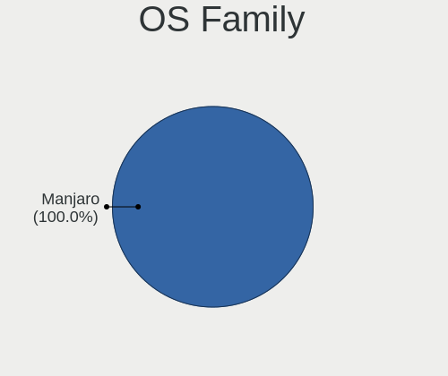
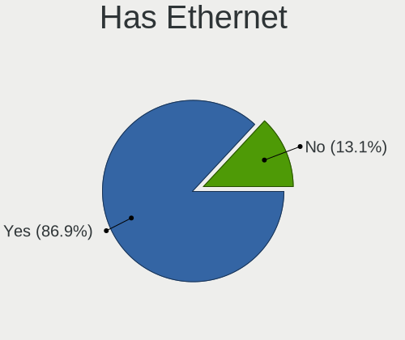
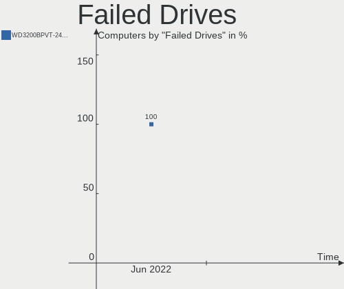
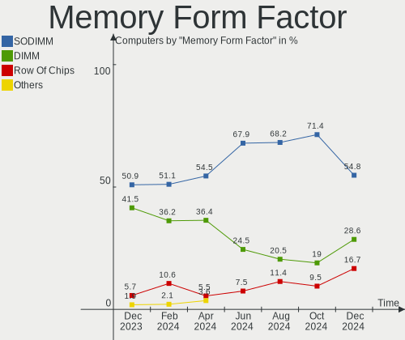
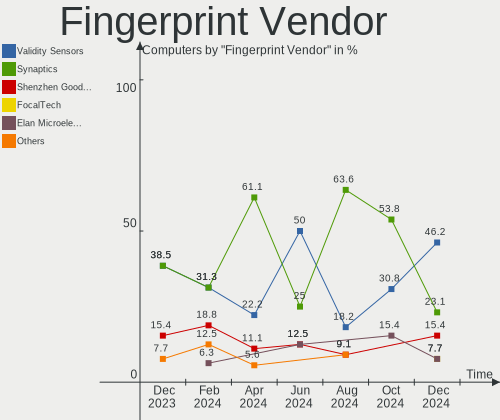

Manjaro Hardware Trends
-----------------------

A project to identify most popular hardware characteristics and track their change
over time based on data collected by Manjaro users at https://Linux-Hardware.org.

Anyone can contribute to the study by uploading probes of their computers by
the [hw-probe](https://github.com/linuxhw/hw-probe) tool:

    sudo -E hw-probe -all -upload

This is a report for all computer types. See also reports for [desktops](/Dist/Manjaro/Desktop/README.md) and [notebooks](/Dist/Manjaro/Notebook/README.md).

Full-feature report is available here: https://linux-hardware.org/?view=trends

Period: Mar, 2021.

Contents
--------

- [ OS                       ](#os)
- [ OS Family                ](#os-family)
- [ Kernel                   ](#kernel)
- [ Kernel Family            ](#kernel-family)
- [ Kernel Major Ver.        ](#kernel-major-ver)
- [ Arch                     ](#arch)
- [ DE                       ](#de)
- [ Display Server           ](#display-server)
- [ Display Manager          ](#display-manager)
- [ OS Lang                  ](#os-lang)
- [ Boot Mode                ](#boot-mode)
- [ Filesystem               ](#filesystem)
- [ Part. scheme             ](#part-scheme)
- [ Dual Boot with Linux/BSD ](#dual-boot-with-linux/bsd)
- [ Dual Boot (Win)          ](#dual-boot-win)
- [ Country                  ](#country)
- [ City                     ](#city)
- [ Vendor                   ](#vendor)
- [ Model                    ](#model)
- [ Model Family             ](#model-family)
- [ MFG Year                 ](#mfg-year)
- [ Form Factor              ](#form-factor)
- [ Secure Boot              ](#secure-boot)
- [ Coreboot                 ](#coreboot)
- [ RAM Size                 ](#ram-size)
- [ RAM Used                 ](#ram-used)
- [ Has CD-ROM               ](#has-cd-rom)
- [ Total Drives             ](#total-drives)
- [ Has Ethernet             ](#has-ethernet)
- [ Has WiFi                 ](#has-wifi)
- [ Has Bluetooth            ](#has-bluetooth)
- [ Drive Vendor             ](#drive-vendor)
- [ Drive Model              ](#drive-model)
- [ HDD Vendor               ](#hdd-vendor)
- [ SSD Vendor               ](#ssd-vendor)
- [ Drive Kind               ](#drive-kind)
- [ Drive Connector          ](#drive-connector)
- [ Drive Size               ](#drive-size)
- [ Space Total              ](#space-total)
- [ Space Used               ](#space-used)
- [ Malfunc. Drives          ](#malfunc-drives)
- [ Malfunc. Drive Vendor    ](#malfunc-drive-vendor)
- [ Malfunc. HDD Vendor      ](#malfunc-hdd-vendor)
- [ Malfunc. Drive Kind      ](#malfunc-drive-kind)
- [ Failed Drives            ](#failed-drives)
- [ Failed Drive Vendor      ](#failed-drive-vendor)
- [ Drive Status             ](#drive-status)
- [ Storage Vendor           ](#storage-vendor)
- [ Storage Model            ](#storage-model)
- [ Storage Kind             ](#storage-kind)
- [ CPU Vendor               ](#cpu-vendor)
- [ CPU Model                ](#cpu-model)
- [ CPU Model Family         ](#cpu-model-family)
- [ CPU Cores                ](#cpu-cores)
- [ CPU Sockets              ](#cpu-sockets)
- [ CPU Threads              ](#cpu-threads)
- [ CPU Op-Modes             ](#cpu-op-modes)
- [ CPU Microcode            ](#cpu-microcode)
- [ CPU Microarch            ](#cpu-microarch)
- [ GPU Vendor               ](#gpu-vendor)
- [ GPU Model                ](#gpu-model)
- [ GPU Combo                ](#gpu-combo)
- [ GPU Driver               ](#gpu-driver)
- [ GPU Memory               ](#gpu-memory)
- [ Monitor Vendor           ](#monitor-vendor)
- [ Monitor Model            ](#monitor-model)
- [ Monitor Resolution       ](#monitor-resolution)
- [ Monitor Diagonal         ](#monitor-diagonal)
- [ Monitor Width            ](#monitor-width)
- [ Aspect Ratio             ](#aspect-ratio)
- [ Monitor Area             ](#monitor-area)
- [ Pixel Density            ](#pixel-density)
- [ Multiple Monitors        ](#multiple-monitors)
- [ Net Controller Vendor    ](#net-controller-vendor)
- [ Net Controller Model     ](#net-controller-model)
- [ Wireless Vendor          ](#wireless-vendor)
- [ Wireless Model           ](#wireless-model)
- [ Ethernet Vendor          ](#ethernet-vendor)
- [ Ethernet Model           ](#ethernet-model)
- [ Net Controller Kind      ](#net-controller-kind)
- [ Used Controller          ](#used-controller)
- [ NICs                     ](#nics)
- [ IPv6                     ](#ipv6)
- [ Memory Vendor            ](#memory-vendor)
- [ Memory Model             ](#memory-model)
- [ Memory Kind              ](#memory-kind)
- [ Memory Form Factor       ](#memory-form-factor)
- [ Memory Size              ](#memory-size)
- [ Memory Speed             ](#memory-speed)
- [ Sound Vendor             ](#sound-vendor)
- [ Sound Model              ](#sound-model)
- [ Camera Vendor            ](#camera-vendor)
- [ Camera Model             ](#camera-model)
- [ Fingerprint Vendor       ](#fingerprint-vendor)
- [ Fingerprint Model        ](#fingerprint-model)
- [ Chipcard Vendor          ](#chipcard-vendor)
- [ Chipcard Model           ](#chipcard-model)
- [ Printer Vendor           ](#printer-vendor)
- [ Printer Model            ](#printer-model)
- [ Scanner Vendor           ](#scanner-vendor)
- [ Scanner Model            ](#scanner-model)
- [ Bluetooth Vendor         ](#bluetooth-vendor)
- [ Bluetooth Model          ](#bluetooth-model)
- [ Unsupported Devices      ](#unsupported-devices)
- [ Unsupported Device Types ](#unsupported-device-types)

OS
--

Installed operating systems

| Name           | Computers | Percent |
|----------------|-----------|---------|
| Manjaro        | 110       | 43.48%  |
| Manjaro 20.2.1 | 87        | 34.39%  |
| Manjaro 21.0   | 52        | 20.55%  |
| Manjaro 20.0.1 | 2         | 0.79%   |
| Manjaro 20.1.1 | 1         | 0.4%    |
| Manjaro 20.0   | 1         | 0.4%    |

OS Family
---------

OS without a version

| Name    | Computers | Percent |
|---------|-----------|---------|
| Manjaro | 253       | 100%    |

Kernel
------

Version of the Linux kernel

| Version                 | Computers | Percent |
|-------------------------|-----------|---------|
| 5.9.16-1-MANJARO        | 81        | 32.02%  |
| 5.11.6-1-MANJARO        | 30        | 11.86%  |
| 5.11.2-1-MANJARO        | 27        | 10.67%  |
| 5.10.23-1-MANJARO       | 22        | 8.7%    |
| 5.10.18-1-MANJARO       | 15        | 5.93%   |
| 5.10.19-1-MANJARO       | 14        | 5.53%   |
| 5.4.105-1-MANJARO       | 10        | 3.95%   |
| 5.11.1-1-MANJARO        | 10        | 3.95%   |
| 5.12.0-1-MANJARO        | 5         | 1.98%   |
| 5.9.1-1-rt19-MANJARO    | 4         | 1.58%   |
| 5.4.100-1-MANJARO       | 4         | 1.58%   |
| 5.4.101-1-MANJARO       | 3         | 1.19%   |
| 5.11.4-1-MANJARO        | 2         | 0.79%   |
| 5.10.15-1-MANJARO       | 2         | 0.79%   |
| 4.19.177-1-MANJARO      | 2         | 0.79%   |
| 5.9.11-3-MANJARO        | 1         | 0.4%    |
| 5.8.11-1-MANJARO        | 1         | 0.4%    |
| 5.6.7-1-MANJARO         | 1         | 0.4%    |
| 5.6.11-1-MANJARO        | 1         | 0.4%    |
| 5.4.95-1-MANJARO        | 1         | 0.4%    |
| 5.11.8-1-ck             | 1         | 0.4%    |
| 5.11.6-1-ck-sandybridge | 1         | 0.4%    |
| 5.11.4-AMD-znver2       | 1         | 0.4%    |
| 5.11.4-1-ck-haswell     | 1         | 0.4%    |
| 5.11.3-lqx1-1-lqx       | 1         | 0.4%    |
| 5.11.3-1-MANJARO-ARM    | 1         | 0.4%    |
| 5.11.10-AMD             | 1         | 0.4%    |
| 5.11.10-1-MANJARO       | 1         | 0.4%    |
| 5.11.1-xanmod1-1        | 1         | 0.4%    |
| 5.11.0-2-ck             | 1         | 0.4%    |
| 5.10.4-arch2-1          | 1         | 0.4%    |
| 5.10.22-1-MANJARO       | 1         | 0.4%    |
| 5.10.21-1-MANJARO       | 1         | 0.4%    |
| 5.10.2-2-MANJARO        | 1         | 0.4%    |
| 4.14.222-1-MANJARO      | 1         | 0.4%    |
| 4.14.221-1-MANJARO      | 1         | 0.4%    |
| 4.14.179-1-MANJARO      | 1         | 0.4%    |

Kernel Family
-------------

Linux kernel without a distro release

| Version  | Computers | Percent |
|----------|-----------|---------|
| 5.9.16   | 81        | 32.02%  |
| 5.11.6   | 31        | 12.25%  |
| 5.11.2   | 27        | 10.67%  |
| 5.10.23  | 22        | 8.7%    |
| 5.10.18  | 15        | 5.93%   |
| 5.10.19  | 14        | 5.53%   |
| 5.11.1   | 11        | 4.35%   |
| 5.4.105  | 10        | 3.95%   |
| 5.12.0   | 5         | 1.98%   |
| 5.9.1    | 4         | 1.58%   |
| 5.4.100  | 4         | 1.58%   |
| 5.11.4   | 4         | 1.58%   |
| 5.4.101  | 3         | 1.19%   |
| 5.11.3   | 2         | 0.79%   |
| 5.11.10  | 2         | 0.79%   |
| 5.10.15  | 2         | 0.79%   |
| 4.19.177 | 2         | 0.79%   |
| 5.9.11   | 1         | 0.4%    |
| 5.8.11   | 1         | 0.4%    |
| 5.6.7    | 1         | 0.4%    |
| 5.6.11   | 1         | 0.4%    |
| 5.4.95   | 1         | 0.4%    |
| 5.11.8   | 1         | 0.4%    |
| 5.11.0   | 1         | 0.4%    |
| 5.10.4   | 1         | 0.4%    |
| 5.10.22  | 1         | 0.4%    |
| 5.10.21  | 1         | 0.4%    |
| 5.10.2   | 1         | 0.4%    |
| 4.14.222 | 1         | 0.4%    |
| 4.14.221 | 1         | 0.4%    |
| 4.14.179 | 1         | 0.4%    |

Kernel Major Ver.
-----------------

Linux kernel major version

| Version | Computers | Percent |
|---------|-----------|---------|
| 5.9     | 86        | 33.99%  |
| 5.11    | 79        | 31.23%  |
| 5.10    | 57        | 22.53%  |
| 5.4     | 18        | 7.11%   |
| 5.12    | 5         | 1.98%   |
| 4.14    | 3         | 1.19%   |
| 5.6     | 2         | 0.79%   |
| 4.19    | 2         | 0.79%   |
| 5.8     | 1         | 0.4%    |

Arch
----

OS architecture (x86_64, i586, etc.)

| Name    | Computers | Percent |
|---------|-----------|---------|
| x86_64  | 252       | 99.6%   |
| aarch64 | 1         | 0.4%    |

DE
--

Desktop Environment

| Name       | Computers | Percent |
|------------|-----------|---------|
| KDE5       | 64        | 25.3%   |
| GNOME      | 58        | 22.92%  |
| XFCE       | 56        | 22.13%  |
| KDE        | 46        | 18.18%  |
| Unknown    | 9         | 3.56%   |
| X-Cinnamon | 6         | 2.37%   |
| i3         | 6         | 2.37%   |
| MATE       | 3         | 1.19%   |
| Deepin     | 2         | 0.79%   |
| Cinnamon   | 2         | 0.79%   |
| LXQt       | 1         | 0.4%    |

Display Server
--------------

X11 or Wayland

| Name    | Computers | Percent |
|---------|-----------|---------|
| X11     | 221       | 87.35%  |
| Wayland | 22        | 8.7%    |
| Unknown | 8         | 3.16%   |
| Tty     | 2         | 0.79%   |

Display Manager
---------------

SDDM, LightDM, etc.

| Name    | Computers | Percent |
|---------|-----------|---------|
| Unknown | 108       | 42.69%  |
| SDDM    | 64        | 25.3%   |
| GDM     | 39        | 15.42%  |
| LightDM | 35        | 13.83%  |
| TDM     | 6         | 2.37%   |
| LXDM    | 1         | 0.4%    |

OS Lang
-------

Language

| Lang   | Computers | Percent |
|--------|-----------|---------|
| en_US  | 106       | 41.9%   |
| ru_RU  | 30        | 11.86%  |
| de_DE  | 22        | 8.7%    |
| en_GB  | 20        | 7.91%   |
| pt_BR  | 10        | 3.95%   |
| pl_PL  | 7         | 2.77%   |
| fr_FR  | 6         | 2.37%   |
| es_ES  | 6         | 2.37%   |
| it_IT  | 4         | 1.58%   |
| es_CL  | 4         | 1.58%   |
| en_CA  | 4         | 1.58%   |
| nl_NL  | 3         | 1.19%   |
| es_MX  | 3         | 1.19%   |
| C      | 3         | 1.19%   |
| ru_UA  | 2         | 0.79%   |
| en_PH  | 2         | 0.79%   |
| en_IN  | 2         | 0.79%   |
| en_IL  | 2         | 0.79%   |
| zh_CN  | 1         | 0.4%    |
| uk_UA  | 1         | 0.4%    |
| tr_TR  | 1         | 0.4%    |
| szl_PL | 1         | 0.4%    |
| sv_SE  | 1         | 0.4%    |
| quc_GT | 1         | 0.4%    |
| pt_PT  | 1         | 0.4%    |
| nl_BE  | 1         | 0.4%    |
| li_BE  | 1         | 0.4%    |
| hr_HR  | 1         | 0.4%    |
| fr_CA  | 1         | 0.4%    |
| en_ZA  | 1         | 0.4%    |
| en_DK  | 1         | 0.4%    |
| de_AT  | 1         | 0.4%    |
| da_DK  | 1         | 0.4%    |
| cs_CZ  | 1         | 0.4%    |
| bg_BG  | 1         | 0.4%    |

Boot Mode
---------

EFI or BIOS

| Mode | Computers | Percent |
|------|-----------|---------|
| BIOS | 158       | 62.45%  |
| EFI  | 95        | 37.55%  |

Filesystem
----------

Type of filesystem

| Type    | Computers | Percent |
|---------|-----------|---------|
| Ext4    | 224       | 88.54%  |
| Btrfs   | 16        | 6.32%   |
| Overlay | 9         | 3.56%   |
| Zfs     | 1         | 0.4%    |
| Jfs     | 1         | 0.4%    |
| Ext3    | 1         | 0.4%    |
| Unknown | 1         | 0.4%    |

Part. scheme
------------

Scheme of partitioning

| Type    | Computers | Percent |
|---------|-----------|---------|
| GPT     | 111       | 43.87%  |
| Unknown | 105       | 41.5%   |
| MBR     | 37        | 14.62%  |

Dual Boot with Linux/BSD
------------------------

Hosting more than one Linux/BSD

| Dual boot | Computers | Percent |
|-----------|-----------|---------|
| No        | 218       | 86.17%  |
| Yes       | 35        | 13.83%  |

Dual Boot (Win)
---------------

Hosting Linux and Windows

| Dual boot | Computers | Percent |
|-----------|-----------|---------|
| No        | 177       | 69.96%  |
| Yes       | 76        | 30.04%  |

Country
-------

Geographic location (country)

| Country      | Computers | Percent |
|--------------|-----------|---------|
| USA          | 36        | 14.23%  |
| Russia       | 32        | 12.65%  |
| Germany      | 31        | 12.25%  |
| Ukraine      | 12        | 4.74%   |
| UK           | 11        | 4.35%   |
| Brazil       | 11        | 4.35%   |
| Poland       | 10        | 3.95%   |
| France       | 9         | 3.56%   |
| Canada       | 7         | 2.77%   |
| Spain        | 6         | 2.37%   |
| Sweden       | 5         | 1.98%   |
| Lithuania    | 5         | 1.98%   |
| Chile        | 5         | 1.98%   |
| Netherlands  | 4         | 1.58%   |
| Mexico       | 4         | 1.58%   |
| Italy        | 4         | 1.58%   |
| Finland      | 4         | 1.58%   |
| Belgium      | 4         | 1.58%   |
| Norway       | 3         | 1.19%   |
| Czechia      | 3         | 1.19%   |
| Belarus      | 3         | 1.19%   |
| Bangladesh   | 3         | 1.19%   |
| Philippines  | 2         | 0.79%   |
| Israel       | 2         | 0.79%   |
| India        | 2         | 0.79%   |
| Hungary      | 2         | 0.79%   |
| Guatemala    | 2         | 0.79%   |
| Greece       | 2         | 0.79%   |
| Egypt        | 2         | 0.79%   |
| Denmark      | 2         | 0.79%   |
| Croatia      | 2         | 0.79%   |
| Bulgaria     | 2         | 0.79%   |
| Austria      | 2         | 0.79%   |
| Australia    | 2         | 0.79%   |
| Argentina    | 2         | 0.79%   |
| Turkey       | 1         | 0.4%    |
| Thailand     | 1         | 0.4%    |
| South Korea  | 1         | 0.4%    |
| South Africa | 1         | 0.4%    |
| Romania      | 1         | 0.4%    |
| Portugal     | 1         | 0.4%    |
| Malaysia     | 1         | 0.4%    |
| Latvia       | 1         | 0.4%    |
| Indonesia    | 1         | 0.4%    |
| Ethiopia     | 1         | 0.4%    |
| Estonia      | 1         | 0.4%    |
| Costa Rica   | 1         | 0.4%    |
| China        | 1         | 0.4%    |
| Armenia      | 1         | 0.4%    |
| Algeria      | 1         | 0.4%    |

City
----

Geographic location (city)

| City                          | Computers | Percent |
|-------------------------------|-----------|---------|
| Moscow                        | 12        | 4.74%   |
| Santiago                      | 4         | 1.58%   |
| Mosedis                       | 3         | 1.19%   |
| Minsk                         | 3         | 1.19%   |
| Hamburg                       | 3         | 1.19%   |
| Dhaka                         | 3         | 1.19%   |
| Warsaw                        | 2         | 0.79%   |
| Voronezh                      | 2         | 0.79%   |
| Vinnytsia                     | 2         | 0.79%   |
| Vilnius                       | 2         | 0.79%   |
| Pulheim                       | 2         | 0.79%   |
| Osasco                        | 2         | 0.79%   |
| Novosibirsk                   | 2         | 0.79%   |
| Munich                        | 2         | 0.79%   |
| Montreal                      | 2         | 0.79%   |
| Madrid                        | 2         | 0.79%   |
| Le Mans                       | 2         | 0.79%   |
| Kyiv                          | 2         | 0.79%   |
| Kirchseeon                    | 2         | 0.79%   |
| Hagen                         | 2         | 0.79%   |
| Gyomro                        | 2         | 0.79%   |
| Guatemala City                | 2         | 0.79%   |
| Eugene                        | 2         | 0.79%   |
| Cairo                         | 2         | 0.79%   |
| Buenos Aires                  | 2         | 0.79%   |
| Athens                        | 2         | 0.79%   |
| Zagreb                        | 1         | 0.4%    |
| Yogyakarta                    | 1         | 0.4%    |
| Yerevan                       | 1         | 0.4%    |
| Yekaterinburg                 | 1         | 0.4%    |
| Yaroslavl                     | 1         | 0.4%    |
| Wrzesnia                      | 1         | 0.4%    |
| Worksop                       | 1         | 0.4%    |
| Wijchen                       | 1         | 0.4%    |
| Wetteren                      | 1         | 0.4%    |
| Walton on Thames              | 1         | 0.4%    |
| Vologda                       | 1         | 0.4%    |
| Vienna                        | 1         | 0.4%    |
| Vernon                        | 1         | 0.4%    |
| Vandalia                      | 1         | 0.4%    |
| Valencia                      | 1         | 0.4%    |
| Ustron                        | 1         | 0.4%    |
| Ufa                           | 1         | 0.4%    |
| Tuxpam de Rodriguez Cano      | 1         | 0.4%    |
| Tultitlan de Mariano Escobedo | 1         | 0.4%    |
| Trondheim                     | 1         | 0.4%    |
| Treviolo                      | 1         | 0.4%    |
| Toronto                       | 1         | 0.4%    |
| Tongeren                      | 1         | 0.4%    |
| Tonawanda                     | 1         | 0.4%    |
| Tolyatti                      | 1         | 0.4%    |
| The Bronx                     | 1         | 0.4%    |
| Tel Aviv                      | 1         | 0.4%    |
| Swansea                       | 1         | 0.4%    |
| Surgut                        | 1         | 0.4%    |
| Suhopolje                     | 1         | 0.4%    |
| Strasbourg                    | 1         | 0.4%    |
| Starobesheve                  | 1         | 0.4%    |
| Stadthagen                    | 1         | 0.4%    |
| St Petersburg                 | 1         | 0.4%    |

Vendor
------

Motherboard manufacturer

| Name                | Computers | Percent |
|---------------------|-----------|---------|
| Lenovo              | 40        | 15.81%  |
| ASUSTek Computer    | 39        | 15.42%  |
| Hewlett-Packard     | 37        | 14.62%  |
| Dell                | 27        | 10.67%  |
| MSI                 | 21        | 8.3%    |
| Gigabyte Technology | 21        | 8.3%    |
| Acer                | 18        | 7.11%   |
| ASRock              | 11        | 4.35%   |
| Intel               | 5         | 1.98%   |
| Unknown             | 4         | 1.58%   |
| Toshiba             | 3         | 1.19%   |
| Notebook            | 3         | 1.19%   |
| TrekStor            | 2         | 0.79%   |
| Samsung Electronics | 2         | 0.79%   |
| AZW                 | 2         | 0.79%   |
| AMI                 | 2         | 0.79%   |
| Alienware           | 2         | 0.79%   |
| Wortmann AG         | 1         | 0.4%    |
| SYWZ                | 1         | 0.4%    |
| Sony                | 1         | 0.4%    |
| Pine Microsystems   | 1         | 0.4%    |
| Pegatron            | 1         | 0.4%    |
| Login Informatica   | 1         | 0.4%    |
| HUAWEI              | 1         | 0.4%    |
| Google              | 1         | 0.4%    |
| Fujitsu             | 1         | 0.4%    |
| eMachines           | 1         | 0.4%    |
| ECS                 | 1         | 0.4%    |
| Chuwi               | 1         | 0.4%    |
| BESSTAR Tech        | 1         | 0.4%    |
| Apple               | 1         | 0.4%    |

Model
-----

Motherboard model

| Name                                     | Computers | Percent |
|------------------------------------------|-----------|---------|
| ASUS All Series                          | 4         | 1.58%   |
| Unknown                                  | 4         | 1.58%   |
| MSI MS-7C37                              | 2         | 0.79%   |
| Lenovo IdeaPad Flex 5 14ARE05 81X2       | 2         | 0.79%   |
| HP 15                                    | 2         | 0.79%   |
| Gigabyte B450M DS3H                      | 2         | 0.79%   |
| Dell OptiPlex 9020                       | 2         | 0.79%   |
| ASRock X570 Taichi                       | 2         | 0.79%   |
| ASRock B450M Pro4                        | 2         | 0.79%   |
| Wortmann AG TERRA Mobile 1748            | 1         | 0.4%    |
| TrekStor YOURBOOK C11B                   | 1         | 0.4%    |
| TrekStor SurfBook W2                     | 1         | 0.4%    |
| Toshiba Satellite M300                   | 1         | 0.4%    |
| Toshiba Satellite L855                   | 1         | 0.4%    |
| Toshiba QOSMIO X775                      | 1         | 0.4%    |
| SYWZ S210H Series                        | 1         | 0.4%    |
| Sony VPCF23P1E                           | 1         | 0.4%    |
| Samsung R530/R730/R540                   | 1         | 0.4%    |
| Samsung 340XAA/350XAA/550XAA             | 1         | 0.4%    |
| Pine Microsystems Pine64 PinePhone (1.2) | 1         | 0.4%    |
| Pegatron A35                             | 1         | 0.4%    |
| Notebook PA70ES                          | 1         | 0.4%    |
| Notebook N7x0WU                          | 1         | 0.4%    |
| Notebook N14xWU                          | 1         | 0.4%    |
| MSI MS-7C91                              | 1         | 0.4%    |
| MSI MS-7C79                              | 1         | 0.4%    |
| MSI MS-7C52                              | 1         | 0.4%    |
| MSI MS-7C02                              | 1         | 0.4%    |
| MSI MS-7B79                              | 1         | 0.4%    |
| MSI MS-7B48                              | 1         | 0.4%    |
| MSI MS-7B18                              | 1         | 0.4%    |
| MSI MS-7A38                              | 1         | 0.4%    |
| MSI MS-7A37                              | 1         | 0.4%    |
| MSI MS-7971                              | 1         | 0.4%    |
| MSI MS-7900                              | 1         | 0.4%    |
| MSI MS-7885                              | 1         | 0.4%    |
| MSI MS-7821                              | 1         | 0.4%    |
| MSI MS-7680                              | 1         | 0.4%    |
| MSI GX60 1AC/GX60 3AE/GX60 3BE           | 1         | 0.4%    |
| MSI GV62 8RD                             | 1         | 0.4%    |
| MSI GS63 7RD                             | 1         | 0.4%    |
| MSI GP60 2QF                             | 1         | 0.4%    |
| MSI A320M-HDV R4.0                       | 1         | 0.4%    |
| Login Informatica LOG-QAL30              | 1         | 0.4%    |
| Lenovo Z50-70 20354                      | 1         | 0.4%    |
| Lenovo Yoga C940-14IIL 81Q9              | 1         | 0.4%    |
| Lenovo ThinkPad X250 20CM003WMS          | 1         | 0.4%    |
| Lenovo ThinkPad X201 4492A23             | 1         | 0.4%    |
| Lenovo ThinkPad X140e 20BL000BUS         | 1         | 0.4%    |
| Lenovo ThinkPad X1 Yoga 2nd 20JES03T00   | 1         | 0.4%    |
| Lenovo ThinkPad X1 Carbon 7th 20QD003ART | 1         | 0.4%    |
| Lenovo ThinkPad W500 4061AZ8             | 1         | 0.4%    |
| Lenovo ThinkPad T490 20N3S8HL00          | 1         | 0.4%    |
| Lenovo ThinkPad T480s 20L8S4T801         | 1         | 0.4%    |
| Lenovo ThinkPad T460s 20F9003RRT         | 1         | 0.4%    |
| Lenovo ThinkPad T430 2349GZG             | 1         | 0.4%    |
| Lenovo ThinkPad T14 Gen 1 20S00008RT     | 1         | 0.4%    |
| Lenovo ThinkPad SL 2746AGG               | 1         | 0.4%    |
| Lenovo ThinkPad P53 20QQS2KB00           | 1         | 0.4%    |
| Lenovo ThinkPad L420 7829BH2             | 1         | 0.4%    |

Model Family
------------

Motherboard model prefix

| Name                     | Computers | Percent |
|--------------------------|-----------|---------|
| Lenovo ThinkPad          | 18        | 7.11%   |
| Acer Aspire              | 15        | 5.93%   |
| Lenovo IdeaPad           | 12        | 4.74%   |
| Dell Inspiron            | 10        | 3.95%   |
| Dell Latitude            | 7         | 2.77%   |
| HP ProBook               | 6         | 2.37%   |
| HP Pavilion              | 6         | 2.37%   |
| Dell OptiPlex            | 5         | 1.98%   |
| ASUS TUF                 | 5         | 1.98%   |
| ASUS PRIME               | 5         | 1.98%   |
| ASUS All                 | 4         | 1.58%   |
| Unknown                  | 4         | 1.58%   |
| Lenovo Legion            | 3         | 1.19%   |
| HP Laptop                | 3         | 1.19%   |
| HP EliteBook             | 3         | 1.19%   |
| Dell Precision           | 3         | 1.19%   |
| ASUS ROG                 | 3         | 1.19%   |
| ASRock B450M             | 3         | 1.19%   |
| Toshiba Satellite        | 2         | 0.79%   |
| MSI MS-7C37              | 2         | 0.79%   |
| HP ProDesk               | 2         | 0.79%   |
| HP ENVY                  | 2         | 0.79%   |
| HP Compaq                | 2         | 0.79%   |
| HP 15                    | 2         | 0.79%   |
| Gigabyte X570            | 2         | 0.79%   |
| Gigabyte B450M           | 2         | 0.79%   |
| Dell XPS                 | 2         | 0.79%   |
| ASUS VivoBook            | 2         | 0.79%   |
| ASUS Maximus             | 2         | 0.79%   |
| ASRock X570              | 2         | 0.79%   |
| Wortmann AG TERRA        | 1         | 0.4%    |
| TrekStor YOURBOOK        | 1         | 0.4%    |
| TrekStor SurfBook        | 1         | 0.4%    |
| Toshiba QOSMIO           | 1         | 0.4%    |
| SYWZ S210H               | 1         | 0.4%    |
| Sony VPCF23P1E           | 1         | 0.4%    |
| Samsung R530             | 1         | 0.4%    |
| Samsung 340XAA           | 1         | 0.4%    |
| Pine Microsystems Pine64 | 1         | 0.4%    |
| Pegatron A35             | 1         | 0.4%    |
| Notebook PA70ES          | 1         | 0.4%    |
| Notebook N7x0WU          | 1         | 0.4%    |
| Notebook N14xWU          | 1         | 0.4%    |
| MSI MS-7C91              | 1         | 0.4%    |
| MSI MS-7C79              | 1         | 0.4%    |
| MSI MS-7C52              | 1         | 0.4%    |
| MSI MS-7C02              | 1         | 0.4%    |
| MSI MS-7B79              | 1         | 0.4%    |
| MSI MS-7B48              | 1         | 0.4%    |
| MSI MS-7B18              | 1         | 0.4%    |
| MSI MS-7A38              | 1         | 0.4%    |
| MSI MS-7A37              | 1         | 0.4%    |
| MSI MS-7971              | 1         | 0.4%    |
| MSI MS-7900              | 1         | 0.4%    |
| MSI MS-7885              | 1         | 0.4%    |
| MSI MS-7821              | 1         | 0.4%    |
| MSI MS-7680              | 1         | 0.4%    |
| MSI GX60                 | 1         | 0.4%    |
| MSI GV62                 | 1         | 0.4%    |
| MSI GS63                 | 1         | 0.4%    |

MFG Year
--------

Motherboard manufacture year

| Year    | Computers | Percent |
|---------|-----------|---------|
| 2020    | 69        | 27.27%  |
| 2019    | 34        | 13.44%  |
| 2018    | 32        | 12.65%  |
| 2017    | 15        | 5.93%   |
| 2011    | 14        | 5.53%   |
| 2021    | 13        | 5.14%   |
| 2015    | 13        | 5.14%   |
| 2016    | 12        | 4.74%   |
| 2013    | 12        | 4.74%   |
| 2014    | 11        | 4.35%   |
| 2012    | 10        | 3.95%   |
| 2010    | 7         | 2.77%   |
| 2009    | 6         | 2.37%   |
| 2008    | 3         | 1.19%   |
| 2006    | 1         | 0.4%    |
| Unknown | 1         | 0.4%    |

Form Factor
-----------

Physical design of the computer

| Name        | Computers | Percent |
|-------------|-----------|---------|
| Notebook    | 129       | 50.99%  |
| Desktop     | 106       | 41.9%   |
| Convertible | 9         | 3.56%   |
| Mini pc     | 6         | 2.37%   |
| All in one  | 2         | 0.79%   |
| Phone       | 1         | 0.4%    |

Secure Boot
-----------

Enabled or disabled

| State    | Computers | Percent |
|----------|-----------|---------|
| Disabled | 253       | 100%    |

Coreboot
--------

Have coreboot on board

| Used | Computers | Percent |
|------|-----------|---------|
| No   | 251       | 99.21%  |
| Yes  | 2         | 0.79%   |

RAM Size
--------

Total RAM memory

| Size in GB  | Computers | Percent |
|-------------|-----------|---------|
| 8.01-16.0   | 61        | 24.11%  |
| 16.01-24.0  | 58        | 22.92%  |
| 4.01-8.0    | 56        | 22.13%  |
| 3.01-4.0    | 33        | 13.04%  |
| 32.01-64.0  | 28        | 11.07%  |
| 64.01-256.0 | 8         | 3.16%   |
| 24.01-32.0  | 6         | 2.37%   |
| 1.01-2.0    | 2         | 0.79%   |
| 2.01-3.0    | 1         | 0.4%    |

RAM Used
--------

Used RAM memory

| Used GB    | Computers | Percent |
|------------|-----------|---------|
| 1.01-2.0   | 77        | 30.43%  |
| 2.01-3.0   | 62        | 24.51%  |
| 4.01-8.0   | 50        | 19.76%  |
| 3.01-4.0   | 40        | 15.81%  |
| 8.01-16.0  | 15        | 5.93%   |
| 0.51-1.0   | 4         | 1.58%   |
| 0.01-0.5   | 3         | 1.19%   |
| 16.01-24.0 | 2         | 0.79%   |

Has CD-ROM
----------

Has CD-ROM on board

| Presented | Computers | Percent |
|-----------|-----------|---------|
| No        | 174       | 68.77%  |
| Yes       | 79        | 31.23%  |

Total Drives
------------

Number of drives on board

| Drives | Computers | Percent |
|--------|-----------|---------|
| 1      | 130       | 51.38%  |
| 2      | 74        | 29.25%  |
| 3      | 21        | 8.3%    |
| 4      | 14        | 5.53%   |
| 5      | 9         | 3.56%   |
| 6      | 2         | 0.79%   |
| 0      | 2         | 0.79%   |
| 8      | 1         | 0.4%    |

Has Ethernet
------------

Has Ethernet on board

| Presented | Computers | Percent |
|-----------|-----------|---------|
| Yes       | 217       | 85.77%  |
| No        | 36        | 14.23%  |

Has WiFi
--------

Has WiFi module

| Presented | Computers | Percent |
|-----------|-----------|---------|
| Yes       | 189       | 74.7%   |
| No        | 64        | 25.3%   |

Has Bluetooth
-------------

Has Bluetooth module

| Presented | Computers | Percent |
|-----------|-----------|---------|
| Yes       | 159       | 62.85%  |
| No        | 94        | 37.15%  |

Drive Vendor
------------

Hard drive vendors

| Vendor                    | Computers | Drives | Percent |
|---------------------------|-----------|--------|---------|
| Samsung Electronics       | 80        | 96     | 19.32%  |
| Seagate                   | 58        | 68     | 14.01%  |
| WDC                       | 54        | 66     | 13.04%  |
| Kingston                  | 34        | 35     | 8.21%   |
| Toshiba                   | 33        | 36     | 7.97%   |
| Crucial                   | 17        | 20     | 4.11%   |
| Sandisk                   | 16        | 17     | 3.86%   |
| Unknown                   | 15        | 15     | 3.62%   |
| Intel                     | 12        | 12     | 2.9%    |
| Hitachi                   | 11        | 11     | 2.66%   |
| SK Hynix                  | 7         | 7      | 1.69%   |
| Micron Technology         | 6         | 6      | 1.45%   |
| HGST                      | 6         | 7      | 1.45%   |
| China                     | 6         | 6      | 1.45%   |
| A-DATA Technology         | 6         | 6      | 1.45%   |
| Phison                    | 5         | 5      | 1.21%   |
| SPCC                      | 4         | 5      | 0.97%   |
| Silicon Motion            | 4         | 4      | 0.97%   |
| Intenso                   | 3         | 3      | 0.72%   |
| XPG                       | 2         | 2      | 0.48%   |
| Union Memory              | 2         | 2      | 0.48%   |
| PNY                       | 2         | 3      | 0.48%   |
| KIOXIA                    | 2         | 2      | 0.48%   |
| JMicron                   | 2         | 2      | 0.48%   |
| Hewlett-Packard           | 2         | 2      | 0.48%   |
| Fujitsu                   | 2         | 2      | 0.48%   |
| USB3.1                    | 1         | 1      | 0.24%   |
| USB3.0                    | 1         | 1      | 0.24%   |
| TSA                       | 1         | 1      | 0.24%   |
| TrekStor                  | 1         | 1      | 0.24%   |
| Transcend                 | 1         | 1      | 0.24%   |
| PNY USB                   | 1         | 1      | 0.24%   |
| Patriot                   | 1         | 1      | 0.24%   |
| OCZ                       | 1         | 1      | 0.24%   |
| Mushkin                   | 1         | 1      | 0.24%   |
| MILAN                     | 1         | 1      | 0.24%   |
| Micron/Crucial Technology | 1         | 1      | 0.24%   |
| HS-SSD-E100               | 1         | 1      | 0.24%   |
| HGST HTS                  | 1         | 1      | 0.24%   |
| GOODRAM                   | 1         | 1      | 0.24%   |
| External                  | 1         | 1      | 0.24%   |
| Corsair                   | 1         | 1      | 0.24%   |
| BIWIN                     | 1         | 1      | 0.24%   |
| BHT                       | 1         | 1      | 0.24%   |
| ATOM                      | 1         | 1      | 0.24%   |
| ASMT109x                  | 1         | 1      | 0.24%   |
| ASMT                      | 1         | 1      | 0.24%   |
| Apple                     | 1         | 1      | 0.24%   |
| Apacer                    | 1         | 1      | 0.24%   |

Drive Model
-----------

Hard drive models

| Model                                    | Computers | Percent |
|------------------------------------------|-----------|---------|
| Kingston SA400S37120G 120GB SSD          | 8         | 1.77%   |
| Toshiba DT01ACA100 1TB                   | 6         | 1.33%   |
| Toshiba HDWD110 1TB                      | 5         | 1.11%   |
| Seagate ST1000LM035-1RK172 1TB           | 5         | 1.11%   |
| Samsung SSD 860 EVO 500GB                | 5         | 1.11%   |
| Samsung NVMe SSD Drive 250GB             | 5         | 1.11%   |
| Kingston SA400S37240G 240GB SSD          | 5         | 1.11%   |
| Seagate ST500LT012-1DG142 500GB          | 4         | 0.88%   |
| Seagate ST3500418AS 500GB                | 4         | 0.88%   |
| Samsung SSD 860 EVO 250GB                | 4         | 0.88%   |
| Unknown MMC Card  32GB                   | 3         | 0.66%   |
| Toshiba MQ04ABF100 1TB                   | 3         | 0.66%   |
| Toshiba DT01ACA050 500GB                 | 3         | 0.66%   |
| Seagate ST2000DM001-1ER164 2TB           | 3         | 0.66%   |
| Samsung SSD 860 EVO 1TB                  | 3         | 0.66%   |
| Samsung SSD 850 EVO 120GB                | 3         | 0.66%   |
| Samsung NVMe SSD Drive 512GB             | 3         | 0.66%   |
| Samsung NVMe SSD Drive 500GB             | 3         | 0.66%   |
| Samsung NVMe SSD Drive 256GB             | 3         | 0.66%   |
| Kingston SV300S37A120G 120GB SSD         | 3         | 0.66%   |
| Crucial CT500MX500SSD1 500GB             | 3         | 0.66%   |
| Crucial CT480BX500SSD1 480GB             | 3         | 0.66%   |
| China SATA SSD 240GB                     | 3         | 0.66%   |
| WDC WDS240G2G0A-00JH30 240GB SSD         | 2         | 0.44%   |
| WDC WD5000LPCX-24VHAT0 500GB             | 2         | 0.44%   |
| WDC WD5000LPCX-21VHAT0 500GB             | 2         | 0.44%   |
| WDC WD5000AAKX-08U6AA0 500GB             | 2         | 0.44%   |
| WDC WD10JPVX-60JC3T0 1TB                 | 2         | 0.44%   |
| WDC WD10EZEX-08WN4A0 1TB                 | 2         | 0.44%   |
| Unknown MMC Card  64GB                   | 2         | 0.44%   |
| Unknown MMC Card  128GB                  | 2         | 0.44%   |
| SK Hynix BC501 HFM256GDJTNG-8310A 256GB  | 2         | 0.44%   |
| Seagate ST500DM002-1BD142 500GB          | 2         | 0.44%   |
| Seagate ST4000DM000-1F2168 4TB           | 2         | 0.44%   |
| Seagate ST31000524NS 1TB                 | 2         | 0.44%   |
| Seagate ST2000DM008-2FR102 2TB           | 2         | 0.44%   |
| Seagate ST2000DM006-2DM164 2TB           | 2         | 0.44%   |
| Seagate ST1000DX002-2DV162 1TB           | 2         | 0.44%   |
| Seagate ST1000DM010-2EP102 1TB           | 2         | 0.44%   |
| Seagate ST1000DM003-9YN162 1TB           | 2         | 0.44%   |
| Seagate Expansion 1TB                    | 2         | 0.44%   |
| Samsung SSD PM851 2.5 7mm 128GB          | 2         | 0.44%   |
| Samsung SSD 970 PRO 512GB                | 2         | 0.44%   |
| Samsung SSD 970 EVO Plus 500GB           | 2         | 0.44%   |
| Samsung SSD 970 EVO Plus 1TB             | 2         | 0.44%   |
| Samsung SSD 860 EVO 2TB                  | 2         | 0.44%   |
| Samsung SSD 850 EVO 500GB                | 2         | 0.44%   |
| Samsung SSD 840 EVO 1TB                  | 2         | 0.44%   |
| Samsung SSD 840 EVO 120GB                | 2         | 0.44%   |
| Samsung NVMe SSD Drive 1024GB            | 2         | 0.44%   |
| Samsung HD502IJ 500GB                    | 2         | 0.44%   |
| Phison NVMe SSD Drive 2TB                | 2         | 0.44%   |
| Micron MTFDDAV256MBF-1AN15ABHA 256GB SSD | 2         | 0.44%   |
| Kingston SUV500MS480G 480GB SSD          | 2         | 0.44%   |
| Kingston SHFS37A120G 120GB SSD           | 2         | 0.44%   |
| Kingston SA400S37480G 480GB SSD          | 2         | 0.44%   |
| Kingston NVMe SSD Drive 250GB            | 2         | 0.44%   |
| Intel SSDPEKKW256G8 256GB                | 2         | 0.44%   |
| Intel NVMe SSD Drive 512GB               | 2         | 0.44%   |
| Hitachi HTS723232A7A364 320GB            | 2         | 0.44%   |

HDD Vendor
----------

Hard disk drive vendors

| Vendor              | Computers | Drives | Percent |
|---------------------|-----------|--------|---------|
| Seagate             | 57        | 67     | 36.08%  |
| WDC                 | 44        | 52     | 27.85%  |
| Toshiba             | 27        | 28     | 17.09%  |
| Hitachi             | 11        | 11     | 6.96%   |
| Samsung Electronics | 6         | 7      | 3.8%    |
| HGST                | 6         | 7      | 3.8%    |
| Fujitsu             | 2         | 2      | 1.27%   |
| USB3.0              | 1         | 1      | 0.63%   |
| Intenso             | 1         | 1      | 0.63%   |
| HGST HTS            | 1         | 1      | 0.63%   |
| ASMT                | 1         | 1      | 0.63%   |
| Apple               | 1         | 1      | 0.63%   |

SSD Vendor
----------

Solid state drive vendors

| Vendor              | Computers | Drives | Percent |
|---------------------|-----------|--------|---------|
| Samsung Electronics | 44        | 48     | 29.53%  |
| Kingston            | 30        | 31     | 20.13%  |
| Crucial             | 16        | 19     | 10.74%  |
| SanDisk             | 10        | 11     | 6.71%   |
| WDC                 | 9         | 9      | 6.04%   |
| China               | 6         | 6      | 4.03%   |
| Micron Technology   | 5         | 5      | 3.36%   |
| A-DATA Technology   | 4         | 4      | 2.68%   |
| Intel               | 3         | 3      | 2.01%   |
| SPCC                | 2         | 3      | 1.34%   |
| PNY                 | 2         | 3      | 1.34%   |
| TSA                 | 1         | 1      | 0.67%   |
| TrekStor            | 1         | 1      | 0.67%   |
| Transcend           | 1         | 1      | 0.67%   |
| Toshiba             | 1         | 1      | 0.67%   |
| SK Hynix            | 1         | 1      | 0.67%   |
| Seagate             | 1         | 1      | 0.67%   |
| PNY USB             | 1         | 1      | 0.67%   |
| Patriot             | 1         | 1      | 0.67%   |
| OCZ                 | 1         | 1      | 0.67%   |
| Mushkin             | 1         | 1      | 0.67%   |
| JMicron             | 1         | 1      | 0.67%   |
| Intenso             | 1         | 1      | 0.67%   |
| GOODRAM             | 1         | 1      | 0.67%   |
| External            | 1         | 1      | 0.67%   |
| BIWIN               | 1         | 1      | 0.67%   |
| BHT                 | 1         | 1      | 0.67%   |
| ASMT109x            | 1         | 1      | 0.67%   |
| Apacer              | 1         | 1      | 0.67%   |

Drive Kind
----------

HDD or SSD

| Kind    | Computers | Drives | Percent |
|---------|-----------|--------|---------|
| HDD     | 132       | 179    | 35.77%  |
| SSD     | 127       | 160    | 34.42%  |
| NVMe    | 88        | 102    | 23.85%  |
| MMC     | 13        | 13     | 3.52%   |
| Unknown | 9         | 9      | 2.44%   |

Drive Connector
---------------

SATA, SAS, NVMe, etc.

| Type | Computers | Drives | Percent |
|------|-----------|--------|---------|
| SATA | 197       | 331    | 62.74%  |
| NVMe | 88        | 102    | 28.03%  |
| SAS  | 16        | 17     | 5.1%    |
| MMC  | 13        | 13     | 4.14%   |

Drive Size
----------

Size of hard drive

| Size in TB | Computers | Drives | Percent |
|------------|-----------|--------|---------|
| 0.01-0.5   | 146       | 200    | 55.73%  |
| 0.51-1.0   | 83        | 99     | 31.68%  |
| 1.01-2.0   | 24        | 30     | 9.16%   |
| 3.01-4.0   | 3         | 3      | 1.15%   |
| 2.01-3.0   | 3         | 3      | 1.15%   |
| 4.01-10.0  | 3         | 4      | 1.15%   |

Space Total
-----------

Amount of disk space available on the file system

| Size in GB     | Computers | Percent |
|----------------|-----------|---------|
| 101-250        | 57        | 22.53%  |
| 251-500        | 56        | 22.13%  |
| 501-1000       | 39        | 15.42%  |
| 1001-2000      | 28        | 11.07%  |
| Unknown        | 21        | 8.3%    |
| More than 3000 | 17        | 6.72%   |
| 51-100         | 16        | 6.32%   |
| 21-50          | 7         | 2.77%   |
| 2001-3000      | 7         | 2.77%   |
| 1-20           | 5         | 1.98%   |

Space Used
----------

Amount of used disk space

| Used GB        | Computers | Percent |
|----------------|-----------|---------|
| 101-250        | 49        | 19.37%  |
| 1-20           | 49        | 19.37%  |
| 21-50          | 43        | 17%     |
| 251-500        | 26        | 10.28%  |
| 51-100         | 25        | 9.88%   |
| Unknown        | 21        | 8.3%    |
| 501-1000       | 16        | 6.32%   |
| 1001-2000      | 14        | 5.53%   |
| 2001-3000      | 6         | 2.37%   |
| More than 3000 | 4         | 1.58%   |

Malfunc. Drives
---------------

Drive models with a malfunction

| Model                                      | Computers | Drives | Percent |
|--------------------------------------------|-----------|--------|---------|
| WDC WDS240G2G0A-00JH30 240GB SSD           | 1         | 1      | 4.76%   |
| WDC WD5000AAKX-001CA0 500GB                | 1         | 1      | 4.76%   |
| WDC WD3200BPVT-24ZEST0 320GB               | 1         | 1      | 4.76%   |
| Toshiba MQ01ABD050 500GB                   | 1         | 1      | 4.76%   |
| Toshiba MK3265GSX 320GB                    | 1         | 1      | 4.76%   |
| Seagate ST500LT012-9WS142 500GB            | 1         | 1      | 4.76%   |
| Seagate ST4000DM000-1F2168 4TB             | 1         | 1      | 4.76%   |
| Seagate ST3320613AS 320GB                  | 1         | 1      | 4.76%   |
| Seagate ST2000DM001-1ER164 2TB             | 1         | 1      | 4.76%   |
| Seagate ST1000LM049-2GH172 1TB             | 1         | 1      | 4.76%   |
| Seagate ST1000LM035-1RK172 1TB             | 1         | 1      | 4.76%   |
| Seagate ST1000DX001-1NS162 1TB             | 1         | 1      | 4.76%   |
| Samsung Electronics MZVLW1T0HMLH-000L7 1TB | 1         | 1      | 4.76%   |
| Samsung Electronics HD103SJ 1TB            | 1         | 1      | 4.76%   |
| Kingston SA400S37120G 120GB SSD            | 1         | 1      | 4.76%   |
| Hitachi HTS723225A7A364 250GB              | 1         | 1      | 4.76%   |
| Hitachi HTS545050B9A300 500GB              | 1         | 1      | 4.76%   |
| Hitachi HDS721010CLA332 1TB                | 1         | 1      | 4.76%   |
| HGST HTS721010A9E630 1TB                   | 1         | 1      | 4.76%   |
| HGST HTS545050A7E380 500GB                 | 1         | 1      | 4.76%   |
| HGST HTS541010A9E680 1TB                   | 1         | 1      | 4.76%   |

Malfunc. Drive Vendor
---------------------

Vendors of faulty drives

| Vendor              | Computers | Drives | Percent |
|---------------------|-----------|--------|---------|
| Seagate             | 6         | 7      | 30%     |
| WDC                 | 3         | 3      | 15%     |
| Hitachi             | 3         | 3      | 15%     |
| HGST                | 3         | 3      | 15%     |
| Toshiba             | 2         | 2      | 10%     |
| Samsung Electronics | 2         | 2      | 10%     |
| Kingston            | 1         | 1      | 5%      |

Malfunc. HDD Vendor
-------------------

Vendors of faulty HDD drives

| Vendor              | Computers | Drives | Percent |
|---------------------|-----------|--------|---------|
| Seagate             | 6         | 7      | 35.29%  |
| Hitachi             | 3         | 3      | 17.65%  |
| HGST                | 3         | 3      | 17.65%  |
| WDC                 | 2         | 2      | 11.76%  |
| Toshiba             | 2         | 2      | 11.76%  |
| Samsung Electronics | 1         | 1      | 5.88%   |

Malfunc. Drive Kind
-------------------

Kinds of faulty drives

| Kind | Computers | Drives | Percent |
|------|-----------|--------|---------|
| HDD  | 17        | 18     | 85%     |
| SSD  | 2         | 2      | 10%     |
| NVMe | 1         | 1      | 5%      |

Failed Drives
-------------

Failed drive models

| Model                     | Computers | Drives | Percent |
|---------------------------|-----------|--------|---------|
| Toshiba MQ01ABF050 500GB  | 1         | 1      | 50%     |
| Seagate ST3250318AS 250GB | 1         | 1      | 50%     |

Failed Drive Vendor
-------------------

Failed drive vendors

| Vendor  | Computers | Drives | Percent |
|---------|-----------|--------|---------|
| Toshiba | 1         | 1      | 50%     |
| Seagate | 1         | 1      | 50%     |

Drive Status
------------

Number of failed and malfunc. drives

| Status   | Computers | Drives | Percent |
|----------|-----------|--------|---------|
| Detected | 151       | 277    | 54.32%  |
| Works    | 106       | 163    | 38.13%  |
| Malfunc  | 19        | 21     | 6.83%   |
| Failed   | 2         | 2      | 0.72%   |

Storage Vendor
--------------

Storage controller vendors

| Vendor                         | Computers | Percent |
|--------------------------------|-----------|---------|
| Intel                          | 158       | 47.31%  |
| AMD                            | 75        | 22.46%  |
| Samsung Electronics            | 36        | 10.78%  |
| Sandisk                        | 11        | 3.29%   |
| Phison Electronics             | 7         | 2.1%    |
| Silicon Motion                 | 6         | 1.8%    |
| SK Hynix                       | 5         | 1.5%    |
| JMicron Technology             | 5         | 1.5%    |
| Toshiba America Info Systems   | 4         | 1.2%    |
| Nvidia                         | 4         | 1.2%    |
| Kingston Technology Company    | 4         | 1.2%    |
| Marvell Technology Group       | 3         | 0.9%    |
| KIOXIA                         | 3         | 0.9%    |
| ASMedia Technology             | 3         | 0.9%    |
| ADATA Technology               | 3         | 0.9%    |
| Union Memory (Shenzhen)        | 2         | 0.6%    |
| Micron/Crucial Technology      | 2         | 0.6%    |
| Solid State Storage Technology | 1         | 0.3%    |
| Realtek Semiconductor          | 1         | 0.3%    |
| Micron Technology              | 1         | 0.3%    |

Storage Model
-------------

Storage controller models

| Model                                                                                   | Computers | Percent |
|-----------------------------------------------------------------------------------------|-----------|---------|
| AMD FCH SATA Controller [AHCI mode]                                                     | 56        | 14.62%  |
| Samsung NVMe SSD Controller SM981/PM981/PM983                                           | 26        | 6.79%   |
| Intel Sunrise Point-LP SATA Controller [AHCI mode]                                      | 23        | 6.01%   |
| AMD 400 Series Chipset SATA Controller                                                  | 14        | 3.66%   |
| Intel 7 Series Chipset Family 6-port SATA Controller [AHCI mode]                        | 10        | 2.61%   |
| Intel 8 Series/C220 Series Chipset Family 6-port SATA Controller 1 [AHCI mode]          | 9         | 2.35%   |
| Intel Q170/Q150/B150/H170/H110/Z170/CM236 Chipset SATA Controller [AHCI Mode]           | 7         | 1.83%   |
| Intel Cannon Lake Mobile PCH SATA AHCI Controller                                       | 7         | 1.83%   |
| Intel 8 Series SATA Controller 1 [AHCI mode]                                            | 7         | 1.83%   |
| Intel 6 Series/C200 Series Chipset Family 6 port Desktop SATA AHCI Controller           | 7         | 1.83%   |
| Phison E12 NVMe Controller                                                              | 6         | 1.57%   |
| Intel Wildcat Point-LP SATA Controller [AHCI Mode]                                      | 6         | 1.57%   |
| Intel Cannon Lake PCH SATA AHCI Controller                                              | 6         | 1.57%   |
| Intel 82801 Mobile SATA Controller [RAID mode]                                          | 6         | 1.57%   |
| AMD Starship/Matisse Chipset SATA Controller [AHCI mode]                                | 6         | 1.57%   |
| Silicon Motion SM2263EN/SM2263XT SSD Controller                                         | 5         | 1.31%   |
| Sandisk WD Black SN750 / PC SN730 NVMe SSD                                              | 5         | 1.31%   |
| Intel SSD 660P Series                                                                   | 5         | 1.31%   |
| Intel Celeron N3350/Pentium N4200/Atom E3900 Series SATA AHCI Controller                | 5         | 1.31%   |
| Intel 6 Series/C200 Series Chipset Family Desktop SATA Controller (IDE mode, ports 4-5) | 5         | 1.31%   |
| Intel 6 Series/C200 Series Chipset Family Desktop SATA Controller (IDE mode, ports 0-3) | 5         | 1.31%   |
| Intel 6 Series/C200 Series Chipset Family 6 port Mobile SATA AHCI Controller            | 5         | 1.31%   |
| AMD SB7x0/SB8x0/SB9x0 SATA Controller [AHCI mode]                                       | 5         | 1.31%   |
| AMD 300 Series Chipset SATA Controller                                                  | 5         | 1.31%   |
| Sandisk WD Blue SN550 NVMe SSD                                                          | 4         | 1.04%   |
| Samsung NVMe SSD Controller SM961/PM961/SM963                                           | 4         | 1.04%   |
| Samsung NVMe Controller                                                                 | 4         | 1.04%   |
| Intel HM170/QM170 Chipset SATA Controller [AHCI Mode]                                   | 4         | 1.04%   |
| Intel 82801IBM/IEM (ICH9M/ICH9M-E) 4 port SATA Controller [AHCI mode]                   | 4         | 1.04%   |
| Toshiba America Info Systems XG6 NVMe SSD Controller                                    | 3         | 0.78%   |
| SK Hynix BC501 NVMe Solid State Drive 512GB                                             | 3         | 0.78%   |
| KIOXIA Non-Volatile memory controller                                                   | 3         | 0.78%   |
| Intel SATA Controller [RAID mode]                                                       | 3         | 0.78%   |
| Intel Ice Lake-LP SATA Controller [AHCI mode]                                           | 3         | 0.78%   |
| Intel Comet Lake SATA AHCI Controller                                                   | 3         | 0.78%   |
| Intel Cannon Point-LP SATA Controller [AHCI Mode]                                       | 3         | 0.78%   |
| Intel 9 Series Chipset Family SATA Controller [AHCI Mode]                               | 3         | 0.78%   |
| Intel 5 Series/3400 Series Chipset 4 port SATA AHCI Controller                          | 3         | 0.78%   |
| Intel 200 Series PCH SATA controller [AHCI mode]                                        | 3         | 0.78%   |
| ASMedia ASM1062 Serial ATA Controller                                                   | 3         | 0.78%   |
| AMD SB7x0/SB8x0/SB9x0 IDE Controller                                                    | 3         | 0.78%   |
| AMD FCH SATA Controller D                                                               | 3         | 0.78%   |
| ADATA XPG SX8200 Pro PCIe Gen3x4 M.2 2280 Solid State Drive                             | 3         | 0.78%   |
| Union Memory (Shenzhen) Non-Volatile memory controller                                  | 2         | 0.52%   |
| Samsung NVMe SSD Controller SM951/PM951                                                 | 2         | 0.52%   |
| Marvell Group 88SE9172 SATA 6Gb/s Controller                                            | 2         | 0.52%   |
| Kingston Company Company Non-Volatile memory controller                                 | 2         | 0.52%   |
| Kingston Company A2000 NVMe SSD                                                         | 2         | 0.52%   |
| JMicron JMB368 IDE controller                                                           | 2         | 0.52%   |
| JMicron JMB363 SATA/IDE Controller                                                      | 2         | 0.52%   |
| Intel SSD Pro 7600p/760p/E 6100p Series                                                 | 2         | 0.52%   |
| Intel Celeron/Pentium Silver Processor SATA Controller                                  | 2         | 0.52%   |
| Intel C610/X99 series chipset 6-Port SATA Controller [AHCI mode]                        | 2         | 0.52%   |
| Intel C600/X79 series chipset 6-Port SATA AHCI Controller                               | 2         | 0.52%   |
| Intel Atom Processor E3800 Series SATA AHCI Controller                                  | 2         | 0.52%   |
| Intel 7 Series/C210 Series Chipset Family 6-port SATA Controller [AHCI mode]            | 2         | 0.52%   |
| Intel 5 Series/3400 Series Chipset 6 port SATA AHCI Controller                          | 2         | 0.52%   |
| AMD X370 Series Chipset SATA Controller                                                 | 2         | 0.52%   |
| AMD SB7x0/SB8x0/SB9x0 SATA Controller [IDE mode]                                        | 2         | 0.52%   |
| Toshiba America Info Systems BG3 NVMe SSD Controller                                    | 1         | 0.26%   |

Storage Kind
------------

Kind of storage controller (IDE, SATA, NVMe, SAS, ...)

| Kind | Computers | Percent |
|------|-----------|---------|
| SATA | 209       | 63.33%  |
| NVMe | 87        | 26.36%  |
| IDE  | 21        | 6.36%   |
| RAID | 12        | 3.64%   |
| SAS  | 1         | 0.3%    |

CPU Vendor
----------

Processor vendors

| Vendor | Computers | Percent |
|--------|-----------|---------|
| Intel  | 169       | 66.8%   |
| AMD    | 83        | 32.81%  |
| ARM    | 1         | 0.4%    |

CPU Model
---------

Processor models

| Model                                         | Computers | Percent |
|-----------------------------------------------|-----------|---------|
| AMD Ryzen 5 4500U with Radeon Graphics        | 7         | 2.77%   |
| AMD Ryzen 5 3600 6-Core Processor             | 7         | 2.77%   |
| Intel Core i5-8250U CPU @ 1.60GHz             | 5         | 1.98%   |
| Intel Core i5-4210U CPU @ 1.70GHz             | 5         | 1.98%   |
| Intel Core i5-6200U CPU @ 2.30GHz             | 4         | 1.58%   |
| Intel Core i7-8550U CPU @ 1.80GHz             | 3         | 1.19%   |
| Intel Core i7-7700HQ CPU @ 2.80GHz            | 3         | 1.19%   |
| Intel Core i7-7500U CPU @ 2.70GHz             | 3         | 1.19%   |
| Intel Core i7-4790 CPU @ 3.60GHz              | 3         | 1.19%   |
| Intel Core i5-8265U CPU @ 1.60GHz             | 3         | 1.19%   |
| Intel Core i5-7200U CPU @ 2.50GHz             | 3         | 1.19%   |
| Intel Core i3-2120 CPU @ 3.30GHz              | 3         | 1.19%   |
| Intel Celeron CPU N3450 @ 1.10GHz             | 3         | 1.19%   |
| AMD Ryzen 9 5950X 16-Core Processor           | 3         | 1.19%   |
| AMD Ryzen 7 2700 Eight-Core Processor         | 3         | 1.19%   |
| AMD Ryzen 5 1600 Six-Core Processor           | 3         | 1.19%   |
| Intel Pentium CPU 2020M @ 2.40GHz             | 2         | 0.79%   |
| Intel Core i7-8750H CPU @ 2.20GHz             | 2         | 0.79%   |
| Intel Core i7-8700K CPU @ 3.70GHz             | 2         | 0.79%   |
| Intel Core i7-8700 CPU @ 3.20GHz              | 2         | 0.79%   |
| Intel Core i7-3630QM CPU @ 2.40GHz            | 2         | 0.79%   |
| Intel Core i7-1065G7 CPU @ 1.30GHz            | 2         | 0.79%   |
| Intel Core i7-10510U CPU @ 1.80GHz            | 2         | 0.79%   |
| Intel Core i5-9300H CPU @ 2.40GHz             | 2         | 0.79%   |
| Intel Core i5-7400 CPU @ 3.00GHz              | 2         | 0.79%   |
| Intel Core i5-5200U CPU @ 2.20GHz             | 2         | 0.79%   |
| Intel Core i5-4690K CPU @ 3.50GHz             | 2         | 0.79%   |
| Intel Core i5-4570 CPU @ 3.20GHz              | 2         | 0.79%   |
| Intel Core i5-4460 CPU @ 3.20GHz              | 2         | 0.79%   |
| Intel Core i3-7100 CPU @ 3.90GHz              | 2         | 0.79%   |
| Intel Core i3-10110U CPU @ 2.10GHz            | 2         | 0.79%   |
| Intel 11th Gen Core i5-1135G7 @ 2.40GHz       | 2         | 0.79%   |
| AMD Ryzen 7 4800H with Radeon Graphics        | 2         | 0.79%   |
| AMD Ryzen 7 3700U with Radeon Vega Mobile Gfx | 2         | 0.79%   |
| AMD Ryzen 5 5600X 6-Core Processor            | 2         | 0.79%   |
| AMD Ryzen 5 3550H with Radeon Vega Mobile Gfx | 2         | 0.79%   |
| AMD Ryzen 5 3500U with Radeon Vega Mobile Gfx | 2         | 0.79%   |
| AMD Ryzen 5 2600 Six-Core Processor           | 2         | 0.79%   |
| AMD Ryzen 3 3250U with Radeon Graphics        | 2         | 0.79%   |
| AMD FX-8350 Eight-Core Processor              | 2         | 0.79%   |
| AMD A10-5750M APU with Radeon HD Graphics     | 2         | 0.79%   |
| Intel Xeon W-10885M CPU @ 2.40GHz             | 1         | 0.4%    |
| Intel Xeon CPU E5440 @ 2.83GHz                | 1         | 0.4%    |
| Intel Xeon CPU E5-2689 0 @ 2.60GHz            | 1         | 0.4%    |
| Intel Xeon CPU E5-2660 v3 @ 2.60GHz           | 1         | 0.4%    |
| Intel Xeon CPU E5-1620 0 @ 3.60GHz            | 1         | 0.4%    |
| Intel Xeon CPU E3-1220 V2 @ 3.10GHz           | 1         | 0.4%    |
| Intel Pentium D CPU 3.00GHz                   | 1         | 0.4%    |
| Intel Pentium CPU P6200 @ 2.13GHz             | 1         | 0.4%    |
| Intel Pentium CPU N4200 @ 1.10GHz             | 1         | 0.4%    |
| Intel Pentium CPU N3540 @ 2.16GHz             | 1         | 0.4%    |
| Intel Pentium CPU G3220 @ 3.00GHz             | 1         | 0.4%    |
| Intel Core m5-6Y54 CPU @ 1.10GHz              | 1         | 0.4%    |
| Intel Core i9-9980HK CPU @ 2.40GHz            | 1         | 0.4%    |
| Intel Core i9-9900KF CPU @ 3.60GHz            | 1         | 0.4%    |
| Intel Core i9-9880H CPU @ 2.30GHz             | 1         | 0.4%    |
| Intel Core i7-9850H CPU @ 2.60GHz             | 1         | 0.4%    |
| Intel Core i7-9750H CPU @ 2.60GHz             | 1         | 0.4%    |
| Intel Core i7-9700 CPU @ 3.00GHz              | 1         | 0.4%    |
| Intel Core i7-8665U CPU @ 1.90GHz             | 1         | 0.4%    |

CPU Model Family
----------------

Processor model prefix

| Model                  | Computers | Percent |
|------------------------|-----------|---------|
| Intel Core i5          | 57        | 22.53%  |
| Intel Core i7          | 49        | 19.37%  |
| AMD Ryzen 5            | 30        | 11.86%  |
| Intel Core i3          | 23        | 9.09%   |
| AMD Ryzen 7            | 14        | 5.53%   |
| Intel Celeron          | 10        | 3.95%   |
| Other                  | 6         | 2.37%   |
| Intel Xeon             | 6         | 2.37%   |
| Intel Pentium          | 6         | 2.37%   |
| AMD Ryzen 3            | 6         | 2.37%   |
| Intel Core 2 Duo       | 5         | 1.98%   |
| AMD Ryzen 9            | 4         | 1.58%   |
| AMD A4                 | 4         | 1.58%   |
| Intel Core i9          | 3         | 1.19%   |
| Intel Core 2 Quad      | 3         | 1.19%   |
| AMD A8                 | 3         | 1.19%   |
| AMD A10                | 3         | 1.19%   |
| Intel Atom             | 2         | 0.79%   |
| AMD FX                 | 2         | 0.79%   |
| AMD Athlon II X2       | 2         | 0.79%   |
| AMD Athlon             | 2         | 0.79%   |
| Intel Pentium D        | 1         | 0.4%    |
| Intel Core m5          | 1         | 0.4%    |
| AMD Turion II          | 1         | 0.4%    |
| AMD Ryzen Threadripper | 1         | 0.4%    |
| AMD Ryzen 7 PRO        | 1         | 0.4%    |
| AMD Ryzen 3 PRO        | 1         | 0.4%    |
| AMD Phenom II X6       | 1         | 0.4%    |
| AMD Phenom II X2       | 1         | 0.4%    |
| AMD Phenom             | 1         | 0.4%    |
| AMD Athlon X4          | 1         | 0.4%    |
| AMD Athlon II X4       | 1         | 0.4%    |
| AMD Athlon II          | 1         | 0.4%    |
| AMD A6                 | 1         | 0.4%    |

CPU Cores
---------

Number of processor cores

| Number | Computers | Percent |
|--------|-----------|---------|
| 2      | 96        | 37.94%  |
| 4      | 95        | 37.55%  |
| 6      | 34        | 13.44%  |
| 8      | 20        | 7.91%   |
| 16     | 4         | 1.58%   |
| 12     | 1         | 0.4%    |
| 10     | 1         | 0.4%    |
| 3      | 1         | 0.4%    |
| 1      | 1         | 0.4%    |

CPU Sockets
-----------

Number of sockets

| Number | Computers | Percent |
|--------|-----------|---------|
| 1      | 253       | 100%    |

CPU Threads
-----------

Threads per core (Hyper-Threading)

| Number | Computers | Percent |
|--------|-----------|---------|
| 2      | 178       | 70.36%  |
| 1      | 75        | 29.64%  |

CPU Op-Modes
------------

CPU Operation Modes (32-bit, 64-bit)

| Op mode        | Computers | Percent |
|----------------|-----------|---------|
| 32-bit, 64-bit | 252       | 99.6%   |
| 64-bit         | 1         | 0.4%    |

CPU Microcode
-------------

Microcode number

| Number     | Computers | Percent |
|------------|-----------|---------|
| Unknown    | 116       | 45.85%  |
| 0x906ea    | 7         | 2.77%   |
| 0x806ea    | 7         | 2.77%   |
| 0x306c3    | 7         | 2.77%   |
| 0x306a9    | 7         | 2.77%   |
| 0x206a7    | 7         | 2.77%   |
| 0x906e9    | 5         | 1.98%   |
| 0x806ec    | 5         | 1.98%   |
| 0x806e9    | 5         | 1.98%   |
| 0x08701021 | 5         | 1.98%   |
| 0x08600103 | 5         | 1.98%   |
| 0x08108109 | 5         | 1.98%   |
| 0x406e3    | 4         | 1.58%   |
| 0x40651    | 4         | 1.58%   |
| 0x306d4    | 4         | 1.58%   |
| 0x08600102 | 4         | 1.58%   |
| 0x0a201009 | 3         | 1.19%   |
| 0x0800820d | 3         | 1.19%   |
| 0x806c1    | 2         | 0.79%   |
| 0x706e5    | 2         | 0.79%   |
| 0x506c9    | 2         | 0.79%   |
| 0x406c3    | 2         | 0.79%   |
| 0x206d7    | 2         | 0.79%   |
| 0x20655    | 2         | 0.79%   |
| 0x20652    | 2         | 0.79%   |
| 0x1067a    | 2         | 0.79%   |
| 0x10676    | 2         | 0.79%   |
| 0x08600106 | 2         | 0.79%   |
| 0x08108102 | 2         | 0.79%   |
| 0x08001138 | 2         | 0.79%   |
| 0x06006705 | 2         | 0.79%   |
| 0x03000027 | 2         | 0.79%   |
| 0x010000c8 | 2         | 0.79%   |
| 0xa0652    | 1         | 0.4%    |
| 0x906ed    | 1         | 0.4%    |
| 0x806eb    | 1         | 0.4%    |
| 0x706a1    | 1         | 0.4%    |
| 0x6fd      | 1         | 0.4%    |
| 0x506e3    | 1         | 0.4%    |
| 0x406f1    | 1         | 0.4%    |
| 0x306f2    | 1         | 0.4%    |
| 0x30678    | 1         | 0.4%    |
| 0x106ca    | 1         | 0.4%    |
| 0x08701013 | 1         | 0.4%    |
| 0x08600104 | 1         | 0.4%    |
| 0x08101016 | 1         | 0.4%    |
| 0x08001137 | 1         | 0.4%    |
| 0x07000110 | 1         | 0.4%    |
| 0x0600611a | 1         | 0.4%    |
| 0x06006118 | 1         | 0.4%    |
| 0x06001119 | 1         | 0.4%    |
| 0x06000852 | 1         | 0.4%    |
| 0x01000095 | 1         | 0.4%    |

CPU Microarch
-------------

Microarchitecture

| Name          | Computers | Percent |
|---------------|-----------|---------|
| KabyLake      | 56        | 22.13%  |
| Zen 2         | 24        | 9.49%   |
| Haswell       | 24        | 9.49%   |
| Zen+          | 21        | 8.3%    |
| SandyBridge   | 18        | 7.11%   |
| IvyBridge     | 15        | 5.93%   |
| Skylake       | 10        | 3.95%   |
| Zen           | 8         | 3.16%   |
| K10           | 8         | 3.16%   |
| Penryn        | 7         | 2.77%   |
| Broadwell     | 7         | 2.77%   |
| Zen 3         | 6         | 2.37%   |
| Westmere      | 6         | 2.37%   |
| Piledriver    | 6         | 2.37%   |
| Silvermont    | 5         | 1.98%   |
| Goldmont      | 5         | 1.98%   |
| Excavator     | 5         | 1.98%   |
| IceLake       | 4         | 1.58%   |
| TigerLake     | 3         | 1.19%   |
| K10 Llano     | 2         | 0.79%   |
| Goldmont plus | 2         | 0.79%   |
| Core          | 2         | 0.79%   |
| CometLake     | 2         | 0.79%   |
| Steamroller   | 1         | 0.4%    |
| Puma          | 1         | 0.4%    |
| NetBurst      | 1         | 0.4%    |
| Nehalem       | 1         | 0.4%    |
| Jaguar        | 1         | 0.4%    |
| Bonnell       | 1         | 0.4%    |
| Unknown       | 1         | 0.4%    |

GPU Vendor
----------

Vendors of graphics cards

| Vendor                     | Computers | Percent |
|----------------------------|-----------|---------|
| Intel                      | 125       | 42.09%  |
| Nvidia                     | 95        | 31.99%  |
| AMD                        | 76        | 25.59%  |
| Matrox Electronics Systems | 1         | 0.34%   |

GPU Model
---------

Graphics card models

| Model                                                                                    | Computers | Percent |
|------------------------------------------------------------------------------------------|-----------|---------|
| AMD Renoir                                                                               | 13        | 4.29%   |
| Intel UHD Graphics 620                                                                   | 11        | 3.63%   |
| Intel 2nd Generation Core Processor Family Integrated Graphics Controller                | 11        | 3.63%   |
| AMD Picasso                                                                              | 11        | 3.63%   |
| Intel Haswell-ULT Integrated Graphics Controller                                         | 8         | 2.64%   |
| AMD Ellesmere [Radeon RX 470/480/570/570X/580/580X/590]                                  | 8         | 2.64%   |
| Intel HD Graphics 630                                                                    | 7         | 2.31%   |
| Intel HD Graphics 620                                                                    | 7         | 2.31%   |
| Intel WhiskeyLake-U GT2 [UHD Graphics 620]                                               | 6         | 1.98%   |
| Intel Skylake GT2 [HD Graphics 520]                                                      | 6         | 1.98%   |
| Intel Core Processor Integrated Graphics Controller                                      | 6         | 1.98%   |
| Intel CoffeeLake-H GT2 [UHD Graphics 630]                                                | 6         | 1.98%   |
| Intel 3rd Gen Core processor Graphics Controller                                         | 6         | 1.98%   |
| Intel HD Graphics 5500                                                                   | 5         | 1.65%   |
| Nvidia TU117M [GeForce GTX 1650 Mobile / Max-Q]                                          | 4         | 1.32%   |
| Nvidia GP107 [GeForce GTX 1050 Ti]                                                       | 4         | 1.32%   |
| Intel Xeon E3-1200 v3/4th Gen Core Processor Integrated Graphics Controller              | 4         | 1.32%   |
| Intel HD Graphics 500                                                                    | 4         | 1.32%   |
| Intel CometLake-U GT2 [UHD Graphics]                                                     | 4         | 1.32%   |
| Nvidia GP108M [GeForce MX250]                                                            | 3         | 0.99%   |
| Nvidia GP108 [GeForce GT 1030]                                                           | 3         | 0.99%   |
| Nvidia GK208B [GeForce GT 710]                                                           | 3         | 0.99%   |
| Nvidia GF117M [GeForce 610M/710M/810M/820M / GT 620M/625M/630M/720M]                     | 3         | 0.99%   |
| Nvidia GF108 [GeForce GT 730]                                                            | 3         | 0.99%   |
| Intel Xeon E3-1200 v2/3rd Gen Core processor Graphics Controller                         | 3         | 0.99%   |
| Intel TigerLake GT2 [Iris Xe Graphics]                                                   | 3         | 0.99%   |
| Intel Mobile 4 Series Chipset Integrated Graphics Controller                             | 3         | 0.99%   |
| Intel Atom/Celeron/Pentium Processor x5-E8000/J3xxx/N3xxx Integrated Graphics Controller | 3         | 0.99%   |
| AMD Wani [Radeon R5/R6/R7 Graphics]                                                      | 3         | 0.99%   |
| AMD Caicos [Radeon HD 6450/7450/8450 / R5 230 OEM]                                       | 3         | 0.99%   |
| AMD Baffin [Radeon RX 550 640SP / RX 560/560X]                                           | 3         | 0.99%   |
| Nvidia TU117GLM [Quadro T2000 Mobile / Max-Q]                                            | 2         | 0.66%   |
| Nvidia TU116 [GeForce GTX 1660 SUPER]                                                    | 2         | 0.66%   |
| Nvidia GP107M [GeForce GTX 1050 Ti Mobile]                                               | 2         | 0.66%   |
| Nvidia GP107M [GeForce GTX 1050 Mobile]                                                  | 2         | 0.66%   |
| Nvidia GP106 [GeForce GTX 1060 6GB]                                                      | 2         | 0.66%   |
| Nvidia GP106 [GeForce GTX 1060 3GB]                                                      | 2         | 0.66%   |
| Nvidia GM204 [GeForce GTX 970]                                                           | 2         | 0.66%   |
| Nvidia GM108M [GeForce MX130]                                                            | 2         | 0.66%   |
| Nvidia GM108M [GeForce 940MX]                                                            | 2         | 0.66%   |
| Nvidia GM108M [GeForce 840M]                                                             | 2         | 0.66%   |
| Nvidia GM107 [GeForce GTX 750]                                                           | 2         | 0.66%   |
| Nvidia GK208B [GeForce GT 720]                                                           | 2         | 0.66%   |
| Nvidia GK104 [GeForce GTX 770]                                                           | 2         | 0.66%   |
| Intel Iris Plus Graphics G7                                                              | 2         | 0.66%   |
| Intel Iris Plus Graphics G1 (Ice Lake)                                                   | 2         | 0.66%   |
| Intel HD Graphics 530                                                                    | 2         | 0.66%   |
| Intel GeminiLake [UHD Graphics 600]                                                      | 2         | 0.66%   |
| Intel CometLake-S GT2 [UHD Graphics 630]                                                 | 2         | 0.66%   |
| Intel Atom Processor Z36xxx/Z37xxx Series Graphics & Display                             | 2         | 0.66%   |
| AMD Vega 10 XL/XT [Radeon RX Vega 56/64]                                                 | 2         | 0.66%   |
| AMD Stoney [Radeon R2/R3/R4/R5 Graphics]                                                 | 2         | 0.66%   |
| AMD RS880 [Radeon HD 4250]                                                               | 2         | 0.66%   |
| AMD Richland [Radeon HD 8650G]                                                           | 2         | 0.66%   |
| AMD Opal XT [Radeon R7 M265/M365X/M465]                                                  | 2         | 0.66%   |
| AMD Cape Verde XT [Radeon HD 7770/8760 / R7 250X]                                        | 2         | 0.66%   |
| Nvidia TU117M [GeForce GTX 1650 Ti Mobile]                                               | 1         | 0.33%   |
| Nvidia TU117M                                                                            | 1         | 0.33%   |
| Nvidia TU117 [GeForce GTX 1650]                                                          | 1         | 0.33%   |
| Nvidia TU116M [GeForce GTX 1660 Ti Mobile]                                               | 1         | 0.33%   |

GPU Combo
---------

Combinations of graphics cards

| Name           | Computers | Percent |
|----------------|-----------|---------|
| 1 x Intel      | 85        | 33.6%   |
| 1 x AMD        | 64        | 25.3%   |
| 1 x Nvidia     | 55        | 21.74%  |
| Intel + Nvidia | 34        | 13.44%  |
| AMD + Nvidia   | 5         | 1.98%   |
| Intel + AMD    | 4         | 1.58%   |
| 2 x AMD        | 3         | 1.19%   |
| Other          | 1         | 0.4%    |
| 2 x Nvidia     | 1         | 0.4%    |
| 1 x Matrox     | 1         | 0.4%    |

GPU Driver
----------

Free vs proprietary

| Driver      | Computers | Percent |
|-------------|-----------|---------|
| Free        | 186       | 73.52%  |
| Proprietary | 65        | 25.69%  |
| Unknown     | 2         | 0.79%   |

GPU Memory
----------

Total video memory

| Size in GB | Computers | Percent |
|------------|-----------|---------|
| Unknown    | 163       | 64.43%  |
| 1.01-2.0   | 29        | 11.46%  |
| 0.01-0.5   | 18        | 7.11%   |
| 3.01-4.0   | 15        | 5.93%   |
| 0.51-1.0   | 10        | 3.95%   |
| 5.01-6.0   | 9         | 3.56%   |
| 7.01-8.0   | 6         | 2.37%   |
| 8.01-16.0  | 2         | 0.79%   |
| 2.01-3.0   | 1         | 0.4%    |

Monitor Vendor
--------------

Monitor vendors

| Vendor                  | Computers | Percent |
|-------------------------|-----------|---------|
| BOE                     | 31        | 10.8%   |
| AU Optronics            | 30        | 10.45%  |
| Samsung Electronics     | 28        | 9.76%   |
| LG Display              | 26        | 9.06%   |
| Goldstar                | 24        | 8.36%   |
| Chimei Innolux          | 22        | 7.67%   |
| BenQ                    | 12        | 4.18%   |
| AOC                     | 11        | 3.83%   |
| Philips                 | 9         | 3.14%   |
| Lenovo                  | 9         | 3.14%   |
| Dell                    | 9         | 3.14%   |
| Acer                    | 9         | 3.14%   |
| Hewlett-Packard         | 7         | 2.44%   |
| Ancor Communications    | 7         | 2.44%   |
| ViewSonic               | 4         | 1.39%   |
| LG Electronics          | 4         | 1.39%   |
| Chi Mei Optoelectronics | 4         | 1.39%   |
| Sony                    | 3         | 1.05%   |
| Sharp                   | 3         | 1.05%   |
| ASUSTek Computer        | 3         | 1.05%   |
| Unknown                 | 2         | 0.7%    |
| Sceptre                 | 2         | 0.7%    |
| PANDA                   | 2         | 0.7%    |
| Medion                  | 2         | 0.7%    |
| XKX                     | 1         | 0.35%   |
| Vestel                  | 1         | 0.35%   |
| TUP                     | 1         | 0.35%   |
| Sceptre Tech            | 1         | 0.35%   |
| RTK                     | 1         | 0.35%   |
| Plain Tree Systems      | 1         | 0.35%   |
| PKB                     | 1         | 0.35%   |
| Packard Bell            | 1         | 0.35%   |
| NEC Computers           | 1         | 0.35%   |
| Mi                      | 1         | 0.35%   |
| LGD                     | 1         | 0.35%   |
| Lenovo Group Limited    | 1         | 0.35%   |
| JRY                     | 1         | 0.35%   |
| InfoVision              | 1         | 0.35%   |
| Iiyama                  | 1         | 0.35%   |
| IBM                     | 1         | 0.35%   |
| HPN                     | 1         | 0.35%   |
| HKC                     | 1         | 0.35%   |
| HannStar Display        | 1         | 0.35%   |
| HannStar                | 1         | 0.35%   |
| CMN                     | 1         | 0.35%   |
| BOE Technology Group    | 1         | 0.35%   |
| AUS                     | 1         | 0.35%   |
| Achieva Shimian         | 1         | 0.35%   |

Monitor Model
-------------

Monitor models

| Model                                                                 | Computers | Percent |
|-----------------------------------------------------------------------|-----------|---------|
| LG Display LCD Monitor LGD046F 1920x1080 344x194mm 15.5-inch          | 3         | 0.99%   |
| Goldstar LG ULTRAWIDE GSM59F1 1920x1080 580x240mm 24.7-inch           | 3         | 0.99%   |
| AU Optronics LCD Monitor AUO38ED 1920x1080 340x190mm 15.3-inch        | 3         | 0.99%   |
| Samsung Electronics T27B300 SAM0933 1920x1080 598x336mm 27.0-inch     | 2         | 0.66%   |
| Samsung Electronics SMS23A350H SAM07D4 1920x1080 510x290mm 23.1-inch  | 2         | 0.66%   |
| Samsung Electronics S24F350 SAM0D20 1920x1080 521x293mm 23.5-inch     | 2         | 0.66%   |
| Philips 190P PHL0831 1280x1024 376x301mm 19.0-inch                    | 2         | 0.66%   |
| LG Display LCD Monitor LGD0259 1920x1080 350x190mm 15.7-inch          | 2         | 0.66%   |
| Lenovo LEN T2324pA LEN60C7 1920x1080 509x286mm 23.0-inch              | 2         | 0.66%   |
| Lenovo LCD Monitor LEN40BA 1920x1080 344x194mm 15.5-inch              | 2         | 0.66%   |
| Hewlett-Packard 27w HPN3494 1920x1080 598x336mm 27.0-inch             | 2         | 0.66%   |
| Dell U2713HM DEL4080 2560x1440 597x336mm 27.0-inch                    | 2         | 0.66%   |
| Chimei Innolux P130ZDZ-EF1 CMN8201 2160x1440 275x183mm 13.0-inch      | 2         | 0.66%   |
| Chimei Innolux LCD Monitor CMN15F5 1920x1080 344x193mm 15.5-inch      | 2         | 0.66%   |
| BOE LCD Monitor BOE06FB 1920x1080 344x194mm 15.5-inch                 | 2         | 0.66%   |
| BOE LCD Monitor BOE06A4 1366x768 344x194mm 15.5-inch                  | 2         | 0.66%   |
| BenQ GL2450H BNQ78A7 1920x1080 530x300mm 24.0-inch                    | 2         | 0.66%   |
| BenQ EW3270U BNQ7950 3840x2160 698x393mm 31.5-inch                    | 2         | 0.66%   |
| AU Optronics LCD Monitor AUO61ED 1920x1080 340x190mm 15.3-inch        | 2         | 0.66%   |
| AU Optronics LCD Monitor AUO403D 1920x1080 309x173mm 13.9-inch        | 2         | 0.66%   |
| AU Optronics LCD Monitor AUO213D 1920x1080 309x173mm 13.9-inch        | 2         | 0.66%   |
| AOC 2260WG5 AOC2260 1920x1080 477x268mm 21.5-inch                     | 2         | 0.66%   |
| XKX LED-2151 XKX2150 1920x1080 368x207mm 16.6-inch                    | 1         | 0.33%   |
| ViewSonic XG2401 SERIES VSCBB31 1920x1080 531x299mm 24.0-inch         | 1         | 0.33%   |
| ViewSonic VX3276-FHD VSCE735 1920x1080 698x393mm 31.5-inch            | 1         | 0.33%   |
| ViewSonic VX2450 SERIES VSCE226 1920x1080 525x297mm 23.7-inch         | 1         | 0.33%   |
| ViewSonic LCD Monitor VX2457                                          | 1         | 0.33%   |
| Vestel LCD Monitor 32W_LCD_TV 1920x1080                               | 1         | 0.33%   |
| Unknown LCD Monitor MEC MD20491 1920x1080                             | 1         | 0.33%   |
| Unknown LCD Monitor ARG LE-20GTG01 1600x900                           | 1         | 0.33%   |
| TUP D270H TUP2700 3840x2160 598x336mm 27.0-inch                       | 1         | 0.33%   |
| Sony TV SNYE903 1920x1080 1600x900mm 72.3-inch                        | 1         | 0.33%   |
| Sony TV SNYC901 1920x1080 1600x900mm 72.3-inch                        | 1         | 0.33%   |
| Sony TV *00 SNYF303 1920x1080 952x535mm 43.0-inch                     | 1         | 0.33%   |
| Sharp LCD Monitor SHP14FA 3840x2400 288x180mm 13.4-inch               | 1         | 0.33%   |
| Sharp LCD Monitor SHP1453 1920x1080 346x194mm 15.6-inch               | 1         | 0.33%   |
| Sharp LC55LBU591C SHP4353 3840x2160 800x450mm 36.1-inch               | 1         | 0.33%   |
| Sceptre Tech E248W-1920 SPT099D 1920x1080 443x249mm 20.0-inch         | 1         | 0.33%   |
| Sceptre LCD Monitor F27 3840x1080                                     | 1         | 0.33%   |
| Sceptre LCD Monitor E225W-1920 1920x1080                              | 1         | 0.33%   |
| Samsung Electronics SyncMaster SAM0571 1680x1050 510x290mm 23.1-inch  | 1         | 0.33%   |
| Samsung Electronics SyncMaster SAM03C2 1680x1050 459x296mm 21.5-inch  | 1         | 0.33%   |
| Samsung Electronics SyncMaster SAM036F 1440x900 428x255mm 19.6-inch   | 1         | 0.33%   |
| Samsung Electronics SyncMaster SAM0304 1680x1050 494x320mm 23.2-inch  | 1         | 0.33%   |
| Samsung Electronics SyncMaster SAM01E1 1280x1024 376x301mm 19.0-inch  | 1         | 0.33%   |
| Samsung Electronics SMFX2490HD SAM074A 1920x1080 530x300mm 24.0-inch  | 1         | 0.33%   |
| Samsung Electronics SMFX2490HD SAM0749 1920x1080 531x299mm 24.0-inch  | 1         | 0.33%   |
| Samsung Electronics S27D590 SAM0B49 1920x1080 598x336mm 27.0-inch     | 1         | 0.33%   |
| Samsung Electronics S22E310 SAM0C2D 1920x1080 477x268mm 21.5-inch     | 1         | 0.33%   |
| Samsung Electronics LCD Monitor T22C300                               | 1         | 0.33%   |
| Samsung Electronics LCD Monitor SyncMaster 3200x1080                  | 1         | 0.33%   |
| Samsung Electronics LCD Monitor SyncMaster                            | 1         | 0.33%   |
| Samsung Electronics LCD Monitor SECD033 1920x1080 380x220mm 17.3-inch | 1         | 0.33%   |
| Samsung Electronics LCD Monitor SEC544B 1600x900 382x214mm 17.2-inch  | 1         | 0.33%   |
| Samsung Electronics LCD Monitor SEC5443 1920x1200 367x230mm 17.1-inch | 1         | 0.33%   |
| Samsung Electronics LCD Monitor SEC5341 1366x768 340x190mm 15.3-inch  | 1         | 0.33%   |
| Samsung Electronics LCD Monitor SEC3150 1366x768 344x193mm 15.5-inch  | 1         | 0.33%   |
| Samsung Electronics LCD Monitor SDC5441 1366x768 340x190mm 15.3-inch  | 1         | 0.33%   |
| Samsung Electronics LCD Monitor SDC4C48 1920x1080 409x230mm 18.5-inch | 1         | 0.33%   |
| Samsung Electronics LCD Monitor SDC4349 1920x1080 276x155mm 12.5-inch | 1         | 0.33%   |

Monitor Resolution
------------------

Monitor screen resolution

| Resolution         | Computers | Percent |
|--------------------|-----------|---------|
| 1920x1080 (FHD)    | 135       | 49.09%  |
| 1366x768 (WXGA)    | 36        | 13.09%  |
| 3840x2160 (4K)     | 18        | 6.55%   |
| 2560x1440 (QHD)    | 10        | 3.64%   |
| Unknown            | 10        | 3.64%   |
| 1680x1050 (WSXGA+) | 8         | 2.91%   |
| 1600x900 (HD+)     | 8         | 2.91%   |
| 1440x900 (WXGA+)   | 8         | 2.91%   |
| 1280x1024 (SXGA)   | 8         | 2.91%   |
| 3840x1080          | 6         | 2.18%   |
| 1920x1200 (WUXGA)  | 6         | 2.18%   |
| 1280x800 (WXGA)    | 5         | 1.82%   |
| 2560x1080          | 4         | 1.45%   |
| 3440x1440          | 2         | 0.73%   |
| 2160x1440          | 2         | 0.73%   |
| 5760x2160          | 1         | 0.36%   |
| 5760x1080          | 1         | 0.36%   |
| 5120x1080          | 1         | 0.36%   |
| 3840x2400          | 1         | 0.36%   |
| 3840x1600          | 1         | 0.36%   |
| 3360x1080          | 1         | 0.36%   |
| 3200x1080          | 1         | 0.36%   |
| 2560x1700          | 1         | 0.36%   |
| 1360x768           | 1         | 0.36%   |

Monitor Diagonal
----------------

Diagonal size in inches

| Inches  | Computers | Percent |
|---------|-----------|---------|
| 15      | 70        | 24.73%  |
| 27      | 27        | 9.54%   |
| 13      | 23        | 8.13%   |
| Unknown | 23        | 8.13%   |
| 23      | 21        | 7.42%   |
| 14      | 20        | 7.07%   |
| 24      | 17        | 6.01%   |
| 21      | 16        | 5.65%   |
| 17      | 13        | 4.59%   |
| 19      | 12        | 4.24%   |
| 31      | 8         | 2.83%   |
| 34      | 6         | 2.12%   |
| 12      | 6         | 2.12%   |
| 22      | 5         | 1.77%   |
| 20      | 3         | 1.06%   |
| 72      | 2         | 0.71%   |
| 18      | 2         | 0.71%   |
| 16      | 2         | 0.71%   |
| 55      | 1         | 0.35%   |
| 40      | 1         | 0.35%   |
| 37      | 1         | 0.35%   |
| 36      | 1         | 0.35%   |
| 32      | 1         | 0.35%   |
| 25      | 1         | 0.35%   |
| 11      | 1         | 0.35%   |

Monitor Width
-------------

Physical width

| Width in mm | Computers | Percent |
|-------------|-----------|---------|
| 301-350     | 105       | 37.91%  |
| 501-600     | 58        | 20.94%  |
| 401-500     | 32        | 11.55%  |
| Unknown     | 23        | 8.3%    |
| 351-400     | 22        | 7.94%   |
| 201-300     | 15        | 5.42%   |
| 601-700     | 9         | 3.25%   |
| 701-800     | 8         | 2.89%   |
| 801-900     | 2         | 0.72%   |
| 1501-2000   | 2         | 0.72%   |
| 1001-1500   | 1         | 0.36%   |

Aspect Ratio
------------

Proportional relationship between the width and the height

| Ratio   | Computers | Percent |
|---------|-----------|---------|
| 16/9    | 188       | 73.44%  |
| 16/10   | 23        | 8.98%   |
| Unknown | 22        | 8.59%   |
| 5/4     | 9         | 3.52%   |
| 3/2     | 7         | 2.73%   |
| 21/9    | 7         | 2.73%   |

Monitor Area
------------

Area in inch

| Area in inch | Computers | Percent |
|----------------|-----------|---------|
| 101-110        | 70        | 25%     |
| 201-250        | 47        | 16.79%  |
| 81-90          | 35        | 12.5%   |
| 301-350        | 27        | 9.64%   |
| Unknown        | 23        | 8.21%   |
| 151-200        | 19        | 6.79%   |
| 351-500        | 15        | 5.36%   |
| 121-130        | 10        | 3.57%   |
| 71-80          | 9         | 3.21%   |
| 251-300        | 6         | 2.14%   |
| 61-70          | 5         | 1.79%   |
| More than 1000 | 3         | 1.07%   |
| 141-150        | 3         | 1.07%   |
| 501-1000       | 3         | 1.07%   |
| 131-140        | 2         | 0.71%   |
| 111-120        | 2         | 0.71%   |
| 51-60          | 1         | 0.36%   |

Pixel Density
-------------

Pixels per inch

| Density       | Computers | Percent |
|---------------|-----------|---------|
| 51-100        | 88        | 31.54%  |
| 121-160       | 85        | 30.47%  |
| 101-120       | 63        | 22.58%  |
| Unknown       | 23        | 8.24%   |
| 161-240       | 12        | 4.3%    |
| More than 240 | 4         | 1.43%   |
| 1-50          | 4         | 1.43%   |

Multiple Monitors
-----------------

Total monitors connected

| Total | Computers | Percent |
|-------|-----------|---------|
| 1     | 200       | 79.05%  |
| 2     | 47        | 18.58%  |
| 3     | 6         | 2.37%   |

Net Controller Vendor
---------------------

Controller vendors

| Vendor                            | Computers | Percent |
|-----------------------------------|-----------|---------|
| Realtek Semiconductor             | 143       | 38.03%  |
| Intel                             | 118       | 31.38%  |
| Qualcomm Atheros                  | 45        | 11.97%  |
| Broadcom Inc. and subsidiaries    | 19        | 5.05%   |
| Ralink Technology                 | 6         | 1.6%    |
| TP-Link                           | 5         | 1.33%   |
| Xiaomi                            | 4         | 1.06%   |
| Nvidia                            | 4         | 1.06%   |
| Qualcomm Atheros Communications   | 3         | 0.8%    |
| Marvell Technology Group          | 3         | 0.8%    |
| Ericsson Business Mobile Networks | 3         | 0.8%    |
| Broadcom Limited                  | 3         | 0.8%    |
| Samsung Electronics               | 2         | 0.53%   |
| Ralink                            | 2         | 0.53%   |
| Linksys                           | 2         | 0.53%   |
| JMicron Technology                | 2         | 0.53%   |
| Huawei Technologies               | 2         | 0.53%   |
| Sierra Wireless                   | 1         | 0.27%   |
| Qualcomm                          | 1         | 0.27%   |
| Lenovo                            | 1         | 0.27%   |
| ICS Advent                        | 1         | 0.27%   |
| Google                            | 1         | 0.27%   |
| Foxconn / Hon Hai                 | 1         | 0.27%   |
| Edimax Technology                 | 1         | 0.27%   |
| Dell                              | 1         | 0.27%   |
| D-Link                            | 1         | 0.27%   |
| Aquantia                          | 1         | 0.27%   |

Net Controller Model
--------------------

Controller models

| Model                                                                    | Computers | Percent |
|--------------------------------------------------------------------------|-----------|---------|
| Realtek RTL8111/8168/8411 PCI Express Gigabit Ethernet Controller        | 112       | 25.34%  |
| Intel Wi-Fi 6 AX200                                                      | 23        | 5.2%    |
| Realtek RTL810xE PCI Express Fast Ethernet controller                    | 14        | 3.17%   |
| Intel I211 Gigabit Network Connection                                    | 10        | 2.26%   |
| Realtek RTL8821CE 802.11ac PCIe Wireless Network Adapter                 | 9         | 2.04%   |
| Intel Wireless 8265 / 8275                                               | 9         | 2.04%   |
| Qualcomm Atheros QCA9377 802.11ac Wireless Network Adapter               | 8         | 1.81%   |
| Qualcomm Atheros QCA9565 / AR9565 Wireless Network Adapter               | 7         | 1.58%   |
| Realtek RTL8125 2.5GbE Controller                                        | 6         | 1.36%   |
| Qualcomm Atheros QCA6174 802.11ac Wireless Network Adapter               | 6         | 1.36%   |
| Intel Wireless 3165                                                      | 6         | 1.36%   |
| Intel 82579LM Gigabit Network Connection (Lewisville)                    | 6         | 1.36%   |
| Realtek RTL8822CE 802.11ac PCIe Wireless Network Adapter                 | 5         | 1.13%   |
| Qualcomm Atheros AR9485 Wireless Network Adapter                         | 5         | 1.13%   |
| Qualcomm Atheros AR9285 Wireless Network Adapter (PCI-Express)           | 5         | 1.13%   |
| Intel Ethernet Connection (2) I218-V                                     | 5         | 1.13%   |
| Intel Cannon Point-LP CNVi [Wireless-AC]                                 | 5         | 1.13%   |
| Xiaomi Mi/Redmi series (RNDIS)                                           | 4         | 0.9%    |
| Realtek RTL8723BE PCIe Wireless Network Adapter                          | 4         | 0.9%    |
| Realtek RTL8153 Gigabit Ethernet Adapter                                 | 4         | 0.9%    |
| Qualcomm Atheros Killer E220x Gigabit Ethernet Controller                | 4         | 0.9%    |
| Qualcomm Atheros AR9462 Wireless Network Adapter                         | 4         | 0.9%    |
| Intel Wireless-AC 9560 [Jefferson Peak]                                  | 4         | 0.9%    |
| Intel Wireless 8260                                                      | 4         | 0.9%    |
| Intel Wireless 7265                                                      | 4         | 0.9%    |
| Intel Wireless 3160                                                      | 4         | 0.9%    |
| Intel Killer Wi-Fi 6 AX1650i 160MHz Wireless Network Adapter (201NGW)    | 4         | 0.9%    |
| Intel Ethernet Connection (7) I219-V                                     | 4         | 0.9%    |
| Intel Dual Band Wireless-AC 3168NGW [Stone Peak]                         | 4         | 0.9%    |
| Realtek RTL88x2bu [AC1200 Techkey]                                       | 3         | 0.68%   |
| Realtek RTL8822BE 802.11a/b/g/n/ac WiFi adapter                          | 3         | 0.68%   |
| Realtek RTL8188EE Wireless Network Adapter                               | 3         | 0.68%   |
| Ralink MT7601U Wireless Adapter                                          | 3         | 0.68%   |
| Qualcomm Atheros AR9271 802.11n                                          | 3         | 0.68%   |
| Intel Wireless 7260                                                      | 3         | 0.68%   |
| Intel Wi-Fi 6 AX201                                                      | 3         | 0.68%   |
| Intel Ethernet Connection (4) I219-LM                                    | 3         | 0.68%   |
| Intel Ethernet Connection (2) I219-V                                     | 3         | 0.68%   |
| Intel Dual Band Wireless-AC 3165 Plus Bluetooth                          | 3         | 0.68%   |
| Intel Comet Lake PCH-LP CNVi WiFi                                        | 3         | 0.68%   |
| Intel Centrino Advanced-N 6205 [Taylor Peak]                             | 3         | 0.68%   |
| Broadcom Inc. and subsidiaries NetXtreme BCM5761 Gigabit Ethernet PCIe   | 3         | 0.68%   |
| Realtek RTL8821AE 802.11ac PCIe Wireless Network Adapter                 | 2         | 0.45%   |
| Ralink RT3290 Wireless 802.11n 1T/1R PCIe                                | 2         | 0.45%   |
| Qualcomm Atheros AR8162 Fast Ethernet                                    | 2         | 0.45%   |
| Qualcomm Atheros AR8161 Gigabit Ethernet                                 | 2         | 0.45%   |
| JMicron JMC250 PCI Express Gigabit Ethernet Controller                   | 2         | 0.45%   |
| Intel Ethernet Connection I217-V                                         | 2         | 0.45%   |
| Intel Ethernet Connection I217-LM                                        | 2         | 0.45%   |
| Intel Ethernet Connection (7) I219-LM                                    | 2         | 0.45%   |
| Intel Ethernet Connection (6) I219-LM                                    | 2         | 0.45%   |
| Intel Ethernet Connection (3) I218-LM                                    | 2         | 0.45%   |
| Intel Comet Lake PCH CNVi WiFi                                           | 2         | 0.45%   |
| Intel 82579V Gigabit Network Connection                                  | 2         | 0.45%   |
| Intel 82567LM Gigabit Network Connection                                 | 2         | 0.45%   |
| Broadcom Inc. and subsidiaries BCM4360 802.11ac Wireless Network Adapter | 2         | 0.45%   |
| Broadcom Inc. and subsidiaries BCM4352 802.11ac Wireless Network Adapter | 2         | 0.45%   |
| Broadcom Inc. and subsidiaries BCM43142 802.11b/g/n                      | 2         | 0.45%   |
| TP-Link TL-WN821N Version 5 RTL8192EU                                    | 1         | 0.23%   |
| TP-Link TL-WN722N v2/v3 [Realtek RTL8188EUS]                             | 1         | 0.23%   |

Wireless Vendor
---------------

Wireless vendors

| Vendor                          | Computers | Percent |
|---------------------------------|-----------|---------|
| Intel                           | 92        | 46.46%  |
| Qualcomm Atheros                | 36        | 18.18%  |
| Realtek Semiconductor           | 35        | 17.68%  |
| Broadcom Inc. and subsidiaries  | 11        | 5.56%   |
| Ralink Technology               | 6         | 3.03%   |
| TP-Link                         | 5         | 2.53%   |
| Qualcomm Atheros Communications | 3         | 1.52%   |
| Ralink                          | 2         | 1.01%   |
| Linksys                         | 2         | 1.01%   |
| Broadcom Limited                | 2         | 1.01%   |
| Sierra Wireless                 | 1         | 0.51%   |
| Edimax Technology               | 1         | 0.51%   |
| Dell                            | 1         | 0.51%   |
| D-Link                          | 1         | 0.51%   |

Wireless Model
--------------

Wireless models

| Model                                                                                         | Computers | Percent |
|-----------------------------------------------------------------------------------------------|-----------|---------|
| Intel Wi-Fi 6 AX200                                                                           | 23        | 11.56%  |
| Realtek RTL8821CE 802.11ac PCIe Wireless Network Adapter                                      | 9         | 4.52%   |
| Intel Wireless 8265 / 8275                                                                    | 9         | 4.52%   |
| Qualcomm Atheros QCA9377 802.11ac Wireless Network Adapter                                    | 8         | 4.02%   |
| Qualcomm Atheros QCA9565 / AR9565 Wireless Network Adapter                                    | 7         | 3.52%   |
| Qualcomm Atheros QCA6174 802.11ac Wireless Network Adapter                                    | 6         | 3.02%   |
| Intel Wireless 3165                                                                           | 6         | 3.02%   |
| Realtek RTL8822CE 802.11ac PCIe Wireless Network Adapter                                      | 5         | 2.51%   |
| Qualcomm Atheros AR9485 Wireless Network Adapter                                              | 5         | 2.51%   |
| Qualcomm Atheros AR9285 Wireless Network Adapter (PCI-Express)                                | 5         | 2.51%   |
| Intel Cannon Point-LP CNVi [Wireless-AC]                                                      | 5         | 2.51%   |
| Realtek RTL8723BE PCIe Wireless Network Adapter                                               | 4         | 2.01%   |
| Qualcomm Atheros AR9462 Wireless Network Adapter                                              | 4         | 2.01%   |
| Intel Wireless-AC 9560 [Jefferson Peak]                                                       | 4         | 2.01%   |
| Intel Wireless 8260                                                                           | 4         | 2.01%   |
| Intel Wireless 7265                                                                           | 4         | 2.01%   |
| Intel Wireless 3160                                                                           | 4         | 2.01%   |
| Intel Killer Wi-Fi 6 AX1650i 160MHz Wireless Network Adapter (201NGW)                         | 4         | 2.01%   |
| Intel Dual Band Wireless-AC 3168NGW [Stone Peak]                                              | 4         | 2.01%   |
| Realtek RTL88x2bu [AC1200 Techkey]                                                            | 3         | 1.51%   |
| Realtek RTL8822BE 802.11a/b/g/n/ac WiFi adapter                                               | 3         | 1.51%   |
| Realtek RTL8188EE Wireless Network Adapter                                                    | 3         | 1.51%   |
| Ralink MT7601U Wireless Adapter                                                               | 3         | 1.51%   |
| Qualcomm Atheros AR9271 802.11n                                                               | 3         | 1.51%   |
| Intel Wireless 7260                                                                           | 3         | 1.51%   |
| Intel Wi-Fi 6 AX201                                                                           | 3         | 1.51%   |
| Intel Dual Band Wireless-AC 3165 Plus Bluetooth                                               | 3         | 1.51%   |
| Intel Comet Lake PCH-LP CNVi WiFi                                                             | 3         | 1.51%   |
| Intel Centrino Advanced-N 6205 [Taylor Peak]                                                  | 3         | 1.51%   |
| Realtek RTL8821AE 802.11ac PCIe Wireless Network Adapter                                      | 2         | 1.01%   |
| Ralink RT3290 Wireless 802.11n 1T/1R PCIe                                                     | 2         | 1.01%   |
| Intel Comet Lake PCH CNVi WiFi                                                                | 2         | 1.01%   |
| Broadcom Inc. and subsidiaries BCM4360 802.11ac Wireless Network Adapter                      | 2         | 1.01%   |
| Broadcom Inc. and subsidiaries BCM4352 802.11ac Wireless Network Adapter                      | 2         | 1.01%   |
| Broadcom Inc. and subsidiaries BCM43142 802.11b/g/n                                           | 2         | 1.01%   |
| TP-Link TL-WN821N Version 5 RTL8192EU                                                         | 1         | 0.5%    |
| TP-Link TL-WN722N v2/v3 [Realtek RTL8188EUS]                                                  | 1         | 0.5%    |
| TP-Link Archer T4U ver.3                                                                      | 1         | 0.5%    |
| TP-Link Archer T2U PLUS [RTL8821AU]                                                           | 1         | 0.5%    |
| TP-Link 802.11ac WLAN Adapter                                                                 | 1         | 0.5%    |
| Sierra Wireless EM7455                                                                        | 1         | 0.5%    |
| Realtek RTL8813AE 802.11ac PCIe Wireless Network Adapter                                      | 1         | 0.5%    |
| Realtek RTL8812AE 802.11ac PCIe Wireless Network Adapter                                      | 1         | 0.5%    |
| Realtek RTL8811AU 802.11a/b/g/n/ac WLAN Adapter                                               | 1         | 0.5%    |
| Realtek RTL8188EUS 802.11n Wireless Network Adapter                                           | 1         | 0.5%    |
| Realtek RTL8188CE 802.11b/g/n WiFi Adapter                                                    | 1         | 0.5%    |
| Realtek Realtek 8812AU/8821AU 802.11ac WLAN Adapter [USB Wireless Dual-Band Adapter 2.4/5Ghz] | 1         | 0.5%    |
| Ralink RT5572 Wireless Adapter                                                                | 1         | 0.5%    |
| Ralink RT5370 Wireless Adapter                                                                | 1         | 0.5%    |
| Ralink RT2870/RT3070 Wireless Adapter                                                         | 1         | 0.5%    |
| Qualcomm Atheros AR9287 Wireless Network Adapter (PCI-Express)                                | 1         | 0.5%    |
| Linksys WUSB6400M                                                                             | 1         | 0.5%    |
| Linksys AE6000 802.11a/b/g/n/ac Wireless Adapter [MediaTek MT7610U]                           | 1         | 0.5%    |
| Intel Wireless-AC 9260                                                                        | 1         | 0.5%    |
| Intel WiFi Link 5100                                                                          | 1         | 0.5%    |
| Intel Ultimate N WiFi Link 5300                                                               | 1         | 0.5%    |
| Intel PRO/Wireless 5100 AGN [Shiloh] Network Connection                                       | 1         | 0.5%    |
| Intel PRO/Wireless 3945ABG [Golan] Network Connection                                         | 1         | 0.5%    |
| Intel Centrino Wireless-N 2200                                                                | 1         | 0.5%    |
| Intel Centrino Ultimate-N 6300                                                                | 1         | 0.5%    |

Ethernet Vendor
---------------

Ethernet vendors

| Vendor                         | Computers | Percent |
|--------------------------------|-----------|---------|
| Realtek Semiconductor          | 134       | 57.51%  |
| Intel                          | 57        | 24.46%  |
| Qualcomm Atheros               | 10        | 4.29%   |
| Broadcom Inc. and subsidiaries | 9         | 3.86%   |
| Xiaomi                         | 4         | 1.72%   |
| Nvidia                         | 4         | 1.72%   |
| Marvell Technology Group       | 3         | 1.29%   |
| Samsung Electronics            | 2         | 0.86%   |
| JMicron Technology             | 2         | 0.86%   |
| Qualcomm                       | 1         | 0.43%   |
| Lenovo                         | 1         | 0.43%   |
| ICS Advent                     | 1         | 0.43%   |
| Huawei Technologies            | 1         | 0.43%   |
| Google                         | 1         | 0.43%   |
| Foxconn / Hon Hai              | 1         | 0.43%   |
| Broadcom Limited               | 1         | 0.43%   |
| Aquantia                       | 1         | 0.43%   |

Ethernet Model
--------------

Ethernet models

| Model                                                                          | Computers | Percent |
|--------------------------------------------------------------------------------|-----------|---------|
| Realtek RTL8111/8168/8411 PCI Express Gigabit Ethernet Controller              | 112       | 46.86%  |
| Realtek RTL810xE PCI Express Fast Ethernet controller                          | 14        | 5.86%   |
| Intel I211 Gigabit Network Connection                                          | 10        | 4.18%   |
| Realtek RTL8125 2.5GbE Controller                                              | 6         | 2.51%   |
| Intel 82579LM Gigabit Network Connection (Lewisville)                          | 6         | 2.51%   |
| Intel Ethernet Connection (2) I218-V                                           | 5         | 2.09%   |
| Xiaomi Mi/Redmi series (RNDIS)                                                 | 4         | 1.67%   |
| Realtek RTL8153 Gigabit Ethernet Adapter                                       | 4         | 1.67%   |
| Qualcomm Atheros Killer E220x Gigabit Ethernet Controller                      | 4         | 1.67%   |
| Intel Ethernet Connection (7) I219-V                                           | 4         | 1.67%   |
| Intel Ethernet Connection (4) I219-LM                                          | 3         | 1.26%   |
| Intel Ethernet Connection (2) I219-V                                           | 3         | 1.26%   |
| Broadcom Inc. and subsidiaries NetXtreme BCM5761 Gigabit Ethernet PCIe         | 3         | 1.26%   |
| Qualcomm Atheros AR8162 Fast Ethernet                                          | 2         | 0.84%   |
| Qualcomm Atheros AR8161 Gigabit Ethernet                                       | 2         | 0.84%   |
| JMicron JMC250 PCI Express Gigabit Ethernet Controller                         | 2         | 0.84%   |
| Intel Ethernet Connection I217-V                                               | 2         | 0.84%   |
| Intel Ethernet Connection I217-LM                                              | 2         | 0.84%   |
| Intel Ethernet Connection (7) I219-LM                                          | 2         | 0.84%   |
| Intel Ethernet Connection (6) I219-LM                                          | 2         | 0.84%   |
| Intel Ethernet Connection (3) I218-LM                                          | 2         | 0.84%   |
| Intel 82579V Gigabit Network Connection                                        | 2         | 0.84%   |
| Intel 82567LM Gigabit Network Connection                                       | 2         | 0.84%   |
| Samsung GT-I9070 (network tethering, USB debugging enabled)                    | 1         | 0.42%   |
| Samsung Galaxy series, misc. (tethering mode)                                  | 1         | 0.42%   |
| Realtek RTL-8100/8101L/8139 PCI Fast Ethernet Adapter                          | 1         | 0.42%   |
| Realtek Killer E3000 2.5GbE Controller                                         | 1         | 0.42%   |
| Qualcomm Redmi Note 7                                                          | 1         | 0.42%   |
| Qualcomm Atheros QCA8171 Gigabit Ethernet                                      | 1         | 0.42%   |
| Qualcomm Atheros AR8152 v2.0 Fast Ethernet                                     | 1         | 0.42%   |
| Nvidia MCP79 Ethernet                                                          | 1         | 0.42%   |
| Nvidia MCP77 Ethernet                                                          | 1         | 0.42%   |
| Nvidia MCP61 Ethernet                                                          | 1         | 0.42%   |
| Nvidia MCP55 Ethernet                                                          | 1         | 0.42%   |
| Marvell Group 88E8072 PCI-E Gigabit Ethernet Controller                        | 1         | 0.42%   |
| Marvell Group 88E8056 PCI-E Gigabit Ethernet Controller                        | 1         | 0.42%   |
| Marvell Group 88E8040 PCI-E Fast Ethernet Controller                           | 1         | 0.42%   |
| Lenovo Thinkpad LAN                                                            | 1         | 0.42%   |
| Intel Ethernet Controller I225-V                                               | 1         | 0.42%   |
| Intel Ethernet Connection I219-V                                               | 1         | 0.42%   |
| Intel Ethernet Connection I219-LM                                              | 1         | 0.42%   |
| Intel Ethernet Connection I218-LM                                              | 1         | 0.42%   |
| Intel Ethernet Connection (6) I219-V                                           | 1         | 0.42%   |
| Intel Ethernet Connection (4) I219-V                                           | 1         | 0.42%   |
| Intel Ethernet Connection (13) I219-V                                          | 1         | 0.42%   |
| Intel Ethernet Connection (11) I219-LM                                         | 1         | 0.42%   |
| Intel Ethernet Connection (10) I219-V                                          | 1         | 0.42%   |
| Intel 82578DC Gigabit Network Connection                                       | 1         | 0.42%   |
| Intel 82577LM Gigabit Network Connection                                       | 1         | 0.42%   |
| Intel 82574L Gigabit Network Connection                                        | 1         | 0.42%   |
| Intel 82567LF-2 Gigabit Network Connection                                     | 1         | 0.42%   |
| Intel 82541GI Gigabit Ethernet Controller                                      | 1         | 0.42%   |
| ICS Advent DM9601 Fast Ethernet Adapter                                        | 1         | 0.42%   |
| Huawei FLA-LX3                                                                 | 1         | 0.42%   |
| Google Nexus/Pixel Device (tether)                                             | 1         | 0.42%   |
| Foxconn / Hon Hai Nokia 6.1 Plus                                               | 1         | 0.42%   |
| Broadcom Limited NetLink BCM57780 Gigabit Ethernet PCIe                        | 1         | 0.42%   |
| Broadcom Inc. and subsidiaries NetXtreme BCM57765 Gigabit Ethernet PCIe        | 1         | 0.42%   |
| Broadcom Inc. and subsidiaries NetXtreme BCM5762 Gigabit Ethernet PCIe         | 1         | 0.42%   |
| Broadcom Inc. and subsidiaries NetXtreme BCM5755M Gigabit Ethernet PCI Express | 1         | 0.42%   |

Net Controller Kind
-------------------

Ethernet, WiFi or modem

| Kind     | Computers | Percent |
|----------|-----------|---------|
| Ethernet | 217       | 52.93%  |
| WiFi     | 189       | 46.1%   |
| Modem    | 4         | 0.98%   |

Used Controller
---------------

Currently used network controller

| Kind     | Computers | Percent |
|----------|-----------|---------|
| WiFi     | 162       | 53.11%  |
| Ethernet | 143       | 46.89%  |

NICs
----

Total network controllers on board

| Total | Computers | Percent |
|-------|-----------|---------|
| 2     | 134       | 52.96%  |
| 1     | 107       | 42.29%  |
| 3     | 8         | 3.16%   |
| 0     | 3         | 1.19%   |
| 5     | 1         | 0.4%    |

IPv6
----

IPv6 vs IPv4

| Used | Computers | Percent |
|------|-----------|---------|
| No   | 205       | 81.03%  |
| Yes  | 48        | 18.97%  |

Memory Vendor
-------------

Memory module vendors

| Vendor              | Computers | Percent |
|---------------------|-----------|---------|
| Samsung Electronics | 50        | 27.62%  |
| Kingston            | 30        | 16.57%  |
| SK Hynix            | 22        | 12.15%  |
| Unknown             | 20        | 11.05%  |
| Micron Technology   | 13        | 7.18%   |
| Crucial             | 12        | 6.63%   |
| Corsair             | 8         | 4.42%   |
| G.Skill             | 7         | 3.87%   |
| Patriot             | 4         | 2.21%   |
| A-DATA Technology   | 4         | 2.21%   |
| Elpida              | 2         | 1.1%    |
| Unknown (09C8)      | 1         | 0.55%   |
| TwinMOS             | 1         | 0.55%   |
| Teikon              | 1         | 0.55%   |
| Smart               | 1         | 0.55%   |
| SHARETRONIC         | 1         | 0.55%   |
| Patriot Memory      | 1         | 0.55%   |
| GOODRAM             | 1         | 0.55%   |
| Foxline             | 1         | 0.55%   |
| atermiter           | 1         | 0.55%   |

Memory Model
------------

Memory module models

| Model                                                           | Computers | Percent |
|-----------------------------------------------------------------|-----------|---------|
| Samsung RAM M471A5244CB0-CTD 4096MB SODIMM DDR4 2667MT/s        | 4         | 2.04%   |
| Samsung RAM Module 8GB SODIMM DDR4 2667MT/s                     | 3         | 1.53%   |
| Samsung RAM M471B5273DH0-CH9 4096MB SODIMM DDR3 1334MT/s        | 3         | 1.53%   |
| Corsair RAM CMK16GX4M2B3000C15 8GB DIMM DDR4 3466MT/s           | 3         | 1.53%   |
| Unknown RAM Module 8GB DIMM DDR3 1600MT/s                       | 2         | 1.02%   |
| Unknown RAM Module 8GB DIMM DDR3 1333MT/s                       | 2         | 1.02%   |
| Unknown RAM Module 2GB DIMM DDR3 1600MT/s                       | 2         | 1.02%   |
| Unknown RAM Module 2GB DIMM 800MT/s                             | 2         | 1.02%   |
| SK Hynix RAM HMT41GS6BFR8A-PB 8192MB SODIMM DDR3 1600MT/s       | 2         | 1.02%   |
| SK Hynix RAM HMA81GS6DJR8N-XN 8GB SODIMM DDR4 3200MT/s          | 2         | 1.02%   |
| Samsung RAM Module 8GB SODIMM DDR4 3200MT/s                     | 2         | 1.02%   |
| Samsung RAM M471B5673DZ1-CF8 2GB SODIMM DDR3 1067MT/s           | 2         | 1.02%   |
| Samsung RAM M471B5173QH0-YK0 4096MB SODIMM DDR3 1600MT/s        | 2         | 1.02%   |
| Samsung RAM M471A1K43DB1-CTD 8192MB SODIMM DDR4 2667MT/s        | 2         | 1.02%   |
| Samsung RAM M471A1K43CB1-CTD 8192MB SODIMM DDR4 2667MT/s        | 2         | 1.02%   |
| Samsung RAM M471A1G44AB0-CWE 8GB Row Of Chips DDR4 3200MT/s     | 2         | 1.02%   |
| Samsung RAM M471A1G44AB0-CWE 8192MB SODIMM DDR4 3200MT/s        | 2         | 1.02%   |
| Kingston RAM KHX1600C9S3L/8G 8GB SODIMM DDR3 1600MT/s           | 2         | 1.02%   |
| Unknown RAM Module 8GB SODIMM DDR3 1600MT/s                     | 1         | 0.51%   |
| Unknown RAM Module 4GB SODIMM DDR4 2133MT/s                     | 1         | 0.51%   |
| Unknown RAM Module 4GB SODIMM DDR3 1066MT/s                     | 1         | 0.51%   |
| Unknown RAM Module 4GB DIMM 1600MT/s                            | 1         | 0.51%   |
| Unknown RAM Module 4GB DIMM 1333MT/s                            | 1         | 0.51%   |
| Unknown RAM Module 4GB Chip DDR4 2133MT/s                       | 1         | 0.51%   |
| Unknown RAM Module 2GB SODIMM DDR3 667MT/s                      | 1         | 0.51%   |
| Unknown RAM Module 2GB SODIMM DDR2 667MT/s                      | 1         | 0.51%   |
| Unknown RAM Module 2GB SODIMM 800MT/s                           | 1         | 0.51%   |
| Unknown RAM Module 2GB DIMM DDR3 1333MT/s                       | 1         | 0.51%   |
| Unknown RAM Module 2GB DIMM DDR2 800MT/s                        | 1         | 0.51%   |
| Unknown RAM Module 2GB DDR3 1600MT/s                            | 1         | 0.51%   |
| Unknown RAM DDR4 NB 8G 2666 8GB SODIMM DDR4 2667MT/s            | 1         | 0.51%   |
| Unknown (09C8) RAM SemsoTai 4GB DIMM DDR4 2400MT/s              | 1         | 0.51%   |
| TwinMOS RAM 9DECBNZB-TATP 4GB DIMM DDR3 1333MT/s                | 1         | 0.51%   |
| Teikon RAM TML251S6EFR8A-PBHC 4GB SODIMM DDR3 1600MT/s          | 1         | 0.51%   |
| Smart RAM SH564128FH8NZPHSCR 4GB SODIMM DDR3 1333MT/s           | 1         | 0.51%   |
| SK Hynix RAM Module 8GB SODIMM DDR4 2400MT/s                    | 1         | 0.51%   |
| SK Hynix RAM Module 8GB Row Of Chips LPDDR3 2133MT/s            | 1         | 0.51%   |
| SK Hynix RAM Module 8GB DIMM DDR4 2666MT/s                      | 1         | 0.51%   |
| SK Hynix RAM Module 4GB SODIMM LPDDR3 1867MT/s                  | 1         | 0.51%   |
| SK Hynix RAM HMT451S6BFR8A-PB 4GB SODIMM DDR3 1600MT/s          | 1         | 0.51%   |
| SK Hynix RAM HMT425S6CFR6A-PB 2GB SODIMM DDR3 1600MT/s          | 1         | 0.51%   |
| SK Hynix RAM HMT425S6AFR6A-PB 2GB SODIMM DDR3 1600MT/s          | 1         | 0.51%   |
| SK Hynix RAM HMT41GU6MFR8C-PB 8GB DIMM DDR3 1600MT/s            | 1         | 0.51%   |
| SK Hynix RAM HMT351S6BFR8C-H9 4096MB SODIMM DDR3 1334MT/s       | 1         | 0.51%   |
| SK Hynix RAM HMAB2GS6AMR6N-XN 16GB SODIMM DDR4 3200MT/s         | 1         | 0.51%   |
| SK Hynix RAM HMAA1GS6CMR8N-VK 8192MB Row Of Chips DDR4 2667MT/s | 1         | 0.51%   |
| SK Hynix RAM HMAA1GS6CMR6N-VK 8GB SODIMM DDR4 2667MT/s          | 1         | 0.51%   |
| SK Hynix RAM HMA851S6DJR6N-VK 4096MB SODIMM DDR4 2667MT/s       | 1         | 0.51%   |
| SK Hynix RAM HMA851S6CJR6N-VK 4096MB SODIMM DDR4 2667MT/s       | 1         | 0.51%   |
| SK Hynix RAM HMA82GS6DJR8N-XN 16384MB SODIMM DDR4 3200MT/s      | 1         | 0.51%   |
| SK Hynix RAM HMA82GS6AFR8N-UH 16384MB SODIMM DDR4 2400MT/s      | 1         | 0.51%   |
| SK Hynix RAM HMA81GS6JJR8N-VK 8GB SODIMM DDR4 2667MT/s          | 1         | 0.51%   |
| SK Hynix RAM HMA81GS6CJR8N-VK 8192MB SODIMM DDR4 2667MT/s       | 1         | 0.51%   |
| SK Hynix RAM H5TC4G63CFR-PBA 2GB SODIMM DDR3 1600MT/s           | 1         | 0.51%   |
| SHARETRONIC RAM Module 4GB SODIMM DDR3 1600MT/s                 | 1         | 0.51%   |
| Samsung RAM Module 8GB SODIMM DDR4 2133MT/s                     | 1         | 0.51%   |
| Samsung RAM Module 8GB SODIMM DDR3 1600MT/s                     | 1         | 0.51%   |
| Samsung RAM Module 8192MB SODIMM DDR4 3200MT/s                  | 1         | 0.51%   |
| Samsung RAM Module 4GB SODIMM DDR4 2667MT/s                     | 1         | 0.51%   |
| Samsung RAM M471B5674QH0-YK0 2GB SODIMM DDR3 1600MT/s           | 1         | 0.51%   |

Memory Kind
-----------

Memory module kinds

| Kind    | Computers | Percent |
|---------|-----------|---------|
| DDR4    | 89        | 56.69%  |
| DDR3    | 55        | 35.03%  |
| Unknown | 5         | 3.18%   |
| LPDDR3  | 4         | 2.55%   |
| LPDDR4  | 2         | 1.27%   |
| DDR2    | 2         | 1.27%   |

Memory Form Factor
------------------

Physical design of the memory module

| Name         | Computers | Percent |
|--------------|-----------|---------|
| SODIMM       | 92        | 58.23%  |
| DIMM         | 56        | 35.44%  |
| Row Of Chips | 8         | 5.06%   |
| Chip         | 1         | 0.63%   |
| Unknown      | 1         | 0.63%   |

Memory Size
-----------

Memory module size

| Size  | Computers | Percent |
|-------|-----------|---------|
| 8192  | 75        | 43.1%   |
| 4096  | 47        | 27.01%  |
| 16384 | 23        | 13.22%  |
| 2048  | 23        | 13.22%  |
| 32768 | 6         | 3.45%   |

Memory Speed
------------

Memory module speed

| Speed | Computers | Percent |
|-------|-----------|---------|
| 1600  | 38        | 22.22%  |
| 2667  | 33        | 19.3%   |
| 3200  | 23        | 13.45%  |
| 2400  | 13        | 7.6%    |
| 1333  | 10        | 5.85%   |
| 2133  | 9         | 5.26%   |
| 1334  | 7         | 4.09%   |
| 3466  | 5         | 2.92%   |
| 3600  | 4         | 2.34%   |
| 1867  | 4         | 2.34%   |
| 800   | 4         | 2.34%   |
| 1067  | 3         | 1.75%   |
| 3400  | 2         | 1.17%   |
| 3000  | 2         | 1.17%   |
| 2933  | 2         | 1.17%   |
| 1866  | 2         | 1.17%   |
| 667   | 2         | 1.17%   |
| 4267  | 1         | 0.58%   |
| 4266  | 1         | 0.58%   |
| 3733  | 1         | 0.58%   |
| 3533  | 1         | 0.58%   |
| 3334  | 1         | 0.58%   |
| 3266  | 1         | 0.58%   |
| 2666  | 1         | 0.58%   |
| 1066  | 1         | 0.58%   |

Sound Vendor
------------

Sound card vendors

| Vendor                               | Computers | Percent |
|--------------------------------------|-----------|---------|
| Intel                                | 163       | 45.15%  |
| AMD                                  | 95        | 26.32%  |
| Nvidia                               | 64        | 17.73%  |
| C-Media Electronics                  | 9         | 2.49%   |
| JMTek                                | 3         | 0.83%   |
| Generalplus Technology               | 3         | 0.83%   |
| Turtle Beach                         | 2         | 0.55%   |
| Samson Technologies                  | 2         | 0.55%   |
| Realtek Semiconductor                | 2         | 0.55%   |
| Logitech                             | 2         | 0.55%   |
| Thesycon Systemsoftware & Consulting | 1         | 0.28%   |
| Sennheiser Communications            | 1         | 0.28%   |
| SAVITECH                             | 1         | 0.28%   |
| Razer USA                            | 1         | 0.28%   |
| Plantronics                          | 1         | 0.28%   |
| Microsoft                            | 1         | 0.28%   |
| Microchip Technology                 | 1         | 0.28%   |
| Kingston Technology                  | 1         | 0.28%   |
| Dell                                 | 1         | 0.28%   |
| Creative Technology                  | 1         | 0.28%   |
| Creative Labs                        | 1         | 0.28%   |
| Corsair                              | 1         | 0.28%   |
| Bose                                 | 1         | 0.28%   |
| Blue Microphones                     | 1         | 0.28%   |
| Barco Display Systems                | 1         | 0.28%   |
| Arturia                              | 1         | 0.28%   |

Sound Model
-----------

Sound card models

| Model                                                                                             | Computers | Percent |
|---------------------------------------------------------------------------------------------------|-----------|---------|
| Intel Sunrise Point-LP HD Audio                                                                   | 27        | 6.24%   |
| AMD Family 17h (Models 10h-1fh) HD Audio Controller                                               | 27        | 6.24%   |
| AMD Starship/Matisse HD Audio Controller                                                          | 17        | 3.93%   |
| Intel 6 Series/C200 Series Chipset Family High Definition Audio Controller                        | 16        | 3.7%    |
| AMD Family 17h (Models 00h-0fh) HD Audio Controller                                               | 15        | 3.46%   |
| Intel 7 Series/C216 Chipset Family High Definition Audio Controller                               | 14        | 3.23%   |
| Intel Cannon Lake PCH cAVS                                                                        | 13        | 3%      |
| Intel 8 Series/C220 Series Chipset High Definition Audio Controller                               | 11        | 2.54%   |
| AMD Renoir Radeon High Definition Audio Controller                                                | 11        | 2.54%   |
| AMD Raven/Raven2/Fenghuang HDMI/DP Audio Controller                                               | 11        | 2.54%   |
| AMD FCH Azalia Controller                                                                         | 9         | 2.08%   |
| Intel Haswell-ULT HD Audio Controller                                                             | 8         | 1.85%   |
| Intel 8 Series HD Audio Controller                                                                | 8         | 1.85%   |
| Intel 100 Series/C230 Series Chipset Family HD Audio Controller                                   | 8         | 1.85%   |
| AMD Ellesmere HDMI Audio [Radeon RX 470/480 / 570/580/590]                                        | 8         | 1.85%   |
| Intel Cannon Point-LP High Definition Audio Controller                                            | 7         | 1.62%   |
| AMD SBx00 Azalia (Intel HDA)                                                                      | 7         | 1.62%   |
| Intel Wildcat Point-LP High Definition Audio Controller                                           | 6         | 1.39%   |
| Intel Broadwell-U Audio Controller                                                                | 6         | 1.39%   |
| Intel 5 Series/3400 Series Chipset High Definition Audio                                          | 6         | 1.39%   |
| Nvidia TU116 High Definition Audio Controller                                                     | 5         | 1.15%   |
| Nvidia TU107 GeForce GTX 1650 High Definition Audio Controller                                    | 5         | 1.15%   |
| Nvidia GP107GL High Definition Audio Controller                                                   | 5         | 1.15%   |
| Nvidia GP106 High Definition Audio Controller                                                     | 5         | 1.15%   |
| Nvidia GM107 High Definition Audio Controller [GeForce 940MX]                                     | 5         | 1.15%   |
| Nvidia GK208 HDMI/DP Audio Controller                                                             | 5         | 1.15%   |
| Nvidia GK104 HDMI Audio Controller                                                                | 5         | 1.15%   |
| Intel Celeron N3350/Pentium N4200/Atom E3900 Series Audio Cluster                                 | 5         | 1.15%   |
| Intel 82801I (ICH9 Family) HD Audio Controller                                                    | 5         | 1.15%   |
| AMD Kabini HDMI/DP Audio                                                                          | 5         | 1.15%   |
| AMD Family 15h (Models 60h-6fh) Audio Controller                                                  | 5         | 1.15%   |
| AMD Baffin HDMI/DP Audio [Radeon RX 550 640SP / RX 560/560X]                                      | 5         | 1.15%   |
| Nvidia GF108 High Definition Audio Controller                                                     | 4         | 0.92%   |
| Intel Xeon E3-1200 v3/4th Gen Core Processor HD Audio Controller                                  | 4         | 0.92%   |
| Intel Ice Lake-LP Smart Sound Technology Audio Controller                                         | 4         | 0.92%   |
| Intel Comet Lake PCH-LP cAVS                                                                      | 4         | 0.92%   |
| Intel 9 Series Chipset Family HD Audio Controller                                                 | 4         | 0.92%   |
| AMD Oland/Hainan/Cape Verde/Pitcairn HDMI Audio [Radeon HD 7000 Series]                           | 4         | 0.92%   |
| AMD Caicos HDMI Audio [Radeon HD 6450 / 7450/8450/8490 OEM / R5 230/235/235X OEM]                 | 4         | 0.92%   |
| Nvidia GP108 High Definition Audio Controller                                                     | 3         | 0.69%   |
| Nvidia GP104 High Definition Audio Controller                                                     | 3         | 0.69%   |
| Nvidia GM204 High Definition Audio Controller                                                     | 3         | 0.69%   |
| Intel Tiger Lake-LP Smart Sound Technology Audio Controller                                       | 3         | 0.69%   |
| Intel CM238 HD Audio Controller                                                                   | 3         | 0.69%   |
| Intel 200 Series PCH HD Audio                                                                     | 3         | 0.69%   |
| Generalplus Technology USB Audio Device                                                           | 3         | 0.69%   |
| C-Media Electronics XIBERIA                                                                       | 3         | 0.69%   |
| Turtle Beach Elite 800 Chat                                                                       | 2         | 0.46%   |
| Samson Technologies GoMic compact condenser mic                                                   | 2         | 0.46%   |
| Realtek Semiconductor USB Audio                                                                   | 2         | 0.46%   |
| Nvidia TU106 High Definition Audio Controller                                                     | 2         | 0.46%   |
| Nvidia TU104 HD Audio Controller                                                                  | 2         | 0.46%   |
| Nvidia GF119 HDMI Audio Controller                                                                | 2         | 0.46%   |
| Nvidia GF114 HDMI Audio Controller                                                                | 2         | 0.46%   |
| Intel Comet Lake PCH cAVS                                                                         | 2         | 0.46%   |
| Intel Celeron/Pentium Silver Processor High Definition Audio                                      | 2         | 0.46%   |
| Intel C610/X99 series chipset HD Audio Controller                                                 | 2         | 0.46%   |
| Intel C600/X79 series chipset High Definition Audio Controller                                    | 2         | 0.46%   |
| Intel Atom/Celeron/Pentium Processor x5-E8000/J3xxx/N3xxx Series High Definition Audio Controller | 2         | 0.46%   |
| Intel Atom Processor Z36xxx/Z37xxx Series High Definition Audio Controller                        | 2         | 0.46%   |

Camera Vendor
-------------

Camera device vendors

| Vendor                                 | Computers | Percent |
|----------------------------------------|-----------|---------|
| Chicony Electronics                    | 29        | 19.33%  |
| IMC Networks                           | 16        | 10.67%  |
| Realtek Semiconductor                  | 14        | 9.33%   |
| Microdia                               | 9         | 6%      |
| Logitech                               | 9         | 6%      |
| Cheng Uei Precision Industry (Foxlink) | 9         | 6%      |
| Acer                                   | 8         | 5.33%   |
| Suyin                                  | 7         | 4.67%   |
| Quanta                                 | 7         | 4.67%   |
| Syntek                                 | 6         | 4%      |
| Alcor Micro                            | 5         | 3.33%   |
| Sunplus Innovation Technology          | 4         | 2.67%   |
| Lite-On Technology                     | 4         | 2.67%   |
| Silicon Motion                         | 3         | 2%      |
| Apple                                  | 3         | 2%      |
| Lenovo                                 | 2         | 1.33%   |
| DigiTech                               | 2         | 1.33%   |
| Z-Star Microelectronics                | 1         | 0.67%   |
| Sonix Technology                       | 1         | 0.67%   |
| Samsung Electronics                    | 1         | 0.67%   |
| Ricoh                                  | 1         | 0.67%   |
| Microsoft                              | 1         | 0.67%   |
| MacroSilicon                           | 1         | 0.67%   |
| Luxvisions Innotech Limited            | 1         | 0.67%   |
| KYE Systems (Mouse Systems)            | 1         | 0.67%   |
| Importek                               | 1         | 0.67%   |
| GEMBIRD                                | 1         | 0.67%   |
| Denron                                 | 1         | 0.67%   |
| Cubeternet                             | 1         | 0.67%   |
| ARC International                      | 1         | 0.67%   |

Camera Model
------------

Camera device models

| Model                                                       | Computers | Percent |
|-------------------------------------------------------------|-----------|---------|
| Chicony Integrated Camera                                   | 9         | 5.92%   |
| IMC Networks Integrated Camera                              | 6         | 3.95%   |
| Syntek Integrated Camera                                    | 5         | 3.29%   |
| Realtek Integrated_Webcam_HD                                | 5         | 3.29%   |
| Acer Integrated Camera                                      | 5         | 3.29%   |
| IMC Networks USB2.0 VGA UVC WebCam                          | 4         | 2.63%   |
| Chicony HP HD Camera                                        | 4         | 2.63%   |
| Alcor Micro USB 2.0 Camera                                  | 4         | 2.63%   |
| Realtek HD WebCam                                           | 3         | 1.97%   |
| Lite-On HP Wide Vision HD Camera                            | 3         | 1.97%   |
| IMC Networks USB2.0 HD UVC WebCam                           | 3         | 1.97%   |
| Cheng Uei Precision Industry (Foxlink) Webcam               | 3         | 1.97%   |
| Apple iPhone 5/5C/5S/6/SE                                   | 3         | 1.97%   |
| Suyin Integrated_Webcam_HD                                  | 2         | 1.32%   |
| Suyin HP Truevision HD                                      | 2         | 1.32%   |
| Realtek HP Truevision HD                                    | 2         | 1.32%   |
| Quanta HD User Facing                                       | 2         | 1.32%   |
| Microdia Webcam Vitade AF                                   | 2         | 1.32%   |
| Microdia Integrated_Webcam_HD                               | 2         | 1.32%   |
| Logitech HD Pro Webcam C920                                 | 2         | 1.32%   |
| Chicony USB2.0 Camera                                       | 2         | 1.32%   |
| Chicony HP TrueVision HD Camera                             | 2         | 1.32%   |
| Cheng Uei Precision Industry (Foxlink) HP Webcam            | 2         | 1.32%   |
| Cheng Uei Precision Industry (Foxlink) HP HD Camera         | 2         | 1.32%   |
| Z-Star Full HD 1080P PC Camera                              | 1         | 0.66%   |
| Syntek Lenovo EasyCamera                                    | 1         | 0.66%   |
| Suyin VGA Webcam                                            | 1         | 0.66%   |
| Suyin USB 2.0 Webcam Device                                 | 1         | 0.66%   |
| Suyin 1.3M WebCam (notebook emachines E730, Acer sub-brand) | 1         | 0.66%   |
| Sunplus Laptop Integrated Webcam HD                         | 1         | 0.66%   |
| Sunplus Integrated_Webcam_HD                                | 1         | 0.66%   |
| Sunplus HP HD Webcam [Fixed]                                | 1         | 0.66%   |
| Sunplus FHD Camera Microphone                               | 1         | 0.66%   |
| Sonix USB 2.0 Camera                                        | 1         | 0.66%   |
| Silicon Motion Web Camera                                   | 1         | 0.66%   |
| Silicon Motion HD WebCam                                    | 1         | 0.66%   |
| Silicon Motion Chromebook HD WebCam                         | 1         | 0.66%   |
| Samsung Galaxy A5 (MTP)                                     | 1         | 0.66%   |
| Ricoh USB2.0 Camera                                         | 1         | 0.66%   |
| Realtek Integrated Webcam_HD                                | 1         | 0.66%   |
| Realtek Integrated Webcam HD                                | 1         | 0.66%   |
| Realtek Integrated Webcam                                   | 1         | 0.66%   |
| Realtek HD Webcam - Realtek                                 | 1         | 0.66%   |
| Quanta VGA WebCam                                           | 1         | 0.66%   |
| Quanta HP Wide Vision HD Camera                             | 1         | 0.66%   |
| Quanta HP TrueVision HD Camera                              | 1         | 0.66%   |
| Quanta HP HD Camera                                         | 1         | 0.66%   |
| Quanta HD WebCam                                            | 1         | 0.66%   |
| Microsoft LifeCam HD-3000                                   | 1         | 0.66%   |
| Microdia USB 2.0 Camera                                     | 1         | 0.66%   |
| Microdia Laptop_Integrated_Webcam_2M                        | 1         | 0.66%   |
| Microdia Laptop_Integrated_Webcam_0.3M                      | 1         | 0.66%   |
| Microdia Integrated Webcam                                  | 1         | 0.66%   |
| Microdia Integrated HD Webcam                               | 1         | 0.66%   |
| MacroSilicon USB Video                                      | 1         | 0.66%   |
| Luxvisions Innotech Limited HP HD Camera                    | 1         | 0.66%   |
| Logitech Webcam C930e                                       | 1         | 0.66%   |
| Logitech Webcam C310                                        | 1         | 0.66%   |
| Logitech Webcam C270                                        | 1         | 0.66%   |
| Logitech Webcam C170                                        | 1         | 0.66%   |

Fingerprint Vendor
------------------

Fingerprint sensor vendors

| Vendor                     | Computers | Percent |
|----------------------------|-----------|---------|
| Synaptics                  | 13        | 44.83%  |
| Validity Sensors           | 7         | 24.14%  |
| Shenzhen Goodix Technology | 5         | 17.24%  |
| Upek                       | 3         | 10.34%  |
| AuthenTec                  | 1         | 3.45%   |

Fingerprint Model
-----------------

Fingerprint sensor models

| Model                                                      | Computers | Percent |
|------------------------------------------------------------|-----------|---------|
| Unknown                                                    | 4         | 13.79%  |
| Upek Biometric Touchchip/Touchstrip Fingerprint Sensor     | 3         | 10.34%  |
| Synaptics  VFS7552 Touch Fingerprint Sensor with PurePrint | 3         | 10.34%  |
| Synaptics Prometheus MIS Touch Fingerprint Reader          | 3         | 10.34%  |
| Shenzhen Goodix Fingerprint Reader                         | 3         | 10.34%  |
| Validity Sensors VFS495 Fingerprint Reader                 | 2         | 6.9%    |
| Validity Sensors VFS7500 Touch Fingerprint Sensor          | 1         | 3.45%   |
| Validity Sensors VFS491                                    | 1         | 3.45%   |
| Validity Sensors VFS 5011 fingerprint sensor               | 1         | 3.45%   |
| Validity Sensors Synaptics WBDI                            | 1         | 3.45%   |
| Validity Sensors Swipe Fingerprint Sensor                  | 1         | 3.45%   |
| Synaptics WBDI Device                                      | 1         | 3.45%   |
| Synaptics  FS7604 Touch Fingerprint Sensor with PurePrint  | 1         | 3.45%   |
| Synaptics Metallica MIS Touch Fingerprint Reader           | 1         | 3.45%   |
| Shenzhen Goodix  FingerPrint Device                        | 1         | 3.45%   |
| Shenzhen Goodix FingerPrint                                | 1         | 3.45%   |
| AuthenTec AES1600                                          | 1         | 3.45%   |

Chipcard Vendor
---------------

Chipcard module vendors

| Vendor      | Computers | Percent |
|-------------|-----------|---------|
| Broadcom    | 5         | 41.67%  |
| Alcor Micro | 2         | 16.67%  |
| Yubico.com  | 1         | 8.33%   |
| Upek        | 1         | 8.33%   |
| O2 Micro    | 1         | 8.33%   |
| Lenovo      | 1         | 8.33%   |
| BIT4ID      | 1         | 8.33%   |

Chipcard Model
--------------

Chipcard module models

| Model                                                                        | Computers | Percent |
|------------------------------------------------------------------------------|-----------|---------|
| Broadcom BCM5880 Secure Applications Processor with fingerprint swipe sensor | 2         | 16.67%  |
| Broadcom 58200                                                               | 2         | 16.67%  |
| Alcor Micro AU9540 Smartcard Reader                                          | 2         | 16.67%  |
| Yubico.com Yubikey NEO(-N) OTP+CCID                                          | 1         | 8.33%   |
| Upek TouchChip Fingerprint Coprocessor (WBF advanced mode)                   | 1         | 8.33%   |
| O2 Micro OZ776 CCID Smartcard Reader                                         | 1         | 8.33%   |
| Lenovo Integrated Smart Card Reader                                          | 1         | 8.33%   |
| Broadcom 5880                                                                | 1         | 8.33%   |
| BIT4ID miniLector EVO                                                        | 1         | 8.33%   |

Printer Vendor
--------------

Printer device vendors

| Vendor                | Computers | Percent |
|-----------------------|-----------|---------|
| Hewlett-Packard       | 4         | 66.67%  |
| Lexmark International | 1         | 16.67%  |
| Canon                 | 1         | 16.67%  |

Printer Model
-------------

Printer device models

| Model                                 | Computers | Percent |
|---------------------------------------|-----------|---------|
| HP ENVY 4520 series                   | 2         | 33.33%  |
| Lexmark International Lexmark MS312dn | 1         | 16.67%  |
| HP DeskJet 3630 series                | 1         | 16.67%  |
| HP Deskjet 1050 J410                  | 1         | 16.67%  |
| Canon LBP6030w/6018w                  | 1         | 16.67%  |

Scanner Vendor
--------------

Scanner device vendors

| Vendor | Computers | Percent |
|--------|-----------|---------|
| Canon  | 1         | 100%    |

Scanner Model
-------------

Scanner device models

| Model                   | Computers | Percent |
|-------------------------|-----------|---------|
| Canon CanoScan LiDE 110 | 1         | 100%    |

Bluetooth Vendor
----------------

Controller vendors

| Vendor                          | Computers | Percent |
|---------------------------------|-----------|---------|
| Intel                           | 79        | 49.38%  |
| Realtek Semiconductor           | 19        | 11.88%  |
| Cambridge Silicon Radio         | 16        | 10%     |
| Qualcomm Atheros Communications | 12        | 7.5%    |
| Lite-On Technology              | 9         | 5.63%   |
| IMC Networks                    | 7         | 4.38%   |
| Broadcom                        | 5         | 3.13%   |
| Foxconn / Hon Hai               | 4         | 2.5%    |
| ASUSTek Computer                | 3         | 1.88%   |
| Ralink                          | 2         | 1.25%   |
| Apple                           | 2         | 1.25%   |
| Realtek                         | 1         | 0.63%   |
| Foxconn International           | 1         | 0.63%   |

Bluetooth Model
---------------

Controller models

| Model                                                | Computers | Percent |
|------------------------------------------------------|-----------|---------|
| Intel Bluetooth wireless interface                   | 30        | 18.75%  |
| Intel AX200 Bluetooth                                | 22        | 13.75%  |
| Cambridge Silicon Radio Bluetooth Dongle (HCI mode)  | 16        | 10%     |
| Intel Bluetooth Device                               | 14        | 8.75%   |
| Intel Bluetooth 9460/9560 Jefferson Peak (JfP)       | 11        | 6.88%   |
| Realtek Bluetooth Radio                              | 10        | 6.25%   |
| Realtek  Bluetooth 4.2 Adapter                       | 8         | 5%      |
| Qualcomm Atheros  Bluetooth Device                   | 6         | 3.75%   |
| IMC Networks Bluetooth Radio                         | 5         | 3.13%   |
| Lite-On Qualcomm Atheros QCA9377 Bluetooth           | 3         | 1.88%   |
| Lite-On Qualcomm Atheros Bluetooth                   | 3         | 1.88%   |
| Lite-On Bluetooth Device                             | 3         | 1.88%   |
| Foxconn / Hon Hai Bluetooth Device                   | 3         | 1.88%   |
| Ralink RT3290 Bluetooth                              | 2         | 1.25%   |
| Qualcomm Atheros QCA61x4 Bluetooth 4.0               | 2         | 1.25%   |
| ASUS Bluetooth Adapter                               | 2         | 1.25%   |
| Realtek RTL8723B Bluetooth                           | 1         | 0.63%   |
| Realtek Bluetooth Radio                              | 1         | 0.63%   |
| Qualcomm Atheros Dell Wireless 1802 Bluetooth 4.0 LE | 1         | 0.63%   |
| Qualcomm Atheros Bluetooth (AR3011)                  | 1         | 0.63%   |
| Qualcomm Atheros AR9462 Bluetooth                    | 1         | 0.63%   |
| Qualcomm Atheros AR3011 Bluetooth                    | 1         | 0.63%   |
| Intel Wireless-AC 9260 Bluetooth Adapter             | 1         | 0.63%   |
| Intel Centrino Bluetooth Wireless Transceiver        | 1         | 0.63%   |
| IMC Networks Bluetooth Device                        | 1         | 0.63%   |
| IMC Networks Atheros AR3012 Bluetooth 4.0 Adapter    | 1         | 0.63%   |
| Foxconn International BCM43142A0 Bluetooth module    | 1         | 0.63%   |
| Foxconn / Hon Hai Bluetooth USB Host Controller      | 1         | 0.63%   |
| Broadcom HP Portable SoftSailing                     | 1         | 0.63%   |
| Broadcom HP Portable Bumble Bee                      | 1         | 0.63%   |
| Broadcom BCM43142A0 Bluetooth Device                 | 1         | 0.63%   |
| Broadcom BCM20702A0 Bluetooth 4.0                    | 1         | 0.63%   |
| Broadcom BCM2045B (BDC-2.1) [Bluetooth Controller]   | 1         | 0.63%   |
| ASUS BCM20702A0                                      | 1         | 0.63%   |
| Apple Bluetooth USB Host Controller                  | 1         | 0.63%   |
| Apple Bluetooth Host Controller                      | 1         | 0.63%   |

Unsupported Devices
-------------------

Total unsupported devices on board

| Total | Computers | Percent |
|-------|-----------|---------|
| 0     | 183       | 72.33%  |
| 1     | 56        | 22.13%  |
| 2     | 13        | 5.14%   |
| 3     | 1         | 0.4%    |

Unsupported Device Types
------------------------

Types of unsupported devices

| Type                     | Computers | Percent |
|--------------------------|-----------|---------|
| Fingerprint reader       | 29        | 35.37%  |
| Graphics card            | 13        | 15.85%  |
| Chipcard                 | 10        | 12.2%   |
| Net/wireless             | 8         | 9.76%   |
| Net/ethernet             | 5         | 6.1%    |
| Unassigned class         | 3         | 3.66%   |
| Multimedia controller    | 3         | 3.66%   |
| Communication controller | 3         | 3.66%   |
| Bluetooth                | 3         | 3.66%   |
| Storage/raid             | 1         | 1.22%   |
| Storage                  | 1         | 1.22%   |
| Sound                    | 1         | 1.22%   |
| Card reader              | 1         | 1.22%   |
| Camera                   | 1         | 1.22%   |

