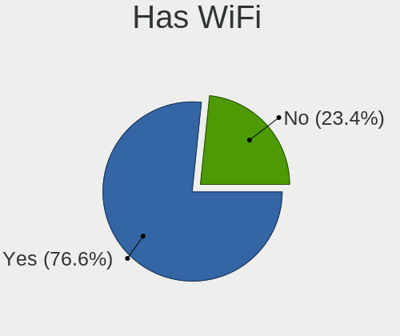
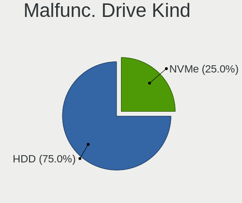
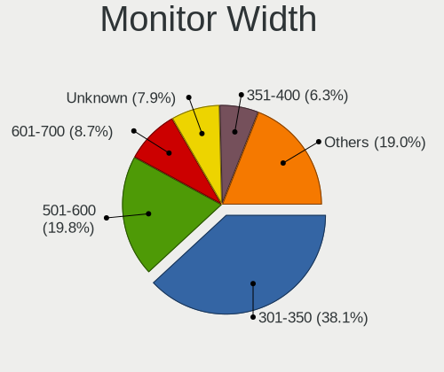
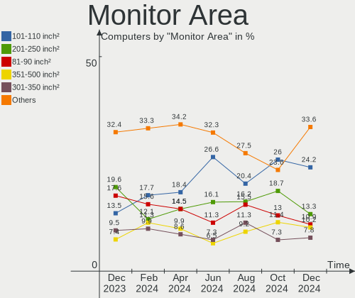
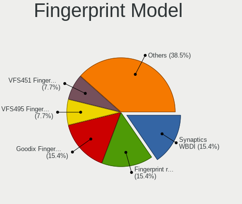

Manjaro - Hardware Trends
-------------------------

A project to identify most popular hardware characteristics and track their change
over time based on data collected by Linux users at https://Linux-Hardware.org.

Anyone can contribute to this report by the [hw-probe](https://github.com/linuxhw/hw-probe) tool:

    sudo -E hw-probe -all -upload

This is a report for all computer types. See also reports for [desktops](/Dist/Manjaro/Desktop/README.md) and [notebooks](/Dist/Manjaro/Notebook/README.md).

This report is for one last month. Overall report since the beginning of time: [TestDays](https://github.com/linuxhw/TestDays)

Period: Apr, 2024.

Contents
--------

* [ System ](#system)
  - [ OS                       ](#os)
  - [ OS Family                ](#os-family)
  - [ Kernel                   ](#kernel)
  - [ Kernel Family            ](#kernel-family)
  - [ Kernel Major Ver.        ](#kernel-major-ver)
  - [ Arch                     ](#arch)
  - [ DE                       ](#de)
  - [ Display Server           ](#display-server)
  - [ Display Manager          ](#display-manager)
  - [ OS Lang                  ](#os-lang)
  - [ Boot Mode                ](#boot-mode)
  - [ Filesystem               ](#filesystem)
  - [ Part. scheme             ](#part-scheme)
  - [ Dual Boot with Linux/BSD ](#dual-boot-with-linuxbsd)
  - [ Dual Boot (Win)          ](#dual-boot-win)

* [ Board ](#board)
  - [ Vendor                   ](#vendor)
  - [ Model                    ](#model)
  - [ Model Family             ](#model-family)
  - [ MFG Year                 ](#mfg-year)
  - [ Form Factor              ](#form-factor)
  - [ Secure Boot              ](#secure-boot)
  - [ Coreboot                 ](#coreboot)
  - [ RAM Size                 ](#ram-size)
  - [ RAM Used                 ](#ram-used)
  - [ Total Drives             ](#total-drives)
  - [ Has CD-ROM               ](#has-cd-rom)
  - [ Has Ethernet             ](#has-ethernet)
  - [ Has WiFi                 ](#has-wifi)
  - [ Has Bluetooth            ](#has-bluetooth)

* [ Location ](#location)
  - [ Country                  ](#country)
  - [ City                     ](#city)

* [ Drives ](#drives)
  - [ Drive Vendor             ](#drive-vendor)
  - [ Drive Model              ](#drive-model)
  - [ HDD Vendor               ](#hdd-vendor)
  - [ SSD Vendor               ](#ssd-vendor)
  - [ Drive Kind               ](#drive-kind)
  - [ Drive Connector          ](#drive-connector)
  - [ Drive Size               ](#drive-size)
  - [ Space Total              ](#space-total)
  - [ Space Used               ](#space-used)
  - [ Malfunc. Drives          ](#malfunc-drives)
  - [ Malfunc. Drive Vendor    ](#malfunc-drive-vendor)
  - [ Malfunc. HDD Vendor      ](#malfunc-hdd-vendor)
  - [ Malfunc. Drive Kind      ](#malfunc-drive-kind)
  - [ Failed Drives            ](#failed-drives)
  - [ Failed Drive Vendor      ](#failed-drive-vendor)
  - [ Drive Status             ](#drive-status)

* [ Storage controller ](#storage-controller)
  - [ Storage Vendor           ](#storage-vendor)
  - [ Storage Model            ](#storage-model)
  - [ Storage Kind             ](#storage-kind)

* [ Processor ](#processor)
  - [ CPU Vendor               ](#cpu-vendor)
  - [ CPU Model                ](#cpu-model)
  - [ CPU Model Family         ](#cpu-model-family)
  - [ CPU Cores                ](#cpu-cores)
  - [ CPU Sockets              ](#cpu-sockets)
  - [ CPU Threads              ](#cpu-threads)
  - [ CPU Op-Modes             ](#cpu-op-modes)
  - [ CPU Microcode            ](#cpu-microcode)
  - [ CPU Microarch            ](#cpu-microarch)

* [ Graphics ](#graphics)
  - [ GPU Vendor               ](#gpu-vendor)
  - [ GPU Model                ](#gpu-model)
  - [ GPU Combo                ](#gpu-combo)
  - [ GPU Driver               ](#gpu-driver)
  - [ GPU Memory               ](#gpu-memory)

* [ Monitor ](#monitor)
  - [ Monitor Vendor           ](#monitor-vendor)
  - [ Monitor Model            ](#monitor-model)
  - [ Monitor Resolution       ](#monitor-resolution)
  - [ Monitor Diagonal         ](#monitor-diagonal)
  - [ Monitor Width            ](#monitor-width)
  - [ Aspect Ratio             ](#aspect-ratio)
  - [ Monitor Area             ](#monitor-area)
  - [ Pixel Density            ](#pixel-density)
  - [ Multiple Monitors        ](#multiple-monitors)

* [ Network ](#network)
  - [ Net Controller Vendor    ](#net-controller-vendor)
  - [ Net Controller Model     ](#net-controller-model)
  - [ Wireless Vendor          ](#wireless-vendor)
  - [ Wireless Model           ](#wireless-model)
  - [ Ethernet Vendor          ](#ethernet-vendor)
  - [ Ethernet Model           ](#ethernet-model)
  - [ Net Controller Kind      ](#net-controller-kind)
  - [ Used Controller          ](#used-controller)
  - [ NICs                     ](#nics)
  - [ IPv6                     ](#ipv6)

* [ Bluetooth ](#bluetooth)
  - [ Bluetooth Vendor         ](#bluetooth-vendor)
  - [ Bluetooth Model          ](#bluetooth-model)

* [ Sound ](#sound)
  - [ Sound Vendor             ](#sound-vendor)
  - [ Sound Model              ](#sound-model)

* [ Memory ](#memory)
  - [ Memory Vendor            ](#memory-vendor)
  - [ Memory Model             ](#memory-model)
  - [ Memory Kind              ](#memory-kind)
  - [ Memory Form Factor       ](#memory-form-factor)
  - [ Memory Size              ](#memory-size)
  - [ Memory Speed             ](#memory-speed)

* [ Printers & scanners ](#printers--scanners)
  - [ Printer Vendor           ](#printer-vendor)
  - [ Printer Model            ](#printer-model)
  - [ Scanner Vendor           ](#scanner-vendor)
  - [ Scanner Model            ](#scanner-model)

* [ Camera ](#camera)
  - [ Camera Vendor            ](#camera-vendor)
  - [ Camera Model             ](#camera-model)

* [ Security ](#security)
  - [ Fingerprint Vendor       ](#fingerprint-vendor)
  - [ Fingerprint Model        ](#fingerprint-model)
  - [ Chipcard Vendor          ](#chipcard-vendor)
  - [ Chipcard Model           ](#chipcard-model)

* [ Unsupported ](#unsupported)
  - [ Unsupported Devices      ](#unsupported-devices)
  - [ Unsupported Device Types ](#unsupported-device-types)

System
------

OS
--

Installed operating systems

| Name           | Computers | Percent |
|----------------|-----------|---------|
| Manjaro        | 76        | 58.91%  |
| Manjaro 23.1.4 | 49        | 37.98%  |
| Manjaro 23.1.3 | 4         | 3.1%    |

OS Family
---------

OS without a version

| Name    | Computers | Percent |
|---------|-----------|---------|
| Manjaro | 129       | 100%    |

Kernel
------

Version of the Linux kernel

| Version                    | Computers | Percent |
|----------------------------|-----------|---------|
| 6.6.26-1-MANJARO           | 31        | 24.03%  |
| 6.6.25-1-MANJARO           | 22        | 17.05%  |
| 6.8.5-1-MANJARO            | 17        | 13.18%  |
| 6.6.19-1-MANJARO           | 10        | 7.75%   |
| 6.8.4-1-MANJARO            | 7         | 5.43%   |
| 6.7.12-1-MANJARO           | 7         | 5.43%   |
| 6.1.85-1-MANJARO           | 4         | 3.1%    |
| 6.7.7-1-MANJARO            | 3         | 2.33%   |
| 6.5.13-7-MANJARO           | 3         | 2.33%   |
| 6.8.7-1-MANJARO            | 2         | 1.55%   |
| 6.8.0-1-MANJARO            | 2         | 1.55%   |
| 6.6.10-1-MANJARO           | 2         | 1.55%   |
| 6.5.5-1-MANJARO            | 2         | 1.55%   |
| 6.8.7-zen2-xanmod2-2       | 1         | 0.78%   |
| 6.8.7-lqx2-1-lqx           | 1         | 0.78%   |
| 6.8.4-lqx1-2-lqx           | 1         | 0.78%   |
| 6.8.3-1-MANJARO            | 1         | 0.78%   |
| 6.8.2-zen2-1-zen           | 1         | 0.78%   |
| 6.8.2-x64v2-xanmod1-1-edge | 1         | 0.78%   |
| 6.7.0-1-rt6-MANJARO        | 1         | 0.78%   |
| 6.6.6-arch1-1-surface      | 1         | 0.78%   |
| 6.6.28-1-MANJARO           | 1         | 0.78%   |
| 6.6.24-1-MANJARO           | 1         | 0.78%   |
| 6.6.23-1-MANJARO           | 1         | 0.78%   |
| 6.6.22-x64v3-xanmod1       | 1         | 0.78%   |
| 6.5.3-1-MANJARO            | 1         | 0.78%   |
| 6.1.84-1-MANJARO           | 1         | 0.78%   |
| 6.1.80-1-MANJARO           | 1         | 0.78%   |
| 5.4.270-1-MANJARO          | 1         | 0.78%   |
| 5.15.154-1-MANJARO         | 1         | 0.78%   |

Kernel Family
-------------

Linux kernel without a distro release

| Version  | Computers | Percent |
|----------|-----------|---------|
| 6.6.26   | 31        | 24.03%  |
| 6.6.25   | 22        | 17.05%  |
| 6.8.5    | 17        | 13.18%  |
| 6.6.19   | 10        | 7.75%   |
| 6.8.4    | 8         | 6.2%    |
| 6.7.12   | 7         | 5.43%   |
| 6.8.7    | 4         | 3.1%    |
| 6.1.85   | 4         | 3.1%    |
| 6.7.7    | 3         | 2.33%   |
| 6.5.13   | 3         | 2.33%   |
| 6.8.2    | 2         | 1.55%   |
| 6.8.0    | 2         | 1.55%   |
| 6.6.10   | 2         | 1.55%   |
| 6.5.5    | 2         | 1.55%   |
| 6.8.3    | 1         | 0.78%   |
| 6.7.0    | 1         | 0.78%   |
| 6.6.6    | 1         | 0.78%   |
| 6.6.28   | 1         | 0.78%   |
| 6.6.24   | 1         | 0.78%   |
| 6.6.23   | 1         | 0.78%   |
| 6.6.22   | 1         | 0.78%   |
| 6.5.3    | 1         | 0.78%   |
| 6.1.84   | 1         | 0.78%   |
| 6.1.80   | 1         | 0.78%   |
| 5.4.270  | 1         | 0.78%   |
| 5.15.154 | 1         | 0.78%   |

Kernel Major Ver.
-----------------

Linux kernel major version

| Version | Computers | Percent |
|---------|-----------|---------|
| 6.6     | 70        | 54.26%  |
| 6.8     | 34        | 26.36%  |
| 6.7     | 11        | 8.53%   |
| 6.5     | 6         | 4.65%   |
| 6.1     | 6         | 4.65%   |
| 5.4     | 1         | 0.78%   |
| 5.15    | 1         | 0.78%   |

Arch
----

OS architecture (x86_64, i586, etc.)

| Name   | Computers | Percent |
|--------|-----------|---------|
| x86_64 | 129       | 100%    |

DE
--

Desktop Environment

| Name       | Computers | Percent |
|------------|-----------|---------|
| KDE5       | 68        | 52.71%  |
| GNOME      | 28        | 21.71%  |
| XFCE       | 15        | 11.63%  |
| KDE6       | 5         | 3.88%   |
| i3         | 4         | 3.1%    |
| X-Cinnamon | 3         | 2.33%   |
| Unknown    | 3         | 2.33%   |
| MATE       | 2         | 1.55%   |
| sway       | 1         | 0.78%   |

Display Server
--------------

X11 or Wayland

| Name    | Computers | Percent |
|---------|-----------|---------|
| X11     | 76        | 58.91%  |
| Wayland | 48        | 37.21%  |
| Unknown | 4         | 3.1%    |
| Tty     | 1         | 0.78%   |

Display Manager
---------------

SDDM, LightDM, etc.

| Name    | Computers | Percent |
|---------|-----------|---------|
| Unknown | 76        | 58.91%  |
| SDDM    | 30        | 23.26%  |
| LightDM | 15        | 11.63%  |
| GDM     | 8         | 6.2%    |

OS Lang
-------

Language

| Lang    | Computers | Percent |
|---------|-----------|---------|
| en_US   | 48        | 37.21%  |
| de_DE   | 12        | 9.3%    |
| en_GB   | 9         | 6.98%   |
| ru_RU   | 8         | 6.2%    |
| pt_BR   | 7         | 5.43%   |
| it_IT   | 5         | 3.88%   |
| en_CA   | 5         | 3.88%   |
| pl_PL   | 4         | 3.1%    |
| zh_CN   | 3         | 2.33%   |
| es_ES   | 3         | 2.33%   |
| cs_CZ   | 3         | 2.33%   |
| Unknown | 3         | 2.33%   |
| hu_HU   | 2         | 1.55%   |
| es_MX   | 2         | 1.55%   |
| es_AR   | 2         | 1.55%   |
| tr_TR   | 1         | 0.78%   |
| ru      | 1         | 0.78%   |
| nl_NL   | 1         | 0.78%   |
| es_VE   | 1         | 0.78%   |
| es_DO   | 1         | 0.78%   |
| en_NZ   | 1         | 0.78%   |
| en_IN   | 1         | 0.78%   |
| en_IL   | 1         | 0.78%   |
| en_IE   | 1         | 0.78%   |
| en_AU   | 1         | 0.78%   |
| el_GR   | 1         | 0.78%   |
| de_AT   | 1         | 0.78%   |
| C       | 1         | 0.78%   |

Boot Mode
---------

EFI or BIOS

| Mode | Computers | Percent |
|------|-----------|---------|
| BIOS | 82        | 63.57%  |
| EFI  | 47        | 36.43%  |

Filesystem
----------

Type of filesystem

| Type    | Computers | Percent |
|---------|-----------|---------|
| Ext4    | 104       | 80.62%  |
| Btrfs   | 16        | 12.4%   |
| Tmpfs   | 7         | 5.43%   |
| Xfs     | 1         | 0.78%   |
| Overlay | 1         | 0.78%   |

Part. scheme
------------

Scheme of partitioning

| Type    | Computers | Percent |
|---------|-----------|---------|
| Unknown | 71        | 55.04%  |
| GPT     | 53        | 41.09%  |
| MBR     | 5         | 3.88%   |

Dual Boot with Linux/BSD
------------------------

Hosting more than one Linux/BSD

| Dual boot | Computers | Percent |
|-----------|-----------|---------|
| No        | 116       | 89.92%  |
| Yes       | 13        | 10.08%  |

Dual Boot (Win)
---------------

Hosting Linux and Windows

| Dual boot | Computers | Percent |
|-----------|-----------|---------|
| No        | 106       | 82.17%  |
| Yes       | 23        | 17.83%  |

Board
-----

Vendor
------

Motherboard manufacturer

| Name                | Computers | Percent |
|---------------------|-----------|---------|
| Lenovo              | 29        | 22.48%  |
| Hewlett-Packard     | 17        | 13.18%  |
| Dell                | 16        | 12.4%   |
| ASUSTek Computer    | 16        | 12.4%   |
| MSI                 | 11        | 8.53%   |
| Gigabyte Technology | 11        | 8.53%   |
| ASRock              | 7         | 5.43%   |
| Acer                | 6         | 4.65%   |
| Apple               | 4         | 3.1%    |
| HONOR               | 2         | 1.55%   |
| Chuwi               | 2         | 1.55%   |
| Sony                | 1         | 0.78%   |
| Samsung Electronics | 1         | 0.78%   |
| Microsoft           | 1         | 0.78%   |
| Intel               | 1         | 0.78%   |
| HUAWEI              | 1         | 0.78%   |
| Huanan              | 1         | 0.78%   |
| EVGA                | 1         | 0.78%   |
| Biostar             | 1         | 0.78%   |

Model
-----

Motherboard model

| Name                                   | Computers | Percent |
|----------------------------------------|-----------|---------|
| Chuwi MiniBook X                       | 2         | 1.55%   |
| Acer Aspire ES1-523                    | 2         | 1.55%   |
| Sony VGN-Z21VRN_X                      | 1         | 0.78%   |
| Samsung 530U3C/530U4C/532U3C           | 1         | 0.78%   |
| MSI Prestige 14 A12UC                  | 1         | 0.78%   |
| MSI MS-B09611                          | 1         | 0.78%   |
| MSI MS-7D78                            | 1         | 0.78%   |
| MSI MS-7D25                            | 1         | 0.78%   |
| MSI MS-7D20                            | 1         | 0.78%   |
| MSI MS-7C95                            | 1         | 0.78%   |
| MSI MS-7C91                            | 1         | 0.78%   |
| MSI MS-7B79                            | 1         | 0.78%   |
| MSI MS-7B23                            | 1         | 0.78%   |
| MSI MS-7A38                            | 1         | 0.78%   |
| MSI MS-7597                            | 1         | 0.78%   |
| Microsoft Surface Pro                  | 1         | 0.78%   |
| Lenovo Yoga Pro 9 16IMH9 83DN          | 1         | 0.78%   |
| Lenovo Yoga 7 16IAP7 82QG              | 1         | 0.78%   |
| Lenovo Yoga 530-14ARR 81H9             | 1         | 0.78%   |
| Lenovo Yoga 500-15ISK 80R6             | 1         | 0.78%   |
| Lenovo XiaoXinPro 14 APH8 83AM         | 1         | 0.78%   |
| Lenovo ThinkPad X270 20K5S1A524        | 1         | 0.78%   |
| Lenovo ThinkPad X260 20F60093US        | 1         | 0.78%   |
| Lenovo ThinkPad X13 Gen 4 21J3CTO1WW   | 1         | 0.78%   |
| Lenovo ThinkPad W530 24474KG           | 1         | 0.78%   |
| Lenovo ThinkPad T530 2392AQU           | 1         | 0.78%   |
| Lenovo ThinkPad T480 20L6S4XW00        | 1         | 0.78%   |
| Lenovo ThinkPad T16 Gen 1 21BWS2U600   | 1         | 0.78%   |
| Lenovo ThinkPad T14s Gen 4 21F8002TGE  | 1         | 0.78%   |
| Lenovo ThinkPad T14s Gen 4 21F7S09V0D  | 1         | 0.78%   |
| Lenovo ThinkPad T14 Gen 4 21K3CTO1WW   | 1         | 0.78%   |
| Lenovo ThinkPad P14s Gen 2i 20VX005FMX | 1         | 0.78%   |
| Lenovo ThinkPad P1 Gen 4i 20Y4S57200   | 1         | 0.78%   |
| Lenovo ThinkPad L15 Gen 3 21C7003VGE   | 1         | 0.78%   |
| Lenovo ThinkPad L15 Gen 3 21C3000CPG   | 1         | 0.78%   |
| Lenovo ThinkPad L13 Gen 2 20VH004EUK   | 1         | 0.78%   |
| Lenovo ThinkPad E490 20N8002ART        | 1         | 0.78%   |
| Lenovo ThinkPad E14 Gen 5 21JSS0Y500   | 1         | 0.78%   |
| Lenovo Legion Y530-15ICH 81FV          | 1         | 0.78%   |
| Lenovo Legion Slim 5 14APH8 82Y5       | 1         | 0.78%   |

Model Family
------------

Motherboard model prefix

| Name               | Computers | Percent |
|--------------------|-----------|---------|
| Lenovo ThinkPad    | 17        | 13.18%  |
| Lenovo Legion      | 5         | 3.88%   |
| Dell Inspiron      | 5         | 3.88%   |
| Lenovo Yoga        | 4         | 3.1%    |
| HP Pavilion        | 4         | 3.1%    |
| Dell Latitude      | 4         | 3.1%    |
| ASUS TUF           | 4         | 3.1%    |
| ASUS PRIME         | 4         | 3.1%    |
| Acer Aspire        | 4         | 3.1%    |
| Dell XPS           | 3         | 2.33%   |
| HP Laptop          | 2         | 1.55%   |
| HP EliteBook       | 2         | 1.55%   |
| Dell Precision     | 2         | 1.55%   |
| Chuwi MiniBook     | 2         | 1.55%   |
| ASUS Vivobook      | 2         | 1.55%   |
| ASUS ROG           | 2         | 1.55%   |
| ASRock B450M       | 2         | 1.55%   |
| Sony VGN-Z21VRN    | 1         | 0.78%   |
| Samsung 530U3C     | 1         | 0.78%   |
| MSI Prestige       | 1         | 0.78%   |
| MSI MS-B09611      | 1         | 0.78%   |
| MSI MS-7D78        | 1         | 0.78%   |
| MSI MS-7D25        | 1         | 0.78%   |
| MSI MS-7D20        | 1         | 0.78%   |
| MSI MS-7C95        | 1         | 0.78%   |
| MSI MS-7C91        | 1         | 0.78%   |
| MSI MS-7B79        | 1         | 0.78%   |
| MSI MS-7B23        | 1         | 0.78%   |
| MSI MS-7A38        | 1         | 0.78%   |
| MSI MS-7597        | 1         | 0.78%   |
| Microsoft Surface  | 1         | 0.78%   |
| Lenovo XiaoXinPro  | 1         | 0.78%   |
| Lenovo IdeaPadFlex | 1         | 0.78%   |
| Lenovo IdeaPad     | 1         | 0.78%   |
| Intel X99          | 1         | 0.78%   |
| HUAWEI NBLK-WAX9X  | 1         | 0.78%   |
| Huanan X99-8M-F    | 1         | 0.78%   |
| HONOR GLO-GXXX     | 1         | 0.78%   |
| HONOR BMH-WCX9     | 1         | 0.78%   |
| HP Victus          | 1         | 0.78%   |

MFG Year
--------

Motherboard manufacture year

| Year | Computers | Percent |
|------|-----------|---------|
| 2023 | 17        | 13.18%  |
| 2022 | 16        | 12.4%   |
| 2021 | 15        | 11.63%  |
| 2018 | 14        | 10.85%  |
| 2020 | 11        | 8.53%   |
| 2016 | 11        | 8.53%   |
| 2019 | 10        | 7.75%   |
| 2012 | 9         | 6.98%   |
| 2024 | 4         | 3.1%    |
| 2017 | 4         | 3.1%    |
| 2014 | 4         | 3.1%    |
| 2013 | 4         | 3.1%    |
| 2009 | 4         | 3.1%    |
| 2010 | 3         | 2.33%   |
| 2011 | 2         | 1.55%   |
| 2015 | 1         | 0.78%   |

Form Factor
-----------

Physical design of the computer

| Name        | Computers | Percent |
|-------------|-----------|---------|
| Notebook    | 72        | 55.81%  |
| Desktop     | 52        | 40.31%  |
| Convertible | 3         | 2.33%   |
| Tablet      | 1         | 0.78%   |
| All in one  | 1         | 0.78%   |

Secure Boot
-----------

Enabled or disabled

| State    | Computers | Percent |
|----------|-----------|---------|
| Disabled | 128       | 99.22%  |
| Enabled  | 1         | 0.78%   |

Coreboot
--------

Have coreboot on board

| Used | Computers | Percent |
|------|-----------|---------|
| No   | 129       | 100%    |

RAM Size
--------

Total RAM memory

| Size in GB  | Computers | Percent |
|-------------|-----------|---------|
| 32.01-64.0  | 29        | 22.48%  |
| 16.01-24.0  | 28        | 21.71%  |
| 8.01-16.0   | 24        | 18.6%   |
| 4.01-8.0    | 19        | 14.73%  |
| 3.01-4.0    | 11        | 8.53%   |
| 24.01-32.0  | 10        | 7.75%   |
| 64.01-256.0 | 8         | 6.2%    |

RAM Used
--------

Used RAM memory

| Used GB    | Computers | Percent |
|------------|-----------|---------|
| 4.01-8.0   | 44        | 34.11%  |
| 2.01-3.0   | 27        | 20.93%  |
| 3.01-4.0   | 24        | 18.6%   |
| 1.01-2.0   | 16        | 12.4%   |
| 8.01-16.0  | 13        | 10.08%  |
| 24.01-32.0 | 2         | 1.55%   |
| 16.01-24.0 | 2         | 1.55%   |
| 32.01-64.0 | 1         | 0.78%   |

Total Drives
------------

Number of drives on board

| Drives | Computers | Percent |
|--------|-----------|---------|
| 1      | 69        | 53.49%  |
| 2      | 24        | 18.6%   |
| 3      | 20        | 15.5%   |
| 4      | 11        | 8.53%   |
| 5      | 3         | 2.33%   |
| 6      | 2         | 1.55%   |

Has CD-ROM
----------

Has CD-ROM on board

| Presented | Computers | Percent |
|-----------|-----------|---------|
| No        | 104       | 80.62%  |
| Yes       | 25        | 19.38%  |

Has Ethernet
------------

Has Ethernet on board

| Presented | Computers | Percent |
|-----------|-----------|---------|
| Yes       | 105       | 81.4%   |
| No        | 24        | 18.6%   |

Has WiFi
--------

Has WiFi module

| Presented | Computers | Percent |
|-----------|-----------|---------|
| Yes       | 104       | 80.62%  |
| No        | 25        | 19.38%  |

Has Bluetooth
-------------

Has Bluetooth module

| Presented | Computers | Percent |
|-----------|-----------|---------|
| Yes       | 103       | 79.84%  |
| No        | 26        | 20.16%  |

Location
--------

Country
-------

Geographic location (country)

| Country            | Computers | Percent |
|--------------------|-----------|---------|
| USA                | 25        | 19.38%  |
| Germany            | 17        | 13.18%  |
| Russia             | 12        | 9.3%    |
| Brazil             | 8         | 6.2%    |
| Italy              | 7         | 5.43%   |
| Canada             | 6         | 4.65%   |
| UK                 | 5         | 3.88%   |
| Spain              | 4         | 3.1%    |
| Poland             | 4         | 3.1%    |
| Netherlands        | 3         | 2.33%   |
| Mexico             | 3         | 2.33%   |
| Czechia            | 3         | 2.33%   |
| Austria            | 3         | 2.33%   |
| Argentina          | 3         | 2.33%   |
| Turkey             | 2         | 1.55%   |
| Sweden             | 2         | 1.55%   |
| Portugal           | 2         | 1.55%   |
| Hungary            | 2         | 1.55%   |
| Venezuela          | 1         | 0.78%   |
| Singapore          | 1         | 0.78%   |
| New Zealand        | 1         | 0.78%   |
| Japan              | 1         | 0.78%   |
| Israel             | 1         | 0.78%   |
| Iran               | 1         | 0.78%   |
| India              | 1         | 0.78%   |
| Greece             | 1         | 0.78%   |
| France             | 1         | 0.78%   |
| Finland            | 1         | 0.78%   |
| Dominican Republic | 1         | 0.78%   |
| Denmark            | 1         | 0.78%   |
| Costa Rica         | 1         | 0.78%   |
| Colombia           | 1         | 0.78%   |
| China              | 1         | 0.78%   |
| Chile              | 1         | 0.78%   |
| Bulgaria           | 1         | 0.78%   |
| Australia          | 1         | 0.78%   |

City
----

Geographic location (city)

| City              | Computers | Percent |
|-------------------|-----------|---------|
| Moscow            | 7         | 5.43%   |
| Milan             | 4         | 3.1%    |
| Sao Paulo         | 2         | 1.55%   |
| Prague            | 2         | 1.55%   |
| Portland          | 2         | 1.55%   |
| Hamburg           | 2         | 1.55%   |
| Frankfurt am Main | 2         | 1.55%   |
| Chicago           | 2         | 1.55%   |
| Atlanta           | 2         | 1.55%   |
| Zalaegerszeg      | 1         | 0.78%   |
| Yazd              | 1         | 0.78%   |
| Xique-Xique       | 1         | 0.78%   |
| Warwick           | 1         | 0.78%   |
| Warsaw            | 1         | 0.78%   |
| Volduchy          | 1         | 0.78%   |
| Vladivostok       | 1         | 0.78%   |
| Vitoria-Gasteiz   | 1         | 0.78%   |
| Villa del Dique   | 1         | 0.78%   |
| Vienna            | 1         | 0.78%   |
| Urbana            | 1         | 0.78%   |
| Turin             | 1         | 0.78%   |
| Tourcoing         | 1         | 0.78%   |
| Toronto           | 1         | 0.78%   |
| Tigre             | 1         | 0.78%   |
| Thessaloniki      | 1         | 0.78%   |
| Teguise           | 1         | 0.78%   |
| Sydney            | 1         | 0.78%   |
| Swidnica          | 1         | 0.78%   |
| Surgut            | 1         | 0.78%   |
| Stuttgart         | 1         | 0.78%   |
| Spruce Grove      | 1         | 0.78%   |
| Springe           | 1         | 0.78%   |
| Sollentuna        | 1         | 0.78%   |
| Sobral            | 1         | 0.78%   |
| Singapore         | 1         | 0.78%   |
| Siegen            | 1         | 0.78%   |
| Sherwood Park     | 1         | 0.78%   |
| Shanghai          | 1         | 0.78%   |
| Sao Jose          | 1         | 0.78%   |
| Santo Domingo     | 1         | 0.78%   |

Drives
------

Drive Vendor
------------

Hard drive vendors

| Vendor                         | Computers | Drives | Percent |
|--------------------------------|-----------|--------|---------|
| Samsung Electronics            | 34        | 40     | 15.25%  |
| SanDisk                        | 26        | 30     | 11.66%  |
| Seagate                        | 24        | 26     | 10.76%  |
| WDC                            | 19        | 23     | 8.52%   |
| Kingston                       | 18        | 22     | 8.07%   |
| Toshiba                        | 13        | 13     | 5.83%   |
| SK hynix                       | 6         | 6      | 2.69%   |
| Micron Technology              | 6         | 7      | 2.69%   |
| Intel                          | 5         | 5      | 2.24%   |
| Hitachi                        | 5         | 5      | 2.24%   |
| Crucial                        | 5         | 7      | 2.24%   |
| Unknown                        | 3         | 3      | 1.35%   |
| Micron/Crucial Technology      | 3         | 3      | 1.35%   |
| KIOXIA                         | 3         | 3      | 1.35%   |
| Kingston Technology Company    | 3         | 3      | 1.35%   |
| Intenso                        | 3         | 3      | 1.35%   |
| ADATA Technology               | 3         | 3      | 1.35%   |
| Solid State Storage Technology | 2         | 2      | 0.9%    |
| Shenzhen Longsys Electronics   | 2         | 2      | 0.9%    |
| PNY                            | 2         | 2      | 0.9%    |
| Phison Electronics             | 2         | 2      | 0.9%    |
| Patriot                        | 2         | 3      | 0.9%    |
| MAXIO Technology (Hangzhou)    | 2         | 2      | 0.9%    |
| Yangtze Memory Technologies    | 1         | 1      | 0.45%   |
| XrayDisk                       | 1         | 2      | 0.45%   |
| WALRAM                         | 1         | 1      | 0.45%   |
| Union Memory (Shenzhen)        | 1         | 1      | 0.45%   |
| Transcend                      | 1         | 1      | 0.45%   |
| TO Exter                       | 1         | 1      | 0.45%   |
| Team                           | 1         | 1      | 0.45%   |
| Solid State Storage            | 1         | 1      | 0.45%   |
| Smartbuy                       | 1         | 1      | 0.45%   |
| Silicon Motion                 | 1         | 1      | 0.45%   |
| SATA SSD                       | 1         | 1      | 0.45%   |
| SABRENT                        | 1         | 1      | 0.45%   |
| Realtek Semiconductor          | 1         | 1      | 0.45%   |
| Maxtor                         | 1         | 1      | 0.45%   |
| LITEON                         | 1         | 1      | 0.45%   |
| KingSpec                       | 1         | 1      | 0.45%   |
| JMicron Technology             | 1         | 1      | 0.45%   |

Drive Model
-----------

Hard drive models

| Model                                              | Computers | Percent |
|----------------------------------------------------|-----------|---------|
| Samsung NVMe SSD Controller SM981/PM981/PM983 1TB  | 9         | 3.69%   |
| Kingston SA400S37240G 240GB SSD                    | 6         | 2.46%   |
| Sandisk WD Blue SN550 NVMe SSD 2TB                 | 5         | 2.05%   |
| Kingston SA400S37480G 480GB SSD                    | 5         | 2.05%   |
| Sandisk WD Black SN750 / PC SN730 NVMe SSD 512GB   | 4         | 1.64%   |
| Samsung NVMe SSD Controller PM9A1/PM9A3/980PRO 1TB | 4         | 1.64%   |
| Toshiba DT01ACA100 1TB                             | 3         | 1.23%   |
| Seagate ST500DM002-1BD142 500GB                    | 3         | 1.23%   |
| Seagate Expansion HDD 12TB                         | 3         | 1.23%   |
| Toshiba MQ01ABD100 1TB                             | 2         | 0.82%   |
| SK hynix SKHynix_HFS001TEJ9X115N 1024GB            | 2         | 0.82%   |
| Seagate ST2000DM008-2FR102 2TB                     | 2         | 0.82%   |
| Sandisk WD_BLACK SN770 1TB                         | 2         | 0.82%   |
| Sandisk WD Blue SN570 1TB                          | 2         | 0.82%   |
| SanDisk SSD PLUS 240GB                             | 2         | 0.82%   |
| Samsung SSD 870 EVO 1TB                            | 2         | 0.82%   |
| Samsung Portable SSD T5 500GB                      | 2         | 0.82%   |
| Samsung NVMe SSD Controller SM961/PM961/SM963 1TB  | 2         | 0.82%   |
| Micron CT1000P3PSSD8 1TB                           | 2         | 0.82%   |
| Micron 2450_MTFDKBA512TFK 512GB                    | 2         | 0.82%   |
| MAXIO (Hangzhou) NVMe SSD Controller MAP1202 256GB | 2         | 0.82%   |
| Kingston Company A2000 NVMe SSD 500GB              | 2         | 0.82%   |
| Kingston SUV400S37120G 120GB SSD                   | 2         | 0.82%   |
| Kingston SKC3000S1024G 1TB                         | 2         | 0.82%   |
| Intel SSDPEKNU512GZ 512GB                          | 2         | 0.82%   |
| Crucial CT500MX500SSD1 500GB                       | 2         | 0.82%   |
| Crucial CT1000MX500SSD1 1TB                        | 2         | 0.82%   |
| Yangtze Memory ZHITAI TiPlus7100 512GB             | 1         | 0.41%   |
| XrayDisk 512GB SSD                                 | 1         | 0.41%   |
| XrayDisk 512GB                                     | 1         | 0.41%   |
| WDC WDS500G2B0B-00YS70 500GB SSD                   | 1         | 0.41%   |
| WDC WDS240G2G0A-00JH30 240GB SSD                   | 1         | 0.41%   |
| WDC WD5000AZLX-60K2TA0 500GB                       | 1         | 0.41%   |
| WDC WD5000AAKS-75A7B0 500GB                        | 1         | 0.41%   |
| WDC WD5000AAKS-00A7B2 500GB                        | 1         | 0.41%   |
| WDC WD5000AADS-00L4B1 500GB                        | 1         | 0.41%   |
| WDC WD40EZRZ-00GXCB0 4TB                           | 1         | 0.41%   |
| WDC WD40EFAX-68JH4N1 4TB                           | 1         | 0.41%   |
| WDC WD4002FYYZ-01B7CB0 4TB                         | 1         | 0.41%   |
| WDC WD3200AAJS-22L7A0 320GB                        | 1         | 0.41%   |

HDD Vendor
----------

Hard disk drive vendors

| Vendor              | Computers | Drives | Percent |
|---------------------|-----------|--------|---------|
| Seagate             | 24        | 26     | 36.36%  |
| WDC                 | 18        | 21     | 27.27%  |
| Toshiba             | 10        | 10     | 15.15%  |
| Hitachi             | 5         | 5      | 7.58%   |
| Samsung Electronics | 2         | 2      | 3.03%   |
| Unknown             | 1         | 1      | 1.52%   |
| TO Exter            | 1         | 1      | 1.52%   |
| JMicron Technology  | 1         | 1      | 1.52%   |
| Intenso             | 1         | 1      | 1.52%   |
| HGST                | 1         | 1      | 1.52%   |
| Fujitsu             | 1         | 1      | 1.52%   |
| ASMT                | 1         | 2      | 1.52%   |

SSD Vendor
----------

Solid state drive vendors

| Vendor              | Computers | Drives | Percent |
|---------------------|-----------|--------|---------|
| Kingston            | 16        | 19     | 25%     |
| Samsung Electronics | 12        | 14     | 18.75%  |
| SanDisk             | 6         | 6      | 9.38%   |
| Crucial             | 5         | 7      | 7.81%   |
| WDC                 | 2         | 2      | 3.13%   |
| PNY                 | 2         | 2      | 3.13%   |
| Patriot             | 2         | 3      | 3.13%   |
| Intenso             | 2         | 2      | 3.13%   |
| XrayDisk            | 1         | 1      | 1.56%   |
| Transcend           | 1         | 1      | 1.56%   |
| Toshiba             | 1         | 1      | 1.56%   |
| Team                | 1         | 1      | 1.56%   |
| Smartbuy            | 1         | 1      | 1.56%   |
| SABRENT             | 1         | 1      | 1.56%   |
| Micron Technology   | 1         | 1      | 1.56%   |
| Maxtor              | 1         | 1      | 1.56%   |
| LITEON              | 1         | 1      | 1.56%   |
| KingSpec            | 1         | 1      | 1.56%   |
| HS-SSD-C100         | 1         | 1      | 1.56%   |
| GOODRAM             | 1         | 1      | 1.56%   |
| Gigabyte Technology | 1         | 1      | 1.56%   |
| Drevo               | 1         | 1      | 1.56%   |
| Dell                | 1         | 1      | 1.56%   |
| China               | 1         | 1      | 1.56%   |
| A-DATA Technology   | 1         | 1      | 1.56%   |

Drive Kind
----------

HDD or SSD

| Kind    | Computers | Drives | Percent |
|---------|-----------|--------|---------|
| NVMe    | 80        | 98     | 42.55%  |
| SSD     | 54        | 72     | 28.72%  |
| HDD     | 46        | 72     | 24.47%  |
| Unknown | 6         | 6      | 3.19%   |
| MMC     | 2         | 2      | 1.06%   |

Drive Connector
---------------

SATA, SAS, NVMe, etc.

| Type | Computers | Drives | Percent |
|------|-----------|--------|---------|
| NVMe | 80        | 98     | 46.78%  |
| SATA | 73        | 130    | 42.69%  |
| SAS  | 16        | 20     | 9.36%   |
| MMC  | 2         | 2      | 1.17%   |

Drive Size
----------

Size of hard drive

| Size in TB | Computers | Drives | Percent |
|------------|-----------|--------|---------|
| 0.01-0.5   | 54        | 81     | 49.54%  |
| 0.51-1.0   | 32        | 40     | 29.36%  |
| 3.01-4.0   | 8         | 8      | 7.34%   |
| 1.01-2.0   | 7         | 7      | 6.42%   |
| 2.01-3.0   | 4         | 4      | 3.67%   |
| 10.01-20.0 | 3         | 3      | 2.75%   |
| 4.01-10.0  | 1         | 1      | 0.92%   |

Space Total
-----------

Amount of disk space available on the file system

| Size in GB     | Computers | Percent |
|----------------|-----------|---------|
| 251-500        | 31        | 24.03%  |
| 101-250        | 21        | 16.28%  |
| 1001-2000      | 17        | 13.18%  |
| 501-1000       | 17        | 13.18%  |
| More than 3000 | 15        | 11.63%  |
| Unknown        | 11        | 8.53%   |
| 2001-3000      | 7         | 5.43%   |
| 51-100         | 7         | 5.43%   |
| 21-50          | 2         | 1.55%   |
| 1-20           | 1         | 0.78%   |

Space Used
----------

Amount of used disk space

| Used GB        | Computers | Percent |
|----------------|-----------|---------|
| 1-20           | 24        | 18.6%   |
| 251-500        | 20        | 15.5%   |
| 21-50          | 19        | 14.73%  |
| 51-100         | 19        | 14.73%  |
| 101-250        | 11        | 8.53%   |
| Unknown        | 11        | 8.53%   |
| 501-1000       | 9         | 6.98%   |
| 1001-2000      | 8         | 6.2%    |
| More than 3000 | 4         | 3.1%    |
| 2001-3000      | 4         | 3.1%    |

Malfunc. Drives
---------------

Drive models with a malfunction

| Model                                            | Computers | Drives | Percent |
|--------------------------------------------------|-----------|--------|---------|
| WDC WD5000AAKS-75A7B0 500GB                      | 1         | 1      | 12.5%   |
| WDC WD10SPZX-60Z10T0 1TB                         | 1         | 1      | 12.5%   |
| Toshiba MK5065GSXF 500GB                         | 1         | 1      | 12.5%   |
| Seagate ST500LT012-9WS142 500GB                  | 1         | 1      | 12.5%   |
| Seagate ST500DM002-1BD142 500GB                  | 1         | 1      | 12.5%   |
| Seagate ST2000DM008-2FR102 2TB                   | 1         | 1      | 12.5%   |
| Samsung Electronics SSD 870 EVO 1TB              | 1         | 1      | 12.5%   |
| Phison Electronics E16 PCIe4 NVMe Controller 1TB | 1         | 1      | 12.5%   |

Malfunc. Drive Vendor
---------------------

Vendors of faulty drives

| Vendor              | Computers | Drives | Percent |
|---------------------|-----------|--------|---------|
| WDC                 | 2         | 2      | 28.57%  |
| Seagate             | 2         | 3      | 28.57%  |
| Toshiba             | 1         | 1      | 14.29%  |
| Samsung Electronics | 1         | 1      | 14.29%  |
| Phison Electronics  | 1         | 1      | 14.29%  |

Malfunc. HDD Vendor
-------------------

Vendors of faulty HDD drives

| Vendor  | Computers | Drives | Percent |
|---------|-----------|--------|---------|
| WDC     | 2         | 2      | 40%     |
| Seagate | 2         | 3      | 40%     |
| Toshiba | 1         | 1      | 20%     |

Malfunc. Drive Kind
-------------------

Kinds of faulty drives

| Kind | Computers | Drives | Percent |
|------|-----------|--------|---------|
| HDD  | 5         | 6      | 71.43%  |
| NVMe | 1         | 1      | 14.29%  |
| SSD  | 1         | 1      | 14.29%  |

Failed Drives
-------------

Failed drive models

Zero info for selected period =(

Failed Drive Vendor
-------------------

Failed drive vendors

Zero info for selected period =(

Drive Status
------------

Number of failed and malfunc. drives

| Status   | Computers | Drives | Percent |
|----------|-----------|--------|---------|
| Detected | 89        | 167    | 64.49%  |
| Works    | 42        | 75     | 30.43%  |
| Malfunc  | 7         | 8      | 5.07%   |

Storage controller
------------------

Storage Vendor
--------------

Storage controller vendors

| Vendor                                  | Computers | Percent |
|-----------------------------------------|-----------|---------|
| Intel                                   | 59        | 31.05%  |
| AMD                                     | 32        | 16.84%  |
| Samsung Electronics                     | 24        | 12.63%  |
| SanDisk                                 | 21        | 11.05%  |
| SK hynix                                | 6         | 3.16%   |
| Micron Technology                       | 6         | 3.16%   |
| Kingston Technology Company             | 6         | 3.16%   |
| ASMedia Technology                      | 6         | 3.16%   |
| Solid State Storage Technology          | 3         | 1.58%   |
| Micron/Crucial Technology               | 3         | 1.58%   |
| KIOXIA                                  | 3         | 1.58%   |
| ADATA Technology                        | 3         | 1.58%   |
| Toshiba America Info Systems            | 2         | 1.05%   |
| Shenzhen Longsys Electronics            | 2         | 1.05%   |
| Phison Electronics                      | 2         | 1.05%   |
| Nvidia                                  | 2         | 1.05%   |
| MAXIO Technology (Hangzhou)             | 2         | 1.05%   |
| JMicron Technology                      | 2         | 1.05%   |
| Yangtze Memory Technologies             | 1         | 0.53%   |
| Silicon Motion                          | 1         | 0.53%   |
| Shenzhen Unionmemory Information System | 1         | 0.53%   |
| Realtek Semiconductor                   | 1         | 0.53%   |
| INNOGRIT                                | 1         | 0.53%   |
| Apple                                   | 1         | 0.53%   |

Storage Model
-------------

Storage controller models

| Model                                                                            | Computers | Percent |
|----------------------------------------------------------------------------------|-----------|---------|
| AMD FCH SATA Controller [AHCI mode]                                              | 15        | 7.39%   |
| Samsung NVMe SSD Controller SM981/PM981/PM983                                    | 10        | 4.93%   |
| Intel Sunrise Point-LP SATA Controller [AHCI mode]                               | 8         | 3.94%   |
| AMD 500 Series Chipset SATA Controller                                           | 8         | 3.94%   |
| Samsung NVMe SSD Controller PM9A1/PM9A3/980PRO                                   | 6         | 2.96%   |
| AMD 400 Series Chipset SATA Controller                                           | 6         | 2.96%   |
| SanDisk WD Black SN770 / PC SN740 256GB / PC SN560 (DRAM-less) NVMe SSD          | 5         | 2.46%   |
| SanDisk Ultra 3D / WD Blue SN550 NVMe SSD                                        | 5         | 2.46%   |
| Intel 7 Series Chipset Family 6-port SATA Controller [AHCI mode]                 | 5         | 2.46%   |
| SanDisk Extreme Pro / WD Black SN750 / PC SN730 / Red SN700 NVMe SSD             | 4         | 1.97%   |
| Samsung NVMe SSD Controller PM9B1 (DRAM-less)                                    | 4         | 1.97%   |
| Micron 2450 NVMe SSD [HendrixV] (DRAM-less)                                      | 4         | 1.97%   |
| Intel Volume Management Device NVMe RAID Controller                              | 4         | 1.97%   |
| Intel SSD 670p Series [Keystone Harbor]                                          | 4         | 1.97%   |
| Intel 8 Series/C220 Series Chipset Family 6-port SATA Controller 1 [AHCI mode]   | 4         | 1.97%   |
| ASMedia ASM1061/ASM1062 Serial ATA Controller                                    | 4         | 1.97%   |
| AMD 600 Series Chipset SATA Controller                                           | 4         | 1.97%   |
| SK hynix Platinum P41/PC801 NVMe Solid State Drive                               | 3         | 1.48%   |
| Sandisk WD Black SN850X NVMe SSD                                                 | 3         | 1.48%   |
| Kingston Company KC3000/FURY Renegade NVMe SSD E18                               | 3         | 1.48%   |
| Intel Raptor Lake SATA AHCI Controller                                           | 3         | 1.48%   |
| Intel Alder Lake-S PCH SATA Controller [AHCI Mode]                               | 3         | 1.48%   |
| Intel 82801 Mobile SATA Controller [RAID mode]                                   | 3         | 1.48%   |
| Intel 500 Series Chipset Family SATA AHCI Controller                             | 3         | 1.48%   |
| Solid State Storage CL4-8D512 NVMe SSD M.2 (DRAM-less)                           | 2         | 0.99%   |
| SanDisk Ultra 3D / WD Blue SN570 NVMe SSD (DRAM-less)                            | 2         | 0.99%   |
| Samsung NVMe SSD Controller SM961/PM961/SM963                                    | 2         | 0.99%   |
| Micron 2550 NVMe SSD (DRAM-less)                                                 | 2         | 0.99%   |
| MAXIO (Hangzhou) NVMe SSD Controller MAP1202 (DRAM-less)                         | 2         | 0.99%   |
| KIOXIA NVMe SSD Controller BG5 (DRAM-less)                                       | 2         | 0.99%   |
| Kingston Company A2000 NVMe SSD SM2263EN                                         | 2         | 0.99%   |
| JMicron JMB363 SATA/IDE Controller                                               | 2         | 0.99%   |
| Intel Volume Management Device NVMe RAID Controller Intel Corporation            | 2         | 0.99%   |
| Intel Q170/Q150/B150/H170/H110/Z170/CM236 Chipset SATA Controller [AHCI Mode]    | 2         | 0.99%   |
| Intel Cannon Lake PCH SATA AHCI Controller                                       | 2         | 0.99%   |
| Intel Atom/Celeron/Pentium Processor x5-E8000/J3xxx/N3xxx Series SATA Controller | 2         | 0.99%   |
| Intel 7 Series/C210 Series Chipset Family 6-port SATA Controller [AHCI mode]     | 2         | 0.99%   |
| ASMedia ASM1064 Serial ATA Controller                                            | 2         | 0.99%   |
| Yangtze Memory ZHITAI TiPlus7100                                                 | 1         | 0.49%   |
| Toshiba America Info Systems XG6 NVMe SSD Controller                             | 1         | 0.49%   |

Storage Kind
------------

Kind of storage controller (IDE, SATA, NVMe, SAS, ...)

| Kind | Computers | Percent |
|------|-----------|---------|
| NVMe | 80        | 45.45%  |
| SATA | 80        | 45.45%  |
| RAID | 11        | 6.25%   |
| IDE  | 4         | 2.27%   |
| SAS  | 1         | 0.57%   |

Processor
---------

CPU Vendor
----------

Processor vendors

| Vendor | Computers | Percent |
|--------|-----------|---------|
| Intel  | 77        | 59.69%  |
| AMD    | 52        | 40.31%  |

CPU Model
---------

Processor models

| Model                                         | Computers | Percent |
|-----------------------------------------------|-----------|---------|
| AMD Ryzen 7 5700U with Radeon Graphics        | 4         | 3.1%    |
| AMD Ryzen 7 5700G with Radeon Graphics        | 4         | 3.1%    |
| Intel Core i5-7200U CPU @ 2.50GHz             | 3         | 2.33%   |
| Intel Core i5-6300U CPU @ 2.40GHz             | 3         | 2.33%   |
| AMD Ryzen 7 PRO 7840U w/ Radeon 780M Graphics | 3         | 2.33%   |
| Intel N100                                    | 2         | 1.55%   |
| Intel Core i7-8650U CPU @ 1.90GHz             | 2         | 1.55%   |
| Intel Celeron CPU N3060 @ 1.60GHz             | 2         | 1.55%   |
| Intel 12th Gen Core i7-1260P                  | 2         | 1.55%   |
| Intel 11th Gen Core i7-11800H @ 2.30GHz       | 2         | 1.55%   |
| Intel 11th Gen Core i7-1165G7 @ 2.80GHz       | 2         | 1.55%   |
| AMD Ryzen 7 7840HS with Radeon 780M Graphics  | 2         | 1.55%   |
| AMD Ryzen 7 7730U with Radeon Graphics        | 2         | 1.55%   |
| AMD Ryzen 7 5800X3D 8-Core Processor          | 2         | 1.55%   |
| AMD Ryzen 7 5800X 8-Core Processor            | 2         | 1.55%   |
| AMD Athlon II X4 640 Processor                | 2         | 1.55%   |
| AMD A8-7410 APU with AMD Radeon R5 Graphics   | 2         | 1.55%   |
| Intel Xeon CPU E5-2673 v4 @ 2.30GHz           | 1         | 0.78%   |
| Intel Xeon CPU E5-2640 v3 @ 2.60GHz           | 1         | 0.78%   |
| Intel Xeon CPU E5-1620 0 @ 3.60GHz            | 1         | 0.78%   |
| Intel Pentium CPU G3220 @ 3.00GHz             | 1         | 0.78%   |
| Intel Core Ultra 9 185H                       | 1         | 0.78%   |
| Intel Core m3-7Y30 CPU @ 1.00GHz              | 1         | 0.78%   |
| Intel Core i7-9700F CPU @ 3.00GHz             | 1         | 0.78%   |
| Intel Core i7-8565U CPU @ 1.80GHz             | 1         | 0.78%   |
| Intel Core i7-7500U CPU @ 2.70GHz             | 1         | 0.78%   |
| Intel Core i7-6700 CPU @ 3.40GHz              | 1         | 0.78%   |
| Intel Core i7-6500U CPU @ 2.50GHz             | 1         | 0.78%   |
| Intel Core i7-4510U CPU @ 2.00GHz             | 1         | 0.78%   |
| Intel Core i7-3940XM CPU @ 3.00GHz            | 1         | 0.78%   |
| Intel Core i7-3632QM CPU @ 2.20GHz            | 1         | 0.78%   |
| Intel Core i7-3630QM CPU @ 2.40GHz            | 1         | 0.78%   |
| Intel Core i7-10750H CPU @ 2.60GHz            | 1         | 0.78%   |
| Intel Core i7-1065G7 CPU @ 1.30GHz            | 1         | 0.78%   |
| Intel Core i5-9600K CPU @ 3.70GHz             | 1         | 0.78%   |
| Intel Core i5-8300H CPU @ 2.30GHz             | 1         | 0.78%   |
| Intel Core i5-8265U CPU @ 1.60GHz             | 1         | 0.78%   |
| Intel Core i5-7360U CPU @ 2.30GHz             | 1         | 0.78%   |
| Intel Core i5-6500 CPU @ 3.20GHz              | 1         | 0.78%   |
| Intel Core i5-4570 CPU @ 3.20GHz              | 1         | 0.78%   |

CPU Model Family
----------------

Processor model prefix

| Model            | Computers | Percent |
|------------------|-----------|---------|
| Other            | 26        | 20.16%  |
| AMD Ryzen 7      | 24        | 18.6%   |
| Intel Core i5    | 20        | 15.5%   |
| Intel Core i7    | 13        | 10.08%  |
| AMD Ryzen 5      | 11        | 8.53%   |
| Intel Core i3    | 6         | 4.65%   |
| AMD A8           | 4         | 3.1%    |
| Intel Xeon       | 3         | 2.33%   |
| Intel Core 2 Duo | 3         | 2.33%   |
| Intel Celeron    | 3         | 2.33%   |
| AMD Ryzen 7 PRO  | 3         | 2.33%   |
| AMD Ryzen 9      | 2         | 1.55%   |
| AMD Ryzen 3      | 2         | 1.55%   |
| AMD Athlon II X4 | 2         | 1.55%   |
| AMD A6           | 2         | 1.55%   |
| Intel Pentium    | 1         | 0.78%   |
| Intel Core m3    | 1         | 0.78%   |
| Intel Core       | 1         | 0.78%   |
| AMD Ryzen 5 PRO  | 1         | 0.78%   |
| AMD Phenom II X4 | 1         | 0.78%   |

CPU Cores
---------

Number of processor cores

| Number | Computers | Percent |
|--------|-----------|---------|
| 4      | 36        | 27.91%  |
| 8      | 30        | 23.26%  |
| 2      | 30        | 23.26%  |
| 6      | 14        | 10.85%  |
| 12     | 6         | 4.65%   |
| 10     | 4         | 3.1%    |
| 16     | 3         | 2.33%   |
| 14     | 3         | 2.33%   |
| 40     | 1         | 0.78%   |
| 24     | 1         | 0.78%   |
| 1      | 1         | 0.78%   |

CPU Sockets
-----------

Number of sockets

| Number | Computers | Percent |
|--------|-----------|---------|
| 1      | 128       | 99.22%  |
| 2      | 1         | 0.78%   |

CPU Threads
-----------

Threads per core (Hyper-Threading)

| Number | Computers | Percent |
|--------|-----------|---------|
| 2      | 104       | 80.62%  |
| 1      | 25        | 19.38%  |

CPU Op-Modes
------------

CPU Operation Modes (32-bit, 64-bit)

| Op mode        | Computers | Percent |
|----------------|-----------|---------|
| 32-bit, 64-bit | 129       | 100%    |

CPU Microcode
-------------

Microcode number

| Number     | Computers | Percent |
|------------|-----------|---------|
| Unknown    | 111       | 86.05%  |
| 0x306a9    | 2         | 1.55%   |
| 0x0a601206 | 2         | 1.55%   |
| 0x406e3    | 1         | 0.78%   |
| 0x306d4    | 1         | 0.78%   |
| 0x306c3    | 1         | 0.78%   |
| 0x0a704104 | 1         | 0.78%   |
| 0x0a50000f | 1         | 0.78%   |
| 0x0a50000d | 1         | 0.78%   |
| 0x0a50000c | 1         | 0.78%   |
| 0x0a20120e | 1         | 0.78%   |
| 0x0a20120a | 1         | 0.78%   |
| 0x0a201009 | 1         | 0.78%   |
| 0x08a00008 | 1         | 0.78%   |
| 0x08608104 | 1         | 0.78%   |
| 0x07030105 | 1         | 0.78%   |
| 0x06006704 | 1         | 0.78%   |

CPU Microarch
-------------

Microarchitecture

| Name              | Computers | Percent |
|-------------------|-----------|---------|
| Unknown           | 32        | 24.81%  |
| Zen 3             | 16        | 12.4%   |
| KabyLake          | 16        | 12.4%   |
| IvyBridge         | 8         | 6.2%    |
| Skylake           | 6         | 4.65%   |
| Alderlake Hybrid  | 6         | 4.65%   |
| Haswell           | 5         | 3.88%   |
| TigerLake         | 4         | 3.1%    |
| Zen+              | 3         | 2.33%   |
| Zen 2             | 3         | 2.33%   |
| Zen               | 3         | 2.33%   |
| SandyBridge       | 3         | 2.33%   |
| Penryn            | 3         | 2.33%   |
| K10               | 3         | 2.33%   |
| Icelake           | 3         | 2.33%   |
| CometLake         | 3         | 2.33%   |
| Steamroller       | 2         | 1.55%   |
| Silvermont        | 2         | 1.55%   |
| Puma              | 2         | 1.55%   |
| Broadwell         | 2         | 1.55%   |
| Westmere          | 1         | 0.78%   |
| Piledriver        | 1         | 0.78%   |
| Meteorlake Hybrid | 1         | 0.78%   |
| Excavator         | 1         | 0.78%   |

Graphics
--------

GPU Vendor
----------

Vendors of graphics cards

| Vendor | Computers | Percent |
|--------|-----------|---------|
| Intel  | 59        | 37.34%  |
| AMD    | 52        | 32.91%  |
| Nvidia | 47        | 29.75%  |

GPU Model
---------

Graphics card models

| Model                                                                                    | Computers | Percent |
|------------------------------------------------------------------------------------------|-----------|---------|
| Intel 3rd Gen Core processor Graphics Controller                                         | 6         | 3.75%   |
| AMD Phoenix1                                                                             | 6         | 3.75%   |
| Intel HD Graphics 620                                                                    | 5         | 3.13%   |
| AMD Lucienne                                                                             | 5         | 3.13%   |
| AMD Cezanne [Radeon Vega Series / Radeon Vega Mobile Series]                             | 5         | 3.13%   |
| Intel TigerLake-LP GT2 [Iris Xe Graphics]                                                | 4         | 2.5%    |
| Intel Skylake GT2 [HD Graphics 520]                                                      | 4         | 2.5%    |
| Intel Alder Lake-P GT2 [Iris Xe Graphics]                                                | 4         | 2.5%    |
| Nvidia GK208B [GeForce GT 710]                                                           | 3         | 1.88%   |
| Nvidia GA107M [GeForce RTX 3050 Mobile]                                                  | 3         | 1.88%   |
| Intel Raptor Lake-P [Iris Xe Graphics]                                                   | 3         | 1.88%   |
| AMD Picasso/Raven 2 [Radeon Vega Series / Radeon Vega Mobile Series]                     | 3         | 1.88%   |
| AMD Barcelo                                                                              | 3         | 1.88%   |
| Nvidia GP106 [GeForce GTX 1060 3GB]                                                      | 2         | 1.25%   |
| Nvidia GA106M [GeForce RTX 3060 Mobile / Max-Q]                                          | 2         | 1.25%   |
| Nvidia GA106 [GeForce RTX 3060 Lite Hash Rate]                                           | 2         | 1.25%   |
| Nvidia GA104 [GeForce RTX 3060]                                                          | 2         | 1.25%   |
| Nvidia AD107M [GeForce RTX 4060 Max-Q / Mobile]                                          | 2         | 1.25%   |
| Nvidia AD104 [GeForce RTX 4070 Ti]                                                       | 2         | 1.25%   |
| Intel Xeon E3-1200 v3/4th Gen Core Processor Integrated Graphics Controller              | 2         | 1.25%   |
| Intel WhiskeyLake-U GT2 [UHD Graphics 620]                                               | 2         | 1.25%   |
| Intel UHD Graphics 620                                                                   | 2         | 1.25%   |
| Intel TigerLake-H GT1 [UHD Graphics]                                                     | 2         | 1.25%   |
| Intel HD Graphics 530                                                                    | 2         | 1.25%   |
| Intel Atom/Celeron/Pentium Processor x5-E8000/J3xxx/N3xxx Integrated Graphics Controller | 2         | 1.25%   |
| Intel Alder Lake-UP3 GT2 [Iris Xe Graphics]                                              | 2         | 1.25%   |
| Intel Alder Lake-N [UHD Graphics]                                                        | 2         | 1.25%   |
| Intel 2nd Generation Core Processor Family Integrated Graphics Controller                | 2         | 1.25%   |
| AMD Raven Ridge [Radeon Vega Series / Radeon Vega Mobile Series]                         | 2         | 1.25%   |
| AMD Raphael                                                                              | 2         | 1.25%   |
| AMD Navi 23 [Radeon RX 6600/6600 XT/6600M]                                               | 2         | 1.25%   |
| AMD Navi 22 [Radeon RX 6700/6700 XT/6750 XT / 6800M/6850M XT]                            | 2         | 1.25%   |
| AMD Navi 10 [Radeon RX 5600 OEM/5600 XT / 5700/5700 XT]                                  | 2         | 1.25%   |
| AMD Mullins [Radeon R4/R5 Graphics]                                                      | 2         | 1.25%   |
| AMD Mendocino                                                                            | 2         | 1.25%   |
| Nvidia TU117M [GeForce GTX 1650 Ti Mobile]                                               | 1         | 0.63%   |
| Nvidia TU117M [GeForce GTX 1650 Mobile / Max-Q]                                          | 1         | 0.63%   |
| Nvidia TU117GLM [Quadro T500 Mobile]                                                     | 1         | 0.63%   |
| Nvidia TU117 [GeForce GTX 1650]                                                          | 1         | 0.63%   |
| Nvidia TU116M [GeForce GTX 1660 Ti Mobile]                                               | 1         | 0.63%   |

GPU Combo
---------

Combinations of graphics cards

| Name           | Computers | Percent |
|----------------|-----------|---------|
| 1 x Intel      | 38        | 29.46%  |
| 1 x AMD        | 38        | 29.46%  |
| 1 x Nvidia     | 23        | 17.83%  |
| Intel + Nvidia | 16        | 12.4%   |
| AMD + Nvidia   | 8         | 6.2%    |
| Intel + AMD    | 4         | 3.1%    |
| 3 x AMD        | 1         | 0.78%   |
| 2 x AMD        | 1         | 0.78%   |

GPU Driver
----------

Free vs proprietary

| Driver      | Computers | Percent |
|-------------|-----------|---------|
| Free        | 93        | 72.09%  |
| Proprietary | 33        | 25.58%  |
| Unknown     | 3         | 2.33%   |

GPU Memory
----------

Total video memory

| Size in GB | Computers | Percent |
|------------|-----------|---------|
| Unknown    | 86        | 66.67%  |
| 8.01-16.0  | 8         | 6.2%    |
| 0.51-1.0   | 7         | 5.43%   |
| 1.01-2.0   | 6         | 4.65%   |
| 7.01-8.0   | 5         | 3.88%   |
| 0.01-0.5   | 5         | 3.88%   |
| 3.01-4.0   | 4         | 3.1%    |
| 16.01-24.0 | 4         | 3.1%    |
| 5.01-6.0   | 3         | 2.33%   |
| 2.01-3.0   | 1         | 0.78%   |

Monitor
-------

Monitor Vendor
--------------

Monitor vendors

| Vendor                  | Computers | Percent |
|-------------------------|-----------|---------|
| BOE                     | 20        | 12.9%   |
| AU Optronics            | 17        | 10.97%  |
| Chimei Innolux          | 14        | 9.03%   |
| Samsung Electronics     | 13        | 8.39%   |
| Goldstar                | 9         | 5.81%   |
| Dell                    | 9         | 5.81%   |
| Hewlett-Packard         | 8         | 5.16%   |
| Acer                    | 7         | 4.52%   |
| Lenovo                  | 5         | 3.23%   |
| Unknown                 | 4         | 2.58%   |
| Philips                 | 4         | 2.58%   |
| Apple                   | 4         | 2.58%   |
| LG Display              | 3         | 1.94%   |
| BenQ                    | 3         | 1.94%   |
| Ancor Communications    | 3         | 1.94%   |
| Sharp                   | 2         | 1.29%   |
| MSI                     | 2         | 1.29%   |
| Iiyama                  | 2         | 1.29%   |
| Gigabyte Technology     | 2         | 1.29%   |
| CSO                     | 2         | 1.29%   |
| AOC                     | 2         | 1.29%   |
| Unknown                 | 2         | 1.29%   |
| ViewSonic               | 1         | 0.65%   |
| VIE                     | 1         | 0.65%   |
| Unknown (XXX)           | 1         | 0.65%   |
| TMX                     | 1         | 0.65%   |
| SGN                     | 1         | 0.65%   |
| Sceptre                 | 1         | 0.65%   |
| RTK                     | 1         | 0.65%   |
| PANDA                   | 1         | 0.65%   |
| OPP                     | 1         | 0.65%   |
| NEC Computers           | 1         | 0.65%   |
| Mi                      | 1         | 0.65%   |
| LG Electronics          | 1         | 0.65%   |
| HUAWEI                  | 1         | 0.65%   |
| HPN                     | 1         | 0.65%   |
| H-Buster                | 1         | 0.65%   |
| Elgato                  | 1         | 0.65%   |
| CSW                     | 1         | 0.65%   |
| Chi Mei Optoelectronics | 1         | 0.65%   |

Monitor Model
-------------

Monitor models

| Model                                                                 | Computers | Percent |
|-----------------------------------------------------------------------|-----------|---------|
| Unknown LCD Monitor FFFF 2288x1287 2550x2550mm 142.0-inch             | 3         | 1.88%   |
| Samsung Electronics LCD Monitor LS32AG55x                             | 2         | 1.25%   |
| Goldstar FULL HD GSM5B55 1920x1080 480x270mm 21.7-inch                | 2         | 1.25%   |
| CSO LCD Monitor CSO1404 1920x1200 302x189mm 14.0-inch                 | 2         | 1.25%   |
| Chimei Innolux LCD Monitor CMN15F5 1920x1080 344x193mm 15.5-inch      | 2         | 1.25%   |
| AU Optronics LCD Monitor AUO403D 1920x1080 309x174mm 14.0-inch        | 2         | 1.25%   |
| Unknown                                                               | 2         | 1.25%   |
| ViewSonic VG2448 VSC3B35 1920x1080 527x296mm 23.8-inch                | 1         | 0.63%   |
| VIE LED MONITOR VIE2302 1920x1080 473x296mm 22.0-inch                 | 1         | 0.63%   |
| Unknown LCD Monitor SAMSUNG                                           | 1         | 0.63%   |
| Unknown (XXX) Beyond TV XXX2851 3840x2160 1209x680mm 54.6-inch        | 1         | 0.63%   |
| TMX TL142GVXP12-0 TMX2007 2520x1680 300x200mm 14.2-inch               | 1         | 0.63%   |
| Sharp LCD Monitor SHP1548 1920x1200 288x180mm 13.4-inch               | 1         | 0.63%   |
| Sharp LCD Monitor SHP1515 1920x1200 336x210mm 15.6-inch               | 1         | 0.63%   |
| SGN L01N8A SGN11C0 800x1280 170x100mm 7.8-inch                        | 1         | 0.63%   |
| Sceptre LCD Monitor P30 2560x1080                                     | 1         | 0.63%   |
| Samsung Electronics U28E590 SAM0C4D 3840x2160 607x345mm 27.5-inch     | 1         | 0.63%   |
| Samsung Electronics SyncMaster SAM0526 1920x1080 510x287mm 23.0-inch  | 1         | 0.63%   |
| Samsung Electronics SyncMaster SAM02AD 1440x900 410x257mm 19.1-inch   | 1         | 0.63%   |
| Samsung Electronics SyncMaster SAM0286 1280x720 372x209mm 16.8-inch   | 1         | 0.63%   |
| Samsung Electronics LF24T35 SAM707D 1920x1080 528x297mm 23.9-inch     | 1         | 0.63%   |
| Samsung Electronics LCD Monitor SMB2270HD 1920x1080                   | 1         | 0.63%   |
| Samsung Electronics LCD Monitor SEC5448 1920x1080 344x194mm 15.5-inch | 1         | 0.63%   |
| Samsung Electronics LCD Monitor SDC4188 2880x1800 344x215mm 16.0-inch | 1         | 0.63%   |
| Samsung Electronics LCD Monitor SDC3752 1920x1080 344x194mm 15.5-inch | 1         | 0.63%   |
| Samsung Electronics LCD Monitor SAM0669 1920x1080                     | 1         | 0.63%   |
| Samsung Electronics LCD Monitor SAM0659 1920x1080                     | 1         | 0.63%   |
| Samsung Electronics LCD Monitor LS32AG55x 8960x2160                   | 1         | 0.63%   |
| Samsung Electronics LCD Monitor LS32A70 6400x2160                     | 1         | 0.63%   |
| Samsung Electronics LCD Monitor LC24RG50 1920x1080                    | 1         | 0.63%   |
| RTK DP RTKBC32 2560x1600 600x340mm 27.2-inch                          | 1         | 0.63%   |
| Philips PHL 243V7 PHLC155 1920x1080 527x296mm 23.8-inch               | 1         | 0.63%   |
| Philips PHL 241E1 PHLC207 1920x1080 527x296mm 23.8-inch               | 1         | 0.63%   |
| Philips PHL 220V8 PHLC218 1920x1080 477x268mm 21.5-inch               | 1         | 0.63%   |
| Philips LCD Monitor PHL 221V8 1920x1080                               | 1         | 0.63%   |
| PANDA LCD Monitor NCP004D 1920x1080 344x194mm 15.5-inch               | 1         | 0.63%   |
| OPP OPTV OPP0001 3840x2160 708x398mm 32.0-inch                        | 1         | 0.63%   |
| NEC Computers LCD72VM NEC6659 1280x1024 338x270mm 17.0-inch           | 1         | 0.63%   |
| MSI MAG342CQRV MSI3DB6 3440x1440 797x333mm 34.0-inch                  | 1         | 0.63%   |
| MSI G32C4 MSI3DA6 1920x1080 700x390mm 31.5-inch                       | 1         | 0.63%   |

Monitor Resolution
------------------

Monitor screen resolution

| Resolution         | Computers | Percent |
|--------------------|-----------|---------|
| 1920x1080 (FHD)    | 70        | 47.3%   |
| 1366x768 (WXGA)    | 12        | 8.11%   |
| 1920x1200 (WUXGA)  | 9         | 6.08%   |
| 3840x2160 (4K)     | 7         | 4.73%   |
| 3440x1440          | 5         | 3.38%   |
| 2560x1440 (QHD)    | 5         | 3.38%   |
| 2880x1800          | 3         | 2.03%   |
| 2288x1287          | 3         | 2.03%   |
| 1600x900 (HD+)     | 3         | 2.03%   |
| 1440x900 (WXGA+)   | 3         | 2.03%   |
| 1280x800 (WXGA)    | 3         | 2.03%   |
| Unknown            | 3         | 2.03%   |
| 2560x1600          | 2         | 1.35%   |
| 2560x1080          | 2         | 1.35%   |
| 1680x1050 (WSXGA+) | 2         | 1.35%   |
| 1600x1200          | 2         | 1.35%   |
| 1280x1024 (SXGA)   | 2         | 1.35%   |
| 8960x2160          | 1         | 0.68%   |
| 800x1280           | 1         | 0.68%   |
| 6400x2160          | 1         | 0.68%   |
| 5120x1440          | 1         | 0.68%   |
| 3840x2400          | 1         | 0.68%   |
| 3200x2000          | 1         | 0.68%   |
| 2736x1824          | 1         | 0.68%   |
| 2560x2880          | 1         | 0.68%   |
| 2520x1680          | 1         | 0.68%   |
| 2240x1400          | 1         | 0.68%   |
| 1920x540           | 1         | 0.68%   |
| 1280x720 (HD)      | 1         | 0.68%   |

Monitor Diagonal
----------------

Diagonal size in inches

| Inches  | Computers | Percent |
|---------|-----------|---------|
| 15      | 28        | 18.3%   |
| 14      | 15        | 9.8%    |
| 27      | 14        | 9.15%   |
| 13      | 14        | 9.15%   |
| Unknown | 14        | 9.15%   |
| 24      | 13        | 8.5%    |
| 19      | 7         | 4.58%   |
| 34      | 6         | 3.92%   |
| 23      | 6         | 3.92%   |
| 16      | 6         | 3.92%   |
| 21      | 5         | 3.27%   |
| 17      | 4         | 2.61%   |
| 142     | 3         | 1.96%   |
| 32      | 3         | 1.96%   |
| 31      | 3         | 1.96%   |
| 20      | 3         | 1.96%   |
| 12      | 3         | 1.96%   |
| 22      | 2         | 1.31%   |
| 54      | 1         | 0.65%   |
| 18      | 1         | 0.65%   |
| 11      | 1         | 0.65%   |
| 7       | 1         | 0.65%   |

Monitor Width
-------------

Physical width

| Width in mm    | Computers | Percent |
|----------------|-----------|---------|
| 301-350        | 53        | 35.57%  |
| 501-600        | 28        | 18.79%  |
| 401-500        | 17        | 11.41%  |
| Unknown        | 14        | 9.4%    |
| 201-300        | 13        | 8.72%   |
| 701-800        | 9         | 6.04%   |
| 351-400        | 6         | 4.03%   |
| 601-700        | 4         | 2.68%   |
| More than 2000 | 3         | 2.01%   |
| 101-200        | 1         | 0.67%   |
| 1001-1500      | 1         | 0.67%   |

Aspect Ratio
------------

Proportional relationship between the width and the height

| Ratio   | Computers | Percent |
|---------|-----------|---------|
| 16/9    | 86        | 62.77%  |
| 16/10   | 22        | 16.06%  |
| Unknown | 12        | 8.76%   |
| 21/9    | 6         | 4.38%   |
| 3/2     | 3         | 2.19%   |
| 1.00    | 3         | 2.19%   |
| 5/4     | 2         | 1.46%   |
| 4/3     | 2         | 1.46%   |
| 0.89    | 1         | 0.73%   |

Monitor Area
------------

Area in inch

| Area in inch | Computers | Percent |
|----------------|-----------|---------|
| 101-110        | 28        | 18.42%  |
| 201-250        | 24        | 15.79%  |
| 81-90          | 22        | 14.47%  |
| Unknown        | 14        | 9.21%   |
| 351-500        | 13        | 8.55%   |
| 301-350        | 13        | 8.55%   |
| 151-200        | 10        | 6.58%   |
| 71-80          | 7         | 4.61%   |
| 111-120        | 5         | 3.29%   |
| More than 1000 | 4         | 2.63%   |
| 121-130        | 4         | 2.63%   |
| 61-70          | 2         | 1.32%   |
| 141-150        | 2         | 1.32%   |
| 51-60          | 1         | 0.66%   |
| 1-40           | 1         | 0.66%   |
| 251-300        | 1         | 0.66%   |
| 91-100         | 1         | 0.66%   |

Pixel Density
-------------

Pixels per inch

| Density       | Computers | Percent |
|---------------|-----------|---------|
| 121-160       | 44        | 29.73%  |
| 51-100        | 39        | 26.35%  |
| 101-120       | 28        | 18.92%  |
| 161-240       | 18        | 12.16%  |
| Unknown       | 14        | 9.46%   |
| 1-50          | 3         | 2.03%   |
| More than 240 | 2         | 1.35%   |

Multiple Monitors
-----------------

Total monitors connected

| Total | Computers | Percent |
|-------|-----------|---------|
| 1     | 92        | 71.32%  |
| 2     | 31        | 24.03%  |
| 3     | 4         | 3.1%    |
| 0     | 2         | 1.55%   |

Network
-------

Net Controller Vendor
---------------------

Controller vendors

| Vendor                   | Computers | Percent |
|--------------------------|-----------|---------|
| Realtek Semiconductor    | 79        | 39.7%   |
| Intel                    | 59        | 29.65%  |
| MediaTek                 | 19        | 9.55%   |
| Qualcomm Atheros         | 9         | 4.52%   |
| Broadcom                 | 8         | 4.02%   |
| ASIX Electronics         | 4         | 2.01%   |
| Qualcomm                 | 3         | 1.51%   |
| TP-Link                  | 2         | 1.01%   |
| Samsung Electronics      | 2         | 1.01%   |
| Ralink Technology        | 2         | 1.01%   |
| Ralink                   | 1         | 0.5%    |
| QinHeng Electronics      | 1         | 0.5%    |
| Marvell Technology Group | 1         | 0.5%    |
| Mad Catz                 | 1         | 0.5%    |
| Huawei Technologies      | 1         | 0.5%    |
| FIBOCOM                  | 1         | 0.5%    |
| Edimax Technology        | 1         | 0.5%    |
| DisplayLink              | 1         | 0.5%    |
| Dell                     | 1         | 0.5%    |
| Broadcom Limited         | 1         | 0.5%    |
| AVM                      | 1         | 0.5%    |
| Aquantia                 | 1         | 0.5%    |

Net Controller Model
--------------------

Controller models

| Model                                                                  | Computers | Percent |
|------------------------------------------------------------------------|-----------|---------|
| Realtek RTL8111/8168/8211/8411 PCI Express Gigabit Ethernet Controller | 49        | 21.4%   |
| Realtek RTL8125 2.5GbE Controller                                      | 9         | 3.93%   |
| MediaTek MT7922 802.11ax PCI Express Wireless Network Adapter          | 7         | 3.06%   |
| Realtek RTL8153 Gigabit Ethernet Adapter                               | 6         | 2.62%   |
| MediaTek MT7921 802.11ax PCI Express Wireless Network Adapter          | 6         | 2.62%   |
| Intel Wi-Fi 6 AX200                                                    | 6         | 2.62%   |
| Intel Wi-Fi 6E(802.11ax) AX210/AX1675* 2x2 [Typhoon Peak]              | 5         | 2.18%   |
| Intel Alder Lake-P PCH CNVi WiFi                                       | 5         | 2.18%   |
| Realtek RTL8822CE 802.11ac PCIe Wireless Network Adapter               | 4         | 1.75%   |
| Realtek RTL810xE PCI Express Fast Ethernet controller                  | 4         | 1.75%   |
| Qualcomm Atheros QCA9565 / AR9565 Wireless Network Adapter             | 4         | 1.75%   |
| Intel Wi-Fi 6 AX201                                                    | 4         | 1.75%   |
| ASIX AX88179 Gigabit Ethernet                                          | 4         | 1.75%   |
| Realtek RTL8188EUS 802.11n Wireless Network Adapter                    | 3         | 1.31%   |
| Realtek Killer E3000 2.5GbE Controller                                 | 3         | 1.31%   |
| Qualcomm QCNFA765 Wireless Network Adapter                             | 3         | 1.31%   |
| Qualcomm Atheros AR9485 Wireless Network Adapter                       | 3         | 1.31%   |
| MediaTek MT7921K (RZ608) Wi-Fi 6E 80MHz                                | 3         | 1.31%   |
| Intel Wireless 8260                                                    | 3         | 1.31%   |
| Intel Raptor Lake PCH CNVi WiFi                                        | 3         | 1.31%   |
| Intel Ethernet Controller I225-V                                       | 3         | 1.31%   |
| Intel 82579LM Gigabit Network Connection (Lewisville)                  | 3         | 1.31%   |
| Samsung GT-I9070 (network tethering, USB debugging enabled)            | 2         | 0.87%   |
| Realtek RTL8852AE 802.11ax PCIe Wireless Network Adapter               | 2         | 0.87%   |
| Realtek RTL8821CE 802.11ac PCIe Wireless Network Adapter               | 2         | 0.87%   |
| Qualcomm Atheros QCA9377 802.11ac Wireless Network Adapter             | 2         | 0.87%   |
| Intel Wireless 8265 / 8275                                             | 2         | 0.87%   |
| Intel Wireless 7260                                                    | 2         | 0.87%   |
| Intel Tiger Lake PCH CNVi WiFi                                         | 2         | 0.87%   |
| Intel Raptor Lake-S PCH CNVi WiFi                                      | 2         | 0.87%   |
| Intel I211 Gigabit Network Connection                                  | 2         | 0.87%   |
| Intel Ethernet Connection I219-LM                                      | 2         | 0.87%   |
| Intel Ethernet Connection (7) I219-V                                   | 2         | 0.87%   |
| Intel Ethernet Connection (4) I219-LM                                  | 2         | 0.87%   |
| Intel Ethernet Connection (14) I219-V                                  | 2         | 0.87%   |
| Intel Ethernet Connection (13) I219-V                                  | 2         | 0.87%   |
| Intel CNVi: Wi-Fi                                                      | 2         | 0.87%   |
| Intel Centrino Advanced-N 6205 [Taylor Peak]                           | 2         | 0.87%   |
| Broadcom NetXtreme BCM57765 Gigabit Ethernet PCIe                      | 2         | 0.87%   |
| Broadcom BCM4360 802.11ac Dual Band Wireless Network Adapter           | 2         | 0.87%   |

Wireless Vendor
---------------

Wireless vendors

| Vendor                   | Computers | Percent |
|--------------------------|-----------|---------|
| Intel                    | 48        | 42.86%  |
| MediaTek                 | 18        | 16.07%  |
| Realtek Semiconductor    | 17        | 15.18%  |
| Qualcomm Atheros         | 9         | 8.04%   |
| Broadcom                 | 6         | 5.36%   |
| Qualcomm                 | 3         | 2.68%   |
| TP-Link                  | 2         | 1.79%   |
| Ralink Technology        | 2         | 1.79%   |
| Ralink                   | 1         | 0.89%   |
| Marvell Technology Group | 1         | 0.89%   |
| FIBOCOM                  | 1         | 0.89%   |
| Edimax Technology        | 1         | 0.89%   |
| Dell                     | 1         | 0.89%   |
| Broadcom Limited         | 1         | 0.89%   |
| AVM                      | 1         | 0.89%   |

Wireless Model
--------------

Wireless models

| Model                                                              | Computers | Percent |
|--------------------------------------------------------------------|-----------|---------|
| MediaTek MT7922 802.11ax PCI Express Wireless Network Adapter      | 7         | 6.25%   |
| MediaTek MT7921 802.11ax PCI Express Wireless Network Adapter      | 6         | 5.36%   |
| Intel Wi-Fi 6 AX200                                                | 6         | 5.36%   |
| Intel Wi-Fi 6E(802.11ax) AX210/AX1675* 2x2 [Typhoon Peak]          | 5         | 4.46%   |
| Intel Alder Lake-P PCH CNVi WiFi                                   | 5         | 4.46%   |
| Realtek RTL8822CE 802.11ac PCIe Wireless Network Adapter           | 4         | 3.57%   |
| Qualcomm Atheros QCA9565 / AR9565 Wireless Network Adapter         | 4         | 3.57%   |
| Intel Wi-Fi 6 AX201                                                | 4         | 3.57%   |
| Realtek RTL8188EUS 802.11n Wireless Network Adapter                | 3         | 2.68%   |
| Qualcomm QCNFA765 Wireless Network Adapter                         | 3         | 2.68%   |
| Qualcomm Atheros AR9485 Wireless Network Adapter                   | 3         | 2.68%   |
| MediaTek MT7921K (RZ608) Wi-Fi 6E 80MHz                            | 3         | 2.68%   |
| Intel Wireless 8260                                                | 3         | 2.68%   |
| Intel Raptor Lake PCH CNVi WiFi                                    | 3         | 2.68%   |
| Realtek RTL8852AE 802.11ax PCIe Wireless Network Adapter           | 2         | 1.79%   |
| Realtek RTL8821CE 802.11ac PCIe Wireless Network Adapter           | 2         | 1.79%   |
| Qualcomm Atheros QCA9377 802.11ac Wireless Network Adapter         | 2         | 1.79%   |
| Intel Wireless 8265 / 8275                                         | 2         | 1.79%   |
| Intel Wireless 7260                                                | 2         | 1.79%   |
| Intel Tiger Lake PCH CNVi WiFi                                     | 2         | 1.79%   |
| Intel Raptor Lake-S PCH CNVi WiFi                                  | 2         | 1.79%   |
| Intel CNVi: Wi-Fi                                                  | 2         | 1.79%   |
| Intel Centrino Advanced-N 6205 [Taylor Peak]                       | 2         | 1.79%   |
| Broadcom BCM4360 802.11ac Dual Band Wireless Network Adapter       | 2         | 1.79%   |
| Broadcom BCM4331 802.11a/b/g/n                                     | 2         | 1.79%   |
| TP-Link 802.11n NIC                                                | 1         | 0.89%   |
| TP-Link 802.11ac WLAN Adapter                                      | 1         | 0.89%   |
| Realtek RTL8852CE PCIe 802.11ax Wireless Network Controller        | 1         | 0.89%   |
| Realtek RTL8852BE PCIe 802.11ax Wireless Network Controller [1T1R] | 1         | 0.89%   |
| Realtek RTL8852BE PCIe 802.11ax Wireless Network Controller        | 1         | 0.89%   |
| Realtek RTL8822BE 802.11a/b/g/n/ac WiFi adapter                    | 1         | 0.89%   |
| Realtek RTL8723BE PCIe Wireless Network Adapter                    | 1         | 0.89%   |
| Realtek 802.11ac NIC                                               | 1         | 0.89%   |
| Ralink RT5370 Wireless Adapter                                     | 1         | 0.89%   |
| Ralink MT7601U Wireless Adapter                                    | 1         | 0.89%   |
| Ralink RT3290 Wireless 802.11n 1T/1R PCIe                          | 1         | 0.89%   |
| MediaTek Wi-Fi 6E MT7902 Wireless Network Adapter                  | 1         | 0.89%   |
| MediaTek MT7612U 802.11a/b/g/n/ac Wireless Adapter                 | 1         | 0.89%   |
| Marvell Group 88W8897 [AVASTAR] 802.11ac Wireless                  | 1         | 0.89%   |
| Intel Wireless-AC                                                  | 1         | 0.89%   |

Ethernet Vendor
---------------

Ethernet vendors

| Vendor                | Computers | Percent |
|-----------------------|-----------|---------|
| Realtek Semiconductor | 71        | 62.83%  |
| Intel                 | 28        | 24.78%  |
| Broadcom              | 5         | 4.42%   |
| ASIX Electronics      | 4         | 3.54%   |
| Samsung Electronics   | 2         | 1.77%   |
| MediaTek              | 1         | 0.88%   |
| DisplayLink           | 1         | 0.88%   |
| Aquantia              | 1         | 0.88%   |

Ethernet Model
--------------

Ethernet models

| Model                                                                           | Computers | Percent |
|---------------------------------------------------------------------------------|-----------|---------|
| Realtek RTL8111/8168/8211/8411 PCI Express Gigabit Ethernet Controller          | 49        | 42.98%  |
| Realtek RTL8125 2.5GbE Controller                                               | 9         | 7.89%   |
| Realtek RTL8153 Gigabit Ethernet Adapter                                        | 6         | 5.26%   |
| Realtek RTL810xE PCI Express Fast Ethernet controller                           | 4         | 3.51%   |
| ASIX AX88179 Gigabit Ethernet                                                   | 4         | 3.51%   |
| Realtek Killer E3000 2.5GbE Controller                                          | 3         | 2.63%   |
| Intel Ethernet Controller I225-V                                                | 3         | 2.63%   |
| Intel 82579LM Gigabit Network Connection (Lewisville)                           | 3         | 2.63%   |
| Samsung GT-I9070 (network tethering, USB debugging enabled)                     | 2         | 1.75%   |
| Intel I211 Gigabit Network Connection                                           | 2         | 1.75%   |
| Intel Ethernet Connection I219-LM                                               | 2         | 1.75%   |
| Intel Ethernet Connection (7) I219-V                                            | 2         | 1.75%   |
| Intel Ethernet Connection (4) I219-LM                                           | 2         | 1.75%   |
| Intel Ethernet Connection (14) I219-V                                           | 2         | 1.75%   |
| Intel Ethernet Connection (13) I219-V                                           | 2         | 1.75%   |
| Broadcom NetXtreme BCM57765 Gigabit Ethernet PCIe                               | 2         | 1.75%   |
| Realtek Killer E2600 GbE Controller                                             | 1         | 0.88%   |
| MediaTek RMX3085                                                                | 1         | 0.88%   |
| Intel Ethernet Controller I226-V                                                | 1         | 0.88%   |
| Intel Ethernet Connection I217-LM                                               | 1         | 0.88%   |
| Intel Ethernet Connection (6) I219-V                                            | 1         | 0.88%   |
| Intel Ethernet Connection (4) I219-V                                            | 1         | 0.88%   |
| Intel Ethernet Connection (2) I219-LM                                           | 1         | 0.88%   |
| Intel Ethernet Connection (16) I219-V                                           | 1         | 0.88%   |
| Intel Ethernet Connection (16) I219-LM                                          | 1         | 0.88%   |
| Intel Ethernet Connection (13) I219-LM                                          | 1         | 0.88%   |
| Intel 82578DM Gigabit Network Connection                                        | 1         | 0.88%   |
| Intel 82567LM Gigabit Network Connection                                        | 1         | 0.88%   |
| DisplayLink HP Port Replicator (Composite Device)                               | 1         | 0.88%   |
| Broadcom NetXtreme BCM5764M Gigabit Ethernet PCIe                               | 1         | 0.88%   |
| Broadcom NetXtreme BCM5762 Gigabit Ethernet PCIe                                | 1         | 0.88%   |
| Broadcom NetXtreme BCM5761 Gigabit Ethernet PCIe                                | 1         | 0.88%   |
| Aquantia AQtion AQC113CS NBase-T/IEEE 802.3an Ethernet Controller [Antigua 10G] | 1         | 0.88%   |

Net Controller Kind
-------------------

Ethernet, WiFi or modem

| Kind     | Computers | Percent |
|----------|-----------|---------|
| Ethernet | 105       | 49.53%  |
| WiFi     | 104       | 49.06%  |
| Modem    | 2         | 0.94%   |
| Unknown  | 1         | 0.47%   |

Used Controller
---------------

Currently used network controller

| Kind     | Computers | Percent |
|----------|-----------|---------|
| WiFi     | 83        | 59.29%  |
| Ethernet | 57        | 40.71%  |

NICs
----

Total network controllers on board

| Total | Computers | Percent |
|-------|-----------|---------|
| 2     | 64        | 49.61%  |
| 1     | 61        | 47.29%  |
| 3     | 3         | 2.33%   |
| 0     | 1         | 0.78%   |

IPv6
----

IPv6 vs IPv4

| Used | Computers | Percent |
|------|-----------|---------|
| No   | 86        | 66.67%  |
| Yes  | 43        | 33.33%  |

Bluetooth
---------

Bluetooth Vendor
----------------

Controller vendors

| Vendor                          | Computers | Percent |
|---------------------------------|-----------|---------|
| Intel                           | 45        | 42.45%  |
| Realtek Semiconductor           | 12        | 11.32%  |
| Foxconn / Hon Hai               | 9         | 8.49%   |
| Apple                           | 6         | 5.66%   |
| Qualcomm Atheros Communications | 5         | 4.72%   |
| MediaTek                        | 4         | 3.77%   |
| Lite-On Technology              | 4         | 3.77%   |
| IMC Networks                    | 4         | 3.77%   |
| USI                             | 3         | 2.83%   |
| Broadcom                        | 3         | 2.83%   |
| TP-Link                         | 2         | 1.89%   |
| Cambridge Silicon Radio         | 2         | 1.89%   |
| Realtek                         | 1         | 0.94%   |
| Ralink                          | 1         | 0.94%   |
| Marvell Semiconductor           | 1         | 0.94%   |
| Integrated System Solution      | 1         | 0.94%   |
| Edimax Technology               | 1         | 0.94%   |
| Dell                            | 1         | 0.94%   |
| ASUSTek Computer                | 1         | 0.94%   |

Bluetooth Model
---------------

Controller models

| Model                                               | Computers | Percent |
|-----------------------------------------------------|-----------|---------|
| Intel AX201 Bluetooth                               | 11        | 10.38%  |
| Intel AX211 Bluetooth                               | 9         | 8.49%   |
| Intel AX200 Bluetooth                               | 7         | 6.6%    |
| Realtek Bluetooth Radio                             | 6         | 5.66%   |
| Intel Bluetooth Device                              | 6         | 5.66%   |
| Foxconn / Hon Hai Wireless_Device                   | 6         | 5.66%   |
| Intel Bluetooth wireless interface                  | 5         | 4.72%   |
| Intel AX210 Bluetooth                               | 5         | 4.72%   |
| MediaTek Wireless_Device                            | 4         | 3.77%   |
| Apple Bluetooth Host Controller                     | 4         | 3.77%   |
| USI Bluetooth Device                                | 3         | 2.83%   |
| Realtek 802.11ac WLAN Adapter                       | 3         | 2.83%   |
| Qualcomm Atheros  Bluetooth Device                  | 3         | 2.83%   |
| Foxconn / Hon Hai MediaTek Bluetooth Adapter        | 3         | 2.83%   |
| TP-Link UB500 Adapter                               | 2         | 1.89%   |
| Qualcomm Atheros Bluetooth USB Host Controller      | 2         | 1.89%   |
| Lite-On Wireless_Device                             | 2         | 1.89%   |
| Lite-On Qualcomm Atheros QCA9377 Bluetooth          | 2         | 1.89%   |
| IMC Networks Wireless_Device                        | 2         | 1.89%   |
| Cambridge Silicon Radio Bluetooth Dongle (HCI mode) | 2         | 1.89%   |
| Broadcom BCM20702 Bluetooth 4.0 [ThinkPad]          | 2         | 1.89%   |
| Apple Bluetooth USB Host Controller                 | 2         | 1.89%   |
| Realtek RTL8822BE Bluetooth 4.2 Adapter             | 1         | 0.94%   |
| Realtek  Bluetooth 4.2 Adapter                      | 1         | 0.94%   |
| Realtek Bluetooth 5.3 Radio                         | 1         | 0.94%   |
| Realtek Bluetooth Radio                             | 1         | 0.94%   |
| Ralink RT3290 Bluetooth                             | 1         | 0.94%   |
| Marvell Bluetooth and Wireless LAN Composite        | 1         | 0.94%   |
| Intel Wireless-AC 3168 Bluetooth                    | 1         | 0.94%   |
| Intel Centrino Bluetooth Wireless Transceiver       | 1         | 0.94%   |
| Integrated System Solution Bluetooth Device         | 1         | 0.94%   |
| IMC Networks Bluetooth Radio                        | 1         | 0.94%   |
| IMC Networks Bluetooth Device                       | 1         | 0.94%   |
| Edimax Edimax Bluetooth Adapter                     | 1         | 0.94%   |
| Dell BCM20702A0 Bluetooth Module                    | 1         | 0.94%   |
| Broadcom BCM20702A0 Bluetooth 4.0                   | 1         | 0.94%   |
| ASUS ASUS USB-BT500                                 | 1         | 0.94%   |

Sound
-----

Sound Vendor
------------

Sound card vendors

| Vendor                 | Computers | Percent |
|------------------------|-----------|---------|
| Intel                  | 75        | 38.27%  |
| AMD                    | 56        | 28.57%  |
| Nvidia                 | 39        | 19.9%   |
| C-Media Electronics    | 4         | 2.04%   |
| Focusrite-Novation     | 3         | 1.53%   |
| Razer USA              | 2         | 1.02%   |
| Logitech               | 2         | 1.02%   |
| Hewlett-Packard        | 2         | 1.02%   |
| Sony                   | 1         | 0.51%   |
| Plantronics            | 1         | 0.51%   |
| Lautsprecher Teufel    | 1         | 0.51%   |
| Kingston Technology    | 1         | 0.51%   |
| JMTek                  | 1         | 0.51%   |
| JBL                    | 1         | 0.51%   |
| Guillemot              | 1         | 0.51%   |
| Generalplus Technology | 1         | 0.51%   |
| fifine Microphones     | 1         | 0.51%   |
| DigiTech               | 1         | 0.51%   |
| Creative Technology    | 1         | 0.51%   |
| ASUSTek Computer       | 1         | 0.51%   |
| Astro Gaming           | 1         | 0.51%   |

Sound Model
-----------

Sound card models

| Model                                                                                             | Computers | Percent |
|---------------------------------------------------------------------------------------------------|-----------|---------|
| AMD Family 17h/19h HD Audio Controller                                                            | 33        | 13.52%  |
| AMD Renoir Radeon High Definition Audio Controller                                                | 14        | 5.74%   |
| Intel Sunrise Point-LP HD Audio                                                                   | 13        | 5.33%   |
| AMD Rembrandt Radeon High Definition Audio Controller                                             | 11        | 4.51%   |
| Intel 7 Series/C216 Chipset Family High Definition Audio Controller                               | 9         | 3.69%   |
| Nvidia Audio device                                                                               | 7         | 2.87%   |
| Intel Alder Lake PCH-P High Definition Audio Controller                                           | 6         | 2.46%   |
| AMD Starship/Matisse HD Audio Controller                                                          | 6         | 2.46%   |
| AMD Navi 21/23 HDMI/DP Audio Controller                                                           | 6         | 2.46%   |
| Intel Tiger Lake-H HD Audio Controller                                                            | 5         | 2.05%   |
| AMD FCH Azalia Controller                                                                         | 5         | 2.05%   |
| Nvidia GK208 HDMI/DP Audio Controller                                                             | 4         | 1.64%   |
| Nvidia GA106 High Definition Audio Controller                                                     | 4         | 1.64%   |
| Nvidia GA104 High Definition Audio Controller                                                     | 4         | 1.64%   |
| Intel Tiger Lake-LP Smart Sound Technology Audio Controller                                       | 4         | 1.64%   |
| Intel 8 Series/C220 Series Chipset High Definition Audio Controller                               | 4         | 1.64%   |
| AMD Raven/Raven2/Fenghuang HDMI/DP Audio Controller                                               | 4         | 1.64%   |
| Intel Xeon E3-1200 v3/4th Gen Core Processor HD Audio Controller                                  | 3         | 1.23%   |
| Intel Raptor Lake-P/U/H cAVS                                                                      | 3         | 1.23%   |
| Intel Raptor Lake High Definition Audio Controller                                                | 3         | 1.23%   |
| Intel Cannon Lake PCH cAVS                                                                        | 3         | 1.23%   |
| Intel Alder Lake-S HD Audio Controller                                                            | 3         | 1.23%   |
| Intel 100 Series/C230 Series Chipset Family HD Audio Controller                                   | 3         | 1.23%   |
| Nvidia TU116 High Definition Audio Controller                                                     | 2         | 0.82%   |
| Nvidia TU107 GeForce GTX 1650 High Definition Audio Controller                                    | 2         | 0.82%   |
| Nvidia TU106 High Definition Audio Controller                                                     | 2         | 0.82%   |
| Nvidia GP106 High Definition Audio Controller                                                     | 2         | 0.82%   |
| Nvidia GA102 High Definition Audio Controller                                                     | 2         | 0.82%   |
| Logitech G733 Gaming Headset                                                                      | 2         | 0.82%   |
| Intel Comet Lake PCH cAVS                                                                         | 2         | 0.82%   |
| Intel Cannon Point-LP High Definition Audio Controller                                            | 2         | 0.82%   |
| Intel Atom/Celeron/Pentium Processor x5-E8000/J3xxx/N3xxx Series High Definition Audio Controller | 2         | 0.82%   |
| Intel Alder Lake-N PCH High Definition Audio Controller                                           | 2         | 0.82%   |
| Hewlett-Packard HyperX SoloCast                                                                   | 2         | 0.82%   |
| Focusrite-Novation Scarlett Solo (3rd Gen.)                                                       | 2         | 0.82%   |
| C-Media Electronics Blue Snowball                                                                 | 2         | 0.82%   |
| AMD SBx00 Azalia (Intel HDA)                                                                      | 2         | 0.82%   |
| AMD Oland/Hainan/Cape Verde/Pitcairn HDMI Audio [Radeon HD 7000 Series]                           | 2         | 0.82%   |
| AMD Navi 10 HDMI Audio                                                                            | 2         | 0.82%   |
| AMD Kabini HDMI/DP Audio                                                                          | 2         | 0.82%   |

Memory
------

Memory Vendor
-------------

Memory module vendors

| Vendor                                  | Computers | Percent |
|-----------------------------------------|-----------|---------|
| Samsung Electronics                     | 13        | 20.63%  |
| SK hynix                                | 12        | 19.05%  |
| Kingston                                | 9         | 14.29%  |
| Micron Technology                       | 6         | 9.52%   |
| Corsair                                 | 5         | 7.94%   |
| Patriot                                 | 2         | 3.17%   |
| G.Skill                                 | 2         | 3.17%   |
| Unknown                                 | 2         | 3.17%   |
| Unknown                                 | 1         | 1.59%   |
| Timetec                                 | 1         | 1.59%   |
| Teikon                                  | 1         | 1.59%   |
| Team                                    | 1         | 1.59%   |
| Silicon Power Computer & Communications | 1         | 1.59%   |
| Ramaxel Technology                      | 1         | 1.59%   |
| PUSKILL                                 | 1         | 1.59%   |
| KLEVV                                   | 1         | 1.59%   |
| GOODRAM                                 | 1         | 1.59%   |
| Apacer                                  | 1         | 1.59%   |
| AMD                                     | 1         | 1.59%   |
| A-DATA Technology                       | 1         | 1.59%   |

Memory Model
------------

Memory module models

| Model                                                         | Computers | Percent |
|---------------------------------------------------------------|-----------|---------|
| SK hynix RAM HMAA2GS6CJR8N-XN 16GB SODIMM DDR4 3200MT/s       | 2         | 2.94%   |
| Micron RAM MT62F2G32D4DS-026 WT 8GB SODIMM LPDDR5 7500MT/s    | 2         | 2.94%   |
| Unknown                                                       | 2         | 2.94%   |
| Unknown RAM Module 8GB SODIMM DDR3 1600MT/s                   | 1         | 1.47%   |
| Timetec RAM S16G-2400 16GB SODIMM DDR4 2400MT/s               | 1         | 1.47%   |
| Teikon RAM TMA851S6CJR6N-VKSC 4GB SODIMM DDR4 2667MT/s        | 1         | 1.47%   |
| Team RAM TEAMGROUP-UD4-3600 16GB DIMM DDR4 3600MT/s           | 1         | 1.47%   |
| SK hynix RAM HMT425S6AFR6A-PB 2GB SODIMM DDR3 3200MT/s        | 1         | 1.47%   |
| SK hynix RAM HMAA1GS6CJR6N-XN 8GB SODIMM DDR4 3200MT/s        | 1         | 1.47%   |
| SK hynix RAM HMA851S6CJR6N-UH 4GB SODIMM DDR4 2400MT/s        | 1         | 1.47%   |
| SK hynix RAM HMA82GS6JJR8N-VK 16GB SODIMM DDR4 2667MT/s       | 1         | 1.47%   |
| SK hynix RAM HMA82GS6DJR8N-XN 16GB SODIMM DDR4 3200MT/s       | 1         | 1.47%   |
| SK hynix RAM HMA81GU6AFR8N-UH 8GB DIMM DDR4 2400MT/s          | 1         | 1.47%   |
| SK hynix RAM HMA81GS6CJR8N-XN 8GB SODIMM DDR4 3200MT/s        | 1         | 1.47%   |
| SK hynix RAM HMA81GS6CJR8N-VK 8GB SODIMM DDR4 2667MT/s        | 1         | 1.47%   |
| SK hynix RAM HMA41GS6AFR8N-TF 8GB SODIMM DDR4 2667MT/s        | 1         | 1.47%   |
| SK hynix RAM H9HCNNNCPMMLXR-NEE 8GB SODIMM LPDDR4 4266MT/s    | 1         | 1.47%   |
| SK hynix RAM H58G66BK7BX067 8GB SODIMM LPDDR5 6400MT/s        | 1         | 1.47%   |
| Silicon Power & RAM Module 8GB DIMM DDR4 2667MT/s             | 1         | 1.47%   |
| Samsung RAM M471B5173EB0-YK0 4GB DDR3 1600MT/s                | 1         | 1.47%   |
| Samsung RAM M471B1G73QH0-YK0 8GB SODIMM DDR3 1600MT/s         | 1         | 1.47%   |
| Samsung RAM M471A5244CB0-CTD 4GB SODIMM DDR4 3266MT/s         | 1         | 1.47%   |
| Samsung RAM M471A2K43CB1-CRC 16GB SODIMM DDR4 2667MT/s        | 1         | 1.47%   |
| Samsung RAM M471A1K43CB1-CTD 8GB SODIMM DDR4 2667MT/s         | 1         | 1.47%   |
| Samsung RAM M471A1K43CB1-CRC 8GB Chip DDR4 2133MT/s           | 1         | 1.47%   |
| Samsung RAM M471A1G44AB0-CWE 8192MB SODIMM DDR4 3200MT/s      | 1         | 1.47%   |
| Samsung RAM M425R4GA3BB0-CQKOD 32GB SODIMM DDR5 4800MT/s      | 1         | 1.47%   |
| Samsung RAM M425R1GB4BB0-CQKOL 8GB SODIMM 4800MT/s            | 1         | 1.47%   |
| Samsung RAM M393B1K70BH1-CF8 8GB DIMM DDR3 1067MT/s           | 1         | 1.47%   |
| Samsung RAM M393A4K40BB1-CRC 32GB DIMM DDR4 2400MT/s          | 1         | 1.47%   |
| Samsung RAM K3LKBKB0BM-MGCP 4GB SODIMM LPDDR5 6400MT/s        | 1         | 1.47%   |
| Samsung RAM K3LKBKB0BM-MGCP 2GB Row Of Chips LPDDR5 6400MT/s  | 1         | 1.47%   |
| Ramaxel RAM RMSA3300ME78HBF-2666 16GB SODIMM DDR4 2667MT/s    | 1         | 1.47%   |
| PUSKILL RAM PJ8TFK1GM8 8GB SODIMM DDR4 3200MT/s               | 1         | 1.47%   |
| Patriot RAM PSD38G1600L2S 8GB SODIMM DDR3 1600MT/s            | 1         | 1.47%   |
| Patriot RAM PSD34G13332 4GB DIMM DDR3 1600MT/s                | 1         | 1.47%   |
| Micron RAM MT62F2G32D4DS-026 4GB Row Of Chips LPDDR5 7467MT/s | 1         | 1.47%   |
| Micron RAM Module 8GB SODIMM DDR4 2133MT/s                    | 1         | 1.47%   |
| Micron RAM 8ATF1G64HZ-3G2R1 8GB SODIMM DDR4 3200MT/s          | 1         | 1.47%   |
| Micron RAM 4ATS2G64HZ-3G2B1 16GB SODIMM DDR4 3200MT/s         | 1         | 1.47%   |

Memory Kind
-----------

Memory module kinds

| Kind    | Computers | Percent |
|---------|-----------|---------|
| DDR4    | 32        | 58.18%  |
| DDR3    | 9         | 16.36%  |
| LPDDR5  | 7         | 12.73%  |
| DDR5    | 4         | 7.27%   |
| LPDDR4  | 1         | 1.82%   |
| DRAM    | 1         | 1.82%   |
| Unknown | 1         | 1.82%   |

Memory Form Factor
------------------

Physical design of the memory module

| Name         | Computers | Percent |
|--------------|-----------|---------|
| SODIMM       | 30        | 54.55%  |
| DIMM         | 20        | 36.36%  |
| Row Of Chips | 3         | 5.45%   |
| Chip         | 1         | 1.82%   |
| Unknown      | 1         | 1.82%   |

Memory Size
-----------

Memory module size

| Size  | Computers | Percent |
|-------|-----------|---------|
| 8192  | 28        | 47.46%  |
| 16384 | 15        | 25.42%  |
| 4096  | 8         | 13.56%  |
| 32768 | 6         | 10.17%  |
| 2048  | 2         | 3.39%   |

Memory Speed
------------

Memory module speed

| Speed | Computers | Percent |
|-------|-----------|---------|
| 3200  | 13        | 21.31%  |
| 2667  | 7         | 11.48%  |
| 1600  | 7         | 11.48%  |
| 3600  | 5         | 8.2%    |
| 6400  | 4         | 6.56%   |
| 4800  | 4         | 6.56%   |
| 2400  | 4         | 6.56%   |
| 7500  | 2         | 3.28%   |
| 2133  | 2         | 3.28%   |
| 7467  | 1         | 1.64%   |
| 5600  | 1         | 1.64%   |
| 4266  | 1         | 1.64%   |
| 3933  | 1         | 1.64%   |
| 3800  | 1         | 1.64%   |
| 3733  | 1         | 1.64%   |
| 3666  | 1         | 1.64%   |
| 3400  | 1         | 1.64%   |
| 3266  | 1         | 1.64%   |
| 3000  | 1         | 1.64%   |
| 2666  | 1         | 1.64%   |
| 1333  | 1         | 1.64%   |
| 1067  | 1         | 1.64%   |

Printers & scanners
-------------------

Printer Vendor
--------------

Printer device vendors

| Vendor          | Computers | Percent |
|-----------------|-----------|---------|
| Hewlett-Packard | 1         | 100%    |

Printer Model
-------------

Printer device models

| Model                         | Computers | Percent |
|-------------------------------|-----------|---------|
| HP Smart Tank Plus 550 series | 1         | 100%    |

Scanner Vendor
--------------

Scanner device vendors

Zero info for selected period =(

Scanner Model
-------------

Scanner device models

Zero info for selected period =(

Camera
------

Camera Vendor
-------------

Camera device vendors

| Vendor                                 | Computers | Percent |
|----------------------------------------|-----------|---------|
| Chicony Electronics                    | 12        | 14.81%  |
| Realtek Semiconductor                  | 9         | 11.11%  |
| IMC Networks                           | 8         | 9.88%   |
| Microdia                               | 7         | 8.64%   |
| Syntek                                 | 6         | 7.41%   |
| Quanta                                 | 6         | 7.41%   |
| Luxvisions Innotech Limited            | 6         | 7.41%   |
| Bison Electronics                      | 6         | 7.41%   |
| Cheng Uei Precision Industry (Foxlink) | 4         | 4.94%   |
| Logitech                               | 3         | 3.7%    |
| Apple                                  | 3         | 3.7%    |
| HYGD-220831-A                          | 2         | 2.47%   |
| Web Camera                             | 1         | 1.23%   |
| Sunplus IT                             | 1         | 1.23%   |
| Sonix Technology                       | 1         | 1.23%   |
| Silicon Motion                         | 1         | 1.23%   |
| Ricoh                                  | 1         | 1.23%   |
| Lite-On Technology                     | 1         | 1.23%   |
| Generalplus Technology                 | 1         | 1.23%   |
| eMeet                                  | 1         | 1.23%   |
| Acer                                   | 1         | 1.23%   |

Camera Model
------------

Camera device models

| Model                                                | Computers | Percent |
|------------------------------------------------------|-----------|---------|
| Syntek Integrated Camera                             | 6         | 7.41%   |
| Realtek Integrated_Webcam_HD                         | 5         | 6.17%   |
| IMC Networks Integrated Camera                       | 5         | 6.17%   |
| Chicony Integrated Camera                            | 5         | 6.17%   |
| Bison Integrated Camera                              | 3         | 3.7%    |
| Quanta ACER HD User Facing                           | 2         | 2.47%   |
| Microdia Webcam Vitade AF                            | 2         | 2.47%   |
| Luxvisions Innotech Limited Integrated Camera        | 2         | 2.47%   |
| Logitech C922 Pro Stream Webcam                      | 2         | 2.47%   |
| IMC Networks USB2.0 HD UVC WebCam                    | 2         | 2.47%   |
| HYGD-220831-A Hy-Usb2.0-1*MIC                        | 2         | 2.47%   |
| Chicony HP HD Camera                                 | 2         | 2.47%   |
| Apple FaceTime HD Camera                             | 2         | 2.47%   |
| Web Camera Web Camera                                | 1         | 1.23%   |
| Sunplus IT 1080P Webcam                              | 1         | 1.23%   |
| Sonix USB2.0 HD UVC WebCam                           | 1         | 1.23%   |
| Silicon Motion WebCam SC-13HDL12131N                 | 1         | 1.23%   |
| Ricoh Sony Vaio Integrated Webcam                    | 1         | 1.23%   |
| Realtek Integrated Webcam_HD                         | 1         | 1.23%   |
| Realtek Integrated Webcam HD                         | 1         | 1.23%   |
| Realtek Integrated Webcam                            | 1         | 1.23%   |
| Realtek Acer 640 x 480 laptop camera                 | 1         | 1.23%   |
| Quanta HP Wide Vision HD Camera                      | 1         | 1.23%   |
| Quanta HP TrueVision HD Camera                       | 1         | 1.23%   |
| Quanta HD User Facing                                | 1         | 1.23%   |
| Quanta HD Camera                                     | 1         | 1.23%   |
| Microdia USB Live camera                             | 1         | 1.23%   |
| Microdia Laptop_Integrated_Webcam_HD                 | 1         | 1.23%   |
| Microdia Integrated_Webcam_HD                        | 1         | 1.23%   |
| Microdia Dell Integrated HD Webcam                   | 1         | 1.23%   |
| Microdia Camera                                      | 1         | 1.23%   |
| Luxvisions Innotech Limited Integrated RGB Camera    | 1         | 1.23%   |
| Luxvisions Innotech Limited HP Wide Vision HD Camera | 1         | 1.23%   |
| Luxvisions Innotech Limited HP True Vision HD Camera | 1         | 1.23%   |
| Luxvisions Innotech Limited HP 5MP Camera            | 1         | 1.23%   |
| Logitech Webcam C170                                 | 1         | 1.23%   |
| Lite-On Integrated Camera                            | 1         | 1.23%   |
| IMC Networks ov9734_azurewave_camera                 | 1         | 1.23%   |
| Generalplus GENERAL WEBCAM                           | 1         | 1.23%   |
| eMeet HD Webcam C960                                 | 1         | 1.23%   |

Security
--------

Fingerprint Vendor
------------------

Fingerprint sensor vendors

| Vendor                     | Computers | Percent |
|----------------------------|-----------|---------|
| Synaptics                  | 11        | 61.11%  |
| Validity Sensors           | 4         | 22.22%  |
| Shenzhen Goodix Technology | 2         | 11.11%  |
| Upek                       | 1         | 5.56%   |

Fingerprint Model
-----------------

Fingerprint sensor models

| Model                                                    | Computers | Percent |
|----------------------------------------------------------|-----------|---------|
| Synaptics UWP WBDI Device                                | 3         | 16.67%  |
| Synaptics Prometheus MIS Touch Fingerprint Reader        | 2         | 11.11%  |
| Shenzhen Goodix  Fingerprint Device                      | 2         | 11.11%  |
| Validity Sensors VFS495 Fingerprint Reader               | 1         | 5.56%   |
| Validity Sensors VFS 5011 fingerprint sensor             | 1         | 5.56%   |
| Validity Sensors Synaptics WBDI                          | 1         | 5.56%   |
| Validity Sensors Swipe Fingerprint Sensor                | 1         | 5.56%   |
| Upek Biometric Touchchip/Touchstrip Fingerprint Sensor   | 1         | 5.56%   |
| Synaptics WBDI Fingerprint Reader USB 086                | 1         | 5.56%   |
| Synaptics  WBDI                                          | 1         | 5.56%   |
| Synaptics Metallica MOH Touch Fingerprint Reader         | 1         | 5.56%   |
| Synaptics Metallica MIS Touch Fingerprint Reader         | 1         | 5.56%   |
| Synaptics FS7604 Touch Fingerprint Sensor with PurePrint | 1         | 5.56%   |
| Synaptics Fingerprint reader [HP G6]                     | 1         | 5.56%   |

Chipcard Vendor
---------------

Chipcard module vendors

| Vendor                    | Computers | Percent |
|---------------------------|-----------|---------|
| Alcor Micro               | 8         | 53.33%  |
| Broadcom                  | 3         | 20%     |
| Upek                      | 2         | 13.33%  |
| Aladdin Knowledge Systems | 2         | 13.33%  |

Chipcard Model
--------------

Chipcard module models

| Model                                                      | Computers | Percent |
|------------------------------------------------------------|-----------|---------|
| Alcor Micro AU9540 Smartcard Reader                        | 7         | 46.67%  |
| Upek TouchChip Fingerprint Coprocessor (WBF advanced mode) | 2         | 13.33%  |
| Broadcom 5880                                              | 2         | 13.33%  |
| Aladdin Knowledge Systems Token JC                         | 2         | 13.33%  |
| Broadcom 58200                                             | 1         | 6.67%   |
| Alcor Micro Watchdata W 1981                               | 1         | 6.67%   |

Unsupported
-----------

Unsupported Devices
-------------------

Total unsupported devices on board

| Total | Computers | Percent |
|-------|-----------|---------|
| 0     | 86        | 66.67%  |
| 1     | 31        | 24.03%  |
| 2     | 9         | 6.98%   |
| 3     | 3         | 2.33%   |

Unsupported Device Types
------------------------

Types of unsupported devices

| Type                  | Computers | Percent |
|-----------------------|-----------|---------|
| Fingerprint reader    | 18        | 32.14%  |
| Chipcard              | 15        | 26.79%  |
| Graphics card         | 7         | 12.5%   |
| Multimedia controller | 6         | 10.71%  |
| Net/wireless          | 3         | 5.36%   |
| Camera                | 3         | 5.36%   |
| Unassigned class      | 1         | 1.79%   |
| Network               | 1         | 1.79%   |
| Net/ethernet          | 1         | 1.79%   |
| Card reader           | 1         | 1.79%   |

