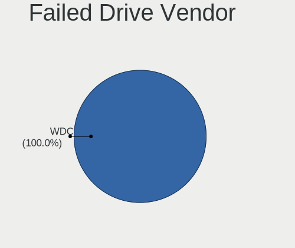
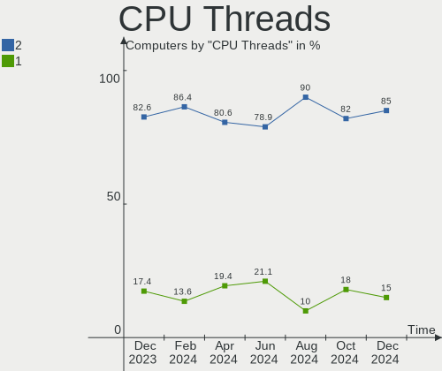
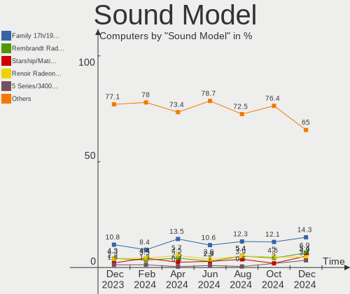

Manjaro Hardware Trends
-----------------------

A project to identify most popular hardware characteristics and track their change
over time based on data collected by Manjaro users at https://Linux-Hardware.org.

Anyone can contribute to the study by uploading probes of their computers by
the [hw-probe](https://github.com/linuxhw/hw-probe) tool:

    sudo -E hw-probe -all -upload

This is a report for all computer types. See also reports for [desktops](/Dist/Manjaro/Desktop/README.md) and [notebooks](/Dist/Manjaro/Notebook/README.md).

Full-feature report is available here: https://linux-hardware.org/?view=trends

Period: Apr, 2021.

Contents
--------

- [ OS                       ](#os)
- [ OS Family                ](#os-family)
- [ Kernel                   ](#kernel)
- [ Kernel Family            ](#kernel-family)
- [ Kernel Major Ver.        ](#kernel-major-ver)
- [ Arch                     ](#arch)
- [ DE                       ](#de)
- [ Display Server           ](#display-server)
- [ Display Manager          ](#display-manager)
- [ OS Lang                  ](#os-lang)
- [ Boot Mode                ](#boot-mode)
- [ Filesystem               ](#filesystem)
- [ Part. scheme             ](#part-scheme)
- [ Dual Boot with Linux/BSD ](#dual-boot-with-linux/bsd)
- [ Dual Boot (Win)          ](#dual-boot-win)
- [ Country                  ](#country)
- [ City                     ](#city)
- [ Vendor                   ](#vendor)
- [ Model                    ](#model)
- [ Model Family             ](#model-family)
- [ MFG Year                 ](#mfg-year)
- [ Form Factor              ](#form-factor)
- [ Secure Boot              ](#secure-boot)
- [ Coreboot                 ](#coreboot)
- [ RAM Size                 ](#ram-size)
- [ RAM Used                 ](#ram-used)
- [ Has CD-ROM               ](#has-cd-rom)
- [ Total Drives             ](#total-drives)
- [ Has Ethernet             ](#has-ethernet)
- [ Has WiFi                 ](#has-wifi)
- [ Has Bluetooth            ](#has-bluetooth)
- [ Drive Vendor             ](#drive-vendor)
- [ Drive Model              ](#drive-model)
- [ HDD Vendor               ](#hdd-vendor)
- [ SSD Vendor               ](#ssd-vendor)
- [ Drive Kind               ](#drive-kind)
- [ Drive Connector          ](#drive-connector)
- [ Drive Size               ](#drive-size)
- [ Space Total              ](#space-total)
- [ Space Used               ](#space-used)
- [ Malfunc. Drives          ](#malfunc-drives)
- [ Malfunc. Drive Vendor    ](#malfunc-drive-vendor)
- [ Malfunc. HDD Vendor      ](#malfunc-hdd-vendor)
- [ Malfunc. Drive Kind      ](#malfunc-drive-kind)
- [ Failed Drives            ](#failed-drives)
- [ Failed Drive Vendor      ](#failed-drive-vendor)
- [ Drive Status             ](#drive-status)
- [ Storage Vendor           ](#storage-vendor)
- [ Storage Model            ](#storage-model)
- [ Storage Kind             ](#storage-kind)
- [ CPU Vendor               ](#cpu-vendor)
- [ CPU Model                ](#cpu-model)
- [ CPU Model Family         ](#cpu-model-family)
- [ CPU Cores                ](#cpu-cores)
- [ CPU Sockets              ](#cpu-sockets)
- [ CPU Threads              ](#cpu-threads)
- [ CPU Op-Modes             ](#cpu-op-modes)
- [ CPU Microcode            ](#cpu-microcode)
- [ CPU Microarch            ](#cpu-microarch)
- [ GPU Vendor               ](#gpu-vendor)
- [ GPU Model                ](#gpu-model)
- [ GPU Combo                ](#gpu-combo)
- [ GPU Driver               ](#gpu-driver)
- [ GPU Memory               ](#gpu-memory)
- [ Monitor Vendor           ](#monitor-vendor)
- [ Monitor Model            ](#monitor-model)
- [ Monitor Resolution       ](#monitor-resolution)
- [ Monitor Diagonal         ](#monitor-diagonal)
- [ Monitor Width            ](#monitor-width)
- [ Aspect Ratio             ](#aspect-ratio)
- [ Monitor Area             ](#monitor-area)
- [ Pixel Density            ](#pixel-density)
- [ Multiple Monitors        ](#multiple-monitors)
- [ Net Controller Vendor    ](#net-controller-vendor)
- [ Net Controller Model     ](#net-controller-model)
- [ Wireless Vendor          ](#wireless-vendor)
- [ Wireless Model           ](#wireless-model)
- [ Ethernet Vendor          ](#ethernet-vendor)
- [ Ethernet Model           ](#ethernet-model)
- [ Net Controller Kind      ](#net-controller-kind)
- [ Used Controller          ](#used-controller)
- [ NICs                     ](#nics)
- [ IPv6                     ](#ipv6)
- [ Memory Vendor            ](#memory-vendor)
- [ Memory Model             ](#memory-model)
- [ Memory Kind              ](#memory-kind)
- [ Memory Form Factor       ](#memory-form-factor)
- [ Memory Size              ](#memory-size)
- [ Memory Speed             ](#memory-speed)
- [ Sound Vendor             ](#sound-vendor)
- [ Sound Model              ](#sound-model)
- [ Camera Vendor            ](#camera-vendor)
- [ Camera Model             ](#camera-model)
- [ Fingerprint Vendor       ](#fingerprint-vendor)
- [ Fingerprint Model        ](#fingerprint-model)
- [ Chipcard Vendor          ](#chipcard-vendor)
- [ Chipcard Model           ](#chipcard-model)
- [ Printer Vendor           ](#printer-vendor)
- [ Printer Model            ](#printer-model)
- [ Scanner Vendor           ](#scanner-vendor)
- [ Scanner Model            ](#scanner-model)
- [ Bluetooth Vendor         ](#bluetooth-vendor)
- [ Bluetooth Model          ](#bluetooth-model)
- [ Unsupported Devices      ](#unsupported-devices)
- [ Unsupported Device Types ](#unsupported-device-types)

OS
--

Installed operating systems

| Name           | Computers | Percent |
|----------------|-----------|---------|
| Manjaro        | 87        | 43.72%  |
| Manjaro 21.0.2 | 34        | 17.09%  |
| Manjaro 21.0.1 | 33        | 16.58%  |
| Manjaro 21.0   | 33        | 16.58%  |
| Manjaro 21.0.3 | 10        | 5.03%   |
| Manjaro 20.2.1 | 2         | 1.01%   |

OS Family
---------

OS without a version

| Name    | Computers | Percent |
|---------|-----------|---------|
| Manjaro | 199       | 100%    |

Kernel
------

Version of the Linux kernel

| Version                | Computers | Percent |
|------------------------|-----------|---------|
| 5.10.23-1-MANJARO      | 25        | 12.56%  |
| 5.10.30-1-MANJARO      | 24        | 12.06%  |
| 5.9.16-1-MANJARO       | 22        | 11.06%  |
| 5.11.10-1-MANJARO      | 20        | 10.05%  |
| 5.10.26-1-MANJARO      | 19        | 9.55%   |
| 5.12.0-1-MANJARO       | 16        | 8.04%   |
| 5.11.6-1-MANJARO       | 16        | 8.04%   |
| 5.11.14-1-MANJARO      | 14        | 7.04%   |
| 5.4.105-1-MANJARO      | 5         | 2.51%   |
| 5.4.108-1-MANJARO      | 4         | 2.01%   |
| 5.11.16-2-MANJARO      | 4         | 2.01%   |
| 5.10.32-1-MANJARO      | 4         | 2.01%   |
| 5.9.1-1-rt19-MANJARO   | 3         | 1.51%   |
| 4.19.180-1-MANJARO     | 3         | 1.51%   |
| 5.4.112-1-MANJARO      | 2         | 1.01%   |
| 5.4.111-1-MANJARO      | 2         | 1.01%   |
| 5.11.11-zen1-1-zen-g14 | 2         | 1.01%   |
| 5.6.19-3-rt12-MANJARO  | 1         | 0.5%    |
| 5.6.15-1-MANJARO       | 1         | 0.5%    |
| 5.4.97-1-MANJARO       | 1         | 0.5%    |
| 5.4.89-1-MANJARO       | 1         | 0.5%    |
| 5.4.114-1-MANJARO      | 1         | 0.5%    |
| 5.4.100-1-MANJARO      | 1         | 0.5%    |
| 5.11.8-1-MANJARO       | 1         | 0.5%    |
| 5.11.16-lqx1-1-lqx     | 1         | 0.5%    |
| 5.11.15-MANJARO        | 1         | 0.5%    |
| 5.11.15-1-MANJARO      | 1         | 0.5%    |
| 5.11.11-144-tkg-MuQSS  | 1         | 0.5%    |
| 5.10.28-1-MANJARO      | 1         | 0.5%    |
| 5.10.19-1-MANJARO      | 1         | 0.5%    |
| 4.19.187-1-MANJARO     | 1         | 0.5%    |

Kernel Family
-------------

Linux kernel without a distro release

| Version  | Computers | Percent |
|----------|-----------|---------|
| 5.10.23  | 25        | 12.56%  |
| 5.10.30  | 24        | 12.06%  |
| 5.9.16   | 22        | 11.06%  |
| 5.11.10  | 20        | 10.05%  |
| 5.10.26  | 19        | 9.55%   |
| 5.12.0   | 16        | 8.04%   |
| 5.11.6   | 16        | 8.04%   |
| 5.11.14  | 14        | 7.04%   |
| 5.4.105  | 5         | 2.51%   |
| 5.11.16  | 5         | 2.51%   |
| 5.4.108  | 4         | 2.01%   |
| 5.10.32  | 4         | 2.01%   |
| 5.9.1    | 3         | 1.51%   |
| 5.11.11  | 3         | 1.51%   |
| 4.19.180 | 3         | 1.51%   |
| 5.4.112  | 2         | 1.01%   |
| 5.4.111  | 2         | 1.01%   |
| 5.11.15  | 2         | 1.01%   |
| 5.6.19   | 1         | 0.5%    |
| 5.6.15   | 1         | 0.5%    |
| 5.4.97   | 1         | 0.5%    |
| 5.4.89   | 1         | 0.5%    |
| 5.4.114  | 1         | 0.5%    |
| 5.4.100  | 1         | 0.5%    |
| 5.11.8   | 1         | 0.5%    |
| 5.10.28  | 1         | 0.5%    |
| 5.10.19  | 1         | 0.5%    |
| 4.19.187 | 1         | 0.5%    |

Kernel Major Ver.
-----------------

Linux kernel major version

| Version | Computers | Percent |
|---------|-----------|---------|
| 5.10    | 74        | 37.19%  |
| 5.11    | 61        | 30.65%  |
| 5.9     | 25        | 12.56%  |
| 5.4     | 17        | 8.54%   |
| 5.12    | 16        | 8.04%   |
| 4.19    | 4         | 2.01%   |
| 5.6     | 2         | 1.01%   |

Arch
----

OS architecture (x86_64, i586, etc.)

| Name   | Computers | Percent |
|--------|-----------|---------|
| x86_64 | 199       | 100%    |

DE
--

Desktop Environment

| Name       | Computers | Percent |
|------------|-----------|---------|
| GNOME      | 56        | 28.14%  |
| KDE5       | 52        | 26.13%  |
| XFCE       | 45        | 22.61%  |
| KDE        | 24        | 12.06%  |
| Unknown    | 7         | 3.52%   |
| X-Cinnamon | 6         | 3.02%   |
| Deepin     | 3         | 1.51%   |
| MATE       | 2         | 1.01%   |
| i3         | 2         | 1.01%   |
| Cinnamon   | 1         | 0.5%    |
| Bspwm      | 1         | 0.5%    |

Display Server
--------------

X11 or Wayland

| Name    | Computers | Percent |
|---------|-----------|---------|
| X11     | 164       | 82.41%  |
| Wayland | 28        | 14.07%  |
| Unknown | 4         | 2.01%   |
| Tty     | 3         | 1.51%   |

Display Manager
---------------

SDDM, LightDM, etc.

| Name    | Computers | Percent |
|---------|-----------|---------|
| Unknown | 87        | 43.72%  |
| SDDM    | 55        | 27.64%  |
| GDM     | 29        | 14.57%  |
| LightDM | 28        | 14.07%  |

OS Lang
-------

Language

| Lang    | Computers | Percent |
|---------|-----------|---------|
| en_US   | 85        | 42.71%  |
| ru_RU   | 21        | 10.55%  |
| en_GB   | 14        | 7.04%   |
| de_DE   | 13        | 6.53%   |
| es_ES   | 12        | 6.03%   |
| pt_BR   | 8         | 4.02%   |
| fr_FR   | 4         | 2.01%   |
| pl_PL   | 3         | 1.51%   |
| en_AU   | 3         | 1.51%   |
| de_AT   | 3         | 1.51%   |
| Unknown | 3         | 1.51%   |
| nl_NL   | 2         | 1.01%   |
| fi_FI   | 2         | 1.01%   |
| es_CO   | 2         | 1.01%   |
| es_CL   | 2         | 1.01%   |
| en_CA   | 2         | 1.01%   |
| C       | 2         | 1.01%   |
| zh_CN   | 1         | 0.5%    |
| vi_VN   | 1         | 0.5%    |
| tr_TR   | 1         | 0.5%    |
| sk_SK   | 1         | 0.5%    |
| ja_JP   | 1         | 0.5%    |
| it_IT   | 1         | 0.5%    |
| gl_ES   | 1         | 0.5%    |
| fr_CA   | 1         | 0.5%    |
| eu_ES   | 1         | 0.5%    |
| es_VE   | 1         | 0.5%    |
| es_UY   | 1         | 0.5%    |
| es_PA   | 1         | 0.5%    |
| es_EC   | 1         | 0.5%    |
| es_CR   | 1         | 0.5%    |
| en_PH   | 1         | 0.5%    |
| en_IN   | 1         | 0.5%    |
| en_HK   | 1         | 0.5%    |
| ca_AD   | 1         | 0.5%    |

Boot Mode
---------

EFI or BIOS

| Mode | Computers | Percent |
|------|-----------|---------|
| BIOS | 108       | 54.27%  |
| EFI  | 91        | 45.73%  |

Filesystem
----------

Type of filesystem

| Type     | Computers | Percent |
|----------|-----------|---------|
| Ext4     | 179       | 89.95%  |
| Btrfs    | 8         | 4.02%   |
| Overlay  | 4         | 2.01%   |
| Xfs      | 3         | 1.51%   |
| F2fs     | 3         | 1.51%   |
| Reiserfs | 1         | 0.5%    |
| Ext3     | 1         | 0.5%    |

Part. scheme
------------

Scheme of partitioning

| Type    | Computers | Percent |
|---------|-----------|---------|
| GPT     | 96        | 48.24%  |
| Unknown | 82        | 41.21%  |
| MBR     | 21        | 10.55%  |

Dual Boot with Linux/BSD
------------------------

Hosting more than one Linux/BSD

| Dual boot | Computers | Percent |
|-----------|-----------|---------|
| No        | 173       | 86.93%  |
| Yes       | 26        | 13.07%  |

Dual Boot (Win)
---------------

Hosting Linux and Windows

| Dual boot | Computers | Percent |
|-----------|-----------|---------|
| No        | 134       | 67.34%  |
| Yes       | 65        | 32.66%  |

Country
-------

Geographic location (country)

| Country         | Computers | Percent |
|-----------------|-----------|---------|
| USA             | 33        | 16.58%  |
| Russia          | 27        | 13.57%  |
| Germany         | 22        | 11.06%  |
| Spain           | 15        | 7.54%   |
| Brazil          | 12        | 6.03%   |
| UK              | 10        | 5.03%   |
| Poland          | 6         | 3.02%   |
| France          | 6         | 3.02%   |
| Canada          | 5         | 2.51%   |
| Belgium         | 4         | 2.01%   |
| Austria         | 4         | 2.01%   |
| Australia       | 4         | 2.01%   |
| Turkey          | 3         | 1.51%   |
| Sweden          | 3         | 1.51%   |
| Netherlands     | 3         | 1.51%   |
| Italy           | 3         | 1.51%   |
| Finland         | 3         | 1.51%   |
| Vietnam         | 2         | 1.01%   |
| Romania         | 2         | 1.01%   |
| Portugal        | 2         | 1.01%   |
| Indonesia       | 2         | 1.01%   |
| Czechia         | 2         | 1.01%   |
| Colombia        | 2         | 1.01%   |
| Chile           | 2         | 1.01%   |
| Venezuela       | 1         | 0.5%    |
| Uruguay         | 1         | 0.5%    |
| Slovenia        | 1         | 0.5%    |
| Saudi Arabia    | 1         | 0.5%    |
| Philippines     | 1         | 0.5%    |
| Panama          | 1         | 0.5%    |
| North Macedonia | 1         | 0.5%    |
| New Zealand     | 1         | 0.5%    |
| Moldova         | 1         | 0.5%    |
| Mexico          | 1         | 0.5%    |
| Malawi          | 1         | 0.5%    |
| Lithuania       | 1         | 0.5%    |
| Japan           | 1         | 0.5%    |
| India           | 1         | 0.5%    |
| Hungary         | 1         | 0.5%    |
| Hong Kong       | 1         | 0.5%    |
| Georgia         | 1         | 0.5%    |
| Ecuador         | 1         | 0.5%    |
| Croatia         | 1         | 0.5%    |
| Costa Rica      | 1         | 0.5%    |
| Bulgaria        | 1         | 0.5%    |
| Belize          | 1         | 0.5%    |

City
----

Geographic location (city)

| City               | Computers | Percent |
|--------------------|-----------|---------|
| Moscow             | 6         | 3.02%   |
| St Petersburg      | 4         | 2.01%   |
| Yekaterinburg      | 2         | 1.01%   |
| Wimbledon          | 2         | 1.01%   |
| Warsaw             | 2         | 1.01%   |
| Sydney             | 2         | 1.01%   |
| Rostov-on-Don      | 2         | 1.01%   |
| Paris              | 2         | 1.01%   |
| Malmo              | 2         | 1.01%   |
| Istanbul           | 2         | 1.01%   |
| Ingolstadt         | 2         | 1.01%   |
| Dallas             | 2         | 1.01%   |
| Curitiba           | 2         | 1.01%   |
| Campo Grande       | 2         | 1.01%   |
| Braunschweig       | 2         | 1.01%   |
| Barakaldo          | 2         | 1.01%   |
| Zoutleeuw          | 1         | 0.5%    |
| Zagreb             | 1         | 0.5%    |
| Yogyakarta         | 1         | 0.5%    |
| Wooster            | 1         | 0.5%    |
| Witten             | 1         | 0.5%    |
| Winfield           | 1         | 0.5%    |
| Weiden             | 1         | 0.5%    |
| Walton on Thames   | 1         | 0.5%    |
| Vrhnika            | 1         | 0.5%    |
| Voronezh           | 1         | 0.5%    |
| Vladivostok        | 1         | 0.5%    |
| Vitoria-Gasteiz    | 1         | 0.5%    |
| Vilnius            | 1         | 0.5%    |
| Vienna             | 1         | 0.5%    |
| Valladolid         | 1         | 0.5%    |
| Valencia           | 1         | 0.5%    |
| Urbana             | 1         | 0.5%    |
| Uelsen             | 1         | 0.5%    |
| Udine              | 1         | 0.5%    |
| Tyumen             | 1         | 0.5%    |
| Twinsburg          | 1         | 0.5%    |
| Turin              | 1         | 0.5%    |
| Tuguegarao City    | 1         | 0.5%    |
| Tucson             | 1         | 0.5%    |
| Toulouse           | 1         | 0.5%    |
| Toronto            | 1         | 0.5%    |
| Tbilisi            | 1         | 0.5%    |
| Tattendorf         | 1         | 0.5%    |
| São Paulo         | 1         | 0.5%    |
| Sofia              | 1         | 0.5%    |
| Skopje             | 1         | 0.5%    |
| Sierning           | 1         | 0.5%    |
| Schwerte           | 1         | 0.5%    |
| Santo Tirso        | 1         | 0.5%    |
| Santiago de Cali   | 1         | 0.5%    |
| Santiago           | 1         | 0.5%    |
| Sant Pere Pescador | 1         | 0.5%    |
| San José          | 1         | 0.5%    |
| San Jose           | 1         | 0.5%    |
| San Diego          | 1         | 0.5%    |
| San Bernardino     | 1         | 0.5%    |
| Rzeszów           | 1         | 0.5%    |
| Ryazan             | 1         | 0.5%    |
| Rosenheim          | 1         | 0.5%    |

Vendor
------

Motherboard manufacturer

| Name                 | Computers | Percent |
|----------------------|-----------|---------|
| ASUSTek Computer     | 37        | 18.59%  |
| Lenovo               | 31        | 15.58%  |
| Hewlett-Packard      | 26        | 13.07%  |
| Gigabyte Technology  | 25        | 12.56%  |
| MSI                  | 15        | 7.54%   |
| Dell                 | 15        | 7.54%   |
| ASRock               | 8         | 4.02%   |
| Acer                 | 7         | 3.52%   |
| Apple                | 5         | 2.51%   |
| Medion               | 3         | 1.51%   |
| Toshiba              | 2         | 1.01%   |
| Pegatron             | 2         | 1.01%   |
| Jumper               | 2         | 1.01%   |
| Google               | 2         | 1.01%   |
| Timi                 | 1         | 0.5%    |
| Teclast              | 1         | 0.5%    |
| Supermicro           | 1         | 0.5%    |
| Standard             | 1         | 0.5%    |
| Sony                 | 1         | 0.5%    |
| Samsung Electronics  | 1         | 0.5%    |
| Packard Bell         | 1         | 0.5%    |
| Multilaser           | 1         | 0.5%    |
| MECHREVO             | 1         | 0.5%    |
| MAIBENBEN            | 1         | 0.5%    |
| Intel Client Systems | 1         | 0.5%    |
| Intel                | 1         | 0.5%    |
| HUAWEI               | 1         | 0.5%    |
| Huanan               | 1         | 0.5%    |
| HC                   | 1         | 0.5%    |
| Fujitsu              | 1         | 0.5%    |
| Chuwi                | 1         | 0.5%    |
| Biostar              | 1         | 0.5%    |
| Unknown              | 1         | 0.5%    |

Model
-----

Motherboard model

| Name                                     | Computers | Percent |
|------------------------------------------|-----------|---------|
| Gigabyte B450M DS3H                      | 3         | 1.51%   |
| MSI MS-7816                              | 2         | 1.01%   |
| HP Spectre x360 Convertible 13-aw0xxx    | 2         | 1.01%   |
| Gigabyte B450M S2H                       | 2         | 1.01%   |
| ASUS TUF B450M-PLUS GAMING               | 2         | 1.01%   |
| ASUS Maximus VIII HERO                   | 2         | 1.01%   |
| Toshiba Satellite L650                   | 1         | 0.5%    |
| Toshiba Satellite C55-A                  | 1         | 0.5%    |
| Timi TM1701                              | 1         | 0.5%    |
| Teclast TbooK 10 S                       | 1         | 0.5%    |
| Supermicro Super Server                  | 1         | 0.5%    |
| Standard SF20BA2                         | 1         | 0.5%    |
| Sony VPCYB35AB                           | 1         | 0.5%    |
| Samsung 350V5C/351V5C/3540VC/3440VC      | 1         | 0.5%    |
| Pegatron IPMSB-H61                       | 1         | 0.5%    |
| Pegatron Compaq dx2450 Microtower PC     | 1         | 0.5%    |
| Packard Bell EasyNote TS11HR             | 1         | 0.5%    |
| Multilaser PC132                         | 1         | 0.5%    |
| MSI WC854AA-ABE p6365es                  | 1         | 0.5%    |
| MSI Prestige 14 A11SCX                   | 1         | 0.5%    |
| MSI MS-7C91                              | 1         | 0.5%    |
| MSI MS-7C84                              | 1         | 0.5%    |
| MSI MS-7B47                              | 1         | 0.5%    |
| MSI MS-7A38                              | 1         | 0.5%    |
| MSI MS-7A12                              | 1         | 0.5%    |
| MSI MS-7900                              | 1         | 0.5%    |
| MSI GS66 Stealth 10SGS                   | 1         | 0.5%    |
| MSI GL65 Leopard 9SCXR                   | 1         | 0.5%    |
| MSI GF63 Thin 9SC                        | 1         | 0.5%    |
| MSI CX61 2PC                             | 1         | 0.5%    |
| MSI Bravo 15 A4DDR                       | 1         | 0.5%    |
| Medion S15450                            | 1         | 0.5%    |
| Medion P6815                             | 1         | 0.5%    |
| Medion MD34186/C728                      | 1         | 0.5%    |
| MECHREVO X3 Series GK7CP6R               | 1         | 0.5%    |
| MAIBENBEN S431                           | 1         | 0.5%    |
| Lenovo Yoga Slim 7 15ITL05 82AC          | 1         | 0.5%    |
| Lenovo Yoga C940-14IIL 81Q9              | 1         | 0.5%    |
| Lenovo Yoga 720-15IKB 80X7               | 1         | 0.5%    |
| Lenovo Yoga 7 14ITL5 82BH                | 1         | 0.5%    |
| Lenovo Yoga 520-14IKB 80YM               | 1         | 0.5%    |
| Lenovo Yoga 2 13 20344                   | 1         | 0.5%    |
| Lenovo ThinkPad X250 20CLS02000          | 1         | 0.5%    |
| Lenovo ThinkPad X250 20CLS0000C          | 1         | 0.5%    |
| Lenovo ThinkPad X230 232502S             | 1         | 0.5%    |
| Lenovo ThinkPad X1 Carbon 2nd 20A8S38300 | 1         | 0.5%    |
| Lenovo ThinkPad T540p 20BE003AUS         | 1         | 0.5%    |
| Lenovo ThinkPad T480 20L5CTO1WW          | 1         | 0.5%    |
| Lenovo ThinkPad T470s 20HGS0DP00         | 1         | 0.5%    |
| Lenovo ThinkPad T420s 4173A57            | 1         | 0.5%    |
| Lenovo ThinkPad T14s Gen 1 20T0CTO1WW    | 1         | 0.5%    |
| Lenovo ThinkPad E495 20NEA001GE          | 1         | 0.5%    |
| Lenovo ThinkPad E475 20H4CTO1WW          | 1         | 0.5%    |
| Lenovo Legion Y540-17IRH 81Q4            | 1         | 0.5%    |
| Lenovo Legion 5 82B5                     | 1         | 0.5%    |
| Lenovo Legion 5 15ARH05 82B5             | 1         | 0.5%    |
| Lenovo IdeaPad S940-14IWL 81R0           | 1         | 0.5%    |
| Lenovo IdeaPad S340-15API 81NC           | 1         | 0.5%    |
| Lenovo IdeaPad L340-15API 81LW           | 1         | 0.5%    |
| Lenovo IdeaPad Gaming 3 15ARH05 82EY     | 1         | 0.5%    |

Model Family
------------

Motherboard model prefix

| Name                  | Computers | Percent |
|-----------------------|-----------|---------|
| Lenovo ThinkPad       | 11        | 5.53%   |
| Lenovo IdeaPad        | 10        | 5.03%   |
| Lenovo Yoga           | 6         | 3.02%   |
| ASUS ROG              | 6         | 3.02%   |
| HP EliteBook          | 5         | 2.51%   |
| Gigabyte B450M        | 5         | 2.51%   |
| ASUS PRIME            | 5         | 2.51%   |
| HP Pavilion           | 4         | 2.01%   |
| Dell XPS              | 4         | 2.01%   |
| Dell Vostro           | 4         | 2.01%   |
| ASUS VivoBook         | 4         | 2.01%   |
| Acer Aspire           | 4         | 2.01%   |
| Lenovo Legion         | 3         | 1.51%   |
| HP Spectre            | 3         | 1.51%   |
| HP ProBook            | 3         | 1.51%   |
| HP Laptop             | 3         | 1.51%   |
| HP ENVY               | 3         | 1.51%   |
| ASUS TUF              | 3         | 1.51%   |
| ASUS Maximus          | 3         | 1.51%   |
| Toshiba Satellite     | 2         | 1.01%   |
| MSI MS-7816           | 2         | 1.01%   |
| HP Compaq             | 2         | 1.01%   |
| Gigabyte Z390         | 2         | 1.01%   |
| Gigabyte X570         | 2         | 1.01%   |
| Dell Precision        | 2         | 1.01%   |
| Dell OptiPlex         | 2         | 1.01%   |
| Dell Inspiron         | 2         | 1.01%   |
| Acer Nitro            | 2         | 1.01%   |
| Timi TM1701           | 1         | 0.5%    |
| Teclast TbooK         | 1         | 0.5%    |
| Supermicro Super      | 1         | 0.5%    |
| Standard SF20BA2      | 1         | 0.5%    |
| Sony VPCYB35AB        | 1         | 0.5%    |
| Samsung 350V5C        | 1         | 0.5%    |
| Pegatron IPMSB-H61    | 1         | 0.5%    |
| Pegatron Compaq       | 1         | 0.5%    |
| Packard Bell EasyNote | 1         | 0.5%    |
| Multilaser PC132      | 1         | 0.5%    |
| MSI WC854AA-ABE       | 1         | 0.5%    |
| MSI Prestige          | 1         | 0.5%    |
| MSI MS-7C91           | 1         | 0.5%    |
| MSI MS-7C84           | 1         | 0.5%    |
| MSI MS-7B47           | 1         | 0.5%    |
| MSI MS-7A38           | 1         | 0.5%    |
| MSI MS-7A12           | 1         | 0.5%    |
| MSI MS-7900           | 1         | 0.5%    |
| MSI GS66              | 1         | 0.5%    |
| MSI GL65              | 1         | 0.5%    |
| MSI GF63              | 1         | 0.5%    |
| MSI CX61              | 1         | 0.5%    |
| MSI Bravo             | 1         | 0.5%    |
| Medion S15450         | 1         | 0.5%    |
| Medion P6815          | 1         | 0.5%    |
| Medion MD34186        | 1         | 0.5%    |
| MECHREVO X3           | 1         | 0.5%    |
| MAIBENBEN S431        | 1         | 0.5%    |
| Lenovo G40-45         | 1         | 0.5%    |
| Jumper EZpad6         | 1         | 0.5%    |
| Jumper EZbook         | 1         | 0.5%    |
| Intel X99             | 1         | 0.5%    |

MFG Year
--------

Motherboard manufacture year

| Year | Computers | Percent |
|------|-----------|---------|
| 2020 | 59        | 29.65%  |
| 2019 | 35        | 17.59%  |
| 2021 | 20        | 10.05%  |
| 2018 | 20        | 10.05%  |
| 2012 | 10        | 5.03%   |
| 2015 | 9         | 4.52%   |
| 2014 | 9         | 4.52%   |
| 2013 | 8         | 4.02%   |
| 2017 | 7         | 3.52%   |
| 2016 | 6         | 3.02%   |
| 2011 | 5         | 2.51%   |
| 2008 | 4         | 2.01%   |
| 2010 | 3         | 1.51%   |
| 2009 | 3         | 1.51%   |
| 2007 | 1         | 0.5%    |

Form Factor
-----------

Physical design of the computer

| Name        | Computers | Percent |
|-------------|-----------|---------|
| Notebook    | 102       | 51.26%  |
| Desktop     | 83        | 41.71%  |
| Convertible | 12        | 6.03%   |
| Mini pc     | 1         | 0.5%    |
| Server      | 1         | 0.5%    |

Secure Boot
-----------

Enabled or disabled

| State    | Computers | Percent |
|----------|-----------|---------|
| Disabled | 198       | 99.5%   |
| Enabled  | 1         | 0.5%    |

Coreboot
--------

Have coreboot on board

| Used | Computers | Percent |
|------|-----------|---------|
| No   | 196       | 98.49%  |
| Yes  | 3         | 1.51%   |

RAM Size
--------

Total RAM memory

| Size in GB  | Computers | Percent |
|-------------|-----------|---------|
| 4.01-8.0    | 49        | 24.62%  |
| 16.01-24.0  | 49        | 24.62%  |
| 8.01-16.0   | 35        | 17.59%  |
| 32.01-64.0  | 29        | 14.57%  |
| 3.01-4.0    | 18        | 9.05%   |
| 64.01-256.0 | 8         | 4.02%   |
| 1.01-2.0    | 5         | 2.51%   |
| 24.01-32.0  | 4         | 2.01%   |
| 2.01-3.0    | 2         | 1.01%   |

RAM Used
--------

Used RAM memory

| Used GB    | Computers | Percent |
|------------|-----------|---------|
| 2.01-3.0   | 51        | 25.63%  |
| 1.01-2.0   | 51        | 25.63%  |
| 4.01-8.0   | 50        | 25.13%  |
| 3.01-4.0   | 26        | 13.07%  |
| 8.01-16.0  | 12        | 6.03%   |
| 0.51-1.0   | 6         | 3.02%   |
| 32.01-64.0 | 1         | 0.5%    |
| 16.01-24.0 | 1         | 0.5%    |
| 0.01-0.5   | 1         | 0.5%    |

Has CD-ROM
----------

Has CD-ROM on board

| Presented | Computers | Percent |
|-----------|-----------|---------|
| No        | 145       | 72.86%  |
| Yes       | 54        | 27.14%  |

Total Drives
------------

Number of drives on board

| Drives | Computers | Percent |
|--------|-----------|---------|
| 1      | 102       | 51.26%  |
| 2      | 49        | 24.62%  |
| 3      | 23        | 11.56%  |
| 4      | 14        | 7.04%   |
| 5      | 8         | 4.02%   |
| 9      | 1         | 0.5%    |
| 7      | 1         | 0.5%    |
| 0      | 1         | 0.5%    |

Has Ethernet
------------

Has Ethernet on board

| Presented | Computers | Percent |
|-----------|-----------|---------|
| Yes       | 166       | 83.42%  |
| No        | 33        | 16.58%  |

Has WiFi
--------

Has WiFi module

| Presented | Computers | Percent |
|-----------|-----------|---------|
| Yes       | 155       | 77.89%  |
| No        | 44        | 22.11%  |

Has Bluetooth
-------------

Has Bluetooth module

| Presented | Computers | Percent |
|-----------|-----------|---------|
| Yes       | 124       | 62.31%  |
| No        | 75        | 37.69%  |

Drive Vendor
------------

Hard drive vendors

| Vendor                    | Computers | Drives | Percent |
|---------------------------|-----------|--------|---------|
| Samsung Electronics       | 61        | 78     | 18.65%  |
| WDC                       | 44        | 55     | 13.46%  |
| Seagate                   | 44        | 55     | 13.46%  |
| Kingston                  | 28        | 28     | 8.56%   |
| SanDisk                   | 21        | 22     | 6.42%   |
| Toshiba                   | 15        | 15     | 4.59%   |
| Unknown                   | 12        | 15     | 3.67%   |
| Crucial                   | 11        | 14     | 3.36%   |
| Hitachi                   | 10        | 11     | 3.06%   |
| Intel                     | 9         | 12     | 2.75%   |
| HGST                      | 7         | 9      | 2.14%   |
| SK Hynix                  | 6         | 6      | 1.83%   |
| Phison                    | 6         | 6      | 1.83%   |
| XPG                       | 5         | 5      | 1.53%   |
| LITEONIT                  | 4         | 4      | 1.22%   |
| Apple                     | 4         | 4      | 1.22%   |
| Vaseky                    | 2         | 2      | 0.61%   |
| Union Memory (Shenzhen)   | 2         | 2      | 0.61%   |
| Silicon Motion            | 2         | 2      | 0.61%   |
| Patriot                   | 2         | 2      | 0.61%   |
| Micron Technology         | 2         | 2      | 0.61%   |
| LITEON                    | 2         | 2      | 0.61%   |
| Lexar                     | 2         | 2      | 0.61%   |
| KingDian                  | 2         | 2      | 0.61%   |
| JMicron                   | 2         | 2      | 0.61%   |
| GOODRAM                   | 2         | 2      | 0.61%   |
| China                     | 2         | 2      | 0.61%   |
| Union Memory              | 1         | 1      | 0.31%   |
| TrekStor                  | 1         | 1      | 0.31%   |
| PNY                       | 1         | 1      | 0.31%   |
| PLEXTOR                   | 1         | 1      | 0.31%   |
| PHD 3.0                   | 1         | 1      | 0.31%   |
| OCZ                       | 1         | 1      | 0.31%   |
| Micron/Crucial Technology | 1         | 1      | 0.31%   |
| LONDISK                   | 1         | 1      | 0.31%   |
| LaCie                     | 1         | 1      | 0.31%   |
| KINGBANK                  | 1         | 1      | 0.31%   |
| Intenso                   | 1         | 1      | 0.31%   |
| INDMEM                    | 1         | 1      | 0.31%   |
| Hoodisk                   | 1         | 1      | 0.31%   |
| Gigabyte Technology       | 1         | 2      | 0.31%   |
| Fujitsu                   | 1         | 1      | 0.31%   |
| Corsair                   | 1         | 1      | 0.31%   |
| Colorful                  | 1         | 1      | 0.31%   |
| A-DATA Technology         | 1         | 1      | 0.31%   |

Drive Model
-----------

Hard drive models

| Model                                | Computers | Percent |
|--------------------------------------|-----------|---------|
| Seagate ST1000LM035-1RK172 1TB       | 7         | 1.92%   |
| Samsung NVMe SSD Drive 500GB         | 6         | 1.64%   |
| Samsung SSD 860 EVO 1TB              | 5         | 1.37%   |
| Seagate Expansion Desk 6TB           | 4         | 1.1%    |
| Samsung SSD 860 EVO 500GB            | 4         | 1.1%    |
| Samsung SSD 850 EVO 250GB            | 4         | 1.1%    |
| WDC WD20EARX-00PASB0 2TB             | 3         | 0.82%   |
| Seagate ST500DM002-1BD142 500GB      | 3         | 0.82%   |
| Seagate ST3500418AS 500GB            | 3         | 0.82%   |
| Seagate ST1000DM010-2EP102 1TB       | 3         | 0.82%   |
| Samsung SSD 850 EVO 500GB            | 3         | 0.82%   |
| Samsung NVMe SSD Drive 512GB         | 3         | 0.82%   |
| Samsung NVMe SSD Drive 256GB         | 3         | 0.82%   |
| Samsung NVMe SSD Drive 1TB           | 3         | 0.82%   |
| Samsung NVMe SSD Drive 1024GB        | 3         | 0.82%   |
| Kingston SV300S37A120G 120GB SSD     | 3         | 0.82%   |
| Kingston SUV400S37240G 240GB SSD     | 3         | 0.82%   |
| Kingston SA400S37240G 240GB SSD      | 3         | 0.82%   |
| XPG GAMMIX S11 Pro 2TB               | 2         | 0.55%   |
| WDC WDS500G2B0A-00SM50 500GB SSD     | 2         | 0.55%   |
| WDC WDS250G3X0C-00SJG0 250GB         | 2         | 0.55%   |
| WDC WDS100T2B0C-00PXH0 1TB           | 2         | 0.55%   |
| WDC WDS100T2B0A-00SM50 1TB SSD       | 2         | 0.55%   |
| WDC WD10EZEX-08WN4A0 1TB             | 2         | 0.55%   |
| WDC WD10EZEX-00BN5A0 1TB             | 2         | 0.55%   |
| WDC WD1003FZEX-00MK2A0 1TB           | 2         | 0.55%   |
| Unknown SD/MMC/MS PRO 32GB           | 2         | 0.55%   |
| Unknown MMC Card  64GB               | 2         | 0.55%   |
| Toshiba NVMe SSD Drive 256GB         | 2         | 0.55%   |
| SK Hynix NVMe SSD Drive 256GB        | 2         | 0.55%   |
| Seagate ST3000DM001-1ER166 3TB       | 2         | 0.55%   |
| Seagate ST2000DM006-2DM164 2TB       | 2         | 0.55%   |
| Seagate ST1000LM024 HN-M101MBB 1TB   | 2         | 0.55%   |
| Seagate ST1000DM003-1ER162 1TB       | 2         | 0.55%   |
| SanDisk SSD PLUS 480GB               | 2         | 0.55%   |
| SanDisk SSD PLUS 240GB               | 2         | 0.55%   |
| SanDisk SDSSDH3 4T00 4TB             | 2         | 0.55%   |
| Sandisk NVMe SSD Drive 512GB         | 2         | 0.55%   |
| SanDisk Extreme SSD 2TB              | 2         | 0.55%   |
| Samsung SSD 970 EVO Plus 250GB       | 2         | 0.55%   |
| Samsung SSD 840 EVO 1TB              | 2         | 0.55%   |
| Kingston SV300S37A60G 64GB SSD       | 2         | 0.55%   |
| Kingston SV300S37A240G 240GB SSD     | 2         | 0.55%   |
| Kingston SHFS37A120G 120GB SSD       | 2         | 0.55%   |
| Kingston RBUSNS8180S3256GJ 256GB SSD | 2         | 0.55%   |
| Intel SSDPEKNW512G8H 512GB           | 2         | 0.55%   |
| HGST HTS545050A7E680 500GB           | 2         | 0.55%   |
| Crucial CT500P2SSD8 500GB            | 2         | 0.55%   |
| XPG NVMe SSD Drive 512GB             | 1         | 0.27%   |
| XPG NVMe SSD Drive 2TB               | 1         | 0.27%   |
| XPG NVMe SSD Drive 1024GB            | 1         | 0.27%   |
| WDC WDS500G2B0B-00YS70 500GB SSD     | 1         | 0.27%   |
| WDC WDS500G2B0A 500GB SSD            | 1         | 0.27%   |
| WDC WDS240G2G0B-00EPW0 240GB SSD     | 1         | 0.27%   |
| WDC WDS200T2B0B-00YS70 2TB SSD       | 1         | 0.27%   |
| WDC WDS100T3X0C-00SJG0 1TB           | 1         | 0.27%   |
| WDC WD5001AALS-00E3A0 500GB          | 1         | 0.27%   |
| WDC WD5000LPVX-60V0TT0 500GB         | 1         | 0.27%   |
| WDC WD5000LPVX-22V0TT0 500GB         | 1         | 0.27%   |
| WDC WD5000BEVT-00ZAT0 500GB          | 1         | 0.27%   |

HDD Vendor
----------

Hard disk drive vendors

| Vendor              | Computers | Drives | Percent |
|---------------------|-----------|--------|---------|
| Seagate             | 44        | 54     | 39.64%  |
| WDC                 | 31        | 36     | 27.93%  |
| Hitachi             | 10        | 11     | 9.01%   |
| Toshiba             | 8         | 8      | 7.21%   |
| Samsung Electronics | 8         | 8      | 7.21%   |
| HGST                | 7         | 9      | 6.31%   |
| PHD 3.0             | 1         | 1      | 0.9%    |
| Intenso             | 1         | 1      | 0.9%    |
| Fujitsu             | 1         | 1      | 0.9%    |

SSD Vendor
----------

Solid state drive vendors

| Vendor              | Computers | Drives | Percent |
|---------------------|-----------|--------|---------|
| Samsung Electronics | 28        | 34     | 23.73%  |
| Kingston            | 26        | 26     | 22.03%  |
| SanDisk             | 16        | 17     | 13.56%  |
| WDC                 | 8         | 10     | 6.78%   |
| Crucial             | 8         | 11     | 6.78%   |
| LITEONIT            | 4         | 4      | 3.39%   |
| Vaseky              | 2         | 2      | 1.69%   |
| Patriot             | 2         | 2      | 1.69%   |
| LITEON              | 2         | 2      | 1.69%   |
| KingDian            | 2         | 2      | 1.69%   |
| Intel               | 2         | 2      | 1.69%   |
| GOODRAM             | 2         | 2      | 1.69%   |
| China               | 2         | 2      | 1.69%   |
| Apple               | 2         | 2      | 1.69%   |
| Unknown             | 1         | 1      | 0.85%   |
| Toshiba             | 1         | 1      | 0.85%   |
| PLEXTOR             | 1         | 1      | 0.85%   |
| OCZ                 | 1         | 1      | 0.85%   |
| LONDISK             | 1         | 1      | 0.85%   |
| Lexar               | 1         | 1      | 0.85%   |
| JMicron             | 1         | 1      | 0.85%   |
| INDMEM              | 1         | 1      | 0.85%   |
| Hoodisk             | 1         | 1      | 0.85%   |
| Corsair             | 1         | 1      | 0.85%   |
| Colorful            | 1         | 1      | 0.85%   |
| A-DATA Technology   | 1         | 1      | 0.85%   |

Drive Kind
----------

HDD or SSD

| Kind    | Computers | Drives | Percent |
|---------|-----------|--------|---------|
| SSD     | 98        | 130    | 33.56%  |
| NVMe    | 90        | 102    | 30.82%  |
| HDD     | 89        | 129    | 30.48%  |
| Unknown | 8         | 10     | 2.74%   |
| MMC     | 7         | 9      | 2.4%    |

Drive Connector
---------------

SATA, SAS, NVMe, etc.

| Type | Computers | Drives | Percent |
|------|-----------|--------|---------|
| SATA | 143       | 246    | 55.43%  |
| NVMe | 90        | 102    | 34.88%  |
| SAS  | 18        | 23     | 6.98%   |
| MMC  | 7         | 9      | 2.71%   |

Drive Size
----------

Size of hard drive

| Size in TB | Computers | Drives | Percent |
|------------|-----------|--------|---------|
| 0.01-0.5   | 105       | 149    | 53.57%  |
| 0.51-1.0   | 52        | 62     | 26.53%  |
| 1.01-2.0   | 22        | 26     | 11.22%  |
| 4.01-10.0  | 7         | 10     | 3.57%   |
| 3.01-4.0   | 6         | 7      | 3.06%   |
| 2.01-3.0   | 4         | 5      | 2.04%   |

Space Total
-----------

Amount of disk space available on the file system

| Size in GB     | Computers | Percent |
|----------------|-----------|---------|
| 101-250        | 57        | 28.64%  |
| 251-500        | 43        | 21.61%  |
| 501-1000       | 31        | 15.58%  |
| 1001-2000      | 14        | 7.04%   |
| 2001-3000      | 12        | 6.03%   |
| Unknown        | 12        | 6.03%   |
| More than 3000 | 11        | 5.53%   |
| 21-50          | 7         | 3.52%   |
| 51-100         | 7         | 3.52%   |
| 1-20           | 5         | 2.51%   |

Space Used
----------

Amount of used disk space

| Used GB        | Computers | Percent |
|----------------|-----------|---------|
| 1-20           | 37        | 18.59%  |
| 21-50          | 35        | 17.59%  |
| 101-250        | 30        | 15.08%  |
| 51-100         | 29        | 14.57%  |
| 251-500        | 22        | 11.06%  |
| 501-1000       | 15        | 7.54%   |
| 1001-2000      | 12        | 6.03%   |
| Unknown        | 12        | 6.03%   |
| 2001-3000      | 6         | 3.02%   |
| More than 3000 | 1         | 0.5%    |

Malfunc. Drives
---------------

Drive models with a malfunction

| Model                               | Computers | Drives | Percent |
|-------------------------------------|-----------|--------|---------|
| WDC WD30EZRS-11J99B1 3TB            | 1         | 1      | 5.26%   |
| WDC WD20EARX-00PASB0 2TB            | 1         | 1      | 5.26%   |
| Toshiba MQ01ABD100 1TB              | 1         | 1      | 5.26%   |
| Toshiba MK7559GSXP 752GB            | 1         | 1      | 5.26%   |
| Toshiba MK3259GSXP 320GB            | 1         | 1      | 5.26%   |
| Seagate ST9640320AS 640GB           | 1         | 1      | 5.26%   |
| Seagate ST3500630AS 500GB           | 1         | 1      | 5.26%   |
| Seagate ST3250310AS 250GB           | 1         | 1      | 5.26%   |
| Seagate ST2000LM007-1R8174 2TB      | 1         | 1      | 5.26%   |
| Seagate ST1000LX015-1U7172 1TB      | 1         | 1      | 5.26%   |
| Seagate ST1000LM035-1RK172 1TB      | 1         | 1      | 5.26%   |
| Seagate ST1000DX001-1CM162-SSHD 1TB | 1         | 1      | 5.26%   |
| SanDisk SDSSDP256G 256GB            | 1         | 1      | 5.26%   |
| Intel SSDSC2CW120A3 120GB           | 1         | 1      | 5.26%   |
| Hitachi HTS547575A9E384 752GB       | 1         | 1      | 5.26%   |
| Hitachi HTS543232L9A300 320GB       | 1         | 1      | 5.26%   |
| HGST TOURO Mobile 500GB             | 1         | 1      | 5.26%   |
| Fujitsu MHW2160BH PL 160GB          | 1         | 1      | 5.26%   |
| Crucial CT120M500SSD1 120GB         | 1         | 1      | 5.26%   |

Malfunc. Drive Vendor
---------------------

Vendors of faulty drives

| Vendor  | Computers | Drives | Percent |
|---------|-----------|--------|---------|
| Seagate | 7         | 7      | 36.84%  |
| Toshiba | 3         | 3      | 15.79%  |
| WDC     | 2         | 2      | 10.53%  |
| Hitachi | 2         | 2      | 10.53%  |
| SanDisk | 1         | 1      | 5.26%   |
| Intel   | 1         | 1      | 5.26%   |
| HGST    | 1         | 1      | 5.26%   |
| Fujitsu | 1         | 1      | 5.26%   |
| Crucial | 1         | 1      | 5.26%   |

Malfunc. HDD Vendor
-------------------

Vendors of faulty HDD drives

| Vendor  | Computers | Drives | Percent |
|---------|-----------|--------|---------|
| Seagate | 7         | 7      | 43.75%  |
| Toshiba | 3         | 3      | 18.75%  |
| WDC     | 2         | 2      | 12.5%   |
| Hitachi | 2         | 2      | 12.5%   |
| HGST    | 1         | 1      | 6.25%   |
| Fujitsu | 1         | 1      | 6.25%   |

Malfunc. Drive Kind
-------------------

Kinds of faulty drives

| Kind | Computers | Drives | Percent |
|------|-----------|--------|---------|
| HDD  | 14        | 16     | 82.35%  |
| SSD  | 3         | 3      | 17.65%  |

Failed Drives
-------------

Failed drive models

| Model                                            | Computers | Drives | Percent |
|--------------------------------------------------|-----------|--------|---------|
| Samsung Electronics MZNTY128HDHP-000H1 128GB SSD | 1         | 1      | 100%    |

Failed Drive Vendor
-------------------

Failed drive vendors

| Vendor              | Computers | Drives | Percent |
|---------------------|-----------|--------|---------|
| Samsung Electronics | 1         | 1      | 100%    |

Drive Status
------------

Number of failed and malfunc. drives

| Status   | Computers | Drives | Percent |
|----------|-----------|--------|---------|
| Detected | 118       | 214    | 54.38%  |
| Works    | 82        | 146    | 37.79%  |
| Malfunc  | 16        | 19     | 7.37%   |
| Failed   | 1         | 1      | 0.46%   |

Storage Vendor
--------------

Storage controller vendors

| Vendor                       | Computers | Percent |
|------------------------------|-----------|---------|
| Intel                        | 119       | 42.81%  |
| AMD                          | 55        | 19.78%  |
| Samsung Electronics          | 32        | 11.51%  |
| Sandisk                      | 14        | 5.04%   |
| Phison Electronics           | 8         | 2.88%   |
| Toshiba America Info Systems | 6         | 2.16%   |
| SK Hynix                     | 6         | 2.16%   |
| ADATA Technology             | 5         | 1.8%    |
| Micron/Crucial Technology    | 4         | 1.44%   |
| JMicron Technology           | 4         | 1.44%   |
| ASMedia Technology           | 4         | 1.44%   |
| Union Memory (Shenzhen)      | 3         | 1.08%   |
| Silicon Motion               | 3         | 1.08%   |
| Nvidia                       | 3         | 1.08%   |
| Marvell Technology Group     | 3         | 1.08%   |
| Silicon Image                | 2         | 0.72%   |
| Micron Technology            | 2         | 0.72%   |
| Kingston Technology Company  | 2         | 0.72%   |
| Apple                        | 2         | 0.72%   |
| Shenzhen Longsys Electronics | 1         | 0.36%   |

Storage Model
-------------

Storage controller models

| Model                                                                                   | Computers | Percent |
|-----------------------------------------------------------------------------------------|-----------|---------|
| AMD FCH SATA Controller [AHCI mode]                                                     | 40        | 12.9%   |
| Samsung NVMe SSD Controller SM981/PM981/PM983                                           | 23        | 7.42%   |
| AMD 400 Series Chipset SATA Controller                                                  | 13        | 4.19%   |
| Intel Cannon Lake Mobile PCH SATA AHCI Controller                                       | 9         | 2.9%    |
| Intel 8 Series SATA Controller 1 [AHCI mode]                                            | 9         | 2.9%    |
| Intel 7 Series Chipset Family 6-port SATA Controller [AHCI mode]                        | 9         | 2.9%    |
| Intel Sunrise Point-LP SATA Controller [AHCI mode]                                      | 8         | 2.58%   |
| Intel Q170/Q150/B150/H170/H110/Z170/CM236 Chipset SATA Controller [AHCI Mode]           | 7         | 2.26%   |
| Intel 8 Series/C220 Series Chipset Family 6-port SATA Controller 1 [AHCI mode]          | 7         | 2.26%   |
| Sandisk WD Blue SN550 NVMe SSD                                                          | 5         | 1.61%   |
| Samsung NVMe SSD Controller SM961/PM961/SM963                                           | 5         | 1.61%   |
| Intel SATA Controller [RAID mode]                                                       | 5         | 1.61%   |
| Intel 82801 Mobile SATA Controller [RAID mode]                                          | 5         | 1.61%   |
| Intel 6 Series/C200 Series Chipset Family 6 port Mobile SATA AHCI Controller            | 5         | 1.61%   |
| ADATA XPG SX8200 Pro PCIe Gen3x4 M.2 2280 Solid State Drive                             | 5         | 1.61%   |
| Sandisk WD Black SN750 / PC SN730 NVMe SSD                                              | 4         | 1.29%   |
| Sandisk WD Black 2018/SN750 / PC SN720 NVMe SSD                                         | 4         | 1.29%   |
| Phison E16 PCIe4 NVMe Controller                                                        | 4         | 1.29%   |
| Intel Wildcat Point-LP SATA Controller [AHCI Mode]                                      | 4         | 1.29%   |
| Intel SSD 660P Series                                                                   | 4         | 1.29%   |
| Intel 9 Series Chipset Family SATA Controller [AHCI Mode]                               | 4         | 1.29%   |
| ASMedia ASM1062 Serial ATA Controller                                                   | 4         | 1.29%   |
| Union Memory (Shenzhen) Non-Volatile memory controller                                  | 3         | 0.97%   |
| Toshiba America Info Systems XG6 NVMe SSD Controller                                    | 3         | 0.97%   |
| Toshiba America Info Systems BG3 NVMe SSD Controller                                    | 3         | 0.97%   |
| Samsung NVMe SSD Controller PM9A1/980PRO                                                | 3         | 0.97%   |
| Phison E12 NVMe Controller                                                              | 3         | 0.97%   |
| Intel HM170/QM170 Chipset SATA Controller [AHCI Mode]                                   | 3         | 0.97%   |
| Intel Celeron/Pentium Silver Processor SATA Controller                                  | 3         | 0.97%   |
| Intel Cannon Lake PCH SATA AHCI Controller                                              | 3         | 0.97%   |
| Intel 6 Series/C200 Series Chipset Family Desktop SATA Controller (IDE mode, ports 4-5) | 3         | 0.97%   |
| Intel 6 Series/C200 Series Chipset Family Desktop SATA Controller (IDE mode, ports 0-3) | 3         | 0.97%   |
| Intel 6 Series/C200 Series Chipset Family 6 port Desktop SATA AHCI Controller           | 3         | 0.97%   |
| Intel 200 Series PCH SATA controller [AHCI mode]                                        | 3         | 0.97%   |
| AMD Starship/Matisse Chipset SATA Controller [AHCI mode]                                | 3         | 0.97%   |
| AMD SB7x0/SB8x0/SB9x0 SATA Controller [AHCI mode]                                       | 3         | 0.97%   |
| AMD SB7x0/SB8x0/SB9x0 IDE Controller                                                    | 3         | 0.97%   |
| SK Hynix BC511                                                                          | 2         | 0.65%   |
| Silicon Motion SM2263EN/SM2263XT SSD Controller                                         | 2         | 0.65%   |
| Nvidia MCP78S [GeForce 8200] SATA Controller (non-AHCI mode)                            | 2         | 0.65%   |
| Nvidia MCP78S [GeForce 8200] IDE                                                        | 2         | 0.65%   |
| Micron/Crucial NVMe Controller                                                          | 2         | 0.65%   |
| Micron/Crucial Non-Volatile memory controller                                           | 2         | 0.65%   |
| Micron Non-Volatile memory controller                                                   | 2         | 0.65%   |
| JMicron JMB368 IDE controller                                                           | 2         | 0.65%   |
| Intel Tiger Lake-LP SATA Controller [AHCI mode]                                         | 2         | 0.65%   |
| Intel SSD 600P Series                                                                   | 2         | 0.65%   |
| Intel C610/X99 series chipset 6-Port SATA Controller [AHCI mode]                        | 2         | 0.65%   |
| Intel 82801I (ICH9 Family) 2 port SATA Controller [IDE mode]                            | 2         | 0.65%   |
| Intel 82801HM/HEM (ICH8M/ICH8M-E) SATA Controller [AHCI mode]                           | 2         | 0.65%   |
| Intel 82801HM/HEM (ICH8M/ICH8M-E) IDE Controller                                        | 2         | 0.65%   |
| Intel 400 Series Chipset Family SATA AHCI Controller                                    | 2         | 0.65%   |
| AMD SB7x0/SB8x0/SB9x0 SATA Controller [IDE mode]                                        | 2         | 0.65%   |
| AMD FCH SATA Controller D                                                               | 2         | 0.65%   |
| SK Hynix PC401 NVMe Solid State Drive 256GB                                             | 1         | 0.32%   |
| SK Hynix NVMe SSD Controller                                                            | 1         | 0.32%   |
| SK Hynix Non-Volatile memory controller                                                 | 1         | 0.32%   |
| SK Hynix BC501 NVMe Solid State Drive 512GB                                             | 1         | 0.32%   |
| Silicon Motion SM2262/SM2262EN SSD Controller                                           | 1         | 0.32%   |
| Silicon Image SiI 3132 Serial ATA Raid II Controller                                    | 1         | 0.32%   |

Storage Kind
------------

Kind of storage controller (IDE, SATA, NVMe, SAS, ...)

| Kind | Computers | Percent |
|------|-----------|---------|
| SATA | 152       | 55.68%  |
| NVMe | 90        | 32.97%  |
| RAID | 16        | 5.86%   |
| IDE  | 15        | 5.49%   |

CPU Vendor
----------

Processor vendors

| Vendor | Computers | Percent |
|--------|-----------|---------|
| Intel  | 135       | 67.84%  |
| AMD    | 64        | 32.16%  |

CPU Model
---------

Processor models

| Model                                         | Computers | Percent |
|-----------------------------------------------|-----------|---------|
| Intel Core i7-9750H CPU @ 2.60GHz             | 4         | 2.01%   |
| AMD Ryzen 5 3600 6-Core Processor             | 4         | 2.01%   |
| Intel Core i7-8700 CPU @ 3.20GHz              | 3         | 1.51%   |
| Intel Core i7-2600K CPU @ 3.40GHz             | 3         | 1.51%   |
| Intel Core i7-1065G7 CPU @ 1.30GHz            | 3         | 1.51%   |
| Intel Core i5-4210U CPU @ 1.70GHz             | 3         | 1.51%   |
| Intel Atom x5-Z8350 CPU @ 1.44GHz             | 3         | 1.51%   |
| Intel 11th Gen Core i5-1135G7 @ 2.40GHz       | 3         | 1.51%   |
| AMD Ryzen 9 3900X 12-Core Processor           | 3         | 1.51%   |
| AMD Ryzen 7 3700U with Radeon Vega Mobile Gfx | 3         | 1.51%   |
| AMD Ryzen 5 4600H with Radeon Graphics        | 3         | 1.51%   |
| AMD Ryzen 5 3500U with Radeon Vega Mobile Gfx | 3         | 1.51%   |
| AMD Ryzen 5 2600 Six-Core Processor           | 3         | 1.51%   |
| Intel Core i7-8565U CPU @ 1.80GHz             | 2         | 1.01%   |
| Intel Core i7-8550U CPU @ 1.80GHz             | 2         | 1.01%   |
| Intel Core i7-7500U CPU @ 2.70GHz             | 2         | 1.01%   |
| Intel Core i7-6700 CPU @ 3.40GHz              | 2         | 1.01%   |
| Intel Core i7-3630QM CPU @ 2.40GHz            | 2         | 1.01%   |
| Intel Core i7-10750H CPU @ 2.60GHz            | 2         | 1.01%   |
| Intel Core i5-8265U CPU @ 1.60GHz             | 2         | 1.01%   |
| Intel Core i5-8250U CPU @ 1.60GHz             | 2         | 1.01%   |
| Intel Core i5-5200U CPU @ 2.20GHz             | 2         | 1.01%   |
| Intel Core i5-4690 CPU @ 3.50GHz              | 2         | 1.01%   |
| Intel Core i5-2520M CPU @ 2.50GHz             | 2         | 1.01%   |
| Intel Core i3-4010U CPU @ 1.70GHz             | 2         | 1.01%   |
| Intel 11th Gen Core i7-1185G7 @ 3.00GHz       | 2         | 1.01%   |
| AMD Ryzen 7 4800H with Radeon Graphics        | 2         | 1.01%   |
| AMD Ryzen 7 4700U with Radeon Graphics        | 2         | 1.01%   |
| AMD Ryzen 7 3800X 8-Core Processor            | 2         | 1.01%   |
| AMD Ryzen 7 2700X Eight-Core Processor        | 2         | 1.01%   |
| AMD Ryzen 7 2700U with Radeon Vega Mobile Gfx | 2         | 1.01%   |
| AMD Ryzen 5 4500U with Radeon Graphics        | 2         | 1.01%   |
| AMD Ryzen 3 2200G with Radeon Vega Graphics   | 2         | 1.01%   |
| Intel Xeon W-3223 CPU @ 3.50GHz               | 1         | 0.5%    |
| Intel Xeon E-2286M CPU @ 2.40GHz              | 1         | 0.5%    |
| Intel Xeon CPU E5-2678 v3 @ 2.50GHz           | 1         | 0.5%    |
| Intel Xeon CPU E5-2620 v3 @ 2.40GHz           | 1         | 0.5%    |
| Intel Xeon CPU E5-1650 0 @ 3.20GHz            | 1         | 0.5%    |
| Intel Xeon CPU E3-1231 v3 @ 3.40GHz           | 1         | 0.5%    |
| Intel Pentium Silver N5000 CPU @ 1.10GHz      | 1         | 0.5%    |
| Intel Pentium Dual-Core CPU E5700 @ 3.00GHz   | 1         | 0.5%    |
| Intel Pentium CPU G4400 @ 3.30GHz             | 1         | 0.5%    |
| Intel Core i9-9900K CPU @ 3.60GHz             | 1         | 0.5%    |
| Intel Core i9-9880H CPU @ 2.30GHz             | 1         | 0.5%    |
| Intel Core i9-8950HK CPU @ 2.90GHz            | 1         | 0.5%    |
| Intel Core i9-10980HK CPU @ 2.40GHz           | 1         | 0.5%    |
| Intel Core i9-10900K CPU @ 3.70GHz            | 1         | 0.5%    |
| Intel Core i7-9700K CPU @ 3.60GHz             | 1         | 0.5%    |
| Intel Core i7-9700 CPU @ 3.00GHz              | 1         | 0.5%    |
| Intel Core i7-8750H CPU @ 2.20GHz             | 1         | 0.5%    |
| Intel Core i7-8700K CPU @ 3.70GHz             | 1         | 0.5%    |
| Intel Core i7-7700K CPU @ 4.20GHz             | 1         | 0.5%    |
| Intel Core i7-7700HQ CPU @ 2.80GHz            | 1         | 0.5%    |
| Intel Core i7-7600U CPU @ 2.80GHz             | 1         | 0.5%    |
| Intel Core i7-6850K CPU @ 3.60GHz             | 1         | 0.5%    |
| Intel Core i7-6700K CPU @ 4.00GHz             | 1         | 0.5%    |
| Intel Core i7-6700HQ CPU @ 2.60GHz            | 1         | 0.5%    |
| Intel Core i7-5500U CPU @ 2.40GHz             | 1         | 0.5%    |
| Intel Core i7-4790K CPU @ 4.00GHz             | 1         | 0.5%    |
| Intel Core i7-4770HQ CPU @ 2.20GHz            | 1         | 0.5%    |

CPU Model Family
----------------

Processor model prefix

| Model                   | Computers | Percent |
|-------------------------|-----------|---------|
| Intel Core i7           | 45        | 22.61%  |
| Intel Core i5           | 41        | 20.6%   |
| AMD Ryzen 5             | 21        | 10.55%  |
| AMD Ryzen 7             | 16        | 8.04%   |
| Intel Core i3           | 12        | 6.03%   |
| Other                   | 9         | 4.52%   |
| Intel Celeron           | 7         | 3.52%   |
| Intel Xeon              | 6         | 3.02%   |
| AMD Ryzen 9             | 6         | 3.02%   |
| Intel Core i9           | 5         | 2.51%   |
| Intel Core 2 Duo        | 4         | 2.01%   |
| Intel Atom              | 4         | 2.01%   |
| AMD Ryzen 3             | 2         | 1.01%   |
| AMD FX                  | 2         | 1.01%   |
| AMD A8                  | 2         | 1.01%   |
| AMD A6                  | 2         | 1.01%   |
| Intel Pentium Silver    | 1         | 0.5%    |
| Intel Pentium Dual-Core | 1         | 0.5%    |
| Intel Pentium           | 1         | 0.5%    |
| Intel Core 2 Quad       | 1         | 0.5%    |
| AMD Ryzen 5 PRO         | 1         | 0.5%    |
| AMD Phenom II X6        | 1         | 0.5%    |
| AMD Phenom II X4        | 1         | 0.5%    |
| AMD Phenom II X2        | 1         | 0.5%    |
| AMD Phenom              | 1         | 0.5%    |
| AMD E                   | 1         | 0.5%    |
| AMD Athlon X4           | 1         | 0.5%    |
| AMD Athlon II X2        | 1         | 0.5%    |
| AMD Athlon 64 X2        | 1         | 0.5%    |
| AMD Athlon              | 1         | 0.5%    |
| AMD A4                  | 1         | 0.5%    |

CPU Cores
---------

Number of processor cores

| Number | Computers | Percent |
|--------|-----------|---------|
| 4      | 78        | 39.2%   |
| 2      | 56        | 28.14%  |
| 6      | 34        | 17.09%  |
| 8      | 20        | 10.05%  |
| 12     | 5         | 2.51%   |
| 1      | 3         | 1.51%   |
| 16     | 1         | 0.5%    |
| 10     | 1         | 0.5%    |
| 3      | 1         | 0.5%    |

CPU Sockets
-----------

Number of sockets

| Number | Computers | Percent |
|--------|-----------|---------|
| 1      | 199       | 100%    |

CPU Threads
-----------

Threads per core (Hyper-Threading)

| Number | Computers | Percent |
|--------|-----------|---------|
| 2      | 146       | 73.37%  |
| 1      | 53        | 26.63%  |

CPU Op-Modes
------------

CPU Operation Modes (32-bit, 64-bit)

| Op mode        | Computers | Percent |
|----------------|-----------|---------|
| 32-bit, 64-bit | 199       | 100%    |

CPU Microcode
-------------

Microcode number

| Number     | Computers | Percent |
|------------|-----------|---------|
| Unknown    | 101       | 50.75%  |
| 0x08701021 | 9         | 4.52%   |
| 0x906ea    | 8         | 4.02%   |
| 0x306c3    | 6         | 3.02%   |
| 0x08108109 | 5         | 2.51%   |
| 0x0800820d | 5         | 2.51%   |
| 0x506e3    | 4         | 2.01%   |
| 0x306a9    | 4         | 2.01%   |
| 0x206a7    | 4         | 2.01%   |
| 0x08600106 | 4         | 2.01%   |
| 0x08600104 | 4         | 2.01%   |
| 0x806ea    | 3         | 1.51%   |
| 0x806c1    | 3         | 1.51%   |
| 0xa0655    | 2         | 1.01%   |
| 0x906ed    | 2         | 1.01%   |
| 0x806e9    | 2         | 1.01%   |
| 0x706e5    | 2         | 1.01%   |
| 0x706a1    | 2         | 1.01%   |
| 0x406c4    | 2         | 1.01%   |
| 0x40651    | 2         | 1.01%   |
| 0x306d4    | 2         | 1.01%   |
| 0xa0671    | 1         | 0.5%    |
| 0x906ec    | 1         | 0.5%    |
| 0x806ec    | 1         | 0.5%    |
| 0x6fd      | 1         | 0.5%    |
| 0x6fb      | 1         | 0.5%    |
| 0x506f1    | 1         | 0.5%    |
| 0x50657    | 1         | 0.5%    |
| 0x306f2    | 1         | 0.5%    |
| 0x206d7    | 1         | 0.5%    |
| 0x20655    | 1         | 0.5%    |
| 0x20652    | 1         | 0.5%    |
| 0x10676    | 1         | 0.5%    |
| 0x0a50000b | 1         | 0.5%    |
| 0x0a201009 | 1         | 0.5%    |
| 0x08701013 | 1         | 0.5%    |
| 0x08108102 | 1         | 0.5%    |
| 0x08001126 | 1         | 0.5%    |
| 0x07030105 | 1         | 0.5%    |
| 0x0600611a | 1         | 0.5%    |
| 0x06000852 | 1         | 0.5%    |
| 0x05000119 | 1         | 0.5%    |
| 0x010000dc | 1         | 0.5%    |
| 0x01000083 | 1         | 0.5%    |

CPU Microarch
-------------

Microarchitecture

| Name          | Computers | Percent |
|---------------|-----------|---------|
| KabyLake      | 39        | 19.6%   |
| Haswell       | 22        | 11.06%  |
| Zen 2         | 21        | 10.55%  |
| Zen+          | 16        | 8.04%   |
| SandyBridge   | 13        | 6.53%   |
| Skylake       | 10        | 5.03%   |
| IvyBridge     | 10        | 5.03%   |
| Zen           | 6         | 3.02%   |
| TigerLake     | 6         | 3.02%   |
| CometLake     | 6         | 3.02%   |
| Broadwell     | 6         | 3.02%   |
| Silvermont    | 5         | 2.51%   |
| Piledriver    | 5         | 2.51%   |
| K10           | 5         | 2.51%   |
| Zen 3         | 4         | 2.01%   |
| Penryn        | 4         | 2.01%   |
| Goldmont plus | 4         | 2.01%   |
| Westmere      | 3         | 1.51%   |
| IceLake       | 3         | 1.51%   |
| Excavator     | 3         | 1.51%   |
| Core          | 2         | 1.01%   |
| Steamroller   | 1         | 0.5%    |
| Puma          | 1         | 0.5%    |
| K8 Hammer     | 1         | 0.5%    |
| Goldmont      | 1         | 0.5%    |
| Bobcat        | 1         | 0.5%    |
| Unknown       | 1         | 0.5%    |

GPU Vendor
----------

Vendors of graphics cards

| Vendor            | Computers | Percent |
|-------------------|-----------|---------|
| Intel             | 93        | 38.91%  |
| Nvidia            | 86        | 35.98%  |
| AMD               | 59        | 24.69%  |
| ASPEED Technology | 1         | 0.42%   |

GPU Model
---------

Graphics card models

| Model                                                                                    | Computers | Percent |
|------------------------------------------------------------------------------------------|-----------|---------|
| AMD Picasso                                                                              | 10        | 4.1%    |
| Intel Haswell-ULT Integrated Graphics Controller                                         | 9         | 3.69%   |
| AMD Renoir                                                                               | 9         | 3.69%   |
| Nvidia GP107 [GeForce GTX 1050 Ti]                                                       | 8         | 3.28%   |
| Intel 3rd Gen Core processor Graphics Controller                                         | 8         | 3.28%   |
| AMD Ellesmere [Radeon RX 470/480/570/570X/580/580X/590]                                  | 8         | 3.28%   |
| Intel TigerLake-LP GT2 [Iris Xe Graphics]                                                | 6         | 2.46%   |
| Intel CoffeeLake-H GT2 [UHD Graphics 630]                                                | 6         | 2.46%   |
| Intel 2nd Generation Core Processor Family Integrated Graphics Controller                | 6         | 2.46%   |
| Nvidia TU117M                                                                            | 5         | 2.05%   |
| Intel WhiskeyLake-U GT2 [UHD Graphics 620]                                               | 5         | 2.05%   |
| Intel UHD Graphics 620                                                                   | 5         | 2.05%   |
| Nvidia GP106 [GeForce GTX 1060 6GB]                                                      | 4         | 1.64%   |
| Nvidia GK208B [GeForce GT 710]                                                           | 4         | 1.64%   |
| Intel HD Graphics 620                                                                    | 4         | 1.64%   |
| Intel HD Graphics 5500                                                                   | 4         | 1.64%   |
| Intel Atom/Celeron/Pentium Processor x5-E8000/J3xxx/N3xxx Integrated Graphics Controller | 4         | 1.64%   |
| AMD Baffin [Radeon RX 460/560D / Pro 450/455/460/555/555X/560/560X]                      | 4         | 1.64%   |
| Nvidia GM204 [GeForce GTX 970]                                                           | 3         | 1.23%   |
| Nvidia GM107 [GeForce GTX 750 Ti]                                                        | 3         | 1.23%   |
| Nvidia GF117M [GeForce 610M/710M/810M/820M / GT 620M/625M/630M/720M]                     | 3         | 1.23%   |
| Intel Iris Plus Graphics G7                                                              | 3         | 1.23%   |
| Intel HD Graphics 630                                                                    | 3         | 1.23%   |
| Intel GeminiLake [UHD Graphics 600]                                                      | 3         | 1.23%   |
| Intel CometLake-S GT2 [UHD Graphics 630]                                                 | 3         | 1.23%   |
| Intel CometLake-H GT2 [UHD Graphics]                                                     | 3         | 1.23%   |
| AMD Raven Ridge [Radeon Vega Series / Radeon Vega Mobile Series]                         | 3         | 1.23%   |
| Nvidia TU117GLM [Quadro T2000 Mobile / Max-Q]                                            | 2         | 0.82%   |
| Nvidia TU116M [GeForce GTX 1660 Ti Mobile]                                               | 2         | 0.82%   |
| Nvidia TU116 [GeForce GTX 1660 SUPER]                                                    | 2         | 0.82%   |
| Nvidia TU104 [GeForce RTX 2080]                                                          | 2         | 0.82%   |
| Nvidia GP108M [GeForce MX150]                                                            | 2         | 0.82%   |
| Nvidia GP108 [GeForce GT 1030]                                                           | 2         | 0.82%   |
| Nvidia GP107M [GeForce GTX 1050 Mobile]                                                  | 2         | 0.82%   |
| Nvidia GP106M [GeForce GTX 1060 Mobile]                                                  | 2         | 0.82%   |
| Nvidia GM206 [GeForce GTX 960]                                                           | 2         | 0.82%   |
| Nvidia GM204M [GeForce GTX 970M]                                                         | 2         | 0.82%   |
| Intel Xeon E3-1200 v3/4th Gen Core Processor Integrated Graphics Controller              | 2         | 0.82%   |
| Intel HD Graphics 530                                                                    | 2         | 0.82%   |
| Intel CometLake-U GT2 [UHD Graphics]                                                     | 2         | 0.82%   |
| Intel 4th Gen Core Processor Integrated Graphics Controller                              | 2         | 0.82%   |
| AMD Stoney [Radeon R2/R3/R4/R5 Graphics]                                                 | 2         | 0.82%   |
| AMD Navi 21 [Radeon RX 6800/6800 XT / 6900 XT]                                           | 2         | 0.82%   |
| AMD Navi 14 [Radeon RX 5500/5500M / Pro 5500M]                                           | 2         | 0.82%   |
| AMD Navi 10 [Radeon RX 5600 OEM/5600 XT / 5700/5700 XT]                                  | 2         | 0.82%   |
| Nvidia TU117M [GeForce GTX 1650 Ti Mobile]                                               | 1         | 0.41%   |
| Nvidia TU117M [GeForce GTX 1650 Mobile / Max-Q]                                          | 1         | 0.41%   |
| Nvidia TU117 [GeForce GTX 1650]                                                          | 1         | 0.41%   |
| Nvidia TU106M [GeForce RTX 2070 Mobile]                                                  | 1         | 0.41%   |
| Nvidia TU106M [GeForce RTX 2070 Mobile / Max-Q Refresh]                                  | 1         | 0.41%   |
| Nvidia TU106M [GeForce RTX 2060 Mobile]                                                  | 1         | 0.41%   |
| Nvidia TU106 [GeForce RTX 2070 Rev. A]                                                   | 1         | 0.41%   |
| Nvidia TU106 [GeForce RTX 2060 SUPER]                                                    | 1         | 0.41%   |
| Nvidia TU104M [GeForce RTX 2080 SUPER Mobile / Max-Q]                                    | 1         | 0.41%   |
| Nvidia TU104BM [GeForce RTX 2080 SUPER Mobile / Max-Q]                                   | 1         | 0.41%   |
| Nvidia TU104 [GeForce RTX 2080 Rev. A]                                                   | 1         | 0.41%   |
| Nvidia GP107GL [Quadro P400]                                                             | 1         | 0.41%   |
| Nvidia GP107 [GeForce GTX 1050]                                                          | 1         | 0.41%   |
| Nvidia GP106 [GeForce GTX 1060 3GB]                                                      | 1         | 0.41%   |
| Nvidia GP104 [GeForce GTX 1080]                                                          | 1         | 0.41%   |

GPU Combo
---------

Combinations of graphics cards

| Name               | Computers | Percent |
|--------------------|-----------|---------|
| 1 x Intel          | 59        | 29.65%  |
| 1 x Nvidia         | 50        | 25.13%  |
| 1 x AMD            | 49        | 24.62%  |
| Intel + Nvidia     | 28        | 14.07%  |
| AMD + Nvidia       | 5         | 2.51%   |
| 2 x AMD            | 3         | 1.51%   |
| Intel + AMD        | 2         | 1.01%   |
| 2 x Nvidia         | 1         | 0.5%    |
| Intel + 2 x Nvidia | 1         | 0.5%    |
| 1 x ASPEED         | 1         | 0.5%    |

GPU Driver
----------

Free vs proprietary

| Driver      | Computers | Percent |
|-------------|-----------|---------|
| Free        | 143       | 71.86%  |
| Proprietary | 56        | 28.14%  |

GPU Memory
----------

Total video memory

| Size in GB | Computers | Percent |
|------------|-----------|---------|
| Unknown    | 121       | 60.8%   |
| 3.01-4.0   | 22        | 11.06%  |
| 1.01-2.0   | 13        | 6.53%   |
| 7.01-8.0   | 11        | 5.53%   |
| 5.01-6.0   | 10        | 5.03%   |
| 0.01-0.5   | 10        | 5.03%   |
| 0.51-1.0   | 9         | 4.52%   |
| 2.01-3.0   | 2         | 1.01%   |
| 8.01-16.0  | 1         | 0.5%    |

Monitor Vendor
--------------

Monitor vendors

| Vendor                  | Computers | Percent |
|-------------------------|-----------|---------|
| Samsung Electronics     | 25        | 10.82%  |
| AU Optronics            | 25        | 10.82%  |
| BOE                     | 22        | 9.52%   |
| Dell                    | 21        | 9.09%   |
| Chimei Innolux          | 19        | 8.23%   |
| LG Display              | 17        | 7.36%   |
| Goldstar                | 11        | 4.76%   |
| BenQ                    | 11        | 4.76%   |
| Ancor Communications    | 10        | 4.33%   |
| Acer                    | 9         | 3.9%    |
| Philips                 | 6         | 2.6%    |
| LG Electronics          | 5         | 2.16%   |
| Hewlett-Packard         | 5         | 2.16%   |
| AOC                     | 5         | 2.16%   |
| InfoVision              | 4         | 1.73%   |
| Chi Mei Optoelectronics | 4         | 1.73%   |
| Apple                   | 4         | 1.73%   |
| ViewSonic               | 2         | 0.87%   |
| Sony                    | 2         | 0.87%   |
| Sharp                   | 2         | 0.87%   |
| PANDA                   | 2         | 0.87%   |
| Lenovo                  | 2         | 0.87%   |
| Eizo                    | 2         | 0.87%   |
| Wacom Tech              | 1         | 0.43%   |
| Vestel Elektronik       | 1         | 0.43%   |
| Unknown (XXX)           | 1         | 0.43%   |
| Unknown (DAC)           | 1         | 0.43%   |
| Unknown                 | 1         | 0.43%   |
| Toshiba                 | 1         | 0.43%   |
| TMX                     | 1         | 0.43%   |
| MSI                     | 1         | 0.43%   |
| LG Philips              | 1         | 0.43%   |
| KDC                     | 1         | 0.43%   |
| Iiyama                  | 1         | 0.43%   |
| Hitachi                 | 1         | 0.43%   |
| CSO                     | 1         | 0.43%   |
| CMN                     | 1         | 0.43%   |
| BOE Technology Group    | 1         | 0.43%   |
| ASUSTek Computer        | 1         | 0.43%   |

Monitor Model
-------------

Monitor models

| Model                                                                   | Computers | Percent |
|-------------------------------------------------------------------------|-----------|---------|
| LG Electronics LCD Monitor LG FULL HD 1920x1080                         | 2         | 0.84%   |
| LG Display LCD Monitor LGD0521 1920x1080 309x174mm 14.0-inch            | 2         | 0.84%   |
| Goldstar HDR 4K GSM7706 3840x2160 600x340mm 27.2-inch                   | 2         | 0.84%   |
| Dell U2412M DELA07A 1920x1200 518x324mm 24.1-inch                       | 2         | 0.84%   |
| Chimei Innolux LCD Monitor CMN15E7 1920x1080 344x193mm 15.5-inch        | 2         | 0.84%   |
| Chimei Innolux LCD Monitor CMN14C4 1366x768 309x173mm 13.9-inch         | 2         | 0.84%   |
| AU Optronics LCD Monitor AUO572D 1920x1080 293x165mm 13.2-inch          | 2         | 0.84%   |
| AU Optronics LCD Monitor AUO403D 1920x1080 309x173mm 13.9-inch          | 2         | 0.84%   |
| AU Optronics LCD Monitor AUO38ED 1920x1080 340x190mm 15.3-inch          | 2         | 0.84%   |
| AU Optronics LCD Monitor AUO21ED 1920x1080 344x194mm 15.5-inch          | 2         | 0.84%   |
| AU Optronics LCD Monitor AUO103C 1366x768 310x170mm 13.9-inch           | 2         | 0.84%   |
| Wacom Tech LCD Monitor Cintiq 16                                        | 1         | 0.42%   |
| ViewSonic VX2476 Series VSCD332 1920x1080 527x296mm 23.8-inch           | 1         | 0.42%   |
| ViewSonic VA2201-FHD VSC683B 1920x1080 480x260mm 21.5-inch              | 1         | 0.42%   |
| Vestel Elektronik 50UHD_LCD_TV VES3700 3840x2160 1872x1053mm 84.6-inch  | 1         | 0.42%   |
| Unknown LCD Monitor HISENSE                                             | 1         | 0.42%   |
| Unknown (XXX) Beyond TV XXX2851 3840x2160 1209x680mm 54.6-inch          | 1         | 0.42%   |
| Unknown (DAC) Moniter DAC0270 1920x1080 600x330mm 27.0-inch             | 1         | 0.42%   |
| Toshiba TV TSB0110 1920x1080 1103x623mm 49.9-inch                       | 1         | 0.42%   |
| TMX TL140BDXP01-0 TMX1400 2560x1440 310x174mm 14.0-inch                 | 1         | 0.42%   |
| Sony TV SNYAB03 1920x1080 1600x900mm 72.3-inch                          | 1         | 0.42%   |
| Sony TV *00 SNYF303 1920x1080 952x535mm 43.0-inch                       | 1         | 0.42%   |
| Sharp LCD Monitor SHP14FA 3840x2400 288x180mm 13.4-inch                 | 1         | 0.42%   |
| Sharp LCD Monitor SHP1420 1920x1080 290x170mm 13.2-inch                 | 1         | 0.42%   |
| Samsung Electronics U28E570 SAM0D6F 3840x2160 607x345mm 27.5-inch       | 1         | 0.42%   |
| Samsung Electronics SyncMaster SAM0613 1920x1080                        | 1         | 0.42%   |
| Samsung Electronics SyncMaster SAM0304 1680x1050 494x320mm 23.2-inch    | 1         | 0.42%   |
| Samsung Electronics SyncMaster SAM0273 1440x900 410x257mm 19.1-inch     | 1         | 0.42%   |
| Samsung Electronics SyncMaster SAM01D4 1440x900 410x260mm 19.1-inch     | 1         | 0.42%   |
| Samsung Electronics SMS24A650 SAM082B 1920x1080 531x299mm 24.0-inch     | 1         | 0.42%   |
| Samsung Electronics S27R65x SAM1046 1920x1080 600x340mm 27.2-inch       | 1         | 0.42%   |
| Samsung Electronics S24F350 SAM0D20 1920x1080 521x293mm 23.5-inch       | 1         | 0.42%   |
| Samsung Electronics S24E650 SAM0CB7 1920x1080 521x293mm 23.5-inch       | 1         | 0.42%   |
| Samsung Electronics S24D330 SAM0D92 1920x1080 531x299mm 24.0-inch       | 1         | 0.42%   |
| Samsung Electronics S24D300 SAM0B43 1920x1080 531x299mm 24.0-inch       | 1         | 0.42%   |
| Samsung Electronics S22C300 SAM0A20 1920x1080 477x268mm 21.5-inch       | 1         | 0.42%   |
| Samsung Electronics LF24T40 SAM703D 1920x1080 521x293mm 23.5-inch       | 1         | 0.42%   |
| Samsung Electronics LCD Monitor SME1920NR 1280x1024                     | 1         | 0.42%   |
| Samsung Electronics LCD Monitor SEC5441 1366x768 344x194mm 15.5-inch    | 1         | 0.42%   |
| Samsung Electronics LCD Monitor SEC3942 1366x768 309x174mm 14.0-inch    | 1         | 0.42%   |
| Samsung Electronics LCD Monitor SEC3358 1280x800 331x207mm 15.4-inch    | 1         | 0.42%   |
| Samsung Electronics LCD Monitor SEC3142 1366x768 256x144mm 11.6-inch    | 1         | 0.42%   |
| Samsung Electronics LCD Monitor SDC4C48 1920x1080 409x230mm 18.5-inch   | 1         | 0.42%   |
| Samsung Electronics LCD Monitor SDC4942 1366x768 309x174mm 14.0-inch    | 1         | 0.42%   |
| Samsung Electronics LCD Monitor SDC4142 3840x2160 294x165mm 13.3-inch   | 1         | 0.42%   |
| Samsung Electronics LCD Monitor SAM7017 3840x2160 1872x1053mm 84.6-inch | 1         | 0.42%   |
| Samsung Electronics LCD Monitor SAM0F14 3840x2160 1872x1053mm 84.6-inch | 1         | 0.42%   |
| Samsung Electronics LCD Monitor SAM0D42 1920x540                        | 1         | 0.42%   |
| Samsung Electronics LCD Monitor SAM0A7D 1920x1080 1060x626mm 48.5-inch  | 1         | 0.42%   |
| Samsung Electronics LCD Monitor S24E650 5760x2160                       | 1         | 0.42%   |
| Samsung Electronics C49RG9x SAM0F9C 3840x1080 1190x340mm 48.7-inch      | 1         | 0.42%   |
| Philips PHL 243V7 PHLC155 1920x1080 530x300mm 24.0-inch                 | 1         | 0.42%   |
| Philips PHL 242V8 PHLC219 1920x1080 527x296mm 23.8-inch                 | 1         | 0.42%   |
| Philips PHL 223V5 PHLC0CF 1920x1080 480x270mm 21.7-inch                 | 1         | 0.42%   |
| Philips 244E PHLC036 1920x1080 521x293mm 23.5-inch                      | 1         | 0.42%   |
| Philips 227E4LH PHLC0AC 1920x1080 477x268mm 21.5-inch                   | 1         | 0.42%   |
| Philips 200VW PHL0852 1680x1050 474x296mm 22.0-inch                     | 1         | 0.42%   |
| PANDA LM156LF9L02 NCP002F 1920x1080 344x194mm 15.5-inch                 | 1         | 0.42%   |
| PANDA LCD Monitor NCP0050 1920x1080 309x174mm 14.0-inch                 | 1         | 0.42%   |
| MSI Optix MAG27CQ MSI1462 2560x1440 597x336mm 27.0-inch                 | 1         | 0.42%   |

Monitor Resolution
------------------

Monitor screen resolution

| Resolution         | Computers | Percent |
|--------------------|-----------|---------|
| 1920x1080 (FHD)    | 107       | 48.42%  |
| 1366x768 (WXGA)    | 34        | 15.38%  |
| 3840x2160 (4K)     | 25        | 11.31%  |
| 2560x1440 (QHD)    | 11        | 4.98%   |
| 1600x900 (HD+)     | 7         | 3.17%   |
| 1920x1200 (WUXGA)  | 6         | 2.71%   |
| 1280x1024 (SXGA)   | 4         | 1.81%   |
| Unknown            | 4         | 1.81%   |
| 2880x1800          | 3         | 1.36%   |
| 1440x900 (WXGA+)   | 3         | 1.36%   |
| 3440x1440          | 2         | 0.9%    |
| 2560x1080          | 2         | 0.9%    |
| 1680x1050 (WSXGA+) | 2         | 0.9%    |
| 1280x800 (WXGA)    | 2         | 0.9%    |
| 5760x2160          | 1         | 0.45%   |
| 5760x1600          | 1         | 0.45%   |
| 3840x2400          | 1         | 0.45%   |
| 3840x1100          | 1         | 0.45%   |
| 3840x1080          | 1         | 0.45%   |
| 3360x1050          | 1         | 0.45%   |
| 2720x1024          | 1         | 0.45%   |
| 2560x1700          | 1         | 0.45%   |
| 2160x1440          | 1         | 0.45%   |

Monitor Diagonal
----------------

Diagonal size in inches

| Inches  | Computers | Percent |
|---------|-----------|---------|
| 15      | 51        | 22.17%  |
| 24      | 23        | 10%     |
| 14      | 23        | 10%     |
| 13      | 23        | 10%     |
| 27      | 20        | 8.7%    |
| 21      | 20        | 8.7%    |
| Unknown | 16        | 6.96%   |
| 23      | 12        | 5.22%   |
| 19      | 7         | 3.04%   |
| 17      | 6         | 2.61%   |
| 84      | 5         | 2.17%   |
| 34      | 4         | 1.74%   |
| 12      | 4         | 1.74%   |
| 31      | 3         | 1.3%    |
| 18      | 3         | 1.3%    |
| 48      | 2         | 0.87%   |
| 72      | 1         | 0.43%   |
| 55      | 1         | 0.43%   |
| 54      | 1         | 0.43%   |
| 49      | 1         | 0.43%   |
| 32      | 1         | 0.43%   |
| 25      | 1         | 0.43%   |
| 22      | 1         | 0.43%   |
| 11      | 1         | 0.43%   |

Monitor Width
-------------

Physical width

| Width in mm | Computers | Percent |
|-------------|-----------|---------|
| 301-350     | 84        | 37.5%   |
| 501-600     | 49        | 21.88%  |
| 401-500     | 29        | 12.95%  |
| 201-300     | 16        | 7.14%   |
| Unknown     | 16        | 7.14%   |
| 351-400     | 10        | 4.46%   |
| 1501-2000   | 6         | 2.68%   |
| 701-800     | 5         | 2.23%   |
| 1001-1500   | 5         | 2.23%   |
| 601-700     | 4         | 1.79%   |

Aspect Ratio
------------

Proportional relationship between the width and the height

| Ratio   | Computers | Percent |
|---------|-----------|---------|
| 16/9    | 162       | 78.64%  |
| 16/10   | 17        | 8.25%   |
| Unknown | 15        | 7.28%   |
| 21/9    | 4         | 1.94%   |
| 5/4     | 3         | 1.46%   |
| 3/2     | 3         | 1.46%   |
| 32/9    | 1         | 0.49%   |
| 3.40    | 1         | 0.49%   |

Monitor Area
------------

Area in inch²

| Area in inch² | Computers | Percent |
|----------------|-----------|---------|
| 101-110        | 51        | 22.17%  |
| 201-250        | 43        | 18.7%   |
| 81-90          | 34        | 14.78%  |
| 301-350        | 20        | 8.7%    |
| Unknown        | 16        | 6.96%   |
| 151-200        | 13        | 5.65%   |
| 71-80          | 12        | 5.22%   |
| More than 1000 | 10        | 4.35%   |
| 351-500        | 8         | 3.48%   |
| 251-300        | 8         | 3.48%   |
| 121-130        | 4         | 1.74%   |
| 61-70          | 3         | 1.3%    |
| 141-150        | 3         | 1.3%    |
| 51-60          | 2         | 0.87%   |
| 131-140        | 2         | 0.87%   |
| 501-1000       | 1         | 0.43%   |

Pixel Density
-------------

Pixels per inch

| Density       | Computers | Percent |
|---------------|-----------|---------|
| 51-100        | 62        | 28.57%  |
| 101-120       | 54        | 24.88%  |
| 121-160       | 53        | 24.42%  |
| 161-240       | 20        | 9.22%   |
| Unknown       | 16        | 7.37%   |
| More than 240 | 8         | 3.69%   |
| 1-50          | 4         | 1.84%   |

Multiple Monitors
-----------------

Total monitors connected

| Total | Computers | Percent |
|-------|-----------|---------|
| 1     | 156       | 78.39%  |
| 2     | 40        | 20.1%   |
| 3     | 2         | 1.01%   |
| 0     | 1         | 0.5%    |

Net Controller Vendor
---------------------

Controller vendors

| Vendor                            | Computers | Percent |
|-----------------------------------|-----------|---------|
| Realtek Semiconductor             | 112       | 36.48%  |
| Intel                             | 103       | 33.55%  |
| Qualcomm Atheros                  | 30        | 9.77%   |
| Broadcom                          | 11        | 3.58%   |
| Ralink Technology                 | 6         | 1.95%   |
| Broadcom Limited                  | 5         | 1.63%   |
| Xiaomi                            | 4         | 1.3%    |
| Nvidia                            | 3         | 0.98%   |
| ASUSTek Computer                  | 3         | 0.98%   |
| TP-Link                           | 2         | 0.65%   |
| Sierra Wireless                   | 2         | 0.65%   |
| Ralink                            | 2         | 0.65%   |
| Qualcomm Atheros Communications   | 2         | 0.65%   |
| Qualcomm                          | 2         | 0.65%   |
| Microsoft                         | 2         | 0.65%   |
| Marvell Technology Group          | 2         | 0.65%   |
| Lenovo                            | 2         | 0.65%   |
| D-Link System                     | 2         | 0.65%   |
| Aquantia                          | 2         | 0.65%   |
| Winbond Electronics               | 1         | 0.33%   |
| SEGGER                            | 1         | 0.33%   |
| OPPO Electronics                  | 1         | 0.33%   |
| InterBiometrics                   | 1         | 0.33%   |
| Ericsson Business Mobile Networks | 1         | 0.33%   |
| DisplayLink                       | 1         | 0.33%   |
| D-Link                            | 1         | 0.33%   |
| ASIX Electronics                  | 1         | 0.33%   |
| Arduino SA                        | 1         | 0.33%   |
| Accton Technology                 | 1         | 0.33%   |

Net Controller Model
--------------------

Controller models

| Model                                                                 | Computers | Percent |
|-----------------------------------------------------------------------|-----------|---------|
| Realtek RTL8111/8168/8411 PCI Express Gigabit Ethernet Controller     | 78        | 22.35%  |
| Intel Wi-Fi 6 AX200                                                   | 24        | 6.88%   |
| Intel Wireless 7260                                                   | 10        | 2.87%   |
| Intel Wireless-AC 9560 [Jefferson Peak]                               | 8         | 2.29%   |
| Intel Ethernet Connection (2) I219-V                                  | 8         | 2.29%   |
| Realtek RTL810xE PCI Express Fast Ethernet controller                 | 7         | 2.01%   |
| Qualcomm Atheros QCA9377 802.11ac Wireless Network Adapter            | 7         | 2.01%   |
| Realtek RTL8822CE 802.11ac PCIe Wireless Network Adapter              | 6         | 1.72%   |
| Realtek RTL8153 Gigabit Ethernet Adapter                              | 5         | 1.43%   |
| Realtek RTL8125 2.5GbE Controller                                     | 5         | 1.43%   |
| Intel Wireless 8265 / 8275                                            | 5         | 1.43%   |
| Intel Wi-Fi 6 AX201                                                   | 5         | 1.43%   |
| Intel I211 Gigabit Network Connection                                 | 5         | 1.43%   |
| Intel 82579LM Gigabit Network Connection (Lewisville)                 | 5         | 1.43%   |
| Xiaomi Mi/Redmi series (RNDIS)                                        | 4         | 1.15%   |
| Realtek RTL8821CE 802.11ac PCIe Wireless Network Adapter              | 4         | 1.15%   |
| Realtek RTL8723BE PCIe Wireless Network Adapter                       | 4         | 1.15%   |
| Qualcomm Atheros Killer E220x Gigabit Ethernet Controller             | 4         | 1.15%   |
| Intel Wireless 7265                                                   | 4         | 1.15%   |
| Intel Comet Lake PCH CNVi WiFi                                        | 4         | 1.15%   |
| Realtek RTL8188EUS 802.11n Wireless Network Adapter                   | 3         | 0.86%   |
| Qualcomm Atheros AR9462 Wireless Network Adapter                      | 3         | 0.86%   |
| Qualcomm Atheros AR93xx Wireless Network Adapter                      | 3         | 0.86%   |
| Intel Killer Wi-Fi 6 AX1650i 160MHz Wireless Network Adapter (201NGW) | 3         | 0.86%   |
| Intel Ethernet Connection (7) I219-LM                                 | 3         | 0.86%   |
| Realtek RTL8822BE 802.11a/b/g/n/ac WiFi adapter                       | 2         | 0.57%   |
| Realtek RTL8188CE 802.11b/g/n WiFi Adapter                            | 2         | 0.57%   |
| Ralink RT5370 Wireless Adapter                                        | 2         | 0.57%   |
| Ralink RT2870/RT3070 Wireless Adapter                                 | 2         | 0.57%   |
| Qualcomm Atheros QCA9565 / AR9565 Wireless Network Adapter            | 2         | 0.57%   |
| Qualcomm Atheros AR9271 802.11n                                       | 2         | 0.57%   |
| Qualcomm Atheros AR9485 Wireless Network Adapter                      | 2         | 0.57%   |
| Qualcomm Atheros AR9285 Wireless Network Adapter (PCI-Express)        | 2         | 0.57%   |
| Nvidia MCP77 Ethernet                                                 | 2         | 0.57%   |
| Microsoft Xbox 360 Wireless Adapter                                   | 2         | 0.57%   |
| Intel Wireless-AC 9260                                                | 2         | 0.57%   |
| Intel Ethernet Connection I218-LM                                     | 2         | 0.57%   |
| Intel Ethernet Connection I217-V                                      | 2         | 0.57%   |
| Intel Ethernet Connection I217-LM                                     | 2         | 0.57%   |
| Intel Ethernet Connection (7) I219-V                                  | 2         | 0.57%   |
| Intel Ethernet Connection (3) I218-LM                                 | 2         | 0.57%   |
| Intel Cannon Point-LP CNVi [Wireless-AC]                              | 2         | 0.57%   |
| Intel 82579V Gigabit Network Connection                               | 2         | 0.57%   |
| Broadcom BCM4360 802.11ac Wireless Network Adapter                    | 2         | 0.57%   |
| Aquantia AQC107 NBase-T/IEEE 802.3bz Ethernet Controller [AQtion]     | 2         | 0.57%   |
| Winbond Virtual Com Port                                              | 1         | 0.29%   |
| TP-Link TL-WN822N Version 4 RTL8192EU                                 | 1         | 0.29%   |
| TP-Link TL-WN821N v5/v6 [RTL8192EU]                                   | 1         | 0.29%   |
| Sierra Wireless EM7455                                                | 1         | 0.29%   |
| Sierra Wireless EM7345 4G LTE                                         | 1         | 0.29%   |
| SEGGER J-Link Pro OB                                                  | 1         | 0.29%   |
| Realtek RTL88x2bu [AC1200 Techkey]                                    | 1         | 0.29%   |
| Realtek RTL8821AE 802.11ac PCIe Wireless Network Adapter              | 1         | 0.29%   |
| Realtek RTL8812AU 802.11a/b/g/n/ac 2T2R DB WLAN Adapter               | 1         | 0.29%   |
| Realtek RTL8723AE PCIe Wireless Network Adapter                       | 1         | 0.29%   |
| Realtek RTL8192EE PCIe Wireless Network Adapter                       | 1         | 0.29%   |
| Realtek RTL8192CE PCIe Wireless Network Adapter                       | 1         | 0.29%   |
| Realtek RTL8191SEvB Wireless LAN Controller                           | 1         | 0.29%   |
| Realtek RTL8188EE Wireless Network Adapter                            | 1         | 0.29%   |
| Realtek RTL8152 Fast Ethernet Adapter                                 | 1         | 0.29%   |

Wireless Vendor
---------------

Wireless vendors

| Vendor                          | Computers | Percent |
|---------------------------------|-----------|---------|
| Intel                           | 78        | 47.56%  |
| Realtek Semiconductor           | 29        | 17.68%  |
| Qualcomm Atheros                | 24        | 14.63%  |
| Broadcom                        | 7         | 4.27%   |
| Ralink Technology               | 6         | 3.66%   |
| Broadcom Limited                | 4         | 2.44%   |
| ASUSTek Computer                | 3         | 1.83%   |
| TP-Link                         | 2         | 1.22%   |
| Sierra Wireless                 | 2         | 1.22%   |
| Ralink                          | 2         | 1.22%   |
| Qualcomm Atheros Communications | 2         | 1.22%   |
| Microsoft                       | 2         | 1.22%   |
| D-Link System                   | 2         | 1.22%   |
| D-Link                          | 1         | 0.61%   |

Wireless Model
--------------

Wireless models

| Model                                                                   | Computers | Percent |
|-------------------------------------------------------------------------|-----------|---------|
| Intel Wi-Fi 6 AX200                                                     | 24        | 14.63%  |
| Intel Wireless 7260                                                     | 10        | 6.1%    |
| Intel Wireless-AC 9560 [Jefferson Peak]                                 | 8         | 4.88%   |
| Qualcomm Atheros QCA9377 802.11ac Wireless Network Adapter              | 7         | 4.27%   |
| Realtek RTL8822CE 802.11ac PCIe Wireless Network Adapter                | 6         | 3.66%   |
| Intel Wireless 8265 / 8275                                              | 5         | 3.05%   |
| Intel Wi-Fi 6 AX201                                                     | 5         | 3.05%   |
| Realtek RTL8821CE 802.11ac PCIe Wireless Network Adapter                | 4         | 2.44%   |
| Realtek RTL8723BE PCIe Wireless Network Adapter                         | 4         | 2.44%   |
| Intel Wireless 7265                                                     | 4         | 2.44%   |
| Intel Comet Lake PCH CNVi WiFi                                          | 4         | 2.44%   |
| Realtek RTL8188EUS 802.11n Wireless Network Adapter                     | 3         | 1.83%   |
| Qualcomm Atheros AR9462 Wireless Network Adapter                        | 3         | 1.83%   |
| Qualcomm Atheros AR93xx Wireless Network Adapter                        | 3         | 1.83%   |
| Intel Killer Wi-Fi 6 AX1650i 160MHz Wireless Network Adapter (201NGW)   | 3         | 1.83%   |
| Realtek RTL8822BE 802.11a/b/g/n/ac WiFi adapter                         | 2         | 1.22%   |
| Realtek RTL8188CE 802.11b/g/n WiFi Adapter                              | 2         | 1.22%   |
| Ralink RT5370 Wireless Adapter                                          | 2         | 1.22%   |
| Ralink RT2870/RT3070 Wireless Adapter                                   | 2         | 1.22%   |
| Qualcomm Atheros QCA9565 / AR9565 Wireless Network Adapter              | 2         | 1.22%   |
| Qualcomm Atheros AR9271 802.11n                                         | 2         | 1.22%   |
| Qualcomm Atheros AR9485 Wireless Network Adapter                        | 2         | 1.22%   |
| Qualcomm Atheros AR9285 Wireless Network Adapter (PCI-Express)          | 2         | 1.22%   |
| Microsoft Xbox 360 Wireless Adapter                                     | 2         | 1.22%   |
| Intel Wireless-AC 9260                                                  | 2         | 1.22%   |
| Intel Cannon Point-LP CNVi [Wireless-AC]                                | 2         | 1.22%   |
| Broadcom BCM4360 802.11ac Wireless Network Adapter                      | 2         | 1.22%   |
| TP-Link TL-WN822N Version 4 RTL8192EU                                   | 1         | 0.61%   |
| TP-Link TL-WN821N v5/v6 [RTL8192EU]                                     | 1         | 0.61%   |
| Sierra Wireless EM7455                                                  | 1         | 0.61%   |
| Sierra Wireless EM7345 4G LTE                                           | 1         | 0.61%   |
| Realtek RTL88x2bu [AC1200 Techkey]                                      | 1         | 0.61%   |
| Realtek RTL8821AE 802.11ac PCIe Wireless Network Adapter                | 1         | 0.61%   |
| Realtek RTL8812AU 802.11a/b/g/n/ac 2T2R DB WLAN Adapter                 | 1         | 0.61%   |
| Realtek RTL8723AE PCIe Wireless Network Adapter                         | 1         | 0.61%   |
| Realtek RTL8192EE PCIe Wireless Network Adapter                         | 1         | 0.61%   |
| Realtek RTL8192CE PCIe Wireless Network Adapter                         | 1         | 0.61%   |
| Realtek RTL8191SEvB Wireless LAN Controller                             | 1         | 0.61%   |
| Realtek RTL8188EE Wireless Network Adapter                              | 1         | 0.61%   |
| Ralink RT5572 Wireless Adapter                                          | 1         | 0.61%   |
| Ralink MT7601U Wireless Adapter                                         | 1         | 0.61%   |
| Ralink RT5392 PCIe Wireless Network Adapter                             | 1         | 0.61%   |
| Ralink RT3090 Wireless 802.11n 1T/1R PCIe                               | 1         | 0.61%   |
| Qualcomm Atheros QCA6174 802.11ac Wireless Network Adapter              | 1         | 0.61%   |
| Qualcomm Atheros AR9287 Wireless Network Adapter (PCI-Express)          | 1         | 0.61%   |
| Qualcomm Atheros AR9227 Wireless Network Adapter                        | 1         | 0.61%   |
| Qualcomm Atheros AR5416 Wireless Network Adapter [AR5008 802.11(a)bgn]  | 1         | 0.61%   |
| Qualcomm Atheros AR242x / AR542x Wireless Network Adapter (PCI-Express) | 1         | 0.61%   |
| Intel Wireless 8260                                                     | 1         | 0.61%   |
| Intel Wireless 3165                                                     | 1         | 0.61%   |
| Intel WiFi Link 5100                                                    | 1         | 0.61%   |
| Intel Dual Band Wireless-AC 3168NGW [Stone Peak]                        | 1         | 0.61%   |
| Intel Dual Band Wireless-AC 3165 Plus Bluetooth                         | 1         | 0.61%   |
| Intel Comet Lake PCH-LP CNVi WiFi                                       | 1         | 0.61%   |
| Intel Centrino Wireless-N 2230                                          | 1         | 0.61%   |
| Intel Centrino Wireless-N + WiMAX 6150                                  | 1         | 0.61%   |
| Intel Centrino Ultimate-N 6300                                          | 1         | 0.61%   |
| Intel Centrino Advanced-N 6205 [Taylor Peak]                            | 1         | 0.61%   |
| Intel AC 1550i Wireless                                                 | 1         | 0.61%   |
| D-Link WLAN controller                                                  | 1         | 0.61%   |

Ethernet Vendor
---------------

Ethernet vendors

| Vendor                   | Computers | Percent |
|--------------------------|-----------|---------|
| Realtek Semiconductor    | 98        | 55.06%  |
| Intel                    | 46        | 25.84%  |
| Qualcomm Atheros         | 9         | 5.06%   |
| Broadcom                 | 5         | 2.81%   |
| Xiaomi                   | 4         | 2.25%   |
| Nvidia                   | 3         | 1.69%   |
| Qualcomm                 | 2         | 1.12%   |
| Marvell Technology Group | 2         | 1.12%   |
| Lenovo                   | 2         | 1.12%   |
| Aquantia                 | 2         | 1.12%   |
| OPPO Electronics         | 1         | 0.56%   |
| DisplayLink              | 1         | 0.56%   |
| Broadcom Limited         | 1         | 0.56%   |
| ASIX Electronics         | 1         | 0.56%   |
| Accton Technology        | 1         | 0.56%   |

Ethernet Model
--------------

Ethernet models

| Model                                                             | Computers | Percent |
|-------------------------------------------------------------------|-----------|---------|
| Realtek RTL8111/8168/8411 PCI Express Gigabit Ethernet Controller | 78        | 43.33%  |
| Intel Ethernet Connection (2) I219-V                              | 8         | 4.44%   |
| Realtek RTL810xE PCI Express Fast Ethernet controller             | 7         | 3.89%   |
| Realtek RTL8153 Gigabit Ethernet Adapter                          | 5         | 2.78%   |
| Realtek RTL8125 2.5GbE Controller                                 | 5         | 2.78%   |
| Intel I211 Gigabit Network Connection                             | 5         | 2.78%   |
| Intel 82579LM Gigabit Network Connection (Lewisville)             | 5         | 2.78%   |
| Xiaomi Mi/Redmi series (RNDIS)                                    | 4         | 2.22%   |
| Qualcomm Atheros Killer E220x Gigabit Ethernet Controller         | 4         | 2.22%   |
| Intel Ethernet Connection (7) I219-LM                             | 3         | 1.67%   |
| Nvidia MCP77 Ethernet                                             | 2         | 1.11%   |
| Intel Ethernet Connection I218-LM                                 | 2         | 1.11%   |
| Intel Ethernet Connection I217-V                                  | 2         | 1.11%   |
| Intel Ethernet Connection I217-LM                                 | 2         | 1.11%   |
| Intel Ethernet Connection (7) I219-V                              | 2         | 1.11%   |
| Intel Ethernet Connection (3) I218-LM                             | 2         | 1.11%   |
| Intel 82579V Gigabit Network Connection                           | 2         | 1.11%   |
| Aquantia AQC107 NBase-T/IEEE 802.3bz Ethernet Controller [AQtion] | 2         | 1.11%   |
| Realtek RTL8152 Fast Ethernet Adapter                             | 1         | 0.56%   |
| Realtek RTL-8100/8101L/8139 PCI Fast Ethernet Adapter             | 1         | 0.56%   |
| Realtek Killer E2600 Gigabit Ethernet Controller                  | 1         | 0.56%   |
| Realtek Killer E2500 Gigabit Ethernet Controller                  | 1         | 0.56%   |
| Qualcomm QCA6390 Wireless Network Adapter [AX500-DBS (2x2)]       | 1         | 0.56%   |
| Qualcomm GM1917                                                   | 1         | 0.56%   |
| Qualcomm Atheros AR8161 Gigabit Ethernet                          | 1         | 0.56%   |
| Qualcomm Atheros AR8152 v1.1 Fast Ethernet                        | 1         | 0.56%   |
| Qualcomm Atheros AR8151 v2.0 Gigabit Ethernet                     | 1         | 0.56%   |
| Qualcomm Atheros AR8131 Gigabit Ethernet                          | 1         | 0.56%   |
| Qualcomm Atheros AR8121/AR8113/AR8114 Gigabit or Fast Ethernet    | 1         | 0.56%   |
| OPPO SDM710-MTP _SN:EB6ADC93                                      | 1         | 0.56%   |
| Nvidia MCP61 Ethernet                                             | 1         | 0.56%   |
| Marvell Group 88E8056 PCI-E Gigabit Ethernet Controller           | 1         | 0.56%   |
| Marvell Group 88E8040 PCI-E Fast Ethernet Controller              | 1         | 0.56%   |
| Lenovo ThinkPad TBT 3 Dock                                        | 1         | 0.56%   |
| Lenovo RTL8153 Gigabit Ethernet [ThinkPad OneLink Pro Dock]       | 1         | 0.56%   |
| Intel I210 Gigabit Network Connection                             | 1         | 0.56%   |
| Intel Ethernet Controller I225-V                                  | 1         | 0.56%   |
| Intel Ethernet controller                                         | 1         | 0.56%   |
| Intel Ethernet Connection X553 1GbE                               | 1         | 0.56%   |
| Intel Ethernet Connection (6) I219-V                              | 1         | 0.56%   |
| Intel Ethernet Connection (6) I219-LM                             | 1         | 0.56%   |
| Intel Ethernet Connection (4) I219-V                              | 1         | 0.56%   |
| Intel Ethernet Connection (4) I219-LM                             | 1         | 0.56%   |
| Intel Ethernet Connection (2) I218-V                              | 1         | 0.56%   |
| Intel Ethernet Connection (14) I219-V                             | 1         | 0.56%   |
| Intel Ethernet Connection (10) I219-LM                            | 1         | 0.56%   |
| Intel 82577LM Gigabit Network Connection                          | 1         | 0.56%   |
| Intel 82574L Gigabit Network Connection                           | 1         | 0.56%   |
| DisplayLink USB3.0 5K Graphic Docking                             | 1         | 0.56%   |
| Broadcom NetXtreme II BCM5709 Gigabit Ethernet                    | 1         | 0.56%   |
| Broadcom NetXtreme BCM57786 Gigabit Ethernet PCIe                 | 1         | 0.56%   |
| Broadcom NetXtreme BCM57766 Gigabit Ethernet PCIe                 | 1         | 0.56%   |
| Broadcom NetXtreme BCM57762 Gigabit Ethernet PCIe                 | 1         | 0.56%   |
| Broadcom NetXtreme BCM5761 Gigabit Ethernet PCIe                  | 1         | 0.56%   |
| Broadcom NetLink BCM57785 Gigabit Ethernet PCIe                   | 1         | 0.56%   |
| Broadcom Limited NetLink BCM57780 Gigabit Ethernet PCIe           | 1         | 0.56%   |
| ASIX AX88179 Gigabit Ethernet                                     | 1         | 0.56%   |
| Accton SMC2-1211TX                                                | 1         | 0.56%   |

Net Controller Kind
-------------------

Ethernet, WiFi or modem

| Kind     | Computers | Percent |
|----------|-----------|---------|
| Ethernet | 165       | 50.93%  |
| WiFi     | 155       | 47.84%  |
| Modem    | 4         | 1.23%   |

Used Controller
---------------

Currently used network controller

| Kind     | Computers | Percent |
|----------|-----------|---------|
| WiFi     | 124       | 51.24%  |
| Ethernet | 118       | 48.76%  |

NICs
----

Total network controllers on board

| Total | Computers | Percent |
|-------|-----------|---------|
| 2     | 100       | 50.25%  |
| 1     | 89        | 44.72%  |
| 3     | 6         | 3.02%   |
| 0     | 3         | 1.51%   |
| 4     | 1         | 0.5%    |

IPv6
----

IPv6 vs IPv4

| Used | Computers | Percent |
|------|-----------|---------|
| No   | 149       | 74.87%  |
| Yes  | 50        | 25.13%  |

Memory Vendor
-------------

Memory module vendors

| Vendor              | Computers | Percent |
|---------------------|-----------|---------|
| Samsung Electronics | 31        | 21.53%  |
| Kingston            | 19        | 13.19%  |
| SK Hynix            | 16        | 11.11%  |
| Micron Technology   | 15        | 10.42%  |
| Crucial             | 15        | 10.42%  |
| Unknown             | 10        | 6.94%   |
| Corsair             | 10        | 6.94%   |
| G.Skill             | 6         | 4.17%   |
| Elpida              | 5         | 3.47%   |
| Ramaxel Technology  | 3         | 2.08%   |
| Nanya Technology    | 2         | 1.39%   |
| Unknown (ABCD)      | 1         | 0.69%   |
| Unknown (07FB)      | 1         | 0.69%   |
| PNY                 | 1         | 0.69%   |
| Patriot             | 1         | 0.69%   |
| Neo Forza           | 1         | 0.69%   |
| GOODRAM             | 1         | 0.69%   |
| Goldkey             | 1         | 0.69%   |
| Gigabyte Technology | 1         | 0.69%   |
| Exceleram           | 1         | 0.69%   |
| Atermiter           | 1         | 0.69%   |
| AMD                 | 1         | 0.69%   |
| A-DATA Technology   | 1         | 0.69%   |

Memory Model
------------

Memory module models

| Model                                                                     | Computers | Percent |
|---------------------------------------------------------------------------|-----------|---------|
| Samsung RAM M471A1G44AB0-CWE 8GB Row Of Chips DDR4 3200MT/s               | 3         | 1.95%   |
| Corsair RAM CMK16GX4M2B3200C16 8GB DIMM DDR4 3266MT/s                     | 3         | 1.95%   |
| SK Hynix RAM Module 2GB SODIMM DDR3 1600MT/s                              | 2         | 1.3%    |
| SK Hynix RAM HMA81GS6AFR8N-UH 8192MB SODIMM DDR4 2667MT/s                 | 2         | 1.3%    |
| Samsung RAM M471B5273EB0-CK0 4096MB SODIMM DDR3 4199MT/s                  | 2         | 1.3%    |
| Samsung RAM M471A5244CB0-CRC 4096MB SODIMM DDR4 2667MT/s                  | 2         | 1.3%    |
| Samsung RAM M471A1K43CB1-CTD 8192MB SODIMM DDR4 2667MT/s                  | 2         | 1.3%    |
| Kingston RAM LV32D4S2S8HD-8 8GB SODIMM DDR4 3200MT/s                      | 2         | 1.3%    |
| Kingston RAM KHX1600C10D3/8G 4096MB DIMM DDR3 1867MT/s                    | 2         | 1.3%    |
| Kingston RAM 9905700-047.A00G 16GB SODIMM DDR4 2667MT/s                   | 2         | 1.3%    |
| Unknown RAM Ramsta-2666MHz-8G 8GB DIMM DDR4 2667MT/s                      | 1         | 0.65%   |
| Unknown RAM PJ16TFK256M8 4GB SODIMM DDR3 1334MT/s                         | 1         | 0.65%   |
| Unknown RAM Module 8GB SODIMM DDR3 1600MT/s                               | 1         | 0.65%   |
| Unknown RAM Module 4GB SODIMM DDR3 1066MT/s                               | 1         | 0.65%   |
| Unknown RAM Module 4GB Row Of Chips LPDDR4 4267MT/s                       | 1         | 0.65%   |
| Unknown RAM Module 4GB DIMM 1333MT/s                                      | 1         | 0.65%   |
| Unknown RAM Module 2GB SODIMM LPDDR4 2400MT/s                             | 1         | 0.65%   |
| Unknown RAM Module 2GB DIMM DDR2 667MT/s                                  | 1         | 0.65%   |
| Unknown RAM Module 2GB DIMM 667MT/s                                       | 1         | 0.65%   |
| Unknown RAM Module 1GB DIMM DDR2 667MT/s                                  | 1         | 0.65%   |
| Unknown RAM Module 1GB DIMM 667MT/s                                       | 1         | 0.65%   |
| Unknown RAM BAPC08G3000D4T8 8192MB DIMM DDR4 2133MT/s                     | 1         | 0.65%   |
| Unknown (ABCD) RAM 123456789012345678 2GB SODIMM LPDDR4 2400MT/s          | 1         | 0.65%   |
| Unknown (07FB) RAM GMT8G04SCL116P-PBA 8GB SODIMM DDR3 1600MT/s            | 1         | 0.65%   |
| SK Hynix RAM Module 16GB SODIMM DDR4 2667MT/s                             | 1         | 0.65%   |
| SK Hynix RAM HMT451S6MFR8C-H9 4GB SODIMM DDR3 1333MT/s                    | 1         | 0.65%   |
| SK Hynix RAM HMT42GR7BFR4C-RD 16GB DIMM DDR3 1867MT/s                     | 1         | 0.65%   |
| SK Hynix RAM HMT425U6AFR6C-PB 2GB DIMM DDR3 1600MT/s                      | 1         | 0.65%   |
| SK Hynix RAM HMT41GS6BFR8A-PB 8GB SODIMM DDR3 1600MT/s                    | 1         | 0.65%   |
| SK Hynix RAM HMT41GS6AFR8A-PB 8GB SODIMM DDR3 1600MT/s                    | 1         | 0.65%   |
| SK Hynix RAM HMT351U6CFR8C-PB 4096MB DIMM DDR3 1800MT/s                   | 1         | 0.65%   |
| SK Hynix RAM HMT325S6CFR8C-H9 2GB SODIMM DDR3 1333MT/s                    | 1         | 0.65%   |
| SK Hynix RAM HMAB2GS6AMR6N-XN 16384MB SODIMM DDR4 3200MT/s                | 1         | 0.65%   |
| SK Hynix RAM HMA82GS6CJR8N-VK 16384MB SODIMM DDR4 2667MT/s                | 1         | 0.65%   |
| SK Hynix RAM HMA81GS6JJR8N-VK 8192MB SODIMM DDR4 2667MT/s                 | 1         | 0.65%   |
| SK Hynix RAM HCNNNFAMMLXR-NEE 4GB Row Of Chips LPDDR4 4267MT/s            | 1         | 0.65%   |
| SK Hynix RAM 999999999999999999999999999999999999 1GB SODIMM DDR2 667MT/s | 1         | 0.65%   |
| SK Hynix RAM 121212121212121212121212121212121212 2GB SODIMM DDR2 667MT/s | 1         | 0.65%   |
| Samsung RAM Module 8GB SODIMM DDR4 3200MT/s                               | 1         | 0.65%   |
| Samsung RAM Module 8GB Row Of Chips LPDDR3 2133MT/s                       | 1         | 0.65%   |
| Samsung RAM Module 8GB DIMM DDR4 2666MT/s                                 | 1         | 0.65%   |
| Samsung RAM Module 4GB SODIMM DDR3 1600MT/s                               | 1         | 0.65%   |
| Samsung RAM Module 1GB SODIMM DDR2 667MT/s                                | 1         | 0.65%   |
| Samsung RAM Module 16GB SODIMM DDR4 2667MT/s                              | 1         | 0.65%   |
| Samsung RAM M471B5674-H0-YK0--- 4GB Chip DDR3 1600MT/s                    | 1         | 0.65%   |
| Samsung RAM M471B5273DH0-CK0 4GB SODIMM DDR3 1600MT/s                     | 1         | 0.65%   |
| Samsung RAM M471B5273DH0-CH9 4GB SODIMM DDR3 1334MT/s                     | 1         | 0.65%   |
| Samsung RAM M471B5173QH0-YK0 4096MB SODIMM DDR3 1600MT/s                  | 1         | 0.65%   |
| Samsung RAM M471B5173EB0-YK0 4GB SODIMM DDR3 1600MT/s                     | 1         | 0.65%   |
| Samsung RAM M471B1G73DB0-YK0 8192MB SODIMM DDR3 1600MT/s                  | 1         | 0.65%   |
| Samsung RAM M471A5244CB0-CWE 4096MB SODIMM DDR4 3200MT/s                  | 1         | 0.65%   |
| Samsung RAM M471A5244CB0-CTD 4GB SODIMM DDR4 2667MT/s                     | 1         | 0.65%   |
| Samsung RAM M471A5244CB0-CTD 4GB Row Of Chips DDR4 2667MT/s               | 1         | 0.65%   |
| Samsung RAM M471A1K44BM0-CRC 8GB SODIMM DDR4 2400MT/s                     | 1         | 0.65%   |
| Samsung RAM M471A1K43CB1-CWE 8GB SODIMM DDR4 3200MT/s                     | 1         | 0.65%   |
| Samsung RAM M471A1K43CB1-CRC 8GB SODIMM DDR4 2667MT/s                     | 1         | 0.65%   |
| Samsung RAM M471A1K43BB1-CRC 8GB SODIMM DDR4 2667MT/s                     | 1         | 0.65%   |
| Samsung RAM M471A1K43BB0-CPB 8GB SODIMM DDR4 2133MT/s                     | 1         | 0.65%   |
| Samsung RAM M471A1G44AB0-CWE 8GB SODIMM DDR4 3200MT/s                     | 1         | 0.65%   |
| Samsung RAM M378B5273DH0-CH9 4GB DIMM DDR3 2133MT/s                       | 1         | 0.65%   |

Memory Kind
-----------

Memory module kinds

| Kind    | Computers | Percent |
|---------|-----------|---------|
| DDR4    | 69        | 56.1%   |
| DDR3    | 34        | 27.64%  |
| LPDDR4  | 6         | 4.88%   |
| DDR2    | 5         | 4.07%   |
| SDRAM   | 4         | 3.25%   |
| LPDDR3  | 2         | 1.63%   |
| Unknown | 2         | 1.63%   |
| DDR     | 1         | 0.81%   |

Memory Form Factor
------------------

Physical design of the memory module

| Name         | Computers | Percent |
|--------------|-----------|---------|
| SODIMM       | 59        | 48.76%  |
| DIMM         | 50        | 41.32%  |
| Row Of Chips | 9         | 7.44%   |
| Chip         | 2         | 1.65%   |
| Unknown      | 1         | 0.83%   |

Memory Size
-----------

Memory module size

| Size  | Computers | Percent |
|-------|-----------|---------|
| 8192  | 54        | 40.6%   |
| 4096  | 38        | 28.57%  |
| 16384 | 23        | 17.29%  |
| 2048  | 11        | 8.27%   |
| 1024  | 4         | 3.01%   |
| 32768 | 3         | 2.26%   |

Memory Speed
------------

Memory module speed

| Speed | Computers | Percent |
|-------|-----------|---------|
| 2667  | 22        | 16.67%  |
| 1600  | 22        | 16.67%  |
| 3200  | 20        | 15.15%  |
| 2400  | 13        | 9.85%   |
| 1333  | 7         | 5.3%    |
| 1867  | 5         | 3.79%   |
| 4267  | 4         | 3.03%   |
| 3600  | 4         | 3.03%   |
| 2133  | 4         | 3.03%   |
| 667   | 4         | 3.03%   |
| 4199  | 3         | 2.27%   |
| 3266  | 3         | 2.27%   |
| 2933  | 3         | 2.27%   |
| 3400  | 2         | 1.52%   |
| 3000  | 2         | 1.52%   |
| 2666  | 2         | 1.52%   |
| 1334  | 2         | 1.52%   |
| 800   | 2         | 1.52%   |
| 3500  | 1         | 0.76%   |
| 2800  | 1         | 0.76%   |
| 2176  | 1         | 0.76%   |
| 1800  | 1         | 0.76%   |
| 1066  | 1         | 0.76%   |
| 975   | 1         | 0.76%   |
| 933   | 1         | 0.76%   |
| 533   | 1         | 0.76%   |

Sound Vendor
------------

Sound card vendors

| Vendor                              | Computers | Percent |
|-------------------------------------|-----------|---------|
| Intel                               | 130       | 42.62%  |
| AMD                                 | 73        | 23.93%  |
| Nvidia                              | 57        | 18.69%  |
| C-Media Electronics                 | 6         | 1.97%   |
| Creative Labs                       | 5         | 1.64%   |
| Logitech                            | 3         | 0.98%   |
| Generalplus Technology              | 3         | 0.98%   |
| Texas Instruments                   | 2         | 0.66%   |
| Realtek Semiconductor               | 2         | 0.66%   |
| Razer USA                           | 2         | 0.66%   |
| Plantronics                         | 2         | 0.66%   |
| Lenovo                              | 2         | 0.66%   |
| JMTek                               | 2         | 0.66%   |
| XMOS                                | 1         | 0.33%   |
| Turtle Beach                        | 1         | 0.33%   |
| SteelSeries ApS                     | 1         | 0.33%   |
| Sennheiser Communications           | 1         | 0.33%   |
| Kingston Technology                 | 1         | 0.33%   |
| Harman                              | 1         | 0.33%   |
| Fuzhou Rockchip Electronics Company | 1         | 0.33%   |
| FiiO Electronics Technology         | 1         | 0.33%   |
| Dell                                | 1         | 0.33%   |
| Creative Technology                 | 1         | 0.33%   |
| Bose                                | 1         | 0.33%   |
| Barco Display Systems               | 1         | 0.33%   |
| ASUSTek Computer                    | 1         | 0.33%   |
| Astro Gaming                        | 1         | 0.33%   |
| Arturia                             | 1         | 0.33%   |
| Apple                               | 1         | 0.33%   |

Sound Model
-----------

Sound card models

| Model                                                                      | Computers | Percent |
|----------------------------------------------------------------------------|-----------|---------|
| AMD Family 17h (Models 10h-1fh) HD Audio Controller                        | 26        | 7.1%    |
| Intel Cannon Lake PCH cAVS                                                 | 14        | 3.83%   |
| AMD Starship/Matisse HD Audio Controller                                   | 14        | 3.83%   |
| AMD Raven/Raven2/Fenghuang HDMI/DP Audio Controller                        | 13        | 3.55%   |
| Intel 6 Series/C200 Series Chipset Family High Definition Audio Controller | 12        | 3.28%   |
| Intel Sunrise Point-LP HD Audio                                            | 11        | 3.01%   |
| Intel 7 Series/C216 Chipset Family High Definition Audio Controller        | 10        | 2.73%   |
| Nvidia GP107GL High Definition Audio Controller                            | 9         | 2.46%   |
| Intel Haswell-ULT HD Audio Controller                                      | 9         | 2.46%   |
| Intel 8 Series HD Audio Controller                                         | 9         | 2.46%   |
| Intel 100 Series/C230 Series Chipset Family HD Audio Controller            | 9         | 2.46%   |
| Intel 8 Series/C220 Series Chipset High Definition Audio Controller        | 8         | 2.19%   |
| AMD Ellesmere HDMI Audio [Radeon RX 470/480 / 570/580/590]                 | 8         | 2.19%   |
| AMD Family 17h (Models 00h-0fh) HD Audio Controller                        | 7         | 1.91%   |
| Nvidia GP106 High Definition Audio Controller                              | 6         | 1.64%   |
| Intel Tiger Lake-LP Smart Sound Technology Audio Controller                | 6         | 1.64%   |
| AMD SBx00 Azalia (Intel HDA)                                               | 6         | 1.64%   |
| AMD Renoir Radeon High Definition Audio Controller                         | 6         | 1.64%   |
| Nvidia TU106 High Definition Audio Controller                              | 5         | 1.37%   |
| Nvidia GM107 High Definition Audio Controller [GeForce 940MX]              | 5         | 1.37%   |
| Intel Comet Lake PCH cAVS                                                  | 5         | 1.37%   |
| Intel Cannon Point-LP High Definition Audio Controller                     | 5         | 1.37%   |
| Intel Broadwell-U Audio Controller                                         | 5         | 1.37%   |
| AMD FCH Azalia Controller                                                  | 5         | 1.37%   |
| Nvidia GM204 High Definition Audio Controller                              | 4         | 1.09%   |
| Nvidia GK208 HDMI/DP Audio Controller                                      | 4         | 1.09%   |
| Intel Xeon E3-1200 v3/4th Gen Core Processor HD Audio Controller           | 4         | 1.09%   |
| Intel Wildcat Point-LP High Definition Audio Controller                    | 4         | 1.09%   |
| Intel Celeron/Pentium Silver Processor High Definition Audio               | 4         | 1.09%   |
| Intel 9 Series Chipset Family HD Audio Controller                          | 4         | 1.09%   |
| Intel 200 Series PCH HD Audio                                              | 4         | 1.09%   |
| AMD Navi 10 HDMI Audio                                                     | 4         | 1.09%   |
| AMD Baffin HDMI/DP Audio [Radeon RX 550 640SP / RX 560/560X]               | 4         | 1.09%   |
| Nvidia TU116 High Definition Audio Controller                              | 3         | 0.82%   |
| Nvidia TU107 GeForce GTX 1650 High Definition Audio Controller             | 3         | 0.82%   |
| Nvidia TU104 HD Audio Controller                                           | 3         | 0.82%   |
| Nvidia GM206 High Definition Audio Controller                              | 3         | 0.82%   |
| Nvidia GK107 HDMI Audio Controller                                         | 3         | 0.82%   |
| Intel Ice Lake-LP Smart Sound Technology Audio Controller                  | 3         | 0.82%   |
| Intel 82801I (ICH9 Family) HD Audio Controller                             | 3         | 0.82%   |
| Intel 5 Series/3400 Series Chipset High Definition Audio                   | 3         | 0.82%   |
| Generalplus Technology USB Audio Device                                    | 3         | 0.82%   |
| AMD Family 15h (Models 60h-6fh) Audio Controller                           | 3         | 0.82%   |
| Texas Instruments PCM2902 Audio Codec                                      | 2         | 0.55%   |
| Realtek Semiconductor USB Audio                                            | 2         | 0.55%   |
| Plantronics BT600                                                          | 2         | 0.55%   |
| Nvidia MCP72XE/MCP72P/MCP78U/MCP78S High Definition Audio                  | 2         | 0.55%   |
| Nvidia GP108 High Definition Audio Controller                              | 2         | 0.55%   |
| Nvidia GP104 High Definition Audio Controller                              | 2         | 0.55%   |
| Intel Comet Lake PCH-LP cAVS                                               | 2         | 0.55%   |
| Intel CM238 HD Audio Controller                                            | 2         | 0.55%   |
| Intel C610/X99 series chipset HD Audio Controller                          | 2         | 0.55%   |
| Intel 82801H (ICH8 Family) HD Audio Controller                             | 2         | 0.55%   |
| Creative Labs CA0110 [Sound Blaster X-Fi Xtreme Audio]                     | 2         | 0.55%   |
| C-Media Electronics Blue Snowball                                          | 2         | 0.55%   |
| AMD Trinity HDMI Audio Controller                                          | 2         | 0.55%   |
| AMD RV710/730 HDMI Audio [Radeon HD 4000 series]                           | 2         | 0.55%   |
| AMD Oland/Hainan/Cape Verde/Pitcairn HDMI Audio [Radeon HD 7000 Series]    | 2         | 0.55%   |
| AMD Navi 21 HDMI Audio [Radeon RX 6800/6800 XT / 6900 XT]                  | 2         | 0.55%   |
| AMD Kabini HDMI/DP Audio                                                   | 2         | 0.55%   |

Camera Vendor
-------------

Camera device vendors

| Vendor                                 | Computers | Percent |
|----------------------------------------|-----------|---------|
| Chicony Electronics                    | 22        | 18.33%  |
| IMC Networks                           | 14        | 11.67%  |
| Realtek Semiconductor                  | 10        | 8.33%   |
| Acer                                   | 9         | 7.5%    |
| Syntek                                 | 7         | 5.83%   |
| Cheng Uei Precision Industry (Foxlink) | 7         | 5.83%   |
| Logitech                               | 6         | 5%      |
| Lite-On Technology                     | 6         | 5%      |
| Quanta                                 | 5         | 4.17%   |
| Microdia                               | 5         | 4.17%   |
| Sunplus Innovation Technology          | 4         | 3.33%   |
| Samsung Electronics                    | 4         | 3.33%   |
| Microsoft                              | 3         | 2.5%    |
| Alcor Micro                            | 3         | 2.5%    |
| Suyin                                  | 2         | 1.67%   |
| Silicon Motion                         | 2         | 1.67%   |
| Apple                                  | 2         | 1.67%   |
| Sonix Technology                       | 1         | 0.83%   |
| SHENZHEN EMEET TECHNOLOGY              | 1         | 0.83%   |
| Pixart Imaging                         | 1         | 0.83%   |
| OmniVision Technologies                | 1         | 0.83%   |
| Luxvisions Innotech Limited            | 1         | 0.83%   |
| Huawei Technologies                    | 1         | 0.83%   |
| Genesys Logic                          | 1         | 0.83%   |
| Creative Technology                    | 1         | 0.83%   |
| A4Tech                                 | 1         | 0.83%   |

Camera Model
------------

Camera device models

| Model                                          | Computers | Percent |
|------------------------------------------------|-----------|---------|
| Realtek Integrated_Webcam_HD                   | 6         | 5%      |
| IMC Networks Integrated Camera                 | 6         | 5%      |
| Chicony integrated camera                      | 6         | 5%      |
| Syntek Integrated Camera                       | 5         | 4.17%   |
| Chicony HD Webcam                              | 5         | 4.17%   |
| Samsung Galaxy A5 (MTP)                        | 4         | 3.33%   |
| Acer Integrated Camera                         | 4         | 3.33%   |
| IMC Networks USB2.0 HD UVC WebCam              | 3         | 2.5%    |
| Acer EasyCamera                                | 3         | 2.5%    |
| Sunplus HP HD Webcam [Fixed]                   | 2         | 1.67%   |
| Microdia Webcam Vitade AF                      | 2         | 1.67%   |
| Logitech HD Pro Webcam C920                    | 2         | 1.67%   |
| Lite-On Integrated Camera                      | 2         | 1.67%   |
| Lite-On HP Wide Vision HD Camera               | 2         | 1.67%   |
| Lite-On HP HD Camera                           | 2         | 1.67%   |
| IMC Networks USB2.0 VGA UVC WebCam             | 2         | 1.67%   |
| Syntek USB 2.0 UVC PC Camera                   | 1         | 0.83%   |
| Syntek Lenovo EasyCamera                       | 1         | 0.83%   |
| Suyin HD WebCam                                | 1         | 0.83%   |
| Suyin Acer HD Crystal Eye webcam               | 1         | 0.83%   |
| Sunplus papalook AF 925                        | 1         | 0.83%   |
| Sunplus HP Wide Vision HD                      | 1         | 0.83%   |
| Sonix USB Camera                               | 1         | 0.83%   |
| Silicon Motion WebCam SC-13HDL11939N           | 1         | 0.83%   |
| Silicon Motion NCM-G102                        | 1         | 0.83%   |
| SHENZHEN EMEET TECHNOLOGY HD Webcam eMeet C960 | 1         | 0.83%   |
| Realtek MTD Camera                             | 1         | 0.83%   |
| Realtek Lenovo EasyCamera                      | 1         | 0.83%   |
| Realtek HP Truevision HD integrated webcam     | 1         | 0.83%   |
| Realtek EasyCamera                             | 1         | 0.83%   |
| Quanta VGA WebCam                              | 1         | 0.83%   |
| Quanta HP Wide Vision HD Camera                | 1         | 0.83%   |
| Quanta HP Wide Vision FHD Camera               | 1         | 0.83%   |
| Quanta HP TrueVision HD Camera                 | 1         | 0.83%   |
| Quanta HP True Vision HD Camera                | 1         | 0.83%   |
| Pixart Imaging GE 1.3 MP MiniCam Pro           | 1         | 0.83%   |
| OmniVision OV2640 Webcam                       | 1         | 0.83%   |
| Microsoft LifeCam VX-500 [1357]                | 1         | 0.83%   |
| Microsoft LifeCam VX-2000                      | 1         | 0.83%   |
| Microsoft LifeCam HD-3000                      | 1         | 0.83%   |
| Microdia Laptop_Integrated_Webcam_HD           | 1         | 0.83%   |
| Microdia Integrated_Webcam_HD                  | 1         | 0.83%   |
| Microdia Integrated HD Webcam                  | 1         | 0.83%   |
| Luxvisions Innotech Limited HP 5MP Camera      | 1         | 0.83%   |
| Logitech Webcam B500                           | 1         | 0.83%   |
| Logitech StreamCam                             | 1         | 0.83%   |
| Logitech HD Webcam C910                        | 1         | 0.83%   |
| Logitech HD Webcam C525                        | 1         | 0.83%   |
| IMC Networks VGA UVC WebCam                    | 1         | 0.83%   |
| IMC Networks ov9734_azurewave_camera           | 1         | 0.83%   |
| IMC Networks HP TrueVision HD Camera           | 1         | 0.83%   |
| Huawei HiCamera                                | 1         | 0.83%   |
| Genesys Logic Integrated Camera                | 1         | 0.83%   |
| Creative Live! Cam Sync 1080p                  | 1         | 0.83%   |
| Chicony USB2.0 VGA UVC WebCam                  | 1         | 0.83%   |
| Chicony USB2.0 HD UVC WebCam                   | 1         | 0.83%   |
| Chicony USB 2.0 Camera                         | 1         | 0.83%   |
| Chicony Sony Visual Communication Camera       | 1         | 0.83%   |
| Chicony Lenovo EasyCamera                      | 1         | 0.83%   |
| Chicony Integrated_Webcam_1.3M                 | 1         | 0.83%   |

Fingerprint Vendor
------------------

Fingerprint sensor vendors

| Vendor                     | Computers | Percent |
|----------------------------|-----------|---------|
| Synaptics                  | 13        | 48.15%  |
| Validity Sensors           | 7         | 25.93%  |
| Shenzhen Goodix Technology | 2         | 7.41%   |
| Elan Microelectronics      | 2         | 7.41%   |
| STMicroelectronics         | 1         | 3.7%    |
| Focal-systems.Corp         | 1         | 3.7%    |
| AuthenTec                  | 1         | 3.7%    |

Fingerprint Model
-----------------

Fingerprint sensor models

| Model                                                      | Computers | Percent |
|------------------------------------------------------------|-----------|---------|
| Unknown                                                    | 7         | 25.93%  |
| Synaptics  VFS7552 Touch Fingerprint Sensor with PurePrint | 3         | 11.11%  |
| Validity Sensors VFS491                                    | 2         | 7.41%   |
| Validity Sensors VFS 5011 fingerprint sensor               | 2         | 7.41%   |
| Synaptics  WBDI                                            | 2         | 7.41%   |
| Elan ELAN:Fingerprint                                      | 2         | 7.41%   |
| Validity Sensors VFS5011 Fingerprint Reader                | 1         | 3.7%    |
| Validity Sensors VFS495 Fingerprint Reader                 | 1         | 3.7%    |
| Validity Sensors Fingerprint scanner                       | 1         | 3.7%    |
| Synaptics  FS7604 Touch Fingerprint Sensor with PurePrint  | 1         | 3.7%    |
| STMicroelectronics Fingerprint Reader                      | 1         | 3.7%    |
| Shenzhen Goodix  Fingerprint Device                        | 1         | 3.7%    |
| Shenzhen Goodix FingerPrint                                | 1         | 3.7%    |
| Focal-systems.Corp FT9201Fingerprint.                      | 1         | 3.7%    |
| AuthenTec AES2550 Fingerprint Sensor                       | 1         | 3.7%    |

Chipcard Vendor
---------------

Chipcard module vendors

| Vendor                | Computers | Percent |
|-----------------------|-----------|---------|
| Alcor Micro           | 2         | 40%     |
| Yubico.com            | 1         | 20%     |
| Gemalto (was Gemplus) | 1         | 20%     |
| Broadcom              | 1         | 20%     |

Chipcard Model
--------------

Chipcard module models

| Model                                                  | Computers | Percent |
|--------------------------------------------------------|-----------|---------|
| Alcor Micro AU9540 Smartcard Reader                    | 2         | 40%     |
| Yubico.com Yubikey NEO(-N) OTP+CCID                    | 1         | 20%     |
| Gemalto (was Gemplus) Compact Smart Card Reader Writer | 1         | 20%     |
| Broadcom 58200                                         | 1         | 20%     |

Printer Vendor
--------------

Printer device vendors

| Vendor             | Computers | Percent |
|--------------------|-----------|---------|
| Brother Industries | 3         | 50%     |
| Hewlett-Packard    | 2         | 33.33%  |
| Seiko Epson        | 1         | 16.67%  |

Printer Model
-------------

Printer device models

| Model                           | Computers | Percent |
|---------------------------------|-----------|---------|
| Seiko Epson L805 Series         | 1         | 16.67%  |
| HP DeskJet F2100 Printer series | 1         | 16.67%  |
| HP Color LaserJet Pro M453-4    | 1         | 16.67%  |
| Brother MFC-L2710DW series      | 1         | 16.67%  |
| Brother HL-3142CW series        | 1         | 16.67%  |
| Brother DCP-L2520DW             | 1         | 16.67%  |

Scanner Vendor
--------------

Scanner device vendors

| Vendor      | Computers | Percent |
|-------------|-----------|---------|
| Seiko Epson | 1         | 100%    |

Scanner Model
-------------

Scanner device models

| Model                                             | Computers | Percent |
|---------------------------------------------------|-----------|---------|
| Seiko Epson GT-7200U [Perfection 1250/1250 PHOTO] | 1         | 100%    |

Bluetooth Vendor
----------------

Controller vendors

| Vendor                          | Computers | Percent |
|---------------------------------|-----------|---------|
| Intel                           | 66        | 53.66%  |
| Realtek Semiconductor           | 15        | 12.2%   |
| Qualcomm Atheros Communications | 10        | 8.13%   |
| Cambridge Silicon Radio         | 10        | 8.13%   |
| IMC Networks                    | 4         | 3.25%   |
| ASUSTek Computer                | 4         | 3.25%   |
| Apple                           | 4         | 3.25%   |
| Broadcom                        | 3         | 2.44%   |
| Lite-On Technology              | 2         | 1.63%   |
| Realtek                         | 1         | 0.81%   |
| Ralink Technology               | 1         | 0.81%   |
| Foxconn / Hon Hai               | 1         | 0.81%   |
| Belkin Components               | 1         | 0.81%   |
| Askey Computer                  | 1         | 0.81%   |

Bluetooth Model
---------------

Controller models

| Model                                                 | Computers | Percent |
|-------------------------------------------------------|-----------|---------|
| Intel Bluetooth Device                                | 45        | 36.29%  |
| Realtek Bluetooth Radio                               | 13        | 10.48%  |
| Intel Bluetooth 9460/9560 Jefferson Peak (JfP)        | 12        | 9.68%   |
| Cambridge Silicon Radio Bluetooth Dongle (HCI mode)   | 10        | 8.06%   |
| Qualcomm Atheros  Bluetooth Device                    | 7         | 5.65%   |
| Intel Bluetooth wireless interface                    | 6         | 4.84%   |
| Qualcomm Atheros AR3012 Bluetooth 4.0                 | 2         | 1.61%   |
| Intel Wireless-AC 9260 Bluetooth Adapter              | 2         | 1.61%   |
| IMC Networks Bluetooth Radio                          | 2         | 1.61%   |
| ASUS Broadcom BCM20702A0 Bluetooth                    | 2         | 1.61%   |
| Apple Bluetooth USB Host Controller                   | 2         | 1.61%   |
| Apple Bluetooth Host Controller                       | 2         | 1.61%   |
| Realtek RTL8821A Bluetooth                            | 1         | 0.81%   |
| Realtek  Bluetooth 4.2 Adapter                        | 1         | 0.81%   |
| Realtek Bluetooth Radio                               | 1         | 0.81%   |
| Ralink Motorola BC4 Bluetooth 3.0+HS Adapter          | 1         | 0.81%   |
| Qualcomm Atheros AR3011 Bluetooth                     | 1         | 0.81%   |
| Lite-On Qualcomm Atheros QCA9377 Bluetooth            | 1         | 0.81%   |
| Lite-On Bluetooth Device                              | 1         | 0.81%   |
| Intel Wireless-AC 3168 Bluetooth                      | 1         | 0.81%   |
| IMC Networks Bluetooth Device                         | 1         | 0.81%   |
| IMC Networks Bluetooth                                | 1         | 0.81%   |
| Foxconn / Hon Hai Bluetooth Device                    | 1         | 0.81%   |
| Broadcom HP Portable SoftSailing                      | 1         | 0.81%   |
| Broadcom BCM20702A0 Bluetooth 4.0                     | 1         | 0.81%   |
| Broadcom BCM2045B (BDC-2.1)                           | 1         | 0.81%   |
| Belkin Components F8T065BF Mini Bluetooth 4.0 Adapter | 1         | 0.81%   |
| ASUS Bluetooth Radio                                  | 1         | 0.81%   |
| ASUS Bluetooth Adapter                                | 1         | 0.81%   |
| ASUS As}ueUSB-BT500                                   | 1         | 0.81%   |
| Askey Bluetooth Device                                | 1         | 0.81%   |

Unsupported Devices
-------------------

Total unsupported devices on board

| Total | Computers | Percent |
|-------|-----------|---------|
| 0     | 140       | 70.35%  |
| 1     | 48        | 24.12%  |
| 2     | 10        | 5.03%   |
| 3     | 1         | 0.5%    |

Unsupported Device Types
------------------------

Types of unsupported devices

| Type                     | Computers | Percent |
|--------------------------|-----------|---------|
| Fingerprint reader       | 27        | 40.3%   |
| Net/wireless             | 7         | 10.45%  |
| Multimedia controller    | 7         | 10.45%  |
| Graphics card            | 7         | 10.45%  |
| Camera                   | 4         | 5.97%   |
| Unassigned class         | 3         | 4.48%   |
| Communication controller | 3         | 4.48%   |
| Chipcard                 | 3         | 4.48%   |
| Storage                  | 2         | 2.99%   |
| Sound                    | 2         | 2.99%   |
| Net/ethernet             | 2         | 2.99%   |

