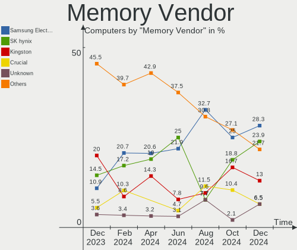

Manjaro - Hardware Trends
-------------------------

A project to identify most popular hardware characteristics and track their change
over time based on data collected by Linux users at https://Linux-Hardware.org.

Anyone can contribute to this report by the [hw-probe](https://github.com/linuxhw/hw-probe) tool:

    sudo -E hw-probe -all -upload

This is a report for all computer types. See also reports for [desktops](/Dist/Manjaro/Desktop/README.md) and [notebooks](/Dist/Manjaro/Notebook/README.md).

This report is for one last month. Overall report since the beginning of time: [TestDays](https://github.com/linuxhw/TestDays)

Period: Apr, 2023.

Contents
--------

* [ System ](#system)
  - [ OS                       ](#os)
  - [ OS Family                ](#os-family)
  - [ Kernel                   ](#kernel)
  - [ Kernel Family            ](#kernel-family)
  - [ Kernel Major Ver.        ](#kernel-major-ver)
  - [ Arch                     ](#arch)
  - [ DE                       ](#de)
  - [ Display Server           ](#display-server)
  - [ Display Manager          ](#display-manager)
  - [ OS Lang                  ](#os-lang)
  - [ Boot Mode                ](#boot-mode)
  - [ Filesystem               ](#filesystem)
  - [ Part. scheme             ](#part-scheme)
  - [ Dual Boot with Linux/BSD ](#dual-boot-with-linuxbsd)
  - [ Dual Boot (Win)          ](#dual-boot-win)

* [ Board ](#board)
  - [ Vendor                   ](#vendor)
  - [ Model                    ](#model)
  - [ Model Family             ](#model-family)
  - [ MFG Year                 ](#mfg-year)
  - [ Form Factor              ](#form-factor)
  - [ Secure Boot              ](#secure-boot)
  - [ Coreboot                 ](#coreboot)
  - [ RAM Size                 ](#ram-size)
  - [ RAM Used                 ](#ram-used)
  - [ Total Drives             ](#total-drives)
  - [ Has CD-ROM               ](#has-cd-rom)
  - [ Has Ethernet             ](#has-ethernet)
  - [ Has WiFi                 ](#has-wifi)
  - [ Has Bluetooth            ](#has-bluetooth)

* [ Location ](#location)
  - [ Country                  ](#country)
  - [ City                     ](#city)

* [ Drives ](#drives)
  - [ Drive Vendor             ](#drive-vendor)
  - [ Drive Model              ](#drive-model)
  - [ HDD Vendor               ](#hdd-vendor)
  - [ SSD Vendor               ](#ssd-vendor)
  - [ Drive Kind               ](#drive-kind)
  - [ Drive Connector          ](#drive-connector)
  - [ Drive Size               ](#drive-size)
  - [ Space Total              ](#space-total)
  - [ Space Used               ](#space-used)
  - [ Malfunc. Drives          ](#malfunc-drives)
  - [ Malfunc. Drive Vendor    ](#malfunc-drive-vendor)
  - [ Malfunc. HDD Vendor      ](#malfunc-hdd-vendor)
  - [ Malfunc. Drive Kind      ](#malfunc-drive-kind)
  - [ Failed Drives            ](#failed-drives)
  - [ Failed Drive Vendor      ](#failed-drive-vendor)
  - [ Drive Status             ](#drive-status)

* [ Storage controller ](#storage-controller)
  - [ Storage Vendor           ](#storage-vendor)
  - [ Storage Model            ](#storage-model)
  - [ Storage Kind             ](#storage-kind)

* [ Processor ](#processor)
  - [ CPU Vendor               ](#cpu-vendor)
  - [ CPU Model                ](#cpu-model)
  - [ CPU Model Family         ](#cpu-model-family)
  - [ CPU Cores                ](#cpu-cores)
  - [ CPU Sockets              ](#cpu-sockets)
  - [ CPU Threads              ](#cpu-threads)
  - [ CPU Op-Modes             ](#cpu-op-modes)
  - [ CPU Microcode            ](#cpu-microcode)
  - [ CPU Microarch            ](#cpu-microarch)

* [ Graphics ](#graphics)
  - [ GPU Vendor               ](#gpu-vendor)
  - [ GPU Model                ](#gpu-model)
  - [ GPU Combo                ](#gpu-combo)
  - [ GPU Driver               ](#gpu-driver)
  - [ GPU Memory               ](#gpu-memory)

* [ Monitor ](#monitor)
  - [ Monitor Vendor           ](#monitor-vendor)
  - [ Monitor Model            ](#monitor-model)
  - [ Monitor Resolution       ](#monitor-resolution)
  - [ Monitor Diagonal         ](#monitor-diagonal)
  - [ Monitor Width            ](#monitor-width)
  - [ Aspect Ratio             ](#aspect-ratio)
  - [ Monitor Area             ](#monitor-area)
  - [ Pixel Density            ](#pixel-density)
  - [ Multiple Monitors        ](#multiple-monitors)

* [ Network ](#network)
  - [ Net Controller Vendor    ](#net-controller-vendor)
  - [ Net Controller Model     ](#net-controller-model)
  - [ Wireless Vendor          ](#wireless-vendor)
  - [ Wireless Model           ](#wireless-model)
  - [ Ethernet Vendor          ](#ethernet-vendor)
  - [ Ethernet Model           ](#ethernet-model)
  - [ Net Controller Kind      ](#net-controller-kind)
  - [ Used Controller          ](#used-controller)
  - [ NICs                     ](#nics)
  - [ IPv6                     ](#ipv6)

* [ Bluetooth ](#bluetooth)
  - [ Bluetooth Vendor         ](#bluetooth-vendor)
  - [ Bluetooth Model          ](#bluetooth-model)

* [ Sound ](#sound)
  - [ Sound Vendor             ](#sound-vendor)
  - [ Sound Model              ](#sound-model)

* [ Memory ](#memory)
  - [ Memory Vendor            ](#memory-vendor)
  - [ Memory Model             ](#memory-model)
  - [ Memory Kind              ](#memory-kind)
  - [ Memory Form Factor       ](#memory-form-factor)
  - [ Memory Size              ](#memory-size)
  - [ Memory Speed             ](#memory-speed)

* [ Printers & scanners ](#printers--scanners)
  - [ Printer Vendor           ](#printer-vendor)
  - [ Printer Model            ](#printer-model)
  - [ Scanner Vendor           ](#scanner-vendor)
  - [ Scanner Model            ](#scanner-model)

* [ Camera ](#camera)
  - [ Camera Vendor            ](#camera-vendor)
  - [ Camera Model             ](#camera-model)

* [ Security ](#security)
  - [ Fingerprint Vendor       ](#fingerprint-vendor)
  - [ Fingerprint Model        ](#fingerprint-model)
  - [ Chipcard Vendor          ](#chipcard-vendor)
  - [ Chipcard Model           ](#chipcard-model)

* [ Unsupported ](#unsupported)
  - [ Unsupported Devices      ](#unsupported-devices)
  - [ Unsupported Device Types ](#unsupported-device-types)

System
------

OS
--

Installed operating systems

| Name           | Computers | Percent |
|----------------|-----------|---------|
| Manjaro        | 89        | 58.94%  |
| Manjaro 22.1.0 | 61        | 40.4%   |
| Manjaro 22.0.5 | 1         | 0.66%   |

OS Family
---------

OS without a version

| Name    | Computers | Percent |
|---------|-----------|---------|
| Manjaro | 151       | 100%    |

Kernel
------

Version of the Linux kernel

| Version                     | Computers | Percent |
|-----------------------------|-----------|---------|
| 6.1.23-1-MANJARO            | 27        | 17.88%  |
| 6.2.12-1-MANJARO            | 16        | 10.6%   |
| 6.1.25-1-MANJARO            | 14        | 9.27%   |
| 6.1.21-1-MANJARO            | 14        | 9.27%   |
| 6.2.10-1-MANJARO            | 11        | 7.28%   |
| 6.1.22-1-MANJARO            | 11        | 7.28%   |
| 5.15.106-1-MANJARO          | 10        | 6.62%   |
| 6.2.8-1-MANJARO             | 8         | 5.3%    |
| 5.15.104-2-MANJARO          | 7         | 4.64%   |
| 6.3.0-1-MANJARO             | 4         | 2.65%   |
| 5.15.108-1-MANJARO          | 4         | 2.65%   |
| 6.2.9-1-MANJARO             | 3         | 1.99%   |
| 6.0.19-4-MANJARO            | 3         | 1.99%   |
| 6.1.20-x64v2-xanmod1-1-lts  | 2         | 1.32%   |
| 6.1.19-1-MANJARO            | 2         | 1.32%   |
| 5.15.105-1-MANJARO          | 2         | 1.32%   |
| 6.2.12-arch1-1-surface      | 1         | 0.66%   |
| 6.1.26-1-MANJARO            | 1         | 0.66%   |
| 6.1.14-zen3-xanmod1-MANJARO | 1         | 0.66%   |
| 6.0.6-1-MANJARO             | 1         | 0.66%   |
| 6.0.12-zen1-1-zen           | 1         | 0.66%   |
| 5.9.16-1-MANJARO            | 1         | 0.66%   |
| 5.9.11-3-MANJARO            | 1         | 0.66%   |
| 5.4.240-1-MANJARO           | 1         | 0.66%   |
| 5.18.19-3-MANJARO           | 1         | 0.66%   |
| 5.13.19-2-MANJARO           | 1         | 0.66%   |
| 5.10.178-1-MANJARO          | 1         | 0.66%   |
| 5.10.177-1-MANJARO          | 1         | 0.66%   |
| 5.10.154-1-MANJARO          | 1         | 0.66%   |

Kernel Family
-------------

Linux kernel without a distro release

| Version  | Computers | Percent |
|----------|-----------|---------|
| 6.1.23   | 27        | 17.88%  |
| 6.2.12   | 17        | 11.26%  |
| 6.1.25   | 14        | 9.27%   |
| 6.1.21   | 14        | 9.27%   |
| 6.2.10   | 11        | 7.28%   |
| 6.1.22   | 11        | 7.28%   |
| 5.15.106 | 10        | 6.62%   |
| 6.2.8    | 8         | 5.3%    |
| 5.15.104 | 7         | 4.64%   |
| 6.3.0    | 4         | 2.65%   |
| 5.15.108 | 4         | 2.65%   |
| 6.2.9    | 3         | 1.99%   |
| 6.0.19   | 3         | 1.99%   |
| 6.1.20   | 2         | 1.32%   |
| 6.1.19   | 2         | 1.32%   |
| 5.15.105 | 2         | 1.32%   |
| 6.1.26   | 1         | 0.66%   |
| 6.1.14   | 1         | 0.66%   |
| 6.0.6    | 1         | 0.66%   |
| 6.0.12   | 1         | 0.66%   |
| 5.9.16   | 1         | 0.66%   |
| 5.9.11   | 1         | 0.66%   |
| 5.4.240  | 1         | 0.66%   |
| 5.18.19  | 1         | 0.66%   |
| 5.13.19  | 1         | 0.66%   |
| 5.10.178 | 1         | 0.66%   |
| 5.10.177 | 1         | 0.66%   |
| 5.10.154 | 1         | 0.66%   |

Kernel Major Ver.
-----------------

Linux kernel major version

| Version | Computers | Percent |
|---------|-----------|---------|
| 6.1     | 72        | 47.68%  |
| 6.2     | 39        | 25.83%  |
| 5.15    | 23        | 15.23%  |
| 6.0     | 5         | 3.31%   |
| 6.3     | 4         | 2.65%   |
| 5.10    | 3         | 1.99%   |
| 5.9     | 2         | 1.32%   |
| 5.4     | 1         | 0.66%   |
| 5.18    | 1         | 0.66%   |
| 5.13    | 1         | 0.66%   |

Arch
----

OS architecture (x86_64, i586, etc.)

| Name   | Computers | Percent |
|--------|-----------|---------|
| x86_64 | 151       | 100%    |

DE
--

Desktop Environment

| Name       | Computers | Percent |
|------------|-----------|---------|
| KDE5       | 88        | 58.28%  |
| GNOME      | 32        | 21.19%  |
| XFCE       | 20        | 13.25%  |
| X-Cinnamon | 4         | 2.65%   |
| Unknown    | 2         | 1.32%   |
| sway       | 1         | 0.66%   |
| MATE       | 1         | 0.66%   |
| i3         | 1         | 0.66%   |
| Budgie     | 1         | 0.66%   |
| awesome    | 1         | 0.66%   |

Display Server
--------------

X11 or Wayland

| Name    | Computers | Percent |
|---------|-----------|---------|
| X11     | 127       | 84.11%  |
| Wayland | 21        | 13.91%  |
| Unknown | 3         | 1.99%   |

Display Manager
---------------

SDDM, LightDM, etc.

| Name    | Computers | Percent |
|---------|-----------|---------|
| Unknown | 89        | 58.94%  |
| SDDM    | 26        | 17.22%  |
| LightDM | 19        | 12.58%  |
| GDM     | 16        | 10.6%   |
| GREETD  | 1         | 0.66%   |

OS Lang
-------

Language

| Lang    | Computers | Percent |
|---------|-----------|---------|
| en_US   | 45        | 29.8%   |
| de_DE   | 19        | 12.58%  |
| en_GB   | 16        | 10.6%   |
| ru_RU   | 10        | 6.62%   |
| pt_BR   | 10        | 6.62%   |
| fr_FR   | 6         | 3.97%   |
| it_IT   | 5         | 3.31%   |
| es_ES   | 5         | 3.31%   |
| en_CA   | 5         | 3.31%   |
| en_IN   | 4         | 2.65%   |
| zh_CN   | 3         | 1.99%   |
| pl_PL   | 3         | 1.99%   |
| es_MX   | 2         | 1.32%   |
| en_IE   | 2         | 1.32%   |
| en_AU   | 2         | 1.32%   |
| Unknown | 2         | 1.32%   |
| uk_UA   | 1         | 0.66%   |
| nl_NL   | 1         | 0.66%   |
| nb_NO   | 1         | 0.66%   |
| ja_JP   | 1         | 0.66%   |
| fr_CA   | 1         | 0.66%   |
| fi_FI   | 1         | 0.66%   |
| es_PE   | 1         | 0.66%   |
| es_AR   | 1         | 0.66%   |
| en_SG   | 1         | 0.66%   |
| en_DK   | 1         | 0.66%   |
| de_CH   | 1         | 0.66%   |
| cs_CZ   | 1         | 0.66%   |

Boot Mode
---------

EFI or BIOS

| Mode | Computers | Percent |
|------|-----------|---------|
| BIOS | 93        | 61.59%  |
| EFI  | 58        | 38.41%  |

Filesystem
----------

Type of filesystem

| Type  | Computers | Percent |
|-------|-----------|---------|
| Ext4  | 103       | 68.21%  |
| Btrfs | 40        | 26.49%  |
| Tmpfs | 8         | 5.3%    |

Part. scheme
------------

Scheme of partitioning

| Type    | Computers | Percent |
|---------|-----------|---------|
| Unknown | 85        | 56.29%  |
| GPT     | 61        | 40.4%   |
| MBR     | 5         | 3.31%   |

Dual Boot with Linux/BSD
------------------------

Hosting more than one Linux/BSD

| Dual boot | Computers | Percent |
|-----------|-----------|---------|
| No        | 137       | 90.73%  |
| Yes       | 14        | 9.27%   |

Dual Boot (Win)
---------------

Hosting Linux and Windows

| Dual boot | Computers | Percent |
|-----------|-----------|---------|
| No        | 120       | 79.47%  |
| Yes       | 31        | 20.53%  |

Board
-----

Vendor
------

Motherboard manufacturer

| Name                | Computers | Percent |
|---------------------|-----------|---------|
| ASUSTek Computer    | 31        | 20.53%  |
| Hewlett-Packard     | 21        | 13.91%  |
| Lenovo              | 16        | 10.6%   |
| Dell                | 15        | 9.93%   |
| MSI                 | 10        | 6.62%   |
| Gigabyte Technology | 10        | 6.62%   |
| ASRock              | 5         | 3.31%   |
| Acer                | 5         | 3.31%   |
| HUAWEI              | 3         | 1.99%   |
| Apple               | 3         | 1.99%   |
| Sony                | 2         | 1.32%   |
| Samsung Electronics | 2         | 1.32%   |
| Positivo            | 2         | 1.32%   |
| Microsoft           | 2         | 1.32%   |
| Intel               | 2         | 1.32%   |
| Unknown             | 2         | 1.32%   |
| Toshiba             | 1         | 0.66%   |
| Timi                | 1         | 0.66%   |
| Star Labs           | 1         | 0.66%   |
| Shuttle             | 1         | 0.66%   |
| Pegatron            | 1         | 0.66%   |
| Multilaser          | 1         | 0.66%   |
| Medion              | 1         | 0.66%   |
| MECHREVO            | 1         | 0.66%   |
| MACHENIKE           | 1         | 0.66%   |
| LG Electronics      | 1         | 0.66%   |
| Huanan              | 1         | 0.66%   |
| HONOR               | 1         | 0.66%   |
| Google              | 1         | 0.66%   |
| Fujitsu             | 1         | 0.66%   |
| Foxconn             | 1         | 0.66%   |
| Emdoor              | 1         | 0.66%   |
| Daten Tecnologia    | 1         | 0.66%   |
| Chuwi               | 1         | 0.66%   |
| Biostar             | 1         | 0.66%   |
| AZW                 | 1         | 0.66%   |

Model
-----

Motherboard model

| Name                                       | Computers | Percent |
|--------------------------------------------|-----------|---------|
| MSI MS-7B86                                | 2         | 1.32%   |
| ASUS PRIME A320M-K                         | 2         | 1.32%   |
| ASUS All Series                            | 2         | 1.32%   |
| Unknown                                    | 2         | 1.32%   |
| Toshiba QOSMIO F750                        | 1         | 0.66%   |
| Timi RedmiBook 16                          | 1         | 0.66%   |
| Star Labs StarBook                         | 1         | 0.66%   |
| Sony VPCSB2A7R                             | 1         | 0.66%   |
| Sony VPCF236FM                             | 1         | 0.66%   |
| Shuttle DL20N                              | 1         | 0.66%   |
| Samsung 300E4A/300E5A/300E7A/3430EA/3530EA | 1         | 0.66%   |
| Samsung 270E5G/270E5U                      | 1         | 0.66%   |
| Positivo POS-EIQ87CY                       | 1         | 0.66%   |
| Positivo C14CR01                           | 1         | 0.66%   |
| Pegatron NY591AA-ABA p6267c                | 1         | 0.66%   |
| Multilaser UB82X                           | 1         | 0.66%   |
| MSI PRO H510 DP21 (MS-B0A4)                | 1         | 0.66%   |
| MSI MS-7C37                                | 1         | 0.66%   |
| MSI MS-7B89                                | 1         | 0.66%   |
| MSI MS-7B09                                | 1         | 0.66%   |
| MSI MS-7917                                | 1         | 0.66%   |
| MSI MS-7817                                | 1         | 0.66%   |
| MSI MS-7816                                | 1         | 0.66%   |
| MSI MS-7597                                | 1         | 0.66%   |
| Microsoft Surface Pro 8                    | 1         | 0.66%   |
| Microsoft Surface Go                       | 1         | 0.66%   |
| Medion E4251                               | 1         | 0.66%   |
| MECHREVO X3 Series GK7CP6R                 | 1         | 0.66%   |
| MACHENIKE T58-V                            | 1         | 0.66%   |
| LG Kabylake Platform                       | 1         | 0.66%   |
| Lenovo Yoga 9 14IAP7 82LU                  | 1         | 0.66%   |
| Lenovo Yoga 6 13ALC7 82UD                  | 1         | 0.66%   |
| Lenovo V15 G2 ALC 82KD                     | 1         | 0.66%   |
| Lenovo ThinkStation P410 30B3003SUS        | 1         | 0.66%   |
| Lenovo ThinkPad X1 Yoga 1st 20FRS0Y40T     | 1         | 0.66%   |
| Lenovo ThinkPad T480 20L5S12H00            | 1         | 0.66%   |
| Lenovo ThinkPad T480 20L50000UK            | 1         | 0.66%   |
| Lenovo ThinkPad T470 W10DG 20JNS0CN00      | 1         | 0.66%   |
| Lenovo ThinkPad P51 20HJS02000             | 1         | 0.66%   |
| Lenovo ThinkPad P14s Gen 3 21AK000UGE      | 1         | 0.66%   |

Model Family
------------

Motherboard model prefix

| Name                 | Computers | Percent |
|----------------------|-----------|---------|
| ASUS ROG             | 11        | 7.28%   |
| Lenovo ThinkPad      | 6         | 3.97%   |
| Lenovo IdeaPad       | 4         | 2.65%   |
| HP ProBook           | 4         | 2.65%   |
| HP ENVY              | 4         | 2.65%   |
| Dell Precision       | 4         | 2.65%   |
| ASUS VivoBook        | 4         | 2.65%   |
| ASUS TUF             | 4         | 2.65%   |
| ASUS PRIME           | 4         | 2.65%   |
| Dell XPS             | 3         | 1.99%   |
| Dell OptiPlex        | 3         | 1.99%   |
| Dell Inspiron        | 3         | 1.99%   |
| MSI MS-7B86          | 2         | 1.32%   |
| Microsoft Surface    | 2         | 1.32%   |
| Lenovo Yoga          | 2         | 1.32%   |
| HP Laptop            | 2         | 1.32%   |
| HP EliteBook         | 2         | 1.32%   |
| Gigabyte B550        | 2         | 1.32%   |
| Dell Latitude        | 2         | 1.32%   |
| ASUS All             | 2         | 1.32%   |
| Acer Aspire          | 2         | 1.32%   |
| Unknown              | 2         | 1.32%   |
| Toshiba QOSMIO       | 1         | 0.66%   |
| Timi RedmiBook       | 1         | 0.66%   |
| Star Labs StarBook   | 1         | 0.66%   |
| Sony VPCSB2A7R       | 1         | 0.66%   |
| Sony VPCF236FM       | 1         | 0.66%   |
| Shuttle DL20N        | 1         | 0.66%   |
| Samsung 300E4A       | 1         | 0.66%   |
| Samsung 270E5G       | 1         | 0.66%   |
| Positivo POS-EIQ87CY | 1         | 0.66%   |
| Positivo C14CR01     | 1         | 0.66%   |
| Pegatron NY591AA-ABA | 1         | 0.66%   |
| Multilaser UB82X     | 1         | 0.66%   |
| MSI PRO              | 1         | 0.66%   |
| MSI MS-7C37          | 1         | 0.66%   |
| MSI MS-7B89          | 1         | 0.66%   |
| MSI MS-7B09          | 1         | 0.66%   |
| MSI MS-7917          | 1         | 0.66%   |
| MSI MS-7817          | 1         | 0.66%   |

MFG Year
--------

Motherboard manufacture year

| Year | Computers | Percent |
|------|-----------|---------|
| 2022 | 22        | 14.57%  |
| 2020 | 19        | 12.58%  |
| 2021 | 18        | 11.92%  |
| 2018 | 16        | 10.6%   |
| 2019 | 15        | 9.93%   |
| 2017 | 9         | 5.96%   |
| 2015 | 8         | 5.3%    |
| 2016 | 7         | 4.64%   |
| 2012 | 7         | 4.64%   |
| 2014 | 6         | 3.97%   |
| 2023 | 5         | 3.31%   |
| 2013 | 5         | 3.31%   |
| 2011 | 5         | 3.31%   |
| 2010 | 5         | 3.31%   |
| 2009 | 2         | 1.32%   |
| 2007 | 1         | 0.66%   |
| 2006 | 1         | 0.66%   |

Form Factor
-----------

Physical design of the computer

| Name        | Computers | Percent |
|-------------|-----------|---------|
| Notebook    | 69        | 45.7%   |
| Desktop     | 66        | 43.71%  |
| Convertible | 10        | 6.62%   |
| Tablet      | 2         | 1.32%   |
| All in one  | 2         | 1.32%   |
| Mini pc     | 1         | 0.66%   |
| Server      | 1         | 0.66%   |

Secure Boot
-----------

Enabled or disabled

| State    | Computers | Percent |
|----------|-----------|---------|
| Disabled | 151       | 100%    |

Coreboot
--------

Have coreboot on board

| Used | Computers | Percent |
|------|-----------|---------|
| No   | 149       | 98.68%  |
| Yes  | 2         | 1.32%   |

RAM Size
--------

Total RAM memory

| Size in GB  | Computers | Percent |
|-------------|-----------|---------|
| 16.01-24.0  | 37        | 24.5%   |
| 4.01-8.0    | 31        | 20.53%  |
| 32.01-64.0  | 30        | 19.87%  |
| 8.01-16.0   | 28        | 18.54%  |
| 3.01-4.0    | 12        | 7.95%   |
| 64.01-256.0 | 9         | 5.96%   |
| 24.01-32.0  | 3         | 1.99%   |
| 2.01-3.0    | 1         | 0.66%   |

RAM Used
--------

Used RAM memory

| Used GB    | Computers | Percent |
|------------|-----------|---------|
| 4.01-8.0   | 38        | 25.17%  |
| 3.01-4.0   | 35        | 23.18%  |
| 2.01-3.0   | 32        | 21.19%  |
| 1.01-2.0   | 22        | 14.57%  |
| 8.01-16.0  | 18        | 11.92%  |
| 16.01-24.0 | 3         | 1.99%   |
| 0.51-1.0   | 3         | 1.99%   |

Total Drives
------------

Number of drives on board

| Drives | Computers | Percent |
|--------|-----------|---------|
| 1      | 71        | 47.02%  |
| 2      | 53        | 35.1%   |
| 3      | 14        | 9.27%   |
| 4      | 8         | 5.3%    |
| 5      | 2         | 1.32%   |
| 10     | 1         | 0.66%   |
| 7      | 1         | 0.66%   |
| 6      | 1         | 0.66%   |

Has CD-ROM
----------

Has CD-ROM on board

| Presented | Computers | Percent |
|-----------|-----------|---------|
| No        | 122       | 80.79%  |
| Yes       | 29        | 19.21%  |

Has Ethernet
------------

Has Ethernet on board

| Presented | Computers | Percent |
|-----------|-----------|---------|
| Yes       | 116       | 76.82%  |
| No        | 35        | 23.18%  |

Has WiFi
--------

Has WiFi module

| Presented | Computers | Percent |
|-----------|-----------|---------|
| Yes       | 120       | 79.47%  |
| No        | 31        | 20.53%  |

Has Bluetooth
-------------

Has Bluetooth module

| Presented | Computers | Percent |
|-----------|-----------|---------|
| Yes       | 111       | 73.51%  |
| No        | 40        | 26.49%  |

Location
--------

Country
-------

Geographic location (country)

| Country         | Computers | Percent |
|-----------------|-----------|---------|
| Germany         | 24        | 15.89%  |
| USA             | 23        | 15.23%  |
| Brazil          | 11        | 7.28%   |
| UK              | 10        | 6.62%   |
| Russia          | 8         | 5.3%    |
| France          | 7         | 4.64%   |
| Spain           | 6         | 3.97%   |
| Netherlands     | 6         | 3.97%   |
| Canada          | 6         | 3.97%   |
| Poland          | 5         | 3.31%   |
| Italy           | 4         | 2.65%   |
| India           | 4         | 2.65%   |
| Czechia         | 3         | 1.99%   |
| Switzerland     | 2         | 1.32%   |
| Japan           | 2         | 1.32%   |
| China           | 2         | 1.32%   |
| Australia       | 2         | 1.32%   |
| Argentina       | 2         | 1.32%   |
| Ukraine         | 1         | 0.66%   |
| Sweden          | 1         | 0.66%   |
| Singapore       | 1         | 0.66%   |
| Serbia          | 1         | 0.66%   |
| Saudi Arabia    | 1         | 0.66%   |
| Peru            | 1         | 0.66%   |
| Panama          | 1         | 0.66%   |
| Pakistan        | 1         | 0.66%   |
| Norway          | 1         | 0.66%   |
| North Macedonia | 1         | 0.66%   |
| Mexico          | 1         | 0.66%   |
| Kazakhstan      | 1         | 0.66%   |
| Israel          | 1         | 0.66%   |
| Ireland         | 1         | 0.66%   |
| Indonesia       | 1         | 0.66%   |
| Hungary         | 1         | 0.66%   |
| Hong Kong       | 1         | 0.66%   |
| Greece          | 1         | 0.66%   |
| Finland         | 1         | 0.66%   |
| Denmark         | 1         | 0.66%   |
| Chile           | 1         | 0.66%   |
| Bulgaria        | 1         | 0.66%   |

City
----

Geographic location (city)

| City                   | Computers | Percent |
|------------------------|-----------|---------|
| London                 | 4         | 2.65%   |
| Amsterdam              | 3         | 1.99%   |
| Warsaw                 | 2         | 1.32%   |
| Rome                   | 2         | 1.32%   |
| Moscow                 | 2         | 1.32%   |
| Mississauga            | 2         | 1.32%   |
| Juazeiro do Norte      | 2         | 1.32%   |
| Hanau                  | 2         | 1.32%   |
| Hamburg                | 2         | 1.32%   |
| Berlin                 | 2         | 1.32%   |
| Bellheim               | 2         | 1.32%   |
| Zhumadian              | 1         | 0.66%   |
| Yalta                  | 1         | 0.66%   |
| Würzburg              | 1         | 0.66%   |
| Wroclaw                | 1         | 0.66%   |
| Westville              | 1         | 0.66%   |
| West Drayton           | 1         | 0.66%   |
| Villingen-Schwenningen | 1         | 0.66%   |
| Vancouver              | 1         | 0.66%   |
| Uppsala                | 1         | 0.66%   |
| Trujillo               | 1         | 0.66%   |
| Trois-Rivières        | 1         | 0.66%   |
| Tokyo                  | 1         | 0.66%   |
| Tilburg                | 1         | 0.66%   |
| Thessaloniki           | 1         | 0.66%   |
| Thamesmead             | 1         | 0.66%   |
| Tempe                  | 1         | 0.66%   |
| Tamworth               | 1         | 0.66%   |
| Tampere                | 1         | 0.66%   |
| Szentistvan            | 1         | 0.66%   |
| Stralsund              | 1         | 0.66%   |
| St. Petersburg         | 1         | 0.66%   |
| St Petersburg          | 1         | 0.66%   |
| Sremska Mitrovica      | 1         | 0.66%   |
| Sprockhoevel           | 1         | 0.66%   |
| Sorocaba               | 1         | 0.66%   |
| Skopje                 | 1         | 0.66%   |
| Singapore              | 1         | 0.66%   |
| Shanghai               | 1         | 0.66%   |
| Seville                | 1         | 0.66%   |

Drives
------

Drive Vendor
------------

Hard drive vendors

| Vendor                       | Computers | Drives | Percent |
|------------------------------|-----------|--------|---------|
| Samsung Electronics          | 43        | 53     | 18.38%  |
| Seagate                      | 30        | 39     | 12.82%  |
| WDC                          | 26        | 40     | 11.11%  |
| Sandisk                      | 14        | 17     | 5.98%   |
| Unknown                      | 11        | 13     | 4.7%    |
| Toshiba                      | 11        | 12     | 4.7%    |
| Phison Electronics           | 10        | 10     | 4.27%   |
| Intel                        | 10        | 11     | 4.27%   |
| Kingston                     | 8         | 10     | 3.42%   |
| SK hynix                     | 7         | 7      | 2.99%   |
| Micron/Crucial Technology    | 7         | 7      | 2.99%   |
| China                        | 6         | 7      | 2.56%   |
| Silicon Motion               | 5         | 6      | 2.14%   |
| Crucial                      | 5         | 5      | 2.14%   |
| Phison                       | 3         | 3      | 1.28%   |
| Micron Technology            | 3         | 3      | 1.28%   |
| KIOXIA                       | 3         | 3      | 1.28%   |
| ADATA Technology             | 3         | 3      | 1.28%   |
| Transcend                    | 2         | 2      | 0.85%   |
| Patriot                      | 2         | 2      | 0.85%   |
| A-DATA Technology            | 2         | 2      | 0.85%   |
| Yangtze Memory Technologies  | 1         | 1      | 0.43%   |
| Union Memory                 | 1         | 1      | 0.43%   |
| UMIS                         | 1         | 1      | 0.43%   |
| StoreJet                     | 1         | 1      | 0.43%   |
| SPCC                         | 1         | 1      | 0.43%   |
| Shenzhen Longsys Electronics | 1         | 1      | 0.43%   |
| Realtek Semiconductor        | 1         | 1      | 0.43%   |
| Plextor                      | 1         | 1      | 0.43%   |
| OCZ                          | 1         | 2      | 0.43%   |
| MicroFrom                    | 1         | 1      | 0.43%   |
| MAXIO Technology (Hangzhou)  | 1         | 1      | 0.43%   |
| LITEONIT                     | 1         | 1      | 0.43%   |
| Lite-On Technology           | 1         | 1      | 0.43%   |
| Kingston Technology Company  | 1         | 1      | 0.43%   |
| KingFast                     | 1         | 1      | 0.43%   |
| JMicron Technology           | 1         | 1      | 0.43%   |
| HS-SSD-E100                  | 1         | 1      | 0.43%   |
| HGST                         | 1         | 1      | 0.43%   |
| GOODRAM                      | 1         | 1      | 0.43%   |

Drive Model
-----------

Hard drive models

| Model                                                  | Computers | Percent |
|--------------------------------------------------------|-----------|---------|
| Samsung NVMe SSD Controller SM981/PM981/PM983 1TB      | 10        | 3.79%   |
| Samsung SSD 980 1TB                                    | 6         | 2.27%   |
| Samsung NVMe SSD Controller PM9A1/PM9A3/980PRO 2TB     | 6         | 2.27%   |
| Phison E12 NVMe Controller 512GB                       | 6         | 2.27%   |
| Unknown MMC Card  64GB                                 | 5         | 1.89%   |
| Micron/Crucial P2 NVMe PCIe SSD 1TB                    | 5         | 1.89%   |
| Silicon Motion SM2263EN/SM2263XT SSD Controller 1024GB | 4         | 1.52%   |
| Samsung SSD 860 EVO 500GB                              | 4         | 1.52%   |
| Intel SSD 660P Series 512GB                            | 4         | 1.52%   |
| Sandisk WD Black SN850 1TB                             | 3         | 1.14%   |
| Sandisk WD Black SN750 / PC SN730 NVMe SSD 512GB       | 3         | 1.14%   |
| Phison E16 PCIe4 NVMe Controller 500GB                 | 3         | 1.14%   |
| WDC WDS240G2G0B-00EPW0 240GB SSD                       | 2         | 0.76%   |
| WDC WD5000BPKX-00HPJT0 500GB                           | 2         | 0.76%   |
| WDC WD3200LPVX-22V0TT0 320GB                           | 2         | 0.76%   |
| WDC WD3200BPVT-22JJ5T0 320GB                           | 2         | 0.76%   |
| WDC WD10EZEX-08WN4A0 1TB                               | 2         | 0.76%   |
| Unknown MMC Card  32GB                                 | 2         | 0.76%   |
| Unknown MMC Card  128GB                                | 2         | 0.76%   |
| Transcend TS256GSSD370BM 256GB                         | 2         | 0.76%   |
| Toshiba MQ04ABF100 1TB                                 | 2         | 0.76%   |
| Toshiba MQ01ABD050 500GB                               | 2         | 0.76%   |
| Toshiba DT01ACA100 1TB                                 | 2         | 0.76%   |
| Seagate ST500DM002-1BD142 500GB                        | 2         | 0.76%   |
| Seagate ST1000LM024 HN-M101MBB 1TB                     | 2         | 0.76%   |
| Seagate ST1000DM010-2EP102 1TB                         | 2         | 0.76%   |
| Seagate ST1000DM003-1SB10C 1TB                         | 2         | 0.76%   |
| Seagate ST1000DM003-1ER162 1TB                         | 2         | 0.76%   |
| Samsung SSD 860 EVO 1TB                                | 2         | 0.76%   |
| Samsung SSD 840 EVO 120GB                              | 2         | 0.76%   |
| Samsung NVMe SSD Controller SM961/PM961/SM963 500GB    | 2         | 0.76%   |
| Kingston SA400S37480G 480GB SSD                        | 2         | 0.76%   |
| Kingston SA400S37240G 240GB SSD                        | 2         | 0.76%   |
| Intel SSD Pro 7600p/760p/E 6100p Series 128GB          | 2         | 0.76%   |
| Yangtze Memory YMTC PC005 256GB                        | 1         | 0.38%   |
| WDC WDS100T2B0B 1TB SSD                                | 1         | 0.38%   |
| WDC WDBNCE5000PNC 500GB SSD                            | 1         | 0.38%   |
| WDC WD80EFZX-68UW8N0 8TB                               | 1         | 0.38%   |
| WDC WD6401AALS-00L3B2 640GB                            | 1         | 0.38%   |
| WDC WD60EFRX-68L0BN1 6TB                               | 1         | 0.38%   |

HDD Vendor
----------

Hard disk drive vendors

| Vendor              | Computers | Drives | Percent |
|---------------------|-----------|--------|---------|
| Seagate             | 27        | 36     | 42.86%  |
| WDC                 | 23        | 36     | 36.51%  |
| Toshiba             | 8         | 8      | 12.7%   |
| Samsung Electronics | 3         | 3      | 4.76%   |
| JMicron Technology  | 1         | 1      | 1.59%   |
| HGST                | 1         | 1      | 1.59%   |

SSD Vendor
----------

Solid state drive vendors

| Vendor              | Computers | Drives | Percent |
|---------------------|-----------|--------|---------|
| Samsung Electronics | 17        | 22     | 27.42%  |
| Kingston            | 6         | 7      | 9.68%   |
| China               | 6         | 7      | 9.68%   |
| Crucial             | 5         | 5      | 8.06%   |
| WDC                 | 4         | 4      | 6.45%   |
| SanDisk             | 3         | 3      | 4.84%   |
| Transcend           | 2         | 2      | 3.23%   |
| SK hynix            | 2         | 2      | 3.23%   |
| Patriot             | 2         | 2      | 3.23%   |
| A-DATA Technology   | 2         | 2      | 3.23%   |
| Toshiba             | 1         | 2      | 1.61%   |
| SPCC                | 1         | 1      | 1.61%   |
| Plextor             | 1         | 1      | 1.61%   |
| Phison              | 1         | 1      | 1.61%   |
| OCZ                 | 1         | 2      | 1.61%   |
| MicroFrom           | 1         | 1      | 1.61%   |
| LITEONIT            | 1         | 1      | 1.61%   |
| KingFast            | 1         | 1      | 1.61%   |
| Intel               | 1         | 1      | 1.61%   |
| GOODRAM             | 1         | 1      | 1.61%   |
| Gigabyte Technology | 1         | 1      | 1.61%   |
| Apple               | 1         | 1      | 1.61%   |
| Unknown             | 1         | 1      | 1.61%   |

Drive Kind
----------

HDD or SSD

| Kind    | Computers | Drives | Percent |
|---------|-----------|--------|---------|
| NVMe    | 88        | 106    | 41.12%  |
| SSD     | 56        | 71     | 26.17%  |
| HDD     | 55        | 85     | 25.7%   |
| MMC     | 9         | 9      | 4.21%   |
| Unknown | 6         | 8      | 2.8%    |

Drive Connector
---------------

SATA, SAS, NVMe, etc.

| Type | Computers | Drives | Percent |
|------|-----------|--------|---------|
| SATA | 92        | 154    | 46.94%  |
| NVMe | 88        | 106    | 44.9%   |
| MMC  | 9         | 9      | 4.59%   |
| SAS  | 7         | 10     | 3.57%   |

Drive Size
----------

Size of hard drive

| Size in TB | Computers | Drives | Percent |
|------------|-----------|--------|---------|
| 0.01-0.5   | 56        | 83     | 48.7%   |
| 0.51-1.0   | 43        | 49     | 37.39%  |
| 3.01-4.0   | 7         | 8      | 6.09%   |
| 1.01-2.0   | 7         | 8      | 6.09%   |
| 10.01-20.0 | 1         | 1      | 0.87%   |
| 4.01-10.0  | 1         | 7      | 0.87%   |

Space Total
-----------

Amount of disk space available on the file system

| Size in GB     | Computers | Percent |
|----------------|-----------|---------|
| 251-500        | 35        | 23.18%  |
| 501-1000       | 33        | 21.85%  |
| 101-250        | 20        | 13.25%  |
| 1001-2000      | 20        | 13.25%  |
| More than 3000 | 12        | 7.95%   |
| 51-100         | 9         | 5.96%   |
| Unknown        | 9         | 5.96%   |
| 2001-3000      | 7         | 4.64%   |
| 21-50          | 3         | 1.99%   |
| 1-20           | 3         | 1.99%   |

Space Used
----------

Amount of used disk space

| Used GB        | Computers | Percent |
|----------------|-----------|---------|
| 251-500        | 25        | 16.56%  |
| 21-50          | 24        | 15.89%  |
| 101-250        | 24        | 15.89%  |
| 501-1000       | 20        | 13.25%  |
| 1-20           | 18        | 11.92%  |
| 51-100         | 16        | 10.6%   |
| 1001-2000      | 10        | 6.62%   |
| Unknown        | 9         | 5.96%   |
| More than 3000 | 4         | 2.65%   |
| 2001-3000      | 1         | 0.66%   |

Malfunc. Drives
---------------

Drive models with a malfunction

| Model                               | Computers | Drives | Percent |
|-------------------------------------|-----------|--------|---------|
| Toshiba MK7559GSXP 752GB            | 1         | 1      | 25%     |
| Seagate ST4000NM0033-9ZM170 4TB     | 1         | 1      | 25%     |
| Seagate ST2000DM006-2DM164 2TB      | 1         | 1      | 25%     |
| Samsung Electronics SSD 870 EVO 1TB | 1         | 1      | 25%     |

Malfunc. Drive Vendor
---------------------

Vendors of faulty drives

| Vendor              | Computers | Drives | Percent |
|---------------------|-----------|--------|---------|
| Seagate             | 2         | 2      | 50%     |
| Toshiba             | 1         | 1      | 25%     |
| Samsung Electronics | 1         | 1      | 25%     |

Malfunc. HDD Vendor
-------------------

Vendors of faulty HDD drives

| Vendor  | Computers | Drives | Percent |
|---------|-----------|--------|---------|
| Seagate | 2         | 2      | 66.67%  |
| Toshiba | 1         | 1      | 33.33%  |

Malfunc. Drive Kind
-------------------

Kinds of faulty drives

| Kind | Computers | Drives | Percent |
|------|-----------|--------|---------|
| HDD  | 3         | 3      | 75%     |
| SSD  | 1         | 1      | 25%     |

Failed Drives
-------------

Failed drive models

Zero info for selected period =(

Failed Drive Vendor
-------------------

Failed drive vendors

Zero info for selected period =(

Drive Status
------------

Number of failed and malfunc. drives

| Status   | Computers | Drives | Percent |
|----------|-----------|--------|---------|
| Detected | 117       | 214    | 72.22%  |
| Works    | 41        | 61     | 25.31%  |
| Malfunc  | 4         | 4      | 2.47%   |

Storage controller
------------------

Storage Vendor
--------------

Storage controller vendors

| Vendor                       | Computers | Percent |
|------------------------------|-----------|---------|
| Intel                        | 83        | 36.89%  |
| AMD                          | 39        | 17.33%  |
| Samsung Electronics          | 27        | 12%     |
| Phison Electronics           | 13        | 5.78%   |
| SanDisk                      | 12        | 5.33%   |
| Micron/Crucial Technology    | 7         | 3.11%   |
| SK hynix                     | 5         | 2.22%   |
| Silicon Motion               | 5         | 2.22%   |
| Micron Technology            | 3         | 1.33%   |
| KIOXIA                       | 3         | 1.33%   |
| Kingston Technology Company  | 3         | 1.33%   |
| ASMedia Technology           | 3         | 1.33%   |
| ADATA Technology             | 3         | 1.33%   |
| Union Memory (Shenzhen)      | 2         | 0.89%   |
| Toshiba America Info Systems | 2         | 0.89%   |
| Nvidia                       | 2         | 0.89%   |
| JMicron Technology           | 2         | 0.89%   |
| Broadcom / LSI               | 2         | 0.89%   |
| Yangtze Memory Technologies  | 1         | 0.44%   |
| Transcend                    | 1         | 0.44%   |
| Shenzhen Longsys Electronics | 1         | 0.44%   |
| Seagate Technology           | 1         | 0.44%   |
| Realtek Semiconductor        | 1         | 0.44%   |
| MAXIO Technology (Hangzhou)  | 1         | 0.44%   |
| Marvell Technology Group     | 1         | 0.44%   |
| LSI Logic / Symbios Logic    | 1         | 0.44%   |
| Lite-On Technology           | 1         | 0.44%   |

Storage Model
-------------

Storage controller models

| Model                                                                          | Computers | Percent |
|--------------------------------------------------------------------------------|-----------|---------|
| AMD FCH SATA Controller [AHCI mode]                                            | 23        | 8.78%   |
| Samsung NVMe SSD Controller SM981/PM981/PM983                                  | 10        | 3.82%   |
| Samsung NVMe SSD Controller 980                                                | 10        | 3.82%   |
| Intel Volume Management Device NVMe RAID Controller                            | 8         | 3.05%   |
| AMD 500 Series Chipset SATA Controller                                         | 8         | 3.05%   |
| AMD 400 Series Chipset SATA Controller                                         | 8         | 3.05%   |
| Samsung NVMe SSD Controller PM9A1/PM9A3/980PRO                                 | 6         | 2.29%   |
| Phison E12 NVMe Controller                                                     | 6         | 2.29%   |
| Intel 8 Series/C220 Series Chipset Family 6-port SATA Controller 1 [AHCI mode] | 6         | 2.29%   |
| Micron/Crucial P2 NVMe PCIe SSD                                                | 5         | 1.91%   |
| Intel SATA Controller [RAID mode]                                              | 5         | 1.91%   |
| Intel Q170/Q150/B150/H170/H110/Z170/CM236 Chipset SATA Controller [AHCI Mode]  | 5         | 1.91%   |
| Silicon Motion SM2263EN/SM2263XT SSD Controller                                | 4         | 1.53%   |
| Intel SSD 660P Series                                                          | 4         | 1.53%   |
| Intel 6 Series/C200 Series Chipset Family 6 port Mobile SATA AHCI Controller   | 4         | 1.53%   |
| Intel 6 Series/C200 Series Chipset Family 6 port Desktop SATA AHCI Controller  | 4         | 1.53%   |
| SK hynix Gold P31/PC711 NVMe Solid State Drive                                 | 3         | 1.15%   |
| SanDisk WD PC SN810 / Black SN850 NVMe SSD                                     | 3         | 1.15%   |
| SanDisk WD Black SN750 / PC SN730 NVMe SSD                                     | 3         | 1.15%   |
| SanDisk Non-Volatile memory controller                                         | 3         | 1.15%   |
| Phison E16 PCIe4 NVMe Controller                                               | 3         | 1.15%   |
| Micron NVMe Storage Controller                                                 | 3         | 1.15%   |
| Intel Sunrise Point-LP SATA Controller [AHCI mode]                             | 3         | 1.15%   |
| Intel Celeron/Pentium Silver Processor SATA Controller                         | 3         | 1.15%   |
| Intel Cannon Point-LP SATA Controller [AHCI Mode]                              | 3         | 1.15%   |
| Intel C610/X99 series chipset sSATA Controller [AHCI mode]                     | 3         | 1.15%   |
| Intel C610/X99 series chipset 6-Port SATA Controller [AHCI mode]               | 3         | 1.15%   |
| ASMedia ASM1062 Serial ATA Controller                                          | 3         | 1.15%   |
| AMD SB7x0/SB8x0/SB9x0 IDE Controller                                           | 3         | 1.15%   |
| AMD FCH SATA Controller D                                                      | 3         | 1.15%   |
| Union Memory (Shenzhen) Non-Volatile memory controller                         | 2         | 0.76%   |
| Samsung NVMe SSD Controller SM961/PM961/SM963                                  | 2         | 0.76%   |
| Phison E18 PCIe4 NVMe Controller                                               | 2         | 0.76%   |
| Micron/Crucial NVMe Storage Controller                                         | 2         | 0.76%   |
| KIOXIA NVMe SSD Controller BG4                                                 | 2         | 0.76%   |
| Kingston Company Company Non-Volatile memory controller                        | 2         | 0.76%   |
| Intel Tiger Lake-LP SATA Controller                                            | 2         | 0.76%   |
| Intel SSD Pro 7600p/760p/E 6100p Series                                        | 2         | 0.76%   |
| Intel Non-Volatile memory controller                                           | 2         | 0.76%   |
| Intel Comet Lake PCH-H RAID                                                    | 2         | 0.76%   |

Storage Kind
------------

Kind of storage controller (IDE, SATA, NVMe, SAS, ...)

| Kind | Computers | Percent |
|------|-----------|---------|
| SATA | 102       | 44.93%  |
| NVMe | 88        | 38.77%  |
| RAID | 21        | 9.25%   |
| IDE  | 13        | 5.73%   |
| SAS  | 3         | 1.32%   |

Processor
---------

CPU Vendor
----------

Processor vendors

| Vendor | Computers | Percent |
|--------|-----------|---------|
| Intel  | 98        | 64.9%   |
| AMD    | 53        | 35.1%   |

CPU Model
---------

Processor models

| Model                                      | Computers | Percent |
|--------------------------------------------|-----------|---------|
| Intel 12th Gen Core i7-1260P               | 3         | 1.99%   |
| Intel 11th Gen Core i5-1135G7 @ 2.40GHz    | 3         | 1.99%   |
| AMD Ryzen 7 5700U with Radeon Graphics     | 3         | 1.99%   |
| Intel Xeon CPU E5-2678 v3 @ 2.50GHz        | 2         | 1.32%   |
| Intel Core i7-2670QM CPU @ 2.20GHz         | 2         | 1.32%   |
| Intel Core i5-8365U CPU @ 1.60GHz          | 2         | 1.32%   |
| Intel Core i5-2450M CPU @ 2.50GHz          | 2         | 1.32%   |
| Intel Core i3-1005G1 CPU @ 1.20GHz         | 2         | 1.32%   |
| Intel 12th Gen Core i7-12700H              | 2         | 1.32%   |
| AMD Ryzen 9 6900HS with Radeon Graphics    | 2         | 1.32%   |
| AMD Ryzen 9 5900X 12-Core Processor        | 2         | 1.32%   |
| AMD Ryzen 7 6800H with Radeon Graphics     | 2         | 1.32%   |
| AMD Ryzen 7 5800X 8-Core Processor         | 2         | 1.32%   |
| AMD Ryzen 7 5800H with Radeon Graphics     | 2         | 1.32%   |
| AMD Ryzen 7 4700U with Radeon Graphics     | 2         | 1.32%   |
| AMD Ryzen 5 5600X 6-Core Processor         | 2         | 1.32%   |
| AMD Ryzen 5 5500U with Radeon Graphics     | 2         | 1.32%   |
| AMD Ryzen 5 4600G with Radeon Graphics     | 2         | 1.32%   |
| AMD Ryzen 5 3600 6-Core Processor          | 2         | 1.32%   |
| AMD Ryzen 5 1600 Six-Core Processor        | 2         | 1.32%   |
| AMD Athlon 200GE with Radeon Vega Graphics | 2         | 1.32%   |
| Intel Xeon CPU X5675 @ 3.07GHz             | 1         | 0.66%   |
| Intel Xeon CPU E5-2680 v2 @ 2.80GHz        | 1         | 0.66%   |
| Intel Xeon CPU E5-2670 0 @ 2.60GHz         | 1         | 0.66%   |
| Intel Xeon CPU E5-1630 v4 @ 3.70GHz        | 1         | 0.66%   |
| Intel Xeon CPU E3-1505M v6 @ 3.00GHz       | 1         | 0.66%   |
| Intel Xeon CPU E3-1240 v3 @ 3.40GHz        | 1         | 0.66%   |
| Intel Pentium Silver N6005 @ 2.00GHz       | 1         | 0.66%   |
| Intel Pentium Silver N6000 @ 1.10GHz       | 1         | 0.66%   |
| Intel Pentium Silver N5000 CPU @ 1.10GHz   | 1         | 0.66%   |
| Intel Pentium CPU N3700 @ 1.60GHz          | 1         | 0.66%   |
| Intel Pentium CPU G2020 @ 2.90GHz          | 1         | 0.66%   |
| Intel Pentium CPU 4415Y @ 1.60GHz          | 1         | 0.66%   |
| Intel Core i7-9750H CPU @ 2.60GHz          | 1         | 0.66%   |
| Intel Core i7-8750H CPU @ 2.20GHz          | 1         | 0.66%   |
| Intel Core i7-8700K CPU @ 3.70GHz          | 1         | 0.66%   |
| Intel Core i7-8565U CPU @ 1.80GHz          | 1         | 0.66%   |
| Intel Core i7-8550U CPU @ 1.80GHz          | 1         | 0.66%   |
| Intel Core i7-6900K CPU @ 3.20GHz          | 1         | 0.66%   |
| Intel Core i7-6820HQ CPU @ 2.70GHz         | 1         | 0.66%   |

CPU Model Family
----------------

Processor model prefix

| Model                  | Computers | Percent |
|------------------------|-----------|---------|
| Intel Core i5          | 29        | 19.21%  |
| Other                  | 20        | 13.25%  |
| Intel Core i7          | 17        | 11.26%  |
| AMD Ryzen 7            | 17        | 11.26%  |
| AMD Ryzen 5            | 17        | 11.26%  |
| Intel Core i3          | 10        | 6.62%   |
| Intel Xeon             | 8         | 5.3%    |
| AMD Ryzen 9            | 6         | 3.97%   |
| Intel Celeron          | 4         | 2.65%   |
| Intel Pentium Silver   | 3         | 1.99%   |
| Intel Pentium          | 3         | 1.99%   |
| Intel Core 2 Duo       | 2         | 1.32%   |
| AMD Ryzen Threadripper | 2         | 1.32%   |
| AMD Ryzen 3            | 2         | 1.32%   |
| AMD FX                 | 2         | 1.32%   |
| AMD Athlon             | 2         | 1.32%   |
| Intel Core 2 Quad      | 1         | 0.66%   |
| Intel Core 2           | 1         | 0.66%   |
| AMD Sempron            | 1         | 0.66%   |
| AMD Athlon X4          | 1         | 0.66%   |
| AMD Athlon II X2       | 1         | 0.66%   |
| AMD A4                 | 1         | 0.66%   |
| AMD A10                | 1         | 0.66%   |

CPU Cores
---------

Number of processor cores

| Number | Computers | Percent |
|--------|-----------|---------|
| 4      | 44        | 29.14%  |
| 2      | 35        | 23.18%  |
| 6      | 25        | 16.56%  |
| 8      | 21        | 13.91%  |
| 12     | 10        | 6.62%   |
| 16     | 4         | 2.65%   |
| 14     | 3         | 1.99%   |
| 24     | 2         | 1.32%   |
| 10     | 2         | 1.32%   |
| 3      | 2         | 1.32%   |
| 1      | 2         | 1.32%   |
| 20     | 1         | 0.66%   |

CPU Sockets
-----------

Number of sockets

| Number | Computers | Percent |
|--------|-----------|---------|
| 1      | 148       | 98.01%  |
| 2      | 3         | 1.99%   |

CPU Threads
-----------

Threads per core (Hyper-Threading)

| Number | Computers | Percent |
|--------|-----------|---------|
| 2      | 117       | 77.48%  |
| 1      | 34        | 22.52%  |

CPU Op-Modes
------------

CPU Operation Modes (32-bit, 64-bit)

| Op mode        | Computers | Percent |
|----------------|-----------|---------|
| 32-bit, 64-bit | 151       | 100%    |

CPU Microcode
-------------

Microcode number

| Number     | Computers | Percent |
|------------|-----------|---------|
| Unknown    | 101       | 66.89%  |
| 0x906a3    | 3         | 1.99%   |
| 0x806c1    | 3         | 1.99%   |
| 0x206a7    | 3         | 1.99%   |
| 0x0a404102 | 3         | 1.99%   |
| 0x08701021 | 3         | 1.99%   |
| 0x306a9    | 2         | 1.32%   |
| 0x0a50000c | 2         | 1.32%   |
| 0x0a201016 | 2         | 1.32%   |
| 0x08608103 | 2         | 1.32%   |
| 0x08101016 | 2         | 1.32%   |
| 0xb0671    | 1         | 0.66%   |
| 0xa0652    | 1         | 0.66%   |
| 0x906ea    | 1         | 0.66%   |
| 0x906a4    | 1         | 0.66%   |
| 0x806ec    | 1         | 0.66%   |
| 0x806ea    | 1         | 0.66%   |
| 0x706e5    | 1         | 0.66%   |
| 0x706a8    | 1         | 0.66%   |
| 0x6f2      | 1         | 0.66%   |
| 0x406e3    | 1         | 0.66%   |
| 0x306f2    | 1         | 0.66%   |
| 0x306d4    | 1         | 0.66%   |
| 0x306c3    | 1         | 0.66%   |
| 0x20655    | 1         | 0.66%   |
| 0x1067a    | 1         | 0.66%   |
| 0x0a20120a | 1         | 0.66%   |
| 0x0a201205 | 1         | 0.66%   |
| 0x08600109 | 1         | 0.66%   |
| 0x08600106 | 1         | 0.66%   |
| 0x08600104 | 1         | 0.66%   |
| 0x08600103 | 1         | 0.66%   |
| 0x08108102 | 1         | 0.66%   |
| 0x0800820d | 1         | 0.66%   |
| 0x06001119 | 1         | 0.66%   |
| 0x010000c8 | 1         | 0.66%   |

CPU Microarch
-------------

Microarchitecture

| Name             | Computers | Percent |
|------------------|-----------|---------|
| Unknown          | 19        | 12.58%  |
| KabyLake         | 17        | 11.26%  |
| Zen 3            | 13        | 8.61%   |
| Zen 2            | 12        | 7.95%   |
| Haswell          | 11        | 7.28%   |
| Skylake          | 10        | 6.62%   |
| Zen+             | 7         | 4.64%   |
| SandyBridge      | 7         | 4.64%   |
| IvyBridge        | 7         | 4.64%   |
| TigerLake        | 6         | 3.97%   |
| Alderlake Hybrid | 6         | 3.97%   |
| Zen              | 5         | 3.31%   |
| Goldmont plus    | 4         | 2.65%   |
| CometLake        | 4         | 2.65%   |
| Broadwell        | 4         | 2.65%   |
| Westmere         | 3         | 1.99%   |
| Penryn           | 3         | 1.99%   |
| IceLake          | 3         | 1.99%   |
| Piledriver       | 2         | 1.32%   |
| K10              | 2         | 1.32%   |
| Steamroller      | 1         | 0.66%   |
| Silvermont       | 1         | 0.66%   |
| Goldmont         | 1         | 0.66%   |
| Excavator        | 1         | 0.66%   |
| Core             | 1         | 0.66%   |
| Bulldozer        | 1         | 0.66%   |

Graphics
--------

GPU Vendor
----------

Vendors of graphics cards

| Vendor            | Computers | Percent |
|-------------------|-----------|---------|
| Intel             | 75        | 42.13%  |
| Nvidia            | 53        | 29.78%  |
| AMD               | 49        | 27.53%  |
| ASPEED Technology | 1         | 0.56%   |

GPU Model
---------

Graphics card models

| Model                                                                       | Computers | Percent |
|-----------------------------------------------------------------------------|-----------|---------|
| Intel Alder Lake-P Integrated Graphics Controller                           | 7         | 3.85%   |
| AMD Renoir                                                                  | 7         | 3.85%   |
| Intel TigerLake-LP GT2 [Iris Xe Graphics]                                   | 6         | 3.3%    |
| AMD Lucienne                                                                | 5         | 2.75%   |
| AMD Ellesmere [Radeon RX 470/480/570/570X/580/580X/590]                     | 5         | 2.75%   |
| Nvidia TU117M [GeForce GTX 1650 Mobile / Max-Q]                             | 4         | 2.2%    |
| Intel HD Graphics 530                                                       | 4         | 2.2%    |
| Intel 2nd Generation Core Processor Family Integrated Graphics Controller   | 4         | 2.2%    |
| AMD Rembrandt [Radeon 680M]                                                 | 4         | 2.2%    |
| Nvidia GP107 [GeForce GTX 1050 Ti]                                          | 3         | 1.65%   |
| Intel Xeon E3-1200 v2/3rd Gen Core processor Graphics Controller            | 3         | 1.65%   |
| Intel WhiskeyLake-U GT2 [UHD Graphics 620]                                  | 3         | 1.65%   |
| Intel UHD Graphics 620                                                      | 3         | 1.65%   |
| Intel Skylake GT2 [HD Graphics 520]                                         | 3         | 1.65%   |
| Intel GeminiLake [UHD Graphics 600]                                         | 3         | 1.65%   |
| Intel CoffeeLake-S GT2 [UHD Graphics 630]                                   | 3         | 1.65%   |
| AMD Picasso/Raven 2 [Radeon Vega Series / Radeon Vega Mobile Series]        | 3         | 1.65%   |
| AMD Navi 23 [Radeon RX 6650 XT / 6700S / 6800S]                             | 3         | 1.65%   |
| AMD Lexa PRO [Radeon 540/540X/550/550X / RX 540X/550/550X]                  | 3         | 1.65%   |
| AMD Cezanne [Radeon Vega Series / Radeon Vega Mobile Series]                | 3         | 1.65%   |
| Nvidia GP102 [GeForce GTX 1080 Ti]                                          | 2         | 1.1%    |
| Nvidia GF108M [GeForce GT 540M]                                             | 2         | 1.1%    |
| Nvidia GA107M [GeForce RTX 3050 Mobile]                                     | 2         | 1.1%    |
| Nvidia GA106M [GeForce RTX 3060 Mobile / Max-Q]                             | 2         | 1.1%    |
| Nvidia GA104 [GeForce RTX 3060]                                             | 2         | 1.1%    |
| Intel Xeon E3-1200 v3/4th Gen Core Processor Integrated Graphics Controller | 2         | 1.1%    |
| Intel JasperLake [UHD Graphics]                                             | 2         | 1.1%    |
| Intel Iris Plus Graphics G1 (Ice Lake)                                      | 2         | 1.1%    |
| Intel CometLake-U GT2 [UHD Graphics]                                        | 2         | 1.1%    |
| Intel CometLake-H GT2 [UHD Graphics]                                        | 2         | 1.1%    |
| Intel CoffeeLake-H GT2 [UHD Graphics 630]                                   | 2         | 1.1%    |
| Intel Alder Lake-UP3 GT2 [Iris Xe Graphics]                                 | 2         | 1.1%    |
| Intel 4th Generation Core Processor Family Integrated Graphics Controller   | 2         | 1.1%    |
| Intel 3rd Gen Core processor Graphics Controller                            | 2         | 1.1%    |
| AMD Navi 22 [Radeon RX 6700/6700 XT/6750 XT / 6800M/6850M XT]               | 2         | 1.1%    |
| AMD Navi 10 [Radeon RX 5600 OEM/5600 XT / 5700/5700 XT]                     | 2         | 1.1%    |
| AMD Baffin [Radeon RX 460/560D / Pro 450/455/460/555/555X/560/560X]         | 2         | 1.1%    |
| Nvidia TU117M [GeForce MX450]                                               | 1         | 0.55%   |
| Nvidia TU117M [GeForce GTX 1650 Ti Mobile]                                  | 1         | 0.55%   |
| Nvidia TU117M                                                               | 1         | 0.55%   |

GPU Combo
---------

Combinations of graphics cards

| Name            | Computers | Percent |
|-----------------|-----------|---------|
| 1 x Intel       | 54        | 35.76%  |
| 1 x AMD         | 39        | 25.83%  |
| 1 x Nvidia      | 30        | 19.87%  |
| Intel + Nvidia  | 17        | 11.26%  |
| AMD + Nvidia    | 5         | 3.31%   |
| 2 x AMD         | 3         | 1.99%   |
| Intel + AMD     | 2         | 1.32%   |
| Nvidia + ASPEED | 1         | 0.66%   |

GPU Driver
----------

Free vs proprietary

| Driver      | Computers | Percent |
|-------------|-----------|---------|
| Free        | 112       | 74.17%  |
| Proprietary | 39        | 25.83%  |

GPU Memory
----------

Total video memory

| Size in GB | Computers | Percent |
|------------|-----------|---------|
| Unknown    | 103       | 68.21%  |
| 3.01-4.0   | 11        | 7.28%   |
| 7.01-8.0   | 8         | 5.3%    |
| 8.01-16.0  | 8         | 5.3%    |
| 0.01-0.5   | 8         | 5.3%    |
| 1.01-2.0   | 7         | 4.64%   |
| 0.51-1.0   | 4         | 2.65%   |
| 5.01-6.0   | 1         | 0.66%   |
| 2.01-3.0   | 1         | 0.66%   |

Monitor
-------

Monitor Vendor
--------------

Monitor vendors

| Vendor                  | Computers | Percent |
|-------------------------|-----------|---------|
| Samsung Electronics     | 25        | 14.88%  |
| BOE                     | 18        | 10.71%  |
| AU Optronics            | 16        | 9.52%   |
| Chimei Innolux          | 14        | 8.33%   |
| LG Display              | 10        | 5.95%   |
| Goldstar                | 7         | 4.17%   |
| Hewlett-Packard         | 6         | 3.57%   |
| Dell                    | 6         | 3.57%   |
| AOC                     | 6         | 3.57%   |
| Unknown                 | 6         | 3.57%   |
| Sharp                   | 5         | 2.98%   |
| Acer                    | 5         | 2.98%   |
| LG Electronics          | 4         | 2.38%   |
| Gigabyte Technology     | 4         | 2.38%   |
| BenQ                    | 4         | 2.38%   |
| Ancor Communications    | 3         | 1.79%   |
| Philips                 | 2         | 1.19%   |
| PANDA                   | 2         | 1.19%   |
| MSI                     | 2         | 1.19%   |
| Lenovo                  | 2         | 1.19%   |
| Eizo                    | 2         | 1.19%   |
| Apple                   | 2         | 1.19%   |
| VIZ                     | 1         | 0.6%    |
| ViewSonic               | 1         | 0.6%    |
| Toshiba                 | 1         | 0.6%    |
| THT                     | 1         | 0.6%    |
| Sony                    | 1         | 0.6%    |
| Panasonic               | 1         | 0.6%    |
| Mi                      | 1         | 0.6%    |
| KUP                     | 1         | 0.6%    |
| Iiyama                  | 1         | 0.6%    |
| HannStar                | 1         | 0.6%    |
| GDH                     | 1         | 0.6%    |
| Element                 | 1         | 0.6%    |
| DENON                   | 1         | 0.6%    |
| Chi Mei Optoelectronics | 1         | 0.6%    |
| BOE Technology Group    | 1         | 0.6%    |
| ASUSTek Computer        | 1         | 0.6%    |
| AGO                     | 1         | 0.6%    |

Monitor Model
-------------

Monitor models

| Model                                                                 | Computers | Percent |
|-----------------------------------------------------------------------|-----------|---------|
| Unknown                                                               | 6         | 3.37%   |
| Samsung Electronics SMBX2450L SAM0720 1920x1080 521x293mm 23.5-inch   | 2         | 1.12%   |
| Samsung Electronics LCD Monitor SyncMaster                            | 2         | 1.12%   |
| Samsung Electronics C27F390 SAM0D32 1920x1080 598x336mm 27.0-inch     | 2         | 1.12%   |
| LG Display LCD Monitor LGD062E 1920x1080 344x194mm 15.5-inch          | 2         | 1.12%   |
| LG Display LCD Monitor LGD0521 1920x1080 309x174mm 14.0-inch          | 2         | 1.12%   |
| AU Optronics LCD Monitor AUO21ED 1920x1080 344x193mm 15.5-inch        | 2         | 1.12%   |
| VIZ LCD Monitor M320SL 1920x1080                                      | 1         | 0.56%   |
| ViewSonic VX2450 SERIES VSCE226 1920x1080 525x297mm 23.7-inch         | 1         | 0.56%   |
| Toshiba LCD Monitor TV                                                | 1         | 0.56%   |
| THT LCD TV THT4208 1600x1200 480x300mm 22.3-inch                      | 1         | 0.56%   |
| Sony TV *02 SNYC603 1920x1080 952x535mm 43.0-inch                     | 1         | 0.56%   |
| Sharp LQ134N1JW52 SHP151E 1920x1200 288x180mm 13.4-inch               | 1         | 0.56%   |
| Sharp LQ100P1JX51 SHP14A6 1800x1200 211x141mm 10.0-inch               | 1         | 0.56%   |
| Sharp LCD Monitor SHP1518 1920x1200 366x229mm 17.0-inch               | 1         | 0.56%   |
| Sharp LCD Monitor SHP14D0 3840x2400 336x210mm 15.6-inch               | 1         | 0.56%   |
| Sharp LCD Monitor SHP1453 1920x1080 346x194mm 15.6-inch               | 1         | 0.56%   |
| Samsung Electronics SyncMaster SAM0573 1280x1024 376x301mm 19.0-inch  | 1         | 0.56%   |
| Samsung Electronics SyncMaster SAM036D 1920x1080                      | 1         | 0.56%   |
| Samsung Electronics SyncMaster SAM014C 1280x1024 338x270mm 17.0-inch  | 1         | 0.56%   |
| Samsung Electronics S24D300 SAM0B43 1920x1080 531x299mm 24.0-inch     | 1         | 0.56%   |
| Samsung Electronics S19B300 SAM08A6 1366x768 410x230mm 18.5-inch      | 1         | 0.56%   |
| Samsung Electronics LF24T35 SAM707D 1920x1080 528x297mm 23.9-inch     | 1         | 0.56%   |
| Samsung Electronics LCD Monitor SEC5441 1366x768 344x194mm 15.5-inch  | 1         | 0.56%   |
| Samsung Electronics LCD Monitor SEC4249 1366x768 309x174mm 14.0-inch  | 1         | 0.56%   |
| Samsung Electronics LCD Monitor SEC384A 1366x768 344x194mm 15.5-inch  | 1         | 0.56%   |
| Samsung Electronics LCD Monitor SDC4171 2880x1800 302x189mm 14.0-inch | 1         | 0.56%   |
| Samsung Electronics LCD Monitor SDC4160 3000x2000 285x190mm 13.5-inch | 1         | 0.56%   |
| Samsung Electronics LCD Monitor SDC4152 2880x1800 302x189mm 14.0-inch | 1         | 0.56%   |
| Samsung Electronics LCD Monitor SAM0C3C 1366x768 609x347mm 27.6-inch  | 1         | 0.56%   |
| Samsung Electronics LCD Monitor SAM0902 1920x1080 890x500mm 40.2-inch | 1         | 0.56%   |
| Samsung Electronics LCD Monitor S34J55x 3440x1440                     | 1         | 0.56%   |
| Samsung Electronics LCD Monitor S27E390                               | 1         | 0.56%   |
| Samsung Electronics LCD Monitor S27C350 1920x1080                     | 1         | 0.56%   |
| Samsung Electronics LCD Monitor S24F350 3840x1080                     | 1         | 0.56%   |
| Samsung Electronics LCD Monitor S24F350                               | 1         | 0.56%   |
| Samsung Electronics LCD Monitor S24E450 5520x1080                     | 1         | 0.56%   |
| Samsung Electronics LCD Monitor S24E450                               | 1         | 0.56%   |
| Samsung Electronics LCD Monitor S24D332 1920x1080                     | 1         | 0.56%   |
| Samsung Electronics LCD Monitor C27F390 3840x1080                     | 1         | 0.56%   |

Monitor Resolution
------------------

Monitor screen resolution

| Resolution         | Computers | Percent |
|--------------------|-----------|---------|
| 1920x1080 (FHD)    | 72        | 43.9%   |
| 3840x2160 (4K)     | 14        | 8.54%   |
| 1366x768 (WXGA)    | 14        | 8.54%   |
| 2560x1440 (QHD)    | 13        | 7.93%   |
| Unknown            | 8         | 4.88%   |
| 1920x1200 (WUXGA)  | 7         | 4.27%   |
| 3840x1080          | 5         | 3.05%   |
| 2560x1600          | 5         | 3.05%   |
| 1440x900 (WXGA+)   | 5         | 3.05%   |
| 3440x1440          | 3         | 1.83%   |
| 2880x1800          | 2         | 1.22%   |
| 1680x1050 (WSXGA+) | 2         | 1.22%   |
| 1280x800 (WXGA)    | 2         | 1.22%   |
| 5760x1080          | 1         | 0.61%   |
| 5520x1080          | 1         | 0.61%   |
| 5120x1600          | 1         | 0.61%   |
| 5120x1440          | 1         | 0.61%   |
| 3840x2400          | 1         | 0.61%   |
| 3000x2000          | 1         | 0.61%   |
| 2880x1920          | 1         | 0.61%   |
| 2560x1080          | 1         | 0.61%   |
| 1800x1200          | 1         | 0.61%   |
| 1600x900 (HD+)     | 1         | 0.61%   |
| 1600x1200          | 1         | 0.61%   |
| 1280x1024 (SXGA)   | 1         | 0.61%   |

Monitor Diagonal
----------------

Diagonal size in inches

| Inches  | Computers | Percent |
|---------|-----------|---------|
| 15      | 32        | 19.75%  |
| Unknown | 24        | 14.81%  |
| 13      | 17        | 10.49%  |
| 27      | 14        | 8.64%   |
| 14      | 13        | 8.02%   |
| 23      | 8         | 4.94%   |
| 21      | 8         | 4.94%   |
| 16      | 8         | 4.94%   |
| 24      | 7         | 4.32%   |
| 31      | 5         | 3.09%   |
| 17      | 5         | 3.09%   |
| 22      | 3         | 1.85%   |
| 19      | 3         | 1.85%   |
| 52      | 2         | 1.23%   |
| 40      | 2         | 1.23%   |
| 65      | 1         | 0.62%   |
| 54      | 1         | 0.62%   |
| 49      | 1         | 0.62%   |
| 34      | 1         | 0.62%   |
| 33      | 1         | 0.62%   |
| 32      | 1         | 0.62%   |
| 29      | 1         | 0.62%   |
| 18      | 1         | 0.62%   |
| 12      | 1         | 0.62%   |
| 11      | 1         | 0.62%   |
| 10      | 1         | 0.62%   |

Monitor Width
-------------

Physical width

| Width in mm | Computers | Percent |
|-------------|-----------|---------|
| 301-350     | 55        | 33.95%  |
| 501-600     | 29        | 17.9%   |
| Unknown     | 24        | 14.81%  |
| 401-500     | 14        | 8.64%   |
| 201-300     | 14        | 8.64%   |
| 351-400     | 10        | 6.17%   |
| 601-700     | 6         | 3.7%    |
| 1001-1500   | 5         | 3.09%   |
| 701-800     | 3         | 1.85%   |
| 801-900     | 2         | 1.23%   |

Aspect Ratio
------------

Proportional relationship between the width and the height

| Ratio   | Computers | Percent |
|---------|-----------|---------|
| 16/9    | 99        | 66%     |
| 16/10   | 22        | 14.67%  |
| Unknown | 22        | 14.67%  |
| 3/2     | 3         | 2%      |
| 5/4     | 2         | 1.33%   |
| 4/3     | 1         | 0.67%   |
| 21/9    | 1         | 0.67%   |

Monitor Area
------------

Area in inch²

| Area in inch² | Computers | Percent |
|----------------|-----------|---------|
| 101-110        | 34        | 21.12%  |
| Unknown        | 24        | 14.91%  |
| 81-90          | 22        | 13.66%  |
| 201-250        | 22        | 13.66%  |
| 301-350        | 14        | 8.7%    |
| 71-80          | 9         | 5.59%   |
| 351-500        | 8         | 4.97%   |
| 111-120        | 6         | 3.73%   |
| More than 1000 | 5         | 3.11%   |
| 151-200        | 5         | 3.11%   |
| 121-130        | 3         | 1.86%   |
| 251-300        | 2         | 1.24%   |
| 141-150        | 2         | 1.24%   |
| 501-1000       | 2         | 1.24%   |
| 51-60          | 1         | 0.62%   |
| 41-50          | 1         | 0.62%   |
| 131-140        | 1         | 0.62%   |

Pixel Density
-------------

Pixels per inch

| Density       | Computers | Percent |
|---------------|-----------|---------|
| 121-160       | 43        | 27.22%  |
| 51-100        | 33        | 20.89%  |
| 101-120       | 29        | 18.35%  |
| Unknown       | 24        | 15.19%  |
| 161-240       | 17        | 10.76%  |
| More than 240 | 7         | 4.43%   |
| 1-50          | 5         | 3.16%   |

Multiple Monitors
-----------------

Total monitors connected

| Total | Computers | Percent |
|-------|-----------|---------|
| 1     | 120       | 79.47%  |
| 2     | 28        | 18.54%  |
| 3     | 3         | 1.99%   |

Network
-------

Net Controller Vendor
---------------------

Controller vendors

| Vendor                            | Computers | Percent |
|-----------------------------------|-----------|---------|
| Intel                             | 90        | 39.82%  |
| Realtek Semiconductor             | 79        | 34.96%  |
| Qualcomm Atheros                  | 12        | 5.31%   |
| MediaTek                          | 9         | 3.98%   |
| Broadcom                          | 9         | 3.98%   |
| Ralink Technology                 | 4         | 1.77%   |
| Sierra Wireless                   | 3         | 1.33%   |
| TP-Link                           | 2         | 0.88%   |
| Samsung Electronics               | 2         | 0.88%   |
| Qualcomm                          | 2         | 0.88%   |
| ASIX Electronics                  | 2         | 0.88%   |
| Xiaomi                            | 1         | 0.44%   |
| Sundance Technology Inc / IC Plus | 1         | 0.44%   |
| Qualcomm Atheros Communications   | 1         | 0.44%   |
| NetGear                           | 1         | 0.44%   |
| Lenovo                            | 1         | 0.44%   |
| JMicron Technology                | 1         | 0.44%   |
| Huawei Technologies               | 1         | 0.44%   |
| Generic                           | 1         | 0.44%   |
| D-Link System                     | 1         | 0.44%   |
| Broadcom Limited                  | 1         | 0.44%   |
| ASUSTek Computer                  | 1         | 0.44%   |
| Aquantia                          | 1         | 0.44%   |

Net Controller Model
--------------------

Controller models

| Model                                                             | Computers | Percent |
|-------------------------------------------------------------------|-----------|---------|
| Realtek RTL8111/8168/8411 PCI Express Gigabit Ethernet Controller | 55        | 20.91%  |
| Intel Wi-Fi 6 AX200                                               | 12        | 4.56%   |
| Intel Alder Lake-P PCH CNVi WiFi                                  | 9         | 3.42%   |
| Realtek RTL8822CE 802.11ac PCIe Wireless Network Adapter          | 7         | 2.66%   |
| Realtek RTL8153 Gigabit Ethernet Adapter                          | 7         | 2.66%   |
| Intel Wireless 8265 / 8275                                        | 7         | 2.66%   |
| Realtek RTL8125 2.5GbE Controller                                 | 5         | 1.9%    |
| Intel Wi-Fi 6 AX201                                               | 5         | 1.9%    |
| Intel Ethernet Controller I225-V                                  | 5         | 1.9%    |
| Intel Wireless 8260                                               | 4         | 1.52%   |
| Intel I211 Gigabit Network Connection                             | 4         | 1.52%   |
| Realtek 802.11ac NIC                                              | 3         | 1.14%   |
| Qualcomm Atheros QCA6174 802.11ac Wireless Network Adapter        | 3         | 1.14%   |
| MediaTek MT7921 802.11ax PCI Express Wireless Network Adapter     | 3         | 1.14%   |
| Intel Wi-Fi 6 AX210/AX211/AX411 160MHz                            | 3         | 1.14%   |
| Intel Gemini Lake PCH CNVi WiFi                                   | 3         | 1.14%   |
| Intel Ethernet Connection I217-LM                                 | 3         | 1.14%   |
| Intel Ethernet Connection (2) I219-LM                             | 3         | 1.14%   |
| Intel 82579LM Gigabit Network Connection (Lewisville)             | 3         | 1.14%   |
| Sierra Wireless EM7455                                            | 2         | 0.76%   |
| Realtek RTL8822BE 802.11a/b/g/n/ac WiFi adapter                   | 2         | 0.76%   |
| Realtek RTL8821CE 802.11ac PCIe Wireless Network Adapter          | 2         | 0.76%   |
| Realtek RTL8192EE PCIe Wireless Network Adapter                   | 2         | 0.76%   |
| Ralink MT7601U Wireless Adapter                                   | 2         | 0.76%   |
| Qualcomm QCNFA765 Wireless Network Adapter                        | 2         | 0.76%   |
| Qualcomm Atheros QCA9377 802.11ac Wireless Network Adapter        | 2         | 0.76%   |
| Qualcomm Atheros AR9485 Wireless Network Adapter                  | 2         | 0.76%   |
| Qualcomm Atheros AR9285 Wireless Network Adapter (PCI-Express)    | 2         | 0.76%   |
| Intel Wireless 7265                                               | 2         | 0.76%   |
| Intel Ice Lake-LP PCH CNVi WiFi                                   | 2         | 0.76%   |
| Intel Ethernet Connection I219-V                                  | 2         | 0.76%   |
| Intel Ethernet Connection (6) I219-LM                             | 2         | 0.76%   |
| Intel Ethernet Connection (2) I219-V                              | 2         | 0.76%   |
| Intel Comet Lake PCH CNVi WiFi                                    | 2         | 0.76%   |
| Intel Cannon Point-LP CNVi [Wireless-AC]                          | 2         | 0.76%   |
| Intel Cannon Lake PCH CNVi WiFi                                   | 2         | 0.76%   |
| Intel 82574L Gigabit Network Connection                           | 2         | 0.76%   |
| Intel 700 Series Chipset Family Wi-Fi                             | 2         | 0.76%   |
| Broadcom BCM4352 802.11ac Wireless Network Adapter                | 2         | 0.76%   |
| Broadcom BCM4322 802.11a/b/g/n Wireless LAN Controller            | 2         | 0.76%   |

Wireless Vendor
---------------

Wireless vendors

| Vendor                          | Computers | Percent |
|---------------------------------|-----------|---------|
| Intel                           | 63        | 49.22%  |
| Realtek Semiconductor           | 23        | 17.97%  |
| Qualcomm Atheros                | 10        | 7.81%   |
| Broadcom                        | 8         | 6.25%   |
| MediaTek                        | 7         | 5.47%   |
| Ralink Technology               | 4         | 3.13%   |
| Sierra Wireless                 | 3         | 2.34%   |
| TP-Link                         | 2         | 1.56%   |
| Qualcomm                        | 2         | 1.56%   |
| Samsung Electronics             | 1         | 0.78%   |
| Qualcomm Atheros Communications | 1         | 0.78%   |
| NetGear                         | 1         | 0.78%   |
| D-Link System                   | 1         | 0.78%   |
| Broadcom Limited                | 1         | 0.78%   |
| ASUSTek Computer                | 1         | 0.78%   |

Wireless Model
--------------

Wireless models

| Model                                                          | Computers | Percent |
|----------------------------------------------------------------|-----------|---------|
| Intel Wi-Fi 6 AX200                                            | 12        | 9.3%    |
| Intel Alder Lake-P PCH CNVi WiFi                               | 9         | 6.98%   |
| Realtek RTL8822CE 802.11ac PCIe Wireless Network Adapter       | 7         | 5.43%   |
| Intel Wireless 8265 / 8275                                     | 7         | 5.43%   |
| Intel Wi-Fi 6 AX201                                            | 5         | 3.88%   |
| Intel Wireless 8260                                            | 4         | 3.1%    |
| Realtek 802.11ac NIC                                           | 3         | 2.33%   |
| Qualcomm Atheros QCA6174 802.11ac Wireless Network Adapter     | 3         | 2.33%   |
| MediaTek MT7921 802.11ax PCI Express Wireless Network Adapter  | 3         | 2.33%   |
| Intel Wi-Fi 6 AX210/AX211/AX411 160MHz                         | 3         | 2.33%   |
| Intel Gemini Lake PCH CNVi WiFi                                | 3         | 2.33%   |
| Sierra Wireless EM7455                                         | 2         | 1.55%   |
| Realtek RTL8822BE 802.11a/b/g/n/ac WiFi adapter                | 2         | 1.55%   |
| Realtek RTL8821CE 802.11ac PCIe Wireless Network Adapter       | 2         | 1.55%   |
| Realtek RTL8192EE PCIe Wireless Network Adapter                | 2         | 1.55%   |
| Ralink MT7601U Wireless Adapter                                | 2         | 1.55%   |
| Qualcomm QCNFA765 Wireless Network Adapter                     | 2         | 1.55%   |
| Qualcomm Atheros QCA9377 802.11ac Wireless Network Adapter     | 2         | 1.55%   |
| Qualcomm Atheros AR9485 Wireless Network Adapter               | 2         | 1.55%   |
| Qualcomm Atheros AR9285 Wireless Network Adapter (PCI-Express) | 2         | 1.55%   |
| Intel Wireless 7265                                            | 2         | 1.55%   |
| Intel Ice Lake-LP PCH CNVi WiFi                                | 2         | 1.55%   |
| Intel Comet Lake PCH CNVi WiFi                                 | 2         | 1.55%   |
| Intel Cannon Point-LP CNVi [Wireless-AC]                       | 2         | 1.55%   |
| Intel Cannon Lake PCH CNVi WiFi                                | 2         | 1.55%   |
| Intel 700 Series Chipset Family Wi-Fi                          | 2         | 1.55%   |
| Broadcom BCM4352 802.11ac Wireless Network Adapter             | 2         | 1.55%   |
| Broadcom BCM4322 802.11a/b/g/n Wireless LAN Controller         | 2         | 1.55%   |
| TP-Link Archer T2U PLUS [RTL8821AU]                            | 1         | 0.78%   |
| TP-Link 802.11ac WLAN Adapter                                  | 1         | 0.78%   |
| Sierra Wireless EM7305 Modem                                   | 1         | 0.78%   |
| Samsung WIS09ABGN LinkStick Wireless LAN Adapter               | 1         | 0.78%   |
| Realtek RTL88x2bu [AC1200 Techkey]                             | 1         | 0.78%   |
| Realtek RTL8852BE PCIe 802.11ax Wireless Network Controller    | 1         | 0.78%   |
| Realtek RTL8852AE 802.11ax PCIe Wireless Network Adapter       | 1         | 0.78%   |
| Realtek RTL8812AU-VS 802.11a/b/g/n/ac 2T2R DB WLAN Adapter     | 1         | 0.78%   |
| Realtek RTL8811AU 802.11a/b/g/n/ac WLAN Adapter                | 1         | 0.78%   |
| Realtek 802.11n WLAN Adapter                                   | 1         | 0.78%   |
| Realtek 802.11ac WLAN Adapter                                  | 1         | 0.78%   |
| Ralink RT5370 Wireless Adapter                                 | 1         | 0.78%   |

Ethernet Vendor
---------------

Ethernet vendors

| Vendor                            | Computers | Percent |
|-----------------------------------|-----------|---------|
| Realtek Semiconductor             | 66        | 52.8%   |
| Intel                             | 46        | 36.8%   |
| Qualcomm Atheros                  | 2         | 1.6%    |
| Broadcom                          | 2         | 1.6%    |
| ASIX Electronics                  | 2         | 1.6%    |
| Xiaomi                            | 1         | 0.8%    |
| Sundance Technology Inc / IC Plus | 1         | 0.8%    |
| MediaTek                          | 1         | 0.8%    |
| Lenovo                            | 1         | 0.8%    |
| JMicron Technology                | 1         | 0.8%    |
| Huawei Technologies               | 1         | 0.8%    |
| Aquantia                          | 1         | 0.8%    |

Ethernet Model
--------------

Ethernet models

| Model                                                                      | Computers | Percent |
|----------------------------------------------------------------------------|-----------|---------|
| Realtek RTL8111/8168/8411 PCI Express Gigabit Ethernet Controller          | 55        | 41.98%  |
| Realtek RTL8153 Gigabit Ethernet Adapter                                   | 7         | 5.34%   |
| Realtek RTL8125 2.5GbE Controller                                          | 5         | 3.82%   |
| Intel Ethernet Controller I225-V                                           | 5         | 3.82%   |
| Intel I211 Gigabit Network Connection                                      | 4         | 3.05%   |
| Intel Ethernet Connection I217-LM                                          | 3         | 2.29%   |
| Intel Ethernet Connection (2) I219-LM                                      | 3         | 2.29%   |
| Intel 82579LM Gigabit Network Connection (Lewisville)                      | 3         | 2.29%   |
| Intel Ethernet Connection I219-V                                           | 2         | 1.53%   |
| Intel Ethernet Connection (6) I219-LM                                      | 2         | 1.53%   |
| Intel Ethernet Connection (2) I219-V                                       | 2         | 1.53%   |
| Intel 82574L Gigabit Network Connection                                    | 2         | 1.53%   |
| ASIX AX88179 Gigabit Ethernet                                              | 2         | 1.53%   |
| Xiaomi Mi/Redmi series (RNDIS)                                             | 1         | 0.76%   |
| Sundance Inc / IC Plus IC Plus IP100A Integrated 10/100 Ethernet MAC + PHY | 1         | 0.76%   |
| Realtek RTL810xE PCI Express Fast Ethernet controller                      | 1         | 0.76%   |
| Realtek Killer E3000 2.5GbE Controller                                     | 1         | 0.76%   |
| Realtek Killer E2600 Gigabit Ethernet Controller                           | 1         | 0.76%   |
| Qualcomm Atheros Killer E220x Gigabit Ethernet Controller                  | 1         | 0.76%   |
| Qualcomm Atheros AR8152 v2.0 Fast Ethernet                                 | 1         | 0.76%   |
| MediaTek BL8800Pro                                                         | 1         | 0.76%   |
| Lenovo Powered Hub                                                         | 1         | 0.76%   |
| JMicron JMC250 PCI Express Gigabit Ethernet Controller                     | 1         | 0.76%   |
| Intel WiMAX Connection 2400m                                               | 1         | 0.76%   |
| Intel I350 Gigabit Network Connection                                      | 1         | 0.76%   |
| Intel I210 Gigabit Network Connection                                      | 1         | 0.76%   |
| Intel Ethernet Controller I226-V                                           | 1         | 0.76%   |
| Intel Ethernet Controller I219-V                                           | 1         | 0.76%   |
| Intel Ethernet Connection I219-LM                                          | 1         | 0.76%   |
| Intel Ethernet Connection I218-V                                           | 1         | 0.76%   |
| Intel Ethernet Connection I217-V                                           | 1         | 0.76%   |
| Intel Ethernet Connection (7) I219-V                                       | 1         | 0.76%   |
| Intel Ethernet Connection (7) I219-LM                                      | 1         | 0.76%   |
| Intel Ethernet Connection (5) I219-LM                                      | 1         | 0.76%   |
| Intel Ethernet Connection (4) I219-V                                       | 1         | 0.76%   |
| Intel Ethernet Connection (4) I219-LM                                      | 1         | 0.76%   |
| Intel Ethernet Connection (2) I218-V                                       | 1         | 0.76%   |
| Intel Ethernet Connection (2) I218-LM                                      | 1         | 0.76%   |
| Intel Ethernet Connection (16) I219-V                                      | 1         | 0.76%   |
| Intel Ethernet Connection (16) I219-LM                                     | 1         | 0.76%   |

Net Controller Kind
-------------------

Ethernet, WiFi or modem

| Kind     | Computers | Percent |
|----------|-----------|---------|
| WiFi     | 120       | 50.21%  |
| Ethernet | 116       | 48.54%  |
| Modem    | 3         | 1.26%   |

Used Controller
---------------

Currently used network controller

| Kind     | Computers | Percent |
|----------|-----------|---------|
| WiFi     | 89        | 56.33%  |
| Ethernet | 69        | 43.67%  |

NICs
----

Total network controllers on board

| Total | Computers | Percent |
|-------|-----------|---------|
| 1     | 77        | 50.99%  |
| 2     | 63        | 41.72%  |
| 3     | 8         | 5.3%    |
| 5     | 1         | 0.66%   |
| 4     | 1         | 0.66%   |
| 0     | 1         | 0.66%   |

IPv6
----

IPv6 vs IPv4

| Used | Computers | Percent |
|------|-----------|---------|
| No   | 111       | 73.51%  |
| Yes  | 40        | 26.49%  |

Bluetooth
---------

Bluetooth Vendor
----------------

Controller vendors

| Vendor                          | Computers | Percent |
|---------------------------------|-----------|---------|
| Intel                           | 57        | 50%     |
| Cambridge Silicon Radio         | 14        | 12.28%  |
| Realtek Semiconductor           | 10        | 8.77%   |
| IMC Networks                    | 5         | 4.39%   |
| TP-Link                         | 4         | 3.51%   |
| Realtek                         | 4         | 3.51%   |
| Qualcomm Atheros Communications | 4         | 3.51%   |
| Foxconn / Hon Hai               | 4         | 3.51%   |
| ASUSTek Computer                | 4         | 3.51%   |
| Apple                           | 3         | 2.63%   |
| Broadcom                        | 2         | 1.75%   |
| MediaTek                        | 1         | 0.88%   |
| Lite-On Technology              | 1         | 0.88%   |
| Hewlett-Packard                 | 1         | 0.88%   |

Bluetooth Model
---------------

Controller models

| Model                                               | Computers | Percent |
|-----------------------------------------------------|-----------|---------|
| Cambridge Silicon Radio Bluetooth Dongle (HCI mode) | 14        | 12.28%  |
| Intel AX200 Bluetooth                               | 13        | 11.4%   |
| Intel Bluetooth wireless interface                  | 12        | 10.53%  |
| Intel AX201 Bluetooth                               | 12        | 10.53%  |
| Intel Bluetooth Device                              | 8         | 7.02%   |
| Realtek Bluetooth Radio                             | 7         | 6.14%   |
| Intel Bluetooth 9460/9560 Jefferson Peak (JfP)      | 7         | 6.14%   |
| TP-Link UB500 Adapter                               | 4         | 3.51%   |
| Realtek  Bluetooth 4.2 Adapter                      | 3         | 2.63%   |
| Realtek 802.11ac WLAN Adapter                       | 3         | 2.63%   |
| Intel AX210 Bluetooth                               | 3         | 2.63%   |
| IMC Networks Wireless_Device                        | 3         | 2.63%   |
| Qualcomm Atheros  Bluetooth Device                  | 2         | 1.75%   |
| Foxconn / Hon Hai Wireless_Device                   | 2         | 1.75%   |
| Foxconn / Hon Hai Bluetooth Device                  | 2         | 1.75%   |
| Realtek Bluetooth Radio                             | 1         | 0.88%   |
| Qualcomm Atheros AR3012 Bluetooth 4.0               | 1         | 0.88%   |
| Qualcomm Atheros AR3011 Bluetooth                   | 1         | 0.88%   |
| MediaTek Wireless_Device                            | 1         | 0.88%   |
| Lite-On Bluetooth Device                            | 1         | 0.88%   |
| Intel Wireless-AC 9260 Bluetooth Adapter            | 1         | 0.88%   |
| Intel Centrino Advanced-N 6230 Bluetooth adapter    | 1         | 0.88%   |
| IMC Networks Bluetooth Radio                        | 1         | 0.88%   |
| IMC Networks Bluetooth Device                       | 1         | 0.88%   |
| HP Broadcom 2070 Bluetooth Combo                    | 1         | 0.88%   |
| Broadcom HP Portable Bumble Bee                     | 1         | 0.88%   |
| Broadcom Bluetooth 2.0+eDR dongle                   | 1         | 0.88%   |
| ASUS Qualcomm Bluetooth 4.1                         | 1         | 0.88%   |
| ASUS Broadcom BCM20702A0 Bluetooth                  | 1         | 0.88%   |
| ASUS BCM20702A0                                     | 1         | 0.88%   |
| ASUS ASUS USB-BT500                                 | 1         | 0.88%   |
| Apple Built-in Bluetooth 2.0+EDR HCI                | 1         | 0.88%   |
| Apple Bluetooth USB Host Controller                 | 1         | 0.88%   |
| Apple Bluetooth Host Controller                     | 1         | 0.88%   |

Sound
-----

Sound Vendor
------------

Sound card vendors

| Vendor                         | Computers | Percent |
|--------------------------------|-----------|---------|
| Intel                          | 97        | 41.81%  |
| AMD                            | 60        | 25.86%  |
| Nvidia                         | 41        | 17.67%  |
| C-Media Electronics            | 4         | 1.72%   |
| GN Netcom                      | 2         | 0.86%   |
| Generalplus Technology         | 2         | 0.86%   |
| Focusrite-Novation             | 2         | 0.86%   |
| DCMT Technology                | 2         | 0.86%   |
| ZOOM                           | 1         | 0.43%   |
| Turtle Beach                   | 1         | 0.43%   |
| Texas Instruments              | 1         | 0.43%   |
| Sony                           | 1         | 0.43%   |
| Sennheiser Communications      | 1         | 0.43%   |
| Samsung Electronics            | 1         | 0.43%   |
| Samson Technologies            | 1         | 0.43%   |
| Realtek Semiconductor          | 1         | 0.43%   |
| Razer USA                      | 1         | 0.43%   |
| Nordic Semiconductor ASA       | 1         | 0.43%   |
| Logitech                       | 1         | 0.43%   |
| Kingston Technology            | 1         | 0.43%   |
| Kawai Musical Instruments Mfg. | 1         | 0.43%   |
| JMTek                          | 1         | 0.43%   |
| Hewlett-Packard                | 1         | 0.43%   |
| DSEA A/S                       | 1         | 0.43%   |
| Dell                           | 1         | 0.43%   |
| Creative Technology            | 1         | 0.43%   |
| Corsair                        | 1         | 0.43%   |
| Cambridge Silicon Radio        | 1         | 0.43%   |
| Barco Display Systems          | 1         | 0.43%   |
| ASRock                         | 1         | 0.43%   |

Sound Model
-----------

Sound card models

| Model                                                                      | Computers | Percent |
|----------------------------------------------------------------------------|-----------|---------|
| AMD Family 17h/19h HD Audio Controller                                     | 25        | 8.9%    |
| AMD Renoir Radeon High Definition Audio Controller                         | 16        | 5.69%   |
| AMD Starship/Matisse HD Audio Controller                                   | 13        | 4.63%   |
| Intel Alder Lake PCH-P High Definition Audio Controller                    | 10        | 3.56%   |
| Intel 6 Series/C200 Series Chipset Family High Definition Audio Controller | 9         | 3.2%    |
| Intel Sunrise Point-LP HD Audio                                            | 7         | 2.49%   |
| AMD Navi 21/23 HDMI/DP Audio Controller                                    | 7         | 2.49%   |
| AMD Family 17h (Models 00h-0fh) HD Audio Controller                        | 7         | 2.49%   |
| Intel Tiger Lake-LP Smart Sound Technology Audio Controller                | 6         | 2.14%   |
| Intel 100 Series/C230 Series Chipset Family HD Audio Controller            | 6         | 2.14%   |
| Nvidia GA104 High Definition Audio Controller                              | 5         | 1.78%   |
| Intel Xeon E3-1200 v3/4th Gen Core Processor HD Audio Controller           | 5         | 1.78%   |
| Intel Cannon Lake PCH cAVS                                                 | 5         | 1.78%   |
| Intel C610/X99 series chipset HD Audio Controller                          | 5         | 1.78%   |
| Intel 8 Series/C220 Series Chipset High Definition Audio Controller        | 5         | 1.78%   |
| AMD Ellesmere HDMI Audio [Radeon RX 470/480 / 570/580/590]                 | 5         | 1.78%   |
| AMD Baffin HDMI/DP Audio [Radeon RX 550 640SP / RX 560/560X]               | 5         | 1.78%   |
| Intel Comet Lake PCH cAVS                                                  | 4         | 1.42%   |
| Intel Celeron/Pentium Silver Processor High Definition Audio               | 4         | 1.42%   |
| AMD Rembrandt Radeon High Definition Audio Controller                      | 4         | 1.42%   |
| Nvidia TU116 High Definition Audio Controller                              | 3         | 1.07%   |
| Nvidia TU107 GeForce GTX 1650 High Definition Audio Controller             | 3         | 1.07%   |
| Nvidia GP107GL High Definition Audio Controller                            | 3         | 1.07%   |
| Nvidia GF108 High Definition Audio Controller                              | 3         | 1.07%   |
| Nvidia GA106 High Definition Audio Controller                              | 3         | 1.07%   |
| Nvidia GA102 High Definition Audio Controller                              | 3         | 1.07%   |
| Intel Ice Lake-LP Smart Sound Technology Audio Controller                  | 3         | 1.07%   |
| Intel CM238 HD Audio Controller                                            | 3         | 1.07%   |
| Intel Cannon Point-LP High Definition Audio Controller                     | 3         | 1.07%   |
| Intel 7 Series/C216 Chipset Family High Definition Audio Controller        | 3         | 1.07%   |
| AMD SBx00 Azalia (Intel HDA)                                               | 3         | 1.07%   |
| AMD Raven/Raven2/Fenghuang HDMI/DP Audio Controller                        | 3         | 1.07%   |
| Nvidia TU106 High Definition Audio Controller                              | 2         | 0.71%   |
| Nvidia GP104 High Definition Audio Controller                              | 2         | 0.71%   |
| Nvidia GP102 HDMI Audio Controller                                         | 2         | 0.71%   |
| Nvidia GM206 High Definition Audio Controller                              | 2         | 0.71%   |
| Nvidia GK208 HDMI/DP Audio Controller                                      | 2         | 0.71%   |
| Intel Wildcat Point-LP High Definition Audio Controller                    | 2         | 0.71%   |
| Intel Jasper Lake HD Audio                                                 | 2         | 0.71%   |
| Intel Comet Lake PCH-LP cAVS                                               | 2         | 0.71%   |

Memory
------

Memory Vendor
-------------

Memory module vendors

| Vendor              | Computers | Percent |
|---------------------|-----------|---------|
| Samsung Electronics | 19        | 23.46%  |
| SK hynix            | 14        | 17.28%  |
| Micron Technology   | 9         | 11.11%  |
| Kingston            | 8         | 9.88%   |
| Crucial             | 5         | 6.17%   |
| Unknown             | 4         | 4.94%   |
| G.Skill             | 4         | 4.94%   |
| Corsair             | 4         | 4.94%   |
| A-DATA Technology   | 3         | 3.7%    |
| Team                | 2         | 2.47%   |
| Unknown (ABCD)      | 1         | 1.23%   |
| Ramaxel Technology  | 1         | 1.23%   |
| GOODRAM             | 1         | 1.23%   |
| Golden Empire       | 1         | 1.23%   |
| ff                  | 1         | 1.23%   |
| Elpida              | 1         | 1.23%   |
| AMD                 | 1         | 1.23%   |
| 4ea5                | 1         | 1.23%   |
| Unknown             | 1         | 1.23%   |

Memory Model
------------

Memory module models

| Model                                                            | Computers | Percent |
|------------------------------------------------------------------|-----------|---------|
| Samsung RAM M471A1K43EB1-CWE 8GB SODIMM DDR4 3200MT/s            | 3         | 3.37%   |
| SK hynix RAM HMA81GS6DJR8N-XN 8GB SODIMM DDR4 3200MT/s           | 2         | 2.25%   |
| Samsung RAM M471A5244CB0-CWE 4GB Row Of Chips DDR4 3200MT/s      | 2         | 2.25%   |
| Samsung RAM M425R1GB4BB0-CQKOL 8GB SODIMM DDR5 4800MT/s          | 2         | 2.25%   |
| Unknown RAM Module 8GB DIMM DDR3                                 | 1         | 1.12%   |
| Unknown RAM Module 4GB SODIMM DDR4 2400MT/s                      | 1         | 1.12%   |
| Unknown RAM Module 4GB SODIMM DDR3                               | 1         | 1.12%   |
| Unknown RAM MEM-DOWN 8192MB SODIMM DDR4 2400MT/s                 | 1         | 1.12%   |
| Unknown (ABCD) RAM 123456789012345678 3GB SODIMM LPDDR4 2400MT/s | 1         | 1.12%   |
| Team RAM TEAMGROUP-UD4-3000 8GB DIMM DDR4 3200MT/s               | 1         | 1.12%   |
| Team RAM Module 16GB SODIMM DDR4 2667MT/s                        | 1         | 1.12%   |
| SK hynix RAM Module 8GB SODIMM DDR4 3200MT/s                     | 1         | 1.12%   |
| SK hynix RAM Module 8GB SODIMM DDR4 2133MT/s                     | 1         | 1.12%   |
| SK hynix RAM HMT451S6BFR8A-PB 4GB SODIMM DDR3 1600MT/s           | 1         | 1.12%   |
| SK hynix RAM HMT42GR7MFR4A-PB 16GB DIMM DDR3 1600MT/s            | 1         | 1.12%   |
| SK hynix RAM HMT351S6BFR8C-H9 4GB SODIMM DDR3 1333MT/s           | 1         | 1.12%   |
| SK hynix RAM HMCG78MEBSA095N 16GB SODIMM DDR5 4800MT/s           | 1         | 1.12%   |
| SK hynix RAM HMAA1GS6DMR6N-XN 8GB Row Of Chips DDR4 3200MT/s     | 1         | 1.12%   |
| SK hynix RAM HMAA1GS6CJR6N-XN 8GB SODIMM DDR4 3200MT/s           | 1         | 1.12%   |
| SK hynix RAM HMA851S6JJR6N-VK 4GB SODIMM DDR4 2667MT/s           | 1         | 1.12%   |
| SK hynix RAM HMA81GS6JJR8N-VK 8GB SODIMM DDR4 2667MT/s           | 1         | 1.12%   |
| SK hynix RAM HMA42GR7AFR4N-UH 16GB DIMM DDR4 2400MT/s            | 1         | 1.12%   |
| SK hynix RAM HMA41GR7AFR8N-UH 8GB DIMM DDR4 2400MT/s             | 1         | 1.12%   |
| SK hynix RAM H9JCNNNCP3MLYR-N6E 4GB Row Of Chips LPDDR5 6400MT/s | 1         | 1.12%   |
| SK hynix RAM H9HCNNNCPMMLXR-NEE 2GB Row Of Chips LPDDR4 4267MT/s | 1         | 1.12%   |
| Samsung RAM Module 16GB SODIMM DDR4 2667MT/s                     | 1         | 1.12%   |
| Samsung RAM M471B1G73EB0-YK0 8GB SODIMM DDR3 1600MT/s            | 1         | 1.12%   |
| Samsung RAM M471A5244CB0-CTD 4GB SODIMM DDR4 3266MT/s            | 1         | 1.12%   |
| Samsung RAM M471A1K43CB1-CWE 8GB SODIMM DDR4 3200MT/s            | 1         | 1.12%   |
| Samsung RAM M471A1K43CB1-CRC 8GB SODIMM DDR4 2667MT/s            | 1         | 1.12%   |
| Samsung RAM M471A1K43BB0-CPB 8192MB SODIMM DDR4 2133MT/s         | 1         | 1.12%   |
| Samsung RAM M471A1G44BB0-CWE 8GB SODIMM DDR4 3200MT/s            | 1         | 1.12%   |
| Samsung RAM M471A1G44AB0-CTD 8GB SODIMM DDR4 2667MT/s            | 1         | 1.12%   |
| Samsung RAM M471A1G44AB0-CTD 8GB Row Of Chips DDR4 2667MT/s      | 1         | 1.12%   |
| Samsung RAM M4 70T5663QZ3-CF7 2GB SODIMM DDR 2048MT/s            | 1         | 1.12%   |
| Samsung RAM M393A1G43DB0-CPB 8GB RIMM DDR4 2133MT/s              | 1         | 1.12%   |
| Samsung RAM M378B5273DH0-CH9 4GB DIMM DDR3 2133MT/s              | 1         | 1.12%   |
| Samsung RAM K4AAG165WA-BCWE 8GB SODIMM DDR4 3200MT/s             | 1         | 1.12%   |
| Ramaxel RAM RMT3170MN68F9F1600 4GB SODIMM DDR3 1600MT/s          | 1         | 1.12%   |
| Micron RAM MT53B256M32D1NP-062 1GB LPDDR4 2400MT/s               | 1         | 1.12%   |

Memory Kind
-----------

Memory module kinds

| Kind   | Computers | Percent |
|--------|-----------|---------|
| DDR4   | 42        | 67.74%  |
| DDR3   | 8         | 12.9%   |
| DDR5   | 5         | 8.06%   |
| LPDDR4 | 3         | 4.84%   |
| SDRAM  | 1         | 1.61%   |
| LPDDR5 | 1         | 1.61%   |
| LPDDR3 | 1         | 1.61%   |
| DDR2   | 1         | 1.61%   |

Memory Form Factor
------------------

Physical design of the memory module

| Name         | Computers | Percent |
|--------------|-----------|---------|
| SODIMM       | 37        | 57.81%  |
| DIMM         | 18        | 28.13%  |
| Row Of Chips | 6         | 9.38%   |
| RIMM         | 1         | 1.56%   |
| Chip         | 1         | 1.56%   |
| Unknown      | 1         | 1.56%   |

Memory Size
-----------

Memory module size

| Size  | Computers | Percent |
|-------|-----------|---------|
| 8192  | 33        | 50%     |
| 16384 | 18        | 27.27%  |
| 4096  | 10        | 15.15%  |
| 32768 | 2         | 3.03%   |
| 2048  | 2         | 3.03%   |
| 1024  | 1         | 1.52%   |

Memory Speed
------------

Memory module speed

| Speed   | Computers | Percent |
|---------|-----------|---------|
| 3200    | 18        | 25%     |
| 2667    | 10        | 13.89%  |
| 2400    | 9         | 12.5%   |
| 1600    | 7         | 9.72%   |
| 4800    | 4         | 5.56%   |
| 2133    | 4         | 5.56%   |
| 3600    | 3         | 4.17%   |
| Unknown | 2         | 2.78%   |
| 6400    | 1         | 1.39%   |
| 6000    | 1         | 1.39%   |
| 4267    | 1         | 1.39%   |
| 3866    | 1         | 1.39%   |
| 3800    | 1         | 1.39%   |
| 3400    | 1         | 1.39%   |
| 3333    | 1         | 1.39%   |
| 3266    | 1         | 1.39%   |
| 2933    | 1         | 1.39%   |
| 2733    | 1         | 1.39%   |
| 2666    | 1         | 1.39%   |
| 2048    | 1         | 1.39%   |
| 1867    | 1         | 1.39%   |
| 1333    | 1         | 1.39%   |
| 800     | 1         | 1.39%   |

Printers & scanners
-------------------

Printer Vendor
--------------

Printer device vendors

| Vendor             | Computers | Percent |
|--------------------|-----------|---------|
| Hewlett-Packard    | 2         | 33.33%  |
| Canon              | 2         | 33.33%  |
| Seiko Epson        | 1         | 16.67%  |
| Brother Industries | 1         | 16.67%  |

Printer Model
-------------

Printer device models

| Model                      | Computers | Percent |
|----------------------------|-----------|---------|
| Seiko Epson XP-4100 Series | 1         | 16.67%  |
| HP DeskJet 4100 series     | 1         | 16.67%  |
| HP DeskJet 3630 series     | 1         | 16.67%  |
| Canon PIXMA MX340          | 1         | 16.67%  |
| Canon PIXMA MG3600 Series  | 1         | 16.67%  |
| Brother MFC-J4440DW        | 1         | 16.67%  |

Scanner Vendor
--------------

Scanner device vendors

Zero info for selected period =(

Scanner Model
-------------

Scanner device models

Zero info for selected period =(

Camera
------

Camera Vendor
-------------

Camera device vendors

| Vendor                                 | Computers | Percent |
|----------------------------------------|-----------|---------|
| Chicony Electronics                    | 13        | 14.77%  |
| Microdia                               | 12        | 13.64%  |
| IMC Networks                           | 12        | 13.64%  |
| Quanta                                 | 10        | 11.36%  |
| Sunplus Innovation Technology          | 5         | 5.68%   |
| Logitech                               | 5         | 5.68%   |
| Realtek Semiconductor                  | 4         | 4.55%   |
| Syntek                                 | 3         | 3.41%   |
| Bison Electronics                      | 3         | 3.41%   |
| Silicon Motion                         | 2         | 2.27%   |
| Luxvisions Innotech Limited            | 2         | 2.27%   |
| GEMBIRD                                | 2         | 2.27%   |
| SunplusIT                              | 1         | 1.14%   |
| Ricoh                                  | 1         | 1.14%   |
| Pixart Imaging                         | 1         | 1.14%   |
| Philips (or NXP)                       | 1         | 1.14%   |
| Lite-On Technology                     | 1         | 1.14%   |
| KYE Systems (Mouse Systems)            | 1         | 1.14%   |
| Jieli Technology                       | 1         | 1.14%   |
| icSpring                               | 1         | 1.14%   |
| Huawei Technologies                    | 1         | 1.14%   |
| Elgato Systems                         | 1         | 1.14%   |
| Cheng Uei Precision Industry (Foxlink) | 1         | 1.14%   |
| Apple                                  | 1         | 1.14%   |
| Alcorlink                              | 1         | 1.14%   |
| Alcor Micro                            | 1         | 1.14%   |
| Acer                                   | 1         | 1.14%   |

Camera Model
------------

Camera device models

| Model                                                                 | Computers | Percent |
|-----------------------------------------------------------------------|-----------|---------|
| IMC Networks USB2.0 HD UVC WebCam                                     | 5         | 5.62%   |
| IMC Networks Integrated Camera                                        | 5         | 5.62%   |
| Microdia Integrated_Webcam_HD                                         | 4         | 4.49%   |
| Chicony Integrated Camera                                             | 4         | 4.49%   |
| Syntek Integrated Camera                                              | 2         | 2.25%   |
| Realtek Integrated_Webcam_HD                                          | 2         | 2.25%   |
| Quanta USB2.0 HD UVC WebCam                                           | 2         | 2.25%   |
| Quanta HP TrueVision HD Camera                                        | 2         | 2.25%   |
| Quanta HP HD Camera                                                   | 2         | 2.25%   |
| Microdia Integrated Camera                                            | 2         | 2.25%   |
| Luxvisions Innotech Limited Integrated RGB Camera                     | 2         | 2.25%   |
| Logitech B525 HD Webcam                                               | 2         | 2.25%   |
| GEMBIRD USB2.0 PC CAMERA                                              | 2         | 2.25%   |
| Chicony HD WebCam                                                     | 2         | 2.25%   |
| Syntek EasyCamera                                                     | 1         | 1.12%   |
| SunplusIT HD Camera                                                   | 1         | 1.12%   |
| Sunplus USB camera                                                    | 1         | 1.12%   |
| Sunplus Integrated_Webcam_HD                                          | 1         | 1.12%   |
| Sunplus Integrated_Webcam_FHD                                         | 1         | 1.12%   |
| Sunplus HP Universal Camera                                           | 1         | 1.12%   |
| Sunplus Canyon CNS-CWC5 Webcam                                        | 1         | 1.12%   |
| Silicon Motion WebCam SC-10HDD12636N                                  | 1         | 1.12%   |
| Silicon Motion WebCam SC-03FFL11939N                                  | 1         | 1.12%   |
| Ricoh USB2.0 Camera                                                   | 1         | 1.12%   |
| Realtek LG Camera                                                     | 1         | 1.12%   |
| Realtek HD WebCam                                                     | 1         | 1.12%   |
| Quanta USB2.0 VGA UVC WebCam                                          | 1         | 1.12%   |
| Quanta ov9734_techfront_camera                                        | 1         | 1.12%   |
| Quanta HD User Facing                                                 | 1         | 1.12%   |
| Quanta ACER HD User Facing                                            | 1         | 1.12%   |
| Pixart Imaging GE 1.3 MP MiniCam Pro                                  | 1         | 1.12%   |
| Philips (or NXP) Webcam SPC530NC                                      | 1         | 1.12%   |
| Microdia USB 2.0 Camera                                               | 1         | 1.12%   |
| Microdia Sonix USB 2.0 Camera                                         | 1         | 1.12%   |
| Microdia PC-LM1E                                                      | 1         | 1.12%   |
| Microdia Laptop_Integrated_Webcam_7645BB9590586C77DC683CD9114697FF.3M | 1         | 1.12%   |
| Microdia Integrated_Webcam_FHD                                        | 1         | 1.12%   |
| Microdia HP Integrated Webcam                                         | 1         | 1.12%   |
| Logitech Webcam C270                                                  | 1         | 1.12%   |
| Logitech HD Webcam C525                                               | 1         | 1.12%   |

Security
--------

Fingerprint Vendor
------------------

Fingerprint sensor vendors

| Vendor                     | Computers | Percent |
|----------------------------|-----------|---------|
| Shenzhen Goodix Technology | 7         | 31.82%  |
| Validity Sensors           | 6         | 27.27%  |
| Synaptics                  | 6         | 27.27%  |
| LighTuning Technology      | 1         | 4.55%   |
| Elan Microelectronics      | 1         | 4.55%   |
| AuthenTec                  | 1         | 4.55%   |

Fingerprint Model
-----------------

Fingerprint sensor models

| Model                                                      | Computers | Percent |
|------------------------------------------------------------|-----------|---------|
| Shenzhen Goodix  FingerPrint Device                        | 4         | 18.18%  |
| Validity Sensors Synaptics WBDI                            | 2         | 9.09%   |
| Synaptics UWP WBDI                                         | 2         | 9.09%   |
| Synaptics Metallica MIS Touch Fingerprint Reader           | 2         | 9.09%   |
| Shenzhen Goodix Fingerprint Reader                         | 2         | 9.09%   |
| Validity Sensors VFS7500 Touch Fingerprint Sensor          | 1         | 4.55%   |
| Validity Sensors VFS491                                    | 1         | 4.55%   |
| Validity Sensors VFS451 Fingerprint Reader                 | 1         | 4.55%   |
| Validity Sensors Swipe Fingerprint Sensor                  | 1         | 4.55%   |
| Synaptics  VFS7552 Touch Fingerprint Sensor with PurePrint | 1         | 4.55%   |
| Synaptics  FS7604 Touch Fingerprint Sensor with PurePrint  | 1         | 4.55%   |
| Shenzhen Goodix FingerPrint                                | 1         | 4.55%   |
| LighTuning EgisTec Touch Fingerprint Sensor                | 1         | 4.55%   |
| Elan ELAN:ARM-M4                                           | 1         | 4.55%   |
| AuthenTec AES1660 Fingerprint Sensor                       | 1         | 4.55%   |

Chipcard Vendor
---------------

Chipcard module vendors

| Vendor      | Computers | Percent |
|-------------|-----------|---------|
| Alcor Micro | 4         | 80%     |
| Broadcom    | 1         | 20%     |

Chipcard Model
--------------

Chipcard module models

| Model                               | Computers | Percent |
|-------------------------------------|-----------|---------|
| Alcor Micro AU9540 Smartcard Reader | 4         | 80%     |
| Broadcom 58200                      | 1         | 20%     |

Unsupported
-----------

Unsupported Devices
-------------------

Total unsupported devices on board

| Total | Computers | Percent |
|-------|-----------|---------|
| 0     | 102       | 67.55%  |
| 1     | 40        | 26.49%  |
| 2     | 9         | 5.96%   |

Unsupported Device Types
------------------------

Types of unsupported devices

| Type                     | Computers | Percent |
|--------------------------|-----------|---------|
| Fingerprint reader       | 22        | 38.6%   |
| Multimedia controller    | 11        | 19.3%   |
| Unassigned class         | 5         | 8.77%   |
| Net/wireless             | 5         | 8.77%   |
| Chipcard                 | 5         | 8.77%   |
| Graphics card            | 4         | 7.02%   |
| Net/ethernet             | 2         | 3.51%   |
| Sound                    | 1         | 1.75%   |
| Communication controller | 1         | 1.75%   |
| Bluetooth                | 1         | 1.75%   |

