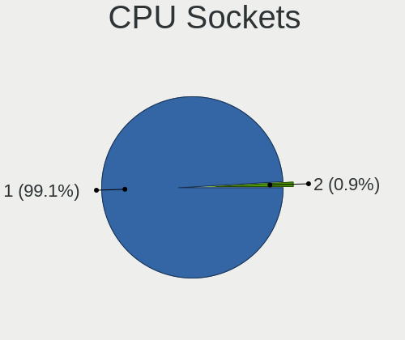
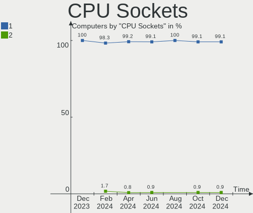

Manjaro - Hardware Trends
-------------------------

A project to identify most popular hardware characteristics and track their change
over time based on data collected by Linux users at https://Linux-Hardware.org.

Anyone can contribute to this report by the [hw-probe](https://github.com/linuxhw/hw-probe) tool:

    sudo -E hw-probe -all -upload

This is a report for all computer types. See also reports for [desktops](/Dist/Manjaro/Desktop/README.md) and [notebooks](/Dist/Manjaro/Notebook/README.md).

This report is for one last month. Overall report since the beginning of time: [TestDays](https://github.com/linuxhw/TestDays)

Period: Dec, 2023.

Contents
--------

* [ System ](#system)
  - [ OS                       ](#os)
  - [ OS Family                ](#os-family)
  - [ Kernel                   ](#kernel)
  - [ Kernel Family            ](#kernel-family)
  - [ Kernel Major Ver.        ](#kernel-major-ver)
  - [ Arch                     ](#arch)
  - [ DE                       ](#de)
  - [ Display Server           ](#display-server)
  - [ Display Manager          ](#display-manager)
  - [ OS Lang                  ](#os-lang)
  - [ Boot Mode                ](#boot-mode)
  - [ Filesystem               ](#filesystem)
  - [ Part. scheme             ](#part-scheme)
  - [ Dual Boot with Linux/BSD ](#dual-boot-with-linuxbsd)
  - [ Dual Boot (Win)          ](#dual-boot-win)

* [ Board ](#board)
  - [ Vendor                   ](#vendor)
  - [ Model                    ](#model)
  - [ Model Family             ](#model-family)
  - [ MFG Year                 ](#mfg-year)
  - [ Form Factor              ](#form-factor)
  - [ Secure Boot              ](#secure-boot)
  - [ Coreboot                 ](#coreboot)
  - [ RAM Size                 ](#ram-size)
  - [ RAM Used                 ](#ram-used)
  - [ Total Drives             ](#total-drives)
  - [ Has CD-ROM               ](#has-cd-rom)
  - [ Has Ethernet             ](#has-ethernet)
  - [ Has WiFi                 ](#has-wifi)
  - [ Has Bluetooth            ](#has-bluetooth)

* [ Location ](#location)
  - [ Country                  ](#country)
  - [ City                     ](#city)

* [ Drives ](#drives)
  - [ Drive Vendor             ](#drive-vendor)
  - [ Drive Model              ](#drive-model)
  - [ HDD Vendor               ](#hdd-vendor)
  - [ SSD Vendor               ](#ssd-vendor)
  - [ Drive Kind               ](#drive-kind)
  - [ Drive Connector          ](#drive-connector)
  - [ Drive Size               ](#drive-size)
  - [ Space Total              ](#space-total)
  - [ Space Used               ](#space-used)
  - [ Malfunc. Drives          ](#malfunc-drives)
  - [ Malfunc. Drive Vendor    ](#malfunc-drive-vendor)
  - [ Malfunc. HDD Vendor      ](#malfunc-hdd-vendor)
  - [ Malfunc. Drive Kind      ](#malfunc-drive-kind)
  - [ Failed Drives            ](#failed-drives)
  - [ Failed Drive Vendor      ](#failed-drive-vendor)
  - [ Drive Status             ](#drive-status)

* [ Storage controller ](#storage-controller)
  - [ Storage Vendor           ](#storage-vendor)
  - [ Storage Model            ](#storage-model)
  - [ Storage Kind             ](#storage-kind)

* [ Processor ](#processor)
  - [ CPU Vendor               ](#cpu-vendor)
  - [ CPU Model                ](#cpu-model)
  - [ CPU Model Family         ](#cpu-model-family)
  - [ CPU Cores                ](#cpu-cores)
  - [ CPU Sockets              ](#cpu-sockets)
  - [ CPU Threads              ](#cpu-threads)
  - [ CPU Op-Modes             ](#cpu-op-modes)
  - [ CPU Microcode            ](#cpu-microcode)
  - [ CPU Microarch            ](#cpu-microarch)

* [ Graphics ](#graphics)
  - [ GPU Vendor               ](#gpu-vendor)
  - [ GPU Model                ](#gpu-model)
  - [ GPU Combo                ](#gpu-combo)
  - [ GPU Driver               ](#gpu-driver)
  - [ GPU Memory               ](#gpu-memory)

* [ Monitor ](#monitor)
  - [ Monitor Vendor           ](#monitor-vendor)
  - [ Monitor Model            ](#monitor-model)
  - [ Monitor Resolution       ](#monitor-resolution)
  - [ Monitor Diagonal         ](#monitor-diagonal)
  - [ Monitor Width            ](#monitor-width)
  - [ Aspect Ratio             ](#aspect-ratio)
  - [ Monitor Area             ](#monitor-area)
  - [ Pixel Density            ](#pixel-density)
  - [ Multiple Monitors        ](#multiple-monitors)

* [ Network ](#network)
  - [ Net Controller Vendor    ](#net-controller-vendor)
  - [ Net Controller Model     ](#net-controller-model)
  - [ Wireless Vendor          ](#wireless-vendor)
  - [ Wireless Model           ](#wireless-model)
  - [ Ethernet Vendor          ](#ethernet-vendor)
  - [ Ethernet Model           ](#ethernet-model)
  - [ Net Controller Kind      ](#net-controller-kind)
  - [ Used Controller          ](#used-controller)
  - [ NICs                     ](#nics)
  - [ IPv6                     ](#ipv6)

* [ Bluetooth ](#bluetooth)
  - [ Bluetooth Vendor         ](#bluetooth-vendor)
  - [ Bluetooth Model          ](#bluetooth-model)

* [ Sound ](#sound)
  - [ Sound Vendor             ](#sound-vendor)
  - [ Sound Model              ](#sound-model)

* [ Memory ](#memory)
  - [ Memory Vendor            ](#memory-vendor)
  - [ Memory Model             ](#memory-model)
  - [ Memory Kind              ](#memory-kind)
  - [ Memory Form Factor       ](#memory-form-factor)
  - [ Memory Size              ](#memory-size)
  - [ Memory Speed             ](#memory-speed)

* [ Printers & scanners ](#printers--scanners)
  - [ Printer Vendor           ](#printer-vendor)
  - [ Printer Model            ](#printer-model)
  - [ Scanner Vendor           ](#scanner-vendor)
  - [ Scanner Model            ](#scanner-model)

* [ Camera ](#camera)
  - [ Camera Vendor            ](#camera-vendor)
  - [ Camera Model             ](#camera-model)

* [ Security ](#security)
  - [ Fingerprint Vendor       ](#fingerprint-vendor)
  - [ Fingerprint Model        ](#fingerprint-model)
  - [ Chipcard Vendor          ](#chipcard-vendor)
  - [ Chipcard Model           ](#chipcard-model)

* [ Unsupported ](#unsupported)
  - [ Unsupported Devices      ](#unsupported-devices)
  - [ Unsupported Device Types ](#unsupported-device-types)

System
------

OS
--

Installed operating systems

| Name           | Computers | Percent |
|----------------|-----------|---------|
| Manjaro        | 58        | 50.43%  |
| Manjaro 23.1.0 | 37        | 32.17%  |
| Manjaro 23.1.1 | 17        | 14.78%  |
| Manjaro 23.0.1 | 2         | 1.74%   |
| Manjaro 23.0.3 | 1         | 0.87%   |

OS Family
---------

OS without a version

| Name    | Computers | Percent |
|---------|-----------|---------|
| Manjaro | 115       | 100%    |

Kernel
------

Version of the Linux kernel

| Version            | Computers | Percent |
|--------------------|-----------|---------|
| 6.6.8-2-MANJARO    | 23        | 20%     |
| 6.5.13-1-MANJARO   | 15        | 13.04%  |
| 6.6.3-1-MANJARO    | 11        | 9.57%   |
| 6.6.7-4-MANJARO    | 7         | 6.09%   |
| 6.6.7-1-MANJARO    | 5         | 4.35%   |
| 6.6.5-1-MANJARO    | 5         | 4.35%   |
| 6.5.13-4-MANJARO   | 5         | 4.35%   |
| 6.1.69-1-MANJARO   | 5         | 4.35%   |
| 6.5.13-7-MANJARO   | 4         | 3.48%   |
| 6.6.2-1-MANJARO    | 3         | 2.61%   |
| 6.1.68-1-MANJARO   | 3         | 2.61%   |
| 6.7.0-4-MANJARO    | 2         | 1.74%   |
| 6.7.0-1-MANJARO    | 2         | 1.74%   |
| 6.6.5-3-MANJARO    | 2         | 1.74%   |
| 6.5.3-1-MANJARO    | 2         | 1.74%   |
| 6.5.13-6-MANJARO   | 2         | 1.74%   |
| 6.5.11-1-MANJARO   | 2         | 1.74%   |
| 6.1.64-1-MANJARO   | 2         | 1.74%   |
| 5.15.143-1-MANJARO | 2         | 1.74%   |
| 6.6.4-6-MANJARO    | 1         | 0.87%   |
| 6.6.4-4-MANJARO    | 1         | 0.87%   |
| 6.6.1-1-MANJARO    | 1         | 0.87%   |
| 6.5.5-1-MANJARO    | 1         | 0.87%   |
| 6.5.12-1-MANJARO   | 1         | 0.87%   |
| 6.1.67-2-MANJARO   | 1         | 0.87%   |
| 6.1.65-1-MANJARO   | 1         | 0.87%   |
| 6.1.63-1-MANJARO   | 1         | 0.87%   |
| 5.15.144-1-MANJARO | 1         | 0.87%   |
| 5.15.139-1-MANJARO | 1         | 0.87%   |
| 5.15.138-1-MANJARO | 1         | 0.87%   |
| 5.10.199-1-MANJARO | 1         | 0.87%   |
| 5.10.197-1-MANJARO | 1         | 0.87%   |

Kernel Family
-------------

Linux kernel without a distro release

| Version  | Computers | Percent |
|----------|-----------|---------|
| 6.5.13   | 26        | 22.61%  |
| 6.6.8    | 23        | 20%     |
| 6.6.7    | 12        | 10.43%  |
| 6.6.3    | 11        | 9.57%   |
| 6.6.5    | 7         | 6.09%   |
| 6.1.69   | 5         | 4.35%   |
| 6.7.0    | 4         | 3.48%   |
| 6.6.2    | 3         | 2.61%   |
| 6.1.68   | 3         | 2.61%   |
| 6.6.4    | 2         | 1.74%   |
| 6.5.3    | 2         | 1.74%   |
| 6.5.11   | 2         | 1.74%   |
| 6.1.64   | 2         | 1.74%   |
| 5.15.143 | 2         | 1.74%   |
| 6.6.1    | 1         | 0.87%   |
| 6.5.5    | 1         | 0.87%   |
| 6.5.12   | 1         | 0.87%   |
| 6.1.67   | 1         | 0.87%   |
| 6.1.65   | 1         | 0.87%   |
| 6.1.63   | 1         | 0.87%   |
| 5.15.144 | 1         | 0.87%   |
| 5.15.139 | 1         | 0.87%   |
| 5.15.138 | 1         | 0.87%   |
| 5.10.199 | 1         | 0.87%   |
| 5.10.197 | 1         | 0.87%   |

Kernel Major Ver.
-----------------

Linux kernel major version

| Version | Computers | Percent |
|---------|-----------|---------|
| 6.6     | 59        | 51.3%   |
| 6.5     | 32        | 27.83%  |
| 6.1     | 13        | 11.3%   |
| 5.15    | 5         | 4.35%   |
| 6.7     | 4         | 3.48%   |
| 5.10    | 2         | 1.74%   |

Arch
----

OS architecture (x86_64, i586, etc.)

| Name   | Computers | Percent |
|--------|-----------|---------|
| x86_64 | 115       | 100%    |

DE
--

Desktop Environment

| Name       | Computers | Percent |
|------------|-----------|---------|
| KDE5       | 60        | 52.17%  |
| GNOME      | 30        | 26.09%  |
| XFCE       | 14        | 12.17%  |
| X-Cinnamon | 5         | 4.35%   |
| KDE        | 2         | 1.74%   |
| MATE       | 1         | 0.87%   |
| i3         | 1         | 0.87%   |
| Hyprland   | 1         | 0.87%   |
| Unknown    | 1         | 0.87%   |

Display Server
--------------

X11 or Wayland

| Name    | Computers | Percent |
|---------|-----------|---------|
| X11     | 86        | 74.78%  |
| Wayland | 25        | 21.74%  |
| Tty     | 2         | 1.74%   |
| Unknown | 2         | 1.74%   |

Display Manager
---------------

SDDM, LightDM, etc.

| Name    | Computers | Percent |
|---------|-----------|---------|
| Unknown | 58        | 50.43%  |
| SDDM    | 26        | 22.61%  |
| LightDM | 16        | 13.91%  |
| GDM     | 15        | 13.04%  |

OS Lang
-------

Language

| Lang    | Computers | Percent |
|---------|-----------|---------|
| en_US   | 44        | 38.26%  |
| de_DE   | 12        | 10.43%  |
| en_GB   | 9         | 7.83%   |
| ru_RU   | 6         | 5.22%   |
| pt_BR   | 5         | 4.35%   |
| fr_FR   | 5         | 4.35%   |
| es_ES   | 4         | 3.48%   |
| zh_CN   | 3         | 2.61%   |
| pl_PL   | 3         | 2.61%   |
| it_IT   | 3         | 2.61%   |
| en_CA   | 3         | 2.61%   |
| cs_CZ   | 3         | 2.61%   |
| es_MX   | 2         | 1.74%   |
| en_AU   | 2         | 1.74%   |
| sk_SK   | 1         | 0.87%   |
| ro_RO   | 1         | 0.87%   |
| pt_PT   | 1         | 0.87%   |
| nl_NL   | 1         | 0.87%   |
| nl_BE   | 1         | 0.87%   |
| fi_FI   | 1         | 0.87%   |
| es_UY   | 1         | 0.87%   |
| en_ZA   | 1         | 0.87%   |
| en_DK   | 1         | 0.87%   |
| de_AT   | 1         | 0.87%   |
| Unknown | 1         | 0.87%   |

Boot Mode
---------

EFI or BIOS

| Mode | Computers | Percent |
|------|-----------|---------|
| BIOS | 71        | 61.74%  |
| EFI  | 44        | 38.26%  |

Filesystem
----------

Type of filesystem

| Type    | Computers | Percent |
|---------|-----------|---------|
| Ext4    | 87        | 75.65%  |
| Btrfs   | 17        | 14.78%  |
| Tmpfs   | 8         | 6.96%   |
| Overlay | 2         | 1.74%   |
| Xfs     | 1         | 0.87%   |

Part. scheme
------------

Scheme of partitioning

| Type    | Computers | Percent |
|---------|-----------|---------|
| Unknown | 57        | 49.57%  |
| GPT     | 52        | 45.22%  |
| MBR     | 6         | 5.22%   |

Dual Boot with Linux/BSD
------------------------

Hosting more than one Linux/BSD

| Dual boot | Computers | Percent |
|-----------|-----------|---------|
| No        | 106       | 92.17%  |
| Yes       | 9         | 7.83%   |

Dual Boot (Win)
---------------

Hosting Linux and Windows

| Dual boot | Computers | Percent |
|-----------|-----------|---------|
| No        | 86        | 74.78%  |
| Yes       | 29        | 25.22%  |

Board
-----

Vendor
------

Motherboard manufacturer

| Name                                 | Computers | Percent |
|--------------------------------------|-----------|---------|
| ASUSTek Computer                     | 22        | 19.13%  |
| Lenovo                               | 18        | 15.65%  |
| Dell                                 | 12        | 10.43%  |
| ASRock                               | 9         | 7.83%   |
| MSI                                  | 8         | 6.96%   |
| Hewlett-Packard                      | 8         | 6.96%   |
| Gigabyte Technology                  | 6         | 5.22%   |
| Acer                                 | 5         | 4.35%   |
| Apple                                | 4         | 3.48%   |
| Samsung Electronics                  | 3         | 2.61%   |
| HUAWEI                               | 3         | 2.61%   |
| Framework                            | 3         | 2.61%   |
| TUXEDO                               | 2         | 1.74%   |
| Alienware                            | 2         | 1.74%   |
| Unknown                              | 2         | 1.74%   |
| Wiltronic                            | 1         | 0.87%   |
| SLIMBOOK                             | 1         | 0.87%   |
| Shenzhen Meigao Electronic Equipment | 1         | 0.87%   |
| Schenker                             | 1         | 0.87%   |
| Panasonic                            | 1         | 0.87%   |
| MECHREVO                             | 1         | 0.87%   |
| Google                               | 1         | 0.87%   |
| GEO                                  | 1         | 0.87%   |

Model
-----

Motherboard model

| Name                                              | Computers | Percent |
|---------------------------------------------------|-----------|---------|
| MSI MS-7A38                                       | 2         | 1.74%   |
| Framework Laptop 13 (AMD Ryzen 7040Series)        | 2         | 1.74%   |
| Dell Precision 7520                               | 2         | 1.74%   |
| Dell Latitude 7490                                | 2         | 1.74%   |
| ASUS All Series                                   | 2         | 1.74%   |
| Unknown                                           | 2         | 1.74%   |
| Wiltronic MAGNUS PLUS                             | 1         | 0.87%   |
| TUXEDO InfinityBook Pro Gen8 (MK1)                | 1         | 0.87%   |
| TUXEDO Book XP15 / XP17 Gen12                     | 1         | 0.87%   |
| SLIMBOOK PROX-AMD5                                | 1         | 0.87%   |
| Shenzhen Meigao Electronic Equipment Venus series | 1         | 0.87%   |
| Schenker XMG NEO 15(E20, RTX 20xx)                | 1         | 0.87%   |
| Samsung RV419/RV420                               | 1         | 0.87%   |
| Samsung R428/P428                                 | 1         | 0.87%   |
| Samsung 550XCJ/550XCR                             | 1         | 0.87%   |
| Panasonic FZ-M1CCA17E3                            | 1         | 0.87%   |
| MSI MS-7E26                                       | 1         | 0.87%   |
| MSI MS-7D32                                       | 1         | 0.87%   |
| MSI MS-7D22                                       | 1         | 0.87%   |
| MSI MS-7D20                                       | 1         | 0.87%   |
| MSI MS-7C84                                       | 1         | 0.87%   |
| MSI MS-7597                                       | 1         | 0.87%   |
| MECHREVO Jiaolong16Q Series GM6BG0Q               | 1         | 0.87%   |
| Lenovo ThinkStation P620 30E000GMMT               | 1         | 0.87%   |
| Lenovo ThinkPad X390 20Q0004VUS                   | 1         | 0.87%   |
| Lenovo ThinkPad X220 4290JN8                      | 1         | 0.87%   |
| Lenovo ThinkPad X201 3680WXT                      | 1         | 0.87%   |
| Lenovo ThinkPad X1 Yoga Gen 6 20Y0S0BF00          | 1         | 0.87%   |
| Lenovo ThinkPad T490s 20NYS5HM00                  | 1         | 0.87%   |
| Lenovo ThinkPad T470s 20HF005NUS                  | 1         | 0.87%   |
| Lenovo ThinkPad T460 20FNS11S00                   | 1         | 0.87%   |
| Lenovo ThinkPad T440p 20AWS4YE00                  | 1         | 0.87%   |
| Lenovo ThinkPad T440p 20AWS4UD00                  | 1         | 0.87%   |
| Lenovo ThinkPad T16 Gen 1 21BWS2U600              | 1         | 0.87%   |
| Lenovo ThinkPad P52 20MAS19500                    | 1         | 0.87%   |
| Lenovo ThinkPad L590 20Q7001CGE                   | 1         | 0.87%   |
| Lenovo ThinkPad E14 Gen 2 20T7S1M200              | 1         | 0.87%   |
| Lenovo ThinkBook 13s G2 ITL 20V9                  | 1         | 0.87%   |
| Lenovo Legion T530-28ICB 90L300QPGE               | 1         | 0.87%   |
| Lenovo Legion Pro 7 16IRX8H 82WQ                  | 1         | 0.87%   |

Model Family
------------

Motherboard model prefix

| Name                                       | Computers | Percent |
|--------------------------------------------|-----------|---------|
| Lenovo ThinkPad                            | 13        | 11.3%   |
| ASUS ROG                                   | 7         | 6.09%   |
| Dell Latitude                              | 6         | 5.22%   |
| Lenovo Legion                              | 3         | 2.61%   |
| Framework Laptop                           | 3         | 2.61%   |
| Dell Precision                             | 3         | 2.61%   |
| ASUS PRIME                                 | 3         | 2.61%   |
| MSI MS-7A38                                | 2         | 1.74%   |
| HP ProBook                                 | 2         | 1.74%   |
| ASUS Zenbook                               | 2         | 1.74%   |
| ASUS TUF                                   | 2         | 1.74%   |
| ASUS All                                   | 2         | 1.74%   |
| ASRock B450                                | 2         | 1.74%   |
| Acer Nitro                                 | 2         | 1.74%   |
| Acer Aspire                                | 2         | 1.74%   |
| Unknown                                    | 2         | 1.74%   |
| Wiltronic MAGNUS                           | 1         | 0.87%   |
| TUXEDO InfinityBook                        | 1         | 0.87%   |
| TUXEDO Book                                | 1         | 0.87%   |
| SLIMBOOK PROX-AMD5                         | 1         | 0.87%   |
| Shenzhen Meigao Electronic Equipment Venus | 1         | 0.87%   |
| Schenker XMG                               | 1         | 0.87%   |
| Samsung RV419                              | 1         | 0.87%   |
| Samsung R428                               | 1         | 0.87%   |
| Samsung 550XCJ                             | 1         | 0.87%   |
| Panasonic FZ-M1CCA17E3                     | 1         | 0.87%   |
| MSI MS-7E26                                | 1         | 0.87%   |
| MSI MS-7D32                                | 1         | 0.87%   |
| MSI MS-7D22                                | 1         | 0.87%   |
| MSI MS-7D20                                | 1         | 0.87%   |
| MSI MS-7C84                                | 1         | 0.87%   |
| MSI MS-7597                                | 1         | 0.87%   |
| MECHREVO Jiaolong16Q                       | 1         | 0.87%   |
| Lenovo ThinkStation                        | 1         | 0.87%   |
| Lenovo ThinkBook                           | 1         | 0.87%   |
| HUAWEI NBLK-WAX9X                          | 1         | 0.87%   |
| HUAWEI HVY-WXX9                            | 1         | 0.87%   |
| HUAWEI CREFG-XX                            | 1         | 0.87%   |
| HP Stream                                  | 1         | 0.87%   |
| HP Pavilion                                | 1         | 0.87%   |

MFG Year
--------

Motherboard manufacture year

| Year | Computers | Percent |
|------|-----------|---------|
| 2020 | 19        | 16.52%  |
| 2023 | 16        | 13.91%  |
| 2019 | 12        | 10.43%  |
| 2022 | 11        | 9.57%   |
| 2018 | 10        | 8.7%    |
| 2021 | 9         | 7.83%   |
| 2017 | 8         | 6.96%   |
| 2014 | 6         | 5.22%   |
| 2012 | 6         | 5.22%   |
| 2013 | 5         | 4.35%   |
| 2010 | 4         | 3.48%   |
| 2015 | 3         | 2.61%   |
| 2011 | 2         | 1.74%   |
| 2009 | 2         | 1.74%   |
| 2016 | 1         | 0.87%   |
| 2007 | 1         | 0.87%   |

Form Factor
-----------

Physical design of the computer

| Name        | Computers | Percent |
|-------------|-----------|---------|
| Notebook    | 62        | 53.91%  |
| Desktop     | 46        | 40%     |
| Tablet      | 2         | 1.74%   |
| Convertible | 2         | 1.74%   |
| All in one  | 2         | 1.74%   |
| Mini pc     | 1         | 0.87%   |

Secure Boot
-----------

Enabled or disabled

| State    | Computers | Percent |
|----------|-----------|---------|
| Disabled | 115       | 100%    |

Coreboot
--------

Have coreboot on board

| Used | Computers | Percent |
|------|-----------|---------|
| No   | 114       | 99.13%  |
| Yes  | 1         | 0.87%   |

RAM Size
--------

Total RAM memory

| Size in GB  | Computers | Percent |
|-------------|-----------|---------|
| 32.01-64.0  | 28        | 24.35%  |
| 16.01-24.0  | 23        | 20%     |
| 8.01-16.0   | 22        | 19.13%  |
| 4.01-8.0    | 15        | 13.04%  |
| 64.01-256.0 | 11        | 9.57%   |
| 3.01-4.0    | 9         | 7.83%   |
| 24.01-32.0  | 6         | 5.22%   |
| 2.01-3.0    | 1         | 0.87%   |

RAM Used
--------

Used RAM memory

| Used GB    | Computers | Percent |
|------------|-----------|---------|
| 4.01-8.0   | 43        | 37.39%  |
| 1.01-2.0   | 21        | 18.26%  |
| 2.01-3.0   | 17        | 14.78%  |
| 3.01-4.0   | 14        | 12.17%  |
| 8.01-16.0  | 12        | 10.43%  |
| 32.01-64.0 | 3         | 2.61%   |
| 16.01-24.0 | 3         | 2.61%   |
| 24.01-32.0 | 1         | 0.87%   |
| 0.51-1.0   | 1         | 0.87%   |

Total Drives
------------

Number of drives on board

| Drives | Computers | Percent |
|--------|-----------|---------|
| 1      | 59        | 51.3%   |
| 2      | 24        | 20.87%  |
| 3      | 13        | 11.3%   |
| 4      | 12        | 10.43%  |
| 5      | 5         | 4.35%   |
| 9      | 1         | 0.87%   |
| 7      | 1         | 0.87%   |

Has CD-ROM
----------

Has CD-ROM on board

| Presented | Computers | Percent |
|-----------|-----------|---------|
| No        | 98        | 85.22%  |
| Yes       | 17        | 14.78%  |

Has Ethernet
------------

Has Ethernet on board

| Presented | Computers | Percent |
|-----------|-----------|---------|
| Yes       | 96        | 83.48%  |
| No        | 19        | 16.52%  |

Has WiFi
--------

Has WiFi module

| Presented | Computers | Percent |
|-----------|-----------|---------|
| Yes       | 95        | 82.61%  |
| No        | 20        | 17.39%  |

Has Bluetooth
-------------

Has Bluetooth module

| Presented | Computers | Percent |
|-----------|-----------|---------|
| Yes       | 86        | 74.78%  |
| No        | 29        | 25.22%  |

Location
--------

Country
-------

Geographic location (country)

| Country            | Computers | Percent |
|--------------------|-----------|---------|
| Germany            | 19        | 16.52%  |
| USA                | 15        | 13.04%  |
| Russia             | 10        | 8.7%    |
| France             | 6         | 5.22%   |
| Brazil             | 6         | 5.22%   |
| Poland             | 5         | 4.35%   |
| Canada             | 5         | 4.35%   |
| Spain              | 4         | 3.48%   |
| Italy              | 4         | 3.48%   |
| Czechia            | 4         | 3.48%   |
| UK                 | 2         | 1.74%   |
| Serbia             | 2         | 1.74%   |
| Romania            | 2         | 1.74%   |
| Hong Kong          | 2         | 1.74%   |
| Greece             | 2         | 1.74%   |
| Belarus            | 2         | 1.74%   |
| Austria            | 2         | 1.74%   |
| Australia          | 2         | 1.74%   |
| Uruguay            | 1         | 0.87%   |
| The Netherlands    | 1         | 0.87%   |
| Thailand           | 1         | 0.87%   |
| Switzerland        | 1         | 0.87%   |
| Sweden             | 1         | 0.87%   |
| South Africa       | 1         | 0.87%   |
| Slovakia           | 1         | 0.87%   |
| Portugal           | 1         | 0.87%   |
| Netherlands        | 1         | 0.87%   |
| Mexico             | 1         | 0.87%   |
| Kazakhstan         | 1         | 0.87%   |
| Israel             | 1         | 0.87%   |
| Iran               | 1         | 0.87%   |
| Indonesia          | 1         | 0.87%   |
| Finland            | 1         | 0.87%   |
| Dominican Republic | 1         | 0.87%   |
| Denmark            | 1         | 0.87%   |
| Croatia            | 1         | 0.87%   |
| China              | 1         | 0.87%   |
| Chile              | 1         | 0.87%   |
| Belgium            | 1         | 0.87%   |

City
----

Geographic location (city)

| City                        | Computers | Percent |
|-----------------------------|-----------|---------|
| Warsaw                      | 3         | 2.61%   |
| Sao Paulo                   | 3         | 2.61%   |
| Hamburg                     | 3         | 2.61%   |
| Yekaterinburg               | 2         | 1.74%   |
| The Hague                   | 2         | 1.74%   |
| Sydney                      | 2         | 1.74%   |
| Frankfurt am Main           | 2         | 1.74%   |
| Dortmund                    | 2         | 1.74%   |
| Caluire-et-Cuire            | 2         | 1.74%   |
| Belgrade                    | 2         | 1.74%   |
| Zola Predosa                | 1         | 0.87%   |
| Zagreb                      | 1         | 0.87%   |
| Voronezh                    | 1         | 0.87%   |
| Vodnany                     | 1         | 0.87%   |
| Vendenheim                  | 1         | 0.87%   |
| Vancouver                   | 1         | 0.87%   |
| Tripoli                     | 1         | 0.87%   |
| Trenton                     | 1         | 0.87%   |
| Torrejón de Ardoz          | 1         | 0.87%   |
| Toronto                     | 1         | 0.87%   |
| Tepatitlán de Morelos      | 1         | 0.87%   |
| Tehran                      | 1         | 0.87%   |
| Tambov                      | 1         | 0.87%   |
| Stockholm                   | 1         | 0.87%   |
| Stavropol                   | 1         | 0.87%   |
| St Petersburg               | 1         | 0.87%   |
| Sobeslav                    | 1         | 0.87%   |
| Silver Spring               | 1         | 0.87%   |
| Siegen                      | 1         | 0.87%   |
| Shchelkovo                  | 1         | 0.87%   |
| Shanghai                    | 1         | 0.87%   |
| Santiago de los Caballeros  | 1         | 0.87%   |
| San Cristóbal de La Laguna | 1         | 0.87%   |
| Salzburg                    | 1         | 0.87%   |
| Saint-Eustache              | 1         | 0.87%   |
| Rockville                   | 1         | 0.87%   |
| Richmond Hill               | 1         | 0.87%   |
| Pretoria                    | 1         | 0.87%   |
| Prague                      | 1         | 0.87%   |
| Pfaffenhofen                | 1         | 0.87%   |

Drives
------

Drive Vendor
------------

Hard drive vendors

| Vendor                      | Computers | Drives | Percent |
|-----------------------------|-----------|--------|---------|
| Samsung Electronics         | 43        | 59     | 22.05%  |
| Seagate                     | 20        | 30     | 10.26%  |
| WDC                         | 19        | 28     | 9.74%   |
| Sandisk                     | 14        | 14     | 7.18%   |
| Kingston                    | 13        | 15     | 6.67%   |
| Crucial                     | 9         | 9      | 4.62%   |
| Toshiba                     | 6         | 7      | 3.08%   |
| Unknown                     | 5         | 6      | 2.56%   |
| SK hynix                    | 5         | 5      | 2.56%   |
| Phison Electronics          | 5         | 5      | 2.56%   |
| Micron Technology           | 5         | 5      | 2.56%   |
| Micron/Crucial Technology   | 4         | 4      | 2.05%   |
| MAXIO Technology (Hangzhou) | 4         | 4      | 2.05%   |
| Hitachi                     | 4         | 4      | 2.05%   |
| A-DATA Technology           | 4         | 4      | 2.05%   |
| Silicon Motion              | 3         | 3      | 1.54%   |
| KIOXIA                      | 3         | 3      | 1.54%   |
| GOODRAM                     | 3         | 3      | 1.54%   |
| Patriot                     | 2         | 2      | 1.03%   |
| Intel                       | 2         | 3      | 1.03%   |
| Apple                       | 2         | 2      | 1.03%   |
| ADATA Technology            | 2         | 2      | 1.03%   |
| Yangtze Memory Technologies | 1         | 1      | 0.51%   |
| WALRAM                      | 1         | 1      | 0.51%   |
| Union Memory (Shenzhen)     | 1         | 1      | 0.51%   |
| Transcend                   | 1         | 1      | 0.51%   |
| SPCC                        | 1         | 1      | 0.51%   |
| PNY                         | 1         | 1      | 0.51%   |
| OWC                         | 1         | 1      | 0.51%   |
| Mushkin                     | 1         | 1      | 0.51%   |
| Maxtor                      | 1         | 1      | 0.51%   |
| LITEON                      | 1         | 1      | 0.51%   |
| Lexar                       | 1         | 1      | 0.51%   |
| Kingston Technology Company | 1         | 1      | 0.51%   |
| Fujitsu                     | 1         | 1      | 0.51%   |
| Emtec                       | 1         | 1      | 0.51%   |
| Corsair                     | 1         | 1      | 0.51%   |
| China                       | 1         | 1      | 0.51%   |
| BHT                         | 1         | 1      | 0.51%   |
| Unknown                     | 1         | 1      | 0.51%   |

Drive Model
-----------

Hard drive models

| Model                                                 | Computers | Percent |
|-------------------------------------------------------|-----------|---------|
| Samsung NVMe SSD Controller SM981/PM981/PM983 512GB   | 10        | 4.55%   |
| Samsung NVMe SSD Controller PM9A1/PM9A3/980PRO 2TB    | 8         | 3.64%   |
| Kingston SA400S37480G 480GB SSD                       | 4         | 1.82%   |
| Unknown MMC Card  64GB                                | 3         | 1.36%   |
| Seagate ST2000DM008-2FR102 2TB                        | 3         | 1.36%   |
| Sandisk WD Blue SN550 NVMe SSD 1TB                    | 3         | 1.36%   |
| Sandisk WD Black SN750 / PC SN730 NVMe SSD 2TB        | 3         | 1.36%   |
| Samsung SSD 980 1TB                                   | 3         | 1.36%   |
| Samsung SSD 860 EVO 500GB                             | 3         | 1.36%   |
| Samsung NVMe SSD Controller SM961/PM961/SM963 250GB   | 3         | 1.36%   |
| MAXIO (Hangzhou) NVMe SSD Controller MAP1202 256GB    | 3         | 1.36%   |
| Unknown MMC Card  128GB                               | 2         | 0.91%   |
| Silicon Motion SM2263EN/SM2263XT SSD Controller 500GB | 2         | 0.91%   |
| Seagate ST4000DM004-2CV104 4TB                        | 2         | 0.91%   |
| Sandisk WD Blue SN570 1TB                             | 2         | 0.91%   |
| Samsung SSD 870 QVO 1TB                               | 2         | 0.91%   |
| Samsung SSD 860 EVO 250GB                             | 2         | 0.91%   |
| Phison E12 NVMe Controller 1TB                        | 2         | 0.91%   |
| Micron/Crucial P2 NVMe PCIe SSD 4TB                   | 2         | 0.91%   |
| Kingston SKC3000S1024G 1024GB                         | 2         | 0.91%   |
| Kingston SA400S37240G 240GB SSD                       | 2         | 0.91%   |
| Kingston SA400S37120G 120GB SSD                       | 2         | 0.91%   |
| GOODRAM SSDPR-CX400-256 256GB                         | 2         | 0.91%   |
| Crucial CT240BX500SSD1 240GB                          | 2         | 0.91%   |
| Yangtze Memory YMTC PC300-512GB-B                     | 1         | 0.45%   |
| WDC WDS500G2B0A-00SM50 500GB SSD                      | 1         | 0.45%   |
| WDC WDS120G2G0A-00JH30 120GB SSD                      | 1         | 0.45%   |
| WDC WD6401AALS-00L3B2 640GB                           | 1         | 0.45%   |
| WDC WD6003FFBX-68MU3N0 6TB                            | 1         | 0.45%   |
| WDC WD5002ABYS-02B1B0 500GB                           | 1         | 0.45%   |
| WDC WD5000LPVX-22V0TT0 500GB                          | 1         | 0.45%   |
| WDC WD40EZRZ-00WN9B0 4TB                              | 1         | 0.45%   |
| WDC WD40EZRZ-00GXCB0 4TB                              | 1         | 0.45%   |
| WDC WD32 00BPVT-55ZEST0 320GB                         | 1         | 0.45%   |
| WDC WD30EZRZ-00Z5HB0 3TB                              | 1         | 0.45%   |
| WDC WD30EFRX-68E 3TB                                  | 1         | 0.45%   |
| WDC WD20SPZX-00UA7T0 2TB                              | 1         | 0.45%   |
| WDC WD20EZRX-00DC0B0 2TB                              | 1         | 0.45%   |
| WDC WD20EZBX-00AYRA0 2TB                              | 1         | 0.45%   |
| WDC WD20EZAZ-00L9GB0 2TB                              | 1         | 0.45%   |

HDD Vendor
----------

Hard disk drive vendors

| Vendor              | Computers | Drives | Percent |
|---------------------|-----------|--------|---------|
| Seagate             | 20        | 30     | 37.74%  |
| WDC                 | 19        | 26     | 35.85%  |
| Toshiba             | 6         | 7      | 11.32%  |
| Hitachi             | 4         | 4      | 7.55%   |
| Samsung Electronics | 1         | 1      | 1.89%   |
| Maxtor              | 1         | 1      | 1.89%   |
| Fujitsu             | 1         | 1      | 1.89%   |
| Apple               | 1         | 1      | 1.89%   |

SSD Vendor
----------

Solid state drive vendors

| Vendor              | Computers | Drives | Percent |
|---------------------|-----------|--------|---------|
| Samsung Electronics | 19        | 23     | 28.36%  |
| Kingston            | 10        | 11     | 14.93%  |
| Crucial             | 9         | 9      | 13.43%  |
| A-DATA Technology   | 4         | 4      | 5.97%   |
| GOODRAM             | 3         | 3      | 4.48%   |
| WDC                 | 2         | 2      | 2.99%   |
| SK hynix            | 2         | 2      | 2.99%   |
| SanDisk             | 2         | 2      | 2.99%   |
| Patriot             | 2         | 2      | 2.99%   |
| Transcend           | 1         | 1      | 1.49%   |
| SPCC                | 1         | 1      | 1.49%   |
| PNY                 | 1         | 1      | 1.49%   |
| OWC                 | 1         | 1      | 1.49%   |
| Mushkin             | 1         | 1      | 1.49%   |
| Micron Technology   | 1         | 1      | 1.49%   |
| LITEON              | 1         | 1      | 1.49%   |
| Lexar               | 1         | 1      | 1.49%   |
| Emtec               | 1         | 1      | 1.49%   |
| Corsair             | 1         | 1      | 1.49%   |
| China               | 1         | 1      | 1.49%   |
| BHT                 | 1         | 1      | 1.49%   |
| Apple               | 1         | 1      | 1.49%   |
| Unknown             | 1         | 1      | 1.49%   |

Drive Kind
----------

HDD or SSD

| Kind    | Computers | Drives | Percent |
|---------|-----------|--------|---------|
| NVMe    | 70        | 85     | 42.42%  |
| SSD     | 49        | 72     | 29.7%   |
| HDD     | 40        | 71     | 24.24%  |
| MMC     | 5         | 6      | 3.03%   |
| Unknown | 1         | 1      | 0.61%   |

Drive Connector
---------------

SATA, SAS, NVMe, etc.

| Type | Computers | Drives | Percent |
|------|-----------|--------|---------|
| NVMe | 70        | 84     | 46.98%  |
| SATA | 69        | 140    | 46.31%  |
| SAS  | 5         | 5      | 3.36%   |
| MMC  | 5         | 6      | 3.36%   |

Drive Size
----------

Size of hard drive

| Size in TB | Computers | Drives | Percent |
|------------|-----------|--------|---------|
| 0.01-0.5   | 45        | 74     | 47.37%  |
| 0.51-1.0   | 26        | 32     | 27.37%  |
| 1.01-2.0   | 12        | 15     | 12.63%  |
| 3.01-4.0   | 5         | 6      | 5.26%   |
| 2.01-3.0   | 3         | 5      | 3.16%   |
| 10.01-20.0 | 2         | 9      | 2.11%   |
| 4.01-10.0  | 2         | 2      | 2.11%   |

Space Total
-----------

Amount of disk space available on the file system

| Size in GB     | Computers | Percent |
|----------------|-----------|---------|
| 501-1000       | 26        | 22.61%  |
| 1001-2000      | 17        | 14.78%  |
| More than 3000 | 16        | 13.91%  |
| 251-500        | 15        | 13.04%  |
| 101-250        | 15        | 13.04%  |
| 51-100         | 8         | 6.96%   |
| Unknown        | 7         | 6.09%   |
| 2001-3000      | 5         | 4.35%   |
| 1-20           | 5         | 4.35%   |
| 21-50          | 1         | 0.87%   |

Space Used
----------

Amount of used disk space

| Used GB        | Computers | Percent |
|----------------|-----------|---------|
| 1-20           | 21        | 18.26%  |
| 501-1000       | 18        | 15.65%  |
| 21-50          | 16        | 13.91%  |
| 101-250        | 16        | 13.91%  |
| 251-500        | 13        | 11.3%   |
| 51-100         | 11        | 9.57%   |
| Unknown        | 7         | 6.09%   |
| 2001-3000      | 5         | 4.35%   |
| More than 3000 | 4         | 3.48%   |
| 1001-2000      | 4         | 3.48%   |

Malfunc. Drives
---------------

Drive models with a malfunction

| Model                                 | Computers | Drives | Percent |
|---------------------------------------|-----------|--------|---------|
| Seagate ST2000DM008-2FR102 2TB        | 2         | 2      | 18.18%  |
| WDC WD1002FBYS-02A6B0 1TB             | 1         | 1      | 9.09%   |
| SK hynix HFS256G32TND-N210A 256GB SSD | 1         | 1      | 9.09%   |
| Seagate ST500LT012-9WS142 500GB       | 1         | 1      | 9.09%   |
| Seagate ST500DM002-1BD142 500GB       | 1         | 2      | 9.09%   |
| Seagate ST4000DM000-1F2168 4TB        | 1         | 1      | 9.09%   |
| Kingston SV300S37A120G 120GB SSD      | 1         | 1      | 9.09%   |
| Intel SSD 600P Series 128GB           | 1         | 1      | 9.09%   |
| Crucial CT525MX300SSD1 528GB          | 1         | 1      | 9.09%   |
| Unknown                               | 1         | 1      | 9.09%   |

Malfunc. Drive Vendor
---------------------

Vendors of faulty drives

| Vendor   | Computers | Drives | Percent |
|----------|-----------|--------|---------|
| Seagate  | 5         | 6      | 45.45%  |
| WDC      | 1         | 1      | 9.09%   |
| SK hynix | 1         | 1      | 9.09%   |
| Kingston | 1         | 1      | 9.09%   |
| Intel    | 1         | 1      | 9.09%   |
| Crucial  | 1         | 1      | 9.09%   |
| Unknown  | 1         | 1      | 9.09%   |

Malfunc. HDD Vendor
-------------------

Vendors of faulty HDD drives

| Vendor  | Computers | Drives | Percent |
|---------|-----------|--------|---------|
| Seagate | 5         | 6      | 83.33%  |
| WDC     | 1         | 1      | 16.67%  |

Malfunc. Drive Kind
-------------------

Kinds of faulty drives

| Kind | Computers | Drives | Percent |
|------|-----------|--------|---------|
| HDD  | 6         | 7      | 54.55%  |
| SSD  | 4         | 4      | 36.36%  |
| NVMe | 1         | 1      | 9.09%   |

Failed Drives
-------------

Failed drive models

Zero info for selected period =(

Failed Drive Vendor
-------------------

Failed drive vendors

Zero info for selected period =(

Drive Status
------------

Number of failed and malfunc. drives

| Status   | Computers | Drives | Percent |
|----------|-----------|--------|---------|
| Detected | 79        | 152    | 61.72%  |
| Works    | 39        | 71     | 30.47%  |
| Malfunc  | 10        | 12     | 7.81%   |

Storage controller
------------------

Storage Vendor
--------------

Storage controller vendors

| Vendor                      | Computers | Percent |
|-----------------------------|-----------|---------|
| Intel                       | 55        | 32.35%  |
| Samsung Electronics         | 30        | 17.65%  |
| AMD                         | 30        | 17.65%  |
| SanDisk                     | 12        | 7.06%   |
| ASMedia Technology          | 8         | 4.71%   |
| Phison Electronics          | 5         | 2.94%   |
| Micron/Crucial Technology   | 4         | 2.35%   |
| Micron Technology           | 4         | 2.35%   |
| MAXIO Technology (Hangzhou) | 4         | 2.35%   |
| Kingston Technology Company | 4         | 2.35%   |
| SK hynix                    | 3         | 1.76%   |
| Silicon Motion              | 3         | 1.76%   |
| KIOXIA                      | 3         | 1.76%   |
| ADATA Technology            | 2         | 1.18%   |
| Yangtze Memory Technologies | 1         | 0.59%   |
| Union Memory (Shenzhen)     | 1         | 0.59%   |
| Nvidia                      | 1         | 0.59%   |

Storage Model
-------------

Storage controller models

| Model                                                                          | Computers | Percent |
|--------------------------------------------------------------------------------|-----------|---------|
| AMD FCH SATA Controller [AHCI mode]                                            | 22        | 11.89%  |
| Samsung NVMe SSD Controller SM981/PM981/PM983                                  | 10        | 5.41%   |
| Samsung NVMe SSD Controller PM9A1/PM9A3/980PRO                                 | 9         | 4.86%   |
| ASMedia ASM1062 Serial ATA Controller                                          | 7         | 3.78%   |
| Samsung NVMe SSD Controller 980 (DRAM-less)                                    | 6         | 3.24%   |
| Intel Q170/Q150/B150/H170/H110/Z170/CM236 Chipset SATA Controller [AHCI Mode]  | 4         | 2.16%   |
| Intel 8 Series/C220 Series Chipset Family 6-port SATA Controller 1 [AHCI mode] | 4         | 2.16%   |
| Intel 8 Series SATA Controller 1 [AHCI mode]                                   | 4         | 2.16%   |
| Intel 200 Series PCH SATA controller [AHCI mode]                               | 4         | 2.16%   |
| AMD 400 Series Chipset SATA Controller                                         | 4         | 2.16%   |
| SanDisk Ultra 3D / WD Blue SN550 NVMe SSD                                      | 3         | 1.62%   |
| SanDisk Extreme Pro / WD Black SN750 / PC SN730 / Red SN700 NVMe SSD           | 3         | 1.62%   |
| Samsung NVMe SSD Controller SM961/PM961/SM963                                  | 3         | 1.62%   |
| MAXIO (Hangzhou) NVMe SSD Controller MAP1202                                   | 3         | 1.62%   |
| Kingston Company KC3000/FURY Renegade NVMe SSD E18                             | 3         | 1.62%   |
| Intel Volume Management Device NVMe RAID Controller                            | 3         | 1.62%   |
| Intel 7 Series Chipset Family 6-port SATA Controller [AHCI mode]               | 3         | 1.62%   |
| Intel 6 Series/C200 Series Chipset Family 6 port Mobile SATA AHCI Controller   | 3         | 1.62%   |
| AMD SB7x0/SB8x0/SB9x0 SATA Controller [AHCI mode]                              | 3         | 1.62%   |
| AMD 500 Series Chipset SATA Controller                                         | 3         | 1.62%   |
| Silicon Motion SM2263EN/SM2263XT (DRAM-less) NVMe SSD Controllers              | 2         | 1.08%   |
| SanDisk WD Black SN770 / PC SN740 256GB / PC SN560 (DRAM-less) NVMe SSD        | 2         | 1.08%   |
| SanDisk Ultra 3D / WD Blue SN570 NVMe SSD (DRAM-less)                          | 2         | 1.08%   |
| Samsung NVMe SSD Controller S4LV008[Pascal]                                    | 2         | 1.08%   |
| Phison E18 PCIe4 NVMe Controller                                               | 2         | 1.08%   |
| Phison E12 NVMe Controller                                                     | 2         | 1.08%   |
| Micron/Crucial P2 [Nick P2] / P3 / P3 Plus NVMe PCIe SSD (DRAM-less)           | 2         | 1.08%   |
| Micron 2200S NVMe SSD [Cassandra]                                              | 2         | 1.08%   |
| KIOXIA NVMe SSD Controller BG4 (DRAM-less)                                     | 2         | 1.08%   |
| Intel Cannon Lake PCH SATA AHCI Controller                                     | 2         | 1.08%   |
| Intel Alder Lake-S PCH SATA Controller [AHCI Mode]                             | 2         | 1.08%   |
| Intel 9 Series Chipset Family SATA Controller [AHCI Mode]                      | 2         | 1.08%   |
| Intel 82801IBM/IEM (ICH9M/ICH9M-E) 4 port SATA Controller [AHCI mode]          | 2         | 1.08%   |
| Intel 82801 Mobile SATA Controller [RAID mode]                                 | 2         | 1.08%   |
| Intel 700 Series Chipset Family SATA AHCI Controller                           | 2         | 1.08%   |
| Intel 7 Series/C210 Series Chipset Family 6-port SATA Controller [AHCI mode]   | 2         | 1.08%   |
| Intel 500 Series Chipset Family SATA AHCI Controller                           | 2         | 1.08%   |
| Intel 5 Series/3400 Series Chipset 6 port SATA AHCI Controller                 | 2         | 1.08%   |
| Intel 400 Series Chipset Family SATA AHCI Controller                           | 2         | 1.08%   |
| AMD SB7x0/SB8x0/SB9x0 IDE Controller                                           | 2         | 1.08%   |

Storage Kind
------------

Kind of storage controller (IDE, SATA, NVMe, SAS, ...)

| Kind | Computers | Percent |
|------|-----------|---------|
| SATA | 79        | 49.07%  |
| NVMe | 70        | 43.48%  |
| RAID | 7         | 4.35%   |
| IDE  | 5         | 3.11%   |

Processor
---------

CPU Vendor
----------

Processor vendors

| Vendor | Computers | Percent |
|--------|-----------|---------|
| Intel  | 72        | 62.61%  |
| AMD    | 43        | 37.39%  |

CPU Model
---------

Processor models

| Model                                  | Computers | Percent |
|----------------------------------------|-----------|---------|
| Intel Core i7-8665U CPU @ 1.90GHz      | 2         | 1.74%   |
| Intel Core i7-8650U CPU @ 1.90GHz      | 2         | 1.74%   |
| Intel Core i5-8265U CPU @ 1.60GHz      | 2         | 1.74%   |
| Intel 13th Gen Core i7-13700H          | 2         | 1.74%   |
| AMD Ryzen 9 7950X 16-Core Processor    | 2         | 1.74%   |
| AMD Ryzen 5 5600X 6-Core Processor     | 2         | 1.74%   |
| AMD Ryzen 5 5600G with Radeon Graphics | 2         | 1.74%   |
| AMD Ryzen 5 4600H with Radeon Graphics | 2         | 1.74%   |
| AMD Ryzen 5 2600X Six-Core Processor   | 2         | 1.74%   |
| Intel Xeon CPU E3-1231 v3 @ 3.40GHz    | 1         | 0.87%   |
| Intel N95                              | 1         | 0.87%   |
| Intel Genuine CPU U4100 @ 1.30GHz      | 1         | 0.87%   |
| Intel Core i7-9700 CPU @ 3.00GHz       | 1         | 0.87%   |
| Intel Core i7-8850H CPU @ 2.60GHz      | 1         | 0.87%   |
| Intel Core i7-8700 CPU @ 3.20GHz       | 1         | 0.87%   |
| Intel Core i7-7820HQ CPU @ 2.90GHz     | 1         | 0.87%   |
| Intel Core i7-7700K CPU @ 4.20GHz      | 1         | 0.87%   |
| Intel Core i7-6920HQ CPU @ 2.90GHz     | 1         | 0.87%   |
| Intel Core i7-6820HQ CPU @ 2.70GHz     | 1         | 0.87%   |
| Intel Core i7-6600U CPU @ 2.60GHz      | 1         | 0.87%   |
| Intel Core i7-4810MQ CPU @ 2.80GHz     | 1         | 0.87%   |
| Intel Core i7-4790K CPU @ 4.00GHz      | 1         | 0.87%   |
| Intel Core i7-4510U CPU @ 2.00GHz      | 1         | 0.87%   |
| Intel Core i7-10875H CPU @ 2.30GHz     | 1         | 0.87%   |
| Intel Core i7-10870H CPU @ 2.20GHz     | 1         | 0.87%   |
| Intel Core i7-10610U CPU @ 1.80GHz     | 1         | 0.87%   |
| Intel Core i7 CPU 860 @ 2.80GHz        | 1         | 0.87%   |
| Intel Core i5-9600K CPU @ 3.70GHz      | 1         | 0.87%   |
| Intel Core i5-9300H CPU @ 2.40GHz      | 1         | 0.87%   |
| Intel Core i5-8500 CPU @ 3.00GHz       | 1         | 0.87%   |
| Intel Core i5-8365U CPU @ 1.60GHz      | 1         | 0.87%   |
| Intel Core i5-7300U CPU @ 2.60GHz      | 1         | 0.87%   |
| Intel Core i5-7200U CPU @ 2.50GHz      | 1         | 0.87%   |
| Intel Core i5-5250U CPU @ 1.60GHz      | 1         | 0.87%   |
| Intel Core i5-5200U CPU @ 2.20GHz      | 1         | 0.87%   |
| Intel Core i5-4690K CPU @ 3.50GHz      | 1         | 0.87%   |
| Intel Core i5-4570 CPU @ 3.20GHz       | 1         | 0.87%   |
| Intel Core i5-4302Y CPU @ 1.60GHz      | 1         | 0.87%   |
| Intel Core i5-4300U CPU @ 1.90GHz      | 1         | 0.87%   |
| Intel Core i5-4210U CPU @ 1.70GHz      | 1         | 0.87%   |

CPU Model Family
----------------

Processor model prefix

| Model                   | Computers | Percent |
|-------------------------|-----------|---------|
| Intel Core i5           | 25        | 21.74%  |
| Intel Core i7           | 19        | 16.52%  |
| Other                   | 17        | 14.78%  |
| AMD Ryzen 5             | 16        | 13.91%  |
| AMD Ryzen 7             | 11        | 9.57%   |
| AMD Ryzen 9             | 9         | 7.83%   |
| Intel Celeron           | 4         | 3.48%   |
| Intel Core i3           | 3         | 2.61%   |
| AMD FX                  | 3         | 2.61%   |
| Intel Xeon              | 1         | 0.87%   |
| Intel Genuine           | 1         | 0.87%   |
| Intel Celeron Dual-Core | 1         | 0.87%   |
| Intel Atom              | 1         | 0.87%   |
| AMD Ryzen Threadripper  | 1         | 0.87%   |
| AMD Ryzen 3             | 1         | 0.87%   |
| AMD Athlon II X2        | 1         | 0.87%   |
| AMD A4                  | 1         | 0.87%   |

CPU Cores
---------

Number of processor cores

| Number | Computers | Percent |
|--------|-----------|---------|
| 4      | 36        | 31.3%   |
| 2      | 24        | 20.87%  |
| 6      | 19        | 16.52%  |
| 8      | 17        | 14.78%  |
| 12     | 7         | 6.09%   |
| 16     | 5         | 4.35%   |
| 14     | 4         | 3.48%   |
| 24     | 1         | 0.87%   |
| 3      | 1         | 0.87%   |
| 1      | 1         | 0.87%   |

CPU Sockets
-----------

Number of sockets

| Number | Computers | Percent |
|--------|-----------|---------|
| 1      | 115       | 100%    |

CPU Threads
-----------

Threads per core (Hyper-Threading)

| Number | Computers | Percent |
|--------|-----------|---------|
| 2      | 95        | 82.61%  |
| 1      | 20        | 17.39%  |

CPU Op-Modes
------------

CPU Operation Modes (32-bit, 64-bit)

| Op mode        | Computers | Percent |
|----------------|-----------|---------|
| 32-bit, 64-bit | 115       | 100%    |

CPU Microcode
-------------

Microcode number

| Number     | Computers | Percent |
|------------|-----------|---------|
| Unknown    | 93        | 80.87%  |
| 0x0a601203 | 3         | 2.61%   |
| 0x806ec    | 2         | 1.74%   |
| 0x0a404102 | 2         | 1.74%   |
| 0x906ea    | 1         | 0.87%   |
| 0x90672    | 1         | 0.87%   |
| 0x0a704104 | 1         | 0.87%   |
| 0x0a704103 | 1         | 0.87%   |
| 0x0a50000d | 1         | 0.87%   |
| 0x0a50000b | 1         | 0.87%   |
| 0x0a201016 | 1         | 0.87%   |
| 0x0a008204 | 1         | 0.87%   |
| 0x08701021 | 1         | 0.87%   |
| 0x08600106 | 1         | 0.87%   |
| 0x08600104 | 1         | 0.87%   |
| 0x08108109 | 1         | 0.87%   |
| 0x08101016 | 1         | 0.87%   |
| 0x0810100b | 1         | 0.87%   |
| 0x0800820d | 1         | 0.87%   |

CPU Microarch
-------------

Microarchitecture

| Name             | Computers | Percent |
|------------------|-----------|---------|
| Unknown          | 22        | 19.13%  |
| KabyLake         | 20        | 17.39%  |
| Zen 3            | 10        | 8.7%    |
| Haswell          | 10        | 8.7%    |
| Alderlake Hybrid | 7         | 6.09%   |
| Zen+             | 6         | 5.22%   |
| Zen 2            | 6         | 5.22%   |
| IvyBridge        | 5         | 4.35%   |
| Skylake          | 4         | 3.48%   |
| TigerLake        | 3         | 2.61%   |
| SandyBridge      | 3         | 2.61%   |
| Piledriver       | 3         | 2.61%   |
| CometLake        | 3         | 2.61%   |
| Zen              | 2         | 1.74%   |
| Penryn           | 2         | 1.74%   |
| Nehalem          | 2         | 1.74%   |
| Broadwell        | 2         | 1.74%   |
| Westmere         | 1         | 0.87%   |
| Silvermont       | 1         | 0.87%   |
| K10              | 1         | 0.87%   |
| Goldmont         | 1         | 0.87%   |
| Excavator        | 1         | 0.87%   |

Graphics
--------

GPU Vendor
----------

Vendors of graphics cards

| Vendor | Computers | Percent |
|--------|-----------|---------|
| Intel  | 55        | 41.04%  |
| AMD    | 41        | 30.6%   |
| Nvidia | 38        | 28.36%  |

GPU Model
---------

Graphics card models

| Model                                                                     | Computers | Percent |
|---------------------------------------------------------------------------|-----------|---------|
| AMD Raphael                                                               | 6         | 4.29%   |
| Intel WhiskeyLake-U GT2 [UHD Graphics 620]                                | 5         | 3.57%   |
| AMD Renoir [Radeon RX Vega 6 (Ryzen 4000/5000 Mobile Series)]             | 5         | 3.57%   |
| Intel TigerLake-LP GT2 [Iris Xe Graphics]                                 | 3         | 2.14%   |
| Intel Haswell-ULT Integrated Graphics Controller                          | 3         | 2.14%   |
| Intel 3rd Gen Core processor Graphics Controller                          | 3         | 2.14%   |
| Intel 2nd Generation Core Processor Family Integrated Graphics Controller | 3         | 2.14%   |
| AMD Picasso/Raven 2 [Radeon Vega Series / Radeon Vega Mobile Series]      | 3         | 2.14%   |
| AMD Phoenix1                                                              | 3         | 2.14%   |
| AMD Navi 31 [Radeon RX 7900 XT/7900 XTX]                                  | 3         | 2.14%   |
| AMD Ellesmere [Radeon RX 470/480/570/570X/580/580X/590]                   | 3         | 2.14%   |
| Nvidia TU117M [GeForce GTX 1650 Mobile / Max-Q]                           | 2         | 1.43%   |
| Nvidia GP107 [GeForce GTX 1050]                                           | 2         | 1.43%   |
| Nvidia GP107 [GeForce GTX 1050 Ti]                                        | 2         | 1.43%   |
| Nvidia GM107GLM [Quadro M1200 Mobile]                                     | 2         | 1.43%   |
| Nvidia AD107M [GeForce RTX 4060 Max-Q / Mobile]                           | 2         | 1.43%   |
| Intel UHD Graphics 620                                                    | 2         | 1.43%   |
| Intel RocketLake-S GT1 [UHD Graphics 750]                                 | 2         | 1.43%   |
| Intel Raptor Lake-P [Iris Xe Graphics]                                    | 2         | 1.43%   |
| Intel Mobile 4 Series Chipset Integrated Graphics Controller              | 2         | 1.43%   |
| Intel HD Graphics 620                                                     | 2         | 1.43%   |
| Intel HD Graphics 530                                                     | 2         | 1.43%   |
| Intel CometLake-U GT2 [UHD Graphics]                                      | 2         | 1.43%   |
| Intel CoffeeLake-H GT2 [UHD Graphics 630]                                 | 2         | 1.43%   |
| Intel Alder Lake-P GT2 [Iris Xe Graphics]                                 | 2         | 1.43%   |
| Intel 4th Gen Core Processor Integrated Graphics Controller               | 2         | 1.43%   |
| AMD Vega 10 XL/XT [Radeon RX Vega 56/64]                                  | 2         | 1.43%   |
| AMD Rembrandt [Radeon 680M]                                               | 2         | 1.43%   |
| AMD Navi 22 [Radeon RX 6700/6700 XT/6750 XT / 6800M/6850M XT]             | 2         | 1.43%   |
| AMD Cezanne [Radeon Vega Series / Radeon Vega Mobile Series]              | 2         | 1.43%   |
| AMD Barcelo                                                               | 2         | 1.43%   |
| Nvidia TU116 [GeForce GTX 1660]                                           | 1         | 0.71%   |
| Nvidia TU106M [GeForce RTX 2070 Mobile / Max-Q Refresh]                   | 1         | 0.71%   |
| Nvidia TU106M [GeForce RTX 2060 Mobile]                                   | 1         | 0.71%   |
| Nvidia TU106M [GeForce RTX 2060 Max-Q]                                    | 1         | 0.71%   |
| Nvidia TU106 [GeForce RTX 2060 SUPER]                                     | 1         | 0.71%   |
| Nvidia GP104GLM [Quadro P3200 Mobile]                                     | 1         | 0.71%   |
| Nvidia GP104 [GeForce GTX 1080]                                           | 1         | 0.71%   |
| Nvidia GP104 [GeForce GTX 1070]                                           | 1         | 0.71%   |
| Nvidia GP102 [GeForce GTX 1080 Ti]                                        | 1         | 0.71%   |

GPU Combo
---------

Combinations of graphics cards

| Name           | Computers | Percent |
|----------------|-----------|---------|
| 1 x Intel      | 41        | 35.65%  |
| 1 x AMD        | 27        | 23.48%  |
| 1 x Nvidia     | 21        | 18.26%  |
| Intel + Nvidia | 10        | 8.7%    |
| AMD + Nvidia   | 6         | 5.22%   |
| 2 x AMD        | 5         | 4.35%   |
| Intel + AMD    | 3         | 2.61%   |
| 2 x Nvidia     | 1         | 0.87%   |
| 2 x Intel      | 1         | 0.87%   |

GPU Driver
----------

Free vs proprietary

| Driver      | Computers | Percent |
|-------------|-----------|---------|
| Free        | 82        | 71.3%   |
| Proprietary | 33        | 28.7%   |

GPU Memory
----------

Total video memory

| Size in GB | Computers | Percent |
|------------|-----------|---------|
| Unknown    | 81        | 70.43%  |
| 1.01-2.0   | 8         | 6.96%   |
| 8.01-16.0  | 6         | 5.22%   |
| 0.01-0.5   | 6         | 5.22%   |
| 7.01-8.0   | 5         | 4.35%   |
| 16.01-24.0 | 4         | 3.48%   |
| 5.01-6.0   | 2         | 1.74%   |
| 3.01-4.0   | 2         | 1.74%   |
| 0.51-1.0   | 1         | 0.87%   |

Monitor
-------

Monitor Vendor
--------------

Monitor vendors

| Vendor               | Computers | Percent |
|----------------------|-----------|---------|
| Samsung Electronics  | 23        | 15.33%  |
| BOE                  | 18        | 12%     |
| LG Display           | 10        | 6.67%   |
| AU Optronics         | 10        | 6.67%   |
| Hewlett-Packard      | 8         | 5.33%   |
| Chimei Innolux       | 8         | 5.33%   |
| Goldstar             | 7         | 4.67%   |
| Dell                 | 7         | 4.67%   |
| Philips              | 6         | 4%      |
| Acer                 | 5         | 3.33%   |
| BenQ                 | 4         | 2.67%   |
| Apple                | 4         | 2.67%   |
| AOC                  | 4         | 2.67%   |
| Sharp                | 3         | 2%      |
| LG Electronics       | 3         | 2%      |
| Gigabyte Technology  | 3         | 2%      |
| ViewSonic            | 2         | 1.33%   |
| PANDA                | 2         | 1.33%   |
| MSI                  | 2         | 1.33%   |
| Lenovo               | 2         | 1.33%   |
| Iiyama               | 2         | 1.33%   |
| Eizo                 | 2         | 1.33%   |
| ASUSTek Computer     | 2         | 1.33%   |
| Ancor Communications | 2         | 1.33%   |
| Vizio                | 1         | 0.67%   |
| Unknown              | 1         | 0.67%   |
| Sceptre              | 1         | 0.67%   |
| NEC Computers        | 1         | 0.67%   |
| JRY                  | 1         | 0.67%   |
| InfoVision           | 1         | 0.67%   |
| HUAWEI               | 1         | 0.67%   |
| Fujitsu Siemens      | 1         | 0.67%   |
| CSO                  | 1         | 0.67%   |
| CPT                  | 1         | 0.67%   |
| AGO                  | 1         | 0.67%   |

Monitor Model
-------------

Monitor models

| Model                                                                  | Computers | Percent |
|------------------------------------------------------------------------|-----------|---------|
| Samsung Electronics C24F390 SAM0D2C 1920x1080 521x293mm 23.5-inch      | 2         | 1.27%   |
| LG Display LCD Monitor LGD045E 1366x768 310x174mm 14.0-inch            | 2         | 1.27%   |
| BOE LCD Monitor BOE0BCA 2256x1504 285x190mm 13.5-inch                  | 2         | 1.27%   |
| AU Optronics LCD Monitor AUO243D 1920x1080 309x173mm 13.9-inch         | 2         | 1.27%   |
| Vizio V505-H1 VIZ1039 3840x2160 941x529mm 42.5-inch                    | 1         | 0.64%   |
| ViewSonic VG2448 VSC3B35 1920x1080 527x296mm 23.8-inch                 | 1         | 0.64%   |
| ViewSonic VA2212 Series VSCBD2B 1920x1080 477x268mm 21.5-inch          | 1         | 0.64%   |
| Unknown LCD Monitor FFFF 2288x1287 2550x2550mm 142.0-inch              | 1         | 0.64%   |
| Sharp LCD Monitor SHP14AC 1920x1080 309x174mm 14.0-inch                | 1         | 0.64%   |
| Sharp LCD Monitor SHP1430 3840x2160 350x190mm 15.7-inch                | 1         | 0.64%   |
| Sharp LCD Monitor SHP1420 1920x1080 294x165mm 13.3-inch                | 1         | 0.64%   |
| Sceptre LCD Monitor E22 7680x1080                                      | 1         | 0.64%   |
| Samsung Electronics U28E590 SAM0C4D 3840x2160 610x350mm 27.7-inch      | 1         | 0.64%   |
| Samsung Electronics SMT24A350 SAM07AD 1920x1080 530x300mm 24.0-inch    | 1         | 0.64%   |
| Samsung Electronics SMB2030N SAM0634 1600x900 443x249mm 20.0-inch      | 1         | 0.64%   |
| Samsung Electronics S34J55x SAM0F70 3440x1440 797x333mm 34.0-inch      | 1         | 0.64%   |
| Samsung Electronics S27E500 SAM0D0D 1920x1080 598x336mm 27.0-inch      | 1         | 0.64%   |
| Samsung Electronics S24R35x SAM100F 1920x1080 527x296mm 23.8-inch      | 1         | 0.64%   |
| Samsung Electronics S24C31x SAM7311 1920x1080 521x293mm 23.5-inch      | 1         | 0.64%   |
| Samsung Electronics LS49AG95 SAM71AC 3840x1080 1193x336mm 48.8-inch    | 1         | 0.64%   |
| Samsung Electronics LS32R75 SAM0F92 3840x2160 697x392mm 31.5-inch      | 1         | 0.64%   |
| Samsung Electronics LCD Monitor SEC4542 1366x768 309x174mm 14.0-inch   | 1         | 0.64%   |
| Samsung Electronics LCD Monitor SEC4249 1366x768 309x174mm 14.0-inch   | 1         | 0.64%   |
| Samsung Electronics LCD Monitor SEC3052 1366x768 256x144mm 11.6-inch   | 1         | 0.64%   |
| Samsung Electronics LCD Monitor SEC3047 1366x768 277x156mm 12.5-inch   | 1         | 0.64%   |
| Samsung Electronics LCD Monitor SDC5441 1366x768 344x194mm 15.5-inch   | 1         | 0.64%   |
| Samsung Electronics LCD Monitor SDC4180 2880x1620 344x194mm 15.5-inch  | 1         | 0.64%   |
| Samsung Electronics LCD Monitor SAM0FBA 3840x2160 950x540mm 43.0-inch  | 1         | 0.64%   |
| Samsung Electronics LCD Monitor SAM0C39 1920x1080 885x498mm 40.0-inch  | 1         | 0.64%   |
| Samsung Electronics LCD Monitor SAM0B60 1920x1080 887x500mm 40.1-inch  | 1         | 0.64%   |
| Samsung Electronics LCD Monitor SAM0A7D 1920x1080 1020x570mm 46.0-inch | 1         | 0.64%   |
| Samsung Electronics LCD Monitor SAM03BB 1920x1080 886x498mm 40.0-inch  | 1         | 0.64%   |
| Samsung Electronics LCD Monitor Odyssey Ark                            | 1         | 0.64%   |
| Samsung Electronics C32R50x SAM7000 1920x1080 698x393mm 31.5-inch      | 1         | 0.64%   |
| Samsung Electronics C27F390 SAM0D32 1920x1080 598x336mm 27.0-inch      | 1         | 0.64%   |
| Philips PHL 436M6VBP PHLC179 3840x2160 941x529mm 42.5-inch             | 1         | 0.64%   |
| Philips PHL 272B7QU PHL0926 2560x1440 597x336mm 27.0-inch              | 1         | 0.64%   |
| Philips PHL 246V5 PHLC0C5 1920x1080 531x299mm 24.0-inch                | 1         | 0.64%   |
| Philips PHL 242V8 PHLC219 1920x1080 527x296mm 23.8-inch                | 1         | 0.64%   |
| Philips PHL 220V8 PHLC218 1920x1080 480x270mm 21.7-inch                | 1         | 0.64%   |

Monitor Resolution
------------------

Monitor screen resolution

| Resolution         | Computers | Percent |
|--------------------|-----------|---------|
| 1920x1080 (FHD)    | 62        | 44.6%   |
| 1366x768 (WXGA)    | 16        | 11.51%  |
| 2560x1440 (QHD)    | 11        | 7.91%   |
| 3840x2160 (4K)     | 10        | 7.19%   |
| 2560x1600          | 7         | 5.04%   |
| 1920x1200 (WUXGA)  | 5         | 3.6%    |
| 3440x1440          | 3         | 2.16%   |
| 2560x1080          | 3         | 2.16%   |
| 2256x1504          | 3         | 2.16%   |
| 1440x900 (WXGA+)   | 3         | 2.16%   |
| 1280x800 (WXGA)    | 3         | 2.16%   |
| 7680x1080          | 2         | 1.44%   |
| 1680x1050 (WSXGA+) | 2         | 1.44%   |
| Unknown            | 2         | 1.44%   |
| 3840x1080          | 1         | 0.72%   |
| 2880x1620          | 1         | 0.72%   |
| 2736x1824          | 1         | 0.72%   |
| 2520x1680          | 1         | 0.72%   |
| 2288x1287          | 1         | 0.72%   |
| 1600x900 (HD+)     | 1         | 0.72%   |
| 1280x1024 (SXGA)   | 1         | 0.72%   |

Monitor Diagonal
----------------

Diagonal size in inches

| Inches  | Computers | Percent |
|---------|-----------|---------|
| 15      | 20        | 13.42%  |
| 24      | 18        | 12.08%  |
| 14      | 16        | 10.74%  |
| 27      | 14        | 9.4%    |
| 13      | 13        | 8.72%   |
| Unknown | 10        | 6.71%   |
| 23      | 9         | 6.04%   |
| 34      | 6         | 4.03%   |
| 21      | 6         | 4.03%   |
| 16      | 6         | 4.03%   |
| 31      | 5         | 3.36%   |
| 12      | 5         | 3.36%   |
| 40      | 3         | 2.01%   |
| 19      | 3         | 2.01%   |
| 48      | 2         | 1.34%   |
| 42      | 2         | 1.34%   |
| 22      | 2         | 1.34%   |
| 18      | 2         | 1.34%   |
| 17      | 2         | 1.34%   |
| 142     | 1         | 0.67%   |
| 84      | 1         | 0.67%   |
| 69      | 1         | 0.67%   |
| 54      | 1         | 0.67%   |
| 20      | 1         | 0.67%   |

Monitor Width
-------------

Physical width

| Width in mm    | Computers | Percent |
|----------------|-----------|---------|
| 301-350        | 45        | 30.82%  |
| 501-600        | 37        | 25.34%  |
| 201-300        | 14        | 9.59%   |
| 401-500        | 12        | 8.22%   |
| Unknown        | 10        | 6.85%   |
| 701-800        | 6         | 4.11%   |
| 601-700        | 6         | 4.11%   |
| 351-400        | 5         | 3.42%   |
| 801-900        | 3         | 2.05%   |
| 1001-1500      | 3         | 2.05%   |
| 1501-2000      | 2         | 1.37%   |
| 901-1000       | 2         | 1.37%   |
| More than 2000 | 1         | 0.68%   |

Aspect Ratio
------------

Proportional relationship between the width and the height

| Ratio   | Computers | Percent |
|---------|-----------|---------|
| 16/9    | 82        | 65.08%  |
| 16/10   | 18        | 14.29%  |
| Unknown | 9         | 7.14%   |
| 3/2     | 7         | 5.56%   |
| 21/9    | 6         | 4.76%   |
| 5/4     | 1         | 0.79%   |
| 4/3     | 1         | 0.79%   |
| 32/9    | 1         | 0.79%   |
| 1.00    | 1         | 0.79%   |

Monitor Area
------------

Area in inch²

| Area in inch² | Computers | Percent |
|----------------|-----------|---------|
| 201-250        | 28        | 18.92%  |
| 81-90          | 26        | 17.57%  |
| 101-110        | 20        | 13.51%  |
| 301-350        | 14        | 9.46%   |
| 351-500        | 11        | 7.43%   |
| Unknown        | 10        | 6.76%   |
| 151-200        | 6         | 4.05%   |
| 111-120        | 6         | 4.05%   |
| 501-1000       | 6         | 4.05%   |
| More than 1000 | 5         | 3.38%   |
| 71-80          | 4         | 2.7%    |
| 61-70          | 4         | 2.7%    |
| 251-300        | 4         | 2.7%    |
| 141-150        | 2         | 1.35%   |
| 121-130        | 2         | 1.35%   |

Pixel Density
-------------

Pixels per inch

| Density       | Computers | Percent |
|---------------|-----------|---------|
| 51-100        | 45        | 31.91%  |
| 121-160       | 33        | 23.4%   |
| 101-120       | 29        | 20.57%  |
| 161-240       | 19        | 13.48%  |
| Unknown       | 10        | 7.09%   |
| 1-50          | 3         | 2.13%   |
| More than 240 | 2         | 1.42%   |

Multiple Monitors
-----------------

Total monitors connected

| Total | Computers | Percent |
|-------|-----------|---------|
| 1     | 77        | 66.96%  |
| 2     | 28        | 24.35%  |
| 3     | 8         | 6.96%   |
| 4     | 1         | 0.87%   |
| 0     | 1         | 0.87%   |

Network
-------

Net Controller Vendor
---------------------

Controller vendors

| Vendor                            | Computers | Percent |
|-----------------------------------|-----------|---------|
| Intel                             | 67        | 37.64%  |
| Realtek Semiconductor             | 62        | 34.83%  |
| Qualcomm Atheros                  | 11        | 6.18%   |
| MediaTek                          | 10        | 5.62%   |
| TP-Link                           | 3         | 1.69%   |
| Broadcom Limited                  | 3         | 1.69%   |
| Broadcom                          | 3         | 1.69%   |
| ASIX Electronics                  | 3         | 1.69%   |
| Ericsson Business Mobile Networks | 2         | 1.12%   |
| DisplayLink                       | 2         | 1.12%   |
| Aquantia                          | 2         | 1.12%   |
| ZyXEL Communications              | 1         | 0.56%   |
| Xiaomi                            | 1         | 0.56%   |
| Ralink Technology                 | 1         | 0.56%   |
| Qualcomm Technologies             | 1         | 0.56%   |
| Qualcomm                          | 1         | 0.56%   |
| NetGear                           | 1         | 0.56%   |
| Marvell Technology Group          | 1         | 0.56%   |
| Lenovo                            | 1         | 0.56%   |
| Fibocom                           | 1         | 0.56%   |
| Dell                              | 1         | 0.56%   |

Net Controller Model
--------------------

Controller models

| Model                                                             | Computers | Percent |
|-------------------------------------------------------------------|-----------|---------|
| Realtek RTL8111/8168/8411 PCI Express Gigabit Ethernet Controller | 37        | 17.21%  |
| Intel Wi-Fi 6 AX200                                               | 11        | 5.12%   |
| Realtek RTL8125 2.5GbE Controller                                 | 10        | 4.65%   |
| MediaTek MT7922 802.11ax PCI Express Wireless Network Adapter     | 7         | 3.26%   |
| Intel Wi-Fi 6 AX210/AX211/AX411 160MHz                            | 7         | 3.26%   |
| Intel Wireless 8265 / 8275                                        | 6         | 2.79%   |
| Realtek RTL8153 Gigabit Ethernet Adapter                          | 5         | 2.33%   |
| Intel Ethernet Controller I225-V                                  | 5         | 2.33%   |
| Realtek RTL8822CE 802.11ac PCIe Wireless Network Adapter          | 4         | 1.86%   |
| Realtek RTL8821CE 802.11ac PCIe Wireless Network Adapter          | 4         | 1.86%   |
| Intel Wireless 7260                                               | 4         | 1.86%   |
| Intel 700 Series Chipset Family Wi-Fi                             | 4         | 1.86%   |
| Realtek Killer E3000 2.5GbE Controller                            | 3         | 1.4%    |
| Qualcomm Atheros AR9285 Wireless Network Adapter (PCI-Express)    | 3         | 1.4%    |
| Intel I211 Gigabit Network Connection                             | 3         | 1.4%    |
| Intel Ethernet Connection (5) I219-LM                             | 3         | 1.4%    |
| Intel Comet Lake PCH-LP CNVi WiFi                                 | 3         | 1.4%    |
| Intel Cannon Point-LP CNVi [Wireless-AC]                          | 3         | 1.4%    |
| ASIX AX88179 Gigabit Ethernet                                     | 3         | 1.4%    |
| Realtek RTL810xE PCI Express Fast Ethernet controller             | 2         | 0.93%   |
| Qualcomm Atheros AR9485 Wireless Network Adapter                  | 2         | 0.93%   |
| MediaTek MT7921K (RZ608) Wi-Fi 6E 80MHz                           | 2         | 0.93%   |
| Intel Wireless-AC 9260                                            | 2         | 0.93%   |
| Intel Wi-Fi 6 AX201                                               | 2         | 0.93%   |
| Intel Raptor Lake PCH CNVi WiFi                                   | 2         | 0.93%   |
| Intel Ethernet Connection I218-LM                                 | 2         | 0.93%   |
| Intel Ethernet Connection I217-V                                  | 2         | 0.93%   |
| Intel Ethernet Connection I217-LM                                 | 2         | 0.93%   |
| Intel Ethernet Connection (7) I219-LM                             | 2         | 0.93%   |
| Intel Ethernet Connection (6) I219-LM                             | 2         | 0.93%   |
| Intel Ethernet Connection (4) I219-LM                             | 2         | 0.93%   |
| Intel Ethernet Connection (2) I219-V                              | 2         | 0.93%   |
| Intel Centrino Wireless-N 1000 [Condor Peak]                      | 2         | 0.93%   |
| Intel Cannon Lake PCH CNVi WiFi                                   | 2         | 0.93%   |
| Intel Alder Lake-S PCH CNVi WiFi                                  | 2         | 0.93%   |
| Ericsson Business Mobile Networks N5321 gw                        | 2         | 0.93%   |
| ZyXEL NWD2205 802.11n Wireless N Adapter [Realtek RTL8192CU]      | 1         | 0.47%   |
| Xiaomi Mi/Redmi series (RNDIS)                                    | 1         | 0.47%   |
| TP-Link TL-WN823N v2/v3 [Realtek RTL8192EU]                       | 1         | 0.47%   |
| TP-Link Archer T3U [Realtek RTL8812BU]                            | 1         | 0.47%   |

Wireless Vendor
---------------

Wireless vendors

| Vendor                            | Computers | Percent |
|-----------------------------------|-----------|---------|
| Intel                             | 55        | 54.46%  |
| Realtek Semiconductor             | 13        | 12.87%  |
| MediaTek                          | 10        | 9.9%    |
| Qualcomm Atheros                  | 8         | 7.92%   |
| TP-Link                           | 3         | 2.97%   |
| Broadcom Limited                  | 3         | 2.97%   |
| Ericsson Business Mobile Networks | 2         | 1.98%   |
| ZyXEL Communications              | 1         | 0.99%   |
| Ralink Technology                 | 1         | 0.99%   |
| Qualcomm Technologies             | 1         | 0.99%   |
| NetGear                           | 1         | 0.99%   |
| Fibocom                           | 1         | 0.99%   |
| Dell                              | 1         | 0.99%   |
| Broadcom                          | 1         | 0.99%   |

Wireless Model
--------------

Wireless models

| Model                                                                                         | Computers | Percent |
|-----------------------------------------------------------------------------------------------|-----------|---------|
| Intel Wi-Fi 6 AX200                                                                           | 11        | 10.68%  |
| MediaTek MT7922 802.11ax PCI Express Wireless Network Adapter                                 | 7         | 6.8%    |
| Intel Wi-Fi 6 AX210/AX211/AX411 160MHz                                                        | 7         | 6.8%    |
| Intel Wireless 8265 / 8275                                                                    | 6         | 5.83%   |
| Realtek RTL8822CE 802.11ac PCIe Wireless Network Adapter                                      | 4         | 3.88%   |
| Realtek RTL8821CE 802.11ac PCIe Wireless Network Adapter                                      | 4         | 3.88%   |
| Intel Wireless 7260                                                                           | 4         | 3.88%   |
| Intel 700 Series Chipset Family Wi-Fi                                                         | 4         | 3.88%   |
| Qualcomm Atheros AR9285 Wireless Network Adapter (PCI-Express)                                | 3         | 2.91%   |
| Intel Comet Lake PCH-LP CNVi WiFi                                                             | 3         | 2.91%   |
| Intel Cannon Point-LP CNVi [Wireless-AC]                                                      | 3         | 2.91%   |
| Qualcomm Atheros AR9485 Wireless Network Adapter                                              | 2         | 1.94%   |
| MediaTek MT7921K (RZ608) Wi-Fi 6E 80MHz                                                       | 2         | 1.94%   |
| Intel Wireless-AC 9260                                                                        | 2         | 1.94%   |
| Intel Wi-Fi 6 AX201                                                                           | 2         | 1.94%   |
| Intel Raptor Lake PCH CNVi WiFi                                                               | 2         | 1.94%   |
| Intel Centrino Wireless-N 1000 [Condor Peak]                                                  | 2         | 1.94%   |
| Intel Cannon Lake PCH CNVi WiFi                                                               | 2         | 1.94%   |
| Intel Alder Lake-S PCH CNVi WiFi                                                              | 2         | 1.94%   |
| Ericsson Business Mobile Networks N5321 gw                                                    | 2         | 1.94%   |
| ZyXEL NWD2205 802.11n Wireless N Adapter [Realtek RTL8192CU]                                  | 1         | 0.97%   |
| TP-Link TL-WN823N v2/v3 [Realtek RTL8192EU]                                                   | 1         | 0.97%   |
| TP-Link Archer T3U [Realtek RTL8812BU]                                                        | 1         | 0.97%   |
| TP-Link 802.11ac NIC                                                                          | 1         | 0.97%   |
| Realtek RTL8852AE WiFi 6 802.11ax PCIe Adapter                                                | 1         | 0.97%   |
| Realtek RTL8852AE 802.11ax PCIe Wireless Network Adapter                                      | 1         | 0.97%   |
| Realtek RTL8822BE 802.11a/b/g/n/ac WiFi adapter                                               | 1         | 0.97%   |
| Realtek Realtek 8812AU/8821AU 802.11ac WLAN Adapter [USB Wireless Dual-Band Adapter 2.4/5Ghz] | 1         | 0.97%   |
| Realtek 802.11ac NIC                                                                          | 1         | 0.97%   |
| Ralink RT5572 Wireless Adapter                                                                | 1         | 0.97%   |
| Qualcomm QCNFA765 Wireless Network Adapter                                                    | 1         | 0.97%   |
| Qualcomm Atheros QCA6174 802.11ac Wireless Network Adapter                                    | 1         | 0.97%   |
| Qualcomm Atheros AR93xx Wireless Network Adapter                                              | 1         | 0.97%   |
| Qualcomm Atheros AR928X Wireless Network Adapter (PCI-Express)                                | 1         | 0.97%   |
| NetGear Wireless_Device                                                                       | 1         | 0.97%   |
| NetGear Nighthawk A7000 802.11ac Wireless Adapter AC1900 [Realtek 8814AU]                     | 1         | 0.97%   |
| MediaTek MT7612U 802.11a/b/g/n/ac Wireless Adapter                                            | 1         | 0.97%   |
| Intel Wireless Gigabit 17265                                                                  | 1         | 0.97%   |
| Intel Wireless 8260                                                                           | 1         | 0.97%   |
| Intel Comet Lake PCH CNVi WiFi                                                                | 1         | 0.97%   |

Ethernet Vendor
---------------

Ethernet vendors

| Vendor                   | Computers | Percent |
|--------------------------|-----------|---------|
| Realtek Semiconductor    | 58        | 52.25%  |
| Intel                    | 36        | 32.43%  |
| Qualcomm Atheros         | 3         | 2.7%    |
| Broadcom                 | 3         | 2.7%    |
| ASIX Electronics         | 3         | 2.7%    |
| DisplayLink              | 2         | 1.8%    |
| Aquantia                 | 2         | 1.8%    |
| Xiaomi                   | 1         | 0.9%    |
| Qualcomm                 | 1         | 0.9%    |
| Marvell Technology Group | 1         | 0.9%    |
| Lenovo                   | 1         | 0.9%    |

Ethernet Model
--------------

Ethernet models

| Model                                                             | Computers | Percent |
|-------------------------------------------------------------------|-----------|---------|
| Realtek RTL8111/8168/8411 PCI Express Gigabit Ethernet Controller | 37        | 33.04%  |
| Realtek RTL8125 2.5GbE Controller                                 | 10        | 8.93%   |
| Realtek RTL8153 Gigabit Ethernet Adapter                          | 5         | 4.46%   |
| Intel Ethernet Controller I225-V                                  | 5         | 4.46%   |
| Realtek Killer E3000 2.5GbE Controller                            | 3         | 2.68%   |
| Intel I211 Gigabit Network Connection                             | 3         | 2.68%   |
| Intel Ethernet Connection (5) I219-LM                             | 3         | 2.68%   |
| ASIX AX88179 Gigabit Ethernet                                     | 3         | 2.68%   |
| Realtek RTL810xE PCI Express Fast Ethernet controller             | 2         | 1.79%   |
| Intel Ethernet Connection I218-LM                                 | 2         | 1.79%   |
| Intel Ethernet Connection I217-V                                  | 2         | 1.79%   |
| Intel Ethernet Connection I217-LM                                 | 2         | 1.79%   |
| Intel Ethernet Connection (7) I219-LM                             | 2         | 1.79%   |
| Intel Ethernet Connection (6) I219-LM                             | 2         | 1.79%   |
| Intel Ethernet Connection (4) I219-LM                             | 2         | 1.79%   |
| Intel Ethernet Connection (2) I219-V                              | 2         | 1.79%   |
| Xiaomi Mi/Redmi series (RNDIS)                                    | 1         | 0.89%   |
| Realtek RTL8152 Fast Ethernet Adapter                             | 1         | 0.89%   |
| Qualcomm CAPE-MTP _SN:14677F87                                    | 1         | 0.89%   |
| Qualcomm Atheros Killer E2500 Gigabit Ethernet Controller         | 1         | 0.89%   |
| Qualcomm Atheros AR8161 Gigabit Ethernet                          | 1         | 0.89%   |
| Qualcomm Atheros AR8131 Gigabit Ethernet                          | 1         | 0.89%   |
| Marvell Group 88E8040 PCI-E Fast Ethernet Controller              | 1         | 0.89%   |
| Lenovo ThinkPad TBT3 LAN                                          | 1         | 0.89%   |
| Intel Ethernet Connection I219-LM                                 | 1         | 0.89%   |
| Intel Ethernet Connection (6) I219-V                              | 1         | 0.89%   |
| Intel Ethernet Connection (4) I219-V                              | 1         | 0.89%   |
| Intel Ethernet Connection (2) I218-V                              | 1         | 0.89%   |
| Intel Ethernet Connection (16) I219-LM                            | 1         | 0.89%   |
| Intel Ethernet Connection (14) I219-LM                            | 1         | 0.89%   |
| Intel Ethernet Connection (10) I219-V                             | 1         | 0.89%   |
| Intel 82579V Gigabit Network Connection                           | 1         | 0.89%   |
| Intel 82579LM Gigabit Network Connection (Lewisville)             | 1         | 0.89%   |
| Intel 82578DM Gigabit Network Connection                          | 1         | 0.89%   |
| Intel 82577LM Gigabit Network Connection                          | 1         | 0.89%   |
| Intel 82574L Gigabit Network Connection                           | 1         | 0.89%   |
| DisplayLink HP Port Replicator (Composite Device)                 | 1         | 0.89%   |
| DisplayLink Dell D3100 Docking Station                            | 1         | 0.89%   |
| Broadcom NetXtreme BCM57766 Gigabit Ethernet PCIe                 | 1         | 0.89%   |
| Broadcom NetXtreme BCM57765 Gigabit Ethernet PCIe                 | 1         | 0.89%   |

Net Controller Kind
-------------------

Ethernet, WiFi or modem

| Kind     | Computers | Percent |
|----------|-----------|---------|
| Ethernet | 96        | 50.26%  |
| WiFi     | 95        | 49.74%  |

Used Controller
---------------

Currently used network controller

| Kind     | Computers | Percent |
|----------|-----------|---------|
| WiFi     | 74        | 58.27%  |
| Ethernet | 53        | 41.73%  |

NICs
----

Total network controllers on board

| Total | Computers | Percent |
|-------|-----------|---------|
| 2     | 63        | 54.78%  |
| 1     | 46        | 40%     |
| 3     | 5         | 4.35%   |
| 0     | 1         | 0.87%   |

IPv6
----

IPv6 vs IPv4

| Used | Computers | Percent |
|------|-----------|---------|
| No   | 76        | 66.09%  |
| Yes  | 39        | 33.91%  |

Bluetooth
---------

Bluetooth Vendor
----------------

Controller vendors

| Vendor                          | Computers | Percent |
|---------------------------------|-----------|---------|
| Intel                           | 48        | 54.55%  |
| Realtek Semiconductor           | 10        | 11.36%  |
| Foxconn / Hon Hai               | 5         | 5.68%   |
| TP-Link                         | 4         | 4.55%   |
| MediaTek                        | 4         | 4.55%   |
| Cambridge Silicon Radio         | 4         | 4.55%   |
| Broadcom                        | 4         | 4.55%   |
| Apple                           | 4         | 4.55%   |
| IMC Networks                    | 2         | 2.27%   |
| Realtek                         | 1         | 1.14%   |
| Qualcomm Atheros Communications | 1         | 1.14%   |
| Lite-On Technology              | 1         | 1.14%   |

Bluetooth Model
---------------

Controller models

| Model                                               | Computers | Percent |
|-----------------------------------------------------|-----------|---------|
| Intel Bluetooth Device                              | 14        | 15.91%  |
| Intel AX200 Bluetooth                               | 11        | 12.5%   |
| Intel Bluetooth wireless interface                  | 10        | 11.36%  |
| Realtek Bluetooth Radio                             | 9         | 10.23%  |
| Intel AX210 Bluetooth                               | 6         | 6.82%   |
| Intel Bluetooth 9460/9560 Jefferson Peak (JfP)      | 5         | 5.68%   |
| TP-Link UB500 Adapter                               | 4         | 4.55%   |
| MediaTek Wireless_Device                            | 4         | 4.55%   |
| Foxconn / Hon Hai Wireless_Device                   | 4         | 4.55%   |
| Cambridge Silicon Radio Bluetooth Dongle (HCI mode) | 4         | 4.55%   |
| Apple Bluetooth USB Host Controller                 | 3         | 3.41%   |
| Intel Wireless-AC 9260 Bluetooth Adapter            | 2         | 2.27%   |
| Realtek  Bluetooth 4.2 Adapter                      | 1         | 1.14%   |
| Realtek Bluetooth Radio                             | 1         | 1.14%   |
| Qualcomm Atheros AR3011 Bluetooth                   | 1         | 1.14%   |
| Lite-On Bluetooth Device                            | 1         | 1.14%   |
| IMC Networks Wireless_Device                        | 1         | 1.14%   |
| IMC Networks Atheros AR3012 Bluetooth 4.0 Adapter   | 1         | 1.14%   |
| Foxconn / Hon Hai Bluetooth Device                  | 1         | 1.14%   |
| Broadcom HP Portable SoftSailing                    | 1         | 1.14%   |
| Broadcom BCM20702A0 Bluetooth                       | 1         | 1.14%   |
| Broadcom BCM2045B (BDC-2.1)                         | 1         | 1.14%   |
| Broadcom ANYCOM Blue USB-UHE 200/250                | 1         | 1.14%   |
| Apple Built-in Bluetooth 2.0+EDR HCI                | 1         | 1.14%   |

Sound
-----

Sound Vendor
------------

Sound card vendors

| Vendor                                       | Computers | Percent |
|----------------------------------------------|-----------|---------|
| Intel                                        | 71        | 38.38%  |
| AMD                                          | 47        | 25.41%  |
| Nvidia                                       | 34        | 18.38%  |
| ASUSTek Computer                             | 3         | 1.62%   |
| Realtek Semiconductor                        | 2         | 1.08%   |
| Razer USA                                    | 2         | 1.08%   |
| Logitech                                     | 2         | 1.08%   |
| JMTek                                        | 2         | 1.08%   |
| C-Media Electronics                          | 2         | 1.08%   |
| Zoran Co. Personal Media Division (Nogatech) | 1         | 0.54%   |
| Yamaha                                       | 1         | 0.54%   |
| Weltrend Semiconductor                       | 1         | 0.54%   |
| Setek Elektronik                             | 1         | 0.54%   |
| Schiit Audio                                 | 1         | 0.54%   |
| Samson Technologies                          | 1         | 0.54%   |
| Plantronics                                  | 1         | 0.54%   |
| Micro Star International                     | 1         | 0.54%   |
| Lenovo                                       | 1         | 0.54%   |
| Kingston Technology                          | 1         | 0.54%   |
| GN Netcom                                    | 1         | 0.54%   |
| Generalplus Technology                       | 1         | 0.54%   |
| Focusrite-Novation                           | 1         | 0.54%   |
| Creative Technology                          | 1         | 0.54%   |
| Blue Microphones                             | 1         | 0.54%   |
| Betop                                        | 1         | 0.54%   |
| BEHRINGER International                      | 1         | 0.54%   |
| Audio-Technica                               | 1         | 0.54%   |
| ASRock                                       | 1         | 0.54%   |
| Antlion Audio                                | 1         | 0.54%   |

Sound Model
-----------

Sound card models

| Model                                                                      | Computers | Percent |
|----------------------------------------------------------------------------|-----------|---------|
| AMD Family 17h/19h HD Audio Controller                                     | 25        | 10.82%  |
| AMD Renoir Radeon High Definition Audio Controller                         | 10        | 4.33%   |
| AMD Rembrandt Radeon High Definition Audio Controller                      | 10        | 4.33%   |
| Nvidia GM107 High Definition Audio Controller [GeForce 940MX]              | 5         | 2.16%   |
| Intel Sunrise Point-LP HD Audio                                            | 5         | 2.16%   |
| Intel Cannon Point-LP High Definition Audio Controller                     | 5         | 2.16%   |
| Intel 7 Series/C216 Chipset Family High Definition Audio Controller        | 5         | 2.16%   |
| AMD Starship/Matisse HD Audio Controller                                   | 5         | 2.16%   |
| AMD Navi 31 HDMI/DP Audio                                                  | 5         | 2.16%   |
| AMD Navi 21/23 HDMI/DP Audio Controller                                    | 5         | 2.16%   |
| Nvidia TU106 High Definition Audio Controller                              | 4         | 1.73%   |
| Nvidia GP107GL High Definition Audio Controller                            | 4         | 1.73%   |
| Intel Haswell-ULT HD Audio Controller                                      | 4         | 1.73%   |
| Intel Cannon Lake PCH cAVS                                                 | 4         | 1.73%   |
| Intel 8 Series/C220 Series Chipset High Definition Audio Controller        | 4         | 1.73%   |
| Intel 8 Series HD Audio Controller                                         | 4         | 1.73%   |
| Intel 700 Series Chipset Family Precise Touch and Stylus Port #1           | 4         | 1.73%   |
| Intel 200 Series PCH HD Audio                                              | 4         | 1.73%   |
| Nvidia GP104 High Definition Audio Controller                              | 3         | 1.3%    |
| Nvidia Audio device                                                        | 3         | 1.3%    |
| Intel Xeon E3-1200 v3/4th Gen Core Processor HD Audio Controller           | 3         | 1.3%    |
| Intel Tiger Lake-LP Smart Sound Technology Audio Controller                | 3         | 1.3%    |
| Intel Tiger Lake-H HD Audio Controller                                     | 3         | 1.3%    |
| Intel Comet Lake PCH-LP cAVS                                               | 3         | 1.3%    |
| Intel CM238 HD Audio Controller                                            | 3         | 1.3%    |
| Intel 6 Series/C200 Series Chipset Family High Definition Audio Controller | 3         | 1.3%    |
| Intel 5 Series/3400 Series Chipset High Definition Audio                   | 3         | 1.3%    |
| ASUSTek Computer USB Audio                                                 | 3         | 1.3%    |
| AMD SBx00 Azalia (Intel HDA)                                               | 3         | 1.3%    |
| AMD Raven/Raven2/Fenghuang HDMI/DP Audio Controller                        | 3         | 1.3%    |
| AMD Family 17h (Models 00h-0fh) HD Audio Controller                        | 3         | 1.3%    |
| AMD Ellesmere HDMI Audio [Radeon RX 470/480 / 570/580/590]                 | 3         | 1.3%    |
| Razer USA Kraken Tournament Edition                                        | 2         | 0.87%   |
| Nvidia GK104 HDMI Audio Controller                                         | 2         | 0.87%   |
| Nvidia GA106 High Definition Audio Controller                              | 2         | 0.87%   |
| Nvidia GA104 High Definition Audio Controller                              | 2         | 0.87%   |
| JMTek USB PnP Audio Device                                                 | 2         | 0.87%   |
| Intel Raptor Lake-P/U/H cAVS                                               | 2         | 0.87%   |
| Intel Comet Lake PCH cAVS                                                  | 2         | 0.87%   |
| Intel Broadwell-U Audio Controller                                         | 2         | 0.87%   |

Memory
------

Memory Vendor
-------------

Memory module vendors

| Vendor                       | Computers | Percent |
|------------------------------|-----------|---------|
| Kingston                     | 11        | 20%     |
| SK hynix                     | 8         | 14.55%  |
| G.Skill                      | 8         | 14.55%  |
| Samsung Electronics          | 6         | 10.91%  |
| Micron Technology            | 6         | 10.91%  |
| GOODRAM                      | 4         | 7.27%   |
| Crucial                      | 3         | 5.45%   |
| Corsair                      | 2         | 3.64%   |
| A-DATA Technology            | 2         | 3.64%   |
| Unknown                      | 2         | 3.64%   |
| Unknown (0x0E9D)             | 1         | 1.82%   |
| Patriot Memory (PDP Systems) | 1         | 1.82%   |
| CUSO                         | 1         | 1.82%   |

Memory Model
------------

Memory module models

| Model                                                                    | Computers | Percent |
|--------------------------------------------------------------------------|-----------|---------|
| GOODRAM RAM GR1600S3V64L11/8G 8GB SODIMM DDR3 1600MT/s                   | 2         | 3.17%   |
| Unknown                                                                  | 2         | 3.17%   |
| Unknown (0x0E9D) RAM KINSOTIN16GB2666MHZ 16GB SODIMM DDR4 2667MT/s       | 1         | 1.59%   |
| SK hynix RAM HMT451U6AFR8C-PB 4GB DIMM DDR3 1600MT/s                     | 1         | 1.59%   |
| SK hynix RAM HMT451S6DFR8A-PB 4GB SODIMM DDR3 1600MT/s                   | 1         | 1.59%   |
| SK hynix RAM HMT451S6BFR8A-PB 4GB SODIMM DDR3 1600MT/s                   | 1         | 1.59%   |
| SK hynix RAM HMT451S6AFR6A-PB 4GB SODIMM DDR3 1600MT/s                   | 1         | 1.59%   |
| SK hynix RAM HMT351U6EFR8C-PB 4GB DIMM DDR3 1800MT/s                     | 1         | 1.59%   |
| SK hynix RAM HMCG88AEBSA095N 32GB SODIMM DDR5 4800MT/s                   | 1         | 1.59%   |
| SK hynix RAM HMCG78AGBSA095N 16GB SODIMM DDR5 5600MT/s                   | 1         | 1.59%   |
| SK hynix RAM HMAA1GS6CMR8N-VK 8GB Row Of Chips DDR4 2667MT/s             | 1         | 1.59%   |
| SK hynix RAM HMA81GS6DJR8N-XN 8GB SODIMM DDR4 3200MT/s                   | 1         | 1.59%   |
| SK hynix RAM H9JCNNNFA5MLYR-N6E 8GB SODIMM LPDDR5 6400MT/s               | 1         | 1.59%   |
| Samsung RAM Module 8GB SODIMM DDR4 2667MT/s                              | 1         | 1.59%   |
| Samsung RAM Module 2GB SODIMM DDR3 1600MT/s                              | 1         | 1.59%   |
| Samsung RAM M471B1G73EB0-YK0 8192MB SODIMM DDR3 1600MT/s                 | 1         | 1.59%   |
| Samsung RAM M471A1K43BB1-CTD 8GB SODIMM DDR4 2667MT/s                    | 1         | 1.59%   |
| Samsung RAM M425R4GA3BB0-CQKOD 32GB SODIMM DDR5 4800MT/s                 | 1         | 1.59%   |
| Samsung RAM M425R1GB4BB0-CQKOL 8GB SODIMM DDR5 4800MT/s                  | 1         | 1.59%   |
| Patriot Memory (PDP Systems) RAM 3600 C18 Series 32GB DIMM DDR4 3600MT/s | 1         | 1.59%   |
| Micron RAM Module 8GB SODIMM DDR3 1600MT/s                               | 1         | 1.59%   |
| Micron RAM 8ATF1G64HZ-3G2J1 8GB SODIMM DDR4 3200MT/s                     | 1         | 1.59%   |
| Micron RAM 4KTF25664HZ-1G6E1 2GB Chip DDR3 1600MT/s                      | 1         | 1.59%   |
| Micron RAM 4ATF1G64HZ-3G2E1 8GB Row Of Chips DDR4 3200MT/s               | 1         | 1.59%   |
| Micron RAM 18ASF2G72PDZ-3G2R1 16GB DIMM DDR4 3200MT/s                    | 1         | 1.59%   |
| Micron RAM 16KTF2G64HZ-1G6A1 16GB SODIMM DDR3 1600MT/s                   | 1         | 1.59%   |
| Kingston RAM Module 4GB SODIMM DDR3 1333MT/s                             | 1         | 1.59%   |
| Kingston RAM KHX3200C16D4/8GX 8GB DIMM DDR4 3733MT/s                     | 1         | 1.59%   |
| Kingston RAM KHX2666C16/8G 8GB DIMM DDR4 3466MT/s                        | 1         | 1.59%   |
| Kingston RAM KHX2400C15D4/8G 8GB DIMM DDR4 2400MT/s                      | 1         | 1.59%   |
| Kingston RAM KHX2400C15/8G 8GB DIMM DDR4 3400MT/s                        | 1         | 1.59%   |
| Kingston RAM KHX2400C15/16G 16GB DIMM DDR4 3334MT/s                      | 1         | 1.59%   |
| Kingston RAM KF560C36-16 16GB DIMM DDR5 6000MT/s                         | 1         | 1.59%   |
| Kingston RAM KF3600C18D4/32GX 32GB DIMM DDR4 3600MT/s                    | 1         | 1.59%   |
| Kingston RAM KF3600C18D4/16GX 16GB DIMM DDR4 3733MT/s                    | 1         | 1.59%   |
| Kingston RAM KF2666C16D4/8G 8GB DIMM DDR4 2667MT/s                       | 1         | 1.59%   |
| Kingston RAM CBD56S46BD8HA-32 32GB SODIMM DDR5 5600MT/s                  | 1         | 1.59%   |
| Kingston RAM ACR16D3LS1NGG/4G 4096MB SODIMM DDR3 1600MT/s                | 1         | 1.59%   |
| Kingston RAM 99U5469-041.A00LF 4GB SODIMM DDR3 1600MT/s                  | 1         | 1.59%   |
| Kingston RAM 9905700-047.A00G 16GB SODIMM DDR4 2667MT/s                  | 1         | 1.59%   |

Memory Kind
-----------

Memory module kinds

| Kind   | Computers | Percent |
|--------|-----------|---------|
| DDR4   | 27        | 50.94%  |
| DDR3   | 14        | 26.42%  |
| DDR5   | 10        | 18.87%  |
| LPDDR5 | 2         | 3.77%   |

Memory Form Factor
------------------

Physical design of the memory module

| Name         | Computers | Percent |
|--------------|-----------|---------|
| SODIMM       | 27        | 50.94%  |
| DIMM         | 22        | 41.51%  |
| Row Of Chips | 3         | 5.66%   |
| Chip         | 1         | 1.89%   |

Memory Size
-----------

Memory module size

| Size  | Computers | Percent |
|-------|-----------|---------|
| 8192  | 22        | 39.29%  |
| 16384 | 17        | 30.36%  |
| 32768 | 8         | 14.29%  |
| 4096  | 7         | 12.5%   |
| 2048  | 2         | 3.57%   |

Memory Speed
------------

Memory module speed

| Speed | Computers | Percent |
|-------|-----------|---------|
| 3200  | 11        | 19.3%   |
| 1600  | 11        | 19.3%   |
| 2667  | 7         | 12.28%  |
| 5600  | 4         | 7.02%   |
| 4800  | 4         | 7.02%   |
| 3600  | 3         | 5.26%   |
| 1800  | 3         | 5.26%   |
| 6400  | 2         | 3.51%   |
| 6000  | 2         | 3.51%   |
| 3733  | 2         | 3.51%   |
| 2133  | 2         | 3.51%   |
| 3466  | 1         | 1.75%   |
| 3400  | 1         | 1.75%   |
| 3334  | 1         | 1.75%   |
| 2666  | 1         | 1.75%   |
| 2400  | 1         | 1.75%   |
| 1333  | 1         | 1.75%   |

Printers & scanners
-------------------

Printer Vendor
--------------

Printer device vendors

| Vendor      | Computers | Percent |
|-------------|-----------|---------|
| Canon       | 3         | 75%     |
| Seiko Epson | 1         | 25%     |

Printer Model
-------------

Printer device models

| Model                    | Computers | Percent |
|--------------------------|-----------|---------|
| Seiko Epson L3150 Series | 1         | 25%     |
| Canon PIXMA MX340        | 1         | 25%     |
| Canon PIXMA MP250        | 1         | 25%     |
| Canon LiDE 400           | 1         | 25%     |

Scanner Vendor
--------------

Scanner device vendors

Zero info for selected period =(

Scanner Model
-------------

Scanner device models

Zero info for selected period =(

Camera
------

Camera Vendor
-------------

Camera device vendors

| Vendor                        | Computers | Percent |
|-------------------------------|-----------|---------|
| Chicony Electronics           | 10        | 12.66%  |
| Realtek Semiconductor         | 9         | 11.39%  |
| Microdia                      | 8         | 10.13%  |
| Sunplus Innovation Technology | 5         | 6.33%   |
| Logitech                      | 5         | 6.33%   |
| IMC Networks                  | 5         | 6.33%   |
| Quanta                        | 4         | 5.06%   |
| Bison Electronics             | 4         | 5.06%   |
| Syntek                        | 3         | 3.8%    |
| Sonix Technology              | 3         | 3.8%    |
| Lite-On Technology            | 3         | 3.8%    |
| Apple                         | 3         | 3.8%    |
| SunplusIT                     | 2         | 2.53%   |
| Silicon Motion                | 2         | 2.53%   |
| Microsoft                     | 2         | 2.53%   |
| Z-Star Microelectronics       | 1         | 1.27%   |
| Suyin                         | 1         | 1.27%   |
| Shinetech                     | 1         | 1.27%   |
| Samsung Electronics           | 1         | 1.27%   |
| Razer USA                     | 1         | 1.27%   |
| Luxvisions Innotech Limited   | 1         | 1.27%   |
| Lenovo                        | 1         | 1.27%   |
| GEMBIRD                       | 1         | 1.27%   |
| Cubeternet                    | 1         | 1.27%   |
| Aveo Technology               | 1         | 1.27%   |
| Acer                          | 1         | 1.27%   |

Camera Model
------------

Camera device models

| Model                                   | Computers | Percent |
|-----------------------------------------|-----------|---------|
| Syntek Integrated Camera                | 3         | 3.8%    |
| Sunplus Integrated_Webcam_HD            | 2         | 2.53%   |
| Realtek Integrated_Webcam_HD            | 2         | 2.53%   |
| Realtek Integrated_Webcam_FHD           | 2         | 2.53%   |
| Realtek Integrated Webcam_HD            | 2         | 2.53%   |
| Microdia USB 2.0 Camera                 | 2         | 2.53%   |
| Logitech HD Pro Webcam C920             | 2         | 2.53%   |
| IMC Networks Integrated Camera          | 2         | 2.53%   |
| Chicony Integrated Camera               | 2         | 2.53%   |
| Chicony HD Webcam                       | 2         | 2.53%   |
| Z-Star Webcam                           | 1         | 1.27%   |
| Suyin Acer/Lenovo Webcam [CN0316]       | 1         | 1.27%   |
| SunplusIT MTD camera                    | 1         | 1.27%   |
| SunplusIT FHD Webcam                    | 1         | 1.27%   |
| Sunplus USB 2.0 Camera                  | 1         | 1.27%   |
| Sunplus HD WebCam                       | 1         | 1.27%   |
| Sunplus Aluratek UHD 4K Camera          | 1         | 1.27%   |
| Sonix USB2.0 FHD UVC WebCam             | 1         | 1.27%   |
| Sonix USB 2.0 Camera                    | 1         | 1.27%   |
| Sonix Integrated Webcam_FHD             | 1         | 1.27%   |
| Silicon Motion WebCam SC-0311139N       | 1         | 1.27%   |
| Silicon Motion Web Camera               | 1         | 1.27%   |
| Shinetech USB2.0 FHD UVC WebCam         | 1         | 1.27%   |
| Samsung Galaxy series, misc. (MTP mode) | 1         | 1.27%   |
| Realtek USB2.0 VGA UVC WebCam           | 1         | 1.27%   |
| Realtek Integrated Webcam HD            | 1         | 1.27%   |
| Realtek HD WebCam                       | 1         | 1.27%   |
| Razer USA Razer Kiyo Pro                | 1         | 1.27%   |
| Quanta VGA WebCam                       | 1         | 1.27%   |
| Quanta HP Webcam                        | 1         | 1.27%   |
| Quanta HP True Vision 5MP Camera        | 1         | 1.27%   |
| Quanta HD User Facing                   | 1         | 1.27%   |
| Microsoft Microsoft LifeCam Studio    | 1         | 1.27%   |
| Microsoft LifeCam Studio                | 1         | 1.27%   |
| Microdia Webcam Vitade AF               | 1         | 1.27%   |
| Microdia USB Live camera                | 1         | 1.27%   |
| Microdia USB Camera                     | 1         | 1.27%   |
| Microdia Sonix USB 2.0 Camera           | 1         | 1.27%   |
| Microdia Laptop_Integrated_Webcam_HD    | 1         | 1.27%   |
| Microdia Integrated Webcam HD           | 1         | 1.27%   |

Security
--------

Fingerprint Vendor
------------------

Fingerprint sensor vendors

| Vendor                     | Computers | Percent |
|----------------------------|-----------|---------|
| Validity Sensors           | 5         | 41.67%  |
| Synaptics                  | 4         | 33.33%  |
| Shenzhen Goodix Technology | 2         | 16.67%  |
| LighTuning Technology      | 1         | 8.33%   |

Fingerprint Model
-----------------

Fingerprint sensor models

| Model                                                                      | Computers | Percent |
|----------------------------------------------------------------------------|-----------|---------|
| Validity Sensors VFS 5011 fingerprint sensor                               | 2         | 16.67%  |
| Synaptics Prometheus MIS Touch Fingerprint Reader                          | 2         | 16.67%  |
| Validity Sensors Synaptics WBDI                                            | 1         | 8.33%   |
| Validity Sensors Synaptics VFS7552 Touch Fingerprint Sensor with PurePrint | 1         | 8.33%   |
| Validity Sensors Synaptics VFS7552 Touch Fingerprint Sensor                | 1         | 8.33%   |
| Synaptics Metallica MIS Touch Fingerprint Reader                           | 1         | 8.33%   |
| Shenzhen Goodix  Fingerprint Device                                        | 1         | 8.33%   |
| Shenzhen Goodix Fingerprint Reader                                         | 1         | 8.33%   |
| LighTuning ES603 Swipe Fingerprint Sensor                                  | 1         | 8.33%   |
| Unknown                                                                    | 1         | 8.33%   |

Chipcard Vendor
---------------

Chipcard module vendors

| Vendor                | Computers | Percent |
|-----------------------|-----------|---------|
| Broadcom              | 6         | 60%     |
| Alcor Micro           | 2         | 20%     |
| Realtek Semiconductor | 1         | 10%     |
| Gemalto (was Gemplus) | 1         | 10%     |

Chipcard Model
--------------

Chipcard module models

| Model                                                                        | Computers | Percent |
|------------------------------------------------------------------------------|-----------|---------|
| Broadcom 5880                                                                | 3         | 30%     |
| Broadcom 58200                                                               | 2         | 20%     |
| Alcor Micro AU9540 Smartcard Reader                                          | 2         | 20%     |
| Realtek Semiconductor Smart Card Reader Interface                            | 1         | 10%     |
| Gemalto (was Gemplus) Compact Smart Card Reader Writer                       | 1         | 10%     |
| Broadcom BCM5880 Secure Applications Processor with fingerprint swipe sensor | 1         | 10%     |

Unsupported
-----------

Unsupported Devices
-------------------

Total unsupported devices on board

| Total | Computers | Percent |
|-------|-----------|---------|
| 0     | 84        | 73.04%  |
| 1     | 27        | 23.48%  |
| 2     | 4         | 3.48%   |

Unsupported Device Types
------------------------

Types of unsupported devices

| Type                  | Computers | Percent |
|-----------------------|-----------|---------|
| Fingerprint reader    | 12        | 35.29%  |
| Chipcard              | 10        | 29.41%  |
| Multimedia controller | 3         | 8.82%   |
| Net/wireless          | 2         | 5.88%   |
| Net/ethernet          | 2         | 5.88%   |
| Graphics card         | 2         | 5.88%   |
| Unassigned class      | 1         | 2.94%   |
| Sound                 | 1         | 2.94%   |
| Bluetooth             | 1         | 2.94%   |

